# 1.2.Spring Cloud Alibaba Nacos

# Nacos 概述

1. Nacos 是 Spring Cloud Alibaba 提供的组件。
2. Nacos 是 Dynamic **Na**ming and **Configuration Service 的首字母简称（动态命名与配置服务），一个更易于构建云原生应用的动态服务发现、配置管理**平台。
3. Nacos 官网地址：[https://nacos.io/](https://nacos.io/)
4. Nacos 的作用：注册中心和配置中心。
5. Nacos 作为注册中心的话，核心功能包括：
  1. 服务注册：**服务上线**的时候发送消息到注册中心，注册中心会自动将**该服务**以及**该服务对应的 IP:Port** 等信息保存到 **服务-IP** 列表中。服务下线的时候，注册中心会将该服务在 **服务-IP** 列表中的记录移除。
  2. 服务发现：**service-order** 服务调用** service-product **服务的时候，**service-order **服务会去注册中心查找可用的 **service-product **服务。

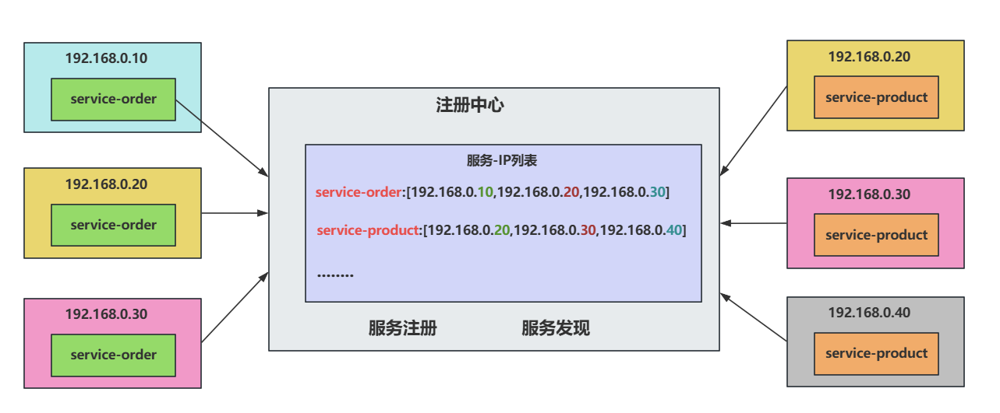

# Nacos 安装

## 下载

下载安装包：2.4.3


解压到一个没有中文的路径中，我这里解压到 C 盘的根目录下：


## 启动命令

```bash
startup.cmd -m standalone
```

在 dos 命令窗口中进入 nacos 的 bin 目录：执行以上命令，以单机模式启动 Nacos

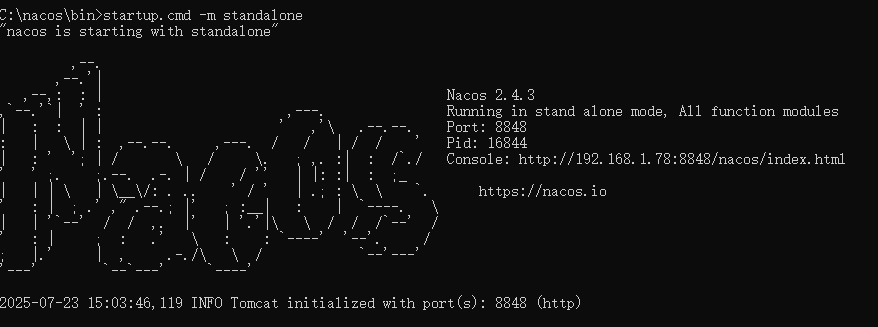

Nacos 的默认端口号：8848

## 进入 Nacos 管理页面

打开浏览器，输入：[http://localhost:8848/nacos](http://localhost:8848/nacos)

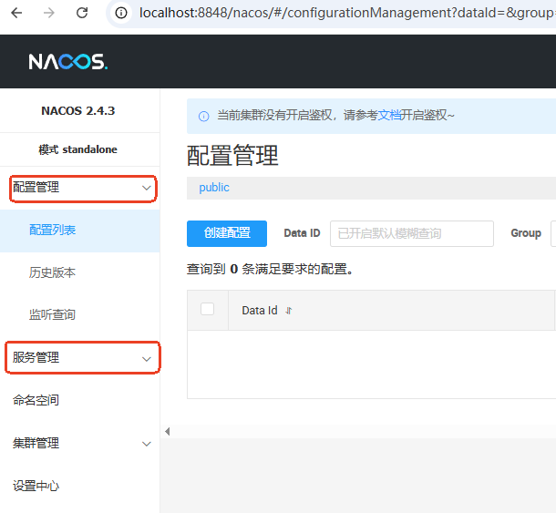

# 注册中心

## 服务注册

服务注册可按照以下步骤进行：

**第一步：微服务作为 web 项目（在 **`**service-order**`**微服务中操作）**

引入 web 依赖，如下图：

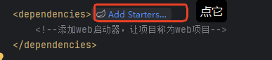

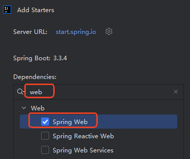

**编写 Spring Boot 项目的入口程序。**

**第二步：引入服务发现依赖**

`**spring-cloud-starter-alibaba-nacos-discovery**`

由于在 jike-services 父工程中已经引入了，在 service-order 中不需要再额外引入。

**第三步：配置 Nacos 地址**

在 `application.properties`配置中提供以下配置信息：

```plaintext
spring.application.name=service-order

spring.cloud.nacos.server-addr=127.0.0.1:8848
server.port=8000
```

**第四步：查看注册中心效果**

访问[http://localhost:8848/nacos](http://localhost:8848/nacos)

**第五步：集群模式启动测试**

单机情况下通过修改端口模拟微服务集群

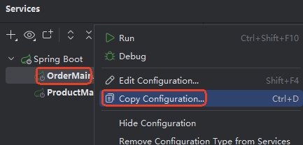

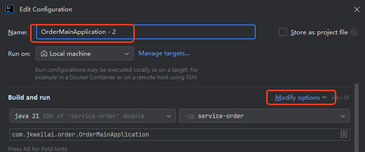

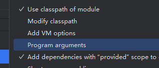


**注意：如果在 services 面板上没有显示 SpringBoot 项目的话，按照下面的方式把它显示出来：**

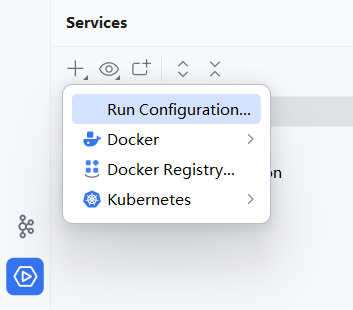

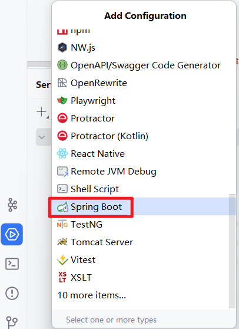

**第六步：启动所有服务**

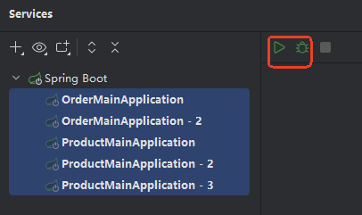

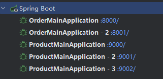

注册中心效果如下：

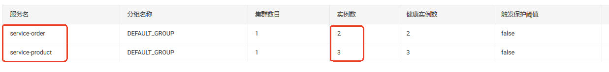

## 服务发现

服务注册时，只需要在 `application.properties`配置文件中配置上注册中心的地址就行，它会自动完成服务的注册。对于服务的发现来说就需要编写代码了。

### 使用 DiscoveryClient 发现服务

**第一步：启用服务发现**

在需要启用服务发现的主入口类上使用 `**@EnableDiscoveryClient**`

```java
package com.jkweilai.order;

import org.springframework.boot.SpringApplication;
import org.springframework.boot.autoconfigure.SpringBootApplication;
import org.springframework.cloud.client.discovery.EnableDiscoveryClient;

// 启用服务发现
@EnableDiscoveryClient
@SpringBootApplication
public class OrderMainApplication {
    public static void main(String[] args) {
        SpringApplication.run(OrderMainApplication.class, args);
    }
}
```

**从 Spring Cloud Edgware 版本（2017年发布）开始，**`**<font style="color:#DF2A3F;background-color:rgb(235, 238, 242);">@EnableDiscoveryClient</font>**`** 注解就成为可选的了，只要引入服务发现依赖就会自动启用，现在这个注解主要是为了代码可读性和兼容性而保留。**

**第二步：引入单元测试依赖**

```xml
<!--引入单元测试依赖-->
<dependency>
    <groupId>org.springframework.boot</groupId>
    <artifactId>spring-boot-starter-test</artifactId>
    <scope>test</scope>
</dependency>
```

**第三步：编写单元测试程序**

```java
package com.jkweilai.order;

import org.springframework.boot.test.context.SpringBootTest;

@SpringBootTest
public class DiscoveryTest {

}
```

**第四步：在单元测试类中注入服务发现客户端对象**

```java
package com.jkweilai.order;

import org.springframework.beans.factory.annotation.Autowired;
import org.springframework.boot.test.context.SpringBootTest;
import org.springframework.cloud.client.discovery.DiscoveryClient;

@SpringBootTest
public class DiscoveryTest {

    // 注入服务发现客户端对象
    @Autowired
    DiscoveryClient discoveryClient;
}
```

**第五步：调用 **`**DiscoveryClient**`**的 API 获取服务列表**

```java
package com.jkweilai.order;

import org.junit.jupiter.api.Test;
import org.springframework.beans.factory.annotation.Autowired;
import org.springframework.boot.test.context.SpringBootTest;
import org.springframework.cloud.client.ServiceInstance;
import org.springframework.cloud.client.discovery.DiscoveryClient;

import java.util.List;

@SpringBootTest
public class DiscoveryTest {

    // 注入服务发现客户端对象
    @Autowired
    DiscoveryClient discoveryClient;

    @Test
    public void testDiscoveryClient(){
        // 获取所有服务的名字
        List<String> services = discoveryClient.getServices();
        // 遍历服务的名字
        for (String service : services) {
            System.out.println(service);
            // 通过服务的名字获取服务的实例
            List<ServiceInstance> instances = discoveryClient.getInstances(service);
            // 获取实例的个数
            System.out.println(service + "实例的个数" + instances.size());
            // 遍历实例
            instances.forEach(serviceInstance -> {
                // 获取当前实例的IP地址
                String host = serviceInstance.getHost();
                // 获取当前实例的端口号
                int port = serviceInstance.getPort();
                System.out.println(host + ":" + port);
            });
        }
    }
}
```

执行结果如下：

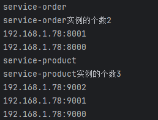

### 使用 NacosServiceDiscovery 发现服务

Nacos API 中也提供了一个类 `**NacosServiceDiscovery**`，它可以实现和 `**DiscoveryClient**`同样的效果，代码如下：

```java
package com.jkweilai.order;

import com.alibaba.cloud.nacos.discovery.NacosServiceDiscovery;
import org.junit.jupiter.api.Test;
import org.springframework.beans.factory.annotation.Autowired;
import org.springframework.boot.test.context.SpringBootTest;
import org.springframework.cloud.client.ServiceInstance;

import java.util.List;

@SpringBootTest
public class DiscoveryTest {

    @Autowired
    NacosServiceDiscovery nacosServiceDiscovery;

    @Test
    public void testNacosServiceDiscovery() throws Exception{
        List<String> services = nacosServiceDiscovery.getServices();
        for (String service : services) {
            System.out.println(service);
            List<ServiceInstance> instances = nacosServiceDiscovery.getInstances(service);
            instances.forEach(serviceInstance -> {
                String host = serviceInstance.getHost();
                int port = serviceInstance.getPort();
                System.out.println(host + ":" + port);
            });
        }
    }
}
```

执行结果如下：

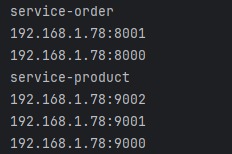

### 所有的服务都应该可以被发现

在微服务项目中，每一个服务都应该被发现，因此每一个微服务的入口类上都需要使用：`@EnableDiscoveryClient`

因此商品服务我们也**启用服务发现**：

```java
package com.jkweilai.product;

import org.springframework.boot.SpringApplication;
import org.springframework.boot.autoconfigure.SpringBootApplication;
import org.springframework.cloud.client.discovery.EnableDiscoveryClient;

// 启用服务发现
@EnableDiscoveryClient
@SpringBootApplication
public class ProductMainApplication {
    public static void main(String[] args) {
        SpringApplication.run(ProductMainApplication.class, args);
    }
}
```

## 一个完整的微服务 API

接下来，我们就使用一个电商平台中最常见的下单功能来学习微服务相关的内容。

### 远程调用基本流程

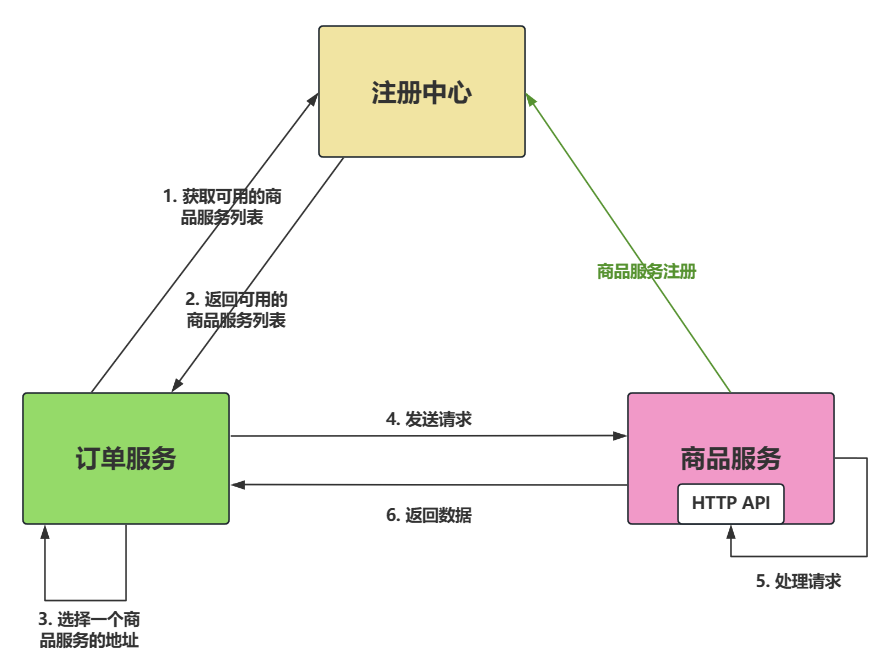

### 下单场景流程分析

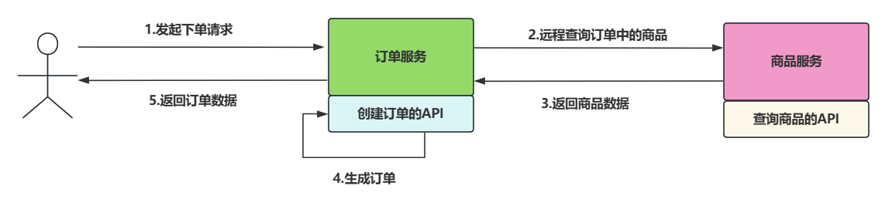

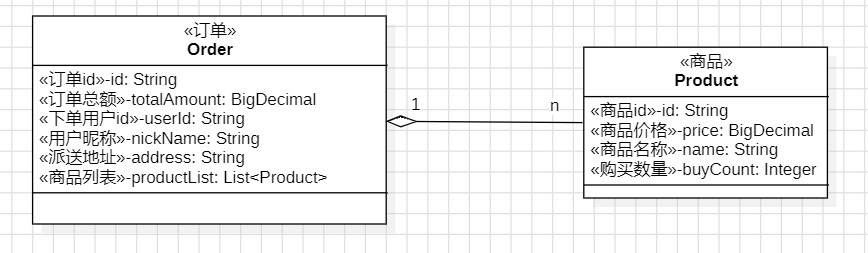

### 功能实现

#### jike-services 模块中引入 lombok

```xml
<dependency>
    <groupId>org.projectlombok</groupId>
    <artifactId>lombok</artifactId>
    <scope>annotationProcessor</scope>
</dependency>
```

#### 编写 Product

```java
package com.jkweilai.product.entity;

import lombok.Data;

import java.math.BigDecimal;

@Data
public class Product {
    private String id;
    private BigDecimal price;
    private String name;
    private Integer buyCount;
}
```

#### 编写 ProductService 接口

```java
package com.jkweilai.product.service;

import com.jkweilai.product.entity.Product;

public interface ProductService {
    Product getProductById(String id);
}
```

#### 编写 ProductService 接口的实现

```java
package com.jkweilai.product.service.impl;

import com.jkweilai.product.entity.Product;
import com.jkweilai.product.service.ProductService;
import org.springframework.stereotype.Service;

import java.math.BigDecimal;

@Service
public class ProductServiceImpl implements ProductService {

    @Override
    public Product getProductById(String id) {
        Product product = new Product();
        product.setId(id);
        product.setName("华为手机");
        product.setPrice(new BigDecimal(3000));
        product.setBuyCount(10);
        return product;
    }
}
```

#### 编写 ProductController

```java
package com.jkweilai.product.controller;


import com.jkweilai.product.entity.Product;
import com.jkweilai.product.service.ProductService;
import lombok.RequiredArgsConstructor;
import org.springframework.web.bind.annotation.GetMapping;
import org.springframework.web.bind.annotation.PathVariable;
import org.springframework.web.bind.annotation.RestController;

@RestController
@RequiredArgsConstructor
public class ProductController {

    private final ProductService productService;

    @GetMapping("/api/product/{id}")
    public Product getProductById(@PathVariable("id") String productId) {
        return productService.getProductById(productId);
    }
}
```

#### 测试商品服务是否可用

启动所有的商品服务。打开浏览器，分别输入：

- [http://localhost:9000/api/product/1](http://localhost:9000/api/product/1)
- [http://localhost:9001/api/product/2](http://localhost:9001/api/product/2)
- [http://localhost:9002/api/product/3](http://localhost:9002/api/product/3)

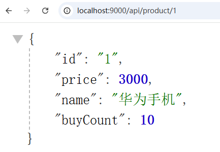

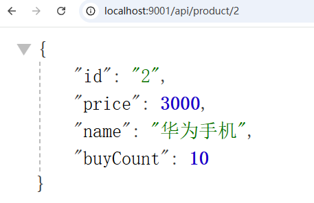

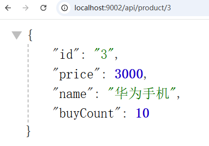

通过测试，所有的商品服务是可用的。

#### 编写 Order

```java
package com.jkweilai.order.entity;

import lombok.Data;

import java.math.BigDecimal;
import java.util.List;

@Data
public class Order {
    private String id;
    private BigDecimal totalAmount;
    private String userId;
    private String nickName;
    private String address;
    // TODO 泛型类型待定
    private List<Object> productList;
}
```

#### 编写 OrderService 接口

```java
package com.jkweilai.order.service;

import com.jkweilai.order.entity.Order;

public interface OrderService {
    Order createOrder(String orderId, String userId);
}
```

#### 编写 OrderService 接口的实现

```java
package com.jkweilai.order.service.impl;

import com.jkweilai.order.entity.Order;
import com.jkweilai.order.service.OrderService;
import org.springframework.stereotype.Service;

@Service
public class OrderServiceImpl implements OrderService {
    @Override
    public Order createOrder(String orderId, String userId) {
        Order order = new Order();
        order.setId(orderId);
        order.setUserId(userId);
        order.setAddress("天津南开区向阳路街道");
        order.setNickName("极课未来");
        // TODO 总金额待定
        order.setTotalAmount(null);
        // TODO 订单关联的商品列表待定
        order.setProductList(null);
        return order;
    }
}
```

#### 编写 OrderController

```java
package com.jkweilai.order.controller;

import com.jkweilai.order.entity.Order;
import com.jkweilai.order.service.OrderService;
import lombok.RequiredArgsConstructor;
import org.springframework.web.bind.annotation.GetMapping;
import org.springframework.web.bind.annotation.PathVariable;
import org.springframework.web.bind.annotation.RestController;

@RestController
@RequiredArgsConstructor
public class OrderController {

    private final OrderService orderService;

    @GetMapping("/api/order/create/{orderId}/{userId}")
    public Order create(@PathVariable("orderId") String orderId, @PathVariable("userId") String userId){
        return orderService.createOrder(orderId, userId);
    }

}
```

#### 测试订单接口是否可用

启动所有的订单服务。打开浏览器，输入以下地址：

[http://localhost:8000/api/order/create/1/1](http://localhost:8000/api/order/create/1/1)

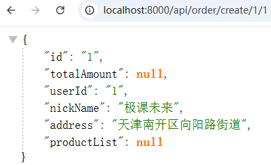

[http://localhost:8000/api/order/create/2/100](http://localhost:8000/api/order/create/2/100)

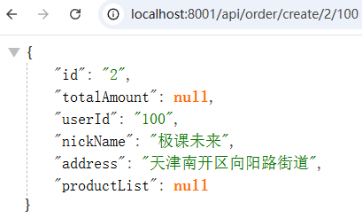

经过测试，所有订单服务可用。

#### 解决在 Order 中如何使用 Product

在商品服务中可能需要使用到`**com.jkweilai.order.entity.Order**`，在订单服务中可能需要使用到 `com.jkweilai.product.entity.Product`。怎么解决这个问题？

- 在实际的开发中，可以单独创建一个模块，例如 model 模块，这个模块专门用来存储模型数据。

**第一步：在 jike-cloud 根工程下创建 model 模块**

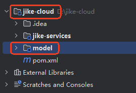

**第二步：model 模块引入 lombok**

```xml
<dependency>
  <groupId>org.projectlombok</groupId>
  <artifactId>lombok</artifactId>
</dependency>
```

**第三步：编写 Order 和 Product**

`**com.jkweilai.product.entity.Product**`

```java
package com.jkweilai.product.entity;

import lombok.Data;

import java.math.BigDecimal;

@Data
public class Product {
    private String id;
    private BigDecimal price;
    private String name;
    private Integer buyCount;
}
```

`**com.jkweilai.order.entity.Order**`

```java
package com.jkweilai.order.entity;

import com.jkweilai.product.entity.Product;
import lombok.Data;

import java.math.BigDecimal;
import java.util.List;

@Data
public class Order {
    private String id;
    private BigDecimal totalAmount;
    private String userId;
    private String nickName;
    private String address;
    private List<Product> productList;
}
```

**第四步：将之前商品服务和订单服务中编写 Order 和 Product 删除**

---

**第五步：在 jike-services 的 pom 中引入 model**

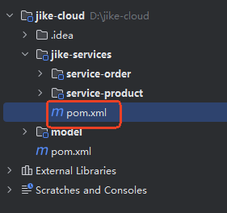

```xml
<dependency>
    <groupId>com.jkweilai</groupId>
    <artifactId>model</artifactId>
    <version>0.0.1-SNAPSHOT</version>
</dependency>
```

#### 拼接远程请求的 URL

**第一步：获取可用商品服务实例，从可用的商品服务实例上获取 IP 地址和端口号，动态拼接 URL，先测试一下是否可以拼接一个可用的 URL：**

为了方便测试：引入了 `**@Slf4j**`，记录日志。

```java
package com.jkweilai.order.service.impl;

import com.jkweilai.order.entity.Order;
import com.jkweilai.order.service.OrderService;
import com.jkweilai.product.entity.Product;
import lombok.extern.slf4j.Slf4j;
import org.springframework.beans.factory.annotation.Autowired;
import org.springframework.cloud.client.ServiceInstance;
import org.springframework.cloud.client.discovery.DiscoveryClient;
import org.springframework.stereotype.Service;

import java.util.List;

@Slf4j
@Service
public class OrderServiceImpl implements OrderService {
    @Override
    public Order createOrder(String orderId, String userId) {
        
        // 从远程获取商品
        Product product = getProductFromRemote("123");

        Order order = new Order();
        order.setId(orderId);
        order.setUserId(userId);
        order.setAddress("天津南开区向阳路街道");
        order.setNickName("极课未来");
        // TODO 总金额待定
        order.setTotalAmount(null);
        // TODO 订单关联的商品列表待定
        order.setProductList(null);
        return order;
    }

    // 注入服务发现客户端对象
    @Autowired
    private DiscoveryClient discoveryClient;

    private Product getProductFromRemote(String productId) {
        // 获取远程所有的商品服务实例
        List<ServiceInstance> instances = discoveryClient.getInstances("service-product");
        // 从这些实例中获取一个实例
        ServiceInstance serviceInstance = instances.get(0);
        // 通过远程实例获取实例的IP地址和端口，动态拼接一个URL
        String url = "http://" + serviceInstance.getHost() + ":" + serviceInstance.getPort() + "/api/product/" + productId;
        // 发送请求
        log.info("url:" + url);
        return null;
    }
}
```

**第二步：启动所有的商品服务和订单服务：**

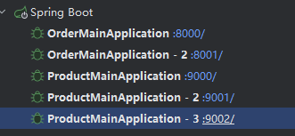

**第三步：打开浏览器，输入 URL 测试：**[**http://localhost:8000/api/order/create/1/100**](http://localhost:8000/api/order/create/1/100)

查看后端输出：

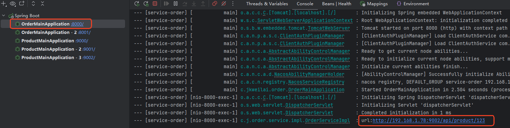

通过日志可以看出，远程连接的商品服务端口号为：9002

一切正常。

**第四步：停掉一个商品服务 9002，再次测试**

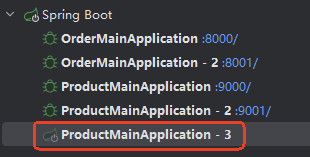

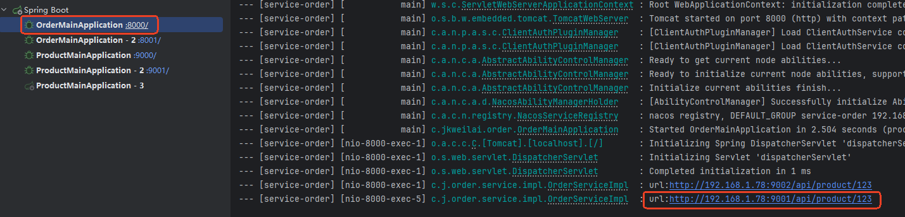

通过日志可以看出，虽然 9002 服务挂了，但是仍然可以动态的连接到其它正常的商品服务。

一切正常。

#### 发送远程请求

**RestTemplate** 是 Spring 框架提供的一个用于发送 HTTP 请求的同步客户端工具类。它属于 Spring Web 模块的一部分，主要用于简化与 RESTful API 的交互（如 GET、POST、PUT、DELETE 等请求）。

我们这里可以使用 `**RestTemplate**`来发送 HTTP 请求。

在 `**service-order**`中编写商品服务的配置类 `**com.jkweilai.product.config.OrderServiceConfig**`，在该配置类中配置 `**RestTemplate**`

```java
package com.jkweilai.order.config;

import org.springframework.context.annotation.Bean;
import org.springframework.context.annotation.Configuration;
import org.springframework.web.client.RestTemplate;

@Configuration
public class OrderServiceConfig {
    @Bean
    public RestTemplate restTemplate() {
        return new RestTemplate();
    }
}
```

接下来就可以编写发送远程请求的代码了：

```java
package com.jkweilai.order.service.impl;

import com.jkweilai.order.entity.Order;
import com.jkweilai.order.service.OrderService;
import com.jkweilai.product.entity.Product;
import lombok.extern.slf4j.Slf4j;
import org.springframework.beans.factory.annotation.Autowired;
import org.springframework.cloud.client.ServiceInstance;
import org.springframework.cloud.client.discovery.DiscoveryClient;
import org.springframework.stereotype.Service;
import org.springframework.web.client.RestTemplate;

import java.math.BigDecimal;
import java.util.Arrays;
import java.util.List;

@Slf4j
@Service
public class OrderServiceImpl implements OrderService {
    @Override
    public Order createOrder(String orderId, String userId) {

        // 从远程获取商品
        Product product = getProductFromRemote("123");

        Order order = new Order();
        order.setId(orderId);
        order.setUserId(userId);
        order.setAddress("天津南开区向阳路街道");
        order.setNickName("极课未来");
        order.setTotalAmount(product.getPrice().multiply(new BigDecimal(product.getBuyCount())));
        order.setProductList(Arrays.asList(product));
        return order;
    }

    // 注入服务发现客户端对象
    @Autowired
    private DiscoveryClient discoveryClient;

    @Autowired
    private RestTemplate restTemplate;

    private Product getProductFromRemote(String productId) {
        // 获取远程所有的商品服务实例
        List<ServiceInstance> instances = discoveryClient.getInstances("service-product");
        // 从这些实例中获取一个实例
        ServiceInstance serviceInstance = instances.get(0);
        // 通过远程实例获取实例的IP地址和端口，动态拼接一个URL
        String url = "http://" + serviceInstance.getHost() + ":" + serviceInstance.getPort() + "/api/product/" + productId;
        // 发送请求
        log.info("url:" + url);
        return restTemplate.getForObject(url, Product.class);
    }
}
```

测试结果如下：

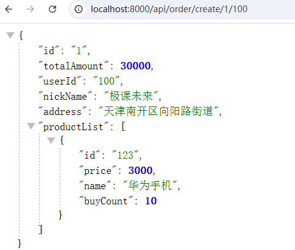

### 负载均衡的远程调用

#### 第一种方式

**第一步：在 **`**service-order**`**中引入 **`**spring-cloud-starter-loadbalancer**`**依赖**

```xml
<!--引入负载均衡的依赖-->
<dependency>
    <groupId>org.springframework.cloud</groupId>
    <artifactId>spring-cloud-starter-loadbalancer</artifactId>
</dependency>
```

**第二步：注入 **`**LoadBalancerClient**`**对象代替 **`**DiscoveryClient**`

```java
package com.jkweilai.order.service.impl;

import com.jkweilai.order.entity.Order;
import com.jkweilai.order.service.OrderService;
import com.jkweilai.product.entity.Product;
import lombok.extern.slf4j.Slf4j;
import org.springframework.beans.factory.annotation.Autowired;
import org.springframework.cloud.client.ServiceInstance;
import org.springframework.cloud.client.loadbalancer.LoadBalancerClient;
import org.springframework.stereotype.Service;
import org.springframework.web.client.RestTemplate;

import java.math.BigDecimal;
import java.util.Arrays;

@Slf4j
@Service
public class OrderServiceImpl implements OrderService {
    @Override
    public Order createOrder(String orderId, String userId) {

        // 从远程获取商品
        Product product = getProductFromRemoteWithLoadbalancer("123");

        Order order = new Order();
        order.setId(orderId);
        order.setUserId(userId);
        order.setAddress("天津南开区向阳路街道");
        order.setNickName("极课未来");
        order.setTotalAmount(product.getPrice().multiply(new BigDecimal(product.getBuyCount())));
        order.setProductList(Arrays.asList(product));
        return order;
    }

    // 注入能够以负载均衡的方式发现服务的客户端对象
    @Autowired
    private LoadBalancerClient loadBalancer;

    @Autowired
    private RestTemplate restTemplate;

    private Product getProductFromRemoteWithLoadbalancer(String productId) {
        
        // 通过负载均衡的方式发现远程服务，返回服务实例
        ServiceInstance serviceInstance = loadBalancer.choose("service-product");
        
        // 通过远程实例获取实例的IP地址和端口，动态拼接一个URL
        String url = "http://" + serviceInstance.getHost() + ":" + serviceInstance.getPort() + "/api/product/" + productId;
        
        // 发送请求
        log.info("url:" + url);
        
        return restTemplate.getForObject(url, Product.class);
    }
}
```

执行结果如下：

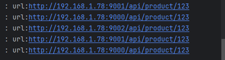

可见底层采用的是轮询的方式达到的负载均衡。

#### 第二种方式

在容器中放一个负载均衡的 `RestTemplate`即可。

第一步：在 `RestTemplate`上添加 `**@LoadBalanced注解**`

```java
package com.jkweilai.order.config;

import org.springframework.cloud.client.loadbalancer.LoadBalanced;
import org.springframework.context.annotation.Bean;
import org.springframework.context.annotation.Configuration;
import org.springframework.web.client.RestTemplate;

@Configuration
public class OrderServiceConfig {
    
    @LoadBalanced
    @Bean
    public RestTemplate restTemplate() {
        return new RestTemplate();
    }
}
```

**第二步：修改 URL，发送请求**

```java
package com.jkweilai.order.service.impl;

import com.jkweilai.order.entity.Order;
import com.jkweilai.order.service.OrderService;
import com.jkweilai.product.entity.Product;
import lombok.extern.slf4j.Slf4j;
import org.springframework.beans.factory.annotation.Autowired;
import org.springframework.stereotype.Service;
import org.springframework.web.client.RestTemplate;

import java.math.BigDecimal;
import java.util.Arrays;

@Slf4j
@Service
public class OrderServiceImpl implements OrderService {
    @Override
    public Order createOrder(String orderId, String userId) {

        // 从远程获取商品
        Product product = getProductFromRemoteWithLoadBalancedAnnotation("123");

        Order order = new Order();
        order.setId(orderId);
        order.setUserId(userId);
        order.setAddress("天津南开区向阳路街道");
        order.setNickName("极课未来");
        order.setTotalAmount(product.getPrice().multiply(new BigDecimal(product.getBuyCount())));
        order.setProductList(Arrays.asList(product));
        return order;
    }

    @Autowired
    private RestTemplate restTemplate;

    private Product getProductFromRemoteWithLoadBalancedAnnotation(String productId) {
        // url 中不需要编写具体的IP地址和端口号，只需要编写服务的名字即可。
        String url = "http://service-product/api/product/" + productId;
        return restTemplate.getForObject(url, Product.class);
    }
}
```

第三步：在 `service-product`的 service 实现类中添加打印日志

```java
package com.jkweilai.product.service.impl;

import com.jkweilai.product.entity.Product;
import com.jkweilai.product.service.ProductService;
import lombok.extern.slf4j.Slf4j;
import org.springframework.stereotype.Service;

import java.math.BigDecimal;

@Slf4j
@Service
public class ProductServiceImpl implements ProductService {

    @Override
    public Product getProductById(String id) {
        log.info("getProductById");
        Product product = new Product();
        product.setId(id);
        product.setName("华为手机");
        product.setPrice(new BigDecimal(3000));
        product.setBuyCount(10);
        return product;
    }
}
```

启动所有服务，发送 6 次请求，查看控制台每个商品服务是否输出了两次：

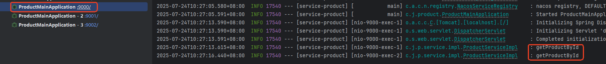

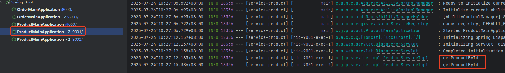

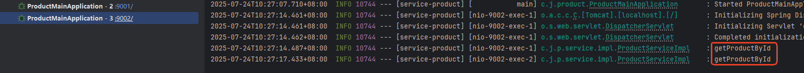

经过测试可以看出，采用这种简单的方式也可以轻松的完成负载均衡。

## 注册中心宕机

面试题：注册中心宕机，服务还可用吗，你们是如何保证高可用的？

### 直接明确结论

服务在Nacos宕机后之前访问过的服务仍然可以访问，但对于首次访问的新服务是无法访问的。

Nacos 客户端为了提高服务发现的效率，会将已发现的服务缓存到 Nacos 客户端上（这里所说的 Nacos 客户端是 Spring Cloud Alibaba，缓存在 JVM 进程的内存中），这样已发现的服务下次再访问时，不需要再去注册中心中查找，直接从缓存中获取已缓存的服务。（当然缓存肯定是有过期策略的，感兴趣的可以研究一下）

### 高可用保障措施

**服务端集群 + 本地容灾（高可用保障核心）**

**服务端集群**

- **多节点部署**：Nacos 集群（至少 3 节点），避免单点故障。
- **数据一致性**： （**数据**主要指的是**服务注册列表数据**和**配置数据**）
  - **AP 模式**（默认）**Availability + Partition tolerance**
    - 优先保证**可用性**，节点间异步同步数据，适合**注册中心**场景。最终一致性：节点间异步同步，可能短暂数据不一致，但很快会同步。
  - **CP 模式**（需配置）：**Consistency + Partition tolerance**
    - 优先保证**强一致性**，适合**配置中心**场景。同步写，所有节点数据一致后才返回成功。
- **持久化存储**：集群数据持久化到**共享存储（如 MySQL）**，确保重启可恢复。

**本地容灾**

- **健康检查**：
  - 客户端定时心跳上报，自动剔除宕机节点（防止调用失效实例）。 这里的客户端是 Nacos 客户端，我们的 Java 微服务程序（**Spring Cloud Alibaba Nacos客户端**）
- **静态化降级**：
  - **微服务（Java程序）在发现Nacos不可用时，自动切换到自己配置的备用名单。**本地配置静态服务列表（如 `hosts` 或硬编码 IP）。

**一句话总结**

- **集群防单点故障，持久化保数据不丢；本地健康检查 + 静态降级兜底**。

# 配置中心

## 配置中心的作用

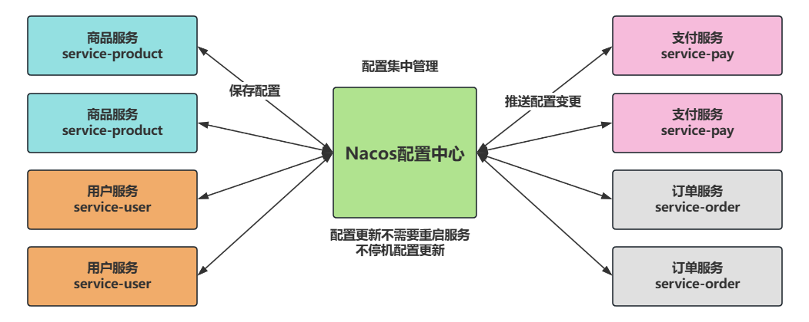

在大型微服务系统当中配置中心用来统一管理配置，想要修改配置，只需要在配置中心修改配置即可，修改配置后可以实时把变更的配置推送给指定的微服务，即使它是集群化部署的，多个实例节点都可以收到变更的配置，从而实现不停机配置更新。

以前需要更新配置时，需要对服务进行重新打包，重新部署，如果某个微服务采用了集群化部署，那么每一个节点需要先下线，再部署上线，中间有一个停机的过程，所以配置中心对配置进行集中管理，对运维提供了非常大的便利。

## 配置中心的基本使用

### 添加配置

在 Nacos 控制台上创建配置：[http://localhost:8848/nacos](http://localhost:8848/nacos)

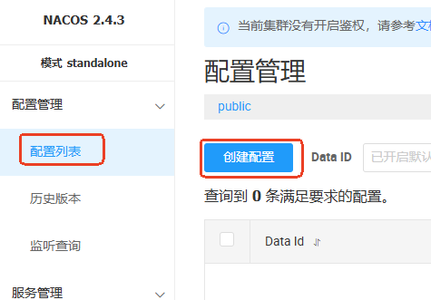

`**Data ID**`：`service-order-dev.properties`

**配置格式**：properties

**配置内容**：折扣开关、默认折扣率、库存查询超时时间

```plaintext
order.discount.enable=true
order.discount.rate=0.8
order.inventory.timeout=5000
```

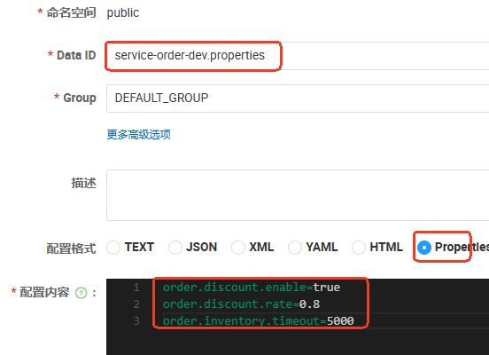

**发布。**

### 引入 nacos-config 依赖

由于所有的微服务有可能都需要这个依赖，将依赖添加到 `jike-services`：

```xml
<!--配置中心-->
<dependency>
    <groupId>com.alibaba.cloud</groupId>
    <artifactId>spring-cloud-starter-alibaba-nacos-config</artifactId>
</dependency>
```

### 导入配置

找到需要导入配置的模块，在 `application.properties`文件中添加以下配置，用于完成配置的导入：

```plaintext
# Nacos地址
spring.cloud.nacos.server-addr=127.0.0.1:8848
# 导入配置
spring.config.import=nacos:service-order-dev.properties
```

### 在程序中读取配置

编写代码读取导入的配置：

```java
package com.jkweilai.order.controller;

import com.jkweilai.order.entity.Order;
import com.jkweilai.order.service.OrderService;
import lombok.RequiredArgsConstructor;
import org.springframework.beans.factory.annotation.Value;
import org.springframework.web.bind.annotation.GetMapping;
import org.springframework.web.bind.annotation.PathVariable;
import org.springframework.web.bind.annotation.RestController;

@RestController
@RequiredArgsConstructor
public class OrderController {

    private final OrderService orderService;

    // 是否开启折扣，true表示开启折扣，false表示无折扣
    @Value("${order.discount.enable}")
    private Boolean orderDiscountEnable;

    // 折扣率
    @Value("${order.discount.rate}")
    private Double orderDiscountRate;

    // 库存查询超时时间
    @Value("${order.inventory.timeout}")
    private Long orderInventoryTimeout;

    @GetMapping("/api/config")
    public String getConfig(){
        return "折扣开关：" + orderDiscountEnable + "，折扣率：" + orderDiscountRate + "，库存查询超时时间：" + orderInventoryTimeout + "毫秒";
    }

    @GetMapping("/api/order/create/{orderId}/{userId}")
    public Order create(@PathVariable("orderId") String orderId, @PathVariable("userId") String userId){
        return orderService.createOrder(orderId, userId);
    }

}
```

启动 **订单服务** 测试结果：


### 支持动态刷新

如果只是编写了以上代码，配置默认是不支持动态刷新的，也就是说，默认情况下，如果配置修改了，在程序中读取的配置仍然是之前的，不是最新，可以使用 `@RefreshScope`注解支持动态刷新。

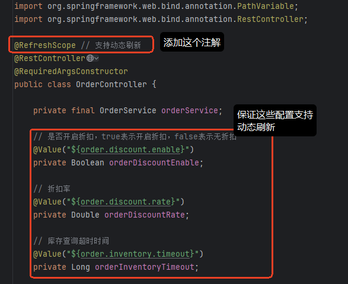

### 关闭导入检查

当父工程中引入了以下依赖：

```xml
<dependency>
    <groupId>com.alibaba.cloud</groupId>
    <artifactId>spring-cloud-starter-alibaba-nacos-config</artifactId>
</dependency>
```

这个父工程下的所有子模块都会受到影响，默认情况下要求每个子模块必须添加以下的配置：

```plaintext
spring.config.import=xxx
```

如果不添加这个配置信息，会导致子模块启动失败，如下：

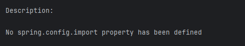

如果对于子模块来说，确实不需要导入配置，怎么来解决这个启动报错的问题呢？仔细的同学应该能够看到报错信息中有这样一段描述：

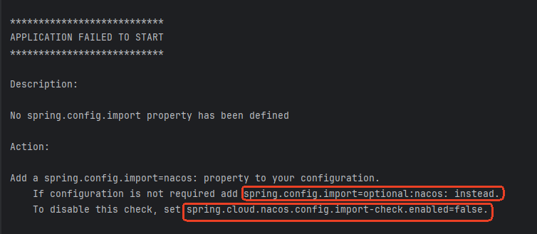

因此，可以看到有两种解决方案：

- 第一种：可选加载 Nacos 配置。
- 第二种：彻底禁用检查

**可选加载 Nacos 配置的写法：**

```plaintext
# 配置不存在时静默跳过（不影响启动）
spring.config.import=optional:nacos:service-order-dev.properties
```

**彻底禁用检查的写法**：

```plaintext
# 完全跳过Nacos配置校验（慎用！）
spring.cloud.nacos.config.import-check.enabled=false
```

## 动态刷新

### 第一种方式：@Value+@RefreshScope

第一种方式在前面的课程中已经用过了，采用 `**@Value("${order.discount.enable}")**`+`**@RefreshScope**`来实现。

这种方式的缺点是：当配置项特别多的时候，比较麻烦，每个配置项上面都需要添加 `**@Value**`注解，并且必须要结合`**@RefreshScope**`来实现。

### 第二种方式：批量绑定

创建单独的属性配置类：

```java
package com.jkweilai.order.properties;

import lombok.Data;
import org.springframework.boot.context.properties.ConfigurationProperties;
import org.springframework.stereotype.Component;

@Component
// 配置批量绑定，并且不需要 @RefreshScope注解即可实现动态刷新
@ConfigurationProperties(prefix = "order.discount")
@Data
public class OrderDiscountProperties {
    private Boolean enable;
    private Double rate;
}
```

```java
package com.jkweilai.order.properties;

import lombok.Data;
import org.springframework.boot.context.properties.ConfigurationProperties;
import org.springframework.stereotype.Component;

@Component
@ConfigurationProperties(prefix = "order.inventory")
@Data
public class OrderInventoryProperties {
    // 如果配置信息含有'-'，则需要使用小驼峰命名方式，例如配置信息是'time-out'，则属性名应该为：timeOut
    private Long timeout;
}
```

在需要使用这个配置的类中注入该配置对象即可：

```java
package com.jkweilai.order.controller;

import com.jkweilai.order.entity.Order;
import com.jkweilai.order.properties.OrderDiscountProperties;
import com.jkweilai.order.properties.OrderInventoryProperties;
import com.jkweilai.order.service.OrderService;
import lombok.RequiredArgsConstructor;
import org.springframework.web.bind.annotation.GetMapping;
import org.springframework.web.bind.annotation.PathVariable;
import org.springframework.web.bind.annotation.RestController;

@RestController
@RequiredArgsConstructor
public class OrderController {

    private final OrderService orderService;

    // 注入属性配置类对象
    private final OrderDiscountProperties orderDiscountProperties;
    private final OrderInventoryProperties orderInventoryProperties;

    @GetMapping("/api/config")
    public String getConfig() {
        return "折扣开关：" + orderDiscountProperties.getEnable() + "，折扣率：" + orderDiscountProperties.getRate() + "，库存查询超时时间：" + orderInventoryProperties.getTimeout() + "毫秒";
    }

    @GetMapping("/api/order/create/{orderId}/{userId}")
    public Order create(@PathVariable("orderId") String orderId, @PathVariable("userId") String userId) {
        return orderService.createOrder(orderId, userId);
    }

}
```

测试这种方式是否支持动态刷新。

## 监听配置变化

Nacos 还提供了通过编码的方式来监听配置的变化：`NacosConfigManager`

需求：当服务启动时注册监听，监听器监听配置的变化，当配置发生变化时发送邮件通知。

```java
package com.jkweilai.order;

import com.alibaba.cloud.nacos.NacosConfigManager;
import com.alibaba.nacos.api.config.ConfigService;
import com.alibaba.nacos.api.config.listener.Listener;
import org.springframework.boot.ApplicationRunner;
import org.springframework.boot.SpringApplication;
import org.springframework.boot.autoconfigure.SpringBootApplication;
import org.springframework.cloud.client.discovery.EnableDiscoveryClient;
import org.springframework.context.annotation.Bean;

import java.util.concurrent.Executor;
import java.util.concurrent.Executors;

// 启用服务发现
@EnableDiscoveryClient
@SpringBootApplication
public class OrderMainApplication {
    public static void main(String[] args) {
        SpringApplication.run(OrderMainApplication.class, args);
    }

    // 监听配置的变化
    // ApplicationRunner 是springboot提供的接口：这个接口中的方法将在应用启动后被自动调用。
    @Bean
    public ApplicationRunner getApplicationRunner(NacosConfigManager nacosConfigManager) {
        return args -> {
            // 获取ConfigService对象
            ConfigService configService = nacosConfigManager.getConfigService();
            // 注册监听
            configService.addListener("service-order-dev.properties", "DEFAULT_GROUP", new Listener() {
                @Override
                public Executor getExecutor() {
                    // 底层是通过线程池来监听的配置变化的，因此这个方法要求返回一个线程池
                    return Executors.newFixedThreadPool(5);
                }

                @Override
                public void receiveConfigInfo(String configInfo) {
                    System.out.println("配置信息发生了变化：" + configInfo);
                    System.out.println("发送邮件....");
                }
            });
        };
    }
}
```

## 配置优先级问题

**优先级的原则包括两个：**

1. 外部优先
2. 后导入优先

**外部优先，怎么理解？**

`application.properties`和 Nacos 配置中心的配置有相同的配置项，以谁为准：

- application.properties 属于项目内部的配置。
- Nacos 配置中心的配置属于外部配置。
- **外部优先指的是**：以 Nacos 配置中心的配置为准。

**后导入优先，怎么理解？**

```plaintext
spring.config.import=nacos:service-order-dev.properties,nacos:common.properties
```

导入多个配置时采用逗号 `,`隔开。后导入优先指的是：

- `service-order-dev.properties`和 `common.properties`如果有相同的配置项，以 `common.properties`为准。
- `spring.config.import`导入的时候顺序是：**从左向右**。

**配置生效原理如下图所示：**

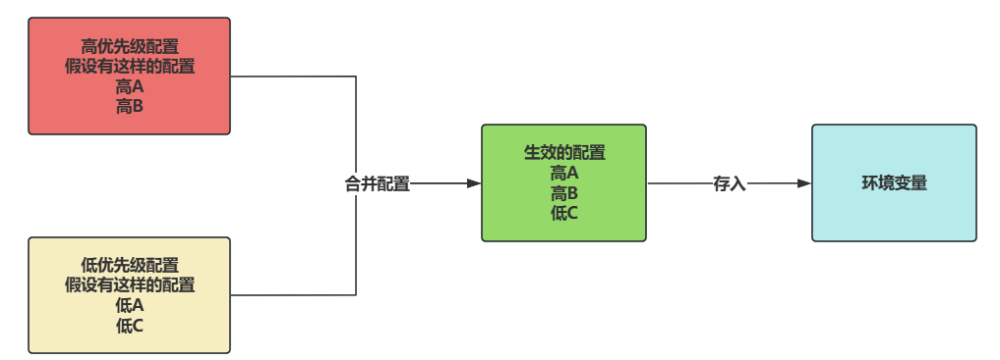

## 动态环境切换

### 什么是多环境切换

1. 在实际开发中，配置信息会有很多，例如：service-order.properties、service-product.properties 等。
2. 并且配置文件可能需要有多套，“多套”怎么理解？
  1. 开发一套，例如：service-order-dev.properties、database-dev.properties 等。
  2. 测试一套，例如：service-order-test.properties、database-test.properties 等。
  3. 生产一套，例如：service-order-prod.properties、database-prod.properties 等。
3. 为什么需要有多套呢？因为不同的环境下在配置具体值的时候可能是不一致的，例如开发环境连接的数据库是开发的库，测试环境连接的库是测试库，生产环境连接的库是生产的库。
4. 多环境切换指的是：很便捷的完成**开发环境配置**切换到**测试环境配置**，**测试环境配置**生效。或者**测试环境配置**切换到**生产环境配置**，**生产环境配置**生效。

### Nacos 如何设计多环境切换（数据隔离）

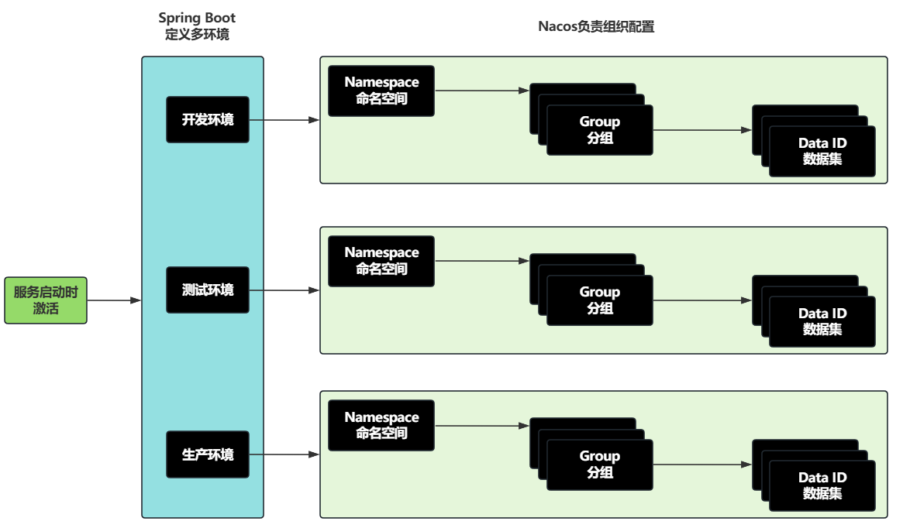

1. 一个 Namespace 代表一套环境（**代表整个系统**）。
2. 一个 Group 代表一个微服务（**代表整个系统中的某个子微服务**）。
3. 一个 Data ID 代表具体的一个配置。
4. Namespace、Group、Data ID 都由 Nacos 负责组织。
5. Spring Boot 可以定义多环境。
6. 服务启动的时候，按照 Spring Boot 的配置来激活对应的环境。

### Nacos 中创建多套环境

#### 在 Nacos 控制台创建命名空间

它自带了一个命名空间，叫做 `public`，这个命名空间中自带了一个组，叫做 `<font style="color:rgb(51, 51, 51);">DEFAULT_GROUP</font>`。

接下来我们来创建 3 个命名空间，分别是：dev、test、prod。

按照下图步骤创建：

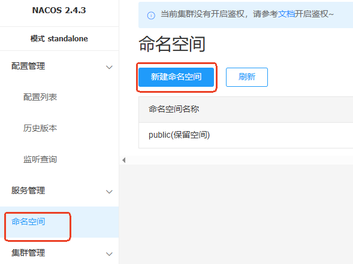

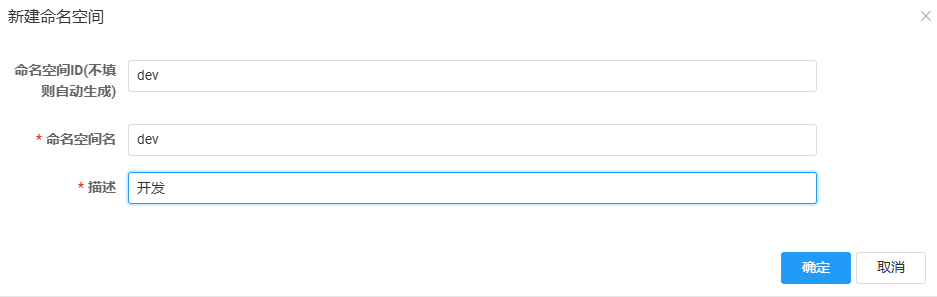

`test`和 `prod`命名空间以此类推，最终如下：

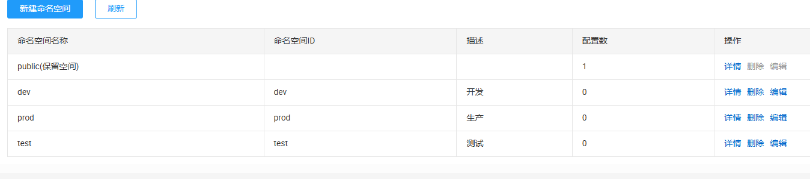

#### Nacos 控制台创建配置

**以下是创建开发环境的配置：**

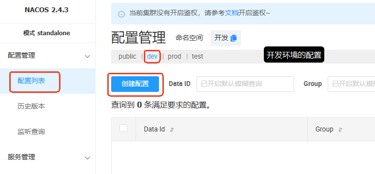

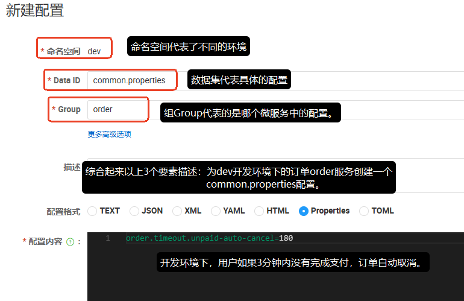

```plaintext
order.timeout.unpaid-auto-cancel=180
```

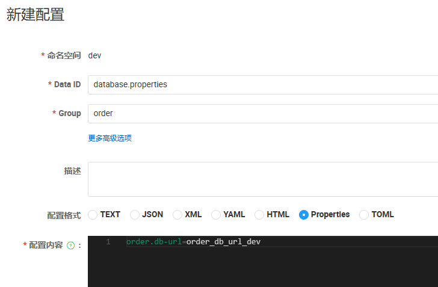

```plaintext
order.db-url=order_db_url_dev
```

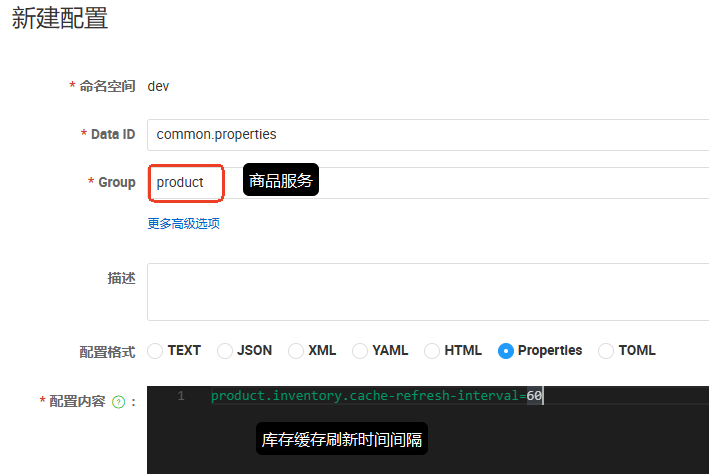

```plaintext
product.inventory.cache-refresh-interval=60
```

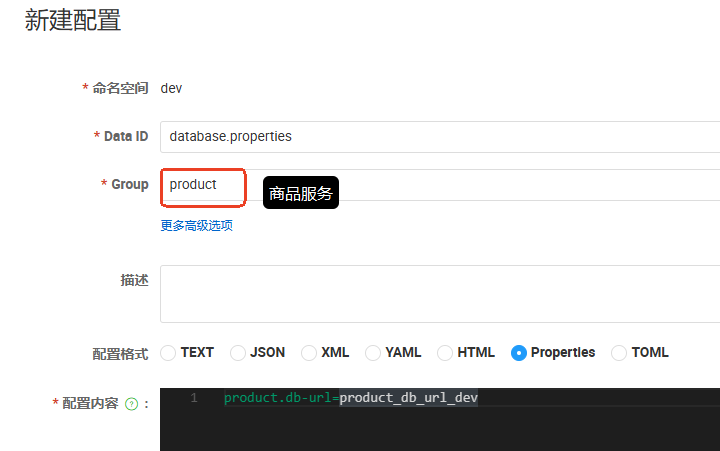

```plaintext
product.db-url=product_db_url_dev
```

开发环境下的配置创建完成：


**以下是创建测试环境的配置：克隆之后修改配置即可**


**用同样的方法克隆生产环境的配置，然后配置信息修改一下。**

### 实现动态环境切换

在 `service-order`模块的 `application.yml`文件中进行如下配置，来完成订单服务的多环境切换：

```yaml
server:
  port: 8000

spring:
  application:
    name: service-order
  profiles:
    active: test # 应用启动时激活 test 测试环境
  cloud:
    nacos:
      server-addr: 127.0.0.1:8848
      config:
        namespace: ${spring.profiles.active:dev} # 使用激活的环境，如果没有配置激活环境，默认使用 dev 开发环境

---
spring:
  config:
    import:
      - nacos:common.properties?group=order # 通过这种格式来说明是哪个服务的配置
      - nacos:database.properties?group=order
    activate:
      on-profile: dev # 当开发环境激活时，导入这两个配置文件

---
spring:
  config:
    import:
      - nacos:common.properties?group=order
      - nacos:database.properties?group=order
      - nacos:color.properties?group=order
    activate:
      on-profile: test # 当激活测试环境的时候，导入这三个配置文件。

---
spring:
  config:
    import:
      - nacos:common.properties?group=order
      - nacos:database.properties?group=order
      - nacos:hello.properties?group=order
    activate:
      on-profile: prod # 当生产环境激活时，导入这三个配置文件。
```

以上激活的是 `test`环境，如果你要激活 `dev`环境，只需要将 `active: test`修改为 `active: dev`。

编写程序来测试一下，看看能不能达到动态切换的效果：

当前激活环境是：`**dev**`

```java
package com.jkweilai.order.controller;

import com.jkweilai.order.entity.Order;
import com.jkweilai.order.properties.OrderDiscountProperties;
import com.jkweilai.order.properties.OrderInventoryProperties;
import com.jkweilai.order.service.OrderService;
import lombok.RequiredArgsConstructor;
import org.springframework.beans.factory.annotation.Value;
import org.springframework.cloud.context.config.annotation.RefreshScope;
import org.springframework.web.bind.annotation.GetMapping;
import org.springframework.web.bind.annotation.PathVariable;
import org.springframework.web.bind.annotation.RestController;

@RefreshScope
@RestController
@RequiredArgsConstructor
public class OrderController {

    @Value("${order.timeout.unpaid-auto-cancel}")
    private Long orderTimeoutUnpaidAutoCancel;

    private final OrderService orderService;

    // 注入属性配置类对象
    private final OrderDiscountProperties orderDiscountProperties;
    private final OrderInventoryProperties orderInventoryProperties;

    @GetMapping("/api/config")
    public String getConfig() {
        return "折扣开关：" + orderDiscountProperties.getEnable() + "，折扣率：" + orderDiscountProperties.getRate()
                + "，库存查询超时时间：" + orderInventoryProperties.getTimeout() + "毫秒，订单未支付自动取消的超时时间：" + orderTimeoutUnpaidAutoCancel;
    }

    @GetMapping("/api/order/create/{orderId}/{userId}")
    public Order create(@PathVariable("orderId") String orderId, @PathVariable("userId") String userId) {
        return orderService.createOrder(orderId, userId);
    }

}
```

发送请求：[http://localhost:8000/api/config](http://localhost:8000/api/config)


将环境切换到 `test`环境 ，再次测试：


可以看到，已经完成了多环境切换。以上折扣开关、折扣率、库存查询超时时间都为 `null`。解决这个问题可以在 order 组的 common.properties 中追加配置：


再次测试：


可以再测试一下 `database.properties`的配置是否生效了：

```java
package com.jkweilai.order.controller;

import com.jkweilai.order.entity.Order;
import com.jkweilai.order.properties.OrderDiscountProperties;
import com.jkweilai.order.properties.OrderInventoryProperties;
import com.jkweilai.order.service.OrderService;
import lombok.RequiredArgsConstructor;
import org.springframework.beans.factory.annotation.Value;
import org.springframework.cloud.context.config.annotation.RefreshScope;
import org.springframework.web.bind.annotation.GetMapping;
import org.springframework.web.bind.annotation.PathVariable;
import org.springframework.web.bind.annotation.RestController;

@RefreshScope
@RestController
@RequiredArgsConstructor
public class OrderController {

    @Value("${order.timeout.unpaid-auto-cancel}")
    private Long orderTimeoutUnpaidAutoCancel;

    @Value("${order.db-url}")
    private String orderDbUrl;

    private final OrderService orderService;

    // 注入属性配置类对象
    private final OrderDiscountProperties orderDiscountProperties;
    private final OrderInventoryProperties orderInventoryProperties;

    @GetMapping("/api/config")
    public String getConfig() {
        return "折扣开关：" + orderDiscountProperties.getEnable() + "，折扣率：" + orderDiscountProperties.getRate()
                + "，库存查询超时时间：" + orderInventoryProperties.getTimeout() + "毫秒，订单未支付自动取消的超时时间：" + orderTimeoutUnpaidAutoCancel + "，连接数据库的URL：" + orderDbUrl;
    }

    @GetMapping("/api/order/create/{orderId}/{userId}")
    public Order create(@PathVariable("orderId") String orderId, @PathVariable("userId") String userId) {
        return orderService.createOrder(orderId, userId);
    }

}
```

再次测试，结果如下：


切换到 `**dev**` 环境：

