# 1.3.Spring Cloud OpenFeign

# OpenFeign 概述

OpenFeign 是Netflix 开源的一个声明式 HTTP 客户端框架。

Spring Cloud 对它进行了集成并进行了增强，让它更加适配 Spring 生态。

OpenFeign 是一种**声明式的 REST 客户端**（声明式就是通过几个注解就可以搞定）。

RestTemplate 也可以完成远程调用，但它属于**编程式**的。

OpenFeign 没有独立域名官网，GitHub 是唯一官方渠道。GitHub 地址：[https://github.com/OpenFeign/feign](https://github.com/OpenFeign/feign)

如果你是 Spring Cloud 用户，**OpenFeign 的 Spring 适配版由 Spring 官方维护**，文档在此：[https://spring.io/projects/spring-cloud-openfeign](https://spring.io/projects/spring-cloud-openfeign)

# OpenFeign 的常用注解

以下是 **OpenFeign 的常用注解**，分为 **核心注解**（原生 OpenFeign）和 **Spring Cloud OpenFeign 扩展注解**（与 Spring MVC 兼容）。

- 如果是 **Spring Cloud 项目**，优先使用 **Spring Cloud OpenFeign 注解**（更简洁）。
- 如果是 **非 Spring 项目**，使用原生 OpenFeign 注解。

## 核心注解（原生 OpenFeign）

这些注解来自 `feign-core` 模块，适用于所有 OpenFeign 项目。

| **注解** | **作用** | **示例** |
| --- | --- | --- |
| `<font style="color:#000000;">@RequestLine</font>` | 定义 HTTP 方法和路径 | `<font style="color:#000000;">@RequestLine("GET /users/{id}")</font>` |
| `<font style="color:#000000;">@Param</font>` | 绑定动态路径/查询参数 | `<font style="color:#000000;">@Param("id") Long id</font>` |
| `<font style="color:#000000;">@Headers</font>` | 添加请求头（类或方法级别） | `<font style="color:#000000;">@Headers("Accept: application/json")</font>` |
| `<font style="color:#000000;">@QueryMap</font>` | 将 Map 转换为查询参数 | `<font style="color:#000000;">@QueryMap Map<String, Object> params</font>` |
| `<font style="color:#000000;">@Body</font>` | 定义请求体内容 | `<font style="color:#000000;">@Body("{ \"name\": \"{name}\" }")</font>` |

**示例（原生 OpenFeign 接口）**：

```java
public interface UserClient {
    @RequestLine("GET /users/{id}")
    @Headers("X-Auth-Token: {token}")
    User getUser(@Param("id") Long id, @Param("token") String token);
}
```

## Spring Cloud OpenFeign 注解

Spring Cloud 对 OpenFeign 进行了增强，**兼容 Spring MVC 注解**，使定义更简洁。

**以下注解似曾相识，看着是不是和 SpringMVC 的注解一样呀。是的。但它的作用****不是接收请求**，而是**发送请求****。**

### HTTP 方法注解

| **注解** | **作用** | **示例** |
| --- | --- | --- |
| `@GetMapping` | 定义 GET 请求 | `@GetMapping("/users/{id}")` |
| `@PostMapping` | 定义 POST 请求 | `@PostMapping("/users")` |
| `@PutMapping` | 定义 PUT 请求 | `@PutMapping("/users/{id}")` |
| `@DeleteMapping` | 定义 DELETE 请求 | `@DeleteMapping("/users/{id}")` |
| `@RequestMapping` | 通用请求映射 | `@RequestMapping(method = RequestMethod.GET, path = "/users")` |

### 参数绑定注解

| **注解** | **作用** | **示例** |
| --- | --- | --- |
| `@PathVariable` | 绑定路径变量 | `@PathVariable("id") Long id` |
| `@RequestParam` | 绑定查询参数 | `@RequestParam("name") String name` |
| `@RequestBody` | 绑定请求体（JSON/XML） | `@RequestBody User user` |
| `@RequestHeader` | 绑定请求头 | `@RequestHeader("X-Auth-Token") String token` |
| `@RequestPart` | 文件上传（`multipart/form-data`） | `@RequestPart("file") MultipartFile file` |

### Feign 客户端配置注解

| **注解** | **作用** | **示例** |
| --- | --- | --- |
| `@FeignClient` | 声明 Feign 客户端 | `@FeignClient(name = "user-service")` |
| `@EnableFeignClients` | 启用 Feign 客户端扫描（启动类） | `@EnableFeignClients(basePackages = "com.example")` |

**示例（Spring Cloud OpenFeign 接口）**：

```java
@FeignClient(name = "user-service")
public interface UserClient {
    @GetMapping("/users/{id}")
    User getUser(@PathVariable("id") Long id, @RequestHeader("X-Auth-Token") String token);

    @PostMapping(value = "/users", consumes = "application/json")
    User createUser(@RequestBody User user);
}
```

### 其他注解

| **注解** | **作用** | **适用场景** |
| --- | --- | --- |
| `@QueryMap` | 动态查询参数（Map 形式） | 适用于参数不固定的场景 |
| `@FormUrlEncoded` | 发送 `x-www-form-urlencoded` 表单 | 普通表单提交 |

# 实现远程调用

## 调用业务 API

仍然实现下图所示的业务：

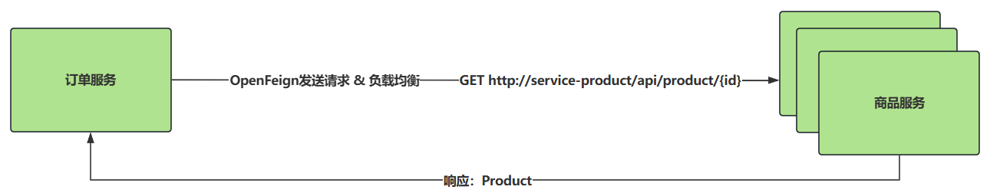

**第一步：添加 Spring Cloud OpenFeign 的依赖（最开始已经引入了哦！）**

```xml
<dependency>
    <groupId>org.springframework.cloud</groupId>
    <artifactId>spring-cloud-starter-openfeign</artifactId>
</dependency>
```

**第二步：开启 Feign 远程调用功能**

在 Spring Boot 入口类上添加注解 `@EnableFeignClients`

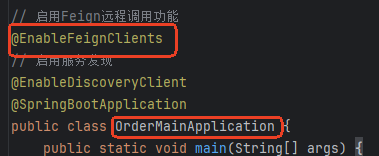

**第三步：编写一个接口（发送请求的核心代码）**

创建接口：`com.jkweilai.order.feign.ProductFeignClient`

```java
package com.jkweilai.order.feign;

import com.jkweilai.product.entity.Product;
import org.springframework.cloud.openfeign.FeignClient;
import org.springframework.web.bind.annotation.GetMapping;
import org.springframework.web.bind.annotation.PathVariable;

// 这个注解用来说明，当前接口是一个发送远程调用的客户端，并且通过value属性指定要调用的是哪个微服务。
// Feign会自动采用负载均衡的方式调用远程的微服务。
@FeignClient(value = "service-product")
public interface ProductFeignClient {

    // 1. GetMapping注解放在Controller上表示接收请求
    // 2. GetMapping注解放在@FeignClient的方法上表示发送请求，一个注解两套逻辑。
    // 3. 在Controller中参数的传递是：{id} -> String id
    // 4. 在Feign中参数的传递是：String id -> {id}
    // 5. 返回值是这次请求响应回来的数据
    @GetMapping("/api/product/{id}")
    Product getProductById(@PathVariable("id") String id);
}
```

**小技巧：A 服务调用 B 服务时，可以直接把 B 服务中的 Controller 中的方法签名复制过来即可。**

**第四步：将以前的 RestTemplate 代码修改为 Feign**

```java
package com.jkweilai.order.service.impl;

import com.jkweilai.order.entity.Order;
import com.jkweilai.order.feign.ProductFeignClient;
import com.jkweilai.order.service.OrderService;
import com.jkweilai.product.entity.Product;
import lombok.extern.slf4j.Slf4j;
import org.springframework.beans.factory.annotation.Autowired;
import org.springframework.stereotype.Service;

import java.math.BigDecimal;
import java.util.Arrays;

@Slf4j
@Service
public class OrderServiceImpl implements OrderService {

    // 注入FeignClient
    @Autowired
    private ProductFeignClient productFeignClient;

    @Override
    public Order createOrder(String orderId, String userId) {

        // 从远程获取商品
        Product product = productFeignClient.getProductById("123");

        Order order = new Order();
        order.setId(orderId);
        order.setUserId(userId);
        order.setAddress("天津南开区向阳路街道");
        order.setNickName("极课未来");
        order.setTotalAmount(product.getPrice().multiply(new BigDecimal(product.getBuyCount())));
        order.setProductList(Arrays.asList(product));
        return order;
    }
}
```

测试一下，启动所有服务，看看能不能正常访问，并且看一下是否自动支持负载均衡：

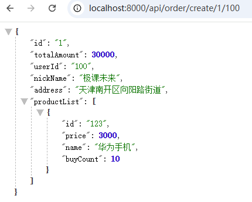

一共发送 6 次请求，查看控制台，你会看到每一个商品服务都是打印两次，所以 Feign 默认就是支持负载均衡的。

## 调用第三方 API

我们这里选择一个免费的天气接口：**和风天气开发服务**。

[**和风天气**](https://dev.qweather.com/)

### 阅读接口文档

免费注册一下：

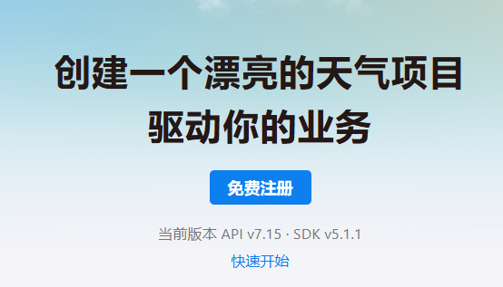

重点读一下这一页，就可以看到请求路径，请求方式，请求参数，返回数据等：

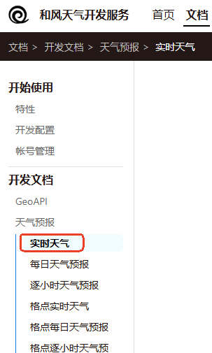

通过阅读文档，我们应该发送以下的请求可以获取天气数据（注意，我们这里使用的不是 JWT 认证方式，采用简单的 API_KEY 认证方式），因此下面这个请求路径去这里找：

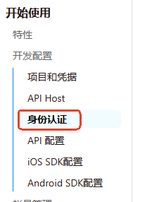

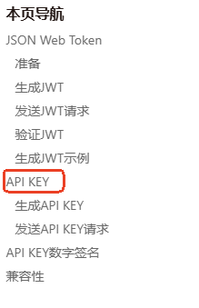

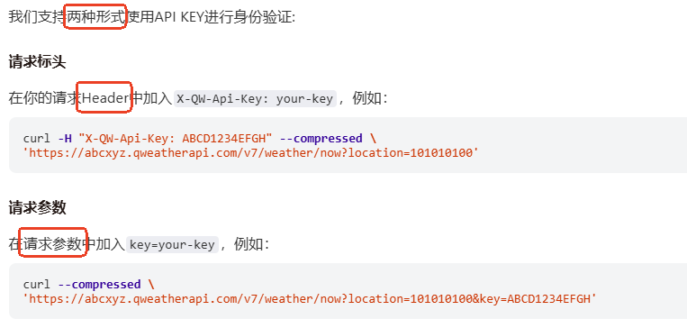

阅读文档，可以知道提交 api key 有两种方式，一种是请求参数，一种是请求头，都行，这里我们选择请求头上提交 api key：

```bash
curl -H "X-QW-Api-Key: your_api_key" --compressed 'https://your_api_host/v7/weather/now?location=101010100'
```

**以上的请求路径中有 3 处需要处理一下：**

1. **your_api_key：其实就是 api key，怎么申请 api key，下图：项目管理中创建项目，按照提示来创建 api key**

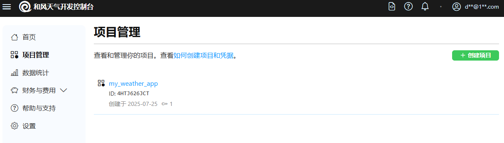

1. **your_api_host：在设置里面有 API Host**

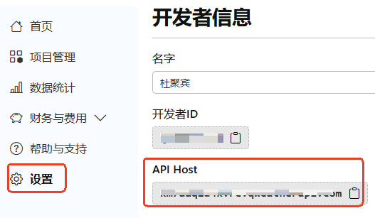

1. **location：去开发文档中查找**

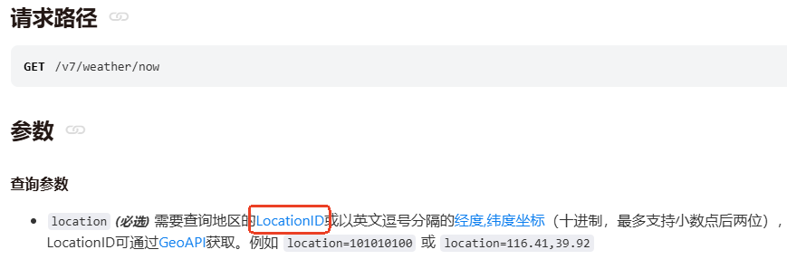

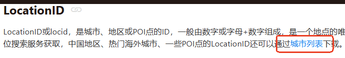

### 获取实时天气

**编写 WeatherFeignClient 客户端**

```java
package com.jkweilai.order.feign;

import org.springframework.cloud.openfeign.FeignClient;
import org.springframework.web.bind.annotation.GetMapping;
import org.springframework.web.bind.annotation.RequestHeader;
import org.springframework.web.bind.annotation.RequestParam;

// value属性：为Feign客户端指定一个名称，如果是直连URL形式，那么value属性就可以随便写，但必须写。
// url属性：指定Feign客户端调用的目标服务的基础URL
@FeignClient(value = "service-weather", url = "https://km7aaq2d4k.re.qweatherapi.com")
public interface WeatherFeignClient {

    // @RequestParam设置请求参数
    // @RequestHeader设置请求头
    // 这里的url是：指定相对于@FeignClient中url的具体端点路径
    @GetMapping("/v7/weather/now")
    String getWeather(@RequestParam("location") String location, @RequestHeader("X-QW-Api-Key") String apiKey);
}
```

**单元测试一下**

```java
package com.jkweilai.order;

import com.jkweilai.order.feign.WeatherFeignClient;
import org.junit.jupiter.api.Test;
import org.springframework.beans.factory.annotation.Autowired;
import org.springframework.boot.test.context.SpringBootTest;

@SpringBootTest
public class WeatherTest {

    @Autowired
    private WeatherFeignClient weatherFeignClient;

    @Test
    public void testWeather() {
        // 第一个参数是location的编号
        // 第二个参数是api key
        String weather = weatherFeignClient.getWeather("101010100", "2d935d2d3818416da025f633b15d6f20");
        System.out.println(weather);
    }
}
```

执行结果如下：

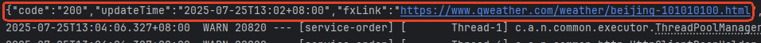

# 进阶配置

## 日志

如果想查看 Feign 发送请求时具体的请求信息以及响应信息，可以通过日志进行配置。

可以参考 Spring Cloud OpenFeign 官方文档：[https://docs.spring.io/spring-cloud-openfeign/reference/spring-cloud-openfeign.html](https://docs.spring.io/spring-cloud-openfeign/reference/spring-cloud-openfeign.html)

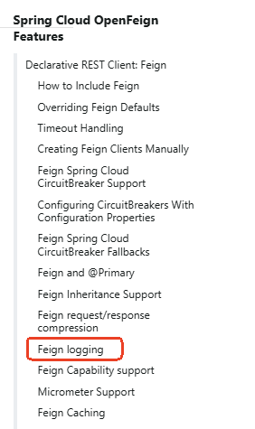

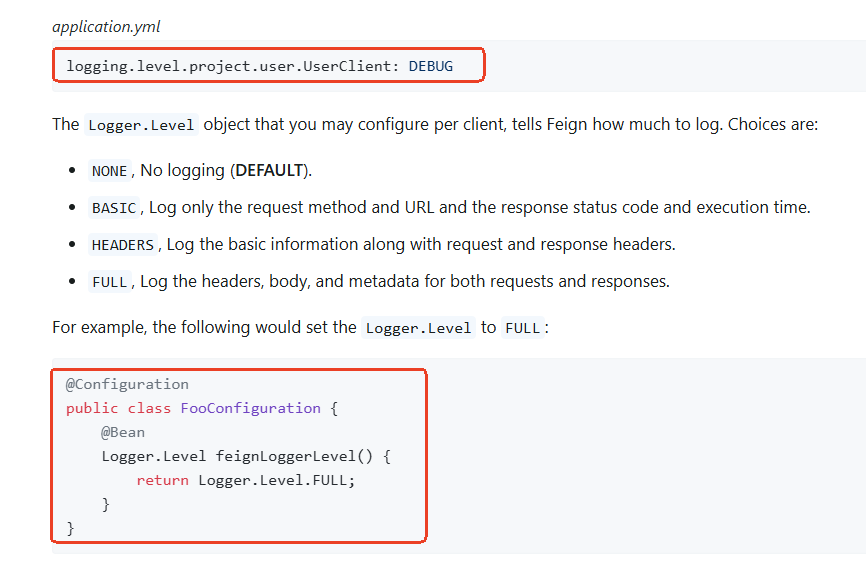

根据官方文档描述，需要两步。

**第一步：****开启指定Feign客户端的详细日志**

```yaml
logging:
  level:
    com.jkweilai.order.feign: debug
```

**第二步：为Feign客户端配置全局的详细日志级别**

```java
package com.jkweilai.order.config;

import feign.Logger;
import org.springframework.context.annotation.Bean;
import org.springframework.context.annotation.Configuration;

@Configuration
public class OrderServiceConfig {

    @Bean
    public Logger.Level feignLoggerLevel(){
        return Logger.Level.FULL;
    }
}
```

**完成以上两步之后，在控制台查看 获取实时天气 的请求有没有详细的请求信息和响应信息，如下：**

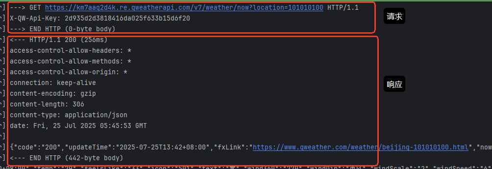

## 超时控制

### 超时机制的理解

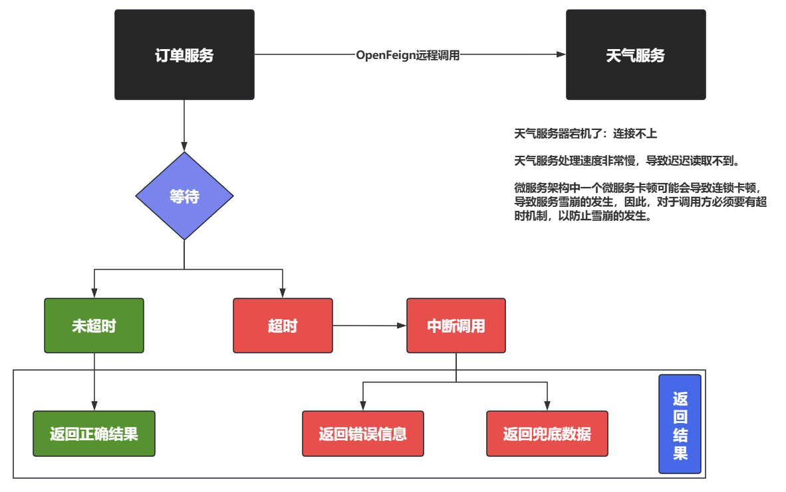

订单服务远程调用天气服务，由于天气服务器宕机了，导致订单服务迟迟连接不上天气服务，或者天气服务的 API 处理速度较慢，导致订单服务迟迟拿不到天气服务返回的数据，这样就会因为天气服务的卡顿导致订单服务的卡顿，可能还有其它服务调用订单服务，这样也会导致其它服务的卡顿，甚至整个服务调用链的卡顿，如此下去，很可能会导致资源耗尽，最终导致服务雪崩。

避免这个问题的最简单方式就是引入超时机制，假设我为订单服务调用天气服务设置超时时间为 10 秒，10 秒内天气服务正常返回了数据，订单服务就可以继续执行后续的逻辑，如果 10 秒内天气服务没有返回数据，则认为超时了，如果超时了，订单服务立即中断调用，中断调用后可以有两种返回结果，一种是直接返回错误信息（比如您访问的服务超时或错误等，这是一种默认的行为），另一种是返回兜底数据（例如返回库存数据，数据没拿到，则直接设置库存为 0）。返回兜底数据的话需要借助后续学习的类似于 `Spring Cloud Sentinel`组件来完成。

### 默认的超时配置

在**超时机制中，OpenFeign 提供了两个重点的超时设置：**

1. **连接超时：**`**connectTimeout**`**：控制的是连接创建的时间。****默认值 10 秒**
2. **读取超时：**`**readTimeout**`**：控制的是发送请求到响应数据的时间（实际上就是业务处理的时间）。****默认值 60 秒**

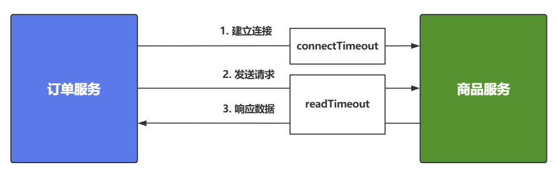

我们来测试一下默认情况，在商品服务中睡眠 61 秒，看看是什么结果：

```java
package com.jkweilai.product.service.impl;

import com.jkweilai.product.entity.Product;
import com.jkweilai.product.service.ProductService;
import lombok.extern.slf4j.Slf4j;
import org.springframework.stereotype.Service;

import java.math.BigDecimal;
import java.util.concurrent.TimeUnit;

@Slf4j
@Service
public class ProductServiceImpl implements ProductService {

    @Override
    public Product getProductById(String id) {
        log.info("getProductById");
        Product product = new Product();
        product.setId(id);
        product.setName("华为手机");
        product.setPrice(new BigDecimal(3000));
        product.setBuyCount(10);

        // 模拟睡眠61秒
        try {
            TimeUnit.SECONDS.sleep(61);
        } catch (InterruptedException e) {
            throw new RuntimeException(e);
        }
        
        return product;
    }
}
```

我们启动订单服务和商品服务，测试一下：

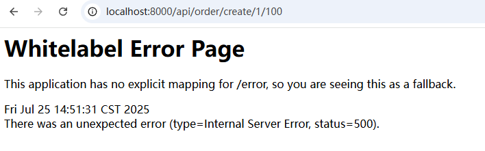

### 超时配置

[https://docs.spring.io/spring-cloud-openfeign/reference/spring-cloud-openfeign.html](https://docs.spring.io/spring-cloud-openfeign/reference/spring-cloud-openfeign.html)

官方文档中关于超时配置的描述：

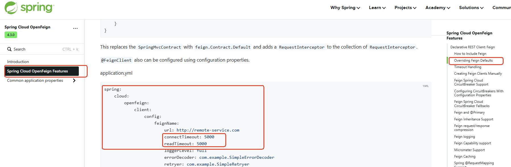

直接在 yml 中进行以上的配置即可。

由于订单服务的 `application.yml`配置文件中的配置信息太多了，这里创建一个新的 yml 文件，用来专门存放 feign 的配置：application-feign.yml

```yaml
spring:
  cloud:
    openfeign:
      client:
        config:
          default:  # 默认配置
            connect-timeout: 2000
            read-timeout: 3000
            logger-level: full
          service-product: # 精确配置（Feign的名字），有精确的走精确的，没有精确的走默认的。
            connect-timeout: 3000 # 连接超时
            read-timeout: 10000 # 请求处理超时（业务处理超时）
            logger-level: full
```

在 `application.yml`中将 `application-feign.yml`包含进去：

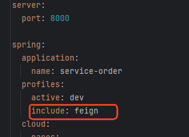

启动订单服务和商品服务，测试一下精确配置是否生效，将精确配置注释掉，重启订单服务，测试一下默认配置是否生效。

## 重试机制

### 重试策略

在 OpenFeign 中，**默认情况**下一旦远程调用超时之后是不会再发第二次请求进行重试的。

官方文档：[https://docs.spring.io/spring-cloud-openfeign/docs/current/reference/html/#retry](https://docs.spring.io/spring-cloud-openfeign/docs/current/reference/html/#retry)

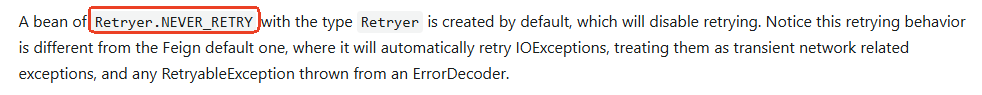

但在实际生产环境下，OpenFeign的重试机制还是建议开启的。它能在网络抖动或服务短暂不可用时自动重试请求，提高系统容错能力，避免因临时故障导致请求失败。

重试机制必然是需要配置一些**重试策略**的，比如**重试的时间间隔，最多重试几次**等。重试可能成功，也可能重试次数达到上限，还是失败，此时会自动响应一个错误信息。

**具体的重试策略需要配置的信息包括：**

1. 重试的时间间隔：period
2. 重试的最大时间间隔：maxPeriod
3. 最多重试次数：maxAttempts

**假设有这样的配置：**

1. period：100 毫秒
2. maxPeriod：1 秒
3. maxAttempts：5 次

**这个配置表示以下重试行为：**

1. **初始重试间隔(period)**: 100毫秒
  - 第一次请求失败后，等待100毫秒进行第一次重试
2. **最大重试间隔(maxPeriod)**: 1秒
  - 后续重试间隔会呈指数级增长(**每次乘以1.5**)，但不会超过1秒（**当某个重试间隔时间超过 1 秒时按 1 秒计。**）
  - **注意：重试间隔增长到 ≥1 秒后，以后的每一次重试的时间间隔都按 1 秒计算。**
3. **最大尝试次数(maxAttempts)**: 5次
  - 包括初始请求在内，最多会发送5次请求(即初始1次+最多4次重试)
  - **重试机制不再重试的条件是：只有当重试的次数达到 5 次，则不再重试。**

### 配置默认的重试器

Feign 内置了重试器，如下图：`**feign.Retryer.Default**`

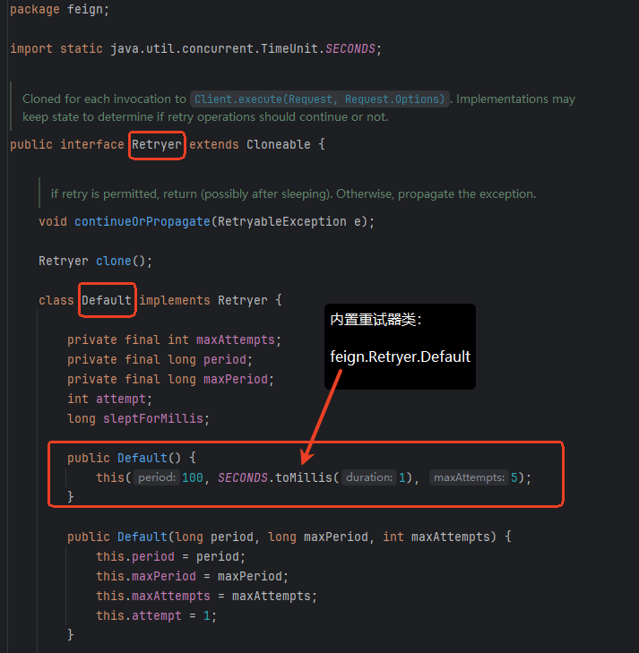

默认的规则是：初始的重试时间间隔为 100 毫秒，最大时间间隔为 1 秒，最多次数为 5 次。

如果要使用这个默认的重试器，直接在 `application.yml`中编写如下的配置即可，这里配置 `application-feign.yml`文件：

```yaml
spring:
  cloud:
    openfeign:
      client:
        config:
          default:
            connect-timeout: 2000
            read-timeout: 3000
            logger-level: full
          service-product:
            connect-timeout: 3000
            read-timeout: 10000
            logger-level: full
            retryer: feign.Retryer.Default
```

商品服务中获取商品的业务逻辑睡眠时间搞一个随机数，代码如下：

```java
package com.jkweilai.product.service.impl;

import com.jkweilai.product.entity.Product;
import com.jkweilai.product.service.ProductService;
import lombok.extern.slf4j.Slf4j;
import org.springframework.stereotype.Service;

import java.math.BigDecimal;
import java.util.Random;
import java.util.concurrent.TimeUnit;

@Slf4j
@Service
public class ProductServiceImpl implements ProductService {

    private Random random = new Random();

    @Override
    public Product getProductById(String id) {
        log.info("getProductById");
        Product product = new Product();
        product.setId(id);
        product.setName("华为手机");
        product.setPrice(new BigDecimal(3000));
        product.setBuyCount(10);

        try {
            int time = random.nextInt(20);
            System.out.println("阻塞：" + time + "秒");
            TimeUnit.SECONDS.sleep(time);
        } catch (InterruptedException e) {
            throw new RuntimeException(e);
        }

        return product;
    }
}
```

`service-product`的 `read-timeout`设置的是 10 秒。也就是说只要生成的随机数是小于 10 的，这个请求就重试成功了，如果这几次生成的随机数一直都大于 10，则所有的重试都是失败。

测试一下：启动一个订单服务，再启动一个商品服务，查看控制台，查看网页的响应结果：

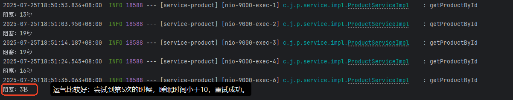

页面上也显示了结果：

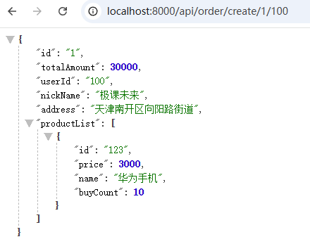

你可以多试几次。我这里就不再尝试了。

### 自定义重试器

非常简单，往 IoC 容器中放一个 `Retryer`对象就行了，Spring Cloud 会自动发现这个重试器，并使用它。

先把配置文件 `application-feign.yml`中的默认重试器删除掉。

在任何一个配置类中编写重试器，将重试器纳入 IoC 容器的管理即可。

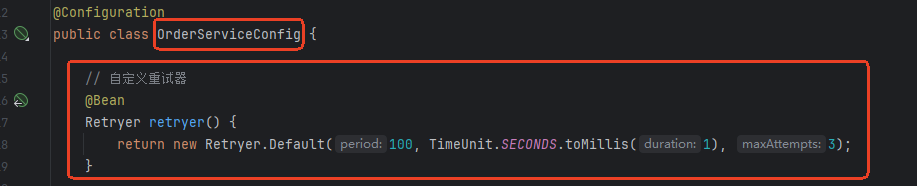

```java
@Bean
Retryer retryer() {
    return new Retryer.Default(100, TimeUnit.SECONDS.toMillis(1), 3);
}
```

这样就行了，就这么简单。接下来就可以重新测试了，上面的重试器配置了最大重试次数为 3 次，测试结果如下：

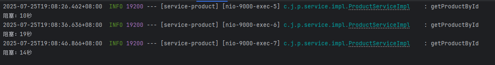

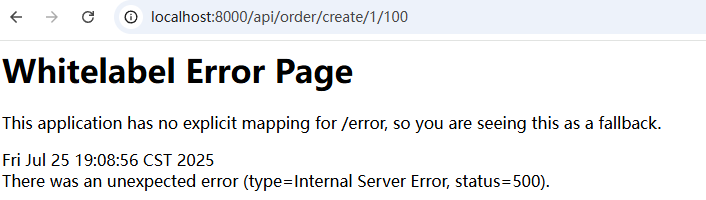

可以看到，重试了 3 次之后，在 3 次都失败的情况下，浏览器收到了响应的错误信息。

## 拦截器

### 拦截器的理解

OpenFeign 在设计的时候，还为请求和响应设置了拦截器机制（**拦截器本质上还是代码复用的思想**）。

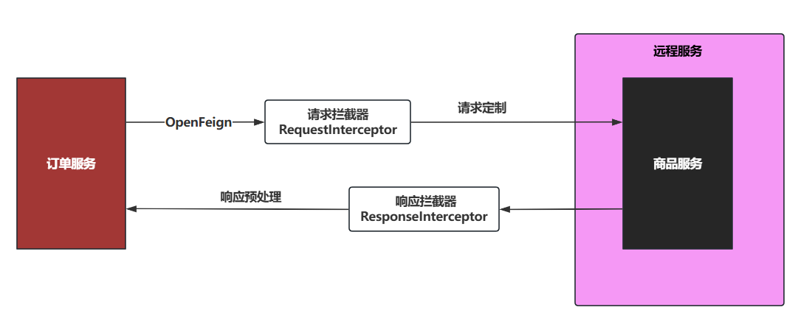

**拦截器包括**：

- **请求拦截器**（`**<font style="color:rgb(64, 64, 64);background-color:rgb(236, 236, 236);">RequestInterceptor</font>**`）：在Feign请求**被编码且尚未发送**前介入，适合添加**公共头/签名/日志**
- **响应拦截器**（自定义`**<font style="color:rgb(64, 64, 64);background-color:rgb(236, 236, 236);">Decoder</font>**`+`**<font style="color:rgb(64, 64, 64);background-color:rgb(236, 236, 236);">ErrorDecoder</font>**`）：在收到响应后介入，处理**统一响应格式/错误码转换**

**典型应用场景**：

- 添加公共Headers（如`**<font style="color:rgb(64, 64, 64);background-color:rgb(236, 236, 236);">Authorization</font>**`、`**<font style="color:rgb(64, 64, 64);background-color:rgb(236, 236, 236);">Trace-ID</font>**`）
- 请求体加密/签名
- 响应解密或统一错误处理

### 实现请求拦截器-配置式

**第一步：编写请求拦截器实现 RequestInterceptor 接口**

```java
    package com.jkweilai.order.interceptor;

import feign.RequestInterceptor;
import feign.RequestTemplate;

public class ApiKeyRequestInterceptor implements RequestInterceptor {

    // RequestTemplate 请求模板中封装了请求的所有消息。
    @Override
    public void apply(RequestTemplate template) {
        // 给请求统一设置api key。
        template.header("X-QW-Api-Key", "2d935d2d3818416da025f633b15d6f20");
    }
}
```

**第二步：在 application-feign.yml 文件中配置请求拦截器**

```yaml
spring:
  cloud:
    openfeign:
      client:
        config:
          default:
            connect-timeout: 2000
            read-timeout: 3000
            logger-level: full
          service-product:
            connect-timeout: 3000
            read-timeout: 10000
            logger-level: full
            request-interceptors:
              - com.jkweilai.order.interceptor.ApiKeyRequestInterceptor
```

这种配置方式可以达到针对某个远程服务进行请求拦截。以上配置表示，只有请求的是 service-product 服务时，走请求拦截器。

**第三步：我们在商品服务的 Controller 当中尝试获取一下请求拦截器中添加的 api key，如果能获取到，说明拦截了**

```java
package com.jkweilai.product.controller;

import com.jkweilai.product.entity.Product;
import com.jkweilai.product.service.ProductService;
import jakarta.servlet.http.HttpServletRequest;
import lombok.RequiredArgsConstructor;
import org.springframework.web.bind.annotation.GetMapping;
import org.springframework.web.bind.annotation.PathVariable;
import org.springframework.web.bind.annotation.RestController;

@RestController
@RequiredArgsConstructor
public class ProductController {

    private final ProductService productService;

    @GetMapping("/api/product/{id}")
    public Product getProductById(@PathVariable("id") String productId, HttpServletRequest request) {
        String apiKey = request.getHeader("X-QW-Api-Key");
        System.out.println(apiKey);
        return productService.getProductById(productId);
    }
}
```

测试：启动一个订单服务和一个商品服务，发送创建订单的请求，看看走不走拦截器，最终在控制台是否打印 api key：

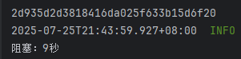

经过测试得知，请求拦截器对 service-product 商品服务生效了。

我们再来测试一下，看看这个请求拦截器是否能够拦截和风天气的服务？应该是不能，因为拦截 service-product 的时候，我们是通过 application-feign.yml 进行的配置，对于和风天气服务来说，我们并没有配置，也无法配置，因为这个服务不是我们自己编写的微服务。测试一下，在请求拦截器中输出一句话，如果拦截了，这句话就会打印：

```java
package com.jkweilai.order.interceptor;

import feign.RequestInterceptor;
import feign.RequestTemplate;

public class ApiKeyRequestInterceptor implements RequestInterceptor {

    // RequestTemplate 请求模板中封装了请求的所有消息。
    @Override
    public void apply(RequestTemplate template) {
        System.out.println("请求拦截器执行");
        // 给请求统一设置api key。
        template.header("X-QW-Api-Key", "2d935d2d3818416da025f633b15d6f20");
    }
}
```

执行我们之前测试和风天气的单元测试程序，查看 OrderMainApplication 的控制台，看看有没有输出：请求拦截器执行

经过测试，并没有任何输出，所以我们目前编写的这个请求拦截器只拦截我们配置的商品服务 service-product。

### 实现请求拦截器-注解式

还有一种方式，不需要在 `application-feign.yml`中进行配置，我们将之前的配置删除。

你只需要在自己编写的请求拦截器纳入 IoC 容器的管理即可。在该类上添加@Component注解。如下：

```java
package com.jkweilai.order.interceptor;

import feign.RequestInterceptor;
import feign.RequestTemplate;
import org.springframework.stereotype.Component;

@Component
public class ApiKeyRequestInterceptor implements RequestInterceptor {

    // RequestTemplate 请求模板中封装了请求的所有消息。
    @Override
    public void apply(RequestTemplate template) {
        System.out.println("请求拦截器执行");
        // 给请求统一设置api key。
        template.header("X-QW-Api-Key", "2d935d2d3818416da025f633b15d6f20");
    }
}
```

这样就可以了，我们来看看当请求商品服务的时候会不会走拦截器，仍然是启动一个订单服务和一个商品服务，然后发送创建订单的请求，查看控制台：

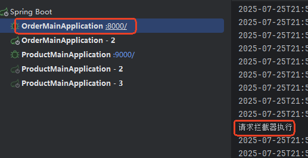

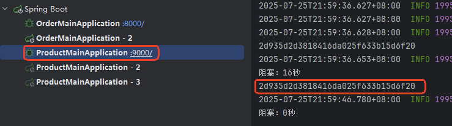

可以看到，请求拦截器针对 service-product 生效了。

那么，采用这种方式编写的请求拦截器，会拦截和风天气服务吗？执行之前的单元测试就知道了：

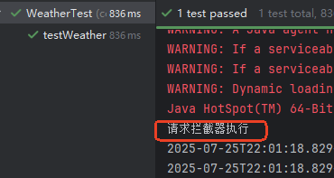

可见采用这种方式会拦截所有的 FeignClient 发送的请求。

如果你不想拦截所有的请求，只想拦截部分请求，怎么做呢？可以使用请求拦截器 apply 方法上的 RequestTemplate 参数进行过滤，例如以下代码，表示只有 WeatherFeignClient 才会被拦截：

```java
package com.jkweilai.order.interceptor;

import feign.RequestInterceptor;
import feign.RequestTemplate;
import org.springframework.stereotype.Component;

@Component
public class ApiKeyRequestInterceptor implements RequestInterceptor {

    // RequestTemplate 请求模板中封装了请求的所有消息。
    @Override
    public void apply(RequestTemplate template) {
        // configKey获取的是Feign 客户端方法的唯一标识符，格式为：接口名#方法名(参数类型列表)
        String configKey = template.methodMetadata().configKey();
        if(configKey.startsWith("WeatherFeignClient")){
            System.out.println("请求拦截器执行");
            // 给请求统一设置api key。
            template.header("X-QW-Api-Key", "2d935d2d3818416da025f633b15d6f20");    
        }
    }
}
```

通过测试，确实是这样的。

## Fallback 兜底返回

### 为什么要返回兜底数据


调用远程服务时，因为超时而中断调用，返回结果可以是直接返回错误信息，也可以返回兜底数据。直接返回错误信息，不太友好，另外后续的业务也可能无法进行，有时也**可以考虑返回兜底数据**，例如**假数据，缓存中的数据，用这些数据临时将就一下，让用户能够体验一个完整的业务**。

### 返回兜底数据的实现

返回兜底数据需要结合 Spring Cloud Alibaba Sentinel 才能完成，以下是具体的实现步骤。

现在为 service-product 商品服务设计返回兜底数据，在 service-order 调用方中实现。

**第一步：编写兜底回调**

兜底回调需要实现对应的 FeignClient，并且实现方法的具体逻辑，然后用@Component标注，纳入IoC容器的管理。

创建一个新的软件包：`com.jkweilai.order.feign.fallback`

```java
package com.jkweilai.order.feign.fallback;

import com.jkweilai.order.feign.ProductFeignClient;
import com.jkweilai.product.entity.Product;
import org.springframework.stereotype.Component;

import java.math.BigDecimal;

@Component
public class ProductFeignClientFallback implements ProductFeignClient {
    @Override
    public Product getProductById(String id) {
        Product product = new Product();
        product.setId(id);
        product.setName("兜底数据");
        product.setPrice(new BigDecimal(1));
        product.setBuyCount(1);
        return product;
    }
}
```

**第二步：注册兜底回调**

在 FeignClient 上注册兜底回调

```java
package com.jkweilai.order.feign;

import com.jkweilai.order.feign.fallback.ProductFeignClientFallback;
import com.jkweilai.product.entity.Product;
import org.springframework.cloud.openfeign.FeignClient;
import org.springframework.web.bind.annotation.GetMapping;
import org.springframework.web.bind.annotation.PathVariable;

// fallback 属性完成注册
@FeignClient(value = "service-product", fallback = ProductFeignClientFallback.class)
public interface ProductFeignClient {
    
    @GetMapping("/api/product/{id}")
    Product getProductById(@PathVariable("id") String id);
}
```

**第三步：整合 Sentinel**

引入 Sentinel 的依赖（**在 **`**jike-services**`**中引入**）

```xml
<dependency>
    <groupId>com.alibaba.cloud</groupId>
    <artifactId>spring-cloud-starter-alibaba-sentinel</artifactId>
</dependency>
```

**第四步：启用 Sentinel**

在 `application.yml`中启用 sentinel

```yaml
feign:
  sentinel:
    enabled: true
```

测试：启动 一个订单服务，一个商品服务，想让它能够正常访问，然后将商品服务关闭，然后再次测试，浏览器中出现以下情况表示兜底回调正常执行了：

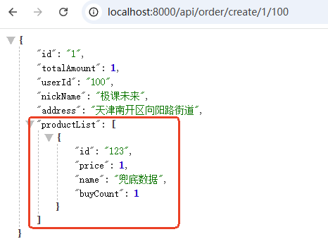