# 1.4.Spring Cloud Alibaba Sentinel

# Sentinel 功能介绍

Sentinel 是阿里巴巴开源的工具，但通过 Spring Cloud Alibaba 可以更便捷地在 Spring 生态中使用。专门用来做**服务保护**的，主要手段包括：限流（流量控制）、熔断降级。

在大型分布式的微服务架构中，服务和服务之间的稳定性非常重要。Spring Cloud **Alibaba Sentinel** 以**流量**为切入点，从**流量控制、流量路由、熔断降级、系统自适应过载保护、热点流量防护**等多个维度保护服务的稳定性。

Sentinel 官方网站：[https://sentinelguard.io/zh-cn/](https://sentinelguard.io/zh-cn/)

Sentinel 的 github 地址：[https://github.com/alibaba/Sentinel](https://github.com/alibaba/Sentinel)

Sentinel 官方文档地址：[https://github.com/alibaba/Sentinel/wiki](https://github.com/alibaba/Sentinel/wiki)

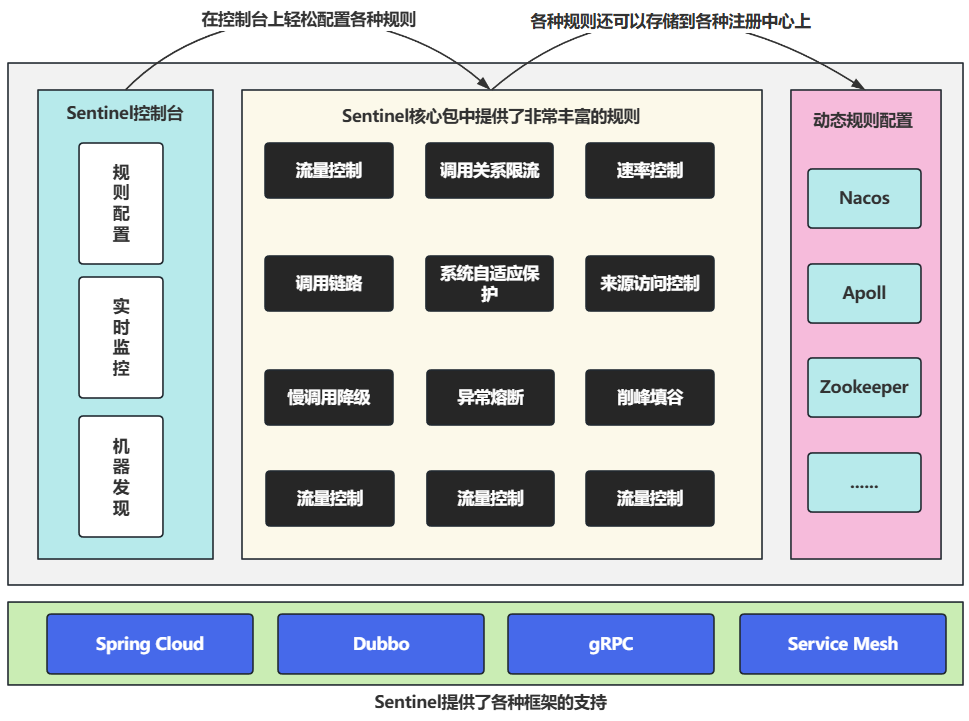

Sentinel 提供了一个易操作的控制台，运维人员在控制台上可以轻松完成各种规则配置，这些规则配置用于保护服务，并且这些配置的规则还可以存储到各种注册中心上，例如 Nacos、Apoll、Zookeeper 等。

另外 Sentinel 提供了各种流行框架的支持，例如 Spring Cloud、Dubbo、gRPC、ServiceMesh 等。

# Sentinel 工作原理

## Sentinel 架构

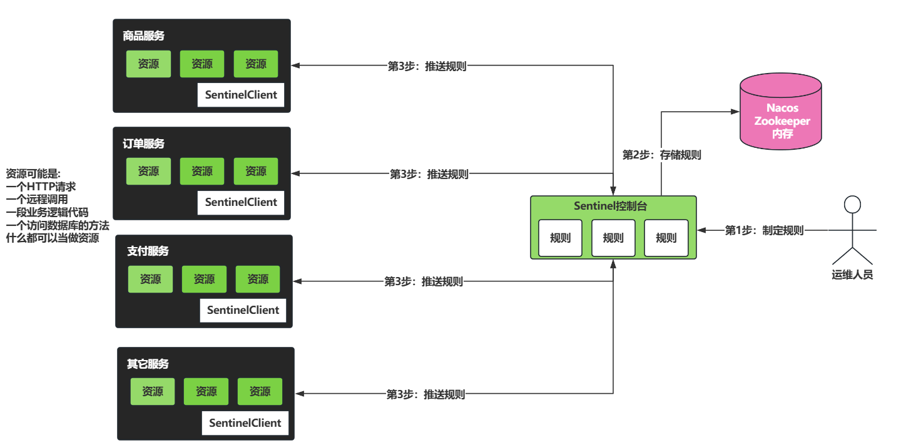

1. 每个服务中都有很多资源，这个资源可能是**一个 HTTP 请求**、**一个远程调用**、**一段业务逻辑代码**、**一个访问数据的方法**。
2. 每个服务中都可以引入一个 `**Sentinel Client**`，这些客户端可以连接上 **Sentinel 控制台**。
3. 运维人员在 **Sentinel 控制台**上可以对每个资源进行规则的定义，比如**限流规则，熔断降级规则**等，定义的这些规则也可以存储到** Nacos、Zookeeper **等**注册中心**或**内存**（内存中的服务重启后会失效）。
4. 当这些规则发生了变更，**Sentinel 控制台**还会自动把这些变更的规则推送给每一个微服务。
5. **当我们每一次访问某个特定资源时，Sentinel Client 会检查针对该资源定义的规则（如限流、熔断等），判断当前请求是否违反这些规则。**没有违背则放行，违背了则拒绝服务。通过这种手段来保护服务。

## 资源与规则

**和我们程序员有关的是两个：**

1. **定义资源**
2. **制定规则**

换句话说就是：**哪些资源（定义资源）需要受到怎样（制定规则）的保护**。

### 定义资源

使用 Sentinel 定义资源有三种方式：

1. 第一种方式： Sentinel 对主流的框架都做了**自动适配**，所有 web 接口都是资源。(例如：Spring Cloud、Dubbo、gRPC、Servlet、Spring WebFlux、Reactor 等)
2. 第二种方式：通过编写 **SphU API** 来定义任意一段代码为资源。属于**编程式**。
3. 第三种方式：使用**@SentinelResource**注解来标注一段代码为资源。属于**声明式**。

### 制定规则

定义资源之后，就可以**在 Sentinel 控制台**制定保护规则了，通常**主要的**保护规则包括：

1. **流控规则（FlowRule）**：限流，如果请求量非常大，这个时候继续处理所有请求的话，有可能会导致微服务所在的机器的资源耗尽，可以对请求进行限流，比如每秒只允许通过 50 个请求，超过的请求全部拒绝。
2. **熔断规则（DegradeRule）**：防止服务雪崩的发生，包括兜底返回。
3. **系统保护规则（SystemRule）**：可以根据当前系统的 CPU 负载、内存使用率，比如 CPU 负载非常高，可以限制访问。
4. **来源访问规则（AuthorityRule）**：可以控制只有哪些上游资源可以访问这些下游的资源。
5. **热点参数规则（ParamFlowRule）**：给“爆款”数据单独配防护规则，防止被流量冲垮。比如在Sentinel中对高频访问或高优先级的特定数据（如热门商品ID、秒杀Key等）单独设置流控、降级或保护策略。

## Sentinel 工作原理

**工作原理流程图描述：**

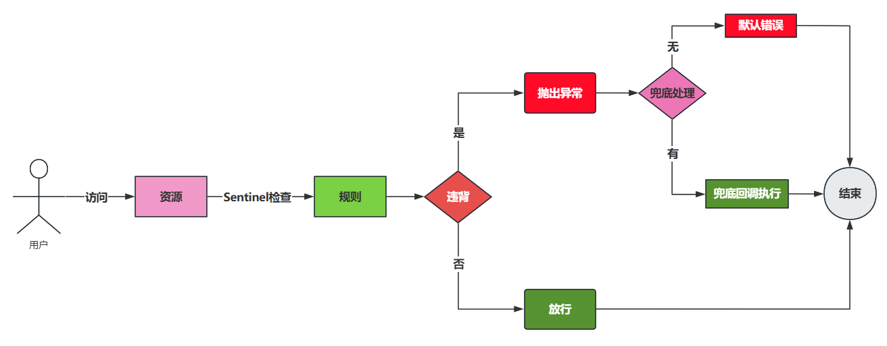

**工作原理文字描述：**

1. 假设用户通过 HTTP 请求访问**创建订单的资源**。
2. **订单资源**上由于制定了**流量控制规则**，只允许**每秒通过 1 个请求**。因此 `**Sentinel Client**` 会进行规则的检查。
3. `**Sentinel Client**`检查的结果无非两种情况：
  1. **符合规则**，放行，结束。
  2. **违反规则**，Sentinel **抛出异常**。对于异常可以针对性的处理：
    1. 如果**没有兜底处理**，默认错误就会抛出，由于出错了，业务就中断了，结束了。
    2. 如果**有兜底处理**，则执行兜底回调，兜底处理最终返回数据，业务结束。

**通过这个工作原理，我们需要关注三点：**

1. 怎么定义资源？
2. 定义资源的什么保护规则？
3. 一旦违反了规则，怎么处理这个异常？

# Sentinel 基本用法

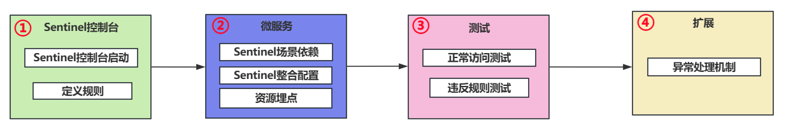

## 第一步：下载 Sentinel 控制台

打开 Sentinel github 的地址：[https://github.com/alibaba/Sentinel](https://github.com/alibaba/Sentinel)

然后在右侧找 `Releases`字样，目前最新版本为 `v1.8.8`，下载它即可。

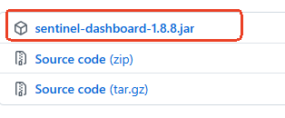


## 第二步：启动 Sentinel 控制台并访问

打开 dos 命令窗口，cd 定位到 jar 包所在目录，执行 jar 包启动控制台：

```bash
java -jar sentinel-dashboard-1.8.8.jar
```

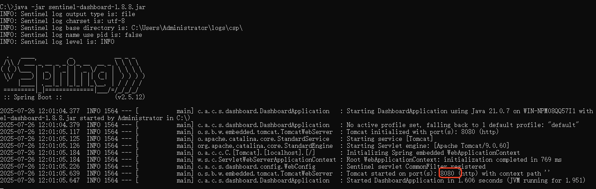

端口号 8080，打开浏览器输入 URL：[http://localhost:8080/](http://localhost:8080/)，然后输入用户名和密码都是 sentinel，登录成功：

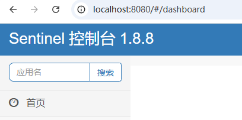

## 第三步：引入 Sentinel 场景依赖

之前已经引入过了，在 jike-services 模块中引入的：

```xml
<dependency>
  <groupId>com.alibaba.cloud</groupId>
  <artifactId>spring-cloud-starter-alibaba-sentinel</artifactId>
</dependency>
```

## 第四步：整合配置

在 service-order 模块的 `application-feign.yml`中配置 Sentinel 控制台，在服务启动的时就连上控制台：

```yaml
spring:
  cloud:
    sentinel:
      transport:
        dashboard: localhost:8080
      eager: true # 默认是懒加载，只有访问服务时，才会连接到控制台，true为饥饿模式，服务启动时就连上控制台。
```

每个服务都要配置，service-product 也进行以上配置。

## 第五步：查看控制台是否有服务

启动订单服务和商品服务（**分别启用 1 个就行，不要启动集群**），查看控制台是否存在服务。如下图：

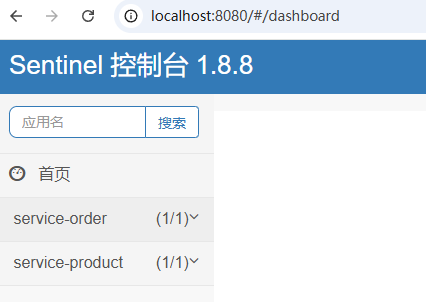

## 第六步：资源埋点

这一步我们来标注资源，被标注的资源将来会受到保护。可以直接使用@SentinelResource 来标注受保护的资源，例如我们将 `createOrder`设置为资源，代码如下：

在 `OrderServiceImpl`类中的 `createOrder`方法上添加该注解。

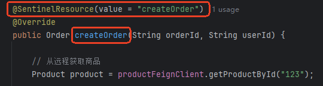

发送请求创建订单（把之前睡眠阻塞的代码注释掉）：[http://localhost:8000/api/order/create/1/100](http://localhost:8000/api/order/create/1/100)

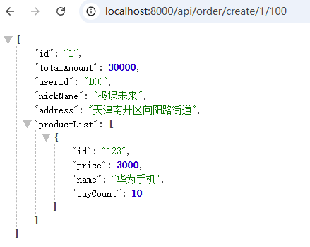

查看 Sentinel 控制台：

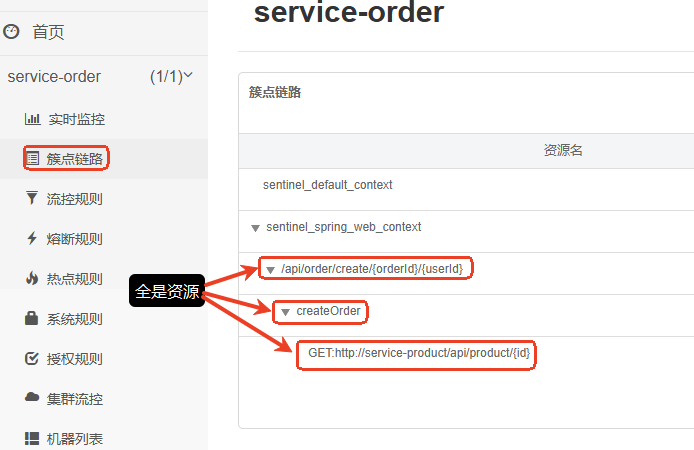

在每个资源的右侧可以制定具体的规则：


## 第七步：制定规则

制定一个流量控制规则，要求 QPS 为 1，也就是说要求每秒钟的请求量为 1，超过 1 次 Sentinel 就会有提示，点击 `/api/order/create/{orderId}/{userId}` 资源右侧的


按钮：

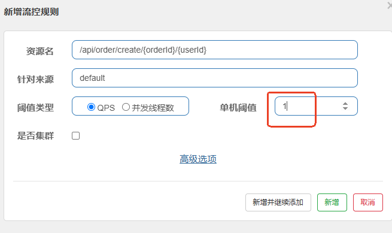

新增之后，在左侧的 **流控规则** 中可以看做具体规则，如下图：

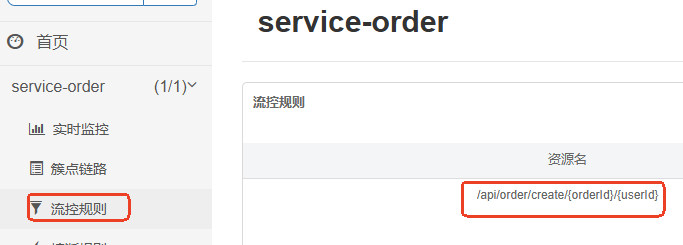

## 第八步：发送请求测试

一秒发送一次：正常

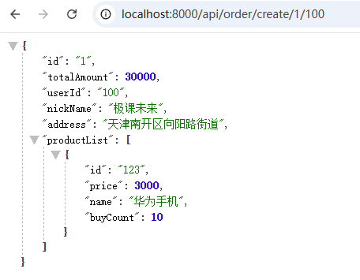

一秒发送多次：Sentinel 会有提示


# 异常处理


以上是 Web 接口资源出现问题后的显示效果。对于大型项目来说，一般都是前后端分离的，后端应该给前端返回一个 JSON 字符串，如下：

```json
{
  "code": 500,
  "msg": "流量超出限制",
  "data": ""
}
```

如果要返回以上的 JSON 字符串，就需要学习 Sentinel 的异常处理机制。

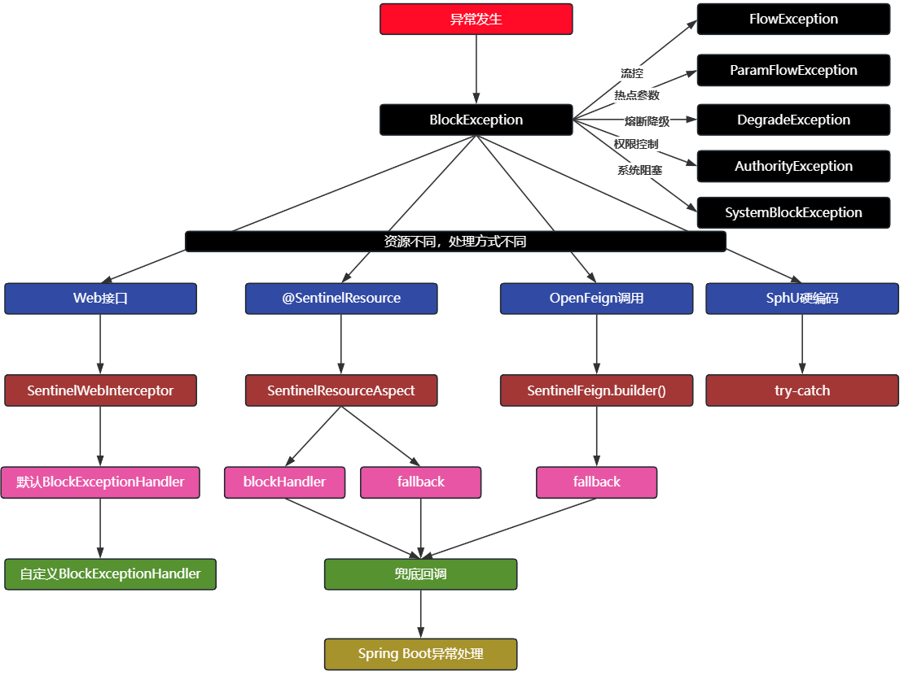

当访问的资源违背了规则以后，自动抛出 BlockException 异常，这是一个顶级异常，下面有很多子异常，如下：

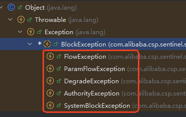

- FlowException：流控异常
- ParamFlowException：热点参数异常
- DegradeException：熔断降级异常
- AuthorityException：权限控制异常
- SystemBlockException：系统阻塞异常

违背了某个规则，就会抛出对应的异常。

假设违背“流控”的规则，就会抛出 `**FlowException**`，具体走的是哪个处理流程，“**资源**”来决定。是 `**Web接口**`资源，则走的是上图最左侧的流程。

接下来我们通过源码来看一下，为什么我们发送请求[http://localhost:8000/api/order/create/1/100](http://localhost:8000/api/order/create/1/100)时，违背了流控规则之后，会出现下图的效果：

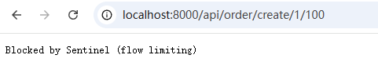

首先[http://localhost:8000/api/order/create/1/100](http://localhost:8000/api/order/create/1/100) 是一个 web 接口资源，因此会走上图中最左侧流程，底层我们设置的是流控规则。

首先到达 `**SentinelWebInterceptor**`，先看它的源码：

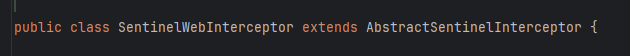

再看它的父类：

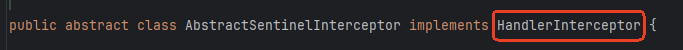

很显然 `**SentinelWebInterceptor**`属于 Spring MVC 中的拦截器。再看这个拦截器中的 `**preHandle**`方法：

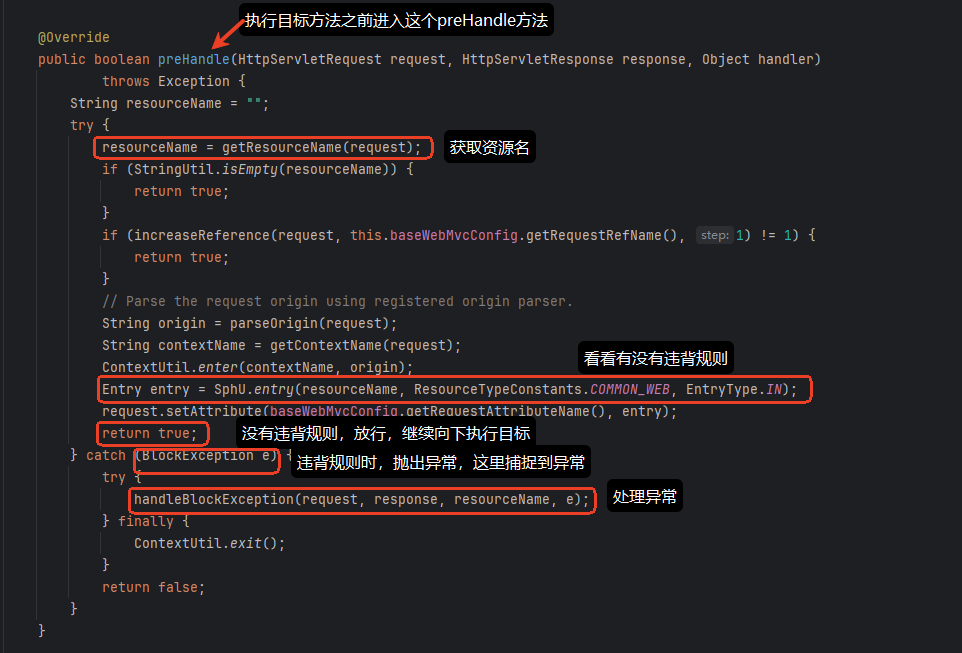

```java
// 这一行代码的作用是：判断当前请求是否违背资源点对应的保护规则。
// 如果违背资源点设置的保护规则，该方法会抛异常。
// 如果没有违背，则返回entry对象（entry对象是入口对象，是sentinel的通行证/门票）
Entry entry = SphU.entry(resourceName, ResourceTypeConstants.COMMON_WEB, EntryType.IN);
```

我们再来看看具体是怎么处理异常的：

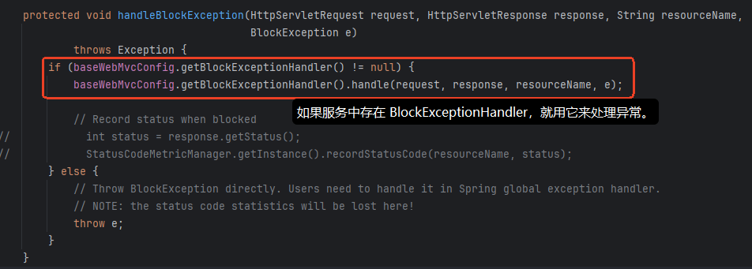

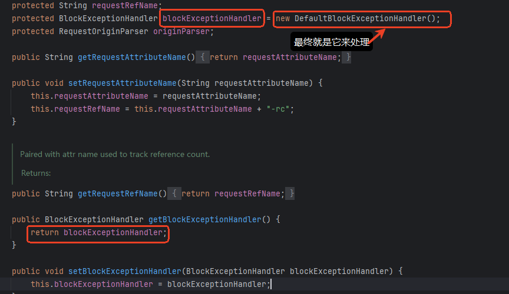

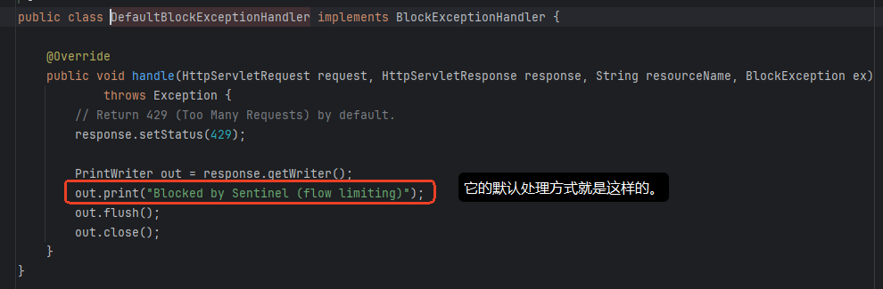

以上通过源码可以看到对于访问 Web 接口资源时，违背规则之后，默认的异常处理方式就是向浏览器响应：`Blocked by Sentinel (flow limiting)`

`**Sentinel**`中异常处理主要包括 4 种情况：

1. Web 接口的异常处理
2. @SentinelResource异常处理
3. OpenFeign 的异常处理
4. 对某一段代码异常处理

## Web 接口的异常处理

要自定义 Web 接口的异常处理，我们就需要自定义一个 `BlockExceptionHandler`，接下来编写 `MyBlockExceptionHandler`实现 `BlockExceptionHandler`接口：

```java
package com.jkweilai.order.exception;

import com.alibaba.csp.sentinel.adapter.spring.webmvc_v6x.callback.BlockExceptionHandler;
import com.alibaba.csp.sentinel.slots.block.BlockException;
import jakarta.servlet.http.HttpServletRequest;
import jakarta.servlet.http.HttpServletResponse;
import org.springframework.stereotype.Component;

import java.io.PrintWriter;

@Component
public class MyBlockExceptionHandler implements BlockExceptionHandler {
    @Override
    public void handle(HttpServletRequest request, HttpServletResponse response, String resourceName, BlockException e) throws Exception {
        response.setContentType("application/json;charset=utf-8");
        PrintWriter out = response.getWriter();
        String json = "{\"code\":500,\"msg\":\"流量超出限制\",\"data\":\"\"}";
        out.print(json);
        out.flush();
    }
}
```

只要把自定义的 `BlockExceptionHandler`纳入 IoC 容器的管理即可。

**注意：当微服务重启之后，流控规则需要重新配置。默认情况下 sentinel 将规则存储在内存当中。**

测试一下：在 1 秒内发送多次请求时

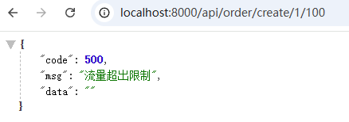

对以上程序进行改造，封装通用的 R 对象，这个我们之前在学习前后端分离项目的时候已经学过，不再啰嗦，直接编写，在公共模块 model 中创建 common 包和 R 类：

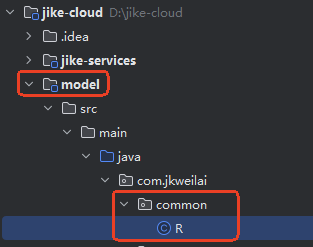

编写 R 类：

```java
package com.jkweilai.common;

import lombok.Data;

@Data
public class R {
    private Integer code;
    private String msg;
    private Object data;

    public static R ok() {
        R r = new R();
        r.setCode(200);
        return r;
    }

    public static R ok(String msg, Object data) {
        R r = new R();
        r.setCode(200);
        r.setMsg(msg);
        r.setData(data);
        return r;
    }

    public static R error() {
        R r = new R();
        r.setCode(500);
        return r;
    }


    public static R error(Integer code, String msg) {
        R r = new R();
        r.setCode(code);
        r.setMsg(msg);
        return r;
    }
}
```

在自定义的 `BlockExceptionHandler`中使用 `R`对象，代码如下：

```java
package com.jkweilai.order.exception;

import com.alibaba.csp.sentinel.adapter.spring.webmvc_v6x.callback.BlockExceptionHandler;
import com.alibaba.csp.sentinel.slots.block.BlockException;
import com.fasterxml.jackson.databind.ObjectMapper;
import com.jkweilai.common.R;
import jakarta.servlet.http.HttpServletRequest;
import jakarta.servlet.http.HttpServletResponse;
import org.springframework.stereotype.Component;

import java.io.PrintWriter;

@Component
public class MyBlockExceptionHandler implements BlockExceptionHandler {
    
    private final ObjectMapper objectMapper = new ObjectMapper();
    
    @Override
    public void handle(HttpServletRequest request, HttpServletResponse response, String resourceName, BlockException e) throws Exception {
        response.setContentType("application/json;charset=utf-8");
        PrintWriter out = response.getWriter();
        R r = R.error(500, resourceName + "被限流了：" + e.getClass().getName());
        String json = objectMapper.writeValueAsString(r);
        out.print(json);
        out.flush();
    }
}
```

再次测试：

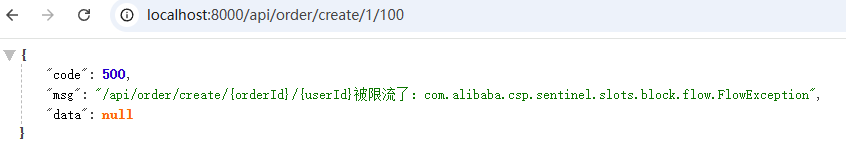

## @SentinelResource的异常处理

### 默认处理方式

在 Sentinel 控制台上把 Web 接口的流控规则删除，对`@SentinelResource`标注的 `createOrder`资源添加流控规则。还是 QPS 1 秒内只允许 1 次请求。

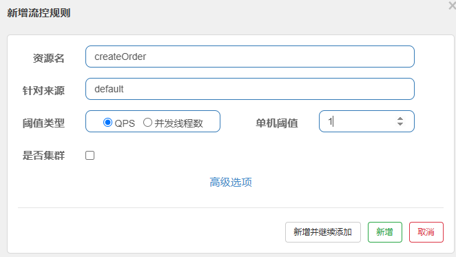

测试一下，看看默认的处理结果什么样的：


通过这个结果可以看到，它用的是 Spring Boot 的异常处理进行兜底的。

为什么会是这样的，我们一起来研究一下源码：

凡是被 `@SentinelResource`标注的资源，底层都会走这个切面类：`SentinelResourceAspect`

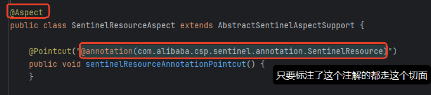

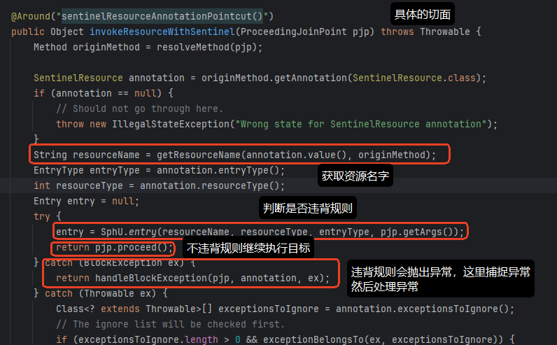

再看具体的处理办法：

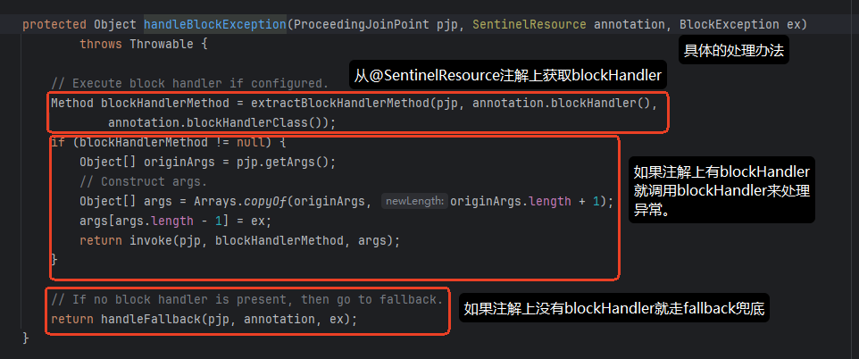

以上代码表示，从 `@SentinelResource`注解上获取 `blockHanler`，如果获取到则执行这个 `blockHandler`。如果没有则执行 `fallback`。

继续查看 `handlerFallback()`的源码：

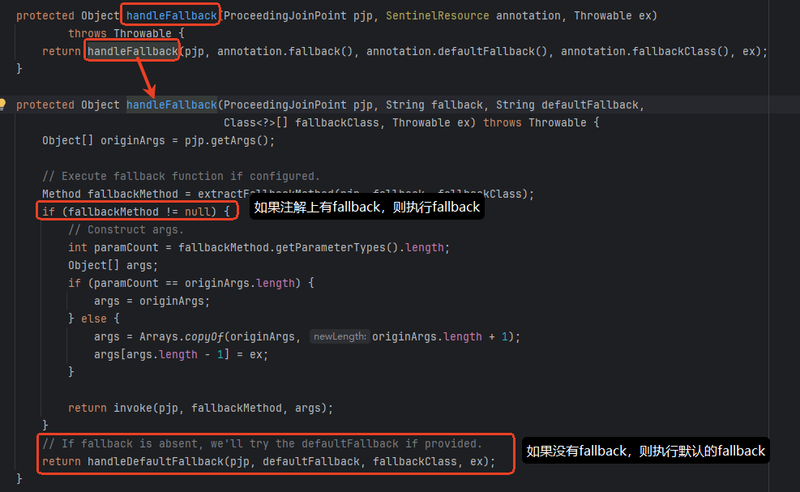

通过以上源码可以看到，如果 `@SentinelResource`注解上没有 `blockHandler`，就继续从这个注解上获取 `fallback`，如果没有 `fallback`，则执行 `DefaultFallback`。

因此 `@SentinelResource`注解上不仅有 `blockHandler`属性，还有 `fallback`属性。

再继续查看 `DefaultFallback`源码：

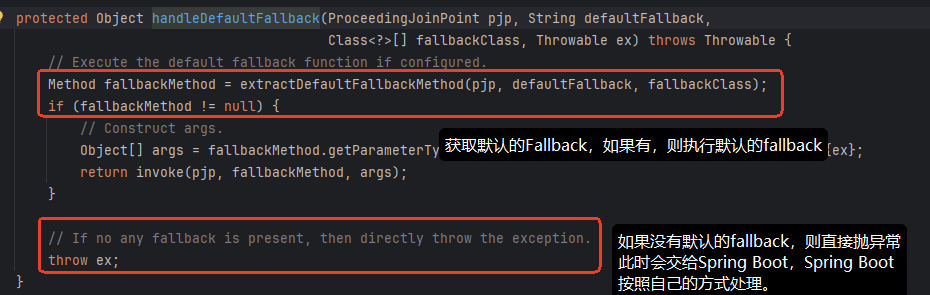

因此从以上源码又可以看到 `@SentinelResource`注解上还有 `defaultFallback`属性 。

**它的整体逻辑是：**

1. 如果资源是 `@SentinelResource`资源，则走切面 `SentinelResourceAspect`
2. 核心逻辑：先从`@SentinelResource`注解上获取 `blockHandler`：
  1. 如果有则执行 `blockHandler`的处理
  2. 如果没有，则继续从`@SentinelResource`注解上获取 `fallback`：
    1. 如果有则执行 `fallback`的处理
    2. 如果没有，则继续从`@SentinelResource`注解上获取 `defaultFallback`：
      1. 如果有则执行 `defaultFallback`的处理
      2. 如果没有，则直接抛出异常，交给 Spring Boot 自行处理。

而我们在给 `createOrder`方法编写`@SentinelResource`注解的时候，只指定了 value 属性，blockHandler、fallback、defaultFallback 一律没有指定，因此最后就交给了 Spring Boot 自行处理，结果就是：

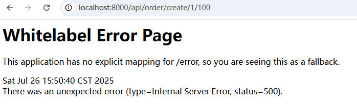

### 自定义处理方式

因此，我们要自定义 `@SentinelResource`资源的异常处理方式，可以通过三种方式实现：

1. 编写 blockHandler
2. 编写 fallback
3. 编写 defaultFallback

以上三种方式都行，我们采用 `blockHandler`就行，一起来实现一下：

```java
package com.jkweilai.order.service.impl;

import com.alibaba.csp.sentinel.annotation.SentinelResource;
import com.alibaba.csp.sentinel.slots.block.BlockException;
import com.jkweilai.order.entity.Order;
import com.jkweilai.order.feign.ProductFeignClient;
import com.jkweilai.order.service.OrderService;
import com.jkweilai.product.entity.Product;
import lombok.extern.slf4j.Slf4j;
import org.springframework.beans.factory.annotation.Autowired;
import org.springframework.stereotype.Service;

import java.math.BigDecimal;
import java.util.Arrays;

@Slf4j
@Service
public class OrderServiceImpl implements OrderService {

    @Autowired
    private ProductFeignClient productFeignClient;

    // 使用 blockHandler 用来指定兜底回调，blockHandler指定的是方法名。
    @SentinelResource(value = "createOrder", blockHandler = "createOrderFallback")
    @Override
    public Order createOrder(String orderId, String userId) {

        // 从远程获取商品
        Product product = productFeignClient.getProductById("123");

        Order order = new Order();
        order.setId(orderId);
        order.setUserId(userId);
        order.setAddress("天津南开区向阳路街道");
        order.setNickName("极课未来");
        order.setTotalAmount(product.getPrice().multiply(new BigDecimal(product.getBuyCount())));
        order.setProductList(Arrays.asList(product));
        return order;
    }

    // 兜底回调：除了方法名之外，方法的签名与上面方法的签名一致，另外，这个方法还可以有一个BlockException的参数用来接收抛出的异常
    public Order createOrderFallback(String orderId, String userId, BlockException blockException) {
        Order order = new Order();
        order.setId(orderId);
        order.setUserId(userId);
        order.setAddress("异常信息：" + blockException.getClass());
        order.setNickName("未知昵称");
        order.setTotalAmount(BigDecimal.ZERO);
        order.setProductList(null);
        return order;
    }
}
```

然后在 Sentinel 控制台给 `createOrder`资源添加流控规则：

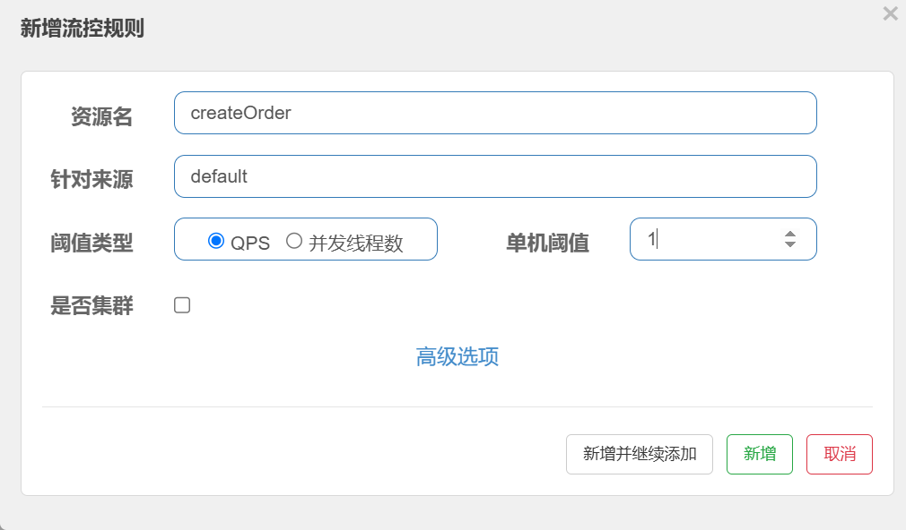

测试结果如下：

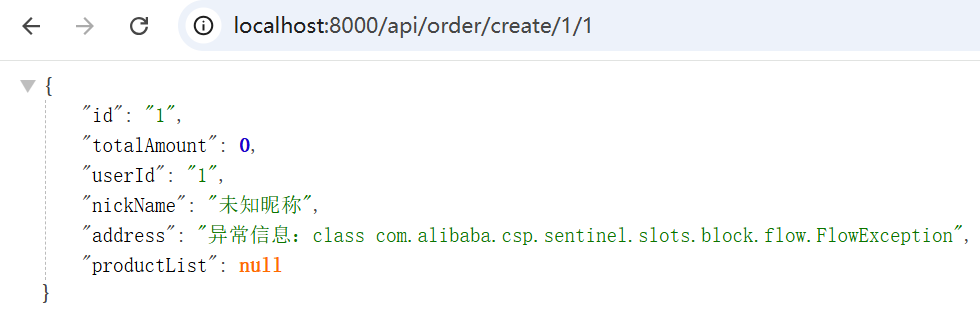

## OpenFeign 的异常处理

### 测试 OpenFeign 的异常处理

先来看 Feign 的远程调用有没有被当做一种资源：

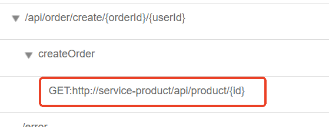

可见 Feign 的远程调用被默认当做资源。我们给这个资源添加一个流控规则：QPS 1 秒内 1 次。

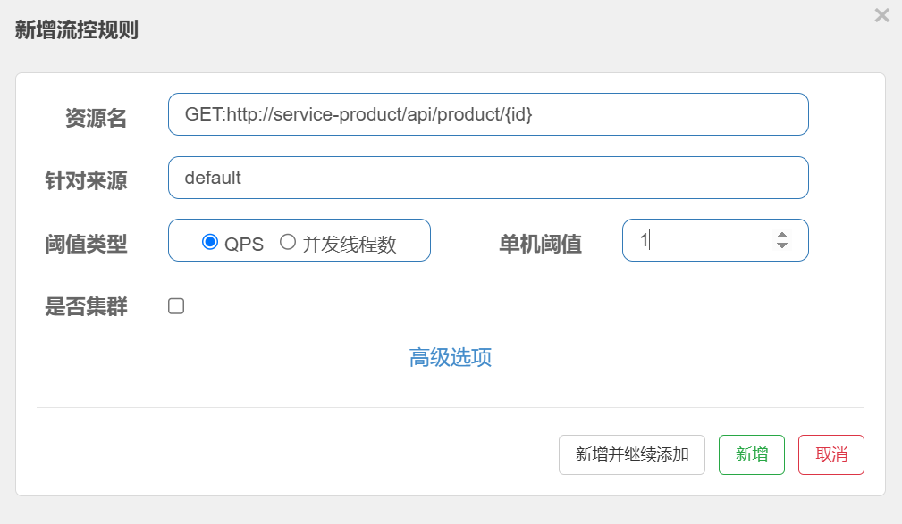

把之前`createOrder`的流控规则删除，然后测试 Feign 远程调用的流控规则，1 秒内请求次数大于 1 时：

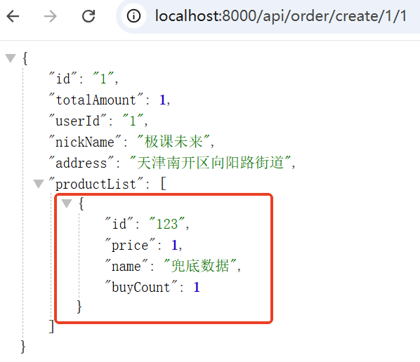

通过测试得知，Feign 的远程调用走的是 fallback 兜底回调，这个兜底回调是我们之前编写的，如下：

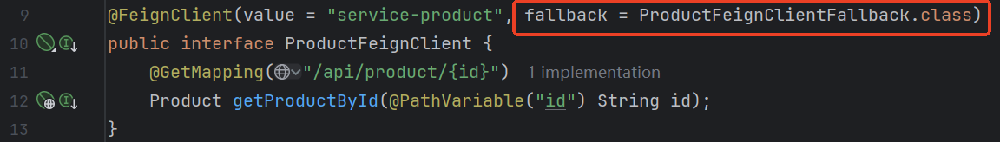

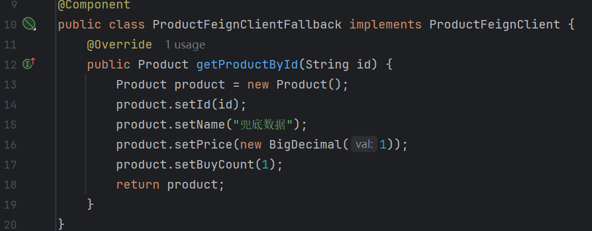

### OpenFeign 异常处理实现原理

**SentinelFeignAutoConfiguration**，专门完成 **Sentinel** 和 **OpenFeign** 的整合：

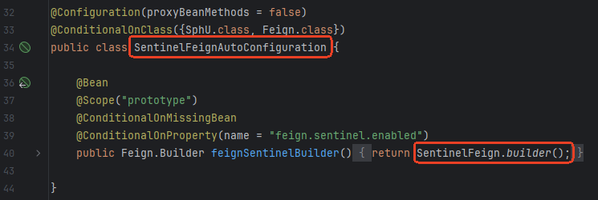

以上代码中 `**SentinelFeign.builder()**`方法返回一个**增强版的** `**Feign.Builder**`（下文叫做： **Feign 构造器**）。

增强版的 **Feign 构造器**可以创建**增强版的 FeignCilent** 对象，底层使用了**动态代理模式**，**增强版的 FeignClient 对象**在完成 FeignClient 远程调用任务之外，还**增加了 Sentinel 服务保护机制**。

接下来看一下 `**SentinelFeign.builder()**`方法的源码：

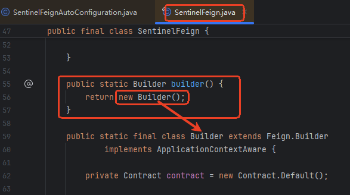

再看 `**Builder**`静态内部类中的 `**internalBuild()**`方法，就是这个方法创建了一个**增强版的 FeignClient 对象**：

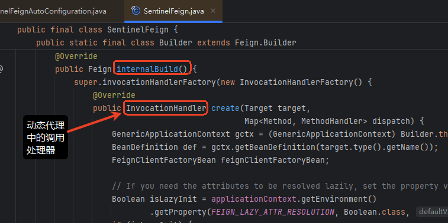

再看 `**create**`方法中有这样一段代码：

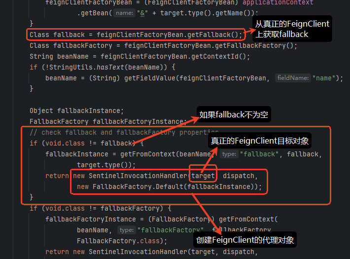

以上代码表示：从 **FeignClient** 上获取 **fallback**，如果能够获取到 **fallback**，就创建增强版的 **FeignClient** 对象。

动态代理中有这样一句话：当代理对象的代理方法执行时，注册在调用处理器中的 **invoke** 方法会被执行。

也就是说代理对象的代理方法执行时，`**SentinelInvocationHandler**`中的 `**invoke**`方法执行，看一下 `**SentinelInvocationHandler**`中有没有 `**invoke**`方法：

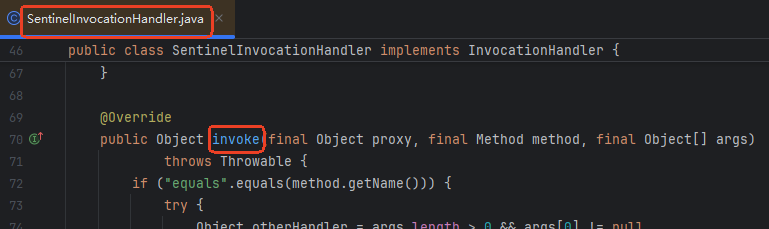

`**invoke**`方法内部就是核心实现了：

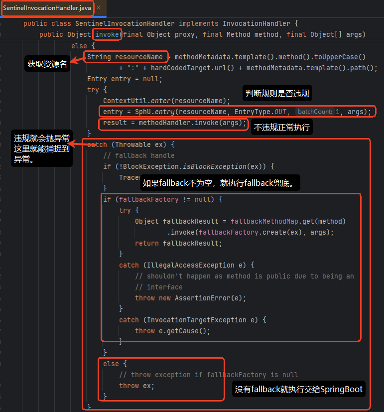

以上代码表示：获取资源名，判断资源是否违背规则，如果不违背规则，正常执行结束，如果违背规则就抛出异常，当捕捉到异常之后，看有没有 fallback，如果有则执行 fallback 兜底，如果没有则交给 SpringBoot。

因此 OpenFeign 的异常处理底层实际上是基于 JDK 的动态代理实现的。

## 对某一段代码的异常处理

对某一段代码进行资源保护，可以采用 `SphU.entry`进行硬编码，我们之前查看源码的时候经常看到以下这段代码：

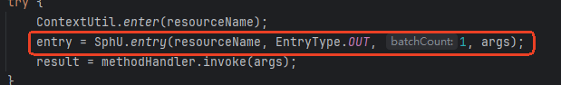

这段代码就是起到资源保护的核心代码，之前所讲的每一种资源保护方式，其本质底层都是调用的 `**SphU.entry**`。

因此，如果自己想对某一段代码进行资源保护，可以通过手动编写 `**SphU.entry**`来实现。

关于 `**SphU.entry**`的使用，官方文档当中也有介绍，可以看一下：[https://github.com/alibaba/Sentinel/wiki](https://github.com/alibaba/Sentinel/wiki)

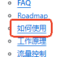

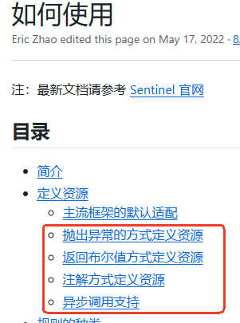

接下来我们通过硬编码的方式，实现代码片段的保护：

```java
package com.jkweilai.order.service.impl;

import com.alibaba.csp.sentinel.Entry;
import com.alibaba.csp.sentinel.SphU;
import com.alibaba.csp.sentinel.slots.block.BlockException;
import com.jkweilai.order.entity.Order;
import com.jkweilai.order.feign.ProductFeignClient;
import com.jkweilai.order.service.OrderService;
import com.jkweilai.product.entity.Product;
import org.springframework.beans.factory.annotation.Autowired;
import org.springframework.stereotype.Service;

import java.math.BigDecimal;
import java.util.Arrays;

@Service
public class OrderServiceImpl implements OrderService {

    @Autowired
    private ProductFeignClient productFeignClient;

    @Override
    public Order createOrder(String orderId, String userId) {
        // 保护以下这段代码，流控为QPS：1
        Entry entry = null;
        try {
            // 判断是否违规（入口）
            entry = SphU.entry("myResource");

            // 从远程获取商品
            Product product = productFeignClient.getProductById("123");

            Order order = new Order();
            order.setId(orderId);
            order.setUserId(userId);
            order.setAddress("天津南开区向阳路街道");
            order.setNickName("极课未来");
            order.setTotalAmount(product.getPrice().multiply(new BigDecimal(product.getBuyCount())));
            order.setProductList(Arrays.asList(product));
            return order;
        } catch (BlockException e) {
            // 如果违规
            Order order = new Order();
            order.setId(orderId);
            order.setUserId(userId);
            order.setAddress("");
            order.setNickName("未知问题：" + e.getClass());
            order.setTotalAmount(new BigDecimal(0));
            order.setProductList(null);
            return order;
        } finally {
            // 出口
            if (entry != null) {
                entry.exit();
            }
        }
    }


}
```

注意：编写以上代码的时候，有**入口**必须要有**出口**。要不然会报错！！！！

配置流控规则：

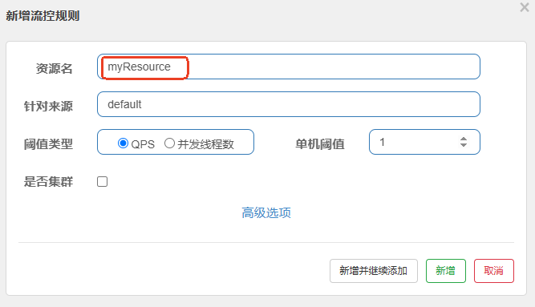

测试：每秒 QPS>1 时：

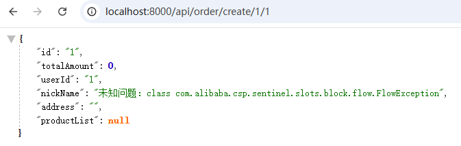

## 总结异常处理

1. Web 接口的异常处理
  1. 自定义 BlockExceptionHandler，给前端返回统一的 JSON。
2. @SentinelResource的异常处理
  1. blockHandler、fallback、defaultFallback 都可以兜底回调，没有兜底回调就走 Spring Boot 全局异常处理。
3. OpenFeign 的异常处理
  1. fallback 做兜底回调，没有兜底回调走 Spring Boot 全局异常处理。
4. 保护某段代码
  1. 自己编写 try..catch..

# 流控规则

## 流控保护系统的原理

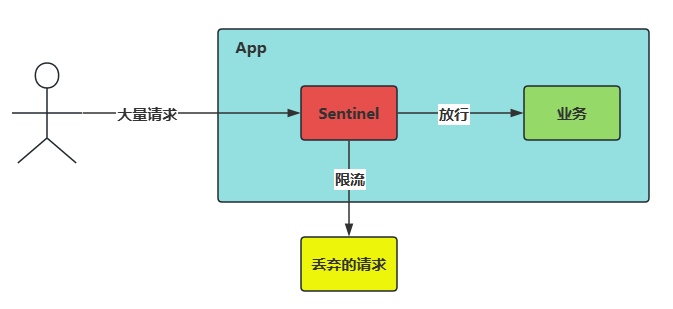

**设置一个流控规则，例如 QPS=2，表示 1 秒内只能处理 2 次请求，超额请求被丢弃。**

**主要保护数据库或缓存这些关键资源，避免数据库、缓存等过载。确保服务始终处于可控状态。防止雪崩。**

## 流控规则之阈值类型

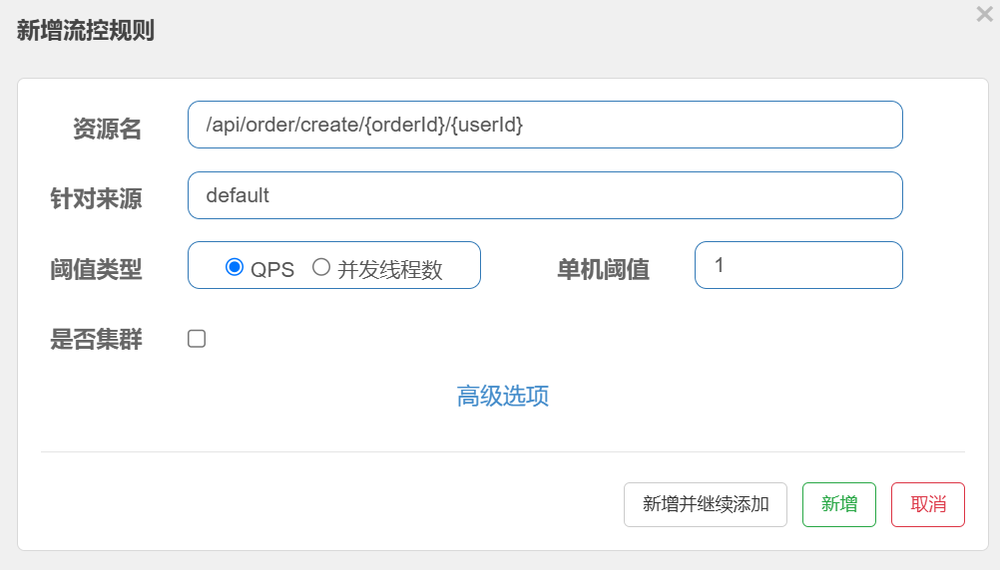

---

**资源名**：资源名有多种情况，可能是 Web 接口，可能是@SentinelResource标注的资源，也可能是OpenFeign的远程调用资源，还可以是某一段代码。

**针对来源**：一般不做修改，default 代表从任何位置来的请求都要遵循这个规则。

**阈值类型**：

- QPS：限定的是每秒的请求数。QPS=10
  - 无论请求处理得快慢，**每秒最多允许10次请求**。
  - 如果请求是瞬时突发的（如1毫秒内收到10请求），后续999毫秒的请求会被拒绝。
  - **适合场景**：限制调用频率（例如短信验证码接口防止刷号）。
- 并发线程数：限定的是每秒线程的并发数量。
  - 允许**同时有10个线程在处理请求**，但**不限制请求的总速率**。
  - 如果每个请求耗时1秒，理论上最大QPS仍是10；但如果每个请求耗时100毫秒，实际QPS可达100（因为线程快速释放）。
  - **适合场景**：保护资源（例如数据库连接池只有10个连接）。

---

**是否集群模式**：如果勾选是，表示在集群模式下进行统计。

- **单机均摊**：假设阈值类型为 QPS，均摊阈值 1，假设有 3 台服务，表示 1 秒内每一台机器最多处理 1 次请求（**3 台机器同一秒内最多处理 3 次请求**）。

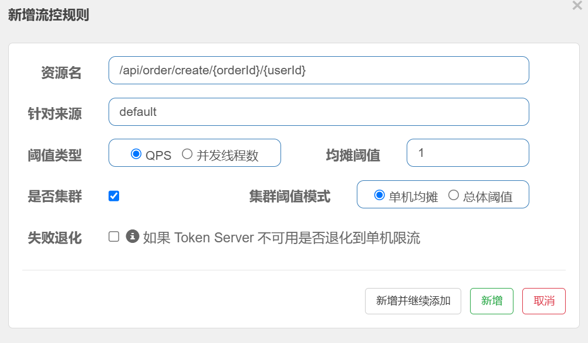

- **总体阈值**：假设阈值类型为 QPS，集群阈值 1，假设有 3 台服务，表示 1 秒内 3 台服务最多处理 1 次请求。

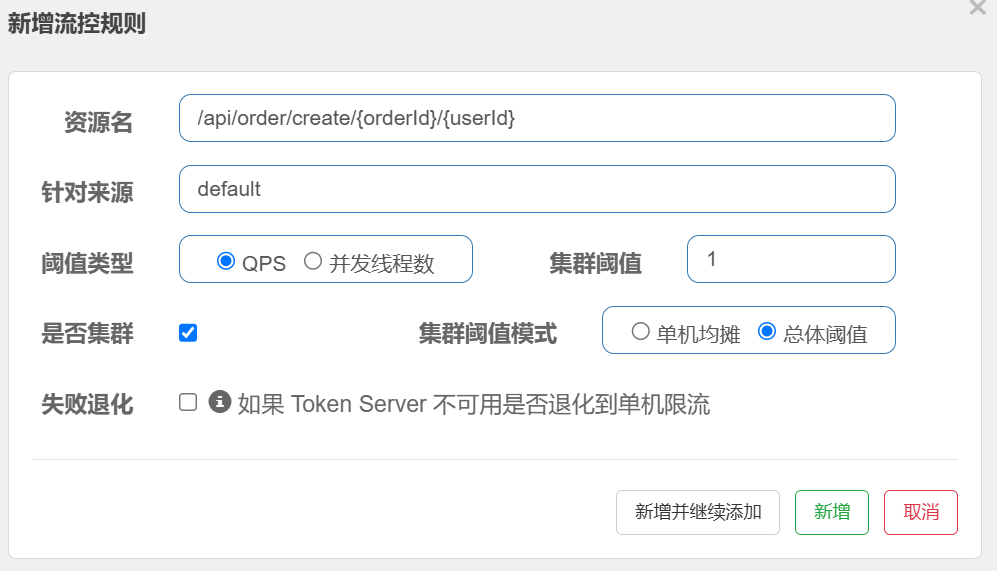

**失败退化**：开启集群模式之后，有一个失败退化的选项

**它的作用是：****集群限流失败时，自动回归单机限流模式**，避免全局限流失效导致系统被压垮，属于容错保护机制。

## 流控规则之流控模式

### 流控模式的作用

在不开启集群模式的情况下，有一个高级选项：

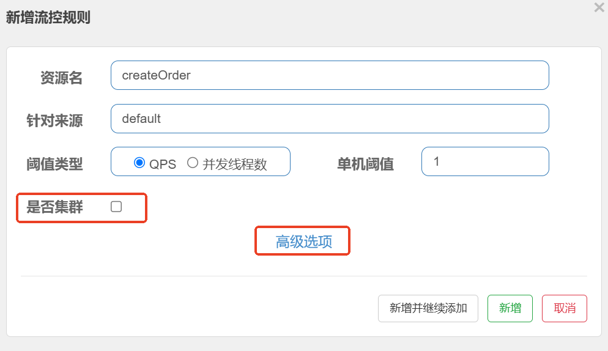

点击高级选项，可以设置流控模式：

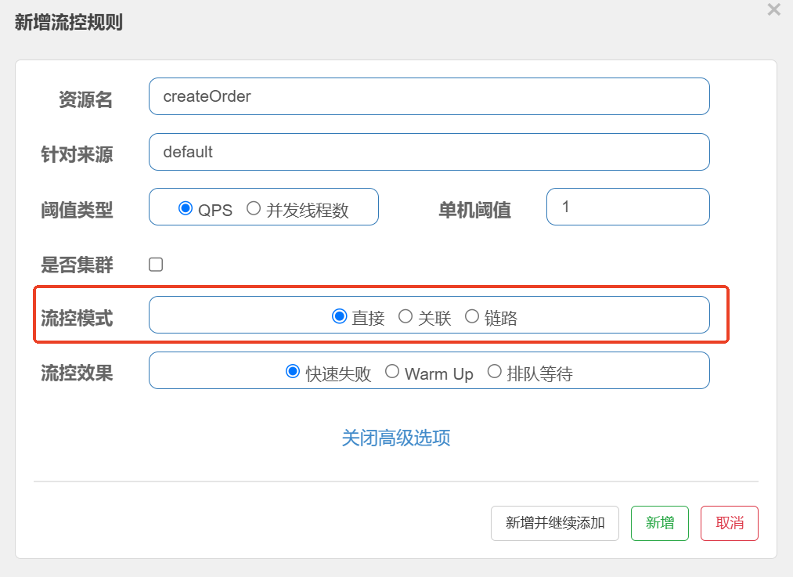

**流控模式包括三个**：直接、关联、链路。

**流控模式的作用**：通过关联、链路等模式实现细粒度限流，避免“一刀切”影响无关业务

### 直接模式

**默认是直接**，也就是“一刀切”模式。

任何请求只要经过这个规则，都会受到流量控制。

例如：用户的普通下单操作要经过 `createOrder`，用户秒杀下单操作也会经过 `createOrder`，如果采用直接模式，则用户普通下单和用户秒杀下单都会受到流量控制。

### 链路模式

**可以做到针对性限流**：用户普通下单操作不受流量控制，用户秒杀下单时受流量控制。要实现这种细粒度流控，可以使用链路模式。

**我们添加一个秒杀的接口来测试一下，找到 **`**OrderController**`**，添加秒杀下单的 API 接口：**

```java
// 普通下单
@GetMapping("/api/order/create/{orderId}/{userId}")
public Order create(@PathVariable("orderId") String orderId, @PathVariable("userId") String userId) {
    return orderService.createOrder(orderId, userId);
}

// 秒杀下单
@GetMapping("/api/order/seckill/{orderId}/{userId}")
public Order seckill(@PathVariable("orderId") String orderId, @PathVariable("userId") String userId) {
    Order order = orderService.createOrder(orderId, userId);
    order.setId("秒杀");
    return order;
}
```

**流控模式使用链路模式时，需要添加以下的配置：**

```yaml
spring:
    sentinel:
      web-context-unify: false
```

**当 **`**<font style="color:rgb(64, 64, 64);background-color:rgb(236, 236, 236);">web-context-unify: true</font>**`**（默认）**

- 所有 Web 请求的上下文（如URL）会被合并为一个统一的资源名。
- 链路限流可能失效：因为不同入口的请求被合并后，无法区分调用来源。

**当 **`**<font style="color:rgb(64, 64, 64);background-color:rgb(236, 236, 236);">web-context-unify: false</font>**`

- 保留原始请求的独立上下文，每个URL和方法会被视为独立资源。
- 链路限流生效的必要条件：只有关闭上下文合并，才能通过 `<font style="color:rgb(64, 64, 64);background-color:rgb(236, 236, 236);">@SentinelResource</font>` 标记的入口资源区分调用链路。

**发送用户普通下单请求，再发送秒杀下单请求，查看链路如下：**

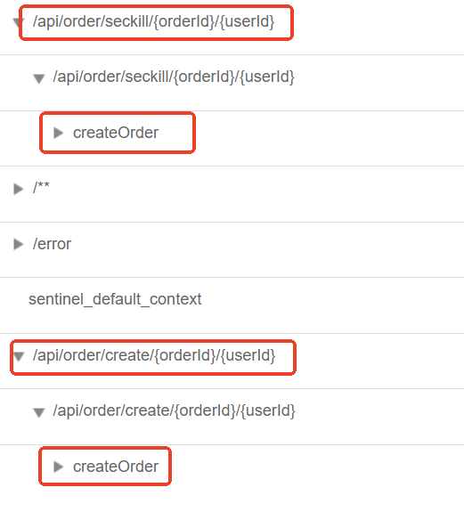

**创建流控规则，选择流控模式为：链路模式**

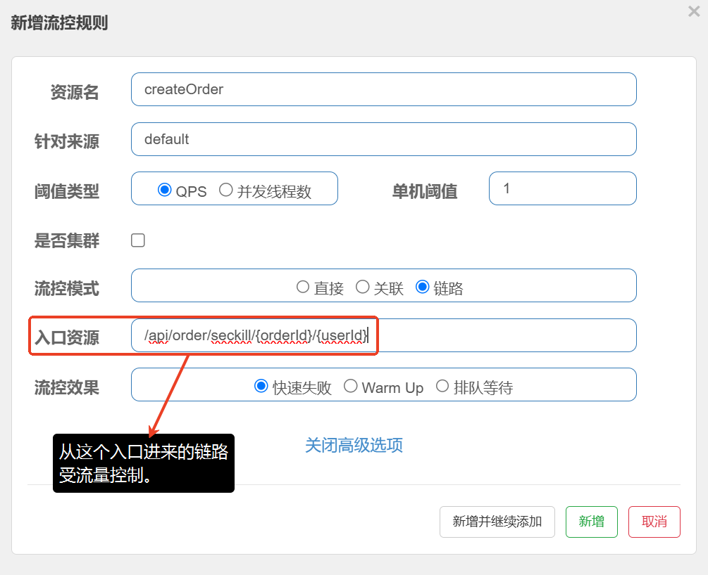

`**/api/order/seckill/{orderId}/{userId}**`

**测试：看看是不是普通下单不受流量控制，而秒杀下单会受流量控制。通过测试可以看到只有秒杀下单时会受流量控制：**

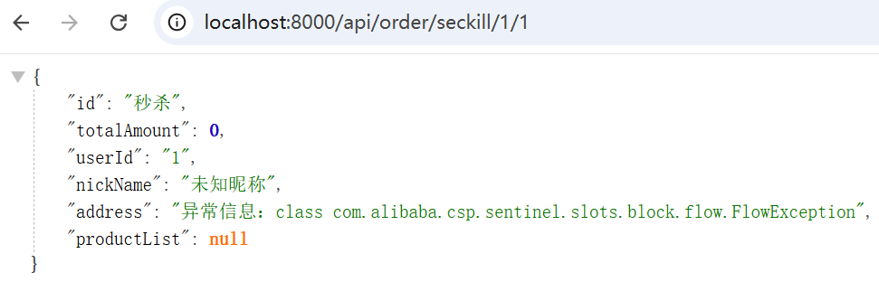

### 关联模式

关联模式主要用于资源之间存在依赖关系的情况。当关联资源达到阈值时，对当前资源进行限流。

**典型使用场景举例**

1. **数据库读写分离场景**

- 资源A：/api/read（读操作）
- 资源B：/api/write（写操作）
- 配置：当写操作(QPS)超过阈值时，限制读操作的流量，确保写操作有足够的资源

1. **订单与支付系统**

- 资源A：创建订单接口
- 资源B：支付接口
- 配置：当支付接口压力过大时，限制新订单的创建速度

**实现这样一个规则：一个读的 API，一个写的 API，当写的 API 频繁发送请求时，读的 API 受到流量限制**

第一步：在 `<font style="color:rgb(64, 64, 64);">OrderController</font>`中编写读、写 API 的接口

```java
    @GetMapping("/read")
    public String read(){
        return "read database!!!";
    }
    
    @GetMapping("/write")
    public String write(){
        return "write database!!!";
    }
```

第二步：在** 读资源 **上设置流控规则

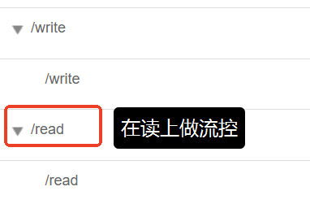

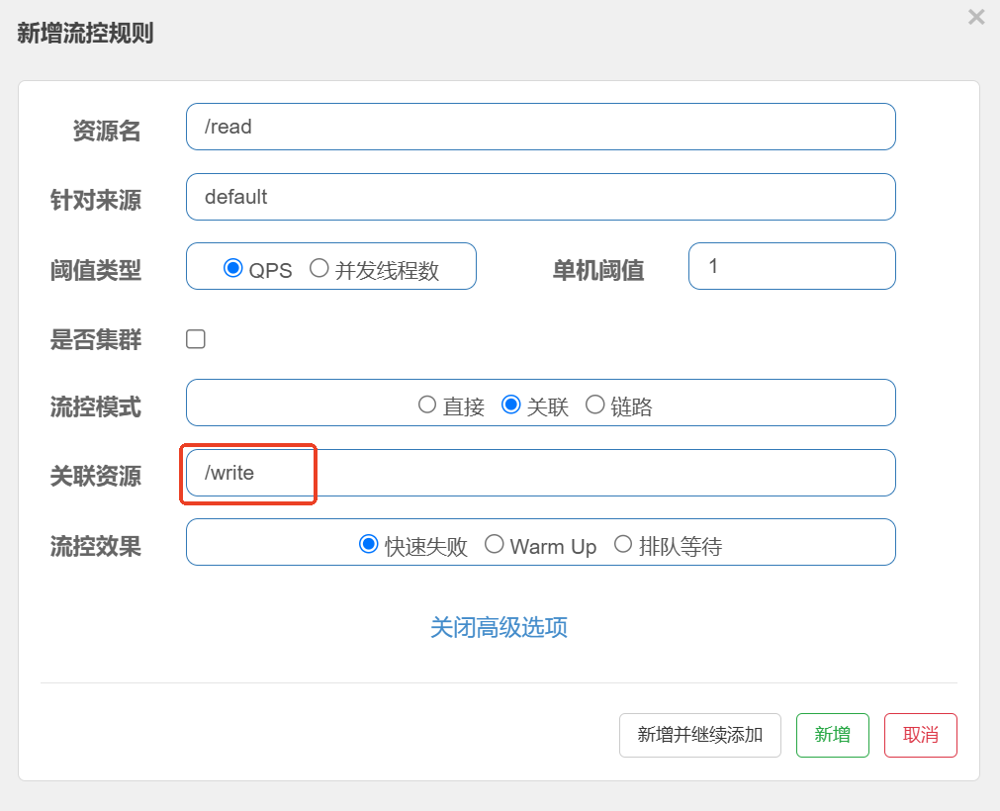

**测试：打开两个浏览器窗口（两个窗口你需要在 1 秒内快速完成切换才能测试出效果）**

1. http://localhost:8000/read
2. http://localhost:8000/write

先在写的窗口上频繁刷新，再在读的窗口上频繁刷新，结果在读的窗口上会出现以下信息：

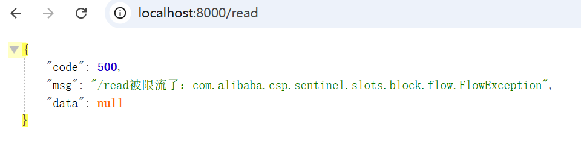

## 流控规则之流控效果

**流控效果包括三种：快速失败（直接拒绝）、Warm Up（预热）、排队等待**


注意官方文档中有这样一句话：

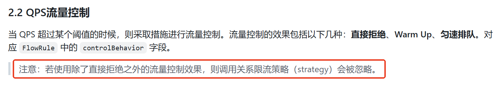

这句话的意思是：`**Warm Up**`和**排队等待**的流控效果**只支持**流控模式为**直接模式**，不支持**链路模式**和**关联模式**。

### 快速失败

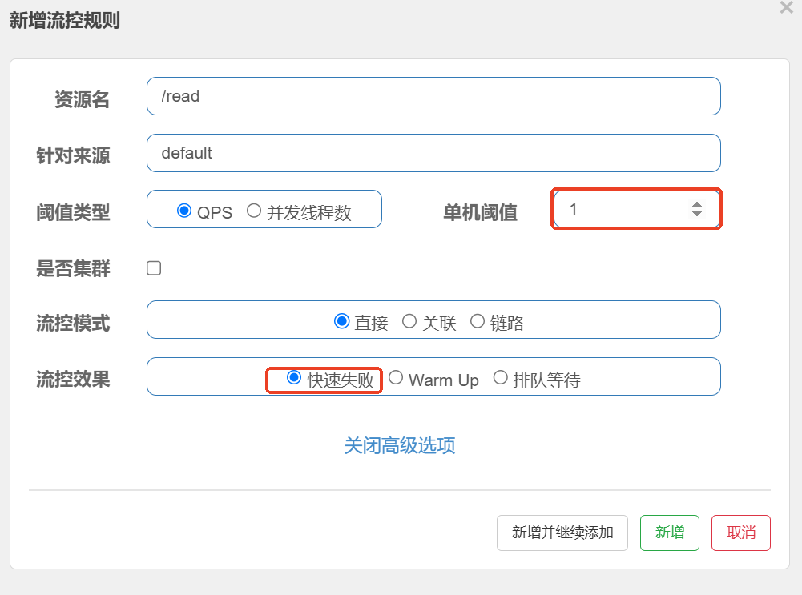

**快速失败的效果是：如果没有超出阈值，正常处理，超出阈值则抛出 FlowException，超出的请求均被丢弃。**

设置以上规则之后，访问时超出阈值后：

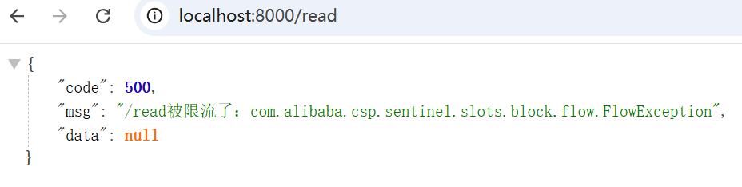

**接下来，我们使用 Apipost 来测试一下：**

**第一步：**`**OrderController**`**中引入日志，方便后续的观察**

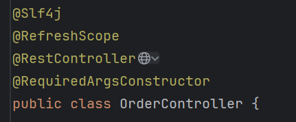

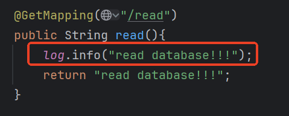

**第二步：改造之前自定义的 **`**MyBlockExceptionHandler**`**，添加响应码 429，让 Apipost 工具能够快速识别出请求是成功了还是失败了。**

```java
package com.jkweilai.order.exception;

import com.alibaba.csp.sentinel.adapter.spring.webmvc_v6x.callback.BlockExceptionHandler;
import com.alibaba.csp.sentinel.slots.block.BlockException;
import com.fasterxml.jackson.databind.ObjectMapper;
import com.jkweilai.common.R;
import jakarta.servlet.http.HttpServletRequest;
import jakarta.servlet.http.HttpServletResponse;
import org.springframework.stereotype.Component;

import java.io.PrintWriter;

@Component
public class MyBlockExceptionHandler implements BlockExceptionHandler {

    private final ObjectMapper objectMapper = new ObjectMapper();

    @Override
    public void handle(HttpServletRequest request, HttpServletResponse response, String resourceName, BlockException e) throws Exception {
        // 设置响应状态码 429，主要目的是为了让Apipost工具能够快速识别请求是成功了还是失败了。
        // 状态码429表示：too many requests 请求太多了。
        response.setStatus(429);
        response.setContentType("application/json;charset=utf-8");
        PrintWriter out = response.getWriter();
        R r = R.error(500, resourceName + "被限流了：" + e.getClass().getName());
        String json = objectMapper.writeValueAsString(r);
        out.print(json);
        out.flush();
    }
}
```

**第三步：重启服务，创建流控规则，测试一下，超出阈值之后，响应的状态码是否为 429**

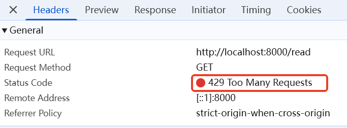

**第四步：使用 Apipost 进行压测**

- 调试：在 **调试 **面板的 **后执行操作 中添加断言，断言 200** 是响应正常的，其它状态码表示失败。

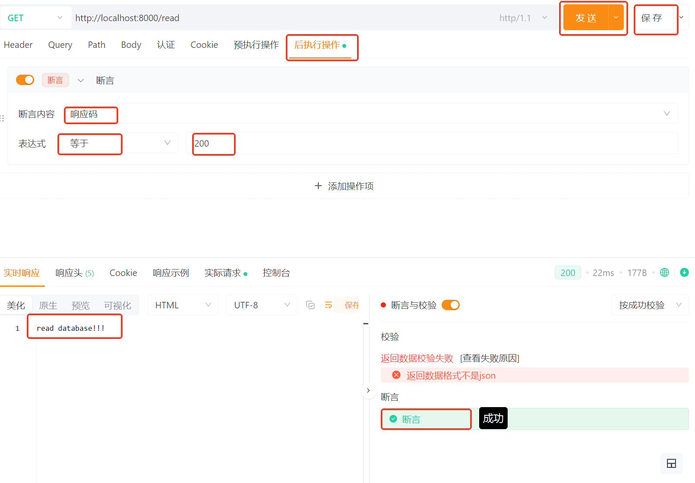

- 一键压测：并发数设置为 10（可以理解为连接池的大小，或者理解为参与工作的线程数），按压测时长，持续时长 5 秒。

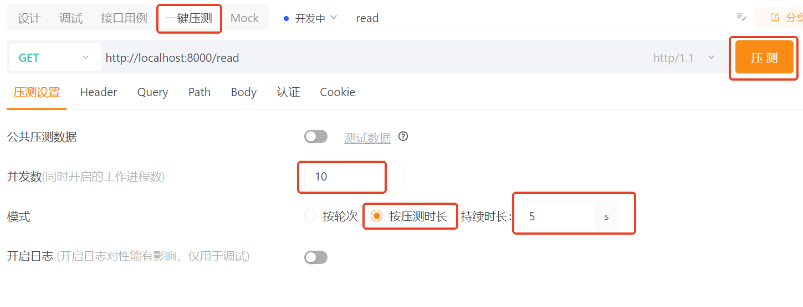

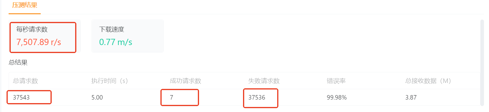

压测 5 秒，按说应该是 5 次请求，怎么解释？

限流规则是按平均QPS控制的，实际实现中允许短暂突发或存在统计误差，所以在 5 秒的压测周期内，成功请求数略高于设定值（5 次）是正常现象。

### Warm Up

Warm Up方式，即**预热/冷启动**方式。当系统长期处于低水位的情况下，当流量突然增加时，直接把系统拉升到高水位可能瞬间把系统压垮。通过“冷启动”，让通过的流量缓慢增加，在一定时间内逐渐增加到阈值上限，给冷系统一个预热的时间，避免冷系统被压垮。

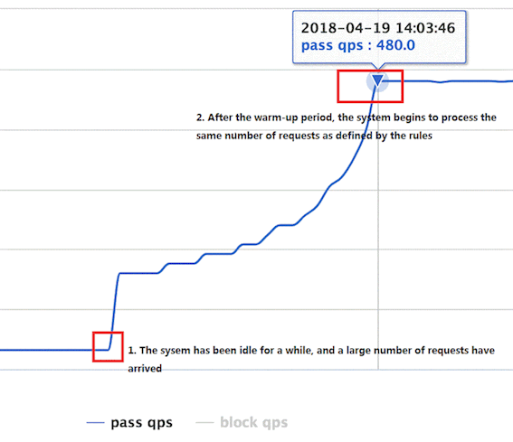

简单概括是：当流量高峰来临时，最开始每秒处理 2 个请求（QPS=2），后来每秒处理 4 个请求（QPS=4），再后来每秒处理 6 个请求（QPS=6），慢慢增加，直到达到峰值，以后就以峰值平稳运行。这样可以让系统慢慢处理，以适应突然到来的高峰请求。

**因此，如果使用流控效果 Warm Up 方式，则需要配置两个值**：

1. QPS=3：表示最多每秒处理的请求数（也就是峰值）
2. Period=3：表示冷启动周期 3 秒

如果配置以上的两个值，由于冷启动周期是 3 秒，则第 1 秒的时候 QPS=1，第 2 秒的时候 QPS=2，第 3 秒的时候 QPS=3，达到峰值。然后以峰值平稳运行。

**接下来我们测试一下：**

设置单机阈值 QPS=12，选择 Warm Up，预热时长设置为 Preriod=3。

第 1 秒 QPS=4，第 2 秒 QPS=8，第 3 秒 QPS=12，达到峰值后，以峰值平稳运行。

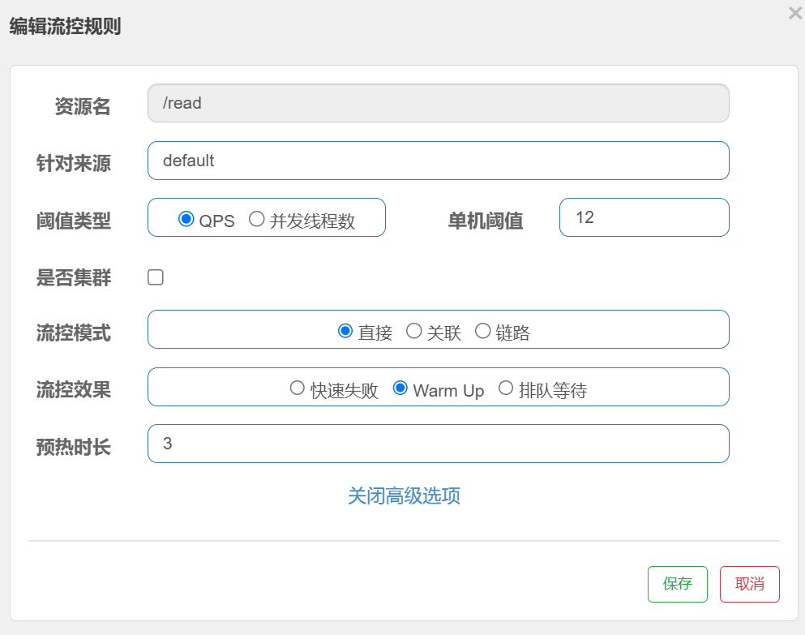

压测工具的话，仍然设置工作进程数 10，压测 5 秒：

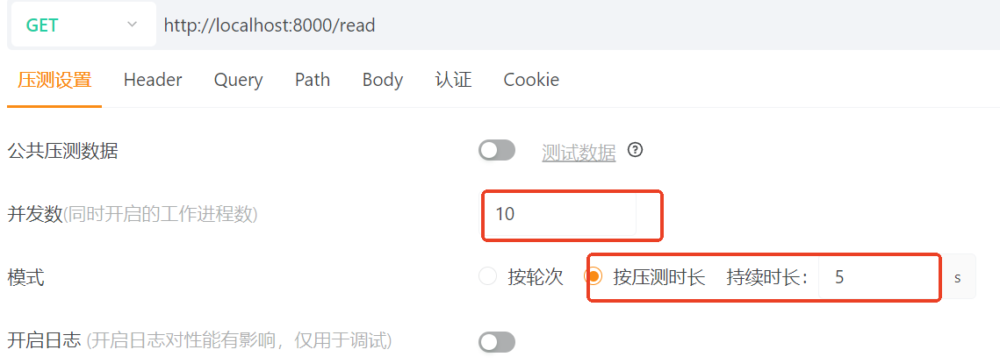

测试结果如下：

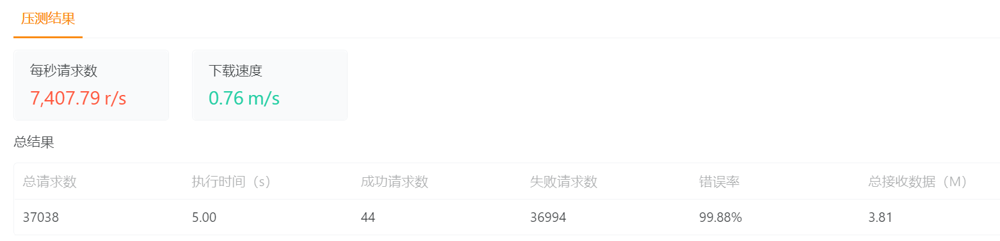

再看控制台的输出：

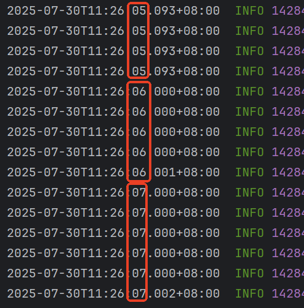

可以看到逐步递增的效果即可，肯定是有误差的。

### 排队等待

匀速排队方式会严格控制请求通过的间隔时间，让请求以均匀的速度通过，对应的是**漏桶算法**。

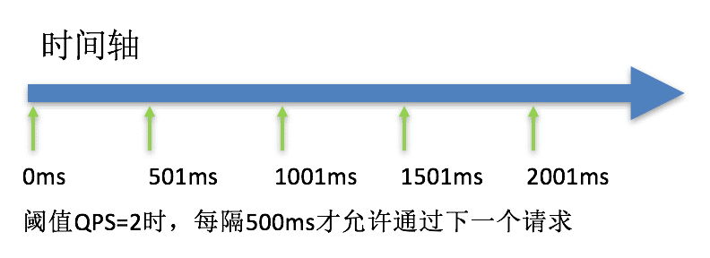

这种方式主要用于处理间隔性突发的流量，例如消息队列。想象一下这样的场景，在某一秒有大量的请求到来，而接下来的几秒则处于空闲状态，我们希望系统能够在接下来的空闲期间逐渐处理这些请求，而不是在第一秒直接拒绝多余的请求。

**注意：匀速排队模式暂时不支持 QPS > 1000 的场景。**

**设置流控效果为：排队等待时，需要设置的值包括两个：**

1. QPS=2：每秒处理 2 个请求（相当于每 500ms 处理 1 个请求），多余的请求去排队。
2. timeout=20s：如果排队时间超过 20s，则被丢弃。

测试一下：设置 **QPS=2**，**timeout=1s**，流控效果为**排队等待**

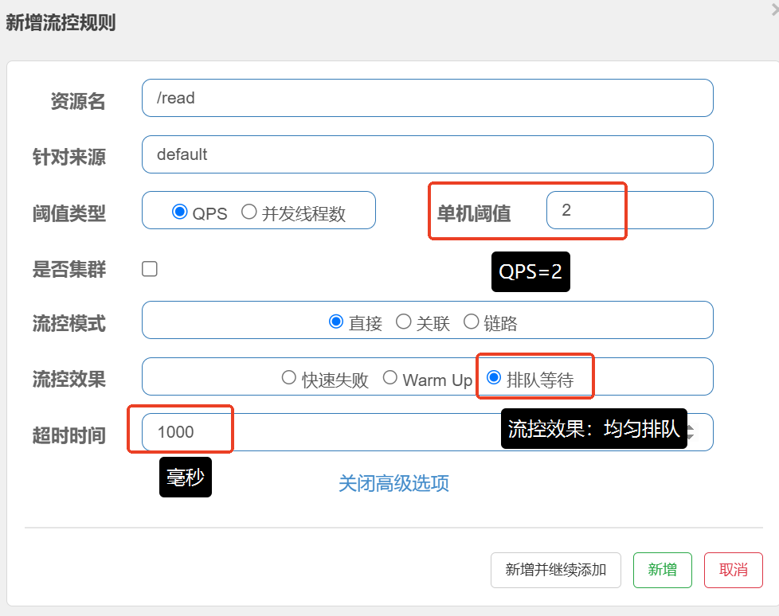

**压测：工作线程数 10 个，压测 5 秒，测试结果如下：**

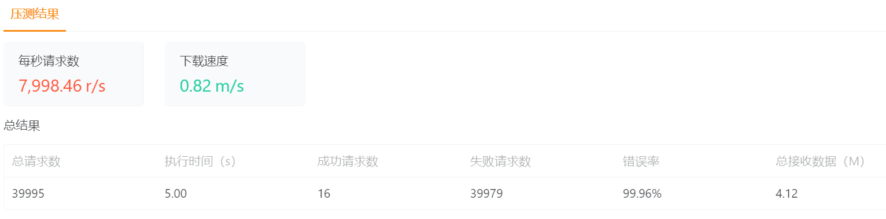

**控制台输出效果：**

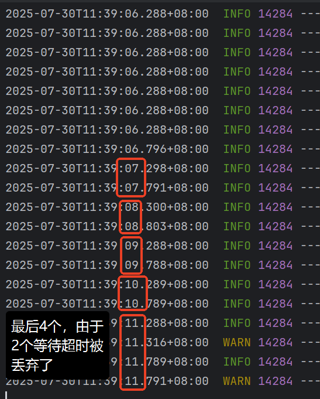

# 熔断规则

## 理解熔断降级机制

参考官方文档：[熔断降级](https://github.com/alibaba/Sentinel/wiki/%E7%86%94%E6%96%AD%E9%99%8D%E7%BA%A7)（**DegradeRule**）

除了流量控制以外，对调用链路中不稳定的资源进行熔断降级也是保障高可用的重要措施之一。一个服务常常会调用别的模块，可能是另外的一个远程服务、数据库，或者第三方 API 等。例如，支付的时候，可能需要远程调用银联提供的 API；查询某个商品的价格，可能需要进行数据库查询。然而，这个被依赖服务的稳定性是不能保证的。如果依赖的服务出现了不稳定的情况，请求的响应时间变长，那么调用服务的方法的响应时间也会变长，线程会产生堆积，最终可能耗尽业务自身的线程池，服务本身也变得不可用。

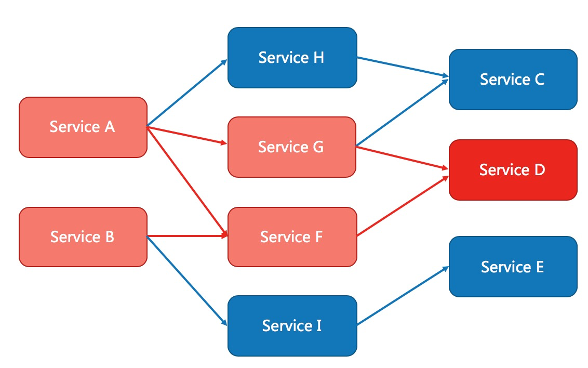

现代微服务架构都是分布式的，由非常多的服务组成。不同服务之间相互调用，组成复杂的调用链路。以上的问题在链路调用中会产生放大的效果。复杂链路上的某一环不稳定，就可能会层层级联，最终导致整个链路都不可用。因此我们需要对不稳定的**弱依赖服务调用**进行熔断降级，暂时切断不稳定调用，避免局部不稳定因素导致整体的雪崩。**熔断降级作为保护自身的手段，通常在调用端进行配置**。

**关键点：**

1. 尽量对**不稳定的弱依赖服务**调用进行熔断降级。
2. 熔断降级是为了切断不稳定调用。
3. 快速返回不积压。
4. 避免雪崩效应。
5. 熔断降级一般在调用端进行设置。

## 熔断器（断路器）

**熔断降级底层是通过熔断器来实现的。**

### 熔断器的工作状态

**熔断器：**又叫断路器，可以想象成一个电源开关。它有 3 种工作状态：

1. 闭合：A 服务**能**够正常调用 B 服务，状态为闭合。
2. 打开：A 服务**不能**够正常调用 B 服务，状态为打开。
3. 半开：A 服务**试探性**的调用 B 服务，状态为半开。

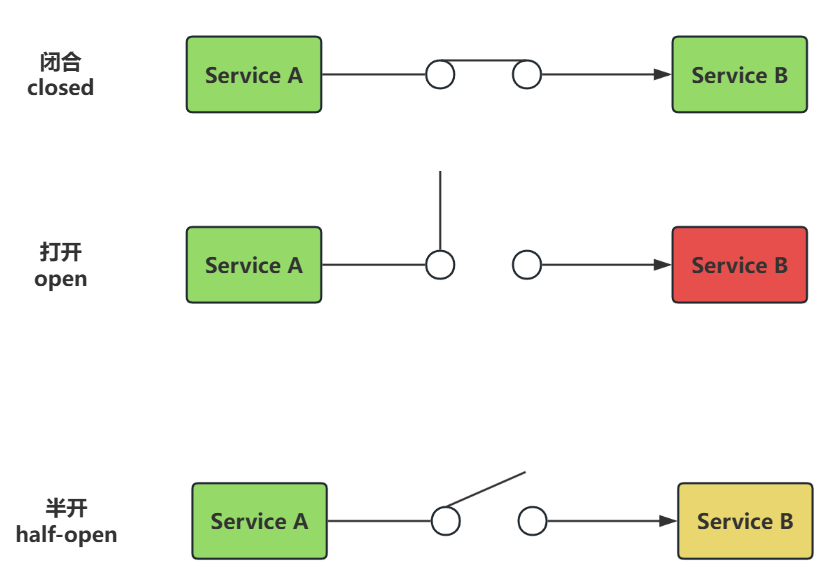

### 熔断策略

**所谓的熔断策略是：满足什么条件时，断路器会打开。一共提供了三种策略：**

1. **慢调用比例：**
  1. 假设我设定 A 服务调用 B 服务时，耗费的时间超过 1s 为慢调用。
  2. 假设我设定慢调用比例为 70%，

上面策略制定好之后，假设发送了 100 个请求，其中超过 70 个请求都为慢调用，则熔断器进入打开状态。

1. **异常比例：**
  1. 假设我设定异常比例为 30%

上面策略制定好之后，假设发送了 100 个请求，其中超过 30 个请求都发生了异常，则熔断器进入打开状态。

1. **异常数：**
  1. 假设我设定异常数为 15

上面策略制定好之后，和发送请求的总数量没有关系，只要发生异常的累计次数大于 15 次，则熔断器进入打开状态。

### 熔断器工作原理

**断路器工作原理如下：**

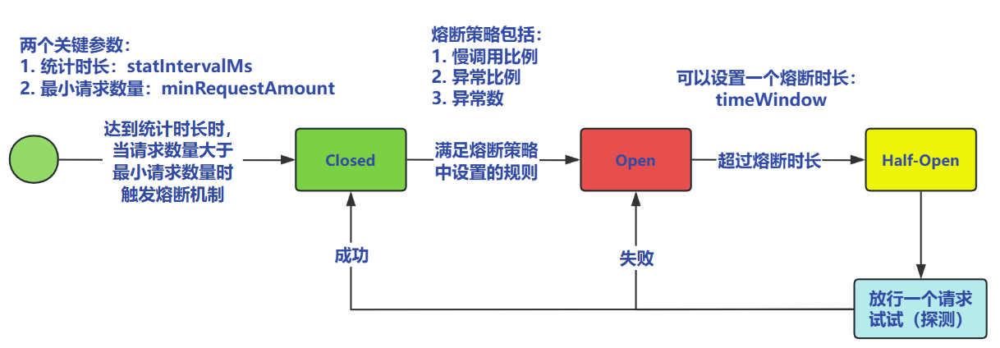

**工作原理描述：**

1. **有两个非常关键的参数：**
  1. 统计时长：statIntervalMs，假设设定为 10s，**统计时长一直统计的是到当前时刻的前 10 秒时间，也就是说只要第一个 10 秒时间过去之后，以后任何时刻都是满足统计时长的**。
  2. 最小请求数量：minRequestAmount，假设设定为 5，则表示最近 10 秒内请求数量如果大于 5，才会触发熔断机制。如果请求量小于等于 5，则没必要触发熔断机制。
2. 按照以上的两个参数进行配置后
  1. 如果 10 秒内请求数大于 5，则触发熔断机制，此时需要看熔断器的状态，如果熔断器的状态是 Closed，则请求正常处理。
  2. 当然，也可能在处理请求的过程中满足了熔断策略（慢调用比例、异常比例、异常数），此时熔断器状态更新为 Open，请求会快速返回不积压（比如我们配置的 fallback 兜底回调），熔断器立即进入计时周期，假设计时周期设定 30s，则在 30s 后，熔断器状态会自动更新为 Half-Open 状态，此时会试探性的放行一个请求，看看请求是否能够正常处理，如果仍然不能正常处理，则继续将熔断器的状态更新为 Open，如果能够正常处理，则熔断器的状态更新为 Closed。

### 熔断策略之慢调用比例

多数情况下是配置 **远程调用（Open Feign）** 的熔断策略。

下面我们来配置一下 **订单服务远程调用商品服务 **的熔断策略。注意：是在调用端配置，也就是在订单服务中进行策略的配置。如下：

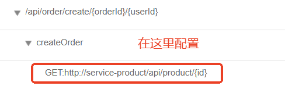

具体配置如下（点击上图右侧的熔断）：

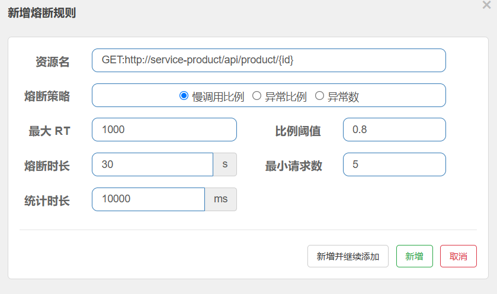

以上的配置表示：

1. 熔断策略采用慢调用比例。
2. 当一次请求的处理时间超过 1 秒，则认为是慢调用。
3. 慢调用比例达到 80%时触发熔断
4. 熔断时长计时周期为：30 秒。30 秒后会进入半开状态。
5. 如果在最近 10 秒内，请求次数累计大于 5 时触发熔断机制。

为了演示效果，我们在获取商品的服务中，添加 2 秒延迟（也就是每个请求都需要 2 秒才能处理完），在 `ProductController`中添加以下代码：

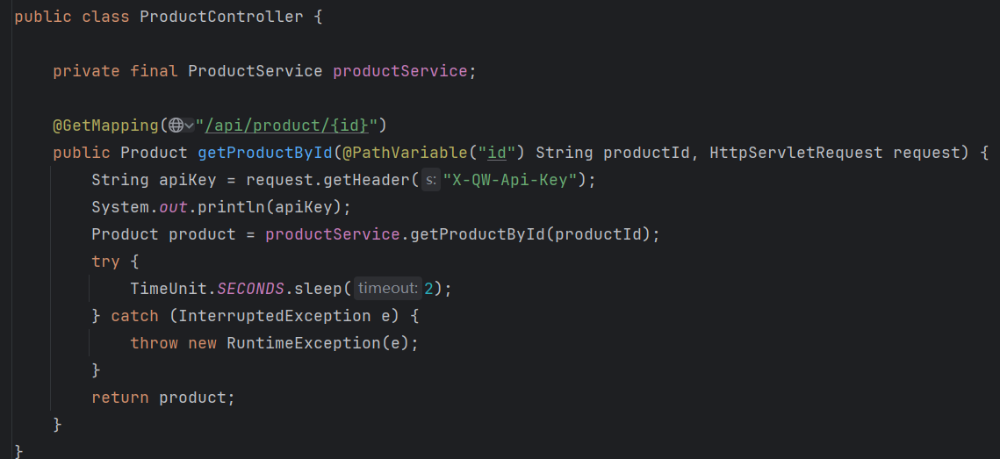

启动订单服务和商品服务，发送请求创建订单，开始时慢点刷新，每 2 秒刷新一次，都是正常的，但是刷新变快的话，效果如下图所示：

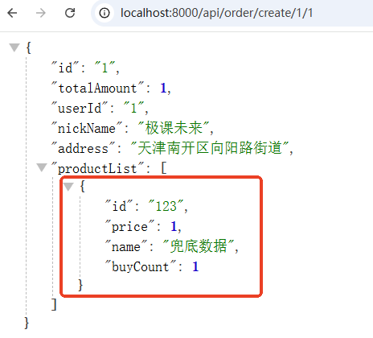

再过 30s，再刷新一次，它又可以了，这是因为熔断器计时周期结束，进入了半开状态：

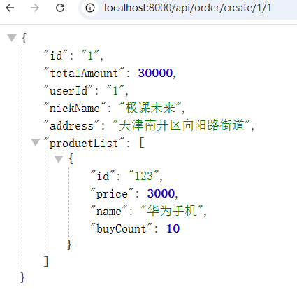

### 熔断策略之异常比例

首先我们先来看，当远程调用时发生了异常，没有熔断机制的时候，会是怎样的？

在 `ProductController`中编写异常代码，如：`int i = 10 / 0;`

**浏览器上的测试结果如下：**

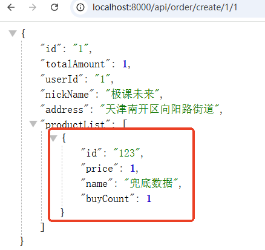

**后端控制台的测试结果如下：**

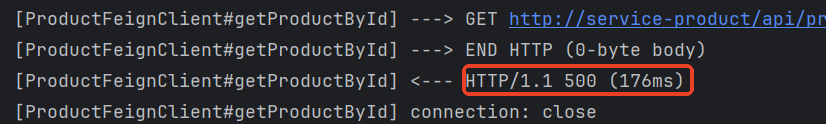

通过测试可以得知：当远程调用的服务出现异常之后，如果没有熔断机制的话，每一次这个存在异常的服务都会执行一次。显然这种效率是比较低的。

加入熔断机制，可以提高效率，也就是说：当加入熔断机制以后，当异常发生的比例达到设定的比例时，触发熔断，一旦熔断之后，再次发送远程服务调用时，存在异常的远程服务则不再执行。直接返回兜底，效率较高。

**因此，当远程调用服务时，不加熔断机制和加入熔断机制的区别，如下图所示：**

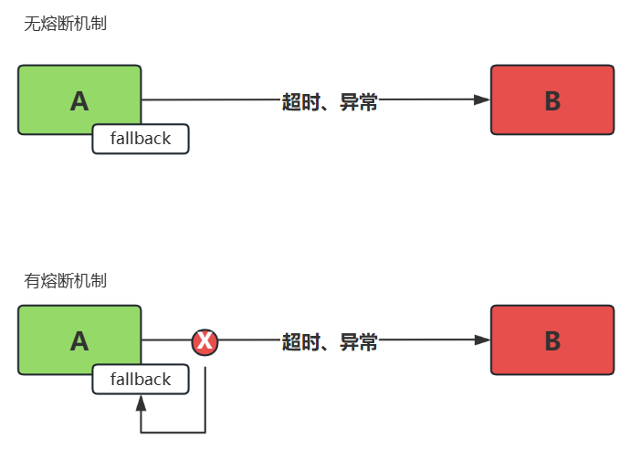

**配置异常比例：**

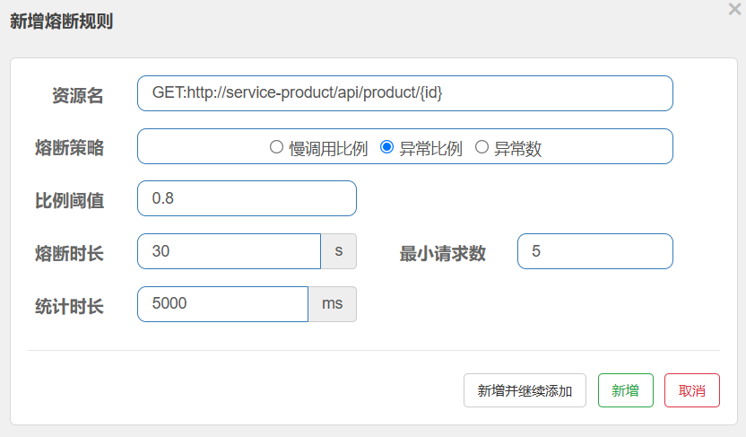

以上的配置表示：

1. 统计时长 5 秒，最小请求数累计 5 个时触发熔断机制。
2. 如果请求中发生异常的请求数量达到 80%，触发熔断。
3. 熔断计时周期设置为 30 秒。

测试：主要看一下后端，在发生熔断之后，是否还会继续返回 500 的错误。

**不加熔断机制：发生异常的程序会一直执行。**

**加熔断机制：当达到异常比例后，自动熔断，发生异常的程序则不再执行。**

### 熔断策略之异常数

配置异常数的话，和比例就没有关系了，是异常的累计数字达到设置的数字时就会触发熔断。

配置异常数：

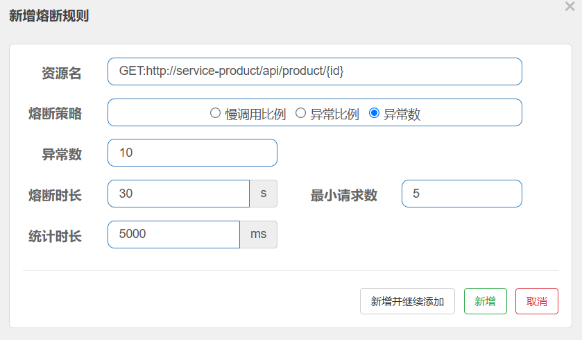

测试：发送 10 次请求之后，看看后续请求是否还会走远程服务。

**正常情况是：达到设定的异常数量后，自动熔断，后续有异常的程序则不再执行。**

**注意：不管是异常比例还是异常数，这里统计的异常都是业务异常，BlockException 不会统计。**

# 热点规则

热点规则，又叫：热点参数限流。因此热点规则实际上是属于流控规则。所谓的热点就是经常被访问的数据，叫做热点数据。

之前我们所学的流控规则是对整个资源进行限流，而热点规则可以对带有特定参数的资源进行限流，更细粒度。

所谓的** 热点参数限流 **指的是：专门细粒度的针对某个带有特定参数的资源进行限流。

例如：你可以对 `http://localhost:8000/api/product?id=110`进行限流，表示当 `id=110`时被限流，`id=其他值`不限流。

官方文档中有这样一个图：

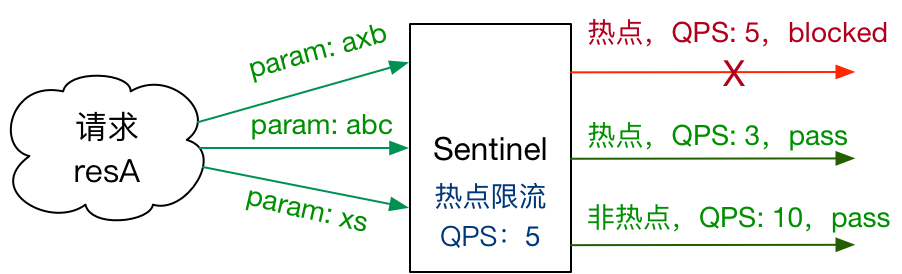

上图中表示 `axb`和 `abc`参数都是热点参数，对于热点参数来说，QPS 超过 5 时会被 `blocked`，小于 5 时会通过。对于非热点参数来说，QPS 达到多少也无所谓，都能通过。

**提出 3 个需求：**

1. 每个用户秒杀，QPS 不允许超过 1（可以认为请求参数中带有 userId 参数的都是用户秒杀请求，防止用户编写一些脚本代码来疯狂秒杀）
2. 1 号用户是会员，为了提高会员的体验，对于 1 号用户不限流。（userId=1 的用户不限流）
3. 订单 id 是 666 的，不允许访问

以上的 3 个需求的完成，都可以使用 **热点参数限流 **来完成。

**另外，还需要注意的是，官方文档中有这样一段描述：**

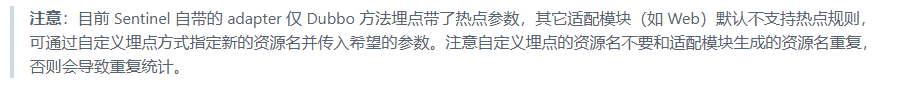

简而言之：① Dubbo 自带热点支持 ② 其他场景需手动扩展 ③ 资源名防重复

需要注意的是：之前所学的 Web 接口默认就是一种资源，但是如果使用热点参数限流的话，需要在 Web 接口上重新定义资源埋点。并且定义资源埋点时资源的名字不要和 Web 接口默认的资源名一致。

## 需求 1

下面我们来实现一下上面 3 个需求中的第一个需求：在 `OrderController`中找到秒杀的接口，然后在秒杀的 Web 接口上做资源埋点，代码如下：

```java
@GetMapping("/api/order/seckill/{orderId}/{userId}")
@SentinelResource(value = "seckill", fallback = "seckillFallback")
public Order seckill(@PathVariable("orderId") String orderId, @PathVariable("userId") String userId) {
    Order order = orderService.createOrder(orderId, userId);
    order.setId("秒杀");
    return order;
}

// 秒杀的兜底回调fallback
public Order seckillFallback(String orderId, String userId, BlockException e) {
    System.out.println("seckillFallback...");
    Order order = new Order();
    order.setId("秒杀");
    order.setTotalAmount(new BigDecimal(0));
    order.setNickName("异常信息描述：" + e.getClass());
    order.setProductList(null);
    order.setAddress("");
    return order;
}
```

**正常访问下单：**

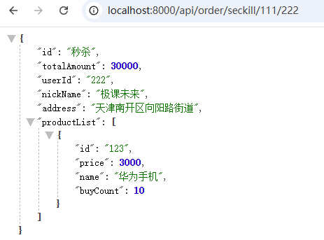

**查看 Sentinel 控制台，看看有没有出现上面的资源埋点：seckill**

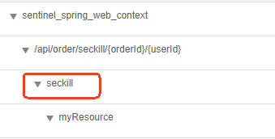

**接下来，我们就可以为资源埋点 seckill 添加热点参数限流规则：**

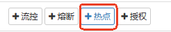

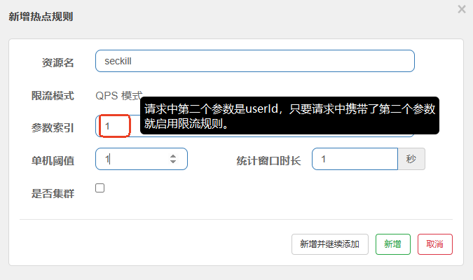

以上的限流规则是，只要请求的 URL 中含有第二个参数，就启用限流规则。

**正常访问，1 秒发送 1 次请求，不会有问题：**

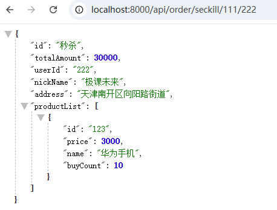

**如果违背 QPS=1，刷快了，就会出现下面的错误：**

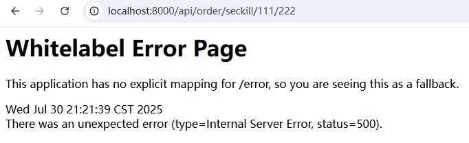

可以看出被限流了，但是并没有我们编写的兜底回调。**这里画个问号？？？？？？**

**我们现在不添加第二个参数试试：**

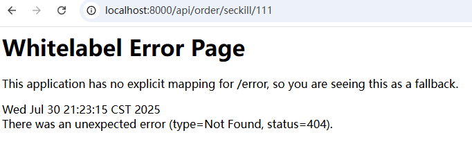

报 404 错误了，这是因为后端程序中要求必须提供两个参数，因此可以修改后端程序，让参数变为不是必须参数。代码如下：

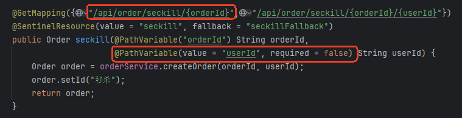

我们再来试试：在不添加第二个参数的情况下，刷新快一些，看看是否还限流（**修改代码了，重启服务，然后热点参数限流规则重新配置哦**）：

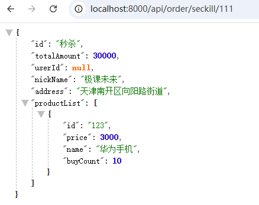

不携带第二个参数时，随便刷新，不限流。

## 需求 2

1 号用户是会员，为了提高会员的体验，对于 1 号用户不限流。（userId=1 的用户不限流）

要完成上面的限流规则，可以在热点参数限流规则中开启高级选项，配置具体的参数值为 1 时不限流，如下：

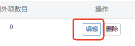

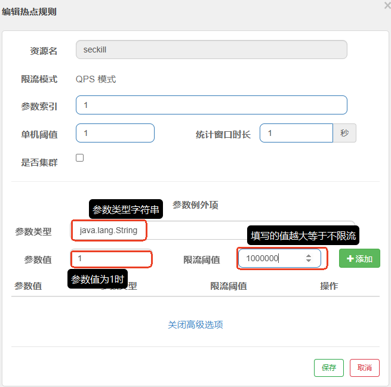

编辑完成后，记得点击右侧的绿色


按钮哦。保存后，可以看到有 1 个例外：

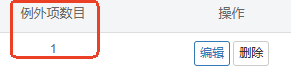

测试，看看参数中加上 `userId=1`和 `userId=其它`，看看是不是 `userId=1`的不限流。

## 需求 3

订单 id 是 666 的不允许访问。

这个时候我们就需要给第 1 个参数（下标为 0）新增一个热点参数限流规则了。

新增热点参数限流规则：

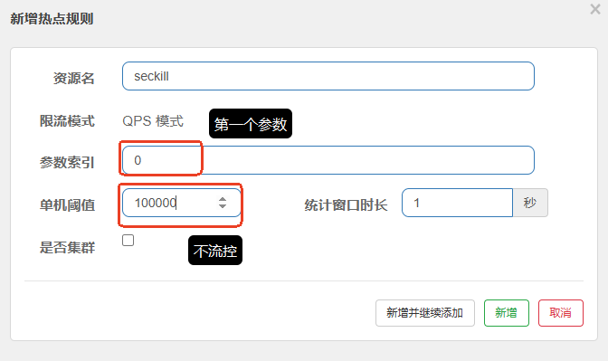

新增之后再编辑：

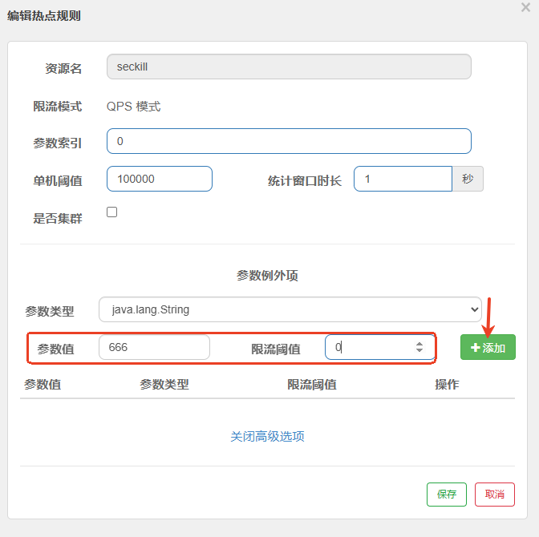

保存之后有 1 个例外：

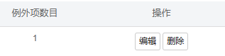

测试：当 `userId=1`和 `orderId!=666`时，不限流。当`userId=1`和 `orderId=666`时限流。

## 兜底回调不生效的问题

以上兜底回调不生效的主要原因是：当兜底回调使用 fallback 时，兜底回调的异常参数类型不应该使用 BlockException，需要使用 Throwable。

这个记住就行了：如果是 `blockHandler`最后一个异常参数类型是 `BlockException`，如果是 `fallback`最后一个异常参数类型是 `Throwable`

将 fallback 兜底回调的函数的最后一个参数类型修改为 Throwable 即可，代码如下：

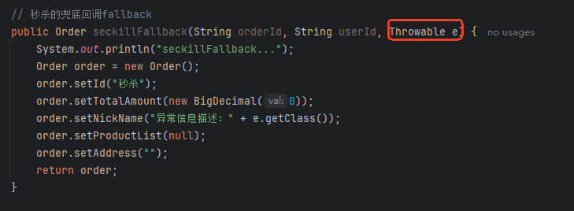

重启服务，重新设定热点参数限流规则，再次测试：

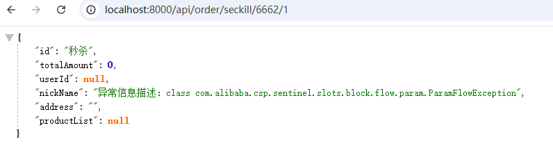

兜底回调执行了。

# 授权规则与系统规则

在大型项目中，**Sentinel的系统规则和授权规则**的使用频率相对较低。

官方文档中：**系统自适应限流**对应的就是**系统规则**。**黑白名单控制**对应的就是**授权规则**。

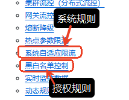

## 系统规则（System Rule）

- **功能**：保护系统整体稳定性（如全局QPS、线程数、CPU负载、平均RT等）。
- **使用场景**：
  - **短时流量激增**：例如突发流量导致系统负载飙升，可通过系统规则快速限流。
  - **基础防护**：作为系统整体的兜底方案，防止资源被耗尽（如线程池满）。
- **为何使用较少**：
  - **替代方案更灵活**：
    - **Kubernetes HPA**：通过自动扩缩容应对负载变化。
    - **服务网格（如Istio）**：提供全局流量控制。
    - **云厂商工具**：AWS ALB、阿里云SLB的限流功能。
  - **粒度问题**：系统规则是全局阈值，粒度太粗。
- **适用情况**：
  - 单体或小型分布式系统。
  - 作为其他防护措施的补充还行。

### 系统规则具体配置

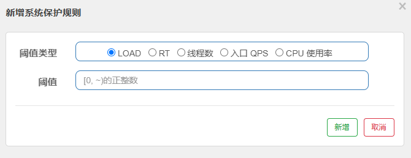

1. **LOAD**（系统负载）：
  - 当系统的 **1分钟平均负载**超过阈值时触发保护。
2. **RT**（平均响应时间）：
  - 当所有请求的**平均响应时间**（单位：毫秒）超过阈值时限流。
3. **线程数**：
  - 当**并发处理线程数**超过阈值时拒绝新请求，避免线程耗尽。
4. **入口 QPS**：
  - 当整个系统的**每秒总请求量**超过阈值时触发全局限流。
5. **CPU 使用率**：
  - 当**CPU利用率百分比**超过阈值时（如80%），触发保护，防止CPU过载。

## 授权规则（Authority Rule）

- **功能**：限制调用方的访问权限。
- **使用场景**：
  - **黑白名单控制**：例如封禁恶意IP或限制内部服务调用权限。
- **为何使用较少**：
  - **替代方案更成熟**：
    - **API网关**（如Kong、Spring Cloud Gateway）：集成鉴权、OAuth2.0等。
    - **安全中间件**：如防火墙、WAF（Web应用防火墙）。
    - **服务网格**：通过mTLS和RBAC实现服务间安全通信。
  - **功能单一**：仅支持简单黑白名单，无法处理复杂鉴权逻辑（如JWT、ABAC）。
- **适用情况**：
  - 快速实现简单的IP封禁。
  - 与其他安全措施配合使用。

### 授权规则具体配置

在Sentinel的**授权规则（Authority Rule）中，需要填写的三个字段分别对应不同的访问控制维度。以下是每个字段的含义、填写示例**和**注意事项**：

1. **资源名（resource）**

- **填写你要**保护的资源（如接口、服务、方法）。

1. **流控应用（limitApp）**

- 填写你要限制的调用方的身份（如IP、服务名、应用名）。

1. **授权类型（strategy）**

- 选择白名单表示允许这些调用方访问。
- 选择黑名单表示不允许这些调用方访问。

1. **完整配置示例**

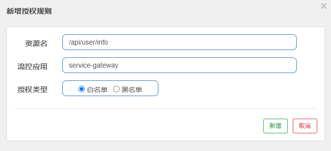

以上配置表示：保护用户信息查询接口 `/api/user/info`，只允许网关调用，其他请求全部拒绝。

# Sentinel规则丢失的问题

## 规则丢失的原因

Sentinel在服务重启时规则丢失的根本原因是：**默认情况下，Sentinel将所有规则保存在内存中**，属于"原始模式"的规则管理方式。这种设计虽然简单直接，但存在以下问题：

1. **内存存储的临时性**：规则仅存在于JVM内存中，服务重启后内存数据自然丢失
2. **无持久化机制**：默认配置下没有将规则持久化到外部存储
3. **控制台推送的局限性**：即使通过Sentinel Dashboard配置规则，也只是推送到客户端内存

## 解决方案：规则持久化

要解决规则丢失问题，需要实现规则的持久化存储。Sentinel提供了三种主要的规则管理模式：

### 原始模式（不推荐生产使用）

- **特点**：规则保存在内存，重启即丢失
- **适用场景**：仅用于开发和测试环境

### Pull模式

- **原理**：客户端定期从持久化存储（如文件、数据库）拉取规则更新
- **实现方式**：
  - 使用`WritableDataSource`扩展
  - 客户端定时轮询本地文件或数据库
- **优点**：简单，无需额外依赖
- **缺点**：实时性差，可能存在数据不一致问题

### Push模式（推荐生产使用）

- **原理**：规则中心（如Nacos）统一推送，客户端监听变化
- **实现方式**：
  - 使用`ReadableDataSource`扩展
  - 集成配置中心如Nacos、Zookeeper等
- **优点**：
  - 规则持久化
  - 保证一致性
  - 实时性好
- **缺点**：需要引入第三方配置中心依赖

## 具体实现方案（以Nacos为例）

### 添加依赖

在 `jike-services`中添加依赖：

```xml
<dependency>
    <groupId>com.alibaba.csp</groupId>
    <artifactId>sentinel-datasource-nacos</artifactId>
</dependency>
```

### 配置YAML

在 `application-feign.yml`中添加配置：

```yaml
spring:
  cloud:
    sentinel:
      # 新增以下配置
      datasource:
        flow:
          nacos:
            server-addr: localhost:8848  # Nacos地址
            dataId: service-order-flow-rules
            groupId: DEFAULT_GROUP
            data-type: json
            rule-type: flow
```

### Nacos中配置规则示例

- **点【配置管理】→【配置列表】→【+】**
- **Data ID:** `<font style="color:rgb(15, 17, 21);background-color:rgb(235, 238, 242);">service-order-flow-rules</font>`
- **Group:** `<font style="color:rgb(15, 17, 21);background-color:rgb(235, 238, 242);">DEFAULT_GROUP</font>`
- **格式:** `<font style="color:rgb(15, 17, 21);background-color:rgb(235, 238, 242);">JSON</font>`

```json
[
  {
    "resource": "createOrder",
    "grade": 1,
    "count": 10,
    "limitApp": "default",
    "strategy": 0,
    "controlBehavior": 0
  }
]
```

### 验证规则加载

在 IDEA 中启动项目，看看 sentinel 的控制台中是否有这个规则。有这个规则说明成功了。