# 1.6.Spring Cloud Alibaba Seata

# 理解分布式事务

为什么会产生分布式事务，想想我们以前是怎么控制事务的？

**在 JDBC 中，事务是怎么控制的？**

```java
Connection conn = null;
// ...
try {
    //...
    // 开启事务（将自动提交机制关闭）
    conn.setAutoCommit(false);

    // 处理完整的业务逻辑
    // 这个业务逻辑可能是多条DML语句共同才能完成的
    
    // 提交事务
    conn.commit();
} catch(Exception e){
    // 回滚事务
    if(conn != null){
        conn.rollback();
    }
} finally{
    // 释放资源
}
```

要想保证事务，首先在业务开始前开启事务，也就是把自动提交机制关闭，改为手动提交，业务处理过程中没有出现任何异常，业务正常结束后，手动提交事务。其次是在整个处理过程中 `conn`对象必须是同一个。

**后来学习了 Spring 框架之后，事务是怎么控制的？**

```java
@Service
public class AccountServiceImpl implements AccountService{

    // ...
    private AccountMapper accountMapper;
    
    @Transactional
    public void transfer(String fromActNo, String toActNo, BigDecimal amount){
        // ...
        accountMapper.doSome();
        // ...
        accountMapper.doOther();
        // ...
    }
}
```

学习了 Spring 框架之后，要控制事务，在 `service`层控制事务，因为事务和业务是挂钩的。在需要控制事务的方法上添加 `@Transactional`注解。

在 Spring 框架整合 MyBatis 的情况下，当使用 `**<font style="color:rgb(64, 64, 64);background-color:rgb(236, 236, 236);">@Transactional</font>**` 注解时，Spring 可以保证在整个 `**<font style="color:rgb(64, 64, 64);background-color:rgb(236, 236, 236);">transfer</font>**` 方法执行期间使用同一个数据库连接（Connection 对象）。这是通过 Spring 的事务管理机制实现的，具体原理如下：

- **事务拦截器**：当方法被 `**<font style="color:rgb(64, 64, 64);background-color:rgb(236, 236, 236);">@Transactional</font>**` 注解标记时，Spring 会通过 AOP 代理在方法调用前后添加事务管理的逻辑。
- **连接绑定到线程**：Spring 会从数据源中获取一个连接，并将该连接绑定到当前线程（通过 `**<font style="color:rgb(64, 64, 64);background-color:rgb(236, 236, 236);">ThreadLocal</font>**` 实现），确保方法中所有数据库操作使用同一个连接。
- **MyBatis 的适配**：Spring 整合 MyBatis 时，会通过 `**<font style="color:rgb(64, 64, 64);background-color:rgb(236, 236, 236);">SqlSessionTemplate</font>**` 管理 MyBatis 的 `**<font style="color:rgb(64, 64, 64);background-color:rgb(236, 236, 236);">SqlSession</font>**`，而 `**<font style="color:rgb(64, 64, 64);background-color:rgb(236, 236, 236);">SqlSession</font>**` 的数据库操作会从 Spring 的事务管理器中获取当前线程绑定的连接。

在分布式系统当中，微服务是讲究自治的（自己治理自己），每个微服务连接的都是自己的数据库，如下图：

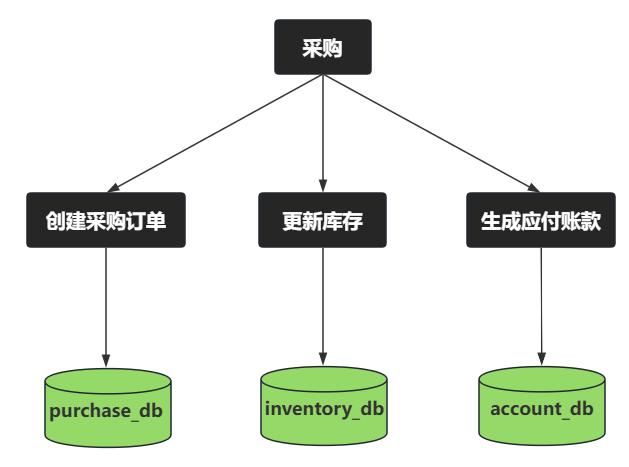

假设我要完成一个采购的业务，当采购动作发起后：

1. 先创建采购订单（用 conn1 操作 purchase_db）
2. 触发更新库存的操作（用 conn2 操作 inventory_db）
3. 最后生成应付账款（用 conn3 操作 account_db）

很显然，在分布式系统当中，每个服务都有自己的连接对象，每个连接对象都是一个独立的事务，它们各自之间没有任何关系。不会因为其中一个失败了，另外两个回滚的情况，因为它们本身就是互不相干，完全独立。

这就是分布式事务产生的原因，要解决这个问题，可以使用 `Spring Cloud Alibaba Seata`，它提供了分布式事务的一站式解决方案。

接下来，我们就用 **采购链核心业务** 来学习分布式事务，先来一步一步把环境搭起来。

# 采购链核心业务

采购入库生成采购订单，采购订单生成后触发库存增加，库存增加成功后生成应付账款记录。

微服务的设计，如下图所示：

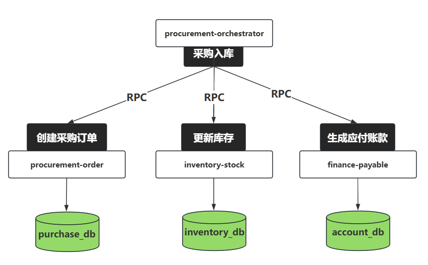

对于当前业务来说，分布式事务要保证的是：

1. 当创建采购订单失败时，回滚，这一点不需要处理，只要在创建采购订单的业务方法上使用@Transactional注解即可，因为它是第一个被调用的微服务，本地事务即可保证。
2. 当更新库存失败后，采购订单要删除。
3. 当生成应付账款失败时，更新库存要回滚，采购订单要删除。

# 创建 procure-chain 微服务项目

## 创建 procure-chain 工程

1. **创建 Spring Boot 工程：**

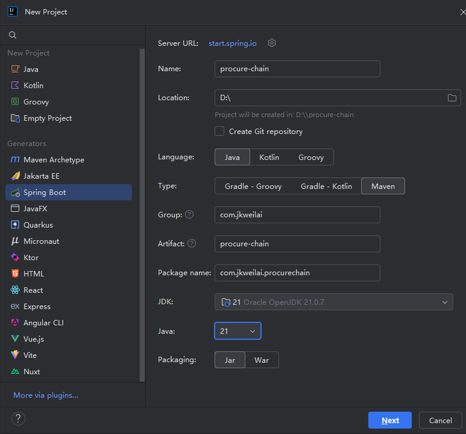

1. **删除没必要的，留下下图的**

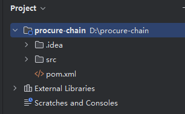

1. **配置 JDK21**

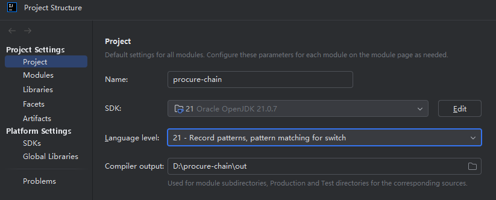

1. **配置 Maven**

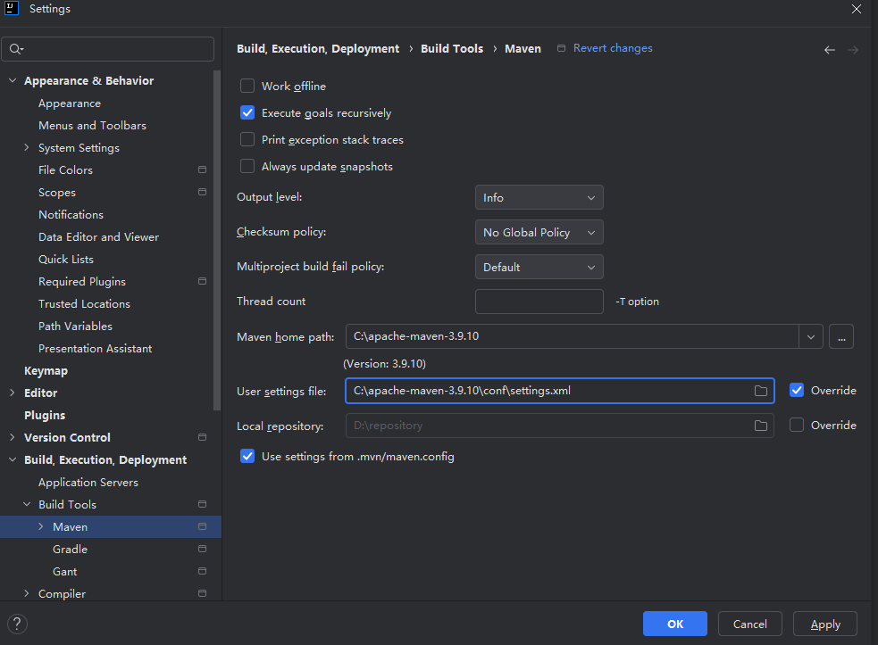

1. **编写 pom.xml**

```xml
<?xml version="1.0" encoding="UTF-8"?>
<project xmlns="http://maven.apache.org/POM/4.0.0" xmlns:xsi="http://www.w3.org/2001/XMLSchema-instance"
         xsi:schemaLocation="http://maven.apache.org/POM/4.0.0 https://maven.apache.org/xsd/maven-4.0.0.xsd">
    <modelVersion>4.0.0</modelVersion>
    <parent>
        <groupId>org.springframework.boot</groupId>
        <artifactId>spring-boot-starter-parent</artifactId>
      
        <!--注意spring boot的版本，更高版本可能不兼容。-->
        <version>3.3.4</version>
      
        <relativePath/>
    </parent>
    <groupId>com.jkweilai</groupId>
    <artifactId>procure-chain</artifactId>
    <version>0.0.1-SNAPSHOT</version>
    <name>procure-chain</name>
    <!--打包方式-->
    <packaging>pom</packaging>
    <description>procure-chain</description>

    <!--版本统一管理-->
    <properties>
        <java.version>21</java.version>
        <project.build.sourceEncoding>UTF-8</project.build.sourceEncoding>
        <spring-cloud.version>2023.0.3</spring-cloud.version>
        <spring-cloud-alibaba.version>2023.0.3.2</spring-cloud-alibaba.version>
    </properties>

    <!--依赖统一管理-->
    <dependencyManagement>
        <dependencies>
            <dependency>
                <groupId>org.springframework.cloud</groupId>
                <artifactId>spring-cloud-dependencies</artifactId>
                <version>${spring-cloud.version}</version>
                <type>pom</type>
                <scope>import</scope>
            </dependency>
            <dependency>
                <groupId>com.alibaba.cloud</groupId>
                <artifactId>spring-cloud-alibaba-dependencies</artifactId>
                <version>${spring-cloud-alibaba.version}</version>
                <type>pom</type>
                <scope>import</scope>
            </dependency>
        </dependencies>
    </dependencyManagement>

    <build>
        <plugins>
            <plugin>
                <groupId>org.springframework.boot</groupId>
                <artifactId>spring-boot-maven-plugin</artifactId>
            </plugin>
        </plugins>
    </build>

</project>
```

1. **删除 src 目录**

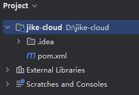

## 创建 services

1. **在 procure-chain 父工程上点击右键，新建模块**

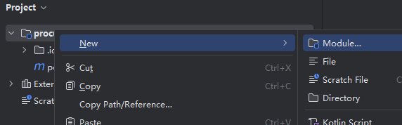

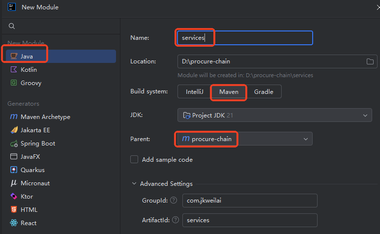

1. **编写 pom.xml 文件**

```xml
<?xml version="1.0" encoding="UTF-8"?>
<project xmlns="http://maven.apache.org/POM/4.0.0"
         xmlns:xsi="http://www.w3.org/2001/XMLSchema-instance"
         xsi:schemaLocation="http://maven.apache.org/POM/4.0.0 http://maven.apache.org/xsd/maven-4.0.0.xsd">
    <modelVersion>4.0.0</modelVersion>
    <parent>
        <groupId>com.jkweilai</groupId>
        <artifactId>procure-chain</artifactId>
        <version>0.0.1-SNAPSHOT</version>
    </parent>

    <!--打包方式-->
    <packaging>pom</packaging>

    <artifactId>services</artifactId>

    <properties>
        <maven.compiler.source>21</maven.compiler.source>
        <maven.compiler.target>21</maven.compiler.target>
        <project.build.sourceEncoding>UTF-8</project.build.sourceEncoding>
    </properties>

</project>
```

1. **删除 src 目录**

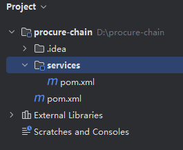

## 创建 4 个服务

都在 `services`模块中创建。

1. **创建 procurement-order 模块（采购服务）**

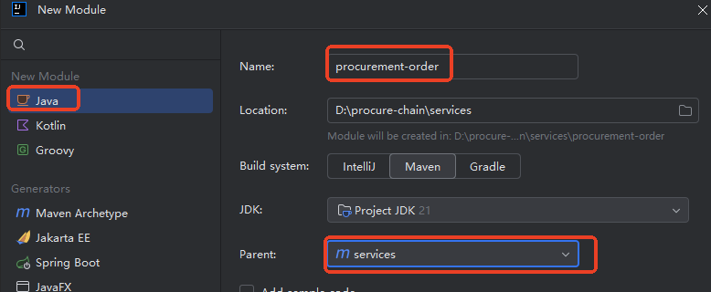

1. **创建 inventory-stock 模块（库存服务）**
2. **创建 finance-payable 模块（财务服务）**
3. **创建 procurement-orchestrator 模块（协调服务）**

## 在 services 中引入公共依赖

可以在 services 模块中引入公共依赖，在 pom.xml 中添加以下配置：

```xml
<dependencies>
    <!--注册中心/配置中心：服务注册与服务发现 Spring Cloud Alibaba Nacos-->
    <dependency>
        <groupId>com.alibaba.cloud</groupId>
        <artifactId>spring-cloud-starter-alibaba-nacos-discovery</artifactId>
    </dependency>
    <!--远程调用 Spring Cloud OpenFeign-->
    <dependency>
        <groupId>org.springframework.cloud</groupId>
        <artifactId>spring-cloud-starter-openfeign</artifactId>
    </dependency>
    <dependency>
        <groupId>org.projectlombok</groupId>
        <artifactId>lombok</artifactId>
        <!-- 仅用于编译时的注解处理 -->
        <scope>annotationProcessor</scope>
    </dependency>
</dependencies>
```

这样所有子服务自动引入 services 中的依赖。

# 注册所有服务到注册中心

1. **每个服务均为 web 项目，添加 web 启动器。**

```xml
<dependencies>
    <dependency>
        <groupId>org.springframework.boot</groupId>
        <artifactId>spring-boot-starter-web</artifactId>
    </dependency>
</dependencies>
```

1. **每个服务均编写主入口程序。**

```java
package com.jkweilai.payable;

import org.springframework.boot.SpringApplication;
import org.springframework.boot.autoconfigure.SpringBootApplication;

@SpringBootApplication
public class PayableMainApplication {
    public static void main(String[] args) {
        SpringApplication.run(PayableMainApplication.class, args);
    }
}
```

1. **每个服务均编写 **`**application.yml**`**配置文件，在配置文件中指定 Nacos 地址。**

```yaml
spring:
  cloud:
    nacos:
      server-addr: 127.0.0.1:8848
  application:
    name: finance-payable
server:
  port: 6000
```

```yaml
spring:
  cloud:
    nacos:
      server-addr: 127.0.0.1:8848
  application:
    name: inventory-stock
server:
  port: 7000
```

```yaml
spring:
  cloud:
    nacos:
      server-addr: 127.0.0.1:8848
  application:
    name: procurement-orchestrator
server:
  port: 9000
```

```yaml
spring:
  cloud:
    nacos:
      server-addr: 127.0.0.1:8848
  application:
    name: procurement-order
server:
  port: 8000
```

1. **每个服务均需要引入 spring-cloud-starter-alibaba-nacos-discovery 依赖，因 services 作为父工程已经引入，则子服务模块均不需要再次引入。**

---

1. **启动 Nacos 注册中心，启动所有服务，进入控制台，查看服务是否存在。**

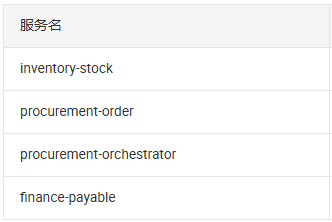

# 测试所有的服务是否可以正常发现

4 个服务随便挑一个进行测试：这里选择 finance-payable 模块进行测试。

**第一步：在 finance-payable 主入口程序上统一添加注解：@EnableDiscoveryClient**

```java
package com.jkweilai.payable;

import org.springframework.boot.SpringApplication;
import org.springframework.boot.autoconfigure.SpringBootApplication;
import org.springframework.cloud.client.discovery.EnableDiscoveryClient;

@EnableDiscoveryClient
@SpringBootApplication
public class PayableMainApplication {
    public static void main(String[] args) {
        SpringApplication.run(PayableMainApplication.class, args);
    }
}
```

**第二步：在 services 模块引入单元测试**

```xml
<dependency>
    <groupId>org.springframework.boot</groupId>
    <artifactId>spring-boot-starter-test</artifactId>
</dependency>
```

**第三步：在 finance-payable 模块中编写单元测试**

```java
package com.jkweilai.payable;

import org.junit.jupiter.api.Test;
import org.springframework.beans.factory.annotation.Autowired;
import org.springframework.boot.test.context.SpringBootTest;
import org.springframework.cloud.client.ServiceInstance;
import org.springframework.cloud.client.discovery.DiscoveryClient;

import java.util.List;

@SpringBootTest
public class DiscoveryClientTest {

    @Autowired
    private DiscoveryClient discoveryClient;

    @Test
    public void testDiscoveryClient() {
        // 获取所有的服务名
        List<String> services = discoveryClient.getServices();
        // 遍历服务名
        for (String service : services) {
            // 根据服务名获取所有的服务实例
            List<ServiceInstance> instances = discoveryClient.getInstances(service);
            // 遍历服务实例
            instances.forEach(serviceInstance -> {
                String host = serviceInstance.getHost();
                int port = serviceInstance.getPort();
                System.out.println("服务实例" + service + "在这个地址运行：" + host + ":" + port);
            });
        }
    }
}
```

**第四步：运行，查看测试结果，看看服务是否都能够正常被发现。**

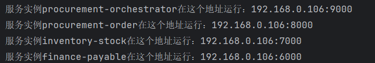

4 个服务均可以正常被发现。

# 数据库表的设计

## purchase_db

为 **采购服务** 创建单独的数据库：purchase_db

**采购订单** 表：purchase_orders

| **字段名** | **类型** | **说明** | **示例值** |
| --- | --- | --- | --- |
| `id` | BIGINT | 主键，订单ID | 1001 |
| `supplier_id` | BIGINT | 供应商ID | 1 |
| `product_id` | BIGINT | 商品ID（关联库存服务） | 101 |
| `quantity` | INT | 采购数量 | 10 |
| `total_amount` | DECIMAL(10,2) | 总金额 | 5000.00 |
| `status` | VARCHAR(20) | 订单状态（CREATED/FAILED/PAID） | "CREATED" |
| `create_time` | DATETIME | 创建时间 | 2026-10-01 12:00:00 |

## inventory_db

为 **库存服务** 创建单独的数据库：inventory_db

**库存** 表：inventory_stock

| **字段名** | **类型** | **说明** | **示例值** |
| --- | --- | --- | --- |
| `**<font style="color:rgb(64, 64, 64);background-color:rgb(236, 236, 236);">product_id</font>**` | BIGINT | 商品ID（主键） | 101 |
| `**<font style="color:rgb(64, 64, 64);background-color:rgb(236, 236, 236);">stock</font>**` | INT | 当前库存数量 | 100 |
| `**<font style="color:rgb(64, 64, 64);background-color:rgb(236, 236, 236);">locked_stock</font>**` | INT | 预占库存（TCC模式用） | 0 |

## finance_db

为 **财务服务** 创建单独的数据库：finance_db

**应付账款** 表：accounts_payable

| **字段名** | **类型** | **说明** | **示例值** |
| --- | --- | --- | --- |
| `id` | BIGINT | 主键 | 1 |
| `order_id` | BIGINT | 关联采购订单ID | 1001 |
| `amount` | DECIMAL(10,2) | 应付金额 | 5000.00 |
| `status` | VARCHAR(20) | 状态（UNPAID/PAID） | "UNPAID" |
| `create_time` | DATETIME | 创建时间 | 2025-10-01 12:00:00 |

**建表 SQL：**

```sql
DROP DATABASE IF EXISTS `purchase_db`;
CREATE DATABASE `purchase_db`;
USE `purchase_db`;

DROP TABLE IF EXISTS `purchase_orders`;
CREATE TABLE `purchase_orders` (
  `id` BIGINT PRIMARY KEY AUTO_INCREMENT,
  `supplier_id` BIGINT NOT NULL,
  `product_id` BIGINT NOT NULL,
  `quantity` INT NOT NULL,
  `total_amount` DECIMAL(10,2) NOT NULL,
  `status` VARCHAR(20) DEFAULT 'CREATED',
  `create_time` DATETIME DEFAULT CURRENT_TIMESTAMP,
  KEY `idx_product_id` (`product_id`)
) ENGINE=InnoDB;

INSERT INTO `purchase_orders` 
  (`supplier_id`, `product_id`, `quantity`, `total_amount`, `status`, `create_time`)
VALUES
  (1, 101, 10, 50000.00, 'CREATED', '2025-10-01 09:00:00'),
  (2, 102, 5, 1500.00, 'PAID', '2025-10-01 10:30:00'),
  (1, 101, 20, 100000.00, 'FAILED', '2025-10-02 14:15:00');

DROP DATABASE IF EXISTS `inventory_db`;
CREATE DATABASE `inventory_db`;
USE `inventory_db`;
DROP TABLE IF EXISTS `inventory_stock`;
CREATE TABLE `inventory_stock` (
  `product_id` BIGINT PRIMARY KEY,
  `stock` INT NOT NULL DEFAULT 0,
  `locked_stock` INT NOT NULL DEFAULT 0,
  CHECK (`stock` >= 0)                 
) ENGINE=InnoDB;

INSERT INTO `inventory_stock` 
  (`product_id`, `stock`, `locked_stock`)
VALUES
  (101, 80, 10),
  (102, 50, 0);
  
DROP DATABASE IF EXISTS `finance_db`;
CREATE DATABASE `finance_db`;
USE `finance_db`;
DROP TABLE IF EXISTS `accounts_payable`;
CREATE TABLE `accounts_payable` (
  `id` BIGINT PRIMARY KEY AUTO_INCREMENT,
  `order_id` BIGINT NOT NULL,
  `amount` DECIMAL(10,2) NOT NULL,
  `status` VARCHAR(20) DEFAULT 'UNPAID',
  `create_time` DATETIME DEFAULT CURRENT_TIMESTAMP,
  UNIQUE KEY `uk_order_id` (`order_id`)
) ENGINE=InnoDB;

INSERT INTO `accounts_payable` 
  (`order_id`, `amount`, `status`, `create_time`)
VALUES
  (1, 50000.00, 'UNPAID', '2025-10-01 09:00:00'),
  (2, 1500.00, 'PAID', '2025-10-01 10:30:00');
```

# 定义实体类

在 `procure-chain`工程下创建新的子模块：model，用来存放实体类。

**创建 **`**model**`**模块：**

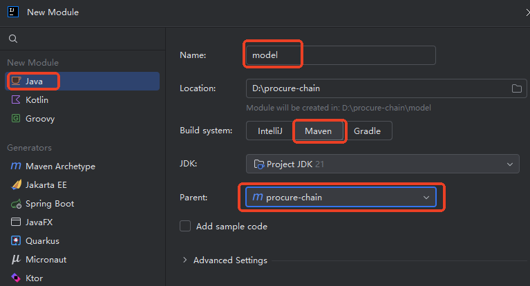

**model 中引入 lombok 依赖：**

```xml
<dependencies>
    <dependency>
        <groupId>org.projectlombok</groupId>
        <artifactId>lombok</artifactId>
    </dependency>
</dependencies>
```

**编写实体类：PurchaseOrder（采购订单）**

```java
package com.jkweilai.order.entity;

import lombok.Data;

import java.math.BigDecimal;

@Data
public class PurchaseOrder {
    // 订单id
    private Long id;
    // 供应商id
    private Long supplierId;
    // 商品id
    private Long productId;
    // 采购数量
    private Integer quantity;
    // 总金额
    private BigDecimal totalAmount;
    // 订单状态：CREATED/FAILED/PAID
    private String status;
    // 创建时间：2026-10-01 12:00:00
    private String createTime;
}
```

**编写实体类：InventoryStock（库存）**

```java
package com.jkweilai.stock.entity;

import lombok.Data;

// 库存
@Data
public class InventoryStock {
    // 商品id
    private Long productId;
    // 当前库存数量
    private Integer stock;
    // 预占库存
    private Integer lockedStock;
}
```

**编写实体类：AccountPayable（应付账款）**

```java
package com.jkweilai.payable.entity;

import lombok.Data;

import java.math.BigDecimal;

// 应付账款
@Data
public class AccountPayable {
    // 主键
    private Long id;
    // 关联 采购订单id
    private Long orderId;
    // 应付金额
    private BigDecimal amount;
    // 状态：UNPAID/PAID
    private String status;
    // 创建时间：2025-10-01 12:00:00
    private String createTime;
}
```

在 services 模块引入 model 依赖。这样在所有的微服务中都可以使用这些实体类了

```xml
<dependency>
    <groupId>com.jkweilai</groupId>
    <artifactId>model</artifactId>
    <version>0.0.1-SNAPSHOT</version>
</dependency>
```

另外，在 services 模块中继续引入 mybatis 和 mysql 依赖，为后续功能做准备：

```xml
<!--mybatis的启动器-->
<dependency>
    <groupId>org.mybatis.spring.boot</groupId>
    <artifactId>mybatis-spring-boot-starter</artifactId>
    <version>3.0.3</version>
</dependency>
<!--mysql的驱动依赖-->
<dependency>
    <groupId>com.mysql</groupId>
    <artifactId>mysql-connector-j</artifactId>
    <scope>runtime</scope>
</dependency>
```

# 采购入库服务实现

## 编写 mapper

### 编写 mapper 接口

```java
package com.jkweilai.order.mapper;

import com.jkweilai.order.entity.PurchaseOrder;

public interface PurchaseOrderMapper {
    int insert(PurchaseOrder purchaseOrder);
}
```

然后在主入口程序上添加 Mapper 扫描注解：

```java
@MapperScan(basePackages = "com.jkweilai.order.mapper")
@SpringBootApplication
public class OrderMainApplication {
    public static void main(String[] args) {
        SpringApplication.run(OrderMainApplication.class, args);
    }
}
```

### 编写 mapper xml

在 `resources`目录下新建 `mapper`目录，新建配置文件 `PurchaseOrderMapper.xml`，编写以下配置：

```xml
<?xml version="1.0" encoding="UTF-8" ?>
<!DOCTYPE mapper
        PUBLIC "-//mybatis.org//DTD Mapper 3.0//EN"
        "https://mybatis.org/dtd/mybatis-3-mapper.dtd">

<mapper namespace="com.jkweilai.order.mapper.PurchaseOrderMapper">

    <insert id="insert" useGeneratedKeys="true" keyProperty="id">
        INSERT INTO `purchase_orders`
        (`supplier_id`, `product_id`, `quantity`, `total_amount`, `status`, `create_time`)
        VALUES
        (#{supplierId}, #{productId}, #{quantity}, #{totalAmount}, #{status}, #{createTime})
    </insert>

</mapper>
```

## 编写 application.yml 配置

主要配置两项：

1. 数据源配置
2. mybatis 的配置：mapper 配置文件的位置，开启下划线转驼峰映射

```yaml
spring:
  cloud:
    nacos:
      server-addr: 127.0.0.1:8848
  application:
    name: procurement-order

  datasource:
    type: com.zaxxer.hikari.HikariDataSource
    driver-class-name: com.mysql.cj.jdbc.Driver
    url: jdbc:mysql://localhost:3306/purchase_db
    username: root
    password: 123456

server:
  port: 8000

mybatis:
  configuration:
    map-underscore-to-camel-case: true
  mapper-locations: classpath:mapper/*.xml
```

## 编写 service

### 编写 service 接口

```java
package com.jkweilai.order.service;

import com.jkweilai.order.entity.PurchaseOrder;

public interface PurchaseOrderService {

    /**
     * 采购入库：创建采购订单。
     * @param purchaseOrder
     */
    PurchaseOrder createPurchaseOrder(PurchaseOrder purchaseOrder);

}
```

### 编写 service 接口的实现

```java
package com.jkweilai.order.service.impl;

import com.jkweilai.order.entity.PurchaseOrder;
import com.jkweilai.order.mapper.PurchaseOrderMapper;
import com.jkweilai.order.service.PurchaseOrderService;
import lombok.RequiredArgsConstructor;
import org.springframework.stereotype.Service;
import org.springframework.transaction.annotation.Transactional;

import java.time.LocalDateTime;
import java.time.format.DateTimeFormatter;

@Service
@RequiredArgsConstructor
public class PurchaseOrderServiceImpl implements PurchaseOrderService {

    private final PurchaseOrderMapper purchaseOrderMapper;

    // 添加事务控制，最起码保证这个方法本身是没问题的。
    @Transactional
    @Override
    public PurchaseOrder createPurchaseOrder(PurchaseOrder purchaseOrder) {
        // 状态
        purchaseOrder.setStatus("CREATED");
        // 创建时间
        String createTime = DateTimeFormatter.ofPattern("yyyy-MM-dd HH:mm:ss").format(LocalDateTime.now());
        purchaseOrder.setCreateTime(createTime);
        // 保存采购订单
        return purchaseOrderMapper.insert(purchaseOrder) == 1 ? purchaseOrder : null;
    }
}
```

## 编写 controller

```java
package com.jkweilai.order.controller;

import com.jkweilai.order.entity.PurchaseOrder;
import com.jkweilai.order.service.PurchaseOrderService;
import lombok.RequiredArgsConstructor;
import org.springframework.web.bind.annotation.PostMapping;
import org.springframework.web.bind.annotation.RequestMapping;
import org.springframework.web.bind.annotation.RequestParam;
import org.springframework.web.bind.annotation.RestController;

import java.math.BigDecimal;

@RequestMapping("/api/order")
@RestController
@RequiredArgsConstructor
public class PurchaseOrderController {

    private final PurchaseOrderService purchaseOrderService;

    @PostMapping("/create")
    public PurchaseOrder createPurchaseOrder(@RequestParam Long productId,
                                             @RequestParam Long supplierId,
                                             @RequestParam BigDecimal totalAmount,
                                             @RequestParam Integer quantity) {
        PurchaseOrder purchaseOrder = new PurchaseOrder();
        purchaseOrder.setProductId(productId);
        purchaseOrder.setSupplierId(supplierId);
        purchaseOrder.setTotalAmount(totalAmount);
        purchaseOrder.setQuantity(quantity);
        return purchaseOrderService.createPurchaseOrder(purchaseOrder);
    }

}
```

## 测试采购入库服务接口

**接口地址：**[http://localhost:8000/api/order/create](http://localhost:8000/api/order/create)

**请求参数：**

```plaintext
productId=101&supplierId=201&totalAmount=50000&quantity=10
```

**响应结果：**

```json
{
        "id": 4,
        "supplierId": 201,
        "productId": 101,
        "quantity": 10,
        "totalAmount": 50000,
        "status": "CREATED",
        "createTime": "2026-02-05 14:33:04"
}
```

**再查看数据库表中有没有新增记录：**

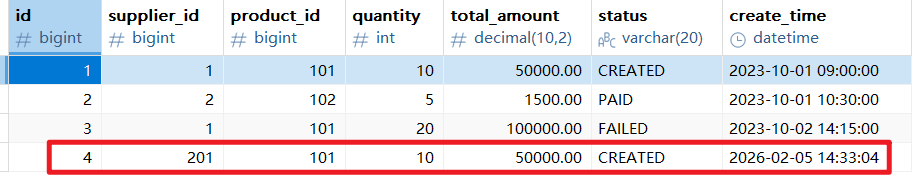

# 库存更新服务实现

## 编写 mapper

### 编写 mapper 接口

```java
package com.jkweilai.stock.mapper;

import com.jkweilai.stock.entity.InventoryStock;

public interface InventoryStockMapper {
    /**
     * 根据商品id查询该商品的库存信息。
     * @param productId 商品id
     * @return 库存信息
     */
    InventoryStock selectByProductId(Long productId);

    /**
     * 保存库存信息
     * @param inventoryStock 库存
     * @return 1表示保存成功
     */
    int insert(InventoryStock inventoryStock);

    /**
     * 更新库存信息
     * @param inventoryStock 库存信息
     * @return 1表示更新成功
     */
    int update(InventoryStock inventoryStock);
}
```

### 编写 mapper xml

```xml
<?xml version="1.0" encoding="UTF-8" ?>
<!DOCTYPE mapper
        PUBLIC "-//mybatis.org//DTD Mapper 3.0//EN"
        "https://mybatis.org/dtd/mybatis-3-mapper.dtd">

<mapper namespace="com.jkweilai.stock.mapper.InventoryStockMapper">

    <select id="selectByProductId" resultType="InventoryStock">
        select * from inventory_stock where product_id = #{productId}
    </select>

    <insert id="insert">
        insert into inventory_stock(product_id, stock) values(#{productId}, #{stock})
    </insert>

    <update id="update">
        update inventory_stock set stock = #{stock} where product_id = #{productId}
    </update>

</mapper>
```

主入口添加 Mapper 扫描：

```java
package com.jkweilai.stock;

import org.mybatis.spring.annotation.MapperScan;
import org.springframework.boot.SpringApplication;
import org.springframework.boot.autoconfigure.SpringBootApplication;

@MapperScan(basePackages = "com.jkweilai.stock.mapper")
@SpringBootApplication
public class StockMainApplication {
    public static void main(String[] args) {
        SpringApplication.run(StockMainApplication.class, args);
    }
}
```

## 编写 application.yml

```yaml
spring:
  cloud:
    nacos:
      server-addr: 127.0.0.1:8848
  application:
    name: inventory-stock
  datasource:
    type: com.zaxxer.hikari.HikariDataSource
    driver-class-name: com.mysql.cj.jdbc.Driver
    url: jdbc:mysql://localhost:3306/inventory_db
    username: root
    password: 123456
server:
  port: 7000
mybatis:
  mapper-locations: classpath:mapper/*.xml
  configuration:
    map-underscore-to-camel-case: true
  type-aliases-package: com.jkweilai.stock.entity
```

## 编写 service

### service 接口

```java
package com.jkweilai.stock.service;

import com.jkweilai.stock.entity.InventoryStock;

public interface InventoryStockService {
    /**
     * 增加库存
     * @param inventoryStock 库存信息
     * @return 新增的库存
     */
    InventoryStock increaseStock(InventoryStock inventoryStock);
}
```

### service 实现

```java
package com.jkweilai.stock.service.impl;

import com.jkweilai.stock.entity.InventoryStock;
import com.jkweilai.stock.mapper.InventoryStockMapper;
import com.jkweilai.stock.service.InventoryStockService;
import lombok.RequiredArgsConstructor;
import org.springframework.stereotype.Service;
import org.springframework.transaction.annotation.Transactional;

@Service
@RequiredArgsConstructor
public class InventoryStockServiceImpl implements InventoryStockService {

    private final InventoryStockMapper inventoryStockMapper;

    @Transactional
    @Override
    public InventoryStock increaseStock(InventoryStock inventoryStock) {
        // 根据商品id查询库存
        InventoryStock inventoryStockFromDB = inventoryStockMapper.selectByProductId(inventoryStock.getProductId());
        if(inventoryStockFromDB == null) {
            inventoryStockMapper.insert(inventoryStock);
        }else{
            // 前端传递过来的库存数量
            Integer stock = inventoryStock.getStock();
            // 数据库表中库存数量
            Integer stockFromDB = inventoryStockFromDB.getStock();
            // 库存总数
            Integer newStock = stock + stockFromDB;
            // 更新内存
            inventoryStock.setStock(newStock);
            // 更新库存
            inventoryStockMapper.update(inventoryStock);
        }
        return inventoryStock;
    }
}
```

## 编写 controller

```java
package com.jkweilai.stock.controller;

import com.jkweilai.stock.entity.InventoryStock;
import com.jkweilai.stock.service.InventoryStockService;
import lombok.RequiredArgsConstructor;
import org.springframework.web.bind.annotation.PostMapping;
import org.springframework.web.bind.annotation.RequestMapping;
import org.springframework.web.bind.annotation.RequestParam;
import org.springframework.web.bind.annotation.RestController;

@RequestMapping("/api/stock")
@RestController
@RequiredArgsConstructor
public class InventoryStockController {
    
    private final InventoryStockService inventoryStockService;
    
    @PostMapping("/increase")
    public InventoryStock increaseStock(@RequestParam Long productId, 
                                        @RequestParam Integer stock) {
        InventoryStock inventoryStock = new InventoryStock();
        inventoryStock.setStock(stock);
        inventoryStock.setProductId(productId);
        return inventoryStockService.increaseStock(inventoryStock);
    }
}
```

## 测试库存更新服务接口

**当数据库表中没有该商品的库存时，测试能不能保存成功**

**接口地址：**[http://localhost:7000/api/stock/increase](http://localhost:7000/api/stock/increase)

**请求参数：**

```plaintext
productId=666&stock=10
```

**响应结果：**

```json
{
    "productId": 666,
    "stock": 10,
    "lockedStock": null
}
```

---

**当数据库表中已经存在该商品库存时，测试能不能更新成功**

**接口地址：**[http://localhost:7000/api/stock/increase](http://localhost:7000/api/stock/increase)

**请求参数：**

```plaintext
productId=666&stock=10
```

**响应结果：**

```json
{
        "productId": 666,
        "stock": 20,
        "lockedStock": null
}
```

# 账务记账服务实现

## 编写 mapper

### 编写 mapper 接口

```java

package com.jkweilai.payable.mapper;

import com.jkweilai.payable.entity.AccountPayable;

public interface AccountPayableMapper {

    int insert(AccountPayable accountPayable);
}
```

### 编写 mapper xml

```xml
<?xml version="1.0" encoding="UTF-8" ?>
<!DOCTYPE mapper
        PUBLIC "-//mybatis.org//DTD Mapper 3.0//EN"
        "https://mybatis.org/dtd/mybatis-3-mapper.dtd">

<mapper namespace="com.jkweilai.payable.mapper.AccountPayableMapper">

    <insert id="insert" useGeneratedKeys="true" keyProperty="id">
        insert into accounts_payable(order_id,amount,status,create_time)
        values
        (#{orderId},#{amount},#{status},#{createTime})
    </insert>

</mapper>
```

主入口程序添加 Mapper 扫描注解：

```java
package com.jkweilai.payable;

import org.mybatis.spring.annotation.MapperScan;
import org.springframework.boot.SpringApplication;
import org.springframework.boot.autoconfigure.SpringBootApplication;
import org.springframework.cloud.client.discovery.EnableDiscoveryClient;

@MapperScan(basePackages = "com.jkweilai.payable.mapper")
@EnableDiscoveryClient
@SpringBootApplication
public class PayableMainApplication {
    public static void main(String[] args) {
        SpringApplication.run(PayableMainApplication.class, args);
    }
}
```

## 编写 application.yml

```yaml
spring:
  cloud:
    nacos:
      server-addr: 127.0.0.1:8848
  application:
    name: finance-payable
  datasource:
    driver-class-name: com.mysql.cj.jdbc.Driver
    type: com.zaxxer.hikari.HikariDataSource
    url: jdbc:mysql://localhost:3306/finance_db
    username: root
    password: 123456
server:
  port: 6000
mybatis:
  type-aliases-package: com.jkweilai.payable.entity
  mapper-locations: classpath:mapper/*.xml
  configuration:
    map-underscore-to-camel-case: true
```

## 编写 service

### 编写 service 接口

```java
package com.jkweilai.payable.service;

import com.jkweilai.payable.entity.AccountPayable;

public interface AccountPayableService {

    /**
     * 生成应付账款记录
     * @param accountPayable 应付账款
     * @return 应付账款数据
     */
    AccountPayable generateAccountPayable(AccountPayable accountPayable);

}
```

### 编写 service 实现

```java
package com.jkweilai.payable.service.impl;

import com.jkweilai.payable.entity.AccountPayable;
import com.jkweilai.payable.mapper.AccountPayableMapper;
import com.jkweilai.payable.service.AccountPayableService;
import lombok.RequiredArgsConstructor;
import org.springframework.stereotype.Service;
import org.springframework.transaction.annotation.Transactional;

import java.time.LocalDateTime;
import java.time.format.DateTimeFormatter;

@RequiredArgsConstructor
@Service
public class AccountPayableServiceImpl implements AccountPayableService {

    private final AccountPayableMapper accountPayableMapper;

    @Transactional
    @Override
    public AccountPayable generateAccountPayable(AccountPayable accountPayable) {
        accountPayable.setStatus("UNPAID");
        accountPayable.setCreateTime(DateTimeFormatter.ofPattern("yyyy-MM-dd HH:mm:ss").format(LocalDateTime.now()));
        return accountPayableMapper.insert(accountPayable) == 1 ? accountPayable : null;
    }
}
```

## 编写 controller

```java
package com.jkweilai.payable.controller;

import com.jkweilai.payable.entity.AccountPayable;
import com.jkweilai.payable.service.AccountPayableService;
import lombok.RequiredArgsConstructor;
import org.springframework.web.bind.annotation.PostMapping;
import org.springframework.web.bind.annotation.RequestMapping;
import org.springframework.web.bind.annotation.RequestParam;
import org.springframework.web.bind.annotation.RestController;

import java.math.BigDecimal;

@RequestMapping("/api/payable")
@RestController
@RequiredArgsConstructor
public class AccountPayableController {

    private final AccountPayableService accountPayableService;

    @PostMapping("/generate")
    public AccountPayable generate(@RequestParam("orderId") Long orderId,
                                   @RequestParam("amount") BigDecimal amount) {
        AccountPayable accountPayable = new AccountPayable();
        accountPayable.setOrderId(orderId);
        accountPayable.setAmount(amount);
        return accountPayableService.generateAccountPayable(accountPayable);
    }
}
```

## 测试记账服务实现

**接口地址：**[**http://localhost:6000/api/payable/generate**](http://localhost:6000/api/payable/generate)

**请求参数：**

```plaintext
orderId=5&amount=50000
```

**响应结果：**

```json
{
        "id": 3,
        "orderId": 5,
        "amount": 50000,
        "status": "UNPAID",
        "createTime": "2026-02-05 14:54:59"
}
```

# 协调服务实现

协调服务的作用：完成整个完整的业务。

采购链核心业务：采购入库 -> 创建采购订单 -> 触发库存增加 -> 生成应付款项。

因此在协调服务中应该通过 OpenFeign 远程调用之前编写的 3 个服务。

## 解决项目启动问题

由于在 `services`模块中引入了 `mybatis`依赖，`procurement-orchestrator`服务在启动的时候报错。

原因是：procurement-orchestrator 继承了 services 模块，而 services 模块中引入了 mybatis 依赖，对于独立的 Spring Boot 如果引入了 mybatis 依赖在不配置数据源的情况下，无法启动。

解决办法：排除 数据源的自动配置类，代码如下：

```java
package com.jkweilai.orchestrator;

import org.springframework.boot.SpringApplication;
import org.springframework.boot.autoconfigure.SpringBootApplication;
import org.springframework.boot.autoconfigure.jdbc.DataSourceAutoConfiguration;

@SpringBootApplication(exclude = { DataSourceAutoConfiguration.class })
public class OrchestratorMainApplication {
    public static void main(String[] args) {
        SpringApplication.run(OrchestratorMainApplication.class, args);
    }
}
```

另外，对于协调服务来说需要引入负载均衡的依赖：

```xml
<dependency>
    <groupId>org.springframework.cloud</groupId>
    <artifactId>spring-cloud-starter-loadbalancer</artifactId>
</dependency>
```

## 定义 FeignClient

在 协调服务 模块中完成以下所有操作。

### 启用远程调用

```java
package com.jkweilai.orchestrator;

import org.springframework.boot.SpringApplication;
import org.springframework.boot.autoconfigure.SpringBootApplication;
import org.springframework.boot.autoconfigure.jdbc.DataSourceAutoConfiguration;
import org.springframework.cloud.openfeign.EnableFeignClients;

// 开启远程调用功能
@EnableFeignClients
@SpringBootApplication(exclude = { DataSourceAutoConfiguration.class })
public class OrchestratorMainApplication {
    public static void main(String[] args) {
        SpringApplication.run(OrchestratorMainApplication.class, args);
    }
}
```

### 采购订单 FeignClient

```java
package com.jkweilai.orchestrator.feign;

import com.jkweilai.order.entity.PurchaseOrder;
import org.springframework.cloud.openfeign.FeignClient;
import org.springframework.web.bind.annotation.PostMapping;
import org.springframework.web.bind.annotation.RequestParam;

import java.math.BigDecimal;

@FeignClient(value = "procurement-order")
public interface PurchaseOrderFeignClient {

    @PostMapping("/api/order/create")
    PurchaseOrder createPurchaseOrder(@RequestParam("productId") Long productId,
                                      @RequestParam("supplierId") Long supplierId,
                                      @RequestParam("totalAmount") BigDecimal totalAmount,
                                      @RequestParam("quantity") Integer quantity);
}
```

### 更新库存 FeignClient

```java
package com.jkweilai.orchestrator.feign;

import com.jkweilai.stock.entity.InventoryStock;
import org.springframework.cloud.openfeign.FeignClient;
import org.springframework.web.bind.annotation.PostMapping;
import org.springframework.web.bind.annotation.RequestParam;

@FeignClient(value = "inventory-stock")
public interface InventoryStockFeignClient {

    @PostMapping("/api/stock/increase")
    InventoryStock increaseStock(@RequestParam("productId") Long productId, @RequestParam("stock") Integer stock);

}
```

### 入账 FeignClient

```java
package com.jkweilai.orchestrator.feign;

import com.jkweilai.payable.entity.AccountPayable;
import org.springframework.cloud.openfeign.FeignClient;
import org.springframework.web.bind.annotation.PostMapping;
import org.springframework.web.bind.annotation.RequestParam;

import java.math.BigDecimal;

@FeignClient(value = "finance-payable")
public interface AccountPayableFeignClient {

    @PostMapping("/api/payable/generate")
    AccountPayable generate(@RequestParam("orderId") Long orderId, @RequestParam("amount") BigDecimal amount);
}
```

## 编写协调服务接口

### 编写 service 接口

```java
package com.jkweilai.orchestrator.service;

import java.math.BigDecimal;

public interface ProcurementOrchestrationService {
    /**
     * 协调服务：创建采购订单，更新库存，生成应付账款
     * @param supplierId 供应商id
     * @param productId 商品id
     * @param quantity 数量
     * @param totalAmount 总金额
     * @return 订单ID
     */
    Long createPurchaseOrder(Long supplierId, Long productId, Integer quantity, BigDecimal totalAmount);
}
```

### 编写 service 实现

```java
package com.jkweilai.orchestrator.service.impl;

import com.jkweilai.orchestrator.feign.AccountPayableFeignClient;
import com.jkweilai.orchestrator.feign.InventoryStockFeignClient;
import com.jkweilai.orchestrator.feign.PurchaseOrderFeignClient;
import com.jkweilai.orchestrator.service.ProcurementOrchestrationService;
import com.jkweilai.order.entity.PurchaseOrder;
import com.jkweilai.payable.entity.AccountPayable;
import com.jkweilai.stock.entity.InventoryStock;
import lombok.RequiredArgsConstructor;
import org.springframework.stereotype.Service;

import java.math.BigDecimal;

@Service
@RequiredArgsConstructor
public class ProcurementOrchestrationServiceImpl implements ProcurementOrchestrationService {

    private final PurchaseOrderFeignClient purchaseOrderFeignClient;
    private final InventoryStockFeignClient inventoryStockFeignClient;
    private final AccountPayableFeignClient accountPayableFeignClient;

    @Override
    public Long createPurchaseOrder(Long supplierId, Long productId, Integer quantity, BigDecimal totalAmount) {
        
        // 创建采购订单
        PurchaseOrder purchaseOrder = purchaseOrderFeignClient.createPurchaseOrder(productId, supplierId, totalAmount, quantity);

        // 更新库存
        InventoryStock inventoryStock = inventoryStockFeignClient.increaseStock(productId, quantity);

        // 生成应付账款
        AccountPayable accountPayable = accountPayableFeignClient.generate(purchaseOrder.getId(), purchaseOrder.getTotalAmount());

        return purchaseOrder.getId();
    }
}
```

### 编写 controller

```java
package com.jkweilai.orchestrator.controller;

import com.jkweilai.orchestrator.service.ProcurementOrchestrationService;
import lombok.RequiredArgsConstructor;
import org.springframework.web.bind.annotation.PostMapping;
import org.springframework.web.bind.annotation.RequestParam;
import org.springframework.web.bind.annotation.RestController;

import java.math.BigDecimal;

@RestController
@RequiredArgsConstructor
public class ProcurementOrchestrationController {

    private final ProcurementOrchestrationService procurementOrchestrationService;

    @PostMapping("/procurement")
    public Long createPurchaseOrder(@RequestParam("supplierId") Long supplierId, 
                                    @RequestParam("productId") Long productId, 
                                    @RequestParam("quantity") Integer quantity, 
                                    @RequestParam("totalAmount") BigDecimal totalAmount) {
        return procurementOrchestrationService.createPurchaseOrder(supplierId, productId, quantity, totalAmount);
    }

}
```

## 整体服务测试

**接口地址：**[http://localhost:9000/procurement](http://localhost:9000/procurement)

**请求参数：**

```plaintext
supplierId=8&productId=888&quantity=10&totalAmount=60000
```

**响应结果：**

```plaintext
7
```

到此，完整的采购链业务流程功能就实现了。

# 测试本地事务与分布式事务

## 测试本地事务

拿 **创建采购订单** 举例，在 创建采购订单的业务方法中模拟异常，看看能不能回滚。

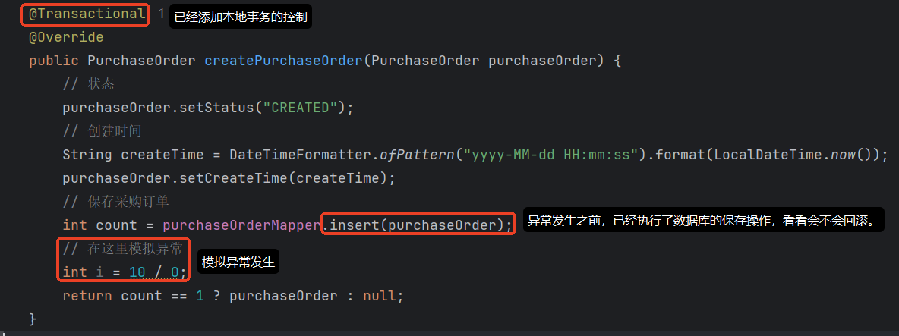

使用 Apipost 进行接口测试，测试前，数据库表中的 采购订单表 中的数据只有一条记录，如下：

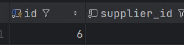

**接口测试地址：**[http://localhost:9000/procurement](http://localhost:9000/procurement)

**请求参数：**

```plaintext
supplierId=8&productId=888&quantity=10&totalAmount=60000
```

**响应结果：**

```json
{
        "timestamp": "2026-02-05T08:07:46.305+00:00",
        "status": 500,
        "error": "Internal Server Error",
        "path": "/procurement"
}
```

控制台错误信息：

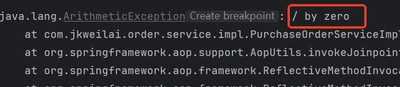

数据库表中数据看看有没有变化：

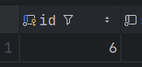

数据库表中的数据没有变化，仍然是一条，因此经过测试 `@Transactional`注解可以保证本地事务是没问题的。

## 测试分布式事务

测试一下分布式事务有没有问题：

将上面 创建采购订单 中模拟异常的代码删除掉，让它能够正常运行，三个服务，我们让最后一个服务（账务记账服务）模拟异常：

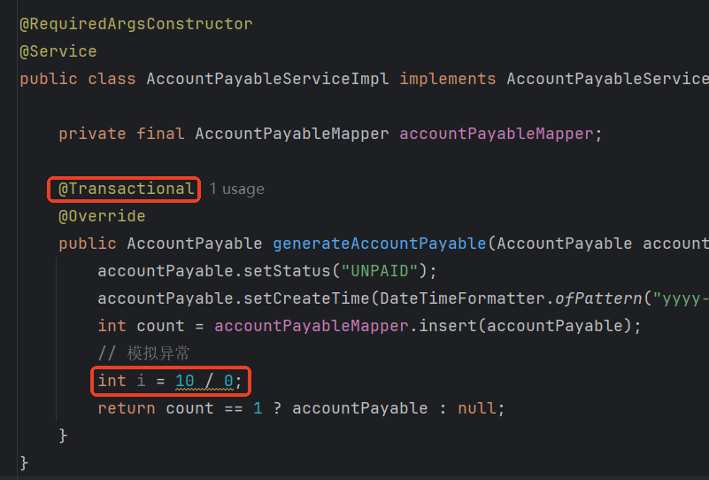

测试结果如下：采购订单多了一条记录，库存更新成功了，但是应付账款记录没有保存成功。（出现了部分回滚）

因此当前程序无法保证在分布式架构下事务的一致性。

# Seata 架构原理

Seata 官方文档地址：[https://seata.apache.org/zh-cn/](https://seata.apache.org/zh-cn/)

来自官网的一张图，描述了 Seata 的架构原理：

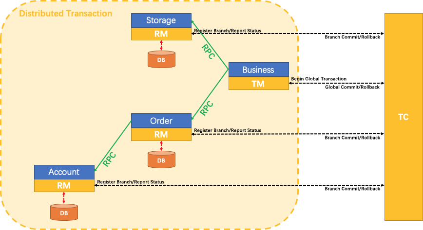

1. 分布式事务失败的根本原因：三个服务各做各的，没有协同起来，并没有互相感知彼此之间的状态。缺少一个大总管。
2. 在 Seata 中有一个大总管：TC
  1. TC 全称：Transaction Coordinator，翻译为**事务协调器**。**属于全局事务的****执行者****和协调者**。
  2. TC 用来**感知**全局事务和分支事务的状态，根据它们各自的状态来决定**谁来提交 谁来回滚**。
3. 什么是分支事务和全局事务
  1. 创建采购订单是一个分支事务
  2. 更新库存是一个分支事务
  3. 生成应付账款是一个分支事务
  4. 采购链的协调服务属于全局事务
4. TC 是 Seata 的核心服务端组件，是一个 **独立的事务协调服务**，需要单独部署。必须下载 Seata Server（**即 TC 服务端**），并启动它，TC 客户端（RM/TM）才能正常工作。
5. TM：Transaction Manager ，事务管理器，属于 TC 客户端。**它是 事务发起者和****决策者**。【对应了**@GlobalTransactional**注解】
6. RM：Resource Manager，资源管理器，属于 TC 客户端。**管自己本地事务/分支事务 的**
  1. 与 TC 交谈，**注册**分支事务到 TC，**报告**分支事务的状态给 TC，**负责**分支事务提交或回滚。
7. Seata 在**AT（Auto Transaction）模式**下分布式事务的控制流程：
  1. **TM 开启全局事务（@GlobalTransaction）**
    - TC 生成唯一 XID，贯穿整个全局事务。
  2. **TM 调用各个 RM，RM 执行分支事务**
    - RM 向 TC 注册分支事务（关联 XID）。
    - **执行 SQL 前**：Seata **代理数据源**拦截 SQL（**看看 SQL 要操作哪些行**），获取数据库**本地锁**，并向 TC 申请**全局锁**（避免其他全局事务修改同一数据）。
    - **执行 SQL**：生成业务数据的**前后镜像**（保存到 `**<font style="color:rgb(64, 64, 64);background-color:rgb(236, 236, 236);">undo_log</font>**`），**提交本地事务**（但数据因全局锁对其他事务不可见），会释放本地锁，但全局锁不会释放。
  3. **全局事务决议**
    - **全部成功**：TM 通知 TC 提交 → TC 异步通知各 RM 删除 `**<font style="color:rgb(64, 64, 64);background-color:rgb(236, 236, 236);">undo_log</font>**` 并释放全局锁。
    - **任一失败**：TM 通知 TC 回滚 → TC 通知 RM 根据 `**<font style="color:rgb(64, 64, 64);background-color:rgb(236, 236, 236);">undo_log</font>**` 回滚数据，删除 `**<font style="color:rgb(64, 64, 64);background-color:rgb(236, 236, 236);">undo_log</font>**` 并释放锁。
8. Seata **AT 模式 **依赖 undo_log 和全局锁实现分布式事务。
  1. **全局锁的作用**：确保同一行数据在同一时间只能被一个分布式事务修改。
  2. `**<font style="color:rgb(64, 64, 64);background-color:rgb(236, 236, 236);">undo_log</font>**` 是 **Seata AT 模式** 在业务数据库中自动创建的一张表，本质是一个**撤销日志（Undo Log）**，用于记录数据修改前的原始值，以便在分布式事务回滚时恢复数据。

# 本地锁与全局锁

## 本地锁和全局锁概述

| **锁类型** | **作用范围** | **实现方式** | **目的** | **生命周期** |
| --- | --- | --- | --- | --- |
| **数据库本地锁（物理锁）** | 单个数据库实例内 | `<font style="color:rgb(15, 17, 21);background-color:rgb(235, 238, 242);">SELECT ... FOR UPDATE</font>` | 防止**同一数据库内**的其他事务修改数据 | 本地/分支事务提交/回滚时释放 |
| **Seata 全局锁（逻辑锁）** | 跨数据库/跨服务 | Seata TC **内存维护** | 防止**跨服务的其他全局事务**修改同一数据 | 全局事务提交/回滚时释放 |

**在同一个分布式事务中，每一个数据库实例已经有本地锁了，为什么还需要一个全局锁？**

- 本地锁只负责当前本数据库的并发问题。（无法做到全局感知）
- 全局锁为了保证**跨服务/跨数据库**的并发问题。

## 全局锁实现原理

**谁向谁申请全局锁？**

- RM 向 TC 服务器申请全局锁。
- 能申请到，RM 就执行。申请失败了，RM 就报异常。

**全局锁的实现原理是：**

1. 底层采用了 `ConcurrentHashMap`
2. key 存储的是：`jdbc:mysql://127.0.0.1:3306/order_db@t_order:1001`（**key 代表的是：操作哪个数据库中哪张表的哪个数据**）
3. value 存储的是：`xid`
4. RM 向 TC 服务器申请全局锁时，只要能向`ConcurrentHashMap`中存进去**键值对**，或者存储键值对时`ConcurrentHashMap`返回的 `xid`与 RM 的 `xid`一致时，锁获取成功。反之失败。

```java
public class GlobalLockManager {
    private ConcurrentHashMap<String, String> lockMap = new ConcurrentHashMap<>();
    
    // 申请锁的关键方法
    public boolean tryLock(String xid, String lockKey) {
        // putIfAbsent 是关键！
        // 如果 lockKey 不存在，放入 (lockKey, xid) 并返回 null
        // 如果 lockKey 已存在，返回当前值（不放入）
        
        String existingValue = lockMap.putIfAbsent(lockKey, xid);
        
        // 判断逻辑：
        if (existingValue == null) {
            // 情况1：获取锁成功！
            // lockKey 之前不存在，现在放入了你的 xid
            return true;
            
        } else if (existingValue.equals(xid)) {
            // 情况2：重入锁成功！
            // lockKey 已存在，但本来就是你的 xid（幂等）
            return true;
            
        } else {
            // 情况3：获取锁失败！
            // lockKey 已存在，且是别人的 xid
            return false;
        }
    }

}
```

# Seata 实现全局事务管理

## 启动 Seata Server

apache seata 官网下载：[https://seata.apache.org/](https://seata.apache.org/)

历史版本下载地址：[https://seata.apache.org/release-history/seata-server](https://seata.apache.org/release-history/seata-server)（下载 2.1.0 版本）


解压后，直接进入在 dos 命令窗口中进入 bin 目录，执行：seata-server.bat

启动日志中你将看到两个端口号：

1. seata 服务器端口：8091
2. seata 的 web 界面端口：7091

到此 Seata Server 就启动成功了。

seata 的 web 界面：[http://localhost:7091/](http://localhost:7091/)

用户名/密码：seata/seata

这个 web 界面是 Seata 控制事务期间的可视化界面。

## 各服务引入 Seata 客户端

引入 Seata 客户端，本质上就是引入依赖，由于每个微服务都需要引入，因此我们在 `services`模块中引入即可：

```xml
<dependency>
  <groupId>com.alibaba.cloud</groupId>
  <artifactId>spring-cloud-starter-alibaba-seata</artifactId>
</dependency>
```

## 各服务引入 Seata 配置

在**每个微服务**项目的**根目录下**新建 `file.conf`文件，在这个文件中告诉**微服务** Seata Server 的地址。

```nginx
service {
  # 指定当前服务所属的事务组映射到哪个TC集群
  # 事务组名随意，但需要保证同一个分布式事务中的事务组名一致即可。
  vgroupMapping.default_tx_group = "default"
  
  # 指定TC服务器的具体地址
  default.grouplist = "localhost:8091"
  
  # 降级开关，当TC不可用时 是否 降级为本地事务
  enableDegrade = false
  
  # 全局总开关，是否完全禁用Seata分布式事务
  disableGlobalTransaction = false
}
```

## 使用@GlobalTransactional

在协调服务的业务方法上使用 `@GlobalTransactional`注解进行标注，这样分布式事务就有保证了。

**各个子微服务**中的业务方法加`@Transactional`还是不加？都行。加不加都不影响分布式事务的管理。如果**该业务单独有本地事务的要求**，就加上。

```java
package com.jkweilai.orchestrator.service.impl;

import com.jkweilai.orchestrator.feign.AccountPayableFeignClient;
import com.jkweilai.orchestrator.feign.InventoryStockFeignClient;
import com.jkweilai.orchestrator.feign.PurchaseOrderFeignClient;
import com.jkweilai.orchestrator.service.ProcurementOrchestrationService;
import com.jkweilai.order.entity.PurchaseOrder;
import com.jkweilai.payable.entity.AccountPayable;
import com.jkweilai.stock.entity.InventoryStock;
import lombok.RequiredArgsConstructor;
import org.apache.seata.spring.annotation.GlobalTransactional;
import org.springframework.stereotype.Service;

import java.math.BigDecimal;

@Service
@RequiredArgsConstructor
public class ProcurementOrchestrationServiceImpl implements ProcurementOrchestrationService {

    private final PurchaseOrderFeignClient purchaseOrderFeignClient;
    private final InventoryStockFeignClient inventoryStockFeignClient;
    private final AccountPayableFeignClient accountPayableFeignClient;

    @GlobalTransactional
    @Override
    public Long createPurchaseOrder(Long supplierId, Long productId, Integer quantity, BigDecimal totalAmount) {

        // 创建采购订单
        PurchaseOrder purchaseOrder = purchaseOrderFeignClient.createPurchaseOrder(productId, supplierId, totalAmount, quantity);

        // 更新库存
        InventoryStock inventoryStock = inventoryStockFeignClient.increaseStock(productId, quantity);

        // 生成应付账款
        AccountPayable accountPayable = accountPayableFeignClient.generate(purchaseOrder.getId(), purchaseOrder.getTotalAmount());

        return purchaseOrder.getId();
    }
}
```

## 创建 undo_log 表

首先需要在每个服务对应的数据库中手动创建 `undo_log`表，建表 `SQL`如下：

```sql
USE purchase_db;

CREATE TABLE IF NOT EXISTS `undo_log`
(
    `branch_id`     BIGINT       NOT NULL COMMENT 'branch transaction id',
    `xid`           VARCHAR(128) NOT NULL COMMENT 'global transaction id',
    `context`       VARCHAR(128) NOT NULL COMMENT 'undo_log context,such as serialization',
    `rollback_info` LONGBLOB     NOT NULL COMMENT 'rollback info',
    `log_status`    INT(11)      NOT NULL COMMENT '0:normal status,1:defense status',
    `log_created`   DATETIME(6)  NOT NULL COMMENT 'create datetime',
    `log_modified`  DATETIME(6)  NOT NULL COMMENT 'modify datetime',
    UNIQUE KEY `ux_undo_log` (`xid`, `branch_id`)
) ENGINE = InnoDB AUTO_INCREMENT = 1 DEFAULT CHARSET = utf8mb4 COMMENT ='AT transaction mode undo table';
ALTER TABLE `undo_log` ADD INDEX `ix_log_created` (`log_created`);

USE inventory_db;

CREATE TABLE IF NOT EXISTS `undo_log`
(
    `branch_id`     BIGINT       NOT NULL COMMENT 'branch transaction id',
    `xid`           VARCHAR(128) NOT NULL COMMENT 'global transaction id',
    `context`       VARCHAR(128) NOT NULL COMMENT 'undo_log context,such as serialization',
    `rollback_info` LONGBLOB     NOT NULL COMMENT 'rollback info',
    `log_status`    INT(11)      NOT NULL COMMENT '0:normal status,1:defense status',
    `log_created`   DATETIME(6)  NOT NULL COMMENT 'create datetime',
    `log_modified`  DATETIME(6)  NOT NULL COMMENT 'modify datetime',
    UNIQUE KEY `ux_undo_log` (`xid`, `branch_id`)
) ENGINE = InnoDB AUTO_INCREMENT = 1 DEFAULT CHARSET = utf8mb4 COMMENT ='AT transaction mode undo table';
ALTER TABLE `undo_log` ADD INDEX `ix_log_created` (`log_created`);

USE finance_db;

CREATE TABLE IF NOT EXISTS `undo_log`
(
    `branch_id`     BIGINT       NOT NULL COMMENT 'branch transaction id',
    `xid`           VARCHAR(128) NOT NULL COMMENT 'global transaction id',
    `context`       VARCHAR(128) NOT NULL COMMENT 'undo_log context,such as serialization',
    `rollback_info` LONGBLOB     NOT NULL COMMENT 'rollback info',
    `log_status`    INT(11)      NOT NULL COMMENT '0:normal status,1:defense status',
    `log_created`   DATETIME(6)  NOT NULL COMMENT 'create datetime',
    `log_modified`  DATETIME(6)  NOT NULL COMMENT 'modify datetime',
    UNIQUE KEY `ux_undo_log` (`xid`, `branch_id`)
) ENGINE = InnoDB AUTO_INCREMENT = 1 DEFAULT CHARSET = utf8mb4 COMMENT ='AT transaction mode undo table';
ALTER TABLE `undo_log` ADD INDEX `ix_log_created` (`log_created`);
```

注意：以上是在 3 个库中各自创建一张 `undo_log`表。直接执行以上的 SQL 脚本即可。表名和字段名是固定不可变的。

## 测试分布式事务

**先来测试第一种情况**：创建采购订单成功，更新库存失败（更新库存的代码中模拟异常）。看看采购订单会不会回滚。

**再来测试第二种情况**：创建采购订单成功，更新库存成功，生成应付转款时失败了（模拟异常）。看看会不会回滚。

**最后一种情况**：三个操作都执行成功，看看会不会提交。

# Seata AT模式下的2PC协议详细流程

Seata AT（Auto Transaction）模式是基于**两阶段提交（2PC）协议**实现的分布式事务解决方案。它通过对业务代码无侵入的方式，在运行时自动拦截SQL，生成反向补偿操作，实现分布式事务管理。

## 第一阶段：执行阶段（Prepare Phase）

1. **全局事务开始**

- TM向TC发起全局事务开始的请求
- TC生成全局唯一XID并返回
- XID通过服务调用链传递到所有微服务

1. **分支事务注册与锁获取**

- **RM拦截业务SQL**，解析出要操作的数据
- **RM向TC注册分支事务**，获取唯一branchId
- **RM向TC申请全局锁**（保护数据不被其他全局事务修改）
- **RM获取数据库本地锁**（SELECT...FOR UPDATE）

1. **业务执行与镜像记录**

- RM查询数据**前镜像**（例如要执行 `update t_act set balance=1000 where act_no=1`，那么会通过 `select balance from t_act where act_no=1`先查询 `balance`作为前镜像。）
- RM执行业务SQL
- RM记录**后镜像**（把 act_no=1、balance=1000 记录下来）

1. **undo_log生成与提交**

- RM 插入 undo_log 记录
- **提交本地事务**（业务数据和undo_log一起提交），提交本地事务就是**释放本地锁（但全局锁不会释放）**

1. **分支状态报告**

- RM向TC报告分支完成状态（PhaseOne_Done）
- TC记录分支状态，等待所有分支完成

1. **第一阶段完成**

- 所有分支完成第一阶段并向TC报告成功
- TC进入第二阶段等待最终决策

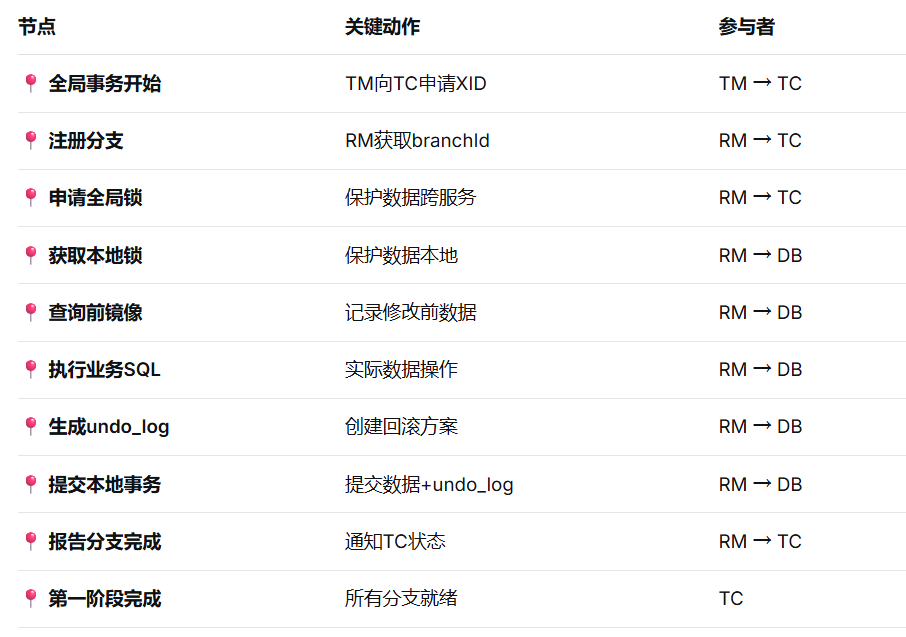

**第一阶段总结：****通过双重锁机制（全局锁+本地锁）保护数据一致性，在执行业务操作的同时生成数据镜像（undo_log），完成本地事务提交并向TC注册分支状态，为第二阶段决策做准备。**

## 第二阶段：提交/回滚阶段（Commit/Rollback Phase）

### 成功场景（提交）：

1. **全局提交请求**

TM向TC发起全局提交请求

TC检查所有分支事务状态，确认均为`<font style="color:rgb(15, 17, 21);background-color:rgb(235, 238, 242);">PhaseOne_Done</font>`

1. **异步清理与锁释放**

**TC立即释放全局锁**

TC异步通知各RM提交完成

各RM清理对应的undo_log

1. **全局事务完成**

所有数据修改正式生效

事务结束

**一句话：释放全局锁，各 RM 负责删除自己的 undo_log。**

## **失败场景（回滚）：**

1. **全局回滚触发**

TM向TC发起全局回滚请求

1. **准备回滚**

TC根据XID查询所有已提交的分支事务

TC向各RM发送rollback指令

1. **获取锁与数据检查**

**RM重新获取本地锁**（SELECT...FOR UPDATE）

RM查询本地undo_log

RM进行**脏写检查**：比较数据库当前数据与undo_log中的后镜像是否一致

1. **生成并执行反向SQL**

如果脏写检查通过，根据undo_log生成反向SQL：

INSERT操作 → DELETE语句

DELETE操作 → INSERT语句（使用前镜像数据）

UPDATE操作 → UPDATE语句（恢复为前镜像数据）

RM执行反向补偿SQL

**提交本地补偿事务**（包含补偿操作和undo_log删除）

1. **资源释放**

释放本地锁

TC释放全局锁

事务回滚完成

---

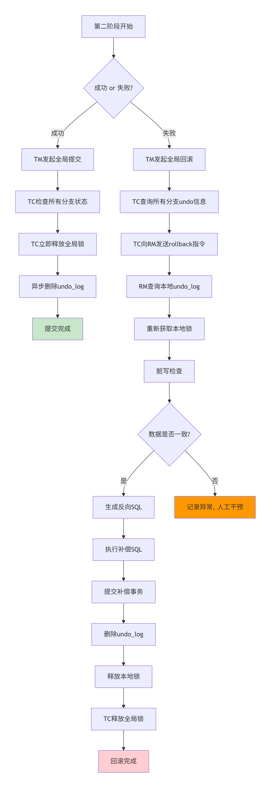

**第二阶段总结：**

**成功则立即释放全局锁并异步清理undo_log；**

**失败则重新获取本地锁，脏写检查 通过后 执行基于undo_log的业务补偿，实现数据回滚。**

# 2PC 协议中的锁

## 锁的作用

1. **一阶段锁的作用**：
  - 保证在**本地事务提交前**，其他并发事务无法修改相同数据（**本地锁**）。
  - 提交后，本地锁释放，Seata通过TC维护的**全局锁**（逻辑锁）继续保护数据，直到全局事务结束。
2. **二阶段锁的差异**：
  - 提交阶段：无需锁，因为数据已持久化，只需清理undo log。
  - 回滚阶段：需重新加锁，确保补偿操作的安全性（避免脏写）。
3. **全局锁的生命周期**：
  - 从一阶段获取锁开始，到二阶段全局事务完成后才完全释放。
  - 期间即使本地事务提交，其他事务如果想修改相同数据，仍需向TC申请全局锁，若冲突则阻塞或失败。

## 关键总结

| **阶段** | **数据库行锁（**`**FOR UPDATE**`**）** | **Seata全局锁（TC维护）** |
| --- | --- | --- |
| **一阶段开始** | 获取 | 获取 |
| **一阶段完成** | 释放（本地事务提交后） | **仍持有** |
| **二阶段提交** | 无需 | 释放 |
| **二阶段回滚** | 重新获取（补偿SQL前） | 释放（回滚完成后） |

## 常见问题

1. **如果二阶段回滚时拿不到锁怎么办？**
  - Seata会检测脏写（比较**数据库表的当前数据**与**后镜像**），如果不一致则回滚失败，记录异常人工处理。
  - 一般不会出现这个问题，因为即使一阶段提交之后本地锁释放了，但还有全局锁。所以一般出现这个问题的概率极低。
2. **为什么二阶段提交阶段不需要锁？**
  - 因为一阶段已提交，数据已持久化，二阶段提交只是清理日志，无并发风险。

# Seata 各事务模式

官方文档：[https://seata.apache.org/zh-cn/docs/user/mode/at](https://seata.apache.org/zh-cn/docs/user/mode/at)

## **AT 模式（Auto Transaction）自动事务模式**

**核心思想："自动补偿"，失败了自动回退，不需要程序员自己写程序。**

**工作流程（两阶段）：**

```plaintext
第一阶段（准备）：
    ├─ 执行业务SQL
    ├─ 生成"前后快照"（undo_log）
    └─ 提交本地事务（释放本地锁，但全局锁还在）
    
第二阶段（决策）：
    成功 → 删除快照（undo_log）
    失败 → 用快照恢复数据
```

**特点：**

- ✅ **无代码侵入**：加个`@GlobalTransactional`就行
- ✅ **自动补偿**：像"后悔药"，自动回滚
- ❌ **性能损耗**：有全局锁，并发高时慢
- ❌ **SQL限制**：复杂SQL可能解析不了（seata 拦截 SQL 之后，在生成前后镜像，存储到 undo_log 中的不是 SQL 本身，而是经过解析之后的 SQL。这个解析不支持复杂 SQL 的解析。）

**适用场景：**

- **传统系统改造**：不想改代码
- **业务不复杂**：SQL不太复杂
- **并发量不大**：TPS < 1000

## **TCC 模式（Try-Confirm-Cancel）**

**核心思想："手动确认"，不是自动化的，成功后需要执行我们程序员写的方法来完成确认。或者失败后需要执行我们程序员写的方法来完成取消。**

**三个方法： **Try→Confirm→Cancel

- 都 `Try`成功了，执行 `Confirm`。
- 只要有一个 `Try`失败了，执行 `Cancel`。

**特点：**

- ✅ **高性能**：无全局锁，并发高
- ✅ **灵活**：自己控制补偿逻辑（**比如在失败的时候，可以在 Cancel 方法中编写发送短信的代码，通知负责人**）
- ❌ **代码侵入**：要写三个方法
- ❌ **开发复杂**：补偿逻辑要自己实现

**适用场景：**

- **金融核心系统**：钱不能出错
- **高并发业务**：秒杀、抢购
- **复杂业务逻辑**：需要精细控制

## **SAGA 模式**

**核心思想："事后补救"，支持长事务，比如执行几天。这种事务已经不是数据库层面的事务了。属于应用层的事务。**

**特点：**

- ✅ **支持长事务**：可以执行几分钟甚至几天
- ✅ **异步执行**：不阻塞，性能好
- ❌ **最终一致**：不是强一致，中间可能看到不一致
- ❌ **补偿可能失败**：需要额外处理

## **XA 模式**

和 AT 模式对比：

- AT 模式的第一阶段是本地事务会提交。
- XA 模式的第一阶段**不提交**，分布式事务失败时，回滚。

**特点：**

- ✅ **强一致性**：要么全成功，要么全失败
- ✅ **标准协议**：数据库原生支持
- ❌ **性能差**：锁持有时间长
- ❌ **阻塞严重**：一个慢，全都等

## **四者对比表格**

| **对比项** | **AT模式** | **TCC模式** | **SAGA模式** | **XA模式** |
| --- | --- | --- | --- | --- |
| **一致性** | 强一致 | 强一致 | 最终一致 | 强一致 |
| **性能** | 中等 | 高 | 高 | 低 |
| **侵入性** | 无侵入 | 侵入强 | 中等 | 无侵入 |
| **锁机制** | 全局锁 | 无锁 | 无锁 | 数据库锁 |
| **补偿方式** | 自动SQL补偿 | 手动业务补偿 | 手动业务补偿 | 事务回滚 |
| **适合场景** | 普通业务改造 | 高并发核心 | 长业务流程 | 传统银行 |