# 2.XXL-JOB

# 什么是任务调度

任务调度(Task Scheduling)是指在预定的时间或条件下自动执行特定任务的过程。在Java开发中，任务调度允许开发者安排代码在未来的某个时间点执行，或者按照固定的时间间隔重复执行。

简单来说，就像你设置闹钟一样：

- 单次执行：比如设置早上7点的闹钟
- 重复执行：比如设置工作日每天早上7点的重复闹钟

# Java中任务调度的核心概念

1. **任务(Task)**：需要被执行的代码逻辑
2. **触发器(Trigger)**：决定任务何时执行的规则
3. **调度器(Scheduler)**：负责管理任务和触发器，确保任务按时执行

# Java中实现任务调度的主要方式

## Timer和TimerTask（单线程本质）

```java
import java.util.Timer;
import java.util.TimerTask;

public class BasicScheduler {
    public static void main(String[] args) {
        Timer timer = new Timer();
        
        // 延迟1秒后执行，只执行一次
        timer.schedule(new TimerTask() {
            @Override
            public void run() {
                System.out.println("执行一次任务 - " + new Date());
            }
        }, 1000);
        
        // 延迟2秒后执行，之后每隔3秒重复执行
        timer.scheduleAtFixedRate(new TimerTask() {
            @Override
            public void run() {
                System.out.println("重复执行任务 - " + new Date());
            }
        }, 2000, 3000);
    }
}
```

**缺点**：功能简单，不适合复杂调度需求，并且Timer底层执行任务是单线程的本质。

**Timer的单线程本质：**

1. 内部只有一个线程（名为"Timer-0"的线程）
2. 所有任务放入优先队列，按执行时间排序
3. 执行流程：

```java
while (true) {
    TimerTask task = queue.poll(); // 取最早的任务
    if (task != null) {
        task.run(); // 同步执行（阻塞后续任务）
    }
}
```

可以编写程序测试一下，给排在前面的任务添加阻塞代码，观察执行结果：

```java
// 一个Timer对象
Timer timer = new Timer();
// 任务1
timer.schedule(new TimerTask() {
    @Override
    public void run() {
        System.out.println("阻塞开始" + new Date());
        // 阻塞
        try {
            Thread.sleep(3000);
        } catch (InterruptedException e) {
            throw new RuntimeException(e);
        }
        System.out.println("阻塞结束" + new Date());
    }
}, 1000);
// 任务2
timer.schedule(new TimerTask() {
    @Override
    public void run() {
        System.out.println("普通任务" + new Date());
    }
}, 1000);
```

执行结果说明了Timer本质上是单线程的方式：

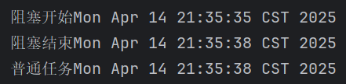

## ScheduledExecutorService（并发方式）

```java
import java.util.concurrent.Executors;
import java.util.concurrent.ScheduledExecutorService;
import java.util.concurrent.TimeUnit;

public class ExecutorScheduler {
    public static void main(String[] args) {
        // ExecutorService 是JUC包提供的线程池
        // ScheduledExecutorService 是JUC包提供的专门负责任务调度的线程池（ScheduledExecutorService 是 ExecutorService的子类。）
        ScheduledExecutorService executor = Executors.newScheduledThreadPool(2);
        
        // 延迟3秒后执行
        executor.schedule(() -> {
            System.out.println("延迟执行任务 - " + new Date());
        }, 3, TimeUnit.SECONDS);
        
        // 延迟5秒后执行，之后每隔2秒重复执行
        executor.scheduleAtFixedRate(() -> {
            System.out.println("定期执行任务 - " + new Date());
        }, 5, 2, TimeUnit.SECONDS);
    }
}
```

**优点**：线程池管理，更灵活，功能更强大。

编写程序测试一下，看看`ScheduleExecutorService`多任务处理时是不是真正的异步：

```java
ScheduledExecutorService executor = Executors.newScheduledThreadPool(2);

// 任务1
executor.schedule(() -> {
    System.out.println("阻塞任务开始：" + new Date());
    try {
        Thread.sleep(3000);
    } catch (InterruptedException e) {
        throw new RuntimeException(e);
    }
    System.out.println("阻塞任务结束：" + new Date());
}, 1, TimeUnit.SECONDS);

// 任务2
executor.schedule(() -> {
    System.out.println("普通任务：" + new Date());
}, 1, TimeUnit.SECONDS);
```

执行结果如下：


`**Timer**`**和**`**ScheduledExecutorService**`**的区别：**

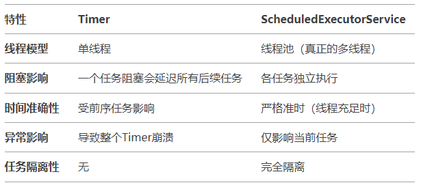

## Spring框架的@Scheduled注解（Spring项目常用）

```java
import org.springframework.scheduling.annotation.EnableScheduling;
import org.springframework.scheduling.annotation.Scheduled;
import org.springframework.stereotype.Component;

import java.util.Date;

@Component
@EnableScheduling
public class SpringScheduler {
    
    // 每5秒执行一次
    @Scheduled(fixedRate = 5000)
    public void fixedRateTask() {
        System.out.println("固定频率任务 - " + new Date());
    }
    
    // 每天上午10:15执行
    @Scheduled(cron = "0 15 10 * * ?") // cron表达式：定义任务执行时间规则的字符串格式
    public void cronTask() {
        System.out.println("Cron表达式任务 - " + new Date());
    }
}
```

需要在Spring配置类上添加`@EnableScheduling`注解启用调度功能。

`@Scheduled`默认是同步执行，如果要异步执行需要额外添加 `@Async`注解。

## Quartz框架（企业级调度）

Quartz是一个功能强大的开源作业调度库，支持复杂的调度需求。但在近些年的统计数据来看，Quartz框架使用的越来越少了。

**使用量下降的原因：**

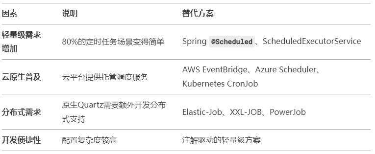

# 实际开发中的任务调度案例

1. **数据备份与清理**
  - 每天凌晨2点自动备份数据库
  - 每月1号清理3个月前的日志文件
2. **报表生成**
  - 每周一早上6点生成上周销售报表
  - 每月最后一天生成月度财务报表
3. **缓存刷新**
  - 每隔30分钟刷新一次系统缓存
  - 每天零点重置每日访问统计
4. **消息通知**
  - 每天上午9点发送每日待办事项提醒
  - 每月25号发送账单提醒
5. **数据同步**
  - 每隔1小时同步一次不同系统间的用户数据
  - 实时性要求不高的数据批量处理
6. **定时任务监控**
  - 每隔5分钟检查一次系统健康状态
  - 每小时发送一次系统运行状态报告
7. **优惠活动**
  - 特定时间段(如双11)开启优惠活动
  - 活动结束后自动恢复原价

# 选择任务调度方式的建议

1. **简单需求**：使用`ScheduledExecutorService`
2. **Spring项目**：使用`@Scheduled`注解
3. **复杂需求**：使用Quartz框架
4. **分布式环境**：考虑使用** **Elastic-Job** **或** **XXL-JOB** **等分布式任务调度框架

# 使用任务调度的注意事项

1. 任务执行时间不应过长，否则可能影响后续任务
2. 考虑任务失败的重试机制
3. 在分布式环境中要注意任务重复执行的问题
4. 合理设置线程池大小
5. 记录任务执行日志，便于排查问题

# 为什么需要分布式的任务调度

Spring框架提供的`@Scheduled`注解不够用吗？为什么还需要专门的分布式任务调度框架。

## @Scheduled 的局限性

1. **单机运行**：`@Scheduled`任务只在单个应用实例上运行，在集群环境下会导致任务被多个实例重复执行。
  1. 比如：用户的积分重复添加。用户收到重复的短信通知等。
2. **缺乏故障转移**：如果执行任务的节点宕机，任务不会自动转移到其他可用节点。
3. **无分片能力**：无法将大任务拆分为小任务分发给不同节点并行处理。
4. **监控管理薄弱**：缺乏统一的任务执行监控和管理界面。
5. **动态调整困难**：修改调度配置通常需要重启应用。

## 分布式任务调度框架的优势

1. **集群协调**：确保任务在集群中只执行一次（如Elastic-Job、XXL-JOB）
2. **故障转移**：自动检测故障节点并将任务重新分配
3. **弹性扩缩容**：根据负载动态调整任务分配
4. **任务分片**：支持大数据量任务的并行处理
5. **可视化监控**：提供任务执行历史、成功率等统计信息
6. **动态调度**：支持不停机修改调度策略

# XXL-JOB的介绍

XXL-JOB 是由国内开发者** 许雪里（xu_xueli）**个人开发并开源的任务调度框架，项目托管在 GitHub 和 Gitee 上。

---

XXL-JOB 是一个**轻量级分布式任务调度框架**，通过中心化的调度器（支持集群）统一管理任务，解决 Spring`@Scheduled`在分布式环境下的任务重复执行问题，并提供任务分片、失败重试、可视化监控等功能。

核心点：**分布式协调 + 避免重复执行 + 运维友好**

XXL-JOB 因其轻量、易用和稳定性，被许多互联网公司接入，例如： 大众点评【美团点评】、京东、滴滴、优信二手车、360金融等。

XXL-JOB 开源社区地址：[https://www.xuxueli.com/xxl-job/](https://www.xuxueli.com/xxl-job/)

XXL：可以理解为超大号，类似服装尺码中的 “XXL”，暗示其适用于高负载、分布式场景。

XXL-JOB 架构图：

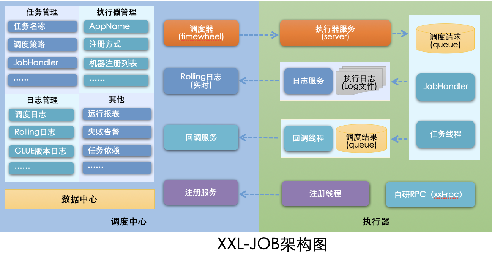

**XXL-JOB 架构中的核心部分包括：调度中心、执行器、任务。**

**调度中心（指挥官）：****调度中心负责“什么时候、让谁、做什么事”，然后盯着他干完并记录结果。（调度中心是大脑，是最高指挥官）**

**执行器（具体干啥活）：****执行器是实际执行业务逻辑的代码单元（@XxlJob注解的方法）**

**任务（什么时候干）：****任务是调度中心里的一条配置记录，定义了执行时间、目标执行器和执行参数。**

# 调度中心部署

## 源码下载

gitee地址：[https://gitee.com/xuxueli0323/xxl-job](https://gitee.com/xuxueli0323/xxl-job)

下载后解压：


## 初始化“调度数据库”

sql脚本位置：/xxl-job/doc/db/tables_xxl_job.sql


执行该sql脚本：


## 编译源码

将前面下载的源码导入到 IDEA 工具中进行编译。具体操作如下：

1. 将


1. 项目拷贝到IDEA的工作目录下。
2. 使用IDEA将这个工程打开即可。

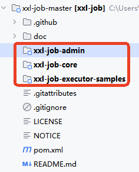

官方解释：

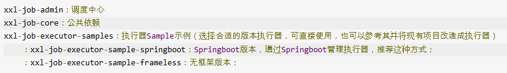

## 配置部署“调度中心”

调度中心项目：xxl-job-admin

### 调度中心配置

调度中心配置文件地址：/xxl-job/xxl-job-admin/src/main/resources/application.properties

该配置文件当下需要重点修改一下`数据源`的配置。主要修改：url、username、password。


然后再配置 IDEA 的 Maven，下载项目的 Maven 依赖。

### 执行Spring Boot入口程序


### 访问“调度中心”

调度中心访问地址：[http://localhost:8080/xxl-job-admin](http://localhost:8080/xxl-job-admin) (该地址执行器将会使用到，作为回调地址)


默认登录账号 “admin/123456”, 登录后运行界面如下图所示：

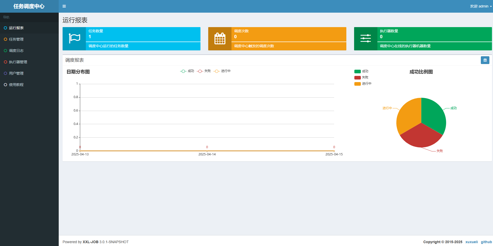

# 配置部署“执行器项目”

## 创建Spring Boot项目


添加`Spring Web`依赖：


添加`xxl-job-core`公共依赖：

```xml
<dependency>
  <groupId>com.xuxueli</groupId>
  <artifactId>xxl-job-core</artifactId>
  <version>3.0.0</version>
</dependency>
```

## 执行器项目的配置文件

执行器项目的配置文件`application.properties`

```plaintext
### 调度中心部署根地址 [选填]：执行器通过这个地址通知调度中心任务的执行结果
xxl.job.admin.addresses=http://127.0.0.1:8080/xxl-job-admin
### 调度中心通讯TOKEN [选填]：非空时启用；
xxl.job.admin.accessToken=default_token
### 执行器连接调度中心时的超时时间
xxl.job.admin.timeout=3
### 执行器AppName [选填]
xxl.job.executor.appname=xxl-job-executor-sample
### 告诉调度中心，我执行器所在的地址。
xxl.job.executor.address=
### 执行器IP 
xxl.job.executor.ip=127.0.0.1
### 执行器端口号
xxl.job.executor.port=9999
### 执行器运行日志文件存储磁盘路径 [选填]
xxl.job.executor.logpath=/data/applogs/xxl-job/jobhandler
### 执行器日志文件保存天数 [选填]
xxl.job.executor.logretentiondays=30

server.port=8088
```

注意：最好配置上`<font style="color:#080808;background-color:#ffffff;">server.port=8088</font>`，因为调度中心已经将8080占用了。

## 执行器组件配置

编写一个配置类，来进行执行器组件的配置：

```java
@Configuration
public class XxlJobConfig {
    @Value("${xxl.job.admin.addresses}")
    private String adminAddresses;

    @Value("${xxl.job.admin.accessToken}")
    private String accessToken;

    @Value("${xxl.job.executor.appname}")
    private String appname;

    @Value("${xxl.job.executor.address}")
    private String address;

    @Value("${xxl.job.executor.ip}")
    private String ip;

    @Value("${xxl.job.executor.port}")
    private int port;

    @Value("${xxl.job.executor.logpath}")
    private String logPath;

    @Value("${xxl.job.executor.logretentiondays}")
    private int logRetentionDays;

    // 将执行器对象纳入IoC容器
    @Bean
    public XxlJobSpringExecutor xxlJobExecutor() {
        XxlJobSpringExecutor xxlJobSpringExecutor = new XxlJobSpringExecutor();
        xxlJobSpringExecutor.setAdminAddresses(adminAddresses);
        xxlJobSpringExecutor.setAccessToken(accessToken);
        xxlJobSpringExecutor.setAppname(appname);
        xxlJobSpringExecutor.setAddress(address);
        xxlJobSpringExecutor.setIp(ip);
        xxlJobSpringExecutor.setPort(port);
        xxlJobSpringExecutor.setLogPath(logPath);
        xxlJobSpringExecutor.setLogRetentionDays(logRetentionDays);
        return xxlJobSpringExecutor;
    }
}
```

## 添加任务处理类

```java
@Component
public class SimpleXxlJob {
    @XxlJob("demoJobHandler")
    public void demoJobHandler() throws Exception{
        System.out.println("执行定时任务，执行时间：" + new Date());
    }
}
```

执行Spring Boot项目入口程序，打开浏览器，访问调度中心，点击执行器管理，可以看到有一个执行器，如下图：

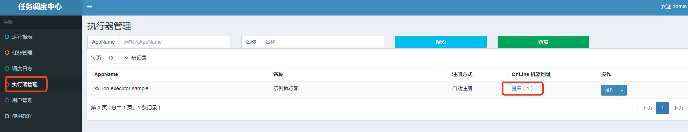

# 运行HelloWorld程序

## 任务配置


保存之后：


这样这个任务就创建完成了。

## 触发执行

通过右侧的`操作`可以进行任务的控制，如下是让任务执行一次：


后台输出：


也可以点击启动，启动任务按照`cron`表达式的时间规则执行：

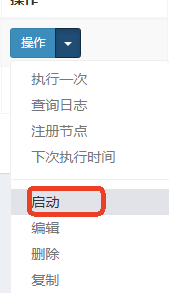

后台输出：


## 查看日志

也可查看任务的执行日志：


具体日志信息：


# GLUE模式运行

GLUE模式可以达到的效果是：采用在线编写代码的方式，在不需要重启服务器的前提下，动态添加/变更执行的任务。

在`执行器项目`中添加如下类和方法：

```java
@Service
public class HelloService {
    public void doSome(){
        System.out.println("do some!");
    }
    public void doOther(){
        System.out.println("do other!");
    }
}
```

**重启服务器，让以上添加的代码生效。这一点岂不是和我们上面所描述的“不需要重启服务器”不一致了？这其实说的并不是一码事！！！！！服务器端的代码添加了/修改了，是一定要重启服务器的，不重新编译、发布，代码怎么可能生效呢。我们上面所说的“不需要重启服务器”指的是，在调度中心修改具体的任务的代码是不需要重启服务器的！！！**

---

在`调度中心`中在线编写代码，动态添加任务，并且不需要重启服务器：

**新增任务：**


**运行模式选择：GLUE(Java)**

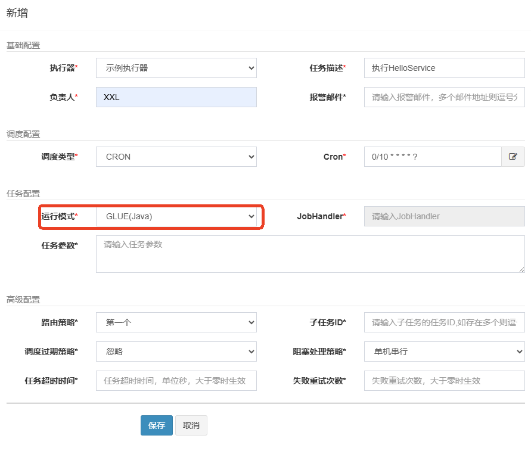

**使用GLUE IDE编写Java代码：**

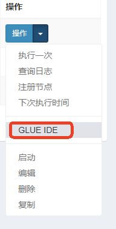

**编写代码，导入**`**Autowired**`**和**`**HelloService**`

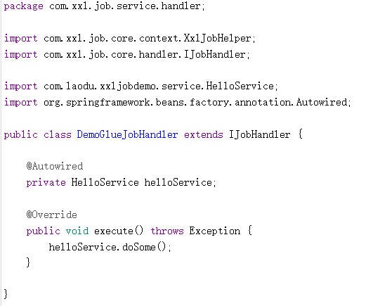

**保存/发布：**


**开启任务：**


再次修改代码，不需要停止任务，不需要重启服务器：

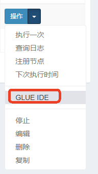

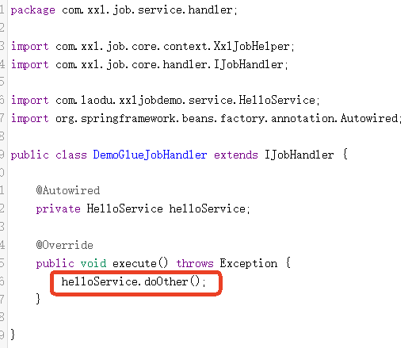

**保存/发布，查看控制台：**


通过以上的测试可以看出，当我们使用`XXL-JOB`的时候，任务修改不需要重启服务器。

# 集群环境下任务不会重复执行

## 创建应用副本

创建应用副本是为了搭建一个集群的环境：


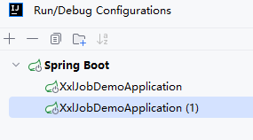

## 不同应用配置不同端口

配置第一个应用的服务器端口8088和执行器端口9998：

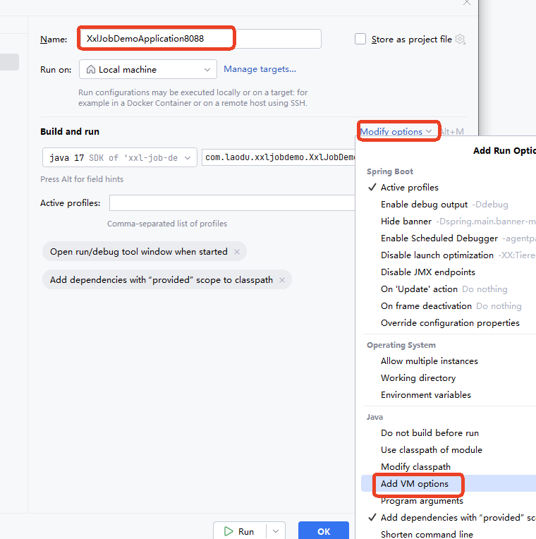


`**-Dserver.port=8088 -Dxxl.job.executor.port=9998**`

配置第二个应用的服务器端口8089和执行器端口9999：


`**-Dserver.port=8089 -Dxxl.job.executor.port=9999**`

启动两个应用：

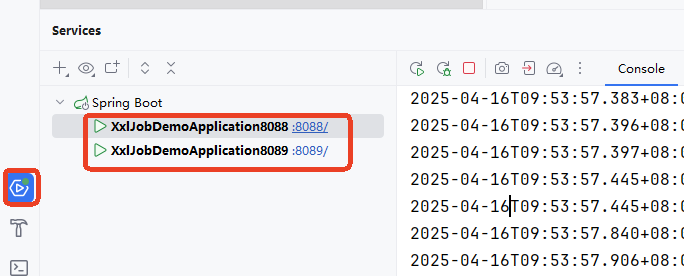

## 测试集群环境下是否会重复执行任务

在`调度中心`启动任务，查看这两个应用有没有重复执行任务。


可以看到，任务只在第一个应用中执行，并不会重复执行任务。

## 路由策略

**为什么只会在第一个应用中执行呢？**

这是由`路由策略`所决定的。如下图，在调度中心的任务编辑页面可以看到路由策略的选择，默认选择的是`第一个`:


**所有的路由策略包括：**

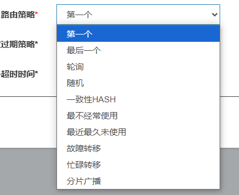

**每个路由策略什么含义？**

1. 第一个：直接选任务列表里的第一个机器干活。
2. 最后一个：直接选任务列表里的最后一个机器干活。
3. 轮询：轮流让每台机器干活，大家排队，一人一次。
4. 随机：随便抽一台机器干活，全凭运气。
5. 一致性HASH：同样的任务永远找同一台机器干，避免换来换去。
6. 最不经常使用：挑平时干活最少的机器去干，雨露均沾。
7. 最近最久未使用：挑最闲的机器（好久没干活的）去干。
8. 故障转移：如果一台机器挂了，自动换另一台好的继续干。
9. 忙碌转移：如果一台机器正忙着，就找其他闲着的机器干。
10. 分片广播：让所有机器一起干同一个活，各自分一小块任务。

尝试将路由策略修改为轮询，看看是否两个应用交替执行任务：

停止任务：


编辑任务：


路由策略选择轮询：


启动任务：

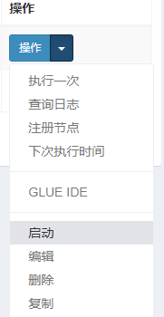

查看控制台：

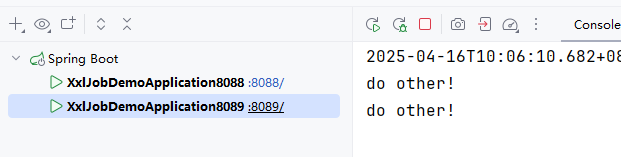

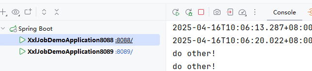

可以看到，确实采用轮询的方式交替执行任务。

# 分片功能实现

需求：在指定的节假日，需要给平台所有用户发送祝福的短信

## 初始化数据

1. 执行`xxl-job-demo.sql`脚本完成数据初始化。
2. 新建数据库`xxl-job-demo`
3. 执行SQL脚本

## 添加依赖

```xml
<!--mybatis依赖-->
<dependency>
  <groupId>org.mybatis.spring.boot</groupId>
  <artifactId>mybatis-spring-boot-starter</artifactId>
  <version>3.0.4</version>
</dependency>
<!--mysql依赖-->
<dependency>
  <groupId>com.mysql</groupId>
  <artifactId>mysql-connector-j</artifactId>
  <scope>runtime</scope>
</dependency>
<!--lombok依赖-->
<dependency>
  <groupId>org.projectlombok</groupId>
  <artifactId>lombok</artifactId>
  <optional>true</optional>
</dependency>
```

## 添加数据源配置

```plaintext
spring.datasource.type=com.zaxxer.hikari.HikariDataSource
spring.datasource.driver-class-name=com.mysql.cj.jdbc.Driver
spring.datasource.url=jdbc:mysql://localhost:3306/xxl-job-demo
spring.datasource.username=root
spring.datasource.password=123456
```

## 编写po

```java
import lombok.Data;

@Data
public class UserMobilePlan {
    // 主键
    private Long id;
    // 用户名
    private String username;
    // 昵称
    private String nickname;
    // 手机号码
    private String phone;
    // 备注
    private String info;
}
```

## 编写Mapper

```java
package com.laodu.xxljobdemo.mapper;

import com.laodu.xxljobdemo.model.po.UserMobilePlan;
import org.apache.ibatis.annotations.Select;

import java.util.List;

public interface UserMobilePlanMapper {

    @Select("select * from t_user_mobile_plan")
    List<UserMobilePlan> selectAll();
}
```

## 业务功能实现

添加发送短信的任务：

```java
private final UserMobilePlanMapper userMobilePlanMapper;

@XxlJob("sendMsgHandler")
public void sendMsgHandler(){
    List<UserMobilePlan> userMobilePlans = userMobilePlanMapper.selectAll();
    System.out.println("任务开始时间：" + new Date() + "，要处理的任务数量：" + userMobilePlans.size());
    long begin = System.currentTimeMillis();
    userMobilePlans.forEach(item -> {
        try {
            // 模拟发送短信的动作
            TimeUnit.MICROSECONDS.sleep(10);
        } catch (InterruptedException e) {
            throw new RuntimeException(e);
        }
    });
    System.out.println("任务结束时间：" + new Date());
    long end = System.currentTimeMillis();
    System.out.println("任务耗时：" + (end - begin) + "毫秒");
}
```

## 添加Mapper扫描

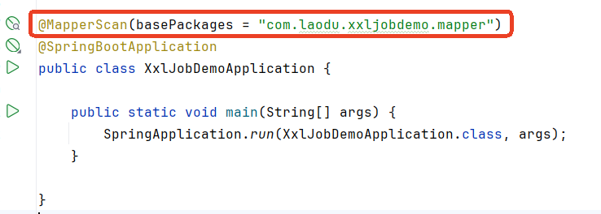

## 在调度中心上添加任务


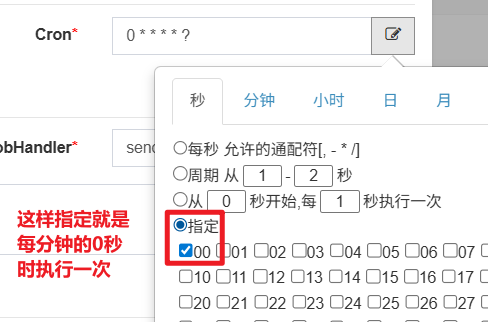

启动任务，执行效果：


## 分片方式执行任务

我们上面说到路由策略，其中有一个路由策略叫做`分片广播`。

分片广播：让所有机器一起干同一个活，各自分一小块任务。

目的是提升效率，我们上面实现的功能是单机方式完成功能，耗时在10s左右。我们可以使用分片广播方式来提升效率。

在分片广播方面涉及到两个概念：

1. 分片总数：一共有多少台
2. 分片索引：当前这台机器的下标（下标从0开始）

并且在Java程序中，是可以通过以下代码来获取分片总数和分片索引的：

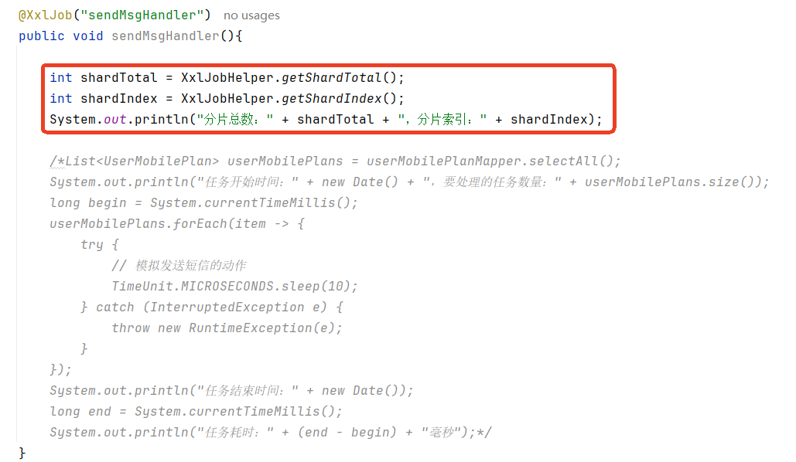

编写了以上的代码之后，在调度中心将任务的路由策略修改为：分片广播

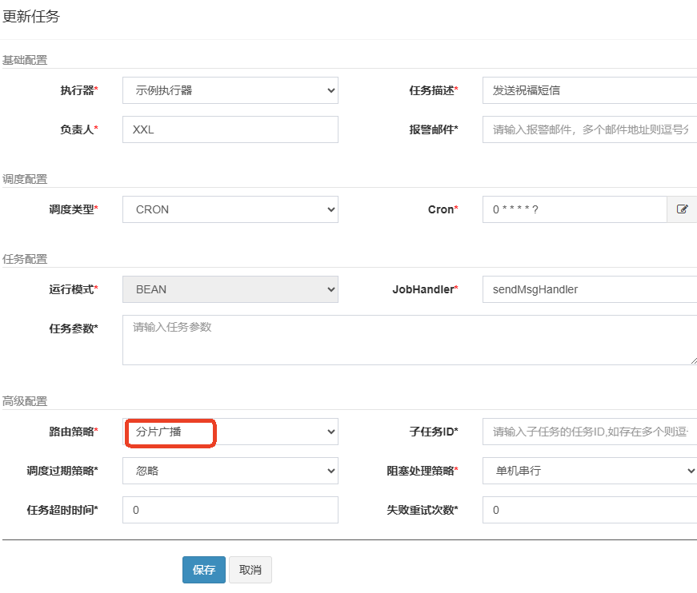

然后启动任务，查看后台输出，可以看到分片总数以及分片索引：


我们可以通过分片总数和分片索引来完成分片执行，对应的SQL语句如下：

```sql
select * from t_user_mobile_plan where mod(id, 分片总数) = 分片索引;
```


这样的话，数据就可以平均分配到不同的机器上执行。

接下来，我们编写代码来实现一下：

首先，要在mapper中添加一个方法，如下：

```java
@Select("select * from t_user_mobile_plan where mod(id, #{shardTotal}) = #{shardIndex}")
List<UserMobilePlan> selectByMod(@Param("shardIndex") int shardIndex, @Param("shardTotal") int shardTotal);
```

然后再重新编写任务代码：

```java
@XxlJob("sendMsgHandler")
public void sendMsgHandler(){
    // 分片总数
    int shardTotal = XxlJobHelper.getShardTotal();
    // 分片索引
    int shardIndex = XxlJobHelper.getShardIndex();

    // 查询数据
    List<UserMobilePlan> userMobilePlans = null;
    if(shardTotal == 1) {
        userMobilePlans = userMobilePlanMapper.selectAll();
    }else{
        userMobilePlans = userMobilePlanMapper.selectByMod(shardIndex, shardTotal);
    }

    // 处理数据
    System.out.println("开始执行任务时间：" + new Date() + "，需要处理的数据总量：" + userMobilePlans.size());
    long begin = System.currentTimeMillis();
    userMobilePlans.forEach(item -> {
        try {
            TimeUnit.MICROSECONDS.sleep(10);
        } catch (InterruptedException e) {
            throw new RuntimeException(e);
        }
    });
    System.out.println("结束执行任务时间：" + new Date());
    long end = System.currentTimeMillis();
    System.out.println("处理任务总耗时" + (end - begin) + "毫秒");
}
```

然后启动任务，查看控制台是否为分片执行：


经过测试，效率翻倍，处理5000条记录，总耗时5秒左右。