# 3.2.Kafka

# Kafka 快速上手

## MQ 的作用

我们之前已经学习了 `RabbitMQ`，因此对 MQ 的作用并不模式。

MQ（Message Queue）：消息队列。

一种 FIFO 数据结构，先进先出。

使用 MQ 技术可以完成跨进程的数据传递（比如生产者是 Java，消费者是 C++）

生产端会将消息发到 MQ 进行排队，消费端负责从队列中按照顺序进行消费。

**MQ 的作用主要包括三方面：**

1. 异步：快递员发快递，直接到客户家效率低，引入菜鸟驿站（MQ），快递员直接将快递放到菜鸟驿站（过程属于生产），就可以继续发其他快递了，快递员不用等。客户等自己有时间的时候去菜鸟驿站取快递（过程属于消费）。
2. 解耦：生产端和消费端可以互不关心，甚至语言都是可以不同的，例如生产端是 Java，消费端是 C++。消费端的增加或减少对生产端没有影响。
3. 削峰填谷：三峡大坝是一个很好的例子，它可以把水储存起来，下游慢慢排水。消息队列可以将突增的消息暂存到队列中，消费者可以慢慢进行消费，保证服务器不会太忙或不会太闲。因此使用了消息队列之后，我们的系统可以应对突发的流量冲击。

## Kafka 的产品介绍

MQ 的产品很多，例如：ActiveMQ、RabbitMQ、RocketMQ、Kafka 等。

Kafka 官网（Apeche 的顶级开源项目）：[https://kafka.apache.org/](https://kafka.apache.org/)

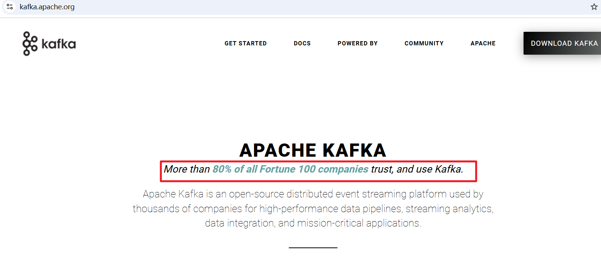

**Kafka 是什么？**

- **Kafka 本质**上是一个**高吞吐量的分布式消息系统。**
- **它的核心职责是**：**接收、存储和转发流式数据。**
- **诞生时间**：2010年，由美国领英（LinkedIn）公司开发。
- **诞生初期的使命**：解决领英内部网站**活动追踪**和**运营监控**数据的**传输问题**。
  - **活动追踪就是“窥探”用户在你的网站或App上的一举一动，并把它们记录下来，目的是为了后续分析用户喜好、优化产品体验和进行精准推荐。**
  - 当时领英就是有太多这样的“一举一动”需要实时记录下来并传给后端的分析系统，所以才催生了Kafka来解决这个**海量数据传输**的难题。
- **当时他们面临的问题是**：数据源太多，处理系统也太多，传统的消息队列性能跟不上，导致数据堵塞和处理延迟。
- **如今 Kafka **已成为**大数据和实时计算领域**最核心的基础组件之一。
- **“消息队列”只是Kafka功能的一个子集，更准确地说，Kafka是一个分布式的流数据平台。（**流数据就像一条永不间断的直播弹幕，数据是实时、连续、一条条地涌过来的。传统开发中的数据库中的数据不是流数据，它不是源源不断的。Kafka 可以接收源源不断的数据。**）**

## Kafka 是什么语言开发的

**主要是 Scala 和 Java。**

**Scala**: Kafka 的核心部分最初就是用 Scala 语言编写的。Scala 是一种运行在 Java 虚拟机（JVM）上的高级语言，它融合了面向对象和函数式编程的特性。

**Java**: 你也会看到很多 Java 的痕迹，因为 Kafka 的生态非常庞大，其客户端库、一些工具和周边组件也用 Java 编写。

简单来说，可以把 Kafka 看作是一个“JVM 生态”的产物。

因此要运行 Kafka，需要有 Java 的环境。（**安装 JDK**）

## Kafka 的下载与安装

### 下载 Kafka

下载页：[https://kafka.apache.org/downloads](https://kafka.apache.org/downloads)

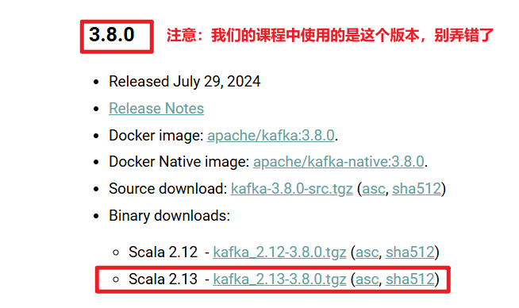


### 安装 Kafka

将下载的


上传到 centos。

咱们就统一上传到 `~/tools`目录下吧，当前工作目录下没有 `tools`目录的新建一下。

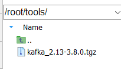

然后进入 `~/tools`目录，将其解压：

```shell
tar -zxvf kafka_2.13-3.8.0.tgz
```

解压后可以看到：

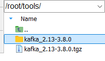

然后将其移动到 `/app/kafka`目录下，没有这个 `/app/kafka`目录的新建目录：

```shell
mkdir -p /app/kafka
mv kafka_2.13-3.8.0 /app/kafka/
```

这样 `kafka`就被安装到了 `/app/kafka`的目录下。

### Kafka 目录介绍

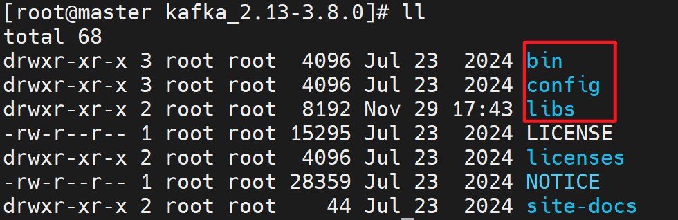

- bin ：**存放所有可执行脚本文件**，用于启动、停止Kafka和管理主题、消费者组等操作。
- config ：**包含所有配置文件**，用于配置Kafka服务器、ZooKeeper连接、日志存储等参数。
- libs：**存放Kafka运行所需的所有JAR依赖包**，包括Kafka自身和第三方库的Java库文件。

## 搭建单机服务并理解 Kafka 的消息传递机制

### Kafka 的基础工作机制

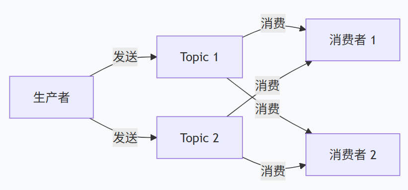

**Topic 是 Kafka 的核心机制之一，**可以把 Topic 理解为 Kafka 的 **“数据流”** 或 **“消息类别”**，它是消息发布的逻辑载体。(**物理载体是分区**)

**生产端将消息发到 Topic，消费端从 Topic 上消费。**

在微服务或模块化架构中，我们通常**按照业务领域（模块）来划分Topic**。

**订单模块对应的 Topic：orders（订单相关消息）**

**用户模块对应的 Topic：users（用户相关消息）**

### 安装 JDK

因为 `Kafka`是 `Scala`语言写的，`Scala`又是基于 Java 的，因此运行 `Kafka`就需要 `JVM`。

在 centos 中使用 `java -version`查看是否已经安装了 JDK。如果没有安装，系统会自动提示是否安装，如下：

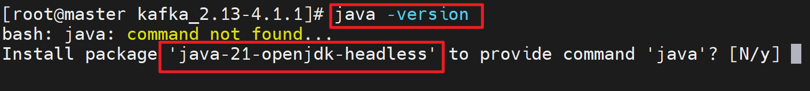

输入 `y`会立即安装。安装结束后再次测试 `java -version`：

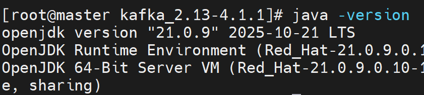

### 启动 Kafka 自带的 zookeeper

**传统启动 Kafka **的方式是需要依赖 zookeeper 的，在 Kafka 中已经内置了 zookeeper，启动 Kafka 时需要先启动 zookeeper。

进入 Kafka 的 bin 目录：

```shell
cd /app/kafka/kafka_2.13-3.8.0/bin
```

执行以下命令，让 zookeeper 以后台运行的方式启动：`**nohup**`**的作用就是后台启动**。

```shell
nohup ./zookeeper-server-start.sh ../config/zookeeper.properties &
```

启动之后，使用 `jps`命令查看当前系统中所有的 Java 进程，看看有没有 `QuorumPeerMain`进程，这个 Java 进程就是 zookeeper 进程：

```shell
jps
```

如果系统中没有 `jps`命令的话，系统会提示是否安装，按照提示安装即可。

执行 jps 命令后，显示的结果中有`QuorumPeerMain`，表示成功：

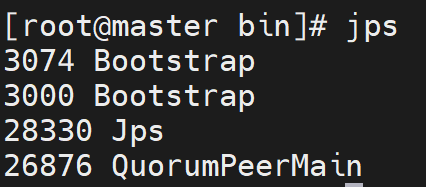

### 启动 Kafka

再次切换到 `Kafka`的 bin 目录下：

```shell
cd /app/kafka/kafka_2.13-3.8.0/bin
```

执行启动命令：

```shell
nohup ./kafka-server-start.sh ../config/server.properties &
```

再次使用 `jps`命令进行查看，如下图，表示 kafka 启动成功：

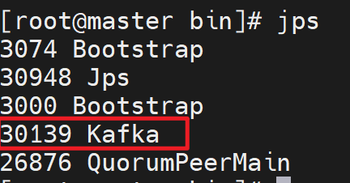

### 创建 Topic

创建 `Topic`，先切换到 Kafka 的 `bin`目录下：

```shell
cd /app/kafka/kafka_2.13-3.8.0/bin
```

执行以下命令来创建 Topic：创建一个名字叫做 test 的 Topic。

```shell
./kafka-topics.sh --bootstrap-server localhost:9092 --create --topic test
```

**在Kafka中创建一个名为"test"的主题，连接到本地9092端口。**

命令的具体参数怎么使用，可以通过一下命令查看帮助：

```shell
./kafka-topics.sh --help
```

你会看到，这个参数是必须的：

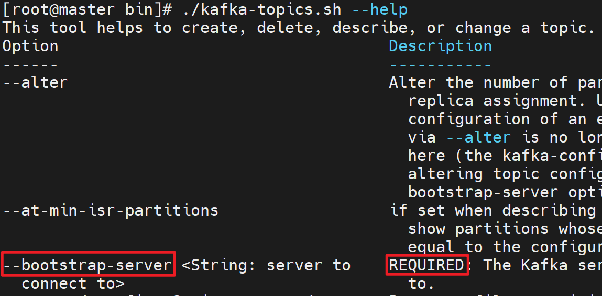

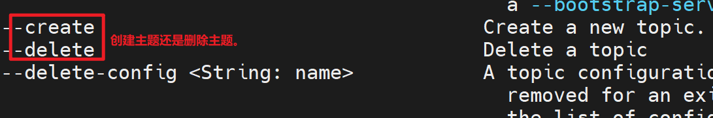

### 查看有哪些 Topic

执行以下这个命令可以查看当前服务器上有哪些主题：

```shell
./kafka-topics.sh --bootstrap-server localhost:9092 --list
```

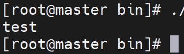

### 创建并启动一个基于控制台的生产者

切换到 kafka 的 bin 目录下：

```shell
cd /app/kafka/kafka_2.13-3.8.0/bin
```

执行以下命令来创建一个基于控制台的生产者：

```shell
./kafka-console-producer.sh --bootstrap-server localhost:9092 --topic test
```

效果是这样的：

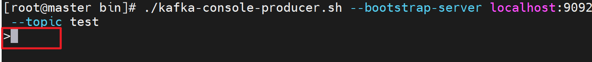

接下来，生产者就可以发消息到 Kafka 的服务器了：

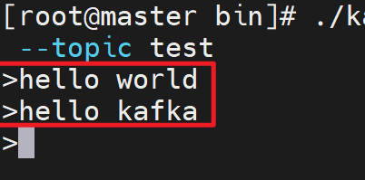

### 创建并启动一个基于控制台的消费者

**再开启一个新的终端**，然后切换到 kafka 的 bin 目录下：

```shell
cd /app/kafka/kafka_2.13-3.8.0/bin
```

**执行以下命令：**

```shell
./kafka-console-consumer.sh --bootstrap-server localhost:9092 --topic test
```

效果如下：

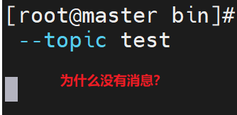

为什么会没有消费任何消息呢？Kafka 的服务器上不是已经有消息了吗？这是因为**默认只消费启动后生产者新发送的消息，不消费历史消息。**

接下来我们可以让生产端发送消息，看看消费端是否消费：

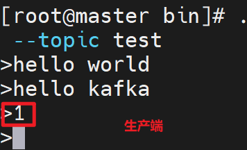

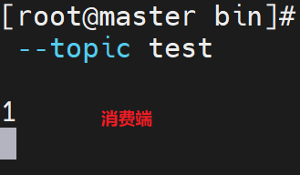

如果想让消费端消费历史消息，可以在之前的命令后面添加 `--from-beginning`参数：

```shell
./kafka-console-consumer.sh --bootstrap-server localhost:9092 --topic test --from-beginning
```

`ctrl+c`先终止当前的消费者，再执行以上的命令：

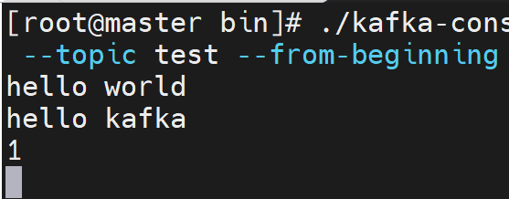

可以看到消费者对历史消息也进行了消费。

### 从指定位置开始消费

消费者可以从头开始消费，那么可以指定从具体的位置开始消费吗？可以的。执行以下命令：

```shell
./kafka-console-consumer.sh --bootstrap-server localhost:9092 --topic test --partition 0 --offset 2
```

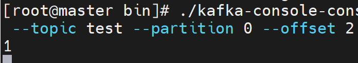

**从 test 主题的 0 号分区，直接消费从偏移量 2 开始的消息。**

`**<font style="color:rgb(15, 17, 21);">partition</font>**`**是分区。分区是真实存储消息的物理空间。**`**<font style="color:rgb(15, 17, 21);">Topic</font>**`**是逻辑空间。**

**默认情况下分区的数量是 1 个。**

### 消费者组的概念

当指定消费者组后，**同一个消费者组只能对同一个主题的消息消费一次**。当然，不同的组，则不受影响。怎么指定消费者组呢？

**打开两个窗口**，分别执行以下命令：

```shell
./kafka-console-consumer.sh --bootstrap-server localhost:9092 --topic test --group testGroup
```

此时在生产者端发消息，如下：

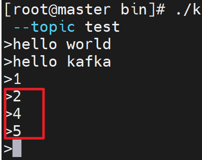

我们可以看到两个消费者端，只有其中一个窗口收到了消息，这说明，同一个消费者组对同一个主题的消息只能消费一次。

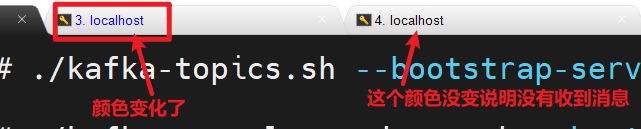

### 查看某个消费者组对消息的消费情况

要想查看某个消费者组对某个主题消息的消费情况，可以通过以下命令：

```shell
./kafka-consumer-groups.sh --bootstrap-server localhost:9092 --describe --group testGroup
```

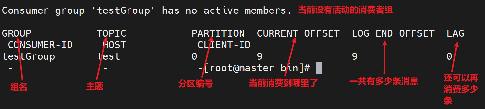

查看这个有啥用？**监控消费健康度，确保数据被及时处理，没有积压。**

**如果一切正常**：Lag 为 0 或很小，说明消费者在“实时”处理消息，系统健康。

**如果发现问题**：Lag 持续增大，说明消费者速度跟不上生产者，就像**流水线上的工人速度太慢，导致产品堆积**。这时你就需要去排查消费者为什么慢了（是代码bug、还是资源不足？），否则数据延迟会越来越严重。

### 理解 Kafka 的消息传递机制

生产者发送消息到topic，实际上topic是一个逻辑名称，最终是将消息存储到partition上面了。针对于**每一个消费者组**来说都有自己的offset。同一个消费者组只能消费一次。

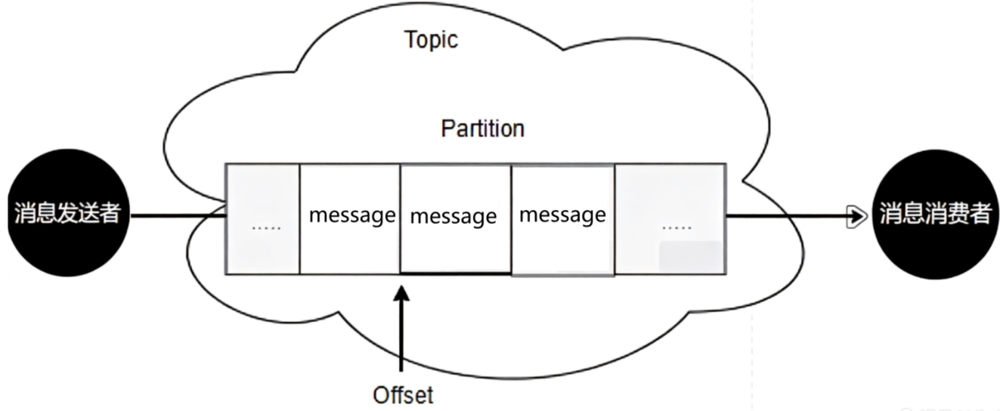

把Topic想象成一个**电视台（例如CCTV-1）**。

- **Partition**：就是这个电视台的**不同信号发射塔**（北京塔、上海塔...）。节目（消息）会同时通过所有塔发射出去。
- **消费者组**：就是一个**家庭**。
  - 在这个家庭里，**爸爸、妈妈、孩子（组内的消费者）** 会分工看不同的发射塔传来的节目，但他们**全家作为一个整体，同一个节目只看了一遍**（组内消费一次）。
- **不同的消费者组**：就是**千千万万个不同的家庭**。
  - 你家、我家、他家都可以同时收看CCTV-1的同一个节目。你的消费不影响我的消费（组间广播）。

## 理解 Kafka 的集群工作机制

对于处理海量数据的 Kafka 来说，集群是必备。Kafka 集群主要解决什么问题？

**第一：**消息太多（海量消息），需要分开保存，因为单机肯定存不下。

**第二：Kafka 对稳定性要求很高，但是现实中服务不可能都稳定**，那么 Kafka 可以通过集群方式整体对外提供稳定的服务。

**Kafka 集群原理图如下：**

**Broker 是什么？**Kafka集群中的一个独立服务器节点

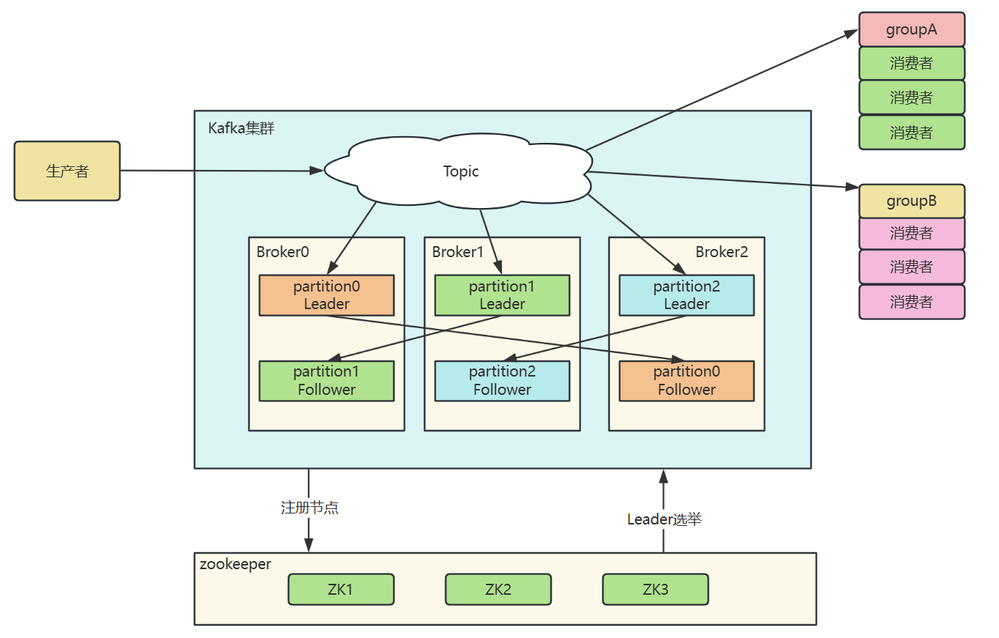

**Kafka 集群原理：**

1. 消息太多，一台机器存不下，分开存，**同一个 Topic **主题的消息分开存储到不同的 Broker 的 partition 上。
2. 如何保证服务整体稳定性的，将当前 Broker 中的 partition 进行备份，将备份存储到其他的 Broker 中。
3. Kafka集群中的Broker是通过**ZooKeeper**来相互感知和进行协调的。

## 测试环境准备

我们要搭建 Kafka 集群。需要提前准备一下环境：

1. 准备三台 CentOS（使用 vmware 进行系统克隆 【完整克隆】，参见当时 Linux 的讲义文档。）
2. 三台 CentOS 上都要有 JDK 的环境。【输入 `java -version`没有 java 环境时会自动下载。】
3. 三台 CentOS 关闭防火墙

```shell
service firewalld stop
systemctl disable firewalld
```

1. 为了后面操作方便，修改 hosts 文件（**三台机器都要执行**），将 IP 映射为名字：master、clone1、clone2

```shell
vi /etc/hosts

192.168.28.200 master
192.168.28.201 clone1
192.168.28.202 clone2
```

1. 搭建集群时，要使用奇数节点，因为 zookeeper 在进行选举时，偶数节点很难有投票结果。

## 搭建 zookeeper 集群

### 下载 zookeeper

Kafka 基于 zookeeper 进行集群搭建。虽然 Kafka 自带了 zookeeper，但生产环境下还是建议大家尽可能下载一个全新的 zookeeper。

下载页：[https://zookeeper.apache.org/releases.html](https://zookeeper.apache.org/releases.html)

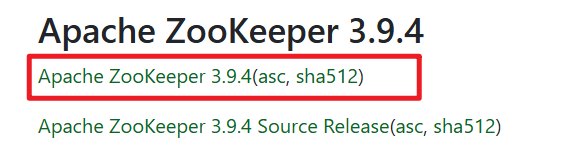


### 搭建 zookeeper 集群

将上面下载的 zookeeper 上传到母机的 `~/tools`目录下（没有目录可以新建）。

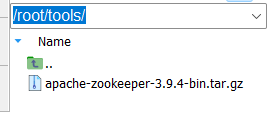

**直接解压：**

```shell
tar -zxvf apache-zookeeper-3.9.4-bin.tar.gz
```

**新建目录：**

```shell
mkdir -p /app/zookeeper
```

**将解压之后的**`**zookeeper**`**移动到**`**/app/zookeeper**`**目录下：**

```shell
mv apache-zookeeper-3.9.4-bin /app/zookeeper
```

**进入 zookeeper 的 conf 目录：**

```shell
cd /app/zookeeper/apache-zookeeper-3.9.4-bin/conf
```

**根据模板配置文件生成 zookeeper 的配置文件：**

```shell
cp zoo_sample.cfg zoo.cfg
```

**配置 zookeeper 的配置文件，重点将 dataDir 配置一下，然后做集群配置，做这两件事：**

```nginx
# 找到dataDir，修改它，最好不要把dataDir设置到/tmp目录下
dataDir=/app/zookeeper/data

# 最下面配置集群
# 配置两个端口
# 2888 是zookeeper内部通讯端口
# 3888 是zookeeper选举机制的端口
server.1=192.168.28.200:2888:3888
server.2=192.168.28.201:2888:3888
server.3=192.168.28.202:2888:3888
```

**创建数据目录 data：**

```shell
cd /app/zookeeper/
mkdir data
```

**在 data 目录中配置 myid：zookeeper 的标识**

```shell
echo 1 > myid
```

**在克隆机 clone1 和 clone2 上分别创建目录：**

```shell
mkdir -p /app/zookeeper
```

**将母机上 Zookeeper 发送到第一个克隆机 clone1：**

```shell
scp -r apache-zookeeper-3.9.4-bin/ root@clone1:/app/zookeeper
```

**将母机上 Zookeeper 发送到第二个克隆机 clone2：**

```shell
scp -r apache-zookeeper-3.9.4-bin/ root@clone2:/app/zookeeper
```

**第一台克隆机上创建 myid：**

```shell
cd /app/zookeeper
mkdir data
cd data
echo 2 > myid
```

**第二台克隆机上创建 myid：**

```shell
cd /app/zookeeper
mkdir data
cd data
echo 3 > myid
```

**在三台机器上分别启动 zookeeper：**

```shell
# 进入zookeeper的根目录
cd /app/zookeeper/apache-zookeeper-3.9.4-bin

# 执行启动命令 
bin/zkServer.sh --config conf start
```

到此为止 zookeeper 集群搭建完毕。

## 搭建 Kafka 集群

**将 kafka 的安装包上传到母机到 **`**~/tools**`**目录下：**

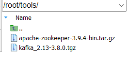

**解压：**

```shell
cd ~/tools
tar -zxvf kafka_2.13-3.8.0.tgz
```

**创建目录：**

```shell
mkdir -p /app/kafka
```

**将解压之后的 kafka 移动到/app/kafka 目录下：**

```shell
mv kafka_2.13-3.8.0 /app/kafka
```

**进入 kafka 的配置文件目录：**

```shell
cd /app/kafka/kafka_2.13-3.8.0/config
```

**编辑 kafka 的配置文件：**

```shell
vi server.properties
```

**需要配置的内容：**

```plaintext
# 消息服务器的id
broker.id=1

# 监听
listeners=PLAINTEXT://master:9092

# 日志目录
log.dirs=/app/kafka/logs

# zookeeper集群地址
zookeeper.connect=master:2181,clone1:2181,clone2:2181
```

**在母机上尝试启动 kafka：**

```shell
cd /app/kafka/kafka_2.13-3.8.0

# 后台启动
bin/kafka-server-start.sh -daemon config/server.properties

# 查看是否存在kafka的服务
jps
```

**到此母机上的 kafka 就启动成功了。**

---

**在 clone1 和 clone2 机器上创建目录：**

```shell
mkdir -p /app/kafka
```

**将母机上的 kafka 传送到 clone1：**

```shell
cd /app/kafka

scp -r kafka_2.13-3.8.0/ root@clone1:/app/kafka
```

**将母机上的 kafka 传送到 clone2:**

```shell
cd /app/kafka

scp -r kafka_2.13-3.8.0/ root@clone2:/app/kafka
```

**修改 clone1 机器上 kafka 的配置文件：一个是 broker.id，一个是监听端口**

```shell
cd /app/kafka/kafka_2.13-3.8.0/config

# 进入修改
vi server.properties

# 位置1
broker.id=2

# 位置2
listeners=PLAINTEXT://clone1:9092
```

**尝试启动 clone1 上的 kafka：**

```shell
cd /app/kafka/kafka_2.13-3.8.0

# 后台启动
bin/kafka-server-start.sh -daemon config/server.properties

# 查看是否存在kafka的服务
jps
```

**修改 clone2 机器上 kafka 的配置文件：一个是 broker.id，一个是监听端口**

```shell
cd /app/kafka/kafka_2.13-3.8.0/config

# 进入修改
vi server.properties

# 位置1
broker.id=3

# 位置2
listeners=PLAINTEXT://clone2:9092
```

**尝试启动 clone2 上的 kafka：**

```shell
cd /app/kafka/kafka_2.13-3.8.0

# 后台启动
bin/kafka-server-start.sh -daemon config/server.properties

# 查看是否存在kafka的服务
jps
```

到此为止 kafka 的集群就搭建完毕了。

## Kafka 集群模式下收发消息

### 创建 Topic

```shell
cd /app/kafka/kafka_2.13-3.8.0

bin/kafka-topics.sh --bootstrap-server master:9092 --create --replication-factor 2 --partitions 4 --topic disTopic
```

**命令解释：**

1. 创建一个 topic，名字 disTopic
2. `--partitions 4`：分成 4 个分区。
3. `--replication-factor 2`：每个 `partition`有 2 份数据。


### 查看 topic 详情

```shell
cd /app/kafka/kafka_2.13-3.8.0

bin/kafka-topics.sh --bootstrap-server master:9092 --describe --topic disTopic
```

**详情如下：**

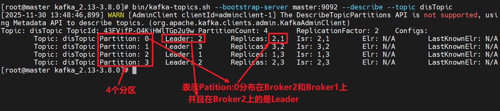

`Partition`共 4 个，0/1/2/3

`Replicas:2,1`表示：在 Broker2 和 Broker1 上都有数据副本。如果是 `2,1`表示 Broker2 上的是 Leader

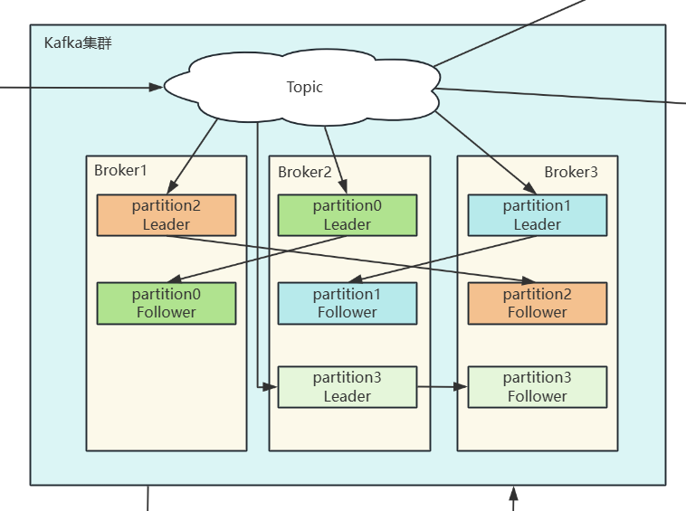

### Leader 和 Follower 的区别

1. 每一个 Partition 都有两份数据：对应的 Leader（主） 和 Follower（从）。
2. 生产者是基于 push 模式（推送），消费者是 pull 模式（拉取）。
3. push 和 pull 时都是针对 Leader （主）进行操作的。
4. 即使编写命令时，指定向 Follower（从）上写消息，底层也会写到 Leader（主）上。
5. Follower（从）本质上是一个数据备份。不负责读写操作。除非 Leader（主）挂了。
6. Broker 之间是如何进行感知的？通过 zookeeper 进行相互感知的。

### 发消息的时候，会发到哪个 Partition 上

理想状态下，写消息的时候，会均匀的分配到所有的 Partition 上。

但前提是数据量非常庞大的时候。很少的数据量它是不会平均分配，因为数据量比较小，没必要分配在不同 Partition 上。

**在 **`**clone1**`**机器上启动生产者，进行消息的生产：**

```shell
bin/kafka-console-producer.sh --bootstrap-server clone1:9092 --topic disTopic
```

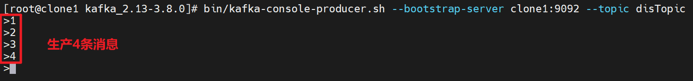

**在 **`**clone2**`**机器上启动消费者组进行消费：**

```shell
bin/kafka-console-consumer.sh --bootstrap-server clone2:9092 --topic disTopic --group testGroup
```

**在 **`**master**`**机器上查看消费者组的消费情况：**

```shell
bin/kafka-consumer-groups.sh --bootstrap-server master:9092 --describe --group testGroup
```

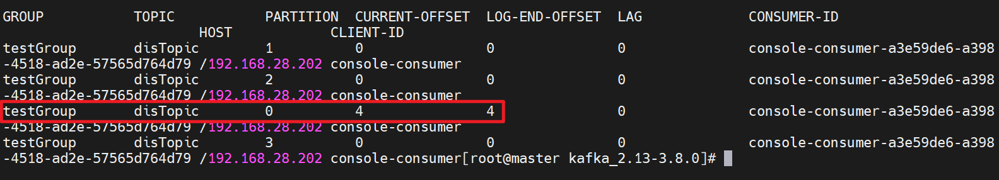

通过测试可以看到，生产的消息被全部放到了 `Partition : 0`上。

所以，目前来看，消息并不是均匀的分配到不同的分区上的。因为数据量太少了。

### 生产端发消息，消费端看看能不能收到

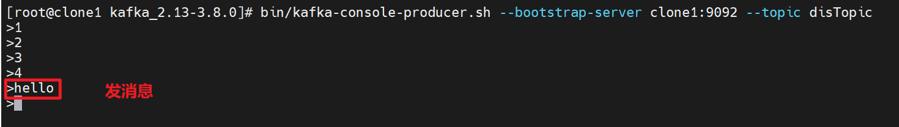

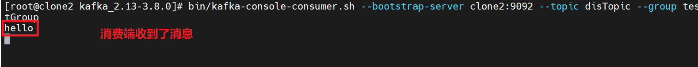

**注意：当你关闭虚拟机后，下一次重启虚拟机的时候，你需要先重启 3 个节点的 zookeeper，再重启 3 个节点的 kafka，集群才能正常工作。**

# Kafka 客户端开发流程

## 引入 Kafka Java 客户端依赖

```xml
<dependencies>
    <!-- Kafka客户端 -->
    <dependency>
        <groupId>org.apache.kafka</groupId>
        <artifactId>kafka-clients</artifactId>
        <version>3.8.0</version>
    </dependency>
    
    <!-- 日志依赖（可选，但推荐） -->
    <dependency>
        <groupId>org.slf4j</groupId>
        <artifactId>slf4j-simple</artifactId>
        <version>1.7.36</version>
    </dependency>
</dependencies>
```

## 编写生产端

```java
package com.jkweilai.kafka;

import org.apache.kafka.clients.producer.*;
import org.apache.kafka.common.serialization.StringSerializer;

import java.util.Properties;

public class Producer1 {

    private static final String BOOTSTRAP_SERVERS = "master:9092,clone1:9092,clone2:9092";
    private static final String TOPIC_NAME = "disTopic";

    public static void main(String[] args) {
        // 配置生产者属性
        Properties props = new Properties();
        // 指定服务器列表
        props.put(ProducerConfig.BOOTSTRAP_SERVERS_CONFIG, BOOTSTRAP_SERVERS);
        // 指定消息键的序列化器。
        props.put(ProducerConfig.KEY_SERIALIZER_CLASS_CONFIG, StringSerializer.class.getName());
        // 指定消息值的序列化器。
        props.put(ProducerConfig.VALUE_SERIALIZER_CLASS_CONFIG, StringSerializer.class.getName());

        // 创建生产者
        try (Producer<String, String> producer = new KafkaProducer<>(props)) {

            // 发送10条测试消息
            for (int i = 0; i < 10; i++) {
                String key = "key-" + i;
                String value = "Hello Kafka! Message #" + i + " at " + System.currentTimeMillis();

                // 创建ProducerRecord（一条消息）
                ProducerRecord<String, String> record = new ProducerRecord<>(TOPIC_NAME, key, value);

                // 异步发送消息（回调方式）
                producer.send(record, new Callback() {
                    @Override
                    public void onCompletion(RecordMetadata metadata, Exception exception) {
                        if (exception == null) {
                            // 哪个消息主题
                            // 哪个分区
                            // 消息所在分区的offset
                            System.out.printf("消息发送成功 -> topic: %s, partition: %d, offset: %d, key: %s\n",
                                    metadata.topic(), metadata.partition(), metadata.offset(), key);
                        } else {
                            System.err.println("消息发送失败: " + exception.getMessage());
                        }
                    }
                });

                // 同步发送（如果需要确保顺序）：这种方式会阻塞当前线程，但发的消息有保障
                // RecordMetadata metadata = producer.send(record).get();

                Thread.sleep(1000); // 每秒发送一条
            }

            // 确保所有消息都发送完成
            producer.flush();
            System.out.println("所有消息发送完成！");

        } catch (InterruptedException e) {
            Thread.currentThread().interrupt();
            System.err.println("生产者被中断: " + e.getMessage());
        }
    }
}
```

## 安装 IDEA Kafka 插件

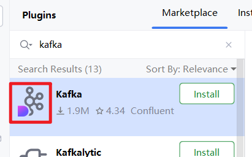

左下角如果没有 Kafka 插件的图标，重启以下 IDEA：

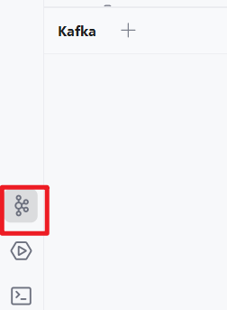

点击 `+`添加 Kafka 实例：


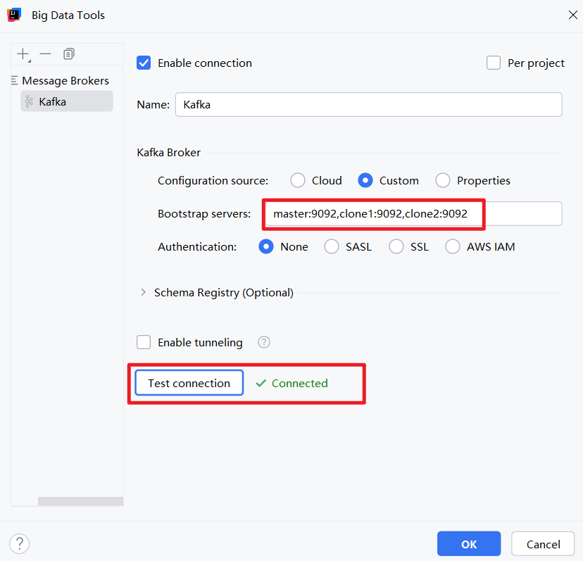

**通过插件可以看到详细的信息：**

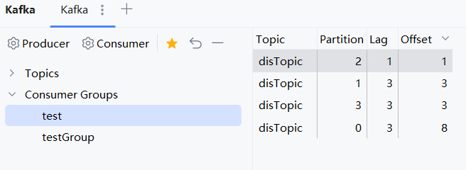

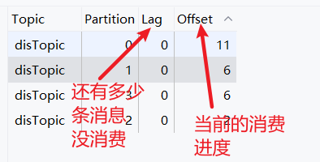

## 编写消费端

```java
package com.jkweilai.kafka;

import org.apache.kafka.clients.consumer.*;
import org.apache.kafka.common.serialization.StringDeserializer;

import java.time.Duration;
import java.util.Collections;
import java.util.Properties;

public class Consumer1 {

    private static final String BOOTSTRAP_SERVERS = "master:9092,clone1:9092,clone2:9092";
    private static final String TOPIC_NAME = "disTopic";
    private static final String GROUP_ID = "test";

    public static void main(String[] args) {
        // 配置消费者属性
        Properties props = new Properties();
        props.put(ConsumerConfig.BOOTSTRAP_SERVERS_CONFIG, BOOTSTRAP_SERVERS);
        props.put(ConsumerConfig.GROUP_ID_CONFIG, GROUP_ID);
        props.put(ConsumerConfig.KEY_DESERIALIZER_CLASS_CONFIG, StringDeserializer.class.getName());
        props.put(ConsumerConfig.VALUE_DESERIALIZER_CLASS_CONFIG, StringDeserializer.class.getName());
        // 创建消费者
        try (Consumer<String, String> consumer = new KafkaConsumer<>(props)) {
            // 订阅主题
            consumer.subscribe(Collections.singletonList(TOPIC_NAME));
            System.out.println("消费者已启动，开始监听主题: " + TOPIC_NAME);
            // 持续消费消息
            while (true) {
                // 拉取消息（超时时间100ms）
                ConsumerRecords<String, String> records = consumer.poll(Duration.ofMillis(100));
                // 处理拉取到的消息
                for (ConsumerRecord<String, String> record : records) {
                    System.out.printf("收到消息 -> topic: %s, partition: %d, offset: %d, key: %s, value: %s\n", record.topic(), record.partition(), record.offset(), record.key(), record.value());
                    // 这里可以添加业务逻辑处理消息
                }
                // 手动提交offset（上面的配置已经配置了自动提交offset，因此这个代码注释掉）
                // 作用是：告诉Kafka Broker当前消费者组的消费进度（offset）
                // consumer.commitSync();
            }
        } catch (Exception e) {
            System.err.println("消费者异常: " + e.getMessage());
        }
    }
}
```

**注意：你可能会看到消费端在消费的时候，和生产端生产消息的顺序不一致，这是正常的，因为消费被分发到了不同的 Partition。因此你看到的顺序和生产时的顺序不一致了，如果要保证一致，可以考虑使用单个分区。**

## 关于配置

实际开发中，编写 Kafka 的代码时，主要工作量是编写配置，发送消息和接收消息的代码基本上是固定的。

**以下配置****当下****先不需要了解：**

**生产者配置：**

```java
Properties props = new Properties();
// 核心配置
props.put(ProducerConfig.BOOTSTRAP_SERVERS_CONFIG, "master:9092,clone1:9092,clone2:9092");
props.put(ProducerConfig.KEY_SERIALIZER_CLASS_CONFIG, StringSerializer.class.getName());
props.put(ProducerConfig.VALUE_SERIALIZER_CLASS_CONFIG, StringSerializer.class.getName());

// 性能调优配置
props.put(ProducerConfig.ACKS_CONFIG, "all");           // 消息确认机制
props.put(ProducerConfig.RETRIES_CONFIG, 3);            // 重试次数
props.put(ProducerConfig.BATCH_SIZE_CONFIG, 16384);     // 批量大小
props.put(ProducerConfig.LINGER_MS_CONFIG, 10);         // 等待时间

// 可靠性配置
props.put(ProducerConfig.ENABLE_IDEMPOTENCE_CONFIG, true); // 幂等性
props.put(ProducerConfig.MAX_IN_FLIGHT_REQUESTS_PER_CONNECTION, 1);
```

**消费者配置：**

```java
Properties props = new Properties();
// 核心配置
props.put(ConsumerConfig.BOOTSTRAP_SERVERS_CONFIG, "master:9092,clone1:9092,clone2:9092");
props.put(ConsumerConfig.GROUP_ID_CONFIG, "my-consumer-group");
props.put(ConsumerConfig.KEY_DESERIALIZER_CLASS_CONFIG, StringDeserializer.class.getName());
props.put(ConsumerConfig.VALUE_DESERIALIZER_CLASS_CONFIG, StringDeserializer.class.getName());

// 消费行为配置
props.put(ConsumerConfig.AUTO_OFFSET_RESET_CONFIG, "earliest"); // 从何处开始消费
props.put(ConsumerConfig.ENABLE_AUTO_COMMIT_CONFIG, "false");   // 是否自动提交
props.put(ConsumerConfig.MAX_POLL_RECORDS_CONFIG, 500);         // 每次拉取数量
```

**Kafka官方提供了非常详细的配置指导，主要官方文档：**[https://kafka.apache.org/documentation/](https://kafka.apache.org/documentation/)

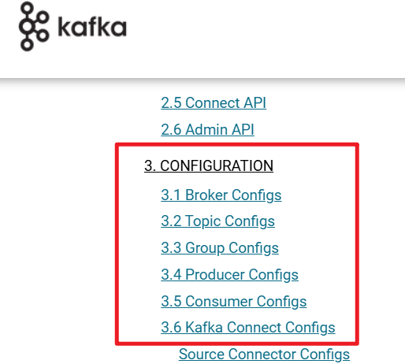

# 从客户端属性来分析客户端工作机制

Kafka 的设计精髓在于：网络可能不稳定，服务也可能随时崩溃，在这种情况下 Kafka 依然可以保证高并发、高吞吐。要想理解它是怎么做到的，就需要学习它的客户端工作机制。

## 消费者分组消费机制

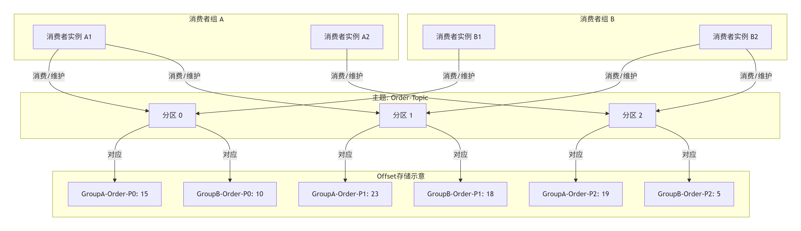

在Kafka中，消息的消费进度是通过**消费者组**机制来管理的。其核心设计如下：

1. **Offset的归属维度**：
  - Offset 是**分区级别的**。具体而言，Kafka会为每个 `<font style="color:rgb(15, 17, 21);background-color:rgb(235, 238, 242);"><消费者组, 主题, 分区></font>` 的组合独立维护一个偏移量（Offset）。
  - **一个消费者组为其所消费的每一个分区，分别维护一个独立的Offset**，而非整个组共享一个单一的Offset。
2. **消费模式与实现机制**：
  - **发布-订阅模式**：基于上述机制，不同的消费者组拥有各自独立的一套Offset。因此，一条消息可以被**多个不同的消费者组**分别拉取和消费。
  - **队列模式**：在**同一个消费者组内部**，通过一个关键规则实现：“一个分区在同一时刻只能被组内的一个消费者实例消费”。组内的多个消费者实例通过分区分配来竞争和分担所有分区的消费任务，从而确保一条消息在组内只会被一个实例消费。（**对于同一组的消费者来说，消费者 1 和消费者 2 不可能也决不允许它们操作同一个分区**）
3. **线程安全与并发保证**：
  - 由于Offset是**分区级别**的，且一个分区在同一时刻仅由一个消费者实例负责，这意味着**对任何一个特定分区的Offset的读写操作，在任一时刻都只会由一个消费者实例执行**。这种“资源独占”的设计从根源上避免了跨实例的并发写冲突，无需复杂的分布式锁进行同步。

Kafka通过将Offset精细化管理到**分区级别**，并结合“**一个分区只属于一个消费者**”的分配策略，巧妙地实现了：

- **组间广播**：不同消费者组通过各自独立的Offset实现消息的广播（发布-订阅）。
- **组内竞争**：同组消费者通过竞争分区所有权来实现消息的负载均衡（队列模式）。

## 关于 `<font style="color:rgb(15, 17, 21);">group.id</font>`配置

```java
public static final String GROUP_ID_CONFIG = CommonClientConfigs.GROUP_ID_CONFIG;
```

在客户端程序中编写消费者程序的时候，Kafka 要求必须指定该消费者所属于的逻辑组。如何指定呢？通过 `group.id`这个配置来指定，代码如下：

```java
Properties props = new Properties();
props.put(ConsumerConfig.BOOTSTRAP_SERVERS_CONFIG, BOOTSTRAP_SERVERS);
// 这个配置就是用来指定消费者组id的
props.put(ConsumerConfig.GROUP_ID_CONFIG, GROUP_ID);
```

`**group.id**`**的用途：**

- **用来标识消费者组**：这是消费者组的全局唯一标识符。所有属于同一个组的消费者必须设置相同`<font style="color:rgb(15, 17, 21);background-color:rgb(235, 238, 242);">group.id</font>`
- **使用了 **`**<font style="color:rgb(15, 17, 21);">group.id</font>**`**，就能够启用消费者组的功能**：只有设置了`<font style="color:rgb(15, 17, 21);background-color:rgb(235, 238, 242);">group.id</font>`，消费者才能使用。这是一个必须的配置。不是可选的。

## 关于 `<font style="color:rgb(15, 17, 21);">group.instance.id</font>`配置

```java
public static final String GROUP_INSTANCE_ID_CONFIG = CommonClientConfigs.GROUP_INSTANCE_ID_CONFIG;
```

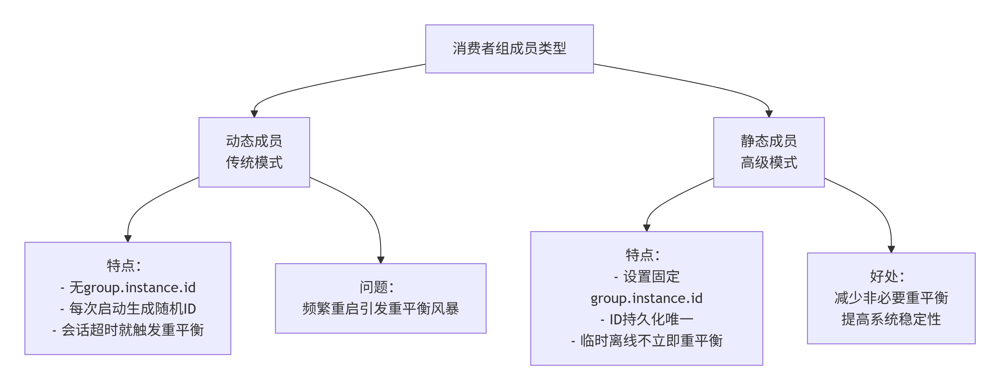

| **类型** | **配置方式** | **Kafka识别** | **重平衡行为** | **适用场景** |
| --- | --- | --- | --- | --- |
| **动态成员** | 不设置`<font style="color:rgb(15, 17, 21);background-color:rgb(235, 238, 242);">group.instance.id</font>` | 随机生成的ID | 每次加入都视为**新成员**，触发重平衡 | 临时测试、一次性任务 |
| **静态成员** | 设置`<font style="color:rgb(15, 17, 21);background-color:rgb(235, 238, 242);">group.instance.id</font>` | 固定ID的"老朋友" | 超时时间内重启**不触发重平衡** | 生产环境、常驻服务 |

1. 这**不是一个必须的配置**，但设置了它，效率会比较高一点，可避免**重平衡风暴**。
2. `group.instance.id`是用来**设置具体某个消费者id 的**。等于是给具体某个消费者起个名字。
3. 没有起名字的我们一般称为：**动态成员**。动态成员最大的特点是：如果动态成员挂了，重启之后，重新加入的时候，Kafka 会自动判定为新成员，新成员来了，底层就会自动重平衡，重新让同一组的所有消费者重新分配 Partition。这就是重平衡风暴。
4. 如果你给具体某个消费者起了名字，那么该消费者就属于**静态成员**了，静态成员最大的特点是：如果静态成员短暂的挂掉了，只要在超时时间范围内它重启了，那么对于 Kafka 来说，会认为它是一个老朋友/老成员，之前假设分配的 Partition 是 0 号和 1 号，则老朋友加入的时候，还是会分给它 0 号 Partition 和 1 号 Partition，这样就避免了重平衡操作。避免了重平衡风暴。这就是这个配置的作用。
5. 注意：同一个消费者组中的消费者 id 不能重复，是唯一的。

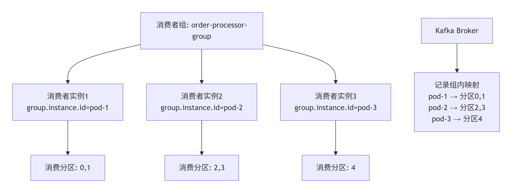

## 关于 `enable.auto.commit`配置

```java
public static final String ENABLE_AUTO_COMMIT_CONFIG = "enable.auto.commit";
```

注意：offset 是由 Kafka 的 Broker 来维护的，但这个维护的前提是通过客户端的提交的方式来推进的。

以下代码就是在消费端进行手动提交：

```java
consumer.commitSync();
```

这个显然是需要依靠程序员素养的，如果程序员忘了呢？所以，它提供了自动提交机制，当你配置了以下信息，会自动提交：

```java
props.put(ConsumerConfig.ENABLE_AUTO_COMMIT_CONFIG, "true");
```

那如果消费端没有设置自动提交（**并且还将自动提交机制设置成了 false，注意 Kafka 默认情况下，没有设置自动提交机制的话，默认是支持自动提交的，你要测试出效果的话，就需要将自动提交机制设置为 false**），也没有手动提交，最终会是怎样的？最终服务器会认为你消费者端没有消费成功。当消费者下一次消费的时候还是会消费到重复的消息。可以测试一下，测试前需要在消费者端代码中添加以下代码：

```java
props.put(ConsumerConfig.ENABLE_AUTO_COMMIT_CONFIG, "false");
```

假设当前的消费进度是这样的：

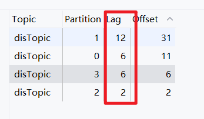

这个时候再次执行消费者端程序，他会消费 26 条消息，但是再次查看 IDEA 的 Kafka 插件的时候，结果没有发生任何变化：


**注意，我们在消费端有这样一个代码：**

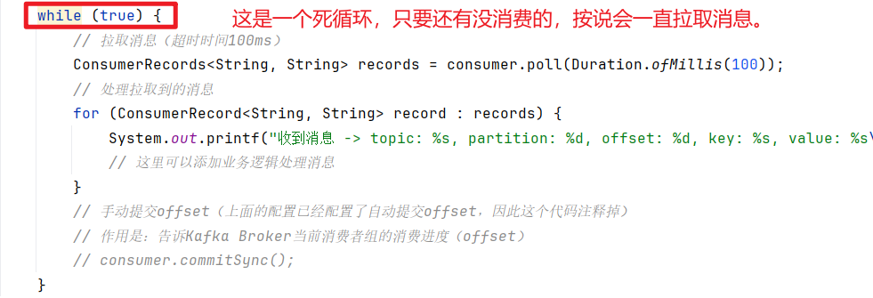

可以看到这个代码是一个死循环，按照我们上面所讲，消费端没有提交 offset，那就证明消息一直没有消费，通过上图也可以看到，lag 一直没有发生变化，消费端按说应该一直不间断的能够拉取消息，拉了一遍又一遍，但实际的运行效果不是我们想象。这是为什么呢？这是因为在 Kafka 中，服务端是这样认为的：如果消费端消费之后，没有给服务端提交 offset，站在服务端的角度来说，消费者的消费动作是失败。服务端一旦判定你消费者失败了，那么这批消息就不再考虑向你这个消费端推送消息了。这也就是为什么我们看不到不间断的拉取消息。当然，服务器虽然不会继续向当前失败的消费者推送消息，但会继续向同组中其他消费者推送消息。

## 关于 `auto.offset.reset`配置

```java
public static final String AUTO_OFFSET_RESET_CONFIG = "auto.offset.reset";
```

`<font style="color:rgb(15, 17, 21);background-color:rgb(235, 238, 242);">auto.offset.reset</font>` 决定了**当消费者组没有有效的已提交offset时，从哪里开始消费**。啥意思？

意思就是说，保存 offset 的是服务端负责的，那你有没有想过，如果服务端把 offset 丢了呢？

如果服务端把 offset 弄丢了。那消费者端肯定就懵逼了。该从哪里开始消费呢？

因此 Kafka 给出了 `<font style="color:rgb(15, 17, 21);">auto.offset.reset</font>`配置，这个配置在消费者程序中指定。比如以下配置：

```java
props.put(ConsumerConfig.AUTO_OFFSET_RESET_CONFIG, "earliest");
```

以上代表则表示，如果服务端把 offset 弄丢了，消费者从哪里开始消费呢？`earliest`则表示从分区的**第一条消息**开始消费。

## 服务端维护 offset 不准确的问题

由于 offset 的维护是由 Broker 全权维护的，默认情况下消费端是无权干涉的，消费端只能编写一个提交 offset 的代码，那这里就有可能产生这样一个问题：Broker 维护的 offset 不准确，导致消费端重复消费的问题，那么这个问题在实际开发中是如何解决的呢？请看下面消费端的代码，这个代码不需要编写，只需要了解思想即可：

**第一种****数据库方案：利用唯一约束异常实现"插入成功=首次处理，插入失败=重复消息"**

```java
@Component
public class OrderService {
    
    @Autowired
    private OrderRepository orderRepository;
    
    // 使用数据库唯一约束实现幂等（实现幂等则表示避免消息重复被消费）
    public void processOrder(OrderMessage message) {
        try {
            // 核心步骤1：尝试插入唯一键（订单ID）
            // 如果订单ID已存在，数据库的唯一约束会阻止插入并抛出DuplicateKeyException
            orderRepository.saveWithIdempotent(
                message.getOrderId(),      // 唯一业务标识，如订单号
                message.getOrderData()     // 业务数据
            );
            // 核心步骤2：插入成功，说明是第一次处理，继续执行业务逻辑
            // （通常saveWithIdempotent方法内部已经完成了业务数据保存）
            
        } catch (DuplicateKeyException e) {
            // 核心步骤3：捕获唯一约束违反异常
            // 说明该订单ID已存在，消息是重复的
            log.info("重复订单消息: {}", message.getOrderId());
            // 直接返回，不执行业务，实现幂等
        }
    }
}
```

**第二种Redis方案：利用setnx原子操作实现"设置成功=首次处理，设置失败=重复消息"**

```java
// 或者使用Redis实现幂等
public boolean processWithIdempotent(String messageId, String data) {
    // 核心步骤1：构造Redis键，格式为"msg:消息ID"
    String key = "msg:" + messageId;
    
    // 核心步骤2：使用setnx原子操作尝试设置键值
    // setIfAbsent = set if not exists，只有key不存在时才设置
    // 设置24小时过期，防止内存无限增长
    Boolean result = redisTemplate.opsForValue().setIfAbsent(
        key,           // 键
        "processed",   // 值
        24,            // 过期时间
        TimeUnit.HOURS // 时间单位
    );
    
    // 核心步骤3：根据setnx结果判断是否重复
    if (Boolean.TRUE.equals(result)) {
        // Redis键设置成功，说明是第一次收到此消息
        // 执行核心业务逻辑
        processBusiness(data);
        return true;  // 处理成功
    } else {
        // Redis键已存在，说明消息已被处理过
        log.info("消息已处理过: {}", messageId);
        return false; // 跳过处理
    }
}
```

# 生产者的拦截器机制

**生产者拦截器就是Kafka的"自动化流水线"，在消息进出时自动完成加工、监控、审计这些企业必备的重复工作，让开发人员专注业务逻辑。**

**加工：**自动添加TraceID、时间戳、脱敏敏感数据、转换格式

**监控：**自动统计成功率、计算延迟、超阈值自动告警。

**审计：**自动记录谁在什么时候发了什么消息。

**编写生产者拦截器：实现特定接口，然后实现所有拦截方法。**

```java
package com.jkweilai.kafka;

import org.apache.kafka.clients.producer.ProducerInterceptor;
import org.apache.kafka.clients.producer.ProducerRecord;
import org.apache.kafka.clients.producer.RecordMetadata;

import java.util.Map;

// 生产者拦截器
public class MyProducerInterceptor implements ProducerInterceptor<String, String> {

    // 拦截器初始化时调用，只会调用一次
    @Override
    public void configure(Map<String, ?> configs) {
        // 可以在这里读取配置参数
        // configs 就是生产者配置的Properties
    }

    // 最重要的方法：消息发送前调用，每条消息都会调用
    @Override
    public ProducerRecord<String, String> onSend(ProducerRecord<String, String> record) {
        // 可以在这里修改消息
        // 比如：给每条消息值前面加上前缀
        String modifiedValue = "[前缀]" + record.value();

        // 返回新消息（如果不想修改，直接返回原record）
        return new ProducerRecord<>(record.topic(), record.partition(), record.key(), modifiedValue,  // 修改后的值
                record.headers());
    }

    // 消息发送到Kafka后的回调（成功或失败都会调用）
    @Override
    public void onAcknowledgement(RecordMetadata metadata, Exception exception) {
        // metadata: 发送成功时才有值
        // exception: 发送失败时才有值
        if (exception == null) {
            // 发送成功
            System.out.println("消息发送成功: topic=" + metadata.topic());
        } else {
            // 发送失败
            System.out.println("消息发送失败: " + exception.getMessage());
        }
    }

    // 拦截器关闭时调用，做清理工作
    @Override
    public void close() {
        // 比如关闭数据库连接、释放资源等
        System.out.println("拦截器关闭");
    }
}
```

**编写生产者时配置拦截器：配置拦截器只需要一行代码即可。**

```java
package com.jkweilai.kafka;

import org.apache.kafka.clients.producer.*;
import org.apache.kafka.common.serialization.StringSerializer;

import java.util.Properties;

public class MyProducer {

    private static final String BOOTSTRAP_SERVERS = "master:9092,clone1:9092,clone2:9092";
    private static final String TOPIC_NAME = "disTopic";

    public static void main(String[] args) {
        // 配置生产者属性
        Properties props = new Properties();
        props.put(ProducerConfig.BOOTSTRAP_SERVERS_CONFIG, BOOTSTRAP_SERVERS);
        props.put(ProducerConfig.KEY_SERIALIZER_CLASS_CONFIG, StringSerializer.class.getName());
        props.put(ProducerConfig.VALUE_SERIALIZER_CLASS_CONFIG, StringSerializer.class.getName());

        // 配置拦截器
        props.put(ProducerConfig.INTERCEPTOR_CLASSES_CONFIG,
                "com.jkweilai.kafka.MyProducerInterceptor");

        // 创建生产者实例
        try (Producer<String, String> producer = new KafkaProducer<>(props)) {

            // 发送10条测试消息
            for (int i = 0; i < 10; i++) {
                String key = "key-" + i;
                String value = "Hello Kafka! Message #" + i + " at " + System.currentTimeMillis();

                // 创建ProducerRecord
                ProducerRecord<String, String> record = new ProducerRecord<>(TOPIC_NAME, key, value);

                // 异步发送消息（带回调）
                producer.send(record, new Callback() {
                    @Override
                    public void onCompletion(RecordMetadata metadata, Exception exception) {
                        if (exception == null) {
                            System.out.printf("消息发送成功 -> topic: %s, partition: %d, offset: %d, key: %s\n",
                                    metadata.topic(), metadata.partition(), metadata.offset(), key);
                        } else {
                            System.err.println("消息发送失败: " + exception.getMessage());
                        }
                    }
                });

                // 同步发送（如果需要确保顺序）
                // RecordMetadata metadata = producer.send(record).get();

                Thread.sleep(1000); // 每秒发送一条
            }

            // 确保所有消息都发送完成
            producer.flush();
            System.out.println("所有消息发送完成！");

        } catch (InterruptedException e) {
            Thread.currentThread().interrupt();
            System.err.println("生产者被中断: " + e.getMessage());
        }
    }
}
```

# Kafka 的消息序列化机制

**知识点列表：**

1. 在 Kafka 当中，消息在内部传输时都是采用二进制（`byte[]`）的方式传输的。
2. 因此生产者发消息到 Broker 的时候，需要将发送的消息转换成 `byte[]`。这个过程需要一个序列化的过程。
3. 消费者在消费的时候，从 Broker 上拉取的消息也是 `byte[]`数组。这个过程需要一个反序列化的过程。
4. 对于简单类型来说，序列化器和反序列化器都有内置的。
5. 对于复杂类型来说，序列化器和反序列化器就需要我们程序员来编写了。

## 对序列化器和反序列化器的理解

**我们可以看到生产者端有这样一个代码：**

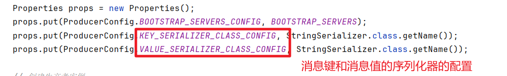

**我们还可以看到消费者端有这样一个代码：**

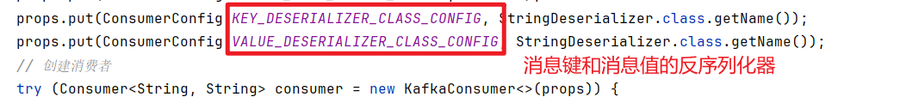

可以看出，生产者端需要指定序列化器。消费者端需要指定反序列化器。

在 Kafka 的 Java 客户端中内置了一些简单数据的序列化器和反序列化器。

**序列化器都实现了这样一个接口：**

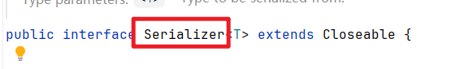

**反序列化器都实现了这样一个接口：**

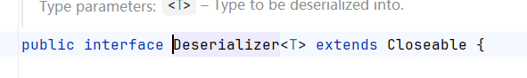

**内置的简单类型的序列化器有：**

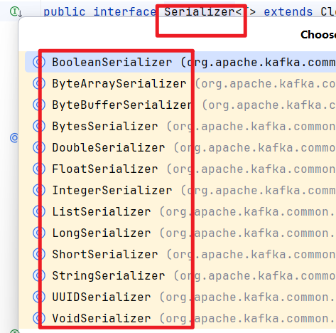

**内置的简单类型的反序列化器有：**


## 实现一个序列化器和反序列化器

比如现在传输的数据不是定长的 byte（我们可以认为 long、int 都是定长 byte 数据）。我们要传一个 User 对象。这个该如何实现呢？

### 创建新的 topic：userTopic

通过 IDEA 的 kafka 插件快速创建 userTopic 主题：


### 准备 User 类

```java
package com.jkweilai.kafka;

import java.io.Serializable;
import java.util.Objects;

public class User implements Serializable {
    private Integer id;
    private String name;
    private Integer age;

    public User() {
    }

    public User(Integer id, String name, Integer age) {
        this.id = id;
        this.name = name;
        this.age = age;
    }

    public Integer getId() {
        return id;
    }

    public void setId(Integer id) {
        this.id = id;
    }

    public String getName() {
        return name;
    }

    public void setName(String name) {
        this.name = name;
    }

    public Integer getAge() {
        return age;
    }

    public void setAge(Integer age) {
        this.age = age;
    }

    @Override
    public String toString() {
        return "User{id=" + id + ", name='" + name + "', age=" + age + "}";
    }

    @Override
    public boolean equals(Object o) {
        if (this == o) return true;
        if (o == null || getClass() != o.getClass()) return false;
        User user = (User) o;
        return Objects.equals(id, user.id);
    }

    @Override
    public int hashCode() {
        return Objects.hash(id);
    }
}
```

### 编写 User 序列化器

序列化器都要实现 `Serializer` 接口：

```java
package com.jkweilai.kafka;

import org.apache.kafka.common.serialization.Serializer;

import java.io.ByteArrayOutputStream;
import java.io.ObjectOutputStream;
import java.util.Map;

public class UserSerializer implements Serializer<User> {

    @Override
    public void configure(Map<String, ?> configs, boolean isKey) {
        // 可以读取配置，这里简单实现
    }

    @Override
    public byte[] serialize(String topic, User user) {
        if (user == null) {
            return null;
        }

        try (ByteArrayOutputStream baos = new ByteArrayOutputStream();
             ObjectOutputStream oos = new ObjectOutputStream(baos)) {

            oos.writeObject(user);
            return baos.toByteArray();

        } catch (Exception e) {
            throw new RuntimeException("User序列化失败", e);
        }
    }

    @Override
    public void close() {
        // 清理资源
    }
}
```

### 编写 User 反序列化器

反序列化器都要实现 `UserDeserializer` 接口：

```java
package com.jkweilai.kafka;

import org.apache.kafka.common.serialization.Deserializer;

import java.io.ByteArrayInputStream;
import java.io.ObjectInputStream;
import java.util.Map;

public class UserDeserializer implements Deserializer<User> {

    @Override
    public void configure(Map<String, ?> configs, boolean isKey) {
        // 可以读取配置
    }

    @Override
    public User deserialize(String topic, byte[] data) {
        if (data == null) {
            return null;
        }

        try (ByteArrayInputStream bais = new ByteArrayInputStream(data);
             ObjectInputStream ois = new ObjectInputStream(bais)) {

            return (User) ois.readObject();

        } catch (Exception e) {
            throw new RuntimeException("User反序列化失败", e);
        }
    }

    @Override
    public void close() {
        // 清理资源
    }
}
```

### 编写生产端

```java
package com.jkweilai.kafka;

import org.apache.kafka.clients.producer.*;
import org.apache.kafka.common.serialization.StringSerializer;

import java.util.Properties;

public class UserProducer {

    private static final String BOOTSTRAP_SERVERS = "master:9092,clone1:9092,clone2:9092";
    private static final String TOPIC_NAME = "userTopic";

    public static void main(String[] args) {
        // 配置生产者
        Properties props = new Properties();
        props.put(ProducerConfig.BOOTSTRAP_SERVERS_CONFIG, BOOTSTRAP_SERVERS);
        props.put(ProducerConfig.KEY_SERIALIZER_CLASS_CONFIG, StringSerializer.class.getName());
        // 指定序列化器
        props.put(ProducerConfig.VALUE_SERIALIZER_CLASS_CONFIG, UserSerializer.class.getName());

        try (Producer<String, User> producer = new KafkaProducer<>(props)) {

            // 发送3个User对象
            for (int i = 1; i <= 3; i++) {
                User user = new User(i, "用户" + i, 20 + i);

                ProducerRecord<String, User> record = new ProducerRecord<>(TOPIC_NAME, "key-" + i, user);

                producer.send(record, new Callback() {
                    @Override
                    public void onCompletion(RecordMetadata metadata, Exception exception) {
                        if (exception == null) {
                            System.out.printf("User发送成功 -> topic: %s, partition: %d, offset: %d\n", metadata.topic(), metadata.partition(), metadata.offset());
                        } else {
                            System.err.println("User发送失败: " + exception.getMessage());
                        }
                    }
                });

                Thread.sleep(1000); // 间隔1秒
            }

            producer.flush();
            System.out.println("所有User对象发送完成！");

        } catch (InterruptedException e) {
            Thread.currentThread().interrupt();
            System.err.println("生产者被中断: " + e.getMessage());
        }
    }

}
```

### 编写消费端

```java
package com.jkweilai.kafka;

import org.apache.kafka.clients.consumer.*;
import org.apache.kafka.common.serialization.StringDeserializer;

import java.time.Duration;
import java.util.Collections;
import java.util.Properties;

public class UserConsumer {

    private static final String BOOTSTRAP_SERVERS = "master:9092,clone1:9092,clone2:9092";
    private static final String TOPIC_NAME = "userTopic";
    private static final String GROUP_ID = "user-group";

    public static void main(String[] args) {
        // 配置消费者
        Properties props = new Properties();
        props.put(ConsumerConfig.BOOTSTRAP_SERVERS_CONFIG, BOOTSTRAP_SERVERS);
        props.put(ConsumerConfig.GROUP_ID_CONFIG, GROUP_ID);
        props.put(ConsumerConfig.KEY_DESERIALIZER_CLASS_CONFIG, StringDeserializer.class.getName());
        // 指定反序列化器
        props.put(ConsumerConfig.VALUE_DESERIALIZER_CLASS_CONFIG, UserDeserializer.class.getName());
        props.put(ConsumerConfig.AUTO_OFFSET_RESET_CONFIG, "earliest");
        props.put(ConsumerConfig.ENABLE_AUTO_COMMIT_CONFIG, "true");

        try (Consumer<String, User> consumer = new KafkaConsumer<>(props)) {

            // 订阅主题
            consumer.subscribe(Collections.singletonList(TOPIC_NAME));
            System.out.println("消费者已启动，等待接收User对象...");

            // 持续消费
            while (true) {
                ConsumerRecords<String, User> records = consumer.poll(Duration.ofMillis(1000));

                for (ConsumerRecord<String, User> record : records) {
                    User user = record.value();
                    System.out.printf("收到User -> key: %s, partition: %d, offset: %d, value: %s\n",
                            record.key(), record.partition(), record.offset(), user);

                    // 这里可以执行业务逻辑
                    // processUser(user);
                }

                if (records.isEmpty()) {
                    System.out.println("等待消息中...");
                    Thread.sleep(1000);
                }
            }
        } catch (Exception e) {
            System.err.println("消费者异常: " + e.getMessage());
        }
    }
}
```

### 测试

先启动生产端进行生产，再启动消费端进行消费，看看能不能正常传送 User 对象。

# 消息分区路由机制

## 什么是消息分区路由机制


很简单：Producer 生产者把消息发到哪个 Partition 上。消费者从哪个 Partition 上进行消费。

**涉及到两个核心问题：**

1. Producer 是如何找到 Partition 的？通过消息的 key 来找的，如果没有 key 怎么办？可以自己定制一些算法吗？
2. 一个消费者组中某个消费者实例会和某个 Partition 实现绑定关系，绑定关系是如何建立的？如果某个消费者宕机了，是不是需要重平衡(重新绑定关系)。

## 生产者把消息发到哪个 Partition 上

生产者发送消息到底会发到哪个 Partition 上，有一个配置和它密切相关。

找到生产者的配置类 `ProducerConfig`，搜索 `PARTITIONER_CLASS_CONFIG`。这个配置就是用来管控生产者将消息发到哪个 Partition 上的。


以上内容翻译后的大概意思：

1. **默认策略**：未配置时，优先按key哈希分区（**key.hashCode%分区个数**），无key则使用粘性分区：**"粘住"一个分区**：生产者会暂时"粘"在某个分区上，持续向它发送消息，当累积到 `<font style="color:rgb(15, 17, 21);background-color:rgb(235, 238, 242);">batch.size</font>`（默认 16KB）大小的数据后，才切换到下一个分区，继续粘在新的分区上，直到再次达到批量大小
2. **轮询策略**：指定RoundRobinPartitioner会按顺序循环分发到各分区
3. **自定义策略**：可实现Partitioner接口使用自定义分区逻辑

**面试题：**

**Q：你如果想让消息发送到同一个 Partition 上，怎么做？**

- 每次发消息使用同一个 key 就行了。

**Q：在 Kafka 中如何实现顺序消费？顺序消费指的是：生产的顺序和消费的顺序一致。**

- 默认情况下，由于消息是分区存储，因此生产的顺序和消费的顺序会不一致。怎么一致呢？
- 很简单：只要保证将消息都发到同一个 Partition 上就行了。这样就能够顺序消费了。怎么能发到同一个 partition 上？这就是我们上面刚探讨的问题了。

**自定义策略如何实现？非常简单**

1. 编写一个类实现 `Partitioner`接口，实现对应的方法。
2. 在生产者端编写程序的时候添加上`PARTITIONER_CLASS_CONFIG`配置，该配置指向我们自定义的`Partitioner`类。

**编写**`**Partitioner**`**接口实现类：**

```java
package com.jkweilai.kafka;

import org.apache.kafka.clients.producer.Partitioner;
import org.apache.kafka.common.Cluster;
import org.apache.kafka.common.PartitionInfo;

import java.util.List;
import java.util.Map;

public class MyPartitioner implements Partitioner {
    
    // 返回值就是对应的分区号。
    @Override
    public int partition(String topic, Object key, byte[] keyBytes, Object value, byte[] valueBytes, Cluster cluster) {
        // 根据topic获取到所有的分区
        List<PartitionInfo> partitionInfos = cluster.availablePartitionsForTopic(topic);
        // 这种算法就是：如果发送消息的key一直都是同一个key，则会消息会发到同一个partition上。
        //return key.hashCode() % partitionInfos.size();
        
        // 这种算法的话，就表示一直将消息发送到 0 号分区上。
        return 0;
    }

    @Override
    public void close() {

    }

    @Override
    public void configure(Map<String, ?> configs) {

    }
}
```

**在生产端编写程序的时候指定**`**PARTITIONER_CLASS_CONFIG**`**配置：**

```java
package com.jkweilai.kafka;

import org.apache.kafka.clients.producer.*;
import org.apache.kafka.common.serialization.StringSerializer;

import java.util.Properties;

public class Producer1 {

    private static final String BOOTSTRAP_SERVERS = "master:9092,clone1:9092,clone2:9092";
    private static final String TOPIC_NAME = "disTopic";

    public static void main(String[] args) {
        // 配置生产者属性
        Properties props = new Properties();
        props.put(ProducerConfig.BOOTSTRAP_SERVERS_CONFIG, BOOTSTRAP_SERVERS);

        // 指定一个你自己实现的 MyPartitioner 类，用于控制消息如何分配到不同的Kafka分区。
        props.put(ProducerConfig.PARTITIONER_CLASS_CONFIG, MyPartitioner.class.getName());

        props.put(ProducerConfig.KEY_SERIALIZER_CLASS_CONFIG, StringSerializer.class.getName());
        props.put(ProducerConfig.VALUE_SERIALIZER_CLASS_CONFIG, StringSerializer.class.getName());

        // 创建生产者实例
        try (Producer<String, String> producer = new KafkaProducer<>(props)) {

            // 发送10条测试消息
            for (int i = 0; i < 10; i++) {
                String key = "key-" + i;
                String value = "Hello Kafka! Message #" + i + " at " + System.currentTimeMillis();

                // 创建ProducerRecord
                ProducerRecord<String, String> record = new ProducerRecord<>(TOPIC_NAME, key, value);

                // 异步发送消息（带回调）
                producer.send(record, new Callback() {
                    @Override
                    public void onCompletion(RecordMetadata metadata, Exception exception) {
                        if (exception == null) {
                            System.out.printf("消息发送成功 -> topic: %s, partition: %d, offset: %d, key: %s\n", metadata.topic(), metadata.partition(), metadata.offset(), key);
                        } else {
                            System.err.println("消息发送失败: " + exception.getMessage());
                        }
                    }
                });

                // 同步发送（如果需要确保顺序）
                // RecordMetadata metadata = producer.send(record).get();

                Thread.sleep(1000); // 每秒发送一条
            }

            // 确保所有消息都发送完成
            producer.flush();
            System.out.println("所有消息发送完成！");

        } catch (InterruptedException e) {
            Thread.currentThread().interrupt();
            System.err.println("生产者被中断: " + e.getMessage());
        }
    }
}
```

**测试结果：可以看到，都发到了 Partition 0 分区上了。**


## 消费者从哪个分区消费

这个也是通过一个配置来指定的，找到 `ConsumerConfig`类中的 `PARTITION_ASSIGNMENT_STRATEGY_CONFIG`配置。该配置说明如下：


**通过以上的说明，大致有这几种常见的分配策略：**

**第一种策略：** RangeAssignor的分配策略：一个消费者 → 多个连续的分区

有3个消费者（C1, C2, C3），某个Topic有9个分区（p0-p8）

9个分区 ÷ 3个消费者 = 每个消费者约3个分区

```plaintext
消费者C1: p0, p1, p2  (第1-3个分区)
消费者C2: p3, p4, p5  (第4-6个分区)  
消费者C3: p6, p7, p8  (第7-9个分区)
```

看似均匀，实则不然，这是正好整除了，如果 10 个分区呢？3 个消费者分到的效果就是：3，3，4 的效果。会有一个消费永远消费 4 个分区，最终就会导致，忙的忙死，闲的闲死。

**第二种策略：**RoundRobinAssignor 分配策略：轮询策略

所有主题的所有分区一个一个轮流发到每个人手里。

**第三种策略：**StickyAssignor 分配策略：粘性策略

假设有 4 个消费者，12 个分区

```plaintext
Consumer1: p0, p1, p2
Consumer2: p3, p4, p5  
Consumer3: p6, p7, p8
Consumer4: p9, p10, p11
```

现在消费者 4 挂了，既然挂了就需要重平衡（重新洗牌），为了减少切换的开销，消费者 1 和 2 和 3 还消费自己原来的分区，给每一个消费者各自添加一个分区，最终的效果是：

```plaintext
Consumer1: p0, p1, p2,p9
Consumer2: p3, p4, p5,p10
Consumer3: p6, p7, p8,p11
```

这就是粘性策略。

# 生产者消息缓存机制

## 生产者消息缓存机制初步理解

**生产者消息缓存机制是Kafka提升吞吐量的核心设计。**

如果生产者收到一条消息就立即发一条，频繁的网络IO会成为性能瓶颈。为此，Kafka在生产者端设计了一个**内存缓存区（RecordAccumulator）**，它就像个“攒货仓库”：

- 消息先按分区放入不同的“货架”（意思就是：这个货架上的东西将来统一都是发往北京分区的，另一个货架上的东西将来就是统一发往上海的。）
- 每个货架上的货物要攒够一箱（达到`<font style="color:rgb(15, 17, 21);background-color:rgb(235, 238, 242);">batch.size</font>`），或者最多等一会儿（`<font style="color:rgb(15, 17, 21);background-color:rgb(235, 238, 242);">linger.ms</font>`），才会统一发车

这个机制中有两个关键角色分工协作：

1. **RecordAccumulator**：负责**攒**——接收消息、按分区缓存、等待触发条件
2. **Sender线程**：负责**发**——批量取出缓存中的消息，统一发送到Broker

通过“攒够再发”的方式，多条消息共享一次网络请求，同时支持批量压缩，用少量内存成本换来了网络效率的巨大提升，这正是Kafka能够支撑高吞吐场景的关键所在。

## 比喻：玩具工厂的打包发货系统

**场景：**

你开了一家玩具工厂，每天要发很多玩具给客户（Broker）。

**愚蠢的方式（没有缓存）：**

- **来一个订单，马上叫快递**
- 客户A买1个玩具 → 叫快递送走
- 客户B买1个玩具 → 又叫快递送走
- 客户C买1个玩具 → 再叫快递送走
- **结果**：快递费贵死！效率低死！

**Kafka的聪明方式（有缓存）：**

**第一步：设置一个打包车间**（RecordAccumulator）

```java
打包车间 buffer.memory = 1000个玩具的容量  // 内存缓冲区大小
```

**第二步：玩具来了先分类放好**

```plaintext
货架1（北京客户区）：玩具A、玩具B、玩具C...
货架2（上海客户区）：玩具D、玩具E...
货架3（广州客户区）：玩具F、玩具G...
```

每个货架对应一个**分区**的缓存队列。

**第三步：等攒够一箱**再发

```java
// 两个触发条件：
batch.size = 10个玩具   // 箱子容量
linger.ms = 5分钟       // 最多等5分钟
```

**实际运作**：

```plaintext
上午10:00：北京客户买了3个玩具 → 放北京货架
上午10:01：北京客户又买2个玩具 → 放北京货架（现在5个）
上午10:02：北京客户再买8个玩具 → 放北京货架（现在13个）
```

**触发！** 北京货架有13个玩具 > 10个（batch.size）
→ 打包成1箱（10个），发出！
→ 剩下3个继续等

**第四步：**时间到了也必须发

```plaintext
下午：北京货架只有3个玩具（不满10个）
等了5分钟（linger.ms）还没攒够
→ 不管了，3个也打包发出！
```

**关键配置：**

| **配置参数** | **比喻** | **作用** |
| --- | --- | --- |
| `buffer.memory` | 打包车间的总面积 | 最多能放多少玩具 |
| `batch.size` | 快递箱的大小 | 一箱能装多少玩具 |
| `linger.ms` | 最多等多久 | 5分钟没装满也发 |
| `max.block.ms` | 车间满了怎么办 | 最多等客户2小时，不行就拒单 |

## 画图理解

下图展示Kafka生产者的消息缓存机制：

```latex
┌─────────────────────────────────────────────────────────────────────┐
│                        Kafka Producer                                │
├─────────────────────────────────────────────────────────────────────┤
│                                                                     │
│  ┌─────────────────┐    ┌─────────────────────────────────────┐    │
│  │  应用线程        │    │      RecordAccumulator              │    │
│  │ (多个线程)       │    │  (内存缓冲区，默认32MB)              │    │
│  │                 │    │                                     │    │
│  │  producer.send()│    │  ┌─────────────────────────────┐    │    │
│  │       │         │    │  │ Topic-Partition 队列管理     │    │    │
│  │       ▼         │    │  │                             │    │    │
│  │ ┌───────────┐   │    │  │  Map<TopicPartition,       │    │    │
│  │ │ 序列化     │   │    │  │       Deque<ProducerBatch>>│    │    │
│  │ │ + 分区选择 │   │    │  │                             │    │    │
│  │ └─────┬─────┘   │    │  │  ┌───┐  ┌───┐  ┌───┐        │    │    │
│  │       │         │    │  │  │   │  │   │  │   │  ...   │    │    │
│  │       └─────────┼──▶│  │  └───┘  └───┘  └───┘        │    │    │
│  │                 │    │  │    │      │      │           │    │    │
│  │                 │    │  │    ▼      ▼      ▼           │    │    │
│  │                 │    │  │  ┌───┐  ┌───┐  ┌───┐        │    │    │
│  │                 │    │  │  │批1│  │批1│  │批1│        │    │    │
│  │                 │    │  │  └───┘  └───┘  └───┘        │    │    │
│  │                 │    │  │    │      │      │           │    │    │
│  │                 │    │  │  ┌───┐  ┌───┐  ┌───┐        │    │    │
│  │                 │    │  │  │批2│  │批2│  │批2│        │    │    │
│  │                 │    │  │  └───┘  └───┘  └───┘        │    │    │
│  └─────────────────┘    │  │                             │    │    │
│                         │  │  每个分区独立队列              │    │    │
│                         │  │  每个批次大小≤batch.size       │    │    │
│                         │  │  (默认16KB)                   │    │    │
│                         │  └─────────────────────────────┘    │    │
│                         │                                     │    │
│                         │  触发条件：                         │    │
│                         │  1. ✅ 批次满(batch.size)          │    │
│                         │  2. ⏰ linger.ms时间到(默认0)      │    │
│                         │  3. 🚨 buffer.memory快满         │    │
│                         │  4. 📤 调用flush()               │    │
│                         │                                     │    │
│                         │         满足条件时唤醒               │    │
│                         │              │                      │    │
│                         └──────────────┼──────────────────────┘    │
│                                        ▼                           │
│                         ┌─────────────────────────────┐            │
│                         │     Sender线程              │            │
│                         │   (后台IO线程，1个或多个)     │            │
│                         │                             │            │
│                         │  ┌─────────────────────┐    │            │
│                         │  │   从缓冲区取出批次    │    │            │
│                         │  │                     │    │            │
│                         │  │  🔄 可选压缩         │    │            │
│                         │  │  (gzip/snappy/lz4)  │    │            │
│                         │  │                     │    │            │
│                         │  │  📦 组装成Request    │    │            │
│                         │  │                     │    │            │
│                         │  │  🌐 发送到Broker     │    │            │
│                         │  │                     │    │            │
│                         │  │  ⏱️ 超时重试机制     │    │            │
│                         │  │  (retries次)        │    │            │
│                         │  └──────────┬──────────┘    │            │
│                         └─────────────┼────────────────┘            │
│                                       ▼                            │
└───────────────────────────────┬───────┼────────────────────────────┘
                                │       │
                                │       │
                    ┌───────────▼───────▼───────────┐
                    │        网络传输                │
                    │      (批量，高效)              │
                    └──────────────┬────────────────┘
                                   ▼
                    ┌─────────────────────────────┐
                    │        Kafka Broker         │
                    │   (Leader副本接收消息)       │
                    └─────────────────────────────┘
```

## 生产者消息缓存的面试题

### Kafka生产者为什么吞吐量高？

**回答要点**：

- **批量发送机制**：核心是RecordAccumulator的攒批设计
- **内存换吞吐**：用内存缓存减少网络IO次数
- **具体数据**：默认batch.size=16KB，buffer.memory=32MB
- **对比说明**：一条条发 vs 攒够一批发

**标准回答**：
"Kafka生产者通过RecordAccumulator实现消息缓存和批量发送。消息不会立即发送，而是先放入内存缓冲区，攒够16KB（batch.size）或等待指定时间（linger.ms）后才批量发送。这种设计将多次小IO合并为一次大IO，网络开销降低90%以上，是吞吐量的关键。"

### 详细描述消息从生产到发送的流程

**回答结构**：

```java
// 伪代码流程式回答
1. producer.send() 调用
2. 序列化 + 选择分区 → 确定目的地
3. 放入对应分区的ProducerBatch（缓存）
4. 检查触发条件：
   - batch.size满了？
   - linger.ms时间到了？
   - buffer.memory快满了？
5. Sender线程批量取出发送
6. 网络传输到Broker
```

**标准回答**：
"消息经历六个阶段：1）应用调用send；2）序列化和分区选择；3）进入RecordAccumulator对应分区队列；4）监控batch.size、linger.ms等触发条件；5）Sender线程批量取出组装Request；6）网络发送到Broker。关键在3-5步的攒批等待。"

### 影响生产者性能的关键参数有哪些？

**分类回答**：

| 参数 | 作用 | 调优建议 |
| --- | --- | --- |
| `batch.size` | 批次大小 | 增大可提吞吐，但增加延迟 |
| `linger.ms` | 最大等待时间 | 平衡吞吐和延迟的关键 |
| `buffer.memory` | 总缓存大小 | 根据并发量设置，防阻塞 |
| `compression.type` | 压缩类型 | lz4性能好，snappy兼容好 |
| `max.block.ms` | 最大阻塞时间 | 防止生产线程无限等待 |

**标准回答**：
"五个关键参数：batch.size控制每批大小，默认16KB，增大可提吞吐；linger.ms控制等待时间，默认0ms，适当增加如5-100ms可显著提吞吐；buffer.memory控制总缓存，默认32MB，高并发需调大；compression.type建议用lz4；max.block.ms防止线程永久阻塞。"

### 生产者缓存满了会怎样？

**场景化回答**：

```bash
# 模拟场景
buffer.memory = 32MB
已使用 = 31.9MB
新消息到达 → 发生什么？
```

**标准回答**：
"会触发流控。生产者线程会阻塞，最多等待max.block.ms（默认60秒）。期间如果有批次发送成功释放空间，则恢复写入；如果超时仍无空间，抛出TimeoutException。这是用同步阻塞保护内存不溢出的设计。"

### batch.size和linger.ms的关系

**比喻回答**：
"就像等电梯：batch.size是电梯容量（装多少人），linger.ms是等电梯时间（等多久）。两个条件谁先满足就触发：要么人满了立即走（batch.size满），要么等不及了有空位也走（linger.ms到）。"

**标准回答**：
"两者是'或'的关系：batch.size达到或linger.ms超时都会触发发送。batch.size优先保障单次IO效率，linger.ms保障消息及时性。生产环境中通常两者配合，如batch.size=32KB，linger.ms=50ms，在吞吐和延迟间取得平衡。"

# 生产者发送消息的应答机制

## 什么是应答机制

生产者把消息发到 Broker 上之后，**生产者怎么能够知道消息是否发送成功了**？这就需要使用消息的应答机制了。（或者叫做 **ACK 机制**）

需要在生产者端添加一个配置，**注意：是在生产者的客户端程序中添加配置**。

**配置如下：**`**ProducerConfig.ACKS_CONFIG**`


## 配置中三种策略的应用场景

**1. **`**acks=0**`**：最大吞吐量模式**

- 心态：“发了就行，不管了”。【只管发，不管收没收到】
- 场景：适用于日志采集、实时指标上报等允许极少量数据丢失，但对吞吐量和延迟要求极高的场景。例如，网站点击流分析，丢几条数据不影响整体趋势。

**2. **`**acks=1**`**：默认的均衡模式**

- 心态：“只要老大（Leader）收到就行”。【确保 Leader Partition 收到就行，其他副本同步成功没，不关心。】
- 场景：这是 Kafka 的默认设置。适用于大多数业务场景，在可靠性和性能之间取得了良好平衡。能容忍在 Leader 副本瞬间故障且未完成同步时的极小概率数据丢失。例如，订单状态更新、聊天消息等。

3.** `**acks=all**`：最高可靠性模式**

- 心态：“所有**靠谱的兄弟**（ISR副本）都收到才行”。**注意：**`**all**`**并不是所有的副本**，副本的数量是可以在 Broker 端通过 `min.insync.replicas`进行配置的。
- 场景：适用于金融交易、关键业务状态变更等对数据零丢失有严格要求的场景。这也是启用幂等性和事务性Producer 的必需前提。

## 重要关联概念

1. ISR：`acks=all` 中的 “all” 指的是所有 “In-Sync Replicas”，即与 Leader 保持同步的副本集合，而不是所有副本。
2. 幂等性（什么是幂等性：就像你疯狂按电梯的关门键，它只关一次，这就是幂等性，在 kafka 中可以理解为，重复发的消息只被写入一次）：为了防止消息在重试时重复写入，可以启用幂等性。**启用幂等性必须设置 **`**acks=all**`**，否则会导致幂等性失效（因为幂等性需要记录“消息处理到哪个序号了”，如果只写Leader就返回（acks=1），一旦Leader挂了这个记录就丢了，新Leader不知道序号该从哪算起，重试消息时就可能重复接受或错误拒绝。）**。
3. `min.insync.replicas`：这是 Broker 端的一个关键配套参数。它定义了 `acks=all` 生效时所需的最少 ISR 副本数。例如，如果设置为2，那么即使 `acks=all`，也只需要 Leader 和另外一个 ISR 副本确认即可，而不是全部 ISR。

## 一句话总结

`acks` 策略是 Kafka 生产者在“发了不管”、“老大确认”和“全体靠谱兄弟确认”三种可靠性级别间的选择，直接决定了消息的持久化保证等级。 选择哪种策略，取决于你的业务对** 数据丢失的容忍度** 与 **系统吞吐量/延迟的要求**。

## ACKS 机制返回了什么

`**<font style="color:rgb(15, 17, 21);background-color:rgb(235, 238, 242);">acks</font>**`** 确认的底层实现就是返回一个 **`**<font style="color:rgb(15, 17, 21);background-color:rgb(235, 238, 242);">RecordMetadata</font>**`** 对象。**

## ACKS 相关面试题

### 请解释 Kafka 生产者 `acks` 参数的含义及其三种配置的区别

- **作用**：`acks` 定义了生产者对消息持久化的要求级别，在数据可靠性和吞吐量/延迟间权衡。
- **三种配置**：
  1. `acks=0`：生产者不等待确认，发送即视为成功。**最高吞吐、最低延迟，但可能丢失数据**。
  2. `acks=1`：Leader 写入本地日志即返回确认。**平衡方案**，Leader 故障时可能丢失未同步的数据。
  3. `acks=all`：等待所有 ISR 副本同步完成。**最高可靠性**，保证数据不丢失（只要至少一个 ISR 存活）。
- **关联**：`acks=all` 是启用幂等性和事务的**必要条件**。

### `acks=all` 就一定能保证数据不丢失吗？为什么？

**不能100%保证**，但在合理配置下可提供最强保证。关键限制因素：

1. **ISR 动态性**：`acks=all` 只等待**当前 ISR 列表**中的所有副本。如果所有 ISR 副本在同一瞬间全部崩溃（概率极低），则数据可能丢失。
2. `min.insync.replicas`** 配置**：这是 Broker 端参数。若 ISR 数量小于此值（如设置为2，但只有一个副本存活），生产者会收到 `NotEnoughReplicasException`，**发送失败**，需要应用层处理。
3. **副本数据落盘**：通常副本确认只表示数据写入操作系统页缓存，尚未刷盘。若机器断电且未配置 `flush.ms`，仍可能丢失。

```plaintext
生产者发送消息 → Leader副本收到 → 写入操作系统页缓存 → 立即返回确认 → 异步刷盘到硬盘
                                    ↑
                              (这里就返回确认了！)
```

**最佳实践**：设置 `acks=all` + `min.insync.replicas >= 2` + 适当的副本因子（如3），可在生产环境中提供极强的数据保证。

### 如果设置了 `acks=all`，但某个 Follower 副本同步很慢，会发生什么？

**两种情况：**

1. **在 ISR 内但慢**：Leader 会等待它，导致**生产者发送延迟增加**，吞吐量下降。该 Partition 的写入性能受制于最慢的 ISR 副本。
2. **慢到被踢出 ISR**：如果副本落后超过 `replica.lag.time.max.ms`（默认30秒），Leader 会将其从 ISR 中移除。此后：
  - `acks=all` 只需等待剩余 ISR 副本确认，**延迟恢复**。
  - 该落后副本会继续追赶，但不在 ISR 内时不参与 `acks=all` 的确认。
  - 当它追上后，会被重新加入 ISR。

### `acks=1` 和 `acks=all` 在 Leader 切换时的数据丢失风险有何不同？

- `acks=1`：
  - Leader 写入本地日志即返回成功。
  - **风险**：如果 Leader 在 Follower 复制前立即崩溃，新 Leader 可能不包含这条消息，且原 Leader 恢复后会被截断日志以保持一致性 → **数据永久丢失**。
- `acks=all`：
  - Leader 等待所有 ISR 副本写入。
  - **风险极低**：只要故障时至少有一个 ISR 副本存活并成为新 Leader，数据就不会丢失。
  - **极端情况**：如果所有 ISR 副本同时崩溃（比如电源故障），则正在确认中的消息可能丢失。

### 设置了 `acks=all`，但生产者仍然收到超时错误，可能是什么原因？

**可能原因及排查方向：**

1. **ISR 数量不足**：检查 `min.insync.replicas`，确认当前 ISR 数量是否满足要求。
2. **网络分区**：Leader 无法连接某些 Follower，导致无法完成全量确认。
3. **副本同步卡住**：Follower 由于磁盘、网络或负载问题无法及时同步，卡在某个偏移量。
4. **Controller 问题**：负责分区管理的 Controller 节点响应慢。
5. **资源瓶颈**：Broker CPU、磁盘 IO 或网络带宽饱和。
6. **配置问题**：`request.timeout.ms` 设置过短，无法等待慢副本。

# 生产者发消息的幂等性问题

## 什么是幂等性和非幂等性

**幂等性：**当我疯狂按电梯的关门键时，电梯门只关闭一次。（也就是 Kafka 的生产者端重复发送消息时，Broker 只保留一份消息。）

**非幂等性：**当我按电梯的关门键 5 次，电梯门就关闭 5 次。


**为什么会有幂等性的问题呢？**

1. 上图可以看到，发消息和返回 ACKS 确认是两次网络交互。网络传输是不可靠的。
2. 假设发送消息的网络传输是失败的，那么 Kafka 的客户端是默认开启重试机制的。并且几乎是可以无限次的重试。重试机制底层是默认开启的，这个配置参数是：`ProducerConfig.RETRIES_CONFIG`


生产者发送消息时，什么情况下，生产者会认为发送消息失败了？当发送消息超时了，Broker 没有返回 ACKS 确认，或者说 Broker 明确返回了失败的信息，都表示生产者发送消息失败了。当生产者感知自己发送失败时，会自动重试，重试的次数是 int 最大值：2147483647


1. 有的时候是发送消息成功了，Broker 返回 ACKS 确认时，网络出问题了，这个时候生产者端会认为消息没有发成功，它会重新尝试发送消息，此时就出现了幂等性问题了。

## kafka 是如何保证幂等性的

**Kafka 保证幂等性就像给每个快递员配了个智能记事本：**

### 核心机制三步走

**给快递员发身份证**

```python
每个生产者启动时，Broker 发一个唯一 ID：PID=9527
```

→ 这样系统知道“哦，是9527号快递员送的件”

**每件快递贴顺序标签**

```python
快递员9527送的包裹：
第1个包裹：序号=1，内容="外卖"
第2个包裹：序号=2，内容="奶茶"  
第3个包裹：序号=3，内容="水果"
```

→ 标签必须按顺序贴：1,2,3...不能跳号

**仓库有智能验货员**

```python
仓库收到包裹：
- 检查快递员ID（9527）
- 检查序号（上次收到的是2，这次应该是3）
- 如果是3 → 正常收货，更新记录“9527最新序号=3”
- 如果是2 → “这个送过了！”（不重复收，但说收到了）
- 如果是4 → “不对啊，3还没到呢！”（报错）
```

### 实际场景演示

**正常送快递：**

```plaintext
快递员9527：送包裹1 → 仓库收下，记录“收到9527的1号件”
快递员9527：送包裹2 → 仓库收下，记录“收到9527的2号件”
```

**网络抽风重送：**

```plaintext
快递员9527：送包裹2（第一次） → 仓库收下
网络卡了，快递员没收到回执
快递员9527：再送包裹2（第二次）→ 仓库检查：
    “9527的2号件？我收过了！”
    → 不收重复件，但回复“好的收到了”
    → 快递员安心，不再重送
```

### 关键设计

| 设计 | 比喻 | 作用 |
| --- | --- | --- |
| **PID** | 快递员工号 | 区分不同发送者 |
| **序列号** | 包裹编号 | 保证顺序，识别重复 |
| **Broker 记录** | 仓库收货本 | 记住每个快递员送到哪了 |
| **多副本同步** | 仓库有备份账本 | 防止账本丢了搞乱顺序 |

### 一句话总结

**Kafka 给每个生产者发个“工号+计数器”，Broker 像个较真的仓库管理员，只按顺序收件，重复的件就摆摆手说“这个有了”，让发送方别再重发。**这样无论网络怎么抖，同样的消息在Broker只存一份。

## 幂等性相关面试题

### Kafka的幂等性是什么？解决什么问题？

**答**：

- **是什么**：生产者多次发送同一消息，Broker只持久化一次。
- **解决**：网络重试导致的消息重复问题（实现**恰好一次**语义的生产者端保证）。
- **比喻**：就像微信发消息，你点了5次“发送”，对方只收到一条。

### 如何开启幂等性？

**答**：

```java
props.put("enable.idempotence", "true");  // 一行搞定
// 自动隐含设置：acks=all, retries=INT_MAX, max.in.flight=5
```

- 面试官想听：你知道它自动设置了哪些关键参数。

1. `**<font style="color:rgb(15, 17, 21);background-color:rgb(235, 238, 242);">enable.idempotence=true</font>**`
→ 开启后，同样的消息发多次，Broker只存一次。
2. `**<font style="color:rgb(15, 17, 21);background-color:rgb(235, 238, 242);">acks=all</font>**`（自动设置）
→ 必须等所有“靠谱副本”都确认，幂等性才安全。
3. `**<font style="color:rgb(15, 17, 21);background-color:rgb(235, 238, 242);">retries=Integer.MAX_VALUE</font>**`（自动设置）
→ 无限重试，直到成功，保证消息不因临时故障丢失。
4. `**<font style="color:rgb(15, 17, 21);background-color:rgb(235, 238, 242);">max.in.flight.requests.per.connection=5</font>**`（自动设置）
→ 允许同时发5个请求不排队，提升吞吐但保证单分区内顺序不乱。（**允许同一个Producer向同一个Broker连接同时“在途”5个请求**）

```plaintext
（max.in.flight=5）：
可以连续放包裹1、2、3、4、5上带子
→ 不等回复，直接发下一个
→ 传送带一直有货，吞吐量高。
```

### Kafka如何实现幂等性的技术细节？

**标准答法**（按这个顺序说，清晰易懂）：

**“三步走”答案**：

1. **分配身份证**：生产者启动时从Broker获取唯一 **PID**（Producer ID）。
2. **贴序列号**：每条消息绑定一个**单调递增的序列号**，按分区维护。
3. **Broker端去重**：
  - Broker维护 `(PID, 分区)→最后序列号` 的映射。
  - 收到消息时检查：
    - 如果 `新序列号 = 最后序列号 + 1` → 正常接受
    - 如果 `新序列号 <= 最后序列号` → 重复，丢弃但返回成功
    - 如果 `新序列号 > 最后序列号 + 1` → 乱序，抛异常

### 为什么幂等性必须配 `acks=all`？

**一句话答**：防止Leader挂掉后，序列号状态丢失导致去重逻辑混乱。

**详细版**：

```plaintext
假设acks=1：
1. Leader收到消息seq=1，更新内存状态"最新序列号=1"。
2. Leader立即返回成功（不等Followers同步）。
3. Leader突然崩溃，状态丢失。
4. 新Leader不知道seq=1已处理，可能接受重复的seq=1。
→ 幂等性失效！
```

### 幂等性有哪些限制？

**必答四点**：

1. **单会话有效**：生产者重启后PID会变，新旧会话间的消息无法去重。
2. **仅单分区**：只保证同一分区内的幂等，跨分区重复需要**事务**。
3. **无法跨主题**：不同主题的消息无法去重。
4. **不覆盖业务重复**：比如用户点了两次提交订单，生成两条内容相同的消息 → 会被当作两条独立消息处理。

# 生产者消息压缩机制

## 压缩的核心价值

**一句话**：用CPU时间换网络带宽和磁盘空间。

## 启用压缩可以在生产端进行配置

```java
Properties props = new Properties();
// 方法1：直接指定压缩算法
props.put("compression.type", "snappy"); // gzip, lz4, snappy, zstd

// 方法2：按批次开启（推荐）
props.put("linger.ms", 20); // 等待20ms凑批次
props.put("batch.size", 16384); // 16KB批次大小
// 批次越大，压缩效果越好
```

## 压缩算法对比

| **算法** | **压缩比** | **CPU消耗** | **吞吐量** | **适用场景** |
| --- | --- | --- | --- | --- |
| **gzip** | 最高 | 最高 | 最低 | 网络极贵，存储紧张 |
| **snappy** | 中等 | 低 | 高 | 平衡选择，默认推荐 |
| **lz4** | 中等 | 最低 | 最高 | 实时性要求高 |
| **zstd** | 接近gzip | 中等 | 高 | 新版优选，综合最佳 |

## 压缩相关面试题

### Kafka为什么需要消息压缩？有什么好处？

**答**：

- **解决痛点**：减少网络带宽占用和磁盘存储空间
- **核心好处**：
  1. **提升吞吐量**：同样带宽能传更多数据
  2. **降低成本**：云环境带宽和存储都收费
  3. **加速复制**：Broker间同步数据量更小
- **代价**：消耗生产者/消费者CPU资源

**数据支撑**：

```plaintext
文本日志压缩率：
- 未压缩: 100MB
- snappy: ~40MB（省60%带宽）
- gzip: ~25MB（省75%带宽）
```

### Kafka支持哪些压缩算法？如何选择？

**答**：

| **算法** | **压缩比** | **CPU消耗** | **吞吐量** | **适用场景** | **一句话选择** |
| --- | --- | --- | --- | --- | --- |
| **gzip** | 最高 | 最高 | 最低 | 网络昂贵，存储紧张 | "要省带宽选gzip" |
| **snappy** | 中等 | 低 | 高 | 平衡选择，默认推荐 | "不知道选啥就snappy" |
| **lz4** | 中等 | 最低 | 最高 | 实时性要求高 | "要性能选lz4" |
| **zstd** | 接近gzip | 中等 | 高 | 新版优选，综合最佳 | "新版Kafka用zstd" |

**选择原则**：

- 带宽贵 → gzip/zstd
- CPU紧张 → lz4
- 无特殊要求 → snappy（平衡）

### 消息压缩发生在哪个环节？Broker需要解压吗？

**答**：

- **压缩时机**：**生产者端**，在批次（batch）层面压缩
- **Broker角色**：**不解压，原样存储和转发**
- **为什么**：
  1. Broker把压缩批次当**二进制黑盒**处理
  2. 批次头自带压缩类型标记（attributes字段0-2位）
  3. 消费者根据标记自行解压
- **优势**：Broker零CPU开销，端到端效率最高

**错误理解**：❌"Broker解压后重压" → 那是配置错误

### 批次大小如何影响压缩效果？

**答**：

```java
// 关键配置
props.put("batch.size", 16384);    // 批次大小
props.put("linger.ms", 20);        // 等待时间

// 关系：
// 批次越大 → 压缩率越高，但延迟增加
// 批次太小 → 压缩率低，浪费CPU

// 经验值：
- 小消息（<100B）: batch.size=4096（4KB）
- 常规消息: batch.size=16384（16KB）
- 大吞吐: batch.size=65536（64KB）+ linger.ms=50ms
```

### 生产者、Broker、消费者分别如何配置压缩？

**答**：

**生产者（主动决策）**：

```java
// 明确指定算法
props.put("compression.type", "snappy");
props.put("batch.size", 16384);  // 批次大点压缩好
props.put("linger.ms", 20);      // 等20ms凑批次
```

**Broker（推荐默认）**：

```plaintext
# broker.conf
compression.type=producer  # 保持生产者原样（默认）
# 千万别配具体算法！否则会重压缩，CPU双倍消耗
```

**消费者（无需配置）**：

```java
// 啥都不用配！自动识别批次头压缩标记
// 如果消费者版本太旧不支持某种算法，需要升级
```

### 如果Broker配置了`compression.type=gzip`会怎样？

**答**：**性能灾难！**

```plaintext
工作流程：
生产者发snappy批次 → Broker收到 → 解压snappy → 用gzip重压 → 存盘
                         ↑               ↑           ↑
                   消耗CPU解压      消耗CPU压缩   存储gzip版

问题：
1. CPU双倍消耗（解压+重压）
2. 吞吐量下降30-50%
3. 可能改变压缩格式（生产者想用snappy，存盘变gzip）

正确做法：永远用compression.type=producer
```

### 压缩会影响消息顺序或幂等性吗？

**答**：

- **不影响顺序**：压缩在批次层面，批次内顺序不变
- **不影响幂等性**：压缩发生在消息分配序列号之后
- **但影响**：批次的原子性

```java
// 压缩批次作为整体：
// 要么全部消费成功，要么全部失败
// 不会出现批次内部分消息成功的情况
```

### 什么情况下不应该使用压缩？

**答**：

1. **消息已压缩**：如图片、视频、zip文件

```java
// 二次压缩反而变大！
原始图片(100KB) → 已经是压缩格式
再gzip压缩 → 可能变成102KB（更大）
```

1. **消息太小**：<100字节

```java
// 压缩开销 > 收益
50字节消息 + 压缩头(20字节) = 70字节
压缩后可能还是50字节，白费CPU
```

1. **CPU极度紧张**：边缘设备、低配服务器
2. **实时性要求极高**：压缩/解压增加几毫秒延迟

# 生产者消息事务机制

## 一句话概括

**Kafka事务让一组消息的发送具备原子性：要么全部成功提交（其他消费者可见），要么全部失败回滚（像没发生过）。**

**可跨多个Topic/分区，要么同时成功，要么同时失败。**

## 核心代码实现

```java
// 1. 初始化事务生产者
Properties props = new Properties();
props.put("bootstrap.servers", "master:9092");
props.put("transactional.id", "my-transactional-id"); // 核心1：事务ID
props.put("enable.idempotence", "true"); // 核心2：自动开启幂等性

KafkaProducer<String, String> producer = new KafkaProducer<>(props);

// 2. 初始化事务
producer.initTransactions(); // 核心3：初始化

try {
    // 3. 开始事务
    producer.beginTransaction(); // 核心4：开始
    
    // 4. 发送消息（可跨多个Topic/分区）
    producer.send(new ProducerRecord<>("topic1", "key1", "value1"));
    producer.send(new ProducerRecord<>("topic2", "key2", "value2"));
    
    // 5. 提交事务
    producer.commitTransaction(); // 核心5：提交
    
} catch (ProducerFencedException e) {
    producer.close();
} catch (KafkaException e) {
    // 6. 回滚事务
    producer.abortTransaction(); // 核心6：回滚
}
```

# SpringBoot 集成 Kafka

## Maven依赖 (pom.xml)

```xml
<dependency>
    <groupId>org.springframework.boot</groupId>
    <artifactId>spring-boot-starter-web</artifactId>
</dependency>
<dependency>
    <groupId>org.springframework.kafka</groupId>
    <artifactId>spring-kafka</artifactId>
</dependency>
```

## 配置文件 (application.yml)

**在实际开发中，主要在这个配置文件中配置 Kafka 的参数，之前的 ProducerConfig、ConsumerConfig 配置的参数都可以在这个文件中进行配置。**

```yaml
spring:
  kafka:
    bootstrap-servers: master:9092,clone1:9092,clone2:9092,
    producer:
      key-serializer: org.apache.kafka.common.serialization.StringSerializer
      value-serializer: org.apache.kafka.common.serialization.StringSerializer
    consumer:
      group-id: demo-group
      key-deserializer: org.apache.kafka.common.serialization.StringDeserializer
      value-deserializer: org.apache.kafka.common.serialization.StringDeserializer
      auto-offset-reset: earliest
```

## 主启动类

```java
package com.jkweilai.kafka;

import org.springframework.boot.SpringApplication;
import org.springframework.boot.autoconfigure.SpringBootApplication;

@SpringBootApplication
public class SpringbootKafkaApplication {

    public static void main(String[] args) {
        SpringApplication.run(SpringbootKafkaApplication.class, args);
    }

}
```

## 生产者

```java
package com.jkweilai.kafka.service;

import org.springframework.kafka.core.KafkaTemplate;
import org.springframework.stereotype.Service;

@Service
public class KafkaProducer {
    private final KafkaTemplate<String, String> kafkaTemplate;

    public KafkaProducer(KafkaTemplate<String, String> kafkaTemplate) {
        this.kafkaTemplate = kafkaTemplate;
    }

    public void sendMessage(String message) {
        kafkaTemplate.send("test-topic", message);
        System.out.println("发送消息: " + message);
    }
}
```

## 消费者

```java
package com.jkweilai.kafka.service;

import org.springframework.kafka.annotation.KafkaListener;
import org.springframework.stereotype.Service;

@Service
public class KafkaConsumer {

    @KafkaListener(topics = "test-topic", groupId = "demo-group")
    public void receiveMessage(String message) {
        System.out.println("收到消息: " + message);
    }
}
```

## 控制器 (测试用)

```java
package com.jkweilai.kafka.controller;

import com.jkweilai.kafka.service.KafkaProducer;
import org.springframework.web.bind.annotation.GetMapping;
import org.springframework.web.bind.annotation.PathVariable;
import org.springframework.web.bind.annotation.RequestMapping;
import org.springframework.web.bind.annotation.RestController;

@RestController
@RequestMapping("/kafka")
public class KafkaController {

    private final KafkaProducer producer;

    public KafkaController(KafkaProducer producer) {
        this.producer = producer;
    }

    @GetMapping("/send/{message}")
    public String sendMessage(@PathVariable("message") String message) {
        producer.sendMessage(message);
        return "消息已发送: " + message;
    }
}
```

## 运行步骤

1. 启动Kafka服务器
2. 运行Spring Boot应用
3. 测试：[http://localhost:8080/kafka/send/HelloKafka](http://localhost:8080/kafka/send/HelloKafka)


到此，我们 Kafka 的课程就完成了。