# 4.Nginx

# Nginx是什么？

- **Nginx既是高性能的HTTP服务器，也是强大的反向代理服务器。**。
- **简单比喻：** 它是网站的 **“前台接待”**。
- **主要工作：** 接收来自成千上万用户的浏览器请求，然后高效、正确地进行处理和分发。

# Nginx的核心特点

1. **高并发、高性能**：能同时处理海量用户连接，速度快，资源占用少。
2. **反向代理**：将用户请求转发给后端的多个应用服务器。
3. **负载均衡**：将流量平均分配给后端服务器，防止某台服务器过载。
4. **处理静态资源**：直接处理图片、HTML、CSS、JS等文件，效率极高。

# Nginx 与 Tomcat

一个关键问题：Tomcat不行吗？为什么要用Nginx？

这是一个非常好的问题。Tomcat和Nginx定位不同，它们是**搭档关系**，而非替代关系。

|   | **Nginx** | **Tomcat** |
| --- | --- | --- |
| **角色定位** | **调度员、前台** | **Java专家、工人** |
| **核心能力** | 处理**网络连接**与**调度** | 执行**Java应用程序**代码 |
| **擅长工作** | 静态资源服务、反向代理、负载均衡 | 解析Servlet/JSP，处理动态业务逻辑 |
| **语言支持** | **与语言无关**，可代理任何后端应用 | **专为Java设计** |

# 它们如何协同工作？

用户访问网站 `www.example.com`

1. 用户请求首先到达 **Nginx（调度员）**。
2. **Nginx** 判断：
  - 如果是请求图片、CSS等**静态文件**，Nginx直接快速返回。
  - 如果是需要登录、查询等**动态功能**，Nginx将请求**转发**给后端的 **Tomcat（Java专家）** 集群中的某一台。
3. **Tomcat** 执行Java代码，处理完业务逻辑（如查询数据库），将结果返回给 **Nginx**。
4. **Nginx** 最终将结果响应给用户的浏览器。

**结论：**

- **Nginx** 负责“对外接待”和“调度”，扛住高并发压力。
- **Tomcat** 负责“埋头干活”，专心处理Java业务。

# Nginx 和 Gateway 的关系

对于传统的分布式系统架构来说，Nginx 与 Gateway 的关系如下：

```plaintext
用户 → Nginx → Gateway集群 → 微服务
```

# 理解正向代理与反向代理

Nginx 是一个反向代理服务器。

## 什么是正向代理

**科学上网工具（VPN）** 就是最典型的正向代理。它帮你访问Google，Google只知道代理服务器的地址，不知道你的真实地址。

**正向代理，是帮客户端办事的，它隐藏了客户端。**

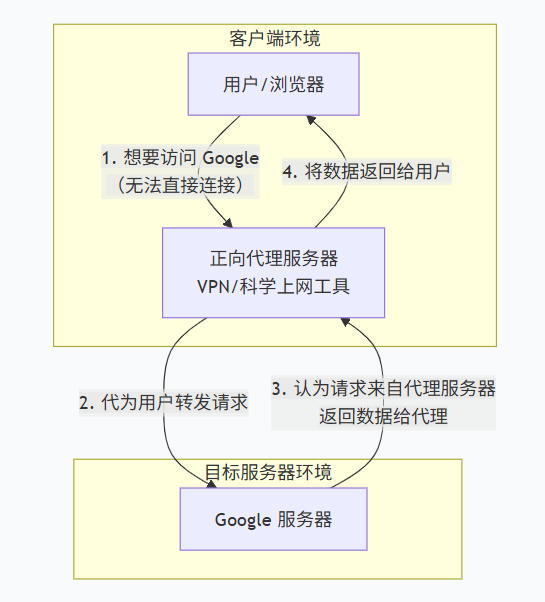

## 什么是反向代理

**Nginx 就是最典型的反向代理。它帮网站服务器处理用户请求，用户只知道访问网站的域名（如 **[**www.baidu.com**](https://www.baidu.com/)**），不知道背后真正提供服务的是哪台服务器。**

**反向代理，是帮服务器端办事的，它隐藏了服务器。**

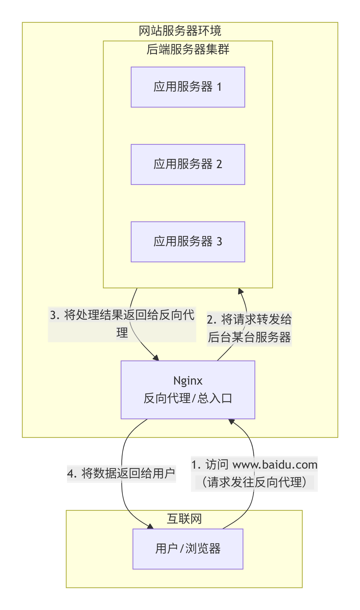

## 一段话总结

**“代理”就是这个技术的核心，区别仅仅在于“立场”和“代理的对象”不同：**

- **正向代理：** 我（客户端）不方便或不能直接去办事，于是我找一个“代理人”替我去办。**代理人代表的是我（客户端）的利益和身份。**
- **反向代理：** 网站（服务器端）不想让所有人直接接触到它内部复杂的系统，于是设立一个“总接待处”。**这个总接待处代表的是网站（服务器端）的利益和规则。**

所以，它们根本不是两种截然不同的技术，而是**同一种技术（代理）在不同场景下的两种应用模式**。

# 负载均衡与动静分离

Nginx 服务器可以做到**负载均衡**与**动静分离**。接下来理解一下。

## 负载均衡

### 问题：单点服务瓶颈

在一个经典 Web 架构中，客户端直接连接到单一的应用服务器（如 Tomcat）。

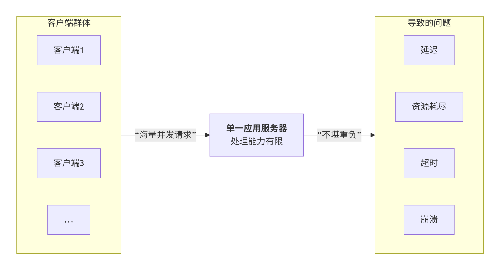

当并发请求数量超过**单个服务器**的处理能力时，会导致：

1. 响应延迟急剧上升。
2. 服务器资源耗尽，可能崩溃。
3. 服务不可用，形成单点故障。

### 解决方案：引入负载均衡器

为了解决单点瓶颈，引入多台应用服务器，并在它们前面部署一个**负载均衡器**。Nginx 的核心角色之一就是充当这个**负载均衡器**。

架构变为：

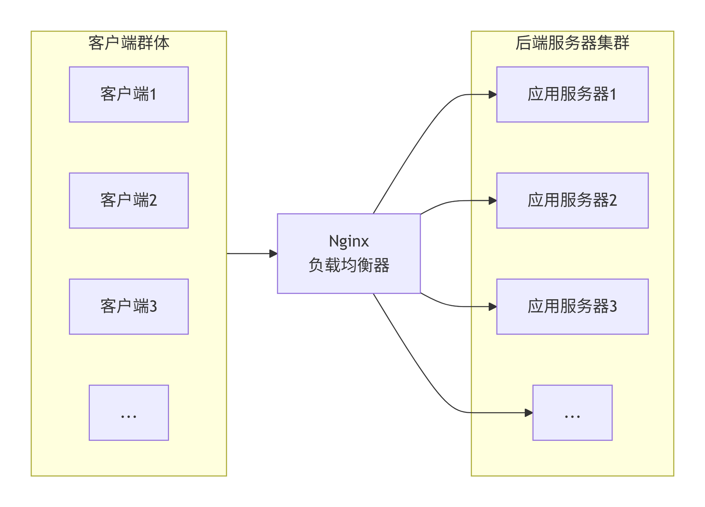

客户端只与 Nginx 通信，由 Nginx 决定将每个请求转发到后端哪个具体的服务器。

### Nginx 实现负载均衡的策略

Nginx 支持多种负载均衡算法。

**1. 轮询：**默认策略。将请求按顺序依次分配给列表中的每个服务器。

**2. 权重：**权重越大，分到的请求越多。

**3. IP 哈希：**根据客户端的 IP 地址计算哈希值，将同一 IP 的请求始终定向到同一台后端服务器。这样可以解决会话保持的问题。

**4. 最少连接：**分配当前连接最少的服务器。

### 核心价值

1. **高可用性**：当某台后端服务器宕机时，Nginx 能自动不再向故障节点发送请求。
2. **高扩展性**：通过横向增加后端服务器，轻松提升系统整体的处理能力。
3. **高性能**：通过分散请求，避免**单节点过载**，保证请求的低延迟处理。

通过 Nginx 的负载均衡功能，我们构建了一个弹性、可靠且高性能的服务集群。

## 动静分离

**核心思想：让专业的软件做专业的事。（Nginx 对于处理静态资源响应很在行，并且提供了缓存静态资源的功能。）**

### 没有动静分离时

当浏览器请求一个网页时，这个页面通常包含：

- **动态内容**：需要程序实时处理的结果（如：用户数据、新闻列表）。
- **静态内容**：不变的资源（如：图片、CSS、JavaScript 文件）。

在没有动静分离的架构中，**所有请求（无论是动态还是静态）都直接发给同一个应用服务器（如Tomcat）**。

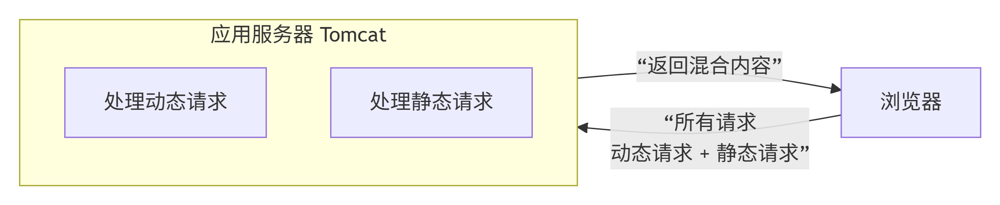

**弊端**：应用服务器需要耗费宝贵的CPU和内存资源去处理那些简单的、不变的静态文件，导致处理**核心动态业务**的能力下降，性能瓶颈凸显。

### 什么是动静分离？


动静分离是一种架构设计，它将**动态请求**和**静态请求**分开，交由不同的服务器来处理。

- **动态请求** -> 交给专业的**应用服务器**（Tomcat, PHP, Python）。
- **静态请求** -> 交给高效的**静态资源服务器**。

### Nginx 如何实现动静分离

Nginx 是实现动静分离的理想选择。它可以根据请求的URL特征，将流量导向不同的后端。

**工作原理：**

1. 浏览器发起请求 `www.example.com/do`（动态）和 `www.example.com/static/image.jpg`（静态）。
2. Nginx 根据配置规则进行判断：

- 如果是 `/static/` 路径下的请求，Nginx **直接**从本地磁盘或指定目录读取文件并返回，不再转发。
- 如果是其他请求，Nginx 则将其**转发**给后端的 Tomcat 应用服务器。

### 动静分离的好处

1. **提升性能**：Nginx 处理静态资源的效率极高，减轻了应用服务器的负载。
2. **降低成本**：让昂贵的应用服务器资源专注于核心业务计算。
3. **加速访问**：Nginx 可轻松为静态资源设置缓存（**说的是精确控制浏览器缓存**），使浏览器加载速度更快。

## 更现代化的动静分离

**Nginx不存静态文件了，而是将静态请求重定向 到 CDN，动态请求转发到后端，自己专注于做智能流量调度器。**

**为什么 Nginx 不再自己存静态文件了？**

**因为单台Nginx服务器的存储和带宽有限，而现代互联网的用户遍布全球、访问量巨大，把文件交给专门的全球CDN网络比自己存更划算、更快、更稳定。而且对于大型项目来说，CDN比自建便宜。**

**CDN（Content Delivery Network）就是把你网站的静态资源（图片、CSS、JS等）复制到全球各地的CDN服务商的服务器上，让用户从最近的服务器获取资源，大幅提升访问速度。**

- 你把图片上传到CDN服务商（如阿里云、腾讯云）
- CDN服务商自动把你的图片复制到：
  - 洛杉矶节点（服务美国用户）
  - 东京节点（服务日本用户）
  - 新加坡节点（服务东南亚用户）
  - 法兰克福节点（服务欧洲用户）

**然后，当用户访问你系统中的静态资源时，静态资源请求会先到达 nginx，然后 nginx 将静态资源请求重定向到 CDN，CDN 服务自动选择一个离客户最近的节点提供静态资源服务。**

# Nginx Docker 安装步骤

## 拉取镜像

```shell
docker pull nginx:latest
```

## 创建目录

在宿主机创建目录，用于存放 Nginx 配置和静态文件。

```bash
mkdir -p /home/nginx/{conf,html,logs}

# 等同于下面命令：
mkdir -p /home/nginx/conf /home/nginx/html /home/nginx/logs
```

## 生成配置文件

在**宿主机**上创建默认配置文件，将来通过修改宿主机上的配置文件来关联修改 Nginx 的配置：

```bash
cat > /home/nginx/conf/nginx.conf << 'EOF'
user nginx;
worker_processes auto;
error_log /var/log/nginx/error.log notice;
pid /var/run/nginx.pid;

events {
    worker_connections 1024;
}

http {
    include /etc/nginx/mime.types;
    default_type application/octet-stream;
    
    sendfile on;
    keepalive_timeout 65;
    
    server {
        listen 80;
        server_name localhost;
        
        location / {
            root /usr/share/nginx/html;
            index index.html index.htm;
        }
        
        error_page 500 502 503 504 /50x.html;
        location = /50x.html {
            root /usr/share/nginx/html;
        }
    }
}
EOF
```

**实际上 nginx docker 容器内部是自带这个配置文件的，为什么还要在宿主机上创建？**

1. 如果你不挂载自己的配置文件，所有配置都在容器内部，当容器被删除时，你的所有配置修改都会丢失。
2. 要修改配置时，你只需要在宿主机上编辑 /home/nginx/conf/nginx.conf，方便。

## 运行 Nginx 容器

```bash
docker run -d --name mynginx \
  --net dajiankang --ip 172.16.0.23 \
  -p 80:80 \
  -v /home/nginx/conf/nginx.conf:/etc/nginx/nginx.conf:ro \
  -v /home/nginx/logs:/var/log/nginx \
  -m 300m \
  --restart unless-stopped \
  nginx:latest
```

- `**<font style="color:rgb(15, 17, 21);background-color:rgb(235, 238, 242);">-d</font>**`：后台运行容器（detached mode）
- `**<font style="color:rgb(15, 17, 21);background-color:rgb(235, 238, 242);">--name nginx</font>**`：给容器命名为 `<font style="color:rgb(15, 17, 21);background-color:rgb(235, 238, 242);">nginx</font>`，方便后续管理
- `**<font style="color:rgb(15, 17, 21);background-color:rgb(235, 238, 242);">-p 80:80</font>**`：端口映射（将宿主机的 80 端口映射到容器的 80 端口）
- `**<font style="color:rgb(15, 17, 21);background-color:rgb(235, 238, 242);">-v /home/nginx/conf/nginx.conf:/etc/nginx/nginx.conf:ro</font>**`：配置文件挂载
  - 将宿主机的 `<font style="color:rgb(15, 17, 21);background-color:rgb(235, 238, 242);">/home/nginx/conf/nginx.conf</font>` 挂载到容器的 `<font style="color:rgb(15, 17, 21);background-color:rgb(235, 238, 242);">/etc/nginx/nginx.conf</font>`
  - `<font style="color:rgb(15, 17, 21);background-color:rgb(235, 238, 242);">:ro</font>` 表示只读（read-only），容器不能修改这个文件
- `**<font style="color:rgb(15, 17, 21);background-color:rgb(235, 238, 242);">-v /home/nginx/logs:/var/log/nginx</font>**`：日志目录挂载
- `**<font style="color:rgb(15, 17, 21);background-color:rgb(235, 238, 242);">-m 300m</font>**`：限制容器最多使用 300MB 内存
- `**<font style="color:rgb(15, 17, 21);background-color:rgb(235, 238, 242);">--restart unless-stopped</font>**`：容器退出时自动重启

## 配置端口转发

windows：80

centos：80

docker 容器内部：80

## 验证安装

在本地浏览上访问 `http://localhost`，应该能看到测试页面。

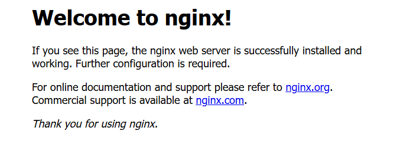

## 宿主机上的常用管理命令

```bash
# 查看日志
docker logs mynginx

# 重启容器
docker restart mynginx

# 停止容器
docker stop mynginx

# 启动容器
docker start mynginx

# 查看版本
docker exec mynginx nginx -v

# 重载配置（不需要重启nginx服务器配置即可生效）
docker exec mynginx nginx -s reload

# 测试配置文件语法
docker exec mynginx nginx -t
```

以上命令是在宿主机上执行的命令。想要进入容器内部执行命令的话，执行它可以进入：

```shell
docker exec -it mynginx /bin/bash
```

# Nginx 的配置文件

## 配置文件的名字和位置

**在宿主机 (CentOS 系统) 上：**

**路径：** `<font style="color:rgb(15, 17, 21);background-color:rgb(235, 238, 242);">/home/nginx/conf/nginx.conf</font>`
**权限：** 可直接编辑此文件

**在 Docker 容器内部：**

**路径：** `<font style="color:rgb(15, 17, 21);background-color:rgb(235, 238, 242);">/etc/nginx/nginx.conf</font>`
**权限：** 只读 (因为挂载时加了 `<font style="color:rgb(15, 17, 21);background-color:rgb(235, 238, 242);">:ro</font>`)

## 配置文件内容

`nginx.conf`文件的配置内容主要包括三块：

| **配置块** | **位置** | **作用范围** | **核心功能** |
| --- | --- | --- | --- |
| **全局块** | 配置文件最顶层，从开头到第一个 `<font style="color:rgb(15, 17, 21);background-color:rgb(235, 238, 242);">events</font>` 块之前 | 整个Nginx服务器 | 进程、日志、权限等全局设置 |
| **events块** | 在全局块之后 | 网络连接 | 连接数、事件模型 等网络优化 |
| **http块** | events 块之后的所有内容 | HTTP服务相关 | 网站配置、反向代理、负载均衡等业务功能 |

**1. 全局块**

```nginx
user nginx;                      # nginx安装时自动创建了一个用户：nginx，这个表示以nginx普通用户运行nginx主进程。
worker_processes auto;           # 工作进程数设为`auto`，自动根据CPU核心数设置，最优利用CPU
error_log /var/log/nginx/error.log notice; # 定义错误日志路径和记录级别(notice表示：只记录值得注意的事件，比如配置重载、应用启动等)
pid /var/run/nginx.pid;          # 记录主进程ID的文件位置，用于管理服务
```

**2. Events块**

```nginx
events {
    worker_connections 1024;     # 每个Nginx工作进程能同时处理的最大连接数
}
```

**3. Http块**

```nginx
http {
    # --- Http全局配置 ---
    include /etc/nginx/mime.types;  # 引入一个“文件后缀-类型”对照表（nginx官方内置好的），让Nginx知道 .jpg 是图片、.css 是样式表。
    default_type application/octet-stream; # 遇到不认识的文件类型时，一律当作“未知二进制文件”来处理，浏览器会直接下载它。
    sendfile on;                   # 开启高效文件传输模式，提升静态文件发送性能（默认就是开启的，手动配置上可读性强）
    keepalive_timeout 65;          # 让客户端连接完成后暂时不断开，保持65秒，期间如果有新请求可以复用这个连接，省去重复握手的开销。

    # --- Server块 (虚拟主机) ---
    server {
        listen 80;                 # 监听80端口
        server_name localhost;     # 本虚拟主机的域名为localhost

        # --- Location块 (URI路由规则) ---
        # 当用户访问根路径 `/` 时，去网站的根目录下找index.html 或 index.htm 作为首页。
        location / {
            root /usr/share/nginx/html; # root 是一个指令，用来定义网站的根目录
            index index.html index.htm; # index 也是一个指令，用来指定默认首页文件的名字
        }

        # error_page 定义了"出错时该找哪个页面"，location 定义了"这个页面具体在哪里找"，两个配合才能显示正确的错误页面
        error_page 500 502 503 504 /50x.html;
        location = /50x.html {
            root /usr/share/nginx/html;
        }
    }
}
```

# 反向代理示例 1

## 功能描述

在 windows 浏览器的地址栏上输入[http://localhost/](http://localhost/)来访问代理服务器 Nginx，让 Nginx 代理访问 Tomcat 服务器。

## Docker 安装配置 Tomcat

### 拉取 tomcat 镜像

```shell
docker pull tomcat:latest
```

tomcat 的 docker 镜像自带 jdk，因此不需要安装 jdk。

### 运行 Tomcat 容器

```shell
docker run -d --name mytomcat \
  --net dajiankang --ip 172.16.0.24 \
  -p 8080:8080 \
  --restart unless-stopped \
  tomcat:latest
```

### 恢复 Tomcat 的 ROOT 应用

这一步不是必须的操作。因为 tomcat docker 镜像中 webapps 目录下默认是空的（和我们平时从 tomcat 服务器官网下载的不一样），后期在访问的时候看不到 Tomcat 首页面（会出现一个 404 的页面，不过出现也没有关系，只要 404 页面最下面是 Apache Tomcat 字样就说明访问 Tomcat 成功了）。Tomcat 首页面实际上是 webapps 目录下的 ROOT 项目。以下操作表示将 Tomcat 服务器的 ROOT 项目恢复。

```shell
# 1. 进入容器
docker exec -it mytomcat /bin/bash

# 2. 在容器内执行以下命令
cd /usr/local/tomcat

cp -r webapps.dist/* webapps/

# 3. 退出容器
exit
```

## 配置 Nginx 反向代理

### 修改 Nginx 配置文件

找到宿主机上的 nginx.conf 文件，位置如下：`/home/nginx/conf/`

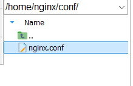

在 `nginx.conf`文件中的 `location`中添加 `proxy_pass`，完整配置如下：

```nginx
user nginx;
worker_processes auto;
error_log /var/log/nginx/error.log notice;
pid /var/run/nginx.pid;

events {
    worker_connections 1024;
}

http {
    include /etc/nginx/mime.types;
    default_type application/octet-stream;
    
    sendfile on;
    keepalive_timeout 65;
    
    server {
        listen 80;
        server_name localhost;

        # proxy_pass 是 Nginx 最核心的反向代理指令，这个请求别自己处理，转发给后面的服务器去办
        location / {
            proxy_pass http://172.16.0.24:8080; 
        }
    }
}
```

这个配置表示：当你访问 nginx 的时候，nginx 会去访问[http://172.16.0.24:8080](http://172.16.0.24:8080)地址来获取资源，然后 nginx 将这个资源响应给前端。

### 重启 Nginx 容器

```shell
docker restart mynginx
```

## 验证功能是否实现

打开 windows 的浏览器，访问：[http://localhost/](http://localhost/)，看看是不是 tomcat 首页。

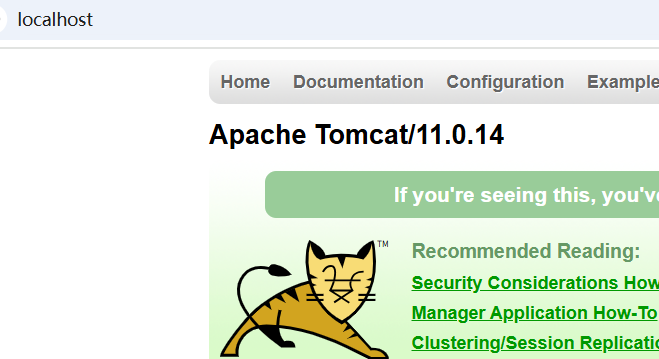

到此，反向代理的功能就演示成功了。

# 反向代理示例 2

要实现的功能：

1. Tomcat 服务器 2 台：Tomcat1，Tomcat2
2. 当用户发送的请求路径是：[http://localhost:9091/api/index.html](http://localhost:9091/api/index.html)，走 Tomcat1
3. 当用户发送的请求路径是：[http://localhost:9091/front/index.html](http://localhost:9091/front/index.html)，走 Tomcat2

## 运行一个新 Tomcat

这个 Tomcat 作为：Tomcat2，之前运行的 Tomcat 作为 Tomcat1：

```shell
docker run -d --name mytomcat2 \
  --net dajiankang --ip 172.16.0.25 \
  -p 8081:8080 \
  --restart unless-stopped \
  tomcat:latest
```

注意：Tomcat1 的宿主机端口是 8080，Tomcat2 的宿主机端口是 8081，这两个宿主机上的端口我们是用不上的，和我们这个功能无关。

## 进入 Tomcat1 新建项目和 html

```shell
# 进入容器内部
docker exec -it mytomcat /bin/bash

# 切换到webapps目录
cd /usr/local/tomcat/webapps/

# 创建项目api
mkdir api
cd api

# 创建index.html文件，并提供文件内容
cat > index.html << EOF
<h1>API</h1>
EOF

exit
```

## 进入 Tomcat2 新建项目和 html

```shell
# 进入容器内部
docker exec -it mytomcat2 /bin/bash

# 切换到webapps目录
cd /usr/local/tomcat/webapps/

# 创建项目front
mkdir front
cd front

# 创建index.html文件，并提供文件内容
cat > index.html << EOF
<h1>FRONT</h1>
EOF

exit
```

## 删除 Nginx 重新创建

为什么要重新创建？因为我要在 `nginx.conf`配置文件中新增一个 `server`块。这个 `server`块的端口定为：`9091`。需要重建 docker 容器进行 `9091`端口映射。最后还要在 `virtual box`上做 `9091`的端口转发。

```shell
# 停止
docker stop mynginx

# 删除
docker rm mynginx

# 重建并启动
docker run -d --name mynginx \
  --net dajiankang --ip 172.16.0.23 \
  -p 80:80 \
  -p 9091:9091 \
  -v /home/nginx/conf/nginx.conf:/etc/nginx/nginx.conf:ro \
  -v /home/nginx/logs:/var/log/nginx \
  -m 300m \
  --restart unless-stopped \
  nginx:latest
```

和之前的创建相同，只是添加一个新的端口映射：`-p 9091:9091 \`

## 配置反向代理

找到宿主机上的 `nginx.conf`配置文件：`/home/nginx/conf`


打开文件并进行如下配置：【**新增一个 server 的配置，以下是完整配置**】

```nginx
user nginx;
worker_processes auto;
error_log /var/log/nginx/error.log notice;
pid /var/run/nginx.pid;

events {
    worker_connections 1024;
}

http {
    include /etc/nginx/mime.types;
    default_type application/octet-stream;
    
    sendfile on;
    keepalive_timeout 65;
    
    server {
        listen 80;
        server_name localhost;
        
        location / {
            proxy_pass http://172.16.0.24:8080;
        }
    }
    server {
        listen 9091;
        server_name localhost;

        # ~ 表示使用正则表达式来匹配URL。后面的 /api/ 会被当做正则表达式。
        location ~ /api/ {
            proxy_pass http://172.16.0.24:8080;
        }
        location ~ /front/ {
            proxy_pass http://172.16.0.25:8080;
        }
    }
}
```

**监听端口是：9091**

**重点关注以上第二个 **`**server**`**块的配置。**

## 配置端口转发

windows 端口：9091

centos 端口：9091

docker 容器内部：9091

## 重启服务器

重启 Tomcat1、Tomcat2、Nginx 服务器：

```shell
docker restart mytomcat mytomcat2 mynginx
```

## 打开 windows 浏览器测试

[http://localhost:9091/api/index.html](http://localhost:9091/api/index.html)


[http://localhost:9091/front/index.html](http://localhost:9091/front/index.html)


## 关于路径匹配

location 匹配方式：

**精确匹配 (=) 优先级最高**

```nginx
# 只匹配 /api，不匹配 /api/ 或 /api/xxx
# 当客户端请求 /api 时，Nginx 将请求代理到 http://172.16.0.24:8080/api。
location = /api {
    proxy_pass http://172.16.0.24:8080;
}
```

**普通前缀匹配 优先级****最低**

```nginx
# 匹配以 /api/ 开头的所有路径
# 如：/api/user, /api/order/list
# /api/order/list → http://172.16.0.24:8080/api/order/list
location /api/ {
    proxy_pass http://172.16.0.24:8080;
}
```

`**~**`**正则匹配 (区分大小写)**

```nginx
# 区分大小写的正则，匹配 /api/v1/, /api/v2/ 等
# /api/v1/user → http://172.16.0.24:8080/api/v1/user
location ~ ^/api/v[0-9]+/ {
    proxy_pass http://172.16.0.24:8080;
}
```

`**~***`**正则匹配 (不区分大小写)**

```nginx
# 不区分大小写，匹配图片文件
# /banner.gif → /var/www/images/banner.gif
location ~* \.(jpg|jpeg|png|gif)$ {
    root /var/www/images;
}
```

**优先前缀匹配 **`**^~**`** 比正则优先级高（如果以前缀方式匹配成功，则不再走其他的正则匹配，可以称它为：正则拦截器）**

```nginx
# ^~ 比正则表达式优先级高，匹配以 /static/ 开头的路径
# 当请求路径是/static/logo.png, root 指令将请求路径拼接到 root 路径后面：/var/www/static/logo.png
location ^~ /static/ {
    root /var/www;
}

# 它会把 /test/ 看做是前缀匹配，并且它的优先级高。
location ^~ /test/ {}
# 它会把 /test/ 看做是正则表达式，优先级没有 ^~ 高。
location ~ /test/ {}
```

**命名 location (@)**

```nginx
# $uri 的含义：当前请求的标准化URI（去掉参数），由 Nginx 自动设置和维护
# 客户端请求: /user/profile?id=123，则 $uri = /user/profile

# 以下第一个location配置的含义：
  # 1. $uri 是尝试访问请求的路径对应的文件
  # 2. $uri/ 是尝试访问请求的路径对应的目录
  # 3. 如果都不存在，跳转到 @backend
location / {   # 这里的 / 则表示匹配所有的URI路径，如果大括号中有root指令，则 / 代表网站的根目录
    try_files $uri $uri/ @backend;  # try_files 就是"Nginx的文件查找清单"——按顺序尝试多个文件或路径，都找不到就执行备用方案
}

location @backend {
    # 命名的location，用于内部重定向
    proxy_pass http://172.16.0.24:8080;
}
```

**匹配优先级（从高到低）：**

1. `=` 精确匹配
2. `^~` **优先**前缀匹配
3. `~` 和 `~*` 正则匹配（按配置顺序）
4. 普通前缀匹配

# 负载均衡

要完成的效果，在 windows 浏览器地址栏上输入：[http://localhost/api/index.html](http://localhost/api/index.html)

连续多发几次请求，看看是不是分发到不同的 Tomcat 服务器上。

## 环境准备

Tomcat1 上已经有 `api`项目，并且 `api`目录下也有 `index.html`，我们只需要在 Tomcat2 中新建 `api`项目，并新建 `index.html`页面，这个页面的内容要和 Tomcat1 中的页面内容不同，这样才能测试出效果：

```shell
# 进入容器内部
docker exec -it mytomcat2 /bin/bash

# 切换到webapps目录
cd /usr/local/tomcat/webapps/

# 创建项目api
mkdir api
cd api

# 创建index.html文件，并提供文件内容
cat > index.html << EOF
<h1>API2</h1>
EOF

exit
```

## 编写 nginx 负载均衡配置

找到宿主机上 `/home/nginx/nginx.conf`文件，完整配置如下：

```nginx
user nginx;
worker_processes auto;
error_log /var/log/nginx/error.log notice;
pid /var/run/nginx.pid;

events {
    worker_connections 1024;
}

http {
    include /etc/nginx/mime.types;
    default_type application/octet-stream;
    
    sendfile on;
    keepalive_timeout 65;
    
    upstream myserver {
        server 172.16.0.24:8080;
        server 172.16.0.25:8080;
    }
    
    server {
        listen 80;
        server_name localhost;
        
        location / {
            proxy_pass http://myserver;
        }
    }
    server {
        listen 9091;
        server_name localhost;
        
        location ~ /api/ {
            proxy_pass http://172.16.0.24:8080;
        }
        location ~ /front/ {
            proxy_pass http://172.16.0.25:8080;
        }
    }
}
```

修改代码和添加代码的位置：

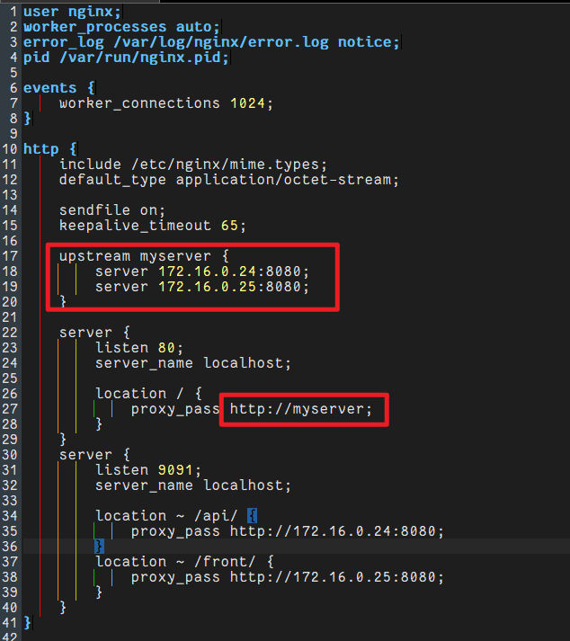

## 重启服务

```shell
docker restart mytomcat mytomcat2 mynginx
```

## 测试负载均衡


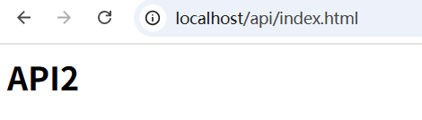

## 常见的负载均衡策略

**1. 轮询：**默认策略。将请求按顺序依次分配给列表中的每个服务器。

**2. 权重：**权重越大，分到的请求越多。（最小值 1）

```nginx
upstream myserver {
    server 172.16.0.24:8080 weight=5;
    server 172.16.0.25:8080 weight=10;
}
```

**3. IP 哈希：**根据客户端的 IP 地址计算哈希值，将同一 IP 的请求始终定向到同一台后端服务器。这能解决会话保持问题。

```nginx
upstream myserver {
    ip_hash;
    server 172.16.0.24:8080;
    server 172.16.0.25:8080;
}
```

第一次访问的是哪个服务器，只要是同一个会话，一直访问同一个服务器。

**4. least_conn：最少链接。**将新请求分配给**当前连接数最少**的后端服务器。

```nginx
upstream myserver {
    least_conn;
    server 172.16.0.24:8080;
    server 172.16.0.25:8080;
}
```

**5. fair：**按照后端服务器响应时间来分配，响应时间短的优先分配。

这不是 nginx 官方的，是第三方提供的策略，需要编译 `<font style="color:rgb(15, 17, 21);background-color:rgb(235, 238, 242);">nginx-upstream-fair</font>` 第三方模块

```nginx
upstream myserver {
    server 172.16.0.24:8080;
    server 172.16.0.25:8080;
    fair;
}
```

# 动静分离

## 理解动静分离及好处

**动：**通常指的是一段处理业务的程序，例如一段程序需要去连接数据库取数据。

**静：**通常指的是项目的静态资源，例如：纯 HTML、CSS、JS、Image 等。

动态资源放到应用服务器中。静态资源单独提取出来，放到静态资源目录下，不放到应用服务器中。

在 nginx.conf 中配置一下，如果用户访问的是静态资源，nginx 直接从静态资源目录中将资源返回，不经过应用服务器。

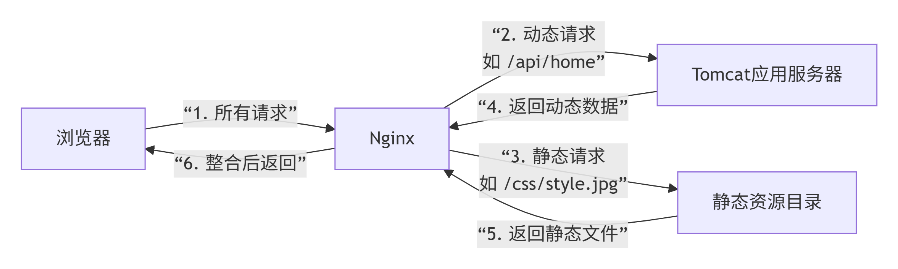

**动静分离的好处：**

1. **提升性能**：Nginx 处理静态资源的效率极高，减轻了应用服务器的负载。
2. **降低成本**：让昂贵的应用服务器资源专注于核心业务计算。
3. **加速访问**：Nginx 可轻松为静态资源设置缓存（**这里指的是 nginx 可以精确控制浏览器的缓存**），使浏览器加载速度更快。

## 删除 nginx 并重建

为什么删除重新建？因为之前没有挂载静态资源目录卷。

挂载静态资源目录卷之后，直接将静态资源放到宿主机的对应目录下，静态资源自动就存放到 docker 中了。

```shell
# 宿主机上创建目录
mkdir -p /data/html
mkdir -p /data/image

# 停止docker容器
docker stop mynginx

# 删除docker容器
docker rm mynginx

# 创建nginx docker并启动
docker run -d --name mynginx \
  --net dajiankang --ip 172.16.0.23 \
  -p 80:80 \
  -p 9091:9091 \

  -v /home/nginx/conf/nginx.conf:/etc/nginx/nginx.conf:ro \
  -v /home/nginx/logs:/var/log/nginx \
  -v /data/html:/data/html:ro \
  -v /data/image:/data/image:ro \
  -m 300m \
  --restart unless-stopped \
  nginx:latest
```

## 准备静态资源

向宿主机的 `/data/html`目录中放一个 `index.html`页面。

```html
<h1>Hello Nginx!</h1>
```

向宿主机的 `/data/image`目录中放一个 `1.jpg`图片。


## 配置静态资源目录

在原配置中添加静态资源配置，参考下图：

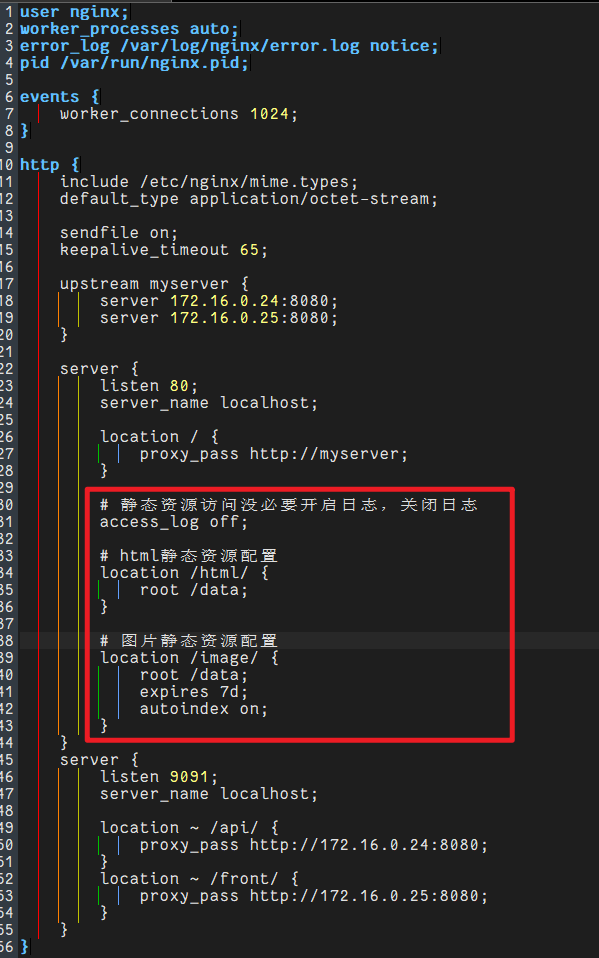

**完整配置如下：**

```nginx
user nginx;
worker_processes auto;
error_log /var/log/nginx/error.log notice;
pid /var/run/nginx.pid;

events {
    worker_connections 1024;
}

http {
    include /etc/nginx/mime.types;
    default_type application/octet-stream;
    
    sendfile on;
    keepalive_timeout 65;
    
    upstream myserver {
        server 172.16.0.24:8080;
        server 172.16.0.25:8080;
    }
    
    server {
        listen 80;
        server_name localhost;
        
        location / {
            proxy_pass http://myserver;
        }
        
        # 静态资源访问没必要开启日志，关闭日志
        access_log off;
        
        # html静态资源配置
        location /html/ {
            root /data;
        }
        
        # 图片静态资源配置
        location /image/ {
            root /data;
            expires 7d;
            autoindex on;
        }
    }
    server {
        listen 9091;
        server_name localhost;
        
        location ~ /api/ {
            proxy_pass http://172.16.0.24:8080;
        }
        location ~ /front/ {
            proxy_pass http://172.16.0.25:8080;
        }
    }
}
```

**说明：**

1. `access_log off;` 关闭访问日志，静态资源不需要记录访问日志。
2. `expires 7d;` 表示该资源会被浏览器自动缓存 7 天。（经常变化的资源不建议）
3. `autoindex on;`表示自动列表机制开启。效果是：当在浏览器上访问静态资源目录时，将目录下的所有静态资源列出来。

## 重启并测试

```shell
docker restart mynginx
```

打开 windows 浏览器，输入 url 访问：

1. [http://localhost/html/index.html](http://localhost/html/index.html)


1. [http://localhost/image/1.jpg](http://localhost/image/1.jpg)


如果可以正常访问，表示动静分离已配置成功。

`**autoindex on**`**开启列表的效果如下：**

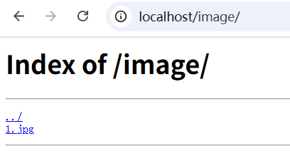

**注意访问路径**：[http://localhost/image/](http://localhost/image/) 【以 `/`结尾】

# Nginx 高可用

## 怎么实现 Nginx 高可用

1. 一台 Nginx ，如果宕机的话，系统就瘫痪了。
2. 最好能够搭建一台主 Nginx 和一台备 Nginx。形成一个 Nginx 集群。
3. 当主 Nginx 宕机后自动切换到备 Nginx。达到高可用。

## 工作流程

**Nginx高可用原理：主备Nginx节点通过Keepalived+VIP实现心跳检测和故障自动切换，对外暴露一个虚拟IP，主节点挂掉时备用节点秒级接管。**

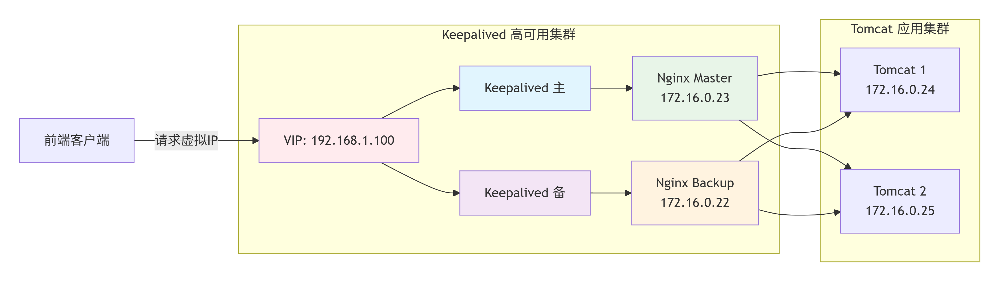

1. **前端请求** VIP（虚拟 IP） `<font style="color:rgb(15, 17, 21);background-color:rgb(235, 238, 242);">192.168.1.100</font>`
2. **Keepalived（一个软件）**确保VIP始终在Master Nginx上（**Keepalived通过VIP漂移实现服务高可用，当主节点故障时自动切换到备用节点。**）
3. **Master Nginx**接收请求并负载均衡到后端Tomcat
4. **如果Master宕机**，Backup Nginx自动接管VIP
5. **后端Tomcat**处理业务请求

**Keepalived 挂了怎么办？没有绝对的安全。它挂掉的概率极低。**

```plaintext
- 代码量小（就做心跳+VIP切换）
- 逻辑简单（比Nginx简单得多）
- 经过20年实战考验（1998年诞生）
- 实际生产故障率极低
```

## 实现高可用

我们来模拟一下真实的环境，不在 docker 容器中完成。创建新的虚拟机。这里我们选择 `wmware`来进行测试，因为 `VMWare`克隆之后，不需要复杂的后续配置。

### 克隆新的虚拟机

请参考我们之前 Linux 课程中的克隆办法，克隆一台全新的完整的虚拟机。我这里两台机器的名字分别为：`master`和 `clone1`。

并且保证两台机器是可以正常通信的，也就是说能够 ping 通。

请严格按照顺序执行：

### 系统环境准备（两台机器都要执行）

#### 更新系统并安装必要工具

```bash
# 更新系统
sudo yum update -y

# 安装必要工具
sudo yum install -y wget net-tools epel-release

# 永久关闭SELinux
sudo sed -i 's/^SELINUX=.*/SELINUX=disabled/' /etc/selinux/config
```

#### 配置主机名和hosts解析

在192.168.48.200上：

```bash
sudo hostnamectl set-hostname nginx-master
```

在192.168.48.201上：

```bash
sudo hostnamectl set-hostname nginx-backup
```

**两台机器都要修改hosts文件：**

```bash
sudo vi /etc/hosts
```

添加以下内容：

```plaintext
192.168.48.200 nginx-master
192.168.48.201 nginx-backup
```

### 安装Nginx（两台机器都要执行）

#### 安装Nginx

```bash
# 安装Nginx
sudo yum install -y nginx

# 启动Nginx并设置开机自启
sudo systemctl start nginx
sudo systemctl enable nginx

# 检查Nginx状态
sudo systemctl status nginx
```

#### 配置不同的Nginx首页（用于测试）

在192.168.48.200上：

```bash
echo "This is MASTER Server - 192.168.48.200" | sudo tee /usr/share/nginx/html/index.html
```

在192.168.48.201上：

```bash
echo "This is BACKUP Server - 192.168.48.201" | sudo tee /usr/share/nginx/html/index.html
```

重启Nginx：

```bash
sudo systemctl restart nginx
```

### 安装和配置Keepalived（两台机器都要执行）

#### 安装Keepalived

```bash
# 安装Keepalived
sudo yum install -y keepalived

# 检查安装
keepalived --version
```

#### 配置Keepalived

**在MASTER节点（192.168.48.200）上配置：**

```bash
sudo mv /etc/keepalived/keepalived.conf /etc/keepalived/keepalived.conf.bak
sudo vi /etc/keepalived/keepalived.conf
```

输入以下内容：

```nginx
global_defs {
   router_id nginx_master  # 标识，唯一即可
   script_user root
   enable_script_security
}

vrrp_script chk_nginx {
    script "/etc/keepalived/check_nginx.sh"  # 检测nginx状态的脚本
    interval 2  # 每2秒执行一次检测
    weight -20  # 如果检测失败，优先级减少20
    fall 2      # 连续2次失败才算失败
    rise 1      # 1次成功就算成功
}

vrrp_instance VI_1 {
    state MASTER          # 初始状态为MASTER
    interface ens160      # 网卡名称，使用ip addr查看确认
    virtual_router_id 51  # VRID，主备必须相同，范围0-255
    priority 100          # 优先级，MASTER要高于BACKUP
    
    advert_int 1          # 检查间隔，秒
    
    authentication {
        auth_type PASS
        auth_pass 1111    # 密码，主备必须相同
    }
    
    virtual_ipaddress {
        192.168.48.250/24 dev ens160  # VIP，根据实际网段配置
    }
    
    track_script {
        chk_nginx        # 引用上面定义的脚本
    }
    
    notify_master "/etc/keepalived/notify.sh master"
    notify_backup "/etc/keepalived/notify.sh backup"
    notify_fault "/etc/keepalived/notify.sh fault"
}
```

**注意：** 请使用 `ip addr` 命令确认网卡名称，通常是 `ens160`、`eth0` 或 `ens33`。

**在BACKUP节点（192.168.48.201）上配置：**

```bash
sudo mv /etc/keepalived/keepalived.conf /etc/keepalived/keepalived.conf.bak
sudo vi /etc/keepalived/keepalived.conf
```

输入以下内容（与MASTER基本相同，只有3处不同）：

```nginx
global_defs {
   router_id nginx_backup  # 改为backup标识
   script_user root
   enable_script_security
}

vrrp_script chk_nginx {
    script "/etc/keepalived/check_nginx.sh"
    interval 2
    weight -20
    fall 2
    rise 1
}

vrrp_instance VI_1 {
    state BACKUP           # 改为BACKUP
    interface ens160       # 网卡名称，与master相同
    virtual_router_id 51   # 必须与master相同
    priority 90           # 优先级低于master（90 < 100）
    
    advert_int 1
    
    authentication {
        auth_type PASS
        auth_pass 1111    # 必须与master相同
    }
    
    virtual_ipaddress {
        192.168.48.250/24 dev ens160  # VIP，与master相同
    }
    
    track_script {
        chk_nginx
    }
    
    notify_master "/etc/keepalived/notify.sh master"
    notify_backup "/etc/keepalived/notify.sh backup"
    notify_fault "/etc/keepalived/notify.sh fault"
}
```

#### 创建Nginx健康检查脚本（两台机器都要执行）

```bash
sudo vi /etc/keepalived/check_nginx.sh
```

输入以下内容：

```bash
#!/bin/bash

if [ "$(systemctl is-active nginx)" != "active" ]; then
    exit 1
fi
exit 0
```

设置脚本权限：

```bash
sudo chmod +x /etc/keepalived/check_nginx.sh
```

### 启动和测试

#### 启动Keepalived服务

**两台机器都要执行：**

```bash
# 启动Keepalived并设置开机自启
sudo systemctl start keepalived
sudo systemctl enable keepalived

# 检查状态
sudo systemctl status keepalived
```

#### 验证VIP配置

检查VIP是否绑定在MASTER节点：

```bash
# 在MASTER节点执行
ip addr show ens160 | grep 192.168.48.250

# 应该有类似这样的输出：
# inet 192.168.48.250/24 scope global secondary ens160
```

#### 测试VIP访问

在任意可以访问该网络的主机上测试：

```bash
# 使用VIP访问Nginx
curl http://192.168.48.250

# 应该显示MASTER节点的内容：
# This is MASTER Server - 192.168.48.200
```

#### 测试故障切换

**测试1：停止MASTER的Nginx服务**

```bash
# 在MASTER节点执行
sudo systemctl stop nginx

# 等待几秒钟，然后检查VIP
ip addr show ens160 | grep 192.168.48.250
# VIP应该已经转移到BACKUP节点
```

**测试2：恢复MASTER的Nginx服务**

```bash
# 在MASTER节点执行
sudo systemctl start nginx

# 等待几秒钟，VIP应该会自动切回（因为MASTER优先级更高）
```