# 5.Spring Security、OAuth2、JWT

# Spring Security快速入门

**官方文档：**[https://docs.spring.io/spring-security/reference/index.html](https://docs.spring.io/spring-security/reference/index.html)

**先来记住几个单词：**

1. `**authenticate**`**：动词，认证。（登录的动作）**
2. `**authentication**`**：名词，凭证。（登录成功得到的入场券，凭证中含有****权限列表****）**
3. `**authority**`**：名词，权限。**
4. `**<font style="color:rgb(15, 17, 21);">authorize</font>**`**：动词，授权。**

## Spring Security 能做什么

**身份认证：**

- 身份认证是验证`谁正在访问系统资源`，判断用户是否为合法用户。认证用户的常见方式是要求用户输入用户名和密码。

**授权：**

- 用户进行身份认证后，系统会控制`谁能访问哪些资源`，这个过程叫做授权。用户无法访问没有权限的资源。

**防御常见攻击**

## 身份认证（authentication）

**官方代码示例：**[https://github.com/spring-projects/spring-security-samples/tree/main](https://github.com/spring-projects/spring-security-samples/tree/main)

### 创建Spring Boot项目

创建 Spring Boot 项目，项目名为：`spring-security-demo`

JDK 版本采用：`21`

SpringBoot 版本采用：`3.5.6`，它自动依赖的 `Spring Security`版本是 `6.5.5`

创建项目过程中选择这些依赖：`web`、`security`、`thymeleaf`

### 创建IndexController

```java
package com.jkweilai.spring.security.demo.controller;

import org.springframework.stereotype.Controller;
import org.springframework.web.bind.annotation.GetMapping;

@Controller
public class IndexController {

    @GetMapping("/")
    public String index(){
        return "home";
    }
}
```

### 创建 home.html

在 `templates`目录下新建 `home.html`，并编写以下代码：

```html
<!DOCTYPE html>
<html lang="en" xmlns:th="https://www.thymeleaf.org">
<head>
  <meta charset="UTF-8">
  <title>这是一个受Spring Security保护的资源</title>
</head>
<body>
<h1>你好，Spring Security！</h1>
<!-- 注意:Spring Security中自动为我们提供了 /logout 请求的默认处理流程-->
<a th:href="@{/logout}">退出系统</a>
</body>
</html>
```

### 启动项目测试

访问地址：[http://localhost:8080/](http://localhost:8080/)，浏览器自动跳转到登录页面：[http://localhost:8080/login](http://localhost:8080/login)


**Spring Security 默认提供了一个用户：**`**user**`

密码在启动项目时的控制台上可以查看，如下图所示：

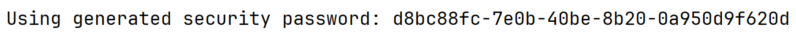

输入用户名和密码之后，点击 `Sign in`，登录成功，**才会执行受保护的 **`**IndexController**`，最终跳转到`home.html`，如下图：

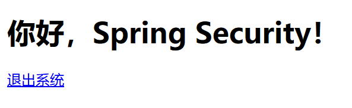

点击退出系统时，会自动跳转到提示页面：


点击 `Log Out`后退出系统：

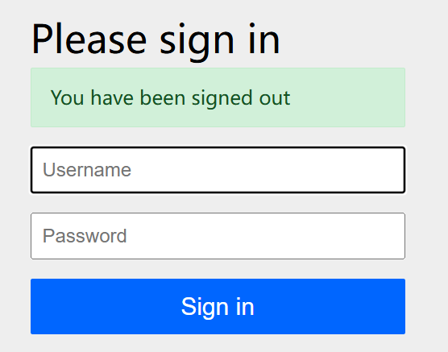

### Spring Security 帮我们做了什么

1. **保护应用程序URL，要求对应用程序的任何交互进行身份验证**

:::info
**只要你项目中引入 SpringSecurity 的依赖**。 Spring Security 默认会把你整个网站的所有页面和接口都“锁起来”。任何人想访问，都必须先登录（证明自己是合法用户）。除了少数几个默认的端点（如 /login, /error），其他所有请求路径默认都需要认证。你可以通过配置来改变哪些路径需要认证，哪些可以公开访问。

:::

1. **程序启动时生成一个默认用户：user**

:::info
为了方便你第一次启动项目就能登录测试，Spring Security 会自动创建一个临时账户，用户名就叫 user。只要你没有在配置文件（如 application.properties）中指定自己的用户名和密码，这个默认用户就会被创建。

:::

1. **生成一个默认的随机密码，并将此密码记录在控制台上**

:::info
每次启动应用密码都会变，所以你必须在程序启动时，去 IDE 的控制台日志里找到它才能登录。

:::

1. **生成默认的登录表单，提供了基于表单的登录，以及注销流程**

:::info
它自动给你做了一个非常简单的登录页面（你访问任何受保护的页面都会跳转到这个页面）和一个处理退出的功能。你不需要自己写这两个页面的 HTML 代码。它帮你把“用户输入用户名密码提交登录”和“用户点击退出”这一整套逻辑都做好了。你只需要用就行了。

:::

1. **对于Web请求，重定向到登录页面；对于服务请求，返回401未经授权**

:::info
Web请求：比如你在浏览器里直接输入网站地址。如果没登录，它会友好地跳转到登录页面，让你去登录。

服务请求：比如前端 JavaScript 用 Ajax 调用一个后端 API 接口。如果没登录，它不会返回一个 HTML 登录页面（因为前端程序看不懂），而是直接返回一个标准的 HTTP 401 状态码，告诉前端“你未经授权，请先认证”。

:::

1. **防止 CSRF 攻击（跨站请求伪造攻击）（默认开启）**

:::info
**CSRF 攻击：**

1. 你登录了网银系统，网银系统给你颁发了令牌，令牌存储在浏览器的 cookie 中。
2. 你没有关闭浏览器，在同一个浏览器中，你浏览了其他网站，黑客诱导你点击了某个链接。
3. 这个链接自动向网银发起转账请求，只要请求路径是网银系统的路径，那么请求路径关联的 Cookie 就会自动提交，这是浏览器的默认行为。
4. 因为网银收到了合法 Cookie，网银会认为这是合法的请求，完成向黑客账户的转账。

**Spring Security 的做法**：

1. 它会为**每个表单**生成一个唯一的、随机的“令牌”（Token）。
2. 当提交表单时，必须把这个令牌也一起提交上来。服务器会验证令牌是否正确。

**核心原理：**

1. **Cookie**：浏览器自动带，黑客能用
2. **Spring Security 为表单生成的 Token**：藏在表单里，每次不同，黑客拿不到（**同源策略保护**）

:::

1. **提供了多种安全机制来防御会话相关的攻击（HttpOnly 默认开启,Secure 非默认开启）**

:::info
**安全的 Cookie 标志**：它会在你的登录凭证 Cookie 上设置 HttpOnly 和 Secure 属性。HttpOnly 能防止 JavaScript 窃取 Cookie，Secure 要求 Cookie 只能在 HTTPS 连接下传输。

:::

1. **写入Strict-Transport-Security以确保HTTPS（非默认开启的）**

:::info
Spring Security 默认是不开启自动写入Strict-Transport-Security 到响应头的。如果我们在 Spring Security 框架中开启了自动写入Strict-Transport-Security 到响应头。用户通过HTTPS成功访问网站一次，浏览器就会记住"此站点必须使用HTTPS"的规则，后续所有访问（包括HTTP链接）都会自动升级为HTTPS请求。

:::

1. **写入X-Content-Type-Options以处理嗅探攻击（默认开启）**

:::info
有些浏览器很“热心”，会主动猜测服务器返回内容的类型（比如一个文本文件，浏览器可能会猜它是 HTML 或 JavaScript）。这就有安全风险，攻击者可能利用这个特性执行恶意代码。

**Spring Security 的做法**：通过设置 `<font style="color:rgb(15, 17, 21);background-color:rgb(235, 238, 242);">X-Content-Type-Options: nosniff</font>` 这个响应头，直接命令浏览器：“别瞎猜！我说这个文件是什么类型，它就是什么类型。” 这样就关闭了浏览器的内容类型猜测行为。

:::

1. **写入Cache Control头来保护经过身份验证的资源（默认开启）**

:::info
登录后的一些敏感页面**可能被浏览器或中间代理服务器缓存下来**。Spring Security 默认会对这些需要认证的请求加上 `<font style="color:rgb(15, 17, 21);background-color:rgb(235, 238, 242);">Cache-Control</font>` 头，告诉浏览器和缓存服务器“不要缓存这个页面的内容”。

:::

1. **写入X-Frame-Options以处理****点击劫持**攻击（**默认开启****）**

:::info
**点击劫持**就是攻击者把一个透明的、你已登录的网站（如邮箱）用 `<font style="color:rgb(15, 17, 21);background-color:rgb(235, 238, 242);"><iframe></font>` 嵌入到他的恶意网页上，然后诱骗你去点击网页上的某个按钮（比如“抽大奖”），实际上你点的是邮箱里的“删除所有邮件”按钮。

1. 你先正常登录了126（有Cookie）
2. 你不关浏览器，点开黑客发给你的链接（比如抽奖活动）
3. 黑客的网页里**偷偷藏了一个透明的126 iframe**
4. 你点"抽奖"按钮，实际点的是iframe里126的"删除邮件"按钮

**Spring Security 的做法**：通过设置 `<font style="color:rgb(15, 17, 21);background-color:rgb(235, 238, 242);">X-Frame-Options: DENY</font>` 这个响应头，告诉浏览器：“不允许任何网站用 iframe 把我嵌入进去。” 这样就从根本上防止了这种攻击。

:::

## Spring Security 的底层原理

**官方文档：**[**https://docs.spring.io/spring-security/reference/servlet/architecture.html**](https://docs.spring.io/spring-security/reference/servlet/architecture.html)

Spring Security 底层的原理是使用传统的 **Servlet 过滤器**完成的。

### 核心架构：过滤器链(Filter Chain)


Spring Security 的本质就是一个精心编排的过滤器链，每个过滤器负责特定的安全任务：

```plaintext
// 简化版的过滤器链顺序
HttpServletRequest
    ↓
→ SecurityContextPersistenceFilter (恢复SecurityContext，作用：避免每次请求都重新认证)
→ WebAsyncManagerIntegrationFilter (集成异步管理，解决异步请求中如何访问SecurityContext)
→ HeaderWriterFilter (写入安全头，如HSTS、X-Frame-Options)
→ CorsFilter (处理跨域)
→ CsrfFilter (CSRF防护)
→ LogoutFilter (处理注销：如果请求是 /logout 则执行注销逻辑)
→ UsernamePasswordAuthenticationFilter (如果请求是 /login 则执行登录认证)
→ AuthorizationFilter (授权检查)
→ ... 其他自定义过滤器 ...
→ 你的业务Controller
    ↓
HttpServletResponse
```

**一个过滤器，一个安全任务，排队执行，就像工厂的流水线一样，每个过滤器只负责自己的"工序"。**

**这种设计的好处：**

1. **单一职责**：每个过滤器只做一件事，代码清晰
2. **灵活组合**：可以根据需要启用/禁用特定过滤器
3. **可插拔**：可以自定义过滤器插入到链中任意位置
4. **灵活控制顺序**：过滤器的执行顺序很关键（比如先认证后授权）

### 核心过滤器 DelegatingFilterProxy

DelegatingFilterProxy：

1. 它本身是一个过滤器，**完全符合 Servlet 规范的过滤器**
2. 它的作用是：负责**“委托”**任务的过滤器。
3. 它是 `**<font style="color:#2F4BDA;">Spring 框架</font>**`提供的，`<font style="color:#2F4BDA;">Spring Security</font>`中使用了它。
4. 它在 Servlet 容器和 Spring 容器之间建立一个桥梁。
5. 它将**后续 Filter 对象的生命周期**交给 Spring 管理，**Servlet 容器不再管理**。

DelegatingFilterProxy 本身不是 Spring Bean，由 Servlet 容器直接实例化和管理的。


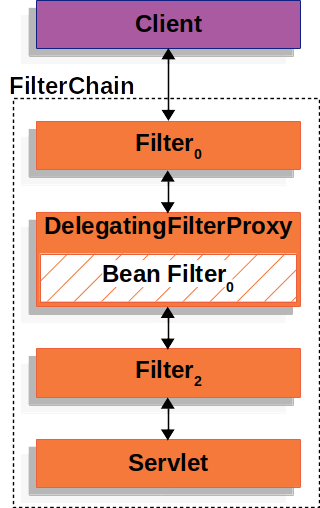

### 过滤器链的代理管理器 FilterChainProxy

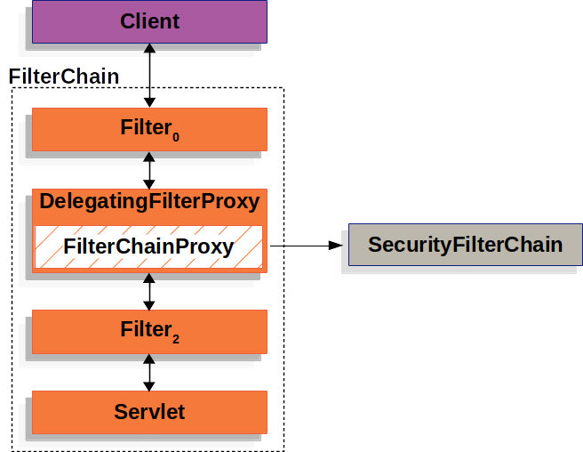

1. DelegatingFilterProxy 将任务委托给了 Spring 应用程序上下文中的`FilterChainProxy` 类型的 Bean。
2. 它不是一个普通的过滤器，它是Spring Security 自动创建的、非常复杂的 **过滤器链的代理管理器。**

**FilterChainProxy 的两大核心职责：**

**路由选择（Routing）**

- 根据请求的URL路径、参数等特征选择一个最匹配的`<font style="color:rgb(15, 17, 21);background-color:rgb(235, 238, 242);">SecurityFilterChain</font>`

**链式执行（Chained Execution）**

- 获取选中过滤器链中的所有Filter
- 按配置顺序依次调用每个Filter的`<font style="color:rgb(15, 17, 21);background-color:rgb(235, 238, 242);">doFilter()</font>`方法
- 确保整个安全过滤流程的完整执行

**总结 **`**FilterChainProxy**`**的作用是：**

- 作为 `Spring Security` 的统一入口，`FilterChainProxy` **根据 URL** **路由**到对应的** 安全过滤器链 **上，然后将这个安全过滤器链上所有的 Filter 按照配置顺序调用一遍。

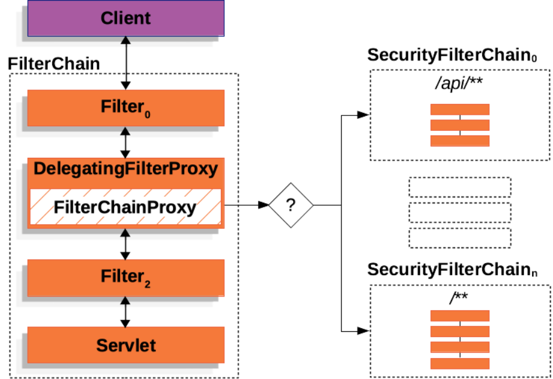

### 过滤器链 SecurityFilterChain

`FilterChainProxy`根据请求的 URL 找到对应的 `SecurityFilterChain`，通过 `SecurityFilterChain`中的 `getFilters()`方法获取一个过滤器列表 `List<Filter>`，然后执行 `List<Filter>`中每一个 `Filter`的 `doFilter()`方法。


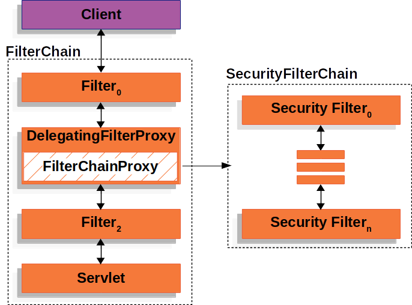

**番外篇**：原理深入（可以选择理解）：`Spring Security`中的安全过滤器链上的每一个过滤器都是符合 Servlet 规范的吗？

答案是：不完全是！ Spring Security 过滤器链上的过滤器**不全是**标准的 Servlet Filter。（有的是，有的不是）

那它底层是怎么执行每一个过滤器的呢？底层是通过它 `VirtualFilterChain`实现的，源码如下：

```java
private static final class VirtualFilterChain implements FilterChain {
    
    private final FilterChain originalChain;          // 原生Servlet过滤器链
    private final List<Filter> additionalFilters;     // Spring Security的过滤器列表
    private final int size;                           // 过滤器数量
    private int currentPosition = 0;                  // 当前执行位置

    // 构造函数：传入原生链和Security过滤器
    private VirtualFilterChain(FilterChain chain, List<Filter> additionalFilters) {
        this.originalChain = chain;
        this.additionalFilters = additionalFilters;
        this.size = additionalFilters.size();         // 缓存大小
    }

    @Override
    public void doFilter(ServletRequest request, ServletResponse response) throws IOException, ServletException {
        // 1. 如果Security过滤器都执行完了 → 执行原生链
        if (this.currentPosition == this.size) {
            this.originalChain.doFilter(request, response);
            return;
        }
        
        // 2. 执行下一个Security过滤器
        this.currentPosition++;
        Filter nextFilter = this.additionalFilters.get(this.currentPosition - 1);
        
        // 日志：正在执行第几个过滤器
        if (logger.isTraceEnabled()) {
            String name = nextFilter.getClass().getSimpleName();
            logger.trace(LogMessage.format("Invoking %s (%d/%d)", name, this.currentPosition, this.size));
        }
        
        // 关键：执行过滤器，并传入this（让过滤器能调用链的下一个）
        nextFilter.doFilter(request, response, this);
    }
}
```


### 总结 Security 底层实现原理

`Security`工作流程如下：

```plaintext
HTTP请求
    ↓
DelegatingFilterProxy (委托代理)
    ↓
FilterChainProxy (过滤器链代理) ← 选择匹配的过滤器链
    ↓
[SecurityFilterChain1] 或 [SecurityFilterChain2] 或 ... (具体的过滤器链)
    ↓  
[Filter1, Filter2, Filter3, ...] (具体的过滤器序列)
    ↓
业务Servlet
```

## 默认过滤器链

`Spring Security`默认只提供了**一条安全过滤器链**，通过**配置日志**或**断点调试**都可以查看这个**默认的过滤器链**。

`Spring Security`的版本迭代非常快，不同的版本查看效果不同，当前文档中的版本号是：**6.5.5**

### 配置日志

在 `application.properties`中添加以下配置（**实际开发中要去掉，要不然打印日志太多**）：

```yaml
logging.level.org.springframework.security=DEBUG
logging.level.org.springframework.security.web.FilterChainProxy=TRACE
logging.level.org.springframework.security.config=DEBUG
```

然后启动服务器，**复制密码**，清空控制台，访问首页：[http://localhost:8080/](http://localhost:8080/)，查看控制台信息如下（部分截图）：

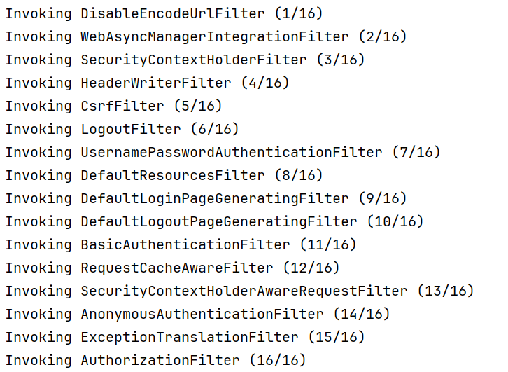

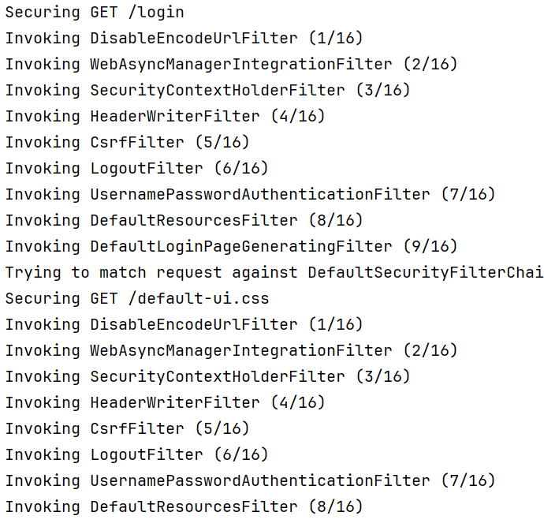

通过日志信息可以看到 `Spring Security`默认提供的安全过滤器链是 **16 个过滤器**。

另外，可以看到当发送的请求是：`GET /`的时候，`Invoking`了 `16`个过滤器，这说明这 16 个过滤器都被调用了。

但这里需要注意的是：有的过滤器很快就执行结束了，并不会执行过滤器的核心逻辑。

例如`LogoutFilter`虽然被调用了，但由于请求路径不是 `/logout`，因此 `LogoutFilter`会立即执行结束，因此大家不需要担心效率问题。

**另外，为什么有的请求是执行一个完整的过滤器链，有的则执行部分过滤器链，这个可以提前了解一下：这就是Spring Security的过滤器链短路机制** - 当某个过滤器能够完全处理请求时（**白话文：经过某个过滤器时请求就处理完了。没必要再往下走了**），后续过滤器不再执行。

控制台中有这样一段日志，我们可以来解析一下这部分日志，初步了解一下这个安全框架：

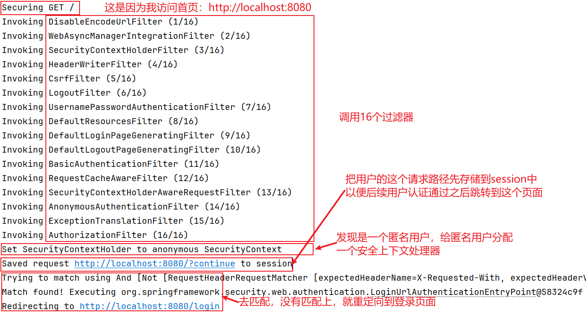

### 断点调试

通过断点调试的方式，也可以看到。找到 `DefaultSecurityFilterChain`类，在下图位置添加断点：

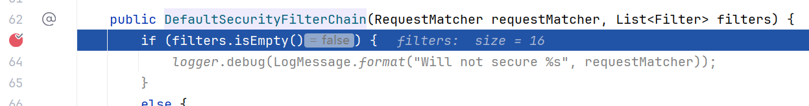

直接启动项目，启动项目的时候自动就会走到这个断点上，可以清楚的看到默认有 16 个过滤器，如下图：


### 16 个过滤器简单说明

:::info

1. DisableEncodeUrlFilter - 禁用URL编码
2. WebAsyncManagerIntegrationFilter - 异步请求支持
3. SecurityContextHolderFilter - 安全上下文管理
4. HeaderWriterFilter - HTTP头信息处理
5. CsrfFilter - CSRF防护
6. LogoutFilter - 退出登录处理
7. UsernamePasswordAuthenticationFilter - 表单登录认证
8. DefaultResourcesFilter - 默认资源处理
9. DefaultLoginPageGeneratingFilter - 默认登录页生成
10. DefaultLogoutPageGeneratingFilter - 默认退出页生成
11. BasicAuthenticationFilter - HTTP基本认证
12. RequestCacheAwareFilter - 请求缓存
13. SecurityContextHolderAwareRequestFilter - 请求包装
14. AnonymousAuthenticationFilter - 匿名用户认证
15. ExceptionTranslationFilter - 异常转换
16. AuthorizationFilter - 授权检查

:::

## SecurityProperties

默认情况下 `Spring Security` 将初始的用户名和密码存到了 `SecurityProperties` 类中。这个类中有一个静态内部类 `User`，配置了默认的用户名（name = "user"）和密码（password = uuid）

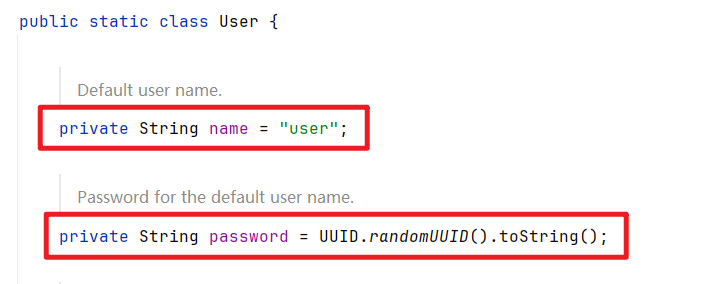

我们也可以将用户名、密码配置在SpringBoot的配置文件中：在application.properties中配置自定义用户名和密码

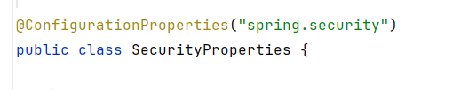

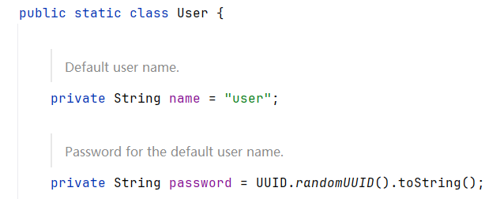

```plaintext
spring.security.user.name=user
spring.security.user.password=123
```

# Spring Security自定义配置

**官方文档：**[**https://docs.spring.io/spring-security/reference/servlet/configuration/java.html**](https://docs.spring.io/spring-security/reference/servlet/configuration/java.html)

## 基于内存的用户认证

### 创建用户信息查询器

要完成**用户认证**，需要为 IoC 容器注入一个`**<font style="color:rgb(15, 17, 21);background-color:rgb(235, 238, 242);">UserDetailsService</font>**`** 类型的对象。（内存认证和数据库认证都需要这个接口）**

`**<font style="color:rgb(15, 17, 21);background-color:rgb(235, 238, 242);">UserDetailsService</font>**`** 是 Spring Security 的"用户信息查询器"**

`**InMemoryUserDetailsManager**`** **是 **`UserDetailsService`** 的一个实现，用来管理**基于内存**的用户信息。

**编写以下配置：**

```java
package com.jkweilai.spring.security.demo.config;

import org.springframework.context.annotation.Bean;
import org.springframework.context.annotation.Configuration;
import org.springframework.security.config.annotation.web.configuration.EnableWebSecurity;
import org.springframework.security.core.userdetails.User;
import org.springframework.security.core.userdetails.UserDetailsService;
import org.springframework.security.provisioning.InMemoryUserDetailsManager;

@Configuration
//@EnableWebSecurity  // Spring Security的开关。（不添加这个注解也可以，因为SpringBoot进行了自动配置，根据依赖自动启用Spring Security）
public class WebSecurityConfig {

    @Bean
    public UserDetailsService userDetailsService(){
        InMemoryUserDetailsManager manager = new InMemoryUserDetailsManager();
        manager.createUser( // 该行添加断点可查看user对象信息
                User
                        .withDefaultPasswordEncoder() // 使用默认的密码编码器（使用默认的bcrypt进行加密）
                        .username("user") // 自定义用户名
                        .password("123456") // 自定义密码
                        .roles("USER") // 自定义角色
                        .build()
        );
        return manager;
    }
}
```

测试：使用用户名 `user`，密码 `123456`进行登录。

**一旦使用了自定义配置，那么之前在 **`**application.properties**`**文件中配置的用户名密码就没用了。**

### 基于内存的用户认证流程

**一、启动阶段（准备用户数据）**

1. **加载配置**：Spring 启动时，看到 `@EnableWebSecurity` 注解，启用安全框架。
2. **创建用户服务**：执行 `userDetailsService()` 方法，创建一个内存版的用户管理器（`InMemoryUserDetailsManager`）。
3. **存储用户**：使用 `User.build()` 创建用户对象（用户名、**加密的密码**、角色），并将其存入内存管理器的内部 Map 中（key 是用户名，value 是 UserDetails 对象）。

**结果**：框架现在知道有一个合法的用户 `user`，密码是 `123456`。

**二、认证阶段（验证用户登录）**

1. **拦截请求**：当访问受保护页面时，过滤器链发现用户未登录，将其重定向到登录页。
2. **提交凭证**：用户在登录页输入用户名和密码，点击登录。
3. **核心验证**：
  - **查用户**：认证管理器调用 `InMemoryUserDetailsManager.loadUserByUsername("user")`，根据用户名 `user` 从内存Map里查找对应的用户信息（`UserDetails`）。
  - **比密码**：认证器将用户提交的明文密码（`123456`）进行**编码**，然后与查出来的用户信息中存储的**已编码密码**进行比对。
4. **成功/失败**：
  - **成功**：密码一致，认证通过。用户信息被存入本次会话的安全上下文中（SecurityContext），然后跳转到最初想访问的页面。
  - **失败**：密码不一致，返回登录错误页。

**三、核心总结**

- **启动时**：把定义好的用户信息（密码已编码）加载到内存中的一个“字典”里。
- **登录时**：用你输入的用户名去“字典”里查找，再比对密码的编码是否一致。

**四、****了解一下核心代码**

用户名密码认证过滤器`UsernamePasswordAuthenticationFilter`中有一个方法 `attemptAuthentication`，代码如下：**获取用户提交的用户名和密码信息，并进入认证流程**

```java
@Override
public Authentication attemptAuthentication(HttpServletRequest request, HttpServletResponse response)
        throws AuthenticationException {
    // 检查请求方法：如果配置为只允许POST请求（默认true），且当前请求不是POST，则抛出异常
    if (this.postOnly && !request.getMethod().equals("POST")) {
        throw new AuthenticationServiceException("Authentication method not supported: " + request.getMethod());
    }
    // 从请求中获取用户名参数（默认从名为"username"的参数获取）
    String username = obtainUsername(request);
    // 处理用户名：如果不为null则去除首尾空格，如果为null则设为空字符串
    username = (username != null) ? username.trim() : "";
    // 从请求中获取密码参数（默认从名为"password"的参数获取）
    String password = obtainPassword(request);
    // 处理密码：如果不为null则保持原样，如果为null则设为空字符串
    password = (password != null) ? password : "";
    // 创建一个未认证的认证令牌对象，包含用户名和密码凭证
    UsernamePasswordAuthenticationToken authRequest = UsernamePasswordAuthenticationToken.unauthenticated(username,
            password);
    // 设置详细信息（details），通常包括远程IP地址、会话ID等请求相关信息
    setDetails(request, authRequest);
    // 将认证令牌委托给AuthenticationManager进行实际的认证处理，并返回认证结果
    return this.getAuthenticationManager().authenticate(authRequest);
}
```

`InMemoryUserDetailsManager`中的 `loadUserByUsername`方法，代码如下：**根据用户名找到内存中存储的用户。**

```java
@Override
public UserDetails loadUserByUsername(String username) throws UsernameNotFoundException {
    // 1. 根据用户名（转换为小写）从内存中的用户Map里查找对应的UserDetails对象
    UserDetails user = this.users.get(username.toLowerCase(Locale.ROOT));
    // 2. 如果找不到用户，抛出异常（这是认证失败的最常见原因）
    if (user == null) {
        throw new UsernameNotFoundException("user '" + username + "' not found");
    }
    // 3. 检查找到的用户对象是否实现了CredentialsContainer接口，如果已经实现了该接口，直接返回原用户对象
    // 如果 UserDetails 对象实现了 CredentialsContainer 接口，就表示它支持在认证完成后主动“擦除”其内部的敏感凭据（主要是密码）
    if (user instanceof CredentialsContainer) {
        return user;
    }
    // 4.如果不支持可擦除，就通过 new User()来创建一个可擦除敏感信息的 User对象。
    return new User(user.getUsername(), user.getPassword(), user.isEnabled(), user.isAccountNonExpired(),
            user.isCredentialsNonExpired(), user.isAccountNonLocked(), user.getAuthorities());
}
```

`DaoAuthenticationProvider`中的 `additionalAuthenticationChecks`方法，代码如下：**拿着内存中的密码和用户提交的密码对比，如果密码一致，认证成功**

```java
protected void additionalAuthenticationChecks(UserDetails userDetails,
        UsernamePasswordAuthenticationToken authentication) throws AuthenticationException {
    if (authentication.getCredentials() == null) {
        this.logger.debug("Failed to authenticate since no credentials provided");
        throw new BadCredentialsException(this.messages
            .getMessage("AbstractUserDetailsAuthenticationProvider.badCredentials", "Bad credentials"));
    }
    String presentedPassword = authentication.getCredentials().toString();
    if (!this.passwordEncoder.get().matches(presentedPassword, userDetails.getPassword())) {
        this.logger.debug("Failed to authenticate since password does not match stored value");
        throw new BadCredentialsException(this.messages
            .getMessage("AbstractUserDetailsAuthenticationProvider.badCredentials", "Bad credentials"));
    }
}
```

## 为数据库的用户认证准备环境

### 准备表和数据

```sql
-- 创建数据库
CREATE DATABASE `spring-security`;
USE `spring-security`;

-- 创建用户表
CREATE TABLE `user`(
    `id` INT NOT NULL AUTO_INCREMENT PRIMARY KEY,
    `username` VARCHAR(50) DEFAULT NULL ,
    `password` VARCHAR(500) DEFAULT NULL,
    `enabled` BOOLEAN NOT NULL
);
-- 唯一索引
CREATE UNIQUE INDEX `user_username_unique_index` ON `user`(`username`); 

-- 插入用户数据(密码是 password )
INSERT INTO `user` (`username`, `password`, `enabled`) VALUES
('admin', '{bcrypt}$2a$10$.GyF8EJtw4xeX/MrYTp6xOA2Sz1gC.jj7Hv7v5o8j/B4.rvtlwvKW', TRUE),
('jack', '{bcrypt}$2a$10$bsuU4Bxx9ks3jFmp5GKymOvZKGeXsgGJR.acmIqELyVRN3VjLQkIq', TRUE),
('lucy', '{bcrypt}$2a$10$UUpDXTOLhFUEBCAcuHKQjOnPWKcCt4n893aMDInjVZveR1xWlsO9G', TRUE);
```

### 引入依赖

```xml
<dependency>
    <groupId>mysql</groupId>
    <artifactId>mysql-connector-java</artifactId>
    <version>8.0.24</version>
    <scope>runtime</scope>
</dependency>
<dependency>
    <groupId>org.projectlombok</groupId>
    <artifactId>lombok</artifactId>
    <scope>annotationProcessor</scope>
</dependency>
<dependency>
    <groupId>com.baomidou</groupId>
    <artifactId>mybatis-plus-boot-starter</artifactId>
    <version>3.5.14</version>
    <exclusions>
        <exclusion>
            <groupId>org.mybatis</groupId>
            <artifactId>mybatis-spring</artifactId>
        </exclusion>
    </exclusions>
</dependency>
<dependency>
    <groupId>org.mybatis</groupId>
    <artifactId>mybatis-spring</artifactId>
    <version>3.0.5</version>
</dependency>
```

### 配置数据源

```plaintext
#MySQL数据源
spring.datasource.driver-class-name=com.mysql.cj.jdbc.Driver
spring.datasource.url=jdbc:mysql://localhost:3306/spring-security
spring.datasource.username=root
spring.datasource.password=123456

#SQL日志
mybatis-plus.configuration.log-impl=org.apache.ibatis.logging.stdout.StdOutImpl
```

### 编写 pojo 类

```java
package com.jkweilai.spring.security.demo.pojo;

import com.baomidou.mybatisplus.annotation.IdType;
import com.baomidou.mybatisplus.annotation.TableId;
import lombok.Data;

@Data
public class User {
    @TableId(value = "id", type = IdType.AUTO)
    private Integer id;
    private String username;
    private String password;
    private Boolean enabled;
}
```

### 编写 Mapper 接口

```java
package com.jkweilai.spring.security.demo.mapper;

import com.baomidou.mybatisplus.core.mapper.BaseMapper;
import com.jkweilai.spring.security.demo.pojo.User;
import org.apache.ibatis.annotations.Mapper;

@Mapper
public interface UserMapper extends BaseMapper<User> {
}
```

### 编写 Mapper XML 文件

`resources/mapper/UserMapper.xml`

```xml

<?xml version="1.0" encoding="UTF-8"?>
<!DOCTYPE mapper PUBLIC "-//mybatis.org//DTD Mapper 3.0//EN" 
        "http://mybatis.org/dtd/mybatis-3-mapper.dtd">

<mapper namespace="com.jkweilai.spring.security.demo.mapper.UserMapper">
</mapper>
```

### 编写 Service 接口和实现类

接口

```java
package com.jkweilai.spring.security.demo.service;

import com.baomidou.mybatisplus.extension.service.IService;
import com.jkweilai.spring.security.demo.pojo.User;

public interface UserService extends IService<User> {
}
```

实现类

```java
package com.jkweilai.spring.security.demo.service.impl;

import com.baomidou.mybatisplus.extension.service.impl.ServiceImpl;
import com.jkweilai.spring.security.demo.mapper.UserMapper;
import com.jkweilai.spring.security.demo.pojo.User;
import com.jkweilai.spring.security.demo.service.UserService;
import org.springframework.stereotype.Service;

@Service
public class UserServiceImpl extends ServiceImpl<UserMapper, User> implements UserService {
}
```

### 编写 Controller

```java
package com.jkweilai.spring.security.demo.controller;

import com.jkweilai.spring.security.demo.pojo.User;
import com.jkweilai.spring.security.demo.service.UserService;
import lombok.RequiredArgsConstructor;
import org.springframework.web.bind.annotation.GetMapping;
import org.springframework.web.bind.annotation.RequestMapping;
import org.springframework.web.bind.annotation.RestController;

import java.util.List;

@RestController
@RequiredArgsConstructor
@RequestMapping("/user")
public class UserController {

    private final UserService userService;

    @GetMapping("/list")
    public List<User> listUser(){
        return userService.list();
    }
}
```

**测试：**[**http://localhost:8080/user/list**](http://localhost:8080/user/list)

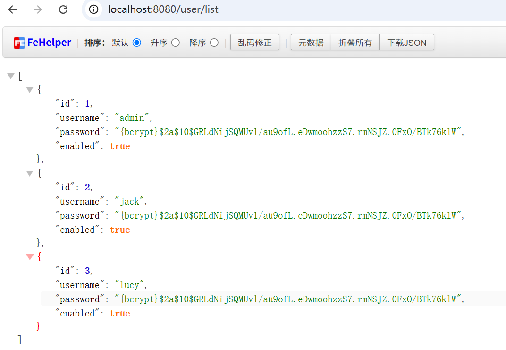

## 基于数据库的用户认证

### 基于数据库的用户认证流程

编写`DBUserDetailsManager`（**类名随意**）实现的两个接口是 `UserDetailsManager`和 `UserDetailsPasswordService`。

**参考的是内存用户认证：不管是基于内存还是基于数据库的，都要实现这两个接口。**

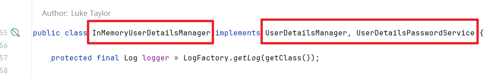

**程序启动时：**

- 实例化 `DBUserDetailsManager`对象。

**校验用户时：**

- Spring Security 自动调用`DBUserDetailsManager`的`loadUserByUsername`方法从数据库中获取User对象。
- 只要获取到 User 对象，后续的过程就和基于内存的用户认证流程一样了。

### 定义DBUserDetailsManager

```java
package com.jkweilai.spring.security.demo.config;

import com.baomidou.mybatisplus.core.conditions.query.QueryWrapper;
import com.jkweilai.spring.security.demo.mapper.UserMapper;
import com.jkweilai.spring.security.demo.pojo.User;
import jakarta.annotation.Resource;
import org.springframework.security.core.GrantedAuthority;
import org.springframework.security.core.userdetails.UserDetails;
import org.springframework.security.core.userdetails.UserDetailsPasswordService;
import org.springframework.security.core.userdetails.UsernameNotFoundException;
import org.springframework.security.provisioning.UserDetailsManager;

import java.util.ArrayList;
import java.util.Collection;

public class DBUserDetailsManager implements UserDetailsManager, UserDetailsPasswordService {
    @Override
    public UserDetails updatePassword(UserDetails user, String newPassword) {
        return null;
    }

    @Override
    public void createUser(UserDetails user) {

    }

    @Override
    public void updateUser(UserDetails user) {

    }

    @Override
    public void deleteUser(String username) {

    }

    @Override
    public void changePassword(String oldPassword, String newPassword) {

    }

    @Override
    public boolean userExists(String username) {
        return false;
    }

    @Resource
    private UserMapper userMapper;

    @Override
    public UserDetails loadUserByUsername(String username) throws UsernameNotFoundException {
        QueryWrapper<User> queryWrapper = new QueryWrapper<>();
        queryWrapper.eq("username", username);
        User user = userMapper.selectOne(queryWrapper);
        if(user == null){
            throw new UsernameNotFoundException(username);
        }else{
            
            // 查询数据库获取这个用户所关联的权限（现在给一个空的List集合）
            Collection<GrantedAuthority> authorities = new ArrayList<>();
            
            return new org.springframework.security.core.userdetails.User(
                    user.getUsername(),
                    user.getPassword(),
                    user.getEnabled(),
                    // 账号是否未过期
                    true,
                    // 凭证是否未过期
                    true,
                    // 用户是否未被锁定
                    true,
                    authorities // 权限列表
            );
        }
    }
}
```

### 将 UserDetailsService 纳入 IoC 容器的管理

修改WebSecurityConfig中的userDetailsService方法如下

```java
package com.jkweilai.spring.security.demo.config;

import org.springframework.context.annotation.Bean;
import org.springframework.context.annotation.Configuration;
import org.springframework.security.config.annotation.web.configuration.EnableWebSecurity;
import org.springframework.security.core.userdetails.UserDetailsService;

@Configuration
@EnableWebSecurity
public class WebSecurityConfig {

    @Bean
    public UserDetailsService userDetailsService() {
        /*InMemoryUserDetailsManager manager = new InMemoryUserDetailsManager();
        manager.createUser(
                User
                        .withDefaultPasswordEncoder()
                        .username("user")
                        .password("123456")
                        .roles("USER")
                        .build());
        return manager;*/

        DBUserDetailsManager manager = new DBUserDetailsManager();
        return manager;
    }
}
```

**或者直接在DBUserDetailsManager类上添加****@Component****注解，只要纳入 IoC 容器的管理即可。**

测试：输入用户名 `admin`，密码 `password`，查看是否登录成功。

## 安全过滤器链的配置

### 默认配置

我们之前就说过：框架自带了一个**默认的安全过滤器链**。我们可以了解一下他的默认配置。

可以从官方手册中看到这个默认的配置：[https://docs.spring.io/spring-security/reference/servlet/configuration/java.html](https://docs.spring.io/spring-security/reference/servlet/configuration/java.html)

**以下这段配置就是默认的过滤器链，就是它的配置让程序走了 16 个过滤器：**

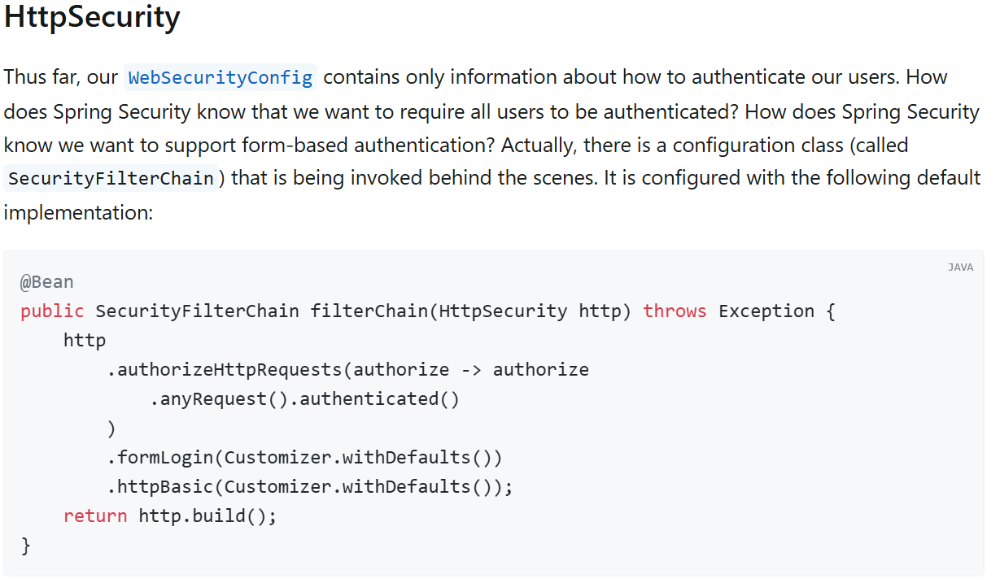

把这段代码加入到 `WebSecurityConfig`中，然后我们来研究一下，默认的过滤器链都干了什么？**代码我改造了一下，可读性更好一些**。

```java
package com.jkweilai.spring.security.demo.config;

import org.springframework.context.annotation.Bean;
import org.springframework.context.annotation.Configuration;
import org.springframework.security.config.Customizer;
import org.springframework.security.config.annotation.web.builders.HttpSecurity;
import org.springframework.security.config.annotation.web.configuration.EnableWebSecurity;
import org.springframework.security.web.SecurityFilterChain;

@Configuration
@EnableWebSecurity
public class WebSecurityConfig {
    @Bean
    public SecurityFilterChain securityWebFilterChain(HttpSecurity http) throws Exception{

        // 配置所有HTTP请求都需要登录才能访问
        http.authorizeHttpRequests(authorizeHttpRequestsCustomizer -> {
            authorizeHttpRequestsCustomizer.anyRequest().authenticated();
        });

        // 开启默认的表单登录页面（/login）
        http.formLogin(Customizer.withDefaults());

        // 开启HTTP Basic认证（浏览器弹窗登录）
        http.httpBasic(Customizer.withDefaults());

        // 构建并返回配置好的 SecurityFilterChain 对象
        return http.build();
    }
}
```

**默认的过滤器链拦截的是所有请求，官方文档有这样一段描述：**

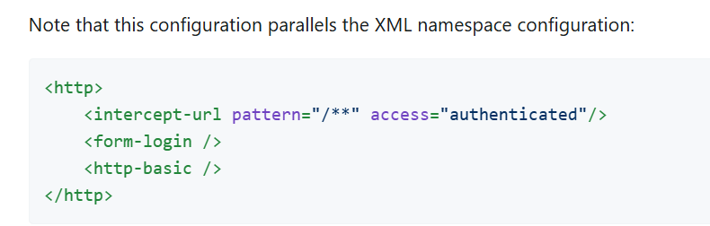

**如果要配置多个不同的安全过滤器链，可以参考官方文档，如下：****不过一般一个项目只需要配置一个过滤器链即可**

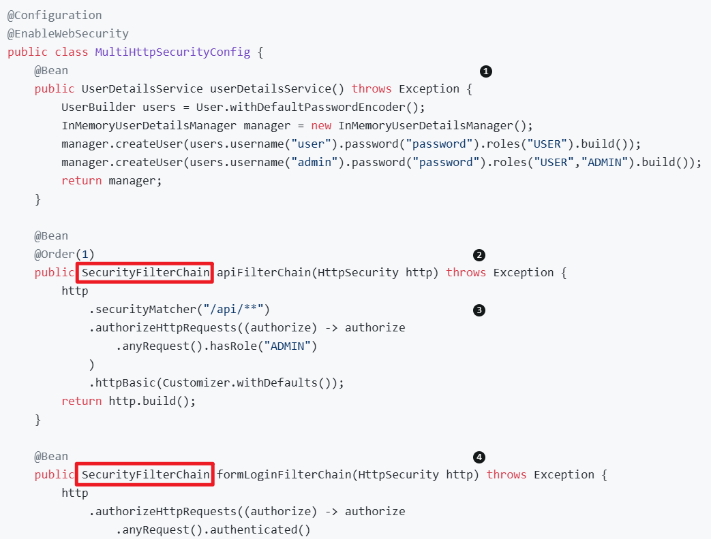

### 修改配置

**修改上面配置类中的代码就可以定制过滤器链。例如：**

`.formLogin(Customizer.withDefaults())`代码注释掉，则不再自动生成登录和登出页

当你再次访问时，浏览器会自动弹出****登录页来接收用户的输入，如下图：

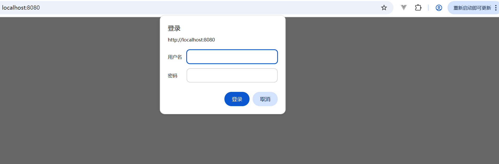

**当你登录成功后，点击退出时，由于没有退出页，会出现以下的错误：**

---

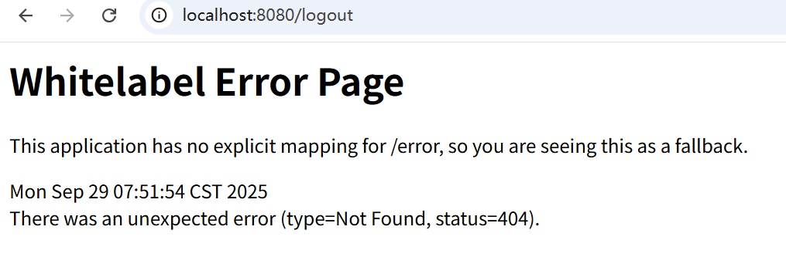

**我们之前的课程中提到过，默认情况下安全过滤器链上有 16 个过滤器，在 **`**DefaultSecurityFilterChain**`**中可以查看， 如下图所示：**

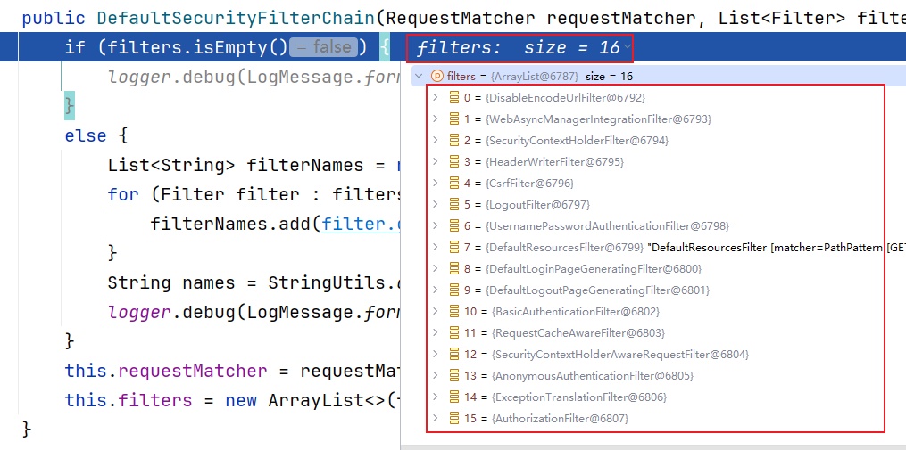

当我们把 `.formLogin(Customizer.withDefaults())`注释掉之后，再次查看，过滤器链上只剩下 12 个过滤器了，如下图所示：

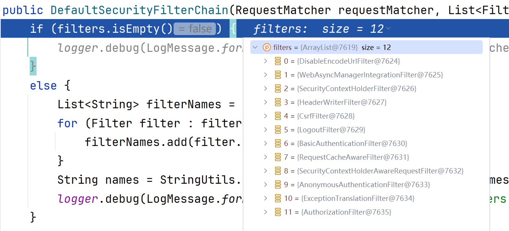

对比之后，你会发现少了这 4 个过滤器：

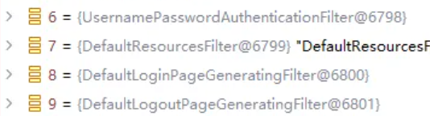

这 4 个过滤器都是干啥的？

- `**UsernamePasswordAuthenticationFilter**`：表单登录核心过滤器，处理表单登录的POST请求（默认 /login）
- `**DefaultLoginPageGeneratingFilter**`：自动生成默认登录页面
- `**DefaultLogoutPageGeneratingFilter**`：自动生成注销确认页面
- `**DefaultResourcesFilter**`：这个过滤器负责提供一些默认的静态资源，在自动生成的登录页面中可能用到的一些基本样式或资源

当你注释掉 `.formLogin(Customizer.withDefaults())`就代表你告诉 `Spring Security`：我不再需要表单登录功能了，因此这 4 个过滤器就不需要再干活了。

另外，如果你将 `.httpBasic(Customizer.withDefaults());` 注释掉，过滤器 `BasicAuthenticationFilter` 将不再工作。

## 实现用户添加

**为什么还需要演示用户添加功能呢？**

- **因为用户添加涉及到用户密码的加密，这个加密操作肯定要交给 Spring Security 框架来完成。**
- **用户认证的时候（登录的时候）底层会自动调用 **`**<font style="color:#080808;background-color:#ffffff;">DBUserDetailsManager</font>**`**的 **`**<font style="color:#080808;background-color:#ffffff;">loadUserByUsername</font>**`**方法。**
- **用户添加的时候底层会自动调用 **`**<font style="color:#080808;background-color:#ffffff;">DBUserDetailsManager</font>**`**的 **`**<font style="color:#080808;background-color:#ffffff;">createUser</font>**`**方法。**

### 编写 Controller

在 UserController 中添加以下代码：

```java
@PostMapping("/add")
public void add(@RequestBody User user){
    userService.saveUserDetails(user);
}
```

### 编写 Service

UserService 接口中添加以下方法：

```java
void saveUserDetails(User user);
```

UserServiceImpl 实现类中添加方法实现：

```java
@Resource
private DBUserDetailsManager manager;

@Override
public void saveUserDetails(User user) {
    // 密码加密
    UserDetails userDetails = org.springframework.security.core.userdetails.User
            .withDefaultPasswordEncoder()
            .username(user.getUsername())
            .password(user.getPassword())
            .build();
    manager.createUser(userDetails);
}
```

这里有个坑你要注意，以上代码要求 Spring 的 IoC 容器中必须要有 `DBUserDetailsManager`类型的 `bean`，但是 IoC 容器中没有这个 Bean，因为我们之前在配置类中编写的代码是这样的：

```java
@Bean
public UserDetailsService userDetailsService(){
    DBUserDetailsManager manager = new DBUserDetailsManager();
    return manager;
}
```

以上代码表示 IoC 容器中有一个类型叫做 `UserDetailsService`的 Bean，而不是 `DBUserDetailsManager`类型的 Bean。针对这种情况我们有两种解决方案：

- **第一种：**修改以上代码的返回值类型为 `DBUserDetailsManager`
- **第二种：**在 `DBUserDetailsManager`类上添加 `@Component` 注解。

这两种方式都可以。我们这里选择使用`@Component`注解，如下图：

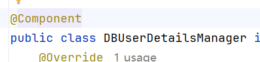

把这个代码注释掉：

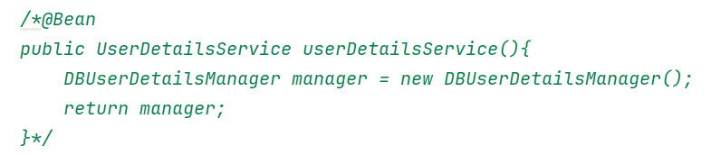

### 实现 createUser 方法

去实现 DBUserDetailsManager 中的 `createUser`方法：

```java
@Override
public void createUser(UserDetails userDetails) {
    User user = new User();
    user.setUsername(userDetails.getUsername());
    user.setPassword(userDetails.getPassword());
    user.setEnabled(true);
    userMapper.insert(user);
}
```

### 使用Swagger测试

添加依赖：

```xml
<!--swagger-->
<dependency>
    <groupId>com.github.xiaoymin</groupId>
    <artifactId>knife4j-openapi3-jakarta-spring-boot-starter</artifactId>
    <version>4.5.0</version>
</dependency>
```

**测试地址：**[http://localhost:8080/doc.html](http://localhost:8080/doc.html)


测试结果如下：显示没有权限（**要测试出这个效果还需要将之前注释掉的表单登录方式再打开**）

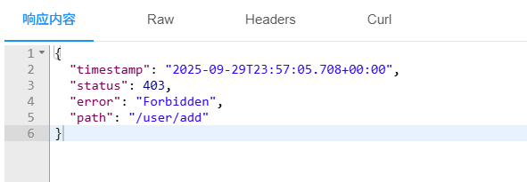

什么原因？这是因为默认情况下，`Spring Security`开启了 `csrf`攻击防御功能。

### 关闭csrf攻击防御

**Spring Security 默认开启了 csrf 攻击防御**：它会为每个表单生成一个唯一的、随机的“令牌”（Token）。当你提交表单（比如修改密码、转账）时，必须把这个令牌也一起提交上来。服务器会验证令牌是否正确。恶意网站 B 无法知道这个令牌是什么（**网站B无法知道令牌，是因为浏览器基于“同源策略”的安全限制，阻止了网站B的脚本读取网站A的Cookie或页面内容**），所以它伪造的请求就会失败。默认情况下，CSRF 防护是**开启**的，主要保护的是会改变服务器状态的请求（如 POST, PUT, DELETE）。

我们可以看一下登录页的 HTML 源码，看看表单中有没有提交随机的“令牌”，源码如下：

[http://localhost:8080/login](http://localhost:8080/login)

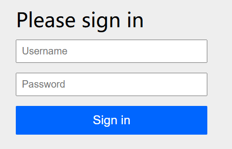

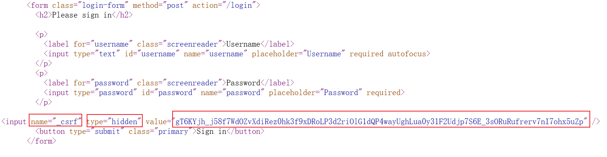

可以清楚的看到，`Spring Security`会为页面的 form 表单自动生成一个隐藏的 `_csrf`。

我们之前在实现添加用户功能的时候，由于没有编写前端页面，自然就没有把这个 `_csrf`字段的值提交给服务器，因此服务器判定没有权限。

当前我们解决这个问题的最快方式就是将默认的 `csrf`攻击防御功能关闭，可以在 `WebSecurityConfig`类的 `filterChain`方法中修改过滤规则，添加一下代码来关闭攻击防御功能：

```java
// 关闭csrf攻击防御功能（生产环境需要删除的代码）
http.csrf(csrf -> {
    csrf.disable();
});
```

再次重启服务器，测试添加用户的功能：

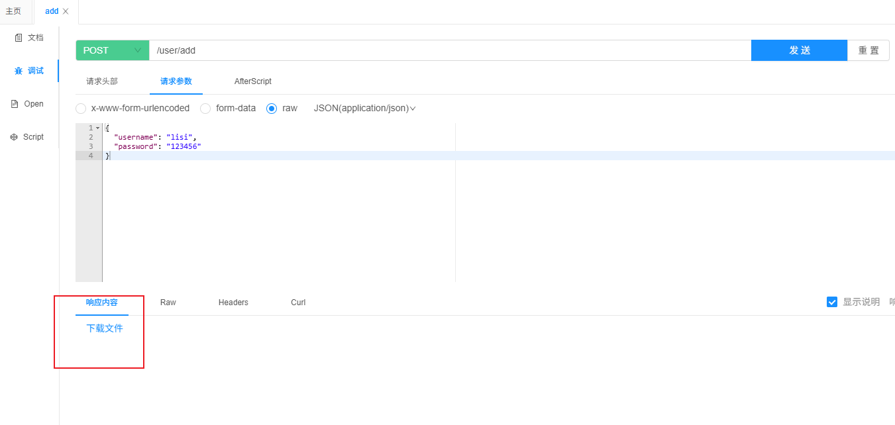

测试结果没有响应内容，这是正常的，因为 `UserController`的对应方法返回值类型是 void。

查看数据库表中的数据是否添加成功，很明显，我们已经成功了：

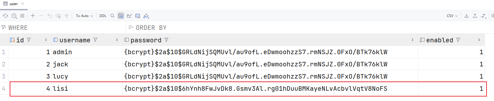

再使用新添加的用户 `lisi/123456`进行登录，你会发现这个用户是可用的。

## 密码加密算法

**参考文档：**[**https://docs.spring.io/spring-security/reference/features/authentication/password-storage.html**](https://docs.spring.io/spring-security/reference/features/authentication/password-storage.html)

### 密码加密方式

#### 明文密码

密码以明文形式存储的问题：

- 恶意用户通过SQL注入等手段获取到明文密码
- 数据库管理员可能会将密码泄露

#### Hash算法

安全起见，加密技术一般都是单向转换，不可逆（只能加密不能解密），密码单向转换就必须用 Hash 算法，像常见的加密技术有 MD5、SHA-256、SHA-512 等，它们都使用了 Hash 算法。

只能加密不能解密，那 `Spring Security`是如何进行密码验证的呢？

1. 假设数据库表中保存的是通过 BCrypt 方式 Hash 后的密码。
2. 用户登录时会提交密码，`Spring Security`仍然使用 BCrypt 方式对密码进行 Hash。
3. 然后比对两个密文是否相等。

Spring Security 的 PasswordEncoder 是一个专门用于**密码加密**和**验证**的接口。它提供了多种实现类，不同的实现采用了不同的**密码哈希算法**，如 BCrypt、PBKDF2 等，用于安全地存储和验证用户密码。

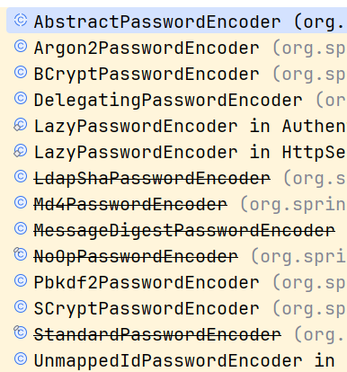

PasswordEncoder 接口的源码如下：

```java
public interface PasswordEncoder {
    
    // 将明文密码编码为加密后的密码字符串
    String encode(CharSequence rawPassword);
    
    // 验证原始密码是否与加密后的密码匹配
    // rawPassword 是原始密码
    // encodedPassword 加密后的密码
    boolean matches(CharSequence rawPassword, String encodedPassword);

    default boolean upgradeEncoding(String encodedPassword) {
        return false;
    }
}
```

加密后的密文可以破解吗？单向转换，只能加密，不能解密。通常的破解方式是**采用猜测的方式进行暴力破解**。

#### 彩虹表（暴力破解）

彩虹表就像「电话号码反查手册」

普通电话簿（正常哈希）：

- **姓名** → **电话号码**
- 比如：张三 → 13800138000
- 这就像：密码"123456" → 哈希"e10adc..."

彩虹表（反向查询）：

- **电话号码** → **姓名**
- 比如：13800138000 → 张三
- 这就像：哈希"e10adc..." → 密码"123456"

为什么彩虹表很危险？想象一下：

- 小偷提前编了一本超厚的《所有可能密码对应的哈希值大全》
- 当他偷到你的哈希值时，就像查字典一样：
  - 输入：`e10adc...`
  - 一翻书：哦！原来密码是`123456`

彩虹表就是黑客提前准备好的「密码-哈希值反向查询字典」！

恶意用户使用称为彩虹表的预计算攻击工具。能够快速破解使用简单哈希算法（如MD5、SHA1）的密码。然而，现代密码存储通过**加盐**和**慢哈希函数**（如bcrypt、Argon2）有效防御彩虹表攻击。**加盐确保相同密码产生不同哈希值**，使预计算的彩虹表失效；**慢哈希函数大幅增加计算成本**，使得生成彩虹表变得不切实际。

#### 如何防御彩虹表

**加盐（Salt）** - 就像给每个人的密码加「独特调料」：

```plaintext
不加盐： "123456" → 哈希"e10adc..."  
加盐后： "123456+用户专属随机码" → 哈希"f82b9e..."（完全不同！）
```

这样小偷的那本「大全」就完全没用了，因为每个人的「调料」都不一样！

**大家可能会有一个疑问**，加盐之后最终还是一个字符串呀，只要是字符串应该就可以暴力破解呀？？？？

它确实还是个字符串。但问题在于规模和可行性。

**情景 1：不加盐（黑客轻松破解）**

```plaintext
黑客预先计算：
"123456" → 哈希A
"password" → 哈希B  
"abc123" → 哈希C
...
【一本通用字典，可攻击所有用户】
```

**情景 2：加盐后（黑客崩溃了）**

```plaintext
用户1：盐 = "x7!p2"
"123456x7!p2" → 哈希X

用户2：盐 = "k9$m4"  
"123456k9$m4" → 哈希Y

用户3：盐 = "r1@t8"
"123456r1@t8" → 哈希Z
...
【每个用户都需要一本新字典！】
```

假设：

- 常用密码：1亿种组合
- 盐的长度：32位随机字符

那么需要预计算的组合：

```plaintext
1亿个常用密码 × 43亿种可能的盐 = 43万亿亿个组合
```

存储这些彩虹表需要：

- 不是100GB
- 不是100TB
- 而是**数百万个地球大小的硬盘**！

加盐的魔法不在于让密码「看不见」，而在于让黑客的**攻击成本从「买瓶可乐」变成「买下整个银河系」**！

所以你的直觉是对的——技术上还是能破解，但经济上完全不可行，这就是安全的本质！

**加盐之后，数据库是如何存储的？后期又是如何进行认证的？**

**注册**：密码 → 生成随机盐 → 计算加盐哈希 → 存储(哈希+盐【盐值以明文存储，盐值公开也没关系：盐值的目的不是保密，而是确保唯一性】)
**登录**：输入用户名和密码 → 根据用户名去数据库中查询对应的存储密码 → 从存储密码中读取盐值 → 计算 用户输入的密码+盐值 的哈希 → 比较数据库哈希

#### 自适应单向函数（慢哈希函数）

**可调节计算成本**的哈希函数，通过**增加计算时间**来防御暴力破解。

随着硬件的不断发展，加盐哈希也不再安全。原因是，计算机可以每秒执行数十亿次哈希计算。这意味着我们可以轻松地破解每个密码。现在，开发人员开始使用自适应单向函数来存储密码。使用自适应单向函数验证密码时，故意占用资源（故意使用大量的CPU、内存或其他资源）。自适应单向函数允许配置一个"**工作因子**"，随着硬件的改进而增加，我们建议将“工作因子”调整到系统中验证密码需要约**一秒钟**的时间。这种权衡是为了让攻击者难以破解密码。自适应单向函数包括`bcrypt、PBKDF2、scrypt和argon2`。

**防破解的核心原理是：让哈希计算变慢。**

**假设我生成密码的时候采用了 bcrypt 慢哈希，那么黑客在生成彩虹表的时候，自然也需要 bcrypt 进行生成。生成的速度放慢了，自然破解的时间就长了。**

**传统快哈希（不安全）：**

```java
MD5("password")    // 瞬间完成
SHA1("password")   // 瞬间完成
```

**自适应慢哈希（安全）：**

```java
bcrypt("password", cost=12)    // 需要约0.3秒
argon2("password", iterations=3) // 需要约0.5秒
```

**常见实现：**

```java
// BCrypt - 可调节工作因子
BCryptPasswordEncoder encoder = new BCryptPasswordEncoder(12);

// Argon2 - 可调节时间、内存、并行度参数
Argon2PasswordEncoder encoder = new Argon2PasswordEncoder(16, 32, 1, 65536, 3);
```

这个「慢」是精心设计的安全特性，不是性能缺陷！

### PasswordEncoder

#### BCryptPasswordEncoder

`BCrypt`是什么？BCrypt = 哈希函数 + 慢速特性。

使用 bcrypt 对密码进行哈希。该算法专为减缓计算速度而设计，能有效抵抗暴力破解。

建议将工作因子参数调整至密码验证耗时约 1 秒。BCryptPasswordEncoder 默认为强度 10，请根据实际系统性能测试并调整该参数。

#### Argon2PasswordEncoder

使用 Argon2 对密码进行哈希。该算法计算慢、占用内存大，能有效抵抗硬件破解。建议调整参数使验证耗时约 1 秒，当前实现需依赖 BouncyCastle 库。

#### Pbkdf2PasswordEncoder

使用 PBKDF2 对密码进行哈希。该算法通过多次迭代实现缓慢计算，能有效抵抗暴力破解。建议调整迭代次数，使密码验证耗时约 1 秒。

PBKDF2 已通过 FIPS（美国联邦信息处理标准）认证，适用于有合规性要求的安全场景。

FIPS 认证：美国联邦政府制定的安全标准，部分项目（如政府、金融、医疗系统）强制要求使用通过该认证的算法。

#### SCryptPasswordEncoder

使用 Scrypt 对密码进行哈希。该算法通过大量内存占用和高计算成本，有效抵抗硬件破解。建议在实际运行环境中调整参数，使单次密码验证耗时约1秒。

#### 对比

| **编码器** | **安全性** | **性能特点** | **适用场景** | **备注** |
| --- | --- | --- | --- | --- |
| **BCryptPasswordEncoder** | 高 | CPU密集型，计算慢 | 通用场景，Web应用 | 当前最广泛使用 |
| **Argon2PasswordEncoder** | 最高 | CPU+内存密集型，抗硬件破解 | 高安全要求系统 | 密码哈希竞赛冠军 |
| **Pbkdf2PasswordEncoder** | 中高 | CPU密集型，可调迭代次数 | 需要合规认证的项目 | 通过FIPS认证 |
| **SCryptPasswordEncoder** | 高 | 内存密集型，高内存占用 | 抵抗硬件破解场景 | 需要大量内存资源 |

### 测试 BCryptPasswordEncoder

编写测试程序测试BCryptPasswordEncoder，代码如下：

```java
package com.jkweilai.spring.security.demo;

import org.junit.jupiter.api.Test;
import org.springframework.boot.test.context.SpringBootTest;
import org.springframework.security.crypto.bcrypt.BCryptPasswordEncoder;

@SpringBootTest
class SpringSecurityDemoApplicationTests {

    @Test
    void testBcrypt() {
        BCryptPasswordEncoder encoder = new BCryptPasswordEncoder();
        String password = encoder.encode("password");

        // 每一次执行输出结果都是不同的。
        // $2a$10$.GyF8EJtw4xeX/MrYTp6xOA2Sz1gC.jj7Hv7v5o8j/B4.rvtlwvKW
        // $2a$ ：算法标识,这表示使用的是 BCrypt 算法
        // 10$：工作因子,默认10，最小4，最大31。这里的 10 意思是 2¹⁰ 次迭代（即 1024 轮）
        // .GyF8EJtw4xeX/MrYTp6xO ：盐。这是一个 22 个字符（16字节）的随机值
        // A2Sz1gC.jj7Hv7v5o8j/B4.rvtlwvKW ：最终的哈希结果，经过 1024 轮计算后得到的 24 字节 的最终密文
        System.out.println(password);

        // 虽然每一次密码都是不一样的，但是这个结果是true？为什么？
        // 不一样是因为盐值不同导致的不同，matches方法每一次都会从密文中提取最新盐值。然后将最新盐值和密码结合之后再重新哈希。
        // 整个过程用户是无感知的。
        System.out.println(encoder.matches("password", password));
    }

}
```

### DelegatingPasswordEncoder

#### 存储的密码为什么会有一个前缀

数据库表中实际存储的密码形式为：`{bcrypt}$2a$10$UUpDXTOLhFUEBCAcuHKQjOnPWKcCt4n893aMDInjVZveR1xWlsO9G`

为什么前面会多一个 `{bcrypt}`？

简单直接的回答是：`{bcrypt}`** 这个前缀是一个密码编码标识符，它的主要作用是告诉 Spring Security：“这个密码是使用 BCrypt 算法进行哈希处理的”。**

**为什么需要这个前缀？—— 核心原因：支持多种密码编码方案**

在现代应用中，你可能会遇到多种不同方式编码的密码：

- **新用户**：使用当前最推荐的 `BCrypt` 算法进行编码。
- **老系统迁移来的用户**：他们的密码可能是用 `PBKDF2`、`SCrypt` 甚至是不安全的 `MD5` 或 `SHA-256`（无盐）编码的。
- **未来**：你可能希望将算法升级到更强大的，比如 `Argon2`。

如果密码字符串没有标识符，认证系统在验证用户输入的密码时，会遇到一个难题：**我该用哪种算法来验证这个密码？**

`{bcrypt}` 前缀就是为了解决这个问题而生的。它解耦了密码存储和验证逻辑。

**格式规范：DelegatingPasswordEncoder**

Spring Security 5 引入了一个核心类叫做 `DelegatingPasswordEncoder`（委托密码编码器）。它就是实现这套带标识符密码体系的“大脑”。

它的工作流程如下：

1. **存储密码（编码）：**
  - 当你调用 `passwordEncoder.encode(rawPassword)` 时，`DelegatingPasswordEncoder` 会委托给当前配置的默认编码器（例如 `BCryptPasswordEncoder`）去生成哈希值。
  - 在最终的存储字符串前，它会**自动加上对应的标识符**，格式为 `{id}encodedPassword`。
2. **验证密码（匹配）：**
  - 当需要验证密码时，`DelegatingPasswordEncoder` 会从存储的密码字符串开头**提取 **`{id}`。
  - 根据这个 `id`，它找到一个对应的、专门处理这种算法的 `PasswordEncoder`。
  - 然后，它把用户输入的明文密码和存储的哈希值（去掉 `{id}` 的部分）交给这个特定的 `PasswordEncoder` 去验证。

#### 存储密码时的源码分析

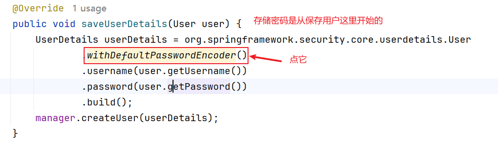

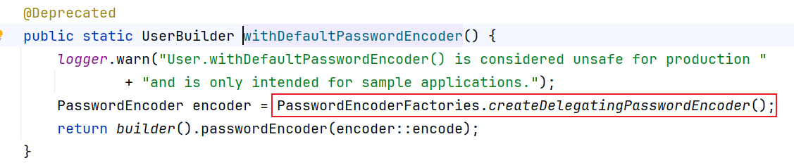

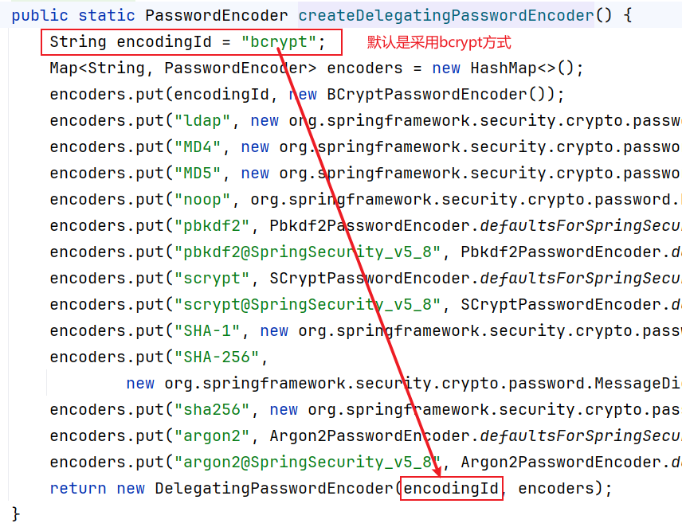

#### 匹配密码时的源码分析

启动服务器，访问登录页，输入用户名和密码之后，会走到下面这个代码的断点上：

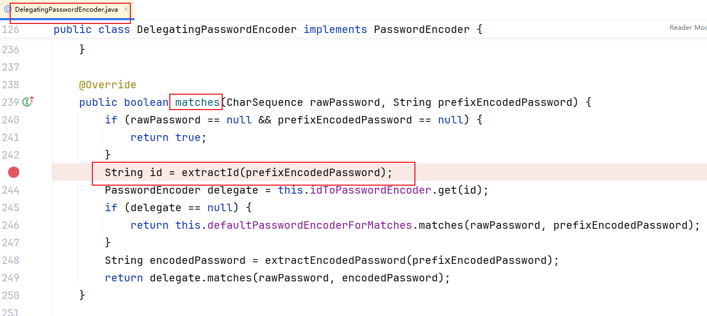

可以针对这个代码每一行进行调试，通过它来理解在哪个位置去掉的前缀，最终是怎么进行的比较！

## 自定义登录页面

`Spring Security`中执行安全过滤器链的时候，其中一个过滤器为我们生成了默认的登录页，如果不想使用默认的登录页，也可以定制。

我们先来看看登录页的显示对应的请求 URL 是什么？

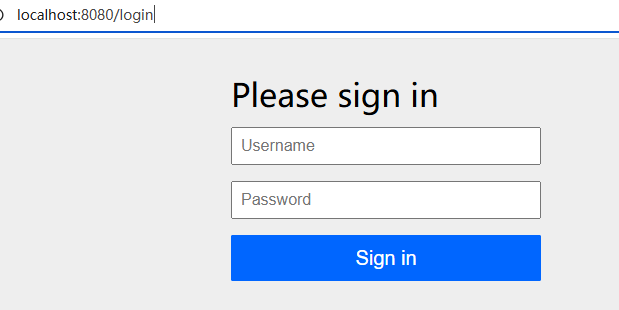

很显然登录页对应的 URL 是：[http://localhost:8080/login](http://localhost:8080/login)

那我们首先第一件事应该做的是：编写一个 `/login`对应的 `Controller`，让请求路径 `/login`走我们的控制器逻辑。

### 编写 LoginController

```java
package com.jkweilai.spring.security.demo.controller;

import org.springframework.stereotype.Controller;
import org.springframework.web.bind.annotation.GetMapping;

@Controller
public class LoginController {

    @GetMapping("/login")
    public String login(){
        return "login";
    }
    
}
```

接下来，我们肯定是需要在 `template`目录下编写一个 `login.html`。

### 编写登录页

resources/templates/login.html

```html
<!DOCTYPE html>
<html lang="en" xml:ns="https://www.thymeleaf.org">
<head>
    <meta charset="UTF-8">
    <title>自定义登录页</title>
</head>
<body>
<h1>自定义登录页</h1>
</body>
</html>
```

内容先不要写全，先简单测试一下，看看能不能跳转到我们自定义的登录页。启动服务器测试：[http://localhost:8080/login](http://localhost:8080/login)

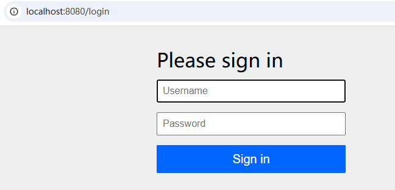

测试结果是：并没有像我们预期的那样，直接跳转到我们自定义的登录页了。这是为什么呢？

主要原因是因为：安全过滤器链没有重新定制，仍然走的是 `Spring Security`默认生成的 `form`表单登录页。压根没走我们自定义的 `LoginController`。

因此我们需要重新定义安全过滤器链中的自动生成登录表单的环节。

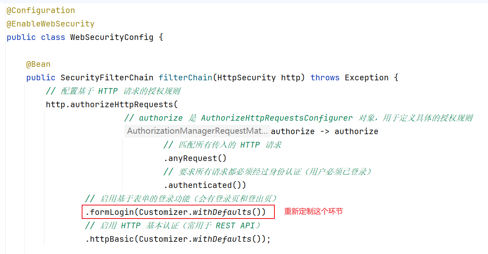

### 配置SecurityFilterChain

将 `WebSecurityConfig`中的 `.formLogin`部分的代码进行修改，如下：

```java
.formLogin(form -> {
    form.loginPage("/login");
})
```

再次测试，结果如下：

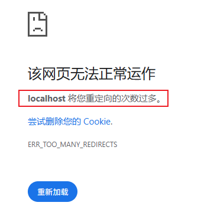

什么原因导致的？

主要是因为默认的安全过滤器链对所有的请求都进行身份认证，包括我们现在 `/login`请求也会拦截，导致递归重定向。

怎么办？继续添加以下配置，让 `/login`请求不需要身份认证就能访问：

```java
.formLogin(form -> {
    form.loginPage("/login").permitAll(); // 登录页不需要认证就可以访问
})
```

再次测试：成功了！！

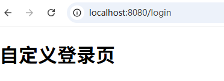

### 完善登录页

在`login.html`添加登录表单，保证能够提交登录的用户名和密码：

```html
<!DOCTYPE html>
<html lang="en" xml:ns="https://www.thymeleaf.org">
<head>
    <meta charset="UTF-8">
    <title>自定义登录页</title>
</head>
<body>
<h1>自定义登录页</h1>
<form th:action="@{/login}" method="post">
用户名：<input type="text" name="username"><br>
密码：<input type="password" name="password"><br>
<input type="submit" value="登录">
</form>
</body>
</html>
```

重启服务器，测试如下：

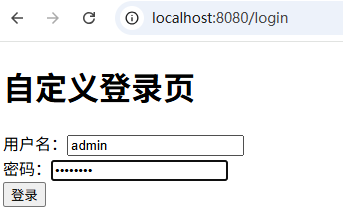

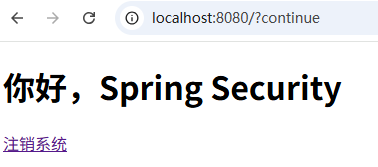

### 定制登录失败的返回地址

测试一下，登录失败之后，默认的返回地址是什么？故意输错用户名和密码

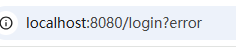

返回地址是：[http://localhost:8080/login?error](http://localhost:8080/login?error)

如果你需要定制出错之后的返回地址。可以进行以下配置：

```java
.formLogin(form -> {
    form.loginPage("/login").permitAll()
        .failureUrl("/login?err"); // 自定义登录失败后的返回地址
})
```

再次测试，故意输错用户名密码，看看地址栏上的地址，可以看到自定义配置生效了：

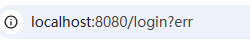

你可能会问？定制这个干啥？有什么用？答案是：在页面上能够用到。如下：

在 `login.html`中添加错误处理代码

```html
<!DOCTYPE html>
<html lang="en" xml:ns="https://www.thymeleaf.org">
<head>
    <meta charset="UTF-8">
    <title>自定义登录页</title>
</head>
<body>
<h1>自定义登录页</h1>
<form th:action="@{/login}" method="post">
用户名：<input type="text" name="username"><br>
密码：<input type="password" name="password"><br>
<input type="submit" value="登录">
</form>

<div th:if="${param.err}">用户名不存在或者密码错误</div>

</body>
</html>
```

当登录失败的时候，测试结果如下：

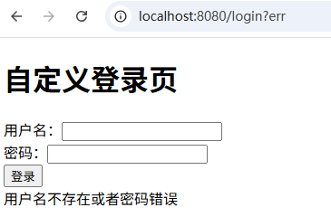

### 定制登录表单的参数名

默认要求在登录表单提交时，提交的参数名必须是：username=xxx&password=yyy

这是 `Spring Security`固定死的，可以通过 `UsernamePasswordAuthenticationFilter`的源码来查看：

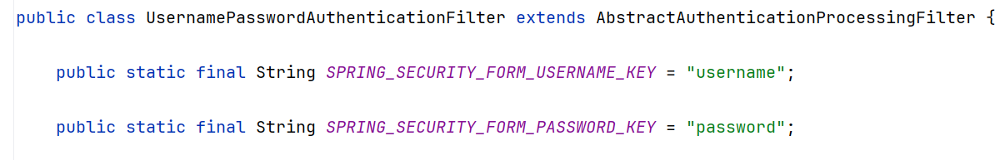

如果你想定制，可以添加以下配置：

```java
.formLogin(form -> {
    form.loginPage("/login").permitAll()
        .failureUrl("/login?err")
        .usernameParameter("name") // 自定义表单参数名
        .passwordParameter("pwd"); // 自定义表单参数名
})
```

配置修改了，那你的登录表单的参数名就需要跟着修改，代码如下：

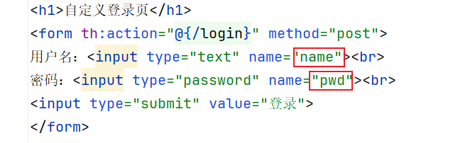

再次测试，看看是否能够正常登录。经过测试，是可以的。

### 关于登录表单是否自动生成 csrf 隐藏字段

之前我们把 `csrf`攻击防御功能关闭了，现在把它打开，将代码注释掉：

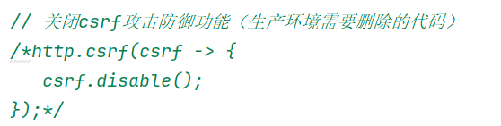

访问登录页，看看有没有 csrf 隐藏字段，可以看到是有的：

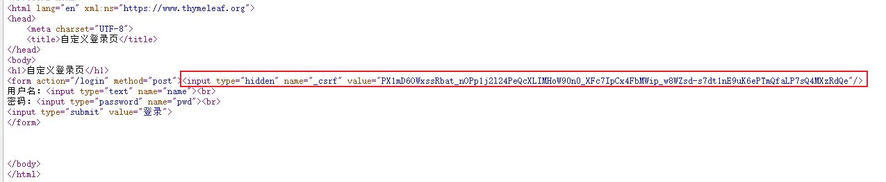

我们把 `login.html`中的动态参数代码修改一下：

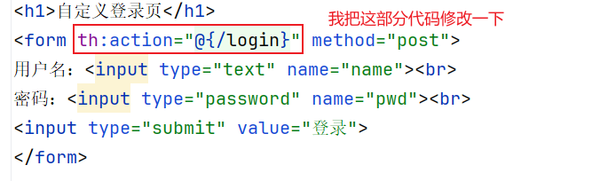

上图代码修改为：

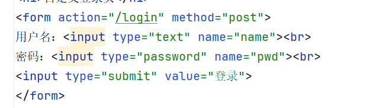

再次访问登录页，查看源码，如下：

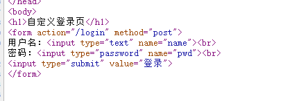

可以看到隐藏的 csrf 字段没有了。因此要注意：登录表单需要使用动态参数语法。也就是以下代码：

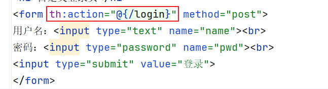

# 前后端分离

在前后端分离的系统中，用户认证成功或者失败不应该渲染页面，应该返回 JSON 给前端系统。

**注意：本章节内容不是完全的前后端分离，只是演示后端如何返回 JSON，如果纯前后端分离，需要 JWT。**

## 用户认证流程


**我们来描述一下，在前后端分离系统中，用户认证的流程：**

1. **用户提交登录**
  - 前端 POST 发送 JSON 【`{"username": "admin", "password": "password"}`】到登录接口（如 `/login`）：
2. **认证过滤器拦截**
  - `UsernamePasswordAuthenticationFilter` 拦截请求
  - 将用户名密码封装为 `UsernamePasswordAuthenticationToken`
3. **AuthenticationManager 认证**
  - **调用 **`UserDetailsService.loadUserByUsername(username)`
  - **使用 **`PasswordEncoder` 校验密码
4. **认证成功**
  - 生成 `Authentication` 对象（**凭证对象**）
  - 存入 `SecurityContextHolder`
  - **调用 **`AuthenticationSuccessHandler` → 返回成功JSON
5. **认证失败**
  - **调用 **`AuthenticationFailureHandler` → 返回错误JSON

**核心是：**

1. 认证成功自动调用：`AuthenticationSuccessHandler`
2. 认证失败自动调用：`AuthenticationFailureHandler`

接下来我们来一步一步实现一下。

## 引入 `fastjson2`

我们肯定是需要对 JSON 进行处理的，因此要引入 `fastjson2`依赖：

```xml
<dependency>
    <groupId>com.alibaba.fastjson2</groupId>
    <artifactId>fastjson2</artifactId>
    <version>2.0.59</version>
</dependency>
```

## 认证成功的响应

编写 `AuthenticationSuccessHandler`接口的实现类，认证成功后，这个接口的 `onAuthenticationSuccess()`方法自动被调用。在该方法中向前端系统响应 JSON。

### 成功结果处理

```java
package com.jkweilai.spring.security.demo.config;

import com.alibaba.fastjson2.JSON;
import jakarta.servlet.ServletException;
import jakarta.servlet.http.HttpServletRequest;
import jakarta.servlet.http.HttpServletResponse;
import org.springframework.security.core.Authentication;
import org.springframework.security.web.authentication.AuthenticationSuccessHandler;

import java.io.IOException;
import java.util.HashMap;
import java.util.Map;


public class MyAuthenticationSuccessHandler implements AuthenticationSuccessHandler {
    // 认证成功时的回调
    @Override
    public void onAuthenticationSuccess(HttpServletRequest request, HttpServletResponse response, Authentication authentication) throws IOException, ServletException {
        // 获取认证主体（通常是用户标识，如用户名、UserDetails对象）
        Object principal = authentication.getPrincipal();
        // 获取用户权限列表（角色和权限信息）
        //Collection<? extends GrantedAuthority> authorities = authentication.getAuthorities();
        // 获取用户凭证（通常是密码，认证成功后出于安全考虑会清除）
        //Object credentials = authentication.getCredentials();

        // 封装数据
        Map<String, Object> map = new HashMap<>();
        map.put("code", "1");
        map.put("msg", "登录成功");
        map.put("data", principal);

        // 转换JSON
        String json = JSON.toJSONString(map);

        // 响应JSON
        response.setContentType("application/json;charset=UTF-8");
        response.getWriter().print(json);
    }
}
```

### SecurityFilterChain配置

如何让 `Spring Security`找到你这个回调呢？你需要在 `SecurityFilterChain`中进行如下的配置：

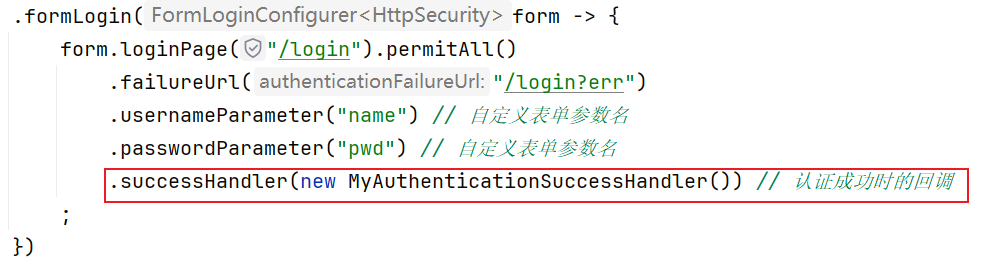

```java
form.successHandler(new MyAuthenticationSuccessHandler())
```

**测试如下：**

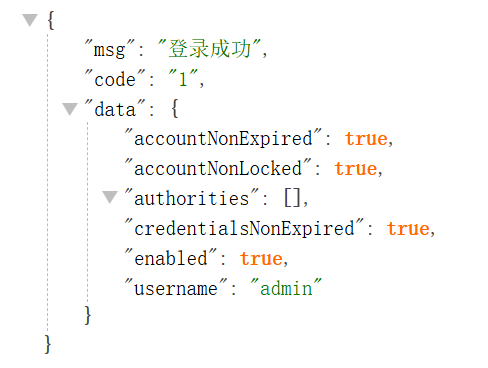

## 认证失败的响应

编写 `AuthenticationFailureHandler` 接口的实现类，认证失败后，这个接口的 `onAuthenticationFailure()`方法自动被调用。在该方法中向前端系统响应 JSON。

### 失败结果处理

```java
package com.jkweilai.spring.security.demo.config;

import com.alibaba.fastjson2.JSON;
import jakarta.servlet.ServletException;
import jakarta.servlet.http.HttpServletRequest;
import jakarta.servlet.http.HttpServletResponse;
import org.springframework.security.core.AuthenticationException;
import org.springframework.security.web.authentication.AuthenticationFailureHandler;

import java.io.IOException;
import java.util.HashMap;
import java.util.Map;

public class MyAuthenticationFailureHandler implements AuthenticationFailureHandler {
    @Override
    public void onAuthenticationFailure(HttpServletRequest request, HttpServletResponse response, AuthenticationException exception) throws IOException, ServletException {
        // 获取异常信息
        String localizedMessage = exception.getLocalizedMessage();

        // 封装数据
        Map<String, Object> map = new HashMap<>();
        map.put("code", "-1");
        map.put("msg", "用户名或密码错误");

        // 转换JSON
        String json = JSON.toJSONString(map);

        // 响应JSON
        response.setContentType("application/json;charset=UTF-8");
        response.getWriter().print(json);
    }
}
```

### SecurityFilterChain配置

如何让 `Spring Security`找到你这个回调呢？你需要在 `SecurityFilterChain`中进行如下的配置：

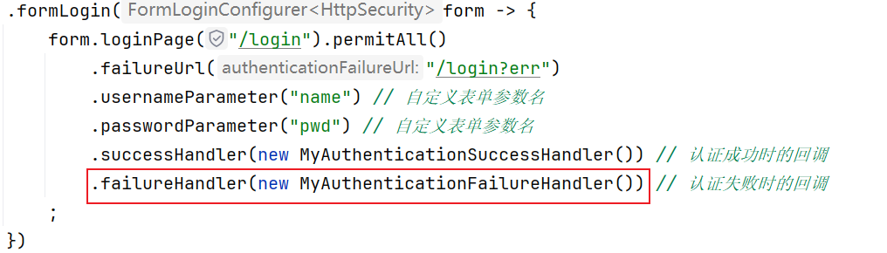

```java
form.failureHandler(new MyAuthenticationFailureHandler())
```

**测试如下：**

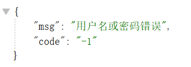

## 注销的响应

之前注销的时候，会给一个确认页，然后注销之后会自动跳转到登录页。我们如果注销之后希望返回 JSON 字符串给前端系统，那就需要再编写一个回调。编写类实现 `LogoutSuccessHandler`接口，实现该接口中的 `onLogoutSuccess()`方法，在该方法中响应 JSON 到前端系统。

### 首先保证当前注销功能可用

你需要将 csrf 攻击防御功能关闭，这样之前的注销功能才可用：之前的注释去掉即可。

```java
http.csrf(csrf -> {
   csrf.disable();
});
```

### 注销结果处理

```java
package com.jkweilai.spring.security.demo.config;

import com.alibaba.fastjson2.JSON;
import jakarta.servlet.ServletException;
import jakarta.servlet.http.HttpServletRequest;
import jakarta.servlet.http.HttpServletResponse;
import org.springframework.security.core.Authentication;
import org.springframework.security.web.authentication.logout.LogoutSuccessHandler;

import java.io.IOException;
import java.util.HashMap;
import java.util.Map;

public class MyLogoutSuccessHandler implements LogoutSuccessHandler {
    @Override
    public void onLogoutSuccess(HttpServletRequest request, HttpServletResponse response, Authentication authentication) throws IOException, ServletException {
        // 封装数据
        Map<String,Object> map = new HashMap<>();
        map.put("code", "0");
        map.put("msg", "注销成功");

        // 转换JSON
        String json = JSON.toJSONString(map);

        // 响应JSON
        response.setContentType("application/json;charset=UTF-8");
        response.getWriter().print(json);
    }
}
```

### SecurityFilterChain配置

你仍然需要通过配置来告诉 `Spring Security`，它在哪里。但这一次的配置需要配置在 `http`之下，而不是 `form`之下：

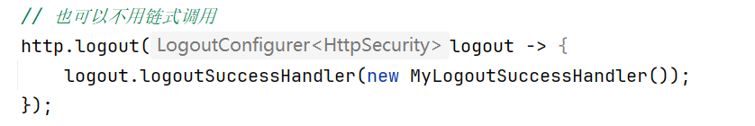

```java
// 也可以不用链式调用，直接使用 http. 调用。
http.logout(logout -> {
    logout.logoutSuccessHandler(new MyLogoutSuccessHandler());
});
```

**测试如下：**

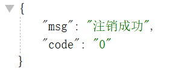

## 请求未认证的接口

### 实现AuthenticationEntryPoint接口

当访问一个需要认证之后才能访问的接口的时候，Spring Security会使用`AuthenticationEntryPoint`将用户请求跳转到登录页面。这里我们也希望系统返回一个 JSON，不要跳转到登录页。因此我们又需要编写一个回调。编写类实现 `AuthenticationEntryPoint`接口，实现 `commence()`方法：

```java
package com.jkweilai.spring.security.demo.config;

import com.alibaba.fastjson2.JSON;
import jakarta.servlet.ServletException;
import jakarta.servlet.http.HttpServletRequest;
import jakarta.servlet.http.HttpServletResponse;
import org.springframework.security.core.AuthenticationException;
import org.springframework.security.web.AuthenticationEntryPoint;

import java.io.IOException;
import java.util.HashMap;
import java.util.Map;

public class MyAuthenticationEntryPoint implements AuthenticationEntryPoint {
    @Override
    public void commence(HttpServletRequest request, HttpServletResponse response, AuthenticationException authException) throws IOException, ServletException {
        // 通过它也可以获取错误信息
        String localizedMessage = authException.getLocalizedMessage();

        // 封装数据
        Map<String,Object> map = new HashMap<>();
        map.put("code", -1);
        map.put("msg", "没有登录");
        map.put("localizedMessage", localizedMessage);

        // 转换JSON
        String json = JSON.toJSONString(map);

        // 响应JSON
        response.setContentType("application/json;charset=UTF-8");
        response.getWriter().print(json);
    }
}
```

### SecurityFilterChain配置

同样，你也需要将这个回调告诉 `Spring Security`在哪里。

```java
http.exceptionHandling(exception -> {
    exception.authenticationEntryPoint(new MyAuthenticationEntryPoint()); // 请求需要认证的接口时
});
```

**测试如下：**

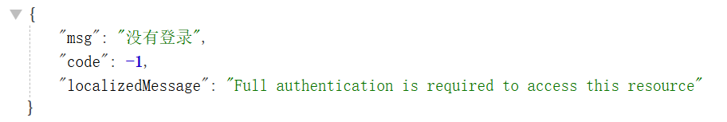

## 跨域

在 `WebSecurityConfig`配置类中添加如下 Bean：

```java
@Bean
public CorsConfigurationSource corsConfigurationSource() {
    CorsConfiguration config = new CorsConfiguration();
    
    // 允许的前端地址（协议+域名+端口）
    config.setAllowedOrigins(Arrays.asList("http://localhost:5173"));
    
    // 允许的HTTP请求方法（必须包含OPTIONS）
    config.setAllowedMethods(Arrays.asList("GET", "POST", "PUT", "DELETE", "OPTIONS"));
    
    // 允许的请求头（*表示全部允许）
    config.setAllowedHeaders(Arrays.asList("*"));
    
    // 允许携带凭证（Cookie等），开启时allowedOrigins不能为*
    config.setAllowCredentials(true);
    
    // 将配置应用到所有接口
    UrlBasedCorsConfigurationSource source = new UrlBasedCorsConfigurationSource();
    source.registerCorsConfiguration("/**", config);
    return source;
}
```

重要的一步（**在安全过滤器链中进行配置**）：启用 CORS 功能，并指定配置源

```java
http.cors(cors -> cors.configurationSource(corsConfigurationSource()))
```

在 Spring Security 中配置 CORS 后，它会**在过滤器链的最前端处理跨域请求，优先级高于其他安全过滤器，因此无需再配置 WebMvc 的 CORS**。

## Controller 中获取用户认证信息

### 身份验证核心概念


Spring Security 框架中，`SecurityContextHolder`、`SecurityContext`、`Authentication`、`Principal` 和 `Credentials` 是与身份验证和授权相关的核心概念。它们之间的关系如下：

1. **SecurityContextHolder**：安全上下文持有者，是安全模型的基石，存储在 ThreadLocal 中，线程安全的。
2. **SecurityContext**：安全上下文。主要作用是包含并管理当前用户的 `Authentication` 对象。
3. **Authentication**：该对象在安全上下文中扮演两个角色：
  - 在**身份验证之前**，它代表用户提交的登录请求，其中包含 `Principal`（通常是用户名）和 `Credentials`（通常是密码）。
  - 在**身份验证之后**，它代表已认证的用户，此时 `Principal` 通常是一个包含更多详细信息的用户对象（如 `UserDetails` 实例），而 `Credentials` 出于安全原因会被清除（通常为 `null`）。此外，它还包含用户的权限信息（`GrantedAuthority` 集合）。
4. **Principal**：通过 `Authentication` 对象的 `getPrincipal()` 方法获取。代表主体的身份标识。认证成功后， 它是一个能够识别用户的实体对象。
5. **Credentials**：代表证明主体身份的凭证，最常见的是密码。**在认证流程完成后，为了安全起见，这个凭证信息通常会被框架从 **`Authentication`** 对象中清除掉**，调用 `getCredentials()` 方法通常返回 `null`。（密码可以被存储，可以被用于比较，不可用于返回前端）
6. **GrantedAuthority**：表示授予主体的权限。这些权限信息在认证成功后，可以从`Authentication` 对象的 `getAuthorities()` 方法获取。

---

**总结关系链**：

`SecurityContextHolder` -> 持有 -> `SecurityContext` -> 持有 -> `Authentication` 对象 -> 包含：

- `Principal` (身份标识)
- `Credentials` (凭证，认证后通常为 `null`)
- `GrantedAuthority` (权限集合)

### 在Controller中获取用户信息

当用户登录成功后，我们在 `IndexController`中尝试获取用户信息，代码如下：

```java
package com.jkweilai.spring.security.demo.controller;

import org.springframework.security.core.Authentication;
import org.springframework.security.core.GrantedAuthority;
import org.springframework.security.core.context.SecurityContext;
import org.springframework.security.core.context.SecurityContextHolder;
import org.springframework.web.bind.annotation.GetMapping;
import org.springframework.web.bind.annotation.RestController;

import java.util.Collection;
import java.util.HashMap;
import java.util.Map;

/*@Controller
public class IndexController {
    @GetMapping("/")
    public String index(){
        return "index";
    }
}*/

@RestController
public class IndexController {

    @GetMapping("/")
    public Map<String, Object> index() {

        // 1. 从SecurityContextHolder中获取当前线程的安全上下文
        SecurityContext context = SecurityContextHolder.getContext();
        // 2. 从安全上下文中获取当前用户的认证信息
        Authentication authentication = context.getAuthentication();
        // 3. 获取当前登录用户的标识（通常是用户名）
        String name = authentication.getName();
        // 4. 获取代表用户身份的主体对象（认证前通常是用户名，认证后是UserDetails等对象）
        Object principal = authentication.getPrincipal();
        // 5. 获取用户的凭证（如密码，认证成功后通常返回null）
        Object credentials = authentication.getCredentials();
        // 6. 获取当前用户被授予的所有权限（角色和权限列表）
        Collection<? extends GrantedAuthority> authorities = authentication.getAuthorities();

        System.out.println(name);
        System.out.println(principal);
        System.out.println(credentials);
        System.out.println(authorities);

        // 封装数据
        Map<String, Object> map = new HashMap<>();
        map.put("code", 0);
        map.put("data", name);

        // 响应JSON
        return map;
    }
}
```

测试如下：[http://localhost:8080/login](http://localhost:8080/login)，先发送这个请求，填写用户名和密码登录。登录成功后，再发送请求：[http://localhost:8080/](http://localhost:8080/)

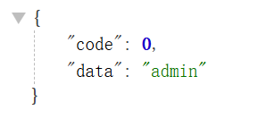

后端打印的信息：

```plaintext
admin
org.springframework.security.core.userdetails.User [Username=admin, Password=[PROTECTED], Enabled=true, AccountNonExpired=true, CredentialsNonExpired=true, AccountNonLocked=true, Granted Authorities=[]]
null
[]
```

## 会话并发处理

一个账号能在多台终端上使用叫做会话并发，如果你希望控制这个会话并发的数量，假设你希望一个账号同一个时间只能在一台设备上使用。

### 编写会话过期策略接口的实现

`Spring Security`提供了会话过期策略接口：`SessionInformationExpiredStrategy`，我们只需要编写这个接口的实现类，实现其中的 `onExpiredSessionDetected`方法，当多个会话并发时，如果当前会话被挤掉，这个回调会自动执行，响应给掉线的前端用户一个提示信息：

```java
package com.jkweilai.spring.security.demo.config;

import com.alibaba.fastjson2.JSON;
import jakarta.servlet.ServletException;
import jakarta.servlet.http.HttpServletResponse;
import org.springframework.security.web.session.SessionInformationExpiredEvent;
import org.springframework.security.web.session.SessionInformationExpiredStrategy;

import java.io.IOException;
import java.util.HashMap;
import java.util.Map;

public class MySessionInformationExpiredStrategy implements SessionInformationExpiredStrategy {
    @Override
    public void onExpiredSessionDetected(SessionInformationExpiredEvent event) throws IOException, ServletException {
        // 封装数据
        Map<String, Object> map = new HashMap<>();
        map.put("code", -1);
        map.put("msg", "该账号已从其他设备登录");

        // 转换JSON
        String json = JSON.toJSONString(map);

        // 响应JSON
        HttpServletResponse response = event.getResponse();
        response.setContentType("application/json;charset=UTF-8");
        response.getWriter().print(json);
    }
}
```

### SecurityFilterChain配置

你同样需要告诉 `Spring Security`，这个回调在哪里。

```java
// 配置会话并发管理
http.sessionManagement(session -> {
    // 1 表示一个账号只能在一个设备上使用
    session.maximumSessions(1).expiredSessionStrategy(new MySessionInformationExpiredStrategy());
});
```

测试：打开两个浏览器测试。一个先登录上去，另一个也登录上去。然后在第一个浏览器上再访问其他资源。

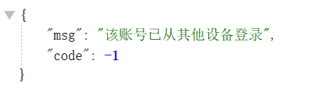

# 授权

## 两种常见的权限控制方式

在 Spring Security 中，授权管理非常灵活，可以帮我们实现两种常见的权限控制需求：

**第一种：用户 → 权限 → 资源**
这种方式比较直接，每个用户都有哪些具体的操作权限。比如：

- 张三拥有“添加用户”和“查看用户列表”的权限
- 李四只有“查看用户列表”的权限

**第二种：用户 → 角色 → 权限 → 资源**
这种方式更加常用，通过角色来管理权限分组。比如：

- 张三的角色是“管理员”，拥有所有操作权限
- 李四的角色是“普通用户”，只能查看信息，不能修改

简单来说，第一种是直接给用户分配具体权限，第二种是先给角色分配权限，再把角色分配给用户，这样管理起来更加方便和规范。

这里提到的**资源**是什么？资源就是权限控制所要保护的具体对象。它可以是：

- 一个URL地址
- 一个页面元素（如按钮、菜单）
- 一条数据或一个数据字段

## 授权策略

`Spring Security`中提供了两种授权策略：

- 基于 Request 的授权
- 基于方法的授权

| **方面** | **基于 Request 的授权** | **基于方法的授权** |
| --- | --- | --- |
| **控制层面** | **全局层面**（过滤器） | **业务方法层面**（AOP） |
| **控制粒度** | **粗粒度**（按URL分组控制） | **细粒度**（按具体操作控制） |
| **好比** | **大楼保安** | **部门经理** |
| **常用场景** | 控制页面/菜单访问 | 控制具体业务操作、数据权限 |

**最佳实践**：两者通常结合使用。

- 先用**基于Request的授权**把守大门，阻止非法用户进入敏感区域。
- 再用**基于方法的授权**在内部进行精细控制，确保用户只能执行被允许的具体操作。

## 基于 Request 授权的代码实现

### 用户-权限-资源

**需求：**

- 具有 `USER_LIST` 权限的用户可以访问 `/user/list` 接口
- 具有 `USER_ADD` 权限的用户可以访问 `/user/add` 接口

#### 第一步：配置 哪个权限可以访问哪个资源

先在 `SecurityFilterChain`中配好规则：**哪个权限可以访问哪个资源**

```java
http.authorizeHttpRequests(
        // authorize 是 AuthorizeHttpRequestsConfigurer 对象，用于定义具体的授权规则
        authorize -> authorize
                // 有 USER_LIST 权限的用户可以访问 /user/list
                .requestMatchers("/user/list").hasAuthority("USER_LIST")
                // 有 USER_ADD 权限的用户可以访问 /user/add
                .requestMatchers("/user/add").hasAuthority("USER_ADD")
                // 匹配所有传入的 HTTP 请求
                .anyRequest()
                // 要求所有请求都必须经过身份认证（用户必须已登录）
                .authenticated()
)
```

**配置权限的代码必须放到 **`**<font style="color:#DF2A3F;">anyRequest()</font>**`**之前。（实际开发中应该从数据库中加载权限规则，不应该在程序中硬编码）**

#### 第二步：授予 哪个用户拥有哪些权限

第一步中我们只是配置好哪个权限可以访问哪个资源。还没有给**具体的用户**授予**具体的权限**。这一步我们来给具体的用户授予具体的权限。用户拥有哪一个权限，这个**数据**其实已经在数据库表中保存好了。我们只需要将数据库表中这个用户对应的权限列表查询出来，执行下面代码的 `add`方法来完成最终的授权。这段代码需要在登录阶段的 `loadUserByUsername`方法中进行，因为在这个方法中，它会根据用户名获取用户信息，而这个用户信息中包含了从数据库表中动态查询的权限列表。我们学习阶段就不再查询数据库了，直接写死了。

在`DBUserDetailsManager` 中的 `loadUserByUsername()`方法上编写代码：

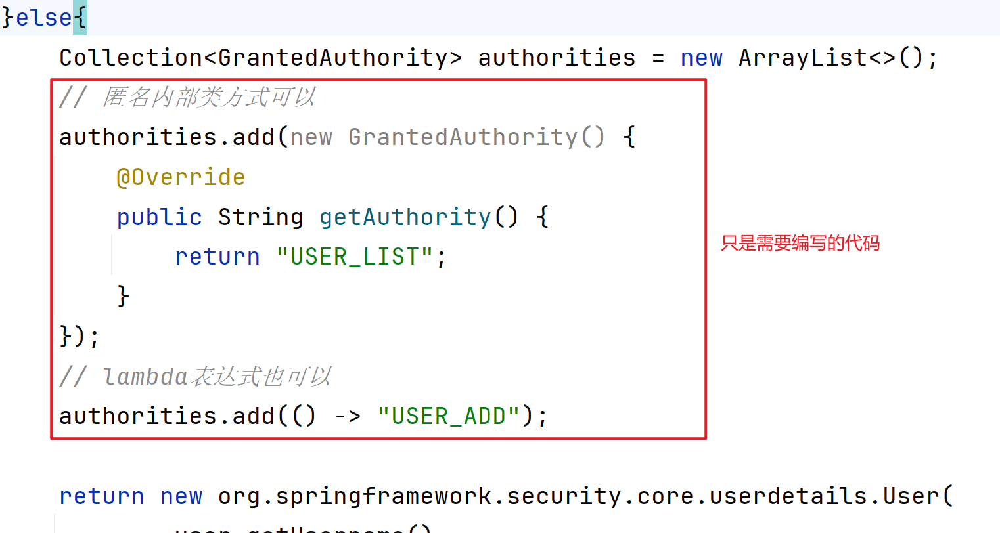

具体代码如下：

```java
Collection<GrantedAuthority> authorities = new ArrayList<>();
// 匿名内部类方式可以
authorities.add(new GrantedAuthority() {
    @Override
    public String getAuthority() {
        return "USER_LIST";
    }
});
// lambda表达式也可以
authorities.add(() -> "USER_ADD");
```

**测试如下：**

**第一步：先登录系统**

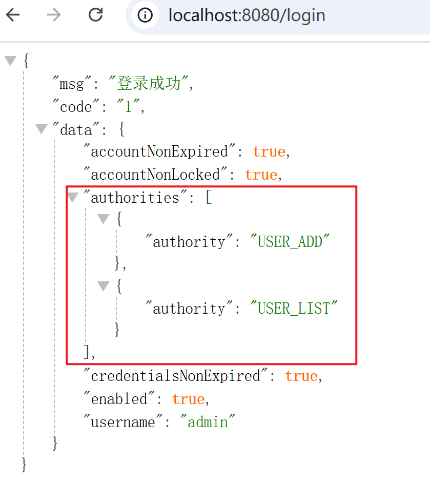

通过结果看到用户确实有这两个权限。

**第二步：看看用户是否可以正常访问 **`**/user/list**`**和 **`**/user/add**`

`/user/list`

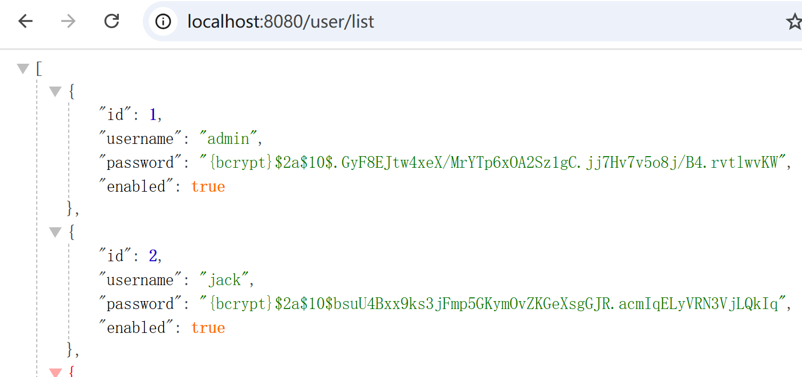

`/user/add`

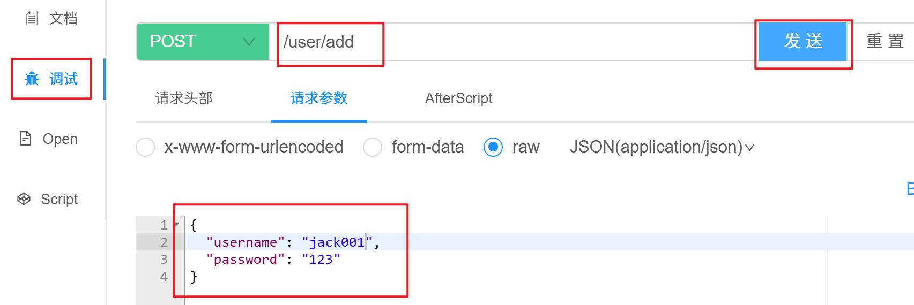

查看数据库表有没有添加成功：

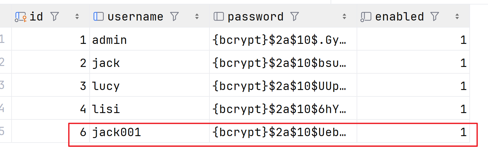

**第三步：收回一个 **`**/user/list**`**权限，看看结果是怎么样的**

将 `/user/list`权限注释掉，如下：

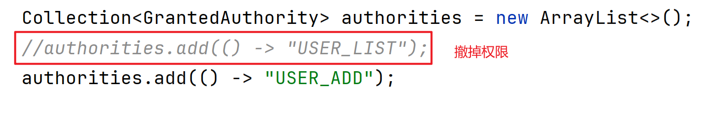

再次测试 `/user/list`请求：

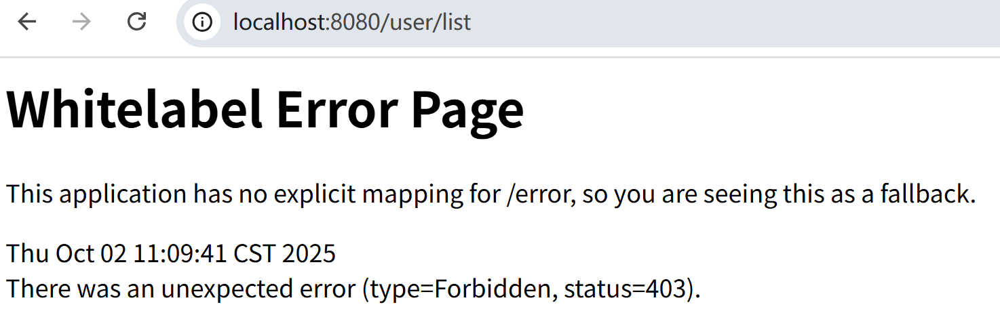

当访问了一个没有授权的接口，应该给前端系统返回一个 JSON 。

#### 第三步：请求未授权的接口返回 JSON

**第一步：编写权限不足的回调处理器：编写 **`**AccessDeniedHandler**`**接口的实现类**

```java
package com.jkweilai.spring.security.demo.config;

import com.alibaba.fastjson2.JSON;
import jakarta.servlet.ServletException;
import jakarta.servlet.http.HttpServletRequest;
import jakarta.servlet.http.HttpServletResponse;
import org.springframework.security.access.AccessDeniedException;
import org.springframework.security.web.access.AccessDeniedHandler;

import java.io.IOException;
import java.util.HashMap;
import java.util.Map;

public class MyAccessDeniedHandler implements AccessDeniedHandler {

    @Override
    public void handle(HttpServletRequest request, HttpServletResponse response, AccessDeniedException accessDeniedException) throws IOException, ServletException {
        // 封装数据
        Map<String, Object> map = new HashMap<>();
        map.put("code", -1);
        map.put("msg", "没有权限");
        // 转换JSON
        String json = JSON.toJSONString(map);
        // 响应JSON
        response.setContentType("application/json;charset=utf-8");
        response.getWriter().write(json);
    }
}
```

**第二步：在**`**SecurityFilterChain**`**中进行如下的配置：**

```java
http.exceptionHandling(exception -> {
    exception.authenticationEntryPoint(new MyAuthenticationEntryPoint()); 
    // 这是新增的代码
    exception.accessDeniedHandler(new MyAccessDeniedHandler()); // 请求未授权的接口时
});
```

测试如下：当用户没有 `USER_LIST`权限时，访问 `/user/list`请求，就会出现下面的效果

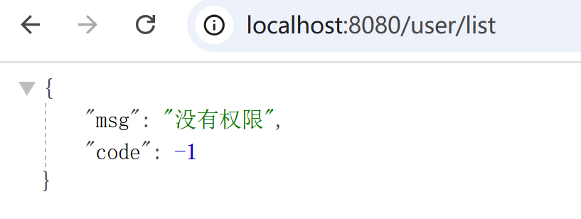

**另外，这里需要说一下，以上两步代码，也可以合并成一步，采用 lambda 表达式来实现，代码如下：**

```java
http.exceptionHandling(exception -> {
    exception.authenticationEntryPoint(new MyAuthenticationEntryPoint()); // 请求未认证的接口时
    // 新增的代码
    // 请求未授权的接口时
    exception.accessDeniedHandler((request, response, e) -> {
        // 封装数据
        Map<String, Object> map = new HashMap<>();
        map.put("code", -1);
        map.put("msg", "没有权限");
        // 转换JSON
        String json = JSON.toJSONString(map);
        // 响应JSON
        response.setContentType("application/json;charset=utf-8");
        response.getWriter().write(json);
    });
});
```

实际上之前编写的所有回调，都可以采用 lambda 表达式来完成。

### 用户-角色-资源

需求：角色为 `ADMIN` 的用户才可以访问 `/user/**` 路径下的资源

#### 配置哪个角色可以访问哪些资源

在 `SecurityFilterChain`中进行配置，先将之前的权限配置注释掉，进行角色配置：

```java
http.authorizeHttpRequests(
        // authorize 是 AuthorizeHttpRequestsConfigurer 对象，用于定义具体的授权规则
        authorize -> authorize
                // 有 USER_LIST 权限的用户可以访问 /user/list
                //.requestMatchers("/user/list").hasAuthority("USER_LIST")
                // 有 USER_ADD 权限的用户可以访问 /user/add
                //.requestMatchers("/user/add").hasAuthority("USER_ADD")
                // 角色ADMIN可以访问/user/**
                .requestMatchers("/user/**").hasRole("ADMIN")
                // 匹配所有传入的 HTTP 请求
                .anyRequest()
                // 要求所有请求都必须经过身份认证（用户必须已登录）
                .authenticated()
)
```

#### 授予 哪个用户拥有哪些角色

在实际开发中，用户对应的角色信息同样是存储到数据库表当中的，应该查询数据库，动态获取该用户拥有哪些角色。学习阶段就硬编码了。**把之前授予权限的代码注释掉**。编写以下代码来完成授予角色：

在 `DBUserDetailsManager` 中的 `loadUserByUsername` 方法中编写代码：

```java
// 不是 return new 了。
// 是通过调用 User类的静态方法了。
return org.springframework.security.core.userdetails.User
        .withUsername(user.getUsername())
        .password(user.getPassword())
        .accountLocked(false) // 用户未锁定
        .credentialsExpired(false) // 凭证未过期
        .disabled(false) // 账户启用
        .roles("ADMIN") // 授予角色（可以授予多个角色） .roles("ADMIN", "USER")
        .build();
```

**测试：**

**第一步：先登录，看看用户的角色是不是：**`**ROLE_ADMIN**`

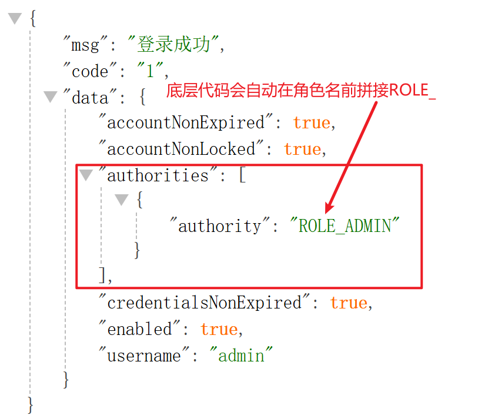

**第二步：看看用户是否可以访问 **`**/user/list**`**和 **`**/user/add**`

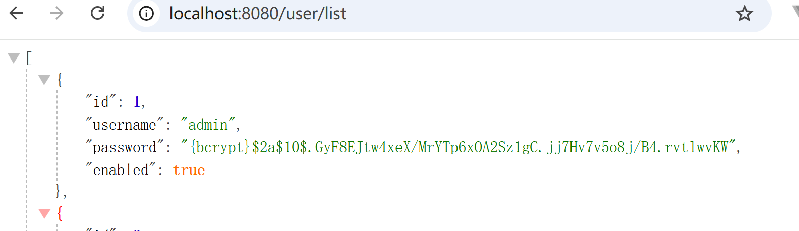

**第三步：将用户授予的角色修改为 **`**USER**`

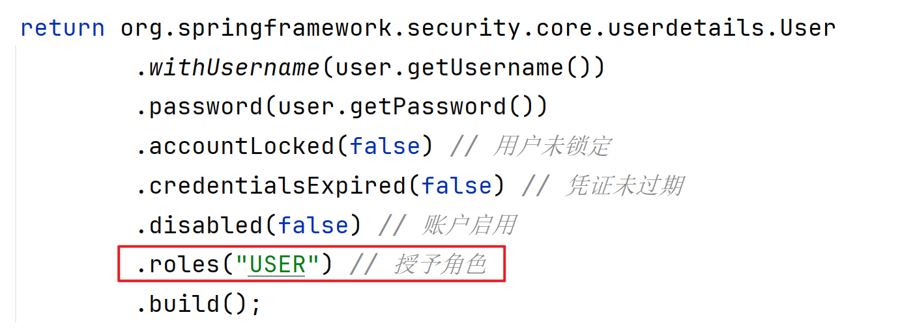

**第四步：重启服务器，再看看用户是否可以访问 **`**/user/list**`**和 **`**/user/add**`

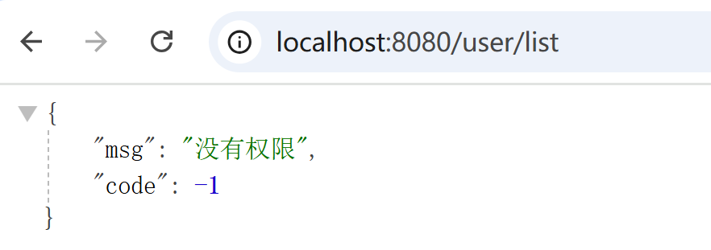

### 用户-角色-权限-资源

RBAC（Role-Based Access Control，基于角色的访问控制）是一种常用的数据库设计方案，它将用户的权限分配和管理与角色相关联。以下是一个基本的 `RBAC` 数据库设计方案的示例：

1. 用户表（User table）：包含用户的基本信息，例如用户名、密码和其他身份验证信息。

| 列名 | 数据类型 | 描述 |
| --- | --- | --- |
| user_id | int | 用户ID |
| username | varchar | 用户名 |
| password | varchar | 密码 |
| email | varchar | 电子邮件地址 |
| ... | ... | ... |

1. 角色表（Role table）：存储所有可能的角色及其描述。

| 列名 | 数据类型 | 描述 |
| --- | --- | --- |
| role_id | int | 角色ID |
| role_name | varchar | 角色名称 |
| description | varchar | 角色描述 |
| ... | ... | ... |

1. 权限表（Permission table）：定义系统中所有可能的权限。

| 列名 | 数据类型 | 描述 |
| --- | --- | --- |
| permission_id | int | 权限ID |
| permission_name | varchar | 权限名称 |
| description | varchar | 权限描述 |
| ... | ... | ... |

1. 用户角色关联表（User-Role table）：将用户与角色关联起来。

| 列名 | 数据类型 | 描述 |
| --- | --- | --- |
| user_role_id | int | 用户角色关联ID |
| user_id | int | 用户ID |
| role_id | int | 角色ID |
| ... | ... | ... |

1. 角色权限关联表（Role-Permission table）：将角色与权限关联起来。

| 列名 | 数据类型 | 描述 |
| --- | --- | --- |
| role_permission_id | int | 角色权限关联ID |
| role_id | int | 角色ID |
| permission_id | int | 权限ID |
| ... | ... | ... |

在这个设计方案中，用户可以被分配一个或多个角色，而每个角色又可以具有一个或多个权限。通过对用户角色关联和角色权限关联表进行操作，可以实现灵活的权限管理和访问控制。

它的核心好处就是“批量管理”。不用给成百上千的用户一个个分配具体权限，只需要给几个角色分配好权限，然后把用户放进对应角色里即可，修改权限时也只需修改角色，所有属于该角色的用户权限会自动更新，非常高效。

## 基于方法授权的代码实现

### 开启方法授权

如果要开启细粒度的方法授权，则需要在配置文件`WebSecurityConfig`上添加如下注解：

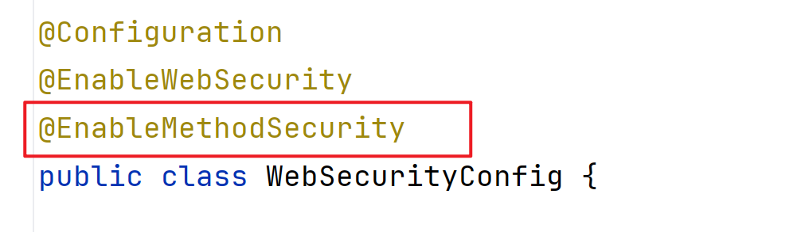

```java
@EnableMethodSecurity
```

**此时你需要把之前的授权代码注释掉：把红框中的也注释掉。在这个类中配置的都是基于 Request 的授权。**

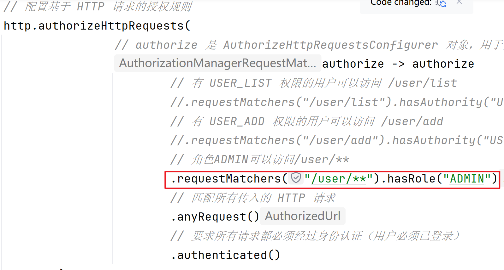

### 给用户授予角色

在 `DBUserDetailsManager`的 `loadUserByUsername`方法中授予角色：

```java
return org.springframework.security.core.userdetails.User
        .withUsername(user.getUsername())
        .password(user.getPassword())
        .accountLocked(false) // 用户未锁定
        .credentialsExpired(false) // 凭证未过期
        .disabled(false) // 账户启用
        .roles("ADMIN") // 授予角色
        .build();
```

使用授权注解标注要控制的方法，找到你要精确控制的方法，例如 `UserController`类中的方法：

```java
// 用户的角色是ADMIN，并且用户名是admin时，才能访问这个方法。
@PreAuthorize("hasRole('ADMIN') and authentication.name == 'admin'")
@GetMapping("/list")
public List<User> listUser(){
    return userService.list();
}

// 用户的角色是USER才可以访问这个方法
@PreAuthorize("hasRole('USER')")
@PostMapping("/add")
public void add(@RequestBody User user){
    userService.saveUserDetails(user);
}
```

**测试：**

第一步：使用 admin 用户登录，看看能不能访问 `/user/list`（预期是可以访问）

第二步：使用 admin 用户登录，看看能不能访问 `/user/add`（预期是不能访问）

### 给用户授予权限

在 `DBUserDetailsManager`的 `loadUserByUsername`方法中授予权限：

```java
return org.springframework.security.core.userdetails.User
        .withUsername(user.getUsername())
        .password(user.getPassword())
        .accountLocked(false) // 用户未锁定
        .credentialsExpired(false) // 凭证未过期
        .disabled(false) // 账户启用
        //.roles("ADMIN") // 授予角色
        .authorities("USER_ADD", "USER_EDIT") // 授予权限（注意授予权限的代码和授予角色的代码不可共存）
        .build();
```

使用授权注解标注要控制的方法，找到你要精确控制的方法，例如 `UserController`类中的方法：

```java
// 有 USER_LIST 权限的用户可以访问该方法
@PreAuthorize("hasAuthority('USER_LIST')")
@GetMapping("/list")
public List<User> listUser(){
    return userService.list();
}

// 有 USER_ADD 权限的用户可以访问该方法
@PreAuthorize("hasAuthority('USER_ADD')")
@PostMapping("/add")
public void add(@RequestBody User user){
    userService.saveUserDetails(user);
}
```

**测试：**

第一步：使用任意用户登录，看看能不能访问 `/user/list`（预期是不能访问）

第二步：使用任意用户登录，看看能不能访问 `/user/add`（预期是能访问）

### 方法上的 SpEL 表达式

针对方法进行授权时，这个`@PreAuthorize`注解中 `value`属性值是一个 `SpEL`表达式。`Security`中常用的表达式如下，可以自行参考：

| **表达式** | **说明** |
| --- | --- |
| `<font style="color:rgb(15, 17, 21);background-color:rgb(235, 238, 242);">hasRole('ROLE')</font>` | 是否有指定角色 |
| `<font style="color:rgb(15, 17, 21);background-color:rgb(235, 238, 242);">hasAnyRole('ROLE1','ROLE2')</font>` | 是否有任一角色 |
| `<font style="color:rgb(15, 17, 21);background-color:rgb(235, 238, 242);">hasAuthority('AUTH')</font>` | 是否有指定权限 |
| `<font style="color:rgb(15, 17, 21);background-color:rgb(235, 238, 242);">hasAnyAuthority('AUTH1','AUTH2')</font>` | 是否有任一权限 |
| `<font style="color:rgb(15, 17, 21);background-color:rgb(235, 238, 242);">authentication</font>` | 当前认证对象 |
| `<font style="color:rgb(15, 17, 21);background-color:rgb(235, 238, 242);">principal</font>` | 当前用户主体 |
| `<font style="color:rgb(15, 17, 21);background-color:rgb(235, 238, 242);">#argumentName</font>` | 方法参数 |
| `<font style="color:rgb(15, 17, 21);background-color:rgb(235, 238, 242);">@beanName.method()</font>` | 调用Spring Bean方法 |
| `<font style="color:rgb(15, 17, 21);background-color:rgb(235, 238, 242);">returnObject</font>` | 返回值（PostAuthorize） |
| `<font style="color:rgb(15, 17, 21);background-color:rgb(235, 238, 242);">permitAll()</font>` | 永远允许 |
| `<font style="color:rgb(15, 17, 21);background-color:rgb(235, 238, 242);">denyAll()</font>` | 永远拒绝 |
| `<font style="color:rgb(15, 17, 21);background-color:rgb(235, 238, 242);">isAnonymous()</font>` | 是否匿名用户 |
| `<font style="color:rgb(15, 17, 21);background-color:rgb(235, 238, 242);">isAuthenticated()</font>` | 是否已认证 |
| `<font style="color:rgb(15, 17, 21);background-color:rgb(235, 238, 242);">isRememberMe()</font>` | 是否记住我登录 |
| `<font style="color:rgb(15, 17, 21);background-color:rgb(235, 238, 242);">isFullyAuthenticated()</font>` | 是否完整认证（非记住我） |

# OAuth2

## OAuth2 简介

### OAuth2 是什么

“Auth” 表示 “授权” Authorization

“O” 是 Open 的简称，表示 “开放”

“2”是版本号

连在一起就表示 **“开放授权”**，OAuth2 是一种**开放授权协议**。

### 用 OAuth2 完成什么功能

用 OAuth2 能完成这样的功能：你在京东商城登录页上使用微信扫一扫授权登录。使用流程是这样的：

**第一步：打开京东商城登录页，点击微信登录**

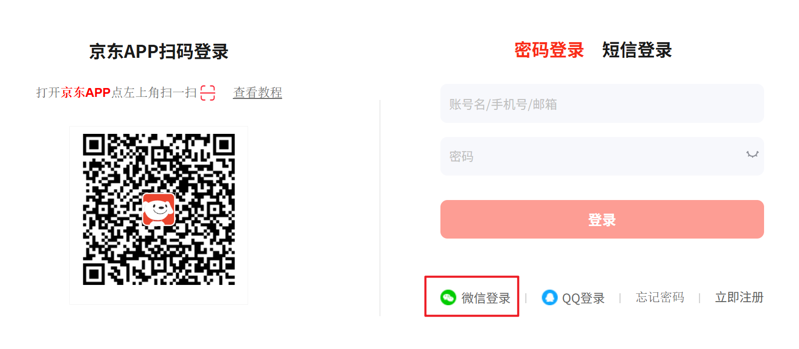

**第二步：拿起手机扫一扫**


**第三步：手机上点击允许（当然，也可以拒绝）**

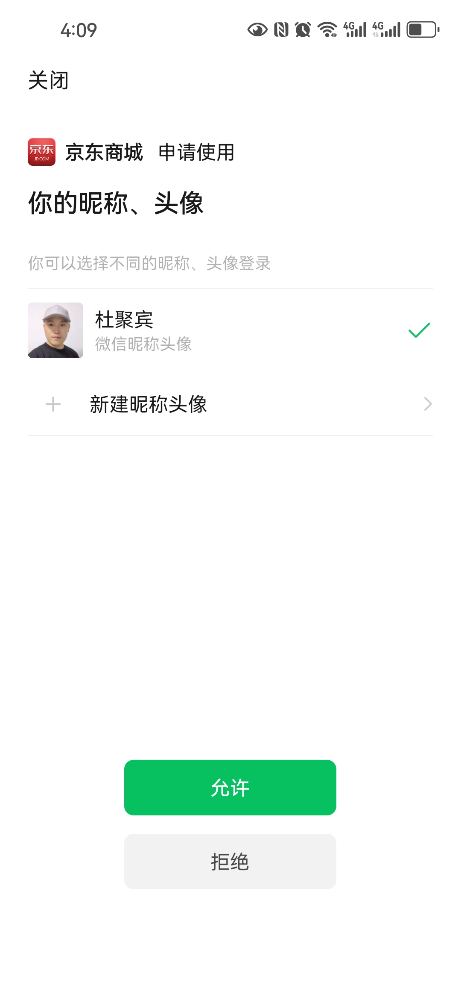

你点击允许之后，**授权服务器** 会颁发一个**令牌**给京东商城。

**第四步：京东商城登录成功。**

京东拿到授权服务器颁发的令牌之后，将令牌发给资源服务器，资源服务器判断你的令牌是否有效，如果令牌有效会将微信的昵称和头像等信息发送给京东商城，京东商城根据这些信息去数据库中查找该信息绑定的京东账号，然后登录成功。

### OAuth2 的角色

**OAuth 2 协议包含以下角色：**

1. 资源所有者（Resource Owner）
2. 客户应用（Client）
3. 授权服务器（Authorization Server）
4. 资源服务器（Resource Server）

初次接触四个角色肯定比较懵，我们把 4 个角色代入到京东扫码登录的例子中，你会秒懂：

1. **你（资源所有者）** 在**电脑京东（客户应用）** 点击微信登录，出现二维码。
2. 你用手机微信扫二维码，实际上是跳转到了**微信的授权页面（授权服务器）**。
3. **微信授权服务器**问你：“同意京东使用你的信息吗？”你点击**同意**。
4. 微信授权服务器告诉京东：“用户同意了，这是凭证。”
5. 京东拿着凭证，去找**微信的资源服务器**说：“我有凭证，把扫码用户的昵称头像给我。”
6. **微信资源服务器**验证凭证有效，就把你的基本信息发给京东。
7. 京东根据你的微信信息，找到对应的京东账号，让你成功登录。

**OAuth2.0 到底是什么？**

**OAuth 2.0 是一个授权标准，它定义了一套规范，允许第三方应用（京东）在用户授权的前提下，安全地访问用户在另一个服务商（微信服务器）存储的资源，而无需获取用户的密码（不需要获取用户的微信密码）。**


### OAuth2 的使用场景

#### 场景一：第三方登录（**一键登录**）

- 在知乎上，你不想重新注册账号，而是点击“微信登录”按钮。
- 知乎把你 redirect 到微信。
- 你在微信那里输入密码（信息只交给微信，知乎看不到），并同意授权。
- 微信告诉知乎：“验明正身了，这是他自己”。
- 知乎就用这个信息给你创建一个账号或让你登录。

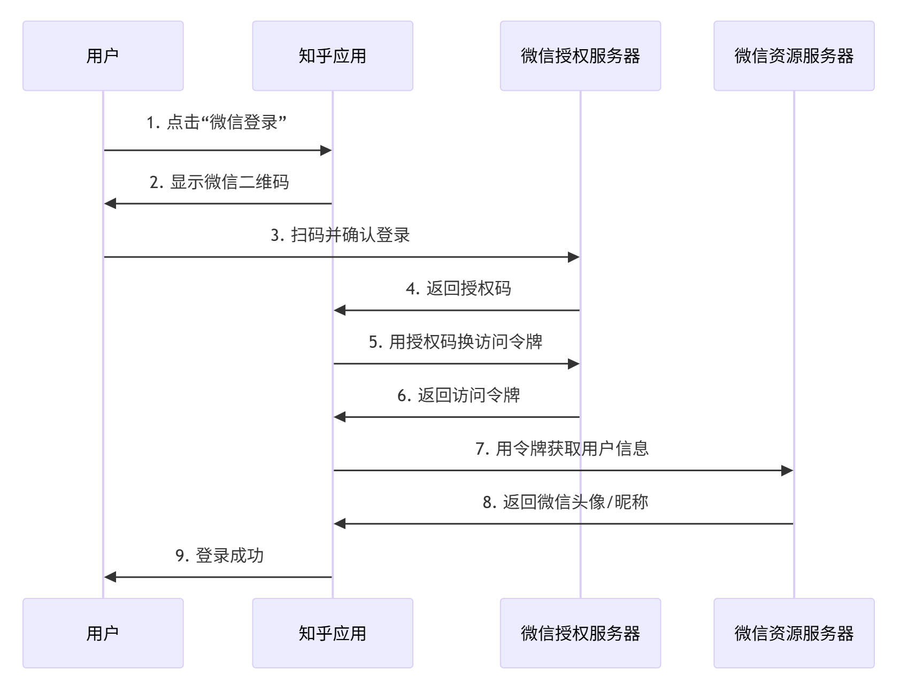

#### 场景二：第三方数据授权（**允许APP读取你的数据**）

- 假设你在用一个“旅行规划APP”，它要读取你“百度网盘”里存的旅行照片。
- 旅行APP向百度网盘请求访问照片的权限。
- 你在百度网盘的授权页点击“同意”。
- 百度网盘给旅行APP一个令牌。
- 旅行APP之后就可以用这个令牌，在不问你密码的情况下，从百度网盘拉取你的照片。

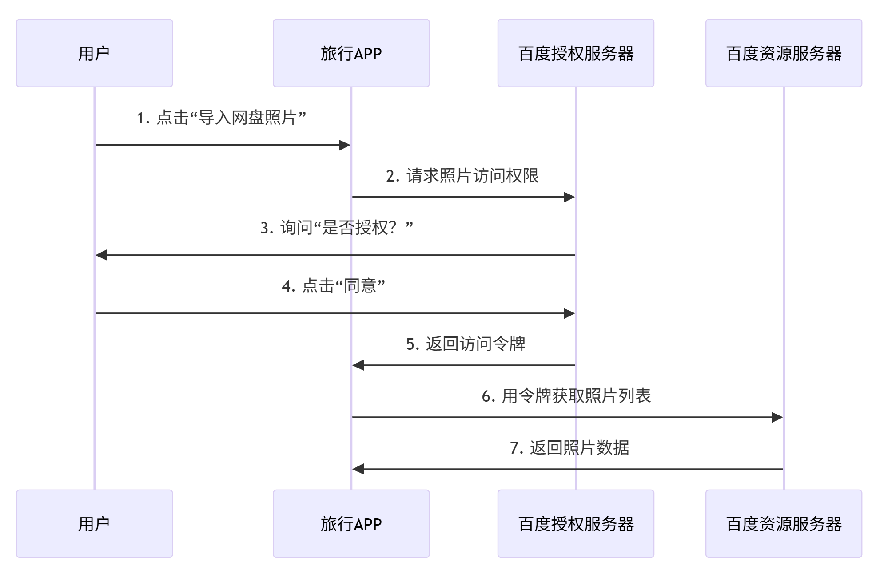

#### 场景三：服务器对服务器（微服务之间）的授权

- 你在京东下单时，它的“订单服务”需要去调用“库存服务”来扣减库存。
- “订单服务”向一个中央的“授权服务器”申请令牌。
- 授权服务器验证“订单服务”的身份后，发给它一个令牌。
- “订单服务”拿着这个令牌去调用“库存服务”。
- “库存服务”验证令牌有效后，执行扣减库存操作。
- **为什么用**：在复杂的微服务系统中，确保服务之间的调用是合法、受控的，防止内部服务被恶意调用。

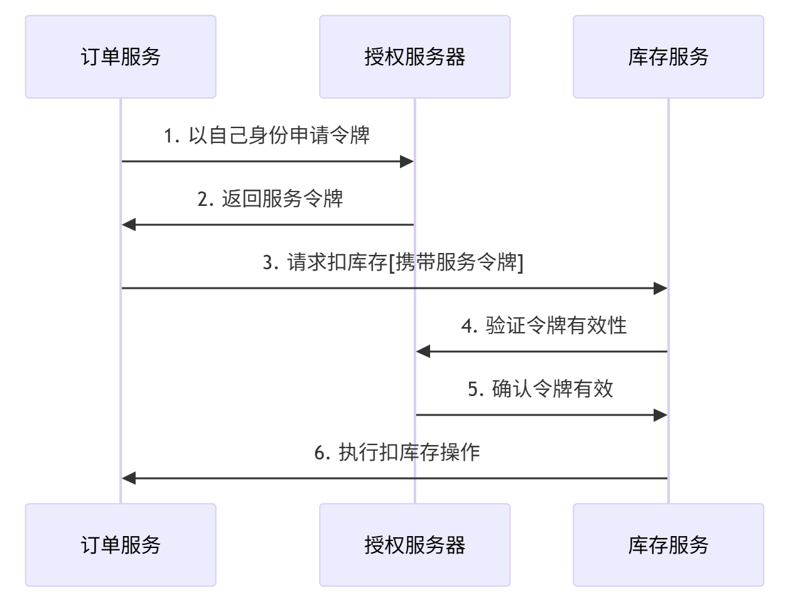

---

**总结一句话：**

凡是需要 **A应用** 在 **不碰你B服务密码** 的前提下，去 **代表你** 访问你在 **B服务** 的资源或身份，就是用了 `OAuth 2.0`。

### OAuth2 的四种授权模式

OAuth2 提供了四种授权模式：

- 授权码模式（authorization-code）
- 隐式模式（implicit）**OAuth2.1 中已废弃**
- 密码模式（password）**不推荐**
- 客户端凭证模式（client credentials）

#### 授权码模式

这是**最常见、最安全**的模式。

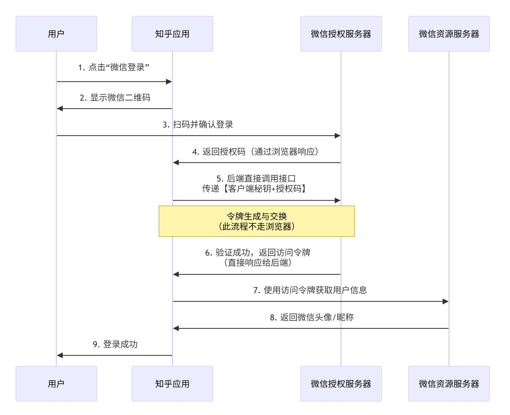

**核心关键流程描述**：用户确认授权后（用户扫码点了确认），**授权服务器**生成授权码，**授权服务器**保留一份授权码，并将授权码响应给**客户应用**（此授权码虽然在浏览器上传输，可能会被黑客拿到，但拿到也没有关系），然后**客户应用**会使用自己的**后端服务器**调用**授权服务器**提供的 API 接口，通过该接口提交**客户端秘钥+授权码**，**授权服务器**验证**客户端秘钥和授权码**，如果没问题，**授权服务器**生成**令牌**，将令牌响应给**客户应用的后端服务器**，**客户应用的后端服务器**将令牌保存下来。

什么是**客户端秘钥**，理解它非常关键：假设**客户应用**是知乎，**授权服务器**是微信平台，**客户端秘钥**是当时知乎留给微信平台的“营业执照”，一串高度绝密的字符串，只有知乎平台它自己有，黑客是不知道的，**客户端秘钥**是通过后端服务器提交给微信平台的。因此即使黑客拿到授权码，也没有关系，因为只有授权码，**授权服务器**是不会颁发令牌的。**（客户端秘钥如何获取？知乎平台（客户应用）的开发者在开发的时候需要向微信平台（授权服务器）申请客户端秘钥 ClientSecret，另外，向微信平台申请客户端秘钥的不止有知乎，可能还会有其他平台，因此授权服务器会给每个客户应用再分配一个 ClientId，当客户应用向授权服务器发送请求时，也会携带这个 clientId，这样授权服务器很快就可以通过 clientId 找到当时保存在授权服务器中的客户端秘钥，然后拿着这个客户端秘钥和客户应用提交的客户端秘钥进行比对。）**

举个例子：比如你中奖了，领奖环节安排在公共场合下不安全（令牌直接走浏览器不安全），所以颁奖方会给你一个兑奖券（授权码），然后告诉你带上你的身份证（客户端秘钥）和兑奖券（授权码）到安全的地方领奖。但你可能会有疑问：那如果兑奖券被**张三**偷走了，张三同样也可以拿着自己的身份证和兑奖券去兑奖呀！那是不可能的，因为张三的身份证并没有在颁奖方登记（颁奖方不认张三）。

**ClientId 与 redirect_uri：**

另外，我们再来看看，当我们在京东登录页，点击了微信登录，浏览器地址栏上的地址是怎样的？

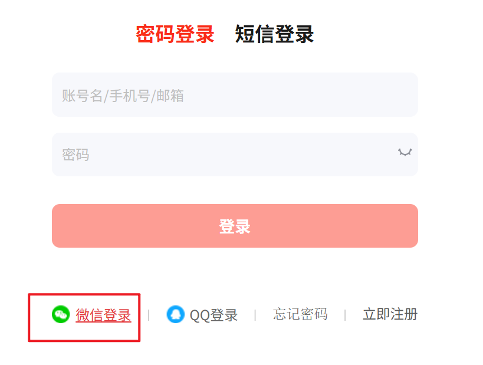

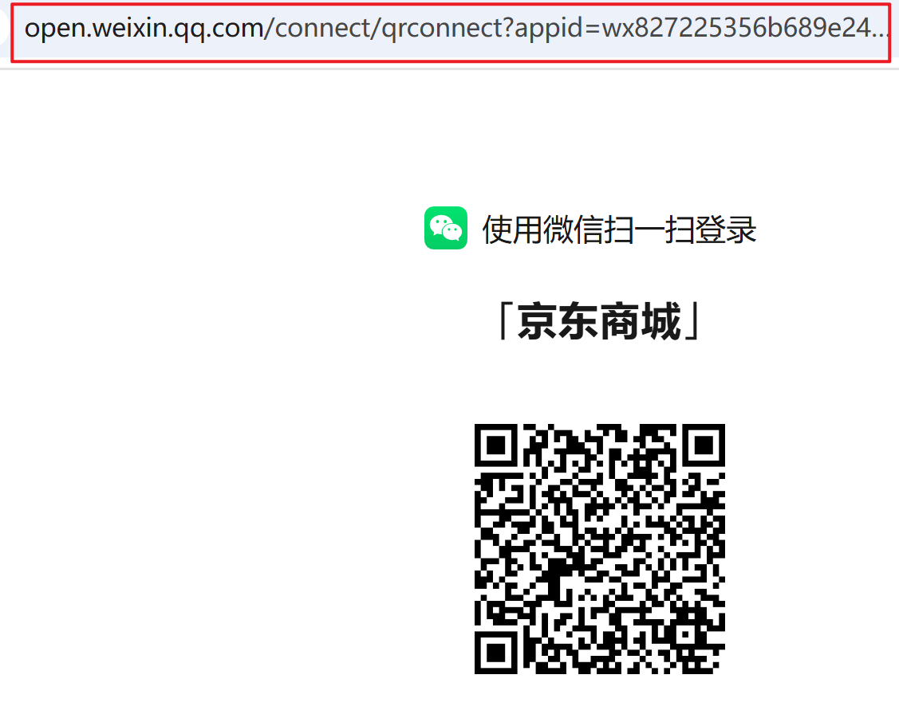

我把地址拷贝下来了，大家可以看一下：

```plaintext
https://open.weixin.qq.com/connect/qrconnect?
appid=wx827225356b689e24
&
state=BEB28B99624523F6BFFBAC8EF6AF0CB2687B22DB8A3C59C2024746E209555ADE8E82DB14D7B0853546CF0465FB3E2A19
&
redirect_uri=https%3A%2F%2Fqq.jd.com%2Fnew%2Fwx%2Fcallback.action%3F%26uuid%3D72200605386c4eb99624c883e76f37a7
&
response_type=code
&
scope=snsapi_login#wechat_redirect
```

其中有一个 `appid`，还有一个 `redirect_uri`：

- `**<font style="color:rgb(15, 17, 21);background-color:rgb(235, 238, 242);">appid</font>**`** ****(wx827225356b689e24)**：就是 `**<font style="color:rgb(15, 17, 21);background-color:rgb(235, 238, 242);">client_id</font>**`。这是京东应用在微信开放平台注册后获得的**公开身份标识**，用于告诉微信“是哪个应用在请求登录”。
- `**<font style="color:rgb(15, 17, 21);background-color:rgb(235, 238, 242);">redirect_uri</font>**`：这是一个回调 URL，将来授权服务器要通过调用这个 URL 给京东传 **授权码**。

#### 隐式模式

隐式模式的核心问题，是它完全跳过了“授权码”这个中间环节。隐藏了这个环节。以前的纯前端应用经常会使用这种方式，因为纯前端应用没有后端，传不了客户端秘钥。

这个模式**已被OAuth 2.1最佳实践指南明确废弃**。

- **流程**：与授权码模式类似，但授权服务器直接在前端重定向的URL片段中返回**访问令牌**，不经过授权码这一步。
- **缺点**：令牌直接暴露在浏览器和URL中，有很高的安全风险。只能用于一些安全要求不高的场景，并且令牌的有效期必须非常短，通常就是会话期间有效，浏览器关掉，令牌就失效了。
- **现状**：**已过时**。纯前端应用 的替代方案：**授权码模式 + PKCE扩展**。

#### 密码模式

用户直接将用户名和密码交给客户端应用，客户端应用再用这些信息去换取令牌。

- **缺点**：**极不安全**。用户需要完全信任客户端应用，违背了OAuth“第三方授权”的初衷。会将用户的凭证暴露给第三方应用。
- **适用场景**：仅适用于**高度信任的环境**，例如自家公司内部的应用。**绝不适用于普通的第三方应用**。

#### 客户端凭证模式

这种模式用于**机器对机器的认证**，没有用户的参与。

- **流程**：客户端应用使用自己的客户端ID和客户端密钥，直接向授权服务器请求一个访问令牌。
- **适用场景**：微服务之间的API调用。

#### 补充：授权码模式 + PKCE

**PKCE 的作用就像客户端秘钥一样。**

对比：传统客户端密钥 vs. PKCE

| **特性** | **传统客户端密钥** | **PKCE (code_verifier)** |
| --- | --- | --- |
| **本质** | 一个**长期的、固定的**秘密字符串 | 一个**临时的、一次性的**随机字符串 |
| **适用对象** | 有**后端服务器**的Web应用 | **纯前端应用** |
| **存储位置** | **安全的后端服务器** | **前端内存**中生成和使用（用后即弃） |
| **验证方式** | 授权服务器对比它**数据库里存储的**固定密钥 | 授权服务器对比它**本次会话中暂存的** `<font style="color:rgb(15, 17, 21);background-color:rgb(235, 238, 242);">code_challenge</font>`的哈希值 |

**授权码模式+PKCE 流程是这样的：**

1. 用户访问应用，应用在**本地**生成一个随机的 `<font style="color:rgb(15, 17, 21);background-color:rgb(235, 238, 242);">code_verifier</font>`（比如是字符串 `<font style="color:rgb(15, 17, 21);background-color:rgb(235, 238, 242);">"my_secret_123"</font>`），并计算出对应的 `<font style="color:rgb(15, 17, 21);background-color:rgb(235, 238, 242);">code_challenge</font>`（比如是 `<font style="color:rgb(15, 17, 21);background-color:rgb(235, 238, 242);">"abc123hash"</font>`）。
2. 应用带着 `<font style="color:rgb(15, 17, 21);background-color:rgb(235, 238, 242);">code_challenge</font>` 去向授权服务器申请授权码。
3. 用户登录并授权，授权服务器返回一个**授权码**。
4. 应用用这个**授权码** + **原始的 **`**<font style="color:rgb(15, 17, 21);background-color:rgb(235, 238, 242);">code_verifier</font>**`** ("my_secret_123")** 去兑换令牌（**这里基于 HTTPS 加密协议传输**）。
5. 授权服务器验证通过，发放令牌。

**黑客能拦截到什么？**

**├── 步骤2: code_challenge = "abc123hash" **✅** 能**

**├── 步骤3: 授权码 = "AUTH_CODE_XYZ" **✅** 能**

**└── 步骤4: code_verifier = "my_secret_123" **✅** 能（HTTPS加密）**

**黑客能成功吗？**

**└── 需要同时持有授权码和code_verifier**

**├── 如果只拦截到授权码 → **❌** 失败（缺code_verifier）**

**├── 如果只拦截到code_verifier → **❌** 失败（缺授权码）**

**└── 如果两个都拦截到 → **⚠️** 但HTTPS加密很难破解，且一次性使用（授权码和 code_verifier 的配对只能使用一次，用完立即失效）**

### 授权模式的选择

| **模式名称** | **客户端类型** | **是否有用户参与** | **安全性** | **推荐使用场景** |
| --- | --- | --- | --- | --- |
| **授权码模式** | 机密客户端 | **是** | **高** | 有后端的传统Web应用 |
| **隐式模式** | 公开客户端 | **是** | **低（已过时）** | **不推荐新项目使用**，用PKCE替代 |
| **密码模式** | 受信任的客户端 | **是** | **中（需高度信任）** | 第一方/官方应用 |
| **客户端凭证模式** | 机密客户端 | **否** | **高** | 机器对机器（M2M），后端API调用 |
| **授权码+PKCE** | **公开客户端** | **是** | **最高（对公开客户端）** | **单页应用、移动App** |

## Spring Security 中的 OAuth2

### 回顾 OAuth2 的 4 个角色

1. 资源所有者（Resource Owner）
2. 客户应用（Client）
3. 资源服务器（Resource Server）
4. 授权服务器（Authorization Server）

### Spring Security 中的实现

Spring Security 框架中 OAuth2 的文档：[https://docs.spring.io/spring-security/reference/servlet/oauth2/index.html](https://docs.spring.io/spring-security/reference/servlet/oauth2/index.html)

#### 客户应用 (OAuth2 Client)

**归属：Spring Security 核心项目**

```xml
<!-- 如果你要开发 OAuth2 的客户应用，请引入以下这个依赖： -->
<dependency>
    <groupId>org.springframework.boot</groupId>
    <artifactId>spring-boot-starter-oauth2-client</artifactId>
</dependency>
```

- ✅ **内置在 Spring Security 主项目中（Spring Security 下的子项目）**
- ✅ **有官方 Spring Boot Starter**
- ✅ **版本与 Spring Security 同步**

#### 资源服务器 (OAuth2 Resource Server)

**归属：Spring Security 核心项目**

```xml
<!-- 如果你要开发 OAuth2 的资源服务器，请引入以下这个依赖： -->
<dependency>
    <groupId>org.springframework.boot</groupId>
    <artifactId>spring-boot-starter-oauth2-resource-server</artifactId>
</dependency>
```

- ✅ **内置在 Spring Security 主项目中（Spring Security 下的子项目）**
- ✅ **有官方 Spring Boot Starter**
- ✅ **版本与 Spring Security 同步**

#### 授权服务器 (OAuth2 Authorization Server)

**归属：独立项目**

```xml
<!-- 如果你要开发 OAuth2 的授权服务器，请引入以下这个依赖： -->
<dependency>
    <groupId>org.springframework.security</groupId> <!-- groupId 和其它两个不一样 -->
    <artifactId>spring-security-oauth2-authorization-server</artifactId>
    <version>1.5.2</version> <!-- 需要手动指定版本号 -->
</dependency>
```

- ❌ **不在 Spring Security 主项目中**
- ❌ **没有官方 Spring Boot Starter**
- ❌ **有独立的版本号和发布周期**

---

**在实际开发中，我们多数是开发客户应用，比如我们开发的客户应用中登录功能的实现是交给 github 的，它已经将资源服务器的功能实现了，也将授权服务器的功能实现了。我们只需要开发客户应用就行了。**

## GitHub社交登录案例

### 四个角色在该场景中的对应关系及全部 URL

1. **资源所有者**： 就是你，用户。
2. **客户应用**： 就是你开发的 Spring Boot 应用程序。在客户应用中你需要给 github 提供一个回调的 URL，github 将来通过这个 URL 给你传递授权码。回调 URL 通常是 `http://localhost:8080/login/oauth2/code/github`
3. **授权服务器**： GitHub 的授权端点（`https://github.com/login/oauth/authorize`）和令牌端点（`https://github.com/login/oauth/access_token`）。
  1. **授权端点**：当用户在页面上点击使用 github 进行登录时，重定向到 github 上的授权页面的地址。（**这个 URL 是客户应用通过浏览器的重定向方式发送给 github 的**）
  2. **令牌端点**：当客户应用收到授权码之后，使用类似于 HTTP Client 的技术发送一个服务器对服务器（不经过浏览器）的请求，该请求的 URL 就是 github 提供的令牌端点，请求中会携带**授权码 + ClientID + Client Secrets**，授权服务器验证通过后颁发令牌（服务器对服务器直接响应令牌字符串）给客户应用。
4. **资源服务器**： GitHub 的 API 服务器（例如 `https://api.github.com/user`），它存放着你的用户信息等受保护资源。
  1. 客户应用授权成功后，发送该 URL 请求去资源服务器上获取对应的资源。

**总结：一共 4 个 URL**

1. 授权服务器给客户应用提供的授权端点 URL（客户应用使用浏览器重定向的方式发送该请求）
2. 授权服务器给客户应用提供的令牌端点 URL（客户应用使用 HTTP Client 在后端给授权服务器发送该请求）
3. 客户应用给授权服务器提供的回调 URL（授权服务器使用浏览器重定向的方式发送给客户应用，传递授权码）
4. 资源服务器给客户应用提供的资源 URL（客户应用携带令牌，通过 HTTP Client 方式在后端发送请求获取资源）

### 详细的执行流程（编号步骤）

#### 第一阶段：准备工作

**步骤 0： 在 GitHub 上注册你的应用（Client）**
在你写代码之前，需要先告诉 GitHub 有一个应用要使用它的 OAuth 服务。

1. 登录 GitHub -> Settings -> Developer settings -> OAuth Apps -> “New OAuth App”。
2. 填写应用信息：
  - **Authorization callback URL**： 这就是**回调 URL**。你需要填写你 Spring Boot 应用的一个地址，例如 `http://localhost:8080/login/oauth2/code/github`。这个 URL 的作用是：**当用户在 GitHub 上成功授权后，GitHub 会将浏览器重定向到这个地址，并附上授权码。**
3. 注册成功后，GitHub 会为你提供 **Client ID** 和 **Client Secret**。这两个东西相当于你应用的“用户名”和“密码”，需要配置到你的 Spring Boot 应用中。

#### 第二阶段：运行时交互流程

假设你的 Spring Boot 应用已经启动在 `http://localhost:8080`，并且有一个页面 (“/”) 上有一个 “Login with GitHub” 的链接。

**步骤 1： 用户发起登录请求**

1. 你（资源所有者）在浏览器中访问 `http://localhost:8080`。
2. 你点击了 “Login with GitHub” 的按钮/链接。

**步骤 2： 客户端将用户重定向至授权服务器**

1. 你的 Spring Boot 应用（客户端）会构建一个指向 GitHub 授权服务器的 URL，并引导浏览器重定向过去。
  - URL 示例： `https://github.com/login/oauth/authorize?client_id=你的ClientID&redirect_uri=http://localhost:8080/login/oauth2/code/github&scope=user:email&response_type=code&state=某个随机字符串`
  - 参数解释：
    - `client_id`： 你的应用标识。
    - `redirect_uri`： 就是步骤 0 中设置的回调 URL，必须完全一致。
    - `response_type=code`： 表明我们使用授权码模式，要求返回一个授权码。
    - `scope`： 请求的权限范围，例如读取用户信息、邮箱等。
    - `state`： 一个随机字符串，用于防止 CSRF 攻击。

**步骤 3： 用户在授权服务器上进行认证和授权**

1. 浏览器被重定向到 GitHub，你会看到 GitHub 的登录页面（如果你还没登录的话）。
2. 你输入你的 GitHub 账号和密码进行登录（这是在向授权服务器证明你的身份）。
3. 登录成功后，GitHub 会显示一个授权页面，询问你是否授权给 “你的应用名称” 访问你所请求的权限（例如访问你的公开资料）。
4. 你点击 “Authorize”（授权）按钮。

**步骤 4： 授权服务器将用户重定向回客户端（携带授权码）**

1. GitHub（授权服务器）处理你的授权同意。它会让浏览器重定向到你在步骤 2 中提供的 `redirect_uri`（回调 URL），并在 URL 的查询参数中附带一个**授权码**。
  - 重定向的 URL 示例： `http://localhost:8080/login/oauth2/code/github?code=一串很长的授权码字符串&state=之前发送的随机字符串`
2. **【回调 URL 的核心作用在此刻体现】**：你的 Spring Boot 应用必须有一个控制器（Controller）来监听这个回调 URL。Spring Security OAuth2 客户端模块已经帮你自动实现了这个端点。这个端点的任务是**接收 GitHub 发回来的授权码**。

**步骤 5： 客户端用授权码向授权服务器交换访问令牌**

1. 你的 Spring Boot 应用（客户端）在后台（服务器对服务器的通信，不经过浏览器）向 GitHub 的令牌端点（`https://github.com/login/oauth/access_token`）发起一个 POST 请求。这个请求会携带以下关键信息：
  - `grant_type=authorization_code`
  - `code`： 从上一步回调 URL 中获取的授权码。
  - `redirect_uri`： 必须与之前的值一致。
  - `client_id` 和 `client_secret`： 用来向 GitHub 证明客户端的身份。
2. GitHub（授权服务器）验证这个请求。如果一切正常（授权码有效、客户端身份正确、redirect_uri 匹配），它会返回一个 JSON 响应，其中包含最重要的信息——**访问令牌**。

**步骤 6： 客户端使用访问令牌向资源服务器请求资源**

1. 你的 Spring Boot 应用（客户端）现在拿到了访问令牌。
2. 它可以使用这个令牌，去访问 GitHub 的资源服务器（资源服务器）的 API，例如获取用户信息。
  - 请求示例： `GET https://api.github.com/user`
  - 在 HTTP 头中携带令牌： `Authorization： Bearer 你的访问令牌`
3. GitHub 的资源服务器验证令牌的有效性，如果有效，则返回请求的资源，例如你的 GitHub 用户名、ID、头像等 JSON 数据。

**步骤 7： 客户端完成用户登录**

1. 你的 Spring Boot 应用收到用户信息后，可以根据这些信息在你的应用内部为你创建一个本地账户（如果首次登录）或者建立一个会话（Session）。
2. 最后，它将你重定向到应用的首页或其他成功页面。此时，你在你自己的应用中已经处于登录状态。

**总结与要点：**

- **回调 URL 的核心作用**：它是整个流程的“桥梁”。授权服务器（GitHub）和你的客户端（Spring Boot 应用）通过它来完成关键信息的传递（授权码）。它是一个**预先约定好的接头地点**，确保授权码能安全地送回到你的应用手中。
- **授权码模式的优势**：访问令牌的交换是在后端服务器之间进行的，客户端的 `client_secret` 不会暴露给前端浏览器，因此更加安全。
- **Spring Boot 的简化**：通过引入 `spring-boot-starter-oauth2-client` 依赖并进行简单配置，上述的步骤 2、4、5、6 大部分都由 Spring Security 自动处理了。你主要需要配置 `application.yml` 并提供回调 URL 对应的控制器逻辑（通常是自动的）以及成功后的处理逻辑。

### 注册客户应用

客户应用要使用 github 作为授权服务器的话，首先需要在 github 上进行登记注册。也就是要获取 **Client ID** 和 **Client Secrets**。

**没有 github 账号的先注册一个：**

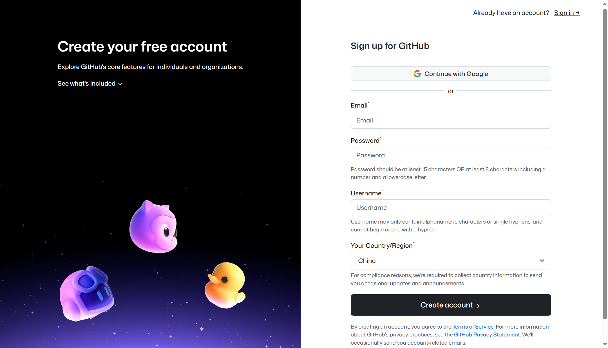

**然后登录 github：**

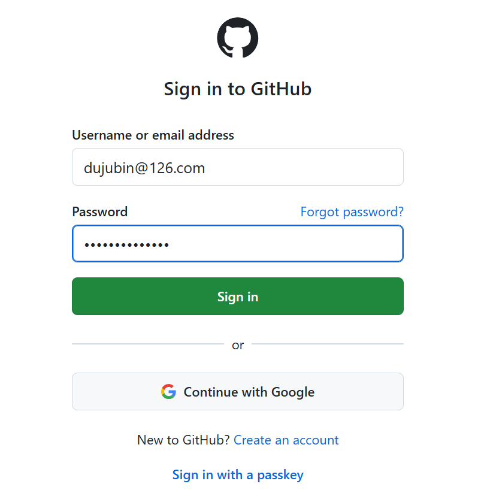

**登录成功后，点右上角头像，在菜单中点击 **`**Settings**`**：**

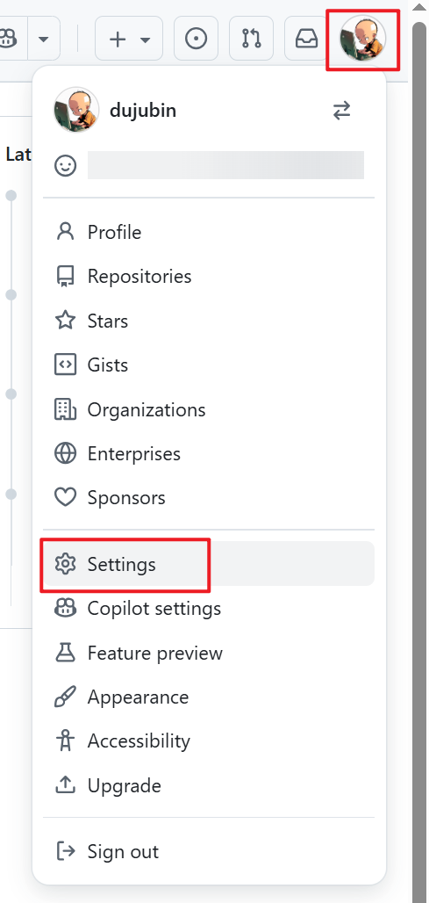

**拉到页面最下面，左侧有一个 **`**Developer Settings**`**，点击它：**

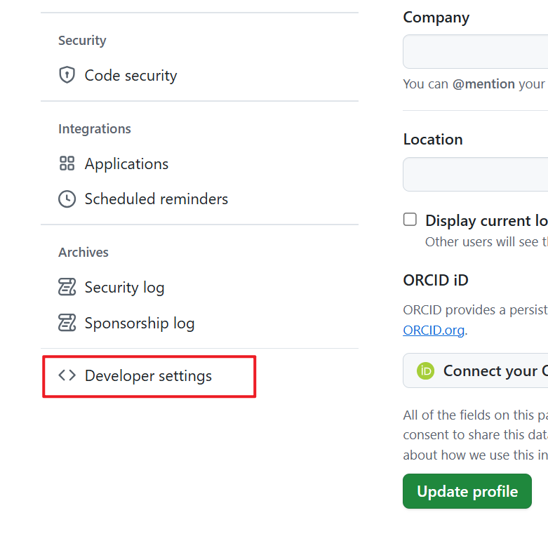

**找到OAuth Apps，创建 OAuth App，为客户应用分配访问 github 的 **`**Client ID**`**和 **`**Client Secrets**`**：**


**填写应用信息：**

默认的重定向URI模板为：`{baseUrl}/login/oauth2/code/{registrationId}`

registrationId 就是一个简短的、你自己起的昵称，用来在你的Spring Boot应用内部唯一标识一个OAuth2客户端配置。因为你的一个应用可能支持多种登录方式（例如，同时支持GitHub登录、Gitee登录、Google登录）。你需要给每种方式起个名字，以便在代码和配置中区分它们。规则很简单：通常使用小写，并且常取自OAuth2提供商的名称。在GitHub这个场景下，最自然、最常用的 registrationId 就是 github。

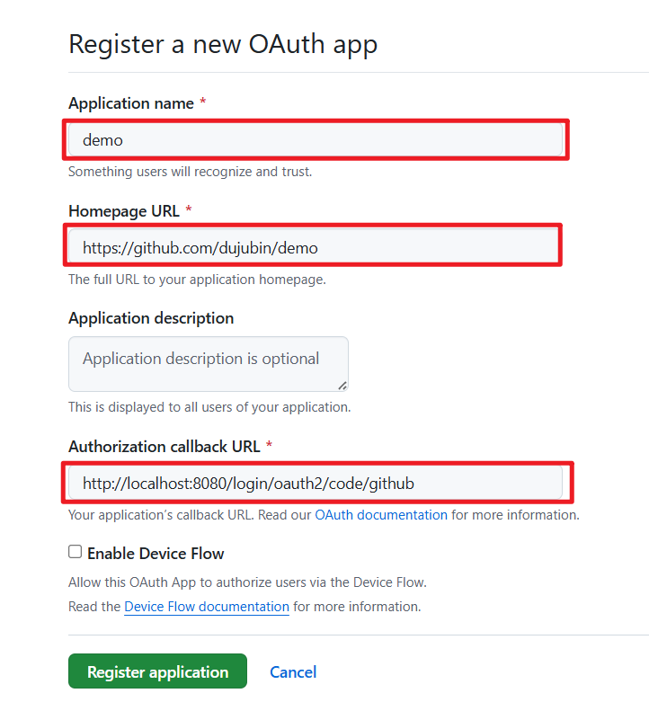


**获取 Client ID，生成 Client Secret：**


Client ID: `<font style="color:rgb(31, 35, 40);">Ov23liI6tnTiAd1483Wf</font>`

Client Secret：`<font style="color:rgb(31, 35, 40);">a2f5b6f1fc705fb919b7f973de22a626d3f5b145</font>`

Client Secret 找一个地方存下来，因为它只显示一次。

**可以选择传一个 logo**

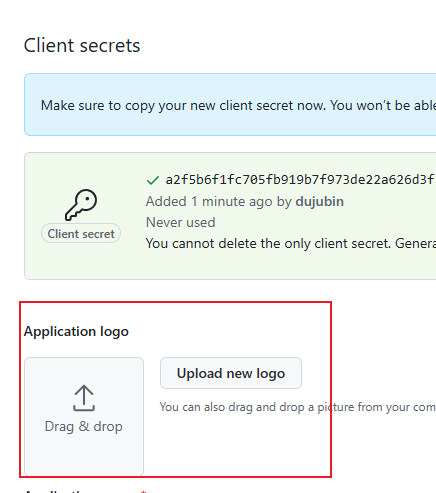

**最后更新一下：**

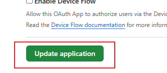

### 创建客户应用项目

创建一个springboot项目 `oauth2-login-demo`，它就是我们的客户应用：

引入如下依赖


注意：`OAuth2 Client` 依赖引入时，会自动引入 `Spring Security`。因此在创建项目时也可以不显示的引入 `Spring Security`。

```xml
<dependency>
    <groupId>org.springframework.boot</groupId>
    <artifactId>spring-boot-starter-oauth2-client</artifactId>
</dependency>
```

### 配置OAuth客户端属性

在 application.yml 中配置如下信息：

```plaintext
spring:
  security:
    oauth2:
      client:
        registration:
          github:
            client-id: Ov23liI6tnTiAd1483Wf
            client-secret: a2f5b6f1fc705fb919b7f973de22a626d3f5b145
            redirectUri: http://localhost:8080/login/oauth2/code/github
```

主要配置三项：

- Client ID
- Client Secret
- Redirect URI

### 创建Controller

这个Controller是一个展示OAuth2登录成功后显示用户信息和个人主页的控制器。

**详细解释：**

- 它处理网站根路径("/")的GET请求
- 通过注入的 `<font style="color:rgb(15, 17, 21);">OAuth2AuthorizedClient</font>` 和 `<font style="color:rgb(15, 17, 21);">OAuth2User</font>` 参数获取认证信息
- 将用户名、客户端名称和用户属性添加到模型中
- 返回"index"视图模板来展示这些信息

简单说就是**显示"登录成功"页面的控制器**，把从GitHub等OAuth2提供商那里获取的用户信息展示给用户看。

```java
package com.jkweilai.oauth2.logindemo.controller;

import org.springframework.security.core.annotation.AuthenticationPrincipal;
import org.springframework.security.oauth2.client.OAuth2AuthorizedClient;
import org.springframework.security.oauth2.client.annotation.RegisteredOAuth2AuthorizedClient;
import org.springframework.security.oauth2.core.user.OAuth2User;
import org.springframework.stereotype.Controller;
import org.springframework.ui.Model;
import org.springframework.web.bind.annotation.GetMapping;

@Controller
public class IndexController {

    @GetMapping("/")
    public String index(Model model, @RegisteredOAuth2AuthorizedClient OAuth2AuthorizedClient authorizedClient, @AuthenticationPrincipal OAuth2User oauth2User) {
        model.addAttribute("userName", oauth2User.getName());
        model.addAttribute("clientName", authorizedClient.getClientRegistration().getClientName());
        model.addAttribute("userAttributes", oauth2User.getAttributes());
        return "index";
    }
}
```

当然，以上代码也可以修改以下代码，直接返回 JSON：

```java
@RestController
public class IndexController {

    @GetMapping("/")
    public Map<String, Object> index(@RegisteredOAuth2AuthorizedClient OAuth2AuthorizedClient authorizedClient, @AuthenticationPrincipal OAuth2User oauth2User) {
        Map<String, Object> map = new HashMap<>();
        map.put("userName", oauth2User.getName());
        map.put("clientName", authorizedClient.getClientRegistration().getClientName());
        map.put("userAttributes", oauth2User.getAttributes());
        return map;
    }
}
```

### 创建html页面

`resources/templates/index.html`

这是一个OAuth2登录成功后的个人主页，用于展示用户信息和提供退出登录功能。

**详细说明：**

- 显示登录状态和用户信息（用户名、登录方式）
- 展示从OAuth2提供商（如GitHub）获取的所有用户属性
- 提供退出登录按钮
- 使用了Thymeleaf模板引擎和Spring Security标签

```html
<!DOCTYPE html>
<html xmlns="http://www.w3.org/1999/xhtml" xmlns:th="https://www.thymeleaf.org"
      xmlns:sec="https://www.thymeleaf.org/thymeleaf-extras-springsecurity5">
<head>
    <title>Spring Security - OAuth 2 Login</title>
    <meta charset="utf-8"/>
</head>
<body>
<div style="float: right" th:fragment="logout" sec:authorize="isAuthenticated()">
    <div style="float:left">
        <span style="font-weight:bold">User: </span><span sec:authentication="name"></span>
    </div>
    <div style="float:none"> </div>
    <div style="float:right">
        <form action="#" th:action="@{/logout}" method="post">
            <input type="submit" value="Logout"/>
        </form>
    </div>
</div>
<h1>OAuth 2 Login with Spring Security</h1>
<div>
    You are successfully logged in <span style="font-weight:bold" th:text="${userName}"></span>
    via the OAuth 2 Client <span style="font-weight:bold" th:text="${clientName}"></span>
</div>
<div> </div>
<div>
    <span style="font-weight:bold">User Attributes:</span>
    <ul>
        <li th:each="userAttribute : ${userAttributes}">
            <span style="font-weight:bold" th:text="${userAttribute.key}"></span>: <span
                th:text="${userAttribute.value}"></span>

        </li>
    </ul>
</div>
</body>
</html>
```

### 启动应用程序

- 启动程序并访问 `localhost:8080`。浏览器将被重定向到默认的自动生成的登录页面，该页面显示了一个用于GitHub登录的链接。点击GitHub链接，浏览器将被重定向到GitHub进行身份验证。

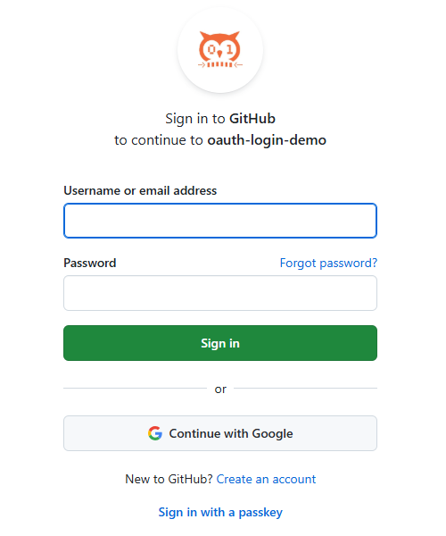

- 使用GitHub账户凭据进行身份验证后，用户会看到授权页面，询问用户是否允许或拒绝客户应用访问GitHub上的用户数据。点击允许以授权OAuth客户端访问用户的基本个人资料信息。

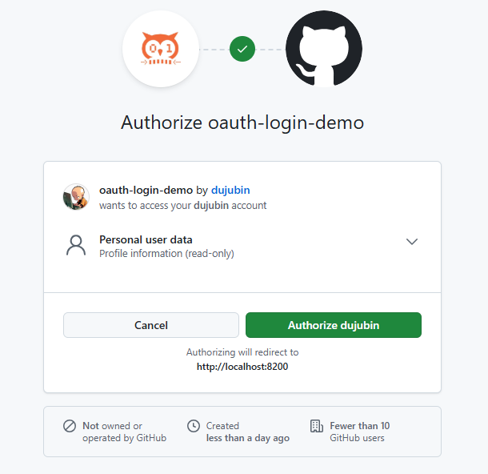

- 此时，OAuth客户端访问GitHub的获取用户信息的接口获取基本个人资料信息，并建立一个已认证的会话。最终显示页面为：

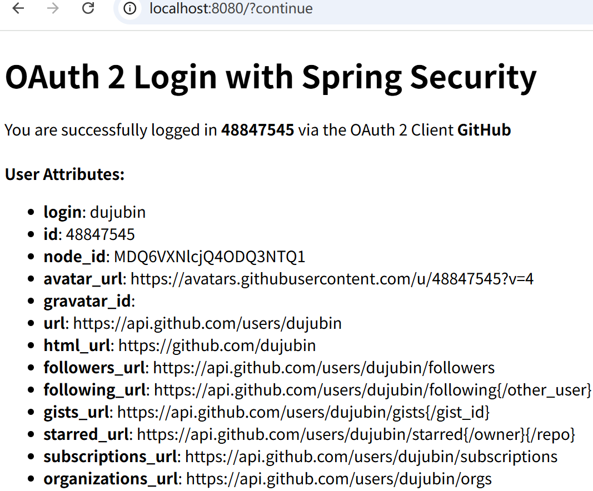

### 退出与重新登录

我们在登录成功页面点击退出系统：

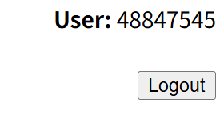

显示已退出，也就是如下页面：

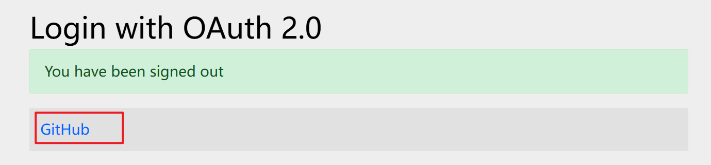

当我们再次点击上图中的 `GitHub`再次登录时，不需要再输入用户名和密码进行登录和授权操作了，直接成功：

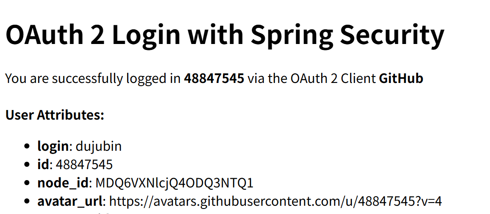

**这是为什么呢？****核心原因：你并没有真正完全退出。**详细解释：

1. **Spring Security 的 **`/logout`** 端点**
  - 你点击退出按钮，提交到 `/logout`，Spring Security 的默认行为是：**使当前服务器的 Session 失效，并清除本地的安全上下文（Security Context）**。
  - 这意味着，**你的应用**认为你已经退出了。
2. **GitHub (授权服务器) 的会话仍然存在**
  - 你的退出操作**只发生在你的应用内部**，并没有通知 GitHub。
  - 你在 GitHub 上已经登录并授权过，这个授权状态（以Cookie等形式）仍然保存在你的浏览器中。
3. **再次登录时的流程**
  - 当你再次点击登录时，你的应用再次将你重定向到 GitHub 的授权端点 (`/authorize`)。
  - GitHub 授权服务器检查你的浏览器会话，发现：“咦，这个用户已经登录并且之前已经授权过这个应用了”。
  - 为了提供更好的用户体验，GitHub 会**跳过再次询问你是否授权的步骤**，直接生成一个新的授权码，重定向回你的应用。
  - 你的应用拿到新的授权码，兑换新的访问令牌，然后为你创建新的会话，你又“自动”登录成功了。

**如何实现“完全退出”，让你下次需要重新输入密码？**

你需要**同时**完成以下两件事：

**1. 从你的应用退出 (你已经做了)**

- 通过你的应用的 `/logout` 端点。

**2. 从 GitHub 退出**

- 你需要手动或自动地也调用 GitHub 的退出端点。

我们遇到的现象是正常的，因为它遵循了OAuth2的常规用户体验设计：**一次授权，多次有效**。只有当你清除了GitHub的会话（比如手动退出GitHub，或者清除浏览器Cookie），下次登录时才会被要求重新输入用户名和密码进行授权。

**或者也可以按照以下方式操作：**

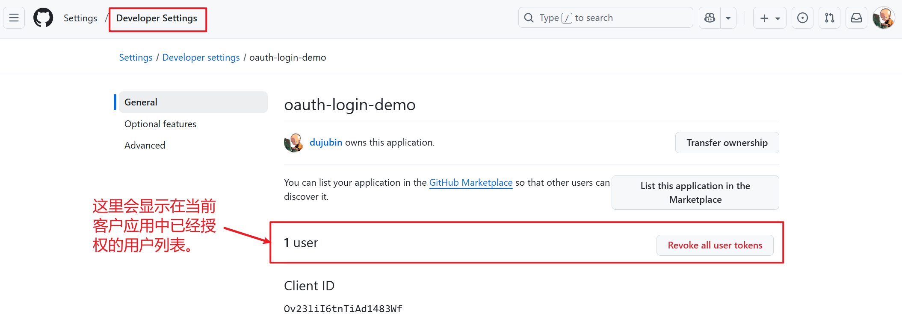

这个列表中会显示所有访问过你的客户应用的合法的 github 用户。有 100 个 github 用户登录过你的客户应用，则显示 100 个。

点击 `Revoke all user tokens`，表示收回令牌。再次在客户应用中点击退出系统，再次登录时，会跳转到下面页面：

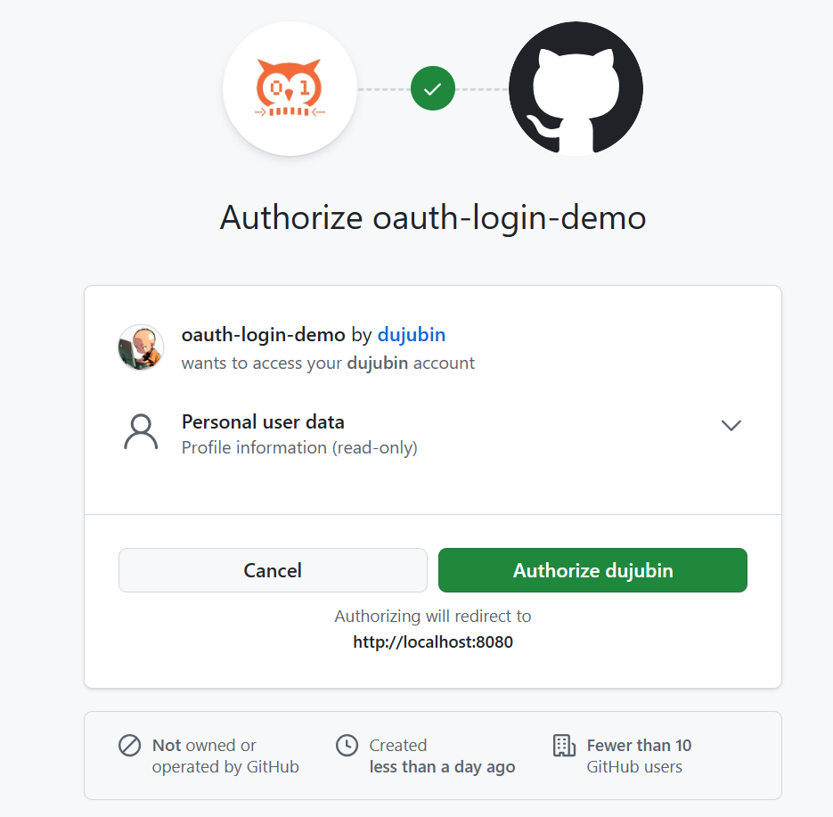

这是一个授权页面，为什么没有提醒你登录呢？因为现在的你已经登录过 github 了，并没有退出 github， 如果你想回到最初的登录页面，首先你自己需要退出 github，点击右上角头像，退出 github，再次刷新上面的授权页就会跳转到登录页了：

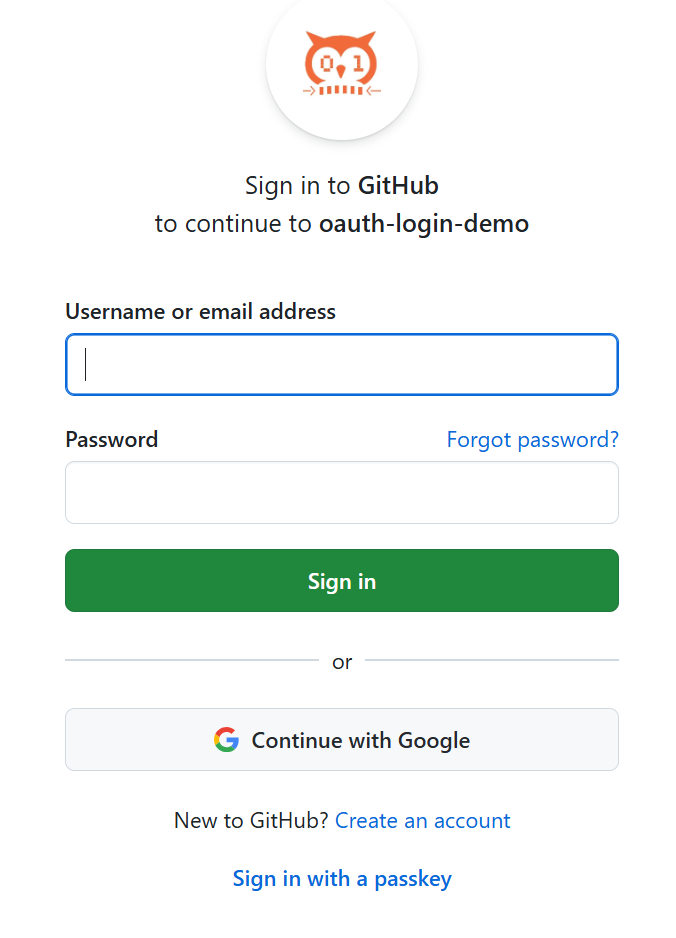

## CommonOAuth2Provider

`CommonOAuth2Provider` 是一个为常见OAuth2提供商（如Google、GitHub、Facebook等）提供预配置默认值的便利类（它是一个枚举类型）。

---

**它相当于一个“快捷设置模板”**。

当你在Spring Boot中配置OAuth2客户端时，需要填写很多参数，例如：

- `authorizationUri`
- `tokenUri`
- `userInfoUri`
- `userNameAttributeName`

对于知名的提供商（Google、GitHub等），这些地址和配置都是固定的。`CommonOAuth2Provider` 已经帮你把这些固定值预先配置好了。

**实际使用示例：**

在`application.yml`中，当你这样配置时：

```yaml
spring:
  security:
    oauth2:
      client:
        registration:
          github:
            client-id: xxx
            client-secret: xxx
```

Spring Security会在背后查找 `CommonOAuth2Provider.GITHUB` 的预配置，自动为你设置：

- 授权URI: `https://github.com/login/oauth/authorize`
- 令牌URI: `https://github.com/login/oauth/access_token`
- 用户信息URI: `https://api.github.com/user`
- 用户名属性名: `id`

**支持的提供商：**

该类预定义了以下常见提供商的配置：

- `GOOGLE`
- `GITHUB`
- `FACEBOOK`
- `OKTA`

**总结：**

`CommonOAuth2Provider`** 的作用就是简化配置** - 你只需要提供`client-id`和`client-secret`，它自动帮你填好其他固定的配置项，让你不用去记忆或查找各个提供商的具体API地址。

**它的源码如下：**

```java
GITHUB {
    @Override
    public Builder getBuilder(String registrationId) {
        ClientRegistration.Builder builder = getBuilder(registrationId,
                ClientAuthenticationMethod.CLIENT_SECRET_BASIC, DEFAULT_REDIRECT_URL);
        // 设置默认的权限范围：读取用户信息
        builder.scope("read:user");
        // 设置GitHub的授权端点URL - 用户在此登录和授权
        builder.authorizationUri("https://github.com/login/oauth/authorize");
        // 设置GitHub的令牌端点URL - 用于兑换访问令牌
        builder.tokenUri("https://github.com/login/oauth/access_token");
        // 设置GitHub的用户信息端点URL - 用于获取用户详细信息
        builder.userInfoUri("https://api.github.com/user");
        // 设置用户名属性名为"id"，将使用GitHub用户ID作为主标识
        builder.userNameAttributeName("id");
        // 设置客户端显示名称为"GitHub"
        builder.clientName("GitHub");
        return builder;
    }
}
```

当然，这些默认值是可以修改的，直接在 `application.yml`文件中配置即可，例如使用 github 用户名作为主标识，可以这样配置：

```yaml
spring:
  security:
    oauth2:
      client:
        registration:
          github:
            client-id: Ov23lizW4zUUyyiiliDi
            client-secret: 146e72273d39bd54bbcd8d642b85742759a1a38d
            redirectUri: http://localhost:8080/login/oauth2/code/github
        provider:
          github:
            user-name-attribute: login
```

# JWT

**JWT 是一个完全独立的技术标准（RFC 7519）**，它本身并不隶属于 OAuth2 或 Spring Security，但三者经常一起使用。

## Spring Security 的默认会话机制

**Spring Security 默认使用的是 Session 机制。**

**具体解释：**

在现在的 GitHub OAuth2 项目中，Spring Security 的默认工作流程是这样的：

**登录成功后**

- Spring Security 会将认证信息（包括从 GitHub 获取的用户信息 `OAuth2User`）存储在 **HttpSession** 中
- 同时在浏览器端设置一个名为 `JSESSIONID` 的 Cookie

**后续请求中**

- 浏览器自动携带 `JSESSIONID` Cookie
- Spring Security 根据这个 ID 找到对应的 Session
- 从 Session 中恢复认证信息，让你能在 Controller 中通过 `@AuthenticationPrincipal` 获取用户信息

**代码证明**

在 Controller 中：

```java
@GetMapping("/")
public String index(Model model, @AuthenticationPrincipal OAuth2User oauth2User) {
    // 这个 oauth2User 就是从 Session 中取出来的
    // 不需要每次请求都去 GitHub 重新获取
    model.addAttribute("userName", oauth2User.getName());
    return "index";
}
```

**Session 有效期**

- 默认情况下，Session 在用户关闭浏览器后失效
- 也可以在 `application.yml` 中配置：

```yaml
server:
  servlet:
    session:
      timeout: 1800 # 30分钟（以秒为单位）
```

## 用 JWT 和不用 JWT 的区别

用了JWT，前端可以直接从 JWT 令牌中读取用户信息而不用问后端；没用JWT，前端每次需要用户信息时都必须请求后端接口。

- **用JWT**：用户基本信息「写在身份证上」，谁都能看，前端自给自足
- **不用JWT**：用户基本信息「锁在服务器保险柜里」，前端每次都要敲门问

最核心的区别——**信息存储位置和访问方式**不同。

**想象一下，你经常去一个健身房。**

**没用 JWT 的时候（传统 Session）：**

你第一次去，前台给你一张**磁卡**（Session ID）。这张卡本身没信息，只是健身房电脑系统里的一个编号。

每次你进健身房，都要**刷卡**（发送请求）。
前台要**打电话问后台**（查询数据库/Session）：“卡号 888 是谁？他有啥权限？”
后台查完告诉前台：“是张三，可以进器械区。”
然后才放你进去。

**缺点**：前台每次都要问后台，很麻烦。如果健身房开了连锁店（多个服务器），信息可能不同步。

---

**用了 JWT 的时候：**

你第一次去，前台给你一张**高级防伪会员卡**（JWT）。

这张卡很神奇，上面用**特殊防伪技术**（签名）写着你的所有信息：

现在你进任何一家连锁店，前台只需要：

1. 用专门的**验钞灯**（签名验证算法）照一下卡的**防伪标记**（Signature）。
2. 如果防伪标记是真的，他就**直接相信卡上写的所有信息**，不再打电话问总部。

**优点**：速度快（不用每次查数据库），去哪家店都行（无状态、扩展性好）。

**总结一下 JWT 的核心特点：**

1. **自包含**：信息就写在卡上（令牌里），不用去后台查。
2. **可验证**：通过防伪签名（Signature）确保信息没人篡改。
3. **有期限**：卡上写着有效期，过期就作废。

所以，**JWT 就是一个自带防伪标识、写着用户信息的数字身份证**。验证方只要验证身份证真伪，就可以直接相信上面的信息，省去了每次查询中央数据库的麻烦。

## 什么是 JWT

**JWT 是 JSON Web Token 的缩写。**

把它拆开理解就非常简单：

- **JSON**：说明它使用 **JSON 格式** 来存储信息。就像你平时写的 `<font style="color:rgb(15, 17, 21);background-color:rgb(235, 238, 242);">{"name": "张三", "age": 25}</font>` 这种键值对。
- **Web**：说明它是为 **网络应用** 设计的，专门用于在网站、API 之间安全地传递信息。
- **Token**：意思是 **“令牌”** 或 **“凭证”**。就像开门用的钥匙、进入游乐园的门票。

如果是前后端分离的系统，那就不能使用 HttpSession 技术了，就需要使用 JWT 了。

## JWT 底层机制

我们回到健身房的例子，但这次我们来看看这张“防伪会员卡”到底是怎么从无到有制作出来的。

### 第一幕：准备材料（签发 JWT）

想象你是一家健身房的老板，要给自己制作一张高级防伪会员卡。

**第一步：写下核心信息（创建 Payload）**
你拿出一张卡片，写上你的基本信息：

```json
{
  "姓名": "张三",
  "等级": "金卡会员", 
  "发卡时间": "2024-01-01",
  "有效期至": "2024-12-31"
}
```

这就是 **Payload（有效载荷）**，即卡里要存储的核心信息。

**第二步：写明防伪技术（创建 Header）**
为了防止别人伪造，你决定采用一种复杂的防伪技术。你在卡片角落注明：

```json
{
  "防伪技术": "健身房独家秘方V1",
  "卡片类型": "JWT会员卡"
}
```

这就是 **Header（头部）**，说明了使用的签名算法(**HS256 算法**)和类型。

### 第二幕：制作防伪标识（生成 Signature）

这是最关键的一步，决定了卡片的真伪。

**第三步：混合编码（Base64Url 编码）**

1. 你把 **Header** 这张小纸条的内容，用一种**通用翻译器**（Base64Url 编码）转成一串看似乱码的文字：`aaaa`
2. 你把 **Payload** 这张卡片的内容，也用同样的**通用翻译器**转成另一串乱码：`bbbb`
3. 你把这两串乱码用点号连接起来：`aaaa.bbbb`

**第四步：核心加密（生成签名）**
现在到了最核心的步骤：

- 你有一个只有健身房经理才知道的 **“绝密配方”**（Secret Key）。
- 你把这个 **“绝密配方”** 和刚才那串 `aaaa.bbbb` 放进一个**特殊的机器**（签名算法，如 HS256）里进行加工。
- 机器吐出一串全新的、独一无二的**防伪码**（Signature）：`cccc`

**最终成品：**
你把所有部分用点号连接起来，最终得到了一张完整的、带有防伪标识的会员卡：
`aaaa.bbbb.cccc`

这就是一个完整的 **JWT**。

### 第三幕：验卡过程（验证 JWT）

现在，你拿着这张卡 `aaaa.bbbb.cccc` 去健身房前台。

前台小哥的验卡流程如下：

**第一步：拆解**
他把卡片拆成三部分：`aaaa`、`bbbb` 和 `cccc`。

**第二步：重现防伪码**

1. 前台小哥也有一台同样的**特殊机器**（验证算法）。
2. 他知道健身房通用的 **“绝密配方”**（Secret Key）。
3. 他把 `aaaa` 和 `bbbb` 重新组合成 `aaaa.bbbb`，然后和 **“绝密配方”** 一起放进机器。
4. 机器也吐出一串防伪码，我们称之为 `cccc2`。

**第三步：比对**
现在，他开始比对他自己算出来的 `cccc2` 和卡片上印着的 `cccc`。

- **情况A（验卡通过）**：如果 `cccc2` 和 `cccc` **完全一样**。
  - 结论：“卡是真的！信息有效！”
  - 前台小哥信任卡片上的所有信息，直接为你服务。
- **情况B（验卡失败）**：如果 `cccc2` 和 `cccc` **对不上**。
  - 结论：“卡是假的！信息被篡改过！”
  - 立即拒绝服务。

### 底层机制的核心要点总结

1. **三部分组成**：`Header.Payload.Signature`，用点连接。
2. **信息透明**：Header 和 Payload 只是做了 Base64 编码，**谁都能解码看清内容**，所以不能存放密码等敏感信息。
3. **安全全靠签名**：整个 JWT 的安全性和可信度，100% 依赖于 **Signature**。Signature 是由 Header、Payload 和 Secret Key 共同通过加密算法计算得出的。
4. **验证原理**：验证方用同样的算法和 Secret Key，对收到的 Header 和 Payload 重新计算一次签名，然后与 JWT 自带的 Signature 进行比对。一致则可信。
5. **密钥是关键**：那个 **Secret Key** 至关重要，如果泄露，任何人都可以伪造合法的 JWT。它必须被严格保护在服务器端。

简单说，JWT 的底层就是一个 **“信息 + 防伪码”** 的结构，它的安全性不在于隐藏信息，而在于通过密码学手段确保信息**无法被篡改**。

站在 Web 前端角度来说，首次登录成功后从后端接收到 JWT，可以将其存储在浏览器本地（如 LocalStorage 或 Cookie）。之后需要获取用户基本信息（如用户名、头像）时，前端**无需再请求后端接口**，只需直接解析 JWT 的 Payload 部分即可读取这些信息。

不过要注意：JWT 虽然自带有效期，但**无法在有效期内主动失效**。也就是说，就算用户已经主动退出系统了，JWT 只要还没有过期，该 Token 还是有效的。这是 JWT “无状态”特性带来的权衡，在实际应用中通常需要借助黑名单、设置较短有效期等策略来弥补这一点。

## OAuth2 GitHub登录项目集成JWT

### 添加依赖

首先在 `<font style="color:rgb(15, 17, 21);">pom.xml</font>` 中添加JWT相关依赖：JJWT（**Java JWT 的库**）

```xml
<!--提供JWT创建和解析的接口和抽象类，是开发时的主要编程接口。-->
<dependency>
    <groupId>io.jsonwebtoken</groupId>
    <artifactId>jjwt-api</artifactId>
    <version>0.13.0</version>
</dependency>
<!--提供JJWT接口的具体实现，在运行时负责实际的JWT令牌处理逻辑。-->
<dependency>
    <groupId>io.jsonwebtoken</groupId>
    <artifactId>jjwt-impl</artifactId>
    <version>0.13.0</version>
    <scope>runtime</scope>
</dependency>
<!--使用Jackson库来处理JWT的JSON序列化和反序列化操作。-->
<dependency>
    <groupId>io.jsonwebtoken</groupId>
    <artifactId>jjwt-jackson</artifactId>
    <version>0.13.0</version>
    <scope>runtime</scope>
</dependency>
```

### 配置JWT属性

在 `<font style="color:rgb(15, 17, 21);">application.yml</font>` 中添加JWT配置：

```yaml
app:
  jwt:
    secret: "oauth2-login-demo-jwt-secret-2024@Secure!Key#256Bits$MinLengthRequired" # 一定是强秘钥
    expiration: 86400000 # 24小时
    issuer: "oauth2-login-demo" # 标明这个 JWT 是由哪个应用颁发的，在验证 token 时可以检查发行者是否匹配
```

### 创建JWT工具类

```java
package com.jkweilai.oauth2.logindemo.config.jwt;

import io.jsonwebtoken.Claims;
import io.jsonwebtoken.JwtException;
import io.jsonwebtoken.Jwts;
import io.jsonwebtoken.SignatureAlgorithm;
import io.jsonwebtoken.security.Keys;
import org.springframework.beans.factory.annotation.Value;
import org.springframework.security.core.Authentication;
import org.springframework.security.core.GrantedAuthority;
import org.springframework.stereotype.Component;

import javax.crypto.SecretKey;
import java.util.ArrayList;
import java.util.Date;
import java.util.List;
import java.util.stream.Collectors;

@Component
public class JwtTokenProvider {

    @Value("${app.jwt.secret}")
    private String jwtSecret;

    @Value("${app.jwt.expiration}")
    private long jwtExpiration;

    @Value("${app.jwt.issuer}")
    private String jwtIssuer;

    /**
     * 根据配置的密钥字符串生成JWT签名所需的SecretKey对象。
     *
     * @return
     */
    private SecretKey getSigningKey() {
        return Keys.hmacShaKeyFor(jwtSecret.getBytes());
    }

    /**
     * 使用用户认证信息生成包含用户名、角色和过期时间的JWT令牌。
     *
     * @param authentication
     * @return
     */
    public String generateToken(Authentication authentication) {
        String username = authentication.getName();
        List<String> roles = authentication.getAuthorities().stream().map(GrantedAuthority::getAuthority).collect(Collectors.toList());
        
        // 每个角色名前添加 ROLE_ 前缀。
        List<String> normalizedRoles = normalizeRoles(roles);

        // 系统当前时间
        Date now = new Date();
        // 过期时间
        Date expiryDate = new Date(now.getTime() + jwtExpiration);

        return Jwts.builder()
                .setSubject(username)           // 设置JWT主题，存储用户名作为用户唯一标识
                .setIssuer(jwtIssuer)            // 设置JWT签发者，标识token来自哪个应用
                .setIssuedAt(now)                // 设置JWT签发时间，用于计算token年龄
                .setExpiration(expiryDate)       // 设置JWT过期时间，到达此时间后token失效
                .claim("roles", normalizedRoles) // 添加自定义声明，存储用户标准化后的角色列表
                .signWith(getSigningKey(), SignatureAlgorithm.HS256) // 使用 HS256算法和密钥 对JWT进行签名，防止篡改
                .compact();                       // 将以上所有设置组装成最终的JWT字符串
    }

    /**
     * 标准化角色列表，确保包含 ROLE_USER 并正确处理各种角色格式
     * @PreAuthorize("hasRole('ADMIN')")  在检查的时候会判断用户是否有ROLE_ADMIN角色
     * 因此，下面的方法是给所有的角色统一添加 ROLE_ 前缀。
     */
    private List<String> normalizeRoles(List<String> roles) {
        List<String> normalizedRoles = new ArrayList<>();

        // 这不是必须的，是业务需求，不是技术必须：让所有登录用户都拥有一个基础角色（ROLE_USER），确保每个人在应用内都有最基本的权限
        normalizedRoles.add("ROLE_USER");

        for (String role : roles) {
            if (role.startsWith("SCOPE_")) {
                // SCOPE_ 开头的是 GitHub 的 OAuth2 授权范围，和我应用自身的业务角色无关，不需要混入我的角色体系
                // SCOPE_ 开头是 Spring Security 在处理 OAuth2 登录时，自动将 GitHub 返回的授权范围（scope）加上前缀后转换成的 GrantedAuthority
                continue;
            } else if (!role.startsWith("ROLE_")) {
                normalizedRoles.add("ROLE_" + role);
            } else {
                normalizedRoles.add(role);
            }
        }

        return normalizedRoles;
    }

    /**
     * 从JWT令牌中解析并提取用户名主题(subject)。
     *
     * @param token
     * @return
     */
    public String getUsernameFromToken(String token) {
        Claims claims = Jwts.parser().setSigningKey(getSigningKey()).build().parseClaimsJws(token).getBody();
        return claims.getSubject();
    }

    /**
     * 验证JWT令牌的签名有效性和格式正确性。
     *
     * @param token
     * @return
     */
    public boolean validateToken(String token) {
        try {
            Jwts.parser().setSigningKey(getSigningKey()).build().parseClaimsJws(token);
            return true;
        } catch (JwtException | IllegalArgumentException e) {
            return false;
        }
    }

    /**
     * 从JWT令牌中提取用户角色权限列表。
     *
     * @param token
     * @return
     */
    public List<String> getRolesFromToken(String token) {
        Claims claims = Jwts.parser().setSigningKey(getSigningKey()).build().parseClaimsJws(token).getBody();

        return claims.get("roles", List.class);
    }
}
```

### 创建JWT认证过滤器

**表单登录（Form Login）的认证过滤器大家都知道：**`**<font style="color:rgb(15, 17, 21);background-color:rgb(235, 238, 242);">UsernamePasswordAuthenticationFilter</font>**`

如果使用 JWT，Spring Security **没有内置的默认认证过滤器**，需要**自定义过滤器**来完成 JWT 的认证工作

自定义过滤器，继承 `<font style="color:rgb(15, 17, 21);background-color:rgb(235, 238, 242);">OncePerRequestFilter</font>`，在过滤器中：

1. 从请求头中提取 JWT（一般是 `<font style="color:rgb(15, 17, 21);background-color:rgb(235, 238, 242);">Authorization: Bearer <token></font>`）
2. 验证 JWT 的签名和有效性
3. 从 JWT 中解析用户信息（用户名、角色等）
4. 创建 `<font style="color:rgb(15, 17, 21);background-color:rgb(235, 238, 242);">UsernamePasswordAuthenticationToken</font>` 并设置到 `<font style="color:rgb(15, 17, 21);background-color:rgb(235, 238, 242);">SecurityContextHolder</font>` 中

```java
package com.jkweilai.oauth2.logindemo.config.jwt;

import jakarta.servlet.FilterChain;
import jakarta.servlet.ServletException;
import jakarta.servlet.http.HttpServletRequest;
import jakarta.servlet.http.HttpServletResponse;
import org.springframework.security.authentication.UsernamePasswordAuthenticationToken;
import org.springframework.security.core.authority.SimpleGrantedAuthority;
import org.springframework.security.core.context.SecurityContextHolder;
import org.springframework.web.filter.OncePerRequestFilter;

import java.io.IOException;
import java.util.List;
import java.util.stream.Collectors;

// OncePerRequestFilter 的核心作用是：在一个请求的完整生命周期中，不管它经过了多少次内部跳转，这个过滤器都只执行一次。
// 他是springmvc中提供的，不是security中提供的。
public class JwtAuthenticationFilter extends OncePerRequestFilter {

    private final JwtTokenProvider jwtTokenProvider;

    // 构造函数注入JWT令牌提供者用于后续的令牌验证和解析
    public JwtAuthenticationFilter(JwtTokenProvider jwtTokenProvider) {
        this.jwtTokenProvider = jwtTokenProvider;
    }

    // 拦截每个HTTP请求，验证JWT令牌并设置用户认证信息到安全上下文。
    @Override
    protected void doFilterInternal(HttpServletRequest request, HttpServletResponse response, FilterChain filterChain) throws ServletException, IOException {

        String token = getTokenFromRequest(request);

        if (token != null && jwtTokenProvider.validateToken(token)) {
            String username = jwtTokenProvider.getUsernameFromToken(token);
            List<String> roles = jwtTokenProvider.getRolesFromToken(token);

            List<SimpleGrantedAuthority> authorities = roles.stream().map(SimpleGrantedAuthority::new).collect(Collectors.toList());

            UsernamePasswordAuthenticationToken authentication = new UsernamePasswordAuthenticationToken(username, null, authorities);

            SecurityContextHolder.getContext().setAuthentication(authentication);
        }

        filterChain.doFilter(request, response);
    }

    // 从请求的Authorization头部提取Bearer令牌字符串。
    private String getTokenFromRequest(HttpServletRequest request) {
        String bearerToken = request.getHeader("Authorization");
        if (bearerToken != null && bearerToken.startsWith("Bearer ")) {
            return bearerToken.substring(7);
        }
        return null;
    }
}
```

### 修改Security配置

更新你的Security配置类：

```java
package com.jkweilai.oauth2.logindemo.config;

import com.jkweilai.oauth2.logindemo.config.jwt.JwtAuthenticationFilter;
import com.jkweilai.oauth2.logindemo.config.jwt.JwtTokenProvider;
import org.springframework.context.annotation.Bean;
import org.springframework.context.annotation.Configuration;
import org.springframework.security.config.annotation.web.builders.HttpSecurity;
import org.springframework.security.config.annotation.web.configuration.EnableWebSecurity;
import org.springframework.security.config.http.SessionCreationPolicy;
import org.springframework.security.web.SecurityFilterChain;

@Configuration
@EnableWebSecurity // 启用Spring Security的Web安全支持。
public class SecurityConfig {

    private final JwtTokenProvider jwtTokenProvider;

    public SecurityConfig(JwtTokenProvider jwtTokenProvider) {
        this.jwtTokenProvider = jwtTokenProvider;
    }

    // 定义HTTP安全过滤链的主配置方法。
    @Bean
    public SecurityFilterChain filterChain(HttpSecurity http) throws Exception {
        http
                // 配置CORS跨域支持使用默认设置。
                .cors(cors -> cors.configure(http))
                // 禁用CSRF防护因为使用无状态的JWT认证。
                .csrf(csrf -> csrf.disable())
                // 设置会话管理为无状态，不创建服务器端Session。
                .sessionManagement(session -> session.sessionCreationPolicy(SessionCreationPolicy.STATELESS))
                // 配置请求授权规则。
                .authorizeHttpRequests(authz -> authz
                        // 允许这些路径无需认证即可访问。实际上当引入oauth2的client依赖后，/login/** 和 /oauth2/** 会被默认放行。
                        .requestMatchers("/", "/login", "/oauth2/**", "/auth/**", "/api/public")
                        .permitAll()
                        .requestMatchers("/api/protected")
                        .hasRole("USER")
                        .anyRequest()
                        .authenticated() // 其他所有请求都需要认证后才能访问。
                )
                //  配置OAuth2登录功能。
                .oauth2Login(oauth2 -> oauth2
                        // 设置OAuth2登录成功后的自定义处理器。
                        .successHandler(oauth2AuthenticationSuccessHandler()))
                //在OAuth2登录过滤器前添加JWT认证过滤器。
                // 如果请求已经携带有效 JWT 时，直接认证通过，不再走 OAuth2 登录流程
                .addFilterBefore(new JwtAuthenticationFilter(jwtTokenProvider), org.springframework.security.oauth2.client.web.OAuth2LoginAuthenticationFilter.class);

        return http.build();
    }

    @Bean
    public OAuth2AuthenticationSuccessHandler oauth2AuthenticationSuccessHandler() {
        return new OAuth2AuthenticationSuccessHandler(jwtTokenProvider);
    }
}
```

### 创建OAuth2成功处理器

**在用户通过 GitHub 认证成功后，生成 JWT 并直接以 JSON 格式返回给前端，而不是重定向到页面。**

**这样前端系统收到后，可以将 token 存储到 storage 中。**

```java
package com.jkweilai.oauth2.logindemo.config;

import com.jkweilai.oauth2.logindemo.config.jwt.JwtTokenProvider;
import jakarta.servlet.ServletException;
import jakarta.servlet.http.HttpServletRequest;
import jakarta.servlet.http.HttpServletResponse;
import org.springframework.security.core.Authentication;
import org.springframework.security.oauth2.core.user.OAuth2User;
import org.springframework.security.web.authentication.SimpleUrlAuthenticationSuccessHandler;
import org.springframework.stereotype.Component;

import java.io.IOException;

@Component
public class OAuth2AuthenticationSuccessHandler extends SimpleUrlAuthenticationSuccessHandler {

    private final JwtTokenProvider jwtTokenProvider;

    public OAuth2AuthenticationSuccessHandler(JwtTokenProvider jwtTokenProvider) {
        this.jwtTokenProvider = jwtTokenProvider;
    }

    @Override
    public void onAuthenticationSuccess(HttpServletRequest request, HttpServletResponse response, Authentication authentication) throws IOException, ServletException {

        OAuth2User oAuth2User = (OAuth2User) authentication.getPrincipal();

        // 生成JWT token
        String jwtToken = jwtTokenProvider.generateToken(authentication);

        String username = getUsernameFromOAuth2User(oAuth2User);

        // 将token返回给前端
        response.setContentType("application/json");
        response.setCharacterEncoding("UTF-8");

        String jsonResponse = String.format("{\"token\": \"%s\", \"username\": \"%s\"}", jwtToken, username);

        response.getWriter().write(jsonResponse);
        response.getWriter().flush();
    }

    private String getUsernameFromOAuth2User(OAuth2User oAuth2User) {
        if (oAuth2User.getAttribute("login") != null) {
            return oAuth2User.getAttribute("login");
        }
        return oAuth2User.getName();
    }
}
```

### 创建测试控制器

```java
package com.jkweilai.oauth2.logindemo.controller;

import org.springframework.http.ResponseEntity;
import org.springframework.security.access.prepost.PreAuthorize;
import org.springframework.security.core.Authentication;
import org.springframework.web.bind.annotation.GetMapping;
import org.springframework.web.bind.annotation.RequestMapping;
import org.springframework.web.bind.annotation.RestController;

import java.util.HashMap;
import java.util.Map;

@RestController
@RequestMapping("/api")
public class TestController {

    @GetMapping("/public")
    public ResponseEntity<?> publicEndpoint() {
        Map<String, String> response = new HashMap<>();
        response.put("message", "这是一个公开的端点");
        return ResponseEntity.ok(response);
    }

    @GetMapping("/protected")
    @PreAuthorize("hasRole('USER')")
    public ResponseEntity<?> protectedEndpoint(Authentication authentication) {
        Map<String, Object> response = new HashMap<>();
        response.put("message", "这是一个受保护的端点");
        response.put("username", authentication.getName());
        response.put("authorities", authentication.getAuthorities());
        return ResponseEntity.ok(response);
    }
}
```

### 修改 IndexController

```java
import org.springframework.stereotype.Controller;
import org.springframework.web.bind.annotation.GetMapping;

@Controller
public class IndexController {

    @GetMapping("/")
    public String index() {
        return "index";
    }
}
```

### 修改 index.html

```html
<!DOCTYPE html>
<html>
<head>
    <title>Spring Security - OAuth 2 Login</title>
    <meta charset="utf-8"/>
</head>
<body>
<h1>OAuth 2 Login with Spring Security</h1>

<div>
    <p>请使用以下方式登录获取 JWT Token：</p>
    <a href="/oauth2/authorization/github">使用GitHub登录</a>
</div>

<div>
    <p>登录成功后，请在响应中获取 JWT token，然后使用以下命令测试API：</p>
    <pre>
# 测试公开端点
curl http://localhost:8080/api/public

# 测试受保护端点（需要JWT token）
curl -H "Authorization: Bearer YOUR_TOKEN" http://localhost:8080/api/protected
    </pre>
</div>

</body>
</html>
```

### 测试步骤

**步骤1: 测试GitHub登录**

访问你的应用，使用GitHub登录，成功后应该返回JWT token。

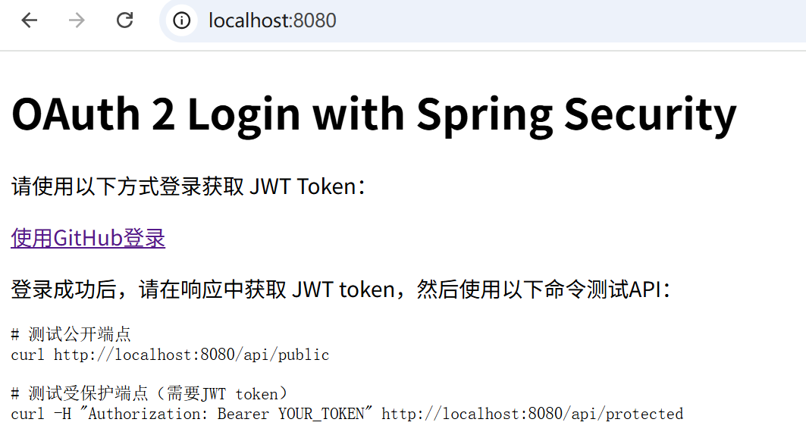

**步骤2: 访问公开的端点**

```bash
curl http://localhost:8080/api/public
```

**步骤 3: 使用JWT访问受保护端点**

```bash
# 使用返回的token访问受保护端点
curl -H "Authorization: Bearer YOUR_JWT_TOKEN" http://localhost:8080/api/protected
```

### 完整的工作流程

1. 用户访问应用，点击GitHub登录
2. GitHub认证成功后，调用成功处理器
3. 成功处理器生成JWT token并返回给前端
4. 前端在后续请求中在Header中携带JWT token
5. JWT过滤器验证token并设置认证信息
6. 用户访问受保护的API端点

### 注意事项

1. **密钥安全**: 生产环境请使用其他无规律的密钥，并将密钥配置到环境变量中，而不是放到 `<font style="color:rgb(15, 17, 21);">application.yml</font>`中。
2. **Token存储**: 前端需要安全地存储JWT token（建议使用httpOnly cookie）
3. **过期时间**: 根据安全需求调整token过期时间
4. **刷新Token**: **JWT 的 Refresh Token 实现原理：在 access token 过期后通过专用接口申请新的 access token，实现用户无感知的自动续期。**

这样你就成功在Spring Boot OAuth2 GitHub登录项目中集成了JWT功能！

# Spring Security + OAuth2 + JWT 三者协作关系

1. **OAuth2 负责"你是谁"**：通过 GitHub 等第三方平台完成用户身份认证，获取用户基本信息
2. **JWT 负责"你拿着什么凭证"**：将 OAuth2 获取的用户信息封装成自包含的令牌，由客户端保存，后续请求携带
3. **Spring Security 负责"怎么验证和管理"**：提供整套安全框架，用过滤器链拦截请求、验证 JWT、执行权限控制，并将认证状态从服务端 Session 转移到客户端 JWT，实现无状态架构