# 智行代驾01

# 环境准备

## 硬件要求

- CPU 建议至少 i7 10 代以上。
- 内存至少 16GB，建议 32GB。
- 硬盘至少留出 50GB。
- 显卡无要求。

## JDK 版本

JDK 必须安装 15.0.2 版本。

其他版本与**基础项目**存在兼容问题。不要尝试其他版本。

你需要将电脑上的其他 JDK 全部卸载干净，重新安装 JDK15.0.2 版本。

## IDEA 需要安装的插件

IDEA 至少安装一个 MyBatisX 这个插件。

## Maven 设置

Maven 最好设置一下阿里的镜像。记得把 `settings.xml`文件中仓库地址修改正确。

## 注册微信开发者账号

访问[微信公众平台](https://mp.weixin.qq.com/)，点击**立即注册**。

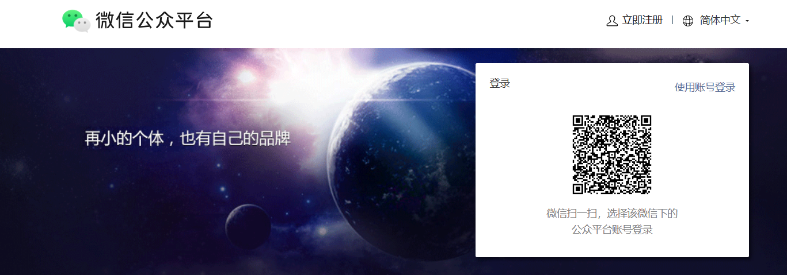

账户类型选择小程序

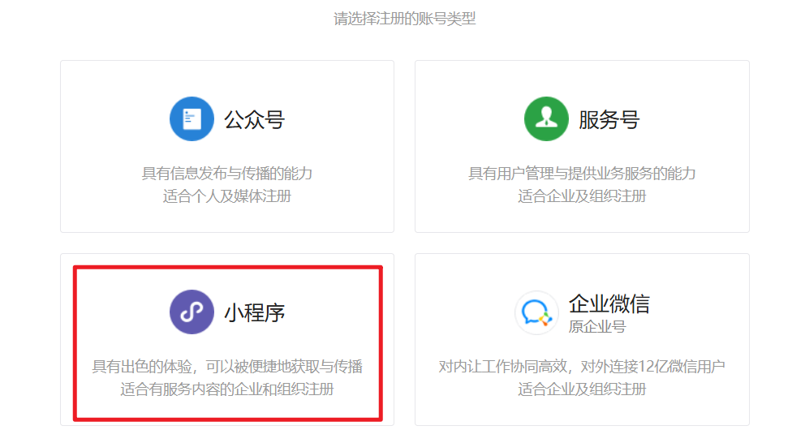

按照流程继续往下走，激活邮箱，然后填写个人详细信息。

**去获取 AppID 和 AppSecret：一定要把这两个东西保管好。**

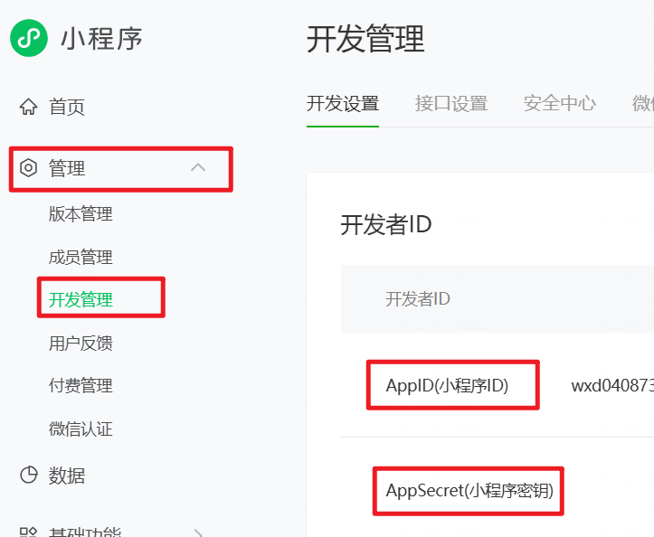

## 前端开发工具

这个微服务项目我们换一个前端开发工具，使用：HBuilderX。

我们前端项目有微信小程序，也有普通的 vue 项目，我大致先描述一下，关于微信小程序的开发、编译、运行相关的工具：

| **工具** | **一句话说明** |
| --- | --- |
| **HBuilderX** | **类似于 VSCode 的开发工具** |
| **uni-app** | 在 uni-app 框架上编写的 Vue.js 代码，只需要编写一套程序，uni-app 可以自动将这一套程序编译为 **iOS App、Android App、H5、以及各种小程序（微信/支付宝/百度/字节跳动/QQ/京东等）** |
| **微信开发者工具** | **专门用来运行和调试微信小程序的，等同于浏览器的角色。** |
| **小程序模拟器** | **嵌入在微信开发者工具当中的，模拟手机屏幕** |

以上技术栈正是目前非常主流且高效的**多端开发解决方案**。

## 安装微信开发者工具

项目是基于 UniApp 的。UniApp用Vue写代码，编译成小程序后必须用微信开发者工具测试，因为只有它能模拟真实微信环境。

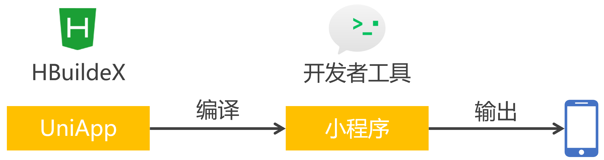

一定要安装我分享给大家的微信开发者工具。**另外：最重要的是，安装过程中不要修改目录，一定一定要安装到默认目录中。**

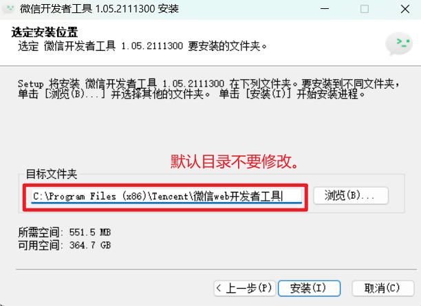

启动微信开发者工具之后，用微信扫码登陆之后，点击微信开发者工具**右上角**的“**齿轮图标**”，在弹出的设置面板中**开启服务端口**。

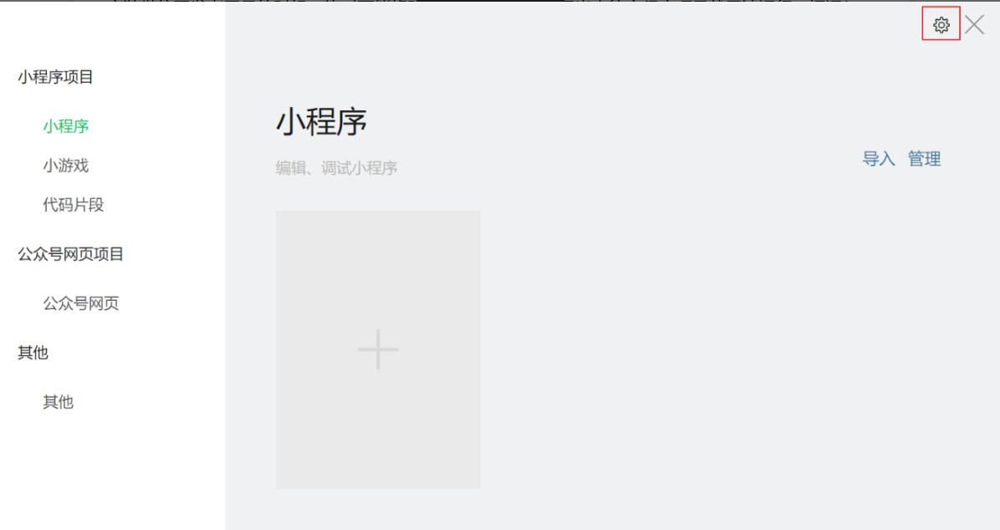

服务端口是随机的哈：

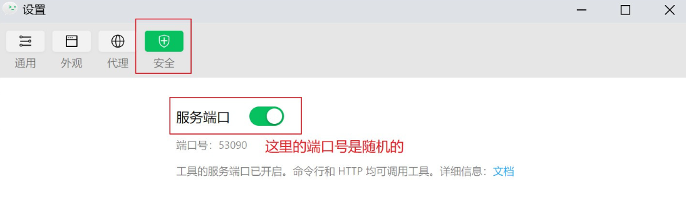

顺便把开发工具的主题设置为浅色，这样好发现错误：

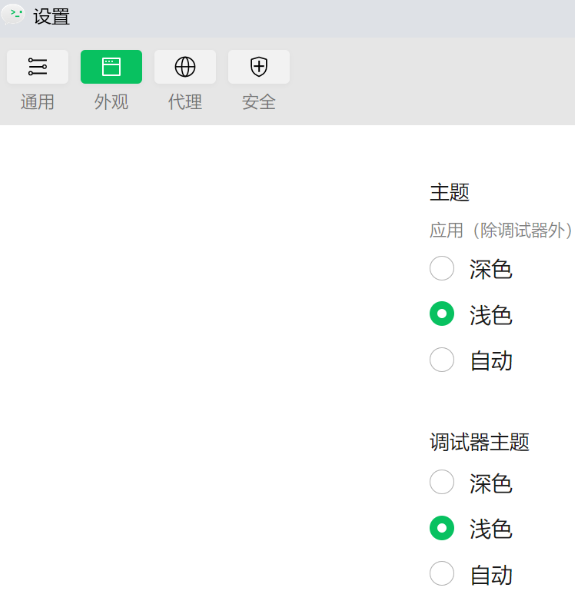

随后，我们安装完 HBuilderX 之后，**要在HBuilderX中配置微信开发者工具的安装路径，才能一键运行编译好的小程序项目。**

## 安装 Node.js

**把自己电脑上的 Node.js 卸载掉，安装我分享给大家的 Node.js**

安装 Node.js 之后，再安装 `cnpm`：cnpm 是淘宝团队做的 npm 镜像客户端工具，专门为国内用户加速下载 npm 包。

```shell
npm install cnpm -g --registry=https://registry.npmmirror.com/
```

安装过程如果出现警告信息是正常的，只要不是错误信息就行。

## 安装 HBuilderX 工具

安装我提供的 HBuilderX，因为这个工具中我安装了一些额外的插件。大家直接解压就可以用。

默认的编辑器字体比较小，你可以自己手动设置字体大小。**最重要的是设置微信开发者工具的安装目录（注意是目录地址，不是EXE文件的地址）**

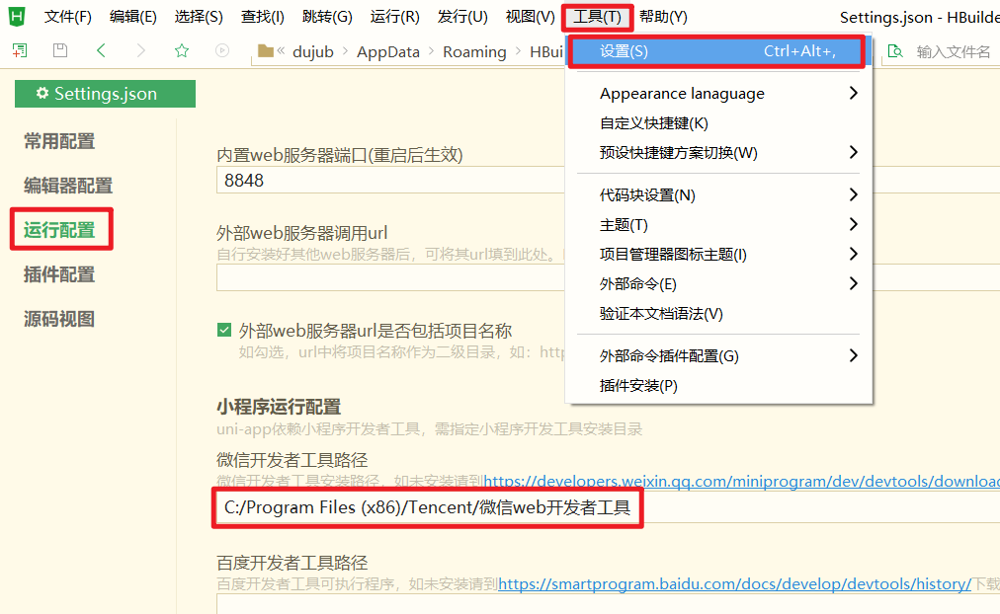

## 安装 Linux 操作系统

### 必要条件

当你在VirtualBox或VMware等软件中尝试安装一个64位的虚拟机系统（如Windows 10/11 64位、Ubuntu 64位），如果宿主机（你的物理电脑）的BIOS/UEFI中没有开启虚拟化技术，安装程序通常会直接报错并无法继续。大部分情况下都是开启的，不需要干预，极个别可能会出现安装失败的情况，如果安装失败先考虑这个原因。每个电脑设置方式不同，大家可以问 AI。

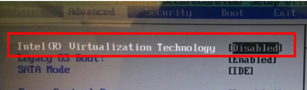

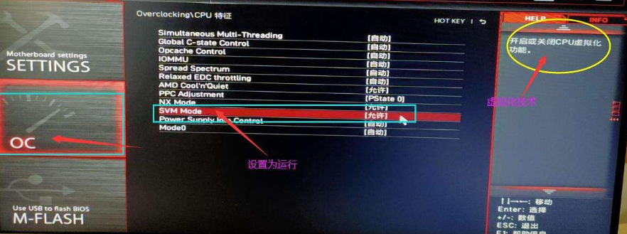

### 安装 VirtualBox

**虚拟机管理软件**我们选择免费 **VirtualBox**，安装过程一直下一步即可。

### 创建虚拟机

使用 VirtualBox 创建虚拟机主机，最低要求如下：

- 至少分配 6GB 内存。
- 30GB 硬盘空间。

### NAT 网络模式

我们这里选择 NAT 网络模式：

- 采用 NAT 网络模式的好处是：虚拟机可直接上网（无需独立IP）、隔离外部网络攻击、配置简单
- 网络模式如果选择 NAT 模式，宿主机是无法直接访问虚拟机的，需要配置端口转发。（**VMware的NAT模式在宿主机和虚拟机之间自动建立了一个可直接通信的私有网络，因此对于最常见的“从宿主机访问虚拟机”的场景，无需额外配置端口转发规则。**）
- 我们这里先配置第一个端口转发：宿主机配置 `5022`，虚拟机配置 `22`，因为我们要通过 SSH 协议在**宿主机**上连接**虚拟主机**。

### 安装 CentOS Stream 10

安装没什么好说的，之前我们都安装过。这里有一个注意事项：使用虚拟机的过程中，如果没有关闭虚拟机就直接关闭电脑，或者强制关机，那么下次再启动虚拟机肯定会报错。所以你要先点击“清除”按钮之后，再启动虚拟机。

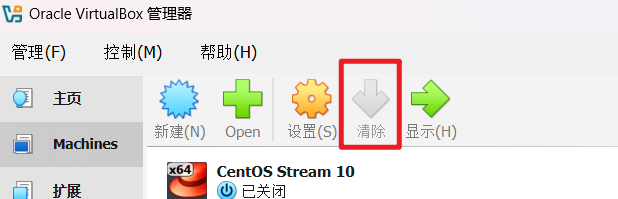

## MobaXterm 远程连接 Linux

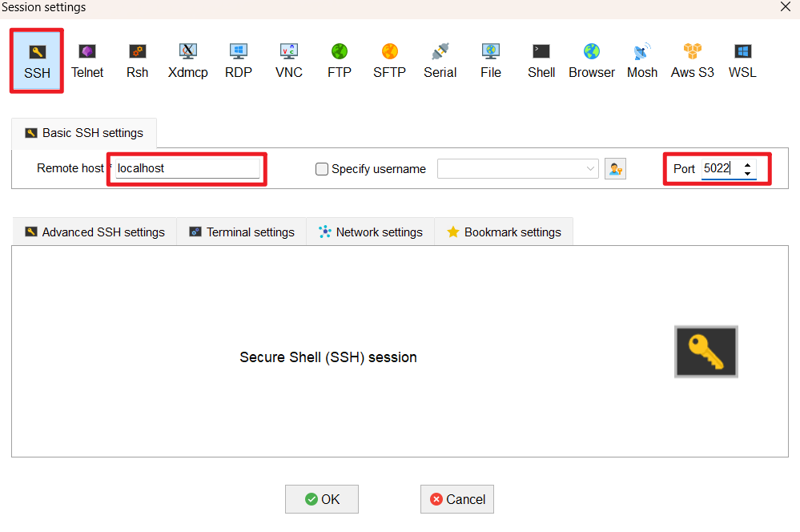

## 安装 Docker

### 关闭 SELINUX 服务

SELINUX是CentOS自带的安全服务，因为晦涩难用，并且跟很多程序冲突，所以强烈建议大家关闭这个服务。

找到 `/etc/sysconfig/selinux`文件，把其中的 `SELINUX` 设置为 `disabled`，保存文件之后**重启CentOS**系统。

### 更新 yum 程序

yum命令是CentOS自带的软件包管理器，我们安装Docker之前，最好能先更新一下yum命令，然后等上十分钟左右与，yum就更新好了。

```shell
yum update -y
```

`-y`表示安装过程中所有都是 `yes`

### 安装 Docker

******添加 Docker 官方仓库**

```bash
yum install -y yum-utils

yum-config-manager --add-repo https://download.docker.com/linux/centos/docker-ce.repo
```

**安装 Docker CE（社区版）**

```bash
yum install -y docker-ce docker-ce-cli containerd.io
```

### 管理 Docker

- 启动

```bash
systemctl start docker
```

- 开机自启

```bash
systemctl enable docker
```

- 验证安装

```bash
docker --version
```

- 查看 Docker 镜像列表

```bash
docker images
```

- 删除某个镜像

```bash
docker rmi 镜像名字
```

注意：先关闭容器，所有容器关闭后，先删除所有的容器，最后删除才能删除镜像。

- 停止 Docker 服务

```bash
systemctl stop docker
```

## 初始化数据库

MySQL 的版本：8.0.23，往Docker中导入MySQL镜像，用命令创建MySQL节点。

### 导入 MySQL 镜像

将我提供给大家的 MySQL 镜像文件上传到 Linux 系统。

使用以下命令将镜像导入到 Docker 环境中：

```shell
docker load < MySQL.tar.gz
```

### 设置端口转发

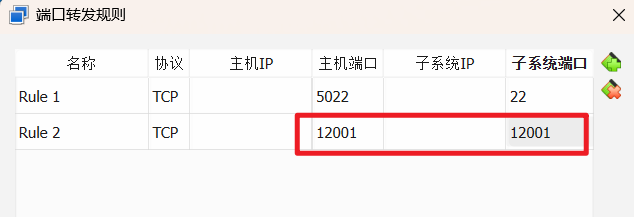

按照上图创建端口转发：windows 的 12001 端口映射到 Linux 系统的 12001 端口，Linux 系统的 12001 端口映射到 Docker 容器的 3306 端口。

配置端口转发不需要重启系统。

### 配置固定网段

固定网段能让每个容器获得静态IP，便于容器间通过固定地址可靠通信和访问。

```shell
docker network create --subnet=172.18.0.0/24 mynet
```

以上命令执行后，Docker 环境的网络信息如下：

- 可用 IP：254 个
- 网关：172.18.0.1（Docker 自动设置，不能分配给容器）
- 容器可用：172.18.0.2 ~ 172.18.0.254

### 创建MySQL 节点

```shell
docker run -d --name mysql -p 12001:3306 \
  --net mynet --ip 172.18.0.2 \
  -m 400m \
  -v /root/mysql/data:/var/lib/mysql \
  -v /root/mysql/config:/etc/mysql/conf.d \
  -e MYSQL_ROOT_PASSWORD=abc123456 \
  -e TZ=Asia/Shanghai \
  --privileged=true \
  --restart always \
  mysql:8.0.23 \
  --lower_case_table_names=1
```

### 导入数据文件


找到我提供的 sql 脚本文件。打开 Navicat，初始化数据库。

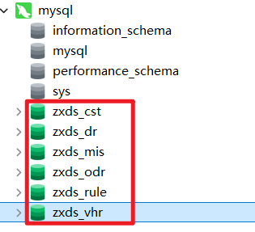

## 安装 MongoDB

MongoDB是用来存储系统消息的。

**第一步：导入镜像文件**

```shell
docker load < MongoDB.tar.gz
```

---

**第二步：创建 **`**/root/mongo/mongod.conf**`** 文件**

```nginx
net:
   port: 27017
   bindIp: "0.0.0.0"

storage:
   dbPath: "/data/db"

security:
   authorization: enabled
```

---

**第三步：创建MongoDB容器，端口是27017，分配400M内存够用了**

```shell
docker run -d -it --name mongo \
  -p 27017:27017 \
  --net mynet --ip 172.18.0.8 \
  -v /root/mongo:/etc/mongo \
  -v /root/mongo/data/db:/data/db \
  -m 400m \
  --privileged=true \
  --restart always \
  -e MONGO_INITDB_ROOT_USERNAME=admin \
  -e MONGO_INITDB_ROOT_PASSWORD=abc123456 \
  -e TZ=Asia/Shanghai \
  docker.io/mongo \
  --config /etc/mongo/mongod.conf
```

---

**第四步：配置端口转发**

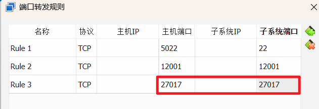

**第五步：连接 MongoDB**

使用 `MongoDB Compass`尝试连接，看看能不能正常连接。（有版本过期提醒，先不用管）

## 安装 Redis

Redis缓存Token令牌、司机和乘客的GPS定位等。

**第一步：导入镜像**

```shell
docker load < Redis.tar.gz
```

**第二步：创建/root/redis/conf/redis.conf文件**

```nginx
bind 0.0.0.0
protected-mode yes
port 6379
tcp-backlog 511
timeout 0
tcp-keepalive 0
loglevel notice
logfile ""
databases 12
save 900 1
save 300 10
save 60 10000
stop-writes-on-bgsave-error yes
rdbcompression yes
rdbchecksum yes
dbfilename dump.rdb
dir ./
requirepass abc123456
```

**第三步：创建 Redis 容器**

```shell
docker run -it -d --name redis -m 200m \
  -p 6379:6379 \
  --privileged=true \
  --net mynet --ip 172.18.0.9 \
  -v /root/redis/conf:/usr/local/etc/redis \
  -e TZ=Asia/Shanghai \
  --restart always \
  redis:6.0.10 \
  redis-server /usr/local/etc/redis/redis.conf
```

**第四步：配置端口转发**

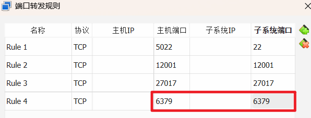

## 安装 Minio 私有云存储

### 本项目为什么选择两个云存储服务

本项目用了两种私有云存储：腾讯云对象存储服务、Minio对象存储服务。用两个的原因是：

需要存储**司机身份证、驾驶证等敏感照片，因此需要开启 HTTPS，腾讯云对象存储默认就支持 HTTPS，它可以保障数据传输的安全，**符合小程序实名认证的合规要求。

Minio 也可以开启 HTTPS，但是给本地Minio配置HTTPS证书，需要一个公网域名和固定IP，这在普通学习环境下很难实现。

我们用Minio存储代驾过程中的录音文件，这些文件体积比图片大，所以存储在腾讯云上面开销挺大，不划算。

### 安装 Minio

**第一步：导入镜像**

```shell
docker load < Minio.tar.gz
```

**第二步：创建/root/minio/data文件夹，然后给这个文件夹设置权限，否则Minio将无法使用该文件夹保存文件**

```shell
chmod -R 777 /root/minio/data
```

**第三步：创建 Minio 容器**

```shell
docker run -it -d --name minio -m 400m \
  -p 9000:9000 -p 9001:9001 \
  --net mynet --ip 172.18.0.10 \
  -v /root/minio/data:/data \
  -e TZ=Asia/Shanghai \
  --privileged=true \
  --restart always \
  --env MINIO_ROOT_USER="root" \
  --env MINIO_ROOT_PASSWORD="abc123456" \
  --env MINIO_SKIP_CLIENT="yes" \
  bitnami/minio:latest
```

**第四步：配置端口转发**

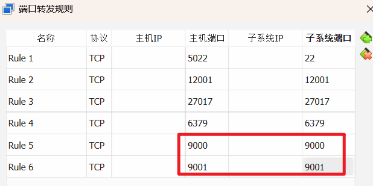

**第五步：访问**[**http://127.0.0.1:9001/login**](http://127.0.0.1:9001/login)

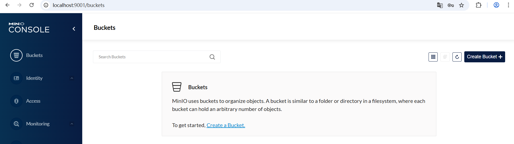

## 安装 RabbitMQ

RabbitMQ缓存系统发出的通知消息，每个用户都有自己的消息队列，而且我们还可以设置消息队列缓存消息的过期时间。这么做就比把消息直接存储到数据库更好。毕竟有很多用户长期不登录，那么他的消息队列缓存的消息过期也就自动销毁了，可以节省很多存储空间。

为什么不使用Kafka，而选用RabbitMQ呢？

因为RabbitMQ和Kafka的读写速度都很快，相差不大，但是RabbitMQ的收发消息更为灵活，支持同步和异步两种收发模式。而且RabbitMQ支持复杂的路由规则，我们可以灵活配置一个消息的广播模式，所以能适配更多的业务场景。你只有多使用RabbitMQ才能体会到它的各种优点。

**第一步：导入镜像**

```shell
docker load < RabbitMQ.tar.gz
```

**第二步：创建容器**

```shell
docker run -it -d --name mq \
  --net mynet --ip 172.18.0.11 \
  -p 5672:5672 -m 500m \

  -e TZ=Asia/Shanghai \
  --privileged=true \
  --restart always \
  rabbitmq:latest
```

**第三步：配置端口转发**

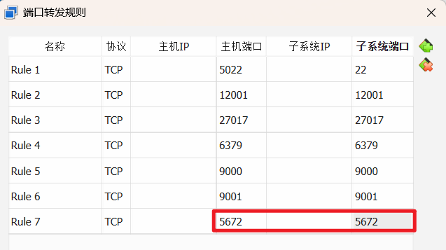

我们安装的这个版本的 RabbitMQ，不带 web 管理界面，因为用不上。

## 安装 Nacos

项目采用了Alibaba SpringCloud微服务架构，我们用 Nacos 做注册中心。

**第一步：导入镜像**

```shell
docker load < Nacos.tar.gz
```

**第二步：创建容器**

```shell
docker run -it -d -p 8848:8848 -p 9848:9848 \
  --env MODE=standalone \
  --net mynet --ip 172.18.0.12 \
  -e TZ=Asia/Shanghai \
  --name nacos \
  --restart always \
  nacos/nacos-server:latest
```

**第三步：配置端口转发**

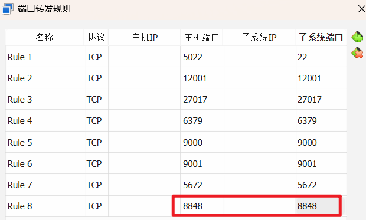

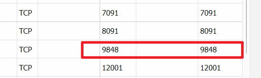

**第四步：访问 web 管理界面**[**http://localhost:8848/nacos/**](http://localhost:8848/nacos/)

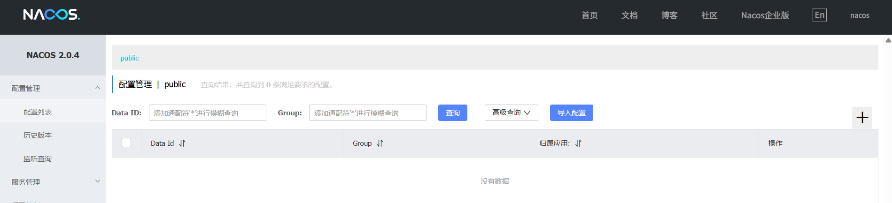

用户名和密码都是：`nacos`

## 安装 Sentinel

在微服务体系中，我们需要用到Sentinel做限流。 Sentinel会监控应用的QPS或并发线程数等指标，当达到指定阈值时对流量进行控制，避免系统被瞬时的流量高峰冲垮，保障应用高可用性。

**第一步：导入镜像**

```shell
docker load < Sentinel.tar.gz
```

**第二步：创建容器**

```shell
docker run -it -d --name sentinel \
-p 8719:8719 -p 8858:8858 \
--net mynet --ip 172.18.0.13 \
-e TZ=Asia/Shanghai -m 600m \
--restart always \
bladex/sentinel-dashboard
```

**第三步：配置端口转发**

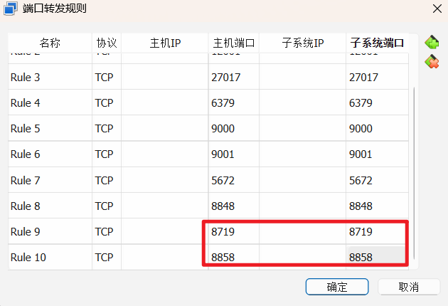

**第四步：**[**http://localhost:8858/#/login**](http://localhost:8858/#/login)**，用户名密码都是 **`**sentinel**`

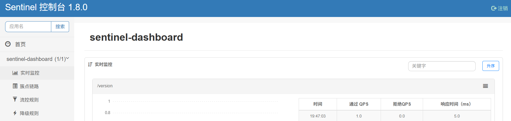

## 安装 Seata 服务器

项目中我们采用 Seata 来保证分布式事务。

**第一步：导入镜像**

```shell
docker load < seata-server-1.4.2.tar.gz
```

---

**第二步：创建容器**

```shell
docker run -d --name seata \
  --restart=unless-stopped \
  -p 8091:8091 \
  --net mynet --ip 172.18.0.14 \
  -e SEATA_IP=172.18.0.14 \
  -e STORE_MODE=file \
  seataio/seata-server:1.4.2
```

---

**第三步：配置端口转发（8091）**

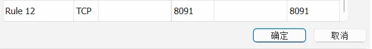

## 安装 Hbase 与 Phoenix

**HBase 数据库**：分布式、列式存储数据库，负责海量数据的存储和准实时查询

**Phoenix 解析器**：一个构建在 HBase 之上的 SQL 层。让我们能够通过编写 SQL 语句来操作 HBase 数据库。

```shell
docker load < phoenix.tar.gz
```

以下 docker 容器同时安装了 HBase 和 Phoenix

```shell
docker run -it -d \
  --restart=unless-stopped \
  -p 2181:2181 \
  -p 8765:8765 \
  -p 15165:15165 \
  -p 16000:16000 \
  -p 16010:16010 \
  -p 16020:16020 \
  -v /root/hbase/data:/tmp/hbase-root/hbase/data \
  --name phoenix \
  --net mynet \
  --ip 172.18.0.15 \
  boostport/hbase-phoenix-all-in-one:2.0-5.0
```

配置端口转发：


# Seata AT 模式实现分布式事务

使用 Seata AT 模式实现分布式事务管理，按照以下步骤配置：

## 启动 Seata Server

保证 Seata Server 是启动的，我们之前在 docker 中已经创建 seata 容器，并已成功启动了。

## 各服务引入 Seata 客户端

引入 Seata 客户端，本质上就是引入依赖，在每个需要分布式事务的子系统中引入：

```xml
<dependency>
  <groupId>com.alibaba.cloud</groupId>
  <artifactId>spring-cloud-starter-alibaba-seata</artifactId>
</dependency>
```

## 各服务引入 Seata 配置

每个微服务的 `application.yml`文件中都要引入以下配置：

```yaml
seata:
  enabled: true                                  # 开启分布式事务
  application-id: ${spring.application.name}     # 应用ID（标识服务）
  tx-service-group: bff_customer_tx_group        # 事务分组（服务的身份标签，用于逻辑隔离和监控，建议一个微服务对应一个事务分组名）
  service:
    vgroup-mapping:
      bff_customer_tx_group: default             # 将事务分组映射到Seata集群，default就是seata集群的名字
    grouplist:
      default: localhost:8091                    # Seata服务器真实地址列表
```

不要认为一个 事务分组 就是一个 独立的事务，这样理解是错误的。

事务分组只是代表服务的身份标签。

只要这些事务分组都映射到同一个 seata 集群，那么它就可以实现分布式事务。

## 创建 undo_log 表

首先需要在每个服务对应的数据库中手动创建 `undo_log`表，建表 `SQL`如下：【**这个表的创建我们在初始化 sql 脚本的时候已经完成了。**】

```sql
CREATE TABLE IF NOT EXISTS `undo_log`
(
    `branch_id`     BIGINT       NOT NULL COMMENT 'branch transaction id',
    `xid`           VARCHAR(128) NOT NULL COMMENT 'global transaction id',
    `context`       VARCHAR(128) NOT NULL COMMENT 'undo_log context,such as serialization',
    `rollback_info` LONGBLOB     NOT NULL COMMENT 'rollback info',
    `log_status`    INT(11)      NOT NULL COMMENT '0:normal status,1:defense status',
    `log_created`   DATETIME(6)  NOT NULL COMMENT 'create datetime',
    `log_modified`  DATETIME(6)  NOT NULL COMMENT 'modify datetime',
    UNIQUE KEY `ux_undo_log` (`xid`, `branch_id`)
) ENGINE = InnoDB AUTO_INCREMENT = 1 DEFAULT CHARSET = utf8mb4 COMMENT ='AT transaction mode undo table';
ALTER TABLE `undo_log` ADD INDEX `ix_log_created` (`log_created`);
```

## 使用@GlobalTransactional

在 bff 层使用 `@GlobalTransactional`注解标注。

在 bff 层下游子系统中的 service 层使用本地事务 `@Transactional`注解（但这个不是必须的，如果没有添加，也不影响分布式事务）。

# 微服务项目的鉴权

在微服务架构中，一个大项目被拆分成很多零碎的服务，那么调用这些服务的时候必须要做权限验证。

接下来我们对比两种方式：

## 方式一：全局鉴权中心

**全局鉴权中心是一个独立服务，所有微服务收到请求后都必须远程调用它验证权限，网络开销剧增（这里说的是外网调用）。**

全局鉴权中心的实现方式，其实是微服务演进过程中的一个**典型"坑"**，很多团队都踩过。很多团队从单体拆微服务时，**最先想到的就是这种简单方案。**

**微服务架构发展历程中，很多大厂都踩过坑，例如：**

- **亚马逊（Amazon）早期微服务实践（2014~2016）**
- **阿里巴巴/淘宝，2014-2016年，淘宝交易系统重构**

**现代的微服务开发，已经没有团队再使用这种方式了，因为无数的前辈们已经帮我们踩过坑了。**

---

**我们以客户端加载一个订单详情页面这个功能来分析一下全局鉴权中心的缺点：**

**这个详情页需要展示的信息：**

1. 订单基本信息（订单服务）
2. 接单司机信息（司机服务）
3. 下单客户信息（客户服务）

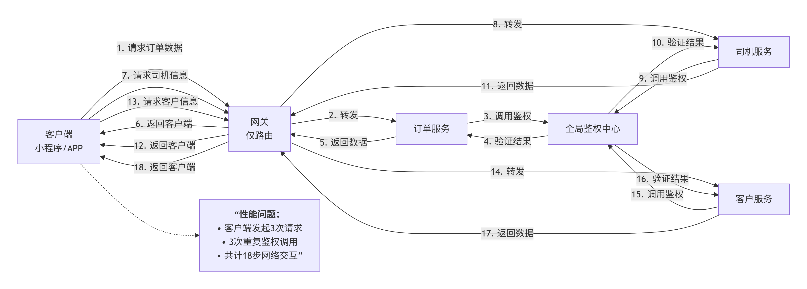

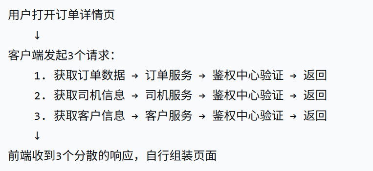

以上就是全局鉴权中心的实现方式，非常典型，这种方式中：客户端直接调用微服务，每一个微服务统一去鉴权中心进行鉴权。**就像进一栋楼的每个房间都要跑回大门口重新查一次身份证。**

---

**全局鉴权中心的实现方式缺点很多，我们随便挑 3 个来说一下。**

---

### 性能问题：网络调用过多导致响应缓慢

- 客户端直接与多个微服务通信，增加了外部HTTP请求数量（外网调用次数太多）
- 内网通信效率优势未被充分利用

### 职责错位：前端承担数据聚合的复杂工作

各个微服务独立返回数据片段，前端需要自行组装。例如：

- 订单服务返回 `<font style="background-color:rgb(235, 238, 242);">{订单ID, 金额, 状态}</font>`
- 司机服务返回 `<font style="background-color:rgb(235, 238, 242);">{司机姓名, 电话, 车牌}</font>`
- 客户服务返回 `<font style="background-color:rgb(235, 238, 242);">{客户姓名, 地址, 联系方式}</font>`

前端需要将这些数据整合、转换。

- 业务逻辑被不适当地转移到了前端
- 前端代码变得臃肿复杂，维护困难

### 权限管理复杂：微服务与鉴权逻辑过度耦合

权限管理困难：这个 controller 上的 web 方法可能司机端要用，乘客端也需要用，那你就需要在 web 方法上管理**不同角色**下的**不同权限**。

## 方式二：BFF 鉴权

BFF（Backends For Frontends，服务于前端的后端）是一种为不同客户端**提供定制化接口**的架构模式。它作为客户端与后端微服务之间的**适配层**，针对不同设备或业务场景提供**专属的API接口**。

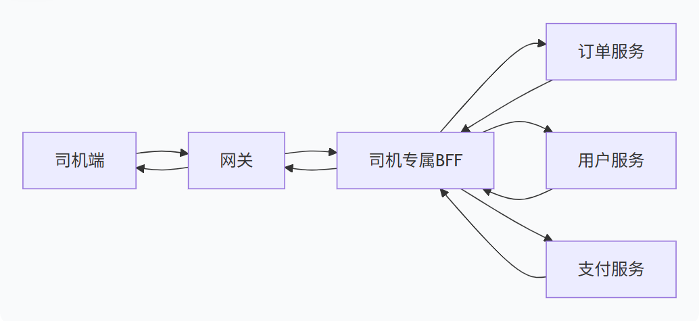

**完整架构流程：**

1. **访问入口**：司机端 → 网关（统一接入点）
2. **业务路由**：网关 → 司机专属BFF（鉴权+路由）
3. **服务调用**：BFF并发调用三个微服务
4. **数据返回**：微服务 → BFF（聚合） → 网关 → 司机端

在该架构下，客户端不再直接调用后端通用接口，而是访问为其专属定制的BFF层。**每个客户端类型拥有独立的BFF实例**，如司机端BFF、乘客端BFF等。BFF接收客户端请求后，通过Feign等工具并发调用多个基础微服务，并将**聚合处理后的数据统一返回**。这样客户端仅需发起一次HTTP请求即可获得完整业务视图，显著减少了外网通信次数（**减少了公网的 HTTP 通信次数**），提升了响应速度。

**在权限管理方面，BFF层承担了统一的鉴权职责**。由于每个BFF实例仅服务于单一类型客户端，开发者只需在对应的Web方法上设置该客户端的权限验证规则，无需处理跨客户端权限叠加的复杂场景。例如司机端BFF仅需验证司机相关权限，与乘客权限逻辑完全隔离。

BFF本身通常是一个Spring Boot项目，通过Feign实现服务间调用。在业务集成过程中，涉及分布式事务的场景仍需通过相应注解（如@GlobalTransactional）保障数据一致性，确保跨服务操作的原子性。

## 本项目权限框架选择 SaToken

为什么本项目采用 SaToken？

1. 功能比 Spring Security 丰富。
2. 国产项目，文档友好。
3. 国内团队使用较多。

SaToken是国产开源权限验证框架中的优秀方案，在Gitee上面已经获得了6.2K的Star，文档非常齐全。新手同学半天时间基本就能掌握，关于SaToken的特点，我们可以看它官网的介绍（[https://sa-token.dev33.cn](https://sa-token.dev33.cn/)）。

**下图来自官网截图：**

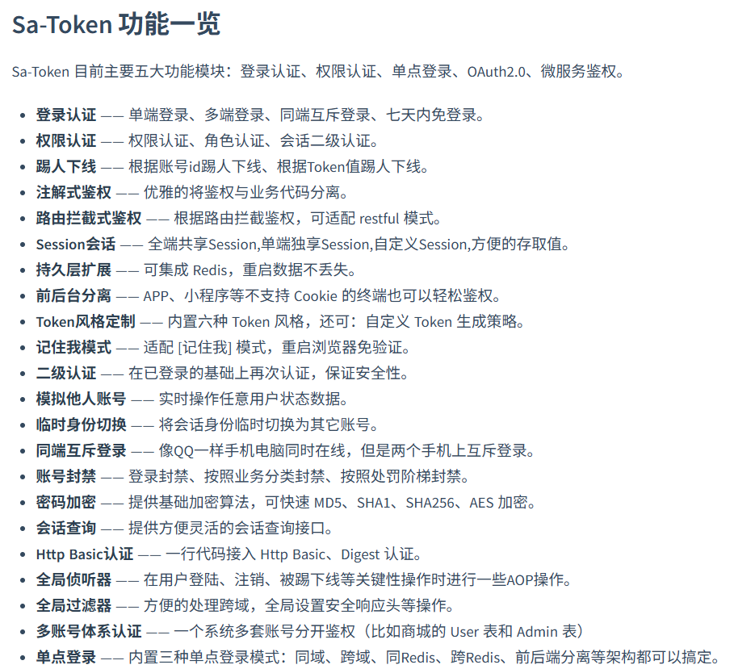

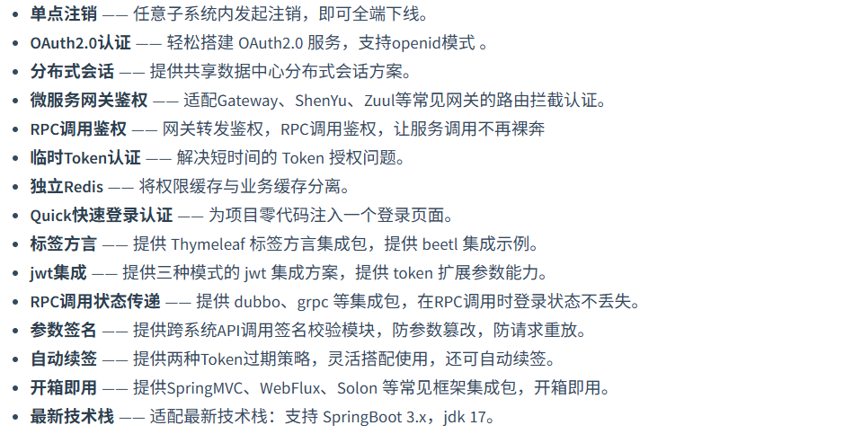

# 项目技术栈汇总

## 使用的云服务汇总

本项目所有的云服务都使用了腾讯云的服务，因此最终项目部署到腾讯云上：

| 序号 | 云服务名称 | 具体用途 |
| --- | --- | --- |
| 1 | 对象存储服务（COS） | 存储司机实名认证的身份证和驾驶证照片 |
| 2 | 人脸识别（AiFace） | 每天司机接单前的身份核实，并且具备静态活体检测功能 |
| 3 | 人员库管理（face-lib） | 云端存储司机注册时候的人脸模型，用于身份比对使用 |
| 4 | 数据万象（ci） | 用于监控代驾录音文本内容，判断是否包含暴力和色情 |
| 5 | OCR证件识别插件 | 用于OCR识别和扫描身份证和驾驶证的信息 |
| 6 | 微信同声传译插件（移动端使用） | 把文字合成语音，播报订单；把录音转换成文本，用于安全监控 |
| 7 | 路线规划插件（移动端使用） | 用于规划司机下班回家的线路，或者小程序订单显示的路线 |
| 8 | 地图选点插件（移动端使用） | 用于小程序上面地图选点操作 |
| 9 | 腾讯位置服务（后端使用） | 路线规划、定位导航、里程和时间预估 |

## 项目所有的子系统

系统由 18 个子系统构成，分为基础子系统、bff子系统、网关子系统，下面的表格对这些子系统做了总结。

| 序号 | 子系统 | 端口号 | 具体用途 |
| --- | --- | --- | --- |
| 1 | zxds-dr | 8001 | 司机子系统 |
| 2 | zxds-odr | 8002 | 订单子系统 |
| 3 | zxds-snm | 8003 | 消息通知子系统 |
| 4 | zxds-mps | 8004 | 地图子系统 |
| 5 | zxds-oes | 8005 | 订单执行子系统（**比如司机代驾的过程中要取消订单，需要给客户进行补偿，需要对司机罚款，这些计算都是通过这个子系统完成**） |
| 6 | zxds-rule | 8006 | 规则子系统（**订单费用计算、取消规则的计算等，都是它负责**） |
| 7 | zxds-cst | 8007 | 客户子系统 |
| 8 | zxds-vhr | 8008 | 代金券子系统 |
| 9 | zxds-nebula | 8009 | 大数据子系统（**代驾过程中产生的 GPS 定位都是采用 HBase 存储的，读写 HBase 由这个系统完成**） |
| 10 | zxds-mis-api | 8010 | MIS子系统（**这是后端系统，对应一个前端 Vue 系统**） |
| 11 | zxds-workflow | 8011 | 工作流子系统 |
| 12 | bff-driver | 8101 | 司机bff子系统 |
| 13 | bff-customer | 8102 | 客户bff子系统 |
| 14 | gateway | 8080 | 网关子系统 |
| 15 | common |   | 公共模块（**公共的类，公共的配置**） |

客户端项目有三个，两个是小程序项目，一个是VUE前端项目，大家请看下面的表格。

| 序号 | 客户端 | 端口号 | 具体用途 |
| --- | --- | --- | --- |
| 1 | zxds-driver-wx | – | 司机端小程序 |
| 2 | zxds-customer-wx | – | 客户端小程序 |
| 3 | zxds-mis-vue | 3000 | MIS系统前端项目 |

**整体结构如下：**

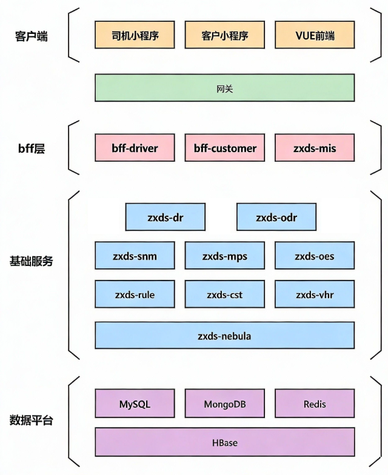

## 技术栈汇总

| 序号 | 技术栈 | 具体用途 |
| --- | --- | --- |
| 1 | SpringBoot | 用于创建微服务子系统 |
| 2 | SpringCloud | nacos、sentinel、seata |
| 3 | SpringMVC | Web层框架 |
| 4 | MyBatis | 持久层框架 |
| 5 | Feign | 远程调用 |
| 6 | RabbitMQ | 系统消息收发 |
| 7 | Swagger | 在线调试Web方法 |
| 8 | QLExpress | 规则引擎，计算预估费用、取消费用等等 |
| 9 | Quartz | 定时器，销毁过期未接单订单、定时自动分账等等 |
| 10 | Phoenix | HBase数据存储 |
| 11 | Minio | 私有云存储 |
| 12 | GEO | GPS分区定位计算 |
| 13 | SaToken | 认证与授权框架 |
| 14 | VUE | 前端框架 |
| 15 | UniAPP | 移动端框架 |
| 16 | uView | 移动端 UI 组件库（类似于我们之前用过的 ElementPlus 组件库） |

# 创建项目

## 创建根项目

创建一个 SpringBoot 工程。**要求放在一个没有中文的路径下**，它是我们的根项目。

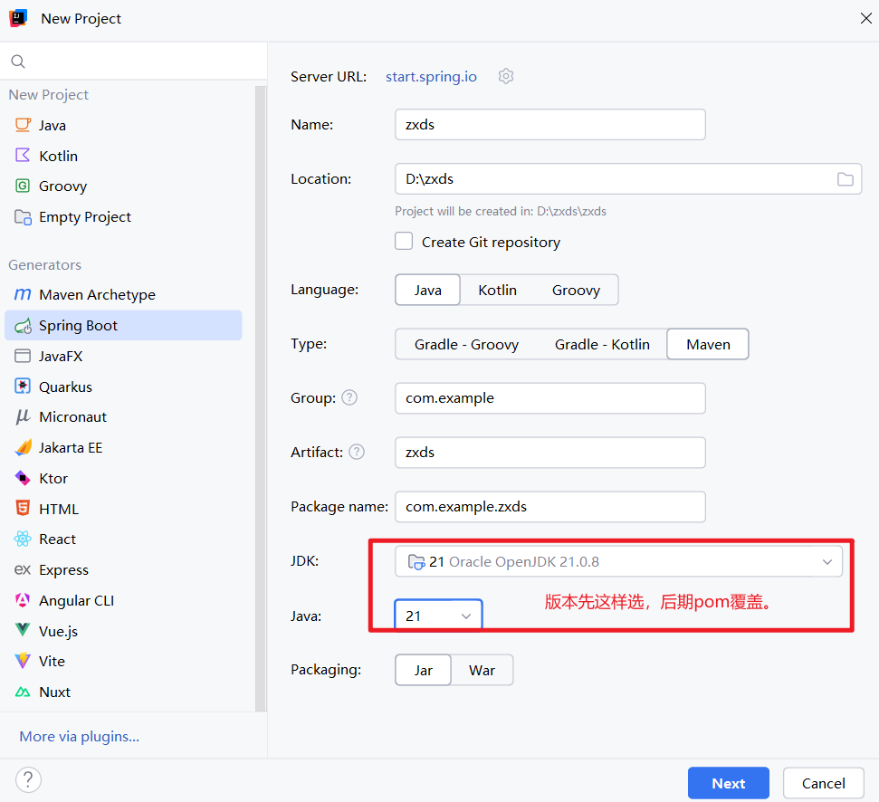

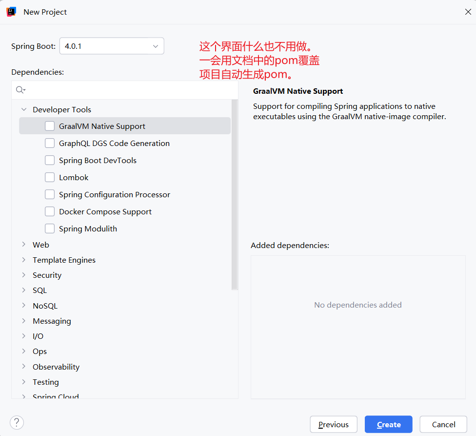

**下图中的这两个都要修改为 15：**

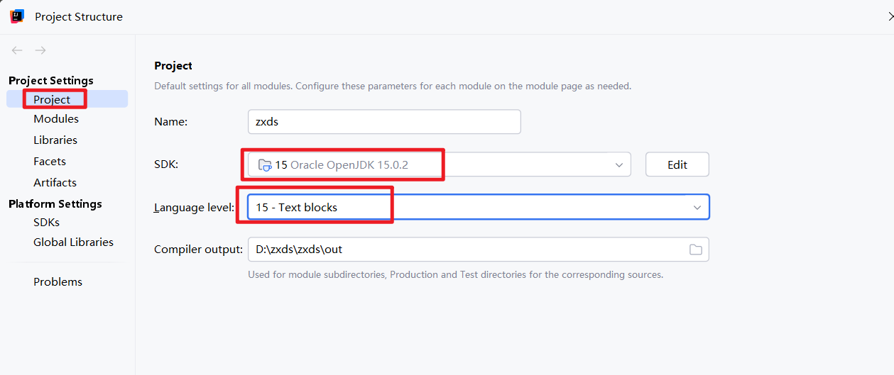

**把下面红框中的删除：**

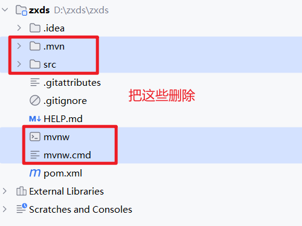

**提醒：一定要设置一下 IDEA 的 Maven，关联自己电脑上的 Maven。**

**覆盖 pom 文件：**

```xml
<?xml version="1.0" encoding="UTF-8"?>
<project xmlns="http://maven.apache.org/POM/4.0.0" xmlns:xsi="http://www.w3.org/2001/XMLSchema-instance"
         xsi:schemaLocation="http://maven.apache.org/POM/4.0.0 https://maven.apache.org/xsd/maven-4.0.0.xsd">
    <modelVersion>4.0.0</modelVersion>
    <groupId>com.example</groupId>
    <artifactId>zxds</artifactId>
    <version>0.0.1-SNAPSHOT</version>
    <name>zxds</name>
    <description>zxds</description>
    <modules>
        <module>common</module>
        <module>zxds-dr</module>
        <module>zxds-cst</module>
        <module>zxds-odr</module>
        <module>zxds-snm</module>
        <module>zxds-mps</module>
        <module>zxds-mis-api</module>
        <module>zxds-oes</module>
        <module>zxds-vhr</module>
        <module>zxds-nebula</module>
        <module>zxds-rule</module>
        <module>bff-driver</module>
        <module>bff-customer</module>
        <module>gateway</module>
    </modules>
    <packaging>pom</packaging>
    <properties>
        <java.version>15</java.version>
        <project.build.sourceEncoding>UTF-8</project.build.sourceEncoding>
        <project.reporting.outputEncoding>UTF-8</project.reporting.outputEncoding>
        <spring-boot.version>2.3.7.RELEASE</spring-boot.version>
        <spring-cloud-alibaba.version>2.2.7.RELEASE</spring-cloud-alibaba.version>
        <spring-cloud.version>Hoxton.SR9</spring-cloud.version>
    </properties>

    <dependencies>
        <dependency>
            <groupId>org.springframework.boot</groupId>
            <artifactId>spring-boot-starter</artifactId>
        </dependency>
        <dependency>
            <groupId>org.projectlombok</groupId>
            <artifactId>lombok</artifactId>
            <optional>true</optional>
        </dependency>
        <dependency>
            <groupId>org.springframework.boot</groupId>
            <artifactId>spring-boot-starter-test</artifactId>
            <scope>test</scope>
            <exclusions>
                <exclusion>
                    <groupId>org.junit.vintage</groupId>
                    <artifactId>junit-vintage-engine</artifactId>
                </exclusion>
            </exclusions>
        </dependency>
        <dependency>
            <groupId>cn.hutool</groupId>
            <artifactId>hutool-all</artifactId>
            <version>5.6.3</version>
        </dependency>
        <dependency>
            <groupId>org.springframework.boot</groupId>
            <artifactId>spring-boot-starter-logging</artifactId>
            <exclusions>
                <exclusion>
                    <groupId>org.apache.logging.log4j</groupId>
                    <artifactId>log4j-api</artifactId>
                </exclusion>
                <exclusion>
                    <groupId>org.apache.logging.log4j</groupId>
                    <artifactId>log4j-core</artifactId>
                </exclusion>
                <exclusion>
                    <groupId>org.apache.logging.log4j</groupId>
                    <artifactId>log4j-to-slf4j</artifactId>
                </exclusion>
            </exclusions>
        </dependency>
        <dependency>
            <groupId>org.apache.logging.log4j</groupId>
            <artifactId>log4j-api</artifactId>
            <version>2.17.0</version>
        </dependency>
        <dependency>
            <groupId>org.apache.logging.log4j</groupId>
            <artifactId>log4j-core</artifactId>
            <version>2.17.0</version>
        </dependency>
    </dependencies>

    <dependencyManagement>
        <dependencies>
            <dependency>
                <groupId>org.springframework.boot</groupId>
                <artifactId>spring-boot-dependencies</artifactId>
                <version>${spring-boot.version}</version>
                <type>pom</type>
                <scope>import</scope>
            </dependency>
            <dependency>
                <groupId>org.springframework.cloud</groupId>
                <artifactId>spring-cloud-dependencies</artifactId>
                <version>${spring-cloud.version}</version>
                <type>pom</type>
                <scope>import</scope>
            </dependency>
            <dependency>
                <groupId>com.alibaba.cloud</groupId>
                <artifactId>spring-cloud-alibaba-dependencies</artifactId>
                <version>${spring-cloud-alibaba.version}</version>
                <type>pom</type>
                <scope>import</scope>
            </dependency>
        </dependencies>
    </dependencyManagement>

    <build>
        <plugins>
            <plugin>
                <groupId>org.apache.maven.plugins</groupId>
                <artifactId>maven-compiler-plugin</artifactId>
                <version>3.8.1</version>
                <configuration>
                    <source>15</source>
                    <target>15</target>
                    <encoding>UTF-8</encoding>
                </configuration>
            </plugin>
            <plugin>
                <groupId>org.springframework.boot</groupId>
                <artifactId>spring-boot-maven-plugin</artifactId>
                <version>2.3.7.RELEASE</version>
                <executions>
                    <execution>
                        <id>repackage</id>
                        <goals>
                            <goal>repackage</goal>
                        </goals>
                    </execution>
                </executions>
            </plugin>
        </plugins>
    </build>

</project>
```

**重新加载 Maven 项目：在 pom.xml 文件任意位置右键**

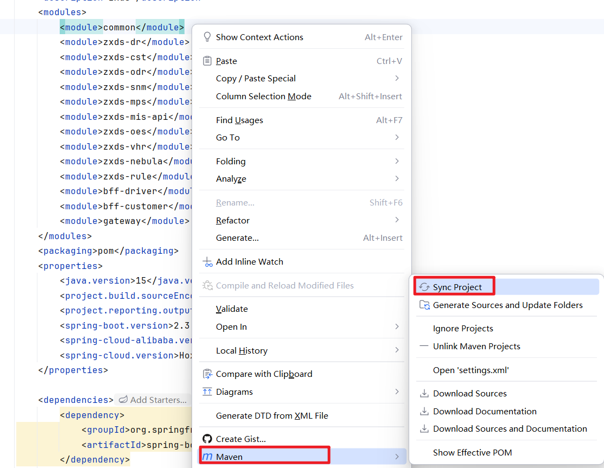

报错没关系啊，因为子项目还没有创建呢。

## 创建公共模块

**你需要先把父工程中的所有 **`**module**`**注释掉，如下：**

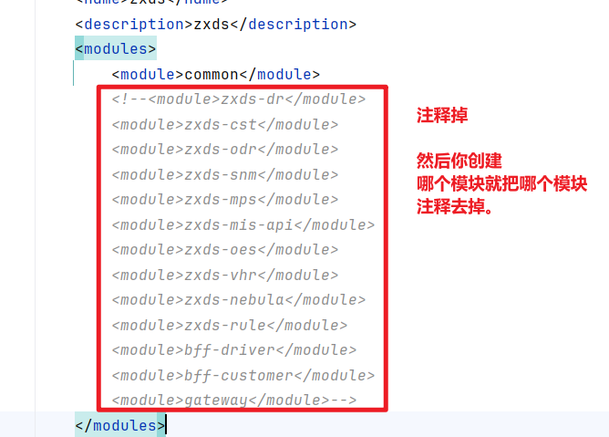

记得最后的时候将注释去掉哈。

### 第一步：新建 SpringBoot 模块，起名 `common`

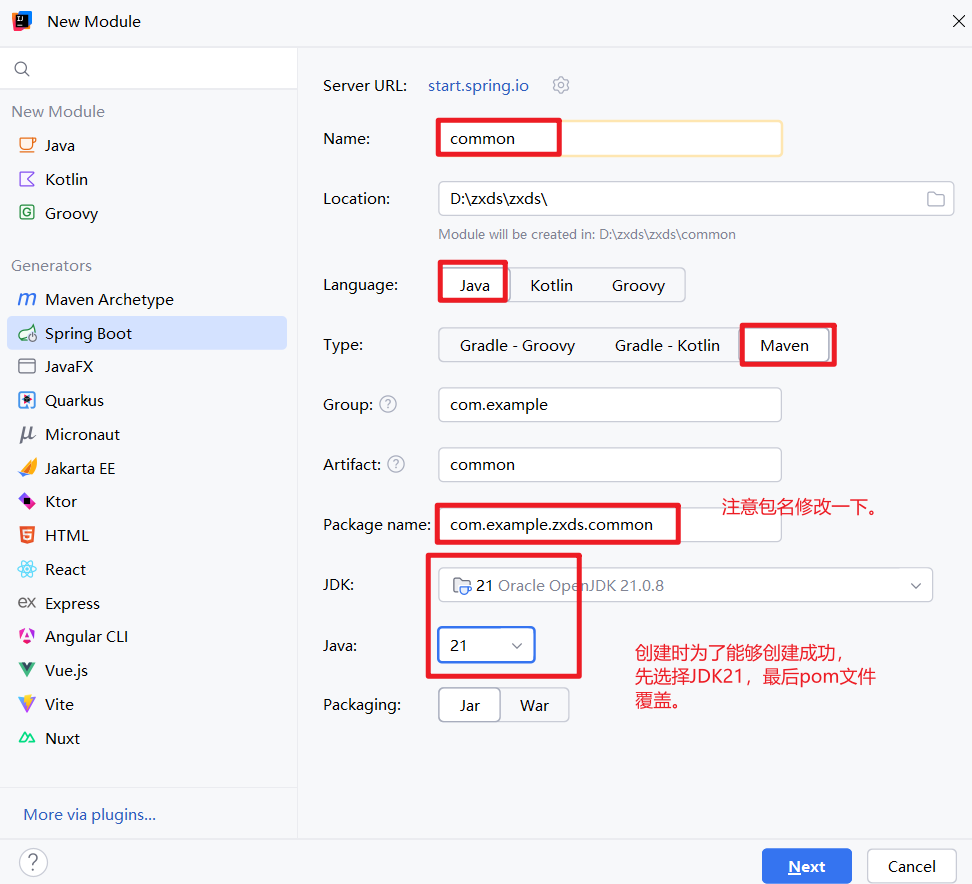

这里选择 21 只是为了能够正常创建模块，等创建完成之后，使用 pom 进行覆盖就行。

### 第二步：覆盖 pom 文件

```xml
<?xml version="1.0" encoding="UTF-8"?>
<project xmlns="http://maven.apache.org/POM/4.0.0" xmlns:xsi="http://www.w3.org/2001/XMLSchema-instance"
         xsi:schemaLocation="http://maven.apache.org/POM/4.0.0 https://maven.apache.org/xsd/maven-4.0.0.xsd">
    <modelVersion>4.0.0</modelVersion>
    <groupId>com.example</groupId>
    <artifactId>common</artifactId>
    <version>0.0.1-SNAPSHOT</version>
    <name>common</name>
    <description>common</description>
    <parent>
        <artifactId>zxds</artifactId>
        <groupId>com.example</groupId>
        <version>0.0.1-SNAPSHOT</version>
    </parent>
    <properties>
        <java.version>15</java.version>
        <project.build.sourceEncoding>UTF-8</project.build.sourceEncoding>
        <project.reporting.outputEncoding>UTF-8</project.reporting.outputEncoding>

    </properties>
    <dependencies>
        <dependency>
            <groupId>org.springframework.boot</groupId>
            <artifactId>spring-boot-starter-web</artifactId>
        </dependency>
        <!--腾讯云存储-->
        <dependency>
            <groupId>com.qcloud</groupId>
            <artifactId>cos_api</artifactId>
            <version>5.6.45</version>
        </dependency>
        <dependency>
            <groupId>commons-fileupload</groupId>
            <artifactId>commons-fileupload</artifactId>
            <version>1.2.2</version>
        </dependency>
        <!--腾讯云-->
        <dependency>
            <groupId>com.tencentcloudapi</groupId>
            <artifactId>tencentcloud-sdk-java</artifactId>
            <version>3.1.416</version>
        </dependency>
        <dependency>
            <groupId>org.apache.httpcomponents</groupId>
            <artifactId>httpclient</artifactId>
        </dependency>
    </dependencies>

    <build>
        <plugins>
            <plugin>
                <groupId>org.apache.maven.plugins</groupId>
                <artifactId>maven-compiler-plugin</artifactId>
                <version>3.8.1</version>
                <configuration>
                    <source>15</source>
                    <target>15</target>
                    <encoding>UTF-8</encoding>
                </configuration>
            </plugin>
            <plugin>
                <groupId>org.springframework.boot</groupId>
                <artifactId>spring-boot-maven-plugin</artifactId>
                <configuration>
                    <classifier>exec</classifier>
                </configuration>
            </plugin>
        </plugins>
    </build>
</project>
```

在 pom 文件中右键，重新加载项目。（**如果你提前把父工程中的除 common 之外的子模块已经注释掉了，那么这里加载应该就不会报错了。**）

**重点：如果你重新加载之后，发现有一些依赖报红，可以将对应依赖剪切，重新粘贴一下应该就行了。**

### 第三步：编写 yml 配置文件，删除 `application.properties`，新建 `application-common.yml`文件，内容如下，其中 tencent 相关配置不用修改，用到再说：

```yaml
spring:
  profiles: common

tencent:
  cloud:
    appId: 腾讯云APPID
    secretId: 腾讯云SecretId
    secretKey: 腾讯云SecretKey
    region-public: 公有存储桶所在地域
    bucket-public: 公有存储桶名称
    region-private: 私有存储桶所在地域
    bucket-private: 私有存储桶名称

wx:
  app-id: 你的小程序APPID
  app-secret: 你的小程序密钥
  mch-id: 商户号ID
  key: 商户密钥
  cert-path: 数字证书文件路径

minio:
  endpoint: http://localhost:9000
  access-key: root
  secret-key: abc123456
```

这个YML文件的别名叫做common，将来可以被引用到其他子系统的YML文件里面。

### 第四步：编写防 XSS 攻击的过滤器

在Web项目中，我们无法修改HttpServletRequest实现类的内容，因为请求的实现类是由各个Web容器厂商自己扩展的。但是有时候我们还想修改请求类中的内容，这该怎么办呢？Java语言给我们留出了缺口，我们只要继承Java Web内置的HttpServletRequestWrapper父类，就能修改请求类的内容。

在 `com.example.zxds.common.config.xss` 包中创建 `XssHttpServletRequestWrapper` 类。

把**获取请求头和请求体数据的方法都要重写**，返回的是**经过XSS转义后的数据**。

```java
package com.example.zxds.common.config.xss;

import cn.hutool.core.util.StrUtil;
import cn.hutool.http.HtmlUtil;
import cn.hutool.json.JSONUtil;

import javax.servlet.ReadListener;
import javax.servlet.ServletInputStream;
import javax.servlet.http.HttpServletRequest;
import javax.servlet.http.HttpServletRequestWrapper;
import java.io.*;
import java.nio.charset.Charset;
import java.util.LinkedHashMap;
import java.util.Map;

public class XssHttpServletRequestWrapper extends HttpServletRequestWrapper {
    public XssHttpServletRequestWrapper(HttpServletRequest request) {
        super(request);
    }

    @Override
    public String getParameter(String name) {
        String value = super.getParameter(name);
        if (!StrUtil.hasEmpty(value)) {
            value = HtmlUtil.cleanHtmlTag(value);
        }
        return value;
    }

    @Override
    public String[] getParameterValues(String name) {
        String[] values = super.getParameterValues(name);
        if (values != null) {
            for (int i = 0; i < values.length; i++) {
                String value = values[i];
                if (!StrUtil.hasEmpty(value)) {
                    value = HtmlUtil.cleanHtmlTag(value);
                }
                values[i] = value;
            }
        }
        return values;
    }

    @Override
    public Map<String, String[]> getParameterMap() {
        Map<String, String[]> parameters = super.getParameterMap();
        LinkedHashMap<String, String[]> map = new LinkedHashMap();
        if (parameters != null) {
            for (String key : parameters.keySet()) {
                String[] values = parameters.get(key);
                for (int i = 0; i < values.length; i++) {
                    String value = values[i];
                    if (!StrUtil.hasEmpty(value)) {
                        value = HtmlUtil.cleanHtmlTag(value);
                    }
                    values[i] = value;
                }
                map.put(key, values);
            }
        }
        return map;
    }

    @Override
    public String getHeader(String name) {
        String value = super.getHeader(name);
        if (!StrUtil.hasEmpty(value)) {
            value = HtmlUtil.cleanHtmlTag(value);
        }
        return value;
    }

    @Override
    public ServletInputStream getInputStream() throws IOException {
        InputStream in = super.getInputStream();
        InputStreamReader reader = new InputStreamReader(in, Charset.forName("UTF-8"));
        BufferedReader buffer = new BufferedReader(reader);
        StringBuffer body = new StringBuffer();
        String line = buffer.readLine();
        while (line != null) {
            body.append(line);
            line = buffer.readLine();
        }
        buffer.close();
        reader.close();
        in.close();
        Map<String, Object> map = JSONUtil.parseObj(body.toString());
        Map<String, Object> result = new LinkedHashMap<>();
        for (String key : map.keySet()) {
            Object val = map.get(key);
            if (val instanceof String) {
                if (!StrUtil.hasEmpty(val.toString())) {
                    result.put(key, HtmlUtil.cleanHtmlTag(val.toString()));
                }
            } else {
                result.put(key, val);
            }
        }
        String json = JSONUtil.toJsonStr(result);
        ByteArrayInputStream bain = new ByteArrayInputStream(json.getBytes());
        return new ServletInputStream() {
            @Override
            public int read() throws IOException {
                return bain.read();
            }

            @Override
            public boolean isFinished() {
                return false;
            }

            @Override
            public boolean isReady() {
                return false;
            }

            @Override
            public void setReadListener(ReadListener readListener) {

            }
        };
    }
}
```

接下来我们要创建一个Filter类，拦截所有HTTP请求，然后调用上面创建的XssHttpServletRequestWrapper类，这样就能按照我们设定的方式获取请求中的数据了。

在 `com.example.zxds.common.config.xss` 包中创建 `XssFilter`类。

```java
package com.example.zxds.common.config.xss;

import javax.servlet.*;
import javax.servlet.annotation.WebFilter;
import javax.servlet.http.HttpServletRequest;
import java.io.IOException;

@WebFilter(urlPatterns = "/*")
public class XssFilter implements Filter {
    @Override
    public void init(FilterConfig filterConfig) throws ServletException {

    }

    @Override
    public void doFilter(ServletRequest servletRequest, ServletResponse servletResponse, FilterChain filterChain) throws IOException, ServletException {
        HttpServletRequest request = (HttpServletRequest) servletRequest;
        XssHttpServletRequestWrapper wrapper = new XssHttpServletRequestWrapper(request);
        filterChain.doFilter(wrapper, servletResponse);
    }

    @Override
    public void destroy() {

    }
}
```

### 第五步：允许跨域请求

允许跨域请求是一个很重要的设置，如果不设置，那么移动端小程序和Web管理页面都无法访问后端Java程序。SpringBoot项目中允许跨域请求比较简单，只需要我们定义好配置类即可。

在 `com.example.zxds.common.config` 包中创建 `CorsConfig` 类，然后设置允许跨域请求。

```java
package com.example.zxds.common.config;

import org.springframework.context.annotation.Configuration;
import org.springframework.web.servlet.config.annotation.CorsRegistry;
import org.springframework.web.servlet.config.annotation.WebMvcConfigurer;

@Configuration
public class CorsConfig implements WebMvcConfigurer {

    @Override
    public void addCorsMappings(CorsRegistry registry) {
        registry.addMapping("/**").allowedOrigins("*").allowCredentials(true).allowedMethods("GET", "POST", "DELETE", "PUT", "PATCH").maxAge(3600);
    }
}
```

### 第六步：封装分页类

项目中有很多模块都用到了数据分页显示，为了把分页用到的数据封装存储起来，我们需要创建一个封装类。在 `com.example.zxds.common.util` 包里面创建 `PageUtils` 类。

```java
package com.example.zxds.common.util;

import lombok.Data;

import java.io.Serializable;
import java.util.List;

@Data
public class PageUtils implements Serializable {
    private static final long serialVersionUID = 1L;
    /**
     * 总记录数
     */
    private long totalCount;
    /**
     * 每页记录数
     */
    private int pageSize;
    /**
     * 总页数
     */
    private int totalPage;
    /**
     * 当前页数
     */
    private int pageIndex;
    /**
     * 列表数据
     */
    private List list;

    public PageUtils(List list, long totalCount, int pageIndex, int pageSize) {
        this.list = list;
        this.totalCount = totalCount;
        this.pageSize = pageSize;
        this.pageIndex = pageIndex;
        this.totalPage = (int) Math.ceil((double) totalCount / pageSize);
    }

}
```

### 第七步：自定义异常类

在开发项目的过程中，很多人都喜欢自定义异常，处理异常的时候可以根据异常的类型，判断出哪些是Java语言异常，哪些是业务异常。在本项目中，我们也是需要自定义异常类的。

在 `com.example.zxds.common.exception` 包中创建 `ZxdsException` 类。这个异常类里面封装了两样东西：异常消息和状态码。

```java
package com.example.zxds.common.exception;

import lombok.Data;

@Data
public class ZxdsException extends RuntimeException {
    private String msg;
    private int code = 500;

    public ZxdsException(String msg) {
        super(msg);
        this.msg = msg;
    }

    public ZxdsException(String msg, Throwable e) {
        super(msg, e);
        this.msg = msg;
    }

    public ZxdsException(String msg, int code) {
        super(msg);
        this.msg = msg;
        this.code = code;
    }

    public ZxdsException(String msg, int code, Throwable e) {
        super(msg, e);
        this.msg = msg;
        this.code = code;
    }

}
```

### 第八步：封装 R 对象

在 `com.example.zxds.common.util` 包里面创建 `R` 类，里面有相应的变量保存状态码和业务消息。

```java
package com.example.zxds.common.util;

import org.apache.http.HttpStatus;

import java.util.HashMap;
import java.util.Map;

public class R extends HashMap<String, Object> {

    public R() {
        put("code", HttpStatus.SC_OK);
        put("msg", "success");
    }

    @Override
    public R put(String key, Object value) {
        super.put(key, value);
        return this;
    }

    public static R ok() {
        return new R();
    }

    public static R ok(String msg) {
        R r = new R();
        r.put("msg", msg);
        return r;
    }

    public static R ok(Map<String, Object> map) {
        R r = new R();
        r.putAll(map);
        return r;
    }

    public static R error(int code, String msg) {
        R r = new R();
        r.put("code", code);
        r.put("msg", msg);
        return r;
    }

    public static R error(String msg) {
        return error(HttpStatus.SC_INTERNAL_SERVER_ERROR, msg);
    }

    public static R error() {
        return error(HttpStatus.SC_INTERNAL_SERVER_ERROR, "未知异常，请联系管理员");
    }

}
```

### 第九步：封装微信支付工具类

因为代驾小程序包含了微信支付功能，例如客户支付车费，司机缴纳违规罚款、钱包充值等等，所以我们要把微信支付提供的API接口类放入到项目中。我已经把这些支付相关的工具类放入了 `com.example.zxds.common.wxpay` 包里面了。

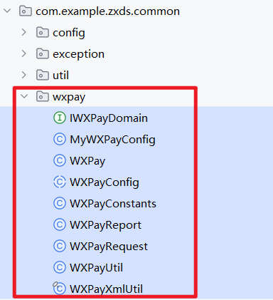

微信支付要用到小程序的APPID、密钥、商户号和数字证书等，所以你要打开 `application-common.yml` 文件，提供相关信息。（**现在先不用填写，到时实现功能的时候再填写**）

### 第十步：封装微信工具类

我们在实现用微信登录代驾小程序的的时候，需要调用微信服务器的API，拿到OpenId永久授权字符串。所以我们要把调用微信服务器API的常用操作封装起来，在项目中使用起来更加的简单。

在 `com.example.zxds.common.util` 包中创建 `MicroAppUtil` 类。

```java
package com.example.zxds.common.util;

import cn.hutool.http.HttpUtil;
import cn.hutool.json.JSONObject;
import cn.hutool.json.JSONUtil;
import com.example.zxds.common.exception.ZxdsException;
import org.springframework.beans.factory.annotation.Value;
import org.springframework.stereotype.Component;

import java.util.HashMap;

@Component("MicroAppUtil")
public class MicroAppUtil {

    @Value("${wx.app-id}")
    private String appId;

    @Value("${wx.app-secret}")
    private String appSecret;

    public String getOpenId(String code) {
        String url = "https://api.weixin.qq.com/sns/jscode2session";
        HashMap map = new HashMap();
        map.put("appid", appId);
        map.put("secret", appSecret);
        map.put("js_code", code);
        map.put("grant_type", "authorization_code");
        String response = HttpUtil.post(url, map);
        JSONObject json = JSONUtil.parseObj(response);
        String openId = json.getStr("openid");
        if (openId == null || openId.length() == 0) {
            throw new RuntimeException("临时登陆凭证错误");
        }
        return openId;
    }

    public String getAccessToken() {
        String url = "https://api.weixin.qq.com/cgi-bin/token";
        HashMap map = new HashMap() {{
            put("grant_type", "client_credential");
            put("appid", appId);
            put("secret", appSecret);
        }};
        String response = HttpUtil.get(url, map);
        JSONObject json = JSONUtil.parseObj(response);
        if (json.containsKey("access_token")) {
            String accessToken = json.getStr("access_token");
            return accessToken;
        } else {
            throw new ZxdsException(json.getStr("errmsg"));
        }
    }
}
```

### 第十一步：定义 JSON 转换类

数据表的主键生成方式采用了雪花算法，所以主键字段都是bigint类型的，映射到Java中就是long类型。前端JavaScript语言并不支持long类型，所有long类型数据都会出现自动截断。所以我们要把返回给移动端或者前端的long类型数据转换成字符串格式。因为移动端和前端页面也不需要做数学运算，基本上就是把数据显示在页面上面，所以返回字符串格式的长整型数据就行了。

SpringBoot项目中的Controller类加上@RestController注解之后，Web方法返回的对象会自动被转换成JSON格式的。我们定义一个Java类，加上@JsonComponent注解，就能控制返回数据的类型类。

在 `com.example.zxds.common.config` 包中创建 `JsonSerializerManage` 类，然后写入下面的代码。

```java
package com.example.zxds.common.config;

import com.fasterxml.jackson.annotation.JsonInclude;
import com.fasterxml.jackson.databind.ObjectMapper;
import com.fasterxml.jackson.databind.module.SimpleModule;
import com.fasterxml.jackson.databind.ser.std.ToStringSerializer;
import org.springframework.boot.jackson.JsonComponent;
import org.springframework.context.annotation.Bean;
import org.springframework.http.converter.json.Jackson2ObjectMapperBuilder;

/**
 * 把Long类型和浮点类型数据转换成字符串，返回前端的时候避免丢失精度
 */
@JsonComponent
public class JsonSerializerManage {

    @Bean
    public ObjectMapper jacksonObjectMapper(Jackson2ObjectMapperBuilder builder) {
        ObjectMapper objectMapper = builder.createXmlMapper(false).build();
        //忽略value为null 时 key的输出
        objectMapper.setSerializationInclusion(JsonInclude.Include.NON_NULL);

        SimpleModule module = new SimpleModule();
        //长整型和浮点型在JavaScript上面都会丢失精度，所以要转换成字符串类型
        module.addSerializer(Long.class, ToStringSerializer.instance);
        module.addSerializer(Long.TYPE, ToStringSerializer.instance);
        module.addSerializer(Double.class, ToStringSerializer.instance);
        module.addSerializer(Double.TYPE, ToStringSerializer.instance);
        module.addSerializer(Float.class, ToStringSerializer.instance);
        module.addSerializer(Float.TYPE, ToStringSerializer.instance);
        objectMapper.registerModule(module);
        return objectMapper;
    }
}
```

### 第十二步：封装腾讯云对象存储服务

我们需要用腾讯云对象存储服务保存文件，例如司机的身份证和驾驶证照片，这里我们先创建操作腾讯云对象存储服务的封装类，后面会讲到这个类的用途和原理，这里不展开说明了。

在 `com.example.zxds.common.util` 包中创建 `CosUtil`代码，然后写入下面的代码：

```java
package com.example.zxds.common.util;

import cn.hutool.core.date.DateUtil;
import cn.hutool.core.util.IdUtil;
import com.example.zxds.common.exception.ZxdsException;
import com.qcloud.cos.COSClient;
import com.qcloud.cos.ClientConfig;
import com.qcloud.cos.auth.BasicCOSCredentials;
import com.qcloud.cos.auth.COSCredentials;
import com.qcloud.cos.http.HttpMethodName;
import com.qcloud.cos.http.HttpProtocol;
import com.qcloud.cos.model.*;
import com.qcloud.cos.model.ciModel.auditing.ImageAuditingRequest;
import com.qcloud.cos.model.ciModel.auditing.ImageAuditingResponse;
import com.qcloud.cos.region.Region;
import org.springframework.beans.factory.annotation.Value;
import org.springframework.stereotype.Component;
import org.springframework.web.multipart.MultipartFile;

import java.io.IOException;
import java.net.URL;
import java.util.Date;
import java.util.HashMap;
import java.util.List;

@Component
public class CosUtil {
    @Value("${tencent.cloud.appId}")
    private String appId;

    @Value("${tencent.cloud.secretId}")
    private String secretId;

    @Value("${tencent.cloud.secretKey}")
    private String secretKey;

    @Value("${tencent.cloud.region-public}")
    private String regionPublic;

    @Value("${tencent.cloud.bucket-public}")
    private String bucketPublic;

    @Value("${tencent.cloud.region-private}")
    private String regionPrivate;

    @Value("${tencent.cloud.bucket-private}")
    private String bucketPrivate;

    //获取访问公有存储桶的连接
    private COSClient getCosPublicClient() {
        COSCredentials cred = new BasicCOSCredentials(secretId, secretKey);
        ClientConfig clientConfig = new ClientConfig(new Region(regionPublic));
        clientConfig.setHttpProtocol(HttpProtocol.https);
        COSClient cosClient = new COSClient(cred, clientConfig);
        return cosClient;
    }

    //获得访问私有存储桶的连接
    private COSClient getCosPrivateClient() {
        COSCredentials cred = new BasicCOSCredentials(secretId, secretKey);
        ClientConfig clientConfig = new ClientConfig(new Region(regionPrivate));
        clientConfig.setHttpProtocol(HttpProtocol.https);
        COSClient cosClient = new COSClient(cred, clientConfig);
        return cosClient;
    }

    /**
     * 向公有存储桶上传文件
     */
    public HashMap uploadPublicFile(MultipartFile file, String path) throws IOException {
        String fileName = file.getOriginalFilename(); //上传文件的名字
        String fileType = fileName.substring(fileName.lastIndexOf(".")); //文件后缀名
        path += IdUtil.simpleUUID() + fileType; //避免重名图片在云端覆盖，所以用UUID作为文件名

        //元数据信息
        ObjectMetadata meta = new ObjectMetadata();
        meta.setContentLength(file.getSize());
        meta.setContentEncoding("UTF-8");
        meta.setContentType(file.getContentType());

        //向存储桶中保存文件
        PutObjectRequest putObjectRequest = new PutObjectRequest(bucketPublic, path, file.getInputStream(), meta);
        putObjectRequest.setStorageClass(StorageClass.Standard); //标准存储
        COSClient client = getCosPublicClient();
        PutObjectResult putObjectResult = client.putObject(putObjectRequest);

        //合成外网访问地址
        HashMap map = new HashMap();
        map.put("url", "https://" + bucketPublic + ".cos." + regionPublic + ".myqcloud.com" + path);
        map.put("path", path);

        //如果保存的是图片，用数据万象服务对图片内容审核
        if (List.of(".jpg", ".jpeg", ".png", ".gif", ".bmp").contains(fileType)) {
            //审核图片内容
            ImageAuditingRequest request = new ImageAuditingRequest();
            request.setBucketName(bucketPublic);
            request.setDetectType("porn,terrorist,politics,ads"); //辨别黄色、暴利、政治和广告内容
            request.setObjectKey(path);
            ImageAuditingResponse response = client.imageAuditing(request); //执行审查

            if (!response.getPornInfo().getHitFlag().equals("0") || !response.getTerroristInfo().getHitFlag().equals("0") || !response.getPoliticsInfo().getHitFlag().equals("0") || !response.getAdsInfo().getHitFlag().equals("0")) {
                //删除违规图片
                client.deleteObject(bucketPublic, path);
                throw new ZxdsException("图片内容不合规");
            }
        }
        client.shutdown();
        return map;
    }

    /**
     * 向私有存储桶上传文件
     */
    public HashMap uploadPrivateFile(MultipartFile file, String path) throws IOException {
        String fileName = file.getOriginalFilename(); //上传文件的名字
        String fileType = fileName.substring(fileName.lastIndexOf(".")); //文件后缀名
        path += IdUtil.simpleUUID() + fileType; //避免重名图片在云端覆盖，所以用UUID作为文件名

        //元数据信息
        ObjectMetadata meta = new ObjectMetadata();
        meta.setContentLength(file.getSize());
        meta.setContentEncoding("UTF-8");
        meta.setContentType(file.getContentType());

        //向存储桶中保存文件
        PutObjectRequest putObjectRequest = new PutObjectRequest(bucketPrivate, path, file.getInputStream(), meta);
        putObjectRequest.setStorageClass(StorageClass.Standard);
        COSClient client = getCosPrivateClient();
        PutObjectResult putObjectResult = client.putObject(putObjectRequest); //上传文件

        HashMap map = new HashMap();
        map.put("path", path);

        //如果保存的是图片，用数据万象服务对图片内容审核
        if (List.of(".jpg", ".jpeg", ".png", ".gif", ".bmp").contains(fileType)) {
            //审核图片内容
            ImageAuditingRequest request = new ImageAuditingRequest();
            request.setBucketName(bucketPrivate);
            request.setDetectType("porn,terrorist,politics,ads"); //辨别黄色、暴利、政治和广告内容
            request.setObjectKey(path);
            ImageAuditingResponse response = client.imageAuditing(request); //执行审查

            if (!response.getPornInfo().getHitFlag().equals("0") || !response.getTerroristInfo().getHitFlag().equals("0") || !response.getPoliticsInfo().getHitFlag().equals("0") || !response.getAdsInfo().getHitFlag().equals("0")) {
                //删除违规图片
                client.deleteObject(bucketPrivate, path);
                throw new ZxdsException("图片内容不合规");
            }
        }
        client.shutdown();
        return map;

    }

    /**
     * 获取私有读写文件的临时URL外网访问地址
     */
    public String getPrivateFileUrl(String path) {
        COSClient client = getCosPrivateClient();
        GeneratePresignedUrlRequest request = new GeneratePresignedUrlRequest(bucketPrivate, path, HttpMethodName.GET);
        Date expiration = DateUtil.offsetMinute(new Date(), 5);  //设置临时URL有效期为5分钟
        request.setExpiration(expiration);
        URL url = client.generatePresignedUrl(request);
        client.shutdown();
        return url.toString();
    }

    /**
     * 刪除公有存储桶的文件
     */
    public void deletePublicFile(String[] pathes) {
        COSClient client = getCosPublicClient();
        for (String path : pathes) {
            client.deleteObject(bucketPublic, path);
        }
        client.shutdown();
    }

    /**
     * 刪除私有存储桶的文件
     */
    public void deletePrivateFile(String[] pathes) {
        COSClient client = getCosPrivateClient();
        for (String path : pathes) {
            client.deleteObject(bucketPrivate, path);
        }
        client.shutdown();
    }

}
```

## 创建 zxds-dr 服务

### 创建子模块 zxds-dr

一个 springboot 模块，名为：`zxds-dr`。把父工程中的对应模块放开，如下：

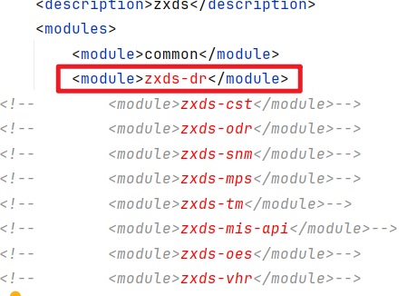

然后就在父工程下创建子模块 `zxds-dr`，还是默认将 JDK 以及 Java 选择为 21，最后将 pom 文件全部覆盖：

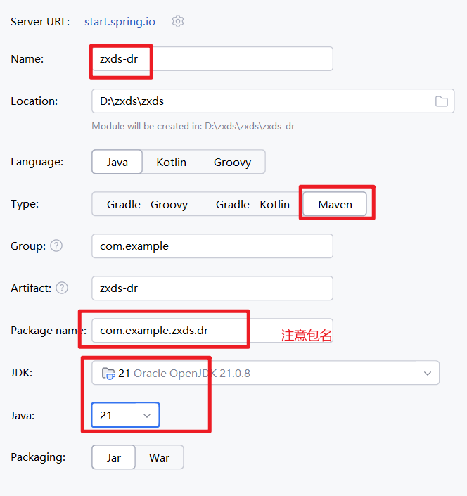

### 覆盖 pom 文件

```xml
<?xml version="1.0" encoding="UTF-8"?>
<project xmlns="http://maven.apache.org/POM/4.0.0" xmlns:xsi="http://www.w3.org/2001/XMLSchema-instance"
         xsi:schemaLocation="http://maven.apache.org/POM/4.0.0 https://maven.apache.org/xsd/maven-4.0.0.xsd">
    <modelVersion>4.0.0</modelVersion>
    <groupId>com.example</groupId>
    <artifactId>zxds-dr</artifactId>
    <version>0.0.1-SNAPSHOT</version>
    <name>zxds-dr</name>
    <description>zxds-dr</description>
    <parent>
        <groupId>com.example</groupId>
        <artifactId>zxds</artifactId>
        <version>0.0.1-SNAPSHOT</version>
    </parent>
    <properties>
        <java.version>15</java.version>
        <project.build.sourceEncoding>UTF-8</project.build.sourceEncoding>
        <project.reporting.outputEncoding>UTF-8</project.reporting.outputEncoding>
        <spring-boot.version>2.3.7.RELEASE</spring-boot.version>
        <spring-cloud-alibaba.version>2.2.7.RELEASE</spring-cloud-alibaba.version>
        <codingapi.version>5.0.2.RELEASE</codingapi.version>
    </properties>

    <dependencies>
        <dependency>
            <groupId>org.springframework.boot</groupId>
            <artifactId>spring-boot-starter-web</artifactId>
            <exclusions>
                <exclusion>
                    <groupId>org.springframework.boot</groupId>
                    <artifactId>spring-boot-starter-tomcat</artifactId>
                </exclusion>
            </exclusions>
        </dependency>
        <dependency>
            <groupId>org.springframework.boot</groupId>
            <artifactId>spring-boot-starter-jetty</artifactId>
        </dependency>
        <dependency>
            <groupId>com.alibaba.cloud</groupId>
            <artifactId>spring-cloud-starter-alibaba-nacos-config</artifactId>
        </dependency>
        <dependency>
            <groupId>com.alibaba.cloud</groupId>
            <artifactId>spring-cloud-starter-alibaba-nacos-discovery</artifactId>
        </dependency>
        <dependency>
            <groupId>org.mybatis.spring.boot</groupId>
            <artifactId>mybatis-spring-boot-starter</artifactId>
            <version>2.2.0</version>
        </dependency>
        <dependency>
            <groupId>org.springframework.cloud</groupId>
            <artifactId>spring-cloud-starter-openfeign</artifactId>
        </dependency>
        <dependency>
            <groupId>mysql</groupId>
            <artifactId>mysql-connector-java</artifactId>
            <scope>runtime</scope>
        </dependency>
        <dependency>
            <groupId>com.alibaba</groupId>
            <artifactId>druid-spring-boot-starter</artifactId>
            <version>1.1.13</version>
        </dependency>
        <!--SpringDoc-->
        <dependency>
            <groupId>org.springdoc</groupId>
            <artifactId>springdoc-openapi-spring-boot-2-webmvc</artifactId>
            <version>3.1.5</version>
        </dependency>
        <dependency>
            <groupId>org.springframework.boot</groupId>
            <artifactId>spring-boot-starter-test</artifactId>
            <scope>test</scope>
            <exclusions>
                <exclusion>
                    <groupId>org.junit.vintage</groupId>
                    <artifactId>junit-vintage-engine</artifactId>
                </exclusion>
            </exclusions>
        </dependency>
        <dependency>
            <groupId>org.springframework.boot</groupId>
            <artifactId>spring-boot-starter-validation</artifactId>
        </dependency>

        <!--分布式事务seata客户端-->
        <dependency>
            <groupId>com.alibaba.cloud</groupId>
            <artifactId>spring-cloud-starter-alibaba-seata</artifactId>
        </dependency>

        <!--依赖公共模块-->
        <dependency>
            <groupId>com.example</groupId>
            <artifactId>common</artifactId>
            <version>0.0.1-SNAPSHOT</version>
        </dependency>
    </dependencies>

    <dependencyManagement>
        <dependencies>
            <dependency>
                <groupId>org.springframework.boot</groupId>
                <artifactId>spring-boot-dependencies</artifactId>
                <version>${spring-boot.version}</version>
                <type>pom</type>
                <scope>import</scope>
            </dependency>
            <dependency>
                <groupId>com.alibaba.cloud</groupId>
                <artifactId>spring-cloud-alibaba-dependencies</artifactId>
                <version>${spring-cloud-alibaba.version}</version>
                <type>pom</type>
                <scope>import</scope>
            </dependency>
        </dependencies>
    </dependencyManagement>

    <build>
        <plugins>
            <plugin>
                <groupId>org.apache.maven.plugins</groupId>
                <artifactId>maven-compiler-plugin</artifactId>
                <version>3.8.1</version>
                <configuration>
                    <source>15</source>
                    <target>15</target>
                    <encoding>UTF-8</encoding>
                </configuration>
            </plugin>
            <plugin>
                <groupId>org.springframework.boot</groupId>
                <artifactId>spring-boot-maven-plugin</artifactId>
                <version>2.3.7.RELEASE</version>
                <configuration>
                    <mainClass>com.example.zxds.dr.ZxdsDrApplication</mainClass>
                </configuration>
                <executions>
                    <execution>
                        <id>repackage</id>
                        <goals>
                            <goal>repackage</goal>
                        </goals>
                    </execution>
                </executions>
            </plugin>
        </plugins>
    </build>


</project>
```

覆盖完成之后，一定要右键重新加载。

### 编写 yml 配置文件

把resources目录下的application.properties文件改成 `application.yml`，然后编写文件的内容。

```yaml
server:
  jetty:
    threads:
      acceptors: 4
      selectors: 8
  port: 8001
  servlet:
    context-path: /

spring:
  profiles:
    #引用application-common.yml文件
    include: common
  application:
    name: zxds-dr
  cloud:
    inetutils:
      #子系统注册到Nacos上的IP地址
      preferred-networks: 127.0.0.1
    nacos:
      #配置子系统在Web管理页面上的注册信息
      config:
        group: DEFAULT_GROUP
        file-extension: yaml
        server-addr: 127.0.0.1:8848
        prefix: ${spring.application.name}
        namespace: zxds
      #配置子系统在Nacos上的注册信息
      discovery:
        namespace: zxds
        username: nacos
        password: nacos
        server-addr: 127.0.0.1:8848
        heart-beat-interval: 1000
        heart-beat-timeout: 1000
        group: DEFAULT_GROUP

  datasource:
    type: com.alibaba.druid.pool.DruidDataSource
    druid:
      driver-class-name: com.mysql.cj.jdbc.Driver
      url: jdbc:mysql://localhost:12001/zxds_dr?useUnicode=true&characterEncoding=UTF-8&serverTimezone=Asia/Shanghai&nullCatalogMeansCurrent=true
      username: root
      password: abc123456
      initial-size: 4
      max-active: 8
      min-idle: 8
      max-wait: 60000
      test-while-idle: true
      test-on-borrow: false
      test-on-return: false
  servlet:
    multipart:
      enabled: true
      max-file-size: 20MB
      max-request-size: 20MB
mybatis:
  mapper-locations: classpath*:mapper/*.xml
  type-aliases-package: com.example.zxds.dr.db.pojo
  configuration:
    log-impl: org.apache.ibatis.logging.stdout.StdOutImpl
    map-underscore-to-camel-case: true

logging:
  level:
    root: info
    com.example.zxds.dr.db.dao: warn
  pattern:
    console: "%d{yyyy/MM/dd HH:mm:ss}  %-5level  %msg%n"

springdoc:
  api-docs:
    enabled: true
    path: /doc-api.html
  swagger-ui:
    path: /swagger-ui.html
    disable-swagger-default-url: on

# seata 实现分布式事务
seata:
  enabled: true
  application-id: ${spring.application.name}
  tx-service-group: dr_tx_group
  service:
    vgroup-mapping:
      dr_tx_group: default
  registry:
    type: file
  config:
    type: file

feign:
  client:
    config:
      default:
        connectTimeout: 10000
        readTimeout: 300000
```

### 全局异常处理

在com.example.zxds.dr.config包中，创建ExceptionAdvice类，然后写入下面的代码：

```java
package com.example.zxds.dr.config;

import cn.hutool.json.JSONObject;
import com.example.zxds.common.exception.ZxdsException;
import lombok.extern.slf4j.Slf4j;
import org.springframework.http.HttpStatus;
import org.springframework.http.converter.HttpMessageNotReadableException;
import org.springframework.web.HttpRequestMethodNotSupportedException;
import org.springframework.web.bind.MethodArgumentNotValidException;
import org.springframework.web.bind.annotation.ExceptionHandler;
import org.springframework.web.bind.annotation.ResponseBody;
import org.springframework.web.bind.annotation.ResponseStatus;
import org.springframework.web.bind.annotation.RestControllerAdvice;

@Slf4j
@RestControllerAdvice
public class ExceptionAdvice {

    @ResponseBody
    @ResponseStatus(HttpStatus.INTERNAL_SERVER_ERROR)
    @ExceptionHandler(Exception.class)
    public String exceptionHandler(Exception e) {
        JSONObject json = new JSONObject();
        //处理后端验证失败产生的异常
        if (e instanceof MethodArgumentNotValidException) {
            MethodArgumentNotValidException exception = (MethodArgumentNotValidException) e;
            json.set("error", exception.getBindingResult().getFieldError().getDefaultMessage());
        }
        //HTTP请求类型不正确的异常
        else if (e instanceof HttpRequestMethodNotSupportedException) {
            json.set("error", "Web方法不支持当前的请求类型");
        }
        //缺少必须提交的表单数据
        else if (e instanceof HttpMessageNotReadableException) {
            json.set("error", "缺少提交的数据");
        }
        //处理业务异常
        else if (e instanceof ZxdsException) {
            log.error("执行异常", e);
            ZxdsException exception = (ZxdsException) e;
            json.set("error", exception.getMsg());
        }
        //处理其余的异常
        else {
            log.error("执行异常", e);
            json.set("error", "执行异常");
        }
        return json.toString();
    }

}
```

### 配置 Swagger

在com.example.zxds.dr.config包中创建SpringDocConfig类，写入下面的代码：

```java
package com.example.zxds.dr.config;

import io.swagger.v3.oas.annotations.OpenAPIDefinition;
import io.swagger.v3.oas.annotations.enums.SecuritySchemeIn;
import io.swagger.v3.oas.annotations.enums.SecuritySchemeType;
import io.swagger.v3.oas.annotations.info.Info;
import io.swagger.v3.oas.annotations.security.SecurityRequirement;
import io.swagger.v3.oas.annotations.security.SecurityScheme;
import org.springframework.boot.autoconfigure.condition.ConditionalOnMissingBean;
import org.springframework.context.annotation.Configuration;
import org.springframework.web.servlet.config.annotation.WebMvcConfigurationSupport;

@OpenAPIDefinition(
        info = @Info(
                title = "zxds-dr",
                description = "智行代驾司机子系统",
                version = "1.0"
        )
)
@Configuration
public class SpringDocConfig {

}
```

### 配置持久层

司机子系统需要使用MySQL，而且持久层我引入了MyBatis框架，所以我们要把相关的Pojo类、DAO接口和XML文件，都放入当前项目中。

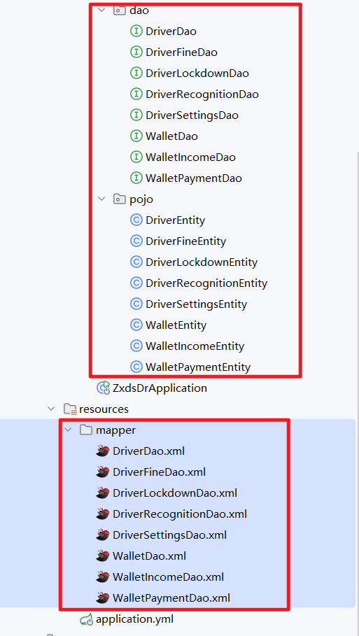

### 修改主类代码

```java
package com.example.zxds.dr;

import org.mybatis.spring.annotation.MapperScan;
import org.springframework.boot.SpringApplication;
import org.springframework.boot.autoconfigure.SpringBootApplication;
import org.springframework.boot.web.servlet.ServletComponentScan;
import org.springframework.cloud.client.discovery.EnableDiscoveryClient;
import org.springframework.cloud.openfeign.EnableFeignClients;
import org.springframework.context.annotation.ComponentScan;

@SpringBootApplication
// 让当前子系统自动注册到Nacos上面
@EnableDiscoveryClient
// 支持Feign远程调用
@EnableFeignClients
// 解决不能正常调用Web方法，出现404的问题
@ServletComponentScan
// 扫描DAO接口
@MapperScan("com.example.zxds.dr.db.dao")
// 扫描当前子系统中各种配置类的注解
@ComponentScan("com.example.*")
public class ZxdsDrApplication {

    public static void main(String[] args) {
        SpringApplication.run(ZxdsDrApplication.class, args);
    }

}
```

## 创建 zxds-cst 服务

### 创建子模块 zxds-cst

创建 springboot 模块 `zxds-cst`，和之前方式相同，创建完成之后使用 pom 覆盖。

包名注意：`com.example.zxds.cst`

### 覆盖 pom 文件

```xml
<?xml version="1.0" encoding="UTF-8"?>
<project xmlns="http://maven.apache.org/POM/4.0.0" xmlns:xsi="http://www.w3.org/2001/XMLSchema-instance"
         xsi:schemaLocation="http://maven.apache.org/POM/4.0.0 https://maven.apache.org/xsd/maven-4.0.0.xsd">
    <modelVersion>4.0.0</modelVersion>
    <groupId>com.example</groupId>
    <artifactId>zxds-cst</artifactId>
    <version>0.0.1-SNAPSHOT</version>
    <name>zxds-cst</name>
    <description>zxds-cst</description>
    <parent>
        <groupId>com.example</groupId>
        <artifactId>zxds</artifactId>
        <version>0.0.1-SNAPSHOT</version>
    </parent>
    <properties>
        <java.version>15</java.version>
        <project.build.sourceEncoding>UTF-8</project.build.sourceEncoding>
        <project.reporting.outputEncoding>UTF-8</project.reporting.outputEncoding>
        <spring-boot.version>2.3.7.RELEASE</spring-boot.version>
        <spring-cloud-alibaba.version>2.2.7.RELEASE</spring-cloud-alibaba.version>
        <codingapi.version>5.0.2.RELEASE</codingapi.version>
    </properties>

    <dependencies>
        <dependency>
            <groupId>org.springframework.boot</groupId>
            <artifactId>spring-boot-starter-web</artifactId>
            <exclusions>
                <exclusion>
                    <groupId>org.springframework.boot</groupId>
                    <artifactId>spring-boot-starter-tomcat</artifactId>
                </exclusion>
            </exclusions>
        </dependency>
        <dependency>
            <groupId>org.springframework.boot</groupId>
            <artifactId>spring-boot-starter-jetty</artifactId>
        </dependency>
        <dependency>
            <groupId>com.alibaba.cloud</groupId>
            <artifactId>spring-cloud-starter-alibaba-nacos-config</artifactId>
        </dependency>
        <dependency>
            <groupId>com.alibaba.cloud</groupId>
            <artifactId>spring-cloud-starter-alibaba-nacos-discovery</artifactId>
        </dependency>
        <dependency>
            <groupId>org.mybatis.spring.boot</groupId>
            <artifactId>mybatis-spring-boot-starter</artifactId>
            <version>2.2.0</version>
        </dependency>
        <dependency>
            <groupId>org.springframework.cloud</groupId>
            <artifactId>spring-cloud-starter-openfeign</artifactId>
        </dependency>
        <dependency>
            <groupId>mysql</groupId>
            <artifactId>mysql-connector-java</artifactId>
            <scope>runtime</scope>
        </dependency>
        <dependency>
            <groupId>com.alibaba</groupId>
            <artifactId>druid-spring-boot-starter</artifactId>
            <version>1.1.13</version>
        </dependency>
        <!--SpringDoc-->
        <dependency>
            <groupId>org.springdoc</groupId>
            <artifactId>springdoc-openapi-spring-boot-2-webmvc</artifactId>
            <version>3.1.5</version>
        </dependency>
        <dependency>
            <groupId>org.springframework.boot</groupId>
            <artifactId>spring-boot-starter-test</artifactId>
            <scope>test</scope>
            <exclusions>
                <exclusion>
                    <groupId>org.junit.vintage</groupId>
                    <artifactId>junit-vintage-engine</artifactId>
                </exclusion>
            </exclusions>
        </dependency>
        <dependency>
            <groupId>org.springframework.boot</groupId>
            <artifactId>spring-boot-starter-validation</artifactId>
        </dependency>

        <!--分布式事务seata客户端-->
        <dependency>
            <groupId>com.alibaba.cloud</groupId>
            <artifactId>spring-cloud-starter-alibaba-seata</artifactId>
        </dependency>

        <!--依赖公共模块-->
        <dependency>
            <groupId>com.example</groupId>
            <artifactId>common</artifactId>
            <version>0.0.1-SNAPSHOT</version>
        </dependency>
    </dependencies>

    <dependencyManagement>
        <dependencies>
            <dependency>
                <groupId>org.springframework.boot</groupId>
                <artifactId>spring-boot-dependencies</artifactId>
                <version>${spring-boot.version}</version>
                <type>pom</type>
                <scope>import</scope>
            </dependency>
            <dependency>
                <groupId>com.alibaba.cloud</groupId>
                <artifactId>spring-cloud-alibaba-dependencies</artifactId>
                <version>${spring-cloud-alibaba.version}</version>
                <type>pom</type>
                <scope>import</scope>
            </dependency>
        </dependencies>
    </dependencyManagement>

    <build>
        <plugins>
            <plugin>
                <groupId>org.apache.maven.plugins</groupId>
                <artifactId>maven-compiler-plugin</artifactId>
                <version>3.8.1</version>
                <configuration>
                    <source>15</source>
                    <target>15</target>
                    <encoding>UTF-8</encoding>
                </configuration>
            </plugin>
            <plugin>
                <groupId>org.springframework.boot</groupId>
                <artifactId>spring-boot-maven-plugin</artifactId>
                <version>2.3.7.RELEASE</version>
                <configuration>
                    <mainClass>com.example.zxds.cst.ZxdsCstApplication</mainClass>
                </configuration>
                <executions>
                    <execution>
                        <id>repackage</id>
                        <goals>
                            <goal>repackage</goal>
                        </goals>
                    </execution>
                </executions>
            </plugin>
        </plugins>
    </build>


</project>
```

### 编写 yml 配置文件

```yaml
server:
  jetty:
    threads:
      acceptors: 4
      selectors: 8
  port: 8007
  servlet:
    context-path: /

spring:
  profiles:
    #引用application-common.yml文件
    include: common
  application:
    name: zxds-cst
  cloud:
    inetutils:
      #子系统注册到Nacos上的IP地址
      preferred-networks: 127.0.0.1
    nacos:
      #配置子系统在Web管理页面上的注册信息
      config:
        group: DEFAULT_GROUP
        file-extension: yaml
        server-addr: 127.0.0.1:8848
        prefix: ${spring.application.name}
        namespace: zxds
      #配置子系统在Nacos上的注册信息
      discovery:
        namespace: zxds
        username: nacos
        password: nacos
        server-addr: 127.0.0.1:8848
        heart-beat-interval: 1000
        heart-beat-timeout: 1000
        group: DEFAULT_GROUP
  datasource:
    type: com.alibaba.druid.pool.DruidDataSource
    druid:
      driver-class-name: com.mysql.cj.jdbc.Driver
      url: jdbc:mysql://localhost:12001/zxds_cst?useUnicode=true&characterEncoding=UTF-8&serverTimezone=Asia/Shanghai&nullCatalogMeansCurrent=true
      username: root
      password: abc123456
      initial-size: 4
      max-active: 8
      min-idle: 8
      max-wait: 60000
      test-while-idle: true
      test-on-borrow: false
      test-on-return: false
  servlet:
    multipart:
      enabled: true
      max-file-size: 20MB
      max-request-size: 20MB
mybatis:
  mapper-locations: classpath*:mapper/*.xml
  type-aliases-package: com.example.zxds.cst.db.pojo
  configuration:
    log-impl: org.apache.ibatis.logging.stdout.StdOutImpl
    map-underscore-to-camel-case: true

logging:
  level:
    root: info
    com.example.zxds.cst.db.dao: warn
  pattern:
    console: "%d{yyyy/MM/dd HH:mm:ss}  %-5level  %msg%n"

springdoc:
  api-docs:
    enabled: true
    path: /doc-api.html
  swagger-ui:
    path: /swagger-ui.html
    disable-swagger-default-url: on

# seata 实现分布式事务
seata:
  enabled: true
  application-id: ${spring.application.name}
  tx-service-group: cst_tx_group
  service:
    vgroup-mapping:
      cst_tx_group: default
  registry:
    type: file
  config:
    type: file

feign:
  client:
    config:
      default:
        connectTimeout: 10000
        readTimeout: 300000
```

### 全局异常处理

在com.example.zxds.cst.config包中，创建ExceptionAdvice类，然后写入下面的代码

```java
package com.example.zxds.cst.config;

import cn.hutool.json.JSONObject;
import com.example.zxds.common.exception.ZxdsException;
import lombok.extern.slf4j.Slf4j;
import org.springframework.http.HttpStatus;
import org.springframework.http.converter.HttpMessageNotReadableException;
import org.springframework.web.HttpRequestMethodNotSupportedException;
import org.springframework.web.bind.MethodArgumentNotValidException;
import org.springframework.web.bind.annotation.ExceptionHandler;
import org.springframework.web.bind.annotation.ResponseBody;
import org.springframework.web.bind.annotation.ResponseStatus;
import org.springframework.web.bind.annotation.RestControllerAdvice;

@Slf4j
@RestControllerAdvice
public class ExceptionAdvice {

    @ResponseBody
    @ResponseStatus(HttpStatus.INTERNAL_SERVER_ERROR)
    @ExceptionHandler(Exception.class)
    public String exceptionHandler(Exception e) {
        JSONObject json = new JSONObject();
        //处理后端验证失败产生的异常
        if (e instanceof MethodArgumentNotValidException) {
            MethodArgumentNotValidException exception = (MethodArgumentNotValidException) e;
            json.set("error", exception.getBindingResult().getFieldError().getDefaultMessage());
        }
        //HTTP请求类型不正确的异常
        else if (e instanceof HttpRequestMethodNotSupportedException) {
            json.set("error", "Web方法不支持当前的请求类型");
        }
        //缺少必须提交的表单数据
        else if (e instanceof HttpMessageNotReadableException) {
            json.set("error", "缺少提交的数据");
        }
        //处理业务异常
        else if (e instanceof ZxdsException) {
            log.error("执行异常", e);
            ZxdsException exception = (ZxdsException) e;
            json.set("error", exception.getMsg());
        }
        //处理其余的异常
        else {
            log.error("执行异常", e);
            json.set("error", "执行异常");
        }
        return json.toString();
    }

}
```

### 配置 Swagger

在com.example.zxds.cst.config包中创建SpringDocConfig类，写入下面的代码

```java
package com.example.zxds.cst.config;

import io.swagger.v3.oas.annotations.OpenAPIDefinition;
import io.swagger.v3.oas.annotations.info.Info;
import org.springframework.context.annotation.Configuration;

@OpenAPIDefinition(
        info = @Info(
                title = "zxds-cst",
                description = "智行代码代驾客户子系统",
                version = "1.0"
        )
)
@Configuration
public class SpringDocConfig {


}
```

### 配置持久层

把我项目中提供的 dao、pojo、mapper 配置文件放到对应包中：

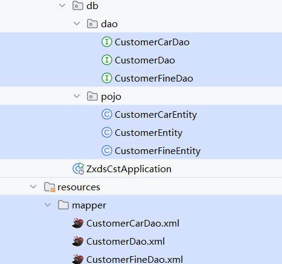

### 修改主类

```java
package com.example.zxds.cst;

import org.mybatis.spring.annotation.MapperScan;
import org.springframework.boot.SpringApplication;
import org.springframework.boot.autoconfigure.SpringBootApplication;
import org.springframework.boot.web.servlet.ServletComponentScan;
import org.springframework.cloud.client.discovery.EnableDiscoveryClient;
import org.springframework.cloud.openfeign.EnableFeignClients;
import org.springframework.context.annotation.ComponentScan;

@SpringBootApplication
@EnableDiscoveryClient
@EnableFeignClients
@ServletComponentScan
@MapperScan("com.example.zxds.cst.db.dao")
@ComponentScan("com.example.*")
public class ZxdsCstApplication {

    public static void main(String[] args) {
        SpringApplication.run(ZxdsCstApplication.class, args);
    }

}
```

## 创建 zxds-mps 服务

### 创建子模块 zxds-mps

和之前一样，注意包名：`com.example.zxds.mps`

### 覆盖 pom 文件

```xml
<?xml version="1.0" encoding="UTF-8"?>
<project xmlns="http://maven.apache.org/POM/4.0.0" xmlns:xsi="http://www.w3.org/2001/XMLSchema-instance"
         xsi:schemaLocation="http://maven.apache.org/POM/4.0.0 https://maven.apache.org/xsd/maven-4.0.0.xsd">
    <modelVersion>4.0.0</modelVersion>
    <groupId>com.example</groupId>
    <artifactId>zxds-mps</artifactId>
    <version>0.0.1-SNAPSHOT</version>
    <name>zxds-mps</name>
    <description>zxds-mps</description>
    <parent>
        <groupId>com.example</groupId>
        <artifactId>zxds</artifactId>
        <version>0.0.1-SNAPSHOT</version>
    </parent>
    <properties>
        <java.version>15</java.version>
        <project.build.sourceEncoding>UTF-8</project.build.sourceEncoding>
        <project.reporting.outputEncoding>UTF-8</project.reporting.outputEncoding>
        <spring-boot.version>2.3.7.RELEASE</spring-boot.version>
    </properties>

    <dependencies>
        <dependency>
            <groupId>org.springframework.boot</groupId>
            <artifactId>spring-boot-starter-web</artifactId>
            <exclusions>
                <exclusion>
                    <groupId>org.springframework.boot</groupId>
                    <artifactId>spring-boot-starter-tomcat</artifactId>
                </exclusion>
            </exclusions>
        </dependency>
        <dependency>
            <groupId>org.springframework.boot</groupId>
            <artifactId>spring-boot-starter-jetty</artifactId>
        </dependency>
        <dependency>
            <groupId>com.alibaba.cloud</groupId>
            <artifactId>spring-cloud-starter-alibaba-nacos-config</artifactId>
        </dependency>
        <dependency>
            <groupId>com.alibaba.cloud</groupId>
            <artifactId>spring-cloud-starter-alibaba-nacos-discovery</artifactId>
        </dependency>
        <dependency>
            <groupId>org.springframework.cloud</groupId>
            <artifactId>spring-cloud-starter-openfeign</artifactId>
        </dependency>
        <!--Redis-->
        <dependency>
            <groupId>org.springframework.boot</groupId>
            <artifactId>spring-boot-starter-data-redis</artifactId>
        </dependency>
        <!--SpringDoc-->
        <dependency>
            <groupId>org.springdoc</groupId>
            <artifactId>springdoc-openapi-spring-boot-2-webmvc</artifactId>
            <version>3.1.5</version>
        </dependency>
        <dependency>
            <groupId>org.springframework.boot</groupId>
            <artifactId>spring-boot-starter-test</artifactId>
            <scope>test</scope>
            <exclusions>
                <exclusion>
                    <groupId>org.junit.vintage</groupId>
                    <artifactId>junit-vintage-engine</artifactId>
                </exclusion>
            </exclusions>
        </dependency>
        <dependency>
            <groupId>org.springframework.boot</groupId>
            <artifactId>spring-boot-starter-validation</artifactId>
        </dependency>
        <!--GEO-->
        <dependency>
            <groupId>org.gavaghan</groupId>
            <artifactId>geodesy</artifactId>
            <version>1.1.3</version>
        </dependency>
        <!--依赖公共模块-->
        <dependency>
            <groupId>com.example</groupId>
            <artifactId>common</artifactId>
            <version>0.0.1-SNAPSHOT</version>
        </dependency>
    </dependencies>

    <dependencyManagement>
        <dependencies>
            <dependency>
                <groupId>org.springframework.boot</groupId>
                <artifactId>spring-boot-dependencies</artifactId>
                <version>${spring-boot.version}</version>
                <type>pom</type>
                <scope>import</scope>
            </dependency>
            <dependency>
                <groupId>com.alibaba.cloud</groupId>
                <artifactId>spring-cloud-alibaba-dependencies</artifactId>
                <version>${spring-cloud-alibaba.version}</version>
                <type>pom</type>
                <scope>import</scope>
            </dependency>
        </dependencies>
    </dependencyManagement>

    <build>
        <plugins>
            <plugin>
                <groupId>org.apache.maven.plugins</groupId>
                <artifactId>maven-compiler-plugin</artifactId>
                <version>3.8.1</version>
                <configuration>
                    <source>15</source>
                    <target>15</target>
                    <encoding>UTF-8</encoding>
                </configuration>
            </plugin>
            <plugin>
                <groupId>org.springframework.boot</groupId>
                <artifactId>spring-boot-maven-plugin</artifactId>
                <version>2.3.7.RELEASE</version>
                <configuration>
                    <mainClass>com.example.zxds.mps.ZxdsMpsApplication</mainClass>
                </configuration>
                <executions>
                    <execution>
                        <id>repackage</id>
                        <goals>
                            <goal>repackage</goal>
                        </goals>
                    </execution>
                </executions>
            </plugin>
        </plugins>
    </build>


</project>
```

### 编写 yml 配置文件

```yaml
server:
  jetty:
    threads:
      acceptors: 4
      selectors: 8
  port: 8004
  servlet:
    context-path: /

spring:
  profiles:
    include: common
  application:
    name: zxds-mps

  redis:
    database: 7
    host: localhost
    port: 6379
    password: abc123456
    jedis:
      pool:
        max-active: 1000
        max-wait: -1ms
        max-idle: 16
        min-idle: 8
  cloud:
    inetutils:
      #子系统注册到Nacos上的IP地址
      preferred-networks: 127.0.0.1
    nacos:
      #配置子系统在Web管理页面上的注册信息
      config:
        group: DEFAULT_GROUP
        file-extension: yaml
        server-addr: 127.0.0.1:8848
        prefix: ${spring.application.name}
        namespace: zxds
      #配置子系统在Nacos上的注册信息
      discovery:
        namespace: zxds
        username: nacos
        password: nacos
        server-addr: 127.0.0.1:8848
        heart-beat-interval: 1000
        heart-beat-timeout: 1000
        group: DEFAULT_GROUP
  servlet:
    multipart:
      enabled: true
      max-file-size: 20MB
      max-request-size: 20MB
springdoc:
  api-docs:
    enabled: true
    path: /doc-api.html
  swagger-ui:
    path: /swagger-ui.html
    disable-swagger-default-url: on

feign:
  client:
    config:
      default:
        connectTimeout: 10000
        readTimeout: 300000
```

### 全局异常处理

在com.example.zxds.mps.config包中，创建ExceptionAdvice类，然后写入下面的代码：

```java
package com.example.zxds.mps.config;

import cn.hutool.json.JSONObject;
import com.example.zxds.common.exception.ZxdsException;
import lombok.extern.slf4j.Slf4j;
import org.springframework.http.HttpStatus;
import org.springframework.http.converter.HttpMessageNotReadableException;
import org.springframework.web.HttpRequestMethodNotSupportedException;
import org.springframework.web.bind.MethodArgumentNotValidException;
import org.springframework.web.bind.annotation.ExceptionHandler;
import org.springframework.web.bind.annotation.ResponseBody;
import org.springframework.web.bind.annotation.ResponseStatus;
import org.springframework.web.bind.annotation.RestControllerAdvice;

@Slf4j
@RestControllerAdvice
public class ExceptionAdvice {

    @ResponseBody
    @ResponseStatus(HttpStatus.INTERNAL_SERVER_ERROR)
    @ExceptionHandler(Exception.class)
    public String exceptionHandler(Exception e) {
        JSONObject json = new JSONObject();
        //处理后端验证失败产生的异常
        if (e instanceof MethodArgumentNotValidException) {
            MethodArgumentNotValidException exception = (MethodArgumentNotValidException) e;
            json.set("error", exception.getBindingResult().getFieldError().getDefaultMessage());
        }
        //HTTP请求类型不正确的异常
        else if (e instanceof HttpRequestMethodNotSupportedException) {
            json.set("error", "Web方法不支持当前的请求类型");
        }
        //缺少必须提交的表单数据
        else if (e instanceof HttpMessageNotReadableException) {
            json.set("error", "缺少提交的数据");
        }
        //处理业务异常
        else if (e instanceof ZxdsException) {
            log.error("执行异常", e);
            ZxdsException exception = (ZxdsException) e;
            json.set("error", exception.getMsg());
        }
        //处理其余的异常
        else {
            log.error("执行异常", e);
            json.set("error", "执行异常");
        }
        return json.toString();
    }

}
```

### 配置 Swagger 功能

在com.example.zxds.mps.config包中创建SpringDocConfig类，写入下面的代码：

```java
package com.example.zxds.mps.config;

import io.swagger.v3.oas.annotations.OpenAPIDefinition;
import io.swagger.v3.oas.annotations.info.Info;
import org.springframework.context.annotation.Configuration;

@OpenAPIDefinition(
        info = @Info(
                title = "zxds-mps",
                description = "智行代驾地图子系统",
                version = "1.0"
        )
)
@Configuration
public class SpringDocConfig {

}
```

### 定义工具类

国内地图服务商提供的坐标定位有用GPS坐标的，也有用火星坐标的（GCJ-02），所以我们需要一个工具类，能自由转换GPS坐标和火星坐标。

:::info
GCJ-02 是由中国国家测绘局制订的地理信息系统的坐标系统，是在WGS84经纬度的基础上执行加密算法而成。因为GPS得到的经纬度直接在 GCJ-02 坐标系下会定位到错误的地点，有种到了火星的感觉，因此在坊间也将 GCJ-02 戏称为火星坐标系。国测局规定，国内出版的各种地图系统（包括电子形式），必须至少采用 GCJ-02 对地理位置进行首次加密的坐标系，高德和腾讯地图在国内都是使用 GCJ-02 坐标系，而百度使用的是在 GCJ-02 基础上再一次加密的 BD-09 坐标系。

:::

在com.example.zxds.mps.util包中创建CoordinateTransform类，写入下面代码：

```java
package com.example.zxds.mps.util;

/**
 * 提供了百度坐标（BD09）、国测局坐标（火星坐标，GCJ02）、和WGS84坐标系之间的转换
 */
public class CoordinateTransform {
    private static final double x_PI = 3.14159265358979324 * 3000.0 / 180.0;
    private static final double PI = 3.1415926535897932384626;
    private static final double a = 6378245.0;
    private static final double ee = 0.00669342162296594323;

    /**
     * 百度坐标（BD09）转 GCJ02
     *
     * @param lng 百度经度
     * @param lat 百度纬度
     * @return GCJ02 坐标：[经度，纬度]
     */
    public static double[] transformBD09ToGCJ02(double lng, double lat) {
        double x = lng - 0.0065;
        double y = lat - 0.006;
        double z = Math.sqrt(x * x + y * y) - 0.00002 * Math.sin(y * x_PI);
        double theta = Math.atan2(y, x) - 0.000003 * Math.cos(x * x_PI);
        double gcj_lng = z * Math.cos(theta);
        double gcj_lat = z * Math.sin(theta);
        return new double[]{gcj_lng, gcj_lat};
    }

    /**
     * GCJ02 转百度坐标
     *
     * @param lng GCJ02 经度
     * @param lat GCJ02 纬度
     * @return 百度坐标：[经度，纬度]
     */
    public static double[] transformGCJ02ToBD09(double lng, double lat) {
        double z = Math.sqrt(lng * lng + lat * lat) + 0.00002 * Math.sin(lat * x_PI);
        double theta = Math.atan2(lat, lng) + 0.000003 * Math.cos(lng * x_PI);
        double bd_lng = z * Math.cos(theta) + 0.0065;
        double bd_lat = z * Math.sin(theta) + 0.006;
        return new double[]{bd_lng, bd_lat};
    }

    /**
     * GCJ02 转 WGS84
     *
     * @param lng 经度
     * @param lat 纬度
     * @return WGS84坐标：[经度，纬度]
     */
    public static double[] transformGCJ02ToWGS84(double lng, double lat) {
        if (outOfChina(lng, lat)) {
            return new double[]{lng, lat};
        } else {
            double dLat = transformLat(lng - 105.0, lat - 35.0);
            double dLng = transformLng(lng - 105.0, lat - 35.0);
            double radLat = lat / 180.0 * PI;
            double magic = Math.sin(radLat);
            magic = 1 - ee * magic * magic;
            double sqrtMagic = Math.sqrt(magic);
            dLat = (dLat * 180.0) / ((a * (1 - ee)) / (magic * sqrtMagic) * PI);
            dLng = (dLng * 180.0) / (a / sqrtMagic * Math.cos(radLat) * PI);
            double mgLat = lat + dLat;
            double mgLng = lng + dLng;
            return new double[]{lng * 2 - mgLng, lat * 2 - mgLat};
        }
    }

    /**
     * WGS84 坐标 转 GCJ02
     *
     * @param lng 经度
     * @param lat 纬度
     * @return GCJ02 坐标：[经度，纬度]
     */
    public static double[] transformWGS84ToGCJ02(double lng, double lat) {
        if (outOfChina(lng, lat)) {
            return new double[]{lng, lat};
        } else {
            double dLat = transformLat(lng - 105.0, lat - 35.0);
            double dLng = transformLng(lng - 105.0, lat - 35.0);
            double redLat = lat / 180.0 * PI;
            double magic = Math.sin(redLat);
            magic = 1 - ee * magic * magic;
            double sqrtMagic = Math.sqrt(magic);
            dLat = (dLat * 180.0) / ((a * (1 - ee)) / (magic * sqrtMagic) * PI);
            dLng = (dLng * 180.0) / (a / sqrtMagic * Math.cos(redLat) * PI);
            double mgLat = lat + dLat;
            double mgLng = lng + dLng;
            return new double[]{mgLng, mgLat};
        }
    }

    /**
     * 百度坐标BD09 转 WGS84
     *
     * @param lng 经度
     * @param lat 纬度
     * @return WGS84 坐标：[经度，纬度]
     */
    public static double[] transformBD09ToWGS84(double lng, double lat) {
        double[] lngLat = transformBD09ToGCJ02(lng, lat);

        return transformGCJ02ToWGS84(lngLat[0], lngLat[1]);
    }

    /**
     * WGS84 转 百度坐标BD09
     *
     * @param lng 经度
     * @param lat 纬度
     * @return BD09 坐标：[经度，纬度]
     */
    public static double[] transformWGS84ToBD09(double lng, double lat) {
        double[] lngLat = transformWGS84ToGCJ02(lng, lat);

        return transformGCJ02ToBD09(lngLat[0], lngLat[1]);
    }

    private static double transformLat(double lng, double lat) {
        double ret = -100.0 + 2.0 * lng + 3.0 * lat + 0.2 * lat * lat + 0.1 * lng * lat + 0.2 * Math.sqrt(Math.abs(lng));
        ret += (20.0 * Math.sin(6.0 * lng * PI) + 20.0 * Math.sin(2.0 * lng * PI)) * 2.0 / 3.0;
        ret += (20.0 * Math.sin(lat * PI) + 40.0 * Math.sin(lat / 3.0 * PI)) * 2.0 / 3.0;
        ret += (160.0 * Math.sin(lat / 12.0 * PI) + 320 * Math.sin(lat * PI / 30.0)) * 2.0 / 3.0;
        return ret;
    }


    private static double transformLng(double lng, double lat) {
        double ret = 300.0 + lng + 2.0 * lat + 0.1 * lng * lng + 0.1 * lng * lat + 0.1 * Math.sqrt(Math.abs(lng));
        ret += (20.0 * Math.sin(6.0 * lng * PI) + 20.0 * Math.sin(2.0 * lng * PI)) * 2.0 / 3.0;
        ret += (20.0 * Math.sin(lng * PI) + 40.0 * Math.sin(lng / 3.0 * PI)) * 2.0 / 3.0;
        ret += (150.0 * Math.sin(lng / 12.0 * PI) + 300.0 * Math.sin(lng / 30.0 * PI)) * 2.0 / 3.0;
        return ret;
    }

    /**
     * 判断坐标是否不在国内
     *
     * @param lng 经度
     * @param lat 纬度
     * @return 坐标是否在国内
     */
    public static boolean outOfChina(double lng, double lat) {
        return (lng < 72.004 || lng > 137.8347) || (lat < 0.8293 || lat > 55.8271);
    }
}
```

### 修改主类

```java
package com.example.zxds.mps;

import org.springframework.boot.SpringApplication;
import org.springframework.boot.autoconfigure.SpringBootApplication;
import org.springframework.boot.web.servlet.ServletComponentScan;
import org.springframework.cloud.client.discovery.EnableDiscoveryClient;
import org.springframework.cloud.openfeign.EnableFeignClients;
import org.springframework.context.annotation.ComponentScan;

@SpringBootApplication
@ServletComponentScan
@EnableDiscoveryClient
@EnableFeignClients
@ComponentScan("com.example.*")
public class ZxdsMpsApplication {

    public static void main(String[] args) {
        SpringApplication.run(ZxdsMpsApplication.class, args);
    }

}
```

## 创建zxds-odr 服务

### 创建子模块zxds-odr

和之前一样，包名：com.example.zxds.odr

### 覆盖 pom 文件

```xml
<?xml version="1.0" encoding="UTF-8"?>
<project xmlns="http://maven.apache.org/POM/4.0.0" xmlns:xsi="http://www.w3.org/2001/XMLSchema-instance"
         xsi:schemaLocation="http://maven.apache.org/POM/4.0.0 https://maven.apache.org/xsd/maven-4.0.0.xsd">
    <modelVersion>4.0.0</modelVersion>
    <groupId>com.example</groupId>
    <artifactId>zxds-odr</artifactId>
    <version>0.0.1-SNAPSHOT</version>
    <name>zxds-odr</name>
    <description>zxds-odr</description>
    <parent>
        <groupId>com.example</groupId>
        <artifactId>zxds</artifactId>
        <version>0.0.1-SNAPSHOT</version>
    </parent>
    <properties>
        <java.version>15</java.version>
        <project.build.sourceEncoding>UTF-8</project.build.sourceEncoding>
        <project.reporting.outputEncoding>UTF-8</project.reporting.outputEncoding>
        <spring-boot.version>2.3.7.RELEASE</spring-boot.version>
        <spring-cloud-alibaba.version>2.2.7.RELEASE</spring-cloud-alibaba.version>
        <codingapi.version>5.0.2.RELEASE</codingapi.version>
    </properties>

    <dependencies>
        <dependency>
            <groupId>org.springframework.boot</groupId>
            <artifactId>spring-boot-starter-web</artifactId>
            <exclusions>
                <exclusion>
                    <groupId>org.springframework.boot</groupId>
                    <artifactId>spring-boot-starter-tomcat</artifactId>
                </exclusion>
            </exclusions>
        </dependency>
        <dependency>
            <groupId>org.springframework.boot</groupId>
            <artifactId>spring-boot-starter-jetty</artifactId>
        </dependency>
        <dependency>
            <groupId>com.alibaba.cloud</groupId>
            <artifactId>spring-cloud-starter-alibaba-nacos-config</artifactId>
        </dependency>
        <dependency>
            <groupId>com.alibaba.cloud</groupId>
            <artifactId>spring-cloud-starter-alibaba-nacos-discovery</artifactId>
        </dependency>
        <dependency>
            <groupId>org.mybatis.spring.boot</groupId>
            <artifactId>mybatis-spring-boot-starter</artifactId>
            <version>2.2.0</version>
        </dependency>
        <dependency>
            <groupId>org.springframework.cloud</groupId>
            <artifactId>spring-cloud-starter-openfeign</artifactId>
        </dependency>
        <dependency>
            <groupId>mysql</groupId>
            <artifactId>mysql-connector-java</artifactId>
            <scope>runtime</scope>
        </dependency>
        <dependency>
            <groupId>com.alibaba</groupId>
            <artifactId>druid-spring-boot-starter</artifactId>
            <version>1.1.13</version>
        </dependency>
        <!--Redis-->
        <dependency>
            <groupId>org.springframework.boot</groupId>
            <artifactId>spring-boot-starter-data-redis</artifactId>
        </dependency>
        <!--SpringDoc-->
        <dependency>
            <groupId>org.springdoc</groupId>
            <artifactId>springdoc-openapi-spring-boot-2-webmvc</artifactId>
            <version>3.1.5</version>
        </dependency>
        <dependency>
            <groupId>org.springframework.boot</groupId>
            <artifactId>spring-boot-starter-test</artifactId>
            <scope>test</scope>
            <exclusions>
                <exclusion>
                    <groupId>org.junit.vintage</groupId>
                    <artifactId>junit-vintage-engine</artifactId>
                </exclusion>
            </exclusions>
        </dependency>
        <dependency>
            <groupId>org.springframework.boot</groupId>
            <artifactId>spring-boot-starter-validation</artifactId>
        </dependency>
        <!--分布式事务seata客户端-->
        <dependency>
            <groupId>com.alibaba.cloud</groupId>
            <artifactId>spring-cloud-starter-alibaba-seata</artifactId>
        </dependency>
        <!--定时器-->
        <dependency>
            <groupId>org.springframework.boot</groupId>
            <artifactId>spring-boot-starter-quartz</artifactId>
        </dependency>
        <!--依赖公共模块-->
        <dependency>
            <groupId>com.example</groupId>
            <artifactId>common</artifactId>
            <version>0.0.1-SNAPSHOT</version>
        </dependency>
    </dependencies>

    <dependencyManagement>
        <dependencies>
            <dependency>
                <groupId>org.springframework.boot</groupId>
                <artifactId>spring-boot-dependencies</artifactId>
                <version>${spring-boot.version}</version>
                <type>pom</type>
                <scope>import</scope>
            </dependency>
            <dependency>
                <groupId>com.alibaba.cloud</groupId>
                <artifactId>spring-cloud-alibaba-dependencies</artifactId>
                <version>${spring-cloud-alibaba.version}</version>
                <type>pom</type>
                <scope>import</scope>
            </dependency>
        </dependencies>
    </dependencyManagement>

    <build>
        <plugins>
            <plugin>
                <groupId>org.apache.maven.plugins</groupId>
                <artifactId>maven-compiler-plugin</artifactId>
                <version>3.8.1</version>
                <configuration>
                    <source>15</source>
                    <target>15</target>
                    <encoding>UTF-8</encoding>
                </configuration>
            </plugin>
            <plugin>
                <groupId>org.springframework.boot</groupId>
                <artifactId>spring-boot-maven-plugin</artifactId>
                <version>2.3.7.RELEASE</version>
                <configuration>
                    <mainClass>com.example.zxds.odr.ZxdsOdrApplication</mainClass>
                </configuration>
                <executions>
                    <execution>
                        <id>repackage</id>
                        <goals>
                            <goal>repackage</goal>
                        </goals>
                    </execution>
                </executions>
            </plugin>
        </plugins>
    </build>

</project>
```

### 编写 yml 配置文件

```yaml
server:
  jetty:
    threads:
      acceptors: 4
      selectors: 8
  port: 8002
  servlet:
    context-path: /

spring:
  profiles:
    #引用application-common.yml文件
    include: common
  application:
    name: zxds-odr
  cloud:
    inetutils:
      #子系统注册到Nacos上的IP地址
      preferred-networks: 127.0.0.1
    nacos:
      #配置子系统在Web管理页面上的注册信息
      config:
        group: DEFAULT_GROUP
        file-extension: yaml
        server-addr: 127.0.0.1:8848
        prefix: ${spring.application.name}
        namespace: zxds
      #配置子系统在Nacos上的注册信息
      discovery:
        namespace: zxds
        username: nacos
        password: nacos
        server-addr: 127.0.0.1:8848
        heart-beat-interval: 1000
        heart-beat-timeout: 1000
        group: DEFAULT_GROUP
  datasource:
    type: com.alibaba.druid.pool.DruidDataSource
    druid:
      driver-class-name: com.mysql.cj.jdbc.Driver
      url: jdbc:mysql://127.0.0.1:12001/zxds_odr?useUnicode=true&characterEncoding=UTF-8&serverTimezone=Asia/Shanghai&nullCatalogMeansCurrent=true
      username: root
      password: abc123456
      initial-size: 4
      max-active: 8
      min-idle: 8
      max-wait: 60000
      test-while-idle: true
      test-on-borrow: false
      test-on-return: false
  redis:
    database: 5
    host: localhost
    port: 6379
    password: abc123456
    jedis:
      pool:
        max-active: 1000
        max-wait: -1ms
        max-idle: 16
        min-idle: 8
  quartz:
    job-store-type: memory
  servlet:
    multipart:
      enabled: true
      max-file-size: 20MB
      max-request-size: 20MB
mybatis:
  mapper-locations: classpath*:mapper/*.xml
  type-aliases-package: com.example.zxds.odr.db.pojo
  configuration:
    log-impl: org.apache.ibatis.logging.stdout.StdOutImpl
    map-underscore-to-camel-case: true
logging:
  level:
    root: info
    com.example.zxds.odr.db.dao: warn
  pattern:
    console: "%d{yyyy/MM/dd HH:mm:ss}  %-5level  %msg%n"

springdoc:
  api-docs:
    enabled: true
    path: /doc-api.html
  swagger-ui:
    path: /swagger-ui.html
    disable-swagger-default-url: on

# seata 实现分布式事务
seata:
  enabled: true
  application-id: ${spring.application.name}
  tx-service-group: odr_tx_group
  service:
    vgroup-mapping:
      odr_tx_group: default
  registry:
    type: file
  config:
    type: file

feign:
  client:
    config:
      default:
        connectTimeout: 10000
        readTimeout: 300000
```

### 全局异常处理

在com.example.zxds.odr.config包中，创建ExceptionAdvice类，然后写入下面的代码：

```java
package com.example.zxds.odr.config;

import cn.hutool.json.JSONObject;
import com.example.zxds.common.exception.ZxdsException;
import lombok.extern.slf4j.Slf4j;
import org.springframework.http.HttpStatus;
import org.springframework.http.converter.HttpMessageNotReadableException;
import org.springframework.web.HttpRequestMethodNotSupportedException;
import org.springframework.web.bind.MethodArgumentNotValidException;
import org.springframework.web.bind.annotation.ExceptionHandler;
import org.springframework.web.bind.annotation.ResponseBody;
import org.springframework.web.bind.annotation.ResponseStatus;
import org.springframework.web.bind.annotation.RestControllerAdvice;

@Slf4j
@RestControllerAdvice
public class ExceptionAdvice {

    @ResponseBody
    @ResponseStatus(HttpStatus.INTERNAL_SERVER_ERROR)
    @ExceptionHandler(Exception.class)
    public String exceptionHandler(Exception e) {
        JSONObject json = new JSONObject();
        //处理后端验证失败产生的异常
        if (e instanceof MethodArgumentNotValidException) {
            MethodArgumentNotValidException exception = (MethodArgumentNotValidException) e;
            json.set("error", exception.getBindingResult().getFieldError().getDefaultMessage());
        }
        //HTTP请求类型不正确的异常
        else if (e instanceof HttpRequestMethodNotSupportedException) {
            json.set("error", "Web方法不支持当前的请求类型");
        }
        //缺少必须提交的表单数据
        else if (e instanceof HttpMessageNotReadableException) {
            json.set("error", "缺少提交的数据");
        }
        //处理业务异常
        else if (e instanceof ZxdsException) {
            log.error("执行异常", e);
            ZxdsException exception = (ZxdsException) e;
            json.set("error", exception.getMsg());
        }
        //处理其余的异常
        else {
            log.error("执行异常", e);
            json.set("error", "执行异常");
        }
        return json.toString();
    }

}
```

### 配置 Swagger

在com.example.zxds.odr.config包中创建SpringDocConfig类，写入下面的代码：

```java
package com.example.zxds.odr.config;

import io.swagger.v3.oas.annotations.OpenAPIDefinition;
import io.swagger.v3.oas.annotations.info.Info;
import org.springframework.context.annotation.Configuration;

@OpenAPIDefinition(
        info = @Info(
                title = "zxds-odr",
                description = "智行代驾订单子系统",
                version = "1.0"
        )
)
@Configuration
public class SpringDocConfig {


}
```

### 配置持久层

将我提供给大家的 dao pojo mapperxml 文件拷贝到对应的包下：

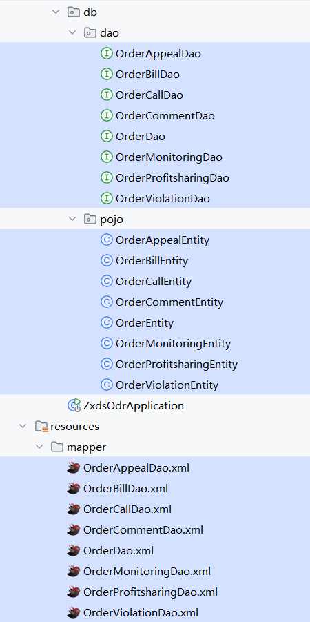

### 修改主类

```java
package com.example.zxds.odr;

import org.mybatis.spring.annotation.MapperScan;
import org.springframework.boot.SpringApplication;
import org.springframework.boot.autoconfigure.SpringBootApplication;
import org.springframework.boot.web.servlet.ServletComponentScan;
import org.springframework.cloud.client.discovery.EnableDiscoveryClient;
import org.springframework.cloud.openfeign.EnableFeignClients;
import org.springframework.context.annotation.ComponentScan;

@SpringBootApplication
@EnableDiscoveryClient
@EnableFeignClients
@ServletComponentScan
@MapperScan({"com.example.zxds.odr.db.dao"})
@ComponentScan({"com.example.*"})
public class ZxdsOdrApplication {

    public static void main(String[] args) {
        SpringApplication.run(ZxdsOdrApplication.class, args);
    }

}
```

## 创建 zxds-oes 服务

### 创建子模块 zxds-oes

和之前一样，包名：com.example.zxds.oes

### 覆盖 pom 文件

```xml
<?xml version="1.0" encoding="UTF-8"?>
<project xmlns="http://maven.apache.org/POM/4.0.0" xmlns:xsi="http://www.w3.org/2001/XMLSchema-instance"
         xsi:schemaLocation="http://maven.apache.org/POM/4.0.0 https://maven.apache.org/xsd/maven-4.0.0.xsd">
    <modelVersion>4.0.0</modelVersion>
    <groupId>com.example</groupId>
    <artifactId>zxds-oes</artifactId>
    <version>0.0.1-SNAPSHOT</version>
    <name>zxds-oes</name>
    <description>zxds-oes</description>
    <parent>
        <groupId>com.example</groupId>
        <artifactId>zxds</artifactId>
        <version>0.0.1-SNAPSHOT</version>
    </parent>
    <properties>
        <java.version>15</java.version>
        <project.build.sourceEncoding>UTF-8</project.build.sourceEncoding>
        <project.reporting.outputEncoding>UTF-8</project.reporting.outputEncoding>
        <spring-boot.version>2.3.7.RELEASE</spring-boot.version>
        <spring-cloud-alibaba.version>2.2.7.RELEASE</spring-cloud-alibaba.version>
        <codingapi.version>5.0.2.RELEASE</codingapi.version>
    </properties>

    <dependencies>
        <dependency>
            <groupId>org.springframework.boot</groupId>
            <artifactId>spring-boot-starter-web</artifactId>
            <exclusions>
                <exclusion>
                    <groupId>org.springframework.boot</groupId>
                    <artifactId>spring-boot-starter-tomcat</artifactId>
                </exclusion>
            </exclusions>
        </dependency>
        <dependency>
            <groupId>org.springframework.boot</groupId>
            <artifactId>spring-boot-starter-jetty</artifactId>
        </dependency>
        <dependency>
            <groupId>com.alibaba.cloud</groupId>
            <artifactId>spring-cloud-starter-alibaba-nacos-config</artifactId>
        </dependency>
        <dependency>
            <groupId>com.alibaba.cloud</groupId>
            <artifactId>spring-cloud-starter-alibaba-nacos-discovery</artifactId>
        </dependency>
        <dependency>
            <groupId>org.springframework.cloud</groupId>
            <artifactId>spring-cloud-starter-openfeign</artifactId>
        </dependency>
        <!--Redis-->
        <dependency>
            <groupId>org.springframework.boot</groupId>
            <artifactId>spring-boot-starter-data-redis</artifactId>
        </dependency>
        <!--SpringDoc-->
        <dependency>
            <groupId>org.springdoc</groupId>
            <artifactId>springdoc-openapi-spring-boot-2-webmvc</artifactId>
            <version>3.1.5</version>
        </dependency>
        <dependency>
            <groupId>org.springframework.boot</groupId>
            <artifactId>spring-boot-starter-test</artifactId>
            <scope>test</scope>
            <exclusions>
                <exclusion>
                    <groupId>org.junit.vintage</groupId>
                    <artifactId>junit-vintage-engine</artifactId>
                </exclusion>
            </exclusions>
        </dependency>
        <dependency>
            <groupId>org.springframework.boot</groupId>
            <artifactId>spring-boot-starter-validation</artifactId>
        </dependency>
        <!--GEO-->
        <dependency>
            <groupId>org.gavaghan</groupId>
            <artifactId>geodesy</artifactId>
            <version>1.1.3</version>
        </dependency>
        <!--依赖公共模块-->
        <dependency>
            <groupId>com.example</groupId>
            <artifactId>common</artifactId>
            <version>0.0.1-SNAPSHOT</version>
        </dependency>
        <!--分布式事务seata客户端-->
        <dependency>
            <groupId>com.alibaba.cloud</groupId>
            <artifactId>spring-cloud-starter-alibaba-seata</artifactId>
        </dependency>
        <dependency>
            <groupId>org.mybatis.spring.boot</groupId>
            <artifactId>mybatis-spring-boot-starter</artifactId>
            <version>2.2.0</version>
        </dependency>
        <dependency>
            <groupId>mysql</groupId>
            <artifactId>mysql-connector-java</artifactId>
            <scope>runtime</scope>
        </dependency>
        <dependency>
            <groupId>com.alibaba</groupId>
            <artifactId>druid-spring-boot-starter</artifactId>
            <version>1.1.13</version>
        </dependency>
    </dependencies>

    <dependencyManagement>
        <dependencies>
            <dependency>
                <groupId>org.springframework.boot</groupId>
                <artifactId>spring-boot-dependencies</artifactId>
                <version>${spring-boot.version}</version>
                <type>pom</type>
                <scope>import</scope>
            </dependency>
            <dependency>
                <groupId>com.alibaba.cloud</groupId>
                <artifactId>spring-cloud-alibaba-dependencies</artifactId>
                <version>${spring-cloud-alibaba.version}</version>
                <type>pom</type>
                <scope>import</scope>
            </dependency>
        </dependencies>
    </dependencyManagement>

    <build>
        <plugins>
            <plugin>
                <groupId>org.apache.maven.plugins</groupId>
                <artifactId>maven-compiler-plugin</artifactId>
                <version>3.8.1</version>
                <configuration>
                    <source>15</source>
                    <target>15</target>
                    <encoding>UTF-8</encoding>
                </configuration>
            </plugin>
            <plugin>
                <groupId>org.springframework.boot</groupId>
                <artifactId>spring-boot-maven-plugin</artifactId>
                <version>2.3.7.RELEASE</version>
                <configuration>
                    <mainClass>com.example.zxds.oes.ZxdsOesApplication</mainClass>
                </configuration>
                <executions>
                    <execution>
                        <id>repackage</id>
                        <goals>
                            <goal>repackage</goal>
                        </goals>
                    </execution>
                </executions>
            </plugin>
        </plugins>
    </build>

</project>
```

### 编写 yml 配置文件

```yaml
server:
  jetty:
    threads:
      acceptors: 4
      selectors: 8
  port: 8005
  servlet:
    context-path: /

spring:
  profiles:
    #引用application-common.yml文件
    include: common
  application:
    name: zxds-oes
  datasource:
    type: com.alibaba.druid.pool.DruidDataSource
    druid:
      driver-class-name: com.mysql.cj.jdbc.Driver
      url: jdbc:mysql://127.0.0.1:12001/zxds_odr?useUnicode=true&characterEncoding=UTF-8&serverTimezone=Asia/Shanghai&nullCatalogMeansCurrent=true
      username: root
      password: abc123456
      initial-size: 4
      max-active: 8
      min-idle: 8
      max-wait: 60000
      test-while-idle: true
      test-on-borrow: false
      test-on-return: false
  redis:
    database: 6
    host: localhost
    port: 6379
    password: abc123456
    jedis:
      pool:
        max-active: 1000
        max-wait: -1ms
        max-idle: 16
        min-idle: 8
  cloud:
    inetutils:
      #子系统注册到Nacos上的IP地址
      preferred-networks: 127.0.0.1
    nacos:
      #配置子系统在Web管理页面上的注册信息
      config:
        group: DEFAULT_GROUP
        file-extension: yaml
        server-addr: 127.0.0.1:8848
        prefix: ${spring.application.name}
        namespace: zxds
      #配置子系统在Nacos上的注册信息
      discovery:
        namespace: zxds
        username: nacos
        password: nacos
        server-addr: 127.0.0.1:8848
        heart-beat-interval: 1000
        heart-beat-timeout: 1000
        group: DEFAULT_GROUP
  servlet:
    multipart:
      enabled: true
      max-file-size: 20MB
      max-request-size: 20MB

springdoc:
  api-docs:
    enabled: true
    path: /doc-api.html
  swagger-ui:
    path: /swagger-ui.html
    disable-swagger-default-url: on

# seata 实现分布式事务
seata:
  enabled: true
  application-id: ${spring.application.name}
  tx-service-group: oes_tx_group
  service:
    vgroup-mapping:
      oes_tx_group: default
  registry:
    type: file
  config:
    type: file

feign:
  client:
    config:
      default:
        connectTimeout: 10000
        readTimeout: 300000
```

### 全局异常处理

在com.example.zxds.oes.config包中，创建ExceptionAdvice类，然后写入下面的代码：

```java
package com.example.zxds.oes.config;

import cn.hutool.json.JSONObject;

import com.example.zxds.common.exception.ZxdsException;
import lombok.extern.slf4j.Slf4j;
import org.springframework.http.HttpStatus;
import org.springframework.http.converter.HttpMessageNotReadableException;
import org.springframework.web.HttpRequestMethodNotSupportedException;
import org.springframework.web.bind.MethodArgumentNotValidException;
import org.springframework.web.bind.annotation.ExceptionHandler;
import org.springframework.web.bind.annotation.ResponseBody;
import org.springframework.web.bind.annotation.ResponseStatus;
import org.springframework.web.bind.annotation.RestControllerAdvice;

@Slf4j
@RestControllerAdvice
public class ExceptionAdvice {

    @ResponseBody
    @ResponseStatus(HttpStatus.INTERNAL_SERVER_ERROR)
    @ExceptionHandler(Exception.class)
    public String exceptionHandler(Exception e) {
        JSONObject json = new JSONObject();
        //处理后端验证失败产生的异常
        if (e instanceof MethodArgumentNotValidException) {
            MethodArgumentNotValidException exception = (MethodArgumentNotValidException) e;
            json.set("error", exception.getBindingResult().getFieldError().getDefaultMessage());
        }
        //HTTP请求类型不正确的异常
        else if (e instanceof HttpRequestMethodNotSupportedException) {
            json.set("error", "Web方法不支持当前的请求类型");
        }
        //缺少必须提交的表单数据
        else if (e instanceof HttpMessageNotReadableException) {
            json.set("error", "缺少提交的数据");
        }
        //处理业务异常
        else if (e instanceof ZxdsException) {
            log.error("执行异常", e);
            ZxdsException exception = (ZxdsException) e;
            json.set("error", exception.getMsg());
        }
        //处理其余的异常
        else {
            log.error("执行异常", e);
            json.set("error", "执行异常");
        }
        return json.toString();
    }

}
```

### 配置 Swagger

在com.example.zxds.oes.config包中创建SpringDocConfig类，写入下面的代码：

```java
package com.example.zxds.oes.config;

import io.swagger.v3.oas.annotations.OpenAPIDefinition;
import io.swagger.v3.oas.annotations.info.Info;
import org.springframework.context.annotation.Configuration;

@OpenAPIDefinition(
        info = @Info(
                title = "zxds-oes",
                description = "智行代驾订单执行子系统",
                version = "1.0"
        )
)
@Configuration
public class SpringDocConfig {


}
```

### 修改主类

```java
package com.example.zxds.oes;

import org.springframework.boot.SpringApplication;
import org.springframework.boot.autoconfigure.SpringBootApplication;
import org.springframework.boot.web.servlet.ServletComponentScan;
import org.springframework.cloud.client.discovery.EnableDiscoveryClient;
import org.springframework.cloud.openfeign.EnableFeignClients;
import org.springframework.context.annotation.ComponentScan;

@SpringBootApplication
@EnableDiscoveryClient
@EnableFeignClients
@ServletComponentScan
@ComponentScan("com.example.*")
public class ZxdsOesApplication {

    public static void main(String[] args) {
        SpringApplication.run(ZxdsOesApplication.class, args);
    }

}
```

## 创建 zxds-snm 服务

### 创建子模块 zxds-snm

和之前一样，注意包名：com.example.zxds.snm

### 覆盖 pom 文件

```xml
<?xml version="1.0" encoding="UTF-8"?>
<project xmlns="http://maven.apache.org/POM/4.0.0" xmlns:xsi="http://www.w3.org/2001/XMLSchema-instance"
         xsi:schemaLocation="http://maven.apache.org/POM/4.0.0 https://maven.apache.org/xsd/maven-4.0.0.xsd">
    <modelVersion>4.0.0</modelVersion>
    <groupId>com.example</groupId>
    <artifactId>zxds-snm</artifactId>
    <version>0.0.1-SNAPSHOT</version>
    <name>zxds-snm</name>
    <description>zxds-snm</description>
    <parent>
        <groupId>com.example</groupId>
        <artifactId>zxds</artifactId>
        <version>0.0.1-SNAPSHOT</version>
    </parent>

    <properties>
        <java.version>15</java.version>
        <project.build.sourceEncoding>UTF-8</project.build.sourceEncoding>
        <project.reporting.outputEncoding>UTF-8</project.reporting.outputEncoding>
        <spring-boot.version>2.3.7.RELEASE</spring-boot.version>
        <spring-cloud-alibaba.version>2.2.7.RELEASE</spring-cloud-alibaba.version>
    </properties>

    <dependencies>
        <dependency>
            <groupId>org.springframework.boot</groupId>
            <artifactId>spring-boot-starter-web</artifactId>
            <exclusions>
                <exclusion>
                    <groupId>org.springframework.boot</groupId>
                    <artifactId>spring-boot-starter-tomcat</artifactId>
                </exclusion>
            </exclusions>
        </dependency>
        <dependency>
            <groupId>org.springframework.boot</groupId>
            <artifactId>spring-boot-starter-jetty</artifactId>
        </dependency>
        <dependency>
            <groupId>com.alibaba.cloud</groupId>
            <artifactId>spring-cloud-starter-alibaba-nacos-config</artifactId>
        </dependency>
        <dependency>
            <groupId>com.alibaba.cloud</groupId>
            <artifactId>spring-cloud-starter-alibaba-nacos-discovery</artifactId>
        </dependency>
        <dependency>
            <groupId>org.springframework.boot</groupId>
            <artifactId>spring-boot-starter-amqp</artifactId>
        </dependency>
        <dependency>
            <groupId>com.rabbitmq</groupId>
            <artifactId>amqp-client</artifactId>
            <version>5.9.0</version>
        </dependency>
        <dependency>
            <groupId>org.springframework.cloud</groupId>
            <artifactId>spring-cloud-starter-openfeign</artifactId>
        </dependency>
        <dependency>
            <groupId>org.springframework.boot</groupId>
            <artifactId>spring-boot-starter-data-mongodb</artifactId>
        </dependency>
        <dependency>
            <groupId>com.spring4all</groupId>
            <artifactId>mongodb-plus-spring-boot-starter</artifactId>
            <version>1.0.0.RELEASE</version>
        </dependency>

        <!--SpringDoc-->
        <dependency>
            <groupId>org.springdoc</groupId>
            <artifactId>springdoc-openapi-spring-boot-2-webmvc</artifactId>
            <version>3.1.5</version>
        </dependency>
        <dependency>
            <groupId>org.springframework.boot</groupId>
            <artifactId>spring-boot-starter-test</artifactId>
            <scope>test</scope>
            <exclusions>
                <exclusion>
                    <groupId>org.junit.vintage</groupId>
                    <artifactId>junit-vintage-engine</artifactId>
                </exclusion>
            </exclusions>
        </dependency>
        <dependency>
            <groupId>org.springframework.boot</groupId>
            <artifactId>spring-boot-starter-validation</artifactId>
        </dependency>
        <!--依赖公共模块-->
        <dependency>
            <groupId>com.example</groupId>
            <artifactId>common</artifactId>
            <version>0.0.1-SNAPSHOT</version>
        </dependency>
    </dependencies>

    <dependencyManagement>
        <dependencies>
            <dependency>
                <groupId>org.springframework.boot</groupId>
                <artifactId>spring-boot-dependencies</artifactId>
                <version>${spring-boot.version}</version>
                <type>pom</type>
                <scope>import</scope>
            </dependency>
            <dependency>
                <groupId>com.alibaba.cloud</groupId>
                <artifactId>spring-cloud-alibaba-dependencies</artifactId>
                <version>${spring-cloud-alibaba.version}</version>
                <type>pom</type>
                <scope>import</scope>
            </dependency>
        </dependencies>
    </dependencyManagement>

    <build>
        <plugins>
            <plugin>
                <groupId>org.apache.maven.plugins</groupId>
                <artifactId>maven-compiler-plugin</artifactId>
                <version>3.8.1</version>
                <configuration>
                    <source>15</source>
                    <target>15</target>
                    <encoding>UTF-8</encoding>
                </configuration>
            </plugin>
            <plugin>
                <groupId>org.springframework.boot</groupId>
                <artifactId>spring-boot-maven-plugin</artifactId>
                <version>2.3.7.RELEASE</version>
                <configuration>
                    <mainClass>com.example.zxds.snm.ZxdsSnmApplication</mainClass>
                </configuration>
                <executions>
                    <execution>
                        <id>repackage</id>
                        <goals>
                            <goal>repackage</goal>
                        </goals>
                    </execution>
                </executions>
            </plugin>
        </plugins>
    </build>

</project>
```

### 编写 yml 配置文件

```yaml
server:
  jetty:
    threads:
      acceptors: 4
      selectors: 8
  port: 8003
  servlet:
    context-path: /

spring:
  profiles:
    #引用application-common.yml文件
    include: common
  application:
    name: zxds-snm
  cloud:
    inetutils:
      #子系统注册到Nacos上的IP地址
      preferred-networks: 127.0.0.1
    nacos:
      #配置子系统在Web管理页面上的注册信息
      config:
        group: DEFAULT_GROUP
        file-extension: yaml
        server-addr: 127.0.0.1:8848
        prefix: ${spring.application.name}
        namespace: zxds
      #配置子系统在Nacos上的注册信息
      discovery:
        namespace: zxds
        username: nacos
        password: nacos
        server-addr: 127.0.0.1:8848
        heart-beat-interval: 1000
        heart-beat-timeout: 1000
        group: DEFAULT_GROUP
  data:
    mongodb:
      host: localhost
      port: 27017
      database: zxds
      authentication-database: admin
      username: admin
      password: abc123456
      option:
        min-connection-per-host: 0
        max-connection-per-host: 100
  servlet:
    multipart:
      enabled: true
      max-file-size: 20MB
      max-request-size: 20MB

rabbitmq:

  host: localhost
  port: 5672
  username: guest
  password: guest

logging:
  level:
    root: info
  pattern:
    console: "%d{yyyy/MM/dd HH:mm:ss}  %-5level  %msg%n"

springdoc:
  api-docs:
    enabled: true
    path: /doc-api.html
  swagger-ui:
    path: /swagger-ui.html
    disable-swagger-default-url: on

feign:
  client:
    config:
      default:
        connectTimeout: 10000
        readTimeout: 300000
```

### 全局异常处理

在com.example.zxds.snm.config包中，创建ExceptionAdvice类，然后写入下面的代码：

```java
package com.example.zxds.snm.config;

import cn.hutool.json.JSONObject;
import com.example.zxds.common.exception.ZxdsException;
import lombok.extern.slf4j.Slf4j;
import org.springframework.http.HttpStatus;
import org.springframework.http.converter.HttpMessageNotReadableException;
import org.springframework.web.HttpRequestMethodNotSupportedException;
import org.springframework.web.bind.MethodArgumentNotValidException;
import org.springframework.web.bind.annotation.ExceptionHandler;
import org.springframework.web.bind.annotation.ResponseBody;
import org.springframework.web.bind.annotation.ResponseStatus;
import org.springframework.web.bind.annotation.RestControllerAdvice;

@Slf4j
@RestControllerAdvice
public class ExceptionAdvice {

    @ResponseBody
    @ResponseStatus(HttpStatus.INTERNAL_SERVER_ERROR)
    @ExceptionHandler(Exception.class)
    public String exceptionHandler(Exception e) {
        JSONObject json = new JSONObject();
        //处理后端验证失败产生的异常
        if (e instanceof MethodArgumentNotValidException) {
            MethodArgumentNotValidException exception = (MethodArgumentNotValidException) e;
            json.set("error", exception.getBindingResult().getFieldError().getDefaultMessage());
        }
        //HTTP请求类型不正确的异常
        else if (e instanceof HttpRequestMethodNotSupportedException) {
            json.set("error", "Web方法不支持当前的请求类型");
        }
        //缺少必须提交的表单数据
        else if (e instanceof HttpMessageNotReadableException) {
            json.set("error", "缺少提交的数据");
        }
        //处理业务异常
        else if (e instanceof ZxdsException) {
            log.error("执行异常", e);
            ZxdsException exception = (ZxdsException) e;
            json.set("error", exception.getMsg());
        }
        //处理其余的异常
        else {
            log.error("执行异常", e);
            json.set("error", "执行异常");
        }
        return json.toString();
    }

}
```

### 配置 RabbitMQ

当前子系统需要连接 RabbitMQ，因此我将连接信息放到配置文件中了：

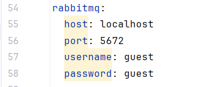

在com.example.zxds.snm.config包中创建RabbitMQConfig类，连接信息依靠值注入给变量。

```java
package com.example.zxds.snm.config;

import com.rabbitmq.client.ConnectionFactory;
import org.springframework.beans.factory.annotation.Value;
import org.springframework.context.annotation.Bean;
import org.springframework.context.annotation.Configuration;

@Configuration
public class RabbitMQConfig {

    @Value("${rabbitmq.host}")
    private String host;

    @Value("${rabbitmq.port}")
    private int port;

    @Value("${rabbitmq.username}")
    private String username;

    @Value("${rabbitmq.password}")
    private String password;

    @Bean
    public ConnectionFactory getFactory() {
        ConnectionFactory factory = new ConnectionFactory();
        factory.setHost(host);
        factory.setPort(port);
        //factory.setUsername(username);
        //factory.setPassword(password);
        return factory;
    }
}
```

### 配置 Swagger

在com.example.zxds.snm.config包中创建SpringDocConfig类，写入下面的代码：

```java
package com.example.zxds.snm.config;

import io.swagger.v3.oas.annotations.OpenAPIDefinition;
import io.swagger.v3.oas.annotations.info.Info;
import org.springframework.context.annotation.Configuration;

@OpenAPIDefinition(
        info = @Info(
                title = "zxds-snm",
                description = "智行代驾消息子系统",
                version = "1.0"
        )
)
@Configuration
public class SpringDocConfig {

}
```

### 配置线程池

由于要收发RabbitMQ中的消息，所以我们要创建线程池，由多线程去收发消息，比单线程要快很多。如果所有司机端收发消息都依靠同一个线程，你觉得会快得了吗？所以还是用多线程吧。

在com.example.zxds.snm.config包中创建ThreadPoolConfig类，然后写入下面的代码：

```java
package com.example.zxds.odr.config;

import org.springframework.context.annotation.Bean;
import org.springframework.context.annotation.Configuration;
import org.springframework.core.task.AsyncTaskExecutor;
import org.springframework.scheduling.concurrent.ThreadPoolTaskExecutor;

import java.util.concurrent.ThreadPoolExecutor;

@Configuration
public class ThreadPoolConfig {
    @Bean("AsyncTaskExecutor")
    public AsyncTaskExecutor taskExecutor() {
        ThreadPoolTaskExecutor executor = new ThreadPoolTaskExecutor();
        // 设置核心线程数
        executor.setCorePoolSize(8);
        // 设置最大线程数
        executor.setMaxPoolSize(16);
        // 设置队列容量
        executor.setQueueCapacity(32);
        // 设置线程活跃时间（秒）
        executor.setKeepAliveSeconds(60);
        // 设置默认线程名称
        executor.setThreadNamePrefix("task-");
        // 设置拒绝策略
        executor.setRejectedExecutionHandler(new ThreadPoolExecutor.CallerRunsPolicy());
        executor.initialize();
        return executor;

    }
}
```

### 配置持久层

虽然该子系统不使用MySQL数据库，但是MongoDB还是要用到的。读写MongoDB数据，还是依赖持久层的，所以我们配置一下持久层。在初始化项目中找到这些文件，然后把他们放入对应的目录即可。

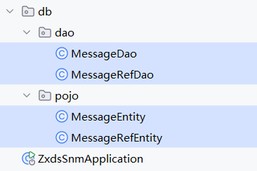

### 修改主类

```java
package com.example.zxds.snm;

import org.springframework.boot.SpringApplication;
import org.springframework.boot.autoconfigure.SpringBootApplication;
import org.springframework.boot.web.servlet.ServletComponentScan;
import org.springframework.cloud.client.discovery.EnableDiscoveryClient;
import org.springframework.cloud.openfeign.EnableFeignClients;
import org.springframework.context.annotation.ComponentScan;
import org.springframework.scheduling.annotation.EnableAsync;

@SpringBootApplication
@EnableDiscoveryClient
@EnableFeignClients
@ServletComponentScan
@ComponentScan("com.example.*")
@EnableAsync
public class ZxdsSnmApplication {

    public static void main(String[] args) {
        SpringApplication.run(ZxdsSnmApplication.class, args);
    }

}
```

## 创建 zxds-vhr 服务

创建 zxds-vhr服务，它是项目中的代金券子系统。代驾客户领取代金券，还有司机取消订单的时候，某些条件下，代驾系统要补偿给客户代金券。甚至客户支付代驾账单使用代金券，都与创建的子系统有关。

### 创建子模块 zxds-vhr

和之前一样，注意包名：com.example.zxds.vhr

### 覆盖 pom 文件

```xml
<?xml version="1.0" encoding="UTF-8"?>
<project xmlns="http://maven.apache.org/POM/4.0.0" xmlns:xsi="http://www.w3.org/2001/XMLSchema-instance"
         xsi:schemaLocation="http://maven.apache.org/POM/4.0.0 https://maven.apache.org/xsd/maven-4.0.0.xsd">
    <modelVersion>4.0.0</modelVersion>
    <groupId>com.example</groupId>
    <artifactId>zxds-vhr</artifactId>
    <version>0.0.1-SNAPSHOT</version>
    <name>zxds-vhr</name>
    <description>zxds-vhr</description>
    <parent>
        <groupId>com.example</groupId>
        <artifactId>zxds</artifactId>
        <version>0.0.1-SNAPSHOT</version>
    </parent>
    <properties>
        <java.version>15</java.version>
        <project.build.sourceEncoding>UTF-8</project.build.sourceEncoding>
        <project.reporting.outputEncoding>UTF-8</project.reporting.outputEncoding>
        <spring-boot.version>2.3.7.RELEASE</spring-boot.version>
        <spring-cloud-alibaba.version>2.2.7.RELEASE</spring-cloud-alibaba.version>
        <codingapi.version>5.0.2.RELEASE</codingapi.version>
    </properties>

    <dependencies>
        <dependency>
            <groupId>org.springframework.boot</groupId>
            <artifactId>spring-boot-starter-web</artifactId>
            <exclusions>
                <exclusion>
                    <groupId>org.springframework.boot</groupId>
                    <artifactId>spring-boot-starter-tomcat</artifactId>
                </exclusion>
            </exclusions>
        </dependency>
        <dependency>
            <groupId>org.springframework.boot</groupId>
            <artifactId>spring-boot-starter-jetty</artifactId>
        </dependency>
        <dependency>
            <groupId>com.alibaba.cloud</groupId>
            <artifactId>spring-cloud-starter-alibaba-nacos-config</artifactId>
        </dependency>
        <dependency>
            <groupId>com.alibaba.cloud</groupId>
            <artifactId>spring-cloud-starter-alibaba-nacos-discovery</artifactId>
        </dependency>
        <dependency>
            <groupId>org.mybatis.spring.boot</groupId>
            <artifactId>mybatis-spring-boot-starter</artifactId>
            <version>2.2.0</version>
        </dependency>
        <dependency>
            <groupId>org.springframework.cloud</groupId>
            <artifactId>spring-cloud-starter-openfeign</artifactId>
        </dependency>
        <dependency>
            <groupId>mysql</groupId>
            <artifactId>mysql-connector-java</artifactId>
            <scope>runtime</scope>
        </dependency>
        <dependency>
            <groupId>com.alibaba</groupId>
            <artifactId>druid-spring-boot-starter</artifactId>
            <version>1.1.13</version>
        </dependency>
        <!--SpringDoc-->
        <dependency>
            <groupId>org.springdoc</groupId>
            <artifactId>springdoc-openapi-spring-boot-2-webmvc</artifactId>
            <version>3.1.5</version>
        </dependency>
        <dependency>
            <groupId>org.springframework.boot</groupId>
            <artifactId>spring-boot-starter-test</artifactId>
            <scope>test</scope>
            <exclusions>
                <exclusion>
                    <groupId>org.junit.vintage</groupId>
                    <artifactId>junit-vintage-engine</artifactId>
                </exclusion>
            </exclusions>
        </dependency>
        <dependency>
            <groupId>org.springframework.boot</groupId>
            <artifactId>spring-boot-starter-validation</artifactId>
        </dependency>
        <!--分布式事务seata客户端-->
        <dependency>
            <groupId>com.alibaba.cloud</groupId>
            <artifactId>spring-cloud-starter-alibaba-seata</artifactId>
        </dependency>
        <!--依赖公共模块-->
        <dependency>
            <groupId>com.example</groupId>
            <artifactId>common</artifactId>
            <version>0.0.1-SNAPSHOT</version>
        </dependency>
    </dependencies>

    <dependencyManagement>
        <dependencies>
            <dependency>
                <groupId>org.springframework.boot</groupId>
                <artifactId>spring-boot-dependencies</artifactId>
                <version>${spring-boot.version}</version>
                <type>pom</type>
                <scope>import</scope>
            </dependency>
            <dependency>
                <groupId>com.alibaba.cloud</groupId>
                <artifactId>spring-cloud-alibaba-dependencies</artifactId>
                <version>${spring-cloud-alibaba.version}</version>
                <type>pom</type>
                <scope>import</scope>
            </dependency>
        </dependencies>
    </dependencyManagement>

    <build>
        <plugins>
            <plugin>
                <groupId>org.apache.maven.plugins</groupId>
                <artifactId>maven-compiler-plugin</artifactId>
                <version>3.8.1</version>
                <configuration>
                    <source>15</source>
                    <target>15</target>
                    <encoding>UTF-8</encoding>
                </configuration>
            </plugin>
            <plugin>
                <groupId>org.springframework.boot</groupId>
                <artifactId>spring-boot-maven-plugin</artifactId>
                <version>2.3.7.RELEASE</version>
                <configuration>
                    <mainClass>com.example.zxds.vhr.ZxdsVhrApplication</mainClass>
                </configuration>
                <executions>
                    <execution>
                        <id>repackage</id>
                        <goals>
                            <goal>repackage</goal>
                        </goals>
                    </execution>
                </executions>
            </plugin>
        </plugins>
    </build>


</project>
```

### 编写 yml 配置文件

```yaml
server:
  jetty:
    threads:
      acceptors: 4
      selectors: 8
  port: 8008
  servlet:
    context-path: /
    multipart:
      max-request-size: 10MB
      max-file-size: 2MB

spring:
  profiles:
    #引用application-common.yml文件
    include: common
  application:
    name: zxds-vhr
  cloud:
    inetutils:
      #子系统注册到Nacos上的IP地址
      preferred-networks: 127.0.0.1
    nacos:
      #配置子系统在Web管理页面上的注册信息
      config:
        group: DEFAULT_GROUP
        file-extension: yaml
        server-addr: 127.0.0.1:8848
        prefix: ${spring.application.name}
        namespace: zxds
      #配置子系统在Nacos上的注册信息
      discovery:
        namespace: zxds
        username: nacos
        password: nacos
        server-addr: 127.0.0.1:8848
        heart-beat-interval: 1000
        heart-beat-timeout: 1000
        group: DEFAULT_GROUP
  datasource:
    type: com.alibaba.druid.pool.DruidDataSource
    druid:
      driver-class-name: com.mysql.cj.jdbc.Driver
      url: jdbc:mysql://localhost:12001/zxds_vhr?useUnicode=true&characterEncoding=UTF-8&serverTimezone=Asia/Shanghai&nullCatalogMeansCurrent=true
      username: root
      password: abc123456
      initial-size: 4
      max-active: 8
      min-idle: 8
      max-wait: 60000
      test-while-idle: true
      test-on-borrow: false
      test-on-return: false
  servlet:
    multipart:
      enabled: true
      max-file-size: 20MB
      max-request-size: 20MB

mybatis:
  mapper-locations: classpath*:mapper/*.xml
  type-aliases-package: com.example.zxds.vhr.db.pojo
  configuration:
    log-impl: org.apache.ibatis.logging.stdout.StdOutImpl
    map-underscore-to-camel-case: true

logging:
  level:
    root: info
    com.example.zxds.vhr.db.dao: warn
  pattern:
    console: "%d{yyyy/MM/dd HH:mm:ss}  %-5level  %msg%n"

springdoc:
  api-docs:
    enabled: true
    path: /doc-api.html
  swagger-ui:
    path: /swagger-ui.html
    disable-swagger-default-url: on

# seata 实现分布式事务
seata:
  enabled: true
  application-id: ${spring.application.name}
  tx-service-group: vhr_tx_group
  service:
    vgroup-mapping:
      vhr_tx_group: default
  registry:
    type: file
  config:
    type: file

feign:
  client:
    config:
      default:
        connectTimeout: 10000
        readTimeout: 300000
```

### 全局异常处理

在com.example.zxds.vhr.config包中，创建ExceptionAdvice类，然后写入下面的代码：

```java
package com.example.zxds.vhr.config;

import cn.hutool.json.JSONObject;
import com.example.zxds.common.exception.ZxdsException;
import lombok.extern.slf4j.Slf4j;
import org.springframework.http.HttpStatus;
import org.springframework.http.converter.HttpMessageNotReadableException;
import org.springframework.web.HttpRequestMethodNotSupportedException;
import org.springframework.web.bind.MethodArgumentNotValidException;
import org.springframework.web.bind.annotation.ExceptionHandler;
import org.springframework.web.bind.annotation.ResponseBody;
import org.springframework.web.bind.annotation.ResponseStatus;
import org.springframework.web.bind.annotation.RestControllerAdvice;

@Slf4j
@RestControllerAdvice
public class ExceptionAdvice {

    @ResponseBody
    @ResponseStatus(HttpStatus.INTERNAL_SERVER_ERROR)
    @ExceptionHandler(Exception.class)
    public String exceptionHandler(Exception e) {
        JSONObject json = new JSONObject();
        //处理后端验证失败产生的异常
        if (e instanceof MethodArgumentNotValidException) {
            MethodArgumentNotValidException exception = (MethodArgumentNotValidException) e;
            json.set("error", exception.getBindingResult().getFieldError().getDefaultMessage());
        }
        //HTTP请求类型不正确的异常
        else if (e instanceof HttpRequestMethodNotSupportedException) {
            json.set("error", "Web方法不支持当前的请求类型");
        }
        //缺少必须提交的表单数据
        else if (e instanceof HttpMessageNotReadableException) {
            json.set("error", "缺少提交的数据");
        }
        //处理业务异常
        else if (e instanceof ZxdsException) {
            log.error("执行异常", e);
            ZxdsException exception = (ZxdsException) e;
            json.set("error", exception.getMsg());
        }
        //处理其余的异常
        else {
            log.error("执行异常", e);
            json.set("error", "执行异常");
        }
        return json.toString();
    }

}
```

### 配置 Swagger

在com.example.zxds.vhr.config包中创建SpringDocConfig类，写入下面的代码：

```java
package com.example.zxds.vhr.config;

import io.swagger.v3.oas.annotations.OpenAPIDefinition;
import io.swagger.v3.oas.annotations.info.Info;
import org.springframework.context.annotation.Configuration;

@OpenAPIDefinition(
        info = @Info(
                title = "zxds-vhr",
                description = "智行代驾代金券子系统",
                version = "1.0"
        )
)
@Configuration
public class SpringDocConfig {


}
```

### 配置持久层

将初始化项目中的 dao 和 pojo 放到对应的目录中：

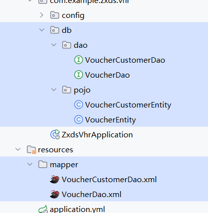

### 修改主类

```java
package com.example.zxds.vhr;

import org.mybatis.spring.annotation.MapperScan;
import org.springframework.boot.SpringApplication;
import org.springframework.boot.autoconfigure.SpringBootApplication;
import org.springframework.boot.web.servlet.ServletComponentScan;
import org.springframework.cloud.client.discovery.EnableDiscoveryClient;
import org.springframework.cloud.openfeign.EnableFeignClients;
import org.springframework.context.annotation.ComponentScan;

@SpringBootApplication
@EnableDiscoveryClient
@EnableFeignClients
@ServletComponentScan
@MapperScan("com.example.zxds.vhr.db.dao")
@ComponentScan("com.example.*")
public class ZxdsVhrApplication {

    public static void main(String[] args) {
        SpringApplication.run(ZxdsVhrApplication.class, args);
    }

}
```

## 创建 bff-driver 服务

之前我们创建的都是基础模块服务，接下来我们要创建bff层的子系统。之前我们说过客户端不能直接调用微服务的子系统，必须通过bff层调用其他服务。这样的好处可以降低外网和内网的HTTP请求数量，还有我们做鉴权更简单，只需要bff层添加认证与授权的代码。

### 创建子模块 bff-driver

和之前一样，注意包名：com.example.zxds.bff.driver

### 覆盖 pom 文件

```xml
<?xml version="1.0" encoding="UTF-8"?>
<project xmlns="http://maven.apache.org/POM/4.0.0" xmlns:xsi="http://www.w3.org/2001/XMLSchema-instance"
         xsi:schemaLocation="http://maven.apache.org/POM/4.0.0 https://maven.apache.org/xsd/maven-4.0.0.xsd">
    <modelVersion>4.0.0</modelVersion>
    <groupId>com.example</groupId>
    <artifactId>bff-driver</artifactId>
    <version>0.0.1-SNAPSHOT</version>
    <name>bff-driver</name>
    <description>bff-driver</description>
    <parent>
        <groupId>com.example</groupId>
        <artifactId>zxds</artifactId>
        <version>0.0.1-SNAPSHOT</version>
    </parent>

    <properties>
        <java.version>15</java.version>
        <project.build.sourceEncoding>UTF-8</project.build.sourceEncoding>
        <project.reporting.outputEncoding>UTF-8</project.reporting.outputEncoding>
        <spring-boot.version>2.3.7.RELEASE</spring-boot.version>
        <spring-cloud-alibaba.version>2.2.7.RELEASE</spring-cloud-alibaba.version>
        <codingapi.version>5.0.2.RELEASE</codingapi.version>
    </properties>

    <dependencies>
        <dependency>
            <groupId>org.springframework.boot</groupId>
            <artifactId>spring-boot-starter-web</artifactId>
            <exclusions>
                <exclusion>
                    <groupId>org.springframework.boot</groupId>
                    <artifactId>spring-boot-starter-tomcat</artifactId>
                </exclusion>
            </exclusions>
        </dependency>
        <dependency>
            <groupId>org.springframework.boot</groupId>
            <artifactId>spring-boot-starter-jetty</artifactId>
        </dependency>
        <dependency>
            <groupId>com.alibaba.cloud</groupId>
            <artifactId>spring-cloud-starter-alibaba-nacos-config</artifactId>
        </dependency>
        <dependency>
            <groupId>com.alibaba.cloud</groupId>
            <artifactId>spring-cloud-starter-alibaba-nacos-discovery</artifactId>
        </dependency>
        <dependency>
            <groupId>org.springframework.cloud</groupId>
            <artifactId>spring-cloud-starter-openfeign</artifactId>
        </dependency>
        <!-- Feign进行跨服务传递文件依赖 -->
        <dependency>
            <groupId>io.github.openfeign.form</groupId>
            <artifactId>feign-form</artifactId>
            <version>3.8.0</version>
        </dependency>
        <dependency>
            <groupId>io.github.openfeign.form</groupId>
            <artifactId>feign-form-spring</artifactId>
            <version>3.8.0</version>
        </dependency>
        <!--Redis-->
        <dependency>
            <groupId>org.springframework.boot</groupId>
            <artifactId>spring-boot-starter-data-redis</artifactId>
        </dependency>
        <!--Sa-Token核心库-->
        <dependency>
            <groupId>cn.dev33</groupId>
            <artifactId>sa-token-spring-boot-starter</artifactId>
            <version>1.28.0</version>
        </dependency>
        <!--用Redis缓存授权信息-->
        <dependency>
            <groupId>cn.dev33</groupId>
            <artifactId>sa-token-dao-redis</artifactId>
            <version>1.28.0</version>
        </dependency>
        <!--注解式权限验证-->
        <dependency>
            <groupId>cn.dev33</groupId>
            <artifactId>sa-token-spring-aop</artifactId>
            <version>1.28.0</version>
        </dependency>
        <!--后端验证-->
        <dependency>
            <groupId>org.springframework.boot</groupId>
            <artifactId>spring-boot-starter-validation</artifactId>
        </dependency>
        <!--SpringDoc-->
        <dependency>
            <groupId>org.springdoc</groupId>
            <artifactId>springdoc-openapi-spring-boot-2-webmvc</artifactId>
            <version>3.1.5</version>
        </dependency>
        <!--依赖common模块-->
        <dependency>
            <groupId>com.example</groupId>
            <artifactId>common</artifactId>
            <version>0.0.1-SNAPSHOT</version>
        </dependency>
        <dependency>
            <groupId>org.springframework.boot</groupId>
            <artifactId>spring-boot-starter-test</artifactId>
            <scope>test</scope>
            <exclusions>
                <exclusion>
                    <groupId>org.junit.vintage</groupId>
                    <artifactId>junit-vintage-engine</artifactId>
                </exclusion>
            </exclusions>
        </dependency>

        <!--分布式事务seata客户端-->
        <dependency>
            <groupId>com.alibaba.cloud</groupId>
            <artifactId>spring-cloud-starter-alibaba-seata</artifactId>
        </dependency>
        <dependency>
            <groupId>org.mybatis.spring.boot</groupId>
            <artifactId>mybatis-spring-boot-starter</artifactId>
            <version>2.2.0</version>
        </dependency>
        <dependency>
            <groupId>mysql</groupId>
            <artifactId>mysql-connector-java</artifactId>
            <scope>runtime</scope>
        </dependency>
        <dependency>
            <groupId>com.alibaba</groupId>
            <artifactId>druid-spring-boot-starter</artifactId>
            <version>1.1.13</version>
        </dependency>
    </dependencies>

    <dependencyManagement>
        <dependencies>
            <dependency>
                <groupId>org.springframework.boot</groupId>
                <artifactId>spring-boot-dependencies</artifactId>
                <version>${spring-boot.version}</version>
                <type>pom</type>
                <scope>import</scope>
            </dependency>
        </dependencies>
    </dependencyManagement>

    <build>
        <plugins>
            <plugin>
                <groupId>org.apache.maven.plugins</groupId>
                <artifactId>maven-compiler-plugin</artifactId>
                <version>3.8.1</version>
                <configuration>
                    <source>15</source>
                    <target>15</target>
                    <encoding>UTF-8</encoding>
                </configuration>
            </plugin>
            <plugin>
                <groupId>org.springframework.boot</groupId>
                <artifactId>spring-boot-maven-plugin</artifactId>
                <version>2.3.7.RELEASE</version>
                <configuration>
                    <mainClass>com.example.zxds.bff.driver.BffDriverApplication</mainClass>
                </configuration>
                <executions>
                    <execution>
                        <id>repackage</id>
                        <goals>
                            <goal>repackage</goal>
                        </goals>
                    </execution>
                </executions>
            </plugin>
        </plugins>
    </build>


</project>
```

### 编写 yml 配置文件

```yaml
server:
  jetty:
    threads:
      acceptors: 4
      selectors: 8
  port: 8101
  servlet:
    context-path: /

spring:
  profiles:
    #引用application-common.yml文件
    include: common
  application:
    name: bff-driver
  redis:
    database: 3
    host: localhost
    port: 6379
    password: abc123456
    jedis:
      pool:
        max-active: 1000
        max-wait: -1ms
        max-idle: 16
        min-idle: 8
  cloud:
    inetutils:
      #子系统注册到Nacos上的IP地址
      preferred-networks: 127.0.0.1
    nacos:
      #配置子系统在Web管理页面上的注册信息
      config:
        group: DEFAULT_GROUP
        file-extension: yaml
        server-addr: 127.0.0.1:8848
        prefix: ${spring.application.name}
        namespace: zxds
      #配置子系统在Nacos上的注册信息
      discovery:
        namespace: zxds
        username: nacos
        password: nacos
        server-addr: 127.0.0.1:8848
        heart-beat-interval: 1000
        heart-beat-timeout: 1000
        group: DEFAULT_GROUP

  servlet:
    multipart:
      enabled: true
      max-file-size: 20MB
      max-request-size: 20MB

sa-token:
  # HTTP请求头中token的名称
  token-name: token
  # token有效期，单位s 默认30天, -1代表永不过期
  timeout: 864000
  # token临时有效期 (指定时间内无操作就视为token过期) 单位: 秒
  activity-timeout: -1
  # 是否允许同一账号并发登录 (为true时允许一起登录, 为false时新登录挤掉旧登录)
  allow-concurrent-login: true
  # 在多人登录同一账号时，是否共用一个token (为true时所有登录共用一个token, 为false时每次登录新建一个token)
  is-share: false
  # token风格
  token-style: uuid
  #读取Cookie中Token
  isReadCookie: false

springdoc:
  api-docs:
    enabled: true
    path: /doc-api.html
  swagger-ui:
    path: /swagger-ui.html
    disable-swagger-default-url: on

# ============== 启用并配置Seata分布式事务 ==============
seata:
  enabled: true  # 启用Seata
  application-id: ${spring.application.name}  # 应用ID
  tx-service-group: bff_driver_tx_group  # BFF专属事务组名
  service:
    vgroup-mapping:
      # 关键：映射到Seata Server的集群名，必须与子系统和Seata Server配置一致
      bff_driver_tx_group: default
    grouplist:
      default: localhost:8091
      
feign:
  client:
    config:
      default:
        connectTimeout: 10000
        readTimeout: 300000
```

### 全局异常处理

在com.example.zxds.bff.driver.config包中，创建ExceptionAdvice类，然后写入下面的代码，bff层的全局异常处理比基础子系统的异常处理多了一个方法。

```java
package com.example.zxds.bff.driver.config;

import cn.dev33.satoken.exception.NotLoginException;
import cn.hutool.json.JSONObject;
import com.example.zxds.common.exception.ZxdsException;
import lombok.extern.slf4j.Slf4j;
import org.springframework.http.HttpStatus;
import org.springframework.http.converter.HttpMessageNotReadableException;
import org.springframework.web.HttpRequestMethodNotSupportedException;
import org.springframework.web.bind.MethodArgumentNotValidException;
import org.springframework.web.bind.annotation.ExceptionHandler;
import org.springframework.web.bind.annotation.ResponseBody;
import org.springframework.web.bind.annotation.ResponseStatus;
import org.springframework.web.bind.annotation.RestControllerAdvice;

@Slf4j
@RestControllerAdvice
public class ExceptionAdvice {

    @ResponseBody
    @ResponseStatus(HttpStatus.INTERNAL_SERVER_ERROR)
    @ExceptionHandler(Exception.class)
    public String exceptionHandler(Exception e) {
        JSONObject json = new JSONObject();
        //处理后端验证失败产生的异常
        if (e instanceof MethodArgumentNotValidException) {
            MethodArgumentNotValidException exception = (MethodArgumentNotValidException) e;
            json.set("error", exception.getBindingResult().getFieldError().getDefaultMessage());
        }
        //HTTP请求类型不正确的异常
        else if (e instanceof HttpRequestMethodNotSupportedException) {
            json.set("error", "Web方法不支持当前的请求类型");
        }
        //缺少必须提交的表单数据
        else if (e instanceof HttpMessageNotReadableException) {
            json.set("error", "缺少提交的数据");
        }
        //处理业务异常
        else if (e instanceof ZxdsException) {
            log.error("执行异常", e);
            ZxdsException exception = (ZxdsException) e;
            json.set("error", exception.getMsg());
        }
        //司机已经注册异常
        else if (e.getMessage().contains("该微信无法注册")) {
            log.error("执行异常", e);
            json.set("error", "该微信无法注册");
        }
        //处理其余的异常
        else {
            log.error("执行异常", e);
            json.set("error", "执行异常");
        }
        return json.toString();
    }

    /**
     * 捕获并处理客户端未登录的异常
     */
    @ResponseBody
    @ResponseStatus(HttpStatus.UNAUTHORIZED)
    @ExceptionHandler(NotLoginException.class)
    public String unLoginHandler(Exception e) {
        JSONObject json = new JSONObject();
        json.set("error", e.getMessage());
        return json.toString();
    }

}
```

**添加一个方法的原因如下：**

添加 `<font style="background-color:rgb(235, 238, 242);">unLoginHandler</font>` 方法是为了解决未登录场景的HTTP语义正确性问题。原通用异常处理器 `<font style="background-color:rgb(235, 238, 242);">exceptionHandler</font>` 会捕获所有 `<font style="background-color:rgb(235, 238, 242);">Exception</font>`（包括 `<font style="background-color:rgb(235, 238, 242);">NotLoginException</font>`）并统一返回500状态码，而HTTP协议规定未登录应返回401。若不单独处理，会导致前端将“用户未登录”误判为“服务器内部错误”，既混淆监控告警，也误导用户提示。通过专设此方法，系统能够精确区分业务异常（如未登录返回401）与系统异常（如代码错误返回500），确保HTTP状态码与实际问题严格对应。

### 允许Feign远程调用服务可以传输文件

因为bff程序调用其他基础子系统的时候，有可能要传递文件，所以必须定义配置类，Feign才可以传输文件。

在com.example.zxds.bff.driver.config包中创建MultipartSupportConfig类，写入下面这些代码。

```java
package com.example.zxds.bff.driver.config;

import feign.codec.Encoder;
import feign.form.spring.SpringFormEncoder;
import org.springframework.beans.factory.ObjectFactory;
import org.springframework.beans.factory.annotation.Autowired;
import org.springframework.boot.autoconfigure.http.HttpMessageConverters;
import org.springframework.cloud.openfeign.support.SpringEncoder;
import org.springframework.context.annotation.Bean;
import org.springframework.context.annotation.Configuration;

@Configuration
public class MultipartSupportConfig {

    @Autowired
    private ObjectFactory<HttpMessageConverters> messageConverters;

    @Bean
    public Encoder feignFormEncoder() {
        return new SpringFormEncoder(new SpringEncoder(messageConverters));
    }

}
```

### 配置 Swagger

在com.example.zxds.bff.driver.config包中创建SpringDocConfig类，写入下面的代码：

```java
package com.example.zxds.bff.driver.config;

import io.swagger.v3.oas.annotations.OpenAPIDefinition;
import io.swagger.v3.oas.annotations.enums.SecuritySchemeIn;
import io.swagger.v3.oas.annotations.enums.SecuritySchemeType;
import io.swagger.v3.oas.annotations.info.Info;
import io.swagger.v3.oas.annotations.security.SecurityRequirement;
import io.swagger.v3.oas.annotations.security.SecurityScheme;
import org.springframework.context.annotation.Configuration;

@OpenAPIDefinition(
        info = @Info(
                title = "bff-driver",
                description = "智行代驾司机端BFF",
                version = "1.0"
        ),
        security = @SecurityRequirement(name = "token")
)
@SecurityScheme(
        name = "token",
        type = SecuritySchemeType.APIKEY,
        in = SecuritySchemeIn.HEADER,
        bearerFormat = "JWT",
        scheme = "bearer"
)
@Configuration
public class SpringDocConfig {

}
```

细心的同学应该发现了，Swagger 配置中添加了新的东西：`security = @SecurityRequirement(name = "token")`和 `@SecurityScheme`。

BFF层面向客户端，所以Swagger配置了**必须携带Token才能测试接口**；而基础子系统是内部服务，Swagger无需登录就能直接调试。

以次以上添加的代码是为了保证 BFF 的 Swagger 要访问的话，也需要先登录才行。

### 配置 SaToken

#### 认证与授权

**SaToken框架的核心功能是“认证”与“授权”：**

- **认证**：验证用户身份（如登录）
- **授权**：验证用户权限（如菜单、操作权限）

**以代驾司机端为例：**
所有用户均为同一角色（代驾司机），具备完全相同的权限。因此系统只需进行**登录认证**，确认用户是合法司机即可，无需进行**权限授权**判断，因为不存在A司机与B司机的权限差异。

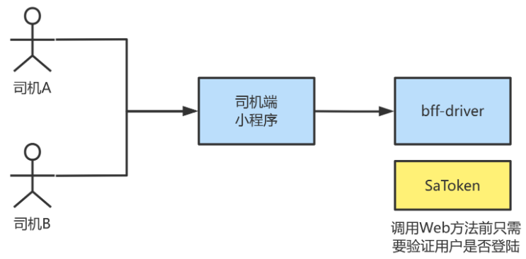

**对于MIS管理系统，用户身份存在角色分级（如超级管理员、客服经理等），不同角色拥有不同权限。因此系统需要：**

1. **认证**：验证用户是否已登录
2. **授权**：验证当前用户角色是否具备访问特定功能或数据的权限

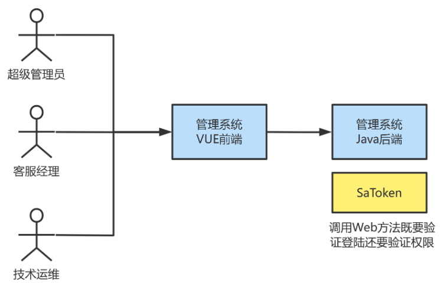

#### Token 令牌

为了兼容更多类别的客户端，所以我们选择把“认证”结果加密保存在客户端，这个保存在客户端的“认证”凭证叫做令牌（Token）

传统HttpSession依赖浏览器Cookie机制，将客户端限定为浏览器。而Token作为加密字符串，可被**任意能存储字符串的设备**识别和携带——无论是手机APP、智能家电、嵌入式设备还是可穿戴设备（如小米手环），都能轻松接入系统。

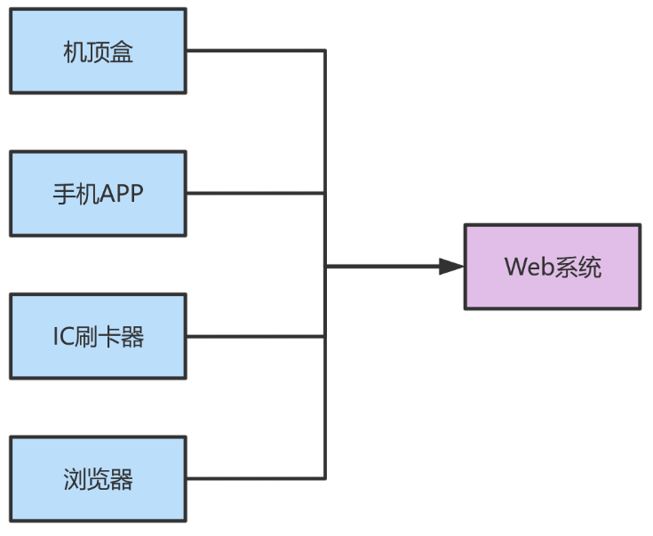

#### 验证是否登录

如果我们给某个Web方法加上@SaCheckLogin注解，那么有HTTP请求这个Web方法的时候，SaToken框架会自动拦截请求，然后判断用户的请求头中是否包含了Token令牌。如果核对令牌无误，那么说明发出HTTP请求的客户端是已经登录过的。

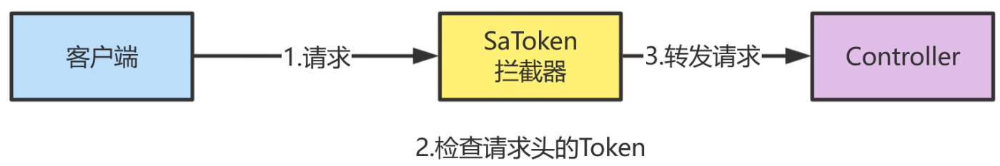

以司机取消订单的Web方法举例，该方法只能被司机端小程序调用，所以我们必须验证司机是否登录。只要Token没有问题，就允许你调用Web方法取消订单。

```java
@RestController
@RequestMapping("/order/cancel")
public class CancenlOrderController {
    @Resource
    private CancelOrderService cancelOrderService;

    @PostMapping("/driverCancelOrder")
    @SaCheckLogin
    public R driverCancelOrder(@RequestBody @Valid DriverCancelOrderForm form) {
        // 这里是调用SaToken的API，从token中解析出司机的id（司机是不需要提交id的。）
        long driverId = StpUtil.getLoginIdAsLong();
        form.setDriverId(driverId);

        HashMap map=cancelOrderService.driverCancelOrder(form);
        return R.ok().put("result",map);
    }
}
```

如果请求头中没有Token令牌，或者Token令牌有误，那么就会被SaToken判定为没有登录，并被全局异常处理类捕获，返回简化的报错信息。

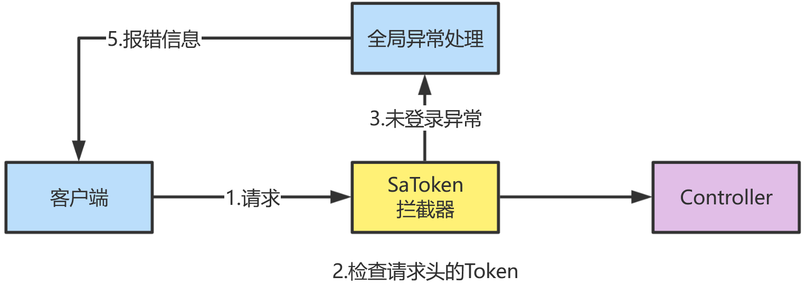

刚刚上面编写的全局异常处理中添加的新方法就是用来应付这个情况的。

#### 判断是否具备权限

我们在某个Web方法上面设置@SaCheckPermission注解，那么SaToken框架的拦截器就会验证用户是否具备某些权限。比如说下面的Web方法用到了@SaCheckPermission注解判断用户是否具备ROOT或者AMECT:INSERT权限。

```java
@PostMapping("/insert")
@Operation(summary = "添加罚款记录")
@SaCheckPermission(value = {"ROOT", "AMECT:INSERT"}, mode = SaMode.OR)
public R insert(@Valid @RequestBody InsertAmectForm form) {
        ……
}
```

每当SaToken拦截器要验证权限或者角色的时候，就会自动执行当前项目中的StpInterfaceImpl类，根据从Token中解密出来的用户主键值，到数据库中查找用户对应的角色和权限。这个类是需要我们自己写的，接下来编写一下这个类。

在com.example.zxds.bff.driver.config包创建StpInterfaceImpl类，写入如下的代码：

```java
package com.example.zxds.bff.driver.config;

import cn.dev33.satoken.stp.StpInterface;
import org.springframework.stereotype.Component;

import java.util.ArrayList;
import java.util.List;

@Component
public class StpInterfaceImpl implements StpInterface {

    /**
     * 返回某个用户所拥有的权限集合
     */
    @Override
    public List<String> getPermissionList(Object loginId, String loginKey) {
        //因为本项目不需要用到权限判定，所以这里就返回一个空的ArrayList对象
        ArrayList<String> list = new ArrayList<String>();
        return list;
    }

    /**
     * 返回某个用户所拥有的角色标识集合
     */
    @Override
    public List<String> getRoleList(Object loginId, String loginKey) {
        //因为本项目不需要用到角色判定，所以这里就返回一个空的ArrayList对象
        ArrayList<String> list = new ArrayList<String>();
        return list;
    }

}
```

在BFF司机端子系统中，由于所有司机角色和权限相同，只需验证登录状态。但SaToken框架要求必须实现StpInterface接口，因此我们在getPermissionList()和getRoleList()方法中返回空ArrayList以满足框架要求，实际不进行权限判断。

#### 导入依赖库

使用 SaToken 需要引入以下三个依赖，这个我们之前已经导入了：

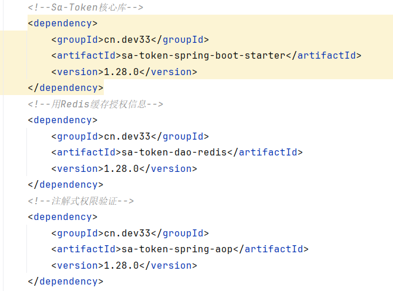

#### SaToken 需要 Redis

SaToken 为什么需要 Redis？首先，用户登录成功之后，生成的 Token 令牌会自动被 SaToken 框架存储到 Redis 当中。（这是 SaToken 的默认行为）

**SaToken 将 Token 令牌存储到 Redis 是为了达到什么目的？**

1. **用户每次请求头提交令牌后，SaToken 拦截器都会获取到该令牌，然后将其与 Redis 缓存中存储的令牌是否一致。**
2. **即使黑客破解了令牌的生成算法，自己模拟了令牌，但 Redis 缓存中并没有存储该令牌，因此黑客无法登录成功。**
3. **分布式支持****：多台服务器共享同一会话状态**
4. **集群会话****：用户在一台服务器登录，所有服务器都认可**
5. **集中管理****：方便统一强制下线、令牌续期等操作**
6. **高可用性****：Redis的高性能读写适合频繁的令牌验证**
7. **自动过期：利用Redis的TTL机制实现自动令牌清理**

#### 令牌被盗会怎样

**如果令牌被盗：就能完全冒充对方的身份进行操作。不过，不用担心，SaToken 也做了很多安全防护机制：**

1. **HTTPS** + **HttpOnly Cookie**（防嗅探和XSS）
2. **IP绑定**或**设备指纹**（防Token转移）
3. **短时效** + **自动续期**（平衡安全与体验）
4. **敏感操作二次验证**（如支付、改密）
5. **实时监控告警**（异常登录检测）

#### SaToken 在 yml 中的配置

这个配置我们前面已经添加了，如下：

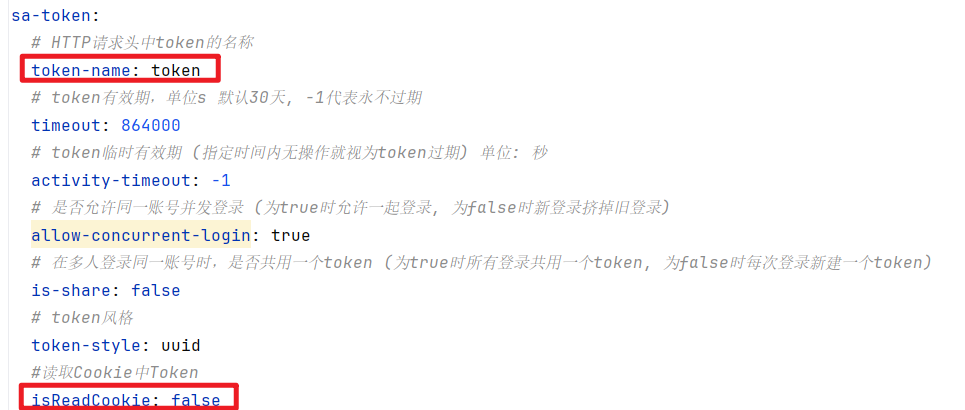

**以上有两个关键配置，调整这两个配置的目的是适应小程序环境：**

1. **关闭Cookie机制**：小程序不支持Cookie，需设置 `<font style="color:rgb(15, 17, 21);background-color:rgb(235, 238, 242);">isReadCookie: false</font>`
2. **指定Header参数名**：设置 `<font style="color:rgb(15, 17, 21);background-color:rgb(235, 238, 242);">token-name: token</font>`，使SaToken从HTTP请求头的 `<font style="color:rgb(15, 17, 21);background-color:rgb(235, 238, 242);">token</font>` 字段中提取Token进行验证

### 修改主类

```java
package com.example.zxds.bff.driver;

import org.springframework.boot.SpringApplication;
import org.springframework.boot.autoconfigure.SpringBootApplication;
import org.springframework.cloud.client.discovery.EnableDiscoveryClient;
import org.springframework.cloud.openfeign.EnableFeignClients;
import org.springframework.context.annotation.ComponentScan;

@SpringBootApplication
@EnableDiscoveryClient
@EnableFeignClients
@ComponentScan("com.example.*")
public class BffDriverApplication {

    public static void main(String[] args) {
        SpringApplication.run(BffDriverApplication.class, args);
    }

}
```

## 创建 bff-customer 服务

### 创建子模块 bff-customer

和之前一样，注意包名：com.example.zxds.bff.customer

注意：bff-customer 也需要配置 SaToken。

### 覆盖 pom 文件

```xml
<?xml version="1.0" encoding="UTF-8"?>
<project xmlns="http://maven.apache.org/POM/4.0.0" xmlns:xsi="http://www.w3.org/2001/XMLSchema-instance"
         xsi:schemaLocation="http://maven.apache.org/POM/4.0.0 https://maven.apache.org/xsd/maven-4.0.0.xsd">
    <modelVersion>4.0.0</modelVersion>
    <groupId>com.example</groupId>
    <artifactId>bff-customer</artifactId>
    <version>0.0.1-SNAPSHOT</version>
    <name>bff-customer</name>
    <description>bff-customer</description>
    <parent>
        <groupId>com.example</groupId>
        <artifactId>zxds</artifactId>
        <version>0.0.1-SNAPSHOT</version>
    </parent>

    <properties>
        <java.version>15</java.version>
        <project.build.sourceEncoding>UTF-8</project.build.sourceEncoding>
        <project.reporting.outputEncoding>UTF-8</project.reporting.outputEncoding>
        <spring-boot.version>2.3.7.RELEASE</spring-boot.version>
        <spring-cloud-alibaba.version>2.2.7.RELEASE</spring-cloud-alibaba.version>
        <codingapi.version>5.0.2.RELEASE</codingapi.version>
    </properties>

    <dependencies>
        <dependency>
            <groupId>org.springframework.boot</groupId>
            <artifactId>spring-boot-starter-web</artifactId>
            <exclusions>
                <exclusion>
                    <groupId>org.springframework.boot</groupId>
                    <artifactId>spring-boot-starter-tomcat</artifactId>
                </exclusion>
            </exclusions>
        </dependency>
        <dependency>
            <groupId>org.springframework.boot</groupId>
            <artifactId>spring-boot-starter-jetty</artifactId>
        </dependency>
        <dependency>
            <groupId>com.alibaba.cloud</groupId>
            <artifactId>spring-cloud-starter-alibaba-nacos-config</artifactId>
        </dependency>
        <dependency>
            <groupId>com.alibaba.cloud</groupId>
            <artifactId>spring-cloud-starter-alibaba-nacos-discovery</artifactId>
        </dependency>
        <dependency>
            <groupId>org.springframework.cloud</groupId>
            <artifactId>spring-cloud-starter-openfeign</artifactId>
        </dependency>
        <!--Redis-->
        <dependency>
            <groupId>org.springframework.boot</groupId>
            <artifactId>spring-boot-starter-data-redis</artifactId>
        </dependency>
        <!--Sa-Token核心库-->
        <dependency>
            <groupId>cn.dev33</groupId>
            <artifactId>sa-token-spring-boot-starter</artifactId>
            <version>1.28.0</version>
        </dependency>
        <!--用Redis缓存授权信息-->
        <dependency>
            <groupId>cn.dev33</groupId>
            <artifactId>sa-token-dao-redis</artifactId>
            <version>1.28.0</version>
        </dependency>
        <!--注解式权限验证-->
        <dependency>
            <groupId>cn.dev33</groupId>
            <artifactId>sa-token-spring-aop</artifactId>
            <version>1.28.0</version>
        </dependency>
        <!--后端验证-->
        <dependency>
            <groupId>org.springframework.boot</groupId>
            <artifactId>spring-boot-starter-validation</artifactId>
        </dependency>
        <!--SpringDoc-->
        <dependency>
            <groupId>org.springdoc</groupId>
            <artifactId>springdoc-openapi-spring-boot-2-webmvc</artifactId>
            <version>3.1.5</version>
        </dependency>
        <!--依赖common模块-->
        <dependency>
            <groupId>com.example</groupId>
            <artifactId>common</artifactId>
            <version>0.0.1-SNAPSHOT</version>
        </dependency>
        <dependency>
            <groupId>org.springframework.boot</groupId>
            <artifactId>spring-boot-starter-test</artifactId>
            <scope>test</scope>
            <exclusions>
                <exclusion>
                    <groupId>org.junit.vintage</groupId>
                    <artifactId>junit-vintage-engine</artifactId>
                </exclusion>
            </exclusions>
        </dependency>
    </dependencies>

    <dependencyManagement>
        <dependencies>
            <dependency>
                <groupId>org.springframework.boot</groupId>
                <artifactId>spring-boot-dependencies</artifactId>
                <version>${spring-boot.version}</version>
                <type>pom</type>
                <scope>import</scope>
            </dependency>
        </dependencies>
    </dependencyManagement>

    <build>
        <plugins>
            <plugin>
                <groupId>org.apache.maven.plugins</groupId>
                <artifactId>maven-compiler-plugin</artifactId>
                <version>3.8.1</version>
                <configuration>
                    <source>15</source>
                    <target>15</target>
                    <encoding>UTF-8</encoding>
                </configuration>
            </plugin>
            <plugin>
                <groupId>org.springframework.boot</groupId>
                <artifactId>spring-boot-maven-plugin</artifactId>
                <version>2.3.7.RELEASE</version>
                <configuration>
                    <mainClass>com.example.zxds.bff.customer.BffCustomerApplication</mainClass>
                </configuration>
                <executions>
                    <execution>
                        <id>repackage</id>
                        <goals>
                            <goal>repackage</goal>
                        </goals>
                    </execution>
                </executions>
            </plugin>
        </plugins>
    </build>


</project>
```

### 编写 yml 配置文件

```yaml
server:
  jetty:
    threads:
      acceptors: 4
      selectors: 8
  port: 8102
  servlet:
    context-path: /

spring:
  profiles:
    #引用application-common.yml文件
    include: common
  application:
    name: bff-customer
  redis:
    database: 4
    host: localhost
    port: 6379
    password: abc123456
    jedis:
      pool:
        max-active: 1000
        max-wait: -1ms
        max-idle: 16
        min-idle: 8
  cloud:
    inetutils:
      #子系统注册到Nacos上的IP地址
      preferred-networks: 127.0.0.1
    nacos:
      #配置子系统在Web管理页面上的注册信息
      config:
        group: DEFAULT_GROUP
        file-extension: yaml
        server-addr: 127.0.0.1:8848
        prefix: ${spring.application.name}
        namespace: zxds
      #配置子系统在Nacos上的注册信息
      discovery:
        namespace: zxds
        username: nacos
        password: nacos
        server-addr: 127.0.0.1:8848
        heart-beat-interval: 1000
        heart-beat-timeout: 1000
        group: DEFAULT_GROUP

  servlet:
    multipart:
      enabled: true
      max-file-size: 20MB
      max-request-size: 20MB

sa-token:
  # HTTP请求头中token的名称
  token-name: token
  # token有效期，单位s 默认30天, -1代表永不过期
  timeout: 2592000
  # token临时有效期 (指定时间内无操作就视为token过期) 单位: 秒
  activity-timeout: -1
  # 是否允许同一账号并发登录 (为true时允许一起登录, 为false时新登录挤掉旧登录)
  allow-concurrent-login: true
  # 在多人登录同一账号时，是否共用一个token (为true时所有登录共用一个token, 为false时每次登录新建一个token)
  is-share: false
  # token风格
  token-style: uuid
  #读取Cookie中Token
  isReadCookie: false

springdoc:
  api-docs:
    enabled: true
    path: /doc-api.html
  swagger-ui:
    path: /swagger-ui.html
    disable-swagger-default-url: on
    
feign:
  client:
    config:
      default:
        connectTimeout: 10000
        readTimeout: 300000
```

### 全局异常处理

在com.example.zxds.bff.customer.config包中，创建ExceptionAdvice类

```java
package com.example.zxds.bff.customer.config;

import cn.dev33.satoken.exception.NotLoginException;
import cn.hutool.json.JSONObject;
import com.example.zxds.common.exception.ZxdsException;
import lombok.extern.slf4j.Slf4j;
import org.springframework.http.HttpStatus;
import org.springframework.http.converter.HttpMessageNotReadableException;
import org.springframework.web.HttpRequestMethodNotSupportedException;
import org.springframework.web.bind.MethodArgumentNotValidException;
import org.springframework.web.bind.annotation.ExceptionHandler;
import org.springframework.web.bind.annotation.ResponseBody;
import org.springframework.web.bind.annotation.ResponseStatus;
import org.springframework.web.bind.annotation.RestControllerAdvice;

@Slf4j
@RestControllerAdvice
public class ExceptionAdvice {

    @ResponseBody
    @ResponseStatus(HttpStatus.INTERNAL_SERVER_ERROR)
    @ExceptionHandler(Exception.class)
    public String exceptionHandler(Exception e) {
        JSONObject json = new JSONObject();
        //处理后端验证失败产生的异常
        if (e instanceof MethodArgumentNotValidException) {
            MethodArgumentNotValidException exception = (MethodArgumentNotValidException) e;
            json.set("error", exception.getBindingResult().getFieldError().getDefaultMessage());
        }
        //HTTP请求类型不正确的异常
        else if (e instanceof HttpRequestMethodNotSupportedException) {
            json.set("error", "Web方法不支持当前的请求类型");
        }
        //缺少必须提交的表单数据
        else if (e instanceof HttpMessageNotReadableException) {
            json.set("error", "缺少提交的数据");
        }
        //处理业务异常
        else if (e instanceof ZxdsException) {
            log.error("执行异常", e);
            ZxdsException exception = (ZxdsException) e;
            json.set("error", exception.getMsg());
        }
        //处理其余的异常
        else {
            log.error("执行异常", e);
            json.set("error", "执行异常");
        }
        return json.toString();
    }

    @ResponseBody
    @ResponseStatus(HttpStatus.UNAUTHORIZED)
    @ExceptionHandler(NotLoginException.class)
    public String unLoginHandler(Exception e) {
        JSONObject json = new JSONObject();
        json.set("error", e.getMessage());
        return json.toString();
    }

}
```

### 允许Feign远程调用服务可以传输文件

在com.example.zxds.bff.customer.config包中创建MultipartSupportConfig类，写入下面这些代码。

```java
package com.example.zxds.bff.customer.config;

import feign.codec.Encoder;
import feign.form.spring.SpringFormEncoder;
import org.springframework.beans.factory.ObjectFactory;
import org.springframework.beans.factory.annotation.Autowired;
import org.springframework.boot.autoconfigure.http.HttpMessageConverters;
import org.springframework.cloud.openfeign.support.SpringEncoder;
import org.springframework.context.annotation.Bean;
import org.springframework.context.annotation.Configuration;

@Configuration
public class MultipartSupportConfig {

    @Autowired
    private ObjectFactory<HttpMessageConverters> messageConverters;

    @Bean
    public Encoder feignFormEncoder() {
        return new SpringFormEncoder(new SpringEncoder(messageConverters));
    }

}
```

### 配置 Swagger

在com.example.zxds.bff.customer.config包中创建SpringDocConfig类，写入下面的代码：

```java
package com.example.zxds.bff.customer.config;

import io.swagger.v3.oas.annotations.OpenAPIDefinition;
import io.swagger.v3.oas.annotations.enums.SecuritySchemeIn;
import io.swagger.v3.oas.annotations.enums.SecuritySchemeType;
import io.swagger.v3.oas.annotations.info.Info;
import io.swagger.v3.oas.annotations.security.SecurityRequirement;
import io.swagger.v3.oas.annotations.security.SecurityScheme;
import org.springframework.context.annotation.Configuration;

@OpenAPIDefinition(
        info = @Info(
                title = "bff-driver",
                description = "智行代驾乘客端BFF",
                version = "1.0"
        ),
        security = @SecurityRequirement(name = "token")
)
@SecurityScheme(
        name = "token",
        type = SecuritySchemeType.APIKEY,
        in = SecuritySchemeIn.HEADER,
        bearerFormat = "JWT",
        scheme = "bearer"
)
@Configuration
public class SpringDocConfig {

}
```

### 配置 SaToken

因为pom.xml和application.yml文件我们都配置好了，所以只需要创建StpInterfaceImpl类就可以了。在com.example.zxds.bff.driver.config包中创建StpInterfaceImpl类。

```java
package com.example.zxds.bff.customer.config;

import cn.dev33.satoken.stp.StpInterface;
import org.springframework.stereotype.Component;

import java.util.ArrayList;
import java.util.List;

@Component
public class StpInterfaceImpl implements StpInterface {

    /**
     * 返回某个用户所拥有的权限集合
     */
    @Override
    public List<String> getPermissionList(Object loginId, String loginKey) {
        //因为本项目不需要用到权限判定，所以这里就返回一个空的ArrayList对象
        ArrayList<String> list = new ArrayList<String>();
        return list;
    }

    /**
     * 返回某个用户所拥有的角色标识集合
     */
    @Override
    public List<String> getRoleList(Object loginId, String loginKey) {
        //因为本项目不需要用到角色判定，所以这里就返回一个空的ArrayList对象
        ArrayList<String> list = new ArrayList<String>();
        return list;
    }

}
```

### 修改主类

```java
package com.example.zxds.bff.customer;

import org.springframework.boot.SpringApplication;
import org.springframework.boot.autoconfigure.SpringBootApplication;
import org.springframework.cloud.client.discovery.EnableDiscoveryClient;
import org.springframework.cloud.openfeign.EnableFeignClients;
import org.springframework.context.annotation.ComponentScan;

@SpringBootApplication
@EnableDiscoveryClient
@EnableFeignClients
@ComponentScan("com.example.*")
public class BffCustomerApplication {

    public static void main(String[] args) {
        SpringApplication.run(BffCustomerApplication.class, args);
    }

}
```

## 创建 zxds-mis-api 服务

这个子系统比较特殊，它既有自己管理的数据表，又要调用其他基础服务来获取数据。

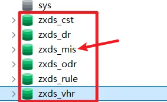

如果MIS系统要管理司机数据，那么就得用Feign调用zxds-dr服务，所以zxds-mis-api这个项目是混合了普通MIS系统和bff层的功能。

### 创建子模块 zxds-mis-api

和之前一样，注意包名：com.example.zxds.mis.api

### 覆盖 pom 文件

```xml
<?xml version="1.0" encoding="UTF-8"?>
<project xmlns="http://maven.apache.org/POM/4.0.0" xmlns:xsi="http://www.w3.org/2001/XMLSchema-instance"
         xsi:schemaLocation="http://maven.apache.org/POM/4.0.0 https://maven.apache.org/xsd/maven-4.0.0.xsd">
    <modelVersion>4.0.0</modelVersion>
    <groupId>com.example</groupId>
    <artifactId>zxds-mis-api</artifactId>
    <version>0.0.1-SNAPSHOT</version>
    <name>zxds-mis-api</name>
    <description>zxds-mis-api</description>
    <parent>
        <groupId>com.example</groupId>
        <artifactId>zxds</artifactId>
        <version>0.0.1-SNAPSHOT</version>
    </parent>
    <properties>
        <java.version>15</java.version>
        <project.build.sourceEncoding>UTF-8</project.build.sourceEncoding>
        <project.reporting.outputEncoding>UTF-8</project.reporting.outputEncoding>
        <spring-boot.version>2.3.7.RELEASE</spring-boot.version>
        <spring-cloud-alibaba.version>2.2.7.RELEASE</spring-cloud-alibaba.version>
        <codingapi.version>5.0.2.RELEASE</codingapi.version>
    </properties>

    <dependencies>
        <dependency>
            <groupId>org.springframework.boot</groupId>
            <artifactId>spring-boot-starter-web</artifactId>
            <exclusions>
                <exclusion>
                    <groupId>org.springframework.boot</groupId>
                    <artifactId>spring-boot-starter-tomcat</artifactId>
                </exclusion>
            </exclusions>
        </dependency>
        <dependency>
            <groupId>org.springframework.boot</groupId>
            <artifactId>spring-boot-starter-jetty</artifactId>
        </dependency>
        <dependency>
            <groupId>com.alibaba.cloud</groupId>
            <artifactId>spring-cloud-starter-alibaba-nacos-config</artifactId>
        </dependency>
        <dependency>
            <groupId>com.alibaba.cloud</groupId>
            <artifactId>spring-cloud-starter-alibaba-nacos-discovery</artifactId>
        </dependency>
        <dependency>
            <groupId>org.springframework.cloud</groupId>
            <artifactId>spring-cloud-starter-openfeign</artifactId>
        </dependency>
        <!--Redis-->
        <dependency>
            <groupId>org.springframework.boot</groupId>
            <artifactId>spring-boot-starter-data-redis</artifactId>
        </dependency>
        <!--Sa-Token核心库-->
        <dependency>
            <groupId>cn.dev33</groupId>
            <artifactId>sa-token-spring-boot-starter</artifactId>
            <version>1.28.0</version>
        </dependency>
        <!--用Redis缓存授权信息-->
        <dependency>
            <groupId>cn.dev33</groupId>
            <artifactId>sa-token-dao-redis</artifactId>
            <version>1.28.0</version>
        </dependency>
        <!--注解式权限验证-->
        <dependency>
            <groupId>cn.dev33</groupId>
            <artifactId>sa-token-spring-aop</artifactId>
            <version>1.28.0</version>
        </dependency>
        <!--后端验证-->
        <dependency>
            <groupId>org.springframework.boot</groupId>
            <artifactId>spring-boot-starter-validation</artifactId>
        </dependency>
        <!--SpringDoc-->
        <dependency>
            <groupId>org.springdoc</groupId>
            <artifactId>springdoc-openapi-spring-boot-2-webmvc</artifactId>
            <version>3.1.5</version>
        </dependency>
        <!--依赖common模块-->
        <dependency>
            <groupId>com.example</groupId>
            <artifactId>common</artifactId>
            <version>0.0.1-SNAPSHOT</version>
        </dependency>
        <dependency>
            <groupId>org.springframework.boot</groupId>
            <artifactId>spring-boot-starter-test</artifactId>
            <scope>test</scope>
            <exclusions>
                <exclusion>
                    <groupId>org.junit.vintage</groupId>
                    <artifactId>junit-vintage-engine</artifactId>
                </exclusion>
            </exclusions>
        </dependency>
        <!--定时器-->
        <dependency>
            <groupId>org.springframework.boot</groupId>
            <artifactId>spring-boot-starter-quartz</artifactId>
        </dependency>
        <!--分布式事务seata客户端-->
        <dependency>
            <groupId>com.alibaba.cloud</groupId>
            <artifactId>spring-cloud-starter-alibaba-seata</artifactId>
        </dependency>
        <dependency>
            <groupId>org.mybatis.spring.boot</groupId>
            <artifactId>mybatis-spring-boot-starter</artifactId>
            <version>2.2.0</version>
        </dependency>
        <dependency>
            <groupId>mysql</groupId>
            <artifactId>mysql-connector-java</artifactId>
            <scope>runtime</scope>
        </dependency>
        <dependency>
            <groupId>com.alibaba</groupId>
            <artifactId>druid-spring-boot-starter</artifactId>
            <version>1.1.13</version>
        </dependency>
    </dependencies>

    <dependencyManagement>
        <dependencies>
            <dependency>
                <groupId>org.springframework.boot</groupId>
                <artifactId>spring-boot-dependencies</artifactId>
                <version>${spring-boot.version}</version>
                <type>pom</type>
                <scope>import</scope>
            </dependency>
        </dependencies>
    </dependencyManagement>

    <build>
        <plugins>
            <plugin>
                <groupId>org.apache.maven.plugins</groupId>
                <artifactId>maven-compiler-plugin</artifactId>
                <version>3.8.1</version>
                <configuration>
                    <source>15</source>
                    <target>15</target>
                    <encoding>UTF-8</encoding>
                </configuration>
            </plugin>
            <plugin>
                <groupId>org.springframework.boot</groupId>
                <artifactId>spring-boot-maven-plugin</artifactId>
                <version>2.3.7.RELEASE</version>
                <configuration>
                    <mainClass>com.example.zxds.mis.api.ZxdsMisApiApplication</mainClass>
                </configuration>
                <executions>
                    <execution>
                        <id>repackage</id>
                        <goals>
                            <goal>repackage</goal>
                        </goals>
                    </execution>
                </executions>
            </plugin>
        </plugins>
    </build>


</project>
```

### 编写 yml 配置文件

```yaml
server:
  jetty:
    threads:
      acceptors: 4
      selectors: 8
  port: 8010
  servlet:
    context-path: /

spring:
  profiles:
    #引用application-common.yml文件
    include: common
  application:
    name: zxds-mis-api
  cloud:
    inetutils:
      #子系统注册到Nacos上的IP地址
      preferred-networks: 127.0.0.1
    nacos:
      #配置子系统在Web管理页面上的注册信息
      config:
        group: DEFAULT_GROUP
        file-extension: yaml
        server-addr: 127.0.0.1:8848
        prefix: ${spring.application.name}
        namespace: zxds
      #配置子系统在Nacos上的注册信息
      discovery:
        namespace: zxds
        username: nacos
        password: nacos
        server-addr: 127.0.0.1:8848
        heart-beat-interval: 1000
        heart-beat-timeout: 1000
        group: DEFAULT_GROUP
  datasource:
    type: com.alibaba.druid.pool.DruidDataSource
    druid:
      driver-class-name: com.mysql.cj.jdbc.Driver
      url: jdbc:mysql://localhost:12001/zxds_mis?useUnicode=true&characterEncoding=UTF-8&serverTimezone=Asia/Shanghai&nullCatalogMeansCurrent=true
      username: root
      password: abc123456
      initial-size: 4
      max-active: 8
      min-idle: 8
      max-wait: 60000
      test-while-idle: true
      test-on-borrow: false
      test-on-return: false
  redis:
    database: 8
    host: localhost
    port: 6379
    password: abc123456
    jedis:
      pool:
        max-active: 1000
        max-wait: -1ms
        max-idle: 16
        min-idle: 8
  data:
    mongodb:
      host: localhost
      port: 27017
      database: emos
      authentication-database: admin
      username: admin
      password: abc123456

  quartz:
    job-store-type: memory
  servlet:
    multipart:
      enabled: true
      max-file-size: 20MB
      max-request-size: 20MB

mybatis:
  mapper-locations: classpath*:mapper/*.xml
  type-aliases-package: com.example.zxds.mis.api.db.pojo
  configuration:
    log-impl: org.apache.ibatis.logging.stdout.StdOutImpl
    map-underscore-to-camel-case: true

logging:
  level:
    root: info
    com.example.zxds.mis.api.db.dao: warn
  pattern:
    console: "%d{yyyy/MM/dd HH:mm:ss}  %-5level  %msg%n"

sa-token:
  # HTTP请求头中token的名称
  token-name: token
  # token有效期，单位s 默认30天, -1代表永不过期
  timeout: 2592000
  # token临时有效期 (指定时间内无操作就视为token过期) 单位: 秒
  activity-timeout: -1
  # 是否允许同一账号并发登录 (为true时允许一起登录, 为false时新登录挤掉旧登录)
  allow-concurrent-login: true
  # 在多人登录同一账号时，是否共用一个token (为true时所有登录共用一个token, 为false时每次登录新建一个token)
  is-share: false
  # token风格
  token-style: uuid
  #读取Cookie中Token
  isReadCookie: false

springdoc:
  api-docs:
    enabled: true
    path: /doc-api.html
  swagger-ui:
    path: /swagger-ui.html
    disable-swagger-default-url: on

# seata 实现分布式事务
seata:
  enabled: true
  application-id: ${spring.application.name}
  tx-service-group: mis_tx_group
  service:
    vgroup-mapping:
      mis_tx_group: default
  registry:
    type: file
  config:
    type: file

feign:
  client:
    config:
      default:
        connectTimeout: 10000
        readTimeout: 300000
```

### 全局异常处理

在com.example.zxds.mis.api.config包中，创建ExceptionAdvice类

```java
package com.example.zxds.mis.api.config;

import cn.dev33.satoken.exception.NotLoginException;
import cn.hutool.json.JSONObject;
import com.example.zxds.common.exception.ZxdsException;
import lombok.extern.slf4j.Slf4j;
import org.springframework.http.HttpStatus;
import org.springframework.http.converter.HttpMessageNotReadableException;
import org.springframework.web.HttpRequestMethodNotSupportedException;
import org.springframework.web.bind.MethodArgumentNotValidException;
import org.springframework.web.bind.annotation.ExceptionHandler;
import org.springframework.web.bind.annotation.ResponseBody;
import org.springframework.web.bind.annotation.ResponseStatus;
import org.springframework.web.bind.annotation.RestControllerAdvice;

@Slf4j
@RestControllerAdvice
public class ExceptionAdvice {

    @ResponseBody
    @ResponseStatus(HttpStatus.INTERNAL_SERVER_ERROR)
    @ExceptionHandler(Exception.class)
    public String exceptionHandler(Exception e) {
        JSONObject json = new JSONObject();
        //处理后端验证失败产生的异常
        if (e instanceof MethodArgumentNotValidException) {
            MethodArgumentNotValidException exception = (MethodArgumentNotValidException) e;
            json.set("error", exception.getBindingResult().getFieldError().getDefaultMessage());
        }
        //HTTP请求类型不正确的异常
        else if (e instanceof HttpRequestMethodNotSupportedException) {
            json.set("error", "Web方法不支持当前的请求类型");
        }
        //缺少必须提交的表单数据
        else if (e instanceof HttpMessageNotReadableException) {
            json.set("error", "缺少提交的数据");
        }
        //处理业务异常
        else if (e instanceof ZxdsException) {
            log.error("执行异常", e);
            ZxdsException exception = (ZxdsException) e;
            json.set("error", exception.getMsg());
        }
        //处理其余的异常
        else {
            log.error("执行异常", e);
            json.set("error", "执行异常");
        }
        return json.toString();
    }

    @ResponseBody
    @ResponseStatus(HttpStatus.UNAUTHORIZED)
    @ExceptionHandler(NotLoginException.class)
    public String unLoginHandler(Exception e) {
        JSONObject json = new JSONObject();
        json.set("error", e.getMessage());
        return json.toString();
    }

}
```

### 允许Feign远程调用服务可以传输文件

在com.example.zxds.mis.api.config包中创建MultipartSupportConfig类，写入下面这些代码

```java
package com.example.zxds.mis.api.config;

import feign.codec.Encoder;
import feign.form.spring.SpringFormEncoder;
import org.springframework.beans.factory.ObjectFactory;
import org.springframework.beans.factory.annotation.Autowired;
import org.springframework.boot.autoconfigure.http.HttpMessageConverters;
import org.springframework.cloud.openfeign.support.SpringEncoder;
import org.springframework.context.annotation.Bean;
import org.springframework.context.annotation.Configuration;

@Configuration
public class MultipartSupportConfig {

    @Autowired
    private ObjectFactory<HttpMessageConverters> messageConverters;

    @Bean
    public Encoder feignFormEncoder() {
        return new SpringFormEncoder(new SpringEncoder(messageConverters));
    }

}
```

### 配置 Swagger

在com.example.zxds.mis.api.config包中创建SpringDocConfig类，写入下面的代码

```java
package com.example.zxds.mis.api.config;

import io.swagger.v3.oas.annotations.OpenAPIDefinition;
import io.swagger.v3.oas.annotations.enums.SecuritySchemeIn;
import io.swagger.v3.oas.annotations.enums.SecuritySchemeType;
import io.swagger.v3.oas.annotations.info.Info;
import io.swagger.v3.oas.annotations.security.SecurityRequirement;
import io.swagger.v3.oas.annotations.security.SecurityScheme;
import org.springframework.context.annotation.Configuration;

@OpenAPIDefinition(
        info = @Info(
                title = "zxds-mis-api",
                description = "智行代驾MisApi",
                version = "1.0"
        ),
        security = @SecurityRequirement(name = "token")
)
@SecurityScheme(
        name = "token",
        type = SecuritySchemeType.APIKEY,
        in = SecuritySchemeIn.HEADER,
        bearerFormat = "JWT",
        scheme = "bearer"
)
@Configuration
public class SpringDocConfig {

}
```

### 放置初始代码

MIS系统的用户管理、角色管理、部门管理这些基础模块我已经写好代码了，大家直接把这些文件从初始化项目拷贝到相应的目录即可。

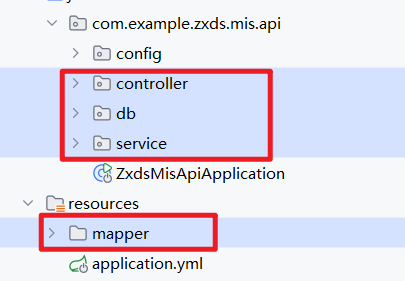

### 配置 SaToken

因为pom.xml和application.yml文件我们都配置好了，所以只需要创建StpInterfaceImpl类就可以了。在com.example.zxds.mis.api.config包中创建StpInterfaceImpl类。

```java
package com.example.zxds.mis.api.config;

import cn.dev33.satoken.stp.StpInterface;
import com.example.zxds.mis.api.db.dao.UserDao;
import org.springframework.stereotype.Component;

import javax.annotation.Resource;
import java.util.ArrayList;
import java.util.List;
import java.util.Set;

@Component
public class StpInterfaceImpl implements StpInterface {
    @Resource
    private UserDao userDao;

    /**
     * 返回某个用户所拥有的权限集合
     */
    @Override
    public List<String> getPermissionList(Object loginId, String loginKey) {
        int userId = Integer.parseInt(loginId.toString());
        //根据userId查询用户的权限
        Set<String> permissions = userDao.searchUserPermissions(userId);
        ArrayList list = new ArrayList();
        list.addAll(permissions);
        return list;
    }


    /**
     * 返回某个用户所拥有的角色标识集合
     */
    @Override
    public List<String> getRoleList(Object loginId, String loginKey) {
        //因为本项目不需要用到角色判定，所以这里就返回一个空的ArrayList对象
        ArrayList<String> list = new ArrayList<String>();
        return list;
    }

}
```

### 修改主类

```java
package com.example.zxds.mis.api;

import org.mybatis.spring.annotation.MapperScan;
import org.springframework.boot.SpringApplication;
import org.springframework.boot.autoconfigure.SpringBootApplication;
import org.springframework.boot.web.servlet.ServletComponentScan;
import org.springframework.cloud.client.discovery.EnableDiscoveryClient;
import org.springframework.cloud.openfeign.EnableFeignClients;
import org.springframework.context.annotation.ComponentScan;

@SpringBootApplication
@EnableDiscoveryClient
@EnableFeignClients
@ServletComponentScan
@MapperScan("com.example.zxds.mis.api.db.dao")
@ComponentScan("com.example.*")

public class ZxdsMisApiApplication {

    public static void main(String[] args) {
        SpringApplication.run(ZxdsMisApiApplication.class, args);
    }

}
```

## 创建 gateway 服务

在Alibaba SpringCloud架构中，bff层的项目不能直接暴露给客户端：外网所有HTTP请求必须有网关（Gateway）转发。第一个好处是可以在网关上做限流，另一个好处就是bff层做了集群之后，我们用网关做负载均衡

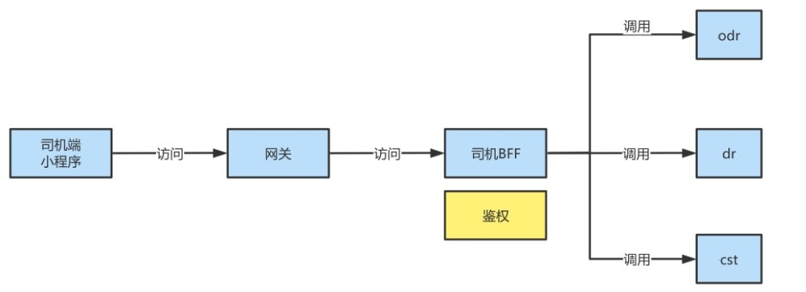

### 创建子模块 gateway

和之前一样，注意包名：com.example.zxds.gateway

### 覆盖 pom 文件

```xml
<?xml version="1.0" encoding="UTF-8"?>
<project xmlns="http://maven.apache.org/POM/4.0.0" xmlns:xsi="http://www.w3.org/2001/XMLSchema-instance"
         xsi:schemaLocation="http://maven.apache.org/POM/4.0.0 https://maven.apache.org/xsd/maven-4.0.0.xsd">
    <modelVersion>4.0.0</modelVersion>
    <groupId>com.example</groupId>
    <artifactId>gateway</artifactId>
    <version>0.0.1-SNAPSHOT</version>
    <name>gateway</name>
    <description>gateway</description>
    <parent>
        <groupId>com.example</groupId>
        <artifactId>zxds</artifactId>
        <version>0.0.1-SNAPSHOT</version>
    </parent>

    <properties>
        <java.version>15</java.version>
        <project.build.sourceEncoding>UTF-8</project.build.sourceEncoding>
        <project.reporting.outputEncoding>UTF-8</project.reporting.outputEncoding>
        <spring-boot.version>2.3.7.RELEASE</spring-boot.version>
        <spring-cloud-alibaba.version>2.2.7.RELEASE</spring-cloud-alibaba.version>
    </properties>

    <dependencies>
        <dependency>
            <groupId>org.springframework.cloud</groupId>
            <artifactId>spring-cloud-starter-gateway</artifactId>
            <exclusions>
                <exclusion>
                    <groupId>org.springframework.boot</groupId>
                    <artifactId>spring-boot-starter-tomcat</artifactId>
                </exclusion>
            </exclusions>
        </dependency>
        <dependency>
            <groupId>org.springframework.boot</groupId>
            <artifactId>spring-boot-starter-jetty</artifactId>
        </dependency>
        <dependency>
            <groupId>com.alibaba.cloud</groupId>
            <artifactId>spring-cloud-alibaba-sentinel-gateway</artifactId>
        </dependency>
        <dependency>
            <groupId>com.alibaba.cloud</groupId>
            <artifactId>spring-cloud-starter-alibaba-nacos-config</artifactId>
        </dependency>
        <dependency>
            <groupId>com.alibaba.cloud</groupId>
            <artifactId>spring-cloud-starter-alibaba-nacos-discovery</artifactId>
        </dependency>
        <dependency>
            <groupId>com.alibaba.cloud</groupId>
            <artifactId>spring-cloud-starter-alibaba-sentinel</artifactId>
        </dependency>
        <dependency>
            <groupId>org.springframework.cloud</groupId>
            <artifactId>spring-cloud-starter-openfeign</artifactId>
        </dependency>
        <!--WebSocket-->
        <dependency>
            <groupId>org.springframework.boot</groupId>
            <artifactId>spring-boot-starter-websocket</artifactId>
            <exclusions>
                <exclusion>
                    <groupId>org.springframework.boot</groupId>
                    <artifactId>spring-boot-starter-web</artifactId>
                </exclusion>
            </exclusions>
        </dependency>
        <dependency>
            <groupId>org.springframework.boot</groupId>
            <artifactId>spring-boot-starter-test</artifactId>
            <scope>test</scope>
            <exclusions>
                <exclusion>
                    <groupId>org.junit.vintage</groupId>
                    <artifactId>junit-vintage-engine</artifactId>
                </exclusion>
            </exclusions>
        </dependency>
    </dependencies>

    <dependencyManagement>
        <dependencies>
            <dependency>
                <groupId>org.springframework.boot</groupId>
                <artifactId>spring-boot-dependencies</artifactId>
                <version>${spring-boot.version}</version>
                <type>pom</type>
                <scope>import</scope>
            </dependency>
            <dependency>
                <groupId>com.alibaba.cloud</groupId>
                <artifactId>spring-cloud-alibaba-dependencies</artifactId>
                <version>${spring-cloud-alibaba.version}</version>
                <type>pom</type>
                <scope>import</scope>
            </dependency>
        </dependencies>
    </dependencyManagement>

    <build>
        <plugins>
            <plugin>
                <groupId>org.apache.maven.plugins</groupId>
                <artifactId>maven-compiler-plugin</artifactId>
                <version>3.8.1</version>
                <configuration>
                    <source>15</source>
                    <target>15</target>
                    <encoding>UTF-8</encoding>
                </configuration>
            </plugin>
            <plugin>
                <groupId>org.springframework.boot</groupId>
                <artifactId>spring-boot-maven-plugin</artifactId>
                <version>2.3.7.RELEASE</version>
                <configuration>
                    <mainClass>com.example.zxds.gateway.GatewayApplication</mainClass>
                </configuration>
                <executions>
                    <execution>
                        <id>repackage</id>
                        <goals>
                            <goal>repackage</goal>
                        </goals>
                    </execution>
                </executions>
            </plugin>
        </plugins>
    </build>


</project>
```

### 编写 yml 配置文件

```yaml
server:
  jetty:
    threads:
      acceptors: 4
      selectors: 8
  port: 8201
  servlet:
    context-path: /

spring:
  application:
    name: gateway
  cloud:
    inetutils:
      preferred-networks: 127.0.0.1
    nacos:
      #配置中心
      config:
        group: DEFAULT_GROUP
        file-extension: yaml
        server-addr: 127.0.0.1:8848
        prefix: ${spring.application.name}
        namespace: zxds
      discovery:
        namespace: zxds
        username: nacos
        password: nacos
        server-addr: 127.0.0.1:8848
        heart-beat-interval: 1000
        heart-beat-timeout: 1000
        group: DEFAULT_GROUP
    sentinel:
      transport:
        dashboard: 127.0.0.1:8718
    gateway:
      discovery:
        locator:
          enabled: true
      globalcors: # 全局的跨域处理
        add-to-simple-url-handler-mapping: true # 解决options请求被拦截问题
        corsConfigurations:
          '[/**]':
            allowedOrigins: # 允许哪些网站的跨域请求
              - "http://localhost:3000"
              - "http://127.0.0.1:3000"
              - "http://192.168.99.106:3000"
            allowedMethods: # 允许的跨域ajax的请求方式
              - "GET"
              - "POST"
              - "DELETE"
              - "PUT"
              - "OPTIONS"
            allowedHeaders: "*" # 允许在请求中携带的头信息
            allowCredentials: true # 是否允许携带cookie
            maxAge: 360000 # 这次跨域检测的有效期
      routes:
        - id: bff-driver
          uri: lb://bff-driver
          predicates:
            - Path=/zxds-driver/**
          filters:
            - StripPrefix=1
        - id: zxds-mis-api
          uri: lb://zxds-mis-api
          predicates:
            - Path=/zxds-mis-api/**
          filters:
            - StripPrefix=1
  servlet:
    multipart:
      enabled: true
      max-file-size: 20MB
      max-request-size: 20MB
feign:
  sentinel:
    enabled: true

management:
  # 端点检查（健康检查）
  endpoints:
    web:
      exposure:
        include: "*"
```

### 修改主类

```java
package com.example.zxds.gateway;

import org.springframework.boot.SpringApplication;
import org.springframework.boot.autoconfigure.SpringBootApplication;
import org.springframework.cloud.client.discovery.EnableDiscoveryClient;
import org.springframework.cloud.openfeign.EnableFeignClients;

@SpringBootApplication
@EnableDiscoveryClient
@EnableFeignClients
public class GatewayApplication {

    public static void main(String[] args) {
        SpringApplication.run(GatewayApplication.class, args);
    }

}
```

## 创建 zxds-nebula

项目中的zxds-nebula子系统是用来操作私有云和HBase数据的。代驾过程中产生的对话录音要存储在Minio中，对话文本要存储在HBase中，这些都离不开zxds-nebula子系统。

### 创建子模块 zxds-nebula

和之前一样，注意包名：com.example.zxds.nebula

### 覆盖 pom 文件

```xml
<?xml version="1.0" encoding="UTF-8"?>
<project xmlns="http://maven.apache.org/POM/4.0.0" xmlns:xsi="http://www.w3.org/2001/XMLSchema-instance"
         xsi:schemaLocation="http://maven.apache.org/POM/4.0.0 https://maven.apache.org/xsd/maven-4.0.0.xsd">
    <modelVersion>4.0.0</modelVersion>
    <groupId>com.example</groupId>
    <artifactId>zxds-nebula</artifactId>
    <version>0.0.1-SNAPSHOT</version>
    <name>zxds-nebula</name>
    <description>zxds-nebula</description>
    <parent>
        <groupId>com.example</groupId>
        <artifactId>zxds</artifactId>
        <version>0.0.1-SNAPSHOT</version>
    </parent>

    <properties>
        <java.version>15</java.version>
        <project.build.sourceEncoding>UTF-8</project.build.sourceEncoding>
        <project.reporting.outputEncoding>UTF-8</project.reporting.outputEncoding>
        <spring-boot.version>2.3.7.RELEASE</spring-boot.version>
        <spring-cloud-alibaba.version>2.2.7.RELEASE</spring-cloud-alibaba.version>
        <codingapi.version>5.0.2.RELEASE</codingapi.version>
    </properties>

    <dependencies>
        <dependency>
            <groupId>org.springframework.boot</groupId>
            <artifactId>spring-boot-starter-web</artifactId>
            <exclusions>
                <exclusion>
                    <groupId>org.springframework.boot</groupId>
                    <artifactId>spring-boot-starter-tomcat</artifactId>
                </exclusion>
            </exclusions>
        </dependency>
        <dependency>
            <groupId>org.springframework.boot</groupId>
            <artifactId>spring-boot-starter-jetty</artifactId>
        </dependency>
        <dependency>
            <groupId>com.alibaba.cloud</groupId>
            <artifactId>spring-cloud-starter-alibaba-nacos-config</artifactId>
        </dependency>
        <dependency>
            <groupId>com.alibaba.cloud</groupId>
            <artifactId>spring-cloud-starter-alibaba-nacos-discovery</artifactId>
        </dependency>
        <dependency>
            <groupId>org.mybatis.spring.boot</groupId>
            <artifactId>mybatis-spring-boot-starter</artifactId>
            <version>2.2.0</version>
        </dependency>
        <dependency>
            <groupId>org.springframework.cloud</groupId>
            <artifactId>spring-cloud-starter-openfeign</artifactId>
        </dependency>
        <!-- Feign进行跨服务传递文件依赖 -->
        <dependency>
            <groupId>io.github.openfeign.form</groupId>
            <artifactId>feign-form</artifactId>
            <version>3.8.0</version>
        </dependency>
        <dependency>
            <groupId>io.github.openfeign.form</groupId>
            <artifactId>feign-form-spring</artifactId>
            <version>3.8.0</version>
        </dependency>

        <dependency>
            <groupId>com.alibaba</groupId>
            <artifactId>druid-spring-boot-starter</artifactId>
            <version>1.1.13</version>
        </dependency>
        <!--大数据-->
        <dependency>
            <groupId>org.apache.phoenix</groupId>
            <artifactId>phoenix-queryserver-client</artifactId>
            <version>5.0.0-HBase-2.0</version>
            <exclusions>
                <exclusion>
                    <groupId>org.slf4j</groupId>
                    <artifactId>slf4j-log4j12</artifactId>
                </exclusion>
                <exclusion>
                    <groupId>log4j</groupId>
                    <artifactId>log4j</artifactId>
                </exclusion>
            </exclusions>
        </dependency>
        <!--SpringDoc-->
        <dependency>
            <groupId>org.springdoc</groupId>
            <artifactId>springdoc-openapi-spring-boot-2-webmvc</artifactId>
            <version>3.1.5</version>
        </dependency>
        <dependency>
            <groupId>org.springframework.boot</groupId>
            <artifactId>spring-boot-starter-test</artifactId>
            <scope>test</scope>
            <exclusions>
                <exclusion>
                    <groupId>org.junit.vintage</groupId>
                    <artifactId>junit-vintage-engine</artifactId>
                </exclusion>
            </exclusions>
        </dependency>
        <dependency>
            <groupId>org.springframework.boot</groupId>
            <artifactId>spring-boot-starter-validation</artifactId>
        </dependency>
        <!--依赖公共模块-->
        <dependency>
            <groupId>com.example</groupId>
            <artifactId>common</artifactId>
            <version>0.0.1-SNAPSHOT</version>
        </dependency>
        <!--Minio存储-->
        <dependency>
            <groupId>io.minio</groupId>
            <artifactId>minio</artifactId>
            <version>8.2.1</version>
        </dependency>
    </dependencies>

    <dependencyManagement>
        <dependencies>
            <dependency>
                <groupId>org.springframework.boot</groupId>
                <artifactId>spring-boot-dependencies</artifactId>
                <version>${spring-boot.version}</version>
                <type>pom</type>
                <scope>import</scope>
            </dependency>
            <dependency>
                <groupId>com.alibaba.cloud</groupId>
                <artifactId>spring-cloud-alibaba-dependencies</artifactId>
                <version>${spring-cloud-alibaba.version}</version>
                <type>pom</type>
                <scope>import</scope>
            </dependency>
        </dependencies>
    </dependencyManagement>

    <build>
        <plugins>
            <plugin>
                <groupId>org.apache.maven.plugins</groupId>
                <artifactId>maven-compiler-plugin</artifactId>
                <version>3.8.1</version>
                <configuration>
                    <source>15</source>
                    <target>15</target>
                    <encoding>UTF-8</encoding>
                </configuration>
            </plugin>
            <plugin>
                <groupId>org.springframework.boot</groupId>
                <artifactId>spring-boot-maven-plugin</artifactId>
                <version>2.3.7.RELEASE</version>
                <configuration>
                    <mainClass>com.example.zxds.nebula.ZxdsNebulaApplication</mainClass>
                </configuration>
                <executions>
                    <execution>
                        <id>repackage</id>
                        <goals>
                            <goal>repackage</goal>
                        </goals>
                    </execution>
                </executions>
            </plugin>
        </plugins>
    </build>

</project>
```

### 编写 yml 配置文件

```yaml
server:
  jetty:
    threads:
      acceptors: 4
      selectors: 8
  port: 8009
  servlet:
    context-path: /

spring:
  profiles:
    include: common
  application:
    name: zxds-nebula
  cloud:
    inetutils:
      #子系统注册到Nacos上的IP地址
      preferred-networks: 127.0.0.1
    nacos:
      #配置子系统在Web管理页面上的注册信息
      config:
        group: DEFAULT_GROUP
        file-extension: yaml
        server-addr: 127.0.0.1:8848
        prefix: ${spring.application.name}
        namespace: zxds
      #配置子系统在Nacos上的注册信息
      discovery:
        namespace: zxds
        username: nacos
        password: nacos
        server-addr: 127.0.0.1:8848
        heart-beat-interval: 1000
        heart-beat-timeout: 1000
        group: DEFAULT_GROUP
  datasource:
    driver-class-name: org.apache.phoenix.queryserver.client.Driver
    url: jdbc:phoenix:thin:url=http://localhost:8765;serialization=PROTOBUF
    type: com.alibaba.druid.pool.DruidDataSource
    druid:
      test-on-borrow: true
      test-while-idle: true
      max-active: 8
      min-idle: 4

  servlet:
    multipart:
      enabled: true
      max-file-size: 20MB
      max-request-size: 20MB

mybatis:
  mapper-locations: classpath*:mapper/*.xml
  type-aliases-package: com.example.zxds.nebula.db.pojo
  configuration:
    log-impl: org.apache.ibatis.logging.stdout.StdOutImpl
    map-underscore-to-camel-case: true

logging:
  level:
    root: info
    com.example.zxds.nebula.db.dao: warn
  pattern:
    console: "%d{yyyy/MM/dd HH:mm:ss}  %-5level  %msg%n"

springdoc:
  api-docs:
    enabled: true
    path: /doc-api.html
  swagger-ui:
    path: /swagger-ui.html
    disable-swagger-default-url: on

feign:
  client:
    config:
      default:
        connectTimeout: 10000
        readTimeout: 300000
```

### 全局异常处理

在com.example.zxds.nebula.config包中，创建ExceptionAdvice类，然后写入下面的代码

```java
package com.example.zxds.nebula.config;

import cn.hutool.json.JSONObject;
import com.example.zxds.common.exception.ZxdsException;
import lombok.extern.slf4j.Slf4j;
import org.springframework.http.HttpStatus;
import org.springframework.http.converter.HttpMessageNotReadableException;
import org.springframework.web.HttpRequestMethodNotSupportedException;
import org.springframework.web.bind.MethodArgumentNotValidException;
import org.springframework.web.bind.annotation.ExceptionHandler;
import org.springframework.web.bind.annotation.ResponseBody;
import org.springframework.web.bind.annotation.ResponseStatus;
import org.springframework.web.bind.annotation.RestControllerAdvice;

@Slf4j
@RestControllerAdvice
public class ExceptionAdvice {

    @ResponseBody
    @ResponseStatus(HttpStatus.INTERNAL_SERVER_ERROR)
    @ExceptionHandler(Exception.class)
    public String exceptionHandler(Exception e) {
        JSONObject json = new JSONObject();
        //处理后端验证失败产生的异常
        if (e instanceof MethodArgumentNotValidException) {
            MethodArgumentNotValidException exception = (MethodArgumentNotValidException) e;
            json.set("error", exception.getBindingResult().getFieldError().getDefaultMessage());
        } else if (e instanceof HttpRequestMethodNotSupportedException) {
            json.set("error", "Web方法不支持当前的请求类型");
        } else if (e instanceof HttpMessageNotReadableException) {
            json.set("error", "缺少提交的数据");
        }
        //处理业务异常
        else if (e instanceof ZxdsException) {
            log.error("执行异常", e);
            ZxdsException exception = (ZxdsException) e;
            json.set("error", exception.getMsg());
        }
        //处理其余的异常
        else {
            log.error("执行异常", e);
            json.set("error", "执行异常");
        }
        return json.toString();
    }

}
```

### 配置 Swagger

在com.example.zxds.nebula.config包中创建SpringDocConfig类，写入下面的代码

```java
package com.example.zxds.nebula.config;

import io.swagger.v3.oas.annotations.OpenAPIDefinition;
import io.swagger.v3.oas.annotations.info.Info;
import org.springframework.context.annotation.Configuration;

@OpenAPIDefinition(
        info = @Info(
                title = "zxds-nebula",
                description = "智行代驾nebula子系统",
                version = "1.0"
        )
)
@Configuration
public class SpringDocConfig {
}
```

### 配置线程池

如果需要执行异步任务的时候，需要用到线程池，把线程池给配置一下。在com.example.zxds.nebula.config包中创建ThreadPoolConfig类，写入下面的代码：

```java
package com.example.zxds.nebula.config;

import org.springframework.context.annotation.Bean;
import org.springframework.context.annotation.Configuration;
import org.springframework.core.task.AsyncTaskExecutor;
import org.springframework.scheduling.concurrent.ThreadPoolTaskExecutor;

import java.util.concurrent.ThreadPoolExecutor;

@Configuration
public class ThreadPoolConfig {
    @Bean("AsyncTaskExecutor")
    public AsyncTaskExecutor taskExecutor() {
        ThreadPoolTaskExecutor executor = new ThreadPoolTaskExecutor();
        // 设置核心线程数
        executor.setCorePoolSize(8);
        // 设置最大线程数
        executor.setMaxPoolSize(16);
        // 设置队列容量
        executor.setQueueCapacity(32);
        // 设置线程活跃时间（秒）
        executor.setKeepAliveSeconds(60);
        // 设置默认线程名称
        executor.setThreadNamePrefix("task-");
        // 设置拒绝策略
        executor.setRejectedExecutionHandler(new ThreadPoolExecutor.CallerRunsPolicy());
        executor.initialize();
        return executor;

    }
}
```

### 修改主类

```java
package com.example.zxds.nebula;

import org.mybatis.spring.annotation.MapperScan;
import org.springframework.boot.SpringApplication;
import org.springframework.boot.autoconfigure.SpringBootApplication;
import org.springframework.boot.autoconfigure.jdbc.DataSourceAutoConfiguration;
import org.springframework.boot.web.servlet.ServletComponentScan;
import org.springframework.cloud.client.discovery.EnableDiscoveryClient;
import org.springframework.cloud.openfeign.EnableFeignClients;
import org.springframework.context.annotation.ComponentScan;
import org.springframework.scheduling.annotation.EnableAsync;

@SpringBootApplication(exclude = {DataSourceAutoConfiguration.class})
@EnableDiscoveryClient
@EnableFeignClients
@ServletComponentScan
@MapperScan("com.example.zxds.nebula.db.dao")
@ComponentScan("com.example.*")
@EnableAsync
public class ZxdsNebulaApplication {

    public static void main(String[] args) {
        SpringApplication.run(ZxdsNebulaApplication.class, args);
    }

}
```

## 导入 zxds-rule 服务

这是一个规则计算服务。这个服务我已经提前实现好了。大家直接把该项目拷贝到 `zxds`根项目下，然后在 `pom.xml`文件上右键添加为 maven 工程即可。

然后记得在 `zxds`根项目的 `pom.xml`文件中添加以下配置：

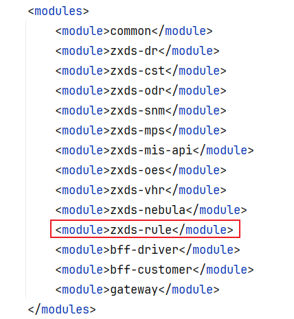

# 运行后端子系统

我已经把初始化项目提前准备好了，大家可以直接在 IDEA 中导入初始化项目，不过还是建议大家有时间的话，把这些项目从零按照我上面的步骤，一步一步创建出来，有助于你理解初始化项目中都有哪些东西。


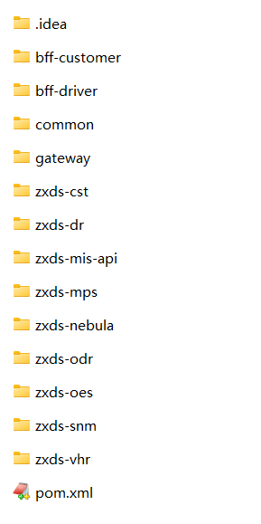

## 第一步：导入后端子系统

首先，大家需要将我提供的初始化项目放到一个没有中文的目录下。

打开 IDEA 工具，直接使用 IDEA 工具将项目打开即可。

## 第二步：修改 common 子系统配置

找到 common 子系统的 application.yml 文件，可以看到以下配置。

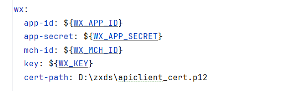

`app-id`和 `app-secret`修改为你自己的：注册微信开发者账号时的信息。

`mch-id`、`key`、`cert-path`我来提供，搭建项目的时候，这三个值按照下面方式提供：

- `mch-id`:`1234567890`
- `key`（32 个 1）：`11111111111111111111111111111111`
- `cert-path`：`D:\apiclient_cert.p12` （在 D 盘根下先创建一个空的文件，文件名叫做：apiclient_cert.p12）

## 第三步：确认数据库连接信息

大部分子系统是需要连接数据库、连接 nacos、连接 redis 等，如果你之前创建数据库时采用的都是我文档中的密码，那就不需要修改。

如果不是，则需要找一下所有的 `application.yml`文件，修改为你自己的。

## 第四步：给每个子系统起个名字

提示：common 子系统不需要启动，剩下的子系统都需要启动。

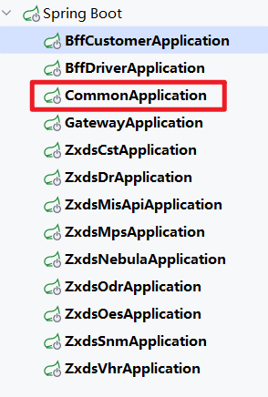

**为了方便，我们给每个子系统起个中文的名字，操作如下：**

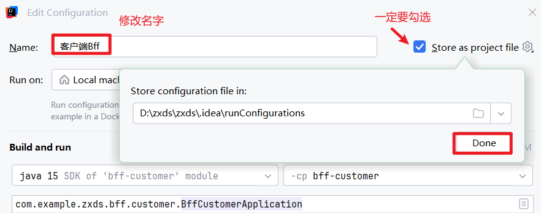

**最终修改为如下：**

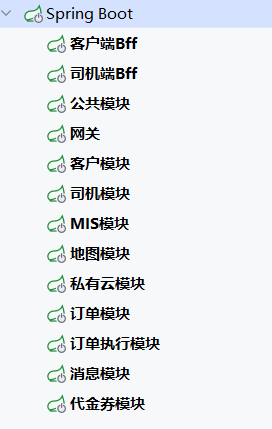

最后将所有的子系统启动起来。（公共模块不需要启动）

## 第五步：去 nacos 控制台查看服务

我们项目中 `application.yml`文件中配置的 nacos 命名空间叫做 `zxds`

如果你想在 nacos 控制台上看到所有注册的服务，就需要手动创建命名空间 `zxds`

当然，这一步不是必须的，不创建也不影响程序的正常执行。如果要在 nacos 控制台上看到这些服务的话，你就需要手动创建 zxds 命名空间：

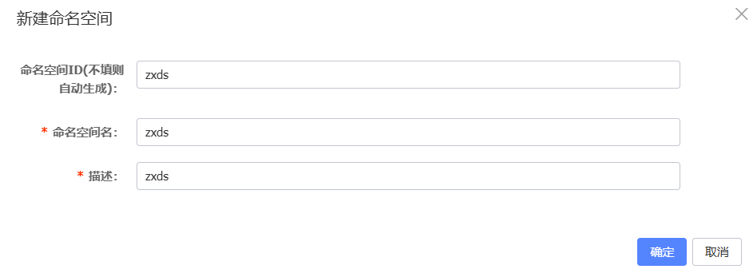

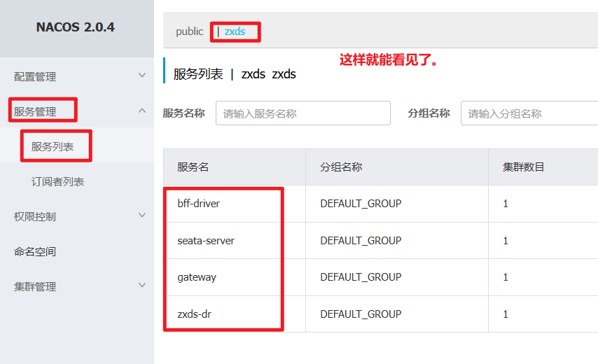

## 补充：每个微服务项目中添加 bootstrap.yml

1. **如果你使用的是 VirtualBox，不需要编写 **`**bootstrap.yml**`
2. 如果你使用的是 `SpringBoot2.4+`的版本，不需要编写 `bootstrap.yml`
3. 在 `springboot2.4`版本之前（我们用的是 springboot2.3），`nacos`的配置信息需要被优先加载。在 springboot 中 `bootstrap.yml`配置文件的信息比 `application.yml`更先加载。因此你需要将每个微服务项目的 `application.yml`文件中的 `nacos`配置信息单独提取出来，放到 `bootstrap.yml`文件中。
4. 文件名叫做：`bootstrap.yml`，存放在 `resources`目录下。
5. 配置信息如下：

```yaml
spring:
  application:
    name: zxds-vhr # 每一个需要nacos的微服务项目中都需要
  cloud:
    nacos:
      server-addr: 192.168.100.129:8848 # 这里填写你的VMWare上CentOS的IP地址
      username: nacos
      password: nacos
      discovery:
        namespace: zxds
        group: DEFAULT_GROUP
      config:
        namespace: zxds
        file-extension: yaml
```

# 运行前端微信小程序

## 开通微信小程序需要的各种插件

点击[**微信服务市场**](https://fuwu.weixin.qq.com/)**，按照下图方式搜索：微信同声传译**

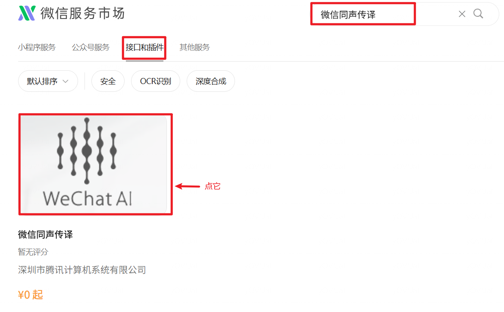

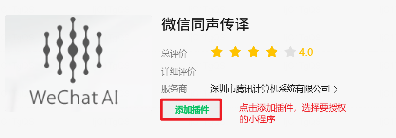

按照以上方式分别安装：腾讯位置服务路线规划、腾讯位置服务地图选点、腾讯位置服务城市选择器。

**验证安装插件是否成功：**

**第一步：**[**登录微信公众平台**](https://mp.weixin.qq.com)

**第二步：**左下角找到账号设置

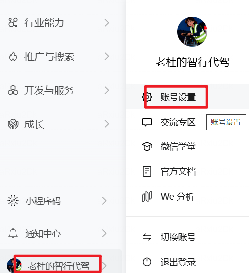

---

**第三步：**点击第三方设置

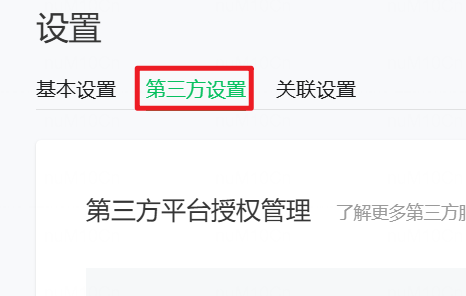

**第四步：下拉看插件管理**，正常应该有这些插件，表示安装成功。

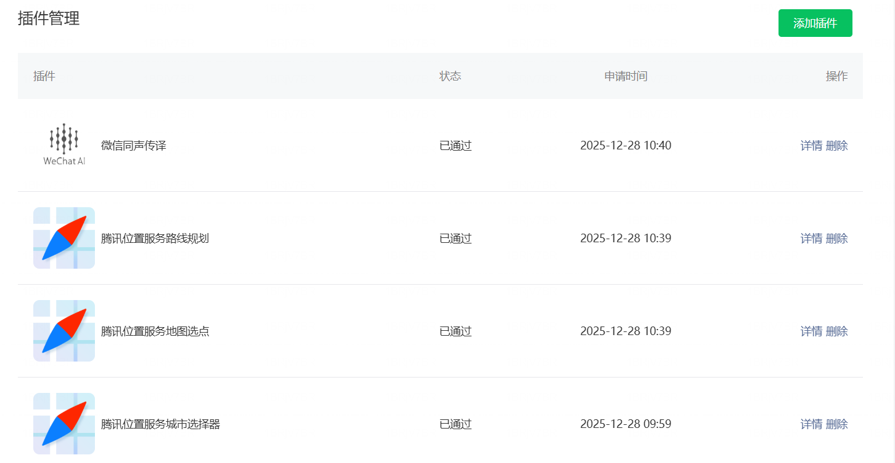

## 导入子系统

**将项目放到一个没有中文的路径中：**

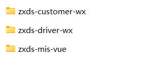

将前端系统导入 HBuilderX。

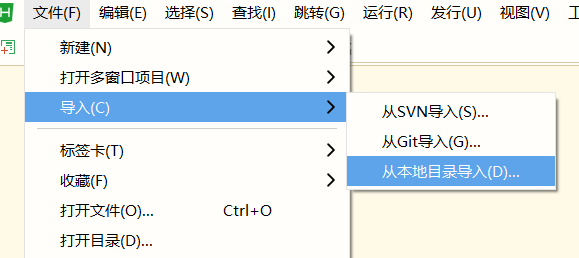

## 修改配置

两个小程序都要导入HBuilder里面。然后修改 `manifest.json` 文件，具体如下：

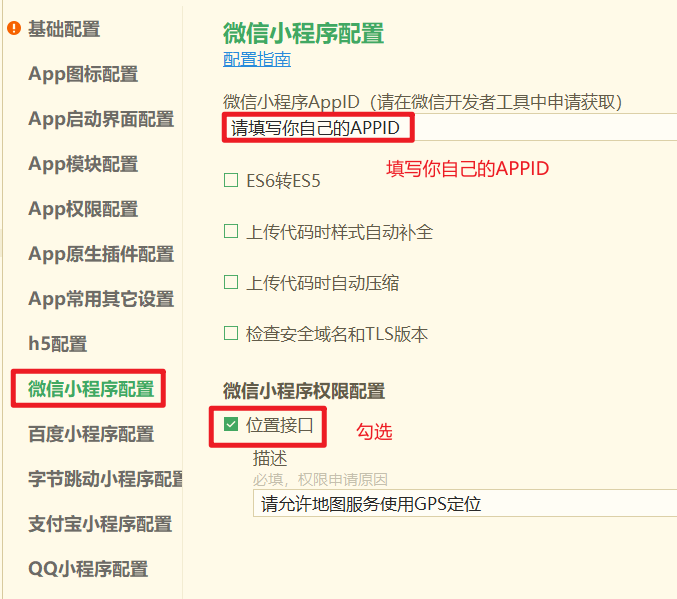

**两个微信小程序的 main.js 文件中的 baseUrl 需要修改：**

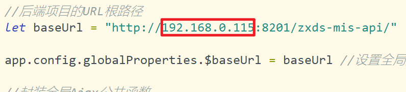

电脑和手机必须在同一个局域网之内，IP网段也必须相同。有时候虽然你的手机和电脑连接的是同一个WIFI信号，但是IP网段却不相同。比如手机IP是192.168.1.102，电脑的IP是192.168.4.96，这就属于网段不同。遇到这种情况，**你只能用手机开热点让电脑连接**，然后baseUrl改成手机分配给电脑的IP地址。

## 进入微信小程序安装依赖

用命令行进入微信小程序项目的文件夹，然后执行初始化命令：

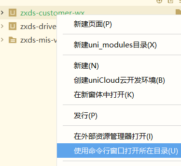

```shell
cnpm install
```

## 编译项目并启动模拟器

先打开**微信开发者工具**。

在 HBuilderX 中进行编译并在微信开发者工具中启动模拟器：

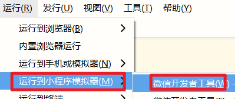

这个时候微信开发者工具就会打开，打开后在右上角按照下图操作：【更改**调试基础库**】

**一定要调整为：**`**<font style="color:#DF2A3F;">2.24.4</font>**`**版本。**

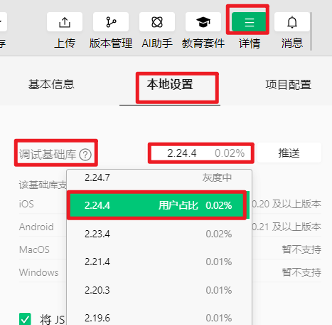

此时你在左侧模拟器中应该可以看到小程序的首页面。

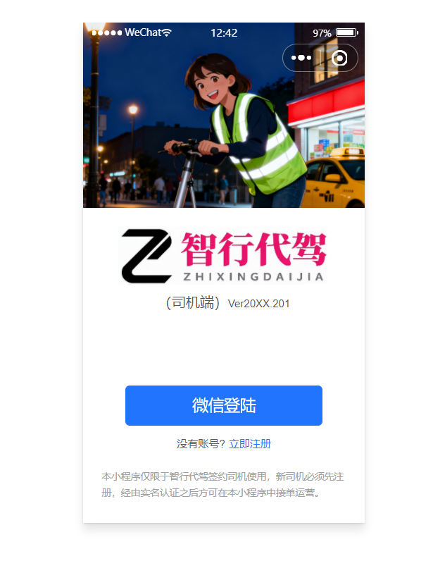

# 运行前端 vue 项目

把项目导入到 HBuilderX 中：

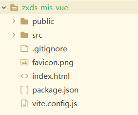

在根目录上右键，在 dos 命令窗口中打开，执行 `cnpm install`命令：

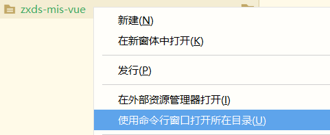

**启动开发服务器：**`**npm run dev**`

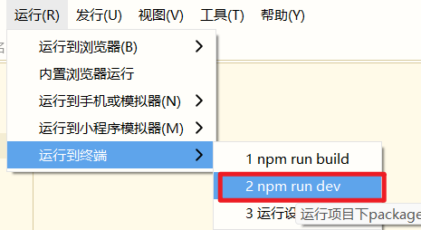

**访问地址： **[**http://localhost:3000/zxds-mis-vue/**](http://localhost:3000/zxds-mis-vue/)

# 需要提前储备的小知识点

1. `<view>`是 `uni-app`中的标签，等同于 `<div>`
2. `<text>`是 `uni-app`中的标签，等同于 `<span>`
3. `<image>`是 `uni-app`中的标签，等同于 ``
4. `uView`是一个组件库，适合于 `uni-app`开发平台中使用。类似于 `ElementPlus`。
5. `uView`组件库中的标签统一以 `<u-`开头。
6. `@tap`是 `uni-app`中标签的鼠标单击事件，等同于 `@click`。
7. 在 `uni-app`中如何弹出一个提示信息（**结合 uView 弹出提示信息**）？

**Toast 是一个自动消失、不可手动关闭、无交互的轻量级提示组件，用于单向反馈操作结果**

```plaintext
<!--在视图层中编写以下标签-->
<template>
  <u-toast ref="uToast"></u-toast>
</template>
<!--在模型层编写以下代码-->
<script>
  export default {
    // data（数据，双向数据绑定）
    // methods （指定方法）
    methods: {
      myFun(){
        // 弹出一个提示信息
        // Toast 是一个自动消失、不可手动关闭、无交互的轻量级提示组件，用于单向反馈操作结果
        this.$refs.uToast.show({
          title: "登录成功",
          type: "success", // 如果是错误提示信息就是：error
          callback: function(){
            // 提示框消失之后，自动执行这个回调函数。
            // 该回调函数不是必须的。
          }
        });
      }
    }
  }
</script>
```

以上的这个方法是 uView 组件库中组件实例的方法。

其实在 uni-app 中也内置了一个函数，也可以显示提示信息，只不过功能简单，不支持定制，代码如下：

```javascript
uni.showToast({
  title: "标题",
  duration: 2000
});
```

我们项目开发中不使用它。使用 `uView`组件库提供的方式。

1. uni-app 中，向 Storage 中存储数据，以及从 Storage 中获取数据，删除数据，清空数据。

```javascript
// 同步方式
// 存储
uni.setStorageSync("name", value);
// 读取
let value = uni.getStorageSync("name");
// 删除
uni.removeStorageSync("name");
// 清空
uni.clearStorageSync();

// 异步方式
// 存储
uni.setStorage("name", value);
// 读取
uni.getStorage("name");
// 删除
uni.removeStorage("name");
// 清空
uni.clearStorage();
```

1. `uni-app`中发送 ajax post/get 请求

```javascript
// 发送ajax post请求
uni.request({
  url: "",
  method: "POST",
  data: {},
  header: {},
  success : (resp)=>{},
  fail: (err)=>{}
});

// 发送ajax get请求
uni.request({
  url: "",
  method: "GET",
  data: {},
  header: {},
  success: (resp) => { resp.data },
  fail: (err)=>{}
});

// promise风格写法 POST
try {
  const resp = await uni.request({
    url: "",
    method: "POST",
    data: {},
    header: {}
  });
  let data = resp.data;
}catch(err){
  
}

// promise风格写法 GET
try {
  const resp = await uni.request({
    url : "",
    method: "GET",
    data: {},
    header: {}
  });
  let result = resp.data;
} catch(err){
  
}
```

**重点注意事项：请看以下代码以及注释说明**

```javascript
uni.request({
  url: "",
  method: "POST",
  data: {},
  header: {},
  success : (resp)=>{
    // 这个success回调函数的执行时机是：只要网络请求成功就执行这个回调
    // 也就是说，HTTP状态码是200，或者500时（即使服务器报错），这个回调都会执行。
    // 对于我们代驾系统来说，做了全局异常处理，如果是业务异常，则返回 {"error": "错误描述信息"} 这样的json
    // 因此我们在前端，通过 resp.data.error 是否为空来判断是否出错了，代码如下
    if(resp.data.error){
      // 出错了
    }else{
      // 处理成功了
    }
  },
  fail: (err)=>{
    // 这个fail回调函数的执行时机是：网络请求失败时执行。
  }
});
```

1. 弹出确认框，类似于浏览器中的 `window.confirm`？

```javascript
// 弹出确认框
uni.showModal({
  title: "提示信息",
  content: "确定要删除吗？",
  confirmText: "确定",
  cancelText: "取消",
  success: (resp) => {
    if(resp.confirm){
      // 用户点击了确认按钮
    }else{
      // 用户点击了取消按钮
    }
  }
});

// 弹出确认框的同时，用户还可以输入信息
uni.showModal({
  title: "",
  confirmText: "确定",
  cancelText: "取消",
  editable: true,
  placeholderText: "11位手机号码",
  success: (resp) => {
    if(resp.confirm){
      // 用户点击了确定按钮
      // 获取用户输入的信息
      let phone = resp.content;
    }else{
      // 用户点击了取消按钮
    }
  }
});
```

1. uni-app 中编程式导航

uni-app 的页面也是存储在栈结构当中的：

```javascript
// 将新页面放到栈顶（小程序页面左上角有后退按钮）
uni.navigateTo({ // 新页面入栈
  url: ""
});

// 小程序页面左上角没有后退按钮
uni.redirectTo({ // 栈顶页面被替换成新页面（不能返回被替换掉的那个页面，但能返回到更早的页面）
  url: ""
});

uni.switchTab({ // 专门用在多tab页切换（栈中的非tabBar页会被清空）
  url: ""
});

uni.navigateBack({ // 主要用在后退方面
  delta: 1 // 德尔塔：指定返回的层数
});

uni.reLaunch({ // 清空栈中所有页面，将新页面加入栈，等于重启（适合退出登录/切换账号）
  url: ""
});
```

1. uni-app 中声明式导航

```html
<navigator url="" open-type="navigate">
  <button>跳转到新页面</button>
</navigator>

<navigator url="" open-type="redirect">
  <button>替换当前页面</button>
</navigator>

<navigator url="" open-type="switchTab">
  <button>跳转到tab页</button>
</navigator>

<navigator url="" open-type="reLaunch">
  <button>重启到首页</button>
</navigator>

<navigator open-type="navigateBack" delta="1">
  <button>返回上一页</button>
</navigator>
```

1. 手机震动一下

```javascript
uni.vibrateShort({});
```

1. 关于 uni-app 中页面的生命周期的回调函数。（**常用的 5 个**）

| **生命周期** | **触发时机** | **触发次数** | **能否接收参数** | **能否操作DOM** | **常用场景** |
| --- | --- | --- | --- | --- | --- |
| `**<font style="color:rgb(15, 17, 21);background-color:rgb(235, 238, 242);">onLoad</font>**` | 页面加载时 | **1次** | ✅ 能 | ❌ 不能 | 接收上一页传参、初始化数据 |
| `**<font style="color:rgb(15, 17, 21);background-color:rgb(235, 238, 242);">onShow</font>**` | 页面显示时 | **多次** | ❌ 不能 | ❌ 不能 | 每次刷新数据、更新状态 |
| `**<font style="color:rgb(15, 17, 21);background-color:rgb(235, 238, 242);">onReady</font>**` | 页面渲染完成时 | **1次** | ❌ 不能 | ✅ 能 | 获取元素宽高、初始化canvas |
| `**<font style="color:rgb(15, 17, 21);background-color:rgb(235, 238, 242);">onHide</font>**` | 页面隐藏时 | **多次** | ❌ 不能 | ❌ 不能 | 暂停视频、保存草稿 |
| `**<font style="color:rgb(15, 17, 21);background-color:rgb(235, 238, 242);">onUnload</font>**` | 页面卸载时 | **1次** | ❌ 不能 | ❌ 不能 | 清理定时器、取消网络请求 |

这些页面回调函数中的 this 代表的是**当前 Vue 组件实例**。只要能够拿到 Vue 组件实例，那么就可以访问该 Vue 组件实例上的 data、methods、$refs 等属性和方法。

1. **显示 **和 **隐藏 加载**提示框

**显示**加载提示框（**必须手动调用 **`**uni.hideLoading()**`**才能隐藏。**）

```javascript
uni.showLoading({
  title: "下单中请稍后"
});
```

**隐藏**加载提示框

```javascript
uni.hideLoading();
```