# 智行代驾02

# 功能介绍

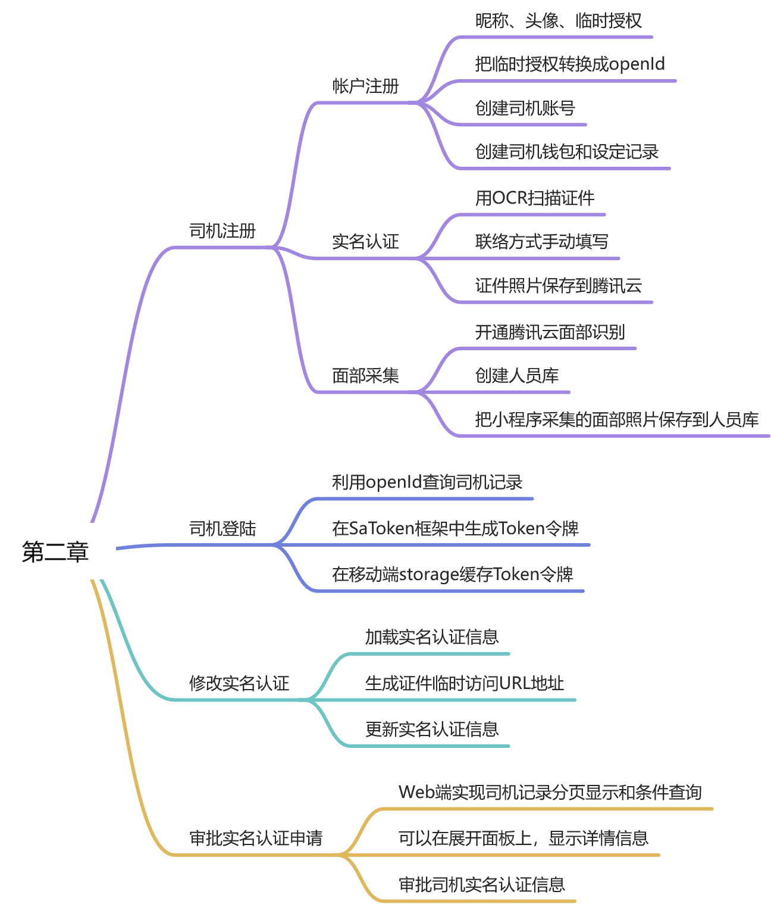

# 司机注册

司机使用的是微信小程序，因此司机注册的时候应该**使用微信号进行注册**。

## 功能时序图

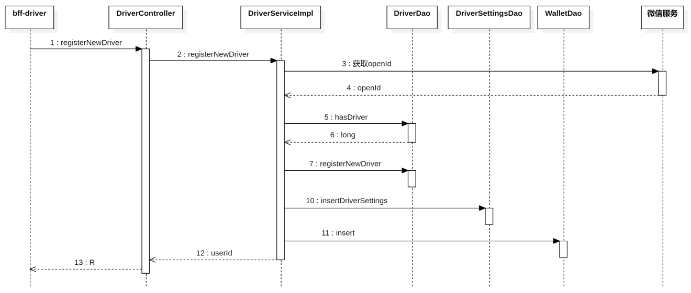

1. `**<font style="color:#000000;">bff-driver</font>**`**（司机 bff）子系统远程调用 **`**<font style="color:#000000;">zxds-dr</font>**`**（司机）子系统。核心业务在 **`**<font style="color:#000000;">zxds-dr</font>**`**（司机）子系统中进行。**
2. **openId 是什么？**
  1. 当用户首次使用小程序时，微信平台根据用户的微信号和小程序的AppID通过加密算法生成一个唯一的、永久不变的OpenID，作为该用户在这个小程序中的专属身份标识。（openId 是这个用户在当前小程序中的身份证号，由微信平台生成，永不变。）
3. **在后端 Java 程序中怎么获取 openId？**
  1. 通过 Java 程序调用微信平台提供的接口来获取。调用微信平台接口时，需要给接口传一个 code 参数。
4. **code 参数是什么？**
  1. code 是微信小程序用户的临时登录凭证，是微信服务器分配的。
  2. 用户打开微信，然后登录微信，用户搜索小程序，找到小程序并点击小程序，在小程序中我们会调用这个 API：`<font style="color:#000000;">uni.login()</font>`，向微信服务器发送请求，微信服务器判断该用户是否已经登录微信，如果该用户已登录微信，则微信服务器会向微信小程序响应一个 5 分钟之内有效的临时登录凭证。这个临时登录凭证就是 code。
5. **核心业务流程梳理：**
  1. 根据 code 获取 openId
  2. 根据 openId 看看后端数据库里有没有这个司机。
  3. 如果没有这个司机（表示该司机未注册），则保存司机信息。司机信息的主键值采用雪花算法生成。
  4. 保存司机的**设置信息**，设置信息以**默认设置**保存。
  5. 保存司机的钱包信息，钱包余额为 0
  6. 最后将 driverId 返回，bff 层接收到 driverId 后，通过 driverId 生成 Token

## 编写持久层

### 查询司机是否已经注册

在 `<font style="color:#000000;">DriverDao.xml</font>` 文件中定义 SQL语句，根据openId或者driverId查询是否存在司机记录。

```xml
<select id="hasDriver" parameterType="map" resultType="long">
    SELECT COUNT(id) AS ct
    FROM tb_driver
    <where>
        <if test="openId != null">
            AND open_id = #{openId}
        </if>
        <if test="driverId != null">
            AND id = #{driverId}
        </if>
    </where>
</select>
```

**为什么条件中再额外添加一个 **`**<font style="color:#000000;">driverId</font>**`**？**主要是想让这个 SQL 通用，不仅用于当前业务，其他业务可能会有这个需求。

**找到 **`**<font style="color:#000000;">DriverDao</font>**`**接口，编写以下方法：**

```java
long hasDriver(Map<String, Object> param);
```

### 保存司机信息

先熟悉一下 `<font style="color:#000000;">tb_driver</font>`表，允许空值的字段是后面司机实名认证的时候需要填写的，以下红色字段是司机注册时要插入的：

| **字段** | **类型** | **禁止空值** | **备注信息** |
| --- | --- | --- | --- |
| **id** | **bigint** | **True** | **主键(采用雪花算法生成)** |
| **open_id** | **varchar** | **True** | **小程序长期授权** |
| **nickname** | **varchar** | **True** | **昵称（来自微信）** |
| name | varchar | False | 姓名 |
| sex | char | False | 性别（来自微信） |
| **photo** | **varchar** | **False** | **头像（来自微信）** |
| pid | varchar | False | 身份证号码 |
| birthday | date | False | 生日 |
| tel | char | False | 电话 |
| email | varchar | False | 邮箱 |
| mail_address | varchar | False | 收信地址 |
| contact_name | varchar | False | 应急联系人 |
| contact_tel | char | False | 应急联系人电话 |
| **real_auth** | **tinyint** | **False** | **1未认证，2已认证，3审核中** |
| idcard_address | varchar | False | 身份证地址 |
| idcard_expiration | date | False | 身份证有效期 |
| idcard_front | varchar | False | 身份证正面 |
| idcard_back | varchar | False | 身份证背面 |
| idcard_holding | varchar | False | 手持身份证 |
| drcard_type | varchar | False | 驾驶证类型 |
| drcard_expiration | date | False | 驾驶证有效期 |
| drcard_issue_date | date | False | 驾驶证初次领证日期 |
| drcard_front | varchar | False | 驾驶证正面 |
| drcard_back | varchar | False | 驾驶证背面 |
| drcard_holding | varchar | False | 手持驾驶证 |
| home | json | False | 家庭地址，包含地址和定位，用于回家导航 |
| **summary** | **json** | **False** | **摘要信息，level等级，totalOrder接单数，weekOrder周接单，weekComment周好评，appeal正在申诉量** |
| **archive** | **tinyint** | **True** | **是否在腾讯云归档存放司机面部信息** |
| **status** | **tinyint** | **True** | **状态，1正常，2禁用，3.降低接单量** |
| **create_time** | **datetime** | **True** | **注册时间** |

**找到 **`**<font style="color:#000000;">DriverDao.xml</font>**`**文件，编写以下 SQL：**`**<font style="color:#000000;">insert into tb_driver set...</font>**`**语法是 MYSQL 扩展的语法。其他数据库不兼容。**

```xml
<insert id="registerNewDriver" parameterType="Map">
    INSERT INTO tb_driver
    SET id = #{driverId},
        open_id = #{openId},
        nickname = #{nickname},
        photo = #{photo},
        real_auth = 1,
        summary = '{"level":0,"totalOrder":0,"weekOrder":0,"weekComment":0,"appeal":0}',
        archive = false,
        `status` = 1
</insert>
```

**找到 **`**<font style="color:#000000;">DriverDao</font>**`**接口，编写以下方法：**

```java
int registerNewDriver(Map<String, Object> param);
```

### 保存司机的默认设置

`<font style="color:#000000;">tb_driver_settings</font>` 表保存的司机在小程序上的设置，比如：是否自动抢单；附近多少公里以内的订单，自己才会接单。

| **字段** | **类型** | **禁止空值** | **备注信息** |
| --- | --- | --- | --- |
| id | bigint | True | 主键 |
| driver_id | bigint | True | 司机ID |
| settings | json | True | 司机个人设置 |

settings字段里面的内容是JSON格式的，具体例子如下：

```json
{
  "autoAccept": 0, // 1自动抢单，0不自动抢单
  "orientation": "", //定向接单（这里存储的是一个GPS定位坐标值）
  "listenService": true,  //语音播报订单，false表示不进行语音播报
  "orderDistance": 0, //代驾订单预估里程不限，司机不挑订单
  "rangeDistance": 5  //接收距离司机5公里以内的代驾单
}
```

**详细解释：**

1. `orientation`：定向接单这里是一个坐标值，规则是：主要看**乘客订单的终点坐标值**与**司机设置的定向接单的坐标值**之间的距离是否**在 3000 米以内（3 公里）**，在 3 公里以内，则这个订单符合司机的接单要求。比如说司机想回家了，那就可以设置定向接单的方向是家的方向。这样等于回家的时候顺带着接个单。
2. `orderDistance`：对订单的起点到终点的距离进行限制，0 表示不限制。在我们代驾系统中的业务是这样要求的，如果
  1. `orderDistance=5`表示订单的起点到终点的距离是 `>0 and <=5`
  2. `orderDistance=10`表示订单的起点到终点的距离是 `>5 and <=10`
  3. `orderDistance=15`表示订单的起点到终点的距离是 `>10 and <=15`
  4. `orderDistance=30`表示订单的起点到终点的距离是 `>15 and <=30`
3. `rangeDistance`：设置司机只接距离自己几公里以内的单子。

**找到 **`**<font style="color:#000000;">DriverSettingsDao.xml</font>**`**文件，编写以下 SQL：**

```xml
<insert id="insertDriverSettings" parameterType="com.example.zxds.dr.db.pojo.DriverSettingsEntity">
    INSERT INTO tb_driver_settings
    SET id = #{id},
        driver_id = #{driverId},
        settings = #{settings}
</insert>
```

**找到 **`**<font style="color:#000000;">DriverSettingsDao</font>**`** 接口，编写以下方法：**

```java
int insertDriverSettings(DriverSettingsEntity entity);
```

### 保存司机的钱包信息

`<font style="color:#000000;">tb_wallet</font>` 是司机钱包表，司机缴纳罚款或者获得系统奖励的时候，都会跟这张表有关系。

| **字段** | **类型** | **禁止空值** | **备注信息** |
| --- | --- | --- | --- |
| id | bigint | True | 主键 |
| driver_id | bigint | True | 司机ID |
| balance | decimal | True | 钱包金额 |
| password | varchar | False | 支付密码，如果为空，不能支付，提示用户设置支付密码 |

**找到 **`**<font style="color:#000000;">WalletDao.xml</font>**`**文件，编写 SQL：**

```xml
<insert id="insert" parameterType="com.example.zxds.dr.db.pojo.WalletEntity">
    INSERT INTO tb_wallet
    SET id = #{id},
        driver_id = #{driverId},
        balance = #{balance},
        password = #{password}
</insert>
```

**找到 **`**<font style="color:#000000;">WalletDao</font>**`**接口，编写以下方法：**

```java
int insert(WalletEntity entity);
```

## 编写业务层

在 `<font style="color:#000000;">com.example.zxds.dr.service</font>` 包中创建 `<font style="color:#000000;">DriverService</font>` 接口，声明抽象业务方法：

```java
String registerNewDriver(Map<String, Object> param);
```

在 `<font style="color:#000000;">com.example.zxds.dr.service.impl</font>` 包中创建 `<font style="color:#000000;">DriverServiceImpl</font>` 类，实现业务方法，添加本地事务。

```java
package com.example.zxds.dr.service.impl;

import cn.hutool.core.map.MapUtil;
import cn.hutool.core.util.IdUtil;
import cn.hutool.json.JSONObject;
import com.example.zxds.common.exception.ZxdsException;
import com.example.zxds.common.util.MicroAppUtil;
import com.example.zxds.dr.db.dao.DriverDao;
import com.example.zxds.dr.db.dao.DriverSettingsDao;
import com.example.zxds.dr.db.dao.WalletDao;
import com.example.zxds.dr.db.pojo.DriverSettingsEntity;
import com.example.zxds.dr.db.pojo.WalletEntity;
import com.example.zxds.dr.service.DriverService;
import lombok.extern.slf4j.Slf4j;
import org.springframework.stereotype.Service;
import org.springframework.transaction.annotation.Transactional;

import javax.annotation.Resource;
import java.math.BigDecimal;
import java.util.HashMap;
import java.util.Map;

@Service
@Slf4j
public class DriverServiceImpl implements DriverService {
    @Resource
    private MicroAppUtil microAppUtil;

    @Resource
    private DriverDao driverDao;

    @Resource
    private DriverSettingsDao settingsDao;

    @Resource
    private WalletDao walletDao;

    @Override
    @Transactional
    public String registerNewDriver(Map<String, Object> param) {
        // 获取code，通过code获取openId
        String code = MapUtil.getStr(param, "code");
        String openId = microAppUtil.getOpenId(code);

        // 看看该司机有没有注册过。
        Map<String, Object> tempParam = new HashMap<>();
        tempParam.put("openId", openId);
        if (driverDao.hasDriver(tempParam) != 0) {
            throw new ZxdsException("该微信无法注册");
        }

        // 保存司机数据
        // 通过雪花算法生成主键值：第一个参数workerId，第二个参数datacenterId
        // workerId表示终端id（一张表一个）
        // datacenterId表示数据中心id（同一个模块中这个值不变）
        long driverId = IdUtil.getSnowflake(1, 1).nextId(); // 建议这里封装一个工具类。
        param.put("driverId", driverId);
        param.put("openId", openId);
        String nickname = MapUtil.getStr(params, "nickname");
        String photo = MapUtil.getStr(params, "photo");
        param.put("nickname", nickname);
        param.put("photo", photo);
        driverDao.registerNewDriver(param); //插入司机记录

        //添加司机默认设置
        DriverSettingsEntity settingsEntity = new DriverSettingsEntity();
        settingsEntity.setId(IdUtil.getSnowflake(2, 1).nextId());
        settingsEntity.setDriverId(driverId);
        JSONObject json = new JSONObject();
        json.set("orientation", "");
        json.set("listenService", true);
        json.set("orderDistance", 0);
        json.set("rangeDistance", 5);
        json.set("autoAccept", false);
        settingsEntity.setSettings(json.toString());
        settingsDao.insertDriverSettings(settingsEntity);

        //添加司机钱包记录
        WalletEntity walletEntity = new WalletEntity();
        walletEntity.setId(IdUtil.getSnowflake(3, 1).nextId());
        walletEntity.setDriverId(driverId);
        walletEntity.setBalance(new BigDecimal("0"));
        walletEntity.setPassword(null); //支付密码为空，用户支付的时候，系统会自动提示用户设置支付密码
        walletDao.insert(walletEntity);

        // 为什么要返回一个字符串？因为雪花算法生成了一个long类型的数字，前端和移动端不支持。
        return String.valueOf(driverId);
    }
}
```

## 编写 form 接收数据并校验

在 `<font style="color:#000000;">com.example.zxds.dr.controller.form</font>` 包中创建 `<font style="color:#000000;">RegisterNewDriverForm</font>` 类，用于封装小程序提交的注册信息。

```java
package com.example.zxds.dr.controller.form;

import io.swagger.v3.oas.annotations.media.Schema;
import lombok.Data;

import javax.validation.constraints.NotBlank;

@Data
@Schema(description = "新司机注册表单")
public class RegisterNewDriverForm {

    @NotBlank(message = "code不能为空")
    @Schema(description = "微信小程序临时授权码")
    private String code;

    @NotBlank(message = "nickname不能为空")
    @Schema(description = "用户昵称")
    private String nickname;

    @NotBlank(message = "photo不能为空")
    @Schema(description = "用户头像")
    private String photo;

}
```

## 编写 web 方法

在 `<font style="color:#000000;">com.example.zxds.dr.controller</font>` 包中创建 `<font style="color:#000000;">DriverController</font>` 类，定义Web方法。

```java
package com.example.zxds.dr.controller;

import cn.hutool.core.bean.BeanUtil;
import com.example.zxds.common.util.R;
import com.example.zxds.dr.controller.form.RegisterNewDriverForm;
import com.example.zxds.dr.service.DriverService;
import io.swagger.v3.oas.annotations.Operation;
import io.swagger.v3.oas.annotations.tags.Tag;
import org.springframework.web.bind.annotation.PostMapping;
import org.springframework.web.bind.annotation.RequestBody;
import org.springframework.web.bind.annotation.RequestMapping;

import org.springframework.web.bind.annotation.RestController;

import javax.annotation.Resource;
import javax.validation.Valid;
import java.util.Map;

@RestController
@RequestMapping("/driver")
@Tag(name = "DriverController", description = "司机模块Web接口")
public class DriverController {

    @Resource
    private DriverService driverService;

    @PostMapping("/registerNewDriver")
    @Operation(summary = "新司机注册")
    public R registerNewDriver(@RequestBody @Valid RegisterNewDriverForm form) {
        Map<String, Object> param = BeanUtil.beanToMap(form);
        String userId = driverService.registerNewDriver(param);
        return R.ok().put("userId", userId);
    }
}
```

## bff-driver 层的实现

在 `<font style="color:#000000;">bff-driver</font>`子系统中编写代码。

### 时序图

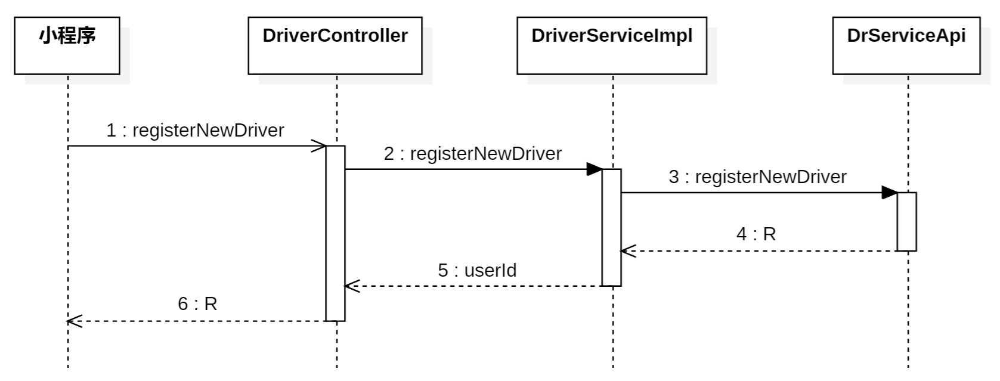

1. bff 层同样需要三层架构。
2. 在 service 层控制分布式事务。
3. `<font style="color:#000000;">DrServiceApi</font>` 接口是 `<font style="color:#000000;">zxds-dr</font>` 的 `<font style="color:#000000;">Feign</font>` 远程代理，`<font style="color:#000000;">zxds-dr</font>` 子系统里面所有的 `<font style="color:#000000;">Web</font>` 方法，都可以在这个 `<font style="color:#000000;">Feign</font>` 代理接口中找到。

### 编写 form

和 `<font style="color:#000000;">zxds-dr</font>`中的 form 完全相同。接收小程序提交过来的数据。

在 `<font style="color:#000000;">com.example.zxds.bff.driver.controller.form</font>` 包中创建 `<font style="color:#000000;">RegisterNewDriverForm</font>` 类：

```java
package com.example.zxds.bff.driver.controller.form;

import io.swagger.v3.oas.annotations.media.Schema;
import lombok.Data;

import javax.validation.constraints.NotBlank;

@Data
@Schema(description = "新司机注册表单")
public class RegisterNewDriverForm {

    @NotBlank(message = "code不能为空")
    @Schema(description = "微信小程序临时授权")
    private String code;

    @NotBlank(message = "nickname不能为空")
    @Schema(description = "用户昵称")
    private String nickname;

    @NotBlank(message = "photo不能为空")
    @Schema(description = "用户头像")
    private String photo;
}
```

### 编写 Feign 客户端接口

在 `<font style="color:#000000;">com.example.zxds.bff.driver.feign</font>` 包中创建 `<font style="color:#000000;">DrServiceApi</font>` 接口：

```java
package com.example.zxds.bff.driver.feign;

import com.example.zxds.bff.driver.controller.form.RegisterNewDriverForm;
import com.example.zxds.common.util.R;
import org.springframework.cloud.openfeign.FeignClient;
import org.springframework.web.bind.annotation.PostMapping;

@FeignClient(value = "zxds-dr")
public interface DrServiceApi {

    @PostMapping("/driver/registerNewDriver")
    R registerNewDriver(@RequestBody RegisterNewDriverForm form);
}
```

### 编写 service 接口

在 `<font style="color:#000000;">com.example.zxds.bff.driver.service</font>` 包中创建 `<font style="color:#000000;">DriverService</font>` 接口：

```java
package com.example.zxds.bff.driver.service;

import com.example.zxds.bff.driver.controller.form.RegisterNewDriverForm;

public interface DriverService {
    long registerNewDriver(RegisterNewDriverForm form);
}
```

### 编写 service 实现

在 `<font style="color:#000000;">com.example.zxds.bff.driver.service.impl</font>` 包中创建 `<font style="color:#000000;">DriverServiceImpl</font>` 类：

```java
package com.example.zxds.bff.driver.service.impl;

import cn.hutool.core.convert.Convert;
import com.example.zxds.bff.driver.controller.form.RegisterNewDriverForm;
import com.example.zxds.bff.driver.feign.DrServiceApi;
import com.example.zxds.bff.driver.service.DriverService;
import com.example.zxds.common.util.R;
import io.seata.spring.annotation.GlobalTransactional;
import org.springframework.stereotype.Service;

import javax.annotation.Resource;

@Service
public class DriverServiceImpl implements DriverService {

    @Resource
    private DrServiceApi drServiceApi;

    @Override
    @GlobalTransactional // 分布式事务
    public long registerNewDriver(RegisterNewDriverForm form) {
        R r = drServiceApi.registerNewDriver(form);
        long userId = Convert.toLong(r.get("userId"));
        return userId;
    }
}
```

### 编写 web 方法

在 `<font style="color:#000000;">com.example.zxds.bff.driver.controller</font>` 包中创建 `<font style="color:#000000;">DriverController</font>` 类：

```java
package com.example.zxds.bff.driver.controller;

import cn.dev33.satoken.stp.StpUtil;
import com.example.zxds.bff.driver.controller.form.RegisterNewDriverForm;
import com.example.zxds.bff.driver.service.DriverService;
import com.example.zxds.common.util.R;
import io.swagger.v3.oas.annotations.Operation;
import io.swagger.v3.oas.annotations.tags.Tag;
import org.springframework.web.bind.annotation.PostMapping;
import org.springframework.web.bind.annotation.RequestBody;
import org.springframework.web.bind.annotation.RequestMapping;
import org.springframework.web.bind.annotation.RestController;

import javax.annotation.Resource;
import javax.validation.Valid;

@RestController
@RequestMapping("/driver")
@Tag(name = "DriverController", description = "司机模块Web接口")
public class DriverController {
    @Resource
    private DriverService driverService;

    @PostMapping("/registerNewDriver")
    @Operation(summary = "新司机注册")
    public R registerNewDriver(@RequestBody @Valid RegisterNewDriverForm form) {
        long driverId = driverService.registerNewDriver(form);
        //在SaToken上面执行登录，并生成令牌token
        StpUtil.login(driverId);
        //获取token令牌
        String token = StpUtil.getTokenInfo().getTokenValue();
        return R.ok().put("token", token);
    }
}
```

## 小程序获取用户简介实现司机注册

### 跳转到注册页面

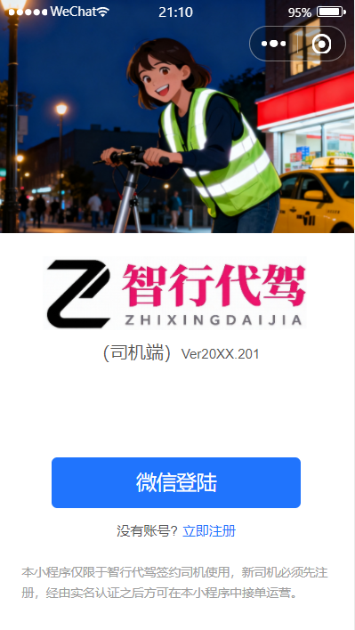

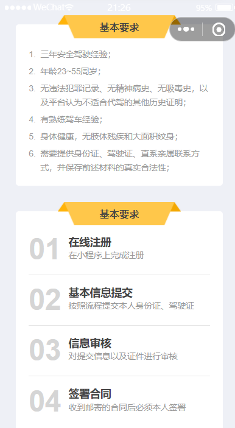

小程序首页就是登录页，用户点击该页面的**立即注册**。

找到 `<font style="color:#000000;">pages/login.vue</font>`页面。找到**立即注册**

```html
<text class="link" @tap="toRegisterPage()">立即注册</text>
```

`<font style="color:#000000;">@tap</font>`是 `<font style="color:#000000;">uni-app</font>`框架的语法。（属于 Vue 语法扩展）。就是鼠标单击事件。

**鼠标单击时，执行回调函数，跳转页面：**（注意：**该项目使用的是 Vue2 的语法**）

```javascript
toRegisterPage: function(){
  uni.navigateTo({
    url:"../register/register"
  })
}
```

**注意：在 uni-app 中跳转代码包括以下方式，区别如下：**

1. `**<font style="color:#000000;">uni.navigateTo</font>**`**：从 A 跳转到 B，保留 A 页，在 B 页可返回 A 页。不能跳 tab 页。**
2. `**<font style="color:#000000;">uni.redirectTo</font>**`**：从 A 跳转到 B，不保留 A 页，在 B 页无法返回 A 页。不能跳 tab 页。**
3. `**<font style="color:#000000;">uni.switchTab</font>**`**：****专门跳转到底部Tab页面（关闭所有普通页）**

**说明一下：**

1. uni-app 中的等同于
2. uni-app 中的等同于
3. uni-app 中的等同于
4. 所有 uView 组件库的标签统一以 `<u-xxx>`开头。

### 在 main.js 中统一管理 URL

在 `<font style="color:#000000;">main.js</font>` 文件中，定义 `<font style="color:#000000;">bff</font>` 层Web方法的 URL地址，我们将所有的 URL地址集中定义在这里便于管理。

```javascript
// 这里的IP地址千万不要写localhost，小程序运行在手机上，localhost对应的是你自己的手机。
// 这里填我们的后端项目所在机器的IP地址，并且必须让手机和后端项目所在的机器  是同一个局域网中（实在不行，手机分享热点，电脑用热点）
// 后端系统是通过gateway路由的，因此端口号写网关的端口8201
let baseUrl = "http://192.168.1.101:8201/zxds-driver"

// 给所有Vue组件实例扩展 url 属性
// 这样在任何一个vue实例上都可以随时获取到想获取的url。
Vue.prototype.url = {
        registerNewDriver: `${baseUrl}/driver/registerNewDriver`
}
```

**重点注意事项：端口号一定要确认一下是不是 **`**<font style="color:#DF2A3F;">8201</font>**`

### 发送 ajax 请求注册

在注册页面找到**立即注册**按钮：`<font style="color:#000000;">pages/register/register.vue</font>`

```html
<button class="btn" open-type="getUserInfo" @tap="register()">立即注册</button>
```

编写 `<font style="color:#000000;">register()</font>`函数：**在 HBuilderX 中唤醒提示的默认快捷键是 **`**<font style="color:#000000;">alt + /</font>**`**，搜索文件的快捷键是 **`**<font style="color:#000000;">ctrl + p</font>**`

```javascript
register: function() {
    // 把this临时保存到一个普通变量中
    // 因为在下面的回调函数中如果都是直接使用this，那么this的指向改变了。
    // 这里的this是vue组件实例。
    let that = this;
  
    // uni-app的内置API，通过这个方法：向微信官方申请一个临时凭证
    uni.login({
        provider: 'weixin', // uni-app 支持多平台登录，所以需要指定，也可以是qq
        success: function(resp) {
            let code = resp.code;
            that.code = code;
        }
    });
    // uni-app 封装的微信小程序API，用于获取用户真实的昵称和头像等信息，调用时会弹出授权窗口要求用户明确同意，符合微信平台的隐私保护政策
    uni.getUserProfile({
        desc: '获取用户信息', // 必须的描述信息，显示在授权弹窗
        success: function(resp) {
            // 获取信息
            let nickname = resp.userInfo.nickName;
            let avatarUrl = resp.userInfo.avatarUrl;
            // 封装数据
            let data = {
                code: that.code,
                nickname: nickname,
                photo: avatarUrl
            };
            // 注意：uni-app不支持axios。这里采用原生ajax请求，这个ajax函数是封装的工具。
            that.ajax(that.url.registerNewDriver, 'POST', data, function(resp) {
              
                let token = resp.data.token;
                // 存储到小程序的本地存储中，微信小程序的本地缓存（不是手机本地文件）
                uni.setStorageSync('token', token);
                uni.setStorageSync('realAuth', 1);
              
                // uView UI 是 uni-app 生态的跨平台 UI 组件库，类似 Element UI
                // 调用 uView UI 的 Toast 组件显示成功提示，2秒后自动跳转到信息填写页面
                // 代码对应的是页面中的：<u-toast ref="uToast" />
                // 如果代码是这样的：<u-toast ref="abc" />
                // 那么下面代码就可以这样写：that.$refs.abc.show()
                that.$refs.uToast.show({
                    title: '注册成功',
                    type: 'success',
                    callback: function() {
                        uni.redirectTo({
                            url: '../../identity/filling/filling?mode=create'
                        });
                    }
                });
            });
        }
    });
}
```

**最终测试：**启动 `<font style="color:#000000;">gateway</font>`、`<font style="color:#000000;">bff-driver</font>`、`<font style="color:#000000;">zxds-dr</font>`三个微服务。

# 利用腾讯云 SDK 封装云端文件存储服务

司机注册成功后，需要进行实名认证，认证时需要提交身份证和驾驶证照片。将这些文件存储到腾讯云上面。

## 开通对象存储服务

在腾讯云（[https://cloud.tencent.com](https://cloud.tencent.com/)）上注册账号。

点击[https://cloud.tencent.com/product/cos](https://cloud.tencent.com/product/cos) 开通对象存储服务。

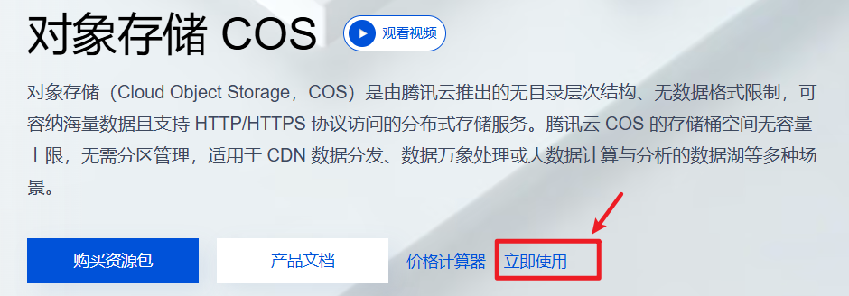

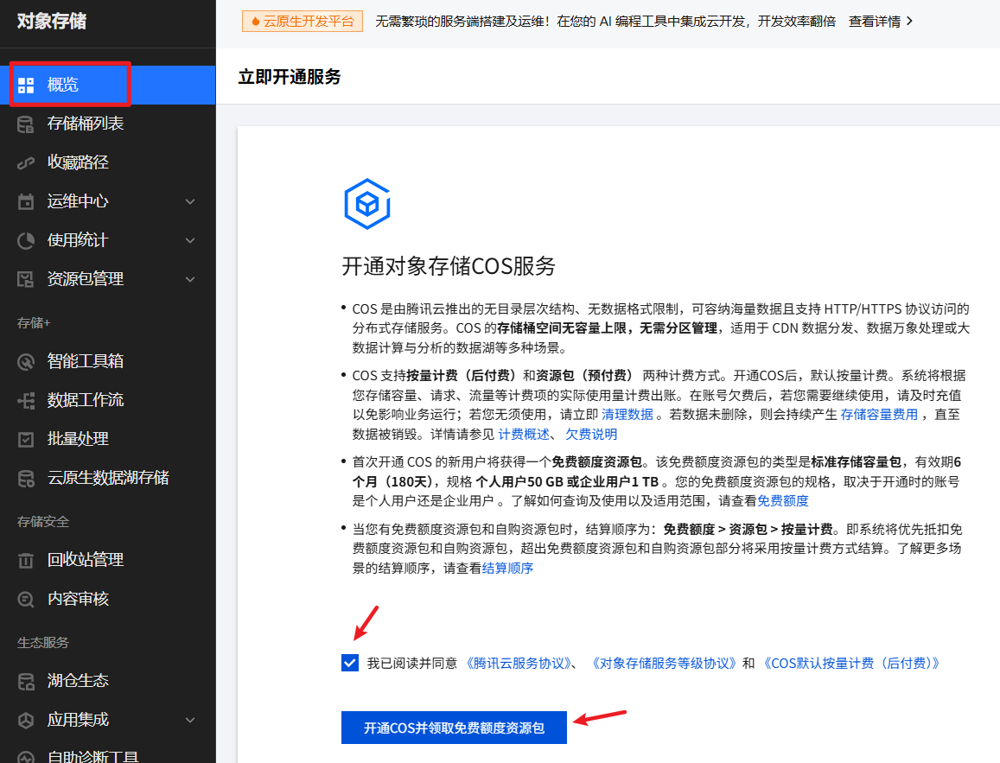

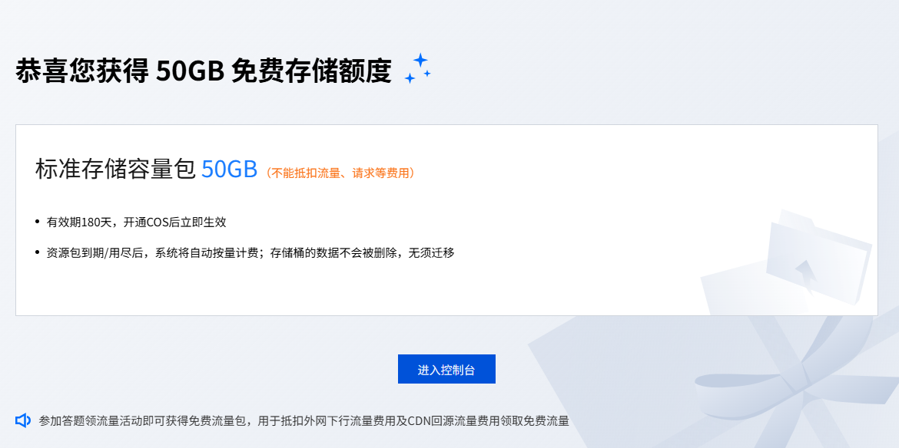

新用户会赠送 180 天，50GB，完全够用。180 天后建议**采用后付费模式（用多少付多少）**。也比较省，不要购买套餐包，比较贵。

## 获取腾讯云访问密钥

调用腾讯云各种服务是需要用到密钥的，例如**数据万象、对象存储**等等。在对象存储服务左侧栏目中找到“**密钥管理**”

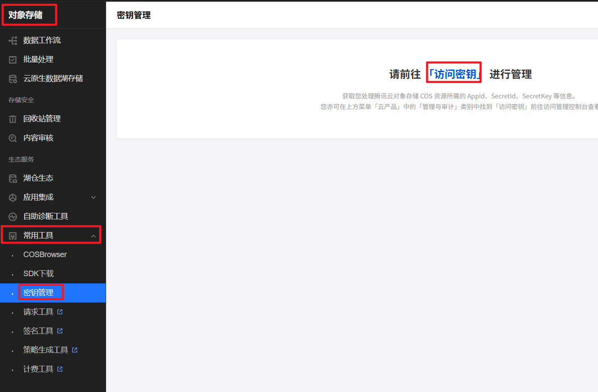

没有密钥就新建密钥，一共是三个：**AppId、SecretId、SecretKey**。（创建好保存起来，不支持找回SecretKey 的操作，丢了只能新建。）

## 创建存储桶

创建两个存储桶：[https://console.cloud.tencent.com/cos](https://console.cloud.tencent.com/cos)

1. 私有的：存储司机身份证和驾照
2. 公开的：保存对外公开的图片或文件

### 创建私有的 `<font style="color:#000000;">zxds-private</font>`

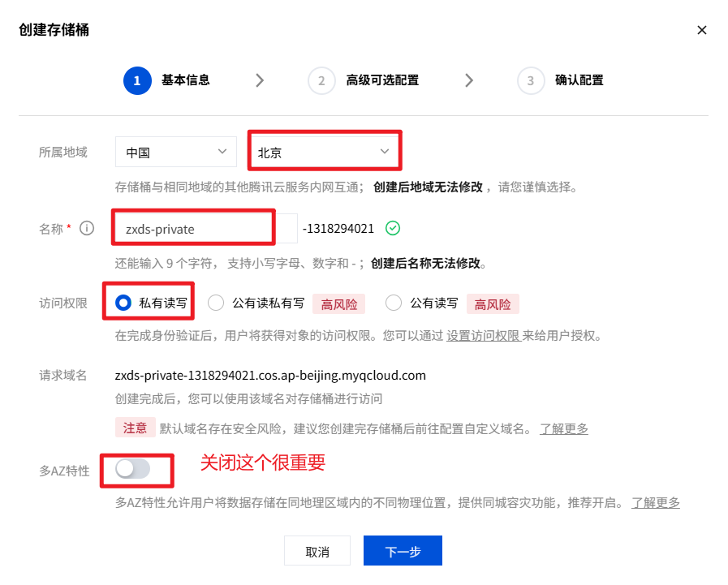

**关闭多 AZ 特性，因为这个收费的，而且比较贵。**

创建文件夹用来存储司机认证的图片：`<font style="color:#000000;">driver/auth</font>`

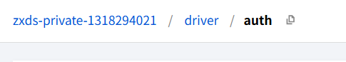

### 创建公有的 zxds-public

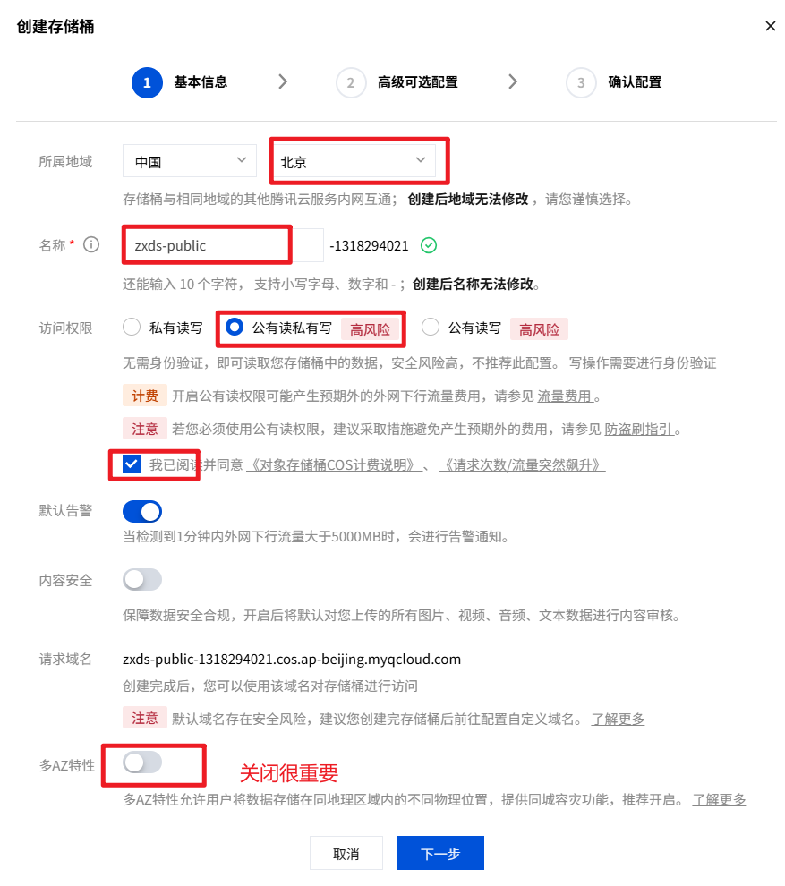

## 腾讯云存储 API 文档

腾讯云的对象存储服务文档（[https://cloud.tencent.com/document/product/436/10199](https://cloud.tencent.com/document/product/436/10199)）写的很详细，我们参考文档就可以很容易实现文件的上传和删除操作。

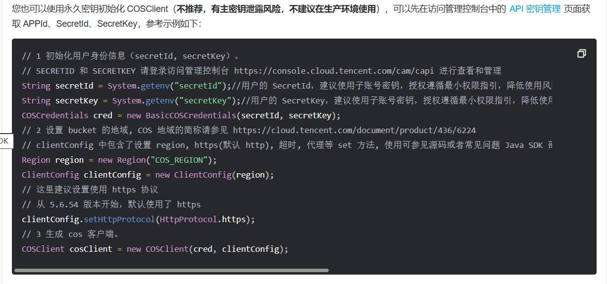

## 配置 YML 文件

把腾讯云的密钥配置到 `<font style="color:#000000;">application-common.yml</font>`文件：

```yaml
tencent:
  cloud:
    appId: ${TENCENT_CLOUD_APPID}
    secretId: ${TENCENT_CLOUD_SECRET_ID}
    secretKey: ${TENCENT_CLOUD_SECRET_KEY}
    region-public: ap-beijing
    bucket-public: zxds-public-1318294021
    region-private: ap-beijing
    bucket-private: zxds-private-1318294021
```

安全起见，大家可以考虑将密钥配置到系统环境变量中。

## 开通数据万象服务

开通数据万象服务的目的是为了审核司机提交的图片中是否含有色情、暴力等信息。人工审核不现实。

**腾讯云提供的数据万象服务可以监控腾讯云存储桶中的文件。**

点击（[https://cloud.tencent.com/product/ci](https://cloud.tencent.com/product/ci)）开通数据万象服务。

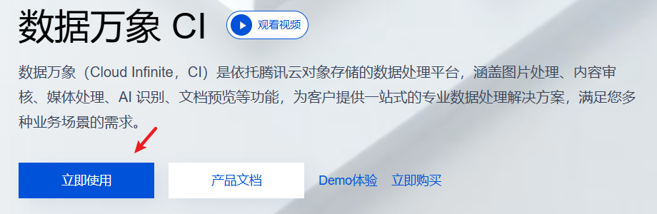

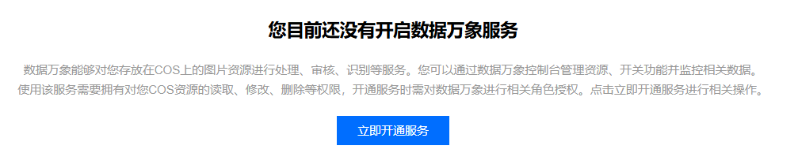

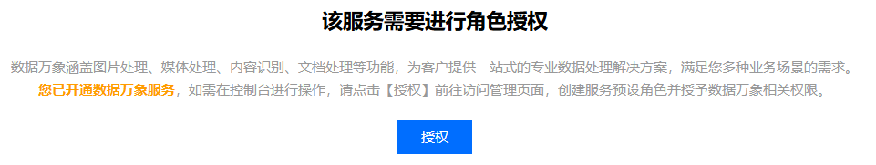

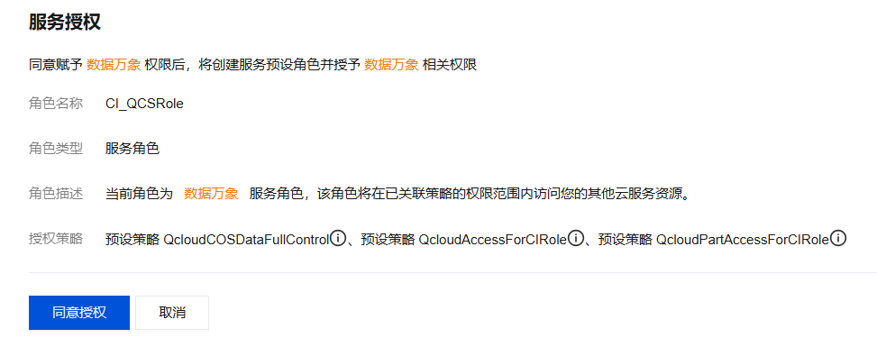

然后微信扫码授权即可。

## 绑定存储桶

当你扫码授权后，会显示以下页面：

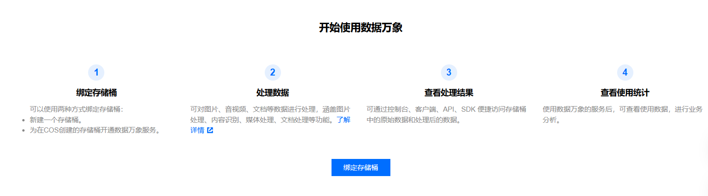

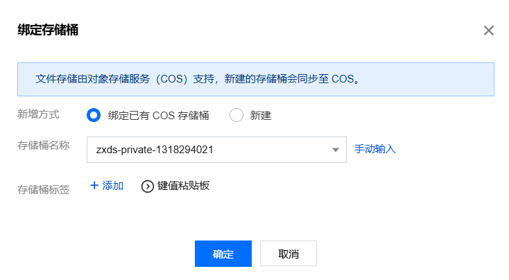

## 数据万象的 API 文档

数据万象提供的API文档（[https://cloud.tencent.com/document/product/460/57227](https://cloud.tencent.com/document/product/460/57227)）也非常详细，大部分代码直接可以复制粘贴到我们的程序中。

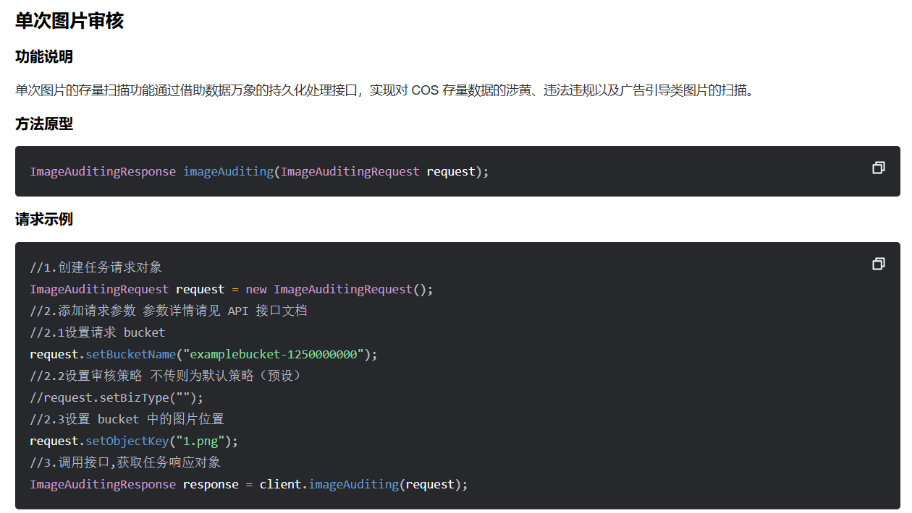

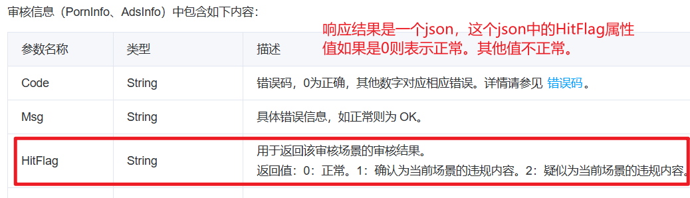

## 封装云存储操作

我在 `<font style="color:#000000;">common</font>` 子系统的 `<font style="color:#000000;">com.example.zxds.common.util</font>` 包中，封装了 `<font style="color:#000000;">CosUtil</font>`工具类，封装了对存储桶文件的基本操作。例如**上传文件、图片审核、获取隐私文件的临时外网URL地址、删除文件**等操作。

```java
package com.example.zxds.common.util;

import cn.hutool.core.date.DateUtil;
import cn.hutool.core.util.IdUtil;
import com.example.zxds.common.exception.ZxdsException;
import com.qcloud.cos.COSClient;
import com.qcloud.cos.ClientConfig;
import com.qcloud.cos.auth.BasicCOSCredentials;
import com.qcloud.cos.auth.COSCredentials;
import com.qcloud.cos.http.HttpMethodName;
import com.qcloud.cos.http.HttpProtocol;
import com.qcloud.cos.model.*;
import com.qcloud.cos.model.ciModel.auditing.ImageAuditingRequest;
import com.qcloud.cos.model.ciModel.auditing.ImageAuditingResponse;
import com.qcloud.cos.region.Region;
import org.springframework.beans.factory.annotation.Value;
import org.springframework.stereotype.Component;
import org.springframework.web.multipart.MultipartFile;

import java.io.IOException;
import java.net.URL;
import java.util.Date;
import java.util.HashMap;
import java.util.List;

@Component
public class CosUtil {
    @Value("${tencent.cloud.appId}")
    private String appId;

    @Value("${tencent.cloud.secretId}")
    private String secretId;

    @Value("${tencent.cloud.secretKey}")
    private String secretKey;

    @Value("${tencent.cloud.region-public}")
    private String regionPublic;

    @Value("${tencent.cloud.bucket-public}")
    private String bucketPublic;

    @Value("${tencent.cloud.region-private}")
    private String regionPrivate;

    @Value("${tencent.cloud.bucket-private}")
    private String bucketPrivate;

    //获取访问公有存储桶的连接
    private COSClient getCosPublicClient() {
        COSCredentials cred = new BasicCOSCredentials(secretId, secretKey);
        ClientConfig clientConfig = new ClientConfig(new Region(regionPublic));
        clientConfig.setHttpProtocol(HttpProtocol.https);
        COSClient cosClient = new COSClient(cred, clientConfig);
        return cosClient;
    }

    //获得访问私有存储桶的连接
    private COSClient getCosPrivateClient() {
        COSCredentials cred = new BasicCOSCredentials(secretId, secretKey);
        ClientConfig clientConfig = new ClientConfig(new Region(regionPrivate));
        clientConfig.setHttpProtocol(HttpProtocol.https);
        COSClient cosClient = new COSClient(cred, clientConfig);
        return cosClient;
    }

    /**
     * 向公有存储桶上传文件
     */
    public HashMap uploadPublicFile(MultipartFile file, String path) throws IOException {
        String fileName = file.getOriginalFilename(); //上传文件的名字
        String fileType = fileName.substring(fileName.lastIndexOf(".")); //文件后缀名
        path += IdUtil.simpleUUID() + fileType; //避免重名图片在云端覆盖，所以用UUID作为文件名

        //元数据信息
        ObjectMetadata meta = new ObjectMetadata();
        meta.setContentLength(file.getSize());
        meta.setContentEncoding("UTF-8");
        meta.setContentType(file.getContentType());

        //向存储桶中保存文件
        PutObjectRequest putObjectRequest = new PutObjectRequest(bucketPublic, path, file.getInputStream(), meta);
        putObjectRequest.setStorageClass(StorageClass.Standard); //标准存储
        COSClient client = getCosPublicClient();
        PutObjectResult putObjectResult = client.putObject(putObjectRequest);


        //合成外网访问地址（外网地址格式参考这个文档：https://cloud.tencent.com/document/product/436/6224）
        HashMap map = new HashMap();
        map.put("url", "https://" + bucketPublic + ".cos." + regionPublic + ".myqcloud.com" + path);
        map.put("path", path);

        //如果保存的是图片，用数据万象服务对图片内容审核
        if (List.of(".jpg", ".jpeg", ".png", ".gif", ".bmp").contains(fileType)) {
            //审核图片内容
            ImageAuditingRequest request = new ImageAuditingRequest();
            request.setBucketName(bucketPublic);
            request.setDetectType("porn,terrorist,politics,ads"); //辨别黄色、暴利、政治和广告内容
            request.setObjectKey(path);
            ImageAuditingResponse response = client.imageAuditing(request); //执行审查

            if (!response.getPornInfo().getHitFlag().equals("0") || !response.getTerroristInfo().getHitFlag().equals("0") || !response.getPoliticsInfo().getHitFlag().equals("0") || !response.getAdsInfo().getHitFlag().equals("0")) {
                //删除违规图片
                client.deleteObject(bucketPublic, path);
                throw new ZxdsException("图片内容不合规");
            }
        }
        client.shutdown();
        return map;
    }

    /**
     * 向私有存储桶上传文件
     */
    public HashMap uploadPrivateFile(MultipartFile file, String path) throws IOException {
        String fileName = file.getOriginalFilename(); //上传文件的名字
        String fileType = fileName.substring(fileName.lastIndexOf(".")); //文件后缀名
        path += IdUtil.simpleUUID() + fileType; //避免重名图片在云端覆盖，所以用UUID作为文件名

        //元数据信息
        ObjectMetadata meta = new ObjectMetadata();
        meta.setContentLength(file.getSize());
        meta.setContentEncoding("UTF-8");
        meta.setContentType(file.getContentType());

        //向存储桶中保存文件
        PutObjectRequest putObjectRequest = new PutObjectRequest(bucketPrivate, path, file.getInputStream(), meta);
        putObjectRequest.setStorageClass(StorageClass.Standard);
        COSClient client = getCosPrivateClient();
        PutObjectResult putObjectResult = client.putObject(putObjectRequest); //上传文件

        HashMap map = new HashMap();
        map.put("path", path);

        //如果保存的是图片，用数据万象服务对图片内容审核
        if (List.of(".jpg", ".jpeg", ".png", ".gif", ".bmp").contains(fileType)) {
            //审核图片内容
            ImageAuditingRequest request = new ImageAuditingRequest();
            request.setBucketName(bucketPrivate);
            request.setDetectType("porn,terrorist,politics,ads"); //辨别黄色、暴利、政治和广告内容
            request.setObjectKey(path);
            ImageAuditingResponse response = client.imageAuditing(request); //执行审查

            if (!response.getPornInfo().getHitFlag().equals("0") || !response.getTerroristInfo().getHitFlag().equals("0") || !response.getPoliticsInfo().getHitFlag().equals("0") || !response.getAdsInfo().getHitFlag().equals("0")) {
                //删除违规图片
                client.deleteObject(bucketPrivate, path);
                throw new ZxdsException("图片内容不合规");
            }
        }
        client.shutdown();
        return map;

    }

    /**
     * 获取私有文件的临时URL外网访问地址
     */
    public String getPrivateFileUrl(String path) {
        COSClient client = getCosPrivateClient();
        GeneratePresignedUrlRequest request = new GeneratePresignedUrlRequest(bucketPrivate, path, HttpMethodName.GET);
        Date expiration = DateUtil.offsetMinute(new Date(), 5);  //设置临时URL有效期为5分钟
        request.setExpiration(expiration);
        URL url = client.generatePresignedUrl(request);
        client.shutdown();
        return url.toString();
    }

    /**
     * 刪除公有存储桶的文件
     */
    public void deletePublicFile(String[] pathes) {
        COSClient client = getCosPublicClient();
        for (String path : pathes) {
            client.deleteObject(bucketPublic, path);
        }
        client.shutdown();
    }

    /**
     * 刪除私有存储桶的文件
     */
    public void deletePrivateFile(String[] pathes) {
        COSClient client = getCosPrivateClient();
        for (String path : pathes) {
            client.deleteObject(bucketPrivate, path);
        }
        client.shutdown();
    }

}
```

# 利用百度智能云的 OCR 封装 OCR 识别服务

司机进行实名认证时，需要上传身份证照片，我们需要使用 OCR 识别，将身份证的信息识别出来。这里选择百度智能云的 OCR 服务。

需要识别的卡证包括：**身份证正反面、驾驶证主页**。

## 注册百度智能云账号

**百度智能云：**[**https://cloud.baidu.com/**](https://cloud.baidu.com/)

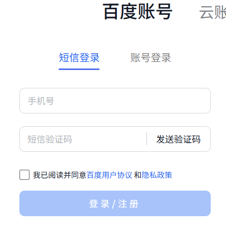

## 开通 OCR 服务

**卡证文字识别：**[**https://cloud.baidu.com/product/ocrcards.html**](https://cloud.baidu.com/product/ocrcards.html)

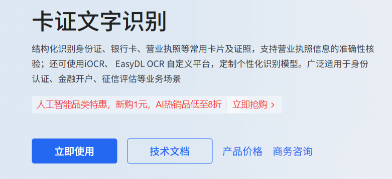

点击**立即使用**后，在左侧列表点击**概览**：

**点击卡证：开通身份证识别。**

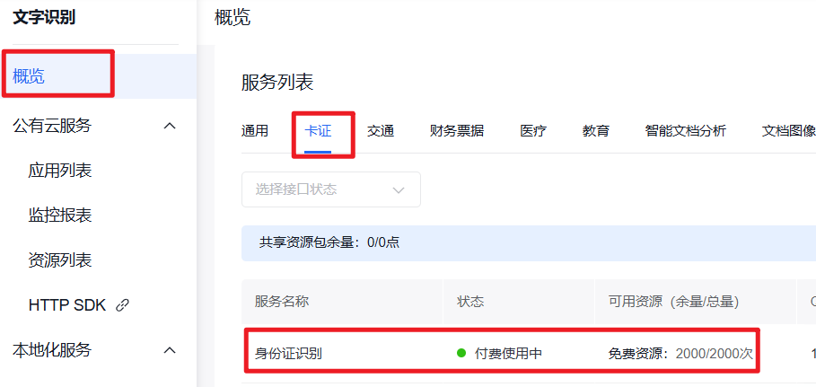

**点击交通：开通驾驶证识别。**

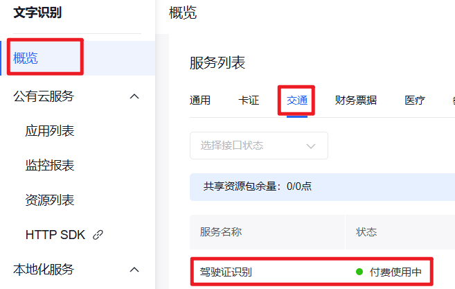

注意：开始是有免费额度的，用完之后，记得关闭这些服务，以免产生费用。

## 创建应用

要使用百度智慧云的服务，首先你需要创建一个应用，这样可以获取 API Key 和 Secret Key。

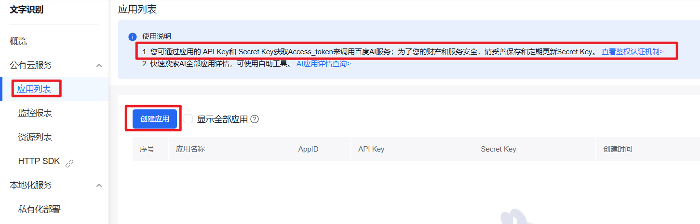

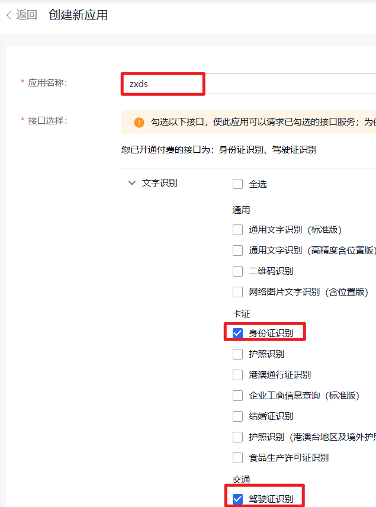

然后从应用列表中找到刚创建的应用，找到 API Key 等信息：

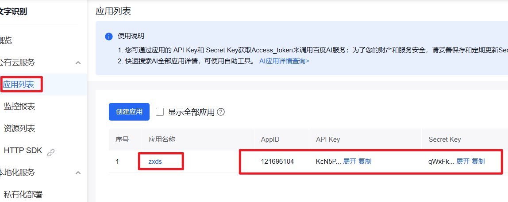

将 AppID、API Key、Secret Key 保存起来。

## 安装 Java 的 SDK

**点击左侧 HTTP SDK：**

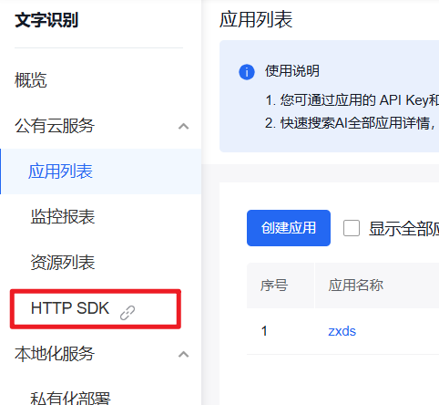

**找到 Java 的 SDK，点击技术文档：**

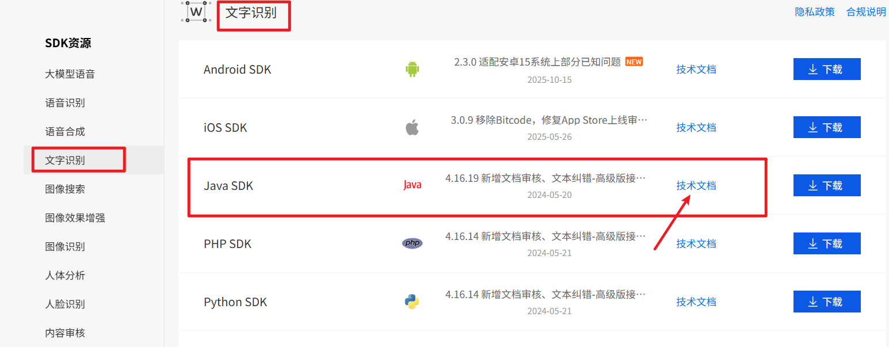

**重点看这两项：**


**查看快速入门：**

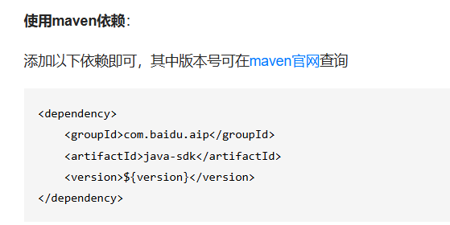

**添加以下依赖到 **`**<font style="color:#000000;">common</font>**`** 项目：**

```xml
<!--百度云-->
<dependency>
    <groupId>com.baidu.aip</groupId>
    <artifactId>java-sdk</artifactId>
    <version>4.16.23</version>
    <exclusions>
        <exclusion>
            <groupId>org.slf4j</groupId>
            <artifactId>slf4j-simple</artifactId>
        </exclusion>
    </exclusions>
</dependency>
```

## OCR 接口文档

**查看接口说明：**

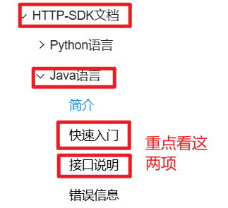

**右侧点击身份证识别、驾驶证识别，分别可以看到接口文档：**

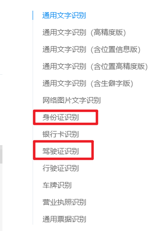

### 身份证识别

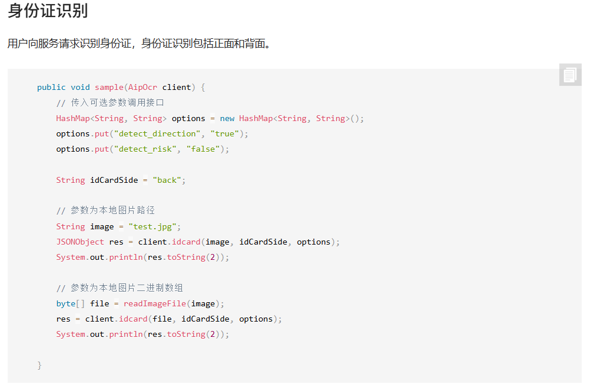

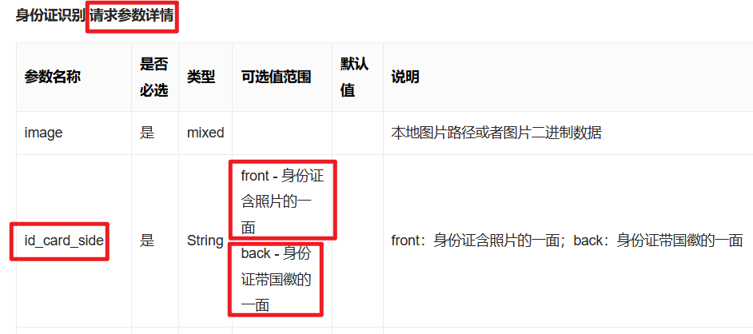

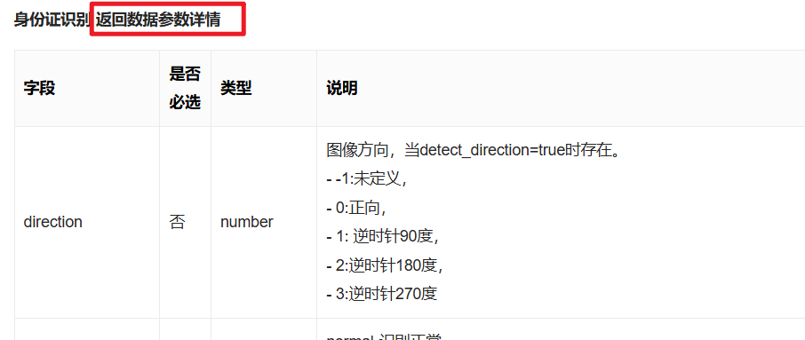

### 驾驶证识别

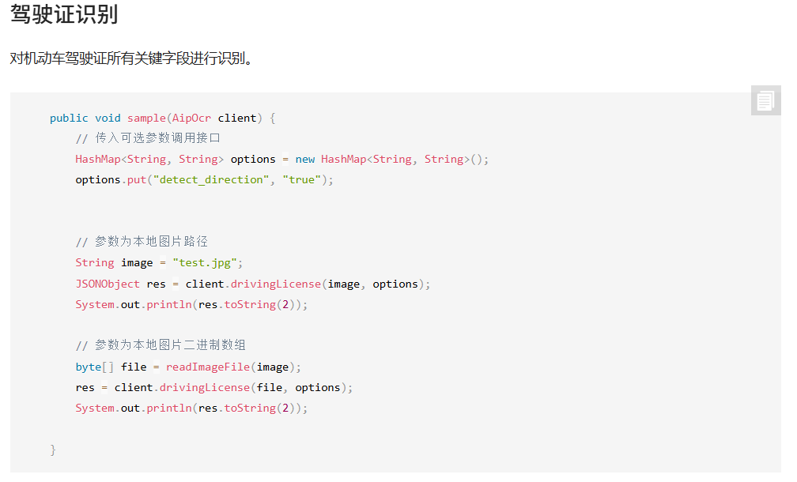

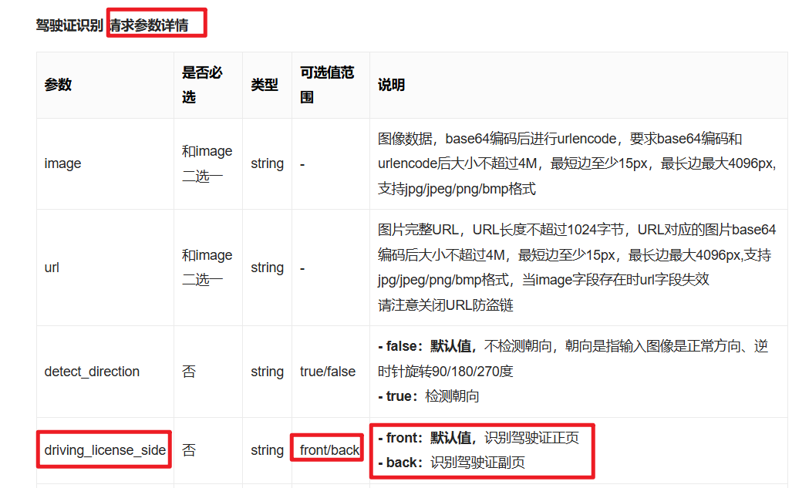

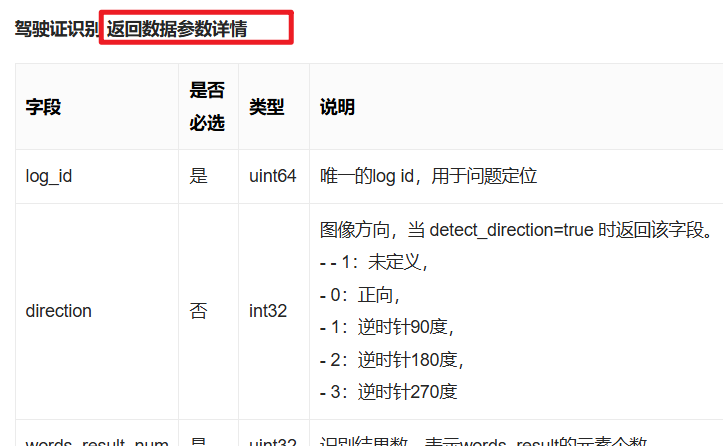

## 封装 OcrUtil

在 `<font style="color:#000000;">common</font>`项目的 `<font style="color:#000000;">application-common.yml</font>`文件中添加 appId 等配置信息：

```yaml
baidu:
  cloud:
    appId: ${BAIDU_CLOUD_APP_ID}
    appKey: ${BAIDU_CLOUD_APP_KEY}
    secretKey: ${BAIDU_CLOUD_SECRET_KEY}
```

在 `<font style="color:#000000;">common</font>`项目中封装 `<font style="color:#000000;">OcrUtil</font>`，封装身份证识别和驾驶证识别，代码如下：

```java
package com.example.zxds.common.util;

import com.baidu.aip.ocr.AipOcr;
import com.example.zxds.common.exception.ZxdsException;
import org.json.JSONObject;
import org.springframework.beans.factory.annotation.Value;
import org.springframework.stereotype.Component;

import org.springframework.web.multipart.MultipartFile;

import java.io.IOException;
import java.text.SimpleDateFormat;
import java.util.Date;
import java.util.HashMap;
import java.util.Map;

@Component
public class OcrUtil {
    @Value("${baidu.cloud.appId}")
    public String appId;
    @Value("${baidu.cloud.appKey}")
    public String apiKey;
    @Value("${baidu.cloud.secretKey}")
    public String secretKey;

    // 初始化客户端对象
    private AipOcr client;

    /**
     * 初始化OCR客户端（懒加载）
     */
    private AipOcr getClient() {
        if (client == null) {
            client = new AipOcr(appId, apiKey, secretKey);
            // 可选：设置网络连接参数
            client.setConnectionTimeoutInMillis(2000);
            client.setSocketTimeoutInMillis(60000);
        }
        return client;
    }

    /**
     * 识别身份证正面（含照片面）
     *
     * @param file 身份证正面图片文件
     * @return JSON格式的识别结果
     */
    public JSONObject recognizeIdCardFront(MultipartFile file) {
        return recognizeIdCard(file, "front");
    }

    /**
     * 识别身份证背面（国徽面）
     *
     * @param file 身份证背面图片文件
     * @return JSON格式的识别结果
     */
    public JSONObject recognizeIdCardBack(MultipartFile file) {
        return recognizeIdCard(file, "back");
    }

    /**
     * 识别身份证（通用方法）
     *
     * @param file 图片文件
     * @param side 正反面："front"或"back"
     * @return JSON格式的识别结果
     */
    public JSONObject recognizeIdCard(MultipartFile file, String side) {
        if (file.isEmpty()) {
            throw new ZxdsException("上传文件不能为空");
        }

        try {
            // 将MultipartFile转换为字节数组
            byte[] imageBytes = file.getBytes();

            // 设置可选参数
            HashMap<String, String> options = new HashMap<>();
            options.put("detect_direction", "true");  // 检测图片方向
            options.put("detect_risk", "false");      // 不开启风险类型检测

            // 调用身份证识别接口
            return getClient().idcard(imageBytes, side, options);

        } catch (IOException e) {
            throw new ZxdsException("读取文件失败: " + e.getMessage());
        } catch (Exception e) {
            throw new ZxdsException("识别失败: " + e.getMessage());
        }
    }

    /**
     * 从识别结果中提取关键字段（正面示例）
     *
     * @param result 识别结果
     * @return 简化的关键信息Map
     */
    public Map<String, String> extractFrontInfo(JSONObject result) {
        Map<String, String> info = new HashMap<>();

        if (result != null && result.getString("image_status").equals("normal")) {
            JSONObject wordsResult = result.getJSONObject("words_result");

            // 提取正面字段
            if (wordsResult.has("姓名")) {
                info.put("name", wordsResult.getJSONObject("姓名").getString("words"));
            }
            if (wordsResult.has("公民身份号码")) {
                info.put("idNumber", wordsResult.getJSONObject("公民身份号码").getString("words"));
            }
            if (wordsResult.has("性别")) {
                info.put("gender", wordsResult.getJSONObject("性别").getString("words"));
            }
            if (wordsResult.has("出生")) {
                info.put("birth", wordsResult.getJSONObject("出生").getString("words"));
            }
            if (wordsResult.has("住址")) {
                info.put("address", wordsResult.getJSONObject("住址").getString("words"));
            }
            if (wordsResult.has("民族")) {
                info.put("nation", wordsResult.getJSONObject("民族").getString("words"));
            }
        } else {
            throw new ZxdsException("识别失败: " + (result != null ? result.toString() : "结果为空"));
        }

        return info;
    }

    /**
     * 从识别结果中提取关键字段（背面示例）
     *
     * @param result 识别结果
     * @return 简化的关键信息Map
     */
    public Map<String, String> extractBackInfo(JSONObject result) {
        Map<String, String> info = new HashMap<>();

        if (result != null && result.getString("image_status").equals("normal")) {
            JSONObject wordsResult = result.getJSONObject("words_result");

            // 提取背面字段
            if (wordsResult.has("签发机关")) {
                info.put("issuingAuthority", wordsResult.getJSONObject("签发机关").getString("words"));
            }
            if (wordsResult.has("失效日期")) {
                info.put("validPeriod", wordsResult.getJSONObject("失效日期").getString("words"));
            }
        } else {
            throw new ZxdsException("识别失败: " + (result != null ? result.toString() : "结果为空"));
        }

        return info;
    }


    /**
     * 识别驾驶证主页（正本）
     *
     * @param file 驾驶证主页图片文件
     * @return JSON格式的识别结果
     */
    public JSONObject recognizeDriverLicenseMainPage(MultipartFile file) {
        if (file.isEmpty()) {
            throw new ZxdsException("上传文件不能为空");
        }

        try {
            byte[] imageBytes = file.getBytes();

            HashMap<String, String> options = new HashMap<>();
            options.put("detect_direction", "true");
            options.put("unified_valid_period", "true");

            return getClient().drivingLicense(imageBytes, options);

        } catch (IOException e) {
            throw new ZxdsException("读取文件失败: " + e.getMessage());
        } catch (Exception e) {
            throw new ZxdsException("识别失败: " + e.getMessage());
        }
    }

    /**
     * 解析驾驶证主页（正本）信息
     * @param result 百度云OCR识别结果
     * @return 包含驾驶证主页信息的Map
     */
    public Map<String, String> parseDriverLicenseMainPageInfo(JSONObject result) {
        Map<String, String> info = new HashMap<>();

        if (result == null) {
            throw new ZxdsException("识别结果为空");
        }

        try {
            JSONObject wordsResult = result.getJSONObject("words_result");

            // 解析出初次领证日期（对应前端 issueDate）
            if (wordsResult.has("初次领证日期")) {
                String issueDateStr = wordsResult.getJSONObject("初次领证日期")
                        .getString("words");
                // 格式化为标准日期格式，如：2023-05-15
                String formattedDate = formatChineseDate(issueDateStr);
                info.put("issueDate", formattedDate);
            }

            // 解析出准驾车型（对应前端 carClass）
            if (wordsResult.has("准驾车型")) {
                String carClass = wordsResult.getJSONObject("准驾车型")
                        .getString("words");
                info.put("carClass", carClass);
            }

            // 解析出有效期（对应前端 validFrom 和 validTo）
            if (wordsResult.has("有效起始日期")) {
                String validFrom = wordsResult.getJSONObject("有效起始日期")
                        .getString("words");
                info.put("validFrom", validFrom);
            }
            if (wordsResult.has("失效日期")) {
                String validTo = wordsResult.getJSONObject("失效日期")
                        .getString("words");
                info.put("validTo", validTo);
            }

            // 也可以提取其他常用字段
            if (wordsResult.has("姓名")) {
                info.put("driverName", wordsResult.getJSONObject("姓名").getString("words"));
            }
            if (wordsResult.has("证号")) {
                info.put("licenseNumber", wordsResult.getJSONObject("证号").getString("words"));
            }

            return info;

        } catch (Exception e) {
            throw new ZxdsException("解析驾驶证信息失败: " + e.getMessage());
        }
    }

    /**
     * 格式化中文日期为标准格式
     * @param chineseDate 如："2023年05月15日"
     * @return 如："2023-05-15"
     */
    private String formatChineseDate(String chineseDate) {
        try {
            if (chineseDate.contains("年") && chineseDate.contains("月") && chineseDate.contains("日")) {
                // 去除中文年月日
                String dateStr = chineseDate.replace("年", "-")
                        .replace("月", "-")
                        .replace("日", "");
                // 确保格式正确
                SimpleDateFormat sdf = new SimpleDateFormat("yyyy-MM-dd");
                Date date = sdf.parse(dateStr);
                return sdf.format(date);
            }
            return chineseDate; // 如果已经是标准格式，直接返回
        } catch (Exception e) {
            return chineseDate; // 解析失败，返回原字符串
        }
    }

    /**
     * 解析有效期字符串
     * @param validPeriod 如："20190515-20250515" 或 "2019年05月15日-2025年05月15日"
     * @return 数组：[起始日期, 截止日期]
     */
    private String[] parseValidPeriod(String validPeriod) {
        // 移除所有空格
        validPeriod = validPeriod.replace(" ", "");

        // 分割起始和结束日期
        String[] parts = new String[]{"", ""};

        if (validPeriod.contains("-")) {
            String[] dateParts = validPeriod.split("-");
            if (dateParts.length == 2) {
                // 格式化起始日期
                parts[0] = formatDateString(dateParts[0]);
                // 格式化截止日期
                parts[1] = formatDateString(dateParts[1]);
            }
        }

        return parts;
    }

    /**
     * 格式化日期字符串为 yyyy-MM-dd 格式
     */
    private String formatDateString(String dateStr) {
        try {
            // 如果是纯数字格式，如：20190515
            if (dateStr.matches("\\d{8}")) {
                SimpleDateFormat sdf = new SimpleDateFormat("yyyyMMdd");
                Date date = sdf.parse(dateStr);
                sdf.applyPattern("yyyy-MM-dd");
                return sdf.format(date);
            }
            // 如果是中文格式，如：2019年05月15日
            else if (dateStr.contains("年") && dateStr.contains("月") && dateStr.contains("日")) {
                return formatChineseDate(dateStr);
            }
            // 其他格式尝试直接转换
            else {
                // 尝试多种日期格式
                String[] patterns = {"yyyy.MM.dd", "yyyy/MM/dd", "yyyy-MM-dd"};
                for (String pattern : patterns) {
                    try {
                        SimpleDateFormat sdf = new SimpleDateFormat(pattern);
                        Date date = sdf.parse(dateStr);
                        sdf.applyPattern("yyyy-MM-dd");
                        return sdf.format(date);
                    } catch (Exception e) {
                        continue;
                    }
                }
                return dateStr; // 无法解析，返回原字符串
            }
        } catch (Exception e) {
            return dateStr; // 解析失败，返回原字符串
        }
    }
}
```

# 司机实名认证 OCR 识别

司机通过上传

- **身份证正面**、**反面照片**以及**本人手持身份证照片**
- **驾驶证主页、副本以及本人手持驾驶证照片**

来完成司机实名认证。

## 身份证正面识别

**实现思路：**

- **第一步：**微信小程序上传身份证正面照片到后端服务器。
- **第二步：**后端服务器进行 OCR 识别。识别可能成功，可能失败，如果失败直接抛出异常。识别成功后将信息放到 Map 集合。
- **第三步：**OCR 识别成功后，将身份证正面图片存储到腾讯云对象存储服务器中。可能成功，可能失败，如果失败直接抛出异常。
- **第四步：**存储成功后，调用腾讯云的数据万象服务，验证图片是否合法，如果合法就返回图片在腾讯云对象存储服务器上的临时 URL。如果不合法直接删除图片并抛出异常。
- **第五步：**将识别的信息 Map 和图片的临时 URL 封装为 Map，返回给小程序。
- **第六步：**小程序从返回的 json 中提取信息渲染页面。

### 在小程序 main.js 中添加 URL

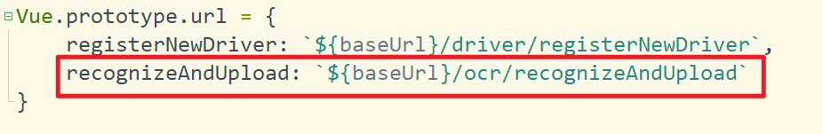

```javascript
recognizeAndUpload: `${baseUrl}/ocr/recognizeAndUpload`
```

### 小程序提交图片到后端服务器

小程序提交图片到后端服务器，并且接收服务器响应，并渲染页面，在 `<font style="color:#000000;">filling.vue</font>`文件的 `<font style="color:#000000;">methods</font>`中编写以下代码：

```javascript
scanIdcardFront() {
  const that = this;
  // uni-app的方法，用于选择相册中的图片或拍照
  uni.chooseImage({
    // 最多选择1张
    count: 1,
    // 选择成功后的回调：参数chooseRes是一个数组，由于最多选1张，因此数组长度为1
    success(chooseRes) {
      // 从数组中取出图片的路径
      const tempFilePath = chooseRes.tempFilePaths[0];
      // 显示加载中
      uni.showLoading({ title: '识别中...' });
      // 将文件上传给服务器，在服务器端做两件事：一个是OCR识别，一个保存到腾讯云对象存储服务器中。
      uni.uploadFile({
        url: that.url.recognizeAndUpload,
        filePath: tempFilePath,
        name: 'file',
        // ocrType: 1，这里的1是咱自己规定的，1表示上传的身份证正面（1是身份证正面，2是身份证背面，3是驾驶证正面）
        formData: { ocrType: "1", module: "driverAuth" },
        success(uploadRes) {
          uni.hideLoading();
          // 对于 uni.uploadFile()方法来说比较特殊，它的返回值是json字符串，而不是对象，需要手动转换。
          const result = JSON.parse(uploadRes.data);
          const idCardFrontInfo = result.idCardFrontInfo;
          that.idcard.name = idCardFrontInfo.name;
          that.idcard.sex = idCardFrontInfo.gender;
          that.idcard.pid = idCardFrontInfo.idNumber;
          that.idcard.address = idCardFrontInfo.address;
          that.idcard.shortAddress = (idCardFrontInfo.address || '').substring(0, 10);
          if (idCardFrontInfo.idNumber.length === 18) {
            const pid = idCardFrontInfo.idNumber;
            that.idcard.birthday = `${pid.substring(6,10)}-${pid.substring(10,12)}-${pid.substring(12,14)}`;
          }
          // 将图片路径保存到数据模型上，将来保存到数据库，通过这个图片路径可以调用后端接口获取该图片的临时URL。
          that.idcard.idcardFront = result.filePath;
          console.log(that.idcard.idcardFront);
                        // that.$set() 是 Vue/uni-app 的内置方法，用于响应式地更新数组或对象的属性
          that.$set(that.cardBackground, 0, result.tempUrl);
          uni.showToast({ title: '识别成功' });
        }
      });
    }
  });
}
```

### 编写 web 方法

在 `<font style="color:#000000;">bff-driver</font>`子系统中，编写 `<font style="color:#000000;">OcrController</font>`，完成：

1. 调用 ocr 服务，获取识别信息。
2. 将图片上传到腾讯云的对象存储服务器。
3. 调用数据万象验证图片合法性。
4. 获取图片的地址，并将地址保存到 result 中，返回给前端，前端将来使用这个地址生成图片的临时访问 URL。这个图片地址最终也是要保存到数据库当中，图片的路径像这样：`**<font style="color:#000000;">/driver/auth/cf2bb5b1f3ca419f9f2c2004957d6837.jpg</font>**`
5. 获取图片在腾讯云对象存储服务器上的临时 URL。用于当下小程序中图片的预览。
6. **返回识别的信息+图片路径+临时 URL 给前端小程序**。

```java
package com.example.zxds.bff.driver.controller;

import com.example.zxds.common.exception.ZxdsException;
import com.example.zxds.common.util.CosUtil;
import com.example.zxds.common.util.OcrUtil;
import com.example.zxds.common.util.R;
import io.swagger.v3.oas.annotations.Operation;
import io.swagger.v3.oas.annotations.tags.Tag;
import lombok.extern.slf4j.Slf4j;
import org.json.JSONObject;
import org.springframework.web.bind.annotation.*;
import org.springframework.web.multipart.MultipartFile;

import javax.annotation.Resource;
import java.io.IOException;
import java.util.HashMap;
import java.util.Map;

@RestController
@Slf4j
@RequestMapping("/ocr")
@Tag(name = "OcrController", description = "OCR识别web接口")
public class OcrController {

    @Resource
    private OcrUtil ocrUtil;

    @Resource
    private CosUtil cosUtil;

    @PostMapping("/recognizeAndUpload")
    //@SaCheckLogin  // 测试的时候注释掉，测试完之后放开。
    @Operation(summary = "识别并上传文件")
    public R recognizeAndUpload(@RequestParam("file") MultipartFile file,
                                @RequestParam("module") String module,
                                @RequestParam("ocrType") String ocrType) {
        if (file.isEmpty()) {
            throw new ZxdsException("上传文件不能为空");
        }

        // 准备最终返回的结果
        Map<String, Object> result = new HashMap<>();

        // OCR识别
        if ("1".equals(ocrType)) {
            // 进行身份证正面识别
            JSONObject jsonObject = ocrUtil.recognizeIdCard(file, "front");
            Map<String, String> idCardFrontInfo = ocrUtil.extractFrontInfo(jsonObject);
            result.put("idCardFrontInfo", idCardFrontInfo);
        }

        // 将文件上传到腾讯云的对象存储服务器
        try {
            String path = null;
            if ("driverAuth".equals(module)) {
                path = "/driver/auth/";
            } else {
                throw new ZxdsException("module错误");
            }
            HashMap map = cosUtil.uploadPrivateFile(file, path);
            // 获取图片在腾讯云服务器上存储的路径
            String filePath = String.valueOf(map.get("path")); // 这个路径可能是这样的：/driver/auth/cf2bb5b1f3ca419f9f2c2004957d6837.jpg
            result.put("filePath", filePath); // 将这个路径存储到result并返回给前端，前端通过这个路径可以获取图片的临时URL。
            // 接下来立即获取一个临时URL给前端，5分钟有效，主要是用于小程序预览图片。
            String tempUrl = cosUtil.getPrivateFileUrl(String.valueOf(map.get("path")));
            result.put("tempUrl", tempUrl);
        } catch (IOException e) {
            log.error("文件上传到腾讯云错误", e);
            throw new ZxdsException("文件上传到腾讯云错误");
        }
        return R.ok(result);
    }

    @GetMapping("/image/temp")
    @Operation(summary = "获取临时图片访问URL")
    public R getTempImageUrl(@RequestParam String path) {
        // 验证路径安全性（防止路径遍历攻击）
        if (!path.startsWith("/driver/auth/")) {
            throw new ZxdsException("路径不合法");
        }

        String tempUrl = cosUtil.getPrivateFileUrl(path);
        return R.ok().put("tempUrl", tempUrl);
    }
}
```

### 测试小程序

**后端你需要启动的子系统包括：**`**<font style="color:#000000;">gateway</font>**`**、**`**<font style="color:#000000;">zxds-driver</font>**`**、**`**<font style="color:#000000;">bff-driver</font>**`**。**

测试的时候，可以直接从 `<font style="color:#000000;">filling.vue</font>`页面开始测试，如下图操作：`<font style="color:#000000;">identity/filling/filling</font>`

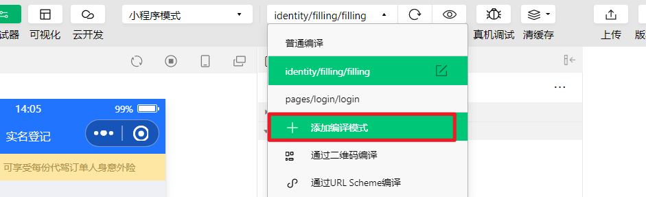

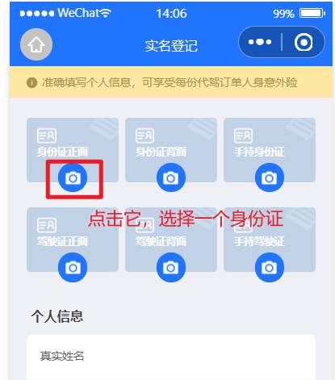

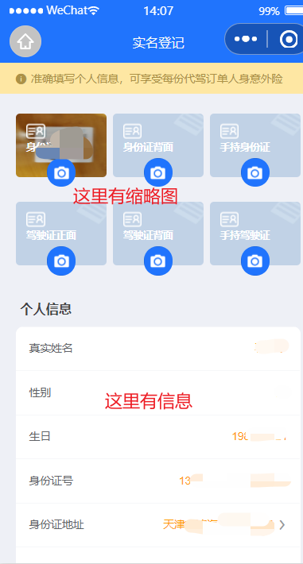

**然后到腾讯云对象存储服务器上看看有没有上传的身份证照片。**

## 身份证背面识别

**主要获取的信息是：身份证的有效日期。直接通过之前代码拷贝修改即可。**

### 小程序提交图片到后端服务器

```javascript
scanIdcardBack() {
  const that = this;
  // uni-app的方法，用于选择相册中的图片或拍照
  uni.chooseImage({
    // 最多选择1张
    count: 1,
    // 选择成功后的回调：参数chooseRes是一个数组，由于最多选1张，因此数组长度为1
    success(chooseRes) {
      // 从数组中取出图片的路径
      const tempFilePath = chooseRes.tempFilePaths[0];
      // 显示加载中
      uni.showLoading({ title: '识别中...' });
      // 将文件上传给服务器，在服务器端做两件事：一个是OCR识别，一个保存到腾讯云对象存储服务器中。
      uni.uploadFile({
        url: that.url.recognizeAndUpload,
        filePath: tempFilePath,
        name: 'file',
        // ocrType: 2，这里的2是咱自己规定的，2表示上传的身份证背面
        formData: { ocrType: "2", module: "driverAuth" },
        success(uploadRes) {
          uni.hideLoading();
          const result = JSON.parse(uploadRes.data);
          const idCardBackInfo = result.idCardBackInfo;
          console.log(idCardBackInfo);
          that.idcard.expiration = that.dateFormat(idCardBackInfo.validPeriod);
          // 将图片路径保存到数据模型上，将来保存到数据库，通过这个图片路径可以调用后端接口获取该图片的临时URL。
          that.idcard.idcardBack = result.filePath;
          console.log(that.idcard.idcardBack);
                        // that.$set() 是 Vue/uni-app 的内置方法，用于响应式地更新数组或对象的属性
          that.$set(that.cardBackground, 1, result.tempUrl);
          uni.showToast({ title: '识别成功' });
        }
      });
    }

  });
},
                
// 日期格式化函数
dateFormat(dateStr){
  return `${dateStr.substring(0, 4)}-${dateStr.substring(4, 6)}-${dateStr.substring(6, 8)}`;
},
```

### 编写 web 方法

找到 `<font style="color:#000000;">OcrController</font>`类，添加以下代码：

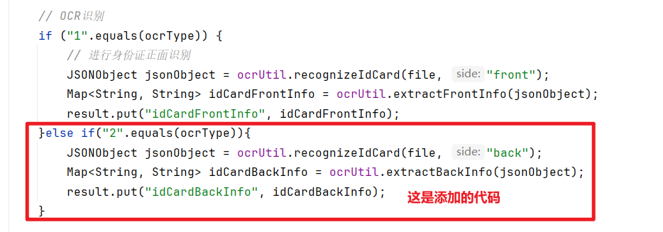

```java
package com.example.zxds.bff.driver.controller;

import com.example.zxds.common.exception.ZxdsException;
import com.example.zxds.common.util.CosUtil;
import com.example.zxds.common.util.OcrUtil;
import com.example.zxds.common.util.R;
import io.swagger.v3.oas.annotations.Operation;
import io.swagger.v3.oas.annotations.tags.Tag;
import lombok.extern.slf4j.Slf4j;
import org.json.JSONObject;
import org.springframework.web.bind.annotation.*;
import org.springframework.web.multipart.MultipartFile;

import javax.annotation.Resource;
import java.io.IOException;
import java.util.HashMap;
import java.util.Map;

@RestController
@Slf4j
@RequestMapping("/ocr")
@Tag(name = "OcrController", description = "OCR识别web接口")
public class OcrController {

    @Resource
    private OcrUtil ocrUtil;

    @Resource
    private CosUtil cosUtil;

    @PostMapping("/recognizeAndUpload")
    //@SaCheckLogin  // 测试的时候注释掉，测试完之后放开。
    @Operation(summary = "识别并上传文件")
    public R recognizeAndUpload(@RequestParam("file") MultipartFile file,
                                @RequestParam("module") String module,
                                @RequestParam("ocrType") String ocrType) {
        if (file.isEmpty()) {
            throw new ZxdsException("上传文件不能为空");
        }

        // 准备最终返回的结果
        Map<String, Object> result = new HashMap<>();

        // OCR识别
        if ("1".equals(ocrType)) {
            // 进行身份证正面识别
            JSONObject jsonObject = ocrUtil.recognizeIdCard(file, "front");
            Map<String, String> idCardFrontInfo = ocrUtil.extractFrontInfo(jsonObject);
            result.put("idCardFrontInfo", idCardFrontInfo);
        }else if("2".equals(ocrType)){
            JSONObject jsonObject = ocrUtil.recognizeIdCard(file, "back");
            Map<String, String> idCardBackInfo = ocrUtil.extractBackInfo(jsonObject);
            result.put("idCardBackInfo", idCardBackInfo);
        }

        // 将文件上传到腾讯云的对象存储服务器
        try {
            String path = null;
            if ("driverAuth".equals(module)) {
                path = "/driver/auth/";
            } else {
                throw new ZxdsException("module错误");
            }
            HashMap map = cosUtil.uploadPrivateFile(file, path);
            // 获取图片在腾讯云服务器上存储的路径
            String filePath = String.valueOf(map.get("path")); // 这个路径可能是这样的：/driver/auth/cf2bb5b1f3ca419f9f2c2004957d6837.jpg
            result.put("filePath", filePath); // 将这个路径存储到result并返回给前端，前端通过这个路径可以获取图片的临时URL。
            // 接下来立即获取一个临时URL给前端，5分钟有效，主要是用于小程序预览图片。
            String tempUrl = cosUtil.getPrivateFileUrl(String.valueOf(map.get("path")));
            result.put("tempUrl", tempUrl);
        } catch (IOException e) {
            log.error("文件上传到腾讯云错误", e);
            throw new ZxdsException("文件上传到腾讯云错误");
        }
        return R.ok(result);
    }

    @GetMapping("/image/temp")
    @Operation(summary = "获取临时图片访问URL")
    public R getTempImageUrl(@RequestParam String path) {
        // 验证路径安全性（防止路径遍历攻击）
        if (!path.startsWith("/driver/auth/")) {
            throw new ZxdsException("路径不合法");
        }

        String tempUrl = cosUtil.getPrivateFileUrl(path);
        return R.ok().put("tempUrl", tempUrl);
    }
}
```

### 测试小程序

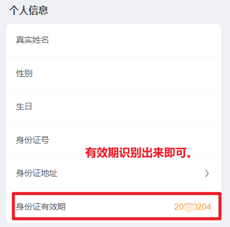

## 手持身份证、驾驶证副本、手持驾驶证

**手持身份证、驾驶证副本、手持驾驶证**。这三个东西都是不需要识别的，**直接拍照**，存储到腾讯云文件存储服务器上即可。最后将存储在私有桶中的文件相对路径地址返回。

1. 这三个功能一样，因此在小程序端编写一个函数 `<font style="color:#000000;">takePhoto</font>`即可。
2. 由于这些拍照需要一些注意事项，因此我在这里专门为拍照创建了一个独立的 vue 页面。页面的名字叫做：`<font style="color:#000000;">identity_camera/identity_camera.vue</font>`
3. 当执行 `<font style="color:#000000;">takePhoto</font>`函数时跳转到`<font style="color:#000000;">identity_camera/identity_camera.vue</font>`

**原理是：**在 `<font style="color:#000000;">filling/filling.vue</font>`页面上点击 **手持身份证 **跳转到`<font style="color:#000000;">identity_camera/identity_camera.vue</font>`，在这个页面上用户看到提示信息，然后点击拍照，拍照之后再跳回到 `<font style="color:#000000;">filling/filling.vue</font>`页面。

### 在 filling.vue 页面编写 takePhoto 函数

执行 takePhoto 函数跳转过去后显示的提示信息不同，因此执行 takePhoto 函数时，给他传一个 type 参数，这样在拍照页面就是显示哪个提示信息了。

```javascript
// 跳转到拍照页面，传type参数
takePhoto(type) {
    uni.navigateTo({
        url: '../identity_camera/identity_camera?type=' + type
    });
}
```

### 在identity_camera.vue 页面编写拍照代码

**先来看看视图层代码：理解页面中是怎么动态显示内容的**

```html
<view>
    <!--showCamera 值是true，显示照相机，false不显示-->
    <camera device-position="back" flash="off" class="camera" @error="error" v-if="showCamera"></camera>
    <!--showImage 值是true，显示拍照后的图片，false不显示 -->
    <image mode="widthFix" class="image" :src="photoPath" v-if="showImage"></image>
    <view class="operate-container">
        <!--按钮名字动态（拍照/提交）,点击时执行clickBtn函数-->
        <button type="primary" class="btn" @tap="clickBtn">{{ btnText }}</button>
        <!--重拍时调用afresh函数-->
        <button type="warn" class="btn" @tap="afresh">重拍</button>
    </view>
    <view class="notice-container">
        <text class="notice">注意事项</text>
        <text class="desc">
            <!--根据type不同，显示不同的信息，type就是传过来的参数。-->
            <block v-if="type != 'driverCardBack'">
                拍照的时候，必须把证件拍摄清晰并完整，否则影响识别结果。持证拍照的时候不许戴帽子、墨镜和面纱等遮挡五官的饰物，只拍摄上半身即可。手持证件，五官与证件必须同时拍摄到照片中。
            </block>
            <block v-if="type == 'driverCardBack'">拍照的时候，必须把驾驶证背面拍摄的清晰完整，否则影响认证结果。</block>
        </text>
    </view>
</view>
```

**实现拍照对应的代码：**

1. 页面加载后将上个页面传过来的 type 值保存下来。
2. 编写 clickBtn 函数：如果是“拍照按钮”就实现拍照逻辑。如果是“提交按钮”就执行提交逻辑，提交逻辑是调用上一个页面(filling.vue)的 `<font style="color:#000000;">updatePhoto</font>`函数，将当前页面拍照的图片路径传递给 `<font style="color:#000000;">updatePhoto</font>`函数。（**该函数后面写**）
3. 编写 afresh 函数：重拍就是将几个数据恢复为最初的状态，这样用户就可以继续点击“拍照按钮”进行拍照了。

**代码如下：**

```javascript
// 页面加载完毕后，将上个页面传过来的type赋值给 this.type 属性
onLoad: function(options) {
    this.type = options.type;
},
data() {
    return {
        type: null,  // type属性在页面加载完毕后有值了。
        photoPath: '', // 照片在本地小程序中的路径
        btnText: '拍照',
        showCamera: true,
        showImage: false
    };
},

methods: {
    clickBtn: function() {
        let that = this;
        if (that.btnText == '拍照') {
            // 如果是拍照就调用拍照逻辑。
            let ctx = uni.createCameraContext();

            ctx.takePhoto({
                quality: 'high', // 设置拍照质量
                success: function(resp) {
                    // 拍照成功之后，将小程序中的图片路径赋值给photoPath属性。
                    that.photoPath = resp.tempImagePath;
                    that.showCamera = false;
                    that.showImage = true;
                    that.btnText = '提交';
                }
            });
        } else {
            let pages = getCurrentPages(); //访问的小程序页面历史记录
            let prevPage = pages[pages.length - 2]; //上一个小程序页面
            //调用上一个页面的updatePhoto函数，回传拍好的照片
            prevPage.$vm.updatePhoto(that.type, that.photoPath);
            //返回上一个页面
            uni.navigateBack({
                delta: 1
            });
        }
    },
    // 点击重拍按钮时执行的代码
    afresh: function() {
        let that = this;
        that.showCamera = true;
        that.showImage = false;
        that.btnText = '拍照';
    }
}
```

### 在 filling.vue 页面编写 updatePhoto 函数

在该函数中拿到拍照页面回传的 type 参数和小程序中图片的存储路径。将图片上传到腾讯云的文件存储服务器上，并将图片在存储桶中的存储路径返回，并同时返回临时 URL，用于图片的临时展示。

```javascript
// 上传图片到云存储服务
updatePhoto(type, path) {
    let that = this;
  uni.uploadFile({
    url: that.url.uploadCosPrivateFile,
    filePath: path,
    name: 'file',
    formData: { module: "driverAuth" },
    success(uploadRes) {
      const result = JSON.parse(uploadRes.data);
      if (type == 'idcardHolding') {
        that.idcard.idcardHolding = result.filePath;
        that.$set(that.cardBackground, 2, result.tempUrl);
      }else if(type == 'drcardBack'){
        that.drcard.drcardBack = result.filePath;
        that.$set(that.cardBackground, 4, result.tempUrl);
      }else if(type == 'drcardHolding'){
        that.drcard.drcardHolding = result.filePath;
        that.$set(that.cardBackground, 5, result.tempUrl);
      }
    }
  });
}
```

### 编写后端代码完成上传图片

找到 `<font style="color:#000000;">bff-driver</font>`子系统中的 `<font style="color:#000000;">OcrController</font>`，编写以下代码，完成文件上传：

```java
@PostMapping("/uploadCosPrivateFile")
//@SaCheckLogin  // 测试的时候注释掉，测试完之后放开。
@Operation(summary = "识别并上传文件")
public R uploadCosPrivateFile(@RequestParam("file") MultipartFile file,
                            @RequestParam("module") String module) {
    if (file.isEmpty()) {
        throw new ZxdsException("上传文件不能为空");
    }
    // 准备最终返回的结果
    Map<String, Object> result = new HashMap<>();
    // 将文件上传到腾讯云的对象存储服务器
    try {
        String path = null;
        if ("driverAuth".equals(module)) {
            path = "/driver/auth/";
        } else {
            throw new ZxdsException("module错误");
        }
        HashMap map = cosUtil.uploadPrivateFile(file, path);
        // 获取图片在腾讯云服务器上存储的路径
        String filePath = String.valueOf(map.get("path")); // 这个路径可能是这样的：/driver/auth/cf2bb5b1f3ca419f9f2c2004957d6837.jpg
        result.put("filePath", filePath); // 将这个路径存储到result并返回给前端，前端通过这个路径可以获取图片的临时URL。
        // 接下来立即获取一个临时URL给前端，5分钟有效，主要是用于小程序预览图片。
        String tempUrl = cosUtil.getPrivateFileUrl(String.valueOf(map.get("path")));
        result.put("tempUrl", tempUrl);
    } catch (IOException e) {
        log.error("文件上传到腾讯云错误", e);
        throw new ZxdsException("文件上传到腾讯云错误");
    }
    return R.ok(result);
}
```

### main.js 中编写 URL

```javascript
Vue.prototype.url = {
        registerNewDriver: `${baseUrl}/driver/registerNewDriver`,
        recognizeAndUpload: `${baseUrl}/ocr/recognizeAndUpload`,
        uploadCosPrivateFile: `${baseUrl}/ocr/uploadCosPrivateFile`,  // 新增这个URL。
}
```

### 测试小程序

**分别测试：**

1. 手持身份证拍照
2. 驾驶证副本拍照
3. 手持驾驶证拍照

## 驾驶证主页识别

驾驶证主页识别与之前身份证识别相同，直接拷贝代码修改即可。

### 小程序端的实现

找到 `<font style="color:#000000;">filling.vue</font>`页面，编写以下方法：

```javascript
scanDrcardFront() {
  const that = this;
  uni.chooseImage({
    count: 1,
    success(chooseRes) {
      const tempFilePath = chooseRes.tempFilePaths[0];
      uni.showLoading({ title: '识别中...' });
      uni.uploadFile({
        url: that.url.recognizeAndUpload,
        filePath: tempFilePath,
        name: 'file',
        formData: { ocrType: "3", module: "driverAuth" },
        success(uploadRes) {
          uni.hideLoading();
          const result = JSON.parse(uploadRes.data);
          const drcardFrontInfo = result.drcardFrontInfo;
          
          that.drcard.issueDate = that.dateFormat(drcardFrontInfo.issueDate);
          that.drcard.carClass = drcardFrontInfo.carClass;
          that.drcard.validFrom = that.dateFormat(drcardFrontInfo.validFrom);
          that.drcard.validTo = that.dateFormat(drcardFrontInfo.validTo);
          that.drcard.drcardFront = result.filePath;
          
          console.log(that.drcard.drcardFront);
          
          that.$set(that.cardBackground, 3, result.tempUrl);
          uni.showToast({ title: '识别成功' });
        }
      });
    }
  });
}
```

### 后端的实现

找到 `<font style="color:#000000;">OcrController</font>`中的 `<font style="color:#000000;background-color:#ffffff;">recognizeAndUpload</font>`方法，继续添加 else 语句：

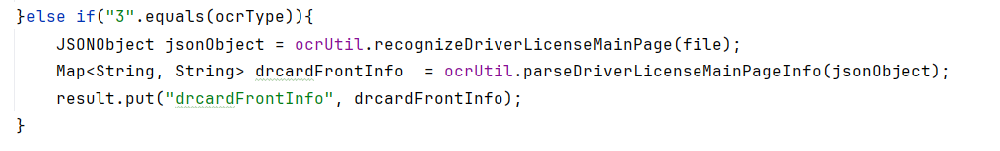

```java
else if("3".equals(ocrType)){// 如果是驾驶证识别
    JSONObject jsonObject = ocrUtil.recognizeDriverLicenseMainPage(file); // 识别信息返回json对象
    Map<String, String> drcardFrontInfo  = ocrUtil.parseDriverLicenseMainPageInfo(jsonObject); // 通过json对象提取想要的信息
    result.put("drcardFrontInfo", drcardFrontInfo); // 信息存储到Map。
}
```

### 测试小程序

启动后端子系统 `<font style="color:#000000;">bff-driver</font>``<font style="color:#000000;">zxds-dr</font>``<font style="color:#000000;">gateway</font>`。小程序采用真机测试。最终测试效果为：驾驶证可以正常上传，小程序页面最下方能够识别到驾驶证的相关信息。

# 实名认证信息持久化

OCR 已经可以识别到信息了，司机还需要填写一下联络方式等信息，这些所有的信息最终要保存到数据库当中。接下来我们先实现一下后端的保存操作。

分别在两个子系统中编写代码：`<font style="color:#000000;">zxds-dr</font>`和 `<font style="color:#000000;">bff-driver</font>`

## 编写 zxds-dr 子系统

最开始司机注册的时候，已经执行了插入操作，因此接下来是更新操作：

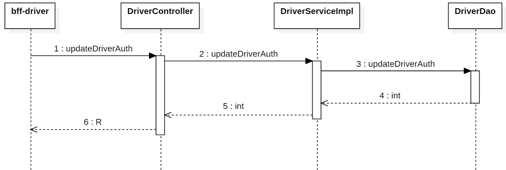

### 编写持久层代码

找到 `<font style="color:#000000;">DriverDao.xml</font>`文件，编写以下 SQL，编写之前可以再熟悉一下数据库表，确认哪些字段是需要现在更新的：

```xml
<update id="updateDriverAuth" parameterType="Map">
    UPDATE tb_driver
    SET `name`            = #{name},
        sex               = #{sex},
        pid               = #{pid},
        birthday          = #{birthday},
        tel               = #{tel},
        mail_address      = #{mailAddress},
        contact_name      = #{contactName},
        contact_tel       = #{contactTel},
        email             = #{email},
        real_auth         = 3,
        idcard_address    = #{idcardAddress},
        idcard_expiration = #{idcardExpiration},
        idcard_front      = #{idcardFront},
        idcard_back       = #{idcardBack},
        idcard_holding    = #{idcardHolding},
        drcard_type       = #{drcardType},
        drcard_expiration = #{drcardExpiration},
        drcard_issue_date = #{drcardIssueDate},
        drcard_front      = #{drcardFront},
        drcard_back       = #{drcardBack},
        drcard_holding    = #{drcardHolding}
    WHERE id = #{driverId}
</update>
```

`<font style="color:#000000;">real_auth</font>`的值应该设置为 `<font style="color:#000000;">3</font>`，表示状态为：审核中。

找到 `<font style="color:#000000;">DriverDao</font>`接口，添加以下方法：

```java
int updateDriverAuth(Map<String,Object> param);
```

### 编写 service 和实现

找到 DriverService 接口，添加以下方法：

```java
int updateDriverAuth(Map<String, Object> param);
```

实现接口中的方法：

```java
@Override
@Transactional
public int updateDriverAuth(Map<String,Object> param) {
    int rows = driverDao.updateDriverAuth(param);
    return rows;
}
```

### 编写 form 接收数据并校验

创建 `<font style="color:#000000;">UpdateDriverAuthForm</font>`类，提供以下属性：

```java
package com.example.zxds.dr.controller.form;

import io.swagger.v3.oas.annotations.media.Schema;
import lombok.Data;
import javax.validation.constraints.*;

@Data
@Schema(description = "更新司机认证信息表单")
public class UpdateDriverAuthForm {

    @NotNull(message = "driverId不能为空")
    @Min(value = 1, message = "driverId不能小于1")
    @Schema(description = "司机ID")
    private Long driverId;

    @NotBlank(message = "name不能为空")
    @Pattern(regexp = "^[\\u4e00-\\u9fa5]{2,10}$", message = "name内容不正确")
    @Schema(description = "姓名")
    private String name;

    @NotBlank(message = "sex不能为空")
    @Pattern(regexp = "^男$|^女$", message = "sex内容不正确")
    @Schema(description = "性别")
    private String sex;

    @NotBlank(message = "pid不能为空")
    @Pattern(regexp = "^[1-9]\\d{5}(18|19|([23]\\d))\\d{2}((0[1-9])|(10|11|12))(([0-2][1-9])|10|20|30|31)\\d{3}[0-9Xx]$", message = "pid内容不正确")
    @Schema(description = "身份证")
    private String pid;

    @NotBlank(message = "birthday不能为空")
    @Pattern(regexp = "^((((1[6-9]|[2-9]\\d)\\d{2})-(0?[13578]|1[02])-(0?[1-9]|[12]\\d|3[01]))|(((1[6-9]|[2-9]\\d)\\d{2})-(0?[13456789]|1[012])-(0?[1-9]|[12]\\d|30))|(((1[6-9]|[2-9]\\d)\\d{2})-0?2-(0?[1-9]|1\\d|2[0-8]))|(((1[6-9]|[2-9]\\d)(0[48]|[2468][048]|[13579][26])|((16|[2468][048]|[3579][26])00))-0?2-29-))$", message = "birthday内容不正确")
    @Schema(description = "生日")
    private String birthday;

    @NotBlank(message = "tel不能为空")
    @Pattern(regexp = "^1\\d{10}$", message = "tel内容不正确")
    @Schema(description = "电话")
    private String tel;

    @NotBlank(message = "email不能为空")
    @Email(message = "email内容不正确")
    @Schema(description = "电子信箱")
    private String email;

    @NotBlank(message = "mailAddress不能为空")
    @Pattern(regexp = "^[0-9a-zA-Z\\u4e00-\\u9fa5\\-]{6,50}$", message = "mailAddress内容不正确")
    @Schema(description = "收信地址")
    private String mailAddress;

    @NotBlank(message = "contactName不能为空")
    @Pattern(regexp = "^[\\u4e00-\\u9fa5]{2,10}$", message = "contactName内容不正确")
    @Schema(description = "应急联络人")
    private String contactName;

    @NotBlank(message = "contactTel不能为空")
    @Pattern(regexp = "^1\\d{10}$", message = "contactTel内容不正确")
    @Schema(description = "应急联络人电话")
    private String contactTel;

    @NotBlank(message = "idcardAddress不能为空")
    @Pattern(regexp = "^[0-9a-zA-Z\\u4e00-\\u9fa5\\-]{6,50}$", message = "idcardAddress内容不正确")
    @Schema(description = "身份证地址")
    private String idcardAddress;

    @NotBlank(message = "idcardFront不能为空")
    @Schema(description = "身份证正面")
    private String idcardFront;

    @NotBlank(message = "idcardBack不能为空")
    @Schema(description = "身份证背面")
    private String idcardBack;

    @NotBlank(message = "idcardHolding不能为空")
    @Schema(description = "手持身份证")
    private String idcardHolding;

    @NotBlank(message = "idcardExpiration不能为空")
    @Pattern(regexp = "^((((1[6-9]|[2-9]\\d)\\d{2})-(0?[13578]|1[02])-(0?[1-9]|[12]\\d|3[01]))|(((1[6-9]|[2-9]\\d)\\d{2})-(0?[13456789]|1[012])-(0?[1-9]|[12]\\d|30))|(((1[6-9]|[2-9]\\d)\\d{2})-0?2-(0?[1-9]|1\\d|2[0-8]))|(((1[6-9]|[2-9]\\d)(0[48]|[2468][048]|[13579][26])|((16|[2468][048]|[3579][26])00))-0?2-29-))$", message = "idcardExpiration内容不正确")
    @Schema(description = "身份证有效期")
    private String idcardExpiration;

    @NotBlank(message = "drcardType不能为空")
    @Pattern(regexp = "^(A[1-3]|B[12]|C[1-4]|[D-FMNP])$", message = "drcardType内容不正确")
    @Schema(description = "驾驶证类别")
    private String drcardType;

    @NotBlank(message = "drcardExpiration不能为空")
    @Pattern(regexp = "^((((1[6-9]|[2-9]\\d)\\d{2})-(0?[13578]|1[02])-(0?[1-9]|[12]\\d|3[01]))|(((1[6-9]|[2-9]\\d)\\d{2})-(0?[13456789]|1[012])-(0?[1-9]|[12]\\d|30))|(((1[6-9]|[2-9]\\d)\\d{2})-0?2-(0?[1-9]|1\\d|2[0-8]))|(((1[6-9]|[2-9]\\d)(0[48]|[2468][048]|[13579][26])|((16|[2468][048]|[3579][26])00))-0?2-29-))$", message = "drcardExpiration内容不正确")
    @Schema(description = "驾驶证有效期")
    private String drcardExpiration;


    @NotBlank(message = "drcardIssueDate不能为空")
    @Pattern(regexp = "^((((1[6-9]|[2-9]\\d)\\d{2})-(0?[13578]|1[02])-(0?[1-9]|[12]\\d|3[01]))|(((1[6-9]|[2-9]\\d)\\d{2})-(0?[13456789]|1[012])-(0?[1-9]|[12]\\d|30))|(((1[6-9]|[2-9]\\d)\\d{2})-0?2-(0?[1-9]|1\\d|2[0-8]))|(((1[6-9]|[2-9]\\d)(0[48]|[2468][048]|[13579][26])|((16|[2468][048]|[3579][26])00))-0?2-29-))$", message = "drcardIssueDate内容不正确")
    @Schema(description = "驾驶证初次领证日期")
    private String drcardIssueDate;

    @NotBlank(message = "drcardFront不能为空")
    @Schema(description = "驾驶证正面")
    private String drcardFront;

    @NotBlank(message = "drcardBack不能为空")
    @Schema(description = "驾驶证背面")
    private String drcardBack;

    @NotBlank(message = "drcardHolding不能为空")
    @Schema(description = "手持驾驶证")
    private String drcardHolding;

}
```

### 编写 web 方法

找到 `<font style="color:#000000;">DriverController</font>`类，提供以下方法：

```java
@PostMapping("/updateDriverAuth")
@Operation(summary = "更新实名认证信息")
public R updateDriverAuth(@RequestBody @Valid UpdateDriverAuthForm form) {
    Map<String,Object> param = BeanUtil.beanToMap(form);
    int rows = driverService.updateDriverAuth(param);
    return R.ok().put("rows", rows);
}
```

## 编写 bff-driver 子系统

非常简单，在 bff 层使用 FeignClient 调用远程的司机子服务就行了：

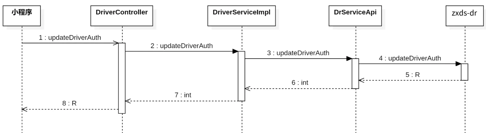

### 编写 form 接收数据并校验

这个 form 和司机子系统中的 form 几乎相同，只是这里的 form 不需要 driverId 属性，因为 bff 层有 token，通过 token 可以获取到用户的登录 id，用户不需要提交 driverId。

```java
package com.example.zxds.bff.driver.controller.form;

import io.swagger.v3.oas.annotations.media.Schema;
import lombok.Data;
import javax.validation.constraints.Email;
import javax.validation.constraints.NotBlank;
import javax.validation.constraints.Pattern;

@Data
@Schema(description = "更新司机认证信息表单")
public class UpdateDriverAuthForm {

    @Schema(description = "司机ID")
    private Long driverId;

    @NotBlank(message = "name不能为空")
    @Pattern(regexp = "^[\\u4e00-\\u9fa5]{2,10}$", message = "name内容不正确")
    @Schema(description = "姓名")
    private String name;

    @NotBlank(message = "sex不能为空")
    @Pattern(regexp = "^男$|^女$", message = "sex内容不正确")
    @Schema(description = "性别")
    private String sex;

    @NotBlank(message = "pid不能为空")
    @Pattern(regexp = "^[1-9]\\d{5}(18|19|([23]\\d))\\d{2}((0[1-9])|(10|11|12))(([0-2][1-9])|10|20|30|31)\\d{3}[0-9Xx]$", message = "pid内容不正确")
    private String pid;

    @NotBlank(message = "birthday不能为空")
    @Pattern(regexp = "^((((1[6-9]|[2-9]\\d)\\d{2})-(0?[13578]|1[02])-(0?[1-9]|[12]\\d|3[01]))|(((1[6-9]|[2-9]\\d)\\d{2})-(0?[13456789]|1[012])-(0?[1-9]|[12]\\d|30))|(((1[6-9]|[2-9]\\d)\\d{2})-0?2-(0?[1-9]|1\\d|2[0-8]))|(((1[6-9]|[2-9]\\d)(0[48]|[2468][048]|[13579][26])|((16|[2468][048]|[3579][26])00))-0?2-29-))$", message = "birthday内容不正确")
    @Schema(description = "生日")
    private String birthday;

    @NotBlank(message = "tel不能为空")
    @Pattern(regexp = "^1\\d{10}$", message = "tel内容不正确")
    @Schema(description = "电话")
    private String tel;

    @NotBlank(message = "email不能为空")
    @Email(message = "email内容不正确")
    @Schema(description = "电子信箱")
    private String email;

    @NotBlank(message = "mailAddress不能为空")
    @Pattern(regexp = "^[0-9a-zA-Z\\u4e00-\\u9fa5\\-]{6,50}$", message = "mailAddress内容不正确")
    @Schema(description = "收信地址")
    private String mailAddress;

    @NotBlank(message = "contactName不能为空")
    @Pattern(regexp = "^[\\u4e00-\\u9fa5]{2,10}$", message = "contactName内容不正确")
    @Schema(description = "应急联络人")
    private String contactName;

    @NotBlank(message = "contactTel不能为空")
    @Pattern(regexp = "^1\\d{10}$", message = "contactTel内容不正确")
    @Schema(description = "应急联络人电话")
    private String contactTel;

    @NotBlank(message = "idcardAddress不能为空")
    @Pattern(regexp = "^[0-9a-zA-Z\\u4e00-\\u9fa5\\-]{6,50}$", message = "idcardAddress内容不正确")
    @Schema(description = "身份证地址")
    private String idcardAddress;

    @NotBlank(message = "idcardFront不能为空")
    @Schema(description = "身份证正面")
    private String idcardFront;

    @NotBlank(message = "idcardBack不能为空")
    @Schema(description = "身份证背面")
    private String idcardBack;

    @NotBlank(message = "idcardHolding不能为空")
    @Schema(description = "手持身份证")
    private String idcardHolding;

    @NotBlank(message = "idcardExpiration不能为空")
    @Pattern(regexp = "^((((1[6-9]|[2-9]\\d)\\d{2})-(0?[13578]|1[02])-(0?[1-9]|[12]\\d|3[01]))|(((1[6-9]|[2-9]\\d)\\d{2})-(0?[13456789]|1[012])-(0?[1-9]|[12]\\d|30))|(((1[6-9]|[2-9]\\d)\\d{2})-0?2-(0?[1-9]|1\\d|2[0-8]))|(((1[6-9]|[2-9]\\d)(0[48]|[2468][048]|[13579][26])|((16|[2468][048]|[3579][26])00))-0?2-29-))$", message = "idcardExpiration内容不正确")
    @Schema(description = "身份证有效期")
    private String idcardExpiration;

    @NotBlank(message = "drcardType不能为空")
    @Pattern(regexp = "^(A[1-3]|B[12]|C[1-4]|[D-FMNP])$", message = "drcardType内容不正确")
    @Schema(description = "驾驶证类别")
    private String drcardType;

    @NotBlank(message = "drcardExpiration不能为空")
    @Pattern(regexp = "^((((1[6-9]|[2-9]\\d)\\d{2})-(0?[13578]|1[02])-(0?[1-9]|[12]\\d|3[01]))|(((1[6-9]|[2-9]\\d)\\d{2})-(0?[13456789]|1[012])-(0?[1-9]|[12]\\d|30))|(((1[6-9]|[2-9]\\d)\\d{2})-0?2-(0?[1-9]|1\\d|2[0-8]))|(((1[6-9]|[2-9]\\d)(0[48]|[2468][048]|[13579][26])|((16|[2468][048]|[3579][26])00))-0?2-29-))$", message = "drcardExpiration内容不正确")
    @Schema(description = "驾驶证有效期")
    private String drcardExpiration;

    @NotBlank(message = "drcardIssueDate不能为空")
    @Pattern(regexp = "^((((1[6-9]|[2-9]\\d)\\d{2})-(0?[13578]|1[02])-(0?[1-9]|[12]\\d|3[01]))|(((1[6-9]|[2-9]\\d)\\d{2})-(0?[13456789]|1[012])-(0?[1-9]|[12]\\d|30))|(((1[6-9]|[2-9]\\d)\\d{2})-0?2-(0?[1-9]|1\\d|2[0-8]))|(((1[6-9]|[2-9]\\d)(0[48]|[2468][048]|[13579][26])|((16|[2468][048]|[3579][26])00))-0?2-29-))$", message = "drcardIssueDate内容不正确")
    @Schema(description = "驾驶证初次领证日期")
    private String drcardIssueDate;

    @NotBlank(message = "drcardFront不能为空")
    @Schema(description = "驾驶证正面")
    private String drcardFront;

    @NotBlank(message = "drcardBack不能为空")
    @Schema(description = "驾驶证背面")
    private String drcardBack;

    @NotBlank(message = "drcardHolding不能为空")
    @Schema(description = "手持驾驶证")
    private String drcardHolding;

}
```

### 编写 FeignClient

找到 `<font style="color:#000000;">DrServiceApi</font>`接口：

```java
@PostMapping("/driver/updateDriverAuth")
R updateDriverAuth(@RequestBody UpdateDriverAuthForm form);
```

### 编写 service 和实现

找到 `<font style="color:#000000;">DriverService</font>`接口，添加以下方法：

```java
int updateDriverAuth(UpdateDriverAuthForm form);
```

实现方法：

```java
@Override
@GlobalTransactional
public int updateDriverAuth(UpdateDriverAuthForm form) {
    R r = drServiceApi.updateDriverAuth(form);
    int rows = Convert.toInt(r.get("rows"));
    return rows;
}
```

### 编写 web 方法

找到 `<font style="color:#000000;">DriverController</font>`类，添加以下方法：

```java
@PostMapping("/updateDriverAuth")
@Operation(summary = "更新实名认证信息")
@SaCheckLogin
public R updateDriverAuth(@RequestBody @Valid UpdateDriverAuthForm form) {
    long driverId = StpUtil.getLoginIdAsLong();
    form.setDriverId(driverId);
    int rows = driverService.updateDriverAuth(form);
    return R.ok().put("rows", rows);
}
```

# 小程序端实现保存认证信息

联系信息都是需要司机自己填写的：

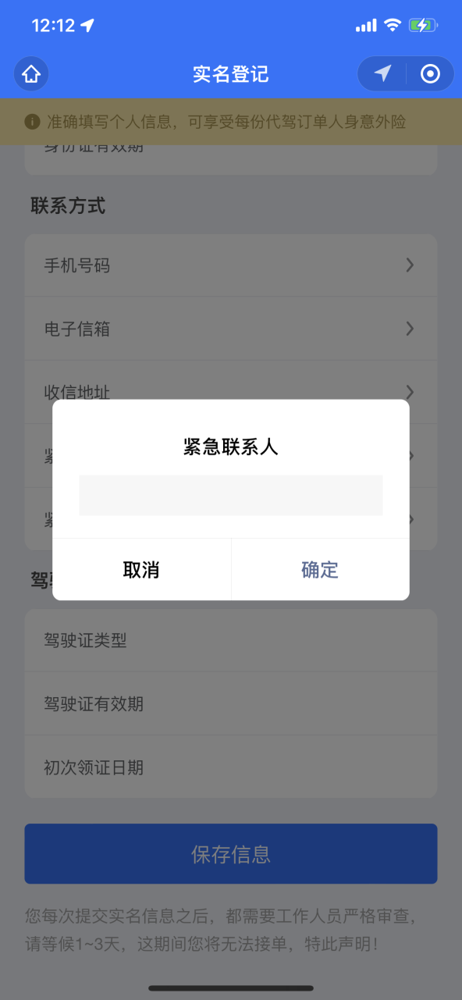

## 熟悉视图层的标签

模型层中`<font style="color:#000000;background-color:rgba(220, 240, 255, 0.3) !important;">contact</font>`保存的是联系人信息，我们在弹窗中填写的信息要保存到`<font style="color:#000000;background-color:rgba(220, 240, 255, 0.3) !important;">contact</font>`的相关属性。

```javascript
data() {
    return {
        ……,
        contact: {
            tel: '',
            email: '',  //完整Email地址
            shortEmail: '',  //缩略后的Email地址
            mailAddress: '', //完整通信地址
            shortMailAddress: '', //缩略后的通信地址
            contactName: '',  //紧急联系人
            contactTel: ''    //紧急联系人电话
        },
        ……
    };
},
```

小程序视图层上面的联系方式排版设计比较简单，直接引用的uView组件库的列表控件（**Uni-App 生态 UI 组件库，阿里的蚂蚁集团下的深圳数字马力开发的**），相关API大家可以查阅资料（[https://v1.uviewui.com/components/cell.html](https://v1.uviewui.com/components/cell.html)）。每个列表项，我都设置了点击事件，`<font style="color:#000000;background-color:rgba(220, 240, 255, 0.3) !important;">enterContent()</font>`回调函需要我们自己声明。**注意：uView 组件库中推荐使用 **`**<font style="color:#DF2A3F;">@click</font>**`

```html
<view class="title">联系方式</view>
<view class="list">
  <u-cell-group border="false">
    <u-cell-item title="手机号码" 
      :value="contact.tel" 
      :value-style="style" 
      @click="enterContent('手机号码', 'tel')" />
    <u-cell-item title="电子信箱" 
      :value="contact.shortEmail" 
      :value-style="style" 
      @click="enterContent('电子信箱', 'email')" />
    <u-cell-item title="收信地址" 
      :value="contact.shortMailAddress" 
      :value-style="style" 
      @click="enterContent('收信地址', 'mailAddress')" />
    <u-cell-item title="紧急联系人" 
      :value="contact.contactName" 
      :value-style="style" 
      @click="enterContent('紧急联系人', 'contactName')" />
    <u-cell-item title="紧急联系人电话" 
      :value="contact.contactTel" 
      :value-style="style" 
      @click="enterContent('紧急联系人电话', 'contactTel')" />

  </u-cell-group>
</view>
```

因为多个联络信息都要调用`<font style="color:#000000;background-color:rgba(220, 240, 255, 0.3) !important;">enterContent()</font>`函数，所以我们调用函数需要传入参数，表名弹窗的标题文字和编辑内容的属性名。

```javascript
enterContent(title, key) {
    let that = this;
    uni.showModal({
        title: title,
        editable: true,
        content: that.contact[key], //弹窗文本框的初始值
        success: function(resp) {
            if (resp.confirm) {
                if (key == 'mailAddress') {
                    //缩略通信地址
                    that.contact['shortMailAddress'] = resp.content.substr(0, 15) + (resp.content.length > 15 ? '...' : '');
                } else if (key == 'email') {
                    //缩略Email地址
                    that.contact['shortEmail'] = resp.content.substr(0, 25) + (resp.content.length > 25 ? '...' : '');
                }
                //把编辑的数据保存到模型层的contact里面
                that.contact[key] = resp.content;
            }
        }
    });
}
```

## 提交实名认证信息

用户点击小程序页面的“保存信息”按钮之后，我们要先做前端验证，然后发起Ajax请求把实名信息包括证件照片地址提交给后端的Java程序。

```javascript
<button class="btn" @tap="save" :disabled="realAuth == 3">保存信息</button>
```

大家注意按钮的`<font style="color:#000000;background-color:rgba(220, 240, 255, 0.3) !important;">:disabled</font>`属性，司机未认证（1状态）和已认证（2状态），都是可以填写实名信息的并且提交的。但是如果司机的实名认证是审核中（3状态），那么司机是不能修改实名信息并且重新提交的。审核通过之后（2状态），那么司机是可以修改实名信息，然后重新提交审核请求的。

在`<font style="color:#000000;background-color:rgba(220, 240, 255, 0.3) !important;">main.js</font>`文件中定义了很多前端验证的函数，例如验证`<font style="color:#000000;background-color:rgba(220, 240, 255, 0.3) !important;">checkValidTel()</font>`函数是用来验证手机号码的，该函数需要我们传入两个参数：等待验证的数据、数据的名称（显示验证失败时候使用）

```javascript
Vue.prototype.checkValidTel = function(data, name) {
    if (data == null || data == "") {
        this.$refs.uToast.show({
            title: name + "不能为空",
            type: 'error'
        })
        return false
    } else if (!/^1[0-9]{10}$/.test(data)) {
        this.$refs.uToast.show({
            title: name + "不正确",
            type: 'error'
        })
        return false
    }
    return true
}
```

在`<font style="color:#000000;background-color:rgba(220, 240, 255, 0.3) !important;">main.js</font>`中定义Ajax请求URL地址。

```javascript
Vue.prototype.url = {
    ……,
    updateDriverAuth: `${baseUrl}/driver/updateDriverAuth`,
}
```

我们创建`<font style="color:#000000;background-color:rgba(220, 240, 255, 0.3) !important;">save()</font>`回调函数，提交实名认证请求给后端Java程序。

```javascript
save() {
    let that = this;
    //判断是否设置了6张照片
  let idcardFront = that.idcard.idcardFront;
  let idcardBack = that.idcard.idcardBack;
  let idcardHolding = that.idcard.idcardHolding;
  let drcardFront = that.drcard.drcardFront;
  let drcardBack = that.drcard.drcardBack;
  let drcardHolding = that.drcard.drcardHolding;
  if(idcardFront == "" || idcardBack == "" 
  || idcardHolding == "" || drcardFront == "" 
  || drcardBack == "" || drcardHolding == ""){
    that.$refs.uToast.show({
        title: '证件上传不完整',
        type: 'error'
    });
  }
    //执行前端验证
    else if (
        that.checkValidTel(that.contact.tel, '手机号码') &&
        that.checkValidEmail(that.contact.email, '电子信箱') &&
        that.checkValidAddress(that.contact.mailAddress, '收信地址') &&
        that.checkValidName(that.contact.contactName, '联系人') &&
        that.checkValidTel(that.contact.contactTel, '联系人电话')
    ) {
        uni.showModal({
            title: '提示信息',
            content: '确认提交实名资料？',
            success: function(resp) {
                if (resp.confirm) {
                    
                    //需要上传的实名认证数据
                    let data = {
                        pid: that.idcard.pid,
                        name: that.idcard.name,
                        sex: that.idcard.sex,
                        birthday: that.idcard.birthday,
                        tel: that.contact.tel,
                        email: that.contact.email,
                        mailAddress: that.contact.mailAddress,
                        contactName: that.contact.contactName,
                        contactTel: that.contact.contactTel,
                        idcardAddress: that.idcard.address,
                        idcardFront: idcardFront,
                        idcardBack: idcardBack,
                        idcardHolding: idcardHolding,
                        idcardExpiration: that.idcard.expiration,
                        drcardType: that.drcard.carClass,
                        drcardExpiration: that.drcard.validTo,
                        drcardIssueDate: that.drcard.issueDate,
                        drcardFront: drcardFront,
                        drcardBack: drcardBack,
                        drcardHolding: drcardHolding
                    };
                    //提交Ajax请求，上传数据
                    that.ajax(that.url.updateDriverAuth, 'POST', data, function(resp) {
                        console.log('更新成功');
                        that.$refs.uToast.show({
                            title: '资料提交成功',
                            type: 'success',
                            callback: function() {
                                uni.setStorageSync('realAuth', 3); //更新小程序Storage
                                that.realAuth = 3; //更新模型层
                                if (that.mode == 'create') {
                                    //TODO 提示新注册的司机采集面部数据
                                }else {
                                    //跳转到工作台页面
                                    uni.switchTab({
                                        url: '../../pages/workbench/workbench'
                                    });
                                }
                            }
                        });
                    });
                }
            }
        });
    }
}
```

## 显示身份证地址

因为身份证地址在小程序页面址显示的并不完整，是缩略显示的。如果想要完整显示，我们可以用小程序弹窗来显示。你不用担心用户篡改身份证地址，因为弹窗的文本框是只读的。

```javascript
<u-cell-item title="身份证地址" 
             :value="idcard.shortAddress" 
             :value-style="style" 
             @click="showAddressContent" />
```

身份证地址条目已经关联了点击事件，所以我们要编写`<font style="color:#000000;background-color:rgba(220, 240, 255, 0.3) !important;">showAddressContent()</font>`函数。

```javascript
showAddressContent() {
    if (this.idcard.address.length > 0) {
        uni.showModal({
            title: '身份证地址',
            content: this.idcard.address,
            showCancel: false
        });
    }
},
```

## 项目调试注意事项

因为保存实名认证信息需要移动端提交Token令牌，如果我们直接运行`<font style="color:#000000;background-color:rgba(220, 240, 255, 0.3) !important;">filling.vue</font>`页面，因为真机调试环境下，手机上的小程序Storage中没有Token令牌，所以就会引发后端Java程序报错。为了解决这个问题，咱们需要注册司机给删除掉，司机设置和钱包记录也要删除，然后在真机调试环境下重新执行注册，再提交实名认证信息，这个就没问题了。

# 采集司机面部信息

司机注册时**采集司机面部信息**，将面部信息放到**腾讯云的人脸识别**的人员库中。司机**每天开始接单**时都需要做人脸识别，**确认司机身份**。

## 开通人脸识别

之前我们在美年大健康项目中已经使用过人脸识别了。这里就不再赘述。[https://cloud.tencent.com/product/facerecognition](https://cloud.tencent.com/product/facerecognition)

## 创建人员库

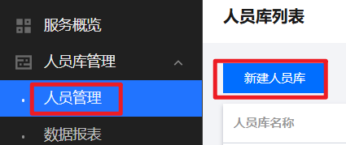

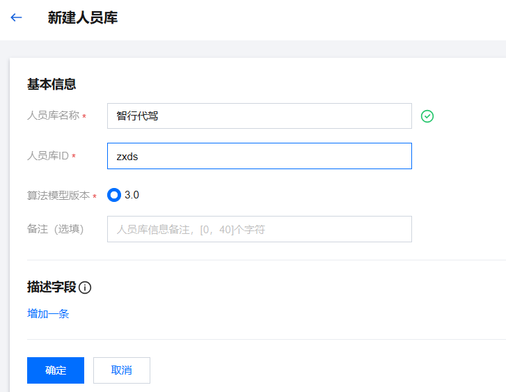

## 腾讯云人脸识别 API

这是腾讯云人员库创建人员的 API 文档：[https://cloud.tencent.com/document/api/867/45014](https://cloud.tencent.com/document/api/867/45014)

Java 代码如下：

```java
Credential cred = new Credential(secretId, secretKey);
IaiClient client = new IaiClient(cred, region);

CreatePersonRequest req = new CreatePersonRequest();
req.setGroupId(groupName); //人员库ID
req.setPersonId(driverId + ""); //人员ID
long gender = sex.equals("男") ? 1L : 2L;
req.setGender(gender);
req.setQualityControl(4L); //照片质量等级
req.setUniquePersonControl(4L); //重复人员识别等级
req.setPersonName(name); //姓名
req.setImage(photo); //base64图片

CreatePersonResponse resp = client.CreatePerson(req);
```

## 编写 zxds-dr 子系统代码

首先查询司机的姓名和性别，然后调用腾讯云的API接口，创建司机面部档案，最后更新司机记录。

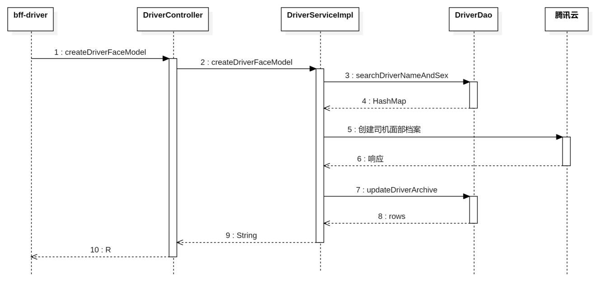

### 编写持久层代码

在`<font style="color:#000000;background-color:rgba(220, 240, 255, 0.3) !important;">DriverDao.xml</font>`文件中，声明查询司机姓名和性别的SQL语句，这些信息在创建司机面部档案的时候要用。

```xml
<select id="searchDriverNameAndSex" parameterType="long" resultType="Map">
  SELECT name,sex
  FROM tb_driver
  WHERE id = #{driverId}
</select>
```

在`<font style="color:#000000;background-color:rgba(220, 240, 255, 0.3) !important;">com.example.zxds.dr.db.dao</font>`包`<font style="color:#000000;background-color:rgba(220, 240, 255, 0.3) !important;">DriverDao.java</font>`接口中，声明抽象方法

```java
Map<String,Object> searchDriverNameAndSex(long driverId);
```

在`<font style="color:#000000;background-color:rgba(220, 240, 255, 0.3) !important;">DriverDao.xml</font>`文件中定义SQL语句，更新司机表的`<font style="color:#000000;background-color:rgba(220, 240, 255, 0.3) !important;">archive</font>`字段值

```xml
<update id="updateDriverArchive" parameterType="long">
    UPDATE tb_driver
    SET archive=1
    WHERE id = #{driverId}
</update>
```

还是在`<font style="color:#000000;background-color:rgba(220, 240, 255, 0.3) !important;">DriverDao.java</font>`接口中，声明抽象方法

```java
int updateDriverArchive(long driverId);
```

### 编写 service 和实现

在`<font style="color:#000000;background-color:rgba(220, 240, 255, 0.3) !important;">com.example.zxds.dr.service</font>`包的`<font style="color:#000000;background-color:rgba(220, 240, 255, 0.3) !important;">DriverService.java</font>`接口中，声明抽象方法

```java
String createDriverFaceModel(long driverId, String photo);
```

在`<font style="color:#000000;background-color:rgba(220, 240, 255, 0.3) !important;">common</font>`子系统中`<font style="color:#000000;background-color:rgba(220, 240, 255, 0.3) !important;">application-common.yml</font>`文件中，添加人员库的值注入信息：`<font style="color:#000000;">face</font>`部分

```yaml
tencent:
  cloud:
    ........
    face:
      groupName: zxds
      region: ap-beijing
```

在`<font style="color:#000000;background-color:rgba(220, 240, 255, 0.3) !important;">com.example.zxds.dr.service.impl</font>`包的`<font style="color:#000000;background-color:rgba(220, 240, 255, 0.3) !important;">DriverServiceImpl.java</font>`类中，实现抽象方法

```java
@Service
@Slf4j
public class DriverServiceImpl implements DriverService {
    // 新增
    @Value("${tencent.cloud.secretId}")
    private String secretId;

    @Value("${tencent.cloud.secretKey}")
    private String secretKey;

    @Value("${tencent.cloud.face.groupName}")
    private String groupName;

    @Value("${tencent.cloud.face.region}")
    private String region;
    
    ……

    // 新增
    @Override
    @Transactional
    public String createDriverFaceModel(long driverId, String photo) {
        //查询员工的姓名和性别
        HashMap map = driverDao.searchDriverNameAndSex(driverId);
        String name = MapUtil.getStr(map, "name");
        String sex = MapUtil.getStr(map, "sex");
        
        //腾讯云端创建司机面部档案
        Credential cred = new Credential(secretId, secretKey);
        IaiClient client = new IaiClient(cred, region);
        try {
            CreatePersonRequest req = new CreatePersonRequest();
            req.setGroupId(groupName);   //人员库ID
            req.setPersonId(driverId + "");   //人员ID
            long gender = sex.equals("男") ? 1L : 2L;
            req.setGender(gender);
            req.setQualityControl(4L);   //照片质量等级
            req.setUniquePersonControl(4L);   //重复人员识别等级
            req.setPersonName(name);   //姓名
            req.setImage(photo);   //base64图片
            CreatePersonResponse resp = client.CreatePerson(req);
            if (StrUtil.isNotBlank(resp.getFaceId())) {
                //更新司机表的archive字段值
                int rows = driverDao.updateDriverArchive(driverId);
                if (rows != 1) {
                    return "更新司机归档字段失败";
                }
            }
        } catch (TencentCloudSDKException e) {
            log.error("创建腾讯云端司机档案失败", e);
            return "创建腾讯云端司机档案失败";
        }
        return "";
    }
}
```

**导入类的时候注意版本，导入：**`**<font style="color:#000000;">20200303</font>**`**版本的类。**

### 编写 form 接收数据并校验

在`<font style="color:#000000;background-color:rgba(220, 240, 255, 0.3) !important;">com.example.zxds.dr.controller.form</font>`包中创建`<font style="color:#000000;background-color:rgba(220, 240, 255, 0.3) !important;">CreateDriverFaceModelForm.java</font>`类，用于接收数据。

```java
package com.example.zxds.dr.controller.form;

import io.swagger.v3.oas.annotations.media.Schema;
import lombok.Data;

import javax.validation.constraints.Min;
import javax.validation.constraints.NotBlank;
import javax.validation.constraints.NotNull;

@Data
@Schema(description = "创建司机人脸模型归档的表单")
public class CreateDriverFaceModelForm {
    @NotNull(message = "driverId不能为空")
    @Min(value = 1, message = "driverId不能小于1")
    @Schema(description = "司机ID")
    private Long driverId;

    @NotBlank(message = "photo不能为空")
    @Schema(description = "司机面部照片Base64字符串")
    private String photo;
}
```

### 编写 web 方法

在`<font style="color:#000000;background-color:rgba(220, 240, 255, 0.3) !important;">com.example.zxds.dr.controller</font>`包的`<font style="color:#000000;background-color:rgba(220, 240, 255, 0.3) !important;">DriverController.java</font>`类中，定义Web方法。

```java
@PostMapping("/createDriverFaceModel")
@Operation(summary = "创建司机人脸模型归档")
public R createDriverFaceModel(@RequestBody @Valid CreateDriverFaceModelForm form) {
    String result = driverService.createDriverFaceModel(form.getDriverId(), form.getPhoto());
    return R.ok().put("result", result);
}
```

## 编写 bff-driver 子系统代码

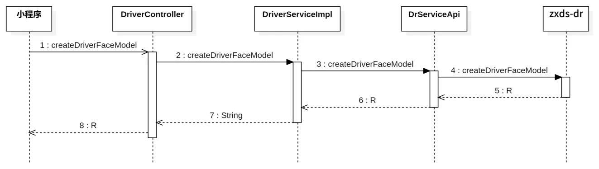

### 编写 Feign 接口

在`<font style="color:#000000;background-color:rgba(220, 240, 255, 0.3) !important;">com.example.zxds.bff.driver.controller.form</font>`包中创建`<font style="color:#000000;background-color:rgba(220, 240, 255, 0.3) !important;">CreateDriverFaceModelForm.java</font>`类。注意，`<font style="color:#000000;background-color:rgba(220, 240, 255, 0.3) !important;">driverId</font>`不需要设置**后端验证**，因为在 bff 层可以从 satoken 中获取。

```java
package com.example.zxds.bff.driver.controller.form;

import io.swagger.v3.oas.annotations.media.Schema;
import lombok.Data;

import javax.validation.constraints.NotBlank;

@Data
@Schema(description = "创建司机人脸模型归档的表单")
public class CreateDriverFaceModelForm {

    @Schema(description = "司机ID")
    private Long driverId;

    @NotBlank(message = "photo不能为空")
    @Schema(description = "司机面部照片Base64字符串")
    private String photo;
}
```

在`<font style="color:#000000;background-color:rgba(220, 240, 255, 0.3) !important;">com.example.zxds.bff.driver.feign</font>`包`<font style="color:#000000;background-color:rgba(220, 240, 255, 0.3) !important;">DrServiceApi.java</font>`接口中，定义远程方法

```java
@PostMapping("/driver/createDriverFaceModel")
R createDriverFaceModel(@RequestBody CreateDriverFaceModelForm form);
```

### 编写 service 和实现

在`<font style="color:#000000;background-color:rgba(220, 240, 255, 0.3) !important;">com.example.zxds.bff.driver.service</font>`包`<font style="color:#000000;background-color:rgba(220, 240, 255, 0.3) !important;">DriverService.java</font>`接口中，声明抽象方法

```java
String createDriverFaceModel(CreateDriverFaceModelForm form);
```

在`<font style="color:#000000;background-color:rgba(220, 240, 255, 0.3) !important;">com.example.zxds.bff.driver.service.impl</font>`包`<font style="color:#000000;background-color:rgba(220, 240, 255, 0.3) !important;">DriverServiceImpl.java</font>`类中，实现抽象方法

```java
@Override
@GlobalTransactional
public String createDriverFaceModel(CreateDriverFaceModelForm form) {
    R r = drServiceApi.createDriverFaceModel(form);
    String result = MapUtil.getStr(r, "result");
    return result;
}
```

### 编写 web 方法

在`<font style="color:#000000;background-color:rgba(220, 240, 255, 0.3) !important;">com.example.zxds.bff.driver.controller</font>`包`<font style="color:#000000;background-color:rgba(220, 240, 255, 0.3) !important;">DriverController.java</font>`类中，声明Web方法

```java
@PostMapping("/createDriverFaceModel")
@Operation(summary = "创建司机人脸模型归档")
@SaCheckLogin
public R createDriverFaceModel(@RequestBody @Valid CreateDriverFaceModelForm form) {
    long driverId = StpUtil.getLoginIdAsLong();
    form.setDriverId(driverId);
    String result = driverService.createDriverFaceModel(form);
    return R.ok().put("result", result);
}
```

## 小程序端实现采集

编写移动端的代码，把司机面部照片用Ajax提交给后端的Java项目。具体步骤是用手机前置摄像头拍摄司机的面部，然后把图片编码成base64格式的，用Ajax提交给后端程序。

### 熟悉视图层

人脸面部采集和人脸识别是同一个页面，对应的都是小程序`<font style="color:#000000;background-color:rgba(220, 240, 255, 0.3) !important;">face_camera.vue</font>`页面。初始状态下，页面显示摄像头标签，如果拍完照片，摄像头标签则隐藏，然后用`<font style="color:#000000;background-color:rgba(220, 240, 255, 0.3) !important;"><image></font>`标签显示照片。

```html
<view class="face-container">
    <!--显示摄像头-->
    <camera device-position="front" flash="off" class="camera" @error="error" 
            v-if="showCamera">
        <!--摄像头默认显示的是方形的，在上面盖一张图片，这个图片中间圆圈是透明的，用来实现圆形的摄像头效果-->
        <cover-image src="../static/face_camera/bg.png" class="bg"></cover-image>
    </camera>
    <!--显示照片-->
    <view class="image-container" v-if="showImage">
        <image mode="widthFix" class="photo" :src="photoPath"></image>
        <view class="cover"></view>
    </view>
</view>
<view class="desc">
    <!--上个页面跳过来时会传 mode 值，如果mode值是 verificate，表示这是一个人脸识别的过程，显示人脸识别的提示信息。-->
    <block v-if="mode == 'verificate'">
        <image src="../static/face_camera/tips.png" mode="widthFix" class="tips"></image>
        <text>请把面部放在圆圈内</text>
        <text>拍摄脸部来确认身份</text>
    </block>
    <!--上个页面跳过来时会传 mode 值，如果mode值是 create，表示这是采集人脸的过程，显示采集人脸的提示信息。-->
    <block v-if="mode == 'create'">
        <image src="../static/face_camera/face.png" mode="widthFix" class="face"></image>
        <text>请把完整面部放在圆圈内</text>
        <text>拍摄脸部来保存身份识别数据</text>
    </block>
</view>
<button class="btn" @tap="confirmHandle">
  {{ mode == 'create' ? '录入面部信息' : '身份核实' }}
</button>
```

### 播放提示语音

只要进入`<font style="color:#000000;background-color:rgba(220, 240, 255, 0.3) !important;">face_camera.vue</font>`页面，就会自动播放提示语音，那么我们只需要播放已经录制好的mp3文件即可。

```javascript
data() {
    return {
        mode: 'verificate',
        photoPath: '',
        showCamera: true,
        showImage: false,
        audio: null
    };
},
……
onLoad: function(options) {
    let that = this;
    that.mode = options.mode;
    let audio = uni.createInnerAudioContext(); //创建音乐播放器对象
    that.audio = audio;
    audio.src = '/static/voice/voice_5.mp3';
    audio.play(); //执行播放
},
onHide: function() {
    if (this.audio != null) {
        this.audio.stop();
    }
}
```

### 发送 ajax 请求提交面部照片

在`<font style="color:#000000;background-color:rgba(220, 240, 255, 0.3) !important;">main.js</font>`文件中，定义全局URL路径。

```javascript
Vue.prototype.url = {
    ……,
    // 采集人脸入库的URL。
    createDriverFaceModel: `${baseUrl}/driver/createDriverFaceModel`,
    // 这里把这个也提前写上吧：人脸识别的URL。
    verificateDriverFace: `${baseUrl}/driver/recognition/verificateDriverFace`,
}
```

编写按钮点击事件回调函数`<font style="color:#000000;background-color:rgba(220, 240, 255, 0.3) !important;">confirmHandle()</font>`，把照片编码成base64格式，然后提交给Java程序。

**以下代码中 **`**<font style="color:#000000;">pathToBase64</font>**`**函数是 **`**<font style="color:#000000;">image-tools</font>**`**插件中提供的，可以在小程序中将图片转换成 base64 的字符串。**

**安装插件：**`**<font style="color:#000000;">cnpm i image-tools --save</font>**`

**导入插件：**`**<font style="color:#000000;">import { pathToBase64 } from 'image-tools';</font>**`

```javascript
confirmHandle: function() {
    let that = this;
    that.audio.stop(); //停止正在播放的语音
    let ctx = uni.createCameraContext();
    ctx.takePhoto({
        quality: 'high',
        success: function(resp) {
            // console.log(resp.tempImagePath);
            that.photoPath = resp.tempImagePath;
            that.showCamera = false;
            that.showImage = true;
          
            //提交照片给后端Java项目
            // pathToBase64 是image-tools插件给提供的，需要额外安装和引入。
            // 安装：cnpm i image-tools --save
            // 引入：import { pathToBase64 } from 'image-tools';
            pathToBase64(that.photoPath).then((base64)=>{
              let url;
              if (that.mode == 'create') {
                  //创建司机面部模型档案
                  url = that.url.createDriverFaceModel;
              } else {
                  //验证司机面部模型
                  url = that.url.verificateDriverFace;
              }

              that.ajax(url, 'POST', { photo: base64 }, function(resp) {
                  let result = resp.data.result;
                  if (that.mode == 'create') {
                      if (result != null && result.length > 0) {
                          console.error(result);
                          uni.showToast({
                              icon: 'none',
                              title: '面部录入失败，请重新录入'
                          });
                          setTimeout(function() {
                              that.showCamera = true;
                              that.showImage = false;
                          }, 2000);
                      } else {
                          uni.showToast({
                              title: '面部录入成功'
                          });
                          setTimeout(function() {
                              uni.switchTab({
                                  url: '../../pages/workbench/workbench'
                              });
                          }, 2000);
                      }
                  } else {
                      //TODO 判断人脸识别结果
                  }
              });
              
            });
        }
    });
}
```

在`<font style="color:#000000;background-color:rgba(220, 240, 255, 0.3) !important;">filling.vue</font>`页面的`<font style="color:#000000;background-color:rgba(220, 240, 255, 0.3) !important;">save()</font>`函数中添加跳转到`<font style="color:#000000;background-color:rgba(220, 240, 255, 0.3) !important;">face_camera.vue</font>`页面代码

```javascript
//跳转到面部识别页面，采集人脸数据
uni.redirectTo({
    url: '../face_camera/face_camera?mode=create'
});
```

## 调试程序

1. 把之前注册的司机信息、钱包、司机设置全部删除。
2. 如果腾讯云的人员库中已经有相同的人员了，需要把人员库中相同的人员删除。
3. 启动 `<font style="color:#000000;">bff-driver</font>``<font style="color:#000000;">zxds-dr</font>``<font style="color:#000000;">gateway</font>`三个子系统，就可以测试了。

# 实现司机登录功能

前端小程序提供临时授权码 code，后端根据 code 获取 openId，在数据库中根据 openId 字段查询司机信息。

1. 没有查到信息，说明没有注册，提醒注册。
2. 查到信息后，还需要将 `<font style="color:#000000;">real_auth</font>`以及 `<font style="color:#000000;">archive</font>`字段返回，用于判断该用户是否已经实名认证，是否已经采集面部照片。

## 编写 zxds-dr 子系统代码

根据司机的openId查询司机的注册信息，其中包含主键、实名认证和面部录入的情况。

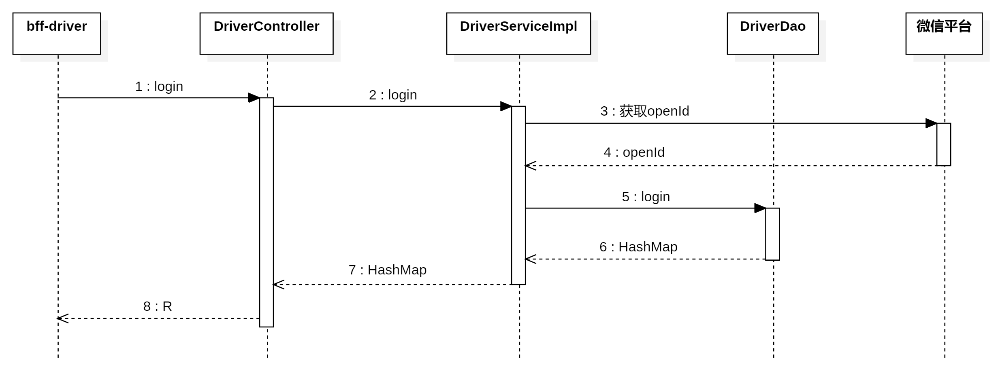

### 编写持久层代码

在`<font style="color:#000000;background-color:rgba(220, 240, 255, 0.3) !important;">DriverDao.xml</font>`文件中声明SQL语句，查询司机ID、实名认证和面部录入的情况。

```xml
<select id="login" parameterType="String" resultType="HashMap">
    SELECT CAST(id AS CHAR) AS id,
           real_auth        AS realAuth,
           archive
    FROM tb_driver
    WHERE `status` != 2 AND open_id = #{openId}
</select>
```

在`<font style="color:#000000;background-color:rgba(220, 240, 255, 0.3) !important;">com.example.zxds.dr.db.dao</font>`包`<font style="color:#000000;background-color:rgba(220, 240, 255, 0.3) !important;">DriverDao.java</font>`接口中，定义DAO方法。

```java
Map<String,Object> login(String openId);
```

### 编写 service 和实现

在`<font style="color:#000000;background-color:rgba(220, 240, 255, 0.3) !important;">com.example.zxds.dr.service</font>`包`<font style="color:#000000;background-color:rgba(220, 240, 255, 0.3) !important;">DriverService.java</font>`接口中，定义抽象方法。

```java
Map<String,Object> login(String code);
```

在`<font style="color:#000000;background-color:rgba(220, 240, 255, 0.3) !important;">com.example.zxds.dr.service.impl</font>`包`<font style="color:#000000;background-color:rgba(220, 240, 255, 0.3) !important;">DriverServiceImpl.java</font>`接口中，实现抽象方法

```java
@Override
public Map<String,Object> login(String code) {
    String openId = microAppUtil.getOpenId(code);
    Map<String,Object> result = driverDao.login(openId);
    if (result != null && result.containsKey("archive")) {
        int temp = MapUtil.getInt(result, "archive");
        boolean archive = temp == 1 ? true : false;
        result.replace("archive", archive);
    }
    return result;
}
```

### 编写 form 接收数据并校验

在`<font style="color:#000000;background-color:rgba(220, 240, 255, 0.3) !important;">com.example.zxds.dr.controller.form</font>`包中创建`<font style="color:#000000;background-color:rgba(220, 240, 255, 0.3) !important;">LoginForm.java</font>`类，保存提交的数据

```java
package com.example.zxds.dr.controller.form;

import io.swagger.v3.oas.annotations.media.Schema;
import lombok.Data;

import javax.validation.constraints.NotBlank;

@Data
@Schema(description = "司机登录表单")
public class LoginForm {

    @NotBlank(message = "code不能为空")
    @Schema(description = "微信小程序临时授权")
    private String code;
}
```

### 编写 web 方法

在`<font style="color:#000000;background-color:rgba(220, 240, 255, 0.3) !important;">com.example.zxds.dr.controller</font>`包`<font style="color:#000000;background-color:rgba(220, 240, 255, 0.3) !important;">DriverController.java</font>`类中，声明Web方法

```java
@PostMapping("/login")
@Operation(summary = "登录系统")
public R login(@RequestBody @Valid LoginForm form) {
    Map<String,Object> map = driverService.login(form.getCode());
    return R.ok().put("result", map);
}
```

## 编写 bff-driver 子系统代码

通过 Feign 客户端调用远程服务。

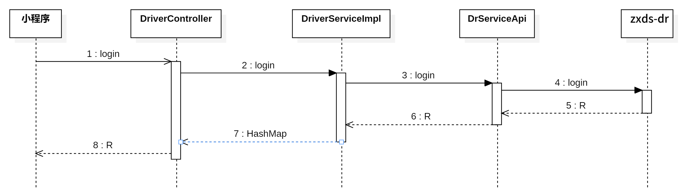

### 编写 Feign 客户端

在`<font style="color:#000000;background-color:rgba(220, 240, 255, 0.3) !important;">com.example.zxds.bff.driver.controller.form</font>`包创建`<font style="color:#000000;background-color:rgba(220, 240, 255, 0.3) !important;">LoginForm.java</font>`类，接收Ajax提交的数据

```java
package com.example.zxds.bff.driver.controller.form;

import io.swagger.v3.oas.annotations.media.Schema;
import lombok.Data;

import javax.validation.constraints.NotBlank;

@Data
@Schema(description = "司机登录表单")
public class LoginForm {

    @NotBlank(message = "code不能为空")
    @Schema(description = "微信小程序临时授权")
    private String code;
}
```

在`<font style="color:#000000;background-color:rgba(220, 240, 255, 0.3) !important;">com.example.zxds.bff.driver.feign</font>`包`<font style="color:#000000;background-color:rgba(220, 240, 255, 0.3) !important;">DrServiceApi.java</font>`类中，声明抽象方法。

```java
@PostMapping("/driver/login")
R login(@RequestBody LoginForm form);
```

### 编写 service 和实现

在`<font style="color:#000000;background-color:rgba(220, 240, 255, 0.3) !important;">com.example.zxds.bff.driver.service</font>`包`<font style="color:#000000;background-color:rgba(220, 240, 255, 0.3) !important;">DriverService.java</font>`接口中，声明抽象方法

```java
Map<String,Object> login(LoginForm form);
```

在`<font style="color:#000000;background-color:rgba(220, 240, 255, 0.3) !important;">com.example.zxds.bff.driver.service.impl</font>`包`<font style="color:#000000;background-color:rgba(220, 240, 255, 0.3) !important;">DriverServiceImpl.java</font>`类中，实现抽象方法

```java
@Override
public Map<String,Object> login(LoginForm form) {
    R r = drServiceApi.login(form);
    Map<String,Object> map = (Map<String,Object>)r.get("result");
    return map;
}
```

### 编写 web 方法

在`<font style="color:#000000;background-color:rgba(220, 240, 255, 0.3) !important;">com.example.zxds.bff.driver.controller</font>`包`<font style="color:#000000;background-color:rgba(220, 240, 255, 0.3) !important;">DriverController.java</font>`类中，声明的Web方法。

```java
@PostMapping("/login")
@Operation(summary = "登录系统")
public R login(@RequestBody @Valid LoginForm form) {
    Map<String,Object> map = driverService.login(form);
    if (map != null) {
        long driverId = MapUtil.getLong(map, "id");
        byte realAuth = Byte.parseByte(MapUtil.getStr(map, "realAuth"));
        boolean archive = MapUtil.getBool(map, "archive");
        StpUtil.login(driverId);
        String token = StpUtil.getTokenInfo().getTokenValue();

        return R.ok().put("token", token).put("realAuth", realAuth).put("archive", archive);
    }
    return R.ok();
}
```

## 小程序端实现登录

当用户点击“微信登录”按钮之后，发起Ajax请求，我们根据响应的结果，提示用户没有注册、必须做实名认证、录入面部信息，或者跳转工作台页面。需要做很多判断。

### 熟悉视图层标签

找到 `<font style="color:#000000;">pages/login/login.vue</font>`文件。（**HBuilderX 中 **`**<font style="color:#000000;">ctrl + p</font>**`**快捷键找文件。**）

司机端小程序的登录页面比较简单，我们找到“微信登录”按钮的点击事件，对应的回调函数是`<font style="color:#000000;background-color:rgba(220, 240, 255, 0.3) !important;">login()</font>`。

```html
<view>
    <image src="../../static/login/top.png" mode="widthFix" class="top"></image>
    <image src="../../static/login/logo.png" mode="widthFix" class="logo"></image>
    <view class="desc">
        <text class="name">（司机端）</text>
        <text class="version">Ver20XX.201</text>
    </view>
    <button class="btn" @tap="login()">微信登录</button>
    <view class="register-container">
        没有账号?
        <text class="link" @tap="toRegisterPage()">立即注册</text>
    </view>
    <text class="remark">本小程序仅限于智行代驾签约司机使用，新司机必须先注册，经由实名认证之后方可在本小程序中接单运营。</text>
    <u-toast ref="uToast" />
</view>
```

### 定义全局 URL 路径

发送Ajax登录请求之前，我们要在`<font style="color:#000000;background-color:rgba(220, 240, 255, 0.3) !important;">main.js</font>`文件中定义全局URL路径

```javascript
Vue.prototype.url = {
    ……,
    login: `${baseUrl}/driver/login`,
}
```

### 实现用户登录逻辑

```javascript
login() {
    let that = this;
    uni.login({
        provider: 'weixin',
        success: function(resp) {
            let code = resp.code;
            let data = {
                code: code
            };

            that.ajax(that.url.login, 'POST', data, function(resp) {
                // console.log(resp)
                if (!resp.data.hasOwnProperty('token')) {
                    that.$refs.uToast.show({
                        title: '请先注册',
                        type: 'error'
                    });
                } else {
                    let token = resp.data.token;
                    let realAuth = resp.data.realAuth;
                    let archive = resp.data.archive;
                    uni.setStorageSync('token', token);
                    uni.setStorageSync('realAuth', realAuth);
                    //删除缓存的执行订单数据，进入工作台重新加载数据
                    uni.removeStorageSync('executeOrder'); 
                    that.$refs.uToast.show({
                        title: '登录成功',
                        type: 'success',
                        callback: function() {
                            uni.setStorageSync('workStatus', '停止接单');
                            //检查用户是否没有填写实名信息
                            if (realAuth == 1) {
                                //跳转到填写实名信息页面
                                uni.redirectTo({
                                    url: '../../identity/filling/filling?mode=create'
                                });
                            }
                            //检查系统是否存有司机的面部数据
                            else if (archive == false) {
                                uni.showModal({
                                    title: '提示消息',
                                    content: '您还没有录入用于核实身份的面部特征信息，如果不录入将无法接单',
                                    confirmText: '录入',
                                    cancelText: '取消',
                                    success: function(resp) {
                                        if (resp.confirm) {
                                            //跳转到面部识别页面，采集人脸数据
                                            uni.redirectTo({
                                                url: '../../identity/face_camera/face_camera?mode=create'
                                            });
                                        }else{
                                            uni.switchTab({
                                               url: '../workbench/workbench'
                                            });
                                        }
                                    }
                                });
                            } else {
                                uni.switchTab({
                                    url: '../workbench/workbench'
                                });
                            }
                        }
                    });
                }
            });
        }
    });

},
```

## 调试程序

1. **第一种情况：**正常登录。用户注册了，并且实名认证了，也进行了面部信息采集。直接跳转到工作台。
2. **第二种情况：**用户没有注册。提示用户先注册。（**如果数据库中有之前的测试数据，先删除掉。删除司机，钱包，设置。**）
3. **第三种情况：**用户注册了，但是没有实名认证，跳转到实名认证页面。（**把**`**<font style="color:#000000;background-color:rgba(220, 240, 255, 0.3) !important;">tb_driver</font>**`**表的**`**<font style="color:#000000;background-color:rgba(220, 240, 255, 0.3) !important;">real_auth</font>**`**字段设置成1，**`**<font style="color:#000000;background-color:rgba(220, 240, 255, 0.3) !important;">archive</font>**`**字段设置成0，然后去腾讯云人员库里面把司机面部信息删除掉**）
4. **第四种情况：**用户注册了，也实名认证了，但是没有录入面部信息，弹出提示框，用户可以选择录入面部信息，也可以选择不录入，如果不录入也可以跳转到工作台，只不过该司机不能接单。（**去腾讯云人员库把司机面部信息删除，再把**`**<font style="color:#000000;background-color:rgba(220, 240, 255, 0.3) !important;">td_driver</font>**`**表中的司机注册信息的**`**<font style="color:#000000;background-color:rgba(220, 240, 255, 0.3) !important;">archive</font>**`**字段设置成0**）

# 实现司机退出功能

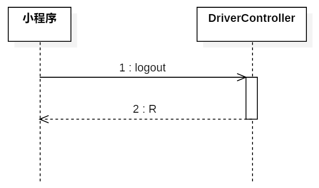

后端`<font style="color:#000000;">bff-driver</font>`销毁Redis缓存的Token。移动端这里，用户点击退出登录之后，删除Storage保存的Token，然后跳转到登录页面。

## 编写 web 层代码

在`<font style="color:#000000;background-color:rgba(220, 240, 255, 0.3) !important;">com.example.zxds.bff.driver.controller</font>`包`<font style="color:#000000;background-color:rgba(220, 240, 255, 0.3) !important;">DriverController.java</font>`类中，声明Web方法

```java
@GetMapping("/logout")
@Operation(summary = "退出系统")
@SaCheckLogin
public R logout() {
    StpUtil.logout();
    return R.ok();
}
```

## 小程序端的实现

在移动端，司机只要切换到“个人中心”页面，就能看到“退出系统”按钮，点击按钮就发送Ajax请求调用刚才编写的Web方法。

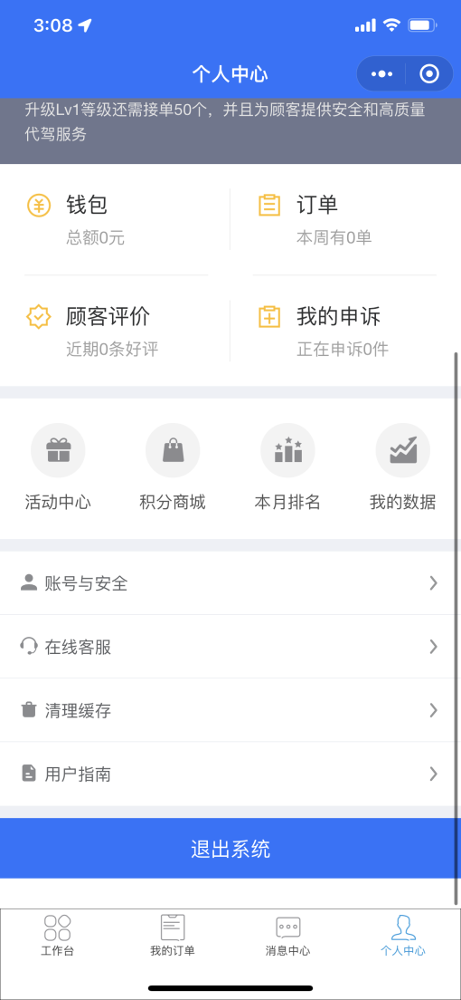

### 熟悉视图层代码

`<font style="color:#000000;background-color:rgba(220, 240, 255, 0.3) !important;">pages/mine/mine.vue</font>`页面中退出登录按钮点击事件的回调函数是`<font style="color:#000000;background-color:rgba(220, 240, 255, 0.3) !important;">logoutHandle()</font>`

```html
<view class="exit">
    <button class="btn" @tap="logoutHandle()">退出系统</button>
</view>
```

### 定义全局 URL

```javascript
Vue.prototype.url = {
    ……,
    logout: `${baseUrl}/driver/logout`,
}
```

### 编写退出的函数

司机退出登录的时候，先弹出提示对话框，司机确认之后再发送Ajax请求，然后删除Storage里面缓存的`<font style="color:#000000;background-color:rgba(220, 240, 255, 0.3) !important;">token</font>`和`<font style="color:#000000;background-color:rgba(220, 240, 255, 0.3) !important;">realAuth</font>`

```javascript
logoutHandle() {
    let that = this;
    uni.vibrateShort({});
    uni.showModal({
        title: '提示信息',
        content: '确认退出系统？',
        success: function(resp) {
            if (resp.confirm) {
                that.ajax(that.url.logout, 'GET', null, function(resp) {
                    uni.removeStorageSync('realAuth');
                    uni.removeStorageSync('token');
                    uni.showToast({
                        title: '已经退出系统',
                        success: function() {
                            setTimeout(function() {
                                uni.reLaunch({
                                    url: '../login/login'
                                });
                            }, 1500);
                        }
                    });
                });
            }
        }
    });
}
```

## 测试功能

保证后端的三个子系统启动，就可以调试了：`<font style="color:#000000;">zxds-dr</font>``<font style="color:#000000;">gateway</font>``<font style="color:#000000;">bff-driver</font>`

# 个人中心显示司机信息

个人中心需要显示司机的详细信息。

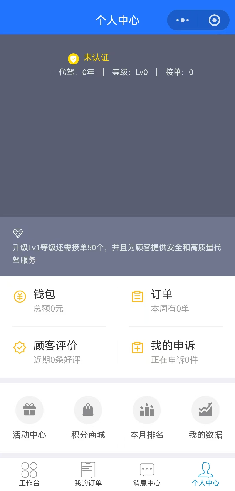

## 编写 zxds-dr 子系统代码

从`<font style="color:#000000;background-color:rgba(220, 240, 255, 0.3) !important;">tb_driver</font>`表中查询出数据，并且把司机的基本信息返回给Bff层即可，具体时序图如下

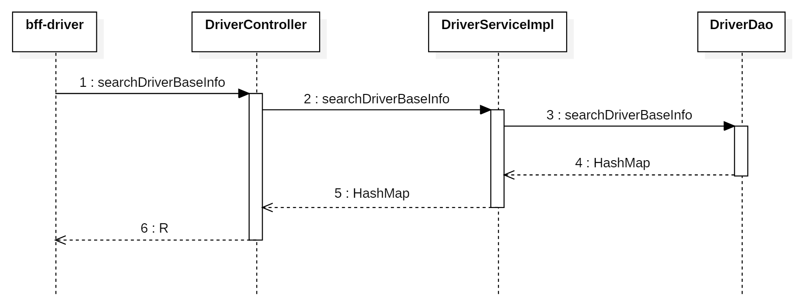

### 编写持久层代码

先回顾一下 tb_driver 表的 summary 字段，该字段中的信息都是要在小程序端显示的：

| **字段** | **类型** | **禁止空值** | **备注信息** |
| --- | --- | --- | --- |
| summary | json | False | 摘要信息包括： level等级，totalOrder接单数，weekOrder周接单，weekComment周好评，appeal正在申诉量 |

在`<font style="color:#000000;background-color:rgba(220, 240, 255, 0.3) !important;">DriverDao.xml</font>`文件中定义SQL语句，查询司机基本信息

```xml
<select id="searchDriverBaseInfo" parameterType="long" resultType="HashMap">
    SELECT d.open_id               AS openId,
           d.`name`,
           d.nickname,
           d.sex,
           d.photo,
           d.tel,
           d.email,
           d.pid,
           d.real_auth             AS realAuth,
           d.summary,
           d.`status`,
           CAST(w.balance AS CHAR) AS balance,
           d.create_time           AS createTime
    FROM tb_driver d
    JOIN tb_wallet w ON d.id = w.driver_id
    WHERE d.id = #{driverId};
</select>
```

在`<font style="color:#000000;background-color:rgba(220, 240, 255, 0.3) !important;">com.example.zxds.dr.db.dao</font>`包`<font style="color:#000000;background-color:rgba(220, 240, 255, 0.3) !important;">DriverDao.java</font>`接口中，声明抽象DAO方法

```java
Map<String,Object> searchDriverBaseInfo(long driverId);
```

### 编写业务层代码

在`<font style="color:#000000;background-color:rgba(220, 240, 255, 0.3) !important;">com.example.zxds.dr.service</font>`包`<font style="color:#000000;background-color:rgba(220, 240, 255, 0.3) !important;">DriverService.java</font>`接口中，声明抽象业务方法

```java
Map<String,Object> searchDriverBaseInfo(long driverId);
```

在`<font style="color:#000000;background-color:rgba(220, 240, 255, 0.3) !important;">com.example.zxds.dr.service.impl</font>`包`<font style="color:#000000;background-color:rgba(220, 240, 255, 0.3) !important;">DriverServiceImpl.java</font>`类中，实现抽象方法

```java
@Override
public Map<String, Object> searchDriverBaseInfo(long driverId) {
    Map<String, Object> result = driverDao.searchDriverBaseInfo(driverId);
    JSONObject summary = JSONUtil.parseObj(MapUtil.getStr(result, "summary"));
    result.replace("summary", summary);
    return result;
}
```

### 编写 form 接收数据并校验

在`<font style="color:#000000;background-color:rgba(220, 240, 255, 0.3) !important;">com.example.zxds.dr.controller.form</font>`包中创建`<font style="color:#000000;background-color:rgba(220, 240, 255, 0.3) !important;">SearchDriverBaseInfoForm.java</font>`类，用于接收提交的数据

```java
package com.example.zxds.dr.controller.form;

import io.swagger.v3.oas.annotations.media.Schema;
import lombok.Data;

import javax.validation.constraints.Min;
import javax.validation.constraints.NotNull;

@Data
@Schema(description = "查询司机基本信息的表单")
public class SearchDriverBaseInfoForm {
    @NotNull(message = "driverId不能为空")
    @Min(value = 1, message = "driverId不能小于1")
    @Schema(description = "司机ID")
    private Long driverId;
}
```

### 编写 web 方法

在`<font style="color:#000000;background-color:rgba(220, 240, 255, 0.3) !important;">com.example.zxds.dr.controller</font>`包`<font style="color:#000000;background-color:rgba(220, 240, 255, 0.3) !important;">DriverController.java</font>`类中，定义Web方法

```java
@PostMapping("/searchDriverBaseInfo")
@Operation(summary = "查询司机基本信息")
public R searchDriverBaseInfo(@RequestBody @Valid SearchDriverBaseInfoForm form) {
    Map<String, Object> result = driverService.searchDriverBaseInfo(form.getDriverId());
    return R.ok().put("result", result);
}
```

## 编写 bff-driver 子系统代码

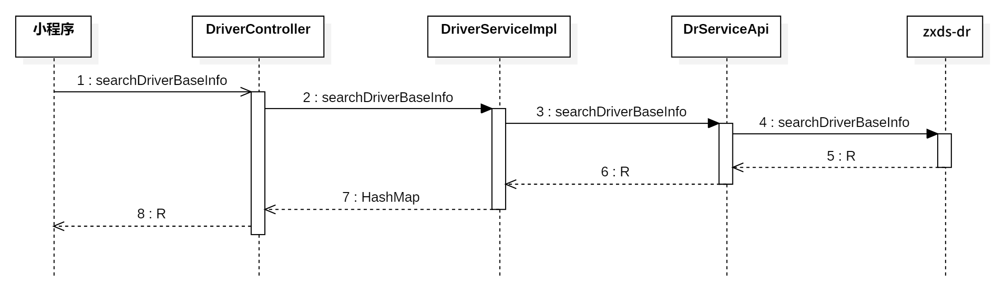

### 编写 Feign 客户端

在`<font style="color:#000000;background-color:rgba(220, 240, 255, 0.3) !important;">com.example.zxds.bff.driver.controller.form</font>`包中创建`<font style="color:#000000;background-color:rgba(220, 240, 255, 0.3) !important;">SearchDriverBaseInfoForm.java</font>`类。因为driverId可以从 SaToken中获得，所以就不需要后端验证了。

```java
package com.example.zxds.bff.driver.controller.form;

import io.swagger.v3.oas.annotations.media.Schema;
import lombok.Data;

@Data
@Schema(description = "查询司机基本信息的表单")
public class SearchDriverBaseInfoForm {

    @Schema(description = "司机ID")
    private Long driverId;
}
```

在`<font style="color:#000000;background-color:rgba(220, 240, 255, 0.3) !important;">com.example.zxds.bff.driver.feign</font>`包`<font style="color:#000000;background-color:rgba(220, 240, 255, 0.3) !important;">DrServiceApi.java</font>`接口中，声明远程调用方法

```java
@PostMapping("/driver/searchDriverBaseInfo")
R searchDriverBaseInfo(SearchDriverBaseInfoForm form);
```

### 编写 service 和实现

在`<font style="color:#000000;background-color:rgba(220, 240, 255, 0.3) !important;">com.example.zxds.bff.driver.service</font>`包`<font style="color:#000000;background-color:rgba(220, 240, 255, 0.3) !important;">DriverService.java</font>`接口中，声明抽象方法

```java
Map<String,Object> searchDriverBaseInfo(SearchDriverBaseInfoForm form);
```

在`<font style="color:#000000;background-color:rgba(220, 240, 255, 0.3) !important;">com.example.zxds.bff.driver.service.impl</font>`包`<font style="color:#000000;background-color:rgba(220, 240, 255, 0.3) !important;">DriverServiceImpl.java</font>`类中，实现抽象方法

```java
@Override
public Map<String,Object> searchDriverBaseInfo(SearchDriverBaseInfoForm form) {
    R r = drServiceApi.searchDriverBaseInfo(form);
    Map<String, Object> map = (Map<String, Object>) r.get("result");
    return map;
}
```

### 编写 web 方法

在`<font style="color:#000000;background-color:rgba(220, 240, 255, 0.3) !important;">com.example.zxds.bff.driver.controller</font>`包`<font style="color:#000000;background-color:rgba(220, 240, 255, 0.3) !important;">DriverController.java</font>`类中，定义Web方法

```java
@PostMapping("/searchDriverBaseInfo")
@Operation(summary = "查询司机基本信息")
@SaCheckLogin
public R searchDriverBaseInfo() {
    long driverId = StpUtil.getLoginIdAsLong();
    // 这个form不需要前端小程序传过来，所以这里我就直接手动new了。
    SearchDriverBaseInfoForm form = new SearchDriverBaseInfoForm();
    form.setDriverId(driverId);
    Map<String, Object> map = driverService.searchDriverBaseInfo(form);
    return R.ok().put("result", map);
}
```

## Swagger 测试一下

先从微信开发者工具中找到 storage 中存储的 token：**为了保证这个 token 是正确的，建议大家先手动删除以下 token 和 realAuth，在开发者工具当中重新登录一下，生成最新的 token。以防之前缓存的 token 和数据库司机的 driverId 不一致而导致测试失败。**

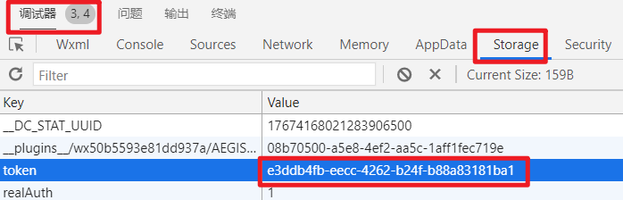

### 测试 zxds-dr 子系统

把相关的子系统启动之后，打开它：[http://127.0.0.1:8001/swagger-ui.html](http://127.0.0.1:8001/swagger-ui.html)

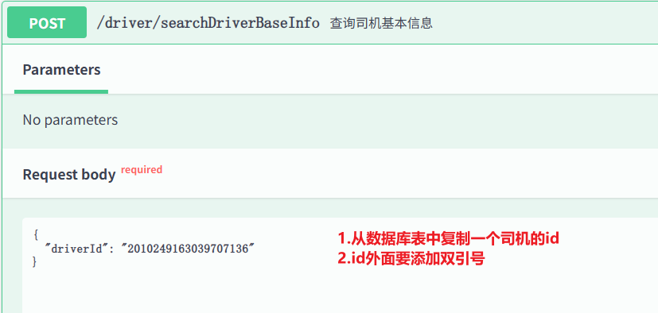

**为什么添加双引号？**

**Swagger UI运行在浏览器中，它内置了 JavaScript解析器，JavaScript的数字类型只能精确表示最多16位整数，而我们的 19位数字在解析时会精度丢失**

### 测试 bff-driver 子系统

把相关的子系统启动之后，打开它：[http://127.0.0.1:8101/swagger-ui.html](http://127.0.0.1:8101/swagger-ui.html)

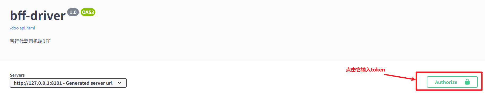

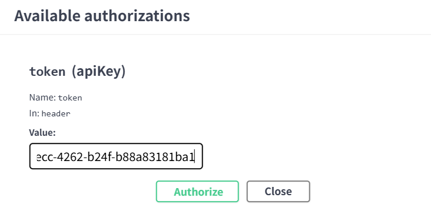

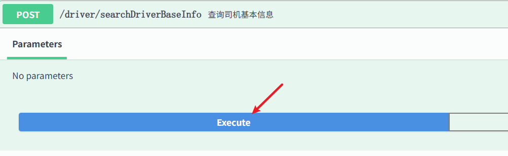

执行测试后，成功的话，应该可以看到返回的数据。

## 小程序端显示司机信息

### 熟悉视图层标签

找到 `<font style="color:#000000;">page/mine/mine.vue</font>`页面，先看视图层有啥：

```html
<view class="summary-container">
    <image :src="photo" mode="widthFix" class="photo"></image>
    <view class="summary">
        <view class="row">
            <text class="name">{{ name }}</text>
            <image :src="realAuth ? '../../static/mine/icon-1.png' : '../../static/mine/icon-2.png'" mode="widthFix" class="auth-icon"></image>
            <text :class="realAuth ? 'auth' : 'unauth'">{{ realAuth ? '已认证' : '未认证' }}</text>
        </view>
        <view class="row">
            <view class="attribute">
                <view class="item">代驾：{{ years }}年</view>
                <view class="item">等级：Lv{{ level }}</view>
                <view class="item">接单：{{ changeNumber(totalOrder) }}</view>
            </view>
        </view>
    </view>
</view>
<view class="notice-container">
    <view class="notice-title">
        <image src="../../static/mine/icon-3.png" mode="widthFix"></image>
        <text>{{ levelName }}</text>
    </view>
    <view class="desc">升级Lv{{ level + 1 }}等级还需接单{{ 50 - (totalOrder % 50) }}个，并且为顾客提供安全和高质量代驾服务</view>
</view>
<view class="nav-container">
    <view class="row">
        <view class="item" @tap="toPage('../../wallet/recharge/recharge')">
            <image src="../../static/mine/icon-4.png" mode="widthFix"></image>
            <view class="info">
                <text class="title">钱包</text>
                <text class="desc">总额{{ balance }}元</text>
            </view>
        </view>
        <view class="border-column"></view>
        <view class="item">
            <image src="../../static/mine/icon-5.png" mode="widthFix"></image>
            <view class="info">
                <text class="title">订单</text>
                <text class="desc">本周有{{ weekOrder }}单</text>
            </view>
        </view>
    </view>
    <view class="border-row"></view>
    <view class="row">
        <view class="item">
            <image src="../../static/mine/icon-6.png" mode="widthFix"></image>
            <view class="info">
                <text class="title">顾客评价</text>
                <text class="desc">近期{{ weekComment }}条好评</text>
            </view>
        </view>
        <view class="border-column"></view>
        <view class="item">
            <image src="../../static/mine/icon-7.png" mode="widthFix"></image>
            <view class="info">
                <text class="title">我的申诉</text>
                <text class="desc">正在申诉{{ appeal }}件</text>
            </view>
        </view>
    </view>
</view>
```

### 熟悉一下模型层数据

```javascript
data() {
    return {
        icon: {
            color: '#8A8B8F',
            'margin-top': '-1rpx'
        },
        name: '',
        photo: '',
        realAuth: false,
        years: 0,
        level: 0,
        levelName: '',
        balance: 0,
        totalOrder: 0,
        weekOrder: 0,
        weekComment: 0,
        appeal: 0
    };
},
```

### 定义全局 URL

```javascript
Vue.prototype.url = {
    ……,
    searchDriverBaseInfo: `${baseUrl}/driver/searchDriverBaseInfo`,
}
```

### 加载司机信息

找到`<font style="color:#000000;background-color:rgba(220, 240, 255, 0.3) !important;">mine.vue</font>`页面编写`<font style="color:#000000;background-color:rgba(220, 240, 255, 0.3) !important;">onShow()</font>`声明函数：`<font style="color:#000000;background-color:rgb(235, 238, 242);">onLoad</font>` 在页面**首次加载时执行一次**，`<font style="color:#000000;background-color:rgb(235, 238, 242);">onShow</font>` 在页面**每次显示时都执行**

```javascript
onShow: function() {
    let that = this;
    that.ajax(that.url.searchDriverBaseInfo, 'POST', null, function(resp) {
        // console.log(resp.data);
        let result = resp.data.result;
        that.name = result.name;
        that.photo = result.photo;
        that.realAuth = uni.getStorageSync('realAuth') == 2;

        let createTime = dayjs(result.createTime, 'YYYY-MM-DD');
        let current = dayjs();

        let years = current.diff(createTime, 'years');
        that.years = years;
        that.level = result.summary.level;
        if (that.level < 10) {
            that.levelName = '初级代驾';
        } else if (that.level < 30) {
            that.levelName = '中级代驾';
        } else if (that.level < 50) {
            that.levelName = '高级代驾';
        } else {
            that.levelName = '王牌代驾';
        }
        that.balance = result.balance;
        that.totalOrder = result.summary.totalOrder;
        that.weekOrder = result.summary.weekOrder;
        that.weekComment = result.summary.weekComment;
        that.appeal = result.summary.appeal;
    });
},
```

### 拨打客服电话

在当前小程序页面上有“在线客服”这个列表项，司机点击它之后，手机就会自动拨打智行代驾平台的坐席。

```html

<!--uView中用 @click-->
<u-cell-item icon="server-fill" 
  :icon-style="icon" 
  title="在线客服" 
  @click="serviceHandle" />
```

我们定义点击事件回调函数，调用uni-app的API，拨打电话，这里的客服电话我们可以随便写，例如10086

```javascript
serviceHandle() {
    uni.vibrateShort({});
    uni.makePhoneCall({
        phoneNumber: '10086'
    });
},
```

### 清理本地缓存

在小程序页面上有“清理缓存”这个列表项，其实就是把小程序Storage中除了token和realAuth之外的信息给删除掉。

```html
<u-cell-item icon="trash-fill" 
             :icon-style="icon" 
             title="清理缓存" 
             @click="clearHandle" />
```

我们定义点击事件回调函数`<font style="color:#000000;background-color:rgba(220, 240, 255, 0.3) !important;">clearHandle()</font>`，然后清理Storage中的缓存信息。

```javascript
clearHandle() {
    uni.vibrateShort({});
    uni.showModal({
        title: '提示消息',
        content: '清理本地缓存',
        success: function(resp) {
            if (resp.confirm) {
                uni.vibrateShort({});
                uni.showLoading({
                    title: '执行中'
                });
                //删除Storage中不必要的缓存
                let cache = uni.getStorageInfoSync();
                for (let key of cache.keys) {
                    if (key == 'token' || key == 'realAuth') {
                        continue;
                    }
                    uni.removeStorageSync(key); //删除不必要的缓存
                    console.log('删除Storage缓存成功');
                }

                //删除保存的临时文件
                uni.getSavedFileList({
                    success: function(resp) {
                        for (let one of resp.fileList) {
                            let path = one.filePath;
                            uni.removeSavedFile({
                                filePath: path,
                                success: function() {
                                    console.log('缓存文件删除成功');
                                }
                            });
                        }
                    }
                });
                setTimeout(function() {
                    uni.showToast({
                        title: '清理完毕'
                    });
                }, 500);
            }
        }
    });
},
```

## 调试小程序

启动后端子系统：`<font style="color:#000000;">bff-driver</font>``<font style="color:#000000;">zxds-dr</font>``<font style="color:#000000;">gateway</font>`，然后小程序登录成功之后，点击右下角的个人中心 tab 页，看看有没有详细信息。

# 显示司机首页信息

司机端小程序的工作台页面要**统计司机当天的信息**，所以我们要通过查询多个子系统才能获取我们想要的数据

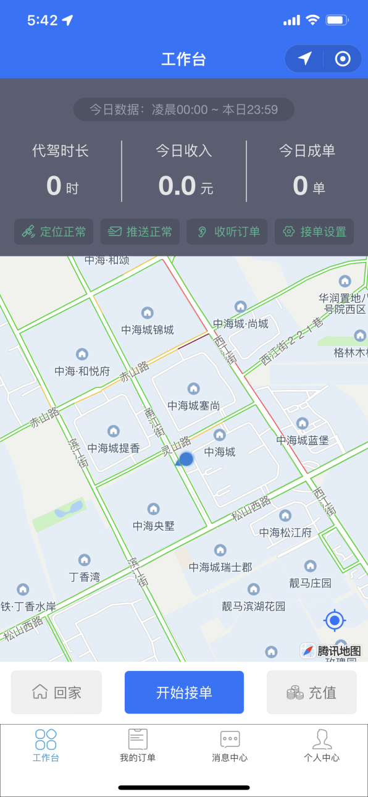

## 编写 zxds-odr 子系统

想要获得司机今日订单和收入数据，需要通过订单子系统来查询数据库。具体的时序图如下：

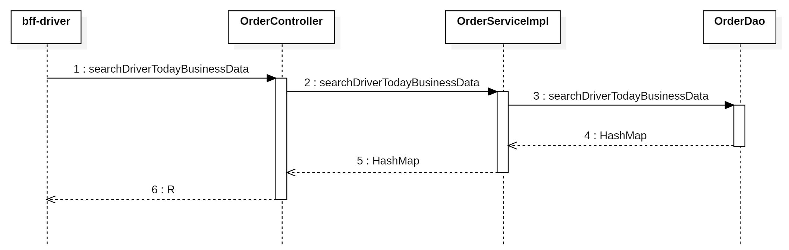

### 编写持久层代码

编写SQL语句之前，先来看一下`<font style="color:#000000;background-color:rgba(220, 240, 255, 0.3) !important;">tb_order</font>`数据表的结构，每个字段是什么含义：

| **字段名** | **类型** | **非空约束** | **备注信息** |
| --- | --- | --- | --- |
| id | bigint | True | 主键 |
| uuid | varchar | True | 订单序列号（和支付有关） |
| customer_id | bigint | True | 客户ID |
| start_place | varchar | True | 起始地点 |
| start_place_location | json | True | 起始地点坐标信息 |
| end_place | varchar | True | 结束地点 |
| end_place_location | json | True | 结束地点坐标信息 |
| expects_mileage | decimal | True | 预估里程 |
| real_mileage | decimal | False | 实际里程 |
| return_mileage | decimal | False | 返程里程 |
| expects_fee | decimal | True | 预估订单价格 |
| favour_fee | decimal | True | 顾客好处费 |
| incentive_fee | decimal | False | 系统奖励费 |
| real_fee | decimal | False | 实际订单价格 |
| driver_id | bigint | False | 司机ID |
| date | date | True | 订单日期 |
| create_time | datetime | True | 订单创建时间 |
| accept_time | datetime | False | 司机接单时间 |
| arrive_time | datetime | False | 司机到达时间 |
| start_time | datetime | False | 代驾开始时间 |
| end_time | datetime | False | 代驾结束时间 |
| waiting_minute | smallint | False | 代驾等待分钟数 |
| prepay_id | varchar | False | 微信预支付单ID |
| pay_id | varchar | False | 微信支付单ID |
| pay_time | datetime | False | 微信付款时间 |
| charge_rule_id | bigint | True | 费用规则ID |
| cancel_rule_id | bigint | False | 订单取消规则ID |
| car_plate | varchar | True | 车牌号 |
| car_type | varchar | True | 车型 |
| status | tinyint | True | 1等待接单，2已接单，3司机已到达，4开始代驾，5结束代驾，6未付款，7已付款，8订单已结束，9顾客撤单，10司机撤单，11事故关闭，12其他 |
| remark | varchar | False | 订单备注信息 |

在`<font style="color:#000000;background-color:rgba(220, 240, 255, 0.3) !important;">OrderDao.xml</font>`文件中定义SQL语句，查询当天代驾总时长、总收入和订单数。

```xml
<!--注意：mybatis中，查询结果中，如果某列是null，返回结果如果是map集合，则map集合中不会创建对应的key。因此要添加ifnull函数-->
<select id="searchDriverTodayBusinessData" parameterType="long" resultType="map">
    SELECT IFNULL(SUM(TIMESTAMPDIFF(HOUR,end_time, start_time)),0) AS duration,
           IFNULL(SUM(real_fee), 0) AS income,
           COUNT(id) AS orders
    FROM tb_order
    WHERE driver_id = #{driverId}
      AND `status` IN (5, 6, 7, 8)
      AND date = CURRENT_DATE
</select>
```

在`<font style="color:#000000;background-color:rgba(220, 240, 255, 0.3) !important;">com.example.zxds.odr.db.dao</font>`包`<font style="color:#000000;background-color:rgba(220, 240, 255, 0.3) !important;">OrderDao.java</font>`接口中，声明DAO方法。

```java
package com.example.zxds.odr.db.dao;

import java.util.Map;

public interface OrderDao {
    Map<String, Object> searchDriverTodayBusinessData(long driverId);
}
```

### 编写 service 和实现

在`<font style="color:#000000;background-color:rgba(220, 240, 255, 0.3) !important;">com.example.zxds.odr.service</font>`包中，创建`<font style="color:#000000;background-color:rgba(220, 240, 255, 0.3) !important;">OrderService.java</font>`接口，定义抽象方法。

```java
package com.example.zxds.odr.service;

import java.util.Map;

public interface OrderService {
    Map<String, Object> searchDriverTodayBusinessData(long driverId); 
}
```

在`<font style="color:#000000;background-color:rgba(220, 240, 255, 0.3) !important;">com.example.zxds.odr.service.impl</font>`包中，创建`<font style="color:#000000;background-color:rgba(220, 240, 255, 0.3) !important;">OrderServiceImpl.java</font>`接口，实现抽象方法

```java
package com.example.zxds.odr.service.impl;

import cn.hutool.core.map.MapUtil;
import com.example.zxds.odr.db.dao.OrderDao;
import com.example.zxds.odr.service.OrderService;
import lombok.RequiredArgsConstructor;
import org.springframework.stereotype.Service;

import java.util.Map;

@Service
@RequiredArgsConstructor
public class OrderServiceImpl implements OrderService {

    private final OrderDao orderDao;

    @Override
    public Map<String, Object> searchDriverTodayBusinessData(long driverId) {
        Map<String, Object> result = orderDao.searchDriverTodayBusinessData(driverId);
        String duration = MapUtil.getStr(result, "duration");
        if (duration == null) {
            duration = "0";
        }
        result.replace("duration", duration);

        String income = MapUtil.getStr(result, "income");
        if (income == null) {
            income = "0.00";
        }
        result.replace("income", income);

        return result;
    }
}
```

### 编写 form 接收数据并校验

在`<font style="color:#000000;background-color:rgba(220, 240, 255, 0.3) !important;">com.example.zxds.odr.controller.form</font>`包中创建`<font style="color:#000000;background-color:rgba(220, 240, 255, 0.3) !important;">SearchDriverTodayBusinessDataForm.java</font>`类，用于接收提交的数据

```java
package com.example.zxds.odr.controller.form;

import io.swagger.v3.oas.annotations.media.Schema;
import lombok.Data;

import javax.validation.constraints.Min;
import javax.validation.constraints.NotNull;

@Data
@Schema(description = "查询司机当天营业数据的表单")
public class SearchDriverTodayBusinessDataForm {

    @NotNull(message = "driverId不能为空")
    @Min(value = 1, message = "driverId不能小于1")
    @Schema(description = "司机ID")
    private Long driverId;

}
```

### 编写 web 方法

在`<font style="color:#000000;background-color:rgba(220, 240, 255, 0.3) !important;">com.example.zxds.odr.controller</font>`包中定义`<font style="color:#000000;background-color:rgba(220, 240, 255, 0.3) !important;">OrderController.java</font>`类，定义Web方法

```java
package com.example.zxds.odr.controller;

import com.example.zxds.common.util.R;
import com.example.zxds.odr.controller.form.SearchDriverTodayBusinessDataForm;
import com.example.zxds.odr.service.OrderService;
import io.swagger.v3.oas.annotations.Operation;
import io.swagger.v3.oas.annotations.tags.Tag;
import lombok.RequiredArgsConstructor;
import org.springframework.web.bind.annotation.PostMapping;
import org.springframework.web.bind.annotation.RequestBody;
import org.springframework.web.bind.annotation.RequestMapping;
import org.springframework.web.bind.annotation.RestController;

import javax.validation.Valid;
import java.util.Map;

@RestController
@RequestMapping("/order")
@Tag(name = "OrderController", description = "订单模块Web接口")
@RequiredArgsConstructor
public class OrderController {

    private final OrderService orderService;

    @PostMapping("/searchDriverTodayBusinessData")
    @Operation(summary = "查询司机当天营业数据")
    public R searchDriverTodayBusinessData(@RequestBody @Valid SearchDriverTodayBusinessDataForm form) {
        Map<String, Object> result = orderService.searchDriverTodayBusinessData(form.getDriverId());
        return R.ok().put("result", result);
    }
}
```

### 测试 web 接口

**请求路径**：[http://localhost:8002/order/searchDriverTodayBusinessData](http://localhost:8002/order/searchDriverTodayBusinessData)

**请求方式**：POST 请求

**请求参数**：

```json
{
    "driverId": 2010249163039707136
}
```

**响应结果**：

```json
{
        "msg": "success",
        "result": {
                "duration": "0",
                "income": "0.00",
                "orders": "0"
        },
        "code": 200
}
```

## 编写 zxds-dr 子系统

回到司机子系统，我们要编写代码查询司机的设置，具体时序图如下

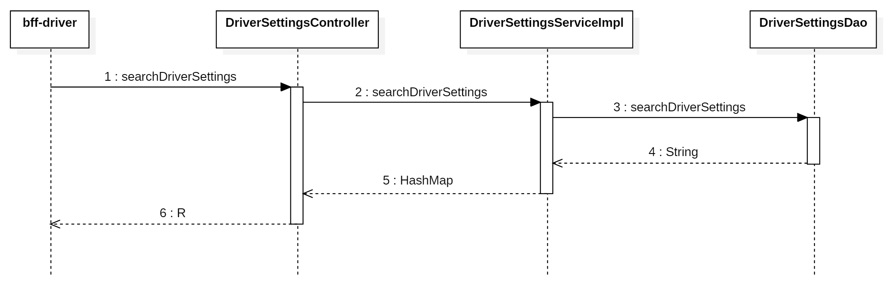

### 编写持久层代码

我们先来复习一下`<font style="color:#000000;background-color:rgba(220, 240, 255, 0.3) !important;">tr_driver_settings</font>`数据表的结构，如下：

| **字段** | **类型** | **禁止空值** | **备注信息** |
| --- | --- | --- | --- |
| id | bigint | True | 主键 |
| driver_id | bigint | True | 司机ID |
| settings | json | True | 司机个人设置 |

`<font style="color:#000000;background-color:rgba(220, 240, 255, 0.3) !important;">settings</font>`字段里面的内容是JSON格式的，具体例子如下：

```json
{
    "autoAccept": 1, //系统自动帮司机抢单，无需手动操作
    "orientation": "", //定向接单，空字符串表示没有设置特定接单方向（如只接机场单、长途单等）
    "listenService": true,  //司机是否听订单，true表示司机在线正在听订单
    "orderDistance": 0, //该订单起点和终点的距离达到多少再接单
    "rangeDistance": 5  //只接收司机当前位置5公里范围内的订单
}
```

在`<font style="color:#000000;background-color:rgba(220, 240, 255, 0.3) !important;">DriverSettingsDao.xml</font>`文件中定义SQL语句，查询司机设置。

```xml
<select id="searchDriverSettings" parameterType="long" resultType="String">
    SELECT settings
    FROM tb_driver_settings
    WHERE driver_id = #{driverId}
</select>
```

在`<font style="color:#000000;background-color:rgba(220, 240, 255, 0.3) !important;">com.example.zxds.dr.db.dao</font>`中的`<font style="color:#000000;background-color:rgba(220, 240, 255, 0.3) !important;">DriverSettingsDao.java</font>`接口里面声明抽象方法。

```java
String searchDriverSettings(long driverId);
```

### 编写 service 和实现

在`<font style="color:#000000;background-color:rgba(220, 240, 255, 0.3) !important;">com.example.zxds.dr.service</font>`包中创建`<font style="color:#000000;background-color:rgba(220, 240, 255, 0.3) !important;">DriverSettingsService.java</font>`接口，定义抽象方法

```java
package com.example.zxds.dr.service;

import java.util.Map;

public interface DriverSettingsService {
    Map<String, Object> searchDriverSettings(long driverId);
}
```

在`<font style="color:#000000;background-color:rgba(220, 240, 255, 0.3) !important;">com.example.zxds.dr.service.impl</font>`包中创建`<font style="color:#000000;background-color:rgba(220, 240, 255, 0.3) !important;">DriverSettingsServiceImpl.java</font>`类，实现抽象业务方法

```java
package com.example.zxds.dr.service.impl;

import cn.hutool.core.map.MapUtil;
import cn.hutool.json.JSONUtil;
import com.example.zxds.dr.db.dao.DriverSettingsDao;
import com.example.zxds.dr.service.DriverSettingsService;
import lombok.RequiredArgsConstructor;
import org.springframework.stereotype.Service;

import java.util.Map;

@Service
@RequiredArgsConstructor
public class DriverSettingsServiceImpl implements DriverSettingsService {

    private final DriverSettingsDao driverSettingsDao;

    @Override
    public Map<String, Object> searchDriverSettings(long driverId) {
        String settings = driverSettingsDao.searchDriverSettings(driverId);
        Map<String, Object> map = JSONUtil.parseObj(settings).toBean(Map.class);
        boolean bool = MapUtil.getInt(map, "listenService") == 1;
        map.replace("listenService", bool);
        bool = MapUtil.getInt(map, "autoAccept") == 1;
        map.replace("autoAccept", bool);
        return map;
    }
}
```

### 编写 form 接收数据并校验

在`<font style="color:#000000;background-color:rgba(220, 240, 255, 0.3) !important;">com.example.zxds.dr.controller.form</font>`包中创建`<font style="color:#000000;background-color:rgba(220, 240, 255, 0.3) !important;">SearchDriverSettingsForm.java</font>`类，接收提交的数据

```java
package com.example.zxds.dr.controller.form;

import io.swagger.v3.oas.annotations.media.Schema;
import lombok.Data;

import javax.validation.constraints.Min;
import javax.validation.constraints.NotNull;

@Data
@Schema(description = "查询司机设置的表单")
public class SearchDriverSettingsForm {
    @NotNull(message = "driverId不能为空")
    @Min(value = 1, message = "driverId不能小于1")
    @Schema(description = "司机ID")
    private Long driverId;
}
```

### 编写 web 方法

在`<font style="color:#000000;background-color:rgba(220, 240, 255, 0.3) !important;">com.example.zxds.dr.controller</font>`包中创建`<font style="color:#000000;background-color:rgba(220, 240, 255, 0.3) !important;">DriverSettingsController.java</font>`类，定义Web方法

```java
package com.example.zxds.dr.controller;

import com.example.zxds.common.util.R;
import com.example.zxds.dr.controller.form.SearchDriverSettingsForm;
import com.example.zxds.dr.service.DriverSettingsService;
import io.swagger.v3.oas.annotations.Operation;
import io.swagger.v3.oas.annotations.tags.Tag;
import org.springframework.web.bind.annotation.PostMapping;
import org.springframework.web.bind.annotation.RequestBody;
import org.springframework.web.bind.annotation.RequestMapping;
import org.springframework.web.bind.annotation.RestController;

import javax.annotation.Resource;
import javax.validation.Valid;
import java.util.Map;

@RestController
@RequestMapping("/settings")
@Tag(name = "SettingsController", description = "司机设置模块Web接口")
public class DriverSettingsController {
    @Resource
    private DriverSettingsService settingsService;

    @PostMapping("/searchDriverSettings")
    @Operation(summary = "查询司机的设置")
    public R searchDriverSettings(@RequestBody @Valid SearchDriverSettingsForm form) {
        Map<String, Object> map = settingsService.searchDriverSettings(form.getDriverId());
        return R.ok().put("result", map);
    }
}
```

### 测试 web 接口

启动 `<font style="color:#000000;">zxds-dr</font>``<font style="color:#000000;">gateway</font>`子系统。

**请求路径**：[http://localhost:8001/settings/searchDriverSettings](http://localhost:8001/settings/searchDriverSettings)

**请求方式**：POST

**请求参数**：

```json
{
    "driverId": 2010249163039707136
}
```

**响应结果**：

```json
{
        "msg": "success",
        "result": {
                "orientation": "",
                "orderDistance": 0,
                "autoAccept": false,
                "rangeDistance": 5,
                "listenService": true
        },
        "code": 200
}
```

## 编写 `<font style="color:#000000;">bff-driver</font>`子系统代码

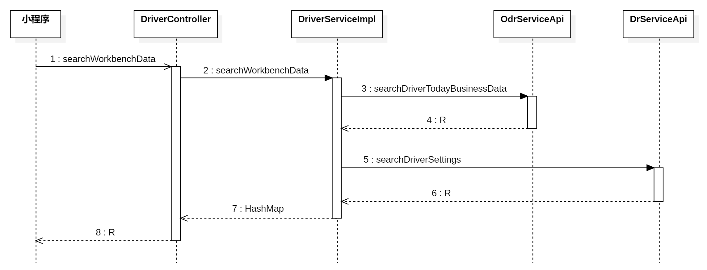

### BFF 层 Feign 客户端的粒度设计原则

Feign 接口的划分应该遵循 **DDD（领域驱动设计）** 的思想，以**业务聚合根**为单位。

反对“物理映射”（下游 Controller 对上游 Feign 接口），提倡“逻辑映射”（按**业务领域/聚合根**划分 Feign 接口），以实现上下游解耦和业务内聚。

应该将属于同一个业务领域（Aggregate）的多个 Controller 接口，收敛到 BFF 层的一个 Feign Client 接口中。这样能最大程度地解耦上下游，提高系统的可维护性。

### 编写 Feign 客户端

因为要调用两个子系统，我们先把Form类创建出来。在`<font style="color:#000000;background-color:rgba(220, 240, 255, 0.3) !important;">com.example.zxds.bff.driver.controller.form</font>`包中创建`<font style="color:#000000;background-color:rgba(220, 240, 255, 0.3) !important;">SearchDriverTodayBusinessDataForm.java</font>`类。

```java
package com.example.zxds.bff.driver.controller.form;

import io.swagger.v3.oas.annotations.media.Schema;
import lombok.Data;

@Data
@Schema(description = "查询司机当天营业数据的表单")
public class SearchDriverTodayBusinessDataForm {

    @Schema(description = "司机ID")
    private Long driverId;

}
```

在`<font style="color:#000000;background-color:rgba(220, 240, 255, 0.3) !important;">com.example.zxds.bff.driver.feign</font>`包中创建`<font style="color:#000000;background-color:rgba(220, 240, 255, 0.3) !important;">OdrServiceApi.java</font>`接口，声明抽象方法。

```java
package com.example.zxds.bff.driver.feign;

import com.example.zxds.bff.driver.controller.form.SearchDriverTodayBusinessDataForm;
import com.example.zxds.common.util.R;
import org.springframework.cloud.openfeign.FeignClient;
import org.springframework.web.bind.annotation.PostMapping;

@FeignClient(value = "zxds-odr")
public interface OdrServiceApi {

    @PostMapping("/order/searchDriverTodayBusinessData")
    R searchDriverTodayBusinessData(SearchDriverTodayBusinessDataForm form);

}
```

在`<font style="color:#000000;background-color:rgba(220, 240, 255, 0.3) !important;">com.example.zxds.bff.driver.controller.form</font>`包中创建`<font style="color:#000000;background-color:rgba(220, 240, 255, 0.3) !important;">SearchDriverSettingsForm.java</font>`类。

```java
package com.example.zxds.bff.driver.controller.form;

import io.swagger.v3.oas.annotations.media.Schema;
import lombok.Data;

@Data
@Schema(description = "查询司机设置的表单")
public class SearchDriverSettingsForm {
    @Schema(description = "司机ID")
    private Long driverId;
}
```

在`<font style="color:#000000;background-color:rgba(220, 240, 255, 0.3) !important;">com.example.zxds.bff.driver.feign</font>`包`<font style="color:#000000;background-color:rgba(220, 240, 255, 0.3) !important;">DrServiceApi.java</font>`接口，声明抽象方法。

```java
@PostMapping("/settings/searchDriverSettings")
R searchDriverSettings(SearchDriverSettingsForm form);
```

### 编写 service 和实现

在`<font style="color:#000000;background-color:rgba(220, 240, 255, 0.3) !important;">com.example.zxds.bff.driver.service</font>`包`<font style="color:#000000;background-color:rgba(220, 240, 255, 0.3) !important;">DriverService.java</font>`接口中，声明抽象方法。

```java
Map<String, Object> searchWorkbenchData(long driverId);
```

在`<font style="color:#000000;background-color:rgba(220, 240, 255, 0.3) !important;">com.example.zxds.bff.driver.service.impl</font>`包`<font style="color:#000000;background-color:rgba(220, 240, 255, 0.3) !important;">DriverServiceImpl.java</font>`接口中，实现抽象方法。

```java
@Resource
private OdrServiceApi odrServiceApi;

@Override
public Map<String, Object> searchWorkbenchData(long driverId) {
    SearchDriverTodayBusinessDataForm form1 = new SearchDriverTodayBusinessDataForm();
    form1.setDriverId(driverId);
    R r1 = odrServiceApi.searchDriverTodayBusinessData(form1);
    Map<String, Object> business = (Map<String, Object>) r1.get("result");

    SearchDriverSettingsForm form2 = new SearchDriverSettingsForm();
    form2.setDriverId(form1.getDriverId());
    R r2 = drServiceApi.searchDriverSettings(form2);
    Map<String, Object> settings = (Map<String, Object>) r2.get("result");

    Map<String, Object> result = new HashMap<>(){{
        put("business", business);
        put("settings", settings);
    }};

    return result;
}
```

### 编写 web 方法

在`<font style="color:#000000;background-color:rgba(220, 240, 255, 0.3) !important;">com.example.zxds.bff.driver.controller</font>`包`<font style="color:#000000;background-color:rgba(220, 240, 255, 0.3) !important;">DriverController.java</font>`类中，定义Web方法。

```java
@PostMapping("/searchWorkbenchData")
@Operation(summary = "查询司机工作台数据")
@SaCheckLogin
public R searchWorkbenchData() {
    long driverId = StpUtil.getLoginIdAsLong();
    Map<String, Object> result = driverService.searchWorkbenchData(driverId);
    return R.ok().put("result", result);
}
```

### 测试 web 接口

**接口测试地址**：[http://localhost:8101/driver/searchWorkbenchData](http://localhost:8101/driver/searchWorkbenchData)

**请求头中携带** token

**响应结果**：

```json
{
        "msg": "success",
        "result": {
                "settings": {
                        "orientation": "",
                        "orderDistance": 0,
                        "autoAccept": false,
                        "rangeDistance": 5,
                        "listenService": true

                },
                "business": {
                        "duration": "0",
                        "income": "0.00",
                        "orders": "0"
                }
        },
        "code": 200
}
```

## 小程序端实现司机首页信息展示

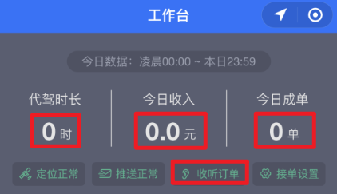

上图红框中是当前业务需要展示的相关数据。

其中代驾时长、今日收入、今日成单和订单表有关系。

收听订单和司机设置表的 `<font style="color:#000000;">listenService</font>`字段有关系：如果是 true 表示收听订单（**语音播报订单**），如果是 false 表示不听订单。

### 将司机的 realAuth 字段值修改为 2

当司机的 `<font style="color:#000000;">real_auth</font>`字段值为 3 时，司机的信息仍然处于审核阶段，工作台首页面会显示资料正在审核中，因此我们需要将司机表的 `<font style="color:#000000;">real_auth</font>` 字段先修改为 2

### 熟悉视图层标签

在`<font style="color:#000000;background-color:rgba(220, 240, 255, 0.3) !important;">pages/workbench/workbench.vue</font>`页面上面（**ctrl + p 搜索页面**），跟我们业务有关的标签如下：

```html
<view class="review-container" v-show="reviewAuth">
          <image src="../../static/workbench/review.png" mode="widthFix"></image>
          <view class="title">您的实名资料正在审核中</view>
          <view class="desc">这期间您将无法接单，请等待资料审核通过</view>
</view>
<view v-show="!reviewAuth">
    <view class="top-container">
        <view class="notice">今日数据：凌晨00:00 ~ 本日23:59</view>
        <view class="summary-container">
            <view class="item">
                <view class="title">代驾时长</view>
                <view class="value">
                    <text class="number">{{ hour }}</text>
                    <text class="unit">时</text>
                </view>
            </view>
            <view class="item">
                <view class="title">今日收入</view>
                <view class="value">
                    <text class="number">{{ income }}</text>
                    <text class="unit">元</text>
                </view>
            </view>
            <view class="item">
                <view class="title">今日成单</view>
                <view class="value">
                    <text class="number">{{ orders }}</text>
                    <text class="unit">单</text>
                </view>
            </view>
        </view>
        <view class="service-container">
            <view class="item" :style="service.locationStyle">
                <image :src="service.locationIcon" mode="widthFix" class="icon icon-1"></image>
                {{ service.locationText }}
            </view>
            <view class="item" :style="service.messageStyle">
                <image :src="service.messageIcon" mode="widthFix" class="icon icon-2"></image>
                {{ service.messageText }}
            </view>
            <view class="item" :style="service.listenStyle" @tap="listenHandle()">
                <image :src="service.listenIcon" mode="widthFix" class="icon icon-3"></image>
                {{ service.listenText }}
            </view>
            <view class="item" :style="service.settingStyle" @tap="settingHandle()">
                <image :src="service.settingIcon" mode="widthFix" class="icon icon-4"></image>
                {{ service.settingText }}
            </view>
        </view>
    </view>
</view>
```

### 熟悉一下模型层相关的数据

页面上这些插值的数据来源于模型层，我们来看一下模型层的部分内容：

```javascript
data() {
    return {
        reviewAuth: uni.getStorageSync('realAuth') == 3,
        hour: 0,
        income: 0,
        orders: 0,
        ……,
        service: {
            locationIcon: '../../static/workbench/service-icon-1.png',
            locationText: '定位正常',
            locationStyle: '',
            messageIcon: '../../static/workbench/service-icon-2.png',
            messageText: '推送正常',
            messageStyle: '',
            listenIcon: '../../static/workbench/service-icon-3.png',
            listenText: '收听订单',
            listenStyle: '',
            settingIcon: '../../static/workbench/service-icon-4.png',
            settingText: '接单设置',
            settingStyle: ''
        },
        settings: {
                                    listenService: true,
                                    autoAccept: false
                          },
    }  
}
```

### 编写全局的 URL 请求路径

在`<font style="color:#000000;background-color:rgba(220, 240, 255, 0.3) !important;">main.js</font>`文件中声明Ajax用到的全局路径，如下：

```javascript
Vue.prototype.url = {
    ……,
    searchWorkbenchData: `${baseUrl}/driver/searchWorkbenchData`,
}
```

### 加载数据

在页面的`<font style="color:#000000;background-color:rgba(220, 240, 255, 0.3) !important;">onShow()</font>`回调函数中定义Ajax代码，用于查询数据，并加载到页面上面

```javascript
onShow: function() {
    let that = this;
    if (!that.reviewAuth) {
        //查询控制台数据
        that.ajax(that.url.searchWorkbenchData, 'POST', null, function(resp) {
            let result = resp.data.result;
            that.hour = result.business.duration;
            that.income = result.business.income;
            that.orders = result.business.orders;

            let settings = result.settings;
            uni.setStorageSync('settings', settings);
            that.settings.listenService = settings.listenService;
            that.settings.autoAccept = settings.autoAccept;
            that.changeListenService(that.settings.listenService);
        });
    }
},
```

用于页面上显示“收听订单”开闭状态的`<font style="color:#000000;background-color:rgba(220, 240, 255, 0.3) !important;">changeListenService()</font>`回调函数我们要声明一下。

```javascript
changeListenService: function(bool) {
    if (bool) {
        this.service.listenIcon = '../../static/workbench/service-icon-3.png';
        this.service.listenStyle = 'color:#46B68F';
        this.service.listenText = '收听订单';
    } else {
        this.service.listenIcon = '../../static/workbench/service-icon-7.png';
        this.service.listenStyle = 'color:#FF4D4D';
        this.service.listenText = '不听订单';
    }
},
```

### 调试程序

把`<font style="color:#000000;background-color:rgba(220, 240, 255, 0.3) !important;">zxds-dr</font>`、`<font style="color:#000000;background-color:rgba(220, 240, 255, 0.3) !important;">zxds-odr</font>`、`<font style="color:#000000;background-color:rgba(220, 240, 255, 0.3) !important;">bff-driver</font>`和`<font style="color:#000000;background-color:rgba(220, 240, 255, 0.3) !important;">gateway</font>`四个子系统运行起来，查看小程序页面上是否显示了统计信息。

# web 系统实现司机分页查询

我们在做上面业务的时候，是直接手动将数据库表中 `<font style="color:#000000;">real_auth</font>`字段修改为 2 了，接下来我们就把移动端的放一边，来做一下关于**审核司机实名认证**的功能，这个功能是工作人员通过 web 管理系统来完成的。那我们就先来实现司机信息的分页查询操作。

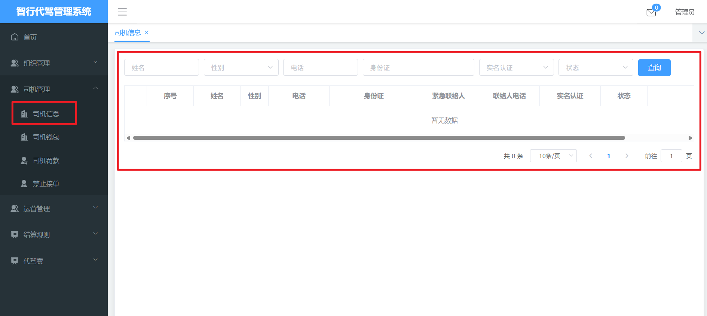

## 编写 zxds-dr 子系统

### 功能分析

查询条件如下：

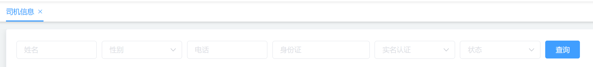

时序图如下：

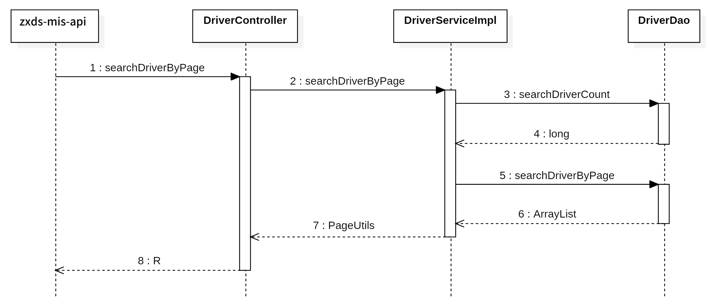

`<font style="color:#000000;">zxds-mis-api</font>`等同于 `<font style="color:#000000;">bff</font>`层的系统，它来负责调用 `<font style="color:#000000;">zxds-dr</font>`子系统获取数据。

### 编写持久层代码

在`<font style="color:#000000;background-color:rgba(220, 240, 255, 0.3) !important;">DriverDao.xml</font>`文件中，编写查询分页总数和分页记录的SQL语句

```xml
<select id="searchDriverByPage" parameterType="Map" resultType="map">
    SELECT CAST(id AS CHAR) AS id,
    IFNULL(`name`,"") AS `name`,
    IFNULL(sex,"") AS sex,
    IFNULL(pid,"") AS pid,
    IFNULL(tel,"") AS tel,
    IFNULL(contact_name,"") AS contactName,
    IFNULL(contact_tel,"") AS contactTel,
    IFNULL(real_auth,"") AS realAuth,
    `status`,
    DATE_FORMAT(create_time, '%Y-%m-%d') AS createTime
    FROM tb_driver
    WHERE 1=1
    <if test="name!=null and name != ''">
        AND `name` = #{name}
    </if>
    <if test="tel!=null and tel != ''">
        AND tel = #{tel}
    </if>
    <if test="pid!=null and pid != ''">
        AND pid = #{pid}
    </if>
    <if test="sex!=null and sex != ''">
        AND sex = #{sex}
    </if>
    <if test="realAuth!=null">
        AND `real_auth` = #{realAuth}
    </if>
    <if test="status!=null">
        AND `status` = #{status}
    </if>
    LIMIT #{startIndex}, #{pageSize}
</select>

<select id="searchDriverCount" parameterType="Map" resultType="long">
    SELECT COUNT(*)
    FROM tb_driver
    WHERE 1=1
    <if test="name!=null and name != ''">
        AND `name` = #{name}
    </if>
    <if test="tel!=null and tel != ''">
        AND tel = #{tel}
    </if>
    <if test="pid!=null and pid != ''">
        AND pid = #{pid}
    </if>
    <if test="sex!=null and sex != ''">
        AND sex = #{sex}
    </if>
    <if test="realAuth!=null">
        AND `real_auth` = #{realAuth}
    </if>
    <if test="status!=null">
        AND `status` = #{status}
    </if>

</select>
```

在`<font style="color:#000000;background-color:rgba(220, 240, 255, 0.3) !important;">com.example.zxds.dr.db.dao</font>`包`<font style="color:#000000;background-color:rgba(220, 240, 255, 0.3) !important;">DriverDao.java</font>`接口中，声明DAO方法

```java
List<Map<String, Object>> searchDriverByPage(Map<String, Object> param);

long searchDriverCount(Map<String, Object> param);
```

### 编写 service 和实现

在`<font style="color:#000000;background-color:rgba(220, 240, 255, 0.3) !important;">com.example.zxds.dr.service</font>`包`<font style="color:#000000;background-color:rgba(220, 240, 255, 0.3) !important;">DriverService.java</font>`接口中，声明抽象方法

```java
PageUtils searchDriverByPage(Map<String, Object> param);
```

在`<font style="color:#000000;background-color:rgba(220, 240, 255, 0.3) !important;">com.example.zxds.dr.service.impl</font>`包`<font style="color:#000000;background-color:rgba(220, 240, 255, 0.3) !important;">DriverServiceImpl.java</font>`类中，实现抽象方法

```java
@Override
public PageUtils searchDriverByPage(Map<String, Object> param) {
    long count = driverDao.searchDriverCount(param);
    List<Map<String, Object>> list = new ArrayList<>();
    if(count > 0){
        list = driverDao.searchDriverByPage(param);
    }
    int pageIndex = (Integer) param.get("pageIndex");
    int pageSize = (Integer) param.get("pageSize");
    return new PageUtils(list, count, pageIndex, pageSize);
}
```

### 编写 form 接收数据并校验

在`<font style="color:#000000;background-color:rgba(220, 240, 255, 0.3) !important;">com.example.zxds.dr.controller.form</font>`包中创建`<font style="color:#000000;background-color:rgba(220, 240, 255, 0.3) !important;">SearchDriverByPageForm.java</font>`类

```java
package com.example.zxds.dr.controller.form;

import io.swagger.v3.oas.annotations.media.Schema;
import lombok.Data;
import org.hibernate.validator.constraints.Range;

import javax.validation.constraints.Min;
import javax.validation.constraints.NotNull;
import javax.validation.constraints.Pattern;

@Data
@Schema(description = "查询司机分页记录的表单")
public class SearchDriverByPageForm {

    @NotNull(message = "pageIndex不能为空")
    @Min(value = 1, message = "pageIndex不能小于1")
    @Schema(description = "页码")
    private Integer pageIndex;

    @NotNull(message = "pageSize不能为空")
    @Range(min = 10, max = 50, message = "pageSize必须在10~50之间")
    @Schema(description = "每页记录数")
    private Integer pageSize;

    @Pattern(regexp = "^[\\u4e00-\\u9fa5]{2,10}$", message = "name内容不正确")
    @Schema(description = "姓名")
    private String name;

    @Pattern(regexp = "^1\\d{10}$", message = "tel内容不正确")
    @Schema(description = "电话")
    private String tel;

    @Pattern(regexp = "^[1-9]\\d{5}(18|19|([23]\\d))\\d{2}((0[1-9])|(10|11|12))(([0-2][1-9])|10|20|30|31)\\d{3}[0-9Xx]$", message = "pid内容不正确")
    @Schema(description = "身份证")
    private String pid;

    @Pattern(regexp = "^男$|^女$", message = "sex内容不正确")
    @Schema(description = "性别")
    private String sex;

    @Range(min = 1, max = 3, message = "realAuth范围不对")
    @Schema(description = "实名认证")
    private Byte realAuth;

    @Range(min = 1, max = 3, message = "status范围不对")
    @Schema(description = "状态")
    private Byte status;
}
```

### 编写 web 方法

在`<font style="color:#000000;background-color:rgba(220, 240, 255, 0.3) !important;">com.example.zxds.dr.controller</font>`包`<font style="color:#000000;background-color:rgba(220, 240, 255, 0.3) !important;">DriverController.java</font>`类中，声明Web方法

```java
@PostMapping("/searchDriverByPage")
@Operation(summary = "查询司机分页记录")
public R searchDriverByPage(@RequestBody @Valid SearchDriverByPageForm form) {
    Map<String, Object> param = BeanUtil.beanToMap(form);
    int pageIndex = form.getPageIndex();
    int pageSize = form.getPageSize();
    int startIndex = (pageIndex - 1) * pageSize;
    param.put("startIndex", startIndex);
    PageUtils pageUtils = driverService.searchDriverByPage(param);
    return R.ok().put("result", pageUtils);
}
```

### 测试 web 方法

**启动**`**<font style="color:#000000;background-color:rgba(220, 240, 255, 0.3) !important;">zxds-dr</font>**`**子系统，测试 Web方法**

**请求路径**：[http://localhost:8001/driver/searchDriverByPage](http://localhost:8001/driver/searchDriverByPage)

**请求方式**：POST

**请求参数**：

```json
{
    "pageIndex": 1,
    "pageSize": 10
}
```

**响应结果**：

```json
{
        "msg": "success",
        "result": {
                "totalCount": "1",
                "pageSize": 10,
                "totalPage": 1,
                "pageIndex": 1,
                "list": [
                        {
                                "realAuth": "2",
                                "createTime": "2026-01-11",
                                "contactName": "张三",
                                "sex": "男",
                                "name": "xxxxx",
                                "pid": "xxxxxxxxxxxxxxxxxxxxxxxxxxx",
                                "tel": "17677777777",
                                "id": "2010249163039707136",
                                "contactTel": "16566767676",
                                "status": 1
                        }
                ]
        },
        "code": 200
}
```

## 编写 zxds-mis-api 子系统

编写代码之前，我们先来看一下`<font style="color:#000000;background-color:rgba(220, 240, 255, 0.3) !important;">zxds-mis-api</font>`子系统的时序图，如下

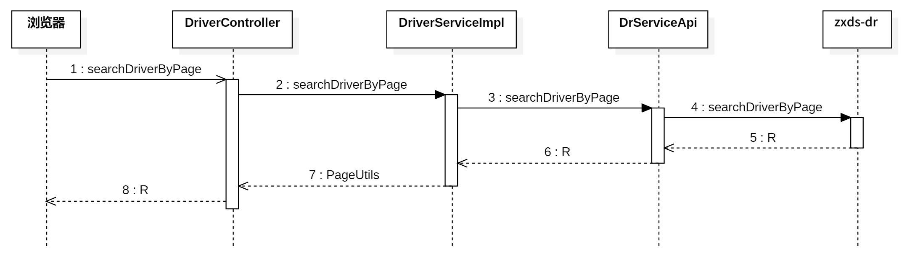

### 编写 Feign 客户端

在`<font style="color:#000000;background-color:rgba(220, 240, 255, 0.3) !important;">com.example.zxds.mis.api.controller.form</font>`包中创建`<font style="color:#000000;background-color:rgba(220, 240, 255, 0.3) !important;">SearchDriverByPageForm.java</font>`类。

```java
package com.example.zxds.mis.api.controller.form;

import io.swagger.v3.oas.annotations.media.Schema;
import lombok.Data;
import org.hibernate.validator.constraints.Range;

import javax.validation.constraints.Min;
import javax.validation.constraints.NotNull;
import javax.validation.constraints.Pattern;

@Data
@Schema(description = "查询司机分页记录的表单")
public class SearchDriverByPageForm {

    @NotNull(message = "pageIndex不能为空")
    @Min(value = 1, message = "pageIndex不能小于1")
    @Schema(description = "页码")
    private Integer pageIndex;

    @NotNull(message = "pageSize不能为空")
    @Range(min = 10, max = 50, message = "pageSize必须在10~50之间")
    @Schema(description = "每页记录数")
    private Integer pageSize;

    @Pattern(regexp = "^[\\u4e00-\\u9fa5]{2,10}$", message = "name内容不正确")
    @Schema(description = "姓名")
    private String name;

    @Pattern(regexp = "^1\\d{10}$", message = "tel内容不正确")
    @Schema(description = "电话")
    private String tel;

    @Pattern(regexp = "^[1-9]\\d{5}(18|19|([23]\\d))\\d{2}((0[1-9])|(10|11|12))(([0-2][1-9])|10|20|30|31)\\d{3}[0-9Xx]$", message = "pid内容不正确")
    @Schema(description = "身份证")
    private String pid;

    @Pattern(regexp = "^男$|^女$", message = "sex内容不正确")
    @Schema(description = "性别")
    private String sex;

    @Range(min = 1, max = 3, message = "realAuth范围不对")
    @Schema(description = "实名认证")
    private Byte realAuth;

    @Range(min = 1, max = 3, message = "status范围不对")
    @Schema(description = "状态")
    private Byte status;
}
```

在`<font style="color:#000000;background-color:rgba(220, 240, 255, 0.3) !important;">com.example.zxds.mis.api.feign</font>`包中创建`<font style="color:#000000;background-color:rgba(220, 240, 255, 0.3) !important;">DrServiceApi.java</font>`接口，定义抽象方法。

```java
package com.example.zxds.mis.api.feign;

import com.example.zxds.common.util.R;
import com.example.zxds.mis.api.controller.form.SearchDriverByPageForm;
import org.springframework.cloud.openfeign.FeignClient;
import org.springframework.web.bind.annotation.PostMapping;

@FeignClient(value = "zxds-dr")
public interface DrServiceApi {

    @PostMapping("/driver/searchDriverByPage")
    R searchDriverByPage(SearchDriverByPageForm form);
}
```

### 编写 service 和实现

在`<font style="color:#000000;background-color:rgba(220, 240, 255, 0.3) !important;">com.example.zxds.mis.api.service</font>`包中创建`<font style="color:#000000;background-color:rgba(220, 240, 255, 0.3) !important;">DriverService.java</font>`接口，声明抽象方法

```java
package com.example.zxds.mis.api.service;

import com.example.zxds.common.util.PageUtils;
import com.example.zxds.mis.api.controller.form.SearchDriverByPageForm;

public interface DriverService {
    PageUtils searchDriverByPage(SearchDriverByPageForm form);
}
```

在`<font style="color:#000000;background-color:rgba(220, 240, 255, 0.3) !important;">com.example.zxds.mis.api.service.impl</font>`包中创建`<font style="color:#000000;background-color:rgba(220, 240, 255, 0.3) !important;">DriverServiceImpl.java</font>`类，实现抽象方法。

```java

package com.example.zxds.mis.api.service.impl;

import cn.hutool.core.bean.BeanUtil;
import com.example.zxds.common.util.PageUtils;
import com.example.zxds.common.util.R;
import com.example.zxds.mis.api.controller.form.SearchDriverByPageForm;
import com.example.zxds.mis.api.feign.DrServiceApi;
import com.example.zxds.mis.api.service.DriverService;
import lombok.RequiredArgsConstructor;
import org.springframework.stereotype.Service;

import java.util.Map;

@Service
@RequiredArgsConstructor
public class DriverServiceImpl implements DriverService {

    private final DrServiceApi drServiceApi;

    @Override
    public PageUtils searchDriverByPage(SearchDriverByPageForm form) {
        R r = drServiceApi.searchDriverByPage(form);
        Map<String, Object> map = (Map<String, Object>) r.get("result");
        return BeanUtil.toBean(map, PageUtils.class);
    }
}
```

### 编写 web 方法

在`<font style="color:#000000;background-color:rgba(220, 240, 255, 0.3) !important;">com.example.zxds.mis.api.controller</font>`包中创建`<font style="color:#000000;background-color:rgba(220, 240, 255, 0.3) !important;">DriverController.java</font>`类，定义Web方法

```java
package com.example.zxds.mis.api.controller;

import cn.dev33.satoken.annotation.SaCheckPermission;
import cn.dev33.satoken.annotation.SaMode;
import com.example.zxds.common.util.PageUtils;
import com.example.zxds.common.util.R;
import com.example.zxds.mis.api.controller.form.SearchDriverByPageForm;
import com.example.zxds.mis.api.service.DriverService;
import io.swagger.v3.oas.annotations.Operation;
import io.swagger.v3.oas.annotations.tags.Tag;
import lombok.RequiredArgsConstructor;
import org.springframework.web.bind.annotation.PostMapping;
import org.springframework.web.bind.annotation.RequestBody;
import org.springframework.web.bind.annotation.RequestMapping;
import org.springframework.web.bind.annotation.RestController;

import javax.validation.Valid;

@RestController
@RequestMapping("/driver")
@Tag(name = "DriverController", description = "司机管理Web接口")
@RequiredArgsConstructor
public class DriverController {

    private final DriverService driverService;

    @PostMapping("/searchDriverByPage")
    @SaCheckPermission(value = {"ROOT", "DRIVER:SELECT"}, mode = SaMode.OR)
    @Operation(summary = "查询司机分页记录")
    public R searchDriverByPage(@RequestBody @Valid SearchDriverByPageForm form) {
        PageUtils pageUtils = driverService.searchDriverByPage(form);
        return R.ok().put("result", pageUtils);
    }
}
```

### 测试 web 方法

启动`<font style="color:#000000;background-color:rgba(220, 240, 255, 0.3) !important;">zxds-dr</font>`、`<font style="color:#000000;background-color:rgba(220, 240, 255, 0.3) !important;">zxds-mis-api</font>`、`<font style="color:#000000;background-color:rgba(220, 240, 255, 0.3) !important;">gateway</font>`三个系统，并且把前端Vue项目也给运行起来，打开浏览器登录 MIS系统，**然后拿到Token令牌**，到 apipost 上面测试。

**请求地址**：[http://localhost:8010/driver/searchDriverByPage](http://localhost:8010/driver/searchDriverByPage)

**请求头参数**：token

**请求体参数**：

```json
{
    "pageIndex": 1,
    "pageSize": 10
}
```

**响应结果**：

```json
{
        "msg": "success",
        "result": {
                "totalCount": "1",
                "pageSize": 10,
                "totalPage": 1,
                "pageIndex": 1,
                "list": [
                        {
                                "realAuth": "2",
                                "createTime": "2026-01-11",
                                "contactName": "张三",
                                "sex": "女",
                                "name": "xxxxxx",
                                "pid": "xxxxxxxxxxxxxxxxxxxxxxxx",
                                "tel": "17677777777",
                                "id": "2010249163039707136",
                                "contactTel": "16566767676",
                                "status": 1
                        }
                ]
        },
        "code": 200
}
```

## Web 前端系统实现分页查询

**安装 axios**：在命令窗口中切换到项目的根下，执行以下命令安装 axios 库。

```javascript
cnpm install axios
```

### 熟悉视图层标签（查询条件部分）

页面：`<font style="color:#000000;">views/driver.vue</font>`

```html
<el-form :inline="true" :model="dataForm" :rules="dataRule" ref="dataForm">
    <el-form-item prop="name">
        <el-input v-model="dataForm.name" placeholder="姓名" size="medium" 
                  class="input" clearable="clearable" />
    </el-form-item>
    <el-form-item>
        <el-select v-model="dataForm.sex" class="input" placeholder="性别" 
                   size="medium" clearable="clearable">
            <el-option label="男" value="男" />
            <el-option label="女" value="女" />
        </el-select>
    </el-form-item>
    <el-form-item prop="tel">
        <el-input v-model="dataForm.tel" placeholder="电话" size="medium" 
                  class="input" clearable="clearable" />
    </el-form-item>
    <el-form-item prop="pid">
        <el-input v-model="dataForm.pid" placeholder="身份证" 
                  size="medium" clearable="clearable" />
    </el-form-item>
    <el-form-item>
        <el-select v-model="dataForm.realAuth" class="input" placeholder="实名认证" 
                   size="medium" clearable="clearable">
            <el-option label="未认证" value="1" />
            <el-option label="已认证" value="2" />
            <el-option label="审核中" value="3" />
        </el-select>
    </el-form-item>
    <el-form-item>
        <el-select v-model="dataForm.status" class="input" placeholder="状态" 
                   size="medium" clearable="clearable">
            <el-option label="正常" value="1" />
            <el-option label="禁用" value="2" />
            <el-option label="减少接单" value="3" />
        </el-select>
    </el-form-item>
    <el-form-item>
        <el-button size="medium" type="primary" @click="searchHandle()">
            查询
        </el-button>
    </el-form-item>
</el-form>
```

### 熟悉模型层数据（查询条件部分）

```javascript
data() {
    return {
        dataForm: {
            name: null,
            sex: null,
            tel: null,
            pid: null,
            realAuth: null,
            status: null
        },
        ……,
        dataRule: {
            name: [{ required: false, pattern: '^[\u4e00-\u9fa5]{1,10}$', message: '姓名格式错误' }],
            tel: [{ required: false, pattern: '^1\\d{10}$', message: '电话格式错误' }],
            pid: [{ required: false, pattern: '^[1-9]\\d{5}(18|19|([23]\\d))\\d{2}((0[1-9])|(10|11|12))(([0-2][1-9])|10|20|30|31)\\d{3}[0-9Xx]$', message: '身份证格式错误' }]
        }
    };
}
```

### 熟悉视图层标签（表格数据部分）

```html
<el-table
    :data="dataList"
    border
    v-loading="dataListLoading"
    cell-style="padding: 4px 0"
    style="width: 100%;"
    size="medium"
    @expand-change="expand"
    :row-key="getRowKeys"
    :expand-row-keys="expands"
>
    <el-table-column prop="content" header-align="center" align="center" 
                     type="expand">
        <!--这里是折叠面板的内容（暂时省略）-->
    </el-table-column>
    <el-table-column type="index" header-align="center" align="center" 
                     width="100" label="序号">
        <template #default="scope">
            <span>{{ (pageIndex - 1) * pageSize + scope.$index + 1 }}</span>
        </template>
    </el-table-column>
    <el-table-column prop="name" header-align="center" align="center" 
                     min-width="100" label="姓名" />
    <el-table-column prop="sex" header-align="center" align="center" 
                     min-width="60" label="性别" />
    <el-table-column prop="tel" header-align="center" align="center" 
                     min-width="130" label="电话" />
    <el-table-column prop="pid" header-align="center" align="center" 
                     min-width="190" label="身份证" />
    <el-table-column prop="contactName" header-align="center" align="center" 
                     min-width="130" label="紧急联络人" />
    <el-table-column prop="contactTel" header-align="center" align="center" 
                     min-width="130" label="联络人电话" />
    <el-table-column prop="realAuth" header-align="center" align="center" 
                     min-width="130" label="实名认证" />
    <el-table-column prop="status" header-align="center" align="center" 
                     min-width="100" label="状态" />
    <el-table-column header-align="center" align="center" width="250" label="操作">
        <template #default="scope">
            <el-button type="text" size="medium" 
                       v-if="isAuth(['ROOT', 'USER:UPDATE'])" 
                       @click="showApproveModel(scope.row.id)" 
                       :disabled="scope.row.realAuth != '审核中'">
                审批认证
            </el-button>
            <el-button type="text" size="medium" 
                       v-if="isAuth(['ROOT', 'USER:UPDATE'])"
                       @click="showRepealModel(scope.row.id)" 
                       :disabled="scope.row.realAuth != '已认证'">
                撤销认证
            </el-button>
            <el-button type="text" size="medium" 
                       v-if="isAuth(['ROOT', 'USER:UPDATE'])" 
                       @click="showUpdatePanel(scope.row.id)">
                设置状态
            </el-button>
        </template>
    </el-table-column>
</el-table>
<el-pagination
    @size-change="sizeChangeHandle"
    @current-change="currentChangeHandle"
    :current-page="pageIndex"
    :page-sizes="[10, 20, 50]"
    :page-size="pageSize"
    :total="totalCount"
    layout="total, sizes, prev, pager, next, jumper">
</el-pagination>
```

### 熟悉模型层数据（表格数据部分）

```javascript
data() {
    return {
        dataList: [],
        pageIndex: 1,
        pageSize: 10,
        totalCount: 0,
        dataListLoading: false,
        expands: [],
        approveModelVisible: false,
        repealModelVisible: false,
        driverId: null,
        getRowKeys(row) {
            return row.id;
        }
    };
},
```

### 编写 JS 代码

在 main.js 文件中看看有没有定义 `<font style="color:#000000;">baseUrl</font>`，发送请求时请求路径需要使用它：

```javascript
//后端项目的URL根路径
let baseUrl = "http://localhost:8201/zxds-mis-api/"

app.config.globalProperties.$baseUrl = baseUrl //设置全局变量$baseUrl
```

因为在`<font style="color:#000000;background-color:rgba(220, 240, 255, 0.3) !important;">driver.vue</font>`页面中，有很多操作都需要重新加载页面分页数据的，例如条件查询、审批司机实名信息等等，所以我们应该把加载分页数据的代码给封装起来。

```javascript
async loadDataList() {
    let that = this;
    that.dataListLoading = true;
    let data = {
        pageIndex: that.pageIndex,
        pageSize: that.pageSize,
        name: that.dataForm.name || null,
        sex: that.dataForm.sex || null,
        tel: that.dataForm.tel || null,
        pid: that.dataForm.pid || null,
        realAuth: that.dataForm.realAuth || null,
        status: that.dataForm.status || null
    };

  let response = await axios.post(`${that.$baseUrl}driver/searchDriverByPage`,data, {
    headers: {
      token: localStorage.getItem("token")
    }
  });
  let result = response.data.result;
  let list = result.list;
  let status = {
      '1': '正常',
      '2': '禁用',
      '3': '降低接单'
  };
  let realAuth = {
      '1': '未认证',
      '2': '已认证',
      '3': '审核中'
  };
  for (let one of list) {
      one.status = status[one.status + ''];
      one.realAuth = realAuth[one.realAuth];
  }
  that.dataList = list;
  that.totalCount = Number(result.totalCount);
  that.dataListLoading = false;
},
```

调用`<font style="color:#000000;background-color:rgba(220, 240, 255, 0.3) !important;">loadDataList()</font>`函数加载分页数据。

```javascript
created: function() {
    this.loadDataList();
}
```

页面上分页组件的回调函数我们也要给声明一下

```javascript
sizeChangeHandle(val) {
    this.pageSize = val;
    this.pageIndex = 1;
    this.loadDataList();
},
currentChangeHandle(val) {
  if(val){ // Vue2+ElementUI的一个bug。页面加载时，这个方法会调用一次，并且val是null，因此要不为空的情况下再执行分页查询
    this.pageIndex = val;
    this.loadDataList();
  }
},
```

条件查询按钮点击事件的回调函数，我们也要给实现一下

```javascript
async searchHandle() {
  let valid = await this.$refs.dataForm.validate();
  if (valid) {
    this.$refs.dataForm.clearValidate();
    this.pageIndex = 1;
    this.loadDataList();
  }
},
```

测试如下：

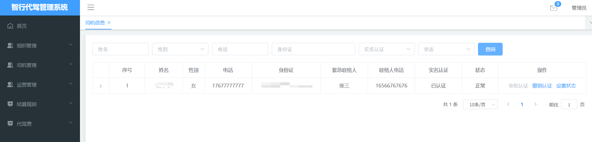

# 小程序端司机修改实名认证信息

## 功能说明

系统管理员也无法修改司机的实名认证信息，只能司机自己修改。并且司机只能在小程序端 `<font style="color:#000000;">filling.vue</font>`页面上修改。

我们先做这个功能，然后再去实现 mis 端的实名认证审核功能。

功能实现起来很简单，先查询出来，司机修改，然后再发送 ajax 请求修改数据库。

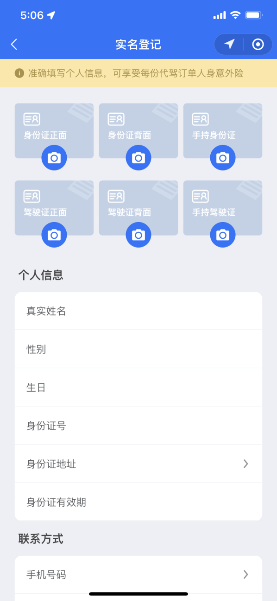

## 编写 zxds-dr 子系统代码

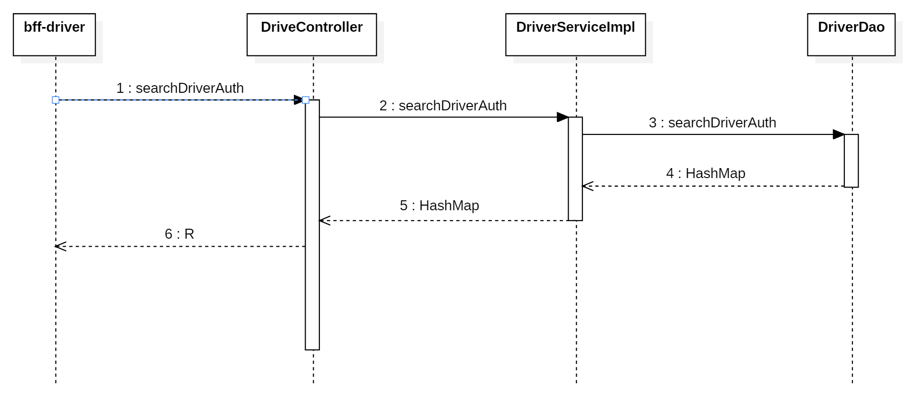

### 编写持久层代码

在`<font style="color:#000000;background-color:rgba(220, 240, 255, 0.3) !important;">DriverDao.xml</font>`文件中，编写SQL语句，查询司机实名认证信息。

```xml
<select id="searchDriverAuth" parameterType="long" resultType="HashMap">
    SELECT IFNULL(`name`, '')            AS `name`,
           IFNULL(sex, '')               AS sex,
           IFNULL(pid, '')               AS pid,
           IFNULL(birthday, '')          AS birthday,
           IFNULL(tel, '')               AS tel,
           IFNULL(mail_address, '')      AS mailAddress,
           IFNULL(contact_name, '')      AS contactName,
           IFNULL(contact_tel, '')       AS contactTel,
           IFNULL(email, '')             AS email,
           IFNULL(real_auth, '')         AS realAuth,
           IFNULL(idcard_address, '')    AS idcardAddress,
           IFNULL(idcard_expiration, '') AS idcardExpiration,
           IFNULL(idcard_front, '')      AS idcardFront,
           IFNULL(idcard_back, '')       AS idcardBack,
           IFNULL(idcard_holding, '')    AS idcardHolding,
           IFNULL(drcard_type, '')       AS drcardType,
           IFNULL(drcard_expiration, '') AS drcardExpiration,
           IFNULL(drcard_issue_date, '') AS drcardIssueDate,
           IFNULL(drcard_front, '')      AS drcardFront,
           IFNULL(drcard_back, '')       AS drcardBack,
           IFNULL(drcard_holding, '')    AS drcardHolding
    FROM tb_driver
    WHERE id = #{driverId}
</select>
```

在`<font style="color:#000000;background-color:rgba(220, 240, 255, 0.3) !important;">com.example.zxds.dr.db.dao</font>`包`<font style="color:#000000;background-color:rgba(220, 240, 255, 0.3) !important;">DriverDao.java</font>`接口中，编写DAO方法。

```java
Map<String, Object> searchDriverAuth(long driverId);
```

### 编写 service 和实现

在`<font style="color:#000000;background-color:rgba(220, 240, 255, 0.3) !important;">com.example.zxds.dr.service</font>`包`<font style="color:#000000;background-color:rgba(220, 240, 255, 0.3) !important;">DriverService.java</font>`接口中，声明抽象方法

```java
Map<String, Object> searchDriverAuth(long driverId);
```

在`<font style="color:#000000;background-color:rgba(220, 240, 255, 0.3) !important;">com.example.zxds.dr.service.impl</font>`包`<font style="color:#000000;background-color:rgba(220, 240, 255, 0.3) !important;">DriverServiceImpl.java</font>`类中，实现抽象方法

```java
@Override
public Map<String, Object> searchDriverAuth(long driverId) {
    return driverDao.searchDriverAuth(driverId);
}
```

### 编写 form 接收数据并校验

在`<font style="color:#000000;background-color:rgba(220, 240, 255, 0.3) !important;">com.example.zxds.dr.controller.form</font>`包中创建`<font style="color:#000000;background-color:rgba(220, 240, 255, 0.3) !important;">SearchDriverAuthForm.java</font>`类

```java
package com.example.zxds.dr.controller.form;

import io.swagger.v3.oas.annotations.media.Schema;
import lombok.Data;

import javax.validation.constraints.Min;
import javax.validation.constraints.NotNull;

@Data
@Schema(description = "查询司机认证信息表单")
public class SearchDriverAuthForm {

    @NotNull(message = "driverId不能为空")
    @Min(value = 1, message = "driverId不能小于1")
    @Schema(description = "司机ID")
    private Long driverId;

}
```

### 编写 web 方法

在`<font style="color:#000000;background-color:rgba(220, 240, 255, 0.3) !important;">com.example.zxds.dr.controller</font>`包`<font style="color:#000000;background-color:rgba(220, 240, 255, 0.3) !important;">DriverController.java</font>`类中，声明Web方法

```java
@PostMapping("/searchDriverAuth")
@Operation(summary = "查询司机认证信息")
public R searchDriverAuth(@RequestBody @Valid SearchDriverAuthForm form) {
    Map<String, Object> result = driverService.searchDriverAuth(form.getDriverId());
    return R.ok().put("result", result);
}
```

## 编写 bff-driver 子系统

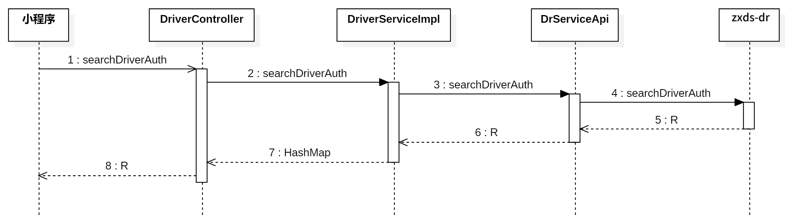

### 编写 Feign 客户端

在`<font style="color:#000000;background-color:rgba(220, 240, 255, 0.3) !important;">com.example.zxds.bff.driver.controller.form</font>`包中创建`<font style="color:#000000;background-color:rgba(220, 240, 255, 0.3) !important;">SearchDriverAuthForm.java</font>`类

```java
package com.example.zxds.bff.driver.controller.form;

import io.swagger.v3.oas.annotations.media.Schema;
import lombok.Data;

@Data
@Schema(description = "查询司机认证信息表单")
public class SearchDriverAuthForm {
    @Schema(description = "司机ID")
    private Long driverId;
}
```

在`<font style="color:#000000;background-color:rgba(220, 240, 255, 0.3) !important;">com.example.zxds.bff.driver.feign</font>`包`<font style="color:#000000;background-color:rgba(220, 240, 255, 0.3) !important;">DrServiceApi.java</font>`类中，定义抽象方法

```java
@PostMapping("/driver/searchDriverAuth")
R searchDriverAuth(SearchDriverAuthForm form);
```

### 编写 service 和实现

在`<font style="color:#000000;background-color:rgba(220, 240, 255, 0.3) !important;">com.example.zxds.bff.driver.service</font>`包`<font style="color:#000000;background-color:rgba(220, 240, 255, 0.3) !important;">DriverService.java</font>`接口中，声明抽象方法

```java

Map<String, Object> searchDriverAuth(SearchDriverAuthForm form);
```

在`<font style="color:#000000;background-color:rgba(220, 240, 255, 0.3) !important;">tb_driver</font>`数据表里面，司机的证件地址写的是相对路径。当外部需要用到这些证件照片的时候，我们生成临时外网URL路径，超过规定时间就无法访问，起到保护司机证件隐私的目的。

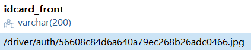

腾讯云对象存储服务有一个“生成预签名URL”的功能，可以对云端文件生成临时外网URL地址，并且含有签名字符串。当然了，这个签名字符串是有过期时间的，如果超过规定的时间，这个URL地址就不能使用了。预签名URL的文档（[https://cloud.tencent.com/document/product/436/35217](https://cloud.tencent.com/document/product/436/35217)）。

在`<font style="color:#000000;background-color:rgba(220, 240, 255, 0.3) !important;">CosUtil.java</font>`类中我已经封装好了生成预签名URL的函数：

```java
@Component
public class CosUtil {
    ……
    public String getPrivateFileUrl(String path) {
        COSClient client = getCosPrivateClient();
        GeneratePresignedUrlRequest request =
        new GeneratePresignedUrlRequest(bucketPrivate, path, HttpMethodName.GET);
        Date expiration = DateUtil.offsetMinute(new Date(), 5);  //设置临时URL有效期为5分钟
        request.setExpiration(expiration);
        URL url = client.generatePresignedUrl(request);
        client.shutdown();
        return url.toString();
    }
}
```

在`<font style="color:#000000;background-color:rgba(220, 240, 255, 0.3) !important;">com.example.zxds.bff.driver.service.impl</font>`包`<font style="color:#000000;background-color:rgba(220, 240, 255, 0.3) !important;">DriverServiceImpl.java</font>`类中，实现抽象方法

```java
@Resource
private CosUtil cosUtil;

@Override
public Map<String, Object> searchDriverAuth(SearchDriverAuthForm form) {
    R r = drServiceApi.searchDriverAuth(form);
    Map<String, Object> map = (Map<String, Object>) r.get("result");
    //获取私有读写文件的临时URL地址
    String idcardFront = MapUtil.getStr(map, "idcardFront");
    String idcardBack = MapUtil.getStr(map, "idcardBack");
    String idcardHolding = MapUtil.getStr(map, "idcardHolding");
    String drcardFront = MapUtil.getStr(map, "drcardFront");
    String drcardBack = MapUtil.getStr(map, "drcardBack");
    String drcardHolding = MapUtil.getStr(map, "drcardHolding");
    String idcardFrontUrl = !idcardFront.isEmpty() ? cosUtil.getPrivateFileUrl(idcardFront) : "";
    String idcardBackUrl = !idcardBack.isEmpty() ? cosUtil.getPrivateFileUrl(idcardBack) : "";
    String idcardHoldingUrl = !idcardHolding.isEmpty() ? cosUtil.getPrivateFileUrl(idcardHolding) : "";
    String drcardFrontUrl = !drcardFront.isEmpty() ? cosUtil.getPrivateFileUrl(drcardFront) : "";
    String drcardBackUrl = !drcardBack.isEmpty() ? cosUtil.getPrivateFileUrl(drcardBack) : "";
    String drcardHoldingUrl = !drcardHolding.isEmpty() ? cosUtil.getPrivateFileUrl(drcardHolding) : "";
    map.put("idcardFrontUrl", idcardFrontUrl);
    map.put("idcardBackUrl", idcardBackUrl);
    map.put("idcardHoldingUrl", idcardHoldingUrl);
    map.put("drcardFrontUrl", drcardFrontUrl);
    map.put("drcardBackUrl", drcardBackUrl);
    map.put("drcardHoldingUrl", drcardHoldingUrl);
    return map;
}
```

### 编写 web 方法

在`<font style="color:#000000;background-color:rgba(220, 240, 255, 0.3) !important;">com.example.zxds.bff.driver.controller</font>`包`<font style="color:#000000;background-color:rgba(220, 240, 255, 0.3) !important;">DriverController.java</font>`类中，定义Web方法。

```java
@GetMapping("/searchDriverAuth")
@Operation(summary = "查询司机认证信息")
@SaCheckLogin
public R searchDriverAuth() {
    long driverId = StpUtil.getLoginIdAsLong();
    SearchDriverAuthForm form = new SearchDriverAuthForm();
    form.setDriverId(driverId);
    Map<String, Object> map = driverService.searchDriverAuth(form);
    return R.ok().put("result", map);
}
```

## 修改司机实名认证信息

这个功能之前已经实现了（`<font style="color:#000000;">DriverDao.xml</font>`），用户第一次注册之后，**进行实名认证**的过程就是**修改实名认证**信息的过程。

```xml
<update id="updateDriverAuth" parameterType="Map">
    UPDATE tb_driver
    SET `name`            = #{name},
        sex               = #{sex},
        pid               = #{pid},
        birthday          = #{birthday},
        tel               = #{tel},
        mail_address      = #{mailAddress},
        contact_name      = #{contactName},
        contact_tel       = #{contactTel},
        email             = #{email},
        real_auth         = 3,
        idcard_address    = #{idcardAddress},
        idcard_expiration = #{idcardExpiration},
        idcard_front      = #{idcardFront},
        idcard_back       = #{idcardBack},
        idcard_holding    = #{idcardHolding},
        drcard_type       = #{drcardType},
        drcard_expiration = #{drcardExpiration},
        drcard_issue_date = #{drcardIssueDate},
        drcard_front      = #{drcardFront},
        drcard_back       = #{drcardBack},
        drcard_holding    = #{drcardHolding}
    WHERE id = #{driverId}
</update>
```

## 测试后端接口

司机在实名认证审核通过之后可以修改实名认证信息，但是状态是审核中的话，司机无法修改实名认证信息。所以要把司机的`<font style="color:#000000;background-color:rgba(220, 240, 255, 0.3) !important;">real_auth</font>`字段值改成2才可以。启动 `<font style="color:#000000;">gateway</font>``<font style="color:#000000;">bff-driver</font>``<font style="color:#000000;">zxds-dr</font>`子系统。

**请求地址**：[http://localhost:8101/driver/searchDriverAuth](http://localhost:8101/driver/searchDriverAuth)

**请求头参数**：token

## 移动端修改司机实名认证信息

修改实名认证信息的入口在`<font style="color:#000000;background-color:rgba(220, 240, 255, 0.3) !important;">pages/mine/mine.vue</font>`页面。点击“账号与安全”跳转到`<font style="color:#000000;background-color:rgba(220, 240, 255, 0.3) !important;">user/account/account.vue</font>`页面，然后再点击“统一实名认证”就跳转到`<font style="color:#000000;background-color:rgba(220, 240, 255, 0.3) !important;">identity/filling/filling.vue</font>`页面了。

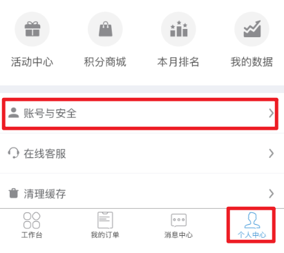

 

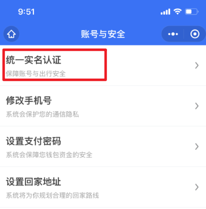

### 实现页面跳转

找到 `<font style="color:#000000;">page/mine/mine.vue</font>`页面中的 **账号与安全** 。点击它跳转到 `<font style="color:#000000;">user/account/account.vue</font>`页面。代码如下：

```html
<u-cell-item icon="account-fill" 
             title="账号与安全" 
             :icon-style="icon" 
             :border-top="false" 
             @click="this.toPage('../../user/account/account')" />
```

以上这个 `<font style="color:#000000;">toPage()</font>`函数是我自己封装的函数，在 `<font style="color:#000000;">main.js</font>`文件中呢。

在 `<font style="color:#000000;">user/account/account.vue</font>`页面上找到 **统一实名认证**。点击它跳转到 `<font style="color:#000000;">identity/filling/filling.vue</font>`页面。代码如下：

```html
<u-cell-item
          title="统一实名认证"
          :title-style="title"
          label="保障账号与出行安全"
          :label-style="label"
          :value="realAuth"
          :border-top="false"
          @click="this.toPage('/identity/filling/filling?mode=fill')"
/>
```

需要给 `<font style="color:#000000;">filling.vue</font>`页面传一个 `<font style="color:#000000;">mode=fill</font>`的参数，告诉 `<font style="color:#000000;">filling.vue</font>`页面，我跳过去之后是显示司机信息的，不是创建司机信息的。

### 指定全局的 URL 地址

```javascript
Vue.prototype.url = {
    ……,
    searchDriverAuth: `${baseUrl}/driver/searchDriverAuth`,
}
```

### 加载实名认证信息

在`<font style="color:#000000;background-color:rgba(220, 240, 255, 0.3) !important;">filling.vue</font>`页面编写`<font style="color:#000000;background-color:rgba(220, 240, 255, 0.3) !important;">onLoad()</font>`回调函数，加载司机的实名认证信息。为什么用 `<font style="color:#000000;">onLoad()</font>`而不是 `<font style="color:#000000;">onShow()</font>`，因为司机实名认证信息没有啥变化，没必要 `<font style="color:#000000;">onShow()</font>`。

```javascript
// onLoad是uni-app小程序的生命周期钩子函数，页面加载时触发，只执行一次
// options 参数是用于接收页面跳转时传递的参数
onLoad: function(options) { 
  let that = this;
  that.mode = options.mode;
  if (uni.getStorageSync('realAuth') == 1) {
    uni.showModal({
      title: '提示信息',
      content: '新注册的代驾司机请填写实名认证信息，并且上传相关证件照片',
      showCancel: false
    });

  } else {
    // 这是在main.js中封装的ajax函数。uni-app中没法直接使用浏览器上那一套，也不能使用axios。
    // uni-app上发送ajax请求是通过：uni.request()实现的，以下这个ajax方法就是封装的uni.request()方法。
    that.ajax(that.url.searchDriverAuth, 'GET', null, function(resp) {
      let json = resp.data.result;
      that.idcard.pid = json.pid;
      that.idcard.name = json.name;
      that.idcard.sex = json.sex;
      that.idcard.birthday = json.birthday;
      that.idcard.address = json.idcardAddress;
      that.idcard.shortAddress = json.idcardAddress.substr(0, 15) + (json.idcardAddress.length > 15 ? '...' : '');
      that.idcard.expiration = json.idcardExpiration;
      that.idcard.idcardFront = json.idcardFront;
      if (json.idcardFrontUrl.length > 0) {
        that.cardBackground[0] = json.idcardFrontUrl;
      }
      that.idcard.idcardBack = json.idcardBack;
      if (json.idcardBackUrl.length > 0) {
        that.cardBackground[1] = json.idcardBackUrl;
      }
      that.idcard.idcardHolding = json.idcardHolding;
      if (json.idcardHoldingUrl.length > 0) {
        that.cardBackground[2] = json.idcardHoldingUrl;
      }
      that.contact.tel = json.tel;
      that.contact.email = json.email;
      that.contact.shortEmail = json.email.substr(0, 25) + (json.email.length > 25 ? '...' : '');
      that.contact.mailAddress = json.mailAddress;
      that.contact.shortMailAddress = json.mailAddress.substr(0, 15) + (json.mailAddress.length > 15 ? '...' : '');
      that.contact.contactName = json.contactName;
      that.contact.contactTel = json.contactTel;
      that.drcard.carClass = json.drcardType;
      that.drcard.validTo = json.drcardExpiration;
      that.drcard.issueDate = json.drcardIssueDate;
      that.drcard.drcardFront = json.drcardFront;
      if (json.drcardFrontUrl.length > 0) {
        that.cardBackground[3] = json.drcardFrontUrl;
      }
      that.drcard.drcardBack = json.drcardBack;
      if (json.drcardBackUrl.length > 0) {
        that.cardBackground[4] = json.drcardBackUrl;
      }
      that.drcard.drcardHolding = json.drcardHolding;
      if (json.drcardHoldingUrl.length > 0) {
        that.cardBackground[5] = json.drcardHoldingUrl;
      }
    });
  }
}
```

### 调试小程序

把`<font style="color:#000000;background-color:rgba(220, 240, 255, 0.3) !important;">zxds-dr</font>`、`<font style="color:#000000;background-color:rgba(220, 240, 255, 0.3) !important;">zxds-odr</font>`、`<font style="color:#000000;background-color:rgba(220, 240, 255, 0.3) !important;">bff-driver</font>`、`<font style="color:#000000;background-color:rgba(220, 240, 255, 0.3) !important;">gateway</font>`子系统运行起来，然后先把司机的`<font style="color:#000000;background-color:rgba(220, 240, 255, 0.3) !important;">real_auth</font>`字段设置成3，测试一下`<font style="color:#000000;background-color:rgba(220, 240, 255, 0.3) !important;">filling.vue</font>`页面能加载数据，但是不能修改数据。接着再把`<font style="color:#000000;background-color:rgba(220, 240, 255, 0.3) !important;">real_auth</font>`字段改成2，这时候`<font style="color:#000000;background-color:rgba(220, 240, 255, 0.3) !important;">filling.vue</font>`页面的数据就能修改了。

# Web 系统展示司机实名认证信息

智行代驾的工作人员可以在 web 系统当中对司机的实名认证信息进行审核。审核的**前提是先能看到这个信息**，在页面上，我设计了折叠面板，只要打开折叠面板，就要把司机的信息展示出来。

## 编写 zxds-dr 子系统

虽然`<font style="color:#000000;background-color:rgba(220, 240, 255, 0.3) !important;">zxds-mis-api</font>`子系统也有MyBatis，也具有读写`<font style="color:#000000;background-color:rgba(220, 240, 255, 0.3) !important;">tb_driver</font>`表的能力，但是跟司机记录有关的操作，我们还是应该交给**司机子系统**来完成。我们先看一下时序图，如下：

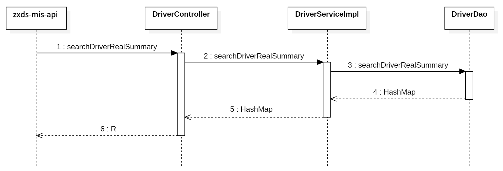

### 编写持久层代码

在`<font style="color:#000000;background-color:rgba(220, 240, 255, 0.3) !important;">DriverDao.xml</font>`文件中，定义SQL语句查询实名认证信息。

```xml
<select id="searchDriverRealSummary" parameterType="long" resultType="map">
    SELECT timestampdiff(YEAR,drcard_issue_date, NOW()) AS `year`,
           birthday,
           email,
           mail_address                                 AS mailAddress,
           idcard_address                               AS idcardAddress,
           idcard_front                                 AS idcardFront,
           idcard_back                                  AS idcardBack,
           idcard_holding                               AS idcardHolding,
           drcard_front                                 AS drcardFront,
           drcard_back                                  AS drcardBack,
           drcard_holding                               AS drcardHolding
    FROM tb_driver
    WHERE id = #{driverId}
</select>
```

在`<font style="color:#000000;background-color:rgba(220, 240, 255, 0.3) !important;">com.example.zxds.dr.db.dao</font>`包`<font style="color:#000000;background-color:rgba(220, 240, 255, 0.3) !important;">DriverDao.java</font>`接口中，声明DAO方法

```java
Map<String, Object> searchDriverRealSummary(long driverId);
```

### 编写 service 和实现

在`<font style="color:#000000;background-color:rgba(220, 240, 255, 0.3) !important;">com.example.zxds.dr.service</font>`包`<font style="color:#000000;background-color:rgba(220, 240, 255, 0.3) !important;">DriverService.java</font>`接口中，声明抽象方法。

```java
Map<String, Object> searchDriverRealSummary(long driverId);
```

在`<font style="color:#000000;background-color:rgba(220, 240, 255, 0.3) !important;">com.example.zxds.dr.service.impl</font>`包`<font style="color:#000000;background-color:rgba(220, 240, 255, 0.3) !important;">DriverServiceImpl.java</font>`类中，实现抽象方法。

```java
@Override
public Map<String, Object> searchDriverRealSummary(long driverId) {
    return driverDao.searchDriverRealSummary(driverId);
}
```

### 编写 form 接收数据并校验

在`<font style="color:#000000;background-color:rgba(220, 240, 255, 0.3) !important;">com.example.zxds.dr.controller.form</font>`包中创建`<font style="color:#000000;background-color:rgba(220, 240, 255, 0.3) !important;">SearchDriverRealSummaryForm.java</font>`类，接收提交的数据。

```java
package com.example.zxds.dr.controller.form;

import io.swagger.v3.oas.annotations.media.Schema;
import lombok.Data;

import javax.validation.constraints.Min;
import javax.validation.constraints.NotNull;

@Data
@Schema(description = "查询司机")
public class SearchDriverRealSummaryForm {
    @NotNull(message = "driverId不能为空")
    @Min(value = 1, message = "driverId不能小于1")
    @Schema(description = "司机ID")
    private Long driverId;
}
```

### 编写 web 方法

在`<font style="color:#000000;background-color:rgba(220, 240, 255, 0.3) !important;">com.example.zxds.dr.controller</font>`包`<font style="color:#000000;background-color:rgba(220, 240, 255, 0.3) !important;">DriverController.java</font>`类中，声明Web方法。

```java
@PostMapping("/searchDriverRealSummary")
@Operation(summary = "查询司机实名信息摘要")
public R searchDriverRealSummary(@RequestBody @Valid SearchDriverRealSummaryForm form) {
    Map<String, Object> map = driverService.searchDriverRealSummary(form.getDriverId());
    return R.ok().put("result", map);
}
```

### 调试 web 方法

请求地址：[http://localhost:8001/driver/searchDriverRealSummary](http://localhost:8001/driver/searchDriverRealSummary)

请求参数：

```json
{
    "driverId": 2010249163039707136
}
```

响应结果：

```json
{
        "msg": "success",
        "result": {
                "birthday": "1980-11-21",
                "year": "0",
                "drcardFront": "/driver/auth/85aa6d3fa4a4453991cfbc17f8c2b8b4.jpg",
                "idcardBack": "/driver/auth/25ca33cb0b30447392ae4e9b4b22da8b.jpg",
                "drcardBack": "/driver/auth/4c1d4d596c7948d990be58f3e4e08960.jpg",
                "mailAddress": "这个地址我好好写",
                "idcardHolding": "/driver/auth/ab45426781494f5e8d11ae05441b1aab.jpg",
                "drcardHolding": "/driver/auth/7a3a849255ee48d29b51f1c09c67316b.jpg",
                "email": "test@126.com",
                "idcardAddress": "天津市xxxxxxx门401号",
                "idcardFront": "/driver/auth/56608c84d6a640a79ec268b26adc0466.jpg"
        },
        "code": 200
}
```

## 编写 zxds-mis-api 子系统

其实在这个子系统上面我们要调用多个子系统获得数据，包括司机实名认证信息、业务数据统计、Chart 图表数据等等。咱们暂时先只调用刚才我们写好的Web方法。

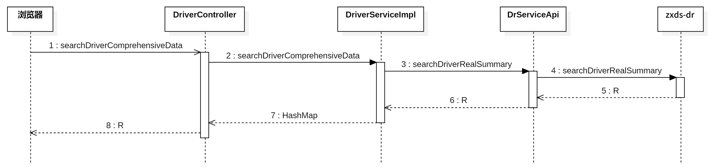

### 定义 Feign 客户端

在`<font style="color:#000000;background-color:rgba(220, 240, 255, 0.3) !important;">com.example.zxds.mis.api.controller.form</font>`包中创建`<font style="color:#000000;background-color:rgba(220, 240, 255, 0.3) !important;">SearchDriverRealSummaryForm.java</font>`类。

```java
package com.example.zxds.mis.api.controller.form;

import io.swagger.v3.oas.annotations.media.Schema;
import lombok.Data;

import javax.validation.constraints.Min;
import javax.validation.constraints.NotNull;

@Data
@Schema(description = "查询司机")
public class SearchDriverRealSummaryForm {
    @NotNull(message = "driverId不能为空")
    @Min(value = 1, message = "driverId不能小于1")
    @Schema(description = "司机ID")
    private Long driverId;
}
```

在`<font style="color:#000000;background-color:rgba(220, 240, 255, 0.3) !important;">com.example.zxds.mis.api.feign</font>`包`<font style="color:#000000;background-color:rgba(220, 240, 255, 0.3) !important;">DrServiceApi.java</font>`接口中，声明抽象方法。

```java
@PostMapping("/driver/searchDriverRealSummary")
R searchDriverRealSummary(SearchDriverRealSummaryForm form);
```

### 编写 service 和实现

在`<font style="color:#000000;background-color:rgba(220, 240, 255, 0.3) !important;">com.example.zxds.mis.api.service</font>`包`<font style="color:#000000;background-color:rgba(220, 240, 255, 0.3) !important;">DriverService.java</font>`类中，定义抽象方法。

```java
// 参数 realAuth 的作用是：如果realAuth=1表示司机压根没有提交资料。不需要认证。
Map<String, Object> searchDriverComprehensiveData(byte realAuth, Long driverId);
```

在`<font style="color:#000000;background-color:rgba(220, 240, 255, 0.3) !important;">com.example.zxds.mis.api.service.impl</font>`包`<font style="color:#000000;background-color:rgba(220, 240, 255, 0.3) !important;">DriverServiceImpl.java</font>`类中，实现抽象方法

```java
private final CosUtil cosUtil;

public Map<String, Object> searchDriverComprehensiveData(byte realAuth, Long driverId) {
    Map<String, Object> map = new HashMap<>();
    if (realAuth == 2 || realAuth == 3) {
        //查询司机实名信息摘要
        SearchDriverRealSummaryForm form1 = new SearchDriverRealSummaryForm();
        form1.setDriverId(driverId);
        R r = drServiceApi.searchDriverRealSummary(form1);
        Map<String, Object> summaryMap = (Map<String, Object>) r.get("result");

        //获取私有读写文件的临时URL地址
        String idcardFront = MapUtil.getStr(summaryMap, "idcardFront");
        String idcardBack = MapUtil.getStr(summaryMap, "idcardBack");
        String idcardHolding = MapUtil.getStr(summaryMap, "idcardHolding");
        String drcardFront = MapUtil.getStr(summaryMap, "drcardFront");
        String drcardBack = MapUtil.getStr(summaryMap, "drcardBack");
        String drcardHolding = MapUtil.getStr(summaryMap, "drcardHolding");
        idcardFront = !idcardFront.isEmpty() ? cosUtil.getPrivateFileUrl(idcardFront) : "";
        idcardBack = !idcardBack.isEmpty() ? cosUtil.getPrivateFileUrl(idcardBack) : "";
        idcardHolding = !idcardHolding.isEmpty() ? cosUtil.getPrivateFileUrl(idcardHolding) : "";
        drcardFront = !drcardFront.isEmpty() ? cosUtil.getPrivateFileUrl(drcardFront) : "";
        drcardBack = !drcardBack.isEmpty() ? cosUtil.getPrivateFileUrl(drcardBack) : "";
        drcardHolding = !drcardHolding.isEmpty() ? cosUtil.getPrivateFileUrl(drcardHolding) : "";

        summaryMap.replace("idcardFront", idcardFront);
        summaryMap.replace("idcardBack", idcardBack);
        summaryMap.replace("idcardHolding", idcardHolding);
        summaryMap.replace("drcardFront", drcardFront);
        summaryMap.replace("drcardBack", drcardBack);
        summaryMap.replace("drcardHolding", drcardHolding);
        map.put("summaryMap", summaryMap);

        //TODO 这里以后还有很多要写的东西
    }
    return map;
}
```

### 编写 form 接收数据并校验

在`<font style="color:#000000;background-color:rgba(220, 240, 255, 0.3) !important;">com.example.zxds.mis.api.controller.form</font>`包中创建`<font style="color:#000000;background-color:rgba(220, 240, 255, 0.3) !important;">SearchDriverComprehensiveDataForm.java</font>`类，接收Ajax提交的数据。

```java
package com.example.zxds.mis.api.controller.form;

import io.swagger.v3.oas.annotations.media.Schema;
import lombok.Data;
import org.hibernate.validator.constraints.Range;

import javax.validation.constraints.Min;
import javax.validation.constraints.NotNull;

@Data
@Schema(description = "查询司机综合数据的表单")
public class SearchDriverComprehensiveDataForm {
    @NotNull(message = "realAuth不能为空")
    @Range(min = 1, max = 3, message = "realAuth范围不正确")
    @Schema(description = "是否已经实名认证")
    private Byte realAuth;

    @NotNull(message = "driverId不能为空")
    @Min(value = 1, message = "driverId不能小于1")
    @Schema(description = "司机ID")
    private Long driverId;
}
```

### 编写 web 方法

在`<font style="color:#000000;background-color:rgba(220, 240, 255, 0.3) !important;">com.example.zxds.mis.api.controller</font>`包`<font style="color:#000000;background-color:rgba(220, 240, 255, 0.3) !important;">DriverController.java</font>`类中，声明Web方法

```java
@PostMapping("/searchDriverComprehensiveData")
@SaCheckPermission(value = {"ROOT", "DRIVER:SELECT"}, mode = SaMode.OR)
@Operation(summary = "查询司机综合数据")
public R searchDriverComprehensiveData(@RequestBody @Valid SearchDriverComprehensiveDataForm form) {
    Map<String, Object> map = driverService.searchDriverComprehensiveData(form.getRealAuth(), form.getDriverId());
    return R.ok().put("result", map);
}
```

### 调试 web 方法

把`<font style="color:#000000;background-color:rgba(220, 240, 255, 0.3) !important;">zxds-tm</font>`和`<font style="color:#000000;background-color:rgba(220, 240, 255, 0.3) !important;">zxds-dr</font>`、`<font style="color:#000000;background-color:rgba(220, 240, 255, 0.3) !important;">zxds-mis-api</font>`子系统运行起来。

**请求地址：**[http://localhost:8010/driver/searchDriverComprehensiveData](http://localhost:8010/driver/searchDriverComprehensiveData)

**请求头中携带 token**

**请求参数：**

```json
{
    "driverId": 2010249163039707136,
    "realAuth": 2
}
```

**响应数据：**

```json
{
        "msg": "success",
        "result": {
                "summaryMap": {
                        "birthday": "1900-10-21",
                        "year": "0",
                        "drcardFront": "xxx",
                        "idcardBack": "xxx",
                        "drcardBack": "xxx",
                        "mailAddress": "xxx",
                        "idcardHolding": "xxx",
                        "drcardHolding": "xxx",
                        "email": "xxx",
                        "idcardAddress": "xxx",
                        "idcardFront": "xxx"
                }
        },
        "code": 200
}
```

## mis 系统前端展示司机信息

当打开折叠面板时发送 ajax 请求，获取司机信息，展示到折叠面板中。`<font style="color:#000000;">zxds-mis-vue</font>`中的 `<font style="color:#000000;">src/views/driver.vue</font>`文件。

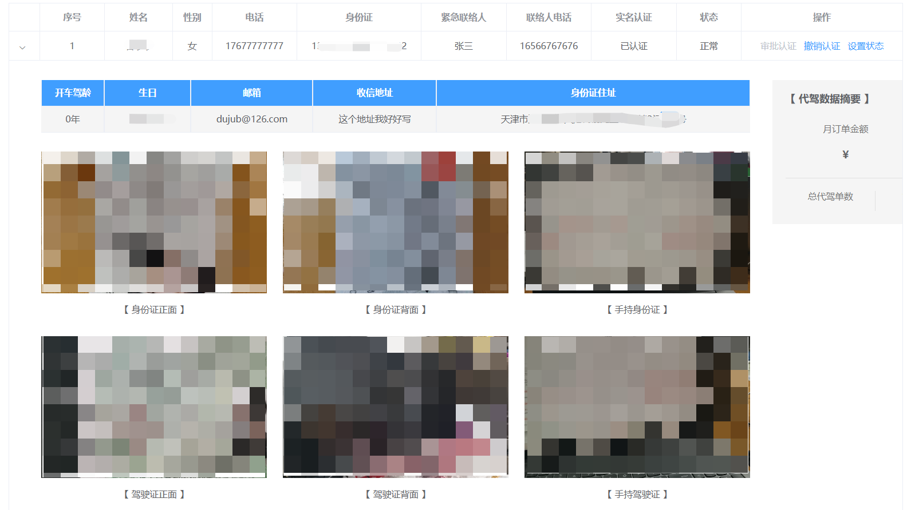

### 熟悉折叠面板的视图层标签

只需要关注其中的实名认证部分，面板右侧的统计数据和Chart图表先略过。

```html
<!--@expand-change="expand"  折叠面板打开和关闭时的回调函数-->
<!--:row-key="getRowKeys" 是给【表格的每一行数据】贴的身份证号-->
<!--:expand-row-keys="expands" expands是一个数组，这个数组中包含了很多“身份证号”，
被包含的“身份证号”都会处于展开状态，如果数组中没有“身份证号”，就是所有的行都不展开-->
<el-table
    :data="dataList"
    border
    v-loading="dataListLoading"
    cell-style="padding: 4px 0"
    style="width: 100%;"
    size="medium"
    @expand-change="expand"
    :row-key="getRowKeys"
    :expand-row-keys="expands"
>
    <el-table-column prop="content" header-align="center" align="center" type="expand">
        <template #default="scope">
            <div class="content-container">
                <div class="left">
                    <table class="content-table">
                        <tbody>
                            <tr>
                                <th>开车驾龄</th>
                                <th>生日</th>
                                <th>邮箱</th>
                                <th>收信地址</th>
                                <th>身份证住址</th>
                            </tr>
                            <tr>
                                <td>{{ content.year }}年</td>
                                <td>{{ content.birthday }}</td>
                                <td>{{ content.email }}</td>
                                <td>{{ content.mailAddress }}</td>
                                <td>{{ content.idcardAddress }}</td>
                            </tr>
                        </tbody>
                    </table>
                    <ul class="credentials-list">
                        <li class="item">
                            <el-image style="width: 350px; height: 220px" 
                                      :src="content.idcardFront" 
                                      :preview-src-list="content.idcardFrontList" 
                                      fit="cover" />
                            <p>【 身份证正面 】</p>
                        </li>
                        <li class="item">
                            <el-image style="width: 350px; height: 220px" 
                                      :src="content.idcardBack" 
                                      :preview-src-list="content.idcardBackList" 
                                      fit="cover" />
                            <p>【 身份证背面 】</p>
                        </li>
                        <li class="item">
                            <el-image style="width: 350px; height: 220px" 
                                      :src="content.idcardHolding" 
                                      :preview-src-list="content.idcardHoldingList" 
                                      fit="cover" />
                            <p>【 手持身份证 】</p>
                        </li>
                        <li class="item">
                            <el-image style="width: 350px; height: 220px" 
                                      :src="content.drcardFront" 
                                      :preview-src-list="content.drcardFrontList" 
                                      fit="cover" />
                            <p>【 驾驶证正面 】</p>
                        </li>
                        <li class="item">
                            <el-image style="width: 350px; height: 220px" 
                                      :src="content.drcardBack" 
                                      :preview-src-list="content.drcardBackList" 
                                      fit="cover" />
                            <p>【 驾驶证背面 】</p>
                        </li>
                        <li class="item">
                            <el-image style="width: 350px; height: 220px" 
                                      :src="content.drcardHolding" 
                                      :preview-src-list="content.drcardHoldingList" 
                                      fit="cover" />
                            <p>【 手持驾驶证 】</p>
                        </li>
                    </ul>
                </div>
            </div>
        </template>
    </el-table-column>
    ……

</el-table>
```

### 相关模型层的数据

```javascript
data() {
    return {
        expands: [],
        content: {
            year: null,
            birthday: null,
            email: null,
            mailAddress: null,
            idcardAddress: null,
            idcardFront: null,
            idcardFrontList: [],
            idcardBack: null,
            idcardBackList: [],
            idcardHolding: null,
            idcardHoldingList: [],
            drcardFront: null,
            drcardFrontList: [],
            drcardBack: null,
            drcardBackList: [],
            drcardHolding: null,
            drcardHoldingList: [],
            ……
        },
        ……,
        driverId: null,
        getRowKeys(row) {
            return row.id;
        }
    };
},
```

### 展开面板加载数据

编写 `<font style="color:#000000;">expand()</font>`回调函数：

```javascript
async expand(row, expandedRows) {
  let that = this;
  that.expands = [];
  if (expandedRows.length > 0) {
    if (row) {
      if (row.realAuth == '未认证') {
        return;
      }
      that.expands.push(row.id);

      let data = {
        realAuth: row.realAuth == '已认证' ? 2 : 3,
        driverId: row.id
      };
      let resp = await axios.post(`${that.$baseUrl}driver/searchDriverComprehensiveData`, data, {
        headers: {
          token: localStorage.getItem("token")
        }
      });
      let summaryMap = resp.data.result.summaryMap;
      that.content.year = summaryMap.year;
      that.content.birthday = summaryMap.birthday;
      that.content.email = summaryMap.email;
      that.content.mailAddress = summaryMap.mailAddress;
      that.content.idcardAddress = summaryMap.idcardAddress;
      that.content.idcardFront = summaryMap.idcardFront;
      that.content.idcardFrontList = [summaryMap.idcardFront];
      that.content.idcardBack = summaryMap.idcardBack;
      that.content.idcardBackList = [summaryMap.idcardBack];
      that.content.idcardHolding = summaryMap.idcardHolding;
      that.content.idcardHoldingList = [summaryMap.idcardHolding];
      that.content.drcardFront = summaryMap.drcardFront;
      that.content.drcardFrontList = [summaryMap.drcardFront];
      that.content.drcardBack = summaryMap.drcardBack;
      that.content.drcardBackList = [summaryMap.drcardBack];
      that.content.drcardHolding = summaryMap.drcardHolding;
      that.content.drcardHoldingList = [summaryMap.drcardHolding]; 
      //TODO 这里以后还有代码要写
    }
  }
},
```

### 调试程序

把`<font style="color:#000000;background-color:rgba(220, 240, 255, 0.3) !important;">zxds-dr</font>`、`<font style="color:#000000;background-color:rgba(220, 240, 255, 0.3) !important;">zxds-mis-api</font>`和`<font style="color:#000000;background-color:rgba(220, 240, 255, 0.3) !important;">gateway</font>`子系统运行起来，前端项目也要启动（`<font style="color:#000000;">npm run dev</font>`），然后我们进入司机管理页面，看看折叠面板是否可以展开，展开之后是否有数据。

**访问地址：**[http://localhost:3000/zxds-mis-vue/#/driver](http://localhost:3000/zxds-mis-vue/#/driver)

# Web 系统实现审批实名认证

在司机管理页面上，有“审批认证”和“撤销认证”两个按钮。如果审批认证的过程中，工作人员同意**通过实名认证**，司机的`<font style="color:#000000;background-color:rgba(220, 240, 255, 0.3) !important;">real_auth</font>`字段会变更成2；如果不同意，则把`<font style="color:#000000;background-color:rgba(220, 240, 255, 0.3) !important;">real_auth</font>`改成1，也就是未认证状态；如果是撤销认证，就是把`<font style="color:#000000;background-color:rgba(220, 240, 255, 0.3) !important;">real_auth</font>`字段恢复成3。


## 编写 zxds-dr 子系统

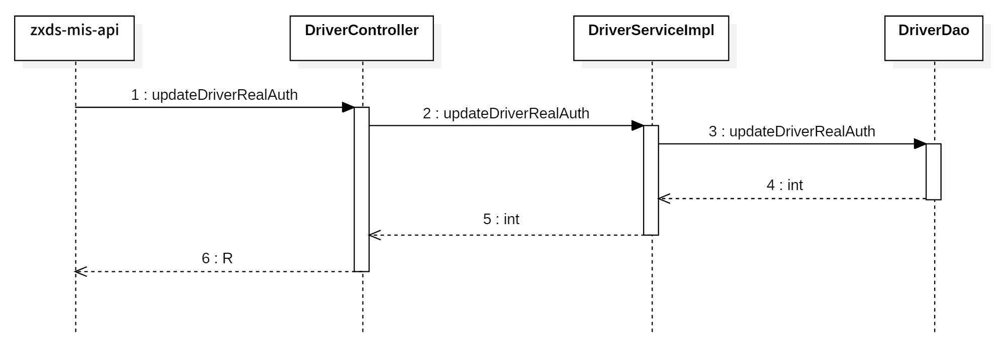

### 编写持久层代码

在`<font style="color:#000000;background-color:rgba(220, 240, 255, 0.3) !important;">DriverDao.xml</font>`文件中，编写SQL语句修改`<font style="color:#000000;background-color:rgba(220, 240, 255, 0.3) !important;">real_auth</font>`字段值。

```xml
<update id="updateDriverRealAuth" parameterType="Map">
    UPDATE tb_driver
    SET real_auth = #{realAuth}
    WHERE id = #{driverId}
</update>
```

在`<font style="color:#000000;background-color:rgba(220, 240, 255, 0.3) !important;">com.example.zxds.dr.db.dao</font>`包`<font style="color:#000000;background-color:rgba(220, 240, 255, 0.3) !important;">DriverDao.java</font>`类中，声明DAO方法

```java
int updateDriverRealAuth(Map<String, Object> param);
```

### 编写 service 和方法

在`<font style="color:#000000;background-color:rgba(220, 240, 255, 0.3) !important;">com.example.zxds.dr.service</font>`包`<font style="color:#000000;background-color:rgba(220, 240, 255, 0.3) !important;">DriverService.java</font>`接口中，声明抽象方法

```java
int updateDriverRealAuth(Map<String, Object> param);
```

在`<font style="color:#000000;background-color:rgba(220, 240, 255, 0.3) !important;">com.example.zxds.dr.service.impl</font>`包`<font style="color:#000000;background-color:rgba(220, 240, 255, 0.3) !important;">DriverServiceImpl.java</font>`类中，实现抽象方法

```java
@Override
@Transactional
public int updateDriverRealAuth(Map<String, Object> param) {
    return driverDao.updateDriverRealAuth(param);
}
```

### 编写 form 接收数据并校验

在`<font style="color:#000000;background-color:rgba(220, 240, 255, 0.3) !important;">com.example.zxds.dr.controller.form</font>`包中创建`<font style="color:#000000;background-color:rgba(220, 240, 255, 0.3) !important;">UpdateDriverRealAuthForm.java</font>`类，用于接收提交的数据

```java
package com.example.zxds.dr.controller.form;

import io.swagger.v3.oas.annotations.media.Schema;
import lombok.Data;
import org.hibernate.validator.constraints.Range;

import javax.validation.constraints.Min;
import javax.validation.constraints.NotNull;

@Data
@Schema(description = "更新司机实名认证状态的表单")
public class UpdateDriverRealAuthForm {
    @NotNull(message = "driverId不能为空")
    @Min(value = 1, message = "driverId不能小于1")
    @Schema(description = "司机ID")
    private Long driverId;

    @NotNull(message = "realAuth不能为空")
    @Range(min = 1, max = 3, message = "realAuth范围不正确")
    @Schema(description = "实名认证状态")
    private Byte realAuth;
}
```

### 编写 web 方法

在`<font style="color:#000000;background-color:rgba(220, 240, 255, 0.3) !important;">com.example.zxds.dr.controller</font>`包`<font style="color:#000000;background-color:rgba(220, 240, 255, 0.3) !important;">DriverController.java</font>`类中，声明Web方法

```java
@PostMapping("/updateDriverRealAuth")
@Operation(summary = "更新司机实名认证状态")
public R updateDriverRealAuth(@RequestBody @Valid UpdateDriverRealAuthForm form) {
    Map<String, Object> param = BeanUtil.beanToMap(form);
    int rows = driverService.updateDriverRealAuth(param);
    return R.ok().put("rows", rows);
}
```

### 测试 web 方法

启动 `<font style="color:#000000;">zxds-dr</font>`子系统。

**请求地址：**[http://localhost:8001/driver/updateDriverRealAuth](http://localhost:8001/driver/updateDriverRealAuth)

**请求参数：**

```json
{
    "driverId": 2010249163039707136,
    "realAuth": 2
}
```

**响应结果：**

```json
{
        "msg": "success",
        "code": 200,
        "rows": 1
}
```

## 编写 zxds-mis-api 子系统

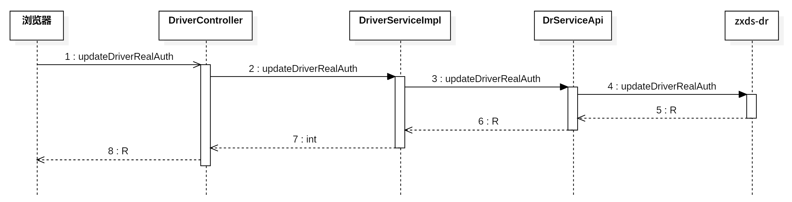

### 编写 Feign 客户端

在`<font style="color:#000000;background-color:rgba(220, 240, 255, 0.3) !important;">com.example.zxds.mis.api.controller.form</font>`包中创建`<font style="color:#000000;background-color:rgba(220, 240, 255, 0.3) !important;">UpdateDriverRealAuthForm.java</font>`类

```java
package com.example.zxds.mis.api.controller.form;

import io.swagger.v3.oas.annotations.media.Schema;
import lombok.Data;
import org.hibernate.validator.constraints.Range;

import javax.validation.constraints.Min;
import javax.validation.constraints.NotNull;

@Data
@Schema(description = "更新司机实名认证状态的表单")
public class UpdateDriverRealAuthForm {
    @NotNull(message = "driverId不能为空")
    @Min(value = 1, message = "driverId不能小于1")
    @Schema(description = "司机ID")
    private Long driverId;

    @NotNull(message = "realAuth不能为空")
    @Range(min = 1, max = 3, message = "realAuth范围不正确")
    @Schema(description = "实名认证状态")
    private Byte realAuth;
}
```

在`<font style="color:#000000;background-color:rgba(220, 240, 255, 0.3) !important;">com.example.zxds.mis.api.feign</font>`包`<font style="color:#000000;background-color:rgba(220, 240, 255, 0.3) !important;">DrServiceApi.java</font>`接口中，声明抽象方法

```java
@PostMapping("/driver/updateDriverRealAuth")
R updateDriverRealAuth(UpdateDriverRealAuthForm form);
```

### 编写 service 和实现

在`<font style="color:#000000;background-color:rgba(220, 240, 255, 0.3) !important;">com.example.zxds.mis.api.service</font>`包`<font style="color:#000000;background-color:rgba(220, 240, 255, 0.3) !important;">DriverService.java</font>`接口中，声明抽象方法

```java
int updateDriverRealAuth(UpdateDriverRealAuthForm form);
```

在`<font style="color:#000000;background-color:rgba(220, 240, 255, 0.3) !important;">com.example.zxds.mis.api.service.impl</font>`包`<font style="color:#000000;background-color:rgba(220, 240, 255, 0.3) !important;">DriverServiceImpl.java</font>`类中，实现抽象方法

```java
@Override
@GlobalTransactional
public int updateDriverRealAuth(UpdateDriverRealAuthForm form) {
    R r = drServiceApi.updateDriverRealAuth(form);
    int rows = MapUtil.getInt(r, "rows");
    //TODO 此处应该调用消息子系统发送通知消息
    return rows;
}
```

### 编写 web 方法

在`<font style="color:#000000;background-color:rgba(220, 240, 255, 0.3) !important;">com.example.zxds.mis.api.controller</font>`包`<font style="color:#000000;background-color:rgba(220, 240, 255, 0.3) !important;">DriverController.java</font>`类中，声明Web方法

```java
@PostMapping("/updateDriverRealAuth")
@SaCheckPermission(value = {"ROOT", "DRIVER:UPDATE"}, mode = SaMode.OR)
@Operation(summary = "更新司机实名认证状态")
public R updateDriverRealAuth(@RequestBody @Valid UpdateDriverRealAuthForm form) {
    int rows = driverService.updateDriverRealAuth(form);
    return R.ok().put("rows", rows);
}
```

### 调试 web 方法

把`<font style="color:#000000;background-color:rgba(220, 240, 255, 0.3) !important;">zxds-dr</font>`、`<font style="color:#000000;background-color:rgba(220, 240, 255, 0.3) !important;">zxds-mis-api</font>`子系统启动

**请求地址：**[http://localhost:8010/driver/updateDriverRealAuth](http://localhost:8010/driver/updateDriverRealAuth)

**请求头参数：token**

**请求参数：**

```json
{
    "driverId": 2010249163039707136,
    "realAuth": 2
}
```

**响应结果：**

```json
{
        "msg": "success",
        "code": 200,
        "rows": 1
}
```

## 前端实现审批实名认证

### 熟悉视图层代码

找到 `<font style="color:#000000;">src/views/driver.vue</font>`页面。

先来看一下“审批认证”和“撤销认证”两个按钮的视图层标签，它们都绑定了点击事件

```html
<el-button type="text" size="medium" 
           v-if="isAuth(['ROOT', 'USER:UPDATE'])" 
           @click="showApproveModel(scope.row.id)" 
           :disabled="scope.row.realAuth != '审核中'">
    审批认证
</el-button>
<el-button type="text" size="medium" 
           v-if="isAuth(['ROOT', 'USER:UPDATE'])" 
           @click="showRepealModel(scope.row.id)" 
           :disabled="scope.row.realAuth != '已认证'">
    撤销认证
</el-button>
```

这两个按钮还都对应着两个对话框，我们来看一下具体的标签。

```html
<el-dialog v-model="approveModelVisible" title="提示信息" width="400px" center>
    <div class="notice">你确定已经核准该代驾司机的实名认证？</div>
    <template #footer>
        <span class="dialog-footer">
            <el-button @click="approveHandle(false)">拒绝</el-button>
            <el-button type="primary" @click="approveHandle(true)">批准</el-button>
        </span>
    </template>
</el-dialog>
<el-dialog v-model="repealModelVisible" title="提示信息" width="400px" center>
    <div class="notice">你确定取消该代驾司机的实名认证？</div>
    <template #footer>
        <span class="dialog-footer">
            <el-button @click="repealModelVisible = false">取消</el-button>
            <el-button type="primary" @click="repealHandle">确定</el-button>
        </span>
    </template>
</el-dialog>
```

### 执行实名认证审批

用户点击“审批认证”按钮的时候，我们要弹出对话框，所以需要先把回调函数给写了

```javascript
showApproveModel(id) {
    this.approveModelVisible = true;
    this.driverId = id;
},
```

弹出的对话框里面有“拒绝”和“批准”按钮，所以我们要把这两个按钮的点击事件回调函数给声明了

```javascript
async approveHandle(bool) {
    let that = this;
    let data = {
        realAuth: bool ? 2 : 1,
        driverId: that.driverId
    };
    //更新数据
  let resp = await axios.post(`${that.$baseUrl}driver/updateDriverRealAuth`, data, {
    headers: {
      token: localStorage.getItem("token")
    }
  });
  if (resp.data.rows == 1) {
      that.approveModelVisible = false;
      // 在vue2中，全局已导入ElMessage，直接编写以下代码即可
      that.$message.success("数据更新成功");
      that.expands = [];
      that.loadDataList(); //重新加载页面
  }
},
```

### 撤销实名认证

如果工作人员失误通过了司机的实名认证，可以用撤销申请的方式，把司机的`<font style="color:#000000;background-color:rgba(220, 240, 255, 0.3) !important;">real_auth</font>`改回3状态。“撤销认证”按钮点击事件的回调函数是`<font style="color:#000000;background-color:rgba(220, 240, 255, 0.3) !important;">showRepealModel()</font>`我们来声明一下

```javascript
showRepealModel(id) {
    this.repealModelVisible = true;
    this.driverId = id;
},
```

弹出的对话框里面确定按钮的点击事件回调函数是`<font style="color:#000000;background-color:rgba(220, 240, 255, 0.3) !important;">repealHandle()</font>`，这个函数我们也要声明一下

```javascript
async repealHandle() {
    let that = this;
    let data = {
        realAuth: 3,
        driverId: that.driverId
    };
    //更新数据
  let resp = await axios.post(`${that.$baseUrl}driver/updateDriverRealAuth`, data, {
    headers: {
      token: localStorage.getItem("token")
    }
  });
    if (resp.data.rows == 1) {
        that.repealModelVisible = false;
        that.$message.success("数据更新成功");
        that.expands = [];
        that.loadDataList(); //重新加载页面
    }
},
```

### 测试功能

我们启动`<font style="color:#000000;background-color:rgba(220, 240, 255, 0.3) !important;">zxds-dr</font>`、`<font style="color:#000000;background-color:rgba(220, 240, 255, 0.3) !important;">zxds-mis-api</font>`和`<font style="color:#000000;background-color:rgba(220, 240, 255, 0.3) !important;">gateway</font>`子系统，以及前端VUE项目，我们来测试一下实名认证审批功能。

# 实现乘客注册（课下完成）

乘客注册功能比司机注册功能简单，这个课下大家自己完成，课堂上就不再讲解了。这个功能大家必须完成，因为后续业务中需要给乘客创建代驾订单。

## 编写 zxds-cst 子系统

因为注册乘客的流程要比注册司机简单多了，少了实名认证和面部录入，我们只要把数据保存到`<font style="color:#000000;background-color:rgba(220, 240, 255, 0.3) !important;">tb_customer</font>`表就行了。写代码之前，我们先来看时序图。

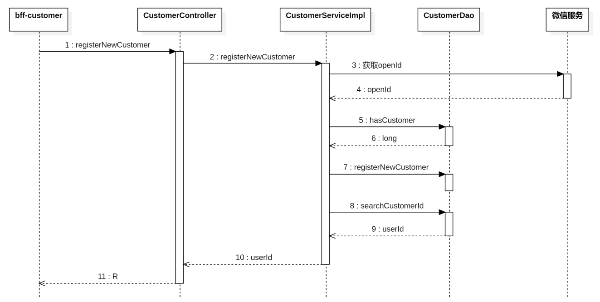

### 编写持久层

在`<font style="color:#000000;background-color:rgba(220, 240, 255, 0.3) !important;">CustomerDao.xml</font>`文件中声明三个DAO方法。

```xml
<insert id="registerNewCustomer" parameterType="Map">
    INSERT INTO tb_customer(id,open_id,nickname,sex,photo,tel,`status`)
    values(#{id},#{openId},#{nickname},#{sex},#{photo},#{tel},1)
</insert>
<select id="hasCustomer" parameterType="Map" resultType="long">
    SELECT COUNT(id) AS ct
    FROM tb_customer
    WHERE 1=1
    <if test="openId!=null">
        AND open_id = #{openId}
    </if>
    <if test="customerId!=null">
        AND id = #{customerId}
    </if>
</select>
<select id="searchCustomerId" parameterType="String" resultType="String">
    SELECT CAST(id AS CHAR) AS id
    FROM tb_customer
    WHERE open_id = #{openId}
</select>
```

在`<font style="color:#000000;background-color:rgba(220, 240, 255, 0.3) !important;">com.example.zxds.cst.db.dao</font>`包`<font style="color:#000000;background-color:rgba(220, 240, 255, 0.3) !important;">CustomerDao.java</font>`接口中，声明DAO方法

```java
package com.example.zxds.cst.db.dao;

import java.util.Map;

public interface CustomerDao {
    int registerNewCustomer(Map<String, Object> param);

    long hasCustomer(Map<String, Object> param);

    String searchCustomerId(String openId);
}
```

### 编写 service 和实现

在`<font style="color:#000000;background-color:rgba(220, 240, 255, 0.3) !important;">com.example.zxds.cst.service</font>`包中创建`<font style="color:#000000;background-color:rgba(220, 240, 255, 0.3) !important;">CustomerService.java</font>`接口，声明抽象方法

```java
package com.example.zxds.cst.service;

import java.util.Map;

public interface CustomerService {
    String registerNewCustomer(Map<String, Object> param);
}
```

在`<font style="color:#000000;background-color:rgba(220, 240, 255, 0.3) !important;">com.example.zxds.cst.service.impl</font>`包中创建`<font style="color:#000000;background-color:rgba(220, 240, 255, 0.3) !important;">CustomerServiceImpl.java</font>`类，实现抽象方法。

```java
package com.example.zxds.cst.service.impl;

import cn.hutool.core.map.MapUtil;
import cn.hutool.core.util.IdUtil;
import com.example.zxds.common.exception.ZxdsException;
import com.example.zxds.common.util.MicroAppUtil;
import com.example.zxds.cst.db.dao.CustomerDao;
import com.example.zxds.cst.service.CustomerService;
import lombok.RequiredArgsConstructor;
import org.springframework.stereotype.Service;
import org.springframework.transaction.annotation.Transactional;

import java.util.HashMap;
import java.util.Map;

@Service
@RequiredArgsConstructor
public class CustomerServiceImpl implements CustomerService {

    private final CustomerDao customerDao;

    private final MicroAppUtil microAppUtil;

    @Override
    @Transactional
    public String registerNewCustomer(Map<String, Object> param) {
        String code = MapUtil.getStr(param, "code");
        String openId = microAppUtil.getOpenId(code);
        Map<String, Object> tempParam = new HashMap<>() {{
            put("openId", openId);
        }};
        if (customerDao.hasCustomer(tempParam) != 0) {
            throw new ZxdsException("该微信无法注册");
        }

        long id = IdUtil.getSnowflake(1, 2).nextId();
        param.put("id", id);
        param.put("openId", openId);
        customerDao.registerNewCustomer(param);
        String customerId = customerDao.searchCustomerId(openId);
        return customerId;
    }
}
```

### 编写 form 接收数据并校验

在`<font style="color:#000000;background-color:rgba(220, 240, 255, 0.3) !important;">com.example.zxds.cst.controller.form</font>`包中创建`<font style="color:#000000;background-color:rgba(220, 240, 255, 0.3) !important;">RegisterNewCustomerForm.java</font>`类，接收提交的数据。

```java
package com.example.zxds.cst.controller.form;

import io.swagger.v3.oas.annotations.media.Schema;
import lombok.Data;

import javax.validation.constraints.NotBlank;
import javax.validation.constraints.Pattern;

@Data
@Schema(description = "注册新客户")
public class RegisterNewCustomerForm {
    @NotBlank(message = "code不能为空")
    @Schema(description = "微信小程序临时授权")
    private String code;

    @NotBlank(message = "nickname不能为空")
    @Schema(description = "用户昵称")
    private String nickname;

    @NotBlank(message = "photo不能为空")
    @Schema(description = "用户头像")
    private String photo;

    @NotBlank(message = "性别不能为空")
    @Pattern(regexp = "^男$|^女$|^无$", message = "sex内容不正确")
    private String sex;

    @NotBlank(message = "tel不能为空")
    @Pattern(regexp = "^1\\d{10}$", message = "tel内容不正确")
    @Schema(description = "电话")
    private String tel;
}
```

在`<font style="color:#000000;background-color:rgba(220, 240, 255, 0.3) !important;">com.example.zxds.cst.controller</font>`包中创建`<font style="color:#000000;background-color:rgba(220, 240, 255, 0.3) !important;">CustomerController.java</font>`类，声明Web方法

```java
package com.example.zxds.cst.controller;

import cn.hutool.core.bean.BeanUtil;
import com.example.zxds.common.util.R;
import com.example.zxds.cst.controller.form.RegisterNewCustomerForm;
import com.example.zxds.cst.service.CustomerService;
import io.swagger.v3.oas.annotations.Operation;
import io.swagger.v3.oas.annotations.tags.Tag;
import lombok.RequiredArgsConstructor;
import org.springframework.web.bind.annotation.PostMapping;
import org.springframework.web.bind.annotation.RequestBody;
import org.springframework.web.bind.annotation.RequestMapping;
import org.springframework.web.bind.annotation.RestController;

import javax.validation.Valid;
import java.util.Map;

@RestController
@RequestMapping("/customer")
@Tag(name = "CustomerController", description = "客户Web接口")
@RequiredArgsConstructor
public class CustomerController {
    private final CustomerService customerService;

    @PostMapping("/registerNewCustomer")
    @Operation(summary = "乘客注册")
    public R registerNewCustomer(@RequestBody @Valid RegisterNewCustomerForm form) {
        Map<String, Object> param = BeanUtil.beanToMap(form);
        String userId = customerService.registerNewCustomer(param);
        return R.ok().put("userId", userId);
    }
}
```

## 编写 bff-customer 子系统

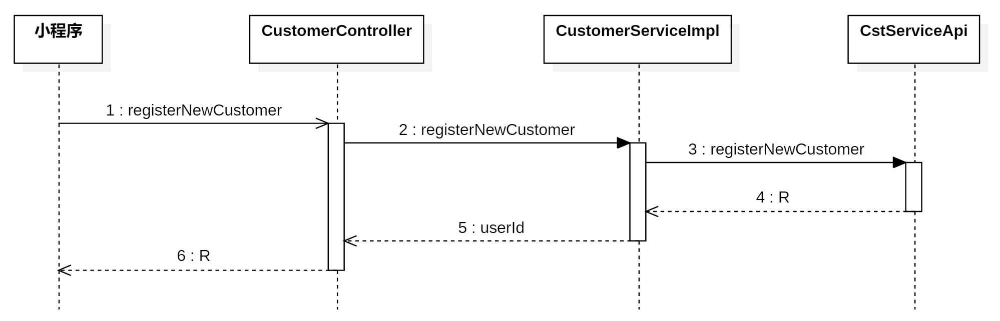

### 编写 Feign 客户端

在`<font style="color:#000000;background-color:rgba(220, 240, 255, 0.3) !important;">com.example.zxds.bff.customer.controller.form</font>`包中创建`<font style="color:#000000;background-color:rgba(220, 240, 255, 0.3) !important;">RegisterNewCustomerForm.java</font>`类，接收提交的数据。

```java
package com.example.zxds.bff.customer.controller.form;

import io.swagger.v3.oas.annotations.media.Schema;
import lombok.Data;

import javax.validation.constraints.NotBlank;
import javax.validation.constraints.Pattern;

@Data
@Schema(description = "注册新客户")
public class RegisterNewCustomerForm {
    @NotBlank(message = "code不能为空")
    @Schema(description = "微信小程序临时授权")
    private String code;

    @NotBlank(message = "nickname不能为空")
    @Schema(description = "用户昵称")
    private String nickname;

    @NotBlank(message = "photo不能为空")
    @Schema(description = "用户头像")
    private String photo;

    @NotBlank(message = "性别不能为空")
    @Pattern(regexp = "^男$|^女$|^无$", message = "sex内容不正确")
    private String sex;

    @NotBlank(message = "tel不能为空")
    @Pattern(regexp = "^1\\d{10}$", message = "tel内容不正确")
    @Schema(description = "电话")
    private String tel;

}
```

在`<font style="color:#000000;background-color:rgba(220, 240, 255, 0.3) !important;">com.example.zxds.bff.customer.feign</font>`包中创建`<font style="color:#000000;background-color:rgba(220, 240, 255, 0.3) !important;">CstServiceApi.java</font>`类，定义抽象方法

```java
package com.example.zxds.bff.customer.feign;

import com.example.zxds.bff.customer.controller.form.RegisterNewCustomerForm;
import com.example.zxds.common.util.R;
import org.springframework.cloud.openfeign.FeignClient;
import org.springframework.web.bind.annotation.PostMapping;

@FeignClient(value = "zxds-cst")
public interface CstServiceApi {
    
    @PostMapping("/customer/registerNewCustomer")
    R registerNewCustomer(RegisterNewCustomerForm form);
    
}
```

### 编写 service 和实现

在`<font style="color:#000000;background-color:rgba(220, 240, 255, 0.3) !important;">com.example.zxds.bff.customer.service</font>`包中创建`<font style="color:#000000;background-color:rgba(220, 240, 255, 0.3) !important;">CustomerService.java</font>`接口，声明抽象方法

```java
package com.example.zxds.bff.customer.service;

import com.example.zxds.bff.customer.controller.form.RegisterNewCustomerForm;

public interface CustomerService {
    long registerNewCustomer(RegisterNewCustomerForm form);
}
```

在`<font style="color:#000000;background-color:rgba(220, 240, 255, 0.3) !important;">com.example.zxds.bff.customer.service.impl</font>`包中创建`<font style="color:#000000;background-color:rgba(220, 240, 255, 0.3) !important;">CustomerServiceImpl.java</font>`类，实现抽象方法

```java
package com.example.zxds.bff.customer.service.impl;

import cn.hutool.core.convert.Convert;
import com.example.zxds.bff.customer.controller.form.RegisterNewCustomerForm;
import com.example.zxds.bff.customer.feign.CstServiceApi;
import com.example.zxds.bff.customer.service.CustomerService;
import com.example.zxds.common.util.R;
import io.seata.spring.annotation.GlobalTransactional;
import lombok.RequiredArgsConstructor;
import org.springframework.stereotype.Service;

@Service
@RequiredArgsConstructor
public class CustomerServiceImpl implements CustomerService {

    private final CstServiceApi cstServiceApi;

    @Override
    @GlobalTransactional
    public long registerNewCustomer(RegisterNewCustomerForm form) {
        R r = cstServiceApi.registerNewCustomer(form);
        long userId = Convert.toLong(r.get("userId"));
        return userId;
    }
}
```

### 编写 web 方法

在`<font style="color:#000000;background-color:rgba(220, 240, 255, 0.3) !important;">com.example.zxds.bff.customer.controller</font>`包中创建`<font style="color:#000000;background-color:rgba(220, 240, 255, 0.3) !important;">CustomerController.java</font>`类，声明Web方法

```java
package com.example.zxds.bff.customer.controller;

import cn.dev33.satoken.stp.StpUtil;
import com.example.zxds.bff.customer.controller.form.RegisterNewCustomerForm;
import com.example.zxds.bff.customer.service.CustomerService;
import com.example.zxds.common.util.R;
import io.swagger.v3.oas.annotations.Operation;
import io.swagger.v3.oas.annotations.tags.Tag;
import lombok.RequiredArgsConstructor;
import org.springframework.web.bind.annotation.PostMapping;
import org.springframework.web.bind.annotation.RequestBody;
import org.springframework.web.bind.annotation.RequestMapping;
import org.springframework.web.bind.annotation.RestController;


import javax.validation.Valid;

@RestController
@RequestMapping("/customer")
@Tag(name = "CustomerController", description = "客户Web接口")
@RequiredArgsConstructor
public class CustomerController {

    private final CustomerService customerService;

    @PostMapping("/registerNewCustomer")
    @Operation(summary = "注册新乘客")
    public R registerNewCustomer(@RequestBody @Valid RegisterNewCustomerForm form) {
        long customerId = customerService.registerNewCustomer(form);
        StpUtil.login(customerId);
        String token = StpUtil.getTokenInfo().getTokenValue();
        return R.ok().put("token", token);
    }
}
```

## 小程序端实现乘客注册

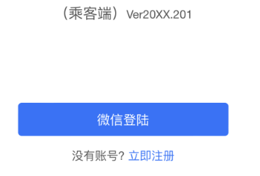

 

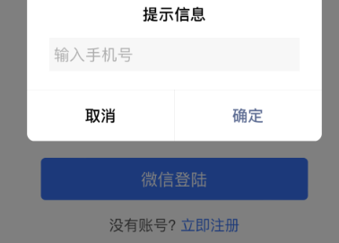

乘客端小程序默认加载的也是`<font style="color:#000000;background-color:rgba(220, 240, 255, 0.3) !important;">login.vue</font>`页面，点击注册链接之后，直接让用户填写手机号码，然后执行注册。

另外，大家别忘了在`<font style="color:#000000;background-color:rgba(220, 240, 255, 0.3) !important;">zxds-customer-wx</font>`项目的`<font style="color:#000000;background-color:rgba(220, 240, 255, 0.3) !important;">manifest.json</font>`文件中填写你自己的小程序APPID。执行下面的命令安装依赖库。

```shell
cnpm install
```

### 定义网关路由路径

因为移动端发起的Ajax请求要经过网关子系统路由给`<font style="color:#000000;background-color:rgba(220, 240, 255, 0.3) !important;">bff-customer</font>`子系统，所以我们要切换到网关子系统中，配置一下YML文件。

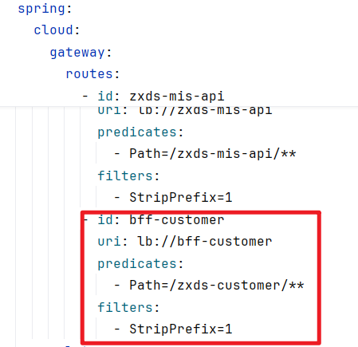

```yaml
        - id: bff-customer
          uri: lb://bff-customer
          predicates:
            - Path=/zxds-customer/**
          filters:
            - StripPrefix=1
```

### 定义全局 URL 路径

在 `<font style="color:#000000;">zxds-customer-wx/main.js</font>` 文件中：

```javascript
let baseUrl = "http://192.168.1.100:8201/zxds-customer"

Vue.prototype.url = {
          registerNewCustomer: `${baseUrl}/customer/registerNewCustomer`,
}
```

### 熟悉视图层

写代码之前，我们先来熟悉一下视图层的标签。其实`<font style="color:#000000;background-color:rgba(220, 240, 255, 0.3) !important;">login.vue</font>`页面内容并不复杂

```html
<view>
    <image src="../../static/login/top.png" mode="widthFix" class="top"></image>
    <image src="../../static/login/logo.png" mode="widthFix" class="logo"></image>
    <view class="desc">
        <text class="name">（乘客端）</text>
        <text class="version">Ver20XX.201</text>
    </view>
    <button class="btn" @tap="login">微信登录</button>
    <view class="register-container">
        没有账号?
        <text class="link" @tap="register">立即注册</text>
    </view>
    <text class="remark">本小程序仅限于智行代驾客户使用，新用户必须先注册方可在本小程序中下单。</text>
    <u-toast ref="uToast" />
</view>
```

### 编写用户注册代码

`<font style="color:#000000;">pages/login/login.vue</font>`页面。

“立即注册”链接的点击事件回调函数`<font style="color:#000000;background-color:rgba(220, 240, 255, 0.3) !important;">register()</font>`我们必须先声明一下。

```javascript
register() {
    let that = this;
    uni.showModal({
        title: '提示信息',
        editable: true,
        placeholderText: '输入手机号',
        success: function(resp) {
            let tel = resp.content;
            if (resp.confirm) {
                let bool = that.checkValidTel(tel, '手机号码');
                if (bool) {
                    uni.login({
                        provider: 'weixin',
                        success: function(resp) {
                            let code = resp.code;
                            that.code = code;
                        }
                    });
                    uni.getUserProfile({
                        desc: '获取用户信息',
                        success: function(resp) {
                            let nickname = resp.userInfo.nickName;
                            let avatarUrl = resp.userInfo.avatarUrl;
                            let sex = resp.userInfo.gender;
                            let sexJson = {
                                '0': '无',
                                '1': '男',
                                '2': '女'
                            };
                            sex = sexJson[sex+""];

                            let data = {
                                code: that.code,
                                nickname: nickname,
                                photo: avatarUrl,
                                sex: sex,
                                tel: tel
                            };
                            that.ajax(that.url.registerNewCustomer, 'POST', data, function(resp) {
                                let token = resp.data.token;
                                uni.setStorageSync('token', token);
                                that.$refs.uToast.show({
                                    title: '注册成功',
                                    type: 'success',
                                    callback: function() {
                                        uni.switchTab({
                                            url: '../workbench/workbench'
                                        });
                                    }
                                });
                            });
                        }
                    });
                }
            }
        }
    });
}
```

### 执行注册

我们要启动`<font style="color:#000000;background-color:rgba(220, 240, 255, 0.3) !important;">zxds-cst</font>`、`<font style="color:#000000;background-color:rgba(220, 240, 255, 0.3) !important;">bff-customer</font>`和`<font style="color:#000000;background-color:rgba(220, 240, 255, 0.3) !important;">gateway</font>`子系统，然后在手机上面真机调试小程序，完成用户的注册功能。

# 实现乘客登录（课下完成）

## 编写 zxds-cst 子系统

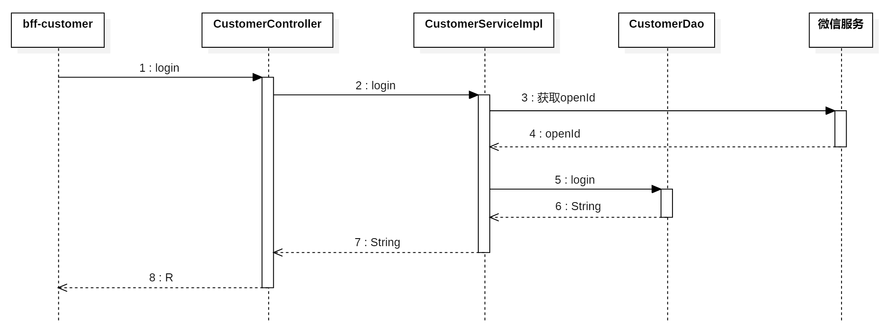

### 编写持久层代码

在`<font style="color:#000000;background-color:rgba(220, 240, 255, 0.3) !important;">CustomerDao.xml</font>`文件中，定义SQL语句。

```xml
<select id="login" parameterType="String" resultType="String">
    SELECT CAST(id AS CHAR) AS id
    FROM tb_customer
    WHERE `status` != 2 AND open_id = #{openId}
</select>
```

在`<font style="color:#000000;background-color:rgba(220, 240, 255, 0.3) !important;">com.example.zxds.cst.db.dao</font>`包`<font style="color:#000000;background-color:rgba(220, 240, 255, 0.3) !important;">CustomerDao.java</font>`接口中，声明DAO方法。

```java
String login(String openId);
```

### 编写 service 和实现

在`<font style="color:#000000;background-color:rgba(220, 240, 255, 0.3) !important;">com.example.zxds.cst.service</font>`包`<font style="color:#000000;background-color:rgba(220, 240, 255, 0.3) !important;">CustomerService.java</font>`接口中，声明抽象方法

```java
String login(String code);
```

在`<font style="color:#000000;background-color:rgba(220, 240, 255, 0.3) !important;">com.example.zxds.cst.service.impl</font>`包`<font style="color:#000000;background-color:rgba(220, 240, 255, 0.3) !important;">CustomerServiceImpl.java</font>`接口中，实现抽象方法

```java
@Override
public String login(String code) {
    String openId = microAppUtil.getOpenId(code);
    String customerId = customerDao.login(openId);
    customerId = (customerId != null ? customerId : "");
    return customerId;
}
```

### 编写 form 接收数据并校验

在`<font style="color:#000000;background-color:rgba(220, 240, 255, 0.3) !important;">com.example.zxds.cst.controller.form</font>`包中创建`<font style="color:#000000;background-color:rgba(220, 240, 255, 0.3) !important;">LoginForm.java</font>`类，接收提交的数据

```java
package com.example.zxds.cst.controller.form;

import io.swagger.v3.oas.annotations.media.Schema;
import lombok.Data;

import javax.validation.constraints.NotBlank;

@Data
@Schema(description = "登录系统")
public class LoginForm {
    @NotBlank(message = "code不能为空")
    @Schema(description = "微信小程序临时授权")
    private String code;
}
```

### 编写 web 方法

在`<font style="color:#000000;background-color:rgba(220, 240, 255, 0.3) !important;">com.example.zxds.cst.controller</font>`包`<font style="color:#000000;background-color:rgba(220, 240, 255, 0.3) !important;">CustomerController.java</font>`类中，声明Web方法

```java
@PostMapping("/login")
@Operation(summary = "登录系统")
public R login(@RequestBody @Valid LoginForm form) {
    String userId = customerService.login(form.getCode());
    return R.ok().put("userId", userId);
}
```

## 编写 bff-customer 子系统

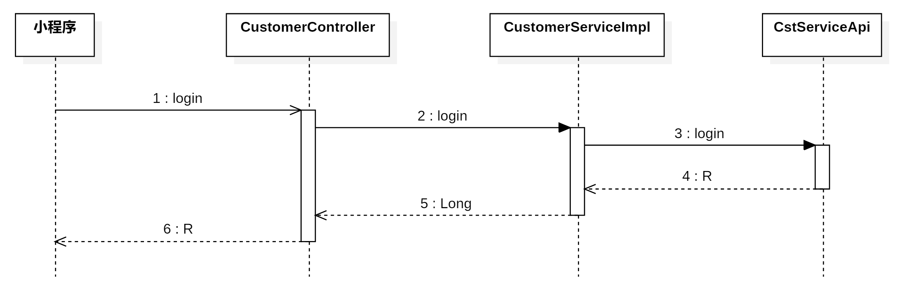

### 编写 Feign 客户端

在`<font style="color:#000000;background-color:rgba(220, 240, 255, 0.3) !important;">com.example.zxds.bff.customer.controller.form</font>`包中创建`<font style="color:#000000;background-color:rgba(220, 240, 255, 0.3) !important;">LoginForm.java</font>`类，接收Ajax提交的数据

```java
package com.example.zxds.bff.customer.controller.form;

import io.swagger.v3.oas.annotations.media.Schema;
import lombok.Data;

import javax.validation.constraints.NotBlank;

@Data
@Schema(description = "登录系统")
public class LoginForm {
    @NotBlank(message = "code不能为空")
    @Schema(description = "微信小程序临时授权")
    private String code;
}
```

在`<font style="color:#000000;background-color:rgba(220, 240, 255, 0.3) !important;">com.example.zxds.bff.customer.feign</font>`包`<font style="color:#000000;background-color:rgba(220, 240, 255, 0.3) !important;">CstServiceApi.java</font>`接口中，声明抽象方法

```java
@PostMapping("/customer/login")
R login(LoginForm form);
```

### 编写 service 和实现

在`<font style="color:#000000;background-color:rgba(220, 240, 255, 0.3) !important;">com.example.zxds.bff.customer.service</font>`包`<font style="color:#000000;background-color:rgba(220, 240, 255, 0.3) !important;">CustomerService.java</font>`接口中，声明抽象方法

```java
Long login(LoginForm form);
```

在`<font style="color:#000000;background-color:rgba(220, 240, 255, 0.3) !important;">com.example.zxds.bff.customer.service.impl</font>`包`<font style="color:#000000;background-color:rgba(220, 240, 255, 0.3) !important;">CustomerServiceImpl.java</font>`接口中，实现抽象方法

```java
@Override
public Long login(LoginForm form) {
    R r = cstServiceApi.login(form);
    String userId = MapUtil.getStr(r, "userId");
    if (!StrUtil.isBlank(userId)) {
        return Convert.toLong(userId);
    }
    return null;
}
```

### 编写 web 方法

在`<font style="color:#000000;background-color:rgba(220, 240, 255, 0.3) !important;">com.example.zxds.bff.customer.controller</font>`包`<font style="color:#000000;background-color:rgba(220, 240, 255, 0.3) !important;">CustomerController.java</font>`类中，声明Web方法

```java
@PostMapping("/login")
@Operation(summary = "登录系统")
public R login(@RequestBody @Valid LoginForm form) {
    Long customerId = customerService.login(form);
    if (customerId != null) {
        StpUtil.login(customerId);
        String token = StpUtil.getTokenInfo().getTokenValue();
        return R.ok().put("token", token);
    }
    return R.ok();
}
```

## 小程序端实现登录

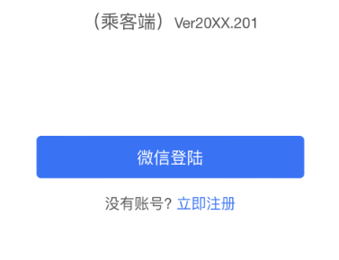

### 声明全局 URL

```javascript
Vue.prototype.url = {
        ……,
        login:`${baseUrl}/customer/login`,
}
```

### 熟悉视图层标签

小程序的`<font style="color:#000000;background-color:rgba(220, 240, 255, 0.3) !important;">login.vue</font>`页面内容并不复杂，排版也比较简单

```html
<view>
    <image src="../../static/login/top.png" mode="widthFix" class="top"></image>
    <image src="../../static/login/logo.png" mode="widthFix" class="logo"></image>
    <view class="desc">
        <text class="name">（乘客端）</text>
        <text class="version">Ver20XX.201</text>
    </view>
    <button class="btn" @tap="login">微信登录</button>
    <view class="register-container">
        没有账号?
        <text class="link" @tap="register">立即注册</text>
    </view>
    <text class="remark">本小程序仅限于智行代驾客户使用，新用户必须先注册方可在本小程序中下单。</text>
    <u-toast ref="uToast" />
</view>
```

### 实现登录功能

```javascript
login() {
    let that = this;
    uni.login({
        provider: 'weixin',
        success: function(resp) {
            let code = resp.code;
            let data = {
                code: code
            };
            that.ajax(that.url.login, 'POST', data, function(resp) {
                if (!resp.data.hasOwnProperty('token')) {
                    that.$refs.uToast.show({
                        title: '请先注册',
                        type: 'error'
                    });
                } else {
                    let token = resp.data.token;
                    uni.setStorageSync('token', token);
                    that.$refs.uToast.show({
                        title: '登录成功',
                        type: 'success',
                        callback: function() {
                            uni.switchTab({
                                url: '../workbench/workbench'
                            });
                        }
                    });
                }
            });
        }
    });
}
```

### 执行测试

我们先把`<font style="color:#000000;background-color:rgba(220, 240, 255, 0.3) !important;">zxds-cst</font>`、`<font style="color:#000000;background-color:rgba(220, 240, 255, 0.3) !important;">bff-customer</font>`和`<font style="color:#000000;background-color:rgba(220, 240, 255, 0.3) !important;">gateway</font>`子系统启动，然后运行小程序，执行登录测试。