# 智行代驾04

# 小程序端显示订单并语音播报订单

我们已经能用轮询的方式接收到新订单，接下来我们应该把新订单显示在工作台页面，然后用语音引擎播报新订单的详情。

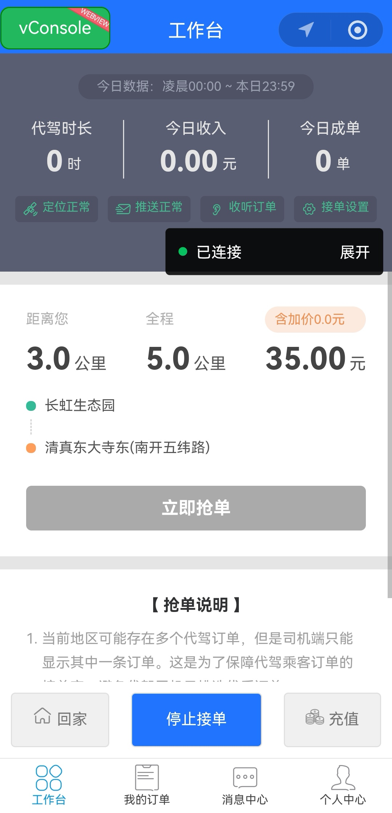

## 语音引擎

司机端小程序项目引用了微信官方的同声传译插件，既可以把文本转换成语音，也可以把语音转换成文字。

这里我们用文本转换成语音，把新订单播报出来。

这个是同声传译插件的官方文档，可以参考一下：[https://mp.weixin.qq.com/wxopen/plugindevdoc?appid=wx069ba97219f66d99&token=1202914355&lang=zh_CN](https://mp.weixin.qq.com/wxopen/plugindevdoc?appid=wx069ba97219f66d99&token=1202914355&lang=zh_CN)

**案例代码：**

```javascript
plugin.textToSpeech({
    lang: "zh_CN",
    tts: true,
    content: "文字描述，这里的内容会被转换成语音",
    success: function(resp) {
        console.log("语音合成sucess", resp.filename)
    },
    fail: function(resp) {
        console.log("语音合成fail", resp)
    }
})
```

## 封装显示订单的函数

显示订单和语音播报订单的代码量比较多，这里封装一个独立的函数`<font style="color:#000000;background-color:rgba(220, 240, 255, 0.3) !important;">showNewOrder()</font>`。将来在 `<font style="color:#000000;">createTimer()</font>`函数中调用。

在司机端的工作台页面 `<font style="color:#000000;">pages/workbench/workbench.vue</font>`的 `<font style="color:#000000;">methods</font>`中编写以下方法：

```javascript
showNewOrder(ref) {
    ref.playFlag = true;
    ref.canAcceptOrder = false;
    //从数组中取出第一个元素
    let order = ref.newOrderList.shift();
    //显示新订单
    let orderId = order.orderId;
    let distance = order.distance;
    let expectsFee = order.expectsFee;
    let favourFee = order.favourFee;
    let from = order.from;
    let to = order.to;
    let mileage = order.mileage;
    let minute = order.minute;
    ref.newOrder = {
        orderId: orderId,
        distance: distance,
        expectsFee: expectsFee,
        favourFee: favourFee,
        from: from,
        to: to,
        mileage: mileage,
        minute: minute
    };
    //是否语音播报订单
    if (ref.settings.listenService) {
        let audio = uni.createInnerAudioContext(); //创建播放器对象
        ref.audio = audio;
        plugin.textToSpeech({
            lang: 'zh_CN',
            tts: true,
            content: `即时订单，距离您${distance}公里，从${from}，到${to}，全程约${mileage}公里，预估代驾费${expectsFee}元`,
            success: function(resp) {
                audio.src = resp.filename; //选择播放的音频
                audio.play(); //执行播放
                audio.onEnded(function() {
                    ref.canAcceptOrder = true;
                    let verification = uni.getStorageSync('verification');
                    /*
                     * TODO 判断人脸识别凭证是否过期，如果过期就要重新人脸验证。
                     * 这是以防司机今天开始接单人脸验证通过，但是一直没有停止接单，
                     * 到了次日依然要重新做人脸验证。
                     *
                     */
                    if (false) {
                      
                    } else {
                      
                    }
                });
            },
            fail: function(resp) {
                console.error('语音订单播报失败', resp);
                ref.playFlag = false;
                ref.canAcceptOrder = true;
                ref.acception = false;
            }
        });
    }
}
```

在`<font style="color:#000000;background-color:rgba(220, 240, 255, 0.3) !important;">tb_driver_settings</font>`数据表里面`<font style="color:#000000;background-color:rgba(220, 240, 255, 0.3) !important;">settings</font>`字段的`<font style="color:#000000;background-color:rgba(220, 240, 255, 0.3) !important;">listenService</font>`属性值为true，代表语音播报订单

```json
{
  "autoAccept": 1, 
  "orientation": "", 
  "listenService": true, 
  "orderDistance": 0, 
  "rangeDistance": 5
}
```

在`<font style="color:#000000;background-color:rgba(220, 240, 255, 0.3) !important;">createTimer()</font>`函数里面，当我们接收到新订单消息之后，我们要调用`<font style="color:#000000;background-color:rgba(220, 240, 255, 0.3) !important;">showNewOrder()</font>`函数

```javascript
createTimer(ref) {
    let timer = setInterval(function() {
        ref.ajax(
            ref.url.receiveNewOrderMessage, 'POST', null, function(resp) {
                let result = resp.data.result;
                console.log(result);
                if (result.length > 0) {
                    //用新订单数组和原有订单数组拼接成新数组，新订单就放在数组开头
                    ref.newOrderList = result.concat(ref.newOrderList);
                    //如果当前没有播报订单，就显示新的订单
                    if (ref.playFlag == false) {
                        //调用封装函数
                        ref.showNewOrder(ref);
                    }
                }
            },
            false
        );
    }, 5000);
    return timer;
},
```

## 测试小程序

使用接口测试工具模拟客户下单，然后手机端运行司机小程序，然后查看司机端的工作台页面是否能够显示订单，以及语音播报订单。

# 司机抢单（秒杀超卖）

超卖问题我们在之前的项目中就遇到过。主要的原因是：读取库存和扣减库存不是原子性操作导致的。如果使用传统数据库的话，一般可以使用乐观锁机制防止超卖。但传统数据库的性能较差，一般会选择 redis 乐观锁+redis 事务来解决这个问题。

这里我们使用一种更加现代化的、安全的、效率高的方式来防止超卖的发生（**司机抢单也属于超卖问题：一个订单只能被一个司机抢到**）：**Lua 脚本**。

## Lua 脚本概述

Lua是一种**轻量级、可嵌入的脚本语言**，主要用于**应用程序的扩展和配置**。

主要作用：**嵌入到其他程序中（比如游戏、工业软件）**，让开发者能**在不修改主程序的情况下定制逻辑和行为**

Redis Lua是一种**专为Redis设计的受限Lua方言**，主要用于在Redis服务器端执行原子操作，不能作为通用Lua脚本使用。

**Redis Lua脚本是一种让用户能在Redis服务器内部，以原子方式、高性能地执行复杂数据操作的扩展机制。**

### **它是干什么的？**

它允许你将多个Redis命令**组合成一个脚本**，发送到Redis服务器**一次性执行**。脚本就像是一个自定义的、功能更强的Redis命令。

**简单示例：** 实现一个“如果键不存在则设置，并设置过期时间”的复合操作。

```lua
-- 这是一个原子操作：检查、设置、设置过期时间，中间不会被其他客户端打断
if redis.call("EXISTS", KEYS[1]) == 0 then
    redis.call("SET", KEYS[1], ARGV[1])
    redis.call("EXPIRE", KEYS[1], ARGV[2])
    return 1 -- 表示设置成功
else
    return 0 -- 表示键已存在
end
```

`<font style="color:#000000;">ARGV[1]</font>`是传递给 Lua 脚本的第一个参数。`<font style="color:#000000;">ARGV[2]</font>`则是第二个参数。

### **存在的核心意义（解决了什么问题）**

| 问题 | 传统方式（多命令） | 使用Lua脚本 |
| --- | --- | --- |
| **原子性** | 多个命令可能被其他客户端插队，需要`<font style="color:#000000;">WATCH</font>`+事务，复杂且可能失败。 | **天生原子**：脚本执行期间，Redis不会执行其他命令。 |
| **减少网络开销** | 每个命令一次网络往返（RTT），N个命令就是N次RTT，延迟高。 | **一次网络往返**：整个脚本一次发送，一次返回结果。 |
| **减少数据序列化** | 客户端需要接收**中间结果**，进行**多次序列化**处理。 | **服务器内部处理**：中间数据在Lua变量中流转，无需网络传输和客户端序列化。 |
| **实现复杂逻辑** | 无法在 Redis 服务器内部做条件判断、循环、计算等。 | **可编程**：具备变量、条件、循环、数学计算等完整的编程能力。 |
| **避免竞争条件** | 实现“检查-设置”这类模式非常困难，易出错。 | **简单可靠**：完美解决竞争条件。 |

### **核心特性总结**

1. **原子性**：最重要的特性，整个脚本在执行时是独占的。
2. **高性能**：网络和序列化开销极小。

**因此，Redis Lua脚本存在的根本意义在于：它把Redis从一个简单的“命令执行者”升级为了一个“逻辑处理器”，使开发者能在保证原子性和高性能的前提下，实现复杂的业务逻辑和数据操作。** 常见应用场景包括：分布式锁、限流器、库存扣减、原子性的统计计算等。

## 司机抢单实现原理

1. Redis Lua 脚本在其中起到最核心的作用。
2. 它的表现就是一个**分布式锁**的表现。
3. Redis Lua 脚本是一个**不可分割的 Redis 命令**，执行过程中其他 Redis 命令是无法执行的。因为 Redis 核心是单线程。
4. 即使在并发的环境下，Redis 命令也是排队执行的。
5. 我们在 Redis Lua 脚本中编写业务逻辑代码，自然这个**业务逻辑执行过程**不是并发的（**只有这一个业务在执行**）。
  1. 业务第一步（读 get）：通过 key（order#123）获取 value，看看 value 是不是 none
  2. 业务第二步（写 set）：如果不是 none，代表这个单子已经被其他司机拿走了。如果是 none 就把 none 修改为抢单司机的 id，代表被这个司机抢走了。
  3. 读写是一个整体，等于不存在并发的问题。
6. 单线程效率不会很差吗？不会，Lua 脚本属于 Redis 内部命令执行，无网络开销，性能极高。
7. Redis Lua 脚本执行结束之后返回一个字符串结果，后续程序通过这个字符串结果继续执行，如果 Lua 脚本返回 SUCCESS，则表示当前司机抢单成功，去修改 mysql 数据库表。
8. mysql 数据库表修改成功后，删除 Redis 中的订单缓存。

**以上原理，等于我们使用 Redis Lua 脚本实现了一个分布式锁。**

## Redis 持久化策略的配置

对于代驾系统来说，redis 中存储的要抢单的 key 比较重要，如果 key 丢失，则表示订单在逻辑上是消失的，没有司机再能抢到这个订单了。因此 Redis 的持久化策略就比较重要了。以防 redis 崩溃后数据丢失。

我们采用 AOF 和 RDB 混合持久化方式，在原配置文件中添加以下配置：

```nginx
appendonly yes                                # 开启AOF持久化模式
appendfilename "appendonly.aof"               # aof文件名
appendfsync everysec                          # 每秒同步一次到磁盘，平衡性能和数据安全
aof-use-rdb-preamble yes                      # 启用混合持久化
```

另外关闭单独的 RDB 持久化模式：

```nginx
save ""                                       # 彻底关闭RDB

#注释掉
#save 900 1
#save 300 10
#save 60 10000
```

## 编写 zxds-odr 子系统

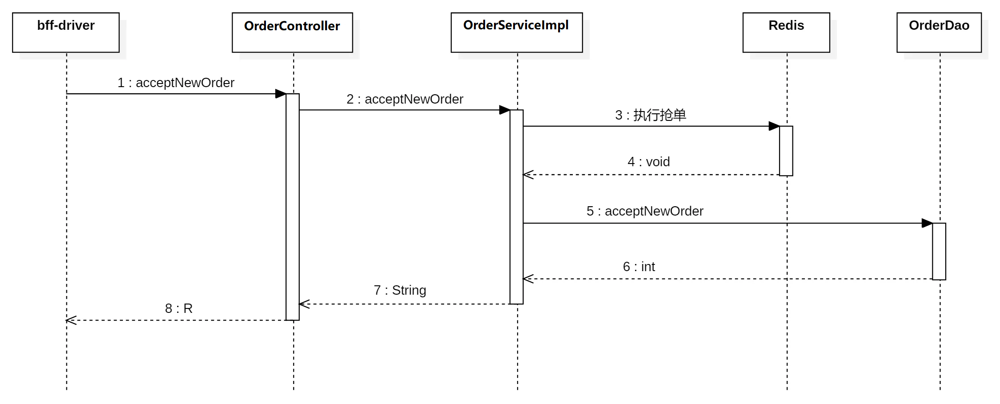

### 编写持久层代码

司机抢单成功后，需要更新订单记录中的`<font style="color:#000000;background-color:rgba(220, 240, 255, 0.3) !important;">driver_id</font>`、`<font style="color:#000000;background-color:rgba(220, 240, 255, 0.3) !important;">accept_time</font>`和`<font style="color:#000000;background-color:rgba(220, 240, 255, 0.3) !important;">status</font>`字段。在`<font style="color:#000000;background-color:rgba(220, 240, 255, 0.3) !important;">OrderDao.xml</font>`文件中，定义SQL语句。

```xml
<update id="acceptNewOrder" parameterType="Map">
    UPDATE tb_order
    SET driver_id   = #{driverId},
        accept_time = NOW(),
        `status`=2
    WHERE id = #{orderId} and `status` = 1
</update>
```

在`<font style="color:#000000;background-color:rgba(220, 240, 255, 0.3) !important;">com.example.zxds.odr.db.dao</font>`包`<font style="color:#000000;background-color:rgba(220, 240, 255, 0.3) !important;">OrderDao.java</font>`接口中，声明DAO方法

```java
int acceptNewOrder(Map<String, Object> param);
```

### 编写 service 和实现

在`<font style="color:#000000;background-color:rgba(220, 240, 255, 0.3) !important;">com.example.zxds.odr.service</font>`包`<font style="color:#000000;background-color:rgba(220, 240, 255, 0.3) !important;">OrderService.java</font>`接口中，声明抽象方法

```java
String acceptNewOrder(long driverId, long orderId);
```

**先来看看 Redis Lua 脚本怎么写：**

```lua
-- 抢单脚本
-- KEYS[1]: 订单键，如 "order#123"
-- ARGV[1]: 司机ID，如 "1001"
-- 返回值:
--   "KEY_NOT_EXIST" - 订单不存在
--   "ALREADY_TAKEN:司机ID" - 订单已被抢
--   "SUCCESS" - 抢单成功

local key = KEYS[1]
local driver = ARGV[1]

local current = redis.call('GET', key)
if current == false then
    return 'KEY_NOT_EXIST'
end

if current ~= 'none' then
    return 'ALREADY_TAKEN:' .. current
end

redis.call('SET', key, driver)
redis.call('EXPIRE', key, 300)

return 'SUCCESS'
```

在`<font style="color:#000000;background-color:rgba(220, 240, 255, 0.3) !important;">com.example.zxds.odr.service.impl</font>`包`<font style="color:#000000;background-color:rgba(220, 240, 255, 0.3) !important;">OrderServiceImpl.java</font>`类中，实现抽象方法

```java
// 司机抢单的Redis Lua脚本
private static final String GRAB_ORDER_SCRIPT = """
        local key = KEYS[1]
        local driver = ARGV[1]
        
        local current = redis.call('GET', key)
        if current == false then
            return 'KEY_NOT_EXIST'
        end
        
        if current ~= 'none' then
            return 'ALREADY_TAKEN:' .. current
        end
        
        redis.call('SET', key, driver)
        redis.call('EXPIRE', key, 300)
        
        return 'SUCCESS'
        """;

private DefaultRedisScript<String> grabScript;

@PostConstruct
public void init() {
    grabScript = new DefaultRedisScript<>();
    grabScript.setScriptText(GRAB_ORDER_SCRIPT);
    grabScript.setResultType(String.class);
}

@Override
@Transactional
public String acceptNewOrder(long driverId, long orderId) {

    String key = "order#" + orderId;
    String driverIdStr = String.valueOf(driverId);

    // 执行Redis Lua脚本进行抢单
    String result = stringRedisTemplate.execute(grabScript, Collections.singletonList(key), driverIdStr);
    if ("KEY_NOT_EXIST".equals(result)) {
        return "抢单失败：订单不存在";
    }
    if (result.startsWith("ALREADY_TAKEN:")) {
        String takenDriverId = result.substring(14);
        return "抢单失败：订单已被司机" + takenDriverId + "抢走";
    }
    if (!"SUCCESS".equals(result)) {
        return "抢单失败";
    }

    // 抢单成功，更新mysql
    try {
        Map<String, Object> params = new HashMap<>();
        params.put("driverId", driverId);
        params.put("orderId", orderId);
        int rows = orderDao.acceptNewOrder(params);
        if (rows == 1) {
            // 删除redis中的订单缓存
            stringRedisTemplate.delete(key);
            return "抢单成功";
        }else{
            // 将redis的订单缓存的value重新修改为none
            stringRedisTemplate.opsForValue().set(key, "none", 15, TimeUnit.MINUTES);
            return "抢单失败";
        }
    } catch (Exception e) {
        // 将redis的订单缓存的value重新修改为none
        stringRedisTemplate.opsForValue().set(key, "none", 15, TimeUnit.MINUTES);
        throw new ZxdsException(e.getMessage());
    }
}
```

### 编写 web 方法

在`<font style="color:#000000;background-color:rgba(220, 240, 255, 0.3) !important;">com.example.zxds.odr.controller.form</font>`包中定义`<font style="color:#000000;background-color:rgba(220, 240, 255, 0.3) !important;">AcceptNewOrderForm.java</font>`类

```java
package com.example.zxds.odr.controller.form;

import io.swagger.v3.oas.annotations.media.Schema;
import lombok.Data;

import javax.validation.constraints.Min;
import javax.validation.constraints.NotNull;

@Data
@Schema(description = "司机接单的表单")
public class AcceptNewOrderForm {
    @NotNull(message = "driverId不能为空")
    @Min(value = 1, message = "driverId不能小于1")
    @Schema(description = "司机ID")
    private Long driverId;

    @NotNull(message = "orderId不能为空")
    @Min(value = 1, message = "orderId不能小于1")
    @Schema(description = "订单ID")
    private Long orderId;
}
```

在`<font style="color:#000000;background-color:rgba(220, 240, 255, 0.3) !important;">com.example.zxds.odr.controller</font>`包`<font style="color:#000000;background-color:rgba(220, 240, 255, 0.3) !important;">OrderController.java</font>`类，声明Web方法

```java
@PostMapping("/acceptNewOrder")
@Operation(summary = "司机接单")
public R acceptNewOrder(@RequestBody @Valid AcceptNewOrderForm form) {
    String result = orderService.acceptNewOrder(form.getDriverId(), form.getOrderId());
    return R.ok().put("result", result);
}
```

## 编写 bff-driver 子系统

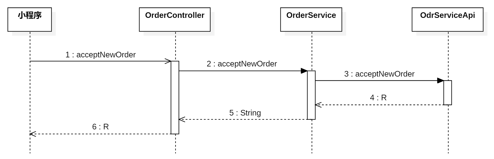

### 编写 Feign 客户端

在`<font style="color:#000000;background-color:rgba(220, 240, 255, 0.3) !important;">com.example.zxds.bff.driver.controller.form</font>`包中创建`<font style="color:#000000;background-color:rgba(220, 240, 255, 0.3) !important;">AcceptNewOrderForm.java</font>`类

```java
package com.example.zxds.bff.driver.controller.form;

import io.swagger.v3.oas.annotations.media.Schema;
import lombok.Data;

import javax.validation.constraints.Min;
import javax.validation.constraints.NotNull;

@Data
@Schema(description = "司机接单的表单")
public class AcceptNewOrderForm {

    @Schema(description = "司机ID")
    private Long driverId;

    @NotNull(message = "orderId不能为空")
    @Min(value = 1, message = "orderId不能小于1")
    @Schema(description = "订单ID")
    private Long orderId;
}
```

在`<font style="color:#000000;background-color:rgba(220, 240, 255, 0.3) !important;">com.example.zxds.bff.driver.feign</font>`包`<font style="color:#000000;background-color:rgba(220, 240, 255, 0.3) !important;">OdrServiceApi.java</font>`接口中，声明抽象方法

```java
@PostMapping("/order/acceptNewOrder")
R acceptNewOrder(AcceptNewOrderForm form);
```

### 编写 service 和实现

在`<font style="color:#000000;background-color:rgba(220, 240, 255, 0.3) !important;">com.example.zxds.bff.driver.service</font>`包`<font style="color:#000000;background-color:rgba(220, 240, 255, 0.3) !important;">OrderService.java</font>`接口中，声明抽象方法

```java
package com.example.zxds.bff.driver.service;

import com.example.zxds.bff.driver.controller.form.AcceptNewOrderForm;


public interface OrderService {

    String acceptNewOrder(AcceptNewOrderForm form);
}
```

在`<font style="color:#000000;background-color:rgba(220, 240, 255, 0.3) !important;">com.example.zxds.bff.driver.service.impl</font>`包`<font style="color:#000000;background-color:rgba(220, 240, 255, 0.3) !important;">OrderServiceImpl.java</font>`类中，实现抽象方法

```java
package com.example.zxds.bff.driver.service.impl;

import cn.hutool.core.map.MapUtil;
import com.example.zxds.bff.driver.controller.form.AcceptNewOrderForm;
import com.example.zxds.bff.driver.feign.OdrServiceApi;
import com.example.zxds.bff.driver.service.OrderService;
import com.example.zxds.common.util.R;
import io.seata.spring.annotation.GlobalTransactional;
import lombok.RequiredArgsConstructor;
import org.springframework.stereotype.Service;

@Service
@RequiredArgsConstructor
public class OrderServiceImpl implements OrderService {

    private final OdrServiceApi odrServiceApi;

    @Override
    @GlobalTransactional
    public String acceptNewOrder(AcceptNewOrderForm form) {
        R r = odrServiceApi.acceptNewOrder(form);
        String result = MapUtil.getStr(r, "result");
        return result;
    }
}
```

### 编写 web 方法

在`<font style="color:#000000;background-color:rgba(220, 240, 255, 0.3) !important;">com.example.zxds.bff.driver.controller</font>`包`<font style="color:#000000;background-color:rgba(220, 240, 255, 0.3) !important;">OrderController.java</font>`类中，声明Web方法

```java
package com.example.zxds.bff.driver.controller;

import cn.dev33.satoken.annotation.SaCheckLogin;
import cn.dev33.satoken.stp.StpUtil;
import com.example.zxds.bff.driver.controller.form.AcceptNewOrderForm;
import com.example.zxds.bff.driver.service.OrderService;
import com.example.zxds.common.util.R;
import io.swagger.v3.oas.annotations.Operation;
import io.swagger.v3.oas.annotations.tags.Tag;
import lombok.RequiredArgsConstructor;
import org.springframework.web.bind.annotation.PostMapping;
import org.springframework.web.bind.annotation.RequestBody;
import org.springframework.web.bind.annotation.RequestMapping;
import org.springframework.web.bind.annotation.RestController;

import javax.validation.Valid;

@RestController
@RequestMapping("/order")
@RequiredArgsConstructor
@Tag(name = "OrderController", description = "订单模块Web接口")
public class OrderController {

    private final OrderService orderService;

    @PostMapping("/acceptNewOrder")
    @SaCheckLogin
    @Operation(summary = "司机接单")
    public R acceptNewOrder(@RequestBody @Valid AcceptNewOrderForm form) {
        long driverId = StpUtil.getLoginIdAsLong();
        form.setDriverId(driverId);
        String result = orderService.acceptNewOrder(form);
        return R.ok().put("result", result);
    }
}
```

### 测试 web 方法

按照之前的测试方式，手机上面运行司机端小程序，然后我们用 Apipost 调用Web方法模拟乘客下单。司机端小程序收到抢单信息之后，我们用 Apipost 调用Web方法手动执行抢单，抢单成功之后去看数据表中订单记录的`<font style="color:#000000;background-color:rgba(220, 240, 255, 0.3) !important;">driver_id</font>`和`<font style="color:#000000;background-color:rgba(220, 240, 255, 0.3) !important;">accept_time</font>`字段值。

# 司机端实现自动抢单和手动抢单

## 定义全局 URL

```javascript
Vue.prototype.url = {
    ……,
    acceptNewOrder: `${baseUrl}/order/acceptNewOrder`,
}
```

## 自动抢单

自动抢单的原理非常简单，就是当语音播报订单结束之后，JS代码就立即发出抢单Ajax请求。如果是手动抢单，就是司机点击抢单按钮之后再发出Ajax请求。

在工作台页面 `<font style="color:#000000;">workbench.vue</font>` 的`<font style="color:#000000;background-color:rgba(220, 240, 255, 0.3) !important;">showNewOrder()</font>`函数中，补充上自动抢单和手动抢单的代码。

**在这里补充：**

```javascript
if(false){
  
}else{
  // 在这里补充....
}
```

```javascript
showNewOrder(ref) {
    ……
    /*
     * 执行自动抢单
     */
    if (ref.settings.autoAccept) {
        ref.ajax(ref.url.acceptNewOrder, 'POST', { orderId: orderId },function(resp) {
                let result = resp.data.result;
                //自动抢单成功
                if (result == '接单成功') {
                    uni.showToast({
                        title: '接单成功'
                    });
                    audio = uni.createInnerAudioContext();
                    ref.audio = audio;
                    audio.src = '/static/voice/voice_3.mp3';
                    audio.play();
                    audio.onEnded(function() {
                        //停止接单
                        ref.audio = null;
                        ref.ajax(ref.url.stopWork, 'POST', null, function(resp) {});
                        //初始化新订单和列表变量
                        ref.newOrder = null;
                        ref.newOrderList.length = 0;
                        ref.executeOrder.id = orderId;
                        clearInterval(ref.reciveNewOrderTimer);
                        ref.reciveNewOrderTimer = null;
                        ref.playFlag = false;
                        //隐藏了工作台页面底部操作条之后，需要重新计算订单执行View的高度
                        ref.contentStyle = `width: 750rpx;height:${ref.windowHeight - 200 - 0}px;`;
                        //TODO 加载订单执行数据
                    });
                } else {
                    //自动抢单失败
                    audio = uni.createInnerAudioContext();
                    ref.audio = audio;
                    audio.src = '/static/voice/voice_4.mp3';
                    audio.play();
                    audio.onEnded(function() {
                        //抢单失败就切换下一个订单
                        ref.playFlag = false;
                        if (ref.newOrderList.length > 0) {
                            ref.showNewOrder(ref); //递归调用
                        } else {
                            ref.newOrder = null;
                        }
                    });
                }
            },
            false
        );
    } else {
        /**
         * 每个订单在页面上停留3秒钟，等待司机手动抢单
         */
        ref.playFlag = false;
        setTimeout(function() {
            //如果用户不是正在手动抢单中，就播放下一个新订单
            if (!ref.accepting) {
                ref.canAcceptOrder = false;
                if (ref.newOrderList.length > 0) {
                    ref.showNewOrder(ref); //递归调用
                } else {
                    ref.newOrder = null;
                }
            }
        }, 3000);
    }
},
```

## 手动抢单

页面上抢单按钮设置上点击事件，点击按钮就发出Ajax请求

```html
 <button :class="!canAcceptOrder ? 'disabled-btn' : 'accept-btn'" 
         @tap="acceptHandle">
   立即抢单
</button>
```

按钮点击事件的回调函数`<font style="color:#000000;background-color:rgba(220, 240, 255, 0.3) !important;">acceptHandle()</font>`咱们要声明一下

```javascript
acceptHandle() {
    let that = this;
    if (!that.canAcceptOrder || that.accepting) {
        return;
    }

    that.accepting = true; //正在抢单中，该变量可以避免多次重复抢单
    uni.vibrateShort({});
    that.ajax(that.url.acceptNewOrder, 'POST', { orderId: that.newOrder.orderId }, function(resp) {
        let audio = uni.createInnerAudioContext();
        let result = resp.data.result;
        //手动抢单成功
        if (result == '接单成功') {
            uni.showToast({
                title: '接单成功'
            });
            that.audio = audio;
            audio.src = '/static/voice/voice_3.mp3';
            audio.play();
            audio.onEnded(function() {
                //停止接单
                that.audio = null;
                that.ajax(that.url.stopWork, 'POST', null, function(resp) {});

                //初始化新订单和列表变量
                that.executeOrder.id = that.newOrder.orderId;
                that.newOrder = null;
                that.newOrderList.length = 0;
                clearInterval(that.reciveNewOrderTimer);
                that.reciveNewOrderTimer = null;
                that.playFlag = false;
                that.accepting = false;
                that.canAcceptOrder = false;
                //隐藏了工作台页面底部操作条之后，需要重新计算订单执行View的高度
                that.contentStyle = `width: 750rpx;height:${that.windowHeight - 200 - 0}px;`;
                //TODO 加载订单执行数据
            });
        } else {
            that.audio = audio;
            audio.src = '/static/voice/voice_4.mp3';
            audio.play();
            that.playFlag = false;
            setTimeout(function() {
                that.accepting = false;
                that.canAcceptOrder = false;
                if (that.newOrderList.length > 0) {
                    that.showNewOrder(that); //递归调用
                } else {
                    that.newOrder = null;
                }
            }, 3000);
        }
    });
},
```

## 测试小程序

仍然是通过 apipost 发送请求完成客户下单。司机小程序启动之后，看看能不能自动抢单以及手动抢单。

**自动抢单和手动抢单和司机的设置表有关系：**

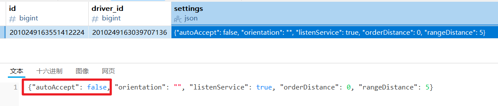

`<font style="color:#000000;">true</font>`表示自动接单。`<font style="color:#000000;">false</font>`表示手动接单。

# 加载执行订单后端实现

虽然抢单成功，但界面没有切换。为了能在工作台页面上显示当前执行的订单，接下来我们先把查询订单详情的后端代码实现了。

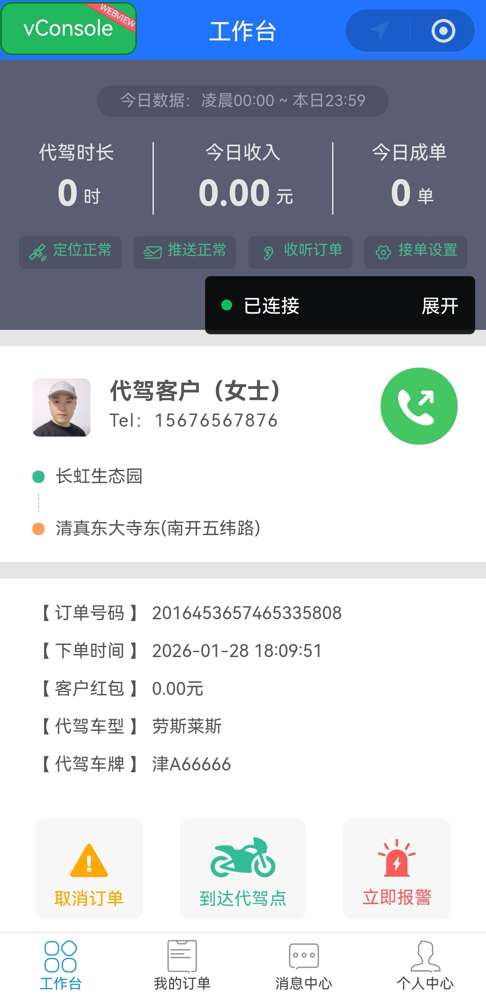

## 编写 zxds-odr 子系统

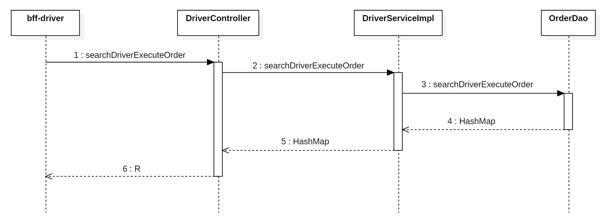

### 编写持久层代码

在`<font style="color:#000000;background-color:rgba(220, 240, 255, 0.3) !important;">OrderDao.xml</font>`文件中，声明SQL语句查询订单

```xml
<select id="searchDriverExecuteOrder" parameterType="Map" resultType="HashMap">
    SELECT CAST(id AS CHAR)                              AS id,
           customer_id                                   AS customerId,
           start_place                                   AS startPlace,
           start_place_location                          AS startPlaceLocation,
           end_place                                     AS endPlace,
           end_place_location                            AS endPlaceLocation,
           CAST(favour_fee AS CHAR)                      AS favourFee,
           car_plate                                     AS carPlate,
           car_type                                      AS carType,
           DATE_FORMAT(create_time, '%Y-%m-%d %H:%i:%s') AS createTime
    FROM tb_order
    WHERE id = #{orderId}
      AND driver_id = #{driverId}
</select>
```

在`<font style="color:#000000;background-color:rgba(220, 240, 255, 0.3) !important;">com.example.zxds.odr.db.dao</font>`包`<font style="color:#000000;background-color:rgba(220, 240, 255, 0.3) !important;">OrderDao.java</font>`接口中，声明DAO方法

```java
Map<String, Object> searchDriverExecuteOrder(Map<String, Object> param);
```

### 编写 service 和实现

在`<font style="color:#000000;background-color:rgba(220, 240, 255, 0.3) !important;">com.example.zxds.odr.service</font>`包`<font style="color:#000000;background-color:rgba(220, 240, 255, 0.3) !important;">OrderService.java</font>`接口中，声明抽象方法

```java
Map<String, Object> searchDriverExecuteOrder(Map<String, Object> param);
```

在`<font style="color:#000000;background-color:rgba(220, 240, 255, 0.3) !important;">com.example.zxds.odr.service.impl</font>`包`<font style="color:#000000;background-color:rgba(220, 240, 255, 0.3) !important;">OrderServiceImpl.java</font>`类中，实现抽象方法

```java
@Override
public Map<String, Object> searchDriverExecuteOrder(Map<String, Object> param) {
    Map<String, Object> map = orderDao.searchDriverExecuteOrder(param);
    return map;
}
```

### 编写 form 接收数据并校验

在`<font style="color:#000000;background-color:rgba(220, 240, 255, 0.3) !important;">com.example.zxds.odr.controller.form</font>`包中创建`<font style="color:#000000;background-color:rgba(220, 240, 255, 0.3) !important;">SearchDriverExecuteOrderForm.java</font>`类

```java
package com.example.zxds.odr.controller.form;

import io.swagger.v3.oas.annotations.media.Schema;
import lombok.Data;

import javax.validation.constraints.Min;
import javax.validation.constraints.NotNull;

@Data
@Schema(description = "查询司机正在执行的订单")
public class SearchDriverExecuteOrderForm {
    @NotNull(message = "orderId不能为空")
    @Min(value = 1, message = "orderId不能小于1")
    @Schema(description = "订单ID")
    private Long orderId;

    @NotNull(message = "driverId不能为空")
    @Min(value = 1, message = "driverId不能小于1")
    @Schema(description = "司机ID")
    private Long driverId;
}
```

### 编写 web 方法

在`<font style="color:#000000;background-color:rgba(220, 240, 255, 0.3) !important;">com.example.zxds.odr.controller</font>`包`<font style="color:#000000;background-color:rgba(220, 240, 255, 0.3) !important;">OrderController.java</font>`类中，声明Web方法

```java
@PostMapping("/searchDriverExecuteOrder")
@Operation(summary = "查询司机正在执行的订单记录")
public R searchDriverExecuteOrder(@RequestBody @Valid SearchDriverExecuteOrderForm form) {
    Map<String, Object> param = BeanUtil.beanToMap(form);
    Map<String, Object> map = orderService.searchDriverExecuteOrder(param);
    return R.ok().put("result", map);
}
```

## 编写 zxds-cst 子系统

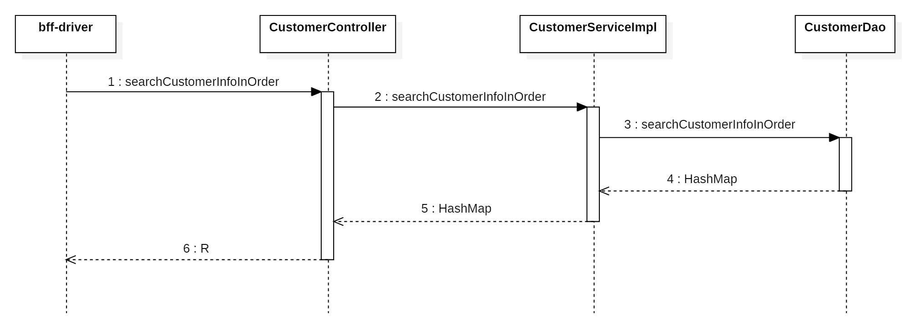

### 编写持久层代码

在`<font style="color:#000000;background-color:rgba(220, 240, 255, 0.3) !important;">CustomerDao.xml</font>`文件中，声明SQL语句

```xml
<select id="searchCustomerInfoInOrder" parameterType="long" resultType="HashMap">
    SELECT IF(sex = '男', '先生', '女士') AS title,
           tel,
           photo
    FROM tb_customer
    WHERE id = #{customerId}
</select>
```

在`<font style="color:#000000;background-color:rgba(220, 240, 255, 0.3) !important;">com.example.zxds.cst.db.dao</font>`包`<font style="color:#000000;background-color:rgba(220, 240, 255, 0.3) !important;">CustomerDao.java</font>`接口中，定义DAO方法

```java
Map<String, Object> searchCustomerInfoInOrder(long customerId);
```

### 编写 service 和实现

在`<font style="color:#000000;background-color:rgba(220, 240, 255, 0.3) !important;">com.example.zxds.cst.service</font>`包`<font style="color:#000000;background-color:rgba(220, 240, 255, 0.3) !important;">CustomerService.java</font>`接口中，声明抽象方法

```java
Map<String, Object> searchCustomerInfoInOrder(long customerId);
```

在`<font style="color:#000000;background-color:rgba(220, 240, 255, 0.3) !important;">com.example.zxds.cst.service.impl</font>`包`<font style="color:#000000;background-color:rgba(220, 240, 255, 0.3) !important;">CustomerServiceImpl.java</font>`接口中，实现抽象方法

```java
@Override
public Map<String, Object> searchCustomerInfoInOrder(long customerId) {
    Map<String, Object> map = customerDao.searchCustomerInfoInOrder(customerId);
    return map;
}
```

### 编写 form 接收数据并校验

在`<font style="color:#000000;background-color:rgba(220, 240, 255, 0.3) !important;">com.example.zxds.cst.controller.form</font>`包中创建`<font style="color:#000000;background-color:rgba(220, 240, 255, 0.3) !important;">SearchCustomerInfoInOrderForm.java</font>`类

```java
package com.example.zxds.cst.controller.form;

import io.swagger.v3.oas.annotations.media.Schema;
import lombok.Data;

import javax.validation.constraints.Min;
import javax.validation.constraints.NotNull;

@Data
@Schema(description = "查询订单中的客户信息")
public class SearchCustomerInfoInOrderForm {

    @NotNull(message = "customerId不能为空")
    @Min(value = 1, message = "customerId不能小于1")
    @Schema(description = "客户ID")
    private Long customerId;
}
```

### 编写 web 方法

在`<font style="color:#000000;background-color:rgba(220, 240, 255, 0.3) !important;">com.example.zxds.cst.controller</font>`包`<font style="color:#000000;background-color:rgba(220, 240, 255, 0.3) !important;">CustomerController.java</font>`类中，声明Web方法

```java
@PostMapping("/searchCustomerInfoInOrder")
@Operation(summary = "查询订单中的客户信息")
public R searchCustomerInfoInOrder(@RequestBody @Valid SearchCustomerInfoInOrderForm form) {
    Map<String, Object> map = customerService.searchCustomerInfoInOrder(form.getCustomerId());
    return R.ok().put("result", map);
}
```

## 编写 bff-driver 子系统

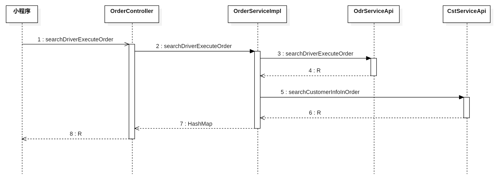

### 编写 Feign 客户端

在`<font style="color:#000000;background-color:rgba(220, 240, 255, 0.3) !important;">com.example.zxds.bff.driver.controller.form</font>`包中创建`<font style="color:#000000;background-color:rgba(220, 240, 255, 0.3) !important;">SearchDriverExecuteOrderForm.java</font>`类

```java
package com.example.zxds.bff.driver.controller.form;

import io.swagger.v3.oas.annotations.media.Schema;
import lombok.Data;

import javax.validation.constraints.Min;
import javax.validation.constraints.NotNull;

@Data
@Schema(description = "查询司机正在执行的订单")
public class SearchDriverExecuteOrderForm {
    @NotNull(message = "orderId不能为空")
    @Min(value = 1, message = "orderId不能小于1")
    @Schema(description = "订单ID")
    private Long orderId;

    @Schema(description = "司机ID")
    private Long driverId;
}
```

在`<font style="color:#000000;background-color:rgba(220, 240, 255, 0.3) !important;">com.example.zxds.bff.driver.feign</font>`包`<font style="color:#000000;background-color:rgba(220, 240, 255, 0.3) !important;">OdrServiceApi.java</font>`接口中，声明抽象方法

```java
@PostMapping("/order/searchDriverExecuteOrder")
R searchDriverExecuteOrder(SearchDriverExecuteOrderForm form);
```

在`<font style="color:#000000;background-color:rgba(220, 240, 255, 0.3) !important;">com.example.zxds.bff.driver.controller.form</font>`包中创建`<font style="color:#000000;background-color:rgba(220, 240, 255, 0.3) !important;">SearchCustomerInfoInOrderForm.java</font>`类

```java
package com.example.zxds.bff.driver.controller.form;

import io.swagger.v3.oas.annotations.media.Schema;
import lombok.Data;

import javax.validation.constraints.Min;
import javax.validation.constraints.NotNull;

@Data
@Schema(description = "查询订单中的客户信息")
public class SearchCustomerInfoInOrderForm {

    @NotNull(message = "customerId不能为空")
    @Min(value = 1, message = "customerId不能小于1")
    @Schema(description = "客户ID")
    private Long customerId;
}
```

在`<font style="color:#000000;background-color:rgba(220, 240, 255, 0.3) !important;">com.example.zxds.bff.driver.feign</font>`包`<font style="color:#000000;background-color:rgba(220, 240, 255, 0.3) !important;">CstServiceApi.java</font>`类中，声明抽象方法

```java
package com.example.zxds.bff.driver.feign;

import com.example.zxds.bff.driver.controller.form.SearchCustomerInfoInOrderForm;
import com.example.zxds.common.util.R;
import org.springframework.cloud.openfeign.FeignClient;
import org.springframework.web.bind.annotation.PostMapping;

@FeignClient(value = "zxds-cst")
public interface CstServiceApi {
    @PostMapping("/customer/searchCustomerInfoInOrder")
    R searchCustomerInfoInOrder(SearchCustomerInfoInOrderForm form);
}
```

### 编写 service 和实现

在`<font style="color:#000000;background-color:rgba(220, 240, 255, 0.3) !important;">com.example.zxds.bff.driver.service</font>`包`<font style="color:#000000;background-color:rgba(220, 240, 255, 0.3) !important;">OrderService.java</font>`接口中，声明抽象方法

```java
Map<String, Object> searchDriverExecuteOrder(SearchDriverExecuteOrderForm form);
```

在`<font style="color:#000000;background-color:rgba(220, 240, 255, 0.3) !important;">com.example.zxds.bff.driver.service.impl</font>`包`<font style="color:#000000;background-color:rgba(220, 240, 255, 0.3) !important;">OrderServiceImpl.java</font>`接口中，实现抽象方法

```java
private final CstServiceApi cstServiceApi;

@Override
public Map<String, Object> searchDriverExecuteOrder(SearchDriverExecuteOrderForm form) {
    //查询订单信息
    R r = odrServiceApi.searchDriverExecuteOrder(form);
    Map<String, Object> orderMap = (Map<String, Object>) r.get("result");

    //查询代驾客户信息
    long customerId = MapUtil.getLong(orderMap, "customerId");
    SearchCustomerInfoInOrderForm infoInOrderForm = new SearchCustomerInfoInOrderForm();
    infoInOrderForm.setCustomerId(customerId);
    r = cstServiceApi.searchCustomerInfoInOrder(infoInOrderForm);
    Map<String, Object> cstMap = (Map<String, Object>) r.get("result");

    Map<String, Object> map = new HashMap<>();
    map.putAll(orderMap);
    map.putAll(cstMap);
    return map;
}
```

### 编写 web 方法

在`<font style="color:#000000;background-color:rgba(220, 240, 255, 0.3) !important;">com.example.zxds.bff.driver.controller</font>`包`<font style="color:#000000;background-color:rgba(220, 240, 255, 0.3) !important;">OrderController.java</font>`类中，声明Web方法

```java
@PostMapping("/searchDriverExecuteOrder")
@SaCheckLogin
@Operation(summary = "查询司机正在执行的订单记录")
public R searchDriverExecuteOrder(@RequestBody @Valid SearchDriverExecuteOrderForm form) {
    long driverId = StpUtil.getLoginIdAsLong();
    form.setDriverId(driverId);
    Map<String, Object> map = orderService.searchDriverExecuteOrder(form);
    return R.ok().put("result", map);
}
```

### 测试 web 方法

把`<font style="color:#000000;background-color:rgba(220, 240, 255, 0.3) !important;">zxds-odr</font>`、`<font style="color:#000000;background-color:rgba(220, 240, 255, 0.3) !important;">zxds-cst</font>`、`<font style="color:#000000;background-color:rgba(220, 240, 255, 0.3) !important;">bff-driver</font>`子系统运行起来，然后用 Apipost 调用Web方法。

**请求地址：**[http://localhost:8101/order/searchDriverExecuteOrder](http://localhost:8101/order/searchDriverExecuteOrder)

**请求头参数：**token

**请求参数：**

```json
{
    "orderId": "2016383423819689984"
}
```

**响应结果：**

```json
{
        "msg": "success",
        "result": {
                "startPlace": "长虹生态园",
                "photo": "https://thirdwx.qlogo.cn/mmopen/vi_32/miaS2lJxGUra42f5icFDKDsQANsIkiaCZtdqoWYzfeJxiahxicCydtcmnJRaveRWlicTF0Kic5VEwqUW9C0eFDsauwpPabRnumicoXibHBk95c8FDdm8/132",
                "title": "女士",
                "startPlaceLocation": "{\"latitude\": \"39.134275\", \"longitude\": \"117.151856\"}",
                "endPlace": "清真东大寺东(南开五纬路)",
                "favourFee": "0.00",
                "carPlate": "津A66666",
                "endPlaceLocation": "{\"latitude\": \"39.124509\", \"longitude\": \"117.177706\"}",
                "carType": "劳斯莱斯",
                "createTime": "2026-01-28 13:30:46",
                "customerId": "2013858009876406272",
                "tel": "15676567876",
                "id": "2016383423819689984"
        },
        "code": 200
}
```

# 加载执行订单 前端实现


## 定义全局 URL 地址

```javascript
Vue.prototype.url = {
    ……,
    searchDriverExecuteOrder: `${baseUrl}/order/searchDriverExecuteOrder`,
}
```

## 熟悉视图层

```html
<scroll-view scroll-y="true" :style="contentStyle" class="execute-order-container" v-show="['接客户', '到达代驾点', '开始代驾'].includes(workStatus)">
    <view class="call" @tap="callCustomerHandle"></view>
    <view class="customer-container">
        <u-avatar :src="executeOrder.photo" mode="square"></u-avatar>
        <view class="info">
            <view class="customer-name">代驾客户（{{ executeOrder.title }}）</view>
            <view class="customer-tel">Tel：{{ executeOrder.tel }}</view>
        </view>
    </view>
    <view class="address-container">
        <view class="from">
            <text>{{ executeOrder.startPlace }}</text>
        </view>
        <view class="dashed-line"></view>
        <view class="to">
            <text>{{ executeOrder.endPlace }}</text>
        </view>
    </view>
    <view class="order-container">
        <view>【 订单号码 】 {{ executeOrder.id }}</view>
        <view>【 下单时间 】 {{ executeOrder.createTime }}</view>
        <view>【 客户红包 】 {{ executeOrder.favourFee }}元</view>
        <view>【 代驾车型 】 {{ executeOrder.carType }}</view>
        <view>【 代驾车牌 】 {{ executeOrder.carPlate }}</view>
    </view>
    <view class="operate-container">
        <view class="item" @tap="cancelOrderHandle">
            <image src="../../static/workbench/cancel-icon.png" mode="widthFix" class="cancel-icon"></image>
            <text class="cancel-text">取消订单</text>
        </view>
        <view class="vline"></view>
        <view class="item" v-show="workStatus == '接客户'" @tap="arriveStartPlaceHandle">
            <image src="../../static/workbench/arrive-start-icon.png" mode="widthFix" class="arrive-start-icon"></image>
            <text class="arrive-start-text">到达代驾点</text>
        </view>
        <view class="item" v-show="workStatus == '到达代驾点'" @tap="startDrivingHandle">
            <image src="../../static/workbench/drive-start-icon.png" mode="widthFix" class="drive-start-icon"></image>
            <text class="drive-start-text">开始代驾</text>
        </view>
        <view class="item" v-show="workStatus == '开始代驾'" @tap="endDrivingHandle">
            <image src="../../static/workbench/drive-stop-icon.png" mode="widthFix" class="drive-stop-icon"></image>
            <text class="drive-stop-text">结束代驾</text>
        </view>
        <view class="vline"></view>
        <view class="item">
            <image src="../../static/workbench/alarm-icon.png" mode="widthFix" class="alarm-icon"></image>
            <text class="alarm-text">立即报警</text>
        </view>
    </view>
    <view class="other-container">
        <view class="item" @tap="showNavigationHandle">
            <image src="../../static/workbench/other-icon-1.png" mode="widthFix" class="location-icon"></image>
            <text class="location-text">定位导航</text>
        </view>
        <view class="item" @tap="showMoveHandle">
            <image src="../../static/workbench/other-icon-2.png" mode="widthFix" class="display-icon"></image>
            <text class="display-text">司乘同显</text>
        </view>
        <view class="item" @tap="showOrderHandle">
            <image src="../../static/workbench/other-icon-3.png" mode="widthFix" class="order-icon"></image>
            <text class="order-text">订单详情</text>
        </view>
        <view class="item" @tap="callServiceHandle">
            <image src="../../static/workbench/other-icon-4.png" mode="widthFix" class="service-icon"></image>
            <text class="service-text">客服热线</text>
        </view>
    </view>
</scroll-view>
```

## 封装查询函数

无论自动和手动抢单，只要抢单成功就要查询当前执行的订单，所以我们把查询执行订单的代码给封装起来，供各处调用。

```javascript
loadExecuteOrder(ref) {
    ref.ajax(ref.url.searchDriverExecuteOrder, 'POST', { orderId: ref.executeOrder.id }, function(resp) {
        let result = resp.data.result;
        // console.log(result);
        ref.executeOrder = {
            id: ref.executeOrder.id,
            photo: result.photo,
            title: result.title,
            tel: result.tel,
            customerId: result.customerId,
            startPlace: result.startPlace,
            startPlaceLocation: JSON.parse(result.startPlaceLocation),
            endPlace: result.endPlace,
            endPlaceLocation: JSON.parse(result.endPlaceLocation),
            favourFee: result.favourFee,
            carPlate: result.carPlate,
            carType: result.carType,
            createTime: result.createTime
        };

        ref.workStatus = '接客户';
        uni.setStorageSync('workStatus', '接客户');
        uni.setStorageSync('executeOrder', ref.executeOrder);
    });
},
```

然后在自动抢单和手动抢单的中调用该函数，只要抢单成功就加载正在执行订单的数据。

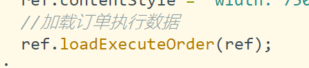

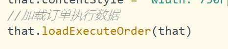

## 电话联系乘客

打电话功能的图标是一个view标签，我们来看一下

```html
<view class="call" @tap="callCustomerHandle"></view>
```

这个view标签的点击事件回调函数`<font style="color:#000000;background-color:rgba(220, 240, 255, 0.3) !important;">callCustomerHandle()</font>`咱们要实现一下

```javascript
callCustomerHandle() {
    let that = this;
    uni.makePhoneCall({
        phoneNumber: that.executeOrder.tel
    });
},
```

顺带着，我们把页面上拨打客服热线的功能也给做了。

```html
<view class="item" @tap="callServiceHandle">
    <image src="../../static/workbench/other-icon-4.png" mode="widthFix" class="service-icon"></image>
    <text class="service-text">客服热线</text>
</view>
```

View标签的点击事件回调函数我们给实现了，我们把10086当做智行代驾的客服热线吧

```javascript
callServiceHandle() {
    uni.makePhoneCall({
        phoneNumber: '10086'
    });
},
```

# 乘客端轮询司机是否已接单

现在司机端的抢单已经实现了，接下来我们要完善一下乘客端的小程序，每隔5秒钟轮询是否有司机接单。如果倒计时结束，那么就自动关闭订单。

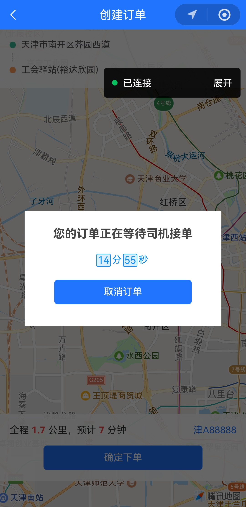

## 编写 zxds-odr 子系统

在订单子系统中，我们要完成两个业务流程。一个是查询订单状态，另一个是关闭订单（删除数据库记录和抢单缓存）。具体的时序图我们来看一下：

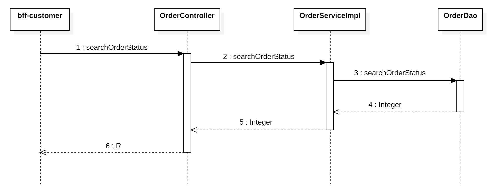

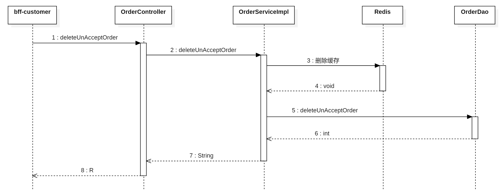

### 编写持久层代码

在`<font style="color:#000000;background-color:rgba(220, 240, 255, 0.3) !important;">OrderDao.xml</font>`文件中，定义两个SQL语句。

```xml
<select id="searchOrderStatus" parameterType="Map" resultType="Integer">
    SELECT status
    FROM tb_order
    WHERE id = #{orderId}
    <if test="driverId!=null">
        AND driver_id = #{driverId}
    </if>
    <if test="customerId!=null">
        AND customer_id = #{customerId}
    </if>
</select>

<delete id="deleteUnAcceptOrder" parameterType="Map">
    DELETE FROM tb_order
    WHERE id = #{orderId}
    <if test="driverId!=null">
        AND driver_id = #{driverId}
    </if>
    <if test="customerId!=null">
        AND customer_id = #{customerId}
    </if>
</delete>
```

在`<font style="color:#000000;background-color:rgba(220, 240, 255, 0.3) !important;">com.example.zxds.odr.db.dao</font>`包`<font style="color:#000000;background-color:rgba(220, 240, 255, 0.3) !important;">OrderDao.java</font>`接口中，声明DAO方法

```java
Integer searchOrderStatus(Map<String, Object> param);

int deleteUnAcceptOrder(Map<String, Object> param);
```

### 编写 service 和实现

在`<font style="color:#000000;background-color:rgba(220, 240, 255, 0.3) !important;">com.example.zxds.odr.service</font>`包`<font style="color:#000000;background-color:rgba(220, 240, 255, 0.3) !important;">OrderService.java</font>`接口中，声明抽象方法

```java
Integer searchOrderStatus(Map<String, Object> param);

String deleteUnAcceptOrder(Map<String, Object> param);
```

在`<font style="color:#000000;background-color:rgba(220, 240, 255, 0.3) !important;">com.example.zxds.odr.service.impl</font>`包`<font style="color:#000000;background-color:rgba(220, 240, 255, 0.3) !important;">OrderServiceImpl.java</font>`接口中，实现抽象方法

```java
@Override
public Integer searchOrderStatus(Map<String,Object> param) {
    Integer status = orderDao.searchOrderStatus(param);
    if (status == null) {
        throw new ZxdsException("没有查询到数据，请核对查询条件");
    }
    return status;
}


@Override
@Transactional
public String deleteUnAcceptOrder(Map<String, Object> param) {
    long orderId = MapUtil.getLong(param, "orderId");
    String orderKey = "order#" + orderId;

    // 定义Lua脚本：原子性删除未接单的订单
    String luaScript = """
    local orderKey = KEYS[1]
    local exists = redis.call('EXISTS', orderKey)
    if exists == 0 then
        return 'KEY_NOT_EXIST'
    end
    local current = redis.call('GET', orderKey)
    if current ~= 'none' then
        return 'CANNOT_CANCEL:ALREADY_TAKEN:' .. current
    end
    redis.call('DEL', orderKey)
    return 'SUCCESS'
    """;

    DefaultRedisScript<String> script = new DefaultRedisScript<>();
    script.setScriptText(luaScript);
    script.setResultType(String.class);

    // 执行Lua脚本
    String result = stringRedisTemplate.execute(
            script,
            Collections.singletonList(orderKey)
    );

    // 处理脚本执行结果
    if ("KEY_NOT_EXIST".equals(result)) {
        return "订单取消失败：订单不存在或已过期";
    }

    if (result.startsWith("CANNOT_CANCEL:ALREADY_TAKEN:")) {
        String driverId = result.substring(28); // 从第28个字符开始是司机ID
        return "订单取消失败：订单已被司机" + driverId + "接单，无法取消";
    }

    if (!"SUCCESS".equals(result)) {
        return "订单取消失败：系统异常";
    }

    // Redis删除成功，更新MySQL数据库
    int rows = orderDao.deleteUnAcceptOrder(param);
    if (rows != 1) {
        // 如果MySQL删除失败，需要恢复Redis状态
        stringRedisTemplate.opsForValue().set(orderKey, "none", 16, TimeUnit.MINUTES);
        return "订单取消失败：数据库操作失败";
    }

    return "订单取消成功";
}
```

因为乘客端的等待司机接单的倒计时为15分钟，现在后端Redis里面的抢单缓存也是15分钟。如果移动端倒计时到15分钟恰好结束，这时候发起Ajax请求取消订单，那么就会给后端程序带来困难，因为在Redis里面已经不存在抢单缓存了，后端程序无法判断到底是司机抢单成功后删除了抢单缓存，还是因为没有司机抢单，缓存过期自动删除了。所以我们把Redis抢单缓存延长到16分钟。把 `<font style="color:#000000;">com.example.zxds.odr.service.impl.OrderServiceImpl</font>` 类中的 `<font style="color:#000000;">15</font>`全部修改为 `<font style="color:#000000;">16</font>`。

### 编写 form 接收数据并校验

在`<font style="color:#000000;background-color:rgba(220, 240, 255, 0.3) !important;">com.example.zxds.odr.controller.form</font>`包中创建`<font style="color:#000000;background-color:rgba(220, 240, 255, 0.3) !important;">SearchOrderStatusForm.java</font>`类

```java
package com.example.zxds.odr.controller.form;

import io.swagger.v3.oas.annotations.media.Schema;
import lombok.Data;

import javax.validation.constraints.Min;
import javax.validation.constraints.NotNull;

@Data
@Schema(description = "查询订单状态的表单")
public class SearchOrderStatusForm {
    @NotNull(message = "orderId不能为空")
    @Schema(description = "订单ID")
    private Long orderId;

    @Min(value = 0, message = "driverId不能小于0")
    @Schema(description = "司机ID")
    private Long driverId;

    @Min(value = 0, message = "customerId不能小于0")
    @Schema(description = "乘客ID")
    private Long customerId;
}
```

在`<font style="color:#000000;background-color:rgba(220, 240, 255, 0.3) !important;">com.example.zxds.odr.controller.form</font>`包中创建`<font style="color:#000000;background-color:rgba(220, 240, 255, 0.3) !important;">DeleteUnAcceptOrderForm.java</font>`类

```java
package com.example.zxds.odr.controller.form;

import io.swagger.v3.oas.annotations.media.Schema;
import lombok.Data;

import javax.validation.constraints.Min;
import javax.validation.constraints.NotNull;

@Data
@Schema(description = "更新订单状态的表单")
public class DeleteUnAcceptOrderForm {
    @NotNull(message = "orderId不能为空")
    @Schema(description = "订单ID")
    private Long orderId;

    @Min(value = 0, message = "driverId不能小于0")
    @Schema(description = "司机ID")
    private Long driverId;

    @Min(value = 0, message = "customerId不能小于0")
    @Schema(description = "乘客ID")
    private Long customerId;
}
```

### 编写 web 方法

在`<font style="color:#000000;background-color:rgba(220, 240, 255, 0.3) !important;">com.example.zxds.odr.controller</font>`包`<font style="color:#000000;background-color:rgba(220, 240, 255, 0.3) !important;">OrderController.java</font>`类中，声明Web方法

```java
@PostMapping("/searchOrderStatus")
@Operation(summary = "查询订单状态")
public R searchOrderStatus(@RequestBody @Valid SearchOrderStatusForm form) {
    Map<String, Object> param = BeanUtil.beanToMap(form);
    Integer status = orderService.searchOrderStatus(param);
    return R.ok().put("result", status);
}

@PostMapping("/deleteUnAcceptOrder")
@Operation(summary = "删除没有司机接单的订单")
public R deleteUnAcceptOrder(@RequestBody @Valid DeleteUnAcceptOrderForm form) {
    Map<String, Object> param = BeanUtil.beanToMap(form);
    String result = orderService.deleteUnAcceptOrder(param);
    return R.ok().put("result", result);
}
```

## 编写 bff-customer 子系统

在bff-customer子系统上，我们也要实现两个业务流程，具体时序图如下

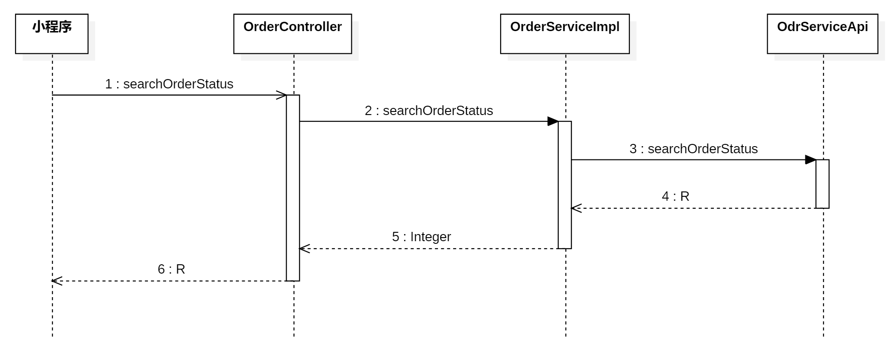

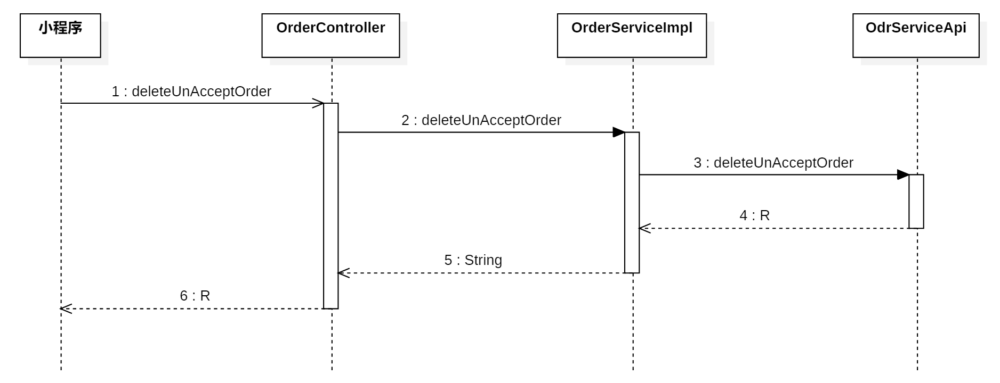

### 编写 Feign 客户端

在`<font style="color:#000000;background-color:rgba(220, 240, 255, 0.3) !important;">com.example.zxds.bff.customer.controller.form</font>`包`<font style="color:#000000;background-color:rgba(220, 240, 255, 0.3) !important;">SearchOrderStatusForm.java</font>`类

```java
package com.example.zxds.bff.customer.controller.form;

import io.swagger.v3.oas.annotations.media.Schema;
import lombok.Data;

import javax.validation.constraints.NotNull;

@Data
@Schema(description = "查询订单状态的表单")
public class SearchOrderStatusForm {
    @NotNull(message = "orderId不能为空")
    @Schema(description = "订单ID")
    private Long orderId;

    @Schema(description = "乘客ID")
    private Long customerId;
}
```

在`<font style="color:#000000;background-color:rgba(220, 240, 255, 0.3) !important;">com.example.zxds.bff.customer.controller.form</font>`包`<font style="color:#000000;background-color:rgba(220, 240, 255, 0.3) !important;">DeleteUnAcceptOrderForm.java</font>`类

```java
package com.example.zxds.bff.customer.controller.form;

import io.swagger.v3.oas.annotations.media.Schema;
import lombok.Data;

import javax.validation.constraints.NotNull;

@Data
@Schema(description = "更新订单状态的表单")
public class DeleteUnAcceptOrderForm {
    @NotNull(message = "orderId不能为空")
    @Schema(description = "订单ID")
    private Long orderId;

    @Schema(description = "乘客ID")
    private Long customerId;
}
```

在`<font style="color:#000000;background-color:rgba(220, 240, 255, 0.3) !important;">com.example.zxds.bff.customer.feign</font>`包`<font style="color:#000000;background-color:rgba(220, 240, 255, 0.3) !important;">OdrServiceApi.java</font>`接口中，声明抽象方法

```java
@PostMapping("/order/searchOrderStatus")
R searchOrderStatus(SearchOrderStatusForm form);

@PostMapping("/order/deleteUnAcceptOrder")
R deleteUnAcceptOrder(DeleteUnAcceptOrderForm form);
```

### 编写 service 和实现

在`<font style="color:#000000;background-color:rgba(220, 240, 255, 0.3) !important;">com.example.zxds.bff.customer.service</font>`包`<font style="color:#000000;background-color:rgba(220, 240, 255, 0.3) !important;">OrderService.java</font>`接口，声明抽象方法

```java
Integer searchOrderStatus(SearchOrderStatusForm form);

String deleteUnAcceptOrder(DeleteUnAcceptOrderForm form);
```

在`<font style="color:#000000;background-color:rgba(220, 240, 255, 0.3) !important;">com.example.zxds.bff.customer.service.impl</font>`包`<font style="color:#000000;background-color:rgba(220, 240, 255, 0.3) !important;">OrderServiceImpl.java</font>`类，实现抽象方法

```java
@Override
public Integer searchOrderStatus(SearchOrderStatusForm form) {
    R r = odrServiceApi.searchOrderStatus(form);
    Integer status = MapUtil.getInt(r, "result");
    return status;
}

@Override
@GlobalTransactional
public String deleteUnAcceptOrder(DeleteUnAcceptOrderForm form) {
    R r = odrServiceApi.deleteUnAcceptOrder(form);
    String result = MapUtil.getStr(r, "result");
    return result;
}
```

### 编写 web 方法

在`<font style="color:#000000;background-color:rgba(220, 240, 255, 0.3) !important;">com.example.zxds.bff.customer.controller</font>`包`<font style="color:#000000;background-color:rgba(220, 240, 255, 0.3) !important;">OrderController.java</font>`类中，声明Web方法

```java
@PostMapping("/searchOrderStatus")
@Operation(summary = "查询订单状态")
@SaCheckLogin
public R searchOrderStatus(@RequestBody @Valid SearchOrderStatusForm form) {
    long customerId = StpUtil.getLoginIdAsLong();
    form.setCustomerId(customerId);
    Integer status = orderService.searchOrderStatus(form);
    return R.ok().put("result", status);
}

@PostMapping("/deleteUnAcceptOrder")
@Operation(summary = "关闭没有司机接单的订单")
@SaCheckLogin
public R deleteUnAcceptOrder(@RequestBody @Valid DeleteUnAcceptOrderForm form) {
    long customerId = StpUtil.getLoginIdAsLong();
    form.setCustomerId(customerId);

    String result = orderService.deleteUnAcceptOrder(form);
    return R.ok().put("result", result);
}
```

### 测试 web 方法

按照之前的测试办法，司机上传定位信息，乘客端小程序下单成功，但是不要让司机接单，我们调用两个Web方法测试一下查询订单状态和关闭订单。

**查询订单状态的请求地址**：[http://localhost:8102/order/searchOrderStatus](http://localhost:8102/order/searchOrderStatus)

**请求头参数**：token

**请求体：**

```json
{
    "orderId": "2016398844291592192"
}
```

**响应结果：**

```json
{
        "msg": "success",
        "result": 1,
        "code": 200
}
```

**删除订单的请求地址：**[http://localhost:8102/order/deleteUnAcceptOrder](http://localhost:8102/order/deleteUnAcceptOrder)

**请求头参数：token**

**请求体：**

```json
{
    "orderId": "2016438126578380800"
}
```

**响应结果：**

```json
{
        "msg": "success",
        "result": "订单取消成功",
        "code": 200
}
```

# 乘客端轮询司机是否已接单的前端实现

我们测试了后端的两个Web方法，既能查询到订单状态，又能关闭订单。这里特殊声明一下，我们关闭的是无人接单的订单。如果想要关闭已经接单的订单，那就需要用上规则引擎，计算取消的代驾订单是有偿还是无偿，这部分功能我们后续再做。


## 声明全局 URL

```javascript
Vue.prototype.url = {
        ……,
        searchOrderStatus: `${baseUrl}/order/searchOrderStatus`,
        deleteUnAcceptOrder:`${baseUrl}/order/deleteUnAcceptOrder`,
}
```

## 修复倒计时 BUG

在`<font style="color:#000000;background-color:rgba(220, 240, 255, 0.3) !important;">create_order.vue</font>`页面中，我们给创建订单的`<font style="color:#000000;background-color:rgba(220, 240, 255, 0.3) !important;">createOrderHandle()</font>`函数中添加一句话，在弹出倒计时窗口前，设置倒计时的时长为15分钟。当然了，测试阶段我们等不了15分钟，那么就先写成1分钟吧。如果没有这句话，当倒计时结束，我们重新创建订单的时候，timestamp是null值，无法开始新的倒计时。

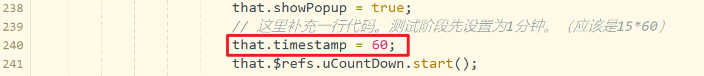

模型层中的`<font style="color:#000000;background-color:rgba(220, 240, 255, 0.3) !important;">timestamp</font>`变量也暂且设置成1分钟

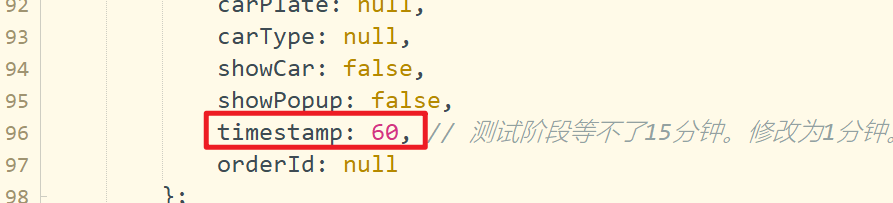

## 编写封装函数

我们把查询订单状态的代码封装起来，这样**每隔5秒钟轮询**的时候，以及**倒计时结束取消订单失败**后，需要再次查询订单状态时候，都要调用这个封装函数。

```javascript
searchOrderStatus(ref) {
    let data = {
        orderId: ref.orderId
    };
    ref.ajax(
        ref.url.searchOrderStatus,
        'POST',
        data,
        function(resp) {
            // console.log(resp.data.result)
            if (resp.data.result == 2) {
                ref.showPopup = false;
                ref.timestamp = null;
                uni.showToast({
                    icon: 'success',
                    title: '司机已接单'
                });
                uni.vibrateShort({});
                setTimeout(function() {
                    uni.redirectTo({
                        url: '../move/move?orderId=' + ref.orderId
                    });
                }, 3000);
            }
        },
        false
    );
},
```

然后关闭没有司机接单的订单，这部分代码我们也给封装起来

```javascript
deleteUnAcceptOrder(ref) {
    ref.showPopup = false;
    ref.timestamp = null;
    let data = {
        orderId: ref.orderId
    };
    ref.ajax(ref.url.deleteUnAcceptOrder, 'POST', data, function(resp) {
        let result = resp.data.result;
        if (result == '订单取消成功') {
            uni.showToast({
                icon: 'success',
                title: '订单取消成功'
            });
            setTimeout(function() {
                // 跳转到工作台必须使用这个switchTab函数。因为工作台是一个tab页
                uni.switchTab({
                    url: '../workbench/workbench'
                });
            }, 3000);
        } else {
            ref.searchOrderStatus(ref);
        }
    });
},
```

## 轮询是否接单与关闭订单

倒计时组件有两个属性：`<font style="color:#000000;background-color:rgba(220, 240, 255, 0.3) !important;">@change</font>`和`<font style="color:#000000;background-color:rgba(220, 240, 255, 0.3) !important;">@end</font>`。倒计时数字每次变化的时候触发的是`<font style="color:#000000;background-color:rgba(220, 240, 255, 0.3) !important;">@change</font>`，倒计时结束后触发的是`<font style="color:#000000;background-color:rgba(220, 240, 255, 0.3) !important;">@end</font>`，这两个事件的回调函数我们都要写一下

```html
<u-count-down
    ref="uCountDown"
    :timestamp="timestamp"
    :autoplay="false"
    separator="zh"
    :show-hours="false"
    :show-border="true"
    bg-color="#DDF0FF"
    separator-color="#0083F3"
    border-color="#0D90FF"
    color="#0D90FF"
    font-size="32"
    @end="countEndHandle"
    @change="countChangeHandle"

></u-count-down>
```

每隔5秒钟就发起一次轮询，看看有没有司机接单。如果倒计时结束，就不发轮询请求了

```javascript
countChangeHandle(s) {
    let that = this;
    if (s != 0 && s % 5 == 0) {
        that.searchOrderStatus(that);
    }
},
```

倒计时结束，要发出关闭订单的Ajax请求

```javascript
countEndHandle: function() {
    //显示没有人接单，关闭订单
    let that = this;
    that.deleteUnAcceptOrder(that);
},
```

在倒计时弹窗中，有手动关闭订单的按钮

```html
<button class="btn" @tap="cancelHandle">取消订单</button>
```

该按钮的点击事件回调函数我们给实现一下，其实就是发出关闭订单的请求

```javascript
cancelHandle() {
    let that = this;
    that.deleteUnAcceptOrder(that);
}
```

## 测试 web 方法

乘客端下单，然后没有司机接单，我们等待倒计时结束，看看能否自动关闭订单。然后重新创建订单，没有司机接单的情况下，我们手动取消订单。最后我们再创建订单，然后有司机接单，我们看看轮询的结果能不能弹出订单已被接单的提示消息。

# 司机端加载执行的订单-后端实现

无论司机端还是乘客端的小程序，如果关闭之后重新启动，只要进入到工作台页面必须加载当前正在执行的订单。那么接下来咱们就把后端的代码给实现了，把正在执行的订单查询出来。

## 编写 zxds-odr 子系统

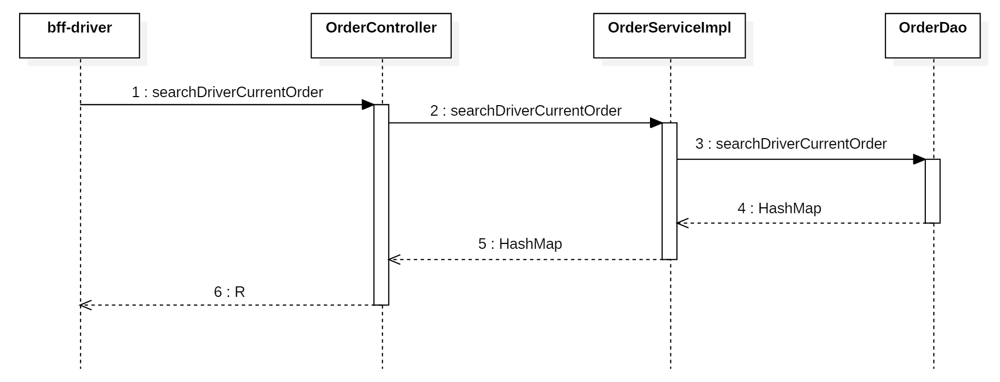

### 编写持久层代码

在`<font style="color:#000000;background-color:rgba(220, 240, 255, 0.3) !important;">OrderDao.xml</font>`文件中，定义SQL语句

```xml
<select id="searchDriverCurrentOrder" parameterType="long" resultType="HashMap">
    SELECT CAST(id AS CHAR)                              AS id,
           customer_id                                   AS customerId,
           start_place                                   AS startPlace,
           start_place_location                          AS startPlaceLocation,
           end_place                                     AS endPlace,
           end_place_location                            AS endPlaceLocation,
           CAST(favour_fee AS CHAR)                      AS favourFee,
           car_plate                                     AS carPlate,
           car_type                                      AS carType,
           DATE_FORMAT(create_time, '%Y-%m-%d %H:%i:%s') AS createTime,
           `status`
    FROM tb_order
    WHERE driver_id = #{driverId}
      AND `status` IN (2, 3, 4) LIMIT 1
</select>
```

在`<font style="color:#000000;background-color:rgba(220, 240, 255, 0.3) !important;">com.example.zxds.odr.db.dao</font>`包`<font style="color:#000000;background-color:rgba(220, 240, 255, 0.3) !important;">OrderDao.java</font>`接口中，声明DAO方法

```java
Map<String, Object> searchDriverCurrentOrder(long driverId);
```

### 编写 service 和实现

在`<font style="color:#000000;background-color:rgba(220, 240, 255, 0.3) !important;">com.example.zxds.odr.service</font>`包`<font style="color:#000000;background-color:rgba(220, 240, 255, 0.3) !important;">OrderService.java</font>`接口中，声明抽象方法

```java
Map<String, Object> searchDriverCurrentOrder(long driverId);
```

在`<font style="color:#000000;background-color:rgba(220, 240, 255, 0.3) !important;">com.example.zxds.odr.service.impl</font>`包`<font style="color:#000000;background-color:rgba(220, 240, 255, 0.3) !important;">OrderServiceImpl.java</font>`类中，实现抽象方法

```java
@Override
public Map<String, Object> searchDriverCurrentOrder(long driverId) {
    Map<String, Object> map = orderDao.searchDriverCurrentOrder(driverId);
    return map;
}
```

### 编写 form 接收数据并校验

在`<font style="color:#000000;background-color:rgba(220, 240, 255, 0.3) !important;">com.example.zxds.odr.controller.form</font>`包中，创建`<font style="color:#000000;background-color:rgba(220, 240, 255, 0.3) !important;">SearchDriverCurrentOrderForm.java</font>`类

```java
package com.example.zxds.odr.controller.form;

import io.swagger.v3.oas.annotations.media.Schema;
import lombok.Data;

import javax.validation.constraints.Min;
import javax.validation.constraints.NotNull;

@Data
@Schema(description = "查询司机当前订单的表单")
public class SearchDriverCurrentOrderForm {
    @NotNull(message = "driverId不能为空")
    @Min(value = 1, message = "driverId不能小于1")
    @Schema(description = "司机ID")
    private Long driverId;
}
```

### 编写 web 方法

在`<font style="color:#000000;background-color:rgba(220, 240, 255, 0.3) !important;">com.example.zxds.odr.controller</font>`包`<font style="color:#000000;background-color:rgba(220, 240, 255, 0.3) !important;">OrderController.java</font>`类中，定义Web方法

```java
@PostMapping("/searchDriverCurrentOrder")
@Operation(summary = "查询司机当前订单")
public R searchDriverCurrentOrder(@RequestBody @Valid SearchDriverCurrentOrderForm form) {
    Map<String, Object> map = orderService.searchDriverCurrentOrder(form.getDriverId());
    return R.ok().put("result", map);
}
```

## 编写 bff-driver 子系统

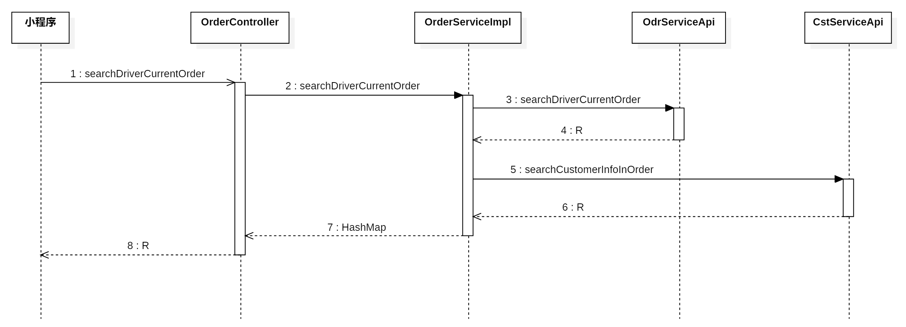

### 编写 Feign 客户端

在`<font style="color:#000000;background-color:rgba(220, 240, 255, 0.3) !important;">com.example.zxds.bff.driver.controller.form</font>`包中创建`<font style="color:#000000;background-color:rgba(220, 240, 255, 0.3) !important;">SearchDriverCurrentOrderForm.java</font>`类

```java
package com.example.zxds.bff.driver.controller.form;

import io.swagger.v3.oas.annotations.media.Schema;
import lombok.Data;

@Data
@Schema(description = "查询司机当前订单的表单")
public class SearchDriverCurrentOrderForm {

    @Schema(description = "司机ID")
    private Long driverId;
}
```

在`<font style="color:#000000;background-color:rgba(220, 240, 255, 0.3) !important;">com.example.zxds.bff.driver.feign</font>`包`<font style="color:#000000;background-color:rgba(220, 240, 255, 0.3) !important;">OdrServiceApi.java</font>`接口中，创建抽象方法

```java
@PostMapping("/order/searchDriverCurrentOrder")
R searchDriverCurrentOrder(SearchDriverCurrentOrderForm form);
```

### 编写 service 和实现

在`<font style="color:#000000;background-color:rgba(220, 240, 255, 0.3) !important;">com.example.zxds.bff.driver.service</font>`包`<font style="color:#000000;background-color:rgba(220, 240, 255, 0.3) !important;">OrderService.java</font>`接口中，定义抽象方法

```java
Map<String, Object> searchDriverCurrentOrder(SearchDriverCurrentOrderForm form);
```

在`<font style="color:#000000;background-color:rgba(220, 240, 255, 0.3) !important;">com.example.zxds.bff.driver.service.impl</font>`包`<font style="color:#000000;background-color:rgba(220, 240, 255, 0.3) !important;">OrderServiceImpl.java</font>`类中，实现抽象方法

```java
@Override
public Map<String, Object> searchDriverCurrentOrder(SearchDriverCurrentOrderForm form) {
    R r = odrServiceApi.searchDriverCurrentOrder(form);
    Map<String, Object> orderMap = (Map<String, Object>) r.get("result");

    if (MapUtil.isNotEmpty(orderMap)) {
        Map<String, Object> map = new HashMap<>();
        //查询代驾客户信息
        long customerId = MapUtil.getLong(orderMap, "customerId");
        SearchCustomerInfoInOrderForm infoInOrderForm = new SearchCustomerInfoInOrderForm();
        infoInOrderForm.setCustomerId(customerId);
        r = cstServiceApi.searchCustomerInfoInOrder(infoInOrderForm);
        
        Map<String, Object> cstMap = (Map<String, Object>) r.get("result");
        map.putAll(orderMap);
        map.putAll(cstMap);
        
        return map;
    }
    return null;
}
```

### 编写 web 方法

在`<font style="color:#000000;background-color:rgba(220, 240, 255, 0.3) !important;">com.example.zxds.bff.driver.controller</font>`包`<font style="color:#000000;background-color:rgba(220, 240, 255, 0.3) !important;">OrderController.java</font>`类中，声明Web方法

```java
@PostMapping("/searchDriverCurrentOrder")
@SaCheckLogin
@Operation(summary = "查询司机当前订单")
public R searchDriverCurrentOrder() {
    long driverId = StpUtil.getLoginIdAsLong();
    SearchDriverCurrentOrderForm form = new SearchDriverCurrentOrderForm();
    form.setDriverId(driverId);
    Map<String, Object> map = orderService.searchDriverCurrentOrder(form);
    return R.ok().put("result", map);
}
```

### 测试 web 方法

运行`<font style="color:#000000;background-color:rgba(220, 240, 255, 0.3) !important;">zxds-dr</font>`、`<font style="color:#000000;background-color:rgba(220, 240, 255, 0.3) !important;">zxds-cst</font>`、`<font style="color:#000000;background-color:rgba(220, 240, 255, 0.3) !important;">zxds-odr</font>`、`<font style="color:#000000;background-color:rgba(220, 240, 255, 0.3) !important;">bff-driver</font>`子系统，然后用 Apipost 测试Web方法。

# 司机端加载执行的订单-前端实现

我们已经把司机端查询当前订单的后端代码写好了，接下来应该轮到我们写移动端的JS代码。只要司机存在正在执行的订单，只要切换到工作台页面就直接加载订单信息。

## 定义全局 URL

```javascript
Vue.prototype.url = {
    ……,
    searchDriverCurrentOrder: `${baseUrl}/order/searchDriverCurrentOrder`,
}
```

## 加载订单信息

在工作台页面的`<font style="color:#000000;background-color:rgba(220, 240, 255, 0.3) !important;">onLoad()</font>`函数中添加JS代码，加载司机当前的订单

```javascript
onLoad:function(){
    ……
    //查询当前执行的订单
    that.ajax(
        that.url.searchDriverCurrentOrder,
        'POST',
        null,
        function(resp) {
            if (resp.data.hasOwnProperty('result')) {
                let result = resp.data.result;
                // console.log(resp.data);
                that.executeOrder = {
                    id: result.id,
                    photo: result.photo,
                    title: result.title,
                    tel: result.tel,
                    customerId: result.customerId,
                    startPlace: result.startPlace,
                    startPlaceLocation: JSON.parse(result.startPlaceLocation),
                    endPlace: result.endPlace,
                    endPlaceLocation: JSON.parse(result.endPlaceLocation),
                    favourFee: result.favourFee,
                    carPlate: result.carPlate,
                    carType: result.carType,
                    createTime: result.createTime
                };
                let map = {
                    '2': '接客户',
                    '3': '到达代驾点',
                    '4': '开始代驾'
                };
                that.contentStyle = `width: 750rpx;height:${that.windowHeight - 200 - 0}px;`;
                that.workStatus = map[result.status + ''];
                uni.setStorageSync('workStatus', that.workStatus);
                uni.setStorageSync('executeOrder', that.executeOrder);
            }
        },
        false
    );

}
```

## 补充代码

在`<font style="color:#000000;background-color:rgba(220, 240, 255, 0.3) !important;">onHide()</font>`回调函数补充一些代码，当小程序被挂起或者离开工作台页面，都要关闭轮询定时器，清理变量

```javascript
onHide: function() {
    ……
    this.newOrder = null;
    this.newOrderList.length = 0;
    if (this.audio != null) {
        this.audio.stop();
        this.audio = null;
    }
    clearInterval(this.reciveNewOrderTimer);
    this.reciveNewOrderTimer = null;
    this.playFlag = false;
}
```

## 测试小程序

运行`<font style="color:#000000;background-color:rgba(220, 240, 255, 0.3) !important;">zxds-dr</font>`、`<font style="color:#000000;background-color:rgba(220, 240, 255, 0.3) !important;">zxds-cst</font>`、`<font style="color:#000000;background-color:rgba(220, 240, 255, 0.3) !important;">zxds-odr</font>`、`<font style="color:#000000;background-color:rgba(220, 240, 255, 0.3) !important;">bff-driver</font>`子系统，建议将之前测试时生成的订单数据清空 `<font style="color:#000000;">tb_order</font>`，将 `<font style="color:#000000;">tb_order_bill</font>`表清空。 然后我们在司机端小程序上进入到工作台页面，看看能不能加载出来正在执行的订单。

# 抢单缓存超期需自动删除订单和账单

乘客端正常来说，创建代驾订单，进入倒计时，取消订单有两个途径：

1. 倒计时结束了，当前系统会自动发送 ajax 请求取消订单。
2. 或者乘客在倒计时没有结束之前，手动点击取消订单，发送 ajax 请求取消订单。

大家思考一个问题：对于非正常情况会怎样呢？例如乘客创建订单之后进入了倒计时。突然微信闪退了。然后很长一段时间都没有再登录微信小程序，16 分钟都已经过去了，订单缓存已经过期了。会怎样？？？乘客重新登录小程序，因为数据库中存在没有接单的订单，小程序会跳转到`<font style="color:#000000;background-color:rgba(220, 240, 255, 0.3) !important;">create_order.vue</font>`页面，继续开始倒计时等待司机接单。（**当然，这个功能还没有实现**）

由于抢单缓存早就销毁了，即便倒计时结束，发起Ajax请求去关闭订单。但是业务层发现没有抢单缓存，系统会认为有司机接单了，实际上根本没有司机接单，另外关闭订单的前提是存在订单缓存才能关，因此订单也无法关闭，于是就僵持在这里了。

为了避免上面情况的发生，我们用Java程序监听抢单缓存的销毁事件，一旦监听到抢单缓存销毁了，就需要把关联的订单和账单记录给删除掉。上面的问题就不存在了。

## 编写删除账单的代码

在`<font style="color:#000000;background-color:rgba(220, 240, 255, 0.3) !important;">OrderBillDao.xml</font>`文件中，声明删除账单的SQL语句。

```xml
<delete id="deleteUnAcceptOrderBill" parameterType="long">
    DELETE
    FROM tb_order_bill
    WHERE order_id = #{orderId};
</delete>
```

在`<font style="color:#000000;background-color:rgba(220, 240, 255, 0.3) !important;">com.example.zxds.odr.db.dao</font>`包`<font style="color:#000000;background-color:rgba(220, 240, 255, 0.3) !important;">OrderBillDao.java</font>`接口中，声明DAO方法

```java
int deleteUnAcceptOrderBill(long orderId);
```

在`<font style="color:#000000;background-color:rgba(220, 240, 255, 0.3) !important;">OrderServiceImpl</font>`类的`<font style="color:#000000;background-color:rgba(220, 240, 255, 0.3) !important;">deleteUnAcceptOrder()</font>`方法中添加删除账单记录的代码

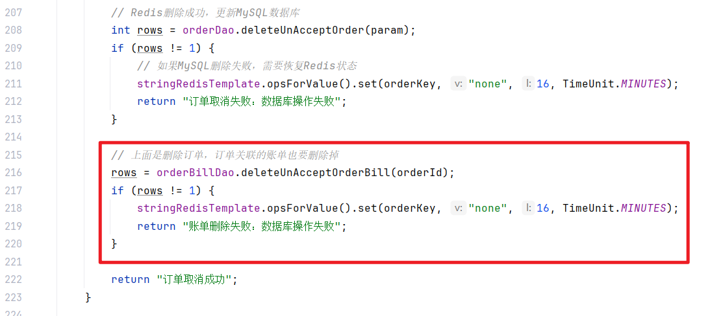

```java
// 上面是删除订单，订单关联的账单也要删除掉
rows = orderBillDao.deleteUnAcceptOrderBill(orderId);
if (rows != 1) {
    stringRedisTemplate.opsForValue().set(orderKey, "none", 16, TimeUnit.MINUTES);
    return "账单删除失败：数据库操作失败";
}
```

## 编写代码监听 redis key 的过期

以下是 Redis 中发布/订阅机制。发布者是 Redis 服务器。订阅者是监听器。

我们只需要创建一个频道对象。当某个事件发生之后，发布者会自动通过频道广播消息。所有的订阅者都可以收到。

订阅者收到消息之后可以对业务进行处理。

找到 `<font style="color:#000000;">RedisConfig</font>`配置类，**添加**以下代码：

```java
@Resource
private RedisConnectionFactory redisConnectionFactory;

/**
 * 定义Redis键过期事件的监听频道
 * 格式：__keyevent@<db>__:<event>
 * @5: 只监听5号数据库，实现业务隔离
 * expired: 监听键过期事件
 * Redis会在键过期时自动向此频道发布消息
 * 创建一个频道，如果key过期，redis服务器会作为消息的发布者，通过这个频道发布消息。那么如果有订阅者（监听器），这些订阅者就能收到消息。
 */
@Bean
public ChannelTopic expiredTopic() {
    return new ChannelTopic("__keyevent@5__:expired");  
}

/**
 * 创建Redis消息监听容器
 * 负责管理Redis消息监听器：
 * 1. 维护Redis连接
 * 2. 接收指定频道的消息
 * 3. 将消息分发给注册的监听器
 */
@Bean
public RedisMessageListenerContainer redisMessageListenerContainer() {
    RedisMessageListenerContainer redisMessageListenerContainer = new RedisMessageListenerContainer();
    redisMessageListenerContainer.setConnectionFactory(redisConnectionFactory);
    return redisMessageListenerContainer;
}
```

接下来该编写监听器了，监听器会自动注册到上面编写的监听器容器中“RedisMessageListenerContainer”

在`<font style="color:#000000;background-color:rgba(220, 240, 255, 0.3) !important;">com.example.zxds.odr.config</font>`包中创建`<font style="color:#000000;background-color:rgba(220, 240, 255, 0.3) !important;">KeyExpiredListener.java</font>`类

```java
package com.example.zxds.odr.config;

import com.example.zxds.odr.db.dao.OrderBillDao;
import com.example.zxds.odr.db.dao.OrderDao;
import lombok.extern.slf4j.Slf4j;
import org.springframework.data.redis.connection.Message;
import org.springframework.data.redis.listener.KeyExpirationEventMessageListener;
import org.springframework.data.redis.listener.RedisMessageListenerContainer;
import org.springframework.data.redis.serializer.JdkSerializationRedisSerializer;
import org.springframework.stereotype.Component;
import org.springframework.transaction.annotation.Transactional;

import javax.annotation.Resource;
import java.util.Map;

@Slf4j
@Component
public class KeyExpiredListener extends KeyExpirationEventMessageListener {
    @Resource
    private OrderDao orderDao;

    @Resource
    private OrderBillDao orderBillDao;

    // 构造注入。
    public KeyExpiredListener(RedisMessageListenerContainer listenerContainer) {
        super(listenerContainer);
    }

    @Override
    @Transactional
    public void onMessage(Message message, byte[] pattern) {
        // message参数就是Redis服务器通过频道发过来的消息。
        // 判断，如果这个消息是通过这个键过期频道发过来的。
        if (new String(message.getChannel()).equals("__keyevent@5__:expired")) {
            //反序列化Key，否则出现乱码（如果使用的RedisTemplate，则需要编写以下两行代码进行反序列化）
            //JdkSerializationRedisSerializer serializer = new JdkSerializationRedisSerializer();
            //String key = serializer.deserialize(message.getBody()).toString();

            // 如果使用的 StringRedisTemplate，这样写即可
            String key = new String(message.getBody());
            
            // 如果key属于订单缓存
            if (key.contains("order#")) {
                long orderId = Long.parseLong(key.split("#")[1]);
                int rows = orderDao.deleteUnAcceptOrder(Map.of("orderId", orderId));
                if (rows == 1) {
                    log.info("删除了无人接单的订单：" + orderId);
                }
                rows = orderBillDao.deleteUnAcceptOrderBill(orderId);
                if (rows == 1) {
                    log.info("删除了无人接单的账单：" + orderId);
                }
            }
        }
        super.onMessage(message, pattern);
    }
}
```

为了不干扰我们测试程序，首先我们把订单表和账单表所有的记录都清空。把抢单缓存设置成超时30秒，然后像之前一样，把各子系统运行起来。乘客端小程序下单之后，就立即关闭小程序，然后等待30秒钟，看看订单和账单记录能不能都删除掉。测试完程序，你要把抢单缓存改回16分钟。

## 再解决一个问题

还有一种情况，比如乘客下单成功之后，等待了5分钟，微信闪退了。过了5分钟之后重新登录小程序。因为抢单缓存还没有被销毁，而且订单和账单记录也都在，小程序跳转到`<font style="color:#000000;background-color:rgba(220, 240, 255, 0.3) !important;">create_order.vue</font>`页面，重新从15分钟开始倒计时，但是倒计时过程中，抢单缓存会超时被销毁，同时订单和账单记录也都删除了。这时候乘客端小程序发来轮询请求，发现抢单缓存没有了（`<font style="color:#000000;">status == null</font>`），我们应该提示乘客端：订单已关闭。

所以我们要改造`<font style="color:#000000;background-color:rgba(220, 240, 255, 0.3) !important;">OrderServiceImpl</font>`类中的代码，把抛出异常改成返回状态码为0，在移动端轮询的时候如果发现状态码是0，说明订单已经被关闭了。弹出提示消息即可。

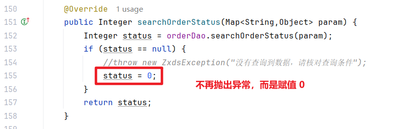

在乘客端小程序的`<font style="color:#000000;background-color:rgba(220, 240, 255, 0.3) !important;">create_order.vue</font>`页面上，修改`<font style="color:#000000;background-color:rgba(220, 240, 255, 0.3) !important;">searchOrderStatus()</font>`函数的内容

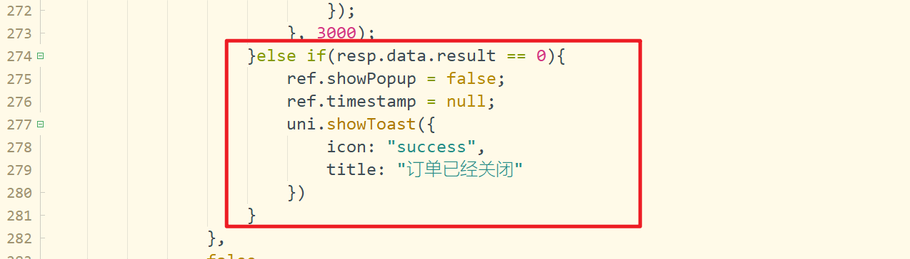

要添加的代码如下：

```javascript
else if(resp.data.result == 0){
  ref.showPopup = false;
  ref.timestamp = null;
  uni.showToast({
    icon: "success",
    title: "订单已经关闭"
  })
}
```

# 查询乘客的订单 zxds-odr

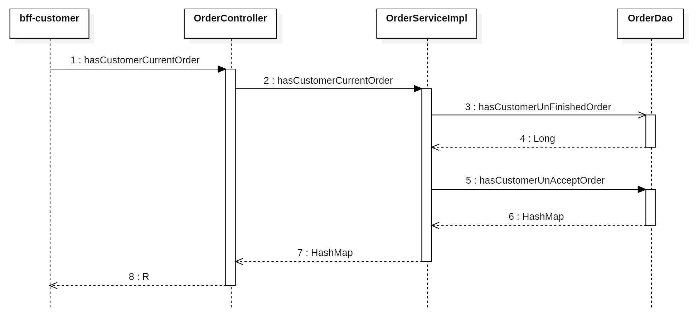

## 编写持久层代码

在`<font style="color:#000000;background-color:rgba(220, 240, 255, 0.3) !important;">OrderDao.xml</font>`文件中，定义两个SQL语句，分别查询没有司机接单的订单和没有完成的订单。因为在小程序上面要根据订单的状态，决定跳转到什么页面。如果存在没有司机接单的订单，小程序就跳转到`<font style="color:#000000;background-color:rgba(220, 240, 255, 0.3) !important;">create_order.vue</font>`页面，重新开始倒计时。如果存在未完成的订单，就跳转到司乘同显页面。

```xml
<select id="hasCustomerUnFinishedOrder" parameterType="long" resultType="Long">
    SELECT CAST(id AS CHAR)     AS id
    FROM tb_order
    WHERE customer_id = #{customerId}
      AND `status` IN (2, 3, 4) LIMIT 1;
</select>
<select id="hasCustomerUnAcceptOrder" parameterType="long" resultType="HashMap">
    SELECT CAST(id AS CHAR)     AS id,
           start_place          AS startPlace,
           start_place_location AS startPlaceLocation,
           end_place            AS endPlace,
           end_place_location   AS endPlaceLocation,
           car_plate            AS carPlate,
           car_type             AS carType
    FROM tb_order
    WHERE customer_id = #{customerId}
    AND `status` = 1 LIMIT 1;
</select>
```

在`<font style="color:#000000;background-color:rgba(220, 240, 255, 0.3) !important;">com.example.zxds.odr.db.dao</font>`包`<font style="color:#000000;background-color:rgba(220, 240, 255, 0.3) !important;">OrderDao.java</font>`接口中，声明DAO方法

```java
Long hasCustomerUnFinishedOrder(long customerId);

Map<String, Object> hasCustomerUnAcceptOrder(long customerId);
```

## 编写 service 和实现

在`<font style="color:#000000;background-color:rgba(220, 240, 255, 0.3) !important;">com.example.zxds.odr.service</font>`包`<font style="color:#000000;background-color:rgba(220, 240, 255, 0.3) !important;">OrderService.java</font>`接口中，声明抽象方法

```java
Map<String, Object> hasCustomerCurrentOrder(long customerId);
```

在`<font style="color:#000000;background-color:rgba(220, 240, 255, 0.3) !important;">com.example.zxds.odr.service.impl</font>`包`<font style="color:#000000;background-color:rgba(220, 240, 255, 0.3) !important;">OrderServiceImpl.java</font>`类中，实现抽象方法

```java
@Override
public Map<String, Object> hasCustomerCurrentOrder(long customerId) {
    Map<String, Object> result = new HashMap<>();
    Map<String, Object> map = orderDao.hasCustomerUnAcceptOrder(customerId);
    result.put("hasCustomerUnAcceptOrder", map != null);
    result.put("unAcceptOrder", map);
    Long id = orderDao.hasCustomerUnFinishedOrder(customerId);
    result.put("hasCustomerUnFinishedOrder", id != null);
    result.put("unFinishedOrder", id);
    return result;
}
```

## 编写 form 接收数据并校验

在`<font style="color:#000000;background-color:rgba(220, 240, 255, 0.3) !important;">com.example.zxds.odr.controller.form</font>`包中创建`<font style="color:#000000;background-color:rgba(220, 240, 255, 0.3) !important;">HasCustomerCurrentOrderForm.java</font>`类

```java
package com.example.zxds.odr.controller.form;

import io.swagger.v3.oas.annotations.media.Schema;
import lombok.Data;

import javax.validation.constraints.Min;
import javax.validation.constraints.NotNull;

@Data
@Schema(description = "查询乘客是否存在当前的订单的表单")
public class HasCustomerCurrentOrderForm {
    @NotNull(message = "customerId不能为空")
    @Min(value = 1, message = "customerId不能小于1")
    @Schema(description = "客户ID")
    private Long customerId;
}
```

## 编写 web 方法

在`<font style="color:#000000;background-color:rgba(220, 240, 255, 0.3) !important;">com.example.zxds.odr.controller</font>`包`<font style="color:#000000;background-color:rgba(220, 240, 255, 0.3) !important;">OrderController</font>`类中，声明Web方法

```java
@PostMapping("/hasCustomerCurrentOrder")
@Operation(summary = "查询乘客是否存在当前的订单")
public R hasCustomerCurrentOrder(@RequestBody @Valid HasCustomerCurrentOrderForm form) {
    Map<String, Object> map = orderService.hasCustomerCurrentOrder(form.getCustomerId());
    return R.ok().put("result", map);
}
```

## 测试 web 方法

乘客端小程序创建订单之后，利用接口测试工具测试Web方法，查看返回值。

# 编写 bff-customer 子系统查询乘客订单

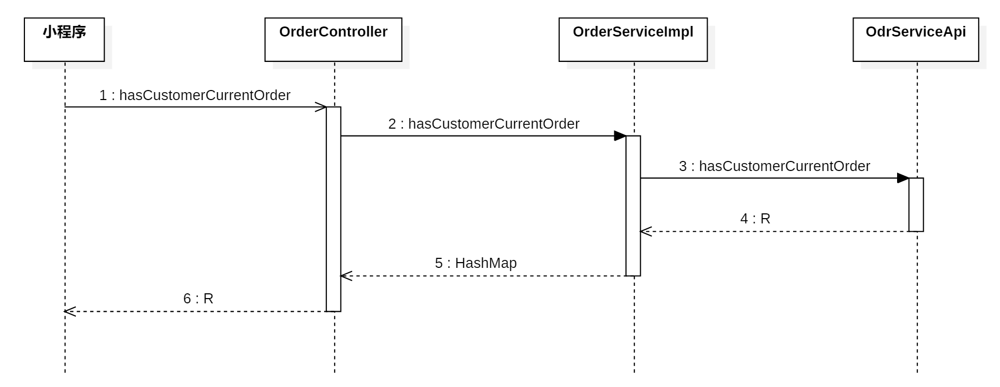

## 编写 Feign 客户端

在`<font style="color:#000000;background-color:rgba(220, 240, 255, 0.3) !important;">com.example.zxds.bff.customer.controller.form</font>`包中创建`<font style="color:#000000;background-color:rgba(220, 240, 255, 0.3) !important;">HasCustomerCurrentOrderForm.java</font>`类

```java
package com.example.zxds.bff.customer.controller.form;

import io.swagger.v3.oas.annotations.media.Schema;
import lombok.Data;

@Data
@Schema(description = "查询乘客是否存在当前的订单的表单")
public class HasCustomerCurrentOrderForm {

    @Schema(description = "客户ID")
    private Long customerId;
}
```

在`<font style="color:#000000;background-color:rgba(220, 240, 255, 0.3) !important;">com.example.zxds.bff.customer.feign</font>`包`<font style="color:#000000;background-color:rgba(220, 240, 255, 0.3) !important;">OdrServiceApi.java</font>`接口中，声明Web方法

```java
@PostMapping("/order/hasCustomerCurrentOrder")
R hasCustomerCurrentOrder(HasCustomerCurrentOrderForm form);
```

## 编写 service 和实现

在`<font style="color:#000000;background-color:rgba(220, 240, 255, 0.3) !important;">com.example.zxds.bff.customer.service</font>`包`<font style="color:#000000;background-color:rgba(220, 240, 255, 0.3) !important;">OrderService.java</font>`接口中，声明抽象方法

```java
Map<String, Object> hasCustomerCurrentOrder(HasCustomerCurrentOrderForm form);
```

在`<font style="color:#000000;background-color:rgba(220, 240, 255, 0.3) !important;">com.example.zxds.bff.customer.service.impl</font>`包`<font style="color:#000000;background-color:rgba(220, 240, 255, 0.3) !important;">OrderServiceImpl.java</font>`类中，实现抽象方法

```java
@Override
public Map<String, Object> hasCustomerCurrentOrder(HasCustomerCurrentOrderForm form) {
    R r = odrServiceApi.hasCustomerCurrentOrder(form);
    Map<String, Object> map = (Map<String, Object>) r.get("result");
    return map;
}
```

## 编写 web 方法

在`<font style="color:#000000;background-color:rgba(220, 240, 255, 0.3) !important;">com.example.zxds.bff.customer.controller</font>`包`<font style="color:#000000;background-color:rgba(220, 240, 255, 0.3) !important;">OrderController.java</font>`类中，声明Web方法

```java
@PostMapping("/hasCustomerCurrentOrder")
@SaCheckLogin
@Operation(summary = "查询乘客是否存在当前的订单")
public R hasCustomerCurrentOrder() {
    long customerId = StpUtil.getLoginIdAsLong();
    HasCustomerCurrentOrderForm form = new HasCustomerCurrentOrderForm();
    form.setCustomerId(customerId);
    Map<String, Object> map = orderService.hasCustomerCurrentOrder(form);
    return R.ok().put("result", map);
}
```

# 乘客端小程序加载乘客订单

## 定义全局 URL

```javascript
Vue.prototype.url = {
    ……,
    hasCustomerCurrentOrder:`${baseUrl}/order/hasCustomerCurrentOrder`
}
```

## 加载乘客订单

在工作台页面的`<font style="color:#000000;background-color:rgba(220, 240, 255, 0.3) !important;">onLoad()</font>`函数中，发起Ajax请求，查询乘客的当前订单。如果有未接单的订单，就跳转到`<font style="color:#000000;background-color:rgba(220, 240, 255, 0.3) !important;">create_order.vue</font>`页面；如果有未完成的订单，就跳转到`<font style="color:#000000;background-color:rgba(220, 240, 255, 0.3) !important;">move.vue</font>`页面

```javascript
onLoad: function() {
    ……
    
    //查询乘客当前订单
    that.ajax(
        that.url.hasCustomerCurrentOrder,
        'POST',
        {},
        function(resp) {
            let result = resp.data.result;
            let hasCustomerUnAcceptOrder = result.hasCustomerUnAcceptOrder;
            let hasCustomerUnFinishedOrder = result.hasCustomerUnFinishedOrder;
          
            if (hasCustomerUnAcceptOrder) {
                let json = result.unAcceptOrder;
                let carType = json.carType;
                let carPlate = json.carPlate;
                let startPlaceLocation = JSON.parse(json.startPlaceLocation);
                let endPlaceLocation = JSON.parse(json.endPlaceLocation);
                let from = {
                    address: json.startPlace,
                    latitude: startPlaceLocation.latitude,
                    longitude: startPlaceLocation.longitude
                };
                let to = {
                    address: json.endPlace,
                    latitude: endPlaceLocation.latitude,
                    longitude: endPlaceLocation.longitude
                };
                uni.setStorageSync('from', from);
                uni.setStorageSync('to', to);
                uni.showModal({
                    title: '提示消息',
                    content: '您有一个订单等待司机接单，现在将跳转到等待接单页面',
                    showCancel: false,
                    success: function(resp) {
                        if (resp.confirm) {
                            uni.navigateTo({
                                url: `../create_order/create_order?showPopup=true&orderId=${json.id}&showCar=true&carType=${carType}&carPlate=${carPlate}`
                            });
                        }
                    }
                });
            } else if (hasCustomerUnFinishedOrder) {
                console.log(result.unFinishedOrder);
                uni.showModal({
                    title: '提示消息',
                    content: '您有一个正在执行的定订单，现在将跳转到司乘同显画面',
                    showCancel: false,
                    success: function(resp) {
                        if (resp.confirm) {
                            uni.navigateTo({
                                url: '../move/move?orderId=' + result.unFinishedOrder
                            });
                        }
                    }
                });
            }
        },
        false
    );
},
```

## 显示倒计时

在`<font style="color:#000000;background-color:rgba(220, 240, 255, 0.3) !important;">create_order.vue</font>`页面的`<font style="color:#000000;background-color:rgba(220, 240, 255, 0.3) !important;">onLoad()</font>`函数中，添加下面的JS代码

```javascript
onLoad: function(options) {
    ……

    //是否开始倒计时
    if (options.hasOwnProperty('showPopup')) {
        that.showPopup = true;
        that.timestamp = 60;
        that.orderId = options.orderId;
        that.$refs.uCountDown.start();
    }
},
```

## 测试小程序

我们要测试的条件比较复杂，所以大家按照下面的要求，咱们逐一测试一下

1. 把抢单缓存设定成1分钟，然后乘客创建订单成功 ，等待10秒左右，关闭微信。立即重新打开微信登录乘客端小程序，看看能不能跳转到`<font style="color:#000000;background-color:rgba(220, 240, 255, 0.3) !important;">create_order.vue</font>`页面，并且重新倒计时，**最佳线路有没有生成**，车辆有没有选中。在倒计时过程中，抢单缓存超时被销毁，订单和账单记录也被删除了。看看小程序能不能根据status为0，判断出订单已经关闭，然后弹出提示信息
2. 抢单缓存依然为1分钟，然后乘客创建订单成功就立即关闭微信。过两分钟之后再重新登录微信，因为抢单缓存超时被销毁，订单和账单记录也被删除了。看看小程序是不是停留在工作台页面，等待乘客创建新的订单
3. 抢单缓存依然为1分钟，然后乘客创建订单成功就立即关闭微信。等待10秒钟，重新打开微信登录小程序，看看页面跳转到`<font style="color:#000000;background-color:rgba(220, 240, 255, 0.3) !important;">create_order.vue</font>`页面之后，我们看看能不能手动关闭订单
4. 把抢单缓存恢复成16分钟，然后乘客正常创建订单，倒计时结束之后，看看订单能不能成功关闭

# 司机端的司乘同显-查询订单

司机端和乘客端的小程序都是可以进入司乘同显页面。先来完成司机端的司乘同显功能，在工作台页面上，订单信息的下方有司乘同显的入口。


跳转到司乘同显页面的时候，需要通过URL传入`<font style="color:#000000;background-color:rgba(220, 240, 255, 0.3) !important;">orderId</font>`，然后司乘同显页面的`<font style="color:#000000;background-color:rgba(220, 240, 255, 0.3) !important;">onLoad()</font>`函数发出Ajax请求查询订单的状态、上车点和终点的定位信息。

## 编写 zxds-odr 子系统

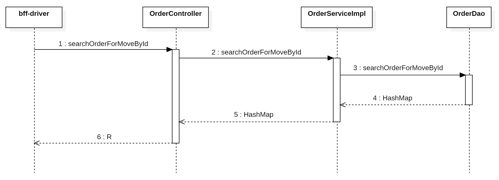

### 编写持久层代码

在`<font style="color:#000000;background-color:rgba(220, 240, 255, 0.3) !important;">OrderDao.xml</font>`文件中，声明SQL语句，根据`<font style="color:#000000;background-color:rgba(220, 240, 255, 0.3) !important;">orderId</font>`查询属于某个司机或者乘客的与司乘同显有关的订单信息

```xml
<select id="searchOrderForMoveById" parameterType="Map" resultType="Map">
    SELECT start_place AS startPlace,
           start_place_location AS startPlaceLocation,
           end_place AS endPlace,
           end_place_location AS endPlaceLocation,
           `status`
    FROM tb_order
    WHERE id = #{orderId}
    <if test="customerId!=null">
        AND customer_id = #{customerId}
    </if>
    <if test="driverId!=null">
        AND driver_id = #{driverId}
    </if>
    LIMIT 1;
</select>
```

在`<font style="color:#000000;background-color:rgba(220, 240, 255, 0.3) !important;">com.example.zxds.odr.db.dao</font>`包`<font style="color:#000000;background-color:rgba(220, 240, 255, 0.3) !important;">OrderDao.java</font>`接口中，声明DAO方法

```java
Map<String, Object> searchOrderForMoveById(Map<String, Object> param);
```

### 编写 service 和实现

在`<font style="color:#000000;background-color:rgba(220, 240, 255, 0.3) !important;">com.example.zxds.odr.service</font>`包`<font style="color:#000000;background-color:rgba(220, 240, 255, 0.3) !important;">OrderService.java</font>`接口中，声明抽象方法

```java
Map<String, Object> searchOrderForMoveById(Map<String, Object> param);
```

在`<font style="color:#000000;background-color:rgba(220, 240, 255, 0.3) !important;">com.example.zxds.odr.service.impl</font>`包`<font style="color:#000000;background-color:rgba(220, 240, 255, 0.3) !important;">OrderServiceImpl.java</font>`类中，实现抽象方法

```java
@Override
public Map<String, Object> searchOrderForMoveById(Map<String, Object> param) {
    return orderDao.searchOrderForMoveById(param);
}
```

### 编写 form 接收数据并校验

在`<font style="color:#000000;background-color:rgba(220, 240, 255, 0.3) !important;">com.example.zxds.odr.controller.form</font>`包中创建`<font style="color:#000000;background-color:rgba(220, 240, 255, 0.3) !important;">SearchOrderForMoveByIdForm.java</font>`类

```java
package com.example.zxds.odr.controller.form;

import io.swagger.v3.oas.annotations.media.Schema;
import lombok.Data;

import javax.validation.constraints.Min;
import javax.validation.constraints.NotNull;

@Data
@Schema(description = "查询订单信息用于司乘同显功能的表单")
public class SearchOrderForMoveByIdForm {

    @NotNull(message = "orderId不能为空")
    @Schema(description = "订单ID")
    private Long orderId;

    @Min(value = 1, message = "driverId不能小于1")
    @Schema(description = "司机ID")
    private Long driverId;

    @Min(value = 1, message = "customerId不能小于1")
    @Schema(description = "客户ID")
    private Long customerId;
}
```

### 编写 web 方法

在`<font style="color:#000000;background-color:rgba(220, 240, 255, 0.3) !important;">com.example.zxds.odr.controller</font>`包`<font style="color:#000000;background-color:rgba(220, 240, 255, 0.3) !important;">OrderController.java</font>`类中，定义Web方法

```java
@PostMapping("/searchOrderForMoveById")
@Operation(summary = "查询订单信息用于司乘同显功能")
public R searchOrderForMoveById(@RequestBody @Valid SearchOrderForMoveByIdForm form) {
    Map<String, Object> param = BeanUtil.beanToMap(form);
    Map<String, Object> map = orderService.searchOrderForMoveById(param);
    return R.ok().put("result", map);
}
```

## 编写 bff-driver 子系统

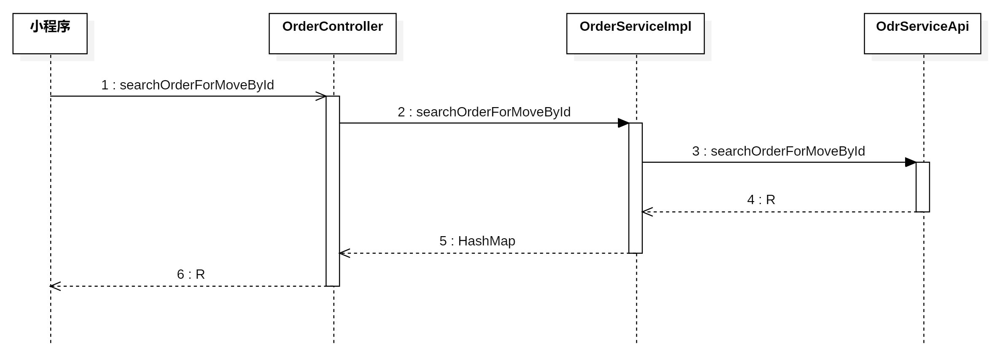

### 编写 Feign 客户端

在`<font style="color:#000000;background-color:rgba(220, 240, 255, 0.3) !important;">com.example.zxds.bff.driver.controller.form</font>`包中创建`<font style="color:#000000;background-color:rgba(220, 240, 255, 0.3) !important;">SearchOrderForMoveByIdForm.java</font>`类

```java
package com.example.zxds.bff.driver.controller.form;

import io.swagger.v3.oas.annotations.media.Schema;
import lombok.Data;

import javax.validation.constraints.NotNull;

@Data
@Schema(description = "查询订单信息用于司乘同显功能的表单")
public class SearchOrderForMoveByIdForm {

    @NotNull(message = "orderId不能为空")
    @Schema(description = "订单ID")
    private Long orderId;

    @Schema(description = "司机ID")
    private Long driverId;
}
```

在`<font style="color:#000000;background-color:rgba(220, 240, 255, 0.3) !important;">com.example.zxds.bff.driver.feign</font>`包`<font style="color:#000000;background-color:rgba(220, 240, 255, 0.3) !important;">OdrServiceApi.java</font>`接口中，声明抽象方法

```java
@PostMapping("/order/searchOrderForMoveById")
R searchOrderForMoveById(SearchOrderForMoveByIdForm form);
```

### 编写 service 和实现

在`<font style="color:#000000;background-color:rgba(220, 240, 255, 0.3) !important;">com.example.zxds.bff.driver.service</font>`包`<font style="color:#000000;background-color:rgba(220, 240, 255, 0.3) !important;">OrderService.java</font>`接口中，声明抽象方法

```java
Map<String, Object> searchOrderForMoveById(SearchOrderForMoveByIdForm form);
```

在`<font style="color:#000000;background-color:rgba(220, 240, 255, 0.3) !important;">com.example.zxds.bff.driver.service.impl</font>`包`<font style="color:#000000;background-color:rgba(220, 240, 255, 0.3) !important;">OrderServiceImpl.java</font>`类中，实现抽象方法

```java
@Override
public Map<String, Object> searchOrderForMoveById(SearchOrderForMoveByIdForm form) {
    R r = odrServiceApi.searchOrderForMoveById(form);
    Map<String, Object> map = (Map<String, Object>) r.get("result");
    return map;
}
```

### 编写 web 方法

在`<font style="color:#000000;background-color:rgba(220, 240, 255, 0.3) !important;">com.example.zxds.bff.driver.controller</font>`包`<font style="color:#000000;background-color:rgba(220, 240, 255, 0.3) !important;">OrderController.java</font>`类中，声明Web方法

```java
@PostMapping("/searchOrderForMoveById")
@SaCheckLogin
@Operation(summary = "查询订单信息用于司乘同显功能")
public R searchOrderForMoveById(@RequestBody @Valid SearchOrderForMoveByIdForm form) {
    long driverId = StpUtil.getLoginIdAsLong();
    form.setDriverId(driverId);
    Map<String, Object> map = orderService.searchOrderForMoveById(form);
    return R.ok().put("result", map);
}
```

### 测试 web 方法

启动`<font style="color:#000000;background-color:rgba(220, 240, 255, 0.3) !important;">zxds-odr</font>`、`<font style="color:#000000;background-color:rgba(220, 240, 255, 0.3) !important;">zxds-dr</font>`和`<font style="color:#000000;background-color:rgba(220, 240, 255, 0.3) !important;">bff-driver</font>`子系统，用 Apipost 测试Web方法

**请求地址：**[http://localhost:8101/order/searchOrderForMoveById](http://localhost:8101/order/searchOrderForMoveById)

**请求头参数：**token

**请求参数：**

```json
{
    "orderId": 2016460603400531968
}
```

**响应结果：**

```json
{
        "msg": "success",
        "result": {
                "startPlace": "天津市南开区芥园西道",
                "endPlaceLocation": "{\"latitude\": \"39.158351\", \"longitude\": \"117.163322\"}",
                "startPlaceLocation": "{\"latitude\": \"39.14631917317708\", \"longitude\": \"117.12141167534722\"}",
                "endPlace": "天津西站",
                "status": 2
        },
        "code": 200
}
```

# 司机端的司乘同显-移动端实现

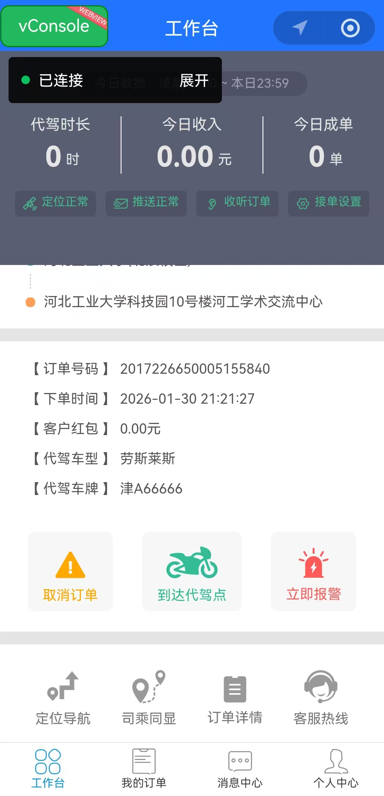

 

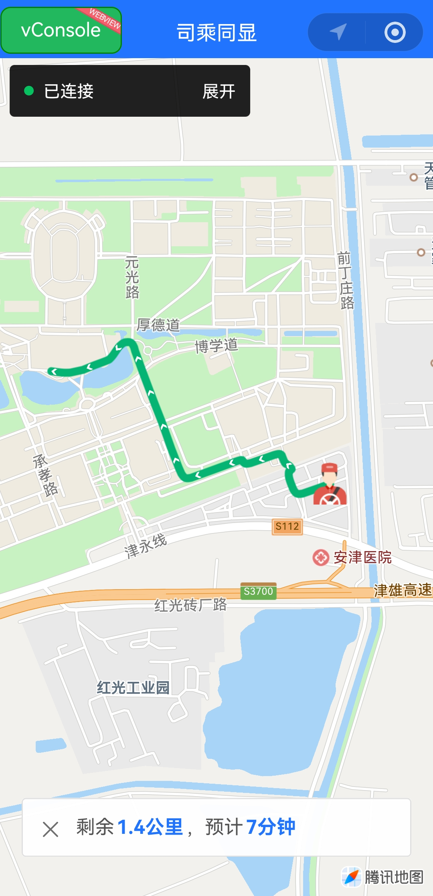

## 跳转到司乘同显页面

在工作台页面的视图层找到司乘同显模块的标签，如下：

```html
<view class="item" @tap="showMoveHandle">
          <image src="../../static/workbench/other-icon-2.png" mode="widthFix" class="display-icon"></image>
          <text class="display-text">司乘同显</text>
</view>
```

实现View标签的点击事件回调函数，如下：

```javascript
showMoveHandle() {
    let that = this;
    uni.navigateTo({
        url: `../../execution/move/move?orderId=` + that.executeOrder.id
    });
}
```

## 定义全局 URL

```javascript
Vue.prototype.url = {
    ……,
    searchOrderForMoveById: `${baseUrl}/order/searchOrderForMoveById`,
}
```

## 定义模型层

在`<font style="color:#000000;background-color:rgba(220, 240, 255, 0.3) !important;">move.vue</font>`页面中（`<font style="color:#000000;">execution/move/move.vue</font>`），我们给模型层添加如下的变量内容：

```javascript
data() {
    return {
        orderId: null,
        status: null, // 订单状态：如果是2，则司机当前行进的终点是代驾的起点，如果是3，则司机当前行进的终点是代驾的终点。
        mode: null, // 出行模式
        map: null, // 存放地图上下文对象
        mapStyle: '',
      
        startLatitude: 0, // 代驾的起点坐标
        startLongitude: 0,
      
        endLatitude: 0, // 代驾的终点坐标
        endLongitude: 0,
      
        latitude: 0, // 当前司机的定位
        longitude: 0,
      
        targetLatitude: 0, // 当前司机要行进的终点坐标
        targetLongitude: 0,
      
        distance: 0, // 当前司机到当前行进的终点的距离
        duration: 0, // 当前司机到当前行进的终点的耗时
        polyline: [], // 用来存放GPS坐标点
        markers: [], // 用来存放地图路线上显示的图表
        timer: null, // 定时器
        infoStatus: true
    };
}
```

因为司乘同显页面上要显示最佳线路，所以我们要对从腾讯位置服务中查询到的导航坐标解压缩，我们必须在页面中声明解压函数。以前我们写乘客端小程序`<font style="color:#000000;background-color:rgba(220, 240, 255, 0.3) !important;">create_order.vue</font>`页面的时候，用过这个函数，这里可以直接复制过来。

```javascript
formatPolyline(polyline) {
    let coors = polyline;
    let pl = [];
    //坐标解压（返回的点串坐标，通过前向差分进行压缩）
    const kr = 1000000;
    for (let i = 2; i < coors.length; i++) {
        coors[i] = Number(coors[i - 2]) + Number(coors[i]) / kr;
    }
    //将解压后的坐标放入点串数组pl中
    for (let i = 0; i < coors.length; i += 2) {
        pl.push({
            longitude: coors[i + 1],
            latitude: coors[i]
        });
    }
    return pl;
},
```

## 实现司乘同显

在`<font style="color:#000000;background-color:rgba(220, 240, 255, 0.3) !important;">move.vue</font>`页面中，声明计算最佳线路的函数。因为司机接单之后要赶往上车点，所以最佳线路的终点是上车点。如果开始代驾了，那么最佳线路的终点应该是订单的终点。所以在`<font style="color:#000000;background-color:rgba(220, 240, 255, 0.3) !important;">calculateLine()</font>`函数中，最佳线路的终点是随着订单状态改变而发生变化的。

```javascript
calculateLine() {
    let that = this;
    //如果还没有获得到司机的定位，就不计算最佳线路
    if (that.latitude == 0 || that.longitude == 0) {
        return;
    }
    qqmapsdk.direction({
        mode: that.mode, 
        from: {
            latitude: that.latitude,
            longitude: that.longitude
        },
        to: {
            latitude: that.targetLatitude,
            longitude: that.targetLongitude
        },
        success: function(resp) {
            let route = resp.result.routes[0];
            let distance = route.distance;
            let duration = route.duration;
            let polyline = route.polyline;
            that.distance = Math.ceil((distance / 1000) * 10) / 10;
            that.duration = duration;

            let points = that.formatPolyline(polyline);

            that.polyline = [
                {
                    points: points,
                    width: 6,
                    color: '#05B473',
                    arrowLine: true
                }
            ];
            that.markers = [
                {
                    id: 1,
                    latitude: that.latitude,
                    longitude: that.longitude,
                    width: 35,
                    height: 35,
                    anchor: {
                        x: 0.5,
                        y: 0.5
                    },
                    iconPath: '../static/move/driver-icon.png'
                }
            ];
        },
        fail: function(error) {
            console.log(error);
        }
    });
}
```

在`<font style="color:#000000;background-color:rgba(220, 240, 255, 0.3) !important;">move.vue</font>`页面的`<font style="color:#000000;background-color:rgba(220, 240, 255, 0.3) !important;">onLoad()</font>`函数中添加如下代码

```javascript
onLoad: function(options) {
    let that = this;
    that.orderId = options.orderId;
    qqmapsdk = new QQMapWX({
        key: that.tencent.map.key
    });
    let windowHeight = uni.getSystemInfoSync().windowHeight;
    that.mapStyle = `height:${windowHeight}px`;
},
```

在`<font style="color:#000000;background-color:rgba(220, 240, 255, 0.3) !important;">onShow()</font>`函数中添加下面的代码

```javascript
onShow: function() {
    let that = this;
    
    //实时获取定位
    uni.$on('updateLocation', function(location) {
        if (location != null) {
            that.latitude = location.latitude;
            that.longitude = location.longitude;
        }
    });
    
    let data = {
        orderId: that.orderId
    };
    
    that.ajax(that.url.searchOrderForMoveById, 'POST', data, function(resp) {
        let result = resp.data.result;
        console.log(result);
        let startPlaceLocation = JSON.parse(result.startPlaceLocation);
        that.startLatitude = startPlaceLocation.latitude;
        that.startLongitude = startPlaceLocation.longitude;
    
        let endPlaceLocation = JSON.parse(result.endPlaceLocation);
        that.endLatitude = endPlaceLocation.latitude;
        that.endLongitude = endPlaceLocation.longitude;
    
        let status = result.status;
        if (status == 2) {
            //定位到上车点
            that.targetLatitude = that.startLatitude;
            that.targetLongitude = that.startLongitude;
            that.mode = 'bicycling';
        } else if (status == 3 || status == 4) {
            //定位到终点
            that.targetLatitude = that.endLatitude;
            that.targetLongitude = that.endLongitude;
            that.mode = 'driving';
        }
        that.calculateLine();
        that.timer = setInterval(function() {
            that.calculateLine();
        }, 6000);
    });
},
```

在`<font style="color:#000000;background-color:rgba(220, 240, 255, 0.3) !important;">onHide()</font>`函数中取消订阅定位更新事件

```javascript
onHide: function() {
    let that=this
    uni.$off('updateLocation');
    clearInterval(that.timer)
    that.timer = null
}
```

页面上状态条的显示和隐藏功能的实现很容易，我们看视图层的代码

```javascript
<map
    id="map"
    scale="15"
    :longitude="longitude"
    :latitude="latitude"
    :enable-poi="true"
    class="map"
    :style="mapStyle"
    :polyline="polyline"
    :markers="markers"
    @longpress="showHandle"
>
    <!-- <cover-image class="location" src="../static/workbench/location.png" @tap="returnLocationHandle()" /> -->
    <cover-view class="information-container" v-show="infoStatus">
        <cover-image src="../static/move/close-icon.png" 
                     class="close-icon"
                     @tap="hideHandle">
        </cover-image>
        <cover-view class="info">
            <cover-view class="label">剩余</cover-view>
            <cover-view class="value">{{ distance }}公里</cover-view>
            <cover-view class="label">，预计</cover-view>
            <cover-view class="value">{{ duration }}分钟</cover-view>
        </cover-view>
    </cover-view>
</map>
```

在地图组件上长按，触发长按事件，我们编写回调函数把状态条显示出来。如果点击状态条的关闭图标，就隐藏状态条。

```javascript
hideHandle() {
    this.infoStatus = false;
},
showHandle() {
    this.infoStatus = true;
}
```

**注意：记得把司机端小程序 **`**<font style="color:#000000;">main.js</font>**`**中的 **`**<font style="color:#000000;">key</font>**`**填上：**

```javascript
Vue.prototype.tencent = {
        map: {
                referer: "智行代驾",
                key: "xxxxxxxxxxxxxxxxxxxxxxx"
        }
}
```

## 安装内网穿透测试司机赶往上车点

我们要测试的效果：司机赶往上车点，地图上的位置应该是实时更新的。使用真机测试时，去户外移动的话，手机和电脑就不在同一个网络中了。为了让电脑和手机仍然在同一个网络中，我们这里使用内网穿透。我这里选择的是：量子互联软件，每月费用是 10 元，不限流量。

### 量子互联概述

目前市面上有多种内网穿透工具，其中"量子互联"软件在不限流量的情况下，提供了相对稳定可靠的服务，适合开发测试使用。

量子互联的官网地址：[https://www.uulap.com/](https://www.uulap.com/)


### 下载安装软件并注册


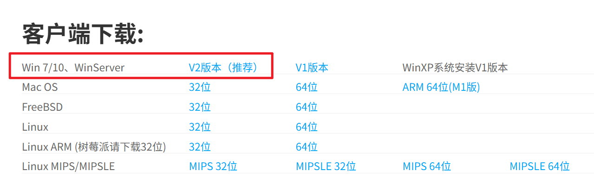


双击安装即可，安装软件之后，启动软件，你会看到：

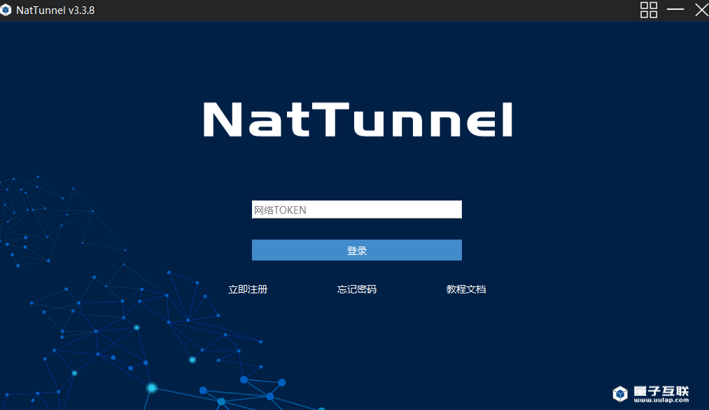

点击立即注册。会弹出一个网页，如下：

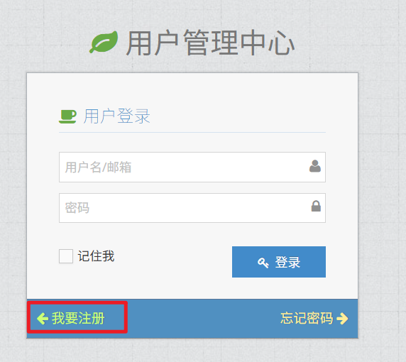

点击我要注册：


填写信息并注册。

### 购买服务

免费的也能用，但是容易断网，建议购买一下，一个月 10 元不限流量。


### 线路设置

我的隧道，线路设置：

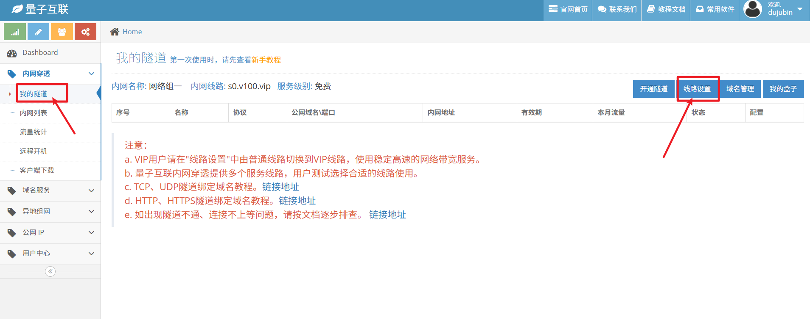

一定要选择香港线路，要不然你还得注册域名并备案：


### 开通隧道


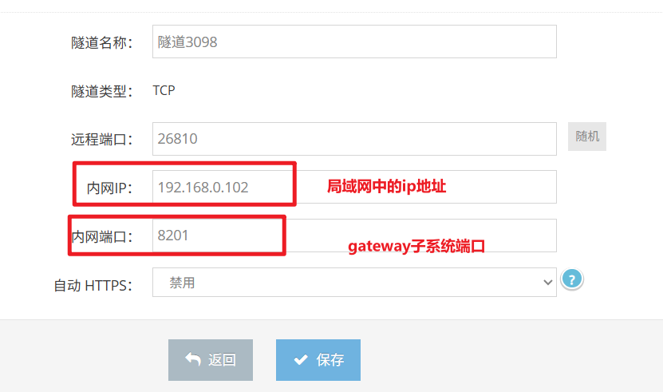

创建内网穿透隧道后，即可通过外网URL地址访问本地电脑上运行的Java项目。请注意：**请务必保持量子互联软件持续运行**，以确保隧道始终有效。若长期未运行Java项目，量子互联软件向 8201 端口发送的心跳检测可能无法响应，导致外网HTTP请求无法被正常转发。因此，**建议您在启动Java项目前，先重启一次量子互联软件**，以保障服务稳定。启动量子互联软件后，需要输入网络 TOKEN 进行登录，在这里找网络 TOKEN：

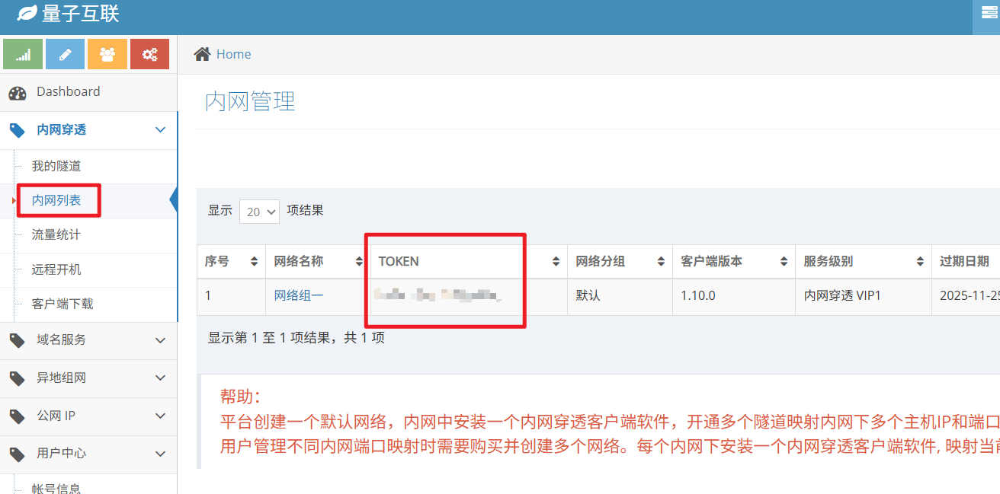

在量子互联软件上输入网络 TOKEN，登录：

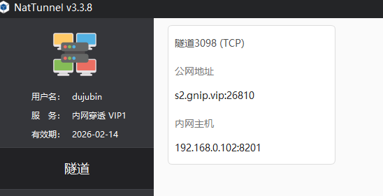

这个软件需要一直处于运行状态哈。

设置好之后，就可以拿到Gateway子系统的公网路径了：[http://s2.gnip.vip:26810/](http://s2.gnip.vip:26810/)

在司机端小程序的 `<font style="color:#000000;">main.js</font>`文件中，修改baseUrl为内网穿透的地址，这样司机端小程序就能通过公网访问到网关子系统了。

```javascript
let baseUrl = "http://s2.gnip.vip:26810/zxds-driver"
```

在`<font style="color:#000000;background-color:rgba(220, 240, 255, 0.3) !important;">App.vue</font>`页面的`<font style="color:#000000;background-color:rgba(220, 240, 255, 0.3) !important;">baseUrl</font>`也要做修改

```javascript
let baseUrl = 'http://s2.gnip.vip:26810/zxds-driver';
```

测试完小程序，大家别忘了把baseUrl改回原来的样子。

# 乘客端的司乘同显-司机实时上传定位

乘客端的司乘同显要复杂一些。因为它包括两个阶段：

1. 一阶段，司机赶往代驾点的过程：在乘客手机上要能够实时看到司机的位置，此时需要在**乘客端**上可以**实时获取到司机的定位**。
2. 二阶段，司机代驾的过程：乘客端直接使用自己的实时定位即可。

接下来，我们先把一阶段实现一下。思路是：司机端实时将定位上传到 redis 中，乘客端从 redis 中实时获取司机定位信息即可。

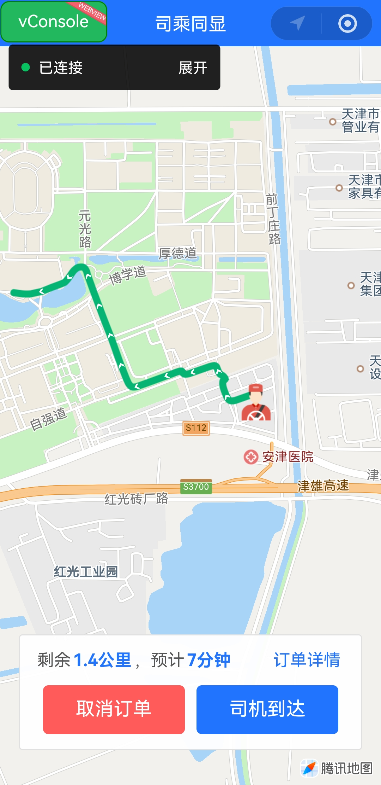

## 编写 zxds-mps 子系统

司机端只要位置发生变化就将自己最新的定位更新到 redis 缓存中。乘客端从 redis 缓存中获取司机的定位信息。在 mps 子系统中编写两个业务方法。

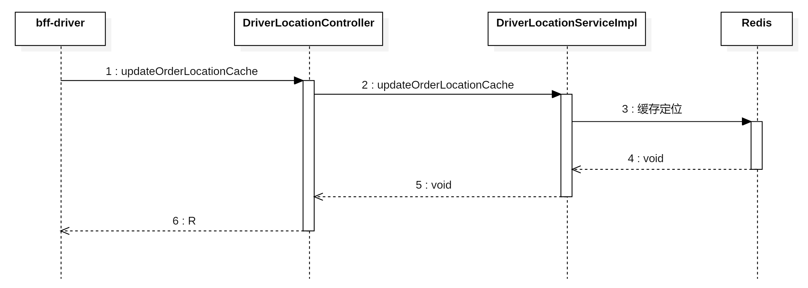

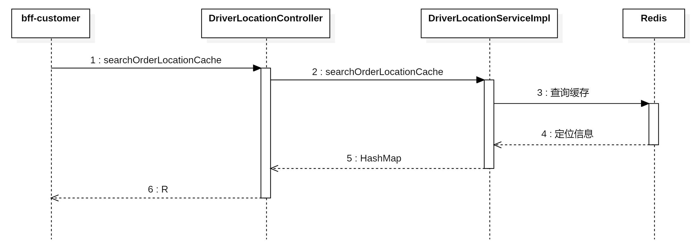

### 编写 service 和实现

在`<font style="color:#000000;background-color:rgba(220, 240, 255, 0.3) !important;">com.example.zxds.mps.service</font>`包`<font style="color:#000000;background-color:rgba(220, 240, 255, 0.3) !important;">DriverLocationService.java</font>`接口中，声明抽象方法

```java
void updateOrderLocationCache(Map<String, Object> param);

Map<String, Object> searchOrderLocationCache(long orderId);
```

在`<font style="color:#000000;background-color:rgba(220, 240, 255, 0.3) !important;">com.example.zxds.mps.service.impl</font>`包`<font style="color:#000000;background-color:rgba(220, 240, 255, 0.3) !important;">DriverLocationServiceImpl.java</font>`类中，实现抽象方法。之前司机在开始接单的时候会实时上传定位信息，这个定位信息是缓存在Redis的GEO里面的，但是现在我们不需要GEO了，所以就单独另设订单定位缓存，过期时间为10分钟

```java
@Override
public void updateOrderLocationCache(Map<String, Object> param) {
    long orderId = MapUtil.getLong(param, "orderId");
    String latitude = MapUtil.getStr(param, "latitude");
    String longitude = MapUtil.getStr(param, "longitude");
    String location = latitude + "#" + longitude;
    redisTemplate.opsForValue().set("order_location#" + orderId, location, 10, TimeUnit.MINUTES);
}

@Override

public Map<String, Object> searchOrderLocationCache(long orderId) {
    Object obj = redisTemplate.opsForValue().get("order_location#" + orderId);
    if (obj != null) {
        String[] temp = obj.toString().split("#");
        String latitude = temp[0];
        String longitude = temp[1];
        Map<String, Object> map = Map.of("latitude", latitude, "longitude", longitude);
        return map;
    }
    return null;
}
```

### 编写 form 接收数据并校验

在`<font style="color:#000000;background-color:rgba(220, 240, 255, 0.3) !important;">com.example.zxds.mps.controller.form</font>`包中，创建两个Form类

```java
package com.example.zxds.mps.controller.form;

import io.swagger.v3.oas.annotations.media.Schema;
import lombok.Data;

import javax.validation.constraints.Min;
import javax.validation.constraints.NotBlank;
import javax.validation.constraints.NotNull;
import javax.validation.constraints.Pattern;

@Data
@Schema(description = "更新订单定位缓存的表单")
public class UpdateOrderLocationCacheForm {

    @NotNull(message = "orderId不能为空")
    @Min(value = 1, message = "orderId不能小于1")
    @Schema(description = "订单ID")
    private String orderId;

    @NotBlank(message = "latitude不能为空")
    @Pattern(regexp = "^(([1-8]\\d?)|([1-8]\\d))(\\.\\d{1,18})|90|0(\\.\\d{1,18})?$", message = "latitude内容不正确")
    @Schema(description = "纬度")
    private String latitude;

    @NotBlank(message = "longitude不能为空")
    @Pattern(regexp = "^(([1-9]\\d?)|(1[0-7]\\d))(\\.\\d{1,18})|180|0(\\.\\d{1,18})?$", message = "longitude内容不正确")
    @Schema(description = "经度")
    private String longitude;
}
```

```java
package com.example.zxds.mps.controller.form;

import io.swagger.v3.oas.annotations.media.Schema;
import lombok.Data;

import javax.validation.constraints.Min;
import javax.validation.constraints.NotNull;

@Data
@Schema(description = "查询订单定位缓存的表单")
public class SearchOrderLocationCacheForm {
    @NotNull(message = "orderId不能为空")
    @Min(value = 1, message = "orderId不能小于1")
    @Schema(description = "订单ID")
    private Long orderId;
}
```

### 编写 web 方法

在`<font style="color:#000000;background-color:rgba(220, 240, 255, 0.3) !important;">com.example.zxds.mps.controller</font>`包`<font style="color:#000000;background-color:rgba(220, 240, 255, 0.3) !important;">DriverLocationController.java</font>`类中，声明Web方法

```java
@PostMapping("/updateOrderLocationCache")
@Operation(summary = "更新订单定位缓存")
public R updateOrderLocationCache(@RequestBody @Valid UpdateOrderLocationCacheForm form) {
    Map<String, Object> param = BeanUtil.beanToMap(form);
    driverLocationService.updateOrderLocationCache(param);
    return R.ok();
}

@PostMapping("/searchOrderLocationCache")
@Operation(summary = "查询订单定位缓存")
public R searchOrderLocationCache(@RequestBody @Valid SearchOrderLocationCacheForm form) {
    Map<String, Object> map = driverLocationService.searchOrderLocationCache(form.getOrderId());
    return R.ok().put("result", map);
}
```

## 编写 bff-driver 子系统

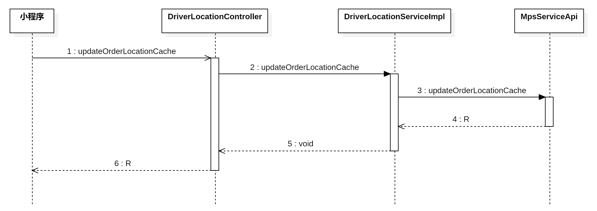

### 编写 Feign 客户端

在`<font style="color:#000000;background-color:rgba(220, 240, 255, 0.3) !important;">com.example.zxds.bff.driver.controller.form</font>`包中创建`<font style="color:#000000;background-color:rgba(220, 240, 255, 0.3) !important;">UpdateOrderLocationCacheForm.java</font>`类

```java
package com.example.zxds.bff.driver.controller.form;

import io.swagger.v3.oas.annotations.media.Schema;
import lombok.Data;

import javax.validation.constraints.Min;
import javax.validation.constraints.NotBlank;
import javax.validation.constraints.NotNull;
import javax.validation.constraints.Pattern;

@Data
@Schema(description = "更新订单定位缓存的表单")
public class UpdateOrderLocationCacheForm {

    @NotNull(message = "orderId不能为空")
    @Min(value = 1, message = "orderId不能小于1")
    @Schema(description = "订单ID")
    private String orderId;

    @NotBlank(message = "latitude不能为空")
    @Pattern(regexp = "^(([1-8]\\d?)|([1-8]\\d))(\\.\\d{1,18})|90|0(\\.\\d{1,18})?$", message = "latitude内容不正确")
    @Schema(description = "纬度")
    private String latitude;

    @NotBlank(message = "longitude不能为空")
    @Pattern(regexp = "^(([1-9]\\d?)|(1[0-7]\\d))(\\.\\d{1,18})|180|0(\\.\\d{1,18})?$", message = "longitude内容不正确")
    @Schema(description = "经度")
    private String longitude;
}
```

在`<font style="color:#000000;background-color:rgba(220, 240, 255, 0.3) !important;">com.example.zxds.bff.driver.feign</font>`包`<font style="color:#000000;background-color:rgba(220, 240, 255, 0.3) !important;">MpsServiceApi.java</font>`接口中，声明抽象方法

```java
@PostMapping("/driver/location/updateOrderLocationCache")
R updateOrderLocationCache(UpdateOrderLocationCacheForm form);
```

### 编写 service 和实现

在`<font style="color:#000000;background-color:rgba(220, 240, 255, 0.3) !important;">com.example.zxds.bff.driver.service</font>`包`<font style="color:#000000;background-color:rgba(220, 240, 255, 0.3) !important;">DriverLocationService.java</font>`接口中，声明抽象方法

```java
void updateOrderLocationCache(UpdateOrderLocationCacheForm form);
```

在`<font style="color:#000000;background-color:rgba(220, 240, 255, 0.3) !important;">com.example.zxds.bff.driver.service.impl</font>`包`<font style="color:#000000;background-color:rgba(220, 240, 255, 0.3) !important;">DriverLocationServiceImpl.java</font>`类中，实现抽象方法

```java
@Override
public void updateOrderLocationCache(UpdateOrderLocationCacheForm form) {
    mpsServiceApi.updateOrderLocationCache(form);
}
```

### 编写 web 方法

在`<font style="color:#000000;background-color:rgba(220, 240, 255, 0.3) !important;">om.example.zxds.bff.driver.controller</font>`包`<font style="color:#000000;background-color:rgba(220, 240, 255, 0.3) !important;">DriverLocationController.java</font>`类中，声明Web方法

```java
@PostMapping("/updateOrderLocationCache")
@Operation(summary = "更新订单定位缓存")
@SaCheckLogin
public R updateOrderLocationCache(@RequestBody @Valid UpdateOrderLocationCacheForm form) {
    locationService.updateOrderLocationCache(form);
    return R.ok();
}
```

## 编写司机端小程序

司机端小程序，要实时上传GPS定位信息。不仅仅是司机停留在司乘同显页面要上传GPS定位，在其他页面也要上传定位信息，因此需要在`<font style="color:#000000;background-color:rgba(220, 240, 255, 0.3) !important;">App.vue</font>`页面添加代码。（`**<font style="color:#000000;">App.vue</font>**`**是一个根组件，写在这里的代码，不管哪个页面都会执行**）

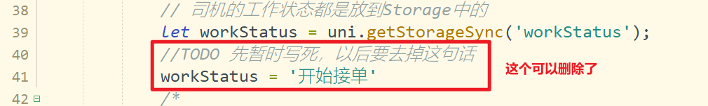

```javascript
uni.onLocationChange(function(resp) {
    ……
    if (workStatus == '开始接单') {
        ……
    }
    else if (workStatus == '接客户') {
        let executeOrder = uni.getStorageSync('executeOrder');
        let orderId = executeOrder.id;
        let data = {
            orderId: orderId,
            latitude: latitude,
            longitude: longitude
        };
        uni.request({
            url: `${baseUrl}/driver/location/updateOrderLocationCache`,
            method: 'POST',
            header: {
                token: uni.getStorageSync('token')
            },
            data: data,
            success: function(resp) {
                if (resp.statusCode == 401) {
                    uni.redirectTo({
                        url: 'pages/login/login'
                    });
                } else if (resp.statusCode == 200 && resp.data.code == 200) {
                    let data = resp.data;
                    if (data.hasOwnProperty('token')) {
                        let token = data.token;
                        uni.setStorageSync('token', token);
                    }
                    console.log('订单定位更新成功');
                } else {
                    console.error('订单定位更新失败', resp.data);
                }
            },
            fail: function(error) {
                console.error('订单定位更新失败', error);
            }
        });
    } else if (workStatus == '开始代驾') {
        //TODO 每凑够20个定位就上传一次，减少服务器的压力
    }
    uni.$emit('updateLocation', location);
});
```

把各个子系统运行起来，运行司机端小程序，登录成功之后，看看控制台输出的内容，如果没有异常，说明订单定位缓存更新成功。

# 乘客端的司乘同显-乘客端的实现

我们已经实现了司机端赶往上车点途中实时上传GPS定位，定位信息被缓存到Redis里了。接下来我们先来编写后端的Java代码，把缓存的定位信息提取出来，然后编写乘客端的代码，实现司乘同显的功能。


## 编写 bff-customer 子系统

**以下内容等于把之前在 **`**<font style="color:#000000;">bff-driver</font>**`**子系统中的代码再重新写一遍：根据订单 id 获取订单的信息。**


### 编写 Feign 客户端

在`<font style="color:#000000;background-color:rgba(220, 240, 255, 0.3) !important;">com.example.zxds.bff.customer.controller.form</font>`包中创建`<font style="color:#000000;background-color:rgba(220, 240, 255, 0.3) !important;">SearchOrderForMoveByIdForm.java</font>`类

```java
package com.example.zxds.bff.customer.controller.form;

import io.swagger.v3.oas.annotations.media.Schema;
import lombok.Data;

import javax.validation.constraints.NotNull;

@Data
@Schema(description = "查询订单信息用于司乘同显功能的表单")
public class SearchOrderForMoveByIdForm {

    @NotNull(message = "orderId不能为空")
    @Schema(description = "订单ID")
    private Long orderId;

    @Schema(description = "客户ID")
    private Long customerId;
}
```

在`<font style="color:#000000;background-color:rgba(220, 240, 255, 0.3) !important;">com.example.zxds.bff.customer.feign</font>`包`<font style="color:#000000;background-color:rgba(220, 240, 255, 0.3) !important;">OdrServiceApi.java</font>`接口中，声明抽象方法

```java
@PostMapping("/order/searchOrderForMoveById")
R searchOrderForMoveById(SearchOrderForMoveByIdForm form);
```

### 编写 service 和实现

在`<font style="color:#000000;background-color:rgba(220, 240, 255, 0.3) !important;">com.example.zxds.bff.customer.service</font>`包`<font style="color:#000000;background-color:rgba(220, 240, 255, 0.3) !important;">OrderService.java</font>`接口中，声明抽象方法

```java
Map<String, Object> searchOrderForMoveById(SearchOrderForMoveByIdForm form);
```

在`<font style="color:#000000;background-color:rgba(220, 240, 255, 0.3) !important;">com.example.zxds.bff.customer.service.impl</font>`包`<font style="color:#000000;background-color:rgba(220, 240, 255, 0.3) !important;">OrderServiceImpl.java</font>`类中，实现抽象方法

```java
@Override
public Map<String, Object> searchOrderForMoveById(SearchOrderForMoveByIdForm form) {
    R r = odrServiceApi.searchOrderForMoveById(form);
    Map<String, Object> result = (Map<String, Object>) r.get("result");
    return result;
}
```

### 编写 web 方法

在`<font style="color:#000000;background-color:rgba(220, 240, 255, 0.3) !important;">com.example.zxds.bff.customer.controller</font>`包`<font style="color:#000000;background-color:rgba(220, 240, 255, 0.3) !important;">OrderController.java</font>`类中，声明Web方法

```java
@PostMapping("/searchOrderForMoveById")
@SaCheckLogin
@Operation(summary = "查询订单信息用于司乘同显功能")
public R searchOrderForMoveById(@RequestBody @Valid SearchOrderForMoveByIdForm form) {
    long customerId = StpUtil.getLoginIdAsLong();
    form.setCustomerId(customerId);
    Map<String, Object> map = orderService.searchOrderForMoveById(form);
    return R.ok().put("result", map);
}
```

## 编写 bff-customer 子系统

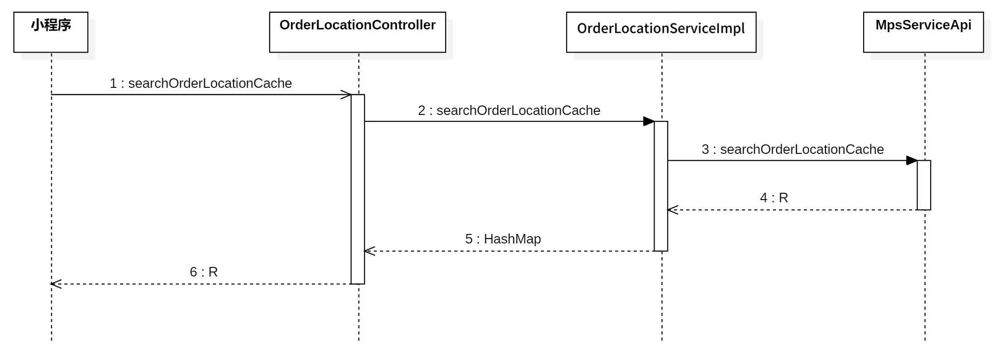

### 编写 Feign 客户端

在`<font style="color:#000000;background-color:rgba(220, 240, 255, 0.3) !important;">com.example.zxds.bff.customer.controller.form</font>`包中创建`<font style="color:#000000;background-color:rgba(220, 240, 255, 0.3) !important;">SearchOrderLocationCacheForm.java</font>`类。

```java
package com.example.zxds.bff.customer.controller.form;

import io.swagger.v3.oas.annotations.media.Schema;
import lombok.Data;

import javax.validation.constraints.Min;
import javax.validation.constraints.NotNull;

@Data
@Schema(description = "查询订单定位缓存的表单")
public class SearchOrderLocationCacheForm {
    @NotNull(message = "orderId不能为空")
    @Min(value = 1, message = "orderId不能小于1")
    @Schema(description = "订单ID")
    private Long orderId;
}
```

在`<font style="color:#000000;background-color:rgba(220, 240, 255, 0.3) !important;">com.example.zxds.bff.customer.feign</font>`包`<font style="color:#000000;background-color:rgba(220, 240, 255, 0.3) !important;">MpsServiceApi.java</font>`接口中，声明抽象方法

```java
@PostMapping("/driver/location/searchOrderLocationCache")
R searchOrderLocationCache(SearchOrderLocationCacheForm form);
```

### 编写 service 和实现

在`<font style="color:#000000;background-color:rgba(220, 240, 255, 0.3) !important;">com.example.zxds.bff.customer.service</font>`包`<font style="color:#000000;background-color:rgba(220, 240, 255, 0.3) !important;">OrderLocationService.java</font>`接口中，声明抽象方法

```java
package com.example.zxds.bff.customer.service;

import com.example.zxds.bff.customer.controller.form.SearchOrderLocationCacheForm;

import java.util.Map;

public interface OrderLocationService {
    Map<String, Object> searchOrderLocationCache(SearchOrderLocationCacheForm form);
}
```

在`<font style="color:#000000;background-color:rgba(220, 240, 255, 0.3) !important;">com.example.zxds.bff.customer.service.impl</font>`包`<font style="color:#000000;background-color:rgba(220, 240, 255, 0.3) !important;">OrderLocationServiceImpl.java</font>`类中，实现抽象方法

```java
package com.example.zxds.bff.customer.service.impl;

import com.example.zxds.bff.customer.controller.form.SearchOrderLocationCacheForm;
import com.example.zxds.bff.customer.feign.MpsServiceApi;
import com.example.zxds.bff.customer.service.OrderLocationService;
import com.example.zxds.common.util.R;
import lombok.RequiredArgsConstructor;
import org.springframework.stereotype.Service;

import java.util.Map;

@Service
@RequiredArgsConstructor
public class OrderLocationServiceImpl implements OrderLocationService {
    private final MpsServiceApi mpsServiceApi;

    @Override
    public Map<String, Object> searchOrderLocationCache(SearchOrderLocationCacheForm form) {
        R r = mpsServiceApi.searchOrderLocationCache(form);
        Map<String, Object> map = (Map<String, Object>) r.get("result");
        return map;
    }
}
```

### 编写 web 方法

在`<font style="color:#000000;background-color:rgba(220, 240, 255, 0.3) !important;">com.example.zxds.bff.customer.controller</font>`包`<font style="color:#000000;background-color:rgba(220, 240, 255, 0.3) !important;">OrderLocationController.java</font>`类中，声明Web方法

```java
package com.example.zxds.bff.customer.controller;

import cn.dev33.satoken.annotation.SaCheckLogin;
import com.example.zxds.bff.customer.controller.form.SearchOrderLocationCacheForm;
import com.example.zxds.bff.customer.service.OrderLocationService;
import com.example.zxds.common.util.R;
import io.swagger.v3.oas.annotations.Operation;
import io.swagger.v3.oas.annotations.tags.Tag;
import lombok.RequiredArgsConstructor;
import org.springframework.web.bind.annotation.PostMapping;
import org.springframework.web.bind.annotation.RequestBody;
import org.springframework.web.bind.annotation.RequestMapping;
import org.springframework.web.bind.annotation.RestController;

import javax.validation.Valid;
import java.util.Map;

@RestController
@RequestMapping("/order/location")
@RequiredArgsConstructor
@Tag(name = "OrderLocationController", description = "订单定位服务Web接口")
public class OrderLocationController {

    private final OrderLocationService orderLocationService;

    @PostMapping("/searchOrderLocationCache")
    @Operation(summary = "查询订单定位缓存")
    @SaCheckLogin
    public R searchOrderLocationCache(@RequestBody @Valid SearchOrderLocationCacheForm form) {
        Map<String, Object> map = orderLocationService.searchOrderLocationCache(form);
        return R.ok().put("result", map);
    }
}
```

## 编写乘客端小程序

### 定义全局 URL

```javascript
Vue.prototype.url = {
    ……,
    searchOrderForMoveById: `${baseUrl}/order/searchOrderForMoveById`,
    searchOrderLocationCache: `${baseUrl}/order/location/searchOrderLocationCache`,
}
```

### 声明解压函数

在`<font style="color:#000000;background-color:rgba(220, 240, 255, 0.3) !important;">move.vue</font>`页面中，添加解压坐标的封装函数

```javascript
formatPolyline(polyline) {
    let coors = polyline;
    let pl = [];
    //坐标解压（返回的点串坐标，通过前向差分进行压缩）
    const kr = 1000000;
    for (let i = 2; i < coors.length; i++) {
        coors[i] = Number(coors[i - 2]) + Number(coors[i]) / kr;
    }
    //将解压后的坐标放入点串数组pl中
    for (let i = 0; i < coors.length; i += 2) {
        pl.push({
            longitude: coors[i + 1],
            latitude: coors[i]
        });
    }
    return pl;
},
```

### 实现司乘同显

声明计算最佳线路的`<font style="color:#000000;background-color:rgba(220, 240, 255, 0.3) !important;">calculateLine()</font>`函数，这个函数的内容跟之前的相同，直接复用即可

```javascript
calculateLine() {
    let that = this;
    if (that.latitude == 0 || that.longitude == 0) {
        return;
    }
    qqmapsdk.direction({
        mode: that.mode,
        from: {
            latitude: that.latitude,
            longitude: that.longitude
        },
        to: {
            latitude: that.targetLatitude,
            longitude: that.targetLongitude
        },
        success: function(resp) {
            let route = resp.result.routes[0];
            let distance = route.distance;
            let duration = route.duration;
            let polyline = route.polyline;
            that.distance = Math.ceil((distance / 1000) * 10) / 10;
            that.duration = duration;

            let points = that.formatPolyline(polyline);

            that.polyline = [
                {
                    points: points,
                    width: 6,
                    color: '#05B473',
                    arrowLine: true
                }
            ];
            that.markers = [
                {
                    id: 1,
                    latitude: that.latitude,
                    longitude: that.longitude,
                    width: 35,
                    height: 35,
                    anchor: {
                        x: 0.5,
                        y: 0.5
                    },
                    iconPath: '../../static/move/driver-icon.png'
                }
            ];
        },
        fail: function(error) {
            console.log(error);
        }
    });
},
```

声明`<font style="color:#000000;background-color:rgba(220, 240, 255, 0.3) !important;">analyse()</font>`函数，用来根据订单状态，采用订单定位还是乘客自己的定位，然后生成最佳线路

```javascript
analyse() {
    let that = this;
    if (that.status == 2) {
        //如果status是2状态，就查询订单的定位缓存
        let data = {
            orderId: that.orderId
        };
        that.ajax(
            that.url.searchOrderLocationCache,
            'POST',
            data,
            function(resp) {
                let result = resp.data.result;
                if (result.hasOwnProperty('latitude') && result.hasOwnProperty('longitude')) {
                    let latitude = result.latitude;
                    let longitude = result.longitude;
                    that.latitude = latitude;
                    that.longitude = longitude;
                    that.calculateLine(); //计算最佳线路
                }
            },
            false
        );
    } else {
        that.calculateLine(); //计算最佳线路
    }
},
```

在`<font style="color:#000000;background-color:rgba(220, 240, 255, 0.3) !important;">onLoad()</font>`函数中完成一些初始化工作

```javascript
onLoad: function(options) {
    let that = this;
    that.orderId = options.orderId;
    qqmapsdk = new QQMapWX({
        key: that.tencent.map.key
    });
    let windowHeight = uni.getSystemInfoSync().windowHeight;
    that.mapStyle = `height:${windowHeight}px`;
},
```

在`<font style="color:#000000;background-color:rgba(220, 240, 255, 0.3) !important;">onShow()</font>`函数中获取实时定位，然后根据订单状态，设置最佳线路的终点

```javascript
onShow: function() {
    let that = this;
    uni.$on('updateLocation', function(location) {
        if (location != null && that.status != 2) {
            that.latitude = location.latitude;
            that.longitude = location.longitude;
        }
    });

    let data = {
        orderId: that.orderId
    };
    that.ajax(that.url.searchOrderForMoveById, 'POST', data, function(resp) {
        let result = resp.data.result;

        let startPlaceLocation = JSON.parse(result.startPlaceLocation);
        that.startLatitude = startPlaceLocation.latitude;
        that.startLongitude = startPlaceLocation.longitude;

        let endPlaceLocation = JSON.parse(result.endPlaceLocation);
        that.endLatitude = endPlaceLocation.latitude;
        that.endLongitude = endPlaceLocation.longitude;

        let status = result.status;
        
        that.status = status;
        if (status == 2 || status == 3) {
            that.targetLatitude = that.startLatitude;
            that.targetLongitude = that.startLongitude;
            that.mode = 'bicycling';
        } else if (status == 4) {
            that.targetLatitude = that.endLatitude;
            that.targetLongitude = that.endLongitude;
            that.mode = 'driving';
        }
        that.analyse();
        that.timer = setInterval(function() {
            that.analyse();
        }, 6000);
    });
},
```

在`<font style="color:#000000;background-color:rgba(220, 240, 255, 0.3) !important;">onHide()</font>`函数中，销毁循环定时器，取消订阅事件

```javascript
onHide: function() {
    let that = this;
    uni.$off('updateLocation');
    clearInterval(that.timer);
    that.timer = null;
}
```

### 测试司乘同显功能

把后端各个子系统都运行起来，然后通过接口测试工具调用Web方法，手动上传司机定位信息，然后打开乘客端小程序，自动跳转到司乘同显页面并且显示司机赶往上车点的最佳线路、里程和时间。这时候我们用接口测试工具再次调用Web方法，更新司机定位之后，乘客端的司乘同显页面也会随之更新。

# 司机到达起点更新订单状态 zxds-odr 子系统实现

我们已经实现了乘客端和司机端的司乘同显功能，接下来司机赶到上车点之后，乘客确认司机已经到达，就该开始代驾了。


我们先来实现 zxds-odr 子系统的代码，更新订单的状态。

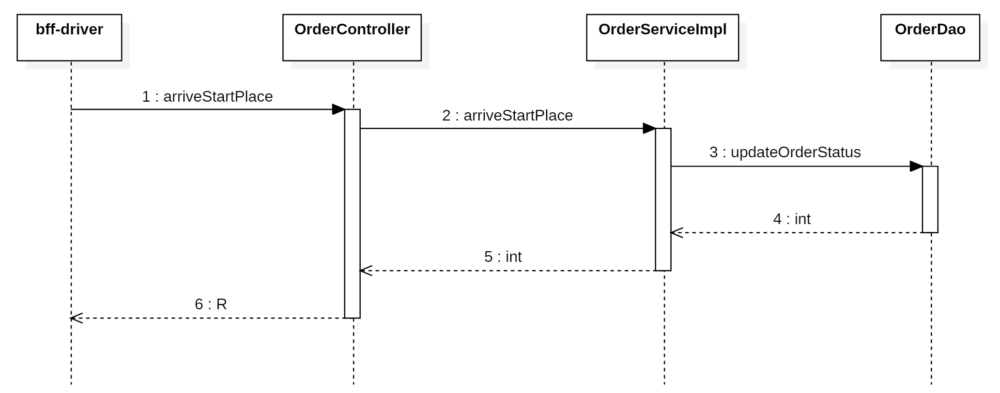

## 编写持久层代码

在`<font style="color:#000000;background-color:rgba(220, 240, 255, 0.3) !important;">OrderDao.xml</font>`文件中声明UPDATE语句，用于更新订单状态

```xml
<update id="updateOrderStatus" parameterType="Map">
    UPDATE tb_order
    SET
    <if test="status==3">
        arrive_time = NOW(),
    </if>
    <if test="status==4">
        start_time = NOW(),
        waiting_minute = TIMESTAMPDIFF(MINUTE, arrive_time, NOW()),
    </if>
    <if test="status==5">
        end_time = NOW(),
    </if>
    `status` = #{status}
    WHERE id = #{orderId}
    <if test="customerId!=null">
        AND customer_id = #{customerId}
    </if>
    <if test="driverId!=null">
        AND driver_id = #{driverId}
    </if>
</update>
```

在`<font style="color:#000000;background-color:rgba(220, 240, 255, 0.3) !important;">com.example.zxds.odr.db.dao</font>`包`<font style="color:#000000;background-color:rgba(220, 240, 255, 0.3) !important;">OrderDao.java</font>`接口中，声明DAO方法

```java
int updateOrderStatus(Map<String, Object> param);
```

## 编写 service 和实现

在`<font style="color:#000000;background-color:rgba(220, 240, 255, 0.3) !important;">com.example.zxds.odr.service</font>`包`<font style="color:#000000;background-color:rgba(220, 240, 255, 0.3) !important;">OrderService.java</font>`接口中，声明抽象方法

```java
int arriveStartPlace(Map<String, Object> param);
```

在`<font style="color:#000000;background-color:rgba(220, 240, 255, 0.3) !important;">com.example.zxds.odr.service.impl</font>`包`<font style="color:#000000;background-color:rgba(220, 240, 255, 0.3) !important;">OrderServiceImpl.java</font>`类中，实现抽象方法

```java
@Override
@Transactional
public int arriveStartPlace(Map<String, Object> param) {
    // 添加到达上车点标志位
    long orderId = MapUtil.getLong(param, "orderId");
    // 司机到达上车点后向redis缓存中存储一个标志位：1
    // 客户（车主）在乘客端APP上确认司机到达上车点后会将该标志从1修改为2
    // 司机在司机端APP上点击开始代驾时需要判断该标志位是否为2，如果不是2则表示车主并没有确认司机到达上车点，是不允许开始代驾的。
    stringRedisTemplate.opsForValue().set("order_driver_arrivied#" + orderId, "1");

    // 更新订单状态
    int rows = orderDao.updateOrderStatus(param);
    if (rows != 1) {
        throw new ZxdsException("更新订单状态失败");
    }
    return rows;
}
```

## 编写 form 接收数据并校验

在`<font style="color:#000000;background-color:rgba(220, 240, 255, 0.3) !important;">com.example.zxds.odr.controller.form</font>`包中创建`<font style="color:#000000;background-color:rgba(220, 240, 255, 0.3) !important;">ArriveStartPlaceForm.java</font>`类

```java
package com.example.zxds.odr.controller.form;

import io.swagger.v3.oas.annotations.media.Schema;
import lombok.Data;

import javax.validation.constraints.Min;
import javax.validation.constraints.NotNull;

@Data
@Schema(description = "更新订单状态的表单")
public class ArriveStartPlaceForm {
    @NotNull(message = "orderId不能为空")
    @Min(value = 1, message = "orderId不能小于1")
    @Schema(description = "订单ID")
    private Long orderId;

    @NotNull(message = "driverId不能为空")
    @Min(value = 1, message = "driverId不能小于1")
    @Schema(description = "司机ID")
    private Long driverId;
}
```

## 编写 web 方法

在`<font style="color:#000000;background-color:rgba(220, 240, 255, 0.3) !important;">com.example.zxds.odr.controller</font>`包`<font style="color:#000000;background-color:rgba(220, 240, 255, 0.3) !important;">OrderController.java</font>`类中，声明Web方法

```java
@PostMapping("/arriveStartPlace")
@Operation(summary = "司机到达上车点")
public R arriveStartPlace(@RequestBody @Valid ArriveStartPlaceForm form) {
    Map<String, Object> param = BeanUtil.beanToMap(form);
    param.put("status", 3);
    int rows = orderService.arriveStartPlace(param);
    return R.ok().put("rows", rows);
}
```

# 司机到达起点更新订单状态 bff-driver 子系统

接下来可以实现 bff-driver 子系统中的代码了。

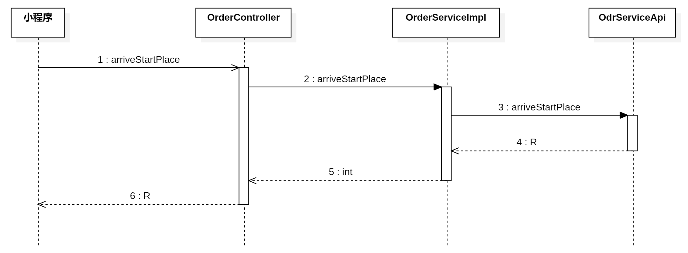

## 编写 Feign 客户端

在`<font style="color:#000000;background-color:rgba(220, 240, 255, 0.3) !important;">com.example.zxds.bff.driver.controller.form</font>`包中创建`<font style="color:#000000;background-color:rgba(220, 240, 255, 0.3) !important;">ArriveStartPlaceForm.java</font>`类

```java
package com.example.zxds.bff.driver.controller.form;

import io.swagger.v3.oas.annotations.media.Schema;
import lombok.Data;

import javax.validation.constraints.Min;
import javax.validation.constraints.NotNull;

@Data
@Schema(description = "更新订单状态的表单")
public class ArriveStartPlaceForm {
    @NotNull(message = "orderId不能为空")
    @Min(value = 1, message = "orderId不能小于1")
    @Schema(description = "订单ID")
    private Long orderId;

    @Schema(description = "司机ID")
    private Long driverId;

    @NotNull(message = "customerId不能为空")
    @Min(value = 1, message = "customerId不能小于1")
    @Schema(description = "客户ID")
    private Long customerId;
}
```

在`<font style="color:#000000;background-color:rgba(220, 240, 255, 0.3) !important;">com.example.zxds.bff.driver.feign</font>`包`<font style="color:#000000;background-color:rgba(220, 240, 255, 0.3) !important;">OdrServiceApi.java</font>`接口中，声明抽象方法

```java
@PostMapping("/order/arriveStartPlace")
R arriveStartPlace(ArriveStartPlaceForm form);
```

## 编写 service 和实现

在`<font style="color:#000000;background-color:rgba(220, 240, 255, 0.3) !important;">com.example.zxds.bff.driver.service</font>`包`<font style="color:#000000;background-color:rgba(220, 240, 255, 0.3) !important;">OrderService.java</font>`接口中，声明抽象方法

```java
int arriveStartPlace(ArriveStartPlaceForm form);
```

在`<font style="color:#000000;background-color:rgba(220, 240, 255, 0.3) !important;">com.example.zxds.bff.driver.service.impl</font>`包`<font style="color:#000000;background-color:rgba(220, 240, 255, 0.3) !important;">OrderServiceImpl.java</font>`类中，实现抽象方法

```java
@Override
@GlobalTransactional
public int arriveStartPlace(ArriveStartPlaceForm form) {
    R r = odrServiceApi.arriveStartPlace(form);
    int rows = MapUtil.getInt(r, "rows");
    if (rows == 1) {
        //TODO 给乘客发送通知消息
    }
    return rows;
}
```

## 编写 web 方法

在`<font style="color:#000000;background-color:rgba(220, 240, 255, 0.3) !important;">com.example.zxds.bff.driver.controller</font>`包`<font style="color:#000000;background-color:rgba(220, 240, 255, 0.3) !important;">OrderController.java</font>`类中，声明Web方法

```java
@PostMapping("/arriveStartPlace")
@Operation(summary = "司机到达上车点")
@SaCheckLogin
public R arriveStartPlace(@RequestBody @Valid ArriveStartPlaceForm form) {
    long driverId = StpUtil.getLoginIdAsLong();
    form.setDriverId(driverId);
    int rows = orderService.arriveStartPlace(form);
    return R.ok().put("rows", rows);
}
```

# 司机到达起点更新订单状态移动端实现

**作业：司机点击到达代驾点的时候，必须验证司机当前位置和代驾起点的距离在 1 公里以内，超过 1 公里不算到达代驾起点。**

## 定义全局 URL

```javascript
Vue.prototype.url = {
    ……,
    arriveStartPlace: `${baseUrl}/order/arriveStartPlace`,
}
```

## 司机到达上车点

司机端工作台页面中有“到达代驾点”的按钮，司机点击按钮之后，发出Ajax请求，把订单的状态改成3。

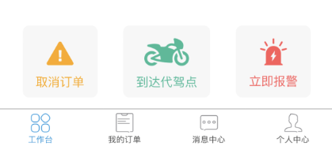

在工作台页面中，“到达代驾点”按钮的标签代码如下

```html
<view class="item" v-show="workStatus == '接客户'" @tap="arriveStartPlaceHandle">
    <image src="../../static/workbench/arrive-start-icon.png" 
           mode="widthFix" 
           class="arrive-start-icon">
    </image>
    <text class="arrive-start-text">到达代驾点</text>
</view>
```

我们实现`<font style="color:#000000;background-color:rgba(220, 240, 255, 0.3) !important;">arriveStartPlaceHandle()</font>`函数的内容，提交Ajax请求

```javascript
arriveStartPlaceHandle() {
    let that = this;
    uni.showModal({
        title: '消息通知',
        content: '确认已经到达了代驾点？',
        success: function(resp) {
            if (resp.confirm) {
                let data = {
                    orderId: that.executeOrder.id,
                    customerId: that.executeOrder.customerId
                };
                that.ajax(that.url.arriveStartPlace, 'POST', data, function(resp) {
                    if (resp.data.rows == 1) {
                        uni.showToast({
                            icon: 'success',
                            title: '订单状态更新成功'
                        });
                        that.workStatus = '到达代驾点';
                        uni.setStorageSync('workStatus', '到达代驾点');
                    }
                });
            }
        }
    });
},
```

## 功能测试

把后端各种子系统运行起来，然后运行司机端小程序，查看点击“到达代驾点”按钮是否好用。