# 智行代驾03

# 内容概述

我们要完成乘客端下单，然后代驾系统预估代驾线路、里程和费用，并且把订单推送给附近符合条件的司机

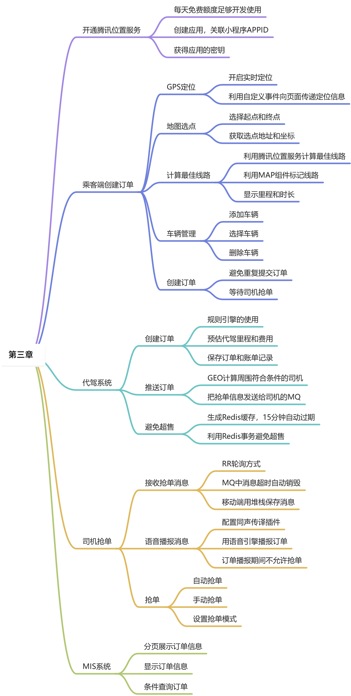

# 开通腾讯位置服务

## 技术选型

我们项目中需要使用地图服务，地图服务有很多，例如：百度地图、高德地图、腾讯地图。我们这里选择腾讯服务，因为腾讯服务对小程序的支持度更好。

## 注册并创建应用

[https://lbs.qq.com/](https://lbs.qq.com/)

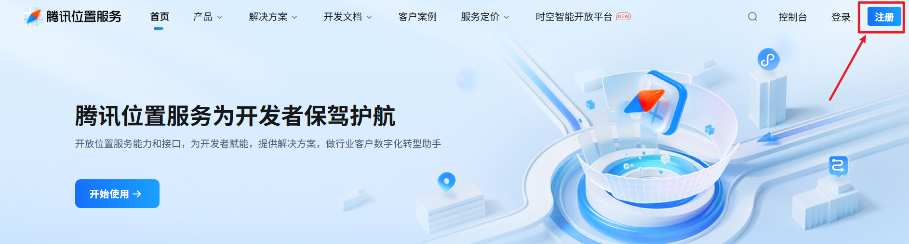

**注册成功后，点击下图位置正好创建应用。**


**指定应用的名称和类型：**

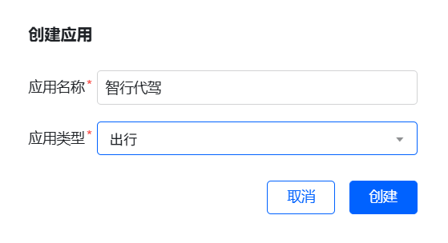

## 添加 key

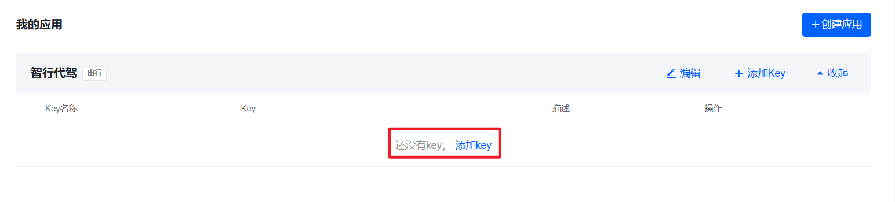

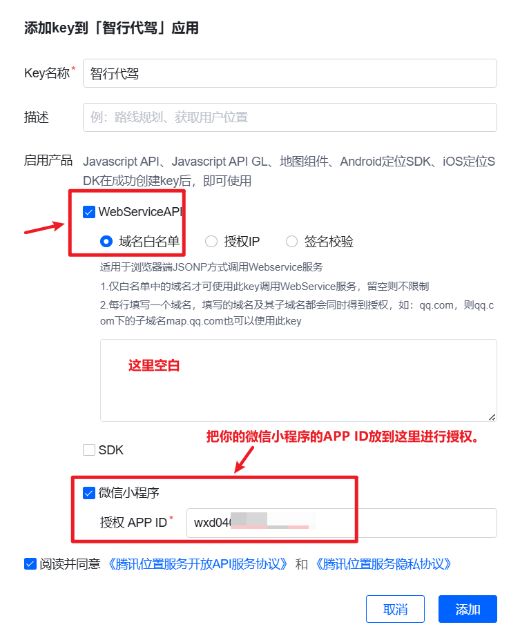

腾讯位置服务给开发者提供了免费的调用额度，只要你每天调用位置服务各种API次数不超过限额，那么就是免费的，对于开发者来说是足够用了。如果我们的项目上线了，这点配额肯定不够用，那就需要出钱购买了。

**我们项目中小程序端、web 前端、后端 Java 程序中都需要使用地图服务，腾讯地图服务都支持这些端的使用：**

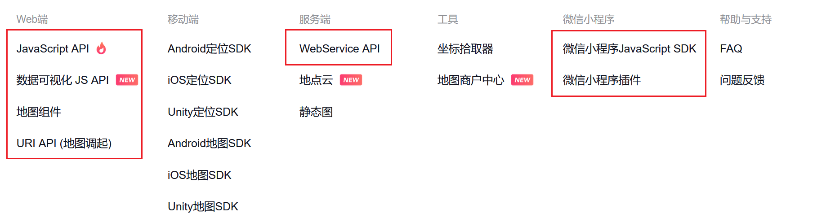

## 分配配额

如果不分配配额，很快会达到每日 key 的调用上限：

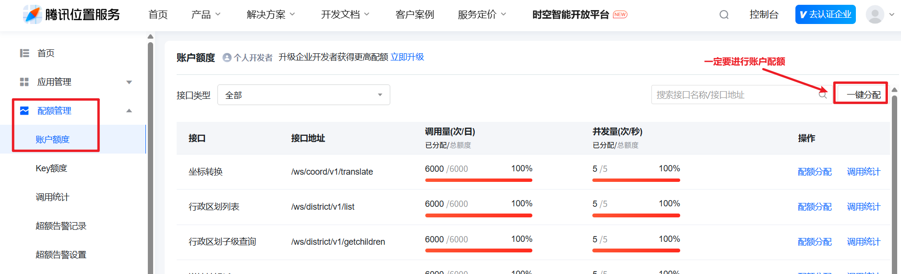

## 项目中配置 key

在`<font style="color:#000000;background-color:rgba(220, 240, 255, 0.3) !important;">common</font>`子系统的`<font style="color:#000000;background-color:rgba(220, 240, 255, 0.3) !important;">application-common.yml</font>`文件中，添加腾讯地图的密钥，这个密钥会在地图子系统中用到。

```yaml
tencent:
  ……

  map:
    key: 填写你自己地图应用的Key
```

# 封装预估里程和时间

创建代驾订单的时候，后端 Java 项目要预估代驾的里程和时间，这个就需要调用腾讯地图服务为我们提供的 API 接口了，接口文档地址：

[https://lbs.qq.com/service/webService/webServiceGuide/route/webServiceMatrix](https://lbs.qq.com/service/webService/webServiceGuide/route/webServiceMatrix)

这个接口文档写的很详细，也很容易看懂，大家自行查看。

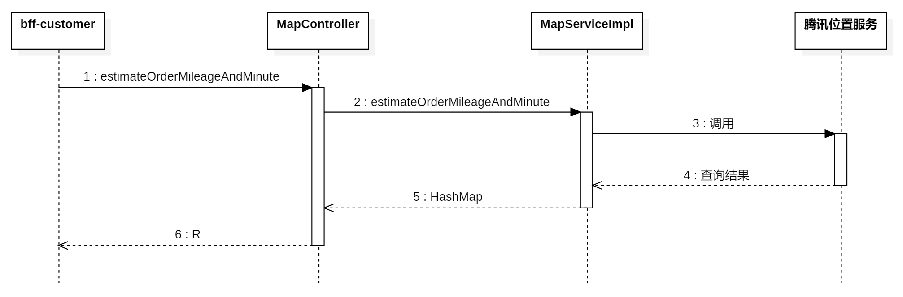

**创建代驾订单属于 **`**bff-customer**`**端的业务。**

**地图的业务在 **`**zxds-mps**`**子系统中完成。**

**因此上图表示 **`**bff-customer**`**远程调用 **`**zxds-mps**`**子系统。**

## 编写业务层代码

`<font style="color:#000000;background-color:rgba(220, 240, 255, 0.3) !important;">zxds-mps</font>`项目上，在`<font style="color:#000000;background-color:rgba(220, 240, 255, 0.3) !important;">com.example.zxds.mps.service</font>`包中创建`<font style="color:#000000;background-color:rgba(220, 240, 255, 0.3) !important;">MapService.java</font>`接口，定义抽象方法。

```java
package com.example.zxds.mps.service;

import java.util.Map;

public interface MapService {
    Map<String, Object> estimateOrderMileageAndMinute(String mode, 
                                                      String startPlaceLatitude, 
                                                      String startPlaceLongitude, 
                                                      String endPlaceLatitude, 
                                                      String endPlaceLongitude);
}
```

在`<font style="color:#000000;background-color:rgba(220, 240, 255, 0.3) !important;">com.example.zxds.mps.service.impl</font>`包中创建`<font style="color:#000000;background-color:rgba(220, 240, 255, 0.3) !important;">MapServiceImpl.java</font>`类，实现抽象方法。

```java
package com.example.zxds.mps.service.impl;

import cn.hutool.http.HttpRequest;
import cn.hutool.http.HttpResponse;
import cn.hutool.json.JSONArray;
import cn.hutool.json.JSONObject;
import cn.hutool.json.JSONUtil;
import com.example.zxds.common.exception.ZxdsException;
import com.example.zxds.mps.service.MapService;
import lombok.extern.slf4j.Slf4j;
import org.springframework.beans.factory.annotation.Value;
import org.springframework.stereotype.Service;

import java.math.BigDecimal;
import java.math.RoundingMode;
import java.util.HashMap;
import java.util.Map;

@Service
@Slf4j
public class MapServiceImpl implements MapService {
    
    //预估里程的API地址
    private String distanceUrl = "https://apis.map.qq.com/ws/distance/v1/matrix/";

    @Value("${tencent.map.key}")
    private String key;

    @Override
    public Map<String, Object> estimateOrderMileageAndMinute(String mode, String startPlaceLatitude, String startPlaceLongitude, String endPlaceLatitude, String endPlaceLongitude) {
        HttpRequest req = new HttpRequest(distanceUrl);
        req.form("mode", mode);
        req.form("from", startPlaceLatitude + "," + startPlaceLongitude);
        req.form("to", endPlaceLatitude + "," + endPlaceLongitude);
        req.form("key", key);
        HttpResponse resp = req.execute();
        JSONObject json = JSONUtil.parseObj(resp.body());
        int status = json.getInt("status");
        String message = json.getStr("message");
        System.out.println(message);
        if (status != 0) {
            log.error(message);
            throw new ZxdsException("预估里程异常：" + message);
        }
        JSONArray rows = json.getJSONObject("result").getJSONArray("rows");
        JSONObject element = rows.get(0, JSONObject.class).getJSONArray("elements").get(0, JSONObject.class);
        int distance = element.getInt("distance");
        // 米转换为公里
        String mileage = new BigDecimal(distance).divide(new BigDecimal(1000)).toString();
        int duration = element.getInt("duration");
        // 秒转换为分钟
        String temp = new BigDecimal(duration).divide(new BigDecimal(60), 0, RoundingMode.CEILING).toString();
        int minute = Integer.parseInt(temp);

        Map<String, Object> map = new HashMap<>() {{
            put("mileage", mileage);
            put("minute", minute);
        }};
        return map;
    }
}
```

## 编写 form 接收数据并校验

在`<font style="color:#000000;background-color:rgba(220, 240, 255, 0.3) !important;">com.example.zxds.mps.controller.form</font>`包中创建`<font style="color:#000000;background-color:rgba(220, 240, 255, 0.3) !important;">EstimateOrderMileageAndMinuteForm.java</font>`类，封装提交的数据。

```java
package com.example.zxds.mps.controller.form;

import io.swagger.v3.oas.annotations.media.Schema;
import lombok.Data;

import javax.validation.constraints.NotBlank;
import javax.validation.constraints.Pattern;

@Data
@Schema(description = "预估里程和时间的表单")
public class EstimateOrderMileageAndMinuteForm {
    @NotBlank(message = "mode不能为空")
    @Pattern(regexp = "^driving$|^walking$|^bicycling$")
    @Schema(description = "计算方式")
    private String mode;

    @NotBlank(message = "startPlaceLatitude不能为空")
    @Pattern(regexp = "^(([1-8]\\d?)|([1-8]\\d))(\\.\\d{1,18})|90|0(\\.\\d{1,18})?$", message = "startPlaceLatitude内容不正确")
    @Schema(description = "订单起点的纬度")
    private String startPlaceLatitude;

    @NotBlank(message = "startPlaceLongitude不能为空")
    @Pattern(regexp = "^(([1-9]\\d?)|(1[0-7]\\d))(\\.\\d{1,18})|180|0(\\.\\d{1,18})?$", message = "startPlaceLongitude内容不正确")
    @Schema(description = "订单起点的经度")
    private String startPlaceLongitude;

    @NotBlank(message = "endPlaceLatitude不能为空")
    @Pattern(regexp = "^(([1-8]\\d?)|([1-8]\\d))(\\.\\d{1,18})|90|0(\\.\\d{1,18})?$", message = "endPlaceLatitude内容不正确")
    @Schema(description = "订单终点的纬度")
    private String endPlaceLatitude;

    @NotBlank(message = "endPlaceLongitude不能为空")
    @Pattern(regexp = "^(([1-9]\\d?)|(1[0-7]\\d))(\\.\\d{1,18})|180|0(\\.\\d{1,18})?$", message = "endPlaceLongitude内容不正确")
    @Schema(description = "订单起点的经度")
    private String endPlaceLongitude;
}
```

在`<font style="color:#000000;background-color:rgba(220, 240, 255, 0.3) !important;">com.example.zxds.mps.controller</font>`包中创建`<font style="color:#000000;background-color:rgba(220, 240, 255, 0.3) !important;">MapController.java</font>`类，声明Web方法

```java
package com.example.zxds.mps.controller;

import com.example.zxds.common.util.R;
import com.example.zxds.mps.controller.form.EstimateOrderMileageAndMinuteForm;
import com.example.zxds.mps.service.MapService;
import io.swagger.v3.oas.annotations.Operation;
import io.swagger.v3.oas.annotations.tags.Tag;
import lombok.RequiredArgsConstructor;
import org.springframework.web.bind.annotation.PostMapping;
import org.springframework.web.bind.annotation.RequestBody;
import org.springframework.web.bind.annotation.RequestMapping;
import org.springframework.web.bind.annotation.RestController;

import javax.validation.Valid;
import java.util.Map;

@RestController
@RequestMapping("/map")
@Tag(name = "MapController", description = "地图Web接口")
@RequiredArgsConstructor
public class MapController {
    private final MapService mapService;

    @PostMapping("/estimateOrderMileageAndMinute")
    @Operation(summary = "估算里程和时间")
    public R estimateOrderMileageAndMinute(@RequestBody @Valid EstimateOrderMileageAndMinuteForm form) {
        Map<String, Object> map = mapService.estimateOrderMileageAndMinute(form.getMode(), form.getStartPlaceLatitude(), form.getStartPlaceLongitude(), form.getEndPlaceLatitude(), form.getEndPlaceLongitude());
        return R.ok().put("result", map);
    }
}
```

## 调试 web 方法

测试Web方法的时候需要传入经纬度坐标，可以在腾讯地图坐标拾取（[https://lbs.qq.com/getPoint/](https://lbs.qq.com/getPoint/)）页面上，随便找两个定位点的GPS坐标，充当代驾上车点和终点。

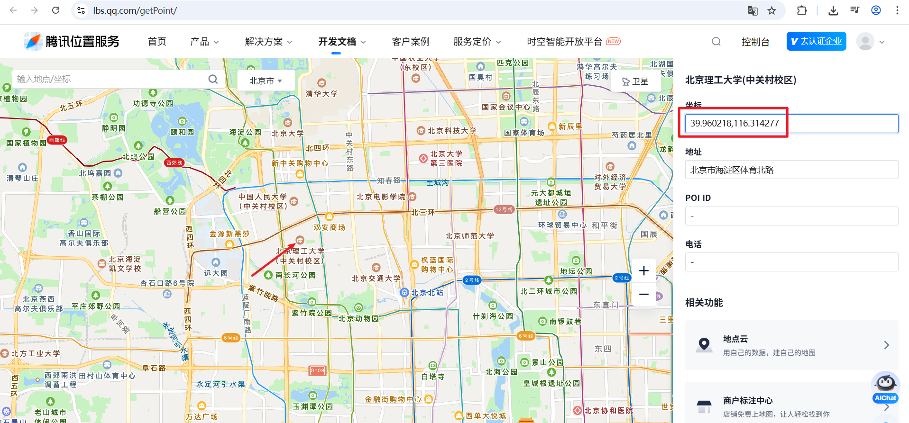

启动`<font style="color:#000000;background-color:rgba(220, 240, 255, 0.3) !important;">zxds-mps</font>`子系统。

**请求地址（POST）**：[http://localhost:8004/map/estimateOrderMileageAndMinute](http://localhost:8004/map/estimateOrderMileageAndMinute)

**请求参数：**

```json
{
    "mode": "driving",
    "startPlaceLatitude": "39.960218",
    "startPlaceLongitude": "116.314277",
    "endPlaceLatitude": "39.952299",
    "endPlaceLongitude": "116.342255"
}
```

**响应结果：**

```json
{
        "msg": "success",
        "result": {
                "mileage": "3.562",
                "minute": 13
        },
        "code": 200
}
```

# 封装最佳路线

## 熟悉地图 API 接口

写代码之前，我们先要了解腾讯位置服务提供的API接口，传什么参数才能得到最佳线路。API 接口文档地址：[https://lbs.qq.com/service/webService/webServiceGuide/webServiceRoute](https://lbs.qq.com/service/webService/webServiceGuide/webServiceRoute)

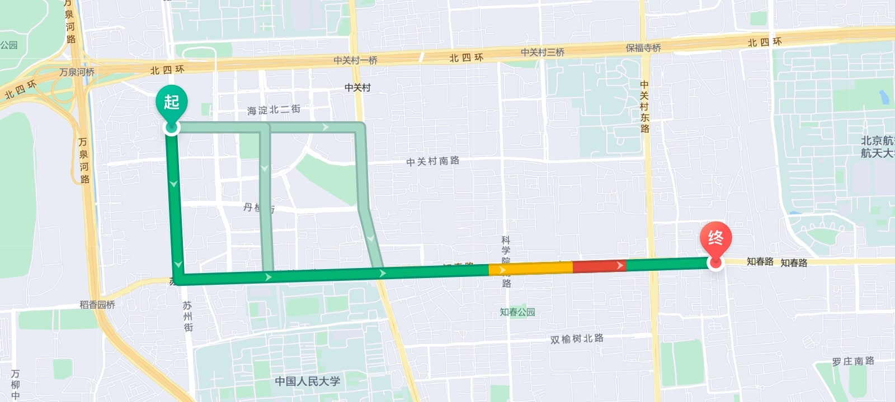

**API 接口返回的结果中有一个重要的属性：**`**polyline**`

**指的是路线规划结果中，代表整条路线的坐标点集合。**

**并且是压缩之后的（不压缩体积太大），我们需要通过官方提供的固定算法进行解压，解压之后拿到原始的路线坐标点，才能在地图上绘制出路线。**

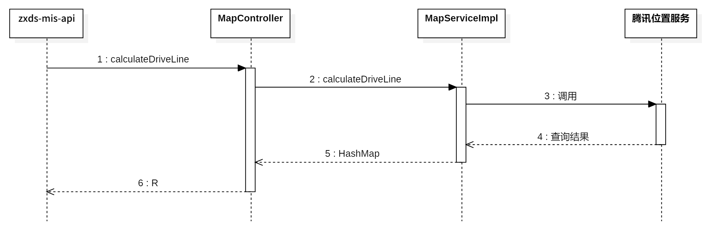

## 编写业务层代码

在`<font style="color:#000000;background-color:rgba(220, 240, 255, 0.3) !important;">com.example.zxds.mps.service</font>`包`<font style="color:#000000;background-color:rgba(220, 240, 255, 0.3) !important;">MapService.java</font>`接口中，声明抽象方法

```java
Map<String, Object> calculateDriveLine(String startPlaceLatitude,
                                       String startPlaceLongitude,
                                       String endPlaceLatitude,
                                       String endPlaceLongitude);
```

在`<font style="color:#000000;background-color:rgba(220, 240, 255, 0.3) !important;">com.example.zxds.mps.service.impl</font>`包`<font style="color:#000000;background-color:rgba(220, 240, 255, 0.3) !important;">MapServiceImpl.java</font>`类中，实现抽象方法

```java
//规划行进路线的API地址
private String directionUrl = "https://apis.map.qq.com/ws/direction/v1/driving/";

public Map<String, Object> calculateDriveLine(String startPlaceLatitude, String startPlaceLongitude, String endPlaceLatitude, String endPlaceLongitude) {
    String url = directionUrl + "?from=" + startPlaceLatitude + "," + startPlaceLongitude
            + "&to=" + endPlaceLatitude + "," + endPlaceLongitude
            + "&key=" + key;

    // 2. 使用HttpRequest.get()方法（核心修改）
    HttpRequest req = HttpRequest.get(url);

    HttpResponse resp = req.execute();
    JSONObject json = JSONUtil.parseObj(resp.body());
    System.out.println(json);
    int status = json.getInt("status");
    if (status != 0) {
        throw new ZxdsException("执行异常");
    }
    JSONObject result = json.getJSONObject("result");
    Map<String, Object> map = result.toBean(Map.class);
    return map;
}
```

## 编写 form 接收数据并校验

在`<font style="color:#000000;background-color:rgba(220, 240, 255, 0.3) !important;">com.example.zxds.mps.controller.form</font>`包中创建`<font style="color:#000000;background-color:rgba(220, 240, 255, 0.3) !important;">CalculateDriveLineForm.java</font>`类，接收提交的数据

```java
package com.example.zxds.mps.controller.form;

import io.swagger.v3.oas.annotations.media.Schema;
import lombok.Data;

import javax.validation.constraints.NotBlank;
import javax.validation.constraints.Pattern;

@Data
@Schema(description = "计算行驶路线的表单")
public class CalculateDriveLineForm {
    @NotBlank(message = "startPlaceLatitude不能为空")
    @Pattern(regexp = "^(([1-8]\\d?)|([1-8]\\d))(\\.\\d{1,18})|90|0(\\.\\d{1,18})?$", message = "startPlaceLatitude内容不正确")
    @Schema(description = "订单起点的纬度")
    private String startPlaceLatitude;

    @NotBlank(message = "startPlaceLongitude不能为空")
    @Pattern(regexp = "^(([1-9]\\d?)|(1[0-7]\\d))(\\.\\d{1,18})|180|0(\\.\\d{1,18})?$", message = "startPlaceLongitude内容不正确")
    @Schema(description = "订单起点的经度")
    private String startPlaceLongitude;

    @NotBlank(message = "endPlaceLatitude不能为空")
    @Pattern(regexp = "^(([1-8]\\d?)|([1-8]\\d))(\\.\\d{1,18})|90|0(\\.\\d{1,18})?$", message = "endPlaceLatitude内容不正确")
    @Schema(description = "订单终点的纬度")
    private String endPlaceLatitude;

    @NotBlank(message = "endPlaceLongitude不能为空")
    @Pattern(regexp = "^(([1-9]\\d?)|(1[0-7]\\d))(\\.\\d{1,18})|180|0(\\.\\d{1,18})?$", message = "endPlaceLongitude内容不正确")
    @Schema(description = "订单起点的经度")
    private String endPlaceLongitude;
}
```

## 编写 web 方法

在`<font style="color:#000000;background-color:rgba(220, 240, 255, 0.3) !important;">com.example.zxds.mps.controller</font>`包`<font style="color:#000000;background-color:rgba(220, 240, 255, 0.3) !important;">MapController.java</font>`类中，声明Web方法

```java
@PostMapping("/calculateDriveLine")
@Operation(summary = "计算行驶路线")
public R calculateDriveLine(@RequestBody @Valid CalculateDriveLineForm form) {
    Map<String, Object> map = mapService.calculateDriveLine(form.getStartPlaceLatitude(), form.getStartPlaceLongitude(), form.getEndPlaceLatitude(), form.getEndPlaceLongitude());
    return R.ok().put("result", map);
}
```

## 测试 web 方法

**请求地址（POST）**：[http://localhost:8004/map/calculateDriveLine](http://localhost:8004/map/calculateDriveLine)

**请求参数：**

```json
{
    "startPlaceLatitude": "39.960218",
    "startPlaceLongitude": "116.314277",
    "endPlaceLatitude": "39.952299",
    "endPlaceLongitude": "116.342255"
}
```

**响应结果：**

```json
{
        "msg": "success",
        "result": {
                "routes": [
                        {
                                "distance": 3596,
                                "toll": 0,
                                "steps": [
                                        {
                                                "road_name": "体育北路",
                                                "distance": 49,
                                                "act_desc": "左转",
                                                "polyline_idx": [
                                                        0,
                                                        3
                                                ],
                                                "dir_desc": "东",
                                                "instruction": "沿体育北路向东行驶49米,左转",
                                                "accessorial_desc": ""
                                        },
                                        {
                                                "road_name": "内部道路",
                                                "distance": 48,
                                                "act_desc": "右转",
                                                "polyline_idx": [
                                                        4,
                                                        7
                                                ],
                                                "dir_desc": "北",
                                                "instruction": "沿内部道路向北行驶48米,右转",
                                                "accessorial_desc": ""
                                        },
                                        ......
                                ],
                                "tags": [
                                        "大众常走"
                                ],
                                "mode": "DRIVING",
                                "duration": 12,
                                "traffic_light_count": 4,
                                "restriction": {
                                        "status": 1
                                },
                                "taxi_fare": {
                                        "fare": 15
                                },
                                "polyline": [......]
                        }
                ]
        },
        "code": 200
}
```

# 小程序端实现客户地图选点设置起点和终点

## Vue 全局挂载配置信息

在 Vue 全局挂载腾讯地图的配置信息，方便所有组件调用。`<font style="color:#000000;">main.js</font>`中编写：

```javascript
Vue.prototype.tencent = {
    map: {
                  referer: "智行代驾",
                  key: "腾讯位置服务的密钥"
          }
}
```

## 开启实时定位功能

开启实时定位功能，只需要开启一次就行了。怎么保证实时定位开启一次？在根组件 `App.vue`的 `onLaunch`回调函数中开启即可。

onLaunch 是 uni-app 特有的应用生命周期函数，它只存在于 App.vue 这个根组件中。

**执行时机**：只在**整个应用第一次启动时**执行一次。

**找到 **`**<font style="color:#000000;">zxds-customer-wx</font>**`**小程序中的 **`**<font style="color:#000000;">App.vue</font>**`**页面，编写以下代码开启 GPS 实时定位。并且当定位发生变化时自动执行回调函数，代码如下：**

```javascript
onLaunch: function() {
    //开启GPS后台刷新
    wx.startLocationUpdate({
        success(resp) {
            console.log('开启定位成功');
        },
        fail(resp) {
            console.log('开启定位失败');
        }
    });
    // 当GPS定位发生变化时，自动执行回调函数
    // LocationChange是一个事件的名字，当GPS定位发生变化时，自动调用回调函数
    wx.onLocationChange(function(resp) {
        // 拿到最新的维度
        let latitude = resp.latitude;
        // 拿到最新的经度
        let longitude = resp.longitude;
        // 封装为对象，方便将数据传递到工作台页面
        let location = { latitude: latitude, longitude: longitude };
        //触发自定义事件（在工作台页面绑定了 updateLocation事件，以下代码是触发这个事件，通过这种方式将数据传递给工作台页面）
        uni.$emit('updateLocation', location);
    });
},
```

`**<font style="color:rgb(15, 17, 21);background-color:rgb(235, 238, 242);">wx</font>**`** 是微信小程序专用的原生对象，**`**<font style="color:rgb(15, 17, 21);background-color:rgb(235, 238, 242);">uni</font>**`** 是 uni-app 框架提供的跨平台统一对象。**

用 `<font style="color:rgb(15, 17, 21);background-color:rgb(235, 238, 242);">wx</font>` 写代码只能跑在微信里，用 `<font style="color:rgb(15, 17, 21);background-color:rgb(235, 238, 242);">uni</font>` 写同一份代码能编译成微信小程序、App、H5等多家平台。

`<font style="color:rgb(15, 17, 21);">uni</font>`对象对 `<font style="color:rgb(15, 17, 21);">wx</font>`对象进行了二次包装。因此尽量使用 `<font style="color:rgb(15, 17, 21);">uni</font>`，不要使用 `<font style="color:rgb(15, 17, 21);">wx</font>`。

## 工作台上的地图是怎么展示出来的

代驾客户的小程序端工作台页面是：`<font style="color:#000000;">pages/workbench/workbench.vue</font>`。

页面中有这样一段代码，这个标签就是用来显示地图的。它和任何插件都没有关系。`**<font style="color:#000000;"><map></font>**`**标签是微信小程序原生组件，由微信官方提供**

```html
<!--id 组件的唯一标识符-->
<!--:longitude 经度-->
<!--:latitude 纬度-->
<!--:style="contentStyle" 用来指定地图样式，比如地图的宽度高度等-->
<!--scale="15" 缩放级别15，取值范围3-20，数字越大越清晰。15级大约能看清街道和建筑物-->
<!--:enable-traffic="false" 是否显示实时路况图层，false表示不显示道路拥堵情况-->
<!--:show-location="true" 是否显示当前所在位置的蓝色圆点标记-->
<!--:enable-poi="true" 是否显示餐厅、学校、商场等图标-->
<map id="map" :longitude="longitude" :latitude="latitude" 
  :style="contentStyle" scale="15" :enable-traffic="false" 
  :show-location="true" :enable-poi="true" class="map">
  
  <cover-image class="location" src="../../static/workbench/location.png" @tap="returnLocationHandle()"></cover-image>
  
</map>
```

其中 `<font style="color:#000000;">:longitude="longitude"</font>`和 `<font style="color:#000000;">:latitude="latitude"</font>`决定了地图打开时，默认的定位位置。

`<font style="color:#000000;">longitude</font>`和 `<font style="color:#000000;">latitude</font>`在模型层中对应了变量，设置这两个变量的值（经度和维度），地图的定位就会发生变化。

## 工作台上的地图位置实现实时更新

`**<font style="color:#000000;">pages/workbench/workbench.vue</font>**`

**怎么实现工作台页面上的地图位置实时更新呢？原理是：**

- 当用户位置发生变化时，`<font style="color:#000000;">App.vue</font>`中的 `<font style="color:#000000;">uni.$emit('updateLocation', location);</font>`就会执行，触发 `<font style="color:#000000;">updateLocation</font>`事件，并将当前最新的 `<font style="color:#000000;">location</font>`数据传递给绑定了 `<font style="color:#000000;">updateLocation</font>`事件的组件。
- 我们接下来的代码就是在工作台 `<font style="color:#000000;">workbench.vue</font>`组件上绑定 `<font style="color:#000000;">updateLocation</font>`事件。
- 工作台页面一旦绑定 `<font style="color:#000000;">updateLocation</font>`事件后，就能实时接收到最新的 `<font style="color:#000000;">location</font>`对象。
- 从 `<font style="color:#000000;">location</font>`对象中取出经纬度，赋值给模型层的变量，地图的位置就实时更新了。

**先来看一下工作台页面 **`**<font style="color:#000000;">pages/workbench/workbench.vue</font>**`**的模型层代码：**

```javascript
data() {
    return {
        // 起点
        from: {
            address: '',
            longitude: 0,
            latitude: 0
        },
        // 终点
        to: {
            address: '输入你的目的地',
            longitude: 0,
            latitude: 0
        },
        // 当前的经度
        longitude: 0,
        // 当前的维度
        latitude: 0,
        contentStyle: '',
        windowHeight: 0,
        map: null,
        flag: null
    };
},
```

**接下来，我们就来实现一下，我们选择在 **`**<font style="color:#000000;">onShow</font>**`**函数中编写代码，因为我们要达到的效果是：用户只要回到工作台页面，就要刷新位置：**

```javascript
onShow: function() {
    let that = this;
    // 想要操作地图的第一件事：获取地图上下文对象
    that.map = uni.createMapContext('map');
    // QQMapWX 是腾讯地图官方为微信小程序和网页提供的 JavaScript SDK
    // 用来在小程序里快速调用地图服务（如定位、搜索、路线规划、地址解析等）
    let qqmapsdk = new QQMapWX({
        key: that.tencent.map.key
    });
    // 绑定 updateLocation 事件。只要事件发生，回调函数执行，拿到最新location，更新经纬度变量值，达到更新地图位置。
    uni.$on('updateLocation', function(location) {
        //console.log(location);
        // 当用户手动选点时，flag不会为空。也就是当用户手动选点时，不走以下的逻辑，因为一旦走以下逻辑，自动定位的信息会将用户手动选点覆盖掉。
              if(that.flag!=null){
                                    return
                          }
        // 获取最新经度维度
        let latitude = location.latitude;
        let longitude = location.longitude;
        // 将经度维度值赋值给变量
        that.latitude = latitude;
        that.longitude = longitude;
        // 将经度维度设置到上车点
        that.from.latitude = latitude;
        that.from.longitude = longitude;
      
        //把坐标解析成地址（逆向解析，根据坐标得出地名）
        qqmapsdk.reverseGeocoder({
            location: {
                latitude: latitude,
                longitude: longitude
            },
            success: function(resp) {
                //console.log(resp);
                that.from.address = resp.result.address;
            },
            fail: function(error) {
                console.log(error);
            }
        });
    });
},
onHide: function() {
    // 当工作台页面隐藏的时候，记得解除事件绑定：意思就是工作台页面既然隐藏起来了，就没必要再浪费手机电量去更新地图位置了。
    uni.$off('updateLocation');
},
```

**以上代码中有一部分代码是将坐标转换成地名，这叫做“逆地址解析”，它也有专门 API 文档：**

[https://lbs.qq.com/miniProgram/jsSdk/jsSdkGuide/methodReverseGeocoder](https://lbs.qq.com/miniProgram/jsSdk/jsSdkGuide/methodReverseGeocoder)

核心代码是：

```javascript
let qqmapsdk = new QQMapWX({
    key: that.tencent.map.key
});

uni.$on('updateLocation', function(location) {
  ...
  qqmapsdk.reverseGeocoder({
      location: {
          latitude: latitude,
          longitude: longitude
      },
      success: function(resp) {
          //console.log(resp);
          that.from.address = resp.result.address;
      },
      fail: function(error) {
          console.log(error);
      }
  });
}
```

`**<font style="color:#000000;">QQMapWX</font>**`**是什么？**

`<font style="color:#000000;background-color:rgb(235, 238, 242);">QQMapWX（变量名随意）</font>` 是**腾讯位置服务官方为微信小程序单独提供的一个JavaScript SDK，通过以下代码引入：**

```javascript
let QQMapWX = require('../../lib/qqmap-wx-jssdk.min.js');
```

## 点击回位

**地图组件上(**`**<font style="color:#000000;"><map></font>**`**)**覆盖了一个回位的图标，点击这个图标，要让地图回归到当前定位的位置上来：


回顾视图层标签：

```html
<view>
    <map id="map" :longitude="longitude" :latitude="latitude" :style="contentStyle" 
         scale="15" :enable-traffic="false" :show-location="true" :enable-poi="true" 
         class="map">
        <!--回位图标-->
        <cover-image class="location" src="../../static/workbench/location.png" 
                     @tap="returnLocationHandle()"></cover-image>
    </map>
    <view class="panel">
        <view class="from" @tap="chooseLocationHandle('from')">
            <text>{{ from.address }}</text>
        </view>
        <view class="dashed-line"></view>
        <view class="to" @tap="chooseLocationHandle('to')">
            <text>{{ to.address }}</text>
        </view>
    </view>
</view>
```

回位图标对应的回调函数 `<font style="color:#000000;">returnLocationHandle</font>`，代码很简单：`<font style="color:#000000;">methods:</font>`中编写以下函数。

```javascript
returnLocationHandle() {
    this.map.moveToLocation();
}
```

## 选择起点和终点

点击**工作台页面上**的**起点或者终点**标签会自动跳转到**地图选点的页面**，我们可以输入查找具体的上车点或者终点位置。这个地图选点页面不需要我们设计，是腾讯位置服务小程序插件自带的。我们搭建项目时，已经引入了地图选点插件，在 `<font style="color:#000000;">manifest.json</font>`文件中查看：

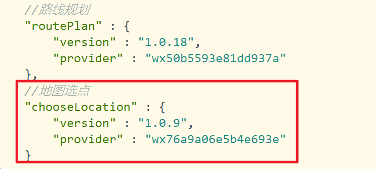

在工作台页面上，我们要使用地图选点插件，那么就必须要引用这个插件：在 `<font style="color:#000000;"><script></font>`开始位置引入插件。

```javascript
const chooseLocation = requirePlugin('chooseLocation');
```

在工作台页面，编写`<font style="color:#000000;background-color:rgba(220, 240, 255, 0.3) !important;">chooseLocationHandle()</font>`函数，跳转到地图选点页面，在 `<font style="color:#000000;">methods:</font>`中编写。

```javascript
chooseLocationHandle(flag) {
    let that = this;
    let key = that.tencent.map.key; //使用在腾讯位置服务申请的key
    let referer = that.tencent.map.referer; //调用插件的app的名称
    let latitude = that.latitude;
    let longitude = that.longitude;
    that.flag = flag;
    let data = JSON.stringify({
        latitude: latitude,
        longitude: longitude
    });
    uni.navigateTo({
        // 跳转到全屏地图选点界面（带着申请的key、带着创建应用时的名字、带着当前坐标，跳过去）
        url: `plugin://chooseLocation/index?key=${key}&referer=${referer}&location=${data}`
    });
},
```

当我们设置好地图选点地址之后，小程序会自动跳回到工作台页面。我们在工作台页面的`<font style="color:#000000;background-color:rgba(220, 240, 255, 0.3) !important;">onShow()</font>`函数中要获取用户的选点地址。

```javascript
onShow: function() {
    ……
    let location = chooseLocation.getLocation();
    if (location != null) {
        let place = location.name;
        let latitude = location.latitude;
        let longitude = location.longitude;
      
        // flag值决定了，从选点插件页面回来工作台的时候，将位置信息设置到起点上还是终点上。
        if (that.flag == 'from') {
            that.from.address = place;
            that.from.latitude = latitude;
            that.from.longitude = longitude;
        } else {
            that.to.address = place;
            that.to.latitude = latitude;
            that.to.longitude = longitude;
            //TODO 跳转到创建订单页面
        }
    }
},
// 页面切后台或跳转到其他页面时触发
onHide: function() {
    uni.$off('updateLocation');
    // 页面隐藏时，清除地图选点的结果（记得清除，要不然下一次页面打开时会有残留）
    chooseLocation.setLocation(null);
},
// 页面被完全销毁时触发
onUnload: function() {
    //清除地图选点的结果
    chooseLocation.setLocation(null);
}
```

# 乘客端创建预览订单

我们已经可以通过地图选点**设置代驾的起点和终点**，那么接下来应该跳转到`<font style="color:#000000;background-color:rgba(220, 240, 255, 0.3) !important;">create_order.vue</font>`页面，显示这笔代驾的最佳线路、里程和时长。这部分功能，我们在移动端用JavaScript调用腾讯位置服务的API即可，用不着后端的Java程序。

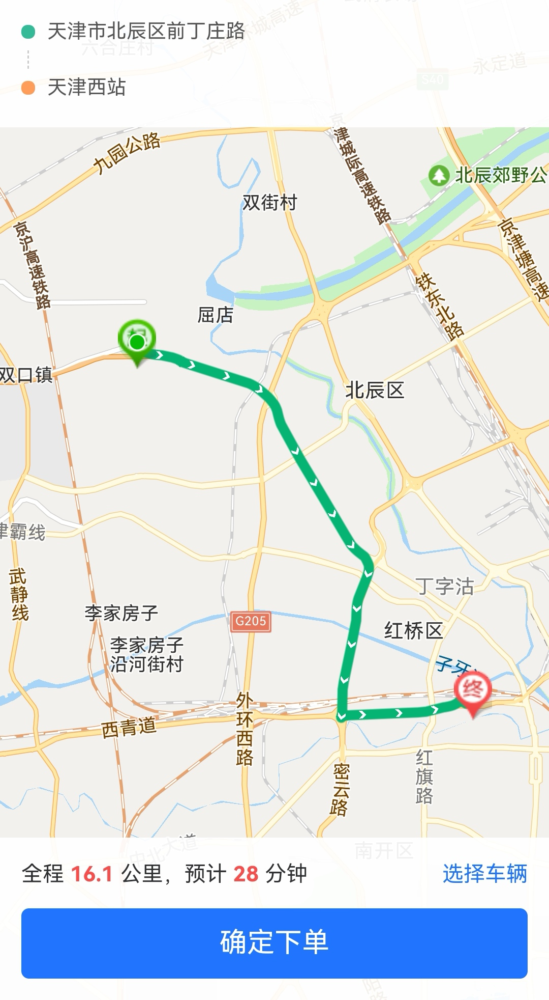

## 跳转到创建订单页面

在工作台页面的`<font style="color:#000000;background-color:rgba(220, 240, 255, 0.3) !important;">onShow()</font>`回调函数中编写JS代码，跳转到`<font style="color:#000000;background-color:rgba(220, 240, 255, 0.3) !important;">create_order.vue</font>`页面的时候要带上起点和终点的定位信息。我这里选择是将起点和终点的信息存储到 storage 中。这样在 `<font style="color:#000000;">create_order.vue</font>`页面中就可以从 storage 中获取了。

```javascript
onShow: function() {
    ……
    let location = chooseLocation.getLocation();
    if (location != null) {
        let place = location.name;
        let latitude = location.latitude;
        let longitude = location.longitude;
        if (that.flag == 'from') {
            that.from.address = place;
            that.from.latitude = latitude;
            that.from.longitude = longitude;
        } else {
            that.to.address = place;
            that.to.latitude = latitude;
            that.to.longitude = longitude;
            //用户选择完终点信息之后，立即跳转到线路页面
            uni.setStorageSync("from",that.from)
            uni.setStorageSync("to",that.to)
            uni.navigateTo({
                url: `../create_order/create_order`
            });
        }
    }
},
```

在 `<font style="color:#000000;">pages/create_order/create_order.vue</font>`页面的 `<font style="color:#000000;">onLoad()</font>` 中从 storage 中取出存储的 `<font style="color:#000000;">from</font>`和 `<font style="color:#000000;">to</font>`的信息。

```javascript
data() {
    return {
        from: {
            address: '',
            longitude: 0,
            latitude: 0
        },
        to: {
            address: '',
            longitude: 0,
            latitude: 0
        },
        contentStyle: '',
        windowHeight: 0,
        distance: 0,
        duration: 0,
        polyline: [],
        markers: [],
        timer: null,
        infoStatus: true,
        carId: null,
        carPlate: null,
        showCar: false
    };
},
onLoad: function(options) {
    let that = this;
    //设置地图控件的高度适配屏幕高度
    let windowHeight = uni.getSystemInfoSync().windowHeight;
    that.windowHeight = windowHeight;
    that.contentStyle = `height:${that.windowHeight}px;`;
  
    // 将storage中的from和to取出来，赋值给当前组件的from和to，这样from和to就可以在当前组件的任何位置使用了。
    that.from = uni.getStorageSync('from');
    that.to = uni.getStorageSync('to');

    // 创建sdk对象
    qqmapsdk = new QQMapWX({
        key: that.tencent.map.key
    });
    //初始化地图(模型层记得添加map属性。)
    that.map = uni.createMapContext('map');
    
    //TODO 判断options里面有没有车型和车牌
},
```

## 计算最佳线路，预估里程和时长

在`<font style="color:#000000;background-color:rgba(220, 240, 255, 0.3) !important;">onLoad()</font>`函数中我们获得了代驾的起点和终点，我们还需要调用腾讯位置服务的API，计算最佳线路，预估里程和时间。大家看腾讯位置服务给我们提供的API文档（[https://lbs.qq.com/miniProgram/jsSdk/jsSdkGuide/methodDirection](https://lbs.qq.com/miniProgram/jsSdk/jsSdkGuide/methodDirection)）。

### 熟悉视图层

当前`<font style="color:#000000;background-color:rgba(220, 240, 255, 0.3) !important;">create_order.vue</font>`页面的视图层标签不复杂，关键是我们要在地图组件上面绘制线路，这个简单，其实就是给地图组件 `<font style="color:#000000;"><map></font>` 设置对应的属性就行了。主要属性是：`<font style="color:#000000;">polyline</font>`和 `<font style="color:#000000;">markers</font>`

```html
<view>
    <view class="address-container">
        <view class="from">
            <text>{{ from.address }}</text>
        </view>
        <view class="dashed-line"></view>
        <view class="to">
            <text>{{ to.address }}</text>
        </view>
    </view>
    <!--
      :polyline="polyline"：绑定“路线数据”的数组，用于绘制路径。
      :markers="markers"：绑定“标记点数据”的数组，用于在地图上显示特定位置标记。
    -->
    <map
        id="map"
        :longitude="from.longitude"
        :latitude="from.latitude"
        :style="contentStyle"
        scale="12"
        :enable-traffic="false"
        :show-location="true"
        class="map"
        :polyline="polyline"
        :markers="markers"
    ></map>

    <view class="panel">
        <view class="row">
            <view class="info">
                <view class="label">全程</view>
                <view class="value">
                    <text>{{ distance }}</text>
                    公里
                </view>
                <view class="label">，预计</view>
                <view class="value">
                    <text>{{ duration }}</text>
                    分钟
                </view>
            </view>
            <view class="opt" @tap="chooseCarHandle" v-if="!showCar">选择车辆</view>
            <view class="opt" @tap="chooseCarHandle" v-if="showCar">{{ carPlate }}</view>
        </view>
        <button class="btn" @tap="createOrderHandle">确定下单</button>
    </view>
</view>
```

### 封装计算最简线路的函数

计算**最佳线路、预估里程和时长**的代码我们可以用一个函数给封装起来，将来使用的时候调用起来非常方便。放到 `<font style="color:#000000;">create_order.vue</font>`的 `<font style="color:#000000;">methods:</font>`中。

```javascript
calculateLine(ref) {
    // 调用腾讯地图API的路线规划服务（驾车模式）
    qqmapsdk.direction({
        mode: 'driving', // 交通方式：驾车
        from: { // 起点坐标
            latitude: ref.from.latitude,
            longitude: ref.from.longitude
        },
        to: { // 终点坐标
            latitude: ref.to.latitude,
            longitude: ref.to.longitude
        },
        success: function(resp) {
            // 校验API返回状态
            if (resp.status != 0) {
                uni.showToast({
                    icon: 'error',
                    title: resp.message
                });
                return;
            }
            
            // 获取第一条路线数据
            let route = resp.result.routes[0];
            let distance = route.distance; // 路线距离（米）
            let duration = route.duration; // 路线时间（分钟）
            let polyline = route.polyline; // 路线坐标点（加密字符串）
            
            // 处理距离数据：米转公里并保留一位小数
            ref.distance = Math.ceil((distance / 1000) * 10) / 10;
            ref.duration = duration; // 存储预计时间
            
            // 将加密的折线坐标解析为坐标点数组
            let points = ref.formatPolyline(polyline);
            
            // 设置地图折线（路线）显示配置
            ref.polyline = [
                {
                    points: points, // 路线坐标点数组
                    width: 6,       // 路线宽度
                    color: '#05B473', // 路线颜色
                    arrowLine: true  // 显示方向箭头
                }
            ];
            
            // 设置地图标记点（起点和终点）
            ref.markers = [
                {
                    id: 1, // 起点标记（随便写，保证不重复就行。）
                    latitude: ref.from.latitude,
                    longitude: ref.from.longitude,
                    width: 25, // 图标宽度
                    height: 35, // 图标高度
                    anchor: { // 图标的中心对准坐标
                        x: 0.5,
                        y: 0.5
                    },
                    iconPath: 'https://mapapi.qq.com/web/lbs/javascriptGL/demo/img/start.png' // 起点图标
                },
                {
                    id: 2, // 终点标记
                    latitude: ref.to.latitude,
                    longitude: ref.to.longitude,
                    width: 25,
                    height: 35,
                    anchor: {
                        x: 0.5,
                        y: 0.5
                    },
                    iconPath: 'https://mapapi.qq.com/web/lbs/javascriptGL/demo/img/end.png' // 终点图标
                }
            ];
        }
    });

},
```

在`<font style="color:#000000;background-color:rgba(220, 240, 255, 0.3) !important;">onShow()</font>`回调函数中调用上面封装的函数。为什么不在`<font style="color:#000000;background-color:rgba(220, 240, 255, 0.3) !important;">onLoad()</font>`函数中调用？如果小程序挂起在后台，过了几分钟，又切回到小程序，应该立即重新计算最佳线路，因为有可能有的路段已经开始堵车了。

```javascript
onShow: function() {
    let that = this;
    that.calculateLine(that);
}
```

# 添加、删除车辆及查询车辆列表

乘客端下单的时候就可以选择车辆了，如下图：


选择车辆时，可以对车辆信息进行如下的维护：

1. 新增车辆
2. 删除车辆
3. 查看车辆列表

我们现在把这几个方法，在后端 Java 程序中实现一下。

## 编写 zxds-cst 子系统

在乘客子系统上面要实现车辆管理的三个功能：添加车辆、查询车辆列表、删除车辆。


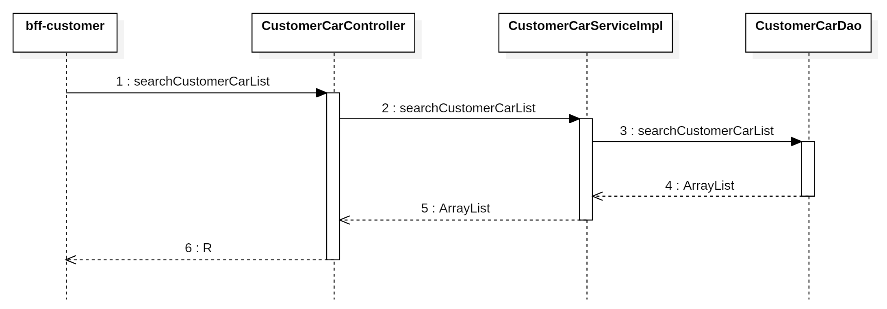

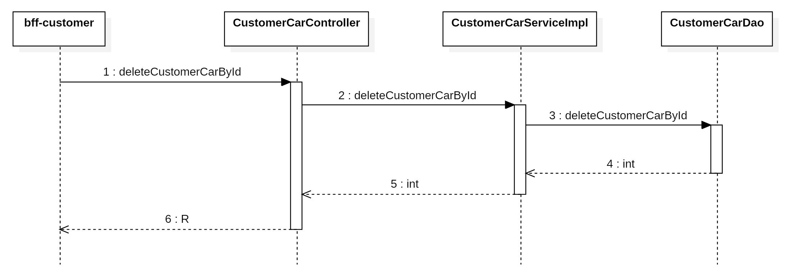

### 编写持久层代码

在`<font style="color:#000000;background-color:rgba(220, 240, 255, 0.3) !important;">CustomerCarDao.xml</font>`文件中，声明三个SQL语句

```xml
<?xml version="1.0" encoding="UTF-8"?>
<!DOCTYPE mapper
        PUBLIC "-//mybatis.org//DTD Mapper 3.0//EN"
        "http://mybatis.org/dtd/mybatis-3-mapper.dtd">
<mapper namespace="com.example.zxds.cst.db.dao.CustomerCarDao">

    <insert id="insert" parameterType="com.example.zxds.cst.db.pojo.CustomerCarEntity">
        INSERT INTO tb_customer_car(id,customer_id,car_plate,car_type) values(#{id},#{customerId},#{carPlate},#{carType})
    </insert>
    <select id="searchCustomerCarList" parameterType="long" resultType="map">
        SELECT CAST(id AS CHAR) AS id,
               car_plate        AS carPlate,
               car_type         AS carType
        FROM tb_customer_car
        WHERE customer_id = #{customerId}
    </select>
    <delete id="deleteCustomerCarById" parameterType="long">
        DELETE
        FROM tb_customer_car
        WHERE id = #{id}
    </delete>

</mapper>
```

在`<font style="color:#000000;background-color:rgba(220, 240, 255, 0.3) !important;">com.example.zxds.cst.db.dao</font>`包`<font style="color:#000000;background-color:rgba(220, 240, 255, 0.3) !important;">CustomerCarDao.java</font>`接口中，声明抽象方法。

```java
package com.example.zxds.cst.db.dao;


import com.example.zxds.cst.db.pojo.CustomerCarEntity;

import java.util.List;
import java.util.Map;

public interface CustomerCarDao {
    int insert(CustomerCarEntity entity);

    List<Map<String, Object>> searchCustomerCarList(long customerId);

    int deleteCustomerCarById(long id);
}
```

### 编写 service 和实现

在`<font style="color:#000000;background-color:rgba(220, 240, 255, 0.3) !important;">com.example.zxds.cst.service</font>`包`<font style="color:#000000;background-color:rgba(220, 240, 255, 0.3) !important;">CustomerCarService.java</font>`接口中，声明抽象方法

```java
package com.example.zxds.cst.service;

import com.example.zxds.cst.db.pojo.CustomerCarEntity;

import java.util.List;
import java.util.Map;

public interface CustomerCarService {

    void insertCustomerCar(CustomerCarEntity entity);

    List<Map<String, Object>> searchCustomerCarList(long customerId);

    int deleteCustomerCarById(long id);
}
```

在`<font style="color:#000000;background-color:rgba(220, 240, 255, 0.3) !important;">com.example.zxds.cst.service.impl</font>`包`<font style="color:#000000;background-color:rgba(220, 240, 255, 0.3) !important;">CustomerCarServiceImpl.java</font>`类中，实现抽象方法。

```java
package com.example.zxds.cst.service.impl;

import cn.hutool.core.util.IdUtil;
import com.example.zxds.cst.db.dao.CustomerCarDao;
import com.example.zxds.cst.db.pojo.CustomerCarEntity;
import com.example.zxds.cst.service.CustomerCarService;
import lombok.RequiredArgsConstructor;
import org.springframework.stereotype.Service;
import org.springframework.transaction.annotation.Transactional;

import java.util.List;
import java.util.Map;

@Service
@RequiredArgsConstructor
public class CustomerCarServiceImpl implements CustomerCarService {
    private final CustomerCarDao customerCarDao;

    @Override
    @Transactional
    public void insertCustomerCar(CustomerCarEntity entity) {
        long id = IdUtil.getSnowflake(2, 1).nextId();
        entity.setId(id);
        customerCarDao.insert(entity);
    }

    @Override
    public List<Map<String, Object>> searchCustomerCarList(long customerId) {
        List<Map<String, Object>> list = customerCarDao.searchCustomerCarList(customerId);
        return list;
    }

    @Override
    @Transactional
    public int deleteCustomerCarById(long id) {
        int rows = customerCarDao.deleteCustomerCarById(id);
        return rows;
    }
}
```

### 编写 form 接收数据并校验

在`<font style="color:#000000;background-color:rgba(220, 240, 255, 0.3) !important;">com.example.zxds.cst.controller.form</font>`包创建三个Form类，具体如下

```java
package com.example.zxds.cst.controller.form;

import io.swagger.v3.oas.annotations.media.Schema;
import lombok.Data;

import javax.validation.constraints.Min;
import javax.validation.constraints.NotBlank;
import javax.validation.constraints.NotNull;
import javax.validation.constraints.Pattern;

@Data
@Schema(description = "添加客户车辆的表单")
public class InsertCustomerCarForm {
    @NotNull(message = "customerId不能为空")
    @Min(value = 1, message = "customerId不能小于1")
    @Schema(description = "客户ID")
    private Long customerId;

    @NotBlank(message = "carPlate不能为空")
    @Pattern(regexp = "^([京津沪渝冀豫云辽黑湘皖鲁新苏浙赣鄂桂甘晋蒙陕吉闽贵粤青藏川宁琼使领A-Z]{1}[A-Z]{1}(([0-9]{5}[DF])|([DF]([A-HJ-NP-Z0-9])[0-9]{4})))|([京津沪渝冀豫云辽黑湘皖鲁新苏浙赣鄂桂甘晋蒙陕吉闽贵粤青藏川宁琼使领A-Z]{1}[A-Z]{1}[A-HJ-NP-Z0-9]{4}[A-HJ-NP-Z0-9挂学警港澳]{1})$",
            message = "carPlate内容不正确")
    @Schema(description = "车牌号")
    private String carPlate;

    @NotBlank(message = "carType不能为空")
    @Pattern(regexp = "^[\\u4e00-\\u9fa5A-Za-z0-9\\-\\_\\s]{2,20}$", message = "carType内容不正确")
    @Schema(description = "车型")
    private String carType;
}
```

```java
package com.example.zxds.cst.controller.form;

import io.swagger.v3.oas.annotations.media.Schema;
import lombok.Data;

import javax.validation.constraints.Min;
import javax.validation.constraints.NotNull;

@Data
@Schema(description = "查询客户车辆的表单")
public class SearchCustomerCarListForm {
    @NotNull(message = "customerId不能为空")
    @Min(value = 1, message = "customerId不能小于1")
    @Schema(description = "客户ID")
    private Long customerId;
}
```

```java
package com.example.zxds.cst.controller.form;

import io.swagger.v3.oas.annotations.media.Schema;
import lombok.Data;

import javax.validation.constraints.Min;
import javax.validation.constraints.NotNull;

@Data
@Schema(description = "删除客户车辆的表单")
public class DeleteCustomerCarByIdForm {
    @NotNull(message = "id不能为空")
    @Min(value = 1, message = "id不能小于1")
    @Schema(description = "车辆ID")
    private Long id;
}
```

### 编写 web 方法

在`<font style="color:#000000;background-color:rgba(220, 240, 255, 0.3) !important;">com.example.zxds.cst.controller</font>`包`<font style="color:#000000;background-color:rgba(220, 240, 255, 0.3) !important;">CustomerCarController.java</font>`类中，声明Web方法。

```java
package com.example.zxds.cst.controller;

import cn.hutool.core.bean.BeanUtil;
import com.example.zxds.common.util.R;
import com.example.zxds.cst.controller.form.DeleteCustomerCarByIdForm;
import com.example.zxds.cst.controller.form.InsertCustomerCarForm;
import com.example.zxds.cst.controller.form.SearchCustomerCarListForm;
import com.example.zxds.cst.db.pojo.CustomerCarEntity;
import com.example.zxds.cst.service.CustomerCarService;
import io.swagger.v3.oas.annotations.Operation;
import io.swagger.v3.oas.annotations.tags.Tag;
import lombok.RequiredArgsConstructor;
import org.springframework.web.bind.annotation.PostMapping;
import org.springframework.web.bind.annotation.RequestBody;
import org.springframework.web.bind.annotation.RequestMapping;
import org.springframework.web.bind.annotation.RestController;

import javax.validation.Valid;
import java.util.List;
import java.util.Map;

@RestController
@RequestMapping("/customer/car")
@RequiredArgsConstructor
@Tag(name = "CustomerCarController", description = "客户车辆Web接口")
public class CustomerCarController {
    private final CustomerCarService customerCarService;

    @PostMapping("/insertCustomerCar")
    @Operation(summary = "添加客户车辆")
    public R insertCustomerCar(@RequestBody @Valid InsertCustomerCarForm form) {
        CustomerCarEntity entity = BeanUtil.toBean(form, CustomerCarEntity.class);
        customerCarService.insertCustomerCar(entity);
        return R.ok();
    }

    @PostMapping("/searchCustomerCarList")
    @Operation(summary = "查询客户车辆列表")
    public R searchCustomerCarList(@RequestBody @Valid SearchCustomerCarListForm form) {
        List<Map<String, Object>> list = customerCarService.searchCustomerCarList(form.getCustomerId());
        return R.ok().put("result", list);
    }


    @PostMapping("/deleteCustomerCarById")
    @Operation(summary = "删除客户车辆")
    public R deleteCustomerCarById(@RequestBody @Valid DeleteCustomerCarByIdForm form) {
        int rows = customerCarService.deleteCustomerCarById(form.getId());
        return R.ok().put("rows", rows);
    }
}
```

## 编写 bff-customer 子系统


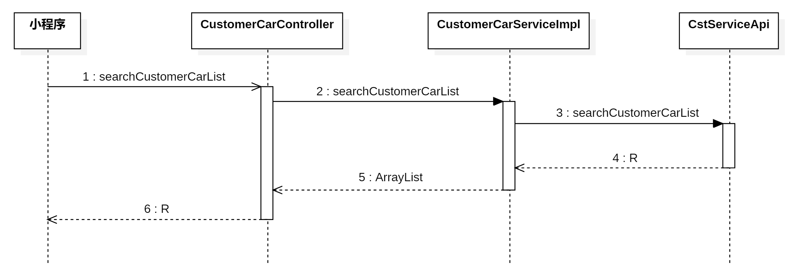

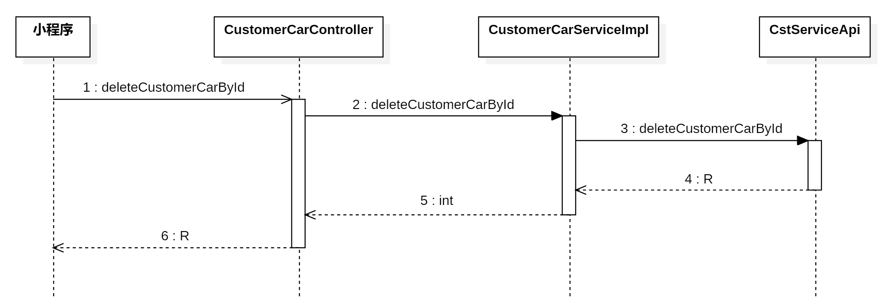

### 编写 Feign 客户端

在`<font style="color:#000000;background-color:rgba(220, 240, 255, 0.3) !important;">com.example.zxds.bff.customer.controller.form</font>`包中创建三个Form类，如下：

```java
package com.example.zxds.bff.customer.controller.form;

import io.swagger.v3.oas.annotations.media.Schema;
import lombok.Data;

import javax.validation.constraints.NotBlank;
import javax.validation.constraints.Pattern;

@Data
@Schema(description = "添加客户车辆的表单")
public class InsertCustomerCarForm {
    @Schema(description = "客户ID")
    private Long customerId;

    @NotBlank(message = "carPlate不能为空")
    @Pattern(regexp = "^([京津沪渝冀豫云辽黑湘皖鲁新苏浙赣鄂桂甘晋蒙陕吉闽贵粤青藏川宁琼使领A-Z]{1}[A-Z]{1}(([0-9]{5}[DF])|([DF]([A-HJ-NP-Z0-9])[0-9]{4})))|([京津沪渝冀豫云辽黑湘皖鲁新苏浙赣鄂桂甘晋蒙陕吉闽贵粤青藏川宁琼使领A-Z]{1}[A-Z]{1}[A-HJ-NP-Z0-9]{4}[A-HJ-NP-Z0-9挂学警港澳]{1})$",
            message = "carPlate内容不正确")
    @Schema(description = "车牌号")
    private String carPlate;

    @NotBlank(message = "carType不能为空")
    @Pattern(regexp = "^[\\u4e00-\\u9fa5A-Za-z0-9\\-\\_\\s]{2,20}$", message = "carType内容不正确")
    @Schema(description = "车型")
    private String carType;
}
```

```java
package com.example.zxds.bff.customer.controller.form;

import io.swagger.v3.oas.annotations.media.Schema;
import lombok.Data;

@Data
@Schema(description = "查询客户车辆的表单")
public class SearchCustomerCarListForm {
    @Schema(description = "客户ID")
    private Long customerId;
}
```

```java
package com.example.zxds.bff.customer.controller.form;

import io.swagger.v3.oas.annotations.media.Schema;
import lombok.Data;

import javax.validation.constraints.Min;
import javax.validation.constraints.NotNull;

@Data
@Schema(description = "删除客户车辆的表单")
public class DeleteCustomerCarByIdForm {
    @NotNull(message = "id不能为空")
    @Min(value = 1, message = "id不能小于1")
    @Schema(description = "车辆ID")
    private Long id;
}
```

在`<font style="color:#000000;background-color:rgba(220, 240, 255, 0.3) !important;">com.example.zxds.bff.customer.feign</font>`包`<font style="color:#000000;background-color:rgba(220, 240, 255, 0.3) !important;">CstServiceApi.java</font>`接口中，声明抽象方法

```java
@PostMapping("/customer/car/insertCustomerCar")
R insertCustomerCar(InsertCustomerCarForm form);

@PostMapping("/customer/car/searchCustomerCarList")
R searchCustomerCarList(SearchCustomerCarListForm form);

@PostMapping("/customer/car/deleteCustomerCarById")
R deleteCustomerCarById(DeleteCustomerCarByIdForm form);
```

### 编写 service 和实现

在`<font style="color:#000000;background-color:rgba(220, 240, 255, 0.3) !important;">com.example.zxds.bff.customer.service</font>`包`<font style="color:#000000;background-color:rgba(220, 240, 255, 0.3) !important;">CustomerCarService.java</font>`接口中，声明抽象方法

```java
package com.example.zxds.bff.customer.service;

import com.example.zxds.bff.customer.controller.form.DeleteCustomerCarByIdForm;
import com.example.zxds.bff.customer.controller.form.InsertCustomerCarForm;
import com.example.zxds.bff.customer.controller.form.SearchCustomerCarListForm;

import java.util.List;
import java.util.Map;

public interface CustomerCarService {
    void insertCustomerCar(InsertCustomerCarForm form);

    List<Map<String, Object>> searchCustomerCarList(SearchCustomerCarListForm form);

    int deleteCustomerCarById(DeleteCustomerCarByIdForm form);
}
```

在`<font style="color:#000000;background-color:rgba(220, 240, 255, 0.3) !important;">com.example.zxds.bff.customer.service.impl</font>`包`<font style="color:#000000;background-color:rgba(220, 240, 255, 0.3) !important;">CustomerCarServiceImpl.java</font>`类中，实现3个抽象方法。

```java
package com.example.zxds.bff.customer.service.impl;

import cn.hutool.core.map.MapUtil;
import com.example.zxds.bff.customer.controller.form.DeleteCustomerCarByIdForm;
import com.example.zxds.bff.customer.controller.form.InsertCustomerCarForm;
import com.example.zxds.bff.customer.controller.form.SearchCustomerCarListForm;
import com.example.zxds.bff.customer.feign.CstServiceApi;
import com.example.zxds.bff.customer.service.CustomerCarService;
import com.example.zxds.common.util.R;
import io.seata.spring.annotation.GlobalTransactional;
import lombok.RequiredArgsConstructor;
import org.springframework.stereotype.Service;

import java.util.List;
import java.util.Map;

@Service
@RequiredArgsConstructor
public class CustomerCarServiceImpl implements CustomerCarService {
    
    private final CstServiceApi cstServiceApi;

    @Override
    @GlobalTransactional
    public void insertCustomerCar(InsertCustomerCarForm form) {
        cstServiceApi.insertCustomerCar(form);
    }

    @Override
    public List<Map<String, Object>> searchCustomerCarList(SearchCustomerCarListForm form) {
        R r = cstServiceApi.searchCustomerCarList(form);
        List<Map<String, Object>> list = (List<Map<String, Object>>) r.get("result");
        return list;
    }

    @Override
    @GlobalTransactional
    public int deleteCustomerCarById(DeleteCustomerCarByIdForm form) {
        R r = cstServiceApi.deleteCustomerCarById(form);
        int rows = MapUtil.getInt(r, "rows");
        return rows;
    }
}
```

### 编写 web 方法

在`<font style="color:#000000;background-color:rgba(220, 240, 255, 0.3) !important;">com.example.zxds.bff.customer.controller</font>`包`<font style="color:#000000;background-color:rgba(220, 240, 255, 0.3) !important;">CustomerCarController.java</font>`类中，创建3个Web方法。

```java
package com.example.zxds.bff.customer.controller;

import cn.dev33.satoken.stp.StpUtil;
import com.example.zxds.bff.customer.controller.form.DeleteCustomerCarByIdForm;
import com.example.zxds.bff.customer.controller.form.InsertCustomerCarForm;
import com.example.zxds.bff.customer.controller.form.SearchCustomerCarListForm;
import com.example.zxds.bff.customer.service.CustomerCarService;
import com.example.zxds.common.util.R;
import io.swagger.v3.oas.annotations.Operation;
import io.swagger.v3.oas.annotations.tags.Tag;
import lombok.RequiredArgsConstructor;
import org.springframework.web.bind.annotation.PostMapping;
import org.springframework.web.bind.annotation.RequestBody;
import org.springframework.web.bind.annotation.RequestMapping;
import org.springframework.web.bind.annotation.RestController;

import javax.validation.Valid;
import java.util.List;
import java.util.Map;

@RestController
@RequestMapping("/customer/car")
@RequiredArgsConstructor
@Tag(name = "CustomerController", description = "客户车辆Web接口")
public class CustomerCarController {

    private final CustomerCarService customerCarService;

    @PostMapping("/insertCustomerCar")
    @Operation(summary = "添加客户车辆")
    public R insertCustomerCar(@RequestBody @Valid InsertCustomerCarForm form) {
        long customerId = StpUtil.getLoginIdAsLong();
        form.setCustomerId(customerId);
        customerCarService.insertCustomerCar(form);
        return R.ok();
    }

    @PostMapping("/searchCustomerCarList")
    @Operation(summary = "查询客户车辆列表")
    public R searchCustomerCarList(@RequestBody @Valid SearchCustomerCarListForm form) {
        long customerId = StpUtil.getLoginIdAsLong();
        form.setCustomerId(customerId);
        List<Map<String, Object>> list = customerCarService.searchCustomerCarList(form);
        return R.ok().put("result", list);
    }

    @PostMapping("/deleteCustomerCarById")
    @Operation(summary = "删除客户车辆")
    public R deleteCustomerCarById(@RequestBody @Valid DeleteCustomerCarByIdForm form) {
        int rows = customerCarService.deleteCustomerCarById(form);
        return R.ok().put("rows", rows);
    }
}
```

### 测试 web 方法

**把**`**<font style="color:#000000;background-color:rgba(220, 240, 255, 0.3) !important;">zxds-cst</font>**`**、**`**<font style="color:#000000;background-color:rgba(220, 240, 255, 0.3) !important;">bff-customer</font>**`**两个子系统启动起来。**

**请求地址：**

1. [http://localhost:8102/customer/car/insertCustomerCar](http://localhost:8102/customer/car/insertCustomerCar)
2. [http://localhost:8102/customer/car/searchCustomerCarList](http://localhost:8102/customer/car/searchCustomerCarList)
3. [http://localhost:8102/customer/car/deleteCustomerCarById](http://localhost:8102/customer/car/deleteCustomerCarById)

**请求头参数：token**

# 乘客端实现车辆维护

## 添加车辆

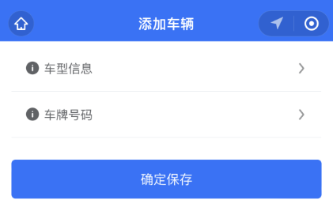

 

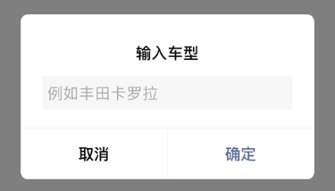

在`<font style="color:#000000;background-color:rgba(220, 240, 255, 0.3) !important;">pages/add_car/add_car.vue</font>`页面上，我们可以设置车辆的车型和车牌号码，然后点击保存按钮，发起Ajax请求，车辆记录就保存到数据库里面了。

### 定义全局 URL 路径

```javascript
Vue.prototype.url = {
    ……,
    insertCustomerCar: `${baseUrl}/customer/car/insertCustomerCar`,
    searchCustomerCarList: `${baseUrl}/customer/car/searchCustomerCarList`,
    deleteCustomerCarById: `${baseUrl}/customer/car/deleteCustomerCarById`,
}
```

### 熟悉视图层和模型层

该页面的视图层标签并不复杂，主要就是两个列表项我们要实现点击事件的回调函数，以及保存按钮点击事件的回调函数。

```html
<view class="page">
    <u-cell-group :border="false">
        <u-cell-item icon="info-circle-fill" title="车型信息" 
                     :value="carType" @click="carTypeHandle">
        </u-cell-item>
        <u-cell-item icon="info-circle-fill" title="车牌号码" 
                     :value="carPlate" @click="carPlateHandle">
        </u-cell-item>
    </u-cell-group>
    <button class="btn" @tap="saveHandle">确定保存</button>
    <view class="desc">
        保存即代表您同意智行代驾的
        <text>《隐私政策》</text>
    </view>
    <u-toast ref="uToast" />
</view>
```

模型层部分的变量也很少，我们把输入的车型和车牌保存到变量上就行了。

```javascript
data() {
    return {
        carType: '',
        carPlate: ''
    };
},
```

### 输入车型和车牌

两个列表项的回调函数，我们分别实现一下，让用户在弹窗中输入车型或者车牌，然后还要做前端验证。

```javascript
carTypeHandle() {
    let that = this;
    uni.showModal({
        title: '输入车型',
        editable: true,
        placeholderText: '例如丰田卡罗拉',
        success: function(resp) {
            if (resp.confirm) {
                let carType = resp.content;
                if (that.checkValidCarType(carType, '车型')) {
                    that.carType = carType;
                }
            }
        }
    });
},
carPlateHandle() {
    let that = this;
    uni.showModal({
        title: '输入车牌',
        editable: true,
        placeholderText: '你的车牌号',
        success: function(resp) {
            if (resp.confirm) {
                let carPlate = resp.content;
                if (that.checkValidCarPlate(carPlate, '车牌')) {
                    that.carPlate = carPlate;
                }
            }
        }
    });
},
```

### 保存数据

我们把保存按钮点击事件的回调函数给实现一下，发起Ajax请求调用Web方法。

```javascript
saveHandle() {
    let that = this;
    if (that.checkValidCarType(that.carType, '车型') && that.checkValidCarPlate(that.carPlate, '车牌')) {
        let data = {
            carType: that.carType,
            carPlate: that.carPlate
        };
        that.ajax(that.url.insertCustomerCar, 'POST', data, function(resp) {
            that.$refs.uToast.show({
                title: '添加成功',
                type: 'success',
                callback: function() {
                    uni.redirectTo({
                        url: '../car_list/car_list'
                    });
                }
            });
        });
    }
}
```

## 查询车辆列表和删除车辆

在`<font style="color:#000000;background-color:rgba(220, 240, 255, 0.3) !important;">car_list.vue</font>`页面上，应该先把查询到的车辆列表一次性显示出来，因为记录并不多，所以我们就不用分页功能了。然后用户长按某个车辆会出现对话框，用户确认后就会删除该车辆

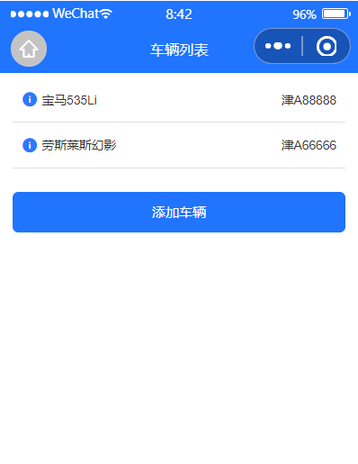

 

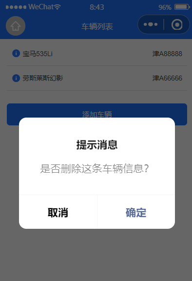

### 熟悉视图层和模型层

正常情况下我们从模型层的`<font style="color:#000000;background-color:rgba(220, 240, 255, 0.3) !important;">list</font>`数组加载数据到页面上，形成车辆列表。如果`<font style="color:#000000;background-color:rgba(220, 240, 255, 0.3) !important;">list</font>`数组是空的，页面就会显示没有数据的提示图片。我在车辆标签上设置了长按事件，对应的回调函数`<font style="color:#000000;background-color:rgba(220, 240, 255, 0.3) !important;">removeHandle()</font>`我们必须实现。

```html
<view class="page">
    <view v-if="list.length > 0" v-for="one in list" class="row" @tap="choseOneHandle(one.id, one.carPlate)" @longpress="removeHandle(one.id)">
        <view>
            <u-icon name="info-circle-fill" color="#2979ff" size="35" class="icon"></u-icon>
            <text class="car-type">{{ one.carType }}</text>
        </view>
        <text class="car-plate">{{ one.carPlate }}</text>
    </view>
    <image v-if="list.length == 0" src="../../static/car_list/none.jpg" mode="widthFix" class="none"></image>
    <button class="btn" @tap="addHandle">添加车辆</button>
    <u-toast ref="uToast" />
</view>
```

```javascript
data() {
    return {
        list: []
    };
},
```

### 加载车辆列表

因为页面的`<font style="color:#000000;background-color:rgba(220, 240, 255, 0.3) !important;">onLoad()</font>`和删除车辆之后都要重新加载页面数据，所以我们需要把查询车辆列表的代码封装起来。

```javascript
loadDataList(ref) {
    ref.list = [];
    ref.ajax(ref.url.searchCustomerCarList, 'POST', {}, function(resp) {
        let result = resp.data.result;
        for (let one of result) {
            ref.list.push({
                id: one.id,
                carType: one.carType,
                carPlate: one.carPlate
            });
        }
    });
}
```

在`<font style="color:#000000;background-color:rgba(220, 240, 255, 0.3) !important;">onLoad()</font>`函数中，我们要实现调用该函数。

```javascript
onLoad: function() {
    let that = this;
    that.loadDataList(that);
}
```

### 跳转到添加车辆页面

在当前页面上“添加车辆”按钮被点击之后，小程序会跳转到`<font style="color:#000000;background-color:rgba(220, 240, 255, 0.3) !important;">add_car.vue</font>`页面上，我们来实现一下。

```javascript
addHandle() {
    uni.redirectTo({
        url: '../add_car/add_car'
    });
},
```

### 删除车辆

用户长按车辆标签之后，弹出对话框，用户确认之后才会删除记录，并重新加载页面数据。

```javascript
removeHandle(id) {
    let that = this;
    uni.vibrateShort({});
    uni.showModal({
        title: '提示消息',
        content: '是否删除这条车辆信息？',
        success: function(resp) {
            if (resp.confirm) {
                //删除记录
                let data = {
                    id: id
                };
                that.ajax(that.url.deleteCustomerCarById, 'POST', data, function(resp) {
                    if (resp.data.rows == 0) {
                        that.$refs.uToast.show({
                            title: '删除失败',
                            type: 'error'
                        });
                    } else {
                        that.loadDataList(that);
                    }
                });
            }
        }
    });
},
```

## 选择车辆

在`<font style="color:#000000;background-color:rgba(220, 240, 255, 0.3) !important;">create_order.vue</font>`页面上我们点击“选择车辆”，小程序就会跳转到`<font style="color:#000000;background-color:rgba(220, 240, 255, 0.3) !important;">car_list.vue</font>`页面上面，所以我们把这个点击事件回调函数给写一下。

### 跳转到车辆列表页面

在创建订单页面上面有“选择车辆”链接，这个链接的标签我们看一下

```html
<view class="opt" @tap="chooseCarHandle" v-if="!showCar">选择车辆</view>
<view class="opt" @tap="chooseCarHandle" v-if="showCar">{{ carPlate }}</view>
```

我们实现这个链接点击事件的回调函数`<font style="color:#000000;background-color:rgba(220, 240, 255, 0.3) !important;">chooseCarHandle()</font>`，内容很简单就是跳转页面。

```javascript
chooseCarHandle() {
    uni.navigateTo({
        url: '../car_list/car_list'
    });
}
```

### 选择车辆，跳回创建订单页面

我在车辆列表页面，给每辆车的`<font style="color:#000000;background-color:rgba(220, 240, 255, 0.3) !important;"><view></font>`标签都添加了点击事件，只要我们点击按钮就可以回到创建订单页面。我们把车辆的点击事件回调函数给声明出来吧。

```javascript
choseOneHandle(id, carPlate) {
    uni.navigateTo({
        url: `../create_order/create_order?showCar=true&carId=${id}&carPlate=${carPlate}`
    });
}
```

跳转回创建订单页面之后，我们要在`<font style="color:#000000;background-color:rgba(220, 240, 255, 0.3) !important;">onLoad()</font>`函数中获取URL参数。

```javascript
onLoad: function(options) {
    ……

    if (options.hasOwnProperty('showCar')) {
        that.showCar = options.showCar;
        that.carId = options.carId;
        that.carPlate = options.carPlate;
    }
},
```

# 创建代驾订单

乘客发送创建订单的请求之后，需要后端Java程序重新计算最佳线路、里程和时间。这是为了避免有人用 Apipost 模拟客户端，随便输入代驾的起点、终点、里程和时长，所以后端程序必须重新计算这些数据，并且写入到订单记录中。

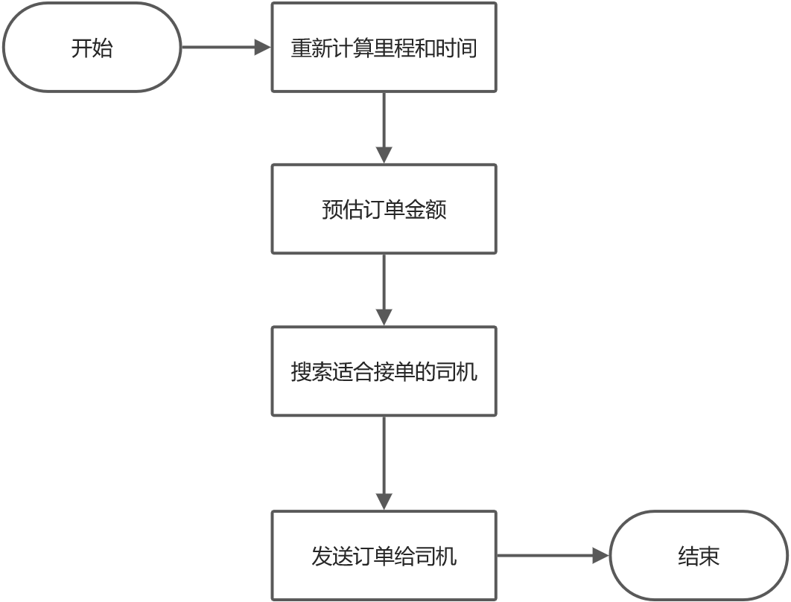

## 重新计算里程和时间

小程序把创建订单的请求发送给`<font style="color:#000000;background-color:rgba(220, 240, 255, 0.3) !important;">bff-customer</font>`子系统，那么该子系统首先要重新计算里程和时间，这就需要调用`<font style="color:#000000;background-color:rgba(220, 240, 255, 0.3) !important;">zxds-mps</font>`子系统了，所以我们要先从Feign接口开始写起。

在`<font style="color:#000000;background-color:rgba(220, 240, 255, 0.3) !important;">com.example.zxds.bff.customer.controller.form</font>`包中创建`<font style="color:#000000;background-color:rgba(220, 240, 255, 0.3) !important;">EstimateOrderMileageAndMinuteForm.java</font>`类。

```java
package com.example.zxds.bff.customer.controller.form;

import io.swagger.v3.oas.annotations.media.Schema;
import lombok.Data;

import javax.validation.constraints.NotBlank;
import javax.validation.constraints.Pattern;

@Data
@Schema(description = "预估里程和时间的表单")
public class EstimateOrderMileageAndMinuteForm {
    @NotBlank(message = "mode不能为空")
    @Pattern(regexp = "^driving$|^walking$|^bicycling$")
    @Schema(description = "计算方式")
    private String mode;

    @NotBlank(message = "startPlaceLatitude不能为空")
    @Pattern(regexp = "^(([1-8]\\d?)|([1-8]\\d))(\\.\\d{1,18})|90|0(\\.\\d{1,18})?$", message = "startPlaceLatitude内容不正确")
    @Schema(description = "订单起点的纬度")
    private String startPlaceLatitude;

    @NotBlank(message = "startPlaceLongitude不能为空")
    @Pattern(regexp = "^(([1-9]\\d?)|(1[0-7]\\d))(\\.\\d{1,18})|180|0(\\.\\d{1,18})?$", message = "startPlaceLongitude内容不正确")
    @Schema(description = "订单起点的经度")
    private String startPlaceLongitude;

    @NotBlank(message = "endPlaceLatitude不能为空")
    @Pattern(regexp = "^(([1-8]\\d?)|([1-8]\\d))(\\.\\d{1,18})|90|0(\\.\\d{1,18})?$", message = "endPlaceLatitude内容不正确")
    @Schema(description = "订单终点的纬度")
    private String endPlaceLatitude;

    @NotBlank(message = "endPlaceLongitude不能为空")
    @Pattern(regexp = "^(([1-9]\\d?)|(1[0-7]\\d))(\\.\\d{1,18})|180|0(\\.\\d{1,18})?$", message = "endPlaceLongitude内容不正确")
    @Schema(description = "订单起点的经度")
    private String endPlaceLongitude;
}
```

在`<font style="color:#000000;background-color:rgba(220, 240, 255, 0.3) !important;">com.example.zxds.bff.customer.feign</font>`包中创建`<font style="color:#000000;background-color:rgba(220, 240, 255, 0.3) !important;">MpsServiceApi.java</font>`接口。

```java
package com.example.zxds.bff.customer.feign;

import com.example.zxds.bff.customer.controller.form.EstimateOrderMileageAndMinuteForm;
import com.example.zxds.common.util.R;
import org.springframework.cloud.openfeign.FeignClient;
import org.springframework.web.bind.annotation.PostMapping;

@FeignClient(value = "zxds-mps")
public interface MpsServiceApi {
    @PostMapping("/map/estimateOrderMileageAndMinute")
    R estimateOrderMileageAndMinute(EstimateOrderMileageAndMinuteForm form);
}
```

## 订单金额计算规则

由于每笔代驾都要记录订单的预估金额，所以我们要根据里程和计费规则，预估出代驾的费用，这就需要用到规则引擎。我们这里还是使用 QLExpress 实现规则的计算。规则存储在`<font style="color:#000000;background-color:rgba(220, 240, 255, 0.3) !important;">zxds_rule</font>`的`<font style="color:#000000;background-color:rgba(220, 240, 255, 0.3) !important;">tb_charge_rule</font>`表中，保存的是计费规则。

| **字段** | **类型** | **非空** | **描述信息** |
| --- | --- | --- | --- |
| id | bigint | True | 主键ID |
| code | varchar | True | 规则编码 |
| name | varchar | True | 规则名称 |
| rule | text | True | 规则代码 |
| type | tinyint | True | 1司机取消规则，2乘客取消规则 |
| status | tinyint | True | 状态代码，1有效，2关闭 |
| create_time | datetime | True | 添加时间 |

具体的记录如下，其中rule字段是具体的算法。但是为了避免规则被数据库管理员随便改动，我们要对`<font style="color:#000000;background-color:rgba(220, 240, 255, 0.3) !important;">rule</font>`字段加密，这样外界就没法随便修改规则了，必须由专业人员来维护。

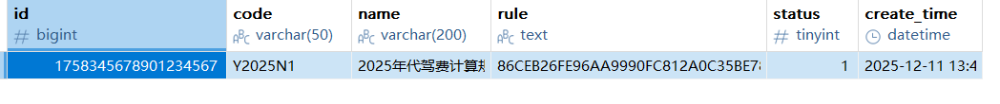

## 运行 zxds-rule 子系统

我已经把规则引擎封装到了`<font style="color:#000000;background-color:rgba(220, 240, 255, 0.3) !important;">zxds-rule</font>`子系统中，里面包含了计算代驾费、取消订单的惩罚、计算系统奖励等算法，我们通过Feign接口远程调用即可。

## 预估代驾费接口

在`<font style="color:#000000;background-color:rgba(220, 240, 255, 0.3) !important;">zxds-rule</font>`子系统中，`<font style="color:#000000;background-color:rgba(220, 240, 255, 0.3) !important;">ChargeRuleController</font>`中定义了`<font style="color:#000000;background-color:rgba(220, 240, 255, 0.3) !important;">estimateOrderCharge()</font>`方法用来预估代驾费费用，返回的结果绑定在R对象中。

```java
@RestController
@RequestMapping("/charge")
@Tag(name = "ChargeRuleController", description = "代驾费用的Web接口")
public class ChargeRuleController{

    @PostMapping("/estimateOrderCharge")
    public R estimateOrderCharge(@RequestBody @Valid EstimateOrderChargeForm form) {
        ……
        HashMap map = chargeRuleService.calculateOrderCharge(form.getMileage(), form.getTime(), 0, key);
        return R.ok().put("result", map);
    }
}
```

调用该Web方法需要我们传入的参数有两个：里程（公里）和下单时间（HH:mm:ss）

```java
@Data
@Schema(description = "预估代驾费用的表单")
public class EstimateOrderChargeForm {
    @NotBlank(message = "mileage不能为空")
    @Pattern(regexp = "^[1-9]\\d*\\.\\d+$|^0\\.\\d*[1-9]\\d*$|^[1-9]\\d*$", message = "mileage内容不正确")
    @Schema(description = "代驾公里数")
    private String mileage;

    @NotBlank(message = "time不能为空")
    @Pattern(regexp = "^(20|21|22|23|[0-1]\\d):[0-5]\\d:[0-5]\\d$", message = "time内容不正确")
    @Schema(description = "代驾开始时间")
    private String time;
}
```

调用该方法的时候，**假设**传入的里程是12.5公里，时间是**凌晨1点整**。该Web方法返回的结果如下：

```json
{
  "msg": "success",
  "result": {
    "amount": "115.00",  //总金额
    "chargeRuleId": "714601916034166785",  //使用的规则ID
    
    "baseMileage": "8",  //代驾基础里程
    "baseMileagePrice": "85",  // 基础里程费
    "exceedMileagePrice": "3.5",  //超出规定里程后每公里3.5元
    "mileageFee": "102.50",  //本订单里程费
    
    "baseMinute": "10",  //免费等时10分钟
    "exceedMinutePrice": "1.0",  //超出10分钟后，每分钟1元
    "waitingFee": "0.00",  //本订单等时费
    
    "baseReturnMileage": "8",  //总里程超过8公里后，要加收返程费
    "exceedReturnPrice": "1.0",  //返程里程是每公里1元
    "returnMileage": "12.5",  //本订单的返程里程
    "returnFee": "12.50",  //本订单返程费
  },
  "code": 200
}
```

## 代驾费计算标准

代驾默认起步里程是8公里，收费根据时间段不同也有所调整。

| **时间段** | **基础里程** | **收费** |
| --- | --- | --- |
| 06:00 - 22:00 | 8公里 | 35元 |
| 22:00 - 23:00 | 8公里 | 50元 |
| 23:00 - 00:00 | 8公里 | 65元 |
| 00:00 - 06:00 | 8公里 | 85元 |

## 编写 Feign 客户端

在`<font style="color:#000000;background-color:rgba(220, 240, 255, 0.3) !important;">com.example.zxds.bff.customer.controller.form</font>`包中创建`<font style="color:#000000;background-color:rgba(220, 240, 255, 0.3) !important;">EstimateOrderChargeForm.java</font>`类

```java
package com.example.zxds.bff.customer.controller.form;

import io.swagger.v3.oas.annotations.media.Schema;
import lombok.Data;

import javax.validation.constraints.NotBlank;
import javax.validation.constraints.Pattern;

@Data
@Schema(description = "预估代驾费用的表单")
public class EstimateOrderChargeForm {
    @NotBlank(message = "mileage不能为空")
    @Pattern(regexp = "^[1-9]\\d*\\.\\d+$|^0\\.\\d*[1-9]\\d*$|^[1-9]\\d*$", message = "mileage内容不正确")
    @Schema(description = "代驾公里数")
    private String mileage;

    @NotBlank(message = "time不能为空")
    @Pattern(regexp = "^(20|21|22|23|[0-1]\\d):[0-5]\\d:[0-5]\\d$", message = "time内容不正确")
    @Schema(description = "代驾开始时间")
    private String time;
}
```

在`<font style="color:#000000;background-color:rgba(220, 240, 255, 0.3) !important;">com.example.zxds.bff.customer.feign</font>`包中创建`<font style="color:#000000;background-color:rgba(220, 240, 255, 0.3) !important;">RuleServiceApi.java</font>`接口

```java
package com.example.zxds.bff.customer.feign;

import com.example.zxds.bff.customer.controller.form.EstimateOrderChargeForm;
import com.example.zxds.common.util.R;
import org.springframework.cloud.openfeign.FeignClient;
import org.springframework.web.bind.annotation.PostMapping;

@FeignClient(value = "zxds-rule")
public interface RuleServiceApi {
    @PostMapping("/charge/estimateOrderCharge")
    R estimateOrderCharge(EstimateOrderChargeForm form);
}
```

## 编写业务层代码，调用两个子系统

因为bff子系统的业务层方法要用Form作为参数，所以我们要提前声明好Form类。在`<font style="color:#000000;background-color:rgba(220, 240, 255, 0.3) !important;">com.example.zxds.bff.customer.controller.form</font>`包中创建`<font style="color:#000000;background-color:rgba(220, 240, 255, 0.3) !important;">CreateNewOrderForm.java</font>`类。

```java
package com.example.zxds.bff.customer.controller.form;

import io.swagger.v3.oas.annotations.media.Schema;
import lombok.Data;

import javax.validation.constraints.NotBlank;
import javax.validation.constraints.Pattern;

@Data
@Schema(description = "预估订单数据的表单")
public class CreateNewOrderForm {
    @Schema(description = "客户ID")
    private Long customerId;

    @NotBlank(message = "startPlace不能为空")
    @Pattern(regexp = "[\\(\\)0-9A-Z#\\-_\\u4e00-\\u9fa5]{2,50}", message = "startPlace内容不正确")
    @Schema(description = "订单起点")
    private String startPlace;

    @NotBlank(message = "startPlaceLatitude不能为空")
    @Pattern(regexp = "^(([1-8]\\d?)|([1-8]\\d))(\\.\\d{1,18})|90|0(\\.\\d{1,18})?$", message = "startPlaceLatitude内容不正确")
    @Schema(description = "订单起点的纬度")
    private String startPlaceLatitude;

    @NotBlank(message = "startPlaceLongitude不能为空")
    @Pattern(regexp = "^(([1-9]\\d?)|(1[0-7]\\d))(\\.\\d{1,18})|180|0(\\.\\d{1,18})?$", message = "startPlaceLongitude内容不正确")
    @Schema(description = "订单起点的经度")
    private String startPlaceLongitude;

    @NotBlank(message = "endPlace不能为空")
    @Pattern(regexp = "[\\(\\)0-9A-Z#\\-_\\u4e00-\\u9fa5]{2,50}", message = "endPlace内容不正确")
    @Schema(description = "订单终点")
    private String endPlace;

    @NotBlank(message = "endPlaceLatitude不能为空")
    @Pattern(regexp = "^(([1-8]\\d?)|([1-8]\\d))(\\.\\d{1,18})|90|0(\\.\\d{1,18})?$", message = "endPlaceLatitude内容不正确")
    @Schema(description = "订单终点的纬度")
    private String endPlaceLatitude;

    @NotBlank(message = "endPlaceLongitude不能为空")
    @Pattern(regexp = "^(([1-9]\\d?)|(1[0-7]\\d))(\\.\\d{1,18})|180|0(\\.\\d{1,18})?$", message = "endPlaceLongitude内容不正确")
    @Schema(description = "订单起点的经度")
    private String endPlaceLongitude;

    @NotBlank(message = "favourFee不能为空")
    @Pattern(regexp = "^[1-9]\\d*\\.\\d{1,2}$|^0\\.\\d{1,2}$|^[1-9]\\d*$", message = "favourFee内容不正确")
    @Schema(description = "顾客好处费")
    private String favourFee;

    @NotBlank(message = "carPlate不能为空")
    @Pattern(regexp = "^([京津沪渝冀豫云辽黑湘皖鲁新苏浙赣鄂桂甘晋蒙陕吉闽贵粤青藏川宁琼使领A-Z]{1}[A-Z]{1}(([0-9]{5}[DF])|([DF]([A-HJ-NP-Z0-9])[0-9]{4})))|([京津沪渝冀豫云辽黑湘皖鲁新苏浙赣鄂桂甘晋蒙陕吉闽贵粤青藏川宁琼使领A-Z]{1}[A-Z]{1}[A-HJ-NP-Z0-9]{4}[A-HJ-NP-Z0-9挂学警港澳]{1})$",
            message = "carPlate内容不正确")
    @Schema(description = "车牌号")
    private String carPlate;

    @NotBlank(message = "carType不能为空")
    @Pattern(regexp = "^[\\u4e00-\\u9fa5A-Za-z0-9\\-\\_\\s]{2,20}$", message = "carType内容不正确")
    @Schema(description = "车型")
    private String carType;

}
```

在`<font style="color:#000000;background-color:rgba(220, 240, 255, 0.3) !important;">com.example.zxds.bff.customer.service</font>`包中创建`<font style="color:#000000;background-color:rgba(220, 240, 255, 0.3) !important;">OrderService.java</font>`接口，声明抽象方法。

```java
package com.example.zxds.bff.customer.service;

import com.example.zxds.bff.customer.controller.form.CreateNewOrderForm;

public interface OrderService {

    int createNewOrder(CreateNewOrderForm form);
}
```

在`<font style="color:#000000;background-color:rgba(220, 240, 255, 0.3) !important;">com.example.zxds.bff.customer.service.impl</font>`包中创建`<font style="color:#000000;background-color:rgba(220, 240, 255, 0.3) !important;">OrderServiceImpl.java</font>`类，实现抽象方法。

```java
package com.example.zxds.bff.customer.service.impl;

import cn.hutool.core.date.DateTime;
import cn.hutool.core.map.MapUtil;
import com.example.zxds.bff.customer.controller.form.CreateNewOrderForm;
import com.example.zxds.bff.customer.controller.form.EstimateOrderChargeForm;
import com.example.zxds.bff.customer.controller.form.EstimateOrderMileageAndMinuteForm;
import com.example.zxds.bff.customer.feign.MpsServiceApi;
import com.example.zxds.bff.customer.feign.RuleServiceApi;
import com.example.zxds.bff.customer.service.OrderService;
import com.example.zxds.common.util.R;
import io.seata.spring.annotation.GlobalTransactional;
import lombok.RequiredArgsConstructor;
import lombok.extern.slf4j.Slf4j;
import org.springframework.stereotype.Service;

import java.util.Map;

@Service
@Slf4j
@RequiredArgsConstructor
public class OrderServiceImpl implements OrderService {
    private final MpsServiceApi mpsServiceApi;
    private final RuleServiceApi ruleServiceApi;

    @Override
    @GlobalTransactional
    public int createNewOrder(CreateNewOrderForm form) {
        Long customerId = form.getCustomerId();
        String startPlace = form.getStartPlace();
        String startPlaceLatitude = form.getStartPlaceLatitude();
        String startPlaceLongitude = form.getStartPlaceLongitude();
        String endPlace = form.getEndPlace();
        String endPlaceLatitude = form.getEndPlaceLatitude();
        String endPlaceLongitude = form.getEndPlaceLongitude();
        String favourFee = form.getFavourFee();
        /**
         * 【重新预估里程和时间】
         * 虽然下单前，系统会预估里程和时长，但是有可能顾客在下单页面停留时间过长，
         * 然后再按“下单”键，这时候路线和时长可能都有变化，所以需要重新预估里程和时间
         */
        EstimateOrderMileageAndMinuteForm form1 = new EstimateOrderMileageAndMinuteForm();
        form1.setMode("driving");
        form1.setStartPlaceLatitude(startPlaceLatitude);
        form1.setStartPlaceLongitude(startPlaceLongitude);
        form1.setEndPlaceLatitude(endPlaceLatitude);
        form1.setEndPlaceLongitude(endPlaceLongitude);
        R r = mpsServiceApi.estimateOrderMileageAndMinute(form1);
        Map<String, Object> map = (Map<String, Object>) r.get("result");
        String mileage = MapUtil.getStr(map, "mileage");
        int minute = MapUtil.getInt(map, "minute");

        /**
         * 重新估算订单金额
         */
        EstimateOrderChargeForm form2 = new EstimateOrderChargeForm();
        form2.setMileage(mileage);
        form2.setTime(new DateTime().toTimeStr());
        r = ruleServiceApi.estimateOrderCharge(form2);
        map = (Map<String, Object>) r.get("result");
        String expectsFee = MapUtil.getStr(map, "amount");
        String chargeRuleId = MapUtil.getStr(map, "chargeRuleId");
        short baseMileage = MapUtil.getShort(map, "baseMileage");
        String baseMileagePrice = MapUtil.getStr(map, "baseMileagePrice");
        String exceedMileagePrice = MapUtil.getStr(map, "exceedMileagePrice");
        short baseMinute = MapUtil.getShort(map, "baseMinute");
        String exceedMinutePrice = MapUtil.getStr(map, "exceedMinutePrice");
        short baseReturnMileage = MapUtil.getShort(map, "baseReturnMileage");
        String exceedReturnPrice = MapUtil.getStr(map, "exceedReturnPrice");

        return 0;
    }
}
```

## 编写 zxds-odr 子系统代码

我们已经写好了预估里程、时间和费用的代码，那么bff子系统最终是要把订单保存到数据库里面，接下来咱们编写订单子系统的代码，把**订单和账单**记录分别保存到数据表里面。

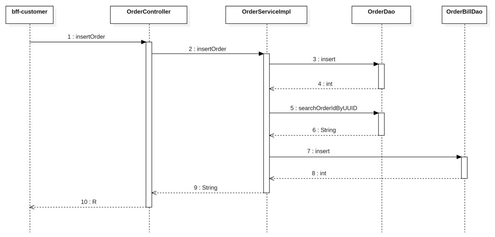

### 编写持久层代码

订单表是`<font style="color:#000000;background-color:rgba(220, 240, 255, 0.3) !important;">tb_order</font>`，这张数据表的结构如下，我们来看一下

| **字段** | **类型** | **非空** | **描述信息** |
| --- | --- | --- | --- |
| id | bigint | True | 主键 |
| uuid | varchar | True | 订单序列号 |
| customer_id | bigint | True | 客户ID |
| start_place | varchar | True | 起始地点 |
| start_place_location | json | True | 起始地点坐标信息 |
| end_place | varchar | True | 结束地点 |
| end_place_location | json | True | 结束地点坐标信息 |
| expects_mileage | decimal | True | 预估里程 |
| real_mileage | decimal | False | 实际里程 |
| return_mileage | decimal | False | 返程里程 |
| expects_fee | decimal | True | 预估订单价格 |
| favour_fee | decimal | True | 顾客好处费 |
| incentive_fee | decimal | False | 系统奖励费 |
| real_fee | decimal | False | 实际订单价格 |
| driver_id | bigint | False | 司机ID |
| date | date | True | 订单日期 |
| create_time | datetime | True | 订单创建时间 |
| accept_time | datetime | False | 司机接单时间 |
| arrive_time | datetime | False | 司机到达时间 |
| start_time | datetime | False | 代驾开始时间 |
| end_time | datetime | False | 代驾结束时间 |
| waiting_minute | smallint | False | 代驾等时分钟数 |
| prepay_id | varchar | False | 微信预支付单ID |
| pay_id | varchar | False | 微信支付单ID |
| pay_time | datetime | False | 微信付款时间 |
| charge_rule_id | bigint | True | 费用规则ID |
| cancel_rule_id | bigint | False | 订单取消规则ID |
| car_plate | varchar | True | 车牌号 |
| car_type | varchar | True | 车型 |
| status | tinyint | True | 1等待接单，2已接单，3司机已到达，4开始代驾，5结束代驾，6未付款，7已付款，8订单已结束，9顾客撤单，10司机撤单，11事故关闭，12其他 |
| remark | varchar | False | 订单备注信息 |

在`<font style="color:#000000;background-color:rgba(220, 240, 255, 0.3) !important;">OrderDao.xml</font>`文件中，定义SQL语句，插入记录：

```xml
<insert id="insert" parameterType="com.example.zxds.odr.db.pojo.OrderEntity">
    INSERT INTO tb_order
    SET id = #{id},
        uuid = #{uuid},
        customer_id = #{customerId},
        start_place = #{startPlace},
        start_place_location = #{startPlaceLocation},
        end_place = #{endPlace},
        end_place_location = #{endPlaceLocation},
        expects_mileage = #{expectsMileage},
        expects_fee = #{expectsFee},
        favour_fee = #{favourFee},
        charge_rule_id=#{chargeRuleId},
        car_plate=#{carPlate},
        car_type=#{carType},
        date = #{date}
</insert>

<select id="searchOrderIdByUUID" parameterType="String" resultType="String">
    SELECT CAST(id AS CHAR) AS id
    FROM tb_order
    WHERE uuid = #{uuid}
</select>
```

在`<font style="color:#000000;background-color:rgba(220, 240, 255, 0.3) !important;">com.example.zxds.odr.db.dao</font>`的`<font style="color:#000000;background-color:rgba(220, 240, 255, 0.3) !important;">OrderDao.java</font>`接口中，声明DAO方法

```java
int insert(OrderEntity entity);

String searchOrderIdByUUID(String uuid);
```

账单表是`<font style="color:#000000;background-color:rgba(220, 240, 255, 0.3) !important;">tb_order_bill</font>`，这个表的结构如下：

| **字段** | **类型** | **非空** | **描述信息** |
| --- | --- | --- | --- |
| id | bigint | True | 主键 |
| order_id | bigint | True | 订单ID |
| total | decimal | False | 总金额 |
| real_pay | decimal | False | 实付款金额 |
| mileage_fee | decimal | False | 里程费 |
| tel_fee | decimal | False | 通话费 |
| waiting_fee | decimal | False | 等时费用 |
| toll_fee | decimal | False | 路桥费 |
| parking_fee | decimal | False | 停车费 |
| other_free | decimal | False | 其他费用 |
| return_fee | decimal | False | 返程费 |
| favour_fee | decimal | False | 顾客好处费 |
| incentive_fee | decimal | False | 系统奖励费 |
| voucher_fee | decimal | False | 代金券面额 |
| detail | json | False | 详情 |
| base_mileage | smallint | True | 基础里程（公里） |
| base_mileage_price | decimal | True | 基础里程价格 |
| exceed_mileage_price | decimal | True | 超出基础里程的价格 |
| base_minute | smallint | True | 基础分钟 |
| exceed_minute_price | decimal | True | 超出基础分钟的价格 |
| base_return_mileage | smallint | True | 基础返程里程（公里） |
| exceed_return_price | decimal | True | 超出基础返程里程的价格 |

在`<font style="color:#000000;background-color:rgba(220, 240, 255, 0.3) !important;">OrderBillDao.xml</font>`文件中，定义SQL语句

```xml
<insert id="insert" parameterType="com.example.zxds.odr.db.pojo.OrderBillEntity">
    INSERT INTO tb_order_bill
    SET id = #{id},
        order_id = #{orderId},
        base_mileage = #{baseMileage},
        base_mileage_price = #{baseMileagePrice},
        exceed_mileage_price = #{exceedMileagePrice},
        base_minute = #{baseMinute},
        exceed_minute_price = #{exceedMinutePrice},
        base_return_mileage = #{baseReturnMileage},
        exceed_return_price = #{exceedReturnPrice}
</insert>
```

在`<font style="color:#000000;background-color:rgba(220, 240, 255, 0.3) !important;">com.example.zxds.odr.db.dao</font>`的`<font style="color:#000000;background-color:rgba(220, 240, 255, 0.3) !important;">OrderBillDao.java</font>`接口中，声明DAO方法

```java
int insert(OrderBillEntity entity);
```

### 编写 service 和实现

**编写 Redis 的配置类：**`**RedisConfig**`**，在 **`**com.example.zxds.odr.config**`**中。**

**专门创建一个序列化字符串的 **`**StringRedisTemplate**`

```java
package com.example.zxds.odr.config;

import org.springframework.boot.autoconfigure.condition.ConditionalOnClass;
import org.springframework.boot.autoconfigure.condition.ConditionalOnMissingBean;
import org.springframework.context.annotation.Bean;
import org.springframework.context.annotation.Configuration;
import org.springframework.data.redis.connection.RedisConnectionFactory;
import org.springframework.data.redis.core.RedisTemplate;
import org.springframework.data.redis.core.StringRedisTemplate;

@Configuration
@ConditionalOnClass(RedisTemplate.class)  // 只有存在RedisTemplate时才生效
public class RedisConfig {

    @Bean
    @ConditionalOnMissingBean  // 没有配置时才生效
    public StringRedisTemplate stringRedisTemplate(RedisConnectionFactory connectionFactory) {
        StringRedisTemplate template = new StringRedisTemplate();
        template.setConnectionFactory(connectionFactory);
        template.afterPropertiesSet();
        return template;
    }
}
```

在`<font style="color:#000000;background-color:rgba(220, 240, 255, 0.3) !important;">com.example.zxds.odr.service</font>`包`<font style="color:#000000;background-color:rgba(220, 240, 255, 0.3) !important;">OrderService.java</font>`接口中，声明抽象方法

```java
String insertOrder(OrderEntity orderEntity, OrderBillEntity billEntity);
```

在`<font style="color:#000000;background-color:rgba(220, 240, 255, 0.3) !important;">com.example.zxds.odr.service.impl</font>`包`<font style="color:#000000;background-color:rgba(220, 240, 255, 0.3) !important;">OrderServiceImpl.java</font>`类中，实现抽象方法

```java
private final OrderBillDao orderBillDao;

private final StringRedisTemplate stringRedisTemplate;

@Override
@Transactional
public String insertOrder(OrderEntity orderEntity, OrderBillEntity billEntity) {
    //插入订单记录
    int rows = orderDao.insert(orderEntity);
    if (rows == 1) {
        String id = orderDao.searchOrderIdByUUID(orderEntity.getUuid());
        //插入订单费用记录
        billEntity.setOrderId(Long.parseLong(id));
        rows = orderBillDao.insert(billEntity);
        if (rows == 1) {
            //往Redis里面插入缓存，配合Redis事务用于司机抢单，避免多个司机同时抢单成功
            stringRedisTemplate.opsForValue().set("order#" + id, "none");
            stringRedisTemplate.expire("order#" + id, 15, TimeUnit.MINUTES);   //缓存15分钟
            return id;
        } else {
            throw new ZxdsException("保存新订单费用失败");
        }
    } else {
        throw new ZxdsException("保存新订单失败");
    }
}
```

### 编写 form 接收数据并校验

在`<font style="color:#000000;background-color:rgba(220, 240, 255, 0.3) !important;">com.example.zxds.odr.controller.form</font>`包中创建`<font style="color:#000000;background-color:rgba(220, 240, 255, 0.3) !important;">InsertOrderForm.java</font>`类，接收提交的数据

```java
package com.example.zxds.odr.controller.form;

import io.swagger.v3.oas.annotations.media.Schema;
import lombok.Data;

import javax.validation.constraints.Min;
import javax.validation.constraints.NotBlank;
import javax.validation.constraints.NotNull;
import javax.validation.constraints.Pattern;

@Data
@Schema(description = "顾客下单的表单")
public class InsertOrderForm {
    @NotBlank(message = "uuid不能为空")
    @Pattern(regexp = "^[0-9A-Za-z]{32}$", message = "uuid内容不正确")
    @Schema(description = "uuid")
    private String uuid;

    @NotNull(message = "customerId不能为空")
    @Min(value = 1, message = "customerId不能小于1")
    @Schema(description = "客户ID")
    private Long customerId;

    @NotBlank(message = "startPlace不能为空")
    @Pattern(regexp = "[\\(\\)0-9A-Z#\\-_\\u4e00-\\u9fa5]{2,50}", message = "startPlace内容不正确")
    @Schema(description = "订单起点")
    private String startPlace;

    @NotBlank(message = "startPlaceLatitude不能为空")
    @Pattern(regexp = "^(([1-8]\\d?)|([1-8]\\d))(\\.\\d{1,18})|90|0(\\.\\d{1,18})?$", message = "startPlaceLatitude内容不正确")
    @Schema(description = "订单起点的纬度")
    private String startPlaceLatitude;

    @NotBlank(message = "startPlaceLongitude不能为空")
    @Pattern(regexp = "^(([1-9]\\d?)|(1[0-7]\\d))(\\.\\d{1,18})|180|0(\\.\\d{1,18})?$", message = "startPlaceLongitude内容不正确")
    @Schema(description = "订单起点的经度")
    private String startPlaceLongitude;

    @NotBlank(message = "endPlace不能为空")
    @Pattern(regexp = "[\\(\\)0-9A-Z#\\-_\\u4e00-\\u9fa5]{2,50}", message = "endPlace内容不正确")
    @Schema(description = "订单终点")
    private String endPlace;

    @NotBlank(message = "endPlaceLatitude不能为空")
    @Pattern(regexp = "^(([1-8]\\d?)|([1-8]\\d))(\\.\\d{1,18})|90|0(\\.\\d{1,18})?$", message = "endPlaceLatitude内容不正确")
    @Schema(description = "订单终点的纬度")
    private String endPlaceLatitude;

    @NotBlank(message = "endPlaceLongitude不能为空")
    @Pattern(regexp = "^(([1-9]\\d?)|(1[0-7]\\d))(\\.\\d{1,18})|180|0(\\.\\d{1,18})?$", message = "endPlaceLongitude内容不正确")
    @Schema(description = "订单终点的经度")
    private String endPlaceLongitude;

    @NotBlank(message = "expectsMileage不能为空")
    @Pattern(regexp = "^[1-9]\\d*\\.\\d+$|^0\\.\\d*[1-9]\\d*$|^[1-9]\\d*$", message = "expectsMileage内容不正确")
    @Schema(description = "预估代驾公里数")
    private String expectsMileage;

    @NotBlank(message = "expectsFee不能为空")
    @Pattern(regexp = "^[1-9]\\d*\\.\\d{1,2}$|^0\\.\\d{1,2}$|^[1-9]\\d*$", message = "expectsFee内容不正确")
    @Schema(description = "预估代驾费用")
    private String expectsFee;

    @NotBlank(message = "favourFee不能为空")
    @Pattern(regexp = "^[1-9]\\d*\\.\\d{1,2}$|^0\\.\\d{1,2}$|^[1-9]\\d*$", message = "favourFee内容不正确")
    @Schema(description = "顾客好处费")
    private String favourFee;


    @NotNull(message = "chargeRuleId不能为空")
    @Min(value = 1, message = "chargeRuleId不能小于1")
    @Schema(description = "规则ID")
    private Long chargeRuleId;

    @NotBlank(message = "carPlate不能为空")
    @Pattern(regexp = "^([京津沪渝冀豫云辽黑湘皖鲁新苏浙赣鄂桂甘晋蒙陕吉闽贵粤青藏川宁琼使领A-Z]{1}[A-Z]{1}(([0-9]{5}[DF])|([DF]([A-HJ-NP-Z0-9])[0-9]{4})))|([京津沪渝冀豫云辽黑湘皖鲁新苏浙赣鄂桂甘晋蒙陕吉闽贵粤青藏川宁琼使领A-Z]{1}[A-Z]{1}[A-HJ-NP-Z0-9]{4}[A-HJ-NP-Z0-9挂学警港澳]{1})$", message = "carPlate内容不正确")
    @Schema(description = "车牌号")
    private String carPlate;

    @NotBlank(message = "carType不能为空")
    @Pattern(regexp = "^[\\u4e00-\\u9fa5A-Za-z0-9\\-\\_\\s]{2,20}$", message = "carType内容不正确")
    @Schema(description = "车型")
    private String carType;

    @NotBlank(message = "date不能为空")
    @Pattern(regexp = "^((((1[6-9]|[2-9]\\d)\\d{2})-(0?[13578]|1[02])-(0?[1-9]|[12]\\d|3[01]))|(((1[6-9]|[2-9]\\d)\\d{2})-(0?[13456789]|1[012])-(0?[1-9]|[12]\\d|30))|(((1[6-9]|[2-9]\\d)\\d{2})-0?2-(0?[1-9]|1\\d|2[0-8]))|(((1[6-9]|[2-9]\\d)(0[48]|[2468][048]|[13579][26])|((16|[2468][048]|[3579][26])00))-0?2-29-))$", message = "date内容不正确")
    @Schema(description = "日期")
    private String date;

    @NotNull(message = "baseMileage不能为空")
    @Min(value = 1, message = "baseMileage不能小于1")
    @Schema(description = "基础里程（公里）")
    private Short baseMileage;

    @NotBlank(message = "baseMileagePrice不能为空")
    @Pattern(regexp = "^[1-9]\\d*\\.\\d{1,2}$|^0\\.\\d{1,2}$|^[1-9]\\d*$", message = "baseMileagePrice内容不正确")
    @Schema(description = "基础里程价格")
    private String baseMileagePrice;

    @NotBlank(message = "exceedMileagePrice不能为空")
    @Pattern(regexp = "^[1-9]\\d*\\.\\d{1,2}$|^0\\.\\d{1,2}$|^[1-9]\\d*$", message = "exceedMileagePrice内容不正确")
    @Schema(description = "超出基础里程的价格")
    private String exceedMileagePrice;

    @NotNull(message = "baseMinute不能为空")
    @Min(value = 1, message = "baseMinute不能小于1")
    @Schema(description = "基础分钟")
    private Short baseMinute;

    @NotBlank(message = "exceedMinutePrice不能为空")
    @Pattern(regexp = "^[1-9]\\d*\\.\\d{1,2}$|^0\\.\\d{1,2}$|^[1-9]\\d*$", message = "exceedMinutePrice内容不正确")
    @Schema(description = "超出基础分钟的价格")
    private String exceedMinutePrice;

    @NotNull(message = "baseReturnMileage不能为空")
    @Min(value = 1, message = "baseReturnMileage不能小于1")
    @Schema(description = "基础返程里程（公里）")
    private Short baseReturnMileage;

    @NotBlank(message = "exceedReturnPrice不能为空")
    @Pattern(regexp = "^[1-9]\\d*\\.\\d{1,2}$|^0\\.\\d{1,2}$|^[1-9]\\d*$", message = "exceedReturnPrice内容不正确")
    @Schema(description = "超出基础返程里程的价格")
    private String exceedReturnPrice;

}
```

### 编写 web 方法

在`<font style="color:#000000;background-color:rgba(220, 240, 255, 0.3) !important;">com.example.zxds.odr.controller</font>`包`<font style="color:#000000;background-color:rgba(220, 240, 255, 0.3) !important;">OrderController.java</font>`类中，声明Web方法。

```java
@PostMapping("/insertOrder")
@Operation(summary = "顾客下单")
public R insertOrder(@RequestBody @Valid InsertOrderForm form) {
    OrderEntity orderEntity = new OrderEntity();
    orderEntity.setId(IdUtil.getSnowflake(3, 1).nextId());
    orderEntity.setUuid(form.getUuid());
    orderEntity.setCustomerId(form.getCustomerId());
    orderEntity.setStartPlace(form.getStartPlace());
    JSONObject json = new JSONObject();
    json.set("latitude", form.getStartPlaceLatitude());
    json.set("longitude", form.getStartPlaceLongitude());
    orderEntity.setStartPlaceLocation(json.toString());
    orderEntity.setEndPlace(form.getEndPlace());
    json = new JSONObject();
    json.set("latitude", form.getEndPlaceLatitude());
    json.set("longitude", form.getEndPlaceLongitude());
    orderEntity.setEndPlaceLocation(json.toString());
    orderEntity.setExpectsMileage(new BigDecimal(form.getExpectsMileage()));
    orderEntity.setExpectsFee(new BigDecimal(form.getExpectsFee()));
    orderEntity.setFavourFee(new BigDecimal(form.getFavourFee()));
    orderEntity.setChargeRuleId(form.getChargeRuleId());
    orderEntity.setCarPlate(form.getCarPlate());
    orderEntity.setCarType(form.getCarType());
    orderEntity.setDate(form.getDate());

    OrderBillEntity billEntity = new OrderBillEntity();
    billEntity.setId(IdUtil.getSnowflake(3, 1).nextId());
    billEntity.setBaseMileage(form.getBaseMileage());
    billEntity.setBaseMileagePrice(new BigDecimal(form.getBaseMileagePrice()));
    billEntity.setExceedMileagePrice(new BigDecimal(form.getExceedMileagePrice()));
    billEntity.setBaseMinute(form.getBaseMinute());
    billEntity.setExceedMinutePrice(new BigDecimal(form.getExceedMinutePrice()));
    billEntity.setBaseReturnMileage(form.getBaseReturnMileage());
    billEntity.setExceedReturnPrice(new BigDecimal(form.getExceedReturnPrice()));

    String id = orderService.insertOrder(orderEntity, billEntity);
    return R.ok().put("result", id);
}
```

### 测试 web 方法

**启动 zxds-odr 子系统。**

**请求地址：**[http://localhost:8002/order/insertOrder](http://localhost:8002/order/insertOrder)

**请求参数：**

```json
{
  "uuid": "a1b2c3d4e5f678901234567890123456",
  "customerId": 2013858009876406272,
  "startPlace": "北京市朝阳区国贸大厦",
  "startPlaceLatitude": "39.90960456049752",
  "startPlaceLongitude": "116.3972282409668",
  "endPlace": "北京市海淀区中关村软件园",
  "endPlaceLatitude": "40.05685816494125",
  "endPlaceLongitude": "116.3034193545683",
  "expectsMileage": "25.5",
  "expectsFee": "98.50",
  "favourFee": "10.00",
  "chargeRuleId": 1758345678901234567,
  "carPlate": "京A12345",
  "carType": "奔驰E级",
  "date": "2024-03-15",
  "baseMileage": 10,
  "baseMileagePrice": "35.00",
  "exceedMileagePrice": "4.50",
  "baseMinute": 30,
  "exceedMinutePrice": "0.50",
  "baseReturnMileage": 5,
  "exceedReturnPrice": "3.80"
}
```

**响应结果：**

```json
{
        "msg": "success",
        "result": "2013856538711699456",
        "code": 200
}
```

## 编写 bff-customer 子系统

我们已经能在订单子系统中添加新的订单和账单信息，接下来我们要把`<font style="color:#000000;background-color:rgba(220, 240, 255, 0.3) !important;">bff-customer</font>`和订单子系统结合起来，通过Feign远程调用来保存订单。

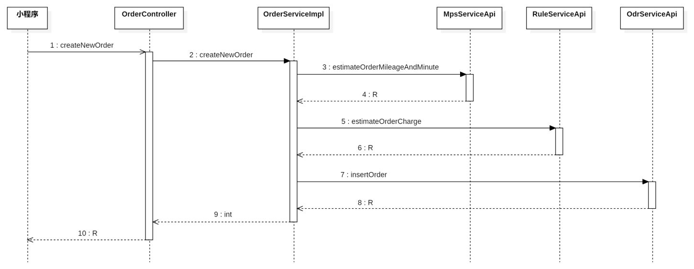

### 编写 Feign 客户端

在`<font style="color:#000000;background-color:rgba(220, 240, 255, 0.3) !important;">com.example.zxds.bff.customer.controller.form</font>`包中创建`<font style="color:#000000;background-color:rgba(220, 240, 255, 0.3) !important;">InsertOrderForm.java</font>`类

```java
package com.example.zxds.bff.customer.controller.form;

import io.swagger.v3.oas.annotations.media.Schema;
import lombok.Data;

import javax.validation.constraints.Min;
import javax.validation.constraints.NotBlank;
import javax.validation.constraints.NotNull;
import javax.validation.constraints.Pattern;

@Data
@Schema(description = "顾客下单的表单")
public class InsertOrderForm {
    @NotBlank(message = "uuid不能为空")
    @Pattern(regexp = "^[0-9A-Za-z]{32}$", message = "uuid内容不正确")
    @Schema(description = "uuid")
    private String uuid;

    @Schema(description = "客户ID")
    private Long customerId;

    @NotBlank(message = "startPlace不能为空")
    @Pattern(regexp = "[\\(\\)0-9A-Z#\\-_\\u4e00-\\u9fa5]{2,50}", message = "startPlace内容不正确")
    @Schema(description = "订单起点")
    private String startPlace;

    @NotBlank(message = "startPlaceLatitude不能为空")
    @Pattern(regexp = "^(([1-8]\\d?)|([1-8]\\d))(\\.\\d{1,18})|90|0(\\.\\d{1,18})?$", message = "startPlaceLatitude内容不正确")
    @Schema(description = "订单起点的纬度")
    private String startPlaceLatitude;

    @NotBlank(message = "startPlaceLongitude不能为空")
    @Pattern(regexp = "^(([1-9]\\d?)|(1[0-7]\\d))(\\.\\d{1,18})|180|0(\\.\\d{1,18})?$", message = "startPlaceLongitude内容不正确")
    @Schema(description = "订单起点的经度")
    private String startPlaceLongitude;

    @NotBlank(message = "endPlace不能为空")
    @Pattern(regexp = "[\\(\\)0-9A-Z#\\-_\\u4e00-\\u9fa5]{2,50}", message = "endPlace内容不正确")
    @Schema(description = "订单终点")
    private String endPlace;

    @NotBlank(message = "endPlaceLatitude不能为空")
    @Pattern(regexp = "^(([1-8]\\d?)|([1-8]\\d))(\\.\\d{1,18})|90|0(\\.\\d{1,18})?$", message = "endPlaceLatitude内容不正确")
    @Schema(description = "订单终点的纬度")
    private String endPlaceLatitude;

    @NotBlank(message = "endPlaceLongitude不能为空")
    @Pattern(regexp = "^(([1-9]\\d?)|(1[0-7]\\d))(\\.\\d{1,18})|180|0(\\.\\d{1,18})?$", message = "endPlaceLongitude内容不正确")
    @Schema(description = "订单终点的经度")
    private String endPlaceLongitude;

    @NotBlank(message = "expectsMileage不能为空")
    @Pattern(regexp = "^[1-9]\\d*\\.\\d+$|^0\\.\\d*[1-9]\\d*$|^[1-9]\\d*$", message = "expectsMileage内容不正确")
    @Schema(description = "预估代驾公里数")
    private String expectsMileage;

    @NotBlank(message = "expectsFee不能为空")
    @Pattern(regexp = "^[1-9]\\d*\\.\\d{1,2}$|^0\\.\\d{1,2}$|^[1-9]\\d*$", message = "expectsFee内容不正确")
    @Schema(description = "预估代驾费用")
    private String expectsFee;

    @NotBlank(message = "favourFee不能为空")
    @Pattern(regexp = "^[1-9]\\d*\\.\\d{1,2}$|^0\\.\\d{1,2}$|^[1-9]\\d*$", message = "favourFee内容不正确")
    @Schema(description = "顾客好处费")
    private String favourFee;

    @NotNull(message = "chargeRuleId不能为空")
    @Min(value = 1, message = "chargeRuleId不能小于1")
    @Schema(description = "规则ID")
    private Long chargeRuleId;

    @NotBlank(message = "carPlate不能为空")
    @Pattern(regexp = "^([京津沪渝冀豫云辽黑湘皖鲁新苏浙赣鄂桂甘晋蒙陕吉闽贵粤青藏川宁琼使领A-Z]{1}[A-Z]{1}(([0-9]{5}[DF])|([DF]([A-HJ-NP-Z0-9])[0-9]{4})))|([京津沪渝冀豫云辽黑湘皖鲁新苏浙赣鄂桂甘晋蒙陕吉闽贵粤青藏川宁琼使领A-Z]{1}[A-Z]{1}[A-HJ-NP-Z0-9]{4}[A-HJ-NP-Z0-9挂学警港澳]{1})$",
            message = "carPlate内容不正确")
    @Schema(description = "车牌号")
    private String carPlate;

    @NotBlank(message = "carType不能为空")
    @Pattern(regexp = "^[\\u4e00-\\u9fa5A-Za-z0-9\\-\\_\\s]{2,20}$", message = "carType内容不正确")
    @Schema(description = "车型")
    private String carType;

    @NotBlank(message = "date不能为空")
    @Pattern(regexp = "^((((1[6-9]|[2-9]\\d)\\d{2})-(0?[13578]|1[02])-(0?[1-9]|[12]\\d|3[01]))|(((1[6-9]|[2-9]\\d)\\d{2})-(0?[13456789]|1[012])-(0?[1-9]|[12]\\d|30))|(((1[6-9]|[2-9]\\d)\\d{2})-0?2-(0?[1-9]|1\\d|2[0-8]))|(((1[6-9]|[2-9]\\d)(0[48]|[2468][048]|[13579][26])|((16|[2468][048]|[3579][26])00))-0?2-29-))$", message = "date内容不正确")
    @Schema(description = "日期")
    private String date;

    @NotNull(message = "baseMileage不能为空")
    @Min(value = 1, message = "baseMileage不能小于1")
    @Schema(description = "基础里程（公里）")
    private Short baseMileage;

    @NotBlank(message = "baseMileagePrice不能为空")
    @Pattern(regexp = "^[1-9]\\d*\\.\\d{1,2}$|^0\\.\\d{1,2}$|^[1-9]\\d*$", message = "baseMileagePrice内容不正确")
    @Schema(description = "基础里程价格")
    private String baseMileagePrice;

    @NotBlank(message = "exceedMileagePrice不能为空")
    @Pattern(regexp = "^[1-9]\\d*\\.\\d{1,2}$|^0\\.\\d{1,2}$|^[1-9]\\d*$", message = "exceedMileagePrice内容不正确")
    @Schema(description = "超出基础里程的价格")
    private String exceedMileagePrice;

    @NotNull(message = "baseMinute不能为空")
    @Min(value = 1, message = "baseMinute不能小于1")
    @Schema(description = "基础分钟")
    private Short baseMinute;

    @NotBlank(message = "exceedMinutePrice不能为空")
    @Pattern(regexp = "^[1-9]\\d*\\.\\d{1,2}$|^0\\.\\d{1,2}$|^[1-9]\\d*$", message = "exceedMinutePrice内容不正确")
    @Schema(description = "超出基础分钟的价格")
    private String exceedMinutePrice;

    @NotNull(message = "baseReturnMileage不能为空")
    @Min(value = 1, message = "baseReturnMileage不能小于1")
    @Schema(description = "基础返程里程（公里）")
    private Short baseReturnMileage;

    @NotBlank(message = "exceedReturnPrice不能为空")
    @Pattern(regexp = "^[1-9]\\d*\\.\\d{1,2}$|^0\\.\\d{1,2}$|^[1-9]\\d*$", message = "exceedReturnPrice内容不正确")
    @Schema(description = "超出基础返程里程的价格")
    private String exceedReturnPrice;

}
```

在`<font style="color:#000000;background-color:rgba(220, 240, 255, 0.3) !important;">com.example.zxds.bff.customer.feign</font>`包中创建`<font style="color:#000000;background-color:rgba(220, 240, 255, 0.3) !important;">OdrServiceApi.java</font>`接口，声明抽象方法

```java
package com.example.zxds.bff.customer.feign;

import com.example.zxds.bff.customer.controller.form.InsertOrderForm;
import com.example.zxds.common.util.R;
import org.springframework.cloud.openfeign.FeignClient;
import org.springframework.web.bind.annotation.PostMapping;

@FeignClient(value = "zxds-odr")
public interface OdrServiceApi {

    @PostMapping("/order/insertOrder")
    R insertOrder(InsertOrderForm form);
}
```

### 编写 service 和实现

之前我们在`<font style="color:#000000;background-color:rgba(220, 240, 255, 0.3) !important;">OrderServiceImpl</font>`类的`<font style="color:#000000;background-color:rgba(220, 240, 255, 0.3) !important;">createNewOrder()</font>`方法里面调用了地图子系统和规则引擎子系统，现在该轮到调用订单子系统了。

```java
package com.example.zxds.bff.customer.service.impl;

import cn.hutool.core.date.DateTime;
import cn.hutool.core.map.MapUtil;
import cn.hutool.core.util.IdUtil;
import com.example.zxds.bff.customer.controller.form.CreateNewOrderForm;
import com.example.zxds.bff.customer.controller.form.EstimateOrderChargeForm;
import com.example.zxds.bff.customer.controller.form.EstimateOrderMileageAndMinuteForm;
import com.example.zxds.bff.customer.controller.form.InsertOrderForm;
import com.example.zxds.bff.customer.feign.MpsServiceApi;
import com.example.zxds.bff.customer.feign.OdrServiceApi;
import com.example.zxds.bff.customer.feign.RuleServiceApi;
import com.example.zxds.bff.customer.service.OrderService;
import com.example.zxds.common.util.R;
import io.seata.spring.annotation.GlobalTransactional;
import lombok.RequiredArgsConstructor;
import lombok.extern.slf4j.Slf4j;
import org.springframework.stereotype.Service;

import java.util.Map;

@Service
@Slf4j
@RequiredArgsConstructor
public class OrderServiceImpl implements OrderService {
    
    private final OdrServiceApi odrServiceApi;

    ......

    @Override
    @GlobalTransactional
    public int createNewOrder(CreateNewOrderForm form) {
        ......

        //TODO 搜索适合接单的司机
        //TODO 如果存在适合接单的司机就创建订单，否则就不创建订单

        /**
         * 生成订单记录
         */
        InsertOrderForm form4 = new InsertOrderForm();
        //UUID字符串，充当订单号，微信支付时候会用上
        form4.setUuid(IdUtil.simpleUUID());
        form4.setCustomerId(customerId);
        form4.setStartPlace(startPlace);
        form4.setStartPlaceLatitude(startPlaceLatitude);
        form4.setStartPlaceLongitude(startPlaceLongitude);
        form4.setEndPlace(endPlace);
        form4.setEndPlaceLatitude(endPlaceLatitude);
        form4.setEndPlaceLongitude(endPlaceLongitude);
        form4.setExpectsMileage(mileage);
        form4.setExpectsFee(expectsFee);
        form4.setFavourFee(favourFee);
        form4.setDate(new DateTime().toDateStr());
        form4.setChargeRuleId(Long.parseLong(chargeRuleId));
        form4.setCarPlate(form.getCarPlate());
        form4.setCarType(form.getCarType());
        form4.setBaseMileage(baseMileage);
        form4.setBaseMileagePrice(baseMileagePrice);
        form4.setExceedMileagePrice(exceedMileagePrice);
        form4.setBaseMinute(baseMinute);
        form4.setExceedMinutePrice(exceedMinutePrice);
        form4.setBaseReturnMileage(baseReturnMileage);
        form4.setExceedReturnPrice(exceedReturnPrice);


        r = odrServiceApi.insertOrder(form4);
        String orderId = MapUtil.getStr(r, "result");

        //TODO  发送通知给符合条件的司机抢单
        return 0;

    }

}
```

### 编写 web 方法

在`<font style="color:#000000;background-color:rgba(220, 240, 255, 0.3) !important;">com.example.zxds.bff.customer.controller</font>`包创建`<font style="color:#000000;background-color:rgba(220, 240, 255, 0.3) !important;">OrderController.java</font>`类

```java
package com.example.zxds.bff.customer.controller;


import cn.dev33.satoken.annotation.SaCheckLogin;
import cn.dev33.satoken.stp.StpUtil;
import com.example.zxds.bff.customer.controller.form.CreateNewOrderForm;
import com.example.zxds.bff.customer.service.OrderService;
import com.example.zxds.common.util.R;
import io.swagger.v3.oas.annotations.Operation;
import io.swagger.v3.oas.annotations.tags.Tag;
import lombok.RequiredArgsConstructor;
import org.springframework.web.bind.annotation.PostMapping;
import org.springframework.web.bind.annotation.RequestBody;
import org.springframework.web.bind.annotation.RequestMapping;
import org.springframework.web.bind.annotation.RestController;

import javax.validation.Valid;

@RestController
@RequestMapping("/order")
@Tag(name = "OrderController", description = "订单模块Web接口")
@RequiredArgsConstructor
public class OrderController {

    private final OrderService orderService;

    @PostMapping("/createNewOrder")
    @Operation(summary = "创建新订单")
    @SaCheckLogin
    public R createNewOrder(@RequestBody @Valid CreateNewOrderForm form) {
        Long customerId = StpUtil.getLoginIdAsLong();
        form.setCustomerId(customerId);
        int count = orderService.createNewOrder(form);
        return R.ok().put("count", count);
    }
}
```

### 测试 web 方法

运行`<font style="color:#000000;background-color:rgba(220, 240, 255, 0.3) !important;">zxds-odr</font>`、`<font style="color:#000000;background-color:rgba(220, 240, 255, 0.3) !important;">zxds-rule</font>`、`<font style="color:#000000;background-color:rgba(220, 240, 255, 0.3) !important;">zxds-mps</font>`、`<font style="color:#000000;background-color:rgba(220, 240, 255, 0.3) !important;">bff-customer</font>`子系统

**请求地址：**[http://localhost:8102/order/createNewOrder](http://localhost:8102/order/createNewOrder)

**请求参数：**

```json
{
  "startPlace": "北辰区北仓苍园小学(二小东路西)",
  "startPlaceLatitude": "39.219839",
  "startPlaceLongitude": "117.143268",
  "endPlace": "天津市南开区广开二马路",
  "endPlaceLatitude": "39.136852",
  "endPlaceLongitude": "117.1666",
  "favourFee": "15.00",
  "carPlate": "京A88888",
  "carType": "奔驰S级"
}
```

**请求头参数：乘客端小程序 token**

**响应结果：**

```json
{
        "msg": "success",
        "code": 200,
        "count": 0
}
```

## Redis 的 Geo 功能

创建订单成功后需要推送订单信息给附近的司机。假设司机端的小程序实时把自己的GPS定位上传，然后定位信息缓存到Redis里面。咱们怎么能利用Redis计算出，上车点方圆几公里的司机都有谁呢？这就需要使用Redis的Geo功能。

**进入 Redids docker 容器内部：**

```shell
docker exec -it redis /bin/bash
redis-cli
AUTH abc123456
```

Redis的Geo主要用于存储地理位置信息，并对存储的信息进行操作，该功能在 Redis 3.2 版本新增。 下面我们用`<font style="color:#000000;background-color:rgba(220, 240, 255, 0.3) !important;">GEOADD</font>`命令向Redis里面添加几个景点的定位。

```shell
GEOADD china 116.403963 39.915119 tiananmen 116.417876 39.915411 wangfujing 116.404354 39.904748 qianmen
```

然后我们`<font style="color:#000000;background-color:rgba(220, 240, 255, 0.3) !important;">GEORADIUS</font>`命令查询距离某个定位点1公里范围以内的景点有哪些。

```shell
GEORADIUS china 116.4000 39.9000 1 km WITHDIST
```

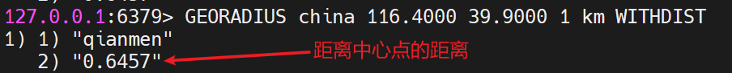

既然Redis的GEO命令可以帮我们提取出某个坐标点指定距离以内的景点，如果Redis里面缓存的是司机的定位信息，那么我们用代驾单的起点坐标来查询附近几公里以内的司机，是不是也可以？而且Redis的Geo计算是在内存中完成的，比MySQL的Geo计算快了上千倍。

有个需要特别注意的问题就是Geo中的定位我们没办法设置超时时间，所以我们想要知道哪些司机上线中，就得额外创建带有超时的缓存。

我的设想是缓存司机信息用的Key是`<font style="color:#000000;background-color:rgba(220, 240, 255, 0.3) !important;">driver_online#driverId</font>`，对应的Value是`**<font style="color:#000000;background-color:rgba(220, 240, 255, 0.3) !important;">接单距离#订单里程范围#定向接单的坐标</font>**`，超时时间为1分钟。

当系统接到订单之后，到Redis上面根据driverId查找缓存，找到了就是在线，找不到就是不在线。

# 位置微服务缓存司机实时定位

我们弄明白了Redis的GEO技术。咱们想要让Redis计算代驾起点周围几公里以内的司机，首先我们要把司机的定位信息缓存到GEO里面，然后还要额外创建司机上线缓存。（不能在 GEO 缓存中缓存司机在线状态，因为设置 GEO 缓存有效期后，GEO 缓存失效的话，所有司机的定位信息会被全部删除，因此要单独再维护一个司机在线的 Redis 缓存。）

## 编写 zxds-mps 子系统

更新司机位置的缓存：

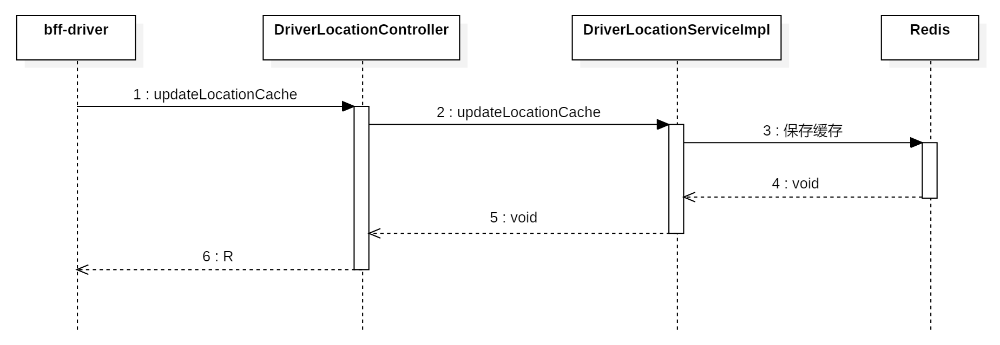

删除司机位置的缓存：

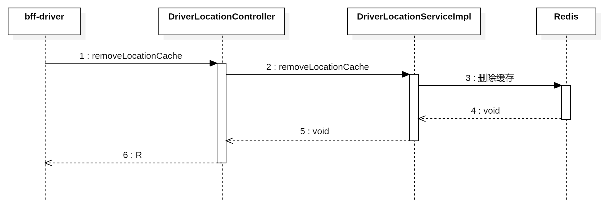

### 编写 service 和实现

在`<font style="color:#000000;background-color:rgba(220, 240, 255, 0.3) !important;">com.example.zxds.mps.service</font>`包`<font style="color:#000000;background-color:rgba(220, 240, 255, 0.3) !important;">DriverLocationService.java</font>`接口中，声明抽象方法

```java
package com.example.zxds.mps.service;

import java.util.Map;

public interface DriverLocationService {

    void updateLocationCache(Map<String, Object> param);

    void removeLocationCache(long driverId);
}
```

在`<font style="color:#000000;background-color:rgba(220, 240, 255, 0.3) !important;">com.example.zxds.mps.service.impl</font>`包`<font style="color:#000000;background-color:rgba(220, 240, 255, 0.3) !important;">DriverLocationServiceImpl.java</font>`类中，实现抽象方法

```java
package com.example.zxds.mps.service.impl;

import cn.hutool.core.convert.Convert;
import cn.hutool.core.map.MapUtil;
import com.example.zxds.mps.service.DriverLocationService;
import lombok.RequiredArgsConstructor;
import org.springframework.data.geo.Point;
import org.springframework.data.redis.core.RedisTemplate;
import org.springframework.stereotype.Service;

import java.util.Map;
import java.util.concurrent.TimeUnit;

@Service
@RequiredArgsConstructor
public class DriverLocationServiceImpl implements DriverLocationService {

    private final RedisTemplate redisTemplate;

    @Override
    public void updateLocationCache(Map<String, Object> param) {
        long driverId = MapUtil.getLong(param, "driverId");
        String latitude = MapUtil.getStr(param, "latitude");
        String longitude = MapUtil.getStr(param, "longitude");

        //接单范围
        int rangeDistance = MapUtil.getInt(param, "rangeDistance");
        //订单里程范围
        int orderDistance = MapUtil.getInt(param, "orderDistance");
        //封装成Point对象才能缓存到Redis里面
        Point point = new Point(Convert.toDouble(longitude), Convert.toDouble(latitude));
        /*
         * 把司机实时定位缓存到Redis里面，便于Geo定位计算
         * Geo是集合形式，如果设置过期时间，所有司机的定位缓存就全都失效了
         * 正确做法是司机上线后，更新GEO中的缓存定位
         */
        redisTemplate.opsForGeo().add("driver_location", point, driverId + "");

        //定向接单地址的经度
        String orientateLongitude = null;
        if (param.get("orientateLongitude") != null) {
            orientateLongitude = MapUtil.getStr(param, "orientateLongitude");
        }
        //定向接单地址的纬度
        String orientateLatitude = null;
        if (param.get("orientateLatitude") != null) {
            orientateLatitude = MapUtil.getStr(param, "orientateLatitude");
        }
        //定向接单经纬度的字符串
        String orientation = "none";
        if (orientateLongitude != null && orientateLatitude != null) {
            orientation = orientateLatitude + "," + orientateLongitude;
        }

        /*
         * 为了解决判断哪些司机在线，我们还要单独弄一个上线缓存
         * 缓存司机的接单设置（定向接单、接单范围、订单总里程），便于系统判断该司机是否符合接单条件
         */
        String temp = rangeDistance + "#" + orderDistance + "#" + orientation;
        redisTemplate.opsForValue().set("driver_online#" + driverId, temp, 60, TimeUnit.SECONDS);
    }

    @Override
    public void removeLocationCache(long driverId) {
        //删除司机定位缓存
        redisTemplate.opsForGeo().remove("driver_location", driverId + "");
        //删除司机上线缓存
        redisTemplate.delete("driver_online#" + driverId);
    }
}
```

### 编写 form 接收数据并校验

在`<font style="color:#000000;background-color:rgba(220, 240, 255, 0.3) !important;">com.example.zxds.mps.controller.form</font>`包中创建`<font style="color:#000000;background-color:rgba(220, 240, 255, 0.3) !important;">UpdateLocationCacheForm.java</font>`类

```java
package com.example.zxds.mps.controller.form;

import io.swagger.v3.oas.annotations.media.Schema;
import lombok.Data;
import org.hibernate.validator.constraints.Range;

import javax.validation.constraints.Min;
import javax.validation.constraints.NotBlank;
import javax.validation.constraints.NotNull;
import javax.validation.constraints.Pattern;

@Data
@Schema(description = "更新司机GPS坐标缓存的表单")
public class UpdateLocationCacheForm {

    @NotNull(message = "driverId不能为空")
    @Min(value = 1, message = "driverId不能小于1")
    @Schema(description = "司机ID")
    private Long driverId;

    @NotBlank(message = "latitude不能为空")
    @Pattern(regexp = "^(([1-8]\\d?)|([1-8]\\d))(\\.\\d{1,18})|90|0(\\.\\d{1,18})?$", message = "latitude内容不正确")
    @Schema(description = "纬度")
    private String latitude;

    @NotBlank(message = "longitude不能为空")
    @Pattern(regexp = "^(([1-9]\\d?)|(1[0-7]\\d))(\\.\\d{1,18})|180|0(\\.\\d{1,18})?$", message = "longitude内容不正确")
    @Schema(description = "经度")
    private String longitude;

    @NotNull(message = "rangeDistance不能为空")
    @Range(min = 1, max = 5, message = "rangeDistance范围错误")
    @Schema(description = "接收几公里内的订单")
    private Integer rangeDistance;

    @NotNull(message = "orderDistance不能为空")
    @Schema(description = "接收代驾里程几公里以上的订单")
    @Range(min = 0, max = 30, message = "orderDistance范围错误")
    private Integer orderDistance;

    @Pattern(regexp = "^(([1-9]\\d?)|(1[0-7]\\d))(\\.\\d{1,18})|180|0(\\.\\d{1,18})?$", message = "orientateLongitude内容不正确")
    @Schema(description = "定向接单的经度")
    private String orientateLongitude;

    @Pattern(regexp = "^(([1-8]\\d?)|([1-8]\\d))(\\.\\d{1,18})|90|0(\\.\\d{1,18})?$", message = "orientateLatitude内容不正确")
    @Schema(description = "定向接单的纬度")
    private String orientateLatitude;
}
```

在`<font style="color:#000000;background-color:rgba(220, 240, 255, 0.3) !important;">com.example.zxds.mps.controller.form</font>`包中创建`<font style="color:#000000;background-color:rgba(220, 240, 255, 0.3) !important;">RemoveLocationCacheForm.java</font>`类

```java
package com.example.zxds.mps.controller.form;

import io.swagger.v3.oas.annotations.media.Schema;
import lombok.Data;

import javax.validation.constraints.Min;
import javax.validation.constraints.NotNull;

@Data
@Schema(description = "删除司机定位缓存的表单")
public class RemoveLocationCacheForm {
    @NotNull(message = "driverId不能为空")
    @Min(value = 1, message = "driverId不能小于1")
    @Schema(description = "司机ID")
    private Long driverId;
}
```

### 编写 web 方法

在`<font style="color:#000000;background-color:rgba(220, 240, 255, 0.3) !important;">com.example.zxds.mps.controller</font>`包创建`<font style="color:#000000;background-color:rgba(220, 240, 255, 0.3) !important;">DriverLocationController.java</font>`类，声明Web方法

```java
package com.example.zxds.mps.controller;

import cn.hutool.core.bean.BeanUtil;
import com.example.zxds.common.util.R;
import com.example.zxds.mps.controller.form.RemoveLocationCacheForm;
import com.example.zxds.mps.controller.form.UpdateLocationCacheForm;
import com.example.zxds.mps.service.DriverLocationService;
import io.swagger.v3.oas.annotations.Operation;
import io.swagger.v3.oas.annotations.tags.Tag;
import lombok.RequiredArgsConstructor;
import org.springframework.web.bind.annotation.PostMapping;
import org.springframework.web.bind.annotation.RequestBody;
import org.springframework.web.bind.annotation.RequestMapping;
import org.springframework.web.bind.annotation.RestController;

import javax.validation.Valid;
import java.util.Map;

@RestController
@RequestMapping("/driver/location")
@RequiredArgsConstructor
@Tag(name = "DriverLocationController", description = "司机定位服务Web接口")
public class DriverLocationController {

    private final DriverLocationService driverLocationService;

    @PostMapping("/updateLocationCache")
    @Operation(summary = "更新司机GPS定位缓存")
    public R updateLocationCache(@RequestBody @Valid UpdateLocationCacheForm form) {
        //更新新的定位缓存
        Map<String, Object> param = BeanUtil.beanToMap(form);
        driverLocationService.updateLocationCache(param);
        return R.ok();
    }

    @PostMapping("/removeLocationCache")
    @Operation(summary = "删除司机GPS定位缓存")
    public R removeLocationCache(@RequestBody @Valid RemoveLocationCacheForm form) {
        driverLocationService.removeLocationCache(form.getDriverId());
        return R.ok();
    }
}
```

### 测试 web 方法

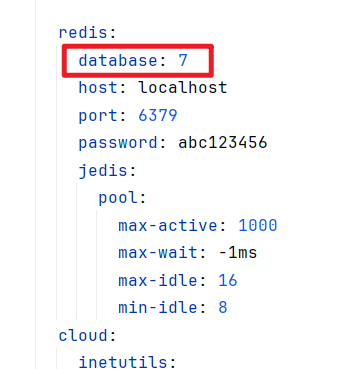

注意，咱们地图子系统设置的 redis 库是 7 号逻辑库。

## 编写 bff-driver 子系统

为了能让司机端上传GPS定位，我们要把`<font style="color:#000000;background-color:rgba(220, 240, 255, 0.3) !important;">bff-driver</font>`子系统的代码给实现了，时序图如下

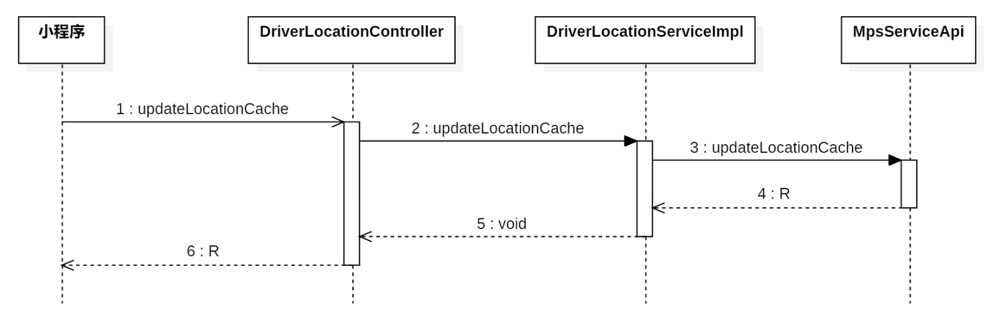

删除缓存的`<font style="color:#000000;background-color:rgba(220, 240, 255, 0.3) !important;">removeLocationCache()</font>`函数在司机开始接单或者停止接单的时候会被调用，等我们写到这部分代码的时候再去写`<font style="color:#000000;background-color:rgba(220, 240, 255, 0.3) !important;">DriverController</font>`也来得及

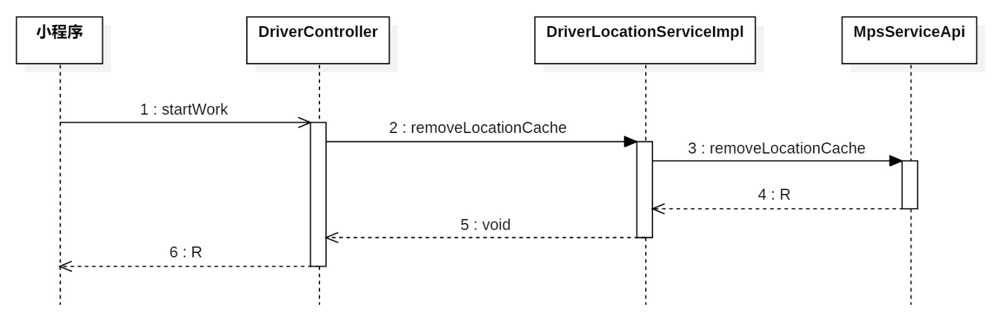

### 编写 Feign 客户端

在`<font style="color:#000000;background-color:rgba(220, 240, 255, 0.3) !important;">com.example.zxds.bff.driver.controller.form</font>`包中创建`<font style="color:#000000;background-color:rgba(220, 240, 255, 0.3) !important;">UpdateLocationCacheForm.java</font>`类

```java
package com.example.zxds.bff.driver.controller.form;

import io.swagger.v3.oas.annotations.media.Schema;
import lombok.Data;
import org.hibernate.validator.constraints.Range;

import javax.validation.constraints.NotBlank;
import javax.validation.constraints.NotNull;
import javax.validation.constraints.Pattern;

@Data
@Schema(description = "更新司机GPS坐标缓存的表单")
public class UpdateLocationCacheForm {

    @Schema(description = "司机ID")
    private Long driverId;

    @NotBlank(message = "latitude不能为空")
    @Pattern(regexp = "^(([1-8]\\d?)|([1-8]\\d))(\\.\\d{1,18})|90|0(\\.\\d{1,18})?$", message = "latitude内容不正确")
    @Schema(description = "纬度")
    private String latitude;

    @NotBlank(message = "longitude不能为空")
    @Pattern(regexp = "^(([1-9]\\d?)|(1[0-7]\\d))(\\.\\d{1,18})|180|0(\\.\\d{1,18})?$", message = "longitude内容不正确")
    @Schema(description = "经度")
    private String longitude;

    @NotNull(message = "rangeDistance不能为空")
    @Range(min = 1, max = 5, message = "rangeDistance范围错误")
    @Schema(description = "接收几公里内的订单")
    private Integer rangeDistance;

    @NotNull(message = "orderDistance不能为空")
    @Schema(description = "接收代驾里程几公里以上的订单")
    @Range(min = 0, max = 30, message = "orderDistance范围错误")
    private Integer orderDistance;

    @Pattern(regexp = "^(([1-9]\\d?)|(1[0-7]\\d))(\\.\\d{1,18})|180|0(\\.\\d{1,18})?$", message = "orientateLongitude内容不正确")
    @Schema(description = "定向接单的经度")
    private String orientateLongitude;

    @Pattern(regexp = "^(([1-8]\\d?)|([1-8]\\d))(\\.\\d{1,18})|90|0(\\.\\d{1,18})?$", message = "orientateLatitude内容不正确")
    @Schema(description = "定向接单的纬度")
    private String orientateLatitude;
}
```

在`<font style="color:#000000;background-color:rgba(220, 240, 255, 0.3) !important;">com.example.zxds.bff.driver.controller.form</font>`包中创建`<font style="color:#000000;background-color:rgba(220, 240, 255, 0.3) !important;">RemoveLocationCacheForm.java</font>`类

```java
package com.example.zxds.bff.driver.controller.form;

import io.swagger.v3.oas.annotations.media.Schema;
import lombok.Data;

@Data
@Schema(description = "删除司机定位缓存的表单")
public class RemoveLocationCacheForm {

    @Schema(description = "司机ID")
    private Long driverId;
}
```

在`<font style="color:#000000;background-color:rgba(220, 240, 255, 0.3) !important;">com.example.zxds.bff.driver.feign</font>`包中创建`<font style="color:#000000;background-color:rgba(220, 240, 255, 0.3) !important;">MpsServiceApi.java</font>`接口，声明抽象方法

```java
package com.example.zxds.bff.driver.feign;

import com.example.zxds.bff.driver.controller.form.RemoveLocationCacheForm;
import com.example.zxds.bff.driver.controller.form.UpdateLocationCacheForm;
import com.example.zxds.common.util.R;
import org.springframework.cloud.openfeign.FeignClient;
import org.springframework.web.bind.annotation.PostMapping;

@FeignClient(value = "zxds-mps")
public interface MpsServiceApi {

    @PostMapping("/driver/location/updateLocationCache")
    R updateLocationCache(UpdateLocationCacheForm form);

    @PostMapping("/driver/location/removeLocationCache")
    R removeLocationCache(RemoveLocationCacheForm form);
}
```

### 编写 service 和实现

在`<font style="color:#000000;background-color:rgba(220, 240, 255, 0.3) !important;">com.example.zxds.bff.driver.service</font>`包中创建`<font style="color:#000000;background-color:rgba(220, 240, 255, 0.3) !important;">DriverLocationService.java</font>`接口

```java
package com.example.zxds.bff.driver.service;

import com.example.zxds.bff.driver.controller.form.RemoveLocationCacheForm;
import com.example.zxds.bff.driver.controller.form.UpdateLocationCacheForm;

public interface DriverLocationService {

    void updateLocationCache(UpdateLocationCacheForm form);

    void removeLocationCache(RemoveLocationCacheForm form);
}
```

在`<font style="color:#000000;background-color:rgba(220, 240, 255, 0.3) !important;">com.example.zxds.bff.driver.service.impl</font>`包中创建`<font style="color:#000000;background-color:rgba(220, 240, 255, 0.3) !important;">DriverLocationServiceImpl.java</font>`类

```java
package com.example.zxds.bff.driver.service.impl;

import com.example.zxds.bff.driver.controller.form.RemoveLocationCacheForm;
import com.example.zxds.bff.driver.controller.form.UpdateLocationCacheForm;
import com.example.zxds.bff.driver.feign.MpsServiceApi;
import com.example.zxds.bff.driver.service.DriverLocationService;
import lombok.RequiredArgsConstructor;
import org.springframework.stereotype.Service;

@Service
@RequiredArgsConstructor
public class DriverLocationServiceImpl implements DriverLocationService {
    
    private final MpsServiceApi mpsServiceApi;

    @Override
    public void updateLocationCache(UpdateLocationCacheForm form) {
        mpsServiceApi.updateLocationCache(form);
    }

    @Override
    public void removeLocationCache(RemoveLocationCacheForm form) {
        mpsServiceApi.removeLocationCache(form);
    }

}
```

### 编写 web 方法

在`<font style="color:#000000;background-color:rgba(220, 240, 255, 0.3) !important;">com.example.zxds.bff.driver.controller</font>`包中创建`<font style="color:#000000;background-color:rgba(220, 240, 255, 0.3) !important;">DriverLocationController.java</font>`类

```java
package com.example.zxds.bff.driver.controller;

import cn.dev33.satoken.annotation.SaCheckLogin;
import cn.dev33.satoken.stp.StpUtil;
import com.example.zxds.bff.driver.controller.form.UpdateLocationCacheForm;
import com.example.zxds.bff.driver.service.DriverLocationService;
import com.example.zxds.common.util.R;
import io.swagger.v3.oas.annotations.Operation;
import io.swagger.v3.oas.annotations.tags.Tag;
import lombok.RequiredArgsConstructor;
import org.springframework.web.bind.annotation.PostMapping;
import org.springframework.web.bind.annotation.RequestBody;
import org.springframework.web.bind.annotation.RequestMapping;
import org.springframework.web.bind.annotation.RestController;

import javax.validation.Valid;

@RestController
@RequestMapping("/driver/location")
@Tag(name = "DriverLocationController", description = "司机定位服务Web接口")
@RequiredArgsConstructor
public class DriverLocationController {
    private final DriverLocationService locationService;

    @PostMapping("/updateLocationCache")
    @Operation(summary = "更新司机缓存GPS定位")
    @SaCheckLogin
    public R updateLocationCache(@RequestBody @Valid UpdateLocationCacheForm form) {
        long driverId = StpUtil.getLoginIdAsLong();
        form.setDriverId(driverId);
        locationService.updateLocationCache(form);
        return R.ok();
    }
}
```

### 测试 web 方法

**把**`**<font style="color:#000000;background-color:rgba(220, 240, 255, 0.3) !important;">zxds-mps</font>**`**、**`**<font style="color:#000000;background-color:rgba(220, 240, 255, 0.3) !important;">bff-driver</font>**`**子系统启动成功**

**请求地址：**[http://localhost:8101/driver/location/updateLocationCache](http://localhost:8101/driver/location/updateLocationCache)

**请求头参数：**司机端 token

**请求参数：**

```json
{
  "latitude": "39.219839",
  "longitude": "117.143268",
  "rangeDistance": 3,
  "orderDistance": 5,
  "orientateLongitude": "117.143268",
  "orientateLatitude": "39.219839"
}
```

**响应结果：**

```json
{
        "msg": "success",
        "code": 200
}
```

# 司机端实时上传定位

司机端小程序实时上传GPS定位

## 司机端实时上传 GPS 定位

在`<font style="color:#000000;background-color:rgba(220, 240, 255, 0.3) !important;">App.vue</font>`页面中，我们先开启实时GPS定位，然后用Ajax提交GPS定位给后端Java程序

```javascript
// onLaunch() 在 应用首次启动 时执行，是 App 端最早执行的生命周期函数
// 只执行一次：在整个应用的生命周期中，onLaunch() 只会执行一次。
onLaunch: function() {
    
    // 后面会用这个数组，用它来缓存GPS定位，例如：GPS定位达到20个之后，再向服务器发送一次请求，降低服务器压力。
    let gps = [];
    
    // 保持屏幕常亮，避免手机休眠
    // 用wx.setKeepScreenOn() 也可以。
    uni.setKeepScreenOn({
        keepScreenOn: true
    });
  
    //开启GPS后台刷新
    uni.startLocationUpdate({
        success(resp) {
            console.log('开启定位成功');
        },
        fail(resp) {
            console.log('开启定位失败');
            // 通知应用内的其他组件位置变化了。
            uni.$emit('updateLocation', null);
        }
    });
  
    //GPS定位变化就自动提交给后端
    //用uni.onLocationChange()也可以。
    wx.onLocationChange(function(resp) {
        // 维度
        let latitude = resp.latitude;
        // 经度
        let longitude = resp.longitude;
        // 速度（这是移动速度，单位m/s）后面业务要用。
        let speed = resp.speed;
        // 封装位置对象
        let location = { latitude: latitude, longitude: longitude };

        // 司机的工作状态都是放到Storage中的
        let workStatus = uni.getStorageSync('workStatus');
        //TODO 先暂时写死，以后要去掉这句话
        workStatus = '开始接单'
        /*
         * 上传司机GPS定位信息
         */
        let baseUrl = 'http://192.168.1.103:8201/zxds-driver'; // 咱们项目的App.vue页面用不了main.js文件，因此baseUrl在这里编写。
        if (workStatus == '开始接单') {
            // TODO 只在每分钟的前10秒上报定位信息，减小服务器压力
            // let current = new Date();
            // if (current.getSeconds() > 10) {
            //         return;
            // }

            // 司机自己的设置信息也是存储在Storage中的。
            let settings = uni.getStorageSync('settings');
            //TODO 先暂时写死，以后要去掉这句话
            settings = {
                orderDistance: 0,
                rangeDistance: 5,
                orientation: ''
            }
            let orderDistance = settings.orderDistance; // 订单的里程
            let rangeDistance = settings.rangeDistance; // 几公里范围内的
            let orientation = settings.orientation; // 定向接单坐标
          
            // 咱们的App.vue用不了main.js，因此用不了咱们自定义的发送ajax请求的工具。只能用原生的。
            uni.request({
                url: `${baseUrl}/driver/location/updateLocationCache`,
                method: 'POST',
                header: {
                    token: uni.getStorageSync('token')
                },
                data: {
                    latitude: latitude,
                    longitude: longitude,
                    orderDistance: orderDistance,
                    rangeDistance: rangeDistance,
                    orientateLongitude: orientation != '' ? orientation.longitude : null,
                    orientateLatitude: orientation != '' ? orientation.latitude : null
                },
                success: function(resp) {
                    if (resp.statusCode == 401) { // ajax请求响应状态码401表示没有登录。
                        uni.redirectTo({
                            url: '/pages/login/login'
                        });
                    } else if (resp.statusCode == 200 && resp.data.code == 200) {
                        let data = resp.data;
                        if (data.hasOwnProperty('token')) { // 如果响应数据中有token，把token先放到Storage中。
                            let token = data.token;
                            uni.setStorageSync('token', token);
                        }
                        console.log("定位更新成功")
                    } else {
                        console.error('更新GPS定位信息失败', resp.data);
                    }
                },
                fail: function(error) {
                    console.error('更新GPS定位信息失败', error);
                }
            });
        } else if (workStatus == '开始代驾') {
            //TODO 每凑够20个定位就上传一次，减少服务器的压力
        }

        //触发自定义事件（通知应用内的其他组件位置变化了。）
        uni.$emit('updateLocation', location);
    });
},
```

## 测试小程序

先把Redis中缓存的定位信息删除掉，然后把`<font style="color:#000000;background-color:rgba(220, 240, 255, 0.3) !important;">zxds-mps</font>`、`<font style="color:#000000;background-color:rgba(220, 240, 255, 0.3) !important;">zxds-odr</font>`、`<font style="color:#000000;background-color:rgba(220, 240, 255, 0.3) !important;">bff-driver</font>`、`<font style="color:#000000;background-color:rgba(220, 240, 255, 0.3) !important;">gateway</font>`子系统启动成功，然后必须登录司机端小程序，我们等待半分钟，看看Redis上面是否缓存了司机的定位。

# 地图微服务用 GEO 查找附近适合接单的司机

司机端的小程序可以实时上传定位坐标，并且Redis中保存了司机的**GEO缓存**和**上线缓存**。咱们回到创建订单这个业务主线上来，创建订单的过程中，我们要查找附近适合接单的司机。如果有这样的司机，订单才能创建，没有适合的司机，无法创建订单。

计算方圆几公里以内的司机，就得用上Redis的GEO计算。

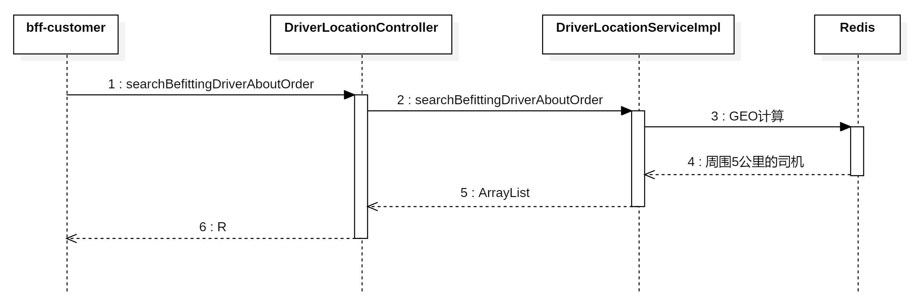

## 编写 service 和实现

在`<font style="color:#000000;background-color:rgba(220, 240, 255, 0.3) !important;">com.example.zxds.mps.service</font>`包`<font style="color:#000000;background-color:rgba(220, 240, 255, 0.3) !important;">DriverLocationService.java</font>`接口中，声明抽象方法。

```java
List<Map<String,Object>> searchBefittingDriverAboutOrder(double startPlaceLatitude,
                                                         double startPlaceLongitude,
                                                         double endPlaceLatitude,
                                                         double endPlaceLongitude,
                                                         double mileage);
```

在`<font style="color:#000000;background-color:rgba(220, 240, 255, 0.3) !important;">com.example.zxds.mps.service.impl</font>`包`<font style="color:#000000;background-color:rgba(220, 240, 255, 0.3) !important;">DriverLocationServiceImpl.java</font>`类中，实现抽象方法

```java
package com.example.zxds.mps.service.impl;

import cn.hutool.core.convert.Convert;
import cn.hutool.core.map.MapUtil;
import com.example.zxds.mps.service.DriverLocationService;
import com.example.zxds.mps.util.CoordinateTransform;
import lombok.RequiredArgsConstructor;
import org.gavaghan.geodesy.Ellipsoid;
import org.gavaghan.geodesy.GeodeticCalculator;
import org.gavaghan.geodesy.GeodeticCurve;
import org.gavaghan.geodesy.GlobalCoordinates;
import org.springframework.data.geo.*;
import org.springframework.data.redis.connection.RedisGeoCommands;
import org.springframework.data.redis.core.RedisTemplate;
import org.springframework.stereotype.Service;

import java.util.*;

import java.util.concurrent.TimeUnit;

@Service
@RequiredArgsConstructor
public class DriverLocationServiceImpl implements DriverLocationService {

    //........

    @Override
    public List<Map<String, Object>> searchBefittingDriverAboutOrder(double startPlaceLatitude, double startPlaceLongitude, double endPlaceLatitude, double endPlaceLongitude, double mileage) {
        //搜索订单起始点5公里以内的司机
        Point point = new Point(startPlaceLongitude, startPlaceLatitude);
        //设置GEO距离单位为千米
        Metric metric = RedisGeoCommands.DistanceUnit.KILOMETERS;
        Distance distance = new Distance(5, metric);
        Circle circle = new Circle(point, distance);

        //创建GEO参数
        RedisGeoCommands.GeoRadiusCommandArgs args = RedisGeoCommands.GeoRadiusCommandArgs.newGeoRadiusArgs()
                .includeDistance() //让结果中包含距离
                .includeCoordinates() //让结果中包含坐标
                .sortAscending(); //让结果升序排列

        //执行GEO计算，获得查询结果
        GeoResults<RedisGeoCommands.GeoLocation<String>> radius = redisTemplate.opsForGeo().radius("driver_location", circle, args);

        //需要通知的司机列表
        List<Map<String, Object>> list = new ArrayList<>();

        if (radius != null) {
            // redis的GEO的计算结果是可迭代的，获取迭代器
            Iterator<GeoResult<RedisGeoCommands.GeoLocation<String>>> iterator = radius.iterator();
            // 迭代每一个结果
            while (iterator.hasNext()) {
                GeoResult<RedisGeoCommands.GeoLocation<String>> result = iterator.next();
                // 获取内容
                RedisGeoCommands.GeoLocation<String> content = result.getContent();
                // 从内容中获取司机id
                String driverId = content.getName();
                // 距离中心点的距离
                double dist = result.getDistance().getValue();

                //排除 不在线的司机
                if (!redisTemplate.hasKey("driver_online#" + driverId)) {
                    continue;
                }

                //查找该司机的在线缓存
                Object obj = redisTemplate.opsForValue().get("driver_online#" + driverId);
                //如果查找的那一刻，缓存超时被置空，那么就忽略该司机
                if (obj == null) {
                    continue;
                }

                String value = obj.toString();
                String[] temp = value.split("#");
                int rangeDistance = Integer.parseInt(temp[0]);
                int orderDistance = Integer.parseInt(temp[1]);
                String orientation = temp[2];

                //判断是否符合接单范围
                boolean flag1 = dist <= rangeDistance;

                //判断订单里程是否符合
                boolean flag2 = false;
                if (orderDistance == 0) {
                    flag2 = true;
                } else if (orderDistance == 5 && mileage > 0 && mileage <= 5) {
                    flag2 = true;
                } else if (orderDistance == 10 && mileage > 5 && mileage <= 10) {
                    flag2 = true;
                } else if (orderDistance == 15 && mileage > 10 && mileage <= 15) {
                    flag2 = true;
                } else if (orderDistance == 30 && mileage > 15 && mileage <= 30) {
                    flag2 = true;
                }

                //判断定向接单是否符合
                boolean flag3 = false;
                if (!orientation.equals("none")) {
                    double orientationLatitude = Double.parseDouble(orientation.split(",")[0]);
                    double orientationLongitude = Double.parseDouble(orientation.split(",")[1]);
                    //把定向点的火星坐标转换成GPS坐标
                    double[] location = CoordinateTransform.transformGCJ02ToWGS84(orientationLongitude, orientationLatitude);
                    GlobalCoordinates point1 = new GlobalCoordinates(location[1], location[0]);
                    //把订单终点的火星坐标转换成GPS坐标
                    location = CoordinateTransform.transformGCJ02ToWGS84(endPlaceLongitude, endPlaceLatitude);
                    GlobalCoordinates point2 = new GlobalCoordinates(location[1], location[0]);
                    //这里不需要Redis的GEO计算，直接用封装函数计算两个GPS坐标之间的距离
                    GeodeticCurve geoCurve = new GeodeticCalculator().calculateGeodeticCurve(Ellipsoid.WGS84, point1, point2);

                    //如果定向点距离订单终点距离在3公里以内，说明这个订单和司机定向点是顺路的
                    if (geoCurve.getEllipsoidalDistance() <= 3000) {
                        flag3 = true;
                    }

                } else {
                    flag3 = true;
                }

                //匹配接单条件
                if (flag1 && flag2 && flag3) {
                    // 返回距离是因为要在司机端小程序播报订单的距离。（例如：距您3.2公里有一个订单....）
                    Map<String, Object> map = Map.of("driverId", driverId, "distance", dist);
                    list.add(map); //把该司机添加到需要通知的列表中
                }
            }
        }
        return list;
    }
}
```

**火星坐标（GCJ-02）是中国特有的地理坐标系，是在真实GPS坐标（WGS-84）基础上经过人为偏移加密后的坐标，主要用于国内地图服务。**

**GPS坐标（WGS-84）是国际标准**，全球通用。

如果你可以确定整个系统中所有地图都使用火星坐标系，可以不做转换。

## 编写 form 接收数据并校验

在`<font style="color:#000000;background-color:rgba(220, 240, 255, 0.3) !important;">com.example.zxds.mps.controller.form</font>`包中创建`<font style="color:#000000;background-color:rgba(220, 240, 255, 0.3) !important;">SearchBefittingDriverAboutOrderForm.java</font>`类

```java
package com.example.zxds.mps.controller.form;

import io.swagger.v3.oas.annotations.media.Schema;
import lombok.Data;

import javax.validation.constraints.NotBlank;
import javax.validation.constraints.Pattern;

@Data
@Schema(description = "查询符合某个订单接单的司机列表的表单")
public class SearchBefittingDriverAboutOrderForm {
    @NotBlank(message = "startPlaceLatitude不能为空")
    @Pattern(regexp = "^(([1-8]\\d?)|([1-8]\\d))(\\.\\d{1,18})|90|0(\\.\\d{1,18})?$", message = "startPlaceLatitude内容不正确")
    @Schema(description = "订单起点的纬度")
    private String startPlaceLatitude;

    @NotBlank(message = "startPlaceLongitude不能为空")
    @Pattern(regexp = "^(([1-9]\\d?)|(1[0-7]\\d))(\\.\\d{1,18})|180|0(\\.\\d{1,18})?$", message = "startPlaceLongitude内容不正确")
    @Schema(description = "订单起点的经度")
    private String startPlaceLongitude;

    @NotBlank(message = "endPlaceLatitude不能为空")
    @Pattern(regexp = "^(([1-8]\\d?)|([1-8]\\d))(\\.\\d{1,18})|90|0(\\.\\d{1,18})?$", message = "endPlaceLatitude内容不正确")
    @Schema(description = "订单终点的纬度")
    private String endPlaceLatitude;

    @NotBlank(message = "endPlaceLongitude不能为空")
    @Pattern(regexp = "^(([1-9]\\d?)|(1[0-7]\\d))(\\.\\d{1,18})|180|0(\\.\\d{1,18})?$", message = "endPlaceLongitude内容不正确")
    @Schema(description = "订单起点的经度")
    private String endPlaceLongitude;

    @NotBlank(message = "mileage不能为空")
    @Pattern(regexp = "^[1-9]\\d*\\.\\d+$|^0\\.\\d*[1-9]\\d*$|^[1-9]\\d*$", message = "mileage内容不正确")
    @Schema(description = "预估里程")
    private String mileage;
}
```

## 编写 web 方法

在`<font style="color:#000000;background-color:rgba(220, 240, 255, 0.3) !important;">com.example.zxds.mps.controller</font>`包`<font style="color:#000000;background-color:rgba(220, 240, 255, 0.3) !important;">DriverLocationController.java</font>`中，声明Web方法

```java
@PostMapping("/searchBefittingDriverAboutOrder")
@Operation(summary = "查询符合某个订单接单的司机列表")
public R searchBefittingDriverAboutOrder(@RequestBody @Valid SearchBefittingDriverAboutOrderForm form) {
    double startPlaceLatitude = Double.parseDouble(form.getStartPlaceLatitude());
    double startPlaceLongitude = Double.parseDouble(form.getStartPlaceLongitude());
    double endPlaceLatitude = Double.parseDouble(form.getEndPlaceLatitude());
    double endPlaceLongitude = Double.parseDouble(form.getEndPlaceLongitude());
    double mileage = Double.parseDouble(form.getMileage());
    List<Map<String, Object>> list = driverLocationService.searchBefittingDriverAboutOrder(startPlaceLatitude, startPlaceLongitude, endPlaceLatitude, endPlaceLongitude, mileage);
    return R.ok().put("result", list);
}
```

## 测试 web 方法

把`<font style="color:#000000;background-color:rgba(220, 240, 255, 0.3) !important;">zxds-dr</font>`、`<font style="color:#000000;background-color:rgba(220, 240, 255, 0.3) !important;">zxds-mps</font>`、`<font style="color:#000000;background-color:rgba(220, 240, 255, 0.3) !important;">zxds-odr</font>`、`<font style="color:#000000;background-color:rgba(220, 240, 255, 0.3) !important;">bff-driver</font>`、`<font style="color:#000000;background-color:rgba(220, 240, 255, 0.3) !important;">gateway</font>`这些子系统都启动了，然后在司机小程序上面登录，保持实时上传司机的GPS定位。我们之前默认设置的司机接单范围是 5 公里，在测试的时候，找一个距离当前乘客手机定位点 5 公里以外的坐标，再找一个 5 公里以内的坐标，看看执行结果中有没有合适的接单司机。

**请求地址：**[http://localhost:8004/driver/location/searchBefittingDriverAboutOrder](http://localhost:8004/driver/location/searchBefittingDriverAboutOrder)

**请求参数：**

```json
{
    "startPlaceLatitude": "39.146868",
    "startPlaceLongitude": "117.149277",
    "endPlaceLatitude": "39.117383",
    "endPlaceLongitude": "117.18489",
    "mileage": "10"
}
```

**响应结果：**

```json
{
        "msg": "success",
        "result": [
                {
                        "driverId": "2010249163039707136",
                        "distance": "2.404"
                }
        ],
        "code": 200
}
```

# bff-customer 子系统继续编写下单逻辑

现在我们可以计算出附近适合接单的司机了，接下来我们要在`<font style="color:#000000;background-color:rgba(220, 240, 255, 0.3) !important;">bff-cusomer</font>`子系统上面调用刚才写的Web方法，继续编写客户的下单逻辑：


## 编写 Feign 客户端

在`<font style="color:#000000;background-color:rgba(220, 240, 255, 0.3) !important;">com.example.zxds.bff.customer.controller.form</font>`包中创建`<font style="color:#000000;background-color:rgba(220, 240, 255, 0.3) !important;">SearchBefittingDriverAboutOrderForm.java</font>`类

```java
package com.example.zxds.bff.customer.controller.form;

import io.swagger.v3.oas.annotations.media.Schema;
import lombok.Data;

import javax.validation.constraints.NotBlank;
import javax.validation.constraints.Pattern;

@Data
@Schema(description = "查询符合某个订单接单的司机列表的表单")
public class SearchBefittingDriverAboutOrderForm {
    @NotBlank(message = "startPlaceLatitude不能为空")
    @Pattern(regexp = "^(([1-8]\\d?)|([1-8]\\d))(\\.\\d{1,18})|90|0(\\.\\d{1,18})?$", message = "startPlaceLatitude内容不正确")
    @Schema(description = "订单起点的纬度")
    private String startPlaceLatitude;

    @NotBlank(message = "startPlaceLongitude不能为空")
    @Pattern(regexp = "^(([1-9]\\d?)|(1[0-7]\\d))(\\.\\d{1,18})|180|0(\\.\\d{1,18})?$", message = "startPlaceLongitude内容不正确")
    @Schema(description = "订单起点的经度")
    private String startPlaceLongitude;

    @NotBlank(message = "endPlaceLatitude不能为空")
    @Pattern(regexp = "^(([1-8]\\d?)|([1-8]\\d))(\\.\\d{1,18})|90|0(\\.\\d{1,18})?$", message = "endPlaceLatitude内容不正确")
    @Schema(description = "订单终点的纬度")
    private String endPlaceLatitude;

    @NotBlank(message = "endPlaceLongitude不能为空")
    @Pattern(regexp = "^(([1-9]\\d?)|(1[0-7]\\d))(\\.\\d{1,18})|180|0(\\.\\d{1,18})?$", message = "endPlaceLongitude内容不正确")
    @Schema(description = "订单起点的经度")
    private String endPlaceLongitude;

    @NotBlank(message = "mileage不能为空")
    @Pattern(regexp = "^[1-9]\\d*\\.\\d+$|^0\\.\\d*[1-9]\\d*$|^[1-9]\\d*$", message = "mileage内容不正确")
    @Schema(description = "预估里程")
    private String mileage;
}
```

在`<font style="color:#000000;background-color:rgba(220, 240, 255, 0.3) !important;">com.example.zxds.bff.customer.feign</font>`包`<font style="color:#000000;background-color:rgba(220, 240, 255, 0.3) !important;">MpsServiceApi.java</font>`接口中，定义抽象方法

```java
@PostMapping("/driver/location/searchBefittingDriverAboutOrder")
R searchBefittingDriverAboutOrder(SearchBefittingDriverAboutOrderForm form);
```

## 编写 service 和实现

在`<font style="color:#000000;background-color:rgba(220, 240, 255, 0.3) !important;">com.example.zxds.bff.customer.service.impl</font>`包`<font style="color:#000000;background-color:rgba(220, 240, 255, 0.3) !important;">OrderServiceImpl.java</font>`类中，我们要继续的编写`<font style="color:#000000;background-color:rgba(220, 240, 255, 0.3) !important;">createNewOrder()</font>`函数，我们之前 `<font style="color:#000000;">createNewOrder()</font>`方法在设计的时候返回 `<font style="color:#000000;">int</font>`类型，我们把这个返回值类型修改为 `<font style="color:#000000;">Map<String, Object></font>`，因为我们不仅要返回适合接单的司机数量，还要返回 `<font style="color:#000000;">orderId</font>`，因此我们返回值类型修改为：`<font style="color:#000000;">Map<String, Object></font>`

**以下代码有一部分是之前已经写过的，一部分是新增的，请仔细观察：**

```java
package com.example.zxds.bff.customer.service.impl;

import cn.hutool.core.date.DateTime;
import cn.hutool.core.map.MapUtil;
import cn.hutool.core.util.IdUtil;
import com.example.zxds.bff.customer.controller.form.*;
import com.example.zxds.bff.customer.feign.MpsServiceApi;
import com.example.zxds.bff.customer.feign.OdrServiceApi;
import com.example.zxds.bff.customer.feign.RuleServiceApi;
import com.example.zxds.bff.customer.service.OrderService;
import com.example.zxds.common.util.R;
import io.seata.spring.annotation.GlobalTransactional;
import lombok.RequiredArgsConstructor;
import lombok.extern.slf4j.Slf4j;
import org.springframework.stereotype.Service;

import java.util.HashMap;
import java.util.List;
import java.util.Map;

@Service
@Slf4j
@RequiredArgsConstructor
public class OrderServiceImpl implements OrderService {
    private final OdrServiceApi odrServiceApi;
    private final MpsServiceApi mpsServiceApi;
    private final RuleServiceApi ruleServiceApi;

    @Override
    @GlobalTransactional
    public Map<String, Object> createNewOrder(CreateNewOrderForm form) {
        Long customerId = form.getCustomerId();
        String startPlace = form.getStartPlace();
        String startPlaceLatitude = form.getStartPlaceLatitude();
        String startPlaceLongitude = form.getStartPlaceLongitude();
        String endPlace = form.getEndPlace();
        String endPlaceLatitude = form.getEndPlaceLatitude();
        String endPlaceLongitude = form.getEndPlaceLongitude();
        String favourFee = form.getFavourFee();
        /**
         * 【重新预估里程和时间】
         * 虽然下单前，系统会预估里程和时长，但是有可能顾客在下单页面停留时间过长，
         * 然后再按下单键，这时候路线和时长可能都有变化，所以需要重新预估里程和时间
         */
        EstimateOrderMileageAndMinuteForm form1 = new EstimateOrderMileageAndMinuteForm();
        form1.setMode("driving");
        form1.setStartPlaceLatitude(startPlaceLatitude);
        form1.setStartPlaceLongitude(startPlaceLongitude);
        form1.setEndPlaceLatitude(endPlaceLatitude);
        form1.setEndPlaceLongitude(endPlaceLongitude);
        R r = mpsServiceApi.estimateOrderMileageAndMinute(form1);
        Map<String, Object> map = (Map<String, Object>) r.get("result");
        String mileage = MapUtil.getStr(map, "mileage");
        int minute = MapUtil.getInt(map, "minute");

        /**
         * 重新估算订单金额
         */
        EstimateOrderChargeForm form2 = new EstimateOrderChargeForm();
        form2.setMileage(mileage);
        form2.setTime(new DateTime().toTimeStr());
        r = ruleServiceApi.estimateOrderCharge(form2);
        map = (Map<String, Object>) r.get("result");
        String expectsFee = MapUtil.getStr(map, "amount");
        String chargeRuleId = MapUtil.getStr(map, "chargeRuleId");
        short baseMileage = MapUtil.getShort(map, "baseMileage");
        String baseMileagePrice = MapUtil.getStr(map, "baseMileagePrice");
        String exceedMileagePrice = MapUtil.getStr(map, "exceedMileagePrice");
        short baseMinute = MapUtil.getShort(map, "baseMinute");
        String exceedMinutePrice = MapUtil.getStr(map, "exceedMinutePrice");
        short baseReturnMileage = MapUtil.getShort(map, "baseReturnMileage");
        String exceedReturnPrice = MapUtil.getStr(map, "exceedReturnPrice");

        // ~~~~~~~~~这里是新增的代码~~~~~~~~~
        // 搜索适合接单的司机
        SearchBefittingDriverAboutOrderForm form_3 = new SearchBefittingDriverAboutOrderForm();
        form_3.setStartPlaceLatitude(startPlaceLatitude);
        form_3.setStartPlaceLongitude(startPlaceLongitude);
        form_3.setEndPlaceLatitude(endPlaceLatitude);
        form_3.setEndPlaceLongitude(endPlaceLongitude);
        form_3.setMileage(mileage);
        r = mpsServiceApi.searchBefittingDriverAboutOrder(form_3);
        List<Map<String, Object>> list = (List<Map<String, Object>>) r.get("result");

        // ~~~~~~~~~这里是新增的代码~~~~~~~~~
        // 如果存在适合接单的司机就创建订单，否则就不创建订单
        Map<String, Object> result = new HashMap<>();
        result.put("count", list.size());
        if(list.size() > 0){
            // 有适合接单的司机，创建订单（~~~~~~~~~这个代码之前写过，只不过需要挪到if分支中~~~~~~~~~）
            InsertOrderForm form4 = new InsertOrderForm();
            //UUID字符串，充当订单号，微信支付时候会用上
            form4.setUuid(IdUtil.simpleUUID());
            form4.setCustomerId(customerId);
            form4.setStartPlace(startPlace);
            form4.setStartPlaceLatitude(startPlaceLatitude);
            form4.setStartPlaceLongitude(startPlaceLongitude);
            form4.setEndPlace(endPlace);
            form4.setEndPlaceLatitude(endPlaceLatitude);
            form4.setEndPlaceLongitude(endPlaceLongitude);
            form4.setExpectsMileage(mileage);
            form4.setExpectsFee(expectsFee);
            form4.setFavourFee(favourFee);
            form4.setDate(new DateTime().toDateStr());
            form4.setChargeRuleId(Long.parseLong(chargeRuleId));
            form4.setCarPlate(form.getCarPlate());
            form4.setCarType(form.getCarType());
            form4.setBaseMileage(baseMileage);
            form4.setBaseMileagePrice(baseMileagePrice);
            form4.setExceedMileagePrice(exceedMileagePrice);
            form4.setBaseMinute(baseMinute);
            form4.setExceedMinutePrice(exceedMinutePrice);
            form4.setBaseReturnMileage(baseReturnMileage);
            form4.setExceedReturnPrice(exceedReturnPrice);

            r = odrServiceApi.insertOrder(form4);
            String orderId = MapUtil.getStr(r, "result");

            //TODO  发送通知给符合条件的司机抢单

            // ~~~~~~~~~这是新增代码~~~~~~~~~
            result.put("orderId", orderId);
        }
        
        // ~~~~~~~~~返回值变为Map集合~~~~~~~~~
        return result;
    }
}
```

因为重构了`<font style="color:#000000;background-color:rgba(220, 240, 255, 0.3) !important;">createOrder()</font>`方法的返回值类型，那么Web方法也要做修改。在`<font style="color:#000000;background-color:rgba(220, 240, 255, 0.3) !important;">OrderController</font>`类中，我们把代码修改一下

```java
@PostMapping("/createNewOrder")
@Operation(summary = "创建新订单")
@SaCheckLogin
public R createNewOrder(@RequestBody @Valid CreateNewOrderForm form) {
    Long customerId = StpUtil.getLoginIdAsLong();
    form.setCustomerId(customerId);
    // ~~~~~~~~~~~~这里的返回值修改一下~~~~~~~~~~~~~~~~
    Map<String, Object> result = orderService.createNewOrder(form);
    return R.ok().put("result", result);
}
```

## 测试 web 方法

把`<font style="color:#000000;background-color:rgba(220, 240, 255, 0.3) !important;">zxds-dr</font>`、`<font style="color:#000000;background-color:rgba(220, 240, 255, 0.3) !important;">zxds-cst</font>`、`<font style="color:#000000;background-color:rgba(220, 240, 255, 0.3) !important;">zxds-mps</font>`、`<font style="color:#000000;background-color:rgba(220, 240, 255, 0.3) !important;">zxds-odr</font>`、`<font style="color:#000000;background-color:rgba(220, 240, 255, 0.3) !important;">bff-driver</font>`、`<font style="color:#000000;background-color:rgba(220, 240, 255, 0.3) !important;">bff-customer</font>`、`<font style="color:#000000;background-color:rgba(220, 240, 255, 0.3) !important;">zxds-rule</font>`、`<font style="color:#000000;background-color:rgba(220, 240, 255, 0.3) !important;">gateway</font>`这些子系统都启动，然后在司机小程序上面登录，保持实时上传司机的GPS定位。

**请求地址：**[http://localhost:8102/order/createNewOrder](http://localhost:8102/order/createNewOrder)

**请求头参数：**乘客端小程序 token

**请求参数：**

```json
{
    "startPlace": "南开区长虹公园地铁站(黄河道)",
    "startPlaceLatitude": "39.137778",
    "startPlaceLongitude": "117.14946",
    "endPlace": "南开区天津市南开中学(南院)",
    "endPlaceLatitude": "39.129608",
    "endPlaceLongitude": "117.170362",
    "favourFee": "0.0",
    "carPlate": "津A88888",
    "carType": "宝马535Li"
}
```

**响应结果：**

```json
{
        "msg": "success",
        "result": {
                "orderId": "2015305742583738368",
                "count": 1
        },
        "code": 200
}
```

# 乘客小程序端下单

## 修正选择车辆代码

创建订单的时候我们要上传车型和车牌，所以选择好车型和车牌后，页面跳转的时候我们要把这两个数据传递给`<font style="color:#000000;background-color:rgba(220, 240, 255, 0.3) !important;">create_order</font>`页面。之前写的代码中没有传，我们这里补充一下。

打开乘客端小程序的 `<font style="color:#000000;">pages/car_list/car_list.vue</font>`页面，将 `<font style="color:#000000;">@tap="choseOneHandle(one.id, one.carPlate)"</font>`代码修改为 `<font style="color:#000000;">@tap="choseOneHandle(one.id, one.carPlate, one.carType)"</font>`。

```html
<view v-if="list.length > 0" v-for="one in list" class="row" 
  @tap="choseOneHandle(one.id, one.carPlate, one.carType)" 
  @longpress="removeHandle(one.id)">
    <view>
        <u-icon name="info-circle-fill" color="#2979ff" size="35" class="icon"></u-icon>
        <text class="car-type">{{ one.carType }}</text>
    </view>
    <text class="car-plate">{{ one.carPlate }}</text>
</view>
```

对应的回调函数 `<font style="color:#000000;">choseOneHandle</font>`也要修改：

```javascript
choseOneHandle(id, carPlate, carType) {
    uni.navigateTo({
        url: `../create_order/create_order?showCar=true&carId=${id}&carPlate=${carPlate}&carType=${carType}`
    });
}
```

另外，在 `<font style="color:#000000;">pages/create_order/create_order.vue</font>`页面的 `<font style="color:#000000;">onLoad()</font>`函数中也需要添加以下代码：

```javascript
if (options.hasOwnProperty('showCar')) {
  that.showCar = options.showCar;
  that.carId = options.carId;
  that.carPlate = options.carPlate;
  // 这里是新增的代码
  that.carType = options.carType;
}
```

## 定义全局 URL

在 `<font style="color:#000000;">main.js</font>`文件中添加全局 URL

```javascript
Vue.prototype.url = {
    ……,
    createNewOrder: `${baseUrl}/order/createNewOrder`,
}
```

## 创建代驾订单


在`<font style="color:#000000;background-color:rgba(220, 240, 255, 0.3) !important;">create_order.vue</font>`页面，因为创建完订单之后，页面上要显示等待司机接单的提示窗口以及里面的倒计时。每隔5秒钟要发起一次Ajax请求，查询接单情况，这个和我们模型层以下数据有关系：

```javascript
data() {
    return {
        ……,
        showPopup: false,
        timestamp: 15 * 60,
        orderId: null
    };
},
```

下面我们给页面上的“确定下单”按钮添加点击事件回调函数。

```html
<button class="btn" @tap="createOrderHandle">确定下单</button>
```

在`<font style="color:#000000;background-color:rgba(220, 240, 255, 0.3) !important;">createOrderHandle()</font>`函数里面，我们先要做前端验证，然后再提交Ajax请求创建订单

```javascript
createOrderHandle() {
    let that = this;
    //前端验证
    if (that.carType == null || that.carPlate == null) {
        uni.showToast({
            icon: 'error',
            title: '没有设置代驾车辆'
        });
        return;
    }

    uni.showLoading({
        title: '下单中请稍后'
    });
    
    setTimeout(function() {
        // 最多显示1分钟
        uni.hideLoading();
    }, 60000);        
    // 准备要提交的数据
    let data = {
        startPlace: that.from.address,
        startPlaceLatitude: that.from.latitude,
        startPlaceLongitude: that.from.longitude,
        endPlace: that.to.address,
        endPlaceLatitude: that.to.latitude,
        endPlaceLongitude: that.to.longitude,
        favourFee: '0.0',
        carPlate: that.carPlate,
        carType: that.carType
    };
    that.ajax(that.url.createNewOrder, 'POST', data, function(resp) {
        uni.hideLoading();
        if (resp.data.result.count > 0) {
            uni.showToast({
                icon: 'success',
                title: '订单创建成功'
            });
            setTimeout(function() {
                that.orderId = resp.data.result.orderId;
                //显示等待接单的弹窗
                that.showPopup = true;
                //启动 等待接单弹窗 上的倒计时
                that.$refs.uCountDown.start();
            }, 2000);
        } else {
            uni.showToast({
                icon: 'none',
                title: '没有适合接单的司机'
            });
        }
    });
},
```

等待接单的弹窗对应的视图层的组件是以下代码，是 `<font style="color:#000000;">uView</font>`组件库中提供的，可以了解一下：

```html
<u-popup v-model="showPopup" mode="center" width="600" height="350" :mask-close-able="false">
                        <view class="popup-title">您的订单正在等待司机接单</view>
                        <view class="count-down">
                                <u-count-down
                                        ref="uCountDown"
                                        :timestamp="timestamp"
                                        :autoplay="false"
                                        separator="zh"
                                        :show-hours="false"
                                        :show-border="true"
                                        bg-color="#DDF0FF"
                                        separator-color="#0083F3"
                                        border-color="#0D90FF"
                                        color="#0D90FF"
                                        font-size="32"
                                        @end="countEndHandle"
                                        @change="countChangeHandle"
                                ></u-count-down>
                        </view>
                        <button class="btn" @tap="cancelHandle">取消订单</button>
                </u-popup>
```

## 测试订单的创建

把`<font style="color:#000000;background-color:rgba(220, 240, 255, 0.3) !important;">zxds-dr</font>`、`<font style="color:#000000;background-color:rgba(220, 240, 255, 0.3) !important;">zxds-cst</font>`、`<font style="color:#000000;background-color:rgba(220, 240, 255, 0.3) !important;">zxds-mps</font>`、`<font style="color:#000000;background-color:rgba(220, 240, 255, 0.3) !important;">bff-customer</font>`、`<font style="color:#000000;background-color:rgba(220, 240, 255, 0.3) !important;">bff-driver</font>`、`<font style="color:#000000;background-color:rgba(220, 240, 255, 0.3) !important;">zxds-odr</font>`、`<font style="color:#000000;background-color:rgba(220, 240, 255, 0.3) !important;">zxds-rule</font>`、`<font style="color:#000000;background-color:rgba(220, 240, 255, 0.3) !important;">gateway</font>`这些子系统都运行起来。

需要保证每隔半分钟调用一次`<font style="color:#000000;background-color:rgba(220, 240, 255, 0.3) !important;">bff-driver</font>`子系统的Web方法，上传司机的定位信息，这个定位要距离乘客端定位不超过5公里以内。

乘客端启用真机调试，看看能不能下单成功。

**司机端上传定位的 web 接口地址：**

- 不通过网关：[http://localhost:8101/driver/location/updateLocationCache](http://localhost:8101/driver/location/updateLocationCache)
- 通过网关：[http://localhost:8201/zxds-driver/driver/location/updateLocationCache](http://localhost:8101/driver/location/updateLocationCache)

**请求头参数：司机端小程序的 token**

**请求参数：**

```json
{
    "latitude": "39.146453",
    "longitude": "117.149419",
    "orderDistance": "0",
    "rangeDistance": "5"
}
```

以上接口每半分钟执行一次，要保证司机的定位信息上传到 redis。

启动乘客端的真机调试，看看能不能下单成功。

# 项目中使用 RabbitMQ

## 为什么选择 RabbitMQ 而非 Kafka

**业务场景匹配度**

```plaintext
代驾系统核心流程：
用户下单 → 系统派单 → 司机接单 → 开始服务 → 完成结算

特点：
- 消息量适中（非海量数据）
- 需要精确路由和可靠投递
- 每条消息都很重要，不能丢失
- 有明确的消费者（特定司机）
```

| **考量维度** | **代驾系统需求** | **RabbitMQ 优势** | **Kafka 劣势** |
| --- | --- | --- | --- |
| **消息路由** | 需要精确推送给特定司机 | Exchange + Routing Key 精确路由 | Topic + Partition，消费者需过滤 |
| **消息确认** | 必须确保司机收到订单 | 完善的ACK机制，可重试 | At-least-once语义，可能重复 |
| **消息优先级** | 紧急订单优先处理 | 支持消息优先级 | 不支持（FIFO顺序） |
| **消息TTL** | 订单超时自动取消 | 原生支持消息/队列TTL | 仅支持整体保留时间 |
| **死信队列** | 处理失败订单 | 内置死信交换器 | 需要额外实现 |
| **实时性** | 秒级响应 | 毫秒级延迟 | 吞吐优先，延迟较高 |

## 我们主要使用哪种模式

我们主要使用发布订阅模式，并且交换机类型使用 `<font style="color:#000000;">Direct</font>`类型：**每一个司机都有自己的消息队列。每个消息队列的路由键采用 **`**<font style="color:#000000;">driverId</font>**`。

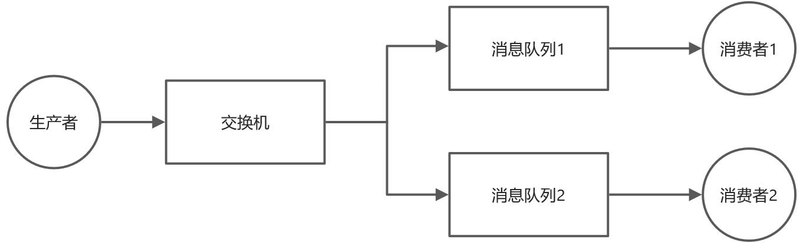

## SpringBoot 项目配置 RabbitMQ

在 `<font style="color:#000000;">zxds-snm</font>`子系统的 `<font style="color:#000000;">application.yml</font>`中进行如下配置：**这个我们在最初的初始化项目中已经配置了**

```yaml
rabbitmq:
  host: localhost
  port: 5672
  username: guest
  password: guest
```

在`<font style="color:#000000;background-color:rgba(220, 240, 255, 0.3) !important;">com.example.zxds.snm.config</font>`包中创建`<font style="color:#000000;background-color:rgba(220, 240, 255, 0.3) !important;">RabbitMQConfig</font>`类：

```java
package com.example.zxds.snm.config;

import org.springframework.amqp.core.DirectExchange;
import org.springframework.amqp.rabbit.connection.CachingConnectionFactory;
import org.springframework.amqp.rabbit.core.RabbitTemplate;
import org.springframework.amqp.support.converter.Jackson2JsonMessageConverter;
import org.springframework.context.annotation.Bean;
import org.springframework.context.annotation.Configuration;

@Configuration
public class RabbitMQConfig {
    @Bean
    public RabbitTemplate rabbitTemplate(CachingConnectionFactory connectionFactory) {
        RabbitTemplate rabbitTemplate = new RabbitTemplate(connectionFactory);
        // 设置JSON消息转换器，这样写代码时可以直接发送对象
        rabbitTemplate.setMessageConverter(new Jackson2JsonMessageConverter());
        return rabbitTemplate;
    }

    // 交换机不会自动创建，服务器启动的时候，执行这个方法创建交换机。
    @Bean
    public DirectExchange newOrderExchange() {
        return new DirectExchange("new_order_private", true, false);
    }
}
```

## 封装新订单消息

因为新订单消息里面包含了很多内容，例如订单编号、上车点地址、终点地址、总里程、预估金额、上车点距离代驾司机的距离等等，我们在Web层和业务层之间传递新订单需要给方法定义很多参数，这太麻烦了，不如我们创建一个新订单消息的封装类。

在`<font style="color:#000000;background-color:rgba(220, 240, 255, 0.3) !important;">com.example.zxds.snm.entity</font>`包中创建`<font style="color:#000000;background-color:rgba(220, 240, 255, 0.3) !important;">NewOrderMessage.java</font>`类，封装新订单消息

```java
package com.example.zxds.snm.entity;

import lombok.Data;

@Data
public class NewOrderMessage {
    private String userId;
    private String orderId;
    private String from;
    private String to;
    private String expectsFee;
    private String mileage;
    private String minute;
    private String distance;
    private String favourFee;
}
```

# 消息微服务收发新订单消息

## 发送消息

当用户下单时，给符合条件的司机发送消息，这里我们采用异步方式发送，也就是说**立即让乘客收到下单成功的提示信息**，乘客不用等到给司机发完消息之后才收到下单成功的消息。当然，我们这里编写的时候，同步和异步方式都可以提供。至于说将来程序员使用哪种方式发送消息，他可以自己决定。

### 同步发送

在`<font style="color:#000000;background-color:rgba(220, 240, 255, 0.3) !important;">com.example.zxds.snm.task</font>`包中创建`<font style="color:#000000;background-color:rgba(220, 240, 255, 0.3) !important;">NewOrderMassageTask.java</font>`类，在里面定义同步发送消息的代码。

```java
package com.example.zxds.snm.task;

import com.example.zxds.snm.entity.NewOrderMessage;
import com.fasterxml.jackson.databind.ObjectMapper;
import com.rabbitmq.client.GetResponse;
import lombok.RequiredArgsConstructor;
import lombok.extern.slf4j.Slf4j;
import org.springframework.amqp.core.AmqpAdmin;
import org.springframework.amqp.rabbit.core.RabbitTemplate;
import org.springframework.scheduling.annotation.Async;
import org.springframework.stereotype.Component;

import java.util.ArrayList;
import java.util.Collections;
import java.util.List;

@Component
@Slf4j
@RequiredArgsConstructor
public class NewOrderMessageTask {

    // Spring Boot 自动配置的 RabbitTemplate 实例，用于发送和接收消息
    private final RabbitTemplate rabbitTemplate;
    // Spring AMQP 管理接口，用于管理交换机、队列等
    private final AmqpAdmin amqpAdmin;
    // 交换机名称，所有新订单消息都通过此交换机路由
    private static final String EXCHANGE_NAME = "new_order_private";
    // 消息过期时间：1分钟（单位：毫秒）
    private static final int TTL = 60 * 1000;
    // JSON 转换器，用于消息体的序列化和反序列化（复用同一个实例避免性能开销）
    private static final ObjectMapper objectMapper = new ObjectMapper();

    /**
     * 同步发送新订单消息（注意：此方法不会创建队列，不会绑定路由键。测试时，先执行接收消息的方法。）
     * @param list 新订单消息列表
     */
    public void sendNewOrderMessage(List<NewOrderMessage> list) {
        for (NewOrderMessage message : list) {
            // convertAndSend：将消息对象自动转换为 JSON 后发送
            // 参数1：交换机名称
            // 参数2：路由键（使用 userId，实现消息路由到对应用户的队列）
            // 参数3：消息对象
            // 参数4：消息处理器，用于设置消息属性（这里设置过期时间）
            rabbitTemplate.convertAndSend(EXCHANGE_NAME, message.getUserId(), message, msg -> {
                msg.getMessageProperties().setExpiration(String.valueOf(TTL));
                return msg;
            });
            log.info("发送成功: {}", message.getOrderId());
        }
    }
    
}
```

### 异步发送

异步发送消息很简单，采用 SpringBoot 的异步任务即可。

在主类中我们已经添加了支持异步执行的注解，然后又创建了Java线程池。如果哪个方法需要异步执行，我们就在方法声明加上`<font style="color:#000000;background-color:rgba(220, 240, 255, 0.3) !important;">@Async</font>`注解。那么该方法执行的时候，就会自动委派给线程池的空闲线程，当前主线程会继续往下执行。

继续在 `<font style="color:#000000;">NewOrderMassageTask</font>`类中添加以下方法即可：

```java
/**
 * 异步发送新订单消息
 * @param list 新订单消息列表
 */
@Async  // Spring 异步执行，不阻塞主线程
public void sendNewOrderMessageAsync(List<NewOrderMessage> list) {
    sendNewOrderMessage(list);
}
```

## 接收消息

对于司机端接收消息，我采用的是司机端小程序采用 HTTP 请求每隔 3 秒进行一次轮询，因此接收消息不能采用异步方式，你想一下如果采用异步方式的话，主线程已经返回了 R 对象，结果 R 对象中的消息还没有回来。此时 HTTP 的连接都已经断开了。所以接收消息只能采用同步方式。

**另外我们的消息为什么没有采用 WebSocket 推送的方式？而是采用小程序轮询的方式？这是很重要的，对于 Web 系统来说推荐使用 WebSocket 进行推送，但对于小程序来说，信号极不稳定，不推荐使用 WebSocket。**

在 `<font style="color:#000000;">NewOrderMassageTask</font>`类中继续添加接收消息的方法，代码如下：

```java
/**
 * 同步接收新订单消息（轮询方式）
 * @param userId 司机用户ID
 * @return 新订单消息列表（按时间倒序，新消息在前）
 */
public List<NewOrderMessage> receiveNewOrderMessage(long userId) {
    String queueName = "queue_" + userId;
    List<NewOrderMessage> list = new ArrayList<>();

    // execute：在 RabbitMQ Channel 中执行操作，自动管理连接和通道
    return rabbitTemplate.execute(channel -> {
        // 声明队列（如果不存在则自动创建）
        // 参数：队列名，持久化，不独占，不自动删除，无额外参数
        channel.queueDeclare(queueName, true, false, false, null);
        // 将队列绑定到交换机，使用 userId 作为路由键
        channel.queueBind(queueName, EXCHANGE_NAME, String.valueOf(userId));

        GetResponse response;
        // basicGet：非阻塞获取消息，如果没有消息立即返回 null
        while ((response = channel.basicGet(queueName, false)) != null) {
            // 从消息体反序列化为 NewOrderMessage 对象
            NewOrderMessage msg = objectMapper.readValue(response.getBody(), NewOrderMessage.class);
            list.add(msg);
            // 手动确认消息（参数2：false 表示只确认当前消息）
            channel.basicAck(response.getEnvelope().getDeliveryTag(), false);
        }

        // 翻转列表，使新消息排在前面
        Collections.reverse(list);
        return list;
    });

}
```

## 删除消息队列和清空消息队列

什么时候删除消息队列？当司机注销账号时。

什么时候清空消息队列？当司机退出登录时。

在`<font style="color:#000000;">NewOrderMassageTask</font>`类中继续编写以下方法：

```java
/**
 * 同步清空队列（司机退出系统时清空队列）
 * @param userId 司机用户ID
 */
public void clearNewOrderQueue(long userId) {
    String queueName = "queue_" + userId;
    rabbitTemplate.execute(channel -> {
        // basicGet 第二个参数为 true 表示自动确认，消息被取出后立即删除
        while (channel.basicGet(queueName, true) != null) {
            // 循环直到队列为空
        }
        log.info("队列清空: {}", queueName);
        return null;
    });
}

/**
 * 异步清空队列（司机退出系统时清空队列）
 * @param userId 司机用户ID
 */
@Async
public void clearNewOrderQueueAsync(long userId) {
    clearNewOrderQueue(userId);
}

/**
 * 删除整个队列（司机注销时删除队列）
 * @param userId 司机用户ID
 */
public void deleteNewOrderQueue(long userId) {
    amqpAdmin.deleteQueue("queue_" + userId);
}
```

## 测试消息的收发

因为乘客下单和司机接单业务流程中，需要用到发送消息和接收消息，那么咱们就来测试一下刚才封装的代码。在`<font style="color:#000000;background-color:rgba(220, 240, 255, 0.3) !important;">test</font>`目录之下创建测试类。

```java
package com.example.zxds.snm;

import com.example.zxds.snm.entity.NewOrderMessage;
import com.example.zxds.snm.task.NewOrderMessageTask;
import org.junit.jupiter.api.Test;
import org.springframework.boot.test.context.SpringBootTest;

import javax.annotation.Resource;
import java.util.ArrayList;
import java.util.List;

@SpringBootTest
class ZxdsSnmApplicationTests {

    @Resource
    private NewOrderMessageTask task;

    @Test
    public void send() {
        NewOrderMessage message = new NewOrderMessage();
        message.setUserId("1000");
        message.setOrderId("ORDER123");
        message.setFrom("天津西站");
        message.setTo("天津站");
        message.setDistance("3.2");
        message.setExpectsFee("46.0");
        message.setMileage("18.6");
        message.setMinute("18");
        message.setFavourFee("0.0");

        List<NewOrderMessage> list = new ArrayList<>();
        list.add(message);

        task.sendNewOrderMessageAsync(list);
    }

    @Test
    public void receive() {
        List<NewOrderMessage> list = task.receiveNewOrderMessage(1000);
        list.forEach(one -> {
            System.out.println("从: " + one.getFrom());
            System.out.println("到: " + one.getTo());
            System.out.println("订单号: " + one.getOrderId());
        });
    }
}
```

**注意：必须先执行 **`**<font style="color:#DF2A3F;">receive()</font>**`**接收消息，这个时候会创建交换机和绑定路由键，然后再执行 **`**<font style="color:#DF2A3F;">send()</font>**`**方法发送消息，最后执行 **`**<font style="color:#DF2A3F;">receive()</font>**`**接收消息。**

# 实现乘客下单将消息发送给司机

测试了Task类确实可以收发消息了。接下来我们把消息子系统的Web方法写了，就能对接上我们写的Task类了。然后 `<font style="color:#000000;">bff-customer</font>` 创建订单的时候，我们用Feign接口远程调用消息子系统，给司机发送订单消息。

## 编写 zxds-snm 子系统

### 发送新订单消息

在`<font style="color:#000000;background-color:rgba(220, 240, 255, 0.3) !important;">com.example.zxds.snm.controller.form</font>`包中创建`<font style="color:#000000;background-color:rgba(220, 240, 255, 0.3) !important;">SendNewOrderMessageForm.java</font>`类

```java
package com.example.zxds.snm.controller.form;

import io.swagger.v3.oas.annotations.media.Schema;
import lombok.Data;

import javax.validation.constraints.*;

@Data
@Schema(description = "发送新订单消息的表单")
public class SendNewOrderMessageForm {

    // 假设有2个司机适合接单，这个数组中的数据什么样子？
    // {"1111#3", "2222#2.5"}
    // 下单的时候已经找出了所有适合接单司机的driverId，因此会传过来多个driverId，我们把 driverId#distance 放到这个数组中。
    @NotEmpty(message = "driversContent不能为空")
    @Schema(description = "司机的相关信息（司机ID#接单距离）")
    private String[] driversContent;

    @NotNull(message = "orderId不能为空")
    @Min(value = 1, message = "orderId不能小于1")
    @Schema(description = "订单ID")
    private Long orderId;

    @NotBlank(message = "from内容不正确")
    @Pattern(regexp = "[\\(\\)0-9A-Z#\\-_\\u4e00-\\u9fa5]{2,50}", message = "from内容不正确")
    @Schema(description = "订单起点")
    private String from;

    @NotBlank(message = "to内容不正确")
    @Pattern(regexp = "[\\(\\)0-9A-Z#\\-_\\u4e00-\\u9fa5]{2,50}", message = "to内容不正确")
    @Schema(description = "订单终点")
    private String to;

    @NotBlank(message = "expectsFee不能为空")
    @Pattern(regexp = "^[1-9]\\d*\\.\\d{1,2}$|^0\\.\\d{1,2}$|^[1-9]\\d*$", message = "expectsFee内容不正确")
    @Schema(description = "预估价格")
    private String expectsFee;

    @NotBlank(message = "mileage不能为空")
    @Pattern(regexp = "^[1-9]\\d*\\.\\d+$|^0\\.\\d*[1-9]\\d*$|^[1-9]\\d*$", message = "mileage内容不正确")
    @Schema(description = "预估里程")
    private String mileage;

    @NotNull(message = "minute")
    @Min(value = 1, message = "minute不能小于1")
    @Schema(description = "预估时长")
    private Integer minute;

    @NotBlank(message = "favourFee不能为空")
    @Pattern(regexp = "^[1-9]\\d*\\.\\d{1,2}$|^0\\.\\d{1,2}$|^[1-9]\\d*$", message = "favourFee内容不正确")
    @Schema(description = "顾客好处费")
    private String favourFee;
}
```

在`<font style="color:#000000;background-color:rgba(220, 240, 255, 0.3) !important;">com.example.zxds.snm.controller</font>`包中创建`<font style="color:#000000;background-color:rgba(220, 240, 255, 0.3) !important;">NewOrderMessageController.java</font>`类

```java
package com.example.zxds.snm.controller;

import com.example.zxds.common.util.R;
import com.example.zxds.snm.controller.form.SendNewOrderMessageForm;
import com.example.zxds.snm.entity.NewOrderMessage;
import com.example.zxds.snm.task.NewOrderMassageTask;
import io.swagger.v3.oas.annotations.Operation;
import io.swagger.v3.oas.annotations.tags.Tag;
import lombok.RequiredArgsConstructor;
import org.springframework.web.bind.annotation.PostMapping;
import org.springframework.web.bind.annotation.RequestBody;
import org.springframework.web.bind.annotation.RequestMapping;
import org.springframework.web.bind.annotation.RestController;

import javax.validation.Valid;
import java.util.ArrayList;
import java.util.List;

@RestController
@RequestMapping("/message/order/new")
@Tag(name = "NewOrderMessageController", description = "新订单消息Web接口")
@RequiredArgsConstructor
public class NewOrderMessageController {

    private final NewOrderMassageTask task;

    @PostMapping("/sendNewOrderMessage")
    @Operation(summary = "同步发送新订单消息")
    public R sendNewOrderMessage(@RequestBody @Valid SendNewOrderMessageForm form) {
        List<NewOrderMessage> list = new ArrayList<>();
        String[] driversContent = form.getDriversContent();
        for (String one : driversContent) {
            String[] temp = one.split("#");
            String userId = temp[0];
            String distance = temp[1];
            NewOrderMessage message = new NewOrderMessage();
            message.setUserId(userId);
            message.setOrderId(form.getOrderId().toString());
            message.setFrom(form.getFrom());
            message.setTo(form.getTo());
            message.setMileage(form.getMileage());
            message.setMinute(form.getMinute().toString());
            message.setDistance(distance);
            message.setExpectsFee(form.getExpectsFee());
            message.setFavourFee(form.getFavourFee());
            list.add(message);
        }

        task.sendNewOrderMessage(list);
        return R.ok();
    }

    @PostMapping("/sendNewOrderMessageAsync")
    @Operation(summary = "异步发送新订单消息")
    public R sendNewOrderMessageAsync(@RequestBody @Valid SendNewOrderMessageForm form) {
        List<NewOrderMessage> list = new ArrayList<>();
        String[] driversContent = form.getDriversContent();
        for (String one : driversContent) {
            String[] temp = one.split("#");
            String userId = temp[0];
            String distance = temp[1];
            NewOrderMessage message = new NewOrderMessage();
            message.setUserId(userId);
            message.setOrderId(form.getOrderId().toString());
            message.setFrom(form.getFrom());
            message.setTo(form.getTo());
            message.setMileage(form.getMileage());
            message.setMinute(form.getMinute().toString());
            message.setDistance(distance);
            message.setExpectsFee(form.getExpectsFee());
            message.setFavourFee(form.getFavourFee());
            list.add(message);
        }
        task.sendNewOrderMessageAsync(list);
        return R.ok();
    }
}
```

### 接收消息

在`<font style="color:#000000;background-color:rgba(220, 240, 255, 0.3) !important;">com.example.zxds.snm.controller.form</font>`包中创建`<font style="color:#000000;background-color:rgba(220, 240, 255, 0.3) !important;">ReceiveNewOrderMessageForm.java</font>`类

```java
package com.example.zxds.snm.controller.form;

import io.swagger.v3.oas.annotations.media.Schema;
import lombok.Data;

import javax.validation.constraints.Min;
import javax.validation.constraints.NotNull;

@Data
@Schema(description = "接收新订单消息的表单")
public class ReceiveNewOrderMessageForm {
    @NotNull(message = "userId不能为空")
    @Min(value = 1, message = "userId不能小于1")
    @Schema(description = "用户ID")
    private Long userId;
}
```

在`<font style="color:#000000;background-color:rgba(220, 240, 255, 0.3) !important;">NewOrderMessageController</font>`类中，声明Web方法

```java
@PostMapping("/receiveNewOrderMessage")
@Operation(summary = "同步接收新订单消息")
public R receiveNewOrderMessage(@RequestBody @Valid ReceiveNewOrderMessageForm form) {
    List<NewOrderMessage> list = task.receiveNewOrderMessage(form.getUserId());
    return R.ok().put("result", list);
}
```

### 删除队列和清空队列消息

在`<font style="color:#000000;background-color:rgba(220, 240, 255, 0.3) !important;">com.example.zxds.snm.controller.form</font>`包中创建两个Form类

```java
package com.example.zxds.snm.controller.form;

import io.swagger.v3.oas.annotations.media.Schema;
import lombok.Data;

import javax.validation.constraints.Min;
import javax.validation.constraints.NotNull;

@Data
@Schema(description = "删除新订单消息队列")
public class DeleteNewOrderQueueForm {
    @NotNull(message = "userId不能为空")
    @Min(value = 1, message = "userId不能小于1")
    @Schema(description = "用户ID")
    private Long userId;
}
```

```java
package com.example.zxds.snm.controller.form;

import io.swagger.v3.oas.annotations.media.Schema;
import lombok.Data;

import javax.validation.constraints.Min;
import javax.validation.constraints.NotNull;

@Data
@Schema(description = "清空新订单消息队列的表单")
public class ClearNewOrderQueueForm {
    @NotNull(message = "userId不能为空")
    @Min(value = 1, message = "userId不能小于1")
    @Schema(description = "用户ID")
    private Long userId;
}
```

在`<font style="color:#000000;background-color:rgba(220, 240, 255, 0.3) !important;">NewOrderMessageController</font>`类中，声明Web方法

```java
@PostMapping("/deleteNewOrderQueue")
@Operation(summary = "同步删除新订单消息队列")
public R deleteNewOrderQueue(@RequestBody @Valid DeleteNewOrderQueueForm form) {
    task.deleteNewOrderQueue(form.getUserId());
    return R.ok();
}

@PostMapping("/deleteNewOrderQueueAsync")
@Operation(summary = "异步删除新订单消息队列")
public R deleteNewOrderQueueAsync(@RequestBody @Valid DeleteNewOrderQueueForm form) {
    task.deleteNewOrderQueueAsync(form.getUserId());
    return R.ok();
}

@PostMapping("/clearNewOrderQueue")
@Operation(summary = "同步清空新订单消息队列")
public R clearNewOrderQueue(@RequestBody @Valid ClearNewOrderQueueForm form) {
    task.clearNewOrderQueue(form.getUserId());
    return R.ok();
}

@PostMapping("/clearNewOrderQueueAsync")
@Operation(summary = "异步清空新订单消息队列")
public R clearNewOrderQueueAsync(@RequestBody @Valid ClearNewOrderQueueForm form) {
    task.clearNewOrderQueueAsync(form.getUserId());
    return R.ok();
}
```

## 编写 bff-customer 子系统

之前我们写`<font style="color:#000000;background-color:rgba(220, 240, 255, 0.3) !important;">createNewOrder()</font>`函数的时候，还差了最后一个步骤，那就是向符合接单的司机发送抢单信息。现在我们可以把这个功能给对接上了。

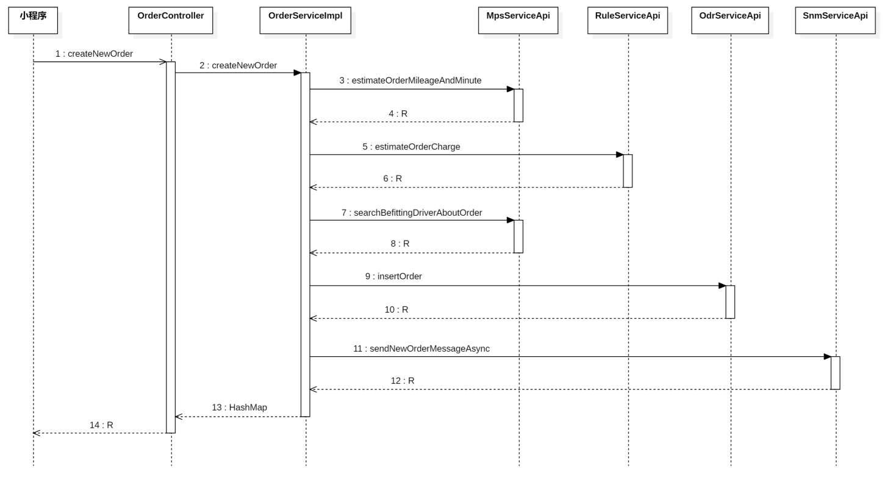

### 编写 Feign 客户端

在`<font style="color:#000000;background-color:rgba(220, 240, 255, 0.3) !important;">com.example.zxds.bff.customer.controller.form</font>`包中创建`<font style="color:#000000;background-color:rgba(220, 240, 255, 0.3) !important;">SendNewOrderMessageForm.java</font>`类

```java
package com.example.zxds.bff.customer.controller.form;

import io.swagger.v3.oas.annotations.media.Schema;
import lombok.Data;

import javax.validation.constraints.*;

@Data
@Schema(description = "发送新订单消息的表单")
public class SendNewOrderMessageForm {

    @NotEmpty(message = "driversContent不能为空")
    @Schema(description = "司机的相关信息（司机ID#接单距离）")
    private String[] driversContent;

    @NotNull(message = "orderId不能为空")
    @Min(value = 1, message = "orderId不能小于1")
    @Schema(description = "订单ID")
    private Long orderId;

    @NotBlank(message = "from内容不正确")
    @Pattern(regexp = "[\\(\\)0-9A-Z#\\-_\\u4e00-\\u9fa5]{2,50}", message = "from内容不正确")
    @Schema(description = "订单起点")
    private String from;

    @NotBlank(message = "to内容不正确")
    @Pattern(regexp = "[\\(\\)0-9A-Z#\\-_\\u4e00-\\u9fa5]{2,50}", message = "to内容不正确")
    @Schema(description = "订单终点")
    private String to;

    @NotBlank(message = "expectsFee不能为空")
    @Pattern(regexp = "^[1-9]\\d*\\.\\d{1,2}$|^0\\.\\d{1,2}$|^[1-9]\\d*$", message = "expectsFee内容不正确")
    @Schema(description = "预估价格")
    private String expectsFee;

    @NotBlank(message = "mileage不能为空")
    @Pattern(regexp = "^[1-9]\\d*\\.\\d+$|^0\\.\\d*[1-9]\\d*$|^[1-9]\\d*$", message = "mileage内容不正确")
    @Schema(description = "预估里程")
    private String mileage;

    @NotNull(message = "minute")
    @Min(value = 1, message = "minute不能小于1")
    @Schema(description = "预估时长")
    private Integer minute;

    @NotBlank(message = "favourFee不能为空")
    @Pattern(regexp = "^[1-9]\\d*\\.\\d{1,2}$|^0\\.\\d{1,2}$|^[1-9]\\d*$", message = "favourFee内容不正确")
    @Schema(description = "顾客好处费")
    private String favourFee;
}
```

在`<font style="color:#000000;background-color:rgba(220, 240, 255, 0.3) !important;">com.example.zxds.bff.customer.feign</font>`包中创建`<font style="color:#000000;background-color:rgba(220, 240, 255, 0.3) !important;">SnmServiceApi.java</font>`接口

```java
package com.example.zxds.bff.customer.feign;

import com.example.zxds.bff.customer.controller.form.SendNewOrderMessageForm;
import com.example.zxds.common.util.R;
import org.springframework.cloud.openfeign.FeignClient;
import org.springframework.web.bind.annotation.PostMapping;

@FeignClient(value = "zxds-snm")
public interface SnmServiceApi {
    @PostMapping("/message/order/new/sendNewOrderMessageAsync")
    R sendNewOrderMessageAsync(SendNewOrderMessageForm form);
}
```

### 编写 service 和实现

在`<font style="color:#000000;background-color:rgba(220, 240, 255, 0.3) !important;">OrderServiceImpl</font>`类的`<font style="color:#000000;background-color:rgba(220, 240, 255, 0.3) !important;">createNewOrder()</font>`函数中添加下面的代码：**在 **`**<font style="color:#000000;">TODO</font>**`**后面添加**

```java
SendNewOrderMessageForm form5 = new SendNewOrderMessageForm();
String[] driverContent = new String[list.size()];
for (int i = 0; i < list.size(); i++) {
    Map<String, Object> one = list.get(i);
    String driverId = MapUtil.getStr(one, "driverId");
    String distance = MapUtil.getStr(one, "distance");
    distance = new BigDecimal(distance).setScale(1, RoundingMode.CEILING).toString();
    driverContent[i] = driverId + "#" + distance;
}
form5.setDriversContent(driverContent);
form5.setOrderId(Long.parseLong(orderId));
form5.setFrom(startPlace);
form5.setTo(endPlace);
form5.setExpectsFee(expectsFee);
//里程转化成保留小数点后一位
mileage = new BigDecimal(mileage).setScale(1, RoundingMode.CEILING).toString();
form5.setMileage(mileage);
form5.setMinute(minute);
form5.setFavourFee(favourFee);
snmServiceApi.sendNewOrderMessageAsync(form5); //异步发送消息
```

### 测试 web 方法

首先把`<font style="color:#000000;background-color:rgba(220, 240, 255, 0.3) !important;">zxds-dr</font>`、`<font style="color:#000000;background-color:rgba(220, 240, 255, 0.3) !important;">zxds-cst</font>`、`<font style="color:#000000;background-color:rgba(220, 240, 255, 0.3) !important;">zxds-mps</font>`、`<font style="color:#000000;background-color:rgba(220, 240, 255, 0.3) !important;">bff-customer</font>`、`<font style="color:#000000;background-color:rgba(220, 240, 255, 0.3) !important;">bff-driver</font>`、`<font style="color:#000000;background-color:rgba(220, 240, 255, 0.3) !important;">zxds-odr</font>`、`<font style="color:#000000;background-color:rgba(220, 240, 255, 0.3) !important;">zxds-rule</font>`、`<font style="color:#000000;background-color:rgba(220, 240, 255, 0.3) !important;">zxds-snm</font>`、`<font style="color:#000000;background-color:rgba(220, 240, 255, 0.3) !important;">gateway</font>`这些子系统都运行起来。然后手机端运行乘客端小程序进行下单，如果下单没有问题，说明抢单消息已经发送给适合接单的司机了。

# 司机子系统 bff-driver 开始与停止接单

我们在乘客端创建订单的时候，代驾系统向适合接单的司机发送抢单消息。目前我们还不能去编写司机接收抢单消息的代码。因为司机在工作台页面上点击**开始接单**之后，我们要清空司机的**定位缓存、上线缓存，以及消息队列**。接下来我们就把`<font style="color:#000000;background-color:rgba(220, 240, 255, 0.3) !important;">bff-driver</font>`子系统的Java代码写了。


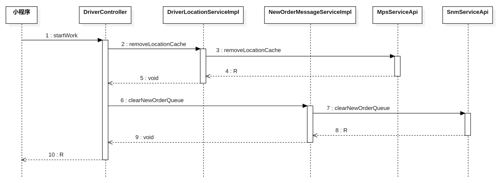

## 编写 Feign 客户端

在`<font style="color:#000000;background-color:rgba(220, 240, 255, 0.3) !important;">com.example.zxds.bff.driver.controller.form</font>`包中创建`<font style="color:#000000;background-color:rgba(220, 240, 255, 0.3) !important;">RemoveLocationCacheForm.java</font>`类（**之前我们已经写过了**）

```java
package com.example.zxds.bff.driver.controller.form;

import io.swagger.v3.oas.annotations.media.Schema;
import lombok.Data;

@Data
@Schema(description = "删除司机定位缓存的表单")
public class RemoveLocationCacheForm {

    @Schema(description = "司机ID")
    private Long driverId;
}
```

在`<font style="color:#000000;background-color:rgba(220, 240, 255, 0.3) !important;">com.example.zxds.bff.driver.feign</font>`包`<font style="color:#000000;background-color:rgba(220, 240, 255, 0.3) !important;">MpsServiceApi.java</font>`接口中，定义抽象方法（**之前我们写过了**）

```java
@PostMapping("/driver/location/removeLocationCache")
R removeLocationCache(RemoveLocationCacheForm form);
```

在`<font style="color:#000000;background-color:rgba(220, 240, 255, 0.3) !important;">com.example.zxds.bff.driver.controller.form</font>`包中创建`<font style="color:#000000;background-color:rgba(220, 240, 255, 0.3) !important;">ClearNewOrderQueueForm.java</font>`类

```java
package com.example.zxds.bff.driver.controller.form;

import io.swagger.v3.oas.annotations.media.Schema;
import lombok.Data;

@Data
@Schema(description = "清空新订单消息队列的表单")
public class ClearNewOrderQueueForm {

    @Schema(description = "用户ID")
    private Long userId;
}
```

在`<font style="color:#000000;background-color:rgba(220, 240, 255, 0.3) !important;">com.example.zxds.bff.driver.feign</font>`包`<font style="color:#000000;background-color:rgba(220, 240, 255, 0.3) !important;">SnmServiceApi.java</font>`接口中，定义抽象方法

```java
package com.example.zxds.bff.driver.feign;

import com.example.zxds.bff.driver.controller.form.ClearNewOrderQueueForm;
import com.example.zxds.common.util.R;
import org.springframework.cloud.openfeign.FeignClient;
import org.springframework.web.bind.annotation.PostMapping;

@FeignClient(value = "zxds-snm")
public interface SnmServiceApi {
    
    @PostMapping("/message/order/new/clearNewOrderQueue")
    R clearNewOrderQueue(ClearNewOrderQueueForm form);
}
```

## 编写 service 和实现

在`<font style="color:#000000;background-color:rgba(220, 240, 255, 0.3) !important;">com.example.zxds.bff.driver.service</font>`包`<font style="color:#000000;background-color:rgba(220, 240, 255, 0.3) !important;">DriverLocationService.java</font>`接口中，声明抽象方法（**这个之前写过了**）

```java
void removeLocationCache(RemoveLocationCacheForm form);
```

在`<font style="color:#000000;background-color:rgba(220, 240, 255, 0.3) !important;">com.example.zxds.bff.driver.service.impl</font>`包`<font style="color:#000000;background-color:rgba(220, 240, 255, 0.3) !important;">DriverLocationServiceImpl.java</font>`类中，实现抽象方法。（**这个之前写过了**）

```java
@Override
public void removeLocationCache(RemoveLocationCacheForm form) {
    mpsServiceApi.removeLocationCache(form);
}
```

在`<font style="color:#000000;background-color:rgba(220, 240, 255, 0.3) !important;">com.example.zxds.bff.driver.service</font>`包`<font style="color:#000000;background-color:rgba(220, 240, 255, 0.3) !important;">NewOrderMessageService.java</font>`接口中，声明抽象方法

```java
package com.example.zxds.bff.driver.service;

import com.example.zxds.bff.driver.controller.form.ClearNewOrderQueueForm;

public interface NewOrderMessageService {

    void clearNewOrderQueue(ClearNewOrderQueueForm form);
}
```

在`<font style="color:#000000;background-color:rgba(220, 240, 255, 0.3) !important;">com.example.zxds.bff.driver.service.impl</font>`包`<font style="color:#000000;background-color:rgba(220, 240, 255, 0.3) !important;">NewOrderMessageServiceImpl .java</font>`类中，实现抽象方法。

```java
package com.example.zxds.bff.driver.service.impl;

import com.example.zxds.bff.driver.controller.form.ClearNewOrderQueueForm;
import com.example.zxds.bff.driver.feign.SnmServiceApi;
import com.example.zxds.bff.driver.service.NewOrderMessageService;
import lombok.RequiredArgsConstructor;
import org.springframework.stereotype.Service;

@Service
@RequiredArgsConstructor
public class NewOrderMessageServiceImpl implements NewOrderMessageService {
    
    private final SnmServiceApi snmServiceApi;

    @Override
    public void clearNewOrderQueue(ClearNewOrderQueueForm form) {
        snmServiceApi.clearNewOrderQueue(form);
    }
}
```

## 编写 web 方法

在`<font style="color:#000000;background-color:rgba(220, 240, 255, 0.3) !important;">com.example.zxds.bff.driver.controller</font>`包中创建`<font style="color:#000000;background-color:rgba(220, 240, 255, 0.3) !important;">DriverController.java</font>`类

```java
@Resource
private DriverLocationService locationService;
@Resource
private NewOrderMessageService newOrderMessageService;

@PostMapping("/startWork")
@Operation(summary = "开始接单")
@SaCheckLogin
public R startWork() {
    long driverId = StpUtil.getLoginIdAsLong();

    //删除司机定位缓存
    RemoveLocationCacheForm form1 = new RemoveLocationCacheForm();
    form1.setDriverId(driverId);
    locationService.removeLocationCache(form1);

    //清空新订单消息列表
    ClearNewOrderQueueForm form2 = new ClearNewOrderQueueForm();
    form2.setUserId(driverId);
    newOrderMessageService.clearNewOrderQueue(form2);

    return R.ok();
}

@PostMapping("/stopWork")
@Operation(summary = "停止接单")
@SaCheckLogin
public R stopWork() {
    long driverId = StpUtil.getLoginIdAsLong();
    //删除司机定位缓存
    RemoveLocationCacheForm form1 = new RemoveLocationCacheForm();
    form1.setDriverId(driverId);
    locationService.removeLocationCache(form1);

    //清空新订单消息列表
    ClearNewOrderQueueForm form2 = new ClearNewOrderQueueForm();
    form2.setUserId(driverId);
    newOrderMessageService.clearNewOrderQueue(form2);

    return R.ok();
}
```

## 测试 web 方法

把`<font style="color:#000000;background-color:rgba(220, 240, 255, 0.3) !important;">zxds-dr</font>`、`<font style="color:#000000;background-color:rgba(220, 240, 255, 0.3) !important;">zxds-odr</font>`、`<font style="color:#000000;background-color:rgba(220, 240, 255, 0.3) !important;">zxds-mps</font>`、`<font style="color:#000000;background-color:rgba(220, 240, 255, 0.3) !important;">bff-driver</font>`子系统运行起来，然后测试Web方法

# 司机小程序实现开始与停止接单

我们写好了司机开始接单和停止接单的后端代码，接下来我们开始写司机端小程序的代码，其实就是发送Ajax请求调用Web方法而已，但是目前司机端的工作台页面还是太简陋了，接下来咱们就先把工作台页面做一下该有的初始化工作。

## 初始化地图高度

比如进入到司机端工作台，页面应该像乘客端那样，在地图上实时显示司机的定位。这个功能比较简单，很多代码我们可以从乘客端小程序拿过来

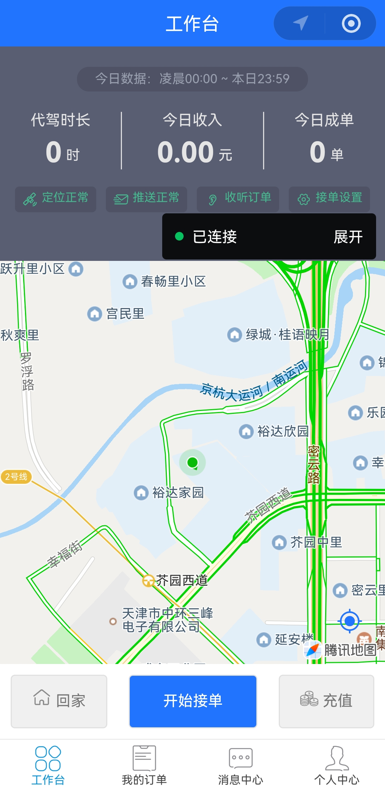

在`<font style="color:#000000;background-color:rgba(220, 240, 255, 0.3) !important;">workbench.vue</font>`页面，我们在`<font style="color:#000000;background-color:rgba(220, 240, 255, 0.3) !important;">onLoad()</font>`函数中获取页面的高度，然后把这个高度保存在模型层中

```javascript
onLoad: function() {
    let that = this;
    if (!that.reviewAuth) {
        let windowHeight = uni.getSystemInfoSync().windowHeight;
        that.windowHeight = windowHeight;
    }
    //TODO 查询正在执行的订单

    //初始化地图
    that.map = uni.createMapContext('map');
},
```

接下来我们要往`<font style="color:#000000;background-color:rgba(220, 240, 255, 0.3) !important;">onShow()</font>`函数中添加若干内容，接收`<font style="color:#000000;background-color:rgba(220, 240, 255, 0.3) !important;">App.vue</font>`页面触发的自定义事件，然后更新页面上定位服务的文字和坐标，还要把实时的定位保存到模型层。`<font style="color:#000000;background-color:rgba(220, 240, 255, 0.3) !important;">onHide()</font>`函数中添加取消捕获定位事件的代码

```javascript
onShow: function() {
    let that = this;
    if (!that.reviewAuth) {
        ……

        //实时获取定位
        uni.$on('updateLocation', function(location) {
            // console.log(location)
            if (location != null) {
                that.service.locationIcon = '../../static/workbench/service-icon-1.png';
                that.service.locationText = '定位正常';
                that.service.locationStyle = 'color:#46B68F';
                that.latitude = location.latitude;
                that.longitude = location.longitude;
            } else {
                that.service.locationIcon = '../../static/workbench/service-icon-5.png';
                that.service.locationText = '定位失败';
                that.service.locationStyle = 'color:#FF4D4D';
            }
        });

        let workStatus = uni.getStorageSync('workStatus');

        //TODO 判断工作状态，是否定时轮询接单

        //初始化控件高度
        if (['接客户', '到达代驾点', '开始代驾'].includes(workStatus)) {
            that.contentStyle = `width: 750rpx;height:${that.windowHeight - 200 - 0}px;`;
        } else {
            that.contentStyle = `width: 750rpx;height:${that.windowHeight - 200 - 70}px;`;
        }
    }

},
  
onHide: function() {
    uni.$off('updateLocation');
}
```

## 实现地图复位

在乘客端我们就实现过地图复位的功能，点击地图上的复位点，地图组件就复位到当前定位点

```html
<map id="map" :longitude="longitude" :latitude="latitude" scale="15" :style="contentStyle" :enable-traffic="true" :show-location="true" :enable-poi="true">
  <cover-image class="location" 
    src="../../static/workbench/location.png"
    @tap="returnLocationHandle()">
  </cover-image>
</map>
```

我们把复位点的点击事件给实现了，声明`<font style="color:#000000;background-color:rgba(220, 240, 255, 0.3) !important;">returnLocationHandle()</font>`函数

```javascript
returnLocationHandle() {
          this.map.moveToLocation();
},
```

## 定义全局 URL

```javascript
Vue.prototype.url = {
    ……,
    startWork: `${baseUrl}/driver/startWork`,
    stopWork: `${baseUrl}/driver/stopWork`,
}
```

## 司机开始接单与停止接单

我们看一下视图层上面“开始接单”和“停止接单”按钮。司机在登录成功之后就往Storage中添加的了workStatus，它的值是“停止接单”。所以我们在工作台页面上能看到“开始接单”按钮，而看不到“停止接单”按钮。

```html
<view class="btn primary">
    <text v-show="workStatus == '停止接单'" @tap="startWorkHandle()">开始接单</text>
    <text v-show="workStatus == '开始接单'" @tap="stopWorkHandle()">停止接单</text>
</view>
```

声明`<font style="color:#000000;background-color:rgba(220, 240, 255, 0.3) !important;">startWorkHandle()</font>`函数，让司机开始接单

```javascript
startWorkHandle() {
    let that = this;
    /*
     * TODO 检查司机是否可以接单
     * 1.没有被禁止接单
     * 2.没有未缴纳的罚款
     * 3.当天已经做了人脸验证
     */

    //设置司机当天通过身份验证
    uni.setStorageSync('verification', { result: true, date: dayjs().format('YYYY-MM-DD') });

    uni.showModal({
        title: '提示消息',
        content: '你要开始接收代驾订单信息？',
        success: function(resp) {
            if (resp.confirm) {
                uni.vibrateShort({});
                let audio = uni.createInnerAudioContext();
                that.audio = audio;
                audio.src = '/static/voice/voice_1.mp3';
                audio.play();
                that.$refs.uToast.show({
                    title: '开始接单了',
                    type: 'success',
                    callback: function() {
                        that.ajax(that.url.startWork, 'POST', null, function(resp) {});
                        uni.setStorageSync('workStatus', '开始接单');
                        that.workStatus = '开始接单';
                        //TODO 初始化新订单和列表变量
                        //TODO 创建接收新订单消息的定时器，每隔5秒钟接收一次新订单消息
                    }
                });
            }
        }
    });
},
```

接下来我们把停止接单的`<font style="color:#000000;background-color:rgba(220, 240, 255, 0.3) !important;">stopWorkHandle()</font>`函数定义出来

```javascript
stopWorkHandle() {
    let that = this;
    uni.showModal({
        title: '提示消息',
        content: '你要停止接收代驾订单信息？',
        success: function(resp) {
            if (resp.confirm) {
                uni.vibrateShort({});
                if (that.audio != null) {
                    that.audio.stop();
                                              }
                let audio = uni.createInnerAudioContext();
                that.audio = audio;
                audio.src = '/static/voice/voice_2.mp3';
                audio.play();
                that.$refs.uToast.show({
                    title: '停止接单了',
                    type: 'default',
                    callback: function() {
                                                            that.ajax(that.url.stopWork, 'POST', null, function(resp) {});
                        that.workStatus = '停止接单';
                        uni.setStorageSync('workStatus', '停止接单');
                        //TODO 初始化新订单和列表变量
                        //TODO 销毁接收新订单消息的定时器
                    }
                });
            }
        }
    });
},
```

# 司机端 RR 方式接收新订单（Round Robin）

我们现在已经能开启司机接单模式了，司机端小程序发起轮询请求查询订单信息，我们需要先把后端的Java代码给实现了，然后才能在移动端用语音播报出来。

## 编写 bff-driver 子系统

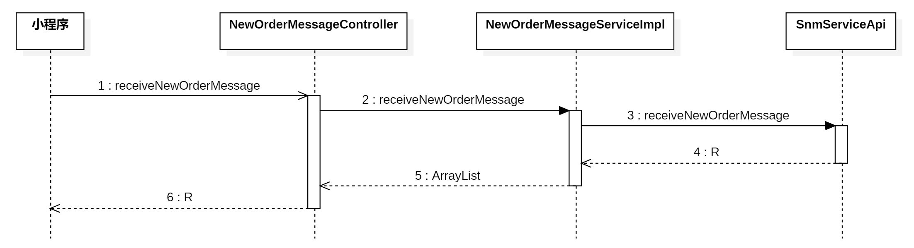

### 编写 Feign 客户端

在`<font style="color:#000000;background-color:rgba(220, 240, 255, 0.3) !important;">com.example.zxds.bff.driver.controller.form</font>`包中创建`<font style="color:#000000;background-color:rgba(220, 240, 255, 0.3) !important;">ReceiveNewOrderMessageForm.java</font>`类

```java
package com.example.zxds.bff.driver.controller.form;

import io.swagger.v3.oas.annotations.media.Schema;
import lombok.Data;

@Data
@Schema(description = "接收新订单消息的表单")
public class ReceiveNewOrderMessageForm {
    @Schema(description = "用户ID")
    private Long userId;
}
```

在`<font style="color:#000000;background-color:rgba(220, 240, 255, 0.3) !important;">com.example.zxds.bff.driver.feign</font>`包`<font style="color:#000000;background-color:rgba(220, 240, 255, 0.3) !important;">SnmServiceApi.java</font>`接口中，声明抽象方法

```java
@PostMapping("/message/order/new/receiveNewOrderMessage")
R receiveNewOrderMessage(ReceiveNewOrderMessageForm form);
```

### 编写 service 和实现

在`<font style="color:#000000;background-color:rgba(220, 240, 255, 0.3) !important;">com.example.zxds.bff.driver.service</font>`包`<font style="color:#000000;background-color:rgba(220, 240, 255, 0.3) !important;">NewOrderMessageService.java</font>`接口中，声明抽象方法

```java
List receiveNewOrderMessage(ReceiveNewOrderMessageForm form);
```

在`<font style="color:#000000;background-color:rgba(220, 240, 255, 0.3) !important;">com.example.zxds.bff.driver.service.impl</font>`包`<font style="color:#000000;background-color:rgba(220, 240, 255, 0.3) !important;">NewOrderMessageServiceImpl.java</font>`类中，实现抽象方法

```java
@Override
public List receiveNewOrderMessage(ReceiveNewOrderMessageForm form) {
    R r = snmServiceApi.receiveNewOrderMessage(form);
    List list = (List) r.get("result");
    return list;
}
```

### 编写 web 方法

在`<font style="color:#000000;background-color:rgba(220, 240, 255, 0.3) !important;">com.example.zxds.bff.driver.controller</font>`包中创建`<font style="color:#000000;background-color:rgba(220, 240, 255, 0.3) !important;">NewOrderMessageController.java</font>`类。

```java
package com.example.zxds.bff.driver.controller;

import cn.dev33.satoken.annotation.SaCheckLogin;
import cn.dev33.satoken.stp.StpUtil;
import com.example.zxds.bff.driver.controller.form.ReceiveNewOrderMessageForm;
import com.example.zxds.bff.driver.service.NewOrderMessageService;
import com.example.zxds.common.util.R;
import io.swagger.v3.oas.annotations.Operation;
import io.swagger.v3.oas.annotations.tags.Tag;
import lombok.RequiredArgsConstructor;
import org.springframework.web.bind.annotation.PostMapping;
import org.springframework.web.bind.annotation.RequestMapping;
import org.springframework.web.bind.annotation.RestController;

import java.util.List;

@RestController
@RequestMapping("/message/order/new")
@RequiredArgsConstructor
@Tag(name = "NewOrderMessageController", description = "新订单消息Web接口")
public class NewOrderMessageController {

    private final NewOrderMessageService newOrderMessageService;

    @PostMapping("/receiveNewOrderMessage")
    @Operation(summary = "同步接收新订单消息")
    @SaCheckLogin
    public R receiveNewOrderMessage() {
        long driverId = StpUtil.getLoginIdAsLong();
        ReceiveNewOrderMessageForm form = new ReceiveNewOrderMessageForm();
        form.setUserId(driverId);
        List list = newOrderMessageService.receiveNewOrderMessage(form);
        return R.ok().put("result", list);
    }
}
```

## 编写司机端小程序

### 定义全局 URL

```javascript
Vue.prototype.url = {
    ……
    receiveNewOrderMessage: `${baseUrl}/message/order/new/receiveNewOrderMessage`,
}
```

### 轮询新订单消息

因为移动端的网络信号不稳定，所以我们不能采用WebSocket长连接的方式推送消息，我们应该选择移动端每隔几秒就发出轮询请求，查询是否有新订单。

我们先来熟悉模型层中的若干变量，特别是跟当前显示的订单、新订单列表有关的变量。

```javascript
data() {
    return {
        ……,
        workStatus: uni.getStorageSync('workStatus'), // 工作状态
        newOrder: null, // 空的时候，页面上展示:目前暂无订单。非空的时候，页面上展示具体的订单信息。
        newOrderList: [], // 接收服务器返回的多条订单信息，并且将多条订单信息放到该数组的前面（这样做是为了让司机能够听到最新的订单）
        executeOrder: { // 正在执行的订单数据
            id: '',
            photo: '',
            title: '',
            tel: '',
            customerId: '',
            startPlace: '',
            startPlaceLocation: {},
            endPlace: '',
            endPlaceLocation: {},
            favourFee: '',
            carPlate: '',
            carType: '',
            createTime: ''
        },
        reciveNewOrderTimer: null, // 保存定时器，这样定时器可以在多个函数中使用。
        playFlag: false, // 用来标记是否正在进行语音播报，如果语音正在播报，司机不能接单。
        audio: null, // 播报订单需要语音播报器（需要在多个函数中进行操作）
        canAcceptOrder: false, // 用来标记当前司机是否可以接单
        accepting: false, // 用来标记司机是否在接单中...
    };
},
```

在工作台页面 `<font style="color:#000000;">workbench.vue</font>`，先把创建轮询定时器的代码给封装起来：

```javascript
createTimer(ref) {
    let timer = setInterval(function() {
        ref.ajax(
            ref.url.receiveNewOrderMessage, 'POST', null, function(resp) {
                let result = resp.data.result;
                if (result.length > 0) {
                    //用新订单数组和原有订单数组拼接成新数组，新订单就放在数组开头
                    ref.newOrderList = result.concat(ref.newOrderList);
                    //如果当前没有播报订单，就显示新的订单
                    if (ref.playFlag == false) {
                        //TODO 调用封装函数
                    }
                }
            },
            false
        );
    }, 5000);
    return timer;
},
```

在`<font style="color:#000000;background-color:rgba(220, 240, 255, 0.3) !important;">onShow()</font>`函数中，调用`<font style="color:#000000;background-color:rgba(220, 240, 255, 0.3) !important;">createTimer()</font>`函数，轮询接收新订单。这种情况限于开始接单后，从工作台页面进入到其他页面，然后又退回到工作台页面

```javascript
onShow: function() {
    ……
    if (!that.reviewAuth) {
        ……
        let workStatus = uni.getStorageSync('workStatus');
        // 判断工作状态
        if (workStatus == '开始接单') {
            that.newOrder = null;
            that.newOrderList.length = 0;
            that.playFlag = false;
            //创建接收新订单消息的定时器，每隔5秒钟接收一次新订单消息
            that.reciveNewOrderTimer = that.createTimer(that);
        }
    }
}
```

司机开始接单之后，我们要调用`<font style="color:#000000;background-color:rgba(220, 240, 255, 0.3) !important;">createTimer()</font>`函数，开始轮询新订单。停止接单之后，我们要销毁定时器，不在轮询新订单

```javascript
startWorkHandle: function() {
    ……
    uni.showModal({
        title: '提示消息',
        content: '你要开始接收代驾订单信息？',
        success: function(resp) {
            if (resp.confirm) {
                ……
                that.$refs.uToast.show({
                    title: '开始接单了',
                    type: 'success',
                    callback: function() {
                        ……
                        // ~~~~~~~~~~~~~~~新增代码：初始化新订单和列表变量~~~~~~~~~~~~~~~
                        that.newOrder = null;
                        that.newOrderList.length = 0;
                        that.executeOrder = {};
                        //~~~~~~~~~~~~~~~新增代码：创建接收新订单消息的定时器，每隔5秒钟接收一次新订单消息~~~~~~~~~~~~~~~
                        if (that.reciveNewOrderTimer == null) {
                                that.reciveNewOrderTimer = that.createTimer(that);
                        }
                    }
                });
            }
        }
    });
},

stopWorkHandle: function() {
    let that = this;
    uni.showModal({
        title: '提示消息',
        content: '你要停止接收代驾订单信息？',
        success: function(resp) {
            if (resp.confirm) {
                ……
                that.$refs.uToast.show({
                    title: '停止接单了',
                    type: 'default',
                    callback: function() {
                        ……
                        //~~~~~~~~~~~~~~~新增代码：初始化新订单和列表变量~~~~~~~~~~~~~~~
                        that.newOrder = null;
                        that.newOrderList.length = 0;
                        that.executeOrder = {};
                        //~~~~~~~~~~~~~~~新增代码：销毁定时器~~~~~~~~~~~~~~~
                        clearInterval(that.reciveNewOrderTimer);
                        that.reciveNewOrderTimer = null;
                        that.playFlag = false;
                    }
                });
            }
        }
    });
},
```

### 测试接收新订单

首先把`<font style="color:#000000;background-color:rgba(220, 240, 255, 0.3) !important;">zxds-dr</font>`、`<font style="color:#000000;background-color:rgba(220, 240, 255, 0.3) !important;">zxds-cst</font>`、`<font style="color:#000000;background-color:rgba(220, 240, 255, 0.3) !important;">zxds-mps</font>`、`<font style="color:#000000;background-color:rgba(220, 240, 255, 0.3) !important;">bff-customer</font>`、`<font style="color:#000000;background-color:rgba(220, 240, 255, 0.3) !important;">bff-driver</font>`、`<font style="color:#000000;background-color:rgba(220, 240, 255, 0.3) !important;">zxds-odr</font>`、`<font style="color:#000000;background-color:rgba(220, 240, 255, 0.3) !important;">zxds-rule</font>`、`<font style="color:#000000;background-color:rgba(220, 240, 255, 0.3) !important;">zxds-snm</font>`、`<font style="color:#000000;background-color:rgba(220, 240, 255, 0.3) !important;">gateway</font>`这些子系统都运行起来。然后在手机端运行司机端小程序，开始接单之后，我们利用Web接口向`<font style="color:#000000;background-color:rgba(220, 240, 255, 0.3) !important;">bff-customer</font>`子系统发出创建订单的请求。