# 智行代驾05

# 乘客端手动确认司机到达 zxds-odr 子系统实现

现在我们实现了司机到达上车点的功能，接下来我们该实现乘客端手动确定司机已到达的功能。

乘客点击“司机到达”按钮之后，页面上的最佳线路就变成了**乘客当前定位**到**代驾终点**的最佳线路。

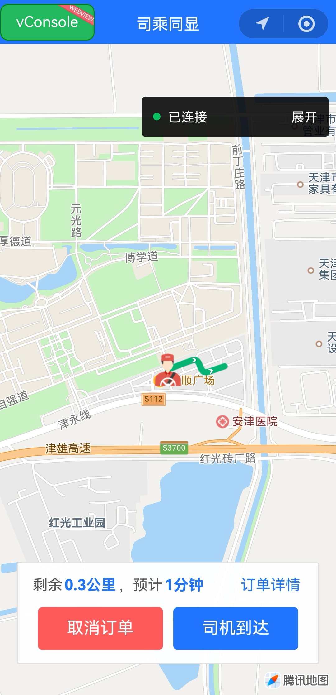

 

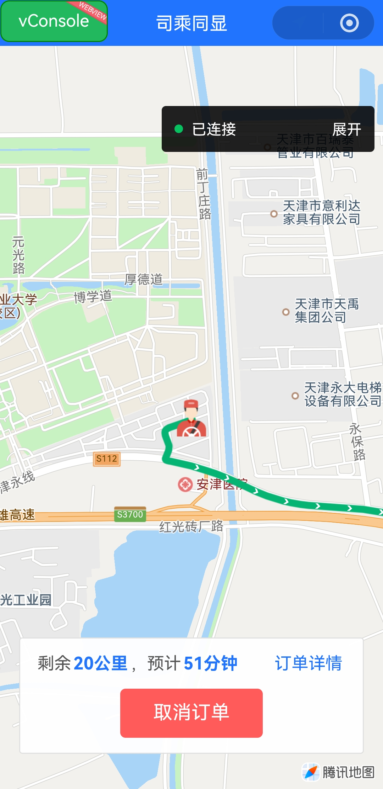

乘客端点击了司机已到达，并不更改订单状态，因为上节课司机已到达的时候就已经把订单改成了3状态，为什么不是乘客确认司机已到达之后，再把订单改成3状态呢？这是因为司机到达上车点之后，有10分钟的免费等时。10分钟之后，乘客还没有到达上车点，代驾账单中就会出现等时费（1分钟1元钱）。如果让乘客来修改订单状态为 3，司机比较吃亏，因为可能的情况是：司机明明已经到了，但是乘客就是不确认。

乘客端点击确认司机已到达之后，并不会修改订单状态，修改Redis里面的标志位缓存。等到司机端点击开始代驾的时候，要确定Redis里面标志位的值为2，然后才能把订单更新成4状态。

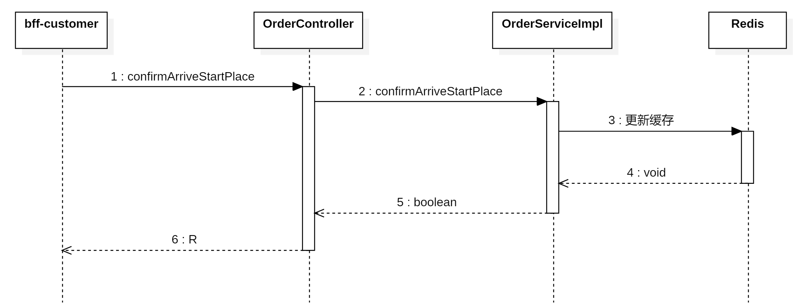

## 编写 service 和实现

在`<font style="color:#000000;background-color:rgba(220, 240, 255, 0.3) !important;">com.example.zxds.odr.service</font>`包`<font style="color:#000000;background-color:rgba(220, 240, 255, 0.3) !important;">OrderService.java</font>`接口中，声明抽象方法

```java
boolean confirmArriveStartPlace(long orderId);
```

在`<font style="color:#000000;background-color:rgba(220, 240, 255, 0.3) !important;">com.example.zxds.odr.service.impl</font>`包`<font style="color:#000000;background-color:rgba(220, 240, 255, 0.3) !important;">OrderServiceImpl.java</font>`类中，实现抽象方法

```java
@Override
public boolean confirmArriveStartPlace(long orderId) {
    String key = "order_driver_arrivied#" + orderId;
    if (stringRedisTemplate.hasKey(key) && stringRedisTemplate.opsForValue().get(key).endsWith("1")) {
        stringRedisTemplate.opsForValue().set(key, "2");
        return true;
    }
    return false;
}
```

## 编写 form 接收数据并校验

在`<font style="color:#000000;background-color:rgba(220, 240, 255, 0.3) !important;">com.example.zxds.odr.controller.form</font>`包中创建`<font style="color:#000000;background-color:rgba(220, 240, 255, 0.3) !important;">ConfirmArriveStartPlaceForm.java</font>`类

```java
package com.example.zxds.odr.controller.form;

import io.swagger.v3.oas.annotations.media.Schema;
import lombok.Data;

import javax.validation.constraints.Min;
import javax.validation.constraints.NotNull;

@Data
@Schema(description = "更新订单状态的表单")
public class ConfirmArriveStartPlaceForm {
    @NotNull(message = "orderId不能为空")
    @Min(value = 1, message = "orderId不能小于1")
    @Schema(description = "订单ID")
    private Long orderId;
}
```

## 编写 web 方法

在`<font style="color:#000000;background-color:rgba(220, 240, 255, 0.3) !important;">com.example.zxds.odr.controller</font>`包`<font style="color:#000000;background-color:rgba(220, 240, 255, 0.3) !important;">OrderController.java</font>`类中，声明Web方法

```java
@PostMapping("/confirmArriveStartPlace")
@Operation(summary = "乘客确认司机到达上车点")
public R confirmArriveStartPlace(@RequestBody @Valid ConfirmArriveStartPlaceForm form) {
    boolean result = orderService.confirmArriveStartPlace(form.getOrderId());
    return R.ok().put("result", result);
}
```

# 乘客端手动确认司机到达 bff-customer 子系统实现

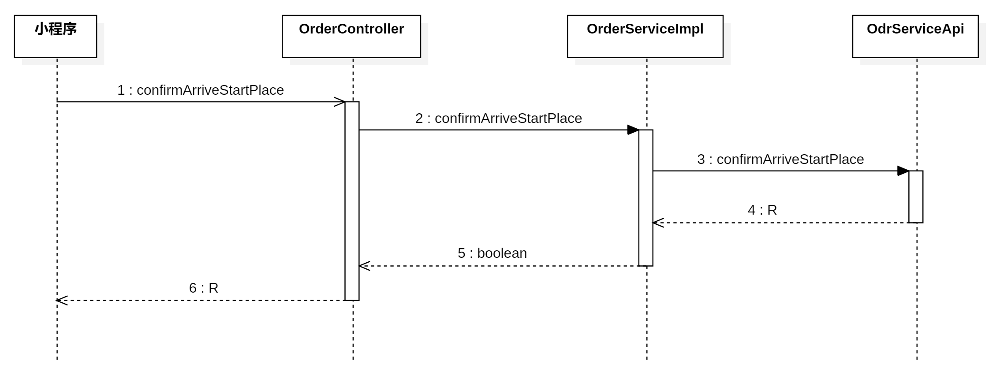

## 编写 Feign 客户端

在`<font style="color:#000000;background-color:rgba(220, 240, 255, 0.3) !important;">com.example.zxds.bff.customer.controller.form</font>`包中创建`<font style="color:#000000;background-color:rgba(220, 240, 255, 0.3) !important;">ConfirmArriveStartPlaceForm.java</font>`类

```java
package com.example.zxds.bff.customer.controller.form;

import io.swagger.v3.oas.annotations.media.Schema;
import lombok.Data;

import javax.validation.constraints.Min;
import javax.validation.constraints.NotNull;

@Data
@Schema(description = "更新订单状态的表单")
public class ConfirmArriveStartPlaceForm {
    @NotNull(message = "orderId不能为空")
    @Min(value = 1, message = "orderId不能小于1")
    @Schema(description = "订单ID")
    private Long orderId;
}
```

在`<font style="color:#000000;background-color:rgba(220, 240, 255, 0.3) !important;">com.example.zxds.bff.customer.feign</font>`包`<font style="color:#000000;background-color:rgba(220, 240, 255, 0.3) !important;">OdrServiceApi.java</font>`接口中，声明抽象方法。

```java
@PostMapping("/order/confirmArriveStartPlace")
R confirmArriveStartPlace(ConfirmArriveStartPlaceForm form);
```

## 编写 service 和实现

在`<font style="color:#000000;background-color:rgba(220, 240, 255, 0.3) !important;">com.example.zxds.bff.customer.service</font>`包`<font style="color:#000000;background-color:rgba(220, 240, 255, 0.3) !important;">OrderService.java</font>`接口中，声明抽象方法

```java
boolean confirmArriveStartPlace(ConfirmArriveStartPlaceForm form);
```

在`<font style="color:#000000;background-color:rgba(220, 240, 255, 0.3) !important;">com.example.zxds.bff.customer.service.impl</font>`包`<font style="color:#000000;background-color:rgba(220, 240, 255, 0.3) !important;">OrderServiceImpl.java</font>`类中，实现抽象方法

```java
@Override
public boolean confirmArriveStartPlace(ConfirmArriveStartPlaceForm form) {
    R r = odrServiceApi.confirmArriveStartPlace(form);
    boolean result = MapUtil.getBool(r, "result");
    return result;
}
```

## 编写 web 方法

在`<font style="color:#000000;background-color:rgba(220, 240, 255, 0.3) !important;">com.example.zxds.bff.customer.controller</font>`包`<font style="color:#000000;background-color:rgba(220, 240, 255, 0.3) !important;">OrderController.java</font>`类中，声明Web方法

```java
@PostMapping("/confirmArriveStartPlace")
@SaCheckLogin
@Operation(summary = "确定司机已经到达")
public R confirmArriveStartPlace(@RequestBody @Valid ConfirmArriveStartPlaceForm form) {
    boolean result = orderService.confirmArriveStartPlace(form);
    return R.ok().put("result", result);
}
```

# 乘客端手动确认司机到达小程序端实现

## 定义全局 URL

```javascript
Vue.prototype.url = {
    ……,
    confirmArriveStartPlace: `${baseUrl}/order/confirmArriveStartPlace`,
}
```

## 手动确认司机达到上车点

在`<font style="color:#000000;background-color:rgba(220, 240, 255, 0.3) !important;">move.vue</font>`页面中，我们先来看一下按钮标签

```html
<button class="confirm-btn" 
        v-if="status == 2 || status == 3"
        @tap="driverArriviedHandle">
  司机到达
</button>
```

按钮点击事件的回调函数，我们来实现一下

```javascript
driverArriviedHandle() {
    let that = this;
    uni.showModal({
        title: '提示消息',
        content: '确定司机已经到达代驾点？',
        success: function(resp) {
            if (resp.confirm) {
                let data = {
                    orderId: that.orderId
                };
                that.ajax(that.url.confirmArriveStartPlace, 'POST', data, function(resp) {
                    if (resp.data.result) {
                        uni.showToast({
                            icon: 'success',
                            title: '状态更新成功'
                        });
                        that.status = 4;
                        that.mode = 'driving';
                        that.targetLatitude = that.endLatitude;
                        that.targetLongitude = that.endLongitude;
                    }
                });
            }
        }
    });
}
```

## 测试小程序

把后端各个子系统运行起来，然后运行乘客端小程序，在司乘同显页面点击“司机到达”按钮，看看页面上是不是变成根据当前乘客定位计算最佳线路

# 司机端开始代驾 zxds-odr 子系统实现

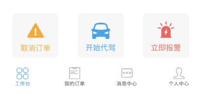

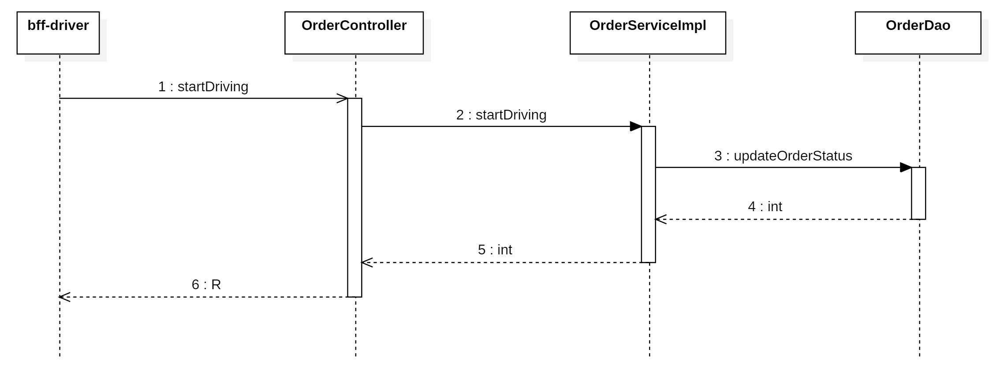

## 编写 service 和实现

在`<font style="color:#000000;background-color:rgba(220, 240, 255, 0.3) !important;">com.example.zxds.odr.service</font>`包`<font style="color:#000000;background-color:rgba(220, 240, 255, 0.3) !important;">OrderService.java</font>`接口中，定义抽象方法

```java
int startDriving(Map<String, Object> param);
```

在`<font style="color:#000000;background-color:rgba(220, 240, 255, 0.3) !important;">com.example.zxds.odr.service.impl</font>`包`<font style="color:#000000;background-color:rgba(220, 240, 255, 0.3) !important;">OrderServiceImpl.java</font>`类中，实现抽象方法

```java
@Override
@Transactional
public int startDriving(Map<String, Object> param) {
    long orderId = MapUtil.getLong(param, "orderId");
    String key = "order_driver_arrivied#" + orderId;
    if (stringRedisTemplate.hasKey(key) && stringRedisTemplate.opsForValue().get(key).endsWith("2")) {
        int rows = orderDao.updateOrderStatus(param);
        if (rows == 1) {
            stringRedisTemplate.delete(key);
        }
        return rows;
    }
    return 0;
}
```

## 编写 form 接收数据并校验

在`<font style="color:#000000;background-color:rgba(220, 240, 255, 0.3) !important;">com.example.zxds.odr.controller.form</font>`包中创建`<font style="color:#000000;background-color:rgba(220, 240, 255, 0.3) !important;">StartDrivingForm.java</font>`类

```java
package com.example.zxds.odr.controller.form;

import io.swagger.v3.oas.annotations.media.Schema;
import lombok.Data;

import javax.validation.constraints.Min;
import javax.validation.constraints.NotNull;

@Data
@Schema(description = "开始代驾的表单")
public class StartDrivingForm {
    @NotNull(message = "orderId不能为空")
    @Min(value = 1, message = "orderId不能小于1")
    @Schema(description = "订单ID")
    private Long orderId;

    @NotNull(message = "driverId不能为空")
    @Min(value = 1, message = "driverId不能小于1")
    @Schema(description = "司机ID")
    private Long driverId;
}
```

## 编写 web 方法

在`<font style="color:#000000;background-color:rgba(220, 240, 255, 0.3) !important;">com.example.zxds.odr.controller</font>`包`<font style="color:#000000;background-color:rgba(220, 240, 255, 0.3) !important;">OrderController.java</font>`类中，声明Web方法

```java
@PostMapping("/startDriving")
@Operation(summary = "开始代驾")
public R startDriving(@RequestBody @Valid StartDrivingForm form) {
    Map<String, Object> param = BeanUtil.beanToMap(form);
    param.put("status", 4);
    int rows = orderService.startDriving(param);
    return R.ok().put("rows", rows);
}
```

# 司机开始代驾 bff-driver 子系统实现

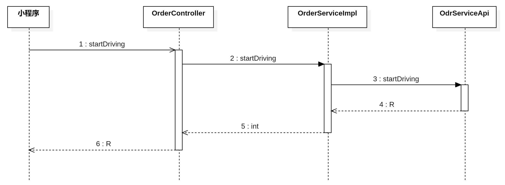

## 编写 Feign 客户端

在`<font style="color:#000000;background-color:rgba(220, 240, 255, 0.3) !important;">com.example.zxds.bff.driver.controller.form</font>`包中创建`<font style="color:#000000;background-color:rgba(220, 240, 255, 0.3) !important;">StartDrivingForm.java</font>`类

```java
package com.example.zxds.bff.driver.controller.form;

import io.swagger.v3.oas.annotations.media.Schema;
import lombok.Data;

import javax.validation.constraints.Min;
import javax.validation.constraints.NotNull;

@Data
@Schema(description = "开始代驾的表单")
public class StartDrivingForm {
    @NotNull(message = "orderId不能为空")
    @Min(value = 1, message = "orderId不能小于1")
    @Schema(description = "订单ID")
    private Long orderId;

    @Schema(description = "司机ID")
    private Long driverId;

    @NotNull(message = "customerId不能为空")
    @Min(value = 1, message = "customerId不能小于1")
    @Schema(description = "客户ID")
    private Long customerId;
}
```

在`<font style="color:#000000;background-color:rgba(220, 240, 255, 0.3) !important;">com.example.zxds.bff.driver.feign</font>`包`<font style="color:#000000;background-color:rgba(220, 240, 255, 0.3) !important;">OdrServiceApi.java</font>`接口中，声明Web方法

```java
@PostMapping("/order/startDriving")
R startDriving(StartDrivingForm form);
```

## 编写 service 和实现

在`<font style="color:#000000;background-color:rgba(220, 240, 255, 0.3) !important;">com.example.zxds.bff.driver.service</font>`包`<font style="color:#000000;background-color:rgba(220, 240, 255, 0.3) !important;">OrderService.java</font>`接口中，声明抽象方法

```java
int startDriving(StartDrivingForm form);
```

在`<font style="color:#000000;background-color:rgba(220, 240, 255, 0.3) !important;">com.example.zxds.bff.driver.service.impl</font>`包`<font style="color:#000000;background-color:rgba(220, 240, 255, 0.3) !important;">OrderServiceImpl.java</font>`类中，实现抽象方法

```java
@Override
@GlobalTransactional
public int startDriving(StartDrivingForm form) {
    R r = odrServiceApi.startDriving(form);
    int rows = MapUtil.getInt(r, "rows");
    //TODO 发送通知消息
    return rows;
}
```

## 编写 web 方法

在`<font style="color:#000000;background-color:rgba(220, 240, 255, 0.3) !important;">com.example.zxds.bff.driver.controller</font>`包`<font style="color:#000000;background-color:rgba(220, 240, 255, 0.3) !important;">OrderController.java</font>`类中，声明Web方法

```java
@PostMapping("/startDriving")
@Operation(summary = "开始代驾")
@SaCheckLogin
public R startDriving(@RequestBody @Valid StartDrivingForm form) {
    long driverId = StpUtil.getLoginIdAsLong();
    form.setDriverId(driverId);
    int rows = orderService.startDriving(form);
    return R.ok().put("rows", rows);
}
```

# 司机开始代驾-小程序端实现

## 定义全局 URL

```javascript
Vue.prototype.url = {
    ……,
    startDriving: `${baseUrl}/order/startDriving`,
}
```

## 实现开始代驾功能

在工作台页面上，有开始代驾按钮，我们先来看看具体的标签

```html
<view class="item" v-show="workStatus == '到达代驾点'" @tap="startDrivingHandle">
    <image src="../../static/workbench/drive-start-icon.png" 
           mode="widthFix" 
           class="drive-start-icon"></image>
    <text class="drive-start-text">开始代驾</text>
</view>
```

开始代驾按钮的点击事件回调函数，我们需要实现一下

```javascript
startDrivingHandle() {
    let that = this;
    uni.showModal({
        title: '消息通知',
        content: '您已经接到客户，现在开始代驾？',
        success: function(resp) {
            if (resp.confirm) {
                //TODO 设置录音标志位
                let data = {
                    orderId: that.executeOrder.id,
                    customerId: that.executeOrder.customerId
                };

                that.ajax(that.url.startDriving, 'POST', data, function(resp) {
                    if (resp.data.rows == 1) {
                        uni.showToast({
                            icon: 'success',
                            title: '订单状态更新成功'
                        });
                        that.workStatus = '开始代驾';
                        uni.setStorageSync('workStatus', '开始代驾');
                        //TODO 开始录音
                    }
                });
            }
        }
    });
}
```

## 测试小程序

把后端各个子系统开启，手机运行司机端小程序，进入工作台页面之后，点击“开始代驾”按钮，看看订单状态是否更新。

# 司机端利用地图 app 实现驾驶导航

到目前为止，我们完成了司机到达上车点，经过乘客确认，司机可以开始代驾了。如果开车光盯着司乘同显的最佳线路并不方便，所以我们应该把地图导航功能给实现了。另外微信小程序的分包加载之后的总体积不能超过32M，所以我们根本不可能把地图导航功能塞到小程序里。因此我们只能用小程序调用手机上面的地图APP，实现驾驶导航功能。

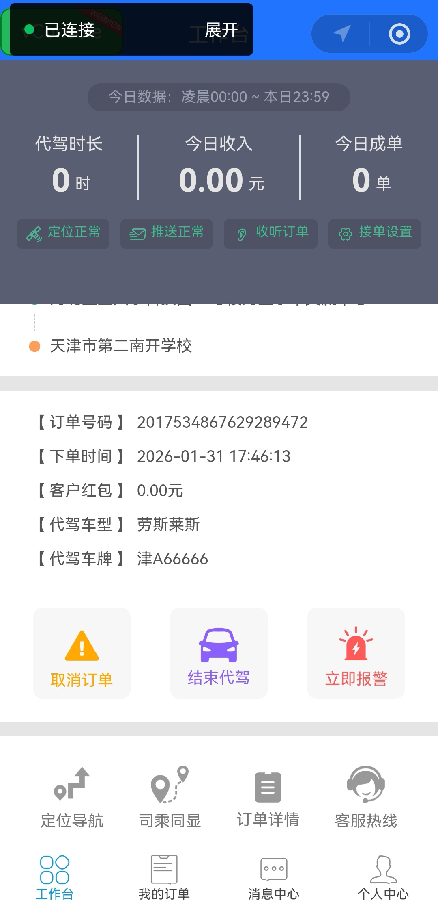

 

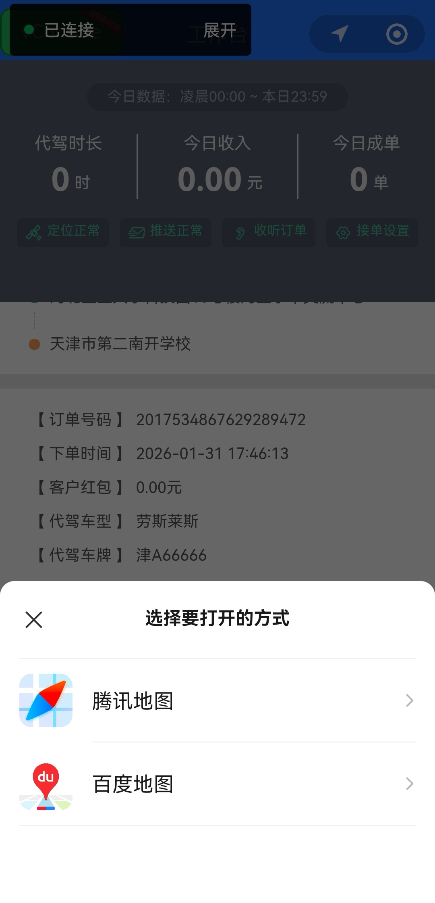

 

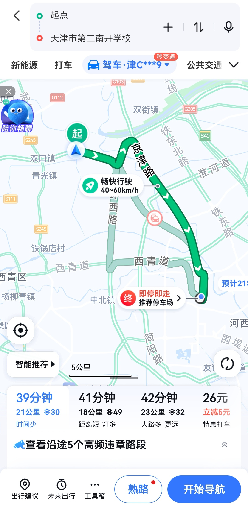

## 熟悉工作台页面的定位导航按钮

```html
<view class="item" @tap="showNavigationHandle">
    <image src="../../static/workbench/other-icon-1.png" 
           mode="widthFix" 
           class="location-icon"/>
    <text class="location-text">定位导航</text>
</view>
```

## 实现回调函数

```javascript
showNavigationHandle() {
    let that = this;
  
    // 地图导航的终点坐标和地名（三个变量）
    let latitude = null;
    let longitude = null;
    let destination = null;
  
    if (that.workStatus == '接客户') {
        latitude = Number(that.executeOrder.startPlaceLocation.latitude);
        longitude = Number(that.executeOrder.startPlaceLocation.longitude);
        destination = that.executeOrder.startPlace;
    } else {
        // 开始代驾
        latitude = Number(that.executeOrder.endPlaceLocation.latitude);
        longitude = Number(that.executeOrder.endPlaceLocation.longitude);
        destination = that.executeOrder.endPlace;
    }
  
    //打开手机导航软件
    that.map.openMapApp({
        latitude: latitude,
        longitude: longitude,
        destination: destination
    });
},
```

# 搭建 HBase+Phoenix 大数据平台

## 技术选型

我们的代驾系统需要保存两类核心数据：

**1. GPS轨迹数据（订单的行驶轨迹）**

- 特点：海量高频（每5秒一个点，一个订单对应 N 多 GPS 点，一天上百万个点）
- 痛点：MySQL单表超2000万就卡顿，根本扛不住

**2. 聊天消息数据**

- 特点：既要存文本内容，又要能按各种条件查（按照时间查、按照订单号查、按照用户查）
- 痛点：MongoDB虽然能存，但复杂条件查询效率低、写法别扭

我们需要一个既能保存海量数据，又支持复杂条件检索的数据存储平台。HBase 最合适。

## HBase


### HBase是什么？

它是一个专为海量数据设计的**列式数据库**，运行在 Hadoop 上的数据库。Hadoop 是 Apache 的顶级项目。是大数据领域的地基。

**了解一下，大数据主要解决了两个核心的问题：**

1. **数据存储：HDFS（解决海量数据怎么存储的问题）**
2. **数据计算：MapReduce（解决在海量数据的环境中如何快速完成分析和计算）**

**五大核心特点：**

1. **海量存储**
支持**百亿行×百万列**级别的数据规模，可达 PB级。【**1PB = 1024TB**】
2. **列式存储**
数据按列组织，查询时只读取所需列，效率高（不像 mysql 以整行为单位，要查一个 name 字段，需要先把整行数据取到，再从行中取出 name）；

支持动态增减列，结构灵活。（不像 mysql，即使你只想给 name 字段插入值，其他字段不给值，也会自动插入 null，因为 mysql 以行为单位）

1. **近实时查询**
即使数据量极大，仍能实现百毫秒级的快速响应。
2. **多版本记录**
每列数据可保留多个历史版本，便于数据追溯与回滚。
3. **高可靠架构**
数据持久化存储在HDFS，并通过ZooKeeper协调节点，保障服务稳定与数据安全。

### HBase 中的数据表及命令

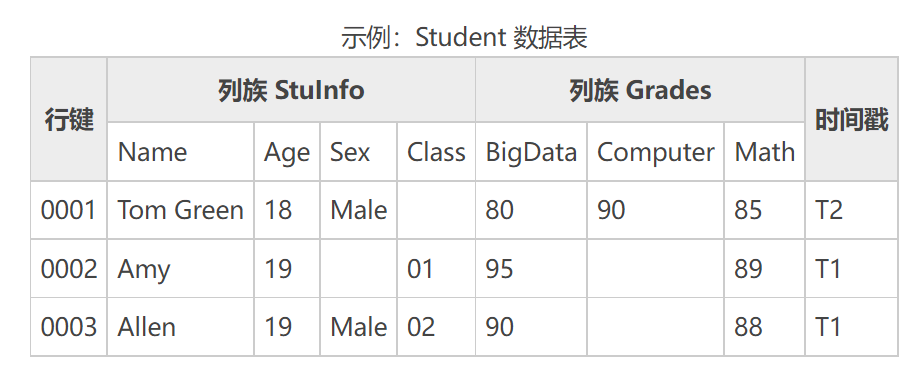

以上是 HBase 中的数据表（**假想图**）。

**实际的 HBase 存的是 Key-Value 结构：**

```plaintext
行键0001 → 实际存的是这些Key-Value对：
    ("0001", "StuInfo:Name", T2) → "Tom Green"
    ("0001", "StuInfo:Age", T2) → "18"
    ("0001", "StuInfo:Sex", T2) → "Male"
    ("0001", "Grades:BigData", T2) → "80"
    ("0001", "Grades:Computer", T2) → "90"
    ("0001", "Grades:Math", T2) → "85"

行键0002 → 实际存的是：
    ("0002", "StuInfo:Name", T1) → "Amy"
    ("0002", "StuInfo:Age", T1) → "19"
    ("0002", "Grades:Class", T1) → "01"
    ("0002", "Grades:BigData", T1) → "95"
    ("0002", "Grades:Math", T1) → "89"
    // 注意：Sex字段根本没存！Computer字段也没存！

行键0003 → 实际存的是：
    ("0003", "StuInfo:Name", T1) → "Allen"
    ("0003", "StuInfo:Age", T1) → "19"
    ("0003", "StuInfo:Sex", T1) → "Male"
    ("0003", "Grades:Class", T1) → "02"
    ("0003", "Grades:BigData", T1) → "90"
    ("0003", "Grades:Math", T1) → "88"
```

可以使用以下的命令，对数据表中的数据进行操作。

如果我们给学生表添加新的记录，就需要执行下面的命令：

```shell
# 最后那个1是时间戳（版本号）
put 'Student', '0001', 'Stulnfo:Name', 'Tom Green', 1
```

想要获取数据的时候，我们执行get命令就可以了

```shell
get 'Student', '0001'
```

上面的命令如果简单还行，要是叠加上复杂的条件和函数，对于我们来说可读性非常差：

```shell
scan 'mytest:test01',FILTER=>"RowFilter(=,'substring:202006')",LIMIT=>1
# 扫描 mytest 命名空间下的 test01 表
# 行键过滤器，只保留行键中包含 202006 这个子串的行
# 只返回1条结果
```

想用我们程序员熟悉的 SQL 语句操作 HBase，可以使用 `Phoenix`。

## Phoenix


建立在 HBase 之上的 **SQL 查询引擎**，让我们能够用熟悉的 **SQL 语句** 直接读写 HBase 中的数据。

**它的核心价值：**

1. **SQL 化操作**
为 HBase 添加了 SQL 语法层，将 HBase 的底层 `<font style="color:#000000;">scan</font>` 操作封装成标准 SQL 查询。
2. **高性能查询**
即使面对千万级数据行，查询响应也仅需毫秒到秒级，满足低延迟的联机事务处理需求。
3. **结果集标准化**
查询结果自动转为 JDBC 标准格式，便于应用程序直接使用。
4. **开发友好**
支持 MyBatis 等主流框架，可无缝集成到像“智行代驾”这样的 Java 项目中，减少开发适配成本。

## 部署 HBase 与 Phoenix

以下操作在最初搭建环境的时候已经完成了：

### 导入镜像

```shell
docker load < phoenix.tar.gz
```

### 创建容器

镜像中已经包含和HBase和Phoenix，直接创建容器即可。由于HBase需要使用的内存较大，这里我没有规定具体的内存大小，容器会自动使用空闲的内存。容器中数据目录是`<font style="color:#000000;background-color:rgba(220, 240, 255, 0.3) !important;">/tmp/hbase-root/hbase/data</font>`，我把这个目录映射到宿主机的`<font style="color:#000000;background-color:rgba(220, 240, 255, 0.3) !important;">/root/hbase/data</font>`目录。

```shell
docker run -it -d \
  --restart=unless-stopped \
  -p 2181:2181 \
  -p 8765:8765 \
  -p 15165:15165 \
  -p 16000:16000 \
  -p 16010:16010 \
  -p 16020:16020 \
  -v /root/hbase/data:/tmp/hbase-root/hbase/data \
  --name phoenix \
  --net mynet \
  --ip 172.18.0.15 \
  boostport/hbase-phoenix-all-in-one:2.0-5.0
```

| **重点端口** | **作用** | **你用他来干啥** |
| --- | --- | --- |
| **2181** | ZooKeeper端口 | **如果用HBase原生API走2181** |
| **8765** | Phoenix查询端口 | **如果用Phoenix JDBC走8765** |

### 端口转发

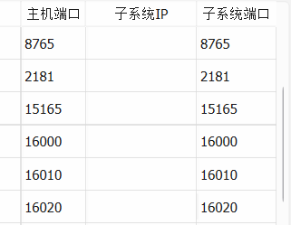

## 初始化 Phoenix

进入到Phoenix容器中，然后执行命令设置`<font style="color:#000000;background-color:rgba(220, 240, 255, 0.3) !important;">HBASE_CONF_DIR</font>`环境变量

```shell
docker exec -it phoenix bash

export HBASE_CONF_DIR=/opt/hbase/conf/
```

连接Phoenix的命令行客户端**（有没有类似于 navicat 的客户端工具，有：DBeaver，但最新的 DBeaver 只能使用 JDK8，我们这里就不再折腾了。）**

```shell
/opt/phoenix-server/bin/sqlline.py localhost
```

## 创建逻辑库和数据表

为了存储数据，我们需要像操作MySQL一样，先创建逻辑库，然后定义数据表。在Phoenix的命令行客户端我们先来执行创建逻辑库的命令。

```sql
CREATE SCHEMA zxds;

USE zxds;
```

接下来我们要创建`<font style="color:#000000;background-color:rgba(220, 240, 255, 0.3) !important;">order_voice_text</font>`、`<font style="color:#000000;background-color:rgba(220, 240, 255, 0.3) !important;">order_monitoring</font>`和`<font style="color:#000000;background-color:rgba(220, 240, 255, 0.3) !important;">order_gps</font>`数据表。

其中`<font style="color:#000000;background-color:rgba(220, 240, 255, 0.3) !important;">order_voice_text</font>`表存放司乘对话内容的文字内容；

```sql
CREATE TABLE zxds.order_voice_text(
    "id" BIGINT NOT NULL PRIMARY KEY, 
    "uuid" VARCHAR,
    "order_id" BIGINT,
    "record_file" VARCHAR,
    "text" VARCHAR,
    "label" VARCHAR,
    "suggestion" VARCHAR,
    "keywords" VARCHAR,
    "create_time" DATE
);

CREATE SEQUENCE zxds.ovt_sequence START WITH 1 INCREMENT BY 1;

CREATE INDEX ovt_index_1 ON zxds.order_voice_text("uuid");
CREATE INDEX ovt_index_2 ON zxds.order_voice_text("order_id");
CREATE INDEX ovt_index_3 ON zxds.order_voice_text("label");
CREATE INDEX ovt_index_4 ON zxds.order_voice_text("suggestion");
CREATE INDEX ovt_index_5 ON zxds.order_voice_text("create_time");
```

`<font style="color:#000000;background-color:rgba(220, 240, 255, 0.3) !important;">order_monitoring</font>`表存储AI分析对话内容的安全评级结果。

```sql
CREATE TABLE zxds.order_monitoring
(
    "id"          BIGINT NOT NULL PRIMARY KEY,
    "order_id"    BIGINT,
    "status"      TINYINT,
    "records"     INTEGER,
    "safety"       VARCHAR,
    "reviews"     INTEGER,
    "alarm"       TINYINT,
    "create_time" DATE
);

CREATE INDEX om_index_1 ON zxds.order_monitoring("order_id");
CREATE INDEX om_index_2 ON zxds.order_monitoring("status");
CREATE INDEX om_index_3 ON zxds.order_monitoring("safety");
CREATE INDEX om_index_4 ON zxds.order_monitoring("reviews");
CREATE INDEX om_index_5 ON zxds.order_monitoring("alarm");
CREATE INDEX om_index_6 ON zxds.order_monitoring("create_time");

CREATE SEQUENCE zxds.om_sequence START WITH 1 INCREMENT BY 1;
```

`<font style="color:#000000;background-color:rgba(220, 240, 255, 0.3) !important;">order_gps</font>`表保存的时候代驾过程中的GPS定位

```sql
CREATE TABLE zxds.order_gps(
    "id" BIGINT NOT NULL PRIMARY KEY, 
    "order_id" BIGINT,
    "driver_id" BIGINT,
    "customer_id" BIGINT,
    "latitude" VARCHAR,
    "longitude" VARCHAR,
    "speed" VARCHAR,
    "create_time" DATE
);

CREATE SEQUENCE zxds.og_sequence START WITH 1 INCREMENT BY 1;

CREATE INDEX og_index_1 ON zxds.order_gps("order_id");
CREATE INDEX og_index_2 ON zxds.order_gps("driver_id");
CREATE INDEX og_index_3 ON zxds.order_gps("customer_id");
CREATE INDEX og_index_4 ON zxds.order_gps("create_time");
```

## 编写 zxds-nebula 子系统

先来看一下`<font style="color:#000000;background-color:rgba(220, 240, 255, 0.3) !important;">zxds-nebula</font>`子系统的`<font style="color:#000000;background-color:rgba(220, 240, 255, 0.3) !important;">application.yml</font>`文件，里面的JDBC驱动和URL路径都是为了连接Phoenix的。

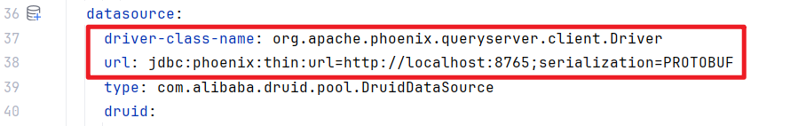

### 定义 POJO 类

既然我们要用MyBatis连接Phoenix，那么持久层的POJO类、DAO接口和XML文件都要配齐了才可以。在`<font style="color:#000000;background-color:rgba(220, 240, 255, 0.3) !important;">com.example.zxds.nebula.db.pojo</font>`包中，创建3个POJO类。

```java
package com.example.zxds.nebula.db.pojo;

import lombok.Data;

@Data
public class OrderGpsEntity {
    private Long id;
    private Long orderId;
    private Long driverId;
    private Long customerId;
    private String latitude;
    private String longitude;
    private String speed;
    private String createTime;
}
```

```java
package com.example.zxds.nebula.db.pojo;

import lombok.Data;

@Data
public class OrderMonitoringEntity {
    private Long id;
    private Long orderId;
    private Byte status;
    private Integer records;
    private String safety;
    private Integer reviews;
    private Byte alarm;
    private String createTime;
}
```

```java
package com.example.zxds.nebula.db.pojo;

import lombok.Data;

@Data
public class OrderVoiceTextEntity {
    private Long id;
    private String uuid;
    private Long orderId;
    private String recordFile;
    private String text;
    private String label;
    private String suggestion;
    private String keywords;
    private String createTime;
}
```

### 定义 DAO 接口

在`<font style="color:#000000;background-color:rgba(220, 240, 255, 0.3) !important;">com.example.zxds.nebula.db.dao</font>`包中，声明3个DAO接口。

```java
package com.example.zxds.nebula.db.dao;

public interface OrderGpsDao {
}
```

```java
package com.example.zxds.nebula.db.dao;

public interface OrderMonitoringDao {
}
```

```java
package com.example.zxds.nebula.db.dao;

public interface OrderVoiceTextDao {
}
```

### 定义 XML 文件

在`<font style="color:#000000;background-color:rgba(220, 240, 255, 0.3) !important;">resources</font>`目录中创建`<font style="color:#000000;background-color:rgba(220, 240, 255, 0.3) !important;">mapper</font>`文件夹，定义3个XML文件

```xml
<?xml version="1.0" encoding="UTF-8"?>
<!DOCTYPE mapper
        PUBLIC "-//mybatis.org//DTD Mapper 3.0//EN"
        "http://mybatis.org/dtd/mybatis-3-mapper.dtd">
<mapper namespace="com.example.zxds.nebula.db.dao.OrderGpsDao">

</mapper>
```

```xml
<?xml version="1.0" encoding="UTF-8"?>
<!DOCTYPE mapper
        PUBLIC "-//mybatis.org//DTD Mapper 3.0//EN"
        "http://mybatis.org/dtd/mybatis-3-mapper.dtd">
<mapper namespace="com.example.zxds.nebula.db.dao.OrderMonitoringDao">

</mapper>
```

```xml
<?xml version="1.0" encoding="UTF-8"?>
<!DOCTYPE mapper
        PUBLIC "-//mybatis.org//DTD Mapper 3.0//EN"
        "http://mybatis.org/dtd/mybatis-3-mapper.dtd">
<mapper namespace="com.example.zxds.nebula.db.dao.OrderVoiceTextDao">
  
</mapper>
```

### 运行子系统

上述内容都配置完成之后，我们就可以启动`<font style="color:#000000;background-color:rgba(220, 240, 255, 0.3) !important;">zxds-nebula</font>`子系统了，如果控制台没有报错信息，说明咱们的配置都是正确的

# 保存录音文件及聊天文本-编写 zxds-nebula 子系统

功能：保存录音文件到 minio 服务器，保存聊天文本到 HBase。

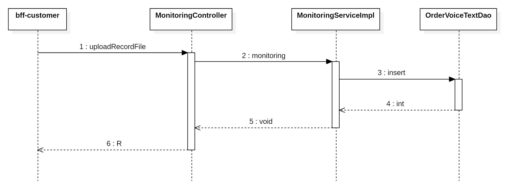

## 编写持久层

在`<font style="color:#000000;background-color:rgba(220, 240, 255, 0.3) !important;">OrderVoiceTextDao.xml</font>`文件中，声明SQL语句。Phoenix的**添加和修改**操作都用的是`<font style="color:#000000;background-color:rgba(220, 240, 255, 0.3) !important;">UPSERT INTO</font>`关键字。

```xml
<insert id="insert" parameterType="com.example.zxds.nebula.db.pojo.OrderVoiceTextEntity">
    UPSERT INTO zxds.order_voice_text("id", "uuid", "order_id", "record_file", "text", "create_time")
    VALUES(NEXT VALUE FOR zxds.ovt_sequence, '${uuid}', #{orderId}, '${recordFile}', '${text}', NOW())
</insert>
```

**注意事项：**

1. 字段名要使用双引号括起来，保持小写，因为建表的时候，字段名是小写的。如果不使用双引号括起来，字段名会自动转换为大写。
2. 字符串类型传值使用 `${}`语法。【**存在 SQL 注入风险，需要全局控制，当前系统没有解决这个问题，大家自行解决。**】
3. 数字类型传值使用 `#{}`语法。

在`<font style="color:#000000;background-color:rgba(220, 240, 255, 0.3) !important;">com.example.zxds.nebula.db.dao</font>`包`<font style="color:#000000;background-color:rgba(220, 240, 255, 0.3) !important;">OrderVoiceTextDao.java</font>`接口中，声明DAO方法

```java
int insert(OrderVoiceTextEntity entity);
```

## 编写 service 和实现

在`<font style="color:#000000;background-color:rgba(220, 240, 255, 0.3) !important;">com.example.zxds.nebula.service</font>`包中创建`<font style="color:#000000;background-color:rgba(220, 240, 255, 0.3) !important;">MonitoringService.java</font>`接口，声明抽象方法

```java
package com.example.zxds.nebula.service;

import org.springframework.web.multipart.MultipartFile;

public interface MonitoringService {
    void monitoring(MultipartFile file, String name, String text);
}
```

在`<font style="color:#000000;background-color:rgba(220, 240, 255, 0.3) !important;">com.example.zxds.nebula.service.impl</font>`包中创建`<font style="color:#000000;background-color:rgba(220, 240, 255, 0.3) !important;">MonitoringServiceImpl.java</font>`类，实现抽象方法

```java
package com.example.zxds.nebula.service.impl;

import cn.hutool.core.util.IdUtil;
import com.example.zxds.common.exception.ZxdsException;
import com.example.zxds.nebula.db.dao.OrderVoiceTextDao;
import com.example.zxds.nebula.db.pojo.OrderVoiceTextEntity;
import com.example.zxds.nebula.service.MonitoringService;
import io.minio.MinioClient;
import io.minio.PutObjectArgs;
import lombok.RequiredArgsConstructor;
import lombok.extern.slf4j.Slf4j;
import org.springframework.beans.factory.annotation.Value;
import org.springframework.stereotype.Service;
import org.springframework.transaction.annotation.Transactional;
import org.springframework.web.multipart.MultipartFile;

@Service
@Slf4j
@RequiredArgsConstructor
public class MonitoringServiceImpl implements MonitoringService {

    private final OrderVoiceTextDao orderVoiceTextDao;

    @Value("${minio.endpoint}")
    private String endpoint;

    @Value("${minio.access-key}")
    private String accessKey;

    @Value("${minio.secret-key}")
    private String secretKey;

    @Override
    @Transactional
    public void monitoring(MultipartFile file, String name, String text) {
        //把录音文件上传到Minio
        try {
            MinioClient client = new MinioClient.Builder().endpoint(endpoint).credentials(accessKey, secretKey).build();
            client.putObject(PutObjectArgs
                    .builder()
                    .bucket("zxds-record")
                    .object(name)
                    .stream(file.getInputStream(), -1, 20971520)
                    .contentType("audio/x-mpeg")
                    .build());
        } catch (Exception e) {
            log.error("上传代驾录音文件失败", e);
            throw new ZxdsException("上传代驾录音文件失败");
        }

        OrderVoiceTextEntity entity = new OrderVoiceTextEntity();

        //文件名格式例如:2156356656617-1.mp3，我们要解析出订单号
        String[] temp = name.substring(0, name.indexOf(".mp3")).split("-");
        Long orderId = Long.parseLong(temp[0]);

        String uuid = IdUtil.simpleUUID();
        entity.setUuid(uuid);
        entity.setOrderId(orderId);
        entity.setRecordFile(name);
        entity.setText(text);
        //把文稿保存到HBase
        int rows = orderVoiceTextDao.insert(entity);
        if (rows != 1) {
            throw new ZxdsException("保存录音文稿失败");
        }

        //TODO 执行文稿内容审查

    }
}
```

## 编写 web 方法

在`<font style="color:#000000;background-color:rgba(220, 240, 255, 0.3) !important;">com.example.zxds.nebula.controller</font>`包中，创建`<font style="color:#000000;background-color:rgba(220, 240, 255, 0.3) !important;">MonitoringController.java</font>`类，声明Web方法

```java
package com.example.zxds.nebula.controller;

import com.example.zxds.common.exception.ZxdsException;
import com.example.zxds.common.util.R;
import com.example.zxds.nebula.service.MonitoringService;
import io.swagger.v3.oas.annotations.Operation;
import io.swagger.v3.oas.annotations.tags.Tag;
import lombok.RequiredArgsConstructor;
import lombok.extern.slf4j.Slf4j;
import org.springframework.web.bind.annotation.PostMapping;
import org.springframework.web.bind.annotation.RequestMapping;
import org.springframework.web.bind.annotation.RequestPart;
import org.springframework.web.bind.annotation.RestController;
import org.springframework.web.multipart.MultipartFile;

@RestController
@RequestMapping("/monitoring")
@Tag(name = "MonitoringController", description = "监控服务的Web接口")
@Slf4j
@RequiredArgsConstructor
public class MonitoringController {

    private final MonitoringService monitoringService;
    
    // @RequestPart 用于接收 multipart/form-data 格式的请求中的文件或普通字段
    @PostMapping(value = "/uploadRecordFile")
    @Operation(summary = "上传代驾录音文件")
    public R uploadRecordFile(@RequestPart("file") MultipartFile file, 
                              @RequestPart("name") String name, 
                              @RequestPart(value = "text", required = false) String text) {
        if (file.isEmpty()) {
            throw new ZxdsException("录音文件不能为空");
        }
        monitoringService.monitoring(file, name, text);
        return R.ok();
    }
}
```

# 保存录音文件及聊天文本-编写 bff-driver 子系统

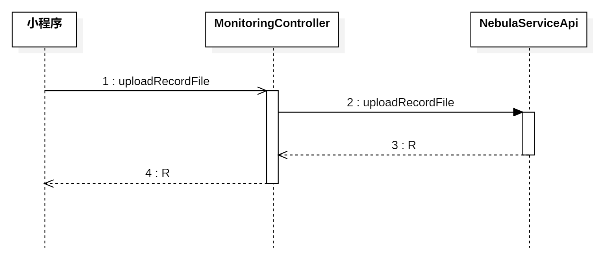

## 编写 Feign 客户端

在`<font style="color:#000000;background-color:rgba(220, 240, 255, 0.3) !important;">com.example.zxds.bff.driver.feign</font>`包中，创建`<font style="color:#000000;background-color:rgba(220, 240, 255, 0.3) !important;">NebulaServiceApi.java</font>`接口，定义抽象方法

```java
package com.example.zxds.bff.driver.feign;

import com.example.zxds.bff.driver.config.MultipartSupportConfig;
import com.example.zxds.common.util.R;
import org.springframework.cloud.openfeign.FeignClient;
import org.springframework.http.MediaType;
import org.springframework.web.bind.annotation.PostMapping;
import org.springframework.web.bind.annotation.RequestPart;
import org.springframework.web.multipart.MultipartFile;

// configuration：配置Feign支持文件上传的编码器，解决MultipartFile序列化问题
@FeignClient(value = "zxds-nebula", configuration = MultipartSupportConfig.class)
public interface NebulaServiceApi {

    // consumes：声明我要发送的是multipart/form-data格式的请求
    @PostMapping(value = "/monitoring/uploadRecordFile", consumes = MediaType.MULTIPART_FORM_DATA_VALUE)
    R uploadRecordFile(@RequestPart(value = "file") MultipartFile file, 
                       @RequestPart("name") String name, 
                       @RequestPart(value = "text", required = false) String text);

}
```

## 编写 web 方法

在`<font style="color:#000000;background-color:rgba(220, 240, 255, 0.3) !important;">com.example.zxds.bff.driver.controller</font>`包中，创建`<font style="color:#000000;background-color:rgba(220, 240, 255, 0.3) !important;">MonitoringController.java</font>`类，声明Web方法。这里之所以让Web方法直接调用Feign接口，是因为要把接收到的文件直接传递给`<font style="color:#000000;background-color:rgba(220, 240, 255, 0.3) !important;">zxds-nebula</font>`子系统。如果通过业务层去调用Feign接口，业务方法的参数用上`<font style="color:#000000;background-color:rgba(220, 240, 255, 0.3) !important;">@RequestPart("file")</font>`非常不适合。

```java
package com.example.zxds.bff.driver.controller;

import com.example.zxds.bff.driver.feign.NebulaServiceApi;
import com.example.zxds.common.exception.ZxdsException;
import com.example.zxds.common.util.R;
import io.swagger.v3.oas.annotations.tags.Tag;
import lombok.RequiredArgsConstructor;
import lombok.extern.slf4j.Slf4j;
import org.springframework.web.bind.annotation.PostMapping;
import org.springframework.web.bind.annotation.RequestMapping;
import org.springframework.web.bind.annotation.RequestPart;
import org.springframework.web.bind.annotation.RestController;
import org.springframework.web.multipart.MultipartFile;

@RestController
@RequestMapping("/monitoring")
@Tag(name = "MonitoringController", description = "订单监控服务的Web接口")
@Slf4j
@RequiredArgsConstructor
public class MonitoringController {

    private final NebulaServiceApi nebulaServiceApi;

    @PostMapping(value = "/uploadRecordFile")
    public R uploadRecordFile(@RequestPart("file") MultipartFile file, 
                              @RequestPart("name") String name, 
                              @RequestPart(value = "text", required = false) String text) {
        if (file.isEmpty()) {
            throw new ZxdsException("上传文件不能为空");
        }
        nebulaServiceApi.uploadRecordFile(file, name, text);
        return R.ok();
    }
}
```

# 更新订单状态-编写 zxds-odr 子系统

司机点击开始代驾就开启录音。司机点击停止代驾就停止录音。司机停止代驾，就需要更新订单状态。接下来实现一下订单状态的更新。

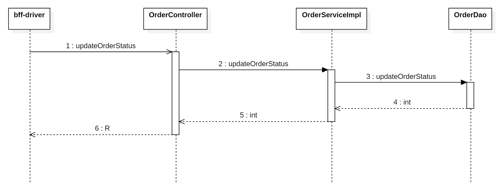

## 编写 service 和实现

在`<font style="color:#000000;background-color:rgba(220, 240, 255, 0.3) !important;">com.example.zxds.odr.service</font>`包`<font style="color:#000000;background-color:rgba(220, 240, 255, 0.3) !important;">OrderService.java</font>`接口中，声明抽象方法

```java
int updateOrderStatus(Map<String, Object> param);
```

在`<font style="color:#000000;background-color:rgba(220, 240, 255, 0.3) !important;">com.example.zxds.odr.service.impl</font>`包`<font style="color:#000000;background-color:rgba(220, 240, 255, 0.3) !important;">OrderServiceImpl.java</font>`类中，实现抽象方法

```java
@Override
@Transactional
public int updateOrderStatus(Map<String, Object> param) {
    int rows = orderDao.updateOrderStatus(param);
    if (rows != 1) {
        throw new ZxdsException("更新订单记录失败");
    }
    return rows;
}
```

## 编写 form 接收数据并校验

在`<font style="color:#000000;background-color:rgba(220, 240, 255, 0.3) !important;">com.example.zxds.odr.controller.form</font>`包中创建`<font style="color:#000000;background-color:rgba(220, 240, 255, 0.3) !important;">UpdateOrderStatusForm.java</font>`类

```java
package com.example.zxds.odr.controller.form;

import io.swagger.v3.oas.annotations.media.Schema;
import lombok.Data;
import org.hibernate.validator.constraints.Range;

import javax.validation.constraints.Min;
import javax.validation.constraints.NotNull;

@Data
@Schema(description = "更新订单状态的表单")
public class UpdateOrderStatusForm {
    @NotNull(message = "orderId不能为空")
    @Min(value = 1, message = "orderId不能小于1")
    @Schema(description = "订单ID")
    private Long orderId;

    @NotNull(message = "status不能为空")
    @Range(min = 1, max = 12, message = "status内容不正确")
    @Schema(description = "订单状态")
    private Byte status;
}
```

## 编写 web 方法

在`<font style="color:#000000;background-color:rgba(220, 240, 255, 0.3) !important;">com.example.zxds.odr.controller</font>`包`<font style="color:#000000;background-color:rgba(220, 240, 255, 0.3) !important;">OrderController.java</font>`类中，声明Web方法

```java
@PostMapping("/updateOrderStatus")
@Operation(summary = "更新订单状态")
public R updateOrderStatus(@RequestBody @Valid UpdateOrderStatusForm form) {
    Map<String, Object> param = BeanUtil.beanToMap(form);
    int rows = orderService.updateOrderStatus(param);
    return R.ok().put("rows", rows);
}
```

# 更新订单状态-编写 bff-driver 子系统

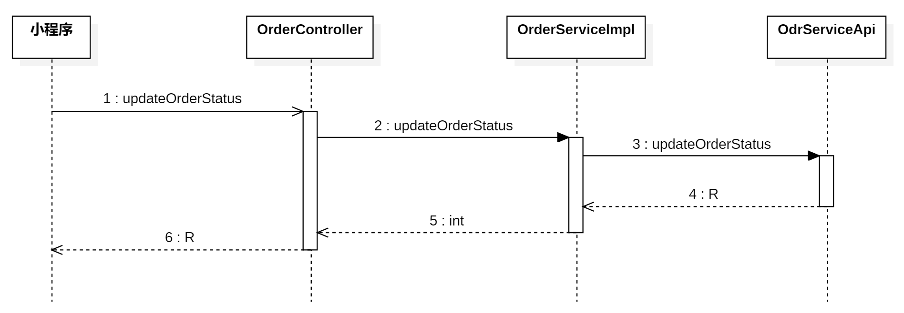

## 编写 Feign 客户端

在`<font style="color:#000000;background-color:rgba(220, 240, 255, 0.3) !important;">com.example.zxds.bff.driver.controller.form</font>`包中创建`<font style="color:#000000;background-color:rgba(220, 240, 255, 0.3) !important;">UpdateOrderStatusForm.java</font>`类

```java
package com.example.zxds.bff.driver.controller.form;

import io.swagger.v3.oas.annotations.media.Schema;
import lombok.Data;
import org.hibernate.validator.constraints.Range;

import javax.validation.constraints.Min;
import javax.validation.constraints.NotNull;

@Data
@Schema(description = "更新订单状态的表单")
public class UpdateOrderStatusForm {
    @NotNull(message = "orderId不能为空")
    @Min(value = 1, message = "orderId不能小于1")
    @Schema(description = "订单ID")
    private Long orderId;

    @NotNull(message = "status不能为空")
    @Range(min = 1, max = 12, message = "status内容不正确")
    @Schema(description = "订单状态")
    private Byte status;

    @NotNull(message = "customerId不能为空")
    @Min(value = 1, message = "customerId不能小于1")
    @Schema(description = "客户ID")
    private Long customerId;
}
```

在`<font style="color:#000000;background-color:rgba(220, 240, 255, 0.3) !important;">com.example.zxds.bff.driver.feign</font>`包`<font style="color:#000000;background-color:rgba(220, 240, 255, 0.3) !important;">OdrServiceApi.java</font>`接口中，声明抽象方法

```java
@PostMapping("/order/updateOrderStatus")
R updateOrderStatus(UpdateOrderStatusForm form);
```

## 编写 service 和实现

在`<font style="color:#000000;background-color:rgba(220, 240, 255, 0.3) !important;">com.example.zxds.bff.driver.service</font>`包`<font style="color:#000000;background-color:rgba(220, 240, 255, 0.3) !important;">OrderService.java</font>`接口中，声明抽象方法

```java
int updateOrderStatus(UpdateOrderStatusForm form);
```

在`<font style="color:#000000;background-color:rgba(220, 240, 255, 0.3) !important;">com.example.zxds.bff.driver.service.impl</font>`包`<font style="color:#000000;background-color:rgba(220, 240, 255, 0.3) !important;">OrderServiceImpl.java</font>`类中，实现抽象方法

```java
@Override
@GlobalTransactional
public int updateOrderStatus(UpdateOrderStatusForm form) {
    R r = odrServiceApi.updateOrderStatus(form);
    int rows = MapUtil.getInt(r, "rows");
    //TODO 判断订单的状态，然后实现后续业务
    return rows;
}
```

## 编写 web 方法

在`<font style="color:#000000;background-color:rgba(220, 240, 255, 0.3) !important;">com.example.zxds.bff.driver.controller</font>`包`<font style="color:#000000;background-color:rgba(220, 240, 255, 0.3) !important;">OrderController.java</font>`类中，声明Web方法

```java
@PostMapping("/updateOrderStatus")
@SaCheckLogin
@Operation(summary = "更新订单状态")
public R updateOrderStatus(@RequestBody @Valid UpdateOrderStatusForm form) {
    int rows = orderService.updateOrderStatus(form);
    return R.ok().put("rows", rows);
}
```

# 移动端实现保存录音文件和聊天文本

移动端实现保存录音文件和聊天文本。思路是：页面加载后绑定录音插件的各种回调函数。然后当司机点击开始代驾时开启录音，点击结束代驾时停止录音。

## 定义全局 URL

司机端的 `<font style="color:#000000;">main.js</font>`文件中编写：

```javascript
Vue.prototype.url = {
    ……,
    uploadRecordFile: `${baseUrl}/monitoring/uploadRecordFile`,
    updateOrderStatus: `${baseUrl}/order/updateOrderStatus`
}
```

## 同声传译插件的 API

同声传译插件可以实现录音，并且把录音中的语音部分转换成文本。官方文档：[https://mp.weixin.qq.com/wxopen/plugindevdoc?appid=wx069ba97219f66d99&token=61191740&lang=zh_CN](https://mp.weixin.qq.com/wxopen/plugindevdoc?appid=wx069ba97219f66d99&token=61191740&lang=zh_CN)

**示例代码如下：**

```javascript
// 引入插件对象。
var plugin = requirePlugin("WechatSI")
// 需要一个 录音识别 管理器对象。
// 可以一边录音生成mp3文件，同时将mp3文件转换成text文本。
let manager = plugin.getRecordRecognitionManager()

//开始录音的回调函数
manager.onStart = function(res) {
    console.log("成功开始录音识别", res)
}

//从语音中识别出文字，会执行该回调函数
manager.onRecognize = function(res) {
    console.log("current result", res.result)
}

//录音结束的回调函数
manager.onStop = function(res) {
    // res.tempFilePath 获取的是mp3文件的路径
    console.log("record file path", res.tempFilePath)
    // res.result 获取的是这一段录音对应的文本内容。
    console.log("result", res.result)
}

//出现异常的回调函数
manager.onError = function(res) {
    console.error("error msg", res.msg)
}

//开始录音，并且识别中文语音内容
manager.start({duration:30000, lang: "zh_CN"})
```

## 页面加载时绑定回调函数

在工作台页面的`<font style="color:#000000;background-color:rgba(220, 240, 255, 0.3) !important;">onLoad()</font>`函数中，添加代码，初始化录音管理器插件

```javascript
onLoad: function() {
    let that = this;
    if (!that.reviewAuth) {
        ……
        let recordManager = plugin.getRecordRecognitionManager(); //初始化录音管理器
        recordManager.onRecognize = function(resp) {
          // 语音识别的中间结果，不完整，有时可以用在实时显示字幕的功能上。只要识别出文字，这个回调就会执行。
        };
        recordManager.onStop = function(resp) {
            if (that.workStatus == '开始代驾' && that.stopRecord == false) {
                that.recordManager.start({ duration: 20 * 1000, lang: 'zh_CN' });
            }
            let tempFilePath = resp.tempFilePath;
            //上传录音
            that.recordNum += 1;
            let data = {
                name: `${that.executeOrder.id}-${that.recordNum}.mp3`,
                text: resp.result
            };
            uni.uploadFile({
                                            url: that.url.uploadRecordFile,
                                            filePath:tempFilePath,
                                            name: "file",
                                            header:{
                                                    token: uni.getStorageSync("token")
                                            },
                                            formData: data,
                                            success: (resp) => {
                                                    if(resp.statusCode == 200 && resp.data.code == 200){
                                                            console.log("录音文件上传成功");
                  // 这个代码很重要，必须放在这里（位置也很重要）
                  if(that.stopRecord){
                    that.recordNum = 0;
                    that.stopRecord = false;
                  }
                                                    }else{
                                                            console.log("录音文件上传失败");
                                                    }
                                            }
                                    });
        };
        recordManager.onStart = function(resp) {
            console.log('成功开始录音识别');
            if (that.recordNum == 0) {
                uni.vibrateLong({
                    complete: function() {
                        uni.showToast({
                            icon: 'none',
                            title: '请提示客户系上安全带！'
                        });
                    }
                });
            }
        };
        recordManager.onError = function(resp) {
            console.error('录音识别故障', resp.msg);
        };
        that.recordManager = recordManager;
      
                    that.ajax(
                            that.url.searchDriverCurrentOrder,
                            'POST',
                            null,
                            function(resp) {
                                    if (resp.data.hasOwnProperty('result')) {
                                            ……
                                            
                                            if (that.workStatus == '开始代驾') {
                                                    that.recordManager.start({ duration: 20 * 1000, lang: 'zh_CN' });
                                            }
                                    }
                            },
                            false
                    );
        ……
    }

},
```

## 司机开始代驾和结束代驾

司机点击开始代驾按钮之后，开始录音。在之前编写的代码基础之上添加两行代码即可：

```javascript
startDrivingHandle: function() {
    let that = this;
    uni.showModal({
        title: '消息通知',
        content: '您已经接到客户，现在开始代驾？',
        success: function(resp) {
            if (resp.confirm) {
                //设置录音标志位
                // ~~~~~这里新增一行代码~~~~~
                that.stopRecord = false;  
                let data = {
                    orderId: that.executeOrder.id,
                    customerId: that.executeOrder.customerId
                };
                that.ajax(that.url.startDriving, 'POST', data, function(resp) {
                    if (resp.data.rows == 1) {
                        uni.showToast({
                            icon: 'success',
                            title: '订单状态更新成功'
                        });
                        that.workStatus = '开始代驾';
                        uni.setStorageSync('workStatus', '开始代驾');
                        //开始录音
                        // ~~~~~~这里新增一行代码~~~~~~~
                        that.recordManager.start({ duration: 20 * 1000, lang: 'zh_CN' });
                    }
                });
            }
        }
    });
},
```

结束代驾的时候，要更新订单状态，然后停止录音

```javascript
endDrivingHandle: function() {
    let that = this;
    uni.showModal({
        title: '消息通知',
        content: '已经到达终点，现在结束代驾？',
        success: function(resp) {
            if (resp.confirm) {
                let data = {
                    orderId: that.executeOrder.id,
                    customerId: that.executeOrder.customerId,
                    status: 5
                };
                that.ajax(that.url.updateOrderStatus, 'POST', data, function(resp) {
                    try {
                        //停止录音
                        that.stopRecord = true;
                        that.recordManager.stop(); 
                        // 设置工作状态为：结束代驾
                        that.workStatus = '结束代驾';
                        uni.setStorageSync('workStatus', '结束代驾');
                        //页面发生跳转
                        uni.navigateTo({
                            url: '../../order/enter_fee/enter_fee?orderId=' + that.executeOrder.id + '&customerId=' + that.executeOrder.customerId
                        });
                    } catch (e) {
                        console.error(e);
                    }
                });
            }
        }
    });
}
```

# 防司机刷单理论

## 为什么要防司机刷单

司机刷单可以骗取平台的**冲单奖励**、**赚取平台的补贴**等，因此要防止司机刷单。

**冲单奖励**：单子在规定时间内达到了多少就奖励。

**赚取平台的补贴：**比如雨天、高峰期、夜间有额外倍数加成（1.5倍、2倍），或者有“完成一单额外奖励5元”这种活动

## 司机一般怎么刷单

两人配合，三台手机就可以刷单：

1. 我拿两部手机 A 和 B。A 模拟乘客，B 模拟司机。
2. A 下单 ，B 接单，B 接单立即点击“到达上车点”。
3. 我找了另外一个人拿着 C 手机在代驾单终点附近登录司机账号，点击“结束代驾”。

## 我们是怎么防止的

系统在司机登录小程序时，强制获取当前手机卡的手机号，并与司机实名认证时的手机号进行比对。只有两者一致才允许登录，从而杜绝同一账号在多部手机间交替登录的操作，彻底封堵上述刷单漏洞。

另外系统要求**司机位置**必须在**代驾起点位置** 1 公里范围内才能开始代驾。要求**司机位置**必须在**代驾终点位置** 2 公里范围内才能结束代驾。这样做的目的是：

- **给真实场景留出变通余地**：比如乘客定位的小区北门关闭了，需要绕到南门上车或下车，或者司机找停车位时稍微偏离了终点。这1公里和2公里的范围，允许司机在不完全精确抵达坐标的情况下，依然可以正常操作，**避免因GPS轻微偏差或路况变化导致订单无法进行**。
- **设置基本的距离门槛**：这样做虽然无法完全杜绝刷单，但它强制司机必须**物理上接近**起点和终点。如果没有这个限制，司机可以在任何地方（比如家里）直接点击“到达”和“结束”，刷单成本会更低。这个规则至少要求刷单人需要有人实际跑到这两个地点附近，**提高了刷单的操作门槛**。

## 关于超短途订单触发风控

有的司机会利用超短途订单进行刷单，比如订单的起点和终点只有 100 米的距离。但这种不能一刀切，因为也会有这种真实的超短途订单，实现需要小心，避免误伤，我们这里采用以下规则来防止：

**分级风控策略**

| **级别** | **触发条件** | **处理方式** |
| --- | --- | --- |
| **观察级** | 单日超短单≥2单 或 周超短占比>20% | 打标签，进入观察名单 |
| **预警级** | 单日超短单≥4单 或 周超短占比>35% | 订单人工抽检 |
| **高危级** | 连续3天每天超短单≥3单 或 周超短占比>60% | 冻结提现，要求申诉 |

分级风控，在我们项目中就不再进行代码实现了。大家记住这种方式就行。

**总结：（背会，面试使用）**

1. 关于长订单刷单
  1. 司机必须在距离代驾起点的 1 公里之内才能点击到达代驾点。
  2. 司机必须在距离代驾终点的 2 公里之内才能点击结束代驾。
  3. 司机小程序的账号登录的时候有严格的要求：司机在手机上登录，要求手机上的 sim 卡手机号必须和当前司机实名认证的手机号一致，才可以登录。
2. 关于短订单刷单
  1. 引入风控机制。根据单日的或者周的，短单的数量或者短单的比例来触发不同级别的风控。

# 防司机刷单-获取司机手机号

## 业务描述

当司机点击**登录按钮**时，获取司机的手机号，然后验证手机号和底层数据库中实名认证的手机号是否一致。

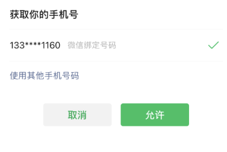

## 实现获取手机号的流程

**该功能只有企业开发者账号才能完成，大家这部分的内容就不要写了。知道代码实现过程即可。**

实现流程还是有一些复杂的，文字描述如下：

1. **司机在小程序端点击“获取手机号”按钮**，微信弹出授权窗口。**用户点击“允许”后，微信服务器返回一个临时 code**给小程序前端。**小程序前端将该 code 传给自己的后端服务器**。(**这个 code 本质上代表的就是用户已经授权了，授权允许获取 sim 卡的手机号**)
2. **后端服务器使用小程序的 appid 和 secret**，向微信服务器请求 `<font style="color:#000000;background-color:rgb(235, 238, 242);">access_token</font>`（接口调用凭证）。**微信服务器验证 appid 和 secret 通过后**，返回 `<font style="color:#000000;background-color:rgb(235, 238, 242);">access_token</font>` 给后端服务器。（access_token 就是接口调用凭证，验证**咱们当前的后端项目**是不是属于**这个小程序的后端**）
3. **后端服务器拿着获取的 **`**<font style="color:#000000;background-color:rgb(235, 238, 242);">access_token</font>**`**，加上收到的 code**，向微信服务器请求获取手机号。**微信服务器验证 **`**<font style="color:#000000;background-color:rgb(235, 238, 242);">access_token</font>**`** 和 code 有效后**，将加密后的手机号数据返回给后端服务器。
4. **后端服务器收到手机号后（从 sim 卡上获取的手机号）**，拿着** sim 卡的手机号**和**代驾小程序司机实名认证时的手机号**进行比对。

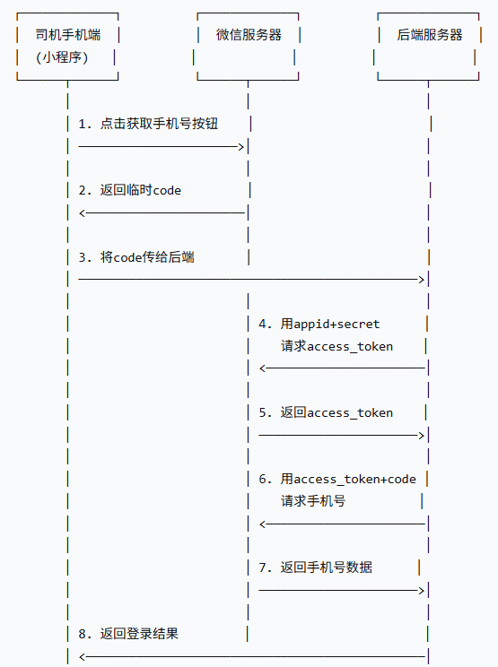

## 获取 code 临时授权码

找到司机端 `<font style="color:#000000;">login.vue</font>`页面，这个文件中的代码需要再修改一下：

**第一步：先把 微信登录 按钮修改一下。**

```html
<button class="btn" open-type="getPhoneNumber" @getphonenumber="login">微信登录</button>
```

司机只要点击这个按钮，就已经和微信服务器通信了。微信服务器就会返回临时授权 code。

`<font style="color:#000000;">open-type="getPhoneNumber"</font>`是固定写法，必须这么写。它声明按钮类型是**获取手机号**。

`<font style="color:#000000;">@getphonenumber="login"</font>`是固定写法，必须这么写。执行原理是：小程序和微信服务器通信，微信服务器返回 code 给小程序，小程序拿到 code 后，会调用 login 方法，并且 code 会自动传递给 login 方法的 `<font style="color:#000000;">event</font>`参数。将来通过 `<font style="color:#000000;">event.detail.code</font>`可以将它取出。

**第二步：在 **`**<font style="color:#000000;">login</font>**`**函数中添加代码（红框中都是要添加的代码）**

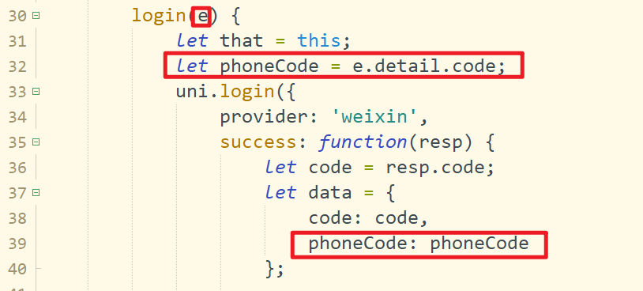

## 如何拿到 access_token

[https://developers.weixin.qq.com/miniprogram/dev/server/API/mp-access-token/](https://developers.weixin.qq.com/miniprogram/dev/server/API/mp-access-token/)

**需要通过小程序的 appid+密钥换取 access_token ，发送以下请求：**

```plaintext
https://api.weixin.qq.com/cgi-bin/token?grant_type=client_credential&appid=APPID&secret=APPSECRET
```

我们可以在后端 Java 程序中发送以上的 HTTP 请求来获取 access_token

**返回结果如下：**

```json
{"access_token":"ACCESS_TOKEN","expires_in":7200}
```

## 如何拿到手机号

[https://developers.weixin.qq.com/miniprogram/dev/server/API/](https://developers.weixin.qq.com/miniprogram/dev/server/API/)

有了phoneCode和access_token之后，我们可以调用微信官方的API，获得用户的手机号

```plaintext
https://api.weixin.qq.com/wxa/business/getuserphonenumber?access_token=ACCESS_TOKEN
```

返回结果如下：

```json
{
    "errcode":0,
    "errmsg":"ok",
    "phone_info": {
        "phoneNumber":"13312345678",
        "purePhoneNumber": "xxxxxx",
        "countryCode": 86,
        "watermark": {
            "timestamp": 1637744274,
            "appid": "xxxx"
        }
    }
}
```

# 获取司机手机号代码实现

## 封装工具函数

在`<font style="color:#000000;background-color:rgba(220, 240, 255, 0.3) !important;">com.example.zxds.common.util</font>`包`<font style="color:#000000;background-color:rgba(220, 240, 255, 0.3) !important;">MicroAppUtil.java</font>`类中添加两个方法：一个获取 access_token，一个获取手机号

```java
public String getAccessToken() {
    String url = "https://api.weixin.qq.com/cgi-bin/token";
    HashMap map = new HashMap() {{
        put("grant_type", "client_credential");
        put("appid", appId);
        put("secret", appSecret);
    }};
    String response = HttpUtil.get(url, map);
    JSONObject json = JSONUtil.parseObj(response);
    if (json.containsKey("access_token")) {
        String accessToken = json.getStr("access_token");
        return accessToken;
    } else {
        throw new ZxdsException(json.getStr("errmsg"));
    }
}

public String getTel(String phoneCode) {
    String accessToken = getAccessToken();
    String url = "https://api.weixin.qq.com/wxa/business/getuserphonenumber?access_token=" + accessToken;
    JSONObject param = new JSONObject();
    param.set("code", phoneCode);
    HttpRequest post = HttpUtil.createPost(url);
    post.body(param.toString(), "application/json");
    HttpResponse response = post.execute();
    JSONObject json = JSONUtil.parseObj(response.body());
    if (json.containsKey("phone_info")) {
        String tel = json.getJSONObject("phone_info").getStr("purePhoneNumber");
        return tel;
    } else {
        throw new ZxdsException(json.getStr("errmsg"));
    }
}
```

## 修改 zxds-dr 子系统

修改`<font style="color:#000000;background-color:rgba(220, 240, 255, 0.3) !important;">DriverDao.xml</font>`文件中的`<font style="color:#000000;background-color:rgba(220, 240, 255, 0.3) !important;">login</font>`语句，添加查询`<font style="color:#000000;background-color:rgba(220, 240, 255, 0.3) !important;">tel</font>`字段。

```xml
<select id="login" parameterType="String" resultType="HashMap">
    SELECT CAST(id AS CHAR) AS id,
           real_auth        AS realAuth,
           archive,
           tel
    FROM tb_driver
    WHERE `status` != 2 AND open_id = #{openId}
</select>
```

修改`<font style="color:#000000;background-color:rgba(220, 240, 255, 0.3) !important;">DriverService.java</font>`接口中的`<font style="color:#000000;background-color:rgba(220, 240, 255, 0.3) !important;">login()</font>`函数，添加新的参数（**第二个参数新增的**）。

```java
Map<String,Object> login(String code, String phoneCode);
```

修改`<font style="color:#000000;background-color:rgba(220, 240, 255, 0.3) !important;">DriverServiceImpl.java</font>`类中的`<font style="color:#000000;background-color:rgba(220, 240, 255, 0.3) !important;">login()</font>`函数，把获取手机号和对比手机号功能给实现了

```java
@Override
public Map<String, Object> login(String code, String phoneCode) {
    String openId = microAppUtil.getOpenId(code);
    Map<String, Object> result = driverDao.login(openId);
    if (result != null) {
        if (result.containsKey("archive")) {
            int temp = MapUtil.getInt(result, "archive");
            boolean archive = temp == 1;
            result.replace("archive", archive);
        }
        String tel = MapUtil.getStr(result, "tel");
        String realTel = microAppUtil.getTel(phoneCode);
        if (!tel.equals(realTel)) {
            throw new ZxdsException("当前手机号与注册手机号不一致");
        }
    }
    return result;
}
```

修改`<font style="color:#000000;background-color:rgba(220, 240, 255, 0.3) !important;">LoginForm.java</font>`类的代码，补充新的变量

```java
@Data
@Schema(description = "司机登陆表单")
public class LoginForm {

    @NotBlank(message = "code不能为空")
    @Schema(description = "微信小程序临时授权")
    private String code;

    // 新增的
    @NotBlank(message = "phoneCode不能为空")
    @Schema(description = "微信小程序获取电话号码临时授权")
    private String phoneCode;
}
```

修改`<font style="color:#000000;background-color:rgba(220, 240, 255, 0.3) !important;">DriverController.java</font>`类的`<font style="color:#000000;background-color:rgba(220, 240, 255, 0.3) !important;">login()</font>`函数内容，如下

```java
@PostMapping("/login")
@Operation(summary = "登录系统")
public R login(@RequestBody @Valid LoginForm form) {
    Map<String, Object> map = driverService.login(form.getCode(), form.getPhoneCode()); // 添加第二个参数即可。
    return R.ok().put("result", map);
}
```

## 修改 bff-driver 子系统

修改`<font style="color:#000000;background-color:rgba(220, 240, 255, 0.3) !important;">ExceptionAdvice.java</font>`类，补充新的异常判断，添加了：司机登录时候的手机号不一致

```java
package com.example.zxds.bff.driver.config;

import cn.dev33.satoken.exception.NotLoginException;
import cn.hutool.json.JSONObject;
import com.example.zxds.common.exception.ZxdsException;
import lombok.extern.slf4j.Slf4j;
import org.springframework.http.HttpStatus;
import org.springframework.http.converter.HttpMessageNotReadableException;
import org.springframework.web.HttpRequestMethodNotSupportedException;
import org.springframework.web.bind.MethodArgumentNotValidException;
import org.springframework.web.bind.annotation.ExceptionHandler;
import org.springframework.web.bind.annotation.ResponseBody;
import org.springframework.web.bind.annotation.ResponseStatus;
import org.springframework.web.bind.annotation.RestControllerAdvice;

@Slf4j
@RestControllerAdvice
public class ExceptionAdvice {

    @ResponseBody
    @ResponseStatus(HttpStatus.INTERNAL_SERVER_ERROR)
    @ExceptionHandler(Exception.class)
    public String exceptionHandler(Exception e) {
        JSONObject json = new JSONObject();
        //处理后端验证失败产生的异常
        if (e instanceof MethodArgumentNotValidException) {
            MethodArgumentNotValidException exception = (MethodArgumentNotValidException) e;
            json.set("error", exception.getBindingResult().getFieldError().getDefaultMessage());
        }
        //HTTP请求类型不正确的异常
        else if (e instanceof HttpRequestMethodNotSupportedException) {
            json.set("error", "Web方法不支持当前的请求类型");
        }
        //缺少必须提交的表单数据
        else if (e instanceof HttpMessageNotReadableException) {
            json.set("error", "缺少提交的数据");
        }
        //处理业务异常
        else if (e instanceof ZxdsException) {
            log.error("执行异常", e);
            ZxdsException exception = (ZxdsException) e;
            json.set("error", exception.getMsg());
        }
        //司机已经注册异常
        else if (e.getMessage().contains("该微信无法注册")) {
            log.error("执行异常", e);
            json.set("error", "该微信无法注册");
        }
        //司机登录时候的手机号不一致
        else if (e.getMessage().contains("当前手机号与注册手机号不一致")) {
            log.error("执行异常", e);
            json.set("error", "当前手机号与注册手机号不一致");
        }
        //处理其余的异常
        else {
            log.error("执行异常", e);
            json.set("error", "执行异常");
        }
        return json.toString();
    }

    /**
     * 捕获并处理客户端未登录的异常
     */
    @ResponseBody
    @ResponseStatus(HttpStatus.UNAUTHORIZED)
    @ExceptionHandler(NotLoginException.class)
    public String unLoginHandler(Exception e) {
        JSONObject json = new JSONObject();
        json.set("error", e.getMessage());
        return json.toString();
    }

}
```

在`<font style="color:#000000;background-color:rgba(220, 240, 255, 0.3) !important;">LoginForm.java</font>`类中添加新的变量，如下：

```java
package com.example.zxds.bff.driver.controller.form;

import io.swagger.v3.oas.annotations.media.Schema;
import lombok.Data;

import javax.validation.constraints.NotBlank;

@Data
@Schema(description = "司机登录表单")
public class LoginForm {

    @NotBlank(message = "code不能为空")
    @Schema(description = "微信小程序临时授权")
    private String code;

    // 添加的变量
    @NotBlank(message = "phoneCode不能为空")
    @Schema(description = "微信小程序获取电话号码临时授权")
    private String phoneCode;

}
```

## 修改司机端小程序

修改`<font style="color:#000000;background-color:rgba(220, 240, 255, 0.3) !important;">main.js</font>`文件中的Ajax代码，添加异常判断

```javascript
Vue.prototype.ajax = function(url, method, data, fun, load) {
        let timer = null
        if (load == true || load == undefined) {
                uni.showLoading({
                        title: "执行中"
                })
                timer = setTimeout(function() {
                        uni.hideLoading()
                }, 60 * 1000)
        }

        uni.request({
                "url": url,
                "method": method,
                "header": {
                        token: uni.getStorageSync("token")
                },
                "data": data,
                success: function(resp) {
                        if (load == true || load == undefined) {
                                clearTimeout(timer)
                                uni.hideLoading()
                        }
                        if (resp.statusCode == 401) {
                                uni.redirectTo({
                                        url: "/pages/login/login.vue"
                                })
                        } else if (resp.statusCode == 200 && resp.data.code == 200) {
                                let data = resp.data
                                if (data.hasOwnProperty("token")) {
                                        let token = data.token
                                        uni.setStorageSync("token", token)
                                }
                                fun(resp)
                        } else if (resp.data.error=="该微信无法注册") {
                                uni.showToast({
                                        icon:"none",
                                        title:"该微信无法注册"
                                })
                        } else if (resp.data.error == "当前手机号与注册手机号不一致") {  // 这个分支判断是新增的代码。
          uni.showToast({
              icon: "none",
              title: "当前手机号与注册手机号不一致"
          })
      } else {
                                uni.showToast({
                                        icon: "none",
                                        title: "执行异常"
                                })
                                console.error(resp.data)
                        }
                },
                fail: function(error) {
                        if (load == true || load == undefined) {
                                clearTimeout(timer)
                                uni.hideLoading()
                        }
                }
        })
}
```

# 根据司机实时位置限定司机开始代驾和结束代驾

业务描述：

1. 司机的实时位置必须在代驾点的起点一公里范围内才能开始代驾。
2. 司机的实时位置必须在代驾终点两公里范围内才能结束代驾。

这个功能使用纯前端即可实现。使用腾讯位置服务计算距离。

## 如何使用腾讯位置服务计算距离

在移动端计算两个坐标点之间的距离，可以使用腾讯位置服务。腾讯位置服务提供了根据定位计算距离的API接口（[https://lbs.qq.com/miniProgram/jsSdk/jsSdkGuide/methodCalculatedistance](https://lbs.qq.com/miniProgram/jsSdk/jsSdkGuide/methodCalculatedistance)）。calculateDistance函数的参数和响应结构如下：

| **参数名** | **类型** | **参数值** |
| --- | --- | --- |
| mode | String | 可选值：driving（驾车）、walking（步行），straight（直线距离） |
| from | JSON | { latitude : 纬度 , longitude : 经度 } |
| to | JSON | [ { latitude : 纬度 , longitude : 经度 } , …… ] |

调用该接口，返回的结果如下：

```json
{
    message: "query ok", 
    result: {
        elements:[
          { distance: 3203, …… }
        ]
    },
    status: 0
}
```

## 编写司机端小程序

在工作台页面上，引入腾讯位置服务的SDK依赖库。

```javascript
let QQMapWX = require('../../lib/qqmap-wx-jssdk.min.js');
let qqmapsdk;
```

在`<font style="color:#000000;background-color:rgba(220, 240, 255, 0.3) !important;">onLoad()</font>`函数中，初始化SDK对象

```javascript
onLoad: function() {
    let that = this;
    qqmapsdk = new QQMapWX({
        key: that.tencent.map.key
    });
    ……
}
```

修改到达上车点按钮点击事件回调函数`<font style="color:#000000;background-color:rgba(220, 240, 255, 0.3) !important;">arriveStartPlaceHandle()</font>`的内容

```javascript
arriveStartPlaceHandle: function() {
    let that = this;
    uni.showModal({
        title: '消息通知',
        content: '确认已经到达了代驾点？',
        success: function(resp) {
            if (resp.confirm) {
                //---------------------改动的地方-----------------------------------
                qqmapsdk.calculateDistance({
                    mode: 'straight',
                    from: {
                        latitude: that.latitude,
                        longitude: that.longitude
                    },
                    to: [
                        {
                            latitude: that.executeOrder.startPlaceLocation.latitude,
                            longitude: that.executeOrder.startPlaceLocation.longitude
                        }
                    ],
                    success: function(resp) {
                        let distance = resp.result.elements[0].distance;
                        if (distance <= 1000) {
                            let data = {
                                orderId: that.executeOrder.id,
                                customerId: that.executeOrder.customerId
                            };
                            that.ajax(that.url.arriveStartPlace, 'POST', data, function(resp) {
                                if (resp.data.rows == 1) {
                                    uni.showToast({
                                        icon: 'none',
                                        title: '订单状态更新成功'
                                    });
                                    that.workStatus = '到达代驾点';
                                    uni.setStorageSync('workStatus', '到达代驾点');
                                }
                            });
                        } else {
                            uni.showToast({
                                icon: 'none',
                                title: '请移动到距离代驾起点1公里以内'
                            });
                        }
                    },
                    fail: function(error) {
                        console.log(error);
                    }
                });
                //--------------------------------------------------------
            }
        }
    });
},
```

修改结束代驾按钮点击事件的回调函数

```javascript
endDrivingHandle: function() {
    let that = this;
    uni.showModal({
        title: '消息通知',
        content: '已经到达终点，现在结束代驾？',
        success: function(resp) {
            if (resp.confirm) {
                //----------------------改动的地方------------------------------
                qqmapsdk.calculateDistance({
                    mode: 'straight',
                    from: {
                        latitude: that.latitude,
                        longitude: that.longitude
                    },
                    to: [
                        {
                            latitude: that.executeOrder.endPlaceLocation.latitude,
                            longitude: that.executeOrder.endPlaceLocation.longitude
                        }
                    ],
                    success: function(resp) {
                        let distance = resp.result.elements[0].distance;
                        if (distance <= 2000) {
                            let data = {
                                orderId: that.executeOrder.id,
                                customerId: that.executeOrder.customerId,
                                status: 5
                            };
                            that.ajax(that.url.updateOrderStatus, 'POST', data, function(resp) {
                                that.stopRecord = true;
                                try {
                                    that.recordManager.stop();
                                    that.recordNum = 0;
                                    that.stopRecord = false;
                                    that.workStatus = '结束代驾';
                                    uni.setStorageSync('workStatus', '结束代驾');
                                    uni.navigateTo({
                                        url: '../../order/enter_fee/enter_fee?orderId=' + that.executeOrder.id + '&customerId=' + that.executeOrder.customerId
                                    });
                                } catch (e) {
                                    console.error(e);
                                }
                            });
                        } else {
                            uni.showToast({
                                icon: 'none',
                                title: '请移动到距离代驾终点2公里以内'
                            });
                        }
                    },
                    fail: function(error) {
                        console.log(error);
                    }
                });
                //----------------------------------------------------------
            }
        }
    });
},
```

**以上代码编写完之后，再把代码恢复到之前的状态，在开发阶段开启验证的话，影响开发。**