# 智行代驾06

# 利用 AI 对司乘对话内容安全评级-保存订单监控统计信息

之前已经把司乘对话的文本内容保存到 HBase 中了。接下来我们使用 AI 技术对聊天内容进行安全评级。如果用人工监控司乘对话是不现实的，成本太高了，也雇不起那么多人。因此我们使用腾讯云数据万象服务对内容进行分析（腾讯云数据万象服务底层使用的就是人工智能）。腾讯云数据万象服务之前我们已经开通了。接下来，我们先去完成第一个功能：保存订单监控统计信息。

## 了解 `<font style="color:#000000;">order_monitoring</font>`表

在HBase中，`<font style="color:#000000;background-color:rgba(220, 240, 255, 0.3) !important;">order_monitoring</font>`表是用来保存订单的监控统计信息，比如说某个订单有多少个音频记录，司乘对话内容是什么安全等级的，有多少段对话需要人工审核等等

| **字段** | **类型** | **备注** |
| --- | --- | --- |
| id | BIGINT | 主键 |
| order_id | BIGINT | 订单号 |
| status | TINYINT | 状态（1 表示订单进行中，0 表示订单结束了） |
| records | INTEGER | 录音文件的数量 |
| safety | VARCHAR | 安全等级，安全值是 common |
| reviews | INTEGER | 需要人工审核的数量（数据万象审核不准时需要人工审核，这个字段记录的是需要人工审核的数量） |
| alarm | TINYINT | 是否报警（代表该订单有没有触发报警，1 表示没有触发，2 表示触发了） |
| create_time | DATE | 创建日期时间 |

## 编写 zxds-nebula 子系统

司机点击开始代驾按钮后，除了要修改订单的状态之外，还需要向`<font style="color:#000000;background-color:rgba(220, 240, 255, 0.3) !important;">order_monitoring</font>`表添加一条记录，所以要补充Nebula子系统的代码。

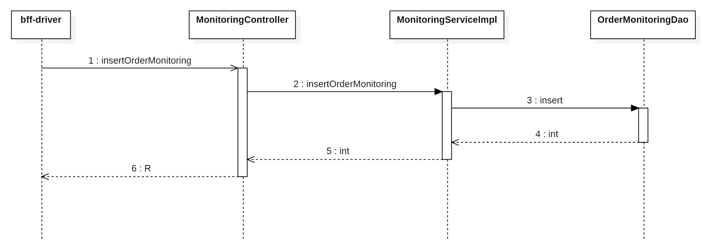

### 编写持久层代码

在`<font style="color:#000000;background-color:rgba(220, 240, 255, 0.3) !important;">OrderMonitoringDao.xml</font>`文件中，定义SQL语句

```xml
<insert id="insert" parameterType="long">
    UPSERT INTO zxds.order_monitoring("id","order_id","status","records","safety","reviews","alarm","create_time")
    VALUES(NEXT VALUE FOR zxds.om_sequence, #{orderId}, 1, 0, 'common', 0, 1, NOW())
</insert>
```

在`<font style="color:#000000;background-color:rgba(220, 240, 255, 0.3) !important;">OrderMonitoringDao.java</font>`接口中，声明抽象DAO方法

```java
int insert(long orderId);
```

### 编写 service 和实现

在`<font style="color:#000000;background-color:rgba(220, 240, 255, 0.3) !important;">com.example.zxds.nebula.service</font>`包`<font style="color:#000000;background-color:rgba(220, 240, 255, 0.3) !important;">MonitoringService.java</font>`接口中，声明抽象方法

```java
int insertOrderMonitoring(long orderId);
```

在`<font style="color:#000000;background-color:rgba(220, 240, 255, 0.3) !important;">com.example.zxds.nebula.service.impl</font>`包`<font style="color:#000000;background-color:rgba(220, 240, 255, 0.3) !important;">MonitoringServiceImpl.java</font>`类中，实现抽象方法

```java
private final OrderMonitoringDao orderMonitoringDao;

@Override
@Transactional
public int insertOrderMonitoring(long orderId) {
    int rows = orderMonitoringDao.insert(orderId);
    if (rows != 1) {
        throw new ZxdsException("添加订单监控摘要记录失败");
    }
    return rows;
}
```

### 编写 web 方法

在`<font style="color:#000000;background-color:rgba(220, 240, 255, 0.3) !important;">com.example.zxds.nebula.controller.form</font>`包中创建`<font style="color:#000000;background-color:rgba(220, 240, 255, 0.3) !important;">InsertOrderMonitoringForm.java</font>`类

```java
package com.example.zxds.nebula.controller.form;

import io.swagger.v3.oas.annotations.media.Schema;
import lombok.Data;

import javax.validation.constraints.Min;
import javax.validation.constraints.NotNull;

@Data
@Schema(description = "添加订单监控摘要记录的表单")
public class InsertOrderMonitoringForm {
    @NotNull(message = "orderId不能为空")
    @Min(value = 1, message = "orderId不能小于1")
    @Schema(description = "订单ID")
    private Long orderId;
}
```

在`<font style="color:#000000;background-color:rgba(220, 240, 255, 0.3) !important;">com.example.zxds.nebula.controller</font>`包`<font style="color:#000000;background-color:rgba(220, 240, 255, 0.3) !important;">MonitoringController.java</font>`类中，声明Web方法

```java
@PostMapping(value = "/insertOrderMonitoring")
@Operation(summary = "添加订单监控摘要记录")
public R insertOrderMonitoring(@RequestBody @Valid InsertOrderMonitoringForm form) {
    int rows = monitoringService.insertOrderMonitoring(form.getOrderId());
    return R.ok().put("rows", rows);
}
```

## 编写 bff-driver 子系统

写完了Nebula子系统，我们还要编写`<font style="color:#000000;background-color:rgba(220, 240, 255, 0.3) !important;">bff-driver</font>`子系统的代码，具体步骤如下

### 编写 Feign 客户端

在`<font style="color:#000000;background-color:rgba(220, 240, 255, 0.3) !important;">com.example.zxds.bff.driver.controller.form</font>`包中创建`<font style="color:#000000;background-color:rgba(220, 240, 255, 0.3) !important;">InsertOrderMonitoringForm.java</font>`类

```java
package com.example.zxds.bff.driver.controller.form;

import io.swagger.v3.oas.annotations.media.Schema;
import lombok.Data;

import javax.validation.constraints.Min;
import javax.validation.constraints.NotNull;

@Data
@Schema(description = "添加订单监控摘要记录的表单")
public class InsertOrderMonitoringForm {
    @NotNull(message = "orderId不能为空")
    @Min(value = 1, message = "orderId不能小于1")
    @Schema(description = "订单ID")
    private Long orderId;
}
```

在`<font style="color:#000000;background-color:rgba(220, 240, 255, 0.3) !important;">com.example.zxds.bff.driver.feign</font>`包`<font style="color:#000000;background-color:rgba(220, 240, 255, 0.3) !important;">NebulaServiceApi.java</font>`接口中，声明抽象方法

```java
@PostMapping(value = "/monitoring/insertOrderMonitoring")
R insertOrderMonitoring(InsertOrderMonitoringForm form);
```

### 编写 service 和实现

在`<font style="color:#000000;background-color:rgba(220, 240, 255, 0.3) !important;">com.example.zxds.bff.driver.service.impl</font>`包`<font style="color:#000000;background-color:rgba(220, 240, 255, 0.3) !important;">OrderServiceImpl.java</font>`类的`<font style="color:#000000;background-color:rgba(220, 240, 255, 0.3) !important;">startDriving()</font>`函数中添加如下内容

```java
// 新增注入
private final NebulaServiceApi nebulaServiceApi;

@Override
@GlobalTransactional
public int startDriving(StartDrivingForm form) {
    R r = odrServiceApi.startDriving(form);
    int rows = MapUtil.getInt(r, "rows");
    // 新增代码
    if(rows==1){
        InsertOrderMonitoringForm monitoringForm = new InsertOrderMonitoringForm();
        monitoringForm.setOrderId(form.getOrderId());
        nebulaServiceApi.insertOrderMonitoring(monitoringForm);
        //TODO 发送通知消息
    }
    return rows;
}
```

## 测试开始代驾

在司机端点击开始代驾按钮之后，然后我们去HBase中看看`<font style="color:#000000;background-color:rgba(220, 240, 255, 0.3) !important;">order_monitoring</font>`表中是否存在记录

# 利用 AI 对司乘对话内容安全评级-审核对话内容

接下里要重构之前我们写过的代码，往HBase里面保存司乘对话内容的时候，需要**调用腾讯云的数据万象**接口，**审核对话**的内容。

**根据时序图分析业务的实现过程：编写 **`**<font style="color:#000000;">zxds-nebula</font>**`**子系统**

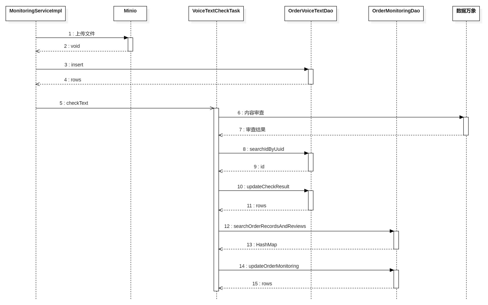

## 编写持久层代码

在`<font style="color:#000000;background-color:rgba(220, 240, 255, 0.3) !important;">OrderVoiceTextDao.xml</font>`文件中，定义SQL语句

```xml
<select id="searchIdByUuid" parameterType="String" resultType="Long">
    SELECT "id" FROM zxds.order_voice_text WHERE "uuid" = '${uuid}'
</select>

<update id="updateCheckResult" parameterType="Map">
    UPSERT INTO zxds.order_voice_text("id","label","suggestion","keywords")
    VALUES(#{id},'${label}','${suggestion}',
    <if test="keywords!=null and keywords!=''">
        '${keywords}'
    </if>
    <if test="keywords==null || keywords==''">
        NULL
    </if>
    )

</update>
```

在`<font style="color:#000000;background-color:rgba(220, 240, 255, 0.3) !important;">com.example.zxds.nebula.db.dao</font>`包`<font style="color:#000000;background-color:rgba(220, 240, 255, 0.3) !important;">OrderVoiceTextDao.java</font>`接口中，声明DAO方法

```java
Long searchIdByUuid(String uuid);

int updateCheckResult(Map<String, Object> param);
```

在`<font style="color:#000000;background-color:rgba(220, 240, 255, 0.3) !important;">OrderMonitoringDao.xml</font>`文件中，声明SQL语句

```xml
<select id="searchOrderRecordsAndReviews" parameterType="long" resultType="HashMap">
    SELECT "id",
           "records",
           "reviews"
    FROM zxds.order_monitoring
    WHERE "order_id" = #{orderId}
</select>

<update id="updateOrderMonitoring" parameterType="com.example.zxds.nebula.db.pojo.OrderMonitoringEntity">
    UPSERT INTO zxds.order_monitoring("id","order_id",
    <if test="status!=null">
        "status",
    </if>
    <if test="safety!=null and safety!=''">
        "safety",
    </if>
    <if test="reviews!=null">
        "reviews",
    </if>
    "records"
    )
    VALUES(#{id}, #{orderId},
    <if test="status!=null">
        #{status},
    </if>
    <if test="safety!=null and safety!=''">
        #{safety},
    </if>
    <if test="reviews!=null">
        #{reviews},
    </if>
    #{records}
    )
</update>
```

在`<font style="color:#000000;background-color:rgba(220, 240, 255, 0.3) !important;">com.example.zxds.nebula.db.dao</font>`包`<font style="color:#000000;background-color:rgba(220, 240, 255, 0.3) !important;">OrderMonitoringDao.java</font>`接口中，声明DAO方法

```java
Map<String, Object> searchOrderRecordsAndReviews(long orderId);

int updateOrderMonitoring(OrderMonitoringEntity entity);
```

## 编写异步线程任务类

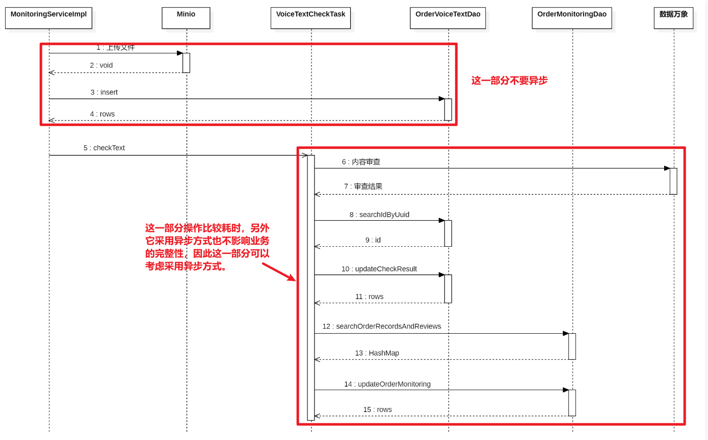

数据万象的API文档（[https://cloud.tencent.com/document/product/460/61607](https://cloud.tencent.com/document/product/460/61607)）。

在`<font style="color:#000000;background-color:rgba(220, 240, 255, 0.3) !important;">com.example.zxds.nebula.task</font>`包中创建`<font style="color:#000000;background-color:rgba(220, 240, 255, 0.3) !important;">VoiceTextCheckTask.java</font>`类。

```java
package com.example.zxds.nebula.task;

import cn.hutool.core.codec.Base64;
import cn.hutool.core.map.MapUtil;
import cn.hutool.core.util.ArrayUtil;
import cn.hutool.core.util.StrUtil;
import com.example.zxds.common.exception.ZxdsException;
import com.example.zxds.nebula.db.dao.OrderMonitoringDao;
import com.example.zxds.nebula.db.dao.OrderVoiceTextDao;
import com.example.zxds.nebula.db.pojo.OrderMonitoringEntity;
import com.qcloud.cos.COSClient;
import com.qcloud.cos.ClientConfig;
import com.qcloud.cos.auth.BasicCOSCredentials;
import com.qcloud.cos.auth.COSCredentials;
import com.qcloud.cos.model.ciModel.auditing.AuditingJobsDetail;
import com.qcloud.cos.model.ciModel.auditing.SectionInfo;
import com.qcloud.cos.model.ciModel.auditing.TextAuditingRequest;
import com.qcloud.cos.model.ciModel.auditing.TextAuditingResponse;
import com.qcloud.cos.region.Region;
import lombok.extern.slf4j.Slf4j;
import org.springframework.beans.factory.annotation.Value;
import org.springframework.scheduling.annotation.Async;
import org.springframework.stereotype.Component;
import org.springframework.transaction.annotation.Transactional;

import javax.annotation.Resource;
import java.util.*;

@Component
@Slf4j
public class VoiceTextCheckTask {
    @Value("${tencent.cloud.appId}")
    private String appId;

    @Value("${tencent.cloud.secretId}")
    private String secretId;

    @Value("${tencent.cloud.secretKey}")
    private String secretKey;

    @Value("${tencent.cloud.bucket-public}")
    private String bucketPublic;

    @Resource
    private OrderVoiceTextDao orderVoiceTextDao;

    @Resource
    private OrderMonitoringDao orderMonitoringDao;

    @Async
    @Transactional
    public void checkText(long orderId, String content, String uuid) {
        // 1.审核内容，并返回审核结果
        String label = "Normal"; //审核结果
        String suggestion = "Pass"; //后续建议

        // 后续建议 的模板
        Map<String, String> template = Map.of("0", "Pass", "1", "Block", "2", "Review");

        if (StrUtil.isNotBlank(content)) {
            // 创建COS客户端
            COSCredentials cred = new BasicCOSCredentials(secretId, secretKey);
            Region region = new Region("ap-beijing");
            ClientConfig clientConfig = new ClientConfig(region);
            COSClient client = new COSClient(cred, clientConfig);
            // 封装Request
            TextAuditingRequest request = new TextAuditingRequest();
            request.setBucketName(bucketPublic);
            request.getInput().setContent(Base64.encode(content));
            request.getConf().setDetectType("all");
            // 发送请求获取审核结果
            TextAuditingResponse response = client.createAuditingTextJobs(request);
            AuditingJobsDetail detail = response.getJobsDetail();
            String state = detail.getState();
            List<String> keywords = new ArrayList<>();
            if ("Success".equals(state)) {
                label = detail.getLabel(); //检测结果
                String result = detail.getResult(); //后续建议
                suggestion = template.get(result);
                List<SectionInfo> list = detail.getSectionList();   //违规关键词

                for (SectionInfo info : list) {
                    String keywords1 = info.getPornInfo().getKeywords(); //色情
                    String keywords2 = info.getIllegalInfo().getKeywords(); //违法
                    String keywords3 = info.getAbuseInfo().getKeywords(); //谩骂
                    if (!keywords1.isEmpty()) {
                        List<String> temp = Arrays.asList(keywords1.split(","));
                        keywords.addAll(temp);
                    }
                    if (!keywords2.isEmpty()) {
                        List<String> temp = Arrays.asList(keywords2.split(","));
                        keywords.addAll(temp);
                    }
                    if (!keywords3.isEmpty()) {
                        List<String> temp = Arrays.asList(keywords3.split(","));
                        keywords.addAll(temp);
                    }
                }
            }

            // 2.根据uuid查询id
            Long id = orderVoiceTextDao.searchIdByUuid(uuid);
            if (id == null) {
                throw new ZxdsException("没有找到代驾语音文本记录");
            }

            // 3.将审核结果更新到order_voice_text表中
            Map<String, Object> param = new HashMap<>();
            param.put("id", id);
            param.put("label", label);
            param.put("suggestion", suggestion);
            param.put("keywords", ArrayUtil.join(keywords.toArray(), ","));
            
            int rows = orderVoiceTextDao.updateCheckResult(param);
            if (rows != 1) {
                throw new ZxdsException("更新内容检查结果失败");
            }
            log.debug("更新内容验证成功");

            // 4.查询该订单有多少个录音文本和需要人工审核的文本
            Map<String, Object> map = orderMonitoringDao.searchOrderRecordsAndReviews(orderId);

            id = MapUtil.getLong(map, "id");
            Integer records = MapUtil.getInt(map, "records");
            Integer reviews = MapUtil.getInt(map, "reviews");
            OrderMonitoringEntity entity = new OrderMonitoringEntity();
            entity.setId(id);
            entity.setOrderId(orderId);
            entity.setRecords(records + 1);
            if (suggestion.equals("Review")) {
                entity.setReviews(reviews + 1);
            }
            if (suggestion.equals("Block")) {
                entity.setSafety("danger");
            }

            // 5.更新order_monitoring表中的记录
            orderMonitoringDao.updateOrderMonitoring(entity);
        }
    }
}
```

## 编写 service 和实现

修改`<font style="color:#000000;background-color:rgba(220, 240, 255, 0.3) !important;">MonitoringServiceImpl.java</font>`类，修改`<font style="color:#000000;background-color:rgba(220, 240, 255, 0.3) !important;">monitoring()</font>`函数内容，调用异步任务类

在 `**<font style="color:#000000;background-color:#ffffff;">//TODO 执行文稿内容审查</font>**`下面添加一行代码即可：

```java
voiceTextCheckTask.checkText(orderId, text, uuid);
```

## 测试

为了更清晰的查看HBase中的数据和数据万象的审查结果，我们执行下面的SQL语句删除数据表中的记录。

```sql
delete from zxds.order_voice_text;
delete from zxds.order_monitoring;
```

把后端各个子系统都运行起来，司机端小程序点击开始代驾按钮，你对着手机正常说话聊天，持续一分钟之后，结束代驾。最后去看一下`<font style="color:#000000;background-color:rgba(220, 240, 255, 0.3) !important;">order_voice_text</font>`表和`<font style="color:#000000;background-color:rgba(220, 240, 255, 0.3) !important;">order_monitoring</font>`表的记录

```sql
SELECT "order_id", "records", "safety", "reviews" FROM zxds.order_monitoring;
SELECT "order_id", "record_file", "label", "suggestion" FROM zxds.order_voice_text;
```

# 大数据服务记录代驾途中 GPS 定位信息-后端实现

为了能计算代驾实际的里程，在代驾的途中我们要采集司机端的GPS定位，然后把这些GPS定位信息保存在HBase里面。等到订单结算的时候，我们把这些GPS定位点连接成线段，累加起来就是实际的代驾里程。（移动端每累计够 20 个 GPS 定位点，则发送一次 AJAX 请求，提交一次）

## 编写 zxds-nebula 子系统

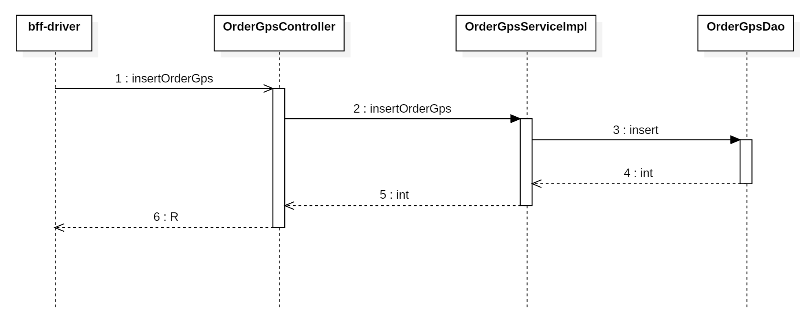

### 编写持久层代码

在`<font style="color:#000000;background-color:rgba(220, 240, 255, 0.3) !important;">OrderGpsDao.xml</font>`文件中，声明SQL语句

```xml
<insert id="insert" parameterType="com.example.zxds.nebula.db.pojo.OrderGpsEntity">
    UPSERT INTO zxds.order_gps
           ("id", "order_id", "driver_id", "customer_id","latitude", "longitude", "speed", "create_time")
    VALUES
           (NEXT VALUE FOR zxds.OG_SEQUENCE,#{orderId},#{driverId},#{customerId},'${latitude}','${longitude}','${speed}',NOW())
</insert>
```

在`<font style="color:#000000;background-color:rgba(220, 240, 255, 0.3) !important;">com.example.zxds.nebula.db.dao</font>`包`<font style="color:#000000;background-color:rgba(220, 240, 255, 0.3) !important;">OrderGpsDao.java</font>`接口中，声明抽象的DAO方法

```java
package com.example.zxds.nebula.db.dao;

import com.example.zxds.nebula.db.pojo.OrderGpsEntity;

public interface OrderGpsDao {
    int insert(OrderGpsEntity list);
}
```

### 编写 service 和实现

在`<font style="color:#000000;background-color:rgba(220, 240, 255, 0.3) !important;">com.example.zxds.nebula.service</font>`包`<font style="color:#000000;background-color:rgba(220, 240, 255, 0.3) !important;">OrderGpsService.java</font>`接口中，声明抽象方法

```java
package com.example.zxds.nebula.service;

import com.example.zxds.nebula.controller.dto.InsertOrderGpsDTO;

import java.util.List;

public interface OrderGpsService {
    int insertOrderGps(List<InsertOrderGpsDTO> list);
}
```

在`<font style="color:#000000;background-color:rgba(220, 240, 255, 0.3) !important;">com.example.zxds.nebula.service.impl</font>`包`<font style="color:#000000;background-color:rgba(220, 240, 255, 0.3) !important;">OrderGpsServiceImpl.java</font>`类中，实现抽象方法

```java
package com.example.zxds.nebula.service.impl;

import cn.hutool.core.bean.BeanUtil;
import com.example.zxds.nebula.controller.dto.InsertOrderGpsDTO;
import com.example.zxds.nebula.db.dao.OrderGpsDao;
import com.example.zxds.nebula.db.pojo.OrderGpsEntity;
import com.example.zxds.nebula.service.OrderGpsService;
import lombok.RequiredArgsConstructor;
import lombok.extern.slf4j.Slf4j;
import org.springframework.stereotype.Service;

import java.util.List;

@Service
@Slf4j
@RequiredArgsConstructor
public class OrderGpsServiceImpl implements OrderGpsService {

    private final OrderGpsDao orderGpsDao;

    // InsertOrderGpsDTO 中的每个属性都会经过校验框架进行校验。
    @Override
    public int insertOrderGps(List<InsertOrderGpsDTO> list) {
        int rows = 0;
        // 遍历参数list集合，取出每个元素，将 InsertOrderGpsDTO 转换成 OrderGpsEntity对象。
        for (InsertOrderGpsDTO dto : list) {
            OrderGpsEntity orderGpsEntity = BeanUtil.copyProperties(dto, OrderGpsEntity.class);
            rows += orderGpsDao.insert(orderGpsEntity);
        }
        return rows;
    }
}
```

### 编写 web 方法

在`<font style="color:#000000;background-color:rgba(220, 240, 255, 0.3) !important;">com.example.zxds.nebula.controller.dto</font>`包中创建`<font style="color:#000000;background-color:rgba(220, 240, 255, 0.3) !important;">InsertOrderGpsDTO.java</font>`类

```java
package com.example.zxds.nebula.controller.dto;

import io.swagger.v3.oas.annotations.media.Schema;
import lombok.Data;

import javax.validation.constraints.Min;
import javax.validation.constraints.NotBlank;
import javax.validation.constraints.NotNull;
import javax.validation.constraints.Pattern;

@Data
public class InsertOrderGpsDTO {
    @NotNull(message = "orderId不能为空")
    @Min(value = 1, message = "orderId不能小于1")
    @Schema(description = "订单ID")
    private Long orderId;

    @NotNull(message = "driverId不能为空")
    @Min(value = 1, message = "driverId不能小于1")
    @Schema(description = "司机ID")
    private Long driverId;

    @NotNull(message = "customerId不能为空")
    @Min(value = 1, message = "customerId不能小于1")
    @Schema(description = "客户ID")
    private Long customerId;


    @NotBlank(message = "latitude不能为空")
    @Pattern(regexp = "^(([1-8]\\d?)|([1-8]\\d))(\\.\\d{1,18})|90|0(\\.\\d{1,18})?$", message = "latitude内容不正确")
    @Schema(description = "纬度")
    private String latitude;

    @NotBlank(message = "longitude不能为空")
    @Pattern(regexp = "^(([1-9]\\d?)|(1[0-7]\\d))(\\.\\d{1,18})|180|0(\\.\\d{1,18})?$", message = "longitude内容不正确")
    @Schema(description = "经度")
    private String longitude;

    @Schema(description = "速度")
    private String speed;
}
```

在`<font style="color:#000000;background-color:rgba(220, 240, 255, 0.3) !important;">com.example.zxds.nebula.controller.form</font>`包中创建`<font style="color:#000000;background-color:rgba(220, 240, 255, 0.3) !important;">InsertOrderGpsForm</font>`类

```java
package com.example.zxds.nebula.controller.form;

import com.example.zxds.nebula.controller.dto.InsertOrderGpsDTO;
import io.swagger.v3.oas.annotations.media.Schema;
import lombok.Data;

import javax.validation.Valid;
import javax.validation.constraints.NotEmpty;
import java.util.List;

@Data
@Schema(description = "添加订单GPS记录的表单")
public class InsertOrderGpsForm {
    @NotEmpty(message = "list不能为空")
    @Schema(description = "GPS数据")
    private List<@Valid InsertOrderGpsDTO> list;
}
```

在`<font style="color:#000000;background-color:rgba(220, 240, 255, 0.3) !important;">com.example.zxds.nebula.controller</font>`包`<font style="color:#000000;background-color:rgba(220, 240, 255, 0.3) !important;">OrderGpsController.java</font>`类中，声明Web方法

```java
package com.example.zxds.nebula.controller;

import com.example.zxds.common.util.R;
import com.example.zxds.nebula.controller.form.InsertOrderGpsForm;
import com.example.zxds.nebula.service.OrderGpsService;
import io.swagger.v3.oas.annotations.Operation;
import io.swagger.v3.oas.annotations.tags.Tag;
import lombok.RequiredArgsConstructor;
import org.springframework.web.bind.annotation.PostMapping;
import org.springframework.web.bind.annotation.RequestBody;
import org.springframework.web.bind.annotation.RequestMapping;
import org.springframework.web.bind.annotation.RestController;

import javax.validation.Valid;

@RestController
@RequestMapping("/order/gps")
@RequiredArgsConstructor
@Tag(name = "OrderGpsController", description = "订单GPS记录Web接口")
public class OrderGpsController {
    private final OrderGpsService orderGpsService;

    @PostMapping("/insertOrderGps")
    @Operation(summary = "添加订单GPS记录")
    public R insertOrderGps(@RequestBody @Valid InsertOrderGpsForm form) {
        int rows = orderGpsService.insertOrderGps(form.getList());
        return R.ok().put("rows", rows);
    }
}
```

## 编写 bff-driver 子系统

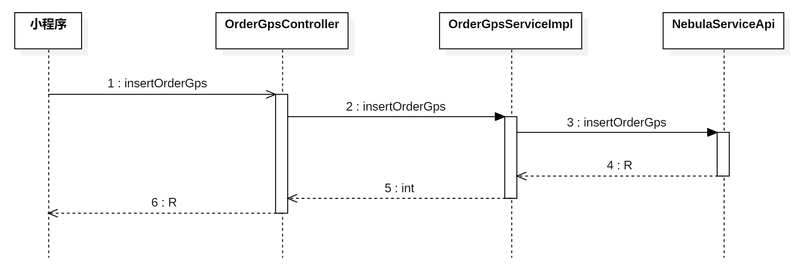

### 编写 Feign 客户端

在`<font style="color:#000000;background-color:rgba(220, 240, 255, 0.3) !important;">com.example.zxds.bff.driver.controller.dto</font>`包中创建`<font style="color:#000000;background-color:rgba(220, 240, 255, 0.3) !important;">InsertOrderGpsDTO.java</font>`类

```java
package com.example.zxds.bff.driver.controller.dto;

import io.swagger.v3.oas.annotations.media.Schema;
import lombok.Data;

import javax.validation.constraints.Min;
import javax.validation.constraints.NotBlank;
import javax.validation.constraints.NotNull;
import javax.validation.constraints.Pattern;

@Data
public class InsertOrderGpsDTO {
    @NotNull(message = "orderId不能为空")
    @Min(value = 1, message = "orderId不能小于1")
    @Schema(description = "订单ID")
    private Long orderId;

    @Schema(description = "司机ID")
    private Long driverId;

    @NotNull(message = "customerId不能为空")
    @Min(value = 1, message = "customerId不能小于1")
    @Schema(description = "客户ID")
    private Long customerId;


    @NotBlank(message = "latitude不能为空")
    @Pattern(regexp = "^(([1-8]\\d?)|([1-8]\\d))(\\.\\d{1,18})|90|0(\\.\\d{1,18})?$", message = "latitude内容不正确")
    @Schema(description = "纬度")
    private String latitude;

    @NotBlank(message = "longitude不能为空")
    @Pattern(regexp = "^(([1-9]\\d?)|(1[0-7]\\d))(\\.\\d{1,18})|180|0(\\.\\d{1,18})?$", message = "longitude内容不正确")
    @Schema(description = "经度")
    private String longitude;

    @Schema(description = "速度")
    private String speed;
}
```

在`<font style="color:#000000;background-color:rgba(220, 240, 255, 0.3) !important;">com.example.zxds.bff.driver.controller.form</font>`包中创建`<font style="color:#000000;background-color:rgba(220, 240, 255, 0.3) !important;">InsertOrderGpsForm.java</font>`类

```java
package com.example.zxds.bff.driver.controller.form;

import com.example.zxds.bff.driver.controller.dto.InsertOrderGpsDTO;
import io.swagger.v3.oas.annotations.media.Schema;
import lombok.Data;


import javax.validation.Valid;
import javax.validation.constraints.NotEmpty;
import java.util.List;

@Data
@Schema(description = "添加订单GPS记录的表单")
public class InsertOrderGpsForm {
    @NotEmpty(message = "list不能为空")
    @Schema(description = "GPS数据")
    private List<@Valid InsertOrderGpsDTO> list;
}
```

在`<font style="color:#000000;background-color:rgba(220, 240, 255, 0.3) !important;">com.example.zxds.bff.driver.feign</font>`包`<font style="color:#000000;background-color:rgba(220, 240, 255, 0.3) !important;">NebulaServiceApi.java</font>`接口中，声明抽象方法

```java
@PostMapping("/order/gps/insertOrderGps")
R insertOrderGps(InsertOrderGpsForm form);
```

### 编写 service 和实现

在`<font style="color:#000000;background-color:rgba(220, 240, 255, 0.3) !important;">com.example.zxds.bff.driver.service</font>`包`<font style="color:#000000;background-color:rgba(220, 240, 255, 0.3) !important;">OrderGpsService.java</font>`接口中，声明抽象方法

```java
package com.example.zxds.bff.driver.service;

import com.example.zxds.bff.driver.controller.form.InsertOrderGpsForm;

public interface OrderGpsService {
    int insertOrderGps(InsertOrderGpsForm form);
}
```

在`<font style="color:#000000;background-color:rgba(220, 240, 255, 0.3) !important;">com.example.zxds.bff.driver.service.impl</font>`包`<font style="color:#000000;background-color:rgba(220, 240, 255, 0.3) !important;">OrderGpsServiceImpl.java</font>`类中，实现抽象方法

```java
package com.example.zxds.bff.driver.service.impl;

import cn.hutool.core.map.MapUtil;
import com.example.zxds.bff.driver.controller.form.InsertOrderGpsForm;
import com.example.zxds.bff.driver.feign.NebulaServiceApi;
import com.example.zxds.bff.driver.service.OrderGpsService;
import com.example.zxds.common.util.R;
import lombok.RequiredArgsConstructor;
import org.springframework.stereotype.Service;

@Service
@RequiredArgsConstructor
public class OrderGpsServiceImpl implements OrderGpsService {
    private NebulaServiceApi nebulaServiceApi;

    @Override
    public int insertOrderGps(InsertOrderGpsForm form) {
        R r = nebulaServiceApi.insertOrderGps(form);
        int rows = MapUtil.getInt(r, "rows");
        return rows;
    }
}
```

### 编写 web 方法

在`<font style="color:#000000;background-color:rgba(220, 240, 255, 0.3) !important;">com.example.zxds.bff.driver.controller</font>`包`<font style="color:#000000;background-color:rgba(220, 240, 255, 0.3) !important;">OrderGpsController.java</font>`类中，声明Web方法

```java
package com.example.zxds.bff.driver.controller;

import cn.dev33.satoken.annotation.SaCheckLogin;
import cn.dev33.satoken.stp.StpUtil;
import com.example.zxds.bff.driver.controller.form.InsertOrderGpsForm;
import com.example.zxds.bff.driver.service.OrderGpsService;
import com.example.zxds.common.util.R;
import io.swagger.v3.oas.annotations.Operation;
import io.swagger.v3.oas.annotations.tags.Tag;
import lombok.RequiredArgsConstructor;
import org.springframework.web.bind.annotation.PostMapping;
import org.springframework.web.bind.annotation.RequestBody;
import org.springframework.web.bind.annotation.RequestMapping;
import org.springframework.web.bind.annotation.RestController;

import javax.validation.Valid;

@RestController
@RequestMapping("/order/gps")
@RequiredArgsConstructor
@Tag(name = "OrderGpsController", description = "订单GPS记录Web接口")
public class OrderGpsController {
    private final OrderGpsService orderGpsService;

    @PostMapping("/insertOrderGps")
    @SaCheckLogin
    @Operation(summary = "添加订单GPS记录")
    public R insertOrderGps(@RequestBody @Valid InsertOrderGpsForm form) {
        long driverId = StpUtil.getLoginIdAsLong();
        form.getList().forEach(one -> {
            one.setDriverId(driverId);
        });
        int rows = orderGpsService.insertOrderGps(form);
        return R.ok().put("rows", rows);
    }
}
```

# 大数据服务记录代驾途中 GPS 定位信息-前端实现

我们写好了保存GPS定位信息的后端代码，接下来写移动端的代码。开始代驾后不需要实时上传 GPS 定位，我们要把网络资源腾出来给同声传译插件和上传录音的Ajax请求。所以我打算在本地先缓存GPS定位，然后积累够 20 个，再批量上传。

## 实现 GPS 定位上传

在`<font style="color:#000000;background-color:rgba(220, 240, 255, 0.3) !important;">App.vue</font>`页面`<font style="color:#000000;background-color:rgba(220, 240, 255, 0.3) !important;">onLocationChange()</font>`函数中，补充上传定位的代码

```javascript
//GPS定位变化就自动提交给后端
uni.onLocationChange(function(resp) {
    ……

    let baseUrl = 'http://192.168.99.106:8201/zxds-driver';
    if (workStatus == '开始接单') {
        ……
    } else if (workStatus == '开始代驾') {
        let executeOrder = uni.getStorageSync('executeOrder');
        if (executeOrder != null) {
            gps.push({
                orderId: executeOrder.id,
                customerId: executeOrder.customerId,
                latitude: latitude,
                longitude: longitude,
                speed: speed
            });

            //把GPS定位保存到HBase中，每凑够20个定位就上传一次，减少服务器的压力
            if (gps.length == 20) {
                uni.request({
                    url: `${baseUrl}/order/gps/insertOrderGps`,
                    method: 'POST',
                    header: {
                        token: uni.getStorageSync('token')
                    },
                    data: {
                        list: gps
                    },
                    success: function(resp) {
                        if (resp.statusCode == 401) {
                            uni.redirectTo({
                                url: '/pages/login/login'
                            });
                        } else if (resp.statusCode == 200 && resp.data.code == 200) {
                            let data = resp.data;
                            console.log("上传GPS成功");
                        } else {
                            console.error('保存GPS定位失败', resp.data);
                        }
                        gps.length = 0;
                    },
                    fail: function(error) {
                        console.error('保存GPS定位失败', error);
                    }
                });
            }
        }
    }

    //触发自定义事件
    uni.$emit('updateLocation', location);
});
```

## 测试小程序

运行后端若干子系统，然后运行司机端小程序，点击开始代驾之后，过半分钟左右的时间，点击结束代驾按钮。然后去HBase中查看GPS定位数据记录。

# mis 系统中分页查询订单信息-后端实现

到目前为止我们写了很多的移动端代码，系统的核心功能逐步都实现了。接下来我们来编写MIS系统的代码，在MIS系统的订单模块中，对订单进行分页查询。当我们点开某个订单记录的时候，该订单的详情以及订单的最佳线路都要显示出来。如果订单是执行中的状态，还要从HBase中取出该订单最后的GPS定位，然后在地图组件上显示这个定位点。


## 编写 zxds-odr 子系统

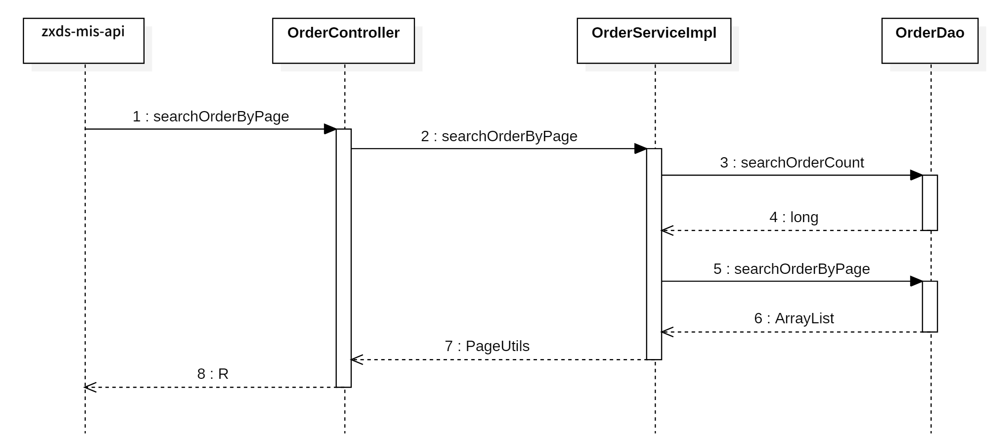

### 编写持久层代码

在`<font style="color:#000000;background-color:rgba(220, 240, 255, 0.3) !important;">OrderDao.xml</font>`文件中声明两个SQL语句，分别查询记录总数和分页记录

```xml
<select id="searchOrderByPage" parameterType="Map" resultType="HashMap">
    SELECT CAST(id AS CHAR) AS id,
           CAST(start_place AS CHAR) AS startPlace,
           CAST(end_place AS CHAR) AS endPlace,
           CAST(real_mileage AS CHAR) AS realMileage,
           CAST(real_fee AS CHAR) AS realFee,
           `status`,
           DATE_FORMAT(create_time, '%Y-%m-%d %H:%i') AS createTime
    FROM tb_order
    <where>
      <if test="orderId!=null">
          AND id = #{orderId}
      </if>
      <if test="customerId!=null">
          AND customer_id = #{customerId}
      </if>
      <if test="driverId!=null">
          AND driver_id = #{driverId}
      </if>
      <if test="startDate!=null and endDate!=null">
          AND date BETWEEN #{startDate} AND #{endDate}
      </if>
      <if test="status!=null">
          AND `status` = #{status}
      </if>
    </where>
    ORDER BY id DESC
    LIMIT #{startIndex},#{pageSize}
</select>

<select id="searchOrderCount" parameterType="Map" resultType="long">
    SELECT COUNT(*)
    FROM tb_order
    <where>
      <if test="orderId!=null">
          AND id = #{orderId}
      </if>
      <if test="customerId!=null">
          AND customer_id = #{customerId}
      </if>
      <if test="driverId!=null">
          AND driver_id = #{driverId}
      </if>
      <if test="startDate!=null and endDate!=null">
          AND date BETWEEN #{startDate} AND #{endDate}
      </if>
      <if test="status!=null">
          AND `status` = #{status}
      </if>
    </where>
</select>
```

在`<font style="color:#000000;background-color:rgba(220, 240, 255, 0.3) !important;">com.example.zxds.odr.db.dao</font>`包`<font style="color:#000000;background-color:rgba(220, 240, 255, 0.3) !important;">OrderDao.java</font>`接口中，声明DAO方法

```java
long searchOrderCount(Map<String, Object> param);

List<Map<String, Object>> searchOrderByPage(Map<String, Object> param);
```

### 编写 service 和实现

在`<font style="color:#000000;background-color:rgba(220, 240, 255, 0.3) !important;">com.example.zxds.odr.service</font>`包`<font style="color:#000000;background-color:rgba(220, 240, 255, 0.3) !important;">OrderService.java</font>`接口中，声明抽象方法

```java
PageUtils searchOrderByPage(Map<String, Object> param);
```

在`<font style="color:#000000;background-color:rgba(220, 240, 255, 0.3) !important;">com.example.zxds.odr.service.impl</font>`包`<font style="color:#000000;background-color:rgba(220, 240, 255, 0.3) !important;">OrderServiceImpl.java</font>`接口中，实现抽象方法

```java
@Override
public PageUtils searchOrderByPage(Map<String, Object> param) {
    long total = orderDao.searchOrderCount(param);
    List<Map<String, Object>> list = new ArrayList<>();
    if(total > 0){
        list = orderDao.searchOrderByPage(param);
    }
    Integer pageIndex = MapUtil.getInt(param, "pageIndex");
    Integer pageSize = MapUtil.getInt(param, "pageSize");
    return new PageUtils(list, total, pageIndex, pageSize);
}
```

### 编写 form 接收数据并校验

在`<font style="color:#000000;background-color:rgba(220, 240, 255, 0.3) !important;">com.example.zxds.odr.controller.form</font>`包中创建`<font style="color:#000000;background-color:rgba(220, 240, 255, 0.3) !important;">SearchOrderByPageForm.java</font>`类

```java
package com.example.zxds.odr.controller.form;

import io.swagger.v3.oas.annotations.media.Schema;
import lombok.Data;
import org.hibernate.validator.constraints.Range;

import javax.validation.constraints.Min;
import javax.validation.constraints.NotNull;
import javax.validation.constraints.Pattern;

@Data
@Schema(description = "查询订单分页记录的表单")
public class SearchOrderByPageForm {
    @NotNull(message = "pageIndex不能为空")
    @Min(value = 1, message = "pageIndex不能小于1")
    @Schema(description = "页码")
    private Integer pageIndex;

    @NotNull(message = "pageSize不能为空")
    @Range(min = 10, max = 50, message = "pageSize必须在10~50之间")
    @Schema(description = "每页记录数")
    private Integer pageSize;

    @Min(value = 1, message = "orderId不能小于1")
    @Schema(description = "订单ID")
    private Long orderId;

    @Min(value = 1, message = "customerId不能小于1")
    @Schema(description = "客户ID")
    private Long customerId;

    @Min(value = 1, message = "driverId不能小于1")
    @Schema(description = "司机ID")
    private Long driverId;

    @Pattern(regexp = "^((((1[6-9]|[2-9]\\d)\\d{2})-(0?[13578]|1[02])-(0?[1-9]|[12]\\d|3[01]))|(((1[6-9]|[2-9]\\d)\\d{2})-(0?[13456789]|1[012])-(0?[1-9]|[12]\\d|30))|(((1[6-9]|[2-9]\\d)\\d{2})-0?2-(0?[1-9]|1\\d|2[0-8]))|(((1[6-9]|[2-9]\\d)(0[48]|[2468][048]|[13579][26])|((16|[2468][048]|[3579][26])00))-0?2-29-))$", message = "startDate内容不正确")
    @Schema(description = "开始日期")
    private String startDate;

    @Pattern(regexp = "^((((1[6-9]|[2-9]\\d)\\d{2})-(0?[13578]|1[02])-(0?[1-9]|[12]\\d|3[01]))|(((1[6-9]|[2-9]\\d)\\d{2})-(0?[13456789]|1[012])-(0?[1-9]|[12]\\d|30))|(((1[6-9]|[2-9]\\d)\\d{2})-0?2-(0?[1-9]|1\\d|2[0-8]))|(((1[6-9]|[2-9]\\d)(0[48]|[2468][048]|[13579][26])|((16|[2468][048]|[3579][26])00))-0?2-29-))$", message = "endDate内容不正确")
    @Schema(description = "结束日期")
    private String endDate;

    @Range(min = 1, max = 12, message = "status范围不正确")
    @Schema(description = "状态")
    private Byte status;
}
```

### 编写 web 方法

在`<font style="color:#000000;background-color:rgba(220, 240, 255, 0.3) !important;">com.example.zxds.odr.controller</font>`包`<font style="color:#000000;background-color:rgba(220, 240, 255, 0.3) !important;">OrderController.java</font>`类中，声明Web方法

```java
@PostMapping("/searchOrderByPage")
@Operation(summary = "查询订单分页记录")
public R searchOrderByPage(@RequestBody @Valid SearchOrderByPageForm form) {
    Map<String, Object> param = BeanUtil.beanToMap(form);
    int pageNo = form.getPageIndex();
    int pageSize = form.getPageSize();
    int startIndex = (pageNo - 1) * pageSize;
    param.put("startIndex", startIndex);
    PageUtils pageUtils = orderService.searchOrderByPage(param);
    return R.ok().put("result", pageUtils);
}
```

## 编写 zxds-mis-api

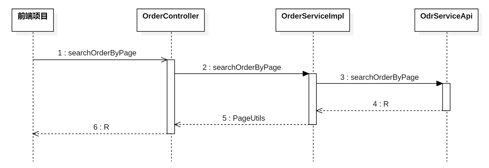

### 编写 Feign 客户端

在`<font style="color:#000000;background-color:rgba(220, 240, 255, 0.3) !important;">com.example.zxds.mis.api.controller.form</font>`包中创建`<font style="color:#000000;background-color:rgba(220, 240, 255, 0.3) !important;">SearchOrderByPageForm.java</font>`类

```java
package com.example.zxds.mis.api.controller.form;

import io.swagger.v3.oas.annotations.media.Schema;
import lombok.Data;
import org.hibernate.validator.constraints.Range;

import javax.validation.constraints.Min;
import javax.validation.constraints.NotNull;
import javax.validation.constraints.Pattern;

@Data
@Schema(description = "查询订单分页记录的表单")
public class SearchOrderByPageForm {
    @NotNull(message = "pageIndex不能为空")
    @Min(value = 1, message = "pageIndex不能小于1")
    @Schema(description = "页码")
    private Integer pageIndex;

    @NotNull(message = "pageSize不能为空")
    @Range(min = 10, max = 50, message = "pageSize必须在10~50之间")
    @Schema(description = "每页记录数")
    private Integer pageSize;

    @Min(value = 1, message = "orderId不能小于1")
    @Schema(description = "订单ID")
    private Long orderId;

    @Min(value = 1, message = "customerId不能小于1")
    @Schema(description = "客户ID")
    private Long customerId;

    @Min(value = 1, message = "driverId不能小于1")
    @Schema(description = "司机ID")
    private Long driverId;

    @Pattern(regexp = "^((((1[6-9]|[2-9]\\d)\\d{2})-(0?[13578]|1[02])-(0?[1-9]|[12]\\d|3[01]))|(((1[6-9]|[2-9]\\d)\\d{2})-(0?[13456789]|1[012])-(0?[1-9]|[12]\\d|30))|(((1[6-9]|[2-9]\\d)\\d{2})-0?2-(0?[1-9]|1\\d|2[0-8]))|(((1[6-9]|[2-9]\\d)(0[48]|[2468][048]|[13579][26])|((16|[2468][048]|[3579][26])00))-0?2-29-))$", message = "startDate内容不正确")
    @Schema(description = "开始日期")
    private String startDate;

    @Pattern(regexp = "^((((1[6-9]|[2-9]\\d)\\d{2})-(0?[13578]|1[02])-(0?[1-9]|[12]\\d|3[01]))|(((1[6-9]|[2-9]\\d)\\d{2})-(0?[13456789]|1[012])-(0?[1-9]|[12]\\d|30))|(((1[6-9]|[2-9]\\d)\\d{2})-0?2-(0?[1-9]|1\\d|2[0-8]))|(((1[6-9]|[2-9]\\d)(0[48]|[2468][048]|[13579][26])|((16|[2468][048]|[3579][26])00))-0?2-29-))$", message = "endDate内容不正确")
    @Schema(description = "结束日期")
    private String endDate;

    @Range(min = 1, max = 12, message = "status范围不正确")
    @Schema(description = "状态")
    private Byte status;
}
```

在`<font style="color:#000000;background-color:rgba(220, 240, 255, 0.3) !important;">com.example.zxds.mis.api.feign</font>`包`<font style="color:#000000;background-color:rgba(220, 240, 255, 0.3) !important;">OdrServiceApi.java</font>`接口中，声明抽象方法

```java
package com.example.zxds.mis.api.feign;

import com.example.zxds.common.util.R;
import com.example.zxds.mis.api.controller.form.SearchOrderByPageForm;
import org.springframework.cloud.openfeign.FeignClient;
import org.springframework.web.bind.annotation.PostMapping;

@FeignClient(value = "zxds-odr")
public interface OdrServiceApi {
    @PostMapping("/order/searchOrderByPage")
    R searchOrderByPage(SearchOrderByPageForm form);
}
```

### 编写 service 和实现

在`<font style="color:#000000;background-color:rgba(220, 240, 255, 0.3) !important;">com.example.zxds.mis.api.service</font>`包`<font style="color:#000000;background-color:rgba(220, 240, 255, 0.3) !important;">OrderService.java</font>`接口中，声明抽象方法

```java
package com.example.zxds.mis.api.service;

import com.example.zxds.common.util.PageUtils;
import com.example.zxds.mis.api.controller.form.SearchOrderByPageForm;

public interface OrderService {
    PageUtils searchOrderByPage(SearchOrderByPageForm form);
}
```

在`<font style="color:#000000;background-color:rgba(220, 240, 255, 0.3) !important;">com.example.zxds.mis.api.service.impl</font>`包`<font style="color:#000000;background-color:rgba(220, 240, 255, 0.3) !important;">OrderServiceImpl.java</font>`类中，实现抽象方法

```java
package com.example.zxds.mis.api.service.impl;

import cn.hutool.core.bean.BeanUtil;
import com.example.zxds.common.util.PageUtils;
import com.example.zxds.common.util.R;
import com.example.zxds.mis.api.controller.form.SearchOrderByPageForm;
import com.example.zxds.mis.api.feign.OdrServiceApi;
import com.example.zxds.mis.api.service.OrderService;
import lombok.RequiredArgsConstructor;
import org.springframework.stereotype.Service;

import java.util.Map;

@Service
@RequiredArgsConstructor
public class OrderServiceImpl implements OrderService {
    
    private final OdrServiceApi odrServiceApi;

    @Override
    public PageUtils searchOrderByPage(SearchOrderByPageForm form) {
        R r = odrServiceApi.searchOrderByPage(form);
        // 当Feign客户端调用远程接口时，返回的 R 对象中的 result 字段不是直接的对象，而是LinkedHashMap
        // 因为Feign反序列化时不知道具体的类型，只能转成Map
        Map<String, Object> map = (Map<String, Object>) r.get("result");
        PageUtils pageUtils = BeanUtil.toBean(map, PageUtils.class);
        return pageUtils;
    }
}
```

### 编写 web 方法

在`<font style="color:#000000;background-color:rgba(220, 240, 255, 0.3) !important;">com.example.zxds.mis.api.controller</font>`包`<font style="color:#000000;background-color:rgba(220, 240, 255, 0.3) !important;">OrderController.java</font>`类中，声明Web方法

```java
package com.example.zxds.mis.api.controller;

import cn.dev33.satoken.annotation.SaCheckPermission;
import cn.dev33.satoken.annotation.SaMode;
import com.example.zxds.common.util.PageUtils;
import com.example.zxds.common.util.R;
import com.example.zxds.mis.api.controller.form.SearchOrderByPageForm;
import com.example.zxds.mis.api.service.OrderService;
import io.swagger.v3.oas.annotations.Operation;
import io.swagger.v3.oas.annotations.tags.Tag;
import lombok.RequiredArgsConstructor;
import org.springframework.web.bind.annotation.PostMapping;
import org.springframework.web.bind.annotation.RequestBody;
import org.springframework.web.bind.annotation.RequestMapping;
import org.springframework.web.bind.annotation.RestController;

import javax.validation.Valid;

@RestController
@RequestMapping("/order")
@RequiredArgsConstructor
@Tag(name = "OrderController", description = "订单管理Web接口")
public class OrderController {

    private final OrderService orderService;

    @PostMapping("/searchOrderByPage")
    @SaCheckPermission(value = {"ROOT", "ORDER:SELECT"}, mode = SaMode.OR)
    @Operation(summary = "查询订单分页记录")
    public R searchOrderByPage(@RequestBody @Valid SearchOrderByPageForm form) {
        PageUtils pageUtils = orderService.searchOrderByPage(form);
        return R.ok().put("result", pageUtils);
    }
}
```

### 测试 web 方法

把`<font style="color:#000000;background-color:rgba(220, 240, 255, 0.3) !important;">zxds-tm</font>`、`<font style="color:#000000;background-color:rgba(220, 240, 255, 0.3) !important;">zxds-odr</font>`和`<font style="color:#000000;background-color:rgba(220, 240, 255, 0.3) !important;">zxds-mis-api</font>`子系统运行起来，然后用 Apipost 测试Web方法。

# mis 系统中分页查询订单信息-前端实现

## 熟悉视图层

MIS系统的订单页面视图层标签并不复杂，跟以前的司机模块是类似的。咱们先不用去关心面板展开的内容，我们专注于条件搜索栏和页面的表格即可。

```html
<div v-if="isAuth(['ROOT', 'ORDER:SELECT'])">
    <el-form :inline="true" :model="dataForm" :rules="dataRule" ref="dataForm">
        <el-form-item prop="orderId"><el-input v-model="dataForm.orderId" placeholder="订单编号" size="medium" clearable="clearable" /></el-form-item>
        <el-form-item prop="driverId"><el-input v-model="dataForm.driverId" placeholder="司机编号" size="medium" clearable="clearable" /></el-form-item>
        <el-form-item prop="customerId"><el-input v-model="dataForm.customerId" placeholder="客户编号" size="medium" clearable="clearable" /></el-form-item>
        <el-form-item>
            <el-date-picker v-model="dataForm.date" type="daterange" range-separator="~" start-placeholder="开始日期" end-placeholder="结束日期" size="medium"></el-date-picker>
        </el-form-item>
        <el-form-item>
            <el-select v-model="dataForm.status" class="input" placeholder="状态" size="medium" clearable="clearable">
                <el-option label="等待接单" value="1" />
                <el-option label="已接单" value="2" />
                <el-option label="司机已到达" value="3" />
                <el-option label="开始代驾" value="4" />
                <el-option label="结束代驾" value="5" />
                <el-option label="未付款" value="6" />
                <el-option label="已付款" value="7" />
                <el-option label="订单已结束" value="8" />
                <el-option label="顾客撤单" value="9" />
                <el-option label="司机撤单" value="10" />
                <el-option label="事故关闭" value="11" />
                <el-option label="其他" value="12" />
            </el-select>
        </el-form-item>
        <el-form-item><el-button size="medium" type="primary" @click="searchHandle()">查询</el-button></el-form-item>
    </el-form>
    <el-table
        :data="dataList"
        border
        v-loading="dataListLoading"
        cell-style="padding: 4px 0"
        style="width: 100%;"
        size="medium"
        @expand-change="expand"
        :row-key="getRowKeys"
        :expand-row-keys="expands"
    >
        <el-table-column prop="panel" header-align="center" align="center" type="expand">
            <!--展开面板的内容-->
        </el-table-column>
        <el-table-column type="index" header-align="center" align="center" width="100" label="序号">
            <template #default="scope">
                <span>{{ (pageIndex - 1) * pageSize + scope.$index + 1 }}</span>
            </template>
        </el-table-column>
        <el-table-column prop="id" header-align="center" align="center" min-width="200" label="订单编号" />
        <el-table-column prop="startPlace" header-align="center" align="center" min-width="220" show-overflow-tooltip="true" label="代驾起点" />
        <el-table-column prop="endPlace" header-align="center" align="center" min-width="220" show-overflow-tooltip="true" label="代驾终点" />
        <el-table-column prop="realMileage" header-align="center" align="center" min-width="130" label="实际里程" />
        <el-table-column prop="realFee" header-align="center" align="center" min-width="130" label="实际金额" />
        <el-table-column prop="createTime" header-align="center" align="center" min-width="150" label="日期时间" />
        <el-table-column prop="status" header-align="center" align="center" min-width="100" label="状态" />
        <el-table-column header-align="center" align="center" width="150" label="操作">
            <template #default="scope">
                <el-button
                    type="text"
                    size="medium"
                    v-if="isAuth(['ROOT', 'ORDER:SELECT'])"
                    :disabled="!['结束代驾', '未付款', '已付款', '订单已结束'].includes(scope.row.status)"
                    @click="showOrderBill(scope.row.id)"
                >
                    账单详情
                </el-button>
                <el-button
                    type="text"
                    size="medium"
                    v-if="isAuth(['ROOT', 'ORDER:UPDATE'])"
                    :disabled="!['等待接单', '已接单', '司机已到达', '开始代驾'].includes(scope.row.status)"
                    @click="showUpdatePanel(scope.row.id)"
                >
                    关闭订单
                </el-button>
            </template>
        </el-table-column>
    </el-table>
    <el-pagination
        @size-change="sizeChangeHandle"
        @current-change="currentChangeHandle"
        :current-page="pageIndex"
        :page-sizes="[10, 20, 50]"
        :page-size="pageSize"
        :total="totalCount"
        layout="total, sizes, prev, pager, next, jumper"
    ></el-pagination>
    <order-bill ref="orderBill"></order-bill>
    <order-close ref="orderClose" @refreshDataList="loadDataList"></order-close>
</div>
```

## 熟悉模型层

编写模型层代码之前，我们先来看一下模型层的变量定义

```javascript
data() {
    return {
        dataForm: {
            orderId: null,
            driverId: null,
            customerId: null,
            date: [],
            status: null
        },
        dataList: [],
        pageIndex: 1,
        pageSize: 10,
        totalCount: 0,
        dataListLoading: false,
        dataRule: {
            orderId: [{ required: false, pattern: '^[1-9]\\d{17}$', message: '订单编号格式错误' }],
            driverId: [{ required: false, pattern: '^[1-9]\\d{17}$', message: '司机编号格式错误' }],
            customerId: [{ required: false, pattern: '^[1-9]\\d{17}$', message: '客户编号格式错误' }]
        },
        expands: [],
        panel: {
            id: null,
            customer: {
                id: null,
                sex: null,
                tel: null
            },
            driver: {
                id: null,
                name: null,
                tel: null
            },
            order: {
                carPlate: null,
                carType: null,
                city: null,
                acceptTime: null,
                arriveTime: null,
                startTime: null,
                endTime: null,
                waitingMinute: null,
                driveMinute: null,
                realMileage: null,
                realFee: null,
                status: null,
                chargeRule: null,
                cancelRule: null,
                profitsharingRule: null
            }
        },
        getRowKeys(row) {
            return row.id;
        },
        gpsTimer: null
    };
},
```

## 封装分页查询的函数

因为进入到`<font style="color:#000000;background-color:rgba(220, 240, 255, 0.3) !important;">order.vue</font>`页面，以及翻页和条件查询，都要加载表格的数据，所以我们把查询表格分页数据的代码给封装起来。

```javascript
async loadDataList() {
    let that = this;
    that.dataListLoading = true;

    let data = {
        pageIndex: that.pageIndex,
        pageSize: that.pageSize,
        orderId: that.dataForm.orderId == '' ? null : that.dataForm.orderId,
        driverId: that.dataForm.driverId == '' ? null : that.dataForm.driverId,
        customerId: that.dataForm.customerId == '' ? null : that.dataForm.customerId,
        status: that.dataForm.status == '' ? null : that.dataForm.status
    };
    if (that.dataForm.date != null && that.dataForm.date.length == 2) {
        let startDate = that.dataForm.date[0];
        let endDate = that.dataForm.date[1];
        data.startDate = dayjs(startDate).format('YYYY-MM-DD');
        data.endDate = dayjs(endDate).format('YYYY-MM-DD');
    }

  let resp = await axios.post(`${that.$baseUrl}order/searchOrderByPage`, data, {
    headers : {
      token: localStorage.getItem("token")
    }

  });
  
  let result = resp.data.result;
  let list = result.list;
      
  for (let one of list) {
      one.status = status[one.status + ''];
      if (!one.hasOwnProperty('realMileage')) {
          one.realMileage = '--';
      }
      
      if (!one.hasOwnProperty('realFee')) {
          one.realFee = '--';
      }
  }
  that.dataList = list;
  that.totalCount = Number(result.totalCount);
  that.dataListLoading = false;
},
```

## 调用封装的分页函数

在页面加载的时候，我们要调用刚才封装好的函数

```javascript
created: function() {
    this.loadDataList();
}
```

最后我们把与翻页相关和条件查询的函数给实现一下

```javascript
sizeChangeHandle(val) {
    this.pageSize = val;
    this.pageIndex = 1;
    this.loadDataList();
},
  
currentChangeHandle(val) {
    if(val){
      this.pageIndex = val;
      this.loadDataList();  
    }
},
  
async searchHandle() {
  let valid = await this.$refs.dataForm.validate();
  if (valid) {
    this.$refs.dataForm.clearValidate();
    this.loadDataList();
  } else {
    return false;
  }
}
```

## 测试 mis 系统

把后端各个子系统和前端VUE项目运行起来，登录 MIS系统，访问订单管理模块，看一下表格中是否有数据。

# mis 系统展示订单详情-编写 zxds-odr 子系统

我们把MIS系统订单页面的表格分页数据给实现了。如果想要查看该订单更多的信息，我们可以展开折叠面板，接下来咱们就把这个功能给实现了。折叠面板中的信息涉及了多个模块，因此我们接下来要编写的后端代码还是很复杂的。

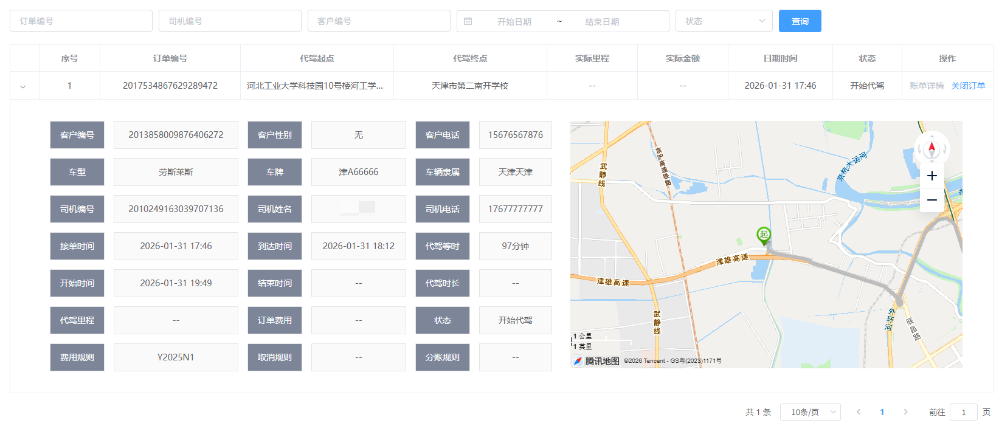

接下来，我们先编写 `<font style="color:#000000;">zxds-odr</font>`子系统，查询订单的详细信息。

## 时序图

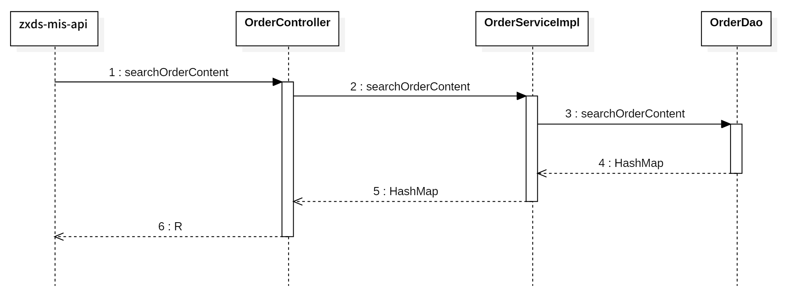

## 编写持久层代码

在`<font style="color:#000000;background-color:rgba(220, 240, 255, 0.3) !important;">OrderDao.xml</font>`文件中，声明SQL语句，查询订单详情信息

```xml
<select id="searchOrderContent" parameterType="long" resultType="HashMap">
    SELECT CAST(o.driver_id AS CHAR)                     AS driverId,
           CAST(o.customer_id AS CHAR)                   AS customerId,
           o.car_plate                                   AS carPlate,
           o.car_type                                    AS carType,
           DATE_FORMAT(o.accept_time, '%Y-%m-%d %H:%i')  AS acceptTime,
           DATE_FORMAT(o.arrive_time, '%Y-%m-%d %H:%i')  AS arriveTime,
           DATE_FORMAT(o.start_time, '%Y-%m-%d %H:%i')   AS startTime,
           DATE_FORMAT(o.end_time, '%Y-%m-%d %H:%i')     AS endTime,
           o.waiting_minute                              AS waitingMinute,
           TIMESTAMPDIFF(MINUTE,o.start_time, o.end_time) AS `driveMinute`,
           CAST(o.real_mileage AS CHAR)                  AS realMileage,
           CAST(o.real_fee AS CHAR)                      AS realFee,
           o.`status`,
           CAST(o.charge_rule_id AS CHAR)                AS chargeRuleId,
           CAST(o.cancel_rule_id AS CHAR)                AS cancelRuleId,
           CAST(p.rule_id AS CHAR)                       AS profitSharingRuleId,
           o.start_place_location                        AS startPlaceLocation,
           o.end_place_location                          AS endPlaceLocation
    FROM tb_order o
    LEFT JOIN tb_order_profitsharing p ON o.id = p.order_id
    WHERE o.id = #{orderId}
</select>
```

在`<font style="color:#000000;background-color:rgba(220, 240, 255, 0.3) !important;">com.example.zxds.odr.db.dao</font>`包`<font style="color:#000000;background-color:rgba(220, 240, 255, 0.3) !important;">OrderDao.java</font>`接口中，定义DAO方法

```java
Map<String, Object> searchOrderContent(long orderId);
```

## 编写 service 和实现

在`<font style="color:#000000;background-color:rgba(220, 240, 255, 0.3) !important;">com.example.zxds.odr.service</font>`包`<font style="color:#000000;background-color:rgba(220, 240, 255, 0.3) !important;">OrderService.java</font>`接口中，声明抽象方法

```java
Map<String, Object> searchOrderContent(long orderId);
```

在`<font style="color:#000000;background-color:rgba(220, 240, 255, 0.3) !important;">com.example.zxds.odr.service.impl</font>`包`<font style="color:#000000;background-color:rgba(220, 240, 255, 0.3) !important;">OrderServiceImpl.java</font>`类中，实现抽象方法

```java
@Override
public Map<String, Object> searchOrderContent(long orderId) {
    Map<String, Object> map = orderDao.searchOrderContent(orderId);
    JSONObject startPlaceLocation = JSONUtil.parseObj(MapUtil.getStr(map, "startPlaceLocation"));
    JSONObject endPlaceLocation = JSONUtil.parseObj(MapUtil.getStr(map, "endPlaceLocation"));
    map.replace("startPlaceLocation", startPlaceLocation);
    map.replace("endPlaceLocation", endPlaceLocation);
    return map;
}
```

## 编写 form 接收数据并校验

在`<font style="color:#000000;background-color:rgba(220, 240, 255, 0.3) !important;">com.example.zxds.odr.controller.form</font>`包中创建`<font style="color:#000000;background-color:rgba(220, 240, 255, 0.3) !important;">SearchOrderContentForm.java</font>`类

```java
package com.example.zxds.odr.controller.form;

import io.swagger.v3.oas.annotations.media.Schema;
import lombok.Data;

import javax.validation.constraints.Min;
import javax.validation.constraints.NotNull;

@Data
@Schema(description = "查询订单详情的表单")
public class SearchOrderContentForm {
    @NotNull(message = "orderId不能为空")
    @Min(value = 1, message = "orderId不能小于1")
    @Schema(description = "订单ID")
    private Long orderId;
}
```

## 编写 web 方法

在`<font style="color:#000000;background-color:rgba(220, 240, 255, 0.3) !important;">com.example.zxds.odr.controller</font>`包`<font style="color:#000000;background-color:rgba(220, 240, 255, 0.3) !important;">OrderController.java</font>`类中，声明Web方法

```java
@PostMapping("/searchOrderContent")
@Operation(summary = "查询订单详情")
public R searchOrderContent(@RequestBody @Valid SearchOrderContentForm form) {
    Map<String, Object> map = orderService.searchOrderContent(form.getOrderId());
    return R.ok().put("result", map);
}
```

# mis 系统展示订单详情-编写 zxds-cst 子系统

## 时序图


## 编写持久层代码

在`<font style="color:#000000;background-color:rgba(220, 240, 255, 0.3) !important;">CustomerDao.xml</font>`文件中，声明SQL语句

```xml
<select id="searchCustomerBriefInfo" parameterType="long" resultType="HashMap">
    SELECT CAST(id AS CHAR) AS id,
           sex,
           tel
    FROM tb_customer
    WHERE id = #{customerId};
</select>
```

在`<font style="color:#000000;background-color:rgba(220, 240, 255, 0.3) !important;">com.example.zxds.cst.db.dao</font>`包`<font style="color:#000000;background-color:rgba(220, 240, 255, 0.3) !important;">CustomerDao.java</font>`接口中，声明抽象方法

```java
Map<String, Object> searchCustomerBriefInfo(long customerId);
```

## 编写 service 和实现

在`<font style="color:#000000;background-color:rgba(220, 240, 255, 0.3) !important;">com.example.zxds.cst.service</font>`包`<font style="color:#000000;background-color:rgba(220, 240, 255, 0.3) !important;">CustomerService.java</font>`接口中，声明抽象方法

```java
Map<String, Object> searchCustomerBriefInfo(long customerId);
```

在`<font style="color:#000000;background-color:rgba(220, 240, 255, 0.3) !important;">com.example.zxds.cst.service.impl</font>`包`<font style="color:#000000;background-color:rgba(220, 240, 255, 0.3) !important;">CustomerServiceImpl.java</font>`类中，实现抽象方法

```java
@Override
public Map<String, Object> searchCustomerBriefInfo(long customerId) {
    Map<String, Object> map = customerDao.searchCustomerBriefInfo(customerId);
    return map;
}
```

## 编写 form 接收数据并校验

在`<font style="color:#000000;background-color:rgba(220, 240, 255, 0.3) !important;">com.example.zxds.cst.controller.form</font>`包中创建`<font style="color:#000000;background-color:rgba(220, 240, 255, 0.3) !important;">SearchCustomerBriefInfoForm.java</font>`类

```java
package com.example.zxds.cst.controller.form;

import io.swagger.v3.oas.annotations.media.Schema;
import lombok.Data;

import javax.validation.constraints.Min;
import javax.validation.constraints.NotNull;

@Data
@Schema(description = "查询客户简明信息的表单")
public class SearchCustomerBriefInfoForm {
    @NotNull(message = "customerId不能为空")
    @Min(value = 1, message = "customerId不能小于1")
    @Schema(description = "客户ID")
    private Long customerId;
}
```

## 编写 web 方法

在`<font style="color:#000000;background-color:rgba(220, 240, 255, 0.3) !important;">com.example.zxds.cst.controller</font>`包`<font style="color:#000000;background-color:rgba(220, 240, 255, 0.3) !important;">CustomerController.java</font>`类中，声明Web方法

```java
@PostMapping("/searchCustomerBriefInfo")
@Operation(summary = "查询客户简明信息")
public R searchCustomerBriefInfo(@RequestBody @Valid SearchCustomerBriefInfoForm form) {
    Map<String, Object> map = customerService.searchCustomerBriefInfo(form.getCustomerId());
    return R.ok().put("result", map);
}
```

# mis 系统展示订单详情-编写 zxds-dr 子系统

## 时序图

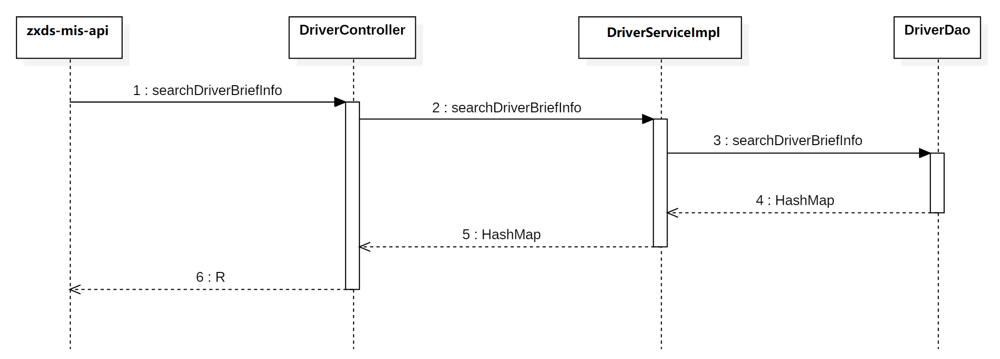

## 编写持久层代码

在`<font style="color:#000000;background-color:rgba(220, 240, 255, 0.3) !important;">DriverDao.xml</font>`文件中，声明DAO方法

```xml
<select id="searchDriverBriefInfo" parameterType="long" resultType="HashMap">
    SELECT CAST(id AS CHAR) AS id,
           `name`,
           tel
    FROM tb_driver
    WHERE id = #{driverId}
</select>
```

在`<font style="color:#000000;background-color:rgba(220, 240, 255, 0.3) !important;">com.example.zxds.dr.db.dao</font>`包`<font style="color:#000000;background-color:rgba(220, 240, 255, 0.3) !important;">DriverDao.java</font>`接口中，声明抽象方法

```java
Map<String, Object> searchDriverBriefInfo(long driverId);
```

## 编写 service 和实现

在`<font style="color:#000000;background-color:rgba(220, 240, 255, 0.3) !important;">com.example.zxds.dr.service</font>`包`<font style="color:#000000;background-color:rgba(220, 240, 255, 0.3) !important;">DriverService.java</font>`接口中，声明抽象方法

```java
Map<String, Object> searchDriverBriefInfo(long driverId);
```

在`<font style="color:#000000;background-color:rgba(220, 240, 255, 0.3) !important;">com.example.zxds.dr.service.impl</font>`包`<font style="color:#000000;background-color:rgba(220, 240, 255, 0.3) !important;">DriverServiceImpl.java</font>`类中，实现抽象方法

```java
@Override
public Map<String, Object> searchDriverBriefInfo(long driverId) {
    Map<String, Object> map = driverDao.searchDriverBriefInfo(driverId);
    return map;
}
```

## 编写 form 接收数据并校验

在`<font style="color:#000000;background-color:rgba(220, 240, 255, 0.3) !important;">com.example.zxds.dr.controller.form</font>`包中创建`<font style="color:#000000;background-color:rgba(220, 240, 255, 0.3) !important;">SearchDriverBriefInfoForm.java</font>`类

```java
package com.example.zxds.dr.controller.form;

import io.swagger.v3.oas.annotations.media.Schema;
import lombok.Data;

import javax.validation.constraints.Min;
import javax.validation.constraints.NotNull;

@Data
@Schema(description = "查询司机简明信息的表单")
public class SearchDriverBriefInfoForm {
    @NotNull(message = "driverId不能为空")
    @Min(value = 1, message = "driverId不能小于1")
    @Schema(description = "司机ID")
    private Long driverId;
}
```

## 编写 web 方法

在`<font style="color:#000000;background-color:rgba(220, 240, 255, 0.3) !important;">com.example.zxds.dr.controller</font>`包`<font style="color:#000000;background-color:rgba(220, 240, 255, 0.3) !important;">DriverController.java</font>`类中，声明Web方法

```java
@PostMapping("/searchDriverBriefInfo")
@Operation(summary = "查询司机简明信息")
public R searchDriverBriefInfo(@RequestBody @Valid SearchDriverBriefInfoForm form) {
    Map<String, Object> map = driverService.searchDriverBriefInfo(form.getDriverId());
    return R.ok().put("result", map);
}
```

# mis 系统展示订单详情-编写 zxds-nebula 子系统

在折叠面板的右侧的地图组件中，要显示代驾的最佳线路，这个我们可以调用我们之前写过的地图子系统的代码。除此之外，如果订单已经结束了，地图组件上还要显示代驾实际的驾驶线路。其实就是把HBase中该订单的GPS定位坐标都给取出来，然后显示成连线就可以了；如果订单正在进行中，地图组件上面显示的是实际的GPS定位坐标，这就需要我们把该订单最后的GPS坐标给取出来。

1. **订单未结束时**
  1. **地图上实时显示当前司机的位置**
2. **订单结束时**
  1. **显示司机实际的驾车路线**
3. **只显示代驾的最佳线路。**

## 时序图

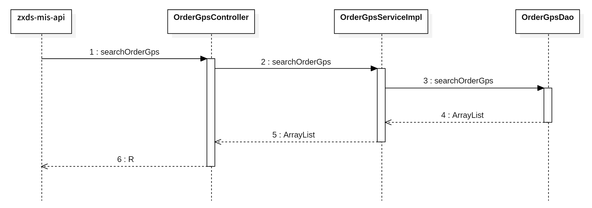

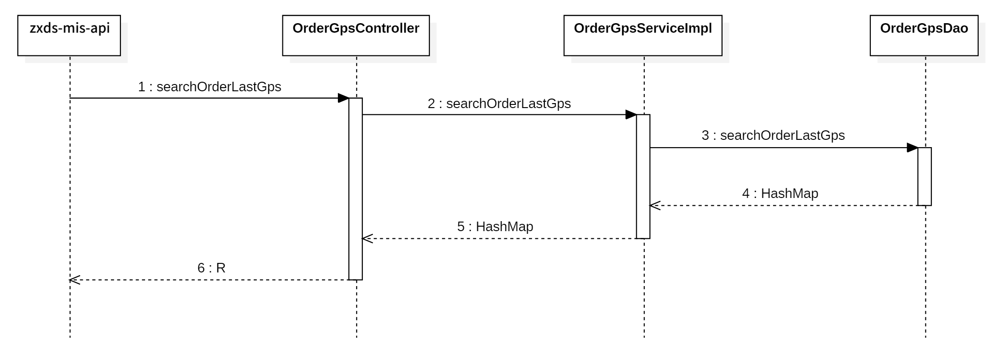

## 编写持久层代码

在`<font style="color:#000000;background-color:rgba(220, 240, 255, 0.3) !important;">OrderGpsDao.xml</font>`文件中，声明SQL语句

```xml
<select id="searchOrderGps" parameterType="long" resultType="HashMap">
    SELECT "id",
           "latitude",
           "longitude",
           TO_CHAR("create_time",'yyyy-MM-dd HH:mm:ss') AS "createTime"
    FROM zxds.order_gps
    WHERE "order_id" = #{orderId}
</select>
<select id="searchOrderLastGps" parameterType="long" resultType="HashMap">
    SELECT "id",
           "latitude",
           "longitude",
           TO_CHAR("create_time",'yyyy-MM-dd HH:mm:ss') AS "createTime"
    FROM zxds.order_gps
    WHERE "order_id" = #{orderId}
    ORDER BY "id" DESC
    LIMIT 1
</select>
```

在`<font style="color:#000000;background-color:rgba(220, 240, 255, 0.3) !important;">com.example.zxds.nebula.db.dao</font>`包`<font style="color:#000000;background-color:rgba(220, 240, 255, 0.3) !important;">OrderGpsDao.java</font>`接口中，声明DAO方法

```java
List<Map<String, Object>> searchOrderGps(long orderId);

Map<String, Object> searchOrderLastGps(long orderId);
```

## 编写 service 和实现

在`<font style="color:#000000;background-color:rgba(220, 240, 255, 0.3) !important;">com.example.zxds.nebula.service</font>`包`<font style="color:#000000;background-color:rgba(220, 240, 255, 0.3) !important;">OrderGpsService.java</font>`接口中，声明抽象方法

```java
List<Map<String, Object>> searchOrderGps(long orderId);

Map<String, Object> searchOrderLastGps(long orderId);
```

在`<font style="color:#000000;background-color:rgba(220, 240, 255, 0.3) !important;">com.example.zxds.nebula.service.impl</font>`包`<font style="color:#000000;background-color:rgba(220, 240, 255, 0.3) !important;">OrderGpsServiceImpl.java</font>`类中，实现抽象方法

```java
@Override
public List<Map<String, Object>> searchOrderGps(long orderId) {
    return orderGpsDao.searchOrderGps(orderId);
}

@Override
public Map<String, Object> searchOrderLastGps(long orderId) {
    return orderGpsDao.searchOrderLastGps(orderId);
}
```

## 编写 form 接收数据并校验

在`<font style="color:#000000;background-color:rgba(220, 240, 255, 0.3) !important;">com.example.zxds.nebula.controller.form</font>`包中创建`<font style="color:#000000;background-color:rgba(220, 240, 255, 0.3) !important;">SearchOrderGpsForm.java</font>`类

```java
package com.example.zxds.nebula.controller.form;

import io.swagger.v3.oas.annotations.media.Schema;
import lombok.Data;

import javax.validation.constraints.Min;
import javax.validation.constraints.NotNull;

@Data
@Schema(description = "获取某个订单的GPS定位的表单")
public class SearchOrderGpsForm {
    @NotNull(message = "orderId不能为空")
    @Min(value = 1, message = "orderId不能小于1")
    @Schema(description = "订单ID")
    private Long orderId;
}
```

在`<font style="color:#000000;background-color:rgba(220, 240, 255, 0.3) !important;">com.example.zxds.nebula.controller.form</font>`包中创建`<font style="color:#000000;background-color:rgba(220, 240, 255, 0.3) !important;">SearchOrderLastGpsForm.java</font>`类

```java
package com.example.zxds.nebula.controller.form;

import io.swagger.v3.oas.annotations.media.Schema;
import lombok.Data;

import javax.validation.constraints.Min;
import javax.validation.constraints.NotNull;

@Data
@Schema(description = "获取某个订单最后的GPS定位的表单")
public class SearchOrderLastGpsForm {
    @NotNull(message = "orderId不能为空")
    @Min(value = 1, message = "orderId不能小于1")
    @Schema(description = "订单ID")
    private Long orderId;
}
```

## 编写 web 方法

在`<font style="color:#000000;background-color:rgba(220, 240, 255, 0.3) !important;">com.example.zxds.nebula.controller</font>`包`<font style="color:#000000;background-color:rgba(220, 240, 255, 0.3) !important;">OrderGpsController.java</font>`类中，声明Web方法

```java
@PostMapping("/searchOrderGps")
@Operation(summary = "获取某个订单所有的GPS定位")
public R searchOrderGps(@RequestBody @Valid SearchOrderGpsForm form) {
    List<Map<String, Object>> list = orderGpsService.searchOrderGps(form.getOrderId());
    return R.ok().put("result", list);
}

@PostMapping("/searchOrderLastGps")
@Operation(summary = "获取某个订单最后的GPS定位")
public R searchOrderLastGps(@RequestBody @Valid SearchOrderLastGpsForm form) {
    Map<String, Object> map = orderGpsService.searchOrderLastGps(form.getOrderId());
    return R.ok().put("result", map);
}
```

# mis 系统展示订单详情-编写 zxds-mis-api 子系统

## 时序图

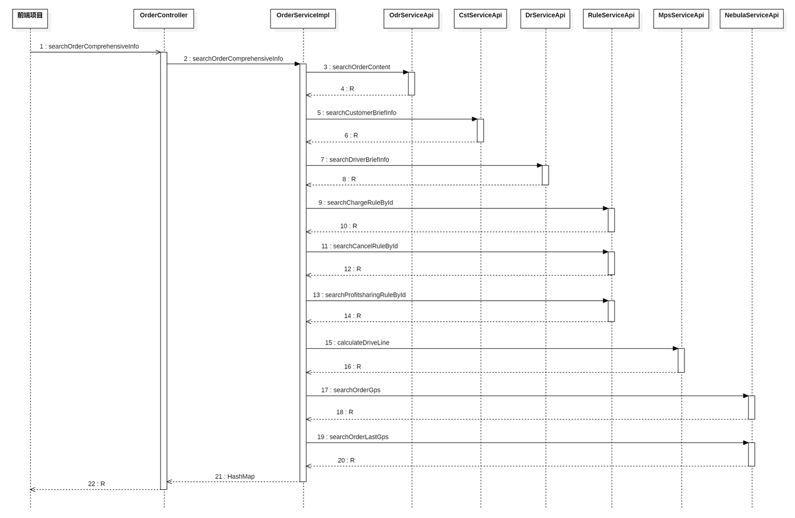

## 编写 Feign 客户端

在`<font style="color:#000000;background-color:rgba(220, 240, 255, 0.3) !important;">com.example.zxds.mis.api.controller.form</font>`包中创建`<font style="color:#000000;background-color:rgba(220, 240, 255, 0.3) !important;">SearchOrderContentForm.java</font>`类

```java
package com.example.zxds.mis.api.controller.form;

import io.swagger.v3.oas.annotations.media.Schema;
import lombok.Data;

import javax.validation.constraints.Min;
import javax.validation.constraints.NotNull;

@Data
@Schema(description = "查询订单详情的表单")
public class SearchOrderContentForm {
    @NotNull(message = "orderId不能为空")
    @Min(value = 1, message = "orderId不能小于1")
    @Schema(description = "订单ID")
    private Long orderId;
}
```

在`<font style="color:#000000;background-color:rgba(220, 240, 255, 0.3) !important;">com.example.zxds.mis.api.feign</font>`包`<font style="color:#000000;background-color:rgba(220, 240, 255, 0.3) !important;">OdrServiceApi.java</font>`接口中，声明抽象方法

```java
@PostMapping("/order/searchOrderContent")
R searchOrderContent(SearchOrderContentForm form);
```

在`<font style="color:#000000;background-color:rgba(220, 240, 255, 0.3) !important;">com.example.zxds.mis.api.controller.form</font>`包中创建`<font style="color:#000000;background-color:rgba(220, 240, 255, 0.3) !important;">SearchCustomerBriefInfoForm.java</font>`类

```java
package com.example.zxds.mis.api.controller.form;

import io.swagger.v3.oas.annotations.media.Schema;
import lombok.Data;

import javax.validation.constraints.Min;
import javax.validation.constraints.NotNull;

@Data
@Schema(description = "查询客户简明信息的表单")
public class SearchCustomerBriefInfoForm {
    @NotNull(message = "customerId不能为空")
    @Min(value = 1, message = "customerId不能小于1")
    @Schema(description = "客户ID")
    private Long customerId;
}
```

在`<font style="color:#000000;background-color:rgba(220, 240, 255, 0.3) !important;">com.example.zxds.mis.api.feign</font>`包`<font style="color:#000000;background-color:rgba(220, 240, 255, 0.3) !important;">CstServiceApi.java</font>`接口中，声明抽象方法

```java
package com.example.zxds.mis.api.feign;

import com.example.zxds.common.util.R;
import com.example.zxds.mis.api.controller.form.SearchCustomerBriefInfoForm;
import org.springframework.cloud.openfeign.FeignClient;
import org.springframework.web.bind.annotation.PostMapping;

@FeignClient(value = "zxds-cst")
public interface CstServiceApi {
    @PostMapping("/customer/searchCustomerBriefInfo")
    R searchCustomerBriefInfo(SearchCustomerBriefInfoForm form);
}
```

在`<font style="color:#000000;background-color:rgba(220, 240, 255, 0.3) !important;">com.example.zxds.mis.api.controller.form</font>`包中创建`<font style="color:#000000;background-color:rgba(220, 240, 255, 0.3) !important;">SearchDriverBriefInfoForm.java</font>`类

```java
package com.example.zxds.mis.api.controller.form;

import io.swagger.v3.oas.annotations.media.Schema;
import lombok.Data;

import javax.validation.constraints.Min;
import javax.validation.constraints.NotNull;

@Data
@Schema(description = "查询司机简明信息的表单")
public class SearchDriverBriefInfoForm {
    @NotNull(message = "driverId不能为空")
    @Min(value = 1, message = "driverId不能小于1")
    @Schema(description = "司机ID")
    private Long driverId;
}
```

在`<font style="color:#000000;background-color:rgba(220, 240, 255, 0.3) !important;">com.example.zxds.mis.api.feign</font>`包`<font style="color:#000000;background-color:rgba(220, 240, 255, 0.3) !important;">DrServiceApi.java</font>`接口中，声明抽象方法

```java
@PostMapping("/driver/searchDriverBriefInfo")
R searchDriverBriefInfo(SearchDriverBriefInfoForm form);
```

在`<font style="color:#000000;background-color:rgba(220, 240, 255, 0.3) !important;">com.example.zxds.mis.api.controller.form</font>`包中创建`<font style="color:#000000;background-color:rgba(220, 240, 255, 0.3) !important;">SearchChargeRuleByIdForm.java</font>`类

```java
package com.example.zxds.mis.api.controller.form;

import io.swagger.v3.oas.annotations.media.Schema;
import lombok.Data;

import javax.validation.constraints.Min;
import javax.validation.constraints.NotNull;

@Data
@Schema(description = "根据ID查询费用规则的表单")
public class SearchChargeRuleByIdForm {
    @NotNull(message = "ruleId不为空")
    @Min(value = 1, message = "ruleId不能小于1")
    @Schema(description = "规则ID")
    private Long ruleId;
}
```

在`<font style="color:#000000;background-color:rgba(220, 240, 255, 0.3) !important;">com.example.zxds.mis.api.controller.form</font>`包中创建`<font style="color:#000000;background-color:rgba(220, 240, 255, 0.3) !important;">SearchCancelRuleByIdForm.java</font>`类

```java
package com.example.zxds.mis.api.controller.form;

import io.swagger.v3.oas.annotations.media.Schema;
import lombok.Data;

import javax.validation.constraints.Min;
import javax.validation.constraints.NotNull;

@Data
@Schema(description = "根据ID查询取消规则的表单")
public class SearchCancelRuleByIdForm {
    @NotNull(message = "ruleId不为空")
    @Min(value = 1, message = "ruleId不能小于1")
    @Schema(description = "规则ID")
    private Long ruleId;
}
```

在`<font style="color:#000000;background-color:rgba(220, 240, 255, 0.3) !important;">com.example.zxds.mis.api.controller.form</font>`包中创建`<font style="color:#000000;background-color:rgba(220, 240, 255, 0.3) !important;">SearchProfitSharingRuleByIdForm.java</font>`类

```java
package com.example.zxds.mis.api.controller.form;

import io.swagger.v3.oas.annotations.media.Schema;
import lombok.Data;

import javax.validation.constraints.Min;
import javax.validation.constraints.NotNull;

@Data
@Schema(description = "根据ID查询分账规则的表单")
public class SearchProfitSharingRuleByIdForm {
    @NotNull(message = "ruleId不为空")
    @Min(value = 1, message = "ruleId不能小于1")
    @Schema(description = "规则ID")
    private Long ruleId;
}
```

在`<font style="color:#000000;background-color:rgba(220, 240, 255, 0.3) !important;">com.example.zxds.mis.api.feign</font>`包`<font style="color:#000000;background-color:rgba(220, 240, 255, 0.3) !important;">RuleServiceApi.java</font>`接口中，声明抽象方法

```java
package com.example.zxds.mis.api.feign;

import com.example.zxds.common.util.R;
import com.example.zxds.mis.api.controller.form.SearchCancelRuleByIdForm;
import com.example.zxds.mis.api.controller.form.SearchChargeRuleByIdForm;
import com.example.zxds.mis.api.controller.form.SearchProfitSharingRuleByIdForm;
import org.springframework.cloud.openfeign.FeignClient;
import org.springframework.web.bind.annotation.PostMapping;

@FeignClient(value = "zxds-rule")
public interface RuleServiceApi {
    @PostMapping("/charge/searchChargeRuleById")
    R searchChargeRuleById(SearchChargeRuleByIdForm form);

    @PostMapping("/cancel/searchCancelRuleById")
    R searchCancelRuleById(SearchCancelRuleByIdForm form);

    @PostMapping("/profitsharing/searchProfitsharingRuleById")
    R searchProfitSharingRuleById(SearchProfitSharingRuleByIdForm form);
}
```

在`<font style="color:#000000;background-color:rgba(220, 240, 255, 0.3) !important;">com.example.zxds.mis.api.controller.form</font>`包中创建`<font style="color:#000000;background-color:rgba(220, 240, 255, 0.3) !important;">CalculateDriveLineForm.java</font>`类

```java
package com.example.zxds.mis.api.controller.form;

import io.swagger.v3.oas.annotations.media.Schema;
import lombok.Data;

import javax.validation.constraints.NotBlank;
import javax.validation.constraints.Pattern;

@Data
@Schema(description = "计算行驶路线的表单")
public class CalculateDriveLineForm {
    @NotBlank(message = "startPlaceLatitude不能为空")
    @Pattern(regexp = "^(([1-8]\\d?)|([1-8]\\d))(\\.\\d{1,18})|90|0(\\.\\d{1,18})?$", message = "startPlaceLatitude内容不正确")
    @Schema(description = "订单起点的纬度")
    private String startPlaceLatitude;

    @NotBlank(message = "startPlaceLongitude不能为空")
    @Pattern(regexp = "^(([1-9]\\d?)|(1[0-7]\\d))(\\.\\d{1,18})|180|0(\\.\\d{1,18})?$", message = "startPlaceLongitude内容不正确")
    @Schema(description = "订单起点的经度")
    private String startPlaceLongitude;

    @NotBlank(message = "endPlaceLatitude不能为空")
    @Pattern(regexp = "^(([1-8]\\d?)|([1-8]\\d))(\\.\\d{1,18})|90|0(\\.\\d{1,18})?$", message = "endPlaceLatitude内容不正确")
    @Schema(description = "订单终点的纬度")
    private String endPlaceLatitude;

    @NotBlank(message = "endPlaceLongitude不能为空")
    @Pattern(regexp = "^(([1-9]\\d?)|(1[0-7]\\d))(\\.\\d{1,18})|180|0(\\.\\d{1,18})?$", message = "endPlaceLongitude内容不正确")
    @Schema(description = "订单起点的经度")
    private String endPlaceLongitude;
}
```

在`<font style="color:#000000;background-color:rgba(220, 240, 255, 0.3) !important;">com.example.zxds.mis.api.feign</font>`包`<font style="color:#000000;background-color:rgba(220, 240, 255, 0.3) !important;">MpsServiceApi.java</font>`接口中，声明抽象方法

```java
package com.example.zxds.mis.api.feign;

import com.example.zxds.common.util.R;
import com.example.zxds.mis.api.controller.form.CalculateDriveLineForm;
import org.springframework.cloud.openfeign.FeignClient;
import org.springframework.web.bind.annotation.PostMapping;

@FeignClient(value = "zxds-mps")
public interface MpsServiceApi {

    @PostMapping("/map/calculateDriveLine")
    R calculateDriveLine(CalculateDriveLineForm form);
}
```

在`<font style="color:#000000;background-color:rgba(220, 240, 255, 0.3) !important;">com.example.zxds.mis.api.controller.form</font>`包中创建`<font style="color:#000000;background-color:rgba(220, 240, 255, 0.3) !important;">SearchOrderGpsForm.java</font>`类

```java
package com.example.zxds.mis.api.controller.form;

import io.swagger.v3.oas.annotations.media.Schema;
import lombok.Data;

import javax.validation.constraints.Min;
import javax.validation.constraints.NotNull;

@Data
@Schema(description = "获取某个订单的GPS定位的表单")
public class SearchOrderGpsForm {
    @NotNull(message = "orderId不能为空")
    @Min(value = 1, message = "orderId不能小于1")
    @Schema(description = "订单ID")
    private Long orderId;
}
```

在`<font style="color:#000000;background-color:rgba(220, 240, 255, 0.3) !important;">com.example.zxds.mis.api.controller.form</font>`包中创建`<font style="color:#000000;background-color:rgba(220, 240, 255, 0.3) !important;">SearchOrderLastGpsForm.java</font>`类

```java
package com.example.zxds.mis.api.controller.form;

import io.swagger.v3.oas.annotations.media.Schema;
import lombok.Data;

import javax.validation.constraints.Min;
import javax.validation.constraints.NotNull;

@Data
@Schema(description = "获取某个订单最后的GPS定位的表单")
public class SearchOrderLastGpsForm {
    @NotNull(message = "orderId不能为空")
    @Min(value = 1, message = "orderId不能小于1")
    @Schema(description = "订单ID")
    private Long orderId;
}
```

在`<font style="color:#000000;background-color:rgba(220, 240, 255, 0.3) !important;">com.example.zxds.mis.api.feign</font>`包`<font style="color:#000000;background-color:rgba(220, 240, 255, 0.3) !important;">NebulaServiceApi.java</font>`接口中，声明抽象方法

```java
package com.example.zxds.mis.api.feign;

import com.example.zxds.common.util.R;
import com.example.zxds.mis.api.controller.form.SearchOrderGpsForm;
import com.example.zxds.mis.api.controller.form.SearchOrderLastGpsForm;
import org.springframework.cloud.openfeign.FeignClient;
import org.springframework.web.bind.annotation.PostMapping;

@FeignClient(value = "zxds-nebula")
public interface NebulaServiceApi {
    @PostMapping("/order/gps/searchOrderGps")
    R searchOrderGps(SearchOrderGpsForm form);

    @PostMapping("/order/gps/searchOrderLastGps")
    R searchOrderLastGps(SearchOrderLastGpsForm form);
}
```

## 编写 service 和实现

在`<font style="color:#000000;background-color:rgba(220, 240, 255, 0.3) !important;">com.example.zxds.mis.api.service</font>`包`<font style="color:#000000;background-color:rgba(220, 240, 255, 0.3) !important;">OrderService.java</font>`接口中，声明方法

```java
Map<String, Object> searchOrderComprehensiveInfo(long orderId);
```

在`<font style="color:#000000;background-color:rgba(220, 240, 255, 0.3) !important;">com.example.zxds.mis.api.service.impl</font>`包`<font style="color:#000000;background-color:rgba(220, 240, 255, 0.3) !important;">OrderServiceImpl.java</font>`接口中，实现方法

```java
private final CstServiceApi cstServiceApi;
private final DrServiceApi drServiceApi;
private final RuleServiceApi ruleServiceApi;
private final MpsServiceApi mpsServiceApi;
private final NebulaServiceApi nebulaServiceApi;

// 查询订单 全面的/综合性的 信息。
@Override
public Map<String, Object> searchOrderComprehensiveInfo(long orderId) {

    Map<String, Object> map = new HashMap<>();

    //查询订单内容信息
    SearchOrderContentForm form1 = new SearchOrderContentForm();
    form1.setOrderId(orderId);
    R r = odrServiceApi.searchOrderContent(form1);
    if (!r.containsKey("result")) {
        throw new ZxdsException("不存在订单记录");
    }
    Map<String,Object> content = (Map<String, Object>) r.get("result");
    map.put("content", content);

    //查询客户信息
    long customerId = MapUtil.getLong(content, "customerId");
    SearchCustomerBriefInfoForm form2 = new SearchCustomerBriefInfoForm();
    form2.setCustomerId(customerId);
    r = cstServiceApi.searchCustomerBriefInfo(form2);
    Map<String, Object> customerInfo = (Map<String, Object>) r.get("result");
    map.put("customerInfo", customerInfo);

    //查询司机信息
    if(content.containsKey("driverId")) {
        long driverId = MapUtil.getLong(content, "driverId");
        SearchDriverBriefInfoForm form3 = new SearchDriverBriefInfoForm();
        form3.setDriverId(driverId);
        r = drServiceApi.searchDriverBriefInfo(form3);
        Map<String, Object> driverInfo = (Map<String, Object>) r.get("result");
        map.put("driverInfo", driverInfo);
    }

    //查询消费规则
    if (content.containsKey("chargeRuleId")) {
        long chargeRuleId = MapUtil.getLong(content, "chargeRuleId");
        SearchChargeRuleByIdForm form4 = new SearchChargeRuleByIdForm();
        form4.setRuleId(chargeRuleId);
        r = ruleServiceApi.searchChargeRuleById(form4);
        Map<String, Object> chargeRule = (Map<String, Object>) r.get("result");
        map.put("chargeRule", chargeRule);
    }

    //查询取消规则
    if (content.containsKey("cancelRuleId")) {
        long cancelRuleId = MapUtil.getLong(content, "cancelRuleId");
        SearchCancelRuleByIdForm form_5 = new SearchCancelRuleByIdForm();
        form_5.setRuleId(cancelRuleId);
        r = ruleServiceApi.searchCancelRuleById(form_5);
        Map<String, Object> cancelRule = (Map<String, Object>) r.get("result");
        map.put("cancelRule", cancelRule);
    }

    //查询分账规则
    if (content.containsKey("profitSharingRuleId")) {
        long profitSharingRuleId = MapUtil.getLong(content, "profitSharingRuleId");
        SearchProfitSharingRuleByIdForm form6 = new SearchProfitSharingRuleByIdForm();
        form6.setRuleId(profitSharingRuleId);
        r = ruleServiceApi.searchProfitSharingRuleById(form6);
        Map<String, Object> profitSharingRule = (Map<String, Object>) r.get("result");
        map.put("profitSharingRule", profitSharingRule);
    }


    //查询GPS规划线路
    CalculateDriveLineForm form7 = new CalculateDriveLineForm();
    Map<String, Object> startPlaceLocation = (Map<String, Object>) content.get("startPlaceLocation");
    Map<String, Object> endPlaceLocation = (Map<String, Object>) content.get("endPlaceLocation");
    form7.setStartPlaceLatitude(MapUtil.getStr(startPlaceLocation, "latitude"));
    form7.setStartPlaceLongitude(MapUtil.getStr(startPlaceLocation, "longitude"));
    form7.setEndPlaceLatitude(MapUtil.getStr(endPlaceLocation, "latitude"));
    form7.setEndPlaceLongitude(MapUtil.getStr(endPlaceLocation, "longitude"));
    r = mpsServiceApi.calculateDriveLine(form7);
    Map<String, Object> driveLine = (Map<String, Object>) r.get("result");
    map.put("driveLine", driveLine);

    int status = MapUtil.getInt(content, "status");
    if (status >= 5 && status <= 8) {
        //查询订单GPS定位记录
        SearchOrderGpsForm form_8 = new SearchOrderGpsForm();
        form_8.setOrderId(orderId);
        r = nebulaServiceApi.searchOrderGps(form_8);
        List<Map<String, Object>> orderGps = (List<Map<String, Object>>) r.get("result");
        map.put("orderGps", orderGps);
    } else if (status == 4) {
        //查询订单中最后的GPS定位
        SearchOrderLastGpsForm form9 = new SearchOrderLastGpsForm();
        form9.setOrderId(orderId);
        r = nebulaServiceApi.searchOrderLastGps(form9);
        Map<String, Object> lastGps = (Map<String, Object>) r.get("result");
        map.put("lastGps", lastGps);
    }
    return map;
}
```

## 编写 web 层代码

在`<font style="color:#000000;background-color:rgba(220, 240, 255, 0.3) !important;">com.example.zxds.mis.api.controller.form</font>`包中创建`<font style="color:#000000;background-color:rgba(220, 240, 255, 0.3) !important;">SearchOrderComprehensiveInfoForm.java</font>`类

```java
package com.example.zxds.mis.api.controller.form;

import io.swagger.v3.oas.annotations.media.Schema;
import lombok.Data;

import javax.validation.constraints.Min;
import javax.validation.constraints.NotNull;

@Data
@Schema(description = "查询订单综合信息")
public class SearchOrderComprehensiveInfoForm {
    @NotNull(message = "orderId不能为空")
    @Min(value = 1, message = "orderId不能小于1")
    @Schema(description = "订单ID")
    private Long orderId;
}
```

在`<font style="color:#000000;background-color:rgba(220, 240, 255, 0.3) !important;">com.example.zxds.mis.api.controller</font>`包`<font style="color:#000000;background-color:rgba(220, 240, 255, 0.3) !important;">OrderController.java</font>`类中，声明Web方法

```java
@PostMapping("/searchOrderComprehensiveInfo")

@SaCheckPermission(value = {"ROOT", "ORDER:SELECT"}, mode = SaMode.OR)
@Operation(summary = "查询订单")
public R searchOrderComprehensiveInfo(@RequestBody @Valid SearchOrderComprehensiveInfoForm form) {
    Map<String, Object> result = orderService.searchOrderComprehensiveInfo(form.getOrderId());
    return R.ok().put("result", result);
}
```

## 测试 web 方法

把分账规则.sql 和取消规则.sql 两个脚本执行一下：在 `<font style="color:#000000;">zxds-rule</font>`数据库中执行。

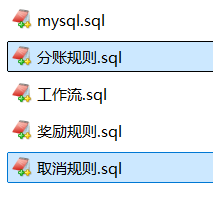

然后使用 Apipost 工具测试。

# 实时获取执行中的订单最新的 GPS 坐标

展开折叠面板之后，如果当前订单是正在执行中的状态，我们要用定时器，每隔15秒钟查询一下该订单最新的GPS坐标，所以咱们要继续编写后端代码。

编写 zxds-mis-api 子系统。

## 时序图

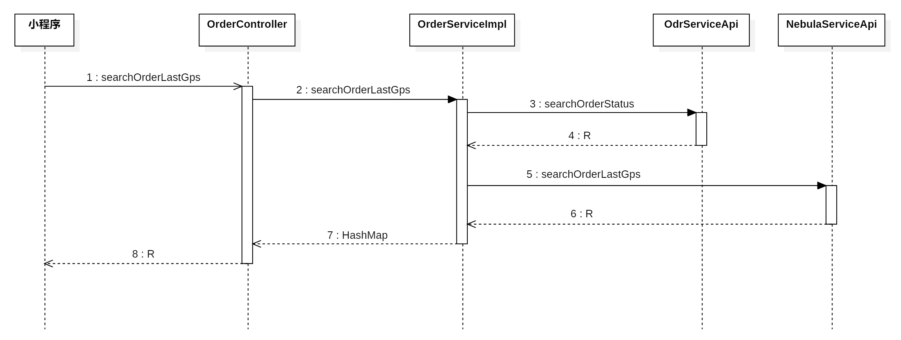

## 编写 Feign 客户端

在`<font style="color:#000000;background-color:rgba(220, 240, 255, 0.3) !important;">com.example.zxds.mis.api.controller.form</font>`包中创建`<font style="color:#000000;background-color:rgba(220, 240, 255, 0.3) !important;">SearchOrderStatusForm.java</font>`类

```java
package com.example.zxds.mis.api.controller.form;

import io.swagger.v3.oas.annotations.media.Schema;
import lombok.Data;

import javax.validation.constraints.Min;
import javax.validation.constraints.NotNull;

@Data
@Schema(description = "查询订单状态的表单")
public class SearchOrderStatusForm {
    @NotNull(message = "orderId不能为空")
    @Min(value = 1, message = "orderId不能小于1")
    @Schema(description = "订单ID")
    private Long orderId;

    @Min(value = 1, message = "driverId不能小于1")
    @Schema(description = "司机ID")
    private Long driverId;

    @Min(value = 1, message = "customerId不能小于1")
    @Schema(description = "客户ID")
    private Long customerId;
}
```

在`<font style="color:#000000;background-color:rgba(220, 240, 255, 0.3) !important;">com.example.zxds.mis.api.feign</font>`包`<font style="color:#000000;background-color:rgba(220, 240, 255, 0.3) !important;">OdrServiceApi.java</font>`接口中，声明抽象方法

```java
@PostMapping("/order/searchOrderStatus")
R searchOrderStatus(SearchOrderStatusForm form);
```

## 编写 service 和实现

在`<font style="color:#000000;background-color:rgba(220, 240, 255, 0.3) !important;">com.example.zxds.mis.api.service</font>`包`<font style="color:#000000;background-color:rgba(220, 240, 255, 0.3) !important;">OrderService.java</font>`接口中，声明抽象方法

```java
Map<String, Object> searchOrderLastGps(SearchOrderLastGpsForm form);
```

在`<font style="color:#000000;background-color:rgba(220, 240, 255, 0.3) !important;">com.example.zxds.mis.api.service.impl</font>`包`<font style="color:#000000;background-color:rgba(220, 240, 255, 0.3) !important;">OrderServiceImpl.java</font>`类中，实现抽象方法

```java
@Override
public Map<String, Object> searchOrderLastGps(SearchOrderLastGpsForm form) {
    SearchOrderStatusForm statusForm = new SearchOrderStatusForm();
    statusForm.setOrderId(form.getOrderId());
    R r = odrServiceApi.searchOrderStatus(statusForm);
    if (!r.containsKey("result")) {
        throw new ZxdsException("没有对应的订单记录");
    }
    int status = MapUtil.getInt(r, "result");
    if (status == 4) {
        //查询订单最后的GPS记录
        r = nebulaServiceApi.searchOrderLastGps(form);
        Map<String, Object> lastGps = (Map<String, Object>) r.get("result");
        return lastGps;
    } else {
        return null;
    }
}
```

## 编写 web 方法

在`<font style="color:#000000;background-color:rgba(220, 240, 255, 0.3) !important;">com.example.zxds.mis.api.controller</font>`包`<font style="color:#000000;background-color:rgba(220, 240, 255, 0.3) !important;">OrderController.java</font>`类中，声明Web方法

```java
@PostMapping("/searchOrderLastGps")
@SaCheckPermission(value = {"ROOT", "ORDER:SELECT"}, mode = SaMode.OR)
@Operation(summary = "获取某个订单最后的GPS定位")
public R searchOrderLastGps(@RequestBody @Valid SearchOrderLastGpsForm form) {
    Map<String, Object> result = orderService.searchOrderLastGps(form);
    return R.ok().put("result", result);
}
```

# 了解 web 端的地图组件

## 绘制线路

在腾讯位置服务的官方文档（[https://lbs.qq.com/webApi/javascriptGL/glGuide/glPolyline](https://lbs.qq.com/webApi/javascriptGL/glGuide/glPolyline)）中，详细介绍了如何在地图组件上面绘制线路。

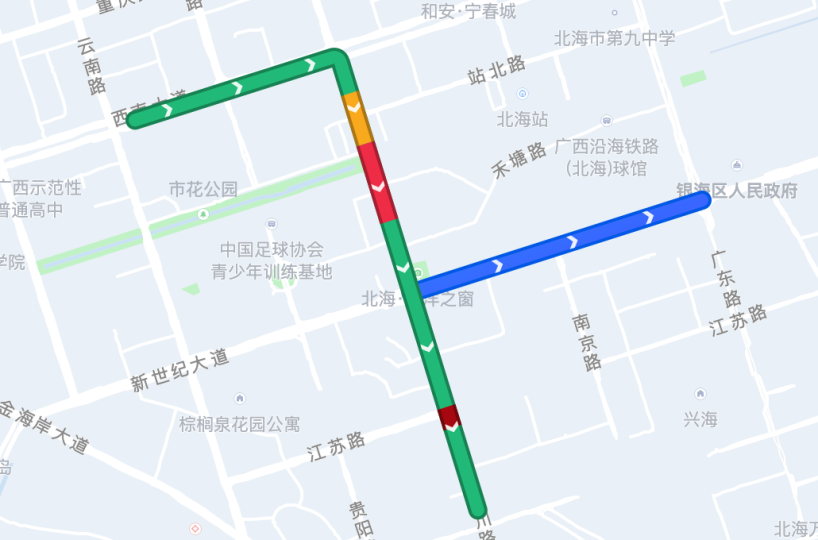

```javascript
var map = new TMap.Map('mapContainer', {
    center: new TMap.LatLng(40.038515, 116.272185),//地图显示中心点
    zoom:16 //缩放级别
});
 
//创建 MultiPolyline
var polylineLayer = new TMap.MultiPolyline({
    id: 'polyline-layer', //图层唯一标识
    map: map,
    //折线样式定义
    styles: {
        'style_blue': new TMap.PolylineStyle({
            'color': '#3777FF', //线填充色
            'width': 6, //折线宽度
            'borderWidth': 5, //边线宽度
            'borderColor': '#FFF', //边线颜色
            'lineCap': 'butt' //线端头方式（平端）
        }),
        'style_red': new TMap.PolylineStyle({
            'color': '#CC0000', //线填充色
            'width': 6, //折线宽度
            'borderWidth': 5, //边线宽度
            'borderColor': '#CCC', //边线颜色
            'lineCap': 'round' //线端头方式（圆端）
        })
    },
    //折线数据定义
    geometries: [
        {//第1条线
            'id': 'pl_1',//折线唯一标识，删除时使用
            'styleId': 'style_blue',//绑定样式名
            'paths': [new TMap.LatLng(40.038540, 116.272389), new TMap.LatLng(40.038844, 116.275210), new TMap.LatLng(40.041407, 116.274738)]
        },
        {//第2条线
            'id': 'pl_2',   
            'styleId': 'style_red',
            'paths': [new TMap.LatLng(40.039492,116.271893), new TMap.LatLng(40.041562,116.271421), new TMap.LatLng(40.041957,116.274211)]
        }
    ]
});
```

## 绘制坐标点

在腾讯位置服务的另一份文档（[https://lbs.qq.com/webApi/javascriptGL/glGuide/glMarker](https://lbs.qq.com/webApi/javascriptGL/glGuide/glMarker)）中，详细介绍了如何在地图组件上面绘制坐标点。

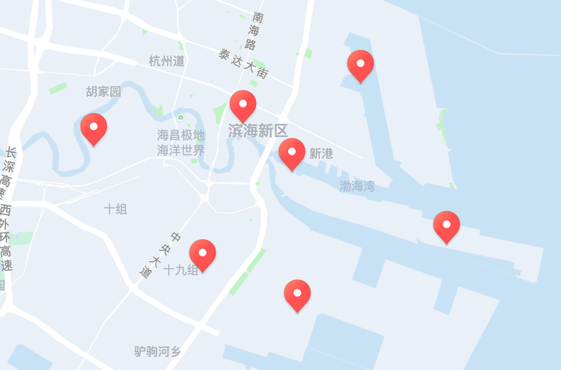

```javascript

//初始化地图
var map = new TMap.Map(container, {
    center: new TMap.LatLng(39.984104, 116.307503),
    zoom:16 //缩放级别
});
 
//创建并初始化MultiMarker
var markerLayer = new TMap.MultiMarker({
    map: map,  //指定地图容器
    //样式定义
    styles: {
        //创建一个样式：myStyle。myStyle同时又是这个样式的id。
        "myStyle": new TMap.MarkerStyle({ 
            "width": 25,  // 点标记样式宽度（像素）
            "height": 35, // 点标记样式高度（像素）
            "src": '../img/marker.png',  //图片路径
            // 锚点：图片上的哪个点要对齐到地图的经纬度坐标上
            // 大头针类似形式的图片以针尖位置做为焦点
            "anchor": { x: 16, y: 32 }  
        }) 
    },
    //点标记数据数组
    geometries: [{
        "id": "1",   //点标记唯一标识，后续如果有删除、修改位置等操作，都需要此id
        "styleId": 'myStyle',  //指定样式id
        "position": new TMap.LatLng(39.954104, 116.357503)  //点标记坐标位置
        
    }, {//第二个点标记
        "id": "2",
        "styleId": 'marker',
        "position": new TMap.LatLng(39.994104, 116.287503)
       
    }]
});
```

如果我们想要动态**添加**标记点，可以调用`<font style="color:#000000;background-color:rgba(220, 240, 255, 0.3) !important;">add()</font>`函数。

```javascript
markerLayer.add([{
    "id": "3",   //点标记唯一标识，后续如果有删除、修改位置等操作，都需要此id
    "styleId": 'myStyle',  //指定样式id
    "position": new TMap.LatLng(39.954104, 116.357503),  //点标记坐标位置
    "properties": {//自定义属性
        "title": "marker3"
        }
    }, {//第4个点标记
        "id": "4",
        "styleId": 'marker',
        "position": new TMap.LatLng(39.994104, 116.287503),
        "properties": {
            "title": "marker4"
        }
    }
])
```

# mis 系统展示订单详情-前端实现

展开面板的时候，发起Ajax请求，查询订单详情信息。

## 回顾折叠面板的原理

`**<font style="color:rgb(15, 17, 21);background-color:rgb(235, 238, 242);">@expand-change="expand"</font>**`**展开行变化时触发**——当用户点击展开/收起某行时，调用 `<font style="color:rgb(15, 17, 21);background-color:rgb(235, 238, 242);">expand</font>` 方法

`**<font style="color:rgb(15, 17, 21);background-color:rgb(235, 238, 242);">:row-key="getRowKeys"</font>**`**指定行的唯一标识**——告诉表格用哪个字段来唯一区分每一行

`**<font style="color:rgb(15, 17, 21);background-color:rgb(235, 238, 242);">:expand-row-keys="expands"</font>**`**控制哪些行展开**——通过数组 `<font style="color:rgb(15, 17, 21);background-color:rgb(235, 238, 242);">expands</font>` 来指定当前要展开的行

```html
<el-table
    :data="dataList"
    border
    v-loading="dataListLoading"
    cell-style="padding: 4px 0"
    style="width: 100%;"
    size="medium"
    @expand-change="expand"
    :row-key="getRowKeys"
    :expand-row-keys="expands"
>
    <el-table-column prop="panel" header-align="center" align="center" type="expand">
        <template #default="scope">
            <div class="content-container">
                <div class="left">
                    <div class="order-table">
                        <div class="row">
                            <div class="th">客户编号</div>
                            <div class="td">{{ panel.customer.id }}</div>
                            <div class="th">客户性别</div>
                            <div class="td">{{ panel.customer.sex }}</div>
                            <div class="th">客户电话</div>
                            <div class="td">{{ panel.customer.tel }}</div>
                        </div>
                        <div class="row">
                            <div class="th">车型</div>
                            <div class="td">{{ panel.order.carType }}</div>
                            <div class="th">车牌</div>
                            <div class="td">{{ panel.order.carPlate }}</div>
                            <div class="th">车辆隶属</div>
                            <div class="td">{{ panel.order.city }}</div>
                        </div>
                        <div class="row">
                            <div class="th">司机编号</div>
                            <div class="td">{{ panel.driver.id }}</div>
                            <div class="th">司机姓名</div>
                            <div class="td">{{ panel.driver.name }}</div>
                            <div class="th">司机电话</div>
                            <div class="td">{{ panel.driver.tel }}</div>
                        </div>
                        <div class="row">
                            <div class="th">接单时间</div>
                            <div class="td">{{ panel.order.acceptTime }}</div>
                            <div class="th">到达时间</div>
                            <div class="td">{{ panel.order.arriveTime }}</div>
                            <div class="th">代驾等时</div>
                            <div class="td">{{ panel.order.waitingMinute }}</div>
                        </div>
                        <div class="row">
                            <div class="th">开始时间</div>
                            <div class="td">{{ panel.order.startTime }}</div>
                            <div class="th">结束时间</div>
                            <div class="td">{{ panel.order.endTime }}</div>
                            <div class="th">代驾时长</div>
                            <div class="td">{{ panel.order.driveMinute }}</div>
                        </div>
                        <div class="row">
                            <div class="th">代驾里程</div>
                            <div class="td">{{ panel.order.realMileage }}</div>
                            <div class="th">订单费用</div>
                            <div class="td">{{ panel.order.realFee }}</div>
                            <div class="th">状态</div>
                            <div class="td">{{ panel.order.status }}</div>
                        </div>
                        <div class="row">
                            <div class="th">费用规则</div>
                            <div class="td">{{ panel.order.chargeRule }}</div>
                            <div class="th">取消规则</div>
                            <div class="td">{{ panel.order.cancelRule }}</div>
                            <div class="th">分账规则</div>
                            <div class="td">{{ panel.order.profitsharingRule }}</div>
                        </div>
                    </div>
                </div>
                <div class="right"><div :id="panel.id" class="map"></div></div>
            </div>
        </template>
    </el-table-column>
    ……

</el-table>  
```

## 熟悉模型层

视图层用到的数据都来自于模型层，所以我们来看一下变量的声明

```javascript
data() {
    return {
        ……,
        expands: [],
        panel: {
            id: null,
            customer: {
                id: null,
                sex: null,
                tel: null
            },
            driver: {
                id: null,
                name: null,
                tel: null
            },
            order: {
                carPlate: null,
                carType: null,
                city: null,
                acceptTime: null,
                arriveTime: null,
                startTime: null,
                endTime: null,
                waitingMinute: null,
                driveMinute: null,
                realMileage: null,
                realFee: null,
                status: null,
                chargeRule: null,
                cancelRule: null,
                profitsharingRule: null
            }
        },
        getRowKeys(row) {
            return row.id;
        },
        gpsTimer: null
    };
},
```

## 实现展开面板功能

因为面板展开之后，需要处理和展示的数据太多，我们封装一个函数

```javascript
// 加载面板数据
async loadPanelData(row) {
    let that = this;
    // 发送ajax请求，获取数据
    let data = {
        orderId: row.id
    };
    let resp = await axios.post(`${that.$baseUrl}order/searchOrderComprehensiveInfo`, data, {
      headers:{
        token: localStorage.getItem("token")
      }
    });
    let result = resp.data.result;
  
    // 获取客户信息
    let customerInfo = result.customerInfo;
    that.panel.customer.id = customerInfo.id;
    that.panel.customer.sex = customerInfo.sex;
    that.panel.customer.tel = customerInfo.tel;
    
    // 获取司机信息
    if(result.driverInfo){
      let driverInfo = result.driverInfo;
      that.panel.driver.id = driverInfo.id;
      that.panel.driver.name = driverInfo.name;
      that.panel.driver.tel = driverInfo.tel;
    }
    
    // 获取订单信息
    let content = result.content;
    that.panel.order.carPlate = content.carPlate;
    that.panel.order.carType = content.carType;
    let city = calculateCarPlateCity(content.carPlate);
    that.panel.order.city = city;
    if (content.hasOwnProperty('acceptTime')) {
        that.panel.order.acceptTime = content.acceptTime;
    } else {
        that.panel.order.acceptTime = '--';
    }
    if (content.hasOwnProperty('arriveTime')) {
        that.panel.order.arriveTime = content.arriveTime;
    } else {
        that.panel.order.arriveTime = '--';
    }
    if (content.hasOwnProperty('startTime')) {
        that.panel.order.startTime = content.startTime;
    } else {
        that.panel.order.startTime = '--';
    }
    if (content.hasOwnProperty('endTime')) {
        that.panel.order.endTime = content.endTime;
    } else {
        that.panel.order.endTime = '--';
    }
    if (content.hasOwnProperty('waitingMinute')) {
        that.panel.order.waitingMinute = content.waitingMinute + '分钟';
    } else {
        that.panel.order.waitingMinute = '--';
    }
    if (content.hasOwnProperty('driveMinute')) {
        that.panel.order.driveMinute = content.driveMinute + '分钟';
    } else {
        that.panel.order.driveMinute = '--';
    }
    if (content.hasOwnProperty('realMileage')) {
        that.panel.order.realMileage = content.realMileage + '公里';
        // 一旦有真实的里程数据后，一定要回填给row.realMileage，这样可以保证详细信息中显示的真实里程和表格中的真实里程一致。
        // 如果不写这行代码，最终会导致：分页查询时表格显示的里程数是"--"，过了一会，订单结束了，真实里程生成了，表格上还是显示"--"，详细信息中会显示里程数。
        row.realMileage = content.realMileage;
    } else {
        that.panel.order.realMileage = '--';
        row.realMileage = '--';
    }
    if (content.hasOwnProperty('realFee')) {
        that.panel.order.realFee = content.realFee + '元';
        // 实际费用也需要回填
        row.realFee = content.realFee;
    } else {
        that.panel.order.realFee = '--';
        row.realFee = '--';
    }
    
    that.panel.order.status = status[String(content.status)];
    row.status = status[String(content.status)];
  
    if (result.hasOwnProperty('chargeRule')) {
        that.panel.order.chargeRule = result.chargeRule.code;
    } else {
        that.panel.order.chargeRule = '--';
    }
    if (result.hasOwnProperty('cancelRule')) {
        that.panel.order.cancelRule = result.cancelRule.code;
    } else {
        that.panel.order.cancelRule = '--';
    }
    if (result.hasOwnProperty('profitsharingRule')) {
        that.panel.order.profitsharingRule = result.profitSharingRule.code;
    } else {
        that.panel.order.profitsharingRule = '--';
    }
  
    // $nextTick 用于等待 Vue 把展开行的地图容器 div 渲染到 DOM 后，再初始化地图，避免因元素不存在而导致地图创建失败。
    that.$nextTick(function() {
        // 获取起点和终点坐标
        let startPlaceLocation = content.startPlaceLocation;
        let endPlaceLocation = content.endPlaceLocation;

        // 以起点为中心创建地图实例
        let mapCenter = new TMap.LatLng(startPlaceLocation.latitude, startPlaceLocation.longitude);

        // 在指定的div容器中创建地图
        let map = new TMap.Map($(`.el-table__expanded-cell #order_${row.id}`)[0], {
            center: mapCenter,   // 地图显示中心点（起点）
            zoom: 13,            // 缩放级别，数字越大越详细
            viewMode: '2D',      // 2D视图模式
            baseMap: {           // 底图配置
                type: 'vector',  // 矢量地图
                features: ['base', 'label']  // 显示基础地图和标签
            }
        });

        // 绘制规划路线（灰色线）
        let driveLine = result.driveLine; // 从后端获取的规划路线数据
        let coors = driveLine.routes[0].polyline; // 获取路线坐标点串（压缩格式）
        let pl = [];  // 存储解压后的坐标点

        // 腾讯地图的坐标解压算法
        let kr = 1000000;
        for (let i = 2; i < coors.length; i++) {
            coors[i] = Number(coors[i - 2]) + Number(coors[i]) / kr;
        }
      
        // 将解压后的坐标生成LatLng数组
        for (let i = 0; i < coors.length; i += 2) {
            pl.push(new TMap.LatLng(coors[i], coors[i + 1]));
        }

        // 创建折线图层，绘制灰色规划路线
        let polylineLayer = new TMap.MultiPolyline({
            id: 'polyline-layer', //图层唯一标识
            map: map, //绘制到目标地图
            styles: {  // 折线样式定义
                style_blue: new TMap.PolylineStyle({
                    color: 'rgba(190,188,188,1)',  // 灰色
                    width: 6,     // 线宽6像素
                    lineCap: 'round' // 线端头为圆角
                })
            },
            geometries: [    // 折线数据
                {
                    id: 'pl_1',
                    styleId: 'style_blue',  // 使用上面定义的灰色样式
                    paths: pl   // 解压后的坐标点数组
                }
            ]
        });

        // 创建标记图层（起点、终点、车辆）
        let markerLayer = new TMap.MultiMarker({
            map: map,
            styles: {  // 定义三种标记样式
                startStyle: new TMap.MarkerStyle({ // 起点标记样式
                    width: 24,
                    height: 36,
                    anchor: { x: 16, y: 32 },
                    src: 'https://mapapi.qq.com/web/lbs/javascriptGL/demo/img/start.png'
                }),
                endStyle: new TMap.MarkerStyle({  // 终点标记样式
                    width: 24,
                    height: 36,
                    anchor: { x: 16, y: 32 },
                    src: 'https://mapapi.qq.com/web/lbs/javascriptGL/demo/img/end.png'
                }),
                carStyle: new TMap.MarkerStyle({  // 车辆标记样式
                    width: 30,
                    height: 30,
                    src: '../order/driver-icon.png',
                    anchor: { x: 16, y: 32 }
                })
            },
            geometries: [   // 添加起点和终点标记
                //起点标记
                {
                    id: '1',
                    styleId: 'startStyle',
                    position: new TMap.LatLng(startPlaceLocation.latitude, startPlaceLocation.longitude)
                },
                //终点标记
                {
                    id: '2',
                    styleId: 'endStyle',
                    position: new TMap.LatLng(endPlaceLocation.latitude, endPlaceLocation.longitude)
                }
            ]
        });

        // 判断订单状态，进行不同处理
        // 判断司机是否驾车中
        if (content.status == 4) {
            // 获取司机最后已知位置
            let lastGps = result.lastGps;

            // 在地图上添加车辆标记
            markerLayer.add([
                {
                    id: '3',
                    styleId: 'carStyle', //指定样式id
                    position: new TMap.LatLng(lastGps.latitude, lastGps.longitude)
                }
            ]);
          
            // 设置定时器，每隔15秒获取最新GPS定位，实时更新车辆位置
            that.gpsTimer = setInterval(async function() {
                //先查询订单状态
                let data = {
                    orderId: row.id
                };
                let resp = await axios.post(`${baseUrl}order/searchOrderLastGps`, data, {
                  headers: {
                    token: localStorage.getItem("token")
                  }
                });
        
                if (resp.data.hasOwnProperty('result')) {
                    // 获取到新的GPS坐标，更新车辆标记位置
                    let lastGps = resp.data.result;
                    markerLayer.updateGeometries([
                        {
                            id: '3',
                            styleId: 'carStyle',
                            position: new TMap.LatLng(lastGps.latitude, lastGps.longitude)
                        }
                    ]);
                } else {
                    // 如果没有获取到GPS数据（可能订单状态变了），重新加载面板
                    $(`.el-table__expanded-cell #order_${row.id}`).empty(); // 清空地图容器
                    that.loadPanelData(row);  // 重新加载面板数据
                    clearInterval(that.gpsTimer);  // 清除定时器
                }
            }, 15 * 1000);
        }
      
        // 代驾已结束
        if (content.status >= 5 && content.status <= 8) {
            // 获取代驾全程的GPS记录
            let orderGps = result.orderGps;
            let paths = [];
            // 将GPS记录转换为路径点
            for (let one of orderGps) {
                let temp = new TMap.LatLng(one.latitude, one.longitude);
                paths.push(temp);
            }

            // 绘制蓝色实走路线（车辆实际行驶轨迹）
            let polylineLayer = new TMap.MultiPolyline({
                id: 'drive-polyline-layer', //图层唯一标识
                map: map,
                //折线样式定义
                styles: {
                    style_blue: new TMap.PolylineStyle({
                        color: '#3777FF',  // 蓝色，表示实际行驶路线
                        width: 6 //折线宽度
                    })
                },
                //折线数据定义
                geometries: [
                    {
                        id: 'pl_1',
                        styleId: 'style_blue',
                        paths: paths  // 实际GPS轨迹点
                    }
                ]
            });
        }
    });
},
```

接下来咱们去实现展开或者收缩面板时候触发的回调函数`<font style="color:#000000;background-color:rgba(220, 240, 255, 0.3) !important;">expand()</font>`，如果是展开面板，咱们就调用`<font style="color:#000000;background-color:rgba(220, 240, 255, 0.3) !important;">loadPanelData()</font>`函数

```javascript
expand(row, expandedRows) {
    let that = this;
    if (expandedRows.length > 0) {
        that.expands = [];
        if (row) {
            that.expands.push(row.id);
            that.panel.id = `order_${row.id}`;
            that.loadPanelData(row);
        }
    } else {
        that.expands = [];
    }
},
```

## 测试前端项目

先把后端各个子系统都运行起来，然后把前端项目也要启动起来。用浏览器访问前端项目，看看订单模块中能否展开面板

# Prometheus&Grafana&SkyWalking

## 可观测性三件套

**Prometheus**

- **就像一个自动抄表员，每隔几秒就去你的应用门口看一眼，记录下'请求数、错误率、响应时间'等各种指标数据，存进自己的数据库里，让你随时能查。**
- **完全和语言无关，适用于任何语言**：Java、Go、Python、Node.js、Ruby、PHP、.NET，甚至Shell脚本

**Grafana**

- **就像一个数据画师，能把Prometheus记录的那些枯燥数字，变成漂亮的图表和仪表盘，让你一眼就看清系统的运行状态。**
- **完全和语言无关，它只是一个图表展示工具，不管数据从哪来。**

**SkyWalking**

- **就像一个侦探，能追踪每个请求的完整旅程，告诉你这个请求经过了哪些服务、每个环节花了多长时间、到底慢在哪里。**
- **支持多种语言，Java 语言支持最完善，也支持：Go、Python、Node.js、PHP 等。**

**一句话总结：**

**"Prometheus告诉你'出问题了'，Grafana让你'看清楚问题'，SkyWalking告诉你'问题在哪'。三个一起用，系统出了问题无处可逃！"**

## 开发阶段可以用监控

**1. 找慢接口（SkyWalking）**

- 你写完一个接口，点一下页面，SkyWalking直接告诉你：这个请求总共500ms，其中MySQL查询占了400ms。
- **发现问题**：哦，原来是SQL没加索引。马上优化，不用等到上线后被用户骂。

**2. 看内存泄漏苗头（Prometheus）**

- 本地压测跑半小时，Prometheus画的JVM堆内存曲线一直往上走、不回落。
- **发现问题**：某个Map只增不减，赶紧查代码。现在修改成本最低。

**3. 验证依赖是否健康**

- 你的订单服务调用了用户服务，在开发环境偶尔超时。
- **发现问题**：可能是网络或配置问题，提前调好，避免上线后连锁故障。

## 生产环境也可以用监控

**1. 24小时盯梢（告警）**

- Prometheus配规则：QPS突降 -> 可能服务挂了 -> 电话告警
- 响应时间突增 -> 可能DB有问题 -> 微信通知

**2. 故障定位（SkyWalking）**

用户反馈“下单慢”，不用猜是哪个服务。打开SkyWalking看链路：

- 网关(10ms) → 订单服务(5s) → 库存服务(超时)
- 一秒定位：哦，库存服务连Redis连不上了。

**3. 容量规划（Prometheus + Grafana）**

- 看过去一周的QPS趋势，预测下个月要不要扩容
- 看CPU、内存水位，决定什么时候加机器

## 创建 Docker 容器及配置

### 创建Docker Compose配置文件

```bash
vim docker-compose.yml
```

**按 **`**i**`** 进入插入模式，粘贴：**

```yaml
services:
  # 1. MySQL数据库
  mysql:
    image: mysql:8.0.23
    container_name: mysql_pgs
    ports:
      - "13306:3306"
    environment:
      MYSQL_ROOT_PASSWORD: 123456
      MYSQL_DATABASE: testdb
    restart: always

  # 2. Prometheus
  prometheus:
    image: prom/prometheus:latest
    container_name: prometheus
    ports:
      - "19090:9090"
    volumes:
      - ./prometheus.yml:/etc/prometheus/prometheus.yml
    restart: always

  # 3. Grafana
  grafana:
    image: grafana/grafana:latest
    container_name: grafana
    ports:
      - "3001:3000"
    environment:
      - GF_SECURITY_ADMIN_USER=admin
      - GF_SECURITY_ADMIN_PASSWORD=123456
    restart: always

  # 4. SkyWalking OAP：后台服务器，负责接收和存储追踪数据
  skywalking-oap:
    image: apache/skywalking-oap-server:9.7.0
    container_name: skywalking-oap
    ports:
      - "11800:11800"
      - "12800:12800"
    environment:
      - SW_STORAGE=h2
    restart: always

  # 5. SkyWalking UI:前台网页，负责展示数据让你看
  skywalking-ui:
    image: apache/skywalking-ui:9.7.0
    container_name: skywalking-ui
    ports:
      - "18080:8080"
    environment:
      - SW_OAP_ADDRESS=http://skywalking-oap:12800
    depends_on:
      - skywalking-oap
    restart: always
```

**按 **`**ESC**`**，输入 **`**:wq**`** 保存退出。**

**如果是 VirtualBox，需要配置端口转发。**

### 创建Prometheus配置文件

在该配置文件中指定 `<font style="color:#000000;">prometheus</font>`从哪个接口抓取数据，以及抓取策略。文件位置与 `<font style="color:#000000;">docker-compose.yml</font>`同一个目录下：

```bash
vim prometheus.yml
```

**粘贴：**

```yaml
global:
  scrape_interval: 5s

scrape_configs:
  - job_name: 'bff-customer'
    metrics_path: '/actuator/prometheus'
    static_configs:
      - targets: ['10.0.2.2:8102']
```

**全局配置：**

```yaml
global:
  scrape_interval: 5s
```

- 设置全局的抓取间隔为 **5秒，**Prometheus 每5秒会去拉取一次监控数据

**抓取配置：**

```yaml
scrape_configs:
  - job_name: 'bff-customer'
    metrics_path: '/actuator/prometheus'
    static_configs:
      - targets: ['10.0.2.2:8102']
```

- 定义一个抓取任务，任务名为 **'bff-customer'，**这个名称会在 Prometheus 的标签中显示，用来区分不同的监控目标
- 指定抓取监控数据的HTTP路径为 `<font style="color:rgb(15, 17, 21);">/actuator/prometheus</font>`，这个路径是 Spring Boot Actuator 暴露给 Prometheus 的默认路径
- 定义要监控的目标地址 `<font style="color:rgb(15, 17, 21);">10.0.2.2:8102</font>`
  - `**<font style="color:rgb(15, 17, 21);background-color:rgb(235, 238, 242);">10.0.2.2</font>**`** 就是在 VirtualBox NAT 网络模式下，Windows 宿主机的 IP 地址**
  - **通过 **`**<font style="color:rgb(15, 17, 21);">ip route</font>**`**输出的默认网关地址来确定：default via**
  - **我们的**`<font style="color:rgb(15, 17, 21);">prometheus</font>`安装在虚拟机的 docker 容器中，要监控 windows 系统 IDEA 工具中运行的 springboot 项目，因此需要 windows 的 IP 地址。

### 下载SkyWalking Java Agent

这是为 SkyWalking 提供的 Java 客户端。作用是：**在Java应用启动时自动加载该探针，用来收集和上报应用的性能数据、调用链信息 到SkyWalking服务端，实现分布式系统的监控与追踪**。

**下载地址：**[https://archive.apache.org/dist/skywalking/java-agent/8.16.0/apache-skywalking-java-agent-8.16.0.tgz](https://archive.apache.org/dist/skywalking/java-agent/8.16.0/apache-skywalking-java-agent-8.16.0.tgz)

我这里解压到 `<font style="color:#000000;">D:\</font>`目录下：


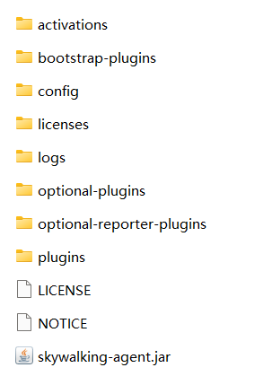

### 启动所有Docker容器

先把我提前给大家准备好的 docker 镜像导入到 CentOS 当中，然后执行以下命令启动所有 Docker 容器，**注意新版和旧版命令，试试哪个可以执行**：

```bash
# 启动(旧版命令)
docker-compose up -d

# 启动(新版命令)
docker compose up -d

# 查看状态(旧版命令)
docker-compose ps

# 查看状态(新版命令)
docker compose ps

# 等待所有容器状态为 Up
```

如果 `docker compose`或 `docker-compose`无法使用，则需要安装它：

```shell
# 1. 使用 yum 安装插件
sudo yum update
sudo yum install docker-compose-plugin

# 2. 验证安装 (注意命令格式是空格)
docker compose version
```

## Spring Boot Actuator

### Spring Boot Actuator 概述

`**Actuator**`**是 SpringBoot 官方自带的模块。****Actuator 启用之后，自动对外暴露了很多接口，让应用能报告自己的各种指标数据，供Prometheus这样的监控系统采集。**

```java
// 不加Actuator时
@RestController
public class MyController {
    @GetMapping("/hello")
    public String hello() {
        return "Hello";
    }
    // 只有业务接口，没有监控数据
}

// 加了Actuator后
// 自动多了这些接口：
// GET /actuator/health  → {"status":"UP"}
// GET /actuator/metrics → 各种指标数据
// GET /actuator/info    → 应用信息
// GET /actuator/prometheus → Prometheus格式的指标
```

### pom.xml 文件

SpringBoot 项目要对外给监控系统提供数据，就需要启动 SpringBoot Actuator 模块，需要引入以下依赖：

我们现在只让监控系统监控 bff-customer 子系统，因此只需要在这个项目中添加依赖。

```xml
<dependency>
    <groupId>org.springframework.boot</groupId>
    <artifactId>spring-boot-starter-actuator</artifactId>
</dependency>
<dependency>
    <groupId>io.micrometer</groupId>
    <artifactId>micrometer-registry-prometheus</artifactId>

</dependency>
```

### 编写配置文件

另外我们需要在这个项目的 `<font style="color:#000000;">application.yml</font>`中添加如下的配置，用于自定义暴露哪些具体的监控端点：

```plaintext
# Actuator配置
# 显式开启并暴露应用程序的监控接口，让Prometheus等工具能够通过HTTP收集到标准的指标数据
# health：监控应用的健康状态
# info：用于暴露应用程序信息的监控端点
# prometheus：监控详细的性能指标数据（如CPU、内存、请求QPS、接口延迟），以Prometheus格式暴露，用于性能分析和告警
# metrics：监控应用程序的运行时指标（如JVM内存使用情况、线程数、类加载数量）
management:
  endpoints:
    web:
      exposure:
        include: health, info, prometheus, metrics
```

## 智行代驾接入SkyWalking

### bff-customer 子系统添加启动参数

在 bff-customer 子系统添加启动参数，`<font style="color:#000000;">VM options</font>`上添加以下参数：

```plaintext
-javaagent:D:\skywalking-agent\skywalking-agent.jar 
-Dskywalking.agent.service_name=bff-customer 
-Dskywalking.collector.backend_service=127.0.0.1:11800
```

`<font style="color:rgb(15, 17, 21);">-javaagent:D:\skywalking-agent\skywalking-agent.jar </font>` 在JVM启动时加载SkyWalking探针，让它可以监控我们的项目

`<font style="color:rgb(15, 17, 21);">-Dskywalking.agent.service_name=bff-customer </font>` 告诉SkyWalking服务端，当前上报的数据属于哪个服务，在UI上区分不同应用

`<font style="color:rgb(15, 17, 21);">-Dskywalking.collector.backend_service=127.0.0.1:11800</font>` 指定收集到的追踪数据要发送到哪个SkyWalking后端OAP服务器（地址和端口）

虽然我们目前只监控 bff-customer 子系统，但由于这个子系统的运行依赖其他的子系统，所以最好把整个智行代驾项目中所有的子系统全部启动起来。

### 打开浏览器访问

| **工具** | **访问地址** | **说明** |
| --- | --- | --- |
| Prometheus | http://localhost:19090 | 指标查询 |
| Grafana | http://localhost:3001 | 可视化（admin/123456） |
| SkyWalking | http://localhost:18080 | 链路追踪 |

## SkyWalking

### SkyWalking 主要作用

**它是专门为分布式系统（比如微服务架构）设计的**应用性能监控**（APM）和**分布式追踪**工具，主要解决“一个请求经过多个服务，出问题或变慢时难以排查”的痛点。**

具体来说，它的核心价值体现在三个方面：

1. **分布式追踪**：记录一个请求从开始到结束，在各个服务之间（如A调用B，B调用C）以及服务内部（如数据库查询、Redis缓存）的完整调用链路和耗时。你可以通过它清晰地看到请求的“全程路线图”。
2. **性能指标分析**：监控各个服务的实时负载（每分钟调用量）、成功率、平均延迟等关键指标，帮你快速发现性能瓶颈或异常波动。
3. **服务拓扑图**：自动生成服务之间的调用关系图，让你一眼看清整个系统的依赖关系、流量走向以及每个节点的健康状况。

总的来说，SkyWalking就像是分布式系统的“行车记录仪”和“体检中心”，让你在复杂的微服务环境中，能够快速定位故障和理解性能。

### 开发人员主要关注哪些

下图中红框内是需要我们重点关注的：

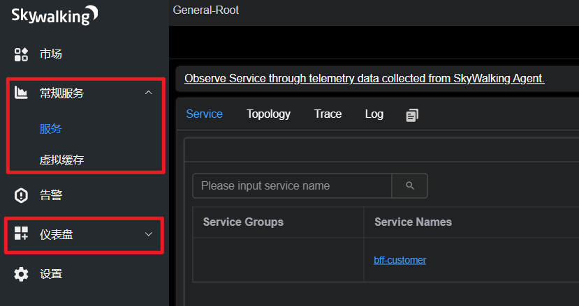

1. **市场**：插件商店，用来安装扩展监控能力的插件（基本不用）。
2. **服务**：查看每个服务的详细信息、调用链路和性能数据的核心入口（**用的最多**）。
3. **虚拟缓存**：查看缓存组件（如Redis）的性能指标，排查缓存问题时用（**用的少**）。
4. **告警**：查看服务异常告警记录的地方。（**用的少**）
5. **仪表盘**：展示JVM、CPU、服务流量等实时监控图表（**用的较多**）。
6. **设置**：系统配置界面，普通开发人员一般不动（**基本不用**）。

### 服务-Service

在智行代驾系统中，乘客创建代驾订单这个业务我们多跑几次，在 SkyWalking 的 UI 管理界面中才能观测到具体的每个请求：

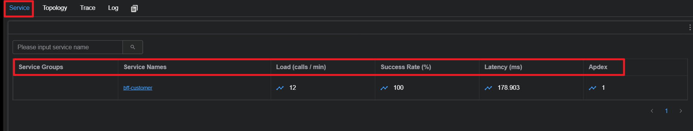

1. **Service Groups / Service Names**：服务所属的分组和服务的名称，用来标识这是哪个应用。
2. **Load (calls / min)**：过去一分钟的平均调用量，即该服务每分钟处理 **12** 个请求，反映了服务的流量压力。
3. **Success Rate (%)**：请求的成功率，**100%** 表示过去一分钟所有的请求都处理成功了，没有报错。
4. **Latency (ms)**：平均响应延迟，即每个请求平均花费 **178.9 毫秒**处理完成。
5. **Apdex**：用户满意度指标（范围0-1），**1** 代表所有请求的响应时间都远低于设定的阈值（通常为500ms），用户感知非常好。

### 服务-Topology

**拓扑图**，用来**可视化展示我们的服务（**`**<font style="color:rgb(15, 17, 21);background-color:rgb(235, 238, 242);">bff-customer</font>**`**）和其他服务、中间件（如数据库、Redis）之间的调用关系和流量走向**。

简单说就是一张**服务关系地图**，我们能一眼看到：

- 我们的服务依赖谁（比如调用了订单服务、计价服务）。
- 谁在调用我们的服务。

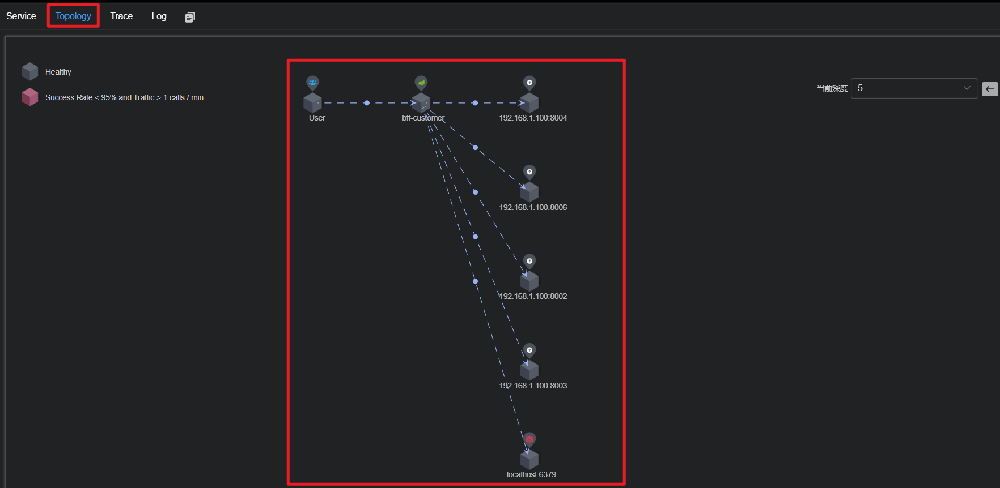

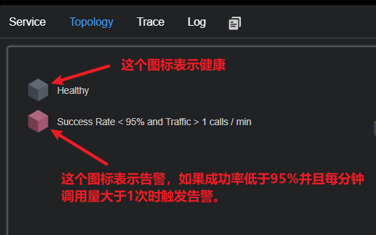

### 服务-Trace

服务当中的 `<font style="color:#000000;">Trace</font>`是 SkyWalking 提供的最核心的功能，可以清楚的看到每个请求的耗时，以及这个请求中的调用链路，以及链路上每个环节耗费了多长时间。

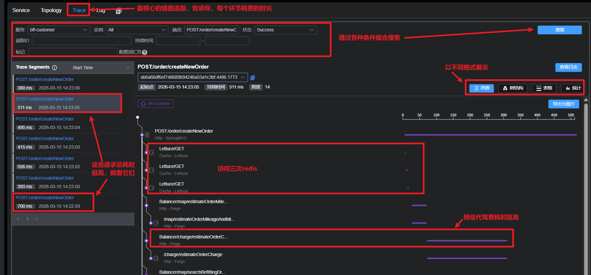

### 告警

这个面板上显示告警信息，在 bff-customer 子系统中添加如果代码，故意让创建代驾订单变慢：

```java
Random r = new Random();
int t = r.nextInt(2001);
if(t < 500){
    throw new ZxdsException("出错了哦");
}
try {
    Thread.sleep(t);
} catch (InterruptedException e) {
    throw new RuntimeException(e);
}
```

我们可以看到出现如下的告警信息：

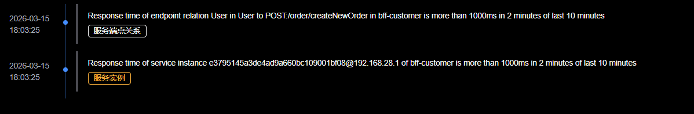

以上告警信息说的是：从某个上游服务（可能是 `<font style="color:rgb(15, 17, 21);background-color:rgb(235, 238, 242);">User</font>` 服务）调用你的 `<font style="color:rgb(15, 17, 21);background-color:rgb(235, 238, 242);">bff-customer</font>` 的创建订单接口（`<font style="color:rgb(15, 17, 21);background-color:rgb(235, 238, 242);">POST /order/createNewOrder</font>`）时，**在过去10分钟内有连续2分钟的平均响应时间超过了1000ms（1秒）**

**现在该做什么？**

1. **立即去「Trace」页面**，筛选时间范围（最近10分钟），找 `<font style="color:rgb(15, 17, 21);background-color:rgb(235, 238, 242);">POST /order/createNewOrder</font>` 这个接口的请求。
2. **点开几个慢的请求**（耗时 >1000ms 的），看看到底是哪一步最耗时：
  - 是查Redis慢了？
  - 还是调用其他Feign服务（地图服务、计价服务）慢了？
  - 还是数据库查询慢了？
3. **根据找到的慢环节**，再去排查具体是哪个下游服务或组件出了问题。

### 仪表盘

SkyWalking 为应用的不同层提供了仪表盘。如下图：

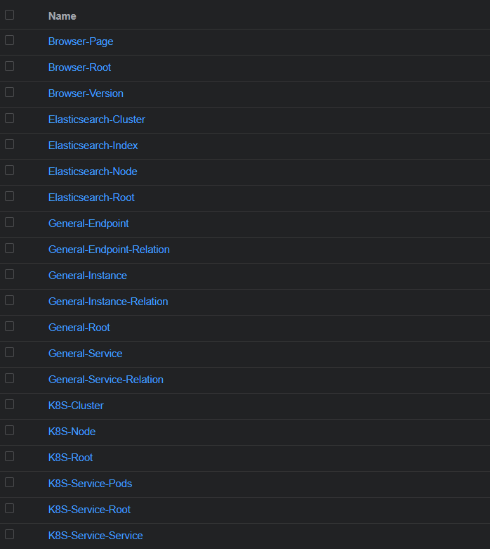

- `**<font style="color:rgb(15, 17, 21);background-color:rgb(235, 238, 242);">Browser-*</font>**`**（前端层）**：如果项目配置了前端监控（需要额外引入JS SDK），可以看小程序端页面加载性能
- `**<font style="color:rgb(15, 17, 21);background-color:rgb(235, 238, 242);">APISIX-*</font>**`**（网关层）**：如果网关是Spring Cloud Gateway，且配置了SkyWalking插件，可以看网关指标
- `**<font style="color:rgb(15, 17, 21);background-color:rgb(235, 238, 242);">General-*</font>**`**（后端服务层）**：例如我们的`<font style="color:rgb(15, 17, 21);background-color:rgb(235, 238, 242);">bff-customer</font>`就是后端服务层。

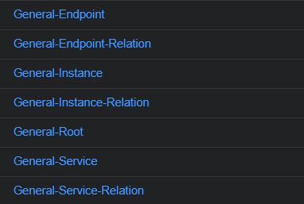

**上图中的****这几个都是 `**<font style="color:rgb(15, 17, 21);background-color:rgb(235, 238, 242);">General</font>**` 层的监控仪表盘。程序员重点看这三个，其他不用管：**

| 仪表盘 | 看什么 | 什么时候用 |
| --- | --- | --- |
| `**<font style="color:rgb(15, 17, 21);background-color:rgb(235, 238, 242);">General-Service</font>**` | **看服务整体**（Apdex、响应时间、成功率、吞吐量） | **日常监控**，想知道服务整体表现 |
| `**<font style="color:rgb(15, 17, 21);background-color:rgb(235, 238, 242);">General-Instance</font>**` | **看某个实例**（JVM内存/GC/CPU、每个实例的负载） 假设你搭建了集群，bff-customer 部署在三台机器上，那就是 3 个实例。 | **排查问题**，怀疑某个实例有问题 |
| `**<font style="color:rgb(15, 17, 21);background-color:rgb(235, 238, 242);">General-Endpoint</font>**` | **看具体接口**（每个API的响应时间、调用量） | **优化性能**，想知道哪个接口慢 |

**我们可以详细看一下 **`**General-Instance**`**中的 JVM 内存情况：**

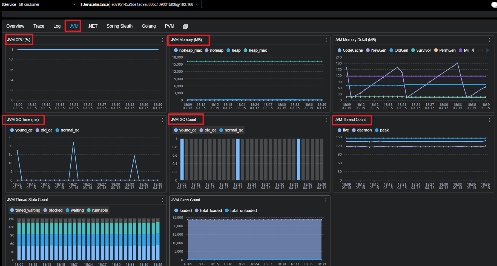

**程序员重点看 3 个：**

| **指标** | **看什么** | **正常什么样** | **出问题什么样** |
| --- | --- | --- | --- |
| **JVM CPU (%)** | 你的应用占了多少CPU | 一般波动，峰值<80% | 持续飙高>90% → 可能死循环或流量暴增 |
| **JVM Memory (MB)** | 堆内存使用情况（总内存 vs 已用内存） | 波浪形曲线，用完就GC回收 | 只升不降 → 内存泄漏 |
| **JVM GC Time (ms)** | 垃圾回收耗时 | 每次<200ms，不频繁 | 时间很长或频繁GC → 性能恶化 |

**辅助看 2 个：**

| **指标** | **看什么** | **什么时候用** |
| --- | --- | --- |
| **JVM GC Count** | GC发生次数 | 配合GC Time看，如果次数多+时间长，说明内存压力大 |
| **JVM Thread Count** | 线程数量 | 线程数突然暴增 → 可能线程泄露或并发太高 |

### JVM CPU 使用率监控

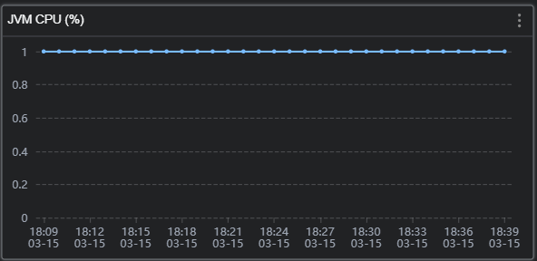

**坐标轴**

- **X轴（横轴）**：时间（18:09 ~ 18:39）
- **Y轴（纵轴）**：CPU使用率（0 ~ 1 = 0% ~ 100%）

**曲线含义**

图中的曲线代表**你的应用占用了多少CPU资源**。

**什么时候有问题？**

| **现象** | **可能原因** |
| --- | --- |
| 曲线冲到 0.8 以上且持续 | 死循环、流量暴增、计算密集任务 |
| 曲线变成一条直线在高位 | 应用可能卡住了 |
| 频繁大幅抖动 | 可能有定时任务或GC频繁 |

### JVM 内存监控图

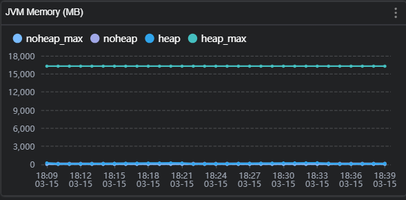

**四条线的含义**

| **线条** | **全称** | **含义** | **正常什么样** |
| --- | --- | --- | --- |
| **heap** | 堆内存已用量 | 你创建的对象（如`<font style="color:rgb(15, 17, 21);background-color:rgb(235, 238, 242);">new Order()</font>`）占用的内存 | 波浪形，用完就GC回收 |
| **heap_max** | 堆内存最大值 | JVM最多能用的堆内存（-Xmx配置） | 平稳的水平线 |
| **noheap** | 非堆内存已用量 | 方法区、常量池、类元数据等 | 相对平稳 |
| **noheap_max** | 非堆内存最大值 | 非堆内存上限 | 平稳的水平线 |

**程序员怎么看这张图？**

**正常情况**

- **heap** 曲线像锯齿波浪：上升（创建对象）→ 下降（GC回收）→ 再上升
- **heap** 从未接近 **heap_max**（有足够余量）

**异常情况**

| **现象** | **可能问题** |
| --- | --- |
| **heap** 持续上升不下降 | 内存泄漏（对象无法回收） |
| **heap** 频繁触顶 **heap_max** | 内存不够用，要调大-Xmx |
| **heap** 曲线太平 | 可能没流量或代码有问题 |

**日常看 heap 曲线是不是锯齿状就行，其他不用管。**

### **JVM GC Time (ms)**

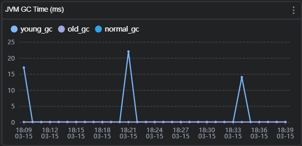

**三条线分别代表什么**

| **线条** | **全称** | **含义** |
| --- | --- | --- |
| **young_gc** | 年轻代GC（Minor GC） | 回收"朝生夕死"的对象（最频繁） |
| **old_gc** | 老年代GC（Full GC） | 回收长期存活的对象（较少发生） |
| **normal_gc** | 普通GC | 通常指young_gc或其他混合GC |

**Y轴（0-25ms）代表什么：每次GC操作花了多少毫秒**。数值越小越好。

**健康状态**

- **所有线条都趴在0-5ms之间** → GC很快，几乎不影响业务
- **young_gc有轻微波动** → 正常，说明有新对象不断创建和回收

**不健康状态**

| **现象** | **说明** |
| --- | --- |
| **线条飙到25ms以上** | GC时间太长，请求可能会卡顿 |
| **old_gc突然出现且很高** | 老年代GC很耗时，可能内存快满了 |
| **线条持续在高位** | 系统可能快不行了 |

### JVM GC Count

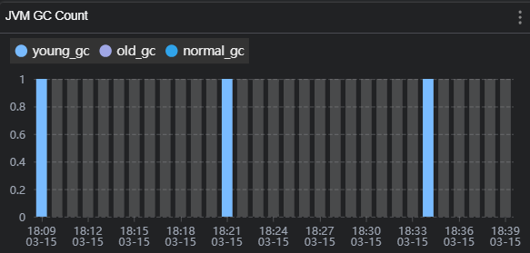

**怎么看**

- **Y轴（0-1）**：每分钟GC发生了多少次
- **三条线**：不同类型的GC（young_gc/old_gc/normal_gc）

**正常 vs 异常**

| **状态** | **说明** |
| --- | --- |
| **正常** | 0-几次/分钟，平稳 |
| **异常** | 几十次/分钟，说明对象创建太多或内存太小 |

### **JVM Thread Count**

查看项目跑了多少个线程

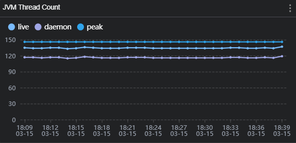

**三条线分别代表什么**

| **线条** | **含义** | **简单理解** |
| --- | --- | --- |
| **live** | 当前存活的线程数 | 现在有多少线程在工作 |
| **daemon** | 后台守护线程数 | 后台默默干活的（如GC线程） |
| **peak** | 历史峰值线程数 | 最多时达到多少 |

**正常 vs 异常**

| **状态** | **说明** |
| --- | --- |
| **正常** | 线条平稳，live < peak（有冗余容量） |
| **异常** | live 持续接近 peak 且上升 → 线程泄露或并发太高 |

## Prometheus 的常用 PromQL

**PromQL 是 Prometheus 的专用查询语言，用于从监控数据中筛选、计算和聚合指标，实现数据可视化、告警和性能分析。**

**在 web 管理界面上执行，如下：**

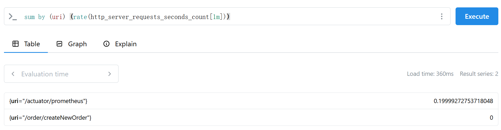

### 接口 QPS 监控

查看每个接口的每秒请求数（QPS），找出流量最高的接口

```plaintext
sum by (uri) (rate(http_server_requests_seconds_count[1m]))
```

- **计算逻辑**：统计过去1分钟内，**每个接口(uri)每秒接收的请求数(QPS)**
- `<font style="color:rgb(15, 17, 21);background-color:rgb(235, 238, 242);">rate</font>`：计算每秒增长率
- `<font style="color:rgb(15, 17, 21);background-color:rgb(235, 238, 242);">sum by (uri)</font>`：按接口地址分组求和

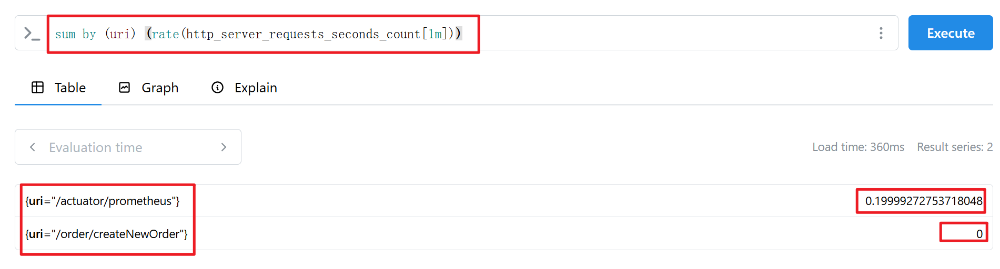

| **uri** | **值** | **含义** |
| --- | --- | --- |
| `<font style="color:rgb(15, 17, 21);background-color:rgb(235, 238, 242);">/actuator/prometheus</font>` | **0.2 QPS** | 过去1分钟平均每秒有0.2个请求（即约12个/分钟） |
| `<font style="color:rgb(15, 17, 21);background-color:rgb(235, 238, 242);">/order/createNewOrder</font>` | **0 QPS** | 过去1分钟内**没有收到任何请求** |

### 接口 95 分位延迟

需要在 `application.yml`中添加如下的配置，**这个配置告诉Spring Boot：为每一个HTTP请求，按响应时间分桶（分桶就是分组）统计（比如记录有多少请求在0-10ms、10-100ms、100-500ms等区间），这样Prometheus才能用这些桶数据计算出P95、P99等百分位响应时间。**

```yaml
management:
  metrics:
    distribution:
      percentiles-histogram:
        http.server.requests: true
```

执行这个 QL：

```plaintext
histogram_quantile(0.95, sum by (le, uri) (rate(http_server_requests_seconds_bucket[1m])))
```

**基于过去 1 分钟内，每个接口（uri）的耗时桶数据，计算出 95% 的请求都在多少秒内完成。**

**假如我要求某个请求的 95%的请求量都要在 2 秒之内响应完毕，这个数据就能帮上忙。**

### 接口错误率

```plaintext
sum(rate(http_server_requests_seconds_count{status=~"5.."}[1m])) / sum(rate(http_server_requests_seconds_count[1m])) * 100
```

计算5xx错误的百分比，大于0说明有异常。

```plaintext
sum(rate(http_server_requests_seconds_count{status="5.."}[1m]))  # 5xx错误请求数/秒
/
sum(rate(http_server_requests_seconds_count[1m]))               # 总请求数/秒
* 100                                                            # 转成百分比
```

### JVM 堆内存使用

```plaintext
sum by (id) (jvm_memory_used_bytes{area="heap"})
```

**例如执行结果：****如果Old Gen持续上涨且GC后不降，就是不好；如果Eden和Survivor有涨有落、Old Gen稳定，就是好。**

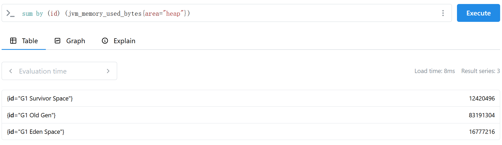

| **JVM 堆内存的三个区域** | **含义** |
| --- | --- |
| **Eden Space（伊甸园区）属于年轻代** | 新创建的对象都在这里，满了会触发**Minor GC（频率高，速度快，无感知）** |
| **Survivor Space（幸存者区）属于年轻代** | Minor GC后存活的对象移到这里（第一次 GC 后的对象还活着的到这里） |
| **Old Gen（老年代）** | 多次 GC 后，长期存活的对象移到这里，这里**满了**会触发 **Full GC（频繁Full GC是**大问题**，相当于系统在**生死边缘挣扎**）** |

**为啥这么分？**

因为大多数对象**朝生夕死**（比如一次HTTP请求创建的对象，用完就扔），所以：

- 把**短命对象**放一起（年轻代），集中快速回收
- **长寿对象**挪到一边（老年代），避免反复扫描

### GC 暂停时间

```plaintext
rate(jvm_gc_pause_seconds_sum[1m])
```

查看每秒**GC暂停时间**（**GC 暂停时间指的是 GC 努力工作的时间**），值越大说明GC越频繁/越久

## **Grafana**

Prometheus 负责数据采集，**Grafana 可以提供监控大盘。**

**在**Prometheus 中的** 5 个查询在Grafana里都能直接用****，而且正好可以组成一个 **Java微服务监控大盘**。**

### 创建数据源

在 Grafana 中配置数据源，让数据源给它提供数据，它才能展示图表：

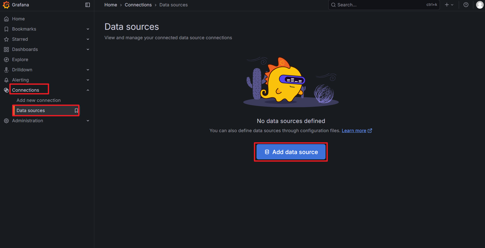

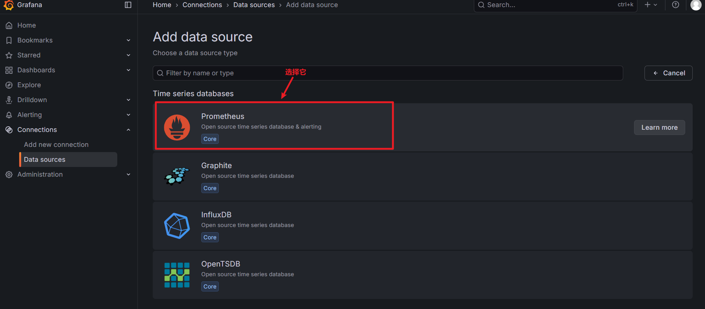

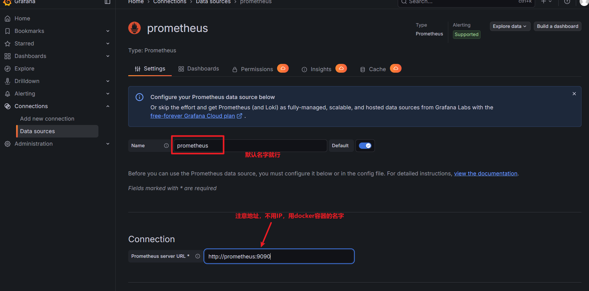

注意 URL：[http://prometheus:9090](http://prometheus:9090)，最后测试一下：

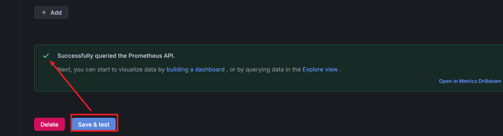

出现上图表示测试通过。

### 创建大盘Dashboard

我们可以创建一个大盘，大盘中创建多个面板。我们的大盘就叫做：智行代驾

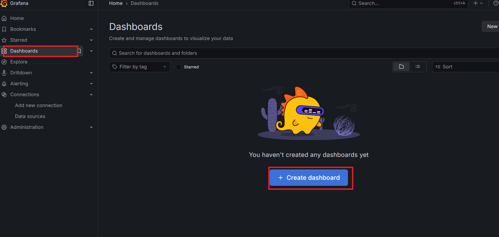

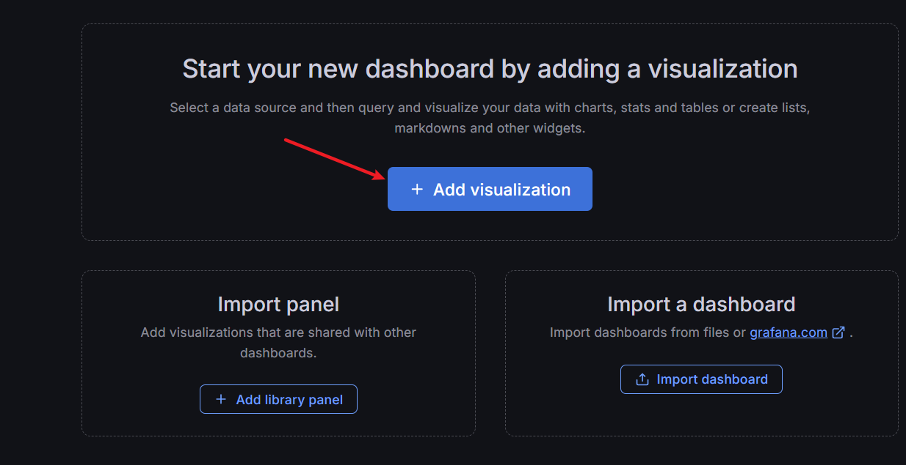

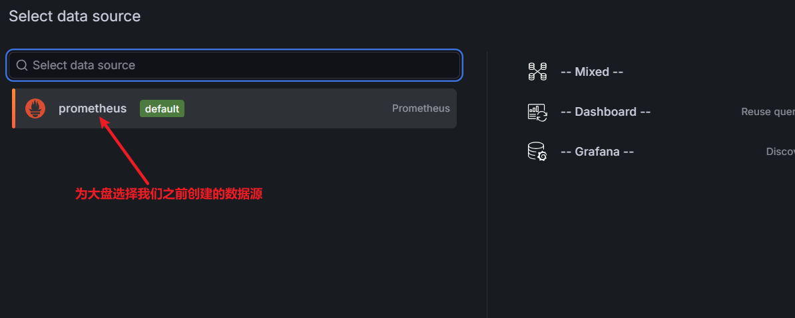

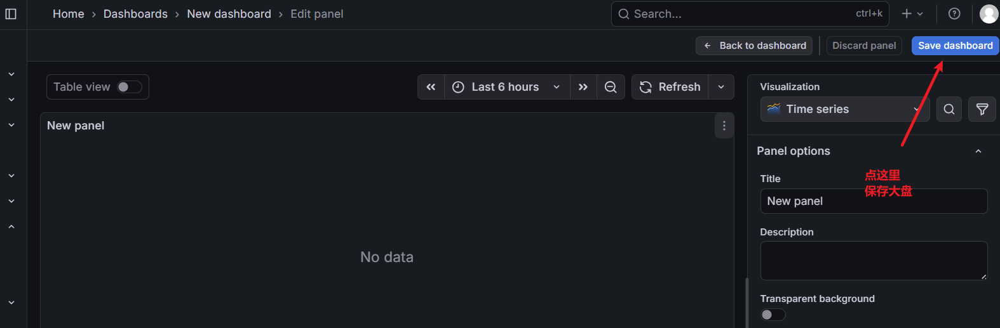

**保存时给大盘起个名：**

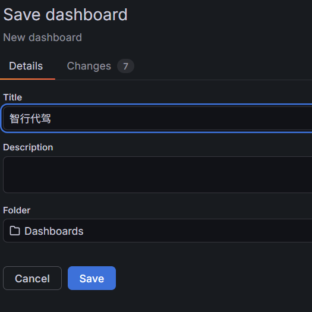

### 在大盘中创建面板 Panel

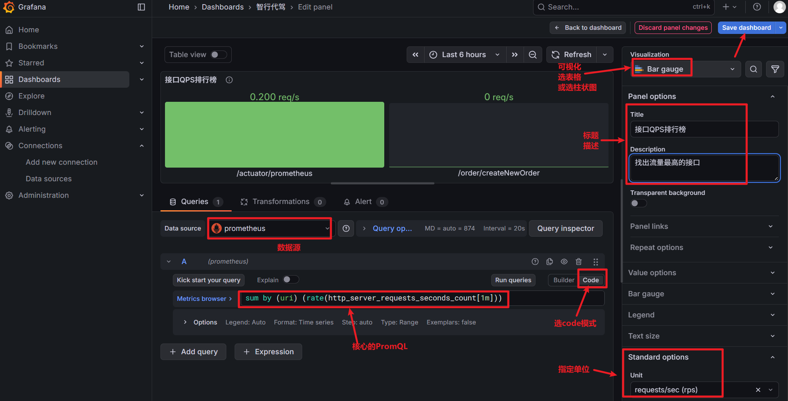

### Panel 1：接口QPS

```plaintext
查询：sum by (uri) (rate(http_server_requests_seconds_count[1m]))
可视化：Bar gauge 或 Table
标题：接口QPS排行榜
单位：rps
说明：找出流量最高的接口
```

### Panel 2：接口95分位延迟

```plaintext
查询：histogram_quantile(0.95, sum by (le, uri) (rate(http_server_requests_seconds_bucket[1m])))
可视化：Gauge 或 Stat
标题：接口P95延迟
单位：seconds
阈值：2 （超过2秒变红）
说明：监控SLA达标情况
```

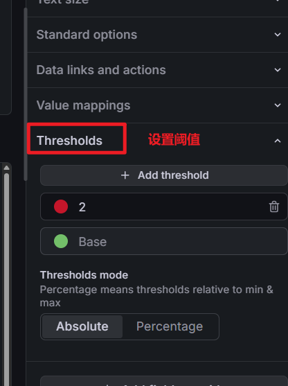

### Panel 3：接口错误率

```plaintext
查询：sum(rate(http_server_requests_seconds_count{status=~"5.."}[1m])) / sum(rate(http_server_requests_seconds_count[1m])) * 100
可视化：Gauge
标题：接口错误率
单位：percent
阈值：1 （超过1%变黄），5（超过5%变红）
说明：5xx错误占比
```

### Panel 4：JVM堆内存

```plaintext
查询：sum by (id) (jvm_memory_used_bytes{area="heap"})
可视化：Time series（折线图）
标题：JVM堆内存使用
单位：bytes
说明：监控内存泄漏
```

### Panel 5：GC暂停时间

```plaintext
查询：rate(jvm_gc_pause_seconds_sum[1m])
可视化：Time series
标题：GC暂停时间
单位：seconds
说明：GC压力监控
```

### 小技巧

1. **固定时间范围****：右上角选"Last 15 minutes"或"Last 1 hour"**
2. **自动刷新****：右上角选"5s"或"10s"，数据实时更新**