# 智行代驾07

# 更新订单、账单、分账记录

接下来要实现**订单的支付**与**分账**，实现**生成支付账单**。在代驾账单中，包含了**路桥费**、**停车费**和**其他费用**，这些费用**需要司机手动输入**。

创建代驾订单的时候就创建了账单记录。司机输入相关费用后，就可以计算订单的实际费用了。

比如说统计实际里程、等时的时长、系统奖励，以及分账比例等等，这些都是需要调用各种子系统来获取的。

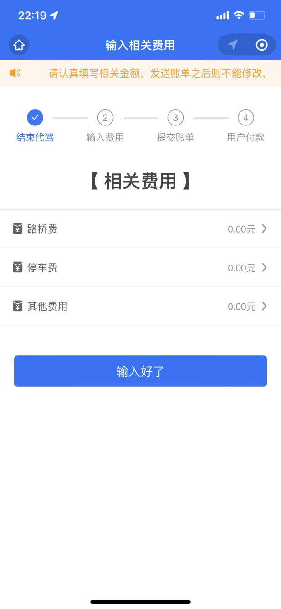

## 查询分账规则

保存分账记录前，需要先将分账规则获取到，通过规则子系统来查询。

### 了解分账规则

微信支付平台对每一笔支付都要扣除**渠道使用费**。交通出行类的APP，渠道费的扣点是0.6%（100 元扣 6 毛），代驾平台**对扣完渠道费的钱**进行分账。代驾平台和司机的分账比例是变化的，具体的对应条件如下：

1. 如果该司机当天有差评，司机只能分账20%，平台抽成80%
2. 如果付款金额小于50元
（a） 当天没有取消过订单，并且完成订单大于等于25个，系统抽成18%
（b）当天取消订单小于3个，并且完成订单大于10个，系统抽成19%
（c）不满足上面两种情况，系统抽成20%
3. 如果付款金额在50~100元之间
（a）当天没有取消过订单，并且完成订单大于等于25个，系统抽成15%
（b）当天取消订单小于3个，并且完成订单大于10个，系统抽成16%
（c）不满足上面两种情况，系统抽成17%
4. 如果付款金额在100元以上
（a）当天没有取消过订单，并且完成订单大于等于25个，系统抽成12%
（b）当天取消订单小于3个，并且完成订单大于10个，系统抽成14%
（c）不满足上面两种情况，系统抽成15%

### API 接口规范

我们调用`<font style="color:#000000;background-color:rgba(220, 240, 255, 0.3) !important;">zxds-rule</font>`子系统Web方法的时候，返回的结果中关键的参数如下

| **序号** | **参数** | **备注** |
| --- | --- | --- |
| 1 | systemIncome | 系统分账收入 |
| 2 | driverIncome | 司机分账收入（扣除个税） |
| 3 | paymentRate | 微信支付接口渠道费率 |
| 4 | paymentFee | 微信支付接口渠道费 |
| 5 | taxRate | 替司机代缴个税的税率（19%） |
| 6 | taxFee | 替司机代缴个税金额 |

## 更新账单、订单、分账记录

**编写 zxds-odr 子系统**

在编写订单子系统代码之前，我们先来看一下时序图，如下

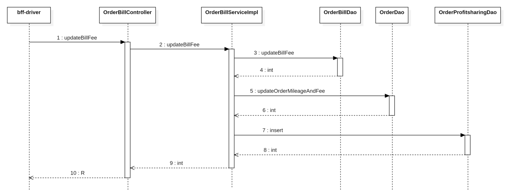

### 编写持久层代码

在`<font style="color:#000000;background-color:rgba(220, 240, 255, 0.3) !important;">OrderBillDao.xml</font>`文件中，声明SQL语句

```xml
<update id="updateBillFee" parameterType="Map">
    UPDATE tb_order_bill
    SET id            = #{id},
        total         = #{total},
        mileage_fee   = #{mileageFee},
        waiting_fee   = #{waitingFee},
        toll_fee      = #{tollFee},
        parking_fee   = #{parkingFee},
        other_fee    = #{otherFee},
        return_fee    = #{returnFee},
        incentive_fee = #{incentiveFee}
    WHERE order_id = #{orderId}
</update>
```

在`<font style="color:#000000;background-color:rgba(220, 240, 255, 0.3) !important;">com.example.zxds.odr.db.dao</font>`包`<font style="color:#000000;background-color:rgba(220, 240, 255, 0.3) !important;">OrderBillDao.java</font>`接口中，声明DAO方法

```java
int updateBillFee(Map<String, Object> param);
```

在`<font style="color:#000000;background-color:rgba(220, 240, 255, 0.3) !important;">OrderDao.xml</font>`文件中，声明SQL语句

```xml
<update id="updateOrderMileageAndFee" parameterType="Map">
    UPDATE tb_order
    SET real_mileage   = #{realMileage},
        return_mileage = #{returnMileage},
        incentive_fee  = #{incentiveFee},
        real_fee       = #{total}
    WHERE id = #{orderId}
</update>
```

在`<font style="color:#000000;background-color:rgba(220, 240, 255, 0.3) !important;">com.example.zxds.odr.db.dao</font>`包`<font style="color:#000000;background-color:rgba(220, 240, 255, 0.3) !important;">OrderDao.java</font>`接口中，声明DAO方法

```java
int updateOrderMileageAndFee(Map<String, Object> param);
```

编写分账表的SQL语句之前，我们先来了解一下`<font style="color:#000000;background-color:rgba(220, 240, 255, 0.3) !important;">tb_order_profitsharing</font>`表

| **字段名称** | **数据类型** | **非空** | **备注信息** |
| --- | --- | --- | --- |
| id | bigint | Y | 主键 |
| order_id | bigint | Y | 订单ID |
| rule_id | bigint | Y | 规则ID |
| amount_fee | decimal | Y | 总费用 |
| payment_rate | decimal | Y | 微信支付接口的渠道费率 |
| payment_fee | decimal | Y | 微信支付接口的渠道费 |
| tax_rate | decimal | Y | 为代驾司机代缴税率 |
| tax_fee | decimal | Y | 税率支出 |
| system_income | decimal | Y | 企业分账收入 |
| driver_income | decimal | Y | 司机分账收入 |
| status | tinyint | Y | 分账状态，1未分账，2已分账 |

在`<font style="color:#000000;background-color:rgba(220, 240, 255, 0.3) !important;">OrderProfitsharingDao.xml</font>`文件中，声明添加分账记录的SQL语句

```xml
<insert id="insert" parameterType="com.example.zxds.odr.db.pojo.OrderProfitsharingEntity">
    INSERT INTO tb_order_profitsharing
    SET order_id = #{orderId},
        rule_id = #{ruleId},
        amount_fee = #{amountFee},
        payment_rate = #{paymentRate},
        payment_fee = #{paymentFee},
        tax_rate = #{taxRate},
        tax_fee = #{taxFee},
        system_income = #{systemIncome},
        driver_income = #{driverIncome},
        `status` = 1
</insert>
```

在`<font style="color:#000000;background-color:rgba(220, 240, 255, 0.3) !important;">com.example.zxds.odr.db.dao</font>`包`<font style="color:#000000;background-color:rgba(220, 240, 255, 0.3) !important;">OrderProfitsharingDao.java</font>`接口中，声明DAO方法

```java
int insert(OrderProfitsharingEntity entity);
```

### 编写 service 和实现

在`<font style="color:#000000;background-color:rgba(220, 240, 255, 0.3) !important;">com.example.zxds.odr.service</font>`包`<font style="color:#000000;background-color:rgba(220, 240, 255, 0.3) !important;">OrderBillService.java</font>`接口中，声明抽象方法

```java
package com.example.zxds.odr.service;

import java.util.Map;

public interface OrderBillService {

    int updateBillFee(Map<String, Object> param);
}
```

在`<font style="color:#000000;background-color:rgba(220, 240, 255, 0.3) !important;">com.example.zxds.odr.service.impl</font>`包`<font style="color:#000000;background-color:rgba(220, 240, 255, 0.3) !important;">OrderBillServiceImpl.java</font>`类中，实现抽象方法

```java
package com.example.zxds.odr.service.impl;

import cn.hutool.core.map.MapUtil;
import com.example.zxds.common.exception.ZxdsException;
import com.example.zxds.odr.db.dao.OrderBillDao;
import com.example.zxds.odr.db.dao.OrderDao;
import com.example.zxds.odr.db.dao.OrderProfitsharingDao;
import com.example.zxds.odr.db.pojo.OrderProfitsharingEntity;
import com.example.zxds.odr.service.OrderBillService;
import lombok.RequiredArgsConstructor;
import org.springframework.stereotype.Service;
import org.springframework.transaction.annotation.Transactional;

import java.math.BigDecimal;
import java.util.Map;

@Service
@RequiredArgsConstructor
public class OrderBillServiceImpl implements OrderBillService {

    private final OrderBillDao orderBillDao;
    private final OrderDao orderDao;
    private final OrderProfitsharingDao profitsharingDao;

    @Override
    @Transactional
    public int updateBillFee(Map<String, Object> param) {
        //更新账单数据
        int rows = orderBillDao.updateBillFee(param);
        if (rows != 1) {
            throw new ZxdsException("更新账单费用详情失败");
        }

        //更新订单数据
        rows = orderDao.updateOrderMileageAndFee(param);
        if (rows != 1) {
            throw new ZxdsException("更新订单费用详情失败");
        }

        //添加分账单数据
        OrderProfitsharingEntity entity = new OrderProfitsharingEntity();
        entity.setId(IdUtil.getIdForOrderProfitSharing());
        entity.setOrderId(MapUtil.getLong(param, "orderId"));
        entity.setRuleId(MapUtil.getLong(param, "ruleId"));
        entity.setAmountFee(new BigDecimal((String) param.get("total")));
        entity.setPaymentRate(new BigDecimal((String) param.get("paymentRate")));
        entity.setPaymentFee(new BigDecimal((String) param.get("paymentFee")));
        entity.setTaxRate(new BigDecimal((String) param.get("taxRate")));
        entity.setTaxFee(new BigDecimal((String) param.get("taxFee")));
        entity.setSystemIncome(new BigDecimal((String) param.get("systemIncome")));
        entity.setDriverIncome(new BigDecimal((String) param.get("driverIncome")));
        rows = profitsharingDao.insert(entity);
        if (rows != 1) {
            throw new ZxdsException("添加分账记录失败");
        }
        return rows;
    }

}
```

### 编写 form 接收数据并校验

在`<font style="color:#000000;background-color:rgba(220, 240, 255, 0.3) !important;">com.example.zxds.odr.controller.form</font>`包中创建`<font style="color:#000000;background-color:rgba(220, 240, 255, 0.3) !important;">UpdateBillFeeForm.java</font>`类

```java
package com.example.zxds.odr.controller.form;

import io.swagger.v3.oas.annotations.media.Schema;
import lombok.Data;

import javax.validation.constraints.Min;
import javax.validation.constraints.NotBlank;
import javax.validation.constraints.NotNull;
import javax.validation.constraints.Pattern;

@Data
@Schema(description = "更新账单的表单")
public class UpdateBillFeeForm {

    @NotBlank(message = "total不能为空")
    @Pattern(regexp = "^[1-9]\\d*\\.\\d{1,2}$|^0\\.\\d{1,2}$|^[1-9]\\d*$", message = "total内容不正确")
    @Schema(description = "总金额")
    private String total;

    @NotBlank(message = "mileageFee不能为空")
    @Pattern(regexp = "^[1-9]\\d*\\.\\d{1,2}$|^0\\.\\d{1,2}$|^[1-9]\\d*$", message = "mileageFee内容不正确")
    @Schema(description = "里程费")
    private String mileageFee;

    @NotBlank(message = "waitingFee不能为空")
    @Pattern(regexp = "^[1-9]\\d*\\.\\d{1,2}$|^0\\.\\d{1,2}$|^[1-9]\\d*$", message = "waitingFee内容不正确")
    @Schema(description = "等时费")
    private String waitingFee;

    @NotBlank(message = "tollFee不能为空")
    @Pattern(regexp = "^[1-9]\\d*\\.\\d{1,2}$|^0\\.\\d{1,2}$|^[1-9]\\d*$", message = "tollFee内容不正确")
    @Schema(description = "路桥费")
    private String tollFee;

    @NotBlank(message = "parkingFee不能为空")
    @Pattern(regexp = "^[1-9]\\d*\\.\\d{1,2}$|^0\\.\\d{1,2}$|^[1-9]\\d*$", message = "parkingFee内容不正确")
    @Schema(description = "停车费")
    private String parkingFee;

    @NotBlank(message = "otherFee不能为空")
    @Pattern(regexp = "^[1-9]\\d*\\.\\d{1,2}$|^0\\.\\d{1,2}$|^[1-9]\\d*$", message = "otherFee内容不正确")
    @Schema(description = "其他费用")
    private String otherFee;

    @NotBlank(message = "returnFee不能为空")
    @Pattern(regexp = "^[1-9]\\d*\\.\\d{1,2}$|^0\\.\\d{1,2}$|^[1-9]\\d*$", message = "returnFee内容不正确")
    @Schema(description = "返程费用")
    private String returnFee;

    @NotBlank(message = "incentiveFee不能为空")
    @Pattern(regexp = "^[1-9]\\d*\\.\\d{1,2}$|^0\\.\\d{1,2}$|^[1-9]\\d*$", message = "incentiveFee内容不正确")
    @Schema(description = "系统奖励费用")
    private String incentiveFee;

    @NotNull(message = "orderId不能为空")
    @Min(value = 1, message = "orderId不能小于1")
    @Schema(description = "订单ID")
    private Long orderId;

    @NotBlank(message = "realMileage不能为空")
    @Pattern(regexp = "^[1-9]\\d*\\.\\d+$|^0\\.\\d+$|^[1-9]\\d*$", message = "realMileage内容不正确")
    @Schema(description = "代驾公里数")
    private String realMileage;

    @NotBlank(message = "returnMileage不能为空")
    @Pattern(regexp = "^[1-9]\\d*\\.\\d+$|^0\\.\\d+$|^[1-9]\\d*$", message = "returnMileage内容不正确")
    @Schema(description = "返程公里数")
    private String returnMileage;

    @NotNull(message = "ruleId不能为空")
    @Min(value = 1, message = "ruleId不能小于1")
    @Schema(description = "规则ID")
    private Long ruleId;

    @NotBlank(message = "paymentRate不能为空")
    @Pattern(regexp = "^0\\.\\d+$|^[1-9]\\d*$|^0$", message = "paymentRate内容不正确")
    @Schema(description = "支付手续费率")
    private String paymentRate;

    @NotBlank(message = "paymentFee不能为空")
    @Pattern(regexp = "^[1-9]\\d*\\.\\d{1,2}$|^0\\.\\d{1,2}$|^[1-9]\\d*$", message = "paymentFee内容不正确")
    @Schema(description = "支付手续费")
    private String paymentFee;

    @NotBlank(message = "taxRate不能为空")
    @Pattern(regexp = "^0\\.\\d+$|^[1-9]\\d*$|^0$", message = "taxRate内容不正确")
    @Schema(description = "代缴个税费率")
    private String taxRate;

    @NotBlank(message = "taxFee不能为空")
    @Pattern(regexp = "^[1-9]\\d*\\.\\d{1,2}$|^0\\.\\d{1,2}$|^[1-9]\\d*$", message = "taxFee内容不正确")
    @Schema(description = "代缴个税")
    private String taxFee;

    @NotBlank(message = "systemIncome不能为空")
    @Pattern(regexp = "^[1-9]\\d*\\.\\d{1,2}$|^0\\.\\d{1,2}$|^[1-9]\\d*$", message = "systemIncome内容不正确")
    @Schema(description = "代驾系统分账收入")
    private String systemIncome;

    @NotBlank(message = "driverIncome不能为空")
    @Pattern(regexp = "^[1-9]\\d*\\.\\d{1,2}$|^0\\.\\d{1,2}$|^[1-9]\\d*$", message = "driverIncome内容不正确")
    @Schema(description = "司机分账收入")
    private String driverIncome;

}
```

### 编写 web 方法

在`<font style="color:#000000;background-color:rgba(220, 240, 255, 0.3) !important;">com.example.zxds.odr.controller</font>`包`<font style="color:#000000;background-color:rgba(220, 240, 255, 0.3) !important;">OrderBillController.java</font>`类中，声明Web方法

```java
package com.example.zxds.odr.controller;

import cn.hutool.core.bean.BeanUtil;
import com.example.zxds.common.util.R;
import com.example.zxds.odr.controller.form.UpdateBillFeeForm;
import com.example.zxds.odr.service.OrderBillService;
import io.swagger.v3.oas.annotations.Operation;
import io.swagger.v3.oas.annotations.tags.Tag;
import lombok.RequiredArgsConstructor;
import org.springframework.web.bind.annotation.PostMapping;
import org.springframework.web.bind.annotation.RequestBody;
import org.springframework.web.bind.annotation.RequestMapping;
import org.springframework.web.bind.annotation.RestController;

import javax.validation.Valid;
import java.util.Map;

@RestController
@RequestMapping("/bill")
@RequiredArgsConstructor
@Tag(name = "OrderBillController", description = "订单费用账单Web接口")
public class OrderBillController {

    private final OrderBillService orderBillService;

    @PostMapping("/updateBillFee")
    @Operation(summary = "更新订单账单费用")
    public R updateBillFee(@RequestBody @Valid UpdateBillFeeForm form) {
        Map<String, Object> param = BeanUtil.beanToMap(form);
        int rows = orderBillService.updateBillFee(param);
        return R.ok().put("rows", rows);
    }
}
```

# 计算实际代驾里程

更新订单和账单记录的时候，需要计算实际代驾费用，这就需要用到实际代驾里程，接下来咱们就需要把HBase中该订单的GPS坐标取出来，然后把这些GPS坐标点连成线，计算出实际里程。

## 编写 zxds-odr 子系统

司机端小程序提交Ajax请求，要更新订单和账单费用的时候，`<font style="color:#000000;background-color:rgba(220, 240, 255, 0.3) !important;">bff-driver</font>`子系统要调用多个子系统，那么必须先要核验司机是否关联了该订单。如果司机是这个代驾订单的执行人，那么司机有权利修改订单和账单的费用。编写代码之前，我们先来看一下时序图

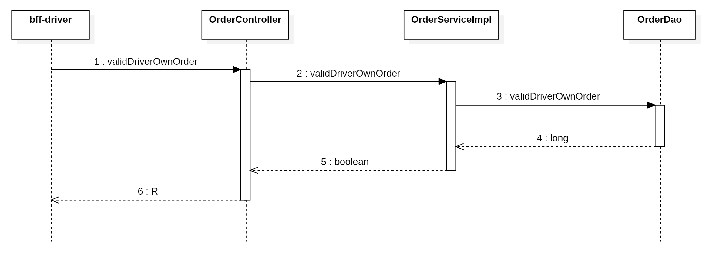

计算**代驾费**和**系统奖励费**的时候，需要用到订单的`<font style="color:#000000;background-color:rgba(220, 240, 255, 0.3) !important;">acceptTime</font>`和`<font style="color:#000000;background-color:rgba(220, 240, 255, 0.3) !important;">startTime</font>``<font style="color:#080808;background-color:#ffffff;">waiting_minute</font>``<font style="color:#080808;background-color:#ffffff;">favour_fee</font>`，编写SQL语句把它查出来。

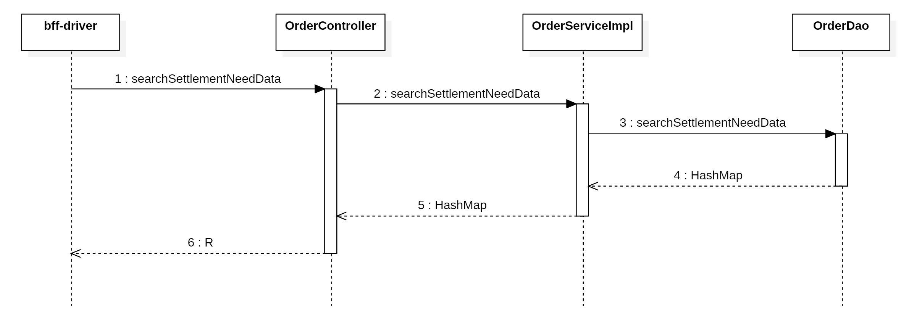

### 编写持久层代码

在`<font style="color:#000000;background-color:rgba(220, 240, 255, 0.3) !important;">OrderDao.xml</font>`文件中，编写SQL语句

```xml
<select id="validDriverOwnOrder" parameterType="Map" resultType="long">
    SELECT COUNT(*)
    FROM tb_order
    WHERE id = #{orderId}
      AND driver_id = #{driverId}
</select>

<select id="searchSettlementNeedData" parameterType="long" resultType="HashMap">
    SELECT DATE_FORMAT(accept_time, '%Y-%m-%d %H:%i:%s') AS acceptTime,
           DATE_FORMAT(start_time, '%Y-%m-%d %H:%i:%s')  AS startTime,
           waiting_minute                                AS waitingMinute,
           CAST(favour_fee AS CHAR)                      AS favourFee
    FROM tb_order
    WHERE id = #{orderId};
</select>
```

在`<font style="color:#000000;background-color:rgba(220, 240, 255, 0.3) !important;">com.example.zxds.odr.db.dao</font>`包`<font style="color:#000000;background-color:rgba(220, 240, 255, 0.3) !important;">OrderDao.java</font>`接口中，声明抽象方法

```java
long validDriverOwnOrder(Map<String, Object> param);

Map<String, Object> searchSettlementNeedData(long orderId);
```

### 编写 service 和实现

在`<font style="color:#000000;background-color:rgba(220, 240, 255, 0.3) !important;">com.example.zxds.odr.service</font>`包`<font style="color:#000000;background-color:rgba(220, 240, 255, 0.3) !important;">OrderService.java</font>`接口中，声明抽象方法

```java
boolean validDriverOwnOrder(Map<String, Object> param);

Map<String, Object> searchSettlementNeedData(long orderId);
```

在`<font style="color:#000000;background-color:rgba(220, 240, 255, 0.3) !important;">com.example.zxds.odr.service.impl</font>`包`<font style="color:#000000;background-color:rgba(220, 240, 255, 0.3) !important;">OrderServiceImpl.java</font>`接口中，实现抽象方法

```java
@Override
public boolean validDriverOwnOrder(Map<String, Object> param) {
    long count = orderDao.validDriverOwnOrder(param);
    return count == 1;
}

@Override
public Map<String, Object> searchSettlementNeedData(long orderId) {
    Map<String, Object> map = orderDao.searchSettlementNeedData(orderId);
    return map;
}
```

### 编写 form 接收数据并校验

在`<font style="color:#000000;background-color:rgba(220, 240, 255, 0.3) !important;">com.example.zxds.odr.controller.form</font>`包中创建`<font style="color:#000000;background-color:rgba(220, 240, 255, 0.3) !important;">ValidDriverOwnOrderForm.java</font>`类

```java
package com.example.zxds.odr.controller.form;

import io.swagger.v3.oas.annotations.media.Schema;
import lombok.Data;

import javax.validation.constraints.Min;
import javax.validation.constraints.NotNull;

@Data
@Schema(description = "查询司机是否关联某订单的表单")
public class ValidDriverOwnOrderForm {
    @NotNull(message = "driverId不能为空")
    @Min(value = 1, message = "driverId不能小于1")
    @Schema(description = "司机ID")
    private Long driverId;

    @NotNull(message = "orderId不能为空")
    @Min(value = 1, message = "orderId不能小于1")
    @Schema(description = "订单ID")
    private Long orderId;
}
```

在`<font style="color:#000000;background-color:rgba(220, 240, 255, 0.3) !important;">com.example.zxds.odr.controller.form</font>`包中创建`<font style="color:#000000;background-color:rgba(220, 240, 255, 0.3) !important;">SearchSettlementNeedDataForm.java</font>`类

```java
package com.example.zxds.odr.controller.form;

import io.swagger.v3.oas.annotations.media.Schema;
import lombok.Data;

import javax.validation.constraints.Min;
import javax.validation.constraints.NotNull;

@Data
@Schema(description = "查询订单的开始和等时的表单")
public class SearchSettlementNeedDataForm {
    @NotNull(message = "orderId不能为空")
    @Min(value = 1, message = "orderId不能小于1")
    @Schema(description = "订单ID")
    private Long orderId;
}
```

### 编写 web 方法

在`<font style="color:#000000;background-color:rgba(220, 240, 255, 0.3) !important;">com.example.zxds.odr.controller</font>`包`<font style="color:#000000;background-color:rgba(220, 240, 255, 0.3) !important;">OrderController.java</font>`类中，声明Web方法

```java
@PostMapping("/validDriverOwnOrder")
@Operation(summary = "查询司机是否关联某订单")
public R validDriverOwnOrder(@RequestBody @Valid ValidDriverOwnOrderForm form) {
    Map<String, Object> param = BeanUtil.beanToMap(form);
    boolean bool = orderService.validDriverOwnOrder(param);
    return R.ok().put("result", bool);
}

@PostMapping("/searchSettlementNeedData")
@Operation(summary = "查询订单的开始和等时")
public R searchSettlementNeedData(@RequestBody @Valid SearchSettlementNeedDataForm form) {
    Map<String, Object> map = orderService.searchSettlementNeedData(form.getOrderId());
    return R.ok().put("result", map);
}
```

## 编写 zxds-nebula 子系统

计算实际代驾费，需要先计算实际代驾的里程。我们在Nebula子系统中，把该订单的GPS坐标点都查询出来，然后连成线即可。在编写代码之前，我们先来看一下时序图，如下：

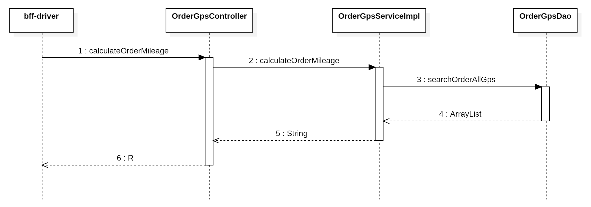

### 编写持久层代码

在`<font style="color:#000000;background-color:rgba(220, 240, 255, 0.3) !important;">OrderGpsDao.xml</font>`文件中，声明SQL语句

```xml
<select id="searchOrderAllGps" parameterType="long" resultType="HashMap">
    SELECT "latitude", "longitude"
    FROM zxds.order_gps
    WHERE "order_id" = #{orderId}
    ORDER BY "id"
</select>
```

在`<font style="color:#000000;background-color:rgba(220, 240, 255, 0.3) !important;">com.example.zxds.nebula.db.dao</font>`包`<font style="color:#000000;background-color:rgba(220, 240, 255, 0.3) !important;">OrderGpsDao.java</font>`接口中，声明DAO方法

```java
List<Map<String, Object>> searchOrderAllGps(long orderId);
```

### 编写 service 和实现

因为要计算GPS坐标点之间的距离，所以我们需要声明一个工具类。在`<font style="color:#000000;background-color:rgba(220, 240, 255, 0.3) !important;">com.example.zxds.nebula.util</font>`包中创建`<font style="color:#000000;background-color:rgba(220, 240, 255, 0.3) !important;">LocationUtil.java</font>`类

```java
package com.example.zxds.nebula.util;

import java.math.BigDecimal;
import java.math.RoundingMode;

public class LocationUtil {
    private final static double EARTH_RADIUS = 6378.137;//地球半径

    private static double rad(double d) {
        return d * Math.PI / 180.0;
    }

    /**
     * 计算两点间距离
     *
     * @return double 距离 单位公里,精确到米
     */
    public static double getDistance(double lat1, double lng1, double lat2, double lng2) {
        double radLat1 = rad(lat1);
        double radLat2 = rad(lat2);
        double a = radLat1 - radLat2;
        double b = rad(lng1) - rad(lng2);
        double s = 2 * Math.asin(Math.sqrt(Math.pow(Math.sin(a / 2), 2) + Math.cos(radLat1) * Math.cos(radLat2) * Math.pow(Math.sin(b / 2), 2)));
        s = s * EARTH_RADIUS;
        s = new BigDecimal(s).setScale(3, RoundingMode.HALF_UP).doubleValue();
        return s;
    }
}
```

在`<font style="color:#000000;background-color:rgba(220, 240, 255, 0.3) !important;">com.example.zxds.nebula.service</font>`包`<font style="color:#000000;background-color:rgba(220, 240, 255, 0.3) !important;">OrderGpsService.java</font>`接口中，声明抽象方法

```java
String calculateOrderMileage(long orderId);
```

在`<font style="color:#000000;background-color:rgba(220, 240, 255, 0.3) !important;">com.example.zxds.nebula.service.impl</font>`包`<font style="color:#000000;background-color:rgba(220, 240, 255, 0.3) !important;">OrderGpsServiceImpl.java</font>`类中，实现抽象方法

```java
@Override
public String calculateOrderMileage(long orderId) {
    List<Map<String, Object>> list = orderGpsDao.searchOrderAllGps(orderId);
    double mileage = 0;
    for (int i = 0; i < list.size(); i++) {
        if (i != list.size() - 1) {
            Map<String, Object> map1 = list.get(i);
            Map<String, Object> map2 = list.get(i + 1);
            double latitude1 = MapUtil.getDouble(map1, "latitude");
            double longitude1 = MapUtil.getDouble(map1, "longitude");
            double latitude2 = MapUtil.getDouble(map2, "latitude");
            double longitude2 = MapUtil.getDouble(map2, "longitude");
            double distance = LocationUtil.getDistance(latitude1, longitude1, latitude2, longitude2);
            mileage += distance;
        }
    }
    return mileage + "";
}
```

### 编写 form 接收数据并校验

在`<font style="color:#000000;background-color:rgba(220, 240, 255, 0.3) !important;">com.example.zxds.nebula.controller.form</font>`包中创建`<font style="color:#000000;background-color:rgba(220, 240, 255, 0.3) !important;">CalculateOrderMileageForm.java</font>`类

```java
package com.example.zxds.nebula.controller.form;

import io.swagger.v3.oas.annotations.media.Schema;
import lombok.Data;

import javax.validation.constraints.Min;
import javax.validation.constraints.NotNull;

@Data
@Schema(description = "计算订单里程的表单")
public class CalculateOrderMileageForm {
    @NotNull(message = "orderId不能为空")
    @Min(value = 1, message = "orderId不能小于1")
    @Schema(description = "订单ID")
    private Long orderId;
}
```

### 编写 web 方法

在`<font style="color:#000000;background-color:rgba(220, 240, 255, 0.3) !important;">com.example.zxds.nebula.controller</font>`包`<font style="color:#000000;background-color:rgba(220, 240, 255, 0.3) !important;">OrderGpsController.java</font>`类中，声明Web方法

```java
@PostMapping("/calculateOrderMileage")
@Operation(summary = "计算订单里程")
public R calculateOrderMileage(@RequestBody @Valid CalculateOrderMileageForm form) {
    String mileage = orderGpsService.calculateOrderMileage(form.getOrderId());
    return R.ok().put("result", mileage);
}
```

# 关于代驾费和系统奖励费

我们现在能计算出来代驾真实的里程了，接下来咱们要根据实际里程计算出代驾费。另外为了鼓励司机接单，代驾平台还会给司机相应的奖励，所以还要计算这笔订单是否能领取到代驾平台的奖励。

## 代驾费计算标准

1. 代驾默认起步里程是8公里，收费根据时间段不同也有所调整。超出8公里的部分，每公里3.5元。

| **时间段** | **基础里程** | **收费** |
| --- | --- | --- |
| 06:00 - 22:00 | 8公里 | 35元 |
| 22:00 - 23:00 | 8公里 | 50元 |
| 23:00 - 00:00（次日） | 8公里 | 65元 |
| 00:00 - 06:00 | 8公里 | 85元 |

1. 默认免费等时额度为10分钟，超出部分1元/分钟，等时费最高180元封顶
2. 如果实际代驾里程不超过8公里，不收取返程费。超过8公里，则收取返程费，返程费 = 实际代驾里程 × 1.0元

**规则子系统Web方法返回的结果中，关键参数如下：**

| **序号** | **参数名称** | **备注信息** |
| --- | --- | --- |
| 1 | amount | 代驾费用（不包含停车费、路桥费等） |
| 2 | mileageFee | 里程费 |
| 3 | returnFee | 返程费 |
| 4 | waitingFee | 等时费 |
| 5 | returnMileage | 返程里程 |
| 6 | baseReturnMileage | 返程里程基数（8公里） |
| 7 | exceedReturnPrice | 返程里程收费价格（1元/公里） |
| 8 | baseMinute | 等时基数（10分钟） |
| 9 | exceedMinutePrice | 等时基数外收费价格（1元/分钟） |
| 10 | baseMileagePrice | 代驾基础费（35-85元） |
| 11 | baseMileage | 代驾基础里程（8公里） |
| 12 | exceedMileagePrice | 超过基础里程之外的收费价格（3.5元/公里） |

## 系统奖励费用

代驾平台对司机的奖励规则如下，代驾平台的补贴是直接发放到司机钱包里面，到时候我们修改司机钱包的余额，并且还要添加一条充值记录

| **时间段** | **完成订单** | **平台奖励** |
| --- | --- | --- |
| 06:00 - 18:00 | 10个 | 2元/单 |
| 18:00 - 23:00 | 5个 | 3元/单 |
| 23:00 - 00:00（次日） | 5个 | 2元/单 |
| 00:00 - 06:00 | 5个 | 2元/单 |

如果当天完成代驾30单以上，每笔订单再补贴5元。

**规则子系统Web方法返回的结果中，关键参数如下：**

| **序号** | **参数名称** | **备注信息** |
| --- | --- | --- |
| 1 | incentiveFee | 奖励费 |

# 编写 bff-driver 子系统

## 时序图

编写`<font style="color:#000000;background-color:rgba(220, 240, 255, 0.3) !important;">bff-driver</font>`子系统代码之前，我们先来看看时序图，如下

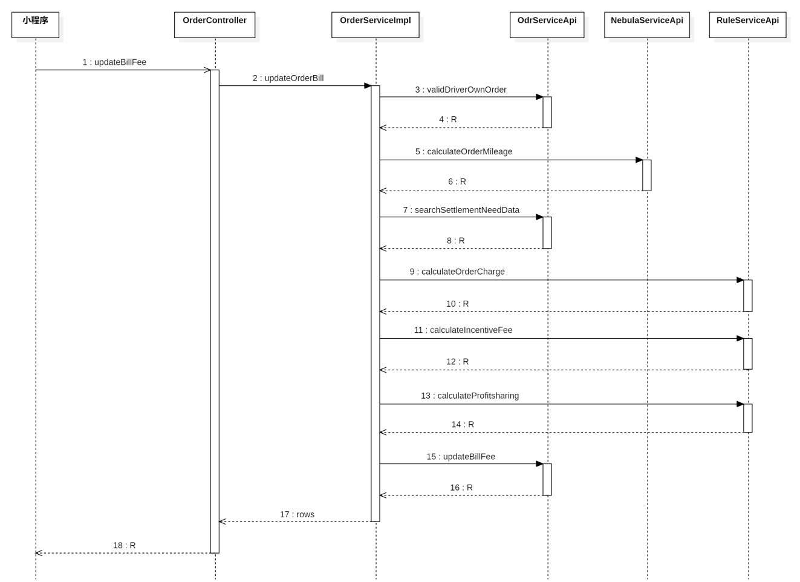

## 编写 Feign 客户端

在`<font style="color:#000000;background-color:rgba(220, 240, 255, 0.3) !important;">com.example.zxds.bff.driver.controller.form</font>`包中创建`<font style="color:#000000;background-color:rgba(220, 240, 255, 0.3) !important;">ValidDriverOwnOrderForm.java</font>`类

```java
package com.example.zxds.bff.driver.controller.form;

import io.swagger.v3.oas.annotations.media.Schema;
import lombok.Data;

import javax.validation.constraints.Min;
import javax.validation.constraints.NotNull;

@Data
@Schema(description = "查询司机是否关联某订单的表单")
public class ValidDriverOwnOrderForm {

    @Schema(description = "司机ID")
    private Long driverId;

    @NotNull(message = "orderId不能为空")
    @Min(value = 1, message = "orderId不能小于1")
    @Schema(description = "订单ID")
    private Long orderId;
}
```

在`<font style="color:#000000;background-color:rgba(220, 240, 255, 0.3) !important;">com.example.zxds.bff.driver.feign</font>`包`<font style="color:#000000;background-color:rgba(220, 240, 255, 0.3) !important;">OdrServiceApi.java</font>`接口中，声明抽象方法，查询司机和订单是否关联

```java
@PostMapping("/order/validDriverOwnOrder")
R validDriverOwnOrder(ValidDriverOwnOrderForm form);
```

在`<font style="color:#000000;background-color:rgba(220, 240, 255, 0.3) !important;">com.example.zxds.bff.driver.controller.form</font>`包中创建`<font style="color:#000000;background-color:rgba(220, 240, 255, 0.3) !important;">CalculateOrderMileageForm.java</font>`类

```java
package com.example.zxds.bff.driver.controller.form;

import io.swagger.v3.oas.annotations.media.Schema;
import lombok.Data;

import javax.validation.constraints.Min;
import javax.validation.constraints.NotNull;

@Data
@Schema(description = "查询某订单的全部GPS数据的表单")
public class CalculateOrderMileageForm {
    @NotNull(message = "orderId不能为空")
    @Min(value = 1, message = "orderId不能小于1")
    @Schema(description = "订单ID")
    private Long orderId;
}
```

在`<font style="color:#000000;background-color:rgba(220, 240, 255, 0.3) !important;">com.example.zxds.bff.driver.feign</font>`包`<font style="color:#000000;background-color:rgba(220, 240, 255, 0.3) !important;">NebulaServiceApi.java</font>`接口中，声明抽象方法，计算订单实际里程

```java
@PostMapping("/order/gps/calculateOrderMileage")
R calculateOrderMileage(CalculateOrderMileageForm form);
```

在`<font style="color:#000000;background-color:rgba(220, 240, 255, 0.3) !important;">com.example.zxds.bff.driver.controller.form</font>`包中创建`<font style="color:#000000;background-color:rgba(220, 240, 255, 0.3) !important;">SearchSettlementNeedDataForm.java</font>`类

```java
package com.example.zxds.bff.driver.controller.form;

import io.swagger.v3.oas.annotations.media.Schema;
import lombok.Data;

import javax.validation.constraints.Min;
import javax.validation.constraints.NotNull;

@Data
@Schema(description = "查询订单的开始和等时的表单")
public class SearchSettlementNeedDataForm {
    @NotNull(message = "orderId不能为空")
    @Min(value = 1, message = "orderId不能小于1")
    @Schema(description = "订单ID")
    private Long orderId;
}
```

在`<font style="color:#000000;background-color:rgba(220, 240, 255, 0.3) !important;">com.example.zxds.bff.driver.feign</font>`包`<font style="color:#000000;background-color:rgba(220, 240, 255, 0.3) !important;">OdrServiceApi.java</font>`接口中，声明抽象方法，查询订单信息

```java
@PostMapping("/order/searchSettlementNeedData")
R searchSettlementNeedData(SearchSettlementNeedDataForm form);
```

在`<font style="color:#000000;background-color:rgba(220, 240, 255, 0.3) !important;">com.example.zxds.bff.driver.controller.form</font>`包中创建`<font style="color:#000000;background-color:rgba(220, 240, 255, 0.3) !important;">CalculateOrderChargeForm.java</font>`类

```java
package com.example.zxds.bff.driver.controller.form;

import io.swagger.v3.oas.annotations.media.Schema;
import lombok.Data;

@Data
@Schema(description = "计算代驾费用的表单")
public class CalculateOrderChargeForm {

    @Schema(description = "代驾公里数")
    private String mileage;

    @Schema(description = "代驾开始时间")
    private String time;

    @Schema(description = "等时分钟")
    private Integer minute;
}
```

在`<font style="color:#000000;background-color:rgba(220, 240, 255, 0.3) !important;">com.example.zxds.bff.driver.feign</font>`包`<font style="color:#000000;background-color:rgba(220, 240, 255, 0.3) !important;">RuleServiceApi.java</font>`接口中，声明抽象方法，计算代驾费

```java
package com.example.zxds.bff.driver.feign;


import com.example.zxds.bff.driver.controller.form.CalculateOrderChargeForm;
import com.example.zxds.common.util.R;
import org.springframework.cloud.openfeign.FeignClient;
import org.springframework.web.bind.annotation.PostMapping;

@FeignClient(value = "zxds-rule")
public interface RuleServiceApi {

    @PostMapping("/charge/calculateOrderCharge")
    R calculateOrderCharge(CalculateOrderChargeForm form);
}
```

在`<font style="color:#000000;background-color:rgba(220, 240, 255, 0.3) !important;">com.example.zxds.bff.driver.controller.form</font>`包中创建`<font style="color:#000000;background-color:rgba(220, 240, 255, 0.3) !important;">CalculateIncentiveFeeForm.java</font>`类

```java
package com.example.zxds.bff.driver.controller.form;

import io.swagger.v3.oas.annotations.media.Schema;
import lombok.Data;

import javax.validation.constraints.NotBlank;
import javax.validation.constraints.Pattern;

@Data
@Schema(description = "计算系统奖励的表单")
public class CalculateIncentiveFeeForm {

    @Schema(description = "司机ID")
    private long driverId;

    @NotBlank(message = "acceptTime不能为空")
    @Pattern(regexp = "^((((1[6-9]|[2-9]\\d)\\d{2})-(0?[13578]|1[02])-(0?[1-9]|[12]\\d|3[01]))|(((1[6-9]|[2-9]\\d)\\d{2})-(0?[13456789]|1[012])-(0?[1-9]|[12]\\d|30))|(((1[6-9]|[2-9]\\d)\\d{2})-0?2-(0?[1-9]|1\\d|2[0-8]))|(((1[6-9]|[2-9]\\d)(0[48]|[2468][048]|[13579][26])|((16|[2468][048]|[3579][26])00))-0?2-29-))\\s(20|21|22|23|[0-1]\\d):[0-5]\\d:[0-5]\\d$", message = "acceptTime内容不正确")
    @Schema(description = "接单时间")
    private String acceptTime;
}
```

在`<font style="color:#000000;background-color:rgba(220, 240, 255, 0.3) !important;">com.example.zxds.bff.driver.feign</font>`包`<font style="color:#000000;background-color:rgba(220, 240, 255, 0.3) !important;">RuleServiceApi.java</font>`接口中，声明抽象方法，计算奖励费

```java
@PostMapping("/award/calculateIncentiveFee")
R calculateIncentiveFee(CalculateIncentiveFeeForm form);
```

在`<font style="color:#000000;background-color:rgba(220, 240, 255, 0.3) !important;">com.example.zxds.bff.driver.controller.form</font>`包中创建`<font style="color:#000000;background-color:rgba(220, 240, 255, 0.3) !important;">CalculateProfitsharingForm.java</font>`类

```java
package com.example.zxds.bff.driver.controller.form;

import io.swagger.v3.oas.annotations.media.Schema;
import lombok.Data;

@Data
@Schema(description = "计算订单分账的表单")
public class CalculateProfitsharingForm {

    @Schema(description = "订单ID")
    private Long orderId;

    @Schema(description = "待分账费用")
    private String amount;
}
```

在`<font style="color:#000000;background-color:rgba(220, 240, 255, 0.3) !important;">com.example.zxds.bff.driver.feign</font>`包`<font style="color:#000000;background-color:rgba(220, 240, 255, 0.3) !important;">RuleServiceApi.java</font>`接口中，声明抽象方法，计算分账费

```java
@PostMapping("/profitsharing/calculateProfitsharing")
R calculateProfitsharing(CalculateProfitsharingForm form);
```

在`<font style="color:#000000;background-color:rgba(220, 240, 255, 0.3) !important;">com.example.zxds.bff.driver.controller.form</font>`包中创建`<font style="color:#000000;background-color:rgba(220, 240, 255, 0.3) !important;">UpdateBillFeeForm.java</font>`类

```java
package com.example.zxds.bff.driver.controller.form;

import io.swagger.v3.oas.annotations.media.Schema;
import lombok.Data;

import javax.validation.constraints.Min;
import javax.validation.constraints.NotBlank;
import javax.validation.constraints.NotNull;
import javax.validation.constraints.Pattern;

@Data
@Schema(description = "更新订单账单费用的表单")
public class UpdateBillFeeForm {

    @Schema(description = "总金额")
    private String total;

    @Schema(description = "里程费")
    private String mileageFee;

    @Schema(description = "等时费")
    private String waitingFee;

    @NotBlank(message = "tollFee不能为空")
    @Pattern(regexp = "^[1-9]\\d*\\.\\d{1,2}$|^0\\.\\d{1,2}$|^[1-9]\\d*$", message = "tollFee内容不正确")
    @Schema(description = "路桥费")
    private String tollFee;

    @NotBlank(message = "parkingFee不能为空")
    @Pattern(regexp = "^[1-9]\\d*\\.\\d{1,2}$|^0\\.\\d{1,2}$|^[1-9]\\d*$", message = "parkingFee内容不正确")
    @Schema(description = "路桥费")
    private String parkingFee;

    @NotBlank(message = "otherFee不能为空")
    @Pattern(regexp = "^[1-9]\\d*\\.\\d{1,2}$|^0\\.\\d{1,2}$|^[1-9]\\d*$", message = "otherFee内容不正确")
    @Schema(description = "其他费用")
    private String otherFee;

    @Schema(description = "返程费用")
    private String returnFee;

    @Schema(description = "系统奖励费用")
    private String incentiveFee;

    @NotNull(message = "orderId不能为空")
    @Min(value = 1, message = "orderId不能小于1")
    @Schema(description = "订单ID")
    private Long orderId;

    @Schema(description = "司机ID")
    private Long driverId;

    @Schema(description = "代驾公里数")
    private String realMileage;

    @Schema(description = "返程公里数")
    private String returnMileage;

    @Schema(description = "规则ID")
    private Long ruleId;

    @Schema(description = "支付手续费率")
    private String paymentRate;

    @Schema(description = "支付手续费")
    private String paymentFee;

    @Schema(description = "代缴个税费率")
    private String taxRate;

    @Schema(description = "代缴个税")
    private String taxFee;

    @Schema(description = "代驾系统分账收入")
    private String systemIncome;

    @Schema(description = "司机分账收入")
    private String driverIncome;
}
```

在`<font style="color:#000000;background-color:rgba(220, 240, 255, 0.3) !important;">com.example.zxds.bff.driver.feign</font>`包`<font style="color:#000000;background-color:rgba(220, 240, 255, 0.3) !important;">OdrServiceApi.java</font>`接口中，声明抽象方法，更新账单记录

```java
@PostMapping("/bill/updateBillFee")
R updateBillFee(UpdateBillFeeForm form);
```

## 编写 service 和实现

在`<font style="color:#000000;background-color:rgba(220, 240, 255, 0.3) !important;">com.example.zxds.bff.driver.service</font>`包`<font style="color:#000000;background-color:rgba(220, 240, 255, 0.3) !important;">OrderService.java</font>`接口中，声明抽象方法

```java
int updateOrderBill(UpdateBillFeeForm form);
```

在`<font style="color:#000000;background-color:rgba(220, 240, 255, 0.3) !important;">com.example.zxds.bff.driver.service.impl</font>`包`<font style="color:#000000;background-color:rgba(220, 240, 255, 0.3) !important;">OrderServiceImpl.java</font>`接口中，实现抽象方法

```java
private final RuleServiceApi ruleServiceApi;

@Override
@GlobalTransactional
public int updateOrderBill(UpdateBillFeeForm form) {
    /*
     * 1.判断司机是否关联该订单
     */
    ValidDriverOwnOrderForm form1 = new ValidDriverOwnOrderForm();
    form1.setOrderId(form.getOrderId());
    form1.setDriverId(form.getDriverId());
    R r = odrServiceApi.validDriverOwnOrder(form1);
    boolean bool = MapUtil.getBool(r, "result");
    if (!bool) {
        throw new ZxdsException("司机未关联该订单");
    }
    /*
     * 2.计算订单里程数据
     */
    CalculateOrderMileageForm form2 = new CalculateOrderMileageForm();
    form2.setOrderId(form.getOrderId());
    r = nebulaServiceApi.calculateOrderMileage(form2);
    String mileage = (String) r.get("result");
    mileage = NumberUtil.div(mileage, "1000", 1, RoundingMode.CEILING).toString();

    /*
     * 3.查询订单结算时需要的数据
     */
    SearchSettlementNeedDataForm form3 = new SearchSettlementNeedDataForm();
    form3.setOrderId(form.getOrderId());
    r = odrServiceApi.searchSettlementNeedData(form3);
    Map<String, Object> map = (Map<String, Object>) r.get("result");
    String acceptTime = MapUtil.getStr(map, "acceptTime");
    String startTime = MapUtil.getStr(map, "startTime");
    int waitingMinute = MapUtil.getInt(map, "waitingMinute");
    String favourFee = MapUtil.getStr(map, "favourFee");

    /*
     * 4.计算代驾费
     */
    CalculateOrderChargeForm form4 = new CalculateOrderChargeForm();
    form4.setMileage(mileage);
    form4.setTime(startTime.split(" ")[1]);
    form4.setMinute(waitingMinute);
    r = ruleServiceApi.calculateOrderCharge(form4);
    map = (Map<String, Object>) r.get("result");
    String mileageFee = MapUtil.getStr(map, "mileageFee");
    String returnFee = MapUtil.getStr(map, "returnFee");
    String waitingFee = MapUtil.getStr(map, "waitingFee");
    String amount = MapUtil.getStr(map, "amount");
    String returnMileage = MapUtil.getStr(map, "returnMileage");

    /*
     * 5.计算系统奖励费用
     */
    CalculateIncentiveFeeForm form5 = new CalculateIncentiveFeeForm();
    form5.setDriverId(form.getDriverId());
    form5.setAcceptTime(acceptTime);
    r = ruleServiceApi.calculateIncentiveFee(form5);
    String incentiveFee = (String) r.get("result");


    form.setMileageFee(mileageFee);
    form.setReturnFee(returnFee);
    form.setWaitingFee(waitingFee);
    form.setIncentiveFee(incentiveFee);
    form.setRealMileage(mileage);
    form.setReturnMileage(returnMileage);
    //计算总费用
    String total = NumberUtil.add(amount, form.getTollFee(), form.getParkingFee(), form.getOtherFee(), favourFee).toString();
    form.setTotal(total);

    /*
     * 6.计算分账数据
     */
    CalculateProfitsharingForm form6 = new CalculateProfitsharingForm();
    form6.setOrderId(form.getOrderId());
    form6.setAmount(total);
    r = ruleServiceApi.calculateProfitsharing(form6);
    map = (Map<String, Object>) r.get("result");
    long ruleId = MapUtil.getLong(map, "ruleId");
    String systemIncome = MapUtil.getStr(map, "systemIncome");
    String driverIncome = MapUtil.getStr(map, "driverIncome");
    String paymentRate = MapUtil.getStr(map, "paymentRate");
    String paymentFee = MapUtil.getStr(map, "paymentFee");
    String taxRate = MapUtil.getStr(map, "taxRate");
    String taxFee = MapUtil.getStr(map, "taxFee");
    form.setRuleId(ruleId);
    form.setPaymentRate(paymentRate);
    form.setPaymentFee(paymentFee);
    form.setTaxRate(taxRate);
    form.setTaxFee(taxFee);
    form.setSystemIncome(systemIncome);
    form.setDriverIncome(driverIncome);

    /*
     * 7.更新代驾费账单数据
     */
    r = odrServiceApi.updateBillFee(form);
    int rows = MapUtil.getInt(r, "rows");
    return rows;

}
```

## 编写 web 方法

在`<font style="color:#000000;background-color:rgba(220, 240, 255, 0.3) !important;">com.example.zxds.bff.driver.controller</font>`包`<font style="color:#000000;background-color:rgba(220, 240, 255, 0.3) !important;">OrderController.java</font>`类中，声明Web方法

```java
@PostMapping("/updateBillFee")
@SaCheckLogin
@Operation(summary = "更新订单账单费用")
public R updateBillFee(@RequestBody @Valid UpdateBillFeeForm form) {
    long driverId = StpUtil.getLoginIdAsLong();
    form.setDriverId(driverId);
    int rows = orderService.updateOrderBill(form);
    return R.ok().put("rows", rows);
}
```

## 测试 web 方法

使用 Apipost 接口测试工具测试 web 方法。

# 司机端手动添加路桥费等相关费用

接下来我们来编写司机端小程序，司机在`<font style="color:#000000;background-color:rgba(220, 240, 255, 0.3) !important;">enter_fee.vue</font>`页面手动输入一些费用，然后提交Ajax请求，调用我们前面写好的Web方法


## 定义全局 URL

在`<font style="color:#000000;background-color:rgba(220, 240, 255, 0.3) !important;">main.js</font>`文件中，定义全局URL路径

```javascript
Vue.prototype.url = {
    ……,
    updateBillFee: `${baseUrl}/order/updateBillFee`
}
```

## 熟悉视图层

司机端的`<font style="color:#000000;background-color:rgba(220, 240, 255, 0.3) !important;">enter_fee.vue</font>`页面布局并不复杂，我们看一下视图层的定义

```html
<view>
    <u-notice-bar mode="horizontal" :list="notice"></u-notice-bar>
    <view class="step">
        <u-steps :list="numList" mode="number" :current="0"></u-steps>
    </view>
    <view class="title">【 相关费用 】</view>
    <u-cell-group>
        <u-cell-item icon="red-packet-fill" title="路桥费" 
                     :value="tollFee + '元'" 
                     @click="enterFee('toll')">
        </u-cell-item>
        <u-cell-item icon="red-packet-fill" title="停车费" 
                     :value="parkingFee + '元'" 
                     @click="enterFee('parking')">
        </u-cell-item>
        <u-cell-item icon="red-packet-fill" title="其他费用" 
                     :value="otherFee + '元'" 
                     @click="enterFee('other')">
        </u-cell-item>
    </u-cell-group>
    <button class="btn" @tap="submit">输入好了</button>
    <u-toast ref="uToast" />
    <u-top-tips ref="uTips"></u-top-tips>
</view>
```

## 定义模型层

之前司机结束代驾之后，小程序跳转到`<font style="color:#000000;background-color:rgba(220, 240, 255, 0.3) !important;">enter_fee.vue</font>`页面，我们能看到页面上出现了undefined字样的内容，这是因为我们没有在模型层定义变量。下面我们把用到的变量给定义一下。

```javascript
data() {
    return {
        notice: ['请认真填写相关金额，发送账单之后则不能修改，请慎重填写费用金额，精确到小数点后两位'],
        numList: [
            {
                name: '结束代驾'
            },
            {
                name: '输入费用'
            },
            {
                name: '提交账单'
            },
            {
                name: '用户付款'
            }
        ],
        orderId: null,
        customerId: null,
        tollFee: '0.00',
        parkingFee: '0.00',
        otherFee: '0.00'
    };
},
```

因为从工作台页面跳转到`<font style="color:#000000;background-color:rgba(220, 240, 255, 0.3) !important;">enter_fee.vue</font>`页面，通过URL传递了参数，所以我们要取出这些参数

```javascript
onLoad: function(options) {
    this.orderId = options.orderId;
    this.customerId = options.customerId;
},
```

## 实现页面功能

用户点击每项费用之后，触发的回调函数咱们要实现一下

```javascript
enterFee(type) {
    let that = this;
    if (type == 'toll') {
        uni.showModal({
            title: '路桥费',
            content: that.tollFee,
            editable: true,
            placeholderText: '输入路桥费',
            showCancel: false,
            success: function(resp) {
                if (that.checkValidFee(resp.content, '路桥费')) {
                    that.tollFee = resp.content;
                }
            }
        });
    } else if (type == 'parking') {
        uni.showModal({
            title: '停车费',
            content: that.parkingFee,
            editable: true,
            placeholderText: '输入停车费',
            showCancel: false,
            success: function(resp) {
                if (that.checkValidFee(resp.content, '停车费')) {
                    that.parkingFee = resp.content;
                }
            }
        });
    } else if (type == 'other') {
        uni.showModal({
            title: '其他费用',
            content: that.otherFee,
            editable: true,
            placeholderText: '输入其他费用',
            showCancel: false,
            success: function(resp) {
                if (that.checkValidFee(resp.content, '其他费用')) {
                    that.otherFee = resp.content;
                }
            }
        });
    }
},
```

输入好相关费用，司机点击按钮就能提交Ajax请求，所以我们把按钮点击事件回调函数给声明了

```javascript
submit() {
    let that = this;
    if (that.checkValidFee(that.tollFee, '路桥费') && that.checkValidFee(that.parkingFee, '停车费') && that.checkValidFee(that.otherFee, '停车费')) {
        uni.showModal({
            title: '提示消息',
            content: '您确认要提交以上相关费用？',
            success: function(resp) {
                if (resp.confirm) {
                    let data = {
                        tollFee: that.tollFee,
                        parkingFee: that.parkingFee,
                        otherFee: that.otherFee,
                        orderId: that.orderId
                    };
                    that.ajax(that.url.updateBillFee, 'POST', data, function(resp) {
                        uni.navigateTo({
                            url: `../order_bill/order_bill?orderId=${that.orderId}&customerId=${that.customerId}`
                        });
                    });
                }
            }
        });
    }
}
```

## 测试小程序

首先把之前向`<font style="color:#000000;background-color:rgba(220, 240, 255, 0.3) !important;">tb_order_profitsharing</font>`表添加的分账记录给删除掉，把订单的status改成4状态。接下来启动后端各个子系统，运行司机端小程序，结束代驾，然后输入相关费用，测试一下程序运行的效果。

# 司机端预览代驾账单-后端实现

前面我们在`<font style="color:#000000;background-color:rgba(220, 240, 255, 0.3) !important;">enter_fee</font>`页面输入了相关费用之后，提交Ajax请求也确实成功了，最终小程序跳转到了账单页面。但是账单页面里面并没有数据，所以需要我们编写Java代码把账单页面用到的信息给查询出来。

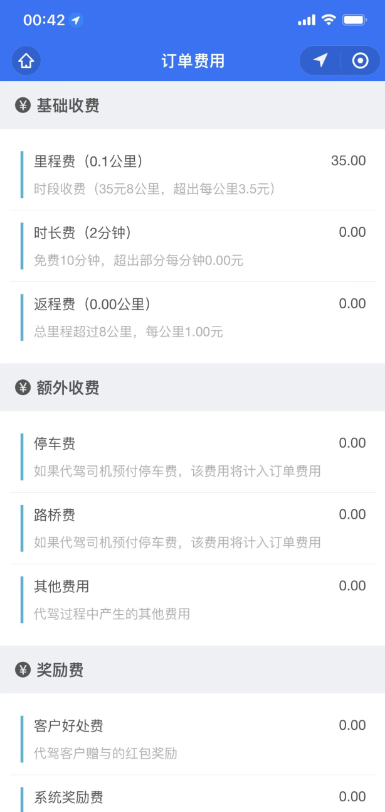

 


## 编写 zxds-odr 子系统

在编写订单子系统代码之前，我们先来看一下时序图，如下

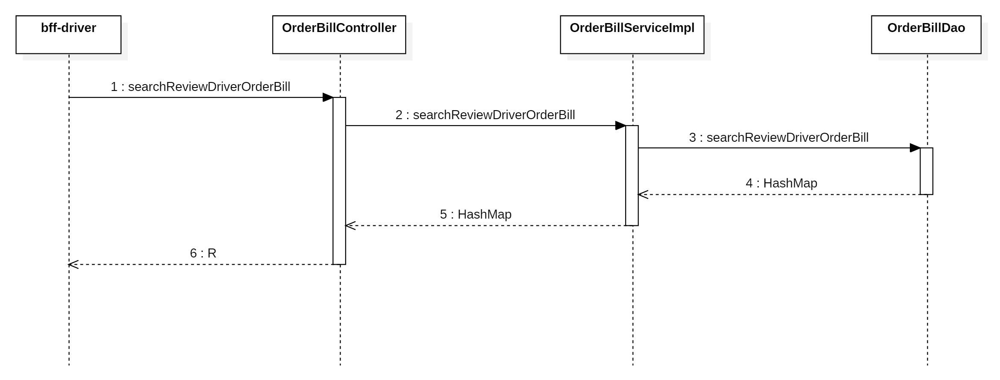

### 编写持久层代码

在`<font style="color:#000000;background-color:rgba(220, 240, 255, 0.3) !important;">OrderBillDao.xml</font>`文件中，声明SQL语句，查询账单信息

```xml
<select id="searchReviewDriverOrderBill" parameterType="Map" resultType="HashMap">
    SELECT CAST(b.total AS CHAR)                AS total,
           CAST(b.real_pay AS CHAR)             AS realPay,
           CAST(b.mileage_fee AS CHAR)          AS mileageFee,
           CAST(o.favour_fee AS CHAR)           AS favourFee,
           CAST(o.incentive_fee AS CHAR)        AS incentiveFee,
           CAST(b.waiting_fee AS CHAR)          AS waitingFee,
           CAST(o.real_mileage AS CHAR)         AS realMileage,
           CAST(b.return_fee AS CHAR)           AS returnFee,
           CAST(b.parking_fee AS CHAR)          AS parkingFee,
           CAST(b.toll_fee AS CHAR)             AS tollFee,
           CAST(b.other_fee AS CHAR)           AS otherFee,
           CAST(b.voucher_fee AS CHAR)          AS voucherFee,
           o.waiting_minute                     AS waitingMinute,
           b.base_mileage                       AS baseMileage,
           CAST(b.base_mileage_price AS CHAR)   AS baseMileagePrice,
           CAST(b.exceed_mileage_price AS CHAR) AS exceedMileagePrice,
           b.base_minute                        AS baseMinute,
           CAST(b.exceed_minute_price AS CHAR)  AS exceedMinutePrice,
           b.base_return_mileage                AS baseReturnMileage,
           CAST(b.exceed_return_price AS CHAR)  AS exceedReturnPrice,
           CAST(o.return_mileage AS CHAR)       AS returnMileage,
           CAST(p.tax_fee AS CHAR)              AS taxFee,
           CAST(p.driver_income AS CHAR)        AS driverIncome
    FROM tb_order o
    JOIN tb_order_bill b ON o.id = b.order_id
    JOIN tb_order_profitsharing p ON o.id = p.order_id
    WHERE o.id = #{orderId}
      AND o.driver_id = #{driverId}
      AND o.`status` = 5
</select>
```

在`<font style="color:#000000;background-color:rgba(220, 240, 255, 0.3) !important;">com.example.zxds.odr.db.dao</font>`包`<font style="color:#000000;background-color:rgba(220, 240, 255, 0.3) !important;">OrderBillDao.java</font>`接口中，声明DAO方法

```java
Map<String, Object> searchReviewDriverOrderBill(Map<String, Object> param);
```

### 编写 service 和实现

在`<font style="color:#000000;background-color:rgba(220, 240, 255, 0.3) !important;">com.example.zxds.odr.service</font>`包`<font style="color:#000000;background-color:rgba(220, 240, 255, 0.3) !important;">OrderBillService.java</font>`接口中，声明抽象方法

```java
Map<String, Object> searchReviewDriverOrderBill(Map<String, Object> param);
```

在`<font style="color:#000000;background-color:rgba(220, 240, 255, 0.3) !important;">com.example.zxds.odr.service.impl</font>`包`<font style="color:#000000;background-color:rgba(220, 240, 255, 0.3) !important;">OrderBillServiceImpl.java</font>`接口中，实现抽象方法

```java
@Override
public Map<String, Object> searchReviewDriverOrderBill(Map<String, Object> param) {
    Map<String, Object> map = orderBillDao.searchReviewDriverOrderBill(param);
    return map;
}
```

### 编写 form 接收数据并校验

在`<font style="color:#000000;background-color:rgba(220, 240, 255, 0.3) !important;">com.example.zxds.odr.controller.form</font>`包中创建`<font style="color:#000000;background-color:rgba(220, 240, 255, 0.3) !important;">SearchReviewDriverOrderBillForm.java</font>`类

```java
package com.example.zxds.odr.controller.form;

import io.swagger.v3.oas.annotations.media.Schema;
import lombok.Data;

import javax.validation.constraints.Min;
import javax.validation.constraints.NotNull;

@Data
@Schema(description = "查询司机预览账单的表单")
public class SearchReviewDriverOrderBillForm {

    @NotNull(message = "orderId不能为空")
    @Min(value = 1, message = "orderId不能小于1")
    @Schema(description = "订单ID")
    private Long orderId;

    @NotNull(message = "driverId不能为空")
    @Min(value = 1, message = "driverId不能小于1")
    @Schema(description = "司机ID")
    private Long driverId;
}
```

在`<font style="color:#000000;background-color:rgba(220, 240, 255, 0.3) !important;">com.example.zxds.odr.controller</font>`包`<font style="color:#000000;background-color:rgba(220, 240, 255, 0.3) !important;">OrderBillController.java</font>`类中，声明Web方法

```java
@PostMapping("/searchReviewDriverOrderBill")
@Operation(summary = "查询司机预览账单")
public R searchReviewDriverOrderBill(@RequestBody @Valid SearchReviewDriverOrderBillForm form) {
    Map<String, Object> param = BeanUtil.beanToMap(form);
    Map<String, Object> map = orderBillService.searchReviewDriverOrderBill(param);
    return R.ok().put("result", map);
}
```

## 编写 bff-driver 子系统

在编写`<font style="color:#000000;background-color:rgba(220, 240, 255, 0.3) !important;">bff-driver</font>`子系统代码之前，我们先来看一下时序图，如下

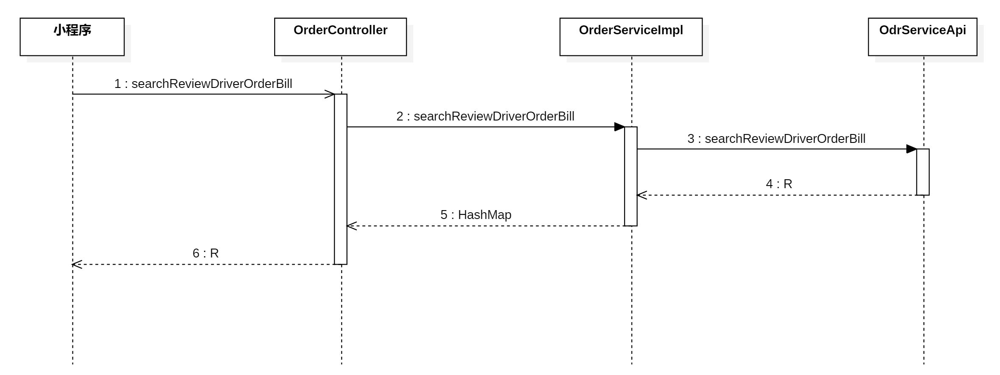

### 编写 Feign 客户端

在`<font style="color:#000000;background-color:rgba(220, 240, 255, 0.3) !important;">com.example.zxds.bff.driver.controller.form</font>`包中，创建`<font style="color:#000000;background-color:rgba(220, 240, 255, 0.3) !important;">SearchReviewDriverOrderBillForm.java</font>`类

```java
package com.example.zxds.bff.driver.controller.form;

import io.swagger.v3.oas.annotations.media.Schema;
import lombok.Data;

import javax.validation.constraints.Min;
import javax.validation.constraints.NotNull;

@Data
@Schema(description = "查询司机预览账单的表单")
public class SearchReviewDriverOrderBillForm {

    @NotNull(message = "orderId不能为空")
    @Min(value = 1, message = "orderId不能小于1")
    @Schema(description = "订单ID")
    private Long orderId;

    @Schema(description = "司机ID")
    private Long driverId;
}
```

在`<font style="color:#000000;background-color:rgba(220, 240, 255, 0.3) !important;">com.example.zxds.bff.driver.feign</font>`包`<font style="color:#000000;background-color:rgba(220, 240, 255, 0.3) !important;">OdrServiceApi.java</font>`接口中，声明抽象方法

```java
@PostMapping("/bill/searchReviewDriverOrderBill")
R searchReviewDriverOrderBill(SearchReviewDriverOrderBillForm form);
```

### 编写 service 和实现

在`<font style="color:#000000;background-color:rgba(220, 240, 255, 0.3) !important;">com.example.zxds.bff.driver.service</font>`包`<font style="color:#000000;background-color:rgba(220, 240, 255, 0.3) !important;">OrderService.java</font>`接口中，声明抽象方法

```java
Map<String, Object> searchReviewDriverOrderBill(SearchReviewDriverOrderBillForm form);
```

在`<font style="color:#000000;background-color:rgba(220, 240, 255, 0.3) !important;">com.example.zxds.bff.driver.service.impl</font>`包`<font style="color:#000000;background-color:rgba(220, 240, 255, 0.3) !important;">OrderServiceImpl.java</font>`接口中，实现抽象方法

```java
@Override
public Map<String, Object> searchReviewDriverOrderBill(SearchReviewDriverOrderBillForm form) {
    R r = odrServiceApi.searchReviewDriverOrderBill(form);
    Map<String, Object> map = (Map<String, Object>) r.get("result");
    return map;
}
```

### 编写 web 方法

在`<font style="color:#000000;background-color:rgba(220, 240, 255, 0.3) !important;">com.example.zxds.bff.driver.controller</font>`包`<font style="color:#000000;background-color:rgba(220, 240, 255, 0.3) !important;">OrderController.java</font>`类中，声明Web方法

```java
@PostMapping("/searchReviewDriverOrderBill")
@SaCheckLogin
@Operation(summary = "查询司机预览订单")
public R searchReviewDriverOrderBill(@RequestBody @Valid SearchReviewDriverOrderBillForm form) {
    long driverId = StpUtil.getLoginIdAsLong();
    form.setDriverId(driverId);
    Map<String, Object> map = orderService.searchReviewDriverOrderBill(form);
    return R.ok().put("result", map);
}
```

### 测试 web 方法

把后端各个子系统运行起来，然后用 Apipost 测试Web方法，查看返回的响应

# 司机端预览代驾账单

接下来咱们要来编写司机端的账单页面。任务量并不大，无非就是发出Ajax请求，加载账单信息而已。


## 声明模型层变量

在`<font style="color:#000000;background-color:rgba(220, 240, 255, 0.3) !important;">order_bill.vue</font>`页面中，我们要把模型层的变量给声明出来。如果没有这些变量，页面上的插值表达式就会输出undefined字样

```javascript
data() {
    return {
        orderId: null,
        customerId: null,
        favourFee: '暂无',
        incentiveFee: '暂无',
        realMileage: '--',
        mileageFee: '暂无',
        baseMileagePrice: '',
        baseMileage: '',
        exceedMileagePrice: '',
        waitingFee: '暂无',
        baseMinute: '',
        waitingMinute: '--',
        exceedMinutePrice: '',
        returnFee: '暂无',
        baseReturnMileage: '',
        exceedReturnPrice: '',
        returnMileage: '--',
        parkingFee: '暂无',
        tollFee: '暂无',
        otherFee: '暂无',
        total: '--',
        taxFee: '--',
        driverIncome: '--'
    };
},
```

## 熟悉视图层标签

账单页面的视图层我们简单看一下，了解都输出了什么内容

```html
<view>
    <view>
        <view class="setion-title">
            <image src="../static/order/money.png" mode="widthFix"></image>
            <text>基础收费</text>
        </view>
        <view class="section-content">
            <view class="item">
                <view class="left">
                    <text class="item-title">里程费（{{ realMileage }}公里）</text>
                    <text class="item-desc">时段收费（{{ baseMileagePrice }}元{{ baseMileage }}公里，超出每公里{{ exceedMileagePrice }}元）</text>
                </view>
                <view class="right">{{ mileageFee }}</view>
            </view>
            <view class="item">
                <view class="left">
                    <text class="item-title">时长费（{{ waitingMinute }}分钟）</text>
                    <text class="item-desc">免费{{ baseMinute }}分钟，超出部分每分钟{{ exceedMinutePrice }}元</text>
                </view>
                <view class="right">{{ waitingFee }}</view>
            </view>
            <view class="item">
                <view class="left">
                    <text class="item-title">返程费（{{ returnMileage }}公里）</text>
                    <text class="item-desc">总里程超过{{ baseReturnMileage }}公里，每公里{{ exceedReturnPrice }}元</text>
                </view>
                <view class="right">{{ returnFee }}</view>
            </view>
        </view>
    </view>
    <view>
        <view class="setion-title">
            <image src="../static/order/money.png" mode="widthFix"></image>
            <text>额外收费</text>
        </view>
        <view class="section-content">
            <view class="item">
                <view class="left">
                    <text class="item-title">停车费</text>
                    <text class="item-desc">如果代驾司机预付停车费，该费用将计入订单费用</text>
                </view>
                <view class="right">{{ parkingFee }}</view>
            </view>
            <view class="item">
                <view class="left">
                    <text class="item-title">路桥费</text>
                    <text class="item-desc">如果代驾司机预付停车费，该费用将计入订单费用</text>
                </view>
                <view class="right">{{ tollFee }}</view>
            </view>
            <view class="item">
                <view class="left">
                    <text class="item-title">其他费用</text>
                    <text class="item-desc">代驾过程中产生的其他费用</text>
                </view>
                <view class="right">{{ otherFee }}</view>
            </view>
        </view>
    </view>
    <view>
        <view class="setion-title">
            <image src="../static/order/money.png" mode="widthFix"></image>
            <text>奖励费</text>
        </view>
        <view class="section-content">
            <view class="item">
                <view class="left">
                    <text class="item-title">客户好处费</text>
                    <text class="item-desc">代驾客户赠与的红包奖励</text>
                </view>
                <view class="right">{{ favourFee }}</view>
            </view>
            <view class="item">
                <view class="left">
                    <text class="item-title">系统奖励费</text>
                    <text class="item-desc">智行代驾系统激励代驾司机的奖励</text>
                </view>
                <view class="right">{{ incentiveFee }}</view>
            </view>
        </view>
    </view>
    <view>
        <view class="setion-title">
            <image src="../static/order/money.png" mode="widthFix"></image>
            <text>总金额</text>
        </view>
        <view class="section-content">
            <view class="content-container">
                <view class="left">
                    <view class="content big">
                        【汇总合计】
                        <text class="red">¥ {{ total }} 元</text>
                    </view>
                    <view class="content big">
                        【代缴个税】
                        <text class="red">¥ {{ taxFee }} 元</text>
                    </view>
                    <view class="content big">
                        【实际收入】
                        <text class="red">¥ {{ driverIncome }} 元</text>
                    </view>
                </view>
                <image :src="img" mode="widthFix" class="img"></image>
            </view>
        </view>
        <button class="btn" @tap="sendOrderBill">发送账单</button>
    </view>
    <u-top-tips ref="uTips"></u-top-tips>

</view>
```

## 定义全局 URL

在`<font style="color:#000000;background-color:rgba(220, 240, 255, 0.3) !important;">main.js</font>`文件中，声明全局URL路径

```javascript
Vue.prototype.url = {
    ……,
    searchReviewDriverOrderBill: `${baseUrl}/order/searchReviewDriverOrderBill`
}
```

## 加载账单信息

在账单页面的`<font style="color:#000000;background-color:rgba(220, 240, 255, 0.3) !important;">onLoad()</font>`回调函数的里面，发送Ajax请求加载账单信息

```javascript
onLoad: function(options) {
    let that = this;
    that.orderId = options.orderId;
    that.customerId = options.customerId;
    let data = {
        orderId: that.orderId
    };
    that.ajax(that.url.searchReviewDriverOrderBill, 'POST', data, function(resp) {
        let result = resp.data.result;
        that.favourFee = result.favourFee;
        that.incentiveFee = result.incentiveFee;
        that.realMileage = result.realMileage;
        that.mileageFee = result.mileageFee;
        that.baseMileagePrice = result.baseMileagePrice;
        that.baseMileage = result.baseMileage;
        that.exceedMileagePrice = result.exceedMileagePrice;
        that.waitingFee = result.waitingFee;
        that.baseMinute = result.baseMinute;
        that.waitingMinute = result.waitingMinute;
        that.exceedMinutePrice = result.exceedMinutePrice;
        that.returnFee = result.returnFee;
        that.baseReturnMileage = result.baseReturnMileage;
        that.exceedReturnPrice = result.exceedReturnPrice;
        that.returnMileage = result.returnMileage;
        that.parkingFee = result.parkingFee;
        that.tollFee = result.tollFee;
        that.otherFee = result.otherFee;
        that.total = result.total;
        that.driverIncome = result.driverIncome;
        that.taxFee = result.taxFee;
        // console.log(result);
    });
},
```

## 测试小程序

先把订单记录status改成4状态，把分账表里面添加的记录删除。然后把后端各个子系统运行起来，手机上面运行司机端小程序，结束代驾之后，我们在`<font style="color:#000000;background-color:rgba(220, 240, 255, 0.3) !important;">enter_fee</font>`页面输入相关费用之后，我们看看跳转到账单页面，能不能加载出来数据

# 系统消息模块的设计原理

我们已经可以在司机端小程序上面看到账单页面加载的详情信息了，在账单页面底部有发送账单按钮，司机点击该按钮，账单信息就会发送到乘客端小程序上。接下来我们来看一下消息模块的设计原理。

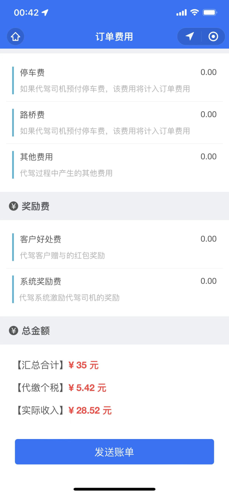

## 消息的持久化存储

司机抢单时，用到了 RabbitMQ。这些消息是**不需要长期存储**的，只要抢单成功后消息就会被删除。

但其他的一些**系统通知**，比如钱包充值成功的通知，这样的消息就**需要长期存储**，除非司机手动删除。

存储**系统消息**，数据量很大，而且又不是高价值的数据，用 MongoDB 和 HBase 都可以，如果需要复杂查询，选 HBase 更好，简单查询选 MongoDB 就行，我们的**系统消息**不涉及到复杂查询，因此我们选择 MongoDB。

## 创建数据表

MongoDB中没有数据表的概念，而是采用集合（Collection）存储数据，每条数据就是一个文档（Document）。每个文档其实就是一个 JSON。

MySQL：**表**和**记录**

MongDB：**集合**和**文档**

### 创建 message 集合（一条发送的消息）

集合相当于MySQL中的数据表，但是没有固定的表结构。集合有什么字段，取决于保存在其中的数据。下面这张表格是 message集合中JSON数据的结构要求。

| **字段** | **类型** | **备注** |
| --- | --- | --- |
| _id | UUID | 自动生成的主键值 |
| senderId | Integer | 发送者ID，就是用户ID。如果是系统自动发出，这个ID值是0 |
| senderIdentity | String | 发送者的身份（司机 driver/乘客 customer/系统 system） |
| senderPhoto | String | 发送者的头像URL。在消息页面要显示发送人的头像 |
| senderName | String | 发送者名称，也就是用户姓名。在消息页面要显示发送人的名字 |
| msg | String | 消息正文 |
| sendTime | Date | 发送时间 |

在`<font style="color:#000000;background-color:rgba(220, 240, 255, 0.3) !important;">com.example.zxds.snm.db.pojo</font>`包中，创建`<font style="color:#000000;background-color:rgba(220, 240, 255, 0.3) !important;">MessageEntity.java</font>`类

```java
package com.example.zxds.snm.db.pojo;

import lombok.Data;
import org.springframework.data.annotation.Id;
import org.springframework.data.mongodb.core.index.Indexed;
import org.springframework.data.mongodb.core.mapping.Document;

import java.io.Serializable;
import java.util.Date;

@Data
@Document(collection = "message")
public class MessageEntity implements Serializable {
    @Id
    private String _id;

    @Indexed(unique = true)
    private String uuid;

    @Indexed
    private Long senderId;

    private String senderIdentity;

    private String senderPhoto = "http://static-1258386385.cos.ap-beijing.myqcloud.com/img/System.jpg";

    private String senderName;

    private String msg;

    @Indexed
    private Date sendTime;
}
```

### 创建 message_ref 集合（一条接收的消息）

| **字段** | **类型** | **备注** |
| --- | --- | --- |
| _id | UUID | 主键 |
| messageId | UUID | message记录的_id |
| receiverId | String | 接收人ID |
| receiverIdentity | String | 接收人身份（司机/乘客） |
| readFlag | Boolean | 是否已读 |
| lastFlag | Boolean | 是否为新接收的消息 |

在`<font style="color:#000000;background-color:rgba(220, 240, 255, 0.3) !important;">com.example.zxds.snm.db.pojo</font>`包中，创建`<font style="color:#000000;background-color:rgba(220, 240, 255, 0.3) !important;">MessageRefEntity.java</font>`类

```java
package com.example.zxds.snm.db.pojo;

import lombok.Data;
import org.springframework.data.annotation.Id;
import org.springframework.data.mongodb.core.index.Indexed;
import org.springframework.data.mongodb.core.mapping.Document;

import java.io.Serializable;

@Data
@Document(collection = "message_ref")
public class MessageRefEntity implements Serializable {
    @Id
    private String _id;

    // 防止因MQ重复投递或并发消费导致同一条消息被多次处理，确保消息消费的幂等性。
    @Indexed(unique = true)
    private String messageId;

    @Indexed
    private Long receiverId;

    private String receiverIdentity;

    @Indexed
    private Boolean readFlag;

    @Indexed
    private Boolean lastFlag;
}
```

## 消息收发流程

**发消息的流程：**

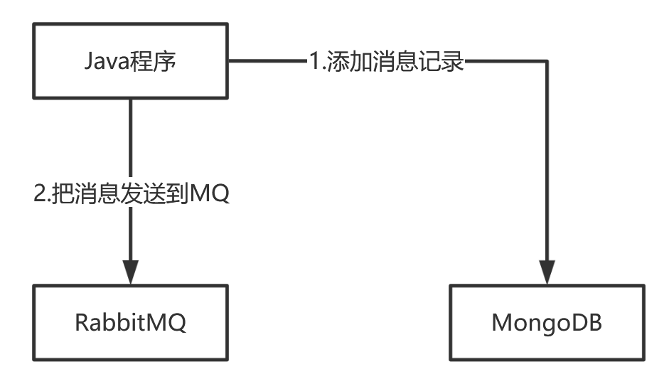

**收消息的流程：**

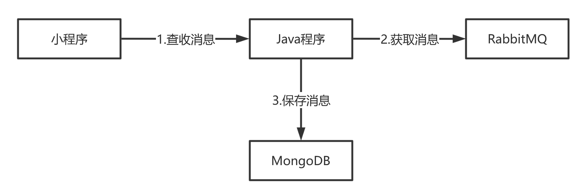

**只为活跃用户保留消息：**

对于100万注册用户，如果发送广播消息，常规做法是在`<font style="color:#000000;background-color:rgb(235, 238, 242);">message</font>`集合存一条记录，再往`<font style="color:#000000;background-color:rgb(235, 238, 242);">message_ref</font>`集合写入100万条关联数据。但考虑到其中80万用户可能长期不登录，保留这些记录会占用大量存储空间。

为了解决这个问题，可以引入RabbitMQ的消息过期机制。当系统发送消息时，先将内容存入`<font style="color:#000000;background-color:rgb(235, 238, 242);">message</font>`集合，然后向每个用户的个人队列发送一条消息通知，并设置过期时间为一个月。

如果用户在一个月内登录，程序会从队列中取出消息，将其写入`<font style="color:#000000;background-color:rgb(235, 238, 242);">message_ref</font>`集合，实现持久化存储。如果用户一直未登录，消息过期后会自动从队列中销毁，无需占用存储空间。

这样一来，系统只为活跃用户保留消息记录，有效节省了存储资源。

# 封装收发系统消息的接口

接下来咱们把收发系统消息的代码给封装起来。

## 编写持久层代码

在`<font style="color:#000000;background-color:rgba(220, 240, 255, 0.3) !important;">com.example.zxds.snm.db.dao</font>`包`<font style="color:#000000;background-color:rgba(220, 240, 255, 0.3) !important;">MessageDao.java</font>`类中，声明DAO方法

```java
@Repository
public class MessageDao {
    
    @Autowired
    private MongoTemplate mongoTemplate;

    // 保存消息
    public String insert(MessageEntity entity) {
        Date sendTime = entity.getSendTime();
        /*
            因为MongoDB的时区是格林尼治时区(GMT)（比北京时区晚8小时），
            保存的日期会自动被MongoDB减去8小时，所以我们提前给日期增加8小时
         */
        sendTime = DateUtil.offset(sendTime, DateField.HOUR, 8);
        entity.setSendTime(sendTime);
        entity = mongoTemplate.save(entity);
        return entity.get_id();
    }

    // 根据id查询消息
    public HashMap searchMessageById(String id) {
        HashMap map = mongoTemplate.findById(id, HashMap.class, "message");
        Date sendTime = (Date) map.get("sendTime");
        sendTime = DateUtil.offset(sendTime, DateField.HOUR, -8);
        map.replace("sendTime", DateUtil.format(sendTime, "yyyy-MM-dd HH:mm"));
        return map;
    }

    // 分页查询某个用户的消息（一个用户的消息）
    public List<HashMap> searchMessageByPage(long userId, String identity, long start, int length) {
        // 1. 将MongoDB的ObjectId(_id)转为字符串，用于关联查询
        // MongoDB集合中文档的主键值 _id 类型是 ObjectId 类型，直接根据 _id 查询时不需要手动转换类型。
        // 但在和message_ref集合关联查询时，message_ref中messageId是字符串类型，因此这里要进行类型转换。
        JSONObject json = new JSONObject();
        // $toString 是MongoDB的操作符，用于类型转换
        // $_id 是引用文档中的 _id 字段
        json.set("$toString", "$_id");

        // 2. 构建聚合查询：关联message和message_ref表，分页获取用户的消息
        Aggregation aggregation = Aggregation.newAggregation(
                // 2.1 给message集合临时添加id字段，字段名id，字段值是上面的json
                Aggregation.addFields().addField("id").withValue(json).build(),
                // 2.2 指定表连接条件：message.id = message_ref.messageId。查询结果是一个数组，数组起名ref(1条消息对应多个接收者，ref数组中是该消息的所有接收者)。
                Aggregation.lookup("message_ref", "id", "messageId", "ref"),
                // 2.3 添加过滤条件，只查一个用户的。加上条件后ref数组中只剩1个元素了。
                Aggregation.match(Criteria.where("ref.receiverId").is(userId).and("ref.receiverIdentity").is(identity)),
                // 2.4 按照sendTime降序排列
                Aggregation.sort(Sort.by(Sort.Direction.DESC, "sendTime")),
                // 2.5 分页：跳过指定条数
                Aggregation.skip(start),
                // 2.6 分页：限制返回条数
                Aggregation.limit(length)
        );
        // 3. 执行查询，从message集合开始聚合
        AggregationResults<HashMap> results = mongoTemplate.aggregate(aggregation, "message", HashMap.class);
        List<HashMap> list = results.getMappedResults();

        /*
            [
                {
                    "_id": "65a4f1b7c3e4b5f6a7b8c9d0",
                    "msg": "今天开会",
                    "sendTime": "2024-01-15T06:30:00.000Z",
                    "ref": [
                        {
                            "_id": "ref111",
                            "messageId": "65a4f1b7c3e4b5f6a7b8c9d0",
                            "receiverId": 1001,
                            "readFlag": false,
                            "receiverIdentity": "student",
                            "lastFlag": true
                        }
                    ]
                },
                {
                    "_id": "65a4f1b7c3e4b5f6a7b8c9d1",
                    "msg": "作业提醒",
                    "sendTime": "2024-01-14T08:30:00.000Z",
                    "ref": [
                        {
                            "_id": "ref222",
                            "messageId": "65a4f1b7c3e4b5f6a7b8c9d1",
                            "receiverId": 1001,
                            "readFlag": true,
                            "receiverIdentity": "student",
                            "lastFlag": false
                        }
                    ]
                }
            ]
        */
        // 4. 处理结果集：提取状态信息、格式化时间
        list.forEach(one -> {
            // 4.1 从关联结果中取出当前用户的消息状态记录（因已过滤，只有1条）
            List<MessageRefEntity> refList = (List<MessageRefEntity>) one.get("ref");
            MessageRefEntity entity = refList.get(0);

             // 4.2 提取需要的状态信息
            boolean readFlag = entity.getReadFlag();// 是否已读
            String refId = entity.get_id();// 状态记录ID

            // 4.3 将状态信息放入外层Map
            one.put("readFlag", readFlag);
            one.put("refId", refId);

            // 4.4 移除原始关联数据和MongoDB内部ID（保持返回数据简洁）
            one.remove("ref");
            one.remove("_id");

            // 4.5 时区转换：GMT → 北京时间（减8小时）
            Date sendTime = (Date) one.get("sendTime");
            sendTime = DateUtil.offset(sendTime, DateField.HOUR, -8);

            // 4.6 今天显示时间，非今天显示日期
            String today = DateUtil.today();
            if (today.equals(DateUtil.date(sendTime).toDateStr())) {
                one.put("sendTime", DateUtil.format(sendTime, "HH:mm"));
            } else {
                one.put("sendTime", DateUtil.format(sendTime, "yyyy/MM/dd"));
            }
        });

        /*
        最终的结果：
            [
                {
                    "msg": "今天开会",
                    "sendTime": "14:30", 
                    "readFlag": false,
                    "refId": "ref111"
                },
                {
                    "msg": "作业提醒",
                    "sendTime": "2024/01/14", 
                    "readFlag": true,
                    "refId": "ref222"
                },
                {
                    "msg": "考试通知",
                    "sendTime": "2024/01/10",
                    "readFlag": true,
                    "refId": "ref333"
                }
            ]
        */
        return list;
    }
}
```

在`<font style="color:#000000;background-color:rgba(220, 240, 255, 0.3) !important;">com.example.zxds.snm.db.dao</font>`包`<font style="color:#000000;background-color:rgba(220, 240, 255, 0.3) !important;">MessageRefDao.java</font>`类中，声明DAO方法

```java
@Repository
public class MessageRefDao {
    @Autowired
    private MongoTemplate mongoTemplate;
    
    // 保存消息的接收者信息
    public String insert(MessageRefEntity entity) {
        entity = mongoTemplate.save(entity);
        return entity.get_id();
    }
    // 查询某个用户未读消息数量
    public long searchUnreadCount(long userId, String identity) {
        Query query = new Query();
        query.addCriteria(Criteria.where("readFlag").is(false).and("receiverId").is(userId).and("receiverIdentity").is(identity));
        long count = mongoTemplate.count(query, MessageRefEntity.class);
        return count;
    }
    
    // 清除该用户所有的"最后一条消息"标记
    public long clearLastFlag(long userId, String identity) {
        Query query = new Query();
        query.addCriteria(Criteria.where("lastFlag").is(true).and("receiverId").is(userId).and("receiverIdentity").is(identity));
        Update update = new Update();
        update.set("lastFlag", false);
        UpdateResult result = mongoTemplate.updateMulti(query, update, "message_ref");
        long rows = result.getModifiedCount();
        return rows;
    }
    // 将指定ID的消息状态标记为已读
    public long updateUnreadMessage(String id) {
        Query query = new Query();
        query.addCriteria(Criteria.where("_id").is(id));
        Update update = new Update();
        update.set("readFlag", true);
        UpdateResult result = mongoTemplate.updateFirst(query, update, "message_ref");
        long rows = result.getModifiedCount();
        return rows;
    }
    // 根据id删除message_ref中的一条记录
    public long deleteMessageRefById(String id) {
        Query query = new Query();
        query.addCriteria(Criteria.where("_id").is(id));
        DeleteResult result = mongoTemplate.remove(query, "message_ref");
        long rows = result.getDeletedCount();
        return rows;
    }
    // 删除某个用户在message_ref中的所有记录
    public long deleteUserMessageRef(long userId, String identity) {
        Query query = new Query();
        query.addCriteria(Criteria.where("receiverId").is(userId).and("receiverIdentity").is(identity));
        DeleteResult result = mongoTemplate.remove(query, "message_ref");
        long rows = result.getDeletedCount();
        return rows;
    }
}
```

## 编写 service 和实现

在`<font style="color:#000000;background-color:rgba(220, 240, 255, 0.3) !important;">com.example.zxds.snm.service</font>`包`<font style="color:#000000;background-color:rgba(220, 240, 255, 0.3) !important;">MessageService.java</font>`接口中，声明抽象方法

```java
package com.example.zxds.snm.service;

import com.example.zxds.snm.db.pojo.MessageEntity;
import com.example.zxds.snm.db.pojo.MessageRefEntity;

import java.util.HashMap;
import java.util.List;

public interface MessageService {
    String insertMessage(MessageEntity entity);

    HashMap searchMessageById(String id);

    String insertRef(MessageRefEntity entity);

    long searchUnreadCount(long userId, String identity);

    long clearLastFlag(long userId, String identity);

    long updateUnreadMessage(String id);

    long deleteMessageRefById(String id);

    long deleteUserMessageRef(long userId, String identity);

    List<HashMap> searchMessageByPage(long userId, String identity, long start, int length);
}
```

在`<font style="color:#000000;background-color:rgba(220, 240, 255, 0.3) !important;">com.example.zxds.snm.service.impl</font>`包`<font style="color:#000000;background-color:rgba(220, 240, 255, 0.3) !important;">MessageServiceImpl.java</font>`类中，实现抽象方法

```java

package com.example.zxds.snm.service.impl;

import com.example.zxds.snm.db.dao.MessageDao;
import com.example.zxds.snm.db.dao.MessageRefDao;
import com.example.zxds.snm.db.pojo.MessageEntity;
import com.example.zxds.snm.db.pojo.MessageRefEntity;
import com.example.zxds.snm.service.MessageService;
import org.springframework.stereotype.Service;

import javax.annotation.Resource;
import java.util.HashMap;
import java.util.List;

@Service
public class MessageServiceImpl implements MessageService {
    @Resource
    private MessageDao messageDao;

    @Resource
    private MessageRefDao messageRefDao;

    @Override
    public String insertMessage(MessageEntity entity) {
        String id = messageDao.insert(entity);
        return id;
    }

    @Override
    public List<HashMap> searchMessageByPage(long userId, String identity, long start, int length) {
        List<HashMap> list = messageDao.searchMessageByPage(userId, identity, start, length);
        return list;
    }

    @Override
    public HashMap searchMessageById(String id) {
        HashMap map = messageDao.searchMessageById(id);
        return map;
    }

    @Override
    public String insertRef(MessageRefEntity entity) {
        String id = messageRefDao.insert(entity);
        return id;
    }

    @Override
    public long searchUnreadCount(long userId, String identity) {
        long count = messageRefDao.searchUnreadCount(userId, identity);
        return count;
    }

    @Override
    public long clearLastFlag(long userId, String identity) {
        long count = messageRefDao.clearLastFlag(userId, identity);
        return count;
    }

    @Override
    public long updateUnreadMessage(String id) {
        long rows = messageRefDao.updateUnreadMessage(id);
        return rows;
    }

    @Override
    public long deleteMessageRefById(String id) {
        long rows = messageRefDao.deleteMessageRefById(id);
        return rows;
    }

    @Override
    public long deleteUserMessageRef(long userId, String identity) {
        long rows = messageRefDao.deleteUserMessageRef(userId, identity);
        return rows;
    }
}
```

**收发消息时，消息都是字符串形式，我们这里专门为字符串消息配置一个 **`**<font style="color:#DF2A3F;">RabbitTemplate</font>**`**，在 **`**<font style="color:#DF2A3F;">RabbitMQConfig</font>**`**配置类中再添加一个新的配置：**

```java
@Bean("stringRabbitTemplate")
public RabbitTemplate stringRabbitTemplate(CachingConnectionFactory connectionFactory) {
    RabbitTemplate rabbitTemplate = new RabbitTemplate(connectionFactory);
    // 消息转换器使用专门的 字符串消息转换器
    rabbitTemplate.setMessageConverter(new SimpleMessageConverter());
    return rabbitTemplate;
}
```

收发消息我们编写一个**任务类**，提供**同步方法**和**异步方法**。在`<font style="color:#000000;background-color:rgba(220, 240, 255, 0.3) !important;">com.example.zxds.snm.task</font>`包中，创建`<font style="color:#000000;background-color:rgba(220, 240, 255, 0.3) !important;">MessageTask.java</font>`类。

```java
package com.example.zxds.snm.task;

import com.example.zxds.common.exception.ZxdsException;
import com.example.zxds.snm.db.pojo.MessageEntity;
import com.example.zxds.snm.db.pojo.MessageRefEntity;
import com.example.zxds.snm.service.MessageService;
import lombok.RequiredArgsConstructor;
import lombok.extern.slf4j.Slf4j;
import org.springframework.amqp.core.MessageDeliveryMode;
import org.springframework.amqp.rabbit.core.RabbitTemplate;
import org.springframework.scheduling.annotation.Async;
import org.springframework.stereotype.Component;

import java.util.HashMap;
import java.util.Map;
import javax.annotation.Resource;

@Component
@Slf4j
@RequiredArgsConstructor
public class MessageTask {

    // 发送的消息都是字符串形式，采用字符串专用的 RabbitTemplate
    @Resource(name = "stringRabbitTemplate")
    private RabbitTemplate rabbitTemplate;
    
    private final MessageService messageService;

    /**
     * 同步发送私有消息
     */
    public void sendPrivateMessage(String identity, long userId, Integer ttl, MessageEntity entity) {
        try {
            // 将消息保存到MongoDB
            String id = messageService.insertMessage(entity);

            // 将消息发送到RabbitMQ队列中
            String exchangeName = identity + "_private"; // 以  身份标识（司机/乘客/系统） 作为交换机
            String routingKey = String.valueOf(userId); // 以userId作为路由键

            // 确保交换机和队列存在
            rabbitTemplate.execute(channel -> {
                // 声明交换机
                channel.exchangeDeclare(exchangeName, "direct", true);
                // 声明队列
                channel.queueDeclare("queue_" + userId, true, false, false, null);
                // 队列和交换机绑定路由键
                channel.queueBind("queue_" + userId, exchangeName, routingKey);
                return null;
            });

            Map<String, Object> headers = new HashMap<>();
            // MongoDB中保存到message集合中的文档的主键值放到消息头中。
            headers.put("messageId", id);

            rabbitTemplate.convertAndSend(exchangeName, routingKey, entity.getMsg(), message -> {
                message.getMessageProperties().getHeaders().putAll(headers);
                message.getMessageProperties().setContentEncoding("UTF-8");
                if (ttl != null && ttl > 0) {
                    message.getMessageProperties().setExpiration(ttl.toString());
                }
                return message;
            });

            log.debug("私有消息发送成功, userId: {}", userId);
        } catch (Exception e) {
            log.error("发送私有消息异常", e);
            throw new ZxdsException("向MQ发送消息失败");
        }
    }

    /**
     * 异步发送私有消息
     */
    @Async
    public void sendPrivateMessageAsync(String identity, long userId, Integer ttl, MessageEntity entity) {
        sendPrivateMessage(identity, userId, ttl, entity);
    }

    /**
     * 同步发送广播消息
     */
    public void sendBroadcastMessage(String identity, Integer ttl, MessageEntity entity) {
        try {
            // 保存到MongoDB
            String id = messageService.insertMessage(entity);

            // 广播消息
            String exchangeName = identity + "_broadcast";

            // 确保交换机存在（FANOUT类型）
            rabbitTemplate.execute(channel -> {
                channel.exchangeDeclare(exchangeName, "fanout", true);
                return null;
            });

            Map<String, Object> headers = new HashMap<>();
            headers.put("messageId", id);

            rabbitTemplate.convertAndSend(exchangeName, "", entity.getMsg(), message -> {
                message.getMessageProperties().getHeaders().putAll(headers);
                // 设置消息为持久化模式，确保RabbitMQ重启后消息不会丢失
                message.getMessageProperties().setDeliveryMode(MessageDeliveryMode.PERSISTENT);
                message.getMessageProperties().setContentEncoding("UTF-8");
                if (ttl != null && ttl > 0) {
                    message.getMessageProperties().setExpiration(ttl.toString());
                }
                return message;
            });

            log.debug("广播消息发送成功");
        } catch (Exception e) {
            log.error("发送广播消息异常", e);
            throw new ZxdsException("向MQ发送消息失败");
        }
    }

    /**
     * 异步发送广播消息
     */
    @Async
    public void sendBroadcastMessageAsync(String identity, Integer ttl, MessageEntity entity) {
        sendBroadcastMessage(identity, ttl, entity);
    }

    /**
     * 同步接收消息
     */
    public int receive(String identity, long userId) {
        String queueName = "queue_" + userId;
        int count = 0;

        try {
            // 确保队列存在并绑定到私有交换机
            rabbitTemplate.execute(channel -> {
                // 声明交换机
                channel.exchangeDeclare(identity + "_private", "direct", true);
                // 声明队列
                channel.queueDeclare(queueName, true, false, false, null);
                // 队列和交换机 使用 路由键 绑定
                channel.queueBind(queueName, identity + "_private", String.valueOf(userId));

                // 声明广播的交换机
                channel.exchangeDeclare(identity + "_broadcast", "fanout", true);
                // 负责广播的交换机绑定队列
                channel.queueBind(queueName, identity + "_broadcast", "");
                return null;
            });

            // 接收私有消息
            count += receiveMessages(queueName, identity, userId, "私有");

            // 接收广播消息
            count += receiveMessages(queueName, identity, userId, "广播");

            return count;
        } catch (Exception e) {
            log.error("接收消息异常", e);
            throw new ZxdsException("接收消息失败");
        }
    }

    /**
     * 接收消息通用方法
     */
    private int receiveMessages(String queueName, String identity, long userId, String type) {
        int count = 0;

        while (true) {
            org.springframework.amqp.core.Message message = rabbitTemplate.receive(queueName);
            if (message == null) {
                break;
            }

            try {
                Map<String, Object> headers = message.getMessageProperties().getHeaders();
                String messageId = headers.get("messageId").toString();
                String content = new String(message.getBody());

                log.debug("从RabbitMQ接收的{}消息：{}", type, content);

                MessageRefEntity refEntity = new MessageRefEntity();
                refEntity.setMessageId(messageId);
                refEntity.setReceiverId(userId);
                refEntity.setReceiverIdentity(identity);
                refEntity.setReadFlag(false);
                refEntity.setLastFlag(true);

                // 接收消息后，将接收者的状态信息保存到MongoDB
                messageService.insertRef(refEntity);

                // 手动确认
                rabbitTemplate.execute(channel -> {
                    channel.basicAck(message.getMessageProperties().getDeliveryTag(), false);
                    return null;
                });

                count++;
            } catch (Exception e) {
                log.error("处理消息异常", e);
                // 消息处理失败，拒绝并重新入队
                rabbitTemplate.execute(channel -> {
                    channel.basicNack(message.getMessageProperties().getDeliveryTag(), false, true);
                    return null;
                });
            }
        }

        return count;
    }

    /**
     * 异步接收消息
     */
    @Async
    public void receiveAsync(String identity, long userId) {
        receive(identity, userId);
    }


    /**
     * 同步删除消息队列
     */
    public void deleteQueue(String identity, long userId) {
        String queueName = "queue_" + userId;
        try {
            rabbitTemplate.execute(channel -> {
                channel.queueDelete(queueName);
                return null;
            });
            log.debug("消息队列删除成功: {}", queueName);
        } catch (Exception e) {
            log.error("删除队列失败", e);
            throw new ZxdsException("删除队列失败");
        }
    }

    /**
     * 异步删除消息队列
     */
    @Async
    public void deleteQueueAsync(String identity, long userId) {
        deleteQueue(identity, userId);
    }
}
```

## 编写 web 层代码

在`<font style="color:#000000;background-color:rgba(220, 240, 255, 0.3) !important;">com.example.zxds.snm.controller.form</font>`包中，创建`<font style="color:#000000;background-color:rgba(220, 240, 255, 0.3) !important;">SearchMessageByIdForm.java</font>`类

```java
package com.example.zxds.snm.controller.form;

import io.swagger.v3.oas.annotations.media.Schema;
import lombok.Data;

import javax.validation.constraints.NotBlank;

@Data
@Schema(description = "根据消息ID查询消息的表单")
public class SearchMessageByIdForm {
    @NotBlank(message = "id不能为空")
    @Schema(description = "消息的ID")
    private String id;
}
```

在`<font style="color:#000000;background-color:rgba(220, 240, 255, 0.3) !important;">com.example.zxds.snm.controller.form</font>`包中，创建`<font style="color:#000000;background-color:rgba(220, 240, 255, 0.3) !important;">UpdateUnreadMessageForm.java</font>`类

```java
package com.example.zxds.snm.controller.form;

import io.swagger.v3.oas.annotations.media.Schema;
import lombok.Data;

import javax.validation.constraints.NotBlank;

@Data
@Schema(description = "把未读消息更新成已读的表单")
public class UpdateUnreadMessageForm {
    @NotBlank(message = "id不能为空")
    @Schema(description = "ref消息ID")
    private String id;
}
```

在`<font style="color:#000000;background-color:rgba(220, 240, 255, 0.3) !important;">com.example.zxds.snm.controller.form</font>`包中，创建`<font style="color:#000000;background-color:rgba(220, 240, 255, 0.3) !important;">DeleteMessageRefByIdForm.java</font>`类

```java
package com.example.zxds.snm.controller.form;

import io.swagger.v3.oas.annotations.media.Schema;
import lombok.Data;

import javax.validation.constraints.NotBlank;

@Data
@Schema(description = "根据消息ID删除消息的表单")
public class DeleteMessageRefByIdForm {
    @NotBlank(message = "id不能为空")
    @Schema(description = "Ref消息的ID")
    private String id;
}
```

在`<font style="color:#000000;background-color:rgba(220, 240, 255, 0.3) !important;">com.example.zxds.snm.controller.form</font>`包中，创建`<font style="color:#000000;background-color:rgba(220, 240, 255, 0.3) !important;">RefreshMessageForm.java</font>`类

```java
package com.example.zxds.snm.controller.form;

import io.swagger.v3.oas.annotations.media.Schema;
import lombok.Data;

import javax.validation.constraints.Min;
import javax.validation.constraints.NotBlank;
import javax.validation.constraints.NotNull;
import javax.validation.constraints.Pattern;

@Data
@Schema(description = "刷新用户消息的表单")
public class RefreshMessageForm {
    @NotNull(message = "userId不能为空")
    @Min(value = 1, message = "userId不能小于1")
    @Schema(description = "用户ID")
    private Long userId;

    @NotBlank(message = "identity不能为空")
    @Pattern(regexp = "^driver$|^mis$|^customer$", message = "identity内容不正确")
    @Schema(description = "用户身份")
    private String identity;
}
```

在`<font style="color:#000000;background-color:rgba(220, 240, 255, 0.3) !important;">com.example.zxds.snm.controller.form</font>`包中，创建`<font style="color:#000000;background-color:rgba(220, 240, 255, 0.3) !important;">SendPrivateMessageForm.java</font>`类

```java
package com.example.zxds.snm.controller.form;

import io.swagger.v3.oas.annotations.media.Schema;
import lombok.Data;

import javax.validation.constraints.Min;
import javax.validation.constraints.NotBlank;
import javax.validation.constraints.NotNull;

@Data
@Schema(description = "同步发送私有消息的表单")
public class SendPrivateMessageForm {

    @NotBlank(message = "receiverIdentity不能为空")
    @Schema(description = "接收人exchange")
    private String receiverIdentity;

    @NotNull(message = "receiverId不能为空")
    @Min(value = 1, message = "receiverId不能小于1")
    @Schema(description = "接收人ID")
    private Long receiverId;

    @Min(value = 1, message = "ttl不能小于1")
    @Schema(description = "消息过期时间")
    private Integer ttl;

    @Min(value = 0, message = "senderId不能小于0")
    @Schema(description = "发送人ID")
    private Long senderId;

    @NotBlank(message = "senderIdentity不能为空")
    @Schema(description = "发送人身份标识")
    private String senderIdentity;

    @Schema(description = "发送人头像")
    private String senderPhoto = "http://static-1258386385.cos.ap-beijing.myqcloud.com/img/System.jpg";

    @NotNull(message = "senderName不能为空")
    @Schema(description = "发送人名称")
    private String senderName;

    @NotNull(message = "消息不能为空")
    @Schema(description = "消息内容")
    private String msg;
}
```

在`<font style="color:#000000;background-color:rgba(220, 240, 255, 0.3) !important;">com.example.zxds.snm.controller</font>`包`<font style="color:#000000;background-color:rgba(220, 240, 255, 0.3) !important;">MessageController.java</font>`类中，声明Web方法

```java
package com.example.zxds.snm.controller;

import com.example.zxds.common.util.R;
import com.example.zxds.snm.controller.form.*;
import com.example.zxds.snm.db.pojo.MessageEntity;
import com.example.zxds.snm.service.MessageService;
import com.example.zxds.snm.task.MessageTask;
import io.swagger.v3.oas.annotations.Operation;
import io.swagger.v3.oas.annotations.tags.Tag;
import org.springframework.web.bind.annotation.PostMapping;
import org.springframework.web.bind.annotation.RequestBody;
import org.springframework.web.bind.annotation.RequestMapping;
import org.springframework.web.bind.annotation.RestController;

import javax.annotation.Resource;
import javax.validation.Valid;
import java.util.Date;
import java.util.HashMap;

@RestController
@RequestMapping("/message")
@Tag(name = "MessageController", description = "消息模块网络接口")
public class MessageController {

    @Resource
    private MessageService messageService;

    @Resource
    private MessageTask messageTask;

    @PostMapping("/searchMessageById")
    @Operation(summary = "根据ID查询消息")
    public R searchMessageById(@Valid @RequestBody SearchMessageByIdForm form) {
        HashMap map = messageService.searchMessageById(form.getId());
        return R.ok().put("result", map);
    }

    @PostMapping("/updateUnreadMessage")
    @Operation(summary = "未读消息更新成已读消息")
    public R updateUnreadMessage(@Valid @RequestBody UpdateUnreadMessageForm form) {
        long rows = messageService.updateUnreadMessage(form.getId());
        return R.ok().put("rows", rows);
    }

    @PostMapping("/deleteMessageRefById")
    @Operation(summary = "删除消息")
    public R deleteMessageRefById(@Valid @RequestBody DeleteMessageRefByIdForm form) {
        long rows = messageService.deleteMessageRefById(form.getId());
        return R.ok().put("rows", rows);
    }

    @PostMapping("/refreshMessage")
    @Operation(summary = "刷新用户消息")
    public R refreshMessage(@Valid @RequestBody RefreshMessageForm form) {
        // 接收消息并保存到mongoDB
        messageTask.receive(form.getIdentity(), form.getUserId());

        // 将用户所有消息的 lastFlag 标记从 true 改为 false（效果：消除小红点/新消息提示）
        long lastRows = messageService.clearLastFlag(form.getUserId(), form.getIdentity());
        
        // 统计用户还未阅读的消息数量
        long unreadRows = messageService.searchUnreadCount(form.getUserId(), form.getIdentity());
        
        HashMap map = new HashMap() {{
            put("lastRows", lastRows + "");
            put("unreadRows", unreadRows + "");
        }};
        return R.ok().put("result", map);
    }

    @PostMapping("/sendPrivateMessage")
    @Operation(summary = "同步发送私有消息")
    public R sendPrivateMessage(@RequestBody @Valid SendPrivateMessageForm form) {
        MessageEntity entity = new MessageEntity();
        entity.setSenderId(form.getSenderId());
        entity.setSenderIdentity(form.getSenderIdentity());
        entity.setSenderPhoto(form.getSenderPhoto());
        entity.setSenderName(form.getSenderName());
        entity.setMsg(form.getMsg());
        entity.setSendTime(new Date());
        messageTask.sendPrivateMessage(form.getReceiverIdentity(), form.getReceiverId(), form.getTtl(), entity);
        return R.ok();
    }

    @PostMapping("/sendPrivateMessageAsync")
    @Operation(summary = "异步发送私有消息")
    public R sendPrivateMessageAsync(@RequestBody @Valid SendPrivateMessageForm form) {
        MessageEntity entity = new MessageEntity();
        entity.setSenderId(form.getSenderId());
        entity.setSenderIdentity(form.getSenderIdentity());
        entity.setSenderPhoto(form.getSenderPhoto());
        entity.setSenderName(form.getSenderName());
        entity.setMsg(form.getMsg());
        entity.setSendTime(new Date());
        messageTask.sendPrivateMessageAsync(form.getReceiverIdentity(), form.getReceiverId(), form.getTtl(), entity);
        return R.ok();
    }

}
```

# 司机确认账单推送给乘客

之前我们写了很多消息子系统的代码，接下来咱们可以编写`<font style="color:#000000;background-color:rgba(220, 240, 255, 0.3) !important;">bff-driver</font>`子系统的代码，调用之前写好的封装方法。最后咱们把司机端小程序的代码写了，司机点击发送账单按钮之后，可以给乘客发送通知消息。

## 编写 bff-driver 子系统

在编写`<font style="color:#000000;background-color:rgba(220, 240, 255, 0.3) !important;">bff-driver</font>`子系统之前，我们先来看一下时序图，如下

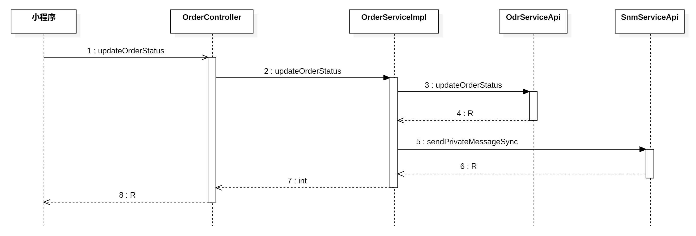

### 编写 Feign 客户端

在`<font style="color:#000000;background-color:rgba(220, 240, 255, 0.3) !important;">com.example.zxds.bff.driver.controller.form</font>`包中，创建`<font style="color:#000000;background-color:rgba(220, 240, 255, 0.3) !important;">SendPrivateMessageForm.java</font>`类

```java
package com.example.zxds.bff.driver.controller.form;

import io.swagger.v3.oas.annotations.media.Schema;
import lombok.Data;

import javax.validation.constraints.Min;
import javax.validation.constraints.NotBlank;
import javax.validation.constraints.NotNull;

@Data
@Schema(description = "同步发送私有消息的表单")
public class SendPrivateMessageForm {

    @NotBlank(message = "receiverIdentity不能为空")
    @Schema(description = "接收人exchange")
    private String receiverIdentity;

    @NotNull(message = "receiverId不能为空")
    @Min(value = 1, message = "receiverId不能小于1")
    @Schema(description = "接收人ID")
    private Long receiverId;

    @Min(value = 1, message = "ttl不能小于1")
    @Schema(description = "消息过期时间")
    private Integer ttl;

    @Min(value = 0, message = "senderId不能小于0")
    @Schema(description = "发送人ID")
    private Long senderId;

    @NotBlank(message = "senderIdentity不能为空")
    @Schema(description = "发送人exchange")
    private String senderIdentity;

    @Schema(description = "发送人头像")
    private String senderPhoto = "http://static-1258386385.cos.ap-beijing.myqcloud.com/img/System.jpg";

    @NotNull(message = "senderName不能为空")
    @Schema(description = "发送人名称")
    private String senderName;

    @NotNull(message = "消息不能为空")
    @Schema(description = "消息内容")
    private String msg;
}
```

在`<font style="color:#000000;background-color:rgba(220, 240, 255, 0.3) !important;">com.example.zxds.bff.driver.feign</font>`包`<font style="color:#000000;background-color:rgba(220, 240, 255, 0.3) !important;">SnmServiceApi.java</font>`接口中，声明抽象方法

```java
@PostMapping("/message/sendPrivateMessage")
R sendPrivateMessage(SendPrivateMessageForm form);

@PostMapping("/message/sendPrivateMessageAsync")
R sendPrivateMessageAsync(SendPrivateMessageForm form);
```

### 编写 service 和实现

在`<font style="color:#000000;background-color:rgba(220, 240, 255, 0.3) !important;">com.example.zxds.bff.driver.service.impl</font>`包`<font style="color:#000000;background-color:rgba(220, 240, 255, 0.3) !important;">OrderServiceImpl.java</font>`类中，补全业务方法

```java
// 新增代码
private final SnmServiceApi snmServiceApi;

@Override
@GlobalTransactional
public int updateOrderStatus(UpdateOrderStatusForm form) {
    R r = odrServiceApi.updateOrderStatus(form);
    int rows = MapUtil.getInt(r, "rows");

    // 新增代码
    // 判断订单的状态，然后实现后续业务
    if(rows!=1){
        throw new ZxdsException("订单状态修改失败");
    }
    if(form.getStatus()==6){
        SendPrivateMessageForm messageForm = new SendPrivateMessageForm();
        messageForm.setReceiverIdentity("customer_bill");
        messageForm.setReceiverId(form.getCustomerId());
        messageForm.setTtl(3 * 24 * 3600 * 1000);
        messageForm.setSenderId(0L);
        messageForm.setSenderIdentity("system");
        messageForm.setSenderName("智行代驾");
        messageForm.setMsg("您有代驾订单待支付");
        snmServiceApi.sendPrivateMessageAsync(messageForm);
    }


    return rows;
}
```

## 编写司机端小程序

司机端小程序的账单页面底部的发送账单按钮咱们要来实现一下，点击该按钮发送的Ajax请求调用我们刚刚写好的Web方法。修改订单状态的同时，向乘客发送通知消息

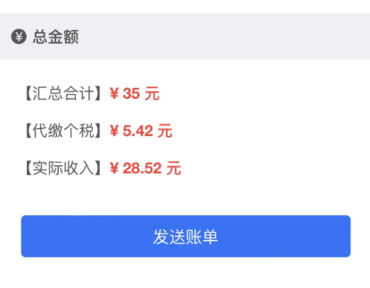

### 实现发送账单功能

首先我们来看一下视图层标签，发送账单按钮是怎么定义的

```html
<button class="btn" @tap="sendOrderBill">发送账单</button>
```

按钮点击事件的回调函数我们来实现一下，就是发送Ajax请求而已

```javascript
sendOrderBill() {
    let that = this;
    uni.showModal({
        title: '提示消息',
        content: '是否发送代驾账单给客户？',
        success: function(resp) {
            if (resp.confirm) {
                let data = {
                    orderId: that.orderId,
                    customerId: that.customerId,
                    status: 6
                };
                that.ajax(that.url.updateOrderStatus, 'POST', data, function(resp) {
                    that.workStatus = '等待付款';
                    uni.setStorageSync('workStatus', '等待付款');
                    //页面发生跳转
                    uni.navigateTo({
                        url: '../waiting_payment/waiting_payment?orderId=' + that.orderId
                    });
                });
            }
        }
    });
}
```

### 测试小程序

为了只测试账单页面的功能，我们在微信开发工具里面选中要运行的账单页面

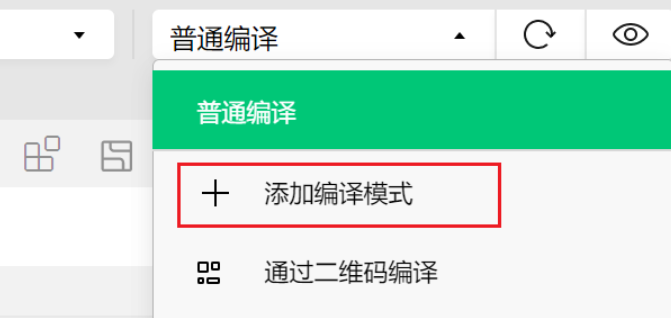

然后传入URL参数即可就能运行该页面了，不用我们再从登录流程开始运行小程序

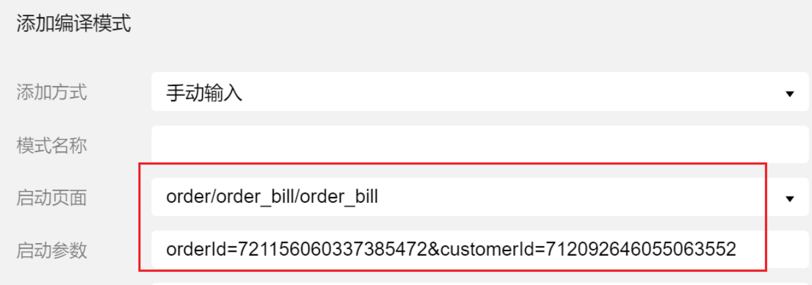

**需要查看的测试结果：**

1. 订单表的 status 字段是否修改为 6 了。
2. MongoDB 中的 message 表中是否保存了一条消息。
3. RabbitMQ 中是否存在乘客的消息队列，队列中是否存在 1 条消息。

```shell
# 进入rabbitmq的docker容器
docker exec -it mq /bin/bash

# 查看消息队列
rabbitmqctl list_queues
```

# 乘客端接收账单消息-后端实现

现在司机端给乘客端发送了待支付的消息，消息已经被存储到 `message`集合中，并且在 `RabbitMQ`当中也有了这条消息。接下来乘客端就需要从消息队列中拿到待支付的消息，并将接收者的状态的信息存储到 `message_ref`集合中。

我们之前在 `MessageTask`类中编写过接收消息的方法，但这个方法是批量接收消息。一次性的接收消息队列中的所有消息，包括私有消息和广播的消息。我们应该在 `MessageTask`类中再单独提供一个方法，**专门用来接收**待支付订单的消息。因此先在 `MessageTask`中补充一个方法。

## 编写 zxds-snm 子系统

在编写消息子系统代码之前，我们先来看一下时序图，如下

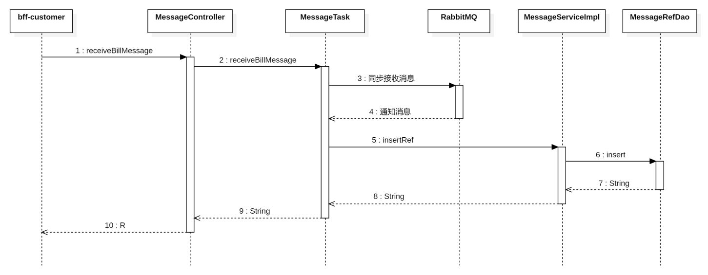

在`<font style="color:#000000;background-color:rgba(220, 240, 255, 0.3) !important;">com.example.zxds.snm.task</font>`包`<font style="color:#000000;background-color:rgba(220, 240, 255, 0.3) !important;">MessageTask.java</font>`类中，声明接收账单消息的方法

```java
/**
 * 专门接收账单消息的方法（只接收一条消息，并且接收即表示已读）
 * @param identity
 * @param userId
 * @return
 */
public String receiveBillMessage(String identity, long userId) {
    String exchangeName = identity + "_private";
    String queueName = "queue_" + userId;
    String routingKey = String.valueOf(userId);

    try {
        // 确保交换机和队列存在并绑定
        rabbitTemplate.execute(channel -> {
            channel.exchangeDeclare(exchangeName, "direct", true);
            channel.queueDeclare(queueName, true, false, false, null);
            channel.queueBind(queueName, exchangeName, routingKey);
            channel.basicQos(0, 1, true);
            return null;
        });

        // 接收一条消息
        org.springframework.amqp.core.Message message = rabbitTemplate.receive(queueName);
        if (message == null) {
            return "";
        }

        // 解析消息
        Map<String, Object> headers = message.getMessageProperties().getHeaders();
        String messageId = headers.get("messageId").toString();
        String msg = new String(message.getBody());

        log.debug("从RabbitMQ接收的订单消息：{}", msg);

        // 保存接收状态
        MessageRefEntity entity = new MessageRefEntity();
        entity.setMessageId(messageId);
        entity.setReceiverId(userId);
        entity.setReceiverIdentity(identity);
        entity.setReadFlag(true);
        entity.setLastFlag(true);
        messageService.insertRef(entity);

        // 手动确认
        rabbitTemplate.execute(channel -> {
            channel.basicAck(message.getMessageProperties().getDeliveryTag(), false);
            return null;
        });

        return msg;
    } catch (Exception e) {
        log.error("接收订单消息异常", e);
        throw new ZxdsException("接收新订单失败");
    }
}
```

在`<font style="color:#000000;background-color:rgba(220, 240, 255, 0.3) !important;">com.example.zxds.snm.controller.form</font>`包中，创建`<font style="color:#000000;background-color:rgba(220, 240, 255, 0.3) !important;">ReceiveBillMessageForm.java</font>`类

```java
package com.example.zxds.snm.controller.form;

import io.swagger.v3.oas.annotations.media.Schema;
import lombok.Data;

import javax.validation.constraints.Min;
import javax.validation.constraints.NotBlank;
import javax.validation.constraints.NotNull;
import javax.validation.constraints.Pattern;

@Data
@Schema(description = "接收新订单消息的表单")
public class ReceiveBillMessageForm {
    @NotNull(message = "userId不能为空")
    @Min(value = 1, message = "userId不能小于1")
    @Schema(description = "用户ID")
    private Long userId;

    @NotBlank(message = "identity不能为空")
    @Pattern(regexp = "^driver$|^mis$|^customer$|^customer_bill$", message = "identity内容不正确")
    @Schema(description = "用户身份")
    private String identity;
}
```

在`<font style="color:#000000;background-color:rgba(220, 240, 255, 0.3) !important;">com.example.zxds.snm.controller</font>`包`<font style="color:#000000;background-color:rgba(220, 240, 255, 0.3) !important;">MessageController.java</font>`类中，声明Web方法

```java
@PostMapping("/receiveBillMessage")
@Operation(summary = "同步接收新订单消息")
public R receiveBillMessage(@RequestBody @Valid ReceiveBillMessageForm form) {
    String msg = messageTask.receiveBillMessage(form.getIdentity(), form.getUserId());
    return R.ok().put("result", msg);
}
```

## 编写 bff-customer 子系统

在编写`<font style="color:#000000;background-color:rgba(220, 240, 255, 0.3) !important;">bff-customer</font>`子系统之前，我们先来看一下时序图，如下：

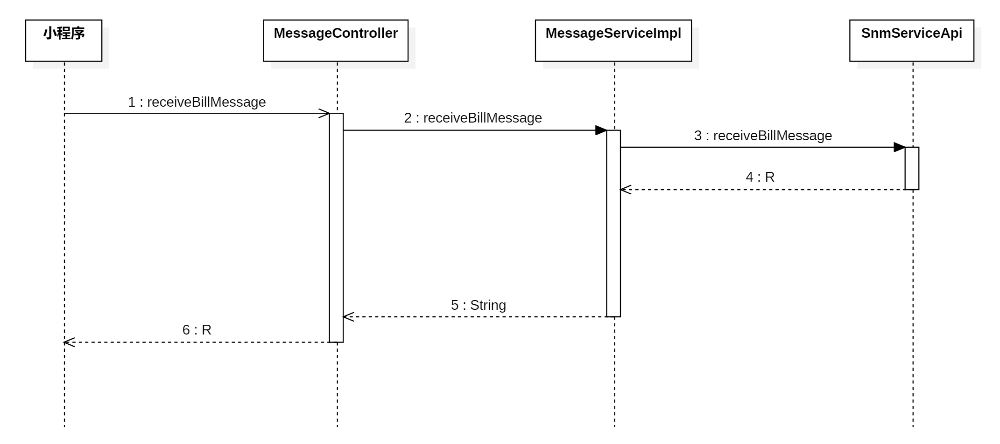

### 编写 Feign 客户端

在`<font style="color:#000000;background-color:rgba(220, 240, 255, 0.3) !important;">com.example.zxds.bff.customer.controller.form</font>`包中，创建`<font style="color:#000000;background-color:rgba(220, 240, 255, 0.3) !important;">ReceiveBillMessageForm.java</font>`类

```java
package com.example.zxds.bff.customer.controller.form;

import io.swagger.v3.oas.annotations.media.Schema;
import lombok.Data;

@Data
@Schema(description = "接收新订单消息的表单")
public class ReceiveBillMessageForm {

    @Schema(description = "用户ID")
    private Long userId;

    @Schema(description = "用户身份")
    private String identity;
}
```

在`<font style="color:#000000;background-color:rgba(220, 240, 255, 0.3) !important;">com.example.zxds.bff.customer.feign</font>`包`<font style="color:#000000;background-color:rgba(220, 240, 255, 0.3) !important;">SnmServiceApi.java</font>`接口中，声明抽象方法

```java
@PostMapping("/message/receiveBillMessage")
R receiveBillMessage(ReceiveBillMessageForm form);
```

### 编写 service 和实现

在`<font style="color:#000000;background-color:rgba(220, 240, 255, 0.3) !important;">com.example.zxds.bff.customer.service</font>`包`<font style="color:#000000;background-color:rgba(220, 240, 255, 0.3) !important;">MessageService.java</font>`接口中，声明抽象方法

```java
package com.example.zxds.bff.customer.service;

import com.example.zxds.bff.customer.controller.form.ReceiveBillMessageForm;

public interface MessageService {
    String receiveBillMessage(ReceiveBillMessageForm form);
}
```

在`<font style="color:#000000;background-color:rgba(220, 240, 255, 0.3) !important;">com.example.zxds.bff.customer.service.impl</font>`包`<font style="color:#000000;background-color:rgba(220, 240, 255, 0.3) !important;">MessageServiceImpl.java</font>`类中，实现抽象方法

```java
package com.example.zxds.bff.customer.service.impl;

import cn.hutool.core.map.MapUtil;
import com.example.zxds.bff.customer.controller.form.ReceiveBillMessageForm;
import com.example.zxds.bff.customer.feign.SnmServiceApi;
import com.example.zxds.bff.customer.service.MessageService;
import com.example.zxds.common.util.R;
import lombok.RequiredArgsConstructor;
import org.springframework.stereotype.Service;

@Service
@RequiredArgsConstructor
public class MessageServiceImpl implements MessageService {
    private final SnmServiceApi snmServiceApi;

    @Override
    public String receiveBillMessage(ReceiveBillMessageForm form) {
        R r = snmServiceApi.receiveBillMessage(form);
        String msg = MapUtil.getStr(r, "result");
        return msg;
    }
}
```

### 编写 web 方法

在`<font style="color:#000000;background-color:rgba(220, 240, 255, 0.3) !important;">com.example.zxds.bff.customer.controller</font>`包`<font style="color:#000000;background-color:rgba(220, 240, 255, 0.3) !important;">MessageController.java</font>`类中，声明Web方法

```java
package com.example.zxds.bff.customer.controller;

import cn.dev33.satoken.annotation.SaCheckLogin;
import cn.dev33.satoken.stp.StpUtil;
import com.example.zxds.bff.customer.controller.form.ReceiveBillMessageForm;
import com.example.zxds.bff.customer.service.MessageService;
import com.example.zxds.common.util.R;
import io.swagger.v3.oas.annotations.Operation;
import io.swagger.v3.oas.annotations.tags.Tag;
import lombok.RequiredArgsConstructor;
import org.springframework.web.bind.annotation.PostMapping;
import org.springframework.web.bind.annotation.RequestBody;
import org.springframework.web.bind.annotation.RequestMapping;
import org.springframework.web.bind.annotation.RestController;

import javax.validation.Valid;

@RestController
@RequestMapping("/message")
@RequiredArgsConstructor
@Tag(name = "MessageController", description = "消息模块网络接口")
public class MessageController {

    private final MessageService messageService;
    
    @PostMapping("/receiveBillMessage")
    @SaCheckLogin
    @Operation(summary = "同步接收新订单消息")
    public R receiveBillMessage(@RequestBody @Valid ReceiveBillMessageForm form) {
        long customerId = StpUtil.getLoginIdAsLong();
        form.setUserId(customerId);
        form.setIdentity("customer_bill");
        String msg = messageService.receiveBillMessage(form);
        return R.ok().put("result", msg);
    }
}
```

### 测试 web 方法

把后端各个子系统运行起来，然后用 Apipost 工具调用Web方法，看一下返回的结果

# 乘客接收账单消息-前端实现

## 定义全局 URL 路径

在`<font style="color:#000000;background-color:rgba(220, 240, 255, 0.3) !important;">main.js</font>`文件中，声明全局URL路径

```javascript
Vue.prototype.url = {
    ……,
    receiveBillMessage: `${baseUrl}/message/receiveBillMessage`,
}
```

## 接收账单通知消息

在乘客端的司乘同显`<font style="color:#000000;background-color:rgba(220, 240, 255, 0.3) !important;">move.vue</font>`页面的模型层声明定时器变量，通过轮询的方式查收账单通知消息

```javascript
data() {
    return {
        ……,
        messageTimer: null
    };
},
```

在`<font style="color:#000000;background-color:rgba(220, 240, 255, 0.3) !important;">onShow()</font>`回调函数中，创建轮询定时器。如果接收到账单消息，就跳转到`<font style="color:#000000;background-color:rgba(220, 240, 255, 0.3) !important;">order.vue</font>`页面

```javascript
onShow: function() {
    ……
    
    that.ajax(that.url.searchOrderForMoveById, 'POST', data, function(resp) {
        ……

        if (status == 4 || status == 5 || status == 6) {
            that.messageTimer = setInterval(function() {
                that.ajax(
                    that.url.receiveBillMessage,
                    'POST',
                    {},
                    function(resp) {
                        if (resp.data.result == '您有代驾订单待支付') {
                            uni.redirectTo({
                                url: '../order/order?orderId=' + that.orderId
                            });
                        }
                    },
                    false
                );
            }, 5000);
        }
    });
},
```

在`<font style="color:#000000;background-color:rgba(220, 240, 255, 0.3) !important;">onHide()</font>`回调函数中，销毁轮询定时器，也就是说页面隐藏的情况下，不需要查收账单消息

```javascript
onHide: function() {
    ……
    clearInterval(that.messageTimer);
    that.messageTimer = null;
}
```

## 测试小程序

1. 到Navicat上面把订单记录的status改成4状态，然后把后端各个子系统运行起来。
2. 在手机上面运行乘客端的小程序，因为有正在执行的订单，所以小程序会跳转到`<font style="color:#000000;background-color:rgba(220, 240, 255, 0.3) !important;">move.vue</font>`页面。
3. 用Navicat把订单的status改成5状态。为什么不调用`<font style="color:#000000;background-color:rgba(220, 240, 255, 0.3) !important;">updateOrderStatus()</font>`函数，把订单修改成5状态？这是因为之前运行程序的时候，在司机端小程序上面测试过结束代驾，所以订单表和账单表的记录都更新过了，并且分账表也有记录。所以我们不用再重新执行结束代驾流程，只改订单状态即可。
4. 接下来用 Apipost 工具，调用`<font style="color:#000000;background-color:rgba(220, 240, 255, 0.3) !important;">bff-driver</font>`子系统的`<font style="color:#000000;background-color:rgba(220, 240, 255, 0.3) !important;">updateOrderStatus()</font>`函数，把订单修改成6状态。观察乘客端小程序的效果，应该是收到通知消息之后，立即跳转到`<font style="color:#000000;background-color:rgba(220, 240, 255, 0.3) !important;">order.vue</font>`页面。

# 乘客端显示待付款账单信息-后端实现

乘客端小程序收到账单通知消息之后，跳转到`<font style="color:#000000;background-color:rgba(220, 240, 255, 0.3) !important;">order.vue</font>`页面，但是页面上的内容并没有加载出来，接下来编写后端Java代码，把订单信息、账单信息和司机信息都给查询出来。


## 编写 zxds-odr 子系统

在编写订单子系统代码之前，我们先来看一下时序图，如下：

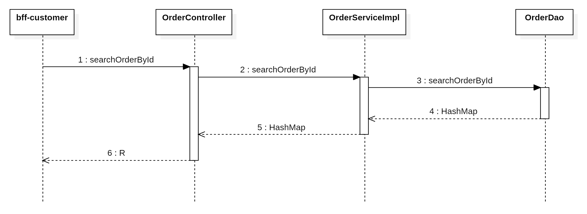

### 编写持久层代码

在`<font style="color:#000000;background-color:rgba(220, 240, 255, 0.3) !important;">OrderDao.xml</font>`文件中，编写SQL语句

```xml
<select id="searchOrderById" parameterType="Map" resultType="HashMap">
    SELECT CAST(o.id AS CHAR) AS id,
           CAST(o.driver_id AS CHAR) AS driverId,
           CAST(o.customer_id AS CHAR) AS customerId,
           o.start_place AS startPlace,
           o.start_place_location AS startPlaceLocation,
           o.end_place AS endPlace,
           o.end_place_location AS endPlaceLocation,
           CAST(b.total AS CHAR) AS total,
           CAST(b.real_pay AS CHAR) AS realPay,
           CAST(b.mileage_fee AS CHAR) AS mileageFee,
           CAST(o.favour_fee AS CHAR) AS favourFee,
           CAST(o.incentive_fee AS CHAR) AS incentiveFee,
           CAST(b.waiting_fee AS CHAR) AS waitingFee,
           CAST(b.return_fee AS CHAR) AS returnFee,
           CAST(b.parking_fee AS CHAR) AS parkingFee,
           CAST(b.toll_fee AS CHAR) AS tollFee,
           CAST(b.other_fee AS CHAR) AS otherFee,
           CAST(b.voucher_fee AS CHAR) AS voucherFee,
           CAST(o.real_mileage AS CHAR) AS realMileage,
           o.waiting_minute AS waitingMinute,
           b.base_mileage AS baseMileage,
           CAST(b.base_mileage_price AS CHAR) AS baseMileagePrice,
           CAST(b.exceed_mileage_price AS CHAR) AS exceedMileagePrice,
           b.base_minute AS baseMinute,
           CAST(b.exceed_minute_price AS CHAR) AS exceedMinutePrice,
           b.base_return_mileage AS baseReturnMileage,
           CAST(b.exceed_return_price AS CHAR) AS exceedReturnPrice,
           CAST(o.return_mileage AS CHAR) AS returnMileage,
           o.car_plate AS carPlate,
           o.car_type AS carType,
           o.status,
           DATE_FORMAT(o.create_time, '%Y-%m-%d %H:%i:%s') AS createTime
    FROM tb_order o
    JOIN tb_order_bill b ON o.id = b.order_id
    WHERE o.id = #{orderId}
    <if test="driverId!=null">
        AND driver_id = #{driverId}
    </if>
    <if test="customerId!=null">
        AND customer_id = #{customerId}
    </if>
</select>
```

在`<font style="color:#000000;background-color:rgba(220, 240, 255, 0.3) !important;">com.example.zxds.odr.db.dao</font>`包`<font style="color:#000000;background-color:rgba(220, 240, 255, 0.3) !important;">OrderDao.java</font>`接口中，声明DAO方法

```java
Map<String, Object> searchOrderById(Map<String, Object> param);
```

### 编写 service 和实现

在`<font style="color:#000000;background-color:rgba(220, 240, 255, 0.3) !important;">com.example.zxds.odr.service</font>`包`<font style="color:#000000;background-color:rgba(220, 240, 255, 0.3) !important;">OrderService.java</font>`接口中，声明抽象方法

```java
Map<String, Object> searchOrderById(Map<String, Object> param);
```

在`<font style="color:#000000;background-color:rgba(220, 240, 255, 0.3) !important;">com.example.zxds.odr.service.impl</font>`包`<font style="color:#000000;background-color:rgba(220, 240, 255, 0.3) !important;">OrderServiceImpl.java</font>`接口中，实现抽象方法

```java
@Override
public Map<String, Object> searchOrderById(Map<String, Object> param) {
    Map<String, Object> map = orderDao.searchOrderById(param);
    String startPlaceLocation = MapUtil.getStr(map, "startPlaceLocation");
    String endPlaceLocation = MapUtil.getStr(map, "endPlaceLocation");
    map.replace("startPlaceLocation", JSONUtil.parseObj(startPlaceLocation));
    map.replace("endPlaceLocation", JSONUtil.parseObj(endPlaceLocation));
    return map;
}
```

### 编写 form 接收数据并校验

在`<font style="color:#000000;background-color:rgba(220, 240, 255, 0.3) !important;">com.example.zxds.odr.controller.form</font>`包中，创建`<font style="color:#000000;background-color:rgba(220, 240, 255, 0.3) !important;">SearchOrderByIdForm.java</font>`类

```java
package com.example.zxds.odr.controller.form;

import io.swagger.v3.oas.annotations.media.Schema;
import lombok.Data;

import javax.validation.constraints.Min;
import javax.validation.constraints.NotNull;

@Data
@Schema(description = "根据ID查询订单信息的表单")
public class SearchOrderByIdForm {
    @NotNull
    @Min(value = 1, message = "orderId不能小于1")
    @Schema(description = "订单ID")
    private Long orderId;

    @Min(value = 1, message = "customerId不能小于1")
    @Schema(description = "客户ID")
    private Long customerId;

    @Min(value = 1, message = "driverId不能小于1")
    @Schema(description = "司机ID")
    private Long driverId;
}
```

在`<font style="color:#000000;background-color:rgba(220, 240, 255, 0.3) !important;">com.example.zxds.odr.controller</font>`包`<font style="color:#000000;background-color:rgba(220, 240, 255, 0.3) !important;">OrderController.java</font>`类中，声明Web方法

```java
@PostMapping("/searchOrderById")
@Operation(summary = "根据ID查询订单信息")
public R searchOrderById(@RequestBody @Valid SearchOrderByIdForm form) {
    Map<String, Object> param = BeanUtil.beanToMap(form);
    Map<String, Object> map = orderService.searchOrderById(param);
    return R.ok().put("result", map);
}
```

## 编写 zxds-dr 子系统

在`<font style="color:#000000;background-color:rgba(220, 240, 255, 0.3) !important;">order.vue</font>`页面上，要显示司机的头像，所以要从司机表中查询`<font style="color:#000000;background-color:rgba(220, 240, 255, 0.3) !important;">photo</font>`字段。在`<font style="color:#000000;background-color:rgba(220, 240, 255, 0.3) !important;">DriverDao.xml</font>`文件中，修改SQL语句，给SELECT子句补充上`<font style="color:#000000;background-color:rgba(220, 240, 255, 0.3) !important;">photo</font>`字段

```xml
<select id="searchDriverBriefInfo" parameterType="long" resultType="HashMap">
    SELECT CAST(id AS CHAR) AS id,
           `name`,
           tel,
           photo
    FROM tb_driver
    WHERE id = #{driverId}
</select>
```

## 编写 bff-customer 子系统

### 编写 Feign 客户端

在`<font style="color:#000000;background-color:rgba(220, 240, 255, 0.3) !important;">com.example.zxds.bff.customer.controller.form</font>`包中，创建`<font style="color:#000000;background-color:rgba(220, 240, 255, 0.3) !important;">SearchDriverBriefInfoForm.java</font>`类

```java
package com.example.zxds.bff.customer.controller.form;

import io.swagger.v3.oas.annotations.media.Schema;
import lombok.Data;

import javax.validation.constraints.Min;
import javax.validation.constraints.NotNull;

@Data
@Schema(description = "查询司机简明信息的表单")
public class SearchDriverBriefInfoForm {
    @NotNull(message = "driverId不能为空")
    @Min(value = 1, message = "driverId不能小于1")
    @Schema(description = "司机ID")
    private Long driverId;
}
```

在`<font style="color:#000000;background-color:rgba(220, 240, 255, 0.3) !important;">com.example.zxds.bff.customer.feign</font>`包`<font style="color:#000000;background-color:rgba(220, 240, 255, 0.3) !important;">DrServiceApi.java</font>`接口中，声明抽象方法

```java
package com.example.zxds.bff.customer.feign;

import com.example.zxds.bff.customer.controller.form.SearchDriverBriefInfoForm;
import com.example.zxds.common.util.R;
import org.springframework.cloud.openfeign.FeignClient;
import org.springframework.web.bind.annotation.PostMapping;


@FeignClient(value = "zxds-dr")
public interface DrServiceApi {

    @PostMapping("/driver/searchDriverBriefInfo")
    R searchDriverBriefInfo(SearchDriverBriefInfoForm form);
}
```

在`<font style="color:#000000;background-color:rgba(220, 240, 255, 0.3) !important;">com.example.zxds.bff.customer.controller.form</font>`包中，创建`<font style="color:#000000;background-color:rgba(220, 240, 255, 0.3) !important;">SearchOrderByIdForm.java</font>`类

```java
package com.example.zxds.bff.customer.controller.form;

import io.swagger.v3.oas.annotations.media.Schema;
import lombok.Data;

import javax.validation.constraints.Min;
import javax.validation.constraints.NotNull;

@Data
@Schema(description = "根据ID查询订单信息的表单")
public class SearchOrderByIdForm {
    @NotNull
    @Min(value = 1, message = "orderId不能小于1")
    @Schema(description = "订单ID")
    private Long orderId;

    @Schema(description = "客户ID")
    private Long customerId;
}
```

在`<font style="color:#000000;background-color:rgba(220, 240, 255, 0.3) !important;">com.example.zxds.bff.customer.feign</font>`包`<font style="color:#000000;background-color:rgba(220, 240, 255, 0.3) !important;">OdrServiceApi.java</font>`接口中，声明抽象方法

```java
@PostMapping("/order/searchOrderById")
R searchOrderById(SearchOrderByIdForm form);
```

### 编写 service 和实现

在`<font style="color:#000000;background-color:rgba(220, 240, 255, 0.3) !important;">com.example.zxds.bff.customer.service</font>`包`<font style="color:#000000;background-color:rgba(220, 240, 255, 0.3) !important;">OrderService.java</font>`接口中，声明抽象方法

```java
Map<String, Object> searchOrderById(SearchOrderByIdForm form);
```

在`<font style="color:#000000;background-color:rgba(220, 240, 255, 0.3) !important;">com.example.zxds.bff.customer.service.impl</font>`包`<font style="color:#000000;background-color:rgba(220, 240, 255, 0.3) !important;">OrderServiceImpl.java</font>`类中，实现抽象方法

```java
private final DrServiceApi drServiceApi;

@Override
public Map<String, Object> searchOrderById(SearchOrderByIdForm form) {
    R r = odrServiceApi.searchOrderById(form);
    Map<String, Object> map = (Map<String, Object>) r.get("result");
    Long driverId = MapUtil.getLong(map, "driverId");
    if (driverId != null) {
        SearchDriverBriefInfoForm infoForm = new SearchDriverBriefInfoForm();
        infoForm.setDriverId(driverId);
        r = drServiceApi.searchDriverBriefInfo(infoForm);
        Map<String, Object> temp = (Map<String, Object>) r.get("result");
        map.putAll(temp);
        return map;
    }
    return null;
}
```

### 编写 web 方法

在`<font style="color:#000000;background-color:rgba(220, 240, 255, 0.3) !important;">com.example.zxds.bff.customer.controller</font>`包`<font style="color:#000000;background-color:rgba(220, 240, 255, 0.3) !important;">OrderController.java</font>`类中，声明Web方法

```java
@PostMapping("/searchOrderById")
@SaCheckLogin
@Operation(summary = "根据ID查询订单信息")
public R searchOrderById(@RequestBody @Valid SearchOrderByIdForm form) {
    long customerId = StpUtil.getLoginIdAsLong();
    form.setCustomerId(customerId);
    Map<String, Object> map = orderService.searchOrderById(form);
    return R.ok().put("result", map);
}
```

# 乘客端显示待付款账单信息-前端实现

后端已经可以获取待付款的账单信息了。接下来编写乘客端小程序，在`<font style="color:#000000;background-color:rgba(220, 240, 255, 0.3) !important;">order.vue</font>`页面上显示这些信息。

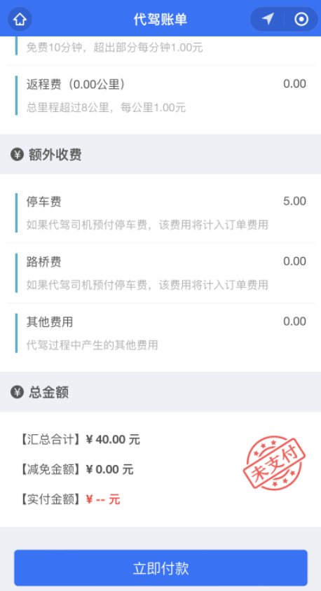

## 定义全局 URL

在`<font style="color:#000000;background-color:rgba(220, 240, 255, 0.3) !important;">main.js</font>`文件中，声明全局URL路径

```javascript
Vue.prototype.url = {
    ……,
    searchOrderById:`${baseUrl}/order/searchOrderById`
}
```

## 实现订单信息加载

首先来看一下`<font style="color:#000000;background-color:rgba(220, 240, 255, 0.3) !important;">order.vue</font>`页面的模型层部分是怎么声明的，我们只要写好Ajax代码，把获取到的数据给这些变量赋值即可。

```javascript
data() {
    return {
        orderId: null,
        customerId: null,
        driverId: null,
        photo: null,
        name: null,
        tel: null,
        startPlace: null,
        endPlace: null,
        createTime: null,
        favourFee: '暂无',
        incentiveFee: '暂无',
        carPlate: null,
        carType: null,
        status: null,
        realMileage: null,
        mileageFee: null,
        baseMileagePrice: '',
        baseMileage: '',
        exceedMileagePrice: '',
        waitingFee: '暂无',
        base_minute: '',
        waitingMinute: '--',
        exceedMinutePrice: '',
        returnFee: '暂无',
        baseReturnMileage: '',
        exceedReturnPrice: '',
        returnMileage: '--',
        parkingFee: '暂无',
        tollFee: '暂无',
        otherFee: '暂无',
        total: '--',
        voucherFee: '--',
        realPay: '--',
        img: ''
    };
},
```

编写`<font style="color:#000000;background-color:rgba(220, 240, 255, 0.3) !important;">onLoad()</font>`回调函数，发送Ajax请求

```javascript
onLoad: function(options) {
    let that = this;
    let orderId = options.orderId;
    that.orderId = orderId;
    that.ajax(that.url.searchOrderById, 'POST', { orderId: orderId }, function(resp) {
        let result = resp.data.result;
        that.driverId = result.driverId;
        that.name = result.name;
        that.photo = result.photo;
        that.title = result.title;
        that.tel = result.tel;
        that.startPlace = result.startPlace;
        that.endPlace = result.endPlace;
        that.createTime = result.createTime;
        that.favourFee = result.favourFee;
        that.incentiveFee = result.incentiveFee;
        that.carPlate = result.carPlate;
        that.carType = result.carType;
        let status = result.status;
        that.status = status;
        if ([5, 6, 7, 8].includes(status)) {
            that.realMileage = result.realMileage;
            that.mileageFee = result.mileageFee;
            that.waitingFee = result.waitingFee;
            that.waitingMinute = result.waitingMinute;
            that.returnFee = result.returnFee;
            that.returnMileage = result.returnMileage;
            that.parkingFee = result.parkingFee;
            that.tollFee = result.tollFee;
            that.otherFee = result.otherFee;
            that.total = result.total;
            that.voucherFee = result.voucherFee;
        }
        that.baseMileagePrice = result.baseMileagePrice;
        that.baseMileage = result.baseMileage;
        that.exceedMileagePrice = result.exceedMileagePrice;

        that.base_minute = result.baseMinute;
        that.exceedMinutePrice = result.exceedMinutePrice;
        that.baseReturnMileage = result.baseReturnMileage;
        that.exceedReturnPrice = result.exceedReturnPrice;
        that.realPay = '--';
        if ([2, 3].includes(status)) {
            that.img = '../../static/order/icon-1.png';
        } else if ([4].includes(status)) {
            that.img = '../../static/order/icon-2.png';
        } else if ([5, 6].includes(status)) {
            that.img = '../../static/order/icon-3.png';
        } else if ([7].includes(status)) {
            that.img = '../../static/order/icon-4.png';
            that.realPay = result.realPay;
        } else if ([8, 9, 10, 11, 12].includes(status)) {
            that.img = '../../static/order/icon-5.png';
        }
    });
},
```

# 微信支付分账前查询司机和乘客的 openId

因为要创建可以分账的微信支付账单，调用API的时候需要分别提供司机和乘客的OpenId，接下来把这两个数据给查询出来。

## 编写 zxds-cst 子系统

在编写乘客子系统代码之前，我们先来看一下时序图，如下

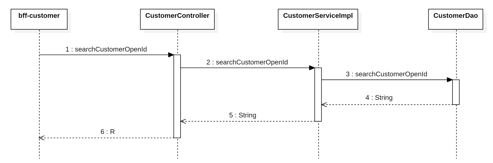

### 编写持久层代码

在`<font style="color:#000000;background-color:rgba(220, 240, 255, 0.3) !important;">CustomerDao.xml</font>`文件中，声明SQL语句

```xml
<select id="searchCustomerOpenId" parameterType="long" resultType="String">
    SELECT open_id AS openId
    FROM tb_customer
    WHERE id = #{customerId}
</select>
```

在`<font style="color:#000000;background-color:rgba(220, 240, 255, 0.3) !important;">com.example.zxds.cst.db.dao</font>`包`<font style="color:#000000;background-color:rgba(220, 240, 255, 0.3) !important;">CustomerDao.java</font>`接口中，声明Dao方法

```java
String searchCustomerOpenId(long customerId);
```

### 编写 service 和实现

在`<font style="color:#000000;background-color:rgba(220, 240, 255, 0.3) !important;">com.example.zxds.cst.service</font>`包`<font style="color:#000000;background-color:rgba(220, 240, 255, 0.3) !important;">CustomerService.java</font>`接口中，声明抽象方法

```java
String searchCustomerOpenId(long customerId);
```

在`<font style="color:#000000;background-color:rgba(220, 240, 255, 0.3) !important;">com.example.zxds.cst.service.impl</font>`包`<font style="color:#000000;background-color:rgba(220, 240, 255, 0.3) !important;">CustomerServiceImpl.java</font>`类中，实现抽象方法

```java
@Override
public String searchCustomerOpenId(long customerId) {
    String openId = customerDao.searchCustomerOpenId(customerId);
    return openId;
}
```

### 编写 form 接收数据并校验

在`<font style="color:#000000;background-color:rgba(220, 240, 255, 0.3) !important;">com.example.zxds.cst.controller.form</font>`包中，创建`<font style="color:#000000;background-color:rgba(220, 240, 255, 0.3) !important;">SearchCustomerOpenIdForm.java</font>`类

```java
package com.example.zxds.cst.controller.form;

import io.swagger.v3.oas.annotations.media.Schema;
import lombok.Data;

import javax.validation.constraints.Min;
import javax.validation.constraints.NotNull;

@Data
@Schema(description = "查询客户OpenId的表单")
public class SearchCustomerOpenIdForm {
    @NotNull(message = "customerId不能为空")
    @Min(value = 1, message = "customerId不能小于1")
    @Schema(description = "客户ID")
    private Long customerId;
}
```

### 编写 web 方法

在`<font style="color:#000000;background-color:rgba(220, 240, 255, 0.3) !important;">com.example.zxds.cst.controller</font>`包`<font style="color:#000000;background-color:rgba(220, 240, 255, 0.3) !important;">CustomerController.java</font>`类中，创建Web方法

```java
@PostMapping("/searchCustomerOpenId")
@Operation(summary = "查询客户的OpenId")
public R searchCustomerOpenId(@RequestBody @Valid SearchCustomerOpenIdForm form) {
    String openId = customerService.searchCustomerOpenId(form.getCustomerId());
    return R.ok().put("result", openId);
}
```

## 编写 zxds-dr 子系统

在编写司机子系统代码之前，我们先来看一下时序图，如下

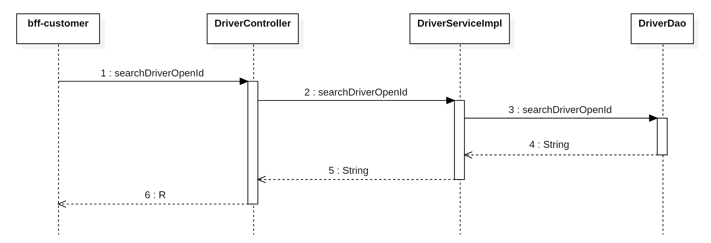

### 编写持久层代码

在`<font style="color:#000000;background-color:rgba(220, 240, 255, 0.3) !important;">DriverDao.xml</font>`文件中，声明SQL语句

```xml
<select id="searchDriverOpenId" parameterType="long" resultType="String">
    SELECT open_id AS openId
    FROM tb_driver
    WHERE id = #{driverId}
</select>
```

在`<font style="color:#000000;background-color:rgba(220, 240, 255, 0.3) !important;">com.example.zxds.dr.db.dao</font>`包`<font style="color:#000000;background-color:rgba(220, 240, 255, 0.3) !important;">DriverDao.java</font>`接口中，声明DAO方法

```java
String searchDriverOpenId(long driverId);
```

### 编写 service 和实现

在`<font style="color:#000000;background-color:rgba(220, 240, 255, 0.3) !important;">com.example.zxds.dr.service</font>`包`<font style="color:#000000;background-color:rgba(220, 240, 255, 0.3) !important;">DriverService.java</font>`接口中，声明抽象方法

```java
String searchDriverOpenId(long driverId);
```

在`<font style="color:#000000;background-color:rgba(220, 240, 255, 0.3) !important;">com.example.zxds.dr.service.impl</font>`包`<font style="color:#000000;background-color:rgba(220, 240, 255, 0.3) !important;">DriverServiceImpl.java</font>`类中，实现抽象方法

```java
@Override
public String searchDriverOpenId(long driverId) {
    String openId = driverDao.searchDriverOpenId(driverId);
    return openId;
}
```

### 编写 form 接收数据并校验

在`<font style="color:#000000;background-color:rgba(220, 240, 255, 0.3) !important;">com.example.zxds.dr.controller.form</font>`包中，创建`<font style="color:#000000;background-color:rgba(220, 240, 255, 0.3) !important;">SearchDriverOpenIdForm.java</font>`类

```java
package com.example.zxds.dr.controller.form;

import io.swagger.v3.oas.annotations.media.Schema;
import lombok.Data;

import javax.validation.constraints.Min;
import javax.validation.constraints.NotNull;

@Data
@Schema(description = "查询司机OpenId的表单")
public class SearchDriverOpenIdForm {
    @NotNull(message = "driverId不能为空")
    @Min(value = 1, message = "driverId不能小于1")
    @Schema(description = "司机ID")
    private Long driverId;
}
```

### 编写 web 方法

在`<font style="color:#000000;background-color:rgba(220, 240, 255, 0.3) !important;">com.example.zxds.dr.controller</font>`包`<font style="color:#000000;background-color:rgba(220, 240, 255, 0.3) !important;">DriverController.java</font>`类中，声明Web方法

```java
@PostMapping("/searchDriverOpenId")
@Operation(summary = "查询司机的OpenId")
public R searchDriverOpenId(@RequestBody @Valid SearchDriverOpenIdForm form) {
    String openId = driverService.searchDriverOpenId(form.getDriverId());
    return R.ok().put("result", openId);
}
```