# 智行代驾08

# 创建微信支付单（一）

乘客的 order.vue 中已经看到账单明细了，可以支付了，支付时**先创建微信支付单**。

**流程是这样的：**

1. 如果乘客使用了代金券，就要先验证代金券是否有效，然后扣减支付金额，更新账单表记录。
2. 创建了微信支付账单之后，还要把预支付ID（PrepayId）更新到订单表中。

## 编写 zxds-odr 子系统

创建微信支付账单的过程中，需要调用很多次订单子系统

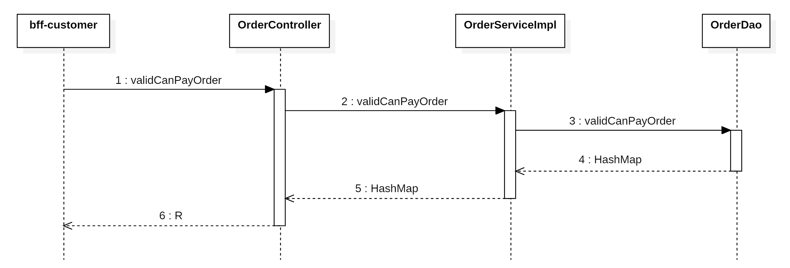

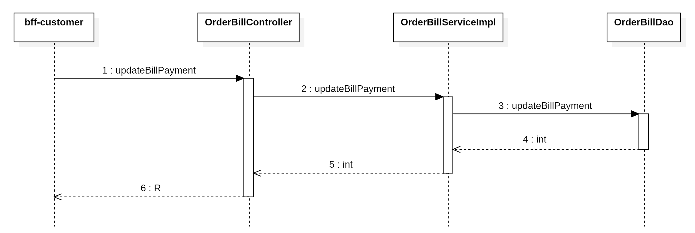

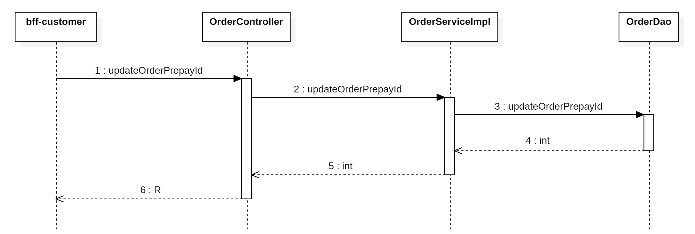

### 编写持久层代码

在`<font style="color:#000000;background-color:rgba(220, 240, 255, 0.3) !important;">OrderDao.xml</font>`文件中，声明SQL语句

```xml
<select id="validCanPayOrder" parameterType="Map" resultType="HashMap">
    SELECT CAST(real_fee AS CHAR)  AS realFee,
           CAST(driver_id AS CHAR) AS driverId,
           uuid
    FROM tb_order
    WHERE id = #{orderId}
      AND customer_id = #{customerId}
      AND `status` = 6
</select>

<update id="updateOrderPrepayId" parameterType="Map">
    UPDATE tb_order
    SET prepay_id = #{prepayId}
    WHERE id = #{orderId}
</update>
```

在`<font style="color:#000000;background-color:rgba(220, 240, 255, 0.3) !important;">com.example.zxds.odr.db.dao</font>`包`<font style="color:#000000;background-color:rgba(220, 240, 255, 0.3) !important;">OrderDao.java</font>`接口中，声明抽象方法

```java
Map<String, Object> validCanPayOrder(Map<String, Object> param);

int updateOrderPrepayId(Map<String, Object> param);
```

在`<font style="color:#000000;background-color:rgba(220, 240, 255, 0.3) !important;">OrderBillDao.xml</font>`文件中，声明SQL语句

```xml
<update id="updateBillPayment" parameterType="Map">
    UPDATE tb_order_bill
    SET real_pay = #{realPay},
    <if test="voucherFee==null">
        voucher_fee="0.00"
    </if>
    <if test="voucherFee!=null">
        voucher_fee = #{voucherFee}
    </if>
    WHERE order_id = #{orderId}
</update>
```

在`<font style="color:#000000;background-color:rgba(220, 240, 255, 0.3) !important;">com.example.zxds.odr.db.dao</font>`包`<font style="color:#000000;background-color:rgba(220, 240, 255, 0.3) !important;">OrderBillDao.java</font>`接口中，声明抽象方法

```java
int updateBillPayment(Map<String, Object> param);
```

### 编写 service 和实现

在`<font style="color:#000000;background-color:rgba(220, 240, 255, 0.3) !important;">com.example.zxds.odr.service</font>`包`<font style="color:#000000;background-color:rgba(220, 240, 255, 0.3) !important;">OrderService.java</font>`接口中，声明抽象方法

```java
Map<String, Object> validCanPayOrder(Map<String, Object> param);

int updateOrderPrepayId(Map<String, Object> param);
```

在`<font style="color:#000000;background-color:rgba(220, 240, 255, 0.3) !important;">com.example.zxds.odr.service.impl</font>`包`<font style="color:#000000;background-color:rgba(220, 240, 255, 0.3) !important;">OrderServiceImpl.java</font>`类中，实现抽象方法

```java
@Override
public Map<String, Object> validCanPayOrder(Map<String, Object> param) {
    Map<String, Object> map = orderDao.validCanPayOrder(param);
    if (map == null || map.isEmpty()) {
        throw new ZxdsException("订单无法支付");
    }
    return map;
}

@Override
@Transactional
public int updateOrderPrepayId(Map<String, Object> param) {
    int rows = orderDao.updateOrderPrepayId(param);
    if (rows != 1) {
        throw new ZxdsException("更新预支付订单ID失败");
    }
    return rows;
}
```

在`<font style="color:#000000;background-color:rgba(220, 240, 255, 0.3) !important;">com.example.zxds.odr.service</font>`包`<font style="color:#000000;background-color:rgba(220, 240, 255, 0.3) !important;">OrderBillService.java</font>`接口中，声明抽象方法

```java
int updateBillPayment(Map<String, Object> param);
```

在`<font style="color:#000000;background-color:rgba(220, 240, 255, 0.3) !important;">com.example.zxds.odr.service.impl</font>`包`<font style="color:#000000;background-color:rgba(220, 240, 255, 0.3) !important;">OrderBillServiceImpl.java</font>`类中，实现抽象方法

```java
@Override
@Transactional
public int updateBillPayment(Map param) {
    int rows = orderBillDao.updateBillPayment(param);
    if (rows != 1) {
        throw new ZxdsException("更新账单实际支付费用失败");
    }
    return rows;
}
```

### 编写 web 层代码

在`<font style="color:#000000;background-color:rgba(220, 240, 255, 0.3) !important;">com.example.zxds.odr.controller.form</font>`包中创建`<font style="color:#000000;background-color:rgba(220, 240, 255, 0.3) !important;">ValidCanPayOrderForm.java</font>`类

```java
package com.example.zxds.odr.controller.form;

import io.swagger.v3.oas.annotations.media.Schema;
import lombok.Data;

import javax.validation.constraints.Min;
import javax.validation.constraints.NotNull;

@Data
@Schema(description = "检查订单是否可以支付的表单")
public class ValidCanPayOrderForm {
    @NotNull(message = "orderId不能为空")
    @Min(value = 1, message = "orderId不能小于1")
    @Schema(description = "订单ID")
    private Long orderId;

    @NotNull(message = "customerId不能为空")
    @Min(value = 1, message = "customerId不能小于1")
    @Schema(description = "客户ID")
    private Long customerId;
}
```

在`<font style="color:#000000;background-color:rgba(220, 240, 255, 0.3) !important;">com.example.zxds.odr.controller.form</font>`包中创建`<font style="color:#000000;background-color:rgba(220, 240, 255, 0.3) !important;">UpdateOrderPrepayIdForm.java</font>`类

```java
package com.example.zxds.odr.controller.form;

import io.swagger.v3.oas.annotations.media.Schema;
import lombok.Data;

import javax.validation.constraints.Min;
import javax.validation.constraints.NotBlank;
import javax.validation.constraints.NotNull;

@Data
@Schema(description = "更新预支付订单ID的表单")
public class UpdateOrderPrepayIdForm {
    @NotBlank(message = "prepayId不能为空")
    @Schema(description = "预支付订单ID")
    private String prepayId;

    @NotNull(message = "orderId不能为空")
    @Min(value = 1, message = "orderId不能小于1")
    @Schema(description = "订单ID")
    private Long orderId;
}
```

在`<font style="color:#000000;background-color:rgba(220, 240, 255, 0.3) !important;">com.example.zxds.odr.controller</font>`包`<font style="color:#000000;background-color:rgba(220, 240, 255, 0.3) !important;">OrderController.java</font>`类中，声明Web方法

```java
@PostMapping("/validCanPayOrder")
@Operation(summary = "检查订单是否可以支付")
public R validCanPayOrder(@RequestBody @Valid ValidCanPayOrderForm form) {
    Map<String, Object> param = BeanUtil.beanToMap(form);
    Map<String, Object> map = orderService.validCanPayOrder(param);
    return R.ok().put("result", map);
}

@PostMapping("/updateOrderPrepayId")
@Operation(summary = "更新预支付订单ID")
public R updateOrderPrepayId(@RequestBody @Valid UpdateOrderPrepayIdForm form) {
    Map<String, Object> param = BeanUtil.beanToMap(form);
    int rows = orderService.updateOrderPrepayId(param);
    return R.ok().put("rows", rows);
}
```

在`<font style="color:#000000;background-color:rgba(220, 240, 255, 0.3) !important;">com.example.zxds.odr.controller.form</font>`包中创建`<font style="color:#000000;background-color:rgba(220, 240, 255, 0.3) !important;">UpdateBillPaymentForm.java</font>`类

```java
package com.example.zxds.odr.controller.form;

import io.swagger.v3.oas.annotations.media.Schema;
import lombok.Data;

import javax.validation.constraints.Min;
import javax.validation.constraints.NotBlank;
import javax.validation.constraints.NotNull;
import javax.validation.constraints.Pattern;

@Data
@Schema(description = "更新账单实际支付费用的表单")
public class UpdateBillPaymentForm {
    @NotBlank(message = "realPay不能为空")
    @Pattern(regexp = "^[1-9]\\d*\\.\\d{1,2}$|^0\\.\\d{1,2}$|^[1-9]\\d*$", message = "realPay内容不正确")
    @Schema(description = "实际支付金额")
    private String realPay;

    @NotBlank(message = "voucherFee不能为空")
    @Pattern(regexp = "^[1-9]\\d*\\.\\d{1,2}$|^0\\.\\d{1,2}$|^[1-9]\\d*$", message = "voucherFee内容不正确")
    @Schema(description = "代金券面额")
    private String voucherFee;

    @NotNull(message = "orderId不能为空")
    @Min(value = 1, message = "orderId不能小于1")
    @Schema(description = "订单ID")
    private Long orderId;
}
```

在`<font style="color:#000000;background-color:rgba(220, 240, 255, 0.3) !important;">com.example.zxds.odr.controller</font>`包`<font style="color:#000000;background-color:rgba(220, 240, 255, 0.3) !important;">OrdeBillController.java</font>`类中，声明Web方法

```java

@PostMapping("/updateBillPayment")
@Operation(summary = "更新账单实际支付费用")
public R updateBillPayment(@RequestBody @Valid UpdateBillPaymentForm form) {
    Map<String, Object> param = BeanUtil.beanToMap(form);
    int rows = orderBillService.updateBillPayment(param);
    return R.ok().put("rows", rows);
}
```

## 编写 zxds-vhr 子系统

乘客在付款的时候可以选用代金券，我们需要**检查用户使用的代金券是否可用**，如果可以用，**代金券和订单绑定**在一起。

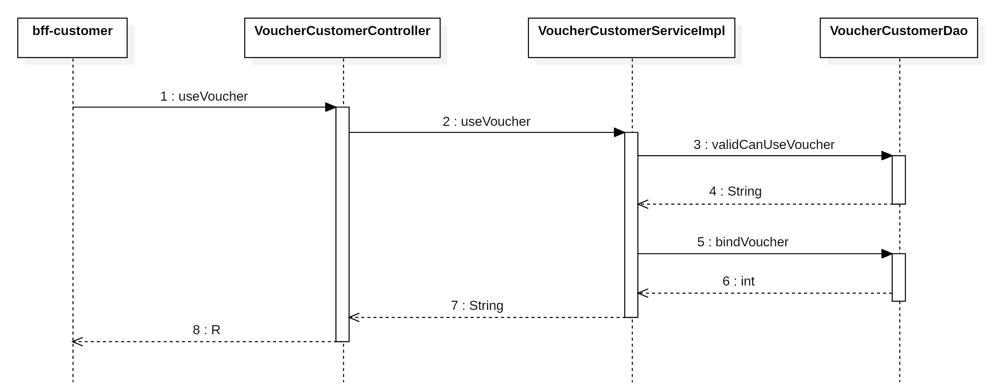

### 编写持久层代码

代金券表`<font style="color:#000000;background-color:rgba(220, 240, 255, 0.3) !important;">tb_voucher</font>`表结构

| **字段** | **类型** | **非空** | **备注** |
| --- | --- | --- | --- |
| id | bigint | True | 主键 |
| uuid | varchar | True | UUID |
| name | varchar | True | 代金券标题 |
| remark | varchar | False | 描述文字 |
| tag | varchar | False | 代金券标签，例如新人专用 |
| total_quota | int | True | 代金券数量，如果是0，则是无限量 |
| take_count | int | True | 实际领取数量 |
| used_count | int | True | 已经使用的数量 |
| discount | decimal | True | 代金券面额 |
| with_amount | decimal | True | 最少消费金额才能使用代金券 |
| type | tinyint | True | 代金券赠送类型，如果是1则通用券，用户领取；如果是2，则是注册赠券 |
| limit_quota | smallint | True | 用户领券限制数量，如果是0，则是不限制；默认是1，限领一张 |
| status | tinyint | True | 代金券状态，如果是1则是正常可用；如果是2则是过期; 如果是3则是下架 |
| time_type | tinyint | False | 有效时间限制，如果是1，则基于领取时间的有效天数days；如果是2，则start_time和end_time是优惠券有效期； |
| days | smallint | False | 基于领取时间的有效天数days |
| start_time | datetime | False | 代金券开始时间 |
| end_time | datetime | False | 代金券结束时间 |
| create_time | datetime | True | 创建时间 |

至于哪些用户领取了代金券，我们要记录下来（**代金券与订单绑定**），我们看看`<font style="color:#000000;background-color:rgba(220, 240, 255, 0.3) !important;">tb_voucher_customer</font>`表结构

| **字段** | **类型** | **非空** | **备注** |
| --- | --- | --- | --- |
| id | bigint | True | 主键 |
| customer_id | bigint | True | 客户ID |
| voucher_id | bigint | True | 代金券ID |
| status | tinyint | True | 使用状态, 如果是1则未使用；如果是2则已使用；如果是3则已过期；如果是4则已经下架； |
| used_time | datetime | False | 使用代金券的时间 |
| start_time | datetime | False | 有效期开始时间 |
| end_time | datetime | False | 有效期截至时间 |
| order_id | bigint | False | 订单ID |
| create_time | datetime | True | 创建时间 |

在`<font style="color:#000000;background-color:rgba(220, 240, 255, 0.3) !important;">VoucherCustomerDao.xml</font>`文件中，声明SQL语句

```xml
<select id="validCanUseVoucher" parameterType="Map" resultType="String">
    SELECT CAST(v.discount AS CHAR) AS discount
    FROM tb_voucher_customer vc
    JOIN tb_voucher v ON vc.voucher_id = v.id
    WHERE vc.voucher_id = #{voucherId}
      AND vc.customer_id = #{customerId}
      AND v.with_amount <= #{amount}
      AND vc.`status` = 1
      AND ((CURRENT_DATE BETWEEN vc.start_time AND vc.end_time)
        OR (vc.start_time IS NULL AND vc.end_time IS NULL));
</select>

<update id="bindVoucher" parameterType="Map">
    UPDATE tb_voucher_customer
    SET order_id = #{orderId},
        `status` = 2
    WHERE voucher_id = #{voucherId}
</update>
```

在`<font style="color:#000000;background-color:rgba(220, 240, 255, 0.3) !important;">com.example.zxds.vhr.db.dao</font>`包`<font style="color:#000000;background-color:rgba(220, 240, 255, 0.3) !important;">VoucherCustomerDao.java</font>`接口中，声明DAO方法

```java
package com.example.zxds.vhr.db.dao;

import java.util.Map;

public interface VoucherCustomerDao {

    String validCanUseVoucher(Map<String, Object> param);

    int bindVoucher(Map<String, Object> param);
}
```

### 编写 service 和实现

在`<font style="color:#000000;background-color:rgba(220, 240, 255, 0.3) !important;">com.example.zxds.vhr.service</font>`包`<font style="color:#000000;background-color:rgba(220, 240, 255, 0.3) !important;">VoucherCustomerService.java</font>`接口中，声明抽象方法

```java
package com.example.zxds.vhr.service;

import java.util.Map;

public interface VoucherCustomerService {
    String useVoucher(Map<String, Object> param);
}
```

在`<font style="color:#000000;background-color:rgba(220, 240, 255, 0.3) !important;">com.example.zxds.vhr.service.impl</font>`包`<font style="color:#000000;background-color:rgba(220, 240, 255, 0.3) !important;">VoucherCustomerServiceImpl.java</font>`接口中，实现抽象方法

```java
package com.example.zxds.vhr.service.impl;

import com.example.zxds.common.exception.ZxdsException;
import com.example.zxds.vhr.db.dao.VoucherCustomerDao;
import com.example.zxds.vhr.service.VoucherCustomerService;
import lombok.RequiredArgsConstructor;
import org.springframework.stereotype.Service;
import org.springframework.transaction.annotation.Transactional;

import java.util.Map;

@Service
@RequiredArgsConstructor
public class VoucherCustomerServiceImpl implements VoucherCustomerService {

    private final VoucherCustomerDao voucherCustomerDao;

    @Override
    @Transactional
    public String useVoucher(Map<String, Object> param) {
        String discount = voucherCustomerDao.validCanUseVoucher(param);
        if (discount != null) {
            int rows = voucherCustomerDao.bindVoucher(param);
            if (rows != 1) {
                throw new ZxdsException("代金券不可用");
            }
            return discount;
        }
        throw new ZxdsException("代金券不可用");
    }

}
```

### 编写 web 层代码

在`<font style="color:#000000;background-color:rgba(220, 240, 255, 0.3) !important;">com.example.zxds.vhr.controller.form</font>`包中，创建`<font style="color:#000000;background-color:rgba(220, 240, 255, 0.3) !important;">UseVoucherForm.java</font>`类

```java
package com.example.zxds.vhr.controller.form;

import io.swagger.v3.oas.annotations.media.Schema;
import lombok.Data;

import javax.validation.constraints.Min;
import javax.validation.constraints.NotBlank;
import javax.validation.constraints.NotNull;
import javax.validation.constraints.Pattern;

@Data
@Schema(description = "使用代金券的表单")
public class UseVoucherForm {
    @NotNull(message = "voucherId不能为空")
    @Min(value = 1, message = "voucherId不能小于1")
    @Schema(description = "代金券ID")
    private Long voucherId;

    @NotNull(message = "customerId不能为空")
    @Min(value = 1, message = "customerId不能小于1")
    @Schema(description = "客户ID")
    private Long customerId;

    @NotNull(message = "orderId不能为空")
    @Min(value = 1, message = "orderId不能小于1")
    @Schema(description = "客户ID")
    private Long orderId;

    @NotBlank(message = "amount不能为空")
    @Pattern(regexp = "^[1-9]\\d*\\.\\d{1,2}$|^0\\.\\d{1,2}$|^[1-9]\\d*$", message = "amount内容不正确")
    @Schema(description = "订单金额")
    private String amount;
}
```

在`<font style="color:#000000;background-color:rgba(220, 240, 255, 0.3) !important;">com.example.zxds.vhr.controller</font>`包`<font style="color:#000000;background-color:rgba(220, 240, 255, 0.3) !important;">VoucherCustomerController.java</font>`类中，声明Web方法

```java
package com.example.zxds.vhr.controller;

import cn.hutool.core.bean.BeanUtil;
import com.example.zxds.common.util.R;
import com.example.zxds.vhr.controller.form.UseVoucherForm;
import com.example.zxds.vhr.service.VoucherCustomerService;
import io.swagger.v3.oas.annotations.Operation;
import io.swagger.v3.oas.annotations.tags.Tag;
import lombok.RequiredArgsConstructor;
import org.springframework.web.bind.annotation.PostMapping;
import org.springframework.web.bind.annotation.RequestBody;
import org.springframework.web.bind.annotation.RequestMapping;
import org.springframework.web.bind.annotation.RestController;

import javax.validation.Valid;
import java.util.Map;

@RestController
@RequestMapping("/voucher/customer")
@RequiredArgsConstructor
@Tag(name = "VoucherCustomerController", description = "代金券客户Web接口")
public class VoucherCustomerController {
    
    private final VoucherCustomerService voucherCustomerService;

    @PostMapping("/useVoucher")
    @Operation(summary = "检查可否使用代金券")
    public R useVoucher(@RequestBody @Valid UseVoucherForm form) {
        Map<String, Object> param = BeanUtil.beanToMap(form);
        String discount = voucherCustomerService.useVoucher(param);
        return R.ok().put("result", discount);
    }
}
```

# 创建微信支付单（二）

接下来我们要编写`<font style="color:#000000;background-color:rgba(220, 240, 255, 0.3) !important;">bff-customer</font>`子系统的代码，调用相关子系统来创建微信支付账单。在编写代码之前，我们先来看一下时序图，如下：

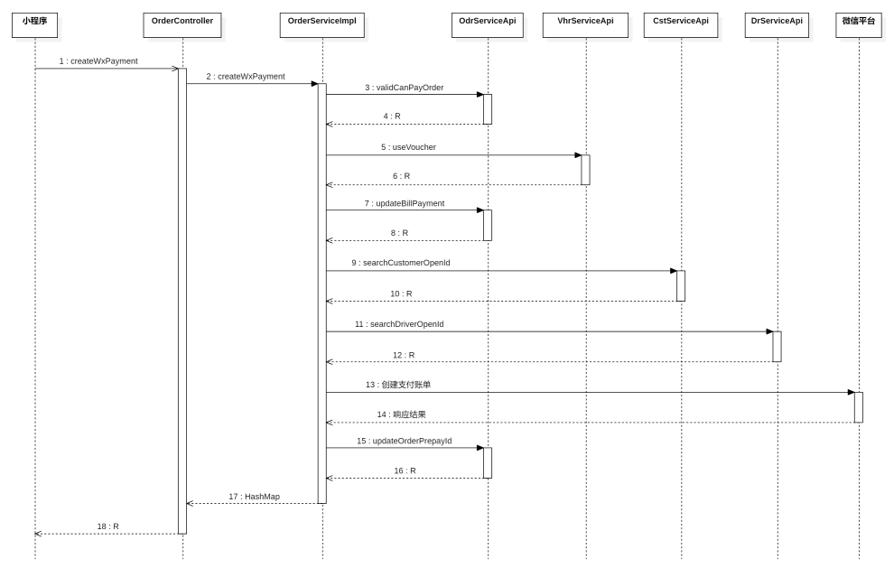

## 编写 Feign 客户端

### 调用 zxds-odr 子系统

在`<font style="color:#000000;background-color:rgba(220, 240, 255, 0.3) !important;">com.example.zxds.bff.customer.controller.form</font>`包中，创建`<font style="color:#000000;background-color:rgba(220, 240, 255, 0.3) !important;">ValidCanPayOrderForm.java</font>`类

```java
package com.example.zxds.bff.customer.controller.form;

import io.swagger.v3.oas.annotations.media.Schema;
import lombok.Data;

@Data
@Schema(description = "检查订单是否可以支付的表单")
public class ValidCanPayOrderForm {

    @Schema(description = "订单ID")
    private Long orderId;

    @Schema(description = "客户ID")
    private Long customerId;
}
```

在`<font style="color:#000000;background-color:rgba(220, 240, 255, 0.3) !important;">com.example.zxds.bff.customer.controller.form</font>`包中，创建`<font style="color:#000000;background-color:rgba(220, 240, 255, 0.3) !important;">UpdateBillPaymentForm.java</font>`类

```java
package com.example.zxds.bff.customer.controller.form;

import io.swagger.v3.oas.annotations.media.Schema;
import lombok.Data;

@Data
@Schema(description = "更新账单实际支付费用的表单")
public class UpdateBillPaymentForm {

    @Schema(description = "实际支付金额")
    private String realPay;

    @Schema(description = "代金券面额")
    private String voucherFee;

    @Schema(description = "订单ID")
    private Long orderId;
}
```

在`<font style="color:#000000;background-color:rgba(220, 240, 255, 0.3) !important;">com.example.zxds.bff.customer.controller.form</font>`包中，创建`<font style="color:#000000;background-color:rgba(220, 240, 255, 0.3) !important;">UpdateOrderPrepayIdForm.java</font>`类

```java
package com.example.zxds.bff.customer.controller.form;

import io.swagger.v3.oas.annotations.media.Schema;
import lombok.Data;

@Data
@Schema(description = "更新支付订单ID的表单")
public class UpdateOrderPrepayIdForm {

    @Schema(description = "预支付订单ID")
    private String prepayId;

    @Schema(description = "订单ID")
    private Long orderId;
}
```

在`<font style="color:#000000;background-color:rgba(220, 240, 255, 0.3) !important;">com.example.zxds.bff.customer.feign</font>`包`<font style="color:#000000;background-color:rgba(220, 240, 255, 0.3) !important;">OdrServiceApi.java</font>`接口中，声明抽象方法

```java
@PostMapping("/order/validCanPayOrder")
R validCanPayOrder(ValidCanPayOrderForm form);

@PostMapping("/order/bill/updateBillPayment")
R updateBillPayment(UpdateBillPaymentForm form);

@PostMapping("/order/updateOrderPrepayId")
R updateOrderPrepayId(UpdateOrderPrepayIdForm form);
```

### 调用 zxds-vhr 子系统

在`<font style="color:#000000;background-color:rgba(220, 240, 255, 0.3) !important;">com.example.zxds.bff.customer.controller.form</font>`包中，创建`<font style="color:#000000;background-color:rgba(220, 240, 255, 0.3) !important;">UseVoucherForm.java</font>`类

```java
package com.example.zxds.bff.customer.controller.form;

import io.swagger.v3.oas.annotations.media.Schema;
import lombok.Data;

import javax.validation.constraints.Min;
import javax.validation.constraints.NotNull;

@Data
@Schema(description = "使用代金券的表单")
public class UseVoucherForm {
    @NotNull(message = "voucherId不能为空")
    @Min(value = 1, message = "voucherId不能小于1")
    @Schema(description = "代金券ID")
    private Long voucherId;

    @NotNull(message = "customerId不能为空")
    @Min(value = 1, message = "customerId不能小于1")
    @Schema(description = "客户ID")
    private Long customerId;

    @NotNull(message = "orderId不能为空")
    @Min(value = 1, message = "orderId不能小于1")
    @Schema(description = "客户ID")
    private Long orderId;

    @Schema(description = "订单金额")
    private String amount;
}
```

在`<font style="color:#000000;background-color:rgba(220, 240, 255, 0.3) !important;">com.example.zxds.bff.customer.feign</font>`包`<font style="color:#000000;background-color:rgba(220, 240, 255, 0.3) !important;">VhrServiceApi.java</font>`接口中，声明抽象方法

```java
package com.example.zxds.bff.customer.feign;

import com.example.zxds.bff.customer.controller.form.UseVoucherForm;
import com.example.zxds.common.util.R;
import org.springframework.cloud.openfeign.FeignClient;
import org.springframework.web.bind.annotation.PostMapping;

@FeignClient(value = "zxds-vhr")
public interface VhrServiceApi {

    @PostMapping("/voucher/customer/useVoucher")
    R useVoucher(UseVoucherForm form);
}
```

### 调用 zxds-cst 子系统

在`<font style="color:#000000;background-color:rgba(220, 240, 255, 0.3) !important;">com.example.zxds.bff.customer.controller.form</font>`包中，创建`<font style="color:#000000;background-color:rgba(220, 240, 255, 0.3) !important;">SearchCustomerOpenIdForm.java</font>`类

```java
package com.example.zxds.bff.customer.controller.form;

import io.swagger.v3.oas.annotations.media.Schema;
import lombok.Data;

@Data
@Schema(description = "查询客户OpenId的表单")
public class SearchCustomerOpenIdForm {
    @Schema(description = "客户ID")
    private Long customerId;
}
```

在`<font style="color:#000000;background-color:rgba(220, 240, 255, 0.3) !important;">com.example.zxds.bff.customer.feign</font>`包`<font style="color:#000000;background-color:rgba(220, 240, 255, 0.3) !important;">CstServiceApi.java</font>`接口中，声明抽象方法

```java
@PostMapping("/customer/searchCustomerOpenId")
R searchCustomerOpenId(SearchCustomerOpenIdForm form);
```

### 调用 zxds-dr 子系统

在`<font style="color:#000000;background-color:rgba(220, 240, 255, 0.3) !important;">com.example.zxds.bff.customer.controller.form</font>`包中，创建`<font style="color:#000000;background-color:rgba(220, 240, 255, 0.3) !important;">SearchDriverOpenIdForm.java</font>`类

```java
package com.example.zxds.bff.customer.controller.form;

import io.swagger.v3.oas.annotations.media.Schema;
import lombok.Data;

@Data
@Schema(description = "查询司机OpenId的表单")
public class SearchDriverOpenIdForm {

    @Schema(description = "司机ID")
    private Long driverId;
}
```

在`<font style="color:#000000;background-color:rgba(220, 240, 255, 0.3) !important;">com.example.zxds.bff.customer.feign</font>`包`<font style="color:#000000;background-color:rgba(220, 240, 255, 0.3) !important;">DrServiceApi.java</font>`接口中，声明抽象方法

```java
@PostMapping("/driver/searchDriverOpenId")
R searchDriverOpenId(SearchDriverOpenIdForm form);
```

## 编写 service 和实现

在`<font style="color:#000000;background-color:rgba(220, 240, 255, 0.3) !important;">com.example.zxds.bff.customer.service</font>`包`<font style="color:#000000;background-color:rgba(220, 240, 255, 0.3) !important;">OrderService.java</font>`接口中，声明抽象方法

```java
Map<String, String> createWxPayment(long orderId, long customerId, Long voucherId);
```

在`<font style="color:#000000;background-color:rgba(220, 240, 255, 0.3) !important;">com.example.zxds.bff.customer.service.impl</font>`包`<font style="color:#000000;background-color:rgba(220, 240, 255, 0.3) !important;">OrderServiceImpl.java</font>`类中，实现抽象方法

```java
private final VhrServiceApi vhrServiceApi;
private final CstServiceApi cstServiceApi;
private final MyWXPayConfig myWXPayConfig;

@Override
@GlobalTransactional
public Map<String, String> createWxPayment(long orderId, long customerId, Long voucherId) {
    /*
     * 1.先查询订单是否为6状态，其他状态都不可以生成支付订单
     */
    ValidCanPayOrderForm form1 = new ValidCanPayOrderForm();
    form1.setOrderId(orderId);
    form1.setCustomerId(customerId);
    R r = odrServiceApi.validCanPayOrder(form1);
    Map<String, String> map = (Map<String, String>) r.get("result");
    String amount = MapUtil.getStr(map, "realFee");
    String uuid = MapUtil.getStr(map, "uuid");
    long driverId = MapUtil.getLong(map, "driverId");
    String discount = "0.00";
    if (voucherId != null) {
        /*
         * 2.查询代金券是否可以使用，并绑定
         */
        UseVoucherForm form2 = new UseVoucherForm();
        form2.setCustomerId(customerId);
        form2.setVoucherId(voucherId);
        form2.setOrderId(orderId);
        form2.setAmount(amount);
        r = vhrServiceApi.useVoucher(form2);
        discount = MapUtil.getStr(r, "result");
    }
    if (new BigDecimal(amount).compareTo(new BigDecimal(discount)) == -1) {
        throw new ZxdsException("总金额不能小于优惠劵面额");
    }
    /*
     * 3.修改实付金额
     */
    amount = NumberUtil.sub(amount, discount).toString();
    UpdateBillPaymentForm form3 = new UpdateBillPaymentForm();
    form3.setOrderId(orderId);
    form3.setRealPay(amount);
    form3.setVoucherFee(discount);
    odrServiceApi.updateBillPayment(form3);

    /*
     * 4.查询用户的OpenID字符串
     */
    SearchCustomerOpenIdForm form4 = new SearchCustomerOpenIdForm();
    form4.setCustomerId(customerId);
    r = cstServiceApi.searchCustomerOpenId(form4);
    String customerOpenId = MapUtil.getStr(r, "result");

    /*
     * 5.查询司机的OpenId字符串
     */
    SearchDriverOpenIdForm form5 = new SearchDriverOpenIdForm();
    form5.setDriverId(driverId);
    r = drServiceApi.searchDriverOpenId(form5);
    String driverOpenId = MapUtil.getStr(r, "result");

    /*
     * 6.TODO 创建支付订单
     */
}
```

# 创建微信支付单（三）

在大健康项目中我们已经实现过微信支付的功能了，这里不再赘述，直接实现功能

## 编写配置文件

将微信支付相关的 appid 以及密钥等信息，编写到 `<font style="color:#000000;">application-common.yml</font>`文件中。

```yaml
wx:
  app-id: 
  app-secret: 
  mch-id: 
  key: 
  cert-path: 
```

修改司机端和乘客端小程序项目里面的`<font style="color:#000000;background-color:rgba(220, 240, 255, 0.3) !important;">menifest.json</font>`文件，使用我提供的小程序APPID。

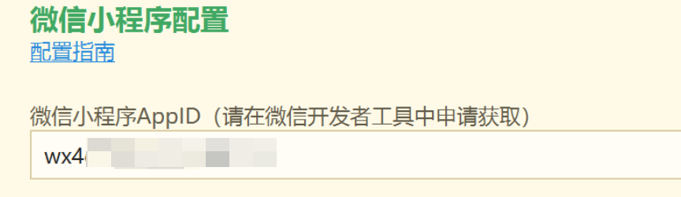

## 掌握微信支付接口

如果想要发起微信支付，首先要调用微信支付API接口，创建支付账单，然后把支付账单的信息传递给乘客端小程序，就能看到微信APP弹出付款界面了。具体流程，我们看下面的时序图。

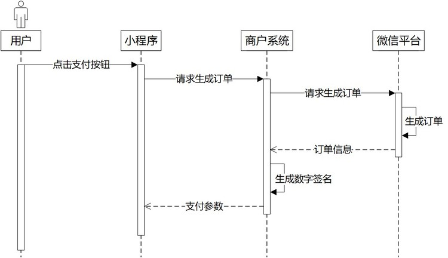

关于创建微信支付订单的API接口，腾讯提供了相关文档，我们来看一下（[https://pay.weixin.qq.com/wiki/doc/api/wxa/wxa_api.php?chapter=9_1](https://pay.weixin.qq.com/wiki/doc/api/wxa/wxa_api.php?chapter=9_1)）

| **字段名** | **变量名** | **描述** |
| --- | --- | --- |
| 小程序ID | appid | 微信分配的小程序ID |
| 商户号 | mch_id | 微信支付分配的商户号 |
| 随机字符串 | nonce_str | 一个随机生成的字符串，让每次请求的签名都独一无二，防止攻击者猜解签名 |
| 签名 | sign | 用密钥和所有参数算出的“数字指纹”，用来证明请求是你发的且内容没被篡改 |
| 签名类型 | sign_type | 指定签名的加密算法（MD5 或 HMAC-SHA256），告诉微信用哪种方式验证签名 |
| 商品描述 | body | 商品简单描述，该字段请按照规范传递 |
| 附加数据 | attach | 附加数据，属于自定义参数 |
| 用户标识 | openid | 付款人的openId |
| 商户订单号 | out_trade_no | 商户系统内部订单号，要求32个字符内 |
| 标价金额 | total_fee | 订单总金额，单位为分 |
| 终端IP | spbill_create_ip | 调用微信支付API的机器IP（可以随便写） |
| 通知地址 | notify_url | 异步接收微信支付结果通知的回调地址 |
| 交易类型 | trade_type | 必须是JSAPI：适用于**微信公众号、微信小程序**。 Native 支付：PC 网站二维码支付。 |
| 是否需要分账 | profit_sharing | Y，需要分账；N，不分账 |

**微信支付平台给我们返回的响应中包含了下面这些参数。**

| **参数** | **含义** | **例子** |
| --- | --- | --- |
| return_code | 通信状态码 | SUCCESS |
| result_code | 业务状态码 | SUCCESS |
| app_id | 微信公众账号APPID | wx8888888888888888 |
| mch_id | 商户ID | 1900000109 |
| nonce_str | 随机字符串 | 5K8264ILTKCH16CQ2502SI8ZNMTM67VS |
| sign | 数字签名 | C380BEC2BFD727A4B6845133519F3AD6 |
| trade_type | 交易类型 | NATIVE |
| prepay_id | 预支付交易会话标识ID | wx201410272009395522657a6905100 |

# 创建微信支付单（四）

接下来我们继续编写`<font style="color:#000000;background-color:rgba(220, 240, 255, 0.3) !important;">bff-customer</font>`子系统的代码，把微信支付账单给创建出来

## 编写 bff-customer 子系统

咱们继续编写`<font style="color:#000000;background-color:rgba(220, 240, 255, 0.3) !important;">OrderServiceImpl.java</font>`类中剩余的代码，调用common子系统中微信支付SDK中的方法，创建微信支付账单

```java
private final VhrServiceApi vhrServiceApi;

private final CstServiceApi cstServiceApi;
private final MyWXPayConfig myWXPayConfig;

@Override
@GlobalTransactional
public Map<String, String> createWxPayment(long orderId, long customerId, Long voucherId) {
    
    //...............

    /*
     * 6.TODO 创建支付订单
     */
    try {
        WXPay wxPay = new WXPay(myWXPayConfig);
        Map<String, String> param = new HashMap<>();
        param.put("nonce_str", WXPayUtil.generateNonceStr());//随机字符串
        param.put("body", "代驾费");
        param.put("out_trade_no", uuid);
        //充值金额转换成分为单位，并且让BigDecimal取整数
        //amount="1.00";
        param.put("total_fee", NumberUtil.mul(amount, "100").setScale(0, RoundingMode.FLOOR).toString());
        param.put("spbill_create_ip", "127.0.0.1");
        //TODO 这里要修改成内网穿透的公网URL
        param.put("notify_url", "http://demo.com");
        param.put("trade_type", "JSAPI");
        param.put("openid", customerOpenId);
        param.put("attach", driverOpenId);
        param.put("profit_sharing", "Y"); //支付需要分账

        //创建支付订单
        Map<String, String> result = wxPay.unifiedOrder(param);

        //预支付交易会话标识ID
        String prepayId = result.get("prepay_id");
        if (prepayId != null) {
            /*
             * 7.更新订单记录中的prepay_id字段值
             */
            UpdateOrderPrepayIdForm form6 = new UpdateOrderPrepayIdForm();
            form6.setOrderId(orderId);
            form6.setPrepayId(prepayId);
            odrServiceApi.updateOrderPrepayId(form6);

            // 接下来准备数据(这些数据将返回给小程序)。为什么需要返回这些数据？
            //准备生成数字签名用的数据
            map.clear();
            map.put("appId", myWXPayConfig.getAppID());
            String timeStamp = new Date().getTime() + "";
            map.put("timeStamp", timeStamp);
            String nonceStr = WXPayUtil.generateNonceStr();
            map.put("nonceStr", nonceStr);
            map.put("package", "prepay_id=" + prepayId);
            map.put("signType", "MD5");

            //生成数据签名
            String paySign = WXPayUtil.generateSignature(map, myWXPayConfig.getKey()); //生成数字签名

            map.clear(); //清理HashMap，放入结果
            map.put("package", "prepay_id=" + prepayId);
            map.put("timeStamp", timeStamp);
            map.put("nonceStr", nonceStr);
            map.put("paySign", paySign);
            //uuid用于付款成功后，移动端主动请求更新充值状态
            map.put("uuid", uuid);
            return map;
        } else {
            log.error("创建支付订单失败");
            throw new ZxdsException("创建支付订单失败");
        }
    } catch (Exception e) {
        log.error("创建支付订单失败", e);
        throw new ZxdsException("创建支付订单失败");
    }
}
```

**大家可能会有疑问：你怎么知道需要返回这些数据给小程序呢？这就需要参考前端小程序发起微信支付时需要提交什么数据了，它需要什么数据，咱就需要返回什么数据：**[**https://developers.weixin.qq.com/miniprogram/dev/api/payment/wx.requestPayment.html**](https://developers.weixin.qq.com/miniprogram/dev/api/payment/wx.requestPayment.html)

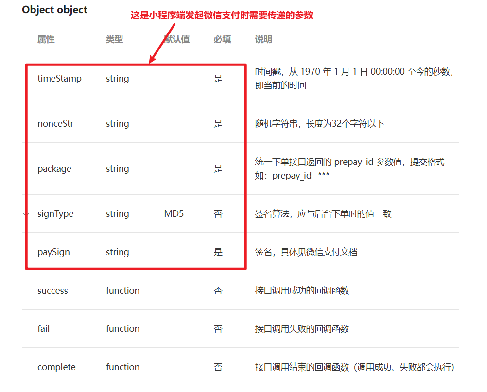

在`<font style="color:#000000;background-color:rgba(220, 240, 255, 0.3) !important;">com.example.zxds.bff.customer.controller.form</font>`包中，创建`<font style="color:#000000;background-color:rgba(220, 240, 255, 0.3) !important;">CreateWxPaymentForm.java</font>`类

```java
package com.example.zxds.bff.customer.controller.form;

import io.swagger.v3.oas.annotations.media.Schema;
import lombok.Data;

import javax.validation.constraints.Min;
import javax.validation.constraints.NotNull;

@Data
@Schema(description = "创建支付订单")
public class CreateWxPaymentForm {
    @NotNull(message = "orderId不为空")
    @Min(value = 1, message = "orderId不能小于1")
    @Schema(description = "订单ID")
    private Long orderId;

    @Schema(description = "客户ID")
    private Long customerId;

    @Min(value = 1, message = "voucherId不能小于1")
    @Schema(description = "代金券ID")
    private Long voucherId;
}
```

在`<font style="color:#000000;background-color:rgba(220, 240, 255, 0.3) !important;">com.example.zxds.bff.customer.controller</font>`包`<font style="color:#000000;background-color:rgba(220, 240, 255, 0.3) !important;">OrderController.java</font>`类中，声明Web方法

```java
@PostMapping("/createWxPayment")
@Operation(summary = "创建支付订单")
@SaCheckLogin
public R createWxPayment(@RequestBody @Valid CreateWxPaymentForm form) {
    Long customerId = StpUtil.getLoginIdAsLong();
    form.setCustomerId(customerId);
    Map<String, String> map = orderService.createWxPayment(form.getOrderId(), form.getCustomerId(), form.getVoucherId());
    return R.ok().put("result", map);
}
```

## 测试 web 方法

把后端各个子系统运行起来，然后用 Apipost 调用刚刚写好的`<font style="color:#000000;background-color:rgba(220, 240, 255, 0.3) !important;">createWxPayment()</font>`函数，看一下返回的响应。

# 乘客端小程序唤起付款窗口

创建的微信支付账单信息已经有了，这些信息返回给小程序，然后调用`<font style="color:#000000;background-color:rgba(220, 240, 255, 0.3) !important;">uni.requestPayment()</font>`函数的时候传入这些数据，小程序就能弹出付款窗口了

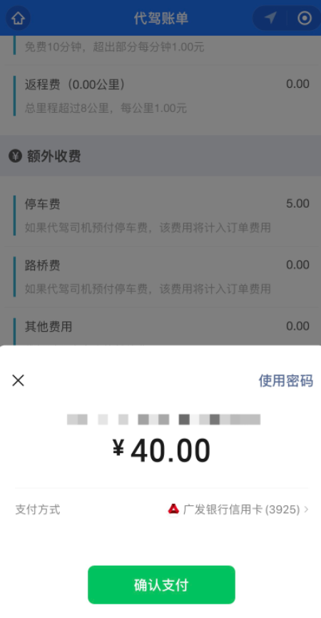

## 定义全局 URL 路径

```javascript
Vue.prototype.url = {
        ……,
        createWxPayment:`${baseUrl}/order/createWxPayment`
}
```

## 实现唤起付款窗口

在`<font style="color:#000000;background-color:rgba(220, 240, 255, 0.3) !important;">order.vue</font>`页面上面有立即付款按钮，我们来看一下

```html
<view class="operate-container">
  <button class="btn" @tap="payHandle">立即付款</button>
</view>
```

该按钮的点击事件回调函数，我们要实现一下。

```javascript
payHandle() {
    let that = this;
    uni.showModal({
        title: '提示消息',
        content: '您确定支付该订单？',
        success: function(resp) {
            if (resp.confirm) {
                let data = {
                    orderId: that.orderId
                };
                that.ajax(that.url.createWxPayment, 'POST', data, function(resp) {
                    let result = resp.data.result;
                    let pk = result.package;
                    let timeStamp = result.timeStamp;
                    let nonceStr = result.nonceStr;
                    let paySign = result.paySign;
                    let uuid = result.uuid;
                    uni.requestPayment({
                        timeStamp: timeStamp,
                        nonceStr: nonceStr,
                        package: pk,
                        paySign: paySign,
                        signType: 'MD5',
                        success: function() {
                            console.log('付款成功');
                            //TODO 主动发起查询请求
                        },
                        fail: function(error) {
                            console.error(error);
                            uni.showToast({
                                icon: 'error',
                                title: '付款失败'
                            });
                        }
                    });
                });
            }
        }
    });
}
```

## 测试小程序

把后端各个子系统运行起来，然后运行乘客端小程序，点击立即付款按钮之后，看到付款弹窗说明程序一切正常。大家不要付款，还没有到付款的时机！！！

# 设置内网穿透接收付款结果

我们在乘客端小程序上点击付款按钮之后，发出Ajax请求，成功创建了微信支付账单。小程序也弹出了付款的弹窗，但是最后我们并没有付款，这是因为我们还没有写Web方法接收付款结果。接下来咱们就用内网穿透接收付款结果，然后核实付款通知消息的真实性。

## 设置内网穿透

因为我们的电脑没有外网静态IP，所以微信服务器没有办法把付款通知消息发送到我们的Java项目上面，这就需要使用内网穿透技术了。之前咱们测试小程序司乘同显页面的的时候，配置过内网穿透，那么咱们可以利用这个内网穿透通道，接收微信平台发送过来的付款结果。

修改`<font style="color:#000000;background-color:rgba(220, 240, 255, 0.3) !important;">gateway</font>`子系统的`<font style="color:#000000;background-color:rgba(220, 240, 255, 0.3) !important;">application.yml</font>`文件内容，在里面添加订单子系统的路由配置

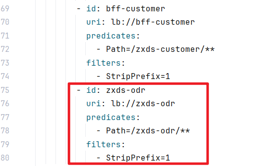

```yaml
        - id: zxds-odr
          uri: lb://zxds-odr
          predicates:
            - Path=/zxds-odr/**
          filters:
            - StripPrefix=1
```

## 接收付款结果消息

微信平台发送付款结果通知的Request里面是XML格式的数据，所以要从中提取出我们需要的关键数据，这部分的文档规范，大家可以查阅微信支付的官方资料（[https://pay.weixin.qq.com/wiki/doc/api/native.php?chapter=9_7&index=8](https://pay.weixin.qq.com/wiki/doc/api/native.php?chapter=9_7&index=8)）。而且这个请求并不是只发送一次，如果商户系统没有接收到请求，微信平台会每隔一小段时间再发送一次付款结果。

**请求参数：**

| **参数** | **含义** | **类型** | **示例** |
| --- | --- | --- | --- |
| return_code | 通信状态码 | String | SUCCESS |
| result_code | 业务状态码 | String | SUCCESS / FAIL |
| sign | 数字签名 | String | C380BEC2BFD727A4B6845133519F3AD6 |
| out_trade_no | 商品订单ID | String | 1212321211201407033568112322 |
| transaction_id | 支付订单ID | String | 1217752501201407033233368018 |
| total_fee | 订单金额 | int | 150 |
| time_end | 支付的时间 | String | 20141030133525 |

```xml
<xml>
    <appid><![CDATA[wx2421b1c4370ec43b]]></appid>
    <attach><![CDATA[支付测试]]></attach>
    <bank_type><![CDATA[CFT]]></bank_type>
    <fee_type><![CDATA[CNY]]></fee_type>
    <is_subscribe><![CDATA[Y]]></is_subscribe>
    <mch_id><![CDATA[10000100]]></mch_id>
    <nonce_str><![CDATA[5d2b6c2a8db53831f7eda20af46e531c]]></nonce_str>
    <openid><![CDATA[oUpF8uMEb4qRXf22hE3X68TekukE]]></openid>
    <out_trade_no><![CDATA[1409811653]]></out_trade_no>
    <result_code><![CDATA[SUCCESS]]></result_code>
    <return_code><![CDATA[SUCCESS]]></return_code>
    <sign><![CDATA[B552ED6B279343CB493C5DD0D78AB241]]></sign>
    <time_end><![CDATA[20140903131540]]></time_end>
    <total_fee>1</total_fee>
    <coupon_fee><![CDATA[10]]></coupon_fee>
    <coupon_count><![CDATA[1]]></coupon_count>
    <coupon_type><![CDATA[CASH]]></coupon_type>
    <coupon_id><![CDATA[10000]]></coupon_id>
    <trade_type><![CDATA[JSAPI]]></trade_type>
    <transaction_id><![CDATA[1004400740201409030005092168]]></transaction_id>
</xml> 
```

**需要响应给微信支付平台的数据：**

返回给微信平台的响应内容也必须是XML格式的，否则微信平台就会认为你没收到付款结果通知

```xml
<xml>
    <return_code><![CDATA[SUCCESS]]></return_code>
    <return_msg><![CDATA[OK]]></return_msg>
</xml> 
```

我们需要创建一个Web方法来接收微信平台发送过来的付款结果通知，所以我们找到`<font style="color:#000000;background-color:rgba(220, 240, 255, 0.3) !important;">OrderController.java</font>`类，然后声明Web方法

```java
private final MyWXPayConfig myWXPayConfig;

@RequestMapping("/receiveMessage")
@Operation(summary = "接收代驾费消息通知")
public void receiveMessage(HttpServletRequest request, HttpServletResponse response) throws Exception {
    request.setCharacterEncoding("utf-8");
    Reader reader = request.getReader();
    BufferedReader buffer = new BufferedReader(reader);
    String line = buffer.readLine();
    StringBuffer temp = new StringBuffer();
    while (line != null) {
        temp.append(line);
        line = buffer.readLine();
    }
    buffer.close();
    reader.close();
    String xml = temp.toString();
    if (WXPayUtil.isSignatureValid(xml, myWXPayConfig.getKey())) {
        Map<String, String> map = WXPayUtil.xmlToMap(xml);
        String resultCode = map.get("result_code");
        String returnCode = map.get("return_code");
        if ("SUCCESS".equals(resultCode) && "SUCCESS".equals(returnCode)) {
            response.setCharacterEncoding("utf-8");
            response.setContentType("application/xml");
            Writer writer = response.getWriter();
            BufferedWriter bufferedWriter = new BufferedWriter(writer);
            bufferedWriter.write("<xml><return_code><![CDATA[SUCCESS]]></return_code> <return_msg><![CDATA[OK]]></return_msg></xml>");
            bufferedWriter.close();
            writer.close();

            String uuid = map.get("out_trade_no");
            String payId = map.get("transaction_id");
            String driverOpenId = map.get("attach");
            String payTime = DateUtil.parse(map.get("time_end"), "yyyyMMddHHmmss").toString("yyyy-MM-dd HH:mm:ss");

            //TODO 修改订单状态、执行分账、发放系统奖励
        }
    } else {
        response.sendError(500, "数字签名异常");
    }
}
```

# 订单更新为已付款向司机发放奖励

如果乘客付款成功，我们需要把代驾订单改成已付款状态。如果满足奖励条件，还要向司机发放奖励，接下来咱们把后端的Java代码给写一下。

## 编写 zxds-dr 子系统

给司机发放系统奖励就是向司机钱包充入奖励的金额，写代码之前，我们先来看一下时序图

1. **保存一条充值记录。（tb_wallet_income）**
2. **修改钱包的余额。（tb_wallet）**

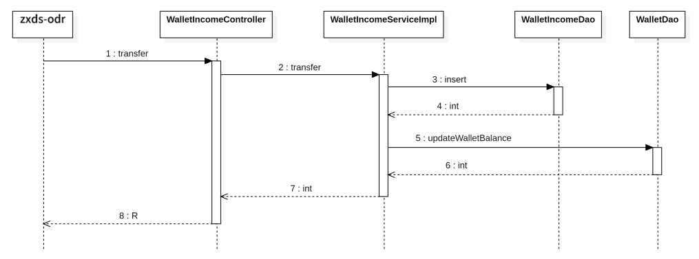

### 编写持久层代码

我们先来了解一下`<font style="color:#000000;background-color:rgba(220, 240, 255, 0.3) !important;">tb_wallet_income</font>`表结构

| **字段名** | **类型** | **非空** | **备注** |
| --- | --- | --- | --- |
| id | bigint | True | 主键 |
| uuid | varchar | True | uuid字符串 |
| driver_id | bigint | True | 司机ID |
| amount | decimal | True | 金额 |
| type | tinyint | True | 1充值，2奖励，3补贴 |
| prepay_id | varchar | False | 预支付订单ID |
| status | tinyint | True | 1未支付，2已支付，3已到账 |
| remark | varchar | False | 备注信息 |
| create_time | datetime | True | 创建时间 |

在`<font style="color:#000000;background-color:rgba(220, 240, 255, 0.3) !important;">WalletIncomeDao.xml</font>`文件中，声明SQL语句，添加充值记录

```xml
<insert id="insert" parameterType="com.example.zxds.dr.db.pojo.WalletIncomeEntity">
    INSERT INTO tb_wallet_income
    SET uuid=#{uuid},
        driver_id=#{driverId},
        amount=#{amount},
        `type` =#{type},
        `status`=#{status},
        remark=#{remark}
</insert>
```

在`<font style="color:#000000;background-color:rgba(220, 240, 255, 0.3) !important;">com.example.zxds.dr.db.dao</font>`包`<font style="color:#000000;background-color:rgba(220, 240, 255, 0.3) !important;">WalletIncomeDao.java</font>`接口中，声明抽象方法

```java
package com.example.zxds.dr.db.dao;

import com.example.zxds.dr.db.pojo.WalletIncomeEntity;

public interface WalletIncomeDao {
    int insert(WalletIncomeEntity entity);
}
```

在`<font style="color:#000000;background-color:rgba(220, 240, 255, 0.3) !important;">WalletDao.xml</font>`文件中，声明SQL语句，修改钱包余额（**增加余额或减少余额的通用 SQL，减少余额时需要密码校验**）

```xml
<update id="updateWalletBalance" parameterType="map">
    UPDATE tb_wallet
    SET balance=balance + #{amount}
    WHERE driver_id = #{driverId}
    <if test="amount < 0 and password!=null">
        AND balance >= ABS(#{amount})
        AND password = MD5(CONCAT(MD5(driver_id),#{password}))
    </if>
</update>
```

在`<font style="color:#000000;background-color:rgba(220, 240, 255, 0.3) !important;">com.example.zxds.dr.db.dao</font>`包`<font style="color:#000000;background-color:rgba(220, 240, 255, 0.3) !important;">WalletDao.java</font>`接口中，声明DAO方法

```java
int updateWalletBalance(Map<String, Object> param);
```

### 编写 service 和实现

在`<font style="color:#000000;background-color:rgba(220, 240, 255, 0.3) !important;">com.example.zxds.dr.service</font>`包`<font style="color:#000000;background-color:rgba(220, 240, 255, 0.3) !important;">WalletIncomeService.java</font>`接口中，声明抽象方法

```java
package com.example.zxds.dr.service;

import com.example.zxds.dr.db.pojo.WalletIncomeEntity;

public interface WalletIncomeService {

    int transfer(WalletIncomeEntity entity);
}
```

在`<font style="color:#000000;background-color:rgba(220, 240, 255, 0.3) !important;">com.example.zxds.dr.service.impl</font>`包`<font style="color:#000000;background-color:rgba(220, 240, 255, 0.3) !important;">WalletIncomeServiceImpl.java</font>`类中，实现抽象方法

```java
package com.example.zxds.dr.service.impl;

import com.example.zxds.common.exception.ZxdsException;
import com.example.zxds.dr.db.dao.WalletDao;
import com.example.zxds.dr.db.dao.WalletIncomeDao;
import com.example.zxds.dr.db.pojo.WalletIncomeEntity;
import com.example.zxds.dr.service.WalletIncomeService;
import lombok.RequiredArgsConstructor;
import lombok.extern.slf4j.Slf4j;
import org.springframework.stereotype.Service;
import org.springframework.transaction.annotation.Transactional;

import java.util.Map;


@Service
@Slf4j
@RequiredArgsConstructor
public class WalletIncomeServiceImpl implements WalletIncomeService {

    private final WalletIncomeDao walletIncomeDao;
    private final WalletDao walletDao;

    @Override
    @Transactional
    public int transfer(WalletIncomeEntity entity) {
        //添加转账记录
        int rows = walletIncomeDao.insert(entity);
        if (rows != 1) {
            throw new ZxdsException("添加转账记录失败");
        }

        Map<String, Object> param = Map.of("driverId", entity.getDriverId(), "amount", entity.getAmount());

        //更新帐户余额
        rows = walletDao.updateWalletBalance(param);
        if (rows != 1) {
            throw new ZxdsException("更新钱包余额失败");
        }
        return rows;
    }
}
```

### 编写 web 层代码

在`<font style="color:#000000;background-color:rgba(220, 240, 255, 0.3) !important;">com.example.zxds.dr.controller.form</font>`包中创建`<font style="color:#000000;background-color:rgba(220, 240, 255, 0.3) !important;">TransferForm.java</font>`类

```java
package com.example.zxds.dr.controller.form;

import io.swagger.v3.oas.annotations.media.Schema;
import lombok.Data;
import org.hibernate.validator.constraints.Range;

import javax.validation.constraints.Min;
import javax.validation.constraints.NotBlank;
import javax.validation.constraints.NotNull;
import javax.validation.constraints.Pattern;

@Data
@Schema(description = "转账的表单")
public class TransferForm {
    @NotBlank(message = "uuid不能为空")
    @Schema(description = "uuid")
    private String uuid;

    @NotNull(message = "driverId不能为空")
    @Min(value = 1, message = "driverId不能小于1")
    @Schema(description = "司机ID")
    private Long driverId;

    @NotBlank(message = "amount不能为空")
    @Pattern(regexp = "^[1-9]\\d*\\.\\d{1,2}$|^0\\.\\d{1,2}$|^[1-9]\\d*$", message = "amount内容不正确")
    @Schema(description = "转账金额")
    private String amount;

    @NotNull(message = "type不能为空")
    @Range(min = 1, max = 3, message = "type内容不正确")
    @Schema(description = "充值类型")
    private Byte type;

    @NotBlank(message = "remark不能为空")
    @Schema(description = "备注信息")
    private String remark;
}
```

在`<font style="color:#000000;background-color:rgba(220, 240, 255, 0.3) !important;">com.example.zxds.dr.controller</font>`包`<font style="color:#000000;background-color:rgba(220, 240, 255, 0.3) !important;">WalletIncomeController.java</font>`类中，声明Web方法

```java
package com.example.zxds.dr.controller;

import cn.hutool.core.bean.BeanUtil;
import com.example.zxds.common.util.R;
import com.example.zxds.dr.controller.form.TransferForm;
import com.example.zxds.dr.db.pojo.WalletIncomeEntity;
import com.example.zxds.dr.service.WalletIncomeService;
import io.swagger.v3.oas.annotations.Operation;
import io.swagger.v3.oas.annotations.tags.Tag;
import lombok.RequiredArgsConstructor;
import org.springframework.web.bind.annotation.PostMapping;
import org.springframework.web.bind.annotation.RequestBody;
import org.springframework.web.bind.annotation.RequestMapping;
import org.springframework.web.bind.annotation.RestController;

import javax.validation.Valid;

@RestController
@RequestMapping("/wallet/income")
@Tag(name = "WalletIncomeController", description = "司机钱包入账Web接口")
@RequiredArgsConstructor
public class WalletIncomeController {

    private final WalletIncomeService walletIncomeService;

    @PostMapping("/transfer")
    @Operation(summary = "转账")
    public R transfer(@RequestBody @Valid TransferForm form) {
        WalletIncomeEntity entity = BeanUtil.toBean(form, WalletIncomeEntity.class);
        entity.setStatus((byte) 3);
        int rows = walletIncomeService.transfer(entity);
        return R.ok().put("rows", rows);
    }
}
```

## 编写 zxds-odr 子系统

在编写订单子系统代码之前，我们先来看一下时序图，如下

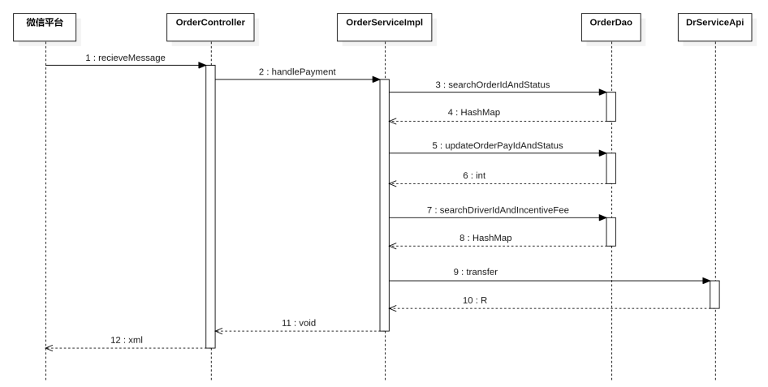

### 编写持久层代码

在`<font style="color:#000000;background-color:rgba(220, 240, 255, 0.3) !important;">OrderDao.xml</font>`文件中，声明SQL语句

```xml
<select id="searchOrderIdAndStatus" parameterType="String" resultType="HashMap">
    SELECT CAST(id AS CHAR) AS id,
           `status`
    FROM tb_order
    WHERE uuid = #{uuid}
</select>

<select id="searchDriverIdAndIncentiveFee" parameterType="String" resultType="HashMap">
    SELECT CAST(driver_id AS CHAR)     AS driverId,
           CAST(incentive_fee AS CHAR) AS incentiveFee
    FROM tb_order
    WHERE uuid = #{uuid}
</select>

<update id="updateOrderPayIdAndStatus" parameterType="Map">
    UPDATE tb_order
    SET pay_id   = #{payId},
        `status` = 7,
        pay_time = #{payTime}
    WHERE uuid = #{uuid}
</update>
```

在`<font style="color:#000000;background-color:rgba(220, 240, 255, 0.3) !important;">com.example.zxds.odr.db.dao</font>`包`<font style="color:#000000;background-color:rgba(220, 240, 255, 0.3) !important;">OrderDao.java</font>`接口中，定义DAO方法

```java
Map<String, String> searchOrderIdAndStatus(String uuid);

Map<String, String> searchDriverIdAndIncentiveFee(String uuid);

int updateOrderPayIdAndStatus(Map<String, Object> param);
```

### 编写 Feign 接口

**这个 Feign 接口比较特殊：不是写在 BFF 子系统中的，是写在 zxds-odr 子系统当中的。**

为了调用`<font style="color:#000000;background-color:rgba(220, 240, 255, 0.3) !important;">zxds-dr</font>`子系统，把系统奖励充值到司机钱包中，所以我们要编写Feign接口。在`<font style="color:#000000;background-color:rgba(220, 240, 255, 0.3) !important;">com.example.zxds.odr.controller.form</font>`包中创建`<font style="color:#000000;background-color:rgba(220, 240, 255, 0.3) !important;">TransferForm.java</font>`类

```java
package com.example.zxds.odr.controller.form;

import io.swagger.v3.oas.annotations.media.Schema;
import lombok.Data;
import org.hibernate.validator.constraints.Range;

import javax.validation.constraints.Min;
import javax.validation.constraints.NotBlank;
import javax.validation.constraints.NotNull;
import javax.validation.constraints.Pattern;

@Data
@Schema(description = "转账的表单")
public class TransferForm {
    @NotBlank(message = "uuid不能为空")
    @Schema(description = "uuid")
    private String uuid;

    @NotNull(message = "driverId不能为空")
    @Min(value = 1, message = "driverId不能小于1")
    @Schema(description = "司机ID")
    private Long driverId;

    @NotBlank(message = "amount不能为空")
    @Pattern(regexp = "^[1-9]\\d*\\.\\d{1,2}$|^0\\.\\d{1,2}$|^[1-9]\\d*$", message = "amount内容不正确")
    @Schema(description = "转账金额")
    private String amount;

    @NotNull(message = "type不能为空")
    @Range(min = 1, max = 3, message = "type内容不正确")
    @Schema(description = "充值类型")
    private Byte type;

    @NotBlank(message = "remark不能为空")
    @Schema(description = "备注信息")
    private String remark;
}
```

在`<font style="color:#000000;background-color:rgba(220, 240, 255, 0.3) !important;">com.example.zxds.odr.feign</font>`包`<font style="color:#000000;background-color:rgba(220, 240, 255, 0.3) !important;">DrServiceApi.java</font>`接口中，声明抽象方法

```java
package com.example.zxds.odr.feign;

import com.example.zxds.common.util.R;
import com.example.zxds.odr.controller.form.TransferForm;
import org.springframework.cloud.openfeign.FeignClient;
import org.springframework.web.bind.annotation.PostMapping;

@FeignClient(value = "zxds-dr")
public interface DrServiceApi {
    @PostMapping("/wallet/income/transfer")
    R transfer(TransferForm form);
}
```

### 编写 service 和实现

在`<font style="color:#000000;background-color:rgba(220, 240, 255, 0.3) !important;">com.example.zxds.odr.service</font>`包`<font style="color:#000000;background-color:rgba(220, 240, 255, 0.3) !important;">OrderService.java</font>`接口中，声明抽象方法

```java
void handlePayment(String uuid, String payId, String driverOpenId, String payTime);
```

在`<font style="color:#000000;background-color:rgba(220, 240, 255, 0.3) !important;">com.example.zxds.odr.service.impl</font>`包`<font style="color:#000000;background-color:rgba(220, 240, 255, 0.3) !important;">OrderServiceImpl.java</font>`类中，实现抽象方法

```java
private final DrServiceApi drServiceApi;

@Override
@Transactional
public void handlePayment(String uuid, String payId, String driverOpenId, String payTime) {
    /*
     * 更新订单状态之前，先查询订单的状态。
     * 因为乘客端付款成功之后，会主动发起Ajax请求，要求更新订单状态。
     * 所以后端接收到付款通知消息之后，不要着急修改订单状态，先看一下订单是否已经是7状态
     */
    Map<String, String> map = orderDao.searchOrderIdAndStatus(uuid);
    int status = MapUtil.getInt(map, "status");
    if (status == 7) {
        return;
    }

    Map<String, Object> param = Map.of("uuid", uuid, "payId", payId, "payTime", payTime);

    //更新订单记录的PayId、状态和付款时间
    int rows = orderDao.updateOrderPayIdAndStatus(param);
    if (rows != 1) {
        throw new ZxdsException("更新支付订单ID失败");
    }

    //查询系统奖励
    map = orderDao.searchDriverIdAndIncentiveFee(uuid);
    String incentiveFee = MapUtil.getStr(map, "incentiveFee");
    long driverId = MapUtil.getLong(map, "driverId");
    //判断系统奖励费是否大于0
    if (new BigDecimal(incentiveFee).compareTo(new BigDecimal("0.00")) == 1) {
        TransferForm form = new TransferForm();
        form.setUuid(IdUtil.simpleUUID());
        form.setAmount(incentiveFee);
        form.setDriverId(driverId);
        form.setType((byte) 2);
        form.setRemark("系统奖励费");
        //给司机钱包转账奖励费
        drServiceApi.transfer(form);
    }

    //TODO 执行分账
}
```

### 编写 web 方法

在`<font style="color:#000000;background-color:rgba(220, 240, 255, 0.3) !important;">OrderController.java</font>`类的`<font style="color:#000000;background-color:rgba(220, 240, 255, 0.3) !important;">receiveMessage()</font>`方法中补上调用业务方法的代码

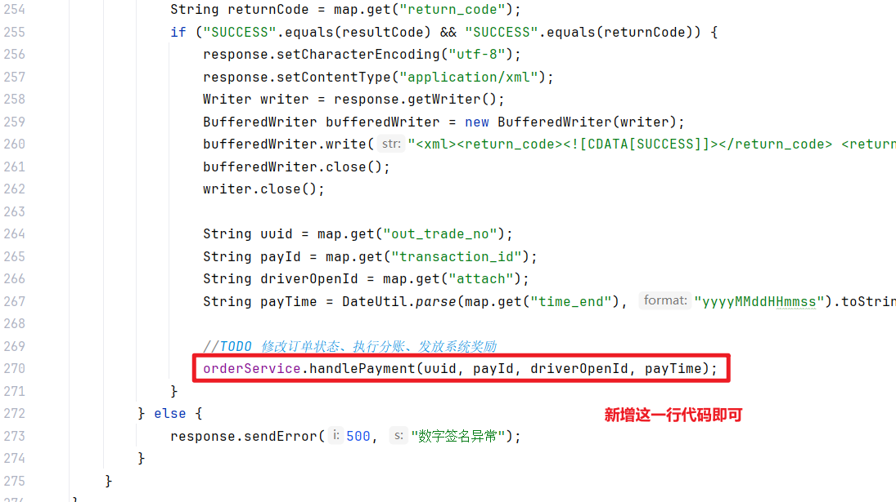

```java
orderService.handlePayment(uuid, payId, driverOpenId, payTime);
```

# 订单子系统执行账单分账（一）

前面我们写了很多Java代码，又是改订单状态，又是给司机发放奖励的，再往下就应该给司机分账了，接下来咱们就把这个功能给做一下。做分账之前，我们先来了解微信分账的基本过程是怎样的。

## 微信支付的分账

### 开通分账功能

在微信商户平台上面，在产品大全栏目中可以找到微信分账服务，开启这项服务即可

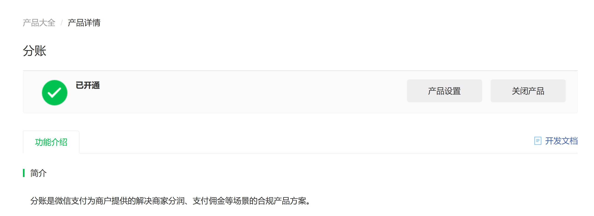

### 关于分账比例

普通商户的分账比例默认上限是30%，也就是说商户自己留存70%，给员工或者其他人分账最高比例是30%，在普通业务中也还凑合，因为员工拿的提成很少有高于30%的。但是在代驾业务中，代驾司机的劳务费占了订单总额的大头，所以给司机30%的分账比例根本不够。

微信商户平台之所以给商户默认设置这么低的分账上限，主要是为了防止商户逃税。比如公司按照营业利润交税，但是公司老板想要少缴税，这需要通过某些手段减少企业盈利。于是把订单分账比例调高到99%，然后公司客户每笔货款都被分账到了老板指定的微信上面，揣到老板自己腰包里面，而公司的营业利润大幅降低，缴纳的税款也就变少了。微信平台为了避免有些公司通过分账来逃税，所以就给分账比例设置了30%的上限。不过在设置分账比例上限的页面中，我们可以按照申请流程的指引，申请更高的分账比例。这就需要企业提交更多的证明材料，然后微信平台还要聘请专业的审计公司对审核的单位加以评估。即便你们公司申请下来高比例的分账，但是微信平台会把你们公司的分账记录和税务局的金税系统联网，随时监控你们公司是否伪造交易虚设分账，企图逃税。

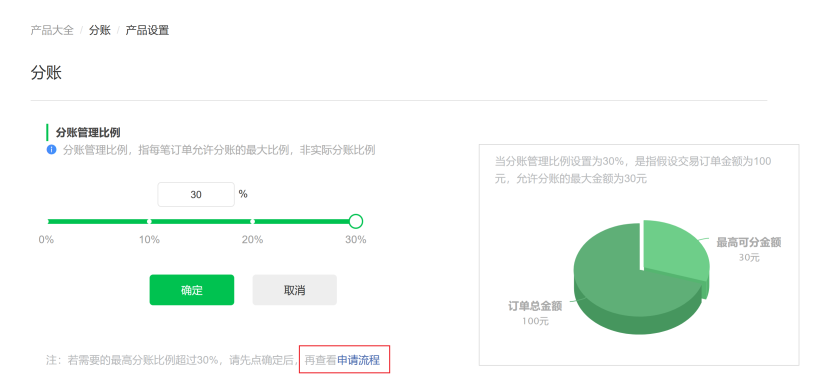

申请高比例分账，走的流程非常复杂，而且还要接受税务局和微信支付系统的严格监督，所以我就没有申请高比例分账。

### 文档说明

微信支付官方提供了在线文档（[https://pay.weixin.qq.com/wiki/doc/api/allocation.php?chapter=27_1&index=1](https://pay.weixin.qq.com/wiki/doc/api/allocation.php?chapter=27_1&index=1)），详细说明了如何创建分账请求。微信分账可以单次分账，也可以多次分账，我们只需要给司机分账，所以用单次分账即可。

| **参数名称** | **变量名称** | **类型** | **例子** |
| --- | --- | --- | --- |
| 商户号 | mch_id | 字符串 | 1900000100 |
| 小程序APPID | appid | 字符串 | wx8888888888888888 |
| 随机字符串 | nonce_str | 字符串 | 5K8264ILTKCH16CQ2502SI8ZNMTM67VS |
| 数字签名 | sign | 字符串 | C38F3AD6C380BEC2BFD727A4B684519FAD6 |
| 微信账单ID | transaction_id | 字符串 | 4208450740201411110007820472 |
| 商户订单号 | out_order_no | 字符串 | P20150806125346 |
| 分账收款方 | receivers | 字符串 | [{ "type": "PERSONAL_OPENID ", "account":"OPENID字符串", "amount":100, "description": "分到商户" }] |

提交分账请求之后，返回的响应里面也包含了很多信息，下面咱们来看一下

| **参数名称** | **变量名称** | **例子** |
| --- | --- | --- |
| 通信状态码 | return_code | SUCCESS / FAIL |
| 业务状态码 | result_code | SUCCESS / FAIL |
| 错误代码 | err_code | SYSTEMERROR |
| 错误代码描述 | err_code_des | 系统超时 |
| 分账单状态 | status | PROCESSING：处理中，FINISHED：处理完成 |
| 数字签名 | sign | HMACSHA256算法生成的数字签名 |

## 封装分账定时任务

用户付款成功，微信支付平台规定商户系统至少要2分钟之后才可以申请分账。如果立即分账会抛异常。因此我们的分账操作应该使用定时器，这里我们选择 Quartz。

### 编写持久层代码

执行分账前我们要知道给司机的分账金额是多少，这样才能创建分账请求。这就需要我们编写SQL语句，查询分账记录的数据。另外分账成功之后，我们需要修改分账记录的状态，所以我们还需要编写UPDATE语句才行。在`<font style="color:#000000;background-color:rgba(220, 240, 255, 0.3) !important;">OrderProfitsharingDao.xml</font>`文件中，声明SQL语句

```xml
<select id="searchDriverIncome" parameterType="String" resultType="HashMap">
    SELECT p.id                        AS profitsharingId,
           CAST(driver_income AS CHAR) AS driverIncome
    FROM tb_order_profitsharing p
    JOIN tb_order o ON p.order_id = o.id
    WHERE o.uuid = #{uuid};
</select>

<update id="updateProfitsharingStatus" parameterType="long">
    UPDATE tb_order_profitsharing
    SET `status`=2
    WHERE id = #{profitsharingId}
</update>
```

在`<font style="color:#000000;background-color:rgba(220, 240, 255, 0.3) !important;">com.example.zxds.odr.db.dao</font>`包`<font style="color:#000000;background-color:rgba(220, 240, 255, 0.3) !important;">OrderProfitsharingDao.java</font>`接口中，声明DAO方法

```java
Map<String, Object> searchDriverIncome(String uuid);

int updateProfitsharingStatus(long profitsharingId);
```

### 编写定时任务类

在`<font style="color:#000000;background-color:rgba(220, 240, 255, 0.3) !important;">com.example.zxds.odr.quartz.job</font>`包中创建`<font style="color:#000000;background-color:rgba(220, 240, 255, 0.3) !important;">HandleProfitsharingJob.java</font>`类

```java
package com.example.zxds.odr.quartz.job;

import cn.hutool.core.map.MapUtil;
import cn.hutool.core.util.NumberUtil;
import cn.hutool.json.JSONArray;
import cn.hutool.json.JSONObject;
import com.example.zxds.common.exception.ZxdsException;
import com.example.zxds.common.wxpay.MyWXPayConfig;
import com.example.zxds.common.wxpay.WXPay;
import com.example.zxds.common.wxpay.WXPayConstants;
import com.example.zxds.common.wxpay.WXPayUtil;
import com.example.zxds.odr.db.dao.OrderProfitsharingDao;
import lombok.RequiredArgsConstructor;
import lombok.extern.slf4j.Slf4j;
import org.quartz.JobExecutionContext;
import org.quartz.JobExecutionException;
import org.springframework.scheduling.quartz.QuartzJobBean;
import org.springframework.transaction.annotation.Transactional;

import java.math.RoundingMode;
import java.util.HashMap;
import java.util.Map;

@Slf4j
@RequiredArgsConstructor
public class HandleProfitsharingJob extends QuartzJobBean {
    private final OrderProfitsharingDao profitsharingDao;
    private final MyWXPayConfig myWXPayConfig;

    @Override
    @Transactional
    public void executeInternal(JobExecutionContext context) throws JobExecutionException {
        //获取传给定时器的业务数据
        Map<String, Object> map = context.getJobDetail().getJobDataMap();
        String uuid = MapUtil.getStr(map, "uuid");
        String driverOpenId = MapUtil.getStr(map, "driverOpenId");
        String payId = MapUtil.getStr(map, "payId");

        //查询分账记录ID、分账金额
        map = profitsharingDao.searchDriverIncome(uuid);
        if (map == null || map.isEmpty()) {
            log.error("没有查询到分账记录");
            return;
        }
        String driverIncome = MapUtil.getStr(map, "driverIncome");
        long profitsharingId = MapUtil.getLong(map, "profitsharingId");

        try {
            WXPay wxPay = new WXPay(myWXPayConfig);

            //分账请求必要的参数
            Map<String, String> param = new HashMap<>();
            param.put("appid", myWXPayConfig.getAppID());
            param.put("mch_id", myWXPayConfig.getMchID());
            param.put("nonce_str", WXPayUtil.generateNonceStr());
            param.put("out_order_no", uuid);
            param.put("transaction_id", payId);

            //分账收款人数组
            JSONArray receivers = new JSONArray();
            //分账收款人（司机）信息
            JSONObject json = new JSONObject();
            json.set("type", "PERSONAL_OPENID");
            json.set("account", driverOpenId);
            //分账金额从元转换成分
            int amount = Integer.parseInt(NumberUtil.mul(driverIncome, "100").setScale(0, RoundingMode.FLOOR).toString());
            json.set("amount", amount);
            //json.set("amount", 1); //设置分账金额为1分钱（测试阶段）
            json.set("description", "给司机的分账");
            receivers.add(json);

            //添加分账收款人JSON数组
            param.put("receivers", receivers.toString());

            //生成数字签名
            String sign = WXPayUtil.generateSignature(param, myWXPayConfig.getKey(), WXPayConstants.SignType.HMACSHA256);
            //添加数字签名
            param.put("sign", sign);

            String url = "/secapi/pay/profitsharing";
            //执行分账请求(调用工具类中的方法 requestWithCert，该方法主要作用是发送需要证书的请求，例如企业付款等敏感操作时需要证书)
            //第一个3000是TCP连接超时时间，第二个3000是连接成功后，等待服务器返回数据的最大时间
            String response = wxPay.requestWithCert(url, param, 3000, 3000);
            log.debug(response);

            //验证响应的数字签名
            if (WXPayUtil.isSignatureValid(response, myWXPayConfig.getKey(), WXPayConstants.SignType.HMACSHA256)) {
                //从响应中提取数据
                Map<String, String> data = wxPay.processResponseXml(response, WXPayConstants.SignType.HMACSHA256);
                String returnCode = data.get("return_code");
                String resultCode = data.get("result_code");
                //验证通信状态码和业务状态码
                if ("SUCCESS".equals(resultCode) && "SUCCESS".equals(returnCode)) {
                    String status = data.get("status");
                    //判断分账成功
                    if ("FINISHED".equals(status)) {
                        //更新分账状态
                        int rows = profitsharingDao.updateProfitsharingStatus(profitsharingId);
                        if (rows != 1) {
                            log.error("更新分账状态失败", new ZxdsException("更新分账状态失败"));
                        }
                    }
                    //判断正在分账中
                    else if ("PROCESSING".equals(status)) {
                        //TODO 创建查询分账定时器
                    }
                } else {
                    log.error("执行分账失败", new ZxdsException("执行分账失败"));
                }
            } else {
                log.error("验证数字签名失败", new ZxdsException("验证数字签名失败"));
            }

        } catch (Exception e) {
            log.error("执行分账失败", e);
        }
    }
}
```

# 订单子系统执行账单分账（二）

现在我们写好了分账任务类，接下来我们应该去给该任务类分配开始执行的时间，所以我们把之前没有写完的业务层代码给补全了。

## 编写持久层代码

因为乘客付款成功之后，订单被修改成了7状态（已付款），这只是个临时的状态。随着创建分账定时器，我们还要把订单修改成8状态（订单已结束）。注意，8状态代表订单已经完成，跟分账是否成功无关。分账的状态在分账表中记录，之前我们已经写过 SQL语句更新过分账状态了。

在`<font style="color:#000000;background-color:rgba(220, 240, 255, 0.3) !important;">OrderDao.xml</font>`文件中，编写SQL语句。

```xml
<update id="finishOrder" parameterType="String">
    UPDATE tb_order
    SET `status` = 8
    WHERE uuid = #{uuid}
</update>
```

在`<font style="color:#000000;background-color:rgba(220, 240, 255, 0.3) !important;">com.example.zxds.odr.db.dao</font>`包`<font style="color:#000000;background-color:rgba(220, 240, 255, 0.3) !important;">OrderDao.java</font>`接口中，声明DAO方法

```java
int finishOrder(String uuid);
```

## 编写定时器工具类

为了更加简单的使用定时器，我们把创建、查询和删除定时器给封装起来。在`<font style="color:#000000;background-color:rgba(220, 240, 255, 0.3) !important;">com.example.zxds.odr.quartz</font>`包中创建`<font style="color:#000000;background-color:rgba(220, 240, 255, 0.3) !important;">QuartzUtil.java</font>`类。

```java
package com.example.zxds.odr.quartz;

import lombok.extern.slf4j.Slf4j;
import org.quartz.*;
import org.springframework.stereotype.Component;

import javax.annotation.Resource;
import java.util.Date;

@Component
@Slf4j
public class QuartzUtil {

    @Resource
    private Scheduler scheduler;

    /**
     * 添加定时器
     *
     * JobDetail：要执行的任务内容（做什么）
     * Trigger：任务什么时候执行（何时做）
     * Quartz 的工作就是：把 JobDetail 和 Trigger 绑定在一起，交给 Scheduler 去调度。
     *
     * jobName:任务名字
     * jobGroupName:任务组名字（可以理解为分类）
     * start：开始日期时间
     */
    public void addJob(JobDetail jobDetail, String jobName, String jobGroupName, Date start) {
        try {
            // 封装触发器对象，它代表了任务什么时候执行
            Trigger trigger = TriggerBuilder.newTrigger() // 开始构建一个触发器（相当于开始设置闹钟）
                    .withIdentity(jobName, jobGroupName) // 给触发器起名字
                    // 设置触发器的调度策略，一个简单的调度策略（不是Cron表达式那种复杂的），以及设置"错过执行"时的处理策略:错过就立即执行一次
                    .withSchedule(SimpleScheduleBuilder.simpleSchedule().withMisfireHandlingInstructionFireNow()) 
                    .startAt(start)
                    .build();
            // 指定什么时候执行什么任务。
            scheduler.scheduleJob(jobDetail, trigger);
            log.debug("成功添加" + jobName + "定时器");
        } catch (SchedulerException e) {
            log.error("定时器添加失败", e);
        }
    }

    /**
     * 查询是否存在定时器
     *
     * @param jobName      任务名字
     * @param jobGroupName 任务组名字
     * @return
     */
    public boolean checkExists(String jobName, String jobGroupName) {
        // 创建一个触发器键对象，Quartz 里用 TriggerKey 来定位一个触发器
        TriggerKey triggerKey = new TriggerKey(jobName, jobGroupName);
        try {
            // 检查是否存在定时器
            boolean bool = scheduler.checkExists(triggerKey);
            return bool;
        } catch (Exception e) {
            log.error("定时器查询失败", e);
            return false;
        }
    }

    /**
     * 删除定时器
     *
     * @param jobName      任务名字
     * @param jobGroupName 任务组名字
     */
    public void deleteJob(String jobName, String jobGroupName) {
        // 创建触发器键对象，和上面的new同等效果，可互换。
        TriggerKey triggerKey = TriggerKey.triggerKey(jobName, jobGroupName);
        try {
            scheduler.resumeTrigger(triggerKey);
            // 取消定时器
            scheduler.unscheduleJob(triggerKey);
            // 删除定时器
            scheduler.deleteJob(JobKey.jobKey(jobName, jobGroupName));
            log.debug("成功删除" + jobName + "定时器");
        } catch (SchedulerException e) {
            log.error("定时器删除失败", e);
        }

    }
}
```

## 补全业务层代码

在`<font style="color:#000000;background-color:rgba(220, 240, 255, 0.3) !important;">com.example.zxds.odr.service.impl</font>`包`<font style="color:#000000;background-color:rgba(220, 240, 255, 0.3) !important;">OrderServiceImpl.java</font>`类的业务方法中，补全Java代码

```java
@Service
public class OrderServiceImpl implements OrderService {
    @Resource
    private QuartzUtil quartzUtil;
    
    ……
        
    @Override
    @Transactional
    public void handlePayment(String uuid, String payId, String driverOpenId, String payTime) {
        ……
            
        //TODO 执行分账
        //先判断是否有分账定时器
        if (quartzUtil.checkExists(uuid, "代驾单分账任务组") || quartzUtil.checkExists(uuid, "查询代驾单分账任务组")) {
            //存在分账定时器就不需要再执行分账
            return;
        }
        //执行分账
        JobDetail jobDetail = JobBuilder.newJob(HandleProfitsharingJob.class).build();
        Map<String, Object> dataMap = jobDetail.getJobDataMap();
        dataMap.put("uuid", uuid);
        dataMap.put("driverOpenId", driverOpenId);
        dataMap.put("payId", payId);

        //2分钟之后执行分账定时器
        Date executeDate = new DateTime().offset(DateField.MINUTE, 2);
        quartzUtil.addJob(jobDetail, uuid, "代驾单分账任务组", executeDate);

        //更新订单状态为已完成状态（8）
        rows = orderDao.finishOrder(uuid);
        if (rows != 1) {
            throw new ZxdsException("更新订单结束状态失败");
        }
    }
}
```

## 测试支付和分账

我们现在简单测试一下乘客支付和分账的功能，大家要严格遵守下面的步骤。

1. 把分账收款人的OPENID和真实姓名（收款人微信上面**开通支付时**备案的真实姓名）发送给我。因为分账收款人必须要添加到微信商户平台，才可以分账。添加分账收款人可以通过调用 API 接口来实现，也可以在商户平台手动添加。这里我们手动添加一下就行。
2. 必须运行量子互联程序，否则付款成功之后，无法收到付款结果通知消息。
3. 修改创建支付账单的Java代码，设置接收通知消息的URL路径
4. 测试阶段，我们可以手动把订单付款金额调低，比如付款金额为4分钱，给司机分账1分钱（不超过30%分账比例上限）
5. 每个代驾订单的UUID只能创建一个微信支付账单。如果遇上无法创建支付账单，很可能之前你用这个UUID创建过支付账单，所以就无法重复创建了。这种情况很简单，重新生成一个UUID字符串更新到订单记录的uuid字段上面即可（UUID字符串不能带有横线，可以在线生成，[https://uuid.bmcx.com/](https://uuid.bmcx.com/)）。
6. 运行各个子系统，在乘客端小程序上面支付代驾订单。
7. 订单子系统成功接收付款通知消息之后，查看订单状态是否变成了8状态。
8. 等待2分钟以上的时间，分账定时器开始执行后，查看分账的结果（执行中状态）
9. 查司机手机上面的微信是否收到了分账的转账款（大概20分钟之后）。

# 如果分账延迟就创建定时器核验分账结果

微信支付的分账接口是**异步处理**的，不是同步的。

代驾场景的高并发

- **晚高峰**：大量乘客同时下单、同时完单
- 假设1000个代驾司机同时完单
- 系统同时发起1000个分账请求
- 微信收到后，**不可能瞬间处理完1000笔资金分账**
- 所以会放进消息队列，**排队处理**

这样会导致响应中status状态是分账中，如果是分账中，当前的定时器并不会把分账记录修改成2状态。遇到这种情况，我们可以创建一个20分钟之后运行的定时器，用来检查分账的结果。如果分账成功，我们就把数据库中分账记录的status字段改成2状态

## 如何查询分账结果

微信官方提供了查询分账结果的API文档（[https://pay.weixin.qq.com/wiki/doc/api/allocation.php?chapter=27_2&index=3](https://pay.weixin.qq.com/wiki/doc/api/allocation.php?chapter=27_2&index=3)），我们写代码之前先来看一下资料。发起查询请求的时候，需要我们提交一些参数，如下

| **参数** | **变量名** | **类型** | **示例** |
| --- | --- | --- | --- |
| 商户号 | mch_id | 字符串 | 1900000100 |
| 微信账单号 | transaction_id | 字符串 | 4208450740201411148 |
| 商户订单号 | out_order_no | 字符串 | P20150806125312366 |
| 随机字符串 | nonce_str | 字符串 | 5K8264ILTKCH16CQ2502SI8Z |
| 签名 | sign | 字符串 | C380BEC2BFD727A4B6845133519F3AD6 |

微信平台返回的响应里面，关键的参数我列在下面的表格中了

| **参数** | **变量名** | **类型** | **示例** |
| --- | --- | --- | --- |
| 通信状态码 | return_code | 字符串 | SUCCESS / FAIL |
| 业务状态码 | result_code | 字符串 | SUCCESS / FAIL |
| 错误代码 | err_code | 字符串 | SYSTEMERROR |
| 错误代码描述 | err_code_des | 字符串 | 系统超时 |
| 数字签名 | sign | 字符串 | C380BEC2BFD727A4B6845133519F3AD6 |
| 分账单状态 | status | 字符串 | PROCESSING：处理中，FINISHED：处理完成 |

## 创建查询分账任务类

执行查询分账结果需要用到定时任务类，我们在`<font style="color:#000000;background-color:rgba(220, 240, 255, 0.3) !important;">com.example.zxds.odr.quartz.job</font>`包中创建`<font style="color:#000000;background-color:rgba(220, 240, 255, 0.3) !important;">SearchProfitsharingJob.java</font>`类

```java
package com.example.zxds.odr.quartz.job;

import cn.hutool.core.map.MapUtil;
import com.example.zxds.common.exception.ZxdsException;
import com.example.zxds.common.wxpay.MyWXPayConfig;
import com.example.zxds.common.wxpay.WXPay;
import com.example.zxds.common.wxpay.WXPayConstants;
import com.example.zxds.common.wxpay.WXPayUtil;
import com.example.zxds.odr.db.dao.OrderProfitsharingDao;
import lombok.extern.slf4j.Slf4j;
import org.quartz.JobExecutionContext;
import org.quartz.JobExecutionException;
import org.springframework.scheduling.quartz.QuartzJobBean;
import org.springframework.transaction.annotation.Transactional;

import javax.annotation.Resource;
import java.util.HashMap;
import java.util.Map;

@Slf4j
public class SearchProfitsharingJob extends QuartzJobBean {
    @Resource
    private OrderProfitsharingDao profitsharingDao;

    @Resource
    private MyWXPayConfig myWXPayConfig;

    @Override
    @Transactional
    public void executeInternal(JobExecutionContext context) throws JobExecutionException {
        Map<String, Object> map = context.getJobDetail().getJobDataMap();
        String uuid = MapUtil.getStr(map, "uuid");
        long profitsharingId = MapUtil.getLong(map, "profitsharingId");
        String payId = MapUtil.getStr(map, "payId");

        try {
            WXPay wxPay = new WXPay(myWXPayConfig);
            String url = "/pay/profitsharingquery";

            Map<String, String> param = new HashMap<>();
            param.put("mch_id", myWXPayConfig.getMchID());
            param.put("transaction_id", payId);
            param.put("out_order_no", uuid);
            param.put("nonce_str", WXPayUtil.generateNonceStr());

            //生成数字签名
            String sign = WXPayUtil.generateSignature(param, myWXPayConfig.getKey(), WXPayConstants.SignType.HMACSHA256);
            param.put("sign", sign);

            //查询分账结果
            String response = wxPay.requestWithCert(url, param, 3000, 3000);
            log.debug(response);

            //验证响应的数字签名
            if (WXPayUtil.isSignatureValid(response, myWXPayConfig.getKey(), WXPayConstants.SignType.HMACSHA256)) {
                Map<String, String> data = wxPay.processResponseXml(response, WXPayConstants.SignType.HMACSHA256);
                String returnCode = data.get("return_code");
                String resultCode = data.get("result_code");
                if ("SUCCESS".equals(resultCode) && "SUCCESS".equals(returnCode)) {
                    String status = data.get("status");
                    if ("FINISHED".equals(status)) {
                        //把分账记录更新成2状态
                        int rows = profitsharingDao.updateProfitsharingStatus(profitsharingId);
                        if (rows != 1) {
                            log.error("更新分账状态失败", new ZxdsException("更新分账状态失败"));
                        }
                    }
                } else {
                    log.error("查询分账失败", new ZxdsException("查询分账失败"));
                }
            } else {
                log.error("验证数字签名失败", new ZxdsException("验证数字签名失败"));
            }
        } catch (Exception e) {
            e.printStackTrace();
        }
    }
}
```

## 设置定时任务

在`<font style="color:#000000;background-color:rgba(220, 240, 255, 0.3) !important;">HandleProfitsharingJob.java</font>`类中，我们补全Java代码，如果遇到分账中的情况，我们就设置20分钟之后运行的定时器，查询分账结果

```java
@Slf4j
public class HandleProfitsharingJob extends QuartzJobBean {
    @Resource
    private QuartzUtil quartzUtil;
    
    ……
        
    @Override
    @Transactional
    protected void executeInternal(JobExecutionContext context) throws JobExecutionException {
        ……

        if ("FINISHED".equals(status)) {
            ……
        }
        //判断正在分账中
        else if ("PROCESSING".equals(status)) {
            //如果状态是分账中，等待几分钟再查询分账结果
            JobDetail jobDetail = JobBuilder.newJob(SearchProfitsharingJob.class).build();
            Map<String, Object> dataMap = jobDetail.getJobDataMap();
            dataMap.put("uuid", uuid);
            dataMap.put("profitsharingId", profitsharingId);
            dataMap.put("payId", payId);
    
            Date executeDate = new DateTime().offset(DateField.MINUTE, 20);
            quartzUtil.addJob(jobDetail, uuid, "查询代驾单分账任务组", executeDate);
        }
    }
}
```

## 测试定时器

为了能重新运行程序，执行付款和分账，我们需要遵守以下若干步骤：

1. 把订单记录status改成6状态，然后重新生成uuid字符串，更新到订单记录的uuid字段上面。
2. 运行各个子系统，在乘客端小程序上面支付代驾订单。
3. 如果付款成功，等待2分钟，然后查看订单状态是否修改成了8状态。
4. 等待20分钟（各个子系统都不能停止），然后查看分账记录的status是否变成了2状态。

# 订单微服务主动查询付款结果

前面测试了支付和分账，一切正常。接下来还要处理一些意外情况。比如微信支付平台出现故障了，没有调用我们的回调接口。或者说，咱们本地的网络出现了故障，没有收到付款结果通知消息。这会导致，乘客付款成功，但是**代驾订单**依旧是**未付款状态**，接下来解决这个问题。

## 查询支付结果的 API

我们可以让乘客小程序在付款成功之后，自动发出Ajax请求，然后被网关子系统路由给订单子系统。订单子系统向微信支付平台发起请求，查询付款结果。如果付款成功，就更新订单状态，并且执行分账。微信官方提供了查询支付结果的API文档（[https://pay.weixin.qq.com/wiki/doc/api/wxa/wxa_api.php?chapter=9_2](https://pay.weixin.qq.com/wiki/doc/api/wxa/wxa_api.php?chapter=9_2)），我们先简单了解一下。

创建查询请求的必要请求参数如下：

| **参数** | **变量名** | **类型** | **示例** |
| --- | --- | --- | --- |
| 小程序ID | appid | 字符串 | wxd678efh567hg6787 |
| 商户号 | mch_id | 字符串 | 1230000109 |
| 商户订单号 | out_trade_no | 字符串 | 20150806125346 |
| 随机字符串 | nonce_str | 字符串 | C380BEC2BFD727A |
| 数字签名 | sign | 字符串 | 5K8264ILTKCH16CQ2502SI8ZNMTM67VS |

返回的响应中，关键的参数如下：

| **参数** | **变量名** | **示例** |
| --- | --- | --- |
| 通信状态码 | return_code | SUCCESS/FAIL |
| 业务状态码 | result_code | SUCCESS/FAIL |
| 错误代码 | err_code | SYSTEMERROR |
| 错误代码描述 | err_code_des | 系统错误 |
| 付款金额 | total_fee | 100 |
| 交易状态 | trade_state | SUCCESS–支付成功 REFUND–转入退款 NOTPAY–未支付 CLOSED–已关闭 ACCEPT–已接收，等待扣款 |
| 自定义参数 | attach |   |
| 微信账单号 | transaction_id | 1009660380201506130 |
| 支付完成时间 | time_end | 20141030133525 |

## 编写 zxds-odr 子系统

### 编写持久层代码

在`<font style="color:#000000;background-color:rgba(220, 240, 255, 0.3) !important;">OrderDao.xml</font>`文件中，声明SQL语句

```xml
<select id="searchUuidAndStatus" parameterType="long" resultType="HashMap">
    SELECT uuid,
           `status`
    FROM tb_order
    WHERE id = #{orderId}
</select>

<update id="updateOrderAboutPayment" parameterType="Map">
    UPDATE tb_order
    SET status   = 7,
        pay_id   = #{payId},
        pay_time = #{payTime}
    WHERE id = #{orderId}
</update>
```

在`<font style="color:#000000;background-color:rgba(220, 240, 255, 0.3) !important;">com.example.zxds.odr.db.dao</font>`包`<font style="color:#000000;background-color:rgba(220, 240, 255, 0.3) !important;">OrderDao.java</font>`接口中，声明DAO方法

```java
Map<String, String> searchUuidAndStatus(long orderId);


int updateOrderAboutPayment(Map<String, Object> param);
```

### 编写 service 和实现

在`<font style="color:#000000;background-color:rgba(220, 240, 255, 0.3) !important;">com.example.zxds.odr.service</font>`包`<font style="color:#000000;background-color:rgba(220, 240, 255, 0.3) !important;">OrderService.java</font>`接口中，声明抽象方法

```java
String updateOrderAboutPayment(Map<String, Object> param);
```

在`<font style="color:#000000;background-color:rgba(220, 240, 255, 0.3) !important;">com.example.zxds.odr.service.impl</font>`包`<font style="color:#000000;background-color:rgba(220, 240, 255, 0.3) !important;">OrderServiceImpl.java</font>`类中，实现抽象方法

```java
private final MyWXPayConfig myWXPayConfig;
private final WXPayConfig wxPayConfig;

@Override
@Transactional
public String updateOrderAboutPayment(Map<String, Object> param) {
    long orderId = MapUtil.getLong(param, "orderId");
    /*
     * 查询订单状态。
     * 因为有可能Web方法先收到了付款结果通知消息，把订单状态改成了7、8状态，
     * 所以我们要先查询订单状态。
     */
    Map<String, String> map = orderDao.searchUuidAndStatus(orderId);
    String uuid = MapUtil.getStr(map, "uuid");
    int status = MapUtil.getInt(map, "status");
    //如果订单状态已经是已付款，就退出当前方法
    if (status == 7 || status == 8) {
        return "付款成功";
    }

    //查询支付结果的参数
    map.clear();
    map.put("appid", myWXPayConfig.getAppID());
    map.put("mch_id", myWXPayConfig.getMchID());
    map.put("out_trade_no", uuid);
    map.put("nonce_str", WXPayUtil.generateNonceStr());
    try {
        //生成数字签名
        String sign = WXPayUtil.generateSignature(map, myWXPayConfig.getKey());
        map.put("sign", sign);

        WXPay wxPay = new WXPay(wxPayConfig);
        //查询支付结果
        Map<String, String> result = wxPay.orderQuery(map);

        String returnCode = result.get("return_code");
        String resultCode = result.get("result_code");
        if ("SUCCESS".equals(returnCode) && "SUCCESS".equals(resultCode)) {
            String tradeState = result.get("trade_state");
            if ("SUCCESS".equals(tradeState)) {
                String driverOpenId = result.get("attach");
                String payId = result.get("transaction_id");
                String payTime = new DateTime(result.get("time_end"), "yyyyMMddHHmmss").toString("yyyy-MM-dd HH:mm:ss");
                //更新订单相关付款信息和状态
                param.put("payId", payId);
                param.put("payTime", payTime);

                //把订单更新成7状态
                int rows = orderDao.updateOrderAboutPayment(param);
                if (rows != 1) {
                    throw new ZxdsException("更新订单相关付款信息失败");
                }

                //查询系统奖励
                map = orderDao.searchDriverIdAndIncentiveFee(uuid);
                String incentiveFee = MapUtil.getStr(map, "incentiveFee");
                long driverId = MapUtil.getLong(map, "driverId");
                //判断系统奖励费是否大于0
                if (new BigDecimal(incentiveFee).compareTo(new BigDecimal("0.00")) == 1) {
                    TransferForm form = new TransferForm();
                    form.setUuid(IdUtil.simpleUUID());
                    form.setAmount(incentiveFee);
                    form.setDriverId(driverId);
                    form.setType((byte) 2);
                    form.setRemark("系统奖励费");
                    //给司机钱包转账奖励费
                    drServiceApi.transfer(form);
                }

                //先判断是否有分账定时器
                if (quartzUtil.checkExists(uuid, "代驾单分账任务组") || quartzUtil.checkExists(uuid, "查询代驾单分账任务组")) {
                    //存在分账定时器就不需要再执行分账
                    return "付款成功";
                }
                //执行分账
                JobDetail jobDetail = JobBuilder.newJob(HandleProfitsharingJob.class).build();
                Map<String, Object> dataMap = jobDetail.getJobDataMap();
                dataMap.put("uuid", uuid);
                dataMap.put("driverOpenId", driverOpenId);
                dataMap.put("payId", payId);

                Date executeDate = new DateTime().offset(DateField.MINUTE, 2);
                quartzUtil.addJob(jobDetail, uuid, "代驾单分账任务组", executeDate);
                rows = orderDao.finishOrder(uuid);
                if (rows != 1) {
                    throw new ZxdsException("更新订单结束状态失败");
                }
                return "付款成功";
            } else {
                return "付款异常";
            }
        } else {
            return "付款异常";
        }

    } catch (Exception e) {
        e.printStackTrace();
        throw new ZxdsException("更新订单相关付款信息失败");
    }
}
```

### 编写 web 方法

在`<font style="color:#000000;background-color:rgba(220, 240, 255, 0.3) !important;">com.example.zxds.odr.controller.form</font>`包中创建`<font style="color:#000000;background-color:rgba(220, 240, 255, 0.3) !important;">UpdateOrderAboutPaymentForm.java</font>`类

```java
package com.example.zxds.odr.controller.form;

import io.swagger.v3.oas.annotations.media.Schema;
import lombok.Data;

import javax.validation.constraints.Min;
import javax.validation.constraints.NotNull;

@Data
@Schema(description = "更新代驾订单支付信息的表单")
public class UpdateOrderAboutPaymentForm {

    @NotNull(message = "orderId不能为空")
    @Min(value = 1, message = "orderId不能小于1")
    @Schema(description = "订单ID")
    private Long orderId;
}
```

在`<font style="color:#000000;background-color:rgba(220, 240, 255, 0.3) !important;">com.example.zxds.odr.controller</font>`包`<font style="color:#000000;background-color:rgba(220, 240, 255, 0.3) !important;">OrderController.java</font>`类中，声明Web方法

```java
@PostMapping("/updateOrderAboutPayment")
@Operation(summary = "主动查询付款结果更新订单状态")
public R updateOrderAboutPayment(@RequestBody @Valid UpdateOrderAboutPaymentForm form) {
    Map<String, Object> param = BeanUtil.beanToMap(form);
    String result = orderService.updateOrderAboutPayment(param);
    return R.ok().put("result", result);
}
```

## 编写 bff-customer 子系统

把`<font style="color:#000000;background-color:rgba(220, 240, 255, 0.3) !important;">bff-customer</font>`子系统的代码写一下，内容很简单，就是调用刚才写好的Web方法

### 编写 Feign 客户端

在`<font style="color:#000000;background-color:rgba(220, 240, 255, 0.3) !important;">com.example.zxds.bff.customer.controller.form</font>`包中创建`<font style="color:#000000;background-color:rgba(220, 240, 255, 0.3) !important;">UpdateOrderAboutPaymentForm.java</font>`类

```java
package com.example.zxds.bff.customer.controller.form;

import io.swagger.v3.oas.annotations.media.Schema;
import lombok.Data;

import javax.validation.constraints.Min;
import javax.validation.constraints.NotNull;

@Data
@Schema(description = "更新代驾订单支付信息的表单")
public class UpdateOrderAboutPaymentForm {

    @NotNull(message = "orderId不能为空")
    @Min(value = 1, message = "orderId不能小于1")
    @Schema(description = "订单ID")
    private Long orderId;
}
```

在`<font style="color:#000000;background-color:rgba(220, 240, 255, 0.3) !important;">com.example.zxds.bff.customer.feign</font>`包`<font style="color:#000000;background-color:rgba(220, 240, 255, 0.3) !important;">OdrServiceApi.java</font>`接口中，声明抽象方法

```java
@PostMapping("/order/updateOrderAboutPayment")
R updateOrderAboutPayment(UpdateOrderAboutPaymentForm form);
```

### 编写 service 和实现

在`<font style="color:#000000;background-color:rgba(220, 240, 255, 0.3) !important;">com.example.zxds.bff.customer.service</font>`包`<font style="color:#000000;background-color:rgba(220, 240, 255, 0.3) !important;">OrderService.java</font>`接口中，声明抽象方法

```java
String updateOrderAboutPayment(UpdateOrderAboutPaymentForm form);
```

在`<font style="color:#000000;background-color:rgba(220, 240, 255, 0.3) !important;">com.example.zxds.bff.customer.service.impl</font>`包`<font style="color:#000000;background-color:rgba(220, 240, 255, 0.3) !important;">OrderServiceImpl.java</font>`接口中，实现抽象方法

```java
@Override
@GlobalTransactional
public String updateOrderAboutPayment(UpdateOrderAboutPaymentForm form) {
    R r = odrServiceApi.updateOrderAboutPayment(form);
    String result = MapUtil.getStr(r, "result");
    return result;
}
```

### 编写 web 方法

在`<font style="color:#000000;background-color:rgba(220, 240, 255, 0.3) !important;">com.example.zxds.bff.customer.controller</font>`包`<font style="color:#000000;background-color:rgba(220, 240, 255, 0.3) !important;">OrderController.java</font>`类中，声明Web方法

```java
@PostMapping("/updateOrderAboutPayment")
@Operation(summary = "主动查询付款结果及更新订单状态")
@SaCheckLogin
public R updateOrderAboutPayment(@RequestBody @Valid UpdateOrderAboutPaymentForm form) {
    String result = orderService.updateOrderAboutPayment(form);
    return R.ok().put("result", result);
}
```

# 乘客端付款成功后主动发起查询请求

现在我们写好了后端的Java代码，接下来咱们要编写乘客端小程序的JS代码，在乘客付款成功之后，主动发起Ajax 请求调用我们写好的Web方法，查询付款结果。

## 定义全局 URL

在`<font style="color:#000000;background-color:rgba(220, 240, 255, 0.3) !important;">main.js</font>`文件中，声明全局URL路径

```javascript
Vue.prototype.url = {
        ……
        updateOrderAboutPayment:`${baseUrl}/order/updateOrderAboutPayment`,
}
```

## 查询付款结果

在`<font style="color:#000000;background-color:rgba(220, 240, 255, 0.3) !important;">order.vue</font>`页面中，我们补全之前的JS代码，付款成功之后，主动发起Ajax请求

```javascript
payHandle() {
    let that = this;
    uni.showModal({
        title: '提示消息',
        content: '您确定支付该订单？',
        success: function(resp) {
            if (resp.confirm) {
                let data = {
                    orderId: that.orderId
                };
                that.ajax(that.url.createWxPayment, 'POST', data, function(resp) {
                    let result = resp.data.result;
                    let pk = result.package;
                    let timeStamp = result.timeStamp;
                    let nonceStr = result.nonceStr;
                    let paySign = result.paySign;
                    let uuid = result.uuid;
                    uni.requestPayment({
                        timeStamp: timeStamp,
                        nonceStr: nonceStr,
                        package: pk,
                        paySign: paySign,
                        signType: 'MD5',
                        success: function() {
                            console.log('付款成功');
                          
                            //主动发起查询请求（这里是新添加的内容）
                            that.ajax(that.url.updateOrderAboutPayment, 'POST', data, function(resp) {
                                let result = resp.data.result;
                                if (result == '付款成功') {
                                    uni.showToast({
                                        icon: 'success',
                                        title: '付款成功'
                                    });
                                    setTimeout(function() {
                                        uni.switchTab({
                                            url: '../workbench/workbench'
                                        });
                                    }, 2000);
                                } else {
                                    uni.showToast({
                                        icon: 'error',
                                        title: '付款异常，如有疑问可以拨打客服电话'
                                    });
                                }
                            });
                        },
                        fail: function(error) {
                            console.error(error);
                            uni.showToast({
                                icon: 'error',
                                title: '付款失败'
                            });
                        }
                    });
                });
            }
        },
        fail: function(error) {}
    });
}
```

## 测试小程序

1. 我们把量子互联程序关闭，这样后端Web方法就无法接收到付款结果通知消息了。
2. 重新生成UUID字符串，更新到订单记录的uuid字段，然后把订单修改成6状态。
3. 把分账记录修改成1状态。
4. 启动各个子系统，然后在乘客端小程序上面支付订单。
5. 支付成功之后，查看小程序是否跳转到工作台页面。
6. 等待2分钟，查看订单记录是否修改成了8状态。
7. 等待20分钟，查看分账记录是否修改成了2状态。

# 司机端小程序轮询付款结果

现在我们把乘客付款的流程调通了。但是现在即便乘客付款成功了，司机端小程序也不知道，所以我们要在司机端小程序上面设置轮询定时器，不停的查询代驾订单是否付款成功。接下来我们先把后端Java代码写了，然后再写司机端的代码。

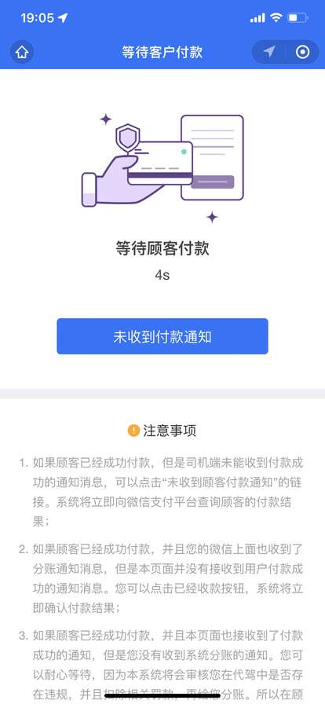

## 编写 bff-driver 子系统

编写Java代码之前，我们先来看一下时序图，如下

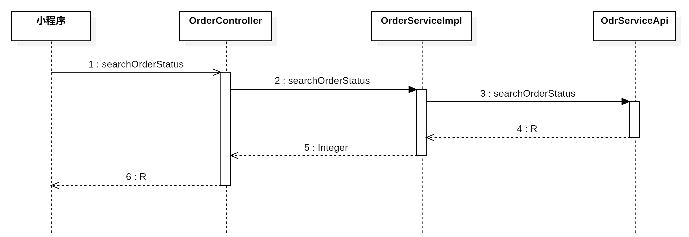

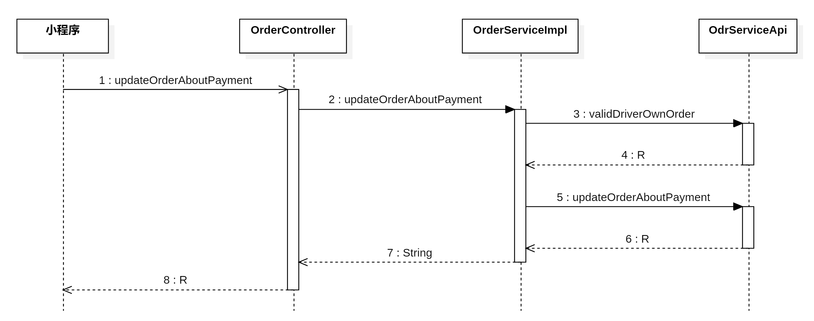

### 编写 Feign 接口

在`<font style="color:#000000;background-color:rgba(220, 240, 255, 0.3) !important;">com.example.zxds.bff.driver.controller.form</font>`包中，创建`<font style="color:#000000;background-color:rgba(220, 240, 255, 0.3) !important;">SearchOrderStatusForm.java</font>`类

```java
package com.example.zxds.bff.driver.controller.form;

import io.swagger.v3.oas.annotations.media.Schema;
import lombok.Data;

import javax.validation.constraints.Min;
import javax.validation.constraints.NotNull;

@Data
@Schema(description = "查询订单状态的表单")
public class SearchOrderStatusForm {
    @NotNull(message = "orderId不能为空")
    @Min(value = 1, message = "orderId不能小于1")
    @Schema(description = "订单ID")
    private Long orderId;

    @Schema(description = "司机ID")
    private Long driverId;
}
```

在`<font style="color:#000000;background-color:rgba(220, 240, 255, 0.3) !important;">com.example.zxds.bff.driver.controller.form</font>`包中，创建`<font style="color:#000000;background-color:rgba(220, 240, 255, 0.3) !important;">UpdateOrderAboutPaymentForm.java</font>`类

```java
package com.example.zxds.bff.driver.controller.form;

import io.swagger.v3.oas.annotations.media.Schema;
import lombok.Data;

import javax.validation.constraints.Min;
import javax.validation.constraints.NotNull;

@Data
@Schema(description = "更新代驾订单支付信息的表单")
public class UpdateOrderAboutPaymentForm {
    @NotNull(message = "orderId不能为空")
    @Min(value = 1, message = "orderId不能小于1")
    @Schema(description = "订单ID")
    private Long orderId;
}
```

在`<font style="color:#000000;background-color:rgba(220, 240, 255, 0.3) !important;">com.example.zxds.bff.driver.feign</font>`包`<font style="color:#000000;background-color:rgba(220, 240, 255, 0.3) !important;">OdrServiceApi.java</font>`接口中，声明抽象方法

```java
@PostMapping("/order/searchOrderStatus")
public R searchOrderStatus(SearchOrderStatusForm form);

@PostMapping("/order/updateOrderAboutPayment")
public R updateOrderAboutPayment(UpdateOrderAboutPaymentForm form);
```

### 编写 service 和实现

在`<font style="color:#000000;background-color:rgba(220, 240, 255, 0.3) !important;">com.example.zxds.bff.driver.service</font>`包`<font style="color:#000000;background-color:rgba(220, 240, 255, 0.3) !important;">OrderService.java</font>`接口中，声明抽象方法

```java
Integer searchOrderStatus(SearchOrderStatusForm form);

String updateOrderAboutPayment(long driverId, UpdateOrderAboutPaymentForm form);
```

在`<font style="color:#000000;background-color:rgba(220, 240, 255, 0.3) !important;">com.example.zxds.bff.driver.service.impl</font>`包`<font style="color:#000000;background-color:rgba(220, 240, 255, 0.3) !important;">OrderServiceImpl.java</font>`类中，实现抽象方法

```java
@Override
public Integer searchOrderStatus(SearchOrderStatusForm form) {
    R r = odrServiceApi.searchOrderStatus(form);
    Integer status = (Integer) r.get("result");
    return status;
}

@Override
@GlobalTransactional
public String updateOrderAboutPayment(long driverId, UpdateOrderAboutPaymentForm form) {
    ValidDriverOwnOrderForm validForm = new ValidDriverOwnOrderForm();
    validForm.setDriverId(driverId);
    validForm.setOrderId(form.getOrderId());
    R r = odrServiceApi.validDriverOwnOrder(validForm);
    boolean bool = MapUtil.getBool(r, "result");
    if (!bool) {
        throw new ZxdsException("司机未关联该订单");
    }

    r = odrServiceApi.updateOrderAboutPayment(form);
    String result = MapUtil.getStr(r, "result");
    return result;
}
```

### 编写 web 层代码

在`<font style="color:#000000;background-color:rgba(220, 240, 255, 0.3) !important;">com.example.zxds.bff.driver.controller</font>`包`<font style="color:#000000;background-color:rgba(220, 240, 255, 0.3) !important;">OrderController.java</font>`类中，声明Web方法

```java
@PostMapping("/searchOrderStatus")
@SaCheckLogin
@Operation(summary = "查询订单状态")
public R searchOrderStatus(@RequestBody @Valid SearchOrderStatusForm form) {
    long driverId = StpUtil.getLoginIdAsLong();
    form.setDriverId(driverId);
    Integer status = orderService.searchOrderStatus(form);
    return R.ok().put("result", status);
}

@PostMapping("/updateOrderAboutPayment")
@SaCheckLogin
@Operation(summary = "更新订单相关的付款信息")
public R updateOrderAboutPayment(@RequestBody @Valid UpdateOrderAboutPaymentForm form) {
    long driverId = StpUtil.getLoginIdAsLong();
    String result = orderService.updateOrderAboutPayment(driverId, form);
    return R.ok().put("result", result);
}
```

## 编写司机端小程序

### 定义全局 URL

在`<font style="color:#000000;background-color:rgba(220, 240, 255, 0.3) !important;">main.js</font>`文件中，声明全局URL路径，用于Ajax请求

```javascript
Vue.prototype.url = {
    ……,
    searchOrderStatus: `${baseUrl}/order/searchOrderStatus`,
    updateOrderAboutPayment: `${baseUrl}/order/updateOrderAboutPayment`,
}
```

### 熟悉小程序页面

司机端小程序的`<font style="color:#000000;background-color:rgba(220, 240, 255, 0.3) !important;">waiting_payment.vue</font>`页面内容并不多，我们先来看一下视图层部分

```html
<view>
    <view class="waiting-container">
        <image src="../static/waiting_payment/payment.png" mode="widthFix" class="payment"></image>
        <view class="title">等待顾客付款</view>
        <view class="second">{{ i }}s</view>
        <button class="btn" @tap="checkPaymentHandle">未收到付款通知</button>
    </view>

    <view class="notice-container">
        <view class="notice-title">
            <u-icon name="error-circle-fill" top="2" color="#fea802" size="36"></u-icon>
            <text>注意事项</text>
        </view>
        <view class="desc">
            <text class="num">1.</text>
            如果顾客已经成功付款，但是司机端未能收到付款成功的通知消息，可以点击“未收到顾客付款通知”的链接。系统将立即向微信支付平台查询顾客的付款结果；
        </view>
        <view class="desc">
            <text class="num">2.</text>
            如果顾客已经成功付款，并且您的微信上面也收到了分账通知消息，但是本页面并没有接收到用户付款成功的通知消息。您可以点击已经收款按钮，系统将立即确认付款结果；
        </view>
        <view class="desc">
            <text class="num">3.</text>
            如果顾客已经成功付款，并且本页面也接收到了付款成功的通知，但是您没有收到系统分账的通知。您可以耐心等待，因为本系统将会审核您在代驾中是否存在违规，并且扣除相关罚款，再给您分账。所以在顾客付款成功之后的2小时之内，您会收到本次代驾的分账收入，请您耐心等待，如有技术问题，请拨打400-264166678
        </view>
    </view>
    <u-top-tips ref="uTips"></u-top-tips>
</view>
```

页面上面主要的功能就是一个动态的计时，我们看一下模型层变量怎么定义的

```javascript
data() {
    return {
        i: 0,
        orderId: null,
        timer: null
    };
},
```

### 轮询查询定时器

首先在`<font style="color:#000000;background-color:rgba(220, 240, 255, 0.3) !important;">onLoad()</font>`回调函数中获取URL传入的`<font style="color:#000000;background-color:rgba(220, 240, 255, 0.3) !important;">orderId</font>`，然后创建轮询定时器，每隔几秒钟查询订单的状态。

```javascript
onLoad: function(options) {
    let that = this;
    that.orderId = options.orderId;
    that.timer = setInterval(function() {
        that.i++;
        //每隔2秒钟轮询Ajax查询付款结果
        if (that.i % 2 == 0) {
            //如果付款成功，更新工作状态，然后跳转回控制台页面
            let data = {
                orderId: that.orderId
            };
            that.ajax(
                that.url.searchOrderStatus,
                'POST',
                data,
                function(resp) {
                    if (!resp.data.hasOwnProperty('result')) {
                        uni.showToast({
                            icon: 'none',
                            title: '没有找到订单'
                        });
                        clearInterval(that.timer);
                        that.i = 0;
                    } else {
                        let result = resp.data.result;
                        if (result == 7 || result == 8) {
                            uni.showToast({
                                title: '客户已付款'
                            });
                            uni.setStorageSync('workStatus', '停止接单');
                            clearInterval(that.timer);
                            that.i = 0;
                            setTimeout(function() {
                                uni.switchTab({
                                    url: '../../pages/workbench/workbench'
                                });
                            }, 2500);
                        }
                        // console.log(result);
                    }
                },
                false
            );
        }
    }, 1000);
},
```

### 手动查询付款结果

如果后端Web方法没有收到微信平台发送的付款结果通知消息，乘客端小程序付款成功之后，因为网络故障，Ajax请求没能发送出去，这样还是会出现付款成功，但是订单依旧是未付款状态。为了解决这个问题，我在司机端设置了强制让后端Java程序主动查询付款结果的按钮，就是发起Ajax请求调用我们刚才编写的Web方法

```html
<button class="btn" @tap="checkPaymentHandle">未收到付款通知</button>
```

按钮点击事件回调函数`<font style="color:#000000;background-color:rgba(220, 240, 255, 0.3) !important;">checkPaymentHandle()</font>`我们要声明一下，如下

```javascript
checkPaymentHandle() {
    let that = this;
    let data = {
        orderId: that.orderId
    };
    that.ajax(that.url.updateOrderAboutPayment, 'POST', data, function(resp) {
        let result = resp.data.result;
        if (result == '付款成功') {
            uni.showToast({
                title: '客户已付款'
            });
            uni.setStorageSync('workStatus', '停止接单');
            clearInterval(that.timer);
            that.i = 0;
            setTimeout(function() {
                uni.switchTab({
                    url: '../../pages/workbench/workbench'
                });
            }, 2500);
        } else {
            uni.showToast({
                icon: '未检测到成功付款'
            });
        }
    });
}
```

### 测试小程序

**测试司机端小程序轮询订单支付结果的操作步骤如下：**

1. 运行量子互联程序，把后端各个子系统运行起来。
2. 生成新的UUID字符串，更新到订单记录的uuid字段上面，订单status字段修改成6状态。
3. 分账记录修改成1状态。
4. 用小程序模拟器运行司机端小程序，直接运行`<font style="color:#000000;background-color:rgba(220, 240, 255, 0.3) !important;">waiting_payment.vue</font>`页面，然后URL传入`<font style="color:#000000;background-color:rgba(220, 240, 255, 0.3) !important;">orderId</font>`参数。
5. 乘客端小程序为代驾订单付款。
6. 观察司机端小程序是否检测到付款成功，然后跳转到工作台页面。

**测试司机端小程序强制查询付款结果步骤如下：**

1. 关闭运行量子互联程序，把后端各个子系统运行起来。
2. 生成新的UUID字符串，更新到订单记录的uuid字段上面，订单status字段修改成6状态。
3. 分账记录修改成1状态。
4. 注释乘客端付款成功之后自动发起Ajax查询付款结果的代码。
5. 用小程序模拟器运行司机端小程序，直接运行`<font style="color:#000000;background-color:rgba(220, 240, 255, 0.3) !important;">waiting_payment.vue</font>`页面，然后URL传入`<font style="color:#000000;background-color:rgba(220, 240, 255, 0.3) !important;">orderId</font>`参数。
6. 乘客端小程序为代驾订单付款。即便付款成功，订单依旧是6状态。
7. 在司机端小程序上面点击按钮，强制后端查询付款结果。
8. 测试完毕之后，把注释掉的程序恢复。

# 【智行代驾】全栈平台项目简历描述

## 一、项目概述

**项目名称**：智行代驾全栈服务平台
**项目周期**：6个月
**团队规模**：8人（后端5人，前端3人）
**个人角色**：核心开发工程师 / 技术负责人

### 项目简介

智行代驾是一款面向C端用户的**代驾服务平台**，包含**乘客端小程序**、**司机端小程序**和**MIS运营管理系统**三大前端应用，以及基于**Spring Cloud Alibaba微服务架构**的后端支撑系统。项目实现了从乘客下单、司机抢单、实时定位同步、订单履约、智能风控、AI语音监控到微信支付分账的全业务流程闭环。

## 二、核心技术栈

### 后端技术栈

- **微服务架构**：Spring Cloud Alibaba、Nacos注册中心、Gateway网关、OpenFeign
- **核心框架**：Spring Boot、MyBatis、Sa-Token（权限认证）
- **分布式事务**：Seata AT模式
- **消息队列**：RabbitMQ（抢单推送、系统通知）
- **缓存与存储**：Redis（分布式缓存、GEO地理位置）、MySQL（业务数据）、MongoDB（消息系统）、HBase+Phoenix（海量轨迹数据）
- **定时任务**：Quartz（分账延迟处理）
- **第三方集成**：微信支付（含分账）、腾讯地图服务、腾讯云数据万象（AI内容审核）、微信同声传译插件

### 前端技术栈

- **小程序端**：uni-app（Vue2语法）、微信原生API、腾讯位置服务SDK
- **MIS端**：Vue2 + Element UI、Axios

## 三、核心功能模块与个人贡献

### 1. 微服务架构设计与BFF层落地

- **技术难点**：如何解耦前端展示与后端业务，避免API过度膨胀
- **解决方案**：采用**BFF（Backend For Frontend）模式**，为司机端、乘客端、MIS端分别建立独立的BFF层服务。BFF层负责参数校验、数据聚合、会话管理，底层按领域拆分为订单、司机、乘客、规则、消息等独立微服务。
- **个人贡献**：
  - 主导了微服务边界划分，设计了BFF层的通用异常处理和数据格式统一规范
  - 封装了基于Sa-Token的分布式会话管理
  - 实现了Feign接口的通用Fallback降级处理，提升系统容错性

### 2. 高并发抢单与实时通信设计

- **业务场景**：乘客下单后，系统需在1秒内向附近司机推送新订单，并支持司机手动/自动抢单
- **技术挑战**：避免重复接单、保证推送实时性、处理高并发下的数据一致性
- **解决方案**：
  - 使用**Redis有序集合**存储在线司机位置，通过GEO算法计算附近司机
  - 基于**RabbitMQ Direct交换机**为每个司机创建独立消息队列，实现点对点推送
  - 抢单接口采用**Redis Lua 脚本**防止并发超抢
  - 订单创建成功后，订单ID存入Redis并设置15分钟过期，用于超时自动取消
- **个人贡献**：
  - 独立设计并实现了订单推送和抢单的完整时序流程
  - 封装了消息子系统的收发工具类，支持同步/异步消息发送
  - 解决了因网络抖动导致的消息重复消费问题（通过消息ID幂等性校验）

### 3. 司乘实时定位与路线规划

- **业务场景**：乘客端实时查看司机位置（司乘同显）、系统计算预估里程/费用、记录代驾轨迹
- **技术挑战**：高频率定位上传（5秒/次）对服务器压力大、轨迹点存储成本高
- **解决方案**：
  - 前端利用`<font style="color:#000000;">wx.onLocationChange</font>`实时获取定位，**每凑够20个点批量上传**，减少网络请求
  - 后端使用**Redis GEO**缓存司机实时位置，用于附近司机搜索
  - 轨迹数据存入**HBase + Phoenix**，利用其海量存储和高吞吐特性，单表支持百亿级数据
  - 集成腾讯地图服务API，实现最佳路线计算、里程预估、费用预估
- **个人贡献**：
  - 搭建了HBase+Phoenix大数据平台，设计了订单轨迹表的RowKey和索引策略
  - 实现了GPS点连成线并计算实际里程的算法（基于Haversine公式）
  - 在MIS系统中实现了轨迹回放功能，支持查看历史订单行驶路径

### 4. AI智能风控与语音监控

- **业务场景**：代驾过程中全程录音，AI分析对话内容，检测违规行为（辱骂、敏感词）
- **技术挑战**：实时语音转文本、大规模文本审核、存储成本控制
- **解决方案**：
  - 集成**微信同声传译插件**，实现实时录音并转换为文本
  - 调用**腾讯云数据万象服务**对文本进行内容审核，返回违规标签（色情、暴恐、广告等）
  - 审核结果存入HBase，并更新订单监控摘要表（累计违规次数、需人工审核数量）
  - 设计分级风控策略：观察级（打标签）、预警级（人工抽检）、高危级（冻结提现）
- **个人贡献**：
  - 独立完成语音监控模块的全栈开发（前端录音上传 + 后端审核 + 数据存储）
  - 封装了异步线程任务处理文本审核，避免阻塞主业务流程
  - 设计了订单监控摘要表，实现订单维度的风险等级聚合统计

### 5. 微信支付与自动化分账

- **业务场景**：乘客支付代驾费，系统自动计算分账（平台抽成 + 司机收入 + 个税代缴）
- **技术挑战**：分账比例动态计算、微信支付接口异常处理、分账延迟重试
- **解决方案**：
  - 基于**微信支付V2 API**实现统一下单、支付结果查询、分账接口调用
  - 分账规则引擎：根据订单金额、司机当日完成单量、差评情况等动态计算分账比例（12%-20%不等）
  - 使用**Quartz定时任务**延迟2分钟执行分账（解决微信支付分账延迟问题），若返回“分账中”，再创建20分钟后查询任务
  - 处理极端情况：未收到支付回调时，支持前端主动触发查询订单状态，保证最终一致性
- **个人贡献**：
  - 主导了支付与分账模块的设计开发，梳理了完整的时序图
  - 封装了微信支付工具类，支持普通请求和证书请求
  - 解决了分账比例超限问题（申请高比例分账并适配税务要求）

### 6. 防刷单与安全机制

- **业务场景**：防止司机刷单骗取平台奖励
- **安全设计**：
  - **手机号一致性校验**：登录时强制获取手机号，与实名认证手机号比对，杜绝多设备交替登录
  - **位置范围限制**：司机必须在起点1公里内才能“到达”，终点2公里内才能“结束”，提高刷单物理成本
  - **超短途订单风控**：针对100米以内的超短途订单，实施分级监控（观察/预警/高危）
- **个人贡献**：
  - 实现了手机号获取与校验的全流程（小程序`<font style="color:#000000;">getPhoneNumber</font>` + 后端微信API调用）
  - 基于腾讯地图距离计算API，在关键节点增加距离校验逻辑

### 7. 系统消息与通知模块

- **业务场景**：账单通知、系统公告、奖励通知等需要持久化存储的消息
- **技术方案**：
  - **MongoDB**存储消息内容和消息引用，支持按用户分页查询
  - **RabbitMQ + 过期队列**：广播消息先入MQ，设置30天过期，用户登录时拉取并持久化
- **个人贡献**：
  - 设计了消息集合和消息引用集合的结构，支持已读/未读、最新消息标记
  - 封装了消息收发、轮询接收、删除队列的工具类

## 四、项目亮点总结

### 技术深度

1. **全链路微服务治理**：从BFF层到业务层，完整实践了服务拆分、服务发现、负载均衡、熔断降级
2. **海量数据处理**：基于HBase+Phoenix解决GPS轨迹数据存储和查询难题，单表支撑百亿级数据
3. **高并发抢单设计**：通过Redis GEO + RabbitMQ + 分布式锁，实现毫秒级司机推送和防并发抢单
4. **分布式事务一致性**：在涉及订单、支付、分账、奖励发放等多服务场景中，使用Seata AT模式保证最终一致性
5. **智能风控体系**：集成AI内容审核，实现代驾过程语音监控+超短途订单分级风控，有效降低运营风险

### 业务价值

1. **全流程闭环**：覆盖从注册、认证、下单、接单、代驾、支付到分账的完整业务链路
2. **高可用设计**：关键业务（如支付结果查询）设计多重保障机制（回调+主动轮询+手动触发）
3. **成本优化**：通过批量上传GPS、消息过期队列等策略，有效降低服务器和存储成本
4. **合规性保障**：分账比例动态计算 + 税务代扣代缴，符合监管要求

## 五、面试话术建议

### 当被问到“你在项目中遇到的最大挑战是什么？”

**可以这样回答**：

### 当被问到“你们是怎么处理微信支付分账的？”

**可以这样回答**：

# 如何介绍代驾项目

面试官你好，我最近做的是一个**代驾平台项目**，类似滴滴代驾那种。

我负责的是**司机端小程序**和**乘客端小程序**，还有**后台管理系统**中的部分功能。

简单说下流程：

**乘客端**这边，用户打开小程序可以选起点终点，我用的是腾讯地图，选完点就能看到预估里程和价格，确认后下单。下单后系统会通过Redis找附近5公里内正在接单的司机，把订单推送过去。

**司机端**这边，司机注册完要实名认证，上传身份证驾驶证，后台审批通过后才能接单。接单前还得做个刷脸验证，防止代刷。司机开始接单后，会实时上传自己的位置到Redis，这样乘客那边才能看到司机在哪。

抢单这块我做了两种模式：自动抢单和手动抢单。司机收到订单后会语音播报订单详情，播完如果设置了自动抢单就直接抢，手动的话页面会显示一个按钮。

接单成功后进入代驾流程。司机要先去接乘客，到了起点点一下"到达代驾点"，我用腾讯地图做了距离校验，必须1公里以内才能点。开始代驾后，司机会实时上传GPS轨迹，每20个点提交一次存到HBase，还会录音，录音文件上传到Minio。代驾结束时要计算实际里程和费用，推给乘客付款。

**支付分账**这块是比较复杂的。乘客端调用微信支付，后台收到支付成功的回调后，会用定时任务做分账，把司机的收入划到他账户里，平台抽成也自动扣掉。分账如果没成功会重试，保证钱不会出问题。

**后台管理**主要是审批司机认证和查看订单详情，订单详情页还能在地图上看到司机实际走的路线，用来核对有没有绕路。

整个项目用了Spring Cloud微服务架构，拆了好几个子系统，比如订单、司机、规则引擎这些，之间用Feign调用。数据存储上MySQL存业务数据，Redis做缓存和Geo位置搜索，HBase存GPS轨迹这种大数据，Minio存图片和录音文件。消息这块用了RabbitMQ做订单推送，分布式事务用的Seata保证数据一致性。