# 1.MySQL高级

# 索引

## 什么是索引

索引是一种能够提高检索（查询）效率的提前排好序的数据结构。例如：书的目录就是一种索引机制。索引是解决SQL慢查询的一种方式。

索引的出现，避免了全表扫描，缩小的查找范围，提高了查询效率。

索引也是需要维护的，就像一本书的目录也是需要维护的，这本书的内容如果发生了变化，目录也需要同步更新。

如果某字段经常出现在 where 子句中，并且数据量庞大，该字段很少的增删改操作，建议添加索引，可以大大提升查询效率。

## 索引的创建和删除

### 主键会自动添加索引

主键字段会自动添加索引，不需要程序员干涉，主键字段上的索引被称为`主键索引`

### unique约束的字段自动添加索引

unique约束的字段也会自动添加索引，不需要程序员干涉，这种字段上添加的索引称为`唯一索引`

### 给指定的字段添加索引

建表时添加索引：

```sql
CREATE TABLE emp (
    ...
    name varchar(255),
    ...
    INDEX idx_name (name)
);
```

如果表已经创建好了，后期给字段添加索引

```sql
ALTER TABLE emp ADD INDEX idx_name (name);
```

也可以这样添加索引：

```sql
create index idx_name on emp(name);
```

### 删除指定字段上的索引

```sql
ALTER TABLE emp DROP INDEX idx_name;
```

### 查看某张表上添加了哪些索引

```sql
show index from 表名;
```

**重要的列：**

**Key_name：**看有哪些索引，以及索引名称。PRIMARY 是主键，其他是普通索引或唯一索引。

**Column_name** 和 **Seq_in_index：看索引 建在哪些列上**，以及复合索引的列顺序。索引的列顺序对查询性能影响很大。

**Cardinality：看索引的选择性**。`<font style="color:rgb(15, 17, 21);background-color:rgb(235, 238, 242);">Cardinality</font>` 值除以表总行数，越接近1，索引效果越好。如果值很小（比如只有几个），说明该列重复值很多，索引效果可能不佳。

**Non_unique：**区分是唯一索引还是非唯一索引。`<font style="color:rgb(15, 17, 21);background-color:rgb(235, 238, 242);">0</font>` 表示唯一约束（如主键、唯一索引）。

## 索引的分类

不同的`存储引擎`有不同的索引类型和实现：

- 按照数据结构分类：
  - B+树 索引（mysql的InnoDB存储引擎采用的就是这种索引）采用 B+树 的数据结构
  - Hash 索引（仅 `memory` 存储引擎支持）：采用 哈希表 的数据结构
- 按照字段特性分类：
  - 主键索引（primary key）
  - 唯一索引（unique）
  - 普通索引（index）
  - 全文索引（fulltext：仅 `InnoDB和MyISAM` 存储引擎支持）
- 按照字段个数分类：
  - 单列索引、联合索引（也叫复合索引、组合索引）
- 按照物理存储分类：
  - 聚集索引：索引和表中数据在一起，数据存储的时候就是按照索引顺序存储的。一张表只能有一个聚集索引（**主键上添加的索引就是聚集索引**）。
  - 非聚集索引：索引和表中数据是分开的，索引是独立于表空间的，一张表可以有多个非聚集索引。

| **特性** | **聚集索引** | **非聚集索引** |
| --- | --- | --- |
| **存储方式** | 索引和数据存储在一起 | 索引和数据分开存储 |
| **叶子节点** | 存储完整的行数据 | 存储主键值（或指向数据的指针） |
| **每个表的数量** | **最多1个** | 可以有多个 |
| **查询效率** | 通过主键查询最快 | 需要回表查询 |
| **占用空间** | 较小（不需要额外存储数据副本） | 较大（每个索引独立存储） |

## MySQL索引采用了B+树数据结构

常见的树相关的数据结构包括：

- 二叉树
- 红黑树
- B树
- B+树

区别：树的高度不同。树的高度越低，性能越高。这是因为每一个节点都是一次I/O

### 二叉树

有这样一张表


如果不给id字段添加索引，默认进行全表扫描，假设查询id=10的数据，那至少要进行10次磁盘IO。效率低。可以给id字段添加索引，假设该索引使用了二叉树这种数据结构，这个二叉树是这样的（**推荐一个数据结构可视化网站Data Structure Visualizations，是旧金山大学（USFCA）的一个网站**）：[https://www.cs.usfca.edu/~galles/visualization/Algorithms.html](https://www.cs.usfca.edu/~galles/visualization/Algorithms.html)

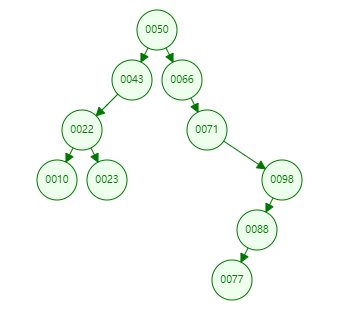

如果这个时候要找id=10的数据，需要的IO次数是？4次。效率显著提升了。

但是MySQL并没有直接使用这种普通的二叉树，这种普通二叉树在`数据极端`的情况下，效率较低。比如下面的数据：


如果给id字段添加索引，并且该索引底层使用了普通二叉树，这棵树会是这样的：


你虽然使用了二叉树，但这更像一个链表。查找效率等同于链表查询O(n)【**查找算法的时间复杂度是线性的**】。查找效率极低。

因此对于MySQL来说，它并没有选择这种数据结构作为索引。

### 红黑树（自平衡二叉树）

通过自旋平衡规则进行旋转，当数据有序插入时比二叉树数据检索性能更好。

**红黑树是一种自平衡的二叉查找树，通过以下5条规则来保证树的平衡性：**

1. 节点颜色规则：**每个节点要么是红色，要么是黑色**
2. 根节点规则：**根节点必须是黑色**
3. 叶子节点规则：**所有叶子节点（NIL节点）都是黑色（**NIL节点是空节点，不存储实际数据）
4. 红色节点规则：**红色节点的子节点必须是黑色（**红色节点的父节点和子节点都不能是红色）
5. 黑色高度规则：**从任一节点到其每个叶子节点的所有路径，都包含相同数目的黑色节点**

- 这个性质保证了红黑树的平衡性，从根到叶子节点的最长路径不会超过最短路径的2倍

例如有以下数据


给id字段添加索引，并且该索引使用了`红黑树`数据结构，那么会是这样：


如果查找id=10的数据，磁盘IO次数为：5次。效率比普通二叉树要高一些。

但是如果数据量庞大，例如500万条数据，也会导致树的高度很高，磁盘IO次数仍然很多，查询效率也会比较低。

因此MySQL并没有使用红黑树这种数据结构作为索引。

### B-Tree（B树）

**B-Tree 是****自平衡的多路查找树**

B-Tree每个节点下的子节点数量 > 2。

B-Tree每个节点中不是存储单个数据，是存储多个数据。

B-Tree分支的数量不是2，是大于2，具体是多少个分支，由`阶`决定。例如：

- 3阶的B-Tree，一个节点下最多有3个子节点，每个节点中最多有2个数据。
- 4阶的B-Tree，一个节点下最多有4个子节点，每个节点中最多有3个数据。
- 5阶（5, 4）
- 6阶（6, 5）
- ....
- 16阶（16, 15）

采用B-Tree，你会发现相同的数据量，**B-Tree 树的高度更低**。磁盘IO次数更少。

3阶的B-Tree：

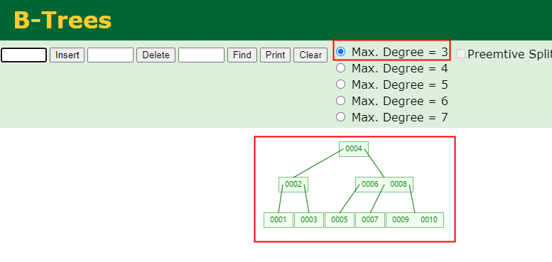

**假设id字段添加了索引，并且采用了B-Tree数据结构，查找id=10的数据，只需要3次磁盘IO。**

**比如这样的数据采用 B-Tree 方式存储：**

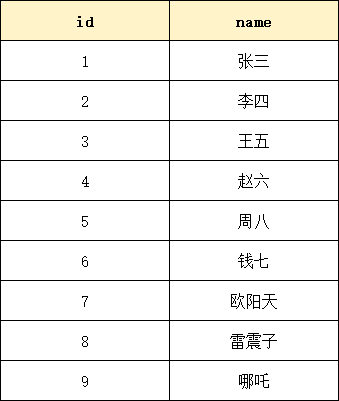


在B-Tree中，每个节点不仅存储了`索引值`，还存储该索引值对应的`数据行`。

并且每个节点中的p1 p2 p3是指向下一个节点的指针。

B-Tree数据结构存在的缺点是：不适合做区间查找，对于区间查找效率较低。假设要查id在[3~7]之间的，需要查找的是3,4,5,6,7。查每个索引值都需要从头节点开始。

MySQL使用了**B+Tree**解决了这个问题。

### B+Tree

B+Tree 相较于 B-Tree改进了哪些？

- B+Tree 将数据都存储在叶子节点中。并且叶子节点之间使用链表连接，这样很适合范围查询。
- B+Tree 的**非叶子节点**上只有索引值，没有数据，所以非叶子节点可以存储更多的索引值（**一个节点对应一个数据页，一个数据页最大容量 16KB**），这样让B+Tree 更矮更胖，提高检索效率。

**数据页：**

- **大小固定：默认 16KB（16384 字节）**
- **磁盘读写的最小单元，以页为单位，一次 IO 读取 16KB 数据，减少 IO 次数。**
- **内存和磁盘之间以页为单位传输数据**

**一个 16KB 的数据页能存多少索引键？**

- **页大小：16KB = 16384 字节**
- **索引键：BIGINT 类型 8 字节**
- **子页指针：6 字节**
- **每对（键+指针）：14 字节**
- **16384 ÷ 14 ≈ 1170 个，1170 个索引键**


**假设有这样一张表：**

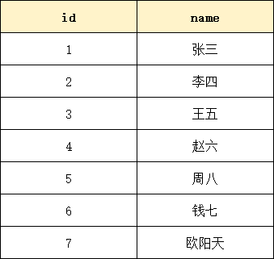

**B+Tree方式存储的话如下图所示：**


**经典面试题：**mysql为什么选择B+Tree 作为索引的数据结构，而不是B-Tree？

1. 非叶子节点上可以存储更多的键值，阶数可以更大，更矮更胖，磁盘IO次数少，数据查询效率高。
2. 所有数据都是有序存储在叶子节点上，让范围查找，分组查找效率更高。（**聚集索引的 B+Tree 叶子节点存储的是完整的数据行。非聚集索引的 B+Tree 叶子节点存储的是主键值**）
3. 数据页之间采用链表链接，升序降序更加方便操作。

**经典面试题：**如果一张表没有主键索引，那还会创建B+Tree 吗？

当一张表没有主键索引时，InnoDB 会优先使用 `<font style="color:rgb(15, 17, 21);background-color:rgb(235, 238, 242);">NOT NULL UNIQUE</font>` 索引作为聚集索引，否则自动生成隐藏的 `<font style="color:rgb(15, 17, 21);background-color:rgb(235, 238, 242);">ROW_ID</font>` 来构建 B+Tree 聚集索引，数据按该键值有序排列。

## 其他索引及相关调优

### Hash索引

支持Hash索引的存储引擎有：

- InnoDB（不支持手动创建Hash索引，系统会自动维护一个`自适应的Hash索引`）
  - 对于InnoDB来说，即使手动指定了某字段采用Hash索引，最终还是`BTREE`。
  - **自适应**指的是：InnoDB 会根据数据访问模式**自动判断、自动创建、自动管理**哈希索引，无需人工干预，也不需要用户手动指定。
- Memory（支持Hash索引）

Hash索引底层的数据结构就是哈希表。一个数组，数组中每个元素是链表。和java中HashMap一样。哈希表中每个元素都是key value结构。key存储`索引值`，value存储`行指针`。

原理如下：


如果name字段上添加了Hash索引idx_name

Hash索引长这个样子：

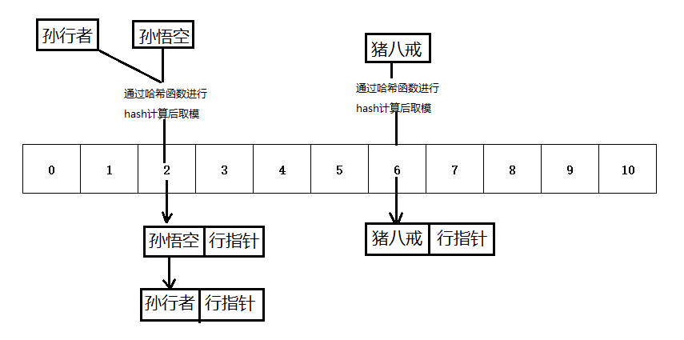

检索原理：假设 name='孙行者'。通过哈希算法将'孙行者'转换为数组下标，通过下标找链表，在链表上遍历找到孙行者的行指针。

注意：不同的字符串，经过哈希算法得到的数组下标可能相同，这叫做哈希碰撞/哈希冲突。【不过，好的哈希算法应该具有很低的碰撞概率。常用的哈希算法如MD5、SHA-1、SHA-256等都被设计为尽可能减少碰撞的发生。】

**Hash索引优缺点：**

- 优点：只能用在等值比较中，效率很高。例如：name='孙悟空'
- 缺点：不支持排序，不支持范围查找。

### 聚集索引和非聚集索引

按照数据的物理存储方式不同，可以将索引分为聚集索引（聚簇索引）和非聚集索引（非聚簇索引）。

存储引擎是InnoDB的，主键上的索引属于聚集索引。

存储引擎是MyISAM的，任意字段上的索引都是非聚集索引。

InnoDB的物理存储方式：当创建一张表t_user，硬盘上会生成两个文件：

- t_user.ibd （InnoDB data表索引 + 数据）
- t_user.frm （存储表结构信息）

MyISAM的物理存储方式：当创建一张表t_user，硬盘上会生成三个文件：

- t_user.MYD （表数据）
- t_user.MYI （表索引）
- t_user.frm （表结构）

**注意：从MySQL8.0开始，不再生成frm文件了，引入了数据字典，用数据字典来统一存储表结构信息，例如：**

- **information_schema.TABLES （表包含了数据库中所有表的信息，例如表名、数据库名、引擎类型等）**
- **information_schema.COLUMNS（表包含了数据库中所有表的列信息，例如列名、数据类型、默认值等）**

聚集索引的原理图：（B+Tree，叶子节点上存储了索引值 + 数据行）


非聚集索引的原理图：（B+Tree，叶子节点上存储了索引值 + 行指针）


聚集索引的优点和缺点：

1. 优点：聚集索引将数据存储在索引树的叶子节点上。可以减少一次查询，因为查询索引树的同时可以获取数据。
2. 缺点：对数据进行修改或删除时需要更新索引树，会增加系统的开销。

### 二级索引

二级索引也属于**非聚集索引**。也有人把二级索引称为**辅助索引**。

有表t_user，id是主键。age是非主键。在age字段上添加的索引称为二级索引。（**所有非主键索引都是二级索引**）

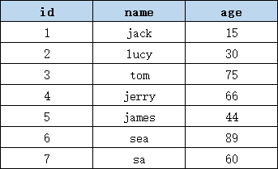

**二级索引的数据结构：**


**二级索引的查询原理：**

假设查询语句为：

```sql
select * from t_user where age = 30;
```

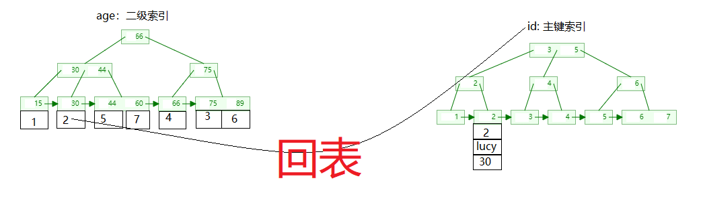

**为什么会“回表”？因为使用了**`**select ***`

避免“回表【回到原数据表】”是提高SQL执行效率的手段。例如：select id from t_user where age = 30; 这样的SQL语句是不需要回表的。

**因为 **`**<font style="color:rgb(15, 17, 21);background-color:rgb(235, 238, 242);">age</font>**`** 是二级索引，它的 B+Tree 叶子节点只存了 **`**<font style="color:rgb(15, 17, 21);background-color:rgb(235, 238, 242);">(age, id)</font>**`**，不存其他字段。**

**也就是说 **`**<font style="color:rgb(15, 17, 21);">select age</font>**``**<font style="color:rgb(15, 17, 21);">select id</font>**`**都不需要回表，如果 **`**<font style="color:rgb(15, 17, 21);">select *</font>**`**或者 **`**<font style="color:rgb(15, 17, 21);">select name</font>**`**都需要回表。**

### 覆盖索引

一个好的覆盖索引，可以避免回表操作，提高程序的执行效率。假设你给 `name``age`两个字段添加一个覆盖索引，那么叶子节点上就会存储 name 的数据、age 的数据、以及主键值，当 `select name``select age`的时候都不会进行回表，因为数据本身就在叶子节点上，无需回表。

**覆盖索引** = 一个索引包含了查询需要的所有字段。

假设有一个用户表（user）包含以下列：id, username, email, age。

常见的查询是根据**用户名查询用户的邮箱**。如果为了提高这个查询的性能，可以创建一个覆盖索引，包含（username, email）这两列。

创建覆盖索引的SQL语句可以如下：

```sql
CREATE INDEX idx_user_username_email ON user (username, email);
```

当执行以下查询时：

```sql
SELECT email FROM user WHERE username = 'lucy';
```

MySQL可以直接使用覆盖索引（idx_user_username_email）来获取查询结果，而不必再去查找用户表中的数据。

**覆盖索引具有以下优点：**

1. 提高查询性能：覆盖索引能够满足查询的所有需求，同时不需要访问表中的实际数据行，从而可以提高查询性能。
2. 减少磁盘和内存访问次数：当使用覆盖索引时，DBMS不需要访问实际的数据行。这样可以减少磁盘和内存访问次数，从而提高查询性能。
3. 减少网络传输：由于在覆盖索引中可以存储所有查询所需的列，因此可以减少数据的网络传输次数，从而提高查询的性能。

**覆盖索引的缺点包括：**

1. 需要更多的内存：覆盖索引需要存储查询所需的所有列，因此需要更多的内存来存储索引。在大型数据库系统中，这可能会成为一项挑战。
2. 会使索引变得庞大：当索引中包含了许多列时，它们可能会使索引变得非常庞大，从而影响查询性能，并且可能会占用大量的磁盘空间。
3. 只有在查询中包含了索引列时才能使用：如果查询语句中包含了其他列，则不会走覆盖索引。

### 索引下推

**ICP（Index Condition Pushdown，索引条件下推）**：MySQL 在**索引的叶子节点上**直接利用索引中的字段提前过滤数据，减少回表次数。（不是不需要回表，是回表的次数减少）

**覆盖索引解决的是不需要回表的问题，索引下推解决的是回表次数减少的问题。**

**下推 = 把过滤操作从 Server 层“推下去”到存储引擎层执行。**

**Server层**：MySQL 的**上层大脑**，负责解析SQL、优化执行、权限管理，不关心数据怎么存。**默认情况下，WHERE 条件的过滤是在 Server 层完成的。**

**存储引擎层**：MySQL 的**底层手脚**，负责数据的实际读写、索引维护、事务处理（如 InnoDB）。

**ICP 是自动生效的，不需要程序员负责，但你需要知道 ICP 的生效条件：**

1. **只能用于二级索引**（聚簇索引用不上，因为数据已经在叶子节点里了，ICP 不减回表）
2. **查询需要回表**（如果覆盖索引直接返回，ICP 不生效）
3. **WHERE 条件中，部分字段在索引里，但无法用索引查找**（如 `<font style="color:rgb(15, 17, 21);background-color:rgb(235, 238, 242);">LIKE '%...'</font>`、`<font style="color:rgb(15, 17, 21);background-color:rgb(235, 238, 242);">col > ? AND col2 = ?</font>` 等）

**怎么知道 ICP 生效没？使用 **`**<font style="color:rgb(15, 17, 21);">EXPLAIN</font>**`**（EXPLAIN 是 MySQL 提供的查询执行计划分析工具）**

```sql
EXPLAIN SELECT * FROM t_user WHERE name = 'Alice' AND age LIKE '%20%';
```

看 `**<font style="color:rgb(15, 17, 21);">Extra 信息</font>**`**：**

| **Extra 信息** | **含义** | **是否回表** | **说明** |
| --- | --- | --- | --- |
| **Using index** | **覆盖索引** | ❌ 不回表 | 查询所需的所有字段都在索引里，直接返回 |
| **Using where** | **Server 层过滤** | ✅ 回表 | 索引只用来定位，过滤在 Server 层完成 |
| **Using index condition** | **索引下推（ICP）** | ✅ 回表（但减少次数） | 部分过滤下推到存储引擎层，在索引上提前过滤 |

**对于这条 SQL 语句来说，ICP 生效和没有生效的区别是什么？**

```sql
EXPLAIN SELECT * FROM t_user WHERE name = 'jack' AND age LIKE '%20%';
```

**没有 ICP：** 索引找到所有 `<font style="color:rgb(15, 17, 21);background-color:rgb(235, 238, 242);">name='jack'</font>` 的记录，**全部回表**取完整行，假设有 10 个 `<font style="color:rgb(15, 17, 21);">jack</font>`，则需要回表 10 次**。**

**有 ICP：** 索引找到所有 `<font style="color:rgb(15, 17, 21);background-color:rgb(235, 238, 242);">name='jack'</font>` 的 10 条记录后，**在索引叶子节点上直接判断 **`**<font style="color:rgb(15, 17, 21);background-color:rgb(235, 238, 242);">age LIKE '%20%'</font>**`，假设满足条件的只有 3 条记录。**回表 3 次。**

### 单列索引（单一索引）

单列索引说的就是给一个字段添加的索引。如果主键是单一字段的，那么主键上的索引也是单列索引：

| **索引类型** | **是否单列** | **叶子节点存储** | **是否允许为 NULL** |
| --- | --- | --- | --- |
| **主键索引** | ✅ 是（单字段时） | 完整行数据 | ❌ 不允许 |
| **普通单列索引** | ✅ 是 | 索引列的值 + 主键值 | ✅ 允许 |

### 复合索引（组合索引）

复合索引（Compound Index）也称为多列索引（Multi-Column Index），对数据库表中多个列创建一个索引。

多数情况下，覆盖索引是一个复合索引。

假设我们有一个订单表（Order），包含：订单编号（OrderID）、客户编号（CustomerID）、订单日期（OrderDate）和订单金额（OrderAmount）。

如果我们为订单表的客户编号和订单日期这两列创建复合索引（CustomerID, OrderDate），那么可以在查询时同时根据客户编号和订单日期来快速定位到匹配的记录。

例如，我们可以使用以下SQL语句查询客户编号为123456且订单日期为2021-01-01的订单信息：

```sql
SELECT * FROM Order WHERE CustomerID = 123456 AND OrderDate = '2021-01-01';
```

由于我们为客户编号和订单日期创建了复合索引，数据库可以使用这个索引来快速定位到符合条件的记录，从而加快查询速度。复合索引的使用能够提高多列条件查询的效率，但需要注意的是，复合索引的创建和维护可能会增加索引的存储空间和对于写操作的影响。

**相对于单列索引，复合索引有以下几个优势：**

1. 减少索引的数量：复合索引可以包含多个列，因此可以减少索引的数量，减少索引的存储空间和维护成本。
2. 提高查询性能：当查询条件中涉及到复合索引的多个列时，数据库可以使用复合索引进行快速定位和过滤，从而提高查询性能。
3. 覆盖查询：如果复合索引包含了所有查询需要的列，那么数据库可以直接使用索引中的数据，而不需要再进行表的读取，从而提高查询性能。
4. 排序和分组：由于复合索引包含多个列，因此可以用于排序和分组操作，从而提高排序和分组的性能。

**复合索引遵循“最左前缀原则”——以第一列为准。后面再说。**

## 索引的优缺点

索引是数据库中一种重要的数据结构，用于加速数据的检索和查询操作。它的优点和缺点如下：

**优点：**

1. 提高查询性能：通过创建索引，可以大大减少数据库查询的数据量，从而提升查询的速度。
2. 加速排序：当查询需要按照某个字段进行排序时，索引可以加速排序的过程，提高排序的效率。
3. 减少磁盘IO：索引可以减少磁盘IO的次数，这对于磁盘读写速度较低的场景，尤其重要。

**缺点：**

1. 占据额外的存储空间：索引需要占据额外的存储空间，特别是在大型数据库系统中，索引可能占据较大的空间。
2. 增删改操作的性能损耗：每次对数据表进行插入、更新、删除等操作时，需要更新索引，会导致操作的性能降低。
3. 资源消耗较大：索引需要占用内存和CPU资源，特别是在大规模并发访问的情况下，可能对系统的性能产生影响。

## 何时用索引

**在以下情况下建议使用索引：**

1. 频繁执行查询操作的字段：如果这些字段经常被查询，使用索引可以提高查询的性能，减少查询的时间。
2. 大表：当表的数据量较大时，使用索引可以快速定位到所需的数据，提高查询效率。
3. 需要排序或者分组的字段：在对字段进行排序或者分组操作时，索引可以减少排序或者分组的时间。
4. 外键关联的字段：在进行表之间的关联查询时，使用索引可以加快关联查询的速度。

**在以下情况下不建议使用索引：**

1. 频繁执行更新操作的表：如果表经常被更新数据，使用索引可能会降低更新操作的性能，因为每次更新都需要维护索引。
2. 小表：对于数据量较小的表，使用索引可能并不会带来明显的性能提升，反而会占用额外的存储空间。
3. 对于唯一性很差的字段，一般不建议添加索引。当一个字段的唯一性很差时，查询操作基本上需要扫描整个表的大部分数据。如果为这样的字段创建索引，索引的大小可能会比数据本身还大，导致索引的存储空间占用过高，同时也会导致查询操作的性能下降。

总之，索引需要根据具体情况进行使用和权衡，需要考虑到表的大小、查询频率、更新频率以及业务需求等因素。

# MySQL 优化

## MySQL优化手段

MySQL数据库的优化手段通常包括但不限于：

- SQL查询优化：这是最低成本的优化手段，通过优化查询语句、适当添加索引等方式进行。并且效果显著。
- 库表结构优化：通过规范化设计等方式进行库表结构优化，需要对数据库结构进行调整和改进
- 系统配置优化：调整最大连接数、内存管理等参数
- 硬件优化：升级硬盘、增加内存容量、升级处理器等硬件方面的投入，需要购买和替换硬件设备，成本较高

我们主要掌握：SQL查询优化

## SQL性能分析工具

### 查看数据库整体情况

通过以下命令可以查看当前数据库在SQL语句执行方面的整体情况：

```sql
show global status like 'Com_select';
show global status like 'Com_insert';
show global status like 'Com_delete';
show global status like 'Com_update';
```

**查看 MySQL 自启动以来的增删改查（SELECT/INSERT/DELETE/UPDATE）总执行次数，用于监控数据库负载和读写比例。**

### 慢查询日志

慢查询日志文件：记录查询较慢的 DQL 语句。

通过以下命令查看慢查询日志功能是否开启：

```sql
show variables like 'slow_query_log';
```

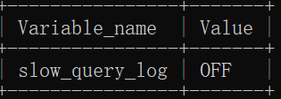

慢查询日志功能默认是关闭的。请修改my.ini文件（**没有则手动创建**）来开启慢查询日志功能，在my.ini的[mysqld]后面添加如下配置：

```plaintext
[mysqld]
slow_query_log=1
long_query_time=3
```

slow_query_log=1表示开启慢查询日志功能

long_query_time=3表示：只要SELECT语句的执行耗时超过3秒则将其记录到慢查询日志中。

重启mysql服务。再次查看是否开启慢查询日志功能：

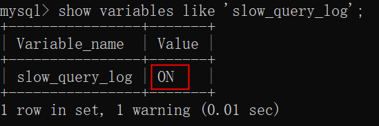

尝试执行一条时长超过3秒的select语句：

```sql
select sleep(5);
```

慢查询日志文件默认存储在：C:\dev\mysql-8.0.36-winx64\data 目录下，默认的名字是：计算机名-slow.log

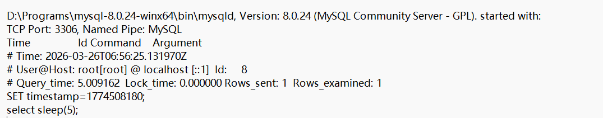

**重点看 **`**Query_time**`**这一行：**

| **指标** | **值** | **含义** |
| --- | --- | --- |
| **Query_time** | 5.009162 秒 | 查询执行总时间（慢查询的判断依据） |
| **Lock_time** | 0.000000 秒 | 锁等待时间（这里没有锁竞争） |
| **Rows_sent** | 1 | 最终返回给客户端的数据行数 |
| **Rows_examined** | 1 | 在存储引擎层实际扫描的行数 |

### show profiles

通过show profiles可以查看一个SQL语句在执行过程中具体的耗时情况。帮助我们更好的定位问题所在。

查看当前数据库是否支持 profile操作：

```sql
select @@have_profiling;
```

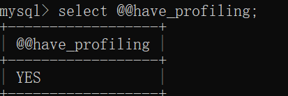

查看 profiling 开关是否打开：

```sql
select @@profiling;
```

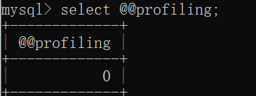

将 profiling 开关打开：

```sql
set profiling = 1;
```

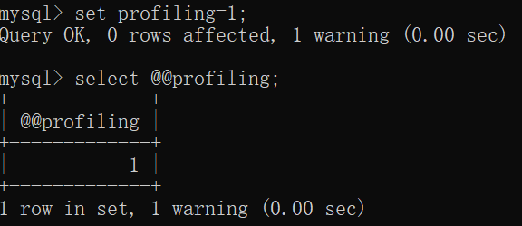

可以执行多条DQL语句，然后使用 show profiles; 来查看当前数据库中执行过的每个SELECT语句的耗时情况。

```sql
select empno,ename from emp;
select empno,ename from emp where empno=7369;
select count(*) from emp;
show profiles;
```

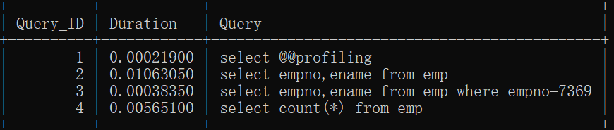

查看某个SQL语句语句在执行过程中，每个阶段的耗时情况：

```sql
show profile for query 4;
```

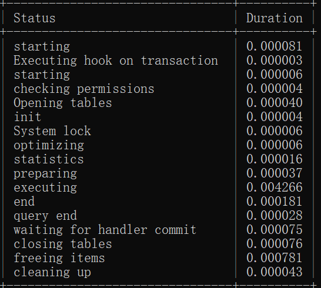

**我们重点要关注的是 **`**executing**`**：****实际执行 SQL 的时间（扫描数据、过滤、排序等），它高则表示： SQL 执行慢，通常是没走索引、扫描行数多、排序/分组慢**

**想查看执行过程中cpu的情况，可以执行以下命令：**

```sql
show profile cpu for query 4;
```

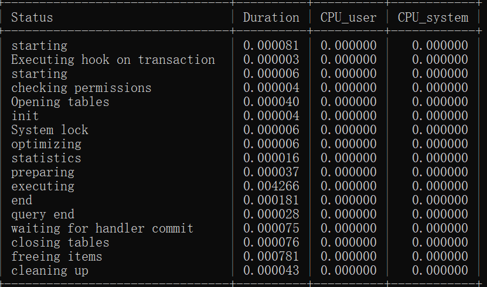

**Duration：该阶段总耗时。CPU_user：CPU 干活占多长时间。**

**如果：Duration≈CPU_user 说明当前 SELECT 语句属于 CPU 密集型。主要花在 CPU 计算上。**（比如函数计算、排序、聚合等）

**如果：****Duration 远大于 CPU_user 说明当前 SELECT 语句**大部分时间在等待（如磁盘 I/O、网络、锁），而不是在计算

主要也是看 `<font style="color:rgb(15, 17, 21);">executing</font>`部分。

### explain

explain命令可以查看一个DQL语句的执行计划，根据执行计划可以做出相应的优化措施。提高执行效率。

```sql
explain select * from emp where empno=7369;
```


#### id

id反映出一条select语句执行顺序，id越大优先级越高。id相同则按照自上而下的顺序执行。

```sql
explain select e.ename,d.dname from emp e join dept d on e.deptno=d.deptno join salgrade s on e.sal between s.losal and s.hisal;
```

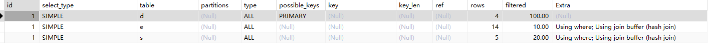

由于id相同，反映出三张表在执行顺序上属于平等关系，执行时采用，先d，再e，最后s。

```sql
explain select e.ename,d.dname from emp e join dept d on e.deptno=d.deptno where e.sal=(select sal from emp where ename='ford');
```

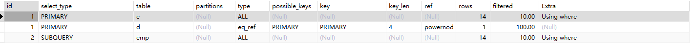

反映出，先执行子查询，然后让e和d做表连接。

#### select_type

反映了mysql查询语句的类型。常用值包括：

- SIMPLE：表示查询中不包含子查询，不包含 UNION操作。这种查询通常包括一个表或是最多一个JOIN
- PRIMARY：表示当前查询是一个主查询。（主要的查询）
- UNION：表示查询中包含UNION操作
- SUBQUERY：子查询
- DERIVED：派生表（表示查询语句出现在from后面）

#### table

反映了这个查询操作的是哪个表。

#### type

反映了查询表中数据时的访问类型，常见的值：

1. NULL：效率最高，一般不可能优化到这个级别，只有查询时没有查询表的时候，访问类型是NULL。例如：select 1;
2. system：通常访问系统表的时候，访问类型是system。
3. const：根据主键或者唯一性索引查询，索引值是常量值时。explain select * from emp where empno=7369;
4. eq_ref：根据主键或者唯一性索引查询。索引值不是常量值。
5. ref：使用了非唯一的索引进行查询。
6. range：使用了索引，扫描了索引树的一部分。
7. index：表示用了索引，但需要遍历整个索引树。
8. all：全表扫描，遍历整个表。

效率最高的是NULL，效率最低的是all，从上到下，从高到低。

#### possible_keys

这个查询可能会用到的索引

#### key

实际用到的索引

#### key_len

`**<font style="color:rgb(15, 17, 21);background-color:rgb(235, 238, 242);">key_len</font>**`** 表示 MySQL 实际使用了索引中多少字节，用于判断复合索引中被充分利用了多少列。**

#### rows

查询扫描的预估计行数。

#### Extra

给出了与查询相关的额外信息和说明。这些额外信息可以帮助我们更好地理解查询执行的过程。

| **Extra** | **含义** | **好坏** | **怎么办** |
| --- | --- | --- | --- |
| **Using index** | 覆盖索引，不回表 | ✅ 好 |   |
| **Using index condition** | 索引下推（ICP），减少回表 | ✅ 较好 |   |
| **Using where** | Server 层过滤（可能回表） | ⚠️ 一般 | 检查是否没走索引 |
| **Using filesort** | 需要额外排序（索引无法排序） | ❌ 差 | 加索引优化排序字段 |
| **Using temporary** | 使用临时表（group by 时使用的字段如果没有添加索引，mysql 在实现分组时一定会借助临时表来完成分组。distinct 也是如此。） | ❌ 差 | 优化 group by，给参与分组的字段添加索引，这样就不会走临时表了。distinct 也是如此。 |
| **Using join buffer** | 连表时用了缓冲区（没走索引） **参与表连接的字段如果没有索引的话，会先把其中一张较小的表中的数据加载到内存缓冲区。** | ❌ 差 | 连表字段加索引 |
| **Using index for group-by** | 分组用索引优化 | ✅ 好 |   |
| **Impossible WHERE** | WHERE 条件永远为假 | ⚠️ 逻辑问题 |   |
| **No tables used** | 无表查询（如 `<font style="color:rgb(15, 17, 21);background-color:rgb(235, 238, 242);">SELECT 1</font>`） | ✅ 正常 |   |
| **NULL** | 无特殊信息 | 正常 |   |

## 索引优化

### 加索引 vs 不加索引

将这个sql脚本初始化到数据库中（初始化100W条记录）：t_vip.sql

根据id查询（id是主键，有索引）：

```sql
select * from t_vip where id = 900000;
```

根据name查询（name上没有索引）：

```sql

select * from t_vip where name='4c6494cb';
```

给name字段添加索引：

```sql
create index idx_t_user_name on t_vip(name);
```

再次根据name查询（此时name上已经有索引了） ：

```sql
select * from t_vip where name='4c6494cb';
```

### 最左前缀原则

**复合索引 **`**<font style="color:rgb(15, 17, 21);background-color:rgb(235, 238, 242);">(a, b, c)</font>**`** 必须从最左列 **`**<font style="color:rgb(15, 17, 21);background-color:rgb(235, 238, 242);">a</font>**`** 开始使用，查询条件中跳过 **`**<font style="color:rgb(15, 17, 21);background-color:rgb(235, 238, 242);">a</font>**`** 则索引失效；若使用 **`**<font style="color:rgb(15, 17, 21);background-color:rgb(235, 238, 242);">a</font>**`** 和 **`**<font style="color:rgb(15, 17, 21);background-color:rgb(235, 238, 242);">c</font>**`**，则只有 **`**<font style="color:rgb(15, 17, 21);background-color:rgb(235, 238, 242);">a</font>**`** 能走索引，**`**<font style="color:rgb(15, 17, 21);background-color:rgb(235, 238, 242);">c</font>**`** 无法在索引中定位。**

假设有这样一张表：

```sql
create table t_customer(
        id int primary key auto_increment,
        name varchar(255),
        age int,
        gender char(1),
        email varchar(255)
);
```

添加了这些数据：

```sql
insert into t_customer values(null, 'zhangsan', 20, 'M', 'zhangsan@123.com');
insert into t_customer values(null, 'lisi', 22, 'M', 'lisi@123.com');
insert into t_customer values(null, 'wangwu', 18, 'F', 'wangwu@123.com');
insert into t_customer values(null, 'zhaoliu', 22, 'F', 'zhaoliu@123.com');
insert into t_customer values(null, 'jack', 30, 'M', 'jack@123.com');
```

添加了这样的复合索引：

```sql
create index idx_name_age_gender on t_customer(name,age,gender);
```

**最左前缀原则：当查询语句条件中包含了这个复合索引最左边的列 name 时，此时索引才会起作用。**

验证1：

```sql
explain select * from t_customer where name='zhangsan' and age=20 and gender='M';
```

验证结果：完全使用了索引

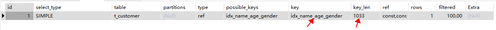

验证2：

```sql
explain select * from t_customer where name='zhangsan' and age=20;
```

验证结果：使用了部分索引

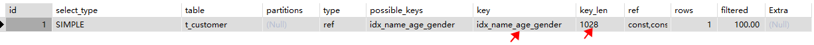

验证3：

```sql
explain select * from t_customer where name='zhangsan';
```

验证结果：使用了部分索引

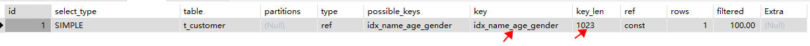

验证4：

```sql
explain select * from t_customer where age=20 and gender='M' and name='zhangsan';
```

验证结果：完全使用了索引

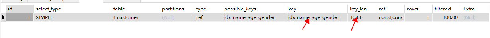

验证5：

```sql
explain select * from t_customer where gender='M' and age=20;
```

验证结果：没有使用任何索引

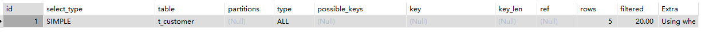

验证6：

```sql
explain select * from t_customer where name='zhangsan' and gender='M';
```

验证结果：使用了部分索引

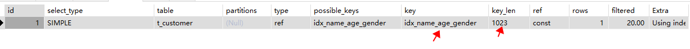

验证7：

```sql
explain select * from t_customer where name='zhangsan' and gender='M' and age=20;
```

验证结果：完全使用了索引

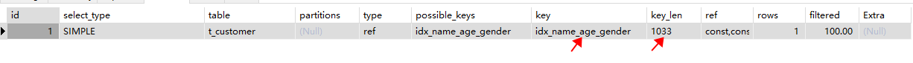

**范围查询时，在“范围条件”右侧的列索引会失效：（注意，这里的右侧说的是创建索引时的顺序）**

验证：

```sql
explain select * from t_customer where name='zhangsan' and age>20 and gender='M';
```

验证结果：name和age列索引生效。gender列索引无效。

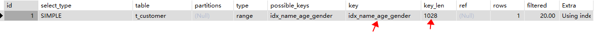

怎么解决？建议范围查找时带上“=”

```sql
explain select * from t_customer where name='zhangsan' and age>=20 and gender='M';
```

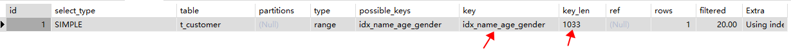

### 索引失效情况

有这样一张表：

```sql
create table t_emp(
  id int primary key auto_increment,
  name varchar(255),
  sal int,
  age char(2)
);
```

有这样一些数据：

```sql
insert into t_emp values(null, '张三', 5000,'20');
insert into t_emp values(null, '张飞', 4000,'30');
insert into t_emp values(null, '李飞', 6000,'40');
```

有这样一些索引：

```sql
create index idx_t_emp_name on t_emp(name);
create index idx_t_emp_sal on t_emp(sal);
create index idx_t_emp_age on t_emp(age);
```

#### 索引列参加了运算，索引失效

```sql
explain select * from t_emp where sal > 5000;
```

验证结果：使用了索引

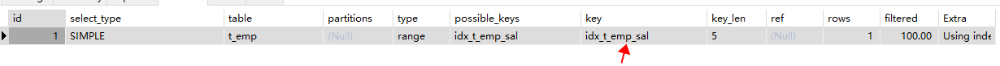

```sql
explain select * from t_emp where sal*10 > 50000;
```

验证结果：索引失效

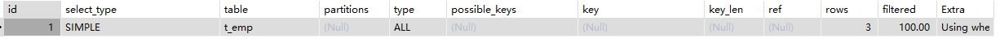

#### 索引列进行模糊查询时以 % 开始的，索引失效

```sql
explain select * from t_emp where name like '张%';
```

验证结果：索引有效

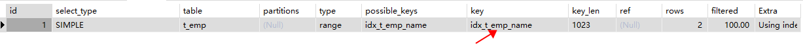

```sql
explain select * from t_emp where name like '%飞';
```

验证结果：索引失效

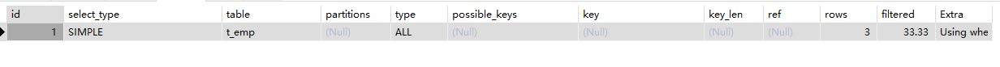

#### 索引列是字符串类型，但查询时省略了单引号，索引失效

```sql
explain select * from t_emp where age='20';
```

验证结果：索引有效

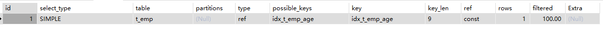

```sql
explain select * from t_emp where age=20;
```

验证结果：索引失效

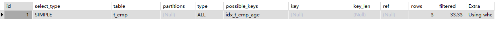

#### 查询条件中有or，只要有未添加索引的字段，索引失效

```sql
explain select * from t_emp where name='张三' or sal=5000;
```

验证结果：使用了索引

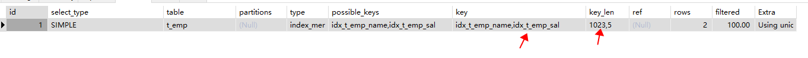

将t_emp表sal字段上的索引删除：

```sql
alter table t_emp drop index idx_t_emp_sal;
```

再次验证：

```sql
explain select * from t_emp where name='张三' or sal=5000;
```

验证结果：索引失效

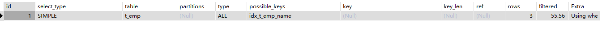

#### 当查询的符合条件的记录在表中占比较大，索引失效

**走索引需要：**

1. 先查索引树
2. 再回表取数据（两次 I/O）

如果符合条件的记录**占比太大**（比如超过 20-30%），MySQL 认为**全表扫描更快**（一次 I/O 顺序读），就会**放弃索引**。

复制一张新表：emp2

```sql
create table emp2 as select * from emp;
```

给sal添加索引：

```sql
alter table emp2 add index idx_emp2_sal(sal);
```

验证1：

```sql
explain select * from emp2 where sal > 800;
```

不走索引：


验证2：

```sql
explain select * from emp2 where sal > 1000;
```

不走索引：

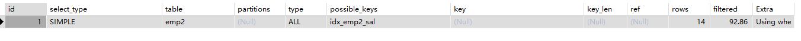

验证3：

```sql
explain select * from emp2 where sal > 2000;
```

走索引：

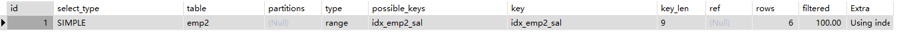

### 指定索引

当一个字段上既有单列索引，又有复合索引时，我们可以通过以下的SQL提示来要求该SQL语句执行时采用哪个索引：

- use index(索引名称)：建议使用该索引，只是建议，底层mysql会根据实际效率来考虑是否使用你推荐的索引。
- ignore index(索引名称)：忽略该索引
- force index(索引名称)：强行使用该索引

查看 t_customer 表上的索引：

```sql
show index from t_customer;
```

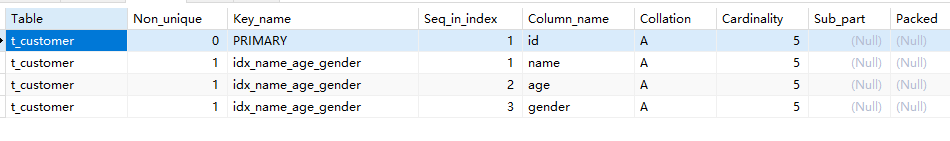

可以看到name age gender三列添加了一个复合索引。

现在给name字段添加一个单列索引：

```sql
create index idx_name on t_customer(name);
```

看看以下的语句默认使用了哪个索引：

```sql
explain select * from t_customer where name='zhangsan';
```

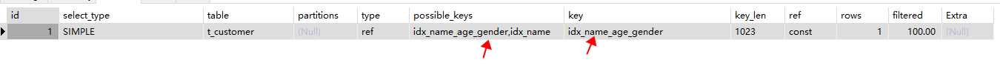

通过测试得知，默认使用了联合索引。

如何建议使用单列索引idx_name：

```sql
explain select * from t_customer use index(idx_name) where name='zhangsan';
```


如何忽略使用符合索引 idx_name_age_gender：

```sql
explain select * from t_customer ignore index(idx_name_age_gender) where name='zhangsan';
```

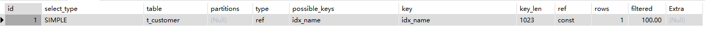

如何强行使用单列索引idx_name：

```sql
explain select * from t_customer force index(idx_name) where name='zhangsan';
```

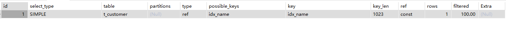

### 覆盖索引

覆盖索引我们在讲解索引的时候已经提到过了，覆盖索引强调的是：在select后面写字段的时候，这些字段尽可能是索引所覆盖的字段，这样可以避免回表查询。尽可能避免使用 select *，因为select * 很容易导致回表查询。（本质就是：能在索引上检索的，就不要再次回表查询了。）

例如：有一张表 emp3，其中 ename,job添加了联合索引：idx_emp3_ename_job，以下这个select语句就不会回表：

```sql
drop table if exists emp3;
create table emp3 as select * from emp;
alter table emp3 add constraint emp3_pk primary key(empno);
create index idx_emp3_ename_job on emp3(ename,job);
explain select empno,ename,job from emp3 where ename='KING';
```


如果查询语句要查找的列没有在索引中，则会回表查询，例如：

```sql
explain select empno,ename,job,sal from emp3 where ename='KING';
```


**面试题：**t_user表字段如下：id,name,password,realname,birth,email。表中数据量500万条，请针对以下SQL语句给出优化方案：

```sql
select id,name,realname from t_user where name='鲁智深';
```

如果只给name添加索引，底层会进行大量的回表查询，效率较低，建议给name和realname两个字段添加联合索引，这样大大减少回表操作，提高查询效率。

### 前缀索引

如果一个字段类型是varchar或text字段，字段中存储的是文本或者大文本，直接对这种长文本创建索引，会让索引体积很大，怎么优化呢？可以将字符串的前几个字符截取下来当做索引来创建。这种索引被称为前缀索引，例如：

```sql
create index idx_emp4_ename_2 on emp4(ename(2));
```

以上SQL表示将emp4表中ename字段的前2个字符创建到索引当中。

使用前缀索引时，需要通过以下公式来确定使用前几个字符作为索引：

```sql
select count(distinct substring(ename,1,前几个字符)) / count(*) from emp4;
```

以上查询结果越接近1，表示索引的效果越好。（原理：做索引值的话，索引值越具有唯一性效率越高）

假设我们使用前1个字符作为索引值：

```sql
select count(distinct substring(ename,1,1)) / count(*) from emp4;
```

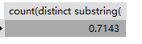

假设我们使用前2个字符作为索引值：

```sql
select count(distinct substring(ename,1,2)) / count(*) from emp4;
```

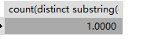

可见使用前2个字符作为索引值，能够让索引值更具有唯一性，效率越好，因此我们选择前2个字符作为前缀索引。

```sql
create index idx_emp4_ename_2 on emp4(ename(2));
```

执行以下的查询语句则会走这个前缀索引：

```sql
explain select * from emp4 where ename='KING';
```


前缀索引肯定是需要回表的。

### 单列索引和复合索引怎么选择

当查询语句的条件中有多个条件，建议将这几个列创建为复合索引，因为创建单列索引很容易回表查询。

例如分别给emp5表ename，job添加两个单列索引：

```sql
create table emp5 as select * from emp;
alter table emp5 add constraint emp5_pk primary key(empno);

create index idx_emp5_ename on emp5(ename);
create index idx_emp5_job on emp5(job);
```

执行以下查询语句：

```sql
explain select empno,ename,job from emp5 where ename='SMITH' and job='CLERK';
```

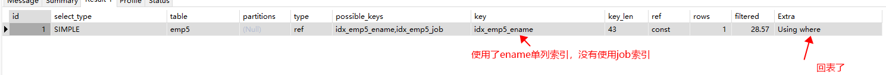

ename和job都出现在查询条件中，可以给emp6表的ename和job创建一个复合索引：

```sql
create table emp6 as select * from emp;
alter table emp6 add constraint emp6_pk primary key(empno);

create index idx_emp6_ename_job on emp6(ename,job);
explain select empno,ename,job from emp6 where ename='SMITH' and job='CLERK';
```


对于以上查询语句，使用复合索引避免了回表，因此这种情况下还是建议使用复合索引。

注意：创建索引时应考虑最左前缀原则，主字段并且具有很强唯一性的字段建议排在第一位，例如：

```sql
create index idx_emp_ename_job on emp(ename,job);
```

和以下方式对比：

```sql
create index idx_emp_job_ename on emp(job,ename);
```

由于ename是主字段，并且ename具有很好的唯一性，建议将ename列放在最左边。因此这两种创建复合索引的方式，建议采用第一种。

### 索引创建原则

1. 表数据量庞大，通常超过百万条数据。
2. 经常出现在where，order by，group by后面的字段建议添加索引。
3. 创建索引的字段尽量具有很强的唯一性。
4. 如果字段存储文本，内容较大，一定要创建前缀索引。
5. 尽量使用复合索引，使用单列索引容易回表查询。
6. 如果一个字段中的数据不会为NULL，建议建表时添加not null约束，这样优化器就知道使用哪个索引列更加有效。
7. 不要创建太多索引，当对数据进行增删改的时候，索引需要重新重新排序。
8. 如果很少的查询，经常的增删改不建议加索引。

## SQL优化

### order by的优化

准备数据：

```sql
drop table if exists workers;

create table workers(
  id int primary key auto_increment,
  name varchar(255),
  age int,
  sal int
);

insert into workers values(null, '孙悟空', 500, 50000);
insert into workers values(null, '猪八戒', 300, 40000);
insert into workers values(null, '沙和尚', 600, 40000);
insert into workers values(null, '白骨精', 600, 10000);
```

explain查看一个带有order by的语句时，Extra列会显示：using index 或者 using filesort，区别是什么？

- using index: 表示使用索引，因为索引是提前排好序的。效率很高。
- using filesort：表示使用文件排序，这就表示没有走索引，对表中数据进行排序，排序时将硬盘的数据读取到内存当中，在内存当中排好序。这个效率是低的，应避免。

此时name没有添加索引，如果根据name进行排序的话：

```sql
explain select id,name from workers order by name;
```


显然这种方式效率较低。

给name添加索引：

```sql
create index idx_workers_name on workers(name);
```

再根据name排序：

```sql
explain select id,name from workers order by name;
```


这样效率则提升了。

如果要通过age和sal两个字段进行排序，最好给age和sal两个字段添加复合索引，不添加复合索引时：

按照age升序排，如果age相同则按照sal升序

```sql
explain select id,age,sal from workers order by age,sal;
```


这样效率是低的。

给age和sal添加复合索引：

```sql
create index idx_workers_age_sal on workers(age, sal);
```

再按照age升序排，如果age相同则按照sal升序：

```sql
explain select id,age,sal from workers order by age,sal;
```


这样效率提升了。

在B+树上叶子结点上的所有数据默认是按照升序排列的，如果按照age降序，如果age相同则按照sal降序，会走索引吗？

```sql
explain select id,age,sal from workers order by age desc,sal desc;
```


可以看到备注信息是：反向索引扫描，使用了索引。

这样效率也是很高的，因为B+树叶子结点之间采用的是双向指针。可以从左向右（升序），也可以从右向左（降序）。

如果一个升序，一个降序会怎样呢？

```sql
explain select id,age,sal from workers order by age asc, sal desc;
```


可见age使用了索引，但是sal没有使用索引。怎么办呢？可以针对这种排序情况创建对应的索引来解决：

```sql
create index idx_workers_ageasc_saldesc on workers(age asc, sal desc);
```

创建的索引如下：A表示升序，D表示降序。

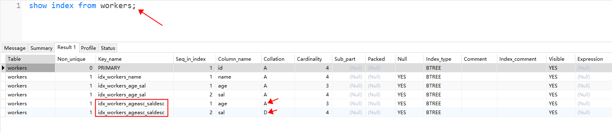

再次执行：

```sql
explain select id,age,sal from workers order by age asc, sal desc;
```


我们再来看看，对于排序来说是否支持最左前缀法则：

```sql
explain select id,age,sal from workers order by sal;
```

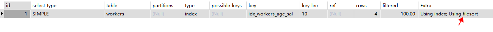

通过测试得知，order by也遵循最左前缀法则。

我们再来看一下未使用覆盖索引会怎样？

```sql
explain select * from workers order by age,sal;
```

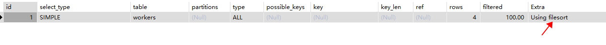

通过测试得知，排序也要尽量使用覆盖索引。

order by 优化原则总结：

1. 排序也要遵循最左前缀法则。
2. 使用覆盖索引。
3. 针对不同的排序规则，创建不同索引。（如果所有字段都是升序，或者所有字段都是降序，则不需要创建新的索引）
4. 如果无法避免filesort，要注意排序缓存的大小，默认缓存大小256KB，可以修改系统变量 sort_buffer_size ：**排序太慢时，可考虑手动调大**。

```sql
show variables like 'sort_buffer_size';
```

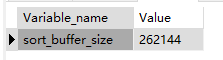

### group by优化

创建empx表：

```sql
create table empx as select * from emp;
```

job字段上没有索引，根据job进行分组，查看每个工作岗位有多少人：

```sql
select job,count(*) from empx group by job;
```

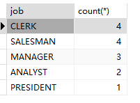

看看是否走索引了：

```sql
explain select job,count(*) from empx group by job;
```

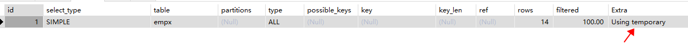

使用了临时表，效率较低。

给job添加索引：

```sql
create index idx_empx_job on empx(job);
```

再次执行：

```sql
explain select job,count(*) from empx group by job;
```


效率提升了。

我们再来看看group by是否需要遵守最左前缀法则：给deptno和sal添加复合索引

```sql
create index idx_empx_deptno_sal on empx(deptno, sal);
```

根据部门编号分组，查看每个部门人数：

```sql
explain select deptno,count(*) from empx group by deptno;
```


效率很高，因为deptno是复合索引中最左边的字段。

根据sal分组，查看每个工资有多少人：

```sql
explain select sal, count(*) from empx group by sal;
```


使用了临时表，效率较低。

通过测试得知，group by也同样遵循最左前缀法则。

我们再来测试一下，如果将部门编号deptno（复合索引的最左列）添加到where条件中，效率会不会提升：

```sql
explain select sal, count(*) from empx where deptno=10 group by sal;
```


效率有提升的，这说明了，group by确实也遵循最左前缀法则。（where中使用了最左列）

### limit优化

数据量特别庞大时，取数据时，越往后效率越低，怎么提升？mysql官方给出的解决方案是：使用**覆盖索引+子查询**的形式来提升效率。


**怎么解决？使用覆盖索引，加子查询**

使用覆盖索引：速度有所提升


使用子查询形式取其他列的数据：

```sql
select u.* from t_user u join (select id from t_user order by id limit 9000000, 2) t on u.id=t.id;
```


通过测试，这种方式整体效率有所提升。

### 主键优化

主键设计原则：

1. 主键值不要太长，二级索引叶子结点上存储的是主键值，主键值太长，容易导致索引占用空间较大。
2. 尽量不要使用uuid做主键，因为uuid不是顺序插入。
3. 最好不要使用业务主键，因为业务的变化会导致主键值的频繁修改，主键值不建议修改，因为主键值修改，聚集索引一定会重新排序。
4. 尽量使用auto_increment生成主键。
5. 在插入数据时，主键值最好是顺序插入，不要乱序插入，因为乱序插入可能会导致B+树叶子结点频繁的进行页分裂与页合并操作，效率较低。
  1. 主键值对应聚集索引，插入主键值如果是乱序的，B+树叶子节点需要不断的重新排序，重排过程中还会频繁涉及到**页分裂和页合并**的操作，效率较低。
  2. B+树上的每个节点都存储在页（page）中。在B+树中，每个页上存储一个节点（除了根节点）。
  3. MySQL的InnoDB存储引擎一个页可以存储16KB的数据。
  4. 如果主键值不是顺序插入的话，会导致频繁的页分裂和页合并。在一个B+树中，页分裂和页合并是树的自动调整机制的一部分。当一个页已经满了，再插入一个新的索引键时就会触发页分裂操作，将页中的**索引键**分配到两个新的页中，同时调整树的结构。相反，当一个页中的**索引键**数量下降到一个阈值以下时，就会触发页合并操作，将两个相邻的页合并成一个新的页。如果主键值是随机的、不是顺序插入的，那么页的利用率会降低，页分裂和页合并的次数就会增加。由于页的分裂和合并是比较耗时的操作，频繁的分裂和合并会降低数据库系统的性能。因此，为了优化B+树的性能，可以将主键值设计成顺序插入的，这样可以减少页的分裂和合并的次数，提高B+树的性能。
  5. 在实际应用中，如果主键就是设计成乱序的了，也可以采用一些技术手段来减少页分裂和合并，例如B+树分裂时采用“延迟分裂”技术，或者通过调整页的大小和节点的大小等方式来优化B+树的性能。


**tablespace->segment->Extent->Page->Row**

---

**总结：**

1. 主键值别太长
2. 别用 uuid
3. 主键值最好是顺序插入，不要乱序插入，主键值最好使用 auto_increment，或者其他能够保证顺序插入的。
4. 别用业务主键

### insert优化

insert优化原则：

- 批量插入：数据量较大时，不要一条一条插入，可以批量插入，当然，建议一次插入数据不超过**500条**

```sql
insert into t_user(id,name,age) values (1,'jack',20),(2,'lucy',30),(3,'timi',22);
```

- mysql默认是自动提交事务，只要执行一条DML语句就自动提交一次，因此，当插入大量数据时，建议手动开启事务和手动提交事务。不建议使用数据库事务自动提交机制。
- 主键值建议采用顺序插入，顺序插入比乱序插入效率高。
- 超大数据量插入可以考虑使用mysql提供的load指令，load指令可以将csv文件中的数据批量导入到数据库表当中，并且效率很高，过程如下：
  - 第一步：登录mysql时指定参数

```sql
mysql --local-infile -uroot -p1234
```

```plaintext
- 第二步：开启local_infile功能
```

```sql
set global local_infile = 1;
```

```plaintext
- 第三步：执行load指令
```

```sql
use jkweilai;

create table t_user(
  id int primary key,
  name varchar(255),
  password varchar(255),
  birth char(10),
  email varchar(255)
);

load data local infile 'D:\\t_user.csv' into table t_user fields terminated by ',' lines terminated by '\n';
```

文件中的数据如下：


导入表中之后，数据如下：


### count(*)优化

分组函数count的使用方式：

- count(主键)
  - 原理：将每个主键值取出，累加
- count(常量值)
  - 原理：会被优化成 count(*)
- count(字段)
  - 原理：取出字段的每个值，判断是否为NULL，不为NULL则累加。**效率最低。**
- count(*)
  - 原理：不用取值，底层mysql做了优化，直接统计总行数，效率最高。

结论：如果你要统计一张表中数据的总行数，建议使用 count(*)

注意：

- 对于InnoDB存储引擎来说，count计数的实现原理就是将表中每一条记录取出，然后累加。如果你想真正提高效率，可以自己使用额外的其他程序来实现，例如每向表中插入一条记录时，在redis数据库中维护一个总行数，这样获取总行数的时候，直接从redis中获取即可，这样效率是最高的。
- 对于MyISAM存储引擎来说，当一个select语句没有where条件时，获取总行数效率是极高的，不需要统计，因为MyISAM存储引擎维护了一个单独的总行数。

### update优化

当存储引擎是InnoDB时，表的行级锁是针对索引添加的锁，如果索引失效了，或者不是索引列时，会提升为表级锁。

什么是行级锁？A事务和B事务，开启A事务后，通过A事务修改表中某条记录，修改后，在A事务未提交的前提下，B事务去修改同一条记录时，无法继续，直到A事务提交，B事务才可以继续。

**只有字段存在索引的情况下，才有行级锁这一说。**

有一张表：t_fruit

```sql
create table t_fruit(
  id int primary key auto_increment,
  name varchar(255)
);

insert into t_fruit values(null, '苹果');
insert into t_fruit values(null, '香蕉');
insert into t_fruit values(null, '橘子');
```

开启A事务和B事务，演示行级锁：

事务A没有结束之前，事务B卡住：


事务A结束之后，事务B继续执行：


当然，如果更新的不是同一行数据，事务A和事务B可以并发：


行级锁是对索引列加锁，以上更新语句的where条件是id，id是主键，当然有索引，所以使用了行级锁，如果索引失效，或者字段上没有索引，则会升级为表级锁：


因此，为了更新的效率，建议update语句中where条件中的字段是添加索引的。

# 存储引擎

## 存储引擎概述

MySQL存储引擎决定了数据在磁盘上的存储方式和访问方式。

MySQL常见的存储引擎包括InnoDB、MyISAM、Memory、Archive等。每个存储引擎都有自己的特点和适用场景。

例如：

- InnoDB引擎支持事务和行级锁定，适用于需要高并发读写的应用；
- MyISAM引擎不支持事务，但适用于读操作较多的应用；
- Memory引擎数据全部存储在内存中，适用于对读写速度要求很高的应用等等。

选择适合的存储引擎可以提高MySQL的性能和效率，并且根据应用需求来合理选择存储引擎可以提供更好的数据管理和查询功能。

## MySQL支持哪些存储引擎

使用`show engines \G;`命令可以查看所有的存储引擎：

```java

*************************** 1. row ***************************
      Engine: MEMORY
     Support: YES
     Comment: Hash based, stored in memory, useful for temporary tables
Transactions: NO
          XA: NO
  Savepoints: NO
*************************** 2. row ***************************
      Engine: MRG_MYISAM
     Support: YES
     Comment: Collection of identical MyISAM tables
Transactions: NO
          XA: NO
  Savepoints: NO
*************************** 3. row ***************************
      Engine: CSV
     Support: YES
     Comment: CSV storage engine
Transactions: NO
          XA: NO
  Savepoints: NO
*************************** 4. row ***************************
      Engine: FEDERATED
     Support: NO
     Comment: Federated MySQL storage engine
Transactions: NULL
          XA: NULL
  Savepoints: NULL
*************************** 5. row ***************************
      Engine: PERFORMANCE_SCHEMA
     Support: YES
     Comment: Performance Schema
Transactions: NO
          XA: NO
  Savepoints: NO
*************************** 6. row ***************************
      Engine: MyISAM
     Support: YES
     Comment: MyISAM storage engine
Transactions: NO
          XA: NO
  Savepoints: NO
*************************** 7. row ***************************
      Engine: InnoDB
     Support: DEFAULT
     Comment: Supports transactions, row-level locking, and foreign keys
Transactions: YES
          XA: YES
  Savepoints: YES
*************************** 8. row ***************************
      Engine: ndbinfo
     Support: NO
     Comment: MySQL Cluster system information storage engine
Transactions: NULL
          XA: NULL
  Savepoints: NULL
*************************** 9. row ***************************
      Engine: BLACKHOLE
     Support: YES
     Comment: /dev/null storage engine (anything you write to it disappears)
Transactions: NO
          XA: NO
  Savepoints: NO
*************************** 10. row ***************************
      Engine: ARCHIVE
     Support: YES
     Comment: Archive storage engine
Transactions: NO
          XA: NO
  Savepoints: NO
*************************** 11. row ***************************
      Engine: ndbcluster
     Support: NO
     Comment: Clustered, fault-tolerant tables
Transactions: NULL
          XA: NULL
  Savepoints: NULL
```

`Support`是`Yes`的表示支持该存储引擎。当前MySQL的版本是`8.0.33`

MySQL默认的存储引擎是：`InnoDB`

## 指定和修改存储引擎

### 指定存储引擎

在MySQL中，你可以在创建表时指定使用的存储引擎。通过在CREATE TABLE语句中使用ENGINE关键字，你可以指定要使用的存储引擎。

以下是指定存储引擎的示例：

```sql
CREATE TABLE my_table (column1 INT, column2 VARCHAR(50)) ENGINE = InnoDB;
```

在这个例子中，我们创建了一个名为my_table的表，并指定了使用InnoDB存储引擎。

如果你不显式指定存储引擎，MySQL将使用默认的存储引擎。默认情况下，MySQL 8的默认存储引擎是InnoDB。

### 修改存储引擎

在MySQL中，你可以通过ALTER TABLE语句修改表的存储引擎。下面是修改存储引擎的示例：

```sql
ALTER TABLE my_table ENGINE = MyISAM;
```

在这个例子中，我们使用ALTER TABLE语句将my_table表的存储引擎修改为MyISAM。

请注意，在修改存储引擎之前，你需要考虑以下几点：

1. 修改存储引擎可能需要执行复制表的操作，因此可能会造成数据的丢失或不可用。确保在执行修改之前备份你的数据。
2. 修改表的存储引擎可能会影响到现有的应用程序和查询。确保在修改之前评估和测试所有的影响。

总而言之，修改存储引擎需要谨慎进行，且需要考虑到可能的影响和风险。建议在进行修改之前进行适当的测试和备份。

## 常用的存储引擎及适用场景

在实际开发中，以下存储引擎是比较常用的：

1. InnoDB：
  1. MySQL默认的事务型存储引擎
  2. 支持ACID事务
  3. 具有较好的并发性能和数据完整性
  4. 支持行级锁定。
  5. 适用于大多数应用场景，尤其是需要事务支持的应用。
2. MyISAM：
  1. 是MySQL早期版本中常用的存储引擎
  2. 支持全文索引和表级锁定
  3. 不支持事务
  4. 由于其简单性和高性能，在某些特定的应用场景中会得到广泛应用，如**读密集**的应用。
3. MEMORY：
  1. 称为HEAP，是将表存储在内存中的存储引擎
  2. 具有非常高的读写性能，但数据会在服务器重启时丢失。
  3. 适用于需要快速读写的临时数据集、缓存和临时表等场景。
4. CSV：
  1. 将数据以纯文本格式存储的存储引擎
  2. 适用于需要处理和导入/导出CSV格式数据的场景。
5. ARCHIVE：
  1. 将数据高效地进行压缩和存储的存储引擎
  2. 适用于需要长期存储大量历史数据且不经常查询的场景。

## 存储引擎重点面试题

### InnoDB vs MyISAM 对比

| 对比项 | **InnoDB** | **MyISAM** |
| --- | --- | --- |
| **事务** | ✅ 支持事务（ACID） | ❌ 不支持 |
| **外键** | ✅ 支持外键约束 | ❌ 不支持 |
| **锁粒度** | **行级锁**（高并发写入好） | **表级锁**（写入会锁整表） |
| **崩溃恢复** | ✅ 通过 redo log 自动恢复 | ❌ 不安全，易损坏 |
| **MVCC** | ✅ 支持多版本并发控制 | ❌ 不支持 |
| **索引结构** | 聚簇索引（叶子节点存数据） | 非聚簇索引（叶子节点存指针） |
| **COUNT(*)** | 需扫描全表 | 直接存储总行数（快） |
| **适用场景** | 读多写多、高并发、需要事务 | 读多写少、非关键业务、数据仓库 |

### 为什么 InnoDB 使用聚集索引

聚簇索引**将数据和主键索引存储在一起**，好处是：

- 主键查询极快（一次 I/O 就能拿到数据）
- 减少回表成本
- 适合范围查询（叶子节点有序链表）

### InnoDB 的行锁是怎么实现的？

InnoDB 的行锁是**锁在索引项上**的：

- 如果 `<font style="color:rgb(15, 17, 21);background-color:rgb(235, 238, 242);">WHERE</font>` 条件用了索引，锁对应索引记录（因此叫做行锁）
- 如果索引失效或无索引，**行锁升级为表锁**
- **通过 Next-Key Lock = 行锁 + 间隙锁，它锁住现有行和周围的空隙，防止其他事务在空隙中插入新数据，从而解决幻读。**

### MyISAM 比 InnoDB 快的原因

1. **没有事务日志**（redo log、undo log），写入操作少一道刷盘
2. **没有 MVCC 多版本控制**，读操作直接读最新数据，无版本链开销
3. **数据和索引分离**，某些场景下索引扫描更轻量

**但这是以牺牲并发写入能力为代价的：**

- 表级锁导致写操作会锁全表，阻塞所有读写
- 不支持事务，崩溃后无法自动恢复
- 不适合高并发、数据一致性要求高的场景

### 什么是当前读？什么是快照读？

| **读类型** | **实现** | **是否加锁** |
| --- | --- | --- |
| **快照读**（普通 SELECT） | 通过 Read View + undo log 读历史版本 | ❌ 无锁 |
| **当前读**（SELECT FOR UPDATE、UPDATE、DELETE） | 读最新数据 | ✅ 加锁（行锁 + 间隙锁） |

### 为了实现 MVCC，每个数据行有两个隐藏字段，分别是什么？


**1.**** **`**<font style="color:rgb(15, 17, 21);background-color:rgb(235, 238, 242);">DB_TRX_ID</font>**`**（事务ID）**

- 记录**最后一次修改**（插入、更新、删除）该行数据的事务ID
- 每次事务修改该行时，都会更新这个字段

**2.**** **`**<font style="color:rgb(15, 17, 21);background-color:rgb(235, 238, 242);">DB_ROLL_PTR</font>**`**（回滚指针）**

- 指向该行的**上一个历史版本**在undo log中的位置
- 通过这个指针，可以沿着undo链向前追溯，找到更早的版本

### 什么是 Read View？

**Read View 是 InnoDB 在事务执行快照读（普通 SELECT）时生成的一套“数据可见性的判断规则”，用来决定当前事务能看到哪些数据版本。**

**在当前事务中执行快照读，当前的快照读到底应该读哪个数据版本？Read View+undo log 版本链用来决定能读取哪个数据版本。实现原理是：当前事务中执行快照读时，立即创建 Read View，拿 Read View 中的判断规则和 **`**<font style="color:#DF2A3F;">DB_TRX_ID</font>**`**进行比对，如果可见，那当前快照读就能够读取到该行数据，如果不可见，会通过 undo log 版本链找到上一个数据版本，继续拿 Read View 中的判断规则和上一个数据版本中的**`**<font style="color:#DF2A3F;">DB_TRX_ID</font>**`**进行比对，直到可见为止。**

Read View 包含以下关键信息：

| **字段** | **含义** |
| --- | --- |
| `<font style="color:rgb(15, 17, 21);background-color:rgb(235, 238, 242);">m_ids</font>` | 当前系统中所有活跃（未提交）事务的ID列表 |
| `<font style="color:rgb(15, 17, 21);background-color:rgb(235, 238, 242);">min_trx_id</font>` | `<font style="color:rgb(15, 17, 21);background-color:rgb(235, 238, 242);">m_ids</font>`中的最小值 |
| `<font style="color:rgb(15, 17, 21);background-color:rgb(235, 238, 242);">max_trx_id</font>` | 系统下一个将要分配的事务ID |
| `<font style="color:rgb(15, 17, 21);background-color:rgb(235, 238, 242);">creator_trx_id</font>` | 当前事务自己的ID |

**它的作用：**

当 InnoDB 读取一行数据时，会拿这行数据上的 `<font style="color:rgb(15, 17, 21);background-color:rgb(235, 238, 242);">DB_TRX_ID</font>`（最后修改它的事务ID）和 Read View 中的规则进行比较，判断当前事务是否应该看到这个版本：

- 如果 `<font style="color:rgb(15, 17, 21);background-color:rgb(235, 238, 242);">DB_TRX_ID < min_trx_id</font>` → 该事务已提交，**可见**
- 如果 `<font style="color:rgb(15, 17, 21);background-color:rgb(235, 238, 242);">DB_TRX_ID >= max_trx_id</font>` → 该事务在 Read View 之后才开启，**不可见**
- 如果 `<font style="color:rgb(15, 17, 21);background-color:rgb(235, 238, 242);">DB_TRX_ID</font>` 在 `<font style="color:rgb(15, 17, 21);background-color:rgb(235, 238, 242);">m_ids</font>` 中（且不是自己）→ 该事务未提交，**不可见**
- 如果 `<font style="color:rgb(15, 17, 21);background-color:rgb(235, 238, 242);">DB_TRX_ID == creator_trx_id</font>` → 自己改的，**可见**
- 否则 → **可见**

如果当前版本不可见，就通过 `<font style="color:rgb(15, 17, 21);background-color:rgb(235, 238, 242);">DB_ROLL_PTR</font>` 回滚指针找到上一个版本，重复上述判断，直到找到可见的版本或到达链尾。

### 什么时候会生成 Read View？

Read View 的生成时机取决于**隔离级别**：

**1. READ COMMITTED（读已提交）**

- **每条SELECT语句执行时**都会重新生成一个Read View
- 所以同一事务内，前后两次SELECT可能读到不同的数据（不可重复读）

**2. REPEATABLE READ（可重复读，MySQL默认）**

- **事务中第一条SELECT语句执行时**生成Read View
- 之后整个事务期间都用同一个Read View
- 所以同一事务内，多次SELECT读到的数据是一致的

### 什么是 undo log 版本链？

**undo log版本链是通过回滚指针（DB_ROLL_PTR）将一行数据的多次修改记录串联起来形成的历史版本链表。**

**作用：**

- **事务回滚**
- **MVCC可见性判断**

### 什么是 redo log？

**redo log 是 InnoDB 引擎为实现事务持久性而引入的物理日志，记录的是“对某个数据页做了什么修改”。**

它解决了直接写数据页太慢的问题。因为数据页是随机写且大小16KB，每次提交都刷盘性能极差。redo log 采用 **WAL（Write-Ahead Logging）** 机制，先写日志再写数据页，日志是顺序追加写入，速度远快于随机写，这样事务提交时只需要刷很小的 redo log 就能返回成功，数据页可以留在内存中后续异步刷盘。

如果 MySQL 宕机，重启后会根据 redo log 重放**已提交**但**未落盘**的事务，保证数据不丢失。

另外： redo log 还配合 binlog 通过**两阶段提交**，保证主从复制和崩溃恢复时数据的一致性。

### MVCC 的实现原理是什么？

MVCC的全称是**多版本并发控制**，是MySQL InnoDB引擎**实现高并发**的一项核心机制。

它的本质是**通过保存数据的历史版本，让读操作不加锁，从而实现读写不互斥**。

具体实现上：

- InnoDB为每行数据增加了两个隐藏字段：`<font style="color:rgb(15, 17, 21);background-color:rgb(235, 238, 242);">DB_TRX_ID</font>`（最后修改该行的事务ID）和`<font style="color:rgb(15, 17, 21);background-color:rgb(235, 238, 242);">DB_ROLL_PTR</font>`（指向undo log中该行历史版本的指针）。
- 当一个事务执行查询时，会基于当前系统的**Read View**（活跃事务ID列表）来判断数据的可见性——只读取生成Read View时已提交的事务所修改的版本，否则通过回滚指针沿undo链向前追溯，找到合适的旧版本。这样，读操作永远读取的是快照数据，不会阻塞写操作，写操作也只会生成新版本，不会阻塞读操作，从而大幅提升了数据库的并发性能。

### 可重复读隔离级别下是怎么解决幻读的？

**快照读 **不出现幻读 是采用 **MVCC 来实现的**。

**当前读 不出现幻读 是采用Next-Key Lock（行锁+间隙锁）来实现的。**

# 存储过程

## 什么是存储过程？

存储过程 称为 过程化SQL语言，是在普通SQL语句的基础上增加了编程语言的特点，把数据操作语句(DML)和查询语句(DQL)组织在过程化代码中，通过逻辑判断、循环等操作实现复杂计算的程序语言。

换句话说，存储过程其实就是数据库内置的一种编程语言，这种编程语言也有自己的变量、if语句、循环语句等。在一个存储过程中可以将多条SQL语句以逻辑代码的方式将其串联起来，执行这个存储过程就是将这些SQL语句按照一定的逻辑去执行，所以一个存储过程也可以看做是一组为了完成特定功能的SQL 语句集。

每一个存储过程都是一个数据库对象，就像table和view一样，存储在数据库当中，一次编译永久有效。并且每一个存储过程都有自己的名字。客户端程序通过存储过程的名字来调用存储过程。

在数据量特别庞大的情况下利用存储过程能达到倍速的效率提升。

## 存储过程的优点和缺点？

优点：速度快。

```plaintext
    * 降低了**应用服务器**和**数据库服务器**之间网络通讯的开销。尤其在数据量庞大的情况下效果显著。
```

缺点：移植性差。编写难度大。维护性差。

```plaintext
    * 每一个数据库都有自己的存储过程的语法规则，这种语法规则不是通用的。一旦使用了存储过程，则数据库产品很难更换，例如：编写了mysql的存储过程，这段代码只能在mysql中运行，无法在oracle数据库中运行。
    * 对于数据库存储过程这种语法来说，没有专业的IDE工具（集成开发环境），所以编码速度较低。自然维护的成本也会较高。
```

在实际开发中，存储过程还是很少使用的。只有在系统遇到了性能瓶颈，在进行优化的时候，对于大数量的应用来说，可以考虑使用一些。

## 第一个存储过程

### 存储过程的创建

```plaintext
create procedure p1()
begin
        select empno,ename from emp;
end;
```

### 存储过程的调用

```plaintext
call p1();
```

### 存储过程的查看

查看创建存储过程的语句：

```plaintext
show create procedure p1;
```


通过系统表information_schema.ROUTINES查看存储过程的详细信息：

information_schema.ROUTINES 是 MySQL 数据库中一个系统表，存储了所有存储过程、函数、触发器的详细信息，包括名称、返回值类型、参数、创建时间、修改时间等。

```sql
select SPECIFIC_NAME,ROUTINE_NAME,ROUTINE_TYPE,ROUTINE_SCHEMA,DATA_TYPE,CREATED,LAST_ALTERED,ROUTINE_DEFINITION 
from information_schema.routines where routine_name = 'p1';
```


information_schema.ROUTINES 表中的一些重要的列包括：

- SPECIFIC_NAME：存储过程的具体名称，包括该存储过程的名字，参数列表。
- ROUTINE_SCHEMA：存储过程所在的数据库名称。
- ROUTINE_NAME：存储过程的名称。
- ROUTINE_TYPE：PROCEDURE表示是一个存储过程，FUNCTION表示是一个函数。
- ROUTINE_DEFINITION：存储过程的定义语句。
- CREATED：存储过程的创建时间。
- LAST_ALTERED：存储过程的最后修改时间。
- DATA_TYPE：存储过程的返回值类型、参数类型等。

### 存储过程的删除

```plaintext
drop procedure if exists p1;
```

### delimiter命令

在 MySQL 中，`delimiter` 命令用于改变 MySQL 解释语句的定界符。MySQL 默认使用分号 `;` 作为语句的定界符。而使用 `delimiter` 命令可以将分号 `;` 更改为其他字符，从而可以在存储过程中使用分号 `;`。

例如，假设需要创建一个存储过程。在存储过程中通常会包括多条 SQL 语句，而这些语句都需要以分号 `;` 结尾。但默认情况下，执行到第一条语句的分号 `;` 后，MySQL 就会停止解释，导致后续的语句无法执行。解决方式就是使用 `delimiter` 命令将分号改为其他字符，使分号 `;` 不再是语句定界符。例如：

```sql
delimiter //

CREATE PROCEDURE my_proc ()
BEGIN
SELECT * FROM my_table;
INSERT INTO my_table (col1, col2) VALUES ('value1', 'value2');
END //

delimiter ;
```

在这个例子中，我们使用 `delimiter //` 命令将定界符改为两个斜线 `//`。在存储过程中，以分号 `;` 结尾的语句不再被解释为语句的结束。而使用 `delimiter ;` 可以将分号恢复为语句定界符。

总之，`delimiter` 命令可以改变 MySQL 数据库系统中 SQL 查询语句的分隔符，从而可使一个存储过程包含多个 SQL 语句。这样的话，就方便了我们在一个语句里面加入多个语句，而且不会被错

## MySQL的变量

mysql中的变量包括：系统变量、用户变量、局部变量。

### 系统变量

MySQL 系统变量是指在 MySQL 服务器运行时控制其行为的参数。这些变量可以被设置为特定的值来改变服务器的默认设置，以满足不同的需求。

MySQL 系统变量可以具有全局（global）或会话（session）作用域。全局作用域是指对所有连接和所有数据库都适用；会话作用域是指只对当前连接和当前数据库适用。

查看系统变量

```sql
show [global|session] variables;

show [global|session] variables like '';

select @@[global|session.]系统变量名;
```

注意：没有指定session或global时，默认是session。

设置系统变量

```sql
set [global | session] 系统变量名 = 值;

set @@[global | session.]系统变量名 = 值;
```

注意：无论是全局设置还是会话设置，当mysql服务重启之后，之前配置都会失效。可以通过修改MySQL根目录下的my.ini配置文件达到永久修改的效果。（my.ini是MySQL数据库默认的系统级配置文件，默认是不存在的，需要新建，并参考一些资料进行配置。）

windows系统是my.ini

linux系统是my.cnf

my.ini文件通常放在mysql安装的根目录下，如下图：


这个文件通常是不存在的，可以新建，新建后例如提供以下配置：

```plaintext
[mysqld]
autocommit=0
```

这种配置就表示永久性关闭自动提交机制。（不建议这样做。）

### 用户变量

用户自定义的变量。只在当前会话有效。所有的用户变量'@'开始。

给用户变量赋值

```sql
set @name = 'jackson';
set @age := 30;
set @gender := '男', @addr := '天津南开';
select @email := 'jackson@123.com';
select sal into @sal from emp where ename ='SMITH';
```

`set`可以不加冒号。`select`必须加冒号。

读取用户变量的值

```sql
select @name, @age, @gender, @addr, @email, @sal;
```

注意：mysql中变量不需要声明。直接赋值就行。如果没有声明变量，直接读取该变量，返回null

### 局部变量

在存储过程中可以使用局部变量。使用declare声明。在begin和end之间有效。

变量的声明

```sql
declare 变量名 数据类型 [default ...];
```

变量的数据类型就是表字段的数据类型，例如：int、bigint、char、varchar、date、time、datetime等。

**注意：declare通常出现在begin end之间的开始部分。**

变量的赋值

```sql
set 变量名 = 值;
set 变量名 := 值;
select 字段名 into 变量名 from 表名 ...;
```

例如：以下程序演示局部变量的声明、赋值、读取：

```sql
create PROCEDURE p2()
begin 
        /*声明变量*/
        declare emp_count int default 0;
        /*声明变量*/
        declare sal double(10,2) default 0.0;
        /*给变量赋值*/
        select count(*) into emp_count from emp;
        /*给变量赋值*/
        set sal := 5000.0;
        /*读取变量的值*/
        select emp_count;
        /*读取变量的值*/
        select sal;
end;
```

```sql
call p2();
```

## if语句

语法格式：

```sql
if 条件 then
......
elseif 条件 then
......
elseif 条件 then
......
else
......
end if;
```

案例：员工月薪sal，超过10000的属于“高收入”，6000到10000的属于“中收入”，少于6000的属于“低收入”。

```sql
create procedure p3()
begin
        declare sal int default 5000;
        declare grade varchar(20);
        if sal > 10000 then
          set grade := '高收入';
        elseif sal >= 6000 then
          set grade := '中收入';
        else
          set grade := '低收入';
        end if;
        select grade;
end;
```

```sql
call p3();
```

## 参数

存储过程的参数包括三种形式：

- in：入参（未指定时，默认是in）
- out：出参
- inout：既是入参，又是出参

案例：员工月薪sal，超过10000的属于“高收入”，6000到10000的属于“中收入”，少于6000的属于“低收入”。

```sql
create procedure p4(in sal int, out grade varchar(20))
begin
        if sal > 10000 then
          set grade := '高收入';
        elseif sal >= 6000 then
          set grade := '中收入';
        else
          set grade := '低收入';
        end if;
end;
```

```sql
call p4(5000, @grade);
select @grade;
```

案例：将传入的工资sal上调10%

```sql
create procedure p5(inout sal int)
begin
        set sal := sal * 1.1;
end;
```

```sql
set @sal := 10000;
call p5(@sal);
select @sal;
```

## case语句

语法格式：

```sql
case 值
        when 值1 then
        ......
        when 值2 then
        ......
        when 值3 then
        ......
        else
        ......
end case;
```

```sql
case
        when 条件1 then
        ......
        when 条件2 then
        ......
        when 条件3 then
        ......
        else
        ......
end case;
```

案例：根据不同月份，输出不同的季节。3 4 5月份春季。6 7 8月份夏季。9 10 11月份秋季。12 1 2 冬季。其他非法。

```sql
create procedure mypro(in month int, out result varchar(100))
begin 
        case month
                when 3 then set result := '春季';
                when 4 then set result := '春季';
                when 5 then set result := '春季';
                when 6 then set result := '夏季';
                when 7 then set result := '夏季';
                when 8 then set result := '夏季';
                when 9 then set result := '秋季';
                when 10 then set result := '秋季';
                when 11 then set result := '秋季';
                when 12 then set result := '冬季';
                when 1 then set result := '冬季';
                when 2 then set result := '冬季';
                else set result := '非法月份';
        end case;
end;
```

```sql
create procedure mypro(in month int, out result varchar(100))
begin 
        case 
                when month = 3 or month = 4 or month = 5 then 
                        set result := '春季';
                when  month = 6 or month = 7 or month = 8  then 
                        set result := '夏季';
                when  month = 9 or month = 10 or month = 11  then 
                        set result := '秋季';
                when  month = 12 or month = 1 or month = 2  then 
                        set result := '冬季';
                else 
                        set result := '非法月份';
        end case;
end;
```

```sql
call mypro(9, @season);
select @season;
```

## while循环

语法格式：

```sql
while 条件 do
        循环体;
end while;
```

案例：传入一个数字n，计算1~n中所有偶数的和。

```sql
create procedure mypro(in n int)
begin
        declare sum int default 0;
        while n > 0 do
          if n % 2 = 0 then
            set sum := sum + n;
          end if;
          set n := n - 1;
        end while;
        select sum;
end;
```

```sql
call mypro(10);
```

## repeat循环

语法格式：

```sql
repeat
        循环体;
        until 条件
end repeat;
```

注意：条件成立时结束循环。

案例：传入一个数字n，计算1~n中所有偶数的和。

```sql
create procedure mypro(in n int, out sum int)
begin 
        set sum := 0;
        repeat 
                if n % 2 = 0 then 
                  set sum := sum + n;
                end if;
                set n := n - 1;
                until n <= 0
        end repeat;
end;
```

```sql
call mypro(10, @sum);
select @sum;
```

## loop循环

语法格式：

```sql
create procedure mypro()
begin 
        declare i int default 0;
  mylp:loop 
                set i := i + 1;
                if i = 5 then 
                        leave mylp;
                end if;
                select i;
        end loop;
end;
```

```sql
create procedure mypro()
begin 
        declare i int default 0;
  mylp:loop 
                set i := i + 1;
                if i = 5 then 
                        iterate mylp;
                end if;
                if i = 10 then 
                  leave mylp;
                end if;
                select i;
        end loop;
end;
```

## 游标cursor

游标（cursor）可以理解为一个指向结果集中某条记录的指针，允许程序逐一访问结果集中的每条记录，并对其进行逐行操作和处理。

使用游标时，需要在存储过程或函数中定义一个游标变量，并通过 `DECLARE` 语句进行声明和初始化。然后，使用 `OPEN` 语句打开游标，使用 `FETCH` 语句逐行获取游标指向的记录，并进行处理。最后，使用 `CLOSE` 语句关闭游标，释放相关资源。游标可以大大地提高数据库查询的灵活性和效率。

声明游标的语法：

```sql
declare 游标名称 cursor for 查询语句;
```

打开游标的语法：

```sql
open 游标名称;
```

通过游标取数据的语法：

```sql
fetch 游标名称 into 变量[,变量,变量......]
```

关闭游标的语法：

```sql
close 游标名称;
```

案例：从dept表查询部门编号和部门名，创建一张新表dept2，将查询结果插入到新表中。

```plaintext
drop procedure if exists mypro;

create procedure mypro()
begin 

        declare no int;
        declare name varchar(100);
        declare dept_cursor cursor for select deptno,dname from dept;

        drop table if exists dept2;
        create table dept2(
                no int primary key,
                name varchar(100)
        );
        
        open dept_cursor;
        
        while true do
                fetch dept_cursor into no, name;
                insert into dept2(no,name) values(no,name);
        end while;
        
        close dept_cursor;
end;

call mypro();
```

执行结果：


出现了异常：异常信息中显示没有数据了。这是因为while true循环导致的。

不过虽然出现了异常，但是表创建成功了，数据也插入成功了：


**注意：声明局部变量和声明游标有顺序要求，局部变量的声明需要在游标声明之前完成。**

## 捕捉异常并处理

语法格式：

```plaintext
DECLARE handler_name HANDLER FOR condition_value action_statement
```

1. handler_name 表示异常处理程序的名称，重要取值包括：
  1. CONTINUE：发生异常后，程序不会终止，会正常执行后续的过程。(捕捉)
  2. EXIT：发生异常后，终止存储过程的执行。（上抛）
2. condition_value 是指捕获的异常，重要取值包括：
  1. SQLSTATE sqlstate_value，例如：SQLSTATE '02000'
  2. SQLWARNING，代表所有01开头的SQLSTATE
  3. NOT FOUND，代表所有02开头的SQLSTATE
  4. SQLEXCEPTION，代表除了01和02开头的所有SQLSTATE
3. action_statement 是指异常发生时执行的语句，例如：CLOSE cursor_name

给之前的游标添加异常处理机制：

```plaintext
drop procedure if exists mypro;

create procedure mypro()
begin 

        declare no int;
        declare name varchar(100);
        declare dept_cursor cursor for select deptno,dname from dept;

        declare exit handler for not found close dept_cursor;


        drop table if exists dept2;
        create table dept2(
                no int primary key,
                name varchar(100)
        );
        
        open dept_cursor;
        
        while true do
                fetch dept_cursor into no, name;
                insert into dept2(no,name) values(no,name);
        end while;
        
        close dept_cursor;
end;

call mypro();
```

## 存储函数

存储函数：带返回值的存储过程。参数只允许是in(但不能显示的写in)。没有out，也没有inout。

语法格式：

```plaintext
CREATE FUNCTION 存储函数名称(参数列表)
RETURNS 数据类型 [特征]
BEGIN
        --函数体
        RETURN ...;
END;
```

“特征”的可取重要值如下：

- deterministic：用该特征标记该函数为确定性函数（什么是确定性函数？每次调用函数时传同一个参数的时候，返回值都是固定的）。这是一种优化策略，这种情况下整个函数体的执行就会省略了，直接返回之前缓存的结果，来提高函数的执行效率。
- no sql：用该特征标记该函数执行过程中不会查询数据库，如果确实没有查询语句建议使用。告诉 MySQL 优化器不需要考虑使用查询缓存和优化器缓存来优化这个函数，这样就可以避免不必要的查询消耗产生，从而提高性能。
- reads sql data：用该特征标记该函数会进行查询操作，告诉 MySQL 优化器这个函数需要查询数据库的数据，可以使用查询缓存来缓存结果，从而提高查询性能。

案例：计算1~n的所有偶数之和

```plaintext
-- 删除函数
drop function if exists sum_fun;

-- 创建函数
create function sum_fun(n int)
returns int deterministic 
begin 
        declare result int default 0;
        while n > 0 do 
                if n % 2 = 0 then 
                        set result := result + n;
                end if;
                set n := n - 1;
        end while;
        return result;
end;

-- 调用函数
set @result = sum_fun(100);
select @result;
```

## 触发器

MySQL 触发器是一种数据库对象，它是与表相关联的特殊程序。它可以在特定的数据操作（例如插入（INSERT）、更新（UPDATE）或删除（DELETE））触发时自动执行。MySQL 触发器使数据库开发人员能够在数据的不同状态之间维护一致性和完整性，并且可以为特定的数据库表自动执行操作。

触发器的作用主要有以下几个方面：

1. 强制实施业务规则：触发器可以帮助确保数据表中的业务规则得到强制执行，例如检查插入或更新的数据是否符合某些规则。
2. 数据审计：触发器可以声明在执行数据修改时自动记日志或审计数据变化的操作，使数据对数据库管理员和 SQL 审计人员更易于追踪和审计。
3. 执行特定业务操作：触发器可以自动执行特定的业务操作，例如计算数据行的总数、计算平均值或总和等。

MySQL 触发器分为两种类型: BEFORE 和 AFTER。BEFORE 触发器在执行 INSERT、UPDATE、DELETE 语句之前执行，而 AFTER 触发器在执行 INSERT、UPDATE、DELETE 语句之后执行。

创建触发器的语法如下：

```plaintext
CREATE TRIGGER trigger_name
BEFORE/AFTER INSERT/UPDATE/DELETE ON table_name FOR EACH ROW
BEGIN
-- 触发器执行的 SQL 语句
END;
```

其中：

- trigger_name：触发器的名称
- BEFORE/AFTER：触发器的类型，可以是 BEFORE 或者 AFTER
- INSERT/UPDATE/DELETE：触发器所监控的 DML 调用类型
- table_name：触发器所绑定的表名
- FOR EACH ROW：表示触发器在每行受到 DML 的影响之后都会执行
- 触发器执行的 SQL 语句：该语句会在触发器被触发时执行

需要注意的是，触发器是一种高级的数据库功能，只有在必要的情况下才应该使用，例如在需要实施强制性业务规则时。过多的触发器和复杂的触发器逻辑可能会影响查询性能和扩展性。

**关于触发器的NEW和OLD关键字：**

在 MySQL 触发器中，NEW 和 OLD 是两个特殊的关键字，用于引用在触发器中修改的行的新值和旧值。具体而言：

- NEW：在触发 INSERT 或 UPDATE 操作期间，NEW 用于引用将要插入或更新到表中的新行的值。
- OLD：在触发 UPDATE 或 DELETE 操作期间，OLD 用于引用更新或删除之前在表中的旧行的值。

通俗的讲，NEW 是指触发器执行的操作所要插入或更新到当前行中的新数据；而 OLD 则是指当前行在触发器执行前原本的数据。

在MySQL 触发器中，NEW 和 OLD 使用方法是相似的。在触发器中，可以像引用表的其他列一样引用 NEW 和 OLD。例如，可以使用 OLD.column_name 从旧行中引用列值，也可以使用 NEW.column_name 从新行中引用列值。

示例：

假设有一个名为 my_table 的表，其中包含一个名为 quantity 的列。当在该表上执行 UPDATE 操作时，以下触发器会将旧值 OLD.quantity 累加到新值 NEW.quantity 中：

```plaintext
CREATE TRIGGER my_trigger
BEFORE UPDATE ON my_table
FOR EACH ROW
BEGIN
SET NEW.quantity = NEW.quantity + OLD.quantity;
END;
```

在此触发器中，OLD.quantity 引用原始行的 quantity 值（旧值），而 NEW.quantity 引用更新行的 quantity 值（新值）。在触发器执行期间，数据行的 quantity 值将设置为旧值加上新值。

**需要注意的是：**

1. insert 操作时：OLD 没有，NEW 有。
2. update 操作时：OLD 有，NEW 有。
3. delete 操作时：OLD 有，NEW 没有。

案例：当我们对dept表中的数据进行insert delete update的时候，请将这些操作记录到日志表当中，日志表如下：

```sql
drop table if exists oper_log;

create table oper_log(
  id bigint primary key auto_increment,
  table_name varchar(100) not null comment '操作的哪张表',
  oper_type varchar(100) not null comment '操作类型包括insert delete update',
  oper_time datetime not null comment '操作时间',
  oper_id bigint not null comment '操作的那行记录的id',
  oper_desc text comment '操作描述'
);
```

触发器1：向dept表中插入数据时，记录日志

```plaintext
create trigger dept_trigger_insert 
after insert on dept for each row
begin
        insert into oper_log(id,table_name,oper_type,oper_time,oper_id,oper_desc) values
(null,'dept','insert',now(),new.deptno,concat('插入数据：deptno=', new.deptno, ',dname=', new.dname,',loc=', new.loc));
end;
```

查看触发器：

```plaintext
show triggers;
```

删除触发器：

```sql
drop trigger if exists dept_trigger_insert;
```

向dept表中插入一条记录：


日志表中多了一条记录：


触发器2：修改dept表中数据时，记录日志

```plaintext
create trigger dept_trigger_update
after update on dept for each row
begin
        insert into oper_log(id,table_name,oper_type,oper_time,oper_id,oper_desc) values
(null,'dept','update',now(),new.deptno,concat('更新前：deptno=', old.deptno, ',dname=', old.dname,',loc=', old.loc, 
                                              ',更新后：deptno=', new.deptno, ',dname=', new.dname,',loc=', new.loc));
end;
```

更新一条记录：

```sql
update dept set loc = '北京' where deptno = 60;
```

日志表中多了一条记录：


**注意：更新一条记录则对应一条日志。如果一次更新3条记录，那么日志表中插入3条记录。**

触发器3：删除dept表中数据时，记录日志

```plaintext
create trigger dept_trigger_delete
after delete on dept for each row
begin
        insert into oper_log(id,table_name,oper_type,oper_time,oper_id,oper_desc) values
(null,'dept','delete',now(),old.deptno,concat('删除了数据：deptno=', old.deptno, ',dname=', old.dname,',loc=', old.loc));
end;
```

删除一条记录：

```sql
delete from dept where deptno = 60;
```

日志表中多了一条记录：

