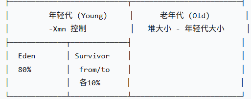
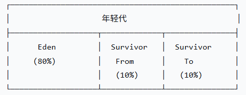
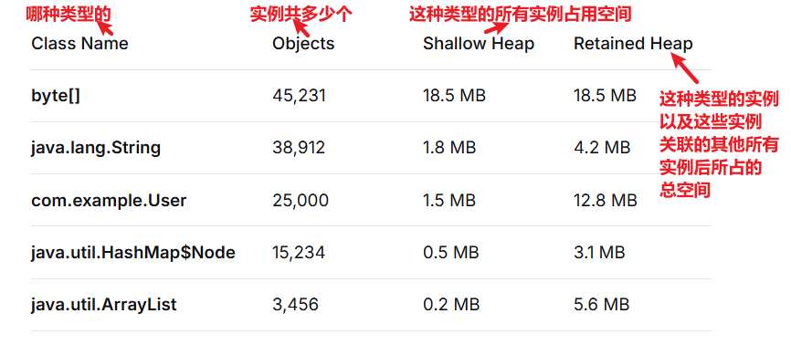
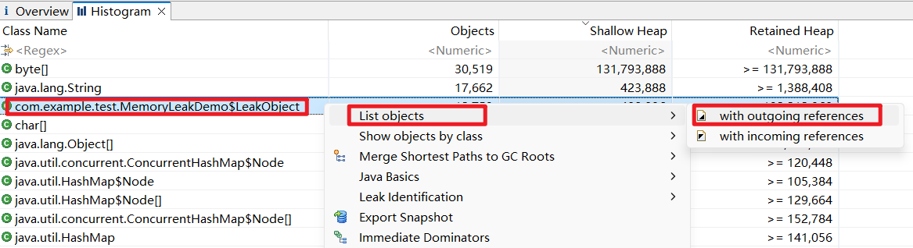
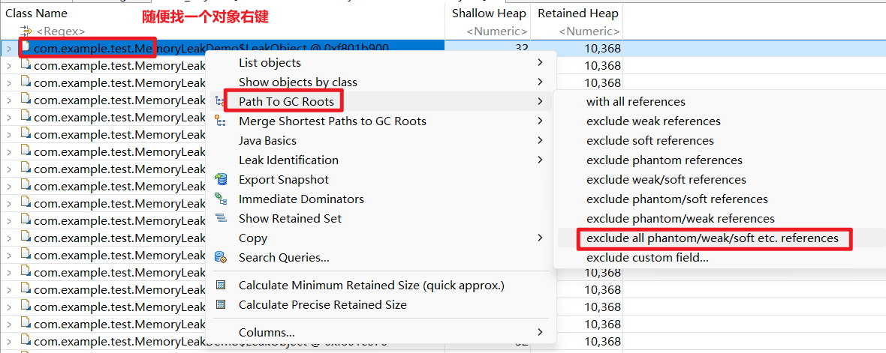
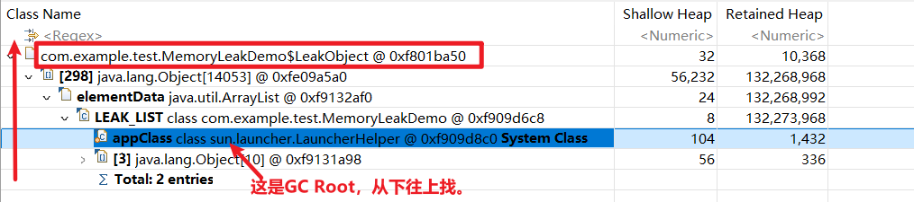
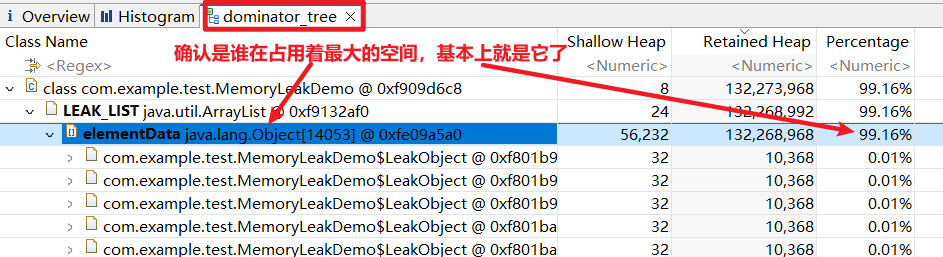
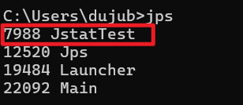
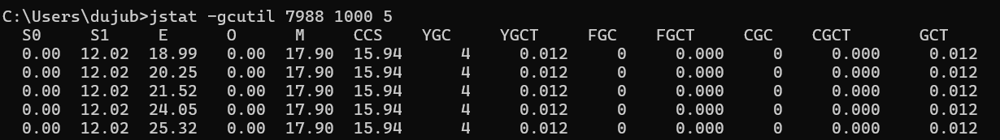
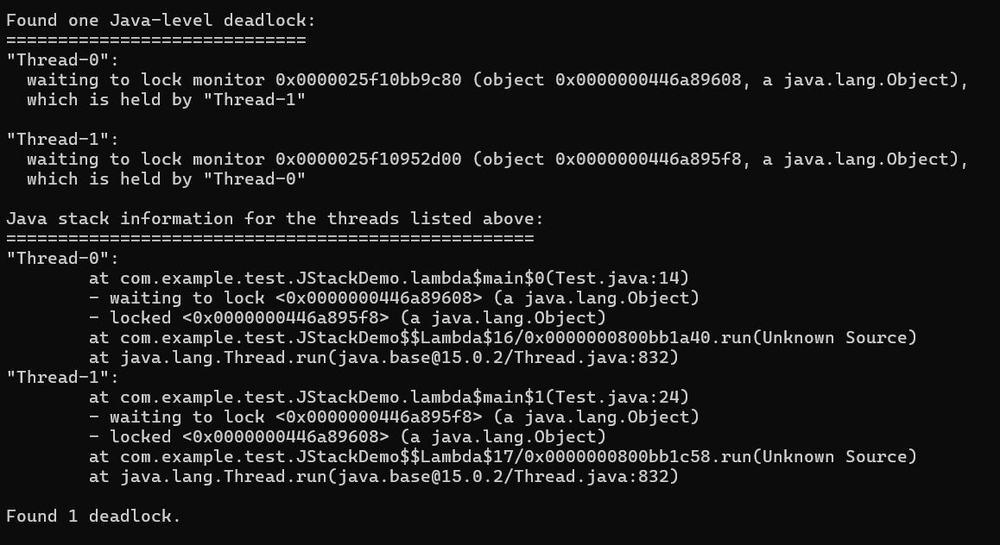

# 2.1.JVM面试题

# JVM内存区域有哪些？堆和栈的区别是什么？

JVM内存区域分为**线程私有**和**线程共享**两大类。

**线程私有的**：

- 程序计数器：记录当前线程执行的字节码行号
- 虚拟机栈：每个方法执行时创建栈帧，存储局部变量、操作数栈等
- 本地方法栈：为Native方法服务

**线程共享的**：

- **堆**：存储所有对象实例和数组
- **方法区**：存储类信息、常量、静态变量等

**需要注意的是：**

- **方法区是 JVM 规范中的概念**。
- 在JDK7及以前，它的实现叫**永久代**，属于堆的一部分；
- JDK8开始改为**元空间**，使用本地内存，不再受堆内存限制，同时把**字符串常量池移到了堆中**。

**堆和栈的区别**，核心在于：

- **栈存引用和基础类型，堆存对象实例；**
- **栈是线程隔离的，堆是所有线程共享的；**
- **栈内存自动释放，堆内存需要GC回收**。

# 什么是元空间（Metaspace）？它和永久代（PermGen）有什么区别？

元空间是JDK8以后**方法区的实现**，用来存放类的信息、常量、静态变量这些。在JDK8之前，方法区的实现叫永久代。

元空间和永久代最大的区别是**内存位置不同**：

- **永久代**在堆内存里，受堆大小限制，所以经常出现`<font style="color:rgb(15, 17, 21);background-color:rgb(235, 238, 242);">OutOfMemoryError: PermGen space</font>`
- **元空间**在本地内存（系统内存）里，默认只受系统内存限制，不容易溢出

另外，JDK7的时候已经把**字符串常量池**从永久代移到了堆里，JDK8干脆把整个永久代去掉了，改用元空间。

这样改的好处是：以前永久代大小很难设置，设小了OOM，设大了浪费堆内存。现在元空间用本地内存，默认可以自动扩展，只要系统内存够，就不用担心方法区OOM的问题。

# 什么是GC？哪些内存需要 GC？

GC就是JVM的垃圾回收机制，它自动帮我们回收那些不再使用的对象，释放内存，不用我们手动去管。

**需要GC的内存有两个地方：**

第一个是**堆**。堆里放的是我们new出来的对象，这些对象什么时候不用了，我们自己不知道，所以需要GC来帮我们清理。

第二个是**方法区**，这里面放的是类的信息、静态变量、常量这些。当类不用了，GC也会把它们清理掉（**方法区的GC通常只在Full GC时才会触发**）。

其他内存区域不需要GC。比如**栈**，每个方法执行的时候会创建栈帧，方法结束栈帧就自动销毁了，里面的局部变量也跟着没了，所以不需要GC管。程序计数器也是一样，线程私有的，不用GC。

**什么情况下类没用了？**

1. **堆中没有该类的任何实例**
2. **加载该类的ClassLoader已被回收**
3. **该类的Class对象没有被任何地方引用**

**三个条件必须同时满足**，GC才会认为这个类“没用了”，然后在Full GC时把它从元空间清理掉。

# 请解释Minor GC、Major GC、Full GC分别是什么？触发条件是什么？

**Minor 的音标：**`**<font style="color:rgb(15, 17, 21);">/ˈmaɪ.nər/</font>**`** Major 的音标：**`**<font style="color:rgb(15, 17, 21);">/ˈmeɪ.dʒər/</font>**`

Minor GC、Major GC、Full GC是**JVM垃圾回收的三种类型**，它们的回收范围和触发条件不一样。

- **Minor GC**：也叫Young GC，只回收**年轻代**（Eden区和Survivor区）。触发条件是**Eden区满了**。Minor GC发生得最频繁，但速度也最快，因为年轻代大部分对象都是朝生夕死的，每次回收能清理掉大部分内存。
- **Major GC**：一般指回收**老年代**的GC。触发条件是**老年代空间不足**。Major GC通常比Minor GC慢很多。
- **Full GC**：是**整堆回收**，回收年轻代+老年代+方法区。触发条件有几种：老年代空间不足、方法区空间不足。Full GC最慢，会造成最长的STW停顿，调优时重点关注。

实际中，Major GC和Full GC经常混着说，都指整堆回收。但严格来说，Major GC只回收老年代，Full GC回收整个堆和元空间。

# 什么是Java堆？堆的分代结构是怎样的？为什么要分代？

**什么是 Java 堆？**

Java堆是JVM管理的**最大的一块内存区域**，被所有线程共享，用于存放**对象实例和数组**。GC主要就发生在这里。关键参数有三个：

```plaintext
-Xms2g      # 初始堆大小
-Xmx2g      # 最大堆大小（建议与-Xms一致，防止扩容抖动）
-Xmn512m    # 年轻代大小（老年代大小 = 堆大小 - 年轻代大小）
```

堆内存不够时，并且无法扩展堆内存了，会出现** OOM**。

**堆的分代结构是怎样的？**

Java 堆被分为年轻代和老年代。



**年轻代（Young Generation）**：

- **Eden区（伊甸园区）**：大多数对象出生在这里
- **Survivor区（幸存者区）**：幸存者区有两个（S0和S1，也叫from和to），大小相等，用于存放经过一次Minor GC后仍然存活的对象。它起到缓冲的作用，**避免对象过早进入老年代**。
- Eden 、S0、S1 的默认空间比例：`<font style="color:rgb(15, 17, 21);">8:1:1</font>`

**老年代（Old Generation）**：

- 存放**长期存活**的对象，或者**大对象**（注意：`<font style="color:rgb(15, 17, 21);background-color:rgb(235, 238, 242);">-XX:PretenureSizeThreshold</font>`参数是用来设置大对象阈值的，如果大对象的体积超过这个阈值，那么会绕过年轻代，直接进入老年代）

**为什么要分代？**

- 大部分对象是朝生夕死，但有些对象活的时间就比较长。分代后，可以针对不同的分代采用不同垃圾回收算法。提高 GC 效率、降低 STW 停顿时间。
- **比如：**年轻代，存活的对象较少，采用“**标记-复制**”算法，回收效率极高。老年代中继续存活的对象较多，就比较适合使用“**标记-清除**”算法。
- 这样设计，避免了每次GC都扫描整个堆，实现了‘**分代回收，各取所长**’。

# 如何通过命令行参数设置堆大小？

主要通过三个核心参数设置堆内存：

- `**<font style="color:rgb(15, 17, 21);background-color:rgb(235, 238, 242);">-Xms</font>**`：设置初始堆大小
- `**<font style="color:rgb(15, 17, 21);background-color:rgb(235, 238, 242);">-Xmx</font>**`：设置最大堆大小
- `**<font style="color:rgb(15, 17, 21);background-color:rgb(235, 238, 242);">-Xmn</font>**`：设置年轻代大小

例如：`<font style="color:rgb(15, 17, 21);background-color:rgb(235, 238, 242);">java -Xms2g -Xmx2g -Xmn512m -jar app.jar</font>`

**也可以说的更加具体一些：**

**1. 整体堆设置**

- `<font style="color:rgb(15, 17, 21);background-color:rgb(235, 238, 242);">-Xms</font>`：初始堆大小，建议与 `<font style="color:rgb(15, 17, 21);background-color:rgb(235, 238, 242);">-Xmx</font>` 设为相同值，避免扩容带来的性能开销
- `<font style="color:rgb(15, 17, 21);background-color:rgb(235, 238, 242);">-Xmx</font>`：最大堆大小，根据机器内存和应用需求设定

**2. 分代设置**

- `<font style="color:rgb(15, 17, 21);background-color:rgb(235, 238, 242);">-Xmn</font>`：年轻代大小，通常占堆的 1/3 到 1/4
- `<font style="color:rgb(15, 17, 21);background-color:rgb(235, 238, 242);">-XX:NewRatio</font>`：老年代与年轻代的比例，如 `<font style="color:rgb(15, 17, 21);background-color:rgb(235, 238, 242);">-XX:NewRatio=2</font>` 表示老年代:年轻代=2:1
- `<font style="color:rgb(15, 17, 21);background-color:rgb(235, 238, 242);">-XX:SurvivorRatio</font>`：Eden 区与 Survivor 区的比例，如 `<font style="color:rgb(15, 17, 21);background-color:rgb(235, 238, 242);">-XX:SurvivorRatio=8</font>` 表示 Eden:Survivor=8:1:1

# 什么是“标记-复制”算法？什么是“标记-清除”算法？什么是“标记-整理”算法？

**这三个是所有的垃圾回收算法**，不管是哪一种垃圾回收器，都跑不出这三者的排列组合。

## 标记-复制算法原理



**假设初始状态是这样的**：

- Eden区：有对象 A、B、C（存活）、D（存活）
- From区：有对象 X（存活，age=1）
- To区：空

**Minor GC触发**：

1. **标记**：遍历GC Roots，标记存活对象 → A（已死）、B（已死）、C（存活）、D（存活）、X（存活）
2. **复制**：将**存活对象**从 Eden + From 复制到 To 区
  - C → To区（age=1）
  - D → To区（age=1）
  - X → To区（age=2，年龄+1）
3. **清空**：清空 Eden 和 From 区
4. **角色互换**：
  - To 区变成新的 From 区
  - 原来的 From 区（已清空）变成新的 To 区

**最终状态**：

- 新Eden：空（等待新对象分配）
- 新From区：包含 C、D、X
- 新To区：空

## 标记-复制算法（面试时这样回答）

年轻代使用的是**复制算法**，具体实现是**Eden + 两块Survivor区**的结构。

工作流程是：

1. 对象优先分配在Eden区
2. Minor GC时，将Eden和From区中存活的对象**复制**到To区
3. 清空Eden和From区
4. **交换**From和To的角色

之所以用复制算法，是因为年轻代对象**朝生夕死**，存活率低，复制成本小，而且能保证内存连续，分配速度快。

## 标记-清除算法（面试时这样回答）

这个算法主要用于老年代。分为两个阶段：

1. **标记阶段**：从GC Roots出发，标记所有**存活的对象**
2. **清除阶段**：遍历堆，回收未被标记的对象

它的优点是**不需要移动对象，没有复制开销，也不浪费额外空间**。

但缺点是**会产生内存碎片**。因为清除后，存活对象之间的空闲内存是不连续的。当需要分配大对象时，即使总空闲内存足够，也可能因为没有连续空间而分配失败，进而触发Full GC甚至OOM。

## 标记-整理算法（面试时这样回答）

**“标记-整理”是“标记-清除”的进化版，核心区别是：标记-整理在清除后会移动存活对象，让内存连续。**

# 什么是OOM？常见的OOM有哪几种？

OOM 本质就是 JVM 内存不够用了：`**<font style="color:rgb(15, 17, 21);background-color:rgb(235, 238, 242);">java.lang.OutOfMemoryError</font>**`

**第一，堆内存溢出**，报错信息是 Java 堆空间。这是最常见的，一般是对象太多或者内存泄漏。

**第二，方法区溢出**，通常是热部署、动态代理、反射生成类太多导致的。

**第三，栈内存相关**，报错信息是无法创建新的本地线程。这不是栈溢出，而是线程数超过了操作系统限制。

**还有两种特殊场景**：

- 一种是 GC 开销超限，意思是垃圾回收干了百分之九十八的活却只回收了不到百分之二的内存，JVM 主动放弃；
- 另一种是请求的数组大小超过虚拟机限制，就是数组创建得太大，超过了 JVM 允许的最大值。

# 什么是STW（Stop-The-World）？为什么GC会发生STW？

**面试时这样回答：**

STW是Stop-The-World的缩写，指GC时暂停所有业务线程的现象。

GC需要STW的根本原因是**保证对象引用关系的快照一致性**。如果不暂停业务线程，对象引用可能在GC标记过程中被修改，导致两种情况：

1. **误删存活对象**：业务线程正在使用的对象被当作垃圾回收
2. **遗漏垃圾对象**：已经死亡的对象被错误标记为存活，造成内存泄漏

任何GC都有STW，只是长短不同。现代GC器如G1、ZGC通过并发标记、增量回收等技术，尽量缩短STW时间，但无法完全消除。

**STW的本质，就是让“标记”和“清理”成为一个原子操作，中间不给业务线程任何篡改的机会。标记时是垃圾，清理时还是垃圾，不会出现“误杀良民”的情况。**

**如果没有 STW，GC 的过程中刚标记了 A 对象为垃圾数据，结果业务线程开始用 A 对象了。但 GC 不知道呀，GC 还是会清除掉标记的 A 对象，这样就导致了误删存活对象。**

**再比如，GC 的过程中标记了 A 对象不是垃圾数据，不需要回收，结果业务线程把 A 对象变成垃圾数据。但 GC 还是不知道呀。GC 仍然会认为 A 对象不是垃圾数据，这样就导致遗漏了垃圾对象。**

# 什么是类加载机制？双亲委派模型是什么？为什么要用双亲委派？

**类加载机制是JVM把.class变成类对象的过程，这个过程经历了：**

| **阶段** | **做的事情** |
| --- | --- |
| **加载** | 找到.class文件，读入内存，创建Class对象 |
| **验证** | 检查字节码格式是否正确（安全校验） |
| **准备** | 为静态变量分配内存，设置默认初始值（如int=0） |
| **解析** | 把符号引用（类名、方法名）替换为直接引用（内存地址） |
| **初始化** | 执行静态代码块、静态变量赋值（真正的初始化） |

**双亲委派是类加载器的工作模式：**

- 当加载一个类时，先委派给父加载器，父加载器再委派给它的父加载器，直到最顶层的Bootstrap加载器。只有父加载器找不到，子加载器才自己加载。

**这么设计有三个原因：**

1. **安全性**：防止用户自定义的类冒充核心类库（比如自己写个`<font style="color:rgb(15, 17, 21);background-color:rgb(235, 238, 242);">java.lang.String</font>`），因为核心类库由Bootstrap加载器优先加载，用户版本永远不会被用到
2. **避免重复加载**：同一个类只会被加载一次，保证全JVM唯一
3. **隔离性**：核心类库和应用代码分开，互不影响

# 对象从创建到被回收，在堆里是怎么流转的？

## 对象刚创建：在 Eden 区

- 绝大部分对象刚被 `new` 出来时，内存分配在**堆**的**年轻代**的 **Eden 区**。
- 如果 Eden 区内存不足，会触发一次 **Minor GC / Young GC**。

## 经历 Minor GC：进入 Survivor 区

- 当 Minor GC 发生时，JVM 会标记** Eden 区**和**一个 Survivor 区（From 区）**中存活的对象。
- **存活的对象**会被复制到**另一个 Survivor 区（To 区）**，并且对象的**年龄**会增加（在 Eden 当中初始年龄为0，每熬过一次GC加1）。
- 这次 GC 结束后，Eden 区和原来的 From 区被清空，From 和 To 的角色互换。

## 在 Survivor 区之间流转

- 对象会在 Survivor 区（S0 和 S1）之间**反复复制**，每次 Minor GC 都重复上述过程。
- 每经过一次 Minor GC，存活对象的年龄就 +1。
- **当对象年龄达到阈值（默认 15，可通过 **`-XX:MaxTenuringThreshold`** 调整）**，或者 Survivor 区中**同龄对象占空间超过一半**（动态年龄判断），对象就会被**晋升（Promotion）到老年代**。

## 长期存活或大对象：进入老年代

- **晋升条件**：
  - 年龄达到阈值。
  - **或者**动态年龄判断：Survivor 区中**同龄对象占空间超过一半**，对象就会被**晋升（Promotion）到老年代**。
  - **或者 大对象**（通过 `-XX:PretenureSizeThreshold` 设置）：如果对象大小超过阈值，直接在老年代分配，避免在年轻代反复复制。
- 老年代存放**生命周期较长**的对象。

## 对象被回收：Full GC

- 当老年代空间不足时，会触发 **Full GC**，对**整个堆（年轻代 + 老年代）以及方法区**进行垃圾回收。
- 在 Full GC 中，如果对象在老年代也不再被引用，就会被回收。
- 如果 Full GC 后老年代空间仍然不足，就会抛出 `OutOfMemoryError`。

# 如何判断对象是否可以被回收？

## 可达性分析算法

目前主流的 JVM（HotSpot）使用的是可达性分析算法，核心思想是这样的：从一组称为 **GC Roots** 的根对象出发，通过引用链向下搜索，所有能被搜索到的对象标记为"**存活**"，搜索不到的对象判定为"**可回收**"。可以把GC Roots想象成**大树的根**，从根能到达的枝叶就是存活对象，孤立的树杈就是可回收对象。

## GC Roots 有哪些

GC Roots 是可达性分析的起点，主要包括以下几类：

1. 虚拟机栈（栈帧中的局部变量表）中引用的对象
2. 方法区中静态属性引用的对象
3. 方法区中常量引用的对象
4. Native方法引用的对象
5. 所有被同步锁（synchronized）持有的对象：被 `<font style="color:rgb(15, 17, 21);background-color:rgb(235, 238, 242);">synchronized</font>` 锁住的对象，不能被回收
6. Java 虚拟机内部的引用：基本数据类型对应的 Class 对象、常驻的异常对象（如 NullPointerException）、系统类加载器

## 怎么理解 GC Roots

```java
public class Test {
    private static List<String> staticList = new ArrayList<>();  // 根1
    
    public static void main(String[] args) {
        String local1 = "hello";   // 根2
        String local2 = "world";   // 根3
        
        List<String> localList = new ArrayList<>();  // 根4
        
        synchronized (localList) {
            // localList 被锁持有，也是根（但和根4是同一个对象）
        }
    }
}
```

**GC Roots 集合** = { staticList, local1, local2, localList }

一共 **4 个 GC Root**，它们一起组成了 GC Roots 集合。

**该面试题最终这样答即可：**

使用**可达性分析算法**。从 **GC Roots** 出发，能到达的对象存活，到达不了的对象可回收。

GC Roots 主要包括：**栈帧中的局部变量**、**静态变量**、**常量**、**JNI 引用**、**同步锁持有的对象**等。

# Java 为什么没有采用引用计数法来判断对象是否可以被回收？

**引用计数法** = 每个对象身上挂一个**计数器**，记录有多少个引用指向它：

- 有一个新引用指向它 → **计数器 +1**
- 有一个引用不再指向它 → **计数器 -1**
- 计数器 == 0 → **没有人在用 → 可以回收**

**引用计数法无法解决 循环引用 的问题。**

```java
class Node {
    Node next;
}

Node a = new Node();  // a 的计数 = 1
Node b = new Node();  // b 的计数 = 1

a.next = b;  // b 的计数 = 2（a 也指向 b）
b.next = a;  // a 的计数 = 2（b 也指向 a）

a = null;    // a 的计数 = 1（b 还指着它）
b = null;    // b 的计数 = 1（a 还指着它）
```

**问题来了**：

- a 和 b 已经**没有任何外部引用**了（都是 null）
- 但它们的计数器都是 **1**（互相指着对方）
- 引用计数法认为它们"还在用"，**永远不回收**
- 这就是**内存泄漏**

# 常见的垃圾回收器有哪些？请说出CMS和G1的主要区别。

## 常见的垃圾回收器有

| **回收器** | **对应代** | **算法** | **特点** | **说明** |
| --- | --- | --- | --- | --- |
| Serial | 年轻代 | 复制 | 单线程，STW | **JDK 1.0 一直保留到现在，从未被移除，是JDK中最古老的垃圾回收器组合。Serial组合在小内存、低CPU、嵌入式等场景下，依然是自动开启。** |
| Serial Old | 老年代 | 标记-整理 | 单线程，STW |   |
| Parallel Scavenge（简称Parallel GC） | 年轻代 | 复制 | 吞吐量优先 | JDK8 中默认使用的，主要特点是吞吐量高。**吞吐量优先** = **让 CPU 尽量花在业务上，GC 不是那么频繁（GC 频率低），但每次 GC 停顿时间可能很长** |
| Parallel Old | 老年代 | 标记-整理 | 吞吐量优先 |   |
| ParNew | 年轻代 | 复制 | 多线程 | JDK8 中需要手动设置才能开启。**低延迟优先** = 尽量缩短每次 GC 停顿时间，但可能牺牲整体吞吐量。 |
| CMS | 老年代 | 标记-清除 | 低停顿/低延迟优先，有碎片，JDK9废弃 |   |
| G1 | 逻辑分代，物理不分代 | 复制+标记-整理 | Region布局，停顿可控，JDK9起默认 | 直到 JDK21，G1 还是默认的。ZGC 需要手动开启。 |
| ZGC | 不分代（JDK23 的默认收集器，开始分代，不分代的被废弃） | 染色指针+读屏障 | 停顿<10ms，JDK11+，需要手动开启 |   |

**面试时，可以不提 ZGC，因为它较新，在 JDK 中也不是默认开启的。重点回答常见的垃圾回收器包括：****Parallel 系列、CMS、G1**

其中，应重点回答 CMS 和 G1 的区别，因为他俩是一个重要的分水岭：**CMS 代表 传统分代收集器中“并发低延迟”的巅峰但存在碎片和停顿不可控的痛点，G1 代表 现代收集器通过Region化布局实现“停顿可预测”的跨越，两者是JVM从“分代隔离”走向“Region化、可控停顿”的分水岭。**

## Region 化布局如何理解

从 CMS 到 G1，在物理布局上发生了很大的变化：

- CMS 的物理布局：年轻代和老年代是**连续、固定**的两块内存
- G1 的物理布局：划分为等大**Region**，每个Region动态扮演Eden、Survivor或Old

千万不要认为 G1 中没有年轻代和老年代了：**分代策略没变，只是实现方式从“整块内存”变成“Region动态标记”。**

**Region 化之后： G1根据用户设定的期望停顿时间，可以优先回收收益最高（释放空间大、停顿时间短）的Region，而不是一次回收整代。**

**设置停顿时间的方式是：**

```shell
-XX:MaxGCPauseMillis=200
```

## CMS 与 G1 的区别总结（背会）

**CMS和G1的主要区别有三点：**

- **第一，内存布局不同，CMS是传统的分代物理隔离，新生代和老年代是两块连续的内存；G1是把堆划分为多个等大的Region，逻辑上仍有分代，但物理上不再隔离。**
- **第二，回收算法不同，CMS采用标记-清除算法，会产生内存碎片；G1采用复制算法在Region间移动对象，从设计上避免了碎片问题。**
- **第三，停顿控制不同，CMS的停顿时间不可控，当碎片严重时会触发Serial Old做Full GC导致长时间停顿；G1支持用户通过-XX:MaxGCPauseMillis设定期望停顿时间，优先回收收益高的Region，实现停顿时间可控。**
- **此外，CMS从JDK9开始被标记废弃，JDK14正式移除；G1从JDK9起成为默认垃圾回收器。**

# 垃圾回收类型，垃圾回收算法，垃圾回收器，它们都是什么，什么关系？

**垃圾回收类型（定义回收范围及触发时机）**

| **类型** | **回收区域** | **触发条件** |
| --- | --- | --- |
| Minor GC | 年轻代 | 年轻代满了 |
| Major GC | 老年代 | 老年代满了 |
| Full GC | 年轻代+老年代+元空间 | 老年代满了 / 元空间满了 / 调用System.gc() |
| MixedGC | 不分代（混合） |   |

**垃圾回收算法（用什么方法收）**

| **算法** | **原理** | **优点** | **缺点** |
| --- | --- | --- | --- |
| 标记-清除 | 标记存活对象，清除未标记的 | 简单 | 产生碎片 |
| 标记-复制 | 存活对象复制到另一块区域 | 无碎片 | 浪费内存 |
| 标记-整理 | 存活对象向一端移动，清理边界外 | 无碎片 | 移动开销大 |

**垃圾回收器（算法的具体实现）**

| **回收器** | **对应代** | **算法** | **特点** | **说明** |
| --- | --- | --- | --- | --- |
| Serial | 年轻代 | 复制 | 单线程，STW | **JDK 1.0 一直保留到现在，从未被移除，是JDK中最古老的垃圾回收器组合。Serial组合在小内存、低CPU、嵌入式等场景下，依然是自动开启。** |
| Serial Old | 老年代 | 标记-整理 | 单线程，STW |   |
| Parallel Scavenge（简称Parallel GC） | 年轻代 | 复制 | 吞吐量优先 | JDK8 中默认使用的，主要特点是吞吐量高。**吞吐量优先** = **让 CPU 尽量花在业务上，少花在 GC 上，但每次 GC 停顿时间可能很长** |
| Parallel Old | 老年代 | 标记-整理 | 吞吐量优先 |   |
| ParNew | 年轻代 | 复制 | 多线程 | JDK8 中需要手动设置才能开启。**低延迟优先** = 尽量缩短每次 GC 停顿时间，但可能牺牲整体吞吐量。 |
| CMS | 老年代 | 标记-清除 | 低停顿/低延迟优先，有碎片，JDK9废弃 |   |
| G1 | 不分代 | 复制+标记-整理 | Region布局，停顿可控，JDK9起默认 |   |
| ZGC | 不分代 | 染色指针+读屏障 | 停顿<10ms，JDK11+ |   |

**三者关系**

# 如何分析GC日志？关注哪些指标？

## 首先要开启 GC 日志

**JDK8 及之前**

```shell
-XX:+PrintGCDetails -XX:+PrintGCDateStamps -Xloggc:gc.log
```

**JDK9+**

```shell
-Xlog:gc*:file=gc.log:time,uptimemillis
```

## 如何分析 GC 日志

**一条YoungGC日志解读**

```plaintext
2024-01-15T10:30:15.123: [GC (Allocation Failure) 
[PSYoungGen: 51200K->6144K(59904K)] 51200K->6200K(196608K), 0.0234567 secs]
```

| **字段** | **含义** | **分析** |
| --- | --- | --- |
| `<font style="color:rgb(15, 17, 21);background-color:rgb(235, 238, 242);">51200K->6144K</font>` | 年轻代: 回收前→回收后 | 回收了88%，效果很好 |
| `<font style="color:rgb(15, 17, 21);background-color:rgb(235, 238, 242);">51200K->6200K</font>` | 堆: 回收前→回收后 | 整体回收了88% |
| `<font style="color:rgb(15, 17, 21);background-color:rgb(235, 238, 242);">0.023s</font>` | 耗时23ms | 停顿很短，健康 |
| `<font style="color:rgb(15, 17, 21);background-color:rgb(235, 238, 242);">Allocation Failure</font>` | 原因 | 年轻代满了，正常 |

**一条FullGC日志解读**

```plaintext

2024-01-15T10:35:20.456: [Full GC (Metadata GC Threshold) 
[PSYoungGen: 8192K->0K(92160K)] 
[ParOldGen: 51200K->58000K(131072K)] 
59400K->58000K(223232K), [Metaspace: 21000K->21000K(106496K)], 0.5234567 secs]
```

| **字段** | **含义** | **分析** |
| --- | --- | --- |
| `<font style="color:rgb(15, 17, 21);background-color:rgb(235, 238, 242);">Metadata GC Threshold</font>` | 原因 | 元空间满了，触发Full GC |
| `<font style="color:rgb(15, 17, 21);background-color:rgb(235, 238, 242);">ParOldGen: 51200K->58000K</font>` | 老年代不降反升 | ⚠️ 异常，可能有泄漏 |
| `<font style="color:rgb(15, 17, 21);background-color:rgb(235, 238, 242);">0.523s</font>` | 耗时523ms | 停顿较长，需关注 |
| `<font style="color:rgb(15, 17, 21);background-color:rgb(235, 238, 242);">Metaspace: 21000K</font>` | 元空间高 | 检查是否类加载过多 |

**另外，分析 GC 日志也可以使用专业的工具，例如 GCeasy。**

## 关注哪些指标

分析GC日志主要关注三个指标：**频率、耗时、回收效果**。

**频率（日志中有时间戳，根据时间戳看频率）**：YoungGC几分钟一次正常，FullGC最好没有，频繁FullGC说明有问题。
**耗时**：YoungGC小于50毫秒，FullGC小于1秒，超过就要警惕。
**回收效果**：看GC前后内存变化，回收后内存明显下降且保持稳定是健康的；如果老年代持续增长、GC后不降反升，很可能有内存泄漏。

# 什么是内存泄漏？在Java中如何定位内存泄漏？

## 什么是内存泄漏？

在Java中，内存泄漏指的是**不再被应用程序使用的对象，因为仍然被某些根（GC Roots）引用着，导致垃圾收集器（GC）无法回收它们所占用的内存**。

**内存泄漏**越来越多，会导致可用内存越来越少，最终的结果是：**内存溢出（OOM）**。

内存泄漏 ≠ 内存溢出（OOM）
泄漏是**原因**，溢出是**结果**。泄漏是“慢慢积累”，溢出是“撑爆了”。

## Java 中常见的内存泄漏场景

| **场景** | **说明** |
| --- | --- |
| **集合类未清理** | `<font style="color:rgb(15, 17, 21);background-color:rgb(235, 238, 242);">static</font>`的 `<font style="color:rgb(15, 17, 21);background-color:rgb(235, 238, 242);">HashMap</font>`/ `<font style="color:rgb(15, 17, 21);background-color:rgb(235, 238, 242);">ArrayList</font>`持有对象引用，用完后没有 `<font style="color:rgb(15, 17, 21);background-color:rgb(235, 238, 242);">remove</font>` |
| **监听器/回调未注销** | 监听器内部应用了一个对象 A，监听器用完应该注销，但程序员忘记注销监听器，导致监听器内部的对象 A 一直存活。 |
| **内部类/匿名类持有外部类引用** | 非静态内部类隐式持有外部类`<font style="color:rgb(15, 17, 21);background-color:rgb(235, 238, 242);">this</font>`引用，导致外部类无法回收 |
| **ThreadLocal 未调用 remove()** | 线程池中的线程复用，ThreadLocal 存储的值一直存在，导致内存泄漏 |
| **连接池/缓存未设置过期** | 自定义缓存只增不减，或连接池未正确释放 |
| **ClassLoader 泄漏** | **在热部署的场景下：热部署指的是在不重启应用的情况下，用新的ClassLoader重新加载新版本的类，替换正在运行的旧版本类。如果忘记卸载旧的ClassLoader，那么它加载的所有类都无法回收。** |

## 如何定位内存泄漏

**第一步：先看看是不是内存泄漏**

- 应用运行一段时间后，响应变慢
- GC日志显示：
  - Minor GC 后 存活对象 持续增长
  - Full GC 频率越来越高
  - GC 后 内存占用 不下降 或 下降很少
- 最终出现 `<font style="color:rgb(15, 17, 21);background-color:rgb(235, 238, 242);">OutOfMemoryError</font>`

**第二步：****采集内存快照（Heap Dump：堆转储）**

| **方式** | **说明** |
| --- | --- |
| `<font style="color:rgb(15, 17, 21);background-color:rgb(235, 238, 242);">jmap -dump:live,format=b,file=heap.hprof <pid></font>` | 手动执行 jmap 命令：生成存活对象的**堆转储**文件。**堆转储是Java进程堆内存的快照文件，记录了某一时刻所有存活对象的类信息、实例数据和引用关系。** |
| `<font style="color:rgb(15, 17, 21);background-color:rgb(235, 238, 242);">-XX:+HeapDumpOnOutOfMemoryError</font>` | JVM 启动时添加这个参数，当OOM时自动生成 dump 文件。这个文件也是一个堆转储文件，文件内容更详细，包括可达和不可达的对象都有。第一种方式生成的堆转储文件只包含可达对象。 |
| `<font style="color:rgb(15, 17, 21);background-color:rgb(235, 238, 242);">-XX:HeapDumpPath=/path/to/dump</font>` | JVM 启动时添加这个参数，指定 dump 文件生成路径。 |

**下面这个代码可以帮助我们生成一个堆转储文件：**

```java
package com.example.test;

import java.util.ArrayList;
import java.util.List;
import java.util.UUID;

/**
 * 内存泄漏示例 - 用于MAT分析
 * 静态集合 LEAK_LIST 持续持有 LeakObject 对象的引用，导致这些对象无法被GC回收，堆内存被不断占满直到OOM
 *
 * VM Options: -Xms128m -Xmx128m -XX:+HeapDumpOnOutOfMemoryError -XX:HeapDumpPath=./heap.hprof
 */
public class MemoryLeakDemo {

    // 静态集合，生命周期与JVM一致，持续持有对象引用
    private static final List<LeakObject> LEAK_LIST = new ArrayList<>();

    public static void main(String[] args) {
        System.out.println("内存泄漏演示开始...");
        System.out.println("最大内存: " + Runtime.getRuntime().maxMemory() / 1024 / 1024 + "MB");

        int count = 0;
        while (true) {
            LeakObject obj = new LeakObject();
            LEAK_LIST.add(obj);
            count++;

            if (count % 10000 == 0) {
                System.out.println("已创建: " + count + " 个对象, 当前集合大小: " + LEAK_LIST.size());
                printMemoryUsage();
            }
        }
    }

    private static void printMemoryUsage() {
        Runtime rt = Runtime.getRuntime();
        long total = rt.totalMemory() / 1024 / 1024;
        long free = rt.freeMemory() / 1024 / 1024;
        long used = total - free;
        long max = rt.maxMemory() / 1024 / 1024;
        System.out.println("内存使用: " + used + "MB / " + total + "MB, 最大: " + max + "MB");
    }

    /**
     * 泄漏对象 - 包含大字段加速内存占用
     */
    static class LeakObject {
        private final String id = UUID.randomUUID().toString();
        private final byte[] data = new byte[1024 * 10]; // 10KB 数据
        private final long createTime = System.currentTimeMillis();

        @Override
        public String toString() {
            return "LeakObject{id='" + id + "', createTime=" + createTime + "}";
        }
    }
}
```

**第三步：分析堆转储文件（分析 Heap Dump）**

使用 **MAT (Eclipse Memory Analyzer)内存分析工具，拿到 堆转储 文件之后，在 MAT 工具中，通过菜单打开该文件就可以开始分析了。**

**分析步骤**：

1. **查看直方图（Histogram）：**看哪些类的实例数量最多、占内存最大（直方图不是一个图，是一个表格）



**在直方图上，从上往下找，找到自己项目中的类，那是泄漏的入口。**

1. **定位 GC Roots 路径**







1. **查看支配树（Dominator Tree）：**找最大 Retained Heap 的对象。快速定位哪个对象“把持”着最大内存



# 线上应用频繁Full GC，可能的原因有哪些？如何排查？

## 可能的原因

1. **内存泄漏**：对象持续被引用无法回收，老年代持续增长
2. **大对象直接进入老年代**：大对象过多，老年代快速填满
3. **晋升阈值过低**：年轻代对象过早晋升到老年代
4. **元空间（Metaspace）满**：类加载过多或内存泄漏
5. **显式调用System.gc()**：代码或第三方库主动触发
6. **GC参数配置不合理**：堆内存过小，或CMS/G1参数设置不当

## 排查步骤

| **步骤** | **操作** | **目的** |
| --- | --- | --- |
| **1. 查看GC日志** | `<font style="color:rgb(15, 17, 21);background-color:rgb(235, 238, 242);">-XX:+PrintGCDetails</font>` | 确认Full GC频率、耗时、内存变化 |
| **2. 查看内存统计** | `<font style="color:rgb(15, 17, 21);background-color:rgb(235, 238, 242);">jmap -histo:live <pid></font>` | 快速看哪些类占用内存最多 |
| **3. 监控堆使用** | `<font style="color:rgb(15, 17, 21);background-color:rgb(235, 238, 242);">jstat -gc <pid></font>` | 看老年代、元空间使用率 |
| **4. 堆转储分析** | `<font style="color:rgb(15, 17, 21);background-color:rgb(235, 238, 242);">jmap -dump:live,format=b,file=heap.hprof <pid></font>` | 导出后用MAT分析对象引用链，定位内存泄漏 |
| **5. 检查参数和代码** | `<font style="color:rgb(15, 17, 21);background-color:rgb(235, 238, 242);">-XX:+PrintCommandLineFlags</font>`、搜索`<font style="color:rgb(15, 17, 21);background-color:rgb(235, 238, 242);">System.gc()</font>` | 确认配置和显式GC调用 |

**按照这个模板背：**

线上频繁Full GC，可能的原因有：内存泄漏、大对象过多、晋升阈值过低、元空间满、显式调用System.gc()，或者堆内存配置太小。

排查时我会先看GC日志，确认Full GC的频率和耗时；然后用jstat观察老年代和元空间的使用情况；再用jmap导出堆转储，用MAT分析哪个对象占用了大量内存；同时检查代码中是否有System.gc()调用；最后确认JVM参数是否合理，比如堆大小、晋升阈值、使用的垃圾回收器等。

定位到具体原因后，比如内存泄漏就修复代码，参数不合理就调整JVM配置，大对象问题可以调大年轻代或调整晋升阈值。

# JVM调优有哪些常用的参数？

JVM调优参数主要分几类：

**第一，堆内存**：`<font style="color:rgb(15, 17, 21);background-color:rgb(235, 238, 242);">-Xms</font>`、`<font style="color:rgb(15, 17, 21);background-color:rgb(235, 238, 242);">-Xmx</font>` 设置堆大小，`<font style="color:rgb(15, 17, 21);background-color:rgb(235, 238, 242);">-Xmn</font>` 设置年轻代，`<font style="color:rgb(15, 17, 21);background-color:rgb(235, 238, 242);">-XX:MetaspaceSize</font>` 设置元空间。

**第二，GC日志**：`<font style="color:rgb(15, 17, 21);background-color:rgb(235, 238, 242);">-XX:+PrintGCDetails -XX:+PrintGCDateStamps -Xloggc:gc.log</font>`，方便事后分析。JDK9+用 `<font style="color:rgb(15, 17, 21);background-color:rgb(235, 238, 242);">-Xlog:gc*:file=gc.log:time</font>`。

**第三，OOM转储**：`<font style="color:rgb(15, 17, 21);background-color:rgb(235, 238, 242);">-XX:+HeapDumpOnOutOfMemoryError -XX:HeapDumpPath=./heap.hprof</font>`，线上必加，OOM时自动dump堆，方便事后分析。

**第四，GC回收器**：`<font style="color:rgb(15, 17, 21);background-color:rgb(235, 238, 242);">-XX:+UseG1GC</font>` 用G1，`<font style="color:rgb(15, 17, 21);background-color:rgb(235, 238, 242);">-XX:MaxGCPauseMillis=200</font>` 控制停顿时间。JDK8默认Parallel，JDK9+默认G1。

**第五，其他**：`<font style="color:rgb(15, 17, 21);background-color:rgb(235, 238, 242);">-XX:SurvivorRatio</font>` 调Eden/Survivor比例，`<font style="color:rgb(15, 17, 21);background-color:rgb(235, 238, 242);">-XX:MaxTenuringThreshold</font>` 调晋升年龄。

生产环境我通常会在启动脚本里加上 `<font style="color:rgb(15, 17, 21);background-color:rgb(235, 238, 242);">-Xms</font>`、`<font style="color:rgb(15, 17, 21);background-color:rgb(235, 238, 242);">-Xmx</font>`、`<font style="color:rgb(15, 17, 21);background-color:rgb(235, 238, 242);">-XX:+HeapDumpOnOutOfMemoryError</font>`、GC日志这几个必备参数。

# 常用的JVM性能监控和故障排查工具有哪些？

**这样回答：**

`<font style="color:rgb(15, 17, 21);background-color:rgb(235, 238, 242);">jps</font>` 看进程，`<font style="color:rgb(15, 17, 21);background-color:rgb(235, 238, 242);">jstat</font>` 看GC，`<font style="color:rgb(15, 17, 21);background-color:rgb(235, 238, 242);">jmap</font>` **导堆转储**，`<font style="color:rgb(15, 17, 21);background-color:rgb(235, 238, 242);">jstack</font>` 看线程，MAT 分析堆转储，GCeasy 分析GC日志。

## jps

该命令用来获取当前系统中 Java 进程 ID，因为 jstat、jmap、jstack 等命令都需要进程 ID。

| **命令** | **输出** |
| --- | --- |
| `<font style="color:rgb(15, 17, 21);background-color:rgb(235, 238, 242);">jps</font>` | 进程ID + 类名 |
| `<font style="color:rgb(15, 17, 21);background-color:rgb(235, 238, 242);">jps -l</font>` | 进程ID + 完整包名 |
| `<font style="color:rgb(15, 17, 21);background-color:rgb(235, 238, 242);">jps -v</font>` | 进程ID + 启动参数 |

## jstat

**实时查看GC和堆内存使用情况**

```java
public class JstatTest {
    public static void main(String[] args) throws Exception {
        while (true) {
            byte[] b = new byte[1024 * 1024]; // 每秒分配1MB
            Thread.sleep(100);
        }
    }
}
```

**运行以上程序，通过 jps 找出进程 ID：**



执行 jstat 命令：**每1秒打印一次GC信息，共打印5次，针对进程ID 7988。**

```shell
jstat -gcutil 2352 1000 5  # 百分比形式

jstat -gc 2352 1000 5 # 查看容量以及使用量。结果列表中C是容量，U是已使用量。
```

**打印结果如下：**



| **列名** | **中文名** | **含义** | **正常值/你的值** |
| --- | --- | --- | --- |
| **S0** | Survivor 0区使用率 | 存活对象区0的已用百分比 | 0.00 |
| **S1** | Survivor 1区使用率 | 存活对象区1的已用百分比 | 12.02% |
| **E** | Eden区使用率 | 新生代对象分配区，满了触发Young GC | 从18.99%→25.32% |
| **O** | 老年代使用率 | 长期存活对象存放区，满了触发Full GC | 0.00% ✅ |
| **M** | 元空间使用率 | 存放类元数据，满了触发Full GC | 17.90% |
| **YGC** | Young GC次数 | 新生代垃圾回收发生次数 | 4次 |
| **YGCT** | Young GC总耗时 | 所有Young GC累计耗时（秒） | 0.012秒 |
| **FGC** | Full GC次数 | 全堆垃圾回收次数 | **0次** ✅ |
| **FGCT** | Full GC总耗时 | 所有Full GC累计耗时（秒） | 0.000秒 ✅ |
| **GCT** | GC总耗时 | 所有GC累计耗时（YGCT+FGCT+CGCT） | 0.012秒 |

**重点看老年代使用率是否一直在增长，并且 Full GC 次数频繁，那就是有问题了。**

## jmap

使用 jmap 主要用来生成系统在某个时间点上堆转储文件：

```shell
jmap -dump:live,format=b,file=heap.hprof <pid>
```

## jstack

`<font style="color:rgb(15, 17, 21);background-color:rgb(235, 238, 242);">jstack</font>` 是一个专门用来**查看 Java 线程堆栈**的工具。

写一个包含**死锁**的简单程序测试一下：

```java
// JStackDemo.java
public class JStackDemo {
    static final Object A = new Object();
    static final Object B = new Object();

    public static void main(String[] args) {
        Thread t1 = new Thread(() -> {
            synchronized (A) {
                System.out.println("Thread1: 持有锁A，等待锁B...");
                try { Thread.sleep(100); } catch (InterruptedException e) {}
                synchronized (B) {
                    System.out.println("Thread1: 同时持有A和B");
                }
            }
        });

        Thread t2 = new Thread(() -> {
            synchronized (B) {
                System.out.println("Thread2: 持有锁B，等待锁A...");
                try { Thread.sleep(100); } catch (InterruptedException e) {}
                synchronized (A) {
                    System.out.println("Thread2: 同时持有A和B");
                }
            }
        });

        t1.start();
        t2.start();
    }
}
```

**运行后使用 **`**<font style="color:rgb(15, 17, 21);background-color:rgb(235, 238, 242);">jstack <pid></font>**`，输出中会明确提示：



**程序跑得慢，用 **`**<font style="color:rgb(15, 17, 21);background-color:rgb(235, 238, 242);">jstat</font>**`** 看是不是GC问题；程序卡死了，用 **`**<font style="color:rgb(15, 17, 21);background-color:rgb(235, 238, 242);">jstack</font>**`** 看线程在等什么；内存爆了，用 **`**<font style="color:rgb(15, 17, 21);background-color:rgb(235, 238, 242);">jmap</font>**`** 配合 MAT 分析。**

# 线上CPU占用率突然飙升，你的排查思路是什么？

我的排查思路分三步：

**第一步**，用 `<font style="color:rgb(15, 17, 21);background-color:rgb(235, 238, 242);">top</font>` 命令找到 CPU 最高的 Java 进程，记下 PID。

**第二步**，用 `<font style="color:rgb(15, 17, 21);background-color:rgb(235, 238, 242);">top -H -p PID</font>` 查看该进程内所有线程，找到 CPU 最高的线程 ID，记下来。

**第三步**，把这个线程 ID 转成**十六进制**，然后用 `<font style="color:rgb(15, 17, 21);background-color:rgb(235, 238, 242);">jstack PID | grep 十六进制ID</font>` 查看这个线程正在执行的代码，就能定位到具体行号了。

如果 CPU 高是因为频繁 GC，我会用 `<font style="color:rgb(15, 17, 21);background-color:rgb(235, 238, 242);">jstat</font>` 看一下 GC 情况；如果是间歇性的，我会写个脚本每隔几秒抓一次 jstack 等复现。