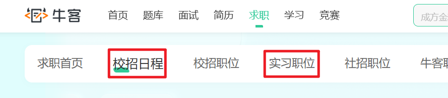

# 4.简历书写与投递

# 重要因素

**当下最容易拿到面试机会的标准配置：**

1. **学历：**本科
2. **专业：**计算机相关专业
3. **工作经验：2/**3 年

**先不要管其他的，先拿到面试机会，先约到面试，从面试中积累经验。前 10 家先不考虑能成功。**

# 面试技巧

1. 面试前提前把手机录音功能打开。将面试官问的问题录下来。
2. 收集这些问题，因为这些问题是针对你的这份简历问出来的，价值很高。
3. 把每天的面试问题总结下来并记住。
4. 每天要面，不要怕打击，心理素质要强大。

# 投简历

## 去哪些平台投递

推荐优先级：**从高到低**

1. BOSS直聘（**直聊模式**）：互联网技术岗求职的主战场，其核心是能与招聘方直接在线沟通。
  1. [https://www.zhipin.com/](https://www.zhipin.com/)
2. 拉勾网（**直聊模式**）：专注互联网行业的招聘平台，技术岗位集中且匹配度高，是寻找互联网公司工作的重点渠道。
  1. [https://www.lagou.com](https://www.lagou.com)
3. 猎聘网：主打中高端人才招聘的平台，聚集了大量猎头和企业HR，是资深工程师寻求晋升或高薪机会的主要渠道。
  1. [https://www.liepin.com](https://www.liepin.com)
4. 脉脉（**mài mài**）：以职场社交为核心的平台，核心价值在于拓展人脉、获取内推机会和了解公司真实情况。
  1. [https://maimai.cn](https://maimai.cn)
  2. 去上面找你的**学长学姐、校友**，直接私信请求他们内推**校招或可转正实习岗位**
5. 前程无忧 & 智联招聘：覆盖全行业和全国范围的传统综合招聘网站，寻找传统行业IT岗或二三线城市职位时，其庞大的岗位库依然不可或缺。
  1. [https://www.51job.com](https://www.51job.com)
  2. [https://www.zhaopin.com](https://www.zhaopin.com)

## 应届生 去哪 投简历

1. **实习僧：**专注大学生实习 + 校招的垂直平台（**找互联网实习/校招**）
  1. [https://www.shixiseng.com](https://www.shixiseng.com)
2. **BOSS 直聘：**直聊式综合招聘平台（**找互联网实习/校招**）
  1. [https://www.zhipin.com](https://www.zhipin.com)
3. **牛客网：**IT 技术学习 + 招聘一体化平台（**找互联网实习/校招**）
  1. [https://www.nowcoder.com](https://www.nowcoder.com)
  2. 使用它的**“校招”**和**“实习”** 板块，尤其关注 **“内推”** 专区

1. **应届生求职网：**纯应届生校招信息聚合平台
  1. [https://www.yingjiesheng.com](https://www.yingjiesheng.com)
2. **国家大学生就业服务平台**（**进国企/央企做 Java 开发**）
  1. [https://www.ncss.cn](https://www.ncss.cn)
3. **国聘网**（**进国企/央企做 Java 开发**）
  1. [https://www.iguopin.com](https://www.iguopin.com)

## 投简历的时间

**周一至周五：（避开周一上午和周五下午）**

**上午 9:30 – 11:30**

**下午 14:00 – 16:30**

## 每天投递多少

1. 不要疯狂海投，有一些平台会因为疯狂海投，降低账号的权重，这样简历曝光率会很低。
2. 不要集中一个时间点投递，最好分开时间段去投递，比如计划今天投递 30 份，隔 1 小时投 10 份，分 3 次投递。
3. 多找几个热门平台，比如每天 BOSS 直聘至少沟通 30 个。再额外选两个平台，每个平台投递 30 份。

# 关于薪资

**以北京为例：**

- 未毕业的实习生：3~5K
- 刚毕业的应届生：8K
- 1 年经验：10K
- 2 年经验：12K
- 3 年经验：15K

# 关于背调

1. 社保证明、离职证明、工资流水，这些都不需要担心。
2. 如果需要你主动提供上家公司的领导电话，可以写我的：15300347350
3. 还有一些公司会委托第三方公司进行背调，这种情况就没办法了。不过这种的还是少。
4. 还有一些公司是从网上找你上家公司的电话主动打电话，这样的也没办法。
5. 不要怕，大不了下一家，越是这种心态，越容易成功。

# 程序员面试穿着

1. **干净是底线**：头天洗头洗澡、修剪指甲、衣服无褶皱无异味。
2. **休闲最合适**：纯色T恤/Polo衫 + 休闲裤/干净牛仔裤 + 休闲鞋。
3. **避开三大坑**：不穿短裤拖鞋、不穿正装打领带、不喷香水。
4. **手机要静音**：入场前关机或静音，避免打断面试。（记得打开录音）
5. **视频面试也要注意穿着**：上下都穿，背景整洁，光线明亮。【**补充：如果约的是其他城市的面试，距离较远，可以先约一个视频面试。】**

# 程序员面试需要带纸质简历吗

不需要，在手机中准备一份电子版的 PDF 文件即可。

# 外包、自研什么区别

**首先说我的看法**：当下经济环境比较差，不管是外包还是自研，能找到一份工作先干着，这是最主要的。

## 外包

**人力外包（卖人头），就是你所在的公司（A公司，外包公司）把你派到另一家公司（B公司，客户方【甲方****】）去干活。你和A公司签合同、领工资，但你的工作地点、任务安排、日常管理都由B公司负责。**

**项目外包（卖结果）****，你们公司（乙方）接了一个“整活儿”，你和同事在自己公司里把活儿干完，整体交付给客户（甲方）。甲方只管最后拿到的东西好不好用，不管你们谁来做、在哪里做。**

## 外包优点和缺点

**外包优点：**

1. 门槛低，好进。
2. 能够快速积累真实项目经验。
3. 如果有机会进华为、阿里、字节的外包岗位，能接触到大厂的规范和环境。
4. 在客户现场，你能认识甲方的正式员工、其他外包同事，快速积累人脉。
5. 薪资有时比自研的高。

**外包缺点：**

1. 没有归属感，二等公民
2. 不稳定，甲方一句话就能把你换掉。
3. 可能会对简历造成污染，**知名大厂**看到你有外包经历，会**直接筛掉**。他们认为你缺乏深度、抗压能力差、没有主人翁意识。
4. 很难接触整个完整项目。
5. 如果是项目外包，大部分目的是为了快速交付，因此代码并不规范，导致成长较慢。

## 自研

**自研公司**就是：**一家拥有并开发自己的产品的公司。**

- **核心**：公司自己就是“甲方”。产品是自己的（比如微信、淘宝、钉钉、WPS）。
- **你的工作**：为自己公司的产品写代码，让它变得更好。
- **对比**：外包是为别人（客户）的产品写代码。

**一句话**：你在自研公司写代码，是在**给自己家盖房子**；在外包公司写代码，是**给别人家砌墙**。

## 怎么区分外包和自研

区分外包和自研，可以通过以下具体手段：

- 第一，看招聘信息里的关键词——出现“驻场”“外派”“客户现场”“甲方”“人力外包”这些词，基本就是外包；
- 第二，用天眼查或企查查查公司的经营范围，如果包含“人力资源服务”“劳务派遣”就是外包。
- 第三，一般软件公司都会有官网页面，官网页面上有自己的产品就是自研。

# 当下就业城市推荐

北京、上海、深圳、杭州、苏州（**江浙一带**）。

不建议：武汉、西安、成都、重庆、广州。

# 常见问题

## 请简单介绍一下自己

面试官您好，我叫....，我从事 Java 开发已经 3 年了。最近我在做一个**代驾平台**的项目，类似滴滴代驾。我**负责司机端和乘客端的小程序开发**，以及后台管理系统的部分功能。项目用了**Spring Cloud微服务架构**，涉及订单、抢单、GPS轨迹、支付分账这些核心模块。

## 代驾项目的详细介绍

**这个代驾平台项目**类似滴滴代驾那种。

我负责的是**司机端小程序**和**乘客端小程序**，还有**后台管理系统**中的部分功能。

简单说下流程：

**乘客端**这边，用户打开小程序可以选起点终点，我用的是腾讯地图，选完点就能看到预估里程和价格，确认后下单。下单后系统会通过Redis找附近5公里内正在接单的司机，把订单推送过去。

**司机端**这边，司机注册完要实名认证，上传身份证驾驶证，后台审批通过后才能接单。接单前还得做个刷脸验证，防止代刷。司机开始接单后，会实时上传自己的位置到Redis，这样乘客那边才能看到司机在哪。

抢单这块我做了两种模式：自动抢单和手动抢单。司机收到订单后会语音播报订单详情，播完如果设置了自动抢单就直接抢，手动的话页面会显示一个按钮。

接单成功后进入代驾流程。司机要先去接乘客，到了起点点一下"到达代驾点"，我用腾讯地图做了距离校验，必须1公里以内才能点。开始代驾后，司机会实时上传GPS轨迹，每20个点提交一次存到HBase，还会录音，录音文件上传到Minio。代驾结束时要计算实际里程和费用，推给乘客付款。

**支付分账**这块是比较复杂的。乘客端调用微信支付，后台收到支付成功的回调后，会用定时任务做分账，把司机的收入划到他账户里，平台抽成也自动扣掉。分账如果没成功会重试，保证钱不会出问题。

**后台管理**主要是审批司机认证和查看订单详情，订单详情页还能在地图上看到司机实际走的路线，用来核对有没有绕路。

整个项目用了Spring Cloud微服务架构，拆了好几个子系统，比如订单、司机、规则引擎这些，之间用Feign调用。数据存储上MySQL存业务数据，Redis做缓存和Geo位置搜索，HBase存GPS轨迹这种大数据，Minio存图片和录音文件。消息这块用了RabbitMQ做订单推送，分布式事务用的Seata保证数据一致性。

## 大健康项目的详细介绍

这个大健康项目是给**连锁体检中心**做的全套管理系统，主要分三块用：

**给用户用的网站**：体检的人可以在上面选套餐、约时间，最后下载电子报告。

**给体检中心工作人员用的后台**：他们负责预约管理、现场签到。说到签到我们做了个挺严的流程——要刷身份证+人脸识别+活体验证，三重确认防止有人替检。签完系统自动生成PDF导引单，打印出来给用户带去体检。

**给医生用的界面**：每个科室扫导引单上的二维码，就能看到这个人要检查哪些项目，医生直接在系统里录结果。

**我觉得有这么几个技术亮点和您分享下：**

1. **数据库我们搞了个‘超级备份’**
上了7个节点的MySQL集群，用ShardingSphere管着。测试的时候故意关掉4台机器，系统照样能跑——虽然慢点，但数据不丢、业务不停。这对医院特别重要，人家不能因为系统挂了下个月再来体检吧？
2. **支付模块的‘双重保险’**
接微信支付最怕什么？掉单。用户付了钱我们这儿没收到通知。我们除了等微信回调，还加了两个后手：
  - 页面跳转时主动查一次支付状态
  - 每天半夜跑任务扫一遍可疑订单
虽然多查几次微信接口，但上线后真没再出过支付纠纷。
3. **‘时光机’功能**
体检套餐老改价、改项目，今天3000明天可能3500。我们做了个自动快照：每次套餐一修改，系统就存个新版本。用户下单时锁定当时的版本，后面再怎么改，他订单里看到的永远是下单时的样子。这功能省了好多售后麻烦。
4. **几个实用优化**
  - 热门套餐放Redis里，点开秒加载
  - 报告10天后异步生成，不卡主流程，存到Minio对象存储
  - WebSocket做了个简单的IM，医生和客服能在线沟通

## 如何与产品经理/测试/前端等其他岗位协作？有冲突如何处理？

**怎么协作？**

- **和产品**：问清楚他要啥，技术上能不能做直接说，做不完就一起商量先做哪部分。
- **和测试**：帮他快速复现bug，有问题一起对着需求文档看，目标是把产品做好。
- **和前端**：接口怎么调用提前一起定好，改动了马上通知。

**有冲突怎么办？**
**不吵架，对事不对人。** 拉上相关的人，把需求、日志、代码摆出来，一起看看到底该听谁的。目标是解决问题，不是争输赢。

## 你在Code Review中关注哪些重点？有什么印象深刻案例？

**Code Review 是：代码审查，目前国内开发团队经常这样进行**

- 团队使用 **GitHub、GitLab、Gitee（码云）** 等代码托管平台，开发者完成功能后提交 **Pull Request（PR）或 Merge Request（MR）**，由1-2名同事进行审查，在网页上行级评论、讨论，通过后合并代码

**重点就三个：**

1. **对不对**：业务逻辑、边界情况、异常处理对不对。
2. **好不好改**：命名清不清楚，有没有重复代码，结构乱不乱。
3. **有没有坑**：SQL慢不慢，内存会不会爆，安不安全。

**印象深刻案例：**
看见个新手在循环里调数据库查数据（N+1查询问题）。100条数据就查101次，慢成狗。

**我直接说：** “这样写性能会炸。把ID捞出来，一次批量查完。”

**改完后**性能提升几十倍，这事后来被写进团队规范，不准在循环里调数据库。

## 你在项目中遇到的最大挑战是什么？如何解决的？

我遇到最头疼的一次，是线上一个服务每隔半个月就卡死，必须重启。客户一直投诉，我们**加班压测**也找不出原因。后来我坚持用**MAT**对比了两次内存快照，发现 `HashMap` 的 Entry 数量异常庞大，而且 key 都是同一类自定义对象。我仔细检查源码，发现这个类用作 key，却**没有重写 **`**hashCode**`** 和 **`**equals**`** 方法**。这导致每次 `put` 操作时，因为 `hashCode` 返回值不同，`HashMap` 都认为这是一个**全新的 key**，永远不会覆盖旧值。于是这个 Map 在半个月内膨胀到了几十万甚至上百万的 size，占满了内存，最终导致服务卡死。补上这两个方法后，Map 的 size 回归正常，服务也就稳定了。这件事让我深刻意识到，基础知识的疏忽，会造成灾难性的后果。

## 为什么考虑离开现在的公司？

在现在的公司三年，我从新人成长为能独立负责核心模块的工程师，对技术深度和业务复杂度的追求也在提高。但现在负责的系统已进入稳定期，我发现自己大部分时间是在**维护和迭代**，缺少从0到1应对新挑战的机会。

我希望能加入一个**技术驱动、注重工程实践**的团队，参与更有挑战性的系统设计，无论这个挑战是来自高并发、复杂业务架构，还是技术栈的深度优化。我相信以我三年的落地经验和学习能力，能够快速为团队带来价值。

## 你对未来1-3年的职业规划是什么？

核心目标就是：**在团队里持续成长，创造别人替代不了的价值。**

**第一年**：把公司业务和现有代码彻底搞熟。做到**线上出问题能快速定位、日常需求能独立完成**。让团队觉得“这事交给我放心”。

**第二年**：能够**独立负责一个完整项目**，从需求对接到设计、开发、测试、上线、维护。同时在一个技术方向（比如性能优化、架构设计、或者某个中间件）上**积累出比别人深一点的理解**，能帮同事解决这方面的问题。

**第三年**：要么通过**技术优化**解决团队一两个真实痛点（比如接口响应慢、服务器成本高、或者某个模块经常出故障），要么开始**带新人**，把我踩过的坑总结出来，让整个团队的开发效率提升一点。

## 你为什么选择我们公司？

**如果公司是行业知名/大厂：**
“贵公司在行业里的技术实力和影响力有目共睹。我希望能在一个更高水准的平台，参与更复杂、更有挑战的项目，这对我长期发展是最重要的。”

**如果公司是高速发展的中型/创业公司：**
“我了解到贵公司业务增长很快，技术团队也在快速扩张。这种阶段往往意味着更多从0到1的机会和更大的个人成长空间，这正是我现阶段最看重的。”

**如果不确定或公司普通：**
“经过和HR/面试官的交流，我感受到团队做事专业、技术氛围务实。我相信在这样的环境里，我能专注解决实际问题，和公司一起扎实成长。”

## 当项目进度紧张时，如何协调质量和速度？

**核心就三点：**

1. **保底线**：核心功能必须稳，次要功能和优化全往后排。
2. **做减法**：砍非必要需求，用简单方案临时替代，事后再还技术债。
3. **早同步**：拉上产品和测试，明确告知风险和临时方案，避免事后扯皮。

**说白了就是：**
**在“不出事”的前提下先跑起来，所有人一起认这个折中方案，上线后马上补课。**

## 工作三年，你最大的成长和进步是什么？

**这几年我觉得还是有很大进步的：**

1. **从“写完代码”到“对结果负责”**
以前只关心功能实现，现在会主动考虑性能、监控、数据一致性，出了问题能第一时间定位修复。
2. **从“等任务”到“挖问题”**
以前产品给需求就做，现在会主动问业务背景，发现流程漏洞或性能瓶颈，推动优化。
3. **从“一个人干”到“带着人干”**
开始承担技术分享、带新人、做跨团队协调，能推动小事落地。

**三年前我只管自己代码能不能跑，现在我能让一个功能从头到尾不出事，还能带着别人一起干。**

## 你平时如何学习新技术？最近在学什么？

**怎么学？**

- **用到才学**：工作中遇到问题（比如缓存不够用），直接深挖相关技术（如Redis）。
- **干中学**：边干边学。
- **教别人**：搞懂了就给团队分享，讲一遍自己理解更深。

**最近在学啥？**

- **云原生**：学K8s和容器化，因为公司业务在往云上迁。

## 工作中有没有犯过严重错误？如何处理的？

有一次我做数据迁移脚本，图快，**把所有更新放在一个事务里**，一次性要更新上百万条数据。

结果跑起来之后，数据库CPU直接打满，**因为大事务会长时间占用资源**。同时主从延迟飙得很高，差点影响线上业务。我赶紧把脚本停了。

后来我做了三件事：

1. **分批处理**：一次只处理一小批数据（比如1000条），提交事务，再处理下一批。这样不会长时间占用数据库。
2. **加熔断**：脚本每跑一批之前，先检查主从延迟。如果延迟超过阈值，就自动暂停，等恢复再跑。
3. **改成低峰期执行**：放到凌晨业务量小的时候跑，降低风险。

从那以后，我做数据迁移就再也不图快了，**宁可慢一点，也要稳**。

## 如何应对频繁的需求变更或紧急需求？

1. **先别慌，盘盘成本**：接到变更，先快速估一下要改几个地方、会不会搞挂现有功能、测试要返多少工。然后马上告诉产品：“改的话，有XX风险，原计划可能得推迟X天。”
2. **让他选，别自己扛**：直接问产品：“现在加需求，您是愿意砍个其他功能、还是项目晚两天、或者加急上线但不保证没小毛病？” 把选择权扔回去。
3. **事后算账**：等事情过了，拉上产品吐槽：“这次这么折腾，咱下次能不能提前一点？” 慢慢把规矩立起来。

## 你如何看待加班和工作生活平衡？

1. **该加班时就加班**，项目急了或者线上出事了，这没得说，肯定上。
2. **但我讨厌“摸鱼式加班”**——白天会开个没完，晚上才干活。不如大家提高效率，早点干完回家。
3. **活是干不完的**，公司雇我是来解决问题的，不是来堆时间的。我保证关键时刻不掉链子，但也得让我喘口气，才能一直干得好。
4. **说白了**：咱们尽量上班时间把活干漂亮，真着急了我也能拼，但别成天耗着。

## 你期望在下一个工作中获得什么？

我下一份工作就图三样：

1. **能学真本事**：别老是写重复业务代码，让我能搞点有挑战的，比如高并发优化、系统重构这种。
2. **跟对团队**：同事肯分享、Code Review 严格、做事不糊弄，每天都能感觉到进步。
3. **干得有劲**：能清楚看到我的代码帮公司挣了钱或者省了钱，不是干完就完了。

**简单说就是：钱到位当然好，但让我越干越值钱更重要。**

## 你们项目上线了吗？用户有多少？

**最近这个项目**还没正式上线，代码已经写完了，目前正在测试阶段，测完这轮就上，大概一到两周吧。

用户量现在肯定没有，等上线了看怎么推。不过我负责的模块，像订单分配、司机接单、结算这些，逻辑都跑通了。测试环境里订单表灌了大概几万条数据，查起来没问题，索引都加好了。

高峰期大概就是晚上喝酒那会儿，订单量肯定有峰值。我用redis做了附近司机缓存，撑个几百单同时在线应该问题不大。

# 简历模板

## 个人技能/优势

- **Java核心**：精通Java基础，深入理解集合源码、多线程并发编程（JUC、锁机制、线程池）、JVM内存模型及性能调优。
- **数据库**：精通MySQL（索引原理、SQL优化、事务隔离级别、MVCC、锁机制）；精通Redis（数据结构、持久化、集群模式、缓存穿透/雪崩解决方案）
- **Spring生态**：精通Spring Boot/Spring Cloud Alibaba全家桶，包括Nacos、Sentinel、Gateway、Seata、OpenFeign
- **分布式中间件**：熟练掌握RabbitMQ，熟悉消息可靠性、幂等性、顺序消息等核心机制；熟练使用XXL-JOB分布式调度、ZooKeeper、MinIO对象存储
- **系统架构**：具备独立设计微服务架构能力，熟悉分布式事务（AT）、接口幂等性、服务熔断降级等高并发场景解决方案
- **运维部署**：熟练使用Linux、Git、Maven、Docker，熟悉Nginx负载均衡配置，具备线上问题排查和性能调优能力
- **前端能力**：掌握Vue3+TypeScript+Element Plus，能独立完成前后端联调及接口对接

## 工作经历

**公司：**小程序（北京）科技有限公司

**岗位：**Java 全栈软件工程师

**起止日期：**2023-03 至 2026 年 03 月

**工作内容：**

1. 参与公司核心业务系统的后端开发，根据产品需求完成模块设计、接口编写和数据库建表，保证功能按时交付。
2. 负责现有系统的日常维护和迭代，处理用户反馈的线上问题，修复Bug并优化已有功能的使用体验。
3. 配合前端、测试和产品完成需求评审、接口联调和上线验证，确保项目各环节顺畅推进。
4. 参与代码评审，学习团队规范并逐步沉淀自己的编码习惯，写过技术文档和接口说明书。
5. 接手过别人留下的老代码，一边读一边改，踩过坑也填过坑，保障系统平稳运行。

## 项目经历

**智行代驾**

**项目角色**：Java 全栈开发工程师
**项目时间**：2025.08 - 至今
**技术栈**：Spring Cloud Alibaba、Nacos、Gateway、Seata、RabbitMQ、Redis、MySQL、HBase+Phoenix、MongoDB、Sa-Token、微信支付V3、腾讯地图API、**uni-app（乘客端/司机端小程序）**、Vue2+Element UI（MIS后台）

**项目描述**

智行代驾是一款面向C端用户的代驾服务平台，包含**乘客端小程序、司机端小程序和MIS运营管理系统**。本人作为核心全栈开发，负责**后端微服务架构设计**和**两端小程序的前端实现**。平台实现从乘客下单、司机抢单、实时定位同步、订单履约、AI语音监控到微信支付分账的全业务流程闭环。后端采用Spring Cloud Alibaba微服务架构，按业务域拆分为订单、司机、乘客、规则、消息等独立子系统；前端基于**uni-app跨端框架**开发，一套代码同时构建乘客端和司机端小程序。

**项目业绩**

**后端核心贡献**

- **高并发抢单模块**：基于Redis GEO存储司机位置，结合RabbitMQ定向推送，实现订单毫秒级推送，单机QPS达2000+，使用 Redis lua 脚本原子性执行，测试环境0重复接单。
- **微信支付分账**：对接微信支付V2接口，设计动态分账规则（根据订单金额、司机当日表现动态调整12%-20%抽成比例），采用Quartz延迟2分钟分账+20分钟兜底查询机制，分账成功率99.9%
- **海量轨迹存储**：搭建HBase+Phoenix大数据平台存储司机GPS轨迹，单表支撑百亿级数据，实现轨迹回放和实际里程计算，查询响应毫秒级
- **AI智能风控系统**：集成腾讯云万象AI进行内容审核，建立分级风控策略（观察/预警/高危），累计拦截违规订单300+，刷单成本提高90%
- **防刷单安全机制**：实现微信手机号比对登录+起点1km/终点2km位置范围限制，彻底杜绝多设备交替登录刷单行为

**前端核心贡献**

- **跨端统一架构**：基于**uni-app**实现乘客端和司机端小程序代码复用，封装全局请求拦截、路由拦截、异常处理统一逻辑
- **复杂地图交互**：集成腾讯地图SDK，实现司乘同显、实时路线绘制、距离计算、导航唤起、地图选点等复杂功能，解决小程序地图组件性能优化问题
- **实时定位上传**：利用`wx.onLocationChange`实现司机端5秒/次定位上报，采用**凑够20个点批量上传**策略，大幅降低服务器压力
- **AI语音集成**：对接微信同声传译插件，实现代驾过程中实时录音+语音转文字，并同步上传至后端进行AI内容审核
- **复杂业务状态管理**：设计司机工作状态机（停止接单/开始接单/接客户/到达代驾点/开始代驾/结束代驾），保证各状态页面交互一致性
- **组件化开发**：封装通用验证函数、支付唤起、图片上传、音频播报等组件，提高开发效率

**美年大健康 HIS 系统**

**项目角色**：Java 全栈开发工程师
**项目时间**：2025.02 - 2025.08
**技术栈**：SpringBoot、MyBatis、MySQL集群（MGR+ShardingSphere+Zookeeper）、Redis、MongoDB、Minio、RabbitMQ、SaToken、微信支付3.0、WebSocket、POI、OCR（华为云）、腾讯云人脸识别、QLExpress规则引擎、Vue3+ElementPlus、uni-app

**项目描述**

美年大健康 HIS 系统是为天津美年大健康体检中心定制开发的**全流程体检管理系统**，包含**业务端（小程序）、医生端（MIS系统）、管理后台**三大应用。系统实现从体检套餐购买、预约排期、到院签到、人脸识别核身、科室检查、医生录入结果、自动生成体检报告、报告邮寄的全业务闭环。后端采用 SpringBoot 单体架构+MySQL集群，前端基于 Vue3+ElementPlus 构建 MIS 系统，业务端采用 uni-app 开发小程序。

**项目业绩**

**后端核心贡献**

- **高可用数据库集群**：搭建**7节点MySQL集群**（3主MGR+4从），采用ShardingSphere实现读写分离，Zookeeper动态感知节点状态，支持最多宕机4个节点仍可正常工作，数据自动同步
- **预约防超售机制**：基于**Redis事务+乐观锁**实现每日体检名额的并发控制，防止超售，支持后台动态调整每日预约上限
- **商品快照技术**：每次下单时生成商品快照存入MongoDB，订单与快照关联，商品信息修改不影响历史订单，保证数据一致性
- **智能签到核身**：集成**身份证读卡器WebSocket接口+腾讯云人脸识别+静态活体检测**，实现秒级实名签到，有效杜绝代检
- **自动化体检报告**：基于**POI技术**从MongoDB提取体检结果，动态生成Word报告并存储至Minio；采用**异步线程+定时任务**分批生成（每天凌晨1-5点每20分钟处理50份），避免JVM压力过大
- **OCR运单识别**：对接**华为云OCR服务**，实现快递运单照片自动识别（收件人姓名/电话/运单号），提升发货效率
- **规则引擎应用**：引入**QLExpress规则引擎**，将促销规则存于数据库并动态解析执行，支持运营人员在线调整规则，无需重启系统
- **微信支付3.0闭环**：完整实现支付、退款、结果通知接收、主动查询、定时对账三重保障机制，确保支付一致性
- **消息推送**：基于**WebSocket**实现支付结果实时推送前端，提升用户体验

**前端核心贡献**

- **MIS系统架构**：基于Vue3+ElementPlus搭建后台管理系统，实现路由嵌套、权限控制（SaToken）、动态菜单加载
- **导引单生成**：签到成功后，前端调用**JSPDF技术**动态生成体检导引单（含二维码），供科室护士扫码调取体检项目
- **IM客服集成**：对接腾讯IM服务，实现业务端和MIS端的实时在线客服功能
- **WebSocket实时更新**：前端建立全局WebSocket连接，实时接收支付结果推送并更新页面状态

## 教育经历

本科、计算机相关专业。