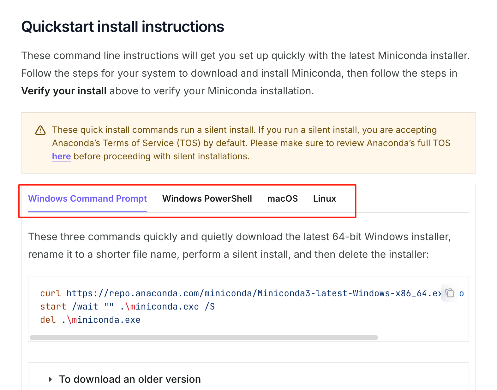

# 课程笔记和代码获取

课程用的jupyter notebook，它里面既可以运行代码可以写markdown，所以笔记和代码都在一起，所以只需要拉取以下仓库就可以同时拿到代码和笔记：

仓库地址为：[https://gitee.com/dadudu1024/mini-gpt](https://gitee.com/dadudu1024/mini-gpt)

命令为`git clone https://gitee.com/dadudu1024/mini-gpt.git`

## 

代码运行环境搭建，都比较简单，

1. miniconda：它是用来管理不同python环境的
2. jupyter：用来展示和运行gitee仓库中的ipynb文件的

## Miniconda

Miniconda 是一个轻量级的 Python 发行版，主要用于数据科学和机器学习领域。它包含了 Conda 包管理器以及 Python 的基本环境。通过 Miniconda，用户可以轻松地创建、管理和切换不同的 Python 环境，并安装所需的库和工具。

### ***安装 Miniconda***

#### 下载

- 访问[https://www.anaconda.com/docs/getting-started/miniconda/install](https://www.anaconda.com/docs/getting-started/miniconda/install)。
- 根据你的操作系统选择合适的版本，按不同操作系统进行安装

windows也可以直接访问这个链接下载exe：[https://repo.anaconda.com/miniconda/Miniconda3-latest-Windows-x86_64.exe](https://repo.anaconda.com/miniconda/Miniconda3-latest-Windows-x86_64.exe)



### **Conda 基本命令**

#### 查看 Conda 版本

```bash
conda --version
```

#### 查看现有环境

```bash
conda info --envs
# 或者
conda env list
```

#### 创建新环境

```bash
conda create --name mini-gpt python=3.10
```

- `mini-gpt` 是环境名称，可以根据需要更改。
- `python=3.10` 指定 Python 版本。

#### 激活环境

```bash
conda activate mini-gpt
```

#### 退出环境

```bash
conda deactivate
```

#### 删除环境

```bash
conda env remove --name mini-gpt
```

#### 安装依赖包

```bash
pip install some-package
```

�

## jupyter notebook

官网：[https://jupyter.org/install](https://jupyter.org/install)

安装jupter notebook

```bash
pip install jupyterlab
```

运行：

```bash
jupyter lab
```

也可以直接用PyCharm，它内置了jupyter notebook