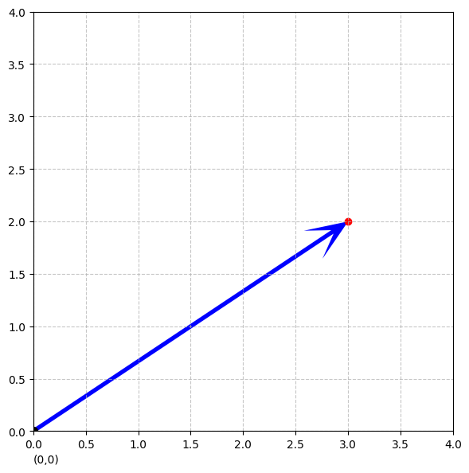

# 02、NumPy快速上手

NumPy 是 Python 中用于科学计算的基础库，提供了高性能的多维数组对象和工具。本教程将带你快速掌握 NumPy 的核心功能。

## 标量、向量、矩阵

标量是单个数字。

向量是一串数字（代表一个样本的特征或一组参数）。

矩阵是一张数字表格（代表所有样本的特征集合）。

```python
# 行向量
a = [1, 2, 3, 4]

# 列向量
b = [[1], [2], [3], [4]]
```

画一个坐标轴来表示一个向量
[3, 2]

```python
!pip install matplotlib
```

```plaintext
Collecting matplotlib

  Downloading matplotlib-3.10.3-cp310-cp310-macosx_11_0_arm64.whl.metadata (11 kB)

Collecting contourpy>=1.0.1 (from matplotlib)

  Using cached contourpy-1.3.2-cp310-cp310-macosx_11_0_arm64.whl.metadata (5.5 kB)

Collecting cycler>=0.10 (from matplotlib)

  Using cached cycler-0.12.1-py3-none-any.whl.metadata (3.8 kB)

Collecting fonttools>=4.22.0 (from matplotlib)

  Downloading fonttools-4.58.4-cp310-cp310-macosx_10_9_universal2.whl.metadata (106 kB)

Collecting kiwisolver>=1.3.1 (from matplotlib)

  Using cached kiwisolver-1.4.8-cp310-cp310-macosx_11_0_arm64.whl.metadata (6.2 kB)

Requirement already satisfied: numpy>=1.23 in /Users/dadudu/miniconda3/envs/mini-gpt/lib/python3.10/site-packages (from matplotlib) (2.2.6)

Requirement already satisfied: packaging>=20.0 in /Users/dadudu/miniconda3/envs/mini-gpt/lib/python3.10/site-packages (from matplotlib) (25.0)

Collecting pillow>=8 (from matplotlib)

  Using cached pillow-11.2.1-cp310-cp310-macosx_11_0_arm64.whl.metadata (8.9 kB)

Collecting pyparsing>=2.3.1 (from matplotlib)

  Using cached pyparsing-3.2.3-py3-none-any.whl.metadata (5.0 kB)

Requirement already satisfied: python-dateutil>=2.7 in /Users/dadudu/miniconda3/envs/mini-gpt/lib/python3.10/site-packages (from matplotlib) (2.9.0.post0)

Requirement already satisfied: six>=1.5 in /Users/dadudu/miniconda3/envs/mini-gpt/lib/python3.10/site-packages (from python-dateutil>=2.7->matplotlib) (1.17.0)

Downloading matplotlib-3.10.3-cp310-cp310-macosx_11_0_arm64.whl (8.0 MB)

   ━━━━━━━━━━━━━━━━━━━━━━━━━━━━━━━━━━━━━━━━ 8.0/8.0 MB 8.6 MB/s eta 0:00:0000:0100:01

[?25hUsing cached contourpy-1.3.2-cp310-cp310-macosx_11_0_arm64.whl (253 kB)

Using cached cycler-0.12.1-py3-none-any.whl (8.3 kB)

Downloading fonttools-4.58.4-cp310-cp310-macosx_10_9_universal2.whl (2.7 MB)

   ━━━━━━━━━━━━━━━━━━━━━━━━━━━━━━━━━━━━━━━━ 2.7/2.7 MB 44.3 MB/s eta 0:00:00

[?25hUsing cached kiwisolver-1.4.8-cp310-cp310-macosx_11_0_arm64.whl (65 kB)

Using cached pillow-11.2.1-cp310-cp310-macosx_11_0_arm64.whl (3.0 MB)

Using cached pyparsing-3.2.3-py3-none-any.whl (111 kB)

Installing collected packages: pyparsing, pillow, kiwisolver, fonttools, cycler, contourpy, matplotlib

   ━━━━━━━━━━━━━━━━━━━━━━━━━━━━━━━━━━━━━━━━ 7/7 [matplotlib]7 [matplotlib]

Successfully installed contourpy-1.3.2 cycler-0.12.1 fonttools-4.58.4 kiwisolver-1.4.8 matplotlib-3.10.3 pillow-11.2.1 pyparsing-3.2.3
```

```python
import numpy as np
import matplotlib.pyplot as plt

# 创建二维坐标系
plt.figure(figsize=(6, 6))
ax = plt.gca()

# 定义要展示的向量
vector = np.array([3, 2])  # 向量 [3, 2]

# 绘制从原点(0,0)到(3,2)的向量箭头
ax.quiver(0, 0, vector[0], vector[1],
          angles='xy', scale_units='xy', scale=1,
          color='blue', width=0.01, headwidth=8, headlength=10)

# 标记向量终点和向量符号
plt.scatter(vector[0], vector[1], color='red')  # 终点红点

# 设置坐标轴范围和网格
plt.xlim(0, 4)
plt.ylim(0, 4)
plt.grid(linestyle='--', alpha=0.7)

# 添加原点标识
plt.scatter(0, 0, color='black', s=50, label='原点')
plt.text(0, -0.3, '(0,0)', fontsize=10)

# 显示图形
plt.tight_layout()
plt.show()
```



## 向量模长

向量的**大小**（也称为**模长**或**范数**）表示向量的长度或强度。在数学和机器学习中，这是向量的基本属性之一。以下是计算向量大小的详细方法：

## 基本公式

对于一个 n 维向量 $\mathbf{v} = [v_1, v_2, \dots, v_n]$，其大小计算公式为：

$\|\mathbf{v}\| = \sqrt{v_1^2 + v_2^2 + \cdots + v_n^2}$

## L0范数、L1范数、L2范数

L0范数（Zero Norm）是向量中非零元素个数。

L1范数（Manhattan Norm）是向量中元素绝对值之和。

L2范数（Euclidean Norm）是向量中元素平方和然后求平方根，也就是向量模长。

```python
# 计算向量的大小
v = [3, 4]
squared_sum = sum(x ** 2 for x in v)
result = squared_sum ** 0.5
print(result)
```

```plaintext
5.0
```

## 模长的几何意义-勾股定理

勾股定理是指直接三角形的斜边平方等于直角边平方之和。

## 特征向量

机器学习中，特征向量是指一个样本的属性向量，用于描述样本的属性特征，比如一个人的特征向量可能为：[身高，体重，年龄]。

比如[170, 140, 35]，这就表示某一个人的特征，这个向量叫做特征向量

## 矩阵

矩阵由向量组成的。

一个 $2 \times 3 $的矩阵：
$A = \begin{bmatrix}a_{11} & a_{12} & a_{13} \\a_{21} & a_{22} & a_{23}\end{bmatrix}$

## 安装 NumPy

如果你还没有安装 NumPy，可以使用 pip 安装：

```python
!pip install numpy
```

```plaintext
Requirement already satisfied: numpy in /Users/dadudu/miniconda3/envs/mini-gpt/lib/python3.10/site-packages (2.2.6)
```

## 导入Numpy

```python
import numpy as np
```

### 创建数组（向量）

```python
# 向量
a = np.array([1, 2, 3, 4, 5])
print(a)
```

```plaintext
[1 2 3 4 5]
```

```python
# 矩阵
b = np.array([[1, 2, 3], [4, 5, 6]])
print(b)
```

```plaintext
[[1 2 3]
 [4 5 6]]
```

## 区别

```python
# Python中的数据类型可以混合
list_mixed = [1, "hello", 3.14]
print(list_mixed)
```

```plaintext
[1, 'hello', 3.14]
```

```python
# NumPy中的数据类型需要统一，不同会进行类型转换
import numpy as np

arr = np.array([1, 2.5, 3])
print(arr)
```

```plaintext
[1.  2.5 3. ]
```

```python
# NumPy向量化加法（高效）
arr1 = np.array([1, 2, 3])
arr2 = np.array([4, 5, 6])
result = arr1 + arr2
print(result)
```

```plaintext
[5 7 9]
```

```python
# 列表需循环（低效）
list1 = [1, 2, 3]
list2 = [4, 5, 6]
# result = list1 + list2
# print(result)
result = [a + b for a, b in zip(list1, list2)]
print(result)
```

```plaintext
[5, 7, 9]
```

## 特殊矩阵

```python
# 全零矩阵
zeros = np.zeros(shape=(2, 3), dtype=np.int32)  # 2行3列
print(zeros)
```

```plaintext
[[0 0 0]
 [0 0 0]]
```

```python
# 全1矩阵
ones = np.ones((3, 2))  # 3行2列
print(ones)
```

```plaintext
[[1. 1.]
 [1. 1.]
 [1. 1.]]
```

```python
# 随机数组
random_arr = np.random.random((2, 2))  # 2x2的随机数组，值在0-1之间
print(random_arr)
```

```plaintext
[[0.70857383 0.46645398]
 [0.86464547 0.4666924 ]]
```

## 矩阵属性

```python
arr = np.array([[1, 2, 3],[4, 5, 6]])

print(arr.shape)  # 矩阵形状
print(arr.ndim)  # 矩阵维度
print(arr.size)  # 矩阵元素总数
```

```plaintext
(2, 3)
2
6
```

## 索引和切片

```python
arr = np.array([0, 1, 2, 3, 4, 5, 6, 7, 8, 9])

# 索引
print(arr[0])  # 第一个元素
print(arr[-1])  # 最后一个元素

# 切片
print(arr[1:5])  # 索引1到4的元素
print(arr[::2])  # 每隔一个元素取一个
```

```plaintext
0
9
[1 2 3 4]
[0 2 4 6 8]
```

```python
# 矩阵索引
arr2d = np.array([[1, 2, 3],
                  [4, 5, 6],
                  [7, 8, 9]])
print(arr2d[1, 2])  # 第二行第三列的元素
print(arr2d[:, 1])  # 所有行的第二列
```

```plaintext
6
[2 5 8]
```

## 形状操作

```python
arr = np.arange(6)
print(arr)

# 改变形状
arr2 = arr.reshape(2, 3)
print(arr2)
```

```plaintext
[0 1 2 3 4 5]
[[0 1 2]
 [3 4 5]]
```

```python
# 展平，降维
arr_flat = arr2.flatten()
print(arr_flat)
```

```plaintext
[0 1 2 3 4 5]
```

```python
# 转置
print((arr2))
arr_t = arr2.T
print(arr_t)
```

```plaintext
[[0 1 2]
 [3 4 5]]
[[0 3]
 [1 4]
 [2 5]]
```

## 数学运算

```python
a = np.array([1, 2, 3])
b = np.array([4, 5, 6])
```

```python
# 元素级运算
print(a + b)  # 加法
print(a * b)  # 乘法
```

```plaintext
[5 7 9]
[ 4 10 18]
```

```python
# 矩阵乘法
# 2*3   3*2   --> 2*2
A = np.array([[1, 2, 3],
              [4, 5, 6]])
B = np.array([[7, 8],
              [9, 10],
              [11, 12]])
print(A)
print(B)
```

```plaintext
[[1 2 3]
 [4 5 6]]
[[ 7  8]
 [ 9 10]
 [11 12]]
```

```python
print(np.dot(A, B))  # 矩阵乘法
```

```plaintext
[[ 58  64]
 [139 154]]
```

```python
print(A @ B)  # 矩阵乘法
```

```plaintext
[[ 58  64]
 [139 154]]
```

矩阵乘法就是，结果矩阵C中的每个元素 C[i][j] 是矩阵A的第i行与矩阵B的第j列对应元素的乘积之和

```python
# 统计运算
arr = np.array([[1, 2],
                [3, 4]])
print(np.sum(arr))  # 所有元素和
print(np.sum(arr, axis=0))  # 列和
print(np.sum(arr, axis=1))  # 行和
print(np.mean(arr))  # 平均值
print(np.max(arr, axis=0))  # 最大值
print(np.min(arr))  # 最小值
```

```plaintext
10
[4 6]
[3 7]
2.5
[3 4]
1
```

## 广播机制

```python
a = np.array([[1, 2, 3], [1, 2, 3]])
b = 2
print(a * b)
```

```plaintext
[[2 4 6]
 [2 4 6]]
```

## 常用函数

```python
# 排序
arr = np.array([3, 1, 4, 2, 5])
print(np.sort(arr))

# 唯一值
arr = np.array([1, 2, 2, 3, 3, 3])
print(np.unique(arr))

# 条件筛选
arr = np.array([[1, 2, 3, 4, 10],[1, 2, 3, 4, 5]])
print(arr[arr > 3])  # 输出大于3的元素

# where函数
print(np.where(arr > 3, arr, 0))  # 大于3的元素保留，其他设为0
```

```plaintext
[1 2 3 4 5]
[1 2 3]
[ 4 10  4  5]
[[ 0  0  0  4 10]
 [ 0  0  0  4  5]]
```

## 性能对比

```python
import time

size = 1000000

# Python列表
python_list = list(range(size))
start = time.time()
result = [x * 2 for x in python_list]
print("Python列表耗时:", time.time() - start)

# NumPy数组
numpy_arr = np.arange(size)
start = time.time()
result = numpy_arr * 2
print("NumPy数组耗时:", time.time() - start)
```

```plaintext
Python列表耗时: 0.02912116050720215
NumPy数组耗时: 0.00919198989868164
```