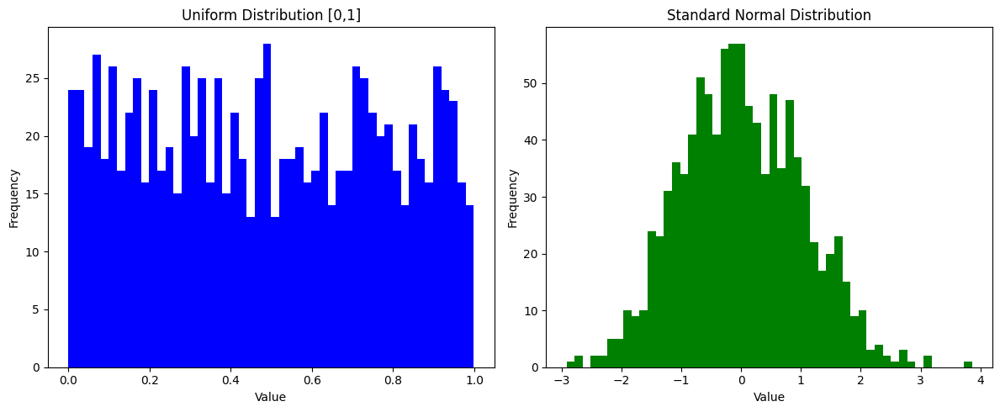

# 03、PyTorch快速上手

PyTorch 是一个基于 Python 的科学计算库，主要用于深度学习研究。它提供了强大的 GPU 加速张量计算和自动微分功能。

## 安装PyTorch

访问PyTorch官网获取适合你环境的安装命令：https://pytorch.org/

```python
!pip3 install torch torchvision torchaudio
```

```plaintext
Collecting torch

  Using cached torch-2.7.1-cp310-none-macosx_11_0_arm64.whl.metadata (29 kB)

Collecting torchvision

  Using cached torchvision-0.22.1-cp310-cp310-macosx_11_0_arm64.whl.metadata (6.1 kB)

Collecting torchaudio

  Using cached torchaudio-2.7.1-cp310-cp310-macosx_11_0_arm64.whl.metadata (6.6 kB)

Collecting filelock (from torch)

  Using cached filelock-3.18.0-py3-none-any.whl.metadata (2.9 kB)

Requirement already satisfied: typing-extensions>=4.10.0 in /Users/dadudu/miniconda3/envs/mini-gpt/lib/python3.10/site-packages (from torch) (4.14.0)

Collecting sympy>=1.13.3 (from torch)

  Using cached sympy-1.14.0-py3-none-any.whl.metadata (12 kB)

Collecting networkx (from torch)

  Using cached networkx-3.4.2-py3-none-any.whl.metadata (6.3 kB)

Requirement already satisfied: jinja2 in /Users/dadudu/miniconda3/envs/mini-gpt/lib/python3.10/site-packages (from torch) (3.1.6)

Collecting fsspec (from torch)

  Using cached fsspec-2025.5.1-py3-none-any.whl.metadata (11 kB)

Requirement already satisfied: numpy in /Users/dadudu/miniconda3/envs/mini-gpt/lib/python3.10/site-packages (from torchvision) (2.2.6)

Requirement already satisfied: pillow!=8.3.*,>=5.3.0 in /Users/dadudu/miniconda3/envs/mini-gpt/lib/python3.10/site-packages (from torchvision) (11.2.1)

Collecting mpmath<1.4,>=1.1.0 (from sympy>=1.13.3->torch)

  Using cached mpmath-1.3.0-py3-none-any.whl.metadata (8.6 kB)

Requirement already satisfied: MarkupSafe>=2.0 in /Users/dadudu/miniconda3/envs/mini-gpt/lib/python3.10/site-packages (from jinja2->torch) (3.0.2)

Using cached torch-2.7.1-cp310-none-macosx_11_0_arm64.whl (68.6 MB)

Using cached torchvision-0.22.1-cp310-cp310-macosx_11_0_arm64.whl (1.9 MB)

Using cached torchaudio-2.7.1-cp310-cp310-macosx_11_0_arm64.whl (1.8 MB)

Using cached sympy-1.14.0-py3-none-any.whl (6.3 MB)

Using cached mpmath-1.3.0-py3-none-any.whl (536 kB)

Using cached filelock-3.18.0-py3-none-any.whl (16 kB)

Using cached fsspec-2025.5.1-py3-none-any.whl (199 kB)

Using cached networkx-3.4.2-py3-none-any.whl (1.7 MB)

Installing collected packages: mpmath, sympy, networkx, fsspec, filelock, torch, torchvision, torchaudio

   ━━━━━━━━━━━━━━━━━━━━━━━━━━━━━━━━━━━━━━━━ 8/8 [torchaudio]8 [torchaudio]]

Successfully installed filelock-3.18.0 fsspec-2025.5.1 mpmath-1.3.0 networkx-3.4.2 sympy-1.14.0 torch-2.7.1 torchaudio-2.7.1 torchvision-0.22.1
```

## 创建张量

```python
import torch

# 从列表创建
x = torch.tensor([1, 2, 3])
print(x)
```

```plaintext
tensor([1, 2, 3])
```

```python
# 特殊张量
zeros = torch.zeros(2, 3)  # 2行3列的全0张量
ones = torch.ones(2, 3)  # 2行3列的全1张量
print(zeros)
print(ones)
```

```plaintext
tensor([[0., 0., 0.],
        [0., 0., 0.]])
tensor([[1., 1., 1.],
        [1., 1., 1.]])
```

```python
# 类似已有张量
z = torch.ones_like(zeros)
print(z)
```

```plaintext
tensor([[1., 1., 1.],
        [1., 1., 1.]])
```

```python
rand = torch.rand(2, 3)  # 2行3列的随机张量(0-1均匀分布)，每个数字处于0-1之间
randn = torch.randn(2, 3)  # 2行3列的标准正态分布张量，均值为0，方差为1
print(rand)
print(randn)
```

```plaintext
tensor([[0.1508, 0.2236, 0.3572],
        [0.0485, 0.1831, 0.5716]])
tensor([[-1.0323,  0.2515, -0.4873],
        [-1.2546,  0.0312, -0.2943]])
```

## 均值和方差

**均值、方差**是统计学中描述数据分布特征的核心指标，以下是它们的定义和解释：

---

### 1. **均值（Mean）**

- **定义**：所有数据的总和除以数据的个数。
- **公式**（对于数据集 $x_1, x_2, \dots, x_n$）：
$\text{均值} = \frac{1}{n} \sum_{i=1}^n x_i$
- **作用**：反映数据的平均水平。
- **示例**：数据集 ([2, 4, 6]) 的均值为 ((2+4+6)/3 = 4)。

---

### 2. **方差（Variance）**

- **定义**：数据与均值之差的平方的平均值，衡量数据的**离散程度**。
- **公式**：
$\text{方差} = \frac{1}{n} \sum_{i=1}^n (x_i - \text{均值})^2 \quad$
- **作用**：方差越大，数据波动越大；方差越小，数据越集中。
- **示例**：数据集 $[2, 4, 6]$ 的方差为 $[(2-4)^2 + (4-4)^2 + (6-4)^2]/3 = \frac{8}{3} \approx 2.67$。

---

```python
[2,4,6]
[-10,4,18]
```

```python
import torch
import matplotlib.pyplot as plt

# 创建数据
rand = torch.rand(1000)  # 1000个服从[0,1]均匀分布的随机数
randn = torch.randn(1000)  # 1000个服从标准正态分布的随机数

# 可视化均匀分布，画布大小
plt.figure(figsize=(12, 5))

# 将画布分为1行2列，当前选择第1列
plt.subplot(1, 2, 1)
plt.hist(rand.numpy(), bins=50, color='blue')
plt.title('Uniform Distribution [0,1]')
plt.xlabel('Value')
plt.ylabel('Frequency')

# 可视化标准正态分布
# 将画布分为1行2列，当前选择第2列
plt.subplot(1, 2, 2)
plt.hist(randn.numpy(), bins=50, color='green')
plt.title('Standard Normal Distribution')
plt.xlabel('Value')
plt.ylabel('Frequency')

plt.tight_layout()
plt.show()
```



## 张量属性

```python
x = torch.rand(2, 3)

print(x.shape)  # 张量形状
print(x.dtype)  # 数据类型
print(x.device)  # 存储设备(CPU/GPU)
```

```plaintext
torch.Size([2, 3])
torch.float32
cpu
```

## 张量运算

```python
x = torch.tensor([1, 2, 3])
y = torch.tensor([4, 5, 6])

# 基本运算
print(x + y)  # 加法
print(x * y)  # 乘法

print(x @ y)  # 点积, 对应元素相乘后相加
print(torch.dot(x, y))  # 点积
```

```plaintext
tensor([5, 7, 9])
tensor([ 4, 10, 18])
tensor(32)
tensor(32)
```

```python
# 矩阵乘法
import torch

A = torch.tensor([[1, 2],
                  [3, 4]])

B = torch.tensor([[5, 6],
                  [7, 8]])

# 矩阵乘法的三种写法
print(A @ B)
print(torch.mm(A, B))  # 只支持二维矩阵
print(torch.matmul(A, B))  # 支持多维矩阵

# 矩阵不能点积，矩阵只有点乘
print(torch.dot(A, B))
```

```plaintext
tensor([[19, 22],
        [43, 50]])
tensor([[19, 22],
        [43, 50]])
tensor([[19, 22],
        [43, 50]])


---------------------------------------------------------------------------

RuntimeError                              Traceback (most recent call last)

Cell In[17], line 16
     13 print(torch.matmul(A, B))  # 支持多维矩阵
     15 # 矩阵不能点积，矩阵只有点乘
---> 16 print(torch.dot(A, B))


RuntimeError: 1D tensors expected, but got 2D and 2D tensors
```

```python
# 矩阵点乘，对应元素相乘
import torch

A = torch.tensor([[1, 2],
                  [3, 4]])

B = torch.tensor([[5, 6],
                  [7, 8]])

# 矩阵点乘的两种写法
print(A * B)
print(torch.mul(A, B))
```

```plaintext
tensor([[ 5, 12],
        [21, 32]])
tensor([[ 5, 12],
        [21, 32]])
```

```python
# 形状是(2, 2, 3)
A = torch.tensor([
    [[1, 2, 3], [4, 5, 6]],
    [[7, 8, 9], [10, 11, 12]]
])

A
```

```plaintext
tensor([[[ 1,  2,  3],
         [ 4,  5,  6]],

        [[ 7,  8,  9],
         [10, 11, 12]]])
```

```python
# 转置
A.transpose(1, 2).shape
```

```plaintext
torch.Size([2, 3, 2])
```

```python
# 矩阵批量乘法，一定要三维，第0维是batch_size
import torch

# 形状是(2, 2, 3)
A = torch.tensor([
    [[1, 2, 3], [4, 5, 6]],
    [[1, 2, 3], [4, 5, 6]]
])

# 形状是(2, 2, 3)
B = torch.tensor([
    [[7, 8, 9], [10, 11, 12]],
    [[8, 8, 9], [10, 11, 12]]
])

# 本质上就是矩阵乘法，所以需要改变维度, batch
print(torch.bmm(A, B.transpose(1, 2)))

print(torch.matmul(A, B.transpose(1, 2)))
```

```plaintext
tensor([[[ 50,  68],
         [122, 167]],

        [[ 51,  68],
         [126, 167]]])
tensor([[[ 50,  68],
         [122, 167]],

        [[ 51,  68],
         [126, 167]]])
```

## 自动微分 (Autograd)

```python
# 创建需要梯度的张量
x = torch.tensor(2.0, requires_grad=True)

# 定义计算
y = x ** 2 + 3 * x + 1

# 计算梯度
y.backward()

# 查看梯度
print(x.grad)  # dy/dx = 2x + 3 = 7 (当x=2时)
```

```plaintext
tensor(7.)
```

## Dataset和DataLoader

Dataset和DataLoader是PyTorch中用于处理数据集和数据加载的组件。

Dataset类是一个抽象类，用于定义数据集的接口。DataLoader类是一个迭代器，用于加载数据集。

```python
from torch.utils.data import Dataset, DataLoader


# 自定义数据集类（继承Dataset）
class ZhouyuDataset(Dataset):

    def __init__(self, data):
        self.data = data

    def __len__(self):
        """返回数据集大小（必须实现）"""
        return len(self.data)

    def __getitem__(self, index):
        """访问单个样本（必须实现），index是索引位置"""
        # return [i + 1 for i in self.data[index]]
        return torch.tensor(self.data[index]) + 1
```

```python
# 创建数据集实例，比如我们的训练样本
data = list(range(1, 11))
print(data)

dataset = ZhouyuDataset(data)

# 查看前5个样本
dataset[:5]
```

```plaintext
[1, 2, 3, 4, 5, 6, 7, 8, 9, 10]


tensor([2, 3, 4, 5, 6])
```

```python
# 创建数据加载器DataLoader
dataloader = DataLoader(
    dataset,
    batch_size=3,
    shuffle=True  # 是否打乱数据
)

# 批量加载数据
for batch in dataloader:
    # 每个batch是形状为[batch_size]的张量
    print("Batch:", batch)
```

```plaintext
Batch: tensor([3, 8, 6])
Batch: tensor([ 5,  9, 11])
Batch: tensor([2, 4, 7])
Batch: tensor([10])
```

```python
def custom_collate_fn(batch):
    print(1)
    return [item * 10 for item in batch]

# 创建数据加载器DataLoader
dataloader = DataLoader(
    dataset,
    batch_size=3,
    collate_fn=custom_collate_fn,
    shuffle=True  # 是否打乱数据
)

# 批量加载数据
for batch in dataloader:
    # 每个batch是形状为[batch_size]的张量
    print("Batch:", batch)
```

```plaintext
1
Batch: [tensor(60), tensor(90), tensor(20)]
1
Batch: [tensor(100), tensor(70), tensor(30)]
1
Batch: [tensor(80), tensor(40), tensor(50)]
1
Batch: [tensor(110)]
```

```python
from torch.utils.data import Dataset, DataLoader


# 自定义数据集类（继承Dataset）
class TupleDataset(Dataset):
    def __init__(self, start, end):
        """初始化数据集：存储从start到end的整数"""
        self.data = list(range(start, end))

    def __len__(self):
        """返回数据集大小（必须实现）"""
        return len(self.data)

    def __getitem__(self, index):
        """访问单个样本（必须实现），index是索引位置"""
        return f"x{self.data[index]}", f"y{self.data[index]}", f"z{self.data[index]}"
```

```python
dataset = TupleDataset(start=1, end=10)

# 创建数据加载器DataLoader
dataloader = DataLoader(
    dataset,
    batch_size=3,
    # shuffle=True  # 是否打乱数据
)

# 批量加载数据
for batch in dataloader:
    # 每个batch是形状为[batch_size]的张量
    print("Batch:", batch)
```

```plaintext
Batch: [('x1', 'x2', 'x3'), ('y1', 'y2', 'y3'), ('z1', 'z2', 'z3')]
Batch: [('x4', 'x5', 'x6'), ('y4', 'y5', 'y6'), ('z4', 'z5', 'z6')]
Batch: [('x7', 'x8', 'x9'), ('y7', 'y8', 'y9'), ('z7', 'z8', 'z9')]
```