# 04、神经网络快速入门

## 样本数据

假如现在有这样一组房价数据。

1. 1室1厅1卫，面积是80平方，价格是20000
2. 2室2厅1卫，面积是100平方，价格是30000
3. 3室2厅1卫，面积是120平方，价格是40000
4. 1室1厅1卫，面积是60平方，价格是15000
5. 2室2厅1卫，面积是90平方，价格是25000
6. 3室2厅1卫，面积是110平方，价格是35000
7. 1室1厅1卫，面积是70平方，价格是17000
8. ...

面积和价格呈线性关系，我们通过python模拟出这样一组样本数据，只关心面积和价格即可：：

```python
import numpy as np
```

```python
x = np.array([80, 100, 120, 60, 90, 110, 70])
y = np.array([20000, 30000, 40000, 15000, 25000, 35000, 17000])
```

让X随机，生成更多的样本：

```python
# 生成100个样本，范围在1到100之间
# x 表示房子的面积
# y 表示房子对应的价格
x = np.random.randint(1, 100, 100)
# y = x * 10 + np.random.randint(100)
y = np.array([i * 10 + np.random.randint(100) for i in x])

print(x[:5])
print(y[:5])
```

```plaintext
[ 2 84 18 39 93]
[  93  859  229  485 1012]
```

```python
# 用plot画出x和y
import matplotlib.pyplot as plt

plt.scatter(x, y) # 散点图
plt.show()
```

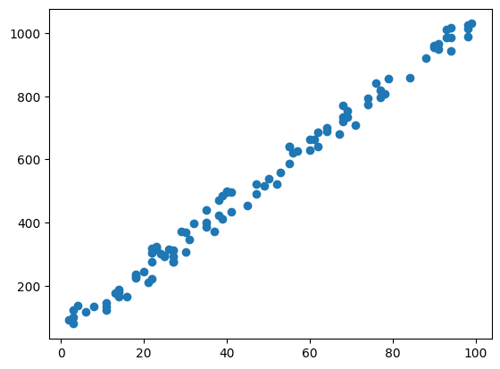

## 什么是模型

模型就是一个函数, y=f(x)

## 定义模型函数

我现在想要训练一个模型，用来预测房价，模型是一个简单的线性模型: $y = w*x$, w就是模型的参数

```python
w = 0.1
y_predict = w * x

plt.scatter(x, y)
plt.plot(x, y_predict, color='r')
plt.show()
```

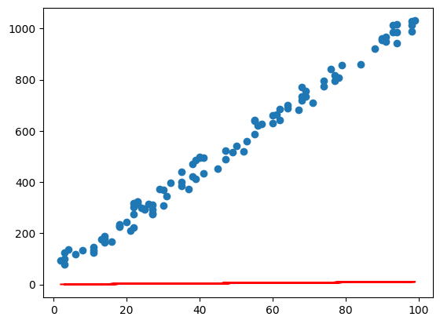

## 开始训练

```python
epoch = 2 # 超参数
w = 0.1   # 参数

for _ in range(epoch):
    for i in range(len(x)):
        y_predict = w * x[i]
        print(y_predict)
        loss = y_predict - y[i]
        w = w - loss

print(w)

y_predict = w * x
plt.scatter(x, y)
plt.plot(x, y_predict, color='r')
plt.show()
```

```plaintext
0.2
7803.599999999999
-123330.59999999999
4551608.1
-412400613.5999999
38348917777.59999
-3414685462307.999
232995371444389.12
-1.5614066631237846e+16
1.0922958083059103e+18
-3.446116352965123e+19
7.344535477256918e+20
-1.5423524502239529e+22
1.1483515061212885e+24
-1.5870806712804474e+25
3.536922638853568e+26
-3.186177810500589e+28
1.7337552660330333e+30
-1.668187794153966e+32
5.118612956143852e+33
-1.9813985636685878e+34
5.201171229630043e+35
-1.3641929110858228e+37
5.911502614705232e+38
-4.392903276349843e+40
3.207975418913372e+42
-6.329248799477734e+43
5.2912519963633866e+45
-7.323573785875687e+46
5.2363552569011165e+48
-3.4627949309273356e+50
1.6032223695129247e+52
-4.7073337658039065e+53
1.2286141128748196e+55
-4.14088460265217e+56
1.2067720842014893e+58
-6.999278088368638e+59
2.7530493814249977e+61
-1.3957960363824737e+63
1.0130258156360492e+65
-9.093960126040912e+66
4.49701324914111e+68
-1.0136267863564063e+70
1.2604228734692705e+71
-8.958697962196969e+72
5.482257765957417e+74
-1.887841988761143e+76
1.1003421877350662e+77
-3.4844169278277094e+78
2.1713419171305304e+80
-1.9450473767045828e+82
7.30995827288975e+83
-6.975239130920588e+85
3.9353160362101972e+87
-1.159882621198795e+88
4.6395304847951797e+89
-5.0184254743867855e+90
4.2884726781123434e+92
-4.200422122061739e+94
7.484388508400917e+95
-1.837833178174003e+97
4.4178682167644305e+98
-4.665268836903239e+99
1.6540498603566026e+101
-1.0959140613234515e+103
3.239393034206085e+103
-7.990502817708343e+104
3.654035342584464e+106
-1.0371240738314203e+108
2.503402936834463e+109
-2.2350381420058085e+111
2.4321060211934172e+112
-5.9697147792929334e+113
1.322181273339694e+115
-6.955823220613173e+116
1.0926965932017784e+118
-9.219627505140004e+119
2.0057811838960141e+121
-1.0530351215454075e+123
4.1355561137056004e+124
-2.2580136380832578e+126
1.5302074565224934e+128
-4.071682449529417e+129
8.233846731270598e+130
-1.4115165825035311e+132
8.131903866978676e+133
-3.279423526683204e+135
2.5275556937363228e+137
-5.7397910310923586e+138
4.392187919444587e+139
-8.45496174493083e+140
4.2774420100490974e+142
-4.112800845888717e+144
5.699166886445793e+145
-2.5931209333328358e+147
1.6257280626935656e+149
-1.0882217219655055e+151
3.2166553840450974e+151
-8.7921913830566e+152
5.3182035682878947e+154
-1.046485218276005e+155
4.3952379167592215e+156
-7.817244580521759e+157
2.8793517538255143e+159
-2.6091356661588124e+161
2.4262156173055282e+163
-2.160364331579497e+165
1.4740885955810769e+167
-9.878529950676665e+168
6.910612790495425e+170
-2.1802496691140497e+172
4.646657107299318e+173
-9.757979925328567e+174
7.265259598949179e+176
-1.0040961343163096e+178
2.2376999564763472e+179
-2.0157947107924428e+181
1.0968925474152495e+183
-1.055410065622091e+185
3.2383857829853344e+186
-1.2535686901878713e+187
3.290617811743162e+188
-8.630820431943494e+189
3.740022187175514e+191
-2.7792520430922037e+193
2.029585373573912e+195
-4.004317088402584e+196
3.3476090859045603e+198
-4.63339530299063e+199
3.3128776416383005e+201
-2.1908016819769123e+203
1.0143084802227436e+205
-2.978182346185928e+206
7.773055923545273e+207
-2.6198077371948883e+209
7.634868262682246e+210
-4.4282235923557026e+212
1.7417679463265765e+214
-8.830763487875743e+215
6.409096423700588e+217
-5.753463181438244e+219
2.8451191556562743e+221
-6.412898576849243e+222
7.974299969473406e+223
-5.6678870552257134e+225
3.4684524421069562e+227
-1.1943783812739277e+229
6.961519707996607e+229
-2.204481240865592e+231
1.3737398890446638e+233
-1.2305704349832903e+235
4.624781195211926e+236
-4.4130148983785376e+238
2.4897509564423402e+240
-7.338213345303739e+240
2.9352853381214955e+242
-3.1750003074014175e+243
2.7131820808703023e+245
-2.657475257294987e+247
4.735137731180158e+248
-1.1627393762120166e+250
2.795046577432732e+251
-2.951569185768965e+252
1.046465438590815e+254
-6.933504341842733e+255
2.049462312809396e+256
-5.055340371596509e+257
2.311793488848998e+259
-6.56155854069056e+260
1.5838244753391007e+262
-1.414038491582749e+264
1.538717154281443e+265
-3.776851196872633e+266
8.365025984184572e+267
-4.4007310612449274e+269
6.913148430755668e+270
-5.832968988450095e+272
1.2689948088205872e+274
-6.662222746308083e+275
2.6164365694591744e+277
-1.4285743669247092e+279
9.681142361570127e+280
-2.5760257066438775e+282
5.209296428990952e+283
-8.930222449698774e+284
5.14480037796535e+286
-2.0747883491466823e+288
1.5991051666593942e+290
-3.63138565694551e+291
2.7787994592278683e+292
-5.349188959013647e+293
2.7062033233555407e+295
-2.602040025626384e+297
3.6056840355108465e+298
-1.640586236157435e+300
1.0285471260154368e+302
-6.88483732476583e+303
2.0350769151146057e+304
-5.5625435679799225e+305
3.3646604996561485e+307
-3.310391781919759e+307


/var/folders/vl/mkwcfmqd5kb3rykv5bb3w3n40000gn/T/ipykernel_1300/393460432.py:13: RuntimeWarning: overflow encountered in multiply
  y_predict = w * x
```

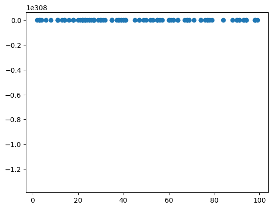

## 数据归一化

因为x和y本身值比较大，再训练多轮后，主要因为有乘法，所以有可能会产生溢出，所以需要做归一化处理。

在机器学习中，归一化（Normalization）指的是将数据按特定比例进行缩放，使其落入一个特定的、统一的范围（通常是较小的数值区间）内的一种数据预处理技术。

归一化之后，数值变化更稳定，比如0.1 -> 0.1 * 10 和 100 -> 100 * 10，数值变化程度是很不一样的

```python
x = np.random.randint(1, 100, 100)
y = np.array([i * 10 + np.random.randint(100) for i in x])
print(x[:5])
print(y[:5])
```

```plaintext
[52 58 48 90 49]
[547 641 484 998 567]
```

```python
# 归一化
x = x / 100
y = y / 100
print(x[:5])
print(y[:5])
```

```plaintext
[0.52 0.58 0.48 0.9  0.49]
[5.47 6.41 4.84 9.98 5.67]
```

```python
epoch = 2
w = 0.1

# 神经元
for _ in range(epoch):
    for i in range(len(x)):
        y_predict = w * x[i]
        loss = y_predict - y[i]
        w = w - loss

print(w)

y_predict = w * x
plt.scatter(x, y)
plt.plot(x, y_predict, color='r')
plt.show()
```

```plaintext
11.185976962006425
```

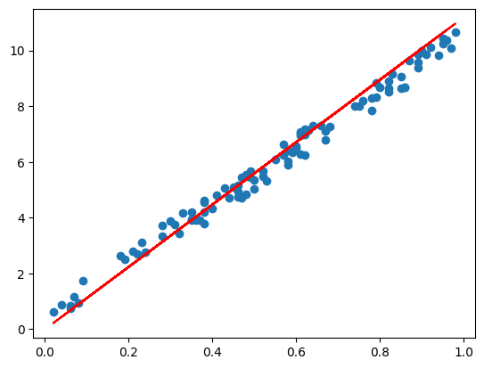

```python
x = -1 * np.random.randint(1, 100, 100)
y = -1 * np.array([i * 10 + np.random.randint(100) for i in x])
print(x[:5])
print(y[:5])
```

```plaintext
[-62  -5 -86 -40 -86]
[554   7 807 328 835]
```

```python
plt.scatter(x, y)
plt.xlim(-100, 100)
plt.ylim(-1000, 1000)

y_predict = 1 * x
plt.plot(x, y_predict, color='r')
plt.show()
```

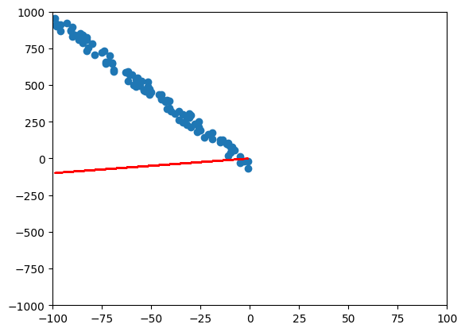

```python
epoch = 20
w = 0.1

x = x / 100
y = y / 100

# 神经元
for _ in range(epoch):
    for i in range(len(x)):
        y_predict = w * x[i]
        loss = y_predict - y[i]
        w = w - loss * x[i]

print(w)

y_predict = w * x
plt.scatter(x, y)
plt.plot(x, y_predict, color='r')
plt.show()
```

```plaintext
-8.936576383736126
```

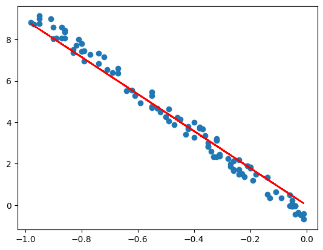

## Min-Max 归一化

优点是，保留了原始数据的分布形状，并且数值在[0,1]区间

缺点是，对异常值敏感，异常值会扭曲整个缩放

```python
x = np.random.randint(1, 100, 100)
y = np.array([i * 10 + np.random.randint(100) for i in x])
print(x[:5])
print(y[:5])

x_hat = (x - np.min(x)) / (np.max(x) - np.min(x))

y_hat = (y - np.min(y)) / (np.max(y) - np.min(y))
print(x_hat[:5])
print(y_hat[:5])
```

```plaintext
[53 32 23 95 48]
[536 401 315 992 511]
[0.53684211 0.31578947 0.22105263 0.97894737 0.48421053]
[0.49233716 0.36302682 0.28065134 0.92911877 0.4683908 ]
```

```python
plt.scatter(x, y, color='r')
plt.show()
```

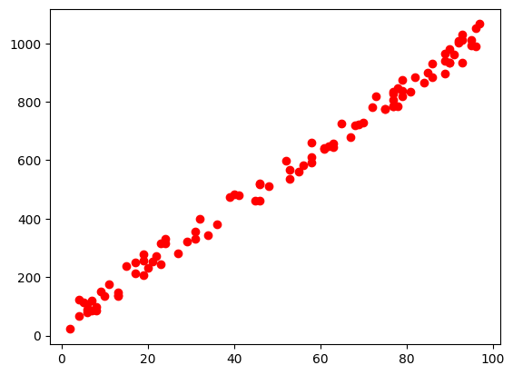

```python
plt.scatter(x_hat, y_hat, color='b')
plt.show()
```

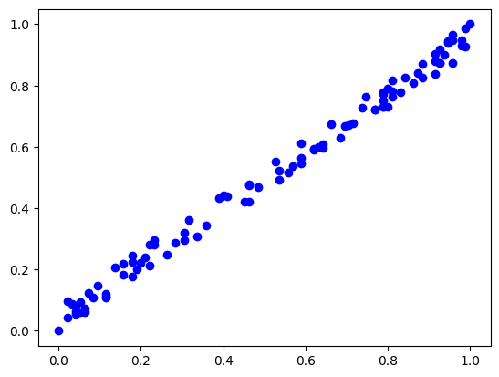

## Z-Score 标准化

也能保持数据分布的形状，但相比Min-Max而言，对异常值没那么敏感，但不保证数值在[0,1]

```python
x = np.random.randint(1, 100, 100)
y = np.array([i * 10 + np.random.randint(100) for i in x])
print(x[:5])
print(y[:5])

x_hat = (x - np.mean(x)) / np.std(x)
y_hat = (y - np.mean(y)) / np.std(y)
print(x_hat[:5])
print(y_hat[:5])
```

```plaintext
[75 99 46  9 95]
[ 823 1088  487  130  986]
[ 0.80922285  1.70215841 -0.26974095 -1.64634994  1.55333582]
[ 0.90216517  1.8849159  -0.34388859 -1.6678207   1.50664958]
```

```python
plt.scatter(x, y, color='r')
plt.show()
```

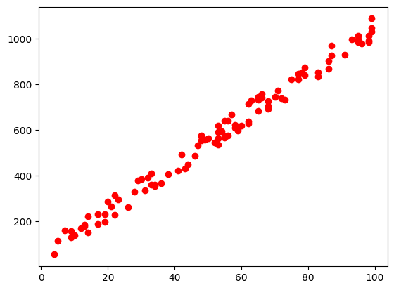

```python
plt.scatter(x_hat, y_hat, color='b')
plt.show()
```

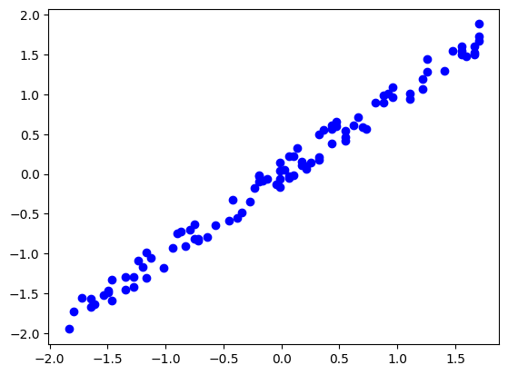

## 偏置bias

我们现在样本数据正好是穿过了坐标0点，如果我们修改一下样本数据

```python
x = np.random.randint(1, 100, 100)
y = np.array([i * 10 + np.random.randint(100) for i in x])
y = np.array(y) + 100

print(x[:5])
print(y[:5])
```

```plaintext
[58 62 94 13 44]
[ 745  730 1068  271  609]
```

```python
import matplotlib.pyplot as plt

plt.ylim(0, 1000)
plt.scatter(x, y)  # 拟合
plt.show()
```

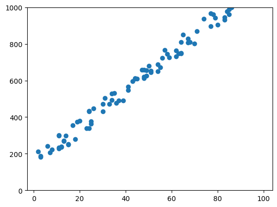

## 重新定义模型函数

如果我们的函数还是y=wx，那么，始终覆盖不了样本数据，或者说拟合不了我们的数据，此时就需要给函数加一个偏移量，或者叫做偏置，最终函数为：y=wx+b

```python
w = 15
y_predict = w * x

plt.ylim(0, 1000)
plt.scatter(x, y)
plt.plot(x, y_predict, color='r')
plt.show()
```

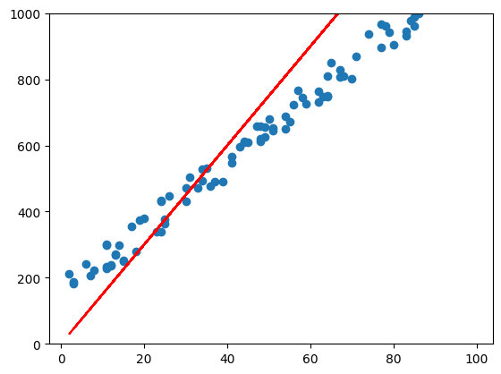

```python
w = 10
b = 150

y_predict = w * x + b

plt.ylim(0, 1000)
plt.scatter(x, y)
plt.plot(x, y_predict, color='r')
plt.show()
```

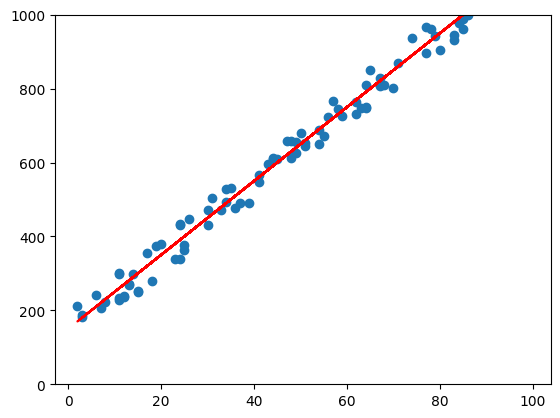

从而在训练时，也需要不断调整b的值，从而找到最合适的b

```python
# 大都督周瑜（我的微信: it_zhouyu）

x = np.random.randint(1, 100, 100)
y = np.array([i * 10 + np.random.randint(100) for i in x])
y = np.array(y) + 1000
print(x[:5])
print(y[:5])

x = x / 100
y = y / 100

epoch = 200
w = 0.1
b = 0.1

for _ in range(epoch):
    for i in range(len(x)):
        y_predict = w * x[i] + b
        loss = y_predict - y[i]
        w = w - loss * x[i]
        b = b - loss

y_predict = w * x + b
plt.scatter(x, y)
plt.plot(x, y_predict, color='r')
plt.show()
```

```plaintext
[87 56 59 84 89]
[1951 1616 1658 1890 1946]
```

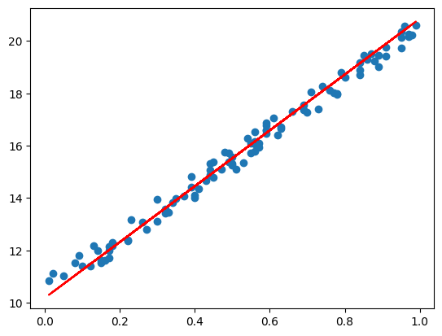

y=wx+b，就是一个很简单的线性回归模型，其中w和b就是参数，是需要训练得出的。