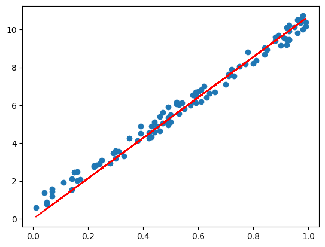
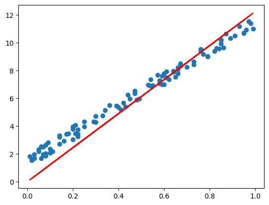
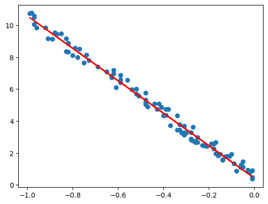
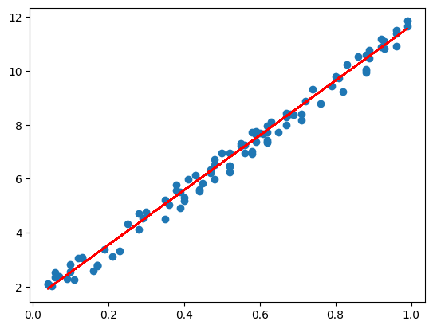

# 05、神经网络高级实战一

## 误差函数（损失函数）

前面我们的预测函数为：y = w * x + b

计算误差的方式为：y_predict - y

这样计算出来的误差可能是正数，也可能是负数。

比如，x[1]对应样本的误差为2， x[2]对应样本的误差为-2， 那么x[1]和x[2]的误差和为0，导致误差被抵消了。

一般我们会通过取误差的平方来解决这个问题，也叫做平方误差，计算方式为：(y_predict - y)^2，好处是：

1. 误差平方之后，都为正数，从而避免误差被抵消
2. 平方会放大误差，使得模型对误差更敏感
3. 平方误差是一个平滑函数，便于求导

```python
import numpy as np
import matplotlib.pyplot as plt
```

```python
x = np.random.randint(1, 100, 100)
y = np.array([i * 10 + np.random.randint(100) for i in x])
print(x[:5])
print(y[:5])
```

预测函数为：
$y_{\text{predict}} = w \cdot x + b$

误差函数为：
$\text{loss} = (y_{\text{predict}} - y)^2$

带入y_predict，得到最终的误差函数为：
$\text{loss} = (w \cdot x + b - y)^2$

$x$, $y$ 是样本，是已知的，$w$, $b$是未知的，不同的$x$,  对应的误差不同

所以，误差函数就是一个$w$和$w$为自变量，$loss$为因变量的二元二次函数

二元二次函数可能忘记了，我们先忽略b，这样误差函数为：
$\text{loss} = (w \cdot x - y)^2$

就变成了一个一元二次函数。

```python
# 随机生成一些w的数据
w = np.random.randint(-100, 100, 200)
w.sort()
print(w[:5])
```

然后带入到误差函数中

```python
loss = (w * x[1] - y[1]) ** 2
print(loss[:5])
```

```python
plt.plot(w, loss)
plt.show()
```

所以误差函数：$ \text{loss} = (y_{\text{predict}} - y)^2$
就是是一条抛物线，纵坐标就是loss，因此纵坐标的最低点，就是误差最小的点。

当然，预测函数y_predict如果不是线性函数，那么对应的误差函数可能就不是一条抛物线，而可能是一条复杂的曲线，但对于模型训练而言，训练的目的都是找到loss最小的点对应的w的值。

那么，如何找到最低点呢？这就需要梯度下降了。

## 梯度下降

什么是梯度？
梯度，就是误差函数关于自变量w的导数。

预测函数为：
$y_{\text{predict}} = w \cdot x$

误差函数为：
$loss = (y_{\text{predict}} - y)^2 = (w \cdot x - y)^2$

注意：$w$才是自变量，$x$和$y$这里要看做常量，比如某一个样本$x[i]$,  :

$loss = (w \cdot x[i] - y[i])^2$

展开后为：

$loss = x[i]^2 \cdot w^2 - 2 \cdot w \cdot x[i] \cdot y[i] + y[i]^2$

那么，误差函数关于$w$的导数为：
$dloss = x[i]^2 \cdot 2 \cdot w - 2 \cdot x[i] \cdot y[i] = 2 \cdot x[i]^2 \cdot w - 2 \cdot x[i] \cdot y[i]$

这样，dloss就是在x[i]、x[i]这个样本上，误差函数对w的导数，w取不同的值，dloss的值就会不同。

dloss如果等于0，那么w取这个值，误差就是最小的。

画出w[10]位置的切线

```python
# 模拟出有序的w
w = np.random.randint(-100, 100, 200)
w.sort()
loss = (w * x[1] - y[1]) ** 2

# 计算 w[10] 处的导数值
pos = 10
dloss = 2 * w[pos] * x[1] ** 2 - 2 * x[1] * y[1]

# 在 w[10] 附近构造切线
tangent_line_length = 10
tangent_line = dloss * (w[pos - tangent_line_length:pos + tangent_line_length] - w[pos]) + loss[pos]

# 画出原曲线和切线
plt.plot(w, loss)
plt.plot(w[pos - tangent_line_length:pos + tangent_line_length], tangent_line, 'r--')
plt.scatter(w[pos], loss[pos], color='green', zorder=5)

plt.xlabel("w")
plt.ylabel("Loss")
plt.show()

# 导数小于0，左高右低
print(dloss)
```

画出w[110]位置的切线

```python
# 模拟出有序的w
w = np.random.randint(-100, 100, 200)
w.sort()
loss = (w * x[1] - y[1]) ** 2

# 计算 w[110] 处的导数值
pos = 110
dloss = 2 * w[pos] * x[1] ** 2 - 2 * x[1] * y[1]

# 在 w[10] 附近构造切线
tangent_line_length = 10
tangent_line = dloss * (w[pos - tangent_line_length:pos + tangent_line_length] - w[pos]) + loss[pos]

# 画出原曲线和切线
plt.plot(w, loss)
plt.plot(w[pos - tangent_line_length:pos + tangent_line_length], tangent_line, 'r--')
plt.scatter(w[pos], loss[pos], color='green', zorder=5)

plt.xlabel("w")
plt.ylabel("Loss")
plt.show()

# 导数大于0，左低右高
print(dloss)
```

所以，我们可以根据dloss的值来判断w的修改方向。

dloss小于0，那就增加w
dloss大于0，那就减少w

这个过程就是梯度下降。

因此，我们可以修改之前的模型训练代码，采用梯度下降的方式来进行训练。

```python
x = np.random.randint(1, 100, 100)
y = np.array([i * 10 + np.random.rand() * 100 for i in x])

print(x[:5])
print(y[:5])

x = x / 100
y = y / 100

epoch = 1
w = 0.1


for _ in range(epoch):
    for i in range(len(x)):
        dloss = 2 * w * x[i] ** 2 - 2 * x[i] * y[i]
        w = w - dloss  # 斜率大，调整幅度就大

y_predict = w * x
plt.scatter(x, y)
plt.plot(x, y_predict, color='r')
plt.show()
```

上面的dloss值，就是梯度，所以叫做梯度下降。

有了梯度下降，对于复杂的误差曲线，也能通过梯度下降的方式找到最低点。

我们只需要基于预测函数，得到对应的误差函数，然后基于误差函数对w求导，就可以得到梯度，从而可以根据梯度调整w的值。

## 导数、斜率、梯度

### 导数

导数的定义：对单变量函数 $y = f(x) $，导数是函数在某个点的瞬时变化率：
$f'(x) = \lim_{{\Delta x \to 0}} \frac{f(x + \Delta x) - f(x)}{\Delta x}$
导数的几何意义：曲线在该点切线的斜率

### 梯度

梯度的定义：对多变量函数 $f(x_1, x_2, \dots, x_n) $（如 $z = f(x, y) $），梯度是一个向量，是所有自变量方向上的偏导数构成的向量
$\nabla f = \left( \frac{\partial f}{\partial x_1}, \frac{\partial f}{\partial x_2}, \dots, \frac{\partial f}{\partial x_n} \right)$
函数 $f(x, y) = x^2 + y^2 $的梯度是：
 

## 常见函数的导数公式

常数函数：$f(x) = c$的导数是0

幂函数：$f(x) = x^n$的导数是$nx^{n-1}$

指数函数：$f(x) = e^x$的导数是：$e^x$

sin函数：$f(x) = sin(x)$的导数是：$cos(x)$

cos函数：$f(x) = cos(x)$的导数是：$-sin(x)$

sigmoid函数：$\sigma(x) = \frac{1}{1 + e^{-x}}$的导数是：$\sigma(x) \cdot (1 - \sigma(x))$

## 链式法则

若 `y = f(g(x))`

令 `u = g(x)`

则 `y = f(u)`

`dy/dx = (dy/du) * (du/dx)`

例子:
`f(x) = sin(x^2)`

令`u = x^2`,

则 `f = sin(u)`

`df/dx = cos(u) * (du/dx) = cos(x^2) * 2x`

## SGD随机梯度下降

SGD，是Stochastic Gradient Descent的缩写，即随机梯度下降，在每次迭代中，每次随机一个样本来更新w。

```python
x = np.random.randint(1, 100, 100)
y = np.array([i * 10 + np.random.rand() * 100 for i in x])

print(x[:5])
print(y[:5])

x = x / 100
y = y / 100

epoch = 200
w = 0.1

for _ in range(epoch):
    # 随机选取一个样本（SGD 的核心）
    i = np.random.randint(0, len(x))

    dloss = 2 * w * x[i] ** 2 - 2 * x[i] * y[i]
    w = w - dloss

y_predict = w * x
plt.scatter(x, y)
plt.plot(x, y_predict, color='r')
plt.show()
```

## 均方误差

每次迭代，随机获取一部分样本来更新权重。

对于一个批量而言，它的误差函数可以做如下推导。

x[1]和y[1]这个样本的误差
$loss1 = x[1]^2 \cdot w^2 - 2 \cdot w \cdot x[1] \cdot y[1] + y[1]^2$

x[2]和y[2]这个样本的误差
$loss2 = x[2]^2 \cdot w^2 - 2 \cdot w \cdot x[2] \cdot y[2] + y[2]^2$

x[n]和y[n]这个样本的误差
$lossn = x[n]^2 \cdot w^2 - 2 \cdot w \cdot x[n] \cdot y[n] + y[n]^2$

假如这N个样本为一个批量，那么这N个样本的平均误差为，也叫做MES（Mean Squared Error）均方误差：
$loss = (loss1 + loss2 + loss3 + ... + lossn) / n$

那么这个批量的误差函数为：
$loss = \frac{w^2 \cdot (x[1]^2 + x[2]^2 + ... + x[n]^2)}{n} - \frac{2 \cdot w \cdot (x[1] \cdot y[1] + x[2] \cdot y[2] + ... + x[n] \cdot y[n]}{n} + \frac{y[1]^2 + y[2]^2 + ... + y[n]^2}{n}$

那么，该误差函数关于w的导数为：

$dloss = \frac{2 \cdot w \cdot (x[1]^2 + x[2]^2 + ... + x[n]^2)}{n} - \frac{2 \cdot (x[1] \cdot y[1] + x[2] \cdot y[2] + ... + x[n] \cdot y[n]}{n}$

最终，该误差函数关于w的导数可以为：
dloss = 2 * w * np.mean(x[i]^2) - 2 * np.mean(x[i] * y[i])

## Mini-batch SGD

```python
# 训练代码为
x = np.random.randint(1, 100, 100)
y = np.array([i * 10 + np.random.randint(100) for i in x])

print(x[:5])
print(y[:5])

x = x / 100
y = y / 100

epoch = 200
w = 0.1
batch_size = 10

for _ in range(epoch):

    # 随机打乱数据
    # x_shuffled = x.copy()
    # y_shuffled = y.copy()
    # np.random.shuffle(x_shuffled)
    # np.random.shuffle(y_shuffled)

    indices = np.random.permutation(len(x))
    x_shuffled = x[indices]
    y_shuffled = y[indices]


    # 按 batch_size 分批训练
    for i in range(0, len(x), batch_size):
        # 第i批
        x_batch = x_shuffled[i:i + batch_size]
        y_batch = y_shuffled[i:i + batch_size]

        # 求批量的平均
        x2_mean = np.mean(x_batch ** 2)
        xy_mean = np.mean(x_batch * y_batch)

        dloss = 2 * w * x2_mean - 2 * xy_mean

        w = w - dloss

y_predict = w * x
plt.scatter(x, y)
plt.plot(x, y_predict, color='r')
plt.show()
```

```python
a = np.array([(1,1), (2,2), (3,3), (4,4), (5,5)])
# 打乱a
np.random.shuffle(a)
print(a)
```

```python
a = np.array([1, 2, 3, 4, 5])
b = np.array([1, 2, 3, 4, 5])

indices = np.random.permutation(len(a))
print(indices)

a_shuffled = a[indices]
b_shuffled = b[indices]

a_shuffled, b_shuffled
```

```python
a = np.array([1, 2, 3, 4, 5])
a1 = a[[2,3,4]]
a1
```

## 扩展：多个局部最小值

在梯度下降中，如果误差曲线存在多个局部最小值（如两个凹），判断当前是否是全局最低点通常需要结合以下方法：

1. 梯度为零的条件
  - 在只有一个凹的情况下，梯度为零且导数由负变正时，可以确定这是唯一的最低点
  - 如果有多个凹，则梯度为零可能对应于多个局部最小值，此时无法仅凭梯度判断是否为全局最低点。
2. 学习率与收敛性
  - 梯度下降会通过不断更新参数 $w $来逼近局部最小值。当梯度接近零时，算法会停止更新，认为达到了一个“最小点”。
  - 如果初始参数 $w $靠近某个局部最小值，梯度下降可能会收敛到该局部最小值，而不是全局最小值。
3. 如何判断当前是全局最低点？
  - 多次初始化
    - 可以从不同的初始值出发运行梯度下降多次。如果每次都收敛到同一个点，则可能是全局最低点。
    - 如果收敛到不同的点，则这些点可能是局部最小值，需要进一步分析。
  - 优化策略改进
    - 使用更高级的优化策略，如动量法 (Momentum)、自适应学习率优化 (Adam)，或者随机梯度下降 (SGD) 中加入噪声，可以帮助跳出局部最小值并寻找更低的点。
    - 另外，可以尝试使用全局优化算法（如遗传算法、模拟退火等），它们更适合处理多凹的情况。

## 学习率

学习率是梯度下降算法中的一个重要参数，它控制了每次更新参数 $w $的幅度。

学习率过大，会导致参数更新过大，可能错过最低点。

学习率过小，会导致参数更新过小，导致模型训练速度变慢。

```python
# 训练代码为
x = np.random.randint(1, 100, 100)
y = np.array([i * 10 + np.random.randint(100) for i in x])

print(x[:5])
print(y[:5])

x = x / 100
y = y / 100

# 调参 超参数
epoch = 200
batch_size = 10
learning_rate = 0.1

w = 0.1

for _ in range(epoch):

    # 随机打乱数据
    # x_shuffled = x.copy()
    # y_shuffled = y.copy()
    # np.random.shuffle(x_shuffled)
    # np.random.shuffle(y_shuffled)

    indices = np.random.permutation(len(x))
    x_shuffled = x[indices]
    y_shuffled = y[indices]


    # 按 batch_size 分批训练
    for i in range(0, len(x), batch_size):
        # 第i批
        x_batch = x_shuffled[i:i + batch_size]
        y_batch = y_shuffled[i:i + batch_size]

        # 求批量的平均
        x2_mean = np.mean(x_batch ** 2)
        xy_mean = np.mean(x_batch * y_batch)

        dloss = 2 * w * x2_mean - 2 * xy_mean

        w = w - learning_rate * dloss

y_predict = w * x
plt.scatter(x, y)
plt.plot(x, y_predict, color='r')
plt.show()
```

## 用pytorch来自动求导

```python
import torch

# 创建需要梯度的张量
w = torch.tensor(2.0, requires_grad=True)
b = torch.tensor(3.0, requires_grad=True)

# 定义计算
y = w ** 2 + w + b

print(y)

# 计算梯度
y.backward(retain_graph=True)

# 查看梯度
print(w.grad)  # dy/dw = 2w + 1 = 5 (当x=2时)
print(b.grad)  # dy/db = 1 (当b=3时)
```

```plaintext
tensor(9., grad_fn=<AddBackward0>)
tensor(5.)
tensor(1.)
tensor(10.)
tensor(2.)
tensor(15.)
tensor(3.)
```

```python
import torch
import numpy as np
import matplotlib.pyplot as plt

# 数据准备
x = np.random.randint(1, 100, 100)
y = np.array([i * 10 + np.random.rand() * 100 for i in x])

# 将数据归一化到 [0,1] 范围内
x = x / 100.0
y = y / 100.0

# 将 NumPy 数组转换为 PyTorch 张量
x_tensor = torch.tensor(x, dtype=torch.float32)
y_tensor = torch.tensor(y, dtype=torch.float32)

# 初始化模型参数 w 为可学习的 Parameter，设置 requires_grad=True，表示w参数需要求导，需要计算梯度
w = torch.nn.Parameter(torch.tensor(0.1, dtype=torch.float32), requires_grad=True)

# 定义优化器 (SGD - 随机梯度下降)
optimizer = torch.optim.SGD([w], lr=0.01)  # learning_rate = 0.01   # w = w - lr*w.grad

# 训练循环
epochs = 200
for _ in range(epochs):
    # 遍历每个样本
    for i in range(len(x_tensor)):

        # 前向传播: 计算预测值
        y_predict = w * x_tensor[i]

        # 损失函数: 平方误差
        loss = (y_predict - y_tensor[i]) ** 2

        loss.backward()     # 反向传播
        optimizer.step()  # 更新参数w的值
        optimizer.zero_grad()  # 清除w之前的梯度

# 最终预测结果
final_prediction = w.data.item() * x_tensor

# 绘图
plt.scatter(x, y)
plt.plot(x, final_prediction.numpy(), color='r')
plt.show()

# 输出最终的权重值
print(f'最终拟合的权重 w: {w.data.item()}')
```



```plaintext
最终拟合的权重 w: 10.688233375549316
```

接下来，我们来考虑偏置bias

```python
import torch
import numpy as np
import matplotlib.pyplot as plt

# 数据准备
x = np.random.randint(1, 100, 100)
y = np.array([i * 10 + np.random.rand() * 100 for i in x])
y = y + 100

# 将数据归一化到 [0,1] 范围内
x = x / 100.0
y = y / 100.0

# 将 NumPy 数组转换为 PyTorch 张量
x_tensor = torch.tensor(x, dtype=torch.float32)
y_tensor = torch.tensor(y, dtype=torch.float32)

# 初始化模型参数 w 为可学习的 Parameter，设置 requires_grad=True，表示w参数需要求导，需要计算梯度
w = torch.nn.Parameter(torch.tensor(0.1, dtype=torch.float32), requires_grad=True)

# 定义优化器 (SGD - 随机梯度下降)
optimizer = torch.optim.SGD([w], lr=0.01)  # learning_rate = 0.01   # w = w - lr*w.grad

# 训练循环
epochs = 200
for _ in range(epochs):
    # 遍历每个样本
    for i in range(len(x_tensor)):

        # 前向传播: 计算预测值
        y_predict = w * x_tensor[i]

        # 损失函数: 平方误差
        loss = (y_predict - y_tensor[i]) ** 2

        loss.backward()     # 反向传播
        optimizer.step()  # 更新参数w的值
        optimizer.zero_grad()  # 清除w之前的梯度

# 最终预测结果
final_prediction = w.data.item() * x_tensor

# 绘图
plt.scatter(x, y)
plt.plot(x, final_prediction.numpy(), color='r')
plt.show()

# 输出最终的权重值
print(f'最终拟合的权重 w: {w.data.item()}')
```



```plaintext
最终拟合的权重 w: 12.260981559753418
```

不管怎么选了，都不能拟合前面一部分数据，导致直线方向不对

```python
import torch
import numpy as np
import matplotlib.pyplot as plt

# 数据准备
x = -1 * np.random.randint(1, 100, 100)
y = -1 * np.array([i * 10 + np.random.rand() * 100 for i in x])
y = y + 100

# 将数据归一化到 [0,1] 范围内
x = x / 100.0
y = y / 100.0

# 将 NumPy 数组转换为 PyTorch 张量
x_tensor = torch.tensor(x, dtype=torch.float32)
y_tensor = torch.tensor(y, dtype=torch.float32)

# 初始化模型参数 w 为可学习的 Parameter，设置 requires_grad=True，表示w参数需要求导，需要计算梯度
w = torch.nn.Parameter(torch.tensor(0.1, dtype=torch.float32), requires_grad=True)
b = torch.nn.Parameter(torch.tensor(0.1, dtype=torch.float32), requires_grad=True)

# 定义优化器 (SGD - 随机梯度下降)
optimizer = torch.optim.SGD([w, b], lr=0.01)  # learning_rate = 0.01   # w = w - lr*w.grad

# 训练循环
epochs = 200
for _ in range(epochs):
    # 遍历每个样本
    for i in range(len(x_tensor)):

        # 前向传播: 计算预测值
        y_predict = w * x_tensor[i] + b

        # 损失函数: 平方误差
        loss = (y_predict - y_tensor[i]) ** 2

        loss.backward()     # 反向传播
        optimizer.step()  # 更新参数w、b的值
        optimizer.zero_grad()  # 清除w之前的梯度

# 最终预测结果
final_prediction = w.data.item() * x_tensor + b.data.item()

# 绘图
plt.scatter(x, y)
plt.plot(x, final_prediction.numpy(), color='r')
plt.show()

# 输出最终的权重值
print(f'最终拟合的权重 w: {w.data.item()}')
```



```plaintext
最终拟合的权重 w: -10.171807289123535
```

这下，我们的模型中就由了w和b两个参数，对于模型训练来说，就需要找到w和b最合适的值，使得训练出来的函数在样本集上误差最小，如何找到w和b呢，就是根据误差公式分别对w和b进行求导，也就是求梯度，然后逐步更新w和b的值，直到最低点。

## loss.backward()是怎么求导的？

loss表面上看只是一个数字，那么为什么backward()能求导了呢？它是怎么知道我的误差函数的呢？

在PyTorch中，有一个机制叫做：动态计算图，这个图记录了张量之间的运算关系，例如

```python
y_pred = w * x + b
loss = (y_pred - y) ** 2
```

这段代码定义了一个简单的误差函数（平方误差）。PyTorch 会将这些运算记录下来，并保存对应的梯度规则。

在调用 loss.backward() 时，PyTorch 会从 loss 开始，按照计算图中的依赖关系，使用链式法则逐层计算梯度。例如，在上述平方误差的例子中：
首先，PyTorch 会找到 loss 的表达式：$\text{loss} = (w \cdot x + b - y)^2$。
然后，根据链式法则，分别计算： $\frac{\partial \text{loss}}{\partial w} = 2(w \cdot x + b - y) \cdot x $$\frac{\partial \text{loss}}{\partial b} = 2(w \cdot x + b - y)$
最终，这些梯度会被存储在对应的张量中（如 w.grad 和 b.grad）。

我们在定义x和y时，没有指定requires_grad=True，所以PyTorch不会计算x和y的梯度。

```python
import torch

# 定义参数和数据
x = torch.tensor(1, requires_grad=False)
y = torch.tensor(2, requires_grad=False)
w = torch.tensor(0.1, requires_grad=True)
b = torch.tensor(0.1, requires_grad=True)

# 前向传播
y_pred = w * x + b
loss = (y_pred - y).pow(2)

# 反向传播
loss.backward()
print(f"梯度 dw: {w.grad}, db: {b.grad}")
print(f"梯度 dx: {x.grad}, dy: {y.grad}")
```

```plaintext
梯度 dw: -3.5999999046325684, db: -3.5999999046325684
梯度 dx: None, dy: None
```

## optimizer.zero_grad()为什么梯度要清零？

为什么要清除梯度，不清清除度会怎么样？

梯度表示了参数调整的方向和大小，如果不清除梯度，会导致第二次计算出来的梯度加了第一次计算出来的梯度，可能导致方向和大小都有问题，使得模型训练不出来。

```python
import torch

# 定义参数和数据
x = torch.tensor(1, requires_grad=False)
y = torch.tensor(2, requires_grad=False)
w = torch.tensor(0.1, requires_grad=True)
b = torch.tensor(0.1, requires_grad=True)

# 前向传播
y_pred = w * x + b
loss = (y_pred - y).pow(2)

# 反向传播
loss.backward(retain_graph=True)
print(f"梯度 dw: {w.grad}, db: {b.grad}")

# 梯度清零
w.grad.zero_()

# 梯度累加
loss.backward(retain_graph=True)
print(f"梯度 dw: {w.grad}, db: {b.grad}")
```

```plaintext
梯度 dw: -3.5999999046325684, db: -3.5999999046325684
梯度 dw: -3.5999999046325684, db: -7.199999809265137
```

## optimizer.step()如何更新参数？

在optimizer.step()之前，已经计算了各个参数的梯度，接下来按照指定的算法来更新参数就可以了，比如SGD的更新公式为：
$\theta_{\text{new}} = \theta_{\text{old}} - \eta \cdot g$
其中：
$\theta$：模型参数。
$\eta$：学习率（learning rate），控制每次更新的步长。
$g$：当前参数对应的梯度。

将上述代码改成mini-batch SGD

```python
import torch
import numpy as np
import matplotlib.pyplot as plt
from torch.utils.data import TensorDataset, DataLoader

# 大都督周瑜（我的微信: it_zhouyu）

# 数据准备
x = np.random.randint(1, 100, 100)
y = np.array([i * 10 + np.random.rand() * 100 for i in x])
y = y + 100

# 将数据归一化到 [0,1] 范围内
x = x / 100.0
y = y / 100.0

# 将 NumPy 数组转换为 PyTorch 张量，并增加一个维度以适应模型要求 (shape: [batch_size, features])
x_tensor = torch.tensor(x, dtype=torch.float32)
y_tensor = torch.tensor(y, dtype=torch.float32)

# 创建数据集和数据加载器（DataLoader），定义 batch_size=16
dataset = TensorDataset(x_tensor, y_tensor)
print(x[:16])
print(y[:16])
dataset[:16]
```

```plaintext
[0.38 0.39 0.41 0.48 0.68 0.44 0.89 0.1  0.09 0.58 0.25 0.62 0.23 0.04
 0.07 0.44]
[ 5.76460777  5.52254747  5.97929155  6.52056775  8.41687707  5.55359688
 10.76442379  2.56347122  2.30029981  7.72274992  4.32264835  7.95595287
  3.33162741  2.12223403  2.39160126  5.61032134]


(tensor([0.3800, 0.3900, 0.4100, 0.4800, 0.6800, 0.4400, 0.8900, 0.1000, 0.0900,
         0.5800, 0.2500, 0.6200, 0.2300, 0.0400, 0.0700, 0.4400]),
 tensor([ 5.7646,  5.5225,  5.9793,  6.5206,  8.4169,  5.5536, 10.7644,  2.5635,
          2.3003,  7.7227,  4.3226,  7.9560,  3.3316,  2.1222,  2.3916,  5.6103]))
```

```python
dataloader = DataLoader(dataset, batch_size=5, shuffle=True)
for x_batch, y_batch in dataloader:
    print(x_batch)
    print(y_batch)
    break
```

```plaintext
tensor([0.0600, 0.0700, 0.7600, 0.3600, 0.0400])
tensor([2.3570, 2.3916, 8.7871, 5.0476, 2.0751])
```

```python
# 初始化模型参数 w 和 b
w = torch.nn.Parameter(torch.tensor(0.1, dtype=torch.float32), requires_grad=True)
b = torch.nn.Parameter(torch.tensor(0.1, dtype=torch.float32), requires_grad=True)

# 定义优化器 (SGD - 随机梯度下降)
optimizer = torch.optim.SGD([w, b], lr=0.1)  # 可适当提高学习率

criterion = torch.nn.MSELoss()

# 训练循环
epochs = 200
for epoch in range(epochs):
    for x_batch, y_batch in dataloader:
        # 前向传播: 批量预测
        y_predict = w * x_batch + b

        # 损失函数: 均方误差（MSE）
        # loss = ((y_predict - y_batch) ** 2).mean()  # 对 batch 中的损失取平均
        loss = criterion(y_predict, y_batch)

        # 反向传播和优化
        loss.backward()  # 计算当前 batch 下 w 和 b 的梯度
        optimizer.step()  # 更新参数
        optimizer.zero_grad()  # 清除上一次的梯度

# 最终预测结果 一行就是一个样本的预测结果，所以进行行转列，从而变成一个数组
final_prediction = (w.data.item() * x_tensor + b.data.item())

# 绘图
plt.scatter(x, y)
plt.plot(x, final_prediction.numpy(), color='r')
plt.show()

# 输出最终的权重值
print(f'最终拟合的权重 w: {w.data.item()}')
print(f'最终拟合的权重 b: {b.data.item()}')
```



```plaintext
最终拟合的权重 w: 10.144980430603027
最终拟合的权重 b: 1.5215063095092773
```