# 06、神经网络高级实战二

## 激活函数

前面我们讲到的模型函数为：
$y = wx+b$

它是一条线，因此它只能拟合线性数据，但实际中，还有很多数据是非线性的。

```python
import matplotlib.pyplot as plt
# 模拟出一个二分类的样本数据集
import numpy as np

x = np.random.randint(-10, 10, 100)
x.sort()

y0 = np.zeros(50)
y1 = np.ones(50)
y = np.concatenate((y0, y1))  # 合并两个数组 拟合

plt.scatter(x, y)
plt.show()
```

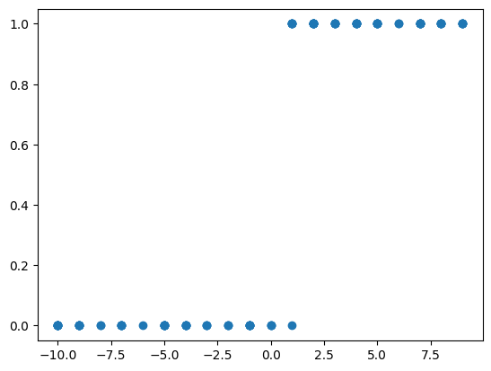

对于上面的样本，我们需要使用一种新的函数来拟合，这个函数叫做激活函数。

## 有哪些常用的激活函数？

在神经网络中，激活函数用于引入非线性因素，使得模型能够学习和表示更复杂的函数。以下是一些常用的激活函数及其特点：

1. **Sigmoid**
  - 公式：$ \sigma(x) = \frac{1}{1 + e^{-x}}$
  - 特点：输出在 `(0, 1)` 之间，适合二分类问题的输出层。
  - 缺点：容易导致梯度消失
2. **ReLU**
  - 公式：$ \text{ReLU}(x) = \max(0, x)$
  - 特点：计算简单，缓解梯度消失问题，是目前深度学习中最常用的激活函数之一。
  - 缺点：对于负数输入，可能导致神经元“死亡”
3. **Softmax**
  - 公式：$ \text{Softmax}(x_i) = \frac{e^{x_i}}{\sum_{j} e^{x_j}}, \quad \text{其中 } i, j \text{ 为输入向量中的元素索引}$
  - 特点：将输入转换为概率分布，常用于多分类问题的输出层。

通常，ReLU 及其变种适用于隐藏层，而 Sigmoid 和 Softmax 常用于输出层。

```python
import numpy as np
import matplotlib.pyplot as plt


def sigmoid(x):
    return 1 / (1 + np.exp(-x))


x = np.random.randint(-10, 10, 100)
x.sort()

y = sigmoid(x)

plt.plot(x, y)
plt.show()
```

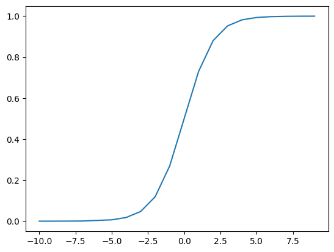

```python
import numpy as np
import matplotlib.pyplot as plt

# 大都督周瑜（我的微信: it_zhouyu）

# sigmoid(f(x)) f(x)=wx+b
def sigmoid(x, w=1, b=0):
    return 1 / (1 + np.exp(-(w * x + b)))


x = np.random.randint(-10, 10, 100)
x.sort()

# 不同斜率对比 (w值变化)
for w, color in zip([0.5, 1, 2, -1], ['blue', 'red', 'green', 'yellow']):
    y = sigmoid(x, w=w)
    plt.plot(x, y, color=color, linestyle='-', label=f'w={w}, b=0')

# 不同偏移对比 (b值变化)
for b, color in zip([-3, 3, 6], ['cyan', 'magenta', 'orange']):
    y = sigmoid(x, b=b)
    plt.plot(x, y, color=color, linestyle='--', label=f'w=1, b={b}')

# 图表美化
plt.title('Sigmoid Functions with Different Parameters', fontsize=14)
plt.xlabel('x', fontsize=12)
plt.ylabel('sigmoid(x)', fontsize=12)
plt.grid(True, alpha=0.3)
plt.legend(loc='lower right')
plt.axhline(0.5, color='gray', linestyle=':')  # 添加中间参考线
plt.xlim(-10, 10)
plt.show()
```

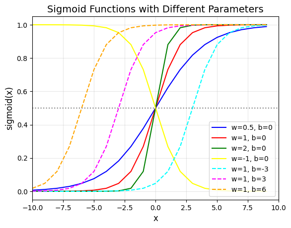

```python
import numpy as np
import matplotlib.pyplot as plt


# 定义可组合的Sigmoid基函数
class SigmoidComponent:
    def __init__(self, w=1, b=0):
        self.w = w
        self.b = b

    def __call__(self, x):
        return 1 / (1 + np.exp(-(self.w * x + self.b)))


# 生成复合曲线, sigmoid的输出相加
def composite_sigmoid(x, components):
    return sum(component(x) for component in components)


# 创建4个不同参数的Sigmoid组件
components = [
    SigmoidComponent(w=2, b=-5),
    SigmoidComponent(w=-2, b=-3),
    SigmoidComponent(w=3, b=2),
    SigmoidComponent(w=-1.5, b=5)
]

x = np.random.randint(-10, 10, 100)
x.sort()

# 可视化各组件及合成效果
for i, comp in enumerate(components):
    plt.plot(x, comp(x), label=f'Sigmoid {i + 1} (w={comp.w}, b={comp.b})')

plt.plot(x, composite_sigmoid(x, components), label='Composite')

plt.legend(loc='upper left', bbox_to_anchor=(1, 1))
plt.grid(True, alpha=0.3)  # 拟合
plt.show()
```

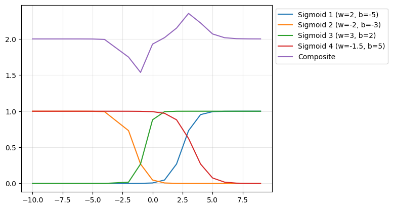

```python
import numpy as np
import matplotlib.pyplot as plt


# 简单的ReLU
def relu(x):
    return np.where(x >= 0, x, 0)


x = np.random.randint(-10, 10, 100)
x.sort()
y = relu(x)

plt.plot(x, y)
plt.show()
```

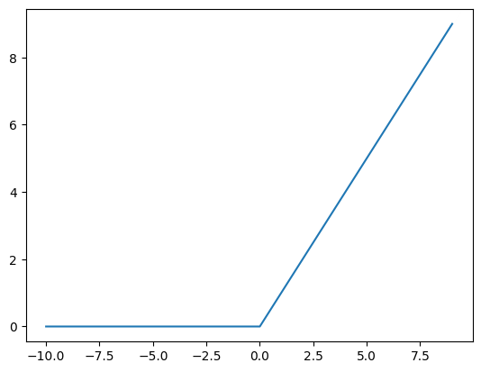

```python
import numpy as np
import matplotlib.pyplot as plt


# 定义可组合的ReLU函数
class ReluComponent:
    def __init__(self, w=1, b=0):
        self.w = w
        self.b = b

    def __call__(self, x):
        o = self.w * x + self.b
        return np.where(o >= 0, o, 0)


# 生成复合曲线, relu的输出相加
def composite_relu(x, components):
    return sum(component(x) for component in components)


# 初始设置
x = np.random.randint(-10, 10, 100)
x.sort()

# 创建4个不同参数的Relu组件
components = [
    ReluComponent(w=-5, b=-1),
    ReluComponent(w=-5, b=-10),
    ReluComponent(w=5, b=10),
    ReluComponent(w=10, b=-10),
]

# 可视化各组件及合成效果
for i, comp in enumerate(components):
    plt.plot(x, comp(x), '--', alpha=0.5, label=f'ReLu {i + 1} (w={comp.w}, b={comp.b})')
plt.plot(x, composite_relu(x, components), 'r-', lw=2, label='Composite Curve')
plt.legend(loc='upper left', bbox_to_anchor=(1, 1))
plt.grid(True, alpha=0.3)
plt.show()
```

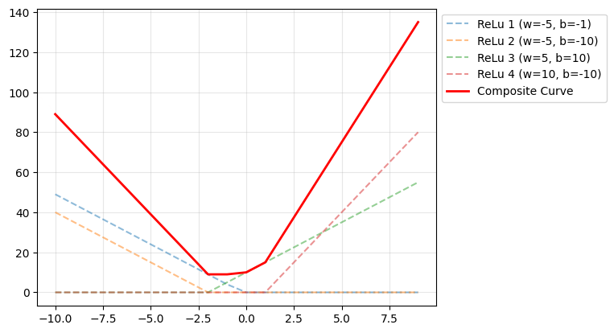

```python
def softmax(x, temperature=1.0):
    """温度参数控制概率分布的尖锐程度"""
    exp_x = np.exp((x - np.max(x)) / temperature)  # 数值稳定性处理
    return exp_x / exp_x.sum()
```

## 使用Sigmoid来拟合二分类样本

```python
import matplotlib.pyplot as plt
# 模拟出一个二分类的样本数据集
import numpy as np

x = np.random.randint(-10, 10, 100)
x.sort()
y0 = np.zeros(50)
y1 = np.ones(50)
y = np.concatenate((y0, y1))  # 合并两个数组

plt.scatter(x, y)
plt.show()
```

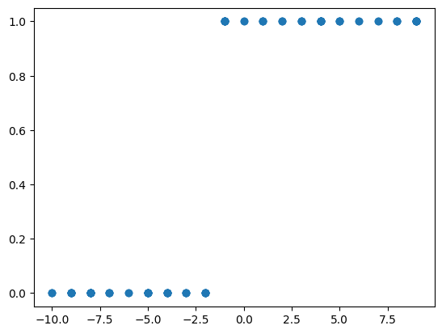

(sigmoid(w * x + b) - y)**2

z = w * x + b
s = sigmoid(z)
g = s - y
loss = g**2

w.grad = 2g * 1 * sigmoid(z)*(1-sigmoid(z)) * x

```python
import torch
import numpy as np
import matplotlib.pyplot as plt
from torch.utils.data import TensorDataset, DataLoader

# 数据准备
x = np.random.randint(-10, 10, 100)
x.sort()
y0 = np.zeros(50)
y1 = np.ones(50)
y = np.concatenate((y0, y1))  # 合并两个数组

# 将 NumPy 数组转换为 PyTorch 张量
x_tensor = torch.tensor(x, dtype=torch.float32)
y_tensor = torch.tensor(y, dtype=torch.float32)

dataset = TensorDataset(x_tensor, y_tensor)
dataloader = DataLoader(dataset, batch_size=5, shuffle=True)

w = torch.nn.Parameter(torch.rand(1), requires_grad=True)
b = torch.nn.Parameter(torch.rand(1), requires_grad=True)

optimizer = torch.optim.SGD([w, b], lr=0.01)
criterion = torch.nn.MSELoss()


def sigmoid(x):
    return 1 / (1 + torch.exp(-x))


# 训练循环
epochs = 200
for epoch in range(epochs):
    for x_batch, y_batch in dataloader:
        y_predict = sigmoid(w * x_batch + b)
        loss = criterion(y_predict, y_batch)  # (sigmoid(w * x + b) - y)**2
        optimizer.zero_grad()
        loss.backward()
        optimizer.step()

# 最终预测结果
final_prediction = sigmoid(w.data.item() * x_tensor + b.data.item())

# 绘图
plt.scatter(x, y)
plt.plot(x, final_prediction.numpy(), color='r')
plt.show()

# 输出最终的权重值
print(f'最终拟合的权重 w: {w.data.item()}')
print(f'最终拟合的权重 b: {b.data.item()}')
```

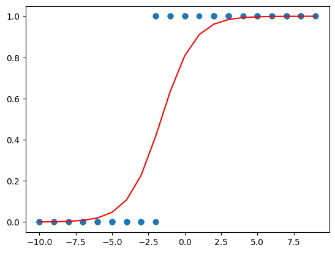

```plaintext
最终拟合的权重 w: 0.8875840902328491
最终拟合的权重 b: 1.435689091682434
```

```python

import numpy as np
import matplotlib.pyplot as plt

# 数据准备
x = np.random.randint(-10, 10, 150)
x.sort()
y0 = np.zeros(50)
y1 = np.ones(50)
y2 = np.zeros(50)
y = np.concatenate((y0, y1, y2))  # 合并

plt.scatter(x, y)
plt.show()
```

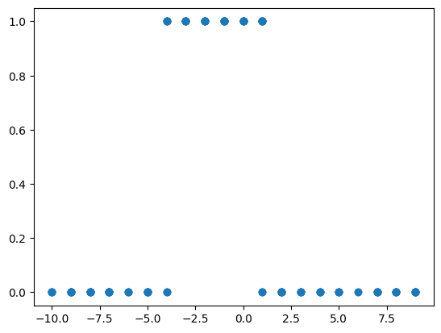

```python
import torch
import numpy as np
import matplotlib.pyplot as plt
from torch.utils.data import TensorDataset, DataLoader

# 数据准备
x = np.random.randint(-10, 10, 150)
x.sort()
y0 = np.zeros(50)
y1 = np.ones(50)
y2 = np.zeros(50)
y = np.concatenate((y0, y1, y2))  # 合并两个数组

# 将 NumPy 数组转换为 PyTorch 张量
x_tensor = torch.tensor(x, dtype=torch.float32)
y_tensor = torch.tensor(y, dtype=torch.float32)

dataset = TensorDataset(x_tensor, y_tensor)
dataloader = DataLoader(dataset, batch_size=5, shuffle=True)

w1 = torch.nn.Parameter(torch.rand(1), requires_grad=True)
w2 = torch.nn.Parameter(torch.rand(1), requires_grad=True)
w3 = torch.nn.Parameter(torch.rand(1), requires_grad=True)
w4 = torch.nn.Parameter(torch.rand(1), requires_grad=True)
b1 = torch.nn.Parameter(torch.rand(1), requires_grad=True)
b2 = torch.nn.Parameter(torch.rand(1), requires_grad=True)
b3 = torch.nn.Parameter(torch.rand(1), requires_grad=True)

optimizer = torch.optim.SGD([w1, w2, w3, w4, b1, b2, b3], lr=0.01)
criterion = torch.nn.MSELoss()


def sigmoid(x):
    return 1 / (1 + torch.exp(-x))


# 训练循环
epochs = 1000
for epoch in range(epochs):
    for x_batch, y_batch in dataloader:
        s1 = sigmoid(w1 * x_batch + b1)
        s2 = sigmoid(w2 * x_batch + b2)
        y_predict = w3 * s1 + w4 * s2 + b3
        loss = criterion(y_predict, y_batch)  # (sigmoid(w * x + b) - y)**2
        optimizer.zero_grad()
        loss.backward()
        optimizer.step()

# 最终预测结果
sigmoid1 = sigmoid(w1 * x_tensor + b1)
sigmoid2 = sigmoid(w2 * x_tensor + b2)
final_prediction = w3 * sigmoid1 + w4 * sigmoid2 + b3

# 绘图
plt.scatter(x, y)
plt.plot(x, final_prediction.detach().numpy(), color='r')
plt.show()
```

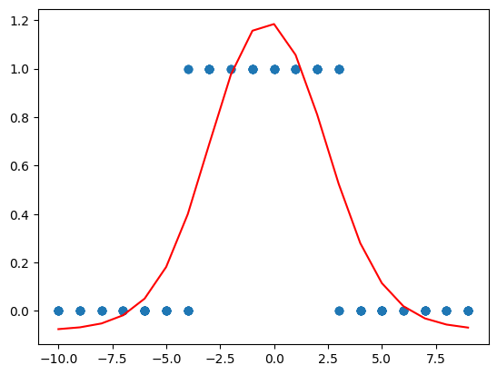

```python
import torch
import numpy as np
import matplotlib.pyplot as plt
from torch.utils.data import TensorDataset, DataLoader

# 数据准备
x = np.random.randint(-10, 10, 200)
x.sort()
y0 = np.zeros(50)
y1 = np.ones(50)
y2 = np.zeros(50)
y3 = np.ones(50)
y = np.concatenate((y0, y1, y2, y3))  # 合并两个数组
plt.scatter(x, y)
plt.show()
```

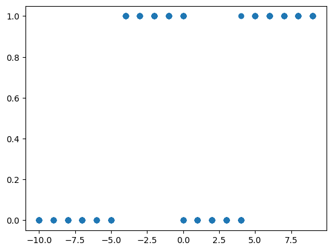

```python
# 将 NumPy 数组转换为 PyTorch 张量
x_tensor = torch.tensor(x, dtype=torch.float32)
y_tensor = torch.tensor(y, dtype=torch.float32)

dataset = TensorDataset(x_tensor, y_tensor)
dataloader = DataLoader(dataset, batch_size=5, shuffle=True)

w1 = torch.nn.Parameter(torch.rand(1), requires_grad=True)

w2 = torch.nn.Parameter(torch.rand(1), requires_grad=True)
w3 = torch.nn.Parameter(torch.rand(1), requires_grad=True)
w4 = torch.nn.Parameter(torch.rand(1), requires_grad=True)
w5 = torch.nn.Parameter(torch.rand(1), requires_grad=True)
w6 = torch.nn.Parameter(torch.rand(1), requires_grad=True)
b1 = torch.nn.Parameter(torch.rand(1), requires_grad=True)
b2 = torch.nn.Parameter(torch.rand(1), requires_grad=True)
b3 = torch.nn.Parameter(torch.rand(1), requires_grad=True)
b4 = torch.nn.Parameter(torch.rand(1), requires_grad=True)

optimizer = torch.optim.SGD([w1, w2, w3, w4, w5, w6, b1, b2, b3, b4], lr=0.01)
criterion = torch.nn.MSELoss()


def sigmoid(x):
    return 1 / (1 + torch.exp(-x))


# 训练循环
epochs = 1000
for epoch in range(epochs):
    for x_batch, y_batch in dataloader:
        s1 = sigmoid(w1 * x_batch + b1)
        s2 = sigmoid(w2 * x_batch + b2)
        s3 = sigmoid(w3 * x_batch + b3)
        y_predict = w4 * s1 + w5 * s2 + w6 * s3 + b4
        loss = criterion(y_predict, y_batch)  # (sigmoid(w * x + b) - y)**2
        optimizer.zero_grad()
        loss.backward()
        optimizer.step()

# 最终预测结果
sigmoid1 = sigmoid(w1 * x_tensor + b1)
sigmoid2 = sigmoid(w2 * x_tensor + b2)
sigmoid3 = sigmoid(w3 * x_tensor + b3)
final_prediction = w4 * sigmoid1 + w5 * sigmoid2 + w6 * sigmoid3 + b4

# 绘图
plt.scatter(x, y)
plt.plot(x, final_prediction.detach().numpy(), color='r')
plt.show()
```

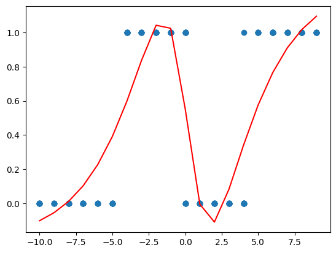

```python
import torch
import numpy as np
import matplotlib.pyplot as plt
from torch.utils.data import TensorDataset, DataLoader

# 数据准备
x = np.random.randint(-10, 10, 200)
x.sort()
y0 = np.zeros(50)
y1 = np.ones(50)
y2 = np.zeros(50)
y3 = np.ones(50)
y = np.concatenate((y0, y1, y2, y3))  # 合并两个数组

# [1,2]  -> (2, 1)
# 将 NumPy 数组转换为 PyTorch 张量 (1, 200) -> (200, 1)
x_tensor = torch.tensor(x, dtype=torch.float32).view(-1, 1)
y_tensor = torch.tensor(y, dtype=torch.float32).view(-1, 1)

dataset = TensorDataset(x_tensor, y_tensor)
dataloader = DataLoader(dataset, batch_size=5, shuffle=True)


# 定义神经网络模型
class SimpleModel(torch.nn.Module):
    def __init__(self):
        super().__init__()
        self.input = torch.nn.Linear(1, 4)  # 隐藏层4个神经元，线性层
        self.output = torch.nn.Linear(4, 1)  # 输出层，线性层 w1x1+w2x2+b

    def forward(self, x):
        y = torch.sigmoid(self.input(x))
        return self.output(y)


model = SimpleModel()
optimizer = torch.optim.SGD(model.parameters(), lr=0.01)
criterion = torch.nn.MSELoss()

# 训练循环
epochs = 1000
for epoch in range(epochs):
    for x_batch, y_batch in dataloader:
        y_predict = model(x_batch)
        loss = criterion(y_predict, y_batch)
        optimizer.zero_grad()
        loss.backward()
        optimizer.step()

# 预测
# view的参数-1表示自动计算维度，1表示一维向量，将 x_tensor的形状变为 (100, 1)，因为模型的第一层是1*4
final_prediction = model(x_tensor)

# 绘图
plt.clf()
plt.scatter(x, y)
plt.plot(x, final_prediction.detach().numpy(), color='r')
plt.show()
```

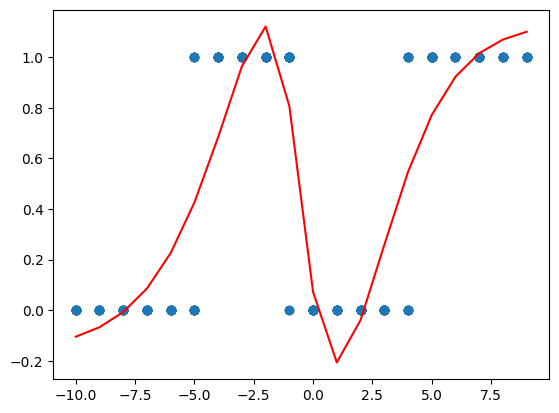

```python
# 矩阵加法
a = torch.tensor([[1, 2],
                  [3, 4]])
b = torch.tensor([[5, 6]])
print(a + b)
```

```plaintext
tensor([[ 6,  8],
        [ 8, 10]])
```

```python
import torch
import numpy as np
import matplotlib.pyplot as plt
from torch.utils.data import TensorDataset, DataLoader
from torch.utils.tensorboard import SummaryWriter

# 数据准备
x = np.random.randint(80, 100, 200)
x.sort()
y0 = np.zeros(50)
y1 = np.ones(50)
y2 = np.zeros(50)
y3 = np.ones(50)
y = np.concatenate((y0, y1, y2, y3))  # 合并两个数组

# [1,2]  -> (2, 1)
# 将 NumPy 数组转换为 PyTorch 张量 (1, 200) -> (200, 1)
x_tensor = torch.tensor(x, dtype=torch.float32).view(-1, 1)
y_tensor = torch.tensor(y, dtype=torch.float32).view(-1, 1)

dataset = TensorDataset(x_tensor, y_tensor)
dataloader = DataLoader(dataset, batch_size=5, shuffle=True)


# 定义神经网络模型
class SimpleModel(torch.nn.Module):
    def __init__(self):
        super().__init__()
        self.input = torch.nn.Linear(1, 4)  # 隐藏层4个神经元，线性层
        self.output = torch.nn.Linear(4, 1)  # 输出层，线性层 w1x1+w2x2+b

    def forward(self, x):
        y = torch.relu(self.input(x))
        return self.output(y)


model = SimpleModel()
optimizer = torch.optim.SGD(model.parameters(), lr=0.01)
criterion = torch.nn.MSELoss()
writer = SummaryWriter()

# 训练循环
epochs = 100
for epoch in range(epochs):
    for x_batch, y_batch in dataloader:
        y_predict = model(x_batch)
        loss = criterion(y_predict, y_batch)
        optimizer.zero_grad()
        loss.backward()

        # tensorboard查看梯度分布
        for name, param in model.named_parameters():
            writer.add_histogram(name, param.grad, epoch)

        optimizer.step()

# 预测
# view的参数-1表示自动计算维度，1表示一维向量，将 x_tensor的形状变为 (100, 1)，因为模型的第一层是1*4
final_prediction = model(x_tensor)

# 绘图
plt.clf()
plt.scatter(x, y)
plt.plot(x, final_prediction.detach().numpy(), color='r')
plt.show()
```

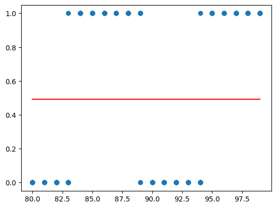

```python
!pip install tensorboard
```

## 网络结构可视化

### tensorboard

```python
# pip install tensorboard
# tensorboard --logdir=runs

import torch
from torch.utils.tensorboard import SummaryWriter


class SimpleModel(torch.nn.Module):
    def __init__(self):
        super().__init__()
        self.layer1 = torch.nn.Linear(1, 4)  # 隐藏层4个神经元，线性层
        self.layer2 = torch.nn.Linear(4, 1)  # 输出层，线性层

    def forward(self, x):
        x = torch.relu(self.layer1(x))
        x = self.layer2(x)
        return torch.sigmoid(x)


model = SimpleModel()
print(model)

# 查看模型参数
print(model.state_dict())

writer = SummaryWriter()
x = torch.randn(100, 1)
writer.add_graph(model, x)
writer.close()
```

```plaintext
SimpleModel(
  (layer1): Linear(in_features=1, out_features=4, bias=True)
  (layer2): Linear(in_features=4, out_features=1, bias=True)
)
OrderedDict([('layer1.weight', tensor([[-0.1323],
        [ 0.3015],
        [-0.1852],
        [-0.4852]])), ('layer1.bias', tensor([-0.3165,  0.4945, -0.6972, -0.7714])), ('layer2.weight', tensor([[ 0.2264,  0.4072, -0.2901,  0.0961]])), ('layer2.bias', tensor([-0.1050]))])
```

### ONNX

```python
!pip install onnx
```

```plaintext
Collecting onnx

  Downloading onnx-1.18.0-cp310-cp310-macosx_12_0_universal2.whl.metadata (6.9 kB)

Requirement already satisfied: numpy>=1.22 in /Users/dadudu/miniconda3/envs/mini-gpt/lib/python3.10/site-packages (from onnx) (2.2.6)

Requirement already satisfied: protobuf>=4.25.1 in /Users/dadudu/miniconda3/envs/mini-gpt/lib/python3.10/site-packages (from onnx) (6.31.1)

Requirement already satisfied: typing_extensions>=4.7.1 in /Users/dadudu/miniconda3/envs/mini-gpt/lib/python3.10/site-packages (from onnx) (4.14.0)

Downloading onnx-1.18.0-cp310-cp310-macosx_12_0_universal2.whl (18.3 MB)

   ━━━━━━━━━━━━━━━━━━━━━━━━━━━━━━━━━━━━━━━━ 18.3/18.3 MB 13.3 MB/s eta 0:00:00a 0:00:01

[?25hInstalling collected packages: onnx

Successfully installed onnx-1.18.0
```

```python
# pip install onnx

import torch
import numpy as np


class SimpleModel(torch.nn.Module):
    def __init__(self):
        super().__init__()
        self.layer1 = torch.nn.Linear(1, 4)  # 隐藏层4个神经元，线性层
        self.layer2 = torch.nn.Linear(4, 1)  # 输出层，线性层

    def forward(self, x):
        x = torch.relu(self.layer1(x))
        x = self.layer2(x)
        return torch.sigmoid(x)


model = SimpleModel()
print(model)

# 查看模型参数
print(model.state_dict())

dummy_input = torch.randn(100, 1)
torch.onnx.export(model, dummy_input, "model.onnx")

# 利用https://netron.app/进行查看。
```

```plaintext
SimpleModel(
  (layer1): Linear(in_features=1, out_features=4, bias=True)
  (layer2): Linear(in_features=4, out_features=1, bias=True)
)
OrderedDict([('layer1.weight', tensor([[ 0.2864],
        [-0.6674],
        [ 0.0467],
        [ 0.3517]])), ('layer1.bias', tensor([ 0.7096, -0.9159, -0.3579,  0.9385])), ('layer2.weight', tensor([[ 0.2062, -0.0419, -0.2206, -0.1286]])), ('layer2.bias', tensor([0.0289]))])
```