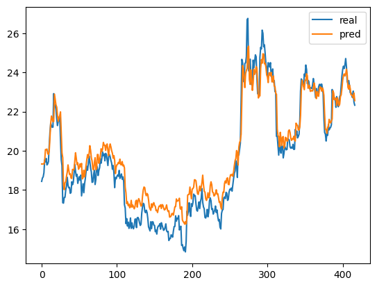
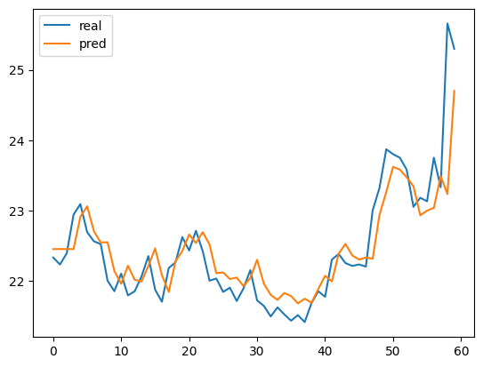
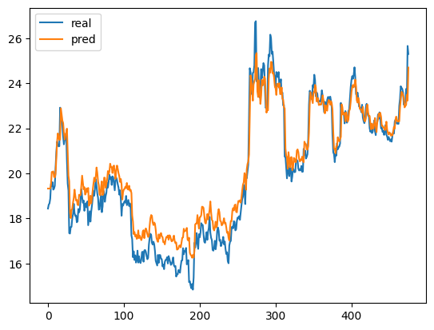
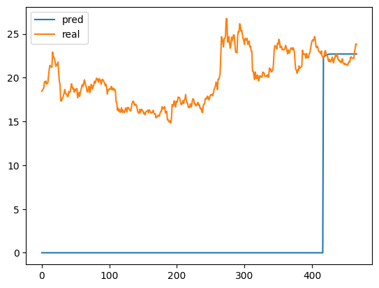

# 08、股价预测实战

https://tushare.pro/register?reg=804648

```python
# import numpy as np
!pip install tushare
```

```python
# # 获取A股历史股价数据
# import tushare as ts
#
# # 设置token，获取token请自行注册tushare
# ts.set_token('用自己的')
#
# pro = ts.pro_api()
#
# df = pro.daily(ts_code='600030.SH', start_date='20180101', end_date='20191231')
#
# df.to_csv('600030.csv', index=False)
```

```python
import pandas as pd

# numpy、pytorch、matplotlib

# 将trade_date字段转成日期格式，并设置为索引字段
df = pd.read_csv('600030.csv', parse_dates=['trade_date'], index_col='trade_date')
```

```python
df.index
```

```plaintext
DatetimeIndex(['2019-12-31', '2019-12-30', '2019-12-27', '2019-12-26',
               '2019-12-25', '2019-12-24', '2019-12-23', '2019-12-20',
               '2019-12-19', '2019-12-18',
               ...
               '2018-01-15', '2018-01-12', '2018-01-11', '2018-01-10',
               '2018-01-09', '2018-01-08', '2018-01-05', '2018-01-04',
               '2018-01-03', '2018-01-02'],
              dtype='datetime64[ns]', name='trade_date', length=476, freq=None)
```

```python
df.sort_index(ascending=True, inplace=True)  # 本地修改
```

```python
df.index
```

```plaintext
DatetimeIndex(['2018-01-02', '2018-01-03', '2018-01-04', '2018-01-05',
               '2018-01-08', '2018-01-09', '2018-01-10', '2018-01-11',
               '2018-01-12', '2018-01-15',
               ...
               '2019-12-18', '2019-12-19', '2019-12-20', '2019-12-23',
               '2019-12-24', '2019-12-25', '2019-12-26', '2019-12-27',
               '2019-12-30', '2019-12-31'],
              dtype='datetime64[ns]', name='trade_date', length=476, freq=None)
```

```python
# 收盘价
df['close']
```

```plaintext
trade_date
2018-01-02    18.44
2018-01-03    18.61
2018-01-04    18.67
2018-01-05    18.88
2018-01-08    19.54
              ...  
2019-12-25    23.13
2019-12-26    23.75
2019-12-27    23.33
2019-12-30    25.66
2019-12-31    25.30
Name: close, Length: 476, dtype: float64
```

```python
data = df['close']
data.plot()
```

```plaintext
<Axes: xlabel='trade_date'>
```


```python
# 将收盘价分为训练集和测试集（最后三个月作为测试集）

# 训练集
train_data = data['2018-01-02':'2019-10-08']
train_data[:10]
```

```plaintext
trade_date
2018-01-02    18.44
2018-01-03    18.61
2018-01-04    18.67
2018-01-05    18.88
2018-01-08    19.54
2018-01-09    19.44
2018-01-10    19.61
2018-01-11    19.28
2018-01-12    19.33
2018-01-15    19.45
Name: close, dtype: float64
```

```python
# 最后3个月作为测试集
test_data = data['2019-10-08':]
test_data[:10]
```

```plaintext
trade_date
2019-10-08    22.33
2019-10-09    22.23
2019-10-10    22.39
2019-10-11    22.94
2019-10-14    23.09
2019-10-15    22.69
2019-10-16    22.56
2019-10-17    22.52
2019-10-18    22.00
2019-10-21    21.85
Name: close, dtype: float64
```

```python
train_data.values
```

```plaintext
array([18.44, 18.61, 18.67, 18.88, 19.54, 19.44, 19.61, 19.28, 19.33,
       19.45, 20.25, 20.94, 21.41, 21.29, 21.2 , 21.21, 22.92, 22.33,
       22.34, 22.11, 21.63, 21.29, 21.5 , 21.52, 21.79, 20.55, 19.55,
       19.24, 17.35, 17.33, 17.62, 17.63, 18.01, 18.19, 18.65, 18.25,
       18.11, 18.13, 17.83, 17.87, 18.42, 18.27, 18.39, 18.86, 19.3 ,
       18.95, 18.7 , 18.8 , 18.34, 18.54, 18.68, 18.5 , 18.76, 17.7 ,
       18.02, 18.32, 17.86, 18.31, 18.58, 18.93, 19.21, 19.01, 19.34,
       19.74, 19.45, 19.11, 18.92, 18.39, 18.41, 18.79, 19.01, 18.28,
       18.53, 19.24, 19.14, 18.74, 18.99, 19.14, 19.59, 19.37, 19.63,
       19.94, 19.75, 19.84, 19.49, 19.87, 19.82, 19.52, 19.25, 19.73,
       19.81, 19.7 , 19.51, 19.37, 19.06, 19.25, 18.87, 18.12, 18.64,
       18.57, 18.69, 18.77, 18.7 , 19.  , 18.59, 18.7 , 18.82, 18.55,
       18.67, 18.43, 17.25, 17.08, 16.28, 16.54, 16.16, 16.36, 16.04,
       16.16, 16.57, 16.04, 16.32, 16.09, 16.02, 16.17, 16.51, 16.52,
       16.08, 16.58, 16.6 , 16.52, 16.33, 16.19, 16.25, 16.83, 17.14,
       17.32, 17.27, 16.92, 16.84, 16.97, 16.86, 16.56, 16.12, 16.02,
       15.91, 16.38, 16.03, 16.38, 16.37, 16.21, 16.19, 15.87, 15.95,
       15.75, 16.07, 16.16, 16.17, 16.28, 16.  , 16.33, 16.21, 16.07,
       15.94, 15.98, 16.09, 16.27, 15.92, 15.86, 15.89, 15.42, 15.52,
       15.52, 15.71, 15.68, 15.59, 15.9 , 16.13, 16.14, 16.68, 16.41,
       16.56, 16.53, 16.69, 15.96, 16.04, 16.15, 15.17, 15.21, 15.02,
       14.9 , 15.09, 14.84, 15.38, 16.92, 16.71, 16.93, 17.35, 16.88,
       16.65, 17.3 , 17.16, 17.36, 17.79, 17.71, 17.71, 17.3 , 16.97,
       16.92, 17.13, 17.39, 17.05, 17.4 , 17.58, 18.07, 17.37, 17.14,
       17.04, 16.6 , 16.57, 16.71, 17.01, 16.63, 16.87, 17.44, 17.6 ,
       17.45, 17.01, 17.05, 16.77, 16.88, 16.97, 17.18, 16.85, 16.98,
       16.65, 16.42, 16.5 , 16.1 , 16.01, 16.8 , 16.97, 17.  , 17.6 ,
       17.64, 17.56, 17.88, 17.84, 17.47, 17.52, 17.89, 18.04, 18.  ,
       18.1 , 17.94, 18.26, 18.58, 18.86, 18.97, 19.49, 19.3 , 18.64,
       19.82, 19.78, 20.08, 20.39, 22.43, 24.67, 24.5 , 24.05, 23.51,
       24.46, 24.49, 24.8 , 26.7 , 26.76, 24.08, 24.09, 24.68, 23.92,
       23.37, 23.81, 24.63, 24.23, 24.56, 24.9 , 24.8 , 23.7 , 22.91,
       22.97, 22.83, 24.78, 25.28, 25.2 , 26.16, 26.  , 25.31, 25.41,
       24.95, 24.42, 24.27, 23.8 , 24.5 , 24.36, 24.28, 24.5 , 23.79,
       23.95, 24.18, 23.5 , 23.59, 23.02, 23.04, 20.74, 20.75, 20.27,
       19.78, 20.64, 20.04, 19.88, 20.3 , 20.23, 19.64, 19.87, 20.23,
       20.14, 20.05, 20.07, 20.63, 20.59, 20.55, 20.21, 20.13, 20.19,
       20.13, 20.33, 20.07, 20.08, 21.09, 20.81, 21.01, 20.66, 20.73,
       20.85, 21.55, 23.05, 23.67, 23.6 , 23.48, 23.29, 23.92, 23.81,
       24.38, 24.15, 23.43, 23.6 , 23.54, 23.17, 23.23, 23.2 , 23.18,
       23.37, 23.69, 23.43, 23.09, 22.72, 23.18, 22.8 , 22.87, 23.26,
       23.39, 23.39, 23.17, 23.41, 23.23, 22.92, 21.71, 20.94, 20.85,
       20.5 , 20.91, 20.79, 21.34, 21.07, 21.15, 21.2 , 21.33, 23.13,
       22.76, 22.64, 22.71, 22.64, 22.22, 22.77, 22.42, 22.25, 22.32,
       22.77, 22.84, 23.33, 23.83, 24.15, 24.32, 24.2 , 24.39, 24.71,
       24.28, 23.53, 23.43, 23.59, 23.34, 22.97, 22.96, 22.86, 22.72,
       23.05, 22.48, 22.33])
```

```python
# 图片-->0-9
# 样本--->标签
# days天--->明天
# [10, 11, 12, 13, 14, 15]
# [10, 11, 12] -> 13
# [11, 12, 13] -> 14
# [12, 13, 14] -> 15
```

```python
print(len(train_data.values))
```

```plaintext
417
```

```python
import numpy as np

# 将训练集划分为特征和标签，每days天一个标签
train_data_values = train_data.values

days = 3
# range(0, 10)

train_data_x = []
train_data_y = []
for i in range(days, len(train_data_values)):  # range(3, len(train_values))的意思是从第3天开始，到训练集的最后一天，依次取值
    x = train_data_values[i - days:i]
    y = train_data_values[i]
    train_data_x.append(x)
    train_data_y.append(y)

train_data_x = np.array(train_data_x)
train_data_y = np.array(train_data_y)

# train_data_x[:5], train_data_y[:5]


# MaxMin归一化
train_data_normalized_x = (train_data_x - train_data_x.min()) / (train_data_x.max() - train_data_x.min())
train_data_normalized_y = (train_data_y - train_data_y.min()) / (train_data_y.max() - train_data_y.min())

train_data_normalized_x[:2], train_data_normalized_y[:2]
```

```plaintext
(array([[0.30201342, 0.31627517, 0.32130872],
        [0.31627517, 0.32130872, 0.33892617]]),
 array([0.33892617, 0.3942953 ]))
```

```python
from torch.utils.data import TensorDataset, DataLoader
import torch

train_dataset = TensorDataset(torch.tensor(train_data_normalized_x).float(),
                              torch.tensor(train_data_normalized_y).float())
train_loader = DataLoader(train_dataset, batch_size=2, shuffle=False)
for x, y in train_loader:
    print(x)
    print(y)
    break
```

```plaintext
tensor([[0.3020, 0.3163, 0.3213],
        [0.3163, 0.3213, 0.3389]])
tensor([0.3389, 0.3943])
```

```python
# 定义模型
class Net(torch.nn.Module):
    def __init__(self):
        super(Net, self).__init__()
        self.fc1 = torch.nn.Linear(days, 256)
        self.fc2 = torch.nn.Linear(256, 256)
        self.fc3 = torch.nn.Linear(256, 256)
        self.fc4 = torch.nn.Linear(256, 256)
        self.fc5 = torch.nn.Linear(256, 256)
        self.fc6 = torch.nn.Linear(256, 256)
        self.fc7 = torch.nn.Linear(256, 1)

    def forward(self, x):
        x = torch.relu(self.fc1(x))
        x = torch.relu(self.fc2(x))
        x = torch.relu(self.fc3(x))
        x = torch.relu(self.fc4(x))
        x = torch.relu(self.fc5(x))
        x = torch.relu(self.fc6(x))
        x = self.fc7(x)
        return x
```

```python
# 开始训练
model = Net()
optimizer = torch.optim.SGD(model.parameters(), lr=0.01)
criterion = torch.nn.MSELoss()

epochs = 110
for epoch in range(epochs):
    for i, (x, y) in enumerate(train_loader):
        y_pred = model(x)
        loss = criterion(y_pred, y.view(-1, 1))
        optimizer.zero_grad()
        loss.backward()
        optimizer.step()
        if i % 100 == 0:
            print('Epoch: {}, Loss: {:.4f}'.format(epoch, loss.item()))
```

```plaintext
Epoch: 0, Loss: 0.1220
Epoch: 0, Loss: 0.0060
Epoch: 0, Loss: 0.0479
Epoch: 1, Loss: 0.0611
Epoch: 1, Loss: 0.0022
Epoch: 1, Loss: 0.0452
Epoch: 2, Loss: 0.0610
Epoch: 2, Loss: 0.0024
Epoch: 2, Loss: 0.0432
Epoch: 3, Loss: 0.0599
Epoch: 3, Loss: 0.0027
Epoch: 3, Loss: 0.0408
Epoch: 4, Loss: 0.0585
Epoch: 4, Loss: 0.0030
Epoch: 4, Loss: 0.0378
Epoch: 5, Loss: 0.0563
Epoch: 5, Loss: 0.0035
Epoch: 5, Loss: 0.0339
Epoch: 6, Loss: 0.0530
Epoch: 6, Loss: 0.0042
Epoch: 6, Loss: 0.0290
Epoch: 7, Loss: 0.0478
Epoch: 7, Loss: 0.0052
Epoch: 7, Loss: 0.0238
Epoch: 8, Loss: 0.0402
Epoch: 8, Loss: 0.0062
Epoch: 8, Loss: 0.0182
Epoch: 9, Loss: 0.0305
Epoch: 9, Loss: 0.0068
Epoch: 9, Loss: 0.0130
Epoch: 10, Loss: 0.0203
Epoch: 10, Loss: 0.0069
Epoch: 10, Loss: 0.0088
Epoch: 11, Loss: 0.0119
Epoch: 11, Loss: 0.0064
Epoch: 11, Loss: 0.0057
Epoch: 12, Loss: 0.0064
Epoch: 12, Loss: 0.0056
Epoch: 12, Loss: 0.0038
Epoch: 13, Loss: 0.0033
Epoch: 13, Loss: 0.0048
Epoch: 13, Loss: 0.0028
Epoch: 14, Loss: 0.0018
Epoch: 14, Loss: 0.0040
Epoch: 14, Loss: 0.0022
Epoch: 15, Loss: 0.0010
Epoch: 15, Loss: 0.0034
Epoch: 15, Loss: 0.0019
Epoch: 16, Loss: 0.0007
Epoch: 16, Loss: 0.0029
Epoch: 16, Loss: 0.0017
Epoch: 17, Loss: 0.0006
Epoch: 17, Loss: 0.0027
Epoch: 17, Loss: 0.0016
Epoch: 18, Loss: 0.0005
Epoch: 18, Loss: 0.0024
Epoch: 18, Loss: 0.0016
Epoch: 19, Loss: 0.0005
Epoch: 19, Loss: 0.0023
Epoch: 19, Loss: 0.0016
Epoch: 20, Loss: 0.0005
Epoch: 20, Loss: 0.0021
Epoch: 20, Loss: 0.0015
Epoch: 21, Loss: 0.0005
Epoch: 21, Loss: 0.0020
Epoch: 21, Loss: 0.0015
Epoch: 22, Loss: 0.0005
Epoch: 22, Loss: 0.0019
Epoch: 22, Loss: 0.0015
Epoch: 23, Loss: 0.0005
Epoch: 23, Loss: 0.0018
Epoch: 23, Loss: 0.0015
Epoch: 24, Loss: 0.0005
Epoch: 24, Loss: 0.0017
Epoch: 24, Loss: 0.0015
Epoch: 25, Loss: 0.0005
Epoch: 25, Loss: 0.0017
Epoch: 25, Loss: 0.0015
Epoch: 26, Loss: 0.0005
Epoch: 26, Loss: 0.0016
Epoch: 26, Loss: 0.0015
Epoch: 27, Loss: 0.0005
Epoch: 27, Loss: 0.0015
Epoch: 27, Loss: 0.0015
Epoch: 28, Loss: 0.0005
Epoch: 28, Loss: 0.0015
Epoch: 28, Loss: 0.0015
Epoch: 29, Loss: 0.0005
Epoch: 29, Loss: 0.0014
Epoch: 29, Loss: 0.0015
Epoch: 30, Loss: 0.0005
Epoch: 30, Loss: 0.0014
Epoch: 30, Loss: 0.0015
Epoch: 31, Loss: 0.0005
Epoch: 31, Loss: 0.0014
Epoch: 31, Loss: 0.0014
Epoch: 32, Loss: 0.0005
Epoch: 32, Loss: 0.0013
Epoch: 32, Loss: 0.0014
Epoch: 33, Loss: 0.0005
Epoch: 33, Loss: 0.0013
Epoch: 33, Loss: 0.0014
Epoch: 34, Loss: 0.0005
Epoch: 34, Loss: 0.0012
Epoch: 34, Loss: 0.0014
Epoch: 35, Loss: 0.0005
Epoch: 35, Loss: 0.0012
Epoch: 35, Loss: 0.0014
Epoch: 36, Loss: 0.0005
Epoch: 36, Loss: 0.0012
Epoch: 36, Loss: 0.0014
Epoch: 37, Loss: 0.0005
Epoch: 37, Loss: 0.0011
Epoch: 37, Loss: 0.0014
Epoch: 38, Loss: 0.0005
Epoch: 38, Loss: 0.0011
Epoch: 38, Loss: 0.0014
Epoch: 39, Loss: 0.0005
Epoch: 39, Loss: 0.0011
Epoch: 39, Loss: 0.0014
Epoch: 40, Loss: 0.0005
Epoch: 40, Loss: 0.0010
Epoch: 40, Loss: 0.0014
Epoch: 41, Loss: 0.0005
Epoch: 41, Loss: 0.0010
Epoch: 41, Loss: 0.0013
Epoch: 42, Loss: 0.0005
Epoch: 42, Loss: 0.0010
Epoch: 42, Loss: 0.0013
Epoch: 43, Loss: 0.0005
Epoch: 43, Loss: 0.0010
Epoch: 43, Loss: 0.0013
Epoch: 44, Loss: 0.0005
Epoch: 44, Loss: 0.0009
Epoch: 44, Loss: 0.0013
Epoch: 45, Loss: 0.0005
Epoch: 45, Loss: 0.0009
Epoch: 45, Loss: 0.0013
Epoch: 46, Loss: 0.0005
Epoch: 46, Loss: 0.0009
Epoch: 46, Loss: 0.0013
Epoch: 47, Loss: 0.0005
Epoch: 47, Loss: 0.0008
Epoch: 47, Loss: 0.0013
Epoch: 48, Loss: 0.0005
Epoch: 48, Loss: 0.0008
Epoch: 48, Loss: 0.0013
Epoch: 49, Loss: 0.0005
Epoch: 49, Loss: 0.0008
Epoch: 49, Loss: 0.0013
Epoch: 50, Loss: 0.0005
Epoch: 50, Loss: 0.0008
Epoch: 50, Loss: 0.0013
Epoch: 51, Loss: 0.0005
Epoch: 51, Loss: 0.0007
Epoch: 51, Loss: 0.0013
Epoch: 52, Loss: 0.0005
Epoch: 52, Loss: 0.0007
Epoch: 52, Loss: 0.0013
Epoch: 53, Loss: 0.0005
Epoch: 53, Loss: 0.0007
Epoch: 53, Loss: 0.0013
Epoch: 54, Loss: 0.0005
Epoch: 54, Loss: 0.0007
Epoch: 54, Loss: 0.0013
Epoch: 55, Loss: 0.0005
Epoch: 55, Loss: 0.0007
Epoch: 55, Loss: 0.0013
Epoch: 56, Loss: 0.0006
Epoch: 56, Loss: 0.0006
Epoch: 56, Loss: 0.0013
Epoch: 57, Loss: 0.0006
Epoch: 57, Loss: 0.0006
Epoch: 57, Loss: 0.0013
Epoch: 58, Loss: 0.0006
Epoch: 58, Loss: 0.0006
Epoch: 58, Loss: 0.0013
Epoch: 59, Loss: 0.0006
Epoch: 59, Loss: 0.0006
Epoch: 59, Loss: 0.0013
Epoch: 60, Loss: 0.0006
Epoch: 60, Loss: 0.0006
Epoch: 60, Loss: 0.0013
Epoch: 61, Loss: 0.0006
Epoch: 61, Loss: 0.0006
Epoch: 61, Loss: 0.0013
Epoch: 62, Loss: 0.0006
Epoch: 62, Loss: 0.0005
Epoch: 62, Loss: 0.0013
Epoch: 63, Loss: 0.0006
Epoch: 63, Loss: 0.0005
Epoch: 63, Loss: 0.0013
Epoch: 64, Loss: 0.0006
Epoch: 64, Loss: 0.0005
Epoch: 64, Loss: 0.0013
Epoch: 65, Loss: 0.0006
Epoch: 65, Loss: 0.0005
Epoch: 65, Loss: 0.0013
Epoch: 66, Loss: 0.0006
Epoch: 66, Loss: 0.0005
Epoch: 66, Loss: 0.0013
Epoch: 67, Loss: 0.0006
Epoch: 67, Loss: 0.0005
Epoch: 67, Loss: 0.0013
Epoch: 68, Loss: 0.0006
Epoch: 68, Loss: 0.0004
Epoch: 68, Loss: 0.0013
Epoch: 69, Loss: 0.0006
Epoch: 69, Loss: 0.0004
Epoch: 69, Loss: 0.0013
Epoch: 70, Loss: 0.0006
Epoch: 70, Loss: 0.0004
Epoch: 70, Loss: 0.0014
Epoch: 71, Loss: 0.0006
Epoch: 71, Loss: 0.0004
Epoch: 71, Loss: 0.0014
Epoch: 72, Loss: 0.0006
Epoch: 72, Loss: 0.0004
Epoch: 72, Loss: 0.0014
Epoch: 73, Loss: 0.0006
Epoch: 73, Loss: 0.0004
Epoch: 73, Loss: 0.0014
Epoch: 74, Loss: 0.0006
Epoch: 74, Loss: 0.0004
Epoch: 74, Loss: 0.0014
Epoch: 75, Loss: 0.0006
Epoch: 75, Loss: 0.0004
Epoch: 75, Loss: 0.0014
Epoch: 76, Loss: 0.0006
Epoch: 76, Loss: 0.0003
Epoch: 76, Loss: 0.0014
Epoch: 77, Loss: 0.0006
Epoch: 77, Loss: 0.0003
Epoch: 77, Loss: 0.0014
Epoch: 78, Loss: 0.0006
Epoch: 78, Loss: 0.0003
Epoch: 78, Loss: 0.0014
Epoch: 79, Loss: 0.0006
Epoch: 79, Loss: 0.0003
Epoch: 79, Loss: 0.0014
Epoch: 80, Loss: 0.0006
Epoch: 80, Loss: 0.0003
Epoch: 80, Loss: 0.0014
Epoch: 81, Loss: 0.0006
Epoch: 81, Loss: 0.0003
Epoch: 81, Loss: 0.0014
Epoch: 82, Loss: 0.0006
Epoch: 82, Loss: 0.0003
Epoch: 82, Loss: 0.0014
Epoch: 83, Loss: 0.0006
Epoch: 83, Loss: 0.0003
Epoch: 83, Loss: 0.0014
Epoch: 84, Loss: 0.0006
Epoch: 84, Loss: 0.0003
Epoch: 84, Loss: 0.0014
Epoch: 85, Loss: 0.0006
Epoch: 85, Loss: 0.0003
Epoch: 85, Loss: 0.0014
Epoch: 86, Loss: 0.0006
Epoch: 86, Loss: 0.0003
Epoch: 86, Loss: 0.0014
Epoch: 87, Loss: 0.0006
Epoch: 87, Loss: 0.0002
Epoch: 87, Loss: 0.0014
Epoch: 88, Loss: 0.0006
Epoch: 88, Loss: 0.0002
Epoch: 88, Loss: 0.0014
Epoch: 89, Loss: 0.0007
Epoch: 89, Loss: 0.0002
Epoch: 89, Loss: 0.0014
Epoch: 90, Loss: 0.0007
Epoch: 90, Loss: 0.0002
Epoch: 90, Loss: 0.0014
Epoch: 91, Loss: 0.0007
Epoch: 91, Loss: 0.0002
Epoch: 91, Loss: 0.0014
Epoch: 92, Loss: 0.0007
Epoch: 92, Loss: 0.0002
Epoch: 92, Loss: 0.0014
Epoch: 93, Loss: 0.0007
Epoch: 93, Loss: 0.0002
Epoch: 93, Loss: 0.0014
Epoch: 94, Loss: 0.0007
Epoch: 94, Loss: 0.0002
Epoch: 94, Loss: 0.0014
Epoch: 95, Loss: 0.0007
Epoch: 95, Loss: 0.0002
Epoch: 95, Loss: 0.0014
Epoch: 96, Loss: 0.0007
Epoch: 96, Loss: 0.0002
Epoch: 96, Loss: 0.0014
Epoch: 97, Loss: 0.0007
Epoch: 97, Loss: 0.0002
Epoch: 97, Loss: 0.0014
Epoch: 98, Loss: 0.0007
Epoch: 98, Loss: 0.0002
Epoch: 98, Loss: 0.0014
Epoch: 99, Loss: 0.0007
Epoch: 99, Loss: 0.0002
Epoch: 99, Loss: 0.0014
Epoch: 100, Loss: 0.0007
Epoch: 100, Loss: 0.0002
Epoch: 100, Loss: 0.0014
Epoch: 101, Loss: 0.0007
Epoch: 101, Loss: 0.0002
Epoch: 101, Loss: 0.0014
Epoch: 102, Loss: 0.0007
Epoch: 102, Loss: 0.0002
Epoch: 102, Loss: 0.0014
Epoch: 103, Loss: 0.0007
Epoch: 103, Loss: 0.0002
Epoch: 103, Loss: 0.0014
Epoch: 104, Loss: 0.0007
Epoch: 104, Loss: 0.0002
Epoch: 104, Loss: 0.0014
Epoch: 105, Loss: 0.0007
Epoch: 105, Loss: 0.0002
Epoch: 105, Loss: 0.0014
Epoch: 106, Loss: 0.0007
Epoch: 106, Loss: 0.0002
Epoch: 106, Loss: 0.0015
Epoch: 107, Loss: 0.0007
Epoch: 107, Loss: 0.0002
Epoch: 107, Loss: 0.0015
Epoch: 108, Loss: 0.0007
Epoch: 108, Loss: 0.0001
Epoch: 108, Loss: 0.0015
Epoch: 109, Loss: 0.0007
Epoch: 109, Loss: 0.0001
Epoch: 109, Loss: 0.0015
```

```python
# 预测
with torch.no_grad():
    y_pred_norm = model(torch.tensor(train_data_normalized_x[3]).float())
    # 反归一化
    y_pred = y_pred_norm.numpy() * (train_data_y.max() - train_data_y.min()) + train_data_y.min()

y_pred_norm, y_pred, train_data_y[3]
```

```plaintext
(tensor([0.4376]), array([20.05676627]), np.float64(19.61))
```

```python
# 画出预测结果和真实结果的曲线
import matplotlib.pyplot as plt

model.eval()

train_pred_result = []
with torch.no_grad():
    for x in train_data_normalized_x:
        train_pred_normalized = model(torch.tensor(x).float()).numpy()
        train_pred_result.append(train_pred_normalized * (train_data_y.max() - train_data_y.min()) + train_data_y.min())

# 用3天预测第4天，那么前3天就没有预测结果，直接补0
train_pred_result = [train_pred_result[0]] * days + train_pred_result

x_plot = [i for i in range(len(train_pred_result))]

print(len(train_pred_result))
print(len(train_data.values))

plt.plot(x_plot, train_data.values, label='real')
plt.plot(x_plot, train_pred_result, label='pred')
plt.legend()
plt.show()
```

```plaintext
417
417
```



```python
import numpy as np

test_data_values = test_data.values

test_data_x = []
test_data_y = []
for i in range(days, len(test_data_values)):  # range(3, len(train_values))的意思是从第3天开始，到训练集的最后一天，依次取值
    x = test_data_values[i - days:i]
    y = test_data_values[i]
    test_data_x.append(x)
    test_data_y.append(y)

test_data_x = np.array(test_data_x)
test_data_y = np.array(test_data_y)

# 用训练集同样的比例对测试集做归一化
test_data_normalized_x = (test_data_x - train_data_x.min()) / (train_data_x.max() - train_data_x.min())

test_data_normalized_x[:2]
```

```plaintext
array([[0.6283557 , 0.61996644, 0.63338926],
       [0.61996644, 0.63338926, 0.6795302 ]])
```

```python
# 画出预测结果和真实结果的曲线
import matplotlib.pyplot as plt

# 大都督周瑜（我的微信: it_zhouyu）

model.eval()
test_pred_result = []
with torch.no_grad():
    for x in test_data_normalized_x:
        test_pred_normalized = model(torch.tensor(x).float()).numpy()
        test_pred_result.append(test_pred_normalized * (train_data_y.max() - train_data_y.min()) + train_data_y.min())

test_pred_result = [test_pred_result[0]] * days + test_pred_result

x_plot = [i for i in range(len(test_data.index))]

plt.plot(x_plot, test_data.values, label='real')
plt.plot(x_plot, test_pred_result, label='pred')
plt.legend()
plt.show()
```



```python
import numpy as np

data_values = data.values

data_x = []
data_y = []
for i in range(days, len(data_values)):  # range(3, len(train_values))的意思是从第3天开始，到训练集的最后一天，依次取值
    x = data_values[i - days:i]
    y = data_values[i]
    data_x.append(x)
    data_y.append(y)

data_x = np.array(data_x)
data_y = np.array(data_y)

# 用训练集同样的比例对测试集做归一化
data_normalized_x = (data_x - train_data_x.min()) / (train_data_x.max() - train_data_x.min())

data_normalized_x[:2]
```

```plaintext
array([[0.30201342, 0.31627517, 0.32130872],
       [0.31627517, 0.32130872, 0.33892617]])
```

```python
# 画出预测结果和真实结果的曲线
import matplotlib.pyplot as plt

model.eval()
pred_result = []
with torch.no_grad():
    for x in data_normalized_x:
        pred_normalized = model(torch.tensor(x).float()).numpy()
        print(pred_normalized)
        pred_result.append(pred_normalized * (train_data_y.max() - train_data_y.min()) + train_data_y.min())

pred_result = [pred_result[0]] * days + pred_result

x_plot = [i for i in range(len(data.index))]

print(pred_result)

plt.plot(x_plot, data.values, label='real')
plt.plot(x_plot, pred_result, label='pred')
plt.legend()
plt.show()
```

```plaintext
[0.3765398]
[0.39048892]
[0.43847892]
[0.43764818]
[0.4404581]
[0.42039785]
[0.41777402]
[0.43077886]
[0.48940092]
[0.5496552]
[0.5819317]
[0.5707371]
[0.5575752]
[0.5587057]
[0.67549884]
[0.6525573]
[0.6295738]
[0.6205326]
[0.58502495]
[0.5591383]
[0.5756598]
[0.58332974]
[0.5995873]
[0.5150372]
[0.4241874]
[0.4036682]
[0.28696996]
[0.2665381]
[0.29608372]
[0.30084488]
[0.32404247]
[0.34156197]
[0.37246102]
[0.35032967]
[0.33188778]
[0.33465534]
[0.31624496]
[0.3144772]
[0.35343266]
[0.35104644]
[0.35263386]
[0.38796225]
[0.42453527]
[0.40051836]
[0.37387496]
[0.38138345]
[0.35392958]
[0.360295]
[0.37713364]
[0.36464554]
[0.37881178]
[0.3126719]
[0.3182038]
[0.3499297]
[0.32146886]
[0.3425209]
[0.37074947]
[0.39553264]
[0.41700825]
[0.40257743]
[0.41986325]
[0.45483327]
[0.43546847]
[0.40291864]
[0.3890257]
[0.35511738]
[0.35121596]
[0.3822664]
[0.4033508]
[0.35201806]
[0.35706514]
[0.41714138]
[0.41682267]
[0.3795861]
[0.3927315]
[0.4109274]
[0.44165653]
[0.43023306]
[0.44041207]
[0.46904302]
[0.45653492]
[0.4569489]
[0.43468666]
[0.45657098]
[0.46228957]
[0.43517628]
[0.4126096]
[0.44701]
[0.46229866]
[0.44981694]
[0.43343425]
[0.42240557]
[0.40126783]
[0.4122876]
[0.39198875]
[0.33542675]
[0.36352184]
[0.37311935]
[0.3753147]
[0.3834453]
[0.3784649]
[0.39720786]
[0.37398478]
[0.37268066]
[0.38692334]
[0.36858535]
[0.37183207]
[0.3595747]
[0.2770088]
[0.25327146]
[0.20696926]
[0.21462196]
[0.1980645]
[0.20468]
[0.18907535]
[0.19213691]
[0.22072142]
[0.1918059]
[0.2009253]
[0.19243476]
[0.18435872]
[0.1937232]
[0.21712698]
[0.22138003]
[0.19170399]
[0.217315]
[0.22814241]
[0.21975628]
[0.2064267]
[0.19626683]
[0.19924283]
[0.2377308]
[0.2656428]
[0.27782124]
[0.27496022]
[0.25009668]
[0.24045025]
[0.25018537]
[0.2453741]
[0.22336502]
[0.19301383]
[0.18365248]
[0.17784554]
[0.20572719]
[0.19048561]
[0.20528725]
[0.21093532]
[0.19848537]
[0.19565348]
[0.1767979]
[0.17842701]
[0.1685321]
[0.1855659]
[0.19589429]
[0.19524124]
[0.20166104]
[0.18577379]
[0.20239006]
[0.20040481]
[0.18858363]
[0.17979112]
[0.18149213]
[0.18918782]
[0.20129947]
[0.18116617]
[0.17311706]
[0.17588085]
[0.14894387]
[0.15014507]
[0.15400943]
[0.16414103]
[0.16424805]
[0.15740143]
[0.17515905]
[0.19329059]
[0.19424063]
[0.22690924]
[0.21694492]
[0.2190033]
[0.22103384]
[0.22992957]
[0.18629552]
[0.18264176]
[0.19331199]
[0.13673624]
[0.12981856]
[0.12593018]
[0.11880212]
[0.12939203]
[0.11926614]
[0.14366181]
[0.24269491]
[0.2461019]
[0.2457607]
[0.27765098]
[0.2514026]
[0.22739911]
[0.26936293]
[0.2708479]
[0.27747786]
[0.30885386]
[0.30835134]
[0.30444545]
[0.27771106]
[0.2508555]
[0.24615555]
[0.26140013]
[0.28164652]
[0.2615892]
[0.27783325]
[0.29685384]
[0.32853025]
[0.2885847]
[0.26006046]
[0.2558278]
[0.22736228]
[0.22040471]
[0.23153523]
[0.25330612]
[0.23180822]
[0.24012278]
[0.28329158]
[0.30003732]
[0.2881048]
[0.25625515]
[0.2541277]
[0.23947929]
[0.24246822]
[0.25174955]
[0.26596895]
[0.24679089]
[0.24921054]
[0.23173441]
[0.21181163]
[0.21553983]
[0.1930802]
[0.18309548]
[0.23311022]
[0.25567335]
[0.25476852]
[0.29312065]
[0.30383036]
[0.2946853]
[0.31432906]
[0.31701905]
[0.2897732]
[0.2880245]
[0.31536746]
[0.33058524]
[0.32766998]
[0.33264965]
[0.3238226]
[0.3419371]
[0.36929357]
[0.39110717]
[0.3994816]
[0.43398833]
[0.42593485]
[0.3722422]
[0.44810984]
[0.4685081]
[0.47643548]
[0.5037161]
[0.64741486]
[0.79780644]
[0.78672963]
[0.7400686]
[0.70378315]
[0.7640369]
[0.77656686]
[0.78544706]
[0.8737728]
[0.8812539]
[0.7384466]
[0.7176763]
[0.780003]
[0.7395333]
[0.6917588]
[0.72385585]
[0.78168213]
[0.76038015]
[0.7690349]
[0.7934876]
[0.7869441]
[0.7180437]
[0.6593001]
[0.668529]
[0.667947]
[0.78669477]
[0.823841]
[0.80831414]
[0.848499]
[0.846812]
[0.80572957]
[0.80774826]
[0.7906031]
[0.7577107]
[0.7498579]
[0.72520816]
[0.76617837]
[0.7670726]
[0.75509393]
[0.7685288]
[0.728094]
[0.7298316]
[0.75315845]
[0.7104125]
[0.7080256]
[0.6793553]
[0.6750268]
[0.5261992]
[0.49873558]
[0.49231607]
[0.4502738]
[0.5119897]
[0.48552537]
[0.4558289]
[0.4913304]
[0.4939023]
[0.444697]
[0.45425048]
[0.4906556]
[0.4864791]
[0.4745375]
[0.47585097]
[0.5179281]
[0.52245367]
[0.5121695]
[0.48730206]
[0.47764653]
[0.48490265]
[0.4822218]
[0.4953217]
[0.47965458]
[0.4746281]
[0.55131036]
[0.54373777]
[0.54219973]
[0.52289915]
[0.52127296]
[0.53512454]
[0.58494437]
[0.6904326]
[0.7354652]
[0.7215885]
[0.7071376]
[0.6947212]
[0.7346716]
[0.73466593]
[0.7627773]
[0.7541963]
[0.7008842]
[0.70843726]
[0.7133724]
[0.6875333]
[0.68897086]
[0.69122815]
[0.68910134]
[0.7013895]
[0.72360265]
[0.7076737]
[0.6806216]
[0.6566313]
[0.6864598]
[0.66967076]
[0.6664008]
[0.6957116]
[0.70662016]
[0.70377636]
[0.68842757]
[0.701965]
[0.6946175]
[0.6708913]
[0.58908033]
[0.5251281]
[0.5245943]
[0.5078486]
[0.5343015]
[0.5349848]
[0.5677083]
[0.5564345]
[0.55226713]
[0.56010604]
[0.56868726]
[0.6902683]
[0.68034554]
[0.6516565]
[0.6589855]
[0.6562337]
[0.6269071]
[0.66053754]
[0.6466496]
[0.62602687]
[0.6329083]
[0.6652302]
[0.67276126]
[0.7002473]
[0.7356688]
[0.75476086]
[0.7624531]
[0.7535156]
[0.7621336]
[0.7823139]
[0.7583395]
[0.7048881]
[0.69680554]
[0.7141854]
[0.70050776]
[0.6732136]
[0.67197955]
[0.6691858]
[0.6594699]
[0.6804304]
[0.64785016]
[0.62899756]
[0.6269444]
[0.638399]
[0.67684454]
[0.6894679]
[0.65967095]
[0.64623946]
[0.6466]
[0.6123241]
[0.5969451]
[0.6184954]
[0.6017237]
[0.5995627]
[0.61815894]
[0.63919985]
[0.60731983]
[0.58715355]
[0.6238515]
[0.6360354]
[0.65579337]
[0.64561874]
[0.65862715]
[0.6439959]
[0.60959405]
[0.6105138]
[0.6025969]
[0.6043586]
[0.59419197]
[0.60381067]
[0.62558216]
[0.59697706]
[0.58375454]
[0.57770455]
[0.5859698]
[0.5822731]
[0.5734702]
[0.5791708]
[0.5742477]
[0.59074813]
[0.6064607]
[0.59964633]
[0.6329003]
[0.6445366]
[0.6308051]
[0.62586534]
[0.6282528]
[0.62685734]
[0.67908204]
[0.70661974]
[0.7365451]
[0.73331875]
[0.7240453]
[0.71344966]
[0.6786841]
[0.68436503]
[0.6875187]
[0.725496]
[0.7041701]
[0.8272942]
[array([19.32835438]), array([19.32835438]), array([19.32835438]), array([19.32835438]), array([19.49462796]), array([20.06666869]), array([20.05676627]), array([20.09026042]), array([19.85114235]), array([19.81986634]), array([19.97488402]), array([20.67365901]), array([21.39188997]), array([21.77662599]), array([21.64318651]), array([21.48629669]), array([21.4997718]), array([22.89194621]), array([22.61848318]), array([22.34451996]), array([22.23674826]), array([21.81349744]), array([21.50492851]), array([21.70186495]), array([21.79329047]), array([21.98708087]), array([20.97924317]), array([19.89631371]), array([19.65172488]), array([18.26068192]), array([18.01713431]), array([18.36931792]), array([18.42607095]), array([18.70258623]), array([18.91141872]), array([19.27973537]), array([19.01592963]), array([18.79610236]), array([18.82909171]), array([18.60963992]), array([18.58856829]), array([19.05291725]), array([19.0244736]), array([19.04339566]), array([19.46451004]), array([19.90046047]), array([19.61417882]), array([19.29658955]), array([19.38609071]), array([19.05884058]), array([19.13471637]), array([19.33543296]), array([19.18657485]), array([19.35543638]), array([18.56704905]), array([18.63298938]), array([19.01116191]), array([18.67190881]), array([18.92284904]), array([19.25933372]), array([19.55474904]), array([19.81073835]), array([19.63872297]), array([19.84476999]), array([20.26161257]), array([20.0307841]), array([19.64279015]), array([19.4771862]), array([19.07299918]), array([19.02649423]), array([19.39661551]), array([19.64794154]), array([19.03605525]), array([19.09621648]), array([19.81232522]), array([19.80852625]), array([19.36466632]), array([19.52135933]), array([19.73825479]), array([20.10454584]), array([19.96837809]), array([20.08971193]), array([20.43099276]), array([20.28189627]), array([20.28683096]), array([20.021465]), array([20.28232612]), array([20.3504917]), array([20.02730129]), array([19.75830652]), array([20.16835932]), array([20.35060004]), array([20.20181795]), array([20.00653624]), array([19.8750744]), array([19.62311249]), array([19.75446811]), array([19.51250595]), array([18.83828683]), array([19.17318038]), array([19.2875827]), array([19.31375137]), array([19.41066789]), array([19.3513017]), array([19.57471765]), array([19.29789862]), array([19.28235352]), array([19.45212625]), array([19.23353735]), array([19.27223831]), array([19.12613049]), array([18.14194492]), array([17.85899581]), array([17.30707359]), array([17.39829378]), array([17.20092891]), array([17.27978555]), array([17.09377818]), array([17.13027201]), array([17.47099937]), array([17.12632632]), array([17.23502964]), array([17.13382231]), array([17.03755589]), array([17.14918056]), array([17.42815361]), array([17.4788499]), array([17.12511156]), array([17.43039484]), array([17.55945753]), array([17.4594948]), array([17.3006062]), array([17.17950061]), array([17.21497454]), array([17.67375115]), array([18.00646208]), array([18.15162921]), array([18.11752582]), array([17.82115241]), array([17.70616696]), array([17.82220962]), array([17.76485925]), array([17.50251108]), array([17.14072488]), array([17.02913751]), array([16.95991881]), array([17.2922681]), array([17.11058849]), array([17.28702399]), array([17.35434907]), array([17.20594566]), array([17.17218952]), array([16.94743093]), array([16.96684997]), array([16.84890267]), array([17.05194557]), array([17.17505989]), array([17.16727561]), array([17.24379954]), array([17.05442358]), array([17.25248951]), array([17.22882531]), array([17.08791684]), array([16.98311018]), array([17.00338625]), array([17.09511887]), array([17.23948973]), array([16.99950077]), array([16.90355531]), array([16.93649972]), array([16.61541095]), array([16.62972922]), array([16.67579242]), array([16.79656107]), array([16.79783675]), array([16.71622502]), array([16.9278959]), array([17.14402385]), array([17.15534831]), array([17.54475808]), array([17.42598342]), array([17.45051939]), array([17.47472339]), array([17.58076043]), array([17.06064265]), array([17.01708977]), array([17.14427891]), array([16.46989603]), array([16.38743722]), array([16.34108769]), array([16.25612121]), array([16.38235297]), array([16.26165236]), array([16.5524488]), array([17.73292338]), array([17.77353466]), array([17.76946747]), array([18.14959971]), array([17.83671883]), array([17.5505974]), array([18.05080608]), array([18.06850681]), array([18.1475361]), array([18.52153807]), array([18.51554795]), array([18.46898971]), array([18.15031588]), array([17.83019763]), array([17.7741741]), array([17.95588959]), array([18.19722652]), array([17.95814326]), array([18.15177238]), array([18.37849778]), array([18.7560806]), array([18.27992973]), array([17.93992068]), array([17.88946755]), array([17.55015832]), array([17.4672242]), array([17.5998999]), array([17.85940896]), array([17.60315393]), array([17.70226354]), array([18.21683561]), array([18.41644491]), array([18.27420924]), array([17.89456139]), array([17.86920232]), array([17.69459312]), array([17.73022122]), array([17.84085458]), array([18.01034987]), array([17.78174736]), array([17.81058959]), array([17.60227417]), array([17.36479465]), array([17.40923475]), array([17.141516]), array([17.02249818]), array([17.61867381]), array([17.88762632]), array([17.87684077]), array([18.33399818]), array([18.46165784]), array([18.35264883]), array([18.58680237]), array([18.61886702]), array([18.2940965]), array([18.27325186]), array([18.59918013]), array([18.78057608]), array([18.74582614]), array([18.80518381]), array([18.69996525]), array([18.91589017]), array([19.24197936]), array([19.50199749]), array([19.60182061]), array([20.01314093]), array([19.91714343]), array([19.27712717]), array([20.18146924]), array([20.42461649]), array([20.51911095]), array([20.84429605]), array([22.55718517]), array([24.34985279]), array([24.21781723]), array([23.66161788]), array([23.2290952]), array([23.94731977]), array([24.09667701]), array([24.20252897]), array([25.25537178]), array([25.34454647]), array([23.64228339]), array([23.39470128]), array([24.13763589]), array([23.655237]), array([23.08576503]), array([23.46836177]), array([24.15765103]), array([23.90373137]), array([24.00689627]), array([24.29837229]), array([24.22037357]), array([23.39908072]), array([22.69885706]), array([22.80886537]), array([22.80192817]), array([24.2174016]), array([24.66018443]), array([24.4751046]), array([24.95410808]), array([24.93399916]), array([24.44429645]), array([24.46835924]), array([24.26398897]), array([23.87191149]), array([23.7783062]), array([23.48448131]), array([23.97284616]), array([23.98350561]), array([23.84071967]), array([24.00086352]), array([23.51888026]), array([23.53959239]), array([23.81764873]), array([23.30811703]), array([23.27966485]), array([22.93791545]), array([22.88631915]), array([21.11229472]), array([20.78492808]), array([20.70840752]), array([20.20726384]), array([20.94291738]), array([20.62746241]), array([20.27348055]), array([20.69665819]), array([20.72731537]), array([20.14078815]), array([20.25466578]), array([20.68861476]), array([20.63883091]), array([20.4964869]), array([20.51214356]), array([21.01370323]), array([21.0676477]), array([20.94506021]), array([20.64864061]), array([20.53354663]), array([20.62003959]), array([20.588084]), array([20.74423456]), array([20.5574826]), array([20.49756684]), array([21.4116195]), array([21.32135421]), array([21.30302079]), array([21.07295788]), array([21.05357365]), array([21.21868452]), array([21.81253686]), array([23.06995669]), array([23.60674552]), array([23.44133483]), array([23.26908001]), array([23.12107697]), array([23.59728539]), array([23.59721789]), array([23.93230576]), array([23.83001973]), array([23.19453994]), array([23.28457219]), array([23.34339912]), array([23.03539716]), array([23.0525327]), array([23.07943956]), array([23.05408795]), array([23.20056274]), array([23.46534362]), array([23.27547084]), array([22.95300976]), array([22.66704499]), array([23.02260057]), array([22.82247547]), array([22.78349742]), array([23.13288242]), array([23.26291227]), array([23.22901421]), array([23.0460566]), array([23.20742249]), array([23.11984072]), array([22.83702412]), array([21.86183758]), array([21.09952726]), array([21.09316414]), array([20.89355556]), array([21.20887411]), array([21.21701914]), array([21.6070831]), array([21.47269938]), array([21.42302424]), array([21.51646399]), array([21.61875214]), array([23.06799788]), array([22.94971878]), array([22.60774558]), array([22.69510711]), array([22.66230604]), array([22.31273275]), array([22.71360749]), array([22.54806322]), array([22.30224028]), array([22.38426675]), array([22.76954416]), array([22.85931424]), array([23.18694767]), array([23.60917184]), array([23.83674947]), array([23.9284407]), array([23.82190597]), array([23.92463249]), array([24.16518149]), array([23.87940713]), array([23.24226622]), array([23.145922]), array([23.35309017]), array([23.1900525]), array([22.86470613]), array([22.84999619]), array([22.81669494]), array([22.70088124]), array([22.95073051]), array([22.56237386]), array([22.33765097]), array([22.31317752]), array([22.44971614]), array([22.90798688]), array([23.05845745]), array([22.70327771]), array([22.54317436]), array([22.5474721]), array([22.13890349]), array([21.95558568]), array([22.21246522]), array([22.01254616]), array([21.98678744]), array([22.20845452]), array([22.45926225]), array([22.0792524]), array([21.83887036]), array([22.27630962]), array([22.42154176]), array([22.65705696]), array([22.53577534]), array([22.69083566]), array([22.5164309]), array([22.10636104]), array([22.11732457]), array([22.0229548]), array([22.04395467]), array([21.92276826]), array([22.03742316]), array([22.29693933]), array([21.9559665]), array([21.79835411]), array([21.72623822]), array([21.82476008]), array([21.78069566]), array([21.67576449]), array([21.74371621]), array([21.6850328]), array([21.88171772]), array([22.06901143]), array([21.98778425]), array([22.38417155]), array([22.52287644]), array([22.3591965]), array([22.30031486]), array([22.32877343]), array([22.3121395]), array([22.93465787]), array([23.2629073]), array([23.61961742]), array([23.58115945]), array([23.4706197]), array([23.34431991]), array([22.92991466]), array([22.99763121]), array([23.03522309]), array([23.48791225]), array([23.23370769]), array([24.70134652])]
```



```python
# 画出预测结果和真实结果的曲线
import matplotlib.pyplot as plt

model.eval()

pred_result = [v for v in train_data_values]
begin_pred_result_len = len(pred_result)

with torch.no_grad():

    for _ in range(50):
        x = pred_result[-days:]
        normalized_x = (x - train_data_x.min()) / (train_data_x.max() - train_data_x.min())
        pred_normalized = model(torch.tensor(normalized_x).float()).numpy()[0]
        pred = pred_normalized * (train_data_y.max() - train_data_y.min()) + train_data_y.min()
        pred_result.append(pred)

pred_result[:begin_pred_result_len] = [0] * begin_pred_result_len

print(len(pred_result))

x_plot = [i for i in range(len(pred_result))]

print(len(x_plot))
print(len(data.values)) # 100就会报错，因为data.values总共只有476

plt.plot(x_plot, pred_result, label='pred')
plt.plot(x_plot, data.values[:len(pred_result)], label='real')

plt.legend()
plt.show()
```

```plaintext
22.33765096664429
22.400342240333558
22.471003761291506
22.53434370994568
22.58489559650421
22.62211376667023
22.648534660339358
22.66674729347229
22.67909059047699
22.687341480255128
22.692776708602906
22.696323461532593
22.69861975669861
22.700097570419313
22.701043939590456
22.70164785385132
22.702032227516177
22.702275924682617
22.702430810928345
22.702528858184817
22.702590670585632
22.70262974739075
22.702653903961185
22.702669534683228
22.702679481506348
22.70268587589264
22.70268942832947
22.702691559791567
22.702692980766297
22.702694401741027
22.702695112228394
22.702695112228394
22.702695112228394
22.702695112228394
22.702695112228394
22.702695112228394
22.702695112228394
22.702695112228394
22.702695112228394
22.702695112228394
22.702695112228394
22.702695112228394
22.702695112228394
22.702695112228394
22.702695112228394
22.702695112228394
22.702695112228394
22.702695112228394
22.702695112228394
22.702695112228394
467
467
476
```



```python
# 数据有微小变化，然后才没有变化
pred_result[begin_pred_result_len:]
```

```plaintext
[np.float64(22.33765096664429),
 np.float64(22.400342240333558),
 np.float64(22.471003761291506),
 np.float64(22.53434370994568),
 np.float64(22.58489559650421),
 np.float64(22.62211376667023),
 np.float64(22.648534660339358),
 np.float64(22.66674729347229),
 np.float64(22.67909059047699),
 np.float64(22.687341480255128),
 np.float64(22.692776708602906),
 np.float64(22.696323461532593),
 np.float64(22.69861975669861),
 np.float64(22.700097570419313),
 np.float64(22.701043939590456),
 np.float64(22.70164785385132),
 np.float64(22.702032227516177),
 np.float64(22.702275924682617),
 np.float64(22.702430810928345),
 np.float64(22.702528858184817),
 np.float64(22.702590670585632),
 np.float64(22.70262974739075),
 np.float64(22.702653903961185),
 np.float64(22.702669534683228),
 np.float64(22.702679481506348),
 np.float64(22.70268587589264),
 np.float64(22.70268942832947),
 np.float64(22.702691559791567),
 np.float64(22.702692980766297),
 np.float64(22.702694401741027),
 np.float64(22.702695112228394),
 np.float64(22.702695112228394),
 np.float64(22.702695112228394),
 np.float64(22.702695112228394),
 np.float64(22.702695112228394),
 np.float64(22.702695112228394),
 np.float64(22.702695112228394),
 np.float64(22.702695112228394),
 np.float64(22.702695112228394),
 np.float64(22.702695112228394),
 np.float64(22.702695112228394),
 np.float64(22.702695112228394),
 np.float64(22.702695112228394),
 np.float64(22.702695112228394),
 np.float64(22.702695112228394),
 np.float64(22.702695112228394),
 np.float64(22.702695112228394),
 np.float64(22.702695112228394),
 np.float64(22.702695112228394),
 np.float64(22.702695112228394)]
```

为什么最后的线是平的？

正常来说，当输入给模型3个价格，比如[10,20,30]，如果模型在之前的训练过程中正好也遇到了和这3个价格差不多的情况,比如[10,20,31]，那么模型就知道接下来一天的价格大概是多少，也就说模型接收的输入如果是模型学过的，那么模型基本能预测准确，但是预测值总归会有一点误差，所以当我们接着用预测值作为输入，输入给模型时，如果模型还发现自己学过，那么它还能够基本预测准确，产生一个新的预测值，但是也会有一点误差，这样随着不断的预测，随着不断的用预测值作为输入，预测值本身是有误差的，新产生的预测值误差就会越来越大，慢慢就偏离了真实情况，导致模型在接收到输入时，发现是自己没有学到过的情况，这时模型就会输出一个“均值”，这个“均值”不一定就是所有训练数据的平均值，而是指模型学到的“均值”，这样当模型发现接收到的输入是自己没有学到过的，就会输出这个“均值”，这样线就平了。