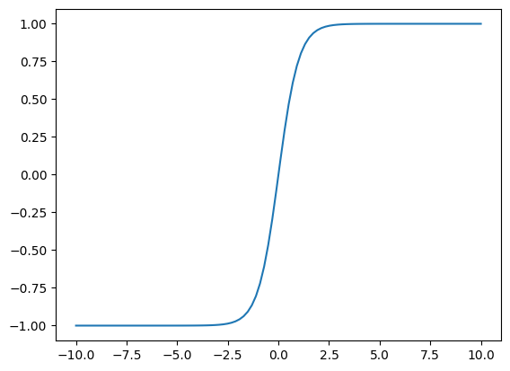
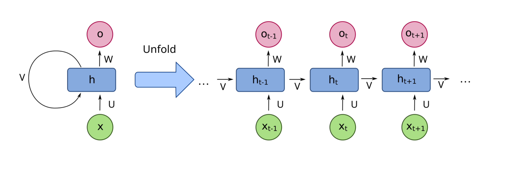

# 14、手写RNN

## RNN循环神经网络

RNN的公式是：
$h_t = \tanh(W_{xh}x_t + W_{hh}h_{t-1} + b_h)$



```python
import torch
import torch.nn as nn

# 大都督周瑜（我的微信: it_zhouyu）

# seq 50个字 --> 5个词向量---->RNN--->结果

class ZhouyuRNN(nn.Module):
    def __init__(self, input_size, hidden_size):
        super().__init__()

        self.hidden_size = hidden_size

        # 初始化权重参数
        # input_size表示单词的词向量维度
        # hidden_size表示隐藏层的维度
        self.W_xh = nn.Parameter(torch.randn(input_size, hidden_size))
        self.W_hh = nn.Parameter(torch.randn(hidden_size, hidden_size))
        self.b_h = nn.Parameter(torch.zeros(hidden_size))

        self.hidden = None

    def init_hidden(self, batch_size):
        # 初始化隐藏状态为全零
        return torch.zeros(batch_size, self.hidden_size)

    def forward(self, x):
        # x的形状: (batch_size, seq_len, input_size)
        batch_size, seq_len, input_size = x.shape

        # 修改x的形状为：(seq_len, batch_size, input_size)
        x = torch.transpose(x, 0, 1)

        self.hidden = self.init_hidden(batch_size)

        # 存储所有时间步的隐藏状态
        hidden_states = []

        # seq_len表示当前输入的序列长度，比如有多少个词
        # 从第一个单词开始，到最后一个单词结束
        for t in range(seq_len):
            # 获取当前时间步的输入
            # 也就是获取当前的单词，单词需要用词向量来表示
            x_t = x[t]

            # 计算隐藏状态
            self.hidden = torch.tanh(
                torch.mm(x_t, self.W_xh) +
                torch.mm(self.hidden, self.W_hh) +
                self.b_h
            )

            # 当前时间步的隐藏状态
            hidden_states.append(self.hidden)

        return torch.stack(hidden_states, dim=0), self.hidden
        # return hidden_states, self.hidden


# 超参数
input_size = 3  # 表示输入的单词对应的词向量的维度
hidden_size = 2  # 隐藏层维度，比如2个神经元，也就是一句话要分别输入给这两个神经元，所谓隐藏层状态，就是这两个神经元对应的状态
seq_len = 4  # 表示1句话的长度，比如4个单词
batch_size = 2  # 表示每次输入给模型的只有1句话

rnn = ZhouyuRNN(input_size, hidden_size)

# 创建随机输入数据
x = torch.randn(batch_size, seq_len, input_size)
print(x)
print(x.shape)
```

```plaintext
tensor([[[-1.0210, -1.2541,  0.1848],
         [-0.3946,  0.0399, -0.5344],
         [ 1.7015,  0.1909, -0.8759],
         [-0.9487,  1.1230,  1.5865]],

        [[-1.3140, -1.3195,  0.6438],
         [-0.3407, -0.3387, -0.1500],
         [ 1.4438, -1.4965, -0.6640],
         [ 0.3498,  0.0360,  0.7733]]])
torch.Size([2, 4, 3])
```

```python
# output中包含了各个时间步的隐藏状态，hidden是最后一个时间步的隐藏状态
output, hidden = rnn(x)
print(output)

print(hidden)
```

```plaintext
tensor([[[-0.8066, -0.7976],
         [-0.9372, -0.9556]],

        [[ 0.7274, -0.8874],
         [-0.4354, -0.9949]],

        [[-0.8091,  0.9545],
         [-0.9975, -0.9930]],

        [[ 0.8145, -0.9847],
         [-0.9781, -0.9999]]], grad_fn=<StackBackward0>)
tensor([[ 0.8145, -0.9847],
        [-0.9781, -0.9999]], grad_fn=<TanhBackward0>)
```

当输入一句话给RNN后，RNN即会返回每个token的对应的o_t，也会返回整句话对应的h_t。

所以，如果我们接下来利用o_t，那么就可以做机器翻译的任务，如果我们利用h_t，那就可以做文本分类的任务。

RNN的核心是利用过去信息来理解当前。

缺点是：

1. 无法处理长文本，文本越长，历史信息就遗忘的越多
2. 只能串行，不能并行

```python
# tanh的函数图像
import numpy as np
import matplotlib.pyplot as plt
x = np.linspace(-10, 10, 100)
y = np.tanh(x)
plt.plot(x, y)
```

```plaintext
[<matplotlib.lines.Line2D at 0x1236bbbe0>]
```

