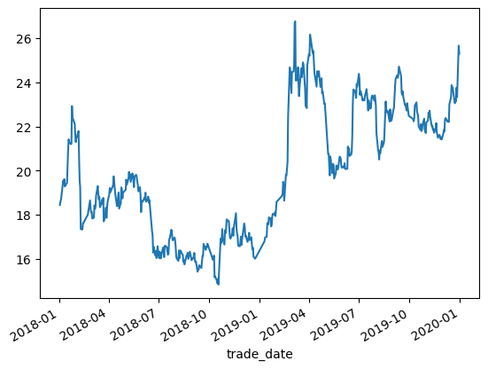
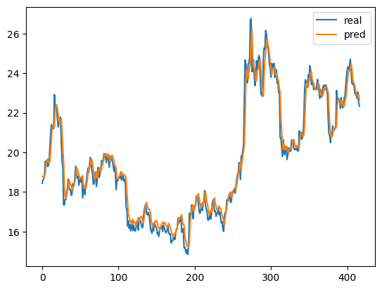
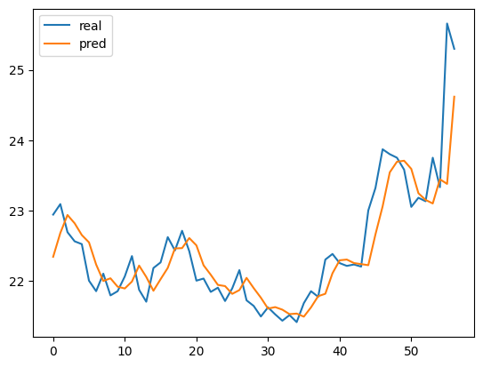

# 17、RNN股价预测实战

```python
import pandas as pd

# 将trade_date字段转成日期格式，并设置为索引字段
df = pd.read_csv('600030.csv', parse_dates=['trade_date'], index_col='trade_date')
```

```python
df.sort_index(ascending=True, inplace=True)
data = df['close']
data
```

```plaintext
trade_date
2018-01-02    18.44
2018-01-03    18.61
2018-01-04    18.67
2018-01-05    18.88
2018-01-08    19.54
              ...  
2019-12-25    23.13
2019-12-26    23.75
2019-12-27    23.33
2019-12-30    25.66
2019-12-31    25.30
Name: close, Length: 476, dtype: float64
```

```python
# 绘制收盘价
data.plot()
```

```plaintext
<Axes: xlabel='trade_date'>
```



```python
# 训练集
train_data = data['2018-01-02':'2019-10-08']
train_data[:10]
```

```plaintext
trade_date
2018-01-02    18.44
2018-01-03    18.61
2018-01-04    18.67
2018-01-05    18.88
2018-01-08    19.54
2018-01-09    19.44
2018-01-10    19.61
2018-01-11    19.28
2018-01-12    19.33
2018-01-15    19.45
Name: close, dtype: float64
```

```python
# 最后3个月作为测试集
test_data = data['2019-10-08':]
test_data[:10]
```

```plaintext
trade_date
2019-10-08    22.33
2019-10-09    22.23
2019-10-10    22.39
2019-10-11    22.94
2019-10-14    23.09
2019-10-15    22.69
2019-10-16    22.56
2019-10-17    22.52
2019-10-18    22.00
2019-10-21    21.85
Name: close, dtype: float64
```

```python
from torch.utils.data import DataLoader, Dataset
import torch

# 超参数设置
SEQ_LENGTH = 3  # 输入序列长度
BATCH_SIZE = 1
HIDDEN_SIZE = 128


# 创建训练数据
class ZhouyuDataset(Dataset):
    def __init__(self, data, seq_length):
        self.seq_length = seq_length

        # 统一做归一化
        self.data = (data.values - data.values.min()) / (data.values.max() - data.values.min())

        # 分别对inputs、targets做归一化
        # 和统一做归一化差不太多
        # 比如[0,1,2,3,4,5,6,7,8,9]，最大值是9，最小值是0
        # inputs = [[0,1,2],[1,2,3]...[6,7,8]]，比全部数据少个数，最大值是8，最小值是0
        # targets = [3,4,5,6,7,8,9]，比全部数据少3个数，最大值是9，最小值是3
        # inputs, targets = [], []
        # for i in range(len(data.values) - seq_length):
        #     seq = data.values[i:i + seq_length]
        #     target = data.values[i + seq_length]
        #     inputs.append(seq)
        #     targets.append(target)
        # inputs = np.array(inputs)
        # targets = np.array(targets)
        # self.inputs_min = inputs.min()
        # self.inputs_max = inputs.max()
        # self.targets_min = targets.min()
        # self.targets_max = targets.max()
        # self.inputs = (inputs - self.inputs_min) / (self.inputs_max - self.inputs_min)
        # self.targets = (targets - self.targets_min) / (self.targets_max - self.targets_min)

    def __len__(self):
        return len(self.data) - self.seq_length

    def __getitem__(self, idx):
        inputs = self.data[idx:idx + self.seq_length]
        targets = self.data[idx + self.seq_length]
        return torch.tensor(inputs, dtype=torch.float32), torch.tensor(targets, dtype=torch.float32)
        # return torch.tensor(self.inputs[idx], dtype=torch.float32), torch.tensor(self.targets[idx], dtype=torch.float32)


train_dataset = ZhouyuDataset(train_data, SEQ_LENGTH)
train_dataloader = DataLoader(train_dataset, batch_size=BATCH_SIZE, shuffle=False)
print(train_dataset.data)
```

```plaintext
[0.30201342 0.31627517 0.32130872 0.33892617 0.3942953  0.38590604
 0.40016779 0.37248322 0.37667785 0.38674497 0.45385906 0.51174497
 0.5511745  0.54110738 0.53355705 0.53439597 0.67785235 0.6283557
 0.62919463 0.60989933 0.56963087 0.54110738 0.55872483 0.56040268
 0.58305369 0.47902685 0.39513423 0.36912752 0.21057047 0.20889262
 0.23322148 0.2340604  0.2659396  0.28104027 0.31963087 0.28607383
 0.27432886 0.27600671 0.25083893 0.25419463 0.30033557 0.28775168
 0.29781879 0.33724832 0.37416107 0.34479866 0.3238255  0.33221477
 0.29362416 0.31040268 0.32214765 0.30704698 0.32885906 0.23993289
 0.26677852 0.29194631 0.2533557  0.29110738 0.31375839 0.34312081
 0.36661074 0.34983221 0.37751678 0.41107383 0.38674497 0.35822148
 0.34228188 0.29781879 0.29949664 0.33137584 0.34983221 0.2885906
 0.30956376 0.36912752 0.36073826 0.32718121 0.34815436 0.36073826
 0.39848993 0.38003356 0.40184564 0.42785235 0.41191275 0.41946309
 0.39010067 0.42197987 0.41778523 0.39261745 0.36996644 0.4102349
 0.41694631 0.40771812 0.39177852 0.38003356 0.35402685 0.36996644
 0.33808725 0.27516779 0.31879195 0.31291946 0.32298658 0.32969799
 0.3238255  0.34899329 0.31459732 0.3238255  0.33389262 0.31124161
 0.32130872 0.3011745  0.20218121 0.18791946 0.12080537 0.14261745
 0.11073826 0.12751678 0.10067114 0.11073826 0.14513423 0.10067114
 0.12416107 0.10486577 0.09899329 0.11157718 0.14010067 0.1409396
 0.10402685 0.14597315 0.14765101 0.1409396  0.125      0.11325503
 0.11828859 0.16694631 0.19295302 0.20805369 0.20385906 0.17449664
 0.16778523 0.17869128 0.16946309 0.1442953  0.10738255 0.09899329
 0.0897651  0.12919463 0.09983221 0.12919463 0.1283557  0.11493289
 0.11325503 0.0864094  0.09312081 0.07634228 0.10318792 0.11073826
 0.11157718 0.12080537 0.09731544 0.125      0.11493289 0.10318792
 0.09228188 0.09563758 0.10486577 0.11996644 0.09060403 0.08557047
 0.08808725 0.04865772 0.05704698 0.05704698 0.07298658 0.0704698
 0.06291946 0.08892617 0.10822148 0.1090604  0.15436242 0.13171141
 0.1442953  0.14177852 0.15520134 0.09395973 0.10067114 0.10989933
 0.02768456 0.03104027 0.01510067 0.00503356 0.02097315 0.
 0.04530201 0.17449664 0.15687919 0.17533557 0.21057047 0.17114094
 0.15184564 0.20637584 0.19463087 0.2114094  0.24748322 0.24077181
 0.24077181 0.20637584 0.17869128 0.17449664 0.19211409 0.21392617
 0.18540268 0.2147651  0.22986577 0.27097315 0.21224832 0.19295302
 0.18456376 0.14765101 0.14513423 0.15687919 0.18204698 0.15016779
 0.17030201 0.21812081 0.23154362 0.21895973 0.18204698 0.18540268
 0.16191275 0.17114094 0.17869128 0.19630872 0.16862416 0.1795302
 0.15184564 0.13255034 0.13926174 0.1057047  0.09815436 0.16442953
 0.17869128 0.18120805 0.23154362 0.23489933 0.22818792 0.25503356
 0.25167785 0.22063758 0.22483221 0.25587248 0.26845638 0.26510067
 0.27348993 0.26006711 0.28691275 0.31375839 0.33724832 0.34647651
 0.39010067 0.37416107 0.31879195 0.41778523 0.41442953 0.43959732
 0.46560403 0.63674497 0.82466443 0.81040268 0.77265101 0.72734899
 0.80704698 0.80956376 0.83557047 0.99496644 1.         0.77516779
 0.77600671 0.82550336 0.76174497 0.71560403 0.75251678 0.82130872
 0.78775168 0.81543624 0.84395973 0.83557047 0.74328859 0.67701342
 0.68204698 0.67030201 0.83389262 0.87583893 0.86912752 0.94966443
 0.93624161 0.8783557  0.88674497 0.84815436 0.80369128 0.79110738
 0.75167785 0.81040268 0.79865772 0.79194631 0.81040268 0.75083893
 0.76426174 0.78355705 0.72651007 0.7340604  0.68624161 0.68791946
 0.49496644 0.49580537 0.45553691 0.41442953 0.48657718 0.43624161
 0.42281879 0.45805369 0.45218121 0.40268456 0.42197987 0.45218121
 0.44463087 0.43708054 0.43875839 0.48573826 0.48238255 0.47902685
 0.45050336 0.44379195 0.4488255  0.44379195 0.46057047 0.43875839
 0.43959732 0.52432886 0.50083893 0.51761745 0.48825503 0.49412752
 0.50419463 0.56291946 0.68875839 0.74077181 0.73489933 0.72483221
 0.70889262 0.76174497 0.75251678 0.80033557 0.78104027 0.72063758
 0.73489933 0.72986577 0.6988255  0.70385906 0.70134228 0.69966443
 0.71560403 0.74244966 0.72063758 0.69211409 0.66107383 0.69966443
 0.66778523 0.67365772 0.70637584 0.71728188 0.71728188 0.6988255
 0.71895973 0.70385906 0.67785235 0.57634228 0.51174497 0.50419463
 0.47483221 0.50922819 0.49916107 0.54530201 0.52265101 0.52936242
 0.53355705 0.54446309 0.6954698  0.66442953 0.65436242 0.6602349
 0.65436242 0.61912752 0.66526846 0.63590604 0.6216443  0.62751678
 0.66526846 0.67114094 0.71224832 0.75419463 0.78104027 0.79530201
 0.7852349  0.8011745  0.82802013 0.79194631 0.72902685 0.72063758
 0.7340604  0.71308725 0.68204698 0.68120805 0.67281879 0.66107383
 0.68875839 0.6409396  0.6283557 ]
```

```python
for input_seq, target_seq in train_dataloader:
    print(input_seq)
    print(target_seq)
    break
```

```plaintext
tensor([[0.3020, 0.3163, 0.3213]])
tensor([0.3389])
```

```python
from torch import nn


# 大都督周瑜（我的微信: it_zhouyu）
class ZhouyuNet(nn.Module):
    def __init__(self, hidden_size: int):
        super().__init__()
        self.hidden_size = hidden_size

        # 输入给RNN的某天的股价
        self.rnn = nn.RNN(1, hidden_size, batch_first=True)
        self.out_linear = nn.Linear(hidden_size, 1)  # 输出后一天的股价

    def forward(self, x, hidden=None):
        outputs, hidden = self.rnn(x, hidden)  # outputs的形状为(batch_size, seq_len, hidden_size)
        out = self.out_linear(hidden)
        return out, hidden


# 初始化模型
model = ZhouyuNet(HIDDEN_SIZE)
criterion = nn.MSELoss()
optimizer = torch.optim.SGD(model.parameters(), lr=0.001)
```

```python
from torch.utils.tensorboard import SummaryWriter

# 开始训练
writer = SummaryWriter()

for epoch in range(100):
    for i, (inputs, targets) in enumerate(train_dataloader):
        inputs = inputs.view(inputs.size(0), inputs.size(1), 1)
        outputs, _ = model(inputs)
        loss = criterion(outputs.view(-1), targets)
        optimizer.zero_grad()
        loss.backward()
        optimizer.step()
        if (i + 1) % 100 == 0:
            print('Epoch [{}/{}], Step [{}/{}], Loss: {:.4f}'
                  .format(epoch + 1, 100, i + 1, len(train_dataloader), loss.item()))

            global_step = epoch * len(train_dataloader) + i
            writer.add_scalar('training loss', loss, global_step)
```

```plaintext
Epoch [1/100], Step [100/414], Loss: 0.0000
Epoch [1/100], Step [200/414], Loss: 0.0017
Epoch [1/100], Step [300/414], Loss: 0.0003
Epoch [1/100], Step [400/414], Loss: 0.0000
Epoch [2/100], Step [100/414], Loss: 0.0000
Epoch [2/100], Step [200/414], Loss: 0.0017
Epoch [2/100], Step [300/414], Loss: 0.0003
Epoch [2/100], Step [400/414], Loss: 0.0000
Epoch [3/100], Step [100/414], Loss: 0.0000
Epoch [3/100], Step [200/414], Loss: 0.0017
Epoch [3/100], Step [300/414], Loss: 0.0003
Epoch [3/100], Step [400/414], Loss: 0.0000
Epoch [4/100], Step [100/414], Loss: 0.0000
Epoch [4/100], Step [200/414], Loss: 0.0017
Epoch [4/100], Step [300/414], Loss: 0.0003
Epoch [4/100], Step [400/414], Loss: 0.0000
Epoch [5/100], Step [100/414], Loss: 0.0000
Epoch [5/100], Step [200/414], Loss: 0.0017
Epoch [5/100], Step [300/414], Loss: 0.0003
Epoch [5/100], Step [400/414], Loss: 0.0000
Epoch [6/100], Step [100/414], Loss: 0.0000
Epoch [6/100], Step [200/414], Loss: 0.0017
Epoch [6/100], Step [300/414], Loss: 0.0003
Epoch [6/100], Step [400/414], Loss: 0.0000
Epoch [7/100], Step [100/414], Loss: 0.0000
Epoch [7/100], Step [200/414], Loss: 0.0017
Epoch [7/100], Step [300/414], Loss: 0.0003
Epoch [7/100], Step [400/414], Loss: 0.0000
Epoch [8/100], Step [100/414], Loss: 0.0000
Epoch [8/100], Step [200/414], Loss: 0.0017
Epoch [8/100], Step [300/414], Loss: 0.0003
Epoch [8/100], Step [400/414], Loss: 0.0000
Epoch [9/100], Step [100/414], Loss: 0.0000
Epoch [9/100], Step [200/414], Loss: 0.0017
Epoch [9/100], Step [300/414], Loss: 0.0003
Epoch [9/100], Step [400/414], Loss: 0.0000
Epoch [10/100], Step [100/414], Loss: 0.0000
Epoch [10/100], Step [200/414], Loss: 0.0017
Epoch [10/100], Step [300/414], Loss: 0.0003
Epoch [10/100], Step [400/414], Loss: 0.0000
Epoch [11/100], Step [100/414], Loss: 0.0000
Epoch [11/100], Step [200/414], Loss: 0.0017
Epoch [11/100], Step [300/414], Loss: 0.0003
Epoch [11/100], Step [400/414], Loss: 0.0000
Epoch [12/100], Step [100/414], Loss: 0.0000
Epoch [12/100], Step [200/414], Loss: 0.0017
Epoch [12/100], Step [300/414], Loss: 0.0003
Epoch [12/100], Step [400/414], Loss: 0.0000
Epoch [13/100], Step [100/414], Loss: 0.0000
Epoch [13/100], Step [200/414], Loss: 0.0017
Epoch [13/100], Step [300/414], Loss: 0.0003
Epoch [13/100], Step [400/414], Loss: 0.0000
Epoch [14/100], Step [100/414], Loss: 0.0000
Epoch [14/100], Step [200/414], Loss: 0.0017
Epoch [14/100], Step [300/414], Loss: 0.0003
Epoch [14/100], Step [400/414], Loss: 0.0000
Epoch [15/100], Step [100/414], Loss: 0.0000
Epoch [15/100], Step [200/414], Loss: 0.0017
Epoch [15/100], Step [300/414], Loss: 0.0003
Epoch [15/100], Step [400/414], Loss: 0.0000
Epoch [16/100], Step [100/414], Loss: 0.0000
Epoch [16/100], Step [200/414], Loss: 0.0017
Epoch [16/100], Step [300/414], Loss: 0.0003
Epoch [16/100], Step [400/414], Loss: 0.0000
Epoch [17/100], Step [100/414], Loss: 0.0000
Epoch [17/100], Step [200/414], Loss: 0.0017
Epoch [17/100], Step [300/414], Loss: 0.0003
Epoch [17/100], Step [400/414], Loss: 0.0000
Epoch [18/100], Step [100/414], Loss: 0.0000
Epoch [18/100], Step [200/414], Loss: 0.0017
Epoch [18/100], Step [300/414], Loss: 0.0003
Epoch [18/100], Step [400/414], Loss: 0.0000
Epoch [19/100], Step [100/414], Loss: 0.0000
Epoch [19/100], Step [200/414], Loss: 0.0017
Epoch [19/100], Step [300/414], Loss: 0.0003
Epoch [19/100], Step [400/414], Loss: 0.0000
Epoch [20/100], Step [100/414], Loss: 0.0000
Epoch [20/100], Step [200/414], Loss: 0.0017
Epoch [20/100], Step [300/414], Loss: 0.0003
Epoch [20/100], Step [400/414], Loss: 0.0000
Epoch [21/100], Step [100/414], Loss: 0.0000
Epoch [21/100], Step [200/414], Loss: 0.0017
Epoch [21/100], Step [300/414], Loss: 0.0003
Epoch [21/100], Step [400/414], Loss: 0.0000
Epoch [22/100], Step [100/414], Loss: 0.0000
Epoch [22/100], Step [200/414], Loss: 0.0017
Epoch [22/100], Step [300/414], Loss: 0.0003
Epoch [22/100], Step [400/414], Loss: 0.0000
Epoch [23/100], Step [100/414], Loss: 0.0000
Epoch [23/100], Step [200/414], Loss: 0.0017
Epoch [23/100], Step [300/414], Loss: 0.0003
Epoch [23/100], Step [400/414], Loss: 0.0000
Epoch [24/100], Step [100/414], Loss: 0.0000
Epoch [24/100], Step [200/414], Loss: 0.0017
Epoch [24/100], Step [300/414], Loss: 0.0002
Epoch [24/100], Step [400/414], Loss: 0.0000
Epoch [25/100], Step [100/414], Loss: 0.0000
Epoch [25/100], Step [200/414], Loss: 0.0017
Epoch [25/100], Step [300/414], Loss: 0.0002
Epoch [25/100], Step [400/414], Loss: 0.0000
Epoch [26/100], Step [100/414], Loss: 0.0000
Epoch [26/100], Step [200/414], Loss: 0.0017
Epoch [26/100], Step [300/414], Loss: 0.0002
Epoch [26/100], Step [400/414], Loss: 0.0000
Epoch [27/100], Step [100/414], Loss: 0.0000
Epoch [27/100], Step [200/414], Loss: 0.0017
Epoch [27/100], Step [300/414], Loss: 0.0002
Epoch [27/100], Step [400/414], Loss: 0.0000
Epoch [28/100], Step [100/414], Loss: 0.0000
Epoch [28/100], Step [200/414], Loss: 0.0017
Epoch [28/100], Step [300/414], Loss: 0.0002
Epoch [28/100], Step [400/414], Loss: 0.0000
Epoch [29/100], Step [100/414], Loss: 0.0000
Epoch [29/100], Step [200/414], Loss: 0.0017
Epoch [29/100], Step [300/414], Loss: 0.0002
Epoch [29/100], Step [400/414], Loss: 0.0000
Epoch [30/100], Step [100/414], Loss: 0.0000
Epoch [30/100], Step [200/414], Loss: 0.0017
Epoch [30/100], Step [300/414], Loss: 0.0002
Epoch [30/100], Step [400/414], Loss: 0.0000
Epoch [31/100], Step [100/414], Loss: 0.0000
Epoch [31/100], Step [200/414], Loss: 0.0017
Epoch [31/100], Step [300/414], Loss: 0.0002
Epoch [31/100], Step [400/414], Loss: 0.0000
Epoch [32/100], Step [100/414], Loss: 0.0000
Epoch [32/100], Step [200/414], Loss: 0.0017
Epoch [32/100], Step [300/414], Loss: 0.0002
Epoch [32/100], Step [400/414], Loss: 0.0000
Epoch [33/100], Step [100/414], Loss: 0.0000
Epoch [33/100], Step [200/414], Loss: 0.0017
Epoch [33/100], Step [300/414], Loss: 0.0002
Epoch [33/100], Step [400/414], Loss: 0.0000
Epoch [34/100], Step [100/414], Loss: 0.0000
Epoch [34/100], Step [200/414], Loss: 0.0017
Epoch [34/100], Step [300/414], Loss: 0.0002
Epoch [34/100], Step [400/414], Loss: 0.0000
Epoch [35/100], Step [100/414], Loss: 0.0000
Epoch [35/100], Step [200/414], Loss: 0.0017
Epoch [35/100], Step [300/414], Loss: 0.0002
Epoch [35/100], Step [400/414], Loss: 0.0000
Epoch [36/100], Step [100/414], Loss: 0.0000
Epoch [36/100], Step [200/414], Loss: 0.0017
Epoch [36/100], Step [300/414], Loss: 0.0002
Epoch [36/100], Step [400/414], Loss: 0.0000
Epoch [37/100], Step [100/414], Loss: 0.0000
Epoch [37/100], Step [200/414], Loss: 0.0017
Epoch [37/100], Step [300/414], Loss: 0.0002
Epoch [37/100], Step [400/414], Loss: 0.0000
Epoch [38/100], Step [100/414], Loss: 0.0000
Epoch [38/100], Step [200/414], Loss: 0.0017
Epoch [38/100], Step [300/414], Loss: 0.0002
Epoch [38/100], Step [400/414], Loss: 0.0000
Epoch [39/100], Step [100/414], Loss: 0.0000
Epoch [39/100], Step [200/414], Loss: 0.0017
Epoch [39/100], Step [300/414], Loss: 0.0002
Epoch [39/100], Step [400/414], Loss: 0.0000
Epoch [40/100], Step [100/414], Loss: 0.0000
Epoch [40/100], Step [200/414], Loss: 0.0017
Epoch [40/100], Step [300/414], Loss: 0.0002
Epoch [40/100], Step [400/414], Loss: 0.0000
Epoch [41/100], Step [100/414], Loss: 0.0000
Epoch [41/100], Step [200/414], Loss: 0.0017
Epoch [41/100], Step [300/414], Loss: 0.0002
Epoch [41/100], Step [400/414], Loss: 0.0000
Epoch [42/100], Step [100/414], Loss: 0.0000
Epoch [42/100], Step [200/414], Loss: 0.0017
Epoch [42/100], Step [300/414], Loss: 0.0002
Epoch [42/100], Step [400/414], Loss: 0.0000
Epoch [43/100], Step [100/414], Loss: 0.0000
Epoch [43/100], Step [200/414], Loss: 0.0017
Epoch [43/100], Step [300/414], Loss: 0.0002
Epoch [43/100], Step [400/414], Loss: 0.0000
Epoch [44/100], Step [100/414], Loss: 0.0000
Epoch [44/100], Step [200/414], Loss: 0.0017
Epoch [44/100], Step [300/414], Loss: 0.0002
Epoch [44/100], Step [400/414], Loss: 0.0000
Epoch [45/100], Step [100/414], Loss: 0.0000
Epoch [45/100], Step [200/414], Loss: 0.0017
Epoch [45/100], Step [300/414], Loss: 0.0002
Epoch [45/100], Step [400/414], Loss: 0.0000
Epoch [46/100], Step [100/414], Loss: 0.0000
Epoch [46/100], Step [200/414], Loss: 0.0017
Epoch [46/100], Step [300/414], Loss: 0.0002
Epoch [46/100], Step [400/414], Loss: 0.0000
Epoch [47/100], Step [100/414], Loss: 0.0000
Epoch [47/100], Step [200/414], Loss: 0.0017
Epoch [47/100], Step [300/414], Loss: 0.0002
Epoch [47/100], Step [400/414], Loss: 0.0000
Epoch [48/100], Step [100/414], Loss: 0.0000
Epoch [48/100], Step [200/414], Loss: 0.0017
Epoch [48/100], Step [300/414], Loss: 0.0002
Epoch [48/100], Step [400/414], Loss: 0.0000
Epoch [49/100], Step [100/414], Loss: 0.0000
Epoch [49/100], Step [200/414], Loss: 0.0017
Epoch [49/100], Step [300/414], Loss: 0.0002
Epoch [49/100], Step [400/414], Loss: 0.0000
Epoch [50/100], Step [100/414], Loss: 0.0000
Epoch [50/100], Step [200/414], Loss: 0.0017
Epoch [50/100], Step [300/414], Loss: 0.0002
Epoch [50/100], Step [400/414], Loss: 0.0000
Epoch [51/100], Step [100/414], Loss: 0.0000
Epoch [51/100], Step [200/414], Loss: 0.0017
Epoch [51/100], Step [300/414], Loss: 0.0002
Epoch [51/100], Step [400/414], Loss: 0.0000
Epoch [52/100], Step [100/414], Loss: 0.0000
Epoch [52/100], Step [200/414], Loss: 0.0017
Epoch [52/100], Step [300/414], Loss: 0.0002
Epoch [52/100], Step [400/414], Loss: 0.0000
Epoch [53/100], Step [100/414], Loss: 0.0000
Epoch [53/100], Step [200/414], Loss: 0.0017
Epoch [53/100], Step [300/414], Loss: 0.0002
Epoch [53/100], Step [400/414], Loss: 0.0000
Epoch [54/100], Step [100/414], Loss: 0.0000
Epoch [54/100], Step [200/414], Loss: 0.0017
Epoch [54/100], Step [300/414], Loss: 0.0002
Epoch [54/100], Step [400/414], Loss: 0.0000
Epoch [55/100], Step [100/414], Loss: 0.0000
Epoch [55/100], Step [200/414], Loss: 0.0017
Epoch [55/100], Step [300/414], Loss: 0.0002
Epoch [55/100], Step [400/414], Loss: 0.0000
Epoch [56/100], Step [100/414], Loss: 0.0000
Epoch [56/100], Step [200/414], Loss: 0.0017
Epoch [56/100], Step [300/414], Loss: 0.0002
Epoch [56/100], Step [400/414], Loss: 0.0000
Epoch [57/100], Step [100/414], Loss: 0.0000
Epoch [57/100], Step [200/414], Loss: 0.0017
Epoch [57/100], Step [300/414], Loss: 0.0002
Epoch [57/100], Step [400/414], Loss: 0.0000
Epoch [58/100], Step [100/414], Loss: 0.0000
Epoch [58/100], Step [200/414], Loss: 0.0017
Epoch [58/100], Step [300/414], Loss: 0.0002
Epoch [58/100], Step [400/414], Loss: 0.0000
Epoch [59/100], Step [100/414], Loss: 0.0000
Epoch [59/100], Step [200/414], Loss: 0.0017
Epoch [59/100], Step [300/414], Loss: 0.0002
Epoch [59/100], Step [400/414], Loss: 0.0000
Epoch [60/100], Step [100/414], Loss: 0.0000
Epoch [60/100], Step [200/414], Loss: 0.0017
Epoch [60/100], Step [300/414], Loss: 0.0002
Epoch [60/100], Step [400/414], Loss: 0.0000
Epoch [61/100], Step [100/414], Loss: 0.0000
Epoch [61/100], Step [200/414], Loss: 0.0017
Epoch [61/100], Step [300/414], Loss: 0.0002
Epoch [61/100], Step [400/414], Loss: 0.0000
Epoch [62/100], Step [100/414], Loss: 0.0000
Epoch [62/100], Step [200/414], Loss: 0.0017
Epoch [62/100], Step [300/414], Loss: 0.0002
Epoch [62/100], Step [400/414], Loss: 0.0000
Epoch [63/100], Step [100/414], Loss: 0.0000
Epoch [63/100], Step [200/414], Loss: 0.0017
Epoch [63/100], Step [300/414], Loss: 0.0002
Epoch [63/100], Step [400/414], Loss: 0.0000
Epoch [64/100], Step [100/414], Loss: 0.0000
Epoch [64/100], Step [200/414], Loss: 0.0017
Epoch [64/100], Step [300/414], Loss: 0.0002
Epoch [64/100], Step [400/414], Loss: 0.0000
Epoch [65/100], Step [100/414], Loss: 0.0000
Epoch [65/100], Step [200/414], Loss: 0.0017
Epoch [65/100], Step [300/414], Loss: 0.0002
Epoch [65/100], Step [400/414], Loss: 0.0000
Epoch [66/100], Step [100/414], Loss: 0.0000
Epoch [66/100], Step [200/414], Loss: 0.0017
Epoch [66/100], Step [300/414], Loss: 0.0002
Epoch [66/100], Step [400/414], Loss: 0.0000
Epoch [67/100], Step [100/414], Loss: 0.0000
Epoch [67/100], Step [200/414], Loss: 0.0017
Epoch [67/100], Step [300/414], Loss: 0.0002
Epoch [67/100], Step [400/414], Loss: 0.0000
Epoch [68/100], Step [100/414], Loss: 0.0000
Epoch [68/100], Step [200/414], Loss: 0.0017
Epoch [68/100], Step [300/414], Loss: 0.0002
Epoch [68/100], Step [400/414], Loss: 0.0000
Epoch [69/100], Step [100/414], Loss: 0.0000
Epoch [69/100], Step [200/414], Loss: 0.0017
Epoch [69/100], Step [300/414], Loss: 0.0002
Epoch [69/100], Step [400/414], Loss: 0.0000
Epoch [70/100], Step [100/414], Loss: 0.0000
Epoch [70/100], Step [200/414], Loss: 0.0017
Epoch [70/100], Step [300/414], Loss: 0.0002
Epoch [70/100], Step [400/414], Loss: 0.0000
Epoch [71/100], Step [100/414], Loss: 0.0000
Epoch [71/100], Step [200/414], Loss: 0.0017
Epoch [71/100], Step [300/414], Loss: 0.0002
Epoch [71/100], Step [400/414], Loss: 0.0000
Epoch [72/100], Step [100/414], Loss: 0.0000
Epoch [72/100], Step [200/414], Loss: 0.0017
Epoch [72/100], Step [300/414], Loss: 0.0002
Epoch [72/100], Step [400/414], Loss: 0.0000
Epoch [73/100], Step [100/414], Loss: 0.0000
Epoch [73/100], Step [200/414], Loss: 0.0017
Epoch [73/100], Step [300/414], Loss: 0.0002
Epoch [73/100], Step [400/414], Loss: 0.0000
Epoch [74/100], Step [100/414], Loss: 0.0000
Epoch [74/100], Step [200/414], Loss: 0.0017
Epoch [74/100], Step [300/414], Loss: 0.0002
Epoch [74/100], Step [400/414], Loss: 0.0000
Epoch [75/100], Step [100/414], Loss: 0.0000
Epoch [75/100], Step [200/414], Loss: 0.0017
Epoch [75/100], Step [300/414], Loss: 0.0002
Epoch [75/100], Step [400/414], Loss: 0.0000
Epoch [76/100], Step [100/414], Loss: 0.0000
Epoch [76/100], Step [200/414], Loss: 0.0017
Epoch [76/100], Step [300/414], Loss: 0.0002
Epoch [76/100], Step [400/414], Loss: 0.0000
Epoch [77/100], Step [100/414], Loss: 0.0000
Epoch [77/100], Step [200/414], Loss: 0.0017
Epoch [77/100], Step [300/414], Loss: 0.0002
Epoch [77/100], Step [400/414], Loss: 0.0000
Epoch [78/100], Step [100/414], Loss: 0.0000
Epoch [78/100], Step [200/414], Loss: 0.0017
Epoch [78/100], Step [300/414], Loss: 0.0002
Epoch [78/100], Step [400/414], Loss: 0.0000
Epoch [79/100], Step [100/414], Loss: 0.0000
Epoch [79/100], Step [200/414], Loss: 0.0017
Epoch [79/100], Step [300/414], Loss: 0.0002
Epoch [79/100], Step [400/414], Loss: 0.0000
Epoch [80/100], Step [100/414], Loss: 0.0000
Epoch [80/100], Step [200/414], Loss: 0.0017
Epoch [80/100], Step [300/414], Loss: 0.0002
Epoch [80/100], Step [400/414], Loss: 0.0000
Epoch [81/100], Step [100/414], Loss: 0.0000
Epoch [81/100], Step [200/414], Loss: 0.0017
Epoch [81/100], Step [300/414], Loss: 0.0002
Epoch [81/100], Step [400/414], Loss: 0.0000
Epoch [82/100], Step [100/414], Loss: 0.0000
Epoch [82/100], Step [200/414], Loss: 0.0017
Epoch [82/100], Step [300/414], Loss: 0.0002
Epoch [82/100], Step [400/414], Loss: 0.0000
Epoch [83/100], Step [100/414], Loss: 0.0000
Epoch [83/100], Step [200/414], Loss: 0.0017
Epoch [83/100], Step [300/414], Loss: 0.0002
Epoch [83/100], Step [400/414], Loss: 0.0000
Epoch [84/100], Step [100/414], Loss: 0.0000
Epoch [84/100], Step [200/414], Loss: 0.0017
Epoch [84/100], Step [300/414], Loss: 0.0002
Epoch [84/100], Step [400/414], Loss: 0.0000
Epoch [85/100], Step [100/414], Loss: 0.0000
Epoch [85/100], Step [200/414], Loss: 0.0017
Epoch [85/100], Step [300/414], Loss: 0.0002
Epoch [85/100], Step [400/414], Loss: 0.0000
Epoch [86/100], Step [100/414], Loss: 0.0000
Epoch [86/100], Step [200/414], Loss: 0.0017
Epoch [86/100], Step [300/414], Loss: 0.0002
Epoch [86/100], Step [400/414], Loss: 0.0000
Epoch [87/100], Step [100/414], Loss: 0.0000
Epoch [87/100], Step [200/414], Loss: 0.0017
Epoch [87/100], Step [300/414], Loss: 0.0002
Epoch [87/100], Step [400/414], Loss: 0.0000
Epoch [88/100], Step [100/414], Loss: 0.0000
Epoch [88/100], Step [200/414], Loss: 0.0017
Epoch [88/100], Step [300/414], Loss: 0.0002
Epoch [88/100], Step [400/414], Loss: 0.0000
Epoch [89/100], Step [100/414], Loss: 0.0000
Epoch [89/100], Step [200/414], Loss: 0.0017
Epoch [89/100], Step [300/414], Loss: 0.0002
Epoch [89/100], Step [400/414], Loss: 0.0000
Epoch [90/100], Step [100/414], Loss: 0.0000
Epoch [90/100], Step [200/414], Loss: 0.0017
Epoch [90/100], Step [300/414], Loss: 0.0002
Epoch [90/100], Step [400/414], Loss: 0.0000
Epoch [91/100], Step [100/414], Loss: 0.0000
Epoch [91/100], Step [200/414], Loss: 0.0017
Epoch [91/100], Step [300/414], Loss: 0.0002
Epoch [91/100], Step [400/414], Loss: 0.0000
Epoch [92/100], Step [100/414], Loss: 0.0000
Epoch [92/100], Step [200/414], Loss: 0.0017
Epoch [92/100], Step [300/414], Loss: 0.0002
Epoch [92/100], Step [400/414], Loss: 0.0000
Epoch [93/100], Step [100/414], Loss: 0.0000
Epoch [93/100], Step [200/414], Loss: 0.0017
Epoch [93/100], Step [300/414], Loss: 0.0002
Epoch [93/100], Step [400/414], Loss: 0.0000
Epoch [94/100], Step [100/414], Loss: 0.0000
Epoch [94/100], Step [200/414], Loss: 0.0017
Epoch [94/100], Step [300/414], Loss: 0.0002
Epoch [94/100], Step [400/414], Loss: 0.0000
Epoch [95/100], Step [100/414], Loss: 0.0000
Epoch [95/100], Step [200/414], Loss: 0.0017
Epoch [95/100], Step [300/414], Loss: 0.0002
Epoch [95/100], Step [400/414], Loss: 0.0000
Epoch [96/100], Step [100/414], Loss: 0.0000
Epoch [96/100], Step [200/414], Loss: 0.0017
Epoch [96/100], Step [300/414], Loss: 0.0002
Epoch [96/100], Step [400/414], Loss: 0.0000
Epoch [97/100], Step [100/414], Loss: 0.0000
Epoch [97/100], Step [200/414], Loss: 0.0017
Epoch [97/100], Step [300/414], Loss: 0.0002
Epoch [97/100], Step [400/414], Loss: 0.0000
Epoch [98/100], Step [100/414], Loss: 0.0000
Epoch [98/100], Step [200/414], Loss: 0.0017
Epoch [98/100], Step [300/414], Loss: 0.0002
Epoch [98/100], Step [400/414], Loss: 0.0000
Epoch [99/100], Step [100/414], Loss: 0.0000
Epoch [99/100], Step [200/414], Loss: 0.0017
Epoch [99/100], Step [300/414], Loss: 0.0002
Epoch [99/100], Step [400/414], Loss: 0.0000
Epoch [100/100], Step [100/414], Loss: 0.0000
Epoch [100/100], Step [200/414], Loss: 0.0017
Epoch [100/100], Step [300/414], Loss: 0.0002
Epoch [100/100], Step [400/414], Loss: 0.0000
```

```python
train_dataset[0][0]
```

```plaintext
tensor([0.3020, 0.3163, 0.3213])
```

```python
# 手动预测
pred_normalized = model(train_dataset[0][0].view(1, -1, 1))[0]
pred = pred_normalized * (train_data.values.max() - train_data.values.min()) + train_data.values.min()
# pred = pred_normalized * (train_dataset.targets_max - train_dataset.targets_min) + train_dataset.targets_min
# pred = pred_normalized
print(pred)
```

```plaintext
tensor([[[18.7833]]], grad_fn=<AddBackward0>)
```

```python
# 画出预测结果和真实结果的曲线
import matplotlib.pyplot as plt

model.eval()

train_pred_result = []
with torch.no_grad():
    for inputs, targets in train_dataset:
        train_pred = model(inputs.view(1, -1, 1))
        pred_normalized = train_pred[0][0][0]
        pred = pred_normalized * (train_data.values.max() - train_data.values.min()) + train_data.values.min()
        train_pred_result.append(pred)

train_pred_result = [train_pred_result[0]] * SEQ_LENGTH + train_pred_result

print(len(train_pred_result))
print(len(train_data.values))

x_plot = [i for i in range(len(train_pred_result))]

plt.plot(x_plot, train_data.values, label='real')
plt.plot(x_plot, train_pred_result, label='pred')
plt.legend()
plt.show()
```

```plaintext
417
417
```



```python
import numpy as np

a = np.array([[1, 2], [3, 4]])
a - a.min()
```

```plaintext
array([[0, 1],
       [2, 3]])
```

```python
from torch.utils.data import DataLoader, Dataset
import torch

# 超参数设置
SEQ_LENGTH = 3  # 输入序列长度


# 创建训练数据
class ZhouyuTestDataset(Dataset):
    def __init__(self, data, seq_length):
        self.seq_length = seq_length
        # 用训练集最大最小值统一做归一化
        self.data = (data.values - train_data.values.min()) / (train_data.values.max() - train_data.values.min())
    def __len__(self):
        return len(self.data) - self.seq_length

    def __getitem__(self, idx):
        inputs = self.data[idx:idx + self.seq_length]
        targets = self.data[idx + self.seq_length]
        return torch.tensor(inputs, dtype=torch.float32), torch.tensor(targets, dtype=torch.float32)


test_dataset = ZhouyuTestDataset(test_data, SEQ_LENGTH)
test_dataloader = DataLoader(test_dataset, batch_size=1, shuffle=False)
print(test_dataset.data)
```

```plaintext
[0.6283557  0.61996644 0.63338926 0.6795302  0.69211409 0.65855705
 0.64765101 0.6442953  0.60067114 0.58808725 0.6090604  0.58305369
 0.58808725 0.6057047  0.63003356 0.5897651  0.57550336 0.61577181
 0.62248322 0.65268456 0.63674497 0.6602349  0.63590604 0.60067114
 0.60318792 0.58724832 0.59228188 0.57634228 0.59144295 0.61325503
 0.57718121 0.5704698  0.55788591 0.56879195 0.56040268 0.55285235
 0.55956376 0.5511745  0.5738255  0.58808725 0.58137584 0.62583893
 0.63255034 0.6216443  0.61828859 0.61996644 0.61744966 0.68456376
 0.7114094  0.75755034 0.75167785 0.74748322 0.73322148 0.68875839
 0.69966443 0.6954698  0.74748322 0.71224832 0.90771812 0.87751678]
```

```python
# 画出预测结果和真实结果的曲线
import matplotlib.pyplot as plt

model.eval()

test_pred_result = []
targets_result = []
with torch.no_grad():
    for inputs, targets in test_dataset:
        test_pred = model(inputs.view(1, -1, 1))
        pred_normalized = test_pred[0][0][0]
        pred = pred_normalized * (train_data.values.max() - train_data.values.min()) + train_data.values.min()
        test_pred_result.append(pred)

        targets = targets * (train_data.values.max() - train_data.values.min()) + train_data.values.min()
        targets_result.append(targets)

x_plot = [i for i in range(len(targets_result))]

plt.plot(x_plot, targets_result, label='real')
plt.plot(x_plot, test_pred_result, label='pred')
plt.legend()
plt.show()
```

