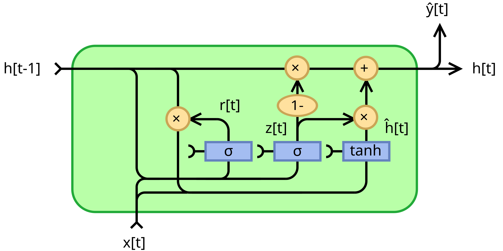

# 18、手写GRU

## GRU门控循环单元



---

### 公式定义

GRU (Gated Recurrent Unit) 的核心公式如下：

**更新门**
$z_t = \sigma(W_{xz}x_t + W_{hz}h_{t-1} + b_{z})$

**重置门**
$r_t = \sigma(W_{xr}x_t + W_{hr}h_{t-1} + b_{r})$

**候选隐状态**
$\tilde{h}_t = \tanh(W_{xh}x_t + W_{hh}(r_t \odot h_{t-1}) + b_{h})$

去掉$r_t$就是RNN

$\odot$是按元素乘法，而不是矩阵乘法，$r_t$是重置门，$r_t$的形状和$h_{t-1}$相同，并且$r_t$是经过了sigmoid的，所以里面的元素是0-1之间的数字，按元素相乘后，0对应的隐状态就会变成0，极端的情况就是全0，也就是全丢弃了。

**最终隐状态**
$h_t = (1 - z_t) \odot h_{t-1} + z_t \odot \tilde{h}_t$

$z_t$表示更新门，如果为1，则表示更新，相当于RNN，如果为0，则表示不更新，取上一个时间步的隐状态

RNN的公式是：
$h_t = \tanh(W_{xh}x_t + W_{hh}h_{t-1} + b_h)$

```python
import torch
import torch.nn as nn


class ZhouyuGRUCell(nn.Module):
    def __init__(self, input_size, hidden_size):
        super().__init__()
        self.input_size = input_size
        self.hidden_size = hidden_size

        self.W_xz = nn.Parameter(torch.randn(input_size, hidden_size))
        self.W_xr = nn.Parameter(torch.randn(input_size, hidden_size))
        self.W_xh = nn.Parameter(torch.randn(input_size, hidden_size))

        self.W_hz = nn.Parameter(torch.randn(hidden_size, hidden_size))
        self.W_hr = nn.Parameter(torch.randn(hidden_size, hidden_size))
        self.W_hh = nn.Parameter(torch.randn(hidden_size, hidden_size))

        self.b_z = nn.Parameter(torch.zeros(hidden_size))
        self.b_r = nn.Parameter(torch.zeros(hidden_size))
        self.b_h = nn.Parameter(torch.zeros(hidden_size))

    def forward(self, x, h_prev):
        # 更新门
        z_t = torch.sigmoid(torch.mm(x, self.W_xz) + torch.mm(h_prev, self.W_hz) + self.b_z)

        ## 重置门
        r_t = torch.sigmoid(torch.mm(x, self.W_xr) + torch.mm(h_prev, self.W_hr) + self.b_r)

        # 候选隐状态
        h_candidate = torch.tanh(torch.mm(x, self.W_xh) + torch.mm(h_prev * r_t, self.W_hh) + self.b_h)

        # 最终隐状态
        h_t = (1 - z_t) * h_prev + z_t * h_candidate

        return h_t


class ZhouyuGRU(nn.Module):
    def __init__(self, input_size, hidden_size):
        super().__init__()
        self.hidden_size = hidden_size
        self.cell = ZhouyuGRUCell(input_size, hidden_size)

    def forward(self, x, hidden=None):
        seq_len, batch_size, input_size = x.shape

        # 初始化隐状态
        if hidden is None:
            hidden = torch.zeros(batch_size, self.hidden_size)

        outputs = []
        for t in range(seq_len):
            # 输入给GRU，得到当前时间步的隐状态
            hidden = self.cell(x[t], hidden)
            outputs.append(hidden)  # 保持维度一致

        return outputs, hidden


input_size = 32
hidden_size = 5
batch_size = 1
seq_len = 2

zhouyu_gru = ZhouyuGRU(input_size, hidden_size)

x = torch.randn(seq_len, batch_size, input_size)
outputs, hidden = zhouyu_gru(x)

outputs, hidden
```

```plaintext
([tensor([[0.9995, 0.2660, 0.9925, 0.0021, 0.9000]], grad_fn=<AddBackward0>),
  tensor([[ 0.9979, -0.9999,  0.9917, -0.9811, -0.5999]], grad_fn=<AddBackward0>)],
 tensor([[ 0.9979, -0.9999,  0.9917, -0.9811, -0.5999]], grad_fn=<AddBackward0>))
```

```python
gru = nn.GRU(input_size, hidden_size, bias=True)
outputs, hidden = gru(x)

outputs, hidden
```

```plaintext
(tensor([[[ 0.6687,  0.3613, -0.1006, -0.3938,  0.1932]],
 
         [[ 0.6635, -0.4844,  0.0143, -0.3714,  0.6211]]],
        grad_fn=<StackBackward0>),
 tensor([[[ 0.6635, -0.4844,  0.0143, -0.3714,  0.6211]]],
        grad_fn=<StackBackward0>))
```