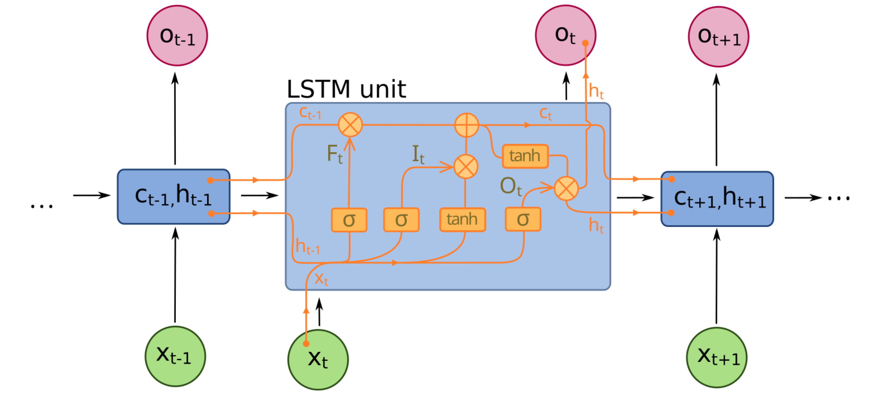

# 20、手写LSTM

## LSTM长短期记忆网络



LSTM的数学公式为：

**输入门**
$i_t = \sigma(W_{xi}x_t + W_{hi}h_{t-1} + b_i)$

**遗忘门**
$f_t = \sigma(W_{xf}x_t + W_{hf}h_{t-1} + b_f)$

**输出门**
$o_t = \sigma(W_{xo}x_t +W_{ho}h_{t-1} + b_o)$

**候选记忆单元**
$\tilde{c}_t = \tanh(W_{xc}x_t + W_{hc}h_{t-1} + b_{c})$

$c_t = f_t \odot c_{t-1} + i_t \odot \tilde{c}_t$

$h_t = o_t \odot \tanh(c_t)$

长期记忆：细胞状态$c_t$通过遗忘门（保留旧记忆）和输入门（添加新记忆）实现长程依赖

短期记忆：隐状态$h_t$由输出门和当前细胞状态共同决定，作为当前时间步的输出

如果$f_t$=1，$i_t$=0，那么$c_t$=$c_{t-1}$， 将保留旧记忆，并且使用旧记忆和上一个隐状态作为输入得到新的隐状态

```python
import torch
import torch.nn as nn

class ZhouyuLSTMCell(nn.Module):
    def __init__(self, input_size, hidden_size):
        super().__init__()
        self.input_size = input_size
        self.hidden_size = hidden_size

        # 输入门参数
        self.W_xi = nn.Parameter(torch.randn(input_size, hidden_size))
        self.W_hi = nn.Parameter(torch.randn(hidden_size, hidden_size))
        self.b_i = nn.Parameter(torch.zeros(hidden_size))

        # 遗忘门参数
        self.W_xf = nn.Parameter(torch.randn(input_size, hidden_size))
        self.W_hf = nn.Parameter(torch.randn(hidden_size, hidden_size))
        self.b_f = nn.Parameter(torch.zeros(hidden_size))

        # 输出门参数
        self.W_xo = nn.Parameter(torch.randn(input_size, hidden_size))
        self.W_ho = nn.Parameter(torch.randn(hidden_size, hidden_size))
        self.b_o = nn.Parameter(torch.zeros(hidden_size))

        # 候选状态参数
        self.W_xc = nn.Parameter(torch.randn(input_size, hidden_size))
        self.W_hc = nn.Parameter(torch.randn(hidden_size, hidden_size))
        self.b_c = nn.Parameter(torch.zeros(hidden_size))

    def forward(self, x, states):
        h_prev, c_prev = states

        # 输入门
        i_t = torch.sigmoid(torch.mm(x, self.W_xi) + torch.mm(h_prev, self.W_hi) + self.b_i)

        # 遗忘门
        f_t = torch.sigmoid(torch.mm(x, self.W_xf) + torch.mm(h_prev, self.W_hf) + self.b_f)

        # 输出门
        o_t = torch.sigmoid(torch.mm(x, self.W_xo) + torch.mm(h_prev, self.W_ho) + self.b_o)

        # 候选状态
        c_t_tilde = torch.tanh(torch.mm(x, self.W_xc) + torch.mm(h_prev, self.W_hc) + self.b_c)

        # 更新细胞状态
        c_t = f_t * c_prev + i_t * c_t_tilde

        # 更新隐藏状态
        h_t = o_t * torch.tanh(c_t)

        return h_t, c_t

class ZhouyuLSTM(nn.Module):
    def __init__(self, input_size, hidden_size):
        super().__init__()
        self.hidden_size = hidden_size
        self.cell = ZhouyuLSTMCell(input_size, hidden_size)

    def forward(self, x, hidden=None, cell=None):
        seq_len, batch_size, input_size = x.shape

        # 初始化状态
        if hidden is None:
            hidden = torch.zeros(batch_size, self.hidden_size)
            cell = torch.zeros(batch_size, self.hidden_size)

        outputs = []
        for t in range(seq_len):
            hidden, cell = self.cell(x[t], (hidden, cell))
            outputs.append(hidden)  # 添加序列维度

        return outputs, (hidden, cell)

# 测试代码
input_size = 32
hidden_size = 5
batch_size = 1
seq_len = 2

zhouyu_lstm = ZhouyuLSTM(input_size, hidden_size)

x = torch.randn(seq_len, batch_size, input_size)
outputs, (hidden, cell) = zhouyu_lstm(x)
outputs, hidden, cell
```

```plaintext
([tensor([[-3.1564e-01,  2.2001e-01, -7.9461e-05,  2.6907e-03,  9.3004e-06]],
         grad_fn=<MulBackward0>),
  tensor([[-0.0047,  0.5595,  0.0033,  0.4094, -0.5054]], grad_fn=<MulBackward0>)],
 tensor([[-0.0047,  0.5595,  0.0033,  0.4094, -0.5054]], grad_fn=<MulBackward0>),
 tensor([[-0.3378,  0.6335,  0.2573,  0.4394, -0.5910]], grad_fn=<AddBackward0>))
```

```python
lstm = nn.LSTM(input_size, hidden_size, bias=True)
outputs, (hidden, cell) = lstm(x)

outputs, hidden, cell
```

```plaintext
(tensor([[[ 0.0082, -0.0430, -0.0755, -0.2951, -0.1954]],
 
         [[ 0.2415, -0.0013, -0.0369, -0.5453, -0.1533]]],
        grad_fn=<StackBackward0>),
 tensor([[[ 0.2415, -0.0013, -0.0369, -0.5453, -0.1533]]],
        grad_fn=<StackBackward0>),
 tensor([[[ 0.6487, -0.0057, -0.2673, -0.6744, -0.3021]]],
        grad_fn=<StackBackward0>))
```