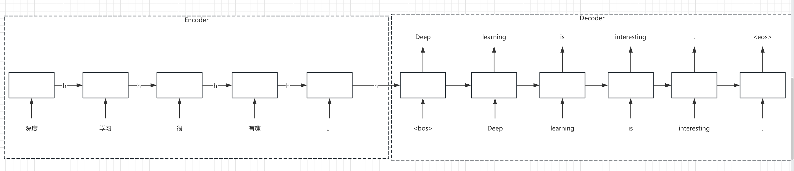

# 22、手写Seq2Seq机器翻译实战

## Seq2Seq

在前面的RNN中，在训练时，如果我们输入的序列长度是5，那么输出的序列长度也是5，而Seq2Seq则输入和输出的长度可以是不一样的，因此非常适合做文本翻译的任务。



Deep learning is interesting

Deep learning is interesting
Deep learning is interesting

```python
# !pip install jieba
```

```python
from collections import Counter

import jieba
import torch
import torch.nn as nn
import torch.optim as optim

# 自定义简单数据集
data = [
    ("你好，今天天气真好！", "Hello, the weather is nice today!"),
    ("你吃饭了吗？", "Have you eaten yet?"),
    ("深度学习很有趣。", "Deep learning is interesting."),
    ("我们一起学习吧。", "Let's study together."),
    ("这是一个测试例子。", "This is a test example.")
]


# 中文分词函数
def chinese_split(text):
    return list(jieba.cut(text))  # 使用结巴分词


# 英文分词函数
def english_split(text):
    return text.lower().split()


# 处理原始数据
chinese_sentences = [chinese_split(pair[0]) for pair in data]
english_sentences = [english_split(pair[1]) for pair in data]

chinese_sentences, english_sentences
```

```plaintext
([['你好', '，', '今天天气', '真', '好', '！'],
  ['你', '吃饭', '了', '吗', '？'],
  ['深度', '学习', '很', '有趣', '。'],
  ['我们', '一起', '学习', '吧', '。'],
  ['这是', '一个', '测试', '例子', '。']],
 [['hello,', 'the', 'weather', 'is', 'nice', 'today!'],
  ['have', 'you', 'eaten', 'yet?'],
  ['deep', 'learning', 'is', 'interesting.'],
  ["let's", 'study', 'together.'],
  ['this', 'is', 'a', 'test', 'example.']])
```

```python
# 处理特殊符号
special_tokens = ['<pad>', '<bos>', '<eos>', '<unk>']


# 构建词汇表
def build_vocab(sentences):
    counter = Counter()

    for sentence in sentences:
        for word in sentence:
            counter[word] += 1

    vocab = special_tokens.copy()

    for word, count in counter.items():
        if word not in special_tokens:
            vocab.append(word)

    word2idx = {word: idx for idx, word in enumerate(vocab)}
    return vocab, word2idx


# 构建中英文词汇表
zh_vocab, zh_word2idx = build_vocab([sentence for sentence in chinese_sentences])

en_vocab, en_word2idx = build_vocab([sentence for sentence in english_sentences])

# print(zh_vocab)
# print(en_vocab)
print(zh_word2idx)
print(en_word2idx)
```

```plaintext
{'<pad>': 0, '<bos>': 1, '<eos>': 2, '<unk>': 3, '你好': 4, '，': 5, '今天天气': 6, '真': 7, '好': 8, '！': 9, '你': 10, '吃饭': 11, '了': 12, '吗': 13, '？': 14, '深度': 15, '学习': 16, '很': 17, '有趣': 18, '。': 19, '我们': 20, '一起': 21, '吧': 22, '这是': 23, '一个': 24, '测试': 25, '例子': 26}
{'<pad>': 0, '<bos>': 1, '<eos>': 2, '<unk>': 3, 'hello,': 4, 'the': 5, 'weather': 6, 'is': 7, 'nice': 8, 'today!': 9, 'have': 10, 'you': 11, 'eaten': 12, 'yet?': 13, 'deep': 14, 'learning': 15, 'interesting.': 16, "let's": 17, 'study': 18, 'together.': 19, 'this': 20, 'a': 21, 'test': 22, 'example.': 23}
```

```python
# 参数设置
ZH_VOCAB_SIZE = len(zh_vocab)
EN_VOCAB_SIZE = len(en_vocab)
HIDDEN_SIZE = 256
BATCH_SIZE = 2
LEARNING_RATE = 0.005


def tokenize(words, word2idx):
    # 如果某个词在字典中找不到，则用'<unk>'的索引代替
    return [word2idx.get(word, word2idx['<unk>']) for word in words]


processed_data_ch = []
processed_data_en = []
for ch, en in zip(chinese_sentences, english_sentences):
    # ch，en分别是一个中文句子和对应的英文句子
    # 在每个句子的前面加上'<bos>'，在每个句子的后面加上'<eos>'，这样大模型才能知道什么时候停止生成句子
    ch_numerical = tokenize(ch, zh_word2idx)
    en_numerical = [en_word2idx['<bos>']] + tokenize(en, en_word2idx) + [en_word2idx['<eos>']]
    processed_data_ch.append(torch.LongTensor(ch_numerical))
    processed_data_en.append(torch.LongTensor(en_numerical))

# print(processed_data_ch)
processed_data_en
```

```plaintext
[tensor([1, 4, 5, 6, 7, 8, 9, 2]),
 tensor([ 1, 10, 11, 12, 13,  2]),
 tensor([ 1, 14, 15,  7, 16,  2]),
 tensor([ 1, 17, 18, 19,  2]),
 tensor([ 1, 20,  7, 21, 22, 23,  2])]
```

```python
# 对processed_data进行数据填充，对齐长度
processed_data_ch_pad = nn.utils.rnn.pad_sequence(processed_data_ch, batch_first=True,
                                                  padding_value=zh_word2idx['<pad>'])
processed_data_ch_pad
```

```plaintext
tensor([[ 4,  5,  6,  7,  8,  9],
        [10, 11, 12, 13, 14,  0],
        [15, 16, 17, 18, 19,  0],
        [20, 21, 16, 22, 19,  0],
        [23, 24, 25, 26, 19,  0]])
```

```python
# 对processed_data进行数据填充，对齐长度
processed_data_en_pad = nn.utils.rnn.pad_sequence(processed_data_en, batch_first=True,
                                                  padding_value=en_word2idx['<pad>'])
processed_data_en_pad
```

```plaintext
tensor([[ 1,  4,  5,  6,  7,  8,  9,  2],
        [ 1, 10, 11, 12, 13,  2,  0,  0],
        [ 1, 14, 15,  7, 16,  2,  0,  0],
        [ 1, 17, 18, 19,  2,  0,  0,  0],
        [ 1, 20,  7, 21, 22, 23,  2,  0]])
```

```python

from torch.utils.data import DataLoader, TensorDataset

dataset = TensorDataset(processed_data_ch_pad, processed_data_en_pad)
dataloader = DataLoader(dataset, batch_size=1, shuffle=True)

for src, trg in dataloader:
    print(src)
    print(trg)
    break
```

```plaintext
tensor([[15, 16, 17, 18, 19,  0]])
tensor([[ 1, 14, 15,  7, 16,  2,  0,  0]])
```

```python
# 编码器
class Encoder(nn.Module):
    def __init__(self, vocab_size, hidden_size):
        super().__init__()
        self.embedding = nn.Embedding(vocab_size, hidden_size)
        self.rnn = nn.GRU(hidden_size, hidden_size, batch_first=True)

    def forward(self, src):
        embedded = self.embedding(src)
        outputs, hidden = self.rnn(embedded)
        return outputs, hidden


# 解码器
class Decoder(nn.Module):
    def __init__(self, vocab_size, hidden_size):
        super().__init__()
        self.embedding = nn.Embedding(vocab_size, hidden_size)
        self.rnn = nn.GRU(hidden_size, hidden_size, batch_first=True)
        self.fc_out = nn.Linear(hidden_size, vocab_size)

    def forward(self, input, hidden):
        embedded = self.embedding(input)
        outputs, hidden = self.rnn(embedded, hidden)
        return self.fc_out(outputs), hidden


# 训练配置
encoder = Encoder(ZH_VOCAB_SIZE, HIDDEN_SIZE)
decoder = Decoder(EN_VOCAB_SIZE, HIDDEN_SIZE)
optimizer = optim.Adam(list(encoder.parameters()) + list(decoder.parameters()), lr=LEARNING_RATE)
criterion = nn.CrossEntropyLoss(ignore_index=en_word2idx['<pad>'])

for epoch in range(20):
    # input： tensor([[4, 5, 6, 7, 8, 9]])
    # target：tensor([[1, 4, 5, 6, 7, 8, 9, 2]])
    for input, target in dataloader:

        _, hidden = encoder(input)

        # 准备解码器输入输出，其实这一步可以在数据处理时做掉
        decoder_input = target[:, :-1]  # 移除最后一个token  tensor([[1, 4, 5, 6, 7, 8, 9]])
        decoder_target = target[:, 1:]  # 移除第一个token    tensor([[4, 5, 6, 7, 8, 9, 2]])

        decoder_output, _ = decoder(decoder_input, hidden)

        # 计算损失
        loss = criterion(
            # decoder_output本来是(batch_size, seq_len, vocab_size)，变成(batch_size * seq_len, vocab_size)
            # decoder_target本来是(batch_size, seq_len)，变成(batch_size * seq_len)
            decoder_output.view(-1, decoder_output.size(-1)),
            decoder_target.view(-1)
        )

        optimizer.zero_grad()
        loss.backward()
        optimizer.step()

        print(f'Epoch {epoch + 1}, Loss: {loss:.4f}')
```

```plaintext
Epoch 1, Loss: 3.1396
Epoch 1, Loss: 3.3136
Epoch 1, Loss: 3.5053
Epoch 1, Loss: 3.4855
Epoch 1, Loss: 3.7106
Epoch 2, Loss: 2.3373
Epoch 2, Loss: 0.5443
Epoch 2, Loss: 1.1085
Epoch 2, Loss: 1.3528
Epoch 2, Loss: 0.9174
Epoch 3, Loss: 0.6352
Epoch 3, Loss: 0.2983
Epoch 3, Loss: 0.1709
Epoch 3, Loss: 0.2156
Epoch 3, Loss: 0.1019
Epoch 4, Loss: 0.0771
Epoch 4, Loss: 0.0595
Epoch 4, Loss: 0.0435
Epoch 4, Loss: 0.0630
Epoch 4, Loss: 0.1107
Epoch 5, Loss: 0.0281
Epoch 5, Loss: 0.0337
Epoch 5, Loss: 0.0463
Epoch 5, Loss: 0.0118
Epoch 5, Loss: 0.0147
Epoch 6, Loss: 0.0193
Epoch 6, Loss: 0.0117
Epoch 6, Loss: 0.0110
Epoch 6, Loss: 0.0067
Epoch 6, Loss: 0.0128
Epoch 7, Loss: 0.0082
Epoch 7, Loss: 0.0053
Epoch 7, Loss: 0.0104
Epoch 7, Loss: 0.0065
Epoch 7, Loss: 0.0054
Epoch 8, Loss: 0.0049
Epoch 8, Loss: 0.0052
Epoch 8, Loss: 0.0050
Epoch 8, Loss: 0.0071
Epoch 8, Loss: 0.0034
Epoch 9, Loss: 0.0042
Epoch 9, Loss: 0.0059
Epoch 9, Loss: 0.0039
Epoch 9, Loss: 0.0029
Epoch 9, Loss: 0.0028
Epoch 10, Loss: 0.0034
Epoch 10, Loss: 0.0045
Epoch 10, Loss: 0.0025
Epoch 10, Loss: 0.0024
Epoch 10, Loss: 0.0030
Epoch 11, Loss: 0.0029
Epoch 11, Loss: 0.0036
Epoch 11, Loss: 0.0022
Epoch 11, Loss: 0.0020
Epoch 11, Loss: 0.0027
Epoch 12, Loss: 0.0026
Epoch 12, Loss: 0.0025
Epoch 12, Loss: 0.0029
Epoch 12, Loss: 0.0019
Epoch 12, Loss: 0.0018
Epoch 13, Loss: 0.0027
Epoch 13, Loss: 0.0017
Epoch 13, Loss: 0.0018
Epoch 13, Loss: 0.0022
Epoch 13, Loss: 0.0022
Epoch 14, Loss: 0.0021
Epoch 14, Loss: 0.0015
Epoch 14, Loss: 0.0016
Epoch 14, Loss: 0.0021
Epoch 14, Loss: 0.0023
Epoch 15, Loss: 0.0022
Epoch 15, Loss: 0.0015
Epoch 15, Loss: 0.0019
Epoch 15, Loss: 0.0014
Epoch 15, Loss: 0.0019
Epoch 16, Loss: 0.0014
Epoch 16, Loss: 0.0019
Epoch 16, Loss: 0.0013
Epoch 16, Loss: 0.0020
Epoch 16, Loss: 0.0018
Epoch 17, Loss: 0.0017
Epoch 17, Loss: 0.0012
Epoch 17, Loss: 0.0019
Epoch 17, Loss: 0.0017
Epoch 17, Loss: 0.0013
Epoch 18, Loss: 0.0012
Epoch 18, Loss: 0.0013
Epoch 18, Loss: 0.0016
Epoch 18, Loss: 0.0017
Epoch 18, Loss: 0.0016
Epoch 19, Loss: 0.0012
Epoch 19, Loss: 0.0011
Epoch 19, Loss: 0.0017
Epoch 19, Loss: 0.0015
Epoch 19, Loss: 0.0016
Epoch 20, Loss: 0.0016
Epoch 20, Loss: 0.0016
Epoch 20, Loss: 0.0010
Epoch 20, Loss: 0.0011
Epoch 20, Loss: 0.0014
```

```python
# 翻译函数
def translate(sentence, encoder, decoder):

    tokens = tokenize(chinese_split(sentence), zh_word2idx)
    src = torch.LongTensor(tokens)

    _, hidden = encoder(src)

    trg_indexes = [en_word2idx['<bos>']]

    for _ in range(50):
        trg_tensor = torch.LongTensor([trg_indexes[-1]])

        with torch.no_grad():
            output, hidden = decoder(trg_tensor, hidden)
        pred_token = output.argmax().item()
        trg_indexes.append(pred_token)

        if pred_token == en_word2idx['<eos>']:
            break


    return ' '.join([en_vocab[idx] for idx in trg_indexes[1:-1]])


# 测试翻译
test_sentence = "我们一起学习"
print(translate(test_sentence, encoder, decoder))
```

```plaintext
let's study together.
```