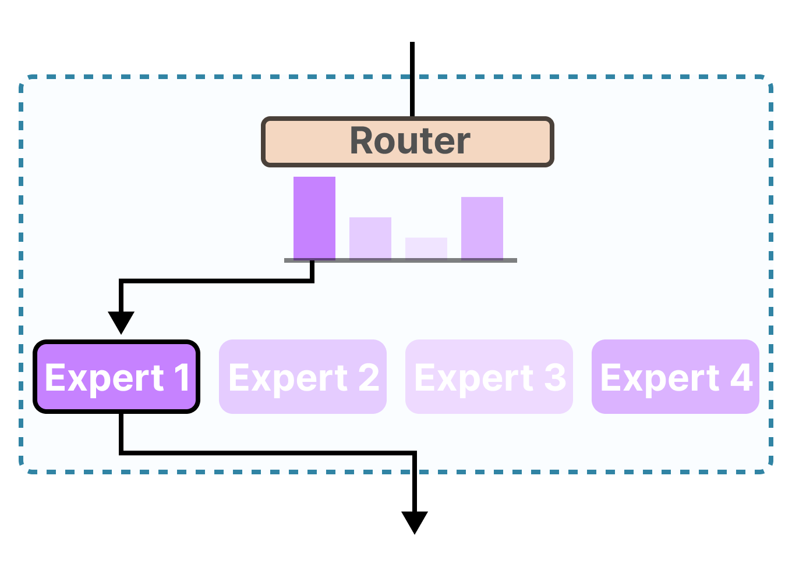

# 45、手写DeepSeek之MoE

## MoE



```python
import torch
import torch.nn as nn
import torch.nn.functional as F
from torch import Tensor


class ExpertRouter:
    def __init__(self, num_experts, gates):
        self.gates = gates
        self.num_experts = num_experts

        # 获取每个样本的前k个专家
        _, self.expert_index = torch.topk(gates, k=1, dim=1)

        # gates.size(0)表示batch_size
        self.batch_index = torch.arange(gates.size(0)).unsqueeze(1)

        # 用一个bool_mask记录当前批次中每个样本对应选择的专家，选中的专家为True
        self.bool_mask = torch.zeros_like(gates, dtype=torch.bool)
        self.bool_mask[self.batch_index, self.expert_index] = True

    def dispatch(self, x):
        # 每个专家有哪些输入，x中包含了多个样本，每个样本会对应topk个专家，那么某一个专家就有可能会接收多个样本
        return [x[self.bool_mask[:, i]] for i in range(self.num_experts)]

    def combine(self, expert_outputs: list[Tensor]) -> Tensor:
        results = torch.zeros((self.bool_mask.size(0), expert_outputs[0].size(1)))
        for i, out in enumerate(expert_outputs):
            if out.size(0) > 0:
                results[self.bool_mask[:, i]] = out
        return results


class Expert(nn.Module):
    def __init__(self, input_dim, output_dim, hidden_size):
        super().__init__()
        self.net = nn.Sequential(
            nn.Linear(input_dim, hidden_size),
            nn.ReLU(),
            nn.Linear(hidden_size, output_dim)
        )

    def forward(self, x: Tensor) -> Tensor:
        return self.net(x)


class MoE(nn.Module):
    def __init__(self, input_dim, output_dim, num_experts, hidden_size):
        super().__init__()

        self.input_dim = input_dim
        self.output_dim = output_dim
        self.num_experts = num_experts
        self.hidden_size = hidden_size

        # 专家网络
        self.experts = nn.ModuleList(
            [Expert(input_dim, output_dim, hidden_size) for _ in range(num_experts)]
        )

        # 门控网络，对专家进行路由
        self.gate = nn.Linear(input_dim, num_experts)

    def forward(self, x):
        # 得到当前输入x对应的每个专家的权重
        gates = F.softmax(self.gate(x), dim=1)  # [batch_size, num_experts]

        # 根据专家权重的大小选择topk个专家
        router = ExpertRouter(self.num_experts, gates)
        expert_inputs = router.dispatch(x)

        # 专家处理，把输入数据输入给每个专家，如果某个专家没有输入数据，则返回一个空的张量
        expert_outputs = [
            self.experts[i](expert_inputs[i]) if expert_inputs[i].size(0) > 0 else
            torch.empty(0, self.output_dim)
            for i in range(self.num_experts)
        ]

        # 组合专家输出
        outputs = router.combine(expert_outputs)

        return outputs
```

```python
input_dim = 64
output_dim = 128
hidden_size = 256
num_experts = 8
moe_layer = MoE(input_dim, output_dim, num_experts, hidden_size)

# 模拟输入数据
batch_size = 4
inputs = torch.randn(batch_size, input_dim)

outputs = moe_layer(inputs)

print(f"输入形状: {inputs.shape}")
print(f"输出形状: {outputs.shape}")
```

```plaintext
输入形状: torch.Size([4, 64])
输出形状: torch.Size([4, 128])
```