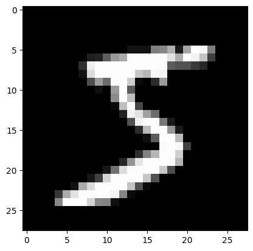
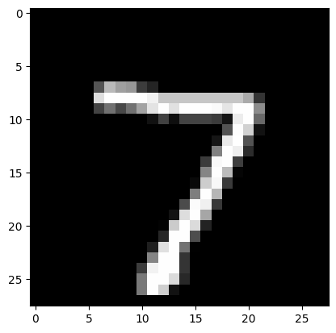
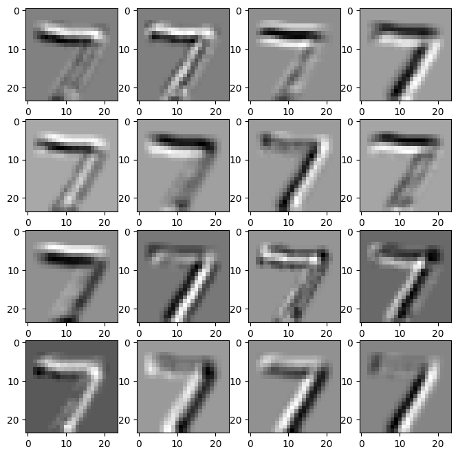

# 48、卷积神经网络图像识别实战

## CNN

CNN就是convolutional neural network，也就是卷积神经网络，用在图像处理中。

## 卷积核

卷积核是用来提取特征的，不同的卷积核，提取出图片的不同特征，相当于不再使用整张图片的所有像素点作为图片的特征了，而是提取出图片中最核心的部分，忽略掉一些无用的信息，从而减少运算量。

## 池化层

池化就是缩小图片，比如将图片缩小到原来的1/2，这样图片的分辨率变小，但是图片的语义信息不变，因此可以减少运算量。
池化分为两种：

1. 最大池化
2. 平均池化

利用pytorch自动下载MNIST数据集

MNIST数据集介绍：https://docs.ultralytics.com/zh/datasets/classify/mnist/

```python
import matplotlib.pyplot as plt
from torchvision import datasets

# pytorch下载mnist数据集
train_dataset = datasets.MNIST(root='./data/', train=True, download=True)
test_dataset = datasets.MNIST(root='./data/', train=False, download=True)
print(len(train_dataset))
print(len(test_dataset))
```

```plaintext
60000
10000
```

```python
train_dataset[0][0]
```


```python
train_dataset[0][1]
```

```plaintext
5
```

直接通过transforms得到归一化后的图片张量数据集

```python
from torchvision import datasets, transforms
import matplotlib.pyplot as plt

# pytorch下载mnist
train_dataset = datasets.MNIST(root='./data/', train=True, transform=transforms.ToTensor(), download=True)
test_dataset = datasets.MNIST(root='./data/', train=False, transform=transforms.ToTensor(), download=True)
train_dataset[0][0].shape
```

```plaintext
torch.Size([1, 28, 28])
```

```python
train_dataset[0][0]
```

```plaintext
tensor([[[0.0000, 0.0000, 0.0000, 0.0000, 0.0000, 0.0000, 0.0000, 0.0000,
          0.0000, 0.0000, 0.0000, 0.0000, 0.0000, 0.0000, 0.0000, 0.0000,
          0.0000, 0.0000, 0.0000, 0.0000, 0.0000, 0.0000, 0.0000, 0.0000,
          0.0000, 0.0000, 0.0000, 0.0000],
         [0.0000, 0.0000, 0.0000, 0.0000, 0.0000, 0.0000, 0.0000, 0.0000,
          0.0000, 0.0000, 0.0000, 0.0000, 0.0000, 0.0000, 0.0000, 0.0000,
          0.0000, 0.0000, 0.0000, 0.0000, 0.0000, 0.0000, 0.0000, 0.0000,
          0.0000, 0.0000, 0.0000, 0.0000],
         [0.0000, 0.0000, 0.0000, 0.0000, 0.0000, 0.0000, 0.0000, 0.0000,
          0.0000, 0.0000, 0.0000, 0.0000, 0.0000, 0.0000, 0.0000, 0.0000,
          0.0000, 0.0000, 0.0000, 0.0000, 0.0000, 0.0000, 0.0000, 0.0000,
          0.0000, 0.0000, 0.0000, 0.0000],
         [0.0000, 0.0000, 0.0000, 0.0000, 0.0000, 0.0000, 0.0000, 0.0000,
          0.0000, 0.0000, 0.0000, 0.0000, 0.0000, 0.0000, 0.0000, 0.0000,
          0.0000, 0.0000, 0.0000, 0.0000, 0.0000, 0.0000, 0.0000, 0.0000,
          0.0000, 0.0000, 0.0000, 0.0000],
         [0.0000, 0.0000, 0.0000, 0.0000, 0.0000, 0.0000, 0.0000, 0.0000,
          0.0000, 0.0000, 0.0000, 0.0000, 0.0000, 0.0000, 0.0000, 0.0000,
          0.0000, 0.0000, 0.0000, 0.0000, 0.0000, 0.0000, 0.0000, 0.0000,
          0.0000, 0.0000, 0.0000, 0.0000],
         [0.0000, 0.0000, 0.0000, 0.0000, 0.0000, 0.0000, 0.0000, 0.0000,
          0.0000, 0.0000, 0.0000, 0.0000, 0.0118, 0.0706, 0.0706, 0.0706,
          0.4941, 0.5333, 0.6863, 0.1020, 0.6510, 1.0000, 0.9686, 0.4980,
          0.0000, 0.0000, 0.0000, 0.0000],
         [0.0000, 0.0000, 0.0000, 0.0000, 0.0000, 0.0000, 0.0000, 0.0000,
          0.1176, 0.1412, 0.3686, 0.6039, 0.6667, 0.9922, 0.9922, 0.9922,
          0.9922, 0.9922, 0.8824, 0.6745, 0.9922, 0.9490, 0.7647, 0.2510,
          0.0000, 0.0000, 0.0000, 0.0000],
         [0.0000, 0.0000, 0.0000, 0.0000, 0.0000, 0.0000, 0.0000, 0.1922,
          0.9333, 0.9922, 0.9922, 0.9922, 0.9922, 0.9922, 0.9922, 0.9922,
          0.9922, 0.9843, 0.3647, 0.3216, 0.3216, 0.2196, 0.1529, 0.0000,
          0.0000, 0.0000, 0.0000, 0.0000],
         [0.0000, 0.0000, 0.0000, 0.0000, 0.0000, 0.0000, 0.0000, 0.0706,
          0.8588, 0.9922, 0.9922, 0.9922, 0.9922, 0.9922, 0.7765, 0.7137,
          0.9686, 0.9451, 0.0000, 0.0000, 0.0000, 0.0000, 0.0000, 0.0000,
          0.0000, 0.0000, 0.0000, 0.0000],
         [0.0000, 0.0000, 0.0000, 0.0000, 0.0000, 0.0000, 0.0000, 0.0000,
          0.3137, 0.6118, 0.4196, 0.9922, 0.9922, 0.8039, 0.0431, 0.0000,
          0.1686, 0.6039, 0.0000, 0.0000, 0.0000, 0.0000, 0.0000, 0.0000,
          0.0000, 0.0000, 0.0000, 0.0000],
         [0.0000, 0.0000, 0.0000, 0.0000, 0.0000, 0.0000, 0.0000, 0.0000,
          0.0000, 0.0549, 0.0039, 0.6039, 0.9922, 0.3529, 0.0000, 0.0000,
          0.0000, 0.0000, 0.0000, 0.0000, 0.0000, 0.0000, 0.0000, 0.0000,
          0.0000, 0.0000, 0.0000, 0.0000],
         [0.0000, 0.0000, 0.0000, 0.0000, 0.0000, 0.0000, 0.0000, 0.0000,
          0.0000, 0.0000, 0.0000, 0.5451, 0.9922, 0.7451, 0.0078, 0.0000,
          0.0000, 0.0000, 0.0000, 0.0000, 0.0000, 0.0000, 0.0000, 0.0000,
          0.0000, 0.0000, 0.0000, 0.0000],
         [0.0000, 0.0000, 0.0000, 0.0000, 0.0000, 0.0000, 0.0000, 0.0000,
          0.0000, 0.0000, 0.0000, 0.0431, 0.7451, 0.9922, 0.2745, 0.0000,
          0.0000, 0.0000, 0.0000, 0.0000, 0.0000, 0.0000, 0.0000, 0.0000,
          0.0000, 0.0000, 0.0000, 0.0000],
         [0.0000, 0.0000, 0.0000, 0.0000, 0.0000, 0.0000, 0.0000, 0.0000,
          0.0000, 0.0000, 0.0000, 0.0000, 0.1373, 0.9451, 0.8824, 0.6275,
          0.4235, 0.0039, 0.0000, 0.0000, 0.0000, 0.0000, 0.0000, 0.0000,
          0.0000, 0.0000, 0.0000, 0.0000],
         [0.0000, 0.0000, 0.0000, 0.0000, 0.0000, 0.0000, 0.0000, 0.0000,
          0.0000, 0.0000, 0.0000, 0.0000, 0.0000, 0.3176, 0.9412, 0.9922,
          0.9922, 0.4667, 0.0980, 0.0000, 0.0000, 0.0000, 0.0000, 0.0000,
          0.0000, 0.0000, 0.0000, 0.0000],
         [0.0000, 0.0000, 0.0000, 0.0000, 0.0000, 0.0000, 0.0000, 0.0000,
          0.0000, 0.0000, 0.0000, 0.0000, 0.0000, 0.0000, 0.1765, 0.7294,
          0.9922, 0.9922, 0.5882, 0.1059, 0.0000, 0.0000, 0.0000, 0.0000,
          0.0000, 0.0000, 0.0000, 0.0000],
         [0.0000, 0.0000, 0.0000, 0.0000, 0.0000, 0.0000, 0.0000, 0.0000,
          0.0000, 0.0000, 0.0000, 0.0000, 0.0000, 0.0000, 0.0000, 0.0627,
          0.3647, 0.9882, 0.9922, 0.7333, 0.0000, 0.0000, 0.0000, 0.0000,
          0.0000, 0.0000, 0.0000, 0.0000],
         [0.0000, 0.0000, 0.0000, 0.0000, 0.0000, 0.0000, 0.0000, 0.0000,
          0.0000, 0.0000, 0.0000, 0.0000, 0.0000, 0.0000, 0.0000, 0.0000,
          0.0000, 0.9765, 0.9922, 0.9765, 0.2510, 0.0000, 0.0000, 0.0000,
          0.0000, 0.0000, 0.0000, 0.0000],
         [0.0000, 0.0000, 0.0000, 0.0000, 0.0000, 0.0000, 0.0000, 0.0000,
          0.0000, 0.0000, 0.0000, 0.0000, 0.0000, 0.0000, 0.1804, 0.5098,
          0.7176, 0.9922, 0.9922, 0.8118, 0.0078, 0.0000, 0.0000, 0.0000,
          0.0000, 0.0000, 0.0000, 0.0000],
         [0.0000, 0.0000, 0.0000, 0.0000, 0.0000, 0.0000, 0.0000, 0.0000,
          0.0000, 0.0000, 0.0000, 0.0000, 0.1529, 0.5804, 0.8980, 0.9922,
          0.9922, 0.9922, 0.9804, 0.7137, 0.0000, 0.0000, 0.0000, 0.0000,
          0.0000, 0.0000, 0.0000, 0.0000],
         [0.0000, 0.0000, 0.0000, 0.0000, 0.0000, 0.0000, 0.0000, 0.0000,
          0.0000, 0.0000, 0.0941, 0.4471, 0.8667, 0.9922, 0.9922, 0.9922,
          0.9922, 0.7882, 0.3059, 0.0000, 0.0000, 0.0000, 0.0000, 0.0000,
          0.0000, 0.0000, 0.0000, 0.0000],
         [0.0000, 0.0000, 0.0000, 0.0000, 0.0000, 0.0000, 0.0000, 0.0000,
          0.0902, 0.2588, 0.8353, 0.9922, 0.9922, 0.9922, 0.9922, 0.7765,
          0.3176, 0.0078, 0.0000, 0.0000, 0.0000, 0.0000, 0.0000, 0.0000,
          0.0000, 0.0000, 0.0000, 0.0000],
         [0.0000, 0.0000, 0.0000, 0.0000, 0.0000, 0.0000, 0.0706, 0.6706,
          0.8588, 0.9922, 0.9922, 0.9922, 0.9922, 0.7647, 0.3137, 0.0353,
          0.0000, 0.0000, 0.0000, 0.0000, 0.0000, 0.0000, 0.0000, 0.0000,
          0.0000, 0.0000, 0.0000, 0.0000],
         [0.0000, 0.0000, 0.0000, 0.0000, 0.2157, 0.6745, 0.8863, 0.9922,
          0.9922, 0.9922, 0.9922, 0.9569, 0.5216, 0.0431, 0.0000, 0.0000,
          0.0000, 0.0000, 0.0000, 0.0000, 0.0000, 0.0000, 0.0000, 0.0000,
          0.0000, 0.0000, 0.0000, 0.0000],
         [0.0000, 0.0000, 0.0000, 0.0000, 0.5333, 0.9922, 0.9922, 0.9922,
          0.8314, 0.5294, 0.5176, 0.0627, 0.0000, 0.0000, 0.0000, 0.0000,
          0.0000, 0.0000, 0.0000, 0.0000, 0.0000, 0.0000, 0.0000, 0.0000,
          0.0000, 0.0000, 0.0000, 0.0000],
         [0.0000, 0.0000, 0.0000, 0.0000, 0.0000, 0.0000, 0.0000, 0.0000,
          0.0000, 0.0000, 0.0000, 0.0000, 0.0000, 0.0000, 0.0000, 0.0000,
          0.0000, 0.0000, 0.0000, 0.0000, 0.0000, 0.0000, 0.0000, 0.0000,
          0.0000, 0.0000, 0.0000, 0.0000],
         [0.0000, 0.0000, 0.0000, 0.0000, 0.0000, 0.0000, 0.0000, 0.0000,
          0.0000, 0.0000, 0.0000, 0.0000, 0.0000, 0.0000, 0.0000, 0.0000,
          0.0000, 0.0000, 0.0000, 0.0000, 0.0000, 0.0000, 0.0000, 0.0000,
          0.0000, 0.0000, 0.0000, 0.0000],
         [0.0000, 0.0000, 0.0000, 0.0000, 0.0000, 0.0000, 0.0000, 0.0000,
          0.0000, 0.0000, 0.0000, 0.0000, 0.0000, 0.0000, 0.0000, 0.0000,
          0.0000, 0.0000, 0.0000, 0.0000, 0.0000, 0.0000, 0.0000, 0.0000,
          0.0000, 0.0000, 0.0000, 0.0000]]])
```

```python
train_dataset[0][0].shape
```

```plaintext
torch.Size([1, 28, 28])
```

```python
plt.imshow(train_dataset[0][0].view(-1, 28), cmap='gray')
```

```plaintext
<matplotlib.image.AxesImage at 0x10e404100>
```



```python
from torch.utils.data import DataLoader

train_loader = DataLoader(train_dataset, batch_size=16, shuffle=True)
test_loader = DataLoader(test_dataset, batch_size=16, shuffle=False)

for images, labels in train_loader:
    print(images.shape)
    print(labels.shape)
    break
```

```plaintext
torch.Size([16, 1, 28, 28])
torch.Size([16])
```

定义模型

```python
from torch import nn

import torch
# 大都督周瑜（我的微信: it_zhouyu）

class MnistModel(nn.Module):
    def __init__(self):
        super().__init__()

        # 1*28*28
        # 28-5+1=24，16表示16个卷积核，每个卷积核的大小为5*5，每个卷积核会提取出图片中不同的特征, 输出16张24*24的图片
        self.conv1 = nn.Conv2d(in_channels=1, out_channels=16, kernel_size=5)

        # 24/2=12，MaxPool2d就是取卷积核中的最大值, 输出16张12*12的图片
        self.pool1 = nn.MaxPool2d(kernel_size=2, stride=2)

        # 12-5+1=8, 输出32张8*8的图片
        self.conv2 = nn.Conv2d(16, 32, kernel_size=5)
        # 8/2=4，最后输出的图片大小为4*4, 输出32张4*4的图片  32*4*4
        self.pool2 = nn.MaxPool2d(kernel_size=2, stride=2)

        self.fc1 = nn.Linear(32 * 4 * 4, 128)
        self.fc2 = nn.Linear(128, 10)

    def forward(self, x):
        x = torch.relu(self.conv1(x))
        x = self.pool1(x)
        x = torch.relu(self.conv2(x))
        x = self.pool2(x)
        x = x.view(-1, 32 * 4 * 4)
        x = torch.relu(self.fc1(x))
        x = self.fc2(x)
        return x
```

```python
model = MnistModel()

optimizer = torch.optim.SGD(model.parameters(), lr=0.1)
criterion = nn.CrossEntropyLoss()

epochs = 2
for epoch in range(epochs):
    for i, (images, labels) in enumerate(train_loader):
        outputs = model(images)
        loss = criterion(outputs, labels)

        optimizer.zero_grad()
        loss.backward()
        optimizer.step()

        if (i + 1) % 100 == 0:
            print('Epoch [{}/{}], Step [{}/{}], Loss: {:.4f}'
                  .format(epoch + 1, epochs, i + 1, len(train_loader), loss.item()))
```

```plaintext
Epoch [1/2], Step [100/3750], Loss: 0.9576
Epoch [1/2], Step [200/3750], Loss: 0.1411
Epoch [1/2], Step [300/3750], Loss: 0.4731
Epoch [1/2], Step [400/3750], Loss: 0.2108
Epoch [1/2], Step [500/3750], Loss: 0.0509
Epoch [1/2], Step [600/3750], Loss: 0.2323
Epoch [1/2], Step [700/3750], Loss: 0.2045
Epoch [1/2], Step [800/3750], Loss: 0.1506
Epoch [1/2], Step [900/3750], Loss: 0.0098
Epoch [1/2], Step [1000/3750], Loss: 0.1704
Epoch [1/2], Step [1100/3750], Loss: 0.0046
Epoch [1/2], Step [1200/3750], Loss: 0.0042
Epoch [1/2], Step [1300/3750], Loss: 0.0789
Epoch [1/2], Step [1400/3750], Loss: 0.6476
Epoch [1/2], Step [1500/3750], Loss: 0.0695
Epoch [1/2], Step [1600/3750], Loss: 0.0979
Epoch [1/2], Step [1700/3750], Loss: 0.0887
Epoch [1/2], Step [1800/3750], Loss: 0.0832
Epoch [1/2], Step [1900/3750], Loss: 0.0502
Epoch [1/2], Step [2000/3750], Loss: 0.0231
Epoch [1/2], Step [2100/3750], Loss: 0.0346
Epoch [1/2], Step [2200/3750], Loss: 0.0076
Epoch [1/2], Step [2300/3750], Loss: 0.0600
Epoch [1/2], Step [2400/3750], Loss: 0.0466
Epoch [1/2], Step [2500/3750], Loss: 0.0341
Epoch [1/2], Step [2600/3750], Loss: 0.0039
Epoch [1/2], Step [2700/3750], Loss: 0.0316
Epoch [1/2], Step [2800/3750], Loss: 0.0106
Epoch [1/2], Step [2900/3750], Loss: 0.7437
Epoch [1/2], Step [3000/3750], Loss: 0.0141
Epoch [1/2], Step [3100/3750], Loss: 0.0313
Epoch [1/2], Step [3200/3750], Loss: 0.0702
Epoch [1/2], Step [3300/3750], Loss: 0.0398
Epoch [1/2], Step [3400/3750], Loss: 0.0196
Epoch [1/2], Step [3500/3750], Loss: 0.0170
Epoch [1/2], Step [3600/3750], Loss: 0.0085
Epoch [1/2], Step [3700/3750], Loss: 0.0032
Epoch [2/2], Step [100/3750], Loss: 0.0004
Epoch [2/2], Step [200/3750], Loss: 0.0005
Epoch [2/2], Step [300/3750], Loss: 0.0507
Epoch [2/2], Step [400/3750], Loss: 0.0016
Epoch [2/2], Step [500/3750], Loss: 0.2550
Epoch [2/2], Step [600/3750], Loss: 0.0575
Epoch [2/2], Step [700/3750], Loss: 0.0007
Epoch [2/2], Step [800/3750], Loss: 0.0456
Epoch [2/2], Step [900/3750], Loss: 0.0321
Epoch [2/2], Step [1000/3750], Loss: 0.0091
Epoch [2/2], Step [1100/3750], Loss: 0.0588
Epoch [2/2], Step [1200/3750], Loss: 0.2209
Epoch [2/2], Step [1300/3750], Loss: 0.3675
Epoch [2/2], Step [1400/3750], Loss: 0.0513
Epoch [2/2], Step [1500/3750], Loss: 0.0014
Epoch [2/2], Step [1600/3750], Loss: 0.0034
Epoch [2/2], Step [1700/3750], Loss: 0.2738
Epoch [2/2], Step [1800/3750], Loss: 0.1154
Epoch [2/2], Step [1900/3750], Loss: 0.0066
Epoch [2/2], Step [2000/3750], Loss: 0.0021
Epoch [2/2], Step [2100/3750], Loss: 0.0437
Epoch [2/2], Step [2200/3750], Loss: 0.0002
Epoch [2/2], Step [2300/3750], Loss: 0.2472
Epoch [2/2], Step [2400/3750], Loss: 0.1583
Epoch [2/2], Step [2500/3750], Loss: 0.4348
Epoch [2/2], Step [2600/3750], Loss: 0.0056
Epoch [2/2], Step [2700/3750], Loss: 0.0046
Epoch [2/2], Step [2800/3750], Loss: 0.0002
Epoch [2/2], Step [2900/3750], Loss: 0.0085
Epoch [2/2], Step [3000/3750], Loss: 0.0242
Epoch [2/2], Step [3100/3750], Loss: 0.0206
Epoch [2/2], Step [3200/3750], Loss: 0.0131
Epoch [2/2], Step [3300/3750], Loss: 0.0030
Epoch [2/2], Step [3400/3750], Loss: 0.0004
Epoch [2/2], Step [3500/3750], Loss: 0.0010
Epoch [2/2], Step [3600/3750], Loss: 0.0103
Epoch [2/2], Step [3700/3750], Loss: 0.0002
```

```python
# 开始测试
test_loader = DataLoader(test_dataset, batch_size=1, shuffle=False)
plt.imshow(test_dataset[0][0].view(-1, 28), cmap='gray')
```

```plaintext
<matplotlib.image.AxesImage at 0x1547f1f00>
```



```python
with torch.no_grad():
    for images, labels in test_loader:
        outputs = model(images)  # 形状是16 * 10

        _, indices = torch.max(outputs.data, 1)

        print('预测结果为: {}'.format(indices[0]))
        break
```

```plaintext
预测结果为: 7
```

```python
test_image = test_dataset[0][0]
test_image = test_image.unsqueeze(0)
with torch.no_grad():
    conv1_output = model.conv1(test_image)

feature_maps = conv1_output[0]
feature_maps = feature_maps.cpu().numpy()

# 绘图：4x4 网格显示 16 个特征图
fig, axes = plt.subplots(4, 4, figsize=(8, 8))
for i in range(16):
    row = i // 4
    col = i % 4
    axes[row][col].imshow(feature_maps[i], cmap='gray')

plt.show()
```



```python
# 开始测试
correct = 0
total = 0
with torch.no_grad():
    for images, labels in test_loader:
        outputs = model(images)  # 形状是16 * 10

        _, indices = torch.max(outputs.data, 1)

        total += labels.size(0)  # (16,10) 记录总测试样本个数

        matches = (indices == labels)
        correct += matches.sum().item()

print('测试集正确率为: {} %'.format(100 * correct / total))
```

```plaintext
测试集正确率为: 98.21 %
```

## ResNet和ImageNet

ResNet，Residual Network，是一个用于图像识别的残差神经网络，何凯明
ResNet论文：https://arxiv.org/abs/1512.03385

ImageNet是一个用于识别图像的计算机视觉数据集，李飞飞
ImageNet官网：https://www.image-net.org/

```python
from transformers import AutoModelForImageClassification
import os

# 设置环境变量
os.environ["HF_ENDPOINT"] = "https://hf-mirror.com"
os.environ["HF_HUB_ENABLE_HF_TRANSFER"] = "1"  # 启用高速下载

model = AutoModelForImageClassification.from_pretrained("microsoft/resnet-18")
```

```plaintext
/Users/dadudu/miniconda3/envs/mini-gpt/lib/python3.10/site-packages/tqdm/auto.py:21: TqdmWarning: IProgress not found. Please update jupyter and ipywidgets. See https://ipywidgets.readthedocs.io/en/stable/user_install.html
  from .autonotebook import tqdm as notebook_tqdm
```

```python
print(model)
```

```plaintext
ResNetForImageClassification(
  (resnet): ResNetModel(
    (embedder): ResNetEmbeddings(
      (embedder): ResNetConvLayer(
        (convolution): Conv2d(3, 64, kernel_size=(7, 7), stride=(2, 2), padding=(3, 3), bias=False)
        (normalization): BatchNorm2d(64, eps=1e-05, momentum=0.1, affine=True, track_running_stats=True)
        (activation): ReLU()
      )
      (pooler): MaxPool2d(kernel_size=3, stride=2, padding=1, dilation=1, ceil_mode=False)
    )
    (encoder): ResNetEncoder(
      (stages): ModuleList(
        (0): ResNetStage(
          (layers): Sequential(
            (0): ResNetBasicLayer(
              (shortcut): Identity()
              (layer): Sequential(
                (0): ResNetConvLayer(
                  (convolution): Conv2d(64, 64, kernel_size=(3, 3), stride=(1, 1), padding=(1, 1), bias=False)
                  (normalization): BatchNorm2d(64, eps=1e-05, momentum=0.1, affine=True, track_running_stats=True)
                  (activation): ReLU()
                )
                (1): ResNetConvLayer(
                  (convolution): Conv2d(64, 64, kernel_size=(3, 3), stride=(1, 1), padding=(1, 1), bias=False)
                  (normalization): BatchNorm2d(64, eps=1e-05, momentum=0.1, affine=True, track_running_stats=True)
                  (activation): Identity()
                )
              )
              (activation): ReLU()
            )
            (1): ResNetBasicLayer(
              (shortcut): Identity()
              (layer): Sequential(
                (0): ResNetConvLayer(
                  (convolution): Conv2d(64, 64, kernel_size=(3, 3), stride=(1, 1), padding=(1, 1), bias=False)
                  (normalization): BatchNorm2d(64, eps=1e-05, momentum=0.1, affine=True, track_running_stats=True)
                  (activation): ReLU()
                )
                (1): ResNetConvLayer(
                  (convolution): Conv2d(64, 64, kernel_size=(3, 3), stride=(1, 1), padding=(1, 1), bias=False)
                  (normalization): BatchNorm2d(64, eps=1e-05, momentum=0.1, affine=True, track_running_stats=True)
                  (activation): Identity()
                )
              )
              (activation): ReLU()
            )
          )
        )
        (1): ResNetStage(
          (layers): Sequential(
            (0): ResNetBasicLayer(
              (shortcut): ResNetShortCut(
                (convolution): Conv2d(64, 128, kernel_size=(1, 1), stride=(2, 2), bias=False)
                (normalization): BatchNorm2d(128, eps=1e-05, momentum=0.1, affine=True, track_running_stats=True)
              )
              (layer): Sequential(
                (0): ResNetConvLayer(
                  (convolution): Conv2d(64, 128, kernel_size=(3, 3), stride=(2, 2), padding=(1, 1), bias=False)
                  (normalization): BatchNorm2d(128, eps=1e-05, momentum=0.1, affine=True, track_running_stats=True)
                  (activation): ReLU()
                )
                (1): ResNetConvLayer(
                  (convolution): Conv2d(128, 128, kernel_size=(3, 3), stride=(1, 1), padding=(1, 1), bias=False)
                  (normalization): BatchNorm2d(128, eps=1e-05, momentum=0.1, affine=True, track_running_stats=True)
                  (activation): Identity()
                )
              )
              (activation): ReLU()
            )
            (1): ResNetBasicLayer(
              (shortcut): Identity()
              (layer): Sequential(
                (0): ResNetConvLayer(
                  (convolution): Conv2d(128, 128, kernel_size=(3, 3), stride=(1, 1), padding=(1, 1), bias=False)
                  (normalization): BatchNorm2d(128, eps=1e-05, momentum=0.1, affine=True, track_running_stats=True)
                  (activation): ReLU()
                )
                (1): ResNetConvLayer(
                  (convolution): Conv2d(128, 128, kernel_size=(3, 3), stride=(1, 1), padding=(1, 1), bias=False)
                  (normalization): BatchNorm2d(128, eps=1e-05, momentum=0.1, affine=True, track_running_stats=True)
                  (activation): Identity()
                )
              )
              (activation): ReLU()
            )
          )
        )
        (2): ResNetStage(
          (layers): Sequential(
            (0): ResNetBasicLayer(
              (shortcut): ResNetShortCut(
                (convolution): Conv2d(128, 256, kernel_size=(1, 1), stride=(2, 2), bias=False)
                (normalization): BatchNorm2d(256, eps=1e-05, momentum=0.1, affine=True, track_running_stats=True)
              )
              (layer): Sequential(
                (0): ResNetConvLayer(
                  (convolution): Conv2d(128, 256, kernel_size=(3, 3), stride=(2, 2), padding=(1, 1), bias=False)
                  (normalization): BatchNorm2d(256, eps=1e-05, momentum=0.1, affine=True, track_running_stats=True)
                  (activation): ReLU()
                )
                (1): ResNetConvLayer(
                  (convolution): Conv2d(256, 256, kernel_size=(3, 3), stride=(1, 1), padding=(1, 1), bias=False)
                  (normalization): BatchNorm2d(256, eps=1e-05, momentum=0.1, affine=True, track_running_stats=True)
                  (activation): Identity()
                )
              )
              (activation): ReLU()
            )
            (1): ResNetBasicLayer(
              (shortcut): Identity()
              (layer): Sequential(
                (0): ResNetConvLayer(
                  (convolution): Conv2d(256, 256, kernel_size=(3, 3), stride=(1, 1), padding=(1, 1), bias=False)
                  (normalization): BatchNorm2d(256, eps=1e-05, momentum=0.1, affine=True, track_running_stats=True)
                  (activation): ReLU()
                )
                (1): ResNetConvLayer(
                  (convolution): Conv2d(256, 256, kernel_size=(3, 3), stride=(1, 1), padding=(1, 1), bias=False)
                  (normalization): BatchNorm2d(256, eps=1e-05, momentum=0.1, affine=True, track_running_stats=True)
                  (activation): Identity()
                )
              )
              (activation): ReLU()
            )
          )
        )
        (3): ResNetStage(
          (layers): Sequential(
            (0): ResNetBasicLayer(
              (shortcut): ResNetShortCut(
                (convolution): Conv2d(256, 512, kernel_size=(1, 1), stride=(2, 2), bias=False)
                (normalization): BatchNorm2d(512, eps=1e-05, momentum=0.1, affine=True, track_running_stats=True)
              )
              (layer): Sequential(
                (0): ResNetConvLayer(
                  (convolution): Conv2d(256, 512, kernel_size=(3, 3), stride=(2, 2), padding=(1, 1), bias=False)
                  (normalization): BatchNorm2d(512, eps=1e-05, momentum=0.1, affine=True, track_running_stats=True)
                  (activation): ReLU()
                )
                (1): ResNetConvLayer(
                  (convolution): Conv2d(512, 512, kernel_size=(3, 3), stride=(1, 1), padding=(1, 1), bias=False)
                  (normalization): BatchNorm2d(512, eps=1e-05, momentum=0.1, affine=True, track_running_stats=True)
                  (activation): Identity()
                )
              )
              (activation): ReLU()
            )
            (1): ResNetBasicLayer(
              (shortcut): Identity()
              (layer): Sequential(
                (0): ResNetConvLayer(
                  (convolution): Conv2d(512, 512, kernel_size=(3, 3), stride=(1, 1), padding=(1, 1), bias=False)
                  (normalization): BatchNorm2d(512, eps=1e-05, momentum=0.1, affine=True, track_running_stats=True)
                  (activation): ReLU()
                )
                (1): ResNetConvLayer(
                  (convolution): Conv2d(512, 512, kernel_size=(3, 3), stride=(1, 1), padding=(1, 1), bias=False)
                  (normalization): BatchNorm2d(512, eps=1e-05, momentum=0.1, affine=True, track_running_stats=True)
                  (activation): Identity()
                )
              )
              (activation): ReLU()
            )
          )
        )
      )
    )
    (pooler): AdaptiveAvgPool2d(output_size=(1, 1))
  )
  (classifier): Sequential(
    (0): Flatten(start_dim=1, end_dim=-1)
    (1): Linear(in_features=512, out_features=1000, bias=True)
  )
)
```

有17个ResNetConvLayer，加上最后一个线性分类层，层越多模型越强大