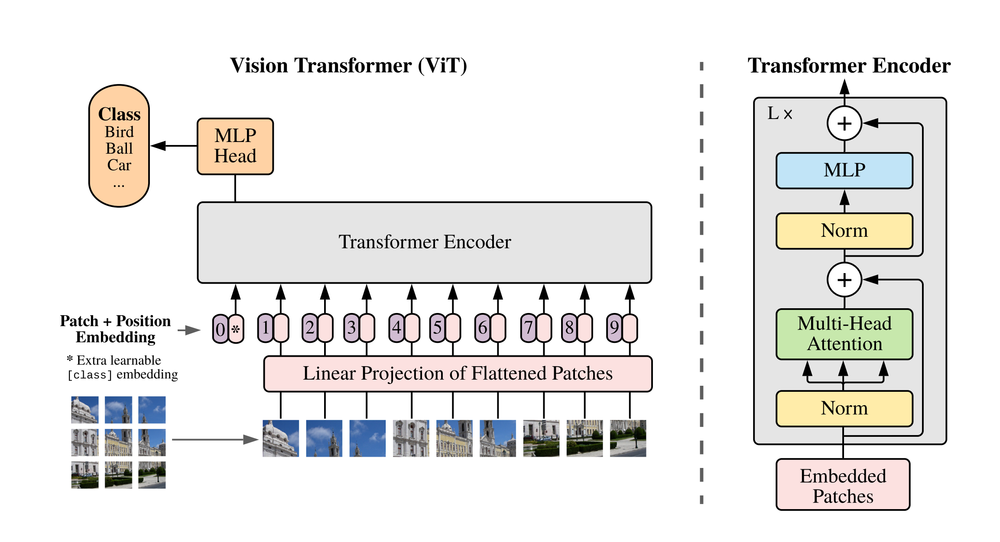
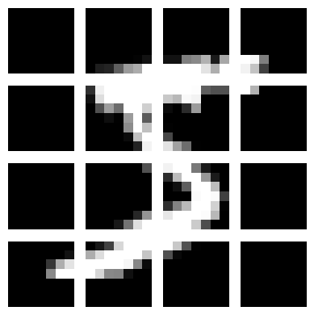

# 49、手写Vision Transformer

## ViT

ViT就是Vision Transformer，是2020年11月发布的一个模型，是Transformer的变种，用于处理视觉数据。

论文地址：https://arxiv.org/abs/2010.11929



```python
import matplotlib.pyplot as plt
from torchvision import datasets

img_dataset = datasets.MNIST(root='./data/', train=True, download=True)
img = img_dataset[0][0]
plt.imshow(img, cmap='gray')
plt.show()
```


```python
from torchvision import transforms

transform = transforms.ToTensor()
img_tensor = transform(img)
img_tensor.shape
```

```plaintext
torch.Size([1, 28, 28])
```

```python
# PATCH_SIZE表示每个patch图片的大小，7*7，因此28*28的图片会被切成16个7*7的patch
PATCH_SIZE = 7
img_patch = img_tensor.unfold(1, PATCH_SIZE, PATCH_SIZE).unfold(2, PATCH_SIZE, PATCH_SIZE)
```

```python
img_patch.shape
```

```plaintext
torch.Size([1, 4, 4, 7, 7])
```

```python
fig, axs = plt.subplots(4, 4, figsize=(4, 4))
for i in range(4):
    for j in range(4):
        patch = img_patch[0][i][j]
        axs[i, j].imshow(patch, cmap='gray')
        axs[i, j].axis('off')
plt.tight_layout()
plt.show()
```



```python
# 将每个patch转成向量
img_patch = img_patch.permute(1, 2, 0, 3, 4, )
img_patch.shape
```

```plaintext
torch.Size([4, 4, 1, 7, 7])
```

```python
img_patch = img_patch.reshape(16, 1, 7, 7)
img_patch.shape
```

```plaintext
torch.Size([16, 1, 7, 7])
```

```python
from torch import nn

EMBED_DIM = 64

projection_layer = nn.Linear(7 * 7 * 1, EMBED_DIM)
patch_embeddings = projection_layer(img_patch.view(16, -1))
patch_embeddings.shape
```

```plaintext
torch.Size([16, 64])
```

```python
# 使用Conv2d实现切分
patch_embedding_layer = nn.Conv2d(in_channels=1, out_channels=16, kernel_size=4, stride=4)

embeddings = patch_embedding_layer(img_tensor)
embeddings.shape
```

```plaintext
torch.Size([16, 7, 7])
```

```python
embeddings = projection_layer(embeddings.view(16, -1))
embeddings.shape
```

```plaintext
torch.Size([16, 64])
```

```python
import torch

# 定义一个cls token，一个向量
cls_token = torch.zeros(1, EMBED_DIM)
cls_token
```

```plaintext
tensor([[0., 0., 0., 0., 0., 0., 0., 0., 0., 0., 0., 0., 0., 0., 0., 0., 0., 0., 0., 0., 0., 0., 0., 0.,
         0., 0., 0., 0., 0., 0., 0., 0., 0., 0., 0., 0., 0., 0., 0., 0., 0., 0., 0., 0., 0., 0., 0., 0.,
         0., 0., 0., 0., 0., 0., 0., 0., 0., 0., 0., 0., 0., 0., 0., 0.]])
```

```python
cls_token.shape
```

```plaintext
torch.Size([1, 64])
```

```python
embeddings = torch.cat([cls_token, embeddings], dim=0)
embeddings.shape
```

```plaintext
torch.Size([17, 64])
```

```python
# 假如图片是3通道，那么卷积的输出形状跟原始图片通道没有关系

import torch
import torch.nn as nn

test_conv = nn.Conv2d(3, 16, kernel_size=4, stride=4)

# 构造一个3通道的图片
test_img = torch.rand(1, 3, 28, 28)

embeddings = test_conv(test_img)
embeddings.shape
```

```plaintext
torch.Size([1, 16, 7, 7])
```

```python
import torch
import torch.nn as nn
import torch.optim as optim
from torchvision import datasets, transforms
from torch.utils.data import DataLoader


class ZhouyuViT(nn.Module):
    def __init__(self, image_size=28, patch_size=7, in_channels=1, num_classes=10,
                 embed_dim=64, num_layers=4, num_heads=8, dim_feedforward=2048):
        super().__init__()
        assert image_size % patch_size == 0, "Image size must be divisible by patch size"

        self.image_size = image_size
        self.patch_size = patch_size
        self.embed_dim = embed_dim
        self.num_patches = (image_size // patch_size) ** 2

        # 通过卷积层切分为16张图片
        self.patch_conv = nn.Conv2d(in_channels, self.num_patches, kernel_size=4, stride=4)

        # 课上代码
        # self.patch_embed = nn.Linear(in_channels * patch_size * patch_size, embed_dim)
        # 正确代码，不用乘in_channels，结合上面的测试代码理解
        self.patch_embed = nn.Linear(patch_size * patch_size, embed_dim)

        self.cls_token = torch.zeros(1, 1, embed_dim)
        self.pos_embed = nn.Embedding(self.num_patches + 1, embed_dim)

        # TransformerEncoder
        encoder_layer = nn.TransformerEncoderLayer(
            d_model=embed_dim,
            nhead=num_heads,
            dim_feedforward=dim_feedforward,
            batch_first=True
        )
        self.encoder = nn.TransformerEncoder(encoder_layer, num_layers=num_layers)

        # 分类头
        self.head = nn.Linear(embed_dim, num_classes)

    def forward(self, x):
        batch_size = x.shape[0]  # batch size

        # 利用卷积层切分为16张图片
        x = self.patch_conv(x)  # [batch_size, 1, 28, 28] -> [batch_size, 16, 7, 7]
        x = x.view(batch_size, self.num_patches, -1) # [batch_size, 16, 7, 7] -> [batch_size, 16, 49]

        # 将图片转成向量
        x = self.patch_embed(x)  # [batch_size, 16, 49] -> [batch_size, 16, 64]

        # 加入cls_tokens
        cls_tokens = self.cls_token.expand(batch_size, -1, -1)  # [1, 1, embed_dim] -> [batch_size, 1, embed_dim]
        x = torch.cat((cls_tokens, x), dim=1)  # [batch_size, 16, 64] -> [batch_size, 17, 64]

        # 加上位置编码
        seq_len = x.shape[1]
        pos_ids = torch.arange(0, seq_len).unsqueeze(0).repeat(batch_size, 1)
        pos_embeddings = self.pos_embed(pos_ids)
        x = x + pos_embeddings

        # 送给TransformerEncoder进行编码，得到新的向量
        x = self.encoder(x)  # [batch_size, 17, 64]

        # 取出cls_tokens对应的向量
        cls_output = x[:, 0]

        # 进行分类
        logits = self.head(cls_output)

        return logits
```

```python
train_dataset = datasets.MNIST(root='./data/', train=True, download=True, transform=transforms.ToTensor())
test_dataset = datasets.MNIST(root='./data/', train=False, download=True, transform=transforms.ToTensor())

train_loader = DataLoader(train_dataset, batch_size=16, shuffle=True)
test_loader = DataLoader(test_dataset, batch_size=16, shuffle=True)
```

```python
# model = ZhouyuViT(num_layers=2, num_heads=4, dim_feedforward=1024)
model = ZhouyuViT()

criterion = nn.CrossEntropyLoss()
optimizer = optim.AdamW(model.parameters(), lr=5e-5)

epochs = 2
for epoch in range(epochs):
    for i, (images, labels) in enumerate(train_loader):
        outputs = model(images)
        loss = criterion(outputs, labels)

        optimizer.zero_grad()
        loss.backward()
        optimizer.step()

        if (i + 1) % 100 == 0:
            print('Epoch [{}/{}], Step [{}/{}], Loss: {:.4f}'
                  .format(epoch + 1, epochs, i + 1, len(train_loader), loss.item()))
```

```plaintext
Epoch [1/2], Step [100/3750], Loss: 2.2620
Epoch [1/2], Step [200/3750], Loss: 2.2640
Epoch [1/2], Step [300/3750], Loss: 2.2104
Epoch [1/2], Step [400/3750], Loss: 1.6716
Epoch [1/2], Step [500/3750], Loss: 1.2942
Epoch [1/2], Step [600/3750], Loss: 1.1541
Epoch [1/2], Step [700/3750], Loss: 1.3326
Epoch [1/2], Step [800/3750], Loss: 0.8659
Epoch [1/2], Step [900/3750], Loss: 1.0139
Epoch [1/2], Step [1000/3750], Loss: 0.9430
Epoch [1/2], Step [1100/3750], Loss: 0.5777
Epoch [1/2], Step [1200/3750], Loss: 0.5998
Epoch [1/2], Step [1300/3750], Loss: 0.4662
Epoch [1/2], Step [1400/3750], Loss: 0.7419
Epoch [1/2], Step [1500/3750], Loss: 0.3896
Epoch [1/2], Step [1600/3750], Loss: 0.3666
Epoch [1/2], Step [1700/3750], Loss: 0.2446
Epoch [1/2], Step [1800/3750], Loss: 0.4393
Epoch [1/2], Step [1900/3750], Loss: 0.3288
Epoch [1/2], Step [2000/3750], Loss: 0.3442
Epoch [1/2], Step [2100/3750], Loss: 0.7211
Epoch [1/2], Step [2200/3750], Loss: 0.7927
Epoch [1/2], Step [2300/3750], Loss: 0.3157
Epoch [1/2], Step [2400/3750], Loss: 0.6452
Epoch [1/2], Step [2500/3750], Loss: 0.4837
Epoch [1/2], Step [2600/3750], Loss: 0.5271
Epoch [1/2], Step [2700/3750], Loss: 0.3635
Epoch [1/2], Step [2800/3750], Loss: 0.4603
Epoch [1/2], Step [2900/3750], Loss: 0.2154
Epoch [1/2], Step [3000/3750], Loss: 1.0031
Epoch [1/2], Step [3100/3750], Loss: 0.6072
Epoch [1/2], Step [3200/3750], Loss: 0.2050
Epoch [1/2], Step [3300/3750], Loss: 0.5538
Epoch [1/2], Step [3400/3750], Loss: 0.5545
Epoch [1/2], Step [3500/3750], Loss: 0.1023
Epoch [1/2], Step [3600/3750], Loss: 0.2575
Epoch [1/2], Step [3700/3750], Loss: 0.5812
Epoch [2/2], Step [100/3750], Loss: 0.5088
Epoch [2/2], Step [200/3750], Loss: 0.1078
Epoch [2/2], Step [300/3750], Loss: 0.3359
Epoch [2/2], Step [400/3750], Loss: 0.6017
Epoch [2/2], Step [500/3750], Loss: 0.6967
Epoch [2/2], Step [600/3750], Loss: 0.5718
Epoch [2/2], Step [700/3750], Loss: 0.1358
Epoch [2/2], Step [800/3750], Loss: 0.3323
Epoch [2/2], Step [900/3750], Loss: 0.1638
Epoch [2/2], Step [1000/3750], Loss: 0.3540
Epoch [2/2], Step [1100/3750], Loss: 0.3434
Epoch [2/2], Step [1200/3750], Loss: 0.4375
Epoch [2/2], Step [1300/3750], Loss: 0.2336
Epoch [2/2], Step [1400/3750], Loss: 0.3078
Epoch [2/2], Step [1500/3750], Loss: 0.3649
Epoch [2/2], Step [1600/3750], Loss: 0.3845
Epoch [2/2], Step [1700/3750], Loss: 0.4029
Epoch [2/2], Step [1800/3750], Loss: 0.2789
Epoch [2/2], Step [1900/3750], Loss: 0.1644
Epoch [2/2], Step [2000/3750], Loss: 0.1183
Epoch [2/2], Step [2100/3750], Loss: 0.7145
Epoch [2/2], Step [2200/3750], Loss: 0.2735
Epoch [2/2], Step [2300/3750], Loss: 0.5127
Epoch [2/2], Step [2400/3750], Loss: 0.4329
Epoch [2/2], Step [2500/3750], Loss: 0.0535
Epoch [2/2], Step [2600/3750], Loss: 0.2136
Epoch [2/2], Step [2700/3750], Loss: 0.2571
Epoch [2/2], Step [2800/3750], Loss: 0.0241
Epoch [2/2], Step [2900/3750], Loss: 0.3329
Epoch [2/2], Step [3000/3750], Loss: 0.3597
Epoch [2/2], Step [3100/3750], Loss: 0.3698
Epoch [2/2], Step [3200/3750], Loss: 0.3505
Epoch [2/2], Step [3300/3750], Loss: 0.4735
Epoch [2/2], Step [3400/3750], Loss: 0.1729
Epoch [2/2], Step [3500/3750], Loss: 0.1988
Epoch [2/2], Step [3600/3750], Loss: 0.2326
Epoch [2/2], Step [3700/3750], Loss: 0.5960
```

```python
# 开始测试

correct = 0
total = 0
with torch.no_grad():
    for images, labels in test_loader:
        outputs = model(images)

        _, indices = torch.max(outputs.data, 1)

        total += labels.size(0)

        matches = (indices == labels)
        correct += matches.sum().item()

print('测试集正确率为: {} %'.format(100 * correct / total))
```

```plaintext
测试集正确率为: 92.96 %
```