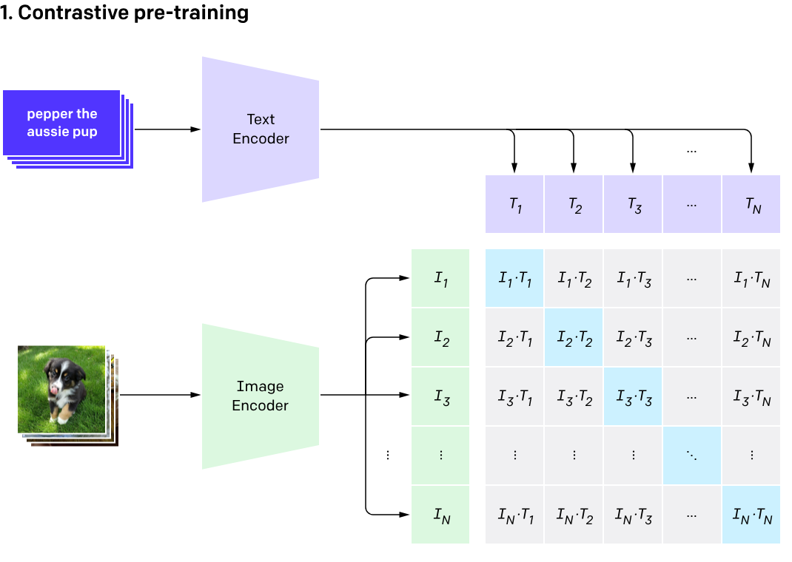

# 50、Clip多模态模型图文匹配实战

## Clip

https://arxiv.org/pdf/2103.00020

https://openai.com/index/clip/

https://www.modelscope.cn/models/iic/multi-modal_clip-vit-base-patch16_zh

https://github.com/OFA-Sys/Chinese-CLIP



```python
!pip install cn_clip
```

```plaintext
huggingface/tokenizers: The current process just got forked, after parallelism has already been used. Disabling parallelism to avoid deadlocks...
To disable this warning, you can either:
        - Avoid using `tokenizers` before the fork if possible
        - Explicitly set the environment variable TOKENIZERS_PARALLELISM=(true | false)


Requirement already satisfied: cn_clip in /Users/dadudu/miniconda3/envs/mini-gpt/lib/python3.10/site-packages (1.5.1)

Requirement already satisfied: numpy in /Users/dadudu/miniconda3/envs/mini-gpt/lib/python3.10/site-packages (from cn_clip) (2.2.6)

Requirement already satisfied: tqdm in /Users/dadudu/miniconda3/envs/mini-gpt/lib/python3.10/site-packages (from cn_clip) (4.67.1)

Requirement already satisfied: six in /Users/dadudu/miniconda3/envs/mini-gpt/lib/python3.10/site-packages (from cn_clip) (1.17.0)

Requirement already satisfied: timm in /Users/dadudu/miniconda3/envs/mini-gpt/lib/python3.10/site-packages (from cn_clip) (1.0.19)

Requirement already satisfied: lmdb==1.3.0 in /Users/dadudu/miniconda3/envs/mini-gpt/lib/python3.10/site-packages (from cn_clip) (1.3.0)

Requirement already satisfied: torch>=1.7.1 in /Users/dadudu/miniconda3/envs/mini-gpt/lib/python3.10/site-packages (from cn_clip) (2.7.1)

Requirement already satisfied: torchvision in /Users/dadudu/miniconda3/envs/mini-gpt/lib/python3.10/site-packages (from cn_clip) (0.22.1)

Requirement already satisfied: filelock in /Users/dadudu/miniconda3/envs/mini-gpt/lib/python3.10/site-packages (from torch>=1.7.1->cn_clip) (3.18.0)

Requirement already satisfied: typing-extensions>=4.10.0 in /Users/dadudu/miniconda3/envs/mini-gpt/lib/python3.10/site-packages (from torch>=1.7.1->cn_clip) (4.14.0)

Requirement already satisfied: sympy>=1.13.3 in /Users/dadudu/miniconda3/envs/mini-gpt/lib/python3.10/site-packages (from torch>=1.7.1->cn_clip) (1.14.0)

Requirement already satisfied: networkx in /Users/dadudu/miniconda3/envs/mini-gpt/lib/python3.10/site-packages (from torch>=1.7.1->cn_clip) (3.4.2)

Requirement already satisfied: jinja2 in /Users/dadudu/miniconda3/envs/mini-gpt/lib/python3.10/site-packages (from torch>=1.7.1->cn_clip) (3.1.6)

Requirement already satisfied: fsspec in /Users/dadudu/miniconda3/envs/mini-gpt/lib/python3.10/site-packages (from torch>=1.7.1->cn_clip) (2024.9.0)

Requirement already satisfied: mpmath<1.4,>=1.1.0 in /Users/dadudu/miniconda3/envs/mini-gpt/lib/python3.10/site-packages (from sympy>=1.13.3->torch>=1.7.1->cn_clip) (1.3.0)

Requirement already satisfied: MarkupSafe>=2.0 in /Users/dadudu/miniconda3/envs/mini-gpt/lib/python3.10/site-packages (from jinja2->torch>=1.7.1->cn_clip) (3.0.2)

Requirement already satisfied: pyyaml in /Users/dadudu/miniconda3/envs/mini-gpt/lib/python3.10/site-packages (from timm->cn_clip) (6.0.2)

Requirement already satisfied: huggingface_hub in /Users/dadudu/miniconda3/envs/mini-gpt/lib/python3.10/site-packages (from timm->cn_clip) (0.34.4)

Requirement already satisfied: safetensors in /Users/dadudu/miniconda3/envs/mini-gpt/lib/python3.10/site-packages (from timm->cn_clip) (0.5.3)

Requirement already satisfied: packaging>=20.9 in /Users/dadudu/miniconda3/envs/mini-gpt/lib/python3.10/site-packages (from huggingface_hub->timm->cn_clip) (25.0)

Requirement already satisfied: requests in /Users/dadudu/miniconda3/envs/mini-gpt/lib/python3.10/site-packages (from huggingface_hub->timm->cn_clip) (2.32.4)

Requirement already satisfied: hf-xet<2.0.0,>=1.1.3 in /Users/dadudu/miniconda3/envs/mini-gpt/lib/python3.10/site-packages (from huggingface_hub->timm->cn_clip) (1.1.5)

Requirement already satisfied: charset_normalizer<4,>=2 in /Users/dadudu/miniconda3/envs/mini-gpt/lib/python3.10/site-packages (from requests->huggingface_hub->timm->cn_clip) (3.4.2)

Requirement already satisfied: idna<4,>=2.5 in /Users/dadudu/miniconda3/envs/mini-gpt/lib/python3.10/site-packages (from requests->huggingface_hub->timm->cn_clip) (3.10)

Requirement already satisfied: urllib3<3,>=1.21.1 in /Users/dadudu/miniconda3/envs/mini-gpt/lib/python3.10/site-packages (from requests->huggingface_hub->timm->cn_clip) (2.4.0)

Requirement already satisfied: certifi>=2017.4.17 in /Users/dadudu/miniconda3/envs/mini-gpt/lib/python3.10/site-packages (from requests->huggingface_hub->timm->cn_clip) (2025.4.26)

Requirement already satisfied: pillow!=8.3.*,>=5.3.0 in /Users/dadudu/miniconda3/envs/mini-gpt/lib/python3.10/site-packages (from torchvision->cn_clip) (11.2.1)
```

```python
from cn_clip.clip import load_from_name, available_models
print("Available models:", available_models())
```

```plaintext
Available models: ['ViT-B-16', 'ViT-L-14', 'ViT-L-14-336', 'ViT-H-14', 'RN50']
```

ViT表示图片编码器用的是Vision Transformer

B表示Base Size，中等规模的模型

L表示Large Size，大型模型

H表示Huge Size，超大型模型

16、14表示Patch Size，也就是图片被切之后，小图片的大小是16*16或者14*14

336表示该模型在是在336*336的图片上训练的，其他都是在224*224的图片上训练的

RN50表示图片编码器用的是ResNet50

文本编码器用的是Bert，通过print(model)可以看出来

```python
model, preprocess = load_from_name("ViT-B-16", download_root='./')
```

```plaintext
Loading vision model config from /Users/dadudu/miniconda3/envs/mini-gpt/lib/python3.10/site-packages/cn_clip/clip/model_configs/ViT-B-16.json
Loading text model config from /Users/dadudu/miniconda3/envs/mini-gpt/lib/python3.10/site-packages/cn_clip/clip/model_configs/RoBERTa-wwm-ext-base-chinese.json
Model info {'embed_dim': 512, 'image_resolution': 224, 'vision_layers': 12, 'vision_width': 768, 'vision_patch_size': 16, 'vocab_size': 21128, 'text_attention_probs_dropout_prob': 0.1, 'text_hidden_act': 'gelu', 'text_hidden_dropout_prob': 0.1, 'text_hidden_size': 768, 'text_initializer_range': 0.02, 'text_intermediate_size': 3072, 'text_max_position_embeddings': 512, 'text_num_attention_heads': 12, 'text_num_hidden_layers': 12, 'text_type_vocab_size': 2}
```

```python
print(model)
```

```plaintext
CLIP(
  (visual): VisualTransformer(
    (conv1): Conv2d(3, 768, kernel_size=(16, 16), stride=(16, 16), bias=False)
    (ln_pre): LayerNorm((768,), eps=1e-05, elementwise_affine=True)
    (transformer): Transformer(
      (resblocks): Sequential(
        (0): ResidualAttentionBlock(
          (attn): MultiheadAttention(
            (out_proj): NonDynamicallyQuantizableLinear(in_features=768, out_features=768, bias=True)
          )
          (ln_1): LayerNorm((768,), eps=1e-05, elementwise_affine=True)
          (mlp): Sequential(
            (c_fc): Linear(in_features=768, out_features=3072, bias=True)
            (gelu): QuickGELU()
            (c_proj): Linear(in_features=3072, out_features=768, bias=True)
          )
          (ln_2): LayerNorm((768,), eps=1e-05, elementwise_affine=True)
        )
        (1): ResidualAttentionBlock(
          (attn): MultiheadAttention(
            (out_proj): NonDynamicallyQuantizableLinear(in_features=768, out_features=768, bias=True)
          )
          (ln_1): LayerNorm((768,), eps=1e-05, elementwise_affine=True)
          (mlp): Sequential(
            (c_fc): Linear(in_features=768, out_features=3072, bias=True)
            (gelu): QuickGELU()
            (c_proj): Linear(in_features=3072, out_features=768, bias=True)
          )
          (ln_2): LayerNorm((768,), eps=1e-05, elementwise_affine=True)
        )
        (2): ResidualAttentionBlock(
          (attn): MultiheadAttention(
            (out_proj): NonDynamicallyQuantizableLinear(in_features=768, out_features=768, bias=True)
          )
          (ln_1): LayerNorm((768,), eps=1e-05, elementwise_affine=True)
          (mlp): Sequential(
            (c_fc): Linear(in_features=768, out_features=3072, bias=True)
            (gelu): QuickGELU()
            (c_proj): Linear(in_features=3072, out_features=768, bias=True)
          )
          (ln_2): LayerNorm((768,), eps=1e-05, elementwise_affine=True)
        )
        (3): ResidualAttentionBlock(
          (attn): MultiheadAttention(
            (out_proj): NonDynamicallyQuantizableLinear(in_features=768, out_features=768, bias=True)
          )
          (ln_1): LayerNorm((768,), eps=1e-05, elementwise_affine=True)
          (mlp): Sequential(
            (c_fc): Linear(in_features=768, out_features=3072, bias=True)
            (gelu): QuickGELU()
            (c_proj): Linear(in_features=3072, out_features=768, bias=True)
          )
          (ln_2): LayerNorm((768,), eps=1e-05, elementwise_affine=True)
        )
        (4): ResidualAttentionBlock(
          (attn): MultiheadAttention(
            (out_proj): NonDynamicallyQuantizableLinear(in_features=768, out_features=768, bias=True)
          )
          (ln_1): LayerNorm((768,), eps=1e-05, elementwise_affine=True)
          (mlp): Sequential(
            (c_fc): Linear(in_features=768, out_features=3072, bias=True)
            (gelu): QuickGELU()
            (c_proj): Linear(in_features=3072, out_features=768, bias=True)
          )
          (ln_2): LayerNorm((768,), eps=1e-05, elementwise_affine=True)
        )
        (5): ResidualAttentionBlock(
          (attn): MultiheadAttention(
            (out_proj): NonDynamicallyQuantizableLinear(in_features=768, out_features=768, bias=True)
          )
          (ln_1): LayerNorm((768,), eps=1e-05, elementwise_affine=True)
          (mlp): Sequential(
            (c_fc): Linear(in_features=768, out_features=3072, bias=True)
            (gelu): QuickGELU()
            (c_proj): Linear(in_features=3072, out_features=768, bias=True)
          )
          (ln_2): LayerNorm((768,), eps=1e-05, elementwise_affine=True)
        )
        (6): ResidualAttentionBlock(
          (attn): MultiheadAttention(
            (out_proj): NonDynamicallyQuantizableLinear(in_features=768, out_features=768, bias=True)
          )
          (ln_1): LayerNorm((768,), eps=1e-05, elementwise_affine=True)
          (mlp): Sequential(
            (c_fc): Linear(in_features=768, out_features=3072, bias=True)
            (gelu): QuickGELU()
            (c_proj): Linear(in_features=3072, out_features=768, bias=True)
          )
          (ln_2): LayerNorm((768,), eps=1e-05, elementwise_affine=True)
        )
        (7): ResidualAttentionBlock(
          (attn): MultiheadAttention(
            (out_proj): NonDynamicallyQuantizableLinear(in_features=768, out_features=768, bias=True)
          )
          (ln_1): LayerNorm((768,), eps=1e-05, elementwise_affine=True)
          (mlp): Sequential(
            (c_fc): Linear(in_features=768, out_features=3072, bias=True)
            (gelu): QuickGELU()
            (c_proj): Linear(in_features=3072, out_features=768, bias=True)
          )
          (ln_2): LayerNorm((768,), eps=1e-05, elementwise_affine=True)
        )
        (8): ResidualAttentionBlock(
          (attn): MultiheadAttention(
            (out_proj): NonDynamicallyQuantizableLinear(in_features=768, out_features=768, bias=True)
          )
          (ln_1): LayerNorm((768,), eps=1e-05, elementwise_affine=True)
          (mlp): Sequential(
            (c_fc): Linear(in_features=768, out_features=3072, bias=True)
            (gelu): QuickGELU()
            (c_proj): Linear(in_features=3072, out_features=768, bias=True)
          )
          (ln_2): LayerNorm((768,), eps=1e-05, elementwise_affine=True)
        )
        (9): ResidualAttentionBlock(
          (attn): MultiheadAttention(
            (out_proj): NonDynamicallyQuantizableLinear(in_features=768, out_features=768, bias=True)
          )
          (ln_1): LayerNorm((768,), eps=1e-05, elementwise_affine=True)
          (mlp): Sequential(
            (c_fc): Linear(in_features=768, out_features=3072, bias=True)
            (gelu): QuickGELU()
            (c_proj): Linear(in_features=3072, out_features=768, bias=True)
          )
          (ln_2): LayerNorm((768,), eps=1e-05, elementwise_affine=True)
        )
        (10): ResidualAttentionBlock(
          (attn): MultiheadAttention(
            (out_proj): NonDynamicallyQuantizableLinear(in_features=768, out_features=768, bias=True)
          )
          (ln_1): LayerNorm((768,), eps=1e-05, elementwise_affine=True)
          (mlp): Sequential(
            (c_fc): Linear(in_features=768, out_features=3072, bias=True)
            (gelu): QuickGELU()
            (c_proj): Linear(in_features=3072, out_features=768, bias=True)
          )
          (ln_2): LayerNorm((768,), eps=1e-05, elementwise_affine=True)
        )
        (11): ResidualAttentionBlock(
          (attn): MultiheadAttention(
            (out_proj): NonDynamicallyQuantizableLinear(in_features=768, out_features=768, bias=True)
          )
          (ln_1): LayerNorm((768,), eps=1e-05, elementwise_affine=True)
          (mlp): Sequential(
            (c_fc): Linear(in_features=768, out_features=3072, bias=True)
            (gelu): QuickGELU()
            (c_proj): Linear(in_features=3072, out_features=768, bias=True)
          )
          (ln_2): LayerNorm((768,), eps=1e-05, elementwise_affine=True)
        )
      )
    )
    (ln_post): LayerNorm((768,), eps=1e-05, elementwise_affine=True)
  )
  (bert): BertModel(
    (embeddings): BertEmbeddings(
      (word_embeddings): Embedding(21128, 768, padding_idx=0)
      (position_embeddings): Embedding(512, 768)
      (token_type_embeddings): Embedding(2, 768)
      (LayerNorm): LayerNorm((768,), eps=1e-12, elementwise_affine=True)
      (dropout): Dropout(p=0.1, inplace=False)
    )
    (encoder): BertEncoder(
      (layer): ModuleList(
        (0-11): 12 x BertLayer(
          (attention): BertAttention(
            (self): BertSelfAttention(
              (query): Linear(in_features=768, out_features=768, bias=True)
              (key): Linear(in_features=768, out_features=768, bias=True)
              (value): Linear(in_features=768, out_features=768, bias=True)
              (dropout): Dropout(p=0.1, inplace=False)
            )
            (output): BertSelfOutput(
              (dense): Linear(in_features=768, out_features=768, bias=True)
              (LayerNorm): LayerNorm((768,), eps=1e-12, elementwise_affine=True)
              (dropout): Dropout(p=0.1, inplace=False)
            )
          )
          (intermediate): BertIntermediate(
            (dense): Linear(in_features=768, out_features=3072, bias=True)
          )
          (output): BertOutput(
            (dense): Linear(in_features=3072, out_features=768, bias=True)
            (LayerNorm): LayerNorm((768,), eps=1e-12, elementwise_affine=True)
            (dropout): Dropout(p=0.1, inplace=False)
          )
        )
      )
    )
  )
)
```

```python
from PIL import Image

image = preprocess(Image.open("pokemon.jpeg")).unsqueeze(0)
print(image.shape)
```

```plaintext
torch.Size([1, 3, 224, 224])
```

```python
import cn_clip.clip as clip

text = clip.tokenize(["杰尼龟", "妙蛙种子", "小火龙", "皮卡丘"])
print(text.shape)
```

```plaintext
torch.Size([4, 52])
```

```python
import torch
with torch.no_grad():
    logits_per_image, logits_per_text = model.get_similarity(image, text)
```

```python
# 每张图片与其他文本的相似度，只有一张图片，所以只有一行
logits_per_image
```

```plaintext
tensor([[38.8393, 42.5954, 39.2670, 47.9360]])
```

```python
# 每个文本与其他图片的相似度，有四个文本，所以有四行，只有一张图片，所以只有一列
logits_per_text
```

```plaintext
tensor([[39.2461],
        [44.1662],
        [40.8005],
        [46.2530]])
```

```python
probs = logits_per_image.softmax(dim=-1).cpu().numpy()
print("Label probs:", probs)
```

```plaintext
Label probs: [[1.11466186e-04 4.76864353e-03 1.70963802e-04 9.94948983e-01]]
```

```python
image = preprocess(Image.open("数字0.png")).unsqueeze(0)
text = clip.tokenize(["数字5", "数字1", "数字2", "数字0"])

with torch.no_grad():
    logits_per_image, logits_per_text = model.get_similarity(image, text)
    probs = logits_per_image.softmax(dim=-1).cpu().numpy()

print("Label probs:", probs)  # [[1.268734e-03 5.436878e-02 6.795761e-04 9.436829e-01]]
```

```plaintext
Label probs: [[0.03489063 0.1686822  0.20412728 0.59229994]]
```

```python
# 基于Clip开发一个文搜图的应用
images = [Image.open(f) for f in ["pokemon.jpeg", "数字0.png", "数字5.png"]]
image1 = preprocess(Image.open("pokemon.jpeg")).unsqueeze(0)
image2 = preprocess(Image.open("数字0.png")).unsqueeze(0)
image3 = preprocess(Image.open("数字5.png")).unsqueeze(0)
# 将三张图片合并为一个tensor
image = torch.cat([image1, image2, image3], dim=0)

# 定义一个search函数
def search(text):
    with torch.no_grad():
        text = clip.tokenize([text])
        _, logits_per_text = model.get_similarity(image, text)
        return logits_per_text.softmax(dim=-1).cpu().numpy()

search("黄色的图片")
```

```plaintext
array([[9.9728942e-01, 1.8365056e-03, 8.7403430e-04]], dtype=float32)
```

## 为什么Clip的图片向量和文本向量会相似？

因为Clip模型训练的时候就是想学会这个效果。