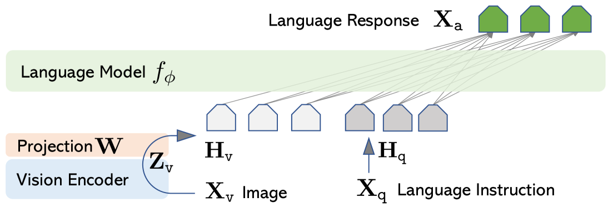

# 52、手写LLaVA图生文多模态大模型

## LLaVA

https://arxiv.org/abs/2304.08485



```python
data = [
    ("数字5.png", "这张图片里有什么<|IMG|>图片里是数字5"),
    ("数字0.png", "描述一下这张图片<|IMG|>这张图片背景是黑色的，中间是一个数字0"),
]
```

```python
import os
# 设置环境变量
os.environ["HF_ENDPOINT"] = "https://hf-mirror.com"
os.environ["HF_HUB_ENABLE_HF_TRANSFER"] = "1"  # 启用高速下载
```

```python
from transformers import ChineseCLIPModel, ChineseCLIPProcessor

clip_model_name = "OFA-Sys/chinese-clip-vit-base-patch16"
clip_model = ChineseCLIPModel.from_pretrained(clip_model_name)
clip_processor = ChineseCLIPProcessor.from_pretrained(clip_model_name)
```

```plaintext
/Users/dadudu/miniconda3/envs/mini-gpt/lib/python3.10/site-packages/tqdm/auto.py:21: TqdmWarning: IProgress not found. Please update jupyter and ipywidgets. See https://ipywidgets.readthedocs.io/en/stable/user_install.html
  from .autonotebook import tqdm as notebook_tqdm
Using a slow image processor as `use_fast` is unset and a slow processor was saved with this model. `use_fast=True` will be the default behavior in v4.52, even if the model was saved with a slow processor. This will result in minor differences in outputs. You'll still be able to use a slow processor with `use_fast=False`.
```

```python
from PIL import Image

# 获取图片像素值
images = [Image.open(image_path) for image_path, caption in data]
image_inputs = clip_processor(images=images, return_tensors="pt")
print(image_inputs.pixel_values.shape)
```

```plaintext
torch.Size([2, 3, 224, 224])
```

```python
print(image_inputs.pixel_values[0])
```

```plaintext
tensor([[[1.9303, 1.9303, 1.9303,  ..., 1.9303, 1.9303, 1.9303],
         [1.9303, 1.9303, 1.9303,  ..., 1.9303, 1.9303, 1.9303],
         [1.9303, 1.9303, 1.9303,  ..., 1.9303, 1.9303, 1.9303],
         ...,
         [1.9303, 1.9303, 1.9303,  ..., 1.9303, 1.9303, 1.9303],
         [1.9303, 1.9303, 1.9303,  ..., 1.9303, 1.9303, 1.9303],
         [1.9303, 1.9303, 1.9303,  ..., 1.9303, 1.9303, 1.9303]],

        [[2.0749, 2.0749, 2.0749,  ..., 2.0749, 2.0749, 2.0749],
         [2.0749, 2.0749, 2.0749,  ..., 2.0749, 2.0749, 2.0749],
         [2.0749, 2.0749, 2.0749,  ..., 2.0749, 2.0749, 2.0749],
         ...,
         [2.0749, 2.0749, 2.0749,  ..., 2.0749, 2.0749, 2.0749],
         [2.0749, 2.0749, 2.0749,  ..., 2.0749, 2.0749, 2.0749],
         [2.0749, 2.0749, 2.0749,  ..., 2.0749, 2.0749, 2.0749]],

        [[2.1459, 2.1459, 2.1459,  ..., 2.1459, 2.1459, 2.1459],
         [2.1459, 2.1459, 2.1459,  ..., 2.1459, 2.1459, 2.1459],
         [2.1459, 2.1459, 2.1459,  ..., 2.1459, 2.1459, 2.1459],
         ...,
         [2.1459, 2.1459, 2.1459,  ..., 2.1459, 2.1459, 2.1459],
         [2.1459, 2.1459, 2.1459,  ..., 2.1459, 2.1459, 2.1459],
         [2.1459, 2.1459, 2.1459,  ..., 2.1459, 2.1459, 2.1459]]])
```

```python
print(clip_model.vision_model)
```

```plaintext
ChineseCLIPVisionTransformer(
  (embeddings): ChineseCLIPVisionEmbeddings(
    (patch_embedding): Conv2d(3, 768, kernel_size=(16, 16), stride=(16, 16), bias=False)
    (position_embedding): Embedding(197, 768)
  )
  (pre_layrnorm): LayerNorm((768,), eps=1e-05, elementwise_affine=True)
  (encoder): ChineseCLIPVisionEncoder(
    (layers): ModuleList(
      (0-11): 12 x ChineseCLIPVisionLayer(
        (self_attn): ChineseCLIPVisionAttention(
          (k_proj): Linear(in_features=768, out_features=768, bias=True)
          (v_proj): Linear(in_features=768, out_features=768, bias=True)
          (q_proj): Linear(in_features=768, out_features=768, bias=True)
          (out_proj): Linear(in_features=768, out_features=768, bias=True)
        )
        (layer_norm1): LayerNorm((768,), eps=1e-05, elementwise_affine=True)
        (mlp): ChineseCLIPVisionMLP(
          (activation_fn): QuickGELUActivation()
          (fc1): Linear(in_features=768, out_features=3072, bias=True)
          (fc2): Linear(in_features=3072, out_features=768, bias=True)
        )
        (layer_norm2): LayerNorm((768,), eps=1e-05, elementwise_affine=True)
      )
    )
  )
  (post_layernorm): LayerNorm((768,), eps=1e-05, elementwise_affine=True)
)
```

```python
result = clip_model.vision_model(image_inputs.pixel_values)
print(result.last_hidden_state.shape)
print(result.pooler_output.shape)
```

```plaintext
torch.Size([2, 197, 768])
torch.Size([2, 768])
```

```python
# 获取图片特征向量
image_features = clip_model.vision_model(image_inputs.pixel_values).pooler_output
print(image_features)
print(image_features.shape)
```

```plaintext
tensor([[-0.4894, -1.0844, -0.3489,  ...,  0.5612,  0.8177, -0.4751],
        [-0.0511, -0.8929, -0.0720,  ...,  1.1067,  1.2712, -0.9289]],
       grad_fn=<NativeLayerNormBackward0>)
torch.Size([2, 768])
```

```python
from modelscope import AutoModelForCausalLM
from modelscope import AutoTokenizer

qwen_model_name = "Qwen/Qwen3-0.6B"
qwen_model = AutoModelForCausalLM.from_pretrained(qwen_model_name)
qwen_tokenizer = AutoTokenizer.from_pretrained(qwen_model_name)
qwen_tokenizer.pad_token = qwen_tokenizer.eos_token  # 指定 pad token

qwen_tokenizer.add_tokens(["<|IMG|>"])
qwen_model.resize_token_embeddings(len(qwen_tokenizer))
```

```plaintext
Downloading Model from https://www.modelscope.cn to directory: /Users/dadudu/.cache/modelscope/hub/models/Qwen/Qwen3-0.6B


2025-08-22 15:08:15,048 - modelscope - INFO - Target directory already exists, skipping creation.


Downloading Model from https://www.modelscope.cn to directory: /Users/dadudu/.cache/modelscope/hub/models/Qwen/Qwen3-0.6B


2025-08-22 15:08:19,595 - modelscope - INFO - Target directory already exists, skipping creation.


Embedding(151670, 1024)
```

```python
# 获取文本token
captions = [caption for image_path, caption in data]
text_tokenized = qwen_tokenizer(captions, return_tensors="pt", padding=True, truncation=True, max_length=50)
text_input_ids = text_tokenized['input_ids']
attention_mask = text_tokenized['attention_mask']

print(text_input_ids.shape)
```

```plaintext
torch.Size([2, 16])
```

```python
# 获取文本特征向量
text_features = qwen_model.get_input_embeddings()(text_input_ids)
print(text_features.shape)
```

```plaintext
torch.Size([2, 16, 1024])
```

```python
# 图片特征向量和文本特征向量不一样，需要对齐，利用一个线性层来进行对齐
import torch.nn as nn

image_proj = nn.Linear(image_features.shape[1], text_features.shape[2])
image_features = image_proj(image_features)
print(image_features.shape)
print(text_features.shape)
```

```plaintext
torch.Size([2, 1024])
torch.Size([2, 16, 1024])
```

```python
# 找出<|IMG|>在text_input_ids中的位置
img_token_pos = []

img_token_id = qwen_tokenizer.encode("<|IMG|>")[0]
for text_input_id in text_input_ids:
    for i in range(text_input_id.shape[0]):
        if text_input_id[i] == img_token_id:
            img_token_pos.append(i)
            break

print(img_token_pos)
```

```plaintext
[4, 4]
```

```python
# 把图片特征向量插入到文本特征向量中
import torch

new_text_features_list = []

# 遍历每个文本
for i, text_feature in enumerate(text_features):
    pos = img_token_pos[i]
    # text_feature是一个二维向量, torch.Size([17, 1024])
    print(text_feature.shape)

    # 获取当前文本对应的图片特征向量
    image_feature = image_features[i]
    print(image_feature.shape)
    image_feature = image_feature.unsqueeze(0)
    print(image_feature.shape)

    # 替换<|IMG|>文本向量为图片特征向量
    new_text_feature = torch.cat([text_feature[:pos], image_feature, text_feature[pos + 1:]])
    print(new_text_feature.shape)
    new_text_features_list.append(new_text_feature)

# 将new_text_features_list转成tensor
inputs_embeds = torch.stack(new_text_features_list)
print(inputs_embeds.shape)
```

```plaintext
torch.Size([16, 1024])
torch.Size([1024])
torch.Size([1, 1024])
torch.Size([16, 1024])
torch.Size([16, 1024])
torch.Size([1024])
torch.Size([1, 1024])
torch.Size([16, 1024])
torch.Size([2, 16, 1024])
```

```python
outputs = qwen_model(
    inputs_embeds=inputs_embeds,
    attention_mask=attention_mask,
    labels=text_input_ids,
)
loss = outputs.loss
print(loss)
```

```plaintext
tensor(7.6809, grad_fn=<NllLossBackward0>)
```