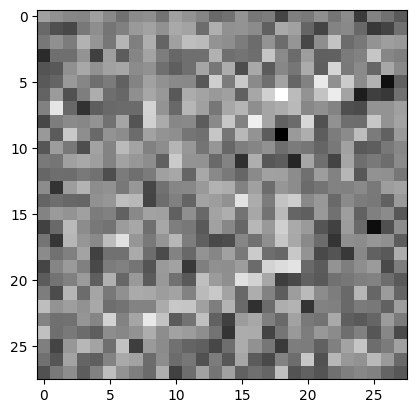
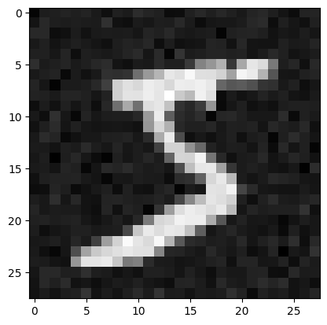
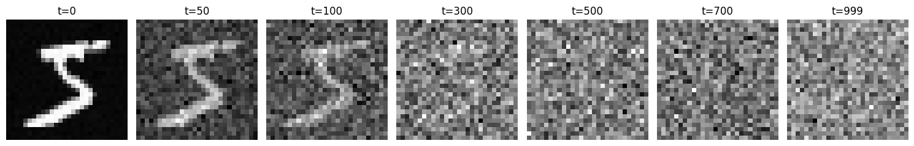
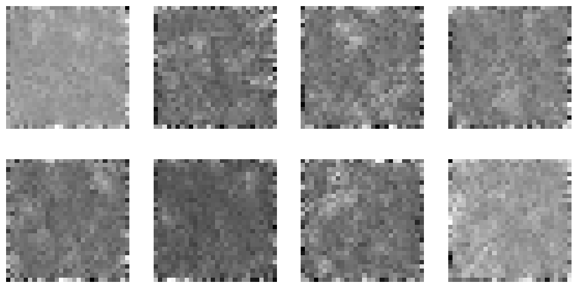

# 55、手写Diffusion Model图像生成大模型

## Diffusion Model-扩散模型

Denoising Diffusion Probabilistic Models（DDPM）论文：https://arxiv.org/abs/2006.11239
Stable Diffusion论文：https://arxiv.org/abs/2112.10752

DDPM是扩散模型的一种具体实现，Stable Diffusion基于DDPM的思想做了改进，OpenAI的DALL-E和谷歌的Imagen同样都是扩散模型。

这里有很多图片：https://laion.ai/projects/
对应的文搜图网站：https://github.com/rom1504/clip-retrieval

扩散模型的核心思想就是通过不断对图像进行噪声添加和去噪，直到图像恢复到原始状态。

```python
import matplotlib.pyplot as plt
from sympy import print_tree
from torchvision import datasets, transforms

dataset = datasets.MNIST(root='./data/', train=True, download=True, transform=transforms.ToTensor())
img = dataset[0][0]

plt.imshow(img.squeeze().cpu().numpy(), cmap='gray')
```

```plaintext
<matplotlib.image.AxesImage at 0x118fc5f60>
```


```python
img.shape
```

```plaintext
torch.Size([1, 28, 28])
```

```python
import torch

# 所谓噪声，本质上就是一堆随机数，通过randn_like生成一个和图片形状一致的随机矩阵，randn会生成一个正态分布矩阵
noise = torch.randn_like(img)

# 然后图片加上噪声
img1 = img + noise

plt.imshow(img1.squeeze().cpu().numpy(), cmap='gray')
```

```plaintext
<matplotlib.image.AxesImage at 0x11c790eb0>
```



```python
import torch

# 定义扩散参数
T = 1000  # 总时间步
betas = torch.linspace(0.0001, 0.02, T)# 线性增长的噪声方差
alphas = 1 - betas
alphas_bar = torch.cumprod(alphas, dim=0)
print(alphas_bar)
```

```plaintext
tensor([9.9990e-01, 9.9978e-01, 9.9964e-01, 9.9948e-01, 9.9930e-01, 9.9910e-01,
        9.9888e-01, 9.9864e-01, 9.9838e-01, 9.9811e-01, 9.9781e-01, 9.9749e-01,
        9.9715e-01, 9.9679e-01, 9.9641e-01, 9.9602e-01, 9.9560e-01, 9.9516e-01,
        9.9471e-01, 9.9423e-01, 9.9374e-01, 9.9322e-01, 9.9269e-01, 9.9213e-01,
        9.9156e-01, 9.9097e-01, 9.9035e-01, 9.8972e-01, 9.8907e-01, 9.8840e-01,
        9.8771e-01, 9.8700e-01, 9.8627e-01, 9.8553e-01, 9.8476e-01, 9.8398e-01,
        9.8317e-01, 9.8235e-01, 9.8151e-01, 9.8065e-01, 9.7977e-01, 9.7887e-01,
        9.7795e-01, 9.7702e-01, 9.7606e-01, 9.7509e-01, 9.7410e-01, 9.7309e-01,
        9.7206e-01, 9.7102e-01, 9.6995e-01, 9.6887e-01, 9.6777e-01, 9.6665e-01,
        9.6551e-01, 9.6436e-01, 9.6319e-01, 9.6200e-01, 9.6079e-01, 9.5956e-01,
        9.5832e-01, 9.5706e-01, 9.5578e-01, 9.5449e-01, 9.5318e-01, 9.5185e-01,
        9.5050e-01, 9.4914e-01, 9.4776e-01, 9.4636e-01, 9.4494e-01, 9.4351e-01,
        9.4207e-01, 9.4060e-01, 9.3912e-01, 9.3762e-01, 9.3611e-01, 9.3458e-01,
        9.3304e-01, 9.3147e-01, 9.2990e-01, 9.2830e-01, 9.2669e-01, 9.2507e-01,
        9.2343e-01, 9.2177e-01, 9.2010e-01, 9.1841e-01, 9.1671e-01, 9.1500e-01,
        9.1326e-01, 9.1152e-01, 9.0976e-01, 9.0798e-01, 9.0619e-01, 9.0438e-01,
        9.0256e-01, 9.0073e-01, 8.9888e-01, 8.9702e-01, 8.9514e-01, 8.9325e-01,
        8.9135e-01, 8.8943e-01, 8.8750e-01, 8.8555e-01, 8.8359e-01, 8.8162e-01,
        8.7964e-01, 8.7764e-01, 8.7563e-01, 8.7360e-01, 8.7157e-01, 8.6952e-01,
        8.6746e-01, 8.6538e-01, 8.6330e-01, 8.6120e-01, 8.5909e-01, 8.5697e-01,
        8.5483e-01, 8.5269e-01, 8.5053e-01, 8.4836e-01, 8.4618e-01, 8.4399e-01,
        8.4179e-01, 8.3957e-01, 8.3735e-01, 8.3511e-01, 8.3287e-01, 8.3061e-01,
        8.2834e-01, 8.2606e-01, 8.2378e-01, 8.2148e-01, 8.1917e-01, 8.1685e-01,
        8.1453e-01, 8.1219e-01, 8.0984e-01, 8.0749e-01, 8.0512e-01, 8.0275e-01,
        8.0037e-01, 7.9797e-01, 7.9557e-01, 7.9316e-01, 7.9075e-01, 7.8832e-01,
        7.8589e-01, 7.8344e-01, 7.8099e-01, 7.7854e-01, 7.7607e-01, 7.7360e-01,
        7.7111e-01, 7.6863e-01, 7.6613e-01, 7.6363e-01, 7.6112e-01, 7.5860e-01,
        7.5608e-01, 7.5354e-01, 7.5101e-01, 7.4846e-01, 7.4591e-01, 7.4336e-01,
        7.4080e-01, 7.3823e-01, 7.3565e-01, 7.3308e-01, 7.3049e-01, 7.2790e-01,
        7.2530e-01, 7.2270e-01, 7.2010e-01, 7.1749e-01, 7.1487e-01, 7.1225e-01,
        7.0963e-01, 7.0700e-01, 7.0436e-01, 7.0172e-01, 6.9908e-01, 6.9644e-01,
        6.9379e-01, 6.9113e-01, 6.8847e-01, 6.8581e-01, 6.8315e-01, 6.8048e-01,
        6.7781e-01, 6.7514e-01, 6.7246e-01, 6.6978e-01, 6.6710e-01, 6.6441e-01,
        6.6173e-01, 6.5904e-01, 6.5635e-01, 6.5365e-01, 6.5096e-01, 6.4826e-01,
        6.4556e-01, 6.4286e-01, 6.4016e-01, 6.3745e-01, 6.3475e-01, 6.3204e-01,
        6.2934e-01, 6.2663e-01, 6.2392e-01, 6.2121e-01, 6.1850e-01, 6.1579e-01,
        6.1308e-01, 6.1037e-01, 6.0765e-01, 6.0494e-01, 6.0223e-01, 5.9952e-01,
        5.9681e-01, 5.9410e-01, 5.9139e-01, 5.8868e-01, 5.8597e-01, 5.8326e-01,
        5.8055e-01, 5.7785e-01, 5.7514e-01, 5.7244e-01, 5.6974e-01, 5.6703e-01,
        5.6433e-01, 5.6164e-01, 5.5894e-01, 5.5624e-01, 5.5355e-01, 5.5086e-01,
        5.4817e-01, 5.4549e-01, 5.4280e-01, 5.4012e-01, 5.3744e-01, 5.3476e-01,
        5.3209e-01, 5.2942e-01, 5.2675e-01, 5.2409e-01, 5.2142e-01, 5.1876e-01,
        5.1611e-01, 5.1346e-01, 5.1081e-01, 5.0816e-01, 5.0552e-01, 5.0288e-01,
        5.0024e-01, 4.9761e-01, 4.9499e-01, 4.9236e-01, 4.8974e-01, 4.8713e-01,
        4.8452e-01, 4.8191e-01, 4.7931e-01, 4.7671e-01, 4.7412e-01, 4.7153e-01,
        4.6895e-01, 4.6637e-01, 4.6380e-01, 4.6123e-01, 4.5867e-01, 4.5611e-01,
        4.5356e-01, 4.5101e-01, 4.4846e-01, 4.4593e-01, 4.4340e-01, 4.4087e-01,
        4.3835e-01, 4.3583e-01, 4.3332e-01, 4.3082e-01, 4.2832e-01, 4.2583e-01,
        4.2335e-01, 4.2087e-01, 4.1839e-01, 4.1593e-01, 4.1347e-01, 4.1101e-01,
        4.0856e-01, 4.0612e-01, 4.0369e-01, 4.0126e-01, 3.9884e-01, 3.9642e-01,
        3.9401e-01, 3.9161e-01, 3.8921e-01, 3.8683e-01, 3.8444e-01, 3.8207e-01,
        3.7970e-01, 3.7734e-01, 3.7499e-01, 3.7265e-01, 3.7031e-01, 3.6798e-01,
        3.6565e-01, 3.6334e-01, 3.6103e-01, 3.5872e-01, 3.5643e-01, 3.5414e-01,
        3.5187e-01, 3.4959e-01, 3.4733e-01, 3.4508e-01, 3.4283e-01, 3.4059e-01,
        3.3836e-01, 3.3613e-01, 3.3391e-01, 3.3171e-01, 3.2951e-01, 3.2731e-01,
        3.2513e-01, 3.2295e-01, 3.2078e-01, 3.1862e-01, 3.1647e-01, 3.1433e-01,
        3.1219e-01, 3.1007e-01, 3.0795e-01, 3.0584e-01, 3.0374e-01, 3.0164e-01,
        2.9956e-01, 2.9748e-01, 2.9541e-01, 2.9335e-01, 2.9130e-01, 2.8926e-01,
        2.8722e-01, 2.8520e-01, 2.8318e-01, 2.8117e-01, 2.7917e-01, 2.7718e-01,
        2.7520e-01, 2.7323e-01, 2.7126e-01, 2.6931e-01, 2.6736e-01, 2.6542e-01,
        2.6349e-01, 2.6157e-01, 2.5966e-01, 2.5775e-01, 2.5586e-01, 2.5397e-01,
        2.5210e-01, 2.5023e-01, 2.4837e-01, 2.4652e-01, 2.4468e-01, 2.4284e-01,
        2.4102e-01, 2.3920e-01, 2.3740e-01, 2.3560e-01, 2.3381e-01, 2.3203e-01,
        2.3026e-01, 2.2850e-01, 2.2675e-01, 2.2501e-01, 2.2327e-01, 2.2155e-01,
        2.1983e-01, 2.1812e-01, 2.1642e-01, 2.1473e-01, 2.1305e-01, 2.1138e-01,
        2.0972e-01, 2.0806e-01, 2.0642e-01, 2.0478e-01, 2.0315e-01, 2.0153e-01,
        1.9992e-01, 1.9832e-01, 1.9673e-01, 1.9515e-01, 1.9357e-01, 1.9201e-01,
        1.9045e-01, 1.8890e-01, 1.8736e-01, 1.8583e-01, 1.8431e-01, 1.8280e-01,
        1.8129e-01, 1.7980e-01, 1.7831e-01, 1.7683e-01, 1.7537e-01, 1.7391e-01,
        1.7245e-01, 1.7101e-01, 1.6958e-01, 1.6815e-01, 1.6673e-01, 1.6533e-01,
        1.6393e-01, 1.6254e-01, 1.6115e-01, 1.5978e-01, 1.5841e-01, 1.5706e-01,
        1.5571e-01, 1.5437e-01, 1.5304e-01, 1.5171e-01, 1.5040e-01, 1.4909e-01,
        1.4779e-01, 1.4650e-01, 1.4522e-01, 1.4395e-01, 1.4269e-01, 1.4143e-01,
        1.4018e-01, 1.3894e-01, 1.3771e-01, 1.3649e-01, 1.3527e-01, 1.3406e-01,
        1.3286e-01, 1.3167e-01, 1.3049e-01, 1.2932e-01, 1.2815e-01, 1.2699e-01,
        1.2584e-01, 1.2470e-01, 1.2356e-01, 1.2243e-01, 1.2131e-01, 1.2020e-01,
        1.1910e-01, 1.1800e-01, 1.1691e-01, 1.1583e-01, 1.1476e-01, 1.1369e-01,
        1.1264e-01, 1.1159e-01, 1.1054e-01, 1.0951e-01, 1.0848e-01, 1.0746e-01,
        1.0645e-01, 1.0544e-01, 1.0445e-01, 1.0346e-01, 1.0247e-01, 1.0150e-01,
        1.0053e-01, 9.9567e-02, 9.8613e-02, 9.7667e-02, 9.6727e-02, 9.5794e-02,
        9.4869e-02, 9.3950e-02, 9.3039e-02, 9.2134e-02, 9.1237e-02, 9.0346e-02,
        8.9463e-02, 8.8586e-02, 8.7716e-02, 8.6853e-02, 8.5996e-02, 8.5146e-02,
        8.4303e-02, 8.3467e-02, 8.2637e-02, 8.1814e-02, 8.0998e-02, 8.0188e-02,
        7.9384e-02, 7.8587e-02, 7.7797e-02, 7.7012e-02, 7.6235e-02, 7.5463e-02,
        7.4698e-02, 7.3939e-02, 7.3186e-02, 7.2440e-02, 7.1700e-02, 7.0966e-02,
        7.0238e-02, 6.9516e-02, 6.8800e-02, 6.8090e-02, 6.7386e-02, 6.6688e-02,
        6.5996e-02, 6.5309e-02, 6.4629e-02, 6.3954e-02, 6.3285e-02, 6.2622e-02,
        6.1965e-02, 6.1313e-02, 6.0667e-02, 6.0026e-02, 5.9391e-02, 5.8762e-02,
        5.8138e-02, 5.7520e-02, 5.6907e-02, 5.6299e-02, 5.5697e-02, 5.5100e-02,
        5.4508e-02, 5.3922e-02, 5.3341e-02, 5.2765e-02, 5.2194e-02, 5.1628e-02,
        5.1068e-02, 5.0513e-02, 4.9962e-02, 4.9417e-02, 4.8876e-02, 4.8341e-02,
        4.7810e-02, 4.7284e-02, 4.6764e-02, 4.6247e-02, 4.5736e-02, 4.5230e-02,
        4.4728e-02, 4.4231e-02, 4.3738e-02, 4.3250e-02, 4.2767e-02, 4.2288e-02,
        4.1814e-02, 4.1344e-02, 4.0879e-02, 4.0418e-02, 3.9961e-02, 3.9509e-02,
        3.9061e-02, 3.8618e-02, 3.8178e-02, 3.7743e-02, 3.7312e-02, 3.6886e-02,
        3.6463e-02, 3.6045e-02, 3.5631e-02, 3.5220e-02, 3.4814e-02, 3.4412e-02,
        3.4014e-02, 3.3619e-02, 3.3229e-02, 3.2842e-02, 3.2460e-02, 3.2081e-02,
        3.1705e-02, 3.1334e-02, 3.0966e-02, 3.0603e-02, 3.0242e-02, 2.9886e-02,
        2.9533e-02, 2.9183e-02, 2.8837e-02, 2.8495e-02, 2.8156e-02, 2.7821e-02,
        2.7489e-02, 2.7160e-02, 2.6835e-02, 2.6513e-02, 2.6195e-02, 2.5879e-02,
        2.5567e-02, 2.5259e-02, 2.4953e-02, 2.4651e-02, 2.4352e-02, 2.4056e-02,
        2.3763e-02, 2.3474e-02, 2.3187e-02, 2.2903e-02, 2.2623e-02, 2.2345e-02,
        2.2071e-02, 2.1799e-02, 2.1530e-02, 2.1264e-02, 2.1001e-02, 2.0741e-02,
        2.0484e-02, 2.0229e-02, 1.9977e-02, 1.9728e-02, 1.9482e-02, 1.9238e-02,
        1.8997e-02, 1.8758e-02, 1.8523e-02, 1.8289e-02, 1.8059e-02, 1.7831e-02,
        1.7605e-02, 1.7382e-02, 1.7161e-02, 1.6943e-02, 1.6728e-02, 1.6514e-02,
        1.6304e-02, 1.6095e-02, 1.5889e-02, 1.5685e-02, 1.5484e-02, 1.5284e-02,
        1.5087e-02, 1.4893e-02, 1.4700e-02, 1.4510e-02, 1.4321e-02, 1.4135e-02,
        1.3952e-02, 1.3770e-02, 1.3590e-02, 1.3413e-02, 1.3237e-02, 1.3064e-02,
        1.2892e-02, 1.2723e-02, 1.2555e-02, 1.2389e-02, 1.2226e-02, 1.2064e-02,
        1.1904e-02, 1.1746e-02, 1.1590e-02, 1.1436e-02, 1.1284e-02, 1.1133e-02,
        1.0984e-02, 1.0837e-02, 1.0692e-02, 1.0548e-02, 1.0407e-02, 1.0266e-02,
        1.0128e-02, 9.9911e-03, 9.8560e-03, 9.7225e-03, 9.5906e-03, 9.4603e-03,
        9.3316e-03, 9.2044e-03, 9.0788e-03, 8.9548e-03, 8.8322e-03, 8.7112e-03,
        8.5916e-03, 8.4735e-03, 8.3569e-03, 8.2417e-03, 8.1279e-03, 8.0155e-03,
        7.9046e-03, 7.7950e-03, 7.6867e-03, 7.5799e-03, 7.4743e-03, 7.3701e-03,
        7.2672e-03, 7.1655e-03, 7.0652e-03, 6.9661e-03, 6.8683e-03, 6.7717e-03,
        6.6763e-03, 6.5822e-03, 6.4892e-03, 6.3974e-03, 6.3068e-03, 6.2173e-03,
        6.1290e-03, 6.0419e-03, 5.9558e-03, 5.8709e-03, 5.7870e-03, 5.7042e-03,
        5.6225e-03, 5.5419e-03, 5.4623e-03, 5.3837e-03, 5.3062e-03, 5.2297e-03,
        5.1541e-03, 5.0796e-03, 5.0060e-03, 4.9334e-03, 4.8618e-03, 4.7911e-03,
        4.7213e-03, 4.6525e-03, 4.5845e-03, 4.5175e-03, 4.4514e-03, 4.3861e-03,
        4.3217e-03, 4.2582e-03, 4.1955e-03, 4.1336e-03, 4.0726e-03, 4.0124e-03,
        3.9530e-03, 3.8945e-03, 3.8367e-03, 3.7796e-03, 3.7234e-03, 3.6679e-03,
        3.6132e-03, 3.5592e-03, 3.5060e-03, 3.4534e-03, 3.4016e-03, 3.3506e-03,
        3.3002e-03, 3.2505e-03, 3.2014e-03, 3.1531e-03, 3.1054e-03, 3.0584e-03,
        3.0120e-03, 2.9663e-03, 2.9212e-03, 2.8768e-03, 2.8329e-03, 2.7897e-03,
        2.7471e-03, 2.7051e-03, 2.6636e-03, 2.6228e-03, 2.5825e-03, 2.5428e-03,
        2.5036e-03, 2.4650e-03, 2.4270e-03, 2.3894e-03, 2.3525e-03, 2.3160e-03,
        2.2801e-03, 2.2446e-03, 2.2097e-03, 2.1753e-03, 2.1414e-03, 2.1079e-03,
        2.0750e-03, 2.0425e-03, 2.0104e-03, 1.9789e-03, 1.9478e-03, 1.9171e-03,
        1.8869e-03, 1.8572e-03, 1.8278e-03, 1.7989e-03, 1.7704e-03, 1.7423e-03,
        1.7147e-03, 1.6874e-03, 1.6606e-03, 1.6341e-03, 1.6080e-03, 1.5823e-03,
        1.5570e-03, 1.5321e-03, 1.5075e-03, 1.4833e-03, 1.4595e-03, 1.4360e-03,
        1.4128e-03, 1.3900e-03, 1.3676e-03, 1.3455e-03, 1.3237e-03, 1.3022e-03,
        1.2811e-03, 1.2602e-03, 1.2397e-03, 1.2195e-03, 1.1996e-03, 1.1800e-03,
        1.1607e-03, 1.1417e-03, 1.1230e-03, 1.1046e-03, 1.0864e-03, 1.0686e-03,
        1.0509e-03, 1.0336e-03, 1.0165e-03, 9.9974e-04, 9.8319e-04, 9.6689e-04,
        9.5085e-04, 9.3505e-04, 9.1950e-04, 9.0419e-04, 8.8911e-04, 8.7427e-04,
        8.5966e-04, 8.4527e-04, 8.3111e-04, 8.1717e-04, 8.0345e-04, 7.8994e-04,
        7.7664e-04, 7.6355e-04, 7.5067e-04, 7.3799e-04, 7.2551e-04, 7.1322e-04,
        7.0113e-04, 6.8923e-04, 6.7752e-04, 6.6600e-04, 6.5465e-04, 6.4349e-04,
        6.3250e-04, 6.2169e-04, 6.1106e-04, 6.0059e-04, 5.9029e-04, 5.8015e-04,
        5.7018e-04, 5.6036e-04, 5.5071e-04, 5.4121e-04, 5.3186e-04, 5.2266e-04,
        5.1362e-04, 5.0472e-04, 4.9596e-04, 4.8734e-04, 4.7887e-04, 4.7053e-04,
        4.6233e-04, 4.5426e-04, 4.4633e-04, 4.3852e-04, 4.3084e-04, 4.2329e-04,
        4.1586e-04, 4.0855e-04, 4.0137e-04, 3.9430e-04, 3.8735e-04, 3.8051e-04,
        3.7379e-04, 3.6718e-04, 3.6067e-04, 3.5428e-04, 3.4799e-04, 3.4181e-04,
        3.3573e-04, 3.2975e-04, 3.2387e-04, 3.1809e-04, 3.1240e-04, 3.0682e-04,
        3.0132e-04, 2.9592e-04, 2.9061e-04, 2.8539e-04, 2.8025e-04, 2.7521e-04,
        2.7024e-04, 2.6537e-04, 2.6057e-04, 2.5586e-04, 2.5123e-04, 2.4667e-04,
        2.4220e-04, 2.3780e-04, 2.3347e-04, 2.2922e-04, 2.2504e-04, 2.2094e-04,
        2.1690e-04, 2.1293e-04, 2.0904e-04, 2.0520e-04, 2.0144e-04, 1.9774e-04,
        1.9410e-04, 1.9053e-04, 1.8702e-04, 1.8357e-04, 1.8018e-04, 1.7685e-04,
        1.7358e-04, 1.7036e-04, 1.6720e-04, 1.6410e-04, 1.6105e-04, 1.5805e-04,
        1.5511e-04, 1.5222e-04, 1.4937e-04, 1.4658e-04, 1.4384e-04, 1.4115e-04,
        1.3850e-04, 1.3590e-04, 1.3335e-04, 1.3084e-04, 1.2838e-04, 1.2596e-04,
        1.2358e-04, 1.2125e-04, 1.1896e-04, 1.1671e-04, 1.1450e-04, 1.1232e-04,
        1.1019e-04, 1.0810e-04, 1.0604e-04, 1.0402e-04, 1.0204e-04, 1.0009e-04,
        9.8180e-05, 9.6302e-05, 9.4459e-05, 9.2649e-05, 9.0871e-05, 8.9126e-05,
        8.7413e-05, 8.5731e-05, 8.4080e-05, 8.2458e-05, 8.0867e-05, 7.9304e-05,
        7.7770e-05, 7.6264e-05, 7.4786e-05, 7.3335e-05, 7.1911e-05, 7.0513e-05,
        6.9140e-05, 6.7793e-05, 6.6471e-05, 6.5173e-05, 6.3900e-05, 6.2650e-05,
        6.1423e-05, 6.0219e-05, 5.9038e-05, 5.7878e-05, 5.6740e-05, 5.5623e-05,
        5.4527e-05, 5.3452e-05, 5.2397e-05, 5.1361e-05, 5.0345e-05, 4.9349e-05,
        4.8370e-05, 4.7411e-05, 4.6469e-05, 4.5545e-05, 4.4639e-05, 4.3750e-05,
        4.2877e-05, 4.2022e-05, 4.1182e-05, 4.0358e-05])
```

```python

alphas = torch.tensor([2, 3, 1, 4])
cumulative_product = torch.cumprod(alphas, dim=0)
print(cumulative_product)
```

```plaintext
tensor([ 2,  6,  6, 24])
```

```python
t = 10
noise = torch.randn_like(img)
sqrt_alpha_bar_t = torch.sqrt(alphas_bar[t])  # [B]
sqrt_one_minus_alpha_bar_t = torch.sqrt(1 - alphas_bar[t])
img2 = sqrt_alpha_bar_t * img + sqrt_one_minus_alpha_bar_t * noise
plt.imshow(img2.squeeze().cpu().numpy(), cmap='gray')
```

```plaintext
<matplotlib.image.AxesImage at 0x11cbc7040>
```



```python
import torch

# 定义扩散参数
T = 1000  # 总时间步
betas = torch.linspace(0.0001, 0.02, T)
alphas = 1 - betas
alphas_bar = torch.cumprod(alphas, dim=0)

# 对图像进行加噪
def img_noise(img, t):
    sqrt_alpha_bar_t = torch.sqrt(alphas_bar[t])
    sqrt_one_minus_alpha_bar_t = torch.sqrt(1 - alphas_bar[t])
    noise = torch.randn_like(img)
    img_result = sqrt_alpha_bar_t * img + sqrt_one_minus_alpha_bar_t * noise

    return img_result
```

```python
# 选择几个时间步进行可视化
time_steps = [0, 50, 100, 300, 500, 700, 999]

images_to_plot = []
with torch.no_grad():
    for t in time_steps:
        t_tensor = torch.tensor([t])
        img_result = img_noise(img, t_tensor)
        # 转为 NumPy 用于显示
        img_np = img_result.squeeze().cpu().numpy()
        images_to_plot.append(img_np)
```

```python
# 可视化不同时间步的图像
fig, axes = plt.subplots(1, len(images_to_plot), figsize=(15, 3))
titles = [f"t={t}" for t in time_steps]

for ax, img_plot, title in zip(axes, images_to_plot, titles):
    ax.imshow(img_plot, cmap='gray')
    ax.set_title(title)
    ax.axis("off")

plt.tight_layout()
plt.show()
```



## 模型训练的过程

```python
import torch
from torch.utils.data import DataLoader
from torchvision import datasets, transforms
from torch.optim import AdamW
import numpy as np
import os
from PIL import Image

# 训练数据
dataset = datasets.MNIST(root='./data/', train=True, download=True, transform=transforms.ToTensor())
subset_indices = list(range(10000))
dataloader = DataLoader(dataset, batch_size=64, sampler=torch.utils.data.SubsetRandomSampler(subset_indices))

# 训练参数
T = 1000
betas = torch.linspace(0.0001, 0.02, T)
alphas = 1 - betas
alphas_bar = torch.cumprod(alphas, dim=0)
sqrt_alphas_bar = torch.sqrt(alphas_bar)
sqrt_one_minus_alphas_bar = torch.sqrt(1 - alphas_bar)
```

```python
import torch
import torch.nn as nn

# 两次卷积操作，卷积核为3，填充为1，使得输入和输出的尺寸一致
class DoubleConv(nn.Module):
    def __init__(self, in_ch, out_ch):
        super(DoubleConv, self).__init__()
        self.conv = nn.Sequential(
            nn.Conv2d(in_ch, out_ch, 3, padding=1),
            nn.BatchNorm2d(out_ch),
            nn.ReLU(inplace=True),
            nn.Conv2d(out_ch, out_ch, 3, padding=1),
            nn.BatchNorm2d(out_ch),
            nn.ReLU(inplace=True)
        )

    def forward(self, x):
        return self.conv(x)

# 下采样，图片缩小一半
class Down(nn.Module):
    def __init__(self, in_ch, out_ch):
        super(Down, self).__init__()
        self.mpconv = nn.Sequential(
            nn.MaxPool2d(2),
            DoubleConv(in_ch, out_ch)
        )

    def forward(self, x):
        return self.mpconv(x)

# 大都督周瑜（我的微信: it_zhouyu）

# 上采样，图片放大两倍
class Up(nn.Module):
    def __init__(self, in_ch, out_ch):
        super(Up, self).__init__()
        self.up = nn.Upsample(scale_factor=2, mode='bilinear', align_corners=True)
        self.conv = DoubleConv(in_ch, out_ch)

    def forward(self, x1, x2):
        x1 = self.up(x1)
        # 裁剪并拼接跳跃连接
        diffY = x2.size()[2] - x1.size()[2]
        diffX = x2.size()[3] - x1.size()[3]
        pad_left = diffX // 2
        pad_right = diffX - pad_left
        pad_top = diffY // 2
        pad_bottom = diffY - pad_top
        x1 = nn.functional.pad(x1, [pad_left, pad_right, pad_top, pad_bottom])
        x = torch.cat([x2, x1], dim=1)

        return self.conv(x)

class OutConv(nn.Module):
    def __init__(self, in_ch, out_ch):
        super(OutConv, self).__init__()
        # 卷积核大小为1，使得输出和输入尺寸一致，但还是变换了图片通道数
        # out_ch=n_classes，n_classes=1，所以就是把之前的图片通道数变为1
        # 最终整个UNet输入一张图片，输出也是一张图片
        self.conv = nn.Conv2d(in_ch, out_ch, 1)

    def forward(self, x):
        # sigmoid是把像素值变为0-1之间
        # return torch.sigmoid(self.conv(x))
        return self.conv(x)

class ZhouyuUNet(nn.Module):
    def __init__(self, n_channels=1, n_classes=1, T=1000, time_emb_dim=64):
        super(ZhouyuUNet, self).__init__()

        self.time_emb = nn.Embedding(T, time_emb_dim)
        self.time_proj = nn.Linear(time_emb_dim, 512)

        self.inc = DoubleConv(n_channels, 64)
        self.down1 = Down(64, 128)
        self.down2 = Down(128, 256)
        self.down3 = Down(256, 512)
        self.down4 = Down(512, 512)
        self.up1 = Up(512 + 512, 256)   # 通道数：512 (来自下采样) + 512 (上采样输入)
        self.up2 = Up(256 + 256, 128)
        self.up3 = Up(128 + 128, 64)
        self.up4 = Up(64 + 64, 64)
        self.outc = OutConv(64, n_classes)

    def forward(self, x, t):
        # 时间嵌入
        time_emb = self.time_emb(t)
        time_emb = self.time_proj(time_emb)
        time_emb = time_emb.view(-1, 512, 1, 1)

        x1 = self.inc(x)
        x2 = self.down1(x1)
        x3 = self.down2(x2)
        x4 = self.down3(x3)
        x5 = self.down4(x4)
        x5 = x5 + time_emb # 加上时间嵌入
        x = self.up1(x5, x4)
        x = self.up2(x, x3)
        x = self.up3(x, x2)
        x = self.up4(x, x1)
        x = self.outc(x)
        return x
```

```python
model = ZhouyuUNet(T=T, time_emb_dim=64)
optimizer = AdamW(model.parameters(), lr=1e-4)
criterion = nn.MSELoss()

device = torch.device('cuda' if torch.cuda.is_available() else 'cpu')
model.to(device)
betas = betas.to(device)
alphas = alphas.to(device)
alphas_bar = alphas_bar.to(device)
sqrt_alphas_bar = sqrt_alphas_bar.to(device)
sqrt_one_minus_alphas_bar = sqrt_one_minus_alphas_bar.to(device)

@torch.no_grad()
def sample(model, num_samples=8):
    model.eval()

    # 随机生成num_samples个加了噪声的图片
    x = torch.randn(num_samples, 1, 28, 28).to(device)
    for t in reversed(range(T)):
        t_tensor = torch.full((num_samples,), t, device=device, dtype=torch.long)

        # 预测t时间步的噪声
        noise_pred = model(x, t_tensor)

        alpha = alphas[t]
        alpha_bar = alphas_bar[t]
        beta = betas[t]
        if t > 0:
            z = torch.randn_like(x)
        else:
            z = 0

        # 核心是x-noise_pred得到t时间步对应的图像
        x = (1 / torch.sqrt(alpha)) * (x - ((1 - alpha) / torch.sqrt(1 - alpha_bar)) * noise_pred) + torch.sqrt(beta) * z
    return x.cpu()

# 训练
os.makedirs("samples", exist_ok=True)

epochs = 300
print("开始训练...")
for epoch in range(epochs):
    model.train()
    total_loss = 0.0
    for step, (images, _) in enumerate(dataloader):
        batch_size = images.shape[0]
        images = images.to(device)

        # 生成一个噪声
        noise = torch.randn_like(images)

        # 随机一个时间步
        t = torch.randint(0, T, (batch_size,), device=device)
        sqrt_alpha_bar_t = sqrt_alphas_bar[t].view(-1, 1, 1, 1)
        sqrt_one_minus_alpha_bar_t = sqrt_one_minus_alphas_bar[t].view(-1, 1, 1, 1)

        # 添加噪声
        xt = sqrt_alpha_bar_t * images + sqrt_one_minus_alpha_bar_t * noise

        # 预测噪声
        noise_pred = model(xt, t)

        # 计算损失
        loss = criterion(noise_pred, noise)

        optimizer.zero_grad()
        loss.backward()
        # torch.nn.utils.clip_grad_norm_(model.parameters(), 1.0)  # 防止梯度爆炸
        optimizer.step()

        total_loss += loss.item()


    avg_loss = total_loss / len(dataloader)
    print(f"Epoch [{epoch+1}/{epochs}], Loss: {avg_loss:.4f}")

    # 每 10 个 epoch 生成一次图片
    if (epoch + 1) % 10 == 0:
        gen_images = sample(model, num_samples=8)
        gen_images = torch.clamp(gen_images, 0, 1) # 将预测结果的像素值截取到0-1，下面代码会乘以255
        grid = torch.cat([img.squeeze() for img in gen_images], dim=1)
        img = Image.fromarray((grid.numpy() * 255).astype(np.uint8))
        img.save(f"samples/epoch_{epoch+1:03d}.png")
        print(f"存储图片到samples/epoch_{epoch+1:03d}.png")
```

```plaintext
开始训练...
Epoch [1/10], Loss: 0.9933


---------------------------------------------------------------------------

KeyboardInterrupt                         Traceback (most recent call last)

Cell In[18], line 80
     78 # 每 10 个 epoch 生成一次图片
     79 if (epoch + 1) % 1 == 0:
---> 80     gen_images = sample(model, num_samples=8)
     81     gen_images = torch.clamp(gen_images, 0, 1) # 将预测结果的像素值截取到0-1，下面代码会乘以255
     82     grid = torch.cat([img.squeeze() for img in gen_images], dim=1)


File ~/miniconda3/envs/mini-gpt/lib/python3.10/site-packages/torch/utils/_contextlib.py:116, in context_decorator.<locals>.decorate_context(*args, **kwargs)
    113 @functools.wraps(func)
    114 def decorate_context(*args, **kwargs):
    115     with ctx_factory():
--> 116         return func(*args, **kwargs)


Cell In[18], line 24, in sample(model, num_samples)
     21 t_tensor = torch.full((num_samples,), t, device=device, dtype=torch.long)
     23 # 预测t时间步的噪声
---> 24 noise_pred = model(x, t_tensor)
     26 alpha = alphas[t]
     27 alpha_bar = alphas_bar[t]


File ~/miniconda3/envs/mini-gpt/lib/python3.10/site-packages/torch/nn/modules/module.py:1751, in Module._wrapped_call_impl(self, *args, **kwargs)
   1749     return self._compiled_call_impl(*args, **kwargs)  # type: ignore[misc]
   1750 else:
-> 1751     return self._call_impl(*args, **kwargs)


File ~/miniconda3/envs/mini-gpt/lib/python3.10/site-packages/torch/nn/modules/module.py:1762, in Module._call_impl(self, *args, **kwargs)
   1757 # If we don't have any hooks, we want to skip the rest of the logic in
   1758 # this function, and just call forward.
   1759 if not (self._backward_hooks or self._backward_pre_hooks or self._forward_hooks or self._forward_pre_hooks
   1760         or _global_backward_pre_hooks or _global_backward_hooks
   1761         or _global_forward_hooks or _global_forward_pre_hooks):
-> 1762     return forward_call(*args, **kwargs)
   1764 result = None
   1765 called_always_called_hooks = set()


Cell In[17], line 114, in ZhouyuUNet.forward(self, x, t)
    112 x5 = self.down4(x4)
    113 x5 = torch.cat([x5, time_emb], dim=1)
--> 114 x = self.up1(x5, x4)
    115 x = self.up2(x, x3)
    116 x = self.up3(x, x2)


File ~/miniconda3/envs/mini-gpt/lib/python3.10/site-packages/torch/nn/modules/module.py:1751, in Module._wrapped_call_impl(self, *args, **kwargs)
   1749     return self._compiled_call_impl(*args, **kwargs)  # type: ignore[misc]
   1750 else:
-> 1751     return self._call_impl(*args, **kwargs)


File ~/miniconda3/envs/mini-gpt/lib/python3.10/site-packages/torch/nn/modules/module.py:1762, in Module._call_impl(self, *args, **kwargs)
   1757 # If we don't have any hooks, we want to skip the rest of the logic in
   1758 # this function, and just call forward.
   1759 if not (self._backward_hooks or self._backward_pre_hooks or self._forward_hooks or self._forward_pre_hooks
   1760         or _global_backward_pre_hooks or _global_backward_hooks
   1761         or _global_forward_hooks or _global_forward_pre_hooks):
-> 1762     return forward_call(*args, **kwargs)
   1764 result = None
   1765 called_always_called_hooks = set()


Cell In[17], line 67, in Up.forward(self, x1, x2)
     65 pad_top = diffY // 2
     66 pad_bottom = diffY - pad_top
---> 67 x1 = nn.functional.pad(x1, [pad_left, pad_right, pad_top, pad_bottom])
     68 x = torch.cat([x2, x1], dim=1)
     70 return self.conv(x)


File ~/miniconda3/envs/mini-gpt/lib/python3.10/site-packages/torch/nn/functional.py:5209, in pad(input, pad, mode, value)
   5202         if mode == "replicate":
   5203             # Use slow decomp whose backward will be in terms of index_put.
   5204             # importlib is required because the import cannot be top level
   5205             # (cycle) and cannot be nested (TS doesn't support)
   5206             return importlib.import_module(
   5207                 "torch._decomp.decompositions"
   5208             )._replication_pad(input, pad)
-> 5209 return torch._C._nn.pad(input, pad, mode, value)


KeyboardInterrupt: 
```

```python
import matplotlib.pyplot as plt

gen_images = sample(model, num_samples=8)
gen_images = torch.clamp(gen_images, 0, 1) # 将预测结果的像素值截取到[0, 1]
gen_images = gen_images * 255

fig, axes = plt.subplots(2, 4, figsize=(12, 6))
axes = axes.flatten()

for i in range(8):
    img = gen_images[i].squeeze().cpu().numpy()
    axes[i].imshow(img, cmap='gray')
    axes[i].axis("off")

plt.show()
```

