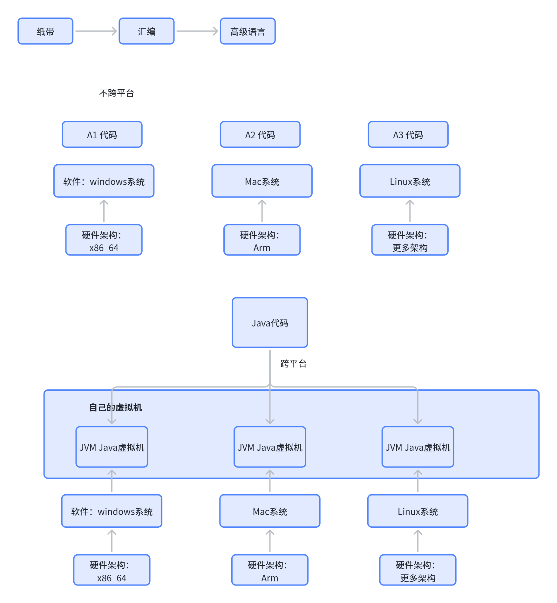
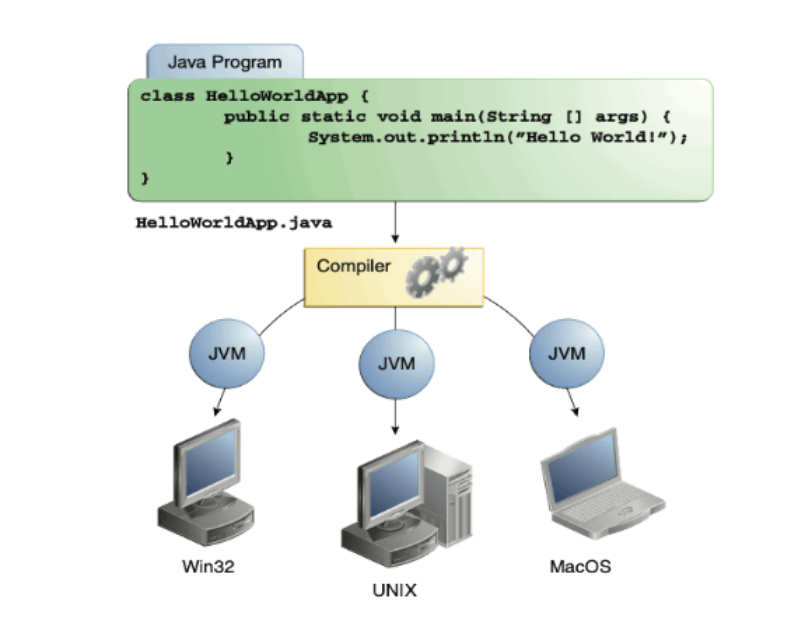
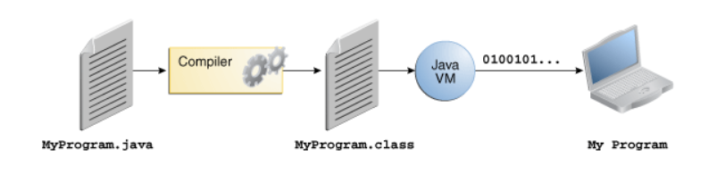
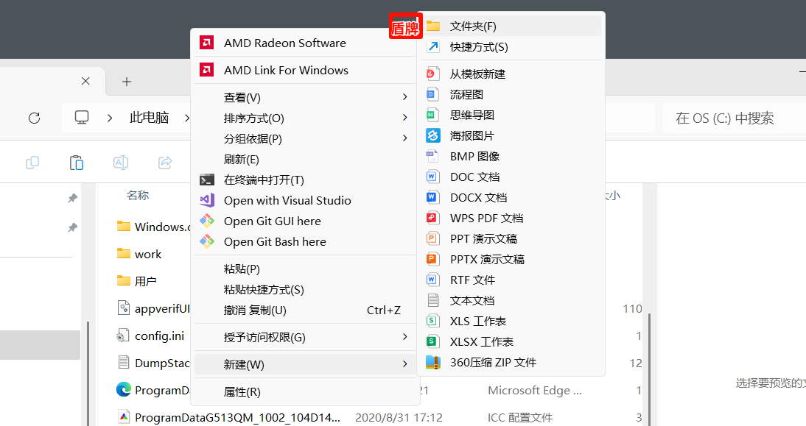
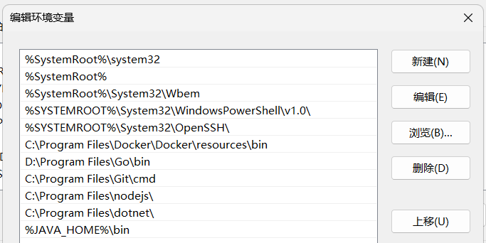
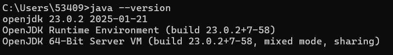
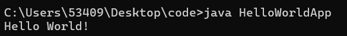
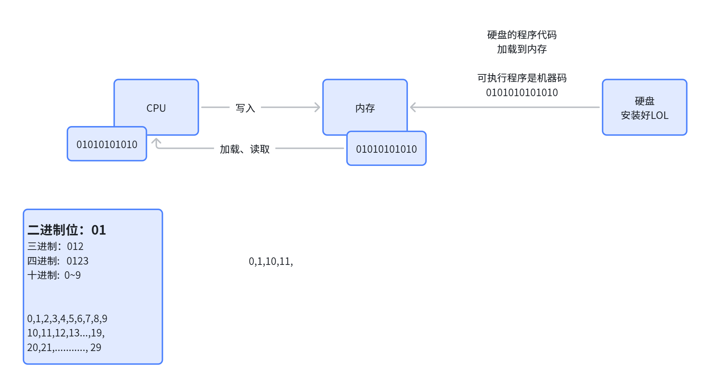
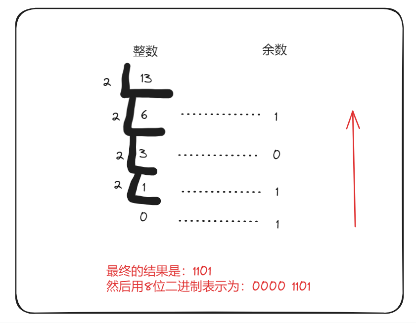

# 1. Java编程入门

官网：https://docs.oracle.com/javase/tutorial/

# 什么是Java

## 优点：

**简单
面向对象
分布式
多线程
动态
架构中立
可移植
高性能
健壮
****安全**

## Java的发展历史

- 1991 年，**Sun **Microsystems 公司；詹姆斯・**高斯林**（James Gosling）
- 1994 年。整个发布
- 2009 年，**甲骨文 Oracle(开源毒瘤) **公司宣布收购 Sun。
  - 半年一更！
  - JCP：**Java发展委员会**。
- Java 分支
  - Oracle 后续的属于商业版本
  - Java（规范）有很多开源**实现**方案
    - OpenJDK：首推
    - Eclipse Adoptium/Temurin
    - 有实力的公司，都有自己的Java ....

认识Java之父!詹姆斯・**高斯林**（James Gosling）

## Java语言如何工作？

1.  Java Virtual Machine: Java虚拟机

**跨平台：包一层：封装的奥义**！！！



认识JVM（*Java Virtual Machine*），每种操作系统有自己对应的虚拟机

> **安装Java环境**，底层其实就是安装自己操作系统对应的虚拟机

## Java 平台构成



## 执行流程



1. 自己创建一个` .java` 文件，写代码；  **源代码文件**
2. 调用Java的编译器，把` .java` 编译为虚拟机 能认识的 `.class`：** 字节码文件**
3. JVM 要把 .class 文件变为  机器认识的：**01010101**。 **机器码**

**计算机底层**：电子设备，电路，数字，**0,1 开关**。

## 语言两种

### 解释型

> 你的代码，逐行扫描，扫描到哪里执行到哪里
> 
> 执行慢。

### 编译型

> 你的代码，编译成机器能认识机器码，然后运行
> 
> **编译**的过程慢；

### 半编译、半解释

**编译**：.java --> .class

**.class 解释执行的时候**：逐行扫描 .class 进行执行，

- **编译**：如果JVM发现，这个代码经常要运行，不如直接把他变成机器认识的01，以后保存起来，直接给机器执行
- **解释**：如果JVM发现，少量执行的功能，那就直接自己执行，不用给机器0101

## 学习最新版本Java

https://dev.java/learn/

# 安装Java环境

## 下载JDK

**JDK**： Java Development Kit。**Java开发工具包**。很多好用的工具

**JRE**：Java Runtime Enviroment。**Java运行时环境**。

**JDK**里面包含了**JRE**。无论是自己开发，还是项目要去生产环境**服务器**。

> 1. 直接装JDK；工具很重要
> 2. 安装 **OpenJDK； **[<u>**https://jdk.java.net/**</u>](https://jdk.java.net/)
> 3. 来这里下载（各种版本归档文件）：https://jdk.java.net/archive/
> 4. 用**压缩包**（**绿色**），不要用 .exe 
>   1. 解压就能用，系统没伤害
>   2.  .exe  安装程序，注册表改了一堆
>   3. 下载了 10 种不同版本的压缩包。只需要两行配置就能快速**切换 Java版本**

> 把你下载好的东西，解压到
> 
> 1. 非C盘
> 2. 非中文
> 3. 无空格



没有盾牌说明C盘没有权限问题

## 配置Java环境

压缩包，需要自己配置Java环境

用windows的两行命令直接搞定！

windows键 + R; 输入 cmd 进入就windows的命令行

> ping baidu.com   快速判断通网没

```bash
# 指定 java 解压的文件夹位置; 一定改成自己的  x=1
set JAVA_HOME=E:\dev\jdks\jdk-23.0.2

# 不用改。意思：把 java 解压的文件夹位置 的 bin目录里面的所有东西，放到快速启动命令
set PATH=%JAVA_HOME%\bin;%PATH%

# 你的配置老是不生效
```

电脑 -- 右键 -- 属性 -- 系统 -- 高级系统设置 -- 环境变量

1. 添加一个 JAVA_HOME=E:\dev\jdks\jdk-23.0.2
  1. 系统变量 -- 新建 -- JAVA_HOME 在上面  -- E:\dev\jdks\jdk-23.0.2 在下面
  2. 系统变量 -- 找到Path修改



## 测试环境

运行命令：  windows+R  cmd 进入命令行窗口



> 扩展：什么是JDK、什么是JRE

# 编写第一行代码

## 编写 .java 源代码文件

```typescript
/**
注释：给他写的一个备注，给人看的，程序运行没用； 
除了注释外的所有代码，程序运行采用
 * 这是我的第一个作品
 *  class： 类
 *  class Xxxx(类名)
 * 1. class：固定写法，告诉Java我写了一个类，类里面有很多的功能，程序可以运行这些功能 
   2. class HelloWorldApp ：HelloWorldApp 类名 必须和文件名一样
   3. { 有功能的代码都在这里面 }： 定界符； 大括号一定成对出现
   4. public static void main(String[] args) { }; Java的程序主入口
  * 下去手敲10遍     
 */
class HelloWorldApp{

    //主程序，主入口，一个项目只应该有一个主入口
    public static void main(String[] args) {
        //这是要运行出效果的代码
        //Meiyan(); //方法调用，别人写好的功能，我直接掉
        System.out.println("Hello World!"); //在控制台打印一个字符串
    }
}
```

## 调用编译器编译源代码

windows命令：cmd、dir（列举当前文件夹下的所有内容）

1. 编译：`javac HelloWorldApp.java` ==> `HelloWorldApp.class`
2. 运行：`java HelloWorldApp`；效果



# 程序运行

`java HelloWorldApp`

# 剖析细节

1.  注释：/* */

# 你可能会遇到哪些坑？

> **大小写**、**标点符号**、**单词**

# Java命令

- java --version：查看版本
- javac Xxx.java：编译源代码。生成 .class文件。这是JAVA 虚拟机运行用的

# 计算机世界的运行规则

## 你的LOL怎么玩起来的



## 二进制的世界与字节

二进制要分组：按照字节分组；

**1字节：**等于 8个01,**8位**

**N进制**：

- BIN: 二进制： 01
- OCT：八进制： 01234567
- DEC：十进制： 0123456789
- HEX：十六进制： 0123456789ABCDEF

## 二进制运算

> 加法、减法、乘法、除法、与（AND）、或（OR）、异或（XOR）、非（NOT）等

- **2进制转10进制**：
  - **1001：倒着看，分别代表 2的 0,1,2，3 次方**
  - 1*2^3  + 0*2^2 + 0*2^1 + 1*2^0 = 8+0+0+1 = 9
- **10进制转2进制**：
  - **数字 9** 对应的 2进制是 **1001**; 一直除2进行计算；
    - 数字9 等于  0000 1001； 至少一个字节，8位； 不够8bit**前面凑0**
      - 101 0100 1001：真正对应是：  0000 0101 0100 1001。需要两个字节存储
  - 数字 11 对应的 2进制是 1011；



**1个字节（Byte）**是一个整体： 0101 1010 。 

1**Byte **= 8位（8个01）

1KB = 1024 Byte

1MB = 1024 KB

1GB = 1024 MB

1TB = 1024 GB

1PB = 1024 TB

1EB = 1024 PB

## 二进制进阶运算

### 加法

1011 + 1101 = 0001 1000

### 减法

1011 - 0101 = 0110 

十进制一借就借10个，2进制一借借2个

### 乘法

101 x 11 = 1111

5 x 3 = 15 

### 除法

> 如何算？
> 
> - 1011011 = 91
> - 0 = 1,  1 = 1
> - 10 = 1*2^1 + 0*2^0 = 2
> - 101 = 1*2^2 + 0*2^1 + 1*2^0 = 5
> - 110 = 1*2^2 + 1*2^1 + 0*2^0 = 6

**1011011  / 1** = ?

- **91 / 1** =91

**1011011  ****/ 10** = 101101  ... 1

- **91 / 2** = 45 ... 1

**1011011  ****/ 101** = 10010 ... 1

- **91 / 5** = **18 ... 1**

**1011011  / 110 **= 1111 ... 1?

- 91 / 6 = 15 ... 1

### 与（AND）、或（OR）、异或（XOR）、非（NOT）

> 自行AI，如何计算

#### 与（AND，`&`）​​：同1则1，否则0。

```plain text
0 & 0 = 0  
0 & 1 = 0  
1 & 0 = 0  
1 & 1 = 1  
```

#### 或（OR，`|`）​​：有1则1，全0则0。

```plain text
0 | 0 = 0  
0 | 1 = 1  
1 | 0 = 1  
1 | 1 = 1  
```

#### 异或（XOR，`^`）​​：不同则1，相同则0。

```plain text
0 ^ 0 = 0  
0 ^ 1 = 1  
1 ^ 0 = 1  
1 ^ 1 = 0  
```

#### 非（NOT，`~`）​​：取反，0变1，1变0。

```plain text
~0 = 1  
~1 = 0  
```

# 作业

1. 写出自己的第一个Java程序
2. 打印 **"Hello 你的名字"**， 其中 **"你的名字"** 可以在程序运行的时候动态传入
  1. `java Xxxx  参数1  参数2  ...  参数N`
  2. `java HelloWorldApp 张三`

```typescript
/**
 * The HelloWorldApp class implements an application that
 * simply prints "Hello World!" to standard output.
  哈哈哈
  String[] args：参数。运行程序的时候，可以动态传入的。所有传入进来的都被 args 封装了。
                args[0]  拿到一堆里面的第一个
                args[1]  拿到一堆里面的第二个
 */
class HelloWorldApp {
    public static void main(String[] args) {
        // 一旦一个东西都不穿如，程序崩溃
        System.out.println("Hello " + args[0]); // Display the string.
    }
}
```

1. 打印一个你喜欢的形状，比如**爱心**！
> AI提示词：仅用Java的System.out.println，打印一个爱心形状

```typescript
public class Heart {
    public static void main(String[] args) {
        System.out.println("  **     **  ");
        System.out.println(" ****   **** ");
        System.out.println("****** ****");
        System.out.println(" *********** ");
        System.out.println("  *********  ");
        System.out.println("   *******   ");
        System.out.println("    *****    ");
        System.out.println("     ***     ");
        System.out.println("      **      ");
        System.out.println("       *       ");
    }
}
```

1. 怎么在控制台打印你姓名的**二维码**？
> AI提示词：仅用Java的System.out.println，打印一个我名字的二维码
> 
> - 二维码文本生成：https://www.bootschool.net/qrcode-terminal
> - 得到如下的二维码
> 
> ```bash
> █▀▀▀▀▀▀▀██▀█▀▀█▀▀▀▀▀▀▀█
> █ █▀▀▀█ █  █▄▀█ █▀▀▀█ █
> █ █   █ █▀▄█▄▀█ █   █ █
> █ ▀▀▀▀▀ █ █▀▄ █ ▀▀▀▀▀ █
> █▀▀█▀██▀▀▄  ▄▄█▀▀▀█▀▀██
> █▀ █▀▀█▀▀▀▀██▀  █▀ ▄▀██
> █▀▀  ▀ ▀▀▀█▀▄▀ ███▀▄█▄█
> █▀▀▀▀▀▀▀█ █▀▄█▀▀ ███▀ █
> █ █▀▀▀█ ██ █ ▄ ▀▄██▄▀██
> █ █   █ █▄  ▄▀███▄▄▀▄ █
> █ ▀▀▀▀▀ █ █ ▀▀▄▄▄▄▄▄▀██
> ▀▀▀▀▀▀▀▀▀▀▀▀▀▀▀▀▀▀▀▀▀▀▀
> ```
> 
> - 然后逐行打印即可
> 
> ```typescript
> public class ErCode{
>     public static void main(String[] args) {
>         System.out.println("█▀▀▀▀▀▀▀██▀█▀▀█▀▀▀▀▀▀▀█");
>         System.out.println("█ █▀▀▀█ █  █▄▀█ █▀▀▀█ █");
>         System.out.println("█ █   █ █▀▄█▄▀█ █   █ █");
>         System.out.println("█ ▀▀▀▀▀ █ █▀▄ █ ▀▀▀▀▀ █");
>         System.out.println("█▀▀█▀██▀▀▄  ▄▄█▀▀▀█▀▀██");
>         System.out.println("█▀ █▀▀█▀▀▀▀██▀  █▀ ▄▀██");
>         System.out.println("█▀▀  ▀ ▀▀▀█▀▄▀ ███▀▄█▄█");
>         System.out.println("█▀▀▀▀▀▀▀█ █▀▄█▀▀ ███▀ █");
>         System.out.println("█ █▀▀▀█ ██ █ ▄ ▀▄██▄▀██");
>         System.out.println("█ █   █ █▄  ▄▀███▄▄▀▄ █");
>         System.out.println("█ ▀▀▀▀▀ █ █ ▀▀▄▄▄▄▄▄▀██");
>         System.out.println("▀▀▀▀▀▀▀▀▀▀▀▀▀▀▀▀▀▀▀▀▀▀▀");
>     }
> }
> ```