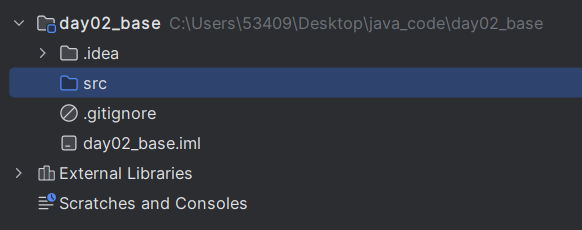
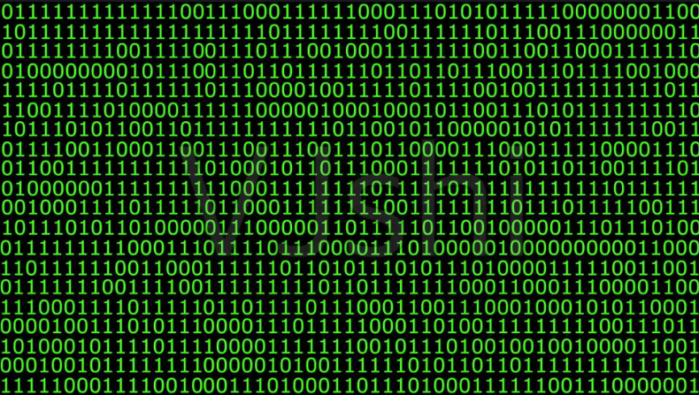
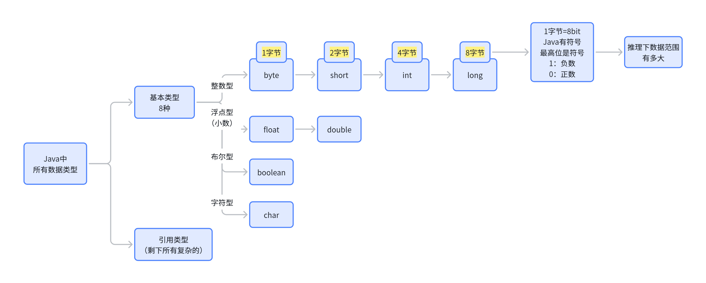
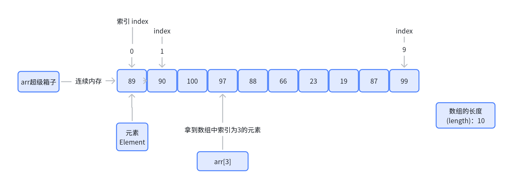
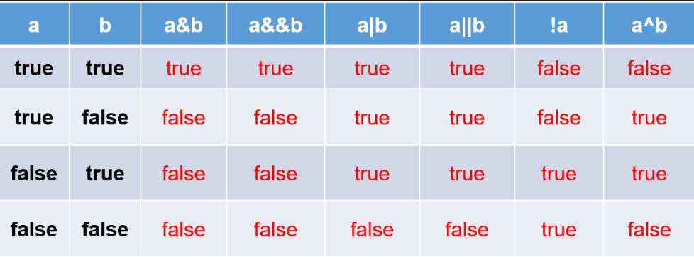
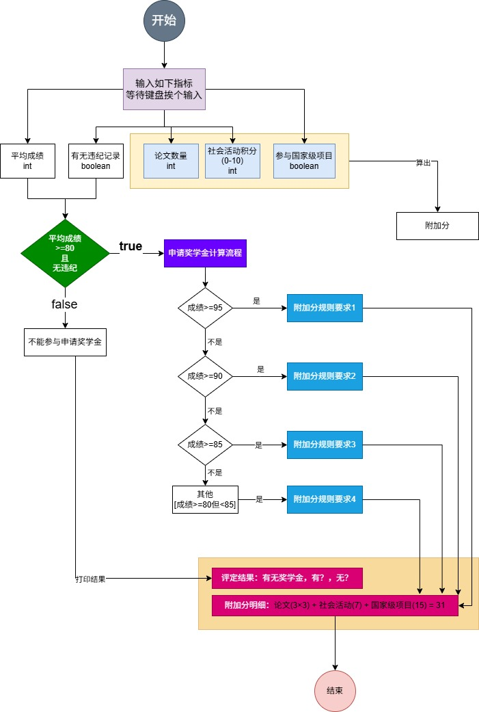

# 2. 基础语法

参考：https://docs.oracle.com/javase/tutorial/

# 0. 工欲善其事必先利其器

> 开发Java代码：编辑器（开发工具）
> 
> - idea：付费： https://www.jetbrains.com/zh-cn/idea/download/?section=windows
> - Eclipse：开源
> - VSCode、Trae：开源



# 面向对象语言

> **Object-Oriented Programming：**
> 
> - **面向对象编程**
> - Java、C++、C#...
> 
> **面向过程编程**：C/Go

> 概念：对象、类、继承、接口、包
> 
> - 万物皆可面向对象
> - 简单理解
> - **对象**：真实存在的实体。我的女朋友
> - **类**：类是对象的一个**抽象描述**； 女朋友（一类人）；一个类 可以 有很多对象
>   - 一类事物：苹果； 类    我正在吃的那个苹果他才是 苹果类的一个具体存在（对象）。
>   - 一类事物：iphone14：**类**
>     - 对象: iphone14的具体存在
>   - 一类事物：小孩：**类（年龄小于18、没有工作、社会经验还不足）**
>     - 满足这一类特征：雷丰阳（对象） ==》小孩（统称）
>   - 一类事物：歼10C：**类（特征：挂载PL15e仓位、双发发动机、xx）**？
>     - 张三驾驶员开的飞机 歼10C 对象
> - **继承**：A 继承 B。B有的特征东西，A也有。 A 还可以增加各种独有功能
> - **接口**：规范（法律法规）。 
>   - 有人实现了这个规范。** 雷丰阳** 实现了 遵纪守法小公民
>   - USB3.0：接口规范
>     - 以后制造 Upan的厂商 只要遵循了 USB3.0 规范。以后有USB3.0 口的电脑，都能用你的U盘
> - **包**：所有的代码不能写在一个文件，代码分散到多个文件中好维护
>   - 支付：Pay.java
>   - 物流：Wuliu.java
>   - 订单：Order.java
>   - 微信二维码：ErCode.java
>   - 小工具：Math.java、Weibo.java
>   - 分类放到某些文件夹中
>     - utils（工具文件夹）：Math.java、Weibo.java、Douyin.java
>     - order（订单文件夹）：Order.java（订单基础功能）、OrderAdvanced.java

**将来会起很多的名字**：

> 不用记那么多规则。直接写英语单词。写拼音

Java里面万物起源类

# 变量

## 变量是什么

> 计算机的世界



> 变量的世界: 变量其实就是一个盒子，里面装东西；装的都是一堆01


**变量只是一片内存区域的指代**。只是箱子；箱子里面装的东西，我们叫变量的值

- 内存区域都是装东西的。 01
- 计算机底层 字节为单位。
  - **1字节** = 8位
  - 

变量是盒子，每个盒子有多大？这个盒子的数据类型。

## 变量的4种方式

- **Instance Variables (Non-Static Fields[非静态属性])** ：实例变量；
- **Class Variables (Static Fields[静态属性])** ：类变量
- **Local Variables：本地变量，方法里面写的所有 变量**
- **Parameters：参数**

## 使用变量

> 声明、初始化、赋值、作用域、命名规则

### 声明变量

```java
byte a;
short b;
int c;
long d;
```

### 初始化变量

```java
byte a = 1;
short b = 2;
int c = 3;
long d = 4;
```

### 变量命名

每种编程语言都有自己的命名规则和约定，允许你使用的名称类型，Java编程语言也不例外。命名变量的规则和约定可以总结如下：

1. **变量名**是**区分大小写**的。变量的名称可以是任何合法的标识符——一个由Unicode字母和数字组成的无长度限制的序列，以字母、美元符号“$”或下划线字符“_”开头。然而，**按照惯例**，**变量名应该始终以字母开头**，而不是“$”或“_”。此外，**按照惯例**，**美元符号字符根本不使用**。你可能会遇到一些情况，自动生成的名称将包含美元符号，但你的变量名应始终避免使用它。对于下划线字符也存在类似的约定；虽然技术上可以在变量的名称开头使用“_”，但这种做法是不推荐的。**不允许使用空格**。
2. **后续字符**可以是字母、数字、美元符号或下划线字符。惯例（和常识）也适用于此规则。在为变量选择名称时，请使用完整的单词而不是晦涩的缩写。这样做会使你的代码更容易阅读和理解。在许多情况下，它也会使你的代码具有自文档性；例如，名为cadence、speed和gear的字段比缩写版本（如s、c和g）更直观。还要记住，你选择的名称不能是**关键字或保留字**。
3. 如果你选择的名称只包含**一个单词**，请将该单词拼写为**全部小写字母**。如果它包含**多个单词**，请将每个后续单词的**首字母大写**。gearRatio和currentGear是这种约定的典型例子。如果你的变量存储一个常量值，例如static final int NUM_GEARS = 6，则惯例略有变化，即每个字母都大写，并用下划线字符分隔后续的单词。按照惯例，下划线字符在其他地方从不使用。

### 标识符

规范：

> 包名：多单词组成时**所有字母都小写**：xxxyyyzzz。

  例如：java.lang、com.fengyang.bean

  

> 类名、接口名：多单词组成时，所有单词的首字母大写：XxxYyyZzz

  例如：HelloWorld，String，System等

  

> **变量名、方法名**：多单词组成时，第一个单词**首字母小写**，第二个单词开始每个单词首字母大写：xxx**Y**yy**Z**zz

  例如：age,name,bookName,main,binarySearch,getName

  

> **常量名**：所有字母都大写。多单词时每个单词用下划线连接：XXX_YYY_ZZZ

  例如：MAX_VALUE,PI,DEFAULT_CAPACITY

> 规范：为了别人能轻松看懂我们东西。**防御性编程**

> 以下的关键字都不能用

| abstract | continue | for | new | switch |
| --- | --- | --- | --- | --- |
| assert*** | default | goto* | package | synchronized |
| boolean | do | if | private | this |
| break | double | implements | protected | throw |
| byte | else | import | public | throws |
| case | enum**** | instanceof | return | transient |
| catch | extends | int | short | try |
| char | final | interface | static | void |
| class | finally | long | strictfp** | volatile |
| const* | float | native | super | while |

## 数据类型

### 基本类型

> 基本类型有哪些？
> 
> - byte:  1个字节， 8位；  
> - short： 2个字节， 16位
> - int： 4个字节，  32位
> - long： 8个字节： 64位   ====以上是整数
> - float： 4个字节： 32位
> - double： 8个字节： 64为  ===以上这是小数
> - boolean：true/false 真假：  这个代表真假（开关）； 动态的
> - char: 1个字符; 字符编码不同大小不一样
> 
> 互相之间能运算吗？

扩展：如何自己计算一个整数类型的大小范围

```java
public static void main(String[] args) {
    // 8bit   1000 0000
    //Java 规定，所有的数字都是有符号的？ 区分正负。最高位是符号位； 如果是1：就是负数
    // 如果是0 就是正数？
    byte a = 22;  // a的取值范围有多大 最小是多少，最大是多少？ -128 ~ 127

    // byte 不够装了
    System.out.println(a);

    //范围多大？  2^1 2个箱子  16bit
    // 最小： 1000 0000 0000 0000   -32768
    // 最大： 0111 1111 1111 1111    32767
    short b = 11;

    // 4个字节  32 位   1000 0000 0000 0000 0000 0000
    //
    int c = 22;  //最小：-2147483648  最大： 0111
    // 8个字节 64位
    long d = 22;

    //数学问题

}
```

> 基本类型强制类型转换
> 
> - 大类型变小类型会损失精度，比如： short变byte。
> - 小类型变大类型没问题。比如：byte变int

```java
//箱子之间大小转化 强制转化
byte x = 0b0110_1001;  // ~127-128

//二进制从左往右是从高位到地位。
short y = 189; //二进制  0000 0000 1011 1101
//  byte小箱子： 1011 1101
// 数据丢失
System.out.println(  (byte) y ); // -67

//计算步骤 int 4字节 32位： 32位的01  从高位截断只剩8位
int mm = 999;
System.out.println((byte)mm);
```

### 引用数据类型

不是基本类型8种的其他任何类型，都称为引用类型

### 类型总结



## 数组

> 创建、初始化、访问（**Creating, Initializing, and Accessing**）



# 运算符

## 所有的运算符

> 以下是所有运算符优先级

| Operators | Precedence |
| --- | --- |
| postfix（后缀） | expr++ expr-- |
| unary（一元） | ++expr --expr +expr -expr ~ ! |
| multiplicative（乘性） | * / % |
| additive（加性） | + - |
| shift（位移） | << >> >>> |
| relational（关系） | < > <= >= instanceof |
| equality（相等） | == != |
| bitwise AND（按位与） | & |
| bitwise exclusive OR（按位异或） | ^ |
| bitwise inclusive OR（按位或） | \| |
| logical AND（逻辑与） | && |
| logical OR（逻辑或） | \|\| |
| ternary（三元） | ? : |
| assignment（赋值） | = += -= *= /= %= &= ^= \|= <<= >>= >>>= |

> 重点： 前++ 与 后++

```java
public static void main(String[] args) {
    int i = 7;
    System.out.println( i++ + ++i + i++ - ++i); //猜猜输出
} 
```

## 逻辑运算

- & 和 &&：表示"且"关系，当符号左右两边布尔值都是true时，结果才能为true。否则，为false。
- | 和 || ：表示"或"关系，当符号两边布尔值有一边为true时，结果为true。当两边都为false时，结果为false
- ! ：表示"非"关系，当变量布尔值为true时，结果为false。当变量布尔值为false时，结果为true。
- ^ ：当符号左右两边布尔值不同时，结果为true。当两边布尔值相同时，结果为false。
  - 理解：`异或，追求的是“异”！`



# 表达式、语句、代码块

## expression：表达式

> 表达式是由变量、运算符和方法调用组成的结构
> 
> 表达式最终会算出一个值。

```java
int cadence = 0;
anArray[0] = 100;
System.out.println("Element 1 at index 0: " + anArray[0]);
int result = 1 + 2; // result is now 3
if (value1 == value2) 
    System.out.println("value1 == value2");
```

## statements：语句

> 我们写的一行代码称为一个语句，一个语句构成一个完整的执行单元，要用 分号结尾

## blocks：代码块

> {} 包裹的 0-N个语句 构成的一组完整代码，称为代码块

# 流程控制

> 源文件中的语句通常按照它们出现的顺序从上到下执行。
> 
> 然而，控制流语句通过使用决策、循环和分支来打破执行流程，使你的程序能够有条件地执行特定代码块。
> 
> **Java 编程语言支持的**
> 
> 1. 决策语句（ `if-then` ， `if-then-else` ， `switch` ）
> 2. 循环语句（ `for` ， `while` ， `do-while` ）
> 3. 分支语句（ `break` ， `continue` ， `return` ）


## if（判断）

> 在Java中，`if`语句用于**根据条件执行不同的代码块**。

### 基本语法

```java
if (条件) {
    // 条件为true时执行
}
```

### 例1：基本判断

```java
int num = 5;
if (num > 0) {
    System.out.println("这是一个正数。");
}
// 输出：这是一个正数。
```

### 例2：`if-else`判断奇偶

```go
int number = 10;
if (number % 2 == 0) {
    System.out.println("偶数。");
} else {
    System.out.println("奇数。");
}
// 输出：偶数。
```

### 例3：`if-else if-else`多条件判断成绩等级、

```go
int score = 85;
if (score >= 90) {
    System.out.println("A");
} else if (score >= 80) {
    System.out.println("B"); // 执行这里
} else if (score >= 70) {
    System.out.println("C");
} else {
    System.out.println("D");
}
// 输出：B
// 注意条件覆盖范围
```

```go
int age = 15;
if (age < 0) {
    System.out.println("年龄无效！");
} else if (age < 18) {
    System.out.println("未成年。");
} else {
    System.out.println("成年。");
}
// 输出：未成年。
```

### 例4：多逻辑运算符（判断闰年）

```sql
int year = 2020;

if ((year % 4 == 0 && year % 100 != 0) || (year % 400 == 0)) {
     System.out.println(year + "年是闰年。");
}else {
    System.out.println(year + "年不是闰年。");
}

// 输出：2020年是闰年。
```

### 例5：嵌套if

```go
int health = 75;
boolean hasKey = true;
boolean foundExit = false;

if (health > 0) { // 外层条件：角色是否存活
    System.out.println("角色存活！");
    
    if (hasKey) { // 中层条件：是否有钥匙
        System.out.println("已获得钥匙，可以尝试开门。");
        
        if (foundExit) { // 内层条件：是否找到出口
            System.out.println("成功逃离！游戏胜利！");
        } else {
            System.out.println("未找到出口，继续探索...");
        }
        
    } else {
        System.out.println("没有钥匙，无法开门。");
    }
    
} else {
    System.out.println("角色已死亡，游戏结束。");
}
```

## switch

### 基本语法

```java
switch (变量) { 
  case 值1:
    // 代码
    break;
  case 值2:
    // 代码
    break;
  default:
    // 默认代码
}
```

> - 在Java 7之前，switch只能支持整型、字符型和枚举
> - Java 7之后开始支持字符串。
> - Java 14，引入了更简洁的switch表达式，允许使用箭头语法和直接返回值

### 例1：判断星期

```go
int day = 3;
switch (day) {
  case 1:
    System.out.println("周一");
    break;
  case 2:
    System.out.println("周二");
    break;
  case 3:
    System.out.println("周三"); // 输出 "周三"
    break;
  default:
    System.out.println("未知");
}
```

### 例2：判断字符串（Java 7+）​

```go
String fruit = "apple";
switch (fruit) {
  case "apple":
    System.out.println("苹果");
    break;
  case "banana":
    System.out.println("香蕉");
    break;
  default:
    System.out.println("未知水果");
}
```

### 例3：判断枚举

```go
enum Color { RED, GREEN, BLUE }

Color color = Color.RED;
switch (color) {
  case RED:
    System.out.println("红色");
    break;
  case GREEN:
    System.out.println("绿色");
    break;
  default:
    System.out.println("其他颜色");
}
```

### 例4：增强型 switch（Java 14+，正式于 Java 17）

- 使用 `->` 箭头语法，无需 `break`
- 允许直接返回值（作为表达式）
- 支持多值合并（逗号分隔）

#### 箭头语法

```java
int num = 2;
String result = switch (num) {
  case 1 -> "一";
  case 2 -> "二";  // 返回 "二"
  case 3, 4 -> "三或四";
  default -> "未知";
};
System.out.println(result); // 输出 "二"
```

#### 返回值：yield 

```javascript
int score = 85;
String grade = switch (score / 10) {
  case 10, 9 -> "A";
  case 8 -> {
    if (score > 85) yield "B+"; // 在代码块中使用 yield 返回值
    else yield "B";
  }
  case 7 -> "C";
  default -> "F";
};
System.out.println(grade); // 输出 "B"
```

### 版本特性

| 场景 | 支持版本 | case能否写表达式 |
| --- | --- | --- |
| 传统 switch | Java 1.0+ | ❌ 仅常量 |
| 增强 switch（多值合并） | Java 12+ | ✅ 用逗号合并常量 |
| 模式匹配 + 守卫条件 | Java 21+ | ✅ 通过 when 写条件判断 |

## while

### 基本语法

```java
//第一种
while (条件表达式) {
    // 循环体：条件为 true 时执行
}

//第二种
do {
    // 循环体：条件为 true 时执行
} while (条件表达式) 
```

- 执行逻辑​：先判断条件，若为 `true`，执行循环体，直到条件变为 `false`。
- 注意​：如果条件初始为 `false`，循环体一次都不会执行。

### 例1：基础用法（打印 1~5）

```java
int i = 1;
while (i <= 5) {
    System.out.println(i);
    i++; // 更新循环变量，避免无限循环
}
// 输出：1 2 3 4 5
```

### 例2：无限循环

```java
while (true){
    // your code goes here
}
```

> 扩展：写一个猜数字的小游戏：可以参考如下代码

```java
import java.util.Scanner;

Scanner scanner = new Scanner(System.in);
int input;
while (true) { // 无限循环，直到输入有效值
    System.out.print("请输入一个正整数：");
    input = scanner.nextInt();
    if (input > 0) {
        break; // 输入合法，退出循环
    }
    System.out.println("输入错误，请重试！");
}
System.out.println("你输入的是：" + input);
```

### 例2：计算 1~n 的和

```java
int sum = 0;
int n = 10;
int current = 1;
while (current <= n) {
    sum += current;
    current++;
}
System.out.println("1~10的和：" + sum); // 输出55
```

### 例3：do-while

```java
int i = 0;
do {
    System.out.println("do-while 循环执行");
    i++;
} while (i > 5);  // 条件检查在循环体之后
// 输出：do-while 循环执行（循环体执行了一次）
```

## for

> Java 的 `for` 循环是一种常用的控制流语句，用于**重复执行代码块**​，**直到条件不满足为止**。它的语法结构清晰，适合处理已知循环次数或需要精确控制迭代过程的场景。

### 基本语法

```java
//第一种
for (初始化; 条件判断; 迭代操作) {
    // 循环体代码
}

//第二种
for (元素类型 变量名 : 数组或集合) {
    // 使用变量名操作当前元素
}
```

- 初始化​：声明循环变量并赋初始值（仅在循环开始时执行一次）。
- 条件判断​：每次循环前检查条件是否为 `true`，若为 `false` 则终止循环。
- 迭代操作​：修改循环变量的值（在每次循环体执行后触发）。

### 例1：打印0-9数字

```java
for (int i = 0; i < 10; i++) {
    System.out.print(i + " ");
}
// 输出：0 1 2 3 4 5 6 7 8 9
```

### 例2：遍历数组

```go
int[] numbers = {10, 20, 30, 40};
for (int i = 0; i < numbers.length; i++) {
    System.out.println("索引 " + i + " 的值是 " + numbers[i]);
}
// 输出：
// 索引 0 的值是 10
// 索引 1 的值是 20
// 索引 3 的值是 40
```

### 例3：增强for

```javascript
String[] fruits = {"苹果", "香蕉", "橙子"};
for (String fruit : fruits) {
    System.out.println(fruit);
}
// 输出：
// 苹果
// 香蕉
// 橙子
```

### 例4：无限循环

> 无限循环结构

```go
int count = 0;
for (;;) { // 省略所有条件
    System.out.println("循环中...");
    count++;
    if (count >= 3) {
        break; // 满足条件时跳出循环
    }
}
// 输出：
// 循环中...
// 循环中...
// 循环中...
```

### 例5：嵌套循环

> 打印二维数组的每个元素值

> 如何打印下面图形

```java
*
**
***
****
*****
```

> **作业：**进阶：打印9*9乘法表

```go
for (int i = 1; i <= 9; i++) {         // 外层循环控制行
    for (int j = 1; j <= i; j++) {     // 内层循环控制列
        //扩展了解：Java的格式化打印 
        System.out.print(j + "×" + i + "=" + (i*j) + "\t");
    }
    System.out.println(); // 换行
}
// 输出 9×9 乘法表
```

## break\continue\return

### `break`：​立即终止当前循环

- 作用​：跳出当前所在的循环（`for`/`while`/`do-while`），继续执行循环外的代码。
- 场景​：提前结束循环（例如找到目标、发生错误时）。
- 示例​：

```go
for (int i = 1; i <= 5; i++) {
    if (i == 3) {
        System.out.println("遇到3，终止循环！");
        break; // 立即结束整个循环
    }
    System.out.println("当前i值：" + i);
}
// 输出：
// 当前i值：1
// 当前i值：2
// 遇到3，终止循环！
```

- 在嵌套循环中，`break` 默认只终止**最内层循环**。
- 若需跳出多层循环，可使用标签​（Java）或标志变量：

```go
outerLoop: // 标签
for (int i = 0; i < 3; i++) {
    for (int j = 0; j < 3; j++) {
        if (i == 1 && j == 1) {
            break outerLoop; // 直接跳出外层循环
        }
        System.out.println(i + "," + j);
    }
}
```

### `continue`：​跳过当前迭代，继续下一次循环

- 作用​：跳过当前迭代剩余代码，直接进入下一次循环的条件判断。
- 场景​：过滤不需要处理的数据（例如跳过偶数、异常值）。
- 示例​：

```go
for (int i = 0; i < 5; i++) {
    if (i % 2 == 0) { // 跳过偶数
        continue; // 不执行后续代码，直接进入i++
    }
    System.out.println("奇数：" + i);
}
// 输出：
// 奇数：1
// 奇数：3
```

在 `while` 或 `do-while` 中使用 `continue` 时，需手动更新循环变量，否则可能导致死循环：

```java
int i = 0;
while (i < 5) {
    if (i == 2) {
        i++; // 必须手动更新，否则死循环在i=2
        continue;
    }
    System.out.println("i=" + i);
    i++;
}
```

### `return`：​终止整个方法

- 作用​：直接结束当前方法，并返回一个值（如果有返回值）。
- 场景​：在循环中满足条件时直接返回结果（例如找到目标后立即结束）。
- 示例​：

```go
 for (int num : data) {
    if (num < 0) {
        System.out.println("发现负数，终止处理！");
        return; // 直接结束方法
    }
    System.out.println("处理数据：" + num);
}
```

| 关键字 | 作用范围 | 行为 | 典型场景 |
| --- | --- | --- | --- |
| break | ​​当前循环​​ | 终止循环，执行循环外代码 | 提前退出循环（如找到目标） |
| continue | ​​当前迭代​​ | 跳过当前迭代，继续下一次 | 过滤特定条件的数据 |
| return | ​​整个方法​​ | 结束方法并返回值 | 满足条件时立即返回结果 |

# 作业

## Java流程控制编程作业：学生奖学金评定系统

**需求描述：​​**

开发一个Java程序，根据以下规则对学生的奖学金申请资格进行综合评定：

1. **基本资格筛选​：**
  - 平均成绩 ≥80 分
  - 无违纪记录
  - 任意一项不满足直接失去参评资格
2. **附加分计算规则​：**
  - 每篇论文 +3 分（`论文数量`）
  - 社会活动积分直接计入（0-10分）
  - 参与国家级项目额外 +15 分
3. **分级评定规则​：**

| 平均成绩区间 | 附加分要求 | 奖学金等级与金额 |
| --- | --- | --- |
| ≥95 | ≥30 → 特等(20k) | 层级递进判断 |
|   | ≥25 → 一等(10k) |   |
|   | 其他 → 二等(5k) |   |
| ≥90 | 论文≥2且总分≥28 → 一等(10k) | 需要组合条件判断 |
|   | ≥20 → 二等(5k) |   |
|   | 其他 → 三等(3k) |   |
| ≥85 | ≥25 → 二等(5k) | 包含多条件分支 |
|   | 社会活动≥8 → 三等(3k) |   |
|   | 论文≥1 → 科研鼓励奖(1.5k) |   |
| 其他 | ≥25 → 三等(3k) | 最低合格线判断 |
|   | ≥15 → 社会活动优秀奖(1k) |   |

**功能要求：​​**

1. 通过控制台接收5项输入【平均成绩、无违纪记录、`论文数量`、社会活动积分、参与国家级项目】
2. 实现至少3层嵌套的条件判断结构
3. 输出要求包含：
  - 最终奖学金等级/无资格说明
  - 总附加分及各组成部分明细
  - 格式示例：

```plain text
评定结果：一等奖学金（￥10,000）
附加分明细：论文(3×3) + 社会活动(7) + 国家级项目(15) = 31
```

**验收标准：​​**

1. 正确处理边界值（如85.0、90.0等）
2. 实现所有分支逻辑
3. 代码包含必要的输入验证（如成绩范围0-100）
4. 输出结果清晰可读

**扩展挑战（选做）**：​​

1. 添加多语言支持（中英文切换）
2. 实现异常处理机制
3. 将判定规则封装为独立方法

**提交内容：​​**

- 完整.java文件
- 测试用例文档（至少5组不同场景）
- 程序流程图（可手绘拍照）

---

作业其他说明：​​

1. **建议先绘制判定树状图再编码**
2. 注意代码缩进规范（嵌套结构需要清晰体现）
3. 禁止直接使用switch语句替代if-else结构

### 流程图：



## 了解：格式化打印 System.out.printf

> 使用方式

```java
System.out.printf("%d + %d = %d",i,j,k)
```

### 常用转换符

| ​​转换符​​ | ​​适用类型​​ | ​​说明​​ |
| --- | --- | --- |
| %d | 整型（byte, short, int, long） | 十进制整数。 |
| %o | 整型 | 八进制。 |
| %x, %X | 整型 | 十六进制（小写/大写字母）。 |
| %f | 浮点型（float, double） | 十进制小数形式（默认6位小数）。 |
| %e, %E | 浮点型 | 科学计数法（如1.23e+05）。 |
| %g, %G | 浮点型 | 自动选择%f或%e（更紧凑形式）。 |
| %a, %A | 浮点型 | 十六进制浮点数（如0x1.fp3）。 |
| %c, %C | char | 单个字符（%C输出大写形式，如A→A）。 |
| %s, %S | String, Object | 字符串（%S将字符串转为大写，如"hello"→"HELLO"）。 |
| %b, %B | 任意类型 | 布尔值（非null对象输出true，null输出false；%B大写形式）。 |
| %h, %H | 任意类型 | 对象的哈希码（十六进制；%H大写）。 |
| %% | - | 输出%字符本身。 |
| %n | - | 插入换行符（平台无关）。 |

---

### 3. 日期时间转换符（需配合`Date`或`Calendar`对象）​

| ​​转换符​​ | ​​示例​​ | ​​说明​​ |
| --- | --- | --- |
| %tY | 2023 | 四位年份。 |
| %ty | 23 | 两位年份。 |
| %tm | 7 | 两位月份（01-12）。 |
| %td | 15 | 两位日期（01-31）。 |
| %tH | 14 | 24小时制的小时（00-23）。 |
| %tM | 5 | 分钟（00-59）。 |
| %tS | 30 | 秒（00-60）。 |
| %tF | 45122 | %Y-%m-%d的简写形式。 |
| %tT | 0.5871527777777777 | %H:%M:%S的简写形式。 |

---

### 4. 标志符示例

- 对齐与填充
  - `%10d`：输出宽度10，右对齐（不足补空格）。
  - `%-10d`：左对齐。
  - `%05d`：用零填充（如`123`→`00123`）。
- 数值修饰
  - `%,d`：添加千位分隔符（如`1000000`→`1,000,000`）。
  - `%+.2f`：强制显示符号并保留两位小数（如`3.1415`→`+3.14`）。
- 字符串与浮点数精度
  - `%.3s`：截取字符串前3个字符（如`"hello"`→`"hel"`）。
  - `%5.2f`：总宽度5，保留两位小数（如`3.1415`→` 3.14`）。