# 3. 面向对象

参考：https://docs.oracle.com/javase/tutorial/java/javaOO/index.html

**渐悟**到**顿悟**

# 脉络

- Java类及类的成员：（重点）属性、方法、构造器；（熟悉）代码块、内部类
- 面向对象的特征：**封装、继承、多态**、（抽象）
- 其他关键字的使用：this、super、package、import、static、final、interface、abstract等

# 类(Class)

> 什么是**类（Class）**
> 
> - **类**：具有**相同特征**的**事物**的**抽象描述**，是`抽象的`、**概念**上**的定义**。
> - **对象**：实际存在的该类事物的`每个个体`，是`具体的`，因而也称为`实例(instance)`。

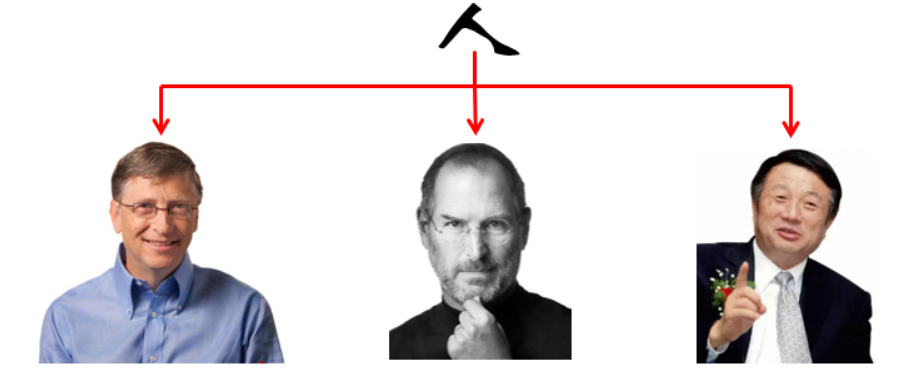

---


---


## 声明一个类

```java
[修饰符] class 类名{ 
    // 属性：field,  类似 手机的一堆参数
    // 构造器：constructor,（造对象的办法）  将来会调用 构造器 去来 创建一个 这个类的对象。
    // 方法声明：method declarations
}

public class MyClass extends MySuperClass implements YourInterface {
    // field, constructor, and
    // method declarations
}
```

> 1. **修饰符(可选)**，
>   1. **两种**：1）、如 public、private 权限修饰符   2）、static修饰符
>   2. 注意，private 修饰符只能应用于嵌套类。
> 2. **类名: **首字母按约定大写（XxxYyyZzz 驼峰命名法）。
> 3. **类**的**父类**（**超类**）的名称（如果有的话），前面带有关键字 **extends**。一个类只能继承（子类化）一个父类。
> 4. 类如果有实现的**接口**列表，用逗号分隔，并以关键字 implements 开头。一个类可以实现多个接口。
> 5. 类体，被大括号 {} 包围。

> **类完整的写法如下**：

一个类由三个部分构成： ** 属性Field(成员变量)**、**方法Method(成员方法)**、**构造器Constructor**

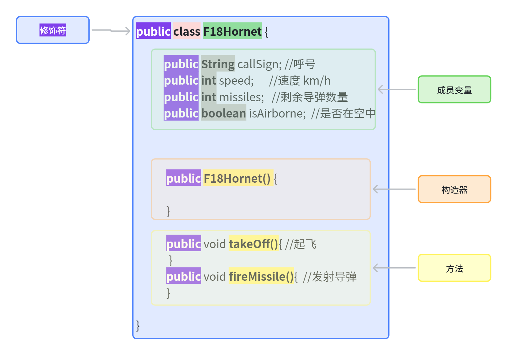

## 声明属性

> 1. 零个或多个修饰符，
>   1. 权限修饰符：例如 `public` 或 `private` 等
>   2. 其他修饰符：const、static、final等
> 2. 属性类型
> 3. 属性名

```java
public class F18Hornet {
    // 1. 类的属性（成员变量）
    private String callSign;     // 呼号
    private int speed;        // 当前速度（km/h）
    private int missiles;        // 剩余导弹数量
    private boolean isAirborne;  // 是否在空中
}
```

### 访问修饰符(**Access Modifiers**)

> 第一个（最左边）使用的修饰符可以让您控制其他哪些类可以访问成员字段。
> 
> 目前，仅考虑 `public` 和 `private` 。其他访问修饰符将在后面讨论

1. `public` 修饰符—该字段可以从所有类访问。
2. `private` 修饰符——该字段仅在其自己的类中可访问。

### 变量类型

1. 所有变量都必须有类型。可以使用 `int` 、 `float` 、 `boolean` 等基本类型。
2. 也可以使用引用类型，如字符串、数组或对象。

### 变量名称

1. 类名的首字母应该大写，并且
2. 方法名中的第一个（或唯一）单词应该是动词

## 定义方法

> **方法**一般代表这个类具有的功能。
> 
> - 手机可以**打电话**、**发短信**、**上网**。
> - 战斗机可以**起飞**、**降落**、**发射导弹**。

```java
[修饰符]  方法返回值  方法名(参数列表也叫形参列表，多个参数用逗号) {

}


double calculate(double a, int b) throws Exception {
    //do the calculation here  形式参数    calculate(1,2)  1,2: 实际参数  实参
}
```

**方法声明的6个部分**

1. **修饰符****[可选]** —— 例如 `public` 、 `private` 以及你之后会学到的其他修饰符。
  1. 权限修饰符（public, protected, private）
  2. 其他修饰符（static，final，synchornized ...）
2. **返回类型****[必选]** —— 方法返回值的数据类型，如果方法不返回值，则为 void。
3. **方法名****[必选]** —— 字段名称的规则同样适用于方法名称，但约定略有不同，比如建议写动词开头。
4. **括号中的参数列表****[必选]** —— 一个由逗号分隔的输入参数列表，每个参数前面是其数据类型，整个列表被括号包围。**如果没有参数，则必须使用空括号**。
5. **一个异常列表****[可选]** —— 将在后面讨论。throws用法。后面讲
6. **方法体****[必选]** —— **用大括号包围**—方法的代码，包括局部变量的声明，都写在这里。

> 完善我们的战斗机
> 
> 1. 起飞方法：takeOff()；
> 2. 加速方法：accelerate();
> 3. 发射导弹方法： fireMissile();
> 4. 着陆方法：land();
> 5. 信息显示方法：showStatus()

```java
// 4. 成员方法（对象的行为）
// 起飞方法
public void takeOff() {
    if (!isAirborne) {
        isAirborne = true;
        speed = 300;  // 初始起飞速度
        System.out.println(callSign + "已起飞，当前速度：" + speed + "km/h");
    } else {
        System.out.println(callSign + "已经在空中了！");
    }
}

// 加速方法
public void accelerate(int increment) {
    if (isAirborne) {
        speed  = speed + increment;
        System.out.println(callSign + "加速至：" + speed + "km/h");
    } else {
        System.out.println(callSign + "尚未起飞，无法加速！");
    }
}

// 发射导弹方法
public void fireMissile() {
    if (missiles > 0 && isAirborne) {
        missiles--;
        System.out.println(callSign + "发射导弹！剩余导弹：" + missiles);
    } else if (!isAirborne) {
        System.out.println(callSign + "必须起飞后才能发射导弹！");
    } else {
        System.out.println(callSign + "导弹库存不足！");
    }
}

// 降落方法
public void land() {
    if (isAirborne) {
        speed = 0;
        isAirborne = false;
        System.out.println(callSign + "已安全降落");
    } else {
        System.out.println(callSign + "已经在地面了！");
    }
}

// 5. 信息显示方法
public void showStatus() {
    System.out.println("\n=== " + callSign + "状态 ===");
    System.out.println("当前速度: " + speed + "km/h");
    System.out.println("剩余导弹: " + missiles);
    System.out.println("飞行状态: " + (isAirborne ? "空中" : "地面"));
}
```

### 给方法起个好名字

> 虽然方法名可以是任何合法的标识符，但代码约定限制了方法名。**按照惯例，方法名应该是小写的动词**，或者是**以小写动词开头的多词名称**，后面跟着形容词、名词等。在多词名称中，**第二个及以后**每个单词的**首字母**应该**大写**。以下是一些示例：
> 
> - run
> - runFast
> - getBackground
> - getFinalData
> - compareTo
> - setX
> - isEmpty

### 重载方法：（**Overloading Methods**）

> **定义**：类中的方法**可以具有相同的名称**，只要它们的**参数列表不同**，就是这个方法的多种**重载方法**
> 
> **场景**：发射导弹有多种方式
> 
> 1. 可以指定导弹型号（字符串）
> 2. 可以指定一次性发射数量（整数）
> 3. 也可以型号、数量都指定
> 4. 如果什么都不传，默认发射一个 

```java

```

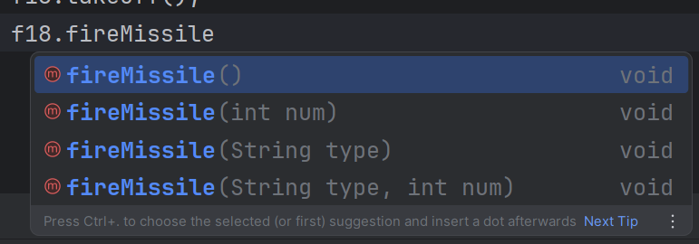

## 提供构造器

> 1. **构造器也叫构造函数**，他们被调用，就会为这个类创建出对象。就像是根据图纸，制造真正的飞机。
> 2. 构造器没有返回值类型
> 3. 一个类可以**有一个无参构造器**和**多个有参构造器**
> 4. 什么构造器都不写，默认认为写了一个**无参构造器**
> 5. 无参构造器非常重要，建议一定要写。否则，后面整合框架以及反射的时候，会出问题

## 传递参数给构造器或方法

### 基本用法

> 1. 可以声明构造器或者方法的时候，一起声明上参数数量和类型。

```java
public double computePayment(
                  double loanAmt,
                  double rate,
                  double futureValue,
                  int numPeriods){
     //四个参数，每个参数需指定类型和参数名。参数之间用 , 隔开
}
```

> 1. 参数类型可以是 基本类型 、引用类型 的任何一种

```java
public Polygon polygonFrom(Point[] corners) {
    // method body goes here
}
```

#### 参数

- **形参**（formal parameter）：在定义方法时，方法名后面括号()中声明的变量称为形式参数，简称形参。
- **实参**（actual parameter）：在调用方法时，方法名后面括号()中的使用的值/变量/表达式称为实际参数，简称实参。

#### 参数传递机制：值传递

Java里方法的参数传递方式只有一种：`值传递`。 即将实际参数值的副本（复制品）传入方法内，而参数本身不受影响。

- 形参是基本数据类型：将实参基本数据类型变量的“**数据值**”传递给形参
- 形参是引用数据类型：将实参引用数据类型变量的“**地址值**”传递给形参

### 可变参数

> 1. 不确定传入多少个参数，可以使用可变参数；其实就是数组的简写方式
> 2. 可变参数只能出现在参数表的最后，不能写在前面

```java
public Polygon polygonFrom(Point... corners){

}

//可变参数的正确位置
public void land(long b,int... a) {

}
```

### 参数名字

> 1. **参数的名称在其作用域内必须是唯一的**。它不能与同一方法或构造函数的另一个参数的名称相同，也不能与方法或构造函数内的局部变量的名称相同。
> 2. 如果真一样的，需要搭配 `this `关键字来引用类中的变量。（后来说）

# 对象(Object)

> 什么是对象？
> 
> 1. 对象是从类创建出来的。正如：F18是从F18的图纸建造出来的
> 2. 从类创建对象，也叫做 **实例化**。**一个对象**就是这个类的**一个实例**。
> 3. 一个**类**可以**有**很多对象，也就是**很多实例**；

## 创建对象

> ```java
> Point originOne = new Point(23, 94);
> Rectangle rectOne = new Rectangle(originOne, 100, 200);
> Rectangle rectTwo = new Rectangle(50, 100);
> F18Hornet  f18a = new F18Hornet("F001",4);
> ```

这些语句中的每一个都有三个部分:

1. **Declaration(声明):**  将变量名与对象类型关联起来；`F18Hornet  f18a`;
2. **Instantiation(实例化)： **new 关键字是创建对象的 Java 操作符
3. **Initialization(初始化)： **new 操作符后面跟着对构造函数的调用，该构造函数初始化新对象。

## 使用对象

1. 使用对象属性。
  1. 注意访问权限修饰符（后来仔细说）
  2. 建议单独为每一个属性提供方法进行**获取**和**修改**。Java中规定了属性的** getter/setter **机制
2. 调用对象方法。

# 包

> 将**相关的类组织在一起**，放在一个**包**下，方便管理。还能实现：
> 
> 1. 更容易地查找和使用类型
> 2. 避免命名冲突
> 3. 控制访问权限

## 创建包

> 包在底层就是一个文件夹。在idea中，可以快速创建包

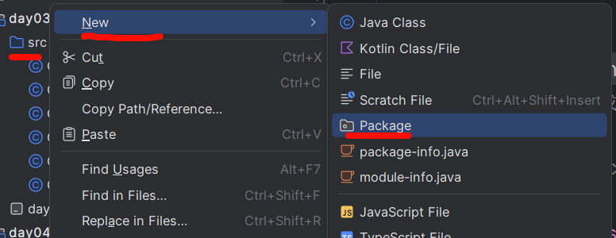

1. 每个在包中的` .java` 文件，开头都会声明所在的包：`package core` 
2. 不同包下可以有同名的` .java` 程序（也就是类）
3. 类的全名字是： `包名.类名`
4. 包名可以是网址的反写形式：`com.lfy`，这就表示有两层路径的文件夹，第一层com，第二层lfy

> 参考下面规则给包进行命名（**公司网址反写**）

## 导入包

1. 导入包中的某个具体类：`import graphics.Rectangle`
2. 导入包中的所有类：`import graphics.*`
3. idea会自动的在你使用其他类的时候，导入对应的包或具体的类
4. **Java中常见的包**

- `java.lang`----包含一些Java语言的核心类，如String、Math、Integer、 System和Thread，提供常用功能
- `java.net`----包含执行与网络相关的操作的类和接口。
- `java.io`   ----包含能提供多种输入/输出功能的类。
- `java.util`----包含一些实用工具类，如定义系统特性、接口的集合框架类、使用与日期日历相关的函数
- `java.text`----包含了一些java格式化相关的类
- `java.sql`----包含了java进行JDBC数据库编程的相关类/接口
- `java.awt`----包含了构成抽象窗口工具集（abstract window toolkits）的多个类，这些类被用来构建和管理应用程序的图形用户界面(GUI)。  

## 路径

- **类名** – `graphics.Rectangle`
- **路径** – `graphics\Rectangle.java`

# 类 - 进阶

## 方法返回值

> 方法何时返回
> 
> 1. 执行完了所有语句
> 2. 到达了return
> 3. 方法出现异常(后面讲)

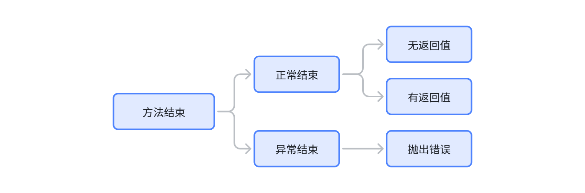

```java
public void method1(){ //无返回值
}

public int method2(){ //返回基本类型
    return 1+2;
}

public String[] method4(){ //返回数组类型
    return new String[]{"1","2"};
}

public F18 method3(){ //返回引用类型
    return new F18();
}
```

## this关键字

> 在**实例方法**或**构造函数**中， `this` 是对当前对象的引用——即正在调用其方法或构造函数的对象。你可以通过使用 `this` 从实例方法或构造函数内部引用当前对象的任何成员。

### 属性使用this

> **变量遮蔽**：使用 `this` 关键字最常见的原因是字段被方法或构造函数参数**遮蔽**

```java
public class Point {
    public int x = 0;
    public int y = 0;
        
    //constructor： 这种写法不用 this 没有问题，每个变量都有明确指代
    public Point(int a, int b) {
        x = a;
        y = b;
    }
}
```

```java
public class Point {
    public int x = 0;
    public int y = 0;
        
    //constructor： 使用 this 区分对象的属性，和构造器的传参
    public Point(int x, int y) {
        this.x = x;
        this.y = y;
    }
}
```

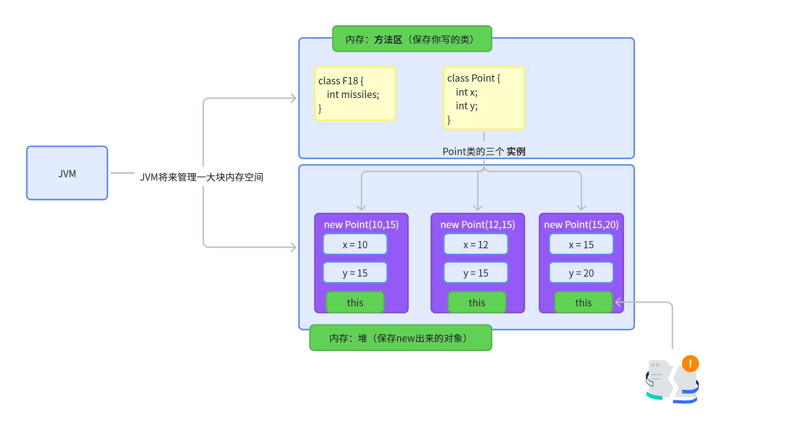

### 构造器使用this

> 在构造函数内部，还可以使用`this`关键字调用同一类中的另一个构造函数。这种做法称为显式构造函数调用。

```java
public class Rectangle {
    private int x, y;
    private int width, height;
        
    public Rectangle() {
        this(0, 0, 1, 1);
    }
    public Rectangle(int width, int height) {
        this(0, 0, width, height);
    }
    public Rectangle(int x, int y, int width, int height) {
        this.x = x;
        this.y = y;
        this.width = width;
        this.height = height;
    }
    ...
}
```

> 注意，我们在编写业务的时候，**推荐都要写上无参构造器**，否则，后期整合框架反射会出现问题

## 访问权限

- 权限修饰符：`public`、`protected`、`缺省`、`private`。具体访问范围如下：

> **private：谁也别用，就我自己用**
> 
> **public：大家一起用**

- **权限符可写在2处**：
  - **顶级**：（类上）：
    - `public`, ***package-private*** (无显式修饰符).
  - **成员级别**：（成员变量、成员方法、构造器、成员内部类）：
    - **public**、**protected**、**private**、***package-private*** (无显式修饰符)

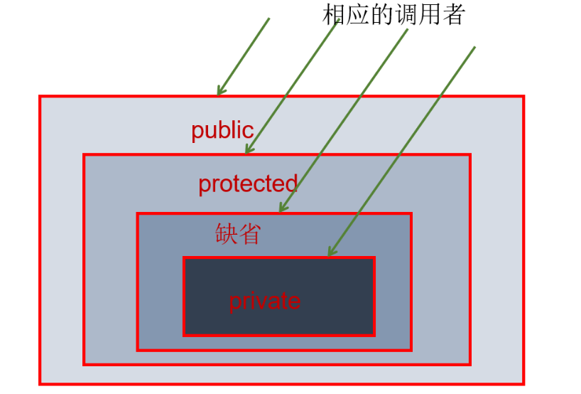

## 理解类成员 - static

> **成员：**
> 
> 1. 成员**变量**（属性）
> 2. 成员**方法**
> 
> 如何使用 `static`** **关键字创建属于类而非类实例的字段和方法
> 
> - 如果权限允许，直接可以 `类.static成员`
> - static是全对象共享的

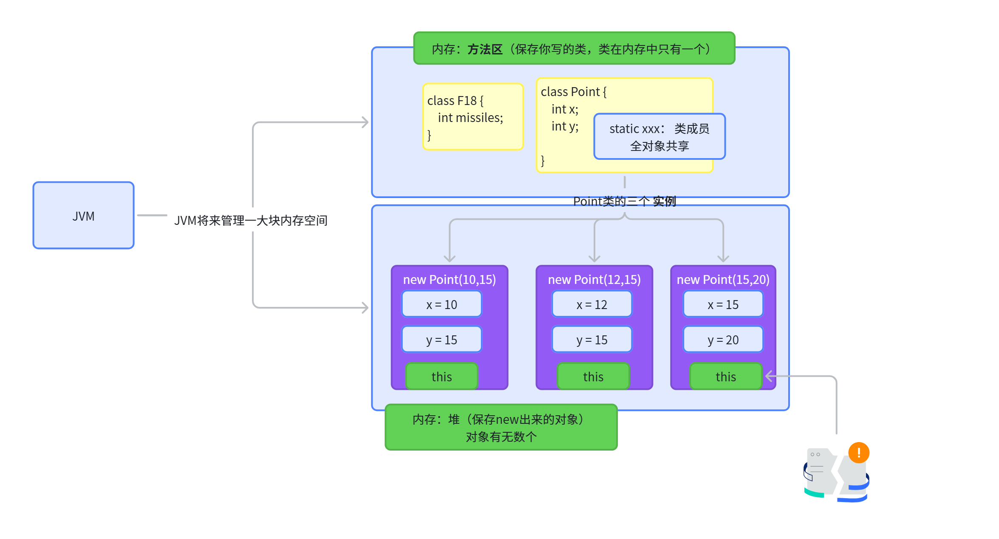

### 类变量

- 当从同一个类中创建多个对象时，每个对象都拥有各自独立的实例变量副本。
- 有时，我们希望拥有**所有对象****共有****的变量**。这可以通过`static`修饰符实现。
  - 使用`static`**修饰符**的字段称为**静态属性**或**类变量**。
  - 它们与类相关联，而非与任何特定对象关联。
  - 类的每个实例共享同一个类变量，该变量位于内存中的固定位置。
  - 任何对象都可以更改类变量的值，但即使**不创建类的实例也能操作类变量**。

```java
public class F18Hornet {

    private String callSign;
    private  int speed;
    private  int missiles = 4;
    private  boolean isAirborne;
    private  static int numberOfF18;
}
```

**访问静态属性：**  `对象.numberOfF18` 或者 `类.numberOfF18`需要**注意权限**

### 类方法

> Java 编程语言不仅支持静态变量，还支持静态方法。静态方法在其声明中使用`static`修饰符，应当通过类名直接调用，无需创建类的实例

```java
private static int numberOfF18Hornet = 0; //静态变量： 所有飞机共享的变量

public static int getNumberOfF18Hornet() {
    return numberOfF18Hornet;
}
```

调用方式：

1. `类名.methodName(args)`：推荐
2. `对象名.methodName(args)`：不推荐

### 几种情况

1. **实例方法**可以直接访问**实例变量**和**实例方法**。
2. **实例方法**可以直接访问**类变量**和**类方法**
3. **类方法**可以直接访问**类变量**和**类方法**。
4. **类方法不能**直接**访问实例变量**或**实例方法**——必须使用对象引用。此外，**类方法不能使用 **`this`** 关键字**，因为没有实例供 `this` 引用。

## 属性初始化

> 我们可以直接在属性声明的时候，初始化默认值。但是如果初始化是一个复杂逻辑，比如需要用for循环，顺序填充10个数。这样写起来就麻烦

```java
public class BedAndBreakfast {

    // initialize to 10
    public static int capacity = 10;

    // initialize to false
    private boolean full = false;
}
```

### **静态初始化块**

> 静态初始化块是一个用大括号 `{ }` 包围的普通代码块，前面带有 `static` 关键字。下面是一个示例：

```java
static {
    // whatever code is needed for initialization goes here
}
```

1. 一个类可以拥有任意数量的静态初始化块，并且它们可以出现在类体中的任何位置。运行时系统保证静态初始化块按照它们在源代码中出现的顺序被调用。
2. 静态块还有一种替代方案——你可以编写一个私有静态方法：

```java
class Whatever {
    public static varType myVar = initializeClassVariable();
        
    private static varType initializeClassVariable() {
        // initialization code goes here
    }
}
```

### **初始化实例成员（动态初始化块）**

```java
{
    // whatever code is needed for initialization goes here
}
```

> Java 编译器会将初始化块复制到每个构造函数中。因此，这种方法可用于在多个构造函数之间共享代码块。

替代方案：**final 方法不能在子类中被重写（后来说）**。以下是一个使用 final 方法初始化实例变量的示例：

```java
class Whatever {
    private varType myVar = initializeInstanceVariable();
        
    protected final varType initializeInstanceVariable() {

        // initialization code goes here
    }
}
```

### 执行顺序验证

1. 静态代码块、动态代码块、构造器的执行顺序，以及执行时机
2. 静态变量初始化和静态代码块初始化哪个先执行？

```java
static { System.out.println(staticVar); } // 输出 0（未赋值）
static int staticVar = 1;
```

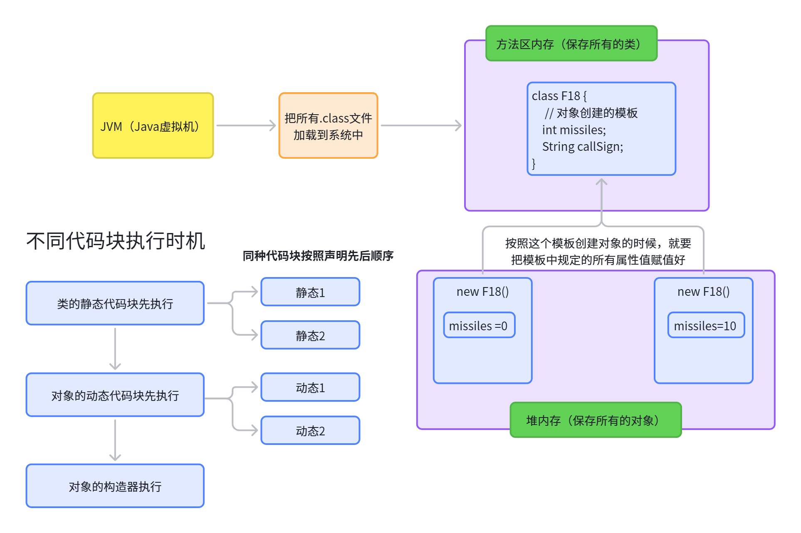

# OOP三大特性 - 封装

## 封装的概念

> 所谓**封装**，就是把客观事物封装成抽象概念的类，并且类可以把自己的数据和方法只向可信的类或者对象开放，向没必要开放的类或者对象隐藏信息。
> 
> **通俗的讲，把该****隐藏的隐藏起来****，****该暴露的暴露出来****。这就是封装性的设计思想。**

- 我要用**洗衣机**，只需要按一下开关和洗涤模式就可以了。有必要了解洗衣机内部的结构吗？有必要碰电动机吗？
- 我要开**车**，我不需要懂离合、油门、制动等原理和维修也可以驾驶。
- 客观世界里每一个事物的内部信息都隐藏在其内部，外界无法直接操作和修改，只能通过指定的方式进行访问和修改。

**随着我们系统越来越复杂，类会越来越多**，那么类之间的访问边界必须把握好，面向对象的开发原则要遵循“`高内聚、低耦合`”。

> **高内聚**、**低耦合**是软件工程中的概念，也是UNIX 操作系统设计的经典原则。
> 
> 1. 内聚，指一个模块内各个元素彼此结合的紧密程度；
> 2. 耦合指一个软件结构内不同模块之间互连程度的度量。
> 3. **内聚**意味着**重用和独立**，**耦合**意味着多米诺效应牵一发动全身。

而“高内聚，低耦合”的体现之一：

- `高内聚`：类的内部数据操作细节自己完成，不允许外部干涉；
- `低耦合`：仅暴露少量的方法给外部使用，尽量方便外部调用。

## 封装性体现 - 权限

- 实现封装就是控制**类**或**成员**的**可见性范围**。这就需要依赖访问控制修饰符，也称为权限修饰符来控制。
- 权限修饰符：`public`、`protected`、`缺省`、`private`。具体访问范围如下：

## 封装性体现 - 私有化

> **概述：私有化类的成员变量，提供公共的get和set方法，对外暴露获取和修改属性的功能。**

```java
public class Person {
    private String name;
    private int age;
    private boolean marry;

    public void setName(String n) {
        name = n;
    }

    public String getName() {
        return name;
    }

    public void setAge(int a) {
        age = a;
    }

    public int getAge() {
        return age;
    }
    
    public void setMarry(boolean m){
        marry = m;
    }
    
    public boolean isMarry(){
        return marry;
    }
}
```

> **如果类里面的方法不想对外暴露，也可以私有化**

 

## JavaBean

> 专门用来**封装数据的 Java类**。也叫 **POJO**（**Plain Old Java Object 又普通又老的对象**）**简单Java对象**


```java
public class Book {
   private String author;
   private String name;
   
   public void setAuthor(String author){
      this.author = author;
   }
   public void setName(String name){
      this.name = name;
   }
   
   public void getAuthor(){
       return this.author;
   }
   
    public void getName(){
       return this.name;
   }
}
```

# OOP三大特性 - 继承

**A 继承 B**:  **B**派**生A**

- A是B的子类
- B是A的父类，超类

## 继承

### 定义继承

> 在 Java 语言中，类可以从其他类派生，从而继承那些类的字段和方法。
> 
> **定义：**从另一个类派生出的类称为子类（也称为派生类、扩展类或子类）。子类所派生的那个类称为超类（也称为基类或父类）。 **父派生子，子继承父**
> 
> 注意：
> 
> 1. 除了**没有超类的** `Object`** 之外**，**每个类都有一个且仅有一个直接超类（单继承）**。在没有其他显式超类的情况下，**每个类都隐式地是 **`Object`** 的子类。**
> 2. 类可以从其他类派生，而这些类又可以从另外的类派生，如此层层递进，**最终都源自最顶层的类 **`Object`** **。这样的类被称为继承链中所有类的后代，一直追溯到 `Object` 。

### Java平台继承体系

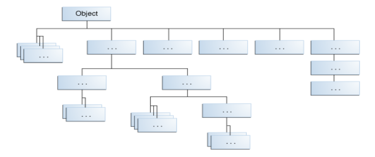

**万物起源 Object**

### 继承 - extends

```typescript
// 父类：Animal（动物基类）
public class Animal {
    // 公共属性（protected 允许子类直接访问）
    protected String name;

    // 父类构造方法
    public Animal(String name) {
        this.name = name;
    }

    // 公共方法（子类可继承）
    public void eat() {
        System.out.println(name + "正在吃东西...");
    }
}

// 子类1：Dog（继承自Animal）
class Dog extends Animal { // 使用 extends 实现继承
    // 子类特有属性
    private String breed;

    // 子类构造方法（必须调用父类构造方法）
    public Dog(String name, String breed) {
        super(name); // 调用父类构造方法（必须放在第一行）
        this.breed = breed;
    }

    // 子类特有方法
    public void bark() {
        System.out.println(name + "（品种：" + breed + "）在汪汪叫！");
    }

    // 方法重写（Override父类的eat方法）
    @Override
    public void eat() {
        super.eat(); // 调用父类方法
        System.out.println(name + "正在啃骨头！");
    }
}

// 子类2：Cat（继承自Animal）
class Cat extends Animal {
    public Cat(String name) {
        super(name);
    }

    // 重写父类方法
    @Override
    public void eat() {
        System.out.println(name + "正在吃鱼！");
    }
}

// 测试类
public class InheritanceDemo {
    public static void main(String[] args) {
        // 创建子类对象
        Dog myDog = new Dog("小黑", "哈士奇");
        Cat myCat = new Cat("小花");

        // 调用继承自父类的方法
        myDog.eat(); // 输出：小黑正在吃东西...\n小黑正在啃骨头！
        myCat.eat(); // 输出：小花正在吃鱼！

        // 调用子类特有方法
        myDog.bark(); // 输出：小黑（品种：哈士奇）在汪汪叫！

        // 多态示例：父类引用指向子类对象
        Animal animal1 = new Dog("大黄", "金毛");
        Animal animal2 = new Cat("小白");
        animal1.eat(); // 输出：大黄正在吃东西...\n大黄正在啃骨头！
        animal2.eat(); // 输出：小白正在吃鱼！
    }
}
```

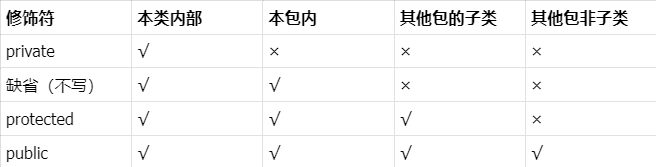

### 子类可以做什么

1. 继承的字段可以像其他字段一样直接使用。
2. 你可以在子类中声明一个与父类同名的**字段**，从而隐藏它（不推荐这样做）。
  1. 就近原则，同名的时候子类用自己的属性
3. 你可以在**子类**中声明**父类**中**没有的新字段**。
4. 继承的方法可以直接使用，无需修改。
5. 你可以在**子类**中编写一个与**父类**中具有**相同签名**的新**实例方法**，从而**覆盖【重写】**（**override**）它。
  1. 对象.方法名()： 实例方法
6. 你可以在子类中编写一个与父类中具有相同签名的新**静态方法**，从而隐藏（hide）它。
  1. 类.方法名()：静态方法，需要有 static 关键字
7. 你可以在**子类**中声明**父类**中没有的**新方法**。
8. 你可以编写一个**子类构造函数**，隐式地或通过使用关键字 `super` 来调用超类的构造函数。

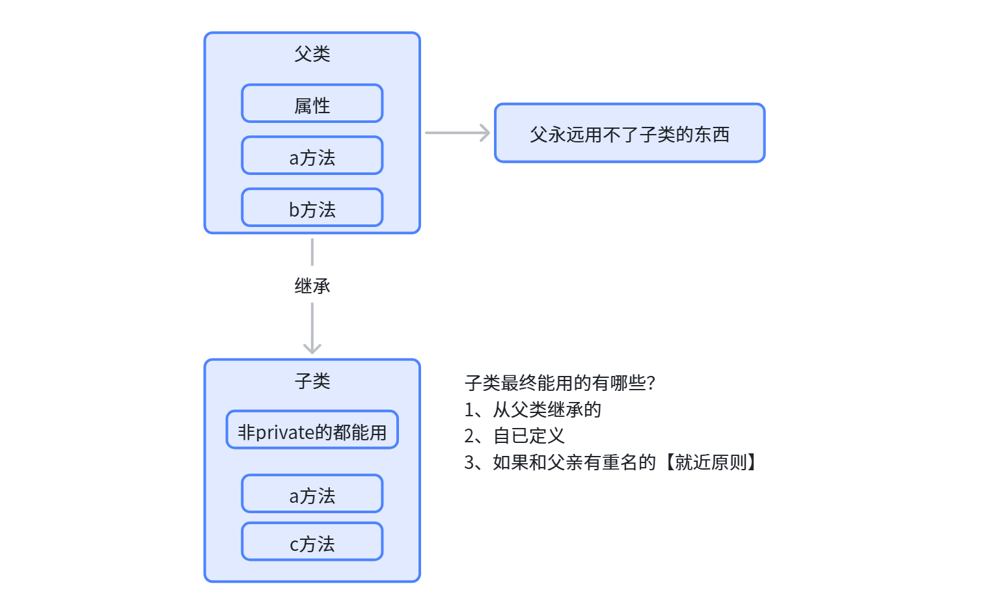

### **超类(SuperClass)中的私有成员**

1. **子类不会继承父类的私有成员**。然而，**如果超类拥有**用于访问其私有字段的公共或受保护**方法**，**子类同样可以使用这些方法**。
2. **嵌套类**可以访问其**封闭类**的所有**私有成员**——包括**字段和方法**。因此，**被子类继承**的公共或受保护**嵌套类**能够间接访问超类的所有私有成员。

### 对象转换

**隐式转换**

> **类型转换**展示了在**继承**和**实现**允许的**对象之间**，使用**一种类型的对象****替代****另一种类型**。例如，如果我们编写`Object obj = new Dog();`那么 `obj` 既是 `Object` 也是 `Dog`; 这被称为隐式转换(向上转型)。

**强制类型转换**

> 1. `Dog dog = obj;`会得到一个编译时错误，因为编译器不知道 `obj` 是一个 `MountainBike` 。我们可以通过显式类型转换告诉编译器我们承诺将 `MountainBike` 赋值给 `obj` ：`MountainBike myBike = (MountainBike)obj;`
> 2. 此类型转换会在运行时插入检查，确保 `obj` 被赋值为 `MountainBike` ，这样编译器就能安全地假设 `obj` 是一个 `MountainBike` 。如果在运行时 `obj` 不是 `MountainBike` ，将会抛出异常。

注意：可以使用 `instanceof` 运算符对特定对象的类型进行逻辑测试。这可以避免因不正确的类型转换而导致的运行时错误。例如：

```java
if (obj instanceof MountainBike) {
    MountainBike myBike = (MountainBike)obj;
}
```

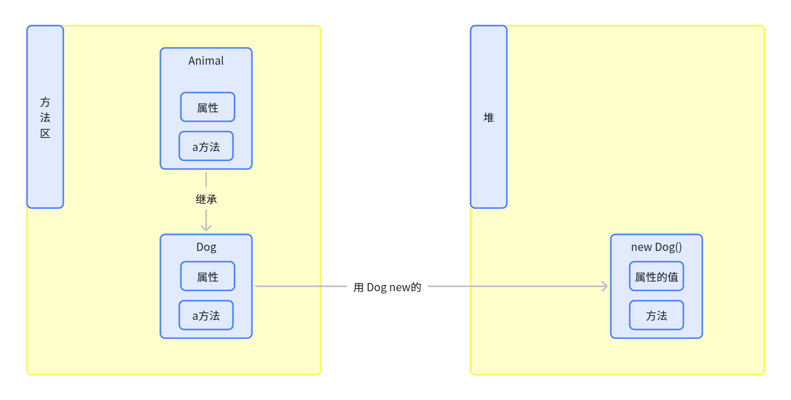

## 接口VS类

1. **类**和**接口**之间的一个**显著区别**是**类可以拥有字段**，**而接口不能**。
2. 你可以**实例化一个类**来**创建对象**，**但接口则不行**。
3. 对象将其状态存储在字段中，而这些字段是在类中定义的。
4. **Java 编程语言不允许**你**继承多个类**的原因之一是为了**避免状态多重继承的问题**，即从多个类继承字段的能力。

> 假设你能够定义一个扩展多个类的新类。当你通过实例化该类来创建对象时，该对象将从所有父类继承字段。如果来自不同父类的方法或构造函数实例化了相同的字段，会发生什么？哪个方法或构造函数将优先？由于接口不包含字段，你不必担心由状态多重继承导致的问题。

## Override(重写) 和 Hidden(隐藏)

### 实例方法

> 1. **子类**中**具有相同签名**（名称、参数数量和类型）和**返回类型**的**实例方法**会**重写(Override)超类**中的**实例方法**。
> 2. **重写方法**与被重写方法具有相同的名称、参数数量和类型以及返回类型。**重写方法**还可以**返回被重写方法返回类型的子类型**，这种子类型称为**可变返回类型**。
> 3. 在**重写方法**时，你可能想使用 `@Override` 注解来指示编译器你打算重写超类中的方法。如果出于某些原因，编译器检测到该方法在超类中不存在，那么它将生成一个错误。

### 静态方法

> 如果子类定义了一个与父类中静态方法具有相同签名的静态方法，那么子类中的方法将隐藏父类中的方法

```typescript
public class Animal {
    public static void testClassMethod() {
        System.out.println("The static method in Animal");
    }
    public void testInstanceMethod() {
        System.out.println("The instance method in Animal");
    }
}
```

```typescript
public class Cat extends Animal {
    // 隐藏
    public static void testClassMethod() {
        System.out.println("The static method in Cat");
    }
    // 重写
    public void testInstanceMethod() {
        System.out.println("The instance method in Cat");
    }

    public static void main(String[] args) {
        Cat myCat = new Cat();
        Animal myAnimal = myCat;
        Animal.testClassMethod();
        myAnimal.testInstanceMethod();
    }
}
```

`Cat` 类重写了 `Animal` 中的实例方法，并隐藏了 `Animal` 中的静态方法。该类中的 `main` 方法创建了 `Cat` 的实例；

- 在类上调用 `testClassMethod()` 
- 在实例上调用 `testInstanceMethod()` 。


```java
输出：
The static method in Animal
The instance method in Cat
```

结论：

1. 被调用的**隐藏静态方法**是**超类中的版本**，而被调用的**重写实例方法**则是**子类中的版本**。
2. 如果测试 myCat、myAnimal 分别调用类方法与实例方法，均需遵守就近原则，调用自己的

### 注意区分重写(Override)和重载(Overload)

**重写：****父子类之间**，子类与父类同签名方法

**重载：****本类内部**，多个同名方法，参数列表不同

### 接口方法

接口中的**默认方法**和**抽象方法**像实例方法一样被继承。然而，当类或接口的超类型提供了多个具有相同签名的默认方法时，Java 编译器会遵循继承规则来解决命名冲突。这些规则由以下两个原则驱动：

#### 1. 实例方法优先于接口默认方法

```typescript
public class Horse {
    public String identifyMyself() {
        return "I am a horse.";
    }
}
public interface Flyer {
    default public String identifyMyself() {
        return "I am able to fly.";
    }
}
public interface Mythical {
    default public String identifyMyself() {
        return "I am a mythical creature.";
    }
}
public class Pegasus extends Horse implements Flyer, Mythical {
    public static void main(String... args) {
        Pegasus myApp = new Pegasus();
        System.out.println(myApp.identifyMyself()); // I am a horse.
    }
}
```

#### 已经被其他候选方法覆盖的方法将被忽略。

当超类型(父类)共享一个共同祖先时，可能会出现这种情况。

```typescript
public interface Animal {
    default public String identifyMyself() {
        return "I am an animal.";
    }
}
public interface EggLayer extends Animal {
    default public String identifyMyself() {
        return "I am able to lay eggs.";
    }
}
public interface FireBreather extends Animal { 
}

public class Dragon implements EggLayer, FireBreather {
    public static void main (String... args) {
        Dragon myApp = new Dragon();
        System.out.println(myApp.identifyMyself()); // I am able to lay eggs
    }
}
```

注意：从类继承的实例方法可以覆盖抽象接口方法。考虑以下接口和类：

```typescript
public interface Mammal {
    String identifyMyself();
}
public class Horse {
    public String identifyMyself() {
        return "I am a horse.";
    }
}
public class Mustang extends Horse implements Mammal {
    public static void main(String... args) {
        Mustang myApp = new Mustang();
        System.out.println(myApp.identifyMyself()); // I am a horse.
    }
}
```

> 重要：**接口中的静态方法永远不会被继承。**

**特别的**：**在子类中，可以重载从父类继承的方法。**这类重载方法既不会隐藏也不会覆盖父类的实例方法——它们是**子类独有的新方法**。

**【就近原则】**

## 隐藏字段

> 在类中，**与父类字段同名的字段会隐藏父类的字段**，即使它们的类型不同。在子类中，无法通过简单名称引用父类的字段，而必须通过 `super` 来访问（这将在下一节中介绍）。通常来说，我们不建议隐藏字段，因为这会使代码难以阅读。

## Super 关键字

### 访问父类成员

```typescript
public class Superclass {

    public void printMethod() {
        System.out.println("Printed in Superclass.");
    }
}
```

```typescript
public class Subclass extends Superclass {

    // overrides printMethod in Superclass
    public void printMethod() {
        super.printMethod();
        System.out.println("Printed in Subclass");
    }
    public static void main(String[] args) {
        Subclass s = new Subclass();
        s.printMethod();    
    }
}
```

### 访问父类构造器

```java
public MountainBike(int startHeight, 
                    int startCadence,
                    int startSpeed,
                    int startGear) {
    super(startCadence, startSpeed, startGear);
    seatHeight = startHeight;
}   
```

语法：

1. super()：父类无参构造器
2. super(参数列表)：父类有参构造器

## final 关键字

在 Java 中，`final` 是一个关键字，用于表示某个实体（变量、方法、类等）的 **不可修改性**。

### **修饰方法：禁止重写**

> **修饰方法：禁止重写；**在方法声明中使用`final`关键字表示**该方法不能被子类重写**。
> 
>   - 父类的 `final` 方法不能被子类重写。
>   - 常用于保护关键逻辑不被篡改。

```java
class Parent {
    public final void criticalMethod() {
        System.out.println("不可重写的方法");
    }
}

class Child extends Parent {
    // @Override // ❌ 编译错误：不能重写 final 方法
    // public void criticalMethod() { ... }
}
```

### **修饰变量：不可变的值或引用**

> **修饰变量：不可变的值或引用**
> 
>   - **基本类型变量**：值不可修改。
>   - **引用类型变量**：引用不可修改（但对象内部状态可能可变）。

```java
// 示例 1：基本类型
final int age = 25;
// age = 30; // ❌ 编译错误：不能修改 final 变量

// 示例 2：引用类型
final List<String> list = new ArrayList<>();
list.add("Java"); // ✅ 允许修改对象内容
// list = new ArrayList<>(); // ❌ 编译错误：不能修改引用
```

**final 变量初始化规则**：

- 必须在声明时或构造方法/代码块中初始化。（不能等用到的时候再赋值）
- 静态 final 变量（常量）通常声明为 `static final`：

```java
public static final double PI = 3.14159;
```

### 修饰类：不可被继承

> 修饰类：不可被继承
> 
> - `final` 类不能被其他类继承。
> - 常用于设计不可变类（如 `String`、`Integer`）。

```java
final class ImmutableClass {
    // 类内容
}

// class SubClass extends ImmutableClass {} // ❌ 编译错误
```

## abstract 关键字

### 抽象类

> `abstract class A {}`，可以被继承，但不能实例化

### 抽象方法

> 必须被子类重写

### 案例

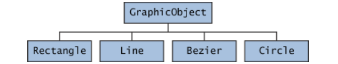

```java
abstract class GraphicObject {
    int x, y;
    
    void moveTo(int newX, int newY) {
        //移动逻辑
    }
    abstract void draw();
    abstract void resize();
}
```

```javascript
class Circle extends GraphicObject {
    void draw() {
    }
    void resize() {
    }
}
class Rectangle extends GraphicObject {
    void draw() {
    }
    void resize() {
    }
}
```

### 抽象类 vs 接口

```typescript
// 抽象类：表示一种抽象的动物类型（is-a关系）
abstract class Animal {
    protected String name;

    // 可以有构造方法
    public Animal(String name) {
        this.name = name;
    }

    // 抽象方法（必须被子类实现）
    public abstract void makeSound();

    // 具体方法（子类直接复用）
    public void sleep() {
        System.out.println(name + "正在睡觉...");
    }
}

// 子类必须实现抽象方法
class Dog extends Animal {
    public Dog(String name) {
        super(name);
    }

    @Override
    public void makeSound() {
        System.out.println(name + "汪汪叫！");
    }
}
```

```typescript
// 接口：定义一种能力（can-do）
interface Swimmable {
    // 常量（默认public static final）
    int MAX_DEPTH = 100;

    // 抽象方法（Java 8+ 前必须实现）
    void swim();

    // 默认方法（Java 8+，子类可选重写）
    default void floatOnWater() {
        System.out.println("漂浮在水面上");
    }

    // 静态方法（Java 8+，直接通过接口调用）
    static void showMaxDepth() {
        System.out.println("最大深度：" + MAX_DEPTH);
    }
}

// 实现接口的类
class Duck implements Swimmable {
    @Override
    public void swim() {
        System.out.println("鸭子在游泳");
    }
}
```

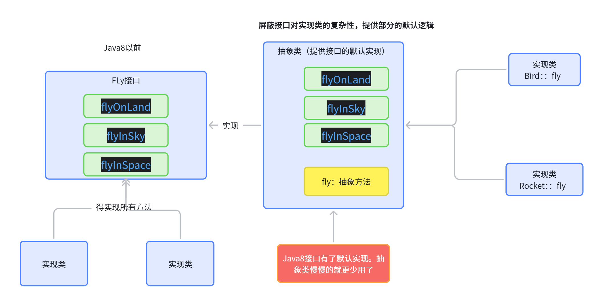

## 他细节 - 初始化顺序

### 单个类

```typescript
public class A {
    // 静态变量初始化
    static int staticVar = staticInit("静态变量");
    
    // 静态初始化块
    static { staticInit("静态初始化块"); }
    
    // 实例变量初始化
    int instanceVar = instanceInit("实例变量");
    
    // 实例初始化块
    { instanceInit("实例初始化块"); }
    
    // 构造器
    public A() { System.out.println("构造器"); }
    
    // 静态初始化方法
    static void staticInit(String source) {
        System.out.println("静态初始化：" + source);
    }
    
    // 实例初始化方法
    int instanceInit(String source) {
        System.out.println("实例初始化：" + source);
        return 0;
    }
}
```

> 输出结果：
> 
> > 静态初始化：静态变量
> > 
> > 静态初始化：静态初始化块
> > 
> > 实例初始化：实例变量
> > 
> > 实例初始化：实例初始化块
> > 
> > 构造器

执行顺序​（创建 `A` 的实例时）：

1. 静态成员初始化​：
按代码中的声明顺序执行：
`staticVar` → `static` 块。
2. 实例成员初始化​：
按代码中的声明顺序执行：
`instanceVar` → 实例块。
3. 构造器​：
最后执行构造器中的代码。

### 继承中的初始化

```java
class Parent {
    static { System.out.println("Parent静态块"); }
    { System.out.println("Parent实例块"); }
    public Parent() { System.out.println("Parent构造器"); }
}

class Child extends Parent {
    static { System.out.println("Child静态块"); }
    { System.out.println("Child实例块"); }
    public Child() { System.out.println("Child构造器"); }
}
```

> 输出结果
> 
> > Parent静态块
> > 
> > Child静态块
> > 
> > Parent实例块
> > 
> > Parent构造器
> > 
> > Child实例块
> > 
> > Child构造器

执行顺序​（创建 `Child` 的实例时）：

1. 父类静态初始化​：
`Parent` 的静态块 → `Child` 的静态块。
2. 父类实例初始化​：
`Parent` 的实例块 → `Parent` 的构造器。
3. 子类实例初始化​：
`Child` 的实例块 → `Child` 的构造器。

### 规律总结

1. **静态优先于实例​**：
静态初始化（变量、块）在类加载时执行，且仅执行一次。
2. **父类优先于子类**​：
在继承链中，父类的静态/实例初始化先于子类。
3. **代码顺序决定细节**​：
同一类中，静态/实例变量和块的执行顺序由代码中的声明顺序决定。
4. **构造器最后执行​**：
实例初始化和实例块在构造器代码之前执行。

### 常见误区

- **静态变量的顺序陷阱​**：如果静态变量定义在静态块之后，初始化顺序会不同（可能导致空指针）：

```java
static { System.out.println(staticVar); } // 输出 0（未赋值）
static int staticVar = 1;
```

- **隐式调用父类构造器**​：子类构造器默认会调用父类的无参构造器（`super()`），若父类没有无参构造器，需显式调用 `super(...)`。

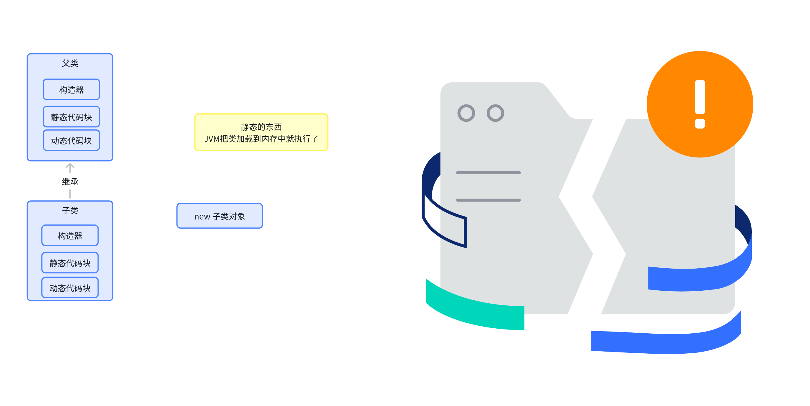

## Object的所有方法

### toString()

**作用**​：返回对象的字符串表示，默认实现返回 `类名@哈希码`（如 `Person@1b6d3586`）。

**何时需要重写**：当需要更直观的调试信息或输出对象内容时。

```typescript
public class Person {
    private String name;
    private int age;

    // 构造方法、Getter/Setter 等省略...

    @Override
    public String toString() {
        return "Person{name='" + name + "', age=" + age + "}";
    }
}
```

```java
Person p = new Person("Alice", 30);
System.out.println(p); // 输出：Person{name='Alice', age=30}
```

### equals()

**作用**​：比较两个对象是否“逻辑相等”。默认实现用 `==` 比较内存地址（即是否为同一个对象）。

**何时需要重写**​：当需要根据对象的属性判断相等性时（例如：两个 `Person` 对象的 `name` 和 `age` 相同则视为相等）。

**正确重写步骤**：

1. 检查是否为同一对象（`if (this == o)`）。
2. 检查对象类型是否一致（`if (o == null || getClass() != o.getClass())`）。
3. 强制类型转换后逐个比较关键属性。

```typescript
@Override
public boolean equals(Object o) {
    if (this == o) return true;
    if (o == null || getClass() != o.getClass()) return false;
    Person person = (Person) o;
    return age == person.age && Objects.equals(name, person.name);
}
```

### hashCode()

**作用​：**返回对象的哈希码，用于哈希表（如 `HashMap`, `HashSet`）。默认实现返回对象内存地址的哈希值。

**何时需要重写​：**重写 `equals()` 后必须重写 `hashCode()`，确保相等的对象返回相同的哈希码（否则哈希表的行为会异常）。

**正确重写方式​：**对关键属性计算哈希值，通常使用 `Objects.hash()`。

```java
@Override
public int hashCode() {
    return Objects.hash(name, age); // 对 name 和 age 计算哈希值
}
```

# OOP三大特性 - 多态

多态性（**Polymorphism **）：生物学中定义多态是一个生物体可以有**多种形态**的存在。编程也如此，一个对象也可以有多种形态（类型）

> 多态是面向对象编程的核心概念之一，Java 中主要通过 **继承 + 方法重写 + 向上转型** 实现。它允许不同对象对同一消息做出不同响应，提高代码的灵活性和可扩展性。

1. **编译时多态（静态）**：方法重载（Overload）
2. **运行时多态（动态）**：方法重写（Override）

### 运行时多态（方法重写）

```typescript
// 父类
class Animal {
    public void makeSound() {
        System.out.println("动物发出声音");
    }
}

// 子类 Dog 重写方法
class Dog extends Animal {
    @Override
    public void makeSound() {
        System.out.println("汪汪汪！");
    }
    
    // 子类特有方法
    public void fetch() {
        System.out.println("狗狗捡回飞盘");
    }
}

// 子类 Cat 重写方法
class Cat extends Animal {
    @Override
    public void makeSound() {
        System.out.println("喵喵喵！");
    }
}

public class PolymorphismDemo {
    public static void main(String[] args) {
        // 向上转型：父类引用指向子类对象
        Animal animal1 = new Dog();
        Animal animal2 = new Cat();

        animal1.makeSound(); // 输出"汪汪汪！"（动态绑定到Dog的方法）
        animal2.makeSound(); // 输出"喵喵喵！"（动态绑定到Cat的方法）

        // animal1.fetch(); // 编译错误！父类引用无法调用子类特有方法
    }
}
```

**关键点：**

- **向上转型**：`Animal animal = new Dog();`
- **动态绑定**：JVM 在运行时根据对象实际类型决定调用哪个方法
- **限制**：父类引用无法直接调用子类特有方法（需向下转型）

### 编译时多态（方法重载）

同一类中方法名相同，参数列表不同：

```typescript
class Calculator {
    // 重载 add 方法
    public int add(int a, int b) {
        return a + b;
    }
    
    public double add(double a, double b) {
        return a + b;
    }
    
    public String add(String a, String b) {
        return a + b;
    }
}

public class OverloadDemo {
    public static void main(String[] args) {
        Calculator calc = new Calculator();
        System.out.println(calc.add(2, 3));       // 调用 int 版本，输出5
        System.out.println(calc.add(2.5, 3.5));   // 调用 double 版本，输出6.0
        System.out.println(calc.add("Hello", " World")); // 调用 String 版本，输出"Hello World"
    }
}
```

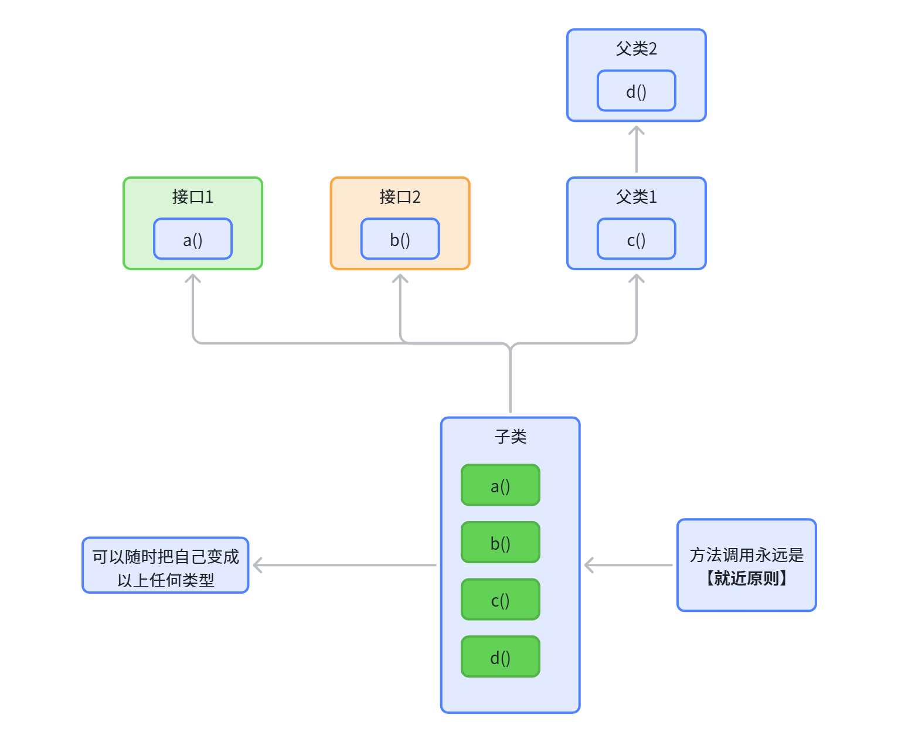

# 接口

## 定义接口

> 在 Java 中，接口（`interface`）是一种**定义抽象行为规范**的**引用类型**，它可以包含 **抽象方法**、**默认方法**、**静态方法**、**私有方法** 和 **常量**。以下是接口的完整定义规则和示例：

```typescript
[访问修饰符] interface 接口名 [extends 父接口1, 父接口2, ...] {
    // 常量（默认 public static final）
    数据类型 常量名 = 值;

    // 【抽象方法】（默认 public abstract）
    返回类型 方法名(参数列表);

    // 默认方法（Java 8+，有方法体）
    default 返回类型 方法名(参数列表) { ... }

    // 静态方法（Java 8+，有方法体）
    static 返回类型 方法名(参数列表) { ... }

    // 私有方法（Java 9+，只能在接口内部调用）
    private 返回类型 方法名(参数列表) { ... }
    private static 返回类型 方法名(参数列表) { ... }
}
```

## 接口详细规则

### 成员变量

**必须是常量​**：隐式修饰符为 `public static final`，声明时必须初始化。

```java
int MAX_VALUE = 100; // 等同于 public static final int MAX_VALUE = 100;
```

### 方法

#### 抽象方法

默认修饰符为 `public abstract`，没有方法体。

```java
void doSomething(); // 抽象方法  等同与 public abstract void doSomething();
```

#### 默认方法（Default Method）（Java 8+）

用 `default` 修饰，有方法体。用于扩展接口功能而不破坏已有实现类。

```java
default void log(String message) {
    System.out.println("日志: " + message);
}
```

#### 静态方法（Static Method）​​（Java 8+）：

用 `static` 修饰，有方法体。通过接口名直接调用。

```java
static void printVersion() {
    System.out.println("接口版本 1.0");
}
```

#### 私有方法（Private Method）​​（Java 9+）：

用 `private` 修饰，只能在接口内部调用，用于代码复用。

```typescript
private void internalProcess() { ... }
private static void staticInternalProcess() { ... }
```

### 访问权限

- 接口默认是包级访问权限，若需公开则用 `public` 修饰。
- 接口内部成员的访问修饰符可省略（如方法默认 `public`）。

## 示例

```java
// 定义接口
public interface Shape extends Drawable, Serializable {
    // 常量
    String DEFAULT_COLOR = "黑色";

    // 抽象方法
    double area();  // 计算面积

    // 默认方法（Java 8+）
    default void info() {
        System.out.println("形状的默认颜色是 " + DEFAULT_COLOR);
    }

    // 静态方法（Java 8+）
    static String getType() {
        return "几何形状";
    }

    // 私有方法（Java 9+）
    private void logCreation() {
        System.out.println("创建了一个形状");
    }
}

// 父接口1
interface Drawable {
    void draw();
}

// 父接口2
interface Serializable {
    void serialize();
}
```

## 接口实现

- 类通过 `implements` 实现接口，必须**重写**所有**抽象方法**。可以**同时实现多个接口**
- 默认方法可直接继承或选择性重写。
- 静态方法只能通过接口名调用。

```typescript
public class Circle implements Shape {
    private double radius;

    public Circle(double radius) {
        this.radius = radius;
    }

    @Override
    public double area() {
        return Math.PI * radius * radius;
    }

    @Override
    public void draw() {
        System.out.println("绘制圆形");
    }

    @Override
    public void serialize() {
        System.out.println("序列化圆形数据");
    }

    // 选择性重写默认方法
    @Override
    public void info() {
        System.out.println("圆形的颜色是 " + DEFAULT_COLOR);
    }
}
```

## 接口用途

1. 实现多继承​：Java 类只能单继承，但接口可以多实现。
2. 定义规范​：强制实现类遵循特定行为。
3. 解耦代码​：通过接口隔离实现细节（如策略模式、回调机制）。
4. Lambda 表达式支持​：函数式接口（仅一个抽象方法）是 Lambda 的基础。

# 嵌套类

Java 编程语言允许你在另一个类中定义一个类。这样的类被称为**嵌套类（也称为内部类）**，如下所示：

```java
class OuterClass {
    ...
    class NestedClass {
        ...
    }
}
```

**嵌套类分为两类：**

- 非静态：非静态嵌套类称为**内部类**
- 静态：声明为 `static` 的嵌套类称为**静态内部类**

**由于嵌套类是其外围类的成员：**

1. 非静态嵌套类（**内部类**）可以访问外围类的其他成员，即使这些成员被声明为 private。
2. **静态内部类类**则无法访问**外围类**的其他成员。
3. 作为外围类的成员，嵌套类可以被声明为 `private` 、 `public` 、 `protected` 或包私有。（请注意，外围类只能被声明为 `public` 或包私有。）

> 为什么使用嵌套类？
> 
> 1. **逻辑分组与隔离的体现**：如果一个类仅对另一个类有用，那么将其嵌入该类中并保持两者在一起是合乎逻辑的。
> 2. **增强封装性**：考虑两个顶级类 A 和 B，其中 B 需要访问 A 的成员，而这些成员原本会被声明为 `private` 。通过将类 B 隐藏在类 A 内部，A 的成员可以声明为 private，而 B 可以访问它们。此外，**B 本身**也可以**对外部世界隐藏**。
> 3. **带来更具可读性和可维护性的代码**：将小型类嵌套在顶级类中，使代码更靠近其使用位置。

## 内部类

> 1. 与实例方法和变量一样，内部类与其外围类的实例相关联，并可以直接访问该对象的方法和字段。
> 2. 由于**内部类**与**实例相关联**，它**本身****不能定义****任何****静态成员**。

```java
class OuterClass {
    ...
    class InnerClass {
        ...
    }
}
```

创建内部类对象

```java
OuterClass outerObject = new OuterClass();
OuterClass.InnerClass innerObject = outerObject.new InnerClass();
```

> 有两种**特殊类型**的**内部类**：**局部类**和**匿名类**。

### 局部类

> **局部类是在方法、构造器或初始化块内部定义的类，作用域仅限于定义它的代码块内。**

**语法规则**

- 不能使用访问修饰符（如 `public`, `private`）修饰局部类。
- 可以访问外部类的成员（包括私有成员）。
- 访问所在作用域的局部变量时，变量必须是 `final` 或 有效的 final​（即实际不可变）。
- 局部类可以有构造器、实例变量和实例方法，但不能有静态成员（除非是编译时常量）。

```typescript
public class Outer {
    private String outerField = "外部类字段";

    public void method() {
        final String localVar = "局部变量";
        
        // 局部类定义
        class LocalClass {
            public void print() {
                System.out.println(outerField); // 访问外部类成员
                System.out.println(localVar);    // 访问局部变量（必须为final或有效的final）
            }
        }

        // 实例化并使用局部类
        LocalClass obj = new LocalClass();
        obj.print();
    }

    public static void main(String[] args) {
        new Outer().method();
    }
}
```

### 匿名内部类

> 匿名内部类是没有显式类名的内部类，通常用于直接实现接口或继承类，并重写方法。

**语法规则**

- 直接通过 `new` 关键字创建实例，后跟**接口**或**父类的构造器**。
- 可以访问外部类的成员，但**局部变量**必须是 `final` 或有效的 `final`。
- 不能**定义静态成员**，**也不能显式编写构造器**。
- **通常用于简化一次性使用的类的实现**。

```typescript
public class Outer {
    private String outerField = "外部类字段";

    public void method() {
        final String localVar = "局部变量";

        // 匿名内部类实现Runnable接口
        Runnable runnable = new Runnable() {
            @Override
            public void run() {
                System.out.println(outerField); // 访问外部类成员
                System.out.println(localVar);    // 访问局部变量（必须为final或有效的final）
            }
        };

        new Thread(runnable).start();
    }

    public static void main(String[] args) {
        new Outer().method();
    }
}
```

### 局部类 vs 匿名内部类

关键规则：

1. **局部变量必须是**** ****final 或有效的 final**

> 无论是局部类还是匿名内部类，访问所在作用域的局部变量时，变量必须不可变。
> 
> 例如以下代码会报错：

```java
public void method() {
    String localVar = "局部变量";
    localVar = "修改后的值";  // 破坏有效final性
    Runnable r = () -> System.out.println(localVar); // 编译错误！
}
```

1. 访问外部成员：两者都可以直接访问外部类的成员（包括 `private` 成员）。

## 静态内部类

```java
class OuterClass {
    ...
    static class InnerClass {
        ... // 不能直接引用 外部类的实例方法或属性，但可以使用静态方法或属性
    }
}
```

> 实例化静态嵌套类的方式与顶级类相同：
> 
> `StaticNestedClass staticNestedObject = new StaticNestedClass();`

> **OuterClass.java**

```java
public class OuterClass {

    String outerField = "Outer field";
    static String staticOuterField = "Static outer field";

    class InnerClass {
        void accessMembers() {
            System.out.println(outerField);
            System.out.println(staticOuterField);
        }
    }

    static class StaticNestedClass {
        void accessMembers(OuterClass outer) {
            // Compiler error: Cannot make a static reference to the non-static
            //     field outerField
            // System.out.println(outerField);  //思考如何访问
            System.out.println(outer.outerField);
            System.out.println(staticOuterField);
        }
    }

    public static void main(String[] args) {
        System.out.println("Inner class:");
        System.out.println("------------");
        OuterClass outerObject = new OuterClass();
        OuterClass.InnerClass innerObject = outerObject.new InnerClass();
        innerObject.accessMembers();

        System.out.println("\nStatic nested class:");
        System.out.println("--------------------");
        StaticNestedClass staticNestedObject = new StaticNestedClass();        
        staticNestedObject.accessMembers(outerObject);
        
        System.out.println("\nTop-level class:");
        System.out.println("--------------------");
        TopLevelClass topLevelObject = new TopLevelClass();        
        topLevelObject.accessMembers(outerObject);                
    }
}
```

> **TopLevelClass.java**

```typescript
public class TopLevelClass {

    void accessMembers(OuterClass outer) {     
        // Compiler error: Cannot make a static reference to the non-static
        //     field OuterClass.outerField
        // System.out.println(OuterClass.outerField);
        System.out.println(outer.outerField);
        System.out.println(OuterClass.staticOuterField);
    }  
}
```

## 变量遮蔽

> 如果在特定作用域（如内部类或方法定义）中的类型声明（如成员变量或参数名称）与外围作用域中的另一个声明同名，则该声明会**遮蔽外围作用域**的**声明**。仅通过名称无法引用被遮蔽的声明。

```java
public class ShadowTest {
    public int x = 0;

    class FirstLevel {
        public int x = 1;
        void methodInFirstLevel(int x) {
            System.out.println("x = " + x);
            System.out.println("this.x = " + this.x);
            System.out.println("ShadowTest.this.x = " + ShadowTest.this.x);
        }
    }

    public static void main(String... args) {
        ShadowTest st = new ShadowTest();
        ShadowTest.FirstLevel fl = st.new FirstLevel();
        fl.methodInFirstLevel(23);
    }
}
```

【就近原则】

## Lambda表达式

> 后面专题讲解； 简化写法

# 枚举

在 Java 中，枚举（Enum）是一种特殊的数据类型，用于定义一组固定的常量。

## 基础枚举

```java
// 定义星期枚举
public enum Day {
    MONDAY, 
    TUESDAY, 
    WEDNESDAY,
    THURSDAY, 
    FRIDAY, 
    SATURDAY, 
    SUNDAY
}

// 使用示例
Day today = Day.WEDNESDAY;
System.out.println("Today is: " + today); // 输出: Today is: WEDNESDAY
```

## 带字段和方法的枚举

```java
public enum Planet {
    // 枚举实例 + 自定义字段（质量、半径）
    MERCURY (3.303e+23, 2.4397e6),
    VENUS   (4.869e+24, 6.0518e6),
    EARTH   (5.976e+24, 6.3781e6);

    private final double mass;   // 质量（kg）
    private final double radius; // 半径（m）

    // 构造函数（自动私有）
    Planet(double mass, double radius) {
        this.mass = mass;
        this.radius = radius;
    }

    // 计算表面重力
    public double surfaceGravity() {
        return (6.67300e-11 * mass) / (radius * radius);
    }
}

// 使用示例
Planet earth = Planet.EARTH;
System.out.println("Earth gravity: " + earth.surfaceGravity());
```

## 在 Switch 中使用枚举

```typescript
public class EnumDemo {
    enum Season { SPRING, SUMMER, AUTUMN, WINTER }

    public static void main(String[] args) {
        Season current = Season.SUMMER;
        
        switch (current) {
            case SPRING:
                System.out.println("春暖花开");
                break;
            case SUMMER:
                System.out.println("夏日炎炎"); // 会执行这个分支
                break;
            case AUTUMN:
                System.out.println("秋高气爽");
                break;
            case WINTER:
                System.out.println("冬日雪飘");
        }
    }
}
```

## 遍历枚举值

```java
for (Day day : Day.values()) {
    System.out.println(day.ordinal() + ": " + day); 
    // 输出顺序索引和名称，如: 0: MONDAY
}
```

## 实现接口的枚举

```java
interface Operation {
    int compute(int a, int b);
}

enum Calculator implements Operation {
    ADD {
        public int compute(int a, int b) { return a + b; }
    },
    SUBTRACT {
        public int compute(int a, int b) { return a - b; }
    };
}

// 使用示例
int result = Calculator.ADD.compute(5, 3); // 得到 8
```

## valueOf

```java
public enum Day {
    MONDAY, TUESDAY, WEDNESDAY, THURSDAY, FRIDAY, SATURDAY, SUNDAY
}

// 使用 valueOf 转换
Day monday = Day.valueOf("MONDAY"); // ✅ 正确
System.out.println(monday); // 输出: MONDAY

// 错误示例
Day wrongDay = Day.valueOf("monday"); // ❌ 抛出 IllegalArgumentException（大小写敏感）
```