# 4. 常用类

# Number

>  `java.lang` 包中的 `Number` 类及其子类；

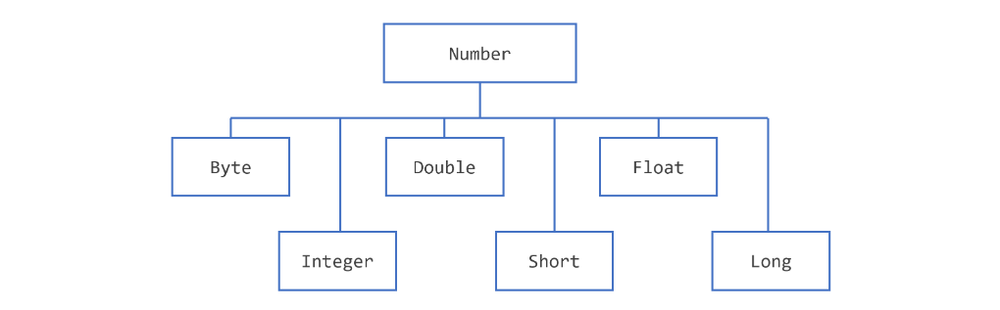

> *注意： *`Number`* 还有四个其他子类在此不作讨论。 *`BigDecimal`* 和 *`BigInteger`* 用于高精度计算。 *`AtomicInteger`* 和 *`AtomicLong`* 用于多线程应用程序。*
> 
> 以上称为**基本类型的****包装类型**

使用 `Number` 对象而非基本类型的原因：包装类型提供了对基本数据的更多操作方法，比如：

1. 快速获取**最大最小值**： `MIN_VALUE` 和 `MAX_VALUE`
2. 将值与字符串相互转换，并在数字系统（十进制、八进制、十六进制、二进制）之间进行转换

## 基本使用

### 获取原始基本类型值

```java
byte byteValue()
short shortValue()
int intValue()
long longValue()
float floatValue()
double doubleValue()
```

### 比较大小：

> 1. 返回0：两个相等
> 2. 返回正：前者大于后者
> 3. 返回负：前者小于后者

```java
int compareTo(Byte anotherByte)
int compareTo(Double anotherDouble)
int compareTo(Float anotherFloat)
int compareTo(Integer anotherInteger)
int compareTo(Long anotherLong)
int compareTo(Short anotherShort)
boolean equals(Object obj)
```

### 进制转换与格式化

**以**`Integer`**类为例：其他 **`Long`**、**`Float `**等都是一样的**

| 方法 | 描述 |
| --- | --- |
| static Integer decode(String s) | 将字符串解码为整数。可以接受十进制、八进制或十六进制数字的字符串表示作为输入。 |
| static int parseInt(String s) | 返回一个整数（仅限十进制） |
| static int parseInt(String s, int radix) | 给定一个表示十进制、二进制、八进制或十六进制（radix分别为 10、2、8 或 16）数字的字符串作为输入，返回一个整数。 |
| String toString() | 返回一个表示此 Integer 值的 String 对象。 |
| static String toString(int i) | 返回一个表示指定整数的 String 对象 |
| static Integer valueOf(int i) | 返回一个 Integer 对象，其中包含指定基本类型的值 |
| static Integer valueOf(String s) | 返回一个 Integer 对象，该对象持有指定字符串表示形式的值 |
| static Integer valueOf(String s, int radix) | 返回一个 Integer 对象，该对象持有指定字符串表示的整数值，使用基数（radix）的值进行解析。例如，如果 s = "333"且 radix = 8，该方法将返回八进制数 333 对应的十进制整数等价物 |

> 注意 decode 规则：
> 
> 1. 前缀规则​：
>   - `0x`/`0X`：十六进制（如 `0x1A` → 26）
>   - `#`：十六进制（如 `#FF` → 255）
>   - `0` 开头且长度>1：八进制（如 `017` → 15）
>   - 其他：十进制（如 `123` → 123）

### 综合案例

```go
public static void main(String[] args) {
    // 1. 字符串转int
    int parsedInt = Integer.parseInt("456");
    System.out.println("parseInt(\"456\") → " + parsedInt);

    // 2. 字符串转Integer对象
    Integer value = Integer.valueOf("789");
    System.out.println("valueOf(\"789\") → " + value);

    // 3. int转字符串
    String intStr = Integer.toString(123);
    System.out.println("toString(123) → " + intStr);

    // 4. 比较两个数字
    int compareResult = Integer.compare(5, 10);
    System.out.println("compare(5,10) → " + compareResult + " (5<10)");

    // 5. 求和
    int sumResult = Integer.sum(3, 5);
    System.out.println("sum(3,5) → " + sumResult);

    // 6. 最大值/最小值
    System.out.println("max(10,20) → " + Integer.max(10, 20));
    System.out.println("min(10,20) → " + Integer.min(10, 20));

    // 7. 字节反转（十六进制展示）
    int reversedBytes = Integer.reverseBytes(0xAABBCCDD);
    System.out.println("reverseBytes(0xAABBCCDD) → 0x" +
            String.format("%08X", reversedBytes));

    // 8. 统计二进制1的个数
    System.out.println("bitCount(9) → " + Integer.bitCount(9) + " (9=1001)");

    // 9. 统计前导零
    System.out.println("numberOfLeadingZeros(8) → " +
            Integer.numberOfLeadingZeros(8) + " (8=000...1000)");

    // 10. 进制转换
    System.out.println("toBinaryString(15) → " + Integer.toBinaryString(15));
    System.out.println("toHexString(15) → " + Integer.toHexString(15));
    System.out.println("toOctalString(15) → " + Integer.toOctalString(15));

}
```

## 格式化输出

### 数字&日期格式化

| 转换器 | 标志 | 解释 |
| --- | --- | --- |
| d |   | 一个十进制整数 |
| f |   | 一个float类型浮点数 |
| n |   | 多平台兼容的换行符；建议使用 %n ，而不是 \n |
| tB |   | 日期和时间转换——特定于区域设置的月份全名。 |
| td, te |   | 日期和时间转换——月份的两位数日期。td 根据需要带有前导零，te 则不带。 |
| ty, tY |   | 日期和时间转换——ty = 2 位数年份，tY = 4 位数年份 |
| tl |   | 日期和时间转换——12 小时制的小时 |
| tM |   | 日期和时间转换——分钟以两位数表示，必要时补零 |
| tp |   | 日期和时间转换——特定于地区的 am/pm（小写） |
| tm |   | 日期和时间转换——月份以两位数表示，必要时带前导零 |
| tD |   | 日期和时间转换——日期格式为%tm%td%ty |
|   | 8 | 宽度为八个字符，必要时前导零补足 |
|   | + | 包括符号，无论正负 |
|   | , | 包含特定于区域设置的分组字符 |
|   | - | 左对齐 |
|   | 0.3 | 小数点后三位 |
|   | 10.3 | 宽度为十个字符，右对齐，小数点后保留三位 |

```java
import java.util.Calendar;
import java.util.Locale;

public class TestFormat {
    
    public static void main(String[] args) {
      long n = 461012;
      System.out.format("%d%n", n);      //  -->  "461012"
      System.out.format("%08d%n", n);    //  -->  "00461012"
      System.out.format("%+8d%n", n);    //  -->  " +461012"
      System.out.format("%,8d%n", n);    // -->  " 461,012"
      System.out.format("%+,8d%n%n", n); //  -->  "+461,012"
      
      double pi = Math.PI;

      System.out.format("%f%n", pi);       // -->  "3.141593"
      System.out.format("%.3f%n", pi);     // -->  "3.142"
      System.out.format("%10.3f%n", pi);   // -->  "     3.142"
      System.out.format("%-10.3f%n", pi);  // -->  "3.142"
      System.out.format(Locale.FRANCE,
                        "%-10.4f%n%n", pi); // -->  "3,1416"

      Calendar c = Calendar.getInstance();
      System.out.format("%tB %te, %tY%n", c, c, c); // -->  "May 29, 2006"

      System.out.format("%tl:%tM %tp%n", c, c, c);  // -->  "2:34 am"

      System.out.format("%tD%n", c);    // -->  "05/29/06"
    }
}

```

> 以上所有规则可以直接用于` String.format`

### 完整格式化规则

#### 常用转换符

| ​​转换符​​ | ​​适用类型​​ | ​​说明​​ |
| --- | --- | --- |
| %d | 整型（byte, short, int, long） | 十进制整数。 |
| %o | 整型 | 八进制。 |
| %x, %X | 整型 | 十六进制（小写/大写字母）。 |
| %f | 浮点型（float, double） | 十进制小数形式（默认6位小数）。 |
| %e, %E | 浮点型 | 科学计数法（如1.23e+05）。 |
| %g, %G | 浮点型 | 自动选择%f或%e（更紧凑形式）。 |
| %a, %A | 浮点型 | 十六进制浮点数（如0x1.fp3）。 |
| %c, %C | char | 单个字符（%C输出大写形式，如A→A）。 |
| %s, %S | String, Object | 字符串（%S将字符串转为大写，如"hello"→"HELLO"）。 |
| %b, %B | 任意类型 | 布尔值（非null对象输出true，null输出false；%B大写形式）。 |
| %h, %H | 任意类型 | 对象的哈希码（十六进制；%H大写）。 |
| %% | - | 输出%字符本身。 |
| %n | - | 插入换行符（平台无关）。 |

---

####  日期时间转换符（需配合`Date`或`Calendar`对象）​

| ​​转换符​​ | ​​示例​​ | ​​说明​​ |
| --- | --- | --- |
| %tY | 2023 | 四位年份。 |
| %ty | 23 | 两位年份。 |
| %tm | 7 | 两位月份（01-12）。 |
| %td | 15 | 两位日期（01-31）。 |
| %tH | 14 | 24小时制的小时（00-23）。 |
| %tM | 5 | 分钟（00-59）。 |
| %tS | 30 | 秒（00-60）。 |
| %tF | 45122 | %Y-%m-%d的简写形式。 |
| %tT | 0.5871527777777777 | %H:%M:%S的简写形式。 |

---

#### 标志符示例

- 对齐与填充
  - `%10d`：输出宽度10，右对齐（不足补空格）。
  - `%-10d`：左对齐。
  - `%05d`：用零填充（如`123`→`00123`）。
- 数值修饰
  - `%,d`：添加千位分隔符（如`1000000`→`1,000,000`）。
  - `%+.2f`：强制显示符号并保留两位小数（如`3.1415`→`+3.14`）。
- 字符串与浮点数精度
  - `%.3s`：截取字符串前3个字符（如`"hello"`→`"hel"`）。
  - `%5.2f`：总宽度5，保留两位小数（如`3.1415`→` 3.14`）。

### DecimalFormat 类

> 1. 可以使用 `java.text.DecimalFormat` 类来控制前导零和尾随零、前缀和后缀、分组（千位）分隔符以及小数分隔符的显示。
> 2. `DecimalFormat` 在数字格式化方面提供了极大的灵活性，但这可能会使您的代码更加复杂。

```java
import java.text.*;

public class DecimalFormatDemo {

   public static void customFormat(String pattern, double value ) {
      DecimalFormat myFormatter = new DecimalFormat(pattern);
      String output = myFormatter.format(value);
      System.out.println(value + "  " + pattern + "  " + output);
   }

   public static void main(String[] args) {

      customFormat("###,###.###", 123456.789);
      customFormat("###.##", 123456.789);
      customFormat("000000.000", 123.78);
      customFormat("$###,###.###", 12345.67);  
   }
}


```

> **输出结果：**
> 
> 123456.789  ###,###.###  123,456.789
> 
> 123456.789  ###.##  123456.79
> 
> 123.78  000000.000  000123.780
> 
> 12345.67  $###,###.###  $12,345.67

| Value | Pattern | Output | Explanation |
| --- | --- | --- | --- |
| 123456.789 | ###,###.### | 123456.789 | # 表示一个数字，逗号是分组分隔符的占位符，句点是小数点分隔符的占位符。 |
| 123456.789 | ###.## | 123456.79 | value 在小数点右侧有三位数字，但模式中只有两位。format 方法通过向上取整来处理此情况。 |
| 123.78 | 000000.000 | 123.78 | pattern 指定前导零和尾随零，因为使用了字符 0 而不是井号 (#)。 |
| 12345.67 | $###,###.### | 12345.67 | pattern 中的第一个字符是美元符号（ $ ）。请注意，它紧接在格式化 output 的最左侧数字之前。 |

## Math 数学类

> 1. Java 编程语言支持基本的算术运算，其算术运算符包括： `+` 、 `-` 、 `*` 、 `/` 和 `%` 。位于 `java.lang` 包中的 `Math` 类提供了用于执行更高级数学计算的方法和常量。
> 2. Math的所有方法都是静态方法，直接调用，无需创建对象

### 常量与基本方法

`Math.E` ，这是自然对数的底数

`Math.PI` ，即圆的周长与其直径的比率

### 绝对值

- `double abs(double d)`
- `float abs(float f)`
- `int abs(int i)`
- `long abs(long lng)`

### 四舍五入

- `double ceil(double d)` : 四舍五入。 12.18
- `double floor(double d)` : 向下取整。 12
- `double rint(double d)` : 最接近的整数。

### 比较大小

- `min`
- `max`

```c++
public class BasicMathDemo {
    public static void main(String[] args) {
        double a = -191.635;
        double b = 43.74;
        int c = 16, d = 45;

        System.out.printf("The absolute value " + "of %.3f is %.3f%n", 
                          a, Math.abs(a));

        System.out.printf("The ceiling of " + "%.2f is %.0f%n", 
                          b, Math.ceil(b));

        System.out.printf("The floor of " + "%.2f is %.0f%n", 
                          b, Math.floor(b));

        System.out.printf("The rint of %.2f " + "is %.0f%n", 
                          b, Math.rint(b));

        System.out.printf("The max of %d and " + "%d is %d%n",
                          c, d, Math.max(c, d));

        System.out.printf("The min of of %d " + "and %d is %d%n",
                          c, d, Math.min(c, d));
    }
}

```

### 指数和对数

- `double exp(double d)` : 返回自然对数的底数 e 的参数的幂次方。
- `double log(double d)` : 返回参数的自然对数。
- `double pow(double base, double exponent)` : 返回第一个参数的第二个参数次幂的值
- `double sqrt(double d)` : 返回参数的平方根

```c++
public class ExponentialDemo {
    public static void main(String[] args) {
        double x = 11.635;
        double y = 2.76;

        System.out.printf("The value of " + "e is %.4f%n",
                          Math.E);

        System.out.printf("exp(%.3f) " + "is %.3f%n",
                          x, Math.exp(x));

        System.out.printf("log(%.3f) is " + "%.3f%n",
                          x, Math.log(x));

        System.out.printf("pow(%.3f, %.3f) " + "is %.3f%n",
                          x, y, Math.pow(x, y));

        System.out.printf("sqrt(%.3f) is " + "%.3f%n",
                          x, Math.sqrt(x));
    }
}

```

### 三角函数

- `double sin(double d)` : 返回指定双精度值的正弦值
- `double cos(double d)` : 返回指定双精度值的余弦值
- `double tan(double d)` : 返回指定双精度值的正切值
- `double asin(double d)` : 返回指定双精度值的反正弦值
- `double acos(double d)` : 返回指定双精度值的反余弦值
- `double atan(double d)` : 返回指定双精度值的反正切值
- `double atan2(double y, double x)` : 将直角坐标 (x, y) 转换为极坐标 (r, theta) 并返回 theta
- `double toDegrees(double d)` 和 `double toRadians(double d)` ：将参数转换为度数或弧度

```c++
public class TrigonometricDemo {
    public static void main(String[] args) {
        double degrees = 45.0;
        double radians = Math.toRadians(degrees);
        
        System.out.format("The value of pi " + "is %.4f%n",
                           Math.PI);

        System.out.format("The sine of %.1f " + "degrees is %.4f%n",
                          degrees, Math.sin(radians));

        System.out.format("The cosine of %.1f " + "degrees is %.4f%n",
                          degrees, Math.cos(radians));

        System.out.format("The tangent of %.1f " + "degrees is %.4f%n",
                          degrees, Math.tan(radians));

        System.out.format("The arcsine of %.4f " + "is %.4f degrees %n", 
                          Math.sin(radians), 
                          Math.toDegrees(Math.asin(Math.sin(radians))));

        System.out.format("The arccosine of %.4f " + "is %.4f degrees %n", 
                          Math.cos(radians),  
                          Math.toDegrees(Math.acos(Math.cos(radians))));

        System.out.format("The arctangent of %.4f " + "is %.4f degrees %n", 
                          Math.tan(radians), 
                          Math.toDegrees(Math.atan(Math.tan(radians))));
    }
}

```

### 随机数

```java
 0.0 <= Math.random() < 1.0
```

## BigDecimal

> 专业做高精度运算；超出数据范围也能算。

```java
public class BigDecimalTest {

    public static void main(String[] args) {
        System.out.println(0.01 + 0.09);


        BigDecimal a = new BigDecimal("0.01");
        BigDecimal b = new BigDecimal("0.09");

        BigDecimal add = a.add(b);
        System.out.println(add);


    }
}
```

> 提示词： 用 BigDecimal 写20个例子

# 字符（Characters ）

### 常见方法

> Character 是 char 的包装类

```java
Character ch = new Character('a');
char ch = 'a';
```

- `boolean isLetter(char ch)` 和 `boolean isDigit(char ch)` ：分别用于判断指定的 `char` 值是否为字母或数字。
- `boolean isWhitespace(char ch)` : 确定指定的 `char` 值是否为空白字符。
- `boolean isUpperCase(char ch)` 和 `boolean isLowerCase(char ch)` ：分别用于判断指定的 `char` 值是大写还是小写
- `char toUpperCase(char ch)` 和 `char toLowerCase(char ch)` ：返回指定 `char` 值的大写或小写形式
- `toString(char ch)` : 返回一个表示指定字符值的 `String` 对象——即一个单字符的字符串

### 转义字符

| Escape Sequence | Description |
| --- | --- |
| \t | tab符 |
| \b | 空白符 |
| \n | 换行符 |
| \r | 回车符 |
| \f | 换页符 |
| \' | 单引号 |
| \" | 双引号 |
| \\ | 反斜杠符 |

# Strings

## 创建字符串

```java
String greeting = "Hello world!";

char[] helloArray = { 'h', 'e', 'l', 'l', 'o', '.' };
String helloString = new String(helloArray);
System.out.println(helloString);
```

## 字符串长度

```java
String palindrome = "Dot saw I was Tod";
int len = palindrome.length();
```

> 回文案例:
> 
> 回文是指一个单词或句子具有对称性——无论正序还是倒序拼写都相同，忽略大小写和标点符号。以下是一个简短但效率较低的程序，用于反转回文字符串。它调用了 `String` 方法 `charAt(i)` ，该方法返回字符串中从 0 开始计数的第 i (th) 个字符。

```java
public class StringDemo {
    // 反转字符串
    public static void main(String[] args) {
        String palindrome = "Dot saw I was Tod";
        int len = palindrome.length();
        char[] tempCharArray = new char[len];
        char[] charArray = new char[len];
        
        // put original string in an 
        // array of chars
        for (int i = 0; i < len; i++) {
            tempCharArray[i] = 
                palindrome.charAt(i);
        } 
        
        // reverse array of chars
        for (int j = 0; j < len; j++) {
            charArray[j] =
                tempCharArray[len - 1 - j];
        }
        
        String reversePalindrome =
            new String(charArray);
        System.out.println(reversePalindrome);
    }
}

```

## 连接字符串

- `string1.concat(string2);`concat 方法
  - `"My name is ".concat("Rumplestiltskin");`
- `"Hello," + " world" + "!"`：直接拼接
- Java15+ 大文本

```python
String html = """
              <html>
                  <body>
                      <p>Hello, world</p>
                  </body>
              </html>
              """;
```

## 格式化字符串

> 之前说过

```javascript
String fs;
fs = String.format("The value of the float " +
                   "variable is %f, while " +
                   "the value of the " + 
                   "integer variable is %d, " +
                   " and the string is %s",
                   floatVar, intVar, stringVar);
System.out.println(fs);

```

## 通过索引获取字符和子字符串

```java
String anotherPalindrome = "Niagara. O roar again!"; 
char aChar = anotherPalindrome.charAt(9);
```

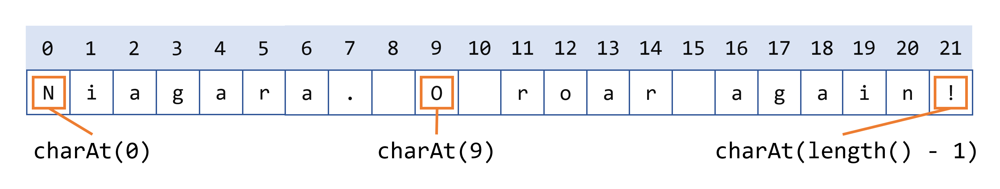

- `String substring(int beginIndex, int endIndex)` : 
  - 返回此字符串的一个子字符串。子字符串从指定的 `beginIndex` 开始，并延伸到索引 `endIndex - 1` 处的字符。
- `String substring(int beginIndex)` : 
  - 返回此字符串的一个子字符串。整数参数指定第一个字符的索引。此处返回的子字符串延伸至原字符串的末尾。

```java
String anotherPalindrome = "Niagara. O roar again!"; 
String roar = anotherPalindrome.substring(11, 15); 
```

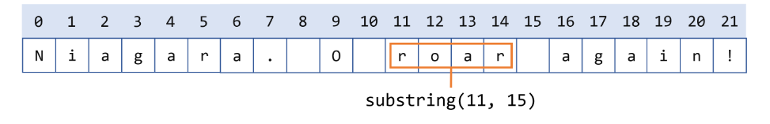

## 操作字符串的其他方法

- `String[] split(String regex)` 和 `String[] split(String regex, int limit)` ：
  - 根据字符串参数（包含正则表达式）指定的模式进行匹配，并相应地拆分此字符串为字符串数组。可选的整数参数指定返回数组的最大大小。正则表达式的相关内容请参阅标题为“[正则表达式](https://dev.java/learn/regex/)”的章节。
- `CharSequence subSequence(int beginIndex, int endIndex)` :
  - 返回从 `beginIndex` 索引开始直到 `endIndex - 1` 构造的新字符序列。
- `String trim()` : 返回**移除**了前导和尾部**空白字符**的此字符串副本
- `String toLowerCase()` 和 `String toUpperCase()` ：返回此字符串转换为小写或大写的副本。如果无需转换，这些方法将返回原始字符串。

## 在字符串中搜索字符和子字符串

- `int indexOf(int ch)` 和 `int lastIndexOf(int ch)` ：返回指定字符首次（末次）出现的索引
- `int indexOf(int ch, int fromIndex)` 和 `int lastIndexOf(int ch, int fromIndex)` ：返回指定字符第一次（最后一次）出现的索引，从指定索引开始向前（向后）搜索
- `int indexOf(String str)` 和 `int lastIndexOf(String str)` ：返回指定子字符串首次（末次）出现的索引。
- `int indexOf(String str, int fromIndex)` 和 `int lastIndexOf(String str, int fromIndex)` ：返回指定子字符串首次（末次）出现的索引，从指定索引开始向前（向后）搜索。
- `boolean contains(CharSequence s)` : 如果字符串包含指定的字符序列，则返回 `true`

## 替换字符串中的字符和子字符串

- `String replace(char oldChar, char newChar)` : 返回一个新字符串，它是将此字符串中所有出现的 `oldChar` 替换为 `newChar` 的结果。
- `String replace(CharSequence target, CharSequence replacement)` : 将此字符串中与字面目标序列匹配的每个子字符串替换为指定的字面替换序列。
- `String replaceAll(String regex, String replacement)` : 将此字符串中与给定正则表达式匹配的每个子字符串替换为给定的替换内容。
- `String replaceFirst(String regex, String replacement)` : 将此字符串中第一个匹配给定正则表达式的子字符串替换为给定的替换内容。

> 

## 字符串类的实际应用

```java
//获取文件名、路径、后缀名等
public class Filename {
    private String fullPath;
    private char pathSeparator, 
                 extensionSeparator;

    public Filename(String str, char sep, char ext) {
        fullPath = str;
        pathSeparator = sep;
        extensionSeparator = ext;
    }

    public String extension() {
        int dot = fullPath.lastIndexOf(extensionSeparator);
        return fullPath.substring(dot + 1);
    }

    // gets filename without extension
    public String filename() {
        int dot = fullPath.lastIndexOf(extensionSeparator);
        int sep = fullPath.lastIndexOf(pathSeparator);
        return fullPath.substring(sep + 1, dot);
    }

    public String path() {
        int sep = fullPath.lastIndexOf(pathSeparator);
        return fullPath.substring(0, sep);
    }
}

```

```java
public class FilenameDemo {
    public static void main(String[] args) {
        final String FPATH = "/home/user/index.html";
        Filename myHomePage = new Filename(FPATH, '/', '.');
        System.out.println("Extension = " + myHomePage.extension());
        System.out.println("Filename = " + myHomePage.filename());
        System.out.println("Path = " + myHomePage.path());
    }
}

```

## 比较字符串及字符串部分内容

- `boolean endsWith(String suffix)` 和 `boolean startsWith(String prefix)` ：如果此字符串以方法参数指定的子字符串开头或结尾，则返回 `true` 。
- `boolean startsWith(String prefix, int offset)` : 考虑从索引 `offset` 开始的字符串，如果它以参数指定的子字符串开头，则返回 `true` 。
- `int compareTo(String anotherString)` : 按字典顺序比较两个字符串。返回一个整数，表示该字符串是大于（结果 > 0）、等于（结果 = 0）还是小于（结果 < 0）参数字符串。
- `int compareToIgnoreCase(String str)` : 按字典顺序比较两个字符串，忽略大小写差异。返回一个整数，表示该字符串是大于（结果 > 0）、等于（结果 = 0）还是小于（结果 < 0）参数字符串。
- `boolean equals(Object anObject)` : 当且仅当参数是一个表示与此对象相同字符序列的 `String` 对象时，返回 `true` 。
- `boolean equalsIgnoreCase(String anotherString)` ：当且仅当参数是一个 `String` 对象且表示与此对象相同的字符序列（忽略大小写差异）时，返回 `true`
- `boolean regionMatches(int toffset, String other, int ooffset, int len)` : 测试此字符串的指定区域是否与 `String` 参数的指定区域匹配。区域的长度为 `len` ，对于此字符串从索引 `toffset` 开始，对于另一个字符串从索引 `ooffset` 开始。
- `boolean regionMatches(boolean ignoreCase, int toffset, String other, int ooffset, int len)` : 测试此字符串的指定区域是否与 `String` 参数的指定区域匹配。区域的长度为 `len` ，对于此字符串从索引 `toffset` 开始，对于另一个字符串从索引 `ooffset` 开始。布尔参数指示是否应忽略大小写；如果 `true` ，则在比较字符时忽略大小写
- `boolean matches(String regex)` : 测试此字符串是否与指定的正则表达式匹配。正则表达式在名为“正则表达式”的课程中进行了讨论

# 自动装箱与拆箱

> 1. **自动装箱**是 Java 编译器在原始类型及其对应的对象包装类之间进行的自动转换。
> 
> 例如，将 `int` 转换为 `Integer` ，将 `double` 转换为 `Double` ，依此类推。
> 
> 1. 如果转换方向相反，则称为**拆箱**。

| 基本类型 | 包装类型 |
| --- | --- |
| boolean | Boolean |
| byte | Byte |
| char | Character |
| float | Float |
| int | Integer |
| long | Long |
| short | Short |
| double | Double |

> 注意：**数字缓存**

```java
Integer m = Integer.valueOf(1);
Integer n = Integer.valueOf(1);
System.out.println(m == n); //true

Integer o = Integer.valueOf(128);
Integer p = Integer.valueOf(128);
System.out.println(o == p); //false
```

# StringBuilder

> 在** Java SE 9 之前**，如果需要连接大量字符串，追加到 StringBuilder 对象可能效率更高。
> 
> **Java SE 9 已对字符串连接进行了优化**，使得连接操作比 `StringBuilder` 追加更高效。

```typescript
@Benchmark
public String testStringConcat() {
    String a = "Hello";
    int b = 42;
    return a + " " + b;
}

@Benchmark
public String testStringBuilder() {
    String a = "Hello";
    int b = 42;
    return new StringBuilder().append(a).append(" ").append(b).toString();
}
```

## 基本用法

- `StringBuilder()` : 创建一个容量为 16 的空字符串构建器（16 个空元素）
- `StringBuilder(CharSequence cs)` : 构造一个字符串构建器，包含与指定 `CharSequence` 相同的字符，并在 `CharSequence` 后面额外添加 16 个空元素。
- `StringBuilder(int initCapacity)` : 创建一个具有指定初始容量的空字符串构建器
- `StringBuilder(String s)` : 创建一个字符串构建器，其值由指定字符串初始化，并在字符串后附加额外的 16 个空元素。

```java
// creates empty builder, capacity 16
StringBuilder sb = new StringBuilder();
// adds 9 character string at beginning
sb.append("Greetings");
```

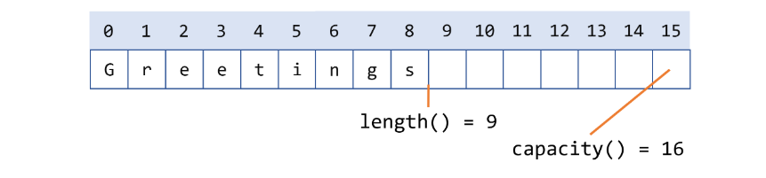

## StringBuilder 操作

- `append()` 方法将任何基本类型或对象追加到字符串构建器中
- `delete(int start, int end)` 方法删除 `StringBuilder` 字符序列中从 `start` 到 `end - 1` （包含）的子序列。
- `deleteCharAt(int index)` 方法删除索引 `index` 处的 `char`
- `insert(int offset)` :在给定的 `offset` 位置使用 `insert(int offset)` 方法插入任何基本类型或对象
- `replace(int start, int end, String s)` 和 `setCharAt(int index, char c)` 方法来替换字符。
- `reverse()` 方法反转此字符串构建器中的字符序列。
- `toString()` 方法返回一个包含构建器中字符序列的字符串

## 一个案例

- 以前的回文

```java
public class StringDemo {
    public static void main(String[] args) {
        String palindrome = "Dot saw I was Tod";
        int len = palindrome.length();
        char[] tempCharArray = new char[len];
        char[] charArray = new char[len];
        
        // put original string in an 
        // array of chars
        for (int i = 0; i < len; i++) {
            tempCharArray[i] = 
                palindrome.charAt(i);
        } 
        
        // reverse array of chars
        for (int j = 0; j < len; j++) {
            charArray[j] =
                tempCharArray[len - 1 - j];
        }
        
        String reversePalindrome =
            new String(charArray);
        System.out.println(reversePalindrome);
    }
}

```

- 改造后的回文

```typescript
public class StringBuilderDemo {
    public static void main(String[] args) {
        String palindrome = "Dot saw I was Tod";
         
        StringBuilder sb = new StringBuilder(palindrome);
        
        sb.reverse();  // reverse it
        
        System.out.println(sb);
    }
}
```

# StringBuffer

- **String**: *不可变的字符序列*； 底层使用**char[]**数组存储(JDK8.0中)
- **StringBuffer**: 可变的字符序列；线程安全（方法有synchronized修饰），效率低；底层使用**char[]**数组存储 (JDK8.0中)
- **StringBuilder**: 可变的字符序列； jdk1.5引入，线程不安全的，效率高；底层使用**char[]**数组存储(JDK8.0中)

# String原理

## String不可变

- String 对象一旦被创建后就**固定不变**了，对 String 对象的任何修改都不会影响到原来的字符串对象，都会生成新的字符串对象。
- 不管是**截取**、**拼接**，还是**替换**，都不是在原有的字符串上进行的，而是重新生成了**新的字符串对象**。也就是说，这些操作执行过后，**原来的字符串对象并没有发生改变**

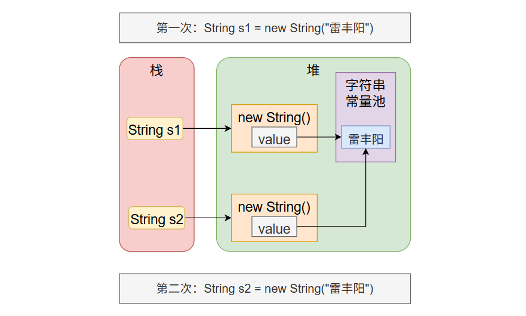

思考：

1. s1 == s2？
2. s1.intern() == s2.intern()
3. String s = new String("雷丰阳"); 这行代码创建了几个对象？ 1 or 2

原理：

1. 当执行 `String s = "雷丰阳"`; Java 虚拟机会先在**字符串常量池**中查找有没有"雷丰阳"，
  1. 如果有，则不创建任何对象；直接返回地址
  2. 如果没有，在字符串常量池中创建对象；返回地址赋值给 s；

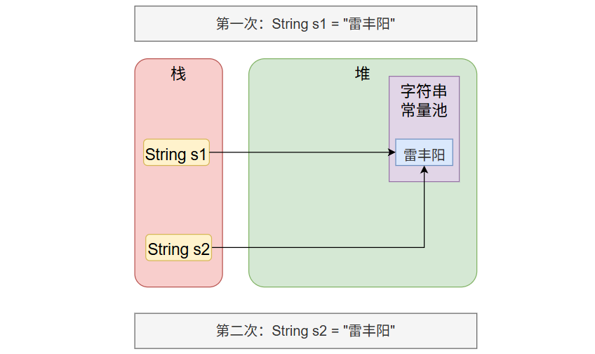

所以：

```javascript
// 这两行代码，创建三个对象； 字符串常量池中一个，堆上两个。
String s = new String("雷丰阳");
String s1 = new String("雷丰阳");

// 这两行代码，创建一个对象；字符串常量池中一个。
String s = "雷丰阳";
String s1 = "雷丰阳";
```

## 推荐阅读

https://tech.meituan.com/2014/03/06/in-depth-understanding-string-intern.html

> 常量池 table 可调大小

# 时间日期

> 1. Java中的时间日期处理在Java 8之前主要依赖`java.util.Date`和`java.util.Calendar`，但这些API存在**设计混乱、线程不安全**等问题。
> 2. Java 8引入了全新的`java.time`包，提供了更简洁、线程安全且功能强大的时间日期API。

## 新旧对比

- 旧 API（Java 8 前）​​：`Date`、`Calendar`、`SimpleDateFormat` 等存在以下问题：
  - 非线程安全（如 `SimpleDateFormat`）
  - 月份从 0 开始（0 代表 1 月）
  - 设计冗余，如 `Date` 包含日期和时间，但无法直接操作日期字段。
- 新 API（Java 8+）​​：`java.time` 包下的类：
  - 线程安全​：所有类均为不可变（immutable）。
  - 清晰的职责划分​：如 `LocalDate` 表示日期，`LocalTime` 表示时间。
  - 链式调用​：支持流畅的 API 设计（如 `plusDays()`、`withMonth()`）。

## Java8之前

> **线程不安全、设计混乱**

### java.lang.System 类的方法

- **System类**提供的` public static long currentTimeMillis()`：（**时间戳**）
  - 用来返回当前时间与 **1970年1月1日0时0分0秒** 之间以毫秒为单位的**时间差**。
- 计算世界时间的主要标准有：
  - UTC(Coordinated Universal Time)
  - GMT(Greenwich Mean Time)
  - CST(Central Standard Time)

> - 在国际无线电通信场合，为了统一起见，使用一个统一的时间，称为通用协调时(UTC, Universal Time Coordinated)。UTC与格林尼治平均时(GMT, Greenwich Mean Time)一样，都与英国伦敦的本地时相同。这里，UTC与GMT含义完全相同。

### java.util.Date

表示特定的瞬间，精确到毫秒。

- 构造器：
  - Date()：使用无参构造器创建的对象可以获取本地当前时间。
  - Date(long 毫秒数)：把该毫秒值换算成日期时间对象
- 常用方法
  - **getTime()**:  返回自 1970 年 1 月 1 日 00:00:00 GMT 以来此 Date 对象表示的**毫秒数**。
  - **toString()**: 把此 Date 对象转换为以下形式的 String： dow mon dd hh:mm:ss zzz yyyy 其中： dow 是一周中的某一天 (Sun, Mon, Tue, Wed, Thu, Fri, Sat)，zzz是时间标准。
  - 其它很多方法都过时了。

```typescript
@Test
public void test1(){
    Date d = new Date();
    System.out.println(d);
}

@Test
public void test2(){
    long time = System.currentTimeMillis();
    System.out.println(time);//1559806982971
    //当前系统时间距离1970-1-1 0:0:0 0毫秒的时间差，毫秒为单位
}

@Test
public void test3(){
    Date d = new Date();
    long time = d.getTime();
    System.out.println(time);//1559807047979
}

@Test
public void test4(){
    long time = 1559807047979L;
    Date d = new Date(time);
    System.out.println(d);
}

@Test
public void test5(){
    long time = Long.MAX_VALUE;
    Date d = new Date(time);
    System.out.println(d);
}
```

> 小练习：
> 
> 1. **如何计算30分钟后是什么时间？**

```sql
//2、算 当前时间 30min 以后 的时间？
long current = System.currentTimeMillis(); //毫秒
Date d1 = new Date(current);
System.out.println("当前时间："+d1);
//算 30min 以后的时间
current += 30*60*1000;
Date date1 = new Date(current);
System.out.println("30min 以后的时间："+date1);
```

### java.text.SimpleDateFormat

- java.text.SimpleDateFormat类是一个不与语言环境有关的方式来格式化和解析日期的具体类。
- 可以进行格式化：日期 --> 文本
- 可以进行解析：文本 --> 日期
- **构造器：**
  - SimpleDateFormat() ：默认的模式和语言环境创建对象
  - public SimpleDateFormat(String pattern)：该构造方法可以用参数pattern指定的格式创建一个对象
- **格式化：**
  - public String format(Date date)：方法格式化时间对象date
- **解析：**
  - public Date parse(String source)：从给定字符串的开始解析文本，以生成一个日期。

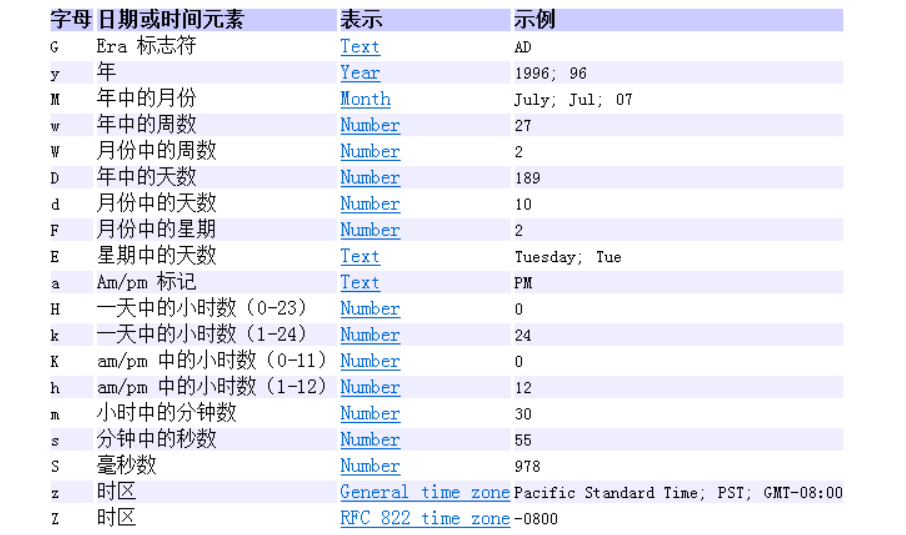

```java
//格式化
@Test
public void test1(){
    Date d = new Date();

    SimpleDateFormat sf = new SimpleDateFormat("yyyy年MM月dd日 HH时mm分ss秒 SSS毫秒  E Z");
    //把Date日期转成字符串，按照指定的格式转
    String str = sf.format(d);
    System.out.println(str);
}
//解析
@Test
public void test2() throws ParseException{
    String str = "2022年06月06日 16时03分14秒 545毫秒  星期四 +0800";
    SimpleDateFormat sf = new SimpleDateFormat("yyyy年MM月dd日 HH时mm分ss秒 SSS毫秒  E Z");
    Date d = sf.parse(str);
    System.out.println(d);
}
```

### java.util.Calendar(日历)

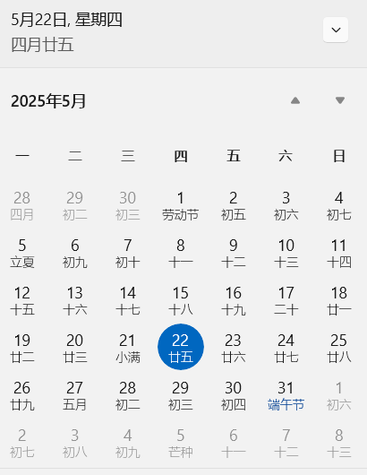

- Date类的API大部分被废弃了，替换为Calendar。
- `Calendar` 类是一个抽象类，主用用于完成日期字段之间相互操作的功能。
- 获取Calendar实例的方法
  - 使用`Calendar.getInstance()`方法
  - 调用它的子类GregorianCalendar（公历）的构造器。

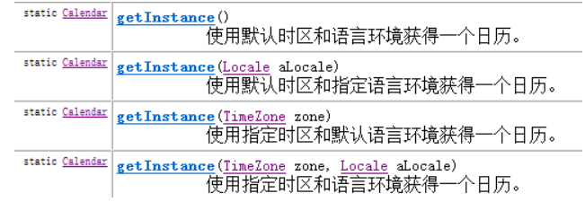

- 一个Calendar的实例是系统时间的抽象表示，可以修改或获取 YEAR、MONTH、DAY_OF_WEEK、HOUR_OF_DAY 、MINUTE、SECOND等 `日历字段`对应的时间值。
  - public int get(int field)：返回给定日历字段的值
  - public void set(int field,int value) ：将给定的日历字段设置为指定的值
  - public void add(int field,int amount)：根据日历的规则，为给定的日历字段添加或者减去指定的时间量
  - public final Date getTime()：将Calendar转成Date对象
  - public final void setTime(Date date)：使用指定的Date对象重置Calendar的时间

- 常用字段

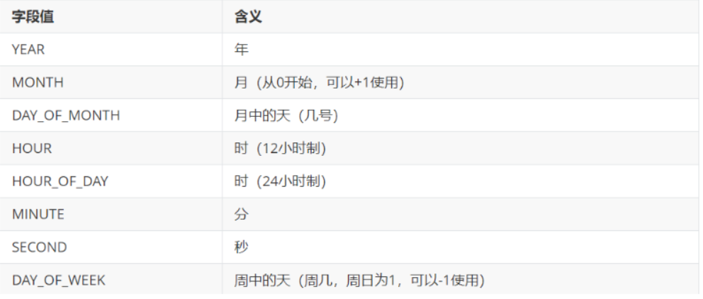

- 注意：
  - 获取月份时：**一月**是**0**，二月是1，以此类推，12月是11
  - 获取星期时：**周日**是**1**，周二是2 ， 。。。。周六是7

```sql
public class TestCalendar {
    @Test
    public void test1(){
        Calendar c = Calendar.getInstance();
        System.out.println(c);

        int year = c.get(Calendar.YEAR);
        int month = c.get(Calendar.MONTH)+1;
        int day = c.get(Calendar.DATE);
        int hour = c.get(Calendar.HOUR_OF_DAY);
        int minute = c.get(Calendar.MINUTE);

        System.out.println(year + "-" + month + "-" + day + " " + hour + ":" + minute);
        
        c.add(Calendar.HOUR, 2);
        System.out.println("当前时间加2小时后,时间是:" + c.getTime());

        c.add(Calendar.MONTH, -2);
        System.out.println("当前日期减2个月后,时间是:" + c.getTime());  
    }

    @Test
    public void test2(){
        TimeZone t = TimeZone.getTimeZone("America/Los_Angeles");
        Calendar c = Calendar.getInstance(t);
        int year = c.get(Calendar.YEAR);
        int month = c.get(Calendar.MONTH)+1;
        int day = c.get(Calendar.DATE);
        int hour = c.get(Calendar.HOUR_OF_DAY);
        int minute = c.get(Calendar.MINUTE);

        System.out.println(year + "-" + month + "-" + day + " " + hour + ":" + minute);
    }
    
}
```

## Java8之后

`java.time`包中的核心类包括：

- `Local``Date`​：表示**日期**（年月日），不包含**时间**。
- `Local``Time`​：表示**时间**（时分秒），不包含**日期**。
- `Local``DateTime`​：组合**日期**和**时间**。
- `Zoned``DateTime`​：带时区的日期时间。
- `Instant`​：时间戳（从1970-01-01T00:00:00Z开始的**纳秒数**）。
- `Duration`​：**时间**间隔（基于时间的，如小时、分钟）。
- `Period`​：**日期**间隔（基于日期的，如年、月、日）。

### `LocalDate`（日期）​

**创建实例**

```java
LocalDate today = LocalDate.now();                  // 当前日期，如 2023-10-25
LocalDate specificDate = LocalDate.of(2023, 10, 25); // 指定日期
LocalDate parsedDate = LocalDate.parse("2023-10-25"); // 解析字符串
```

**常用操作**

```java
int year = today.getYear();       // 2023
Month month = today.getMonth();   // OCTOBER
int day = today.getDayOfMonth(); // 25

LocalDate nextWeek = today.plusWeeks(1);       // 加一周
LocalDate lastDayOfMonth = today.with(TemporalAdjusters.lastDayOfMonth()); // 当月最后一天
```

### `LocalTime`（时间）

**创建实例**

```java
LocalTime now = LocalTime.now();                 // 当前时间，如 14:30:45
LocalTime specificTime = LocalTime.of(14, 30, 45); // 14:30:45
LocalTime parsedTime = LocalTime.parse("14:30:45"); // 解析字符串
```

**常用操作**

```java
int hour = now.getHour();    // 14
int minute = now.getMinute();// 30
LocalTime after30Mins = now.plusMinutes(30); // 加 30 分钟
```

### `LocalDateTime`（日期 + 时间）​

**创建实例**

```java
LocalDateTime now = LocalDateTime.now(); // 当前日期时间，如 2023-10-25T14:30:45
LocalDateTime specificDateTime = LocalDateTime.of(2023, 10, 25, 14, 30, 45);
```

**转换**

```java
LocalDate datePart = now.toLocalDate(); // 获取日期部分
LocalTime timePart = now.toLocalTime(); // 获取时间部分
```

### `ZonedDateTime`（带时区的日期时间）

**创建实例**

```java
ZonedDateTime nowInTokyo = ZonedDateTime.now(ZoneId.of("Asia/Tokyo")); // 东京当前时间
ZonedDateTime zonedDateTime = LocalDateTime.now().atZone(ZoneId.systemDefault()); // 系统默认时区
```

**时区转换**

```java
ZonedDateTime newYorkTime = nowInTokyo.withZoneSameInstant(ZoneId.of("America/New_York"));
```

### `Instant`（时间戳）​

表示时间线上的瞬时点（UTC 时间）​​：

```java
Instant instant = Instant.now(); // 当前 UTC 时间戳，如 2023-10-25T06:30:45Z
// 与旧 API 转换
Date legacyDate = Date.from(instant);
Instant fromLegacy = legacyDate.toInstant();
```

### `Period` 和 `Duration`（时间间隔）​

`Period`**​：处理日期段（年、月、日）**

```java
Period period = Period.between(LocalDate.of(2023, 1, 1), LocalDate.now());
System.out.println(period.getMonths()); // 输出间隔的月数
```

`Duration`**​：处理时间间隔（小时、分钟、秒）**

```java
Duration duration = Duration.between(startTime, endTime);
System.out.println(duration.toHours()); // 输出间隔的小时数
```

### 格式化与解析（`DateTimeFormatter`）

**预定义格式**

```java
String formatted = LocalDateTime.now().format(DateTimeFormatter.ISO_DATE_TIME);
```

**自定义格式**

```java
DateTimeFormatter formatter = DateTimeFormatter.ofPattern("yyyy-MM-dd HH:mm:ss");
String formatted = LocalDateTime.now().format(formatter); // 2023-10-25 14:30:45
LocalDateTime parsed = LocalDateTime.parse("2023-10-25 14:30:45", formatter);
```

## 新旧转换

`Date` → `Instant`​：

```java
Date date = new Date();
Instant instant = date.toInstant();
```

`Instant` → `LocalDateTime`​：

```java
LocalDateTime dateTime = LocalDateTime.ofInstant(instant, ZoneId.systemDefault());
```

# 比较器

为了给其他各种类型比大小，排序

> 基本数据类型的数据（除boolean类型外）需要比较大小的话，之间使用比较运算符即可。
> 
> 但是引用数据类型是不能直接使用比较运算符来比较大小的。那么，如何解决这个问题呢？

- 在Java中经常会涉及到对象数组的排序问题，那么就涉及到对象之间的比较问题。
- Java实现对象排序的方式有两种：
  - **自然排序**：java.lang.Comparable
  - **定制排序**：java.util.Comparator

## 自然排序：java.lang.Comparable

- `Comparable接口`强行对实现它的每个类的对象进行整体排序。这种排序被称为类的自然排序。
- 实现 Comparable 的类必须实现 `compareTo(Object obj)`方法，两个对象即通过 compareTo(Object obj) 方法的返回值来比较大小。
  - 如果当前对象this**大于**形参对象obj，则返回**正整数**
  - 如果当前对象this**小于**形参对象obj，则返回**负整数**
  - 如果当前对象this**等于**形参对象obj，则返回**零**。

```java
package java.lang;

public interface Comparable{
    int compareTo(Object obj);
}
```

- **实现Comparable接口**的**对象列表（和数组）**可以通过** Collections.sort **或 **Arrays.sort **进行**自动排序**。实现此接口的对象可以用作有序映射中的键或有序集合中的元素，无需指定比较器。
- 对于类 C 的每一个 e1 和 e2 来说，当且仅当 e1.compareTo(e2) == 0 与 e1.equals(e2) 具有相同的 boolean 值时，类 C 的自然排序才叫做与 equals 一致。建议（虽然不是必需的）`最好使自然排序与 equals 一致`。
- **Comparable 的典型实现**：(`默认都是从小到大排列的`)
  - **String**：按照字符串中字符的Unicode值进行比较
  - **Character**：按照字符的Unicode值来进行比较
  - **数值类型**对应的包装类以及BigInteger、BigDecimal：按照它们对应的数值大小进行比较
  - **Boolean**：true 对应的包装类实例大于 false 对应的包装类实例
  - **Date、Time等**：后面的日期时间比前面的日期时间大

### 例子1

```typescript
public class Student implements Comparable {
    private int id;
    private String name;
    private int score;
    private int age;

    public Student(int id, String name, int score, int age) {
        this.id = id;
        this.name = name;
        this.score = score;
        this.age = age;
    }

    public int getId() {
        return id;
    }

    public void setId(int id) {
        this.id = id;
    }

    public String getName() {
        return name;
    }

    public void setName(String name) {
        this.name = name;
    }

    public int getScore() {
        return score;
    }

    public void setScore(int score) {
        this.score = score;
    }

    public int getAge() {
        return age;
    }

    public void setAge(int age) {
        this.age = age;
    }

    @Override
    public String toString() {
        return "Student{" +
                "id=" + id +
                ", name='" + name + '\'' +
                ", score=" + score +
                ", age=" + age +
                '}';
    }

    @Override
    public int compareTo(Object o) {
        //这些需要强制，将o对象向下转型为Student类型的变量，才能调用Student类中的属性
        //默认按照学号比较大小
        Student stu = (Student) o;
        return this.id - stu.id;
    }
}
```

```java
public class TestStudent {
    public static void main(String[] args) {
        Student[] arr = new Student[5];
        arr[0] = new Student(3,"张三",90,23);
        arr[1] = new Student(1,"熊大",100,22);
        arr[2] = new Student(5,"王五",75,25);
        arr[3] = new Student(4,"李四",85,24);
        arr[4] = new Student(2,"熊二",85,18);

        //单独比较两个对象
        System.out.println(arr[0].compareTo(arr[1]));
        System.out.println(arr[1].compareTo(arr[2]));
        System.out.println(arr[2].compareTo(arr[2]));

    }
}

```

### 例子2

```typescript

public class Student implements Comparable {
    private String name;
    private int score;

    public Student(String name, int score) {
        this.name = name;
        this.score = score;
    }

    public String getName() {
        return name;
    }

    public void setName(String name) {
        this.name = name;
    }

    public int getScore() {
        return score;
    }

    public void setScore(int score) {
        this.score = score;
    }

    @Override
    public String toString() {
        return "Student{" +
                "name='" + name + '\'' +
                ", score=" + score +
                '}';
    }

    @Override
    public int compareTo(Object o) {
        return this.score - ((Student)o).score;
    }
}
```

```typescript
@Test
public void test02() {
        Student[] students = new Student[3];
        students[0] = new Student("张三", 96);
        students[1] = new Student("李四", 85);
        students[2] = new Student("王五", 98);

        System.out.println(Arrays.toString(students));
        Arrays.sort(students);
        System.out.println(Arrays.toString(students));
}
```

### 例子3

```java
class Goods implements Comparable {
    private String name;
    private double price;

    //按照价格，比较商品的大小
    @Override
    public int compareTo(Object o) {
        if(o instanceof Goods) {
            Goods other = (Goods) o;
            if (this.price > other.price) {
                return 1;
            } else if (this.price < other.price) {
                return -1;
            }
            return 0;
        }
        throw new RuntimeException("输入的数据类型不一致");
    }
    //构造器、getter、setter、toString()方法略
}


```

```sql
public class ComparableTest{
    public static void main(String[] args) {

        Goods[] all = new Goods[4];
        all[0] = new Goods("《红楼梦》", 100);
        all[1] = new Goods("《西游记》", 80);
        all[2] = new Goods("《三国演义》", 140);
        all[3] = new Goods("《水浒传》", 120);

        Arrays.sort(all);

        System.out.println(Arrays.toString(all));

    }

}
```

## 定制排序：java.util.Comparator

**排序器**

- 思考
  - 当元素的类型**没有实现**`java.lang.Comparable`接口而又**不方便修改代码**（例如：一些第三方的类，你只有.class文件，没有源文件）
  - 如果一个类，实现了Comparable接口，也指定了两个对象的比较大小的规则，但是此时此刻我**不想按照它预定义的方法比较大小**，但是我**又不能随意修改**，因为会影响其他地方的使用，怎么办？
- JDK在设计类库之初，也考虑到这种情况，所以又增加了一个java.util.Comparator接口。强行对多个对象进行整体排序的比较。
  - 重写compare(Object o1,Object o2)方法，比较o1和o2的大小：如果方法返回正整数，则表示o1大于o2；如果返回0，表示相等；返回负整数，表示o1小于o2。
  - 可以将 **Comparator **传递给 **sort **方法（如 **Collections.sort 或 Arrays.sort**），从而允许在排序顺序上实现精确控制。

```java
package java.util;

public interface Comparator{
    int compare(Object o1,Object o2);
}
```

```java
//定义定制比较器类
public class StudentScoreComparator implements Comparator { 
    @Override
    public int compare(Object o1, Object o2) {
        Student s1 = (Student) o1;
        Student s2 = (Student) o2;
        int result = s1.getScore() - s2.getScore();
        return result != 0 ? result : s1.getId() - s2.getId();
    }
}
```

### 例子1

```java
public void test01() {
    Student[] students = new Student[5];
    students[0] = new Student(3, "张三", 90, 23);
    students[1] = new Student(1, "熊大", 100, 22);
    students[2] = new Student(5, "王五", 75, 25);
    students[3] = new Student(4, "李四", 85, 24);
    students[4] = new Student(2, "熊二", 85, 18);

    System.out.println(Arrays.toString(students));
    //定制排序
    StudentScoreComparator sc = new StudentScoreComparator();
    Arrays.sort(students, sc);
    System.out.println("排序之后：");
    System.out.println(Arrays.toString(students));
}
```

### 例子2

```sql
Goods[] all = new Goods[4];
all[0] = new Goods("War and Peace", 100);
all[1] = new Goods("Childhood", 80);
all[2] = new Goods("Scarlet and Black", 140);
all[3] = new Goods("Notre Dame de Paris", 120);

Arrays.sort(all, new Comparator() {

    @Override
    public int compare(Object o1, Object o2) {
        Goods g1 = (Goods) o1;
        Goods g2 = (Goods) o2;

        return g1.getName().compareTo(g2.getName());
    }
});

System.out.println(Arrays.toString(all));

```

# System和Runtime

## java.lang.System类

- System类代表系统，系统级的很多属性和控制方法都放置在该类的内部。该类位于`java.lang包`。
- 由于该类的构造器是private的，所以无法创建该类的对象。其内部的成员变量和成员方法都是`static的`，所以也可以很方便的进行调用。
- 成员变量   Scanner scan = new Scanner(System.in);
  - System类内部包含`in`、`out`和`err`三个成员变量，分别代表标准输入流(键盘输入)，标准输出流(显示器)和标准错误输出流(显示器)。
- 成员方法
  - `native long currentTimeMillis()`：
该方法的作用是返回当前的计算机时间，时间的表达格式为当前计算机时间和GMT时间(格林威治时间)1970年1月1号0时0分0秒所差的毫秒数。
  - `void exit(int status)`：
该方法的作用是退出程序。其中status的值为0代表正常退出，非零代表异常退出。使用该方法可以在图形界面编程中实现程序的退出功能等。
  - `void gc()`：
该方法的作用是请求系统进行垃圾回收。至于系统是否立刻回收，则取决于系统中垃圾回收算法的实现以及系统执行时的情况。
  - `String getProperty(String key)`：
该方法的作用是获得系统中属性名为key的属性对应的值。系统中常见的属性名以及属性的作用如下表所示：

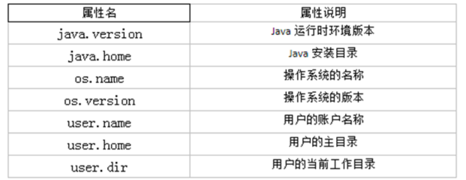

```java


public class TestSystem {
   
    public void test01(){
        long time = System.currentTimeMillis();
        System.out.println("现在的系统时间距离1970年1月1日凌晨：" + time + "毫秒");

        System.exit(0);

        System.out.println("over");//不会执行
    }

    public void test02(){
        String javaVersion = System.getProperty("java.version");
                System.out.println("java的version:" + javaVersion);

                String javaHome = System.getProperty("java.home");
                System.out.println("java的home:" + javaHome);

                String osName = System.getProperty("os.name");
                System.out.println("os的name:" + osName);

                String osVersion = System.getProperty("os.version");
                System.out.println("os的version:" + osVersion);

                String userName = System.getProperty("user.name");
                System.out.println("user的name:" + userName);

                String userHome = System.getProperty("user.home");
                System.out.println("user的home:" + userHome);

                String userDir = System.getProperty("user.dir");
                System.out.println("user的dir:" + userDir);
    }


    public void test03() throws InterruptedException {
        for (int i=1; i <=10; i++){
            MyDemo my = new MyDemo(i);
            //每一次循环my就会指向新的对象，那么上次的对象就没有变量引用它了，就成垃圾对象
        }

        //为了看到垃圾回收器工作，我要加下面的代码，让main方法不那么快结束，因为main结束就会导致JVM退出，GC也会跟着结束。
        System.gc();//如果不调用这句代码，GC可能不工作，因为当前内存很充足，GC就觉得不着急回收垃圾对象。
                                //调用这句代码，会让GC尽快来工作。
        Thread.sleep(5000);
    }
}

class MyDemo{
    private int value;

    public MyDemo(int value) {
        this.value = value;
    }

    @Override
    public String toString() {
        return "MyDemo{" + "value=" + value + '}';
    }

    //重写finalize方法，让大家看一下它的调用效果
    @Override
    protected void finalize() throws Throwable {
//        正常重写，这里是编写清理系统内存的代码
//        这里写输出语句是为了看到finalize()方法被调用的效果
        System.out.println(this+ "轻轻的我走了，不带走一段代码....");
    }
}
```

- `static void arraycopy(Object src, int srcPos, Object dest, int destPos, int length)`： 
- 从指定源数组中复制一个数组，复制从指定的位置开始，到目标数组的指定位置结束。常用于数组的插入和删除

```java
import java.util.Arrays;

public class TestSystemArrayCopy {

    public void test01(){
        int[] arr1 = {1,2,3,4,5};
        int[] arr2 = new int[10];
        System.arraycopy(arr1,0,arr2,3,arr1.length);
        System.out.println(Arrays.toString(arr1));
        System.out.println(Arrays.toString(arr2));
    }


    public void test02(){
        int[] arr = {1,2,3,4,5};
        System.arraycopy(arr,0,arr,1,arr.length-1);
        System.out.println(Arrays.toString(arr));
    }


    public void test03(){
        int[] arr = {1,2,3,4,5};
        System.arraycopy(arr,1,arr,0,arr.length-1);
        System.out.println(Arrays.toString(arr));
    }
}
```

## java.lang.Runtime类

每个 Java 应用程序都有一个 `Runtime` 类实例，使应用程序能够与其运行的环境相连接。

`public static Runtime getRuntime()`： 返回与当前 Java 应用程序相关的运行时对象。应用程序不能创建自己的 Runtime 类实例。

`public long totalMemory()`：返回 Java 虚拟机中初始化时的内存总量。此方法返回的值可能随时间的推移而变化，这取决于主机环境。默认为物理电脑内存的1/64。

`public long maxMemory()`：返回 Java 虚拟机中最大程度能使用的内存总量。默认为物理电脑内存的1/4。

`public long freeMemory()`：回 Java 虚拟机中的空闲内存量。调用 gc 方法可能导致 freeMemory 返回值的增加。

```java
public class TestRuntime {
    public static void main(String[] args) {
        Runtime runtime = Runtime.getRuntime();
        long initialMemory = runtime.totalMemory(); //获取虚拟机初始化时堆内存总量
        long maxMemory = runtime.maxMemory(); //获取虚拟机最大堆内存总量
        String str = "";
        //模拟占用内存
        for (int i = 0; i < 10000; i++) {
            str += i;
        }
        long freeMemory = runtime.freeMemory(); //获取空闲堆内存总量
        System.out.println("总内存：" + initialMemory / 1024 / 1024 * 64 + "MB");
        System.out.println("总内存：" + maxMemory / 1024 / 1024 * 4 + "MB");
        System.out.println("空闲内存：" + freeMemory / 1024 / 1024 + "MB") ;
        System.out.println("已用内存：" + (initialMemory-freeMemory) / 1024 / 1024 + "MB");
    }
}
```