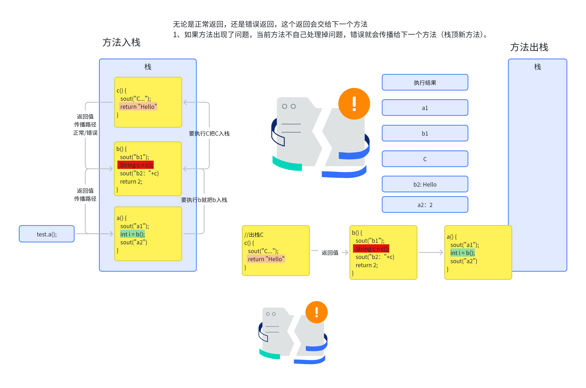
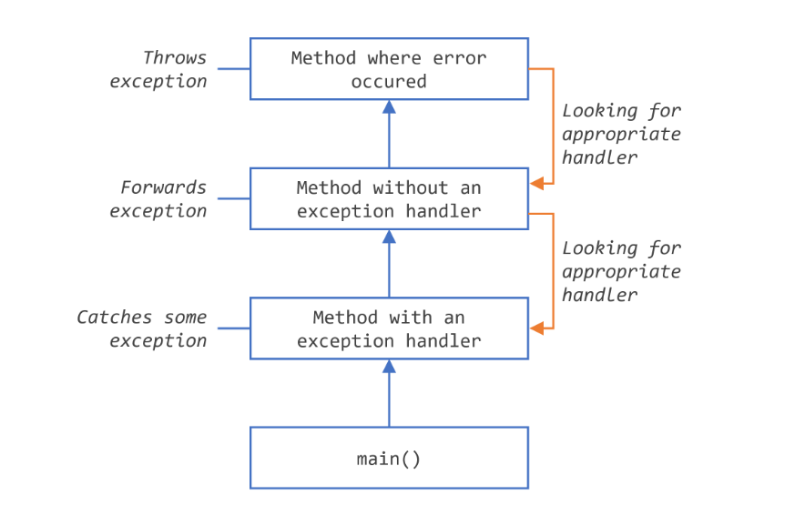
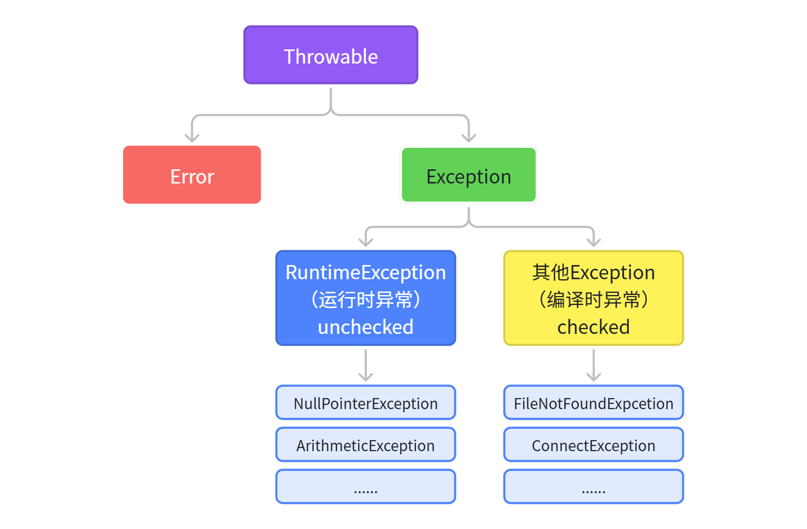
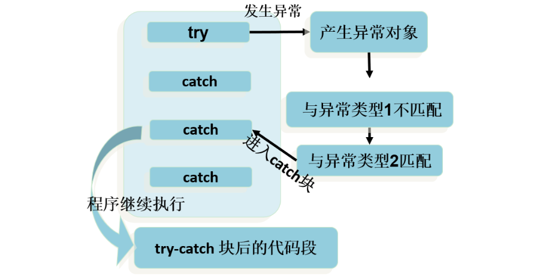
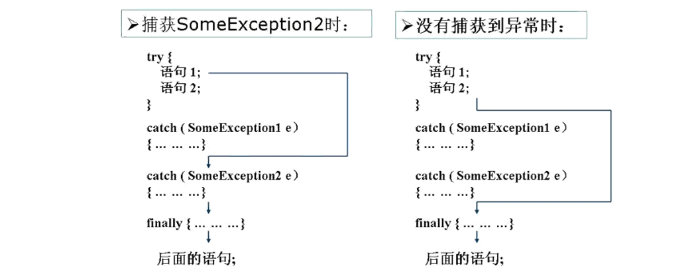

# 5. 异常（Exception）

# 什么是异常

> 术语“exception”是短语“**exceptional event**”的简写。
> 
> **定义：**异常是在程序**执行期间**发生的**事件**，它会**中断**程序指令的**正常流程**。

当方法内部发生**错误**时，该方法会产生(创建)一个**异常对象**。

1. 创建异常对象
  1. 程序**自动产生**
  2. 程序员**手动产生**
2. **异常产生**后怎么办
  1. 有程序把他处理掉（**捕获异常**）
  2. 不管这个异常（**抛出异常**）

**了解下程序调用栈机制；**

> 思考下面程序如何执行；

```typescript
public void a(){
    System.out.println("a1");
    int i = b();
    System.out.println("a2："+i);
}

public int b(){
    System.out.println("b1");
    String c = c();
    System.out.println("b2："+c);
    return 2;
}

public String c(){
    System.out.println("c...");
    return "Hello";
}
```

> 方法调用**栈**：数据结构（**子弹夹**）【栈是一个：**后进先出**的一种数据结构】





# 三种异常

1. ***checked exception****（****受检异常****）：*
  1. *编译器在编译期间会检查这种异常是不是被处理了。没有处理就会****编译失败***
  2. `FileNotFoundException` 
2. ***unchecked exceptions****（****不受检异常****）：****运行时异常****，程序执行到这不出正确结果，那就错误*
  1. *不用在****编译****的时候检查，用户不用立即指定处理逻辑；运行时一旦出错，则交给后面程序处理*
  2. `NullPointerException`
3. **Error**



## Error

```typescript
public class TestStackOverflowError {
    @Test
    public void test01(){
        //StackOverflowError
        recursion();
    }

    public void recursion(){ //递归方法
        recursion(); 
    }
}
```

```java
public class TestOutOfMemoryError {
    @Test
    public void test02(){
        //OutOfMemoryError
        //方式一：
        long[] arr = new long[Long.MAX_VALUE];
    }
    @Test
    public void test03(){
        //OutOfMemoryError
        //方式二：
        StringBuilder s = new StringBuilder();
        while(true){
            s.append("fengyang");
        }
    }
}
```

## 运行时异常

```java
public class TestRuntimeException {
    public void test01(){
        //NullPointerException
        String str = null;
        System.out.println(str.length());
    }

    public void test02(){
        //ClassCastException
        Object obj = 15;
        String str = (String) obj;
    }

    public void test03(){
        //ArrayIndexOutOfBoundsException
        int[] arr = new int[5];
        for (int i = 1; i <= 5; i++) {
            System.out.println(arr[i]);
        }
    }

    public void test04(){
        //InputMismatchException
        Scanner input = new Scanner(System.in);
        System.out.print("请输入一个整数：");//输入非整数
        int num = input.nextInt();
        input.close();
    }

    public void test05(){
        int a = 1;
        int b = 0;
        //ArithmeticException
        System.out.println(a/b);
    }
}

```

## 编译时异常

```java
public class TestCheckedException {
    
    public void test06() {
        Thread.sleep(1000);//休眠1秒  InterruptedException
    }

  
    public void test07(){
        Class c = Class.forName("java.lang.Leifengyang");//ClassNotFoundException
    }

  
    public void test08() {
        Connection conn = DriverManager.getConnection("....");  //SQLException
    }
 
    public void test09()  {
        FileInputStream fis = new FileInputStream("Java秘籍.txt"); //FileNotFoundException
    }

    public void test10() {
        File file = new File("Java秘籍.txt");
                FileInputStream fis = new FileInputStream(file);//FileNotFoundException
                int b = fis.read();//IOException
                while(b != -1){
                        System.out.print((char)b);
                        b = fis.read();//IOException
                }
                
                fis.close();//IOException
    }
}
```

# 处理异常

## 捕获异常：`try` 、 `catch` 和 `finally` 代码块

```java
//完整语法； 注意，catch、finally不是必须的  try--catch--finally
try {
    //业务逻辑  8行
} catch (ExceptionType name) {
    //出现异常情况1，如何处理
} catch (ExceptionType name | ExceptionType name2 ) {
    //出现异常情况2或3，如何处理
} finally {
    //无论正常与异常，最终执行. 一定会执行；
}
```

执行流程：



### 案例1

```typescript
public class IndexOutExp {
    public static void main(String[] args) {
        String friends[] = { "lisa", "bily", "kessy" };
        try {
            for (int i = 0; i < 5; i++) {
            System.out.println(friends[i]);
            }
        } catch (ArrayIndexOutOfBoundsException e) {
            System.out.println("index err");
        }
        System.out.println("\nthis is the end");
    }
}

```

### 案例2

```java
public class DivideZero1 {
    public static void main(String[] args) {
        int x = 0,y;
        try {
            y = 3 / x;
        } catch (ArithmeticException e) {
            System.out.println("divide by zero error!");
        }
        System.out.println("program ends ok!");
    }
}

```

### 案例3

```typescript
public void test1(){
        try{
                String str1 = "hello";
                str1 = null;
                System.out.println(str1.charAt(0));
        }catch(NullPointerException e){
                //异常的处理方式1
                System.out.println("不好意思，亲~出现了小问题，正在加紧解决...");        
        }catch(ClassCastException e){
                //异常的处理方式2
                System.out.println("出现了类型转换的异常");
        }catch(RuntimeException e){
                //异常的处理方式3
                System.out.println("出现了运行时异常");
        }
        //此处的代码，在异常被处理了以后，是可以正常执行的
        System.out.println("hello");
}
```

### finally



> 无论怎样，finally一定执行
> 
> 1. finally在IO编程的情况下，一般用来释放资源（比如网络连接、文件流）
> 2. 因为新语法try-with-resource的写法，finally释放资源就可以不用了

```java
public class TestFinally {
    public static void main(String[] args) {
        Scanner input = new Scanner(System.in);
        try {
            System.out.print("请输入第一个整数：");
            int a = input.nextInt();
            System.out.print("请输入第二个整数：");
            int b = input.nextInt();
            int result = a/b;
            System.out.println(a + "/" + b +"=" + result);
        } catch (InputMismatchException e) {
            System.out.println("数字格式不正确，请输入两个整数");
        }catch (ArithmeticException e){
            System.out.println("第二个整数不能为0");
        } finally {
            System.out.println("程序结束，释放资源");
            input.close();
        }
    }
    
    @Test
    public void test1(){
        FileInputStream fis = null;
        try{
            File file = new File("hello1.txt");
            fis = new FileInputStream(file);//FileNotFoundException
            int b = fis.read();//IOException
            while(b != -1){
                System.out.print((char)b);
                b = fis.read();//IOException
            }

        }catch(IOException e){
            e.printStackTrace();
        }finally{
            try {
                if(fis != null)
                    fis.close();//IOException
            } catch (IOException e) {
                e.printStackTrace();
            }        
        }
    }
}
```

### 返回值

> 从 try 回来

```typescript
public class FinallyTest1 {
    public static void main(String[] args) {
        int result = test("12");
        System.out.println(result);
    }

    public static int test(String str){
        try{
            Integer.parseInt(str);
            return 1;
        }catch(NumberFormatException e){
            return -1;
        }finally{
            System.out.println("test结束");
        }
    }
}
```

> 从catch回来

```typescript
public class FinallyTest2 {
    public static void main(String[] args) {
        int result = test("a");
        System.out.println(result);
    }

    public static int test(String str) {
        try {
            Integer.parseInt(str);
            return 1;
        } catch (NumberFormatException e) {
            return -1;
        } finally {
            System.out.println("test结束");
        }
    }
}
```

> 从finally回来

```typescript
public class FinallyTest3 {
    public static void main(String[] args) {
        int result = test("a");
        System.out.println(result);
    }

    public static int test(String str) {
        try {
            Integer.parseInt(str);
            return 1;
        } catch (NumberFormatException e) {
            return -1;
        } finally {
            System.out.println("test结束");
            return 0;
        }
    }
}
```

> 

```java
public class ExceptionTest {
    public static void main(String[] args) {
        int result = test();
        System.out.println(result); //100
    }

    public static int test(){
        int i = 100;
        try {
            return i;
        } finally {
            i++;
        }
    }
}
```

## 声明抛出异常

> 1. 编译时异常，如果不catch处理，就必须声明抛出
> 2. 也可以使用throws明确的说明自己方法可能会有哪些异常，方便调用者去处理

```java
// 语法格式
修饰符 返回值类型 方法名(参数) throws 异常类名1,异常类名2…{   

}
```

### **编译时异常**

```java
public class TestThrowsCheckedException {
    public static void main(String[] args) {
        System.out.println("上课.....");
        try {
            afterClass();//换到这里处理异常
        } catch (InterruptedException e) {
            e.printStackTrace();
            System.out.println("准备提前上课");
        }
        System.out.println("上课.....");
    }

    public static void afterClass() throws InterruptedException {
        for(int i=10; i>=1; i--){
            Thread.sleep(1000);//本来应该在这里处理异常
            System.out.println("距离上课还有：" + i + "分钟");
        }
    }
}
```

### **运行时异常**

1. throws后面也可以写运行时异常类型，只是运行时异常类型，写或不写对于编译器和程序执行来说都没有任何区别。
2. 如果写了，唯一的区别就是调用者调用该方法后，使用try...catch结构时，IDEA可以获得更多的信息，需要添加哪种catch分支。

```java
public class TestThrowsRuntimeException {
    public static void main(String[] args) {
        Scanner input = new Scanner(System.in);
        try {
            System.out.print("请输入第一个整数：");
            int a = input.nextInt();
            System.out.print("请输入第二个整数：");
            int b = input.nextInt();
            int result = divide(a,b);
            System.out.println(a + "/" + b +"=" + result);
        } catch (ArithmeticException | InputMismatchException e) {
            e.printStackTrace();
        } finally {
            input.close();
        }
    }

    public static int divide(int a, int b)throws ArithmeticException{
        return a/b;
    }
}
```

# 手动抛出

Java 中异常对象的生成有两种方式：

- 由虚拟机**自动生成**：程序运行过程中，虚拟机检测到程序发生了问题，那么针对当前代码，就会在后台自动创建一个对应异常类的实例对象并抛出。
- 由开发人员**手动创建**：`new 异常类型([实参列表]);`，如果创建好的异常对象不抛出对程序没有任何影响，和创建一个普通对象一样，**但是一旦throw抛出**，就会对程序运行产生影响了。

> throw语句抛出的异常对象，和JVM自动创建和抛出的异常对象一样。
> 
> - 如果是编译时异常类型的对象，同样需要使用throws或者try...catch处理，否则编译不通过。
> - 如果是运行时异常类型的对象，编译器不提示。
> - 可以抛出的异常必须是Throwable或其子类的实例。`错误示例：throw new String("oh~~~");`

```java
public class TestThrow {
    public static void main(String[] args) {
        try {
            System.out.println(max(4,2,31,1));
        } catch (Exception e) {
            e.printStackTrace();
        }
        try {
            System.out.println(max(4));
        } catch (Exception e) {
            e.printStackTrace();
        }
        try {
            System.out.println(max());
        } catch (Exception e) {
            e.printStackTrace();
        }
    }

    public static int max(int... nums){
        if(nums == null || nums.length==0){
            throw new IllegalArgumentException("没有传入任何整数，无法获取最大值");
        }
        int max = nums[0];
        for (int i = 1; i < nums.length; i++) {
            if(nums[i] > max){
                max = nums[i];
            }
        }
        return max;
    }
}
```

# 自定义异常

> Java中不同的异常类，分别表示着某一种具体的异常情况。
> 
> 1. 在开发中总是有些异常情况是核心类库中没有定义好的，此时我们需要根据自己业务的异常情况来定义异常类。
> 2. 例如**订单超时问题**，**账号密码错误问题**，**账户余额不足问题**等。

```java
/**
 * 订单超时自定义异常（受检异常）
 * 适用于需要明确处理超时逻辑的业务场景
 */
public class OrderTimeoutException extends RuntimeException {
    private final String orderId;       // 订单唯一标识
    private final long timeoutSeconds;  // 超时阈值（秒）
    private final String orderStatus;   // 订单状态

    // 构造函数
    public OrderTimeoutException(String orderId, long timeoutSeconds, String orderStatus) {
        super(String.format("订单[%s]处理超时！状态：%s，已超过%d秒阈值", 
              orderId, orderStatus, timeoutSeconds));
        this.orderId = orderId;
        this.timeoutSeconds = timeoutSeconds;
        this.orderStatus = orderStatus;
    }


    // Getter 方法
    public String getOrderId() { return orderId; }
    public long getTimeoutSeconds() { return timeoutSeconds; }
    public String getOrderStatus() { return orderStatus; }
}

// 使用示例 ---------------------------------------------------
class OrderService {
    /**
     * 模拟订单处理
     * @param orderId 订单ID
     * @param processingSeconds 已处理时间（秒）
     */
    public void processOrder(String orderId, long processingSeconds) throws OrderTimeoutException {
        long timeoutThreshold = 30; // 超时阈值30秒
        
        if (processingSeconds > timeoutThreshold) {
            throw new OrderTimeoutException(
                orderId, 
                timeoutThreshold,
                "待支付" // 实际可以从订单对象获取
            );
        }
        
        // 正常处理逻辑...
    }
}

class Main {
    public static void main(String[] args) {
        OrderService service = new OrderService();
        
        try {
            service.processOrder("ORDER_12345", 35);
        } catch (OrderTimeoutException e) {
            System.err.println("捕获超时异常: " + e.getMessage());
            System.err.println("异常详情: " + 
                e.getOrderId() + " | " + 
                e.getTimeoutSeconds() + "s | " + 
                e.getOrderStatus());
            e.printStackTrace();
            
            // 这里可以添加处理逻辑，比如：
            // 1. 自动取消订单
            // 2. 发送短信通知
            // 3. 记录监控日志
        }
    }
}
```

# 异常的好处

## **将错误处理代码与"常规"代码分离**

```java
readFile {
    open the file;  //如果文件无法打开会发生什么？
    determine its size;  //如果无法确定文件的长度会发生什么？
    allocate that much memory;  //如果无法分配足够的内存会发生什么？
    read the file into memory;  //如果读取失败会发生什么？
    close the file;  //如果文件无法关闭会发生什么？
}
```

> 用 if

```sql
int readFile() {
    int errorCode = 0;
    
    //1、open the file;
    if (theFileIsOpen) {
        //2、determine the length of the file;
        if (gotTheFileLength) {
            //3、allocate that much memory;
            if (gotEnoughMemory) {
                //4、read the file into memory;
                if (readFailed) {
                    errorCode = -1;
                }
            } else {
                errorCode = -2;
            }
        } else {
            errorCode = -3;
        }
        //5、close the file;
        if (theFileDidntClose && errorCode == 0) {
            errorCode = -4;
        } else {
            errorCode = errorCode and -4;
        }
    } else {
        errorCode = -5;
    }
    return errorCode;
}
```

> 用异常机制

```java
readFile {
    try {
        open the file;
        determine its size;
        allocate that much memory;
        read the file into memory;
        close the file;
    } catch (fileOpenFailed) {
       doSomething; //自己既处理了
       throw new XxxException(); //别人也感知到
    } catch (sizeDeterminationFailed) {
        doSomething;
    } catch (memoryAllocationFailed) {
        doSomething;
    } catch (readFailed) {
        doSomething;
    } catch (fileCloseFailed) {
        doSomething;
    }
}
```

## 沿堆栈向下传播

```java
void method1() {
    method2();
}

void method2() {
    method3();
}

void method3() {
    readFile();
}
```

> Java会把**错误向下传播**，直到遇到第一个人能处理他

```java
method1 {
    try {
        call method2;
    } catch (exception e) {
        doErrorProcessing;
    }
}

method2 throws exception {
    call method3;
}

method3 throws exception {
    call readFile;
}
```

# 学会看异常信息