# 6. 集合类

> 1. 集合用来干什么？**装数据**（存储数据）、**查询数据**。
> 2. 数组不够用吗？ 不够！
>   1. **元素数量不固定怎么办**？数组初始化以后，长度就确定了，每次手动扩容很麻烦
>   2. **想要高效率的增删改查**？数组查询只能挨个遍历，效率慢，增删还可能导致元素移动，更慢
>   3. **不要重复元素怎么办**？数组不提供去重办法
> 
> **怎么办？再写一个好用的**

# 集合体系

## Collection体系

> **专门负责保存****单值**：一种对象、一种字符串、一些数字
> 
> - **List**：默认有序、**可重复**集合
> - **Set**：默认无序、**不可重复**集合

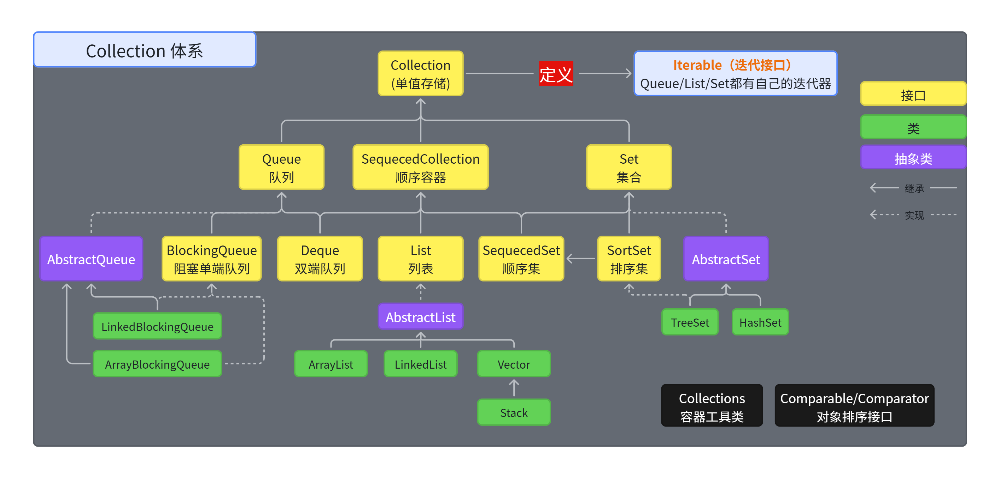

## Map体系（KV存储：键值对） 

y = f(x): 一个x对应一个y；

> **专门负责保存****键值（Key - Value）**：键值是一种**映射关系**，一个键对应一个值；如
> 
> 1. **身份证号 **对应 **一个人**
> 2. **商品id **对应 **一个商品**
> 3. **元素符号** 对应 **一个化学元素**

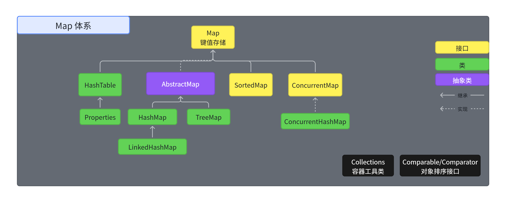

# Collection

## 方法

> 主要练习**增删改查**方法，以及**迭代器获取所有**。

- `int size();` 返回元素数量
- `boolean isEmpty();` 判断是否为空
- `boolean contains(Object o); `判断是否包含指定元素
- `Iterator<E> iterator();` 获取迭代器
- `Object[] toArray();` 转为对象数组
- `<T> T[] toArray(T[] a);` 转为精确类型对象数组
- `boolean add(E e);` 添加元素
- `boolean remove(Object o);` 删除元素
- `boolean containsAll(Collection<?> c);`判断是否包含子集
- `boolean addAll(Collection<? extends E> c);` 添加c集合中的所有元素到当前集合
- `boolean removeAll(Collection<?> c);` 从当前集合删除c集合中所有元素
- `boolean retainAll(Collection<?> c);` 从当前集合中删除所有不在c集合中的元素。
- `void clear();` 清空；删除所有元素
- `Stream<E> stream();` 返回数据流；后来学习Stream API使用

## List

> 1. List集合类中`元素``有序`、且`可重复`，集合中的每个元素都有其对应的顺序索引。
> 2. List比数组支持更多的操作

### 方法列表

List除了从Collection集合继承的方法外，List 集合里添加了一些`根据索引`来操作集合元素的方法。

- **插入元素**
  - `void add(int index, Object ele)`:在index位置插入ele元素
  - `boolean addAll(int index, Collection eles)`:从index位置开始将eles中的所有元素添加进来
- **获取元素**
  - `Object get(int index)`:获取指定index位置的元素
  - `List subList(int fromIndex, int toIndex)`:返回从fromIndex到toIndex位置的子集合
- **获取元素索引**
  - `int indexOf(Object obj):`返回obj在集合中首次出现的位置
  - `int lastIndexOf(Object obj):`返回obj在当前集合中末次出现的位置
- **删除和替换元素**
  - `Object remove(int index)`:移除指定index位置的元素，并返回此元素
  - `Object set(int index, Object ele)`:设置指定index位置的元素为ele

```java
public class TestListMethod {
    public static void main(String[] args) {
        // 创建List集合对象
        List<String> list = new ArrayList<String>();

        // 往 尾部添加 指定元素
        list.add("图图");
        list.add("小美");
        list.add("不高兴");

        System.out.println(list);
        // add(int index,String s) 往指定位置添加
        list.add(1,"没头脑");

        System.out.println(list);
        // String remove(int index) 删除指定位置元素  返回被删除元素
        // 删除索引位置为2的元素
        System.out.println("删除索引位置为2的元素");
        System.out.println(list.remove(2));

        System.out.println(list);

        // String set(int index,String s)
        // 在指定位置 进行 元素替代（改）
        // 修改指定位置元素
        list.set(0, "三毛");
        System.out.println(list);

        // String get(int index)  获取指定位置元素
        // 跟size() 方法一起用  来 遍历的
        for(int i = 0;i<list.size();i++){
            System.out.println(list.get(i));
        }
        //还可以使用增强for
        for (String string : list) {
            System.out.println(string);
        }
    }
}
```

### ArrayList

- ArrayList 是 List 接口的`主要实现类`
- 本质上，ArrayList是对象引用的一个”变长”**数组**

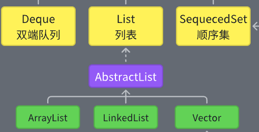

#### 添加原理

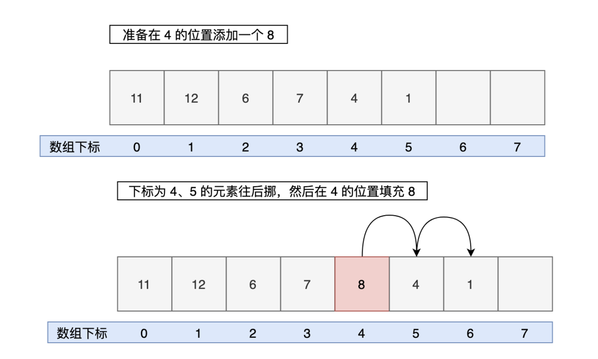

#### 删除原理

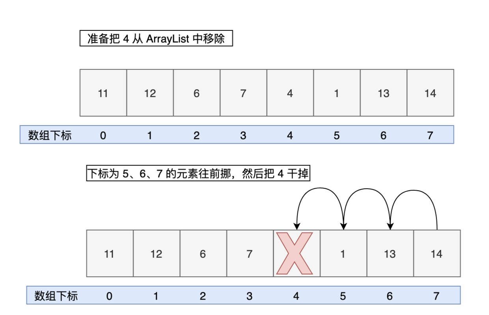

> 增删性能低下；**扩容**麻烦

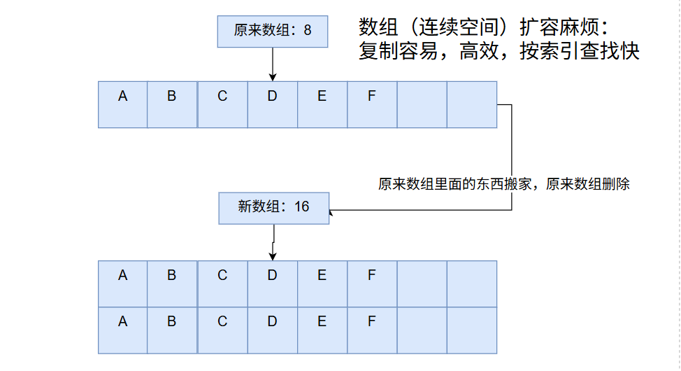

### LinkedList

> 链表


#### 数据结构

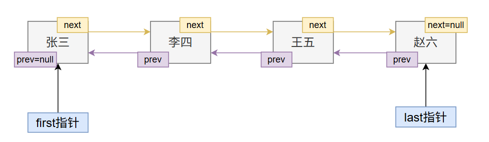

```java
private static class Node<E> {
    E item;
    Node<E> next;
    Node<E> prev;

    Node(Node<E> prev, E element, Node<E> next) {
        this.item = element;
        this.next = next;
        this.prev = prev;
    }
}
```

#### 特有方法

- `void addFirst(Object obj)`
- `void addLast(Object obj)`
- `Object getFirst()`
- `Object getLast()`
- `Object removeFirst()`
- `Object removeLast()`

#### 添加原理

```sql
// 头插法
void linkFirst(E e) {
    final Node<E> f = first;
    final Node<E> newNode = new Node<>(null, e, f);
    first = newNode;
    if (f == null)
        last = newNode;
    else
        f.prev = newNode;
    size++;
    modCount++;
}

// 尾插法
void linkLast(E e) {
    final Node<E> l = last;
    final Node<E> newNode = new Node<>(l, e, null);
    last = newNode;
    if (l == null)
        first = newNode;
    else
        l.next = newNode;
    size++;
    modCount++;
}
```

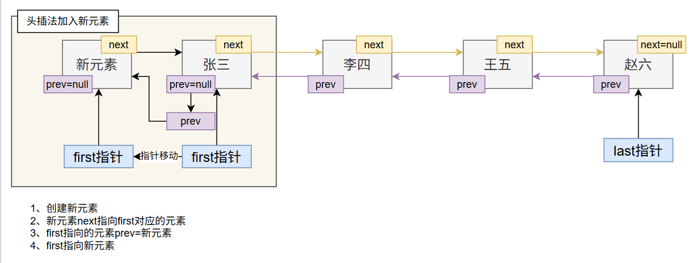

#### 删除原理

```sql
private E unlinkFirst(Node<E> f) {
    // assert f == first && f != null;
    final E element = f.item;
    final Node<E> next = f.next;
    f.item = null;
    f.next = null; // help GC
    first = next;
    if (next == null)
        last = null;
    else
        next.prev = null;
    size--;
    modCount++;
    return element;
}
```

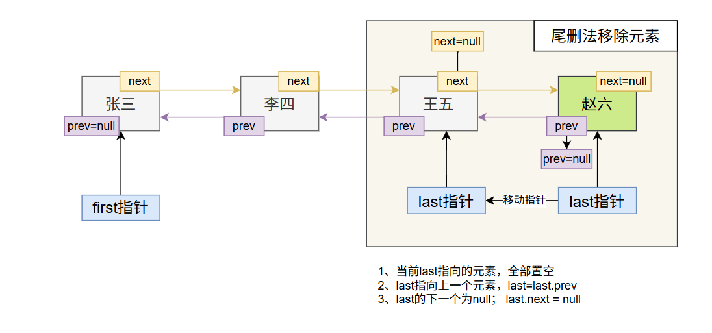

### Vector

> 一个可以自动增长长度的 数组


### Stack

> Stack类表示一个**后进先出（LIFO）**的**栈**。它扩展了 **Vector； 《子弹夹结构》**
> 
> 五种常用操作：
> 
> 1. 压入：push
> 2. 弹出：pop
> 3. 查看栈顶元素：peek
> 4. 判断栈是否为空：empty
> 5. 搜索栈中的元素
并确定其距顶端距离的方法：search

#### 数据结构

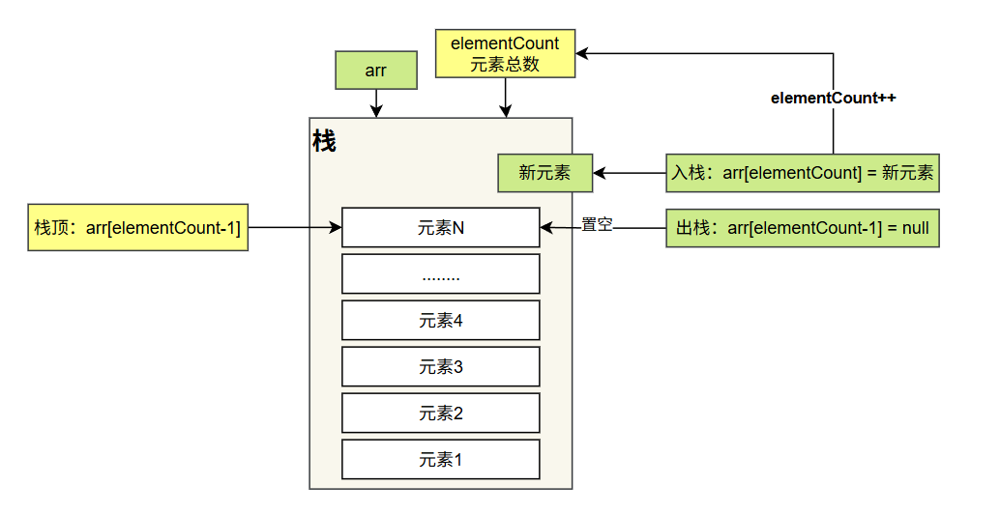

#### 方法测试

1. 压入：push
2. 弹出：pop
3. 查看栈顶元素：peek
4. 判断栈是否为空：empty
5. 搜索栈中的元素
并确定其距顶端距离的方法：search

## Set

> **不重复****、****无序****的元素集合**
> 
> - Set接口是Collection的子接口，Set接口相较于Collection接口没有提供额外的方法
> - Set 集合不允许包含相同的元素，如果试把两个相同的元素加入同一个 Set 集合中，则添加操作失败。
> - Set集合支持的遍历方式和Collection集合一样：foreach和Iterator。
> - Set的常用实现类有：HashSet、TreeSet、LinkedHashSet。

### HashSet

- HashSet 具有以下`特点`：
  - 不能保证元素的排列顺序
  - HashSet 不是线程安全的
  - 集合元素可以是 null

#### 添加原理

- **第1步：**当向 HashSet 集合中存入一个元素时，HashSet 会调用该对象的 hashCode() 方法得到该对象的 **hashCode值**，然后根据 hashCode值，通过某个散列函数**决定该对象**在 HashSet **底层数组中的存储位置**。
- **第2步：**如果要在数组中存储的位置上**没有元素**，则**直接添加成功**。
- **第3步：**如果要在数组中存储的位置上**有元素**，则**继续比较**：
  - 如果两个元素的**hashCode值不相等**，则**添加成功**；
  - 如果两个元素的hashCode()值相等，则会继续调用equals()方法：
    - 如果**equals()**方法结果为**false**，则**添加成功**。
    - 如果**equals()**方法结果为**true**，则**添加失败**。

> - 第2步**添加成功**，元素会**保存在底层数组**中。
> - 第3步两种添加成功的操作，由于该底层数组的位置已经有元素了，则会通过`链表`的方式**继续链接**，存储。

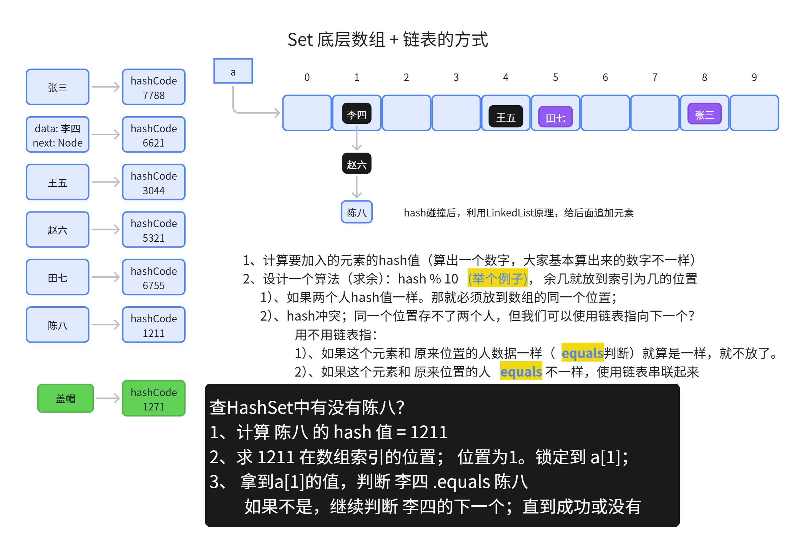

#### 功能测试

> 1. 增删改查 + 遍历 + 不重复性验证
> 2. 做下面两个练习

1. List元素去重

```sql
public static List duplicateList(List list) {
      HashSet set = new HashSet();
      set.addAll(list);
      return new ArrayList(set);
}
public static void main(String[] args) {
      List list = new ArrayList();
      list.add(new Integer(1));
      list.add(new Integer(2));
      list.add(new Integer(2));
      list.add(new Integer(4));
      list.add(new Integer(4));
      List list2 = duplicateList(list);
      for (Object integer : list2) {
          System.out.println(integer);
      }
}
```

1. 随机数去重

```java
public class RandomValueTest {
        public static void main(String[] args) {
                HashSet hs = new HashSet(); // 创建集合对象
                Random r = new Random();
                while (hs.size() < 10) {
                        int num = r.nextInt(20) + 1; // 生成1到20的随机数
                        hs.add(num);
                }

                for (Integer integer : hs) { // 遍历集合
                        System.out.println(integer); // 打印每一个元素
                }
        }
}
```

### TreeSet

> 作为了解内容。AI提示词：用Java的TreeSet写10个小例子

# Map

- Map与Collection并列存在。用于保存具有`映射关系`的数据：key-value
  - `Collection`集合称为**单列集合**，元素是孤立存在的（理解为单身）。
  - `Map`集合称为**双列集合**，元素是成对存在的(理解为夫妻)。

## Key-Value特点

Key-Value 代表一组映射关系；

> 一个键对应一个值；如
> 
> 1. **身份证号 **对应 **一个人**
> 2. **商品id **对应 **一个商品**
> 3. **元素符号** 对应 **一个化学元素**

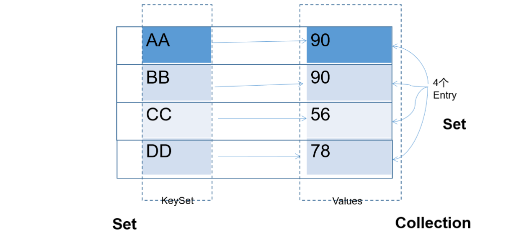

> Map 中的 `key用Set来存放`，`不允许重复`;同一个 Map 对象所对应的类，须重写hashCode()和equals()方法

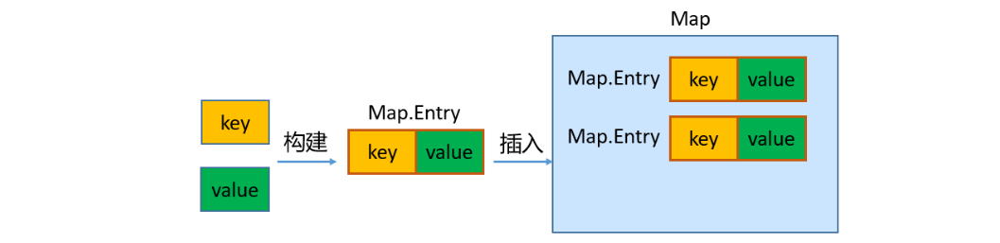

> - key 和 value 之间存在单向一对一关系，即通过指定的 key 总能找到唯一的、确定的 value，不同key对应的`value可以重复`。value所在的类要重写equals()方法。
> - key和value构成一个entry。所有的entry彼此之间是`无序的`、`不可重复的`。

## 常用方法

- **添加、修改操作：**
  - `Object put(Object key,Object value)`：将指定key-value添加到(或修改)当前map对象中
  - `void putAll(Map m)`: 将m中的所有key-value对存放到当前map中
- **删除操作：**
  - `Object remove(Object key)`：移除指定key的key-value对，并返回value
  - `void clear()`：清空当前map中的所有数据
- **元素查询的操作：**
  - `Object get(Object key)`：获取指定key对应的value
  - `boolean containsKey(Object key)`：是否包含指定的key
  - `boolean containsValue(Object value)`：是否包含指定的value
  - `int size()`：返回map中key-value对的个数
  - `boolean isEmpty()`：判断当前map是否为空
  - `boolean equals(Object obj)`：判断当前map和参数对象obj是否相等
- **元视图操作的方法：**
  - `Set keySet()`：返回所有key构成的Set集合
  - `Collection values()`：返回所有value构成的Collection集合
  - `Set entrySet()`：返回所有key-value对构成的Set集合

## HashMap

- HashMap是 Map 接口`使用频率最高`的实现类。
- HashMap是线程不安全的。允许添加 null 键和 null 值。
- 存储数据采用的哈希表结构，底层使用`一维数组`+`单向链表`+`红黑树`进行key-value数据的存储。与HashSet一样，元素的存取顺序不能保证一致。
- HashMap `判断两个key相等的标准`是：两个 key 的hashCode值相等，通过 equals() 方法返回 true。
- HashMap `判断两个value相等的标准`是：两个 value 通过 equals() 方法返回 true。

```go
public static void main(String[] args) {
    HashMap map = new HashMap();
    map.put("许仙", "白娘子");
    map.put("董永", "七仙女");
    map.put("牛郎", "织女");
    map.put("许仙", "小青"); //同名覆盖

    System.out.println("所有的key:");
    Set keySet = map.keySet();
    for (Object key : keySet) {
        System.out.println(key);
    }

    System.out.println("所有的value:");
    Collection values = map.values();
    for (Object value : values) {
        System.out.println(value);
    }

    System.out.println("所有的映射关系:");
    Set entrySet = map.entrySet();
    for (Object mapping : entrySet) {
        //System.out.println(entry);
        Map.Entry entry = (Map.Entry) mapping;
        System.out.println(entry.getKey() + "->" + entry.getValue());
    }
}
```

### 练习1：歌手与歌曲


> 1. 需求1：按照歌手名字，查询他有哪些歌曲
> 2. 需求2：按照歌曲名字，查询这首歌曲的作者

### 练习2：二级联动

> 需求：将省份和城市的名称保存在集合中，用户选择省份以后，二级联动显示对应省份的地级市供用户选择

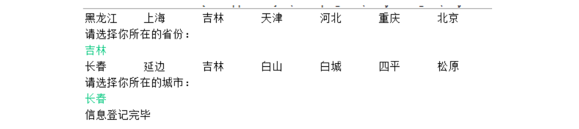

```typescript
class CityMap{
        //基础数据
        public static Map model = new HashMap();
        
        static {
                model.put("北京", new String[] {"北京"});
                model.put("上海", new String[] {"上海"});
                model.put("天津", new String[] {"天津"});
                model.put("重庆", new String[] {"重庆"});
                model.put("黑龙江", new String[] {"哈尔滨","齐齐哈尔","牡丹江","大庆","伊春","双鸭山","绥化"});
                model.put("吉林", new String[] {"长春","延边","吉林","白山","白城","四平","松原"});
                model.put("河北", new String[] {"石家庄","张家口","邯郸","邢台","唐山","保定","秦皇岛"});
        }
        
}
```

### 练习3：WordCount

> 需求：统计一串英文中每个字母出现的次数; 如：`String str = "aaaabbbcccccccccc";`

## LinkedHashMap

- LinkedHashMap 是 HashMap 的子类
- 存储数据采用的哈希表结构+链表结构，在HashMap存储结构的基础上，使用了一对`双向链表`来`记录添加元素的先后顺序`，可以**保证遍历元素**时，**与添加的顺序一致**。
- 通过哈希表结构可以保证键的唯一、不重复，需要键所在类重写hashCode()方法、equals()方法。

## Hashtable（了解）

> - **HashMap**:底层是一个**哈希表**（**jdk7:数组+链表**;**jdk8:数组+链表+红黑树**）,是一个**线程不安全**的集合,执行**效率高**
> - **Hashtable**:底层也是一个**哈希表（数组+链表）**,是一个线程安全的集合,执行效率低
> 
> =======================================================
> 
> - **HashMap**集合:**可以存储null的键**、**null的值**
> - **Hashtable**集合,**不能存储null的键、null的值**
> 
> =======================================================
> 
> - Hashtable和Vector集合一样,在jdk1.2版本之后被更先进的集合(HashMap,ArrayList)取代了。
> - 所以**HashMap是Map的主要实现类**，**Hashtable是Map的古老实现类**。
> 
> =======================================================
> 
> - Hashtable的子类Properties（配置文件）依然活跃在历史舞台
> - Properties集合是一个唯一和IO流相结合的集合

## Properties

- Properties 类是 Hashtable 的子类，该对象用于处理属性文件
- 由于属性文件里的 key、value 都是字符串类型，所以 Properties 中要求 key 和 value 都是字符串类型
- 存取数据时，建议使用setProperty(String key,String value)方法和getProperty(String key)方法

```java
@Test
public void test01() {
    Properties properties = System.getProperties();
    String fileEncoding = properties.getProperty("file.encoding");//当前源文件字符编码
    System.out.println("fileEncoding = " + fileEncoding);
}
@Test
public void test02() {
    Properties properties = new Properties();
    properties.setProperty("user","leifengyang");
    properties.setProperty("password","123456");
    System.out.println(properties);
    properties.store(new FileOutputStream("sys.properties"), "系统属性");
}

@Test
public void test03() throws IOException {
    Properties pros = new Properties();
    pros.load(new FileInputStream("jdbc.properties"));
    String user = pros.getProperty("user");
    System.out.println(user);
}
```

# Collections 工具类

1. 操作数组的工具类：**Arrays**
2. **Collections **是一个操作 Set、List 和 Map 等集合的工具类。

## 常用方法

Collections 中提供了一系列静态的方法对集合元素进行排序、查询和修改等操作，还提供了对集合对象设置不可变、对集合对象实现同步控制等方法（均为static方法）：

**排序操作：**

- `reverse(List)`：反转 List 中元素的顺序
- `shuffle(List)`：对 List 集合元素进行随机排序
- `sort(List)`：根据元素的自然顺序对指定 List 集合元素按升序排序
- `sort(List，Comparator)`：根据指定的 Comparator 产生的顺序对 List 集合元素进行排序
- `swap(List，int， int)`：将指定 list 集合中的 i 处元素和 j 处元素进行交换

**查找**

- `Object max(Collection)`：根据元素的自然顺序，返回给定集合中的最大元素
- `Object max(Collection，Comparator)`：根据 Comparator 指定的顺序，返回给定集合中的最大元素
- `Object min(Collection)`：根据元素的自然顺序，返回给定集合中的最小元素
- `Object min(Collection，Comparator)`：根据 Comparator 指定的顺序，返回给定集合中的最小元素
- `int binarySearch(List list,T key)`在List集合中查找某个元素的下标，但是List的元素必须是T或T的子类对象，而且必须是可比较大小的，即支持自然排序的。而且集合也事先必须是有序的，否则结果不确定。
- `int binarySearch(List list,T key,Comparator c)`在List集合中查找某个元素的下标，但是List的元素必须是T或T的子类对象，而且集合也事先必须是按照c比较器规则进行排序过的，否则结果不确定。
- `int frequency(Collection c，Object o)`：返回指定集合中指定元素的出现次数

**复制、替换**

- `void copy(List dest,List src)`：将src中的内容复制到dest中
- `boolean replaceAll(List list，Object oldVal，Object newVal)`：使用新值替换 List 对象的所有旧值
- 提供了多个`unmodifiableXxx()`方法，该方法返回指定 Xxx的不可修改的视图。

**添加**

- `boolean addAll(Collection  c,T... elements)`将所有指定元素添加到指定 collection 中。

**同步**

- Collections 类中提供了多个` synchronizedXxx() `方法，该方法可使将指定集合包装成线程同步的集合，从而可以解决多线程并发访问集合时的线程安全问题：

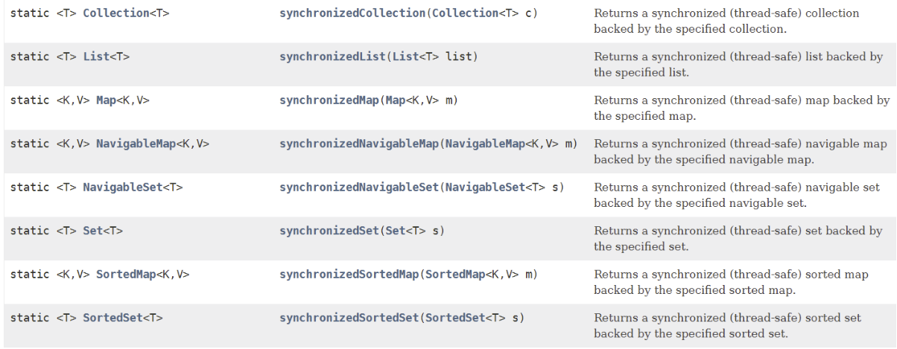

```java
public class TestCollections {
    public void test01(){
        /*
        public static <T> boolean addAll(Collection<? super T> c,T... elements)
        将所有指定元素添加到指定 collection 中。Collection的集合的元素类型必须>=T类型
        */
        Collection<Object> coll = new ArrayList<>();
        Collections.addAll(coll, "hello","java");
        Collections.addAll(coll, 1,2,3,4);

        Collection<String> coll2 = new ArrayList<>();
        Collections.addAll(coll2, "hello","java");
        //Collections.addAll(coll2, 1,2,3,4);//String和Integer之间没有父子类关系
    }

    public void test02(){
/*
 * public static <T extends Object & Comparable<? super T>> T max(Collection<? extends T> coll)
 * 在coll集合中找出最大的元素，集合中的对象必须是T或T的子类对象，而且支持自然排序
*  
*  public static <T> T max(Collection<? extends T> coll,Comparator<? super T> comp)
*  在coll集合中找出最大的元素，集合中的对象必须是T或T的子类对象，按照比较器comp找出最大者
*
*/
        List<Man> list = new ArrayList<>();
        list.add(new Man("张三",23));
        list.add(new Man("李四",24));
        list.add(new Man("王五",25));

        /*
         * Man max = Collections.max(list);//要求Man实现Comparable接口，或者父类实现
         * System.out.println(max);
         */

        Man max = Collections.max(list, new Comparator<Man>() {
            @Override
            public int compare(Man o1, Man o2) {
                return o2.getAge()-o2.getAge();
            }
        });
        System.out.println(max);
    }

    public void test03(){
        /*
         * public static void reverse(List<?> list)
         * 反转指定列表List中元素的顺序。
         */
        List<String> list = new ArrayList<>();
        Collections.addAll(list,"hello","java","world");
        System.out.println(list);

        Collections.reverse(list);
        System.out.println(list);
    }

    public void test04(){
        /*
         * public static void shuffle(List<?> list) 
         * List 集合元素进行随机排序，类似洗牌，打乱顺序
         */
        List<String> list = new ArrayList<>();
        Collections.addAll(list,"hello","java","world");

        Collections.shuffle(list);
        System.out.println(list);
    }

    public void test05() {
        /*
         * public static <T extends Comparable<? super T>> void sort(List<T> list)
         * 根据元素的自然顺序对指定 List 集合元素按升序排序
         *
         * public static <T> void sort(List<T> list,Comparator<? super T> c)
         * 根据指定的 Comparator 产生的顺序对 List 集合元素进行排序
         */
        List<Man> list = new ArrayList<>();
        list.add(new Man("张三",23));
        list.add(new Man("李四",24));
        list.add(new Man("王五",25));

        Collections.sort(list);
        System.out.println(list);

        Collections.sort(list, new Comparator<Man>() {
            @Override
            public int compare(Man o1, Man o2) {
                return Collator.getInstance(Locale.CHINA).compare(o1.getName(),o2.getName());
            }
        });
        System.out.println(list);
    }

    public void test06(){
        /*
         * public static void swap(List<?> list,int i,int j)
         * 将指定 list 集合中的 i 处元素和 j 处元素进行交换
         */
        List<String> list = new ArrayList<>();
        Collections.addAll(list,"hello","java","world");

        Collections.swap(list,0,2);
        System.out.println(list);
    }

    public void test07(){
        /*
         * public static int frequency(Collection<?> c,Object o)
         * 返回指定集合中指定元素的出现次数
         */
        List<String> list = new ArrayList<>();
        Collections.addAll(list,"hello","java","world","hello","hello");
        int count = Collections.frequency(list, "hello");
        System.out.println("count = " + count);
    }

    public void test08(){
        /*
         * public static <T> void copy(List<? super T> dest,List<? extends T> src)
         * 将src中的内容复制到dest中
         */
        List<Integer> list = new ArrayList<>();
        for(int i=1; i<=5; i++){//1-5
            list.add(i);
        }

        List<Integer> list2 = new ArrayList<>();
        for(int i=11; i<=13; i++){//11-13
            list2.add(i);
        }

        Collections.copy(list, list2);
        System.out.println(list);

        List<Integer> list3 = new ArrayList<>();
        for(int i=11; i<=20; i++){//11-20
            list3.add(i);
        }
                //java.lang.IndexOutOfBoundsException: Source does not fit in dest
        //Collections.copy(list, list3);
        //System.out.println(list);

    }
        

    public void test09(){
        /*
         * public static <T> boolean replaceAll(List<T> list，T oldVal，T newVal)
         * 使用新值替换 List 对象的所有旧值
         */
        List<String> list = new ArrayList<>();
        Collections.addAll(list,"hello","java","world","hello","hello");

        Collections.replaceAll(list, "hello","song");
        System.out.println(list);
    }
}
```

## 练习 - 斗地主

> 需求：模拟**三个人斗地主洗牌**和**发牌**，要**留三张底牌**，发牌结束，打印三个人的手牌以及底牌（**要整好序**）。

简单提示：

```javascript
String[] num = {"A","2","3","4","5","6","7","8","9","10","J","Q","K"}; //牌号
String[] color = {"方片","梅花","红桃","黑桃"}; //花色
ArrayList<String> poker = new ArrayList<>(); //把所有牌存到这个集合中
```

# 核心原理

## ArrayList扩容（面试）

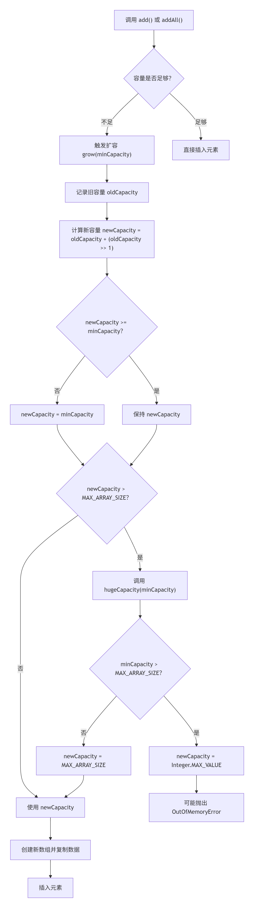

## HashMap扩容（面试）

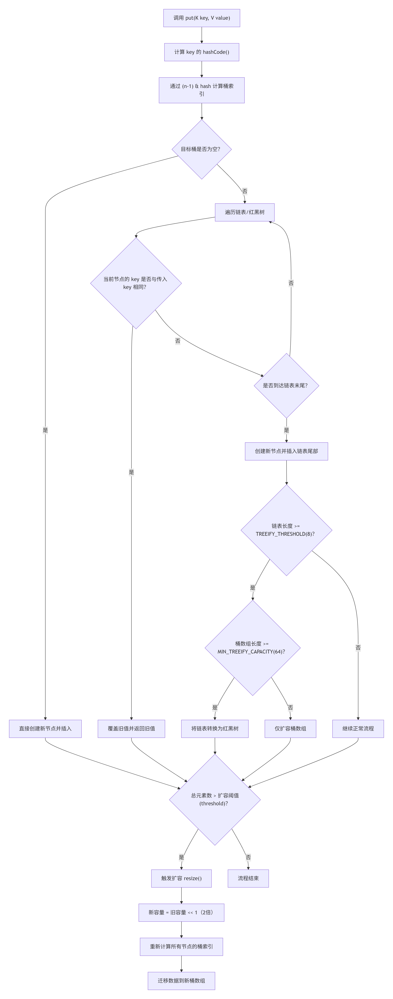

# Debug

Pixpin

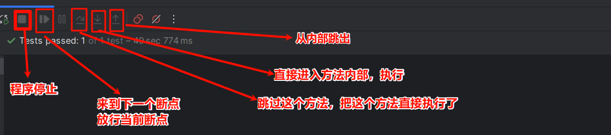