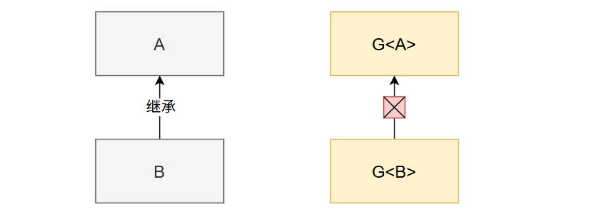

# 7. 泛型

# 为什么要泛型？

假设我们要实现一个容器类 `Box`，可以存放任意类型的数据，但 没有泛型 时写法如下；

```typescript
class Box {
    private Object data;

    public void setData(Object data) {
        this.data = data;
    }

    public Object getData() {
        return data;
    }
}

// 使用示例
Box box = new Box();
box.setData("Hello"); // 存入字符串
String str = (String) box.getData(); // 必须强制类型转换
box.setData(123); // 存入整数
Integer num = (Integer) box.getData(); // 再次强制转换
```

问题：

1. 每次取出数据都要强制转换，麻烦且容易出错。
2. 类型不安全：可以存入任意类型，取出时如果类型不匹配会抛出 `ClassCastException`。

# 基本概念

> 泛型允许我们定义类、接口或方法时，指定一个类型参数，在具体使用时再确定实际类型。

## 泛型类

用 `<T>` 定义类型参数，`T` 可以是任意标识符（常用 T、E、K、V 等）。

```typescript
class Box<T> { // T 是类型参数
    private T data;

    public void setData(T data) {
        this.data = data;
    }

    public T getData() {
        return data;
    }
}
```

使用方式：

```java
Box<String> stringBox = new Box<>();
stringBox.setData("Hello");
String str = stringBox.getData(); // 无需强制转换

Box<Integer> intBox = new Box<>();
intBox.setData(123);
Integer num = intBox.getData(); // 类型安全
```

优势：

- 类型安全：只能存入和取出指定类型。
- 消除强制转换。

## 泛型方法

在方法返回值前定义类型参数，例如：

```c++
public class Utils {
    // 泛型方法：交换数组中的两个元素
    public static <T> void swap(T[] array, int i, int j) {
        T temp = array[i];
        array[i] = array[j];
        array[j] = temp;
    }
}

// 使用示例
Integer[] nums = {1, 2, 3};
Utils.swap(nums, 0, 2); // 交换后变为 [3, 2, 1]
String[] strs = {"A", "B", "C"};
Utils.swap(strs, 1, 2); // 交换后变为 ["A", "C", "B"]
```

# 泛型通配符

> AI：提示词： 用Java的泛型通配符，写上几个例子

> 用于处理未知类型；
> 
> 常见形式：`<?>`、`<? extends T>`、`<? super T>`。
> 
> **通配符不能直接用于泛型类的****类型参数**，但可以**通过泛型方法**间接使用。
> 
> **通配符可以出现在以下位置**
> 
> 1. **方法参数​**（最常见，实现灵活输入）。
> 2. **返回类型**​（返回只读数据）。
> 3. **局部变量​**（限制操作）。
> 4. **类字段​**（需注意类型擦除）。
> 5. **静态方法**​（工具类操作）。
> 6. **嵌套类型​**（如 `Map<String, List<?>>`）。
> 7. **泛型方法**​（增强类型灵活性）。

## `<?>`：无界通配符

表示可以接受任何类型，但**只能读取，不能写入**（除了 `null`）。

```typescript
public static void printList(List<?> list) {
    for (Object elem : list) {
        System.out.println(elem);
    }
}

// 使用示例
List<String> strList = Arrays.asList("A", "B");
List<Integer> intList = Arrays.asList(1, 2);
printList(strList); // 输出 A B
printList(intList); // 输出 1 2
```

> 基础**类型**（int\long[只是规定一次取**几个字节**的数据]）、引用**类型**（类型：内存的一块方法区中保存）

## `<? extends T>`：上界通配符

表示只能接受 `T` 或其子类型，**只能读取，不能写入**（除了 `null`）。

```typescript
public static double sum(List<? extends Number> list) {
    double sum = 0.0;
    for (Number num : list) {
        sum += num.doubleValue();
    }
    return sum;
}

// 使用示例
List<Integer> intList = Arrays.asList(1, 2, 3);
List<Double> doubleList = Arrays.asList(1.5, 2.5);
System.out.println(sum(intList));    // 输出 6.0
System.out.println(sum(doubleList)); // 输出 4.0
```

## 3. `<? super T>`：下界通配符

表示只能接受 `T` 或其父类型，**可以写入** `T` 对象，但**读取**时需要**强制转换**。

```typescript
public static void addNumbers(List<? super Integer> list) {
    list.add(1);
    list.add(2);
}

// 使用示例
List<Number> numList = new ArrayList<>();
addNumbers(numList); // 添加整数到 Number 列表
System.out.println(numList); // 输出 [1, 2]
```

## 读写问题

> **读取（Read）**​
> 
> - 指从泛型容器中获取数据​，例如调用 `get()` 方法取出元素。
> - 允许读取​：你可以安全地获取数据，并赋值给某个类型的变量。
> 
> **写入（Write）**​
> 
> - 指向**泛型容器中添加数据​**，例如调用 `add()` 方法插入元素。
> - **禁止写入​**：编译器会阻止你添加元素（除了 `null`），因为**类型不安全**。

### 使用 `<? extends T>`（上界通配符）

```typescript
public static void processList(List<? extends Number> list) {
    // 读取：允许
    Number num = list.get(0);  // 可以安全赋值给 Number
    Double d = list.get(0).doubleValue(); // 也可以调用 Number 的方法

    // 写入：禁止（除了 null）
    list.add(123);          // 编译错误！
    list.add(new Integer(5)); // 编译错误！
    list.add(null);         // 唯一允许的写入操作
}
```

**为什么不能写入？**

`List<? extends Number>` 的实际类型可能是 `List<Integer>`、`List<Double>` 等。如果你试图添加一个 `Number` 或其子类（比如 `Integer`），编译器无法确定它是否与列表的实际类型兼容。例如：

```java
List<Double> doubleList = new ArrayList<>();
processList(doubleList);  // 传入一个 List<Double>

// 如果在 processList 中添加 Integer：
doubleList.add(123);      // 这会导致 List<Double> 中出现 Integer，破坏类型安全！
```

编译器为了阻止这种风险，直接禁止写入操作（除了 `null`，因为 `null` 是所有引用类型的默认值）。

### 使用 `<? super T>`（下界通配符）

假设有一个方法接收 `List<? super Integer>`：

```java
public static void addToIntList(List<? super Integer> list) {
    // 写入：允许添加 Integer 及其子类（如果有的话）
    list.add(123);
    list.add(new Integer(5));

    // 读取：只能赋值给 Object
    Object obj = list.get(0);  // 必须用 Object 接收
    Integer num = (Integer) list.get(0); // 需要强制转换（可能有风险！）
}
```

**为什么可以写入？​**
`List<? super Integer>` 的实际类型可能是 `List<Integer>`、`List<Number>` 或 `List<Object>`。无论实际类型是什么，添加 `Integer` 都是安全的，因为 `Integer` 是这些类型的子类。

### 总结

| 通配符类型 | 读取（Read） | 写入（Write） |
| --- | --- | --- |
| List<?> | 只能用 Object 接收 | 只能写入 null |
| List<? extends T> | 可以安全读取为 T 或子类 | 禁止写入（除了 null） |
| List<? super T> | 只能用 Object 接收（需强制转换） | 可以写入 T 及其子类 |

### PECS 原则

> 出自：**《****Effective Java****》**

- **P**roducer（生产者）​​：​站在List的角度，他给外界提供数据，也就是产生数据
  - 提供数据给外部使用 → 读取数据 → 使用 `<? ``e``xtends T>`
- **C**onsumer（消费者）​​：​站在List的角度，他要保存外部数据，也就是消费数据
  - 接收外部数据并存储 → 写入数据 → 使用 `<? ``s``uper T>`

# 高级

## 类型擦除

Java 泛型在编译后会被擦除，替换为原始类型（如 `Object` 或上界类型）。例如：

```java
// 编译前
Box<String> box = new Box<>(); //Object
// 编译后
Box box = new Box(); // 类型参数被擦除
```

## 不能使用基本类型

泛型类型参数必须是引用类型，不能是 `int`、`char` 等基本类型：

```java
Box<int> box = new Box<>(); // 编译错误
Box<Integer> box = new Box<>(); // 正确
```

## 子类类型

如果B是A的一个子类型（子类或者子接口），而G是具有泛型声明的类或接口，**G<B>**并不是**G<A>**的子类型！

比如：String是Object的子类，但是List<String>并不是List<Object>的子类。

