# 8. IO

# File I/O（NIO.2）

> Input：输入
> 
> Output：输出  
> 
> 万物逻辑皆为读写

> - 讲解**JDK 7 版本引入**的文件**新版 I/O 机制**。 NIO(**New IO**)
> - **Java SE 6 版本的文件 I/O **教程内容较为简略：`java.io.file`
> - `java.nio.file` 包及其相关包 `java.nio.file.attribute` 为**文件 I/O** 和**访问默认文件系统**提供了全面支持。虽然该 API 包含许多类，但只需**关注少数几个入口点**即可。因此 API 非常直观且易于使用。
> - 如何学习？
>   1. `Path `类：路径、路径操作、相对/绝对路径
>   2. `Files` 类：文件操作共有的基本概念、文件检查、删除、复制和移动

`Files`：是File的工具类

> 1. 负责新建、删除、重命名文件和目录
> 2. File 不能访问文件内容本身。如果需要访问文件内容本身，则需要使用输入/输出流

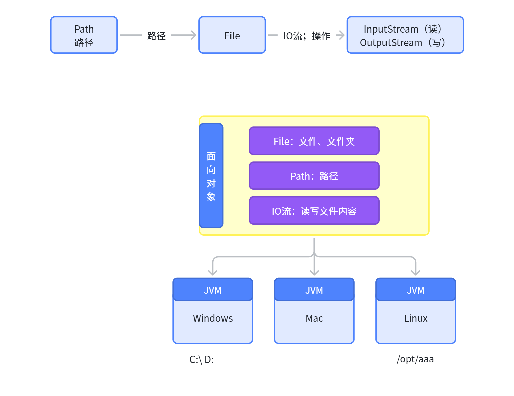

## 了解文件系统

> **文件系统**以某种形式（通常是**一个或多个硬盘**）存储和**组织**文件，以便能够轻松检索。
> 
> - 当今使用的大多数文件系统采用树状（或分层）结构存储文件。
> - 树的顶端是一个（或多个）根节点。
> - 根节点下包含文件和目录（在 Microsoft Windows 中称为文件夹）。
> - 每个目录可以包含文件和子目录，而子目录又可以包含更多文件和子目录，如此递归延伸，理论上可以达到近乎无限的深度。

### 什么是路径

下图展示了一个包含单个根节点的示例目录树。Microsoft Windows 支持多个根节点，每个根节点对应一个卷，例如 `C:\` 或 `D:\` 。而 Solaris 操作系统仅支持单个根节点，由斜杠字符 `/` 表示。

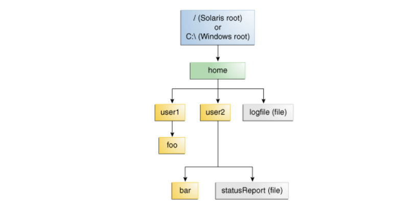

Mac： Unix； `/home/sally/statusReport`

Linux: `/home/sally/statusReport`

Windows：`C:\home\sally\statusReport`

用于分隔目录名称的字符（也称为分隔符）因文件系统而异：Solaris 操作系统使用正斜杠（ `/` ），而 Microsoft Windows 使用反斜杠（ `\` ）

### 相对路径和绝对路径

**绝对路径**：绝对路径始终包含根元素以及定位文件所需的**完整目录列表**。例如， `/home/sally/statusReport` 就是一个绝对路径，该路径字符串已包含定位文件所需的全部信息。**绝对路径总是****从 根 开始****，****完整表示层级； **

绝对路径一般认为是固定地址，不变；

**相对路径**：相对路径需要与其他路径结合才能访问文件。例如， `joe/foo` 是一个相对路径。若没有更多信息，程序无法在文件系统中可靠定位 `joe/foo` 目录。**相对路径总是****从 当前位置 开始**，表示其他文件**相对于自己的层级**

女朋友 相对 我的位置： xxx街xxx小区

相对路径经常可能发生变化； 

- ../：返回到上一层目录
- ./：当前目前位置。和不写是一个意思 

### 符号链接

符号链接也被称为软链接。在Windows中就是我们所说的快捷方式。

> **符号链接**是一种**特殊的文件**，它作为**指向****另一个文件****的****引用**。在大多数情况下，应用程序对符号链接的操作是透明的，这些**操作会****自动重定向**到**链接****的****目标**（被指向的文件或目录称为链接的目标）。**例外情况**是**删除**或**重命名**符号链接时，此时**被操作的是链接本身**而非其目标。

在下图中， `logFile` 对用户显示为普通文件，但实际上它是指向 `dir/logs/HomeLogFile` 的符号链接。 `HomeLogFile` 是该链接的目标文件

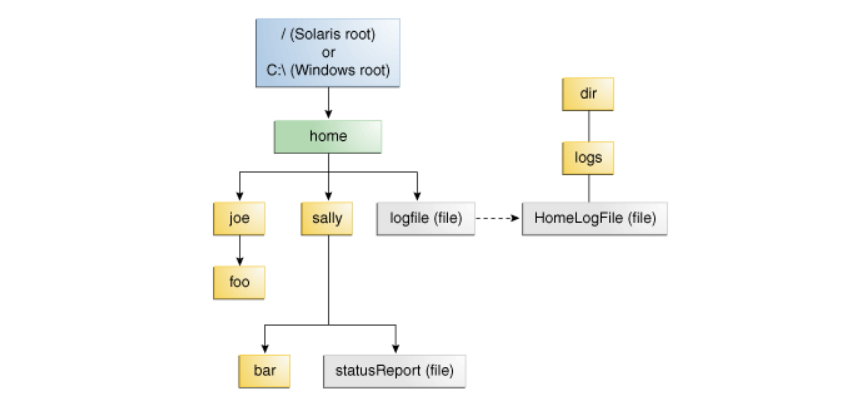

**符号链接对用户**通常**是透明**的。**读取**或**写入**符号链接**与操作普通文件或目录无异**。

> 注意：在实际应用中，多数文件系统会大量使用符号链接。偶尔，不当创建的符号链接会**导致循环引用**——即链接目标指回原始链接时发生的情况。这种循环引用可能是间接的：例如目录 `a` 指向目录 `b` ，后者又指向目录 `c` ，而该目录包含的子目录又指回目录 `a` 。**当程序递归遍历目录结构时，循环引用可能引发严重问题。不过这种情况已被充分考虑，不会导致程序陷入无限循环**。

## Path 类

> 1. `Path` 类作为 Java SE 7 版本引入的重要特性，是 `java.nio.file` 包的核心入口点之一。
> 2. `Path` 类是对文件系统中路径的程序化表示。 `Path` 对象包含用于构建路径的文件名和目录列表，可用来检查、定位及操作文件。
> 3.  `Path` 对应的文件或目录可能不存在。可以创建 `Path` 实例并通过多种方式操作它：可以**追加内容**、**提取片段**或与**其他路径进行比较**。在适当的时候，您可以使用 `Files` 类中的方法来检查 `Path` 对应文件**是否存在**、**创建文件**、**打开文件**、**删除文件**、**更改其权限**等操作。

###  1. 创建 Path 

可以通过以下来自 `Paths` （注意复数形式）辅助类的 `get` 方法之一轻松创建 `Path` 对象：

```java
import java.nio.file.*;

public class PathExample {
    public static void main(String[] args) {
        // 通过Paths.get()创建Path（绝对路径）
        Path absolutePath = Paths.get("/home/user/documents/file.txt");
        System.out.println("绝对路径: " + absolutePath);

        // 相对路径
        Path relativePath = Paths.get("src", "main", "java", "App.java");
        System.out.println("相对路径: " + relativePath);

        // 使用Path.of()（Java 11+）
        Path pathFromString = Path.of("data/config.json");
        System.out.println("从字符串创建: " + pathFromString);
    }
}
```

### 路径解析与拼接

```java
Path baseDir = Paths.get("/home/user");
Path docsDir = baseDir.resolve("documents"); // 解析为 /home/user/documents
Path fullPath = docsDir.resolve("report.pdf"); // /home/user/documents/report.pdf

// 如果参数是绝对路径，resolve()直接返回该路径
Path otherPath = baseDir.resolve("/etc/config"); // 结果为 /etc/config

// 使用resolveSibling()替换最后一级路径
Path sibling = Paths.get("/data/old.log").resolveSibling("new.log"); // /data/new.log
```

### 路径信息获取

```java
Path path = Paths.get("/home/user/docs/file.txt");

// 获取路径各部分信息
System.out.println("文件名: " + path.getFileName()); // file.txt
System.out.println("父目录: " + path.getParent());     // /home/user/docs
System.out.println("根目录: " + path.getRoot());       // / (Unix) 或 C:\ (Windows)

// 转换为绝对路径
Path absolute = path.toAbsolutePath(); 

// 检查是否为绝对路径
boolean isAbsolute = path.isAbsolute();
```

### 相对路径转换

```java
Path base = Paths.get("/home/user");
Path target = Paths.get("/home/user/documents/file.txt");

// 获取base到target的相对路径
Path relative = base.relativize(target); // 输出: documents/file.txt

// 反向操作：将相对路径转换为绝对路径
Path resolved = base.resolve(relative); // 还原为 /home/user/documents/file.txt
```

### 路径转换三种方式

#### `toUri` ： 转为浏览器可以打开的方式

```java
Path p1 = Paths.get("/home/logfile");
// 结果是 file:///home/logfile
System.out.format("%s%n", p1.toUri());
```

#### `toAbsolutePath`： 转为绝对路径，无需文件真实存在

```java
Path path = Paths.get("sally\\bar");
System.out.println(path.toAbsolutePath());
```

#### `toRealPath`：返回现有文件的真实路径，需要文件真实存在

```java
Path path = Paths.get("sally\\bar");
System.out.println(path.toRealPath()); //文件不存在，抛出异常：NoSuchFileException
```

### 文件属性检查

```java
Path path = Paths.get("/path/to/file");

// 检查文件是否存在
boolean exists = Files.exists(path);

// 检查是否为目录/常规文件
boolean isDir = Files.isDirectory(path);
boolean isFile = Files.isRegularFile(path);

// 获取文件大小（需处理IOException）
long size = Files.size(path);
```

### **路径信息遍历**

```java
Path path = Paths.get("/home/user/documents/report.pdf");

// 遍历路径的每一部分
for (Path element : path) {
    System.out.println("元素: " + element);
}
// 输出: home, user, documents, report.pdf
```

### 路径比较

```java
Path p1 = Paths.get("/home/./user/../documents/");
Path p2 = Paths.get("/home/documents");

// 标准化路径（去除冗余）
Path normalized = p1.normalize(); // /home/documents

// 比较路径是否指向同一文件（需处理符号链接）
boolean isSame = Files.isSameFile(p1, p2); // true（如果路径解析后相同）
```

### 关键点总结

- 跨平台支持​：Path自动处理不同操作系统的路径分隔符（如`/`和`\`）。
- 链式操作​：支持方法链式调用，如`path.resolve("subdir").normalize().toAbsolutePath()`。
- 异常处理​：部分方法（如`toRealPath()`）可能抛出`IOException`，需用`try-catch`处理。
- 符号链接​：使用`toRealPath()`解析符号链接的真实路径。

## Files 类

> `Files` 类是 `java.nio.file` 包的另一主要入口点。
> 
> 他提供了一组丰富的静态方法，用于读取、写入和操作文件及目录。
> 
> `Files`方法操作的是`Path`对象的实例

### 创建文件/目录

```java
Path newFile = Paths.get("newfile.txt");
Path newDir = Paths.get("logs");

// 创建文件（如果已存在会抛出 FileAlreadyExistsException）
Files.createFile(newFile);

// 创建单层目录
Files.createDirectory(newDir);

// 创建多级目录（类似mkdir -p）
Path deepDir = Paths.get("a/b/c");
Files.createDirectories(deepDir);
```

### 写入文件内容

```java
// 写入字符串（Java 11+）
Path file1 = Paths.get("demo.txt");
Files.writeString(file1, "Hello Files API!\n第二行内容", StandardCharsets.UTF_8);

// 追加写入（使用StandardOpenOption）
Files.writeString(file1, "\n追加内容", StandardCharsets.UTF_8, StandardOpenOption.APPEND);

// 写入字节（通用方法）
byte[] bytes = {0x48, 0x65, 0x6c, 0x6c, 0x6f}; // "Hello"
Files.write(file1, bytes, StandardOpenOption.CREATE);
```

> StandardOpenOption：
> 
> - `WRITE` – 以写入模式打开文件
> - `APPEND` – 将新数据追加到文件末尾。此选项需与 `WRITE` 或 `CREATE` 选项配合使用
> - `TRUNCATE_EXISTING` – 将文件截断为零字节。此选项需与 `WRITE` 选项配合使用
> - `CREATE_NEW` – 如果文件已存在则抛出异常并创建新文件
> - `CREATE` – 如果文件存在则打开，不存在则创建新文件
> - `DELETE_ON_CLOSE` – 在流关闭时删除文件。该选项适用于临时文件
> - `SPARSE` – 提示新创建的文件将是稀疏文件。这一高级选项在某些文件系统（如 NTFS）中会生效，这类系统能以更高效的方式存储存在数据"间隙"的大型文件，使这些空白间隙不占用磁盘空间。
> - `SYNC` – 保持文件（包括内容和元数据）与底层存储设备同步
> - `DSYNC` – 保持文件内容与底层存储设备同步

### 读取文件内容

```javascript
// 读取全部内容为字符串（Java 11+）
String content = Files.readString(file1, StandardCharsets.UTF_8);

// 逐行读取（自动关闭资源）
List<String> lines = Files.readAllLines(file1);
for(String s: lines){
  //打印每一行字符串
}

// 大文件流式读取（内存高效） Stream 写法
try (Stream<String> stream = Files.lines(file1)) {
    stream.filter(line -> line.contains("重要"))
          .forEach(System.out::println);
}
```

### 复制/移动/删除文件

```java
Path source = Paths.get("source.txt");
Path target = Paths.get("backup/copy.txt");

// 复制文件（覆盖已存在文件）
Files.copy(source, target, StandardCopyOption.REPLACE_EXISTING);

// 移动/重命名文件
Files.move(source, Paths.get("renamed.txt"), StandardCopyOption.ATOMIC_MOVE);

Files.delete(path);
```

### 文件属性检查

```java
// 检查文件是否存在
boolean exists = Files.exists(path);

// 获取文件类型
boolean isDir = Files.isDirectory(path);
boolean isSymLink = Files.isSymbolicLink(path);

// 获取文件元数据
FileTime lastModified = Files.getLastModifiedTime(path);
long size = Files.size(path);  // 文件大小（字节）

//权限检查
boolean isRegularExecutableFile = Files.isRegularFile(file) &
         Files.isReadable(file) & Files.isExecutable(file);
```

### 遍历目录

```python
try (Stream<Path> entries = Files.list(Paths.get("/data"))) {
    entries.filter(Files::isRegularFile)
           .map(Path::getFileName)
           .forEach(System.out::println);
}

// 深度遍历（包括子目录）
Files.walk(Paths.get("/project"))
     .filter(p -> p.toString().endsWith(".java"))
     .forEach(System.out::println);
```

### 临时文件

```java
// 创建临时文件（自动删除需配置）
Path tempFile = Files.createTempFile("prefix_", ".tmp");
System.out.println("临时文件: " + tempFile);

// 创建临时目录
Path tempDir = Files.createTempDirectory("myapp_");

// 自动删除（程序退出时）
tempFile.toFile().deleteOnExit();
```

### 文件权限

```java
// 设置文件权限（POSIX系统）
Set<PosixFilePermission> perms = PosixFilePermissions.fromString("rw-r-----");
Files.setPosixFilePermissions(path, perms);

// 设置隐藏属性（Windows）
Files.setAttribute(path, "dos:hidden", true);
```

### 文件监控

> `FileSystems`: 拿到当前文件系统结构

```java
WatchService watcher = FileSystems.getDefault().newWatchService();
Path dir = Paths.get("/watchdir");

dir.register(watcher, 
    StandardWatchEventKinds.ENTRY_CREATE,
    StandardWatchEventKinds.ENTRY_DELETE,
    StandardWatchEventKinds.ENTRY_MODIFY);

while (true) {
    WatchKey key = watcher.take();
    for (WatchEvent<?> event : key.pollEvents()) {
        Path changedFile = (Path) event.context();
        System.out.println("变化类型: " + event.kind() + " 文件: " + changedFile);
    }
    key.reset();
}
```

# IO流（IO Stream）

## 0. Stream?

### 流定义

> 1. **I/O 流**代表一个**输入****源**或**输出****目标**。流可以表示多种不同的源和目标，包括磁盘文件、设备、其他程序以及内存数组。
> 2. **流****就是一系列****数据**。程序通过**输入流**从数据源（数据的源头）逐项**读取数据**;
> 3. 通过**输出流**把数据写入逐项到**目标**

1. 通过**输入****流**，读取数据到程序（数据存到某个**源**头位置）


1. 通过**输出****流**，把数据从程序写入到目标位置


### 流分类

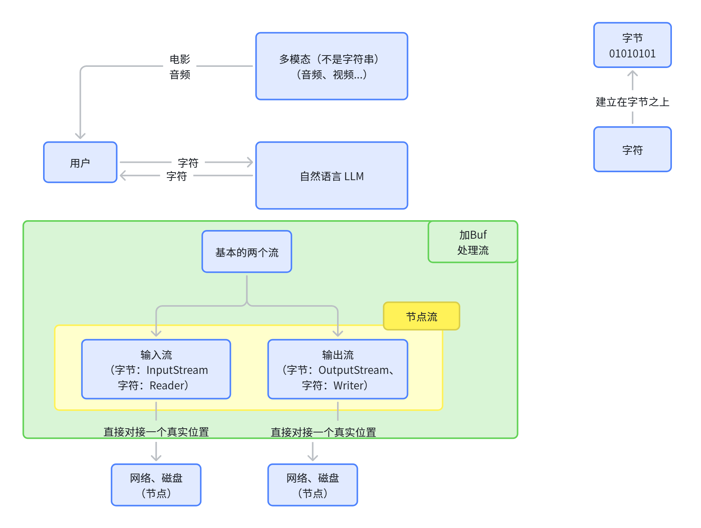

`java.io`包下提供了各种“流”类和接口，用以获取不同种类的数据，并通过`标准的方法`输入或输出数据。

- 按**数据的流向**不同分为：**输入流**和**输出流**。
  - **输入流** ：把数据从`其他设备`上读取到`内存`中的流。 
    - 以`InputStream`（读字节）、`Reader`（读字符）结尾
  - **输出流** ：把数据从`内存` 中写出到`其他设备`上的流。
    - 以`OutputStream`、`Writer`结尾
- 按**操作****数据单位**的不同分为：**字节流（8bit）**和**字符流（16bit）**。
  - **字节流** ：以字节为单位，读写数据的流。
    - 以`InputStream`、`OutputStream`结尾
  - **字符流** ：以字符为单位，读写数据的流。
    - 以`Reader`、`Writer`结尾
- 根据IO流的角色不同分为：**节点流**和**处理流**。
  - **节点流**：直接从数据源或目的地读写数据
  - **处理流**：不直接连接到数据源或目的地，而是“连接”在已存在的流（节点流或处理流）之上，通过对数据的处理为程序提供更为强大的读写功能。

节点流


处理流

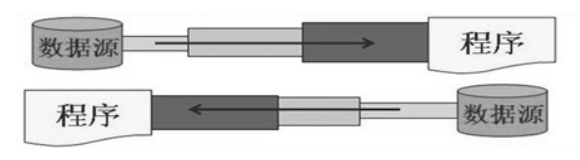

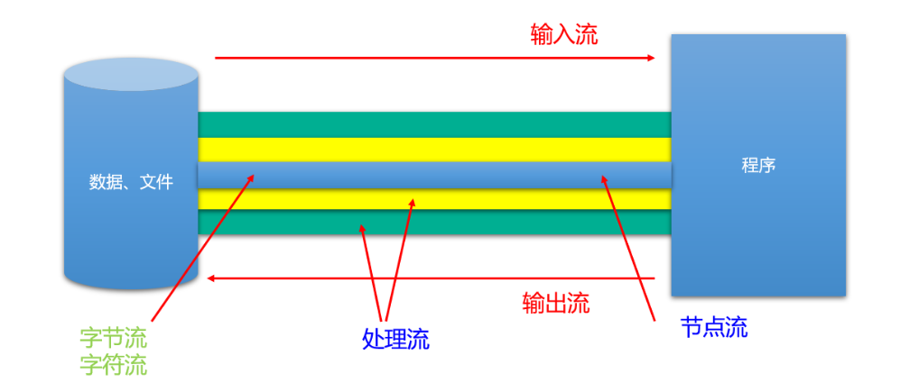


### 字符集

> - **字符**集技术的出现源于计算机处理文本的核心需求：将人类可读的字符与计算机可识别的二进制数据相互转换。
> - 计算机底层只能处理 `0` 和 `1`，但人类需要表达复杂的**文字**、**符号**和**语言**。**字符集**技术通过建立**字符**与**二进制**码的映射规则​，成为两者之间的桥梁。

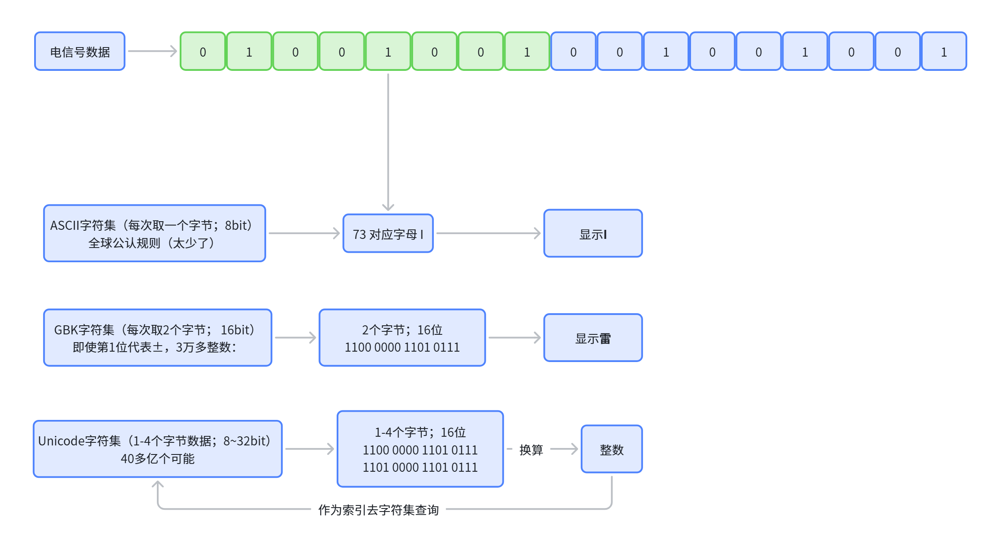

#### 符集发展历史

1. **ASCII（1963）**​: https://www.asciitable.com/
  - 最早的通用字符编码标准，使用7位表示128个字符（0-127）。
  - 包含英文字母、数字、标点符号和控制字符。
  - 无法支持其他语言字符。
2. **扩展ASCII**（**ISO 8859**系列）​: https://www.asciitable.com/
  - 使用8位（256个字符），扩展了欧洲语言符号（如ISO-8859-1拉丁字母）。
  - 不同子集适配不同语言（如ISO-8859-5支持西里尔字母）。
  - 仍无法覆盖全球字符，中日韩文字需要多字节编码。
3. **地区性编码标准**
  - **GB2312**（1980）​​：中国国家标准，支持简体中文（双字节）。
  - **GBK**（1995）：双字节，支持2万+汉字
  - Big5​：繁体中文编码。
  - Shift-JIS​：日文编码。
  - 不同编码互不兼容，导致跨语言环境乱码。
4. **Unicode**（1991）​
  - **统一字符集**，覆盖全球所有语言符号，持续扩展。**万国码**
  - **UTF-8**​：变长编码（**1**-**4**字节），兼容ASCII，适合网络传输。
  - **UTF-16​**：定长或变长（2或4字节），用于Java和Windows内部。
  - **UTF-32**​：定长**4字节**，直接对应码点。

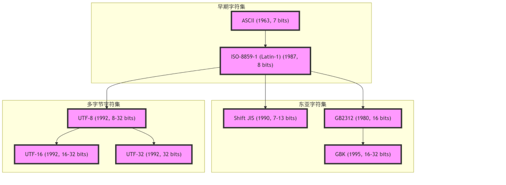

#### 乱码原因

- 编码/解码字符集不一致​：用A编码写入，用B编码读取。
- 字符集不支持部分字符​：如用ISO-8859-1解码中文。
- 传输或存储错误​：数据损坏导致解码失败。

#### 案例

**编码**："你" ==用UTF-8===> 编码 ===> 3个字节，24bit；

**解码**：3个字节，24bit(一个整数) == 用UTF-8 ===> "你";

```java
import java.nio.charset.StandardCharsets;

public class GibberishDemo {
    public static void main(String[] args) {
        // 1. 原始字符串（包含中文和特殊符号）
        String original = "你好，世界！🌍";

        // 2. 使用UTF-8编码为字节流；  正确编码解码（UTF-8）
        byte[] utf8Bytes = original.getBytes(StandardCharsets.UTF_8);
        String decodedUtf8 = new String(utf8Bytes, StandardCharsets.UTF_8);
        System.out.println("正确解码: " + decodedUtf8); // 输出正常

        // 3. 错误操作：用GBK解码UTF-8字节（模拟乱码场景）
        String gibberish = new String(utf8Bytes, Charset.forName("GBK"));
        System.out.println("乱码结果: " + gibberish); // 输出：浣犲ソ锛屼笘鐣岋紒馃實

        // 4. 逆向修复乱码
        byte[] recoveredBytes = gibberish.getBytes(Charset.forName("GBK"));
        String recovered = new String(recoveredBytes, StandardCharsets.UTF_8);
        System.out.println("修复后: " + recovered); // 输出：你好，世界！🌍
    }
}
```

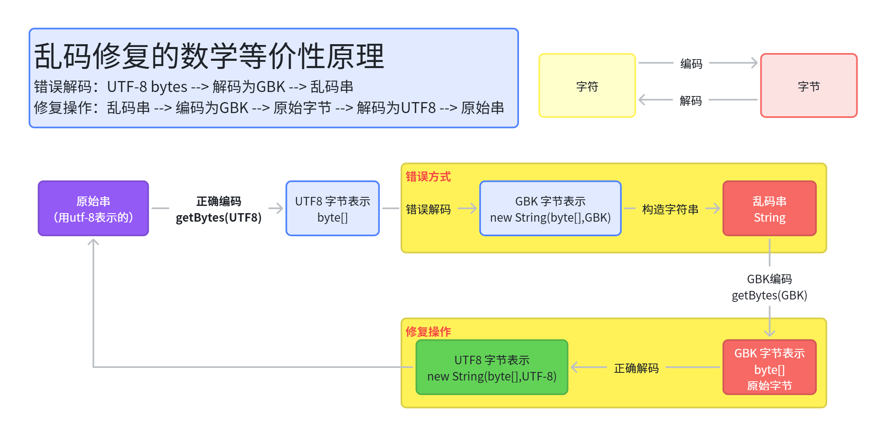

> 字符集不同，可能会产生**字节丢失**（字符集中没有这个，用?替代），这样就永远无法恢复了；

可以直接操作字节流；就不会乱码了；

```java
// 直接读写字节，不经过字符串解码
Files.write(Paths.get("data.bin"), bytes);
byte[] data = Files.readAllBytes(Paths.get("data.bin"));
```

#### 字符集对比

#### 防止乱码

1. **统一编码​**：在读取/写入文件、网络传输时明确指定字符集（如UTF-8）。
2. **使用Unicode**​：优先使用UTF-8处理多语言文本。
3. **修复乱码​**：若乱码已发生，尝试逆向恢复原始字节并重新解码（如Java示例中的`getBytes(ISO-8859-1)`再转UTF-8）。

### 流API

Java的IO流共涉及40多个类，实际上非常规则，都是从如下4个抽象基类派生的。

由这四个类**派生**出来的**子类**名称都是以其**父类名作为子类名后缀**。

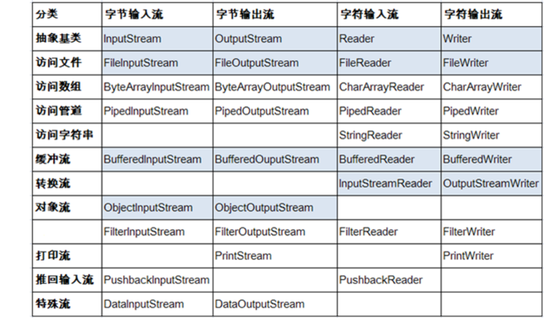

**常用的节点流：** 　

- 文件流： FileInputStream、FileOutputStrean、FileReader、FileWriter 
- 字节/字符数组流： ByteArrayInputStream、ByteArrayOutputStream、CharArrayReader、CharArrayWriter 
  - 对数组进行处理的节点流（对应的不再是文件，而是内存中的一个数组）。

**常用处理流：**

- 缓冲流：BufferedInputStream、BufferedOutputStream、BufferedReader、BufferedWriter
  - 作用：增加缓冲功能，避免频繁读写硬盘，进而提升读写效率。
- 转换流：InputStreamReader、OutputStreamReader
  - 作用：实现字节流和字符流之间的转换。
- 对象流：ObjectInputStream、ObjectOutputStream
  - 作用：提供直接读写Java对象功能

**准备实验环境**：假设有`kubla .txt`文件，内容如下

```java
In Xanadu did Kubla Khan
A stately pleasure-dome decree:
Where Alph, the sacred river, ran
Through caverns measureless to man
Down to a sunless sea.
```

## 字节流（Byte Streams）

> - 程序使用**字节流**来执行 **8 位****字节**的**输入**和**输出**。
> - 所有**字节流类都继承自** `InputStream` 和 `OutputStream` ；
> - 字节流类有很多种。为了演示字节流的工作原理，我们将重点介绍**文件 I/O 字节流** —— `FileInputStream` 和 `FileOutputStream` 。
> - 其他类型的字节流使用方式大致相同，主要区别在于它们的构造方式。

### API介绍

#### 字节输入流

`java.io.InputStream`抽象类是表示字节输入流的所有类的超类，可以读取字节信息到内存中。它定义了字节输入流的基本共性功能方法。

- `public int read()`： 从输入流读取一个字节。返回读取的字节值。虽然读取了一个字节，但是会自动提升为int类型。如果已经到达流末尾，没有数据可读，则返回-1。 
- `public int read(byte[] b)`： 从输入流中读取一些字节数，并将它们存储到字节数组 b中 。每次最多读取b.length个字节。返回实际读取的字节个数。如果已经到达流末尾，没有数据可读，则返回-1。 
- `public int read(byte[] b,int off,int len)`：从输入流中读取一些字节数，并将它们存储到字节数组 b中，从b[off]开始存储，每次最多读取len个字节 。返回实际读取的字节个数。如果已经到达流末尾，没有数据可读，则返回-1。 
- `public void close()` ：关闭此输入流并释放与此流相关联的任何系统资源。    

> 说明：`close()`方法，当完成流的操作时，必须调用此方法，释放系统资源。

```java
public class FISRead {
    //注意：应该使用try-catch-finally处理异常。这里出于方便阅读代码，使用了throws的方式
    @Test
    public void test() throws IOException {
        // 使用文件名称创建流对象
        FileInputStream fis = new FileInputStream("read.txt");
        // 读取数据，返回一个字节
        int read = fis.read();
        System.out.println((char) read);
        read = fis.read();
        System.out.println((char) read);
        read = fis.read();
        System.out.println((char) read);
        read = fis.read();
        System.out.println((char) read);
        read = fis.read();
        System.out.println((char) read);
        // 读取到末尾,返回-1
        read = fis.read();
        System.out.println(read);
        // 关闭资源
        fis.close();
        /*
        文件内容：abcde
        输出结果：
        a
        b
        c
        d
        e
        -1
         */
    }

    @Test
    public void test02()throws IOException{
        // 使用文件名称创建流对象
        FileInputStream fis = new FileInputStream("read.txt");
        // 定义变量，保存数据
        int b;
        // 循环读取
        while ((b = fis.read())!=-1) {
            System.out.println((char)b);
        }
        // 关闭资源
        fis.close();
    }
        
    @Test
    public void test03()throws IOException{
        // 使用文件名称创建流对象.
        FileInputStream fis = new FileInputStream("read.txt"); // 文件中为abcde
        // 定义变量，作为有效个数
        int len;
        // 定义字节数组，作为装字节数据的容器
        byte[] b = new byte[2];
        // 循环读取
        while (( len= fis.read(b))!=-1) {
            // 每次读取后,把数组变成字符串打印
            System.out.println(new String(b));
        }
        // 关闭资源
        fis.close();
        /*
        输出结果：
        ab
        cd
        ed
        最后错误数据`d`，是由于最后一次读取时，只读取一个字节`e`，数组中，
        上次读取的数据没有被完全替换，所以要通过`len` ，获取有效的字节
         */
    }

    @Test
    public void test04()throws IOException{
        // 使用文件名称创建流对象.
        FileInputStream fis = new FileInputStream("read.txt"); // 文件中为abcde
        // 定义变量，作为有效个数
        int len;
        // 定义字节数组，作为装字节数据的容器
        byte[] b = new byte[2];
        // 循环读取
        while (( len= fis.read(b))!=-1) {
            // 每次读取后,把数组的有效字节部分，变成字符串打印
            System.out.println(new String(b,0,len));//  len 每次读取的有效字节个数
        }
        // 关闭资源
        fis.close();
        /*
        输出结果：
        ab
        cd
        e
         */
    }
}
```

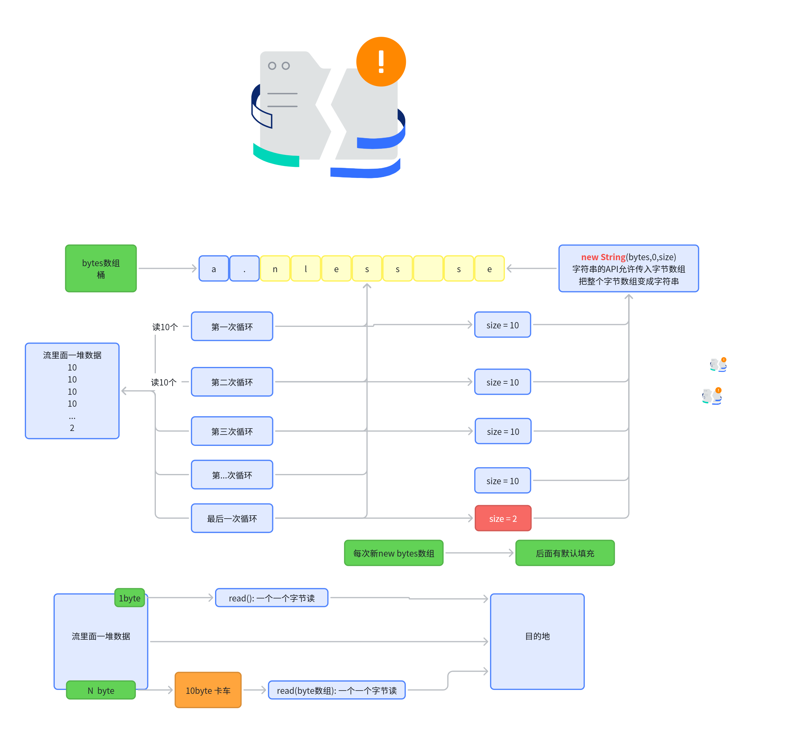

#### 字节输出流

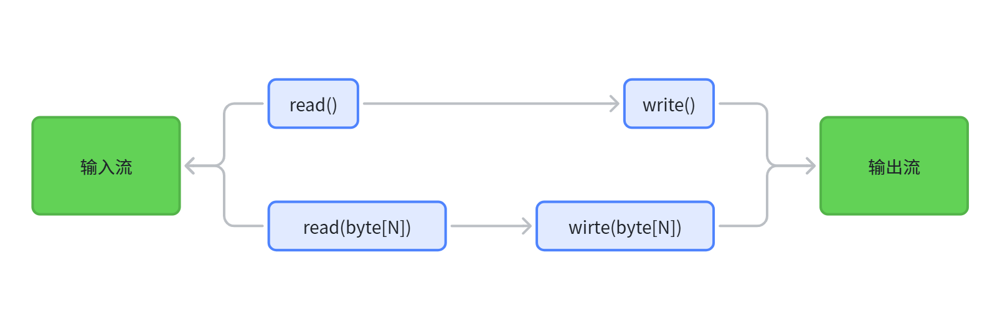

`java.io.OutputStream`抽象类是表示字节输出流的所有类的超类，将指定的字节信息写出到目的地。它定义了字节输出流的基本共性功能方法。

- `public void write(int b)` ：将指定的字节输出流。虽然参数为int类型四个字节，但是只会保留一个字节的信息写出。
- `public void write(byte[] b)`：将 b.length字节从指定的字节数组写入此输出流。  
- `public void write(byte[] b, int off, int len)` ：从指定的字节数组写入 len字节，从偏移量 off开始输出到此输出流。  
- `public void flush()` ：刷新此输出流并强制任何缓冲的输出字节被写出。  
- `public void close()` ：关闭此输出流并释放与此流相关联的任何系统资源。  

> 说明：close()方法，当完成流的操作时，必须调用此方法，释放系统资源。

```java
import org.junit.Test;

import java.io.FileOutputStream;
import java.io.IOException;

public class FOSWrite {
    //注意：应该使用try-catch-finally处理异常。这里出于方便阅读代码，使用了throws的方式
    @Test
    public void test01() throws IOException {
        // 使用文件名称创建流对象
        FileOutputStream fos = new FileOutputStream("fos.txt");
        // 写出数据
        fos.write(97); // 写出第1个字节
        fos.write(98); // 写出第2个字节
        fos.write(99); // 写出第3个字节
        // 关闭资源
        fos.close();
      /*  输出结果：abc*/
    }

    @Test
    public void test02()throws IOException {
        // 使用文件名称创建流对象
        FileOutputStream fos = new FileOutputStream("fos.txt");
        // 字符串转换为字节数组
        byte[] b = "abcde".getBytes();
        // 写出从索引2开始，2个字节。索引2是c，两个字节，也就是cd。
        fos.write(b,2,2);
        // 关闭资源
        fos.close();
    }
    //这段程序如果多运行几次，每次都会在原来文件末尾追加abcde
    @Test
    public void test03()throws IOException {
        // 使用文件名称创建流对象
        FileOutputStream fos = new FileOutputStream("fos.txt",true);
        // 字符串转换为字节数组
        byte[] b = "abcde".getBytes();
        fos.write(b);
        // 关闭资源
        fos.close();
    }
    
    //使用FileInputStream\FileOutputStream，实现对文件的复制
    @Test
    public void test05() {
        FileInputStream fis = null;
        FileOutputStream fos = null;
        try {
            //1. 造文件-造流
            //复制图片：成功
//            fis = new FileInputStream(new File("pony.jpg"));
//            fos = new FileOutputStream(new File("pony_copy1.jpg"));

            //复制文本文件：成功
            fis = new FileInputStream(new File("hello.txt"));
            fos = new FileOutputStream(new File("hello1.txt"));

            //2. 复制操作（读、写）
            byte[] buffer = new byte[1024];
            int len;//每次读入到buffer中字节的个数
            while ((len = fis.read(buffer)) != -1) {
                fos.write(buffer, 0, len);
//                String str = new String(buffer,0,len);
//                System.out.print(str);
            }
            System.out.println("复制成功");
        } catch (IOException e) {
            throw new RuntimeException(e);
        } finally {
            //3. 关闭资源
            try {
                if (fos != null)
                    fos.close();
            } catch (IOException e) {
                throw new RuntimeException(e);
            }
            try {
                if (fis != null)
                    fis.close();
            } catch (IOException e) {
                throw new RuntimeException(e);
            }
        }

    }
}
```

### 练习：读取文本

> 需求：把 `kubla.txt` 的内容读出来，全部写入到 `outagain.txt` 中

```java
import java.io.FileInputStream;
import java.io.FileOutputStream;
import java.io.IOException;

public class CopyBytes {
    public static void main(String[] args) throws IOException {

        FileInputStream in = null;
        FileOutputStream out = null;

        try {
            in = new FileInputStream("kubla.txt");
            out = new FileOutputStream("outagain.txt");
            int c;

            while ((c = in.read()) != -1) {
                out.write(c);
            }
        } finally {
            if (in != null) {
                in.close();
            }
            if (out != null) {
                out.close();
            }
        }
    }
}
```

> 分析：主要是一个简单的循环，该循环每次**读取****输入流****一个字节**并**写入****输出流**，如下图所示

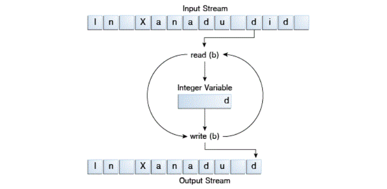

### 正确关流

当不再需要流时一定要正确关闭它

- 上面代码使用 `finally` 代码块来确保即使发生错误，两个流都会被关闭。避免严重的资源泄漏。
- 如果发生错误（打不开文件、文件未找到等），有可能 **in **和 **out **没有值，所以要**判断null**，防止空指针异常
- try-with-resources：会按照声明的逆序关闭流；（所以**包装流**必须写在**最后**面）

### 什么时候用字节流

**字节流是最底层的流**，万物皆是字节。可以读写一切。但是如果是文本信息，更推荐用**字符流**（不用一个字节一个字节的读写，一次性读取一个字符（根据编码方式不同，读取大小不会一样））。

### 练习：视频加密

> 视频文件，底层也都是字节。可以逐个字节进行加密。

```java
/**
 * @author 一只疯羊-雷丰阳
 * @create 8:59
 */
public class FileSecretTest {
    /*
    * 视频的加密
    * */
    @Test
    public void test1(){
        FileInputStream fis = null;
        FileOutputStream fos = null;
        try {
            File file1 = new File("a.mp4");
            File file2 = new File("a_加密.mp4");
            fis = new FileInputStream(file1);
            fos = new FileOutputStream(file2);

            //方式1：每次读入一个字节，效率低
//            int data;
//            while((data = fis.read()) != -1){
//                fos.write(data ^ 5);
//            }
            //方式2：每次读入一个字节数组，效率高
            int len;
            byte[] buffer = new byte[1024];
            while((len = fis.read(buffer)) != -1){

                for(int i = 0;i < len;i++){
                    buffer[i] = (byte) (buffer[i] ^ 5);
                }

                fos.write(buffer,0,len);

            }


            System.out.println("加密成功");
        } catch (IOException e) {
            e.printStackTrace();
        } finally {

            try {
                fos.close();
            } catch (IOException e) {
                e.printStackTrace();
            }
            try {
                fis.close();
            } catch (IOException e) {
                e.printStackTrace();
            }
        }
    }

    /*
     * 解密
     * */
    @Test
    public void test2(){
        FileInputStream fis = null;
        FileOutputStream fos = null;
        try {
            File file1 = new File("a_加密.mp4");
            File file2 = new File("a_还原.mp4");
            fis = new FileInputStream(file1);
            fos = new FileOutputStream(file2);

            //方式1：每次读入一个字节，效率低
//            int data;
//            while((data = fis.read()) != -1){
//                fos.write(data ^ 5);
//            }
            //方式2：每次读入一个字节数组，效率高
            int len;
            byte[] buffer = new byte[1024];
            while((len = fis.read(buffer)) != -1){

                for(int i = 0;i < len;i++){
                    buffer[i] = (byte) (buffer[i] ^ 5);
                }

                fos.write(buffer,0,len);

            }

            System.out.println("解密成功");
        } catch (IOException e) {
            e.printStackTrace();
        } finally {

            try {
                fos.close();
            } catch (IOException e) {
                e.printStackTrace();
            }
            try {
                fis.close();
            } catch (IOException e) {
                e.printStackTrace();
            }
        }
    }
}
```

## 字符流（**Character Streams**）

> - Java 平台采用 **Unicode 编码规范存储字符值**。字符流 I/O 会自动在内部格式与本地字符集之间进行转换。在西方语言环境中，本地字符集通常是** ASCII** 的 8 位超集。 [ASCII码表](https://tool.hiofd.com/ascii-table/)
> - 字符流可以直接拿到字符，不用程序员自己进行转换（字节变字符）；
> - 所有**字符流类**都继承自 `Reader` 和 `Writer` 。
> - 与字节流类似，也有专门用于**文件 I/O **的**字符流类**： `FileReader` 和 `FileWriter` 。

### Reader

`java.io.Reader`抽象类是表示用于**读取****字符流**的所有类的父类，可以读取字符信息到内存中。它定义了字符输入流的基本共性功能方法。

- `public int read()`： 从输入流**读取一个字符**。 虽然读取了一个字符，但是会自动提升为int类型。返回该字符的Unicode编码值。如果已经到达流末尾了，则返回-1。
- `public int read(char[] cbuf)`： 从输入流中**读取一些字符**，并将它们存储到字符数组 cbuf中 。每次最多读取cbuf.length个字符。返回实际读取的字符个数。如果已经到达流末尾，没有数据可读，则返回-1。 
- `public int read(char[] cbuf,int off,int len)`：从输入流中**读取一些字符**，并将它们存储到字符数组 cbuf中，从cbuf[off]开始的位置存储。每次最多读取len个字符。返回实际读取的字符个数。如果已经到达流末尾，没有数据可读，则返回-1。 
- `public void close()` ：**关闭**此流并释放与此流相关联的任何系统资源。    

> 注意：当完成流的操作时，必须调用close()方法，释放系统资源，否则会造成内存泄漏。

### Writer

`java.io.Writer`抽象类是表示用于写出字符流的所有类的超类，将指定的字符信息写出到目的地。它定义了字节输出流的基本共性功能方法。

- `public void write(int c)` ：写出单个字符。
- `public void write(char[] cbuf)`：写出字符数组。 
- `public void write(char[] cbuf, int off, int len)`：写出字符数组的某一部分。off：数组的开始索引；len：写出的字符个数。 
- `public void write(String str)`：写出字符串。 
- `public void write(String str, int off, int len)` ：写出字符串的某一部分。off：字符串的开始索引；len：写出的字符个数。
- `public void flush()`：刷新该流的缓冲。  
- `public void close()` ：关闭此流。

> 注意：当完成流的操作时，必须调用close()方法，释放系统资源，否则会造成内存泄漏。

### FileReader

```java
/**
 * @author 一只疯羊-雷丰阳
 * @create 14:09
 */
public class FileReaderWriterTest {
    
    //实现方式1
    @Test
    public void test1() throws IOException {
        //1. 创建File类的对象，对应着物理磁盘上的某个文件
        File file = new File("hello.txt");
        //2. 创建FileReader流对象，将File类的对象作为参数传递到FileReader的构造器中
        FileReader fr = new FileReader(file);
        //3. 通过相关流的方法，读取文件中的数据
//        int data = fr.read(); //每调用一次读取一个字符
//        while (data != -1) {
//            System.out.print((char) data);
//            data = fr.read();
//        }
        int data;
        while ((data = fr.read()) != -1) {
            System.out.print((char) data);
        }

        //4. 关闭相关的流资源，避免出现内存泄漏
        fr.close();

    }

    //实现方式2：在方式1的基础上改进，使用try-catch-finally处理异常。保证流是可以关闭的
    @Test
    public void test2() {
        FileReader fr = null;
        try {
            //1. 创建File类的对象，对应着物理磁盘上的某个文件
            File file = new File("hello.txt");
            //2. 创建FileReader流对象，将File类的对象作为参数传递到FileReader的构造器中
            fr = new FileReader(file);
            //3. 通过相关流的方法，读取文件中的数据
            /*
             * read():每次从对接的文件中读取一个字符。并将此字符返回。
             * 如果返回值为-1,则表示文件到了末尾，可以不再读取。
             * */
//            int data = fr.read();
//            while(data != -1){
//                System.out.print((char)data);
//                data = fr.read();
//            }

            int data;
            while ((data = fr.read()) != -1) {
                System.out.println((char) data);
            }

        } catch (IOException e) {
            e.printStackTrace();
        } finally {
            //4. 关闭相关的流资源，避免出现内存泄漏
            try {
                if (fr != null)
                    fr.close();
            } catch (IOException e) {
                e.printStackTrace();
            }
        }
    }

    //实现方式3：调用read(char[] cbuf),每次从文件中读取多个字符
    @Test
    public void test3() {
        FileReader fr = null;
        try {
            //1. 创建File类的对象，对应着物理磁盘上的某个文件
            File file = new File("hello.txt");
            //2. 创建FileReader流对象，将File类的对象作为参数传递到FileReader的构造器中
            fr = new FileReader(file);
            //3. 通过相关流的方法，读取文件中的数据
            char[] cbuf = new char[5];
            /*
             * read(char[] cbuf) : 每次将文件中的数据读入到cbuf数组中，并返回读入到数组中的
             * 字符的个数。
             * */
            int len; //记录每次读入的字符的个数
            while ((len = fr.read(cbuf)) != -1) {
                //处理char[]数组即可
                //错误：
//                for(int i = 0;i < cbuf.length;i++){
//                    System.out.print(cbuf[i]);
//                }
                //错误：
//                String str = new String(cbuf);
//                System.out.print(str);
                //正确：
//                for(int i = 0;i < len;i++){
//                    System.out.print(cbuf[i]);
//                }
                //正确：
                String str = new String(cbuf, 0, len);
                System.out.print(str);
            }
        } catch (IOException e) {
            e.printStackTrace();
        } finally {
            //4. 关闭相关的流资源，避免出现内存泄漏
            try {
                if (fr != null)
                    fr.close();
            } catch (IOException e) {
                e.printStackTrace();
            }
        }
    }
}
```

### FileWriter

```java
public class FWWrite {
    //注意：应该使用try-catch-finally处理异常。这里出于方便阅读代码，使用了throws的方式
    @Test
    public void test01()throws IOException {
        // 使用文件名称创建流对象
        FileWriter fw = new FileWriter(new File("fw.txt"));
        // 写出数据
        fw.write(97); // 写出第1个字符
        fw.write('b'); // 写出第2个字符
        fw.write('C'); // 写出第3个字符
        fw.write(30000); // 写出第4个字符，中文编码表中30000对应一个汉字。
                
        //关闭资源
        fw.close();
    }
        //注意：应该使用try-catch-finally处理异常。这里出于方便阅读代码，使用了throws的方式
    @Test
    public void test02()throws IOException {
        // 使用文件名称创建流对象
        FileWriter fw = new FileWriter(new File("fw.txt"));
        // 字符串转换为字节数组
        char[] chars = "一只疯羊".toCharArray();

        // 写出字符数组
        fw.write(chars);

        // 写出从索引1开始，2个字符。
        fw.write(chars,1,2); 

        // 关闭资源
        fw.close();
    }
        //注意：应该使用try-catch-finally处理异常。这里出于方便阅读代码，使用了throws的方式
    @Test
    public void test03()throws IOException {
        // 使用文件名称创建流对象
        FileWriter fw = new FileWriter("fw.txt");
        // 字符串
        String msg = "一只疯羊";

        // 写出字符数组
        fw.write(msg); //一只疯羊

        // 写出从索引1开始，2个字符。
        fw.write(msg,1,2); 

        // 关闭资源
        fw.close();
    }
    
    @Test
    public void test04(){
        FileWriter fw = null;
        try {
            //1. 创建File的对象
            File file = new File("personinfo.txt");
            //2. 创建FileWriter的对象，将File对象作为参数传递到FileWriter的构造器中
            //如果输出的文件已存在，则会对现有的文件进行覆盖
            fw = new FileWriter(file);
//            fw = new FileWriter(file,false);
            //如果输出的文件已存在，则会在现有的文件末尾写入数据
//            fw = new FileWriter(file,true);

            //3. 调用相关的方法，实现数据的写出操作
            //write(String str) / write(char[] cbuf)
            fw.write("I love you,");
            fw.write("you love him.");
            fw.write("so sad".toCharArray());
        } catch (IOException e) {
            e.printStackTrace();
        } finally {
            //4. 关闭资源，避免内存泄漏
            try {
                if (fw != null)
                    fw.close();
            } catch (IOException e) {
                throw new RuntimeException(e);
            }
        }
    }
}
```

### 练习：读取文本

```java
import java.io.FileReader;
import java.io.FileWriter;
import java.io.IOException;

public class CopyCharacters {
    public static void main(String[] args) throws IOException {

        FileReader inputStream = null;
        FileWriter outputStream = null;

        try {
            inputStream = new FileReader("kubla.txt");
            outputStream = new FileWriter("characteroutput.txt");

            int c;
            while ((c = inputStream.read()) != -1) {
                outputStream.write(c);
            }
        } finally {
            if (inputStream != null) {
                inputStream.close();
            }
            if (outputStream != null) {
                outputStream.close();
            }
        }
    }
}
```

> `CopyCharacters` 与 `CopyBytes` 非常相似。
> 
> 最重要的区别在于 `CopyCharacters` 使用 `FileReader` 和 `FileWriter` 进行输入输出，而非 `FileInputStream` 和 `FileOutputStream` 。
> 
> 请注意 `CopyBytes` 和 `CopyCharacters` 都使用 `int` 变量进行读写操作。
> 
> 但在 `CopyCharacters` 中， `int` 变量的最后 16 位存储字符值；（一个char占用2字节）
> 
> 而在 `CopyBytes` 中， `int` 变量的最后 8 位存储的是 `byte` 值。

> - **字符流**通常是**字节流**的"包装器"。字符流利用字节流执行物理 I/O 操作，同时负责字符与字节之间的转换。例如， `FileReader` 使用 `FileInputStream` ，而 `FileWriter` 使用 `FileOutputStream` 
> - 如果不是操作File，操作网络间数据传输，还要用字符流，可以使用 `InputStreamReader` 和 `OutputStreamWriter` 。

### flush

因为内置缓冲区的原因，如果FileWriter不关闭输出流，无法写出字符到文件中。但是关闭的流对象，是无法继续写出数据的。如果我们既想写出数据，又想继续使用流，就需要`flush()` 方法了。

- `flush()` ：刷新缓冲区，流对象可以继续使用。
- `close()`：先刷新缓冲区，然后通知系统释放资源。流对象不可以再被使用了。

注意：即便是flush()方法写出了数据，操作的最后还是要调用close方法，释放系统资源。

```java
package com.lfy;
import org.junit.Test;
import java.io.FileWriter;
import java.io.IOException;

public class FWTest {

    @Test
    public void test() throws IOException {
        FileWriter fw = new FileWriter("fw.txt");
        fw.write("a");
        fw.write("b");

        fw.flush();

        fw.write("c");
        fw.write("d");
        fw.close();
    }
}
```

## 缓冲流（BufferedStream）

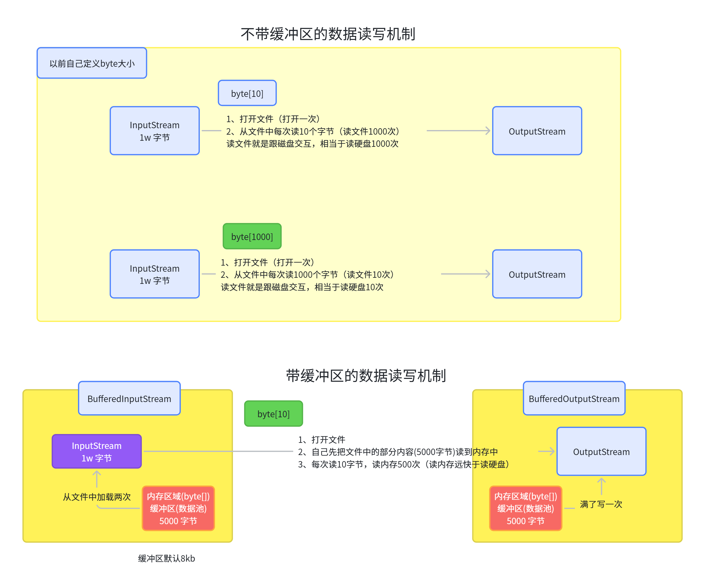

- `为了``提高数据读写的速度`，Java API提供了带缓冲功能的流类：**缓冲流**。
- 缓冲流要“套接”在相应的节点流之上，根据数据操作单位可以把缓冲流分为：
  - **字节缓冲流**：`BufferedInputStream`，`BufferedOutputStream` 
  - **字符缓冲流**：`BufferedReader`，`BufferedWriter`
- 缓冲流的基本原理：在创建流对象时，内部会创建一个缓冲区数组（缺省使用`8192个字节(8Kb)`的缓冲区），通过缓冲区读写，减少系统IO次数，从而提高读写的效率。

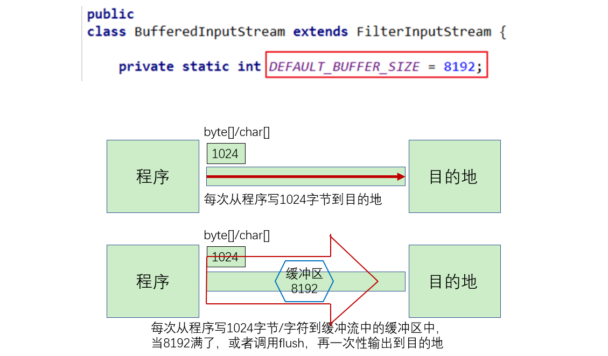

### 字节缓冲流

> 性能测试

```java
//方法1：使用FileInputStream\FileOutputStream实现非文本文件的复制
public void copyFileWithFileStream(String srcPath,String destPath){
    FileInputStream fis = null;
    FileOutputStream fos = null;
    try {
        //1. 造文件-造流
        fis = new FileInputStream(new File(srcPath));
        fos = new FileOutputStream(new File(destPath));

        //2. 复制操作（读、写）
        byte[] buffer = new byte[100];
        int len;//每次读入到buffer中字节的个数
        while ((len = fis.read(buffer)) != -1) {
            fos.write(buffer, 0, len);
        }
        System.out.println("复制成功");
    } catch (IOException e) {
        throw new RuntimeException(e);
    } finally {
        //3. 关闭资源
        try {
            if (fos != null)
                fos.close();
        } catch (IOException e) {
            throw new RuntimeException(e);
        }
        try {
            if (fis != null)
                fis.close();
        } catch (IOException e) {
            throw new RuntimeException(e);
        }
    }
}

@Test
public void test1(){
    String srcPath = "C:\\Users\\Desktop\\01-复习.mp4";
    String destPath = "C:\\Users\\Desktop\\01-复习2.mp4";

    long start = System.currentTimeMillis();

    copyFileWithFileStream(srcPath,destPath);

    long end = System.currentTimeMillis();

    System.out.println("花费的时间为：" + (end - start));//7677毫秒

}

//方法2：使用BufferedInputStream\BufferedOuputStream实现非文本文件的复制
public void copyFileWithBufferedStream(String srcPath,String destPath){
    FileInputStream fis = null;
    FileOutputStream fos = null;
    BufferedInputStream bis = null;
    BufferedOutputStream bos = null;
    try {
        //1. 造文件
        File srcFile = new File(srcPath);
        File destFile = new File(destPath);
        //2. 造流
        fis = new FileInputStream(srcFile);
        fos = new FileOutputStream(destFile);

        bis = new BufferedInputStream(fis);
        bos = new BufferedOutputStream(fos);

        //3. 读写操作
        int len;
        byte[] buffer = new byte[100];
        while ((len = bis.read(buffer)) != -1) {
            bos.write(buffer, 0, len);
        }
        System.out.println("复制成功");
    } catch (IOException e) {
        e.printStackTrace();
    } finally {
        //4. 关闭资源(如果有多个流，我们需要先关闭外面的流，再关闭内部的流)
        try {
            if (bos != null)
                bos.close();
        } catch (IOException e) {
            throw new RuntimeException(e);
        }
        try {
            if (bis != null)
                bis.close();
        } catch (IOException e) {
            throw new RuntimeException(e);
        }

    }
}
@Test
public void test2(){
    String srcPath = "C:\\Users\\shkstart\\Desktop\\01-复习.mp4";
    String destPath = "C:\\Users\\shkstart\\Desktop\\01-复习2.mp4";

    long start = System.currentTimeMillis();

    copyFileWithBufferedStream(srcPath,destPath);

    long end = System.currentTimeMillis();

    System.out.println("花费的时间为：" + (end - start));//415毫秒

}
```

### 字符缓冲流

字符缓冲流的基本方法与普通字符流调用方式一致，不再阐述，我们来看它们具备的特有方法。

- BufferedReader：`public String readLine()`: 读一行文字。 
- BufferedWriter：`public void newLine()`: 写一行行分隔符,由系统属性定义符号。 

```java
public class BufferedIOLine {
    @Test
    public void testReadLine()throws IOException {
        // 创建流对象
        BufferedReader br = new BufferedReader(new FileReader("in.txt"));
        // 定义字符串,保存读取的一行文字
        String line;
        // 循环读取,读取到最后返回null
        while ((line = br.readLine())!=null) {
            System.out.println(line);
        }
        // 释放资源
        br.close();
    }

    @Test
    public void testNewLine()throws IOException{
        // 创建流对象
        BufferedWriter bw = new BufferedWriter(new FileWriter("out.txt"));
        // 写出数据
        bw.write("张三");
        // 写出换行
        bw.newLine();
        bw.write("李四");
        bw.newLine();
        bw.write("王五");
        bw.newLine();
        // 释放资源
        bw.close();
    }
}

```

## 数据流（DataStream）

数据流支持基本数据类型值（ `boolean` 、 `char` 、 `byte` 、 `short` 、 `int` 、 `long` 、 `float` 和 `double` ）以及字符串值的二进制 I/O 操作。所有数据流都实现了 `DataInput` 接口或 `DataOutput` 接口。本节重点介绍这些接口最常用的实现类： `DataInputStream` 和 `DataOutputStream` 。

> **小练习**：**发票数据**

```java
import java.io.FileInputStream;
import java.io.FileOutputStream;
import java.io.DataInputStream;
import java.io.DataOutputStream;
import java.io.BufferedInputStream;
import java.io.BufferedOutputStream;
import java.io.IOException;
import java.io.EOFException;

public class DataStreams {
    static final String dataFile = "invoicedata";

    static final double[] prices = { 19.99, 9.99, 15.99, 3.99, 4.99 };
    static final int[] units = { 12, 8, 13, 29, 50 };
    static final String[] descs = { "Java T-shirt",
            "Java Mug",
            "Duke Juggling Dolls",
            "Java Pin",
            "Java Key Chain" };

    public static void main(String[] args) throws IOException {

 
        DataOutputStream out = null;
        
        try {
            out = new DataOutputStream(new
                    BufferedOutputStream(new FileOutputStream(dataFile)));

            for (int i = 0; i < prices.length; i ++) {
                out.writeDouble(prices[i]);
                out.writeInt(units[i]);
                out.writeUTF(descs[i]);
            }
        } finally {
            out.close();
        }

        DataInputStream in = null;
        double total = 0.0;
        try {
            in = new DataInputStream(new
                    BufferedInputStream(new FileInputStream(dataFile)));

            double price;
            int unit;
            String desc;

            try {
                while (true) {
                    price = in.readDouble();
                    unit = in.readInt();
                    desc = in.readUTF();
                    System.out.format("You ordered %d units of %s at $%.2f%n",
                            unit, desc, price);
                    total += unit * price;
                }
            } catch (EOFException e) { }
            System.out.format("For a TOTAL of: $%.2f%n", total);
        }
        finally {
            in.close();
        }
    }
}
```

## 对象流（**ObjectStream**）

**数据流**支持**原始数据类型**的输入输出

**对象流**则支持**对象**的输入输出（我们称为 **序列化**与**反序列化**）

大多数标准类（并非全部）都支持其对象的**序列化**操作。支持序列化的**类**会实现**标记接口** `Serializable`** **。

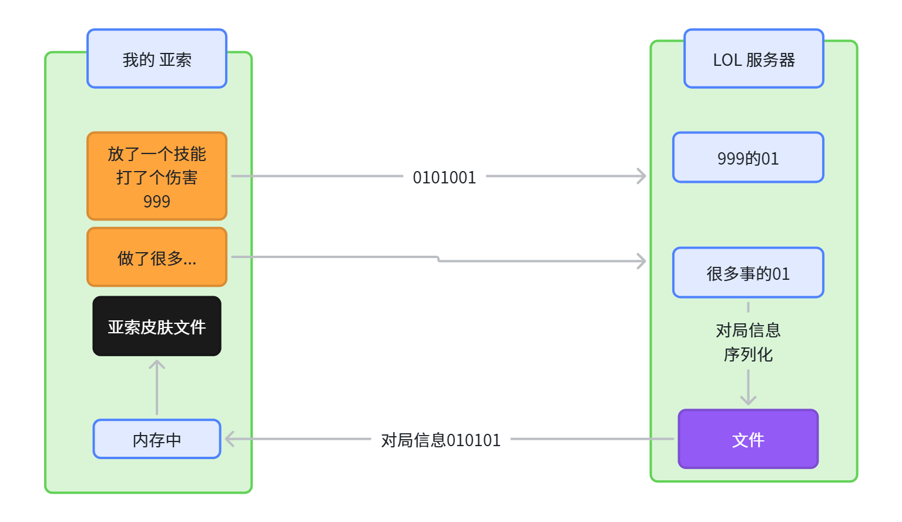

下图展示多引用对象的IO

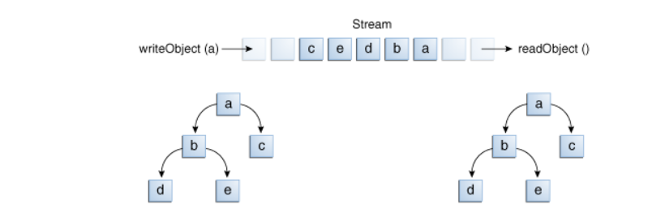

### **ObjectOutputStream**

```java
FileOutputStream fos = new FileOutputStream("game.ser");
ObjectOutputStream oos = new ObjectOutputStream(fos);
```

**ObjectOutputStream中的方法：**

- `public void writeBoolean(boolean val)`：写出一个 boolean 值。
- `public void writeByte(int val)`：写出一个8位字节
- `public void writeShort(int val)`：写出一个16位的 short 值
- `public void writeChar(int val)`：写出一个16位的 char 值
- `public void writeInt(int val)`：写出一个32位的 int 值
- `public void writeLong(long val)`：写出一个64位的 long 值
- `public void writeFloat(float val)`：写出一个32位的 float 值。
- `public void writeDouble(double val)`：写出一个64位的 double 值
- `public void writeUTF(String str)`：将表示长度信息的两个字节写入输出流，后跟字符串 s 中每个字符的 UTF-8 修改版表示形式。根据字符的值，将字符串 s 中每个字符转换成一个字节、两个字节或三个字节的字节组。注意，将 String 作为基本数据写入流中与将它作为 Object 写入流中明显不同。 如果 s 为 null，则抛出 NullPointerException。
- `public void writeObject(Object obj)`：写出一个obj对象
- `public void close() `：关闭此输出流并释放与此流相关联的任何系统资源

### **ObjectInputStream**

**ObjectInputStream中的方法：**

- `public boolean readBoolean()`：读取一个 boolean 值
- `public byte readByte()`：读取一个 8 位的字节
- `public short readShort()`：读取一个 16 位的 short 值
- `public char readChar()`：读取一个 16 位的 char 值
- `public int readInt()`：读取一个 32 位的 int 值
- `public long readLong()`：读取一个 64 位的 long 值
- `public float readFloat()`：读取一个 32 位的 float 值
- `public double readDouble()`：读取一个 64 位的 double 值
- `public String readUTF()`：读取 UTF-8 修改版格式的 String
- `public void readObject(Object obj)`：读入一个obj对象
- `public void close()` ：关闭此输入流并释放与此流相关联的任何系统资源

### 序列化与反序列化

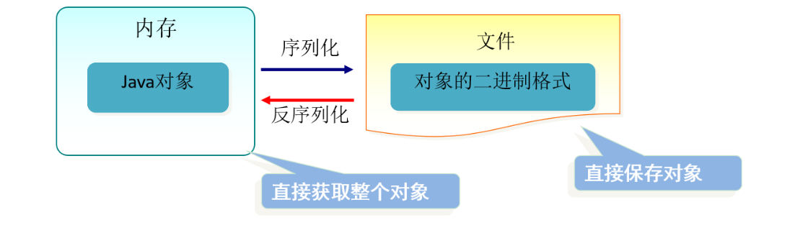

> JDK 自带的序列化与反序列化，要求，类必须实现  `Serializable `

### 练习：订单统计

```java
import java.io.*;
import java.math.BigDecimal;
import java.util.Calendar;

public class ObjectStreams {
    static final String dataFile = "orderdata";

    //
    static final BigDecimal[] prices = { 
        new BigDecimal("19.99"), 
        new BigDecimal("9.99"),
        new BigDecimal("15.99"),
        new BigDecimal("3.99"),
        new BigDecimal("4.99") };
    static final int[] units = { 12, 8, 13, 29, 50 };
    static final String[] descs = { "Java T-shirt",
            "Java Mug",
            "Duke Juggling Dolls",
            "Java Pin",
            "Java Key Chain" };

    public static void main(String[] args) 
        throws IOException, ClassNotFoundException {

 
        ObjectOutputStream out = null;
        try {
            out = new ObjectOutputStream(new
                    BufferedOutputStream(new FileOutputStream(dataFile)));

            out.writeObject(Calendar.getInstance());
            for (int i = 0; i < prices.length; i ++) {
                out.writeObject(prices[i]);
                out.writeInt(units[i]);
                out.writeUTF(descs[i]);
            }
        } finally {
            out.close();
        }

        ObjectInputStream in = null;
        try {
            in = new ObjectInputStream(new
                    BufferedInputStream(new FileInputStream(dataFile)));

            Calendar date = null;
            BigDecimal price;
            int unit;
            String desc;
            BigDecimal total = new BigDecimal(0);

            date = (Calendar) in.readObject();

            System.out.format ("On %tA, %<tB %<te, %<tY:%n", date);

            try {
                while (true) {
                    price = (BigDecimal) in.readObject();
                    unit = in.readInt();
                    desc = in.readUTF();
                    System.out.format("You ordered %d units of %s at $%.2f%n",
                            unit, desc, price);
                    total = total.add(price.multiply(new BigDecimal(unit)));
                }
            } catch (EOFException e) {}
            System.out.format("For a TOTAL of: $%.2f%n", total);
        } finally {
            in.close();
        }
    }
}
```

## 其他流

### 标准输入、输出流

> - `System.in` 和` System.out` 分别代表了系统标准的输入和输出设备
> - 默认**输入设备**是：**键盘**，**输出设备**是：**显示器**
> - `System.in` 的类型是 `InputStream`
> - `System.out `的类型是 `PrintStream`，其是 `OutputStream `的子类 `FilterOutputStream `的子类
> - **重定向**：通过 `System `类的 `setIn`，`setOut `方法对默认设备进行改变。
>   - `public static void setIn(InputStream in)`
>   - `public static void setOut(PrintStream out)`

#### 练习：

> 需求：做一个反义词大王（AntonymKing）程序；
> 
> 1. 用户输入任何一个词，控制台输出他的反义词
> 2. 程序一直运行，直到用户输入 `e` 或者 `exit` 退出程序

```java
System.out.println("请输入单词，我会给你他的反义词(退出输入e或exit):");
// 把"标准"输入流(键盘输入)这个字节流包装成字符流,再包装成缓冲流
BufferedReader br = new BufferedReader(new InputStreamReader(System.in));
String s = null;
try {
    while ((s = br.readLine()) != null) { // 读取用户输入的一行数据 --> 阻塞程序
        if ("e".equalsIgnoreCase(s) || "exit".equalsIgnoreCase(s)) {
            System.out.println("退出!!");
            break;
        }
        // 将读取到的整行字符串转成大写输出
        System.out.println("-->: 反义词： 不" + s);
        System.out.println("继续输入信息");
    }
} catch (IOException e) {
    e.printStackTrace();
} finally {
    try {
        if (br != null) {
            br.close(); // 关闭过滤流时,会自动关闭它包装的底层节点流
        }
    } catch (IOException e) {
        e.printStackTrace();
    }
}
```

#### 扩展

System类中有三个常量对象：`System.out`、`System.in`、`System.err`

查看System类中这三个常量对象的声明：

```java
public final static InputStream in = null;
public final static PrintStream out = null;
public final static PrintStream err = null;
```

奇怪的是，

- 这三个常量对象有**final声明**，但是**却初始化为null**。final声明的常量**一旦赋值就不能修改**，那么null不会空指针异常吗？
- 这三个**常量对象为什么要小写**？final声明的**常量按照命名规范不是应该大写吗**？
- 这三个**常量的对象有set方法**？final声明的**常量不是不能修改值吗**？set方法是如何修改它们的值的？

```java
final声明的常量，表示在Java的语法体系中它们的值是不能修改的，
而这三个常量对象的值是由C/C++等系统函数进行初始化和修改值的，所以它们故意没有用大写，也有set方法。
```

> 注意：native 关键字标注的方法，我们成为 **原生方法**（指的是用C/C++底层定义的系统函数）

```java
public static void setOut(PrintStream out) {
    checkIO();
    setOut0(out);
}
public static void setErr(PrintStream err) {
    checkIO();
    setErr0(err);
}
public static void setIn(InputStream in) {
    checkIO();
    setIn0(in);
}
private static void checkIO() {
    SecurityManager sm = getSecurityManager();
    if (sm != null) {
        sm.checkPermission(new RuntimePermission("setIO"));
    }
}
private static native void setIn0(InputStream in);
private static native void setOut0(PrintStream out);
private static native void setErr0(PrintStream err);
```

### 打印流

> 将基本数据类型的数据格式转化为字符串输出。

打印流：`PrintStream` 和 `PrintWriter`

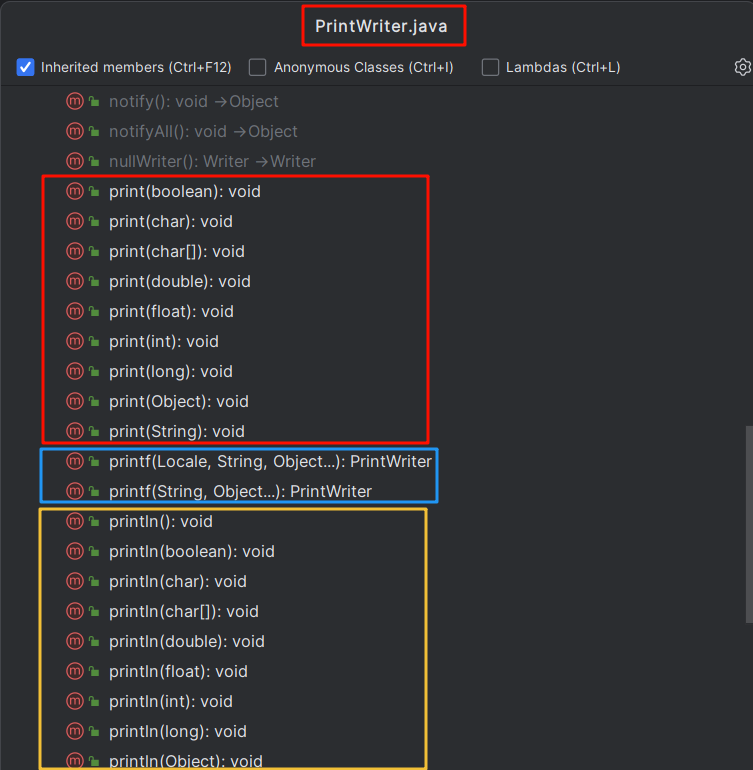

> - `PrintStream`和 `PrintWriter`的输出不会抛出IOException异常
> - `PrintStream`和 `PrintWriter`有自动flush功能
> - `PrintStream`打印的所有字符都使用平台的默认字符编码转换为字节。在需要写入字符而不是写入字节的情况下，应该使用 `PrintWriter`类。
> - `System.out`返回的是`PrintStream`的实例

#### 构造器

> - `PrintStream(File file)` ：创建**具有指定文件**且**不带自动行刷新的新打印流**。 
> - `PrintStream(File file, String csn)`：创建具有指定文件名称和字符集且不带自动行刷新的新打印流。 
> - `PrintStream(OutputStream out) `：创建新的打印流。 
> - `PrintStream(OutputStream out, boolean autoFlush)`：创建新的打印流。 **autoFlush**如果为 true，则每当写入 byte 数组、调用其中一个 println 方法或写入换行符或字节 ('\n') 时都**会刷新输出缓冲区**。
> - `PrintStream(OutputStream out, boolean autoFlush, String encoding) `：创建新的打印流。 
> - `PrintStream(String fileName)`：创建具有指定文件名称且不带自动行刷新的新打印流。 
> - `PrintStream(String fileName, String csn)` ：创建具有指定文件名称和字符集且不带自动行刷新的新打印流。

#### 练习1: 基本使用

```java
package com.fengyang.systemio;

import java.io.FileNotFoundException;
import java.io.PrintStream;

public class TestPrintStream {
    public static void main(String[] args) throws FileNotFoundException {
        PrintStream ps = new PrintStream("io.txt");
        ps.println("hello");
        ps.println(1);
        ps.println(1.5);
        ps.close();
    }
}
```

#### 练习2：自动刷新

```java
PrintStream ps = null;
try {
    FileOutputStream fos = new FileOutputStream(new File("D:\\IO\\text.txt"));
    // 创建打印输出流,设置为自动刷新模式(写入换行符或字节 '\n' 时都会刷新输出缓冲区)
    ps = new PrintStream(fos, true);
    if (ps != null) {// 把标准输出流(控制台输出)改成文件
        System.setOut(ps);
    }
    for (int i = 0; i <= 255; i++) { // 输出ASCII字符
        System.out.print((char) i);
        if (i % 50 == 0) { // 每50个数据一行
            System.out.println(); // 换行
        }
    }
} catch (FileNotFoundException e) {
    e.printStackTrace();
} finally {
    if (ps != null) {
        ps.close();
    }
}
```

#### 练习3：日志工具

```typescript
/*
日志工具
 */
public class Logger {
    /*
    记录日志的方法。
     */
    public static void log(String msg) {
        try {
            // 指向一个日志文件
            PrintStream out = new PrintStream(new FileOutputStream("log.txt", true));
            // 改变输出方向
            System.setOut(out);
            // 日期当前时间
            Date nowTime = new Date();
            SimpleDateFormat sdf = new SimpleDateFormat("yyyy-MM-dd HH:mm:ss SSS");
            String strTime = sdf.format(nowTime);

            System.out.println(strTime + ": " + msg);
        } catch (FileNotFoundException e) {
            e.printStackTrace();
        }
    }
}
```

```c++
public class LogTest {
    public static void main(String[] args) {
        //测试工具类是否好用
        Logger.log("调用了System类的gc()方法，建议启动垃圾回收");
        Logger.log("调用了TeamView的addMember()方法");
        Logger.log("用户尝试进行登录，验证失败");
    }
}
```

### Scanner

> **构造方法：**
> 
> - `Scanner(File source)`：构造一个新的 Scanner，它生成的值是从指定文件扫描的。 
> - `Scanner(File source, String charsetName) `：构造一个新的 Scanner，它生成的值是从指定文件扫描的。 
> - `Scanner(InputStream source) `：构造一个新的 Scanner，它生成的值是从指定的输入流扫描的。 
> - `Scanner(InputStream source, String charsetName) `：构造一个新的 Scanner，它生成的值是从指定的输入流扫描的。
> 
> **常用方法：**
> 
> - `boolean hasNextXxx()`： 如果通过使用nextXxx()方法，此扫描器输入信息中的下一个标记可以解释为默认基数中的一个 Xxx 值，则返回 true。
> - `Xxx nextXxx()`： 将输入信息的下一个标记扫描为一个Xxx

```java
package com.fengyang.systemio;

import org.junit.Test;

import java.io.*;
import java.util.Scanner;

public class TestScanner {
    @Test
    public void test1() throws IOException {
        Scanner input = new Scanner(new FileInputStream("1.txt"));
        while(input.hasNextLine()){
            String str = input.nextLine();
            System.out.println(str);
        }
        input.close();
    }   

}
```

# Apache-commons

commons： 是一个项目组； 这个下面有很多小项目

- commons-io：专门做IO
- commons-math：专门做数学操作
- commons-xxx：通用工具类

https://apache.org/

> IO技术开发中，代码量很大，而且代码的重复率较高，为此Apache软件基金会，开发了IO技术的工具类`commonsIO`，大大简化了IO开发。
> 
> Apahce软件基金会属于第三方，（Oracle公司第一方，我们自己第二方，其他都是第三方）我们要使用第三方开发好的工具，需要添加jar包。

1. 导入 `commons-io`
2. 测试常用工具类
  1. IOUtils：
    1. `copy()`
  2. FileUtils：
    - `copyDirectoryToDirectory(File src,File dest)`：整个目录的复制，自动进行递归遍历
    - `writeStringToFile(File file,String content)`：将内容content写入到file中
    - `readFileToString(File file)`：读取文件内容，并返回一个String
    - `copyFile(File srcFile,File destFile)`：文件复制