# 9.多线程

多线程章节我们只讲解入门的多线程操作。

在后面架构师冲刺阶段的**《高并发 - JUC》**，我们讲解高级操作

> 线程池、原子类、Lock锁、读写锁

**高并发**：缓存、**异步**、队排好

# 进程和线程

> 在**并发编程**中，存在**两种基本的执行单元**：**进程**和**线程**。
> 
> 在 Java 编程语言中，**并发编程**主要涉及**线程**。然而，进程同样重要。

> 计算机系统通常运行着众多活跃的**进程**和**线程**。
> 
> 即使在仅配备**单核处理器**、**同一时刻**只能**执行一个线程**的系统中亦是如此。
> 
> 单核处理器的运算时间通过操作系统的**时间片轮转机制**，在多个进程与线程之间进行**分配**。

> 计算机系统拥有**多个处理器**或多核处理器的情况越来越普遍。这极大地提升了**系统并发执行进程**和**线程**的**能力**——但即便在简单的单处理器系统上，并发执行同样可以实现。

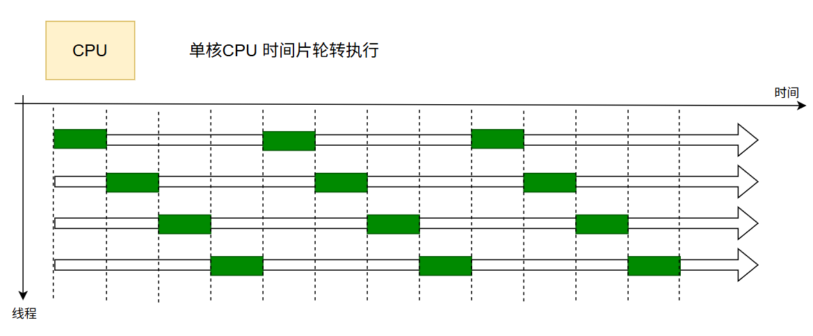

**尽量保证公平！**

## 进程（Process）

> **进程**拥有**自包含**的**执行环境**。进程通常具备一套完整且私有的基本运行时资源；
> 
> 特别是每个进程都有自己独立的内存空间。
> 
> **JDK提供了命令行，可以看到运行中的所有Java进程：**`jps`

**进程**也可以认为是**程序**或**应用程序**。

大多数 **Java 虚拟机**实现都以**单进程**形式运行。Java 应用程序可以通过 `ProcessBuilder` 对象**创建额外进程**。多进程应用超出了本课程的讨论范围。

```java
@Test
public void test() throws IOException, InterruptedException {

    // 创建 ProcessBuilder，设置命令为 "netstat -ano"
    ProcessBuilder processBuilder = new ProcessBuilder("netstat", "-ano");
    processBuilder.redirectErrorStream(true); // 合并标准错误和标准输出

    // 启动进程
    Process process = processBuilder.start();
    

    // 读取进程的输出
    try (BufferedReader reader = process.inputReader(Charset.forName("GBK"));) {
        String line;
        while ((line = reader.readLine()) != null) {
            System.out.println(line);
        }
    }

    // 设置超时并等待进程结束（最多等待10秒）
    if (!process.waitFor(10, TimeUnit.SECONDS)) {
        process.destroyForcibly();
        throw new RuntimeException("Netstat command timed out");
    }
    // 检查退出码
    int exitCode = process.exitValue();
    if (exitCode != 0) {
        throw new IOException("Netstat command failed with exit code: " + exitCode);
    }
}
```

**每个****Java应用****会运行在自己的进程内**；

> 进程间互相隔离：别的进程炸了，和其他人没关系

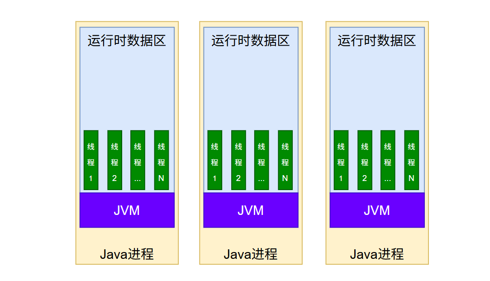

## 线程（Thread）

> - **线程**有时被称为**轻量级进程**。进程和线程都提供了**执行环境**，但**创建新线程**所需的**资源**比创建新进程要**少**。
> - **线程**存在于**进程**之中——每个**进程至少包含一个线程**。**线程****共享****进程**的资源，包括内存和打开的文件。这种机制实现了高效的通信，但也可能引发潜在问题。
> - **多线程**执行是 Java 平台的**核心**特性之一。**每个应用程序至少拥有一个****线程**——如果计入执行内存管理和信号处理等任务的"系统"线程，则会有多个线程。但从应用程序开发者的视角来看，**程序最初只启动一个称为****主线程（main方法线程）****的线程**。这个主线程具备**创建其他线程**的能力。

- **进程内部开辟线程**；对于操作系统来说，进程和线程都是由**CPU执行**。
- 进程内部可以包含很多线程；

## 并发（**concurrency**）

**单核CPU**，可以通过时间片切换的方式，看起来像是同时在执行多个任务。

这种**单位时间内**处理**多个任务**的能力称为**并发能力**

## 并行（**parallel**）

**多个CPU**，在某一时刻，同时在运行多个不同的任务。

这种某一时刻同时运行多个任务的能力称为并行能力。

单核CPU不能并行。多核CPU可以并行

> **并行**一定会**产生并发**，但是**并发****不一定是并行**。

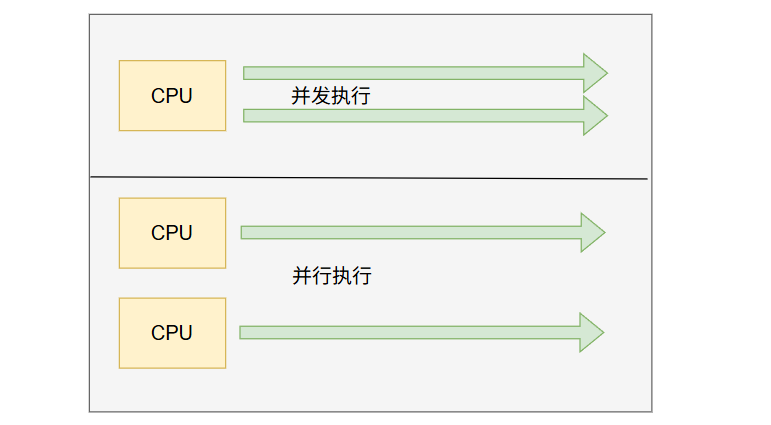

## 异步

后台运行，**不阻塞**当前任务执行，称为**异步**

# Thread - 线程

## 定义和启动线程

### 实现 Runnable 接口

提供一个 `Runnable` 对象。 `Runnable` 接口定义了单一方法 `run` ，用于包含线程中执行的代码。 `Runnable` 对象会被传递给 `Thread` 构造函数。

```typescript
public class HelloRunnable implements Runnable {

    public void run() {
        System.out.println("Hello from a Runnable!");
    }

    public static void main(String args[]) {
        new Thread(new HelloRunnable()).start();
    }

}
```

### 继承 Thread 类

```typescript
public class HelloThread extends Thread {

    public void run() {
        System.out.println("Hello from a thread!");
    }

    public static void main(String args[]) {
        new HelloThread().start();
    }

}
```

### 实现 Callable 接口

```typescript
public class CallerTask implements Callable<String> {
    public String call() throws Exception {
        return "Hello,i am running!";
    }

    public static void main(String[] args) {
        //创建异步任务
        FutureTask<String> task=new FutureTask<String>(new CallerTask());
        //启动线程
        new Thread(task).start();
        try {
            //等待执行完成，并获取返回结果
            String result=task.get();
            System.out.println(result);
        } catch (InterruptedException e) {
            e.printStackTrace();
        } catch (ExecutionException e) {
            e.printStackTrace();
        }
    }
}
```

> 扩展：**Java21**以后的新方式； 虚拟线程我们暂不考虑

```java
// Start a thread to run a task
Thread thread = Thread.ofPlatform().start(runnable);

// Start a virtual thread to run a task.
Thread thread = Thread.ofVirtual().start(runnable)
```

### 比较

**共同点：**

1. 无论使用哪种方式，启动一个线程执行，总是要` ``new Thread().start()`;
2. 都在 `run`方法中定义 线程启动后执行的程序
3. **启动的线程**都在**后台运行**，**不会影响**当前**正在执行的任务**。而且，当前任务无需等待后台线程的执行

**不同点：**

1. `实现Runnable`比 `继承Thread `更灵活，毕竟实现 Runable以后还可以实现其他接口或者继承新的类，而继承了Thread，就不能继承新类了。
2. `Runable `不能直接运行，需要传入 `Thread `对象中

### 练习：两个线程打印奇偶数

> 创建两个线程，其中一个线程输出1-100之间的偶数，另一个线程输出1-100之间的奇数。

```typescript
public static void main(String[] args) {
    new Thread(new Runnable() {
        @Override
        public void run() {
            for (int i = 0; i < 100; i++) {
                if (i % 2 == 0) {
                    System.out.println(i);
                }
            }
        }
    }).start();

    new Thread(new Runnable() {
        @Override
        public void run() {
            for (int i = 0; i < 100; i++) {
                if (i % 2 != 0) {
                    System.out.println(i);
                }
            }
        }
    }).start();
}
```

## Thread 细节

### 构造器

- `public Thread() `:分配一个新的线程对象。
- `public Thread(String name) `:分配一个指定名字的新的线程对象。
- `public Thread(Runnable target) `:指定创建线程的目标对象，它实现了Runnable接口中的run方法
- `public Thread(Runnable target,String name) `:分配一个带有指定目标新的线程对象并指定名字。
- 其他构造器，不用管....

### 常用方法

- `public void run()` :此线程要执行的任务在此处定义代码。不是程序员调用的。
- `public void start() `:导致此线程开始执行; Java虚拟机调用此线程的run方法。
- `public String getName()` :获取当前线程名称。
- `public void setName(String name)`：设置该线程名称。
- `public static Thread currentThread() `:返回对当前**正在执行的线程对象**的引用。在Thread子类中就是this，通常用于主线程和Runnable实现类
- `public static void ``sleep``(long millis) `:使当前正在执行的线程以指定的毫秒数暂停
- `public static void ``yield``()`：yield只是让**当前线程暂停**一下，让系统的**线程调度器重新调度一次**，希望优先级与当前线程相同或更高的其他线程能够获得**执行机会**，但是这个不能保证，完全有可能的情况是，当某个线程调用了yield方法暂停之后，线程调度器又将其调度出来重新执行。
- `public final boolean isAlive()`：测试线程是否处于活动状态。如果线程已经启动且尚未终止，则为活动状态。 
- `void ``join``() `：等待该线程终止。 
- `void join(long millis) `：等待该线程终止的时间最长为 millis 毫秒。如果millis时间到，将不再等待。 
- `void join(long millis, int nanos) `：等待该线程终止的时间最长为 millis 毫秒 + nanos 纳秒。 

## 线程休眠

使用`Thread.sleep(long millis)`方法让线程暂停一段时间（毫秒）。注意需要处理`InterruptedException`。

```java
public class SleepExample {
    public static void main(String[] args) {
        Runnable task = () -> {
            String name = Thread.currentThread().getName();
            System.out.println(name + " 开始执行");
            try {
                Thread.sleep(2000); // 休眠2秒
            } catch (InterruptedException e) {
                e.printStackTrace();
            }
            System.out.println(name + " 执行结束");
        };

        Thread thread1 = new Thread(task);
        thread1.start();
    }
}
```

> 产品经理：vip运行快；

## 线程中断

```typescript
class SleepExample implements Runnable {
    @Override
    public void run() {
        try {
            for (int i = 1; i <= 3; i++) {
                System.out.println("休眠 " + i + " 秒");
                Thread.sleep(1000); // 线程休眠1秒
            }
        } catch (InterruptedException e) {
            System.out.println("线程被中断！");
        }
    }
}

public class Main {
    public static void main(String[] args) {
        Thread t = new Thread(new SleepExample());
        t.start();
        
        // 主线程等待后中断t线程
        try {
            Thread.sleep(1500);
            t.interrupt(); // 发送中断信号
        } catch (InterruptedException e) {
            e.printStackTrace();
        }
    }
}
```

关键方法：

- `Thread.sleep(millis)`：暂停当前线程
- `interrupt()`：中断目标线程（需配合异常处理）

## 等待线程结束

在Java中，`thread.join()`方法用于等待该线程结束。也就是说，调用一个线程的`join()`方法会使当前线程（通常称为主线程）等待，直到该线程（被调用的线程）执行完毕。

```java
public class JoinExample {
    public static void main(String[] args) {
        // 创建第一个工作线程
        Thread worker1 = new Thread(() -> {
            try {
                Thread.sleep(1000); // 模拟耗时操作
                System.out.println("📦 Worker 1: 包裹打包完成");
            } catch (InterruptedException e) {
                e.printStackTrace();
            }
        });

        // 创建第二个工作线程
        Thread worker2 = new Thread(() -> {
            try {
                Thread.sleep(1500); // 更长的耗时操作
                System.out.println("🚚 Worker 2: 包裹运输完成");
            } catch (InterruptedException e) {
                e.printStackTrace();
            }
        });

        // 启动线程
        worker1.start();
        worker2.start();

        System.out.println("📢 老板: 开始处理订单...");

        try {
            // 主线程等待 worker1 完成
            worker1.join();
            System.out.println("✅ 老板: 包裹打包已确认完成");

            // 主线程等待 worker2 完成
            worker2.join();
            System.out.println("✅ 老板: 包裹运输已确认完成");
            
            System.out.println("🎉 老板: 订单处理完毕！客户已通知");
        } catch (InterruptedException e) {
            e.printStackTrace();
        }
    }
}
```

## 线程优先级与礼让

```java
public class PriorityDemo {
    public static void main(String[] args) {
        Runnable task1 = () -> {
            for (int i = 0; i < 100; i++) {
                System.out.println(Thread.currentThread().getName() + ": " + i);
                Thread.yield(); // 主动让出CPU
            }
        };
        Runnable task2 = () -> {
            for (int i = 0; i < 100; i++) {
                System.out.println(Thread.currentThread().getName() + ": " + i);
                Thread.yield(); // 主动让出CPU
            }
        };
        Thread t1 = new Thread(task1, "高优先级");
        Thread t2 = new Thread(task2, "低优先级");
        
        t1.setPriority(Thread.MAX_PRIORITY); // 10  5//中优先级
        t2.setPriority(Thread.MIN_PRIORITY); // 1
        
        t2.start();
        t1.start();
    }
}
```

输出特点：

- 高优先级线程有更多执行机会（非绝对保证）
- `yield()` 提示线程调度器可以切换其他线程
- 调度器也不一定完全会切换到其他线程
- 使用 `yield `不是推荐让出CPU所有权的做法，可以配置使用**锁机制**
- **线程的调度**由操作系统的线程调度器决定，**不能保证线程的执行顺序**。

## 守护线程（daemon）

```java
Thread daemonThread = new Thread(() -> {
    while (true) {
        System.out.println("守护线程运行中...");
        try { Thread.sleep(300); } catch (InterruptedException e) {}
    }
});

daemonThread.setDaemon(true); // 设置为守护线程
daemonThread.start();

System.out.println("主线程结束（守护线程自动终止）");
```

`new Thread(()->{}).start()`

## 生命周期

**生命周期**：形容一个对象从创建 到 完全销毁 的整个过程期间的经历

Java线程的**生命周期**包括以下状态：

1. `NEW（新建）``​​`：线程被创建但尚未启动（start()方法未被调用）。`  new Thread();`
2. `RUNNABLE（可运行）`​​：线程已经启动，等待CPU时间片或正在运行中。注意，在操作系统中，运行态和就绪态都对应Java的RUNNABLE状态。
3. `BLOCKED（阻塞）`​​：线程在等待一个监视器锁（synchronized）以便进入一个同步块/方法。
4. `WAITING（等待）`​​：线程处于无限期等待，直到其他线程执行特定操作（如notify或interrupt）。
5. `TIMED_WAITING（超时等待）`​​：线程在指定时间内等待，时间到后自动唤醒或等待期间被唤醒。
6. `TERMINATED（终止）​​`：线程执行完毕（run方法正常结束）或因为异常退出。

注意:

1. RUNNABLE 子状态:
  - Ready​： 等待CPU分配时间片
  - Running​： 正在执行任务
2. WAITING状态恢复条件:
  - `wait()` → `notify()/notifyAll()`
  - `join()` → 目标线程终止
  - `park()` → `unpark()/interrupt()`
3. 中断机制:
  - 对 `wait()/join()/sleep()` 等方法调用 `interrupt()`，会导致：
    - 抛出 `InterruptedException`
    - 清除中断状态
  - 对 `park()` 调用 `interrupt()`，会立即唤醒但不会清除中断状态
4. 特殊转换​：
  - `yield()` 只影响RUNNABLE内部状态转移（Running → Ready）
  - 超时等待结束可能直接进入RUNNABLE或BLOCKED，取决于锁的获取状态
5. WAITING vs TIMED_WAITING
  - WAITING：无限期等待，​必须被动唤醒
  - TIMED_WAITING：具有超时机制，可自动恢复
6. 锁竞争规则
  - 从WAITING/TIMED_WAITING唤醒后，​必须重新进入BLOCKED状态竞争锁
  - 只有获得锁后才能继续执行（进入RUNNING状态）

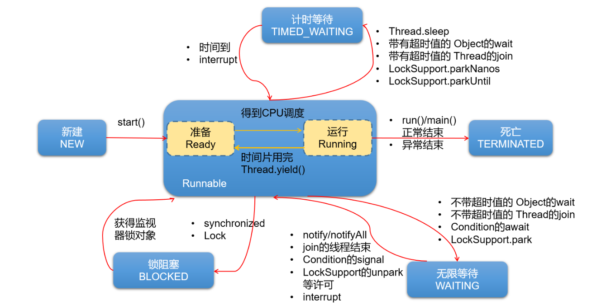

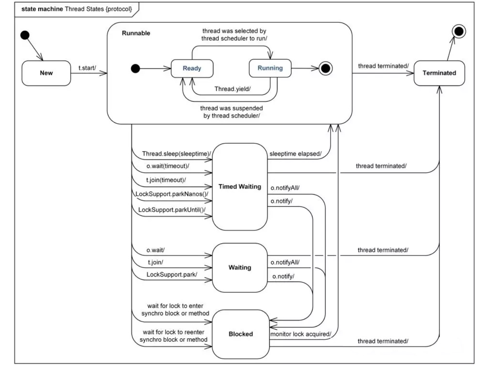

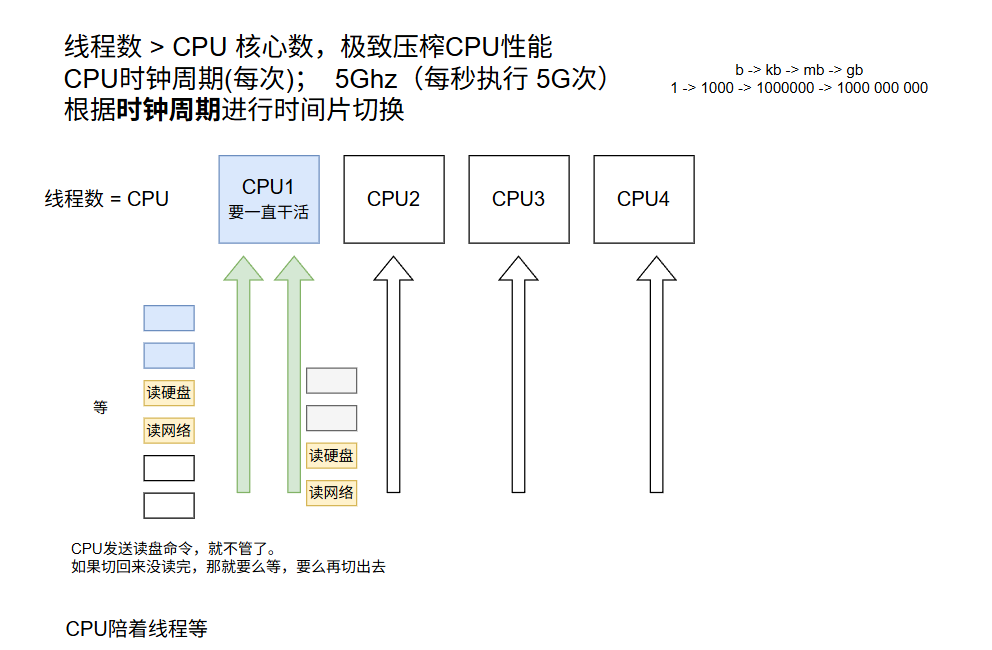

# **线程安全**

> 线程安全问题：

> **线程**主要通过**共享对象字段及对象引用**来进行通信。这种通信方式效率极高，但可能导致两类错误：
> 
> - **线程干扰**和**内存一致性**错误。防止这些错误所需的工具正是同步机制。
> - **同步**可能会引发**线程争用**。当两个或**多个线程**试图同时**访问同一资源**时，会导致 Java 运行时环境减慢一个或多个线程的执行速度，甚至暂停其执行。饥饿和活锁都属于线程争用的表现形式。
> - 当发生资源竞争时，**三性保证（可见性、有序性、原子性）**可以使程序得到正确结果

## 实践

当我们使用**多个线程**访问**同一资源**（可以是同一个变量、同一个文件、同一条记录等）的时候。

> 若**多个线程**`只有``读``操作`，那么不会发生线程安全问题。
> 
> 但是如果多个线程中对**资源**有`读``和``写`的操作，就容易出现线程安全问题。

> 我们通过一个案例，演示线程的安全问题：
> 
> > 电影院要卖票，我们模拟电影院的卖票过程。
> > 
> > 假设要播放的电影是 “三傻大闹宝莱坞”，本次电影的**座位共100个**(本场电影**只能卖100张票**)。
> 
> 我们来模拟电影院的售票窗口，实现**多个窗口****同时卖** “三傻大闹宝莱坞”这场电影票(多个窗口一起卖这100张票)

### 资源定义 - 同一个资源问题

#### 写法1 - 局部变量不能共享

```java
public class SaleTicketDemo1 {
    public static void main(String[] args) {
        Window w1 = new Window();
        Window w2 = new Window();
        Window w3 = new Window();

        w1.start();
        w2.start();
        w3.start();
    }
}

class Window extends Thread {
    public void run() {
        int total = 100;
        while (total > 0) {
            System.out.println(getName() + "卖出一张票，剩余:" + --total);
        }
    }
}
```

结果：发现卖出300张票。

问题：局部变量是每次调用方法都是独立的，那么每个线程的run()的total是独立的，不是共享数据。

#### 写法2 - 不同对象的实例变量不共享

```java
public class SaleTicketDemo2 {
    public static void main(String[] args) {
        TicketSale t1 = new TicketSale();
        TicketSale t2 = new TicketSale();
        TicketSale t3 = new TicketSale();

        t1.start();
        t2.start();
        t3.start();
    }
}

class TicketSale extends Thread {
    private int total = 100;

    public void run() {
        while (total > 0) {
            System.out.println(getName() + "卖出一张票，剩余:" + --total);
        }
    }
}
```

结果：发现卖出300张票。

问题：不同的实例对象的实例变量是独立的。

#### 写法3 - 静态变量可共享

```java
public class SaleTicketDemo3 {
    public static void main(String[] args) {
        TicketSaleThread t1 = new TicketSaleThread();
        TicketSaleThread t2 = new TicketSaleThread();
        TicketSaleThread t3 = new TicketSaleThread();

        t1.start();
        t2.start();
        t3.start();
    }
}
class TicketSaleThread extends Thread{
    private static int total = 100;
    public void run(){
        while(total>0) {
            try {
                Thread.sleep(10);//加入这个，使得问题暴露的更明显
            } catch (InterruptedException e) {
                e.printStackTrace();
            }
            System.out.println(getName() + "卖出一张票，剩余:" + --total);
        }
    }
}
```

运行结果

```java
Thread-1卖出一张票，剩余:99
Thread-2卖出一张票，剩余:98
Thread-0卖出一张票，剩余:99
.....
Thread-2卖出一张票，剩余:3
Thread-0卖出一张票，剩余:2
Thread-1卖出一张票，剩余:1
Thread-1卖出一张票，剩余:0
Thread-2卖出一张票，剩余:-1
Thread-0卖出一张票，剩余:-2
```

问题：但是有重复票或负数票问题。

原因：线程安全问题

#### 写法4 - 同一个对象的实例变量共享

```java
public class SaleTicketDemo4 {
    public static void main(String[] args) {
        TicketSaleRunnable tr = new TicketSaleRunnable();
        Thread t1 = new Thread(tr, "窗口一");
        Thread t2 = new Thread(tr, "窗口二");
        Thread t3 = new Thread(tr, "窗口三");

        t1.start();
        t2.start();
        t3.start();
    }
}

class TicketSaleRunnable implements Runnable {
    private int total = 100;

    public void run() {
        while (total > 0) {
            try {
                Thread.sleep(10);//加入这个，使得问题暴露的更明显
            } catch (InterruptedException e) {
                e.printStackTrace();
            }
            System.out.println(Thread.currentThread().getName() + "卖出一张票，剩余:" + --total);
        }
    }
```

结果：发现卖出近100张票。

问题：但是有重复票或负数票问题。

原因：线程安全问题

### 抽取资源类

> 鉴于前面的代码。按照**设计模式思想**
> 
> 1. 功能应该内聚和隔离
> 2. **卖票方法**无论是多线程还是单线程，都得卖票。不应该写线程类的实现。而应该**独立编写业务方法**
> 3. 任何业务方法，都可以被多线程方式运行。但我们要保证安全

```typescript
public class SaleTicketDemo5 {
    public static void main(String[] args) {
        //2、创建资源对象
        Ticket ticket = new Ticket();

        //3、启动多个线程操作资源类的对象
        Thread t1 = new Thread("窗口一") {
            public void run() {
                while (true) {
                    ticket.sale();
                }
            }
        };
        Thread t2 = new Thread("窗口二") {
            public void run() {
                while (true) {
                    ticket.sale();
                }
            }
        };
        Thread t3 = new Thread(new Runnable() {
            public void run() {
                ticket.sale();
            }
        }, "窗口三");


        t1.start();
        t2.start();
        t3.start();
    }
}

//1、编写资源类
class Ticket {
    private int total = 100;

    public void sale() {
        if (total > 0) {
            try {
                Thread.sleep(10);//加入这个，使得问题暴露的更明显
            } catch (InterruptedException e) {
                e.printStackTrace();
            }
            System.out.println(Thread.currentThread().getName() + "卖出一张票，剩余:" + --total);
        } else {
            throw new RuntimeException("没有票了");
        }
    }

    public int getTotal() {
        return total;
    }
}
```

### 同步机制

> 要解决上述多线程并发访问一个资源的安全性（资源竞争）问题:也就是解决重复票与不存在票问题，Java中提供了**同步机制**(synchronized)来解决。

#### synchronized - 同步代码块和同步方法

> **同步方法**：
> 
> synchronized 关键字直接修饰方法，表示同一时刻只有一个线程能进入这个方法，其他线程在外面等着。

```java
public synchronized void method(){
    //可能会产生线程安全问题的代码
}
```

> **同步代码块**：
> 
> synchronized 关键字可以用于某个区块前面，表示只对这个区块的资源实行互斥访问。

```java
synchronized(同步锁){
     //需要同步操作的代码
}
```

#### 同步锁选择

同步锁对象可以是任意类型对象，但是必须保证竞争“**同一个共享资源**”的**多个线程**必须**使用同一个“同步锁对象”**

对于**同步代码块**来说，同步**锁对象**是**由**程序员**手动指定**的，但是对于**同步方法**来说，**同步锁**对象只能是**默认**的

- **静态方法**：当前类的Class对象
- **非静态方法**：this

#### 锁范围

锁的范围太小：不能解决安全问题

锁的范围太大：因为一旦某个线程抢到锁，其他线程就只能等待，所以范围太大，效率会降低，不能合理利用CPU资源。

### 加锁案例

#### 静态方法加锁

```java
public class SaleTicketDemo3 {
    public static void main(String[] args) {
        TicketSaleThread t1 = new TicketSaleThread();
        TicketSaleThread t2 = new TicketSaleThread();
        TicketSaleThread t3 = new TicketSaleThread();

        t1.start();
        t2.start();
        t3.start();
    }
}

class TicketSaleThread extends Thread{
    private static int total = 100;
    public void run(){//直接锁这里，肯定不行，会导致，只有一个窗口卖票
        while(total>0) {
            saleOneTicket();
        }
    }

    public synchronized static void saleOneTicket(){//锁对象是TicketSaleThread类的Class对象，而一个类的Class对象在内存中肯定只有一个
        if(total > 0) {//不加条件，相当于条件判断没有进入锁管控，线程安全问题就没有解决
            System.out.println(Thread.currentThread().getName() + "卖出一张票，剩余:" + --total);
        }
    }
}
```

#### 实例方法加锁

```java
public class SaleTicketDemo4 {
    public static void main(String[] args) {
        TicketSaleRunnable tr = new TicketSaleRunnable();
        Thread t1 = new Thread(tr, "窗口一");
        Thread t2 = new Thread(tr, "窗口二");
        Thread t3 = new Thread(tr, "窗口三");

        t1.start();
        t2.start();
        t3.start();
    }
}

class TicketSaleRunnable implements Runnable {
    private int total = 1000;

    public void run() {//直接锁这里，肯定不行，会导致，只有一个窗口卖票
        while (total > 0) {
            saleOneTicket();
        }
    }
    public synchronized void saleOneTicket(){//锁对象是this，这里就是TicketSaleRunnable对象，因为上面3个线程使用同一个TicketSaleRunnable对象，所以可以
        if(total > 0) {//不加条件，相当于条件判断没有进入锁管控，线程安全问题就没有解决
            System.out.println(Thread.currentThread().getName() + "卖出一张票，剩余:" + --total);
        }
    }
}
```

#### 同步代码块加锁

```java
public class SaleTicketDemo5 {
    public static void main(String[] args) {
        //2、创建资源对象
        Ticket ticket = new Ticket();

        //3、启动多个线程操作资源类的对象
        Thread t1 = new Thread("窗口一") {
            public void run() {//不能给run()直接加锁，因为t1,t2,t3的三个run方法分别属于三个Thread类对象，
                                // run方法是非静态方法，那么锁对象默认选this，那么锁对象根本不是同一个
                while (true) {
                    synchronized (ticket) {
                        ticket.sale();
                    }
                }
            }
        };
        Thread t2 = new Thread("窗口二") {
            public void run() {
                while (true) {
                    synchronized (ticket) {
                        ticket.sale();
                    }
                }
            }
        };
        Thread t3 = new Thread(new Runnable() {
            public void run() {
                while (true) {
                    synchronized (ticket) {
                        ticket.sale();
                    }
                }
            }
        }, "窗口三");


        t1.start();
        t2.start();
        t3.start();
    }
}

//1、编写资源类
class Ticket {
    private int total = 1000;

    public  void sale() {//也可以直接给这个方法加锁，锁对象是this，这里就是Ticket对象
        if (total > 0) {
            System.out.println(Thread.currentThread().getName() + "卖出一张票，剩余:" + --total);
        } else {
            throw new RuntimeException("没有票了");
        }
    }

    public int getTotal() {
        return total;
    }
}
```

### 死锁问题

#### 可重入锁

Java的线程锁是**可重入锁**。比如：

```java
public class Counter {
    private int count = 0;

    public synchronized void add(int n) {
        if (n < 0) {
            dec(-n);
        } else {
            count += n;
        }
    }

    public synchronized void dec(int n) {
        count += n;
    }
}

```

> 调用 `dec `方法时，需要获取锁，但是 `add `方法已经在外部获取过了，可以直接使用。

所有的锁都应该设计为**可重入锁**，这样就能有效避免死锁问题。

#### 死锁

```typescript
private Object lockA = new Object();
private Object lockB = new Object();
int value;
int another;
public void add(int m) {
    synchronized(lockA) { // 获得lockA的锁
        this.value += m;
        synchronized(lockB) { // 获得lockB的锁
            this.another += m;
        } // 释放lockB的锁
    } // 释放lockA的锁
}

public void dec(int m) {
    synchronized(lockB) { // 获得lockB的锁
        this.another -= m;
        synchronized(lockA) { // 获得lockA的锁
            this.value -= m;
        } // 释放lockA的锁
    } // 释放lockB的锁
}
```

> 观测死锁：

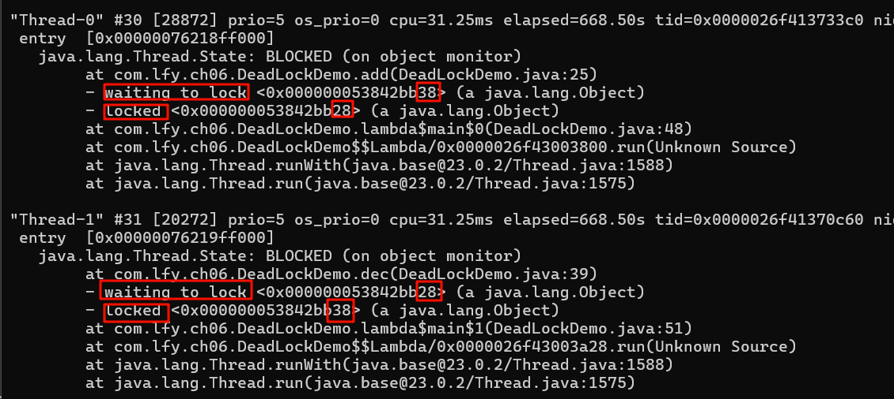

所有的锁都应该是可重入性，否则可能产生死锁；

### 锁原理

#### 原理

同步机制的原理，其实就相当于给某段代码加“锁”，任何线程想要执行这段代码，都要先获得“锁”，我们称为它同步锁。因为**Java对象**在堆中的数据分为分为**对象头**、**实例变量**、**空白填充**。（称为 Object Layout：对象布局）

而**对象头**中包含：

- **Mark Word**：记录了和当前对象有关的GC、锁标记等信息。
- **指向类的指针**：每一个对象需要记录它是由哪个类创建出来的。
- **数组长度**（只有数组对象才有）

哪个线程获得了“**同步锁**”对象之后，”**同步锁**“对象就会记录这个**线程的ID**，这样其他线程就只能等待了，除非这个线程”释放“了锁对象，其他线程才能重新获得/占用”同步锁“对象。

#### 对象布局

每个对每个对象占用** 8kb **的整数倍。 

对象实例：（保存到**堆空间**）

1. 对象头
  1. Mark Word：标记字
  2. Klass Point：这个对象是哪个类的实例（指向类，类保存到**方法区**） 
  3. 长度：数组特殊标记
2. 实例数据（保存每个变量的值）
3. 对齐填充，凑够8kb整数倍

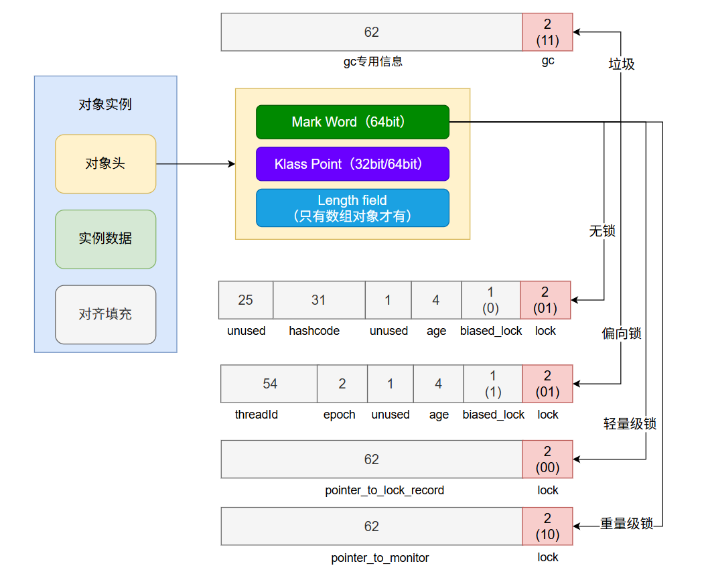

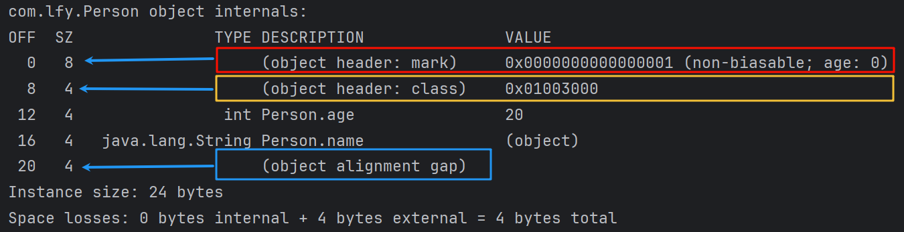

- 开启压缩类指针（默认情况，**堆<=32GB**）：**Klass pointer占用 4字节**。
- 未开启压缩类指针（**堆>32GB**或显式关闭）：**Klass pointer占用 8字节**。

偏向锁延迟：​

  - JVM启动时默认有4秒延迟才会启用偏向锁
  - 可通过 `-XX:BiasedLockingStartupDelay=0` 立即启用

> # 偏向锁的历史变迁：
> 
> - Java 15: 默认禁用偏向锁 (`-XX:-UseBiasedLocking`)
> - Java 17: 正式弃用偏向锁
> - Java 21: 正式移除

## 线程通信

> **等待****唤醒**机制

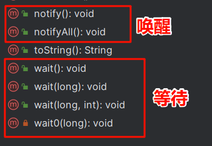

### 多线程增减

> 交替执行：测试使用 if 替换 while 判断

```java
class ShareDataOne {
    private Integer number = 0;

    /**
     *  增加1
     */
    public synchronized void increment() throws InterruptedException {
        // 1. 判断
        if (number != 0) {
            this.wait();
        }

        // 2. 干活
        number++;
        System.out.println(Thread.currentThread().getName() + ": " + number);

        // 3. 通知
        this.notifyAll();
    }

    /**
     * 减少1
     */
    public synchronized void decrement() throws InterruptedException {
        // 1. 判断
        if (number != 1) {
            this.wait();
        }

        // 2. 干活
        number--;
        System.out.println(Thread.currentThread().getName() + ": " + number);

        // 3. 通知
        this.notifyAll();
    }
}

public class NotifyWaitDemo {

    public static void main(String[] args) {
        ShareDataOne shareDataOne = new ShareDataOne();

        new Thread(()->{
            for (int i = 0; i < 10; i++) {
                try {
                    shareDataOne.increment();
                } catch (InterruptedException e) {
                    e.printStackTrace();
                }
            }
        }, "AAA").start();
        new Thread(()->{
            for (int i = 0; i < 10; i++) {
                try {
                    shareDataOne.decrement();
                } catch (InterruptedException e) {
                    e.printStackTrace();
                }
            }
        }, "BBB").start();

    }
}
```

> **如果换成4个线程会怎样？**
> 
> 改造 mian 方法，加入 CCC 和 DDD 两个线程：

```java
    public static void main(String[] args) {
        ShareDataOne shareDataOne = new ShareDataOne();

        new Thread(()->{
            for (int i = 0; i < 10; i++) {
                try {
                    shareDataOne.increment();
                } catch (InterruptedException e) {
                    e.printStackTrace();
                }
            }
        }, "AAA").start();
        new Thread(()->{
            for (int i = 0; i < 10; i++) {
                try {
                    shareDataOne.decrement();
                } catch (InterruptedException e) {
                    e.printStackTrace();
                }
            }
        }, "BBB").start();

        new Thread(()->{
            for (int i = 0; i < 10; i++) {
                try {
                    shareDataOne.increment();
                } catch (InterruptedException e) {
                    e.printStackTrace();
                }
            }
        }, "CCC").start();
        new Thread(()->{
            for (int i = 0; i < 10; i++) {
                try {
                    shareDataOne.decrement();
                } catch (InterruptedException e) {
                    e.printStackTrace();
                }
            }
        }, "DDD").start();
    }
```

打印结果，依然会有概率是，10101010...。

但是，多执行几次，也会出现错乱的现象：

### 虚假唤醒

换成4个线程会导致错误，**虚假唤醒**

原因：在java多线程判断时，不能用if，程序出事出在了判断上面。

**注意，消费者被唤醒后是从wait()方法（被阻塞的地方）后面执行，而不是重新从同步块开头。**

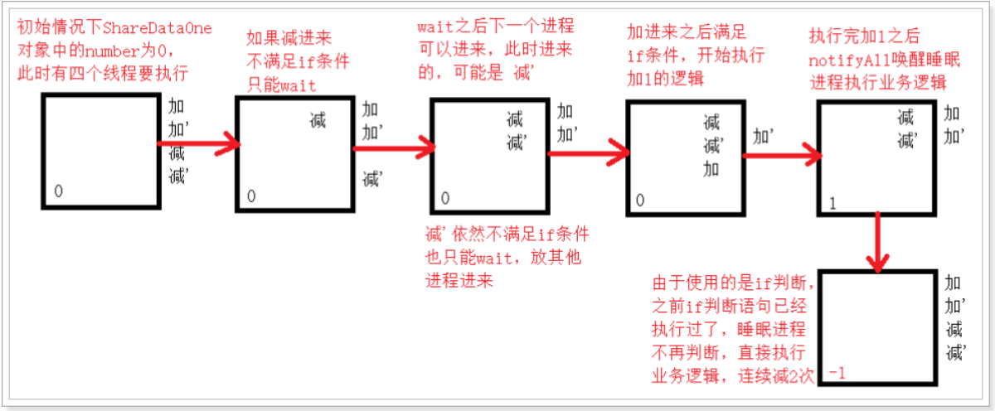

**解决方案**：

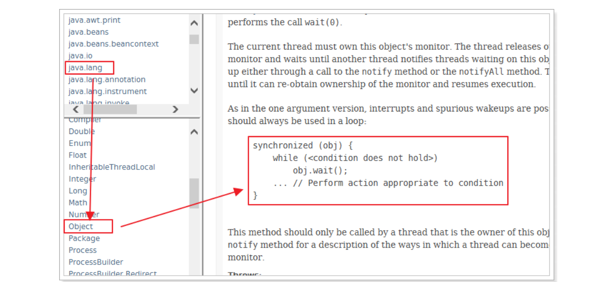

**面试题**：两个线程打印

- 两个线程，一个线程打印1-26；一个线程打印a-z； 1a2b3c

### 练习：交替打印

```java
package com.lfy;

public class ThreadPrinter{

    public static void main(String[] args) {
        Printer printer = new Printer();

        new Thread(()->{
            for (int i = 0; i < 50; i++) {
                try {
                    printer.printNum();
                } catch (InterruptedException e) {
                    throw new RuntimeException(e);
                }
            }
        }).start();
        new Thread(()->{
            for (int i = 0; i < 50; i++) {
                try {
                    printer.printChar();
                } catch (InterruptedException e) {
                    throw new RuntimeException(e);
                }
            }
        }).start();
    }
}

class Printer {
    private int count;
    private char ch = 'a';
    private boolean charCondition = false;
    public synchronized void printNum() throws InterruptedException {
        while (charCondition){
            this.wait();
        }
        System.out.println("数字："+ count++);
        charCondition = true;
        this.notify();
    }

    public synchronized void printChar() throws InterruptedException {
        while (!charCondition){
            this.wait();
        }
        System.out.println("字符："+ ch++);
        charCondition = false;
        this.notify();
    }
}
```

## JMM（Java Memory Model）

> 可见性、有序性的规则

**Java的JIT编译器**，为了**优化性能**，它可能会将频繁访问的**某个堆变量**（比如循环条件标志）优化存储到**寄存器**中，而不是每次都从堆（或缓存）中读取。这样可以显著提高访问速度。

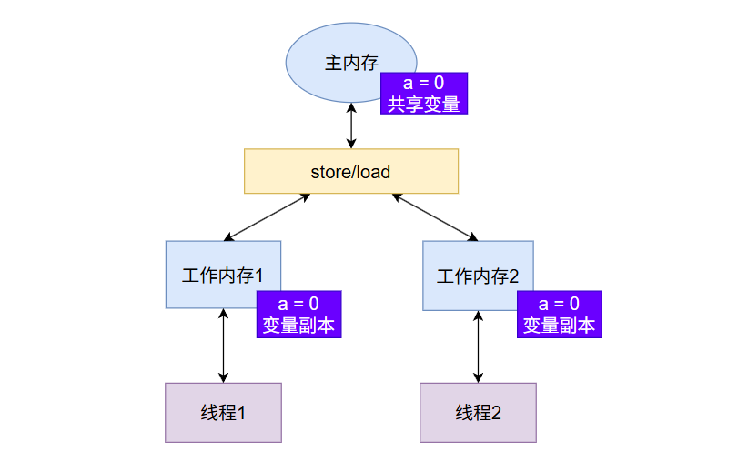

从图中可以看出：

1. 所有的共享变量都存在主存中。
2. 每个线程都保存了一份该线程使用到的共享变量的副本。
3. 如果线程 A 与线程 B 之间要通信的话，必须经历下面 2 个步骤：
  1. 线程 A 将本地内存 A 中更新过的共享变量刷新到主存中去。
  2. 线程 B 到主存中去读取线程 A 之前已经更新过的共享变量。

所以，线程 A 无法直接访问线程 B 的工作内存，线程间通信必须经过主存。

### 验证 - 可见性

可见性主要是指**多线程**环境下，**一个线程**对**共享变量**的修改**能够被其他线程及时看到**。

在Java中，变量可见性问题主要是由于**Java内存模型（JMM）**的规定以及线程的工作内存与主内存的交互方式导致的。

```java
private static Integer flag = 1;

public static void main(String[] args)  throws InterruptedException {
    new Thread(new Runnable() {
        @Override
        public void run() {
            System.out.println("我是子线程工作内存flag的值：" + flag);
            while(flag == 1){
            }
            System.out.println("子线程操作结束..." + flag);
        }
    }).start();
    Thread.sleep(500);
    flag = 2;
    System.out.println("我是主线程工作内存flag的值：" + flag);
}
```

### 验证 - 有序性

为了极限压榨CPU性能。在底层执行的时候，会在各种环节产生**指令重排序**；比如

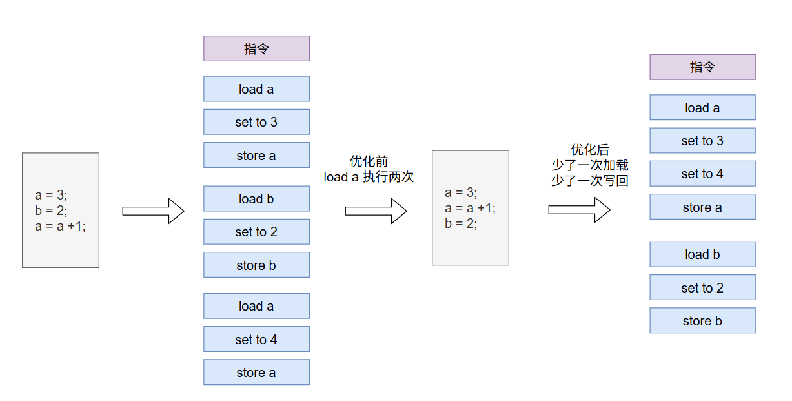

```java
public class InstructionsOrderDemo {

    static int a,b;
    static int x,y;

    public static void main(String[] args) throws InterruptedException {

        int i = 0;
        while (true){
            i++;
            a = b = x = y = 0;
            Thread thread1 = new Thread(() -> {
                a = 1;
                x = b;
            }, "");  
            Thread thread2 = new Thread(() -> {
                b = 1;
                y = a;
            }, "");

            thread1.start();
            thread2.start();

            thread1.join();
            thread2.join();

            System.out.println("第" + i + "次打印：x=" + x + ", y=" + y);

            if (x == 0 && y == 0){
                break;
            }
        }
    }
}
```

### 验证 - 原子性

```typescript
class Counter {
    private int c = 0;

    public void incr() {
        c++;
    }


    public int value() {
        return c;
    }

}
```

`Counter` 的设计使得每次调用 `incr` 都会使 `c` 增加 1。然而，如果多个线程同时引用 `Counter` 对象，线程间的干扰可能导致实际结果与预期不符。

当**运行在不同线程**中的**两个操作作用于****同一数据**并**发生交错**时，就会**产生干扰**。

乍看之下，对 `Counter` 实例的操作似乎不可能发生交错，因为对 `c` 的两个操作都是单一而简单的语句。然而，即便是简单语句也可能被虚拟机转换为多个步骤。比如`c++`，会被**虚拟机解释为3步**：

> 1. 查询c的值
> 2. 计算c+1后的新值
> 3. 把新值保存到c变量位置

> 假设线程 A 调用 `increment` 的同时线程 B 调用 `decrement` 。如果 `c` 的初始值为 `0` ，它们交错执行的顺序可能如下：

1. Thread A: 查询c.
2. Thread B: 查询c.
3. Thread A: 增加查询到的值; 结果：1.
4. Thread B: 增加查询到的值; 结果：1.
5. Thread A: 保存结果到c; c现在是1.
6. Thread B: 保存结果到c; c现在是1.

> 线程 A 的结果丢失了，被线程 B 覆盖。这种特定的交错情况只是其中一种可能性。在不同情况下，可能是线程 B 的结果丢失，或者根本不会出现任何错误。由于它们难以预测，线程干扰错误可能很难检测和修复。

以上说明了线程干扰产生的**原子性**问题。

加锁可以解决

> ++i 操作是三行代码； 加锁解决一切问题

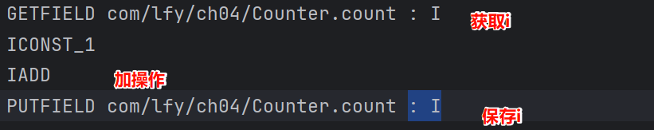

### volatile 关键字

> 保证**可见性**和**有序性**

1. **可见性（Visibility）**​​：
  - 当一个变量被声明为 `volatile`，任何线程对该变量的修改都会立即被写回主内存，
  - 当其他线程读取这个变量时，它们会直接从主内存中读取最新的值，而不是使用本地线程栈中缓存的值。
  - 这样可以确保一个线程对变量的修改对其他线程是可见的。
2. **有序性（Ordering）**​​：`volatile` 关键字还禁止指令重排序（编译器或处理器为了优化性能可能会对指令进行重排序）。具体来说：
  - 在写操作之前的所有操作，在写操作之前完成（写屏障）。
  - 在读操作之后的所有操作，在读操作之后开始（读屏障）。
  - 这样可以避免编译器或处理器对指令进行重排序，从而保证程序按照代码的顺序执行。

### 基本原理（了解）

#### CPU与缓存

> CPU能不操作内存就不操作

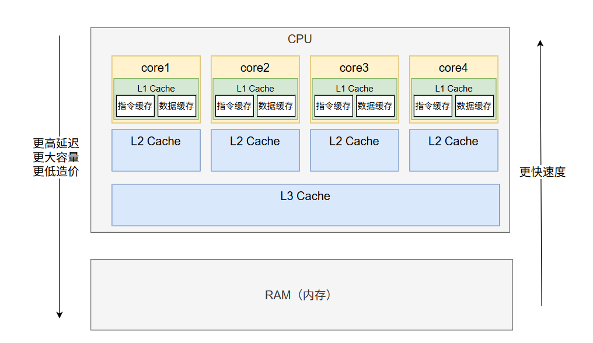

#### 访问速度

#### 执行顺序

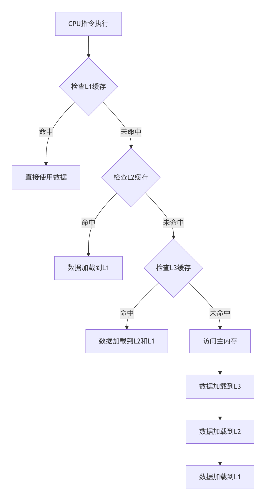

#### 读流程

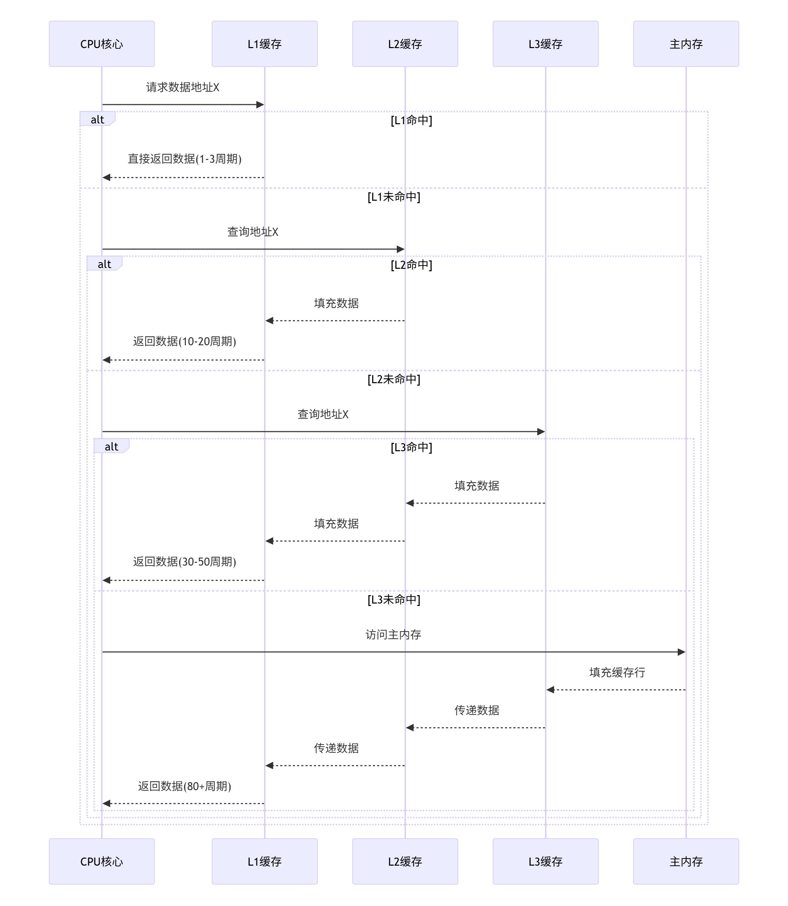

#### 写流程

Modify；

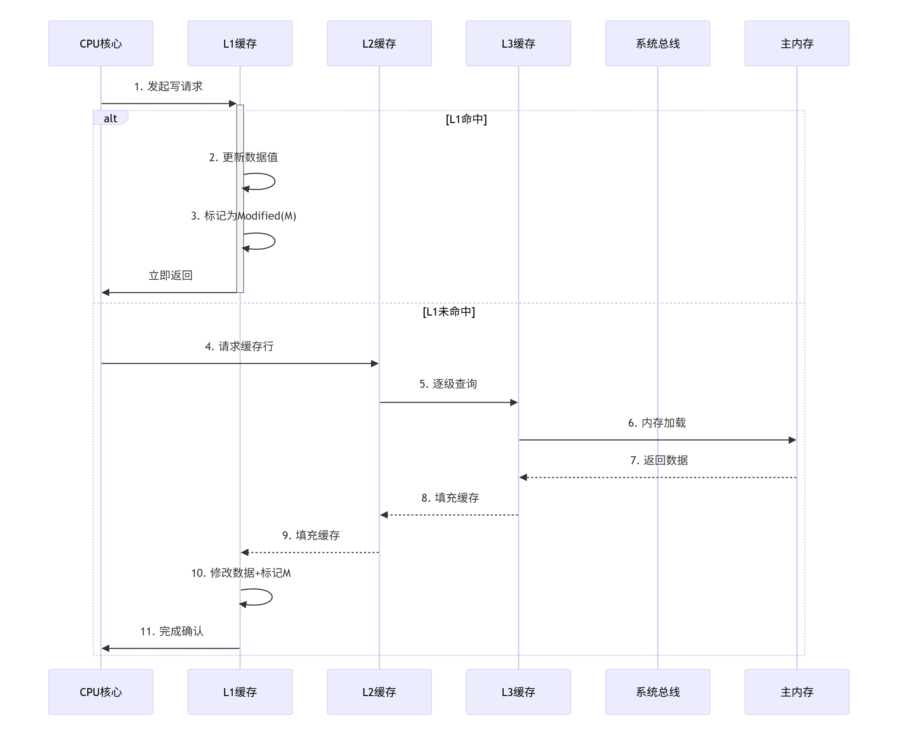

#### 多核心一致性

MESI：总线一致性协议

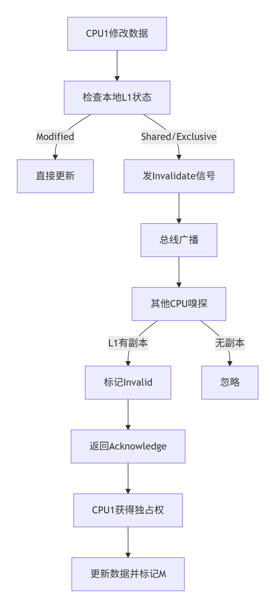

#### 缓存一致性协议（MESI）

- 状态转移​：
  - **M****​**odified：**数据已修改**（仅本核心有效）
  - **E**​xclusive：**独占未修改**

前两个都说明我对这个数据，独享(**ME**)；其他核心都没有要过

  - **S**​hared：**多核心共享**（只读）
  - **I**​nvalid：**缓存行**失效

多CPU核心之间的协调通过**总线**上的**消息**（Bus Transactions）实现。主要消息类型包括：

- **BusRd**: 请求读取某个缓存行
- **BusRdX**: 请求**独占**某个**缓存行**（用于写入）
- **BusUpgr**: 当缓存行已经处于**Shared**状态，想要写入时发出的升级请求
- **Flush**: 将修改的**缓存行**写回主存并置为Shared或Invalid
- etc.

##### 本地读取

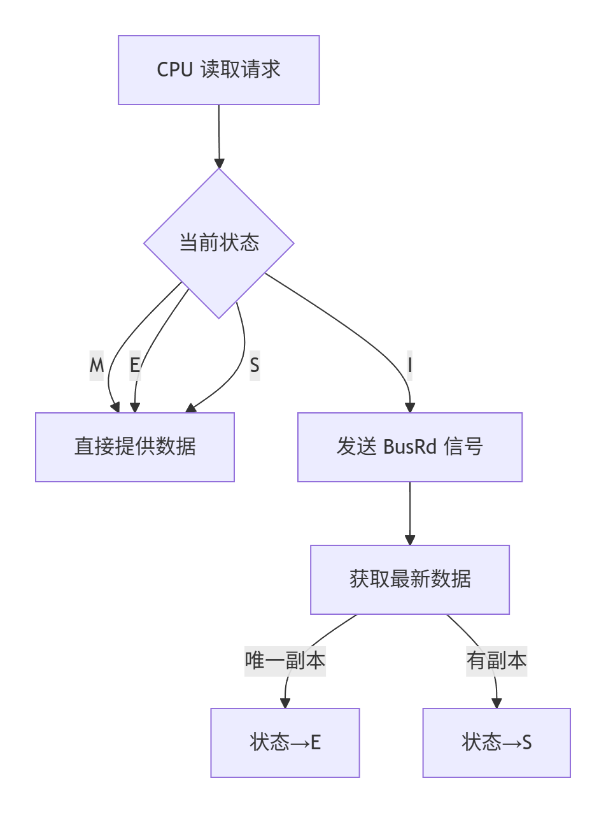

##### 本地写入

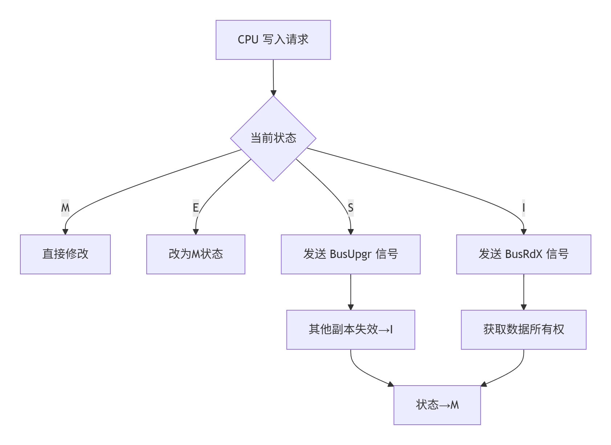

### 原理细节

#### 内存模型


从图中可以看出：

1. 所有的共享变量都存在主存中。
2. 每个线程都保存了一份该线程使用到的共享变量的副本。
3. 如果线程 A 与线程 B 之间要通信的话，必须经历下面 2 个步骤：
  1. 线程 A 将本地内存 A 中更新过的共享变量刷新到主存中去。
  2. 线程 B 到主存中去读取线程 A 之前已经更新过的共享变量。

所以，线程 A 无法直接访问线程 B 的工作内存，线程间通信必须经过主存。

#### volatile 写操作（触发MESI）

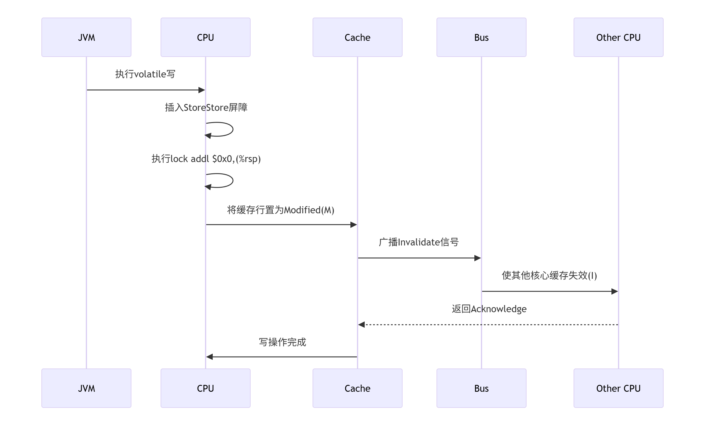

#### volatile 读操作（依赖MESI）

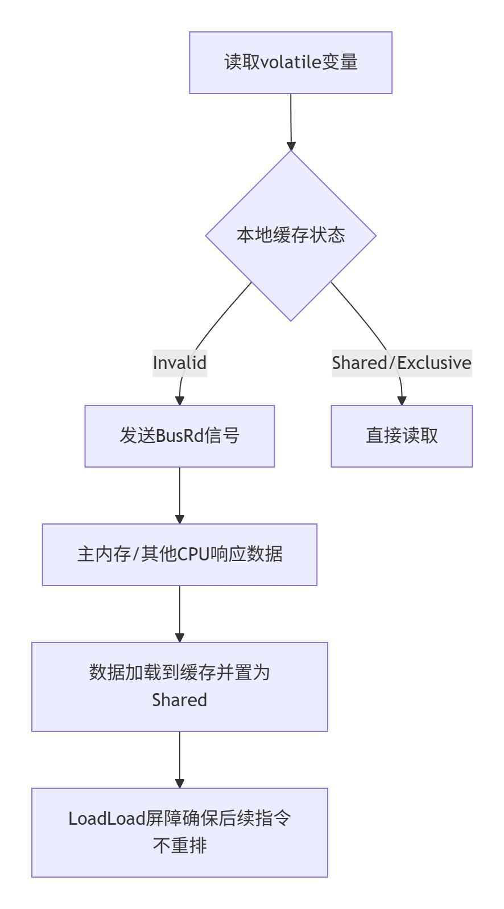

#### 关键差异与协作点

#### 与MESI联动流程

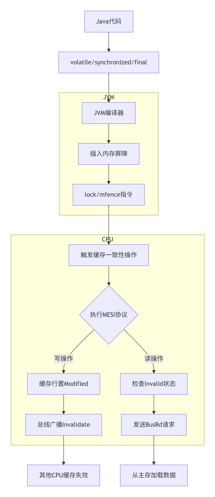

### Happen-Before（了解）

在常规的开发中，如果我们通过上述规则来分析一个并发程序是否安全，估计脑壳会很疼。因为更多时候，我们是分析一个并发程序是否安全，其实都依赖**Happen-Before原则**进行分析。Happen-Before被翻译成**先行发生原则**，意思就是**当A操作先行发生于B操作，则在发生B操作的时候，操作A产生的影响能被B观察到**，“影响”包括修改了内存中的共享变量的值、发送了消息、调用了方法等。

Happen-Before的规则有以下几条：

1. **程序次序规则**（Program Order Rule）：在**一个线程内**一段代码的**执行结果是有序的。** 就算还会指令重排，但是随便它怎么排，结果是按照我们代码的顺序生成的不会变！
2. **管程锁定规则**（Monitor Lock Rule）：就是无论是在单线程环境还是多线程环境，对于**同一个锁**来说，一个线程对这个锁解锁之后，另一个线程获取了这个锁都能看到前一个线程的操作结果！(管程是一种通用的同步原语，synchronized就是管程的实现）
3. **volatile变量规则**（volatile Variable Rule）：**对同一个volatile的变量，先行发生的写操作，肯定早于后续发生的读操作**
4. **线程启动规则**（Thread Start Rule）：Thread对象的start()方法先行发生于此线程的每一个动作
5. **线程终止规则**（Thread Termination Rule）：线程中的**所有操作**都先行发生于对此**线程的终止检测**，我们可以通过Thread.join()方法结束、Thread.isAlive()的返回值等手段检测到线程已经终止执行。
6. **线程中断规则**（Thread Interruption Rule）：对线程的interruption()调用，先于被调用的线程检测中断事件(Thread.interrupted())的发生
7. **对象终结规则**（Finalizer Rule）：一个对象的初始化完成（构造函数执行结束）先行发生于它的finalize()方法的开始。
8. **传递性**（Transitivity）：如果操作A先于操作B、操作B先于操作C,则操作A先于操作C

以上这些规则保障了happen-before的顺序，如果不符合以上规则，那么在多线程环境下就不能**保证执行顺序等同于代码顺序**。通过这些条件的判定，仍然很难判断一个线程是否能安全执行，线程安全多数依赖于工具类的安全性来保证。想提高自己对线程是否安全的判断能力，必然需要理解所使用的框架或者工具的实现，并积累线程安全的经验。