# 10.网络编程（了解）

# 网络基础

> **网络是一组彼此连接并能够相互发送数据的主机。**
> 
> 网络很像一个人类社会的圈子，一群互相认识、定期交换信息并共同协调活动的人。
> 
> 在网络中最最重要的两部分是：
> 
> - **节点(Nodes)：**也就是主机，比如常见的电脑、手机、智能设备、路由器等
> - **连接(Links)：**可以理解为网线、无线网 WIFI、光纤等

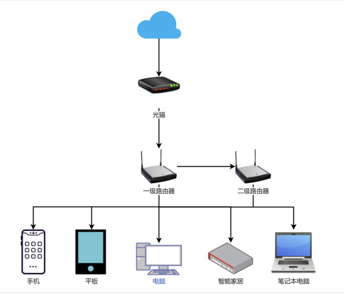

## IP&MAC

**MAC地址****​：**

- **全称：**媒体访问控制地址（Media Access Control Address）
- **作用：**在局域网（LAN）中**唯一标识网络设备的物理地址**，通常由**设备制造商固化在网卡的硬件中**。
- **格式：****是一个48位（6字节）的地址**，通常用十六进制表示，如：`00:1A:2B:3C:4D:5E`。
- **工作层级：**数据链路层（OSI模型的第二层）。
- **特点：**全球唯一（理论上），**设备出厂**时设定，一般不能改变（但可以通过软件修改，称为**MAC地址欺骗**）。

**IP地址****​：**

- **全称：**互联网协议地址（Internet Protocol Address）
- **作用：**在互联网中标识设备的逻辑地址，用于网络层寻址，使得数据包能够在复杂的网络中被路由。
- **格式：****IPv4地址是32位**，通常用**点分十进制**表示，如：`192.168.1.1`；IPv6地址是128位，用十六进制表示，如：`2001:0db8:85a3:0000:0000:8a2e:0370:7334`。
  - IPv4：255.255.255.255 - 0.0.0.0  ： 4个字节
  - IPv6：`2001:0db8:85a3:0000:0000:8a2e:0370:7334`   16个字节
- **工作层级：**网络层（**OSI模型**的第三层）。
- **特点：**可以动态分配（如DHCP），也可以静态配置，并且可以随着设备在不同网络中的位置而变化。

## 数据传输

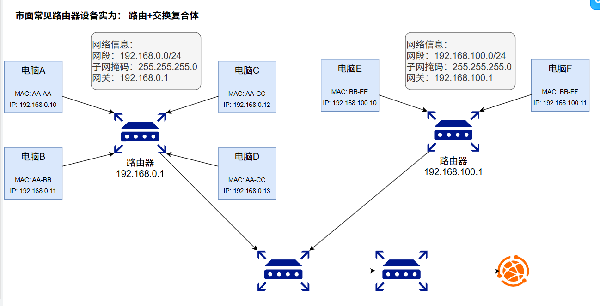

## Port - 端口

**抖音聊天消息**

网站内容

图片、视频

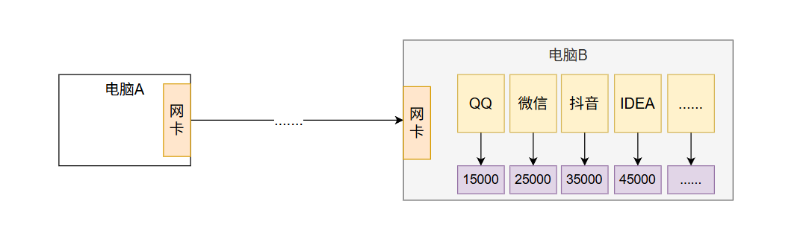

## 网络模型

5层模型最后一个是物理层，打错了

**协议（编码和解码的规范）**？ 01： 00：字   01：图     10：视频   11：其他

1. 你好（字符串）： utf8 - 3byte  24bit ；  **00** + 24bit
2. 图片： 3byte - 24bit ；   **01**  + 24bit

收到26bit以后： 前两位拿出来

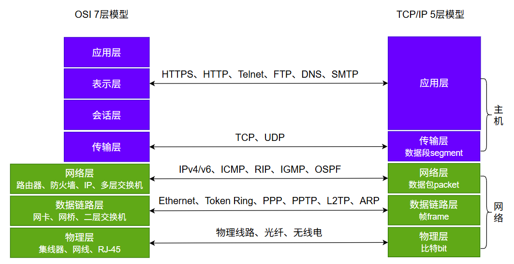

由于计算机网络从底层的传输到高层的软件设计十分复杂，要合理地设计计算机网络模型，必须采用分层模型，每一层负责处理自己的操作。OSI（Open System Interconnect）网络模型是 ISO 组织定义的一个计算机互联的标准模型，注意它只是一个定义，目的是为了简化网络各层的操作，提供标准接口便于实现和维护。这个模型从上到下依次是：

- **应用层**，提供应用程序之间的通信；
- **表示层**：处理数据格式，加解密等等；
- **会话层**：负责建立和维护会话；
- **传输层**：负责提供端到端的可靠传输；
- **网络层**：负责根据目标地址选择路由来传输数据；
- **链路层**、**物理层**：负责把数据进行分片并且真正通过物理网络传输，例如，无线网、光纤等。

> 当你编写通过网络通信的 Java 程序时，实际上是在**应用层进行编程**。通常你无需关心 TCP 和 UDP 层，而是直接使用 `java.net` 包中的类。这些类提供了与系统无关的网络通信功能。不过，为了确定程序应该使用哪些 Java 类，你确实需要理解 TCP 和 UDP 协议之间的区别。

## 封包传输

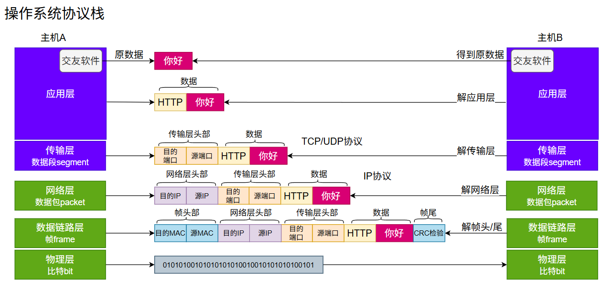

## 报文格式（了解）

协议：

1. 具有通用性
2. 具有合法性校验

> **传输层**头部封装
> 
> - TCP、UDP
> - TCP报文：5行（每行**4字节**）；20字节
>   - 端口号：源、目的
>   - **序列号**： 1 自动增长 数字
>   - **确认号**：说清楚，此包是对于你发的 某个包的回复
>   - 标志位：
>     - ACK【0，1】：这是一个回复包，回复的是你哪个消息，你自己看确认号
>     - SYN【0，1】：设置为1，说明此次是一个同步请求（发起一起**建立连接**的请求）

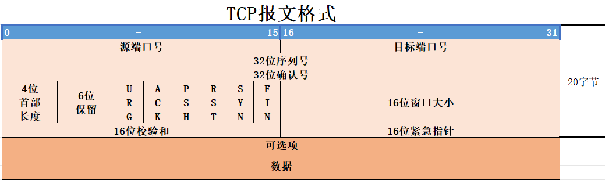

自定义的数据格式不标准

> **网络层**头部封装

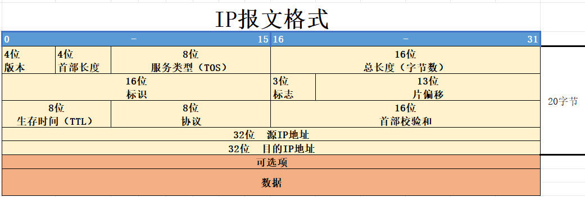

> 数据链路层头部封装
> 
> - 

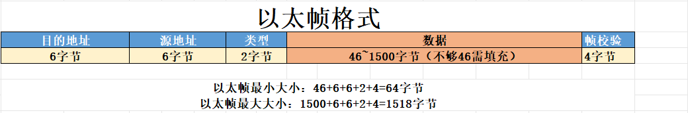

## TCP

稳定传输：类似**打电话****方式！ 慢**

### 三次握手

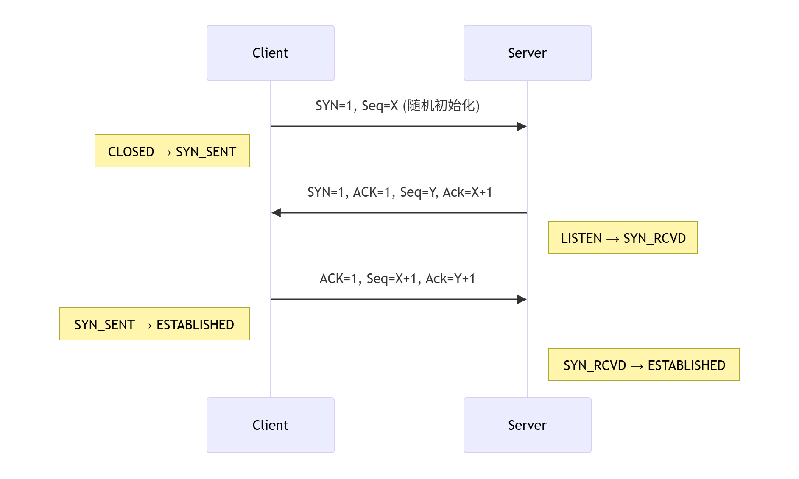

1. **第一次握手 (SYN)**:
  - 客户端发送 SYN=1（同步标志）和随机序列号 Seq=X
  - 客户端进入 `SYN_SENT` 状态
  - 目的​：请求建立连接，并确定初始序列号
2. **第二次握手 (SYN+ACK)**:
  - 服务器回复 SYN=1 + ACK=1（确认标志）
  - 服务器发送自己的随机序列号 Seq=Y
  - 确认号 Ack=X+1（表示已收到客户端序列号X）
  - 服务器进入 `SYN_RCVD` 状态
  - 目的​：确认客户端请求，同时发送自己的连接参数
3. **第三次握手 (ACK)**:
  - 客户端发送 ACK=1，Seq=X+1（客户端初始序列号+1）
  - 确认号 Ack=Y+1（表示已收到服务器序列号Y）
  - 目的​：确认服务器的响应，建立双向连接
  - 双方进入 `ESTABLISHED` 状态

> 关键点​：
> 
> - 随机序列号防止历史连接冲突
> - 三次交换确保双方都具备收发能力
> - 2MSL等待防止旧连接数据包干扰新连接（客户端）

### 四次挥手

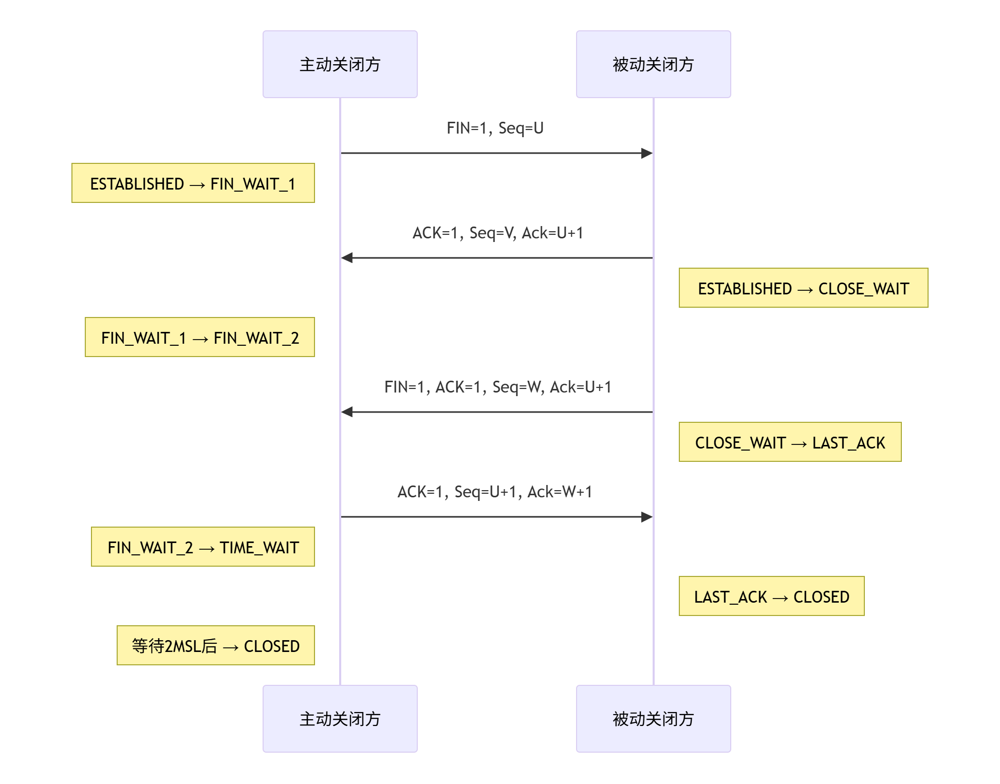

1. 第一次挥手 (FIN):
  - 主动关闭方发送 FIN=1 和当前序列号 Seq=U
  - 进入 `FIN_WAIT_1` 状态
  - 目的​：通知对方自己已完成数据发送
2. 第二次挥手 (ACK):
  - 被动关闭方回复 ACK=1，确认号 Ack=U+1
  - 进入 `CLOSE_WAIT` 状态
  - 目的​：确认收到关闭请求（此时被动方可继续发送数据）
  - 主动方收到后进入 `FIN_WAIT_2` 状态
3. 第三次挥手 (FIN):
  - 被动关闭方发送 FIN=1 + ACK=1 和序列号 Seq=W
  - 确认号仍为 Ack=U+1
  - 进入 `LAST_ACK` 状态
  - 目的​：通知主动方自己数据发送完毕
4. 第四次挥手 (ACK):
  - 主动关闭方发送 ACK=1，确认号 Ack=W+1
  - 进入 `TIME_WAIT` 状态（等待2MSL时间）
  - 目的​：确认收到被动方的关闭请求
  - 被动方收到后立即进入 `CLOSED` 状态

> 关键点​：
> 
> 1. 为什么需要四次挥手？
>   - TCP 是全双工协议，需要双方独立关闭各自的数据流
>   - FIN 和 ACK 不能合并发送（第二次挥手后被动方可能还有数据要发送）
> 2. `TIME_WAIT` 状态的作用：
>   - 确保最后的 ACK 能到达被动方（如未收到会重发 FIN）
>   - 让网络中的旧数据包失效（等待 2*MSL，通常 30s-2min）
> 3. 异常情况处理：
>   - 主动方在 `TIME_WAIT` 期间收到 FIN 会重发 ACK
>   - 被动方在 `LAST_ACK` 状态收不到 ACK 会重发 FIN

### 稳定传输的核心

**TCP **通过一系列关键技术实现**稳定传输**，即使在不可靠的 IP 层（**数据丢失**、**乱序**、**重复**）上也能提供可靠的字节流服务：

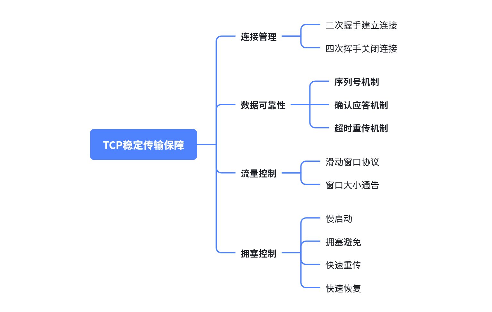

## UDP

1. 无ACK回复
2. 连接无需建立、断开
3. 但是数据包的序号还是有的（即使数据包乱序出去了，接受方也有一定的排序能力

**不稳定传输**：类似**发短信方式**

| 特点 | 说明 | 影响 |
| --- | --- | --- |
| 无连接 | 直接发送数据 | 快速但不可靠 |
| 无确认机制 | 不保证数据到达 | 可能丢失数据 |
| 无重传机制 | 丢失不重发 | 低延迟但低可靠性 |
| 无顺序控制 | 不保证顺序 | 可能乱序到达 |
| 无流量控制 | 接收方可能被淹没 | 可能导致丢包增多 |
| 无拥塞控制 | 网络拥塞时不降速 | 可能加剧网络拥塞 |
| 校验和可选 | 可关闭校验（值为0） | 提升速度但降低完整性 |

UDP提供了**最快但最不保证**的数据传输方式，适用于需要**低延迟**且能容忍数据丢失的场景，同时为应用程序提供了最大的灵活性来实现自定义的可靠机制

> 直播（UDP）
> 
> 1. 视频画面，一帧一帧； 60HZ
> 2. 游戏

# Socket 编程（网络编程）

BIO：阻塞式

NIO：新IO（异步，非阻塞）

> 通信的协议还是比较复杂的，`java.net` 包中包含的类和接口，它们提供低层次的通信细节。我们可以直接使用这些类和接口，来专注于网络程序开发，而不用考虑通信的细节。
> 
> `java.net` 包中提供了两种常见的网络协议的支持：
> 
> - **UDP**：用户数据报协议(User Datagram Protocol)。
> - **TCP**：传输控制协议 (Transmission Control Protocol)。
> 
> 通信的两端都要有 **Socket**（也可以叫“**套接字**”），是**两台机器**间通信的**端点**。
> 
> **网络通信**其实就**是Socket间**的通信。

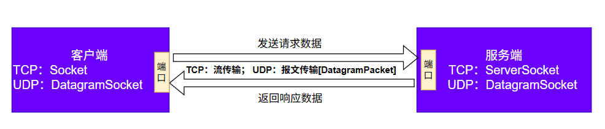

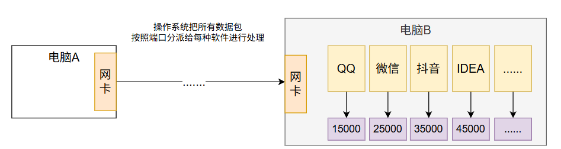

服务器众多； 负载均衡技术

## TCP Socket 编程

### 服务端流程

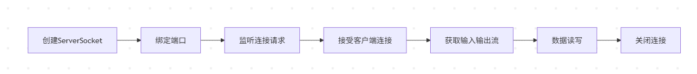

```java
// 1. 创建ServerSocket并绑定端口
try (ServerSocket serverSocket = new ServerSocket(8080)) {
    System.out.println("服务器启动，等待客户端连接...");
    
    // 2. 监听并接受客户端连接
    try (Socket clientSocket = serverSocket.accept()) {
        System.out.println("客户端已连接: " + clientSocket.getInetAddress());
        
        // 3. 获取输入输出流
        BufferedReader in = new BufferedReader(
            new InputStreamReader(clientSocket.getInputStream()));
        PrintWriter out = new PrintWriter(clientSocket.getOutputStream(), true);
        
        // 4. 数据读写
        String request;
        while ((request = in.readLine()) != null) {
            System.out.println("收到请求: " + request);
            
            // 处理请求并返回响应
            String response = "处理结果: " + request.toUpperCase();
            out.println(response);
        }
    }
} catch (IOException e) {
    e.printStackTrace();
}
```

### 客户端流程

1. 打开一个Socket
2. 打开Socket的输入流和输出流
3. 从输入流读数据，给输出流写数据
4. 关闭流
5. 关闭Socket

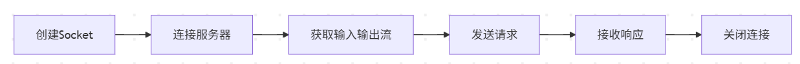

```java
// 1. 创建Socket并连接服务器
try (Socket socket = new Socket("localhost", 8080)) {
    System.out.println("已连接到服务器");
    
    // 2. 获取输入输出流
    PrintWriter out = new PrintWriter(socket.getOutputStream(), true);
    BufferedReader in = new BufferedReader(
        new InputStreamReader(socket.getInputStream()));
    
    // 3. 发送请求
    String request = "Hello Server!";
    out.println(request);
    
    // 4. 接收响应
    String response = in.readLine();
    System.out.println("服务器响应: " + response);
    
} catch (IOException e) {
    e.printStackTrace();
}
```

### 综合案例

> 多个客户端与服务器之间的多次通信

#### 服务端代码

```java
public class Server {
    public static void main(String[] args) throws IOException {
        // 1、准备一个ServerSocket
        ServerSocket server = new ServerSocket(8888);
        System.out.println("等待连接...");

        int count = 0;
        while(true){
            // 2、监听一个客户端的连接
            Socket socket = server.accept();
            System.out.println("第" + ++count + "个客户端"+socket.getInetAddress().getHostAddress()+"连接成功！！");

            ClientHandlerThread ct = new ClientHandlerThread(socket);
            ct.start();
        }

        //这里没有关闭server，永远监听
    }
    static class ClientHandlerThread extends Thread{
        private Socket socket;
        private String ip;

        public ClientHandlerThread(Socket socket) {
            super();
            this.socket = socket;
            ip = socket.getInetAddress().getHostAddress();
        }

        public void run(){
            try{
                //（1）获取输入流，用来接收该客户端发送给服务器的数据
                BufferedReader br = new BufferedReader(new InputStreamReader(socket.getInputStream()));
                //（2）获取输出流，用来发送数据给该客户端
                PrintStream ps = new PrintStream(socket.getOutputStream());
                String str;
                // （3）接收数据
                while ((str = br.readLine()) != null) {
                    //（4）反转
                    StringBuilder word = new StringBuilder(str);
                    word.reverse();

                    //（5）返回给客户端
                    ps.println(word);
                }
                System.out.println("客户端" + ip+"正常退出");
            }catch(Exception  e){
                System.out.println("客户端" + ip+"意外退出");
            }finally{
                try {
                    //（6）断开连接
                    socket.close();
                } catch (IOException e) {
                    e.printStackTrace();
                }
            }
        }
    }
}
```

#### 客户端代码

```java
public class Client {
    public static void main(String[] args) throws Exception {
        // 1、准备Socket，连接服务器，需要指定服务器的IP地址和端口号
        Socket socket = new Socket("127.0.0.1", 8888);

        // 2、获取输出流，用来发送数据给服务器
        OutputStream out = socket.getOutputStream();
        PrintStream ps = new PrintStream(out);

        // 3、获取输入流，用来接收服务器发送给该客户端的数据
        InputStream input = socket.getInputStream();
        BufferedReader br;
        if(args!= null && args.length>0) {
            String encoding = args[0];
            br = new BufferedReader(new InputStreamReader(input,encoding));
        }else{
            br = new BufferedReader(new InputStreamReader(input));
        }

        Scanner scanner = new Scanner(System.in);
        while(true){
            System.out.println("输入发送给服务器的单词或成语：");
            String message = scanner.nextLine();
            if(message.equals("stop")){
                socket.shutdownOutput();
                break;
            }

            // 4、 发送数据
            ps.println(message);
            // 接收数据
            String feedback  = br.readLine();
            System.out.println("从服务器收到的反馈是：" + feedback);
        }

        //5、关闭socket，断开与服务器的连接
        scanner.close();
        socket.close();
    }
}
```

## UDP Socket 编程

### 服务端流程

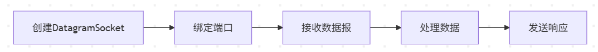

```java
// 1. 创建DatagramSocket并绑定端口
try (DatagramSocket socket = new DatagramSocket(9090)) {
    byte[] buffer = new byte[1024];
    System.out.println("UDP服务器已启动");
    
    while (true) {
        // 2. 接收数据报
        DatagramPacket packet = new DatagramPacket(buffer, buffer.length);
        socket.receive(packet);
        
        // 3. 处理数据
        String request = new String(packet.getData(), 0, packet.getLength());
        System.out.println("收到请求: " + request);
        
        // 4. 发送响应
        byte[] responseData = ("处理结果: " + request).getBytes();
        DatagramPacket responsePacket = new DatagramPacket(
            responseData, responseData.length,
            packet.getAddress(), packet.getPort()
        );
        socket.send(responsePacket);
    }
} catch (IOException e) {
    e.printStackTrace();
}
```

### 客户端流程

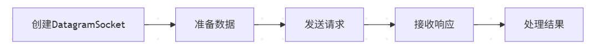

```java
// 1. 创建DatagramSocket
try (DatagramSocket socket = new DatagramSocket()) {
    InetAddress serverAddress = InetAddress.getByName("localhost");
    
    // 2. 准备并发送请求
    String request = "Hello UDP Server!";
    byte[] requestData = request.getBytes();
    DatagramPacket sendPacket = new DatagramPacket(
        requestData, requestData.length, serverAddress, 9090);
    socket.send(sendPacket);
    
    // 3. 接收响应
    byte[] buffer = new byte[1024];
    DatagramPacket receivePacket = new DatagramPacket(buffer, buffer.length);
    socket.receive(receivePacket);
    
    // 4. 处理结果
    String response = new String(receivePacket.getData(), 0, receivePacket.getLength());
    System.out.println("服务器响应: " + response);
    
} catch (IOException e) {
    e.printStackTrace();
}
```