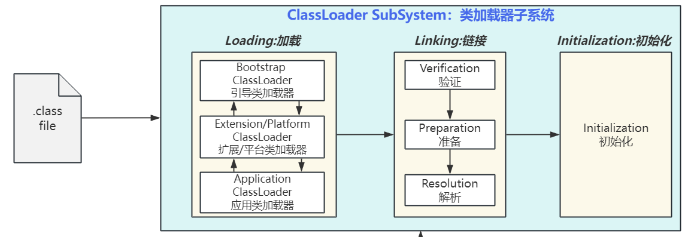
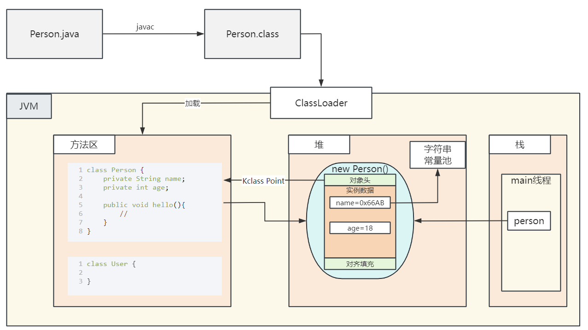

# 11. 注解&反射

# 注解

> 在Java中，注解（Annotation） 是一种用于在**代码**中添加**元数据**的特殊语法结构。它们本身不会直接影响代码逻辑，但可以被编译器、开发工具或运行时框架读取并用于执行特定操作。
> 
> 注解大大增强了Java的**声明式编程**能力。
> 
> - **声明式编程：@Douyin; 一个注解一个功能；**
> - **命令式编程：**程序员自己**编写代码指令**。

## 注解的核心作用

1. **提供元数据信息**
为类、方法、字段等添加描述性标签（如`@Override`、`@Deprecated`）。

`   @Deprecated`：方法过期了

1. **编译时检查**
如`@Override`确保方法正确重写父类方法。
2. **替代配置文件**
在**Spring**、**Hibernate**等框架中，注解可简化XML配置（如`@Autowired`）。
3. **运行时处理**
通过反射读取注解实现动态逻辑（如JUnit的`@Test`）。

## Java内置常见注解

1. `@Override`
标记方法重写父类方法（​编译器验证​）
2. `@Deprecated`
标记过时的类或方法（​编译器警告​）
3. `@SuppressWarnings`
压制编译器警告（如忽略"未使用变量"警告）。

## 元注解（Meta-Annotations）​

用于定义注解的注解（Java提供5种）：

| 元注解 | 作用 |
| --- | --- |
| @Target | 指定注解可应用的位置（类、方法、字段等） |
| @Retention | 指定注解的生命周期（源码级/编译级/运行时级） |
| @Documented | 标注注解是否包含在Javadoc中 |
| @Inherited | 标注注解是否可被子类继承 |
| @Repeatable (Java 8+) | 允许同一位置重复使用相同注解 |

```java
import java.lang.annotation.*;

@Target(ElementType.METHOD)     // 只能用于方法
@Retention(RetentionPolicy.RUNTIME) // 运行时保留（可通过反射读取）
public @interface MyAnnotation {
    String value() default "default"; // 注解属性（类似无参方法）
    int priority() default 1;
}
```

## 自定义注解 - 案例

```java
@Target(ElementType.METHOD)
@Retention(RetentionPolicy.RUNTIME)
public @interface LogTime {
    String pattern() default "yyyy-MM-dd HH:mm:ss"; //时间格式
    boolean showCostTime() default true; //显示耗时
}
```

## Lombok

> 通过一系列注解，简化JavaBean编写

```typescript
@AllArgsConstructor // 自动生成全参构造器
@NoArgsConstructor // 自动生成无参构造器
//@ToString // 自动使用所有属性生成 toString 方法
@EqualsAndHashCode // 自动使用所有属性生成 equals 和 hashCode 方法
@Data // 自动生成所有属性的 getter/setter 方法了；自带toString功能；
public class Car {

    private String brand;
    private String color;
    private int price;
    private String name;
}
```

# 反射

## 介绍

**反射（Reflection）****：**​ 是 Java 在**运行时（*****Runtime*****）**动态获取**类信息**、操作类和对象的能力，它是 Java 被视为"准动态语言"的关键特性。反射打破了封装原则，但也提供了极大的灵活性。

> **逆向工程**： f22 对象 ===》 f22的图纸。

## 类加载（了解）

**JVM全景图**：https://kdocs.cn/l/cqmPHrNVeUI7

1. JVM需要把磁盘中的.class文件，利用类加载器系统，把他读取并存到内存（运行时数据区）中
2. JVM会从内存中开辟一大片空间（自己控制比如1g）；称为**运行时数据区**；划分成了**几个小空间**。
  1. **堆**：放new的对象
  2. **方法区**：放**类**（属性、方法、构造器）
    1. 1.8以前：方法区（永久代【堆里面】）
    2. 1.8及以后：方法区（元空间【直接使用内存条剩下的位置】）

**正射：**`Person person = new Person();`

1. 先去方法区找到 Person 类的构造器定义
2. 调用构造器代码创建对象。把创建的对象放到堆空间中。会返回一个地址 0x7788
3. 给person赋值为这个地址

**反射：**

1. 得到person对象对应的类。` person.getClass()`;
2. 拿到类的信息`Class c = person.getClass()`
3. 获取到类中定义的所有东西。` c.getField、getMethods、getConstructor();`

### 类加载器

> 负责解析所有.class文件，并加载进JVM运行时数据区中。方便后面执行的时候直接使用



### 找资源

| 方法 | 路径起点 | 适用场景 | 是否支持打包后运行 |
| --- | --- | --- | --- |
| ClassLoader | classpath根目录 | 资源文件（如resources目录） | ✔️ |
| File | 项目工作目录 | 项目根目录下的文件 | ✖️ (需绝对路径) |
| Paths + Files | 文件系统绝对/相对路径 | 明确文件位置时 | ✖️ (需绝对路径) |
| Class.getResource | 类所在包或classpath根 | 与类路径相关的资源 | ✔️ |

#### class.getResource

- **相对路径**写法（不以/开头）：在**当前类所在的包**下找
- **绝对路径**写法（以/开头）：在**类路径**下找

#### classLoader

- **相对路径**写法（不以/开头）：在**类路径**下找
- **绝对路径**写法（以/开头）：无效写法

查找规则：

- `getResourceAsStream("data.txt")` → 查找类路径根目录的 `data.txt`
- `getResourceAsStream("config/app.properties")` → 查找类路径下 `config/app.properties`
- `getResourceAsStream("/data.txt")` → 无效写法​（开头的`/`会被忽略）

## 反射机制

> **正射**：通过**类创建**出**对象**，使用对象
> 
> **反射**：通过**对象**，得到他的**类**，**分析类里面有什么**



## 核心类库

均在 `java.lang.reflect` 包中：

1. `Class` 类​：类的抽象表示
2. `Field` 类​：类的成员变量（字段）
3. `Method` 类​：类的方法
4. `Constructor` 类​：类的构造方法
5. `Modifier` 类​：访问修饰符解码工具

## 核心操作

### 获取 Class 对象（三种方式）

```javascript
// 方式1：类名.class（最安全高效）
Class<String> stringClass = String.class;

// 方式2：对象.getClass()
String str = "Hello";
Class<?> strClass = str.getClass();

// 方式3：Class.forName("全限定类名")（最常用）
Class<?> userClass = Class.forName("com.example.User");
```

> 基本类型与数组的Class

```java
Class<Integer> intClass = int.class; // 注意：不是Integer.class
Class<int[]> intArrayClass = int[].class;
Class<String[][]> twoDStringArrayClass = String[][].class;
```

### 获取类信息

```java
Class<ArrayList> arrayListClass = ArrayList.class;// 获取类名
String className = arrayListClass.getName(); // java.util.ArrayList
String simpleName = arrayListClass.getSimpleName(); // ArrayList
// 获取修饰符
int modifiers = arrayListClass.getModifiers();
boolean isPublic = Modifier.isPublic(modifiers);
boolean isAbstract = Modifier.isAbstract(modifiers);
// 获取父类
Class<?> superClass = arrayListClass.getSuperclass(); // AbstractList
// 获取接口
Class<?>[] interfaces = arrayListClass.getInterfaces(); // [List, RandomAccess, ...]
```

### 动态创建对象

```sql
// 1. 无参构造创建
User user = (User) userClass.newInstance();  // 已过时，但可用
User user = (User) userClass.getDeclaredConstructor().newInstance();

// 2. 带参构造创建（指定参数类型）
Constructor<?> constructor = userClass.getDeclaredConstructor(String.class, int.class);
User user = (User) constructor.newInstance("Alice", 25);
```

### 操作字段（Field）

```java
class Person {    
    private String name;    
    public int age;
}
// 获取字段
Field[] fields = Person.class.getDeclaredFields(); // 获取所有字段（包括私有）
Field nameField = Person.class.getDeclaredField("name"); // 获取指定字段
// 访问私有字段（突破封装！）
Person p = new Person();
nameField.setAccessible(true); // 关键步骤：关闭访问检查
nameField.set(p, "Alice"); // 设置字段值
String nameValue = (String) nameField.get(p); // "Alice"
```

| 方法 | 可见性 | 包含继承字段 | 包含私有字段 | 包含protected/包级字段 | 访问修饰符要求 |
| --- | --- | --- | --- | --- | --- |
| getFields() | 只返回​​public​​字段 | 包含从父类继承的public字段 | ❌ 不包含 | ❌ 不包含 | 字段必须是public |
| getDeclaredFields() | 返回​​所有访问级别​​字段 | ❌ 仅当前类声明字段 | ✔️ 包含 | ✔️ 包含 | 无要求 |

### 调用方法（Method）

```java
class Calculator {    
    private int add(int a, int b) {        
        return a + b;    
    }
}
// 获取方法
Method addMethod = Calculator.class.getDeclaredMethod("add", int.class, int.class);
// 调用私有方法
Calculator calc = new Calculator();
addMethod.setAccessible(true);
int result = (int) addMethod.invoke(calc, 5, 3); // 8
```

### 获取泛型类型

```typescript
class GenericClass<T> {    
    private List<String> stringList = new ArrayList<>();
    public List<T> getData() {        
        return new ArrayList<>();    
    }
}
// 获取字段的泛型类型
Field stringListField = GenericClass.class.getDeclaredField("stringList");
Type genericType = stringListField.getGenericType(); // java.util.List<java.lang.String>
// 获取方法的泛型返回类型
Method getDataMethod = GenericClass.class.getMethod("getData");
Type returnType = getDataMethod.getGenericReturnType(); // java.util.List<T>
```

## 关键进阶技巧

1. 突破访问限制
  - `field.setAccessible(true)`
  - `method.setAccessible(true)`
  - `constructor.setAccessible(true)`

1. 获取注解信息（框架实现核心）

```java
Annotation[] annotations = userClass.getAnnotations();
if(userClass.isAnnotationPresent(MyAnnotation.class)) {
    MyAnnotation anno = userClass.getAnnotation(MyAnnotation.class);
}
```

1. 泛型擦除补偿（获取参数化类型）

```java
Field listField = userClass.getDeclaredField("dataList");
Type type = listField.getGenericType();  // 获取完整泛型类型
```