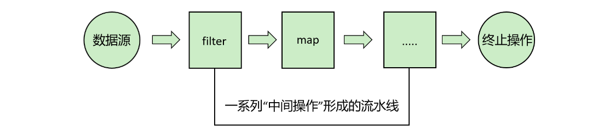

# 12. 新特性(8-23)

| 版本 | 重要特性 |
| --- | --- |
| 8(LTS) | Lambda表达式、函数式接口、方法引用、Stream、Optional、新时间日期API |
| 9 | 模块系统、工厂方法创建集合、接口私有方法 |
| 10 | var局部变量类型推断 |
| 11(LTS) | HTTP Client、String增强、单文件运行 |
| 12 | Switch表达式(预览)、String.transform |
| 13 | Switch表达式增强(预览)、文本块(预览) |
| 14 | Switch表达式(正式)、instanceof模式匹配(预览)、Records(预览) |
| 15 | 密封类(预览)、文本块(正式) |
| 16 | Records(正式)、instanceof模式匹配(正式)、Stream API增强 |
| 17(LTS) | 密封类(正式)、Switch模式匹配(预览) |
| 18 | 简单Web服务器、默认UTF-8字符集 |
| 19 | 虚拟线程(预览)、结构化并发(预览) |
| 20 | Scoped Values(预览) |
| 21(LTS) | 虚拟线程(正式)、switch模式匹配(正式)、字符串模板(预览) |
| 22 | 未命名变量和模式、结构化并发(正式) |
| 23 | 值对象（预览）、字符串模板增强（预计） |

> 注意：预览特性可能在后续版本中调整。生产环境建议使用**LTS版本**（Java 8, 11, 17, 21）。
> 
> LTS（*Long Term Support*）：长期支持
> 
> 以上内容涵盖了主要特性，实际每个版本还包括许多API改进和性能优化。建议查阅对应版本的JEP（JDK Enhancement Proposal）获取完整信息。

# Java 8

## Lambda表达式（函数式编程核心）

作用：简化匿名内部类，实现函数式编程。**所有****函数式接口****的对象创建，都可以替换为 lambda 表达式**

```java
// 传统写法
Runnable r1 = new Runnable() {
    @Override
    public void run() {
        System.out.println("Hello");
    }
};

// Lambda 写法
Runnable r2 = () -> System.out.println("Hello");

// 带参数的Lambda
Comparator<Integer> comp = (a, b) -> a.compareTo(b);
```

以后固定写法： `(参数表) -> { //方法体 }`

> **要求**：接口**仅有一个抽象方法(未实现)**。

## 函数式接口（`@FunctionalInterface`）

**要求**：接口**仅有一个抽象方法**。

```java
@FunctionalInterface
interface MathOperation {
    int calculate(int a, int b);
}

// 使用Lambda实现
MathOperation add = (a, b) -> a + b;
System.out.println(add.calculate(5, 3)); // 输出8
```

```java
@FunctionalInterface
interface GreetingService {
    void sayMessage(String message);
}

// 使用Lambda表达式实现
GreetingService greetService = message -> System.out.println("Hello " + message);
greetService.sayMessage("World");
```

### 内置核心四大函数式接口

| 接口 | 方法签名 | 描述 | 示例 |
| --- | --- | --- | --- |
| Function<T,R> | R apply(T t) | 接受输入T，返回结果R | String::length |
| Consumer<T> | void accept(T t) | 消费输入T，无返回值 | System.out::println |
| Supplier<T> | T get() | 无输入，提供结果T | Instant::now |
| Predicate<T> | boolean test(T t) | 输入T，返回布尔值 | s -> s.isEmpty() |

### 双参数扩展接口

| 接口 | 方法签名 | 描述 |
| --- | --- | --- |
| BiFunction<T,U,R> | R apply(T t, U u) | 接受两个参数，返回R |
| BiConsumer<T,U> | void accept(T t, U u) | 消费两个参数，无返回值 |
| BiPredicate<T,U> | boolean test(T t, U u) | 两个参数，返回布尔值 |

### 完整速查表

| 接口类别 | 典型接口 | 适用场景 |
| --- | --- | --- |
| 单入参通用 | Function, Consumer, Supplier, Predicate | 通用Lambda |
| 双入参通用 | BiFunction, BiConsumer, BiPredicate | 需要两个参数的场景 |
| 原始类型特化 | IntConsumer, LongSupplier 等 | 高性能数值操作 |
| 类型转换 | ToIntFunction, ToDoubleBiFunction | 类型转换操作 |
| 运算符 | UnaryOperator, IntBinaryOperator | 数学/逻辑运算 |
| 混合消费者 | ObjIntConsumer 等 | 处理复合输入 |

## 方法引用

**方法引用**是直接使用**已有方法**作为**Lambda表达式**的**语法糖**。有四种形式：

1. **静态方法**引用：`ClassName::staticMethodName`
2. **实例方法**引用：`instanceReference::methodName`
3. 特定类型的任意对象的实例方法引用：`ClassName::methodName`
4. **构造方法**引用：`ClassName::new`

### 静态方法引用​：`类名::静态方法`

```java
Function<String, Integer> parser = Integer::parseInt;
```

### 实例方法引用​：`对象::实例方法`

```java
String str = "Hello";
Supplier<Integer> lengthSupplier = str::length;
```

### 任意对象的实例方法​：`类名::实例方法`

```java
Function<String, String> upper = String::toUpperCase;
```

### 构造方法引用​：`类名::new`

```java
Supplier<List<String>> listSupplier = ArrayList::new;
```

## Stream API（集合操作革命）

> Stream API 提供了一种高效且易于处理数据集合（特别是集合类）的方式，支持**链式调用**、并行处理。
> 
> 程序员无需关心如何迭代元素，只需要定义元素需要经过哪些处理环节即可。

### 基本概念

使用步骤：

1. **创建 Stream**
一个数据源（如：集合、数组），获取一个流
2. **中间操作**
每次处理都会返回一个持有结果的新Stream，即中间操作的方法返回值仍然是Stream类型的对象。因此中间操作可以是个`操作链`，可对数据源的数据进行n次处理，但是在终结操作前，并不会真正执行。
3. **终止操作(终端操作)**
终止操作的方法返回值类型就不再是Stream了，因此一旦执行终止操作，就结束整个Stream操作了。一旦执行终止操作，就执行中间操作链，最终产生结果并结束Stream。



### 创建流

> 方式1：集合

```java
@Test
public void test01(){
    List<Integer> list = Arrays.asList(1,2,3,4,5);
    //JDK1.8中，Collection系列集合增加了方法
    Stream<Integer> stream = list.stream();
}
```

> 方式2：数组

```typescript
@Test
public void test02(){
    String[] arr = {"hello","world"};
    Stream<String> stream = Arrays.stream(arr); 
}

@Test
public void test03(){
    int[] arr = {1,2,3,4,5};
    IntStream stream = Arrays.stream(arr);
}
```

> 方式3：Stream.of

```java
@Test
public void test04(){
    Stream<Integer> stream = Stream.of(1,2,3,4,5);
    stream.forEach(System.out::println);
}
```

> 方式四：无限流

```typescript
// 方式四：创建无限流
@Test
public void test05() {
        // 迭代
        // public static<T> Stream<T> iterate(final T seed, final
        // UnaryOperator<T> f)
        Stream<Integer> stream = Stream.iterate(0, x -> x + 2);
        stream.limit(10).forEach(System.out::println);

        // 生成
        // public static<T> Stream<T> generate(Supplier<T> s)
        Stream<Double> stream1 = Stream.generate(Math::random);
        stream1.limit(10).forEach(System.out::println);
}

```

### 中间操作

#### 筛选/切片

| 方 法 | 描 述 |
| --- | --- |
| filter(Predicate) | 接收 Lambda ， 从流中排除某些元素；表达式为true的元素会被留下 |
| distinct() | 筛选，通过流所生成元素的 hashCode() 和 equals() 去除重复元素 |
| limit(long maxSize) | 截断流，使其元素不超过给定数量 |
| skip(long n) | 跳过元素，返回一个扔掉了前 n 个元素的流。 若流中元素不足 n 个， 则返回一个空流。与 limit(n) 互补 |

#### 映射

| 方法 | 描述 |
| --- | --- |
| map(Function f) | 接收一个函数作为参数，该函数会被应用到每个元素上，并将其映射成一个新的元素。 |
| mapToDouble(ToDoubleFunction f) | 接收一个函数作为参数，该函数会被应用到每个元素上，产生一个新的 DoubleStream。 |
| mapToInt(ToIntFunction f) | 接收一个函数作为参数，该函数会被应用到每个元素上，产生一个新的 IntStream。 |
| mapToLong(ToLongFunction f) | 接收一个函数作为参数，该函数会被应用到每个元素上，产生一个新的 LongStream。 |
| flatMap(Function f) | 接收一个函数作为参数，将流中的每个值都换成另一个流，然后把所有流连接成一个流 |

#### 排序

| 方法 | 描述 |
| --- | --- |
| sorted() | 产生一个新流，其中按自然顺序排序 |
| sorted(Comparator com) | 产生一个新流，其中按比较器顺序排序 |

... 还有很多中间操作

### 终止操作

#### 匹配/查找

| 方法 | 描述 |
| --- | --- |
| allMatch(Predicate p) | 检查是否匹配所有元素 |
| anyMatch(Predicate p) | 检查是否至少匹配一个元素 |
| noneMatch(Predicate p) | 检查是否没有匹配所有元素 |
| findFirst() | 返回第一个元素 |
| findAny() | 返回当前流中的任意元素 |
| count() | 返回流中元素总数 |
| max(Comparator c) | 返回流中最大值 |
| min(Comparator c) | 返回流中最小值 |
| forEach(Consumer c) | 内部迭代(使用 Collection 接口需要用户去做迭代，称为外部迭代。 相反，Stream API 使用内部迭代——它帮你把迭代做了) |

#### 规约

| 方法 | 描述 |
| --- | --- |
| reduce(T identity, BinaryOperator b) | 可以将流中元素反复结合起来，得到一个值。返回 T |
| reduce(BinaryOperator b) | 可以将流中元素反复结合起来，得到一个值。返回 Optional<T> |

#### 收集

| 方 法 | 描 述 |
| --- | --- |
| collect(Collector c) | 将流转换为其他形式。接收一个 Collector接口的实现， 用于给Stream中元素做汇总的方法 |
| toList | 把流中元素收集到List |

### 综合案例：​​

- `filter`：过滤
- `map`：映射转换
- `reduce`：归约
- `collect`：收集为集合或其他形式
- `sorted`：排序
- `forEach`：遍历

```javascript
List<String> names = Arrays.asList("Alice", "Bob", "Charlie");

// 过滤与映射
List<String> filtered = names.stream()
    .filter(name -> name.startsWith("A")) // 过滤
    .map(String::toUpperCase)             // 转换
    .collect(Collectors.toList());        // 收集结果

// 聚合操作
long count = names.stream().count();
Optional<String> first = names.stream().findFirst();

// 并行流（自动利用多核）
List<String> parallelResult = names.parallelStream()
    .map(String::toLowerCase)
    .collect(Collectors.toList());
```

## Optional（优雅处理 null）

> Java中的`Optional`是一个**容器对象**，用于表示一个值可能存在也可能不存在。使用`Optional`可以避免显式的`null`检查，并减少`NullPointerException`的发生。`Optional`是Java 8引入的，位于`java.util`包中。
> 
> 目的​：避免 `NullPointerException`。**NPE**
> 
> **基本类型**：byte、short、int、long、float、double、boolean、char； 默认值
> 
> **引用类型：**包装类、String、Person、Car、Xxx
> 
> Car car = null； 声明变量，默认为 null** **
> if(car != null) { // 如果不判断，可能有异常，结合不判断+try-catch 处理异常
> 
>     car.run();
> 
> }

### 创建 Optional

```python
// 创建有值的 Optional（值不能为null，否则抛异常）
Optional<String> nonNullOpt = Optional.of("Hello"); 

// 创建可能为空的 Optional（值为null时返回空容器）
Optional<String> emptyOpt = Optional.ofNullable(null); 

// 显式创建空容器
Optional<String> empty = Optional.empty(); 
```

### 检查与获取值

```javascript
Optional<String> opt = ...;

// 安全检查是否存在值
if (opt.isPresent()) { 
    String value = opt.get(); // 有值时获取
}

// 存在时执行操作（推荐）
opt.ifPresent(val -> System.out.println("Value: " + val));

// 安全获取值（无值时返回默认值）
String name = opt.orElse("Default"); 

// 延迟计算默认值（无值时执行Supplier）
String name = opt.orElseGet(() -> fetchDefault()); 

// 无值时抛出指定异常
String name = opt.orElseThrow(IllegalStateException::new); 
```

## 默认方法和静态方法（接口增强）

默认方法：

```java
interface Vehicle {
    default void print() {
        System.out.println("I am a vehicle");
    }
}
```

静态方法

```java
interface MathUtils {
    static int square(int n) {
        return n * n;
    }
}
```

## 新的日期时间 API（`java.time` 包）

核心类：

- `LocalDate`、`LocalTime`、`LocalDateTime`
- `ZonedDateTime`（时区处理）
- `Duration`（时间间隔）
- `Period`（日期间隔）

```java
// 获取当前日期
LocalDate today = LocalDate.now();

// 日期计算
LocalDate nextWeek = today.plusWeeks(1);

// 格式化
DateTimeFormatter formatter = DateTimeFormatter.ofPattern("yyyy-MM-dd");
String formatted = today.format(formatter);

// 时区处理
ZonedDateTime tokyoTime = ZonedDateTime.now(ZoneId.of("Asia/Tokyo"));
```

## 其他特性

### 重复注解​（`@Repeatable`）：

```typescript
@Schedule(day = "Monday")
@Schedule(day = "Friday")
public void doTask() { }
```

### Base64支持

```java
String encoded = Base64.getEncoder().encodeToString("data".getBytes());
```

### 数组并行操作

```java
Arrays.parallelSort(myArray); // 并行排序
```

# Java 9（2017）

## 模块系统

```java
// module-info.java； 
module com.example.myapp {
    requires java.base;
    requires java.sql;
    exports com.example.mypackage;
}
```

## 工厂方法创建集合

```javascript
List<String> names = List.of("Alice", "Bob", "Charlie");
Set<Integer> numbers = Set.of(1, 2, 3, 4);
Map<String, Integer> scores = Map.of("Alice", 90, "Bob", 85);
```

## 接口私有方法

```java
public interface Calculator {
    default void logResult(int a, int b, int result) {
        log("Operation: " + a + "," + b + " = " + result);
    }
    
    private void log(String message) {
        System.out.println(LocalTime.now() + ":" + message);
    }
}
```

# Java 10（2018）

## 局部变量类型推断（var）

```javascript
var list = new ArrayList<String>(); // 类型推断为 ArrayList<String>
var stream = list.stream();          // 类型推断为 Stream<String>

for (var name : list) {
    System.out.println(name.length());
}
```

# 4. Java 11 (LTS - 长期支持版)

## HTTP Client API

```java
HttpClient client = HttpClient.newHttpClient();
HttpRequest request = HttpRequest.newBuilder()
        .uri(URI.create("https://api.example.com/data"))
        .build();

client.sendAsync(request, BodyHandlers.ofString())
      .thenApply(HttpResponse::body)
      .thenAccept(System.out::println);
```

## 单文件源码运行

```java
# 直接运行源码文件  xxx.java  --- javac  ---- xxx.class --- java --- 运行结果
java HelloWorld.java
```

# Java 12

## switch表达式（预览版）

```java
String dayType = switch (day) {
    case 1, 7 -> "Weekend";
    case 2, 3, 4, 5, 6 -> "Weekday";
    default -> "Invalid";
};
```

## 字符串缩进处理

```java
String text = "Hello\nJava";
System.out.println(text.indent(4));
// 输出:
//     Hello
//     Java
```

# Java 13

## 文本块（预览版）

```java
String json = """
     {
         "name": "Alice",
         "age": 30,
         "address": {
             "city": "New York"
         }
     }
     """;
```

# Java 14

## Record 类型 (预览版)

```java
public record Point(int x, int y) {}

// 使用
Point p = new Point(10, 20);
System.out.println(p.x()); // 自动生成的getter
```

## 模式匹配 instanceof

```java
// 传统方式
if (obj instanceof String) {
    String str = (String) obj;
    System.out.println(str.length());
}

// Pattern Matching方式
if (obj instanceof String str) {
    System.out.println(str.length()); // 直接使用str变量
}
```

# Java 15

## 密封类 (Sealed Classes - 预览版)

```java
public sealed class Shape permits Circle, Square {
    // 父类
}

public final class Circle extends Shape {} // 子类必须final/sealed
```

## 文本块正式发布

在Java 13预览的基础上成为正式特性

# Java 16

## Stream.toList() 简化

```java
List<String> names = Stream.of("Alice", "Bob")
                           .filter(n -> n.startsWith("A"))
                           .toList();  // 替代 collect(Collectors.toList())
```

## Record 类型正式发布

Java 14/15预览后成为正式特性

# Java 17 (LTS - 长期支持版)

## 密封类正式发布

```java
public sealed interface Expr 
     permits ConstantExpr, PlusExpr {
}

public record ConstantExpr(int value) implements Expr {}
```

## switch模式匹配 (预览版)

```javascript
// 
String formatter = switch (obj) {
    case Integer i -> String.format("int %d", i);
    case String s  -> String.format("string %s", s);
    default        -> "unknown";
};
```

# Java 18

## 简单Web服务器

```java
jwebserver -p 8000
# 暴露当前目录下的文件
```

## @snippet 文档注释

```java
/**
 * {@snippet :
 *   List<String> list = List.of("a", "b");
 *   list.forEach(System.out::println); // @highlight regex='".*"' 
 * }
 */
```

# Java 19

## 虚拟线程 (预览版)

```java
Thread.ofVirtual().start(() -> {
    System.out.println("Hello from virtual thread");
});
```

## 结构化并发 (预览版)

```java
try (var scope = new StructuredTaskScope.ShutdownOnFailure()) {
    Future<String> user = scope.fork(() -> findUser());
    Future<String> order = scope.fork(() -> fetchOrder());
    
    scope.join();
    String result = user.resultNow() + order.resultNow();
}
```

# Java 20

## Scoped Values (预览版)

```java
final static ScopedValue<User> LOGGED_USER = ScopedValue.newInstance();

ScopedValue.where(LOGGED_USER, user)
           .run(() -> processRequest());
```

## Record 模式匹配 (预览版)

```java
if (obj instanceof Point(int x, int y)) {
    System.out.println(x + y);
}
```

# Java 21 (LTS - 长期支持版)

## 虚拟线程正式发布

```java
ExecutorService executor = Executors.newVirtualThreadPerTaskExecutor();
executor.submit(() -> System.out.println("Hello Virtual Thread"));
```

## 字符串模板 (预览版)

```java
String name = "Alice";
String info = STR."Hello \{name}, today is \{LocalDate.now()}";
// 输出: Hello Alice, today is 2023-11-01
```

## Sequenced Collections

```java
SequencedCollection<String> list = new ArrayList<>();
list.addLast("A"); // 新方法
String first = list.getFirst();
```

# Java 22

## 未命名变量模式

```java
for (Order _ : orders) { // 忽略订单对象
    counter++; // 只计数不处理具体订单
}
```

## String Templates 第二次预览

增强F#-style模板

# Java 23

## 向量API (第六次孵化)

```c++
var vector = IntVector.SPECIES_128;
int[] a = {1, 2, 3, 4};
int[] b = {5, 6, 7, 8};
int[] c = new int[4];

for (int i = 0; i < a.length; i += vector.length()) {
    var av = IntVector.fromArray(vector, a, i);
    var bv = IntVector.fromArray(vector, b, i);
    av.add(bv).intoArray(c, i);
}
```

## 分代ZGC

提高垃圾回收效率