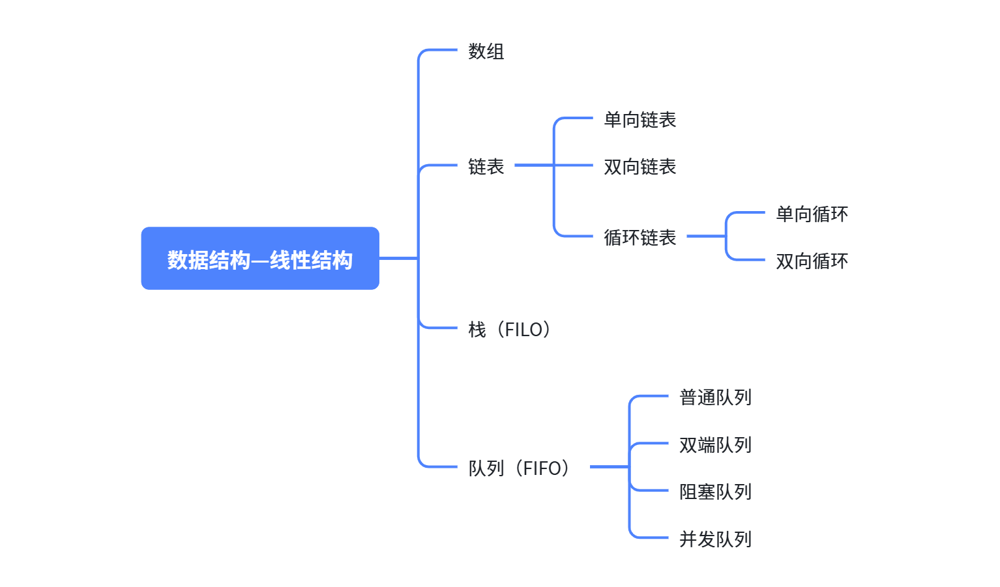
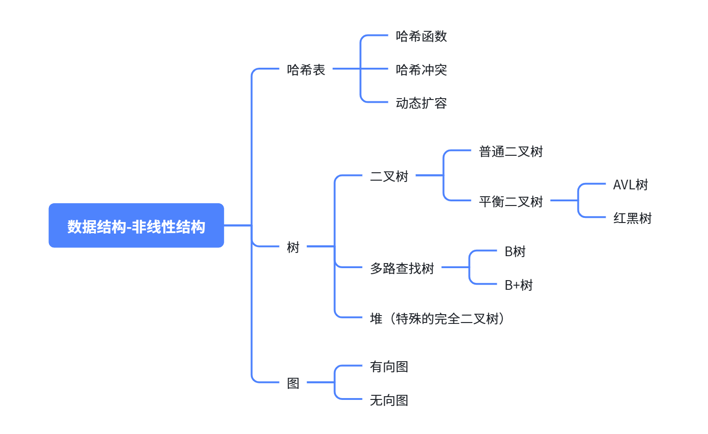
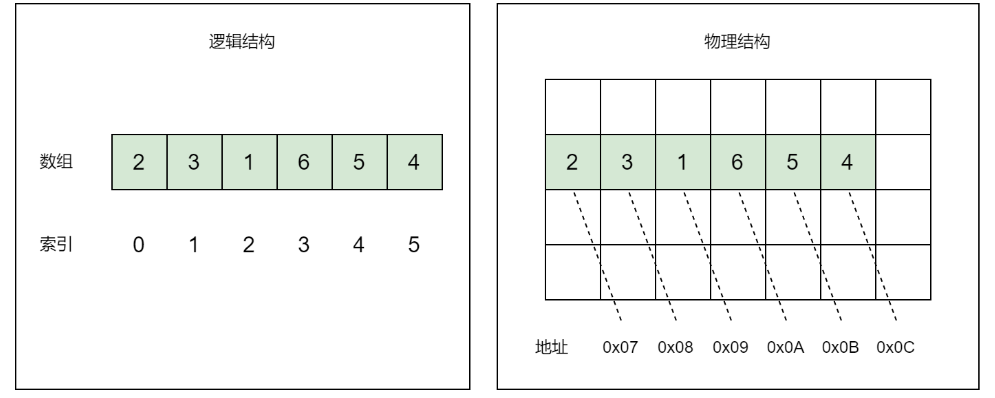
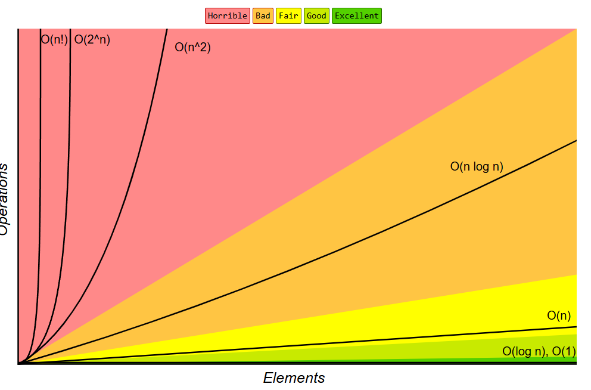
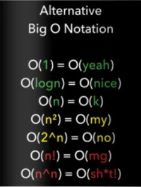
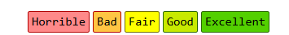
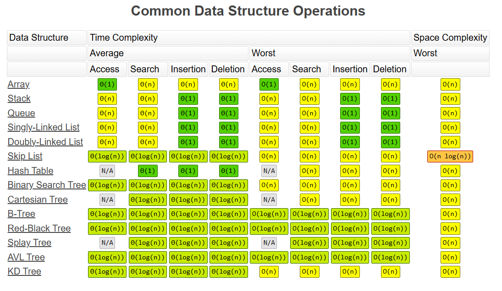
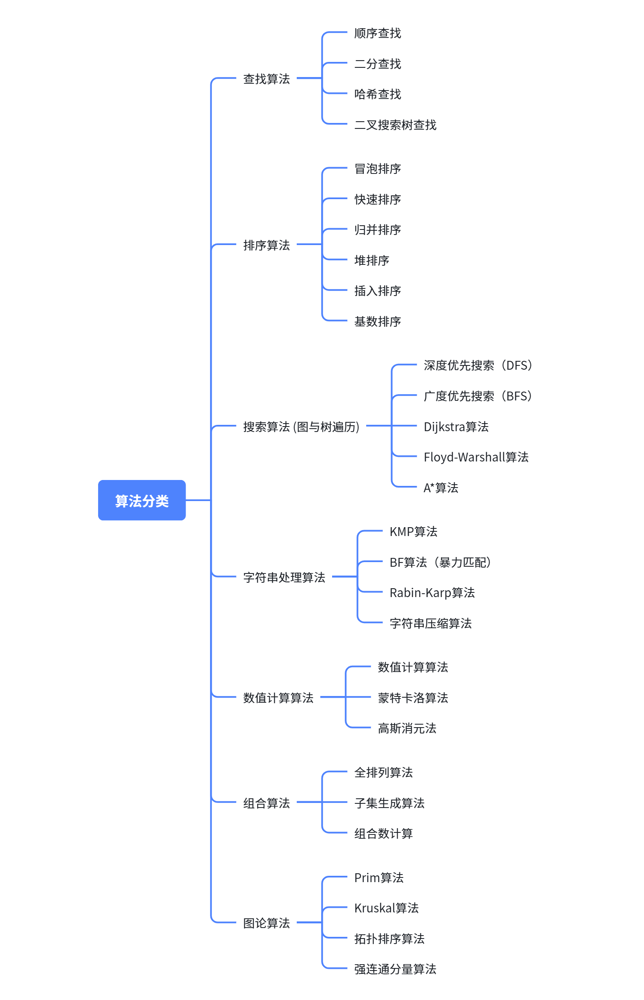
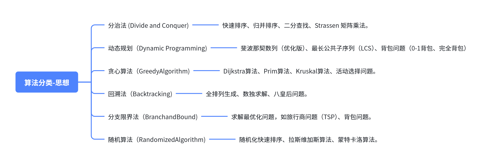
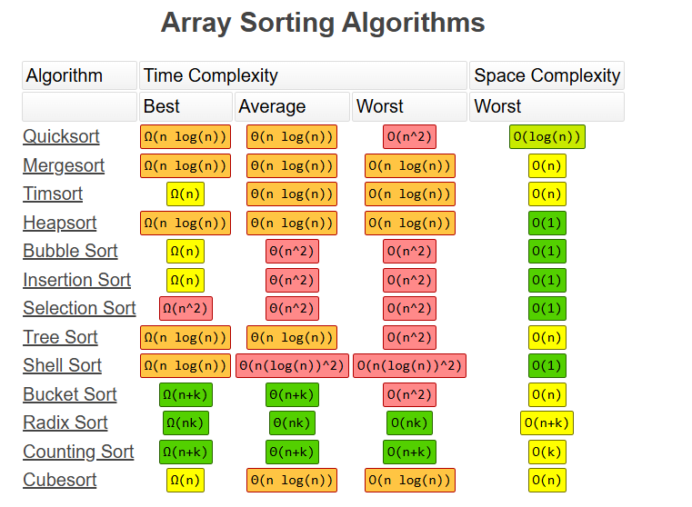

# 13. 扩展：数据结构与算法 - 入门篇

# 数据结构

> **数据结构**是指相互之间存在一种或多种特定关系的**数据元素的集合**。简单来说，它就是**一种组织和存储数据的方式**，让我们可以**更高效地对数据进行操作**，比如**查找、插入、删除**等。

> 想象一下，你有一堆杂乱无章的书籍放在地上，每次找一本书都要把所有书翻个遍，这多麻烦呀！但如果把书按照类别放在书架上，找起来就容易多了。数据结构就像是这个书架，合理地组织数据，能大大提高程序的运行效率和资源利用率。

## 常见分类

### 线性结构



### 非线性结构



### 基础掌握

**数据结构定义**：数组、链表、栈、队列、哈希表、树

**数据结构操作**：增、删、改、查、遍历

## 数组

- **逻辑结构：**
  - 数组（Array）是一个线性结构，其由一系列元素组成。每个元素都有一个索引（index）,索引从0开始。我们可以根据索引获取数组中的任意元素。
- **物理结构：**
  - 数组中的元素存储在内存中一段连续的空间中，通常将这段空间的**起始位置**作为整个数组的位置标识。



```java
public class ArrayDS {

    private int[] arr;
    private int lastIndex = 0;

    public ArrayDS(int size) {
        arr = new int[size];
    }

    public void add(int value) {
        if (lastIndex < arr.length){
            arr[lastIndex++] = value;
        }else {
            //扩容
            int[] newArr = new int[arr.length * 2];
            for (int i = 0; i < arr.length; i++) {
                newArr[i] = arr[i];
            }
            arr = newArr;
            add(value);
        }
        
    }

    public int get(int index) {
        return arr[index];
    }

    public int size() {
        return arr.length;
    }

    public void remove(int index) {
        for (int i = index; i < arr.length - 1; i++) {
            arr[i] = arr[i + 1];
        }
        arr[arr.length - 1] = 0;
    }

    public void update(int index, int value) {
        arr[index] = value;
    }

    public void iterate() {
        for (int i = 0; i < arr.length; i++) {
            System.out.println(arr[i]);
        }
    }

}
```

## 链表

```java
public class LinkedList {
    private Node head;
    private int size;

    private static class Node {
        int data;
        Node next;

        Node(int data) {
            this.data = data;
            next = null;
        }
    }

    public LinkedList() {
        head = null;
        size = 0;
    }

    public void add(int data) {
        Node newNode = new Node(data);
        if (head == null) {
            head = newNode;
        } else {
            Node current = head;
            while (current.next != null) {
                current = current.next;
            }
            current.next = newNode;
        }
        size++;
    }

    public void insertAt(int index, int data) {
        if (index < 0 || index > size) {
            throw new IndexOutOfBoundsException("Index: " + index + ", Size: " + size);
        }
        Node newNode = new Node(data);
        if (index == 0) {
            newNode.next = head;
            head = newNode;
        } else {
            Node prev = getNode(index - 1);
            newNode.next = prev.next;
            prev.next = newNode;
        }
        size++;
    }

    public void remove(int index) {
        if (index < 0 || index >= size) {
            throw new IndexOutOfBoundsException("Index: " + index + ", Size: " + size);
        }
        if (index == 0) {
            head = head.next;
        } else {
            Node prev = getNode(index - 1);
            prev.next = prev.next.next;
        }
        size--;
    }

    public int get(int index) {
        if (index < 0 || index >= size) {
            throw new IndexOutOfBoundsException("Index: " + index + ", Size: " + size);
        }
        return getNode(index).data;
    }

    public int size() {
        return size;
    }

    private Node getNode(int index) {
        Node current = head;
        for (int i = 0; i < index; i++) {
            current = current.next;
        }
        return current;
    }

    @Override
    public String toString() {
        StringBuilder result = new StringBuilder("[");
        Node current = head;
        while (current != null) {
            result.append(current.data);
            if (current.next != null) {
                result.append(", ");
            }
            current = current.next;
        }
        result.append("]");
        return result.toString();
    }

    public static void main(String[] args) {
        LinkedList list = new LinkedList();
        list.add(1);
        list.add(2);
        list.add(3);
        System.out.println(list); // 输出: [1, 2, 3]
        list.insertAt(1, 4);
        System.out.println(list); // 输出: [1, 4, 2, 3]
        list.remove(2);
        System.out.println(list); // 输出: [1, 4, 3]
        System.out.println(list.get(1)); // 输出: 4
        System.out.println(list.size()); // 输出: 3
    }
}
```

## 栈

```java
public class Stack {
    private Node top;
    private int size;

    private static class Node {
        int data;
        Node next;

        Node(int data) {
            this.data = data;
            next = null;
        }
    }

    public Stack() {
        top = null;
        size = 0;
    }

    public void push(int data) {
        Node newNode = new Node(data);
        newNode.next = top;
        top = newNode;
        size++;
    }

    public int pop() {
        if (isEmpty()) {
            throw new IllegalStateException("Stack is empty");
        }
        int data = top.data;
        top = top.next;
        size--;
        return data;
    }

    public int peek() {
        if (isEmpty()) {
            throw new IllegalStateException("Stack is empty");
        }
        return top.data;
    }

    public boolean isEmpty() {
        return top == null;
    }

    public int size() {
        return size;
    }

    @Override
    public String toString() {
        StringBuilder result = new StringBuilder("[");
        Node current = top;
        while (current != null) {
            result.append(current.data);
            if (current.next != null) {
                result.append(", ");
            }
            current = current.next;
        }
        result.append("]");
        return result.toString();
    }

    public static void main(String[] args) {
        Stack stack = new Stack();
        stack.push(1);
        stack.push(2);
        stack.push(3);
        System.out.println(stack); // 输出: [3, 2, 1]
        System.out.println(stack.pop()); // 输出: 3
        System.out.println(stack); // 输出: [2, 1]
        System.out.println(stack.peek()); // 输出: 2
        System.out.println(stack.isEmpty()); // 输出: false
        System.out.println(stack.size()); // 输出: 2
    }
}
```

这个栈实现采用链表结构，包含以下核心功能：

1. `push()` - 入栈操作，添加元素到栈顶
2. `pop()` - 出栈操作，移除并返回栈顶元素
3. `peek()` - 查看栈顶元素
4. `isEmpty()` - 检查栈是否为空
5. `size()` - 返回栈的大小
6. 支持 `toString()` 方法方便打印栈内容

## 队列

```java
public class Queue {
    private Node front;
    private Node rear;
    private int size;

    private static class Node {
        int data;
        Node next;

        Node(int data) {
            this.data = data;
            next = null;
        }
    }

    public Queue() {
        front = null;
        rear = null;
        size = 0;
    }

    public void enqueue(int data) {
        Node newNode = new Node(data);
        if (rear == null) {
            front = rear = newNode;
        } else {
            rear.next = newNode;
            rear = newNode;
        }
        size++;
    }

    public int dequeue() {
        if (isEmpty()) {
            throw new IllegalStateException("Queue is empty");
        }
        int data = front.data;
        front = front.next;
        if (front == null) {
            rear = null;
        }
        size--;
        return data;
    }

    public int peek() {
        if (isEmpty()) {
            throw new IllegalStateException("Queue is empty");
        }
        return front.data;
    }

    public boolean isEmpty() {
        return front == null;
    }

    public int size() {
        return size;
    }

    @Override
    public String toString() {
        StringBuilder result = new StringBuilder("[");
        Node current = front;
        while (current != null) {
            result.append(current.data);
            if (current.next != null) {
                result.append(", ");
            }
            current = current.next;
        }
        result.append("]");
        return result.toString();
    }

    public static void main(String[] args) {
        Queue queue = new Queue();
        queue.enqueue(1);
        queue.enqueue(2);
        queue.enqueue(3);
        System.out.println(queue); // 输出: [1, 2, 3]
        System.out.println(queue.dequeue()); // 输出: 1
        System.out.println(queue); // 输出: [2, 3]
        System.out.println(queue.peek()); // 输出: 2
        System.out.println(queue.isEmpty()); // 输出: false
        System.out.println(queue.size()); // 输出: 2
    }
}
```

这个队列实现采用链表结构，包含以下核心功能：

1. `enqueue()` - 入队操作，添加元素到队列尾部
2. `dequeue()` - 出队操作，移除并返回队列头部元素
3. `peek()` - 查看队列头部元素
4. `isEmpty()` - 检查队列是否为空
5. `size()` - 返回队列的大小
6. 支持 `toString()` 方法方便打印队列内容

## 哈希表

我们将使用**拉链法（链地址法）**来实现**哈希表**。主要包含以下部分：

1. 定义一个**节点类**，用于存储键值对。
2. 定义**哈希表类**，包含：
  - 一个固定大小的数组（这里我们使用数组，每个位置是一个链表的头节点，用于解决冲突）
  - 哈希函数（这里使用简单的取模运算，实际中可能需要更复杂的哈希函数）
  - 插入操作（put）
  - 获取操作（get）
  - 删除操作（remove）
  - 可能还需要一个调整大小的方法（rehash），但为了简化，我们先固定一个大小，后续可以扩展为动态扩容。

注意：为了简单起见，我们假设键（key）是整数，值（value）是字符串。实际应用中，键可以是任意对象，但需要实现hashCode和equals方法。

```java
public class MyHashMap<K, V> {
    // 哈希节点类
    private static class Node<K, V> {
        final K key;
        V value;
        Node<K, V> next;

        Node(K key, V value) {
            this.key = key;
            this.value = value;
        }
    }

    // 默认初始容量
    private static final int DEFAULT_CAPACITY = 16;
    // 默认负载因子
    private static final float DEFAULT_LOAD_FACTOR = 0.75f;
    // 扩容后最大容量
    private static final int MAX_CAPACITY = 1 << 30;

    // 节点数组
    private Node<K, V>[] buckets;
    // 当前元素数量
    private int size;
    // 扩容阈值 (capacity * loadFactor)
    private int threshold;
    // 负载因子
    private final float loadFactor;

    // 构造方法
    public MyHashMap() {
        this(DEFAULT_CAPACITY, DEFAULT_LOAD_FACTOR);
    }

    public MyHashMap(int initialCapacity) {
        this(initialCapacity, DEFAULT_LOAD_FACTOR);
    }

    public MyHashMap(int initialCapacity, float loadFactor) {
        if (initialCapacity < 0) 
            throw new IllegalArgumentException("Illegal initial capacity: " + initialCapacity);
        if (loadFactor <= 0 || Float.isNaN(loadFactor))
            throw new IllegalArgumentException("Illegal load factor: " + loadFactor);
        
        // 保证初始容量是2的幂次
        initialCapacity = roundUpToPowerOf2(initialCapacity);
        this.loadFactor = loadFactor;
        this.threshold = (int) (initialCapacity * loadFactor);
        this.buckets = new Node[initialCapacity];
    }

    // 元素数量
    public int size() {
        return size;
    }

    // 是否为空
    public boolean isEmpty() {
        return size == 0;
    }

    // 清空哈希表
    public void clear() {
        Node<K, V>[] tab = buckets;
        for (int i = 0; i < tab.length; i++) {
            tab[i] = null;
        }
        size = 0;
    }

    // 插入/更新键值对
    public V put(K key, V value) {
        if (key == null) 
            throw new NullPointerException("Key cannot be null");
        
        if (size >= threshold) 
            resize(buckets.length * 2);
        
        int index = getIndex(key);
        Node<K, V> node = buckets[index];
        
        // 查找是否已存在该key
        while (node != null) {
            if (key.equals(node.key)) {
                V oldValue = node.value;
                node.value = value; // 更新值
                return oldValue;
            }
            node = node.next;
        }
        
        // 头插法添加新节点
        Node<K, V> newNode = new Node<>(key, value);
        newNode.next = buckets[index];
        buckets[index] = newNode;
        size++;
        return null;
    }

    // 获取键对应的值
    public V get(K key) {
        if (key == null) 
            throw new NullPointerException("Key cannot be null");
        
        int index = getIndex(key);
        Node<K, V> node = buckets[index];
        
        while (node != null) {
            if (key.equals(node.key)) 
                return node.value;
            node = node.next;
        }
        return null;
    }

    // 删除键值对
    public V remove(K key) {
        if (key == null) 
            throw new NullPointerException("Key cannot be null");
        
        int index = getIndex(key);
        Node<K, V> node = buckets[index];
        Node<K, V> prev = null;
        
        while (node != null) {
            if (key.equals(node.key)) {
                if (prev == null) {
                    buckets[index] = node.next; // 删除头节点
                } else {
                    prev.next = node.next; // 删除中间节点
                }
                size--;
                return node.value;
            }
            prev = node;
            node = node.next;
        }
        return null;
    }

    // 是否包含key
    public boolean containsKey(K key) {
        return get(key) != null;
    }

    // 获取索引位置
    private int getIndex(K key) {
        return (key.hashCode() & 0x7FFFFFFF) % buckets.length;
    }

    // 扩容哈希表
    private void resize(int newCapacity) {
        if (buckets.length >= MAX_CAPACITY) {
            threshold = Integer.MAX_VALUE;
            return;
        }
        
        newCapacity = roundUpToPowerOf2(newCapacity);
        Node<K, V>[] newBuckets = new Node[newCapacity];
        
        // 迁移旧数据
        for (Node<K, V> node : buckets) {
            while (node != null) {
                Node<K, V> next = node.next;
                int index = (node.key.hashCode() & 0x7FFFFFFF) % newCapacity;
                // 头插法迁移到新表
                node.next = newBuckets[index];
                newBuckets[index] = node;
                node = next;
            }
        }
        
        buckets = newBuckets;
        threshold = (int) (newCapacity * loadFactor);
    }

    // 调整容量为2的幂次
    private int roundUpToPowerOf2(int capacity) {
        if (capacity > MAX_CAPACITY) return MAX_CAPACITY;
        if (capacity < 0) return DEFAULT_CAPACITY;
        
        int rounded = 1;
        while (rounded < capacity) {
            rounded <<= 1;
        }
        return rounded;
    }
}
```

## 树

```typescript
class TreeNode<T> {
    T data;
    TreeNode<T> left;
    TreeNode<T> right;

    public TreeNode(T data) {
        this.data = data;
        this.left = null;
        this.right = null;
    }
}

public class BinaryTree<T> {
    private TreeNode<T> root;

    public BinaryTree() {
        root = null;
    }

    // 插入元素（保持二叉搜索树性质）
    public void insert(T data) {
        if (!(data instanceof Comparable)) {
            throw new IllegalArgumentException("Data must implement Comparable");
        }
        root = insertRec(root, data);
    }

    private TreeNode<T> insertRec(TreeNode<T> node, T data) {
        if (node == null) {
            return new TreeNode<>(data);
        }

        @SuppressWarnings("unchecked")
        Comparable<T> comparable = (Comparable<T>) data;
        if (comparable.compareTo(node.data) < 0) {
            node.left = insertRec(node.left, data);
        } else if (comparable.compareTo(node.data) > 0) {
            node.right = insertRec(node.right, data);
        }

        return node;
    }

    // 查找元素
    public boolean search(T data) {
        return searchRec(root, data);
    }

    private boolean searchRec(TreeNode<T> node, T data) {
        if (node == null) {
            return false;
        }
        
        if (node.data.equals(data)) {
            return true;
        }
        
        @SuppressWarnings("unchecked")
        Comparable<T> comparable = (Comparable<T>) data;
        if (comparable.compareTo(node.data) < 0) {
            return searchRec(node.left, data);
        } else {
            return searchRec(node.right, data);
        }
    }

    // 删除元素
    public void delete(T data) {
        root = deleteRec(root, data);
    }

    private TreeNode<T> deleteRec(TreeNode<T> node, T data) {
        if (node == null) {
            return null;
        }

        @SuppressWarnings("unchecked")
        Comparable<T> comparable = (Comparable<T>) data;
        int cmp = comparable.compareTo(node.data);

        if (cmp < 0) {
            node.left = deleteRec(node.left, data);
        } else if (cmp > 0) {
            node.right = deleteRec(node.right, data);
        } else {
            // 节点有两个子节点
            if (node.left != null && node.right != null) {
                // 找到右子树的最小节点
                TreeNode<T> minRight = findMin(node.right);
                node.data = minRight.data;
                node.right = deleteRec(node.right, minRight.data);
            } 
            // 节点只有一个子节点或没有子节点
            else {
                node = (node.left != null) ? node.left : node.right;
            }
        }
        
        return node;
    }

    private TreeNode<T> findMin(TreeNode<T> node) {
        while (node.left != null) {
            node = node.left;
        }
        return node;
    }

    // 遍历方法
    public void inorderTraversal() {
        inorder(root);
        System.out.println();
    }

    private void inorder(TreeNode<T> node) {
        if (node != null) {
            inorder(node.left);
            System.out.print(node.data + " ");
            inorder(node.right);
        }
    }

    public void preorderTraversal() {
        preorder(root);
        System.out.println();
    }

    private void preorder(TreeNode<T> node) {
        if (node != null) {
            System.out.print(node.data + " ");
            preorder(node.left);
            preorder(node.right);
        }
    }

    public void postorderTraversal() {
        postorder(root);
        System.out.println();
    }

    private void postorder(TreeNode<T> node) {
        if (node != null) {
            postorder(node.left);
            postorder(node.right);
            System.out.print(node.data + " ");
        }
    }

    public void levelOrderTraversal() {
        if (root == null) return;
        
        Queue<TreeNode<T>> queue = new LinkedList<>();
        queue.add(root);
        
        while (!queue.isEmpty()) {
            int levelSize = queue.size();
            
            for (int i = 0; i < levelSize; i++) {
                TreeNode<T> current = queue.poll();
                System.out.print(current.data + " ");
                
                if (current.left != null) {
                    queue.add(current.left);
                }
                if (current.right != null) {
                    queue.add(current.right);
                }
            }
            System.out.println(); // 换行显示层级
        }
    }

    // 其他实用方法
    public boolean isEmpty() {
        return root == null;
    }

    public TreeNode<T> getRoot() {
        return root;
    }
}
```

## 扩展：HashMap 实现原理

# 基本算法

动画算法：https://www.cs.usfca.edu/~galles/visualization/Algorithms.html

## 基础知识

以下图片可以访问：https://www.bigocheatsheet.com/

### 大O表示法 - 时间复杂度

> 大O表示法是计算机科学中用于**描述算法时间复杂度和空间复杂度的数学符号**。
> 
> 它表示算法**执行时间**或**所需空间**随输入规模增长的**变化趋势.**
> 
> 计算大O的一般步骤：
> 
> 1. 找出算法中的基本操作（执行次数最多的操作）。
> 2. 计算基本操作的执行次数（通常表示为输入规模n的函数）。
> 3. 保留最高阶项，忽略常数因子和低阶项。



#### O(1) - 常数时间复杂度

无论输入规模如何，操作时间都是常数。

- 执行时间不随输入大小变化
- 只需一步操作

```java
// 示例：访问数组元素
public int getElement(int[] arr, int index) {
    return arr[index]; // 直接通过索引访问
}
```

#### O(log n) - 对数时间复杂度

执行时间与输入规模的对数成正比。

计算原理：

- 每次操作将搜索范围减半
- 最大步数 = log₂(n) + 1
- 忽略常数项和底数，记作O(log n)

```sql
// 示例：二分查找
public int binarySearch(int[] arr, int target) {
    int left = 0;
    int right = arr.length - 1;
    
    while (left <= right) {              // 循环直到区间缩小为0
        int mid = left + (right - left) / 2;
        if (arr[mid] == target) return mid;
        if (arr[mid] < target) left = mid + 1;  // 舍弃左半区
        else right = mid - 1;                   // 舍弃右半区
    }
    return -1;
}
```

#### O(n) - 线性时间复杂度

执行时间与输入规模成正比。

计算原理：

- **最坏情况**需要**遍历全部**n个元素
- 总操作次数 ≈ **2n**（比较+条件检查）
- **忽略常数因子**，记作 **O(n)**

```java
// 示例：线性查找
public int linearSearch(int[] arr, int target) {
    for (int i = 0; i < arr.length; i++) { // n次循环
        if (arr[i] == target) {            // 每步执行一次比较
            return i;
        }
    }
    return -1;
}
```

#### O(n log n) - 线性对数时间复杂度

常见于高效排序算法。

归并排序完整复杂度分析：

- 递归深度：log n（每次二分）
- 每层合并操作：O(n)
- 总复杂度：O(n log n)

```java
// 示例：归并排序中的合并操作
public void merge(int[] arr, int l, int m, int r) {
    int n1 = m - l + 1;
    int n2 = r - m;
    int[] L = new int[n1]; // 创建临时空间
    int[] R = new int[n2];

    // 复制数据到临时数组 O(n)
    for (int i = 0; i < n1; i++) L[i] = arr[l + i];
    for (int j = 0; j < n2; j++) R[j] = arr[m + 1 + j];
    
    // 合并临时数组 O(n)
    int i = 0, j = 0, k = l;
    while (i < n1 && j < n2) {
        if (L[i] <= R[j]) arr[k++] = L[i++];
        else arr[k++] = R[j++];
    }
    
    while (i < n1) arr[k++] = L[i++];
    while (j < n2) arr[k++] = R[j++];
}
```

#### O(n²) - 二次方时间复杂度

执行时间与输入规模的平方成正比。

计算原理：

- 外循环次数：n-1
- 内循环次数：(n-1) + (n-2) + ... + 1 ≈ n(n-1)/2
- 总操作次数 ≈ ½n²（忽略常数因子）
- 时间复杂度：O(n²)

```java
// 示例：冒泡排序
public void bubbleSort(int[] arr) {
    for (int i = 0; i < arr.length - 1; i++) {         // n-1次循环
        for (int j = 0; j < arr.length - 1 - i; j++) { // 每次循环n-1-i次
            if (arr[j] > arr[j + 1]) {                // 比较和交换操作
                int temp = arr[j];
                arr[j] = arr[j + 1];
                arr[j + 1] = temp;
            }
        }
    }
}
```

#### O(2ⁿ) - 指数时间复杂度

常见于暴力搜索算法。

计算原理：

- 递归调用次数呈指数增长
- 调用树高度：n
- 每个节点分裂为两个子节点
- 总节点数 ≈ 2ⁿ
- 时间复杂度：O(2ⁿ)

```java
// 示例：斐波那契数列递归实现
public int fibonacci(int n) {
    if (n <= 1) return n;          // 终止条件
    return fibonacci(n - 1) + fibonacci(n - 2); // 递归调用
}
```

### 大O表示法 - 空间复杂度

> ### 空间复杂度计算规则：
> 
> 1. **基础原则​**：只计算算法额外申请的空间，不计算输入空间。
> 2. **变量声明**​：每个基本类型变量（如int, char, boolean）通常算作O(1)空间。
> 3. **数据结构**​：数组、列表、哈希表等根据其大小计算，例如长度为n的数组为O(n)。
> 4. **递归调用**​：递归使用的栈空间也要计算。递归深度为k，则空间复杂度为O(k)（不考虑每次递归内部使用的额外空间）。
> 5. **多部分空间​**：如果算法有多个部分使用空间，取最大值（或者相加，但大O表示法取主导项）。

#### O(1) - 常数空间

算法使用的内存空间不随输入规模变化。

计算要点：

- 只使用了固定数量的变量（与输入大小无关）
- 总空间：1个整型(max) + 1个整型(i) = O(1)

```java
// 求数组最大值
int findMax(int[] arr) {
    int max = arr[0];     // O(1) - 仅一个变量
    for (int i = 1; i < arr.length; i++) {  // i也是O(1)
        if (arr[i] > max) max = arr[i];
    }
    return max;
}
```

#### O(n) - 线性空间

空间使用量与输入规模成正比。

**递归空间计算**：

- 调用栈深度：n（n=5时：f(5)→f(4)→f(3)→f(2)→f(1)）
- 每层栈帧占用常数空间 O(1)
- 总空间 = 递归深度 × 每层空间 = O(n) × O(1) = O(n)

```go
// 复制数组
int[] copyArray(int[] arr) {
    int[] copy = new int[arr.length];  // O(n) - 新数组
    for (int i = 0; i < arr.length; i++) {  // i：O(1)
        copy[i] = arr[i];
    }
    return copy;
}

// 斐波那契数列（递归的低效版）
int fibonacci(int n) {
    if (n <= 1) return n;
    return fibonacci(n-1) + fibonacci(n-2);
}
```

#### O(log n) - 对数空间

空间使用量随输入规模对数增长。

计算要点：

- 每次递归将问题规模减半
- 递归深度 = log₂n（当 n 是元素数量）
- 每层栈帧占用 O(1) 空间
- 总空间 = 递归深度 × 每层空间 = O(log n) × O(1) = O(log n)

```java
// 二分查找（递归实现）
int binarySearch(int[] arr, int target, int low, int high) {
    if (low > high) return -1;
    
    int mid = low + (high - low) / 2;
    if (arr[mid] == target) return mid;
    
    if (target < arr[mid]) {
        return binarySearch(arr, target, low, mid - 1);
    } else {
        return binarySearch(arr, target, mid + 1, high);
    }
}
```

#### O(n log n) - 线性对数空间

1. 递归深度 = O(log n)（每次二分）
2. 每层递归中：
  - 所有合并操作占用空间总和 = O(n)
3. 总空间 ≈ 递归深度 × 每层空间 ≈ O(log n) × O(n) = O(n log n)

```java
// 归并排序
void mergeSort(int[] arr, int l, int r) {
    if (l < r) {
        int m = (l + r) / 2;
        mergeSort(arr, l, m);      // 递归左半 O(log n)栈深度
        mergeSort(arr, m+1, r);   // 递归右半 
        merge(arr, l, m, r);     // 合并操作 O(n)空间
    }
}

void merge(int[] arr, int l, int m, int r) {
    // 创建临时数组 - 最大可能为O(n)
    int[] temp = new int[r - l + 1]; 
    
    // ... 合并代码 ...
}
```

#### O(n²) - 平方空间

空间使用量与输入规模的平方成正比。

计算要点：

- 二维数组尺寸：n×n
- 总元素数 = n²
- 每个元素占用常数空间 O(1)
- 总空间 = O(n²) × O(1) = O(n²)

```sql
// 生成乘法表
int[][] generateMultiplicationTable(int n) {
    int[][] table = new int[n][n];  // O(n²) - n×n的矩阵
    
    for (int i = 0; i < n; i++) {
        for (int j = 0; j < n; j++) {
            table[i][j] = (i+1)*(j+1);
        }
    }
    return table;
}
```

### 大O计算规则总结

1. **忽略常数因子**​：O(5n) → O(n)
2. **保留最高阶项**​：O(n³ + n² + n) → O(n³)
3. **嵌套循环相乘**​：两个O(n)循环嵌套 → O(n²)
4. **多个独立操作取最大**​：O(n) + O(log n) → O(n)
5. 最坏情况复杂度通常比平均情况更重要



### 对照表





https://www.bigocheatsheet.com/img/big-o-cheat-sheet-poster.png

## 常见分类

> 分类众多，作为了解，本次讲解常用的查找和排序算法

### 功能分类



### 设计思想



## 查找算法

### 顺序查找

> 顺序查找（也称为**线性查找**）是一种基础的查找算法，它逐个检查数据结构中的每个元素，直到找到目标值或遍历完整个结构。
> 
> 1. **时间复杂度**​：
>   - **最优情况**：目标元素在第一个位置 → O(1)
>   - **最差情况**：目标元素在最后一个位置或不存在 → O(n)
>   - **平均情况**：O(n)
> 2. **适用场景​**：
>   - 适用于**小型数据集**或​**未排序数据**
>   - 当数据量较大且频繁查找时，建议使用更高效的算法（如二分查找）

```java
public class SequentialSearch {

    /**
     * 顺序查找算法实现
     *
     * @param arr    目标数组
     * @param target 要查找的值
     * @return 如果找到目标值返回其索引；否则返回-1
     */
    public static int sequentialSearch(int[] arr, int target) {
        // 遍历数组中的每个元素
        for (int i = 0; i < arr.length; i++) {
            // 如果当前元素等于目标值，返回索引
            if (arr[i] == target) {
                return i;
            }
        }
        // 遍历结束未找到目标值
        return -1;
    }

    public static void main(String[] args) {
        int[] data = {3, 9, 2, 7, 5, 1, 8}; // 测试数组
        int targetValue = 7;                // 查找目标值
        
        // 调用顺序查找算法
        int result = sequentialSearch(data, targetValue);
        
        // 输出结果
        if (result != -1) {
            System.out.println("值 " + targetValue + " 在数组中的索引位置为: " + result);
        } else {
            System.out.println("值 " + targetValue + " 不在数组中");
        }
    }
}
```

> 扩展：可以准备一个集合，实现重复元素查找。返回多个索引位置

### 二分查找

二分查找（Binary Search）是一种高效的查找算法，要求数据结构必须是已排序的。算法通过每次将查找区间减半来快速定位目标值。

```java
public class BinarySearch {

    /**
     * 二分查找算法 - 迭代实现
     * 
     * @param array 已排序的数组（升序）
     * @param target 要查找的目标值
     * @return 目标值在数组中的索引，如果未找到则返回 -1
     */
    public static int binarySearch(int[] array, int target) {
        int left = 0;                   // 搜索区间的左边界
        int right = array.length - 1;    // 搜索区间的右边界
        
        while (left <= right) {          // 当区间有效时继续搜索
            int mid = left + (right - left) / 2;  // 防止溢出的中点计算
            
            if (array[mid] == target) {
                return mid;             // 找到目标值，返回索引
            } else if (array[mid] < target) {
                left = mid + 1;         // 目标值在右半区，调整左边界
            } else {
                right = mid - 1;        // 目标值在左半区，调整右边界
            }
        }
        
        return -1;  // 未找到目标值
    }

    /**
     * 二分查找算法 - 递归实现
     * 
     * @param array 已排序的数组（升序）
     * @param target 要查找的目标值
     * @param left 当前搜索区间的左边界
     * @param right 当前搜索区间的右边界
     * @return 目标值在数组中的索引，如果未找到则返回 -1
     */
    public static int binarySearchRecursive(int[] array, int target, int left, int right) {
        if (left > right) {
            return -1;  // 区间无效，未找到目标值
        }
        
        int mid = left + (right - left) / 2;  // 防止溢出的中点计算
        
        if (array[mid] == target) {
            return mid;  // 找到目标值
        } else if (array[mid] < target) {
            return binarySearchRecursive(array, target, mid + 1, right);  // 在右半区继续搜索
        } else {
            return binarySearchRecursive(array, target, left, mid - 1);  // 在左半区继续搜索
        }
    }

    public static void main(String[] args) {
        int[] data = {2, 4, 6, 8, 10, 12, 14, 16, 18, 20};  // 必须是有序数组
        int target = 12;  // 要查找的目标值
        
        // 测试迭代实现
        int iterativeResult = binarySearch(data, target);
        System.out.println("迭代实现结果：索引 " + iterativeResult);
        
        // 测试递归实现
        int recursiveResult = binarySearchRecursive(data, target, 0, data.length - 1);
        System.out.println("递归实现结果：索引 " + recursiveResult);
    }
}
```

## 排序算法

学习方法：参考算法动画，捋清楚算法思路，再编写实现；

动画算法：https://www.cs.usfca.edu/~galles/visualization/Algorithms.html



### 冒泡排序

### 快速排序

### 归并排序

### 堆排序

### 插入排序